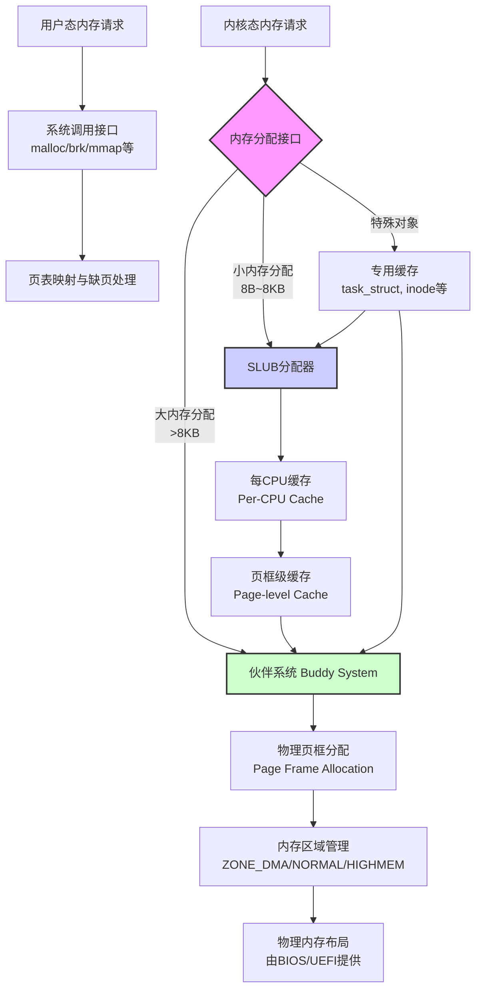
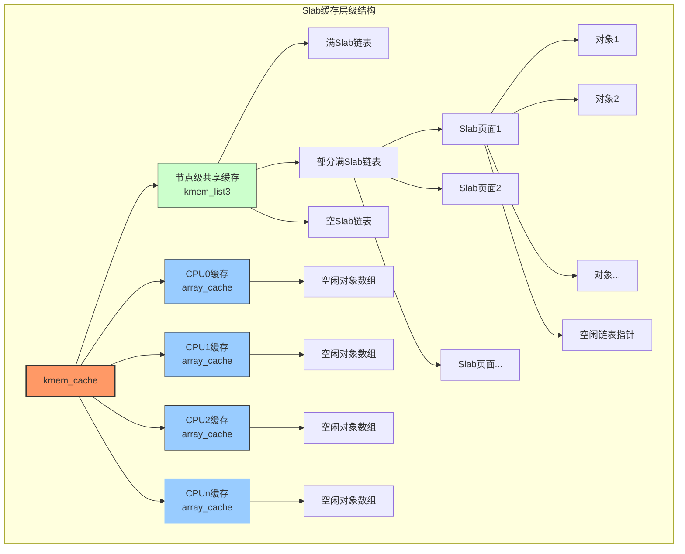
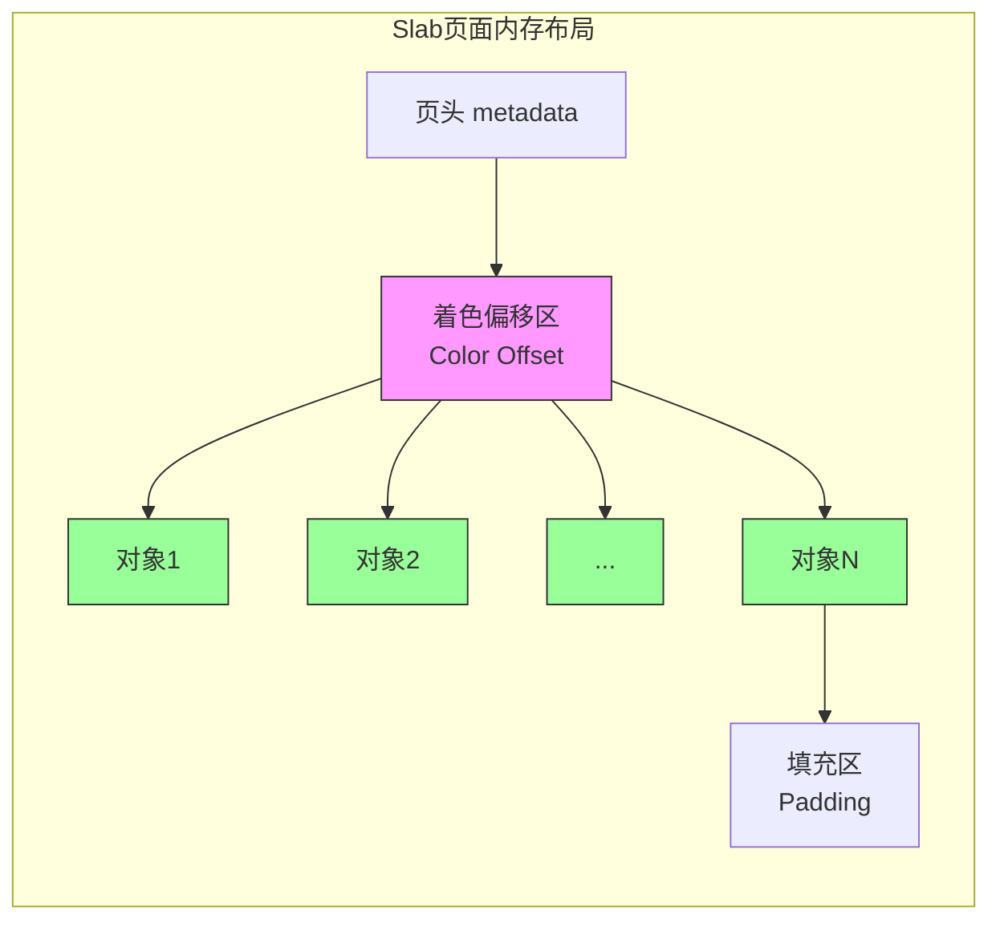
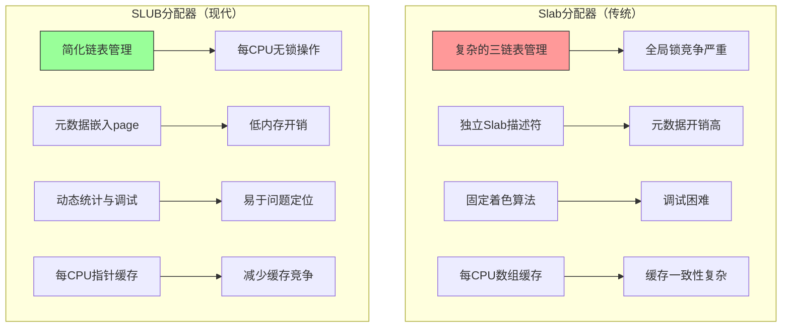
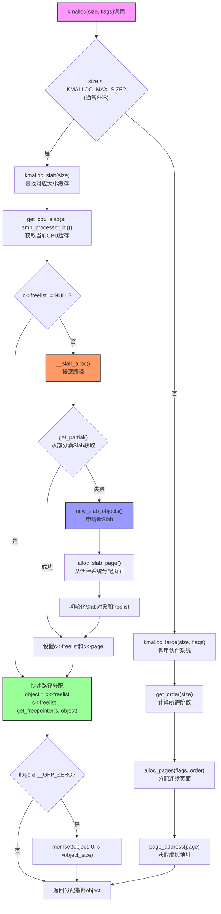
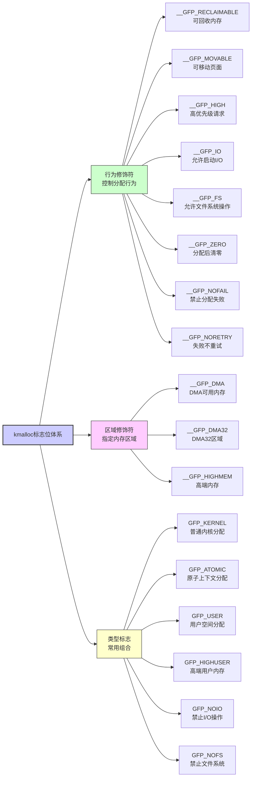
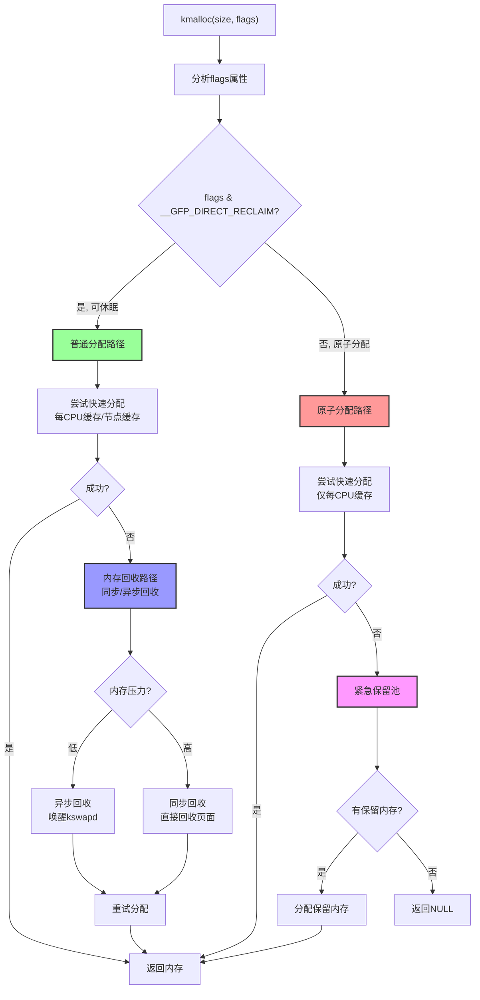

# 【pwn4kernel】内核内存分配原理

## 1. 层次化内存管理体系

Linux内核采用层次化的内存管理架构，从物理页框管理到细粒度对象分配，形成了完整的分配链。此体系结构旨在平衡性能、内存利用率和系统复杂性，为不同大小的内存请求提供最优的分配策略。



## 2. 伙伴系统：大内存分配的基础

伙伴系统是物理内存管理的核心，以页为单位（通常4KB）进行管理。其核心算法通过二进制拆分与合并机制保证内存的高效利用，同时最小化外部碎片。

### 2-1. 算法原理

系统将物理内存划分为连续的 $$2^{\mathrm{order}}$$ 页块，其中 $$\mathrm{order} \in [0, \mathrm{MAX\_ORDER}-1]$$，$$\mathrm{MAX\_ORDER}$$ 通常为11（最大分配2^10页=4MB）。当请求分配 $$n$$ 页时：

1. 计算所需阶数：$$k = \lceil \log_2(n) \rceil$$
2. 在 $$\mathrm{order}=k$$ 的空闲链表中查找可用块
3. 若找不到，则分裂更高阶的块：
    - 从 $$\mathrm{order}=k+1$$ 链表中取出一块
    - 将其物理地址连续地分为两个大小为 $$2^k$$ 的"伙伴"块
    - 一个用于分配，另一个加入 $$\mathrm{order}=k$$ 的空闲链表

释放内存时，算法检查释放块的伙伴（地址满足特定异或关系的块）是否空闲。如果是，则合并为 $$\mathrm{order}+1$$ 的块，并递归检查合并可能性。合并条件为：两块大小相同、物理地址连续、同属一个内存区域。

### 2-2. 分区管理

物理内存按区域划分，适应不同硬件限制：

| 内存区域     | 物理地址范围   | 主要用途               | 限制条件                     |
| ------------ | -------------- | ---------------------- | ---------------------------- |
| ZONE_DMA     | 0-16MB         | DMA操作                | 老式ISA设备只能访问此区域    |
| ZONE_DMA32   | 16MB-4GB       | 32位DMA                | 32位地址设备，64位系统可选   |
| ZONE_NORMAL  | 4GB-直接映射区 | 内核直接映射，快速访问 | 无特殊限制，内核主要使用区域 |
| ZONE_HIGHMEM | 直接映射区以上 | 用户进程内存，动态映射 | 需动态映射，32位系统特有     |

## 3. Slab分配器：对象缓存机制

Slab分配器针对小内存对象优化，通过预分配和缓存减少碎片及初始化开销。其核心思想是为频繁分配释放的相同大小对象建立专用缓存。

### 3-1. 数学模型

设对象大小为 $$s$$ 字节，Slab大小为 $$P$$ 页（通常 $$P=1,2,4,...$$），则单个Slab可容纳的对象数为：

$$
N_{\text{objects}} = \left\lfloor \frac{P \times \text{PAGE_SIZE} - H}{s + A} \right\rfloor
$$

其中：

- $$H$$ 为Slab头部开销，包括管理结构和着色区域
- $$A$$ 为对齐填充（通常为缓存行大小，如64字节）
- $$\text{PAGE_SIZE}$$ 为页大小（通常4096字节）

内部碎片率可计算为：

$$
\text{Fragmentation}_{\text{internal}} = 1 - \frac{N_{\text{objects}} \times s}{P \times \text{PAGE_SIZE}}
$$

### 3-2. 缓存结构

Slab分配器采用三级缓存结构，优化多核系统下的并发访问：





### 3-3. Slab分配器内部结构

每个Slab缓存（`kmem_cache`）包含以下关键组件：

1.  **每CPU缓存**：每个CPU有一个本地缓存（`array_cache`结构），包含一个空闲对象数组。分配时，优先从本地缓存获取，避免锁竞争。数组大小可动态调整，通常为`batchcount`个对象。

2.  **Slab链表**：按使用情况组织的三个链表，挂载在节点级结构`kmem_list3`下：
    - **满Slab链表**：所有对象都已分配
    - **部分满Slab链表**：部分对象已分配，新分配优先从此链表获取
    - **空Slab链表**：所有对象都空闲，内存压力时可释放给系统

3.  **对象布局**：每个Slab内部，对象按顺序排列，空闲对象通过嵌入在对象内的指针连接成链表。当对象被分配时，从空闲链表移除；释放时，添加回空闲链表。

4.  **构造函数/析构函数**：每个缓存可以注册构造函数（`ctor`）和析构函数（`dtor`），分别在Slab创建初始化对象和Slab销毁时调用，用于初始化/清理对象状态，而非每次分配释放时调用。

### 3-4. 缓存着色优化

为减少CPU缓存冲突，Slab采用缓存行着色技术。着色偏移量计算为：

$$
\text{ColorOffset} = (\text{Color} \times \text{CacheLineSize}) \bmod \text{CacheSize}
$$

其中 $$\text{Color}$$ 是每个Slab特有的颜色值，取值范围为 $$[0, \text{NumColors}-1]$$，$$\text{NumColors}$$ 由以下公式决定：

$$
\text{NumColors} = \left\lfloor \frac{\text{SlabSize} - \text{SlabOverhead}}{\text{CacheLineSize}} \right\rfloor
$$

着色机制使得不同Slab中相同索引的对象在CPU缓存中映射到不同缓存行，减少伪共享。

## 4. SLUB分配器：简化与优化

SLUB是Slab的现代实现，针对多核系统和简化设计进行了优化，自Linux 2.6.22起成为默认分配器。

### 4-1. 核心改进对比



### 4-2. SLUB内部数据结构

SLUB分配器的核心数据结构如下：

1.  **`kmem_cache`结构**：每个缓存对应一个，包含：
    - 每CPU数据指针数组（`kmem_cache_cpu`）
    - 节点数据数组（`kmem_cache_node`），管理部分满和满Slab
    - 缓存属性：对象大小、对齐、标志、构造函数等

2.  **`kmem_cache_cpu`结构**（每CPU）：

    ```c
    struct kmem_cache_cpu {
        void **freelist;          /* 当前活动Slab的空闲对象链表 */
        struct page *page;        /* 当前活动Slab的页描述符 */
        unsigned int tid;         /* 全局事务ID，用于无锁同步 */
    };
    ```

3.  **`kmem_cache_node`结构**（每节点）：

    ```c
    struct kmem_cache_node {
        spinlock_t list_lock;     /* 保护链表的自旋锁 */
        unsigned long nr_partial; /* 部分满Slab计数 */
        struct list_head partial; /* 部分满Slab链表 */
    };
    ```

4.  **`page`结构中的SLUB元数据**：SLUB将元数据嵌入页面描述符，减少内存开销：
    - `freelist`：指向Slab内第一个空闲对象的指针
    - `inuse`：当前Slab中已分配对象数
    - `objects`：Slab中对象总数
    - `frozen`：标识Slab是否在每CPU缓存中（1=是，0=否）

### 4-3. 分配算法流程

当内核调用`kmalloc(size, flags)`时，SLUB分配器执行以下步骤：



### 4-4. 内存分配大小对齐

SLUB维护一系列固定大小的缓存。当请求大小为 $$s$$ 的内存时，实际分配的缓存大小通过向上取整到最接近的规格化大小：

$$
C_{\text{actual}} = \min\{c \in S \mid c \geq s + A\}
$$

其中 $$S$$ 是预定义的缓存大小集合，$$A$$ 为元数据开销。常见的缓存大小集合为：

| 大小等级（字节） | 包含的缓存大小              | 对齐要求    |
| ---------------- | --------------------------- | ----------- |
| 8-192            | 8, 16, 32, 64, 96, 128, 192 | 8字节对齐   |
| 256-1024         | 256, 512, 1024              | 128字节对齐 |
| 2048-8192        | 2048, 4096, 8192            | 页对齐      |

内存浪费率可计算为：

$$
\text{WasteRate} = \frac{C_{\text{actual}} - s}{C_{\text{actual}}} \times 100\%
$$

### 4-5. kmalloc标志位详解

`kmalloc`函数接受多种分配标志，这些标志影响分配行为和内存来源：



**常见标志位组合及使用场景：**

| 标志位         | 组成                     | 描述                 | 使用场景                  |
| -------------- | ------------------------ | -------------------- | ------------------------- | ------------------------------- | ---------------------- |
| `GFP_KERNEL`   | `__GFP_RECLAIM`          | `__GFP_IO`           | `__GFP_FS`                | 普通内核内存分配，允许休眠和I/O | 进程上下文，无特殊限制 |
| `GFP_ATOMIC`   | `__GFP_HIGH`             | 原子分配，不允许休眠 | 中断上下文、自旋锁内、NMI |
| `GFP_NOWAIT`   | `__GFP_KSWAPD_RECLAIM`   | 不等待直接回收       | 避免死锁的场景            |
| `GFP_DMA`      | `__GFP_DMA`              | 从DMA区域分配        | DMA缓冲区，老设备         |
| `GFP_DMA32`    | `__GFP_DMA32`            | 从DMA32区域分配      | 32位设备DMA               |
| `GFP_HIGHUSER` | `__GFP_HIGHMEM`          | `__GFP_MOVABLE`      | 用户空间高端内存          | 用户空间映射，可移动            |
| `GFP_NOIO`     | `GFP_KERNEL & ~__GFP_IO` | 不允许启动I/O操作    | 存储栈代码，避免递归I/O   |
| `GFP_NOFS`     | `GFP_KERNEL & ~__GFP_FS` | 不允许调用文件系统   | 文件系统代码，避免递归    |

**标志位对分配路径的影响：**



## 5. kmalloc函数调用路径

### 5-1. 通用分配接口

`kmalloc`是内核中最常用的内存分配接口，其实现根据请求大小和系统配置选择不同分配器：

```c
/**
 * kmalloc - 分配内核内存
 * @size: 请求分配的字节数
 * @flags: 分配标志位
 *
 * 返回：成功时返回内存指针，失败返回NULL
 */
void *kmalloc(size_t size, gfp_t flags)
{
    void *ret;

    /* 处理size为0的情况 */
    if (unlikely(size == 0))
        return ZERO_SIZE_PTR;

    /* 大内存直接走伙伴系统 */
    if (unlikely(size > KMALLOC_MAX_SIZE)) {
        ret = kmalloc_large(size, flags);
        kmemleak_alloc(ret, size, 1, flags);
        return ret;
    }

    /* 小内存通过slab/slub分配器 */
    ret = kmalloc_small(size, flags);

    trace_kmalloc(_RET_IP_, ret, size, PAGE_SIZE << get_order(size), flags);
    kmemleak_alloc(ret, size, 1, flags);

    return ret;
}

/* 小内存分配实现 */
static __always_inline void *kmalloc_small(size_t size, gfp_t flags)
{
    struct kmem_cache *cachep;
    void *ret;

    /* 根据大小选择对应的kmalloc缓存 */
    cachep = kmalloc_slab(size, flags);
    if (unlikely(ZERO_OR_NULL_PTR(cachep)))
        return cachep;

    ret = slab_alloc(cachep, flags, _RET_IP_);

    /* 如果要求清零内存 */
    if (unlikely(flags & __GFP_ZERO) && ret)
        memset(ret, 0, size);

    return ret;
}
```

### 5-2. Slab分配器函数路径

当内核配置为使用经典Slab分配器时，分配路径涉及以下关键函数：

```c
/* Slab分配器核心分配函数 */
static __always_inline void *slab_alloc(struct kmem_cache *cachep,
                                       gfp_t flags, unsigned long caller)
{
    unsigned long save_flags;
    void *objp;

    /* 禁用本地中断，保护每CPU缓存 */
    local_irq_save(save_flags);

    /* 尝试从每CPU缓存快速分配 */
    objp = __do_cache_alloc(cachep, flags);

    local_irq_restore(save_flags);

    /* 调试和追踪 */
    kmemcheck_slab_alloc(cachep, flags, objp, cachep->object_size);
    kasan_slab_alloc(cachep, objp, flags);

    return objp;
}

/* 每CPU缓存分配 - 快速路径 */
static inline void *____cache_alloc(struct kmem_cache *cachep, gfp_t flags)
{
    void *objp;
    struct array_cache *ac;

    /* 获取当前CPU的缓存 */
    ac = cpu_cache_get(cachep);

    /* 检查每CPU缓存是否有可用对象 */
    if (likely(ac->avail)) {
        STATS_INC_ALLOCHIT(cachep);
        ac->touched = 1;
        objp = ac->entry[--ac->avail];
    } else {
        STATS_INC_ALLOCMISS(cachep);
        objp = cache_alloc_refill(cachep, flags);
    }

    return objp;
}

/* 重新填充每CPU缓存 - 慢速路径 */
static void *cache_alloc_refill(struct kmem_cache *cachep, gfp_t flags)
{
    int batchcount;
    struct kmem_cache_node *n;
    struct array_cache *ac;
    int node;

    /* 获取当前NUMA节点 */
    node = numa_mem_id();

    /* 获取节点和每CPU缓存 */
    n = get_node(cachep, node);
    ac = cpu_cache_get(cachep);

    /* 需要填充的对象数量 */
    batchcount = ac->batchcount;

    /* 尝试从共享数组缓存获取 */
    if (n->shared && transfer_objects(ac, n->shared, batchcount)) {
        n->shared->touched = 1;
        goto alloc_done;
    }

    /* 从节点部分满Slab获取 */
    while (batchcount > 0) {
        struct list_head *entry;
        struct slab *slabp;

        /* 获取一个部分满Slab */
        entry = n->partial.next;
        if (entry == &n->partial) {
            /* 没有部分满Slab，检查空Slab */
            n->free_touched = 1;
            entry = n->free.next;
            if (entry == &n->free)
                goto must_grow;  /* 需要增长缓存 */
        }

        slabp = list_entry(entry, struct slab, list);

        /* 从Slab中获取对象 */
        while (slabp->inuse < cachep->num && batchcount--) {
            ac->entry[ac->avail++] = slab_get_obj(cachep, slabp, node);
        }

        /* 根据Slab状态更新链表 */
        list_del(&slabp->list);
        if (slabp->free == BUFCTL_END)
            list_add(&slabp->list, &n->full);
        else
            list_add(&slabp->list, &n->partial);
    }

must_grow:
    /* 更新节点空闲对象计数 */
    n->free_objects -= ac->avail;

alloc_done:
    /* 如果仍然没有对象，需要增长缓存 */
    if (unlikely(!ac->avail)) {
        int x;

        x = cache_grow(cachep, flags, node);
        ac = cpu_cache_get(cachep);

        if (!x)  /* 增长失败 */
            return NULL;

        if (!ac->avail)  /* 仍然没有对象 */
            goto retry;
    }

    ac->touched = 1;
    return ac->entry[--ac->avail];
}
```

### 5-3. SLUB分配器函数路径

SLUB分配器采用更简化的设计，提供更好的多核性能和更低的开销：

```c
/* SLUB核心分配函数 */
static __always_inline void *slab_alloc(struct kmem_cache *s,
                                       gfp_t gfpflags, unsigned long addr)
{
    void *object;
    struct kmem_cache_cpu *c;
    unsigned long tid;

    /* 重新尝试标签 */
redo:

    /* 获取当前CPU的SLUB缓存和事务ID */
    c = this_cpu_ptr(s->cpu_slab);
    tid = c->tid;

    /* 内存屏障确保读取顺序 */
    barrier();

    /* 快速路径：从每CPU空闲链表分配 */
    object = c->freelist;
    if (unlikely(!object || !node_match(c, page_to_nid(c->page)))) {
        /* 慢速路径：获取新对象 */
        object = __slab_alloc(s, gfpflags, addr, c);
        stat(s, ALLOC_SLOWPATH);
    } else {
        /* 快速路径成功 */
        void *next_object = get_freepointer_safe(s, object);

        /* 原子更新freelist和tid */
        if (unlikely(!this_cpu_cmpxchg_double(
                s->cpu_slab->freelist, s->cpu_slab->tid,
                object, tid,
                next_object, next_tid(tid)))) {
            /* 竞争失败，重试 */
            goto redo;
        }

        prefetch_freepointer(s, next_object);
        stat(s, ALLOC_FASTPATH);
    }

    /* 调试支持 */
    if (unlikely(gfpflags & __GFP_ZERO) && object)
        memset(object, 0, s->object_size);

    slab_post_alloc_hook(s, gfpflags, 1, &object);

    return object;
}

/* SLUB慢速路径实现 */
static void *__slab_alloc(struct kmem_cache *s, gfp_t gfpflags,
                         unsigned long addr, struct kmem_cache_cpu *c)
{
    void *object;
    unsigned long flags;
    struct page *page;

    /* 禁用中断，保护操作 */
    local_irq_save(flags);

    /* 再次检查，可能在中断禁用期间发生了变化 */
    page = c->page;
    if (!page) {
        /* 当前CPU没有活动Slab，获取一个 */
        goto new_slab;
    }

    /* 检查节点匹配 */
    if (unlikely(!node_match(c, page_to_nid(page)))) {
        /* 节点不匹配，获取新Slab */
        stat(s, ALLOC_NODE_MISMATCH);
        deactivate_slab(s, page, c->freelist);
        c->page = NULL;
        c->freelist = NULL;
        goto new_slab;
    }

    /* 从部分满Slab获取 */
    object = c->freelist;
    if (object)
        goto load_freelist;

    /* 当前Slab已满，获取新Slab */
    deactivate_slab(s, page, c->freelist);
    c->page = NULL;
    c->freelist = NULL;

new_slab:
    /* 从节点部分满链表获取Slab */
    page = get_partial(s, gfpflags, node);
    if (page) {
        /* 成功获取部分满Slab */
        stat(s, ALLOC_FROM_PARTIAL);
        goto load_freelist;
    }

    /* 需要新Slab */
    page = new_slab_objects(s, gfpflags, node);
    if (unlikely(!page)) {
        /* 内存不足 */
        local_irq_restore(flags);
        return NULL;
    }

load_freelist:
    /* 加载新Slab到每CPU缓存 */
    c->page = page;
    c->freelist = get_freepointer(s, page->freelist);
    object = page->freelist;
    page->freelist = get_freepointer(s, object);
    page->inuse = 1;

    local_irq_restore(flags);
    return object;
}

/* 从节点获取部分满Slab */
static struct page *get_partial(struct kmem_cache *s, gfp_t flags, int node)
{
    struct page *page;
    int searchnode = (node == NUMA_NO_NODE) ? numa_mem_id() : node;

    /* 首先尝试指定节点 */
    page = get_partial_node(s, get_node(s, searchnode));
    if (page)
        return page;

    /* 失败时尝试其他节点 */
    if (node != NUMA_NO_NODE && s->remote_node_defrag_ratio) {
        for_each_online_node(searchnode) {
            if (searchnode == node)
                continue;

            page = get_partial_node(s, get_node(s, searchnode));
            if (page)
                break;
        }
    }

    return page;
}
```

### 5-4. 大内存分配路径

当请求的内存大小超过slab/slub分配器的处理范围时，会直接调用伙伴系统：

```c
/* 大内存分配实现 */
static void *kmalloc_large(size_t size, gfp_t flags)
{
    struct page *page;
    unsigned int order = get_order(size);

    /* 分配连续页面 */
    page = alloc_pages(flags | __GFP_COMP, order);
    if (unlikely(!page))
        return NULL;

    /* 返回页面虚拟地址 */
    return page_address(page);
}

/* 从伙伴系统分配页面 */
struct page *__alloc_pages(gfp_t gfp_mask, unsigned int order,
                          int preferred_nid)
{
    struct page *page = NULL;
    int migratetype = gfpflags_to_migratetype(gfp_mask);

    /* 快速路径：尝试从空闲列表分配 */
    if (likely(order == 0)) {
        /* 单页分配尝试每CPU页缓存 */
        page = rmqueue_pcplist(preferred_nid, migratetype, gfp_mask);
        if (likely(page))
            goto out;
    }

    /* 大阶分配或每CPU缓存失败 */
    page = __alloc_pages_slowpath(gfp_mask, order, preferred_nid);

out:
    /* 页面初始化 */
    if (page) {
        unsigned int alloc_flags = 0;
        bool init = !want_init_on_free() && want_init_on_alloc(gfp_mask);

        /* 页面后分配钩子 */
        post_alloc_hook(page, order, gfp_mask);

        if (init && !pgtable_pmd_page_ctor(page))
            goto fail;
    }

    return page;

fail:
    __free_pages_ok(page, order);
    return NULL;
}
```

## 6. 分配器调试与监控

### 6-1. 内核配置选项

调试slab/slub分配器需要在内核配置中启用相关选项：

```makefile
# Slab调试配置
CONFIG_SLAB=y                  # 启用经典Slab分配器
CONFIG_SLUB=y                  # 启用SLUB分配器（默认）
CONFIG_SLUB_DEBUG=y           # 启用SLUB调试支持
CONFIG_SLUB_DEBUG_ON=y        # 默认启用所有SLUB调试
CONFIG_SLUB_STATS=y           # 收集SLUB统计信息

# 通用内存调试
CONFIG_DEBUG_SLAB=y           # Slab分配器调试
CONFIG_DEBUG_SLAB_LEAK=y      # Slab泄漏检测
CONFIG_PAGE_POISONING=y       # 页面毒化
CONFIG_PAGE_SANITY=y          # 页面完整性检查
CONFIG_DEBUG_PAGEALLOC=y      # 页面分配调试
CONFIG_DEBUG_VM=y             # 虚拟内存调试
CONFIG_DEBUG_VM_PGFLAGS=y     # 页面标志调试
CONFIG_DEBUG_VM_RB=y          # 虚拟内存红黑树调试

# 高级调试工具
CONFIG_KASAN=y               # 内核地址消毒剂（动态检测）
CONFIG_KASAN_SW_TAGS=y       # KASAN软件标签模式
CONFIG_KASAN_HW_TAGS=y       # KASAN硬件标签模式（ARM64）
CONFIG_KFENCE=y             # 低开销内存错误检测
CONFIG_UBSAN=y              # 未定义行为检测
CONFIG_UBSAN_SANITIZE_ALL=y # 全内核UBSAN检测
CONFIG_KMEMLEAK=y           # 内核内存泄漏检测
CONFIG_KMEMLEAK_DEFAULT_OFF=y # 默认禁用kmemleak扫描
```

### 6-2. 启动参数

在启动时可以通过内核命令行参数启用调试功能：

```bash
# Slab调试参数
slab_debug[=option[,option,...]]
# 选项包括:
#   F - 启用freelist检查
#   Z - 启用red zoning
#   P - 启用poisoning
#   U - 启用用户空间跟踪
#   T - 启用分配跟踪

# SLUB调试参数
slub_debug[=option[,option,...]][=cache,...]
# 选项包括:
#   F - 检查freelist完整性
#   Z - 启用red zoning（前后保护区）
#   P - 毒化（填充特殊值）
#   U - 用户空间跟踪（记录调用栈）
#   T - 分配跟踪
#   A - 启用故障注入
#   O - 启用调试时，关闭slub合并

# 示例：
slub_debug=FZP                    # 启用freelist检查、red zoning和poisoning
slub_debug=                       # 启用所有调试选项
slub_debug=FZ,kmalloc-64          # 仅为kmalloc-64缓存启用freelist和red zone
slub_debug=U,kmalloc-128,dentry   # 为指定缓存启用用户跟踪
slub_min_objects=5               # 设置每slab最小对象数
slub_min_order=3                 # 设置slab最小阶数
slub_max_order=5                 # 设置slab最大阶数
```

### 6-3. 运行时调试接口

通过sysfs可以动态控制调试功能：

```bash
# 查看所有slab缓存
ls /sys/kernel/slab/

# 查看特定缓存详细信息
cat /sys/kernel/slab/kmalloc-64/object_size       # 对象大小
cat /sys/kernel/slab/kmalloc-64/objs_per_slab     # 每slab对象数
cat /sys/kernel/slab/kmalloc-64/order             # slab阶数
cat /sys/kernel/slab/kmalloc-64/aliases           # 缓存别名
cat /sys/kernel/slab/kmalloc-64/slab_size         # slab总大小
cat /sys/kernel/slab/kmalloc-64/total_objects     # 总对象数
cat /sys/kernel/slab/kmalloc-64/alloc_fastpath    # 快速路径分配次数
cat /sys/kernel/slab/kmalloc-64/alloc_slowpath    # 慢速路径分配次数
cat /sys/kernel/slab/kmalloc-64/free_fastpath     # 快速路径释放次数
cat /sys/kernel/slab/kmalloc-64/free_slowpath     # 慢速路径释放次数

# 控制调试选项
echo 1 > /sys/kernel/slab/kmalloc-64/validate     # 启用验证
echo 1 > /sys/kernel/slab/kmalloc-64/trace        # 启用跟踪
echo 1 > /sys/kernel/slab/kmalloc-64/red_zone     # 启用red zone
echo 1 > /sys/kernel/slab/kmalloc-64/poison       # 启用毒化
echo 1 > /sys/kernel/slab/kmalloc-64/store_user   # 启用用户跟踪
echo 1 > /sys/kernel/slab/kmalloc-64/shrink       # 收缩缓存
echo 1 > /sys/kernel/slab/kmalloc-64/reclaim_account  # 启用回收统计

# 查看调试信息
cat /sys/kernel/slab/kmalloc-64/alloc_traces      # 分配调用栈
cat /sys/kernel/slab/kmalloc-64/free_traces       # 释放调用栈
cat /sys/kernel/slab/kmalloc-64/ctor_calls        # 构造函数调用次数
cat /sys/kernel/slab/kmalloc-64/dtor_calls        # 析构函数调用次数
```

### 6-4. 调试功能说明

**Red Zoning（红色区域）**

在对象前后添加特殊标记区域，检测缓冲区溢出/下溢。当对象被分配时，red zone填充特殊值；释放时检查是否被修改。

```c
/* red zone标记值 */
#define REDZONE_ACTIVE   0x5A2F0713UL  /* 活动对象的red zone */
#define REDZONE_INACTIVE 0x5A2F0710UL  /* 空闲对象的red zone */
#define REDZONE_FREE     0x6B6B6B6BUL  /* 释放后的red zone */

/* 带red zone的对象布局 */
struct redzone_object {
    unsigned long redzone_before;  /* 前red zone，通常16字节 */
    char data[object_size];        /* 实际对象数据 */
    unsigned long redzone_after;   /* 后red zone，通常16字节 */
};
```

**Poisoning（毒化）**

在对象释放时用特殊值填充，检测Use-After-Free（UAF）：

```c
/* SLAB/POISON 值定义 */
#define SLAB_POISON_BYTE     0x6B  /* 空闲对象填充值 */
#define SLAB_POISON_WORD     0x6B6B6B6BUL
#define SLAB_POISON_PATTERN  0x5A  /* 分配对象部分填充 */
#define SLAB_POISON_END      0xA5  /* 对象结束标记 */

/* 毒化检查函数 */
static void check_poison(struct page *page, void *object)
{
    unsigned char *p = object;
    unsigned char *end = p + cachep->object_size;

    /* 检查对象是否被污染 */
    while (p < end) {
        if (*p != SLAB_POISON_BYTE && *p != SLAB_POISON_PATTERN) {
            printk(KERN_ERR "Poison overwritten: 0x%02x at 0x%p\n",
                   *p, p);
            BUG();
        }
        p++;
    }
}
```

**用户空间跟踪**

记录分配/释放的调用栈，用于调试内存泄漏和非法访问：

```bash
# 启用用户跟踪
echo 1 > /sys/kernel/slab/kmalloc-64/store_user

# 查看最近分配/释放
cat /sys/kernel/slab/kmalloc-64/alloc_traces | head -20
cat /sys/kernel/slab/kmalloc-64/free_traces | head -20

# 示例输出：
# 1) ip_output+0x4c/0x1c0
# 2) dst_output+0x20/0x30
 1) ip_local_out+0x44/0x50
# 4) ip_queue_xmit+0x160/0x420
# 5) tcp_transmit_skb+0x1f8/0x4a0
```

### 6-5. 常用调试命令

```bash
# 1. 查看slabinfo统计信息
cat /proc/slabinfo
# 输出格式：
# name <active_objs> <num_objs> <objsize> <objperslab> <pagesperslab> : tunables <limit> <batchcount> <sharedfactor> : slabdata <active_slabs> <num_slabs> <sharedavail>

# 2. 使用slabtop实时监控
slabtop -s c        # 按缓存大小排序
slabtop -s n        # 按对象数量排序
slabtop -s a        # 按活跃对象数排序
slabtop -o          # 一次性输出
slabtop -d 5        # 每5秒刷新
slabtop --once -s c # 单次按缓存大小排序输出

 1. 查看伙伴系统状态
cat /proc/buddyinfo
# 输出示例：
# Node 0, zone   Normal      7     12     4      3      2      1      1      0      0      0      0
# 数字表示对应order(0-10)的空闲块数

# 4. 查看内存区域信息
cat /proc/zoneinfo | grep -A 20 "Node 0, zone"
# 包含每个zone的详细统计：页面数、空闲数、最小值/低值/高值等

# 5. 使用vmstat查看内存统计
vmstat -m          # 显示slabinfo
vmstat -s          # 显示内存统计摘要
vmstat 1 10        # 每秒刷新，共10次

# 6. 使用kmemleak检测内存泄漏
echo scan > /sys/kernel/debug/kmemleak          # 触发扫描
cat /sys/kernel/debug/kmemleak > /tmp/leak.log  # 保存报告
echo clear > /sys/kernel/debug/kmemleak         # 清除报告
echo off > /sys/kernel/debug/kmemleak           # 关闭kmemleak
echo on > /sys/kernel/debug/kmemleak            # 开启kmemleak

# 7. 使用ftrace跟踪分配
echo 1 > /sys/kernel/debug/tracing/events/kmem/kmalloc/enable
echo 1 > /sys/kernel/debug/tracing/events/kmem/kfree/enable
echo 1 > /sys/kernel/debug/tracing/tracing_on
cat /sys/kernel/debug/tracing/trace_pipe > /tmp/kmem_trace.log &
# 过滤特定大小
echo 'bytes_alloc > 1024' > /sys/kernel/debug/tracing/events/kmem/kmalloc/filter
echo 'bytes_alloc == 64' > /sys/kernel/debug/tracing/events/kmem/kmalloc/filter

# 8. 使用perf跟踪分配
perf record -e kmem:kmalloc -e kmem:kfree -a sleep 10
perf script
# 统计分配次数
perf record -e 'kmem:kmalloc' --filter 'bytes_alloc >= 1024' -a sleep 30
perf report -n --stdio

# 9. 检查内核日志中的内存错误
dmesg | grep -E "(slab|slub|kmalloc|kfree|BUG|WARNING|Oops)"
dmesg | grep -i "corrupt"
dmesg | grep -i "use-after-free"
dmesg | grep -i "double free"

# 10. 查看/proc/meminfo内存统计
cat /proc/meminfo | grep -E "(Slab|SReclaimable|SUnreclaim)"
# Slab:             总slab内存
# SReclaimable:     可回收slab内存
# SUnreclaim:       不可回收slab内存
```

### 6-6. 高级调试技巧

**内存损坏调试**

当怀疑内存损坏时，可以启用所有调试选项：

```bash
# 方法1：启动参数启用全面调试
# 在grub配置添加：slub_debug=FZPU

# 方法2：运行时启用所有缓存调试
for cache in $(ls /sys/kernel/slab/); do
    [ -f /sys/kernel/slab/$cache/red_zone ] && \
    echo 1 > /sys/kernel/slab/$cache/red_zone 2>/dev/null
    [ -f /sys/kernel/slab/$cache/poison ] && \
    echo 1 > /sys/kernel/slab/$cache/poison 2>/dev/null
    [ -f /sys/kernel/slab/$cache/store_user ] && \
    echo 1 > /sys/kernel/slab/$cache/store_user 2>/dev/null
done

# 方法3：触发内存损坏检查
echo 1 > /proc/sys/kernel/slab_verify  # 验证所有slab
echo 1 > /proc/sys/kernel/slab_debug_trace  # 启用详细追踪
```

**内存泄漏检测**

```bash
#!/bin/bash
# 内存泄漏检测脚本

# 1. 初始slab快照
cat /proc/slabinfo | grep -v '#' | awk '{print $1,$2}' > /tmp/slab_start.txt

# 2. 执行测试
echo "Running test..."
# 在这里执行你的测试程序

 1. 结束slab快照
cat /proc/slabinfo | grep -v '#' | awk '{print $1,$2}' > /tmp/slab_end.txt

# 4. 比较差异
echo "Slab usage changes:"
join /tmp/slab_start.txt /tmp/slab_end.txt | awk '
{
    start=$2; end=$3;
    if (end > start) {
        diff=end-start;
        printf "%s: +%d objects\n", $1, diff;
    }
}' | sort -k3 -nr | head -20

# 5. 使用kmemleak详细分析
echo scan > /sys/kernel/debug/kmemleak
sleep 2
echo scan > /sys/kernel/debug/kmemleak
cat /sys/kernel/debug/kmemleak | head -100
```

**性能分析**

```bash
#!/bin/bash
# Slab分配性能分析

# 1. 监控分配延迟
trace-cmd record -e kmem:kmalloc_latency \
                 -e kmem:kmalloc_node_latency \
                 -e kmem:kfree_latency \
                 -a sleep 30
trace-cmd report latency-format

# 2. 热点分析
perf record -g -e 'kmem:kmalloc' -a -- sleep 30
perf report --no-children --sort comm,dso,symbol

 1. 缓存效率监控
watch -n 1 '
echo "Cache Hit Rate Analysis:"
echo "========================"
cat /proc/slabinfo | awk '\''
BEGIN {total_hit=0; total_miss=0}
!/^#/ && $1 ~ /kmalloc/ {
    if ($13 > 0 || $14 > 0) {
        hit_rate = ($13/($13+$14))*100;
        printf "%-20s: %6.2f%% (%d/%d)\n", $1, hit_rate, $13, $13+$14;
        total_hit += $13;
        total_miss += $14;
    }
}
END {
    if (total_hit+total_miss > 0) {
        total_rate = (total_hit/(total_hit+total_miss))*100;
        printf "\nTotal hit rate: %6.2f%% (%d/%d)\n",
               total_rate, total_hit, total_hit+total_miss;
    }
}
'\'
'

# 4. 内存分配压力测试
stress-ng --vm 4 --vm-bytes 1G --vm-keep --timeout 60s &
slabtop -o -s a -d 1
```

### 6-7. 故障注入

SLUB分配器支持故障注入，用于测试内存分配失败的处理：

```bash
# 启用特定缓存的故障注入
echo 100 > /sys/kernel/slab/kmalloc-64/failslab  # 失败概率: 10% (100/1000)
echo 0 > /sys/kernel/slab/kmalloc-64/fail        # 失败次数: 0=无限

# failslab: 失败概率 (0-1000, 1000=100%)
# fail: 失败次数限制 (0=无限制, n=失败n次后停止)

# 测试脚本示例
#!/bin/bash
FAIL_COUNT=0
SUCCESS_COUNT=0
TOTAL_ATTEMPTS=1000

echo "Testing fault injection for kmalloc-64..."
for i in $(seq 1 $TOTAL_ATTEMPTS); do
    # 这里执行会调用kmalloc(64)的测试代码
    if ./test_kmalloc; then
        SUCCESS_COUNT=$((SUCCESS_COUNT+1))
    else
        FAIL_COUNT=$((FAIL_COUNT+1))
    fi
done

echo "Results:"
echo "  Success: $SUCCESS_COUNT"
echo "  Failed:  $FAIL_COUNT"
echo "  Failure rate: $(echo "scale=2; $FAIL_COUNT*100/$TOTAL_ATTEMPTS" | bc)%"

# 系统级故障注入
echo 100 > /sys/kernel/debug/fail_slab/probability  # 10%失败率
echo 0 > /sys/kernel/debug/fail_slab/times          # 无限失败
echo 1 > /sys/kernel/debug/fail_slab/verbose        # 详细日志
echo 1 > /sys/kernel/debug/fail_slab/task-filter    # 仅当前任务
```

## 7. 分配器性能特征

### 7-1. 时间复杂度分析

| 操作类型     | 最佳情况 | 平均情况 | 最坏情况 | 说明                                  |
| ------------ | -------- | -------- | -------- | ------------------------------------- |
| Slab分配     | $$O(1)$$ | $$O(1)$$ | $$O(k)$$ | 最坏情况需遍历部分满链表，k为链表长度 |
| Slab释放     | $$O(1)$$ | $$O(1)$$ | $$O(1)$$ | 直接添加到每CPU缓存                   |
| SLUB分配     | $$O(1)$$ | $$O(1)$$ | $$O(1)$$ | 通常从每CPU缓存分配，无锁操作         |
| SLUB释放     | $$O(1)$$ | $$O(1)$$ | $$O(1)$$ | 直接释放到每CPU缓存                   |
| 伙伴系统分配 | $$O(1)$$ | $$O(m)$$ | $$O(m)$$ | m为最大阶数，通常m=11                 |
| 伙伴系统释放 | $$O(1)$$ | $$O(m)$$ | $$O(m)$$ | 可能需要合并多个伙伴块                |

其中：

- $$k$$ 为Slab部分满链表的平均长度
- $$m$$ 为伙伴系统的最大阶数，通常为11（对应4MB块）
- SLUB的最坏情况$$O(1)$$得益于每CPU缓存和无锁设计

### 7-2. 缓存命中率模型

设系统中有$$C$$个CPU，每个CPU缓存的容量为$$B$$个对象，总活跃对象数为$$N$$，分配速率为$$\lambda$$（对象/秒），则缓存命中率可建模为：

**每CPU缓存命中率**：

$$
P_{\text{cpu_hit}} = 1 - e^{-\frac{B}{\lambda/C} \cdot T_{\text{hold}}}
$$

其中$$T_{\text{hold}}$$为对象平均持有时间。

**节点级缓存命中率**：

$$
P_{\text{node_hit}} = 1 - \left(1 - \frac{L}{N}\right)^k
$$

其中$$L$$为节点级缓存的对象数，$$k$$为时间窗口内的未命中次数。

**总体命中率**：

$$
P_{\text{total}} = P_{\text{cpu_hit}} + (1 - P_{\text{cpu_hit}}) \cdot P_{\text{node_hit}}
$$

在优化良好的系统中，典型值可达：

- $$P_{\text{cpu_hit}} \approx 0.95$$
- $$P_{\text{node_hit}} \approx 0.99$$
- $$P_{\text{total}} \approx 0.9995$$

## 8. 安全性考量

### 8-1. UAF漏洞的分配器视角

从分配器角度看，UAF漏洞的产生与利用依赖于内存重用模式。当对象在地址$$A$$被释放后：

1.  **立即状态**：对象被加入对应缓存（Slab或每CPU缓存）的空闲链表
2.  **重用条件**：当同类型的分配请求到达时，地址$$A$$可能被重新分配
3.  **时间窗口**：悬空指针的有效期$$T_{\text{dangling}}$$为：

    $$
    T_{\text{dangling}} = t_{\text{free}} + \Delta t_{\text{reuse}}
    $$

    其中$$\Delta t_{\text{reuse}}$$取决于分配频率和缓存策略。对于热点对象，$$\Delta t_{\text{reuse}}$$可能非常短（毫秒级）。

4.  **重用概率**：对象被重用的概率取决于其在空闲链表中的位置。对于LIFO（后进先出）策略，最近释放的对象最可能被重用：

    $$
    P_{\text{reuse}}(t) = 1 - e^{-\lambda t}
    $$

    其中$$\lambda$$是分配速率。对于高频分配对象（如`task_struct`），$$\lambda$$可能很高，导致快速重用。

5.  **内存布局影响**：可通过控制分配序列影响内存布局：
    $$
    P_{\text{controlled_reuse}} = \prod_{i=1}^{n} P_{\text{alloc}}(s_i) \cdot P_{\text{free}}(t_i)
    $$
    其中$$s_i$$和$$t_i$$是分配大小和时间序列。

### 8-2. 防护机制

现代内核通过多种技术缓解UAF问题：

| 防护技术     | 原理                                 | 性能开销 | 有效性 | 内核配置                      |
| ------------ | ------------------------------------ | -------- | ------ | ----------------------------- |
| 隔离缓存     | 敏感对象专用缓存，不与普通对象混合   | 低       | 中     | 自动启用                      |
| 随机偏移     | 对象在Slab内随机偏移，增加预测难度   | 中       | 中     | `CONFIG_SLAB_FREELIST_RANDOM` |
| 快速释放检测 | 释放后立即用特殊值填充，检测UAF访问  | 高       | 高     | `CONFIG_SLUB_DEBUG`           |
| 引用计数     | 延迟释放直到无引用，减少悬空指针窗口 | 中       | 高     | `kref`, `refcount_t`          |
| 分配时清零   | 分配时自动清零内存，防止信息泄露     | 中       | 中     | `__GFP_ZERO`标志              |
| 内存消毒     | 在内存周围添加特殊标记，检测越界访问 | 高       | 高     | `CONFIG_KASAN`                |
| 双重释放检测 | 检测同一对象多次释放                 | 中       | 高     | `CONFIG_SLUB_DEBUG`           |
| 权限隔离     | 用户/内核内存隔离，防止用户态利用    | 低       | 高     | `CONFIG_STRICT_DEVMEM`        |

其中，`__GFP_ZERO`标志是防止信息泄露的重要机制。当设置此标志时，分配的内存会被自动清零：

```c
void *ptr = kmalloc(size, GFP_KERNEL | __GFP_ZERO);
// ptr指向的内存区域全为0
```

清零操作的成本为：

$$
C_{\text{zero}} = \frac{\text{size}}{\text{cache_line_size}} \times T_{\text{zero_line}} + C_{\text{function_call}}
$$

其中$$T_{\text{zero_line}}$$是清零一个缓存行的时间，$$C_{\text{function_call}}$$是函数调用开销。

## 9. 监控与调试

内核提供多种机制监控分配器行为：

### 9-1. 统计信息查看

```bash
# 1. 综合内存信息
cat /proc/meminfo
# 关键指标：
# MemTotal:        总物理内存
# MemFree:         空闲内存
# Buffers:         缓冲区内存
# Cached:          页面缓存
# Slab:            Slab分配器使用内存
# SReclaimable:    可回收Slab内存
# SUnreclaim:      不可回收Slab内存

# 2. 详细slab信息
cat /proc/slabinfo
# 输出说明：
# name:            缓存名称
# active_objs:     活跃对象数
# num_objs:        总对象数
# objsize:         对象大小
# objperslab:      每Slab对象数
# pagesperslab:    每Slab页数
# tunables:        可调参数
# slabdata:        Slab数据

 1. 伙伴系统信息
cat /proc/buddyinfo
# 格式：Node <id>, zone <name> <order0> <order1> ... <order10>
# 显示每个zone每个order的空闲块数

# 4. 内存区域信息
cat /proc/zoneinfo
# 详细的内存区域统计，包括水位线、页面计数等
```

### 9-2. 调试功能

```bash
# 1. 内存泄漏检测
echo scan > /sys/kernel/debug/kmemleak
sleep 10
echo scan > /sys/kernel/debug/kmemleak
cat /sys/kernel/debug/kmemleak | head -50

# 2. SLUB调试控制
# 启用所有缓存的完整调试
mount -t debugfs none /sys/kernel/debug
for cache in $(ls /sys/kernel/slab/); do
    [ -f /sys/kernel/slab/$cache/validate ] && \
    echo 1 > /sys/kernel/slab/$cache/validate
done

 1. 页面分配调试
echo 1 > /proc/sys/vm/page_alloc_shuffle
echo 1 > /proc/sys/vm/panic_on_oom
```

### 9-3. 性能分析

```bash
# 1. 实时slab监控
watch -n 1 'cat /proc/slabinfo | grep -E "(kmalloc|dentry|inode)"'

# 2. 分配延迟跟踪
perf record -e 'kmem:kmalloc' --filter 'bytes_alloc >= 256' -a sleep 30
perf report --sort comm,dso,symbol

 1. 内存压力测试
stress-ng --vm 8 --vm-bytes 80% --vm-keep --timeout 5m &
sar -r 1 300
```

## 10. 总结

Linux内核内存分配是一个多层次、高度优化的复杂系统。从底层的伙伴系统管理物理页框，到中层的Slab/SLUB分配器管理内核对象缓存，每一层都针对特定工作负载进行了优化。分配标志位（如`GFP_KERNEL`、`GFP_ATOMIC`、`__GFP_ZERO`等）提供了对分配行为的精细控制，平衡了性能、可用性和安全性需求。

**关键要点总结：**

1.  **层次化设计**：伙伴系统处理大内存分配（页级），Slab/SLUB处理小对象分配，形成高效的内存分配体系。

2.  **性能优化**：SLUB通过每CPU缓存、无锁操作、简化元数据等设计，在多核系统上提供比传统Slab更好的性能。

3.  **安全性增强**：随机偏移、内存毒化、red zoning、KASAN等技术有效检测和缓解UAF、缓冲区溢出等内存安全问题。

4.  **调试支持**：丰富的调试选项、sysfs接口、性能追踪工具，为内存问题诊断提供强大支持。

5.  **可配置性**：通过启动参数、运行时调整、内核配置，可针对不同场景优化内存分配行为。

理解这些机制对于分析内存相关漏洞、进行性能调优和系统调试至关重要。特别是对于UAF类漏洞，操作者可利用分配器的重用特性，通过精确控制分配释放序列，实现内存布局操控，而防御者则需依赖分配器的安全增强机制（如对象隔离、随机偏移、自动清零等）和实时监控来检测和缓解此类问题。

现代内核通过多种技术组合，在保持高性能的同时，不断提升内存安全性。开发者应充分理解不同分配标志的含义和影响，在编写内核代码时选择适当的标志，平衡性能与安全需求。

## 参考

https://elixir.bootlin.com/linux
