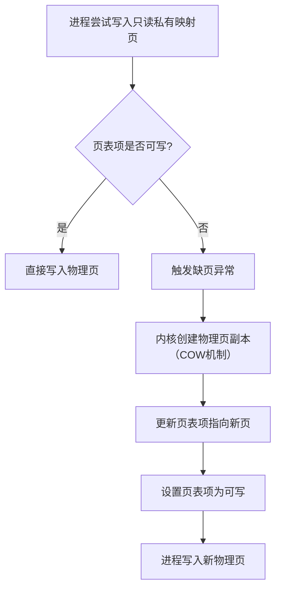
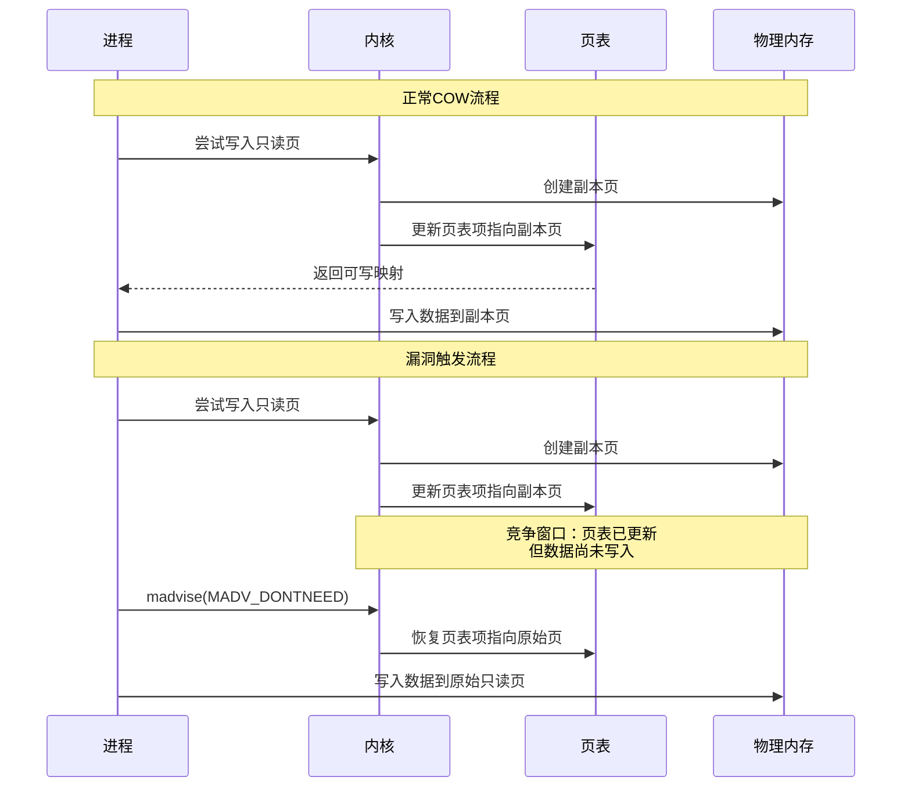
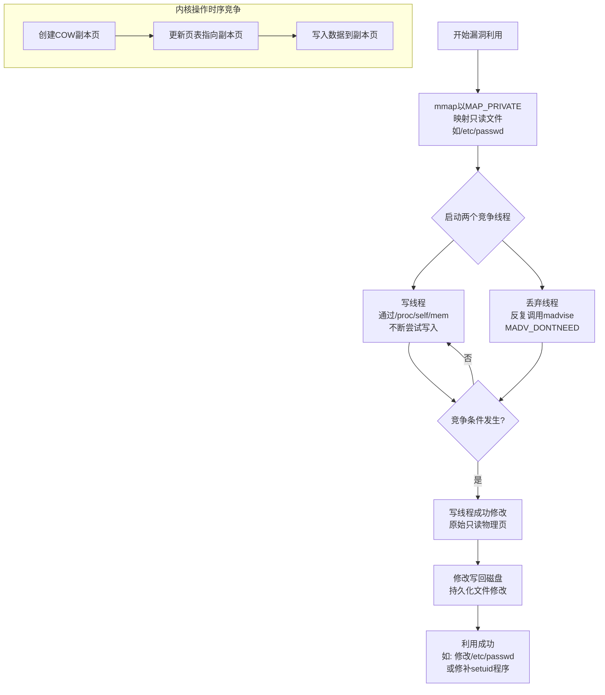
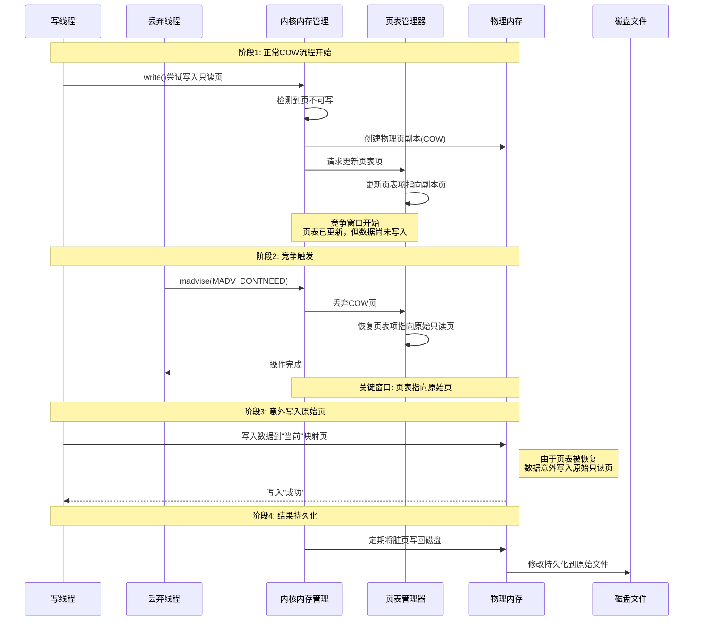

# 【Kernel Exploit】CVE-2016-5195（Dirty COW）技术分析

## 1. 测试环境

**测试版本**：Linux-4.8.2 [内核镜像地址](https://github.com/BinRacer/pwn4kernel/blob/master/kernels/4.8.2/01/bzImage)

笔者测试的内核版本是 `Linux (none) 4.8.2 #1 SMP Wed Jan 28 13:32:13 CST 2026 x86_64 GNU/Linux`。

**编译选项**：开启`CONFIG_MEMCG`、`CONFIG_SLAB_FREELIST_RANDOM`、`CONFIG_HARDENED_USERCOPY`、`CONFIG_DEBUG_LIST`、`CONFIG_FUSE_FS`、`CONFIG_USERFAULTFD`、`CONFIG_SYSVIPC`、`CONFIG_KEYS`、`CONFIG_CC_STACKPROTECTOR`、`CONFIG_CC_STACKPROTECTOR_STRONG`、`CONFIG_SLUB`、`CONFIG_SLUB_DEBUG`、`CONFIG_E1000`、`CONFIG_E1000E`选项。完整配置参考[.config](https://github.com/BinRacer/pwn4kernel/blob/master/kernels/4.8.2/01/.config)。

**保护机制**：KASLR/SMEP/SMAP/KPTI

## 2. 漏洞背景

CVE-2016-5195，俗称"脏牛"（Dirty COW），是Linux内核内存子系统中的一个竞争条件漏洞。该漏洞于2016年10月19日由红帽产品安全团队公开披露，并被评级为"重要"（Important）。其特殊性在于，该漏洞自2007年Linux内核2.6.22版本发布时便已存在，潜伏时间长达9年，直到2016年10月18日才被修复。

漏洞名称"Dirty COW"源于其对内核"写时复制"（Copy-on-Write, COW）机制中"脏位"（dirty bit）的利用。该漏洞允许低权限的本地用户获取对只读内存映射的写入权限，从而可能提升其在系统中的权限，最终获得root权限。其影响范围极广，涵盖了自2007年以来几乎所有主流的Linux发行版，包括Red Hat Enterprise Linux 5/6/7、CentOS、Ubuntu以及Android系统。

## 3. 漏洞分析

### 3-1. 核心原理：COW机制与竞争条件

Linux内核的写时复制（COW）是一种内存管理优化技术。当多个进程共享一个只读内存页（例如通过`mmap`以`MAP_PRIVATE`方式映射一个只读文件）时，如果某个进程尝试写入该页，内核会为该进程创建一个该页的私有副本，写入操作在副本上进行，从而保持原始文件的只读性。



Dirty Cow漏洞的核心在于，内核执行COW的三个关键步骤**不是原子操作**，存在一个极窄的时间窗口。下图展示了正常COW流程与漏洞触发流程的对比：



### 3-2. 漏洞触发与利用流程

利用者通过两个并发线程精心构造竞争条件来利用此漏洞。下图展示了完整的漏洞利用流程：



**利用流程如下**：

1.  **初始化阶段**：利用者使用`mmap`以`MAP_PRIVATE`和只读模式映射一个受保护的文件（如`/etc/passwd`）。

2.  **竞争条件构建**：启动两个并发线程：
    - **写线程**：不断尝试向目标内存映射写入数据，通常通过`/proc/self/mem`设备文件进行，因为它可以绕过部分常规的内存权限检查。
    - **丢弃线程**：对同一内存区域反复调用`madvise(MADV_DONTNEED)`系统调用，使内核丢弃该区域的私有COW副本，并将页表项重新指向原始的只读物理页。

3.  **竞争触发**：当写线程触发COW，内核完成页表项更新但尚未执行实际写入时，丢弃线程的`madvise`调用成功执行，将页表项**恢复**为指向原始的只读物理页。紧接着，写线程执行写入操作，数据被**直接写入原始的只读物理页**，而非其私有副本。

4.  **持久化修改**：由于原始物理页是文件在内存中的缓存，对它的修改最终会写回磁盘，从而永久性地修改了本应只读的文件。

### 3-3. 关键利用窗口序列图分析

以下序列图详细展示了Dirty Cow漏洞利用中的关键竞争窗口，揭示了写线程、丢弃线程与内核之间的精确时序交互：



**关键时序分析**：

1. **COW触发与页表更新窗口**：
    - 当写线程触发缺页异常时，内核创建副本页并更新页表
    - 但页表更新与实际数据写入之间存在微小时间间隙
    - 这是丢弃线程可以介入的关键竞争窗口

2. **页表状态恢复窗口**：
    - 丢弃线程通过`madvise(MADV_DONTNEED)`请求内核丢弃COW页
    - 内核将页表项恢复为指向原始只读页
    - 此时原始页被重新映射为可写状态（由于FOLL_WRITE标志问题）

3. **数据写入错误目标窗口**：
    - 写线程在不知情的情况下继续执行写入操作
    - 由于页表已被恢复，写入操作直接针对原始只读页
    - 内核错误地允许了这次写入，绕过了正常的权限检查

4. **脏页回写持久化窗口**：
    - 内核定期将脏页（被修改的页）写回磁盘
    - 由于原始页被修改，其内容被持久化到原始文件
    - 这导致只读文件被意外修改

**漏洞利用稳定性增强技术**：

这个竞争条件的时间窗口非常小，但在实际利用中可以通过以下方法增大成功率：

1. **高频尝试**：写线程和丢弃线程以最高优先级运行，每秒执行数百万次尝试
2. **多线程并发**：使用多个写线程和丢弃线程同时利用
3. **内存压力**：通过大量分配内存增加系统内存压力，延缓内核调度

### 3-4. 漏洞关键函数分析

漏洞存在于`__get_user_pages()`函数及其相关调用链中。当线程尝试通过`/proc/self/mem`等路径向一个只读的私有映射写入时，内核会调用该函数并设置`FOLL_WRITE`标志，表示**写入意图**。如果目标页是只读的，第一次尝试会失败并触发COW机制。函数会重试，但在重试时**清除了`FOLL_WRITE`标志**。这导致内核在成功获取页面后，误以为没有写入操作，从而可能将原始的只读页面（而非新创建的副本）返回给调用者。

以下是完整的漏洞触发调用链，从用户空间的`write()`系统调用开始，到内核中的COW处理：

#### 3-4-1. 第一次尝试

##### (1). [get_user_pages_remote](https://elixir.bootlin.com/linux/v4.8.2/source/mm/gup.c#L961)

```c
/*
 * 用于获取远程进程的用户空间页框
 * 参数说明：
 * tsk: 目标进程的任务结构
 * mm: 目标进程的内存描述符
 * start: 起始用户空间地址
 * nr_pages: 要获取的页数
 * write: 是否需要写入访问
 * force: 是否强制获取（忽略保护位）
 * pages: 返回的页描述符数组
 * vmas: 返回的VMA数组
 * 返回值：成功获取的页数
 */
long get_user_pages_remote(struct task_struct *tsk, struct mm_struct *mm,
		unsigned long start, unsigned long nr_pages,
		int write, int force, struct page **pages,
		struct vm_area_struct **vmas)
{
	return __get_user_pages_locked(tsk, mm, start, nr_pages, write, force,
				       pages, vmas, NULL, false,
				       FOLL_TOUCH | FOLL_REMOTE);
}
EXPORT_SYMBOL(get_user_pages_remote);
```

##### (2). [\_\_get_user_pages_locked](https://elixir.bootlin.com/linux/v4.8.2/source/mm/gup.c#L728)

```c
/*
 * 获取用户页的核心函数（带锁版本）
 * 参数说明：
 * tsk: 目标进程
 * mm: 内存描述符
 * start: 起始地址
 * nr_pages: 页数
 * write: 写入标志
 * force: 强制标志
 * pages: 页数组
 * vmas: VMA数组
 * locked: 锁状态指针
 * notify_drop: 是否通知锁丢弃
 * flags: 标志位
 */
static __always_inline long __get_user_pages_locked(struct task_struct *tsk,
						struct mm_struct *mm,
						unsigned long start,
						unsigned long nr_pages,
						int write, int force,
						struct page **pages,
						struct vm_area_struct **vmas,
						int *locked, bool notify_drop,
						unsigned int flags)
{
	long ret, pages_done;
	bool lock_dropped;

	// 如果locked不为NULL，确保vmas为空且*locked已初始化为1
	if (locked) {
		/* 如果可能返回VM_FAULT_RETRY，vmas会失效 */
		BUG_ON(vmas);
		/* 检查调用者是否正确初始化了locked */
		BUG_ON(*locked != 1);
	}

	// 设置标志位
	if (pages)
		flags |= FOLL_GET;		// 需要增加页的引用计数
	if (write)
		flags |= FOLL_WRITE;	// 需要写入权限
	if (force)
		flags |= FOLL_FORCE;	// 强制忽略保护位

	pages_done = 0;
	lock_dropped = false;
	for (;;) {
		ret = __get_user_pages(tsk, mm, start, nr_pages, flags, pages,
				       vmas, locked);
		// 循环处理页面获取，直到完成或出错
		...
	}
	if (notify_drop && lock_dropped && *locked) {
		/*
		 * 必须让调用者知道我们临时释放了锁，
		 * 因此受锁保护的关键区域被丢失了。
		 */
		up_read(&mm->mmap_sem);
		*locked = 0;
	}
	return pages_done;
}
```

##### (3). [\_\_get_user_pages](https://elixir.bootlin.com/linux/v4.8.2/source/mm/gup.c#L519)

```c
/*
 * 获取用户页的核心实现
 * 遍历指定范围内的虚拟地址，为每个页面调用follow_page_mask获取页框，
 * 如果页面不存在则调用faultin_page触发缺页异常。
 */
long __get_user_pages(struct task_struct *tsk, struct mm_struct *mm,
		unsigned long start, unsigned long nr_pages,
		unsigned int gup_flags, struct page **pages,
		struct vm_area_struct **vmas, int *nonblocking)
{
	long i = 0;
	unsigned int page_mask;
	struct vm_area_struct *vma = NULL;

	if (!nr_pages)
		return 0;

	VM_BUG_ON(!!pages != !!(gup_flags & FOLL_GET));

	/*
	 * 如果设置了FOLL_FORCE，则不要强制完整错误，
	 * 因为提示错误信息与使用地址空间的任务的引用行为无关
	 */
	if (!(gup_flags & FOLL_FORCE))
		gup_flags |= FOLL_NUMA;

	do {
		struct page *page;
		unsigned int foll_flags = gup_flags;
		unsigned int page_increm;

		/* 第一次迭代或跨越vma边界 */
		if (!vma || start >= vma->vm_end) {
			vma = find_extend_vma(mm, start);
			if (!vma && in_gate_area(mm, start)) {
				int ret;
				ret = get_gate_page(mm, start & PAGE_MASK,
						gup_flags, &vma,
						pages ? &pages[i] : NULL);
				if (ret)
					return i ? : ret;
				page_mask = 0;
				goto next_page;
			}

			if (!vma || check_vma_flags(vma, gup_flags))
				return i ? : -EFAULT;
			if (is_vm_hugetlb_page(vma)) {
				i = follow_hugetlb_page(mm, vma, pages, vmas,
						&start, &nr_pages, i,
						gup_flags);
				continue;
			}
		}
retry:
		/*
		 * 如果我们有一个挂起的SIGKILL，不要继续触发缺页异常，
		 * 并且不要分配内存。
		 */
		if (unlikely(fatal_signal_pending(current)))
			return i ? i : -ERESTARTSYS;
		cond_resched();		// 让出CPU，避免长时间占用
		// 尝试获取页面，如果失败则触发缺页异常
		page = follow_page_mask(vma, start, foll_flags, &page_mask);
		if (!page) {
			int ret;
			// 触发缺页异常
			ret = faultin_page(tsk, vma, start, &foll_flags,
					nonblocking);
			switch (ret) {
			case 0:		// 缺页处理成功，重试获取页面
				goto retry;
			case -EFAULT:	// 访问错误
			case -ENOMEM:	// 内存不足
			case -EHWPOISON:	// 硬件poison页
				return i ? i : ret;
			case -EBUSY:	// 页面忙，返回已获取的页数
				return i;
			case -ENOENT:	// 页面不存在，跳过
				goto next_page;
			}
			BUG();
		} else if (PTR_ERR(page) == -EEXIST) {
			/*
			 * 页表项存在，但没有对应的struct page。
			 * 跳过这个页面。
			 */
			goto next_page;
		} else if (IS_ERR(page)) {
			return i ? i : PTR_ERR(page);
		}
		// 成功获取页面，存入pages数组
		if (pages) {
			pages[i] = page;
			// 刷新匿名页和缓存
			flush_anon_page(vma, page, start);
			flush_dcache_page(page);
			page_mask = 0;
		}
next_page:
		if (vmas) {
			vmas[i] = vma;
			page_mask = 0;
		}
		// 计算下一个页面的地址
		page_increm = 1 + (~(start >> PAGE_SHIFT) & page_mask);
		if (page_increm > nr_pages)
			page_increm = nr_pages;
		i += page_increm;
		start += page_increm * PAGE_SIZE;
		nr_pages -= page_increm;
	} while (nr_pages);
	return i;
}
EXPORT_SYMBOL(__get_user_pages);
```

##### (4). [faultin_page](https://elixir.bootlin.com/linux/v4.8.2/source/mm/gup.c#L354)

```c
/*
 * 触发缺页异常
 * 注意：进入时必须持有mmap_sem。如果nonblocking不为NULL且flags不包含FOLL_NOWAIT，
 * 可能会释放mmap_sem。如果释放，会将nonblocking设为0并返回-EBUSY。
 */
static int faultin_page(struct task_struct *tsk, struct vm_area_struct *vma,
		unsigned long address, unsigned int *flags, int *nonblocking)
{
	unsigned int fault_flags = 0;
	int ret;

	/* 仅mlock已存在的页，不要为新页触发缺页异常 */
	if ((*flags & (FOLL_POPULATE | FOLL_MLOCK)) == FOLL_MLOCK)
		return -ENOENT;
	/* 对于mm_populate()，跳过栈保护页 */
	if ((*flags & FOLL_POPULATE) &&
			(stack_guard_page_start(vma, address) ||
			 stack_guard_page_end(vma, address + PAGE_SIZE)))
		return -ENOENT;
	// 根据flags设置fault_flags
	if (*flags & FOLL_WRITE)
		fault_flags |= FAULT_FLAG_WRITE;	// 写访问
	if (*flags & FOLL_REMOTE)
		fault_flags |= FAULT_FLAG_REMOTE;	// 远程访问
	if (nonblocking)
		fault_flags |= FAULT_FLAG_ALLOW_RETRY;	// 允许重试
	if (*flags & FOLL_NOWAIT)
		fault_flags |= FAULT_FLAG_ALLOW_RETRY | FAULT_FLAG_RETRY_NOWAIT;
	if (*flags & FOLL_TRIED) {
		VM_WARN_ON_ONCE(fault_flags & FAULT_FLAG_ALLOW_RETRY);
		fault_flags |= FAULT_FLAG_TRIED;	// 已尝试过
	}

	// 调用handle_mm_fault处理缺页异常
	ret = handle_mm_fault(vma, address, fault_flags);
	if (ret & VM_FAULT_ERROR) {	// 处理错误
		if (ret & VM_FAULT_OOM)
			return -ENOMEM;
		if (ret & (VM_FAULT_HWPOISON | VM_FAULT_HWPOISON_LARGE))
			return *flags & FOLL_HWPOISON ? -EHWPOISON : -EFAULT;
		if (ret & (VM_FAULT_SIGBUS | VM_FAULT_SIGSEGV))
			return -EFAULT;
		BUG();
	}

	if (tsk) {	// 统计缺页次数
		if (ret & VM_FAULT_MAJOR)
			tsk->maj_flt++;
		else
			tsk->min_flt++;
	}

	if (ret & VM_FAULT_RETRY) {	// 需要重试
		if (nonblocking)
			*nonblocking = 0;
		return -EBUSY;
	}

	/*
	 * VM_FAULT_WRITE位告诉我们do_wp_page在必要时已经执行了COW，
	 * 即使maybe_mkwrite决定不设置pte_write。因此，我们可以安全地
	 * 将后续的页面查找视为读操作。但仅在循环获取pte_write无望时
	 * 这样做：在某些情况下，用户空间可能也想写入获取的用户页，
	 * 而这里的读错误可能会阻止（只读页可能会被用户空间写入重新COW）。
	 */
	if ((ret & VM_FAULT_WRITE) && !(vma->vm_flags & VM_WRITE))
		*flags &= ~FOLL_WRITE;	// 清除FOLL_WRITE标志
	return 0;
}
```

##### (5). [handle_mm_fault](https://elixir.bootlin.com/linux/v4.8.2/source/mm/memory.c#L3619)

```c
/*
 * 处理缺页异常
 * 注意：进入时我们已经持有mm信号量
 * mmap_sem可能已根据标志和返回值释放。参见filemap_fault()和__lock_page_or_retry()。
 */
int handle_mm_fault(struct vm_area_struct *vma, unsigned long address,
		unsigned int flags)
{
	int ret;

	__set_current_state(TASK_RUNNING);

	count_vm_event(PGFAULT);	// 统计缺页次数
	mem_cgroup_count_vm_event(vma->vm_mm, PGFAULT);

	/* 在进入真正的关键区之前更新计数器 */
	check_sync_rss_stat(current);

	/*
	 * 为在用户空间触发的错误启用memcg OOM处理。
	 * 内核错误处理得更优雅。
	 */
	if (flags & FAULT_FLAG_USER)
		mem_cgroup_oom_enable();

	// 检查是否允许访问
	if (!arch_vma_access_permitted(vma, flags & FAULT_FLAG_WRITE,
					    flags & FAULT_FLAG_INSTRUCTION,
					    flags & FAULT_FLAG_REMOTE))
		return VM_FAULT_SIGSEGV;

	// 根据VMA类型选择处理函数
	if (unlikely(is_vm_hugetlb_page(vma)))
		ret = hugetlb_fault(vma->vm_mm, vma, address, flags);
	else
		ret = __handle_mm_fault(vma, address, flags);

	if (flags & FAULT_FLAG_USER) {
		mem_cgroup_oom_disable();
                /*
                 * 任务可能已进入memcg OOM状态，但如果分配错误被优雅处理
                 *（没有VM_FAULT_OOM），则不需要杀死任何东西。只需和平地清理OOM状态。
                 */
                if (task_in_memcg_oom(current) && !(ret & VM_FAULT_OOM))
                        mem_cgroup_oom_synchronize(false);
	}

	return ret;
}
EXPORT_SYMBOL_GPL(handle_mm_fault);
```

##### (6). [\_\_handle_mm_fault](https://elixir.bootlin.com/linux/v4.8.2/source/mm/memory.c#L3566)

```c
/*
 * 处理缺页异常的核心函数
 * 注意：进入时我们已经持有mm信号量
 * mmap_sem可能已根据标志和返回值释放。参见filemap_fault()和__lock_page_or_retry()。
 */
static int __handle_mm_fault(struct vm_area_struct *vma, unsigned long address,
		unsigned int flags)
{
	struct fault_env fe = {
		.vma = vma,
		.address = address,
		.flags = flags,
	};
	struct mm_struct *mm = vma->vm_mm;
	pgd_t *pgd;
	pud_t *pud;

	// 获取各级页目录项，如果不存在则分配
	pgd = pgd_offset(mm, address);
	pud = pud_alloc(mm, pgd, address);
	if (!pud)
		return VM_FAULT_OOM;
	fe.pmd = pmd_alloc(mm, pud, address);
	if (!fe.pmd)
		return VM_FAULT_OOM;
	// 处理透明大页
	if (pmd_none(*fe.pmd) && transparent_hugepage_enabled(vma)) {
		int ret = create_huge_pmd(&fe);
		if (!(ret & VM_FAULT_FALLBACK))
			return ret;
	} else {
		pmd_t orig_pmd = *fe.pmd;
		int ret;

		barrier();
		// 检查是否为大页或设备映射
		if (pmd_trans_huge(orig_pmd) || pmd_devmap(orig_pmd)) {
			// 处理NUMA大页
			if (pmd_protnone(orig_pmd) && vma_is_accessible(vma))
				return do_huge_pmd_numa_page(&fe, orig_pmd);

			// 写时复制处理
			if ((fe.flags & FAULT_FLAG_WRITE) &&
					!pmd_write(orig_pmd)) {
				ret = wp_huge_pmd(&fe, orig_pmd);
				if (!(ret & VM_FAULT_FALLBACK))
					return ret;
			} else {
				huge_pmd_set_accessed(&fe, orig_pmd);
				return 0;
			}
		}
	}

	// 处理普通页
	return handle_pte_fault(&fe);
}
```

##### (7). [handle_pte_fault](https://elixir.bootlin.com/linux/v4.8.2/source/mm/memory.c#L3478)

```c
/*
 * 处理PTE级别的缺页异常
 * 这些例程还需要处理诸如标记页面为脏/已访问等事情，用于那些硬件不支持的架构（大多数RISC架构）。
 * 早期的脏标记对i386也有好处。
 *
 * 还有一个名为"update_mmu_cache()"的钩子，用于具有外部MMU缓存的架构来更新这些缓存
 *（例如Sparc或PowerPC的哈希页表，它们充当扩展的TLB）。
 *
 * 我们以非独占的mmap_sem进入（以排除vma更改，但允许并发错误）。
 *
 * mmap_sem可能已根据标志和返回值释放。参见filemap_fault()和__lock_page_or_retry()。
 */
static int handle_pte_fault(struct fault_env *fe)
{
	pte_t entry;

	if (unlikely(pmd_none(*fe->pmd))) {
		/*
		 * 将__pte_alloc()留到后面：因为vm_ops->fault可能想要分配大页，
		 * 如果我们暴露页表，将难以从并发错误和rmap查找中撤回。
		 */
		fe->pte = NULL;
	} else {
		/* 参见pte_alloc_one_map()中的注释 */
		if (pmd_trans_unstable(fe->pmd) || pmd_devmap(*fe->pmd))
			return 0;
		/*
		 * 一个常规的pmd已经建立，并且此时它不能再从我们下面变成大页，
		 * 因为我们以读模式持有mmap_sem，而khugepaged以写模式获取它。
		 * 所以现在运行pte_offset_map()是安全的。
		 */
		fe->pte = pte_offset_map(fe->pmd, fe->address);

		entry = *fe->pte;

		/*
		 * 一些架构的pte可能比字长大，例如ppc44x-defconfig有CONFIG_PTE_64BIT=y
		 * 和CONFIG_32BIT=y，所以READ_ONCE或ACCESS_ONCE无法保证原子访问。
		 * 下面的代码只需要一个一致的视图用于if判断，之后我们会在持有ptl锁的情况下再次检查。
		 * 所以这里一个屏障就足够了。
		 */
		barrier();
		if (pte_none(entry)) {
			pte_unmap(fe->pte);
			fe->pte = NULL;
		}
	}

	if (!fe->pte) {		// PTE不存在
		if (vma_is_anonymous(fe->vma))	// 匿名映射
			return do_anonymous_page(fe);
		else	// 文件映射
			return do_fault(fe);
	}

	if (!pte_present(entry))	// 页面不在内存中（交换页面）
		return do_swap_page(fe, entry);

	if (pte_protnone(entry) && vma_is_accessible(fe->vma))	// NUMA保护页
		return do_numa_page(fe, entry);

	fe->ptl = pte_lockptr(fe->vma->vm_mm, fe->pmd);
	spin_lock(fe->ptl);
	if (unlikely(!pte_same(*fe->pte, entry)))	// 检查PTE是否被并发修改
		goto unlock;
	if (fe->flags & FAULT_FLAG_WRITE) {	// 写访问
		if (!pte_write(entry))		// 页面不可写，触发写时复制
			return do_wp_page(fe, entry);
		entry = pte_mkdirty(entry);	// 标记为脏
	}
	entry = pte_mkyoung(entry);	// 标记为已访问
	if (ptep_set_access_flags(fe->vma, fe->address, fe->pte, entry,
				fe->flags & FAULT_FLAG_WRITE)) {
		update_mmu_cache(fe->vma, fe->address, fe->pte);
	} else {
		/*
		 * 这仅用于保护错误，但架构代码尚未告诉我们这是否是保护错误。
		 * 这仍然避免了由于线程导致的.text页错误的无用tlb刷新。
		 */
		if (fe->flags & FAULT_FLAG_WRITE)
			flush_tlb_fix_spurious_fault(fe->vma, fe->address);
	}
unlock:
	pte_unmap_unlock(fe->pte, fe->ptl);
	return 0;
}
```

##### (8). [do_fault](https://elixir.bootlin.com/linux/v4.8.2/source/mm/memory.c#L3313)

```c
/*
 * 处理文件映射缺页异常
 */
static int do_fault(struct fault_env *fe)
{
	struct vm_area_struct *vma = fe->vma;
	pgoff_t pgoff = linear_page_index(vma, fe->address);

	/* VMA在mmap()时未完全填充或缺少VM_DONTEXPAND */
	if (!vma->vm_ops->fault)
		return VM_FAULT_SIGBUS;
	if (!(fe->flags & FAULT_FLAG_WRITE))	// 读错误
		return do_read_fault(fe, pgoff);
	if (!(vma->vm_flags & VM_SHARED))	// 私有写错误（COW）
		return do_cow_fault(fe, pgoff);
	return do_shared_fault(fe, pgoff);	// 共享写错误
}
```

##### (9). [do_cow_fault](https://elixir.bootlin.com/linux/v4.8.2/source/mm/memory.c#L3200)

```c
/*
 * 处理私有写错误（写时复制）
 */
static int do_cow_fault(struct fault_env *fe, pgoff_t pgoff)
{
	struct vm_area_struct *vma = fe->vma;
	struct page *fault_page, *new_page;
	void *fault_entry;
	struct mem_cgroup *memcg;
	int ret;

	if (unlikely(anon_vma_prepare(vma)))	// 准备anon_vma
		return VM_FAULT_OOM;

	// 分配新页面用于COW
	new_page = alloc_page_vma(GFP_HIGHUSER_MOVABLE, vma, fe->address);
	if (!new_page)
		return VM_FAULT_OOM;

	// 为页面进行内存cgroup计费
	if (mem_cgroup_try_charge(new_page, vma->vm_mm, GFP_KERNEL,
				&memcg, false)) {
		put_page(new_page);
		return VM_FAULT_OOM;
	}

	// 读取文件内容到新页面
	ret = __do_fault(fe, pgoff, new_page, &fault_page, &fault_entry);
	if (unlikely(ret & (VM_FAULT_ERROR | VM_FAULT_NOPAGE | VM_FAULT_RETRY)))
		goto uncharge_out;

	// 如果不是DAX锁定，则复制页面内容
	if (!(ret & VM_FAULT_DAX_LOCKED))
		copy_user_highpage(new_page, fault_page, fe->address, vma);
	__SetPageUptodate(new_page);

	// 建立PTE映射
	ret |= alloc_set_pte(fe, memcg, new_page);
	if (fe->pte)
		pte_unmap_unlock(fe->pte, fe->ptl);
	if (!(ret & VM_FAULT_DAX_LOCKED)) {
		unlock_page(fault_page);
		put_page(fault_page);
	} else {
		dax_unlock_mapping_entry(vma->vm_file->f_mapping, pgoff);
	}
	if (unlikely(ret & (VM_FAULT_ERROR | VM_FAULT_NOPAGE | VM_FAULT_RETRY)))
		goto uncharge_out;
	return ret;
uncharge_out:
	mem_cgroup_cancel_charge(new_page, memcg, false);
	put_page(new_page);
	return ret;
}
```

##### (10). [alloc_set_pte](https://elixir.bootlin.com/linux/v4.8.2/source/mm/memory.c#L2998)

```c
/*
 * 分配并设置PTE
 */
int alloc_set_pte(struct fault_env *fe, struct mem_cgroup *memcg,
		struct page *page)
{
	struct vm_area_struct *vma = fe->vma;
	bool write = fe->flags & FAULT_FLAG_WRITE;
	pte_t entry;
	int ret;

	// 尝试使用透明大页
	if (pmd_none(*fe->pmd) && PageTransCompound(page) &&
			IS_ENABLED(CONFIG_TRANSPARENT_HUGE_PAGECACHE)) {
		/* THP on COW? */
		VM_BUG_ON_PAGE(memcg, page);

		ret = do_set_pmd(fe, page);
		if (ret != VM_FAULT_FALLBACK)
			return ret;
	}

	if (!fe->pte) {		// 如果PTE不存在，分配PTE
		ret = pte_alloc_one_map(fe);
		if (ret)
			return ret;
	}

	/* 在ptl下重新检查 */
	if (unlikely(!pte_none(*fe->pte)))
		return VM_FAULT_NOPAGE;

	flush_icache_page(vma, page);
	entry = mk_pte(page, vma->vm_page_prot);
	if (write)
		entry = maybe_mkwrite(pte_mkdirty(entry), vma);
	/* 写时复制页 */
	if (write && !(vma->vm_flags & VM_SHARED)) {	// 私有写映射
		inc_mm_counter_fast(vma->vm_mm, MM_ANONPAGES);
		page_add_new_anon_rmap(page, vma, fe->address, false);
		mem_cgroup_commit_charge(page, memcg, false, false);
		lru_cache_add_active_or_unevictable(page, vma);
	} else {	// 只读或共享映射
		inc_mm_counter_fast(vma->vm_mm, mm_counter_file(page));
		page_add_file_rmap(page, false);
	}
	set_pte_at(vma->vm_mm, fe->address, fe->pte, entry);

	/* 无需无效化：一个不存在的页面不会被缓存 */
	update_mmu_cache(vma, fe->address, fe->pte);

	return 0;
}
```

##### (11). [maybe_mkwrite](https://elixir.bootlin.com/linux/v4.8.2/source/include/linux/mm.h#L621)

```c
/*
 * 执行pte_mkwrite，但仅当vma具有VM_WRITE标志时。
 * 我们在处理写访问错误时这样做。在正常情况下，我们总是希望pte_mkwrite。
 * 但是当被access_process_vm使用时，get_user_pages可能导致对没有写权限的映射进行写错误。
 */
static inline pte_t maybe_mkwrite(pte_t pte, struct vm_area_struct *vma)
{
	if (likely(vma->vm_flags & VM_WRITE))
		pte = pte_mkwrite(pte);
	return pte;
}
```

##### (12). [pte_mkwrite](https://elixir.bootlin.com/linux/v4.8.2/source/arch/x86/include/asm/pgtable.h#L242)

```c
/* 设置页表项的写权限位 */
static inline pte_t pte_mkwrite(pte_t pte)
{
	return pte_set_flags(pte, _PAGE_RW);
}
```

#### 3-4-2. 第二次尝试

faultin_page返回0，开启第二次尝试。

##### (1). [\_\_get_user_pages](https://elixir.bootlin.com/linux/v4.8.2/source/mm/gup.c#L519)

```c
/*
 * 获取用户页的核心实现
 * 遍历指定范围内的虚拟地址，为每个页面调用follow_page_mask获取页框，
 * 如果页面不存在则调用faultin_page触发缺页异常。
 */
long __get_user_pages(struct task_struct *tsk, struct mm_struct *mm,
		unsigned long start, unsigned long nr_pages,
		unsigned int gup_flags, struct page **pages,
		struct vm_area_struct **vmas, int *nonblocking)
{
  ...
	do {
...
retry:
		/*
		 * 如果我们有一个挂起的SIGKILL，不要继续触发缺页异常，
		 * 并且不要分配内存。
		 */
		if (unlikely(fatal_signal_pending(current)))
			return i ? i : -ERESTARTSYS;
		cond_resched();		// 让出CPU，避免长时间占用
		// 尝试获取页面，如果失败则触发缺页异常
		page = follow_page_mask(vma, start, foll_flags, &page_mask);
		if (!page) {
			int ret;
			// 触发缺页异常
			ret = faultin_page(tsk, vma, start, &foll_flags,
					nonblocking);
			switch (ret) {
			case 0:		// 缺页处理成功，重试获取页面
				goto retry;
  ...
next_page:
  ...
	} while (nr_pages);
	return i;
}
EXPORT_SYMBOL(__get_user_pages);
```

##### (2). [follow_page_mask](https://elixir.bootlin.com/linux/v4.8.2/source/mm/gup.c#L354)

```c
/**
 * follow_page_mask - 从用户虚拟地址查找页描述符
 * @vma: 映射@address的vm_area_struct
 * @address: 要查找的虚拟地址
 * @flags: 修改查找行为的标志
 * @page_mask: 输出，根据页面大小设置*page_mask
 *
 * @flags可以设置FOLL_标志，定义在<linux/mm.h>中
 *
 * 返回映射的(struct page *)，如果映射不存在则返回%NULL，或者
 * 如果映射到不由页描述符表示的内容，则返回错误指针（另见vm_normal_page()）。
 */
struct page *follow_page_mask(struct vm_area_struct *vma,
			      unsigned long address, unsigned int flags,
			      unsigned int *page_mask)
{
	pgd_t *pgd;
	pud_t *pud;
	pmd_t *pmd;
	spinlock_t *ptl;
	struct page *page;
	struct mm_struct *mm = vma->vm_mm;

	*page_mask = 0;

	// 首先尝试大页
	page = follow_huge_addr(mm, address, flags & FOLL_WRITE);
	if (!IS_ERR(page)) {
		BUG_ON(flags & FOLL_GET);
		return page;
	}

	// 遍历页表：PGD -> PUD -> PMD -> PTE
	pgd = pgd_offset(mm, address);
	if (pgd_none(*pgd) || unlikely(pgd_bad(*pgd)))
		return no_page_table(vma, flags);

	pud = pud_offset(pgd, address);
	if (pud_none(*pud))
		return no_page_table(vma, flags);
	if (pud_huge(*pud) && vma->vm_flags & VM_HUGETLB) {
		page = follow_huge_pud(mm, address, pud, flags);
		if (page)
			return page;
		return no_page_table(vma, flags);
	}
	if (unlikely(pud_bad(*pud)))
		return no_page_table(vma, flags);

	pmd = pmd_offset(pud, address);
	if (pmd_none(*pmd))
		return no_page_table(vma, flags);
	if (pmd_huge(*pmd) && vma->vm_flags & VM_HUGETLB) {
		page = follow_huge_pmd(mm, address, pmd, flags);
		if (page)
			return page;
		return no_page_table(vma, flags);
	}
	if ((flags & FOLL_NUMA) && pmd_protnone(*pmd))
		return no_page_table(vma, flags);
	if (pmd_devmap(*pmd)) {
		ptl = pmd_lock(mm, pmd);
		page = follow_devmap_pmd(vma, address, pmd, flags);
		spin_unlock(ptl);
		if (page)
			return page;
	}
	if (likely(!pmd_trans_huge(*pmd)))
		return follow_page_pte(vma, address, pmd, flags);

	ptl = pmd_lock(mm, pmd);
	if (unlikely(!pmd_trans_huge(*pmd))) {
		spin_unlock(ptl);
		return follow_page_pte(vma, address, pmd, flags);
	}
	if (flags & FOLL_SPLIT) {	// 需要拆分大页
		int ret;
		page = pmd_page(*pmd);
		if (is_huge_zero_page(page)) {
			spin_unlock(ptl);
			ret = 0;
			split_huge_pmd(vma, pmd, address);
			if (pmd_trans_unstable(pmd))
				ret = -EBUSY;
		} else {
			get_page(page);
			spin_unlock(ptl);
			lock_page(page);
			ret = split_huge_page(page);
			unlock_page(page);
			put_page(page);
			if (pmd_none(*pmd))
				return no_page_table(vma, flags);
		}

		return ret ? ERR_PTR(ret) :
			follow_page_pte(vma, address, pmd, flags);
	}

	page = follow_trans_huge_pmd(vma, address, pmd, flags);
	spin_unlock(ptl);
	*page_mask = HPAGE_PMD_NR - 1;
	return page;
}
```

##### (3). [follow_page_pte](https://elixir.bootlin.com/linux/v4.8.2/source/mm/gup.c#L63)

```c
// https://elixir.bootlin.com/linux/v4.8.2/source/mm/gup.c#L98
static struct page *follow_page_pte(struct vm_area_struct *vma,
		unsigned long address, pmd_t *pmd, unsigned int flags)
{
	struct mm_struct *mm = vma->vm_mm;
	struct dev_pagemap *pgmap = NULL;
	struct page *page;
	spinlock_t *ptl;
	pte_t *ptep, pte;

retry:
	if (unlikely(pmd_bad(*pmd)))
		return no_page_table(vma, flags);

	ptep = pte_offset_map_lock(mm, pmd, address, &ptl);
	pte = *ptep;
	if (!pte_present(pte)) {	// 页面不在内存中
		swp_entry_t entry;
		/*
		 * KSM的break_ksm()依赖于在页面迁移时识别ksm页面，
		 * 所以对于这种情况，我们需要migration_entry_wait()。
		 */
		if (likely(!(flags & FOLL_MIGRATION)))
			goto no_page;
		if (pte_none(pte))
			goto no_page;
		entry = pte_to_swp_entry(pte);
		if (!is_migration_entry(entry))
			goto no_page;
		pte_unmap_unlock(ptep, ptl);
		migration_entry_wait(mm, pmd, address);
		goto retry;
	}
	if ((flags & FOLL_NUMA) && pte_protnone(pte))	// NUMA保护页
		goto no_page;
	if ((flags & FOLL_WRITE) && !pte_write(pte)) { // 需要写权限但页面只读，触发COW
		pte_unmap_unlock(ptep, ptl);
		return NULL;	// 返回NULL触发缺页异常
	}

	page = vm_normal_page(vma, address, pte);
	if (!page && pte_devmap(pte) && (flags & FOLL_GET)) {
		/*
		 * 仅在FOLL_GET情况下返回设备映射页，因为它们仅在持有pgmap引用时有效。
		 */
		pgmap = get_dev_pagemap(pte_pfn(pte), NULL);
		if (pgmap)
			page = pte_page(pte);
		else
			goto no_page;
	} else if (unlikely(!page)) {
		if (flags & FOLL_DUMP) {
			/* 在核心转储中避免特殊（如零）页 */
			page = ERR_PTR(-EFAULT);
			goto out;
		}

		if (is_zero_pfn(pte_pfn(pte))) {	// 零页
			page = pte_page(pte);
		} else {
			int ret;

			ret = follow_pfn_pte(vma, address, ptep, flags);
			page = ERR_PTR(ret);
			goto out;
		}
	}

	if (flags & FOLL_SPLIT && PageTransCompound(page)) {	// 需要拆分复合页
		int ret;
		get_page(page);
		pte_unmap_unlock(ptep, ptl);
		lock_page(page);
		ret = split_huge_page(page);
		unlock_page(page);
		put_page(page);
		if (ret)
			return ERR_PTR(ret);
		goto retry;
	}

	if (flags & FOLL_GET) {	// 需要增加页的引用计数
		get_page(page);

		/* 现在我们持有页面，可以释放pgmap引用 */
		if (pgmap) {
			put_dev_pagemap(pgmap);
			pgmap = NULL;
		}
	}
	if (flags & FOLL_TOUCH) {	// 标记页面为已访问
		if ((flags & FOLL_WRITE) &&
		    !pte_dirty(pte) && !PageDirty(page))
			set_page_dirty(page);
		/*
		 * pte_mkyoung()在这里会更正确，但需要原子操作以避免丢失脏位。
		 * 使用mark_page_accessed()更容易。
		 */
		mark_page_accessed(page);
	}
	if ((flags & FOLL_MLOCK) && (vma->vm_flags & VM_LOCKED)) {	// 锁定页面
		/* 不要mlock pte映射的THP */
		if (PageTransCompound(page))
			goto out;

		/*
		 * 初步的映射检查主要是为了避免在ZERO_PAGE上不必要的lock_page开销，
		 * 如果存在争用，可能会反弹得非常厉害。
		 *
		 * 如果页面已经锁定，我们现在不需要处理它 - vmscan会在稍后尝试回收页面时处理。
		 */
		if (page->mapping && trylock_page(page)) {
			lru_add_drain();  /* 将缓存页面推送到LRU */
			/*
			 * 因为我们在这里锁定了页面，并且迁移被pte的页面引用阻塞，
			 * 并且我们知道页面仍然被映射，我们甚至不需要检查文件缓存页面截断。
			 */
			mlock_vma_page(page);
			unlock_page(page);
		}
	}
out:
	pte_unmap_unlock(ptep, ptl);
	return page;
no_page:
	pte_unmap_unlock(ptep, ptl);
	if (!pte_none(pte))
		return NULL;
	return no_page_table(vma, flags);
}
```

##### (4). [pte_write](https://elixir.bootlin.com/linux/v4.8.2/source/arch/x86/include/asm/pgtable.h#L131)

```c
/* 检查页表项是否有写权限 */
static inline int pte_write(pte_t pte)
{
	return pte_flags(pte) & _PAGE_RW;
}
```

#### 3-4-3. 第三次尝试

faultin_page返回0，开启第三次尝试。

##### (1). [\_\_get_user_pages](https://elixir.bootlin.com/linux/v4.8.2/source/mm/gup.c#L519)

```c
/*
 * 获取用户页的核心实现
 * 遍历指定范围内的虚拟地址，为每个页面调用follow_page_mask获取页框，
 * 如果页面不存在则调用faultin_page触发缺页异常。
 */
long __get_user_pages(struct task_struct *tsk, struct mm_struct *mm,
		unsigned long start, unsigned long nr_pages,
		unsigned int gup_flags, struct page **pages,
		struct vm_area_struct **vmas, int *nonblocking)
{
  ...
	do {
...
retry:
		/*
		 * 如果我们有一个挂起的SIGKILL，不要继续触发缺页异常，
		 * 并且不要分配内存。
		 */
		if (unlikely(fatal_signal_pending(current)))
			return i ? i : -ERESTARTSYS;
		cond_resched();		// 让出CPU，避免长时间占用
		// 尝试获取页面，如果失败则触发缺页异常
		page = follow_page_mask(vma, start, foll_flags, &page_mask);
		if (!page) {
			int ret;
			// 触发缺页异常
			ret = faultin_page(tsk, vma, start, &foll_flags,
					nonblocking);
			switch (ret) {
			case 0:		// 缺页处理成功，重试获取页面
				goto retry;
  ...
next_page:
  ...
	} while (nr_pages);
	return i;
}
EXPORT_SYMBOL(__get_user_pages);
```

##### (2). [faultin_page](https://elixir.bootlin.com/linux/v4.8.2/source/mm/gup.c#L354)

```c
/*
 * 注意：进入时必须持有mmap_sem。如果@nonblocking不为NULL且*@flags不包含FOLL_NOWAIT，
 * 可能会释放mmap_sem。如果释放，*@nonblocking将被设置为0并返回-EBUSY。
 */
static int faultin_page(struct task_struct *tsk, struct vm_area_struct *vma,
		unsigned long address, unsigned int *flags, int *nonblocking)
{
	unsigned int fault_flags = 0;
	int ret;

	/* 仅mlock已存在的页，不要为新页触发缺页异常 */
	if ((*flags & (FOLL_POPULATE | FOLL_MLOCK)) == FOLL_MLOCK)
		return -ENOENT;
	/* 对于mm_populate()，跳过栈保护页 */
	if ((*flags & FOLL_POPULATE) &&
			(stack_guard_page_start(vma, address) ||
			 stack_guard_page_end(vma, address + PAGE_SIZE)))
		return -ENOENT;
	if (*flags & FOLL_WRITE)
		fault_flags |= FAULT_FLAG_WRITE;
	if (*flags & FOLL_REMOTE)
		fault_flags |= FAULT_FLAG_REMOTE;
	if (nonblocking)
		fault_flags |= FAULT_FLAG_ALLOW_RETRY;
	if (*flags & FOLL_NOWAIT)
		fault_flags |= FAULT_FLAG_ALLOW_RETRY | FAULT_FLAG_RETRY_NOWAIT;
	if (*flags & FOLL_TRIED) {
		VM_WARN_ON_ONCE(fault_flags & FAULT_FLAG_ALLOW_RETRY);
		fault_flags |= FAULT_FLAG_TRIED;
	}

	ret = handle_mm_fault(vma, address, fault_flags); // 跳转到这里!!!
	if (ret & VM_FAULT_ERROR) {
		if (ret & VM_FAULT_OOM)
			return -ENOMEM;
		if (ret & (VM_FAULT_HWPOISON | VM_FAULT_HWPOISON_LARGE))
			return *flags & FOLL_HWPOISON ? -EHWPOISON : -EFAULT;
		if (ret & (VM_FAULT_SIGBUS | VM_FAULT_SIGSEGV))
			return -EFAULT;
		BUG();
	}

	if (tsk) {
		if (ret & VM_FAULT_MAJOR)
			tsk->maj_flt++;
		else
			tsk->min_flt++;
	}

	if (ret & VM_FAULT_RETRY) {
		if (nonblocking)
			*nonblocking = 0;
		return -EBUSY;
	}

	/*
	 * VM_FAULT_WRITE位告诉我们do_wp_page在必要时已经执行了COW，
	 * 即使maybe_mkwrite决定不设置pte_write。因此，我们可以安全地
	 * 将后续的页面查找视为读操作。但仅在循环获取pte_write无望时
	 * 这样做：在某些情况下，用户空间可能也想写入获取的用户页，
	 * 而这里的读错误可能会阻止（只读页可能会被用户空间写入重新COW）。
	 */
	if ((ret & VM_FAULT_WRITE) && !(vma->vm_flags & VM_WRITE))
		*flags &= ~FOLL_WRITE;	// 清除写标志
	return 0;
}
```

##### (3). [handle_mm_fault](https://elixir.bootlin.com/linux/v4.8.2/source/mm/memory.c#L3619)

```c
/*
 * 注意：进入时我们已经持有mm信号量
 * mmap_sem可能已根据标志和返回值释放。参见filemap_fault()和__lock_page_or_retry()。
 */
int handle_mm_fault(struct vm_area_struct *vma, unsigned long address,
		unsigned int flags)
{
	int ret;

	__set_current_state(TASK_RUNNING);

	count_vm_event(PGFAULT);
	mem_cgroup_count_vm_event(vma->vm_mm, PGFAULT);

	/* 在进入真正的关键区之前更新计数器 */
	check_sync_rss_stat(current);

	/*
	 * 为在用户空间触发的错误启用memcg OOM处理。
	 * 内核错误处理得更优雅。
	 */
	if (flags & FAULT_FLAG_USER)
		mem_cgroup_oom_enable();

	if (!arch_vma_access_permitted(vma, flags & FAULT_FLAG_WRITE,
					    flags & FAULT_FLAG_INSTRUCTION,
					    flags & FAULT_FLAG_REMOTE))
		return VM_FAULT_SIGSEGV;

	if (unlikely(is_vm_hugetlb_page(vma)))
		ret = hugetlb_fault(vma->vm_mm, vma, address, flags);
	else
		ret = __handle_mm_fault(vma, address, flags); // 跳转到这里!!!

	if (flags & FAULT_FLAG_USER) {
		mem_cgroup_oom_disable();
                /*
                 * 任务可能已进入memcg OOM状态，但如果分配错误被优雅处理
                 *（没有VM_FAULT_OOM），则不需要杀死任何东西。只需和平地清理OOM状态。
                 */
                if (task_in_memcg_oom(current) && !(ret & VM_FAULT_OOM))
                        mem_cgroup_oom_synchronize(false);
	}

	return ret;
}
EXPORT_SYMBOL_GPL(handle_mm_fault);
```

##### (4). [\_\_handle_mm_fault](https://elixir.bootlin.com/linux/v4.8.2/source/mm/memory.c#L3566)

```c
/*
 * 注意：进入时我们已经持有mm信号量
 * mmap_sem可能已根据标志和返回值释放。参见filemap_fault()和__lock_page_or_retry()。
 */
static int __handle_mm_fault(struct vm_area_struct *vma, unsigned long address,
		unsigned int flags)
{
	struct fault_env fe = {
		.vma = vma,
		.address = address,
		.flags = flags,
	};
	struct mm_struct *mm = vma->vm_mm;
	pgd_t *pgd;
	pud_t *pud;

	pgd = pgd_offset(mm, address);
	pud = pud_alloc(mm, pgd, address);
	if (!pud)
		return VM_FAULT_OOM;
	fe.pmd = pmd_alloc(mm, pud, address);
	if (!fe.pmd)
		return VM_FAULT_OOM;
	if (pmd_none(*fe.pmd) && transparent_hugepage_enabled(vma)) {
		int ret = create_huge_pmd(&fe);
		if (!(ret & VM_FAULT_FALLBACK))
			return ret;
	} else {
		pmd_t orig_pmd = *fe.pmd;
		int ret;

		barrier();
		if (pmd_trans_huge(orig_pmd) || pmd_devmap(orig_pmd)) {
			if (pmd_protnone(orig_pmd) && vma_is_accessible(vma))
				return do_huge_pmd_numa_page(&fe, orig_pmd);

			if ((fe.flags & FAULT_FLAG_WRITE) &&
					!pmd_write(orig_pmd)) {
				ret = wp_huge_pmd(&fe, orig_pmd);
				if (!(ret & VM_FAULT_FALLBACK))
					return ret;
			} else {
				huge_pmd_set_accessed(&fe, orig_pmd);
				return 0;
			}
		}
	}

	return handle_pte_fault(&fe);
}
```

##### (5). [handle_pte_fault](https://elixir.bootlin.com/linux/v4.8.2/source/mm/memory.c#L3478)

```c
/*
 * 这些例程还需要处理诸如标记页面为脏/已访问等事情，用于那些硬件不支持的架构（大多数RISC架构）。
 * 早期的脏标记对i386也有好处。
 *
 * 还有一个名为"update_mmu_cache()"的钩子，用于具有外部MMU缓存的架构来更新这些缓存
 *（例如Sparc或PowerPC的哈希页表，它们充当扩展的TLB）。
 *
 * 我们以非独占的mmap_sem进入（以排除vma更改，但允许并发错误）。
 *
 * mmap_sem可能已根据标志和返回值释放。参见filemap_fault()和__lock_page_or_retry()。
 */
static int handle_pte_fault(struct fault_env *fe)
{
	pte_t entry;

	if (unlikely(pmd_none(*fe->pmd))) {
		/*
		 * 将__pte_alloc()留到后面：因为vm_ops->fault可能想要分配大页，
		 * 如果我们暴露页表，将难以从并发错误和rmap查找中撤回。
		 */
		fe->pte = NULL;
	} else {
		/* 参见pte_alloc_one_map()中的注释 */
		if (pmd_trans_unstable(fe->pmd) || pmd_devmap(*fe->pmd))
			return 0;
		/*
		 * 一个常规的pmd已经建立，并且此时它不能再从我们下面变成大页，
		 * 因为我们以读模式持有mmap_sem，而khugepaged以写模式获取它。
		 * 所以现在运行pte_offset_map()是安全的。
		 */
		fe->pte = pte_offset_map(fe->pmd, fe->address);

		entry = *fe->pte;

		/*
		 * 一些架构的pte可能比字长大，例如ppc44x-defconfig有CONFIG_PTE_64BIT=y
		 * 和CONFIG_32BIT=y，所以READ_ONCE或ACCESS_ONCE无法保证原子访问。
		 * 下面的代码只需要一个一致的视图用于if判断，之后我们会在持有ptl锁的情况下再次检查。
		 * 所以这里一个屏障就足够了。
		 */
		barrier();
		if (pte_none(entry)) {
			pte_unmap(fe->pte);
			fe->pte = NULL;
		}
	}

	if (!fe->pte) {		// PTE不存在
		if (vma_is_anonymous(fe->vma))	// 匿名映射
			return do_anonymous_page(fe);
		else	// 文件映射
			return do_fault(fe);
	}

	if (!pte_present(entry))	// 页面不在内存中（交换页面）
		return do_swap_page(fe, entry);

	if (pte_protnone(entry) && vma_is_accessible(fe->vma))	// NUMA保护页
		return do_numa_page(fe, entry);

	fe->ptl = pte_lockptr(fe->vma->vm_mm, fe->pmd);
	spin_lock(fe->ptl);
	if (unlikely(!pte_same(*fe->pte, entry)))	// 检查PTE是否被并发修改
		goto unlock;
	if (fe->flags & FAULT_FLAG_WRITE) {	// 写访问，跳转到这里!!!
		if (!pte_write(entry))		// 页面不可写，触发写时复制
			return do_wp_page(fe, entry);
		entry = pte_mkdirty(entry);	// 标记为脏
	}
	entry = pte_mkyoung(entry);	// 标记为已访问
	if (ptep_set_access_flags(fe->vma, fe->address, fe->pte, entry,
				fe->flags & FAULT_FLAG_WRITE)) {
		update_mmu_cache(fe->vma, fe->address, fe->pte);
	} else {
		/*
		 * 这仅用于保护错误，但架构代码尚未告诉我们这是否是保护错误。
		 * 这仍然避免了由于线程导致的.text页错误的无用tlb刷新。
		 */
		if (fe->flags & FAULT_FLAG_WRITE)
			flush_tlb_fix_spurious_fault(fe->vma, fe->address);
	}
unlock:
	pte_unmap_unlock(fe->pte, fe->ptl);
	return 0;
}
```

##### (6). [do_wp_page](https://elixir.bootlin.com/linux/v4.8.2/source/mm/memory.c#L2359)

```c
/*
 * 当用户尝试写入共享页时，此例程处理存在的页面。它通过将页面复制到新地址
 * 并减少旧页面的共享页计数器来完成。
 *
 * 注意，此例程假设调用者（大多数情况下的低级页错误例程）已经完成了保护检查。
 * 因此，在我们完成了任何必要的COW之后，我们可以安全地将其标记为可写。
 *
 * 我们也在此将页面标记为脏，即使写操作实际上尚未发生。这避免了几个竞争条件，
 * 并且可能使其更高效。
 *
 * 我们以非独占的mmap_sem进入（以排除vma更改，但允许并发错误），
 * 并且pte被映射和锁定。我们返回时仍持有mmap_sem，但pte被取消映射和解除锁定。
 */
static int do_wp_page(struct fault_env *fe, pte_t orig_pte)
	__releases(fe->ptl)
{
	struct vm_area_struct *vma = fe->vma;
	struct page *old_page;

	old_page = vm_normal_page(vma, fe->address, orig_pte);
	if (!old_page) {
		/*
		 * VM_MIXEDMAP !pfn_valid()情况，或在VM_PFNMAP VMA上清除VM_SOFTDIRTY。
		 *
		 * 我们不应该在共享可写映射中cow页面。只需将页面标记为可写和/或调用ops->pfn_mkwrite。
		 */
		if ((vma->vm_flags & (VM_WRITE|VM_SHARED)) ==
				     (VM_WRITE|VM_SHARED))
			return wp_pfn_shared(fe, orig_pte);

		pte_unmap_unlock(fe->pte, fe->ptl);
		return wp_page_copy(fe, orig_pte, old_page);
	}

	/*
	 * 首先处理匿名页，匿名共享vma不计入脏页。
	 */
	if (PageAnon(old_page) && !PageKsm(old_page)) { // PageAnon() <- 这已经是COW过的页面
		int total_mapcount;
		if (!trylock_page(old_page)) {
			get_page(old_page);
			pte_unmap_unlock(fe->pte, fe->ptl);
			lock_page(old_page);
			fe->pte = pte_offset_map_lock(vma->vm_mm, fe->pmd,
					fe->address, &fe->ptl);
			if (!pte_same(*fe->pte, orig_pte)) {
				unlock_page(old_page);
				pte_unmap_unlock(fe->pte, fe->ptl);
				put_page(old_page);
				return 0;
			}
			put_page(old_page);
		}
		if (reuse_swap_page(old_page, &total_mapcount)) { // reuse_swap_page <- 页面完全属于我们
			if (total_mapcount == 1) {
				/*
				 * 页面完全属于我们。将其移动到我们的anon_vma，
				 * 以便rmap代码不会搜索我们的父级或兄弟级。
				 * 受页面锁保护，不受rmap代码影响。
				 */
				page_move_anon_rmap(old_page, vma);
			}
			unlock_page(old_page);
			return wp_page_reuse(fe, orig_pte, old_page, 0, 0); // 跳转到这里!!!
		}
		unlock_page(old_page);
	} else if (unlikely((vma->vm_flags & (VM_WRITE|VM_SHARED)) ==
					(VM_WRITE|VM_SHARED))) {
		return wp_page_shared(fe, orig_pte, old_page);
	}

	/*
	 * 好的，我们需要复制。哦，好吧..
	 */
	get_page(old_page);

	pte_unmap_unlock(fe->pte, fe->ptl);
	return wp_page_copy(fe, orig_pte, old_page);
}
```

##### (7). [wp_page_reuse](https://elixir.bootlin.com/linux/v4.8.2/source/mm/memory.c#L2073)

```c
/*
 * 处理当前vma中可以重用的页面的写页错误
 *
 * 这可能由于映射具有VM_SHARED标志而发生，或者由于我们是页面的最后一个引用。
 * 无论哪种情况，我们在这里需要做的就是将页面标记为可写并更新任何相关的簿记。
 */
static inline int wp_page_reuse(struct fault_env *fe, pte_t orig_pte,
			struct page *page, int page_mkwrite, int dirty_shared)
	__releases(fe->ptl)
{
	struct vm_area_struct *vma = fe->vma;
	pte_t entry;
	/*
	 * 清除页面的cpupid信息，因为现有信息可能现在属于完全无关的进程。
	 */
	if (page)
		page_cpupid_xchg_last(page, (1 << LAST_CPUPID_SHIFT) - 1);

	flush_cache_page(vma, fe->address, pte_pfn(orig_pte));
	entry = pte_mkyoung(orig_pte);
	entry = maybe_mkwrite(pte_mkdirty(entry), vma); // maybe_mkwrite <- 标记为脏但重新设置为只读
	if (ptep_set_access_flags(vma, fe->address, fe->pte, entry, 1))
		update_mmu_cache(vma, fe->address, fe->pte);
	pte_unmap_unlock(fe->pte, fe->ptl);

	if (dirty_shared) {
		struct address_space *mapping;
		int dirtied;

		if (!page_mkwrite)
			lock_page(page);

		dirtied = set_page_dirty(page);
		VM_BUG_ON_PAGE(PageAnon(page), page);
		mapping = page->mapping;
		unlock_page(page);
		put_page(page);

		if ((dirtied || page_mkwrite) && mapping) {
			/*
			 * 一些设备驱动程序不设置page.mapping但仍然弄脏它们的页面
			 */
			balance_dirty_pages_ratelimited(mapping);
		}

		if (!page_mkwrite)
			file_update_time(vma->vm_file);
	}

	return VM_FAULT_WRITE; // 跳转到这里!!!
}
```

##### (8). [maybe_mkwrite](https://elixir.bootlin.com/linux/v4.8.2/source/include/linux/mm.h#L621)

```c
/*
 * 执行pte_mkwrite，但仅当vma具有VM_WRITE标志时。
 * 我们在处理写访问错误时这样做。在正常情况下，我们总是希望pte_mkwrite。
 * 但是当被access_process_vm使用时，get_user_pages可能导致对没有写权限的映射进行写错误。
 */
static inline pte_t maybe_mkwrite(pte_t pte, struct vm_area_struct *vma)
{
	if (likely(vma->vm_flags & VM_WRITE))
		pte = pte_mkwrite(pte);
	return pte;
}
```

##### (9). [pte_mkwrite](https://elixir.bootlin.com/linux/v4.8.2/source/arch/x86/include/asm/pgtable.h#L242)

```c
/* 设置页表项的写权限位 */
static inline pte_t pte_mkwrite(pte_t pte)
{
	return pte_set_flags(pte, _PAGE_RW);
}
```

##### (10). [faultin_page](https://elixir.bootlin.com/linux/v4.8.2/source/mm/gup.c#L354)

wp_page_reuse返回VM_FAULT_WRITE，进入faultin_page里的`if ((ret & VM_FAULT_WRITE) && !(vma->vm_flags & VM_WRITE))`，清除清除FOLL_WRITE标志

```c
/*
 * 注意：进入时必须持有mmap_sem。如果@nonblocking不为NULL且*@flags不包含FOLL_NOWAIT，
 * 可能会释放mmap_sem。如果释放，*@nonblocking将被设置为0并返回-EBUSY。
 */
static int faultin_page(struct task_struct *tsk, struct vm_area_struct *vma,
		unsigned long address, unsigned int *flags, int *nonblocking)
{
  ...
	ret = handle_mm_fault(vma, address, fault_flags);
  ...
	/*
	 * VM_FAULT_WRITE位告诉我们do_wp_page在必要时已经执行了COW，
	 * 即使maybe_mkwrite决定不设置pte_write。因此，我们可以安全地
	 * 将后续的页面查找视为读操作。但仅在循环获取pte_write无望时
	 * 这样做：在某些情况下，用户空间可能也想写入获取的用户页，
	 * 而这里的读错误可能会阻止（只读页可能会被用户空间写入重新COW）。
	 */
	if ((ret & VM_FAULT_WRITE) && !(vma->vm_flags & VM_WRITE)) // 跳转到这里!!!
		*flags &= ~FOLL_WRITE;	// 清除FOLL_WRITE标志
	return 0;
}
```

#### 3-4-4. 第四次尝试

faultin_page返回0，开启第四次尝试。

##### (1). [\_\_get_user_pages](https://elixir.bootlin.com/linux/v4.8.2/source/mm/gup.c#L519)

```c
/*
 * 获取用户页的核心实现
 * 遍历指定范围内的虚拟地址，为每个页面调用follow_page_mask获取页框，
 * 如果页面不存在则调用faultin_page触发缺页异常。
 */
long __get_user_pages(struct task_struct *tsk, struct mm_struct *mm,
		unsigned long start, unsigned long nr_pages,
		unsigned int gup_flags, struct page **pages,
		struct vm_area_struct **vmas, int *nonblocking)
{
  ...
	do {
...
retry:
		/*
		 * 如果我们有一个挂起的SIGKILL，不要继续触发缺页异常，
		 * 并且不要分配内存。
		 */
		if (unlikely(fatal_signal_pending(current)))
			return i ? i : -ERESTARTSYS;
		cond_resched();		// 让出CPU，避免长时间占用
		// 尝试获取页面，如果失败则触发缺页异常
		page = follow_page_mask(vma, start, foll_flags, &page_mask);
		if (!page) {
			int ret;
			// 触发缺页异常
			ret = faultin_page(tsk, vma, start, &foll_flags,
					nonblocking);
			switch (ret) {
			case 0:		// 缺页处理成功，重试获取页面
				goto retry;
  ...
next_page:
  ...
	} while (nr_pages);
	return i;
}
EXPORT_SYMBOL(__get_user_pages);
```

##### (2). [follow_page_mask](https://elixir.bootlin.com/linux/v4.8.2/source/mm/gup.c#L354)

```c
/**
 * follow_page_mask - 从用户虚拟地址查找页描述符
 * @vma: 映射@address的vm_area_struct
 * @address: 要查找的虚拟地址
 * @flags: 修改查找行为的标志
 * @page_mask: 输出，根据页面大小设置*page_mask
 *
 * @flags可以设置FOLL_标志，定义在<linux/mm.h>中
 *
 * 返回映射的(struct page *)，如果映射不存在则返回%NULL，或者
 * 如果映射到不由页描述符表示的内容，则返回错误指针（另见vm_normal_page()）。
 */
struct page *follow_page_mask(struct vm_area_struct *vma,
			      unsigned long address, unsigned int flags,
			      unsigned int *page_mask)
{
	pgd_t *pgd;
	pud_t *pud;
	pmd_t *pmd;
	spinlock_t *ptl;
	struct page *page;
	struct mm_struct *mm = vma->vm_mm;

	*page_mask = 0;

	// 首先尝试大页
	page = follow_huge_addr(mm, address, flags & FOLL_WRITE);
	if (!IS_ERR(page)) {
		BUG_ON(flags & FOLL_GET);
		return page;
	}

	// 遍历页表：PGD -> PUD -> PMD -> PTE
	pgd = pgd_offset(mm, address);
	if (pgd_none(*pgd) || unlikely(pgd_bad(*pgd)))
		return no_page_table(vma, flags);

	pud = pud_offset(pgd, address);
	if (pud_none(*pud))
		return no_page_table(vma, flags);
	if (pud_huge(*pud) && vma->vm_flags & VM_HUGETLB) {
		page = follow_huge_pud(mm, address, pud, flags);
		if (page)
			return page;
		return no_page_table(vma, flags);
	}
	if (unlikely(pud_bad(*pud)))
		return no_page_table(vma, flags);

	pmd = pmd_offset(pud, address);
	if (pmd_none(*pmd))
		return no_page_table(vma, flags);
	if (pmd_huge(*pmd) && vma->vm_flags & VM_HUGETLB) {
		page = follow_huge_pmd(mm, address, pmd, flags);
		if (page)
			return page;
		return no_page_table(vma, flags);
	}
	if ((flags & FOLL_NUMA) && pmd_protnone(*pmd))
		return no_page_table(vma, flags);
	if (pmd_devmap(*pmd)) {
		ptl = pmd_lock(mm, pmd);
		page = follow_devmap_pmd(vma, address, pmd, flags);
		spin_unlock(ptl);
		if (page)
			return page;
	}
	if (likely(!pmd_trans_huge(*pmd)))
		return follow_page_pte(vma, address, pmd, flags);

	ptl = pmd_lock(mm, pmd);
	if (unlikely(!pmd_trans_huge(*pmd))) {
		spin_unlock(ptl);
		return follow_page_pte(vma, address, pmd, flags);
	}
	if (flags & FOLL_SPLIT) {	// 需要拆分大页
		int ret;
		page = pmd_page(*pmd);
		if (is_huge_zero_page(page)) {
			spin_unlock(ptl);
			ret = 0;
			split_huge_pmd(vma, pmd, address);
			if (pmd_trans_unstable(pmd))
				ret = -EBUSY;
		} else {
			get_page(page);
			spin_unlock(ptl);
			lock_page(page);
			ret = split_huge_page(page);
			unlock_page(page);
			put_page(page);
			if (pmd_none(*pmd))
				return no_page_table(vma, flags);
		}

		return ret ? ERR_PTR(ret) :
			follow_page_pte(vma, address, pmd, flags);
	}

	page = follow_trans_huge_pmd(vma, address, pmd, flags);
	spin_unlock(ptl);
	*page_mask = HPAGE_PMD_NR - 1;
	return page;
}
```

##### (3). [follow_page_pte](https://elixir.bootlin.com/linux/v4.8.2/source/mm/gup.c#L354)

```c
/*
 * 在follow_page_mask中被调用的函数，处理PTE级别的页面查找
 */
static struct page *follow_page_pte(struct vm_area_struct *vma,
		unsigned long address, pmd_t *pmd, unsigned int flags)
{
	struct mm_struct *mm = vma->vm_mm;
	struct dev_pagemap *pgmap = NULL;
	struct page *page;
	spinlock_t *ptl;
	pte_t *ptep, pte;

retry:
	if (unlikely(pmd_bad(*pmd)))	// PMD异常
		return no_page_table(vma, flags);

	ptep = pte_offset_map_lock(mm, pmd, address, &ptl);
	pte = *ptep;
	if (!pte_present(pte)) {	// 页面不在内存中
		swp_entry_t entry;
		/*
		 * KSM的break_ksm()依赖于在页面迁移时识别ksm页面，
		 * 所以对于这种情况，我们需要migration_entry_wait()。
		 */
		if (likely(!(flags & FOLL_MIGRATION)))
			goto no_page;
		if (pte_none(pte)) // 跳转到这里!!! PTE为空
			goto no_page;
		entry = pte_to_swp_entry(pte);
		if (!is_migration_entry(entry))
			goto no_page;
		pte_unmap_unlock(ptep, ptl);
		migration_entry_wait(mm, pmd, address);
		goto retry;
	}
	if ((flags & FOLL_NUMA) && pte_protnone(pte))	// NUMA保护页
		goto no_page;
	if ((flags & FOLL_WRITE) && !pte_write(pte)) {	// 需要写权限但页面只读
		pte_unmap_unlock(ptep, ptl);
		return NULL;	// 返回NULL触发缺页异常
	}

	page = vm_normal_page(vma, address, pte);
	if (!page && pte_devmap(pte) && (flags & FOLL_GET)) {
		/*
		 * 仅在FOLL_GET情况下返回设备映射页，因为它们仅在持有pgmap引用时有效。
		 */
		pgmap = get_dev_pagemap(pte_pfn(pte), NULL);
		if (pgmap)
			page = pte_page(pte);
		else
			goto no_page;
	} else if (unlikely(!page)) {
		if (flags & FOLL_DUMP) {
			/* 在核心转储中避免特殊（如零）页 */
			page = ERR_PTR(-EFAULT);
			goto out;
		}

		if (is_zero_pfn(pte_pfn(pte))) {	// 零页
			page = pte_page(pte);
		} else {
			int ret;

			ret = follow_pfn_pte(vma, address, ptep, flags);
			page = ERR_PTR(ret);
			goto out;
		}
	}

	if (flags & FOLL_SPLIT && PageTransCompound(page)) {	// 需要拆分复合页
		int ret;
		get_page(page);
		pte_unmap_unlock(ptep, ptl);
		lock_page(page);
		ret = split_huge_page(page);
		unlock_page(page);
		put_page(page);
		if (ret)
			return ERR_PTR(ret);
		goto retry;
	}

	if (flags & FOLL_GET) {	// 需要增加页的引用计数
		get_page(page);

		/* 现在我们持有页面，可以释放pgmap引用 */
		if (pgmap) {
			put_dev_pagemap(pgmap);
			pgmap = NULL;
		}
	}
	if (flags & FOLL_TOUCH) {	// 标记页面为已访问/脏
		if ((flags & FOLL_WRITE) &&
		    !pte_dirty(pte) && !PageDirty(page))
			set_page_dirty(page);
		/*
		 * pte_mkyoung()在这里会更正确，但需要原子操作以避免丢失脏位。
		 * 使用mark_page_accessed()更容易。
		 */
		mark_page_accessed(page);
	}
	if ((flags & FOLL_MLOCK) && (vma->vm_flags & VM_LOCKED)) {	// 锁定页面
		/* 不要mlock pte映射的THP */
		if (PageTransCompound(page))
			goto out;

		/*
		 * 初步的映射检查主要是为了避免在ZERO_PAGE上不必要的lock_page开销，
		 * 如果存在争用，可能会反弹得非常厉害。
		 *
		 * 如果页面已经锁定，我们现在不需要处理它 - vmscan会在稍后尝试回收页面时处理。
		 */
		if (page->mapping && trylock_page(page)) {
			lru_add_drain();  /* 将缓存页面推送到LRU */
			/*
			 * 因为我们在这里锁定了页面，并且迁移被pte的页面引用阻塞，
			 * 并且我们知道页面仍然被映射，我们甚至不需要检查文件缓存页面截断。
			 */
			mlock_vma_page(page);
			unlock_page(page);
		}
	}
out:
	pte_unmap_unlock(ptep, ptl);
	return page;
no_page:
	pte_unmap_unlock(ptep, ptl);
	if (!pte_none(pte))
		return NULL;
	return no_page_table(vma, flags);
}
```

#### 3-4-5. 第五次尝试

follow_page_pte返回NULL，开启第五次尝试。

##### (1). [\_\_get_user_pages](https://elixir.bootlin.com/linux/v4.8.2/source/mm/gup.c#L519)

```c
/*
 * 获取用户页的核心实现
 * 遍历指定范围内的虚拟地址，为每个页面调用follow_page_mask获取页框，
 * 如果页面不存在则调用faultin_page触发缺页异常。
 */
long __get_user_pages(struct task_struct *tsk, struct mm_struct *mm,
		unsigned long start, unsigned long nr_pages,
		unsigned int gup_flags, struct page **pages,
		struct vm_area_struct **vmas, int *nonblocking)
{
  ...
	do {
...
retry:
		/*
		 * 如果我们有一个挂起的SIGKILL，不要继续触发缺页异常，
		 * 并且不要分配内存。
		 */
		if (unlikely(fatal_signal_pending(current)))
			return i ? i : -ERESTARTSYS;
		cond_resched();		// 让出CPU，避免长时间占用
		// 尝试获取页面，如果失败则触发缺页异常
		page = follow_page_mask(vma, start, foll_flags, &page_mask);
		if (!page) {
			int ret;
			// 触发缺页异常
			ret = faultin_page(tsk, vma, start, &foll_flags,
					nonblocking);
			switch (ret) {
			case 0:		// 缺页处理成功，重试获取页面
				goto retry;
  ...
next_page:
  ...
	} while (nr_pages);
	return i;
}
EXPORT_SYMBOL(__get_user_pages);
```

##### (2). [faultin_page](https://elixir.bootlin.com/linux/v4.8.2/source/mm/gup.c#L354)

```c
/*
 * 注意：进入时必须持有mmap_sem。如果@nonblocking不为NULL且*@flags不包含FOLL_NOWAIT，
 * 可能会释放mmap_sem。如果释放，*@nonblocking将被设置为0并返回-EBUSY。
 */
static int faultin_page(struct task_struct *tsk, struct vm_area_struct *vma,
		unsigned long address, unsigned int *flags, int *nonblocking)
{
	unsigned int fault_flags = 0;
	int ret;

	/* 仅mlock已存在的页，不要为新页触发缺页异常 */
	if ((*flags & (FOLL_POPULATE | FOLL_MLOCK)) == FOLL_MLOCK)
		return -ENOENT;
	/* 对于mm_populate()，跳过栈保护页 */
	if ((*flags & FOLL_POPULATE) &&
			(stack_guard_page_start(vma, address) ||
			 stack_guard_page_end(vma, address + PAGE_SIZE)))
		return -ENOENT;
	// 根据flags设置fault_flags
	if (*flags & FOLL_WRITE)
		fault_flags |= FAULT_FLAG_WRITE;	// 写访问
	if (*flags & FOLL_REMOTE)
		fault_flags |= FAULT_FLAG_REMOTE;	// 远程访问
	if (nonblocking)
		fault_flags |= FAULT_FLAG_ALLOW_RETRY;	// 允许重试
	if (*flags & FOLL_NOWAIT)
		fault_flags |= FAULT_FLAG_ALLOW_RETRY | FAULT_FLAG_RETRY_NOWAIT;
	if (*flags & FOLL_TRIED) {
		VM_WARN_ON_ONCE(fault_flags & FAULT_FLAG_ALLOW_RETRY);
		fault_flags |= FAULT_FLAG_TRIED;	// 已尝试过
	}

	// 调用handle_mm_fault处理缺页异常
	ret = handle_mm_fault(vma, address, fault_flags); // 跳转到这里!!!
	if (ret & VM_FAULT_ERROR) {	// 处理错误
		if (ret & VM_FAULT_OOM)
			return -ENOMEM;
		if (ret & (VM_FAULT_HWPOISON | VM_FAULT_HWPOISON_LARGE))
			return *flags & FOLL_HWPOISON ? -EHWPOISON : -EFAULT;
		if (ret & (VM_FAULT_SIGBUS | VM_FAULT_SIGSEGV))
			return -EFAULT;
		BUG();
	}

	if (tsk) {	// 统计缺页次数
		if (ret & VM_FAULT_MAJOR)
			tsk->maj_flt++;
		else
			tsk->min_flt++;
	}

	if (ret & VM_FAULT_RETRY) {	// 需要重试
		if (nonblocking)
			*nonblocking = 0;
		return -EBUSY;
	}

	/*
	 * VM_FAULT_WRITE位告诉我们do_wp_page在必要时已经执行了COW，
	 * 即使maybe_mkwrite决定不设置pte_write。因此，我们可以安全地
	 * 将后续的页面查找视为读操作。但仅在循环获取pte_write无望时
	 * 这样做：在某些情况下，用户空间可能也想写入获取的用户页，
	 * 而这里的读错误可能会阻止（只读页可能会被用户空间写入重新COW）。
	 */
	if ((ret & VM_FAULT_WRITE) && !(vma->vm_flags & VM_WRITE))
		*flags &= ~FOLL_WRITE;	// 清除FOLL_WRITE标志
	return 0;
}
```

##### (3). [handle_mm_fault](https://elixir.bootlin.com/linux/v4.8.2/source/mm/memory.c#L3619)

```c
/*
 * 处理缺页异常
 * 注意：进入时我们已经持有mm信号量
 * mmap_sem可能已根据标志和返回值释放。参见filemap_fault()和__lock_page_or_retry()。
 */
int handle_mm_fault(struct vm_area_struct *vma, unsigned long address,
		unsigned int flags)
{
	int ret;

	__set_current_state(TASK_RUNNING);

	count_vm_event(PGFAULT);	// 统计缺页次数
	mem_cgroup_count_vm_event(vma->vm_mm, PGFAULT);

	/* 在进入真正的关键区之前更新计数器 */
	check_sync_rss_stat(current);

	/*
	 * 为在用户空间触发的错误启用memcg OOM处理。
	 * 内核错误处理得更优雅。
	 */
	if (flags & FAULT_FLAG_USER)
		mem_cgroup_oom_enable();

	// 检查是否允许访问
	if (!arch_vma_access_permitted(vma, flags & FAULT_FLAG_WRITE,
					    flags & FAULT_FLAG_INSTRUCTION,
					    flags & FAULT_FLAG_REMOTE))
		return VM_FAULT_SIGSEGV;

	// 根据VMA类型选择处理函数
	if (unlikely(is_vm_hugetlb_page(vma)))
		ret = hugetlb_fault(vma->vm_mm, vma, address, flags);
	else
		ret = __handle_mm_fault(vma, address, flags); // 跳转到这里!!!

	if (flags & FAULT_FLAG_USER) {
		mem_cgroup_oom_disable();
                /*
                 * 任务可能已进入memcg OOM状态，但如果分配错误被优雅处理
                 *（没有VM_FAULT_OOM），则不需要杀死任何东西。只需和平地清理OOM状态。
                 */
                if (task_in_memcg_oom(current) && !(ret & VM_FAULT_OOM))
                        mem_cgroup_oom_synchronize(false);
	}

	return ret;
}
EXPORT_SYMBOL_GPL(handle_mm_fault);
```

##### (4). [\_\_handle_mm_fault](https://elixir.bootlin.com/linux/v4.8.2/source/mm/memory.c#L3566)

```c
/*
 * 处理缺页异常的核心函数
 * 注意：进入时我们已经持有mm信号量
 * mmap_sem可能已根据标志和返回值释放。参见filemap_fault()和__lock_page_or_retry()。
 */
static int __handle_mm_fault(struct vm_area_struct *vma, unsigned long address,
		unsigned int flags)
{
	struct fault_env fe = {
		.vma = vma,
		.address = address,
		.flags = flags,
	};
	struct mm_struct *mm = vma->vm_mm;
	pgd_t *pgd;
	pud_t *pud;

	// 获取各级页目录项，如果不存在则分配
	pgd = pgd_offset(mm, address);
	pud = pud_alloc(mm, pgd, address);
	if (!pud)
		return VM_FAULT_OOM;
	fe.pmd = pmd_alloc(mm, pud, address);
	if (!fe.pmd)
		return VM_FAULT_OOM;
	// 处理透明大页
	if (pmd_none(*fe.pmd) && transparent_hugepage_enabled(vma)) {
		int ret = create_huge_pmd(&fe);
		if (!(ret & VM_FAULT_FALLBACK))
			return ret;
	} else {
		pmd_t orig_pmd = *fe.pmd;
		int ret;

		barrier();
		// 检查是否为大页或设备映射
		if (pmd_trans_huge(orig_pmd) || pmd_devmap(orig_pmd)) {
			// 处理NUMA大页
			if (pmd_protnone(orig_pmd) && vma_is_accessible(vma))
				return do_huge_pmd_numa_page(&fe, orig_pmd);

			// 写时复制处理
			if ((fe.flags & FAULT_FLAG_WRITE) &&
					!pmd_write(orig_pmd)) {
				ret = wp_huge_pmd(&fe, orig_pmd);
				if (!(ret & VM_FAULT_FALLBACK))
					return ret;
			} else {
				huge_pmd_set_accessed(&fe, orig_pmd);
				return 0;
			}
		}
	}

	// 处理普通页
	return handle_pte_fault(&fe); // 跳转到这里!!!
}
```

##### (5). [handle_pte_fault](https://elixir.bootlin.com/linux/v4.8.2/source/mm/memory.c#L3478)

```c
/*
 * 处理PTE级别的缺页异常
 * 这些例程还需要处理诸如标记页面为脏/已访问等事情，用于那些硬件不支持的架构（大多数RISC架构）。
 * 早期的脏标记对i386也有好处。
 *
 * 我们以非独占的mmap_sem进入（以排除vma更改，但允许并发错误）。
 *
 * mmap_sem可能已根据标志和返回值释放。参见filemap_fault()和__lock_page_or_retry()。
 */
static int handle_pte_fault(struct fault_env *fe)
{
	pte_t entry;

	if (unlikely(pmd_none(*fe->pmd))) {
		/*
		 * 将__pte_alloc()留到后面：因为vm_ops->fault可能想要分配大页，
		 * 如果我们暴露页表，将难以从并发错误和rmap查找中撤回。
		 */
		fe->pte = NULL;
	} else {
		/* 参见pte_alloc_one_map()中的注释 */
		if (pmd_trans_unstable(fe->pmd) || pmd_devmap(*fe->pmd))
			return 0;
		/*
		 * 一个常规的pmd已经建立，并且此时它不能再从我们下面变成大页，
		 * 因为我们以读模式持有mmap_sem，而khugepaged以写模式获取它。
		 * 所以现在运行pte_offset_map()是安全的。
		 */
		fe->pte = pte_offset_map(fe->pmd, fe->address);

		entry = *fe->pte;

		/*
		 * 一些架构的pte可能比字长大，所以使用barrier保证一致性视图
		 */
		barrier();
		if (pte_none(entry)) {	// PTE为空
			pte_unmap(fe->pte);
			fe->pte = NULL;
		}
	}

	if (!fe->pte) {		// PTE不存在
		if (vma_is_anonymous(fe->vma))	// 匿名映射
			return do_anonymous_page(fe);
		else	// 文件映射
			return do_fault(fe); // do_fault <- PTE不存在
	}

	if (!pte_present(entry))	// 页面不在内存中（交换页面）
		return do_swap_page(fe, entry);

	if (pte_protnone(entry) && vma_is_accessible(fe->vma))	// NUMA保护页
		return do_numa_page(fe, entry);

	fe->ptl = pte_lockptr(fe->vma->vm_mm, fe->pmd);
	spin_lock(fe->ptl);
	if (unlikely(!pte_same(*fe->pte, entry)))	// 检查PTE是否被并发修改
		goto unlock;
	if (fe->flags & FAULT_FLAG_WRITE) {	// 写访问
		if (!pte_write(entry))		// 页面不可写，触发写时复制
			return do_wp_page(fe, entry);
		entry = pte_mkdirty(entry);	// 标记为脏
	}
	entry = pte_mkyoung(entry);	// 标记为已访问
	if (ptep_set_access_flags(fe->vma, fe->address, fe->pte, entry,
				fe->flags & FAULT_FLAG_WRITE)) {
		update_mmu_cache(fe->vma, fe->address, fe->pte);
	} else {
		/*
		 * 这仅用于保护错误，但架构代码尚未告诉我们这是否是保护错误。
		 * 这仍然避免了由于线程导致的.text页错误的无用tlb刷新。
		 */
		if (fe->flags & FAULT_FLAG_WRITE)
			flush_tlb_fix_spurious_fault(fe->vma, fe->address);
	}
unlock:
	pte_unmap_unlock(fe->pte, fe->ptl);
	return 0;
}
```

##### (6). [do_fault](https://elixir.bootlin.com/linux/v4.8.2/source/mm/memory.c#L3313)

```c
/*
 * 我们以非独占的mmap_sem进入（以排除vma更改，但允许并发错误）。
 * mmap_sem可能已根据标志和返回值释放。参见filemap_fault()和__lock_page_or_retry()。
 */
static int do_fault(struct fault_env *fe)
{
	struct vm_area_struct *vma = fe->vma;
	pgoff_t pgoff = linear_page_index(vma, fe->address);

	/* VMA在mmap()时未完全填充或缺少VM_DONTEXPAND */
	if (!vma->vm_ops->fault)
		return VM_FAULT_SIGBUS;
	if (!(fe->flags & FAULT_FLAG_WRITE))	// 读错误
		return do_read_fault(fe, pgoff); // do_read_fault <- 这是一个读错误，我们将获取pagecache页面！
	if (!(vma->vm_flags & VM_SHARED))	// 私有写错误（COW）
		return do_cow_fault(fe, pgoff);
	return do_shared_fault(fe, pgoff);	// 共享写错误
}
```

##### (7). [do_read_fault](https://elixir.bootlin.com/linux/v4.8.2/source/mm/memory.c#L3170)

```c
/*
 * 处理读错误
 */
static int do_read_fault(struct fault_env *fe, pgoff_t pgoff)
{
	struct vm_area_struct *vma = fe->vma;
	struct page *fault_page;
	int ret = 0;

	/*
	 * 让我们先调用->map_pages()，如果偏移处的页面尚未准备好映射（冷缓存等），
	 * 则使用->fault()作为回退。
	 */
	if (vma->vm_ops->map_pages && fault_around_bytes >> PAGE_SHIFT > 1) {
		ret = do_fault_around(fe, pgoff);
		if (ret)
			return ret;
	}

	// 调用文件系统的fault处理函数
	ret = __do_fault(fe, pgoff, NULL, &fault_page, NULL); // 跳转到这里!!!
	if (unlikely(ret & (VM_FAULT_ERROR | VM_FAULT_NOPAGE | VM_FAULT_RETRY)))
		return ret;

	// 建立PTE映射
	ret |= alloc_set_pte(fe, NULL, fault_page);
	if (fe->pte)
		pte_unmap_unlock(fe->pte, fe->ptl);
	unlock_page(fault_page);
	if (unlikely(ret & (VM_FAULT_ERROR | VM_FAULT_NOPAGE | VM_FAULT_RETRY)))
		put_page(fault_page);
	return ret;
}
```

##### (8). [\_\_do_fault](https://elixir.bootlin.com/linux/v4.8.2/source/mm/memory.c#L2846)

```c
/*
 * 调用文件系统的fault处理函数
 * 注意：进入时必须持有mmap_sem，可能根据flags和vma->vm_ops->fault()返回值释放。
 * 参见filemap_fault()和__lock_page_retry()。
 */
static int __do_fault(struct fault_env *fe, pgoff_t pgoff,
		struct page *cow_page, struct page **page, void **entry)
{
	struct vm_area_struct *vma = fe->vma;
	struct vm_fault vmf;
	int ret;

	vmf.virtual_address = (void __user *)(fe->address & PAGE_MASK);
	vmf.pgoff = pgoff;
	vmf.flags = fe->flags;
	vmf.page = NULL;
	vmf.gfp_mask = __get_fault_gfp_mask(vma);
	vmf.cow_page = cow_page;

	// 调用文件系统的fault处理函数
	ret = vma->vm_ops->fault(vma, &vmf); // busybox文件系统将调用shmem_fault
	if (unlikely(ret & (VM_FAULT_ERROR | VM_FAULT_NOPAGE | VM_FAULT_RETRY)))
		return ret;
	if (ret & VM_FAULT_DAX_LOCKED) {	// DAX文件
		*entry = vmf.entry;
		return ret;
	}

	if (unlikely(PageHWPoison(vmf.page))) {	// 硬件poison页面
		if (ret & VM_FAULT_LOCKED)
			unlock_page(vmf.page);
		put_page(vmf.page);
		return VM_FAULT_HWPOISON;
	}

	if (unlikely(!(ret & VM_FAULT_LOCKED)))	// 如果页面未锁定，则锁定它
		lock_page(vmf.page);
	else
		VM_BUG_ON_PAGE(!PageLocked(vmf.page), vmf.page);

	*page = vmf.page;
	return ret;
}
```

##### (9). [shmem_fault](https://elixir.bootlin.com/linux/v4.8.2/source/mm/shmem.c#L1849)

```c
/*
 * shmem文件系统的fault处理函数
 */
static int shmem_fault(struct vm_area_struct *vma, struct vm_fault *vmf)
{
	struct inode *inode = file_inode(vma->vm_file);
	gfp_t gfp = mapping_gfp_mask(inode->i_mapping);
	enum sgp_type sgp;
	int error;
	int ret = VM_FAULT_LOCKED;

	/*
	 * Trinity发现探测tmpfs正在打孔（hole-punch）的洞可以防止孔洞打孔完成：
	 * 这反过来又通过其对i_mutex的持有锁定了写入者。所以在打孔时，避免将页面错误到洞中。
	 * 尽管shmem_undo_range()确实会移除添加，但它可能无法跟上，因为每个新页面都需要
	 * 自己的unmap_mapping_range()调用，并且如果添加新的vmas，i_mmap树的扫描会变得越来越慢。
	 *
	 * 如果我们有时在孔洞打孔开始之前就到达此检查，那么一个错误与打孔竞争并不重要：
	 * 我们只需要使竞争错误成为罕见情况。
	 *
	 * 如果我们只使用标准的mutex或completion，下面的实现会简单得多：
	 * 但我们不能在fault中获取i_mutex，并且为这种不太可能的情况膨胀每个shmem inode会很糟糕。
	 */
	if (unlikely(inode->i_private)) {	// 检查是否正在进行fallocate
		struct shmem_falloc *shmem_falloc;

		spin_lock(&inode->i_lock);
		shmem_falloc = inode->i_private;
		if (shmem_falloc &&
		    shmem_falloc->waitq &&
		    vmf->pgoff >= shmem_falloc->start &&
		    vmf->pgoff < shmem_falloc->next) {
			wait_queue_head_t *shmem_falloc_waitq;
			DEFINE_WAIT(shmem_fault_wait);

			ret = VM_FAULT_NOPAGE;
			if ((vmf->flags & FAULT_FLAG_ALLOW_RETRY) &&
			   !(vmf->flags & FAULT_FLAG_RETRY_NOWAIT)) {
				/* 如果可以的话，释放mmap_sem是礼貌的 */
				up_read(&vma->vm_mm->mmap_sem);
				ret = VM_FAULT_RETRY;
			}

			shmem_falloc_waitq = shmem_falloc->waitq;
			prepare_to_wait(shmem_falloc_waitq, &shmem_fault_wait,
					TASK_UNINTERRUPTIBLE);
			spin_unlock(&inode->i_lock);
			schedule();	// 等待fallocate完成

			/*
			 * shmem_falloc_waitq指向hole-punching任务的shmem_fallocate()堆栈：
			 * 通常当我们到达这里时，shmem_falloc_waitq已经无效，
			 * 但finish_wait()在这种情况下不会解引用它；
			 * 尽管需要i_lock以防止与wake_up_all()竞争。
			 */
			spin_lock(&inode->i_lock);
			finish_wait(shmem_falloc_waitq, &shmem_fault_wait);
			spin_unlock(&inode->i_lock);
			return ret;
		}
		spin_unlock(&inode->i_lock);
	}

	// 根据VMA标志确定sgp类型
	sgp = SGP_CACHE;
	if (vma->vm_flags & VM_HUGEPAGE)	// 大页
		sgp = SGP_HUGE;
	else if (vma->vm_flags & VM_NOHUGEPAGE)	// 禁止大页
		sgp = SGP_NOHUGE;

	// 获取shmem页面
	error = shmem_getpage_gfp(inode, vmf->pgoff, &vmf->page, sgp,
				  gfp, vma->vm_mm, &ret);
	if (error)
		return ((error == -ENOMEM) ? VM_FAULT_OOM : VM_FAULT_SIGBUS);
	return ret;
}
```

## 4. 漏洞修复

该漏洞的修复补丁由Linus Torvalds提交（commit 19be0eaffa3a），核心修改是移除了`__get_user_pages()`函数中关于`FOLL_WRITE`标志的"游戏"逻辑，确保在COW重试路径中，内核始终知晓写入意图，从而正确完成复制操作。自Linux内核版本4.8.3、4.7.9、4.4.26等开始，该漏洞已被修复。

具体的修复补丁如下所示，主要修改了两个文件：`include/linux/mm.h` 和 `mm/gup.c`：

**1. 在`include/linux/mm.h`中新增`FOLL_COW`标志**：

```diff
@@ -2232,6 +2232,7 @@ static inline struct page *follow_page(struct vm_area_struct *vma,
 #define FOLL_TRIED	0x800	/* a retry, previous pass started an IO */
 #define FOLL_MLOCK	0x1000	/* lock present pages */
 #define FOLL_REMOTE	0x2000	/* we are working on non-current tsk/mm */
+#define FOLL_COW	0x4000	/* internal GUP flag */

 typedef int (*pte_fn_t)(pte_t *pte, pgtable_t token, unsigned long addr,
 			void *data);
```

**代码功能解释**：新增了`FOLL_COW`标志，这是一个内部GUP标志，用于标记页面已经历了写时复制操作。这个标志不会暴露给用户空间，仅在内部函数间传递状态信息。

**2. 在`mm/gup.c`中新增`can_follow_write_pte`辅助函数**：

```diff
@@ -60,6 +60,16 @@ static int follow_pfn_pte(struct vm_area_struct *vma, unsigned long address,
 	return -EEXIST;
 }

+/*
+ * FOLL_FORCE can write to even unwritable pte's, but only
+ * after we've gone through a COW cycle and they are dirty.
+ */
+static inline bool can_follow_write_pte(pte_t pte, unsigned int flags)
+{
+	return pte_write(pte) ||
+		((flags & FOLL_FORCE) && (flags & FOLL_COW) && pte_dirty(pte));
+}
+
```

**代码功能解释**：新增了`can_follow_write_pte()`辅助函数，用于判断是否可以跟随（获取）可写的页表项。函数的逻辑包含两个条件：

- 条件A：`pte_write(pte)` - 如果PTE本身具有写权限，返回true
- 条件B：`(flags & FOLL_FORCE) && (flags & FOLL_COW) && pte_dirty(pte)` - 如果同时满足以下三个条件，也返回true：
    - 设置了`FOLL_FORCE`标志（强制访问）
    - 设置了`FOLL_COW`标志（经历了COW）
    - PTE是脏的（已被修改）

**修复原理**：这个函数的关键在于**条件B**。它允许在特定情况下获取不可写但已脏的PTE，前提是该页面已经历了COW。这修复了原始漏洞中，COW后页面仍被标记为只读的问题。

**3. 修改`follow_page_pte`函数中的权限检查**：

```diff
static struct page *follow_page_pte(struct vm_area_struct *vma,
		unsigned long address, pmd_t *pmd, unsigned int flags)
{
@@ -95,7 +105,7 @@ retry:
 	}
 	if ((flags & FOLL_NUMA) && pte_protnone(pte))
 		goto no_page;
-	if ((flags & FOLL_WRITE) && !pte_write(pte)) {
+	if ((flags & FOLL_WRITE) && !can_follow_write_pte(pte, flags)) {
 		pte_unmap_unlock(ptep, ptl);
 		return NULL;
 	}
```

**代码功能解释**：将`follow_page_pte()`函数中的权限检查从简单的`!pte_write(pte)`替换为`!can_follow_write_pte(pte, flags)`。这意味着权限检查现在使用新的辅助函数，该函数考虑了COW和脏页状态。

**修复原理**：原始代码中，如果请求写权限（`FOLL_WRITE`）但PTE不可写，就返回NULL触发缺页处理。修复后，即使PTE不可写，但如果页面已通过COW且是脏的，并且设置了`FOLL_FORCE`和`FOLL_COW`标志，仍然可以成功获取页面。

**4. 修改`faultin_page`函数的关键逻辑**：

```diff
@@ -412,7 +422,7 @@ static int faultin_page(struct task_struct *tsk, struct vm_area_struct *vma,
 	 * reCOWed by userspace write).
	 */
	if ((ret & VM_FAULT_WRITE) && !(vma->vm_flags & VM_WRITE))
-		*flags &= ~FOLL_WRITE;
+	        *flags |= FOLL_COW;
	return 0;
}
```

**代码功能解释**：这是修复补丁的**核心修改**。将原来的清除`FOLL_WRITE`标志的操作改为设置`FOLL_COW`标志。

**修复原理**：

- **原始漏洞代码**：当COW发生但VMA只读时，清除`FOLL_WRITE`标志。这导致后续重试时，内核认为没有写操作需求，可能返回原始的只读页面。
- **修复后代码**：当COW发生但VMA只读时，设置`FOLL_COW`标志。这保留了`FOLL_WRITE`标志，确保后续仍检查写权限，同时通过`FOLL_COW`标志记录页面已通过COW。

**修复后的执行流程**：

1. 当COW发生但VMA只读时，`faultin_page`设置`FOLL_COW`标志而不是清除`FOLL_WRITE`。
2. 后续的`follow_page_pte`调用`can_follow_write_pte`进行权限检查。
3. 如果PTE可写，或者PTE不可写但满足`FOLL_FORCE`、`FOLL_COW`和`pte_dirty`的条件，则允许获取页面。
4. 如果`madvise(MADV_DONTNEED)`丢弃了COW页面并恢复了原始只读页映射，由于原始只读页不是脏页，`can_follow_write_pte`的条件B不满足，会返回NULL，重新触发COW，从而避免错误地返回原始只读页面。

修复补丁的简洁性和有效性使其成为内核安全修复的经典案例。通过最小的代码改动解决了严重的安全漏洞，体现了Linux内核开发的质量标准。

## 5. 测试结果

<div style="text-align: center; margin: 2rem 0;">
  
</div>

## 6. 免责声明

本文档旨在提供CVE-2016-5195（Dirty Cow）漏洞的技术分析与教育性内容，仅供学习、研究和安全防御目的使用。作者与发布平台对以下事项声明如下：

1. **合法使用原则**：本文档中描述的任何技术细节、代码示例或利用方法仅供教育研究之用。读者不得将这些信息用于任何非法、未经授权或恶意的活动，包括但不限于未经授权的系统入侵、数据破坏、服务干扰或其他违反法律法规的行为。

2. **知识共享与责任**：本文档基于公开可获取的信息、官方漏洞公告和学术研究资料编写。作者力求确保技术内容的准确性，但不对信息的完整性、时效性或适用性作任何明示或暗示的保证。读者应自行验证信息的准确性，并在专业环境中谨慎应用。

3. **环境限制**：所有技术分析和实验应在受控的、隔离的测试环境中进行，例如使用特制的虚拟机或专用硬件。禁止在任何生产环境、公共网络或他人系统中尝试漏洞利用或相关技术。

4. **法律合规性**：读者应遵守所在国家或地区的所有适用法律法规，包括但不限于计算机安全法、数据保护法和知识产权法。任何使用本文档内容的行为所产生的法律后果，由行为者自行承担。

5. **技术中立性**：本文档对漏洞的分析保持技术中立立场，旨在促进安全社区的防御能力提升。文中提及的任何工具、技术或方法不应被视为对任何组织、产品或技术的背书或批判。

6. **更新与修正**：技术领域发展迅速，本文档内容可能随时间而过时。作者保留更新、修正或撤回文档内容的权利，不承诺另行通知。

7. **版权声明**：本文档内容受版权法保护，未经明确书面许可，不得用于商业目的。允许在注明出处的前提下进行非商业性的分享与引用。

**重要提示**：安全研究应始终遵循道德准则，以提升整体网络安全为目标。如发现安全漏洞，建议通过负责任的披露流程向相关厂商或机构报告，共同维护数字生态的安全与稳定。

---

_本文档的撰写参考了公开的漏洞公告、内核源码（Linux 4.8.2）及相关技术分析文献。所有实验均在封闭的测试环境中完成，未对任何实际系统造成影响。_

## 参考

- https://github.com/BinRacer/pwn4kernel/tree/master/src/CVE-2016-5195
- https://github.com/dirtycow/dirtycow.github.io/wiki/VulnerabilityDetails
- https://github.com/arttnba3/Linux-kernel-exploitation/blob/main/CVE/CVE-2016-5195/exp.c
- https://bugzilla.redhat.com/show_bug.cgi?id=1384344
- https://access.redhat.com/security/vulnerabilities/2706661
- https://plus.google.com/+KeesCook/posts/UUaXm3PcQ4n
- https://twitter.com/nelhage/status/789196293629370368
- https://bugzilla.suse.com/show_bug.cgi?id=1004418#c14
