# 【Kernel Exploit】CVE-2017-6074漏洞分析

## 1. 测试环境

**测试版本**：Linux-4.9.12 [内核镜像地址](https://github.com/BinRacer/pwn4kernel/blob/master/kernels/4.9.12/02/bzImage)

笔者测试的内核版本是 `Linux (none) 4.9.12 #1 SMP Sun Feb 15 12:38:39 CST 2026 x86_64 GNU/Linux`。

**编译选项**：开启`CONFIG_MEMCG`、`CONFIG_CGROUPS`、`CONFIG_SLAB_FREELIST_RANDOM`、`CONFIG_HARDENED_USERCOPY`、`CONFIG_DEBUG_LIST`、`CONFIG_DEBUG_PI_LIST`、`CONFIG_FUSE_FS`、`CONFIG_USERFAULTFD`、`CONFIG_SYSVIPC`、`CONFIG_KEYS`、`CONFIG_CC_STACKPROTECTOR`、`CONFIG_CC_STACKPROTECTOR_STRONG`、`CONFIG_SLUB`、`CONFIG_SLUB_DEBUG`、`CONFIG_E1000`、`CONFIG_E1000E`、`CONFIG_IP_DCCP`、`CONFIG_INET_DCCP_DIAG`、`CONFIG_IP_DCCP_CCID2_DEBUG`、`CONFIG_IP_DCCP_CCID3`、`CONFIG_IP_DCCP_CCID3_DEBUG`、`CONFIG_IP_DCCP_TFRC_LIB`、`CONFIG_IP_DCCP_TFRC_DEBUG`、`CONFIG_IP_DCCP_DEBUG`、`CONFIG_NET_DCCPPROBE`、`CONFIG_NF_CT_PROTO_DCCP`、`CONFIG_NF_NAT_PROTO_DCCP`、`CONFIG_NETFILTER_XT_MATCH_DCCP`选项。完整配置参考[.config](https://github.com/BinRacer/pwn4kernel/blob/master/kernels/4.9.12/02/.config)。

**保护机制**：KASLR/SMEP/SMAP/KPTI

## 2. 漏洞背景

CVE-2017-6074 是 Linux 内核 DCCP（数据报拥塞控制协议）子系统中的一个**高危双重释放漏洞**，其CVSS评分为7.8分。该漏洞由安全研究员 Andrey Konovalov 于 2017 年 2 月通过 **syzkaller** 内核模糊测试工具发现，这一案例再次证明了自动化模糊测试在发现深层、隐蔽逻辑缺陷方面的卓越能力。漏洞的披露与修复遵循了负责任的流程：2017年2月15日上报至内核安全团队，同月17日修复补丁（commit 5edabca9d4cf）被提交至主线内核，并于26日公开了详细的技术分析与概念验证。

其影响范围极为广泛，**影响从 Linux v2.6.14 到 v4.9.12 的内核版本**（例如v4.9.12版本仍受影响，而v4.9.13已包含修复）。漏洞的根源代码可追溯至**2005年10月发布的Linux内核v2.6.14**，即DCCP协议首次被引入的版本，这意味着该漏洞在官方代码库中“潜伏”了超过十年之久。由于内核对该协议的支持在大多数主流发行版中默认启用（通过`CONFIG_IP_DCCP`编译选项），使得大量历史与现行系统均受影响，凸显了在庞大而历史悠久的代码库中维护安全的长期挑战。

从技术本质看，这是一个典型的**由释放后使用（Use-After-Free）引发双重释放**的漏洞。具体而言，当套接字设置了 `IPV6_RECVPKTINFO` 选项时，`dccp_v6_conn_request()` 函数会保存传入的 `skb`（socket缓冲区）地址到 `ireq->pktopts` 并增加其引用计数，以标记该缓冲区仍在被使用。然而，在上层函数 `dccp_rcv_state_process()` 的某些错误处理路径中，却会无条件地调用 `__kfree_skb()` 强制释放同一个 `skb`。这造成了矛盾状态：内核一方面认为该 `skb` 已被释放，另一方面又保留着指向它的“有效”指针。最终，当关联的套接字被销毁时（例如通过 `inet6_destroy_sock()`），内核会再次尝试释放这个早已被释放的 `skb`，从而触发双重释放，严重破坏内核内存分配器（如SLUB）的内部数据结构。

该漏洞的高危性（CVSS 7.8）源于成功的恶意利用可导致本地权限提升，使得非特权用户进程能够获得内核代码执行能力。公开的研究表明，利用此漏洞的关键在于将双重释放转化为一个可控的释放后使用条件。恶意利用者可以通过堆布局操控技巧，在第一次释放后让一个精心选择的内核对象（如 `packet_sock` 结构体）占据被释放的内存，随后通过第二次释放来“释放”这个新对象，从而获得对其内容的篡改能力。通过篡改对象内部的函数指针（例如 `skb_shared_info->destructor_arg->callback` 或 `timer_list` 中的回调），恶意利用者可以劫持内核控制流。更有甚者，如公开的利用代码所示，通过篡改 `packet_sock` 结构中的定时器回调并将其设置为禁用SMEP/SMAP的CR4寄存器值，可以系统地绕过这些关键的硬件防护机制。这一漏洞也因此成为研究内核漏洞利用与高级缓解措施对抗的经典范例。

## 3. 漏洞分析

漏洞的核心在于 DCCP 协议栈在处理特定类型的网络数据包时，存在对 `skb`（socket buffer）内存管理不一致的问题。具体而言，在特定条件下，同一块内存会被释放两次，形成双重释放（double-free）漏洞。这种内存管理错误可破坏内核堆分配器的内部结构，为后续可能的恶意利用创造条件。

### 3-1. 漏洞触发条件概述

要触发该漏洞，需要满足以下条件：

1. 目标系统必须启用 DCCP 协议支持（`CONFIG_IP_DCCP`）
2. 目标套接字必须处于 `DCCP_LISTEN` 监听状态
3. 接收到 `DCCP_PKT_REQUEST` 类型的 IPv6 数据包
4. 套接字设置了 `IPV6_RECVPKTINFO` 或相关选项
5. 后续通过 `shutdown()` 系统调用关闭套接字

当这些条件同时满足时，同一 `skb` 内存块将被释放两次，触发双重释放漏洞。这一系列条件的组合体现了该漏洞的隐蔽性，也解释了为何该漏洞能在内核中潜伏超过十年之久。

### 3-2. 第一次释放流程分析

第一次释放发生在 DCCP 协议栈接收处理流程中。当监听状态的套接字收到 DCCP 请求包时，内核会进入特定的处理路径。以下是该路径的详细分析：

**函数调用流程**：

```
dccp_rcv_state_process()        // 主处理函数
        ↓
dccp_v6_conn_request()          // IPv6连接请求处理
        ↓
__kfree_skb()                   // 直接释放skb
        ↓
skb_release_all()               // 释放附加数据
        ↓
skb_release_data()              // 释放数据区域
        ↓
skb_free_head()                 // 释放数据区内存
        ↓
kfree_skbmem()                  // 释放skb结构体
```

为了更直观地展示这一复杂的调用关系，我们用序列图描述第一次释放的完整过程：

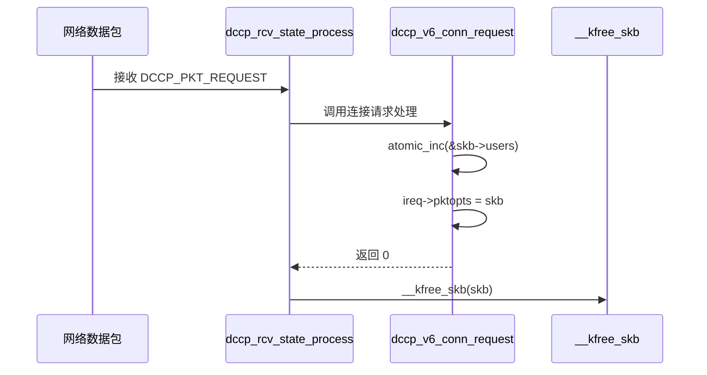
```mermaid
sequenceDiagram
    participant 网络 as 网络数据包
    participant dccp_rcv_state_process
    participant dccp_v6_conn_request
    participant __kfree_skb

    网络->>dccp_rcv_state_process: 接收 DCCP_PKT_REQUEST
    dccp_rcv_state_process->>dccp_v6_conn_request: 调用连接请求处理
    dccp_v6_conn_request->>dccp_v6_conn_request: atomic_inc(&skb->users)
    dccp_v6_conn_request->>dccp_v6_conn_request: ireq->pktopts = skb
    dccp_v6_conn_request-->>dccp_rcv_state_process: 返回 0
    dccp_rcv_state_process->>__kfree_skb: __kfree_skb(skb)
```

**内存释放细节**：

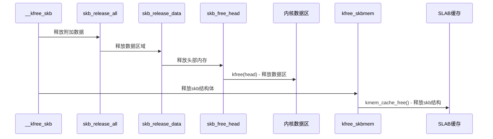
```mermaid
sequenceDiagram
    participant __kfree_skb
    participant skb_release_all
    participant skb_release_data
    participant skb_free_head
    participant 内存 as 内核数据区
    participant kfree_skbmem
    participant 缓存 as SLAB缓存

    __kfree_skb->>skb_release_all: 释放附加数据
    skb_release_all->>skb_release_data: 释放数据区域
    skb_release_data->>skb_free_head: 释放头部内存
    skb_free_head->>内存: kfree(head) - 释放数据区
    __kfree_skb->>kfree_skbmem: 释放skb结构体
    kfree_skbmem->>缓存: kmem_cache_free() - 释放skb结构
```

**关键代码分析**：

```c
/* dccp_rcv_state_process - 触发第一次释放 */
int dccp_rcv_state_process(struct sock *sk, struct sk_buff *skb,
			   struct dccp_hdr *dh, unsigned int len)
{
	/* 步骤 3: 处理 LISTEN 状态 */
	if (sk->sk_state == DCCP_LISTEN) {                     // 套接字处于监听状态
		if (dh->dccph_type == DCCP_PKT_REQUEST) {         // 接收到请求包
			/* 调用 IPv6 连接请求处理 */
			if (inet_csk(sk)->icsk_af_ops->conn_request(sk, skb) < 0)
				return 1;  /* 处理失败，直接返回1，不释放skb */
			/* 处理成功（返回0），跳转到 discard 释放skb */
			goto discard;
		}
	}

discard:  /* 丢弃标签：无条件释放 skb */
	__kfree_skb(skb);  /* 【第一次释放】这里进行了第一次释放 */
	return 0;
}
```

```c
/* dccp_v6_conn_request - 增加引用计数但上层仍会释放 */
static int dccp_v6_conn_request(struct sock *sk, struct sk_buff *skb)
{
	/* 【关键代码段】如果设置了 IPV6_RECVPKTINFO 或相关选项 */
	if (ipv6_opt_accepted(sk, skb, IP6CB(skb)) ||
	    np->rxopt.bits.rxinfo || np->rxopt.bits.rxoinfo ||
	    np->rxopt.bits.rxhlim || np->rxopt.bits.rxohlim) {
		atomic_inc(&skb->users);      /* 增加 skb 的引用计数 */
		ireq->pktopts = skb;          /* 保存 skb 指针 */
	}

	return 0;  /* 成功返回 0，但上层仍会释放 skb */
}
```

**第一次释放的关键问题**：

- `dccp_v6_conn_request()` 成功处理连接请求后返回 0
- 当设置了 `IPV6_RECVPKTINFO` 选项时，会增加 `skb->users` 引用计数并保存指针
- 当 `dccp_v6_conn_request()` 返回 0（表示成功处理）时，`dccp_rcv_state_process()` 会跳转到 `discard` 标签
- 在 `discard` 标签中，直接调用 `__kfree_skb()` 释放 skb，**没有检查引用计数**
- 这导致 skb 在被引用的情况下被强制释放，形成释放后使用（Use-After-Free）条件
- 如果 `dccp_v6_conn_request()` 返回 -1（表示处理失败），则 `dccp_rcv_state_process()` 会直接返回 1，不会跳转到 `discard` 标签，也就不会触发第一次释放

完成第一次释放后，内核内存中留下了悬空指针。这个指针后续会被再次访问，引发第二次释放。

### 3-3. 第二次释放流程分析

第二次释放发生在套接字关闭销毁流程中。当应用程序调用 `shutdown()` 系统调用关闭套接字时，会触发一系列清理操作。这个路径与第一次释放完全独立，涉及不同的执行上下文。

**函数调用流程**：

```
shutdown(handle->server, SHUT_RDWR)    // 用户空间调用
        ↓
SYSC_shutdown()                        // 系统调用入口
        ↓
inet_shutdown()                        // 协议族关闭操作
        ↓
dccp_disconnect()                      // DCCP断开连接
        ↓
inet_csk_listen_stop()                 // 停止监听
        ↓
inet_child_forget()                    // 清理子连接
        ↓
inet_csk_destroy_sock()                // 销毁套接字
        ↓
dccp_v6_destroy_sock()                 // DCCPv6特定清理
        ↓
inet6_destroy_sock()                   // IPv6清理
        ↓
kfree_skb()                            // 释放skb
        ↓
__kfree_skb()                          // 实际释放
```

这个复杂的调用链体现了内核资源管理的层次性。为了清晰展示，我们将第二次释放分为两个序列图：套接字关闭流程和内存释放流程。

**套接字关闭流程**：

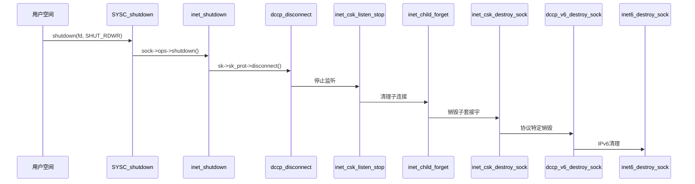
```mermaid
sequenceDiagram
    participant 用户 as 用户空间
    participant SYSC_shutdown
    participant inet_shutdown
    participant dccp_disconnect
    participant inet_csk_listen_stop
    participant inet_child_forget
    participant inet_csk_destroy_sock
    participant dccp_v6_destroy_sock
    participant inet6_destroy_sock

    用户->>SYSC_shutdown: shutdown(fd, SHUT_RDWR)
    SYSC_shutdown->>inet_shutdown: sock->ops->shutdown()
    inet_shutdown->>dccp_disconnect: sk->sk_prot->disconnect()
    dccp_disconnect->>inet_csk_listen_stop: 停止监听
    inet_csk_listen_stop->>inet_child_forget: 清理子连接
    inet_child_forget->>inet_csk_destroy_sock: 销毁子套接字
    inet_csk_destroy_sock->>dccp_v6_destroy_sock: 协议特定销毁
    dccp_v6_destroy_sock->>inet6_destroy_sock: IPv6清理
```

**内存释放细节**：

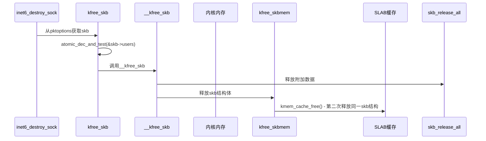
```mermaid
sequenceDiagram
    participant inet6_destroy_sock
    participant kfree_skb
    participant __kfree_skb
    participant 内存 as 内核内存
    participant kfree_skbmem
    participant 缓存 as SLAB缓存

    inet6_destroy_sock->>kfree_skb: 从pktoptions获取skb
    kfree_skb->>kfree_skb: atomic_dec_and_test(&skb->users)
    kfree_skb->>__kfree_skb: 调用__kfree_skb
    __kfree_skb->>skb_release_all: 释放附加数据
    __kfree_skb->>kfree_skbmem: 释放skb结构体
    kfree_skbmem->>缓存: kmem_cache_free() - 第二次释放同一skb结构
```

**关键代码分析**：

```c
/* inet_shutdown - 触发套接字关闭流程 */
int inet_shutdown(struct socket *sock, int how)
{
	struct sock *sk = sock->sk;

	switch (sk->sk_state) {
	/* ... 其他状态处理 ... */
	case TCP_LISTEN:
		if (!(how & RCV_SHUTDOWN))
			break;
		/* 继续执行 */
	case TCP_SYN_SENT:
		err = sk->sk_prot->disconnect(sk, O_NONBLOCK);
		sock->state = err ? SS_DISCONNECTING : SS_UNCONNECTED;
		break;
	}

	return err;
}
```

```c
/* dccp_disconnect - 停止监听并清理 */
int dccp_disconnect(struct sock *sk, int flags)
{
	const int old_state = sk->sk_state;

	/* 如果之前是 LISTEN 状态，停止监听 */
	if (old_state == DCCP_LISTEN) {
		inet_csk_listen_stop(sk);  /* 停止监听 */
	}

	return 0;
}
```

```c
/* inet6_destroy_sock - 触发第二次释放 */
void inet6_destroy_sock(struct sock *sk)
{
	struct ipv6_pinfo *np = inet6_sk(sk);
	struct sk_buff *skb;

	/* 释放接收选项 - 获取之前保存的 skb 指针 */
	skb = xchg(&np->pktoptions, NULL);
	if (skb)
		kfree_skb(skb);  /* 【第二次释放】这里进行第二次释放 */
}
```

```c
/* kfree_skb - 检查引用计数后释放 */
void kfree_skb(struct sk_buff *skb)
{
	/* 检查引用计数 */
	if (likely(!atomic_dec_and_test(&skb->users)))  /* 减少引用计数 */
		return;  /* 如果引用计数不为 0，直接返回 */

	__kfree_skb(skb);  /* 实际释放 */
}
```

**第二次释放的关键问题**：

- 当套接字被 `shutdown()` 关闭时，触发完整的销毁流程
- 最终调用 `inet6_destroy_sock()` 清理 IPv6 特定资源
- 从 `np->pktoptions` 获取之前保存的 skb 指针
- 调用 `kfree_skb()` 释放该 skb，但由于 skb 已被第一次释放，这里触发双重释放

### 3-4. skb释放函数内部流程分析

为了更深入理解漏洞的本质，我们需要详细分析 `__kfree_skb()` 函数的内部实现。这个函数负责实际的 skb 内存释放工作，其设计体现了内核内存管理的精细分层。理解这个内部流程有助于我们认识双重释放对内核稳定性的具体影响。

`__kfree_skb()` 函数分为两个主要阶段：**释放数据区域**和**释放 skb 结构体本身**。这种分离释放的设计是为了处理 skb 可能包含的复杂数据结构。

```c
/* __kfree_skb - 内部 skb 释放函数 */
void __kfree_skb(struct sk_buff *skb)
{
	skb_release_all(skb);  /* 第一阶段：释放所有附加数据 */
	kfree_skbmem(skb);     /* 第二阶段：释放 skb 内存结构 */
}
EXPORT_SYMBOL(__kfree_skb);
```

**第一阶段：释放数据区域（`skb_release_all`）**

```c
/* 释放除 skb 外壳外的所有内容 */
static void skb_release_all(struct sk_buff *skb)
{
	skb_release_head_state(skb);       /* 释放头部状态信息 */
	if (likely(skb->head))
		skb_release_data(skb);      /* 释放数据区域 */
}
```

数据区域的释放通过 `skb_release_data()` 函数完成，这个函数需要处理多种复杂情况：

```c
static void skb_release_data(struct sk_buff *skb)
{
	struct skb_shared_info *shinfo = skb_shinfo(skb);
	int i;

	/* 检查是否为克隆的 skb，并减少数据引用计数 */
	if (skb->cloned &&
	    atomic_sub_return(skb->nohdr ? (1 << SKB_DATAREF_SHIFT) + 1 : 1,
			      &shinfo->dataref))
		return;  /* 如果引用计数不为 0，直接返回 */

	/* 释放分片数据 */
	for (i = 0; i < shinfo->nr_frags; i++)
		__skb_frag_unref(&shinfo->frags[i]);

	/* 如果设置了零拷贝标志，调用回调函数通知用户空间 */
	if (shinfo->tx_flags & SKBTX_DEV_ZEROCOPY) {
		struct ubuf_info *uarg;

		uarg = shinfo->destructor_arg;
		if (uarg->callback)
			uarg->callback(uarg, true);
	}

	/* 释放分片列表 */
	if (shinfo->frag_list)
		kfree_skb_list(shinfo->frag_list);

	/* 最终释放 skb 头部数据区 */
	skb_free_head(skb);
}
```

`skb_free_head()` 函数是释放数据区域的最后一步，根据内存分配方式选择不同的释放函数：

```c
static void skb_free_head(struct sk_buff *skb)
{
	unsigned char *head = skb->head;

	if (skb->head_frag)
		skb_free_frag(head);  /* 如果是分片内存，使用特定释放函数 */
	else
		kfree(head);          /* 否则使用标准的 kfree() 释放 */
}
```

**第二阶段：释放 skb 结构体本身（`kfree_skbmem`）**

skb 结构体本身通过 SLAB 分配器管理，`kfree_skbmem()` 函数需要处理 skb 的克隆（clone）情况：

```c
/*
 *	释放 skbuff 内存而不清理状态
 */
static void kfree_skbmem(struct sk_buff *skb)
{
	struct sk_buff_fclones *fclones;

	switch (skb->fclone) {
	case SKB_FCLONE_UNAVAILABLE:
		kmem_cache_free(skbuff_head_cache, skb);
		return;

	case SKB_FCLONE_ORIG:
		fclones = container_of(skb, struct sk_buff_fclones, skb1);

		/* 我们通常在原始 skb 之前释放克隆（TX 完成）
		 * 这个测试对克隆体没有机会为真，
		 * 而在这里，分支预测将是好的。
		 */
		if (atomic_read(&fclones->fclone_ref) == 1)
			goto fastpath;
		break;

	default: /* SKB_FCLONE_CLONE */
		fclones = container_of(skb, struct sk_buff_fclones, skb2);
		break;
	}
	if (!atomic_dec_and_test(&fclones->fclone_ref))
		return;
fastpath:
	kmem_cache_free(skbuff_fclone_cache, fclones);
}
```

**`kfree_skb` 与 `__kfree_skb` 的关键区别**：

理解这两个函数的区别对于分析漏洞至关重要：

```c
/* 释放 sk_buff - 检查引用计数 */
void kfree_skb(struct sk_buff *skb)
{
	if (unlikely(!skb))
		return;
	if (likely(atomic_read(&skb->users) == 1))
		smp_rmb();
	else if (likely(!atomic_dec_and_test(&skb->users)))  /* 减少引用计数 */
		return;  /* 如果引用计数不为 0，直接返回 */
	trace_kfree_skb(skb, __builtin_return_address(0));
	__kfree_skb(skb);  /* 实际释放 */
}
EXPORT_SYMBOL(kfree_skb);
```

**关键差异总结**：

1. **`kfree_skb()`**：是**安全**的公共接口，会检查 `skb->users` 引用计数，只有在引用计数归零时才真正释放内存
2. **`__kfree_skb()`**：是**内部**辅助函数，**不检查引用计数**，直接强制释放内存

在 CVE-2017-6074 漏洞中：

- 第一次释放使用了 `__kfree_skb()`，绕过了引用计数检查
- 第二次释放使用了 `kfree_skb()`，但由于 skb 已被释放，其内存可能已被重用，导致未定义行为

### 3-5. 漏洞根本原因总结

该双重释放漏洞的根本原因在于 **内存生命周期管理不一致**，具体体现在以下几个方面：

1. **引用计数与释放逻辑不匹配**：
    - `dccp_v6_conn_request()` 在设置 `IPV6_RECVPKTINFO` 时增加 `skb->users` 引用计数
    - 但 `dccp_rcv_state_process()` 的 `discard` 标签直接调用 `__kfree_skb()`，绕过引用计数检查
    - 这破坏了内核内存管理的基本原则：引用计数应完全控制对象生命周期

2. **错误处理路径设计缺陷**：
    - 当 `dccp_v6_conn_request()` 成功处理连接请求（返回 0）时，`dccp_rcv_state_process()` 会跳转到 `discard` 标签释放 skb
    - 如果 `dccp_v6_conn_request()` 处理失败（返回 -1），则 `dccp_rcv_state_process()` 直接返回 1，不会释放 skb
    - 在成功处理并跳转到 `discard` 标签时，代码直接调用 `__kfree_skb()` 释放 skb，没有考虑连接请求处理函数可能已增加 skb 的引用计数并保存指针的情况
    - 这种设计没有区分连接请求处理成功与失败时的不同资源管理需求

3. **缺乏状态同步机制**：
    - 第一次释放后，没有将保存的 skb 指针置为 `NULL`
    - 导致后续清理代码仍认为该指针有效，尝试再次释放
    - 缺少释放后立即置空指针的安全实践

4. **复杂调用链缺乏协调**：
    - 第一次释放发生在数据包接收路径
    - 第二次释放发生在套接字销毁路径
    - 两条独立执行路径缺乏协调，都认为自己拥有 skb 的所有权

这种内存管理不一致性最终导致同一内存块被释放两次，破坏内核内存分配器（如 SLUB）的内部数据结构。理解这一漏洞的完整调用链和内存管理细节，对于后续分析可能的利用技术和防护措施具有重要意义。

## 4. 利用思路一

基于CVE-2017-6074漏洞的利用思路主要围绕**双重释放漏洞的转换与控制**展开。该漏洞本身是一个双重释放（double-free）问题，但通过精心的内存布局控制，可以将其转化为可控的**释放后使用**（Use-After-Free）条件，进而实现内核代码执行。

### 4-1. 利用环境假设

在分析利用思路前，需要明确以下环境假设：

1. **SMEP（Supervisor Mode Execution Prevention）开启**：内核不能直接执行用户空间代码
2. **KPTI（Kernel Page Table Isolation）开启**：内核页表与用户页表隔离
3. **KASLR（Kernel Address Space Layout Randomization）关闭**：内核地址固定
4. **SMAP（Supervisor Mode Access Prevention）关闭**：内核可以访问用户空间内存

这些假设条件决定了利用策略的选择，特别是需要构造控制流劫持技术来绕过SMEP防护。

### 4-2. 整体利用流程图

以下是完整的利用流程图，展示了从环境准备到权限提升的全过程：

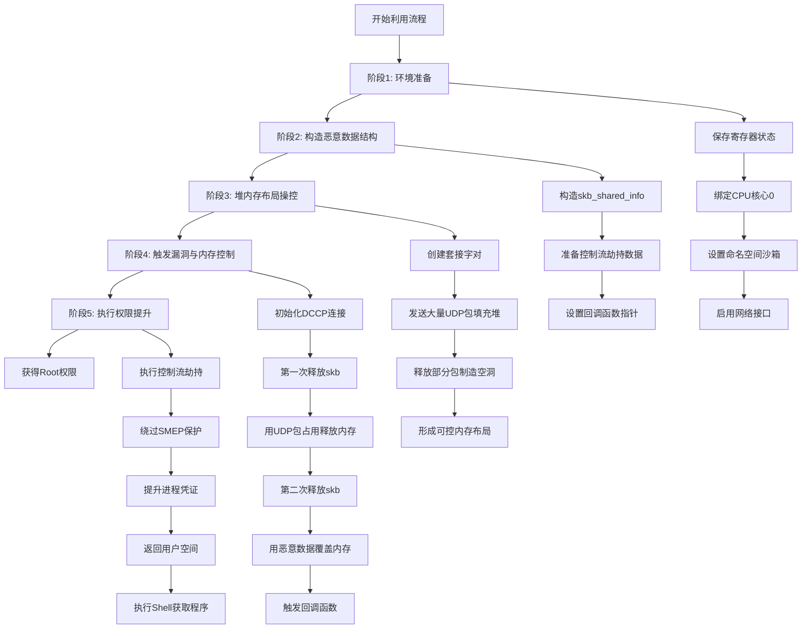
```mermaid
graph TD
    A[开始利用流程] --> B[阶段1: 环境准备]
    B --> C[阶段2: 构造恶意数据结构]
    C --> D[阶段3: 堆内存布局操控]
    D --> E[阶段4: 触发漏洞与内存控制]
    E --> F[阶段5: 执行权限提升]
    F --> G[获得Root权限]

    B --> B1[保存寄存器状态]
    B1 --> B2[绑定CPU核心0]
    B2 --> B3[设置命名空间沙箱]
    B3 --> B4[启用网络接口]

    C --> C1[构造skb_shared_info]
    C1 --> C2[准备控制流劫持数据]
    C2 --> C3[设置回调函数指针]

    D --> D1[创建套接字对]
    D1 --> D2[发送大量UDP包填充堆]
    D2 --> D3[释放部分包制造空洞]
    D3 --> D4[形成可控内存布局]

    E --> E1[初始化DCCP连接]
    E1 --> E2[第一次释放skb]
    E2 --> E3[用UDP包占用释放内存]
    E3 --> E4[第二次释放skb]
    E4 --> E5[用恶意数据覆盖内存]
    E5 --> E6[触发回调函数]

    F --> F1[执行控制流劫持]
    F1 --> F2[绕过SMEP保护]
    F2 --> F3[提升进程凭证]
    F3 --> F4[返回用户空间]
    F4 --> F5[执行Shell获取程序]
```

### 4-3. 内存结构布局详解

理解内核内存中的关键数据结构布局是成功利用该漏洞的基础。以下是相关内存结构的详细布局：

**1. 正常skb内存布局**

基于`struct sk_buff`的实际结构，其内存布局如下：

```
+--------------------------------------------------------------+
|                  sk_buff 结构体 (struct)                     |
|  (包含多个联合体、位域和指针，总大小因配置而异)              |
+--------------------------------------------------------------+
|  union { ... };                                              |
|  struct sock *sk;                                            |
|  struct net_device *dev;                                     |
|  char cb[48];                                                |
|  unsigned long _skb_refdst;                                  |
|  void (*destructor)(struct sk_buff *);                       |
|  struct sec_path *sp;                                        |
|  struct nf_conntrack *nfct;                                  |
|  unsigned int len;                                           |
|  unsigned int data_len;                                      |
|  __u16 mac_len;                                              |
|  __u16 hdr_len;                                              |
|  ... 其他多个位域和字段 ...                                  |
+--------------------------------------------------------------+
|  sk_buff_data_t tail;                                        |
|  sk_buff_data_t end;                                         |
|  unsigned char *head;                                        |
|  unsigned char *data;                                        |
|  unsigned int truesize;                                      |
|  atomic_t users;        /* 引用计数，关键字段 */             |
+--------------------------------------------------------------+
|                    数据区 (data buffer)                      |
|  (起始于head指针，结束于end指针)                             |
+--------------------------------------------------------------+
|        skb_shared_info 结构体 (关键区域)                     |
|  (位于 skb->end 处，即数据区末尾)                            |
+--------------------------------------------------------------+
```

**2. skb_shared_info 结构体的实际内存布局**

基于`struct skb_shared_info`的实际结构，其内存布局如下：

```
+-------------------------------------------------+
| skb_shared_info 结构体 (struct)                 |
| 总大小: 320字节                                 |
+-------------------------------------------------+
| 偏移量 0x00: nr_frags (1字节)                   |
| 偏移量 0x01: tx_flags (1字节)                   |
| 偏移量 0x02: gso_size (2字节)                   |
| 偏移量 0x04: gso_segs (2字节)                   |
| 偏移量 0x06: gso_type (2字节)                   |
| 偏移量 0x08: frag_list (8字节)                  |
| 偏移量 0x10: hwtstamps (8字节)                  |
| 偏移量 0x18: tskey (4字节)                      |
| 偏移量 0x1c: ip6_frag_id (4字节)                |
| 偏移量 0x20: dataref (4字节)                    |
| 偏移量 0x24: 4字节空洞（对齐填充）              |
| 偏移量 0x28: destructor_arg (8字节)【关键字段】 |
| 偏移量 0x30: frags[17] (272字节)                |
+-------------------------------------------------+
```

关键字段说明：

- **`tx_flags`**：传输标志，设置为`SKBTX_DEV_ZEROCOPY`时可触发回调
- **`dataref`**：数据引用计数，控制数据释放条件
- **`destructor_arg`**：回调参数指针，指向`ubuf_info`结构，包含回调函数

**3. ubuf_info 结构体的内存布局**

`destructor_arg`指向的`ubuf_info`结构包含回调函数指针：

```
+--------------------------------------+
| ubuf_info 结构体 (struct)            |
+--------------------------------------+
| uint64_t callback;  // 回调函数指针  |
| uint64_t ctx;       // 上下文指针    |
| uint64_t desc;      // 描述信息      |
+--------------------------------------+
```

**4. 恶意构造的skb_shared_info布局**

恶意利用时构造的内存布局如下：

```
+-------------------------------------------------+
| 恶意构造的 skb_shared_info                      |
+-------------------------------------------------+
| nr_frags = 0                                    |
| tx_flags = 0xff (设置SKBTX_DEV_ZEROCOPY标志)    |
| gso_size = 0                                    |
| gso_segs = 0                                    |
| gso_type = 0                                    |
| frag_list = NULL                                |
| hwtstamps = NULL                                |
| tskey = 0                                       |
| ip6_frag_id = 0                                 |
| dataref = 1 (确保可以释放)                      |
| 4字节空洞 = 0                                   |
| destructor_arg = 指向恶意ubuf_info的指针        |
| frags[17] = 全0填充                             |
+-------------------------------------------------+
|                恶意ubuf_info结构                |
+-------------------------------------------------+
| callback = 指向控制流劫持数据的指针             |
| ctx = 0                                         |
| desc = 0                                        |
+-------------------------------------------------+
|                控制流劫持数据                   |
+-------------------------------------------------+
| 包含绕过SMEP和提升权限的必要指令序列            |
| 具体实现细节因内核版本和配置而异                |
+-------------------------------------------------+
```

**5. 堆内存状态变化序列图**

以下是内存状态变化的完整序列，展示了从初始状态到成功利用的全过程：

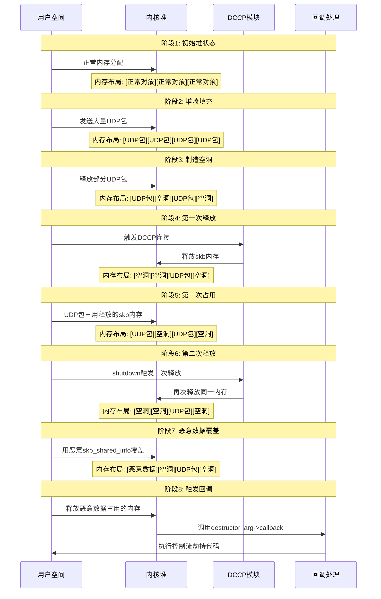
```mermaid
sequenceDiagram
    participant 用户空间
    participant 内核堆
    participant DCCP模块
    participant 回调处理

    Note over 用户空间,回调处理: 阶段1: 初始堆状态
    用户空间->>内核堆: 正常内存分配
    Note over 内核堆: 内存布局: [正常对象][正常对象][正常对象]

    Note over 用户空间,回调处理: 阶段2: 堆喷填充
    用户空间->>内核堆: 发送大量UDP包
    Note over 内核堆: 内存布局: [UDP包][UDP包][UDP包][UDP包]

    Note over 用户空间,回调处理: 阶段3: 制造空洞
    用户空间->>内核堆: 释放部分UDP包
    Note over 内核堆: 内存布局: [UDP包][空洞][UDP包][空洞]

    Note over 用户空间,回调处理: 阶段4: 第一次释放
    用户空间->>DCCP模块: 触发DCCP连接
    DCCP模块->>内核堆: 释放skb内存
    Note over 内核堆: 内存布局: [空洞][空洞][UDP包][空洞]

    Note over 用户空间,回调处理: 阶段5: 第一次占用
    用户空间->>内核堆: UDP包占用释放的skb内存
    Note over 内核堆: 内存布局: [UDP包][空洞][UDP包][空洞]

    Note over 用户空间,回调处理: 阶段6: 第二次释放
    用户空间->>DCCP模块: shutdown触发二次释放
    DCCP模块->>内核堆: 再次释放同一内存
    Note over 内核堆: 内存布局: [空洞][空洞][UDP包][空洞]

    Note over 用户空间,回调处理: 阶段7: 恶意数据覆盖
    用户空间->>内核堆: 用恶意skb_shared_info覆盖
    Note over 内核堆: 内存布局: [恶意数据][空洞][UDP包][空洞]

    Note over 用户空间,回调处理: 阶段8: 触发回调
    用户空间->>内核堆: 释放恶意数据占用的内存
    内核堆->>回调处理: 调用destructor_arg->callback
    回调处理->>用户空间: 执行控制流劫持代码
```

### 4-4. 核心利用思路详解

**1. 环境准备阶段**

利用开始前需要建立稳定的执行环境，这一阶段确保后续操作的可预测性和稳定性：

```
保存寄存器状态 → 绑定CPU核心 → 设置命名空间 → 启用网络接口
```

**2. 恶意数据构造阶段**

此阶段构建用于覆盖内存的关键数据结构，特别是`skb_shared_info`结构中的`destructor_arg`字段，该字段实际指向`ubuf_info`结构：

```c
struct skb_shared_info {
    // ... 其他字段 ...
    void *destructor_arg;   // 指向ubuf_info结构的关键指针
};

struct ubuf_info {
    uint64_t callback;      // 回调函数指针
    uint64_t ctx;           // 上下文指针
    uint64_t desc;          // 描述信息
};
```

**构造步骤**：

1. 在用户空间准备`skb_shared_info`结构
2. 设置`tx_flags`为`SKBTX_DEV_ZEROCOPY`以启用零拷贝
3. 准备`ubuf_info`结构，设置`callback`指向控制流劫持数据
4. 设置`destructor_arg`指向`ubuf_info`结构
5. 准备绕过SMEP和提升权限的必要代码

**3. 堆内存布局操控阶段**

通过精细的内存操作创建可控的堆布局，这是整个利用成功的关键：

```
创建套接字对 → 发送大量UDP包 → 释放部分包 → 形成可控空洞
```

堆内存状态变化可直观表示为：

```
初始: [空闲][空闲][空闲][空闲]
堆喷: [UDP][UDP][UDP][UDP]
释放: [UDP][空洞][UDP][空洞]
目标: 在空洞处分配skb，然后被恶意数据覆盖
```

**4. 漏洞触发与控制阶段**

这是利用的核心阶段，通过双重释放实现内存控制：

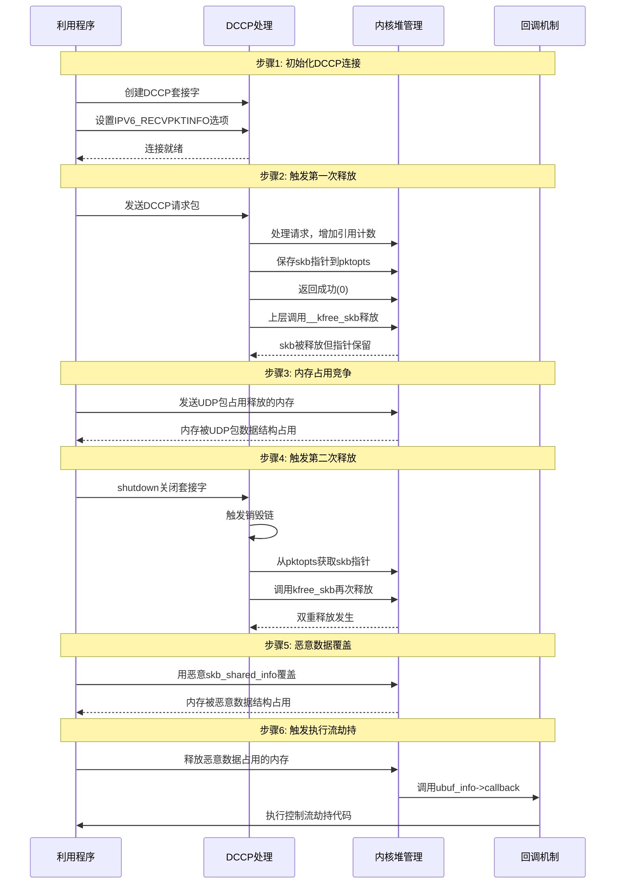
```mermaid
sequenceDiagram
    participant 利用程序
    participant DCCP处理
    participant 内核堆管理
    participant 回调机制

    Note over 利用程序,回调机制: 步骤1: 初始化DCCP连接
    利用程序->>DCCP处理: 创建DCCP套接字
    利用程序->>DCCP处理: 设置IPV6_RECVPKTINFO选项
    DCCP处理-->>利用程序: 连接就绪

    Note over 利用程序,回调机制: 步骤2: 触发第一次释放
    利用程序->>DCCP处理: 发送DCCP请求包
    DCCP处理->>内核堆管理: 处理请求，增加引用计数
    DCCP处理->>内核堆管理: 保存skb指针到pktopts
    DCCP处理->>内核堆管理: 返回成功(0)
    DCCP处理->>内核堆管理: 上层调用__kfree_skb释放
    内核堆管理-->>DCCP处理: skb被释放但指针保留

    Note over 利用程序,回调机制: 步骤3: 内存占用竞争
    利用程序->>内核堆管理: 发送UDP包占用释放的内存
    内核堆管理-->>利用程序: 内存被UDP包数据结构占用

    Note over 利用程序,回调机制: 步骤4: 触发第二次释放
    利用程序->>DCCP处理: shutdown关闭套接字
    DCCP处理->>DCCP处理: 触发销毁链
    DCCP处理->>内核堆管理: 从pktopts获取skb指针
    DCCP处理->>内核堆管理: 调用kfree_skb再次释放
    内核堆管理-->>DCCP处理: 双重释放发生

    Note over 利用程序,回调机制: 步骤5: 恶意数据覆盖
    利用程序->>内核堆管理: 用恶意skb_shared_info覆盖
    内核堆管理-->>利用程序: 内存被恶意数据结构占用

    Note over 利用程序,回调机制: 步骤6: 触发执行流劫持
    利用程序->>内核堆管理: 释放恶意数据占用的内存
    内核堆管理->>回调机制: 调用ubuf_info->callback
    回调机制->>利用程序: 执行控制流劫持代码
```

**详细触发步骤的技术细节**：

```
步骤1: 创建恶意DCCP连接
    - 设置IPV6_RECVPKTINFO选项
    - 使dccp_v6_conn_request()增加skb引用计数

步骤2: 触发第一次skb释放
    - dccp_rcv_state_process()调用__kfree_skb()
    - 绕过引用计数检查，强制释放skb

步骤3: 用正常UDP数据包占用释放的内存
    - 通过socketpair创建UDP套接字对
    - 发送UDP包占用刚刚释放的内存

步骤4: 触发第二次skb释放（双重释放）
    - 调用shutdown()关闭DCCP套接字
    - 触发inet6_destroy_sock()清理
    - 从pktopts获取skb指针并再次释放

步骤5: 用控制流劫持数据覆盖内存
    - 再次占用被双重释放的内存
    - 这次用包含恶意skb_shared_info和ubuf_info的数据覆盖

步骤6: 触发释放，执行回调函数
    - 释放恶意数据占用的内存
    - 触发skb_release_data()中的回调
    - 执行ubuf_info->callback指向的代码
```

**内存释放链的细节**：

当`skb_release_data()`函数被调用时，会检查`tx_flags`标志：

```c
static void skb_release_data(struct sk_buff *skb)
{
    struct skb_shared_info *shinfo = skb_shinfo(skb);

    if (shinfo->tx_flags & SKBTX_DEV_ZEROCOPY) {
        struct ubuf_info *uarg = shinfo->destructor_arg;
        if (uarg->callback)
            uarg->callback(uarg, true);  // 触发回调
    }
    // ... 其他清理代码 ...
}
```

**5. 权限提升阶段**

通过精心构造的控制流劫持技术实现权限提升，绕过SMEP防护：

控制流劫持的基本流程可概括为：

```
起始: ubuf_info->callback被调用
    ↓
步骤1: 建立控制流执行环境
    ↓
步骤2: 绕过SMEP保护机制
    ↓
步骤3: 执行权限提升操作
    ↓
步骤4: 恢复正常执行流程
    ↓
结果: 进程获得提升后的权限
```

### 4-5. 技术挑战与应对策略

**1. 堆布局的不确定性**

- **挑战**：内核堆分配具有不确定性，难以精确控制
- **应对**：通过大量堆喷增加成功概率，制造内存空洞提供可控分配点

**2. SMEP防护绕过**

- **挑战**：内核不能直接执行用户空间代码
- **应对**：采用控制流劫持技术在内核空间执行权限提升代码

**3. KPTI隔离处理**

- **挑战**：内核页表与用户页表隔离
- **应对**：通过正确的上下文切换机制处理页表隔离

**4. 竞争条件处理**

- **挑战**：双重释放与内存占用存在竞争
- **应对**：绑定CPU核心减少调度干扰，精确控制时序

### 4-6. 利用成功率因素

该利用思路的成功率受以下因素影响：

1. **内存布局控制精度**：堆风水布局的精确程度直接影响内存占用的成功率
2. **时序控制**：双重释放与内存占用的时序需要精确协调
3. **系统负载**：系统负载高低影响竞争条件的成功率
4. **内核版本差异**：不同内核版本的内存管理策略可能不同

### 4-7. 防护机制分析

在给定环境假设下（SMEP开启、KPTI开启、KASLR关闭、SMAP关闭），该利用思路能够成功绕过现有防护机制：

- **绕过SMEP**：通过控制流劫持技术在内核空间执行代码
- **处理KPTI**：通过正确的上下文切换机制处理页表隔离
- **利用KASLR关闭**：直接使用固定内核地址
- **利用SMAP关闭**：内核可以直接访问用户空间数据

如果环境中KASLR开启，需要结合内核地址泄露技术；如果SMAP开启，则需要更复杂的内核对象篡改技术。

### 4-8. 总结

CVE-2017-6074的利用思路展示了如何将双重释放漏洞转化为可控的释放后使用条件，进而通过精心构造的内存布局和控制流劫持技术实现权限提升。整个利用过程体现了现代内核漏洞利用的复杂性，需要综合运用堆风水、控制流劫持、防护绕过等多种技术。

该利用思路虽然针对特定环境配置，但其核心方法——将内存破坏漏洞转化为代码执行原语——具有普遍的参考价值。对于防护机制全开的环境，需要在此基础上发展更高级的利用技术。

### 4-9. 测试结果

<div style="text-align: center; margin: 2rem 0;">
  
</div>

## 5. 利用思路二

基于CVE-2017-6074漏洞的利用思路二，是一种针对**开启了所有现代内核防护机制**（KASLR、SMEP、SMAP、KPTI）环境的**系统性、分阶段利用方案**。与思路一相比，其核心创新在于将复杂的利用过程分解为多个逻辑上独立、技术上递进的阶段，通过“先创造执行条件，后实现最终目标”的策略，逐步瓦解多层防护体系。

### 5-1. 利用环境假设

此思路预设了最严苛的内核安全配置，代表了利用技术发展的前沿：

1.  **KASLR（内核地址空间布局随机化）开启**：内核代码与数据的加载地址在每次启动时随机变化，利用代码无法使用固定地址。
2.  **SMEP（管理模式执行保护）开启**：CPU禁止内核态执行用户空间的内存页，直接跳转到用户空间构造的代码路径会触发异常。
3.  **SMAP（管理模式访问保护）开启**：CPU禁止内核态访问用户空间的内存页，使得内核难以直接读写利用者放置在用户空间的恶意数据结构。
4.  **KPTI（内核页表隔离）开启**：内核与用户进程使用完全独立的页表，增加了从内核上下文正确返回用户空间的复杂性。

面对如此全面的防护，单一的直接利用方法难以奏效。思路二的核心策略是**分而治之**，将一次复杂的利用过程拆解为有序执行的多个阶段。

### 5-2. 整体利用流程图

整个利用过程可视为一个精心编排的三幕剧，下图清晰地展示了其阶段性目标与递进关系：

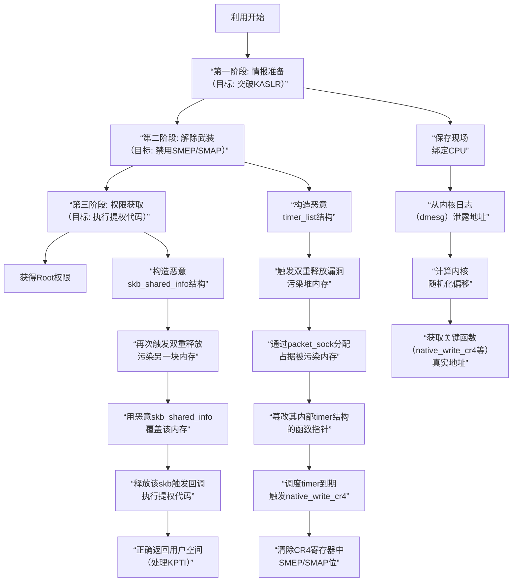
```mermaid
flowchart TD
    A[利用开始] --> B[“第一阶段: 情报准备<br>（目标: 突破KASLR）”]
    B --> C[“第二阶段: 解除武装<br>（目标: 禁用SMEP/SMAP）”]
    C --> D[“第三阶段: 权限获取<br>（目标: 执行提权代码）”]
    D --> E[获得Root权限]

    B --> B1[“保存现场<br>绑定CPU”]
    B1 --> B2[“从内核日志<br>（dmesg）泄露地址”]
    B2 --> B3[“计算内核<br>随机化偏移”]
    B3 --> B4[“获取关键函数<br>（native_write_cr4等）<br>真实地址”]

    C --> C1[“构造恶意<br>timer_list结构”]
    C1 --> C2[“触发双重释放漏洞<br>污染堆内存”]
    C2 --> C3[“通过packet_sock分配<br>占据被污染内存”]
    C3 --> C4[“篡改其内部timer结构<br>的函数指针”]
    C4 --> C5[“调度timer到期<br>触发native_write_cr4”]
    C5 --> C6[“清除CR4寄存器中<br>SMEP/SMAP位”]

    D --> D1[“构造恶意<br>skb_shared_info结构”]
    D1 --> D2[“再次触发双重释放<br>污染另一块内存”]
    D2 --> D3[“用恶意skb_shared_info<br>覆盖该内存”]
    D3 --> D4[“释放该skb触发回调<br>执行提权代码”]
    D4 --> D5[“正确返回用户空间<br>（处理KPTI）”]
```

**阶段逻辑解析**：

- **第一阶段是基础**：在KASLR环境下，所有后续利用都依赖于已知的内核函数地址。此阶段通过信息泄露（如分析`dmesg`输出）获取`__init_begin`等符号的实际地址，进而推算出整个内核的加载基址，为后续精准定位`native_write_cr4`、`commit_creds`等函数打下基础。
- **第二阶段是关键**：在SMAP开启时，内核无法读取用户空间数据。此阶段巧妙地将“禁用防护”这一任务，**完全封装在内核空间内部完成**。利用者不直接提供代码，而是通过篡改内核已有对象（`timer_list`）的函数指针，诱使内核执行一个合法的内核函数（`native_write_cr4`），并传入一个精心计算的参数（`0x6f0`）来清除CR4寄存器中的SMEP和SMAP位。这步成功后，后续利用将不受SMAP/SMEP限制。
- **第三阶段是收官**：在防护被解除后，环境退化为类似思路一的情况。此时可以相对直接地利用双重释放漏洞，通过覆盖`skb_shared_info`的`destructor_arg`触发回调，执行权限提升代码，并正确处理KPTI以返回用户空间。

### 5-3. 内存结构布局详解

理解本思路中涉及的两个核心数据结构布局至关重要。

**1. packet_sock结构中的timer_list布局**

本思路的一个关键技术点是精确覆盖`packet_sock`结构中的`retire_blk_timer`。通过调试器确定了其精确偏移：

```
pwndbg> p/x &(*(struct packet_sock*)0)->rx_ring->prb_bdqc->retire_blk_timer
$1 = 0x380
```

据此，覆盖目标的内存布局如下：

```
+-------------------------------------------------------------+
| packet_sock 结构体 (部分)                                   |
| ... 其他字段 ...                                            |
+-------------------------------------------------------------+
| 偏移 0x000: ...                                             |
| ...                                                         |
| 偏移 0x380: struct timer_list retire_blk_timer (关键目标)   |
+-------------------------------------------------------------+
```

**2. 被篡改的timer_list结构布局**

恶意构造的`timer_list`结构用于触发`native_write_cr4`：

```
+------------------------------------------------+
| 恶意构造的 timer_list 结构体                   |
+------------------------------------------------+
| next: 0 (NULL)                                 |
| prev: 0 (NULL)                                 |
| expires: 0x41414141 (一个未来的jiffies值)      |
| function: native_write_cr4 的真实地址 (关键)   |
| data: 0x6f0 (目标CR4值，SMEP/SMAP位为0)        |
| flags: 1                                       |
| slack: -1                                      |
+------------------------------------------------+
```

关键点说明：

- **function指针**：被覆盖为`native_write_cr4`函数在内存中的真实地址（通过第一阶段计算得出）。
- **data参数**：设置为`0x6f0`。在x86_64架构下，CR4寄存器的第20位控制SMEP，第21位控制SMAP。值`0x6f0`的二进制表示中，第20和21位均为0，从而在写入时禁用这两项保护。

**3. 第二阶段与第三阶段的内存布局演变**

思路二进行了两次独立的堆内存操控：

```
第一次利用（第二阶段，禁用防护）：
初始堆状态: [空闲块A][空闲块B][空闲块C]
触发漏洞后: [空洞A（被双重释放）][空闲块B][空闲块C]
分配packet_sock: [packet_sock对象][空闲块B][空闲块C]
覆盖timer: [恶意timer_list][空闲块B][空闲块C]

第二次利用（第三阶段，提权）：
在另一区域: [恶意timer...][空闲块B][空洞C（被双重释放）]
覆盖skb_shared_info: [恶意timer...][空闲块B][恶意skb_shared_info]
```

### 5-4. 核心利用思路详解

**第一阶段：环境侦察与KASLR绕过**

此阶段的目标是获取内核的“地图”。利用代码通过扫描系统日志（`dmesg`）来寻找内核符号的蛛丝马迹。

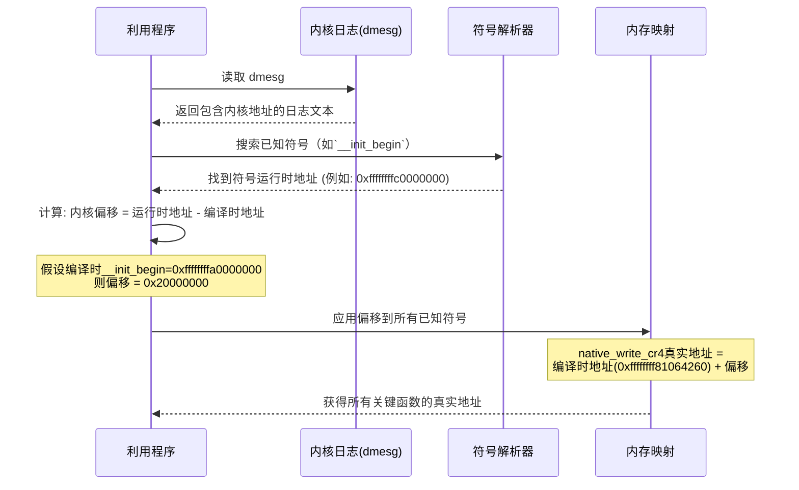
```mermaid
sequenceDiagram
    participant E as 利用程序
    participant K as 内核日志(dmesg)
    participant S as 符号解析器
    participant M as 内存映射

    E->>K: 读取 dmesg
    K-->>E: 返回包含内核地址的日志文本
    E->>S: 搜索已知符号（如`__init_begin`）
    S-->>E: 找到符号运行时地址 (例如: 0xffffffffc0000000)
    E->>E: 计算: 内核偏移 = 运行时地址 - 编译时地址
    Note over E: 假设编译时__init_begin=0xffffffffa0000000<br>则偏移 = 0x20000000
    E->>M: 应用偏移到所有已知符号
    Note over M: native_write_cr4真实地址 =<br>编译时地址(0xffffffff81064260) + 偏移
    M-->>E: 获得所有关键函数的真实地址
```

**关键步骤**：

1.  **信息源**：利用`dmesg`命令读取内核日志，这些日志中可能包含未过滤的内核地址信息。
2.  **定位锚点**：在日志中搜索`__init_begin`、`_stext`等已知内核符号的地址。这些符号在编译时具有固定偏移关系。
3.  **计算基址**：用找到的符号运行时地址减去其编译时地址，得到内核随机化偏移量（`kernel_offset`）。
4.  **重定位**：将此偏移量应用到所有预定义的函数符号上，即可得到它们在当前运行系统中的真实地址。

**第二阶段：内核内防护解除（核心创新）**

这是本思路最具匠心的部分。其核心是**不依赖用户空间代码，而是“教唆”内核自己关闭自己的保护**。

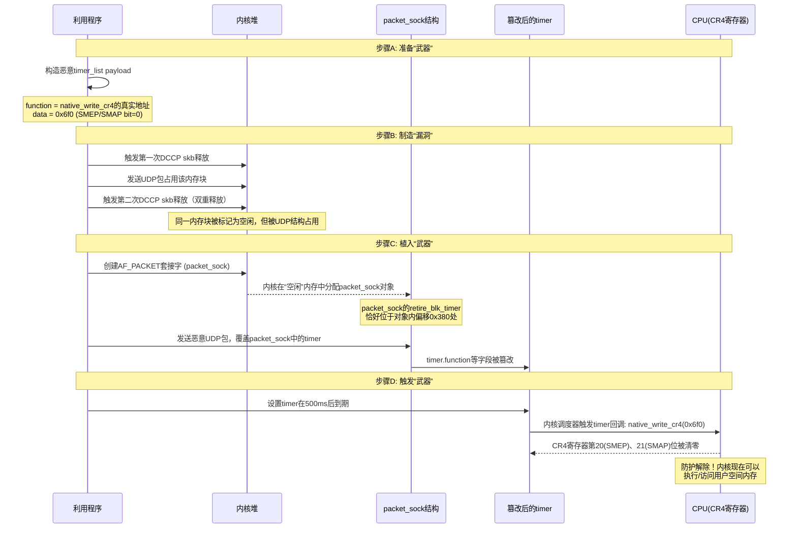
```mermaid
sequenceDiagram
    participant E as 利用程序
    participant H as 内核堆
    participant P as packet_sock结构
    participant T as 篡改后的timer
    participant C as CPU(CR4寄存器)

    Note over E,C: 步骤A: 准备“武器”
    E->>E: 构造恶意timer_list payload
    Note over E: function = native_write_cr4的真实地址<br>data = 0x6f0 (SMEP/SMAP bit=0)

    Note over E,C: 步骤B: 制造“漏洞”
    E->>H: 触发第一次DCCP skb释放
    E->>H: 发送UDP包占用该内存块
    E->>H: 触发第二次DCCP skb释放（双重释放）
    Note over H: 同一内存块被标记为空闲，但被UDP结构占用

    Note over E,C: 步骤C: 植入“武器”
    E->>H: 创建AF_PACKET套接字 (packet_sock)
    H-->>P: 内核在“空闲”内存中分配packet_sock对象
    Note over P: packet_sock的retire_blk_timer<br>恰好位于对象内偏移0x380处
    E->>P: 发送恶意UDP包，覆盖packet_sock中的timer
    P->>T: timer.function等字段被篡改

    Note over E,C: 步骤D: 触发“武器”
    E->>T: 设置timer在500ms后到期
    T->>C: 内核调度器触发timer回调: native_write_cr4(0x6f0)
    C-->>T: CR4寄存器第20(SMEP)、21(SMAP)位被清零
    Note over C: 防护解除！内核现在可以<br>执行/访问用户空间内存
```

**关键技术**：

1.  **精准覆盖**：通过逆向工程或调试，预先知道`retire_blk_timer`在`packet_sock`结构体中的精确偏移（0x380），从而确保覆盖的准确性。
2.  **函数重用**：`native_write_cr4`是内核用于写入CR4寄存器的合法函数。利用者只是“借用”它，并传递了一个符合自己需求的参数（`0x6f0`），该值将SMEP和SMAP对应的比特位置零。
3.  **内存隔离**：整个第二阶段，利用程序除了触发漏洞和传递数据，**并未试图让内核执行任何用户空间代码**。所有操作（篡改数据、触发timer）都在内核对象层面进行，完美规避了SMAP的限制。

**第三阶段：权限提升与安全返回**

在SMEP/SMAP被禁用后，利用环境变得“友好”。此阶段复用思路一的核心方法，但操作对象是另一块独立的内存区域，避免与第二阶段冲突。

```
内存布局演变示例：

初始: [ 空闲 | 空闲 | 空闲 ]
阶段2后: [ packet_sock(带恶意timer) | 正常对象 | 空闲 ]
阶段3利用: [ packet_sock... | 正常对象 | 空闲 ]
          触发DCCP双重释放在此空闲块
          -> [ packet_sock... | 正常对象 | 空洞 ]
          用恶意skb_shared_info覆盖
          -> [ packet_sock... | 正常对象 | 恶意skb ]
```

**执行流程简述**：

1.  **再次利用漏洞**：初始化一个新的DCCP连接，在另一片堆内存区域触发双重释放漏洞。
2.  **部署最终载荷**：用精心构造的`skb_shared_info`结构覆盖被释放的内存。该结构的`destructor_arg`指向一个`ubuf_info`结构，其中`callback`指针指向用户空间准备好的权限提升函数。
3.  **触发与提权**：当该恶意skb被释放时，内核会调用`callback`。此时由于SMEP/SMAP已禁用，内核可以跳转到用户空间函数执行。该函数通常包含`commit_creds(prepare_kernel_cred(0))`以提升当前进程权限。
4.  **处理KPTI返回**：提权代码最后通过`swapgs`指令和`iretq`指令序列，正确切换页表并返回用户空间。返回地址被设置为用户空间的shell获取程序。

### 5-5. 技术挑战与应对策略

**1. KASLR随机化**

- **挑战**：所有内核符号地址未知，无法直接调用`native_write_cr4`等函数。
- **应对**：利用内核日志（dmesg）等信息泄露源，提取已知符号的运行时地址，计算出随机化偏移，进而推算出所有所需函数的真实地址。

**2. SMAP保护限制**

- **挑战**：内核无法访问用户空间，难以直接注入和执行利用代码。
- **应对**：采用“内核内利用”策略。第一阶段完全不依赖用户空间代码，而是通过篡改内核自身的`timer_list`对象，使其回调函数指向合法的内核函数`native_write_cr4`，并传递合适的参数，从而从内部禁用SMAP。

**3. 两次独立利用的协调**

- **挑战**：需要先后在堆上完成两次不同的内存篡改（覆盖timer和覆盖skb_shared_info），且不能相互干扰。
- **应对**：进行精细的堆风水（Heap Feng Shui）操作。通过大量分配和选择性释放来塑造堆布局，确保`packet_sock`和后续的恶意`skb`能够分配到不同的、可控的内存区域。使用不同大小的分配（如普通UDP skb和小skb）来防止内存合并，维持堆的“空洞”状态。

**4. 时序竞争条件**

- **挑战**：双重释放后，与系统其他线程竞争分配释放的内存；timer的到期时间需要精确控制。
- **应对**：将进程绑定到特定CPU核，减少线程调度带来的不确定性。精确控制发送UDP包、创建套接字等操作的时序，以赢得竞争。为timer设置一个较短的超时（如500ms），并通过`sleep`等待其触发。

### 5-6. 利用成功率因素

在完整防护环境下，本思路的成功率受以下多重因素影响：

1.  **信息泄露的可靠性**：`dmesg`中是否包含可用的、未经过滤的内核符号地址，这是所有后续步骤的基础。
2.  **堆布局的可预测性**：尽管进行了堆风水，但内核堆分配仍存在一定随机性，特别是在系统负载较高时。需要大量喷涂以提高在目标地址分配的概率。
3.  **竞争条件的可控性**：赢得双重释放后的内存分配竞赛是成功的关键，这受到系统当前负载和调度策略的影响。
4.  **定时器触发的确定性**：需要确保被篡改的timer能够顺利到期并执行，而不被意外的套接字关闭或资源清理所中断。

### 5-7. 防护机制分析

本思路系统性地绕过了现代内核的四大防护机制，其对应关系如下：

| 防护机制  | 绕过技术       | 具体实现与说明                                                                                                                                  |
| :-------- | :------------- | :---------------------------------------------------------------------------------------------------------------------------------------------- |
| **KASLR** | 内核信息泄露   | 从`dmesg`日志中解析`__init_begin`等符号地址，计算加载偏移量，动态定位所有所需内核函数。                                                         |
| **SMAP**  | 内核内数据篡改 | 不直接访问用户空间。利用漏洞篡改内核`packet_sock`对象内的`timer_list`结构，通过其合法的`function`指针调用`native_write_cr4`，实现“自己改自己”。 |
| **SMEP**  | 修改CR4寄存器  | 通过上述`native_write_cr4(0x6f0)`调用，清除CR4寄存器中的SMEP位，为后续执行用户空间代码铺平道路。                                                |
| **KPTI**  | 规范上下文切换 | 在最终提权代码中，使用`swapgs`和`iretq`指令序列，按照内核规范完成从内核态到用户态的切换，正确处理分离的页表。                                   |

**创新性总结**：

1.  **分阶段利用链**：将“获取地址”、“禁用防护”、“执行提权”三个高难度目标解耦，转化为串联的、相对简单的步骤。
2.  **面向数据/对象的利用**：核心技术从代码注入转向对内核数据对象的精准篡改（如`timer->function`），利用内核自身的逻辑流程达成目的，规避了数据执行防护。
3.  **对SMAP的深度利用**：SMAP防止内核“读/写”用户空间，但本思路反其道而行之，利用内核“写”自身数据的能力来关闭SMAP，展现了防护机制的非对称性。

### 5-8. 总结

利用思路二代表了针对CVE-2017-6074漏洞的**高级、系统性利用方案**。与思路一相比，它不再是一个简单的漏洞利用，而是一个**完整的利用链构建**，展示了如何在最不利的安全配置下逐步打开突破口。

其核心方法论——**分阶段推进、内核内利用、数据流劫持**——具有很高的普适性，为理解和防御现代复杂的内核漏洞利用提供了经典范例。该思路表明，在深度防御体系下，各个防护机制并非孤岛，一处细微的漏洞（如本处的双重释放）在精心设计的利用链中，可能成为穿透多层防御的起点。这进一步强调了系统安全需要全面考虑、及时修补已知漏洞，并持续关注缓解机制的演进与对抗。

### 5-9. 测试结果

<div style="text-align: center; margin: 2rem 0;">
  
</div>

## 6. 利用思路三

基于CVE-2017-6074漏洞的利用思路三，是另一种针对**完整防护环境**（KASLR/SMEP/SMAP/KPTI全开）的**信息泄露与堆风水结合**的利用方案。与前两种思路不同，此思路通过**精确的内存信息泄露**获取内核关键地址，然后结合**多阶段内存布局操控**实现权限提升。该思路体现了现代内核漏洞利用中**信息泄露与内存控制相结合**的高级技术。

### 6-1. 利用环境假设

与思路二相同，利用思路三针对最严格的内核防护环境：

1.  **KASLR开启**：内核地址空间随机化
2.  **SMEP开启**：内核不能直接执行用户空间代码
3.  **SMAP开启**：内核不能访问用户空间内存
4.  **KPTI开启**：内核页表与用户页表隔离

此环境代表了现代Linux内核的最高安全级别，需要结合多种技术进行系统性利用。

### 6-2. 整体利用流程图

以下是完整的利用流程图，展示了从环境准备到权限提升的全过程，特别强调了**信息泄露与内存控制相结合**的特点：

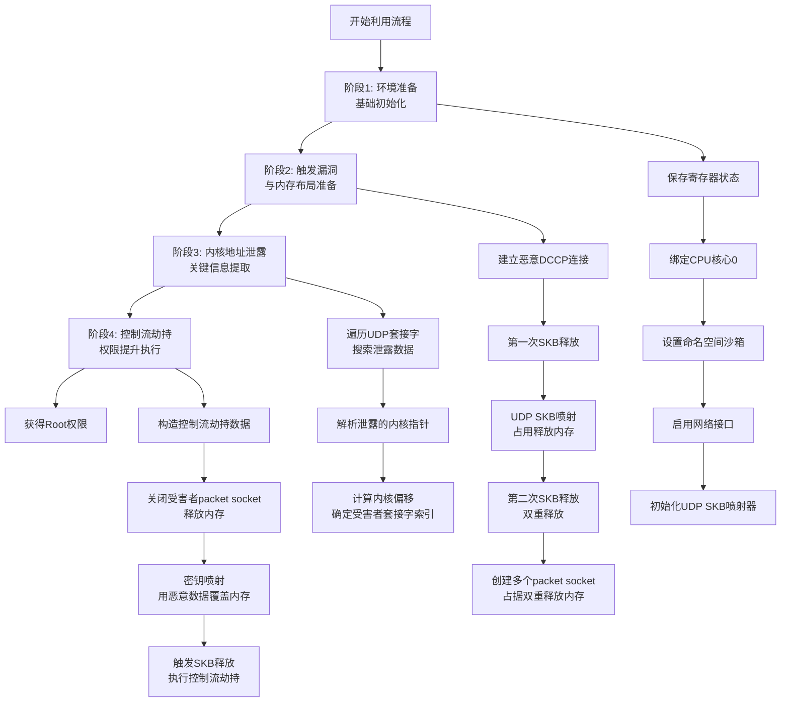
```mermaid
flowchart TD
    A[开始利用流程] --> B[阶段1: 环境准备<br>基础初始化]
    B --> C[阶段2: 触发漏洞<br>与内存布局准备]
    C --> D[阶段3: 内核地址泄露<br>关键信息提取]
    D --> E[阶段4: 控制流劫持<br>权限提升执行]
    E --> F[获得Root权限]

    B --> B1[保存寄存器状态]
    B1 --> B2[绑定CPU核心0]
    B2 --> B3[设置命名空间沙箱]
    B3 --> B4[启用网络接口]
    B4 --> B5[初始化UDP SKB喷射器]

    C --> C1[建立恶意DCCP连接]
    C1 --> C2[第一次SKB释放]
    C2 --> C3[UDP SKB喷射<br>占用释放内存]
    C3 --> C4[第二次SKB释放<br>双重释放]
    C4 --> C5[创建多个packet socket<br>占据双重释放内存]

    D --> D1[遍历UDP套接字<br>搜索泄露数据]
    D1 --> D2[解析泄露的内核指针]
    D2 --> D3[计算内核偏移<br>确定受害者套接字索引]

    E --> E1[构造控制流劫持数据]
    E1 --> E2[关闭受害者packet socket<br>释放内存]
    E2 --> E3[密钥喷射<br>用恶意数据覆盖内存]
    E3 --> E4[触发SKB释放<br>执行控制流劫持]
```

**阶段逻辑解析**：

- **第一阶段是基础**：建立稳定的执行环境，包括保存寄存器状态、绑定CPU核心、设置命名空间沙箱、启用网络接口，并初始化UDP SKB喷射器为后续内存布局操控做准备。
- **第二阶段是关键**：触发双重释放漏洞并通过精心设计的堆风水创建可预测的内存布局。先触发第一次SKB释放，然后用UDP SKB喷射占用释放的内存，再触发第二次SKB释放形成双重释放条件，最后创建大量packet socket对象占据被双重释放的内存区域。
- **第三阶段是信息收集**：遍历所有UDP套接字，搜索其中因内存破坏而泄露的内核指针。通过分析这些泄露的指针，可以计算出内核随机化偏移，定位受害者套接字，为下一步利用提供关键信息。
- **第四阶段是执行**：基于泄露的地址信息构造控制流劫持数据，然后释放受害者packet socket的内存区域，用恶意数据覆盖该区域，最后触发SKB释放来执行控制流劫持，实现权限提升。

### 6-3. 内存结构布局详解

理解本思路中涉及的关键数据结构布局是理解其工作原理的基础。基于提供的调试器输出，关键内存布局如下：

**1. packet_sock结构内存布局**

根据提供的调试器输出，`packet_sock`结构包含以下关键字段布局：

```
+---------------------------------------------------+
| packet_sock 结构体                                |
+---------------------------------------------------+
| 偏移 0x00: struct sock sk                         |
| 偏移 0x...: 其他packet_sock特定字段               |
+---------------------------------------------------+
```

**struct sock 结构体（位于packet_sock内部）的详细布局**：

```
+---------------------------------------------------+
| struct sock 结构体                                |
| (位于 packet_sock + 0x00 偏移处)                  |
+---------------------------------------------------+
| 偏移 0x00: struct sock_common __sk_common         |
| 偏移 0x88: socket_lock_t sk_lock;                 |
| 偏移 0xa8: struct sk_buff_head sk_receive_queue   |
| 偏移 0xc0: ... (其他字段) ...                     |
| 偏移 0x1d8: long sk_rcvtimeo                      |
| ... 其他字段 ...                                  |
+---------------------------------------------------+
```

**2. 泄露数据的结构分析**

当UDP SKB分配到被释放的packet_sock内存区域时，会包含原结构的残留数据，泄露数据的布局如下：

```
UDP SKB数据区内存布局 (包含泄露信息):
+---------------------------------------------------+
| 偏移 0x00: ...                                    |
| 偏移 0x28: 原skc_prot字段 (关键泄露点)            |
| 偏移 0xa8: 原sk_receive_queue字段 (关键泄露点)    |
| 偏移 0xc0: ...                                    |
| 偏移 0x1d8: 原sk_rcvtimeo字段 (用于识别受害者)    |
| ... 其他字段 ...                                  |
+---------------------------------------------------+
```

**关键泄露点说明**：

1. **偏移0x28处的skc_prot**：如`packet_proto`指针，可用于计算内核偏移
2. **偏移0xa8处的sk_receive_queue**：这是一个`struct sk_buff_head`结构，可能包含内核堆指针
3. **偏移0x1d8处的sk_rcvtimeo**：这是利用程序设置的接收超时值，用于识别具体的packet socket索引

**3. 内存布局演变过程**

利用思路三的内存操控过程如下：

```
初始状态: [空闲内存块A][空闲内存块B][空闲内存块C]

阶段2: 触发漏洞后
第一次释放: [空洞A][空闲内存块B][空闲内存块C]
UDP SKB占用: [UDP SKB][空闲内存块B][空闲内存块C]
第二次释放: [空洞A][空闲内存块B][空闲内存块C] (双重释放)
packet socket分配: [packet_sock][空闲内存块B][空闲内存块C]

阶段3: 信息泄露
UDP SKB中包含了packet_sock的残留数据
通过分析偏移0x28、0xa8和0x1d8可得到关键信息

阶段4: 执行控制流劫持
释放packet_sock: [空洞A][空闲内存块B][空闲内存块C]
密钥喷射覆盖: [恶意数据][空闲内存块B][空闲内存块C]
触发SKB释放执行控制流劫持
```

### 6-4. 核心利用思路详解

**第一阶段：环境准备**

此阶段建立稳定的执行环境，为后续复杂的内存操作打下基础：

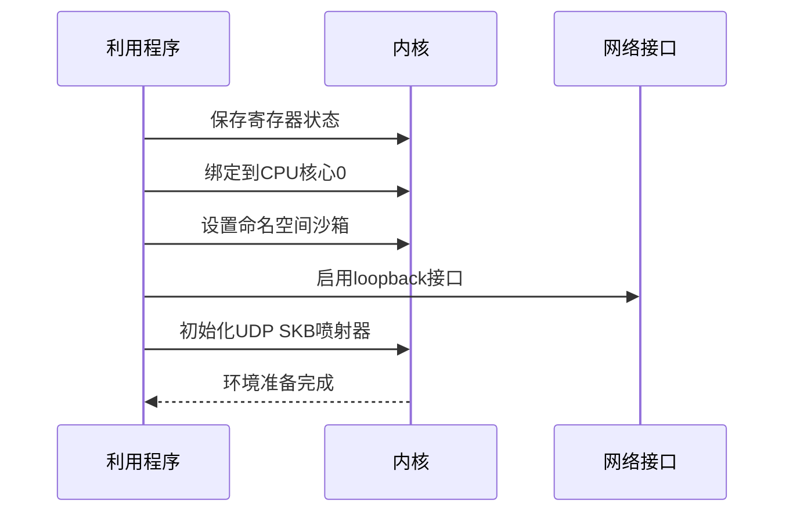
```mermaid
sequenceDiagram
    participant 利用程序
    participant 内核
    participant 网络接口

    利用程序->>内核: 保存寄存器状态
    利用程序->>内核: 绑定到CPU核心0
    利用程序->>内核: 设置命名空间沙箱
    利用程序->>网络接口: 启用loopback接口
    利用程序->>内核: 初始化UDP SKB喷射器
    内核-->>利用程序: 环境准备完成
```

关键技术点：

1. **CPU绑定**：减少线程调度对内存操作时序的影响
2. **命名空间隔离**：创建独立的网络命名空间，避免干扰主机网络
3. **UDP SKB喷射器初始化**：预分配大量UDP套接字，为后续内存喷射做准备

**第二阶段：漏洞触发与内存布局准备**

此阶段精心操控堆内存布局，为信息泄露创造条件。

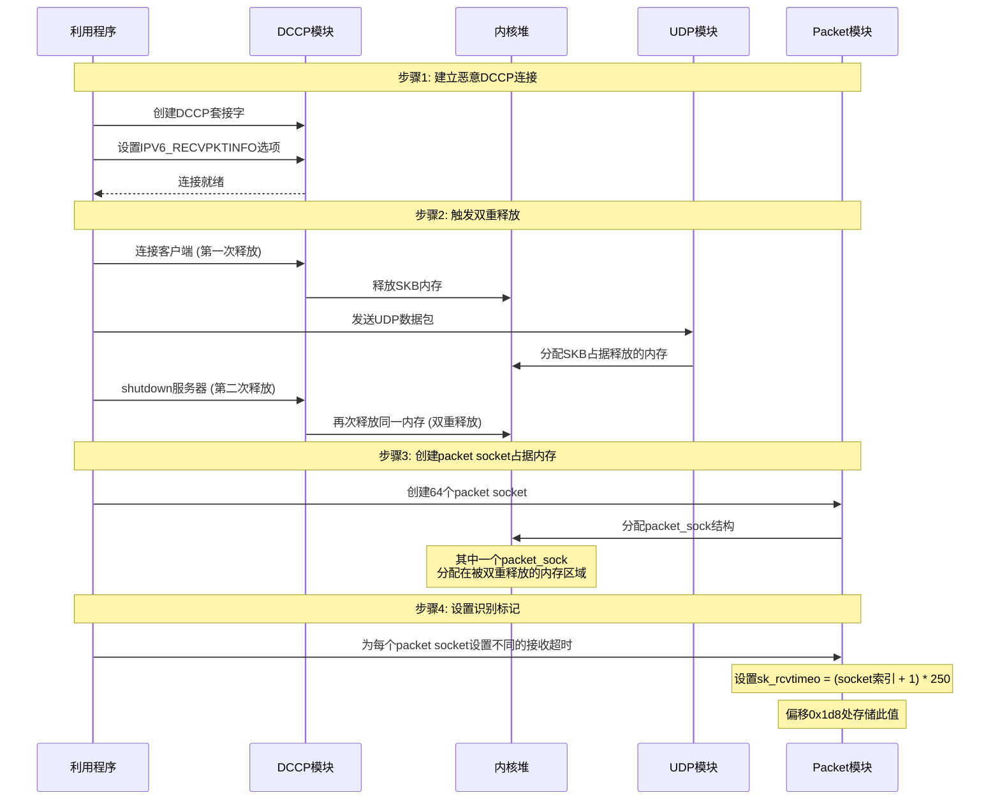
```mermaid
sequenceDiagram
    participant 利用程序
    participant DCCP模块
    participant 内核堆
    participant UDP模块
    participant Packet模块

    Note over 利用程序,Packet模块: 步骤1: 建立恶意DCCP连接
    利用程序->>DCCP模块: 创建DCCP套接字
    利用程序->>DCCP模块: 设置IPV6_RECVPKTINFO选项
    DCCP模块-->>利用程序: 连接就绪

    Note over 利用程序,Packet模块: 步骤2: 触发双重释放
    利用程序->>DCCP模块: 连接客户端 (第一次释放)
    DCCP模块->>内核堆: 释放SKB内存
    利用程序->>UDP模块: 发送UDP数据包
    UDP模块->>内核堆: 分配SKB占据释放的内存
    利用程序->>DCCP模块: shutdown服务器 (第二次释放)
    DCCP模块->>内核堆: 再次释放同一内存 (双重释放)

    Note over 利用程序,Packet模块: 步骤3: 创建packet socket占据内存
    利用程序->>Packet模块: 创建64个packet socket
    Packet模块->>内核堆: 分配packet_sock结构
    Note over 内核堆: 其中一个packet_sock<br>分配在被双重释放的内存区域

    Note over 利用程序,Packet模块: 步骤4: 设置识别标记
    利用程序->>Packet模块: 为每个packet socket设置不同的接收超时
    Note over Packet模块: 设置sk_rcvtimeo = (socket索引 + 1) * 250
    Note over Packet模块: 偏移0x1d8处存储此值
```

**关键技术点**：

1. **双重释放触发**：通过DCCP连接和shutdown操作触发双重释放漏洞
2. **内存占位竞争**：在双重释放后立即用UDP SKB占据内存，然后创建packet socket
3. **对象标记**：为每个packet socket设置不同的超时值（存储在偏移0x1d8处），便于后续识别受害者

**第三阶段：内核地址泄露**

此阶段从被破坏的内存中提取关键内核地址信息。

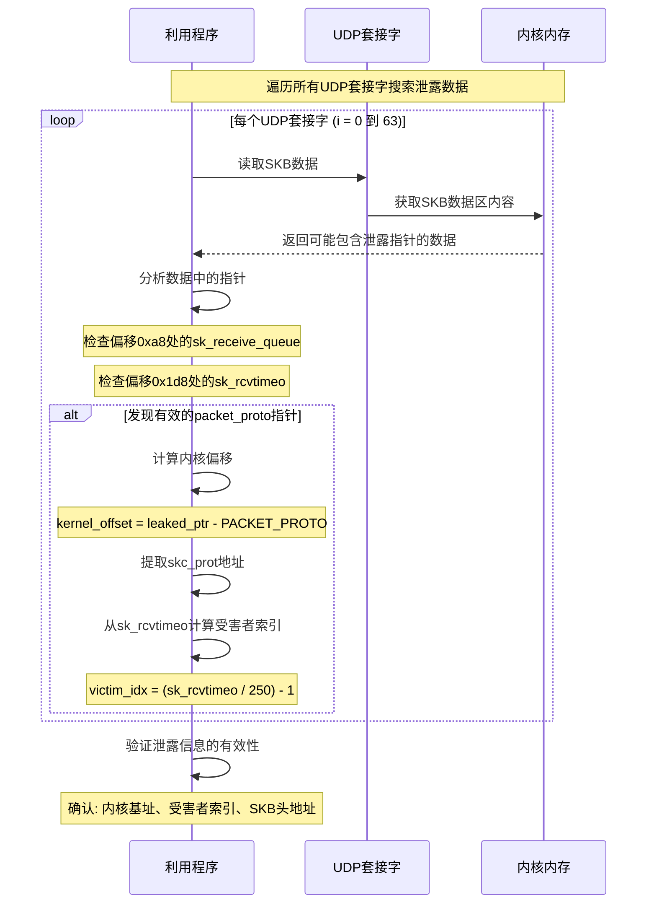
```mermaid
sequenceDiagram
    participant 利用程序
    participant UDP套接字
    participant 内核内存

    Note over 利用程序,内核内存: 遍历所有UDP套接字搜索泄露数据
    loop 每个UDP套接字 (i = 0 到 63)
        利用程序->>UDP套接字: 读取SKB数据
        UDP套接字->>内核内存: 获取SKB数据区内容
        内核内存-->>利用程序: 返回可能包含泄露指针的数据

        利用程序->>利用程序: 分析数据中的指针
        Note over 利用程序: 检查偏移0xa8处的sk_receive_queue
        Note over 利用程序: 检查偏移0x1d8处的sk_rcvtimeo
        alt 发现有效的packet_proto指针
            利用程序->>利用程序: 计算内核偏移
            Note over 利用程序: kernel_offset = leaked_ptr - PACKET_PROTO
            利用程序->>利用程序: 提取skc_prot地址
            利用程序->>利用程序: 从sk_rcvtimeo计算受害者索引
            Note over 利用程序: victim_idx = (sk_rcvtimeo / 250) - 1
        end
    end

    利用程序->>利用程序: 验证泄露信息的有效性
    Note over 利用程序: 确认: 内核基址、受害者索引、SKB头地址
```

泄露的关键信息包括：

1. **skc_prot指针**：用于计算内核随机化偏移
2. **sk_receive_queue地址**：用于定位SKB数据区的内核地址
3. **受害者索引**：通过sk_rcvtimeo值（偏移0x1d8）识别是哪个packet_sock被破坏

**第四阶段：控制流劫持执行**

基于泄露的地址信息，执行最终的控制流劫持：

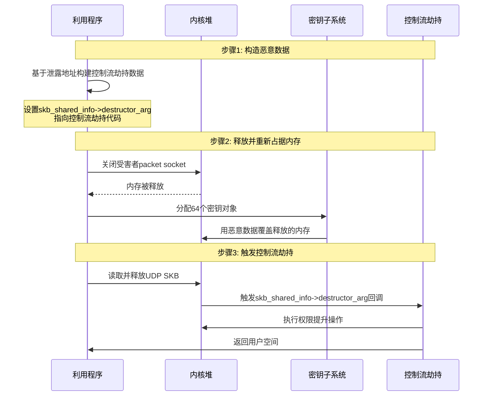
```mermaid
sequenceDiagram
    participant 利用程序
    participant 内核堆
    participant 密钥子系统
    participant 控制流劫持

    Note over 利用程序,控制流劫持: 步骤1: 构造恶意数据
    利用程序->>利用程序: 基于泄露地址构建控制流劫持数据
    Note over 利用程序: 设置skb_shared_info->destructor_arg<br>指向控制流劫持代码

    Note over 利用程序,控制流劫持: 步骤2: 释放并重新占据内存
    利用程序->>内核堆: 关闭受害者packet socket
    内核堆-->>利用程序: 内存被释放
    利用程序->>密钥子系统: 分配64个密钥对象
    密钥子系统->>内核堆: 用恶意数据覆盖释放的内存

    Note over 利用程序,控制流劫持: 步骤3: 触发控制流劫持
    利用程序->>内核堆: 读取并释放UDP SKB
    内核堆->>控制流劫持: 触发skb_shared_info->destructor_arg回调
    控制流劫持->>内核堆: 执行权限提升操作
    控制流劫持->>利用程序: 返回用户空间
```

**关键技术点**：

1. **精确地址计算**：基于泄露的内核地址精确构造控制流劫持数据
2. **密钥喷射技术**：使用内核密钥分配机制精确覆盖目标内存
3. **时机控制**：在正确的时间触发SKB释放，执行控制流劫持

### 6-5. 技术挑战与创新解决方案

**挑战1：精确的信息泄露**

- **挑战**：在SMAP开启的环境下，需要从内核内存中泄露精确的地址信息
- **解决方案**：利用内存破坏后残留的指针数据，通过遍历UDP套接字搜索特定的指针模式（如packet_proto指针的特定低位特征）

**挑战2：内存布局的精确控制**

- **挑战**：需要确保packet_sock恰好分配到被双重释放的内存区域
- **解决方案**：通过大量创建packet socket（64个）增加概率，并为每个设置不同的超时值以便识别

**挑战3：多阶段协调**

- **挑战**：信息泄露、内存释放、数据覆盖、触发执行等多个阶段需要精确协调
- **解决方案**：分阶段执行，每阶段验证成功后再进入下一阶段，通过受害者索引等标记跟踪状态

**挑战4：绕过SMAP保护**

- **挑战**：SMAP防止内核访问用户空间，需要在内核空间内部完成关键操作
- **解决方案**：通过密钥分配机制在内核空间分配恶意数据，完全避免用户空间访问

### 6-6. 利用成功率分析

在完整防护环境下，本思路的成功率受以下因素影响：

1. **信息泄露的可靠性**：依赖内存破坏后残留指针的特定模式，需要精确的搜索和验证逻辑
2. **内存竞争的成功率**：需要赢得双重释放后的内存分配竞赛
3. **密钥喷射的精确性**：密钥对象需要精确覆盖目标内存区域
4. **时序控制的准确性**：多个操作阶段的时序需要精确协调

**提高成功率的策略**：

- 大量创建对象增加统计概率
- 精确的标记和验证机制
- 错误检测和重试逻辑
- 多阶段渐进式验证

### 6-7. 防护机制与绕过技术总结

利用思路三展示了另一种对抗完整防护体系的方法：

| 防护机制 | 绕过技术       | 关键技术点                                    |
| -------- | -------------- | --------------------------------------------- |
| KASLR    | 内存信息泄露   | 从破坏的packet_sock结构中提取packet_proto指针 |
| SMEP     | 控制流劫持     | 通过skb_shared_info的destructor_arg劫持控制流 |
| SMAP     | 内核内数据分配 | 使用密钥分配机制在内核空间创建恶意数据        |
| KPTI     | 标准返回路径   | 通过控制流劫持代码正确处理页表切换            |

**技术特点总结**：

1. **信息泄露驱动**：依赖精确的内存信息泄露获取利用所需的关键地址
2. **多对象类型利用**：结合DCCP、UDP、packet socket、密钥系统等多种内核对象
3. **精确内存操控**：通过受害者索引等机制实现精确的内存定位和操作
4. **分阶段验证**：每个阶段都有验证机制，确保成功后再进入下一阶段

### 6-8. 总结

利用思路三代表了针对CVE-2017-6074漏洞的**信息泄露驱动型利用方案**。与思路二相比，它更加强调**精确的信息获取和验证**，通过多阶段渐进式利用逐步实现最终目标。

该思路的主要特点包括：

1. **信息泄露为核心**：将内存信息泄露作为利用链的起点和关键环节
2. **多技术融合**：结合了堆风水、对象喷射、信息泄露、控制流劫持等多种技术
3. **精确控制**：通过标记和验证机制实现对内存布局的精确控制
4. **强健性设计**：包含错误检测和状态验证，提高了利用的可靠性

利用思路三不仅展示了对CVE-2017-6074漏洞的深入利用，也提供了**信息泄露类漏洞利用**的典型案例。它表明，在现代防护体系下，即使是最小的信息泄露也可能成为完整利用链的关键环节，强调了全面防护和信息泄露预防的重要性。

三种利用思路的比较：

- **思路一**：基础利用，适用于防护较弱的环境
- **思路二**：分阶段利用，适用于完整防护环境，强调内核内操作
- **思路三**：信息泄露驱动利用，适用于完整防护环境，强调精确信息获取

这些不同的利用思路展示了同一漏洞在不同环境下的多种利用可能，为理解内核漏洞利用的多样性和复杂性提供了全面的视角。

### 6-9. 测试结果

<div style="text-align: center; margin: 2rem 0;">
  
</div>

## 7. 利用思路四

基于CVE-2017-6074漏洞的利用思路四，展示了另一种针对**完整防护环境**（KASLR/SMEP/SMAP/KPTI全开）的**数据持久性篡改**利用方案。与前三种思路不同，此思路不直接执行代码或劫持控制流，而是通过**篡改系统关键文件**（如`/etc/passwd`）实现权限提升。该思路体现了现代内核漏洞利用中**从内存破坏到系统状态篡改**的完整利用链构建。

### 7-1. 利用环境假设

与思路二、三相同，利用思路四针对最严格的内核防护环境：

1.  **KASLR开启**：内核地址空间随机化
2.  **SMEP开启**：内核不能直接执行用户空间代码
3.  **SMAP开启**：内核不能访问用户空间内存
4.  **KPTI开启**：内核页表与用户页表隔离

此环境代表了现代Linux内核的最高安全级别，需要利用管道缓冲区等内核数据结构实现系统状态篡改。

### 7-2. 整体利用流程图

以下是完整的利用流程图，展示了从环境准备到系统状态篡改的全过程，特别强调了**从内存破坏到文件系统修改**的技术路径：

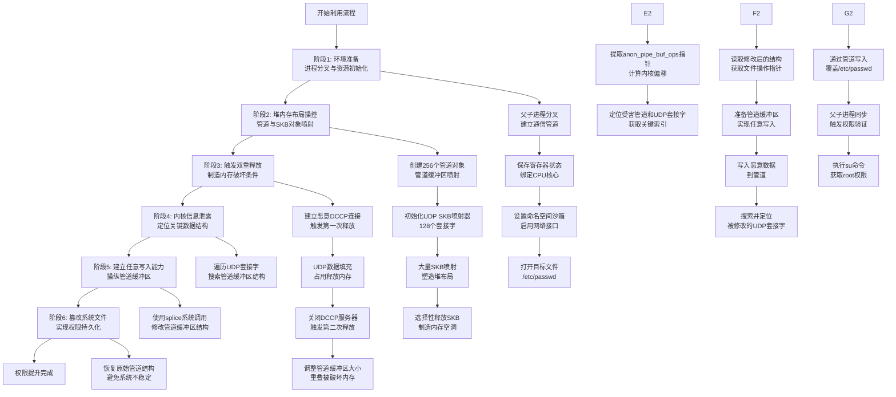
```mermaid
flowchart TD
    A[开始利用流程] --> B[阶段1: 环境准备<br>进程分叉与资源初始化]
    B --> C[阶段2: 堆内存布局操控<br>管道与SKB对象喷射]
    C --> D[阶段3: 触发双重释放<br>制造内存破坏条件]
    D --> E[阶段4: 内核信息泄露<br>定位关键数据结构]
    E --> F[阶段5: 建立任意写入能力<br>操纵管道缓冲区]
    F --> G[阶段6: 篡改系统文件<br>实现权限持久化]
    G --> H[权限提升完成]

    B --> B1[父子进程分叉<br>建立通信管道]
    B1 --> B2[保存寄存器状态<br>绑定CPU核心]
    B2 --> B3[设置命名空间沙箱<br>启用网络接口]
    B3 --> B4[打开目标文件<br>/etc/passwd]

    C --> C1[创建256个管道对象<br>管道缓冲区喷射]
    C1 --> C2[初始化UDP SKB喷射器<br>128个套接字]
    C2 --> C3[大量SKB喷射<br>塑造堆布局]
    C3 --> C4[选择性释放SKB<br>制造内存空洞]

    D --> D1[建立恶意DCCP连接<br>触发第一次释放]
    D1 --> D2[UDP数据填充<br>占用释放内存]
    D2 --> D3[关闭DCCP服务器<br>触发第二次释放]
    D3 --> D4[调整管道缓冲区大小<br>重叠被破坏内存]

    E --> E1[遍历UDP套接字<br>搜索管道缓冲区结构]
    E2 --> E3[提取anon_pipe_buf_ops指针<br>计算内核偏移]
    E3 --> E4[定位受害管道和UDP套接字<br>获取关键索引]

    F --> F1[使用splice系统调用<br>修改管道缓冲区结构]
    F2 --> F3[读取修改后的结构<br>获取文件操作指针]
    F3 --> F4[准备管道缓冲区<br>实现任意写入]
    F4 --> F5[写入恶意数据<br>到管道]
    F5 --> F6[搜索并定位<br>被修改的UDP套接字]

    G --> G1[恢复原始管道结构<br>避免系统不稳定]
    G2 --> G3[通过管道写入<br>覆盖/etc/passwd]
    G3 --> G4[父子进程同步<br>触发权限验证]
    G4 --> G5[执行su命令<br>获取root权限]
```

**阶段逻辑解析**：

- **第一阶段是进程架构**：采用父子进程模型，父进程负责监控和最终执行权限提升，子进程执行复杂的利用操作。建立信号管道用于进程间通信，确保操作的时序协调。
- **第二阶段是堆风水基础**：创建大量管道对象和UDP套接字，通过精细的内存喷射和释放操作，塑造可控的堆内存布局，为后续的内存破坏利用创造条件。
- **第三阶段是漏洞触发**：初始化恶意DCCP连接，依次触发两次SKB释放形成双重释放条件，然后调整管道缓冲区大小使其与破坏的内存区域重叠，建立内存破坏到管道控制的条件。
- **第四阶段是信息收集**：在UDP套接字数据中搜索被破坏的`pipe_buffer`结构，提取内核函数指针计算随机化偏移，定位受害对象的关键索引，为后续操作提供精确导航。
- **第五阶段是能力建立**：利用`splice`系统调用修改`pipe_buffer`结构，建立任意写入原语，通过管道将恶意数据写入内核，然后搜索定位被成功修改的UDP套接字。
- **第六阶段是目标达成**：恢复原始管道结构保持系统稳定，通过建立的写入能力篡改`/etc/passwd`文件，最后通过标准系统调用获取root权限，实现持久化的权限提升。

### 7-3. 关键数据结构详解

理解本思路中涉及的管道缓冲区结构是理解其工作原理的基础。

**1. pipe_buffer结构内存布局**

利用思路四的核心是操纵`pipe_buffer`结构实现任意写入。该结构的典型布局如下：

```
+---------------------------------------------------+
| pipe_buffer 结构体                                |
| 位于管道对象的缓冲区页面中                        |
+---------------------------------------------------+
| 偏移 0x00: struct page *page    (指向物理页)      |
| 偏移 0x08: unsigned int offset  (页内偏移)        |
| 偏移 0x0C: unsigned int len     (数据长度)        |
| 偏移 0x10: const struct pipe_buf_operations *ops  |
| 偏移 0x18: unsigned int flags   (标志位)          |
| 偏移 0x20: unsigned long private (私有数据)       |
+---------------------------------------------------+
```

**关键字段说明**：

- **page指针**：指向包含管道数据的物理页面
- **ops指针**：指向`pipe_buf_operations`结构，包含`release`、`confirm`等回调函数
- **offset和len**：控制页面内的数据位置和长度

**2. 内存布局演变过程**

利用思路四的内存操控涉及多个阶段的状态变化：

```
初始状态: [空闲内存A][空闲内存B][空闲内存C]

阶段2: 堆风水后
管道对象喷射: [pipe_buffer][pipe_buffer][pipe_buffer]
SKB对象喷射: [SKB][SKB][SKB]
部分释放: [pipe_buffer][空洞][SKB]

阶段3: 漏洞触发后
第一次释放: [pipe_buffer][空洞][空洞]
SKB占据: [pipe_buffer][SKB][空洞]
第二次释放: [pipe_buffer][空洞][空洞] (双重释放)
管道调整: [pipe_buffer][重叠pipe][空洞]

阶段4-5: 利用执行
内存破坏: [pipe_buffer][损坏pipe_buffer][空洞]
篡改结构: [pipe_buffer][恶意pipe_buffer][空洞]
文件写入: [pipe_buffer][包含/etc/passwd数据的pipe_buffer][空洞]
```

**3. 恶意数据构造**

用于覆盖`/etc/passwd`的恶意数据构造如下：

```
恶意构造的root用户条目:
+---------------------------------------------------+
| root::0:0:root:/root:/bin/sh\n                    |
+---------------------------------------------------+
```

此条目创建了一个无需密码的root用户，为后续权限提升提供条件。

### 7-4. 核心利用思路详解

**第一阶段：环境准备与进程架构**

此阶段建立稳定的多进程执行环境，为复杂的利用操作提供可靠的基础：

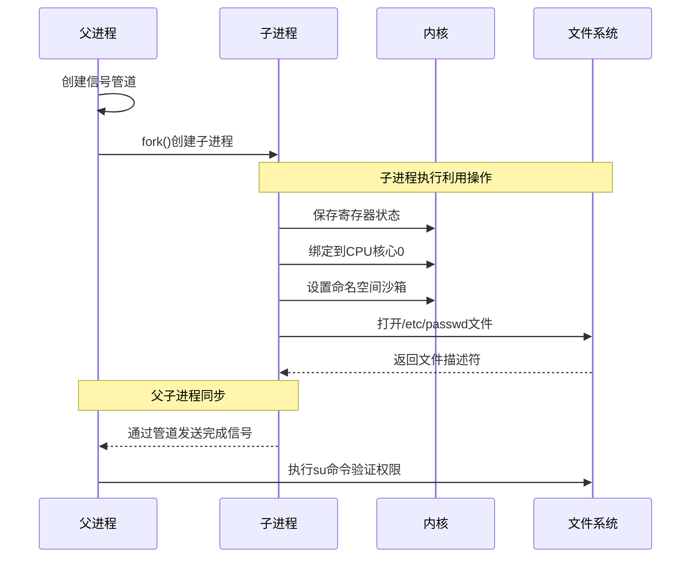
```mermaid
sequenceDiagram
    participant 父进程
    participant 子进程
    participant 内核
    participant 文件系统

    父进程->>父进程: 创建信号管道
    父进程->>子进程: fork()创建子进程

    Note over 子进程,文件系统: 子进程执行利用操作
    子进程->>内核: 保存寄存器状态
    子进程->>内核: 绑定到CPU核心0
    子进程->>内核: 设置命名空间沙箱
    子进程->>文件系统: 打开/etc/passwd文件
    文件系统-->>子进程: 返回文件描述符

    Note over 父进程,子进程: 父子进程同步
    子进程-->>父进程: 通过管道发送完成信号
    父进程->>文件系统: 执行su命令验证权限
```

**关键技术点**：

1. **进程隔离**：父子进程分离，子进程执行风险操作，父进程监控和执行最终权限验证
2. **资源预分配**：提前打开目标文件，获取文件描述符供后续使用
3. **通信协调**：通过管道实现进程间同步，确保操作的时序正确性

**第二阶段：堆内存布局操控**

此阶段通过精细的内存操作创建可控的堆布局，为内存破坏利用创造条件：

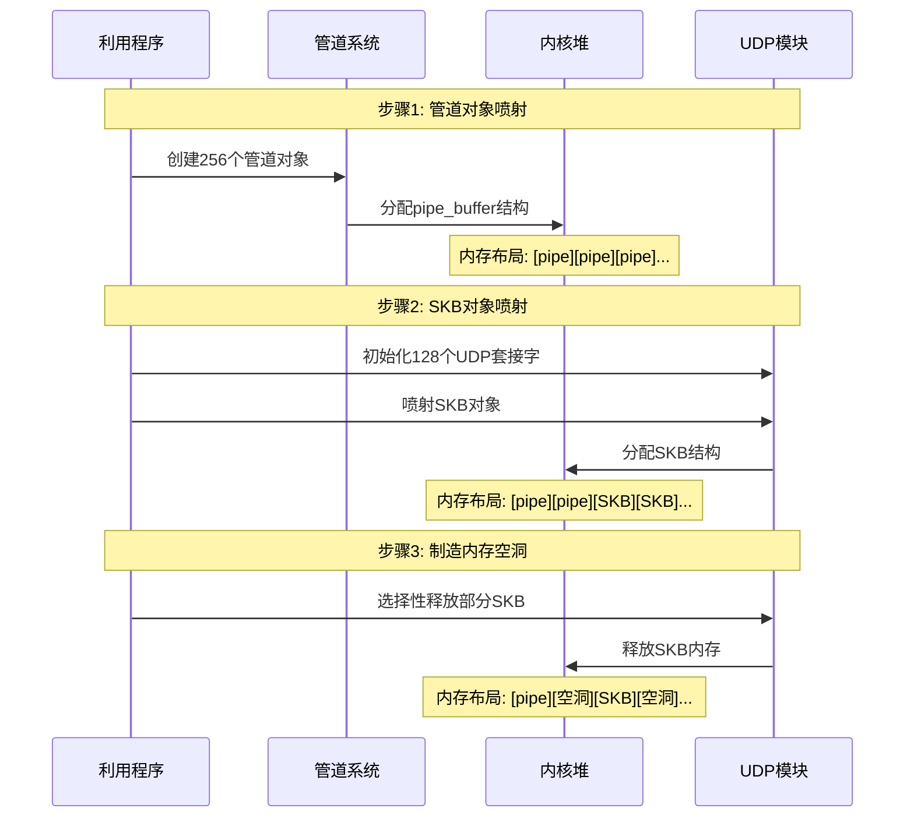
```mermaid
sequenceDiagram
    participant 利用程序
    participant 管道系统
    participant 内核堆
    participant UDP模块

    Note over 利用程序,UDP模块: 步骤1: 管道对象喷射
    利用程序->>管道系统: 创建256个管道对象
    管道系统->>内核堆: 分配pipe_buffer结构
    Note over 内核堆: 内存布局: [pipe][pipe][pipe]...

    Note over 利用程序,UDP模块: 步骤2: SKB对象喷射
    利用程序->>UDP模块: 初始化128个UDP套接字
    利用程序->>UDP模块: 喷射SKB对象
    UDP模块->>内核堆: 分配SKB结构
    Note over 内核堆: 内存布局: [pipe][pipe][SKB][SKB]...

    Note over 利用程序,UDP模块: 步骤3: 制造内存空洞
    利用程序->>UDP模块: 选择性释放部分SKB
    UDP模块->>内核堆: 释放SKB内存
    Note over 内核堆: 内存布局: [pipe][空洞][SKB][空洞]...
```

**关键技术点**：

1. **对象类型混合**：混合使用管道和SKB对象，创建复杂的内存布局
2. **空洞精确制造**：通过选择性释放创造大小和位置可控的内存空洞
3. **布局可预测性**：大量对象喷射增加内存布局的可预测性和稳定性

**第三阶段：双重释放触发与内存重叠**

此阶段触发核心漏洞并建立内存重叠条件：

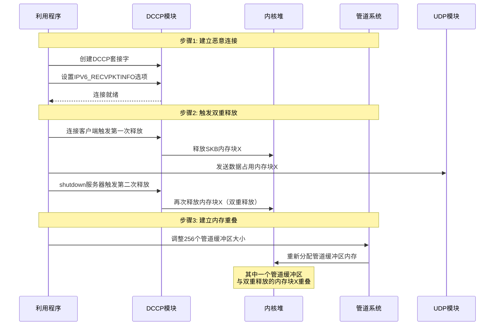
```mermaid
sequenceDiagram
    participant 利用程序
    participant DCCP模块
    participant 内核堆
    participant 管道系统

    Note over 利用程序,管道系统: 步骤1: 建立恶意连接
    利用程序->>DCCP模块: 创建DCCP套接字
    利用程序->>DCCP模块: 设置IPV6_RECVPKTINFO选项
    DCCP模块-->>利用程序: 连接就绪

    Note over 利用程序,管道系统: 步骤2: 触发双重释放
    利用程序->>DCCP模块: 连接客户端触发第一次释放
    DCCP模块->>内核堆: 释放SKB内存块X
    利用程序->>UDP模块: 发送数据占用内存块X
    利用程序->>DCCP模块: shutdown服务器触发第二次释放
    DCCP模块->>内核堆: 再次释放内存块X（双重释放）

    Note over 利用程序,管道系统: 步骤3: 建立内存重叠
    利用程序->>管道系统: 调整256个管道缓冲区大小
    管道系统->>内核堆: 重新分配管道缓冲区内存
    Note over 内核堆: 其中一个管道缓冲区<br>与双重释放的内存块X重叠
```

**关键技术点**：

1. **时序精确控制**：在第一次释放后立即用UDP数据占据内存，赢得内存竞争
2. **内存重叠建立**：通过调整管道缓冲区大小，使管道结构与破坏的内存区域重叠
3. **状态可检测**：通过后续的信息泄露验证内存重叠是否成功建立

**第四阶段：内核信息泄露与精确定位**

此阶段从被破坏的内存中提取关键信息，为后续操作提供精确导航：

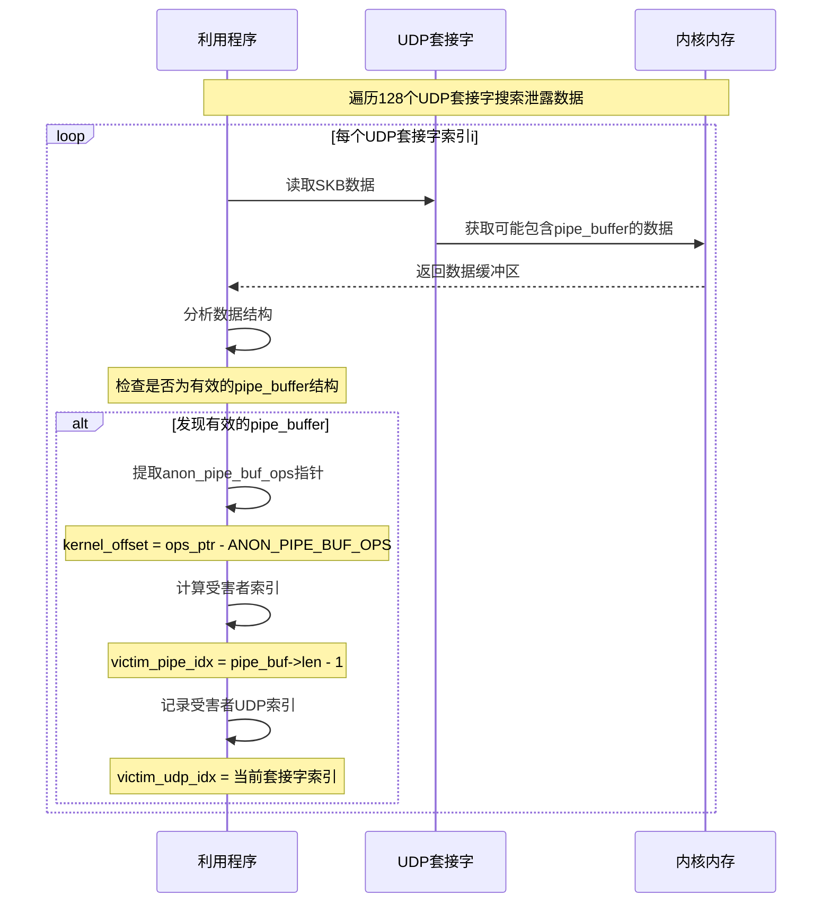
```mermaid
sequenceDiagram
    participant 利用程序
    participant UDP套接字
    participant 内核内存

    Note over 利用程序,内核内存: 遍历128个UDP套接字搜索泄露数据
    loop 每个UDP套接字索引i
        利用程序->>UDP套接字: 读取SKB数据
        UDP套接字->>内核内存: 获取可能包含pipe_buffer的数据
        内核内存-->>利用程序: 返回数据缓冲区

        利用程序->>利用程序: 分析数据结构
        Note over 利用程序: 检查是否为有效的pipe_buffer结构
        alt 发现有效的pipe_buffer
            利用程序->>利用程序: 提取anon_pipe_buf_ops指针
            Note over 利用程序: kernel_offset = ops_ptr - ANON_PIPE_BUF_OPS
            利用程序->>利用程序: 计算受害者索引
            Note over 利用程序: victim_pipe_idx = pipe_buf->len - 1
            利用程序->>利用程序: 记录受害者UDP索引
            Note over 利用程序: victim_udp_idx = 当前套接字索引
        end
    end
```

**泄露的关键信息**：

1. **anon_pipe_buf_ops指针**：用于计算内核随机化偏移
2. **受害者管道索引**：通过`pipe_buf->len`字段计算得到
3. **受害者UDP索引**：泄露数据所在的UDP套接字索引

**第五阶段：任意写入能力建立**

此阶段通过操纵管道缓冲区结构建立任意写入原语：

```mermaid
sequenceDiagram
    participant 利用程序
    participant 内核
    participant 管道缓冲区
    participant 文件系统

    Note over 利用程序,文件系统: 步骤1: 使用splice修改结构
    利用程序->>内核: splice(victim_fd, offset, pipe_fd, NULL, 1, 0)
    内核->>管道缓冲区: 修改管道缓冲区结构字段

    Note over 利用程序,文件系统: 步骤2: 读取修改后的结构
    利用程序->>UDP套接字: 读取包含管道缓冲区的数据
    UDP套接字->>管道缓冲区: 获取修改后的结构
    管道缓冲区-->>利用程序: 返回包含文件操作指针的结构

    Note over 利用程序,文件系统: 步骤3: 准备任意写入
    利用程序->>利用程序: 设置pipe_buffer[1]的offset=0, len=0
    利用程序->>利用程序: 设置ops指针指向合法操作表

    Note over 利用程序,文件系统: 步骤4: 写入恶意数据
    利用程序->>管道系统: 向管道写入恶意root条目
    管道系统->>管道缓冲区: 数据存储在管道缓冲区中
```

**关键技术点**：

1. **splice系统调用利用**：通过`splice`修改管道缓冲区结构，建立与文件系统的关联
2. **结构字段精确控制**：控制`offset`、`len`、`ops`等关键字段，实现任意写入
3. **操作指针保持合法**：确保`ops`指针指向有效的操作表，避免内核崩溃

**第六阶段：系统文件篡改与权限提升**

此阶段利用建立的写入能力篡改系统文件，实现持久的权限提升：

```mermaid
sequenceDiagram
    participant 利用程序
    participant 管道缓冲区
    participant 文件系统
    participant 权限验证

    Note over 利用程序,权限验证: 步骤1: 恢复原始结构
    利用程序->>管道缓冲区: 恢复pipe_buffer[1]的原始结构
    利用程序->>UDP套接字: 将恢复后的结构写回所有套接字

    Note over 利用程序,权限验证: 步骤2: 父子进程同步
    利用程序->>信号管道: 写入完成信号
    父进程->>信号管道: 读取完成信号

    Note over 利用程序,权限验证: 步骤3: 触发权限验证
    父进程->>文件系统: 执行su -c 'cat /root/flag' && su
    文件系统->>权限验证: 检查/etc/passwd文件
    权限验证-->>父进程: 授予root权限（因文件被篡改）

    Note over 利用程序,权限验证: 步骤4: 持久化保持
    利用程序->>利用程序: 进入长时间sleep保持状态
```

**关键技术点**：

1. **结构恢复**：利用后恢复原始数据结构，保持系统稳定性
2. **进程协调**：父子进程通过管道精确同步操作时序
3. **权限持久化**：通过修改`/etc/passwd`实现持久的权限提升，不依赖临时凭证
4. **状态保持**：子进程进入长时间等待，保持利用建立的内核状态

### 7-5. 技术挑战与创新解决方案

**挑战1：从内存破坏到文件系统访问**

- **挑战**：需要将内存破坏漏洞转化为文件系统写入能力
- **解决方案**：通过管道缓冲区作为桥梁，利用`splice`系统调用建立与文件描述符的关联，实现从内核内存到文件系统的跨越

**挑战2：结构字段的精确控制**

- **挑战**：需要精确控制`pipe_buffer`结构的多个字段以实现任意写入
- **解决方案**：通过内存喷射和搜索定位受害结构，然后通过UDP套接字读写精确修改结构字段

**挑战3：系统稳定性维护**

- **挑战**：内核数据结构被篡改后容易导致系统不稳定或崩溃
- **解决方案**：在利用完成后恢复原始数据结构，利用父子进程模型隔离风险操作

**挑战4：持久化与隐蔽性**

- **挑战**：需要实现持久的权限提升而不被安全机制检测
- **解决方案**：通过修改系统文件实现持久化，避免使用易被检测的代码执行或凭证修改

### 7-6. 利用成功率分析

在完整防护环境下，本思路的成功率受以下因素影响：

1. **内存布局的精确性**：需要管道缓冲区精确重叠被双重释放的内存区域
2. **结构字段的可预测性**：`pipe_buffer`结构字段的布局和值需要符合预期
3. **时序控制的准确性**：多个系统调用和内存操作需要精确的时序协调
4. **文件系统的可写性**：需要目标文件可写且无额外的保护机制

**提高成功率的策略**：

- 大量对象喷射增加统计概率
- 多阶段验证和错误恢复
- 精细的时序控制和同步机制
- 对目标文件系统的预先检查

### 7-7. 防护机制与绕过技术总结

利用思路四展示了从内存破坏到系统状态篡改的完整利用链：

| 防护机制 | 绕过技术         | 关键技术点                                             |
| -------- | ---------------- | ------------------------------------------------------ |
| KASLR    | 内存信息泄露     | 从破坏的`pipe_buffer`结构中提取`anon_pipe_buf_ops`指针 |
| SMEP     | 避免代码执行     | 完全不执行任何代码，仅通过数据结构篡改实现目标         |
| SMAP     | 内核内数据操作   | 所有操作通过内核对象和系统调用完成，避免用户空间访问   |
| KPTI     | 标准系统调用路径 | 仅使用合法的系统调用接口，不涉及特殊的上下文切换       |

**技术特点总结**：

1. **无代码执行**：完全不依赖任何形式的代码执行，完全通过数据结构操作实现目标
2. **持久化权限提升**：通过修改系统文件实现持久的权限提升，不依赖临时凭证
3. **完整的利用链**：展示了从内存破坏到文件系统篡改的完整技术路径
4. **高隐蔽性**：避免使用易被检测的技术，提高利用的隐蔽性

### 7-8. 总结

利用思路四代表了针对CVE-2017-6074漏洞的**系统状态篡改型利用方案**。与前三者相比，它采用了完全不同的技术路径——不追求代码执行或控制流劫持，而是通过**精确的数据结构操作实现系统状态的持久化修改**。

该思路的主要特点包括：

1. **技术路径创新**：从内存破坏到文件系统篡改的完整链条展示
2. **高隐蔽性设计**：完全避免代码执行，使用合法的系统调用接口
3. **持久化效果**：通过修改系统文件实现持久的权限提升
4. **稳定性考量**：包含结构恢复和错误处理机制，提高利用的健壮性

四种利用思路的比较：

- **思路一**：基础控制流劫持，适用于防护较弱的环境
- **思路二**：分阶段内核内操作，适用于完整防护环境
- **思路三**：信息泄露驱动利用，强调精确信息获取
- **思路四**：系统状态篡改利用，强调持久化和隐蔽性

利用思路四不仅展示了对CVE-2017-6074漏洞的深入利用，也提供了**从内存破坏到系统状态持久化篡改**的典型案例。它表明，在现代安全防护体系下，利用面不仅包括代码执行路径，还包括系统状态和数据完整性。这强调了深度防御需要全面覆盖代码执行、数据完整性和系统状态保护等多个维度。

### 7-9. 测试结果

<div style="text-align: center; margin: 2rem 0;">
  
</div>

## 8. 漏洞修复

### 8-1. 官方补丁信息

CVE-2017-6074的漏洞修复由Linux内核社区于2017年2月17日完成，补丁提交ID为`5edabca9d4cff7f1f2b68f0bac55ef99d9798ba4`。该补丁由漏洞发现者Andrey Konovalov（Google安全研究员）提交，主要修复了`net/dccp/input.c`文件中`dccp_rcv_state_process()`函数的双重释放问题。

**补丁时间线**：

- **2017-02-15**：漏洞报告至security@kernel.org
- **2017-02-16**：补丁提交至netdev邮件列表
- **2017-02-17**：补丁提交至主线内核
- **2017-02-18**：通知发送至linux-distros
- **2017-02-22**：公开公告发布网页

### 8-2. 修复技术细节

#### 8-2-1. 修复前的问题代码

在修复前的代码中，当DCCP套接字处于`LISTEN`状态且收到`DCCP_PKT_REQUEST`数据包时，如果`inet_csk(sk)->icsk_af_ops->conn_request(sk, skb)`成功返回，代码会跳转到`discard`标签，最终调用`__kfree_skb()`释放skb。

**问题代码片段**：

```c
if (sk->sk_state == DCCP_LISTEN) {
    if (dh->dccph_type == DCCP_PKT_REQUEST) {
        if (inet_csk(sk)->icsk_af_ops->conn_request(sk, skb) < 0)
            return 1;
        goto discard;  // 问题所在：直接跳转到discard释放skb
    }
    if (dh->dccph_type == DCCP_PKT_RESET)
        goto discard;
    // ...
}
```

#### 8-2-2. 修复后的代码

修复方案是将`goto discard;`替换为`consume_skb(skb); return 0;`，确保skb被正确消费而非错误释放。

**修复代码片段**：

```c
if (sk->sk_state == DCCP_LISTEN) {
    if (dh->dccph_type == DCCP_PKT_REQUEST) {
        if (inet_csk(sk)->icsk_af_ops->conn_request(sk, skb) < 0)
            return 1;
        consume_skb(skb);  // 修复：使用consume_skb正确消费skb
        return 0;          // 修复：正常返回
    }
    if (dh->dccph_type == DCCP_PKT_RESET)
        goto discard;
    // ...
}
```

#### 8-2-3. 补丁差异对比

```diff
--- a/net/dccp/input.c
+++ b/net/dccp/input.c
@@ -606,7 +606,8 @@ int dccp_rcv_state_process(struct sock *sk, struct sk_buff *skb,
 			if (inet_csk(sk)->icsk_af_ops->conn_request(sk, skb) < 0)
 				return 1;
-			goto discard;
+			consume_skb(skb);
+			return 0;
 		}
 		if (dh->dccph_type == DCCP_PKT_RESET)
 			goto discard;
```

### 8-3. 修复原理分析

#### 8-3-1. 根本原因

漏洞的根本原因在于引用计数管理不一致。当在套接字上设置`IPV6_RECVPKTINFO`选项时，`dccp_v6_conn_request()`函数会将skb地址保存到`ireq->pktopts`并增加skb的引用计数。然而，`dccp_rcv_state_process()`函数在成功处理连接请求后，仍然通过`goto discard`路径调用`__kfree_skb()`释放skb，导致双重释放。

#### 8-3-2. 修复机制

修复方案的核心区别在于`consume_skb()`与`kfree_skb()`的不同行为：

| 函数            | 行为                          | 适用场景          |
| --------------- | ----------------------------- | ----------------- |
| `consume_skb()` | 正常消费skb，正确处理引用计数 | skb被正常处理完成 |
| `kfree_skb()`   | 强制释放skb，忽略引用计数     | skb因错误需要丢弃 |

**修复逻辑**：

1. **正确引用计数处理**：`consume_skb()`会检查`skb->users`引用计数，只有当引用计数为0时才真正释放内存
2. **避免双重释放**：通过使用`consume_skb()`而非直接跳转到`discard`，确保skb不会被错误地双重释放
3. **状态一致性**：修复后，当`conn_request()`成功返回时，函数正常返回0，表示数据包已被正确处理

### 8-4. 临时缓解措施

在官方补丁应用前，系统管理员可采用以下临时缓解措施：

#### 8-4-1. 禁用DCCP内核模块

最有效的临时缓解方案是禁用DCCP内核模块，防止漏洞被利用：

```bash
# 创建模块黑名单配置
echo "install dccp /bin/false" >> /etc/modprobe.d/disable-dccp.conf

# 如果模块已加载，尝试卸载
modprobe -r dccp 2>/dev/null || true

# 重启系统确保配置生效
reboot
```

#### 8-4-2. SELinux策略防护

对于启用SELinux的Red Hat系统，默认的targeted策略已提供一定防护：

- 限制非特权进程访问内核内存
- 监控异常的系统调用模式

#### 8-4-3. 网络层防护

```bash
# 使用iptables阻止DCCP流量
iptables -A INPUT -p dccp -j DROP
iptables -A OUTPUT -p dccp -j DROP

# 或使用更精细的控制
iptables -A INPUT -p dccp --dport 0:65535 -j REJECT --reject-with icmp-port-unreachable
```

### 8-5. 修复验证与测试

#### 8-5-1. 补丁应用验证

```bash
# 检查内核版本是否包含修复
uname -r
# 应显示4.9.12之后的内核版本

# 检查DCCP模块状态
lsmod | grep dccp
# 理想情况下不应显示dccp模块

# 验证补丁是否应用
grep -n "consume_skb" /usr/src/linux-headers-$(uname -r)/net/dccp/input.c
# 应显示修复后的代码行
```

#### 8-5-2. 漏洞检测脚本

```bash
#!/bin/bash
# CVE-2017-6074漏洞检测脚本

KERNEL_VERSION=$(uname -r | cut -d'-' -f1)
MAJOR=$(echo $KERNEL_VERSION | cut -d'.' -f1)
MINOR=$(echo $KERNEL_VERSION | cut -d'.' -f2)
PATCH=$(echo $KERNEL_VERSION | cut -d'.' -f3)

# 版本检查：影响4.9.12及之前版本
if [ $MAJOR -lt 4 ] ||
   ([ $MAJOR -eq 4 ] && [ $MINOR -lt 9 ]) ||
   ([ $MAJOR -eq 4 ] && [ $MINOR -eq 9 ] && [ $PATCH -le 12 ]); then
    echo "警告：内核版本 $KERNEL_VERSION 可能受CVE-2017-6074影响"
else
    echo "安全：内核版本 $KERNEL_VERSION 已修复CVE-2017-6074"
fi

# 检查DCCP模块配置
if [ -f "/boot/config-$(uname -r)" ]; then
    if grep -q "CONFIG_IP_DCCP=y" "/boot/config-$(uname -r)"; then
        echo "警告：内核编译时启用了DCCP支持"
    fi
fi
```

### 8-6. 长期安全建议

#### 8-6-1. 内核更新策略

1. **定期更新**：建立定期的内核安全更新机制
2. **版本跟踪**：关注内核安全公告，及时应用关键补丁
3. **回归测试**：在测试环境验证内核更新后再部署到生产环境

#### 8-6-2. 防御深度策略

```mermaid
graph TD
    A[系统防护] --> B[网络层防护]
    A --> C[内核层防护]
    A --> D[应用层防护]

    B --> B1[防火墙规则]
    B --> B2[网络隔离]

    C --> C1[内核模块黑名单]
    C --> C2[SELinux/AppArmor]
    C --> C3[内核安全特性]

    D --> D1[最小权限原则]
    D --> D2[容器化隔离]
    D --> D3[系统调用过滤]

    C3 --> C31[KASLR开启]
    C3 --> C32[SMEP/SMAP开启]
    C3 --> C33[堆栈保护开启]
```

#### 8-6-3. 监控与响应

1. **异常检测**：监控系统调用异常模式
2. **内存分析**：定期检查内核内存使用情况
3. **漏洞扫描**：使用自动化工具扫描已知漏洞
4. **应急响应**：建立安全事件应急响应流程

### 8-7. 总结

CVE-2017-6074的修复体现了Linux内核社区对安全问题的快速响应能力。从漏洞报告到补丁发布仅用了3天时间，展现了开源社区协作的高效性。修复方案通过将`goto discard`改为`consume_skb(skb)`，从根本上解决了引用计数管理不一致的问题，防止了双重释放的发生。

该漏洞的修复历程也为后续内核安全开发提供了重要经验：

1. **引用计数一致性**：确保内核对象引用计数的正确管理
2. **错误处理路径**：仔细审查所有错误处理路径的内存管理
3. **防御性编程**：在可能发生双重释放的代码区域添加防护机制
4. **自动化测试**：加强syzkaller等模糊测试工具对网络协议栈的覆盖

对于系统管理员而言，及时应用安全更新、禁用不必要的内核模块、启用安全增强特性是防范此类漏洞的关键措施。

## 9. 免责声明

本文档旨在提供CVE-2017-6074漏洞的技术分析与教育性内容，仅供学习、研究和安全防御目的使用。作者与发布平台对以下事项声明如下：

1. **合法使用原则**：本文档中描述的任何技术细节、代码示例或利用方法仅供教育研究之用。读者不得将这些信息用于任何非法、未经授权或恶意的活动，包括但不限于未经授权的系统入侵、数据破坏、服务干扰或其他违反法律法规的行为。

2. **知识共享与责任**：本文档基于公开可获取的信息、官方漏洞公告和学术研究资料编写。作者力求确保技术内容的准确性，但不对信息的完整性、时效性或适用性作任何明示或暗示的保证。读者应自行验证信息的准确性，并在专业环境中谨慎应用。

3. **环境限制**：所有技术分析和实验应在受控的、隔离的测试环境中进行，例如使用特制的虚拟机或专用硬件。禁止在任何生产环境、公共网络或他人系统中尝试漏洞利用或相关技术。

4. **法律合规性**：读者应遵守所在国家或地区的所有适用法律法规，包括但不限于计算机安全法、数据保护法和知识产权法。任何使用本文档内容的行为所产生的法律后果，由行为者自行承担。

5. **技术中立性**：本文档对漏洞的分析保持技术中立立场，旨在促进安全社区的防御能力提升。文中提及的任何工具、技术或方法不应被视为对任何组织、产品或技术的背书或批判。

6. **更新与修正**：技术领域发展迅速，本文档内容可能随时间而过时。作者保留更新、修正或撤回文档内容的权利，不承诺另行通知。

7. **版权声明**：本文档内容受版权法保护，未经明确书面许可，不得用于商业目的。允许在注明出处的前提下进行非商业性的分享与引用。

**重要提示**：安全研究应始终遵循道德准则，以提升整体网络安全为目标。如发现安全漏洞，建议通过负责任的披露流程向相关厂商或机构报告，共同维护数字生态的安全与稳定。

---

_本文档的撰写参考了公开的漏洞公告、内核源码（Linux 4.9.12）及相关技术分析文献。所有实验均在封闭的测试环境中完成，未对任何实际系统造成影响。_

## 参考

- https://github.com/BinRacer/pwn4kernel/tree/master/src/CVE-2017-6074
- https://github.com/BinRacer/pwn4kernel/tree/master/src/CVE-2017-6074_V3
- https://github.com/BinRacer/pwn4kernel/tree/master/src/CVE-2017-6074_V4
- https://github.com/BinRacer/pwn4kernel/tree/master/src/CVE-2017-6074_V5
- https://bsauce.github.io/2021/09/17/CVE-2017-6074
- https://xairy.io/articles/cve-2017-6074
- https://git.kernel.org/pub/scm/linux/kernel/git/torvalds/linux.git/commit/?id=5edabca9d4cff7f1f2b68f0bac55ef99d9798ba4
- https://github.com/xairy/kernel-exploits/tree/master/CVE-2017-6074
- https://nvd.nist.gov/vuln/detail/CVE-2017-6074
- https://www.openwall.com/lists/oss-security/2017/02/26/2
- https://ubuntu.com/security/CVE-2017-6074
