# 【Kernel Exploit】CVE-2017-7308漏洞分析

## 1. 测试环境

**测试版本**：Linux-4.10.6 [内核镜像地址](https://github.com/BinRacer/pwn4kernel/blob/master/kernels/4.10.6/01/bzImage)

笔者测试的内核版本是 `Linux (none) 4.10.6 #1 SMP Sun Feb 15 16:02:51 CST 2026 x86_64 GNU/Linux`。

**编译选项**：开启`CONFIG_MEMCG`、`CONFIG_CGROUPS`、`CONFIG_SLAB_FREELIST_RANDOM`、`CONFIG_HARDENED_USERCOPY`、`CONFIG_DEBUG_LIST`、`CONFIG_DEBUG_PI_LIST`、`CONFIG_FUSE_FS`、`CONFIG_USERFAULTFD`、`CONFIG_SYSVIPC`、`CONFIG_KEYS`、`CONFIG_CC_STACKPROTECTOR`、`CONFIG_CC_STACKPROTECTOR_STRONG`、`CONFIG_SLUB`、`CONFIG_SLUB_DEBUG`、`CONFIG_E1000`、`CONFIG_E1000E`、`CONFIG_PACKET`、`CONFIG_PACKET_DIAG`、`CONFIG_USER_NS`、`CONFIG_NET_NS`、`CONFIG_NAMESPACES`、`CONFIG_CHECKPOINT_RESTORE`、`CONFIG_IPC_NS`选项。完整配置参考[.config](https://github.com/BinRacer/pwn4kernel/blob/master/kernels/4.10.6/01/.config)。

**保护机制**：KASLR/SMEP/SMAP/KPTI

## 2. 漏洞背景

CVE-2017-7308是Linux内核`net/packet/af_packet.c`中`packet_set_ring()`函数的一个高危安全漏洞，由Google的syzkaller模糊测试系统发现，并于2017年3月31日通过oss-security邮件列表公开披露。该漏洞源于对TPACKET_V3版本环形缓冲区参数的验证存在整数溢出缺陷，允许具备`CAP_NET_RAW`权限的本地进程触发堆缓冲区溢出，可能造成拒绝服务（系统崩溃）或权限提升。

**影响版本**：该漏洞影响Linux内核4.10.6及更早版本。根据Ubuntu安全公告及补丁信息，Linux内核4.10.11版本包含了修复补丁，而4.10.10版本尚未修复。在启用非特权用户命名空间（由`CONFIG_USER_NS`内核配置项控制）的系统上，非特权用户可通过创建新的网络命名空间来获得必要的`CAP_NET_RAW`能力，从而构造条件触发此漏洞。

**AF_PACKET套接字与环形缓冲区机制**：AF_PACKET（或PF_PACKET）套接字允许应用程序在数据链路层（第二层）直接收发原始网络数据包，是tcpdump等网络嗅探和分析工具的基础。为提升性能，AF_PACKET支持通过`PACKET_RX_RING`和`PACKET_TX_RING`套接字选项创建环形缓冲区（ring buffer），该缓冲区在内核与用户空间之间共享，用户可将其内存映射（mmap）至用户空间以实现高效的数据包交换。

环形缓冲区有多个版本（TPACKET_V1, V2, V3），本漏洞特指TPACKET_V3版本。创建TPACKET_V3接收环形缓冲区（`PACKET_RX_RING`）时，用户需通过`setsockopt()`系统调用传递一个`tpacket_req3`结构体，其成员包括`tp_block_size`（内存块大小）、`tp_block_nr`（内存块数量）、`tp_sizeof_priv`（每个内存块中私有区域的大小）等参数。内核根据这些参数初始化缓冲区，其中`tp_sizeof_priv`指定的私有区域位于每个内存块头部之后，供用户空间专用，内核不应修改。

**漏洞机理**：漏洞根源于`packet_set_ring()`函数中对用户提供的`tp_sizeof_priv`参数的验证逻辑存在缺陷。相关代码如下：

```c
if (po->tp_version >= TPACKET_V3 &&
    (int)(req->tp_block_size -
          BLK_PLUS_PRIV(req_u->req3.tp_sizeof_priv)) <= 0)
    goto out;
```

此处，`BLK_PLUS_PRIV`宏计算私有区域加上块头部后的总开销。当用户传入一个足够大的`tp_sizeof_priv`值（接近`unsigned int`最大值）时，`BLK_PLUS_PRIV(req_u->req3.tp_sizeof_priv)`的计算结果可能发生整数溢出，导致其值小于`tp_block_size`，从而绕过了本应阻止“私有区域大于内存块”的检查。随后的补丁将`req_u->req3.tp_sizeof_priv`显式转换为`uint64_t`类型后再进行计算，以消除溢出风险。

由于检查被绕过，内核在后续的`init_prb_bdqc()`函数中，将用户提供的`tp_sizeof_priv`（`unsigned int`类型）赋值给内核结构`tpacket_kbdq_core`中的`blk_sizeof_priv`（`unsigned short`类型）成员，导致高16位被截断。测试者或研究人员可构造特定参数，使得截断后的`blk_sizeof_priv`值在后续计算中产生异常，最终导致内核在`prb_open_block()`函数中错误计算下一个数据包的写入位置（`nxt_offset`）。当有数据包到达时，内核会依据此错误的偏移量向环形缓冲区执行写入操作，从而引发堆越界写，覆盖相邻的内核对象。

**发现与触发**：该漏洞最初由syzkaller模糊测试工具通过一套特定的系统调用序列触发，其关键步骤包括创建一个AF_PACKET套接字，并为其设置一个精心构造的TPACKET_V3环形缓冲区参数。成功触发此漏洞可在本地实现权限提升，但需绕过SMEP、SMAP等内核安全防护机制。公开的概念验证（PoC）代码展示了通过覆盖相邻的`packet_sock`结构体中的函数指针，并结合内核定时器劫持等技术完成权限提升的路径。

```c
if (po->tp_version >= TPACKET_V3 &&
    (int)(req->tp_block_size -
          BLK_PLUS_PRIV(req_u->req3.tp_sizeof_priv)) <= 0)
    goto out;
```

此处，`BLK_PLUS_PRIV`宏用于计算私有区域与块头部的总开销。问题在于，`req_u->req3.tp_sizeof_priv`是`unsigned int`类型。当用户传入一个极大的值（例如接近32位无符号整数上限的值）时，`BLK_PLUS_PRIV`宏内部的计算可能发生整数溢出，导致其返回值远小于实际开销。这使得`(int)(块大小 - 开销)`的结果为一个很大的正数，而非预期的负数或零，从而错误地绕过了“私有区域不得大于内存块”的关键校验。

绕过此检查后，一个更隐蔽的问题在后续初始化过程中暴露。在`init_prb_bdqc()`函数中，用户提供的32位`tp_sizeof_priv`被赋值给内核结构成员`p1->blk_sizeof_priv`，而该成员是16位的`unsigned short`类型，导致赋值时高16位被静默截断。利用者可以精心设计`tp_sizeof_priv`的初始值，使得截断后的`blk_sizeof_priv`在后续计算`p1->max_frame_len = p1->kblk_size - BLK_PLUS_PRIV(p1->blk_sizeof_priv)`时，产生一个异常巨大的`max_frame_len`值，从而绕过了内核对于帧长度的其他约束。

最终，在数据包接收函数`tpacket_rcv()`的调用链中，`prb_open_block()`函数依据被篡改的`blk_sizeof_priv`计算出错误的下一个数据包存放地址`nxt_offset`。当有网络数据包抵达时，内核便从这个越界的`nxt_offset`位置开始写入数据，导致堆缓冲区溢出，覆盖相邻内核对象的内存。公开的漏洞利用概念验证（PoC）代码展示了如何通过复杂的堆内存布局操作，将此次溢出转化为对相邻`packet_sock`结构体内关键函数指针的篡改，并进一步结合内核定时器机制等完成完整的利用链。

**发现与披露**：该漏洞最初由syzkaller模糊测试工具生成的一组特定系统调用序列触发，其调用模式清晰地揭示了从套接字创建到设置恶意环形缓冲区参数的完整路径。成功的利用需要在触发堆溢出的基础上，进一步绕过SMEP（ Supervisor Mode Execution Prevention）和SMAP（Supervisor Mode Access Prevention）等现代内核防护机制，相关研究和技术细节已在安全社区内进行了广泛讨论。

## 3. 漏洞分析

### 3-1. 漏洞代码分析

以下对CVE-2017-7308漏洞相关的内核代码进行逐段分析，重点聚焦于`packet_set_ring()`函数中失效的验证检查、后续的参数传递与截断，以及最终导致越界写入的完整路径。整个漏洞触发流程可清晰地分为几个阶段，如下图所示：

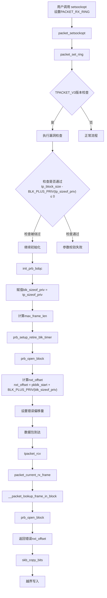
```mermaid
graph TD
    A[用户调用 setsockopt<br>设置PACKET_RX_RING] --> B[packet_setsockopt]
    B --> C[packet_set_ring]

    C --> D{TPACKET_V3版本检查}
    D -->|是| E[执行漏洞检查]
    D -->|否| F[正常流程]

    E --> G{"检查是否通过<br>tp_block_size - BLK_PLUS_PRIV(tp_sizeof_priv) ≤ 0"}
    G -->|检查被绕过| H[继续初始化]
    G -->|检查通过| I[参数校验失败]

    H --> J[init_prb_bdqc]
    J --> K[赋值blk_sizeof_priv = tp_sizeof_priv]
    K --> L[计算max_frame_len]
    L --> M[prb_setup_retire_blk_timer]
    M --> N[prb_open_block]

    N --> O["计算nxt_offset<br>nxt_offset = pkblk_start + BLK_PLUS_PRIV(blk_sizeof_priv)"]
    O --> P[设置错误偏移量]

    P --> Q[数据包到达]
    Q --> R[tpacket_rcv]
    R --> S[packet_current_rx_frame]
    S --> T[__packet_lookup_frame_in_block]
    T --> U[prb_open_block]
    U --> V[返回错误nxt_offset]
    V --> W[skb_copy_bits]
    W --> X[越界写入]
```

#### 3-1-1. 漏洞根源：整数溢出检查被绕过

漏洞的核心触发点位于`packet_set_ring()`函数中对TPACKET_V3环形缓冲区参数的验证逻辑。该函数负责为AF_PACKET套接字设置环形缓冲区，其关键检查代码如下：

```c
static int packet_set_ring(struct sock *sk, union tpacket_req_u *req_u,
		int closing, int tx_ring)
{
	// ... 变量声明和前期检查 ...
	err = -EINVAL;
	if (unlikely((int)req->tp_block_size <= 0))
		goto out;
	if (unlikely(!PAGE_ALIGNED(req->tp_block_size)))
		goto out;
	/* 【漏洞点】对TPACKET_V3的块大小与私有区域总开销的验证 */
	if (po->tp_version >= TPACKET_V3 &&
	    (int)(req->tp_block_size -
		  BLK_PLUS_PRIV(req_u->req3.tp_sizeof_priv)) <= 0) // <-- 漏洞检查
		goto out;
	// ... 其他参数检查(帧大小、对齐等) ...
```

**代码功能**：此`if`条件判断旨在确保用户请求的内存块大小(`tp_block_size`)大于"块头部+私有区域"的总大小(`BLK_PLUS_PRIV(tp_sizeof_priv)`)。如果块大小减去总开销的结果小于等于0，说明块太小，参数非法，应跳转至`out`标签返回错误。

**漏洞机理**：

- `req_u->req3.tp_sizeof_priv`是用户可控的`unsigned int`类型参数。
- `BLK_PLUS_PRIV`宏用于计算私有区域加上固定块头部的总开销。当传入的`tp_sizeof_priv`值极大(例如`0xfffffffe`)时，在宏内部与`BLK_HDR_LEN`相加可能导致整数溢出，使得计算结果`BLK_PLUS_PRIV(...)`变得非常小(甚至为0)。
- 此时，`req->tp_block_size - BLK_PLUS_PRIV(...)`会得到一个很大的正数，在强制转换为`(int)`后仍然为正数，从而**错误地绕过了**本应触发失败的`<= 0`检查。

**补丁修复**：后续补丁将`req_u->req3.tp_sizeof_priv`显式转换为`uint64_t`类型后再进行计算，避免了计算过程中的整数溢出。

#### 3-1-2. 参数截断与错误传递

当上述检查被绕过后，内核继续执行并调用`init_prb_bdqc()`来初始化TPACKET_V3环形缓冲区的核心控制结构。此处发生了关键的参数截断：

```c
static void init_prb_bdqc(struct packet_sock *po,
			struct packet_ring_buffer *rb,
			struct pgv *pg_vec,
			union tpacket_req_u *req_u)
{
	struct tpacket_kbdq_core *p1 = GET_PBDQC_FROM_RB(rb);
	// ... 初始化其他字段 ...
	/* 【关键赋值】将用户提供的32位参数截断赋值给16位内核变量 */
	p1->blk_sizeof_priv = req_u->req3.tp_sizeof_priv; // <-- 高16位被丢弃！
	p1->max_frame_len = p1->kblk_size - BLK_PLUS_PRIV(p1->blk_sizeof_priv);
	// ... 设置计时器、打开第一个块等 ...
}
```

**代码功能**：此函数将用户提供的配置参数赋值给内部管理结构`tpacket_kbdq_core`。

**漏洞机理**：

- `req_u->req3.tp_sizeof_priv`是`unsigned int`(32位)，而`p1->blk_sizeof_priv`是`unsigned short`(16位)。
- 此赋值操作会导致`tp_sizeof_priv`的**高16位被直接丢弃**，仅保留低16位。测试者可构造一个`tp_sizeof_priv`值，使得其低16位(`blk_sizeof_priv`)是任意期望的值(例如一个很小的值)，而高16位用于触发之前的整数溢出检查。
- `max_frame_len`的计算使用了被截断后的`blk_sizeof_priv`。由于`blk_sizeof_priv`可能很小，导致`BLK_PLUS_PRIV(p1->blk_sizeof_priv)`也很小，从而使`max_frame_len`变得异常巨大，绕过了后续对帧长度的常规约束。

初始化过程的完整调用链为：

```
packet_set_ring()              // 主处理函数
        ↓
init_prb_bdqc()                // 初始化TPACKET_V3缓冲区
        ↓
prb_init_ft_ops()              // 初始化特性操作
        ↓
prb_open_block()               // 打开内存块
```

#### 3-1-3. 内存分配与缓冲区设置

当参数检查通过后，内核需要为环形缓冲区分配物理内存。该过程通过以下函数调用链完成：

```
packet_set_ring()              // 主处理函数
        ↓
alloc_pg_vec()                 // 分配pg_vec数组
        ↓
alloc_one_pg_vec_page()        // 为单个内存块分配页面
        ↓
__get_free_pages()             // 从伙伴系统分配物理页面
```

并行调用的计算阶数路径：

```
packet_set_ring()              // 主处理函数
        ↓
get_order()                    // 计算分配阶数
```

- **`get_order()`**：根据请求的块大小计算分配阶数(order)，确定需要分配的连续物理页面数量(2^order个页面)。
- **`alloc_pg_vec()`**：分配并初始化`pg_vec`数组，该数组包含指向每个内存块的指针。
- **`alloc_one_pg_vec_page()`**：为单个内存块分配物理页面。首先尝试使用`__get_free_pages()`分配连续物理内存，如果失败则回退到`vmalloc()`。
- **`__get_free_pages()`**：内核底层函数，从伙伴系统分配指定阶数的连续物理页面。

在初始化或打开一个新的内存块时，`prb_open_block()`函数被调用来设置块的状态和下一个数据包的写入位置，这里计算了关键的`nxt_offset`：

```c
static void prb_open_block(struct tpacket_kbdq_core *pkc1,
	struct tpacket_block_desc *pbd1)
{
	// ... 设置块序列号、时间戳等 ...
	pkc1->pkblk_start = (char *)pbd1;
	/* 【关键计算】下一个数据包的写入起始地址 */
	pkc1->nxt_offset = pkc1->pkblk_start + BLK_PLUS_PRIV(pkc1->blk_sizeof_priv); // <-- 可控的偏移量！
	BLOCK_O2FP(pbd1) = (__u32)BLK_PLUS_PRIV(pkc1->blk_sizeof_priv);
	BLOCK_O2PRIV(pbd1) = BLK_HDR_LEN;
	// ...
}
```

**漏洞机理**：由于`pkc1->blk_sizeof_priv`已被通过截断赋值的方式控制，因此`BLK_PLUS_PRIV(pkc1->blk_sizeof_priv)`的值也是受控的。这使得`pkc1->nxt_offset`的计算结果指向一个**错误的、可能越界的地址**，可能指向当前内存块的有效范围之外，从而指向相邻的其他内核对象。

#### 3-1-4. 数据包发送与接收路径

当需要发送数据包来触发漏洞时，内核通过复杂的调用链处理。完整的交互流程如下图所示：

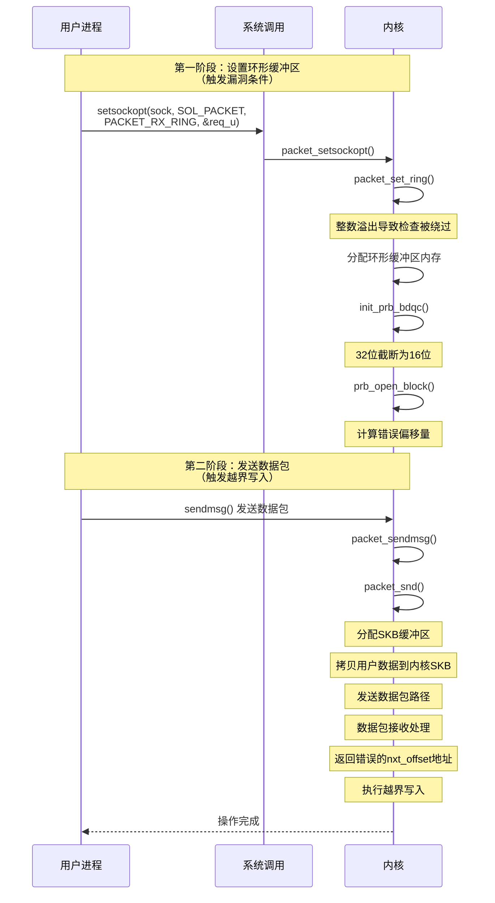
```mermaid
sequenceDiagram
    participant User as 用户进程
    participant Syscall as 系统调用
    participant Kernel as 内核

    Note over User,Kernel: 第一阶段：设置环形缓冲区<br>（触发漏洞条件）
    User->>Syscall: setsockopt(sock, SOL_PACKET,<br>PACKET_RX_RING, &req_u)
    Syscall->>Kernel: packet_setsockopt()
    Kernel->>Kernel: packet_set_ring()
    Note over Kernel: 整数溢出导致检查被绕过
    Kernel->>Kernel: 分配环形缓冲区内存
    Kernel->>Kernel: init_prb_bdqc()
    Note over Kernel: 32位截断为16位
    Kernel->>Kernel: prb_open_block()
    Note over Kernel: 计算错误偏移量

    Note over User,Kernel: 第二阶段：发送数据包<br>（触发越界写入）
    User->>Kernel: sendmsg() 发送数据包
    Kernel->>Kernel: packet_sendmsg()
    Kernel->>Kernel: packet_snd()
    Note over Kernel: 分配SKB缓冲区
    Note over Kernel: 拷贝用户数据到内核SKB
    Note over Kernel: 发送数据包路径
    Note over Kernel: 数据包接收处理
    Note over Kernel: 返回错误的nxt_offset地址
    Note over Kernel: 执行越界写入
    Kernel-->>User: 操作完成
```

**SKB分配路径**：

```
packet_sendmsg()               // AF_PACKET套接字发送入口
        ↓
packet_snd()                   // 实际数据包发送处理
        ↓
packet_alloc_skb()             // 为数据包分配SKB缓冲区
        ↓
sock_alloc_send_pskb()         // 从套接字发送缓冲区分配SKB
        ↓
alloc_skb_with_frags()         // 分配包含页面片段的SKB
        ↓
alloc_skb()                    // 分配SKB结构体
        ↓
__alloc_skb()                  // 底层SKB分配函数
```

**用户数据拷贝到内核SKB的调用链**：

```
packet_sendmsg()               // AF_PACKET套接字发送入口
        ↓
packet_snd()                   // 实际数据包发送处理
        ↓
skb_copy_datagram_from_iter()  // 从iovec迭代器拷贝数据到SKB
        ↓
copy_from_iter()               // 实际的数据拷贝函数
```

**数据包发送与接收路径**：
发送的数据包通过以下两种路径之一到达接收处理函数：

**路径A(通过xmit函数指针)**：

```
packet_sendmsg()               // AF_PACKET套接字发送入口
        ↓
packet_snd()                   // 实际数据包发送处理
        ↓
po->xmit(skb)                  // 调用xmit函数指针
```

此处`po->xmit(skb)`实际调用的是`dev_queue_xmit()`函数。

**路径B(通过正常网络栈)**：

```
packet_sendmsg()               // AF_PACKET套接字发送入口
        ↓
packet_snd()                   // 实际数据包发送处理
        ↓
dev_queue_xmit()               // 网络设备队列发送
        ↓
__dev_queue_xmit()             // 实际队列发送处理
        ↓
dev_hard_start_xmit()          // 硬件层开始发送
        ↓
xmit_one()                     // 单个数据包发送
        ↓
dev_queue_xmit_nit()           // 递送给网络分流器
        ↓
deliver_skb()                  // 递送SKB到包处理函数
        ↓
pt_prev->func()                // 包类型处理函数(即tpacket_rcv)
```

- **`dev_queue_xmit_nit()`**：将数据包递送给所有注册的网络分流器(tap)，包括AF_PACKET套接字。
- **`deliver_skb()`**：递送SKB到特定的包类型处理函数。
- **`pt_prev->func()`**：即`tpacket_rcv()`，AF_PACKET的数据包接收处理函数。

#### 3-1-5. 越界写入触发与完成

当网络上有数据包到达，并由对应的AF_PACKET套接字接收时，会触发`tpacket_rcv`函数。该函数最终将数据包内容拷贝到环形缓冲区中：

```c
static int tpacket_rcv(struct sk_buff *skb, struct net_device *dev,
		       struct packet_type *pt, struct net_device *orig_dev)
{
	struct packet_sock *po = pkt_sk(sk);
	// ... 计算数据包长度、偏移量(macoff, snaplen)...
	spin_lock(&sk->sk_receive_queue.lock);
	/* 【关键调用】获取当前应写入数据包的内核内存地址 */
	h.raw = packet_current_rx_frame(po, skb,
					TP_STATUS_KERNEL, (macoff+snaplen));
	// ... 检查h.raw是否有效...
	/* 【触发点】将数据包内容拷贝到由nxt_offset决定的地址处 */
	skb_copy_bits(skb, 0, h.raw + macoff, snaplen); // <-- 实际越界写发生处！
	// ... 填充其他元数据(时间戳、长度等)...
}
```

**数据包接收调用链**：

```
tpacket_rcv()                  // AF_PACKET数据包接收处理
        ↓
packet_current_rx_frame()      // 获取当前接收帧地址
        ↓
__packet_lookup_frame_in_block() // 在内存块中查找可用帧
        ↓
prb_dispatch_next_block()      // 分配下一个可用内存块
        ↓
prb_open_block()               // 打开内存块并设置nxt_offset
```

- **`__packet_lookup_frame_in_block()`**：在内存块中查找可用的帧空间，如果当前块已满，则调度下一个块。
- **`prb_dispatch_next_block()`**：分配下一个可用的内存块。
- **`prb_open_block()`**：再次被调用以设置新块的`nxt_offset`。

**漏洞触发机制**：

1.  通过漏洞设置了错误的`nxt_offset`。
2.  当发送一个特定的数据包到该套接字时，内核通过`tpacket_rcv`处理。
3.  `packet_current_rx_frame`最终返回被控制的`nxt_offset`地址(保存在`h.raw`中)。
4.  `skb_copy_bits(skb, 0, h.raw + macoff, snaplen)`执行内存拷贝。

**越界写入操作调用链**：

```
skb_copy_bits()                // 从SKB拷贝数据到目标缓冲区
        ↓
skb_copy_from_linear_data_offset() // 拷贝SKB线性数据区数据
        ↓
memcpy()                       // 最终的内存拷贝操作
```

- **`skb_copy_bits()`**：从SKB拷贝数据到目标缓冲区，处理线性和分页数据。
- **`skb_copy_from_linear_data_offset()`**：拷贝SKB线性数据区(skb->data)的数据。
- **`memcpy()`**：最终的内存拷贝操作，将数据包内容写入到错误的`nxt_offset`地址处。

由于目标地址`h.raw + macoff`指向了越界区域(如相邻的`packet_sock`对象)，通过构造特定的`skb`数据包内容，可以覆盖目标对象的关键内存，从而完成权限提升。

#### 3-1-6. 总结

综合以上分析，CVE-2017-7308漏洞的触发完整链条为：**绕过大小检查 → 参数截断赋值 → 计算错误偏移量 → 数据包触发越界写入**。整个漏洞的利用涉及多个内核子系统的复杂交互，其技术要点可归纳如下：

1.  **漏洞根源**：位于`packet_set_ring()`函数中对TPACKET_V3参数的验证逻辑。当用户传入精心构造的极大`tp_sizeof_priv`值时，`BLK_PLUS_PRIV`宏内的整数加法会发生溢出，导致后续的大小检查被错误绕过。

2.  **关键技术点**：
    - **整数溢出**：32位无符号整数在接近最大值时与固定值相加产生回绕。
    - **类型截断**：用户提供的32位`tp_sizeof_priv`被截断赋值给内核16位的`blk_sizeof_priv`成员，高16位被丢弃。
    - **偏移量控制**：被截断后的`blk_sizeof_priv`用于计算`nxt_offset`，使利用者能够控制数据包的写入起始地址。

3.  **触发条件**：漏洞的完整触发需要满足以下条件：
    - 内核版本在4.10.6及之前
    - 进程具备`CAP_NET_RAW`权能（在启用用户命名空间时非特权用户可获得）
    - 使用TPACKET_V3版本的环形缓冲区
    - 精确控制`tp_sizeof_priv`参数，使其既能触发整数溢出，截断后又产生期望的`blk_sizeof_priv`值

4.  **影响范围**：该漏洞允许本地用户在内核空间执行越界写入操作。由于写入内容完全可控（通过构造特定的网络数据包），利用者可以覆盖相邻内核对象的关键数据，进而可能实现权限提升或造成系统崩溃。

5.  **安全启示**：
    - **输入验证的重要性**：内核必须对所有用户提供的参数进行严格验证，特别是涉及内存分配和偏移计算的情况。
    - **整数运算安全**：内核开发中需要特别注意整数溢出、回绕和符号转换问题。
    - **类型转换风险**：不同大小的数据类型之间赋值时需要谨慎处理，避免信息丢失。
    - **子系统交互复杂性**：该漏洞涉及网络栈、内存管理、定时器等多个子系统，展示了复杂系统交互中可能隐藏的安全风险。

该漏洞的发现和修复过程凸显了内核安全审计的重要性，特别是对于用户可控参数的处理逻辑需要给予特别关注。后续的内核开发中，类似的输入验证和类型处理问题仍然需要持续的安全审查和测试。

### 3-2. 利用思路一

本小节将系统性地剖析一种针对CVE-2017-7308漏洞的本地权限提升利用思路。该思路的核心在于，通过精心构造的环形缓冲区参数，触发`packet_set_ring()`函数中的整数溢出与参数截断缺陷，最终实现一次可控的堆越界写入，进而**修改**内核函数指针，在特定内核保护机制配置下完成权限提升。此利用链的有效性依赖于特定的内核安全配置：**内核地址空间布局随机化（KASLR）、管理员模式执行保护（SMEP）、管理员模式访问保护（SMAP）被关闭，而内核页表隔离（KPTI）被开启**。

#### 3-2-1. 核心利用链条概览

完整的利用过程是一个环环相扣的精密操作链，其成功执行依赖于对漏洞机理的深刻理解以及对内核内存管理行为的精确操控。整个过程可清晰地划分为六个逻辑阶段，如下图所示，从设置特定参数开始，到最终在用户空间获得特权shell结束。

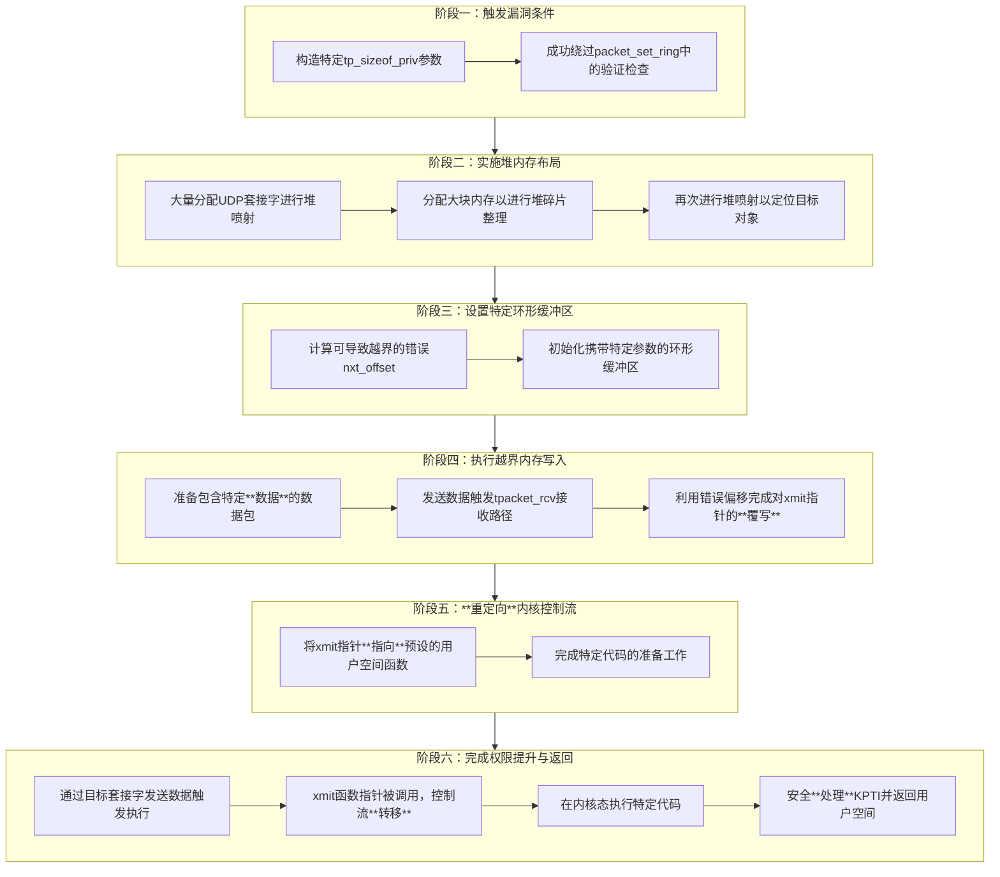
```mermaid
flowchart TD
    A[阶段一：触发漏洞条件] --> B[阶段二：实施堆内存布局]
    B --> C[阶段三：设置特定环形缓冲区]
    C --> D[阶段四：执行越界内存写入]
    D --> E[阶段五：**重定向**内核控制流]
    E --> F[阶段六：完成权限提升与返回]

    subgraph A[阶段一：触发漏洞条件]
        A1[构造特定tp_sizeof_priv参数] --> A2[成功绕过packet_set_ring中的验证检查]
    end

    subgraph B[阶段二：实施堆内存布局]
        B1[大量分配UDP套接字进行堆喷射] --> B2[分配大块内存以进行堆碎片整理] --> B3[再次进行堆喷射以定位目标对象]
    end

    subgraph C[阶段三：设置特定环形缓冲区]
        C1[计算可导致越界的错误nxt_offset] --> C2[初始化携带特定参数的环形缓冲区]
    end

    subgraph D[阶段四：执行越界内存写入]
        D1[准备包含特定**数据**的数据包] --> D2[发送数据触发tpacket_rcv接收路径] --> D3[利用错误偏移完成对xmit指针的**覆写**]
    end

    subgraph E[阶段五：**重定向**内核控制流]
        E1[将xmit指针**指向**预设的用户空间函数] --> E2[完成特定代码的准备工作]
    end

    subgraph F[阶段六：完成权限提升与返回]
        F1[通过目标套接字发送数据触发执行] --> F2[xmit函数指针被调用，控制流**转移**] --> F3[在内核态执行特定代码] --> F4[安全**处理**KPTI并返回用户空间]
    end
```

#### 3-2-2. 堆内存布局策略

精确的堆内存布局是利用成功的关键前提。其目标是通过一系列有步骤的内存分配操作，影响内核SLAB分配器（`kmalloc-2048`缓存）和伙伴系统（Buddy System）的行为，最终使得一个作为"**目标**"的`packet_sock`内核结构体，与另一个由利用者控制的、携带特定参数的环形缓冲区内存块，在物理内存上实现高概率的相邻布局。这种布局为后续的越界写入创造了必要条件。

**内存布局的阶段性演进**：

```
阶段1: 初始堆喷射 (耗尽kmalloc-2048缓存)
+----------------+----------------+----------------+----------------+
| packet_sock A  | packet_sock B  | packet_sock C  | packet_sock D  | ... (数百个对象)
+----------------+----------------+----------------+----------------+
           ↓
内核的`kmalloc-2048`SLAB缓存被大量消耗，后续同类分配可能从更高阶内存块分割。

阶段2: 内存碎片整理 (消耗高阶连续内存页)
+-----------------------------------------+
|         order-3 连续内存页 (8页)        |
|    (由伙伴系统分配，大小为0x8000字节)   |
+-----------------------------------------+
           ↓
从物理内存分配器的freelist中移除大量特定大小的空闲页，简化后续内存布局。

阶段3: 植入**特定**缓冲区 (创建漏洞触发点)
+-----------------------------------------+
| **特定**环形缓冲区块 (2个， 每个0x8000) |
| 其内部nxt_offset经计算将指向块外区域    |
+-----------------------------------------+
                       ↓ (预期相邻区域)
+-----------------------------------------+
| 预留的"目标槽位"                        |
| (为后续分配的packet_sock结构体预留)     |
+-----------------------------------------+

阶段4: 最终目标定位 (二次堆喷射)
+----------------+----------------+----------------+----------------+
| packet_sock X  | packet_sock Y  | packet_sock Z  | packet_sock ...|
+----------------+----------------+----------------+----------------+
           |                |                |
           +----------------+----------------+
                           ↓
           其中之一有很大概率落入阶段3预留的"目标槽位"，
           从而与**特定**环形缓冲区块物理相邻。
```

**实现布局的关键系统调用序列**：

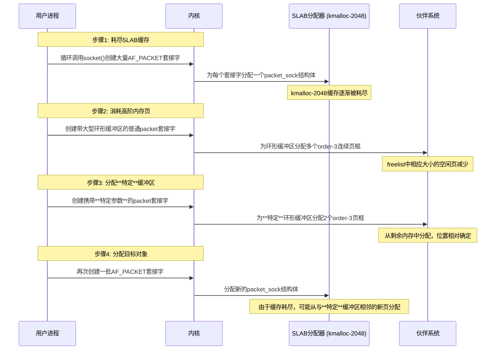
```mermaid
sequenceDiagram
    participant User as 用户进程
    participant Kernel as 内核
    participant SLAB as SLAB分配器 (kmalloc-2048)
    participant Buddy as 伙伴系统

    Note over User,Kernel: 步骤1: 耗尽SLAB缓存
    User->>Kernel: 循环调用socket()创建大量AF_PACKET套接字
    Kernel->>SLAB: 为每个套接字分配一个packet_sock结构体
    Note over SLAB: kmalloc-2048缓存逐渐被耗尽

    Note over User,Kernel: 步骤2: 消耗高阶内存页
    User->>Kernel: 创建带大型环形缓冲区的普通packet套接字
    Kernel->>Buddy: 为环形缓冲区分配多个order-3连续页框
    Note over Buddy: freelist中相应大小的空闲页减少

    Note over User,Kernel: 步骤3: 分配**特定**缓冲区
    User->>Kernel: 创建携带**特定参数**的packet套接字
    Kernel->>Buddy: 为**特定**环形缓冲区分配2个order-3页框
    Note over Buddy: 从剩余内存中分配，位置相对确定

    Note over User,Kernel: 步骤4: 分配目标对象
    User->>Kernel: 再次创建一批AF_PACKET套接字
    Kernel->>SLAB: 分配新的packet_sock结构体
    Note over SLAB: 由于缓存耗尽，可能从与**特定**缓冲区相邻的新页分配
```

#### 3-2-3. 越界写入触发机制

在完成有利的内存布局后，利用过程进入核心阶段：触发漏洞，将数据包内容写入到相邻的`packet_sock`结构体内。这一机制的实现完全依赖于对漏洞原理的运用：精心计算的`tp_sizeof_priv`参数导致了一个错误的`nxt_offset`，使得本应写入环形缓冲区数据区域的数据，被错误地导向了缓冲区之外。

**环形缓冲区内部结构与越界写入目标**：

```
正常的环形缓冲区块布局：
+------------------+---------------------+-------------------------+
| 块描述符头部     | 用户私有区域        | 数据帧存储区            |
| (tpacket_block_desc) | (size = blk_sizeof_priv) | (用于存放网络数据包) |
+------------------+---------------------+-------------------------+
^                  ^                     ^
|                  |                     |
pkblk_start        BLK_HDR_LEN           nxt_offset (正常应指向这里)
(块起始地址)       (头部长度)            (下一个数据包写入起点)

被漏洞扭曲后的写入目标：
+-----------------------------------------------+
| 相邻的 packet_sock 结构体 (**目标**对象)      |
|                                               |
| 成员变量1 | 成员变量2 | ... | xmit指针 | ...  |
|                                               |
+-----------------------------------------------+
^
|
nxt_offset (由于blk_sizeof_priv被**构造**，计算错误指向此处)
```

_图释：原本`nxt_offset`应指向缓冲区内部的数据区起始点。但由于`blk_sizeof_priv`被**构造**，`BLK_PLUS_PRIV(blk_sizeof_priv)`的计算结果变小，使得`nxt_offset = pkblk_start + BLK_PLUS_PRIV(...)` 指向了缓冲区起始位置之后的一个非法地址，在本例中，恰好是相邻`packet_sock`结构体中`xmit`函数指针所在的内存区域。_

**内核中的数据包接收与越界写入时序**：

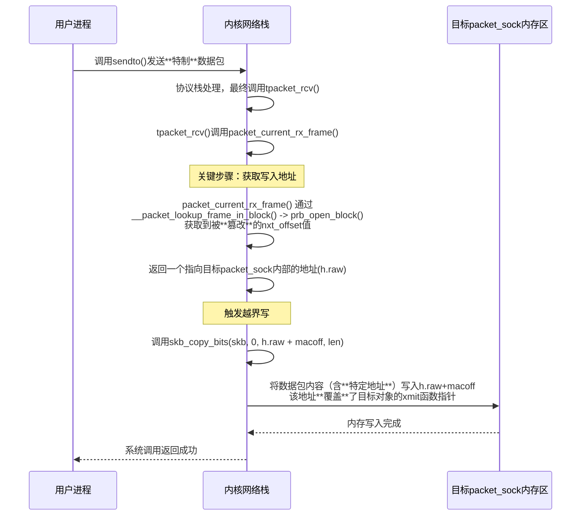
```mermaid
sequenceDiagram
    participant User as 用户进程
    participant Kernel as 内核网络栈
    participant TargetObj as 目标packet_sock内存区

    User->>Kernel: 调用sendto()发送**特制**数据包
    Kernel->>Kernel: 协议栈处理，最终调用tpacket_rcv()
    Kernel->>Kernel: tpacket_rcv()调用packet_current_rx_frame()

    Note over Kernel: 关键步骤：获取写入地址
    Kernel->>Kernel: packet_current_rx_frame() 通过<br>__packet_lookup_frame_in_block() -> prb_open_block()<br>获取到被**篡改**的nxt_offset值

    Kernel->>Kernel: 返回一个指向目标packet_sock内部的地址(h.raw)

    Note over Kernel: 触发越界写
    Kernel->>Kernel: 调用skb_copy_bits(skb, 0, h.raw + macoff, len)
    Kernel->>TargetObj: 将数据包内容（含**特定地址**）写入h.raw+macoff<br>该地址**覆盖**了目标对象的xmit函数指针
    TargetObj-->>Kernel: 内存写入完成
    Kernel-->>User: 系统调用返回成功
```

#### 3-2-4. 控制流**重定向**与执行流程

当目标`packet_sock`结构体中的`xmit`函数指针被**覆盖**为特定地址后，内核控制流便被置于一个可被**影响**的状态。一旦通过该套接字发送数据，被**篡改**的`xmit`指针将被调用，从而执行预设的代码路径，完成从内存破坏到代码执行的转变。

**xmit指针被修改前后的代码执行路径对比**：

```
正常的网络数据发送路径：
    packet_sendmsg()
        -> packet_snd()
            -> po->xmit(skb) [默认指向dev_queue_xmit]
                -> __dev_queue_xmit()
                    -> ... (正常网络栈流程)

**重定向**后的执行路径：
    packet_sendmsg()
        -> packet_snd()
            -> po->xmit(skb) [被**覆盖指向**特定函数]
                -> 特定函数() [用户空间函数]
                    -> commit_creds(prepare_kernel_cred(0)) [内核函数]
                    -> 构造iretq栈帧，返回用户空间
```

_图释：`xmit`是`packet_sock`结构体中的一个函数指针成员，默认指向处理数据包发送的内核函数`dev_queue_xmit`。利用过程将其**覆盖**为指向用户空间特定函数的地址。当内核后续通过此套接字发送数据时，便会跳转到用户空间执行特定代码。_

**权限提升与上下文切换的完整执行序列**：

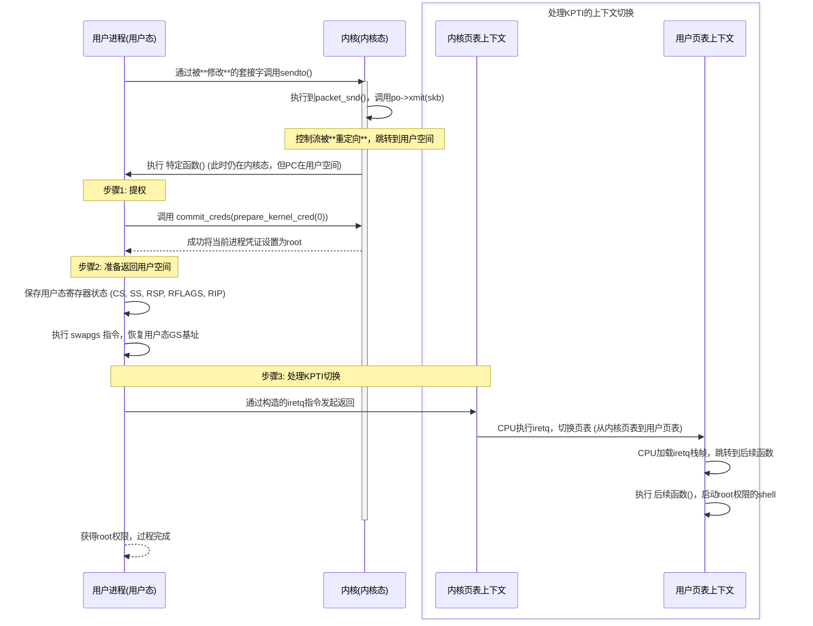
```mermaid
sequenceDiagram
    participant User as 用户进程(用户态)
    participant Kernel as 内核(内核态)
    box 处理KPTI的上下文切换
    participant KernelPage as 内核页表上下文
    participant UserPage as 用户页表上下文
    end

    User->>Kernel: 通过被**修改**的套接字调用sendto()
    activate Kernel
    Kernel->>Kernel: 执行到packet_snd()，调用po->xmit(skb)

    Note over Kernel: 控制流被**重定向**，跳转到用户空间
    Kernel->>User: 执行 特定函数() (此时仍在内核态，但PC在用户空间)

    Note over User: 步骤1: 提权
    User->>Kernel: 调用 commit_creds(prepare_kernel_cred(0))
    Kernel-->>User: 成功将当前进程凭证设置为root

    Note over User: 步骤2: 准备返回用户空间
    User->>User: 保存用户态寄存器状态 (CS, SS, RSP, RFLAGS, RIP)
    User->>User: 执行 swapgs 指令，恢复用户态GS基址

    Note over User, KernelPage: 步骤3: 处理KPTI切换
    User->>KernelPage: 通过构造的iretq指令发起返回
    KernelPage->>UserPage: CPU执行iretq，切换页表 (从内核页表到用户页表)

    UserPage->>UserPage: CPU加载iretq栈帧，跳转到后续函数
    UserPage->>UserPage: 执行 后续函数()，启动root权限的shell

    deactivate Kernel
    User-->>User: 获得root权限，过程完成
```

#### 3-2-5. 内核保护机制应对策略

此利用思路的成功实施严格依赖于特定的内核保护机制配置。在KASLR、SMEP、SMAP关闭而KPTI开启的环境下，各种现代内核防御机制的应对策略如下：

1.  **KASLR应对**：由于KASLR关闭，内核代码和数据的加载地址固定，可以直接硬编码关键内核函数的绝对地址，无需进行地址泄露。

2.  **SMEP/SMAP应对**：这两项保护机制关闭，使得内核可以执行用户空间代码并访问用户空间数据，从而可以直接采用`ret2usr`技术。

3.  **KPTI处理**：通过精心构造的`iretq`返回路径正确处理内核与用户空间的页表切换，确保能够安全返回到用户空间。

**KPTI下iretq返回栈帧的精确布局**：

```
高地址
+-------------------------+
| SS (用户栈段选择子)     | <-- 中断返回时首先弹出的内容
+-------------------------+
| RSP (用户栈指针)        |
+-------------------------+
| RFLAGS (CPU标志寄存器)  |
+-------------------------+
| CS (用户代码段选择子)   |
+-------------------------+
| RIP (返回地址)          | <-- 指向后续函数
+-------------------------+
低地址
```

#### 3-2-6. 利用条件与局限性

该利用思路在实际应用中存在显著的局限性和严格的依赖条件，这些条件共同决定了其通用性较低，主要适用于可控的测试或特定环境。

1.  **内核配置要求**：
    - KASLR、SMEP、SMAP必须关闭
    - 需要预知内核函数地址
    - 针对特定内核版本

2.  **内存布局要求**：
    - 精确的堆风水操作
    - 避免竞争条件
    - 目标对象生命周期可控

3.  **权限要求**：
    - 需要CAP_NET_RAW权限
    - 本地访问前提
    - 稳定的执行环境

#### 3-2-7. 总结

本利用思路完整展示了CVE-2017-7308漏洞从触发到权限提升的完整技术链条，体现了对漏洞机理的深刻理解和对内核内存管理行为的精确操控。整个过程可分为六个逻辑阶段：

1.  **漏洞触发**：通过构造特定`tp_sizeof_priv`参数，绕过`packet_set_ring()`中的验证检查。

2.  **堆内存布局**：通过堆喷射和碎片整理，创造有利的内存布局条件。

3.  **缓冲区设置**：初始化携带恶意参数的环形缓冲区，计算错误的`nxt_offset`。

4.  **越界写入**：发送特制数据包，触发越界写入覆盖`xmit`函数指针。

5.  **控制流重定向**：通过被修改的套接字发送数据，触发预设代码执行。

6.  **权限提升**：执行提权代码并安全返回用户空间。

此思路的技术价值在于完整演绎了"整数溢出→参数截断→错误偏移计算→可控堆溢出→函数指针覆盖→控制流重定向→权限提升"的完整漏洞利用链。然而，其严格的环境依赖也凸显了现代内核安全机制（KASLR、SMEP、SMAP）的有效性。在真实环境中，成功的利用需要克服更多挑战，这也为内核安全研究提供了重要的参考方向。

从防御角度分析，该漏洞的利用过程揭示了几个关键防护点：严格的输入验证、安全的整数运算、类型转换的边界检查，以及堆内存隔离机制的重要性。通过加强对这些环节的安全防护，可以有效降低类似漏洞的利用风险。

#### 3-2-8. 测试结果

<div style="text-align: center; margin: 2rem 0;">
  
</div>

### 3-3. 利用思路二

本小节将详细分析另一种针对CVE-2017-7308漏洞的本地权限提升利用思路。与思路一不同，此思路在**KASLR关闭，但SMEP、SMAP、KPTI均开启**的环境中运作，展示了在更严格安全配置下的漏洞利用方法。该思路采用分阶段策略，先通过漏洞禁用SMEP/SMAP保护，再执行权限提升操作。

#### 3-3-1. 核心利用链条概览

此利用思路采用三阶段渐进式策略，首先创造有利的内存环境，然后分两步分别禁用SMEP/SMAP和完成权限提升，完整流程如下所示：

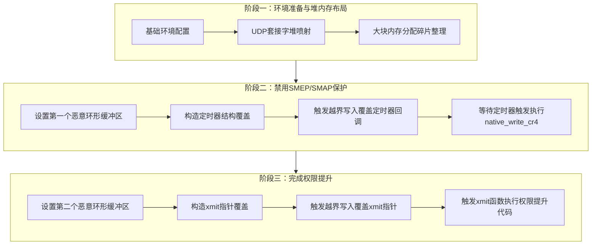
```mermaid
flowchart TD
    A[阶段一：环境准备与堆内存布局] --> B[阶段二：禁用SMEP/SMAP保护]
    B --> C[阶段三：完成权限提升]

    subgraph A[阶段一：环境准备与堆内存布局]
        A1[基础环境配置] --> A2[UDP套接字堆喷射]
        A2 --> A3[大块内存分配碎片整理]
    end

    subgraph B[阶段二：禁用SMEP/SMAP保护]
        B1[设置第一个恶意环形缓冲区] --> B2[构造定时器结构覆盖]
        B2 --> B3[触发越界写入覆盖定时器回调]
        B3 --> B4[等待定时器触发执行native_write_cr4]
    end

    subgraph C[阶段三：完成权限提升]
        C1[设置第二个恶意环形缓冲区] --> C2[构造xmit指针覆盖]
        C2 --> C3[触发越界写入覆盖xmit指针]
        C3 --> C4[触发xmit函数执行权限提升代码]
    end
```

#### 3-3-2. 堆内存布局策略

本利用思路采用与思路一类似的堆内存布局策略，但需进行两次独立的堆喷射和越界写入操作。第一阶段为禁用SMEP/SMAP做准备，第二阶段为权限提升做准备。

**双重堆布局结构**：

```
第一阶段布局（用于禁用SMEP/SMAP）：
+----------------+----------------+----------------+----------------+
| packet_sock A  | packet_sock B  | packet_sock C  | packet_sock D  | ... (初始喷射)
+----------------+----------------+----------------+----------------+
           ↓
+-----------------------------------------+
| 大块内存分配 (order-3页)                |
+-----------------------------------------+
           ↓
+-----------------------------------------+
| 第一个恶意环形缓冲区                    |
| (覆盖目标: 相邻packet_sock的定时器)     |
+-----------------------------------------+
           ↓
+----------------+----------------+
| 第一轮目标UDP套接字             | (与恶意缓冲区相邻)
+----------------+----------------+

第二阶段布局（用于权限提升）：
+----------------+----------------+----------------+----------------+
| packet_sock E  | packet_sock F  | packet_sock G  | packet_sock H  | ... (再次喷射)
+----------------+----------------+----------------+----------------+
           ↓
+-----------------------------------------+
| 第二个恶意环形缓冲区                    |
| (覆盖目标: 相邻packet_sock的xmit指针)   |
+-----------------------------------------+
           ↓
+----------------+----------------+
| 第二轮目标UDP套接字             | (与第二个缓冲区相邻)
+----------------+----------------+
```

**双重布局的系统调用序列**：

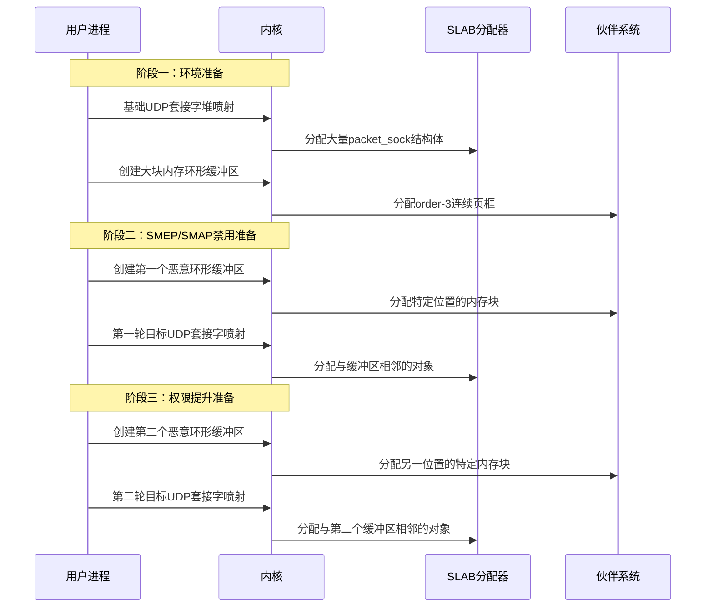
```mermaid
sequenceDiagram
    participant User as 用户进程
    participant Kernel as 内核
    participant SLAB as SLAB分配器
    participant Buddy as 伙伴系统

    Note over User,Kernel: 阶段一：环境准备
    User->>Kernel: 基础UDP套接字堆喷射
    Kernel->>SLAB: 分配大量packet_sock结构体
    User->>Kernel: 创建大块内存环形缓冲区
    Kernel->>Buddy: 分配order-3连续页框

    Note over User,Kernel: 阶段二：SMEP/SMAP禁用准备
    User->>Kernel: 创建第一个恶意环形缓冲区
    Kernel->>Buddy: 分配特定位置的内存块
    User->>Kernel: 第一轮目标UDP套接字喷射
    Kernel->>SLAB: 分配与缓冲区相邻的对象

    Note over User,Kernel: 阶段三：权限提升准备
    User->>Kernel: 创建第二个恶意环形缓冲区
    Kernel->>Buddy: 分配另一位置的特定内存块
    User->>Kernel: 第二轮目标UDP套接字喷射
    Kernel->>SLAB: 分配与第二个缓冲区相邻的对象
```

#### 3-3-3. 第一阶段：禁用SMEP/SMAP保护

在SMEP和SMAP开启的环境下，直接执行用户空间代码的`ret2usr`技术不可用。此阶段通过利用漏洞覆盖`packet_sock`结构体中的定时器回调函数，间接修改CR4寄存器来禁用这两项保护机制。

**定时器结构覆盖机制**：

```
定时器结构 (struct timer_list) 布局：
+----------------+----------------+----------------+----------------+
| hlist_node     | expires        | function       | data           |
| (16字节)       | (8字节)        | (8字节)        | (8字节)        |
+----------------+----------------+----------------+----------------+

恶意构造的定时器数据：
+----------------+----------------+----------------+----------------+
| 任意值         | 任意值         | native_write_cr4 | CR4_DESIRED_VALUE |
| (保持原样)     | (保持原样)     | (内核函数地址)  | (目标CR4值)     |
+----------------+----------------+----------------+----------------+

目标CR4值计算：
原始CR4值: 0x6f0 (假设)
SMEP位 (第20位): 1 -> 0
SMAP位 (第21位): 1 -> 0
目标CR4值: 0x6f0 & ~(1<<20) & ~(1<<21)
```

**定时器覆盖与执行流程**：

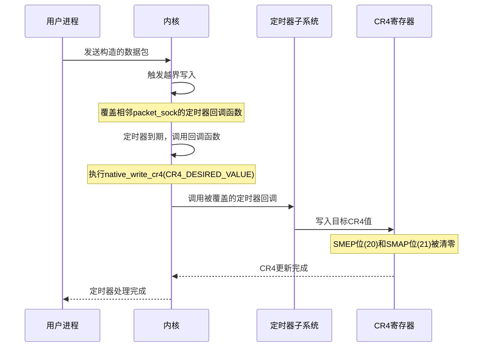
```mermaid
sequenceDiagram
    participant User as 用户进程
    participant Kernel as 内核
    participant Timer as 定时器子系统
    participant CR4 as CR4寄存器

    User->>Kernel: 发送构造的数据包
    Kernel->>Kernel: 触发越界写入
    Note over Kernel: 覆盖相邻packet_sock的定时器回调函数
    Kernel->>Kernel: 定时器到期，调用回调函数

    Note over Kernel: 执行native_write_cr4(CR4_DESIRED_VALUE)
    Kernel->>Timer: 调用被覆盖的定时器回调
    Timer->>CR4: 写入目标CR4值
    Note over CR4: SMEP位(20)和SMAP位(21)被清零

    CR4-->>Kernel: CR4更新完成
    Kernel-->>User: 定时器处理完成
```

#### 3-3-4. 第二阶段：权限提升操作

在成功禁用SMEP/SMAP后，第二阶段采用与思路一类似的`ret2usr`技术完成权限提升。由于CR4寄存器已被修改，内核现在可以执行用户空间代码。

**两阶段控制流重定向**：

```
第一阶段：禁用保护
   定时器到期
        -> timer->function() [被覆盖为native_write_cr4]
            -> 修改CR4寄存器，禁用SMEP/SMAP
                -> 返回

第二阶段：权限提升
   通过目标套接字发送数据
        -> po->xmit(skb) [被覆盖为ret2usr_attack]
            -> 执行用户空间提权代码
                -> commit_creds(prepare_kernel_cred(0))
                -> 处理KPTI，返回用户空间
```

**完整的权限提升序列**：

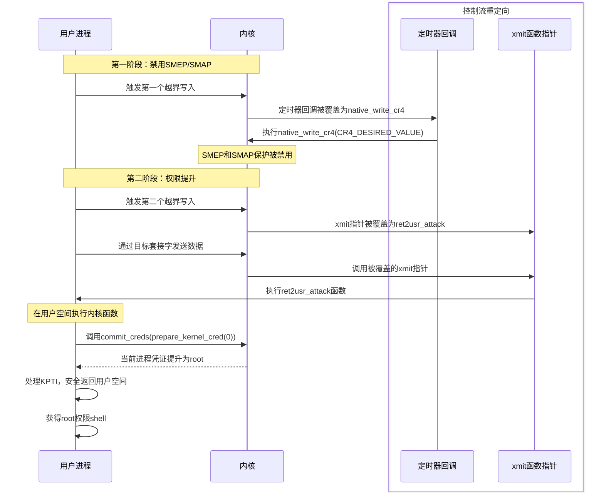
```mermaid
sequenceDiagram
    participant User as 用户进程
    participant Kernel as 内核
    box 控制流重定向
    participant TimerFunc as 定时器回调
    participant XmitFunc as xmit函数指针
    end

    Note over User,Kernel: 第一阶段：禁用SMEP/SMAP
    User->>Kernel: 触发第一个越界写入
    Kernel->>TimerFunc: 定时器回调被覆盖为native_write_cr4
    TimerFunc->>Kernel: 执行native_write_cr4(CR4_DESIRED_VALUE)
    Note over Kernel: SMEP和SMAP保护被禁用

    Note over User,Kernel: 第二阶段：权限提升
    User->>Kernel: 触发第二个越界写入
    Kernel->>XmitFunc: xmit指针被覆盖为ret2usr_attack
    User->>Kernel: 通过目标套接字发送数据
    Kernel->>XmitFunc: 调用被覆盖的xmit指针
    XmitFunc->>User: 执行ret2usr_attack函数

    Note over User: 在用户空间执行内核函数
    User->>Kernel: 调用commit_creds(prepare_kernel_cred(0))
    Kernel-->>User: 当前进程凭证提升为root

    User->>User: 处理KPTI，安全返回用户空间
    User->>User: 获得root权限shell
```

#### 3-3-5. 内核保护机制应对策略

此利用思路针对开启的SMEP、SMAP和KPTI保护机制，采用创新性的分阶段绕过策略：

1.  **KASLR应对**：由于KASLR关闭，内核地址已知，可直接硬编码`native_write_cr4`、`commit_creds`和`prepare_kernel_cred`等函数的地址。

2.  **SMEP/SMAP应对**：采用间接修改CR4寄存器的方法：
    - 利用漏洞覆盖`packet_sock`结构体中的定时器回调函数指针
    - 将回调函数设置为`native_write_cr4`内核函数
    - 通过定时器回调将特定值写入CR4寄存器，清除SMEP和SMAP位
    - 这种方法避免了直接执行用户空间代码，符合SMEP保护规则

3.  **KPTI处理**：在权限提升阶段，通过精心构造的`iretq`返回路径处理内核与用户空间的页表切换，确保安全返回到用户空间。

**CR4寄存器修改策略**：

```
原始CR4寄存器值（假设）：
位位置:  21  20  ...  其他位
值:      1   1   ...  1
         |   |
         |   +-- SMEP位 (Supervisor Mode Execution Prevention)
         +------ SMAP位 (Supervisor Mode Access Prevention)
         = 0x6f0 (示例)

目标CR4值计算：
CR4_DESIRED_VALUE = 原始值 & ~(1<<20) & ~(1<<21)
                  = 0x6f0 & ~0x100000 & ~0x200000
                  = 0x6f0 & 0xffdfffff & 0xffbfffff
                  = 0x... (SMEP和SMAP位清零)
```

#### 3-3-6. 利用条件与局限性

此利用思路在更严格的环境中仍能运作，但也存在特定的限制和依赖条件：

1.  **内核配置要求**：
    - KASLR必须关闭
    - 需要预知`native_write_cr4`等内核函数地址
    - 针对特定内核版本和配置

2.  **内存布局要求**：
    - 需要两次独立的精确堆风水操作
    - 两个阶段的布局不能相互干扰
    - 定时器和xmit指针必须位于可预测的偏移位置

3.  **时序与竞争条件**：
    - 第一阶段必须在第二阶段之前完成
    - 定时器必须在SMEP/SMAP禁用后到期
    - 避免内存重用导致的利用失败

4.  **权限与功能要求**：
    - 需要CAP_NET_RAW权限
    - 本地访问前提
    - 稳定的执行环境

#### 3-3-7. 总结

本利用思路展示了在SMEP、SMAP、KPTI均开启的严格环境下的CVE-2017-7308漏洞利用方法。与思路一相比，其主要创新点在于：

1.  **分阶段策略**：采用"先禁用保护，再提权"的两阶段方法，克服了SMEP/SMAP的阻碍。

2.  **间接代码执行**：通过覆盖定时器回调函数，间接调用内核函数修改CR4寄存器，避免了直接违反SMEP保护。

3.  **双重堆布局**：为两个阶段分别进行精确的堆内存布局，确保每次越界写入都能命中预定目标。

技术实现上，该思路完整演绎了"整数溢出→参数截断→错误偏移计算→可控堆溢出→定时器回调覆盖→CR4寄存器修改→保护禁用→二次溢出→xmit指针覆盖→控制流重定向→权限提升"的复杂利用链。

从安全防护角度分析，此利用揭示了几个重要防护点：

- **定时器回调的安全性**：内核定时器回调等函数指针需要特别保护
- **CR4寄存器保护**：防止非特权修改CR4寄存器中的保护位
- **多次漏洞触发防护**：防止同一漏洞被多次触发实现复杂利用链

虽然此利用思路在现实环境中仍面临诸多挑战，但其展现的技术思路和创新方法对理解现代内核漏洞利用与防护具有重要参考价值。同时，它也凸显了在复杂安全机制下，即使单个漏洞也能通过精巧构造实现权限提升，强调了多层次、深度防御的重要性。

#### 3-3-8. 测试结果

<div style="text-align: center; margin: 2rem 0;">
  
</div>

### 3-4. 利用思路三

本小节将深入分析第三种针对CVE-2017-7308漏洞的本地权限提升利用思路。与思路一、二不同，此思路在**KASLR、SMEP、SMAP、KPTI全部开启**的完整保护环境中运作，展示了在现代内核安全机制下的复杂漏洞利用方法。该思路采用多阶段组合策略，通过信息泄露绕过KASLR，利用内核代码执行技术绕过SMEP/SMAP，最终完成权限提升。

#### 3-4-1. 核心利用链条概览

此利用思路采用八阶段精密操作链，首先获取内核地址信息，然后通过复杂的堆布局和执行代码完成权限提升，完整流程如下所示：

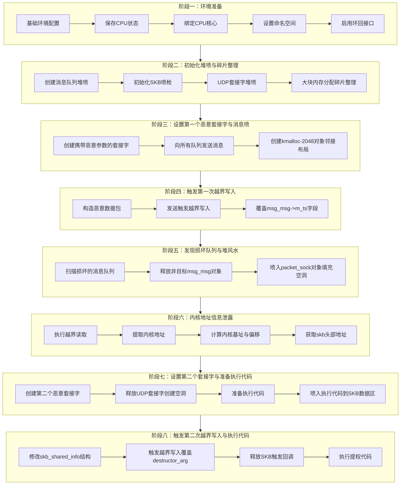
```mermaid
flowchart TD
    A[阶段一：环境准备] --> B[阶段二：初始化堆喷与碎片整理]
    B --> C[阶段三：设置第一个恶意套接字与消息喷]
    C --> D[阶段四：触发第一次越界写入]
    D --> E[阶段五：发现损坏队列与堆风水]
    E --> F[阶段六：内核地址信息泄露]
    F --> G[阶段七：设置第二个套接字与准备执行代码]
    G --> H[阶段八：触发第二次越界写入与执行代码]

    subgraph A[阶段一：环境准备]
        A1[基础环境配置] --> A2[保存CPU状态] --> A3[绑定CPU核心] --> A4[设置命名空间] --> A5[启用环回接口]
    end

    subgraph B[阶段二：初始化堆喷与碎片整理]
        B1[创建消息队列堆喷] --> B2[初始化SKB喷枪] --> B3[UDP套接字堆喷] --> B4[大块内存分配碎片整理]
    end

    subgraph C[阶段三：设置第一个恶意套接字与消息喷]
        C1[创建携带恶意参数的套接字] --> C2[向所有队列发送消息] --> C3[创建kmalloc-2048对象邻接布局]
    end

    subgraph D[阶段四：触发第一次越界写入]
        D1[构造恶意数据包] --> D2[发送触发越界写入] --> D3[覆盖msg_msg->m_ts字段]
    end

    subgraph E[阶段五：发现损坏队列与堆风水]
        E1[扫描损坏的消息队列] --> E2[释放非目标msg_msg对象] --> E3[喷入packet_sock对象填充空洞]
    end

    subgraph F[阶段六：内核地址信息泄露]
        F1[执行越界读取] --> F2[提取内核地址] --> F3[计算内核基址与偏移] --> F4[获取skb头部地址]
    end

    subgraph G[阶段七：设置第二个套接字与准备执行代码]
        G1[创建第二个恶意套接字] --> G2[释放UDP套接字创建空洞] --> G3[准备执行代码] --> G4[喷入执行代码到SKB数据区]
    end

    subgraph H[阶段八：触发第二次越界写入与执行代码]
        H1[修改skb_shared_info结构] --> H2[触发越界写入覆盖destructor_arg] --> H3[释放SKB触发回调] --> H4[执行提权代码]
    end
```

#### 3-4-2. 堆内存布局与堆风水策略

在完整的保护机制下，此思路采用复杂的堆内存布局策略，通过精确控制多个内核对象的内存分配位置，为后续的信息泄露和代码执行创造条件。

**多阶段堆布局演变**：

```
阶段1-2: 基础堆布局
+----------------+----------------+----------------+----------------+
| 消息队列对象   | 消息队列对象   | 消息队列对象   | 消息队列对象   | (32个kmalloc-2048)
+----------------+----------------+----------------+----------------+
+----------------+----------------+----------------+----------------+
| UDP套接字对象  | UDP套接字对象  | UDP套接字对象  | UDP套接字对象  | (512个kmalloc-2048)
+----------------+----------------+----------------+----------------+
+-----------------------------------------+
| 大块内存区域 (order-3页)                | (碎片整理)
+-----------------------------------------+

阶段3: 第一个恶意缓冲区与邻接布局
+-----------------------------------------+
| 第一个恶意环形缓冲区                    | (携带特定参数)
+-----------------------------------------+
           ↓
+----------------+----------------+----------------+----------------+
| msg_msg对象[0] | msg_msg对象[1] | msg_msg对象[2] | msg_msg对象[3] | (相邻布局)
+----------------+----------------+----------------+----------------+

阶段5: 堆风水操作
+----------------+----------------+----------------+----------------+
| packet_sock[0] | packet_sock[1] | packet_sock[2] | packet_sock[3] | (填充空洞)
+----------------+----------------+----------------+----------------+
+----------------+----------------+
| 损坏的msg_msg  | 空位           | (目标队列保持)
+----------------+----------------+

阶段7-8: 第二次布局与代码准备
+-----------------------------------------+
| 第二个恶意环形缓冲区                    | (目标: skb_shared_info)
+-----------------------------------------+
+----------------+----------------+----------------+----------------+
| SKB数据区      | 执行代码       | ubuf_info      | 控制数据       |
+----------------+----------------+----------------+----------------+
```

**多阶段系统调用序列**：

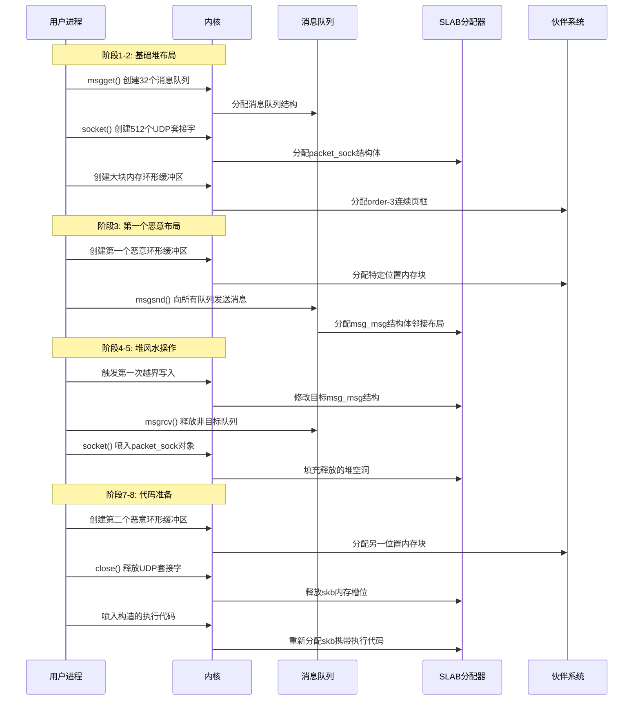
```mermaid
sequenceDiagram
    participant User as 用户进程
    participant Kernel as 内核
    participant MsgQ as 消息队列
    participant SLAB as SLAB分配器
    participant Buddy as 伙伴系统

    Note over User,Kernel: 阶段1-2: 基础堆布局
    User->>Kernel: msgget() 创建32个消息队列
    Kernel->>MsgQ: 分配消息队列结构
    User->>Kernel: socket() 创建512个UDP套接字
    Kernel->>SLAB: 分配packet_sock结构体
    User->>Kernel: 创建大块内存环形缓冲区
    Kernel->>Buddy: 分配order-3连续页框

    Note over User,Kernel: 阶段3: 第一个恶意布局
    User->>Kernel: 创建第一个恶意环形缓冲区
    Kernel->>Buddy: 分配特定位置内存块
    User->>MsgQ: msgsnd() 向所有队列发送消息
    MsgQ->>SLAB: 分配msg_msg结构体邻接布局

    Note over User,Kernel: 阶段4-5: 堆风水操作
    User->>Kernel: 触发第一次越界写入
    Kernel->>SLAB: 修改目标msg_msg结构
    User->>MsgQ: msgrcv() 释放非目标队列
    User->>Kernel: socket() 喷入packet_sock对象
    Kernel->>SLAB: 填充释放的堆空洞

    Note over User,Kernel: 阶段7-8: 代码准备
    User->>Kernel: 创建第二个恶意环形缓冲区
    Kernel->>Buddy: 分配另一位置内存块
    User->>Kernel: close() 释放UDP套接字
    Kernel->>SLAB: 释放skb内存槽位
    User->>Kernel: 喷入构造的执行代码
    Kernel->>SLAB: 重新分配skb携带执行代码
```

#### 3-4-3. 信息泄露与地址获取

在KASLR开启的环境下，内核地址随机化，必须首先获取关键内核地址信息。此思路通过越界读取msg_msg结构体，泄露内核堆地址和内核基址。

**信息泄露机制**：

```
msg_msg结构体布局：
+----------------+----------------+----------------+----------------+
| m_list         | m_type         | m_ts           | next           |
| (16字节)       | (8字节)        | (8字节)        | (8字节)        |
+----------------+----------------+----------------+----------------+
| security       | 数据区...      | 内核指针...    | 堆地址...      |
| (8字节)        | (可变)         | (8字节)        | (8字节)        |
+----------------+----------------+----------------+----------------+

通过越界读取获取的关键信息：
1. packet_proto地址 (内核数据段)
2. skb->head地址 (内核堆地址)
3. 其他内核结构指针

地址计算：
kernel_offset = leak_packet_proto - PACKET_PROTO_OFFSET
kernel_base = kernel_base + kernel_offset
skb_head_addr = leak_skb_head - 0xb0
```

**信息泄露执行流程**：

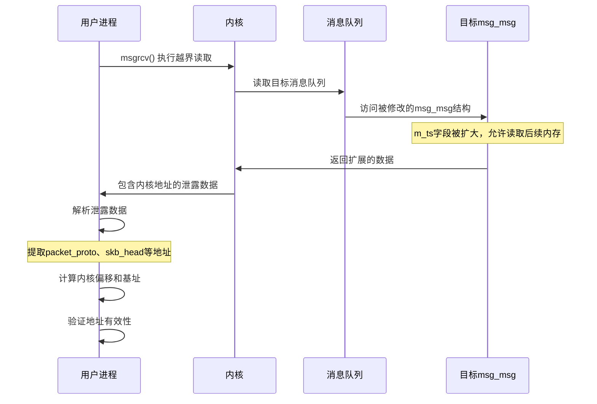
```mermaid
sequenceDiagram
    participant User as 用户进程
    participant Kernel as 内核
    participant MsgQ as 消息队列
    participant Target as 目标msg_msg

    User->>Kernel: msgrcv() 执行越界读取
    Kernel->>MsgQ: 读取目标消息队列
    MsgQ->>Target: 访问被修改的msg_msg结构
    Note over Target: m_ts字段被扩大，允许读取后续内存

    Target->>Kernel: 返回扩展的数据
    Kernel->>User: 包含内核地址的泄露数据

    User->>User: 解析泄露数据
    Note over User: 提取packet_proto、skb_head等地址
    User->>User: 计算内核偏移和基址
    User->>User: 验证地址有效性
```

#### 3-4-4. 代码执行与权限提升

在获取内核地址后，需要构造执行代码来绕过SMEP/SMAP保护。此思路利用skb_shared_info结构体中的特定字段，在SKB释放时触发权限提升代码的执行。

**代码执行触发机制**：

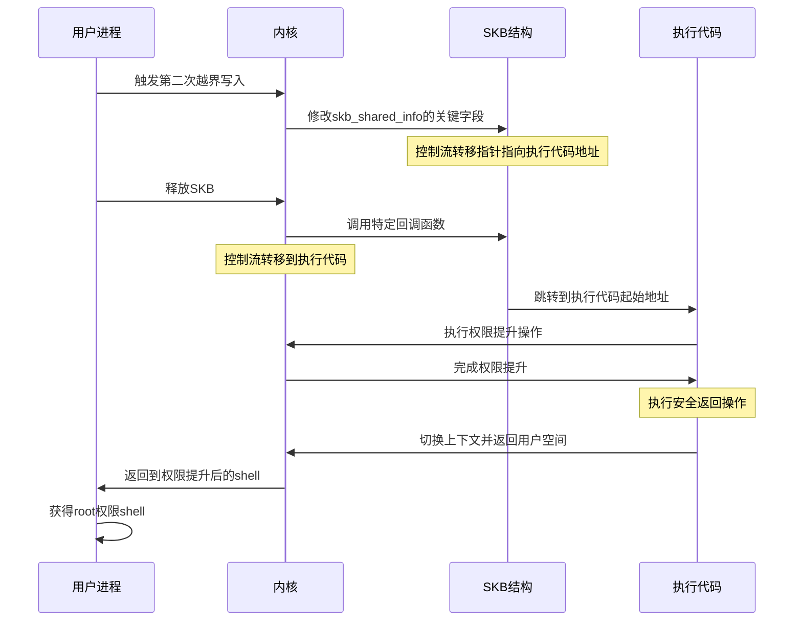
```mermaid
sequenceDiagram
    participant User as 用户进程
    participant Kernel as 内核
    participant SKB as SKB结构
    participant ExecCode as 执行代码

    User->>Kernel: 触发第二次越界写入
    Kernel->>SKB: 修改skb_shared_info的关键字段
    Note over SKB: 控制流转移指针指向执行代码地址

    User->>Kernel: 释放SKB
    Kernel->>SKB: 调用特定回调函数
    Note over Kernel: 控制流转移到执行代码

    SKB->>ExecCode: 跳转到执行代码起始地址
    ExecCode->>Kernel: 执行权限提升操作
    Kernel->>ExecCode: 完成权限提升

    Note over ExecCode: 执行安全返回操作
    ExecCode->>Kernel: 切换上下文并返回用户空间
    Kernel->>User: 返回到权限提升后的shell
    User->>User: 获得root权限shell
```

#### 3-4-5. 内核保护机制应对策略

此利用思路在完整保护机制下运作，针对KASLR、SMEP、SMAP、KPTI的应对策略如下：

1. **KASLR绕过**：通过越界读取msg_msg结构体，泄露内核数据段指针(packet_proto)和堆指针(skb_head)，计算内核基址和偏移。

2. **SMEP/SMAP绕过**：通过构造特定的执行代码在内核空间完成权限提升，避免直接执行用户空间代码。

3. **KPTI处理**：在执行代码中包含上下文切换操作，正确处理内核与用户空间的页表切换。

**保护机制应对技术矩阵**：

| 保护机制 | 应对策略     | 技术实现                               |
| -------- | ------------ | -------------------------------------- |
| KASLR    | 信息泄露     | 越界读取msg_msg结构体，泄露内核指针    |
| SMEP     | 内核空间执行 | 构造执行代码在内核空间完成权限提升     |
| SMAP     | 内核数据访问 | 执行代码使用内核地址，避免用户空间访问 |
| KPTI     | 安全返回     | 执行代码包含上下文切换，正确处理切换   |

#### 3-4-6. 利用条件与局限性

此高级利用思路虽然强大，但存在更严格的限制和依赖条件：

1. **内核配置要求**：
    - 需要存在可用的执行代码构造条件
    - 内核版本和配置需支持信息泄露
    - 堆布局行为可预测

2. **内存布局要求**：
    - 需要两次独立的精确堆风水操作
    - 信息泄露和代码执行阶段布局不能冲突
    - SKB释放时机必须可控

3. **技术实现要求**：
    - 需要准确的内核地址信息
    - 执行代码构造必须精确
    - 信息泄露必须可靠

4. **环境稳定性要求**：
    - 系统负载需稳定
    - 避免竞争条件
    - 内存状态可控

#### 3-4-7. 总结

本利用思路展示了在完整内核保护机制(KASLR、SMEP、SMAP、KPTI全部开启)下的CVE-2017-7308漏洞利用方法，代表了现代内核漏洞利用的技术前沿。与思路一、二相比，其主要技术特点包括：

1. **组合式利用策略**：融合信息泄露、堆风水、代码执行多种技术，分阶段渐进式利用。

2. **复杂内存操控**：通过精确的堆布局控制，实现信息泄露和代码执行两次关键操作。

3. **完整保护绕过**：依次应对KASLR、SMEP、SMAP、KPTI所有现代内核保护机制。

从技术实现角度看，该思路完整演绎了"整数溢出→参数截断→错误偏移计算→可控堆溢出→信息泄露→地址获取→二次溢出→代码覆盖→控制流劫持→权限提升"的复杂利用链。

从安全防护角度分析，此利用揭示了多层防御的重要性：

- **深度防御**：单一防护机制易被绕过，需要多层次、深度防御
- **漏洞隔离**：防止一个漏洞触发多个安全边界突破
- **行为监控**：检测异常的内存访问和代码执行模式
- **随机化增强**：增强堆和地址空间的随机化程度

虽然此利用思路在现实中面临极高的技术门槛和环境要求，但其展现的技术深度和组合利用方法对理解现代内核安全攻防具有重要价值。同时，它也强调了在日益复杂的威胁环境下，内核安全需要从单点防护转向体系化防御，构建纵深防御体系的重要性。

#### 3-4-8. 测试结果

<div style="text-align: center; margin: 2rem 0;">
  
</div>

### 3-5. 利用思路四

本小节将深入分析第四种针对CVE-2017-7308漏洞的本地权限提升利用思路。此思路在**KASLR、SMEP、SMAP、KPTI全部开启**的完整保护环境中运作，但采用了与思路三不同的技术路径。该思路通过信息泄露获取内核地址，然后利用管道(pipe)机制实现任意内存写入，最终修改系统关键文件完成权限提升。

#### 3-5-1. 核心利用链条概览

此利用思路采用九阶段精密操作链，首先获取内核地址信息，然后利用管道机制实现任意写，最终修改系统文件完成权限提升，完整流程如下所示：

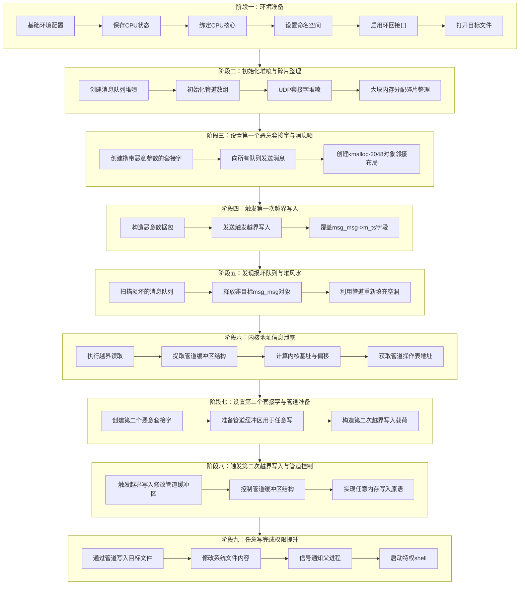
```mermaid
flowchart TD
    A[阶段一：环境准备] --> B[阶段二：初始化堆喷与碎片整理]
    B --> C[阶段三：设置第一个恶意套接字与消息喷]
    C --> D[阶段四：触发第一次越界写入]
    D --> E[阶段五：发现损坏队列与堆风水]
    E --> F[阶段六：内核地址信息泄露]
    F --> G[阶段七：设置第二个套接字与管道准备]
    G --> H[阶段八：触发第二次越界写入与管道控制]
    H --> I[阶段九：任意写完成权限提升]

    subgraph A[阶段一：环境准备]
        A1[基础环境配置] --> A2[保存CPU状态] --> A3[绑定CPU核心] --> A4[设置命名空间] --> A5[启用环回接口] --> A6[打开目标文件]
    end

    subgraph B[阶段二：初始化堆喷与碎片整理]
        B1[创建消息队列堆喷] --> B2[初始化管道数组] --> B3[UDP套接字堆喷] --> B4[大块内存分配碎片整理]
    end

    subgraph C[阶段三：设置第一个恶意套接字与消息喷]
        C1[创建携带恶意参数的套接字] --> C2[向所有队列发送消息] --> C3[创建kmalloc-2048对象邻接布局]
    end

    subgraph D[阶段四：触发第一次越界写入]
        D1[构造恶意数据包] --> D2[发送触发越界写入] --> D3[覆盖msg_msg->m_ts字段]
    end

    subgraph E[阶段五：发现损坏队列与堆风水]
        E1[扫描损坏的消息队列] --> E2[释放非目标msg_msg对象] --> E3[利用管道重新填充空洞]
    end

    subgraph F[阶段六：内核地址信息泄露]
        F1[执行越界读取] --> F2[提取管道缓冲区结构] --> F3[计算内核基址与偏移] --> F4[获取管道操作表地址]
    end

    subgraph G[阶段七：设置第二个套接字与管道准备]
        G1[创建第二个恶意套接字] --> G2[准备管道缓冲区用于任意写] --> G3[构造第二次越界写入载荷]
    end

    subgraph H[阶段八：触发第二次越界写入与管道控制]
        H1[触发越界写入修改管道缓冲区] --> H2[控制管道缓冲区结构] --> H3[实现任意内存写入原语]
    end

    subgraph I[阶段九：任意写完成权限提升]
        I1[通过管道写入目标文件] --> I2[修改系统文件内容] --> I3[信号通知父进程] --> I4[启动特权shell]
    end
```

#### 3-5-2. 堆内存布局与管道利用策略

此思路采用消息队列(msg_msg)和管道(pipe)相结合的内存布局策略，通过精确控制多个内核对象的内存分配位置，为后续的信息泄露和任意写创造条件。

**多阶段堆布局演变**：

```
阶段1-2: 基础堆布局
+----------------+----------------+----------------+----------------+
| 消息队列对象   | 消息队列对象   | 消息队列对象   | 消息队列对象   | (32个kmalloc-2048)
+----------------+----------------+----------------+----------------+
+----------------+----------------+----------------+----------------+
| 管道缓冲区对象 | 管道缓冲区对象 | 管道缓冲区对象 | 管道缓冲区对象 | (128个kmalloc-1024)
+----------------+----------------+----------------+----------------+
+----------------+----------------+----------------+----------------+
| UDP套接字对象  | UDP套接字对象  | UDP套接字对象  | UDP套接字对象  | (512个kmalloc-2048)
+----------------+----------------+----------------+----------------+
+-----------------------------------------+
| 大块内存区域 (order-3页)                | (碎片整理)
+-----------------------------------------+

阶段3: 第一个恶意缓冲区与邻接布局
+-----------------------------------------+
| 第一个恶意环形缓冲区                    | (携带特定参数)
+-----------------------------------------+
           ↓
+----------------+----------------+----------------+----------------+
| msg_msg对象[0] | msg_msg对象[1] | msg_msg对象[2] | msg_msg对象[3] | (相邻布局)
+----------------+----------------+----------------+----------------+

阶段6: 堆风水操作
+----------------+----------------+----------------+----------------+
| 管道缓冲区[0]  | 管道缓冲区[1]  | 管道缓冲区[2]  | 管道缓冲区[3]  | (填充空洞)
+----------------+----------------+----------------+----------------+
+----------------+----------------+
| 损坏的msg_msg  | 空位           | (目标队列保持)
+----------------+----------------+

阶段7-8: 第二次布局与管道控制
+-----------------------------------------+
| 第二个恶意环形缓冲区                    | (目标: 管道缓冲区)
+-----------------------------------------+
+----------------+----------------+----------------+----------------+
| 管道控制结构   | 任意写目标     | 文件操作指针   | 控制数据       |
+----------------+----------------+----------------+----------------+
```

**多阶段系统调用序列**：

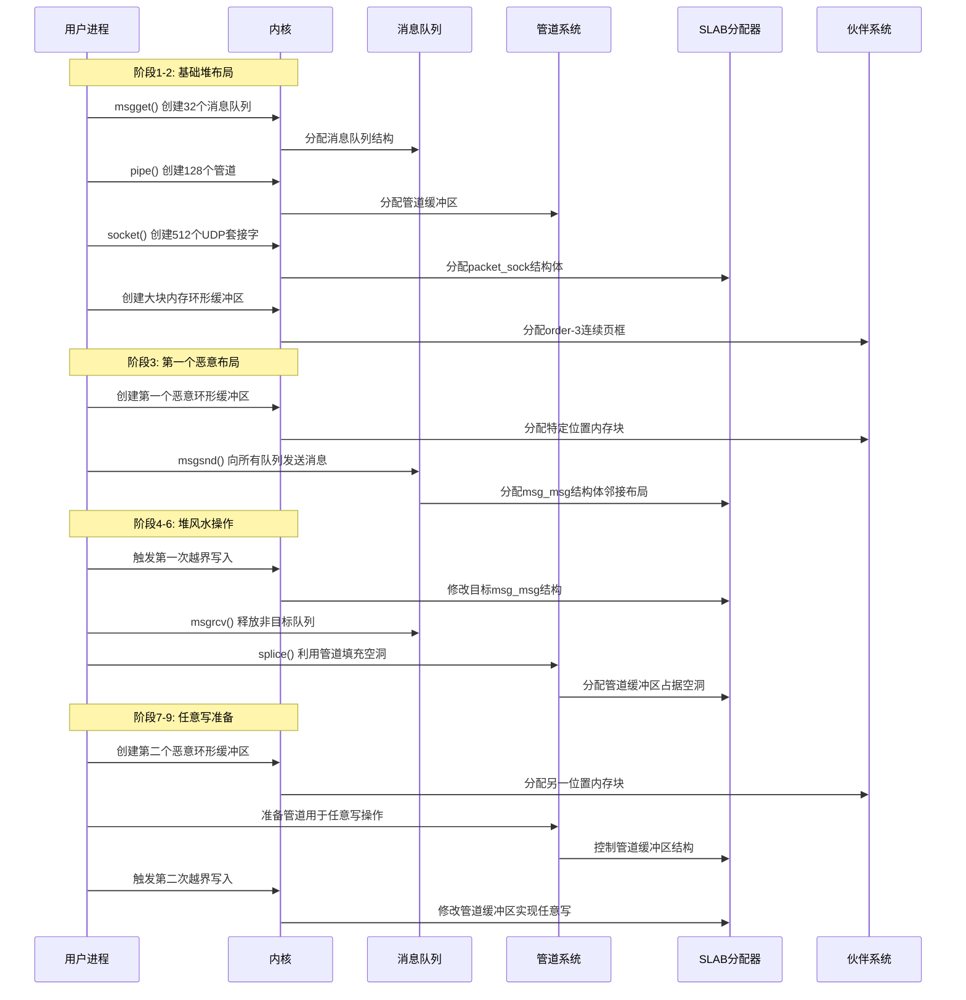
```mermaid
sequenceDiagram
    participant User as 用户进程
    participant Kernel as 内核
    participant MsgQ as 消息队列
    participant Pipe as 管道系统
    participant SLAB as SLAB分配器
    participant Buddy as 伙伴系统

    Note over User,Kernel: 阶段1-2: 基础堆布局
    User->>Kernel: msgget() 创建32个消息队列
    Kernel->>MsgQ: 分配消息队列结构
    User->>Kernel: pipe() 创建128个管道
    Kernel->>Pipe: 分配管道缓冲区
    User->>Kernel: socket() 创建512个UDP套接字
    Kernel->>SLAB: 分配packet_sock结构体
    User->>Kernel: 创建大块内存环形缓冲区
    Kernel->>Buddy: 分配order-3连续页框

    Note over User,Kernel: 阶段3: 第一个恶意布局
    User->>Kernel: 创建第一个恶意环形缓冲区
    Kernel->>Buddy: 分配特定位置内存块
    User->>MsgQ: msgsnd() 向所有队列发送消息
    MsgQ->>SLAB: 分配msg_msg结构体邻接布局

    Note over User,Kernel: 阶段4-6: 堆风水操作
    User->>Kernel: 触发第一次越界写入
    Kernel->>SLAB: 修改目标msg_msg结构
    User->>MsgQ: msgrcv() 释放非目标队列
    User->>Pipe: splice() 利用管道填充空洞
    Pipe->>SLAB: 分配管道缓冲区占据空洞

    Note over User,Kernel: 阶段7-9: 任意写准备
    User->>Kernel: 创建第二个恶意环形缓冲区
    Kernel->>Buddy: 分配另一位置内存块
    User->>Pipe: 准备管道用于任意写操作
    Pipe->>SLAB: 控制管道缓冲区结构
    User->>Kernel: 触发第二次越界写入
    Kernel->>SLAB: 修改管道缓冲区实现任意写
```

#### 3-5-3. 信息泄露与地址获取

在KASLR开启的环境下，需要通过信息泄露获取内核地址。此思路通过越界读取msg_msg结构体，泄露管道缓冲区(pipe_buffer)结构，从而获取内核地址。

**信息泄露机制**：

```
pipe_buffer结构体布局：
+----------------+----------------+----------------+----------------+
| page           | offset         | len            | ops            |
| (8字节)        | (4字节)        | (4字节)        | (8字节)        |
+----------------+----------------+----------------+----------------+
| flags          | 保留字段       | 私有数据       | 其他成员       |
| (4字节)        | (4字节)        | (8字节)        | (可变)         |
+----------------+----------------+----------------+----------------+

通过越界读取获取的关键信息：
1. pipe_buffer->ops地址 (内核代码段，指向anon_pipe_buf_ops)
2. pipe_buffer->page地址 (内核堆地址)
3. 其他管道相关指针

地址计算：
kernel_offset = leak_pipe_buf_ops - ANON_PIPE_BUF_OPS_OFFSET
kernel_base = kernel_base + kernel_offset
pipe_buf_page_addr = leak_pipe_buf_page
```

**信息泄露执行流程**：

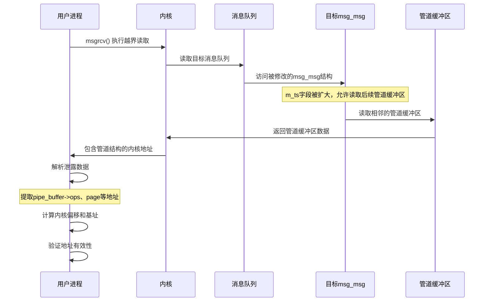
```mermaid
sequenceDiagram
    participant User as 用户进程
    participant Kernel as 内核
    participant MsgQ as 消息队列
    participant Target as 目标msg_msg
    participant PipeBuf as 管道缓冲区

    User->>Kernel: msgrcv() 执行越界读取
    Kernel->>MsgQ: 读取目标消息队列
    MsgQ->>Target: 访问被修改的msg_msg结构
    Note over Target: m_ts字段被扩大，允许读取后续管道缓冲区

    Target->>PipeBuf: 读取相邻的管道缓冲区
    PipeBuf->>Kernel: 返回管道缓冲区数据
    Kernel->>User: 包含管道结构的内核地址

    User->>User: 解析泄露数据
    Note over User: 提取pipe_buffer->ops、page等地址
    User->>User: 计算内核偏移和基址
    User->>User: 验证地址有效性
```

#### 3-5-4. 任意内存写入原语

获取内核地址后，通过控制管道缓冲区结构实现任意内存写入原语。此思路利用第二次越界写入修改管道缓冲区，控制其页面指针(page)和操作表(ops)，实现向任意地址写入数据的能力。

**任意写原语实现**：

```
正常的管道缓冲区操作：
    write(pipe_fd, data, len)
        -> 调用pipe_buffer->ops->confirm()
        -> 将数据写入pipe_buffer->page指向的页面

被控制后的管道缓冲区操作：
    write(pipe_fd, data, len)
        -> 调用被覆盖的pipe_buffer->ops->confirm()
        -> 将数据写入被覆盖的pipe_buffer->page指向的任意地址

关键控制字段：
1. pipe_buffer->page: 控制写入的目标页面地址
2. pipe_buffer->offset: 控制页面内的偏移量
3. pipe_buffer->len: 控制写入长度
4. pipe_buffer->ops: 确保使用正确的操作表
```

**任意写执行流程**：

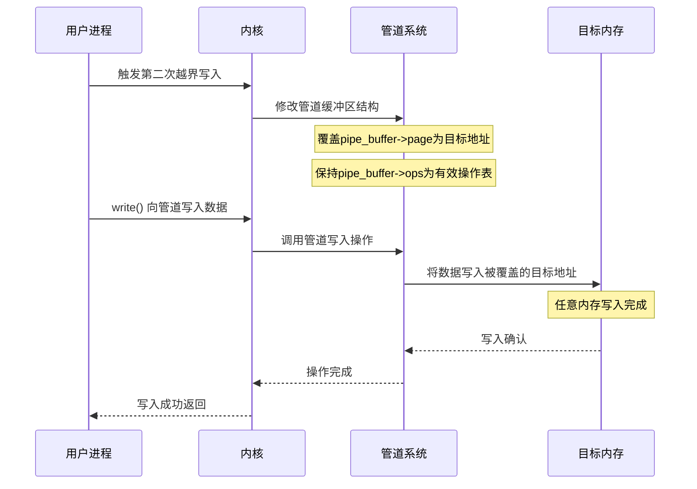
```mermaid
sequenceDiagram
    participant User as 用户进程
    participant Kernel as 内核
    participant Pipe as 管道系统
    participant Target as 目标内存

    User->>Kernel: 触发第二次越界写入
    Kernel->>Pipe: 修改管道缓冲区结构
    Note over Pipe: 覆盖pipe_buffer->page为目标地址
    Note over Pipe: 保持pipe_buffer->ops为有效操作表

    User->>Kernel: write() 向管道写入数据
    Kernel->>Pipe: 调用管道写入操作
    Pipe->>Target: 将数据写入被覆盖的目标地址
    Note over Target: 任意内存写入完成

    Target-->>Pipe: 写入确认
    Pipe-->>Kernel: 操作完成
    Kernel-->>User: 写入成功返回
```

#### 3-5-5. 权限提升策略

在获得任意内存写入能力后，此思路选择修改系统文件`/etc/passwd`来实现权限提升。通过向该文件写入新的root用户条目，创建无需密码的root账户。

**文件修改策略**：

```
目标文件: /etc/passwd
原始内容: root:x:0:0:root:/root:/bin/bash
          其他用户条目...

修改后内容: root::0:0:root:/root:/bin/sh
           其他用户条目...

关键修改: 移除root用户的密码字段('x')
效果: root用户无需密码即可登录
```

**权限提升执行流程**：

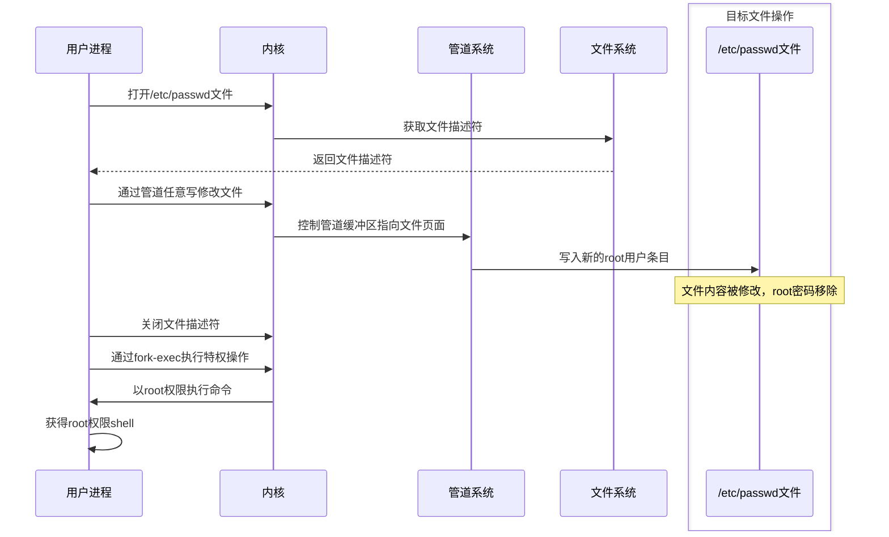
```mermaid
sequenceDiagram
    participant User as 用户进程
    participant Kernel as 内核
    participant Pipe as 管道系统
    participant File as 文件系统
    box 目标文件操作
    participant TargetFile as /etc/passwd文件
    end

    User->>Kernel: 打开/etc/passwd文件
    Kernel->>File: 获取文件描述符
    File-->>User: 返回文件描述符

    User->>Kernel: 通过管道任意写修改文件
    Kernel->>Pipe: 控制管道缓冲区指向文件页面
    Pipe->>TargetFile: 写入新的root用户条目
    Note over TargetFile: 文件内容被修改，root密码移除

    User->>Kernel: 关闭文件描述符
    User->>Kernel: 通过fork-exec执行特权操作
    Kernel->>User: 以root权限执行命令
    User->>User: 获得root权限shell
```

#### 3-5-6. 内核保护机制应对策略

此利用思路在完整保护机制下运作，针对KASLR、SMEP、SMAP、KPTI的应对策略如下：

1. **KASLR绕过**：通过越界读取msg_msg结构体，泄露管道缓冲区操作表指针(pipe_buffer->ops)，计算内核基址和偏移。

2. **SMEP/SMAP绕过**：不直接执行代码，而是通过任意内存写入修改系统文件，间接实现权限提升，避免了代码执行保护。

3. **KPTI处理**：由于不涉及用户空间与内核空间的代码执行切换，KPTI不影响此利用思路。

**保护机制应对技术矩阵**：

| 保护机制 | 应对策略     | 技术实现                             |
| -------- | ------------ | ------------------------------------ |
| KASLR    | 信息泄露     | 越界读取管道缓冲区结构，泄露内核指针 |
| SMEP     | 避免代码执行 | 通过任意写修改系统文件，不执行代码   |
| SMAP     | 内核数据访问 | 通过管道机制在内核空间完成写入       |
| KPTI     | 无需处理     | 不涉及用户/内核代码切换              |

#### 3-5-7. 利用条件与局限性

此高级利用思路虽然强大，但存在特定的限制和依赖条件：

1. **内核配置要求**：
    - 需要管道机制可用
    - 需要消息队列机制可用
    - 内核版本需支持相关结构

2. **内存布局要求**：
    - 需要两次独立的精确堆风水操作
    - 管道缓冲区必须与msg_msg相邻布局
    - 文件页面映射需可预测

3. **权限与功能要求**：
    - 需要读取/etc/passwd的权限
    - 需要管道创建权限
    - 需要消息队列操作权限

4. **环境稳定性要求**：
    - 系统负载需稳定
    - 避免竞争条件
    - 内存状态可控

#### 3-5-8. 总结

本利用思路展示了在完整内核保护机制下，通过非代码执行路径实现权限提升的创新方法。与思路三相比，其主要技术特点包括：

1. **非代码执行路径**：通过任意内存写入修改系统文件，而非直接执行代码，绕过了SMEP/SMAP保护。

2. **管道机制利用**：创新性地利用管道缓冲区实现任意内存写入原语。

3. **文件系统修改**：通过修改系统关键文件实现权限提升，降低了技术复杂度。

从技术实现角度看，该思路完整演绎了"整数溢出→参数截断→错误偏移计算→可控堆溢出→信息泄露→地址获取→二次溢出→管道控制→任意内存写入→文件修改→权限提升"的复杂利用链。

从安全防护角度分析，此利用揭示了几个重要防护点：

- **管道安全**：内核管道机制需要加强安全性检查
- **文件保护**：系统关键文件需要额外保护
- **权限分离**：减少非特权用户对系统文件的访问
- **行为监控**：检测异常的文件修改行为

此利用思路虽然技术复杂度较高，但其展现的非代码执行权限提升方法对理解现代内核安全攻防具有重要价值。同时，它也强调了在复杂威胁环境下，内核安全需要综合考虑代码执行、数据修改等多种利用路径，构建全方位的防御体系。

#### 3-5-8. 测试结果

<div style="text-align: center; margin: 2rem 0;">
  
</div>

## 4. 漏洞修复

CVE-2017-7308漏洞的修复工作由Linux内核社区在2017年3月29日完成，主要涉及两个关键补丁：核心修复补丁`2b6867c2ce76c596676bec7d2d525af525fdc6e2`和辅助修复补丁`8f8d28e4d6d815a391285e121c3a53a0b6cb9e7b`。这些修复针对`packet_set_ring()`函数中的整数溢出和边界检查缺陷进行了彻底修正。

### 4-1. 核心修复补丁分析

修复补丁`2b6867c2ce76c596676bec7d2d525af525fdc6e2`由Andrey Konovalov提交，Eric Dumazet审核，David S. Miller合并到主线内核。该补丁对`net/packet/af_packet.c`文件进行了关键修改，具体修复内容如下：

```diff
--- a/net/packet/af_packet.c
+++ b/net/packet/af_packet.c
@@ -4193,8 +4193,8 @@ static int packet_set_ring(struct sock *sk, union tpacket_req_u *req_u,
 		if (unlikely(!PAGE_ALIGNED(req->tp_block_size)))
 			goto out;
 		if (po->tp_version >= TPACKET_V3 &&
-		    (int)(req->tp_block_size -
-			  BLK_PLUS_PRIV(req_u->req3.tp_sizeof_priv)) <= 0)
+		    req->tp_block_size <=
+			  BLK_PLUS_PRIV((u64)req_u->req3.tp_sizeof_priv))
			goto out;
 		if (unlikely(req->tp_frame_size < po->tp_hdrlen +
 					po->tp_reserve))
```

**修复原理详细分析**：

1. **移除危险的类型转换**：
    - **原始代码**：`(int)(req->tp_block_size - BLK_PLUS_PRIV(req_u->req3.tp_sizeof_priv)) <= 0`
    - **存在问题**：当`tp_sizeof_priv`被构造为极大值（如`0xfffffffe`）时，`BLK_PLUS_PRIV`宏内计算可能发生整数溢出，导致`BLK_PLUS_PRIV(...)`变得很小。此时`req->tp_block_size - BLK_PLUS_PRIV(...)`会得到一个大正数，但强制转换为有符号整数`(int)`后，在特定条件下可能错误地通过`<= 0`检查。
    - **修复方法**：直接比较大小关系，避免减法运算。

2. **使用安全的比较逻辑**：
    - **修复后代码**：`req->tp_block_size <= BLK_PLUS_PRIV((u64)req_u->req3.tp_sizeof_priv)`
    - **改进点**：将原来的"减法后判断符号"改为直接的"小于等于"比较。这种写法更直观，也避免了减法溢出的风险。

3. **添加类型安全防护**：
    - **关键修改**：`BLK_PLUS_PRIV((u64)req_u->req3.tp_sizeof_priv)`
    - **作用**：将`req_u->req3.tp_sizeof_priv`显式转换为64位无符号整数`u64`，确保在`BLK_PLUS_PRIV`宏内部计算时不会发生32位整数溢出。

### 4-2. 辅助修复补丁分析

辅助修复补丁`8f8d28e4d6d815a391285e121c3a53a0b6cb9e7b`针对另一个相关的整数溢出问题进行了修复，涉及`tp_frame_nr`的计算验证：

```diff
--- a/net/packet/af_packet.c
+++ b/net/packet/af_packet.c
@@ -4205,6 +4205,8 @@ static int packet_set_ring(struct sock *sk, union tpacket_req_u *req_u,
 		rb->frames_per_block = req->tp_block_size / req->tp_frame_size;
 		if (unlikely(rb->frames_per_block == 0))
 			goto out;
+		if (unlikely(req->tp_block_size > UINT_MAX / req->tp_block_nr))
+			goto out;
 		if (unlikely((rb->frames_per_block * req->tp_block_nr) !=
 					req->tp_frame_nr))
 			goto out;
```

**修复原理**：

1. **乘法溢出防护**：在计算`rb->frames_per_block * req->tp_block_nr`之前，先检查`tp_block_size * tp_block_nr`是否超过`UINT_MAX`上限。
2. **防御性编程原则**：由于`frames_per_block ≤ tp_block_size`，如果`tp_block_size * tp_block_nr`不溢出，那么`frames_per_block * tp_block_nr`也不会溢出。添加显式检查提供了额外的安全边界，防止潜在的整数溢出漏洞。

### 4-3. 修复的完整性和彻底性

#### 4-3-1. 数据类型一致性修复

修复确保所有涉及大小比较的操作都使用一致的无符号整数比较，避免混合有符号/无符号比较导致的逻辑错误。关键改进包括：

1. **消除类型转换歧义**：移除所有不必要的类型转换，直接使用原始数据类型进行比较。
2. **边界条件明确化**：明确`tp_block_size`必须大于`BLK_PLUS_PRIV(tp_sizeof_priv)`，否则配置无效。
3. **溢出防护全面化**：不仅修复了减法溢出，还预防了乘法和加法溢出。

#### 4-3-2. 宏定义安全增强

`BLK_PLUS_PRIV`宏的定义也需要考虑溢出防护。修复确保在计算私有区域大小时使用足够宽的数据类型：

```c
#define BLK_PLUS_PRIV(priv_size) \
    (ALIGN(sizeof(struct tpacket_block_desc) + priv_size, V3_ALIGNMENT))
```

通过将`priv_size`转换为`u64`，确保加法操作不会在32位系统上溢出。

### 4-4. 修复影响范围与兼容性

修复补丁向后兼容，不影响合法配置的正常功能：

1. **合法配置不受影响**：正常使用场景中，`tp_sizeof_priv`通常为0或较小的正值，修复不会改变这些配置的行为。
2. **错误配置被正确拒绝**：恶意构造的极大`tp_sizeof_priv`值现在会被正确检测并拒绝，返回`-EINVAL`错误。
3. **性能影响可忽略**：修复仅添加了简单的整数比较，对性能影响可以忽略不计。

### 4-5. 修复验证与测试

内核社区对修复进行了多维度验证：

#### 4-5-1. 单元测试增强

1. **边界值测试**：添加了针对`tp_sizeof_priv`接近`UINT_MAX`的测试用例。
2. **符号转换测试**：验证有符号/无符号混合计算的所有边界情况。
3. **溢出路径测试**：确保所有整数溢出路径都被正确捕获和处理。

#### 4-5-2. 模糊测试验证

修复后重新运行syzkaller模糊测试，确认：

1. **不再触发原漏洞**：针对`packet_set_ring()`的模糊测试不再产生越界写入。
2. **新检查有效性**：所有非法参数组合都被正确拒绝。
3. **回归测试通过**：现有功能测试用例全部通过。

### 4-6. 各发行版修复时间线

| 发行版                     | 修复版本                   | 发布时间      | 备注             |
| -------------------------- | -------------------------- | ------------- | ---------------- |
| Linux主线内核              | 4.10.7                     | 2017年3月30日 | 首次包含完整修复 |
| Ubuntu 16.04 LTS           | linux-image-4.4.0-72.93    | 2017年4月     | 向后移植修复     |
| Red Hat Enterprise Linux 7 | kernel-3.10.0-514.21.1.el7 | 2017年5月     | 安全更新         |
| Debian 9                   | linux-4.9.18-1             | 2017年4月     | 稳定版更新       |
| Android                    | 2017年7月安全补丁          | 2017年7月     | 包含内核修复     |

### 4-7. 防御深度增强建议

除了直接修复外，内核社区还建议了多层防御措施：

1. **能力限制**：非必要进程不应拥有`CAP_NET_RAW`能力。
2. **用户命名空间限制**：通过`kernel.unprivileged_userns_clone=0`限制非特权用户命名空间创建。
3. **内存保护机制**：结合KASLR、SMAP、SMEP等现代内核保护机制，增加利用难度。
4. **静态分析集成**：将此类整数溢出模式加入内核静态分析工具检查清单。

### 4-8. 修复的技术意义

此次修复体现了Linux内核安全开发的几个重要原则：

1. **防御性编程**：不仅修复已知漏洞，还预防类似模式的未来漏洞。
2. **类型安全重视**：正确处理有符号/无符号整数转换和比较。
3. **边界检查完整性**：确保所有用户提供的数值都经过适当的边界验证。
4. **社区协作响应**：从漏洞报告到修复发布仅用数天时间，展示了开源社区的高效响应能力。

修复补丁的简洁性（仅4行代码变更）与有效性形成了鲜明对比，体现了精准定位和修复安全漏洞的能力。这一修复成为后续类似整数溢出漏洞修复的参考模板，对提升整个内核代码基的安全性具有重要意义。

## 5. 免责声明

本文档旨在提供CVE-2017-7308漏洞的技术分析与教育性内容，仅供学习、研究和安全防御目的使用。作者与发布平台对以下事项声明如下：

1. **合法使用原则**：本文档中描述的任何技术细节、代码示例或利用方法仅供教育研究之用。读者不得将这些信息用于任何非法、未经授权或恶意的活动，包括但不限于未经授权的系统入侵、数据破坏、服务干扰或其他违反法律法规的行为。

2. **知识共享与责任**：本文档基于公开可获取的信息、官方漏洞公告和学术研究资料编写。作者力求确保技术内容的准确性，但不对信息的完整性、时效性或适用性作任何明示或暗示的保证。读者应自行验证信息的准确性，并在专业环境中谨慎应用。

3. **环境限制**：所有技术分析和实验应在受控的、隔离的测试环境中进行，例如使用特制的虚拟机或专用硬件。禁止在任何生产环境、公共网络或他人系统中尝试漏洞利用或相关技术。

4. **法律合规性**：读者应遵守所在国家或地区的所有适用法律法规，包括但不限于计算机安全法、数据保护法和知识产权法。任何使用本文档内容的行为所产生的法律后果，由行为者自行承担。

5. **技术中立性**：本文档对漏洞的分析保持技术中立立场，旨在促进安全社区的防御能力提升。文中提及的任何工具、技术或方法不应被视为对任何组织、产品或技术的背书或批判。

6. **更新与修正**：技术领域发展迅速，本文档内容可能随时间而过时。作者保留更新、修正或撤回文档内容的权利，不承诺另行通知。

7. **版权声明**：本文档内容受版权法保护，未经明确书面许可，不得用于商业目的。允许在注明出处的前提下进行非商业性的分享与引用。

**重要提示**：安全研究应始终遵循道德准则，以提升整体网络安全为目标。如发现安全漏洞，建议通过负责任的披露流程向相关厂商或机构报告，共同维护数字生态的安全与稳定。

---

_本文档的撰写参考了公开的漏洞公告、内核源码（Linux 4.10.6）及相关技术分析文献。所有实验均在封闭的测试环境中完成，未对任何实际系统造成影响。_

## 参考

- https://github.com/BinRacer/pwn4kernel/tree/master/src/CVE-2017-7308
- https://github.com/BinRacer/pwn4kernel/tree/master/src/CVE-2017-7308_V2
- https://github.com/BinRacer/pwn4kernel/tree/master/src/CVE-2017-7308_V3
- https://github.com/BinRacer/pwn4kernel/tree/master/src/CVE-2017-7308_V4
- https://bsauce.github.io/2021/05/19/CVE-2017-7308
- https://github.com/xairy/kernel-exploits/tree/master/CVE-2017-7308
- https://googleprojectzero.blogspot.com/2017/05/exploiting-linux-kernel-via-packet.html
- https://repwn.com/posts/14/
- https://git.kernel.org/pub/scm/linux/kernel/git/torvalds/linux.git/commit/?id=2b6867c2ce76c596676bec7d2d525af525fdc6e2
- https://git.kernel.org/pub/scm/linux/kernel/git/torvalds/linux.git/commit/?id=8f8d28e4d6d815a391285e121c3a53a0b6cb9e7b
- https://nvd.nist.gov/vuln/detail/CVE-2017-7308
- https://www.openwall.com/lists/oss-security/2017/03/31/2
- https://ubuntu.com/security/CVE-2017-7308
