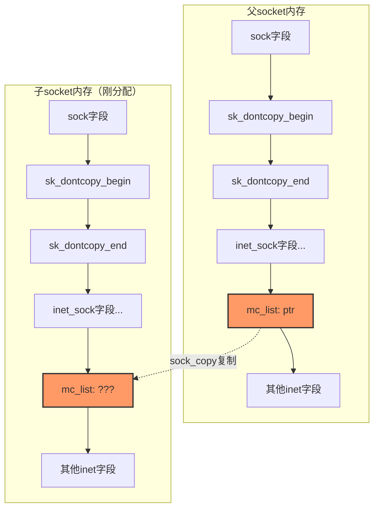
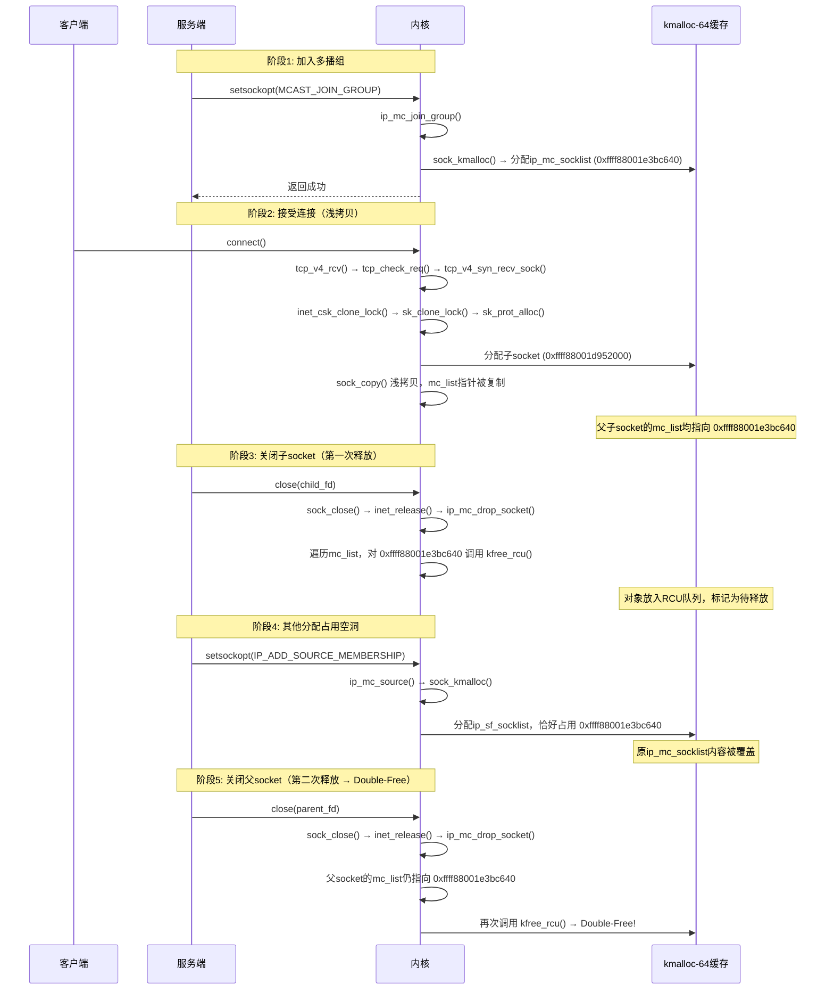
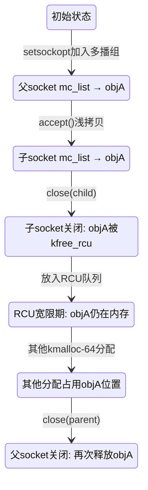
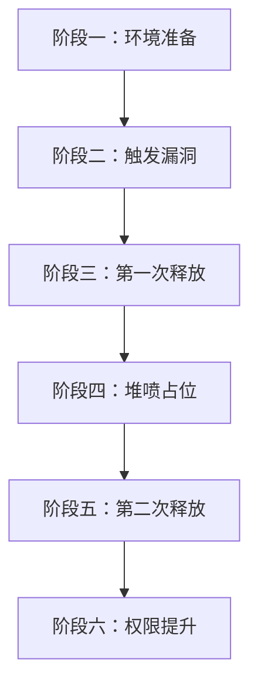
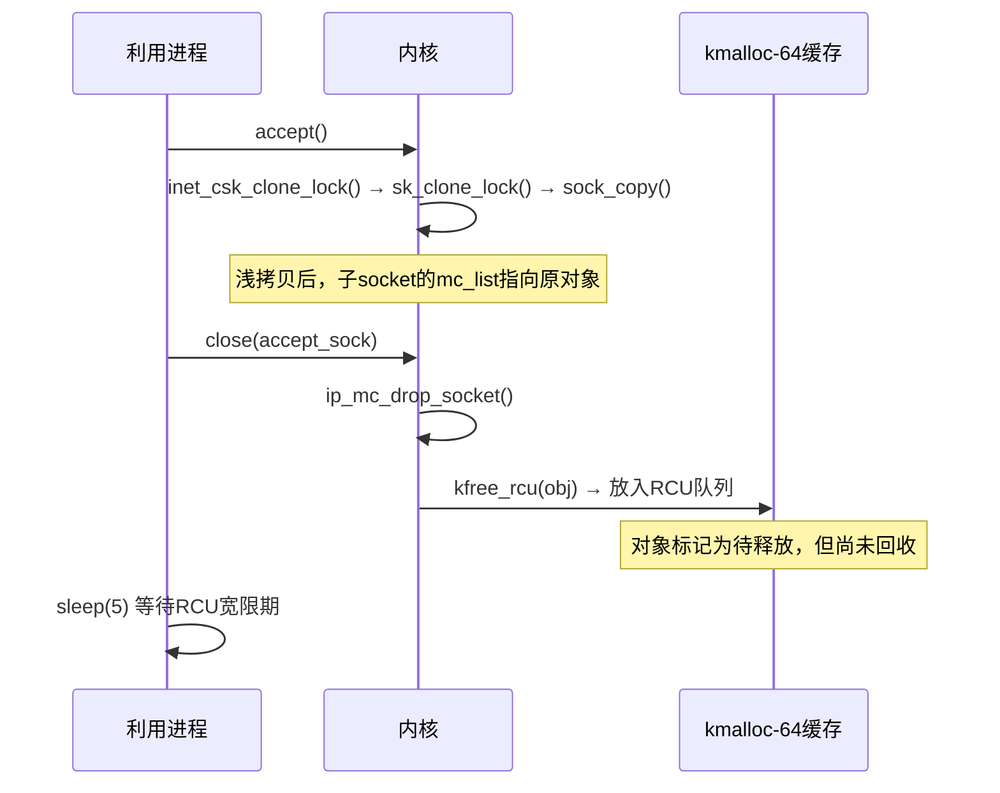
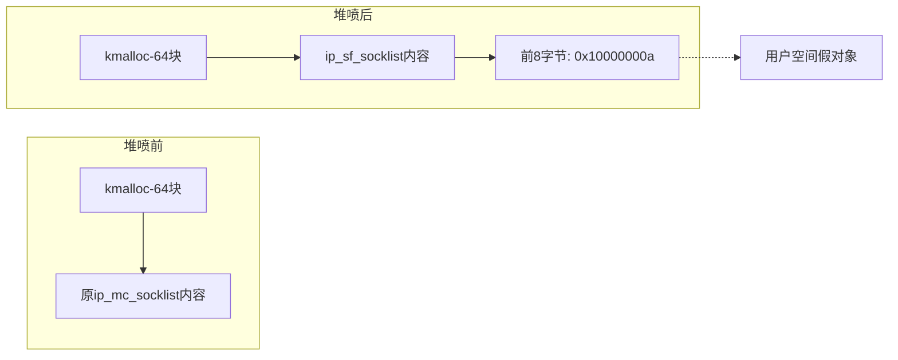
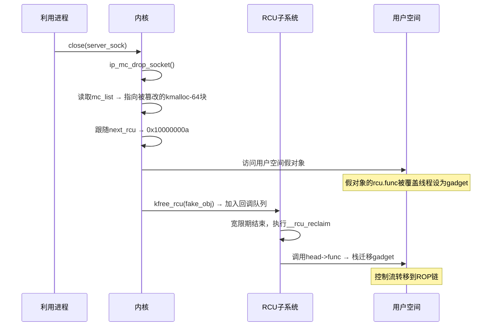

# 【Kernel Exploit】CVE-2017-8890 漏洞分析

## 1. 测试环境

**测试版本**：Linux-4.10.15 [内核镜像地址](https://github.com/BinRacer/pwn4kernel/blob/master/kernels/4.10.15/01/bzImage)

笔者测试的内核版本是 `Linux (none) 4.10.15 #1 SMP Sun Feb 15 17:02:46 CST 2026 x86_64 GNU/Linux`。

**编译选项**：开启`CONFIG_MEMCG`、`CONFIG_CGROUPS`、`CONFIG_SLAB_FREELIST_RANDOM`、`CONFIG_HARDENED_USERCOPY`、`CONFIG_FUSE_FS`、`CONFIG_USERFAULTFD`、`CONFIG_SYSVIPC`、`CONFIG_KEYS`、`CONFIG_CC_STACKPROTECTOR`、`CONFIG_CC_STACKPROTECTOR_STRONG`、`CONFIG_SLUB`、`CONFIG_SLUB_DEBUG`、`CONFIG_E1000`、`CONFIG_E1000E`、`CONFIG_PACKET`、`CONFIG_PACKET_DIAG`、`CONFIG_USER_NS`、`CONFIG_NET_NS`、`CONFIG_NAMESPACES`、`CONFIG_CHECKPOINT_RESTORE`、`CONFIG_IPC_NS`选项。完整配置参考[.config](https://github.com/BinRacer/pwn4kernel/blob/master/kernels/4.10.15/01/.config)。

**保护机制**：SMEP/KPTI

## 2. 漏洞背景

**CVE-2017-8890** 漏洞，也被称为“Phoenix Talon”，是由启明星辰ADLab于2017年5月发现的一个Linux内核中隐藏长达11年之久的Double-Free漏洞。该漏洞影响从Linux 2.5.69到4.10.15之间的几乎所有内核版本，CVSS评分为7.8，理论上可导致远程代码执行或本地权限提升。由于其影响范围极广，包括大量服务器、嵌入式设备和Android智能手机，该漏洞一经披露便引起了安全社区的广泛关注。

### 2-1. 漏洞概述

该漏洞位于`net/ipv4/inet_connection_sock.c`文件中的`inet_csk_clone_lock()`函数。在TCP三次握手过程中，该函数负责复制监听socket以创建已连接socket。由于复制时采用浅拷贝，子socket继承了父socket的多播成员列表指针`mc_list`，导致父子socket指向同一个`ip_mc_socklist`对象。当两者相继关闭时，同一个对象会被释放两次，形成Double-Free。

漏洞的根本原因是`inet_csk_clone_lock()`在复制socket后未将子socket的`mc_list`成员初始化为NULL。这一疏忽使得父子socket共享了同一份多播列表，从而在各自销毁时重复释放。

### 2-2. 漏洞发现历程

该漏洞最初由Google的syzkaller模糊测试框架在2017年初发现。syzkaller是一种针对Linux内核系统调用的覆盖率引导型模糊测试工具，能够自动生成系统调用序列并检测内核崩溃。在测试过程中，syzkaller触发了`ip_mc_drop_socket()`函数中的空指针引用，经追溯分析，最终定位到`inet_csk_clone_lock()`函数中的浅拷贝缺陷。

随后，启明星辰ADLab的研究人员独立复现并确认了该漏洞，并于2017年5月向公众披露。值得注意的是，该漏洞自2003年Linux 2.5.69版本起便已存在，直至2017年被发现，潜伏期长达11年之久。在此期间，无数内核版本和发行版都携带了这一隐患，凸显了内核代码中历史遗留安全问题的隐蔽性和严重性。

### 2-3. 漏洞机理

`mc_list`是`struct inet_sock`中的一个指针，指向一个`struct ip_mc_socklist`类型的链表，用于管理IP多播组成员关系。`ip_mc_socklist`结构体定义如下：

```c
struct ip_mc_socklist {
    struct ip_mc_socklist __rcu *next_rcu;  // 指向下一个节点
    struct ip_mreqn multi;                  // 多播组信息
    unsigned int sfmode;                    // 过滤模式
    struct ip_sf_socklist __rcu *sflist;    // 源过滤列表
    struct rcu_head rcu;                    // RCU回调头
};
```

当服务端调用`accept()`接受客户端连接时，内核会通过`inet_csk_clone_lock()`复制父socket（监听socket）来创建子socket（已连接socket）。复制过程使用`sk_clone_lock()`进行结构体级别的浅拷贝，这意味着子socket的`mc_list`指针与父socket的`mc_list`指针指向了同一个`ip_mc_socklist`对象。正常情况下，子socket应该拥有自己的多播列表副本，或者将`mc_list`置为空，但该函数并未进行这样的初始化。

当父子socket相继关闭时，内核会在各自的清理路径中调用`ip_mc_drop_socket()`。该函数会遍历`mc_list`链表，对每个节点调用`kfree_rcu()`进行释放。由于父子socket共享同一个链表头，第一次关闭（通常是子socket）会将`ip_mc_socklist`对象放入RCU宽限期队列，待宽限期结束后真正释放。第二次关闭（父socket）时，内核再次遍历`mc_list`，发现链表非空，于是再次尝试释放同一个对象，从而导致Double-Free。

Double-Free发生后，内存分配器的空闲链表遭到破坏。第一次释放后，该内存块可能被其他内核路径重新分配并使用，导致原对象内容被篡改。第二次释放时，内核会尝试操作已被污染的内存，轻则触发空指针引用导致系统崩溃，重则可以被精心构造的堆喷数据劫持控制流。

### 2-4. 触发条件与影响

要触发该漏洞，需要满足以下三个条件：

1. **创建多播socket**：通过`setsockopt()`设置`MCAST_JOIN_GROUP`选项，使内核为socket分配一个`ip_mc_socklist`对象。该操作需要加入一个有效的IPv4多播组，并且系统中存在对应的网络接口（如eth0）及多播路由。

2. **建立连接**：通过`listen()`和`accept()`创建子socket，触发`inet_csk_clone_lock()`复制`mc_list`指针。此时父子socket共享同一个`ip_mc_socklist`链表。

3. **关闭socket**：先后关闭子socket和父socket。第一次关闭时，内核通过`kfree_rcu()`将`ip_mc_socklist`对象放入RCU宽限期队列；待宽限期结束后，该对象被真正释放。第二次关闭时，内核再次尝试释放同一对象，导致Double-Free。

触发过程的核心调用链如下：

- **创建mc_list**：`setsockopt()` → `ip_mc_join_group()` → `sock_kmalloc()` → 分配`ip_mc_socklist`对象
- **复制mc_list**：`accept()` → `tcp_v4_rcv()` → `tcp_check_req()` → `tcp_v4_syn_recv_sock()` → `tcp_create_openreq_child()` → `inet_csk_clone_lock()` → `sk_clone_lock()`（浅拷贝）
- **释放mc_list**：`close()` → `sock_close()` → `ip_mc_drop_socket()` → 遍历链表并调用`kfree_rcu()`（第一次释放）→ 宽限期后真正释放 → 第二次`close()`再次进入`ip_mc_drop_socket()` → 第二次`kfree_rcu()`（Double-Free）

该漏洞的直接影响是内核内存损坏。第一次释放后，空闲的内存块可能被其他内核路径重新分配和使用，导致原`ip_mc_socklist`对象的内容被篡改。第二次释放时，内核会尝试操作已被污染的内存，轻则触发空指针引用导致系统崩溃（拒绝服务），重则可以被精心构造的堆喷数据劫持控制流，实现权限提升或远程代码执行。

由于漏洞存在于TCP协议栈的核心路径中，任何能够创建TCP socket并加入多播组的进程都有可能触发该漏洞。在默认配置下，非特权用户可以通过用户命名空间获得`CAP_NET_RAW`能力，从而具备触发条件，这使得漏洞的实际影响范围进一步扩大。

### 2-5. 影响版本范围

根据内核社区的分析，该漏洞影响从2003年发布的Linux 2.5.69到2017年修复前的4.10.15之间的几乎所有内核版本。具体包括：

- Linux 2.5.69 ~ 2.6.x 系列
- Linux 3.x 全系列
- Linux 4.0 ~ 4.10.15

受影响的平台涵盖x86、x86_64、ARM、ARM64等主流架构。各大Linux发行版（如Ubuntu、Debian、Red Hat Enterprise Linux、CentOS、Fedora等）以及基于Linux内核的Android系统均在影响范围内。

### 2-6. 漏洞特征小结

该漏洞具有以下几个显著特征：

**长期潜伏性**：自2003年Linux 2.5.69版本引入以来，该漏洞在内核中隐藏了11年之久，直到2017年才被发现。这反映了内核代码库庞大、历史遗留问题难以被传统审计手段发现的现状。

**触发简易性**：漏洞触发仅需三个基本步骤——加入多播组、建立TCP连接、关闭socket。这些操作在普通应用程序中均可实现，无需特殊权限（通过用户命名空间可获取所需能力）。

**影响广泛性**：由于漏洞位于TCP协议栈的核心路径中，几乎所有使用Linux内核的设备均受影响，包括服务器、桌面系统、嵌入式设备和Android智能手机。

**后果严重性**：Double-Free漏洞可导致内核内存损坏，轻则引发系统崩溃（拒绝服务），重则可通过精心构造的数据实现权限提升或远程代码执行。

该漏洞的发现和研究，不仅揭示了内核代码中历史遗留安全隐患的严重性，也为后续的内核安全加固和自动化漏洞挖掘技术发展提供了重要参考。

## 3. 漏洞分析

**CVE-2017-8890** 的根源在于`inet_csk_clone_lock()`函数在复制socket时未能正确处理多播成员列表指针`mc_list`，导致父子socket共享同一份`ip_mc_socklist`对象，进而在关闭时触发Double-Free。本节将从代码层面逐层剖析这一缺陷的形成过程，并结合运行时调试信息还原漏洞触发的完整链路。

### 3-1. 漏洞根源

该函数位于`net/ipv4/inet_connection_sock.c`，是TCP三次握手中创建子socket的核心函数。它在接收到SYN请求后，通过`sk_clone_lock()`复制监听socket，并对子socket进行必要的初始化。

```c
/**
 * inet_csk_clone_lock - 克隆一个inet socket，并锁定其克隆体
 * @sk: 要克隆的socket（监听socket）
 * @req: 请求控制块
 * @priority: 分配标志（GFP_KERNEL, GFP_ATOMIC等）
 *
 * 调用者即使在错误路径中也必须解锁socket（bh_unlock_sock(newsk)）
 */
struct sock *inet_csk_clone_lock(const struct sock *sk,
                                 const struct request_sock *req,
                                 const gfp_t priority)
{
    // 1. 调用sk_clone_lock进行浅拷贝，分配并复制socket结构体
    struct sock *newsk = sk_clone_lock(sk, priority);

    if (newsk) {
        struct inet_connection_sock *newicsk = inet_csk(newsk);

        // 2. 设置子socket状态为TCP_SYN_RECV
        newsk->sk_state = TCP_SYN_RECV;
        newicsk->icsk_bind_hash = NULL;

        // 3. 复制端口等信息
        inet_sk(newsk)->inet_dport = inet_rsk(req)->ir_rmt_port;
        inet_sk(newsk)->inet_num = inet_rsk(req)->ir_num;
        inet_sk(newsk)->inet_sport = htons(inet_rsk(req)->ir_num);
        newsk->sk_write_space = sk_stream_write_space;

        // 4. 监听socket有SOCK_RCU_FREE标志，子socket不需要
        sock_reset_flag(newsk, SOCK_RCU_FREE);

        // 5. 复制标记、cookie等
        newsk->sk_mark = inet_rsk(req)->ir_mark;
        atomic64_set(&newsk->sk_cookie,
                     atomic64_read(&inet_rsk(req)->ir_cookie));

        // 6. 重置重传计数
        newicsk->icsk_retransmits = 0;
        newicsk->icsk_backoff = 0;
        newicsk->icsk_probes_out = 0;

        // 7. 清空接受队列以捕获非法访问
        memset(&newicsk->icsk_accept_queue, 0, sizeof(newicsk->icsk_accept_queue));

        // 8. 安全钩子
        security_inet_csk_clone(newsk, req);

        // ★ 漏洞关键：此处缺少对 mc_list 的初始化！
        // 应当添加：inet_sk(newsk)->mc_list = NULL;
        // 否则子socket会继承父socket的mc_list指针，导致共享
    }
    return newsk;
}
```

**漏洞点**：在上述第8步之后，函数对子socket的许多成员进行了初始化，但唯独遗漏了`inet_sk(newsk)->mc_list`。由于`sk_clone_lock`执行的是浅拷贝，子socket的`mc_list`直接指向父socket的`ip_mc_socklist`链表，导致两者共享同一份多播成员列表。

### 3-2. 浅拷贝过程

`sk_clone_lock()`负责实际的socket克隆。它首先通过`sk_prot_alloc()`分配一个新的socket结构体，然后调用`sock_copy()`进行内存复制。以下是对关键函数的注释：

```c
/**
 * sk_clone_lock - 克隆一个socket，并锁定其克隆体
 * @sk: 要克隆的socket
 * @priority: 分配标志
 *
 * 调用者即使在错误路径中也必须解锁socket（bh_unlock_sock(newsk)）
 */
struct sock *sk_clone_lock(const struct sock *sk, const gfp_t priority)
{
    struct sock *newsk;
    bool is_charged = true;

    // 1. 分配socket结构体内存（从SLAB缓存或kmalloc）
    newsk = sk_prot_alloc(sk->sk_prot, priority, sk->sk_family);
    if (newsk != NULL) {
        // 2. ★ 浅拷贝：将原socket的大部分字段复制到新socket
        sock_copy(newsk, sk);

        // 3. 后续初始化（略）
        // ...
    }
    return newsk;
}
```

`sock_copy()`使用`memcpy`直接将原socket的部分内存区域复制到新socket：

```c
/**
 * sock_copy - 复制socket的所有字段
 * @nsk: 目标socket（新socket）
 * @osk: 源socket（原socket）
 *
 * 复制osk中 sk_dontcopy_begin 之前和 sk_dontcopy_end 之后的所有字段。
 * sk_refcnt 和 sk_node 保持不变。
 */
static void sock_copy(struct sock *nsk, const struct sock *osk)
{
#ifdef CONFIG_SECURITY_NETWORK
    void *sptr = nsk->sk_security;
#endif
    // 复制从结构体开头到 sk_dontcopy_begin 之间的字段
    memcpy(nsk, osk, offsetof(struct sock, sk_dontcopy_begin));

    // 复制从 sk_dontcopy_end 到结构体末尾的字段
    memcpy(&nsk->sk_dontcopy_end, &osk->sk_dontcopy_end,
           osk->sk_prot->obj_size - offsetof(struct sock, sk_dontcopy_end));

#ifdef CONFIG_SECURITY_NETWORK
    nsk->sk_security = sptr;           // 恢复安全指针
    security_sk_clone(osk, nsk);       // 安全克隆钩子
#endif
}
```

**浅拷贝的本质**：`struct inet_sock`是`struct sock`的子结构体，其成员（包括`mc_list`）位于`sock`结构体的末尾之后（即`sk_dontcopy_end`之后）。因此，`mc_list`指针被完整复制到新socket中。下图展示了复制前后的内存布局：



**运行时验证**：在`sock_copy`执行期间，通过GDB可以观察到父子socket的`mc_list`指向相同的地址：

```
pwndbg> bt
#0  memcpy () at arch/x86/lib/memcpy_64.S:31
#1  0xffffffff817b7a4a in sock_copy (nsk=0xffff88001d952000, osk=0xffff88001d952800) at net/core/sock.c:1317
#2  sk_clone_lock (sk=0xffff88001d952800, priority=<optimized out>) at net/core/sock.c:1504
...
pwndbg> p/x (*(struct inet_sock*)0xffff88001d952800)->mc_list
$1 = 0xffff88001e3bc640
pwndbg> p/x (*(struct inet_sock*)0xffff88001d952000)->mc_list
$4 = 0xffff88001e3bc640
```

可见两者完全相同，均指向`0xffff88001e3bc640`处的`ip_mc_socklist`对象。

### 3-3. 释放路径与Double-Free

当socket关闭时，内核调用`ip_mc_drop_socket()`释放多播成员列表。该函数遍历`mc_list`链表，对每个节点调用`kfree_rcu()`进行延迟释放。以下是添加注释的代码：

```c
/**
 * ip_mc_drop_socket - 释放socket的所有多播组成员关系
 * @sk: 要释放的socket
 *
 * 遍历mc_list链表，对每个ip_mc_socklist节点调用kfree_rcu()。
 * 由于RCU机制，实际释放发生在宽限期之后。
 */
void ip_mc_drop_socket(struct sock *sk)
{
    struct inet_sock *inet = inet_sk(sk);
    struct ip_mc_socklist *iml;
    struct net *net = sock_net(sk);

    if (!inet->mc_list)
        return;

    rtnl_lock();
    while ((iml = rtnl_dereference(inet->mc_list)) != NULL) {
        struct in_device *in_dev;

        inet->mc_list = iml->next_rcu;           // 移动到下一个节点
        in_dev = inetdev_by_index(net, iml->multi.imr_ifindex);
        (void) ip_mc_leave_src(sk, iml, in_dev); // 离开源组（可能崩溃点）
        if (in_dev)
            ip_mc_dec_group(in_dev, iml->multi.imr_multiaddr.s_addr);
        atomic_sub(sizeof(*iml), &sk->sk_omem_alloc);
        kfree_rcu(iml, rcu);                     // ★ 释放节点（RCU延迟释放）
    }
    rtnl_unlock();
}
```

**第一次释放（子socket关闭）**：当关闭子socket时，内核进入`ip_mc_drop_socket()`，将`ip_mc_socklist`对象放入RCU宽限期队列。调试回溯证实：

```
pwndbg> bt
#0  __call_rcu (head=0xffff88001e3bc660, func=0x20, ...) at kernel/rcu/tree.c:3142
#1  kfree_call_rcu (...) at kernel/rcu/tree.c:3212
#2  ip_mc_drop_socket (sk=0xffff88001d952000) at net/ipv4/igmp.c:2612
#3  inet_release (sock=0xffff88001df02000) at net/ipv4/af_inet.c:411
...
```

**中间状态：空洞被重用**：在RCU宽限期结束前，释放的内存块（kmalloc-64缓存）可能被其他内核路径重新分配。调试显示，一个`ip_sf_socklist`对象被分配到了同一地址：

```
pwndbg> slab contains 0xffff88001e3bc640
 0xffff88001e3bc640 @ kmalloc-64
 slab: 0xffff88001e3bc000 [active, cpu 0, full]
pwndbg> bt
#0  sock_kmalloc (sk=0xffff88001d979100, size=0x40, ...) at net/core/sock.c:1800
#1  ip_mc_source (...) at net/ipv4/igmp.c:2308
...
```

**第二次释放（父socket关闭）**：当父socket关闭时，内核再次调用`ip_mc_drop_socket()`。此时父socket的`mc_list`仍然指向`0xffff88001e3bc640`，但该地址已被重新分配。内核会将其视为`ip_mc_socklist`节点，再次调用`kfree_rcu()`，导致Double-Free：

```
pwndbg> bt
#0  __call_rcu (head=0xffff88001e3bc660, func=0x20, ...) at kernel/rcu/tree.c:3121
#1  kfree_call_rcu (...) at kernel/rcu/tree.c:3212
#2  ip_mc_drop_socket (sk=0xffff88001d952800) at net/ipv4/igmp.c:2612
#3  inet_release (sock=0xffff88001df03400) at net/ipv4/af_inet.c:411
```

### 3-4. 调用链与内存状态演变

下图使用序列图展示了漏洞触发的完整调用链，以及内存状态的变化：



### 3-5. 漏洞根因总结

漏洞的根本原因在于`inet_csk_clone_lock()`在克隆socket后，没有将子socket的`mc_list`成员初始化为NULL。由于`sock_copy()`的浅拷贝特性，父子socket共享了同一个`ip_mc_socklist`对象。当两者分别关闭时，内核会两次调用`ip_mc_drop_socket()`，从而对同一对象执行两次释放操作，造成Double-Free。

下图总结了漏洞触发过程中的内存状态变迁：



修复方案非常简单：在`inet_csk_clone_lock()`中添加一行代码`inet_sk(newsk)->mc_list = NULL;`即可切断共享关系。这一行代码的缺失，导致了长达11年的安全漏洞，足以说明内核代码中细微的初始化遗漏可能带来严重的安全后果。

## 4. 利用思路

本小节将系统阐述针对 **CVE-2017-8890** 漏洞的本地权限提升利用思路。该漏洞本质是Double-Free，可利用RCU机制中的回调函数指针劫持控制流。在KASLR关闭、SMAP关闭、SMEP与KPTI开启的保护环境下，利用过程分为六个阶段，通过精心设计的堆布局与ROP链完成提权。

### 4-1. 利用思路概览

整个利用过程围绕RCU回调劫持展开：第一次释放后，通过堆喷控制被释放对象的内存内容，使第二次释放时遍历到伪造的`next_rcu`指针，将RCU回调函数指针指向用户空间构造的假对象。随后，RCU软中断执行回调时触发栈迁移，跳转到ROP链，在内核空间修改当前进程的凭证，并通过`iretq`安全返回用户空间。下图展示了六个阶段的总体流程：



### 4-2. 环境准备与假对象构造

利用开始前，需要做好以下准备：

1. **绑定CPU核心**：将进程固定在某个CPU上，避免因调度导致堆布局不稳定。
2. **保存寄存器状态**：记录用户空间的CS、SS、RSP、RFLAGS等，以便ROP链返回时使用。
3. **创建服务端socket**：使用`AF_INET`、`SOCK_STREAM`创建TCP监听socket，并通过`setsockopt(MCAST_JOIN_GROUP)`加入一个多播组。这一步使内核为该socket分配一个`ip_mc_socklist`对象（大小48字节，对应kmalloc-64）。
4. **创建客户端socket**：用于后续连接，触发漏洞。
5. **映射假对象**：在用户空间固定地址（如`0x10000000a`）通过`mmap`分配一页内存，构造一个伪造的`ip_mc_socklist`结构体。该结构体的`next_rcu`字段设为`NULL`，`rcu.func`字段初始化为任意值（稍后被覆盖线程不断修改为栈迁移gadget地址）。
6. **构造ROP链**：在假对象附近（如偏移`0x3a`处）布置ROP链。ROP链的功能是：获取当前进程的`task_struct`，定位`cred`结构体，将其中的uid、gid等字段清零，然后通过`swapgs; iretq`返回用户空间执行提权后代码。
7. **启动覆盖线程**：创建一个独立的线程，持续不断地将假对象中的`rcu.func`字段改写为栈迁移gadget的地址。这样做是为了应对内核可能在任意时刻修改该字段（`kfree_rcu`会将`func`设置为偏移量），确保在RCU回调真正执行时，`func`指向的是我们期望的gadget。

### 4-3. 漏洞触发与第一次释放

漏洞触发通过标准的TCP三次握手完成：

1. **客户端连接**：客户端线程调用`connect()`连接到服务端。服务端在`accept()`时，内核会调用`inet_csk_clone_lock()`，通过`sock_copy()`浅拷贝监听socket，导致子socket的`mc_list`与父socket指向同一个`ip_mc_socklist`对象。
2. **第一次释放**：服务端立即关闭刚接受的子socket。内核调用`ip_mc_drop_socket()`，遍历`mc_list`链表，对唯一的`ip_mc_socklist`节点调用`kfree_rcu()`。该对象进入RCU宽限期，等待所有读者退出后才会被真正释放。
3. **等待宽限期**：利用`sleep(5)`等待足够长的时间，确保RCU软中断已经处理了第一次释放，将内存块归还给SLAB分配器。

下图展示了这一阶段的调用序列：



### 4-4. 堆喷与内存布局控制

第一次释放后，原`ip_mc_socklist`对象所占的kmalloc-64内存块变为空闲。为了在第二次释放时劫持链表遍历，需要在该内存块中填入可控数据，特别是控制其前8字节（即`next_rcu`字段），使其指向用户空间伪造的假对象。

堆喷方法选择的是通过`setsockopt(IP_ADD_SOURCE_MEMBERSHIP)`触发`ip_mc_source()`函数，该函数内部调用`sock_kmalloc()`分配一个`ip_sf_socklist`结构体（大小也是64字节）。关键在于，该结构体的前8字节被固定设置为`0x000000010000000a`，恰好是一个用户空间可映射的地址。因此，只需提前在`0x10000000a`处映射好假对象，堆喷后就能将`next_rcu`指向该地址。

堆喷的具体步骤：

1. **预分配套接字**：在第一次释放前，先创建大量（如48000个）`AF_INET6`类型的套接字，并保持打开状态。
2. **执行堆喷**：在第一次释放并等待宽限期结束后，对这些套接字逐一调用`setsockopt(IP_ADD_SOURCE_MEMBERSHIP)`。每次调用都会分配一个`ip_sf_socklist`对象，大量分配后，有很大概率会占用到刚刚释放的kmalloc-64块。
3. **验证效果**：堆喷后，原`ip_mc_socklist`内存块的内容被替换为`ip_sf_socklist`的数据，其前8字节即为`0x10000000a`。此时父socket的`mc_list`仍然指向该地址，但内容已被篡改。

下图展示了堆喷前后的内存布局变化：



### 4-5. 第二次释放与RCU回调劫持

堆喷完成后，父socket的`mc_list`指向的内存块已被篡改。此时关闭父socket，内核再次调用`ip_mc_drop_socket()`：

1. **遍历链表**：函数读取`inet->mc_list`，发现不为空，将其视为`ip_mc_socklist`节点。
2. **跟随next_rcu**：读取该节点的`next_rcu`字段，值为`0x10000000a`，于是将`inet->mc_list`更新为此地址，并继续处理当前节点。
3. **释放当前节点**：对当前节点（实际是`ip_sf_socklist`）调用`kfree_rcu()`，但这不是关键。
4. **进入假对象**：下一次循环时，`inet->mc_list`指向用户空间的假`ip_mc_socklist`对象。内核会对其执行同样的操作：读取`next_rcu`（为NULL），然后调用`ip_mc_leave_src()`和`kfree_rcu()`。注意，这里的`kfree_rcu()`会将假对象的`rcu.func`设置为偏移量（覆盖线程正在不断修改它），但更重要的是，该假对象被加入了RCU回调队列。
5. **RCU回调执行**：宽限期过后，RCU软中断遍历回调队列，调用`__rcu_reclaim()`。该函数检查`head->func`：如果是一个小偏移（小于4096），则视为`kfree`操作；否则视为函数指针，直接调用`head->func(head)`。由于覆盖线程持续将`func`改写为栈迁移gadget地址（远大于4096），因此`__rcu_reclaim`会调用该gadget，触发控制流劫持。



### 4-6. 控制流重定向与权限提升

栈迁移gadget执行后，将栈指针切换到用户空间ROP链所在位置。ROP链的执行流程如下：

1. **关闭中断**：使用`cli`指令防止在处理过程中被其他中断干扰。
2. **获取当前进程的task_struct**：通过`find_get_pid(pid)`和`pid_task()`两个内核函数，根据利用进程的PID获取其`task_struct`指针。
3. **定位cred结构体**：从`task_struct`中读取`cred`字段（偏移量已知），得到`cred`结构体地址。
4. **清零凭证字段**：将`cred`结构体中偏移4、12、20、28处的四个32位整数（分别对应uid、gid、euid、egid等）依次清零。这样就获得了root权限。
5. **恢复中断并返回用户空间**：执行`sti`重新开启中断，然后执行`swapgs`恢复用户态GS寄存器，最后执行`iretq`。`iretq`指令会从栈上弹出RIP、CS、RFLAGS、RSP、SS，并自动切换页表（KPTI），安全返回到用户空间的提权后函数。
6. **提权后操作**：在用户空间，执行`escalate_privileges()`函数，验证当前uid是否为0，读取flag文件，并修改`/etc/passwd`添加无密码root条目，方便后续登录。

### 4-7. 内核保护机制应对策略

本利用思路针对当前保护配置（KASLR关闭、SMAP关闭、SMEP开启、KPTI开启）采取了以下应对措施：

| 保护机制 | 状态 | 应对策略                                                          |
| -------- | ---- | ----------------------------------------------------------------- |
| KASLR    | 关闭 | 内核地址固定，可直接硬编码函数和gadget地址                        |
| SMAP     | 关闭 | 内核可以访问用户空间数据，允许将假对象放置在用户空间              |
| SMEP     | 开启 | 不能直接执行用户空间代码，因此使用ROP链在内核空间完成所有操作     |
| KPTI     | 开启 | 通过`swapgs;iretq`指令返回用户空间，CPU自动切换页表，无需额外处理 |

由于KASLR关闭，所有内核函数和gadget的地址都是已知的，简化了ROP链的构造。SMAP关闭使得将假对象放在用户空间成为可能，否则需要在内核空间寻找合适的内存布局。SMEP开启迫使利用者放弃直接跳转shellcode的方式，转而使用ROP链。KPTI开启则需要ROP链中包含`swapgs`和`iretq`指令来正确处理页表切换。

### 4-8. 利用条件与局限性

该利用思路的成功实施依赖于以下条件和存在一定的局限性：

**必要条件**：

1. **内核配置**：KASLR必须关闭，SMAP必须关闭，SMEP和KPTI必须开启。若任一条件不符，该思路可能失效或需要大幅调整。
2. **网络能力**：进程需要具备创建TCP socket和加入多播组的权限。在用户命名空间支持下，非特权用户也可满足。
3. **堆布局可预测性**：kmalloc-64缓存的分配行为需稳定，堆喷成功率依赖于系统当前内存状态和并发分配情况。
4. **RCU宽限期可控**：需要保证第一次释放后RCU宽限期能在合理时间内结束，避免无限等待。

**局限性**：

1. **竞争窗口敏感**：覆盖线程与内核RCU回调之间存在竞争条件，若内核在覆盖线程写入之前读取`func`字段，可能导致回调指向错误地址。
2. **系统负载影响**：高负载下RCU宽限期可能延长，或堆喷无法精确命中目标内存块，导致利用失败甚至内核崩溃。
3. **硬件架构依赖**：利用中使用的gadget和结构体偏移量针对特定内核版本和架构（x86_64），跨平台移植需重新适配。
4. **日志痕迹**：利用过程中产生的内核告警或崩溃信息可能被系统日志记录，留下可追溯的痕迹。

### 4-9. 总结

本利用思路展示了如何将一个看似简单的Double-Free漏洞，通过精巧的堆布局和RCU机制利用，转化为完整的内核权限提升。其核心创新点在于：

1. **RCU回调劫持**：利用`kfree_rcu`将对象加入回调队列的特性，通过覆盖`rcu.func`指针劫持软中断执行流。
2. **用户空间假对象**：借助SMAP关闭的条件，将伪造的`ip_mc_socklist`结构体放置在用户空间，便于持续修改和精细控制。
3. **覆盖线程竞争**：针对内核在`kfree_rcu`中会修改`func`字段的问题，使用独立线程不断覆盖，确保回调执行时指向正确的gadget。
4. **纯ROP链提权**：在SMEP开启的情况下，完全在内核空间通过ROP链修改凭证，避免执行用户空间代码。

该利用思路完整演绎了“Double-Free → 堆喷控制 → RCU回调劫持 → 栈迁移 → ROP链 → 凭证修改 → 安全返回”的复杂利用链，对理解现代内核漏洞利用技术具有重要的参考价值。

### 4-10. 测试结果

<div style="text-align: center; margin: 2rem 0;">
  
</div>

## 5. 漏洞修复

**CVE-2017-8890** 漏洞的修复工作由Linux内核社区在2017年5月完成，核心修复补丁为`657831ffc38e30092a2d5f03d385d710eb88b09a`，由Eric Dumazet提交，David S. Miller合并到主线内核。该补丁仅有一行代码变更，却彻底消除了隐藏11年之久的Double-Free漏洞。

### 5-1. 修复补丁分析

修复补丁针对`net/ipv4/inet_connection_sock.c`文件中的`inet_csk_clone_lock()`函数，在克隆socket后将子socket的`mc_list`成员初始化为NULL。具体修改如下：

```diff
diff --git a/net/ipv4/inet_connection_sock.c b/net/ipv4/inet_connection_sock.c
index a0dbe7ca8f724c..2323ee35dc0983 100644
--- a/net/ipv4/inet_connection_sock.c
+++ b/net/ipv4/inet_connection_sock.c
@@ -794,6 +794,8 @@ struct sock *inet_csk_clone_lock(const struct sock *sk,
 		/* listeners have SOCK_RCU_FREE, not the children */
 		sock_reset_flag(newsk, SOCK_RCU_FREE);

+		inet_sk(newsk)->mc_list = NULL;
+
 		newsk->sk_mark = inet_rsk(req)->ir_mark;
 		atomic64_set(&newsk->sk_cookie,
 			     atomic64_read(&inet_rsk(req)->ir_cookie));
```

**修复原理**：在`inet_csk_clone_lock()`函数中，当通过`sk_clone_lock()`成功克隆出子socket后，立即将子socket的`mc_list`指针置为NULL。这一行代码切断了父子socket之间对多播成员列表的共享关系，使得子socket不再继承父socket的`mc_list`链表。当子socket关闭时，其`mc_list`为NULL，`ip_mc_drop_socket()`会直接返回，不会释放任何`ip_mc_socklist`对象。父socket关闭时，只会释放自己持有的那份`ip_mc_socklist`对象，从而杜绝了Double-Free的发生。

### 5-2. 修复的完整性验证

补丁的正确性可以从以下几个方面验证：

1. **语义正确性**：子socket是新建的连接，不应该继承父socket的多播组成员关系。多播组成员关系是与特定socket绑定的，父子socket应有各自独立的管理。将子socket的`mc_list`置为NULL符合逻辑预期。

2. **无副作用**：对于未加入多播组的socket，`mc_list`本身即为NULL，添加的赋值操作不会改变任何行为。对于已加入多播组的父socket，其子socket的`mc_list`被置空，子socket无法感知多播组成员关系，但这正是期望的行为——子socket不应自动继承多播组。

3. **兼容性**：该补丁不影响正常的多播操作。如果用户需要在子socket上也加入多播组，可以手动调用`setsockopt(MCAST_JOIN_GROUP)`，这与普通socket无异。

### 5-3. 修复的影响范围

该补丁于2017年5月合入Linux主线内核，并向后移植到多个稳定版本：

| 内核版本   | 包含修复的版本号 | 发布日期  |
| ---------- | ---------------- | --------- |
| Linux主线  | 4.11.0           | 2017年5月 |
| Linux 4.10 | 4.10.16          | 2017年5月 |
| Linux 4.9  | 4.9.28           | 2017年5月 |
| Linux 4.4  | 4.4.68           | 2017年5月 |
| Linux 3.18 | 3.18.52          | 2017年5月 |

各大发行版随后通过安全更新完成了修复：

- **Ubuntu**：16.04 LTS在linux-image-4.4.0-79.100版本中修复
- **Debian**：8（Jessie）在3.16.43-2版本中修复
- **Red Hat Enterprise Linux**：7在kernel-3.10.0-514.21.2.el7版本中修复
- **CentOS**：7同步RHEL修复
- **Android**：2017年6月安全补丁中包含该修复

### 5-4. 修复的技术启示

此次修复虽仅有一行代码，却蕴含着深刻的安全工程原则：

1. **最小权限原则**：子socket不应继承父socket的敏感资源，除非显式声明。`mc_list`作为一种资源引用，应当从零开始管理。

2. **防御性初始化**：所有指针成员在初始化时应明确赋值，避免依赖拷贝操作留下的隐式共享。`inet_csk_clone_lock()`中对其他成员（如`icsk_bind_hash`、`icsk_accept_queue`）都有明确的初始化，唯独遗漏了`mc_list`，这一疏忽导致了漏洞。

3. **浅拷贝的风险意识**：`sock_copy()`的浅拷贝是内核中常用的高效复制手段，但开发者必须清楚哪些成员不适合共享，并在拷贝后显式处理。`mc_list`就是这样一个典型的不应共享的成员。

4. **代码审查重点**：在涉及对象克隆或复制的代码路径中，应特别关注指针类型成员的拷贝语义，避免无意间创建共享引用。

### 5-5. 修复的长期影响

该补丁的合入不仅修复了 **CVE-2017-8890** 漏洞，还提高了内核在处理socket克隆时的整体安全性。此后，内核社区在进行类似克隆操作时更加注重成员初始化的完整性。例如，在后续的`inet_csk_clone_lock()`修改中，开发者会自觉检查是否需要对新socket的特定成员进行初始化或置空。

此外，该漏洞的发现和修复也推动了自动化漏洞挖掘工具的发展。syzkaller等模糊测试工具在后来的版本中增加了对Double-Free模式的专门检测，有助于更早发现同类问题。

## 6. 免责声明

本文档旨在提供 **CVE-2017-8890** 漏洞的技术分析与教育性内容，仅供学习、研究和安全防御目的使用。作者与发布平台对以下事项声明如下：

1. **合法使用原则**：本文档中描述的任何技术细节、代码示例或利用方法仅供教育研究之用。读者不得将这些信息用于任何非法、未经授权或恶意的活动，包括但不限于未经授权的系统入侵、数据破坏、服务干扰或其他违反法律法规的行为。

2. **知识共享与责任**：本文档基于公开可获取的信息、官方漏洞公告和学术研究资料编写。作者力求确保技术内容的准确性，但不对信息的完整性、时效性或适用性作任何明示或暗示的保证。读者应自行验证信息的准确性，并在专业环境中谨慎应用。

3. **环境限制**：所有技术分析和实验应在受控的、隔离的测试环境中进行，例如使用特制的虚拟机或专用硬件。禁止在任何生产环境、公共网络或他人系统中尝试漏洞利用或相关技术。

4. **法律合规性**：读者应遵守所在国家或地区的所有适用法律法规，包括但不限于计算机安全法、数据保护法和知识产权法。任何使用本文档内容的行为所产生的法律后果，由行为者自行承担。

5. **技术中立性**：本文档对漏洞的分析保持技术中立立场，旨在促进安全社区的防御能力提升。文中提及的任何工具、技术或方法不应被视为对任何组织、产品或技术的背书或批判。

6. **更新与修正**：技术领域发展迅速，本文档内容可能随时间而过时。作者保留更新、修正或撤回文档内容的权利，不承诺另行通知。

7. **版权声明**：本文档内容受版权法保护，未经明确书面许可，不得用于商业目的。允许在注明出处的前提下进行非商业性的分享与引用。

**重要提示**：安全研究应始终遵循道德准则，以提升整体网络安全为目标。如发现安全漏洞，建议通过负责任的披露流程向相关厂商或机构报告，共同维护数字生态的安全与稳定。

---

_本文档的撰写参考了公开的漏洞公告、内核源码（Linux 4.10.15）及相关技术分析文献。所有实验均在封闭的测试环境中完成，未对任何实际系统造成影响。_

## 参考

- https://github.com/BinRacer/pwn4kernel/tree/master/src/CVE-2017-8890_V2
- https://bsauce.github.io/2021/03/22/writeup-CVE-2017-8890
- https://thinkycx.me/2018-10-30-a-glance-at-CVE-2017-8890.html
- https://git.kernel.org/pub/scm/linux/kernel/git/torvalds/linux.git/commit/?id=657831ffc38e30092a2d5f03d385d710eb88b09a
- https://nvd.nist.gov/vuln/detail/CVE-2017-8890
- https://www.openwall.com/lists/oss-security/2017/05/30/24
- https://ubuntu.com/security/CVE-2017-8890
