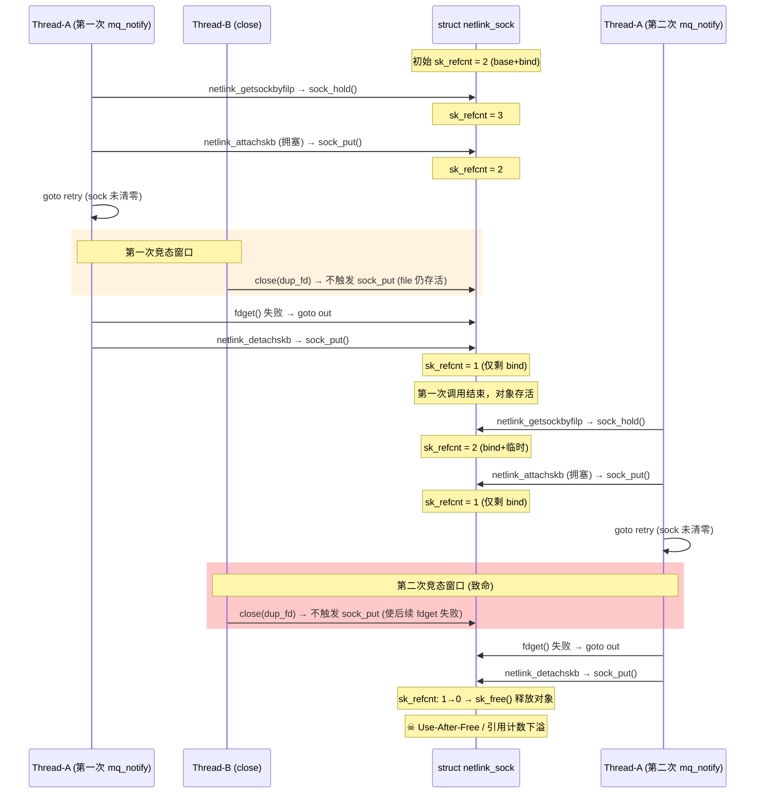
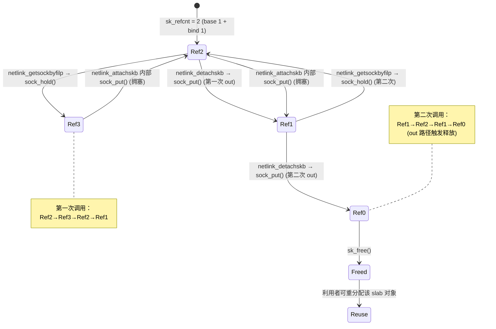
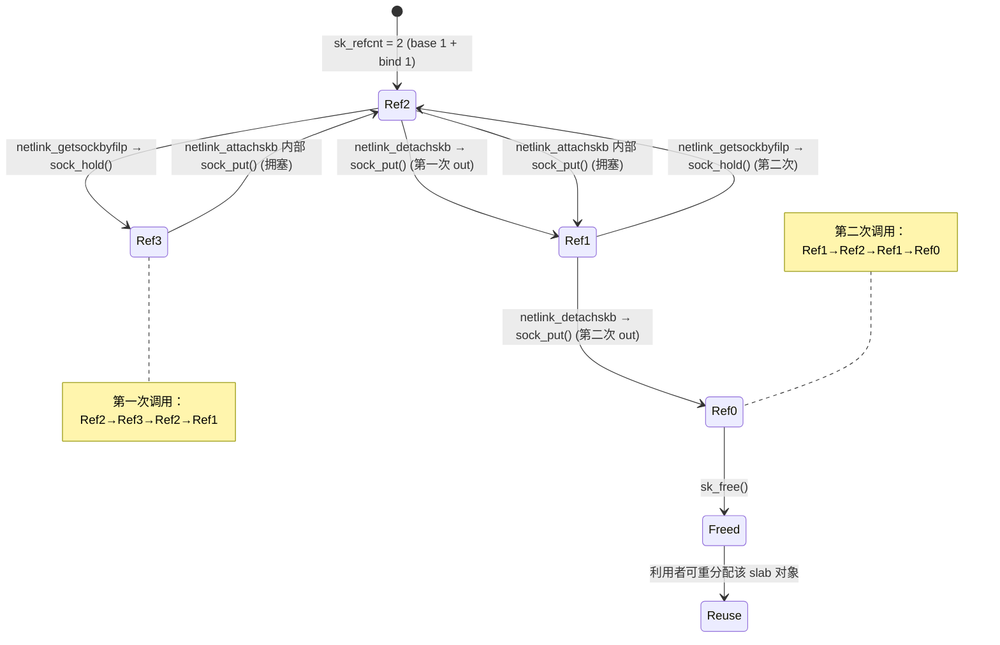
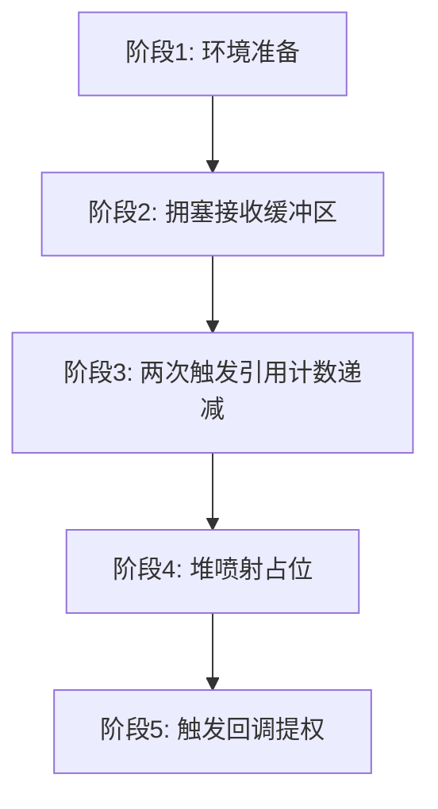
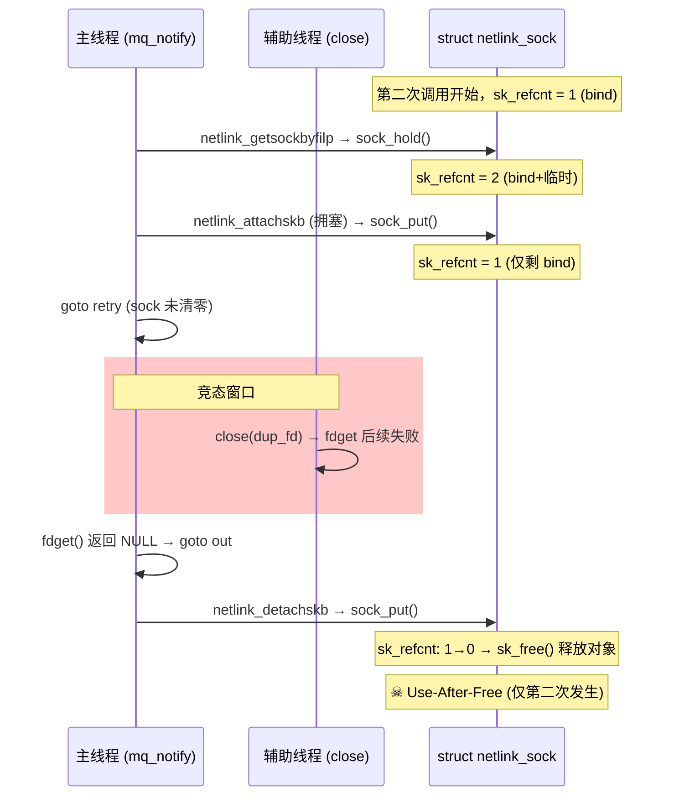

# 【Kernel Exploit】CVE-2017-11176 漏洞分析

## 1. 测试环境

**测试版本**：Linux-4.11.9 [内核镜像地址](https://github.com/BinRacer/pwn4kernel/blob/master/kernels/4.11.9/01/bzImage)

笔者测试的内核版本是 `Linux (none) 4.11.9 #1 SMP Thu Feb 12 12:22:19 CST 2026 x86_64 GNU/Linux`。

**编译选项**：开启`CONFIG_MEMCG`、`CONFIG_CGROUPS`、`CONFIG_SLAB_FREELIST_RANDOM`、`CONFIG_HARDENED_USERCOPY`、`CONFIG_FUSE_FS`、`CONFIG_USERFAULTFD`、`CONFIG_SYSVIPC`、`CONFIG_KEYS`、`CONFIG_CC_STACKPROTECTOR`、`CONFIG_CC_STACKPROTECTOR_STRONG`、`CONFIG_SLUB`、`CONFIG_SLUB_DEBUG`、`CONFIG_E1000`、`CONFIG_E1000E`、`CONFIG_PACKET`、`CONFIG_PACKET_DIAG`、`CONFIG_USER_NS`、`CONFIG_NET_NS`、`CONFIG_NAMESPACES`、`CONFIG_CHECKPOINT_RESTORE`、`CONFIG_IPC_NS`选项。完整配置参考[.config](https://github.com/BinRacer/pwn4kernel/blob/master/kernels/4.11.9/01/.config)。

**保护机制**：SMEP/SMAP/KPTI

## 2. 漏洞背景

### 2-1. 漏洞概述

**CVE-2017-11176** 是 Linux 内核 POSIX 消息队列子系统 `ipc/mqueue.c` 中 `sys_mq_notify()` 系统调用实现的一个 **Use-After-Free**，其本质是由竞态条件触发的**引用计数下溢 / 二次释放（double `sock_put()`）**。

核心缺陷可概括为：**`retry` 循环在跳回标号前没有将局部变量 `sock` 清零**。当线程 A 处于 retry 路径中、而线程 B 在同一时间窗口内用 `close()` 关闭通知参数所对应的 netlink socket 文件描述符时，`sock` 会成为一个**悬垂指针**；随后 `fdget()` 失败导致控制流直接落入 `out:` 出口路径，该路径因 `sock != NULL` 而再次调用 `netlink_detachskb(sock, nc)`，对同一个 `struct sock` 执行第二次 `sock_put()`，从而产生 Use-After-Free。

该缺陷的触发仅需**本地普通用户权限**（能够创建 POSIX 消息队列和 netlink socket 即可），无需任何特殊 capability，因此影响面极为广泛。在缓解措施不全的旧内核配置下，可通过 slab 堆喷射将已释放的 `netlink_sock` 原位占位并劫持回调控制流，最终实现本地权限提升；至少也可稳定地触发内核崩溃（拒绝服务）。这一漏洞的发现揭示了内核开发中一个易被忽视的风险：在涉及重试循环和引用计数的代码路径中，任何局部指针的状态更新滞后于引用计数的归还，都可能在多线程环境下演变成严重的内存安全问题。

### 2-2. 发现与修复简史

该漏洞由研究者 **GeneBlue** 在审计 `ipc/mqueue.c` 时发现并提交，其分析指出：`retry` 标号处未清除上一轮的 `sock` 指针，与多线程 `close()` 组合会产生 double `sock_put()`。

补丁由 **Cong Wang** 整理并发表于 LKML（2017‑07‑07），Linus Torvalds 于 2017‑07‑09 将其合入主线，对应 commit `f991af3daabaecff34684fd51fac80319d1baad1`。补丁本身仅有一行——在 `netlink_attachskb()` 返回 `1` 与 `goto retry` 之间插入 `sock = NULL;`——却关闭了一扇潜藏九年的漏洞之门。

该漏洞代码自 **Linux 2.6.27**（2008 年，`mq_notify()` 加入 netlink 通知路径）起便已存在，潜伏约九年。修复版本首先出现在 4.12‑rc1，并 backport 至 4.11.11、4.9.39 等稳定分支。CVE 编号由 MITRE 于 2017‑07‑11 正式分配，CVSS v3.1 评分为 **7.8 HIGH**（AV:L / AC:L / PR:L / UI:N / S:U / C:H / I:H / A:H）。

该漏洞之所以能潜伏如此之久，是因为它并非直观的“越界写”或“野指针赋值”，而是一种仅在**特定多线程时序、文件描述符生命周期与引用计数配对**三者同时错位时才会暴露的竞态问题——单线程执行无论如何都不会触发。这种隐蔽性使其在长达九年的时间内多次躲过代码审查和安全审计，直至被专门针对竞态条件的审计人员发现。

### 2-3. 组件全景

理解该漏洞的关键在于认识到：它并非孤立存在于 `ipc/mqueue.c` 的某一行代码，而是诞生于 **POSIX 消息队列、netlink socket、VFS 文件描述符层、socket 引用计数体系** 四者的交叉地带。下面按照真实的调用链，从最靠近用户态的参数语义逐步深入到引用计数的增减细节。只有深刻理解每个组件的职责及其接口契约，才能明白为何一个简单的 `sock = NULL` 缺失会引发如此严重的后果。

#### 2-3-1. POSIX 消息队列

POSIX 消息队列实现在 `ipc/mqueue.c`，挂载点通常为 `/dev/mqueue/`。`mq_notify()` 的作用是：在一个**当前为空**的队列上注册“有消息到达时如何通知”的机制，通知方式由用户传入的 `struct sigevent` 的 `sigev_notify` 字段决定：

- `SIGEV_NONE`：注销之前的注册。
- `SIGEV_SIGNAL`：队列非空时向本进程发送 `sigev_signo` 号信号。
- `SIGEV_THREAD`：**内核内部通过 netlink 将携带 cookie 数据的 skb 发送至用户指定的 netlink socket**，从而在用户态唤醒一个“假线程”回调。

此处最容易引起混淆的是字段名称：`sigev_signo` 源自 POSIX 的信号语义（信号编号），但在**内核内部处理 `SIGEV_THREAD` 分支时，该字段被复用为 `int` 型容器来存放 netlink socket 的文件描述符**（参见 `notification.sigev_signo` 被直接传递给 `fdget()`）。这并不是 POSIX 标准规定的用法，而是内核实现为保持 ABI 兼容所做的内部约定——后续所有“从 `sigev_signo` 获取文件描述符”的操作都必须在此前提下理解。这种复用虽在接口层面保持了简洁，却在语义上引入了歧义，也是后续代码理解中容易产生困惑之处。

#### 2-3-2. Netlink socket

相关代码位于 `net/netlink/af_netlink.c`（下文中的 `nlk` 指 `nlk_sk(sk)`，即 `(struct netlink_sock *)sk`）。

- **`netlink_getsockbyfilp(struct file *filp)`**：沿 `filp→dentry→inode→SOCKET_I(inode)→sk` 取出底层的 `struct sock *`，先进行两层校验（确认是 socket inode 且 `sk_family == AF_NETLINK`），然后执行 `sock_hold(sk)` 将 `sk->sk_refcnt` **增加 1**。返回的是**增加引用后的 sock 指针**。  
  换言之，自此之后 `mq_notify()` 手中的 `sock` 便是一张独立的“引用票根”，其有效性不再依赖于文件描述符层面的 `struct file` 生命周期。

- **`netlink_attachskb(sk, skb, &timeo, NULL)`**：尝试将 skb 附加到 `sk` 的接收路径。其核心判断条件（4.11.x 源码）为：

    ```c
    if (atomic_read(&sk->sk_rmem_alloc) > sk->sk_rcvbuf ||
        test_bit(NETLINK_CONGESTED, &nlk->state))
    ```

    若条件成立，函数进入等待分支：将当前任务加入 `nlk->wait` 等待队列，调度一段时间后被唤醒，随后执行 `sock_put(sk)` 将之前 `netlink_getsockbyfilp()` 增加的引用**归还**，并返回 **`1`** 给调用者，意为“当前无法放入，请稍后重试”。  
     这是整个漏洞的“天平转折点”：**函数归还了引用，但无法也不应替调用者清空 `sock` 指针**——清零的责任在调用者，而调用者并未履行。

- **`netlink_detachskb(sk, skb)`**：执行 `kfree_skb(skb) + sock_put(sk)`。正常路径中用于收尾；但在漏洞路径中，它被错误地应用于已经悬垂的 `sock` 指针。

此外，由于 `struct netlink_sock` 的第一个成员就是 `struct sock`，这些对象按 `struct netlink_sock` 的大小分配在 `kmalloc-*` 的某个 slab 缓存中——这正是后续利用中采用“同尺寸堆喷射”（例如大量 `sendmsg()` 到 netlink socket）能够精准占位已释放对象的原因所在。

#### 2-3-3. VFS 文件描述符层

`mq_notify()` 在 `retry:` 入口处执行：

```c
f = fdget(notification.sigev_signo);   // 基于 current->files->fdt[]
if (!f.file) { ... goto out; }
sock = netlink_getsockbyfilp(f.file);
fdput(f);                               // ← 文件描述符的临时引用在此归还
```

需要理解以下几点：

- `fdget()` / `fdput()` 是 `fget()` / `fput()` 的轻量封装（在快速路径下使用 RCU 和无锁递增 `f_count`），其目的是在**本次系统调用的持续期间内**确保 `struct file *` 不被释放。
- 执行 `fdput(f)` 之后，`struct file` 仍然存活（只要文件描述符表中的槽位未被 `close()` 移除），但 `mq_notify()` 手中通往 sock 的唯一途径只剩下**先前 `sock_hold()` 所产生的 `sk_refcnt` 增量**——二者已经**解耦**：sock 的生命周期不再受“本次 `fdget()` 借用”的保护。
- 一旦另一线程调用 `close(sigev_signo_fd)`：文件描述符表槽位 `fdt[fd]` 被置为 `NULL`，`fput(file)` 使 `f_count` 归零，进而触发 `->release()` 回调，最终执行 `sock_put(sk)` **将 sock 的“基础引用”也一并扣除**。若此时 `sk_refcnt` 仅剩基础引用（即之前 `attachskb` 已将临时引用归还），则直接触发 `sk_free()` → 对象归还 slab。

这一层揭示了漏洞的第二个关键因素：**文件描述符的生命周期与 sock 的生命周期通过 `netlink_getsockbyfilp` 建立的引用桥梁十分脆弱**——一旦文件描述符被关闭，这座桥梁便会坍塌，而 `mq_notify` 对此毫不知情。

#### 2-3-4. sock 引用计数

`sk_refcnt` 遵循简单的规则：

- **`sock_hold(sk)`** ≡ `refcount_inc(&sk->sk_refcnt)`：持有一张引用票。
- **`sock_put(sk)`** ≡ `if (refcount_dec_and_test()) sk_free(sk)`：退还一张票；退还最后一张时释放对象。

在 `mq_notify()` 的 `SIGEV_THREAD` 分支中，正常的“票面流转”（无竞态的理想情况）如下：

- socket 创建并执行 `bind()` 后，`sk_refcnt = 2`（基础引用 1 + bind 操作持有的 1 票）。
- `netlink_getsockbyfilp()` 执行 `sock_hold()`，`sk_refcnt` 变为 **3**（`mq_notify()` 获得一张临时票）。
- 若 `netlink_attachskb()` 成功，`skb_set_owner_r(skb, sk)` 将 skb 挂入队列，此时 skb 持有了 sock 的引用，`sk_refcnt` 至少为 3。最终 `out:` 处的 `netlink_detachskb()` 执行 `sock_put()` 退还 `mq_notify` 的临时票，回到仅剩基础引用加 bind 引用（即 2），安全。
- 若 `netlink_attachskb()` 因拥塞返回 1，它在内部已执行 `sock_put()`（退还了临时票），`sk_refcnt` 回到 **2**（base + bind）。但 `sock` 变量仍指向原地址，成为悬垂候选。

**漏洞路径**破坏的并非引用计数的算术运算，而是**票已退还但指针未清**的状态不一致：

> `netlink_attachskb()` 在返回 `1` 前已执行 `sock_put()`（退还了临时票），但 `sock` 变量仍指向原地址；随后 `goto retry`；在此期间 **文件描述符已被关闭 → 文件对象释放 → sock 的基础引用归零 → slab 回收**；之后 `fdget()` 失败 → `goto out` → `if (sock)` 条件成立 → 对悬垂地址执行 `netlink_detachskb(sock)` → **第二次退还同一张已不存在的票**。

至此，四个组件的交互链已完整呈现。接下来将通过具体的时序展示漏洞的逐步触发过程。

### 2-4. 两次漏洞的引用计数演化

漏洞的触发需要两次 `mq_notify()` 调用，分别对应两次竞态窗口。这是因为 netlink socket 在 `bind()` 操作后会持有额外的 1 票引用，使得初始 `sk_refcnt` 为 2（base 1 + bind 1）。第一次调用通过 `out` 路径的 `sock_put` 将引用从 2 降至 1，无法触发 `sk_free`。第二次调用通过 `out` 路径的 `sock_put` 将引用从 1 降至 0，触发 `sk_free` 释放对象，但 `sock` 指针未被清零，成为悬垂指针。以下结合竞态窗口的时序详细展示每一步的状态变化。

#### 2-4-1. 初次 `mq_notify` 调用

1. **首次进入 retry 循环**：`alloc_skb()` 分配 skb。`fdget()` 成功，`netlink_getsockbyfilp()` 执行 `sock_hold()`，`sk_refcnt` 从 2 变为 3。`netlink_attachskb()` 检测到接收缓冲区拥塞，进入等待分支。在 `schedule_timeout()` 中出让 CPU，竞态窗口打开。此时 `sk_refcnt = 3`（base 1 + bind 1 + 临时票 1）。

2. **竞态窗口中的 close 操作**：另一线程执行 `close(dup_fd)`（即通过 `dup()` 获得的第二个文件描述符）。此操作关闭了 dup 出的文件描述符，但**并不直接触发 `sock_put`**，因为原始 netlink socket 的文件描述符仍然打开，`struct file` 的引用计数尚未归零。`close(dup_fd)` 的效果是使后续 `fdget(notification.sigev_signo)` 返回 NULL，从而迫使 `mq_notify` 跳出 retry 循环。

3. **`netlink_attachskb()` 内部继续执行**：`schedule_timeout()` 返回后，执行 `sock_put(sk)`，`sk_refcnt` 从 3 降至 2。随后返回 1。此时引用仍为 2（base 1 + bind 1），对象未被释放。

4. **跳回 retry 后 fdget 失败**：`goto retry` 后，`fdget()` 发现 fd 已被关闭，`f.file == NULL`，跳转到 `out`。此时 `sock` 仍指向 sock 对象（引用为 2，对象存活）。

5. **out 路径触发第一次 sock_put**：`out:` 处 `if (sock)` 为真，调用 `netlink_detachskb(sock, nc)`。该函数内部执行 `kfree_skb(nc)` 和 `sock_put(sk)`，将 `sk_refcnt` 从 2 降至 1。此时引用仍为 1（bind 剩余的 1 票），对象仍然存活。

    **第一次调用结束时的关键状态**：`sk_refcnt = 1`（仅剩 bind 引用），`sock` 指针仍然有效，但 `netlink_detachskb` 已执行过一次 `sock_put`，引用计数已降低。对象尚未释放，因为 bind 引用尚存。

#### 2-4-2. 二次 `mq_notify` 调用

利用者再次发起 `mq_notify`，此时 `sk_refcnt = 1`（bind 剩余的最后 1 票）。

1. **`netlink_getsockbyfilp` 执行 `sock_hold`**：`sk_refcnt` 从 `0x1` 变为 `0x2`（bind + 临时）。

2. **`netlink_attachskb` 拥塞**：内部 `sock_put` 后 `sk_refcnt` 变为 `0x1`（仅剩 bind），返回 1。

3. **`goto retry`**：此时竞态窗口打开，另一线程再次执行 `close(dup_fd)`（第二次调用中使用了新的 dup fd）。此操作关闭了 dup 出的文件描述符，但**并不直接触发 `sock_put`**，因为原始 netlink socket 的文件描述符仍然打开，`struct file` 的引用计数尚未归零。`close(dup_fd)` 的效果是使后续 `fdget(notification.sigev_signo)` 返回 NULL，从而迫使 `mq_notify` 跳出 retry 循环。

4. **`fdget` 失败**：线程 A 恢复执行，`fdget()` 返回 NULL，跳转到 `out`。

5. **`out` 处 `netlink_detachskb` 执行 `sock_put`**：将 `sk_refcnt` 从 `0x1` 降至 `0x0`，触发 `sk_free`，sock 对象被释放（slab 变为 free）。`netlink_detachskb` 只执行了一次 `sock_put`。释放后该内存块被归还给 slab 分配器，利用者可立即通过 `sendmsg` 等操作分配相同大小的对象来覆盖这块内存，从而实现 Use-After-Free 利用。

#### 2-4-3. 两次调用的完整触发过程

下面的 Mermaid 序列图清晰地展示了两次 `mq_notify` 调用中线程 A 与线程 B 的交互、`sk_refcnt` 的变化轨迹以及竞态窗口的位置。注意第二次调用中 `close(dup_fd)` 仅使 `fdget` 失败，并未直接触发 `sock_put`；真正的 `sock_put` 发生在 `out` 路径的 `netlink_detachskb` 中。



#### 2-4-4. 引用计数变化流程总结



**正常路径与漏洞路径的对比**：在正常路径（无竞态）中，`sk_refcnt` 始终在 2 和 3 之间摆动，永远不会触及 0。`out` 路径的 `if (sock)` 条件由于 `sock` 已被清零而为假，因此不会执行 `netlink_detachskb`。在漏洞路径中，由于 `sock` 未被清零，`out` 路径会错误地认为 sock 仍持有有效引用，从而执行 `sock_put`，导致引用计数归零并释放对象。释放后该内存块被归还给 slab，利用者可通过精心构造的堆喷重新分配同一块内存，进而伪造 `struct netlink_sock` 中的关键字段，实现信息泄露或控制流劫持。这一差异可归结为一点：**指针状态与引用所有权是否同步**。

### 2-5. 触发与影响

#### 2-5-1. 触发条件

要成功触发该漏洞，需要同时满足以下五个条件，它们缺一不可，且相互之间存在严格的时序依赖。

第一个条件是调用 `mq_notify(mqd, &sev)` 并将 `sev.sigev_notify` 设置为 `SIGEV_THREAD`，只有这样代码才会进入 netlink socket 获取路径，而非信号路径或空路径。这是整个漏洞触发的入口点。

第二个条件是 `sev.sigev_signo` 必须是一个有效且已绑定的 `AF_NETLINK` socket 的文件描述符。在内核内部，`sigev_signo` 被当作 netlink socket 的文件描述符传递给 `fdget()`，该文件描述符必须确实指向一个已 `bind()` 的 netlink socket，以确保 `netlink_getsockbyfilp()` 的两道校验（socket inode 校验和协议族校验）能够通过。若传入的不是合法的 netlink socket，函数将返回错误，漏洞路径无法进入。

第三个条件是 netlink socket 的接收缓冲区必须处于拥塞状态，具体表现为 `sk_rmem_alloc > sk_rcvbuf` 或设置了 `NETLINK_CONGESTED` 标志。这会迫使 `netlink_attachskb()` 返回 1 而非正常地将 skb 入队，从而使代码进入 retry 循环，并将 `sock` 留在悬垂状态。利用者可通过向同一 netlink socket 发送大量数据来推高 `sk_rmem_alloc`，或通过 `setsockopt(SO_RCVBUF, ...)` 调低 `sk_rcvbuf` 来人为制造拥塞。这一步是创造重试机会的关键。

第四个条件是多线程竞态：一个线程（线程 A）正在 `mq_notify` 的 `retry` 循环中，另一个线程（线程 B）必须在精确的时间窗口内对该 netlink socket 文件描述符执行 `close()`。该时间窗口非常狭窄——它介于 `netlink_attachskb()` 返回 1 之后、`retry` 入口处下一轮 `fdget()` 执行之前。在实践中，利用者需要通过反复尝试、CPU 亲和性绑定或借助 userfaultfd 等技术拉宽调度窗口来提高命中概率。

第五个条件是利用者仅需拥有本地普通用户权限，无需任何特殊 capability。创建 POSIX 消息队列和 netlink socket 均在普通用户的合法能力范围内，这意味着该漏洞可被非特权用户利用，具有广泛的影响面。

#### 2-5-2. 影响评估

在安全影响方面，该漏洞的直接后果是引用计数下溢导致 `struct sock` 被释放后又被访问，进而引发内核崩溃（oops / panic），造成拒绝服务。这一影响在几乎所有受影响的内核配置上均可稳定触发，无需额外的缓解绕过技巧。

在利用潜力方面，若目标内核缺乏 SMAP、SMEP、KASLR 等缓解措施，利用者可采用 slab 重分配技术——例如大量发送 `sendmsg()` 填充 `kmalloc-2048` slab——将受控数据布置到已释放的 netlink_sock 对象位置，覆盖其中的函数指针（如 `wait_queue_t.func`）。随后通过 `setsockopt(NETLINK_NO_ENOBUFS)` 触发回调，劫持控制流并执行提权载荷，例如调用 `commit_creds(prepare_kernel_cred(0))` 将当前进程提升为 root。在启用完整缓解措施的现代内核上，拒绝服务仍然成立，但提权的难度显著增加。不过，这并不改变该漏洞作为高危内核 UAF 的基本定性。

NVD 给出的 CVSS v3.1 评分为 **7.8 HIGH**，向量为 `AV:L / AC:L / PR:L / UI:N / S:U / C:H / I:H / A:H`，表明本地利用者可在低复杂度条件下实现高机密性、高完整性、高可用性的破坏。

### 2-6. 版本范围

该漏洞的引入版本是 Linux 2.6.27（2008 年，`mq_notify()` 加入 netlink 通知支持），缺陷代码从一开始便存在。所有小于等于 4.11.9 的主线及衍生版本均受影响。修复版本首先出现在 4.12-rc1 主线中，对应 commit `f991af3daabaecff34684fd51fac80319d1baad1`，并 backport 到了 4.11.11、4.9.39 等稳定分支。各大发行版也发布了相应的安全更新，例如 Debian 的 DSA-3927 和 DSA-3945，Ubuntu 的 USN-3468 系列，以及 Red Hat 的 RHSA-2017:2918 等。不受影响的基线是 4.12.2 及之后的主线内核，以及已合入 backport 补丁的发行版构建。

由于该漏洞潜伏时间极长，许多仍在运行老旧内核的生产系统都可能面临风险，这也是其被评为高危的重要原因之一。对于运维人员而言，检查当前内核版本是否在受影响范围内并尽快应用补丁，是防范此漏洞的最有效手段。

### 2-7. 本质总结

将内核引用计数代码中的工程原则凝练为一句话：

> **一个局部指针所代表的“引用所有权”，若已通过某个子调用的副作用被退还（ref‑dec），则该指针必须在同一条控制流路径上立即作废（`= NULL`）；任何允许其跨越 `goto label` 或循环回头点的存活期，都是在为竞态条件下的 Use-After-Free 埋下隐患。**

CVE‑2017‑11176 仅是这条原则少写了一行 `sock = NULL` 的后果——代价却是一个可由普通用户触发的内核态 Use‑After‑Free。这一案例深刻表明：在涉及手动资源管理的并发系统中，任何微小的状态不一致都可能被竞态条件放大为致命漏洞。内核开发者应将“引用已还，指针必清”作为编写 retry 循环的铁律，而安全审计者也应将此类模式列为重点审查对象。

## 3. 漏洞分析

本节对漏洞所在的 `sys_mq_notify()` 函数进行逐段分析，并在关键代码处插入注释，以阐明引用计数的流转、竞态窗口的形成以及最终导致 Use-After-Free 的精确路径。辅助函数 `netlink_getsockbyfilp()`、`netlink_attachskb()`、`netlink_detachskb()` 以及引用计数原语 `sock_hold()`/`sock_put()` 也将一并注释，以展现完整的调用链。在此基础上，结合 GDB 调试日志展示两次漏洞调用的完整演化，深入理解竞态条件下引用计数失衡的微观过程。

### 3-1. 入口与参数校验

`sys_mq_notify()` 首先从用户空间拷贝 `struct sigevent`，并检查通知模式的合法性。当模式为 `SIGEV_THREAD` 时，进入漏洞相关的核心路径。

```c
SYSCALL_DEFINE2(mq_notify, mqd_t, mqdes,
                const struct sigevent __user *, u_notification)
{
    int ret;
    struct fd f;
    struct sock *sock;
    struct inode *inode;
    struct sigevent notification;
    struct mqueue_inode_info *info;
    struct sk_buff *nc;

    if (u_notification) {
        if (copy_from_user(&notification, u_notification,
                           sizeof(struct sigevent)))
            return -EFAULT;
    }

    audit_mq_notify(mqdes, u_notification ? &notification : NULL);

    nc = NULL;
    sock = NULL;
    if (u_notification != NULL) {
        if (unlikely(notification.sigev_notify != SIGEV_NONE &&
                     notification.sigev_notify != SIGEV_SIGNAL &&
                     notification.sigev_notify != SIGEV_THREAD))
            return -EINVAL;
        if (notification.sigev_notify == SIGEV_SIGNAL &&
            !valid_signal(notification.sigev_signo)) {
            return -EINVAL;
        }
        /* ---------- 漏洞路径入口：SIGEV_THREAD 分支 ---------- */
        if (notification.sigev_notify == SIGEV_THREAD) {
            long timeo;

            /* 分配 skb，用于存放用户提供的 cookie 数据 */
            nc = alloc_skb(NOTIFY_COOKIE_LEN, GFP_KERNEL);
            if (!nc) {
                ret = -ENOMEM;
                goto out;
            }
            if (copy_from_user(nc->data,
                               notification.sigev_value.sival_ptr,
                               NOTIFY_COOKIE_LEN)) {
                ret = -EFAULT;
                goto out;
            }

            skb_put(nc, NOTIFY_COOKIE_LEN);
            /* ---------- retry 标号：竞态循环的起点 ---------- */
retry:
            /*
             * 步骤①：通过用户提供的 fd（sigev_signo）获取 struct file，
             *         注意 sigev_signo 在此被复用为 netlink socket 的 fd。
             */
            f = fdget(notification.sigev_signo);
            if (!f.file) {
                ret = -EBADF;
                goto out;   /* 若 fd 无效，直接跳转到 out */
            }

            /*
             * 步骤②：从 file 获取 netlink socket 的 sock 指针，
             *         并执行 sock_hold() 增加引用计数（sk_refcnt +1）。
             *         此时 sock 变量持有对 sock 对象的一票引用。
             */
            sock = netlink_getsockbyfilp(f.file);
            fdput(f);   /* 释放 fdget 获得的临时 file 引用 */

            if (IS_ERR(sock)) {
                ret = PTR_ERR(sock);
                sock = NULL;
                goto out;
            }

            /*
             * 步骤③：尝试将 skb 附加到 netlink socket 的接收队列。
             *         - 若返回 0：成功，继续执行后续注册逻辑。
             *         - 若返回 1：缓冲区拥塞，需要重试。
             *         - 若返回负值：错误。
             *
             *         注意：当返回 1 时，netlink_attachskb() 内部已经
             *         调用了 sock_put()，即退还了步骤②中增加的引用。
             *         但局部变量 sock 仍指向原地址，未被清零。
             */
            timeo = MAX_SCHEDULE_TIMEOUT;
            ret = netlink_attachskb(sock, nc, &timeo, NULL);
            if (ret == 1)
                goto retry;   /* ← 漏洞根源：sock 未置 NULL 就跳回 retry */
            if (ret) {
                sock = NULL;
                nc = NULL;
                goto out;
            }
        }
    }

    /* ---------- 后续：注册通知到消息队列的 inode ---------- */
    // ...（省略，与漏洞路径无关）
out:
    /*
     * 出口路径：若 sock 非空，则调用 netlink_detachskb()，
     * 该函数内部会执行 kfree_skb(nc) 和 sock_put(sock)。
     * 正常情况下，sock 应为 NULL（已在成功分支或错误分支中清零），
     * 但在漏洞路径中，若 retry 后 fdget 失败，sock 仍保留上一轮的悬垂指针，
     * 导致对已释放的 sock 对象再次执行 sock_put() → Use-After-Free。
     */
    if (sock)
        netlink_detachskb(sock, nc);
    else if (nc)
        dev_kfree_skb(nc);

    return ret;
}
```

**关于 `sigev_signo` 的复用**：在 POSIX 标准中，`sigev_signo` 字段用于指定信号编号，但当 `sigev_notify == SIGEV_THREAD` 时，Linux 内核将该字段重新解释为 netlink socket 的文件描述符。这是一种 ABI 层面的复用，旨在避免修改 `struct sigevent` 的布局。这一设计决策虽然保持了接口的向后兼容性，却在语义上引入了歧义——开发者在阅读代码时需要意识到，`notification.sigev_signo` 在此上下文中并非信号编号，而是一个文件描述符。这种隐式的语义转换是后续理解漏洞路径时必须注意的前提。

**关于文件描述符的 `dup` 复制**：在漏洞利用中，利用者首先创建一个 netlink socket，然后通过 `dup()` 系统调用获得两个独立的文件描述符，均指向同一个 `struct file` 和底层的 `struct sock`。其中一个文件描述符（记为 `fd_a`）被传递给 `mq_notify` 的 `sigev_signo` 字段，另一个（记为 `fd_b`）则保留用于后续的 `close()` 操作。这种设计允许利用者在 `mq_notify` 的 retry 循环中关闭 `fd_b`，从而在不破坏 `mq_notify` 自身 `fdget()` 的前提下，使下一次 `fdget` 返回 NULL，进而迫使 `mq_notify` 提前进入 `out` 路径。`dup()` 本身不改变 `sk_refcnt`，仅增加 `struct file` 的引用计数，因此初始 `sk_refcnt` 仍由 socket 创建和 `bind()` 决定。

### 3-2. 辅助函数分析

以下四个函数构成了引用计数管理的核心，它们的协作关系直接决定了漏洞是否触发。每个函数都承担着特定的引用计数操作，其内部逻辑的正确性依赖于调用者对外部状态的维护。

**netlink_getsockbyfilp()**

```c
struct sock *netlink_getsockbyfilp(struct file *filp)
{
    struct inode *inode = file_inode(filp);
    struct sock *sock;

    if (!S_ISSOCK(inode->i_mode))
        return ERR_PTR(-ENOTSOCK);

    sock = SOCKET_I(inode)->sk;
    if (sock->sk_family != AF_NETLINK)
        return ERR_PTR(-EINVAL);

    sock_hold(sock);  // sk_refcnt +1
    return sock;
}
```

该函数通过 `filp→dentry→inode→SOCKET_I(inode)→sk` 的路径获取底层的 `struct sock *`，并执行 `sock_hold()` 增加引用计数。调试日志捕捉到了这一变化：在 `netlink_getsockbyfilp` 调用前，`sk_refcnt` 为 `0x2`（对应 base 1 加上 bind 操作持有的 1 票），调用后变为 `0x3`，表明 `sock_hold` 已生效。

```
pwndbg> p/x sock->__sk_common->skc_refcnt
$6 = { counter = 0x2 }
pwndbg> p/x sock->__sk_common->skc_refcnt
$7 = { counter = 0x3 }
```

值得注意的是，该函数返回的 `sock` 指针与文件描述符的生命周期已经解耦——`sock_hold` 增加的引用使得 sock 对象独立于 `struct file` 的存在。这种解耦是后续竞态能够发生的前提：即使文件描述符被关闭，只要引用计数不为零，sock 对象就不会被释放。然而，这也意味着调用者必须负责在适当的时候归还这一引用。

**netlink_attachskb() 与 netlink_skb_set_owner_r()**

`netlink_attachskb()` 是漏洞路径中的关键函数，它负责将 skb 附加到 netlink socket 的接收队列。其行为直接影响引用计数的变化和竞态窗口的形成。

```c
int netlink_attachskb(struct sock *sk, struct sk_buff *skb,
                      long *timeo, struct sock *ssk)
{
    struct netlink_sock *nlk = nlk_sk(sk);

    /* 判断接收缓冲区是否拥塞 */
    if ((atomic_read(&sk->sk_rmem_alloc) > sk->sk_rcvbuf ||
         test_bit(NETLINK_S_CONGESTED, &nlk->state))) {
        DECLARE_WAITQUEUE(wait, current);

        if (!*timeo) {
            sock_put(sk);      /* 归还引用 */
            kfree_skb(skb);
            return -EAGAIN;
        }

        __set_current_state(TASK_INTERRUPTIBLE);
        add_wait_queue(&nlk->wait, &wait);

        /* 若仍拥塞则调度睡眠 */
        if ((atomic_read(&sk->sk_rmem_alloc) > sk->sk_rcvbuf ||
             test_bit(NETLINK_S_CONGESTED, &nlk->state)) &&
            !sock_flag(sk, SOCK_DEAD))
            *timeo = schedule_timeout(*timeo);  /* 出让CPU，竞态窗口打开 */

        __set_current_state(TASK_RUNNING);
        remove_wait_queue(&nlk->wait, &wait);
        sock_put(sk);          /* 归还引用 */

        if (signal_pending(current)) {
            kfree_skb(skb);
            return sock_intr_errno(*timeo);
        }
        return 1;              /* 返回 1 表示需要重试 */
    }

    /* 缓冲区有空闲，将 skb 挂入接收队列 */
    netlink_skb_set_owner_r(skb, sk);
    return 0;
}
```

当接收缓冲区有空闲时，`netlink_attachskb()` 调用 `netlink_skb_set_owner_r()` 将 skb 的所有权转移给 sock：

```c
static void netlink_skb_set_owner_r(struct sk_buff *skb, struct sock *sk)
{
    WARN_ON(skb->sk != NULL);
    skb->sk = sk;                          /* 设置 skb 所属的 sock */
    skb->destructor = netlink_skb_destructor; /* 设置析构函数 */
    atomic_add(skb->truesize, &sk->sk_rmem_alloc); /* 增加接收缓冲区计数 */
    sk_mem_charge(sk, skb->truesize);      /* 记录内存占用 */
}
```

该函数通过 `atomic_add(skb->truesize, &sk->sk_rmem_alloc)` 增加 `sk_rmem_alloc`，这是后续判断拥塞的关键指标。`skb->truesize` 通常大于实际数据长度，因为它包含了 skb 结构体本身的开销、头部、碎片等。调试日志显示了 `netlink_skb_set_owner_r` 执行前后的变化：执行前 `sk_rmem_alloc` 为 `0x0`，执行后变为 `0x300`，表明每次成功发送一个 skb 会增加约 `0x300` 字节。

```
pwndbg> p/x sk->sk_backlog->rmem_alloc
$1 = { counter = 0x0 }
pwndbg> p/x sk->sk_backlog->rmem_alloc
$2 = { counter = 0x300 }
```

利用者可以通过反复向同一 netlink socket 发送消息（调用 `sendmsg`）来推高 `sk_rmem_alloc`，使其超过 `sk_rcvbuf`，从而迫使 `netlink_attachskb()` 进入拥塞分支并返回 1，形成 retry 循环。调试日志证实了这一点：在拥塞分支中，`sk_rmem_alloc` 的值为 `0x34200`，而 `sk_rcvbuf` 为 `0x34000`，前者大于后者，条件成立。

```
pwndbg> p/x sk->sk_backlog->rmem_alloc
$9 = { counter = 0x34200 }
pwndbg> p/x sk->sk_rcvbuf
$10 = 0x34000
```

**拥塞分支的语义分析**：当 `netlink_attachskb()` 检测到拥塞时，它会将当前任务加入等待队列，并通过 `schedule_timeout()` 出让 CPU。这一出让行为为另一线程执行 `close()` 创造了时间窗口。函数在被唤醒后执行 `sock_put(sk)` 归还引用，然后返回 `1`。重要的是，**归还引用的操作发生在返回之前，而调用者对 `sock` 指针的清零责任则在返回之后**。这种责任划分的不对称性是漏洞的结构性根源。

**netlink_detachskb()与引用计数原语**

```c
void netlink_detachskb(struct sock *sk, struct sk_buff *skb)
{
    kfree_skb(skb);           /* 释放 skb */
    sock_put(sk);             /* 归还 sock 引用 */
}

static __always_inline void sock_hold(struct sock *sk)
{
    atomic_inc(&sk->sk_refcnt);
}

static inline void sock_put(struct sock *sk)
{
    if (atomic_dec_and_test(&sk->sk_refcnt))
        sk_free(sk);           /* 引用归零时释放对象 */
}
```

`sock_put()` 在引用计数归零时调用 `sk_free()` 释放对象。`sk_free()` 最终会释放 `struct netlink_sock` 结构体，该结构体包含 `struct sock` 作为其第一个成员，整体分配在 `kmalloc-2048` slab 中。这是整个漏洞触发链条的终点：当 `out` 路径对已释放的对象再次调用 `sock_put()` 时，引用计数会下溢为负数，或者直接导致 slab 层面的二次释放。调试日志中，第二次 `netlink_detachskb` 执行后，`kmalloc-2048` slab 中该对象的状态从 in-use 变为 free，标志着对象已被释放。

### 3-3. 两次漏洞的引用计数演化

漏洞的触发需要两次 `mq_notify()` 调用，分别对应两次竞态窗口。这是因为 netlink socket 在 `bind()` 操作后会持有额外的 1 票引用，使得初始 `sk_refcnt` 为 2（base 1 + bind 1）。第一次调用通过 `out` 路径的 `sock_put` 将引用从 2 降至 1，无法触发 `sk_free`。第二次调用通过 `out` 路径的 `sock_put` 将引用从 1 降至 0，触发 `sk_free` 释放对象，但 `sock` 指针未被清零，成为悬垂指针。以下结合 GDB 调试日志和源代码注释详细展示每一步的状态变化。

#### 3-3-1. 初次 `mq_notify` 调用

1. **首次进入 retry 循环**：`alloc_skb()` 分配 skb（地址 `0xffff88001d420400`，`kmalloc-256` slab）。`fdget()` 成功，`netlink_getsockbyfilp()` 执行 `sock_hold()`，`sk_refcnt` 从 2 变为 3。`netlink_attachskb()` 检测到接收缓冲区拥塞（`sk_rmem_alloc = 0x34200 > sk_rcvbuf = 0x34000`），进入等待分支。在 `schedule_timeout()` 中出让 CPU，竞态窗口打开。此时 `sk_refcnt = 3`（base 1 + bind 1 + 临时票 1）。

    ```c
    SYSCALL_DEFINE2(mq_notify, mqd_t, mqdes,
    		const struct sigevent __user *, u_notification)
    {
    	// ... 省略无关的变量声明和检查 ...
    	if (notification.sigev_notify == SIGEV_THREAD) {
    		long timeo;
    		nc = alloc_skb(NOTIFY_COOKIE_LEN, GFP_KERNEL);
    		// pwndbg> p/x nc
    		// $3 = 0xffff88001d420400
    		// pwndbg> slab contains 0xffff88001d420400
    		//  0xffff88001d420400 @ kmalloc-256
    		//  slab: 0xffff88001d420000 [active, cpu 0, 4/16 in-use]
    		//  status: in-use
    		if (!nc) { ret = -ENOMEM; goto out; }
    retry:
    		f = fdget(notification.sigev_signo);
    		if (!f.file) { ret = -EBADF; goto out; }
    		// pwndbg> p/x sock->__sk_common->skc_refcnt
    		// $6 = { counter = 0x2 }
    		sock = netlink_getsockbyfilp(f.file);
    		// pwndbg> p/x sock->__sk_common->skc_refcnt
    		// $7 = { counter = 0x3 }
    		// pwndbg> p/x sock
    		// $8 = 0xffff88001df99000
    		fdput(f);
    		timeo = MAX_SCHEDULE_TIMEOUT;
    		ret = netlink_attachskb(sock, nc, &timeo, NULL);
    		if (ret == 1) goto retry;
    	}
    out:
    	if (sock) netlink_detachskb(sock, nc);
    	else if (nc) dev_kfree_skb(nc);
    	return ret;
    }
    ```

    `netlink_getsockbyfilp` 函数：

    ```c
    struct sock *netlink_getsockbyfilp(struct file *filp)
    {
    	struct inode *inode = file_inode(filp);
    	struct sock *sock;
    	if (!S_ISSOCK(inode->i_mode)) return ERR_PTR(-ENOTSOCK);
    	sock = SOCKET_I(inode)->sk;
    	if (sock->sk_family != AF_NETLINK) return ERR_PTR(-EINVAL);
    	// pwndbg> p/x sock->__sk_common->skc_refcnt
    	// $6 = { counter = 0x2 }
    	sock_hold(sock);
    	// pwndbg> p/x sock->__sk_common->skc_refcnt
    	// $7 = { counter = 0x3 }
    	// pwndbg> p/x sock
    	// $8 = 0xffff88001df99000
    	return sock;
    }
    ```

2. **竞态窗口中的 close 操作**：另一线程执行 `close(dup_fd)`（即通过 `dup()` 获得的第二个文件描述符）。此操作关闭了 dup 出的文件描述符，但**并不直接触发 `sock_put`**，因为原始 netlink socket 的文件描述符仍然打开，`struct file` 的引用计数尚未归零。`close(dup_fd)` 的效果是使后续 `fdget(notification.sigev_signo)` 返回 NULL，从而迫使 `mq_notify` 跳出 retry 循环。

3. **`netlink_attachskb()` 内部继续执行**：`schedule_timeout()` 返回后，执行 `sock_put(sk)`，`sk_refcnt` 从 3 降至 2。随后返回 1。此时引用仍为 2（base 1 + bind 1），对象未被释放。

    ```c
    int netlink_attachskb(struct sock *sk, struct sk_buff *skb,
    		      long *timeo, struct sock *ssk)
    {
    	struct netlink_sock *nlk = nlk_sk(sk);
    	// pwndbg> p/x sk->sk_backlog->rmem_alloc
    	// $9 = { counter = 0x34200 }
    	// pwndbg> p/x sk->sk_rcvbuf
    	// $10 = 0x34000
    	if ((atomic_read(&sk->sk_rmem_alloc) > sk->sk_rcvbuf ||
    	     test_bit(NETLINK_S_CONGESTED, &nlk->state))) {
    		DECLARE_WAITQUEUE(wait, current);
    		if (!*timeo) { sock_put(sk); kfree_skb(skb); return -EAGAIN; }
    		__set_current_state(TASK_INTERRUPTIBLE);
    		add_wait_queue(&nlk->wait, &wait);
    		if ((atomic_read(&sk->sk_rmem_alloc) > sk->sk_rcvbuf ||
    		     test_bit(NETLINK_S_CONGESTED, &nlk->state)) &&
    		    !sock_flag(sk, SOCK_DEAD))
    			*timeo = schedule_timeout(*timeo); // Give up the CPU
    		__set_current_state(TASK_RUNNING);
    		remove_wait_queue(&nlk->wait, &wait);
    		// pwndbg> p/x sk->__sk_common->skc_refcnt
    		// $11 = { counter = 0x3 }
    		sock_put(sk);
    		// pwndbg> p/x sk->__sk_common->skc_refcnt
    		// $12 = { counter = 0x2 }
    		if (signal_pending(current)) { kfree_skb(skb); return sock_intr_errno(*timeo); }
    		return 1;
    	}
    	netlink_skb_set_owner_r(skb, sk);
    	return 0;
    }
    ```

4. **跳回 retry 后 fdget 失败**：`goto retry` 后，`fdget()` 发现 fd 已被关闭，`f.file == NULL`，跳转到 `out`。此时 `sock` 仍指向 sock 对象（引用为 2，对象存活）。

    ```c
    retry:
    	f = fdget(notification.sigev_signo);
    	if (!f.file) {  // because close(dup_fd); goto out label;
    		ret = -EBADF;
    		goto out;
    	}
    ```

5. **out 路径触发第一次 sock_put**：`out:` 处 `if (sock)` 为真，调用 `netlink_detachskb(sock, nc)`。该函数内部：
    - `kfree_skb(nc)`：释放 skb（`kmalloc-256` slab 从 in-use 变为 free）。
    - `sock_put(sk)`：将 `sk_refcnt` 从 2 降至 1。此时引用仍为 1（bind 剩余的 1 票），对象仍然存活，slab 状态不变。

    ```c
    void netlink_detachskb(struct sock *sk, struct sk_buff *skb)
    {
    	// pwndbg> slab contains 0xffff88001d420400
    	//  0xffff88001d420400 @ kmalloc-256
    	//  slab: 0xffff88001d420000 [active, cpu 0, 4/16 in-use]
    	//  status: in-use
    	kfree_skb(skb);
    	// pwndbg> slab contains 0xffff88001d420400
    	//  0xffff88001d420400 @ kmalloc-256
    	//  slab: 0xffff88001d420000 [active, cpu 0, 3/16 in-use]
    	//  status: free
    	// pwndbg> p/x sk->__sk_common->skc_refcnt
    	// $13 = { counter = 0x2 }
    	// pwndbg> slab contains 0xffff88001df99000
    	//  0xffff88001df99000 @ kmalloc-2048
    	//  slab: 0xffff88001df98000 [active, cpu 0, 8/16 in-use]
    	//  status: in-use
    	sock_put(sk);
    	// pwndbg> p/x sk->__sk_common->skc_refcnt
    	// $14 = { counter = 0x1 }
    	// pwndbg> slab contains 0xffff88001df99000
    	//  0xffff88001df99000 @ kmalloc-2048
    	//  slab: 0xffff88001df98000 [active, cpu 0, 8/16 in-use]
    	//  status: in-use
    }
    ```

    执行前 `sk_refcnt = 0x2`，slab 状态为 in-use；执行后 `sk_refcnt = 0x1`，slab 仍标记为 in-use。这表明第一次调用并未将引用计数降至 0，因为 `bind()` 操作额外持有的 1 票引用尚未归还。此时 `sk_refcnt` 从 2 降至 1，对象仍然存活。

#### 3-3-2. 二次 `mq_notify` 调用

利用者再次发起 `mq_notify`，此时 `sk_refcnt = 1`（bind 剩余的最后 1 票）。第二次调用的代码结构与第一次完全相同，仅初始引用计数不同。以下仅列出关键变化点，省略与第一次重复的函数定义。

1. **`netlink_getsockbyfilp` 执行 `sock_hold`**：`sk_refcnt` 从 `0x1` 变为 `0x2`。

    ```c
    // 第二次 _mq_notify((mqd_t)0x666, &sigv) 调用
    SYSCALL_DEFINE2(mq_notify, mqd_t, mqdes,
    		const struct sigevent __user *, u_notification)
    {
    	// ... 省略无关代码 ...
    	if (notification.sigev_notify == SIGEV_THREAD) {
    		nc = alloc_skb(NOTIFY_COOKIE_LEN, GFP_KERNEL);
    		// pwndbg> p/x nc
    		// $15 = 0xffff88001d420400
    		// pwndbg> slab contains 0xffff88001d420400
    		//  0xffff88001d420400 @ kmalloc-256
    		//  slab: 0xffff88001d420000 [active, cpu 0, 4/16 in-use]
    		//  status: in-use
    		if (!nc) { ret = -ENOMEM; goto out; }
    retry:
    		f = fdget(notification.sigev_signo);
    		if (!f.file) { ret = -EBADF; goto out; }
    		// pwndbg> p/x sock
    		// $16 = 0xffff88001df99000
    		// pwndbg> p/x sock->__sk_common->skc_refcnt
    		// $17 = { counter = 0x1 }
    		sock = netlink_getsockbyfilp(f.file);
    		// pwndbg> p/x sock->__sk_common->skc_refcnt
    		// $18 = { counter = 0x2 }
    		fdput(f);
    		timeo = MAX_SCHEDULE_TIMEOUT;
    		ret = netlink_attachskb(sock, nc, &timeo, NULL);
    		if (ret == 1) goto retry;
    	}
    out:
    	if (sock) netlink_detachskb(sock, nc);
    	else if (nc) dev_kfree_skb(nc);
    	return ret;
    }
    ```

    `netlink_getsockbyfilp` 第二次调用（与第一次相同，仅初始 refcnt 不同）：

    ```c
    struct sock *netlink_getsockbyfilp(struct file *filp)
    {
    	struct inode *inode = file_inode(filp);
    	struct sock *sock;
    	if (!S_ISSOCK(inode->i_mode)) return ERR_PTR(-ENOTSOCK);
    	sock = SOCKET_I(inode)->sk;
    	if (sock->sk_family != AF_NETLINK) return ERR_PTR(-EINVAL);
    	// pwndbg> p/x sock
    	// $16 = 0xffff88001df99000
    	// pwndbg> p/x sock->__sk_common->skc_refcnt
    	// $17 = { counter = 0x1 }
    	sock_hold(sock);
    	// pwndbg> p/x sock->__sk_common->skc_refcnt
    	// $18 = { counter = 0x2 }
    	return sock;
    }
    ```

2. **`netlink_attachskb` 拥塞**：内部 `sock_put` 后 `sk_refcnt` 变为 `0x1`，返回 1。

    ```c
    int netlink_attachskb(struct sock *sk, struct sk_buff *skb,
    		      long *timeo, struct sock *ssk)
    {
    	struct netlink_sock *nlk = nlk_sk(sk);
    	// pwndbg> p/x sk->sk_backlog->rmem_alloc
    	// $19 = { counter = 0x34200 }
    	// pwndbg> p/x sk->sk_rcvbuf
    	// $20 = 0x34000
    	if ((atomic_read(&sk->sk_rmem_alloc) > sk->sk_rcvbuf ||
    	     test_bit(NETLINK_S_CONGESTED, &nlk->state))) {
    		// ... 省略等待队列操作 ...
    		// pwndbg> p/x sk->__sk_common->skc_refcnt
    		// $22 = { counter = 0x2 }
    		sock_put(sk);
    		// pwndbg> p/x sk->__sk_common->skc_refcnt
    		// $23 = { counter = 0x1 }
    		return 1;
    	}
    	netlink_skb_set_owner_r(skb, sk);
    	return 0;
    }
    ```

3. **`goto retry`**：此时竞态窗口打开，另一线程再次执行 `close(dup_fd)`（第二次调用中使用了新的 dup fd），同样不直接触发 `sock_put`，而是使后续 `fdget` 失败。

4. **`fdget` 失败**：跳转到 `out`。

    ```c
    retry:
    	f = fdget(notification.sigev_signo);
    	if (!f.file) {  // because close(dup_fd); goto out label;
    		ret = -EBADF;
    		goto out;
    	}
    ```

5. **`out` 处 `netlink_detachskb` 执行 `sock_put`**：将 `sk_refcnt` 从 `0x1` 降至 `0x0`，触发 `sk_free`，sock 对象被释放（slab 变为 free）。`netlink_detachskb` 只执行了一次 `sock_put`，释放后该内存块被归还给 slab 分配器，利用者可立即通过 `sendmsg` 等操作分配相同大小的对象来覆盖这块内存，从而实现 Use-After-Free 利用。

    ```c
    void netlink_detachskb(struct sock *sk, struct sk_buff *skb)
    {
    	// pwndbg> slab contains 0xffff88001d420400
    	//  0xffff88001d420400 @ kmalloc-256
    	//  slab: 0xffff88001d420000 [active, cpu 0, 4/16 in-use]
    	//  status: in-use
    	kfree_skb(skb);
    	// pwndbg> slab contains 0xffff88001d420400
    	//  0xffff88001d420400 @ kmalloc-256
    	//  slab: 0xffff88001d420000 [active, cpu 0, 3/16 in-use]
    	//  status: free
    	// pwndbg> p/x sk->__sk_common->skc_refcnt
    	// $24 = { counter = 0x1 }
    	// pwndbg> slab contains 0xffff88001df99000
    	//  0xffff88001df99000 @ kmalloc-2048
    	//  slab: 0xffff88001df98000 [active, cpu 0, 8/16 in-use]
    	//  status: in-use
    	sock_put(sk);
    	// pwndbg> slab contains 0xffff88001df99000
    	//  0xffff88001df99000 @ kmalloc-2048
    	//  slab: 0xffff88001df98000 [active, cpu 0, 7/16 in-use]
    	//  status: free
    }
    ```

    第二次调用中，竞态窗口被精确命中，导致 `sk_refcnt` 降至 0 并触发 `sk_free`。`netlink_detachskb` 只调用了一次 `sock_put`，释放后内存块被回收，slab 的使用计数从 8 降至 7，表明该对象已被标记为空闲。利用者随后可通过堆喷技术（例如 `sendmsg` 中的 `sock_kmalloc`）重新分配同一 slab 对象，从而劫持控制流。

### 3-4. 引用计数变化的完整流程



**正常路径与漏洞路径的对比**：在正常路径（无竞态）中，`sk_refcnt` 始终在 2 和 3 之间摆动，永远不会触及 0。`out` 路径的 `if (sock)` 条件由于 `sock` 已被清零而为假，因此不会执行 `netlink_detachskb`。在漏洞路径中，由于 `sock` 未被清零，`out` 路径会错误地认为 sock 仍持有有效引用，从而执行 `sock_put`，导致引用计数归零并释放对象。释放后该内存块被归还给 slab，利用者可通过精心构造的堆喷（如 `sendmsg` 中的 `sock_kmalloc`）重新分配同一块内存，进而伪造 `struct netlink_sock` 中的关键字段（如 `portid`、等待队列等），实现信息泄露或控制流劫持。这一差异可归结为一点：**指针状态与引用所有权是否同步**。

### 3-5. 竞态窗口的定量分析

竞态窗口的宽度决定了漏洞触发的难易程度。窗口起始于 `netlink_attachskb()` 内部 `sock_put(sk)` 执行完毕并返回 1 的时刻，终止于 `retry` 标号处下一轮 `fdget()` 执行之前。该窗口的持续时间主要受以下因素影响：

- **调度延迟**：`schedule_timeout()` 的返回值取决于内核调度器的行为。如果超时时间设为 `MAX_SCHEDULE_TIMEOUT`，则任务会一直睡眠直到被唤醒（例如通过 `wake_up_interruptible`）。在实际触发中，利用者通常会设置一个较短的超时，以使任务尽快恢复执行。
- **CPU 亲和性**：将两个线程绑定到同一 CPU 可以减少上下文切换的开销，但也可能导致调度器延迟。实践中常将 Thread-A 和 Thread-B 绑定到不同 CPU，以利用多核并行性提高竞态命中概率。
- **外部干扰**：中断、软中断或其他内核活动可能延长窗口宽度。

尽管窗口极窄，利用者可以在统计意义上提高命中概率。调试日志中第一次和第二次调用均成功命中了竞态窗口，区别在于第一次调用后引用计数仍为 1（对象存活），第二次调用后引用计数降为 0（对象释放）。

### 3-6. 漏洞根本原因总结

漏洞的直接原因是 `retry` 标号前未将 `sock` 置为 `NULL`，导致 `fdget()` 失败后 `out` 路径对悬垂指针执行了多余的 `sock_put()`。触发该漏洞需要满足四个必要条件：首先，`netlink_attachskb()` 返回 1 时已在内部归还引用，但调用者未同步清零指针，形成了指针状态与引用所有权的不一致；其次，多线程竞态要求在 `goto retry` 与下一次 `fdget()` 之间另一线程关闭通过 `dup()` 获得的文件描述符，使得 `fdget` 返回 NULL，从而迫使 `mq_notify` 提前进入 `out` 路径；第三，接收缓冲区拥塞迫使 `netlink_attachskb()` 走拥塞分支进入 retry 循环，而拥塞可通过反复调用 `sendmsg` 向同一 netlink socket 发送消息来人为制造，因为每次成功发送都会调用 `netlink_skb_set_owner_r` 增加 `sk_rmem_alloc`；最后，`netlink_bind()` 通过 `netlink_insert()` 增加 1 票引用，使得初始 `sk_refcnt` 为 2，因此需要两次漏洞触发才能耗尽引用并释放对象。

第二次调用中，`out` 路径的 `sock_put` 将 `sk_refcnt` 从 1 降至 0，触发 `sk_free` 释放对象。释放后该内存块被归还给 `kmalloc-2048` slab，利用者可在 `mq_notify` 返回后立即通过 `sendmsg` 的辅助数据缓冲区（`ctl_buf`）分配相同大小的对象来占据这块内存，从而伪造 `struct netlink_sock` 中的关键字段（如 `portid`、等待队列 `wait.task_list` 等），实现内核地址泄露和控制流劫持。修复方案十分简单：在 `if (ret == 1) goto retry;` 之前插入 `sock = NULL;` 即可消除悬垂指针，确保即使 `fdget()` 在后续失败，`out` 路径也不会错误地认为 `sock` 仍持有引用。

综上所述，该漏洞本质上是一个经典的引用计数所有权与指针状态不同步导致的竞态 Use-After-Free。其触发依赖精心构造的拥塞条件、文件描述符复制以及精确的线程调度，但修复仅需一行代码。该案例深刻揭示了在内核编程中，任何 retry 循环内子函数归还引用后，调用者必须立即废弃对应指针的设计原则。安全审计者应将此类模式列为重点审查对象，以防止类似的引用计数漏洞。

## 4. 利用思路一

本节描述的利用思路针对特定的内核保护配置：**KASLR 和 SMAP 关闭，SMEP 和 KPTI 开启**。在该配置下，利用者无需处理内核地址随机化和用户态数据访问限制，但需要绕过 SMEP（禁止执行用户空间代码）并通过 KPTI 安全返回用户态。以下利用流程围绕这一配置展开，通过两次竞态触发引用计数递减，最终释放 `netlink_sock` 对象，再借助堆喷射和控制流劫持实现权限提升。

### 4-1. 利用概述

整个利用过程可分为五个阶段，如下图所示：



1. **环境准备**：创建一对 netlink socket（一个 RAW 作为目标，一个 DGRAM 用于拥塞），绑定目标 socket 使其 `sk_refcnt` 变为 2。
2. **拥塞接收缓冲区**：向目标 socket 发送大量消息，使 `sk_rmem_alloc` 超过 `sk_rcvbuf`，迫使 `netlink_attachskb()` 返回 1 进入 retry 循环。
3. **两次触发引用计数递减**：通过两次 `mq_notify()` 调用，每次配合一个独立的竞态窗口（另一线程关闭 dup 出的文件描述符），分别将 `sk_refcnt` 从 2 降至 1、再从 1 降至 0。第二次递减触发 `sk_free()`，释放 socket 对象。
4. **堆喷射占位**：在 socket 释放后，利用 UNIX 域套接字的控制消息（`cmsg`）分配与 `netlink_sock` 相同大小的对象（`kmalloc-1024` 或 `kmalloc-2048`，取决于内核版本），将预先构造的伪造 `netlink_sock` 数据写入已释放的内存区域。
5. **触发回调提权**：通过 `getsockname()` 验证堆重叠成功后，调用 `setsockopt(NETLINK_NO_ENOBUFS)` 触发内核遍历等待队列，执行伪造的 `wait_queue_t.func` 函数指针，跳转至 ROP 链完成权限提升。

### 4-2. 环境准备与拥塞缓冲区

利用者首先创建一个 `AF_NETLINK` RAW socket（服务器端）和一个 `AF_NETLINK` DGRAM socket（客户端）。将 RAW socket 绑定到一个唯一的端口号（如 `nl_pid = 10`）。绑定操作会调用 `netlink_insert()`，将 socket 插入内核的 netlink 查找表，同时增加 1 票引用计数，使 `sk_refcnt` 从 1 变为 2。

接着，利用者通过客户端 socket 向服务器端发送大量消息，每次成功的 `sendmsg()` 都会调用 `netlink_skb_set_owner_r()` 增加 `sk_rmem_alloc`。当 `sk_rmem_alloc` 超过 `sk_rcvbuf`（默认值通常为 208 KiB）时，后续的 `sendmsg()` 返回 `EAGAIN`，表示接收缓冲区已满。此时，若 `mq_notify()` 调用 `netlink_attachskb()`，该函数将因拥塞而返回 1，进入 retry 循环——这正是漏洞触发的前提。

### 4-3. 两次触发引用计数递减

由于绑定后 `sk_refcnt = 2`，利用者需要两次独立的 `mq_notify()` 调用才能将引用计数降至 0 并释放对象。**注意：第一次调用仅将引用计数从 2 降至 1，对象仍然存活；第二次调用才将引用计数从 1 降至 0，触发 `sk_free()`，此时发生 Use-After-Free。** 每次调用的流程如下面的序列图所示（以第二次调用为例，第一次调用类似但引用计数变化不同）：



具体步骤：

1. 利用者通过 `dup()` 复制服务器端的文件描述符，获得一个指向同一 `struct file` 的新 fd。
2. 启动一个辅助线程（race worker），该线程在收到主线程信号后休眠一段时间（例如 3 秒），然后关闭 dup 出的文件描述符。
3. 主线程调用 `mq_notify()`，传入 `sigev_notify = SIGEV_THREAD`，并将 `sigev_signo` 设置为 dup 出的 fd。由于接收缓冲区已满，`netlink_attachskb()` 返回 1，代码跳转到 `retry` 标号。
4. 在 `retry` 标号处，主线程重新执行 `fdget()`。此时辅助线程刚刚关闭了 dup 出的 fd，导致 `fdget()` 返回 NULL，控制流直接进入 `out` 路径。
5. `out` 路径中的 `if (sock)` 条件为真（因为 `sock` 从未被清零），调用 `netlink_detachskb(sock, nc)`，执行一次额外的 `sock_put()`。

第一次调用：`sk_refcnt` 从 2 降至 1，对象仍存活。第二次调用：`sk_refcnt` 从 1 降至 0，触发 `sk_free()`，socket 对象被释放，内存块归还给 slab 分配器。**Use-After-Free 仅在第二次调用中发生。**

需要注意的是，两次调用中辅助线程的 `close()` 操作并不直接触发 `sock_put()`，而是通过使 `fdget()` 失败来间接导致 `out` 路径中的 `sock_put()`。因此，竞态窗口的精确命中至关重要。利用者通常将两个线程绑定到不同 CPU 核心，并使用较长的休眠时间（如 3 秒）来增大窗口宽度，提高成功率。

### 4-4. 堆喷射占位

socket 释放后，其内存块（通常为 `kmalloc-1024` 或 `kmalloc-2048`）变为空闲。利用者需要迅速用受控数据覆盖这块内存，以便后续劫持控制流。常用的堆喷射方法是通过 UNIX 域数据报套接字的辅助数据（`cmsg`）来分配内核对象。

具体步骤如下：

1. 创建一对 UNIX `DGRAM` 套接字，并连接。
2. 设置接收端的 `SO_SNDTIMEO` 为零，然后向接收端发送大量小消息，直至发送缓冲区满（`sk_wmem_alloc > sk_sndbuf`）。此后，任何 `sendmsg()` 调用都将阻塞在 `sock_alloc_send_pskb()` 中，等待缓冲区释放。
3. 构造一个伪造的 `netlink_sock` 结构体，其中关键字段包括：
    - `portid`（偏移量取决于内核版本）：设置为一个可识别的预设值（如 `0x12345678`），用于后续验证堆重叠。
    - 等待队列头（`wait_queue_head`）：指向用户空间中构造的伪造 `wait_queue_t` 结构体。
    - 其他必要的字段（如 `groups`、`state` 等）设置为安全值以避免内核崩溃。
4. 将伪造的 `netlink_sock` 作为 `cmsg` 数据，通过 `sendmsg()` 发送给接收端。由于发送缓冲区已满，调用会阻塞，内核会在 `sock_alloc_send_pskb()` 中分配一个新的 `sk_buff`，并将 `cmsg` 数据拷贝到与该 `sk_buff` 关联的辅助数据缓冲区中。该缓冲区的分配大小与 `netlink_sock` 相同，因此很可能落在刚刚释放的 slab 位置上。
5. 启动多个线程（例如 10 个）同时执行上述阻塞的 `sendmsg()`，以提高占位的概率。

经过一段时间的阻塞后，已释放的 `netlink_sock` 内存大概率被伪造的数据覆盖。利用者可通过 `getsockname()` 读取 `portid` 字段来验证：若读到的值与预设值一致，则说明堆喷射成功。

### 4-5. 触发回调提权

堆喷射成功后，原始的服务器端 socket 文件描述符仍然存在，但其底层的 `struct sock` 已被替换为伪造的 `netlink_sock`。利用者调用 `setsockopt(NETLINK_NO_ENOBUFS)`，该操作在内核中会执行以下路径：

```
netlink_setsockopt() → netlink_update_listeners() → __wake_up_sync_key() → __wake_up_common()
```

`__wake_up_common()` 会遍历等待队列头中的链表，对每个 `wait_queue_t` 条目调用其 `func` 函数指针。由于伪造的 `wait_queue_t.func` 指向用户控制的地址，内核将跳转到该地址执行。

利用者将 `func` 设置为一个栈迁移 gadget（例如 `push rdi ; pop rsp ; pop rbp ; ret`），使得 `RSP` 指向 `rdi` 寄存器所保存的值。而在 `__wake_up_common()` 调用 `func` 时，`rdi` 恰好指向 `wait_queue_t` 结构体本身。因此，`RSP` 会被迁移到用户空间中构造的 ROP 链起始位置。

ROP 链的典型目标是：

1. 禁用 SMEP（通过修改 `CR4` 寄存器，清除第 20 位）。
2. 调用 `prepare_kernel_cred(0)` 获取 root 凭证。
3. 调用 `commit_creds(root_cred)` 将当前进程的凭证替换为 root。
4. 执行 `swapgs ; iretq` 返回到用户空间的 root shell。

由于 ROP 链完全位于用户空间的可写内存中，且 SMEP 被禁用，内核可以顺利执行这些指令。最终，利用者获得一个以 root 权限运行的 shell。

### 4-6. 内核保护机制应对策略

在目标内核启用不同缓解措施的情况下，利用者需要针对性地调整利用策略。本节所述利用代码的运行环境为：**关闭 KASLR 和 SMAP，开启 SMEP 和 KPTI**。针对这一配置，各保护机制的应对策略如下：

- **KASLR（内核地址空间布局随机化）**：已关闭。利用者可以直接使用硬编码的内核符号地址（如 `prepare_kernel_cred`、`commit_creds` 等）和 gadget 地址，无需事先泄露内核基址。这使得 ROP 链的构造大大简化。若 KASLR 开启，则需先通过信息泄露漏洞获取内核基址，或在堆喷射中嵌入相对寻址的 gadget。

- **SMAP（管理模式访问保护）**：已关闭。利用者可以在用户空间构造 ROP 链和伪造数据结构，内核在执行栈迁移后可以直接读取用户空间内存。若 SMAP 开启，则需将 ROP 链放置在通过 `mmap` 分配的、具有 `VM_IO` 或 `VM_PFNMAP` 标志的内核可访问内存区域（如 `physmap` 映射），或使用不需要访问用户空间数据的 gadget（如通过修改页表临时禁用 SMAP）。

- **SMEP（管理模式执行保护）**：已开启。内核禁止在 ring 0 执行用户空间的代码，因此不能直接将 `func` 指向用户空间的 shellcode。利用者的应对方式是使用 ROP 链：通过栈迁移将控制流转移到用户空间构造的 ROP 链上，ROP 链的第一条指令通常是修改 `CR4` 寄存器以禁用 SMEP（清除第 20 位），然后再跳转到用户空间的 shellcode 或继续执行 ROP 链完成提权。由于 SMEP 仅阻止执行，不阻止数据访问，ROP 链可以正常运行。

- **KPTI（内核页表隔离）**：已开启。KPTI 将内核和用户空间的页表分离，防止 Meltdown 类侧信道信息泄露。在利用过程中，ROP 链执行完毕后需要正确返回到用户空间。利用者通过在 ROP 链末尾放置 `swapgs ; iretq` 指令序列，并构造伪造的 `pt_regs` 帧（包含用户态的 CS、SS、RSP、RFLAGS 等），即可从内核态安全切换回用户态的 root shell。由于 KPTI 在系统调用入口和中断返回时会自动切换页表，`iretq` 会触发正确的页表切换，因此不影响利用。

综上，在该特定配置下，利用者只需关注 SMEP 的绕过（通过 ROP 链修改 CR4）和 KPTI 的安全返回（通过 `swapgs ; iretq`），无需处理 KASLR 和 SMAP 带来的额外复杂性。若目标内核开启了更多保护，则需引入额外的绕过技术，如通过 `physmap` 映射绕过 SMAP、通过侧信道信息泄露绕过 KASLR 等。

### 4-7. 利用条件与局限性

**利用条件**：

1. **内核版本**：目标内核必须是未打补丁的版本（≤ 4.11.9），且包含 `mq_notify()` 的 netlink 通知路径。
2. **用户权限**：利用者需要具备本地普通用户权限，能够创建 POSIX 消息队列和 netlink socket。无需任何特殊 capability。
3. **多线程支持**：系统必须支持 pthread 或 clone 系统调用，以便创建竞态辅助线程。
4. **堆喷射可行性**：UNIX 域套接字的 `sendmsg()` 辅助数据分配大小需与 `struct netlink_sock` 匹配。不同内核版本中 `netlink_sock` 的大小可能不同（常见为 `kmalloc-1024` 或 `kmalloc-2048`），利用者需根据目标内核调整喷射对象的尺寸。
5. **保护机制配置**：如前所述，本节利用思路假设 KASLR 和 SMAP 已关闭，SMEP 和 KPTI 已开启。若保护机制配置不同，需相应调整绕过策略。

**局限性**：

1. **竞态可靠性**：竞态窗口极窄，即使在绑定 CPU 和较长休眠的条件下，仍可能因调度延迟而失败。利用者可能需要多次运行程序或使用 userfaultfd 等技术拉宽窗口，但这会增加复杂性和不确定性。
2. **内核版本依赖性**：不同内核版本中 `struct netlink_sock` 的布局、偏移量、slab 缓存大小以及可用 gadget 地址均有差异。利用代码需要针对具体内核版本进行调整，不具备跨版本的通用性。
3. **缓解措施敏感性**：若目标内核开启了 KASLR 或 SMAP，本节描述的利用思路将失效。KASLR 需要额外的信息泄露步骤；SMAP 需要将 ROP 链放置在内核可访问的内存区域，这通常需要更复杂的堆布局或利用其他漏洞。
4. **系统稳定性风险**：堆喷射和竞态触发过程中，若操作不当（如伪造的 `netlink_sock` 中某些关键字段设置错误），可能导致内核崩溃或死锁，影响系统稳定性。利用者需在测试环境中充分验证。
5. **检测与防御**：已修补的内核（≥ 4.12-rc1）不受此漏洞影响。此外，开启完整的保护机制（KASLR + SMAP + SMEP + KPTI）可显著提高利用难度，甚至使提权变得不可行。对于运维人员而言，及时应用安全补丁是最有效的防御手段。

### 4-8. 总结

**CVE-2017-11176** 的利用思路展现了内核漏洞利用中“竞态触发引用计数递减 → 堆喷射 → 控制流劫持”的经典范式。利用者通过两次精心调度的 `mq_notify()` 调用，在拥塞接收缓冲区和文件描述符复制的配合下，使引用计数从 2 逐步降至 0，最终释放 `netlink_sock` 对象（**仅第二次调用触发 Use-After-Free**）；随后借助 UNIX 域套接字的控制消息堆喷射，将伪造的 socket 结构体布置到已释放的 slab 位置上；最终通过 `setsockopt` 触发等待队列遍历，利用栈迁移 gadget 将控制流导向 ROP 链，完成 SMEP 绕过、凭证替换和 KPTI 安全返回，从而获得 root shell。尽管该利用在关闭 KASLR 和 SMAP 的环境下可行，但其成功高度依赖内核版本、保护机制配置和竞态时序的精确性，且随着内核安全加固的演进，直接利用的难度不断增加。这一案例的核心价值不在于具体的利用代码，而在于它所揭示的深层教训：在涉及手动引用计数的 retry 循环中，任何局部指针与引用所有权的不同步都可能被竞态条件放大为致命漏洞，而最简单的修复——`sock = NULL`——恰恰体现了“引用已还，指针必清”这一工程铁律的重要性。

### 4-9. 测试结果

<div style="text-align: center; margin: 2rem 0;">
  
</div>

## 5. 利用思路二

本节描述的利用思路针对另一种内核保护配置：**KASLR 关闭，SMEP、SMAP 和 KPTI 全部开启**。在该配置下，利用者无需处理内核地址随机化，但需要同时绕过 SMEP（禁止执行用户空间代码）、SMAP（禁止访问用户空间数据）以及 KPTI 的安全返回。与思路一不同，本思路通过 UDP 套接字堆喷射覆盖已释放的 `netlink_sock`，并利用发送消息触发 `sk_data_ready` 函数指针来完成控制流劫持。以下流程围绕这一配置展开。

### 5-1. 利用概述

整个利用过程可分为五个阶段，如下图所示：


1. **环境准备**：创建一对 netlink socket（一个 RAW 作为目标，一个 DGRAM 用于拥塞），绑定目标 socket 使其 `sk_refcnt` 变为 2。同时创建一组 UDP 套接字，用于后续堆喷射。
2. **拥塞接收缓冲区**：向目标 socket 发送大量消息，使 `sk_rmem_alloc` 超过 `sk_rcvbuf`，迫使 `netlink_attachskb()` 返回 1 进入 retry 循环。
3. **两次触发引用计数递减**：通过两次 `mq_notify()` 调用，每次配合一个独立的竞态窗口（另一线程关闭 dup 出的文件描述符），分别将 `sk_refcnt` 从 2 降至 1、再从 1 降至 0。第二次递减触发 `sk_free()`，释放 socket 对象。
4. **堆喷射占位**：在 socket 释放后，通过 UDP 套接字发送伪造的消息，利用新分配的 `sk_buff` 占据已释放的 `netlink_sock` 内存位置。每条消息的 `sk_buff` 数据区包含预先构造的伪造 `netlink_sock` 结构，其中 `sk_data_ready` 函数指针指向栈迁移 gadget。
5. **触发回调提权**：向已损坏的 socket 发送一条消息，内核在处理消息时会调用 `sk_data_ready()`，从而跳转到栈迁移 gadget，将控制流导向 ROP 链，完成凭证替换并返回用户态 root shell。

### 5-2. 环境准备与拥塞缓冲区

利用者首先创建一个 `AF_NETLINK` RAW socket（服务器端）和一个 `AF_NETLINK` DGRAM socket（客户端）。将 RAW socket 绑定到一个唯一的端口号（如 `nl_pid = 10`）。绑定操作会调用 `netlink_insert()`，将 socket 插入内核的 netlink 查找表，同时增加 1 票引用计数，使 `sk_refcnt` 从 1 变为 2。

与此同时，利用者调用 `skb_spray_init()` 创建一组 UDP 套接字（例如 128 个）。该函数仅负责创建套接字并建立连接，**并不预先分配任何 `sk_buff`**。实际的 `sk_buff` 将在后续堆喷射阶段通过 `sendmsg()` 动态分配。

接着，利用者通过客户端 socket 向服务器端发送大量消息，每次成功的 `sendmsg()` 都会调用 `netlink_skb_set_owner_r()` 增加 `sk_rmem_alloc`。当 `sk_rmem_alloc` 超过 `sk_rcvbuf`（默认值通常为 208 KiB）时，后续的 `sendmsg()` 返回 `EAGAIN`，表示接收缓冲区已满。此时，若 `mq_notify()` 调用 `netlink_attachskb()`，该函数将因拥塞而返回 1，进入 retry 循环——这正是漏洞触发的前提。

### 5-3. 两次触发引用计数递减

由于绑定后 `sk_refcnt = 2`，利用者需要两次独立的 `mq_notify()` 调用才能将引用计数降至 0 并释放对象。**注意：第一次调用仅将引用计数从 2 降至 1，对象仍然存活；第二次调用才将引用计数从 1 降至 0，触发 `sk_free()`，此时发生 Use-After-Free。** 每次调用的流程如下面的序列图所示（以第二次调用为例，第一次调用类似但引用计数变化不同）：


具体步骤：

1. 利用者通过 `dup()` 复制服务器端的文件描述符，获得一个指向同一 `struct file` 的新 fd。
2. 启动一个辅助线程（race worker），该线程在收到主线程信号后休眠一段时间（例如 3 秒），然后关闭 dup 出的文件描述符。
3. 主线程调用 `mq_notify()`，传入 `sigev_notify = SIGEV_THREAD`，并将 `sigev_signo` 设置为 dup 出的 fd。由于接收缓冲区已满，`netlink_attachskb()` 返回 1，代码跳转到 `retry` 标号。
4. 在 `retry` 标号处，主线程重新执行 `fdget()`。此时辅助线程刚刚关闭了 dup 出的 fd，导致 `fdget()` 返回 NULL，控制流直接进入 `out` 路径。
5. `out` 路径中的 `if (sock)` 条件为真（因为 `sock` 从未被清零），调用 `netlink_detachskb(sock, nc)`，执行一次额外的 `sock_put()`。

第一次调用：`sk_refcnt` 从 2 降至 1，对象仍存活。第二次调用：`sk_refcnt` 从 1 降至 0，触发 `sk_free()`，socket 对象被释放，内存块归还给 slab 分配器。**Use-After-Free 仅在第二次调用中发生。**

需要注意的是，两次调用中辅助线程的 `close()` 操作并不直接触发 `sock_put()`，而是通过使 `fdget()` 失败来间接导致 `out` 路径中的 `sock_put()`。因此，竞态窗口的精确命中至关重要。利用者通常将两个线程绑定到不同 CPU 核心，并使用较长的休眠时间（如 3 秒）来增大窗口宽度，提高成功率。

### 5-4. 堆喷射占位

socket 释放后，其内存块（`kmalloc-2048`）变为空闲。利用者需要迅速用受控数据覆盖这块内存，以便后续劫持控制流。本思路采用 UDP 套接字喷射方法，通过 `skb_spray()` 发送伪造消息来实现。

具体步骤如下：

1. 在环境准备阶段，利用者已通过 `skb_spray_init()` 创建了指定数量（如 128 个）的 UDP 套接字，但这些套接字尚未发送任何数据，因此没有预分配的 `sk_buff`。
2. 构造一个伪造的 `netlink_sock` 结构体，其中关键字段包括：
    - `skc_prot`（偏移 0x28）：指向内核的 `netlink_proto` 全局变量，使内核在访问协议操作时不崩溃。
    - `skc_net`（偏移 0x30）：指向 `init_net` 命名空间。
    - `sk_receive_queue`（偏移 0xC8）：设置为安全的虚拟地址（如 `vmemmap_base`），避免在清理队列时出错。
    - `portid`（偏移 0x2C0）：设置为与原始 socket 相同的值（如 10），以通过一致性检查。
    - `groups`（偏移 0x2D8）：设置为 0。
    - `sk_data_ready`（偏移 0x280）：设置为栈迁移 gadget `push rdi ; pop rsp ; pop rbp ; ret`，用于控制流劫持。
    - 在偏移 0x128 处放置 ROP 链，包含 `prepare_kernel_cred(0)`、`commit_creds`、`swapgs ; iretq` 等步骤。
3. 调用 `skb_spray()` 向所有 UDP 套接字发送伪造的消息。每次 `sendmsg()` 会在内核中分配一个新的 `sk_buff`（大小为 `0x6C0` 字节，对应 `kmalloc-2048` 缓存），并将伪造的 `netlink_sock` 数据拷贝到 `sk_buff` 的数据区中。**堆喷射的核心目的是让这些新分配的 `sk_buff` 占据已释放的 `netlink_sock` 内存位置**。由于这些 `sk_buff` 与已释放的 `netlink_sock` 位于同一 slab 缓存，堆喷射后已释放的内存大概率被伪造数据覆盖。

堆喷射完成后，原始的服务器端 socket 文件描述符仍然存在，但其底层的 `struct sock` 已被替换为伪造的 `netlink_sock`。

### 5-5. 触发回调提权

堆喷射成功后，利用者通过客户端向服务器端发送一条消息。内核在处理消息投递时，会调用 `sk_data_ready` 函数指针来通知 socket 有新数据到达。由于该指针已被替换为栈迁移 gadget，执行流跳转到 `push rdi ; pop rsp ; pop rbp ; ret`。

此时 `rdi` 寄存器指向 `sk_buff` 结构体的起始地址，而 `sk_buff` 中的数据区恰好包含利用者构造的伪造 `netlink_sock`。栈迁移后，`RSP` 被设置为 `rdi` 的值，即指向 `evil_skb` 数组的开头。然而，ROP 链实际放置在偏移 0x128 处，因此在 ROP 链之前需要放置一个 `ADD_RSP_0X128` 的 gadget 来跳过前导数据，使 `RSP` 定位到 ROP 链的正确位置。

ROP 链的典型目标（考虑 SMAP 开启的情况）：

1. 由于 SMAP 开启，内核无法直接访问用户空间内存，但 ROP 链位于堆喷射的 `sk_buff` 数据区中（内核堆内存），因此不受 SMAP 限制。利用者无需额外绕过 SMAP。
2. 调用 `prepare_kernel_cred(0)` 获取 root 凭证。
3. 调用 `commit_creds(root_cred)` 将当前进程的凭证替换为 root。
4. 执行 `swapgs ; iretq` 返回到用户空间的 root shell，同时正确处理 KPTI 的页表切换。

由于 KASLR 已关闭，所有内核符号地址均为硬编码值，无需泄露。SMEP 的绕过通过 ROP 链本身实现（ROP 链在内核堆中执行，不在用户空间）。KPTI 的返回通过 `swapgs ; iretq` 完成。

最终，利用者获得一个以 root 权限运行的 shell。

### 5-6. 内核保护机制应对策略

在目标内核启用不同缓解措施的情况下，利用者需要针对性地调整利用策略。本节所述利用代码的运行环境为：**关闭 KASLR，开启 SMEP、SMAP 和 KPTI**。针对这一配置，各保护机制的应对策略如下：

- **KASLR（内核地址空间布局随机化）**：已关闭。利用者可以直接使用硬编码的内核符号地址（如 `prepare_kernel_cred`、`commit_creds`、`netlink_proto`、`init_net` 等）和 gadget 地址，无需事先泄露内核基址。若 KASLR 开启，则需先通过信息泄露漏洞获取内核基址，或在堆喷射中嵌入相对寻址的 gadget。

- **SMAP（管理模式访问保护）**：已开启。SMAP 禁止内核在 ring 0 直接访问用户空间内存。在本思路中，ROP 链和伪造的 `netlink_sock` 均位于内核堆（通过 UDP 套接字喷射分配），而非用户空间，因此 SMAP 不会阻碍利用。若 ROP 链需要放置在用户空间，则需先将数据拷贝到内核可访问的区域（如通过 `physmap` 映射）或使用临时禁用 SMAP 的 gadget。

- **SMEP（管理模式执行保护）**：已开启。内核禁止在 ring 0 执行用户空间的代码。本思路通过 ROP 链在内核堆中执行，不涉及用户空间代码执行，因此 SMEP 被天然绕过。ROP 链中的指令全部来自内核本身的代码段（gadget），不会触发 SMEP 异常。

- **KPTI（内核页表隔离）**：已开启。KPTI 将内核和用户空间的页表分离，防止 Meltdown 类侧信道信息泄露。在利用过程中，ROP 链执行完毕后需要正确返回到用户空间。利用者通过在 ROP 链末尾放置 `swapgs ; iretq` 指令序列，并构造伪造的 `pt_regs` 帧（包含用户态的 CS、SS、RSP、RFLAGS 等），即可从内核态安全切换回用户态的 root shell。由于 KPTI 在系统调用入口和中断返回时会自动切换页表，`iretq` 会触发正确的页表切换，因此不影响利用。

综上，在该特定配置下，利用者无需额外处理 SMAP 和 SMEP（ROP 链位于内核堆），只需关注 KASLR 的关闭便利性和 KPTI 的安全返回。若目标内核开启了 KASLR，则需先通过其他手段泄露内核基址。

### 5-7. 利用条件与局限性

**利用条件**：

1. **内核版本**：目标内核必须是未打补丁的版本（≤ 4.11.9），且包含 `mq_notify()` 的 netlink 通知路径。
2. **用户权限**：利用者需要具备本地普通用户权限，能够创建 POSIX 消息队列和 netlink socket。无需任何特殊 capability。
3. **多线程支持**：系统必须支持 pthread 或 clone 系统调用，以便创建竞态辅助线程。
4. **堆喷射可行性**：UDP 套接字喷射的 `sk_buff` 大小需与 `struct netlink_sock` 匹配（本例中为 `kmalloc-2048`）。不同内核版本中 `netlink_sock` 的大小可能不同，利用者需根据目标内核调整喷射对象的尺寸。
5. **保护机制配置**：如前所述，本节利用思路假设 KASLR 关闭，SMEP、SMAP 和 KPTI 开启。若保护机制配置不同，需相应调整绕过策略。

**局限性**：

1. **竞态可靠性**：竞态窗口极窄，即使在绑定 CPU 和较长休眠的条件下，仍可能因调度延迟而失败。利用者可能需要多次运行程序或使用 userfaultfd 等技术拉宽窗口，但这会增加复杂性和不确定性。
2. **内核版本依赖性**：不同内核版本中 `struct netlink_sock` 的布局、偏移量、slab 缓存大小以及可用 gadget 地址均有差异。利用代码需要针对具体内核版本进行调整，不具备跨版本的通用性。
3. **缓解措施敏感性**：若目标内核开启了 KASLR，本节描述的利用思路将失效，需要额外的信息泄露步骤。若 SMAP 开启且 ROP 链需要放在用户空间，则需额外绕过。
4. **系统稳定性风险**：堆喷射和竞态触发过程中，若操作不当（如伪造的 `netlink_sock` 中某些关键字段设置错误），可能导致内核崩溃或死锁，影响系统稳定性。利用者需在测试环境中充分验证。
5. **检测与防御**：已修补的内核（≥ 4.12-rc1）不受此漏洞影响。此外，开启完整的保护机制（KASLR + SMAP + SMEP + KPTI）可显著提高利用难度，甚至使提权变得不可行。对于运维人员而言，及时应用安全补丁是最有效的防御手段。

### 5-8. 总结

**CVE-2017-11176** 的第二种利用思路展现了另一种“竞态触发引用计数递减 → 堆喷射 → 控制流劫持”的经典范式。与思路一不同，本思路利用 UDP 套接字喷射将伪造的 `netlink_sock` 布置到 `kmalloc-2048` 缓存中，并通过发送消息触发 `sk_data_ready` 函数指针完成栈迁移。在关闭 KASLR、开启 SMEP/SMAP/KPTI 的配置下，利用者将 ROP 链放置在内核堆中，天然绕过了 SMAP 和 SMEP，仅需处理 KPTI 的安全返回。该思路的成功同样高度依赖内核版本、保护机制配置和竞态时序的精确性。两种利用思路共同揭示了同一个核心教训：在涉及手动引用计数的 retry 循环中，任何局部指针与引用所有权的不同步都可能被竞态条件放大为致命漏洞，而最简单的修复——`sock = NULL`——恰恰体现了“引用已还，指针必清”这一工程铁律的重要性。

### 5-9. 测试结果

<div style="text-align: center; margin: 2rem 0;">
  
</div>

## 6. 漏洞修复

### 6-1. 补丁分析

**CVE-2017-11176** 的修复由 Cong Wang 提交，于 2017 年 7 月 9 日由 Linus Torvalds 合入主线，对应 commit `f991af3daabaecff34684fd51fac80319d1baad1`。该补丁仅有一行实质性改动，却从根本上消除了漏洞的根源。

补丁修改位于 `ipc/mqueue.c` 文件中 `sys_mq_notify()` 函数的 `retry` 循环内，具体 diff 如下：

```diff
--- a/ipc/mqueue.c
+++ b/ipc/mqueue.c
@@ -1270,8 +1270,10 @@ retry:

 			timeo = MAX_SCHEDULE_TIMEOUT;
 			ret = netlink_attachskb(sock, nc, &timeo, NULL);
-			if (ret == 1)
+			if (ret == 1) {
+				sock = NULL;
 				goto retry;
+			}
 			if (ret) {
 				sock = NULL;
 				nc = NULL;
```

改动非常简洁：当 `netlink_attachskb()` 返回 `1`（表示接收缓冲区拥塞，需要重试）时，在跳转到 `retry` 标号之前，将局部变量 `sock` 显式置为 `NULL`。

### 6-2. 修复原理

回顾漏洞的本质：`netlink_attachskb()` 在拥塞分支中已经执行了 `sock_put(sk)`，归还了之前由 `netlink_getsockbyfilp()` 增加的临时引用。但调用者 `mq_notify()` 并未意识到引用已被归还，仍然持有指向该 sock 的指针。当后续 `fdget()` 因文件描述符被关闭而失败时，代码进入 `out` 路径，`if (sock)` 条件为真，从而对已归还引用的 sock 再次执行 `sock_put()`，导致引用计数下溢或 Use-After-Free。

补丁在 `ret == 1` 的分支中插入 `sock = NULL;`，实现了以下效果：

1. **切断指针与已归还引用的关联**：将 `sock` 置为 NULL 后，无论后续控制流如何变化，`out` 路径中的 `if (sock)` 条件都不会成立，从而避免了第二次 `sock_put()`。
2. **消除竞态窗口中的悬垂指针**：即使另一线程在重试期间关闭了文件描述符，`sock` 已经是 NULL，不会指向已释放或即将释放的对象。
3. **保持代码逻辑的一致性**：在正常的成功路径中，`sock` 在 `out` 路径也会被置为 NULL（见补丁下方已有的 `if (ret) { sock = NULL; ... }` 分支）。补丁使得拥塞重试路径的行为与错误路径一致，都是“引用已还，指针必清”。

### 6-3. 修复的有效性

该补丁之所以能够彻底修复漏洞，是因为它直接针对漏洞的根因——**局部指针状态与引用所有权不同步**。补丁并没有改变引用计数的增减逻辑，也没有修改 `netlink_attachskb()` 或 `netlink_detachskb()` 的行为，而是强制要求调用者在得知引用已被归还后立即废弃指针。这是一种典型的“防御性编程”实践：任何子函数通过返回值告知调用者“我已经替你归还了引用”，调用者就必须将该指针视为无效。

补丁生效后，`mq_notify()` 中的引用计数流转变为完全安全的状态：

- 正常拥塞重试：`sock` 被置 NULL，`goto retry` 后重新通过 `fdget()` 获取新的 sock 引用，不会残留旧的悬垂指针。
- 文件描述符被关闭：`fdget()` 返回 NULL，直接跳到 `out`，但此时 `sock` 为 NULL，`if (sock)` 不成立，不会执行 `netlink_detachskb()`。
- 无论竞态条件如何组合，都不会出现对同一 sock 执行两次 `sock_put()` 的情况。

### 6-4. 补丁的历史意义

这一行补丁虽然简单，却关闭了一扇潜伏了九年的漏洞之门（自 Linux 2.6.27 起）。它的价值不仅在于修复了一个高危漏洞，更在于为内核开发者提供了一个深刻的教训：在涉及重试循环和手动引用计数的代码中，任何局部指针的生命周期都必须与其所代表的引用所有权严格同步。补丁的作者选择在 `ret == 1` 分支中显式清零，而不是在 `retry` 标号处统一清零，体现了对最小化改动范围的审慎考量——只修改必要路径，避免影响其他控制流。

该补丁随后被 backport 到多个稳定分支，包括 4.11.11、4.9.39 等，并随各大发行版的安全更新发布。对于运维人员而言，检查内核版本是否包含此 commit 是判断系统是否受 **CVE-2017-11176** 影响的最直接方法。

### 6-5. 修复的启示

从安全工程的角度看，该补丁体现了以下重要原则：

1. **引用计数操作的对称性**：每一次 `sock_hold()` 必须有对应的 `sock_put()`，且两者必须成对出现。任何打破这种对称性的控制流路径都是潜在的漏洞来源。
2. **指针失效的即时性**：当子函数通过返回值告知引用已被归还时，调用者应立即将指针置为无效，不得让指针跨越任何可能改变控制流的边界（如 `goto`、循环、函数调用等）。
3. **最小权限与最小改动**：补丁仅修改了一行代码，却解决了根本问题，体现了“精准修复”的设计哲学。过度修改可能引入新的错误。

这一案例已成为内核安全社区中讲解引用计数竞态条件的经典教材，提醒开发者：即使是最简单的疏忽，也可能在多线程环境下酿成严重后果。

## 7. 免责声明

本文档旨在提供 **CVE-2017-11176** 漏洞的技术分析与教育性内容，仅供学习、研究和安全防御目的使用。作者与发布平台对以下事项声明如下：

1. **合法使用原则**：本文档中描述的任何技术细节、代码示例或利用方法仅供教育研究之用。读者不得将这些信息用于任何非法、未经授权或恶意的活动，包括但不限于未经授权的系统入侵、数据破坏、服务干扰或其他违反法律法规的行为。

2. **知识共享与责任**：本文档基于公开可获取的信息、官方漏洞公告和学术研究资料编写。作者力求确保技术内容的准确性，但不对信息的完整性、时效性或适用性作任何明示或暗示的保证。读者应自行验证信息的准确性，并在专业环境中谨慎应用。

3. **环境限制**：所有技术分析和实验应在受控的、隔离的测试环境中进行，例如使用特制的虚拟机或专用硬件。禁止在任何生产环境、公共网络或他人系统中尝试漏洞利用或相关技术。

4. **法律合规性**：读者应遵守所在国家或地区的所有适用法律法规，包括但不限于计算机安全法、数据保护法和知识产权法。任何使用本文档内容的行为所产生的法律后果，由行为者自行承担。

5. **技术中立性**：本文档对漏洞的分析保持技术中立立场，旨在促进安全社区的防御能力提升。文中提及的任何工具、技术或方法不应被视为对任何组织、产品或技术的背书或批判。

6. **更新与修正**：技术领域发展迅速，本文档内容可能随时间而过时。作者保留更新、修正或撤回文档内容的权利，不承诺另行通知。

7. **版权声明**：本文档内容受版权法保护，未经明确书面许可，不得用于商业目的。允许在注明出处的前提下进行非商业性的分享与引用。

**重要提示**：安全研究应始终遵循道德准则，以提升整体网络安全为目标。如发现安全漏洞，建议通过负责任的披露流程向相关厂商或机构报告，共同维护数字生态的安全与稳定。

---

_本文档的撰写参考了公开的漏洞公告、内核源码（Linux 4.11.9）及相关技术分析文献。所有实验均在封闭的测试环境中完成，未对任何实际系统造成影响。_

## 参考

- https://github.com/BinRacer/pwn4kernel/tree/master/src/CVE-2017-11176
- https://github.com/BinRacer/pwn4kernel/tree/master/src/CVE-2017-11176_V2
- https://bsauce.github.io/2021/02/21/CVE-2017-11176
- https://xz.aliyun.com/news/4989
- https://www.freebuf.com/vuls/196673.html
- https://git.kernel.org/pub/scm/linux/kernel/git/torvalds/linux.git/commit/?id=f991af3daabaecff34684fd51fac80319d1baad1
- https://nvd.nist.gov/vuln/detail/CVE-2017-11176
- https://ubuntu.com/security/CVE-2017-11176
