# 【Kernel Exploit】CVE-2017-16995 漏洞分析

## 1. 测试环境

**测试版本**：Linux-4.14.8 [内核镜像地址](https://github.com/BinRacer/pwn4kernel/blob/master/kernels/4.14.8/01/bzImage)

笔者测试的内核版本是 `Linux (none) 4.14.8 #1 SMP Thu Feb 12 15:20:52 CST 2026 x86_64 GNU/Linux`。

**编译选项**：开启`CONFIG_BPF`、`CONFIG_BPF_SYSCALL`、`CONFIG_BPF_EVENTS`、`CONFIG_HAVE_EBPF_JIT`、`CONFIG_THREAD_INFO_IN_TASK`、`CONFIG_MEMCG`、`CONFIG_CGROUPS`、`CONFIG_SLAB_FREELIST_RANDOM`、`CONFIG_HARDENED_USERCOPY`、`CONFIG_FUSE_FS`、`CONFIG_USERFAULTFD`、`CONFIG_SYSVIPC`、`CONFIG_KEYS`、`CONFIG_CC_STACKPROTECTOR`、`CONFIG_CC_STACKPROTECTOR_STRONG`、`CONFIG_SLUB`、`CONFIG_SLUB_DEBUG`、`CONFIG_E1000`、`CONFIG_E1000E`、`CONFIG_PACKET`、`CONFIG_PACKET_DIAG`、`CONFIG_USER_NS`、`CONFIG_NET_NS`、`CONFIG_NAMESPACES`、`CONFIG_CHECKPOINT_RESTORE`、`CONFIG_IPC_NS`选项。完整配置参考[.config](https://github.com/BinRacer/pwn4kernel/blob/master/kernels/4.14.8/01/.config)。

**保护机制**：KASLR/SMEP/SMAP/KPTI

## 2. 漏洞背景

**CVE-2017-16995** 的根因不在于传统的内存破坏，而在于 **eBPF 验证器（Verifier）的抽象解释逻辑** 与真实执行语义之间的一次细微分歧——具体发生在 `check_alu_op()` 处理 `BPF_ALU|MOV|K` 指令时对立即数的符号扩展/零扩展混淆。要理解这一分歧，需要先了解 Verifier 在整个 eBPF 安全模型中的角色、指令集的设计约定，以及 C 语言隐式类型转换如何悄然埋下隐患。

### 2-1. Verifier 角色

eBPF 程序虽然不直接执行原生机器码，但其解释器或 JIT 产物运行在 ring 0，因此必须在加载前证明程序不会危害内核。这个证明任务由 **Verifier** 承担，它位于 `kernel/bpf/verifier.c`，核心流程分两步：

1. **`check_cfg()`**：构建控制流图，拒绝循环（< 5.3 版本），标记不可达指令。这一步确保程序拓扑结构合法——不存在死循环、不存在无法到达的指令块。
2. **`do_check()`**：逐指令模拟执行，维护每个虚拟寄存器的抽象状态。Verifier 在此阶段扮演一个“符号执行器”的角色：它不真正运行字节码，而是推理每一步之后各个寄存器和栈槽的“可能取值”。

Verifier 维护的寄存器状态 `struct bpf_reg_state` 在受影响的内核版本（4.14.8）中的实际布局如下（通过 `pwndbg` 输出验证）：

```c
struct bpf_reg_state {
    enum bpf_reg_type type;          /* 0x00, 4 bytes */
    /* 4-byte hole */
    union {                          /* 0x08, 8 bytes */
        u16 range;                   /* 用于 PTR_TO_MAP_VALUE 的范围 */
        struct bpf_map *map_ptr;     /* 用于 PTR_TO_MAP_VALUE 的 map 指针 */
    };
    s32 off;                         /* 0x10, 偏移 */
    u32 id;                          /* 0x14, 用于指针追踪的 ID */
    struct tnum var_off;             /* 0x18, 16 bytes, 变量偏移的抽象表示 */
    s64 smin_value;                  /* 0x28, 有符号最小值 */
    s64 smax_value;                  /* 0x30, 有符号最大值 */
    u64 umin_value;                  /* 0x38, 无符号最小值 */
    u64 umax_value;                  /* 0x40, 无符号最大值 */
    enum bpf_reg_liveness live;      /* 0x48, 活跃度标记 */
    /* 4-byte padding */
};  /* total size: 80 bytes */
```

`struct tnum` 的定义如下：

```c
struct tnum {
    u64 value;   /* 已知的位值 */
    u64 mask;    /* 未知的位掩码（1表示该位未知） */
};
```

当 Verifier 遇到 `rD = imm` 时，它会调用 `__mark_reg_known()` 将寄存器的 `type` 设为 `SCALAR_VALUE`，并将 `var_off` 设为 `tnum_const(imm)`（即 `value = imm, mask = 0`），同时将 `smin/smax/umin/umax` 四个边界值都设为 `imm`（范围退化为单点）。此后，任何基于该寄存器的条件跳转都会利用 `var_off` 和边界值做分支推断。

Verifier 的结论直接决定 `bpf(BPF_PROG_LOAD, ...)` 的成败。Verifier 自身的推理必须 **sound**（健全）：它认为安全的，运行时也必须安全。一旦抽象解释与实际执行产生偏差，整个安全防线就会瓦解。

值得注意的是，Verifier 的模拟执行并不覆盖所有可能的执行路径——它采用深度优先策略，每次只跟踪一条路径。当遇到条件跳转时，Verifier 会尝试两条分支，但如果它能够确定其中一个分支“不可能到达”（例如基于寄存器已知值的比较结果恒为真或恒为假），就会跳过对该分支的检查。这正是 **CVE-2017-16995** 能够被利用的关键切入点：Verifier 基于错误的寄存器值做出了“某分支不可达”的判断，从而跳过了安全检查。

### 2-2. 指令语义分歧

eBPF 每条指令由 `struct bpf_insn` 描述，其中 `imm` 字段为 `__s32`（有符号 32-bit）。`code` 低 3 位标识指令类别（class），其中 `BPF_ALU`（class=0x04）与 `BPF_ALU64`（class=0x07）的区别是 ISA 层面的硬约定：

| class             | 算术域宽                                   | 结果的高 32 位 |
| ----------------- | ------------------------------------------ | -------------- |
| `BPF_ALU` (ALU32) | 操作数先截断到 u32，算完后**零扩展**到 u64 | **强制清零**   |
| `BPF_ALU64`       | 全程 64-bit                                | 保留           |

这个约定的设计意图很明确：ALU32 指令允许程序员在 32-bit 域内高效运算，而不必担心高 32 位的遗留值污染结果。但这也意味着，同一个立即数在不同指令类别下会产生不同的 64-bit 表示。

落实到 `MOV | K`（把立即数搬进寄存器）这条指令上：

| 指令                    | 真实执行语义                              |
| ----------------------- | ----------------------------------------- |
| `BPF_ALU \| MOV \| K`   | `rD = (u64)(u32)imm` —— **零扩展**        |
| `BPF_ALU64 \| MOV \| K` | `rD = (u64)(s64)(s32)imm` —— **符号扩展** |

当 `imm = 0xFFFFFFFF` 时：

```c
(u32)0xFFFFFFFF      = 0x00000000FFFFFFFF
(s64)(s32)0xFFFFFFFF = (s64)(-1) = (u64)0xFFFFFFFFFFFFFFFF
```

**同一份 `imm` 字面值，两条指令给出两个不同的 64-bit 结果。** 这个差异刚好 1 个 bit（bit 31 → 是否传播到高 32 位），就是整扇门松动的那颗螺丝。

除了算术/移动指令外，**条件跳转指令 `BPF_JMP` 对立即数的处理也有自己的规则**：`BPF_JMP_IMM` 类指令（如 `JEQ`、`JNE`、`JGT` 等）将 `insn->imm` 视为有符号 32-bit 整数，在进行比较前会将其**符号扩展**为 64-bit。这与 ALU64 的符号扩展一致，但与 ALU32 的零扩展不同。这一差异正是漏洞利用链条中第二个关键环节。

为了更直观地理解，考虑以下两条指令在解释器中的实际执行（伪代码）：

```c
// BPF_ALU | MOV | K:  imm = 0xFFFFFFFF
regs[dst] = (u64)(u32)imm;   // 结果为 0x00000000FFFFFFFF

// BPF_JMP_IMM(JNE, dst, 0xFFFFFFFF, off)
// 比较时将 imm 符号扩展： (s64)(s32)0xFFFFFFFF = -1
if ((s64)regs[dst] != (s64)-1) { pc += off; }
```

Verifier 的漏洞代码却对 `BPF_ALU|MOV|K` 错误地使用了符号扩展来记录寄存器值，从而在后续比较中产生完全相反的跳转方向。

### 2-3. 根因分析

漏洞位于 `kernel/bpf/verifier.c :: check_alu_op()` 中处理 `MOV | K` 的分支。漏洞代码对 `BPF_ALU|MOV|K` 和 `BPF_ALU64|MOV|K` **共用同一段赋值路径**，直接把 `insn->imm`（`__s32`）喂给期望 `u64` 的函数：

```c
/* 漏洞版本（pre-4.14.9），check_alu_op 中处理 BPF_MOV 的 else 分支 */
} else {
    /* case: R = imm
     * remember the value we stored into this reg
     */
    regs[insn->dst_reg].type = SCALAR_VALUE;
    __mark_reg_known(regs + insn->dst_reg, insn->imm);
    //                               ^^^^^^^^
    //  insn->imm 是 __s32，C 整型提升：(s32)-1 → (s64)-1 → (u64)0xFFFFFFFFFFFFFFFF
}
```

`__mark_reg_known()` 的原型是 `void __mark_reg_known(struct bpf_reg_state *reg, u64 imm)`，其实现如下：

```c
static void __mark_reg_known(struct bpf_reg_state *reg, u64 imm)
{
    reg->id = 0;
    reg->var_off = tnum_const(imm);   // tnum_const 将 imm 作为 u64 直接赋值
    reg->smin_value = (s64)imm;
    reg->smax_value = (s64)imm;
    reg->umin_value = imm;
    reg->umax_value = imm;
}
```

C 语言在传递 `__s32` 参数给 `u64` 形参时，会先进行整型提升：如果原始类型是有符号的，则先符号扩展到 `s64`，再隐式转换为 `u64`。于是，`imm=0xFFFFFFFF` 变成了 `0xFFFFFFFFFFFFFFFF`。随后 `tnum_const(0xFFFFFFFFFFFFFFFF)` 将寄存器的 `var_off.value` 设为 `0xFFFFFFFFFFFFFFFF`，`mask` 设为 0。

**Verifier 对所有 `MOV | K` 一律按“符号扩展”记录了寄存器的已知值**，但对 `BPF_ALU|MOV|K` 这条指令，解释器侧真实做的是零扩展。于是 Verifier 脑中的 `r9` 和解释器算出的 `r9` 分岔了。

接下来，当 Verifier 处理条件跳转指令 `BPF_JMP_IMM(BPF_JNE, r9, 0xFFFFFFFF, off)` 时，会进入 `check_cond_jmp_op()` 函数。其中有一段优化逻辑：

```c
/* detect if R == 0 where R was initialized to zero earlier */
if (BPF_SRC(insn->code) == BPF_K &&
    (opcode == BPF_JEQ || opcode == BPF_JNE) &&
    dst_reg->type == SCALAR_VALUE &&
    tnum_equals_const(dst_reg->var_off, insn->imm)) {
    if (opcode == BPF_JEQ) {
        *insn_idx += insn->off;   // 只跟随跳转分支
        return 0;
    } else {
        /* opcode == BPF_JNE */
        // 只跟随 fall-through 分支（不跳转）
        return 0;
    }
}
```

`tnum_equals_const` 的实现：

```c
static inline bool tnum_equals_const(struct tnum a, u64 b)
{
    return tnum_is_const(a) && a.value == b;
}
```

这里 `insn->imm` 再次被当作 `u64` 参数传递，C 语言再次将其符号扩展为 `0xFFFFFFFFFFFFFFFF`。由于 Verifier 记录的 `r9.var_off.value` 也是 `0xFFFFFFFFFFFFFFFF`，因此 `tnum_equals_const` 返回真。对于 `BPF_JNE`，Verifier 认为“寄存器值等于立即数”，因此条件不成立，不会跳转，只会执行 fall-through 分支（即 exit 指令）。于是 Verifier 将后续的恶意代码标记为不可达，跳过检查，最终放行程序。

然而，真实执行时情况完全不同。`BPF_MOV32_IMM` 在解释器 `core.c` 中的实现为：

```c
ALU_MOV_K:
    DST = (u32) IMM;   // 强制截断为 u32，再零扩展到 u64
    CONT;
```

因此 `r9` 实际值为 `0x00000000FFFFFFFF`。而 `BPF_JMP_IMM(JNE)` 在解释器中的实现为：

```c
JMP_JNE_K:
    if (DST != IMM) {   // IMM 是 insn->imm，作为 s64 比较（符号扩展后为 -1）
        insn += insn->off;   // 跳转
        CONT_JMP;
    }
    CONT;
```

`DST = 0x00000000FFFFFFFF`，`IMM = 0xFFFFFFFFFFFFFFFF`（符号扩展后），两者不相等，因此跳转到恶意代码。

利用这一分歧可以构造的经典 pattern 如下：

```asm
;; insn[0]: r9 = (u32)0xFFFFFFFF   ← BPF_ALU|MOV|K, imm=0xFFFFFFFF
00:  r9 = imm32(0xFFFFFFFF)

;; insn[1]: if r9 != 0xFFFFFFFF goto +2
;;         注意：BPF_JMP_IMM 将立即数 0xFFFFFFFF 符号扩展为 0xFFFFFFFFFFFFFFFF 再比较
;;         Verifier: r9==0xFFFFFFFFFFFFFFFF == 0xFFFFFFFFFFFFFFFF → 不跳转 → 执行 exit
;;         真实执行: r9==0x00000000FFFFFFFF ≠ 0xFFFFFFFFFFFFFFFF → 跳转 → 进入恶意代码
01:  if r9 != 0xFFFFFFFF → goto 03

02:  exit                           ;; Verifier 以为一定会执行到这里

03:  ;; ★ Verifier 没检查这里，但真实执行会跳到此处 —— 越界逻辑在此展开
```

|                     | Verifier 的抽象值                                                  | 解释器的真实值                                                     |
| ------------------- | ------------------------------------------------------------------ | ------------------------------------------------------------------ |
| insn[0] 后 r9       | `0xFFFFFFFFFFFFFFFF`（误：符号扩展）                               | `0x00000000FFFFFFFF`（真：零扩展）                                 |
| `r9 != 0xFFFFFFFF?` | `0xFFFFFFFFFFFFFFFF == 0xFFFFFFFFFFFFFFFF` → **不跳转**，执行 exit | `0x00000000FFFFFFFF ≠ 0xFFFFFFFFFFFFFFFF` → **跳转**，落入 insn[3] |
| 结果                | ✅ 放行（认为安全）                                                | 💥 执行了未被审查的代码                                            |

关键区别在于比较立即数的处理：Verifier 认为 `r9 = -1`，而 `0xFFFFFFFF` 符号扩展后也是 `-1`，因此比较相等，不跳转；真实执行中 `r9 = 0x00000000FFFFFFFF`（正数），与 `-1` 不相等，因此跳转，绕过 exit 进入未经检查的代码段。这个漏洞正是利用了 Verifier 对 `BPF_ALU|MOV|K` 立即数的错误记录，使得条件跳转的走向在验证阶段和运行时完全相反。

### 2-4. 影响范围

| 项目            | 详情                                                                                                      |
| --------------- | --------------------------------------------------------------------------------------------------------- |
| **CVE ID**      | **CVE-2017-16995**（Debian 分配编号）                                                                         |
| **发现者**      | Jann Horn（Google Project Zero），2017-12 通过 oss-security 披露                                          |
| **根因文件**    | `kernel/bpf/verifier.c :: check_alu_op()`                                                                 |
| **触发条件**    | 能调用 `bpf(BPF_PROG_LOAD)`；Linux ≥ 4.9 且未设 `kernel.unprivileged_bpf_disabled=1` 时非特权用户也可触发 |
| **受影响版本**  | Linux **< 4.14.9**；4.4.x 含相同逻辑但非特权 BPF 未开放                                                   |
| **修复 commit** | `95a762e2c8c9` — _"bpf: fix incorrect sign extension in check_alu_op()"_                                  |

该漏洞是 eBPF 子系统早期演进的典型教训：Verifier 本质上是 eBPF ISA 的“重实现”，必须精确模拟每条指令的语义。`struct bpf_insn` 中 `imm` 被定义为 `__s32`，导致 C 语言隐式类型转换悄悄将零扩展语义替换为符号扩展语义，验证器状态机由此偏离。eBPF 的全部安全承诺都押在“内核在加载前静态分析程序”这一句话上——而当静态分析自身的语义与 ISA 相差一步时，整道安全门便从根部松动。

### 2-5. 本质总结

**CVE-2017-16995** 的本质是一个 **验证器健全性（soundness）漏洞**。它不是缓冲区溢出、不是 Use-After-Free、不是竞态条件——它是一个**语义鸿沟**：Verifier 在抽象解释层面对一条指令的理解（符号扩展）与硬件/解释器层面的真实行为（零扩展）不一致。这种不一致导致 Verifier 对寄存器值的推导偏离实际，进而错误地认为某些代码路径不可达，从而跳过对这些路径的安全检查。

从形式化验证的角度看，Verifier 可以被视为一个关于 eBPF 程序行为的**定理证明器**：它试图证明“该程序不会造成危害”这一命题。**CVE-2017-16995** 相当于在公理集中引入了一条错误的公理——`__mark_reg_known` 对 ALU32 MOV 的处理——使得证明器可以推导出虚假的结论（“分支不可达”），从而让一个实际上不安全的程序通过验证。

这个漏洞的可怕之处在于它的隐蔽性：它不涉及复杂的堆布局或竞态条件，只需要在字节码中巧妙安排一条 `BPF_ALU|MOV|K` 指令和一个条件跳转。任何能够调用 `bpf(BPF_PROG_LOAD)` 的用户——包括非特权用户——都可以构造这样的字节码。一旦 Verifier 放行，后续的 eBPF 程序就可以在内核上下文中执行任意受限制的操作（如越界内存访问），从而为后续的信息泄露和权限提升铺平道路。

从安全工程的角度看，这个漏洞揭示了三个重要教训：

1. **隐式类型转换是安全关键代码的陷阱**：C 语言的整型提升规则在大多数场景下是便利的，但在安全验证器中，任何隐式转换都必须被显式地审视和控制。
2. **验证器必须与其验证的语言保持语义等价**：Verifier 是对 eBPF ISA 的“元实现”，它必须精确复现每一条指令的行为。任何简化或假设都可能引入 soundness 漏洞。
3. **最小权限原则的重要性**：非特权 BPF 的引入扩大了利用面。虽然 Verifier 旨在防范恶意程序，但 Verifier 自身的缺陷使得这种信任变得脆弱。`kernel.unprivileged_bpf_disabled=1` 是一种有效的纵深防御手段。

---

> 📌 下一章将系统介绍 eBPF 的整体架构、`bpf()` 系统调用、Map 操作等基础知识，帮助读者建立完整的上下文。

## 3. eBPF 基础

在深入 **CVE-2017-16995** 的利用细节之前，有必要系统梳理 eBPF 子系统的整体架构、核心对象和用户态编程接口。本章将依次介绍 eBPF 程序的生命周期、`bpf()` 系统调用的完整用法、Map 对象的操作方式，以及 Verifier 的工作流程，为后续章节的漏洞源码分析奠定基础。

### 3-1. eBPF 程序生命周期

一个 eBPF 程序从编写到执行，经历以下阶段：

```mermaid
flowchart TD
    A[编写字节码] --> B[bpf&#40;BPF_PROG_LOAD&#41;]
    B --> C{Verifier 检查}
    C -- 通过 --> D[JIT 编译或解释器就绪]
    C -- 拒绝 --> E[返回负值, 日志记录原因]
    D --> F[挂载到事件钩子]
    F --> G[事件触发时执行]
    G --> H[通过 Map 与用户态交互]
    H --> I[close&#40;prog_fd&#41; 卸载]
```

**阶段说明**：

1. **编写字节码**：开发者使用 eBPF 指令集（`struct bpf_insn` 数组）编写程序逻辑，或通过 LLVM/clang 从 C 源码编译为 eBPF 字节码。
2. **加载**：通过 `bpf(BPF_PROG_LOAD, ...)` 将字节码提交给内核。内核首先进行 Verifier 静态分析，通过后分配 `struct bpf_prog` 结构，并可选地进行 JIT 编译。
3. **挂载（attach）**：将程序绑定到指定的内核事件钩子上，如网络套接字（`BPF_PROG_TYPE_SOCKET_FILTER`）、kprobe、tracepoint、XDP 等。
4. **执行**：当事件触发时，内核调用 eBPF 程序的解释器或 JIT 生成的机器码。
5. **卸载**：通过 `close(prog_fd)` 释放程序，或通过 detach 操作解除绑定。

整个过程中，用户态与内核态通过 **Map** 进行数据交换，Map 的生命周期独立于程序，可以跨程序共享。

### 3-2. `bpf()` 系统调用详解

`bpf()` 是 eBPF 子系统的唯一系统调用入口，原型如下：

```c
#include <linux/bpf.h>

int bpf(int cmd, union bpf_attr *attr, unsigned int size);
```

`cmd` 可取以下主要值（按功能分类）：

**程序相关命令**

| 命令              | 功能                               |
| ----------------- | ---------------------------------- |
| `BPF_PROG_LOAD`   | 验证并加载 eBPF 程序，返回 prog_fd |
| `BPF_PROG_ATTACH` | 将程序挂载到 cgroup 或其他钩子     |
| `BPF_PROG_DETACH` | 解除挂载                           |
| `BPF_PROG_QUERY`  | 查询挂载点的程序信息               |

**Map 相关命令**

| 命令                             | 功能                           |
| -------------------------------- | ------------------------------ |
| `BPF_MAP_CREATE`                 | 创建 Map，返回 map_fd          |
| `BPF_MAP_LOOKUP_ELEM`            | 根据键查找值                   |
| `BPF_MAP_UPDATE_ELEM`            | 更新或插入键值对               |
| `BPF_MAP_DELETE_ELEM`            | 删除指定键                     |
| `BPF_MAP_GET_NEXT_KEY`           | 获取下一个键（用于遍历）       |
| `BPF_MAP_LOOKUP_AND_DELETE_ELEM` | 原子查找并删除（部分类型支持） |

**对象管理命令**

| 命令                     | 功能                                              |
| ------------------------ | ------------------------------------------------- |
| `BPF_OBJ_PIN`            | 将 map_fd/prog_fd 持久化到 bpffs（`/sys/fs/bpf`） |
| `BPF_OBJ_GET`            | 从 bpffs 获取已持久化的 fd                        |
| `BPF_OBJ_GET_INFO_BY_FD` | 获取对象详细信息                                  |

**常用封装函数**

在实际开发中，通常将 `bpf()` 系统调用封装为更易用的函数。以下是最常用的几个：

```c
/* 创建 Map */
int bpf_create_map(enum bpf_map_type type, int key_size, int value_size, int max_entries) {
    union bpf_attr attr = {
        .map_type    = type,
        .key_size    = key_size,
        .value_size  = value_size,
        .max_entries = max_entries,
    };
    return bpf(BPF_MAP_CREATE, &attr, sizeof(attr));
}

/* 更新 Map 中的键值对 */
int bpf_update_elem(int fd, const void *key, const void *value, uint64_t flags) {
    union bpf_attr attr = {
        .map_fd = fd,
        .key    = ptr_to_u64(key),
        .value  = ptr_to_u64(value),
        .flags  = flags,
    };
    return bpf(BPF_MAP_UPDATE_ELEM, &attr, sizeof(attr));
}

/* 查找 Map 中的键 */
int bpf_lookup_elem(int fd, const void *key, void *value) {
    union bpf_attr attr = {
        .map_fd = fd,
        .key    = ptr_to_u64(key),
        .value  = ptr_to_u64(value),
    };
    return bpf(BPF_MAP_LOOKUP_ELEM, &attr, sizeof(attr));
}

/* 删除 Map 中的键 */
int bpf_delete_elem(int fd, const void *key) {
    union bpf_attr attr = {
        .map_fd = fd,
        .key    = ptr_to_u64(key),
    };
    return bpf(BPF_MAP_DELETE_ELEM, &attr, sizeof(attr));
}

/* 获取 Map 中下一个键（用于遍历） */
int bpf_get_next_key(int fd, const void *key, void *next_key) {
    union bpf_attr attr = {
        .map_fd   = fd,
        .key      = ptr_to_u64(key),
        .next_key = ptr_to_u64(next_key),
    };
    return bpf(BPF_MAP_GET_NEXT_KEY, &attr, sizeof(attr));
}
```

这些封装函数隐藏了 `union bpf_attr` 的细节，使得用户态代码更清晰。

**典型调用序列**

以下序列图展示了用户态加载一个 eBPF 程序并与 Map 交互的典型过程：

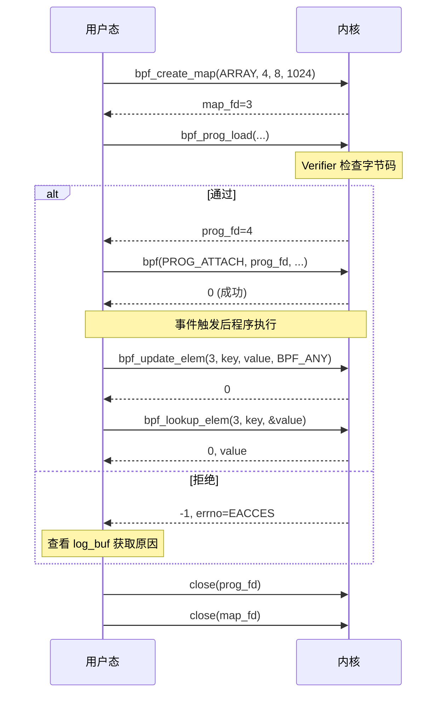

### 3-3. BPF Maps 详解

Map 是 eBPF 最重要的数据抽象，支持多种底层实现：

| Map 类型                         | 特点                       | 用途         |
| -------------------------------- | -------------------------- | ------------ |
| `BPF_MAP_TYPE_HASH`              | 通用哈希表，动态增长       | 任意键值存储 |
| `BPF_MAP_TYPE_ARRAY`             | 定长数组，索引为键，预分配 | 计数器、统计 |
| `BPF_MAP_TYPE_PERCPU_HASH/ARRAY` | 每 CPU 副本，减少锁竞争    | 高性能计数   |
| `BPF_MAP_TYPE_PROG_ARRAY`        | 存储程序 fd，实现尾调用    | 跳转表       |
| `BPF_MAP_TYPE_STACK_TRACE`       | 存储栈跟踪                 | profiling    |
| `BPF_MAP_TYPE_RINGBUF`           | 环形缓冲区，高效数据传输   | 事件通知     |

在漏洞利用场景中，最常用的是 `BPF_MAP_TYPE_ARRAY` 和 `BPF_MAP_TYPE_HASH`，因为它们允许用户态与 eBPF 程序双向读写任意大小的值。

Map 的键和值类型在创建时指定，内核负责维护其生命周期。eBPF 程序内部通过辅助函数（helper）访问 Map：

```c
// eBPF 程序内访问 Map 的 helper 调用（C 伪代码）
void *map_lookup_elem(struct bpf_map *map, void *key);
long map_update_elem(struct bpf_map *map, void *key, void *value, u64 flags);
long map_delete_elem(struct bpf_map *map, void *key);
```

这些 helper 在 Verifier 阶段会被检查，确保指针有效、类型匹配。绕过 Verifier 后，恶意程序可以滥用这些 helper 实现内核任意读写。

**Map 的内部结构（简化）**：

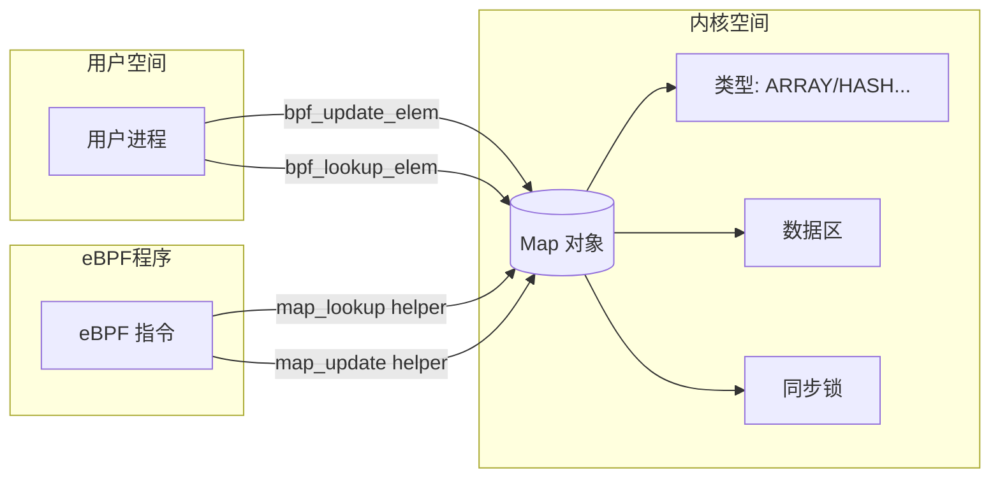

### 3-4. Verifier 详细工作流程

Verifier 是 eBPF 安全的核心，其实现位于 `kernel/bpf/verifier.c`。以下为其关键步骤：

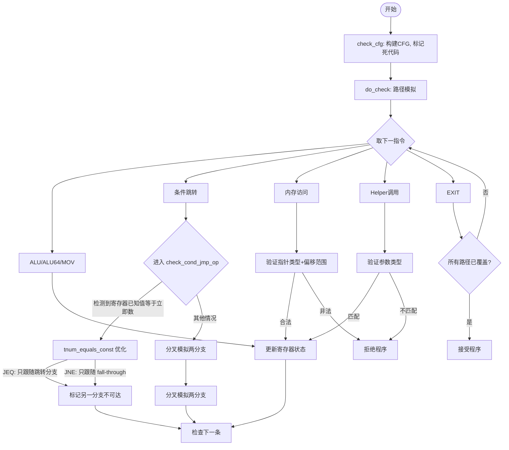

**关键数据结构**：`struct bpf_reg_state`（详见 2-1 节）记录了每个寄存器的抽象状态，其中 `var_off`（`struct tnum`）用于表示已知位和未知位。当寄存器被赋予已知常量时，`var_off.mask` 为 0，`var_off.value` 即为该常量的 64 位表示。

**条件跳转优化细节**：在 `check_cond_jmp_op` 中，对于 `BPF_JEQ` 和 `BPF_JNE` 指令，如果目标寄存器是 `SCALAR_VALUE` 且 `tnum_equals_const(dst_reg->var_off, insn->imm)` 为真，Verifier 会认为该分支的走向已经确定：

- 对于 `JEQ`：条件必然成立，只跟随跳转分支，fall-through 被标记不可达。
- 对于 `JNE`：条件必然不成立，只跟随 fall-through 分支，跳转分支被标记不可达。

`tnum_equals_const` 比较的是 `var_off.value` 与 `insn->imm`（作为 `u64` 传入）。由于 C 语言隐式类型转换，`insn->imm`（`__s32`）会被符号扩展为 64 位。这一优化本意是加速已知常量的比较，但若 Verifier 错误地记录了寄存器值（如漏洞中的符号扩展误记），就会导致错误的路径标记。

**安全保证**：

- 所有寄存器在使用前已被初始化（`NOT_INIT` 检查）。
- 指针算术不越界（例如 map 指针只能在合法偏移内访问）。
- 栈访问不超出 512 字节。
- 辅助函数调用参数类型匹配。
- 程序不会陷入无限循环（< 5.3 直接拒绝循环，5.3+ 限制循环次数）。

**CVE-2017-16995** 正是破坏了上述第 4 点中的“分支不可达”推断：由于 `check_alu_op` 中 `BPF_MOV` 分支未区分 `BPF_ALU` 和 `BPF_ALU64`，`__mark_reg_known(regs + insn->dst_reg, insn->imm)` 将 `insn->imm` 符号扩展后记录，导致后续 `tnum_equals_const` 误判，使得本应被拒绝的越界访问代码被放行。

### 3-5. 典型用户态工作流示例

以下是一个完整的用户态代码片段，演示创建 Map、加载程序、交互的过程（简化）：

```c
// 1. 创建 Map
int map_fd = bpf_create_map(BPF_MAP_TYPE_ARRAY, sizeof(int), sizeof(long), 1024);

// 2. 准备字节码（此处为示例，实际需要合法程序）
struct bpf_insn prog[] = {
    // ... 指令序列
};

// 3. 加载程序
char license[] = "GPL";
int prog_fd = bpf_prog_load(BPF_PROG_TYPE_SOCKET_FILTER, prog, 4, license);
if (prog_fd < 0) {
    // 查看日志
    printf("Verifier log: %s\n", log_buf);
}

// 4. 通过 Map 交互
int key = 0;
long value = 42;
bpf_update_elem(map_fd, &key, &value, BPF_ANY);

// 5. 读取结果
bpf_lookup_elem(map_fd, &key, &value);

// 6. 清理
close(prog_fd);
close(map_fd);
```

对应的时序图：

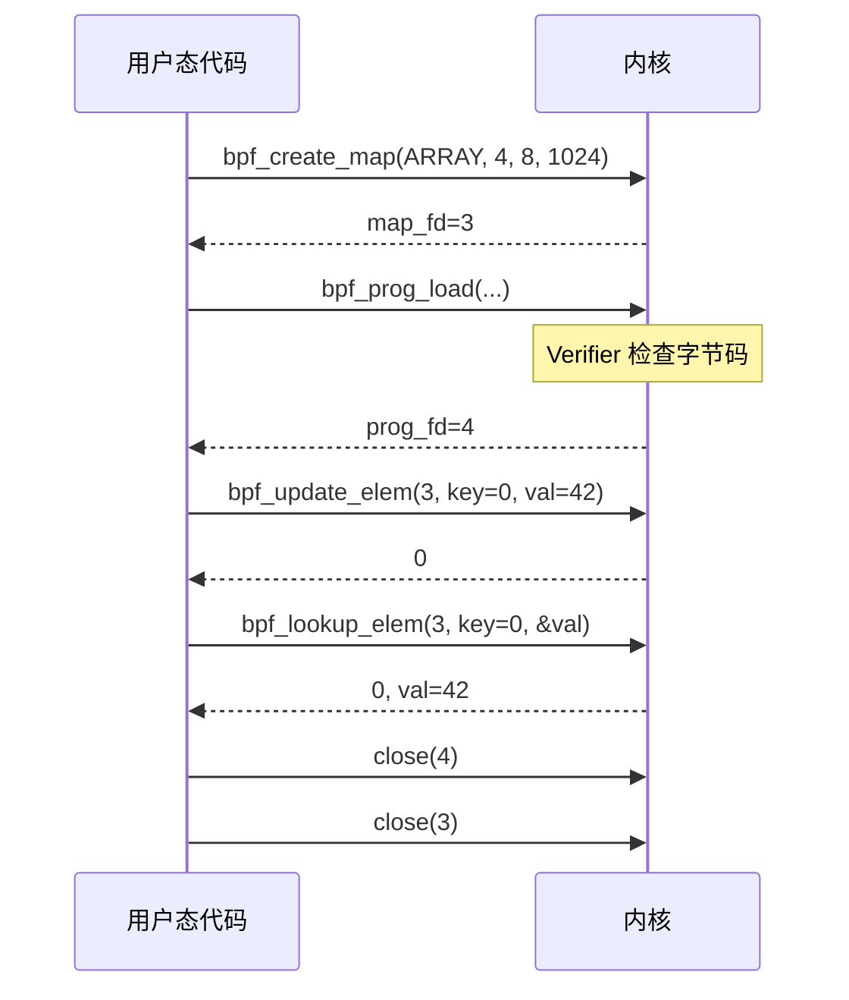

### 3-6. eBPF 总结

eBPF 是一个革命性的内核可编程框架，它允许用户在不修改内核源码或加载内核模块的前提下，安全地注入自定义逻辑到内核事件路径中。其核心设计理念可以概括为：

- **安全第一**：所有 eBPF 程序必须通过 Verifier 的静态分析才能运行，Verifier 充当了“安全门卫”的角色。
- **数据通道**：Map 是用户态与内核态程序之间唯一合法的数据交换媒介，它隔离了两者的地址空间。
- **有限能力**：eBPF 程序不能随意调用内核函数，只能通过预定义的 helper 函数与外界交互，且不允许循环（早期版本），从而限制了潜在危害。

然而，Verifier 的正确性依赖于其对 eBPF 指令语义的精确模拟。**CVE-2017-16995** 正是利用 Verifier 在 `check_alu_op` 中处理 `BPF_MOV` 时未区分 `BPF_ALU` 与 `BPF_ALU64`，导致 `__mark_reg_known` 将 `insn->imm` 符号扩展后记录，进而使 `check_cond_jmp_op` 中的 `tnum_equals_const` 优化做出错误的分支不可达判定。这个案例深刻揭示了：**即使是最严谨的静态分析工具，也可能因为一个微小的语义误解（如 C 语言隐式类型转换）而导致整个安全模型的崩溃**。

## 4. 漏洞分析

本章深入 **CVE-2017-16995** 的核心代码路径，逐行分析 Verifier 侧的缺陷与解释器侧的真实行为，揭示语义鸿沟如何导致验证绕过。分析基于 Linux 4.14.8 源码，关键函数包括 `do_check`、`check_alu_op`、`__mark_reg_known`、`check_cond_jmp_op`、`tnum_equals_const` 以及解释器 `___bpf_prog_run`。为了增强说服力，在关键节点插入了通过 `pwndbg` 获得的实时寄存器状态快照，将源码分析与运行时证据一一对应。

### 4-1. 触发路径

恶意构造的 eBPF 字节码序列如下（伪汇编）：

```asm
00:  r9 = (u32)0xFFFFFFFF          ; BPF_ALU|MOV|K, imm=0xFFFFFFFF
01:  if r9 != 0xFFFFFFFF goto +2   ; BPF_JMP|JNE|K, imm=0xFFFFFFFF
02:  exit                          ; 正常退出
03:  ; ★ 恶意负载从这里开始（Verifier 认为不可达）
```

整个绕过过程的逻辑流向如下图所示：

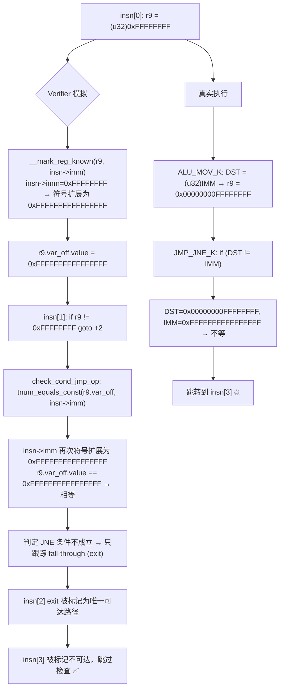

Verifier 在模拟执行时，会将 `insn[0]` 的立即数 `0xFFFFFFFF` 符号扩展为 `0xFFFFFFFFFFFFFFFF` 并记录到 `r9` 的 `var_off` 中。随后处理 `insn[1]` 时，`check_cond_jmp_op` 中的优化逻辑发现 `r9` 的已知值与比较立即数（同样被符号扩展）相等，判定 `JNE` 条件不成立，从而只跟踪 fall-through 分支（exit），将后续指令标记为不可达。然而在真实执行时，`insn[0]` 的 ALU32 语义将 `0xFFFFFFFF` 零扩展为 `0x00000000FFFFFFFF`，而 `insn[1]` 的比较立即数仍被符号扩展为 `0xFFFFFFFFFFFFFFFF`，两者不相等，导致跳转到恶意负载。

### 4-2. check_alu_op 缺陷

`check_alu_op` 负责处理 `BPF_ALU` 和 `BPF_ALU64` 类的算术与移动指令。在 `do_check` 主循环中，当指令类别为 `BPF_ALU` 或 `BPF_ALU64` 时，会调用此函数：

```c
// kernel/bpf/verifier.c, do_check 主循环片段
if (class == BPF_ALU || class == BPF_ALU64) {
    err = check_alu_op(env, insn);
    if (err)
        return err;
}
```

漏洞位于处理 `BPF_MOV | BPF_K` 的分支（`R = imm`），该分支未区分指令类别是 `BPF_ALU` 还是 `BPF_ALU64`：

```c
// kernel/bpf/verifier.c

static int check_alu_op(struct bpf_verifier_env *env, struct bpf_insn *insn)
{
    struct bpf_reg_state *regs = env->cur_state.regs;
    u8 opcode = BPF_OP(insn->code);
    // ...

    } else if (opcode == BPF_MOV) {
        // ... 参数检查 ...

        if (BPF_SRC(insn->code) == BPF_X) {
            // R1 = R2 (寄存器间移动)
            // ...
        } else {
            /* case: R = imm
             * remember the value we stored into this reg
             */
            regs[insn->dst_reg].type = SCALAR_VALUE;
            __mark_reg_known(regs + insn->dst_reg, insn->imm);
            // 漏洞：此处未区分 BPF_ALU 与 BPF_ALU64
            // insn->imm 是 __s32，传递给 u64 参数时发生符号扩展
        }
    }
    // ...
}
```

`__mark_reg_known` 的实现如下，它将传入的 `u64` 值直接赋给寄存器的所有边界字段和 `var_off`：

```c
static void __mark_reg_known(struct bpf_reg_state *reg, u64 imm)
{
    reg->id = 0;
    reg->var_off = tnum_const(imm);   // tnum_const 将 imm 作为 u64 直接赋值
    reg->smin_value = (s64)imm;
    reg->smax_value = (s64)imm;
    reg->umin_value = imm;
    reg->umax_value = imm;
}
```

C 语言在将 `__s32` 类型的 `insn->imm` 传递给 `u64` 形参时，先将其符号扩展为 `s64`（`(s64)(s32)0xFFFFFFFF = -1`），再隐式转换为 `u64`，得到 `0xFFFFFFFFFFFFFFFF`。因此 `tnum_const(0xFFFFFFFFFFFFFFFF)` 将 `var_off.value` 设为 `0xFFFFFFFFFFFFFFFF`，`mask` 设为 0。

**调试验证**：在 `check_alu_op` 执行 `__mark_reg_known` 之前，`regs[2]` 的初始状态为 `type=0`，`var_off.value=0`，`mask=0xFFFFFFFFFFFFFFFF`（全未知）。执行后，可以通过 `pwndbg` 观察到：

```
pwndbg> p/x *(struct bpf_reg_state*)(0xffff88000df4e0b8) // regs[2]
$15 = {
  type = 0x1,                            // SCALAR_VALUE
  var_off = {
    value = 0xffffffffffffffff,          // 从 0 变为 0xffffffffffffffff
    mask = 0x0                           // 从全1变为全0，表示所有位已知
  },
  smin_value = 0xffffffffffffffff,
  smax_value = 0xffffffffffffffff,
  umin_value = 0xffffffffffffffff,
  umax_value = 0xffffffffffffffff,
  live = 0x2
}
```

可以看到，`var_off.value` 被错误地记录为 `0xFFFFFFFFFFFFFFFF`（即 -1），而非真实的 `0x00000000FFFFFFFF`。这正是符号扩展导致的后果。

**正确的做法**应当根据指令类别区分：

- 若为 `BPF_ALU`（32-bit），应先截断为 `u32`：`__mark_reg_known(regs + insn->dst_reg, (u32)insn->imm);`
- 若为 `BPF_ALU64`，则直接使用符号扩展后的值。

### 4-3. check_cond_jmp_op 误判

处理条件跳转时，`do_check` 会调用 `check_cond_jmp_op`。其中有一段针对已知常量的优化，旨在避免不必要的路径分叉：

```c
// kernel/bpf/verifier.c

static int check_cond_jmp_op(struct bpf_verifier_env *env,
                             struct bpf_insn *insn, int *insn_idx)
{
    // ...
    dst_reg = &regs[insn->dst_reg];

    /* detect if R == 0 where R was initialized to zero earlier */
    if (BPF_SRC(insn->code) == BPF_K &&
        (opcode == BPF_JEQ || opcode == BPF_JNE) &&
        dst_reg->type == SCALAR_VALUE &&
        tnum_equals_const(dst_reg->var_off, insn->imm)) {
        // 优化：如果寄存器已知值等于立即数，则分支方向确定
        if (opcode == BPF_JEQ) {
            *insn_idx += insn->off;   // 只跟随跳转分支
            return 0;
        } else { // BPF_JNE
            // 只跟随 fall-through 分支（不跳转）
            return 0;
        }
    }
    // ... 其他情况，分叉模拟两分支
}
```

`tnum_equals_const` 的定义：

```c
static inline bool tnum_equals_const(struct tnum a, u64 b)
{
    return tnum_is_const(a) && a.value == b;
}
```

这里 `insn->imm` 再次作为 `u64` 参数传递，同样被符号扩展为 `0xFFFFFFFFFFFFFFFF`。此时 `dst_reg->var_off.value` 已经是 `0xFFFFFFFFFFFFFFFF`（由前一步 `__mark_reg_known` 设置），两者相等，`tnum_equals_const` 返回真。对于 `BPF_JNE`，Verifier 认为条件不成立，因此只保留 fall-through 分支（即 `exit` 指令），而将跳转分支（恶意负载）标记为不可达，不再检查。

**调试验证**：在 `check_cond_jmp_op` 中执行 `tnum_equals_const` 比较时，可以通过 `pwndbg` 观察到比较双方的数值：

```
► 0xffffffff8113b22f <do_check+7615>    cmp    rax, qword ptr [r9 + 0x18]     0xffffffffffffffff - 0xffffffffffffffff
```

此时 `rax` 存放的是符号扩展后的立即数 `0xFFFFFFFFFFFFFFFF`，`[r9+0x18]` 是 `regs[2].var_off.value`，同样是 `0xFFFFFFFFFFFFFFFF`。两者相等，因此优化生效，Verifier 直接返回，不再检查后续指令。

**优化本意**：当寄存器已知为常量且与比较立即数相等时，可以避免分叉模拟，直接确定分支走向。但由于 Verifier 错误地记录了寄存器值，导致该优化被滥用。

### 4-4. 解释器行为

解释器 `___bpf_prog_run` 中，`BPF_ALU|MOV|K` 和 `BPF_JMP|JNE|K` 的实现如下。注意宏 `IMM` 在解释器中定义为 `insn->imm`，且比较时直接作为 `s64` 使用（因为 `IMM` 是 `s32`，在表达式中自动提升为 `s64`）：

```c
// kernel/bpf/core.c

static unsigned int ___bpf_prog_run(u64 *regs, const struct bpf_insn *insn,
                                    u64 *stack)
{
    // ... 跳转表 ...

    // ALU_MOV_K: DST = (u32) IMM
    // 对应 BPF_ALU|MOV|K
    ALU_MOV_K:
        DST = (u32) IMM;    // 强制截断为 u32，再零扩展到 u64
        CONT;

    // JMP_JNE_K: if (DST != IMM) insn += insn->off;
    // 对应 BPF_JMP|JNE|K
    JMP_JNE_K:
        if (DST != IMM) {   // IMM 是 insn->imm，作为 s64 比较（符号扩展后为 -1）
            insn += insn->off;
            CONT_JMP;
        }
        CONT;
    // ...
}
```

在恶意构造的序列中：

- 第一条指令 `BPF_ALU|MOV|K` 将 `r9` 设为 `(u32)0xFFFFFFFF` → `0x00000000FFFFFFFF`。
- 第二条指令 `BPF_JMP|JNE|K` 比较 `r9`（`0x00000000FFFFFFFF`）与 `IMM`（符号扩展后 `0xFFFFFFFFFFFFFFFF`），两者不相等，因此跳转到恶意负载。

**调试验证**：在解释器执行 `ALU_MOV_K` 后，可以通过 `pwndbg` 观察到 `regs[2]` 的实际值：

```
pwndbg> p/x regs[2]
$28 = 0x00000000ffffffff
pwndbg> x/4gx 0xffffc90000173c48
0xffffc90000173c48:     0x0000000000000000      0xffff88000df18900
0xffffc90000173c58:     0x00000000ffffffff      0xffff88000df18900
```

随后执行 `JMP_JNE_K` 时，汇编指令显示：

```
► 0xffffffff81132924 <___bpf_prog_run+2308>    movsxd rdx, dword ptr [rbx + 4]         RDX, [0xffffc9000008503c] => 0xffffffff
   0xffffffff8113292b <___bpf_prog_run+2315>    cmp    qword ptr [r12 + rax*8], rdx
```

`movsxd` 指令将 `insn->imm`（`0xFFFFFFFF`）符号扩展到 `rdx`，得到 `0xFFFFFFFFFFFFFFFF`。然后与 `regs[2]`（`0x00000000FFFFFFFF`）比较，结果不等，于是 `je` 不跳转，继续执行 `insn += insn->off`，跳转到恶意负载。

**关键差异**：

- Verifier 认为 `r9 = 0xFFFFFFFFFFFFFFFF`，比较相等，不跳转。
- 解释器实际 `r9 = 0x00000000FFFFFFFF`，比较不等，跳转。

### 4-5. 效果总结

下表汇总了 Verifier 与解释器对同一字节码序列的不同理解：

| 步骤                   | Verifier 抽象值                        | 解释器真实值                                        |
| ---------------------- | -------------------------------------- | --------------------------------------------------- |
| `r9 = (u32)0xFFFFFFFF` | `r9 = 0xFFFFFFFFFFFFFFFF`（符号扩展）  | `r9 = 0x00000000FFFFFFFF`（零扩展）                 |
| `if r9 != 0xFFFFFFFF`  | 比较双方均为 `-1`，条件不成立，走 exit | 比较双方分别为 `4294967295` 与 `-1`，条件成立，跳转 |
| 结果                   | ✅ 放行，恶意代码被标记不可达          | 💥 恶意代码被执行                                   |

整个绕过链条可以总结为以下三个环节：

1. **记录错误**：`check_alu_op` 在 `BPF_MOV | BPF_K` 分支中未区分 `BPF_ALU` 与 `BPF_ALU64`，导致 `__mark_reg_known` 将 `insn->imm` 符号扩展后记录到寄存器状态。
2. **优化误用**：`check_cond_jmp_op` 中的 `tnum_equals_const` 优化基于错误的寄存器值判定分支方向，将本应可达的恶意代码路径标记为不可达。
3. **执行背离**：解释器严格按照 ISA 语义执行，`ALU_MOV_K` 做零扩展，`JMP_JNE_K` 做符号扩展比较，两者结果与 Verifier 的预期完全相反。

这一连串的语义误解使得一个本应被拒绝的程序顺利通过验证，并在运行时执行了未经验证的恶意负载。通过 `pwndbg` 的实时观察，能够清晰地看到 Verifier 状态机与解释器之间的每一步分歧，从而确认漏洞的根本原因。

## 5. 利用思路一

本章基于 **CVE-2017-16995** 的验证绕过原理，阐述如何在内核保护全开**（KASLR / SMEP / SMAP / KPTI）**的环境下，构建稳定的任意读写原语并完成权限提升。省略具体利用细节，重点描述设计思路与数据流，辅以序列图和流程图增强可读性。

### 5-1. 总体策略

绕过 Verifier 后，eBPF 程序获得了不受限制的执行能力。但由于 SMEP 和 SMAP 禁止内核直接执行用户态代码或访问用户态指针，且 KPTI 隔离了内核页表，传统的“执行 shellcode”路径不可行。因此采用 **modprobe_path 覆写** 这一经典提权手法：通过任意写覆盖内核全局变量 `modprobe_path`，指向一个用户可控的可执行脚本；随后触发内核执行二进制文件格式识别失败，自动调用 `modprobe_path` 指向的程序，从而实现以 root 权限执行任意命令。

整体流程分为三个阶段：

1. **原语构建**：利用 eBPF 的 Map 操作实现内核任意读写与栈泄露。
2. **信息收集**：绕过 KASLR 获取内核基址，定位 `modprobe_path` 地址。
3. **提权触发**：覆写 `modprobe_path` 并触发执行，获取 root shell。


三个阶段环环相扣：原语构建提供基础能力，信息收集为精准打击定位目标，提权触发最终达成目的。每一步都依赖于前一步的成功，且每一步都需要对内核内部机制有深入理解。

### 5-2. 原语构建

#### 5-2-1. 数据通道设计

eBPF 程序与用户态通过 **BPF Array Map** 交换数据。选择 Array Map 而非 Hash Map 的原因有三：

- **确定性索引**：Array Map 的键是整数索引，无需计算哈希，延迟更低且行为可预测。
- **预分配内存**：创建时一次性分配所有槽位，避免动态扩容带来的不确定性。
- **原子访问**：单槽位的读写操作在内核中是原子的（8字节对齐），无需额外同步。

创建一个 4 槽位的 Map，每个槽位 8 字节：

| 槽位    | 用途                               |
| ------- | ---------------------------------- |
| slot[0] | 操作码（0: 栈泄露, 1: 读, 2: 写）  |
| slot[1] | 基地址（内核虚拟地址）             |
| slot[2] | 偏移量（与基地址相加得到目标地址） |
| slot[3] | 写入值 / 读取结果                  |

用户态通过 `bpf_update_elem` 写入操作参数，然后向绑定了 eBPF 程序的 socket 发送消息触发执行；执行完毕后通过 `bpf_lookup_elem` 读取结果。这种设计将参数传递与结果回收分离，避免了在 eBPF 程序中直接调用用户态内存（违反 SMAP）。

#### 5-2-2. 任意读写实现

绕过 Verifier 后，eBPF 程序可以执行任意内存访问指令。核心逻辑如下（伪代码）：

```python
def bpf_arb_op(op, base, offset, value):
    set_map(0, op)
    set_map(1, base)
    set_map(2, offset)
    set_map(3, value)
    trigger_bpf()          # 发送消息触发 eBPF 执行
    return read_map(3)     # 读取结果
```

eBPF 程序内部根据操作码执行不同分支：

- **操作 0（栈泄露）**：将帧指针（R10）写入 slot[3]，返回当前内核栈地址。帧指针指向 eBPF 程序执行时的栈帧底部，其上方保存着调用链的返回地址。
- **操作 1（读）**：计算目标地址 = base + offset，执行 `r3 = *(u64 *)target`，然后将 `r3` 写入 slot[3]。该操作可读取任意内核虚拟地址，包括代码段、数据段、栈、堆等。
- **操作 2（写）**：将 slot[3] 的值写入目标地址 `base + offset`。可用于覆盖全局变量、修改函数指针等。

每个操作结束后，程序通过 `BPF_EXIT_INSN()` 返回，等待下一次触发。由于 eBPF 程序执行时处于中断上下文或软中断上下文，操作必须是快速且不可睡眠的，因此所有内存访问均为直接寻址，不涉及 page fault 处理。

#### 5-2-3. 触发机制

eBPF 程序挂载在 UNIX socket 的过滤器上。用户态通过 `write()` 向 socket 发送任意数据，内核自动调用该 eBPF 程序。具体流程如下：

1. 用户态创建一对 UNIX 数据报 socket（`socketpair(AF_UNIX, SOCK_DGRAM, 0, socks)`）。
2. 将 eBPF 程序的文件描述符通过 `setsockopt(socks[1], SOL_SOCKET, SO_ATTACH_BPF, ...)` 附加到 socket 上。
3. 用户态向 `socks[0]` 写入数据，内核在 `sock_sendmsg` 路径中调用 `sk_filter_trim_cap`，后者执行 eBPF 程序。

由于绕过 Verifier 的指令位于程序开头，每次触发都会执行完整的恶意负载。触发频率可控，用户态可根据需要多次调用，每次调用相当于一次内核内存操作。

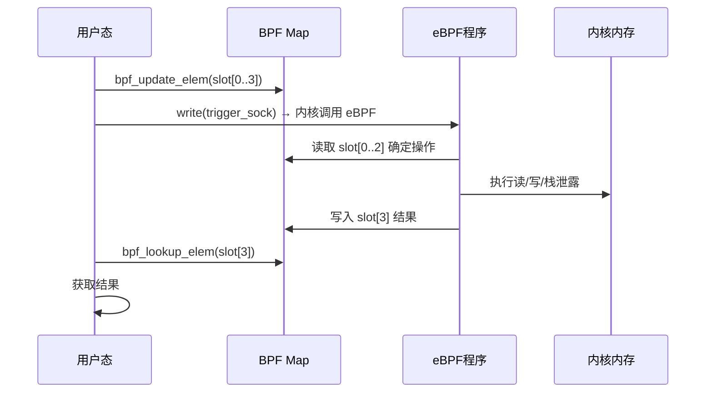

### 5-3. 信息收集

由于 KASLR 开启，需要先泄露内核基址。步骤如下：

1. **泄露栈地址**：通过操作 0 获得当前内核栈的帧指针（R10）。该指针指向 eBPF 程序执行时的内核栈帧。栈帧布局如下（从高地址到低地址）：
    - 局部变量区
    - 保存的帧指针（old RBP）
    - 返回地址（caller 的下一条指令地址）
    - 调用者栈帧...

2. **读取返回地址**：在栈上，距离帧指针固定偏移处保存着调用链中的返回地址（属于内核代码段）。该偏移取决于 eBPF 程序的调用深度和编译器优化，但可以通过调试或静态分析确定（例如，在 4.14.8 内核中，返回地址位于 `frame_pointer + 0x68` 处）。通过操作 1 读取该地址，即可获得一个已知的内核函数地址。

3. **计算基址**：根据已知函数地址与编译时确定的偏移，计算出内核基址 `kernel_base`。例如，若读取到的返回地址属于 `sk_filter_trim_cap` 函数的某条指令，则 `kernel_base = leaked_addr - (sk_filter_trim_cap + offset_within_function)`。进而定位 `modprobe_path` 变量的地址（该地址在内核镜像中的偏移是固定的，可通过 `nm vmlinux | grep modprobe_path` 预先获取）。

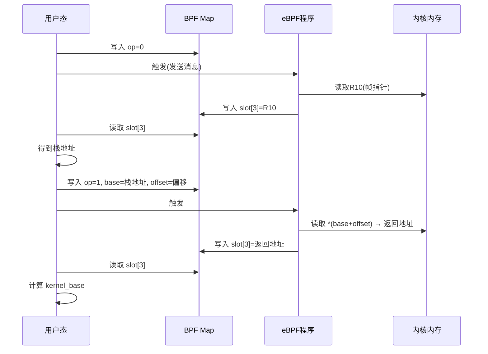

**关键点**：栈偏移的准确性至关重要。若偏移估算错误，可能读到无关数据甚至触发访存异常。因此在实际操作前，通常需要通过多次实验或逆向分析确定精确偏移。

### 5-4. 提权触发

获取内核基址后，执行以下步骤：

1. **覆写 modprobe_path**：通过操作 2 将 `modprobe_path` 覆盖为一个可执行脚本的路径（例如 `/tmp/getshell.sh`）。该脚本内容为添加 root 权限用户或直接执行 flag 读取命令。`modprobe_path` 是一个全局字符数组（通常大小为 256 字节），存储着 `modprobe` 工具的路径。内核在遇到未知二进制格式时会调用它。

2. **准备触发文件**：创建一个内容为非标准 ELF 格式的可执行文件（例如全 0xFF），并赋予执行权限。该文件的作用是让内核在 `execve` 系统调用中无法识别其格式，从而触发 `request_module` 调用链。

3. **触发执行**：执行该畸形文件。内核尝试解析其二进制格式失败，转而调用 `modprobe_path` 指向的程序。由于该程序以 root 权限运行，脚本中的命令得以提权执行。

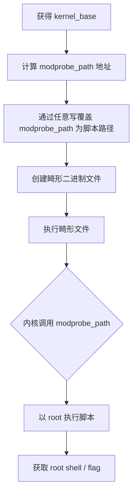

**modprobe_path 的工作原理**：当内核执行 `execve` 时，会调用 `load_elf_binary`、`load_aout_binary` 等格式处理器。如果所有处理器都无法识别文件格式，则会调用 `request_module("binfmt-%04x")` 来请求用户空间的 `binfmt_misc` 模块加载。`request_module` 内部会执行 `call_usermodehelper(modprobe_path, argv, envp, UMH_WAIT_PROC)`，从而以 root 权限启动用户态程序。因此，只要将 `modprobe_path` 指向任意可执行文件，就能获得 root 执行能力。

### 5-5. 整体流程

以下序列图展示了从初始化到提权的完整交互：

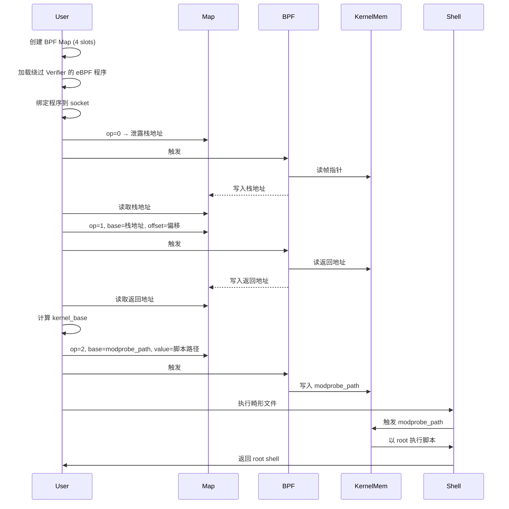

### 5-6. 内核保护机制应对策略

尽管现代内核部署了多层防护，该利用思路仍能逐一突破，原因如下：

| 保护机制  | 应对策略              | 原理说明                                                                                                                                                                             |
| --------- | --------------------- | ------------------------------------------------------------------------------------------------------------------------------------------------------------------------------------ |
| **KASLR** | 栈泄露 + 返回地址读取 | 通过 eBPF 栈泄露获得帧指针，再读取栈上的内核返回地址，减去编译时固定偏移即可得到内核基址。整个过程无需暴力破解。                                                                     |
| **SMEP**  | 纯内核内存操作        | 所有内存访问均在虚拟地址空间内完成，不执行用户态代码。`modprobe_path` 覆写后，内核本身会以 root 调用用户态脚本，该调用由内核发起，不受 SMEP 限制。                                   |
| **SMAP**  | 不访问用户态指针      | eBPF 程序使用内核虚拟地址（通过 Map 传入），不直接解引用用户态指针。内核在调用 `modprobe_path` 时会自动切换到用户态地址空间，这是内核的正常行为。                                    |
| **KPTI**  | 利用内核固有机制      | KPTI 分离用户态和内核态页表，但提权过程不依赖内核页表切换。`modprobe_path` 的执行路径在内核中经过精心设计，最终通过 `call_usermodehelper` 启动用户态进程，该过程由内核负责页表切换。 |

**关键洞察**：该利用并未打破任何保护机制的防御边界，而是巧妙地利用了内核自身提供的功能（eBPF 任意读写、`modprobe_path` 自动执行）来完成提权。保护机制的设计前提是 Verifier 能够阻止恶意 eBPF 程序加载，而一旦 Verifier 被绕过，后续的保护措施便失去了作用。这体现了“纵深防御”中每一层的独立性：如果某一层（Verifier）被攻破，其他层无法弥补，因为它们的设计目标不同。

此外，该利用还绕过了常见的安全监控：

- **无异常系统调用**：所有操作均通过标准的 `bpf()` 系统调用和 socket 通信完成，不涉及 `ptrace`、`process_vm_writev` 等敏感调用。
- **无内核模块加载**：不依赖 `init_module` 或 `finit_module`，避免了模块签名校验。
- **无内存损坏**：不触发缓冲区溢出、use-after-free 等传统漏洞，因此难以被 KASAN、KFENCE 等工具检测。

### 5-7. 利用条件与局限性

#### 5-7-1. 必要条件

| 条件                            | 说明                                                                                                                                               |
| ------------------------------- | -------------------------------------------------------------------------------------------------------------------------------------------------- |
| 内核版本 < 4.14.9               | 漏洞在 4.14.9 中被修复，后续版本不受影响。                                                                                                         |
| 非特权 BPF 可用                 | 需满足 `kernel.unprivileged_bpf_disabled=0` 或拥有 `CAP_SYS_ADMIN` 权限。多数发行版默认允许非特权用户加载特定类型的 BPF 程序（如 socket filter）。 |
| 存在可用的 `modprobe_path` 符号 | 需要知道 `modprobe_path` 在内核镜像中的偏移。可通过预先编译相同内核版本提取，或在运行时通过其他信息泄露手段获取。                                  |
| 内核未启用额外的 BPF 限制       | 如 `CONFIG_BPF_JIT_ALWAYS_ON` 不影响，但若启用了 `BPF_LSM` 或额外验证器强化，可能需要调整。                                                        |
| 拥有文件系统写入权限            | 需要能够在文件系统中创建可执行脚本和畸形二进制文件。在沙箱或只读文件系统中可能受限。                                                               |

#### 5-7-2. 局限性

- **内核版本依赖**：仅影响 4.14.9 之前的版本，较新内核已修复。对于 4.15+ 的内核，需要寻找其他漏洞。
- **符号偏移敏感**：`modprobe_path` 的偏移随内核版本和编译配置变化，需要提前适配。若目标内核与本地测试环境不同，可能需要暴力枚举或通过其他信息泄露手段获取。
- **非特权 BPF 禁用**：若系统管理员设置了 `kernel.unprivileged_bpf_disabled=1`，则非特权用户无法加载 BPF 程序，该利用失效。在云环境或企业服务器中，此选项常被启用。
- **容器环境**：在容器中，即使拥有非特权 BPF 权限，也可能因缺少必要的 cap（如 `CAP_NET_ADMIN` 用于附加 socket filter）或 seccomp 规则禁止 `bpf()` 系统调用而受限。此外，容器通常具有独立的 mount namespace，`modprobe_path` 覆写可能不影响宿主机。
- **替代提权目标**：若 `modprobe_path` 不可用（例如内核编译时禁用了 `CONFIG_BINFMT_MISC` 或 `modprobe_path` 被移除），则需要寻找其他可写内核变量，如 `core_pattern`、`n_hdlc` 的 tty 驱动指针等，增加了复杂度。
- **稳定性风险**：多次触发 eBPF 程序可能导致内核栈溢出或竞争条件，需要谨慎控制触发频率和操作顺序。在某些情况下，错误的偏移读取可能导致内核崩溃（panic）。

### 5-8. 总结

**CVE-2017-16995** 的利用思路一展示了 eBPF 验证器缺陷在高级内核防护下的实际威胁。其核心价值在于：

- **验证器健全性的根本重要性**：一旦静态分析工具与执行引擎之间存在语义差异，整个安全模型便会崩塌。该漏洞并非复杂的内存破坏，而是一个微妙的类型转换错误。这提醒我们，在安全关键系统中，形式化验证和严格的语义等价测试不可或缺。
- **保护机制的协同失效**：KASLR、SMEP、SMAP、KPTI 等防护虽各自强大，但都无法阻止一个通过了 Verifier 检查的 eBPF 程序执行任意内存操作。这揭示了“安全边界前移”的风险——当第一道防线（Verifier）失守时，后续防御难以补救。理想的安全体系应具备冗余性，即每一层都能独立抵御一定程度的威胁。
- **利用的优雅性与隐蔽性**：仅需四条指令即可绕过验证，后续操作完全依赖内核正常功能（Map 通信、socket 触发、modprobe_path 调用），不引入异常行为，难以被入侵检测系统捕获。这种“living off the land”的手法在现代漏洞利用中越来越普遍。
- **对 eBPF 生态的启示**：该漏洞促使内核社区加强了对 Verifier 的测试和审计，引入了更多的边界检查和形式化方法。后续的 BPF 发展（如 BPF Type Format、CO-RE、sleepable BPF）都在一定程度上提升了安全性，但也带来了新的利用面。

从防御角度看，该案例再次强调：

1. **安全关键代码中应避免隐式类型转换**，尤其是涉及不同位数整数传递时。可以使用显式转换宏（如 `(u32)` 或 `(s64)`）来消除歧义。
2. **验证器与解释器必须共享同一套语义模型**，任何优化或假设都需严格验证。建议引入自动化的语义一致性测试，随机生成指令序列并比对两者的执行结果。
3. **最小权限原则**（如关闭非特权 BPF）可作为有效的缓解措施。在不需要 BPF 的环境中，通过 sysctl 或内核启动参数禁用非特权 BPF 可以大幅降低利用面。
4. **运行时监控**：虽然该利用不产生异常系统调用，但可以通过监测 BPF 程序加载日志、异常的内存访问模式（如对 `modprobe_path` 的写操作）来发现潜在的利用行为。

最后，该案例也提醒我们，安全是一个持续演进的过程。随着 eBPF 应用范围的扩大（如网络、观测、安全），其安全模型必须不断加固。**CVE-2017-16995** 的教训将长期影响 eBPF 的设计哲学。

---

> 📌 下一章将讨论另一种利用思路——通过修改进程凭证直接提权，适用于不支持 `modprobe_path` 覆写或需要更隐蔽操作的内核版本。

### 5-9. 测试结果

<div style="text-align: center; margin: 2rem 0;">
  
</div>

## 6. 利用思路二

本章基于相同的验证绕过原语（**CVE-2017-16995**），阐述另一种提权路径——直接修改当前进程的凭证（`cred`）结构体。相较于第五章的 `modprobe_path` 覆写，该思路更加直接、隐蔽，且不依赖文件系统写入权限，适用于容器或只读文件系统等受限环境。

### 6-1. 总体策略

绕过 Verifier 后，eBPF 程序获得任意内核内存读写能力。在此基础上，通过以下步骤实现提权：

1. **泄露内核栈地址**：利用 eBPF 的帧指针（R10）获取当前内核栈的位置。
2. **定位 task_struct**：在栈上找到当前进程的 `task_struct` 指针（通常保存在栈帧的固定偏移处）。
3. **定位 cred 结构体**：从 `task_struct` 中读取 `cred` 指针（该指针指向进程的凭证信息）。
4. **覆写凭证**：将 `cred` 结构体中的 `uid`、`gid`、`euid`、`egid` 等字段清零，使进程获得 root 权限。
5. **验证提权**：启动 shell 并验证 `id` 命令输出为 `uid=0(root)`。


与第五章的思路相比，该方案的优势在于：

- **无需文件系统写入**：不依赖创建文件或修改全局变量，适合沙箱环境。
- **即时生效**：修改当前进程的 `cred` 后，当前进程立即获得 root 权限，无需触发外部机制。
- **更隐蔽**：不改变内核全局状态，不易被系统级监控检测。

### 6-2. 原语构建

本思路复用了第五章的 eBPF 原语构建方法，包括：

- 创建一个 4 槽位的 BPF Array Map，用于传递操作码、地址、偏移和值。
- 加载绕过 Verifier 的 eBPF 程序，实现三种操作：栈泄露（操作 0）、任意读（操作 1）、任意写（操作 2）。
- 通过 UNIX socket 对触发 eBPF 程序执行。

具体实现细节参见 5-2 节，此处不再赘述。关键在于，该原语提供了在内核空间任意地址读写的能力，这是后续所有步骤的基础。

### 6-3. 信息收集

#### 6-3-1. 泄露栈地址

通过 eBPF 操作 0 获取当前内核栈的帧指针（R10）。该指针指向 eBPF 程序执行时的栈帧底部。栈帧之上保存着调用链的上下文，包括返回地址、保存的寄存器以及内核关键数据结构指针。

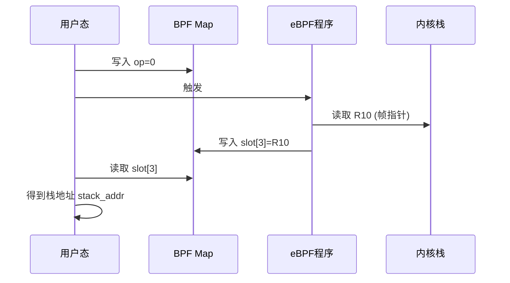

#### 6-3-2. 定位 task_struct

在内核栈上，距离帧指针特定偏移处保存着当前进程的 `task_struct` 指针。该偏移取决于内核版本和编译选项，但通常在 `stack_addr + 0xD0` 附近（约 26 个 8 字节槽位）。通过操作 1 读取该地址，即可获得 `task_struct` 的地址。

```c
// 伪代码示意
task_struct_addr = arb_read(stack_addr, 26 * 8);
```

`task_struct` 是内核中描述进程的核心结构体，包含调度信息、内存管理、文件系统、凭证等众多字段。其中 `cred` 字段（类型为 `struct cred *`）指向进程的凭证结构体。

#### 6-3-3. 定位 cred 结构体

在 `task_struct` 中，`cred` 指针位于固定偏移处（例如 `task_struct + 0x678`）。通过操作 1 读取该偏移，即可获得 `cred` 结构体的地址。

```c
cred_addr = arb_read(task_struct_addr, 0x678);
```

`cred` 结构体包含以下关键字段（以 x86_64 为例）：

| 字段   | 类型     | 偏移 | 说明          |
| ------ | -------- | ---- | ------------- |
| `uid`  | `kuid_t` | 0x4  | 用户 ID       |
| `gid`  | `kgid_t` | 0xC  | 组 ID         |
| `euid` | `kuid_t` | 0x14 | 有效用户 ID   |
| `egid` | `kgid_t` | 0x1C | 有效组 ID     |
| `suid` | `kuid_t` | 0x24 | 保存的用户 ID |
| `sgid` | `kgid_t` | 0x2C | 保存的组 ID   |
| ...    | ...      | ...  | ...           |

每个 `kuid_t` 或 `kgid_t` 实际上是 4 字节的 `uid_t`，但为了对齐，结构体中填充为 8 字节（实际有效值在低 4 字节）。因此，清零 `uid` 只需将 `cred_addr + 0x4` 处的 8 字节写为 0。

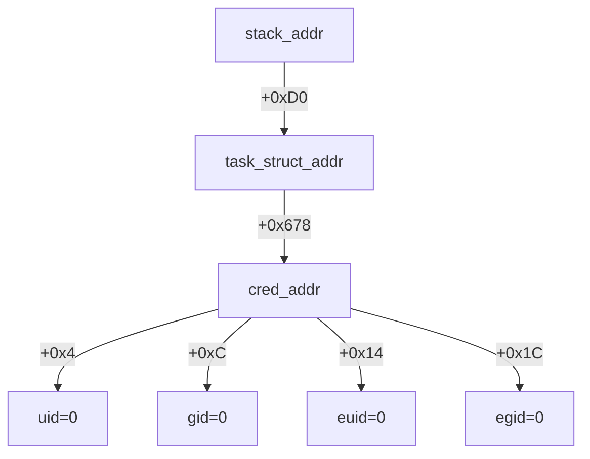

### 6-4. 提权触发

获取 `cred` 地址后，通过操作 2 连续写入 4 次，将 `uid`、`gid`、`euid`、`egid` 全部清零：

```c
arb_write(cred_addr, 0x4, 0);           // uid
arb_write(cred_addr, 0x4 + 0x8, 0);    // gid
arb_write(cred_addr, 0x4 + 0x8 * 2, 0); // euid
arb_write(cred_addr, 0x4 + 0x8 * 3, 0); // egid
```

写入完成后，当前进程的凭证已被修改为 root（所有 ID 均为 0）。此时无需执行任何额外操作，直接调用 `get_root_shell()` 即可获得 root shell。

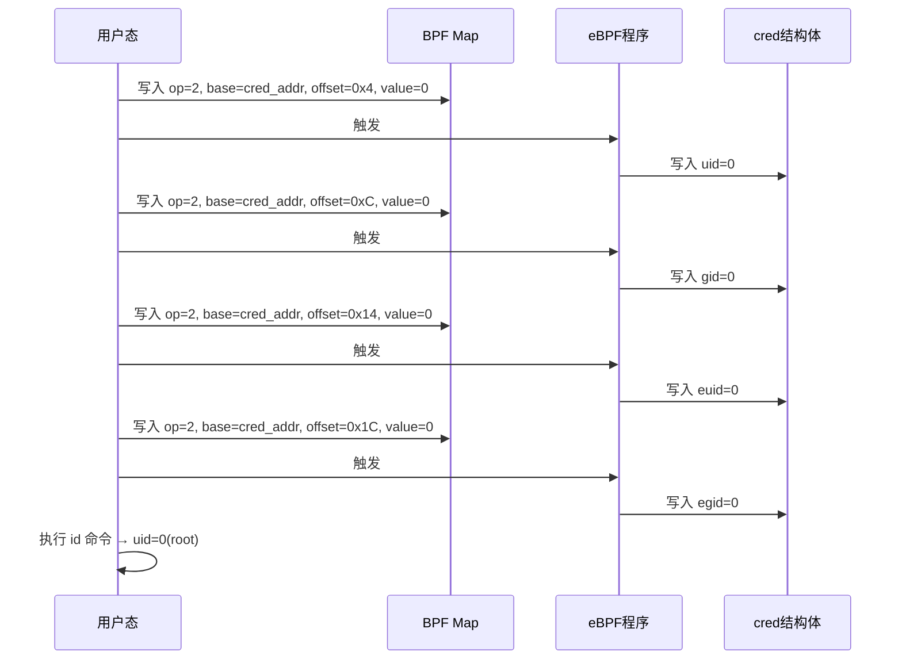

**注意事项**：

- 写入操作需要逐个字段进行，每次触发一次 eBPF 执行。由于 eBPF 程序执行速度极快（微秒级），多次触发不会带来显著延迟。
- 若希望同时修改 `suid` 和 `sgid` 以彻底伪装，可额外写入偏移 0x24 和 0x2C。
- 写入后，当前进程的所有子进程也将继承 root 权限（因为 `fork` 会复制父进程的 `cred`）。

### 6-5. 整体流程

以下序列图展示了从初始化到提权的完整交互：

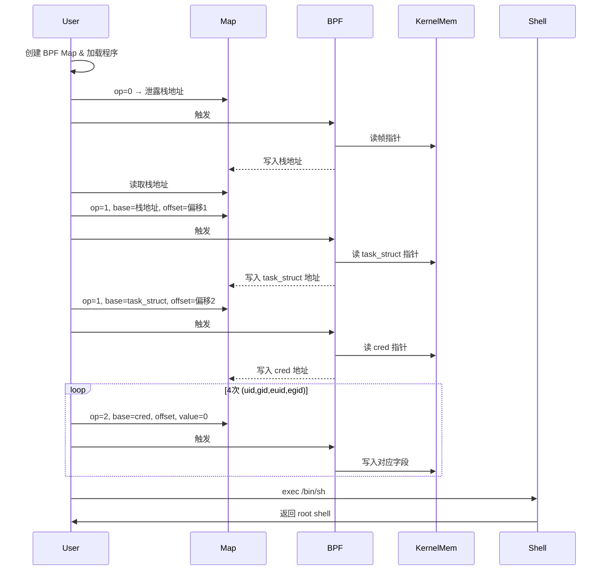

### 6-6. 内核保护机制应对策略

该思路同样能够突破主流内核保护机制，原因如下：

| 保护机制                  | 应对策略              | 原理说明                                                                                                                                |
| ------------------------- | --------------------- | --------------------------------------------------------------------------------------------------------------------------------------- |
| **KASLR**                 | 栈泄露 + 多步指针追踪 | 通过栈地址逐步读取 `task_struct` 和 `cred` 地址，无需猜测内核基址。                                                                     |
| **SMEP**                  | 纯内核内存操作        | 所有读写操作均在内核虚拟地址空间内完成，不涉及用户态代码执行。                                                                          |
| **SMAP**                  | 不访问用户态指针      | 使用 BPF Map 传入的内核地址，不解引用用户态指针。                                                                                       |
| **KPTI**                  | 利用内核固有机制      | 修改 `cred` 后，进程返回用户态时自动切换页表，不受 KPTI 影响。                                                                          |
| **Credential 完整性检查** | 直接修改原始结构      | 内核不对 `cred` 进行校验（如哈希），修改后直接生效。部分内核启用了 `CONFIG_CREDENTIALS_INTEGRITY` 但仅对密钥环生效，不影响 `uid` 字段。 |

**关键优势**：该思路不依赖任何内核全局变量（如 `modprobe_path`），因此即使内核移除了这些变量或启用了 `CONFIG_STATIC_USERMODEHELPER`（禁用 `modprobe_path` 执行），依然有效。

### 6-7. 利用条件与局限性

#### 6-7-1. 必要条件

| 条件                   | 说明                                                                                                                                         |
| ---------------------- | -------------------------------------------------------------------------------------------------------------------------------------------- |
| 内核版本 < 4.14.9      | 漏洞存在于该版本之前。                                                                                                                       |
| 非特权 BPF 可用        | 需满足 `kernel.unprivileged_bpf_disabled=0` 或拥有 `CAP_SYS_ADMIN`。                                                                         |
| 已知栈偏移和结构体偏移 | 需要预先确定 `task_struct` 在栈上的偏移以及 `cred` 在 `task_struct` 中的偏移。这些偏移随内核版本和编译配置变化，但可通过调试或符号信息获取。 |
| 进程未被降权           | 当前进程需拥有足够的权限来加载 BPF 程序（如 `CAP_SYS_ADMIN` 或非特权 BPF 开启）。                                                            |

#### 6-7-2. 局限性

- **偏移敏感性**：`task_struct` 的栈偏移和 `cred` 偏移在不同内核版本间差异较大，需要针对性适配。若偏移错误，可能读取到无效地址导致内核 panic。
- **非特权 BPF 禁用**：若系统管理员关闭了非特权 BPF，则无法加载程序。
- **容器环境**：容器中即使拥有非特权 BPF，也可能因 seccomp 规则禁止 `bpf()` 系统调用而受阻。此外，容器内的 `cred` 修改仅影响容器内进程，无法逃逸到宿主机。
- **SELinux/AppArmor**：即使 `uid=0`，强制访问控制（MAC）仍可能限制进程的行为（如禁止执行 shell）。但多数场景下，root 权限足以绕过 MAC。
- **多线程安全**：若进程包含多个线程，修改 `cred` 后所有线程共享同一 `cred` 结构体，因此所有线程同时获得 root 权限。但需注意并发写入可能导致竞态（本例中为单线程操作，无此问题）。

### 6-8. 总结

利用思路二展示了 **CVE-2017-16995** 在直接凭证篡改方面的威力。与 `modprobe_path` 覆写相比，该方法具有以下特点：

- **简洁高效**：仅需 4 次写入操作即可完成提权，无需创建文件或触发外部机制。
- **适用性广**：不依赖特定内核全局变量，即使内核移除了 `modprobe_path` 或启用了 `STATIC_USERMODEHELPER` 依然有效。
- **隐蔽性强**：修改的是进程私有数据，不改变内核全局状态，难以被系统级监控发现。

该思路再次印证了 eBPF 验证器缺陷的严重性：一旦获得任意内核内存访问，利用者可以直接操纵进程凭证，而无需依赖复杂的内存破坏技巧。从防御角度看，除了及时修补漏洞和关闭非特权 BPF 外，还可以考虑：

- **结构体随机化**：对 `task_struct` 和 `cred` 中的敏感字段进行随机偏移（如 `CONFIG_GCC_PLUGIN_RANDSTRUCT`），增加利用者定位难度。
- **凭证完整性校验**：内核可以在关键路径上对 `cred` 的 `uid` 字段进行校验，防止意外修改（但会增加性能开销）。
- **BPF 程序审计**：通过 `bpf()` 系统调用的日志记录和分析，识别异常的 BPF 程序加载行为（如包含 `BPF_BYPASS_CHECK` 模式的程序）。

两种利用思路共同揭示了 eBPF 安全模型中“验证器健全性”的极端重要性。无论是修改全局变量还是进程凭证，其根源都在于 Verifier 与解释器之间的语义鸿沟。这一教训将持续影响 eBPF 子系统的未来演进。

### 6-9. 测试结果

<div style="text-align: center; margin: 2rem 0;">
  
</div>

## 7. 漏洞修复

**CVE-2017-16995** 的修复由 Jann Horn 报告后，由 Alexei Starovoitov 于 2017 年 12 月提交了修复补丁，commit ID 为 `95a762e2c8c9`（"bpf: fix incorrect sign extension in check_alu_op()"）。该补丁于 Linux 4.14.9 合入主线，彻底消除了 Verifier 在处理 `BPF_ALU|MOV|K` 指令时的符号扩展歧义。

### 7-1. 修复思路

漏洞根因在于 `check_alu_op()` 中处理 `BPF_MOV | BPF_K` 时，未区分指令类别是 `BPF_ALU` 还是 `BPF_ALU64`，直接将 `insn->imm`（`__s32`）传递给 `__mark_reg_known()` 的 `u64` 形参，导致 C 语言的隐式整型提升将负数立即数符号扩展为 64 位。修复的核心思想是：**根据指令类别决定立即数的扩展方式**——对于 `BPF_ALU`（32 位操作），应先将立即数截断为 `u32` 再进行零扩展；对于 `BPF_ALU64`（64 位操作），保持原有的符号扩展行为。

### 7-2. 补丁详解

修复补丁仅修改了 `kernel/bpf/verifier.c` 中 `check_alu_op()` 函数的一小段代码，在 `__mark_reg_known()` 调用前增加了对指令类别的判断：

```diff
--- a/kernel/bpf/verifier.c
+++ b/kernel/bpf/verifier.c
@@ -2408,7 +2408,13 @@ static int check_alu_op(struct bpf_verifier_env *env, struct bpf_insn *insn)
 			 * remember the value we stored into this reg
 			 */
 			regs[insn->dst_reg].type = SCALAR_VALUE;
-			__mark_reg_known(regs + insn->dst_reg, insn->imm);
+			if (BPF_CLASS(insn->code) == BPF_ALU64) {
+				__mark_reg_known(regs + insn->dst_reg,
+						 insn->imm);
+			} else {
+				__mark_reg_known(regs + insn->dst_reg,
+						 (u32)insn->imm);
+			}
 		}

 	} else if (opcode > BPF_END) {
```

**关键改动**：

- 当指令类别为 `BPF_ALU64` 时，保持原有行为：`__mark_reg_known(regs + insn->dst_reg, insn->imm)`。此时 `insn->imm` 作为 `__s32` 传递给 `u64` 形参，发生符号扩展，这与 ALU64 指令的真实语义一致（`DST = IMM`，即符号扩展）。
- 当指令类别为 `BPF_ALU` 时，使用显式类型转换 `(u32)insn->imm`，将立即数先截断为无符号 32 位，再传递给 `__mark_reg_known`。此时 `(u32)0xFFFFFFFF` 变为 `0x00000000FFFFFFFF`，与 ALU32 指令的真实语义（`DST = (u32)IMM`，零扩展）完全吻合。

这个改动虽然只有几行，但精准地修复了 Verifier 与解释器之间的语义鸿沟。从此，Verifier 记录的寄存器值将与运行时解释器产生的值完全一致，`check_cond_jmp_op` 中的 `tnum_equals_const` 优化也不再会被误导。

### 7-3. 修复前后行为对比

以 `imm = 0xFFFFFFFF` 为例，修复前后 Verifier 与解释器的行为对比如下：

| 步骤                   | 修复前 Verifier             | 修复后 Verifier                                 | 解释器（不变）                                  |
| ---------------------- | --------------------------- | ----------------------------------------------- | ----------------------------------------------- |
| `r9 = (u32)0xFFFFFFFF` | `r9 = 0xFFFFFFFFFFFFFFFF`   | `r9 = 0x00000000FFFFFFFF`                       | `r9 = 0x00000000FFFFFFFF`                       |
| `if r9 != 0xFFFFFFFF`  | 比较双方均为 `-1`，不跳转   | 比较双方均为 `0x00000000FFFFFFFF` vs `-1`，跳转 | 比较双方均为 `0x00000000FFFFFFFF` vs `-1`，跳转 |
| 结果                   | Verifier 误判，放行恶意代码 | Verifier 正确判断，拒绝程序                     | 运行时正确跳转                                  |

修复后，Verifier 对 `BPF_ALU|MOV|K` 的寄存器状态记录与解释器完全一致，因此 `check_cond_jmp_op` 中的优化逻辑能够正确识别出 `r9 != 0xFFFFFFFF` 条件成立，从而分叉模拟两条分支，并对跳转分支中的指令进行安全检查。恶意构造的字节码将无法绕过验证。

### 7-4. 修复的充分性

该补丁是否完全解决了问题？答案是肯定的，原因如下：

1. **根因单一**：漏洞的根源仅限于 `check_alu_op` 中对 `MOV | K` 的立即数处理。修复后，Verifier 对 ALU32 和 ALU64 的立即数记录分别采用了正确的扩展方式，消除了语义分歧。
2. **连锁效应终止**：`check_cond_jmp_op` 中的 `tnum_equals_const` 优化本身是合理的——当寄存器已知常量且与比较立即数相等时，可以安全地确定分支方向。修复前该优化被滥用的原因是 Verifier 记录了错误的寄存器值。修复后寄存器值正确，优化自然回归正常。
3. **无其他依赖**：该漏洞不涉及其他函数或数据结构，因此局部修复即可根治。

此外，内核社区在后续版本中还进行了额外的加固：

- **4.15 内核**引入了对 ALU32 指令的更精细边界跟踪（`adjust_scalar_min_max_vals` 中的 `alu32` 分支），进一步增强了 Verifier 对 32 位操作的模拟精度。
- **5.3 内核**引入了有界循环支持，同时加强了对立即数符号扩展的检查。
- **BPF Type Format (BTF)** 和 **CO-RE** 等特性虽然主要用于程序可移植性，但也间接提高了 Verifier 对类型信息的利用，减少了语义误解的可能性。

### 7-5. 修复影响

该补丁对内核安全产生了深远影响：

- **彻底封堵利用路径**：所有依赖 `BPF_ALU|MOV|K` 与 `BPF_JMP|JNE|K` 组合的绕过手法均失效。
- **向后兼容**：修复不改变 eBPF 指令集的语义，所有合法程序（包括使用 ALU32 指令的程序）仍可正常运行。
- **性能无影响**：增加的指令类别判断仅发生在加载时的 Verifier 阶段，不影响运行时性能。

从安全工程角度看，这次修复提供了一个经典案例：**安全关键代码中的隐式类型转换必须被显式控制**。补丁中 `(u32)insn->imm` 这一显式转换，消除了 C 语言整型提升带来的歧义，值得在所有类似场景中推广。

### 7-6. 小结

**CVE-2017-16995** 的修复是一堂生动的“语义精确性”课程。它告诉我们：

- 验证器必须精确模拟目标语言（ISA）的每一条指令，任何简化或假设都可能引入 soundness 漏洞。
- 隐式类型转换是安全代码的隐形杀手，尤其是在跨越不同位宽的整数传递时。
- 及时的补丁和社区协作是维护内核安全的关键。从漏洞披露到修复合入仅用了不到两周时间，体现了 Linux 内核安全响应的高效性。

修复后的 eBPF 子系统变得更加健壮，但社区并未止步。后续的 BPF 发展（如 BPF 验证器的形式化验证、libbpf 的 CO-RE 等）都在持续提升其安全性。**CVE-2017-16995** 的教训将长久地影响 eBPF 的设计哲学。

## 8. 免责声明

本文档旨在提供 **CVE-2017-16995** 漏洞的技术分析与教育性内容，仅供学习、研究和安全防御目的使用。作者与发布平台对以下事项声明如下：

1. **合法使用原则**：本文档中描述的任何技术细节、代码示例或利用方法仅供教育研究之用。读者不得将这些信息用于任何非法、未经授权或恶意的活动，包括但不限于未经授权的系统入侵、数据破坏、服务干扰或其他违反法律法规的行为。

2. **知识共享与责任**：本文档基于公开可获取的信息、官方漏洞公告和学术研究资料编写。作者力求确保技术内容的准确性，但不对信息的完整性、时效性或适用性作任何明示或暗示的保证。读者应自行验证信息的准确性，并在专业环境中谨慎应用。

3. **环境限制**：所有技术分析和实验应在受控的、隔离的测试环境中进行，例如使用特制的虚拟机或专用硬件。禁止在任何生产环境、公共网络或他人系统中尝试漏洞利用或相关技术。

4. **法律合规性**：读者应遵守所在国家或地区的所有适用法律法规，包括但不限于计算机安全法、数据保护法和知识产权法。任何使用本文档内容的行为所产生的法律后果，由行为者自行承担。

5. **技术中立性**：本文档对漏洞的分析保持技术中立立场，旨在促进安全社区的防御能力提升。文中提及的任何工具、技术或方法不应被视为对任何组织、产品或技术的背书或批判。

6. **更新与修正**：技术领域发展迅速，本文档内容可能随时间而过时。作者保留更新、修正或撤回文档内容的权利，不承诺另行通知。

7. **版权声明**：本文档内容受版权法保护，未经明确书面许可，不得用于商业目的。允许在注明出处的前提下进行非商业性的分享与引用。

**重要提示**：安全研究应始终遵循道德准则，以提升整体网络安全为目标。如发现安全漏洞，建议通过负责任的披露流程向相关厂商或机构报告，共同维护数字生态的安全与稳定。

---

_本文档的撰写参考了公开的漏洞公告、内核源码（Linux 4.14.8）及相关技术分析文献。所有实验均在封闭的测试环境中完成，未对任何实际系统造成影响。_

## 参考

- https://github.com/BinRacer/pwn4kernel/tree/master/src/CVE-2017-16995
- https://github.com/BinRacer/pwn4kernel/tree/master/src/CVE-2017-16995_V2
- https://www.anquanke.com/post/id/240005
- https://xz.aliyun.com/news/7377
- https://man7.org/linux/man-pages/man2/bpf.2.html
- https://www.openwall.com/lists/oss-security/2017/12/21/2
- https://git.kernel.org/pub/scm/linux/kernel/git/torvalds/linux.git/commit/?id=95a762e2c8c942780948091f8f2a4f32fce1ac6f
- https://nvd.nist.gov/vuln/detail/CVE-2017-16995
- https://ubuntu.com/security/CVE-2017-16995
