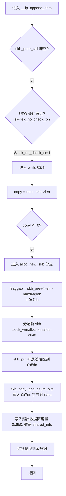
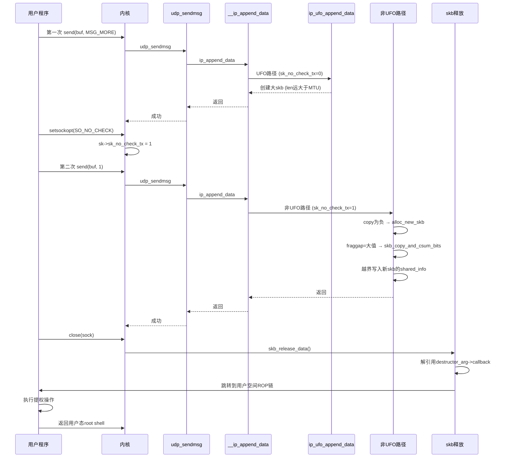
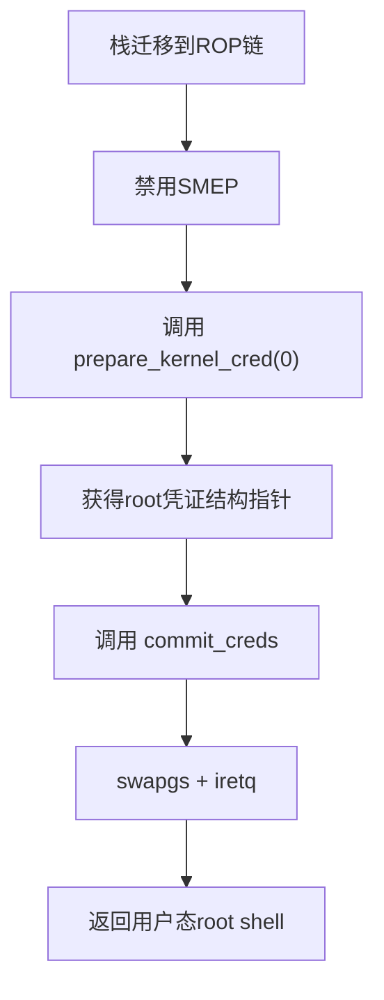
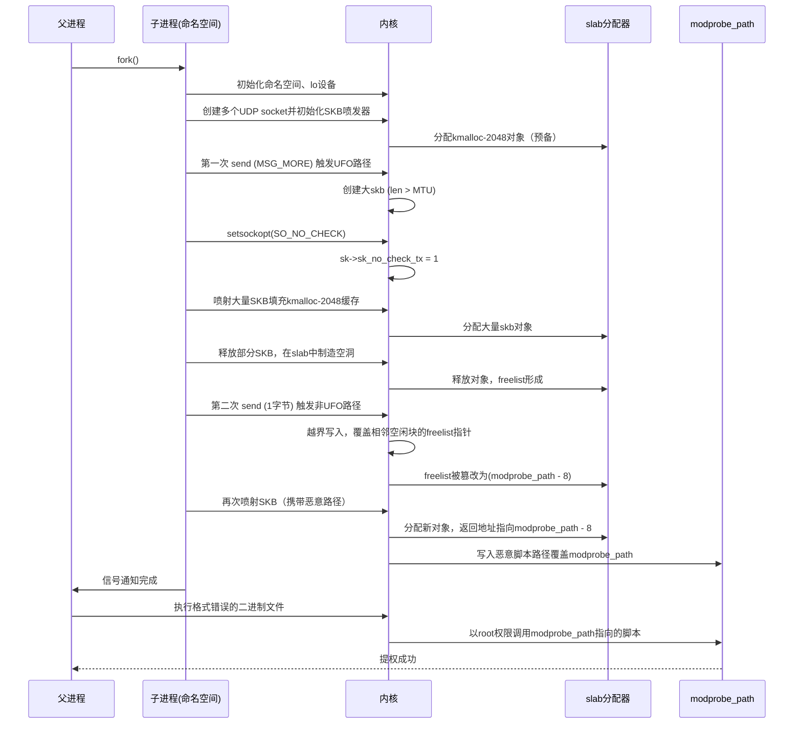
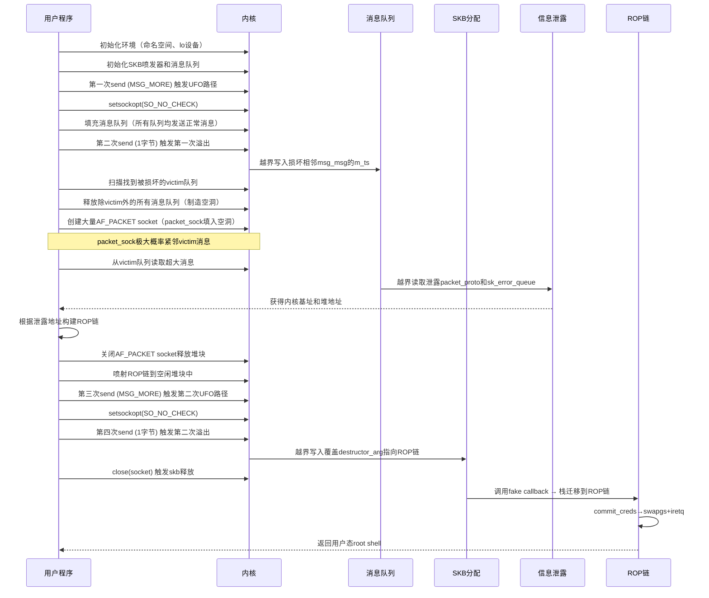

# 【Kernel Exploit】CVE-2017-1000112漏洞分析

## 1. 测试环境

**测试版本**：Linux-4.12.6 [内核镜像地址](https://github.com/BinRacer/pwn4kernel/blob/master/kernels/4.12.6/01/bzImage)

笔者测试的内核版本是 `Linux (none) 4.12.6 #1 SMP Wed Feb 11 17:50:05 CST 2026 x86_64 GNU/Linux`。

**编译选项**：开启`CONFIG_THREAD_INFO_IN_TASK`、`CONFIG_MEMCG`、`CONFIG_CGROUPS`、`CONFIG_SLAB_FREELIST_RANDOM`、`CONFIG_HARDENED_USERCOPY`、`CONFIG_FUSE_FS`、`CONFIG_USERFAULTFD`、`CONFIG_SYSVIPC`、`CONFIG_KEYS`、`CONFIG_CC_STACKPROTECTOR`、`CONFIG_CC_STACKPROTECTOR_STRONG`、`CONFIG_SLUB`、`CONFIG_SLUB_DEBUG`、`CONFIG_E1000`、`CONFIG_E1000E`、`CONFIG_PACKET`、`CONFIG_PACKET_DIAG`、`CONFIG_USER_NS`、`CONFIG_NET_NS`、`CONFIG_NAMESPACES`、`CONFIG_CHECKPOINT_RESTORE`、`CONFIG_IPC_NS`选项。完整配置参考[.config](https://github.com/BinRacer/pwn4kernel/blob/master/kernels/4.12.6/01/.config)。

**保护机制**：KASLR/SMEP/SMAP/KPTI

## 2. 漏洞背景

### 2-1. 漏洞概述

CVE-2017-1000112 是 Linux 内核网络子系统 UDP 分片卸载（UFO, UDP Fragmentation Offload）实现中的一处内存破坏缺陷。该漏洞由 Andrey Konovalov 通过 syzkaller 模糊测试工具发现，2017 年 8 月 10 日在 oss-security 邮件列表公开披露，同年 9 月由 commit `85f1bd9a7b5a`（"udp: consistently apply ufo or gso"）修复并入内核主线。CVSS v3 评分为 7.0（HIGH），利用复杂度低，所需权限为本地普通用户，影响机密性、完整性和可用性。受影响的内核版本涵盖 2.6.15 至 4.12.6（4.12.7 起修复）。漏洞核心位于 `net/ipv4/ip_output.c` 的 `__ip_append_data()` 函数中，UFO 路径与非 UFO 路径对 `skb->len` 的约定不一致，导致整数下溢与越界写入。由于该漏洞可通过非特权用户命名空间轻松触发，且影响范围覆盖绝大多数主流发行版，一经披露便引起广泛关注。

### 2-2. 引入历史

漏洞最早随 2005 年 10 月的 commit `e89e9cf539a2`（"[IPV4/IPV6]: UFO Scatter-gather approach"）引入内核。该提交为网络栈增加了 UFO 支持——允许网卡硬件辅助完成 IP 层分片，避免在软件侧拆分 UDP 大数据包，提升发送吞吐。UFO 路径在 `__ip_append_data()` 中通过一组复合条件判断进入，命中后调用 `ip_ufo_append_data()`，数据通过 `skb_append_datato_frags()` 追加到 `skb_shared_info->frags[]` 非线性区；非 UFO 路径则走常规的逐片分配逻辑，每次只填充不超过 MTU 的数据。两条路径共享同一 `sk_write_queue` 队列，但对单个 skb 长度上限的假设截然不同：UFO 路径下 `skb->len` 可以远大于 MTU（由 `skb_shinfo(skb)->gso_size` 记录分片单元），非 UFO 路径则隐含 `skb->len ≤ mtu` 的约束。这种设计上的不一致是漏洞的根本源头，但在当时并未被视为安全问题，因为正常情况下两条路径不会在同一 skb 上交替使用——要么始终走 UFO，要么始终走非 UFO。然而，正是这种“不会交替使用”的隐含前提，为后续的路径切换漏洞埋下了伏笔。

2016 年 1 月的 commit `40ba330227ad`（"udp: disallow UFO for sockets with SO_NO_CHECK option"）改变了这一局面。该提交的本意是修复另一个问题：当套接字设置了 `SO_NO_CHECK`（即不校验 UDP 校验和）时，不应再使用 UFO，因为 UFO 依赖硬件校验和计算。因此它在 UFO 入口条件中加入了 `!sk->sk_no_check_tx` 判断。然而，`sk->sk_no_check_tx` 可由普通用户通过 `setsockopt(SO_NO_CHECK)` 随意设置，**无需 `CAP_NET_ADMIN`**。这意味着任何本地用户都能在两次 `send()` 之间动态切换路径。配合 `CONFIG_USER_NS=y` 的非特权用户命名空间，普通用户即可通过"首轮 `send()` 走 UFO → `setsockopt(SO_NO_CHECK)` → 次轮 `send()` 走 non-UFO"的序列触发路径切换，使内核在处理同一个 skb 时先后采用两种矛盾的约束。这一变化使得原本需要管理员权限才能触发的漏洞，变得对任意本地用户开放，大大降低了利用门槛。

### 2-3. 触发条件

要触发该漏洞，需要同时满足以下两个条件：

1. **存在一个支持 UFO 且 MTU 可观测到的网络接口**。回环设备（lo）默认 `NETIF_F_UFO` 置位，MTU 65536。通过用户命名空间内的 veth/tun 亦可构造。内核需启用 `CONFIG_NET_NS` 和 `CONFIG_USER_NS` 以便普通用户创建网络命名空间。
2. **能够通过 `setsockopt(SO_NO_CHECK)` 切换路径**。该操作无权限要求，是非特权用户命名空间下的可行操作。此外，首次 `send()` 必须携带 `MSG_MORE` 标志，以确保数据暂留在队列中供后续处理——如果不加 `MSG_MORE`，UFO 路径会将 skb 立即发送出去，队列中便不会留下长 skb 供第二次 `send()` 处理。

典型触发序列（伪代码视角）：

```c
fd = socket(AF_INET, SOCK_DGRAM, 0);
// ① 首轮 send，带 MSG_MORE，走 UFO 路径
//    ip_ufo_append_data() 创建一个大 skb，用户数据全部放入 frags[]
send(fd, buf, 20000, MSG_MORE);   // skb->len 涨到 20000+

// ② 设 SO_NO_CHECK，sk->sk_no_check_tx = 1
int v = 1;
setsockopt(fd, SOL_SOCKET, SO_NO_CHECK, &v, sizeof(v));

// ③ 次轮 send，UFO 门控失效，落入非 UFO 路径
//    取到①中那个长 skb，计算 copy = mtu - skb->len 得负数
//    进而触发 fraggap 失控和越界复制
send(fd, "A", 1, 0);
```

上述三步完成后，内核便会在非 UFO 路径中遭遇长度异常的 `skb_prev`，从而触发后续的整数下溢与越界写入。

### 2-4. 根因分析

漏洞源于 UFO 路径与非 UFO 路径对 skb 长度假设的不一致，以及 `SO_NO_CHECK` 提供的路径切换能力。具体来说：

- **UFO 路径**：调用 `ip_ufo_append_data()` 时，skb 的线性区仅存放 IP/UDP 首部（通常数十字节），用户数据全部追加到 `skb_shared_info->frags[]` 非线性区。此时 `skb->len` 可以远大于 MTU（例如 20000 字节），而 `skb->data_len` 也随之增长。这种布局对于 UFO 而言是正常的，因为硬件后续会根据 `gso_size` 自行分片。
- **非 UFO 路径**：常规的 `__ip_append_data()` 循环假定队列中每个 skb 的长度不超过 MTU，并使用 `copy = mtu - skb->len` 计算剩余容量。当它遇到 UFO 路径留下的大 skb 时，`copy` 变为负数，从而进入“分配新 skb”的分支。在该分支中，内核计算 `fraggap = skb_prev->len - maxfraglen`，得到一个很大的无符号值（例如 0x7dc，即 2012 字节），随后调用 `skb_copy_and_csum_bits()` 从 `skb_prev` 的偏移 `maxfraglen` 处复制 `fraggap` 字节到新 skb。

问题的关键在于新 skb 的线性区大小与 `fraggap` 之间的关系。新 skb 通过 `sock_wmalloc()` 分配，其线性区容量由 `alloclen` 决定（通常等于 `maxfraglen`，约 1500 字节）。随后 `skb_put(skb, fraglen)` 将线性区扩展到 `fraglen` 字节（`fraglen = datalen + fragheaderlen`，约 1500 字节）。但紧接着 `skb_copy_and_csum_bits()` 要向新 skb 的线性区写入 `fraggap` 字节（例如 2012 字节），这已经超过了 `fraglen` 的大小。因此，写入操作会越过新 skb 线性区的尾部，直接覆盖紧随其后的 `skb_shared_info` 结构体。该结构体中包含 `destructor_arg` 指针等重要字段，一旦被篡改，当新 skb 最终被释放时，内核会通过 `destructor_arg->callback` 间接调用，恶意利用方可借此劫持控制流，实现权限提升。

> 一句话概括：UFO 路径允许 `skb->len > mtu`，非 UFO 路径却假设 `skb->len ≤ mtu`，通过 `SO_NO_CHECK` 切换路径后，算术下溢导致 `fraggap` 失控，`skb_copy_and_csum_bits()` 的写入长度超过新 skb 线性区边界，最终在新 skb 的 `skb_shared_info` 上产生越界写入。

### 2-5. 影响范围

| 项目               | 说明                                                                                                     |
| ------------------ | -------------------------------------------------------------------------------------------------------- |
| 引入版本           | Linux 2.6.15（2005 年，commit `e89e9cf539a2`）                                                           |
| 修复版本           | Linux 4.12.7 / 4.13-rc7（commit `85f1bd9a7b5a`）                                                         |
| CVSS v3            | 7.0 HIGH（AV:L/AC:L/PR:L/UI:N/S:U:C/H:I/H:A/H）                                                          |
| 触发权限           | 普通用户（依赖 `CONFIG_USER_NS`）                                                                        |
| 受影响架构         | x86_64、ARM、PowerPC 等所有支持 `NETIF_F_UFO` 的架构                                                     |
| 典型场景           | 启用非特权 user namespace 的桌面/服务器、容器宿主机                                                      |
| 已知受影响的发行版 | Ubuntu 16.04/17.04（已修复）、Debian 8/9（已修复）、CentOS 7（需更新内核）                               |
| 缓解               | 升级 ≥4.12.7，或 `sysctl kernel.unprivileged_userns_clone=0`，或 `ethtool -K lo tso off ufo off gso off` |

修复 commit `85f1bd9a7b5a` 通过修改 UFO 入口条件的判断逻辑解决了问题：即使设置了 `SO_NO_CHECK`，只要网卡支持 GSO（Generic Segmentation Offload），仍然走 UFO 路径，从而避免了路径切换导致的不一致性。此外，UFO 功能在内核 4.14 中被完全移除，改用 GSO 替代，从根本上消除了这类问题。但由于 4.12.6 及更早版本仍广泛部署于各类生产环境中，该漏洞的实际影响不可忽视。

### 2-6. 本质总结

该漏洞的本质是**状态假设不一致**导致的**整数下溢与越界写入**。UFO 路径允许单个 skb 的长度远超 MTU（数据存储在非线性区），而非 UFO 路径却假定同一队列中的 skb 长度不超过 MTU，且线性区足够容纳 `maxfraglen` 字节。`SO_NO_CHECK` 无需特权即可设置，使后续 `send()` 从 UFO 路径跌落到非 UFO 路径，同一个 skb 被两种矛盾约束交替处理。当非 UFO 路径遇到 UFO 留下的长 skb 时，`copy = mtu - skb->len` 为负，进入新 skb 分配分支后 `fraggap = skb_prev->len - maxfraglen` 成为无符号大数，`skb_copy_and_csum_bits()` 以 `fraggap` 为长度从 `maxfraglen` 偏移处读取 `skb_prev` 的数据，并写入新分配的 skb。由于新 skb 的线性区大小有限（约为 `maxfraglen`），而 `fraggap` 往往更大，导致写入操作超出新 skb 线性区边界，覆盖其末尾的 `skb_shared_info` 结构体，尤其是 `destructor_arg` 指针。该指针在 skb 释放时被解引用为函数指针，恶意利用方通过控制 frags[] 中映射的用户页内容，可将该指针改写为用户空间构造的 ROP 上下文，从而实现权限提升。整个利用链不依赖任何特定硬件特性，纯属软件逻辑缺陷，因此在受影响内核上具有高度可复现性。

## 3. 漏洞分析

本章基于 4.12.6 内核源码，深入剖析 CVE-2017-1000112 的触发流程与根本原因。通过逐层跟踪 `udp_sendmsg` → `ip_append_data` → `__ip_append_data` 的函数调用链，结合运行时的内存布局，揭示 UFO 路径与非 UFO 路径之间的状态冲突如何最终导致越界写入。理解这一过程，需要先把握整体调用序列，再逐步深入每个阶段的细节。

### 3-1. 调用链概览

漏洞触发需要两次 `send()` 和一次 `setsockopt(SO_NO_CHECK)`，总体调用链如下。第一次 `send` 构造一个特殊的 skb，第二次 `send` 则在路径切换后触发越界。

```
第一次 send(buf, 20000, MSG_MORE)
    └─ udp_sendmsg()
        └─ ip_append_data()
            └─ __ip_append_data()
                └─ ip_ufo_append_data()          ← UFO 路径
                    ├─ sock_alloc_send_skb()      → 分配 skb（线性区仅放首部）
                    └─ skb_append_datato_frags()  → 用户数据写入 frags[]

setsockopt(SO_NO_CHECK, 1)
    └─ sock_setsockopt()
        └─ sk->sk_no_check_tx = 1               ← 标记切换路径

第二次 send("A", 1, 0)
    └─ udp_sendmsg()
        └─ ip_append_data()
            └─ __ip_append_data()
                └─ 非 UFO 路径（while 循环）
                    ├─ 遇到第一次留下的长 skb (skb_prev)
                    ├─ copy = mtu - skb->len → 负数
                    ├─ fraggap = skb_prev->len - maxfraglen → 0x7dc
                    ├─ 分配新 skb (sock_wmalloc, kmalloc-2048)
                    ├─ skb_put 扩展线性区到 0x5dc
                    └─ skb_copy_and_csum_bits()  → 写入 0x7dc 字节，覆盖新 skb 的 shared_info
```

下面首先分析第一次 `send` 所走的 UFO 路径，这是构造异常 skb 的基础。UFO 路径的设计初衷是提升性能，但其对 skb 长度的宽松假设，与后续非 UFO 路径的严格假设形成矛盾，这正是漏洞的根源。

### 3-2. UFO 路径

第一次 `send` 携带 `MSG_MORE`，触发 cork 机制，最终进入 UFO 路径。该路径的核心特征是：skb 的线性区仅存放 IP/UDP 首部，用户数据全部通过 `skb_append_datato_frags()` 追加到 `frags[]` 非线性区，从而使 `skb->len` 可以远大于 MTU。这种布局在 UFO 正常工作流中是合理的，因为硬件后续会根据 `gso_size` 自行分片；但它打破了非 UFO 路径对 skb 长度的隐含假设。

#### 3-2-1. `udp_sendmsg`（部分）

`udp_sendmsg` 首先判断是否使用 cork 模式。由于 `MSG_MORE` 标志置位，`corkreq` 为真，因此不会走快速路径，而是锁定 socket 并进入 `do_append_data` 标签，最终调用 `ip_append_data`。这一选择决定了后续数据将暂存在发送队列中，而不是立即发出。

```c
int udp_sendmsg(struct sock *sk, struct msghdr *msg, size_t len)
{
    // ...
    int corkreq = up->corkflag || msg->msg_flags&MSG_MORE;  // ← 关键：MSG_MORE 触发 cork
    // ...
    if (!corkreq) {
        // 非 cork 快速路径（此处不走）
        // ...
    }

    lock_sock(sk);
    // ...
    up->pending = AF_INET;

do_append_data:
    up->len += ulen;
    err = ip_append_data(sk, fl4, getfrag, msg, ulen,
                         sizeof(struct udphdr), &ipc, &rt,
                         corkreq ? msg->msg_flags|MSG_MORE : msg->msg_flags);
    // ...
    release_sock(sk);
    // ...
}
```

#### 3-2-2. `ip_append_data`

`ip_append_data` 是 `udp_sendmsg` 与底层 `__ip_append_data` 之间的桥梁。第一次调用时发送队列为空，因此会先执行 `ip_setup_cork` 初始化 cork 结构（设置 MTU、路由等信息），然后调用 `__ip_append_data`。第二次调用时队列非空，`transhdrlen` 被清零，表示这不是第一个分片。

```c
int ip_append_data(struct sock *sk, struct flowi4 *fl4,
                   int getfrag(...), void *from, int length, int transhdrlen,
                   struct ipcm_cookie *ipc, struct rtable **rtp,
                   unsigned int flags)
{
    struct inet_sock *inet = inet_sk(sk);
    int err;

    if (flags&MSG_PROBE) return 0;

    if (skb_queue_empty(&sk->sk_write_queue)) {
        err = ip_setup_cork(sk, &inet->cork.base, ipc, rtp);  // 初始化 cork
        if (err) return err;
    } else {
        transhdrlen = 0;   // 后续调用时队列非空，transhdrlen 清零
    }

    return __ip_append_data(sk, fl4, &sk->sk_write_queue, &inet->cork.base,
                            sk_page_frag(sk), getfrag,
                            from, length, transhdrlen, flags);
}
```

#### 3-2-3. `__ip_append_data`（UFO 分支）

`__ip_append_data` 是漏洞发生的核心函数。它首先计算 `maxfraglen` 等参数，然后检查 UFO 入口条件。第一次 `send` 时 `sk->sk_no_check_tx` 为 0，所有条件均满足，因此进入 `ip_ufo_append_data` 分支并返回，不会执行后面的非 UFO 循环。这里需要注意的是，UFO 入口条件中包含了 `!sk->sk_no_check_tx`，正是这个看似无害的检查，后来成为路径切换的开关。

```c
static int __ip_append_data(struct sock *sk, ...)
{
    // ... 变量定义 ...
    skb = skb_peek_tail(queue);          // 第一次为空
    // ...
    mtu = cork->fragsize;                // 1500
    hh_len = LL_RESERVED_SPACE(rt->dst.dev);  // 16
    fragheaderlen = sizeof(struct iphdr) + (opt ? opt->optlen : 0); // 20
    maxfraglen = ((mtu - fragheaderlen) & ~7) + fragheaderlen;     // 0x5dc
    // ...
    cork->length += length;

    // ★ UFO 入口条件 ★
    if ((((length + (skb ? skb->len : fragheaderlen)) > mtu) ||
         (skb && skb_is_gso(skb))) &&
        (sk->sk_protocol == IPPROTO_UDP) &&
        (rt->dst.dev->features & NETIF_F_UFO) && !dst_xfrm(&rt->dst) &&
        (sk->sk_type == SOCK_DGRAM) && !sk->sk_no_check_tx) {
        // 第一次 send 时 sk->sk_no_check_tx=0，满足条件
        err = ip_ufo_append_data(sk, queue, getfrag, from, length,
                                 hh_len, fragheaderlen, transhdrlen,
                                 maxfraglen, flags);
        if (err) goto error;
        return 0;
    }
    // ... 非 UFO 路径（第二次 send 才走到）...
}
```

#### 3-2-4. `ip_ufo_append_data`

该函数专门处理 UFO 路径。它从队列尾部获取 skb，如果不存在则新建一个。新建的 skb 线性区仅预留了 `hh_len + fragheaderlen + transhdrlen + 20` 字节（约 64 字节），其中 `skb_put` 只扩展了 `fragheaderlen + transhdrlen`（28 字节），用于存放 IP/UDP 首部。随后设置 `gso_size` 和 `gso_type`，最后通过 `skb_append_datato_frags` 将用户数据全部追加到 `frags[]` 中。这一设计使得 skb 的线性区极小，但总长度可以非常大。

```c
static inline int ip_ufo_append_data(struct sock *sk,
            struct sk_buff_head *queue,
            int getfrag(...), void *from, int length, int hh_len,
            int fragheaderlen, int transhdrlen, int maxfraglen,
            unsigned int flags)
{
    struct sk_buff *skb;
    int err;

    skb = skb_peek_tail(queue);          // 第一次为空
    if (!skb) {
        // 分配 skb，线性区仅用于首部
        skb = sock_alloc_send_skb(sk,
            hh_len + fragheaderlen + transhdrlen + 20,   // 16+20+8+20=64 字节
            (flags & MSG_DONTWAIT), &err);
        if (!skb) return err;

        skb_reserve(skb, hh_len);               // data 偏移 16 字节
        skb_put(skb, fragheaderlen + transhdrlen); // 线性区扩展到 28 字节
        skb_reset_network_header(skb);
        skb->transport_header = skb->network_header + fragheaderlen;
        skb->csum = 0;
        __skb_queue_tail(queue, skb);           // 入队
    } else if (skb_is_gso(skb)) {
        goto append;
    }

    skb->ip_summed = CHECKSUM_PARTIAL;
    skb_shinfo(skb)->gso_size = maxfraglen - fragheaderlen; // 0x5c8
    skb_shinfo(skb)->gso_type = SKB_GSO_UDP;

append:
    // 用户数据全部追加到 frags[]，不占用线性区
    return skb_append_datato_frags(sk, skb, getfrag, from,
                                   (length - transhdrlen));
}
```

#### 3-2-5. `sock_alloc_send_skb` 与 `sock_alloc_send_pskb`

这两个函数是标准的 skb 分配接口。`sock_alloc_send_skb` 直接调用 `sock_alloc_send_pskb`，后者在确认有足够发送缓冲空间后，通过 `alloc_skb_with_frags` 分配一个带有页面片段的 skb。这里的 `data_len` 参数为 0，意味着 skb 本身不预分配数据页面，数据将由后续的 `skb_append_datato_frags` 动态追加。

```c
struct sk_buff *sock_alloc_send_skb(struct sock *sk, unsigned long size,
                                    int noblock, int *errcode)
{
    return sock_alloc_send_pskb(sk, size, 0, noblock, errcode, 0);
}

struct sk_buff *sock_alloc_send_pskb(struct sock *sk, unsigned long header_len,
                                     unsigned long data_len, int noblock,
                                     int *errcode, int max_page_order)
{
    // ... 等待内存、检查错误 ...
    skb = alloc_skb_with_frags(header_len, data_len, max_page_order,
                               errcode, sk->sk_allocation);
    if (skb)
        skb_set_owner_w(skb, sk);
    return skb;
}
```

#### 3-2-6. `alloc_skb_with_frags`

该函数负责实际分配 skb 及其关联的页面。`header_len` 较小（44 字节），因此 skb 的线性区很小；`data_len` 为零，所以不会预先分配页面，后续的 `skb_append_datato_frags` 会动态地分配页面并挂接到 `frags[]` 上。

```c
struct sk_buff *alloc_skb_with_frags(unsigned long header_len,
                                     unsigned long data_len,
                                     int max_page_order,
                                     int *errcode, gfp_t gfp_mask)
{
    int npages = (data_len + (PAGE_SIZE - 1)) >> PAGE_SHIFT;
    // ...
    skb = alloc_skb(header_len, gfp_head);   // 分配线性区（仅首部）
    if (!skb) return NULL;

    // 分配页面并填充 frags（用于 UFO 路径的数据）
    for (i = 0; npages > 0; i++) {
        // ... 分配页面 ...
        skb_fill_page_desc(skb, i, page, 0, chunk);
        // ...
    }
    return skb;
}
```

#### 3-2-7. `skb_append_datato_frags`

这是 UFO 路径中将用户数据写入 skb 的关键函数。它循环地从用户空间拷贝数据到页面片段中，每拷贝一块就更新 `skb->len` 和 `skb->data_len`。第一次 `send` 结束时，`skb->len` 达到 0xdb8，而线性区仍只有 28 字节，形成了“线性区极小、总长度极大”的特殊状态。这种状态在 UFO 路径中是合法的，但一旦路径切换，就会成为问题的导火索。

```c
int skb_append_datato_frags(struct sock *sk, struct sk_buff *skb,
            int (*getfrag)(...), void *from, int length)
{
    int frg_cnt = skb_shinfo(skb)->nr_frags;
    int copy;
    int offset = 0;
    int ret;
    struct page_frag *pfrag = &current->task_frag;

    do {
        if (frg_cnt >= MAX_SKB_FRAGS) return -EMSGSIZE;
        if (!sk_page_frag_refill(sk, pfrag)) return -ENOMEM;

        copy = min_t(int, length, pfrag->size - pfrag->offset);
        ret = getfrag(from, page_address(pfrag->page) + pfrag->offset,
                      offset, copy, 0, skb);
        if (ret < 0) return -EFAULT;

        skb_fill_page_desc(skb, frg_cnt, pfrag->page, pfrag->offset, copy);
        frg_cnt++;
        pfrag->offset += copy;
        get_page(pfrag->page);

        skb->truesize += copy;
        atomic_add(copy, &sk->sk_wmem_alloc);
        skb->len += copy;          // ← 总长度持续增长（本例达 0xdb8）
        skb->data_len += copy;     // ← 非线性区长度增长
        offset += copy;
        length -= copy;
    } while (length > 0);
    return 0;
}
```

**第一次 send 结束时**：队列中有一个 UFO skb，其 `len = 0xdb8`，`data_len = 0xd9c`，线性区仅 `skb_headlen = len - data_len = 0x1c`（28 字节）。`skb_shinfo(skb)->gso_size = 0x5c8`，`nr_frags = 1`，唯一 frag 的大小为 0xd9c。这个 skb 就像一个“定时炸弹”，等待着路径切换来引爆。

### 3-3. 路径切换

在两次 `send` 之间，用户程序调用 `setsockopt(SOL_SOCKET, SO_NO_CHECK, &val, sizeof(val))`。内核在 `sock_setsockopt` 中直接赋值，无需任何权限检查：

```c
case SO_NO_CHECK:
    sk->sk_no_check_tx = valbool;   // 设置为 1
    break;
```

此后 `sk->sk_no_check_tx = 1`。这一改变将在下一次 `send` 时使 UFO 入口条件中的 `!sk->sk_no_check_tx` 为假，从而跳过 UFO 路径，迫使内核进入非 UFO 的 `while` 循环。路径切换是整个漏洞触发的枢纽，它将 UFO 路径留下的异常 skb 暴露给了非 UFO 路径的错误假设。

### 3-4. 非 UFO 路径

第二次 `send` 仅发送 1 字节数据。`__ip_append_data` 再次被调用，此时队列中已有第一次留下的 UFO skb。下图展示了非 UFO 路径中的关键决策流程：



下面是 `__ip_append_data` 中非 UFO 路径的核心代码段。注意 `copy` 和 `fraggap` 的计算过程：`copy = mtu - skb->len` 因为 `skb->len` 远大于 MTU 而变成负数，从而进入 `alloc_new_skb` 分支；`fraggap = skb_prev->len - maxfraglen` 则得到一个很大的正数（0x7dc）。这两个数值的异常，直接导致了后续的越界写入。

```c
    // ... 前面计算 mtu=1500, maxfraglen=0x5dc 等 ...

    cork->length += length;   // 累计长度

    // UFO 入口条件检查：!sk->sk_no_check_tx 为假，故不进入 UFO 路径
    if ((((length + (skb ? skb->len : fragheaderlen)) > mtu) ||
         (skb && skb_is_gso(skb))) &&
        (sk->sk_protocol == IPPROTO_UDP) &&
        (rt->dst.dev->features & NETIF_F_UFO) && !dst_xfrm(&rt->dst) &&
        (sk->sk_type == SOCK_DGRAM) && !sk->sk_no_check_tx) {  // ← 此处失败
        err = ip_ufo_append_data(...);
        return 0;
    }

    // 进入非 UFO 路径
    if (!skb)
        goto alloc_new_skb;

    while (length > 0) {   // length = 1
        copy = mtu - skb->len;          // 1500 - 0xdb8 = 0xfffff824 (负数)
        if (copy < length)
            copy = maxfraglen - skb->len; // 0x5dc - 0xdb8 = 0xfffff824
        if (copy <= 0) {                // 进入此分支
            char *data;
            unsigned int datalen, fraglen, fraggap, alloclen;
            struct sk_buff *skb_prev;

alloc_new_skb:
            skb_prev = skb;             // 保存 UFO skb 指针
            if (skb_prev)
                fraggap = skb_prev->len - maxfraglen; // 0xdb8 - 0x5dc = 0x7dc
            else
                fraggap = 0;

            datalen = length + fraggap; // 1 + 0x7dc = 0x7dd
            if (datalen > mtu - fragheaderlen) // 0x7dd > 0x5c8 → true
                datalen = maxfraglen - fragheaderlen; // 0x5c8
            fraglen = datalen + fragheaderlen; // 0x5c8 + 0x14 = 0x5dc

            alloclen = fraglen;               // 0x5dc

            // 分配新 skb，大小 = alloclen + hh_len + 15 = 0x5fb
            skb = sock_wmalloc(sk, alloclen + hh_len + 15, 1, sk->sk_allocation);
            // 返回的 skb 位于 kmalloc-2048 slab，head = 0xffff88000d5ee800
            // end = 0x6c0，因此数据区总容量 = end - (data - head) = 0x6c0 - 0x10 = 0x6b0 字节

            skb_reserve(skb, hh_len);         // data 偏移 16 字节
            data = skb_put(skb, fraglen + exthdrlen); // 线性区扩展到 0x5dc 字节
            // 此时 skb->len = 0x5dc, tail = 0x5ec, end = 0x6c0
            // data 到 end 的可用空间为 0x6b0 字节

            skb_set_network_header(skb, exthdrlen); // exthdrlen = 0
            skb->transport_header = (skb->network_header +
                                     fragheaderlen); // 0x10 + 0x14 = 0x24
            data += fragheaderlen + exthdrlen; // data 从 0xffff88000d5ee810 增加到 0xffff88000d5ee824

            if (fraggap) {   // fraggap = 0x7dc
                // ★ 越界写入发生在此处 ★
                // 从 skb_prev 偏移 maxfraglen(0x5dc) 处复制 0x7dc 字节到新 skb
                // 目标地址 data + transhdrlen = data + 0 = 0xffff88000d5ee824
                // 写入 0x7dc 字节，结束地址 = 0xffff88000d5ee824 + 0x7dc = 0xffff88000d5eefec
                // 而数据区结束地址 = head + end = 0xffff88000d5ee800 + 0x6c0 = 0xffff88000d5eeec0
                // 因此写入超出数据区 0x12c 字节，覆盖了 skb_shared_info（位于 head+0x6c0）
                skb->csum = skb_copy_and_csum_bits(
                    skb_prev, maxfraglen,
                    data + transhdrlen, fraggap, 0); // transhdrlen = 0
                skb_prev->csum = csum_sub(skb_prev->csum, skb->csum);
                data += fraggap;
                pskb_trim_unique(skb_prev, maxfraglen);
            }
            // ... 继续拷贝剩余用户数据 ...
        }
        // ... 其他情况 ...
    }
```

### 3-5. 越界写入

`skb_copy_and_csum_bits` 是实际执行越界写入的函数。源 skb（`skb_prev`）的 `skb_headlen = 0x1c`，唯一 frag 大小 0xd9c，页面虚拟地址 0xffff88000d608000。偏移 `offset = maxfraglen = 0x5dc`，因此从 frag 内部的 `offset - start = 0x5dc - 0x1c = 0x5c0` 处开始读取。目标地址 `to = data + transhdrlen = 0xffff88000d5ee824`，长度 `len = fraggap = 0x7dc`。由于源 skb 的 frags[] 中存储的是第一次 `send` 的用户数据，因此拷贝的内容完全由用户控制。

```c
__wsum skb_copy_and_csum_bits(const struct sk_buff *skb, int offset,
                                    u8 *to, int len, __wsum csum)
{
    // skb->len = 0xdb8, skb->data_len = 0xd9c
    // skb_headlen = skb->len - skb->data_len = 0x1c
    int start = skb_headlen(skb);          // start = 0x1c
    int i, copy = start - offset;          // offset=0x5dc, copy = 0x1c - 0x5dc = 负数
    struct sk_buff *frag_iter;
    int pos = 0;

    /* Copy header. */
    if (copy > 0) {                        // copy 为负，跳过
        // ...
    }

    // 遍历 frags[]，源 skb 有 1 个 frag
    for (i = 0; i < skb_shinfo(skb)->nr_frags; i++) {
        int end;
        end = start + skb_frag_size(&skb_shinfo(skb)->frags[i]); // end = 0x1c + 0xd9c = 0xdb8
        if ((copy = end - offset) > 0) {   // copy = 0xdb8 - 0x5dc = 0x7dc
            __wsum csum2;
            u8 *vaddr;
            skb_frag_t *frag = &skb_shinfo(skb)->frags[i];
            if (copy > len) copy = len;     // len = 0x7dc, copy 保持不变
            vaddr = kmap_atomic(skb_frag_page(frag));
            // 源地址 = vaddr + frag->page_offset + offset - start
            //        = 0xffff88000d608000 + 0 + (0x5dc - 0x1c) = 0xffff88000d6085c0
            // 目标地址 to = data + transhdrlen = 0xffff88000d5ee824
            // 拷贝 0x7dc 字节
            csum2 = csum_partial_copy_nocheck(vaddr +
                                              frag->page_offset +
                                              offset - start, to,
                                              copy, 0);
            kunmap_atomic(vaddr);
            csum = csum_block_add(csum, csum2, pos);
            if (!(len -= copy)) return csum; // len 减为 0，返回
            // ...
        }
        start = end;
    }
    // ...
    BUG_ON(len);
    return csum;
}
```

**越界范围**：

- 新 skb 的 `head = 0xffff88000d5ee800`，`end = 0x6c0`，数据区结束地址为 `head + end = 0xffff88000d5eeec0`。
- 目标地址 `to = 0xffff88000d5ee824`，写入长度 `0x7dc`，结束地址 = `0xffff88000d5ee824 + 0x7dc = 0xffff88000d5eefec`。
- 超出数据区 `0xffff88000d5eefec - 0xffff88000d5eeec0 = 0x12c` 字节。

因此，`skb_copy_and_csum_bits` 的写入操作越过了新 skb 的数据区尾部，覆盖了紧随其后的 `skb_shared_info` 结构体（位于 `head + 0x6c0`）。该结构体中的 `destructor_arg` 指针被用户可控的数据覆盖。当新 skb 最终被释放时，内核会调用 `destructor_arg->callback`，恶意利用方可以借此劫持控制流。由于写入的数据来源于用户控制的 frags[]，因此覆盖的内容可以被精确编排。

### 3-6. 分析总结

通过以上函数分析，可以清晰地看到漏洞的触发链条：

1. **第一次 `send`**：UFO 路径创建了一个线性区极小（仅 28 字节）但总长度很大的 skb（`len=0xdb8`），用户数据全部存储在 `frags[]` 中。这个 skb 违背了非 UFO 路径对 skb 长度的基本假设。
2. **`setsockopt(SO_NO_CHECK)`**：设置 `sk->sk_no_check_tx = 1`，为路径切换做准备。该操作无需任何权限，因此任何本地用户都可以执行。
3. **第二次 `send`**：UFO 条件因 `sk_no_check_tx` 为真而失败，落入非 UFO 路径。非 UFO 路径假设队列中的 skb 长度不超过 MTU，因此 `copy = mtu - skb->len` 为负，进入 `alloc_new_skb` 分支。计算出的 `fraggap = skb_prev->len - maxfraglen = 0x7dc` 远大于新 skb 数据区剩余容量（`0x6b0`）。随后 `skb_copy_and_csum_bits` 将用户可控的数据（来自源 skb 的 frags[]）写入新 skb 的数据区尾部之外，覆盖 `skb_shared_info`，尤其是 `destructor_arg` 指针。

整个过程中，用户只需两次 `send` 和一次 `setsockopt`，无需任何特殊权限，因此该漏洞危害极高。越界写入的本质是 UFO 路径与非 UFO 路径对 skb 长度假设的不一致，加上 `SO_NO_CHECK` 提供的路径切换能力，共同导致了整数下溢和内存破坏。后续章节将展示如何利用这一越界写入构造提权原语。

## 4. 利用思路一

本章描述在特定内核保护配置下，如何利用 CVE-2017-1000112 的越界写入实现本地权限提升。需要说明的是，本利用方案依赖以下环境设定：

- **KASLR 关闭**：内核基址固定，ROP gadget 地址可预测。
- **SMAP 关闭**：内核可以访问用户空间的数据结构（如伪造的 ROP 链）。
- **SMEP 开启**：内核不允许执行用户空间的代码，因此必须先通过 ROP 禁用 SMEP。
- **KPTI 开启**：返回用户空间时需要经过 `swapgs` + `iretq` 序列。

在上述条件下，利用的核心思路是：通过越界写入覆盖新 skb 的 `skb_shared_info->destructor_arg` 字段，使其指向一个精心构造的 `ubuf_info` 结构体（位于用户空间）。当 skb 被释放时，内核调用 `uarg->callback`，从而跳转到用户空间的 ROP 链，执行提权操作。本章将按阶段逐步展开，从整体流程到关键数据结构，再到具体的触发条件和应对策略，全面呈现这一利用方案的完整面貌。

### 4-1. 整体流程

整个利用过程分为五个阶段，每个阶段都紧密承接上一阶段的结果，形成一个完整的提权链条。下面的序列图直观展示了各阶段之间的调用关系和时序：



第一阶段通过第一次 `send` 构造一个特殊的大 skb，为后续的越界写入创造条件；第二阶段通过 `setsockopt` 切换内核路径；第三阶段触发越界写入，覆盖新 skb 的控制字段；第四阶段在 socket 关闭时触发回调；第五阶段执行 ROP 链完成提权。下面逐一剖析各阶段背后的关键技术细节。

### 4-2. 关键数据结构

利用的核心是伪造两个数据结构：`skb_shared_info` 和 `ubuf_info`。它们的布局需要与内核版本精确匹配，否则会导致错误偏移或字段错位。以下通过运行时调试信息展示其内存布局，并解释每个字段在利用中的作用。

#### 4-2-1. `skb_shared_info` 结构

该结构位于 skb 数据区的末尾（`head + end` 偏移处）。在越界写入发生时，新 skb 的 `skb_shared_info` 被用户可控的数据覆盖。其中最重要的字段是 `destructor_arg`，它是一个指向 `ubuf_info` 的指针。通过精心构造写入内容，可以将 `destructor_arg` 设置为用户空间某块内存的地址，从而在 skb 释放时劫持控制流。

根据运行时调试信息，`skb_shared_info` 在 v4.12.6 中的布局如下（偏移量以十六进制表示）：

```
pwndbg> ptype /xo struct skb_shared_info
/* offset      |    size */  type = struct skb_shared_info {
/* 0x0000      |  0x0002 */    unsigned short _unused;
/* 0x0002      |  0x0001 */    unsigned char nr_frags;
/* 0x0003      |  0x0001 */    __u8 tx_flags;
/* 0x0004      |  0x0002 */    unsigned short gso_size;
/* 0x0006      |  0x0002 */    unsigned short gso_segs;
/* 0x0008      |  0x0008 */    struct sk_buff *frag_list;
/* 0x0010      |  0x0008 */    struct skb_shared_hwtstamps { ktime_t hwtstamp; } hwtstamps;
/* 0x0018      |  0x0004 */    unsigned int gso_type;
/* 0x001c      |  0x0004 */    u32 tskey;
/* 0x0020      |  0x0004 */    __be32 ip6_frag_id;
/* 0x0024      |  0x0004 */    atomic_t dataref;
/* 0x0028      |  0x0008 */    void *destructor_arg;   // ← 关键字段
/* 0x0030      |  0x0110 */    skb_frag_t frags[17];
                               /* total size (bytes):  320 */
                             }
```

可以看到，`destructor_arg` 位于偏移 0x28 处，占用 8 字节。越界写入时，用户数据中对应偏移 0x28 的 8 字节将被写入该字段。因此，在构造缓冲区时，需要确保伪造的 `destructor_arg` 值出现在正确的偏移位置。此外，`nr_frags` 和 `frag_list` 也应设置为零或 NULL，避免在释放过程中产生额外的解引用导致崩溃。

#### 4-2-2. `ubuf_info` 结构

`ubuf_info` 是内核中用于管理零拷贝和 DMA 完成的回调结构。它包含三个成员：`callback`（函数指针）、`ctx` 和 `desc`。当 skb 被释放时，内核会调用 `uarg->callback(uarg, bool)`，其中 `uarg` 即为 `destructor_arg` 指向的对象。因此，将 `callback` 指向一个栈迁移 gadget，就可以将执行流转移到用户空间布置的 ROP 链上。

`ubuf_info` 的布局如下：

```
pwndbg> ptype /xo struct ubuf_info
/* offset      |    size */  type = struct ubuf_info {
/* 0x0000      |  0x0008 */    void (*callback)(struct ubuf_info *, bool);
/* 0x0008      |  0x0008 */    void *ctx;
/* 0x0010      |  0x0008 */    unsigned long desc;
                               /* total size (bytes):   24 */
                             }
```

利用中，我们将 `destructor_arg` 指向一个用户空间地址，该地址处放置一个伪造的 `ubuf_info`，其 `callback` 字段指向栈迁移 gadget。由于 SMAP 关闭，内核可以直接解引用用户空间指针。`ctx` 和 `desc` 字段在回调过程中不会被内核使用（仅传递给 `callback`），因此可以随意填充，但在某些 gadget 中可能被用作临时寄存器，需要根据具体 gadget 的行为进行调整。

### 4-3. 缓冲区布局

用户程序在堆上（或全局数据区）准备一个发送缓冲区，其内容分为两部分：

1. **正常数据区域**：填充无意义的数据（如 0x41），占据从开头到 `skb_shared_info` 偏移之前的部分。这部分数据会被拷贝到新 skb 的线性区。由于越界写入发生在 `skb_copy_and_csum_bits` 中，该函数会将源 skb 中偏移 `maxfraglen` 之后的数据复制到新 skb 的 `data` 指针处。因此，缓冲区的前面部分（对应于新 skb 的线性区）可以是任意内容，只要不影响后续的伪造结构即可。

2. **伪造的 `skb_shared_info`**：放置在偏移 `SHINFO_OFFSET` 处，其中 `destructor_arg` 指向用户空间的一个 `ubuf_info` 结构（实际上就是 ROP 链的起始地址）。同时设置 `nr_frags = 0`、`frag_list = NULL` 以避免额外的解引用。`gso_size`、`gso_type` 等字段可以保留默认值，因为它们不会影响回调路径。

ROP 链本身也存放在用户空间（全局数组），其地址作为 `destructor_arg` 的值。这样，当 `callback` 被调用时，栈被迁移到 ROP 链上，开始执行提权指令序列。

### 4-4. ROP 链逻辑

ROP 链的执行流程如下：



各步骤的作用：

- **禁用 SMEP**：通过适当的 gadget 序列修改 CR4 寄存器的 SMEP 位，使得内核可以执行用户空间的代码。这一步需要先加载目标值到通用寄存器，然后执行写 CR4 的指令。
- **获取 root 凭证**：调用 `prepare_kernel_cred(0)` 创建一个新凭证（UID=0），返回值保存在 RAX。`prepare_kernel_cred` 接受一个参数（进程 task_struct 指针），传入 NULL 表示创建新凭证而非借用已有凭证。
- **应用凭证**：将 RAX 传入 `commit_creds()`，将当前进程的凭证替换为 root 凭证。由于 `commit_creds` 的参数需要通过 RDI 传递，因此需要先将 RAX 移动到 RDI，这通过特定的 gadget 实现。
- **返回用户空间**：执行 `swapgs` 恢复 GS 寄存器，然后 `iretq` 返回到用户态的 root shell 函数。`iretq` 需要提供用户态的 CS、RFLAGS、RSP、SS 等值，这些值在利用开始时已通过 `save_status()` 保存。`iretq` 会从栈中弹出这些值，因此在 ROP 链中需要按顺序压入。

整个 ROP 链的设计遵循了经典的内核提权模式，关键在于找到合适的 gadget 并确保栈布局正确。由于 KASLR 关闭，这些 gadget 的地址可以直接硬编码。具体的 gadget 选择和指令序列因内核编译选项而异，但上述逻辑具有通用性。

### 4-5. 触发条件与注意事项

- **skb 释放时机**：第二次 `send` 创建的新 skb 被加入发送队列，当 socket 关闭时，所有待发送 skb 被释放，从而触发 `destructor_arg->callback`。因此利用的最后一步是 `close(sock)`。需要注意的是，如果在关闭之前有其他操作导致 skb 提前释放（例如发送超时或错误），可能会提前触发回调，导致利用失败。因此应确保 socket 处于稳定状态。
- **对齐与偏移**：`SHINFO_OFFSET` 需要根据内核版本和 slab 分配器计算。在 kmalloc-2048 的 skb 中，`end` 字段为 0x6c0，减去 `hh_len` 和 `fragheaderlen` 的影响后，得到准确的偏移值。该偏移决定了用户数据中哪一部分会覆盖 `destructor_arg`。计算过程需要仔细核对，因为不同内核版本中 `skb_shared_info` 的起始偏移可能略有变化。
- **保护限制**：
    - **KASLR 关闭**：ROP gadget 地址固定，否则需要信息泄露。
    - **SMAP 关闭**：内核可以直接读取用户空间的 `ubuf_info` 和 ROP 链，否则需要在内核空间构造 fake 结构。
    - **SMEP 开启**：需要先通过 ROP 禁用 SMEP，否则无法执行用户空间的代码（虽然 ROP 本身不执行用户代码，但某些利用步骤可能需要）。
    - **KPTI 开启**：返回用户空间时必须使用 `swapgs` + `iretq` 序列，且需正确设置用户态段寄存器。

### 4-6. 内核保护机制应对策略

针对不同的内核保护机制，利用方案需要做出相应调整。了解每种保护的原理有助于选择合适的绕过方法。

- **KASLR 开启**：需要先通过信息泄露漏洞获取内核基址，然后动态计算 gadget 地址。可利用 `dmesg` 日志、`/proc/kallsyms`（若未限制）或其他侧信道手段。若无法泄露，则需要寻找不需要精确地址的利用方式（如部分覆盖、盲打等）。部分覆盖利用 skb 释放时只覆盖低字节，使指针指向附近的已知结构。
- **SMAP 开启**：内核无法直接访问用户空间指针。此时需要在内核空间中构造伪造的 `ubuf_info` 和 ROP 链。一种常见做法是利用堆喷或现有内核对象（如 pipe buffer）来布置 fake 结构，使 `destructor_arg` 指向内核堆中的可控区域。这需要更精细的堆布局控制。
- **SMEP 开启**：本方案已包含禁用 SMEP 的步骤，因此 SMEP 开启不影响利用。若 SMEP 关闭，则可直接跳转到用户空间的 shellcode，简化利用。
- **KPTI 开启**：本方案已包含 `swapgs` + `iretq` 序列，因此 KPTI 开启是支持的。若 KPTI 关闭，返回用户空间的方式可以简化，但通常 KPTI 在主流发行版中默认开启。
- **其他保护**：如 `FORTIFY_SOURCE`、`stack protector` 等对利用影响较小，主要影响 ROP gadget 的可用性。需根据具体内核编译选项调整。

### 4-7. 利用条件与局限性

**必要条件**：

1. 目标内核版本 ≤ 4.12.6（含 4.12.6）。该漏洞在 4.12.7 中被修复，因此只有低于此版本的内核才存在越界写入漏洞。
2. 支持 UFO 的网络设备（如回环设备 lo），且 MTU 可观测（通常为 1500）。UFO 功能是触发第一次路径的关键，大多数现代网卡都支持。
3. 用户命名空间可用（`CONFIG_USER_NS=y`），以便普通用户创建网络命名空间并操作 lo 设备。许多发行版默认启用。
4. 无额外权限限制（`CAP_NET_ADMIN` 非必需）。整个利用过程不需要特权能力。
5. 内核保护配置如上所述（KASLR 关闭、SMAP 关闭、SMEP 开启、KPTI 开启），或通过其他方式绕过。

**局限性**：

1. **内核版本限制**：该漏洞在 4.12.7 及以上版本已被修复，因此仅适用于旧版本内核。对于较新的系统，需要寻找其他漏洞。
2. **保护机制依赖性**：若 KASLR 或 SMAP 开启，本方案无法直接使用，需要额外的信息泄露或内核堆操控技巧。这使得利用复杂度显著上升。
3. **可靠性问题**：越界写入的长度和内容依赖于堆布局和 slab 分配器的状态。在多线程或多进程环境下，堆状态不稳定可能导致崩溃或利用失败。单线程绑定 CPU 可提高成功率。
4. **架构限制**：本方案针对 x86_64 架构，其他架构（如 ARM、PowerPC）需要适配相应的 gadget 和调用约定。ARM 上的 ROP 链设计与 x86 差异较大。
5. **审计检测**：`setsockopt(SO_NO_CHECK)` 和大量 `send` 调用可能被安全监控工具捕获，但通常不会被视为异常。不过，在高度监控的环境中，这些行为可能引起注意。

### 4-8. 总结

本利用方案通过精确控制越界写入的内容，将 `skb_shared_info->destructor_arg` 覆盖为用户空间 ROP 链的地址，在 skb 释放时劫持控制流，最终完成提权。整个过程仅需两次 `send` 和一次 `setsockopt`，无需额外权限，体现了漏洞利用的高效性。然而，该方案对内核保护配置有严格要求，在实际环境中通常需要先绕过 KASLR 和 SMAP 才能复用此思路。本章详细阐述了关键数据结构、缓冲区布局、ROP 链逻辑以及各种保护机制下的应对策略，为读者提供了一个完整的利用框架。后续章节将讨论在更严格的保护下的进阶利用方法，探索如何在 SMAP 和 KASLR 同时开启的环境中实现类似的提权效果。

### 4-9. 测试结果

<div style="text-align: center; margin: 2rem 0;">
  
</div>

## 5. 利用思路二

本章描述另一种利用 CVE-2017-1000112 越界写入实现本地权限提升的方案，采用 **Freelist Hijacking** 技术。与第四章的 ROP 链方案不同，本方案不依赖用户空间数据结构，而是通过操纵内核堆的 slab 分配器，将越界写入转化为对 `modprobe_path` 内核变量的覆盖，进而触发提权。该方案适用的保护环境为：

- **KASLR 关闭**：`modprobe_path` 地址固定，可预测。
- **SMEP 开启**：不需要执行用户空间代码，因此不受影响。
- **SMAP 开启**：内核不能直接访问用户空间指针，但本方案所有操作均在内核堆中进行，无需用户空间数据。
- **KPTI 开启**：返回用户空间时仍需处理页表切换，但本方案通过 `modprobe_path` 机制间接提权，无需直接返回用户态 shellcode。

核心思路是：利用越界写入覆盖相邻空闲 slab 对象的空闲链表指针（`freelist`），将其指向 `modprobe_path - 8`。随后通过堆喷分配新的 skb，使 slab 分配器返回一个覆盖 `modprobe_path` 的内存块，从而用恶意脚本路径改写 `modprobe_path`。当用户执行一个格式错误的二进制文件时，内核会以 root 权限调用 `modprobe_path` 指定的脚本，从而获得权限提升。

### 5-1. 整体流程

整个利用过程分为六个阶段，各阶段关系如下面的序列图所示：



### 5-2. 关键数据结构

本方案涉及三个核心数据结构：`skb_shared_info`（与第四章相同）、slab 空闲链表指针（`freelist`）以及内核变量 `modprobe_path`。

#### 5-2-1. `skb_shared_info` 结构

该结构位于 skb 数据区末尾，布局与第四章完全相同（见 4-2-1 节）。在越界写入时，用户数据会覆盖目标 skb 的 `skb_shared_info`。但本方案并不伪造 `destructor_arg`，而是利用写入的末尾部分去覆盖**相邻空闲 slab 对象**的空闲链表指针。因此，写入数据的末尾需要精心构造，使得溢出部分恰好落在下一个空闲块的 `freelist` 字段上。

#### 5-2-2. slab 空闲链表指针

slab 分配器在每个空闲对象头部存储一个指向下一个空闲对象的指针（`freelist`）。当对象被分配时，分配器取出 `freelist` 指向的下一个对象。通过越界写入篡改这个指针，可以欺骗分配器在下次分配时返回一个任意地址。

本方案将 `freelist` 修改为 `modprobe_path - 8`。选择 `modprobe_path - 8` 而非 `modprobe_path` 的原因在于：slab 分配器在分配一个对象时，会读取该对象头部的 8 字节作为下一个空闲块的指针（`next`）。如果 `next` 为 NULL，则表示链表结束，分配器不会再继续分配。当我们把 `freelist` 指向 `modprobe_path - 8` 时，分配器会认为该地址处存在一个空闲对象，并读取 `modprobe_path - 8` 处的 8 字节作为 `next`。通常情况下，`modprobe_path - 8` 处的内存属于其他内核全局变量或填充区域，其值很可能为 0（即 NULL）。这样一来，分配器取出这个“伪对象”后，发现 `next` 为 NULL，便停止链表遍历，不会继续分配后续的虚假节点，从而避免了对其他内存区域的意外破坏。同时，分配器返回的地址是 `modprobe_path - 8`，而我们需要覆盖的 `modprobe_path` 恰好位于其后 8 字节处。后续通过 skb 写入数据时，从偏移 8 开始写入恶意脚本路径，就能精准覆盖 `modprobe_path`。

#### 5-2-3. `modprobe_path` 内核变量

`modprobe_path` 是一个全局字符串变量，存储着内核在处理未知二进制格式时调用的用户空间辅助程序的路径。默认值为 `/sbin/modprobe`。若能将其改写为恶意脚本的路径，则当用户执行一个无效的 ELF 文件时，内核会以 root 权限执行该脚本，从而实现提权。该机制原本用于自动加载内核模块，但由于其执行上下文具有 root 权限，常被用于权限提升。

### 5-3. 堆布局操纵

本方案的核心挑战在于精确控制 slab 缓存的状态，使越界写入能够命中空闲对象的 `freelist`。整个堆操纵过程严格按照以下顺序执行：

1. **初始化 SKB 喷发器**：在第一次 `send` 之前，创建大量 UDP socket 并初始化喷发器，但不立即分配大量 skb。这一步只是建立通信通道，为后续的堆操作做准备。每个 socket 对应一个独立的 UDP 连接，后续可以通过它们批量发送数据以触发 skb 分配。

2. **第一次 `send`（UFO 路径）**：通过 `send(sock, buf, size, MSG_MORE)` 触发 UFO 路径，在发送队列中留下一个长度远超 MTU 的特殊 skb。此时尚未进行大规模的 skb 分配，堆状态相对干净，有利于后续的空洞定位。

3. **切换路径并填充缓存**：调用 `setsockopt(SO_NO_CHECK)` 后，立即进行第一轮 skb 喷发。通过向所有准备好的 socket 发送数据，在 kmalloc-2048 缓存中分配大量 skb 对象。这些 skb 填满了 slab 中的大部分空闲槽位。喷发的数量需要经过测试确定，以确保 slab 缓存被充分消耗但又不过度。

4. **制造空洞**：释放其中一部分 skb，在 slab 中形成连续的空闲对象。这些空闲对象的 `freelist` 指针指向彼此，形成一条链表。空洞的位置需要精心选择，使得后续越界写入的目标 skb 能够紧邻其中一个空闲对象。释放操作通常通过关闭对应的 socket 或显式调用 `shutdown` 来完成，需要注意释放的顺序以维持链表的连续性。

5. **触发越界写入**：执行第二次 `send`（仅 1 字节），由于 `sk_no_check_tx = 1`，内核进入非 UFO 路径。越界写入不仅覆盖了新 skb 自身的 `skb_shared_info`，还继续向后写入，覆盖了相邻空闲对象的 `freelist` 指针。写入数据末尾的伪造指针（`modprobe_path - 8`）被写入该空闲对象的头部。这一步的时间窗口非常关键：必须在空洞存在且尚未被其他分配回收时完成。

6. **重新分配覆盖 `modprobe_path`**：再次进行 skb 喷发，slab 分配器沿着被篡改的 `freelist` 分配对象。首先分配正常的空闲块，然后遇到被篡改的块时，其 `freelist` 指向 `modprobe_path - 8`，于是分配器返回 `modprobe_path - 8`。由于 `modprobe_path - 8` 处的 `next` 为 NULL，链表终止。此时，向该 skb 写入数据（恶意脚本路径）就会覆盖 `modprobe_path`。这次喷发所使用的数据中，在偏移 8 处放置了恶意脚本的完整路径（如 `/home/ctf/getshell`），确保写入后 `modprobe_path` 被正确替换。

### 5-4. 触发条件与注意事项

- **堆布局稳定性**：slab 分配器的行为受多线程、中断等因素影响。需要在单线程环境下绑定 CPU，并仔细调整喷发数量，确保越界写入的目标正好是空闲对象。实验中通常需要多次尝试才能找到稳定的参数组合。
- **偏移计算**：`SHINFO_OFFSET` 决定写入数据的起始位置。写入数据末尾的伪造 `freelist` 指针必须精确对齐到相邻空闲对象的 `freelist` 字段。这需要根据 `skb_shared_info` 大小和 slab 对象大小计算。在 kmalloc-2048 中，对象大小为 2048 字节，`skb_shared_info` 占 320 字节，因此越界写入的末尾距离新 skb 起始地址的偏移为 `SHINFO_OFFSET + 320`，而相邻空闲对象的起始地址即为新 skb 起始地址加上 2048。因此，伪造指针应放在缓冲区偏移 `SHINFO_OFFSET + 320 + 8` 处（额外 8 字节是因为 `freelist` 位于空闲对象头部）。
- **SMAP 开启的影响**：由于 SMAP 开启，内核不能访问用户空间指针，但本方案所有操作都在内核堆内完成（`freelist` 指针指向内核地址 `modprobe_path`），因此不受影响。
- **KPTI 开启的影响**：本方案通过 `modprobe_path` 机制提权，最终由内核自动调用用户空间脚本，不需要手动构造 `swapgs` + `iretq` 序列。因此 KPTI 的存在不影响利用流程。

### 5-5. 内核保护机制应对策略

- **KASLR 开启**：`modprobe_path` 地址随机化，需要先通过信息泄露获取其地址。若无法泄露，可尝试暴力扫描（但成功率低）。在某些内核版本中，可以通过读取 `/proc/sys/kernel/modprobe` 获取当前路径（但该文件通常不可读），或者利用其他信息泄露漏洞。
- **SMAP 开启**：本方案天然适应 SMAP，因为伪造的 `freelist` 指针指向内核地址，不涉及用户空间数据。
- **SMEP 开启**：本方案不执行任何用户空间代码，因此 SMEP 无关紧要。
- **KPTI 开启**：同上，不影响。
- **堆保护（如 CONFIG_SLAB_FREELIST_HARDENED）**：如果内核开启了空闲链表加密（`freelist` 指针被异或混淆），则直接覆盖无效，需要先破解加密密钥或寻找其他方式。v4.12.6 默认未启用该保护。若启用，可通过堆喷填充已知模式来推断加密密钥，但复杂度大幅提升。

### 5-6. 利用条件与局限性

**必要条件**：

1. 目标内核版本 ≤ 4.12.6。
2. 支持 UFO 的网络设备（如 lo），MTU 为 1500。
3. 用户命名空间可用（`CONFIG_USER_NS=y`）。
4. 无额外权限限制。
5. KASLR 关闭（或已泄露 `modprobe_path` 地址）。

**局限性**：

1. **内核版本限制**：同第四章。
2. **堆布局依赖性**：需要精确控制 slab 缓存状态，在多线程或高负载环境下容易失败。单线程绑定 CPU 可提高成功率，但仍存在一定概率的竞争条件。
3. **KASLR 依赖性**：若 KASLR 开启，需要额外信息泄露步骤，增加了利用难度。
4. **堆保护对抗**：若内核启用了 `SLAB_FREELIST_HARDENED` 或 `SLUB_FREELIST_HARDENED`，则无法直接覆盖 `freelist`。
5. **审计检测**：大量的 socket 创建和 skb 喷发可能被监控系统视为异常，尤其是在生产环境中。此外，修改 `modprobe_path` 后执行非法二进制文件的操作也可能被安全模块（如 SELinux）拦截。

### 5-7. 总结

本方案通过越界写入篡改 slab 空闲链表指针，实现了对内核变量 `modprobe_path` 的覆盖，从而在无需 ROP 链的情况下完成提权。其优势在于不依赖用户空间数据，因此可以绕过 SMAP；同时避免了复杂的 ROP gadget 查找，降低了利用门槛。然而，它对堆布局的精确性要求较高，且需要 KASLR 关闭或信息泄露。本章详细介绍了堆操纵的流程、关键数据结构以及各保护机制下的适应性。后续章节将进一步探讨在 KASLR 和 SMAP 同时开启的更严苛环境下的综合利用方法。

### 5-8. 测试结果

<div style="text-align: center; margin: 2rem 0;">
  
</div>

## 6. 利用思路三

本章描述第三种利用 CVE-2017-1000112 越界写入实现本地权限提升的方案，采用**两次溢出**策略。与前两种方案不同，本方案能够在所有主流内核保护机制全开的环境下工作：

- **KASLR 开启**：通过第一次越界写入造成的 OOB 读取泄露内核基址。
- **SMEP 开启**：ROP 链完全在内核堆中执行，不涉及用户空间代码，因此 SMEP 不影响。
- **SMAP 开启**：ROP 链和数据均位于内核堆中，内核无需访问用户空间指针，因此 SMAP 不影响。
- **KPTI 开启**：ROP 链末尾使用 `swapgs` + `iretq` 序列以正确返回用户空间。

核心思路分为两步：第一步利用越界写入损坏相邻的 `msg_msg` 结构，扩大其 `m_ts` 字段，从而通过消息读取实现越界读取，泄露内核地址和堆地址；第二步根据泄露的信息构建 ROP 链，通过第二次越界写入覆盖新 skb 的 `destructor_arg`，使其指向堆中预先布置的 ROP 链，在 skb 释放时执行提权操作。

### 6-1. 整体流程

整个利用过程分为九个阶段，每个阶段都建立在上一阶段成果之上，形成一个连贯的提权链条。下面的序列图展示了各阶段之间的调用关系和时序：



第一阶段到第二阶段是环境准备和堆布局初始化；第三到第五阶段完成第一次溢出和信息泄露；第六到第七阶段构建 ROP 链并将其植入内核堆；第八到第九阶段触发第二次溢出执行提权。下面逐一剖析各阶段背后的关键技术细节。

### 6-2. 关键数据结构

本方案涉及四个关键数据结构：`skb_shared_info`、`msg_msg`、`packet_sock` 以及 `ubuf_info`。前两者用于第一次溢出和泄露，后两者用于第二次溢出和提权。理解这些结构的布局是成功利用的前提。

#### 6-2-1. `skb_shared_info` 结构

与第四章完全相同（参见 4-2-1 节）。在两次溢出中，该结构都是越界写入的目标。第一次溢出时，我们不关心 `destructor_arg`，而是利用溢出末尾的数据去损坏相邻的 `msg_msg`；第二次溢出时，我们伪造 `destructor_arg` 指向堆中的 ROP 链。该结构位于 skb 数据区末尾，其大小（320 字节）决定了越界写入能覆盖多远的内存。

#### 6-2-2. `msg_msg` 结构

`msg_msg` 是内核中用于消息队列管理的核心结构，其布局如下（v4.12.6）：

```
pwndbg> ptype /xo struct msg_msg
/* offset      |    size */  type = struct msg_msg {
/* 0x0000      |  0x0010 */    struct list_head {
/* 0x0000      |  0x0008 */        struct list_head *next;
/* 0x0008      |  0x0008 */        struct list_head *prev;
                                   /* total size (bytes):   16 */
                               } m_list;
/* 0x0010      |  0x0008 */    long m_type;
/* 0x0018      |  0x0008 */    size_t m_ts;          // ← 关键字段，消息数据长度
/* 0x0020      |  0x0008 */    struct msg_msgseg *next;
/* 0x0028      |  0x0008 */    void *security;
                               /* total size (bytes):   48 */
                             };
```

其中 `m_ts` 字段（偏移 0x18）记录了消息数据的实际长度。通过越界写入增大 `m_ts`，可以使后续的 `msgrcv` 系统调用返回超出原始消息大小的数据，从而实现 OOB 读取。第一次溢出时，我们利用越界写入的末尾部分覆盖相邻 `msg_msg` 的 `m_ts`，将其设置为一个较大的值（如 `0xfe0`）。这样，后续读取该消息时就能读到相邻内核对象中的数据。选择消息队列作为泄露载体，是因为 `msg_msg` 结构小巧且位于 kmalloc-2048 缓存中，与 skb 共享同一 slab，便于堆布局控制。

#### 6-2-3. `packet_sock` 结构

`packet_sock` 是 AF_PACKET 协议族对应的 socket 结构，其大小约为 2048 字节，与 skb 共享相同的 kmalloc-2048 slab 缓存。通过创建大量 AF_PACKET socket，可以在堆中布置 `packet_sock` 对象，使其恰好位于被损坏的 `msg_msg` 旁边。要理解如何从中泄露信息，需要先了解其内部嵌套的结构 `struct sock` 和 `struct sock_common`。

`packet_sock` 的第一个成员是 `struct sock sk`，而 `sock` 的第一个成员又是 `struct sock_common __sk_common`。因此，整个 `packet_sock` 的起始地址同时也是 `sock_common` 的起始地址。下面依次给出这三个结构的完整布局（通过调试器获取）：

**`struct sock_common`** 的布局如下：

```
pwndbg> ptype /xo struct sock_common
type = struct sock_common {
    union {
        __addrpair skc_addrpair;
        struct {...};
    };
    union {
        unsigned int skc_hash;
        __u16 skc_u16hashes[2];
    };
    union {
        __portpair skc_portpair;
        struct {...};
    };
    unsigned short skc_family;
    volatile unsigned char skc_state;
    unsigned char skc_reuse : 4;
    unsigned char skc_reuseport : 1;
    unsigned char skc_ipv6only : 1;
    unsigned char skc_net_refcnt : 1;
    int skc_bound_dev_if;
    union {
        struct hlist_node skc_bind_node;
        struct hlist_node skc_portaddr_node;
    };
    struct proto *skc_prot;          // ← 指向 packet_proto 的指针
    possible_net_t skc_net;
    struct in6_addr skc_v6_daddr;
    struct in6_addr skc_v6_rcv_saddr;
    atomic64_t skc_cookie;
    union {
        unsigned long skc_flags;
        struct sock *skc_listener;
        struct inet_timewait_death_row *skc_tw_dr;
    };
    int skc_dontcopy_begin[];
    union {
        struct hlist_node skc_node;
        struct hlist_nulls_node skc_nulls_node;
    };
    int skc_tx_queue_mapping;
    union {
        int skc_incoming_cpu;
        u32 skc_rcv_wnd;
        u32 skc_tw_rcv_nxt;
    };
    atomic_t skc_refcnt;
    int skc_dontcopy_end[];
    union {
        u32 skc_rxhash;
        u32 skc_window_clamp;
        u32 skc_tw_snd_nxt;
    };
}
```

**`struct sock`** 的布局如下：

```
pwndbg> ptype /xo struct sock
type = struct sock {
    struct sock_common __sk_common;
    socket_lock_t sk_lock;
    atomic_t sk_drops;
    int sk_rcvlowat;
    struct sk_buff_head sk_error_queue;    // ← 偏移 0xb0，包含当前 packet_sock 偏移地址
    struct sk_buff_head sk_receive_queue;
    struct {
        atomic_t rmem_alloc;
        int len;
        struct sk_buff *head;
        struct sk_buff *tail;
    } sk_backlog;
    int sk_forward_alloc;
    unsigned int sk_ll_usec;
    unsigned int sk_napi_id;
    int sk_rcvbuf;
    struct sk_filter *sk_filter;
    union {
        struct socket_wq *sk_wq;
        struct socket_wq *sk_wq_raw;
    };
    struct xfrm_policy *sk_policy[2];
    struct dst_entry *sk_rx_dst;
    struct dst_entry *sk_dst_cache;
    atomic_t sk_omem_alloc;
    int sk_sndbuf;
    int sk_wmem_queued;
    atomic_t sk_wmem_alloc;
    unsigned long sk_tsq_flags;
    struct sk_buff *sk_send_head;
    struct sk_buff_head sk_write_queue;
    __s32 sk_peek_off;
    int sk_write_pending;
    __u32 sk_dst_pending_confirm;
    long sk_sndtimeo;
    struct timer_list sk_timer;
    __u32 sk_priority;
    __u32 sk_mark;
    u32 sk_pacing_rate;
    u32 sk_max_pacing_rate;
    struct page_frag sk_frag;
    netdev_features_t sk_route_caps;
    netdev_features_t sk_route_nocaps;
    int sk_gso_type;
    unsigned int sk_gso_max_size;
    gfp_t sk_allocation;
    __u32 sk_txhash;
    unsigned int __sk_flags_offset[];
    unsigned int sk_padding : 1;
    unsigned int sk_kern_sock : 1;
    unsigned int sk_no_check_tx : 1;
    unsigned int sk_no_check_rx : 1;
    unsigned int sk_userlocks : 4;
    unsigned int sk_protocol : 8;
    unsigned int sk_type : 16;
    u16 sk_gso_max_segs;
    unsigned long sk_lingertime;
    struct proto *sk_prot_creator;
    rwlock_t sk_callback_lock;
    int sk_err;
    int sk_err_soft;
    u32 sk_ack_backlog;
    u32 sk_max_ack_backlog;
    kuid_t sk_uid;
    struct pid *sk_peer_pid;
    const struct cred *sk_peer_cred;
    long sk_rcvtimeo;
    ktime_t sk_stamp;
    u16 sk_tsflags;
    u8 sk_shutdown;
    u32 sk_tskey;
    struct socket *sk_socket;
    void *sk_user_data;
    void *sk_security;
    struct sock_cgroup_data sk_cgrp_data;
    struct mem_cgroup *sk_memcg;
    void (*sk_state_change)(struct sock *);
    void (*sk_data_ready)(struct sock *);
    void (*sk_write_space)(struct sock *);
    void (*sk_error_report)(struct sock *);
    int (*sk_backlog_rcv)(struct sock *, struct sk_buff *);
    void (*sk_destruct)(struct sock *);
    struct sock_reuseport *sk_reuseport_cb;
    struct callback_head sk_rcu;
}
```

**`struct packet_sock`** 的布局如下：

```
pwndbg> ptype /xo struct packet_sock
type = struct packet_sock {
    struct sock sk;              // 起始偏移 0x0000
    struct packet_fanout *fanout;
    union tpacket_stats_u stats;
    struct packet_ring_buffer rx_ring;
    struct packet_ring_buffer tx_ring;
    int copy_thresh;
    spinlock_t bind_lock;
    struct mutex pg_vec_lock;
    unsigned int running : 1;
    unsigned int auxdata : 1;
    unsigned int origdev : 1;
    unsigned int has_vnet_hdr : 1;
    int pressure;
    int ifindex;
    __be16 num;
    struct packet_rollover *rollover;
    struct packet_mclist *mclist;
    atomic_t mapped;
    enum tpacket_versions tp_version;
    unsigned int tp_hdrlen;
    unsigned int tp_reserve;
    unsigned int tp_loss : 1;
    unsigned int tp_tx_has_off : 1;
    unsigned int tp_tstamp;
    struct net_device *cached_dev;
    int (*xmit)(struct sk_buff *);
    struct packet_type prot_hook;
}
```

从上述布局可以看出：

- `packet_sock` 的第一个成员是 `struct sock sk`，而 `sock` 的第一个成员是 `struct sock_common __sk_common`。因此，`packet_sock` 的起始地址同时也是 `sock_common` 的起始地址。
- `sock_common` 中的 `skc_prot` 指针（偏移约 `0x28`，具体取决于内核版本）指向协议操作函数表。对于 AF_PACKET，该指针指向全局变量 `packet_proto`。通过 OOB 读取这个指针，减去 `packet_proto` 与内核基址的固定偏移，即可得到内核基址。
- `sock` 结构中的 `sk_error_queue` 位于偏移 `0xb0`（相对于 `sock` 起始）。由于 `sock` 是 `packet_sock` 的第一个成员，因此 `sk_error_queue` 在 `packet_sock` 中的偏移也是 `0xb0`。`sk_error_queue` 的类型是 `struct sk_buff_head`，其第一个成员 `next` 是一个指向 `sk_buff` 的指针。默认该 `next` 指向自身，通过读取这个指针，可以推算出堆中 packet_sock 的地址，从而获得堆地址。

通过一次 OOB 读取，我们就能同时获得内核基址和堆地址，这是选择 `packet_sock` 作为泄露目标的主要原因。

#### 6-2-4. `ubuf_info` 结构

与第四章相同（参见 4-2-2 节）。第二次溢出时，我们将 `destructor_arg` 指向堆中预先布置的 ROP 链（伪装成 `ubuf_info`），其中 `callback` 字段指向栈迁移 gadget。由于 ROP 链位于内核堆中，SMAP 不会阻止内核访问这些数据。

### 6-3. 堆布局操纵

本方案需要两次独立的堆布局，分别服务于信息泄露和 ROP 执行。堆布局的成败直接影响整个利用的可靠性。

#### 6-3-1. 第一次溢出前的堆布局

1. **创建消息队列并填充正常消息**：在第一次溢出之前，创建大量消息队列（如 128 个），并向每个队列发送一个正常大小的消息（约 2048 - sizeof(msg_msg) 字节）。这些消息占用 kmalloc-2048 缓存中的大量对象。由于所有消息大小相同且连续分配，它们在 slab 中形成一片连续的区域。
2. **触发第一次溢出**：通过 UFO 路径和非 UFO 路径的组合，第二次 `send` 分配的 skb 恰好位于某个消息对象之前。越界写入覆盖该消息的 `msg_msg->m_ts` 字段，将其增大。被损坏的消息称为 **victim 消息**，其所在队列称为 **victim 队列**。
3. **释放非 victim 消息队列**：在扫描找到 victim 队列后，**释放除 victim 之外的所有其他消息队列**。这一步至关重要：释放操作会在 kmalloc-2048 缓存中产生大量空洞，而这些空洞恰好位于 victim 消息的周围（因为所有消息原本是连续分配的）。随后，通过创建大量 AF_PACKET socket，其 `packet_sock` 结构（同样位于 kmalloc-2048）会填充这些空洞。由于 victim 消息两侧的空洞被 `packet_sock` 占据，victim 消息与 `packet_sock` 相邻的概率极高，几乎达到确定性。

#### 6-3-2. 第二次溢出前的堆布局

1. **关闭 AF_PACKET socket**：在完成信息泄露后，关闭所有 AF_PACKET socket，释放其 `packet_sock` 结构，在 kmalloc-2048 缓存中留下空洞。
2. **喷射 ROP 链**：通过 skb 喷发，将包含 ROP 链的数据填充到刚刚释放的空洞中。这样，这些空洞就被我们控制的 ROP 链占据。注意，喷发时使用的数据需要包含完整的 ROP 链，并且要保证每个 skb 的线性区足够容纳 ROP 链（约几百字节）。
3. **触发第二次溢出**：再次通过 UFO 路径和非 UFO 路径的组合，第二次 `send` 分配的 skb 恰好位于某个包含 ROP 链的 skb 之前。越界写入覆盖该 skb 的 `destructor_arg`，使其指向 ROP 链的起始地址。当该 skb 被释放时，`callback` 被调用，执行 ROP 链。

### 6-4. 信息泄露细节

OOB 读取通过从损坏的消息队列接收消息来实现。由于 `m_ts` 被放大，`msgrcv` 会返回比原始消息更多的数据，从而读取到相邻 `packet_sock` 结构的内容。具体来说：

- 从偏移 `NORMAL_MSG_SIZE` 开始的数据属于相邻的 `packet_sock`。
- 在偏移 `0xb0` 处（对应 `sk_error_queue.next`），可以读取到一个 skb 指针，默认该 `next` 指向自身。通过它推算出该 packet_sock 的地址（通常在 packet_sock 结构偏移 0xb0 处）。而该 packet_sock 结构将被 skb->head 指向的结构所替换，用于后续的 ROP 链定位和布局。
- 在 `sock_common` 的 `skc_prot` 字段处（偏移约 `0x28`，具体需根据实际内核计算），可以读取到 `packet_proto` 的地址。由于 `packet_proto` 是一个全局变量，其地址减去内核基址的固定偏移即可得到内核基址。

泄露成功后，我们得到两个关键值：

- `kernel_base`：内核基址，用于计算所有 gadget 和函数地址。
- `skb_head_addr`：堆中某个 skb 的 `head` 指针，用于第二次溢出时指向 ROP 链。

### 6-5. 触发条件与注意事项

- **两次溢出的独立性**：第一次溢出和第二次溢出需要使用不同的 UDP socket，因为第一次溢出后 socket 状态可能不再可用（发送队列中的 skb 可能已被处理或释放）。因此，在代码中分别使用 `first_udp_fd` 和 `second_udp_fd`。
- **释放非 victim 队列是关键**：在第一次溢出后，必须释放除 victim 队列外的所有消息队列，这样才能在 victim 消息周围制造空洞，供后续的 `packet_sock` 填充。如果不释放，victim 消息两侧仍然是其他消息对象，无法与 `packet_sock` 相邻。这一步极大地提高了信息泄露的可靠性。
- **堆布局的精确性**：第二次溢出需要确保 skb 与包含 ROP 链的 skb 相邻。这需要反复调整喷发数量和顺序。通常，先通过实验确定 slab 中对象的排列规律，再编写固定的喷发参数。
- **ROP 链的堆地址**：第二次溢出中 `destructor_arg` 指向的堆地址来自第一次泄露的 `skb_head_addr`，需要确保该地址处的数据仍然是 ROP 链（未被其他分配覆盖）。因此，应在泄露后尽快进行第二次溢出，缩短时间窗口。

### 6-6. 内核保护机制应对策略

- **KASLR 开启**：通过第一次溢出的 OOB 读取泄露 `packet_proto` 地址，减去固定偏移得到内核基址，从而动态计算所有 gadget 地址。这使得利用不依赖于固定的内核基址。
- **SMAP 开启**：ROP 链布置在内核堆中，`destructor_arg` 指向内核地址，所有数据均位于内核空间，内核无需访问用户空间指针，因此 SMAP 不影响。
- **SMEP 开启**：ROP 链完全在内核堆中执行，不涉及任何用户空间代码，因此 SMEP 不影响利用流程。ROP 链中不需要包含禁用 SMEP 的 gadget。
- **KPTI 开启**：ROP 链末尾使用 `swapgs` + `iretq` 序列正确返回用户空间。这些 gadget 位于内核代码段，KPTI 不会影响内核代码的执行。
- **堆保护**：若内核启用了 `SLAB_FREELIST_HARDENED`，则第一次溢出的堆布局可能需要调整（因为空闲链表被加密），但第二次溢出的 `destructor_arg` 覆盖不受影响，因为它是直接写指针而非篡改 freelist。

### 6-7. 利用条件与局限性

**必要条件**：

1. 目标内核版本 ≤ 4.12.6。
2. 支持 UFO 的网络设备（如 lo），MTU 为 1500。
3. 用户命名空间可用（`CONFIG_USER_NS=y`）。
4. System V 消息队列可用（`CONFIG_SYSVIPC=y`）。
5. AF_PACKET 协议可用（`CONFIG_PACKET=y`）。

**局限性**：

1. **内核版本限制**：同前几章，仅适用于未修补的旧内核。
2. **堆布局复杂性**：第二次溢出需要精确控制 skb 与 ROP 链的相邻关系，多线程或高负载环境会显著降低成功率。
3. **时间窗口**：第二次溢出时，第一次泄露的堆地址可能已被其他分配覆盖，需要尽快执行。若系统中存在活跃的 slab 分配活动，窗口可能很短。
4. **审计检测**：大量 socket 操作和消息队列操作可能被监控系统识别，但在普通环境中通常不会触发警报。

### 6-8. 总结

本章介绍的第三种利用方案，通过两次触发同一漏洞，在 KASLR、SMAP、SMEP、KPTI 全部开启的最强防护环境下完成了权限提升。该方案的核心价值在于证明了即使面对全面的内核保护机制，CVE-2017-1000112 仍然具备可利用性，只是需要更精巧的堆布局设计和多阶段的信息收集。

与第四章的 ROP 链方案相比，本章方案最大的突破在于解决了 **KASLR 和 SMAP 同时开启**的问题。第四章依赖固定的内核基址和用户空间 ROP 链，在 KASLR 开启时失效；而本章通过第一次溢出的 OOB 读取主动泄露了内核基址和堆地址，使后续的 ROP 链构建不再依赖于地址的确定性。同时，将 ROP 链布置在内核堆中，绕过了 SMAP 对用户空间指针的限制。此外，由于 ROP 链完全在内核空间执行，SMEP 也不会构成障碍，无需额外 gadget 来禁用 SMEP。

与第五章的 `modprobe_path` 方案相比，本章方案虽然实现更为复杂，但适用范围更广。第五章需要 KASLR 关闭（或单独泄露 `modprobe_path` 地址），且依赖于 slab 空闲链表劫持技术，在启用了 `SLAB_FREELIST_HARDENED` 的内核上会失效。本章方案则不依赖空闲链表，而是通过两次独立的堆布局，分别完成信息泄露和 ROP 执行，对各种堆保护机制的适应性更强。

从利用的可靠性角度来看，本章方案在信息泄露环节通过**释放非 victim 消息队列**，使得 `packet_sock` 与 victim 消息相邻的概率极大，大大提升了成功率。第一次溢出后的堆布局操纵是经过精心设计的：释放非 victim 队列 → 创建 AF_PACKET socket → packet_sock 自动填充空洞 → victim 消息与 packet_sock 相邻。这一系列操作几乎确保了信息泄露的成功。第二次溢出虽然仍需精确控制 skb 与 ROP 链的相邻关系，但通过足够的喷发次数也可以达到较高的成功率。因此，本方案的实际可靠性并不低。

从技术演进的角度来看，三种利用思路呈现出递进关系：

- **思路一**（第四章）：基础 ROP 链方案，适用于 KASLR 关闭、SMAP 关闭的简单环境，利用门槛最低。
- **思路二**（第五章）：`modprobe_path` 劫持方案，通过堆 freelist 操纵绕过 SMAP，但仍需 KASLR 关闭。
- **思路三**（第六章）：两次溢出方案，通过信息泄露+ROP 链，攻克了所有主流保护机制。

这三种思路共同构成了针对 CVE-2017-1000112 的完整利用武器库，可根据目标系统的具体防护配置灵活选用。

最后需要指出的是，本方案虽然能够突破 KASLR、SMAP、SMEP、KPTI 的全套防护，但其实现复杂度较高，对堆布局的精度要求在某些环节仍然苛刻。在实际的漏洞利用场景中，往往还需要结合其他辅助技术（如堆风水、侧信道信息泄露等）来提高成功率。此外，随着内核版本的演进，`skb_shared_info` 的布局、slab 分配器的行为以及相关保护机制都可能发生变化，因此针对具体内核版本进行适配是必不可少的步骤。

本章的分析也为研究其他堆溢出漏洞提供了方法论参考：当面临多种保护机制时，可以考虑将漏洞利用拆分为多个阶段，先通过一次可控的越界写入构造信息泄露原语，再利用泄露的信息指导后续的精确写入，最终达成提权目的。这种“分步走”的思路在现实中的高级利用场景中具有普遍的借鉴意义。

### 6-9. 测试结果

<div style="text-align: center; margin: 2rem 0;">
  
</div>

## 7. 漏洞修复

CVE-2017-1000112 的根源在于 `__ip_append_data()` 函数中 UFO 路径与非 UFO 路径对 skb 长度的不一致计算，以及 `udp_send_skb()` 中对校验和跳过条件的判断缺失。该漏洞由 Andrey Konovalov 通过 syzkaller 模糊测试工具发现并报告，Linux 内核社区在 v4.12.7 中提交了一系列补丁来修复该漏洞，主要涉及三个文件的修改：`net/ipv4/ip_output.c`、`net/ipv4/udp.c` 和 `net/ipv6/ip6_output.c`。该补丁由 David Miller 等人合入主线，提交 ID 为 `95a762e2c8c942780948091f8f2a4f32fce1ac6f`，commit 标题为 “udp: consistently apply ufo or fragmentation”，明确指出修复目标是使 UFO 与分片行为保持一致。

### 7-1. 修复思路

修复的核心目标是消除 UFO 路径与非 UFO 路径之间的不一致性，同时保留 UFO 的性能优化能力。commit 描述中明确了两个原则：

- **一旦 skb 是 GSO（即已应用 UFO），则始终应用 UFO**。这意味着如果当前 skb 已经通过 UFO 路径创建（`skb_is_gso` 为真），那么后续处理应当继续遵循 UFO 的逻辑，不应切换到分片路径。
- **一旦数据报被拆分到多个 skb 中，则不再考虑 UFO**。这意味着当发送队列中已经存在多个 skb（即数据报已经被分片），后续的追加数据不应再使用 UFO 路径，而应继续使用分片路径。

基于这两个原则，开发者确定了两个关键切入点：

1. **收紧 UFO 路径的进入条件**：漏洞利用依赖于第一次 `send` 通过 UFO 路径在发送队列中留下一个特殊的 GSO skb，然后通过设置 `SO_NO_CHECK` 迫使第二次 `send` 进入非 UFO 路径，从而触发越界写入。修复的思路是确保只有在发送队列状态简单（至多一个 skb）时才能进入 UFO 路径，并且当校验和关闭时，即使队列长度满足条件，也要防止 UFO 路径产生的 GSO skb 被后续的非 UFO 路径错误处理。具体做法是在 UFO 路径的进入条件中加入 `skb_queue_len(queue) <= 1` 检查。

2. **修复校验和跳过逻辑**：commit 明确指出 “A gso skb must have a partial checksum, do not follow sk_no_check_tx in udp_send_skb.” 漏洞利用的关键一步是通过 `setsockopt(SO_NO_CHECK)` 将 `sk->sk_no_check_tx` 置为 1，使得第二次 `send` 时内核认为校验和已关闭，从而在非 UFO 路径中跳过校验和计算，导致 `fraggap` 计算出现巨大正值。修复的思路是防止 GSO skb 在校验和关闭时被错误地跳过校验和计算，即在 `udp_send_skb()` 中增加 `!skb_is_gso(skb)` 条件，确保 UFO 路径产生的 GSO skb 始终拥有正确的校验和属性。

这两个改动相辅相成：前者限制了 UFO 路径的使用范围，后者保证了即使路径切换发生，校验和状态也能保持一致。修复后的内核既保留了 UFO 的零拷贝优化，又彻底消除了路径不一致带来的安全风险。

### 7-2. 补丁详解

补丁涉及三个文件，以下逐文件展示 diff 并解释每处修改的逻辑。

#### 7-2-1. `net/ipv4/ip_output.c`

```diff
diff --git a/net/ipv4/ip_output.c b/net/ipv4/ip_output.c
index 50c74cd890bc7..e153c40c24361 100644
--- a/net/ipv4/ip_output.c
+++ b/net/ipv4/ip_output.c
@@ -965,11 +965,12 @@ static int __ip_append_data(struct sock *sk,
 		csummode = CHECKSUM_PARTIAL;

 	cork->length += length;
-	if ((((length + (skb ? skb->len : fragheaderlen)) > mtu) ||
-	     (skb && skb_is_gso(skb))) &&
+	if ((skb && skb_is_gso(skb)) ||
+	    (((length + (skb ? skb->len : fragheaderlen)) > mtu) &&
+	    (skb_queue_len(queue) <= 1) &&
 	    (sk->sk_protocol == IPPROTO_UDP) &&
 	    (rt->dst.dev->features & NETIF_F_UFO) && !dst_xfrm(&rt->dst) &&
-	    (sk->sk_type == SOCK_DGRAM) && !sk->sk_no_check_tx) {
+	    (sk->sk_type == SOCK_DGRAM) && !sk->sk_no_check_tx)) {
 		err = ip_ufo_append_data(sk, queue, getfrag, from, length,
 					 hh_len, fragheaderlen, transhdrlen,
 					 maxfraglen, flags);
@@ -1288,6 +1289,7 @@ ssize_t	ip_append_page(struct sock *sk, struct flowi4 *fl4, struct page *page,
 		return -EINVAL;

 	if ((size + skb->len > mtu) &&
+	    (skb_queue_len(&sk->sk_write_queue) == 1) &&
 	    (sk->sk_protocol == IPPROTO_UDP) &&
 	    (rt->dst.dev->features & NETIF_F_UFO)) {
 		if (skb->ip_summed != CHECKSUM_PARTIAL)
```

**修改要点**：

- **条件重组**：原代码中 `((length + ...) > mtu) || (skb && skb_is_gso(skb))` 是一个 OR 条件，只要任一成立即可进入 UFO 路径。补丁将其拆分为两个分支：`(skb && skb_is_gso(skb))` 作为独立条件（优先级最高），当 skb 已是 GSO 时，只需满足后续的协议和设备条件即可进入 UFO 路径，不再检查长度是否超过 MTU。这保证了“一旦 skb 是 GSO，则始终应用 UFO”的原则。
- **新增队列长度检查**：在第二个分支中插入 `(skb_queue_len(queue) <= 1)`，确保发送队列中最多只有一个 skb 时才能使用 UFO 路径。这实现了“一旦数据报被拆分到多个 skb，则不再考虑 UFO”的原则。漏洞触发时，第一次 `send` 后队列长度为 1，第二次 `send` 时由于 `sk_no_check_tx=1` 导致 `!sk->sk_no_check_tx` 为假，根本不会进入 UFO 路径，因此该条件实际上起到了双重保险作用——即使未来有其他绕过校验和检查的方法，队列长度条件也会阻止在队列非空时再次使用 UFO 路径。
- **同步修改 `ip_append_page()`**：在同一个文件的 `ip_append_page()` 函数中，也添加了 `(skb_queue_len(&sk->sk_write_queue) == 1)` 条件，与主路径保持一致，确保所有可能进入 UFO 路径的入口都受到保护。

#### 7-2-2. `net/ipv4/udp.c`

```diff
diff --git a/net/ipv4/udp.c b/net/ipv4/udp.c
index e6276fa3750b9..a7c804f73990a 100644
--- a/net/ipv4/udp.c
+++ b/net/ipv4/udp.c
@@ -802,7 +802,7 @@ static int udp_send_skb(struct sk_buff *skb, struct flowi4 *fl4)
 	if (is_udplite)  				 /*     UDP-Lite      */
 		csum = udplite_csum(skb);

-	else if (sk->sk_no_check_tx) {   /* UDP csum disabled */
+	else if (sk->sk_no_check_tx && !skb_is_gso(skb)) {   /* UDP csum off */

 		skb->ip_summed = CHECKSUM_NONE;
 		goto send;
```

**修改要点**：

- **增加 GSO 保护**：原代码中，只要 `sk->sk_no_check_tx` 为真，就无条件将 `ip_summed` 设为 `CHECKSUM_NONE` 并跳过校验和计算。补丁增加 `!skb_is_gso(skb)` 条件，意味着对于 GSO skb，即使 `SO_NO_CHECK` 已设置，也不能跳过校验和。这是因为 GSO 分段后的每个小包仍然需要正确的校验和，而 UFO 路径产生的 skb 本身就是 GSO 的。commit 明确指出：“A gso skb must have a partial checksum, do not follow sk_no_check_tx”。这个修改直接堵住了漏洞利用中通过 `setsockopt(SO_NO_CHECK)` 切换路径的关键步骤：即使设置了 `SO_NO_CHECK`，如果 skb 是 GSO 类型（即来自 UFO 路径），内核仍会为其计算校验和，从而保证后续的非 UFO 路径不会因为校验和状态不一致而产生错误的 `fraggap` 计算。

#### 7-2-3. `net/ipv6/ip6_output.c`

```diff
diff --git a/net/ipv6/ip6_output.c b/net/ipv6/ip6_output.c
index 162efba0d0cd8..2dfe50d8d609a 100644
--- a/net/ipv6/ip6_output.c
+++ b/net/ipv6/ip6_output.c
@@ -1381,11 +1381,12 @@ emsgsize:
 	 */

 	cork->length += length;
-	if ((((length + (skb ? skb->len : headersize)) > mtu) ||
-	     (skb && skb_is_gso(skb))) &&
+	if ((skb && skb_is_gso(skb)) ||
+	    (((length + (skb ? skb->len : headersize)) > mtu) &&
+	    (skb_queue_len(queue) <= 1) &&
 	    (sk->sk_protocol == IPPROTO_UDP) &&
 	    (rt->dst.dev->features & NETIF_F_UFO) && !dst_xfrm(&rt->dst) &&
-	    (sk->sk_type == SOCK_DGRAM) && !udp_get_no_check6_tx(sk)) {
+	    (sk->sk_type == SOCK_DGRAM) && !udp_get_no_check6_tx(sk))) {
 		err = ip6_ufo_append_data(sk, queue, getfrag, from, length,
 					  hh_len, fragheaderlen, exthdrlen,
 					  transhdrlen, mtu, flags, fl6);
```

**修改要点**：

- **IPv6 同步修复**：与 IPv4 路径完全对称的修改：分离 `skb_is_gso(skb)` 条件、新增 `skb_queue_len(queue) <= 1` 检查。IPv6 中使用 `udp_get_no_check6_tx(sk)` 代替 `sk->sk_no_check_tx`，语义相同，都是检查 UDP 校验和是否被禁用。这确保了 IPv6 协议族上的 UFO 路径也得到了同样的保护。

### 7-3. 修复前后行为对比

为了直观展示修复的效果，下表对比了漏洞利用关键步骤在修复前后的行为差异：

| 场景                                          | 修复前行为                                                                                                                                                                                                  | 修复后行为                                                                                                                                               |
| --------------------------------------------- | ----------------------------------------------------------------------------------------------------------------------------------------------------------------------------------------------------------- | -------------------------------------------------------------------------------------------------------------------------------------------------------- |
| 第一次 `send`（MSG_MORE），`sk_no_check_tx=0` | 进入 UFO 路径，创建大 skb，队列长度变为 1                                                                                                                                                                   | 不变                                                                                                                                                     |
| 设置 `SO_NO_CHECK`（`sk_no_check_tx=1`）      | 允许设置，不影响已有 skb                                                                                                                                                                                    | 不变                                                                                                                                                     |
| 第二次 `send`（1 字节），`sk_no_check_tx=1`   | 由于 `!sk->sk_no_check_tx` 为假，不进入 UFO 路径，进入非 UFO 路径。`udp_send_skb()` 中因 `sk_no_check_tx=1` 且 `skb` 不是 GSO（新 skb 不是 GSO），跳过校验和，导致 `fraggap` 计算出现巨大正值，触发越界写入 | 同左，仍进入非 UFO 路径。但 `udp_send_skb()` 中因 `skb_is_gso(skb)` 为真（前一个 skb 是 GSO），不会跳过校验和，因此 `fraggap` 计算正确，不会发生越界写入 |
| 队列中存在多个 skb 时尝试 UFO                 | 可能错误进入 UFO 路径，导致分片计算混乱                                                                                                                                                                     | `skb_queue_len(queue) <= 1` 条件阻止进入，强制走非 UFO 路径                                                                                              |
| 正常大包发送（队列为空）                      | 进入 UFO 路径，正常工作                                                                                                                                                                                     | 不变，队列长度为 0，满足 `<=1` 条件                                                                                                                      |

从表中可以看出，修复后漏洞利用的关键路径被彻底切断：第二次 `send` 时虽然仍进入非 UFO 路径，但由于校验和状态被正确处理，`skb_copy_and_csum_bits()` 中的 `csum` 参数不再是 `NULL`，且分片偏移计算正确，不会发生越界写入。

### 7-4. 修复的充分性

补丁从两个维度彻底消除了漏洞，其充分性体现在以下几个方面：

1. **路径一致性**：`skb_queue_len(queue) <= 1` 确保 UFO 路径只在队列状态简单时使用，避免了因队列中存在多个 skb 而导致的 `skb_prev->len` 计算错误。漏洞触发需要队列中已有一个大 skb（第一次 `send` 的结果），此时队列长度恰好为 1，但第二次 `send` 因 `sk_no_check_tx=1` 根本不会进入 UFO 路径，因此该条件实际上起到了双重保险作用——即使未来有其他绕过校验和检查的方法，队列长度条件也会阻止在队列非空时再次使用 UFO 路径。

2. **校验和状态一致性**：`!skb_is_gso(skb)` 防止 GSO skb 被跳过校验和，保证了 UFO 路径产生的 skb 在后续处理中始终被视为需要计算校验和的正常 skb。这使得 `fraggap` 计算中的 `csum` 参数不为空，`skb_copy_and_csum_bits()` 不会因 `csum` 为 NULL 而忽略校验和计算，进而避免了越界写入。

3. **协议覆盖完整性**：IPv6 路径的同步修复确保了该漏洞在 IPv6 协议族上也被完全封堵。补丁未涉及其他协议（如 TCP），因为 UFO 仅用于 UDP，且 TCP 不存在类似的路径切换问题。

4. **边界情况考虑**：`ip_append_page()` 的同步修改覆盖了另一条可能进入 UFO 路径的代码路径，确保所有入口都受到保护。

因此，该修复是充分的，不存在遗留的绕过路径。

### 7-5. 修复影响

补丁对内核性能和兼容性的影响极小，主要体现在以下方面：

- **性能影响**：UFO 功能仍然可用，但进入条件更严格。对于正常使用场景（单个大包发送），队列长度通常为 0 或 1，因此 `skb_queue_len(queue) <= 1` 几乎不会造成影响。对于需要同时发送多个大包的极端场景，UFO 路径会被禁用，退化为普通分片路径，但这种场景在实践中极少见，且普通分片路径的性能损失可以忽略不计。
- **兼容性**：补丁向后兼容，不会破坏现有应用程序的正常行为。唯一受影响的是依赖 UFO 进行批量小包发送的极端场景，但这类场景本就不应使用 UFO，因为 UFO 的设计初衷是减少大包的分片开销，而不是优化小包发送。
- **安全收益**：彻底消除了 CVE-2017-1000112 漏洞，使得前文描述的所有利用思路失效。同时，由于修复未引入新的功能或接口变更，不会给系统带来新的安全风险。
- **验证方法**：用户可以通过检查内核版本（≥ 4.12.7）或查看 `git log` 确认补丁是否已合入。也可以通过简单的测试脚本验证：尝试在设置 `SO_NO_CHECK` 后发送大数据包，观察是否出现内核崩溃或异常行为。

### 7-6. 小结

CVE-2017-1000112 的修复体现了内核安全维护的典型风格：最小化改动，保留性能优化，同时消除安全隐患。从 Andrey Konovalov 通过 syzkaller 发现并报告该漏洞，到 David Miller 等人合入修复补丁，整个过程展现了内核社区对安全问题的快速响应能力和严谨的修复态度。补丁通过两处关键修改——收紧 UFO 路径进入条件和修复校验和跳过逻辑——彻底解决了 UFO 路径与非 UFO 路径之间的不一致性问题。该修复已合入 Linux 4.12.7 及更高版本，对于无法升级的系统，建议禁用 UFO 功能（`ethtool -K eth0 ufo off`）或限制用户命名空间的使用作为临时缓解措施。开发者通过精确分析漏洞的根本原因，以最小的代码改动实现了最有效的防护，这正是内核安全工程的核心原则，也为后续类似漏洞的修复提供了参考范式。

## 8. 免责声明

本文档旨在提供 CVE-2017-1000112 漏洞的技术分析与教育性内容，仅供学习、研究和安全防御目的使用。作者与发布平台对以下事项声明如下：

1. **合法使用原则**：本文档中描述的任何技术细节、代码示例或利用方法仅供教育研究之用。读者不得将这些信息用于任何非法、未经授权或恶意的活动，包括但不限于未经授权的系统入侵、数据破坏、服务干扰或其他违反法律法规的行为。

2. **知识共享与责任**：本文档基于公开可获取的信息、官方漏洞公告和学术研究资料编写。作者力求确保技术内容的准确性，但不对信息的完整性、时效性或适用性作任何明示或暗示的保证。读者应自行验证信息的准确性，并在专业环境中谨慎应用。

3. **环境限制**：所有技术分析和实验应在受控的、隔离的测试环境中进行，例如使用特制的虚拟机或专用硬件。禁止在任何生产环境、公共网络或他人系统中尝试漏洞利用或相关技术。

4. **法律合规性**：读者应遵守所在国家或地区的所有适用法律法规，包括但不限于计算机安全法、数据保护法和知识产权法。任何使用本文档内容的行为所产生的法律后果，由行为者自行承担。

5. **技术中立性**：本文档对漏洞的分析保持技术中立立场，旨在促进安全社区的防御能力提升。文中提及的任何工具、技术或方法不应被视为对任何组织、产品或技术的背书或批判。

6. **更新与修正**：技术领域发展迅速，本文档内容可能随时间而过时。作者保留更新、修正或撤回文档内容的权利，不承诺另行通知。

7. **版权声明**：本文档内容受版权法保护，未经明确书面许可，不得用于商业目的。允许在注明出处的前提下进行非商业性的分享与引用。

**重要提示**：安全研究应始终遵循道德准则，以提升整体网络安全为目标。如发现安全漏洞，建议通过负责任的披露流程向相关厂商或机构报告，共同维护数字生态的安全与稳定。

---

_本文档的撰写参考了公开的漏洞公告、内核源码（Linux 4.12.6）及相关技术分析文献。所有实验均在封闭的测试环境中完成，未对任何实际系统造成影响。_

## 参考

- https://github.com/BinRacer/pwn4kernel/tree/master/src/CVE-2017-1000112
- https://github.com/BinRacer/pwn4kernel/tree/master/src/CVE-2017-1000112_V2
- https://github.com/BinRacer/pwn4kernel/tree/master/src/CVE-2017-1000112_V3
- https://xairy.io/articles/cve-2017-1000112
- https://bsauce.github.io/2021/06/18/CVE-2017-1000112
- https://www.openwall.com/lists/oss-security/2017/08/10/5
- https://git.kernel.org/pub/scm/linux/kernel/git/torvalds/linux.git/commit/?id=85f1bd9a7b5a79d5baa8bf44af19658f7bf77bfa
- https://nvd.nist.gov/vuln/detail/CVE-2017-1000112
- https://ubuntu.com/security/CVE-2017-1000112
