# 【Kernel Exploit】CVE-2018-5333 & CVE-2019-9213 漏洞分析

## 1. 测试环境

**测试版本**：Linux-4.14.13 [内核镜像地址](https://github.com/BinRacer/pwn4kernel/blob/master/kernels/4.14.13/01/bzImage)

笔者测试的内核版本是 `Linux (none) 4.14.13 #1 SMP Mon Feb 16 14:32:45 CST 2026 x86_64 GNU/Linux`。

**编译选项**：开启`CONFIG_RDS`、`CONFIG_RDS_RDMA`、`CONFIG_RDS_TCP`、`CONFIG_RDS_DEBUG`、`CONFIG_THREAD_INFO_IN_TASK`、`CONFIG_MEMCG`、`CONFIG_CGROUPS`、`CONFIG_SLAB_FREELIST_RANDOM`、`CONFIG_SLAB_FREELIST_HARDENED`、`CONFIG_HARDENED_USERCOPY`、`CONFIG_FUSE_FS`、`CONFIG_USERFAULTFD`、`CONFIG_SYSVIPC`、`CONFIG_KEYS`、`CONFIG_CC_STACKPROTECTOR`、`CONFIG_CC_STACKPROTECTOR_STRONG`、`CONFIG_SLUB`、`CONFIG_SLUB_DEBUG`、`CONFIG_E1000`、`CONFIG_E1000E`、`CONFIG_PACKET`、`CONFIG_PACKET_DIAG`、`CONFIG_USER_NS`、`CONFIG_NET_NS`、`CONFIG_NAMESPACES`、`CONFIG_CHECKPOINT_RESTORE`、`CONFIG_IPC_NS`选项。完整配置参考[.config](https://github.com/BinRacer/pwn4kernel/blob/master/kernels/4.14.13/01/.config)。

**保护机制**：SMEP/KPTI

## 2. 漏洞背景

### 2-1. 漏洞概述

本实验涉及的两个漏洞均存在于 Linux 内核 4.14.13 中，可组合用于本地权限提升：

- **CVE-2018-5333**：位于 `net/rds/rdma.c` 的 `rds_cmsg_atomic()` 函数。当用户通过 `sendmsg()` 发送携带 `RDS_CMSG_MASKED_ATOMIC_CSWP` 控制消息的消息时，调用链为 `rds_sendmsg → rds_cmsg_send → rds_cmsg_atomic`。若 `local_addr` 未按 8 字节对齐（例如 `0xdeadbeef`），对齐检查失败后错误路径未清除 `op_active` 标志。随后 `rds_sendmsg` 因 `rds_cmsg_send` 返回 `-EFAULT` 而跳转至 `out` 标签，调用 `rds_message_put`，触发第二条调用链 `rds_sendmsg → rds_message_put → rds_message_purge → rds_atomic_free_op → set_page_dirty`。在 `rds_atomic_free_op` 中，`sg_page(ao->op_sg)` 因 `op_sg->page_link` 为 `0x2`（仅含 SG 标记位）而返回 NULL，随后 `set_page_dirty(NULL)` 执行 `page_mapping(NULL)` 得到 `mapping = *(unsigned long *)(NULL + 0x08)`，进而解引用 `mapping->a_ops->set_page_dirty`。若操作者已通过 **CVE-2019-9213** 将虚拟地址 0 映射为可写页面，并通过预先在零页布置伪造的内核对象，则该解引用将读取到操作者预设的伪造函数指针，从而实现控制流劫持。

- **CVE-2019-9213**：位于 `mm/mmap.c` 的 `expand_downwards()` 函数。commit `8869477a49c3` 为防范栈扩展到低地址而在 `expand_downwards()` 中引入了 `security_mmap_addr()` 检查，但该检查内部使用 `current_cred()` 判断能力。当通过 `/proc/self/mem` 的 write 路径触发时，完整的调用链为 `mem_write → mem_rw → access_remote_vm → __access_remote_vm → get_user_pages_remote → __get_user_pages_locked → __get_user_pages → find_extend_vma → expand_stack → expand_downwards → security_mmap_addr → cap_mmap_addr`。在此上下文中，`current_cred()` 取自发起 write 的进程（而非目标 VMA 所属进程），使得具有 `CAP_SYS_RAWIO` 能力的辅助进程可绕过 `mmap_min_addr` 限制，将虚拟地址 0 映射为用户可写页面。

两个漏洞单独看威胁有限（**CVE-2018-5333** 在无 SMAP 时才可被利用；**CVE-2019-9213** 仅能映射零页但缺乏后续利用点），但在无 SMAP 的环境下可串联：先用 **CVE-2019-9213** 在地址 0 布置伪造内核对象，再用 **CVE-2018-5333** 触发 NULL 解引用劫持控制流，最终获得 root 权限。这种组合利用方式正是本节将要详细分析的核心。

### 2-2. 引入历史

- **CVE-2018-5333**：RDS（Reliable Datagram Sockets）协议栈的原子操作支持最初在较早期内核中加入。`rds_cmsg_atomic()` 的错误处理分支在实现时遗漏了对 `op_active` 状态的复位。该缺陷自 RDS 原子操作功能引入时便存在，直到 4.14.13 仍未修复。补丁 `7d11f77f84b2` 于 4.14.14 合入主线，在错误路径中增加了 `op_active` 清零逻辑。值得注意的是，该漏洞的触发条件极为简单——仅需一次精心构造的 `sendmsg()` 调用，无需额外操作，这使得它在实际利用中非常可靠。

- **CVE-2019-9213**：该漏洞并非“从无到有”的功能缺陷，而是一次**防护性补丁本身的上下文误用**。在 Linux 内核早期实现中，`expand_downwards()` 对栈向下扩展的地址下限并未显式检查 `mmap_min_addr`，仅靠用户态 mmap 侧 `security_mmap_addr()` 拦一道。commit `8869477a49c3`（"security: protect from stack expansion into low vm addresses"）的作者意识到“用户可通过栈扩展绕过低地址防护”这一场景，于是把 `security_mmap_addr()` 直接搬进了 `expand_downwards()` 开头，意图让栈扩展路径也走一遍能力检查。然而 `security_mmap_addr()` 底层调用 `cap_capable(current_cred(), ...)`，`current_cred()` 取自**当前执行线程**。当通过 `/proc/self/mem` 的 write 路径触发 VMA 扩展时，完整的调用链为 `mem_write → mem_rw → access_remote_vm → __access_remote_vm → get_user_pages_remote → __get_user_pages_locked → __get_user_pages → find_extend_vma → expand_stack → expand_downwards → security_mmap_addr → cap_mmap_addr`。在此链中，`current` 是发起 write 的进程而非目标 VMA 所属进程。若借助一个拥有 `CAP_SYS_RAWIO` 的 setuid-root 辅助进程（如 `su`）作为 write 发起方，能力检查就会被放行，从而把 VMA 扩展到地址 0。该问题在内核版本 < 4.20.14 中普遍存在，补丁 `0a1d52994d44` 将其修复，把 `security_mmap_addr()` 替换为直接与 `mmap_min_addr` 比较，彻底消除对 `current_cred()` 的依赖。这个案例生动地说明了安全补丁若不充分考虑调用上下文，反而可能引入新的绕过途径。

### 2-3. 触发条件

- **CVE-2018-5333**：
    - 需要 `CONFIG_RDS`、`CONFIG_RDS_TCP` 等编译选项开启（实验环境已满足）。
    - 操作者需具备创建 `AF_RDS` socket 的权限（普通用户即可）。
    - 通过 `sendmsg()` 发送一条携带 `RDS_CMSG_MASKED_ATOMIC_CSWP` 控制消息的消息，并将 `local_addr` 设置为非 8 字节对齐的值（如 `0xdeadbeef`）。对齐检查失败后，`rds_cmsg_atomic()` 的错误路径未清除 `op_active` 标志，返回 `-EFAULT`。
    - `rds_sendmsg` 检测到错误后跳转至 `out` 标签，调用 `rds_message_put` 释放消息。在消息释放过程中，`rds_message_purge` 发现 `op_active` 为真，调用 `rds_atomic_free_op`，进而调用 `set_page_dirty(NULL)`，触发 NULL 指针解引用。
    - **整个过程仅需一次 `sendmsg()` 调用**，无需关闭 socket 或等待异步事件。

- **CVE-2019-9213**：
    - 需要一个拥有 `CAP_SYS_RAWIO` 能力的辅助进程。典型手法是利用 `su` 的 setuid-root 特性：`su` 运行时具有 root 权限，因而具备 `CAP_SYS_RAWIO`。
    - 操作者首先在自己的进程中创建一个初始匿名映射，地址为 `0x10000`，并带有 `MAP_GROWSDOWN` 标志，表示该 VMA 可向下扩展。
    - 通过辅助进程向 `/proc/self/mem` 写入数据，触发内核调用 `mem_write → ... → expand_downwards → security_mmap_addr → cap_mmap_addr`。由于辅助进程（`su`）具有 `CAP_SYS_RAWIO`，即使目标地址低于 `dac_mmap_min_addr`（默认 `0x10000`），检查仍通过，VMA 得以向下扩展。
    - 逐步将 VMA 起始地址降低，最终扩展到地址 `0`。此后操作者可用 `MAP_FIXED` 将物理页面映射到虚拟地址 `0`，实现对零页的完全控制。

### 2-4. 根因分析

- **CVE-2018-5333**：

    两条调用链如下：

    **调用链一（错误路径中未清 `op_active`）：**

    ```
    sendmsg()
      └─ rds_sendmsg()
           └─ rds_cmsg_send()
                └─ rds_cmsg_atomic()
                     ├─ rm->atomic.op_active = 1;
                     ├─ 分配 op_sg (SG 列表，page_link = 0x2)
                     ├─ 对齐检查失败 (args->local_addr & 0x7)
                     └─ err: 未清除 op_active，返回 -EFAULT
    ```

    **调用链二（消息释放时触发解引用）：**

    ```
    rds_sendmsg() 检测到错误 → goto out
      └─ out: rds_message_put(rm)
           └─ rds_message_purge()
                └─ if (rm->atomic.op_active)  // 仍为 1
                     └─ rds_atomic_free_op()
                          ├─ sg_page(ao->op_sg) → NULL (page_link = 0x2 & ~0x3 = 0)
                          └─ set_page_dirty(NULL)
                               └─ page_mapping(NULL) → mapping = *(unsigned long *)(0x08)
                                    └─ mapping->a_ops->set_page_dirty → 解引用伪造的指针
                                         └─ call rax → 执行操作者控制的代码
    ```

    关键代码片段：

    ```c
    // rds_cmsg_atomic() 中错误路径
    err:
        if (page)               // page 始终为 NULL（未锁定）
            put_page(page);
        kfree(rm->atomic.op_notifier);
        return ret;             // 未重置 op_active
    ```

    `rds_atomic_free_op()` 内部：

    ```c
    struct page *page = sg_page(ao->op_sg);  // sg_page 返回 NULL
    set_page_dirty(page);                    // page = NULL
    ```

    导致 `page->mapping->a_ops->set_page_dirty` 解引用 NULL 指针。根据 `struct page` 的布局，`mapping` 字段位于偏移 `0x08`，因此 `page_mapping(NULL)` 读取的是地址 `0x08` 处的 8 字节值。若操作者已在虚拟地址 0 处映射了伪造的内核对象，则此解引用将读取到伪造的 `mapping` 指针，进而层层解引用到伪造的 `a_ops` 和 `set_page_dirty` 函数指针，最终执行操作者控制的代码。

- **CVE-2019-9213**：

    当操作者通过向 `/proc/self/mem` 写入数据时，内核沿以下调用链执行：

    ```
    mem_write
      └─ mem_rw
           └─ access_remote_vm
                └─ __access_remote_vm
                     └─ get_user_pages_remote
                          └─ __get_user_pages_locked
                               └─ __get_user_pages
                                    └─ find_extend_vma
                                         └─ expand_stack
                                              └─ expand_downwards
                                                   └─ security_mmap_addr
                                                        └─ cap_mmap_addr
    ```

    `expand_downwards()` 中调用 `security_mmap_addr(address)`，后者最终抵达 `cap_mmap_addr()`：

    ```c
    int cap_mmap_addr(unsigned long addr) {
        if (addr < dac_mmap_min_addr) {        // dac_mmap_min_addr = 0x10000
            ret = cap_capable(current_cred(), ...);
            ...
        }
    }
    ```

    问题在于 `current_cred()` 取自 **当前执行线程**。在整个调用链中，`current` 始终是发起 write 的进程——即 `su` 命令所代表的进程。`su` 具有 `CAP_SYS_RAWIO`，因此 `cap_capable` 返回 0，允许将 VMA 扩展到低于 `dac_mmap_min_addr` 的地址（包括 0）。利用代码通过逐步降低写入地址，最终将 VMA 起始地址降至 `0`。

### 2-5. 影响范围

- **CVE-2018-5333**：
    - 影响所有启用 RDS 协议栈且内核版本 ≤ 4.14.13 的系统。
    - 默认情况下，主流发行版（如 Ubuntu、Debian）通常不加载 RDS 模块，但若管理员手动启用或内核编译为内置，则受影响。
    - 单独利用需要 SMAP 关闭或存在其他绕过手段。

- **CVE-2019-9213**：
    - 影响所有 Linux 内核版本 < 4.20.14 的系统，无论是否启用 RDS。
    - 需要系统中存在一个具有 `CAP_SYS_RAWIO` 能力的 setuid-root 程序（如 `su` 等），且操作者能触发其向 `/proc/self/mem` 写入。
    - 该漏洞本身仅提供零页映射，必须与其他 NULL 解引用漏洞配合才能实现提权。

- **实验环境**：Linux 4.14.13，开启 SMEP、KPTI，**未开启 SMAP**，RDS 内置，符合两个漏洞的利用条件。这种配置恰好处于“有足够防护但又留有缺口”的状态：SMEP 阻止直接执行用户空间代码，但 SMAP 的缺失使得内核可以读取用户空间伪造的结构体，为利用提供了可行性。

### 2-6. 本质总结

两个漏洞的本质均为**状态管理缺失**与**权限检查上下文错误**的组合：

- **CVE-2018-5333**：错误路径未复位 `op_active`，导致资源释放时访问未初始化的指针，属于典型的**残留状态**漏洞。触发路径极为直接——只需一次精心构造的 `sendmsg()` 调用，即可在消息释放时触发 NULL 解引用。两条调用链清晰地展示了错误如何从 `rds_cmsg_atomic` 传播至 `set_page_dirty`，其中 `sg_page` 因 `page_link` 仅为标记位而返回 NULL，是解引用的直接原因。而解引用发生后，内核会沿着 `page->mapping->a_ops->set_page_dirty` 路径读取用户空间的数据。通过精心构造零页上的数据结构，使得解引用路径最终指向可控的函数指针，仅需控制少量字节即可完成劫持，极大地简化了利用难度。
- **CVE-2019-9213**：`8869477a49c3` 引入的防护逻辑本意是加固，但因 `security_mmap_addr()` 依赖 `current_cred()`，在 `mem_write → mem_rw → access_remote_vm → __access_remote_vm → get_user_pages_remote → __get_user_pages_locked → __get_user_pages → find_extend_vma → expand_stack → expand_downwards → security_mmap_addr → cap_mmap_addr` 这一调用链中，`current_cred()` 取自发起 write 的辅助进程（具有 `CAP_SYS_RAWIO`），而非目标 VMA 所属进程，从而造成能力检查的上下文混淆，使低地址映射限制被绕过。

串联利用的核心思想是：**用 CVE-2019-9213 创造可控的 NULL 页，用 CVE-2018-5333 触发 NULL 解引用，从而将一次原本不可控的崩溃转化为精确的控制流劫持**。在无 SMAP 的保护下，内核可直接访问用户空间的伪造对象，使得提权成为可能。此类组合利用揭示了单一漏洞缓解措施的局限性——只有构建纵深防御体系（如 SMAP + SMEP + KASLR + KPTI + CFI）才能有效阻断这类利用链。

## 3. CVE-2018-5333 漏洞分析

### 3-1. 漏洞概述

**CVE-2018-5333** 是 Linux 内核 RDS（Reliable Datagram Sockets）协议栈中的一个空指针解引用漏洞。漏洞存在于 `rds_cmsg_atomic()` 函数中：当用户通过 `sendmsg()` 发送一个携带 `RDS_CMSG_MASKED_ATOMIC_CSWP` 控制消息且 `local_addr` 未 8 字节对齐时，函数在错误路径中未能清除 `rm->atomic.op_active` 标志。随后消息释放时，`rds_message_purge()` 检测到 `op_active` 为真，调用 `rds_atomic_free_op()`，后者通过 `sg_page()` 获取一个未初始化的 SG 条目（`page_link = 0x2`）返回 NULL，进而调用 `set_page_dirty(NULL)`，最终导致内核解引用空指针。

漏洞的完整调用链如下：

```
sendmsg()
  └─ rds_sendmsg()
       └─ rds_cmsg_send()
            └─ rds_cmsg_atomic()   ← 错误路径未清 op_active
                 ↓ 返回 -EFAULT
       └─ goto out → rds_message_put()
            └─ rds_message_purge()
                 └─ if (rm->atomic.op_active) → rds_atomic_free_op()
                      └─ sg_page() → NULL
                           └─ set_page_dirty(NULL)
                                └─ page_mapping(NULL) → 空指针解引用
```

下面通过源码分析和流程图逐步拆解每个环节，揭示漏洞的成因与触发过程。

### 3-2. 关键函数分析

#### 3-2-1. 入口函数

```c
int rds_sendmsg(struct socket *sock, struct msghdr *msg, size_t payload_len)
{
    struct sock *sk = sock->sk;
    struct rds_sock *rs = rds_sk_to_rs(sk);
    // ... 变量声明 ...

    // ① 检查 msg_flags，只允许 DONTWAIT 和 CMSG_COMPAT
    if (msg->msg_flags & ~(MSG_DONTWAIT | MSG_CMSG_COMPAT)) {
        ret = -EOPNOTSUPP;
        goto out;
    }

    // ② 获取目标地址和端口
    if (msg->msg_namelen) {
        daddr = usin->sin_addr.s_addr;
        dport = usin->sin_port;
    } else {
        lock_sock(sk);
        daddr = rs->rs_conn_addr;
        dport = rs->rs_conn_port;
        release_sock(sk);
    }

    // ③ 检查绑定状态
    lock_sock(sk);
    if (daddr == 0 || rs->rs_bound_addr == 0) {
        release_sock(sk);
        ret = -ENOTCONN;
        goto out;
    }
    release_sock(sk);

    // ④ 计算 RDMA 负载大小并检查上限
    ret = rds_rdma_bytes(msg, &rdma_payload_len);
    // ... 长度校验 ...

    // ⑤ 分配 rds_message 结构体
    rm = rds_message_alloc(ret, GFP_KERNEL);
    if (!rm) { ret = -ENOMEM; goto out; }

    // ⑥ 如果 payload_len > 0，复制用户数据（此处 payload_len = 0，跳过）
    if (payload_len) {
        // ... 分配 SG 并拷贝数据 ...
    }
    rm->data.op_active = 1;   // 标记数据操作激活

    rm->m_daddr = daddr;

    // ⑦ 建立或重用连接
    if (rs->rs_conn && rs->rs_conn->c_faddr == daddr)
        conn = rs->rs_conn;
    else {
        conn = rds_conn_create_outgoing(...);
        rs->rs_conn = conn;
    }

    // ⑧ 解析控制消息（关键步骤，漏洞触发点）
    ret = rds_cmsg_send(rs, rm, msg, &allocated_mr);
    if (ret) {
        if (ret == -EAGAIN)
            rds_conn_connect_if_down(conn);
        goto out;   // ← 错误时直接跳转到 out
    }

    // ⑨ 后续正常发送流程（不会执行到，因为 ret != 0）
    // ... 检查传输能力、排队、发送 ...

out:
    // ⑩ 清理：如果有 RDMA_MAP，释放 MR
    if (allocated_mr)
        rds_rdma_unuse(rs, rds_rdma_cookie_key(rm->m_rdma_cookie), 1);
    if (rm)
        rds_message_put(rm);   // ← 释放消息，触发漏洞
    return ret;
}
```

**关键点**：当 `rds_cmsg_send()` 返回错误（`-EFAULT`）时，函数直接跳转到 `out` 标签，而 `rm->atomic.op_active` 已被设置为 1（见下文），随后 `rds_message_put(rm)` 会触发漏洞。

**流程图**：

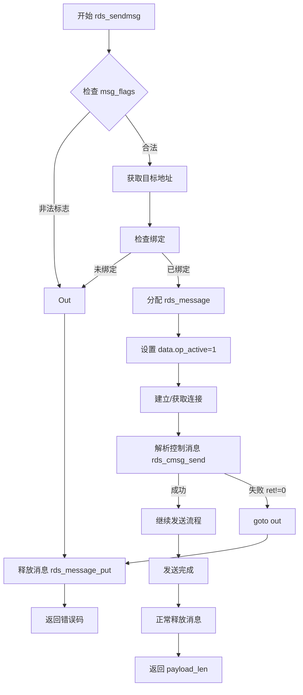

#### 3-2-2. 控制消息分发

```c
static int rds_cmsg_send(struct rds_sock *rs, struct rds_message *rm,
                         struct msghdr *msg, int *allocated_mr)
{
    struct cmsghdr *cmsg;
    int ret = 0;

    // 遍历所有控制消息头
    for_each_cmsghdr(cmsg, msg) {
        if (!CMSG_OK(msg, cmsg))
            return -EINVAL;
        if (cmsg->cmsg_level != SOL_RDS)
            continue;

        switch (cmsg->cmsg_type) {
        case RDS_CMSG_RDMA_ARGS:
            ret = rds_cmsg_rdma_args(rs, rm, cmsg);
            break;
        case RDS_CMSG_RDMA_DEST:
            ret = rds_cmsg_rdma_dest(rs, rm, cmsg);
            break;
        case RDS_CMSG_RDMA_MAP:
            ret = rds_cmsg_rdma_map(rs, rm, cmsg);
            if (!ret) *allocated_mr = 1;
            else if (ret == -ENODEV) ret = -EAGAIN;
            break;
        case RDS_CMSG_ATOMIC_CSWP:
        case RDS_CMSG_ATOMIC_FADD:
        case RDS_CMSG_MASKED_ATOMIC_CSWP:
        case RDS_CMSG_MASKED_ATOMIC_FADD:
            ret = rds_cmsg_atomic(rs, rm, cmsg);   // ← 漏洞函数
            break;
        default:
            return -EINVAL;
        }
        if (ret)
            break;   // 遇到错误立即退出
    }
    return ret;
}
```

**流程图**：

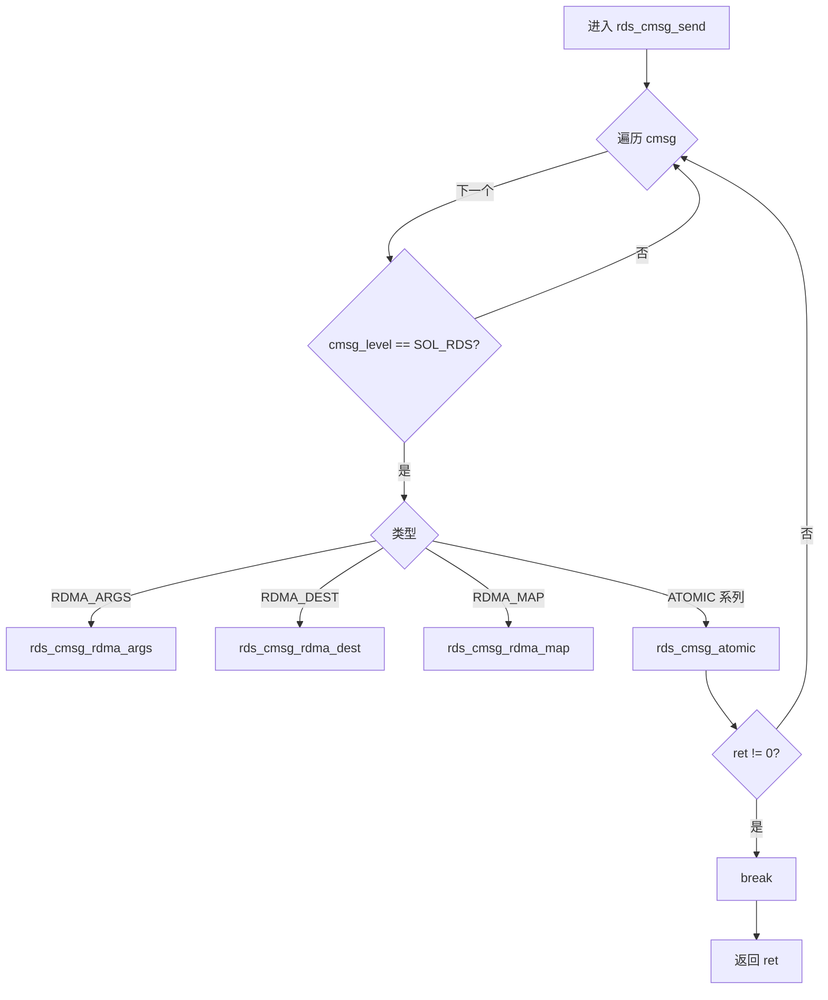

#### 3-2-3. 漏洞根源

```c
int rds_cmsg_atomic(struct rds_sock *rs, struct rds_message *rm,
                    struct cmsghdr *cmsg)
{
    struct page *page = NULL;
    struct rds_atomic_args *args;
    int ret = 0;

    // ① 基本校验：cmsg 长度足够，且 atomic 操作尚未激活
    if (cmsg->cmsg_len < CMSG_LEN(sizeof(struct rds_atomic_args))
        || rm->atomic.op_active)
        return -EINVAL;

    args = CMSG_DATA(cmsg);  // 获取用户传递的参数

    // ② 根据 cmsg 类型填充 atomic 操作参数
    switch (cmsg->cmsg_type) {
    case RDS_CMSG_MASKED_ATOMIC_CSWP:
        rm->atomic.op_type = RDS_ATOMIC_TYPE_CSWP;
        rm->atomic.op_m_cswp.compare = args->m_cswp.compare;
        rm->atomic.op_m_cswp.swap = args->m_cswp.swap;
        rm->atomic.op_m_cswp.compare_mask = args->m_cswp.compare_mask;
        rm->atomic.op_m_cswp.swap_mask = args->m_cswp.swap_mask;
        break;
    // ... 其他类型类似 ...
    }

    // ③ 设置标志位（漏洞关键：这里设置了 op_active = 1）
    rm->atomic.op_notify = !!(args->flags & RDS_RDMA_NOTIFY_ME);
    rm->atomic.op_silent = !!(args->flags & RDS_RDMA_SILENT);
    rm->atomic.op_active = 1;          // ← 标记操作激活
    rm->atomic.op_recverr = rs->rs_recverr;

    // ④ 分配 SG 列表（一个条目）
    rm->atomic.op_sg = rds_message_alloc_sgs(rm, 1);
    if (!rm->atomic.op_sg) {
        ret = -ENOMEM;
        goto err;   // 分配失败时跳转到 err，但 op_active 已被置 1
    }

    // ⑤ 检查 local_addr 是否 8 字节对齐
    if (args->local_addr & 0x7) {      // 例如 0xdeadbeef & 0x7 = 0x7
        ret = -EFAULT;
        goto err;   // ← 对齐检查失败，跳转到 err
    }

    // ⑥ 正常情况下锁定页面并设置 SG
    ret = rds_pin_pages(args->local_addr, 1, &page, 1);
    if (ret != 1) goto err;
    sg_set_page(rm->atomic.op_sg, page, 8, offset_in_page(args->local_addr));

    // ... 分配通知器（如果需要）...
    rm->atomic.op_rkey = rds_rdma_cookie_key(args->cookie);
    rm->atomic.op_remote_addr = args->remote_addr + rds_rdma_cookie_offset(args->cookie);
    return ret;   // 成功返回 0

err:
    // ⑦ 错误处理：只释放 page 和 op_notifier，但未重置 op_active！
    if (page)
        put_page(page);
    kfree(rm->atomic.op_notifier);   // 此时 op_notifier 为 NULL，kfree(NULL) 安全
    return ret;   // 返回 -EFAULT
}
```

**漏洞点**：在第③步设置了 `op_active = 1`，之后如果对齐检查失败（第⑤步）或 SG 分配失败（第④步），都会跳转到 `err` 标签。`err` 路径中只释放了 `page` 和 `op_notifier`，**没有将 `op_active` 重置为 0**。因此即使函数返回错误，`rm->atomic.op_active` 仍然为 1，导致后续消息释放时认为原子操作是有效的。

**流程图**：

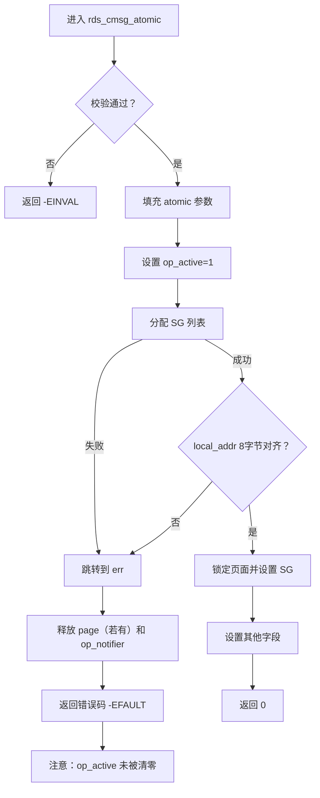

#### 3-2-4. 消息释放链

```c
// rds_message_put：减少引用计数，减到 0 时清理
void rds_message_put(struct rds_message *rm)
{
    if (refcount_dec_and_test(&rm->m_refcount)) {
        BUG_ON(!list_empty(&rm->m_sock_item));
        BUG_ON(!list_empty(&rm->m_conn_item));
        rds_message_purge(rm);   // 清理消息内容
        kfree(rm);               // 释放消息本身
    }
}
```

```c
// rds_message_purge：遍历各个操作，释放资源
static void rds_message_purge(struct rds_message *rm)
{
    // 释放 data 操作的页面
    for (i = 0; i < rm->data.op_nents; i++)
        __free_page(sg_page(&rm->data.op_sg[i]));
    rm->data.op_nents = 0;

    if (rm->rdma.op_active)
        rds_rdma_free_op(&rm->rdma);
    if (rm->rdma.op_rdma_mr)
        rds_mr_put(rm->rdma.op_rdma_mr);

    if (rm->atomic.op_active)            // ← 由于漏洞，此处为 true
        rds_atomic_free_op(&rm->atomic); // 触发漏洞
    if (rm->atomic.op_rdma_mr)
        rds_mr_put(rm->atomic.op_rdma_mr);
}
```

```c
// rds_atomic_free_op：释放原子操作资源，但未初始化 SG 导致空指针
void rds_atomic_free_op(struct rm_atomic_op *ao)
{
    // ao->op_sg 是在 rds_cmsg_atomic 中分配的 SG 条目
    // 但由于对齐检查失败，该 SG 条目从未被设置页面（page_link = 0x2）
    struct page *page = sg_page(ao->op_sg);
    // sg_page 宏：return (struct page *)(sg->page_link & ~0x3);
    // 此时 page_link = 0x2，所以 page = NULL

    set_page_dirty(page);   // ← 传入 NULL
    put_page(page);         // put_page(NULL) 安全

    kfree(ao->op_notifier);
    ao->op_notifier = NULL;
    ao->op_active = 0;      // 终于清零，但为时已晚
}
```

**关键点**：`sg_page(ao->op_sg)` 返回 NULL，因为 `op_sg->page_link` 只包含了 SG 链表的标记位 `0x2`，没有实际页面指针。这导致 `set_page_dirty(NULL)` 被调用。

#### 3-2-5. 空指针解引用

```c
int set_page_dirty(struct page *page)
{
    // page = NULL
    struct address_space *mapping = page_mapping(page);
    // page_mapping(NULL) 返回 *(unsigned long *)(NULL + offsetof(struct page, mapping))
    // mapping 字段在 struct page 中的偏移为 0x08，因此 mapping = *(u64*)0x08
    // 如果零页被映射，则该位置的值由操作者控制

    page = compound_head(page);
    if (likely(mapping)) {
        // mapping 非零（例如 0x10），进入此分支
        int (*spd)(struct page *) = mapping->a_ops->set_page_dirty;
        // 从 mapping + 0x70 读取 a_ops，再从 a_ops + 0x18 读取 set_page_dirty
        // 如果这些地址指向用户空间伪造的数据，则 spd 为操作者控制的指针
        return (*spd)(page);   // 执行伪造函数，控制流重定向
    }
    // ... 其他分支 ...
}
```

**漏洞触发点**：`set_page_dirty(NULL)` 导致 `page_mapping(NULL)` 读取了地址 `0x08` 处的 8 字节作为 `mapping` 指针。如果操作者已经通过 **CVE-2019-9213** 将虚拟地址 0 映射为可写页面，并在此处放置了伪造的 `struct page`、`address_space` 和 `address_space_operations`，那么最终会执行一个伪造的函数指针，实现控制流重定向。

### 3-3. 漏洞触发流程

漏洞的触发可分为三个逻辑阶段：**控制消息处理与错误返回**、**消息释放与操作清理**、**空指针解引用与控制流重定向**。以下通过三个序列图逐步展示从用户调用 `sendmsg()` 到最终内核执行伪造函数的完整过程。

**阶段一：控制消息处理与错误返回**

该阶段始于用户通过系统调用 `sendmsg()` 发送一条携带 `RDS_CMSG_MASKED_ATOMIC_CSWP` 控制消息的空数据包。内核沿调用链 `sys_sendmsg → rds_sendmsg → rds_cmsg_send → rds_cmsg_atomic` 进入漏洞函数。在 `rds_cmsg_atomic` 中，函数首先将 `rm->atomic.op_active` 置为 1，然后分配了一个 SG 条目（`page_link` 初始化为 `0x2`，仅含标记位，无实际页面）。接着进行 8 字节对齐检查，由于用户设置的 `local_addr` 未对齐（例如 `0xdeadbeef`），检查失败，函数跳转到 `err` 标签。错误路径仅释放了 `page`（此时仍为 NULL）和 `op_notifier`（也为 NULL），但**未将 `op_active` 复位为 0**，随后返回 `-EFAULT`。至此，漏洞的“种子”已被埋下——`op_active` 残留为 1。

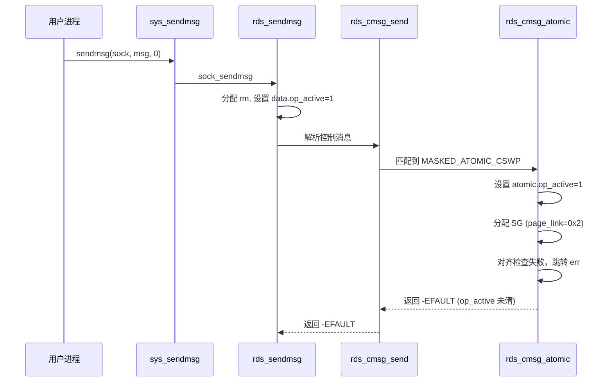

**阶段二：消息释放与操作清理**

`rds_sendmsg` 接收到 `rds_cmsg_send` 返回的错误后，直接跳转到 `out` 标签。由于此前未分配 RDMA MR（`allocated_mr` 为 0），跳过 MR 释放步骤，直接调用 `rds_message_put(rm)` 释放消息结构体。`rds_message_put` 将消息的引用计数从 1 减至 0，触发 `rds_message_purge` 进行内部资源清理。`rds_message_purge` 遍历消息中的各个操作：data 操作、rdma 操作、atomic 操作。当检查到 `rm->atomic.op_active` 为真（值为 1）时，调用 `rds_atomic_free_op(&rm->atomic)`，进入漏洞触发链的下一个环节。

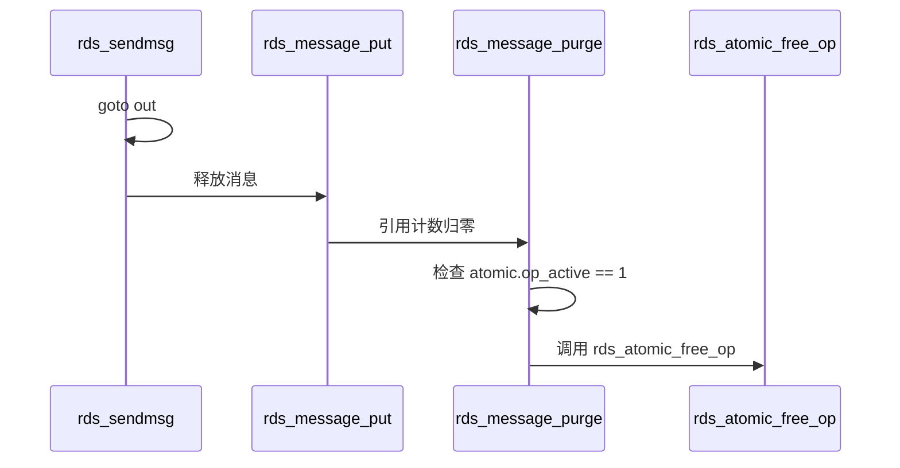

**阶段三：空指针解引用与控制流重定向**

`rds_atomic_free_op` 内部首先通过 `sg_page(ao->op_sg)` 获取 SG 条目关联的页面指针。由于该 SG 条目在阶段一中仅被分配而未设置实际页面，`page_link` 的值仅为 `0x2`（SG 链表标记位），`sg_page` 宏将其低 2 位掩去后得到 `0`，即 NULL。随后函数调用 `set_page_dirty(NULL)`，将空指针传递给内核的脏页标记函数。

`set_page_dirty` 内部调用 `page_mapping(NULL)`，该宏从地址 `0x08`（`struct page` 中 `mapping` 字段的偏移）读取 8 字节作为 `mapping` 指针。若此前已通过 **CVE-2019-9213** 将虚拟地址 0 映射为可写页面，并在该页上精心构造了伪造的 `struct page`、`address_space` 和 `address_space_operations`，则 `mapping` 将指向伪造的 `address_space`（例如地址 `0x10`），继而从 `mapping + 0x70` 读取伪造的 `a_ops` 指针，再从 `a_ops + 0x18` 读取伪造的 `set_page_dirty` 函数指针。最终内核通过 `call rax` 执行该伪造函数，完成控制流重定向。

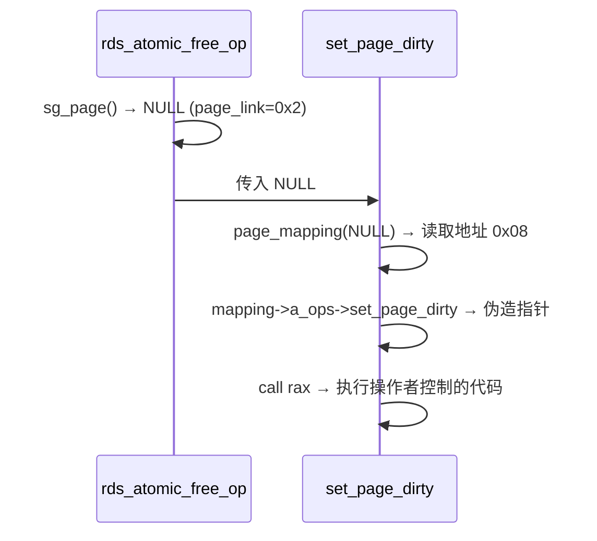

### 3-4. 分析总结

通过上述源码分析与流程梳理，可以将 **CVE-2018-5333** 漏洞的根因归纳如下表：

| 环节                       | 问题                                                    |
| -------------------------- | ------------------------------------------------------- |
| `rds_cmsg_atomic` 错误路径 | 未重置 `op_active` 标志，导致后续释放时认为原子操作有效 |
| SG 条目初始化              | 分配 SG 后未设置实际页面，`page_link` 仅为标记位 `0x2`  |
| `rds_atomic_free_op`       | 直接调用 `sg_page()` 获取 NULL，未检查有效性            |
| `set_page_dirty(NULL)`     | 导致 `page_mapping(NULL)` 从地址 0x08 读取伪造数据      |

根本原因是**状态管理缺失**：错误路径没有将 `op_active` 复位，使得资源释放时访问了未正确初始化的 SG 条目，最终引发空指针解引用。该漏洞在补丁 `7d11f77f84b2` 中被修复，在 `err` 路径中添加了 `ao->op_active = 0` 的赋值。

从漏洞触发流程可以看出，整个利用链仅需一次精心构造的 `sendmsg()` 调用，无需额外交互。这种“单次触发”的特性使得漏洞在实际利用中非常可靠。然而，若要成功实现控制流重定向，还需要满足额外的条件（如零页可映射、SMAP 关闭等），这将在下一章对 **CVE-2019-9213** 进行分析。

## 4. CVE-2019-9213 漏洞分析

### 4-1. 漏洞概述

**CVE-2019-9213** 是 Linux 内核内存管理子系统中的一个权限检查绕过漏洞，位于 `mm/mmap.c` 的 `expand_downwards()` 函数中。该函数用于将 VMA 向下扩展（通常用于栈增长）。内核在 commit `8869477a49c3` 中为防范栈扩展到低地址而引入了 `security_mmap_addr()` 检查，但该检查内部使用 `current_cred()` 判断能力，而非目标进程的凭据。

当通过 `/proc/self/mem` 的 write 路径触发 VMA 扩展时，完整的调用链为：

```
mem_write
  → mem_rw
    → access_remote_vm
      → __access_remote_vm
        → get_user_pages_remote
          → __get_user_pages_locked
            → __get_user_pages
              → find_extend_vma
                → expand_stack
                  → expand_downwards
                    → security_mmap_addr
                      → cap_mmap_addr
```

在此上下文中，`current_cred()` 取自发起 write 的进程（而非目标 VMA 所属进程）。若借助一个拥有 `CAP_SYS_RAWIO` 能力的辅助进程（如 `su`）作为 write 发起方，能力检查就会被放行，从而将 VMA 扩展到地址 0，实现零页映射。

该漏洞本身仅提供零页映射能力，必须与其他空指针解引用漏洞（如 **CVE-2018-5333**）配合才能实现控制流重定向。补丁 `0a1d52994d44` 将其修复，将 `security_mmap_addr()` 替换为直接与 `mmap_min_addr` 比较，彻底消除对 `current_cred()` 的依赖。

下面将通过逐层源码分析，揭示漏洞的触发机制与权限检查上下文混淆的本质。

### 4-2. 关键函数分析

本节沿着漏洞触发路径，从最外层的 `/proc/self/mem` 写入入口开始，逐层深入至最终的权限检查函数，剖析每个环节的作用与漏洞点。

#### 4-2-1. 入口函数

```c
static ssize_t mem_write(struct file *file, const char __user *buf,
                         size_t count, loff_t *ppos)
{
    // 直接调用 mem_rw，write 标志为 1
    return mem_rw(file, (char __user*)buf, count, ppos, 1);
}
```

`mem_write` 是 `/proc/self/mem` 的 write 回调。它接收用户空间传来的缓冲区 `buf`（例如 `"Password: g"`）、长度 `count` 和文件偏移 `ppos`。`ppos` 指定了要写入的目标虚拟地址（例如 `0x0`）。随后将控制权交给 `mem_rw`。该函数本身逻辑简单，仅是通往更深层函数的桥梁。

**流程图**：

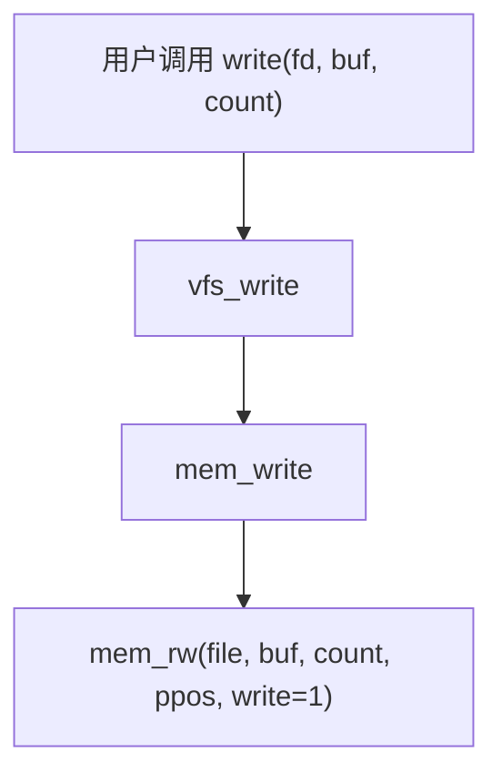

#### 4-2-2. 远程内存读写

```c
static ssize_t mem_rw(struct file *file, char __user *buf,
                      size_t count, loff_t *ppos, int write)
{
    struct mm_struct *mm = file->private_data; // 目标进程的 mm
    unsigned long addr = *ppos;                // 目标虚拟地址
    char *page;
    unsigned int flags;

    page = (char *)__get_free_page(GFP_KERNEL); // 分配临时内核页
    if (!page) return -ENOMEM;

    flags = FOLL_FORCE | (write ? FOLL_WRITE : 0);

    while (count > 0) {
        int this_len = min_t(int, count, PAGE_SIZE);
        if (write && copy_from_user(page, buf, this_len)) {
            // 将用户数据拷贝到内核临时页
            copied = -EFAULT; break;
        }
        // 核心：通过 access_remote_vm 将数据写入目标进程的地址空间
        this_len = access_remote_vm(mm, addr, page, this_len, flags);
        if (!this_len) { ... break; }
        // 更新偏移和计数
        buf += this_len; addr += this_len; copied += this_len; count -= this_len;
    }
    *ppos = addr;
    mmput(mm);
    free_page((unsigned long) page);
    return copied;
}
```

**关键点**：`access_remote_vm` 是真正执行跨进程内存访问的函数。它接收目标进程的 `mm`、目标虚拟地址 `addr`（例如 `0x0`）、临时内核页 `page` 和数据长度，以及 `gup_flags`（包含 `FOLL_FORCE | FOLL_WRITE`）。这里的 `addr` 直接来自文件偏移 `ppos`，若操作者将 `ppos` 设为 `0`，则尝试向地址 `0` 写入数据。接下来，`access_remote_vm` 将负责处理这个看似不可能的请求。

#### 4-2-3. 跨进程内存访问

```c
int access_remote_vm(struct mm_struct *mm, unsigned long addr,
                     void *buf, int len, unsigned int gup_flags)
{
    return __access_remote_vm(NULL, mm, addr, buf, len, gup_flags);
}
```

`__access_remote_vm` 遍历目标地址范围内的页面，通过 `get_user_pages_remote` 获取页面并执行读写：

```c
int __access_remote_vm(struct task_struct *tsk, struct mm_struct *mm,
                       unsigned long addr, void *buf, int len,
                       unsigned int gup_flags)
{
    while (len) {
        struct page *page = NULL;
        ret = get_user_pages_remote(tsk, mm, addr, 1,
                                    gup_flags, &page, &vma, NULL);
        if (ret <= 0) {
            // 若获取页面失败，可能是 VMA 不存在或地址无效
            // 对于本漏洞，首次调用时地址 0 尚未映射，会触发 VMA 扩展
            break;
        }
        // 映射页面并执行读写...
    }
}
```

**关键点**：当目标地址 `addr` 不在任何 VMA 范围内时，`get_user_pages_remote` 内部会调用 `find_extend_vma` 尝试扩展 VMA。这正是漏洞触发的起点——地址 `0` 通常没有任何 VMA，但若存在一个 `VM_GROWSDOWN` 的 VMA 且其起始地址高于 `0`，则有机会通过向下扩展将其覆盖到 `0`。

#### 4-2-4. 获取用户页面

```c
long get_user_pages_remote(struct task_struct *tsk, struct mm_struct *mm,
                           unsigned long start, unsigned long nr_pages,
                           unsigned int gup_flags, struct page **pages,
                           struct vm_area_struct **vmas, int *locked)
{
    return __get_user_pages_locked(tsk, mm, start, nr_pages, pages, vmas,
                                   locked, true,
                                   gup_flags | FOLL_TOUCH | FOLL_REMOTE);
}
```

`__get_user_pages_locked` 循环调用 `__get_user_pages` 直到获取足够的页面。`__get_user_pages` 在遍历过程中，若发现当前地址不在已有 VMA 内，会调用 `find_extend_vma` 尝试扩展。

```c
static long __get_user_pages(...)
{
    do {
        if (!vma || start >= vma->vm_end) {
            vma = find_extend_vma(mm, start);  // ← 关键调用
            if (!vma || check_vma_flags(vma, gup_flags))
                return i ? : -EFAULT;
        }
        // ... follow_page, faultin_page ...
    } while (nr_pages);
}
```

至此，调用链已经从用户态的 `write` 系统调用深入到了内核的内存管理核心。下一步，`find_extend_vma` 将决定是否真的允许 VMA 向下扩展。

#### 4-2-5. VMA 查找与扩展

```c
struct vm_area_struct *find_extend_vma(struct mm_struct *mm, unsigned long addr)
{
    struct vm_area_struct *vma;
    unsigned long start;

    addr &= PAGE_MASK;
    vma = find_vma(mm, addr);  // 查找包含 addr 或紧随其后的 VMA
    if (!vma) return NULL;
    if (vma->vm_start <= addr) return vma;  // 已包含
    if (!(vma->vm_flags & VM_GROWSDOWN)) return NULL;  // 不可向下扩展
    start = vma->vm_start;
    if (expand_stack(vma, addr))  // 尝试向下扩展
        return NULL;
    // 扩展成功
    return vma;
}
```

**关键点**：当 `addr`（例如 `0x0`）小于 VMA 的 `vm_start`（例如 `0x4000`）且 VMA 具有 `VM_GROWSDOWN` 标志时，会调用 `expand_stack` 尝试向下扩展 VMA。这就是漏洞的触发路径。这里的前提条件是：目标进程必须先创建一个带有 `MAP_GROWSDOWN` 标志的匿名映射，且其起始地址足够高（如 `0x10000`），以便通过多次扩展逐步降低到 `0`。

#### 4-2-6. 栈扩展

```c
int expand_stack(struct vm_area_struct *vma, unsigned long address)
{
    return expand_downwards(vma, address);
}
```

`expand_downwards` 是实际执行 VMA 扩展的函数：

```c
int expand_downwards(struct vm_area_struct *vma, unsigned long address)
{
    struct mm_struct *mm = vma->vm_mm;
    address &= PAGE_MASK;

    // ★ 漏洞点：security_mmap_addr 使用 current_cred() 检查
    error = security_mmap_addr(address);
    if (error) return error;

    // ... 后续扩展逻辑：更新 vma->vm_start 等 ...
    if (address < vma->vm_start) {
        // 执行扩展
        vma->vm_start = address;
        // ...
    }
    return error;
}
```

**漏洞点**：`security_mmap_addr(address)` 调用 `cap_mmap_addr`，后者使用 `current_cred()` 获取当前进程的凭据。而在 `/proc/self/mem` 的 write 路径中，`current` 是发起 write 的辅助进程（如 `su`），而不是目标 VMA 所属的进程。因此，如果辅助进程具有 `CAP_SYS_RAWIO`，即使 `address` 低于 `dac_mmap_min_addr`，检查也会通过。

#### 4-2-7. 权限检查

```c
int security_mmap_addr(unsigned long addr)
{
    return call_int_hook(mmap_addr, 0, addr);
}
```

```c
int cap_mmap_addr(unsigned long addr)
{
    int ret = 0;
    if (addr < dac_mmap_min_addr) {  // dac_mmap_min_addr = 0x10000
        ret = cap_capable(current_cred(), &init_user_ns,
                          CAP_SYS_RAWIO, SECURITY_CAP_AUDIT);
        if (ret == 0)
            current->flags |= PF_SUPERPRIV;
    }
    return ret;
}
```

**关键点**：`cap_capable` 检查 `current_cred()` 是否具有 `CAP_SYS_RAWIO` 能力。若当前进程（辅助进程）具有该能力（例如 `su` 以 root 运行），则返回 0，允许将 VMA 扩展到低地址（包括 `0x0`）。这便是整个漏洞的核心——权限检查使用了错误的进程上下文。

**流程图**：

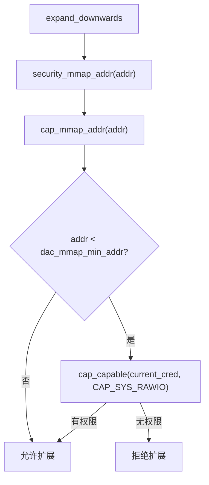

### 4-3. 漏洞触发流程

以下序列图展示了从用户通过辅助进程向 `/proc/self/mem` 写入数据到 VMA 扩展到地址 0 的完整过程。分为三个阶段，每个阶段对应调用链中的一部分。

**阶段一：写入触发**

该阶段始于用户借助辅助进程（如 `su`）将标准输出重定向到 `/proc/self/mem`。辅助进程执行 `write` 系统调用，内核依次经过 `mem_write`、`mem_rw`，最终调用 `access_remote_vm` 尝试向目标进程的虚拟地址 `0` 写入数据。此时地址 `0` 尚未映射，因此需要触发 VMA 扩展。

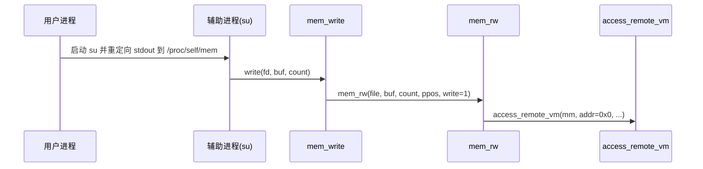

**阶段二：VMA 查找与扩展**

`access_remote_vm` 通过 `__access_remote_vm` 调用 `get_user_pages_remote`，后者经多层封装到达 `__get_user_pages`。由于地址 `0` 不在任何现有 VMA 内，`__get_user_pages` 调用 `find_extend_vma` 查找最近的 VMA。找到的 VMA 起始地址为 `0x4000`，且带有 `VM_GROWSDOWN` 标志，因此触发 `expand_downwards` 尝试将 VMA 向下扩展至 `0`。

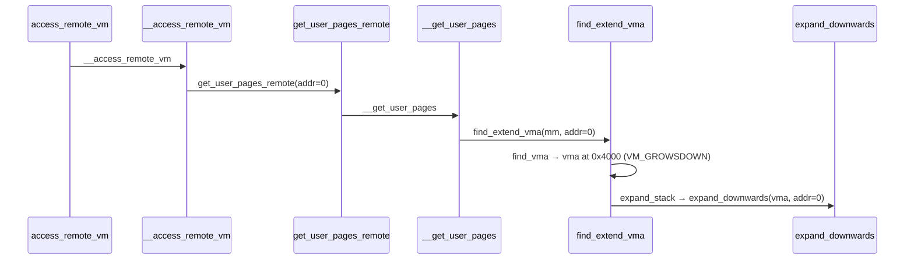

**阶段三：权限检查绕过**

`expand_downwards` 首先调用 `security_mmap_addr(0)` 进行安全检查。`security_mmap_addr` 委托给 `cap_mmap_addr`，后者发现地址 `0` 低于 `dac_mmap_min_addr`（`0x10000`），于是调用 `cap_capable` 检查当前进程（即辅助进程 `su`）是否具有 `CAP_SYS_RAWIO`。由于 `su` 以 root 运行，具有全部能力，检查通过。`expand_downwards` 随即执行 VMA 扩展，将 `vma->vm_start` 设为 `0`。此后，目标进程的虚拟地址 `0` 变为可映射区域，操作者可以通过 `MAP_FIXED` 将物理页面映射至此。

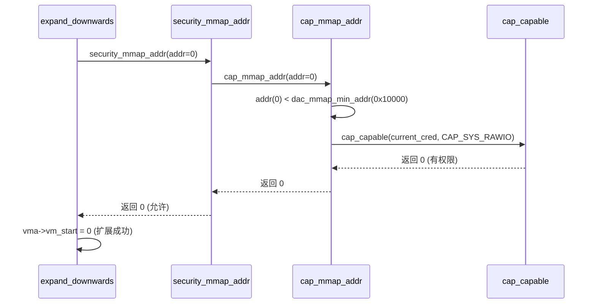

### 4-4. 分析总结

通过上述源码分析与流程梳理，可以将 **CVE-2019-9213** 漏洞的根因归纳如下表：

| 环节                        | 问题                                                                   |
| --------------------------- | ---------------------------------------------------------------------- |
| `expand_downwards` 安全检查 | 调用 `security_mmap_addr` 使用 `current_cred()`，而非目标进程的凭据    |
| `cap_mmap_addr` 权限判断    | 依赖 `current_cred()`，在 `/proc/self/mem` 路径下 `current` 为辅助进程 |
| 辅助进程特权                | 具有 `CAP_SYS_RAWIO` 的进程（如 `su`）可绕过低地址映射限制             |
| VMA 扩展结果                | 允许将 `VM_GROWSDOWN` VMA 扩展到地址 0，实现零页映射                   |

根本原因是**权限检查上下文错误**：commit `8869477a49c3` 引入的防护逻辑本意是防止栈扩展到低地址，但 `security_mmap_addr()` 在设计时未考虑 `/proc/self/mem` 这种跨进程内存访问路径。在该路径下，`current_cred()` 取自发起 write 的辅助进程，而非目标 VMA 所属进程，导致具有 `CAP_SYS_RAWIO` 的进程可以绕过 `dac_mmap_min_addr` 的限制。

该漏洞在补丁 `0a1d52994d44` 中被修复，将 `expand_downwards` 中的 `security_mmap_addr` 替换为直接与 `mmap_min_addr` 比较，消除了对 `current_cred()` 的依赖，从而彻底解决了上下文混淆问题。

## 5. 利用思路

### 5-1. 利用思路概述

**CVE-2018-5333** 与 **CVE-2019-9213** 单独来看均不足以实现完整的权限提升：前者需要可控的零页作为伪造对象的载体，后者仅能提供零页映射却无法直接劫持控制流。两者的组合恰好形成了一条完整的利用链：**先利用 CVE-2019-9213 将虚拟地址 0 映射为可写页面，再利用 CVE-2018-5333 触发空指针解引用，从而将一次原本不可控的内核崩溃转化为精确的控制流重定向**。

整个利用过程围绕以下核心思想展开：

1. **创造可控的零页**：通过 **CVE-2019-9213** 绕过 `mmap_min_addr` 限制，将一个带有 `VM_GROWSDOWN` 标志的 VMA 向下扩展到地址 0，随后使用 `MAP_FIXED` 将物理页面映射到零页，获得对该页面的完全读写控制。
2. **布置伪造的内核对象**：在零页上精心构造一组相互关联的伪造结构体（如 `struct page`、`struct address_space`、`struct address_space_operations`），使得内核在解引用空指针时能够沿着预定义的路径读取到操作者控制的函数指针。
3. **触发空指针解引用**：通过一次精心构造的 `sendmsg()` 调用，触发 **CVE-2018-5333** 漏洞，使内核执行 `set_page_dirty(NULL)`，进而沿着 `page->mapping->a_ops->set_page_dirty` 路径解引用零页上的伪造数据，最终执行操作者预设的代码。

下面按阶段详细阐述每一步的思路与关键技术。从环境准备开始，逐步深入到零页映射、伪造结构体布置、漏洞触发，最后讨论保护机制的应对策略与利用的局限性。每一阶段都建立在前一阶段的基础之上，形成一个环环相扣的链条。

### 5-2. 利用步骤

#### 5-2-1. 环境准备

在触发漏洞之前，需要完成一系列准备工作，以确保利用过程的稳定性和可预测性。这些准备工作虽然看似基础，却是整个利用链成功的基石。

- **绑定 CPU**：为避免多核竞争导致的不确定性，将当前进程绑定到单个 CPU 上执行。这一步通过 `sched_setaffinity` 系统调用实现，确保后续操作不会被调度到其他核心，从而避免竞态条件带来的不可预知行为。
- **保存用户态上下文**：记录当前的段寄存器（CS、SS）、栈指针（RSP）和标志寄存器（RFLAGS），以便在提权完成后能够正确返回到用户态并执行后续代码。这些值通常通过内联汇编或 `setjmp` 等方式保存，它们将被放置在特定的内存位置供 ROP 链使用。
- **确认内核保护状态**：验证 SMAP 是否关闭（否则内核无法直接读取用户空间伪造的结构体）、SMEP 是否开启（需要通过 ROP 链禁用它）、KASLR 是否关闭（地址固定，无需泄漏）。实验环境的配置为：SMAP 关闭、SMEP 开启、KASLR 关闭、KPTI 开启。了解这些状态有助于后续选择合适的绕过策略。

环境准备就绪后，下一步便是利用 **CVE-2019-9213** 创建零页映射。这是整个利用链的物质基础。

#### 5-2-2. 映射零页（CVE-2019-9213）

该阶段的目标是将虚拟地址 0 映射为当前进程的可写页面。具体步骤如下：

1. **创建初始 VMA**：在当前进程的地址空间中创建一个匿名映射，起始地址设为 `0x10000`，并赋予 `MAP_GROWSDOWN` 标志。该标志表明该 VMA 可以向下扩展（类似栈的行为）。选择 `0x10000` 是因为它是 `dac_mmap_min_addr` 的默认值，低于此值的地址需要特殊权限才能映射。
2. **打开 `/proc/self/mem`**：获取当前进程自身内存文件的文件描述符，用于后续的跨进程写入操作。该文件允许对进程的整个地址空间进行读写，是实现 VMA 扩展的关键接口。
3. **利用辅助进程扩展 VMA**：借助一个具有 `CAP_SYS_RAWIO` 能力的 setuid-root 程序（如 `su`），将其标准输出重定向到 `/proc/self/mem` 的文件描述符。通过循环逐渐降低写入的目标地址（从 `0x10000` 开始，每次降低一个固定的步长，如 `0x4000`），每次写入都会触发内核调用 `expand_downwards`。由于 `su` 具有 `CAP_SYS_RAWIO`，`security_mmap_addr` 检查会被放行，VMA 得以逐步向下扩展，最终覆盖到地址 0。
4. **确认零页可写**：扩展成功后，使用 `MAP_FIXED` 将物理页面映射到虚拟地址 0，此时该页面可由当前进程任意读写。这一步验证了零页确实可用，并为后续布置伪造结构体做好了准备。

**流程图**：

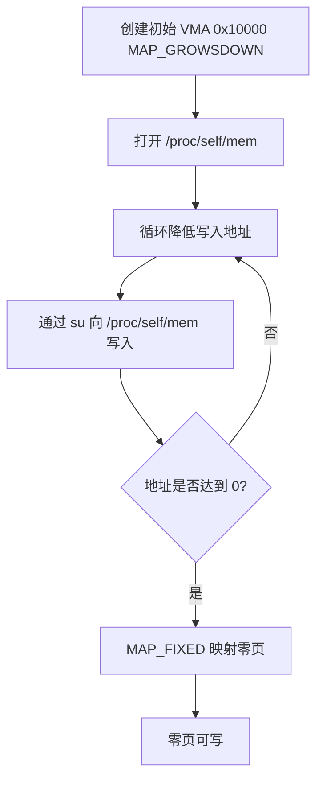

零页映射成功后，便拥有了对地址 0 的完全控制权。然而，仅仅拥有零页是不够的，还需要在上面精心布置伪造的内核结构和 ROP 链，才能将空指针解引用转化为控制流重定向。

#### 5-2-3. 布置伪造结构与 ROP 链

在零页上布置两组关键数据：**伪造的内核对象** 和 **ROP 链**。这两组数据共同决定了漏洞触发后控制流的走向，它们的布局必须与内核源代码中结构体的字段偏移严格对应。

- **伪造内核对象**：根据 `set_page_dirty` 的解引用路径 `page->mapping->a_ops->set_page_dirty`，需要在零页上构造三个结构体：
    - 在地址 `0x00` 处放置一个伪造的 `struct page`，其 `mapping` 字段（偏移 `0x08`）指向地址 `0x10`。
    - 在地址 `0x10` 处放置一个伪造的 `struct address_space`，其 `a_ops` 字段（偏移 `0x70`）指向地址 `0x00`。
    - 地址 `0x00` 同时也被复用为伪造的 `struct address_space_operations`，其 `set_page_dirty` 函数指针（偏移 `0x18`）指向一个**堆栈迁移 gadget**。
- **ROP 链**：堆栈迁移 gadget 会将栈指针（RSP）转移到 ROP 链所在的区域。ROP 链按顺序执行以下操作：
    1. 禁用 SMEP（通过修改 CR4 寄存器的相应位）。
    2. 调用 `prepare_kernel_cred(0)` 获取 root 凭证。
    3. 将返回的凭证指针作为参数传递给 `commit_creds`，完成提权。
    4. 通过 `swapgs_restore_regs_and_return_to_usermode` 返回到用户态，并跳转到预先准备好的 shell 代码。

**序列图**（布置过程）：

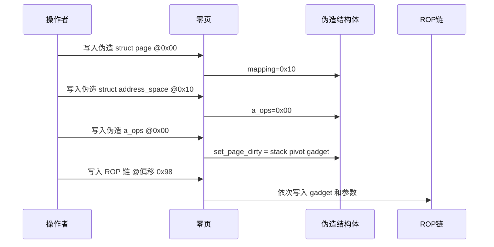

零页上的伪造结构体和 ROP 链布置完毕后，便进入了最后的触发阶段。此时所有前期工作都已就绪，只需一次精心构造的系统调用即可引爆整个链条。

#### 5-2-4. 触发空指针解引用（CVE-2018-5333）

该阶段通过一次 `sendmsg()` 系统调用触发漏洞，是整个利用链的临门一脚。前面的所有准备工作都是为了这一刻。

1. **创建 RDS socket**：使用 `AF_RDS`、`SOCK_SEQPACKET` 协议族创建一个 socket，并将其绑定到回环地址的某个端口。这一步是为了建立合法的 RDS 通信通道，使内核能够进入 `rds_cmsg_atomic` 函数。
2. **构造控制消息**：在控制消息中设置 `cmsg_type` 为 `RDS_CMSG_MASKED_ATOMIC_CSWP`，并将 `local_addr` 字段设置为一个非 8 字节对齐的值（例如 `0xdeadbeef`）。其他字段可任意填充（如 `0x4040404040404040` 作为占位符）。这样做的目的是让对齐检查失败，触发错误路径。
3. **发送消息**：调用 `sendmsg()` 发送该消息。内核在处理过程中进入 `rds_cmsg_atomic`，设置 `op_active = 1` 后因对齐检查失败跳转到错误路径，但未清除 `op_active`。随后消息释放时，`rds_atomic_free_op` 调用 `set_page_dirty(NULL)`，触发空指针解引用。
4. **控制流劫持**：内核在执行 `set_page_dirty(NULL)` 时，从零页读取伪造的 `mapping`、`a_ops` 和函数指针，最终执行堆栈迁移 gadget，转入 ROP 链完成提权。

**序列图**（触发过程）：

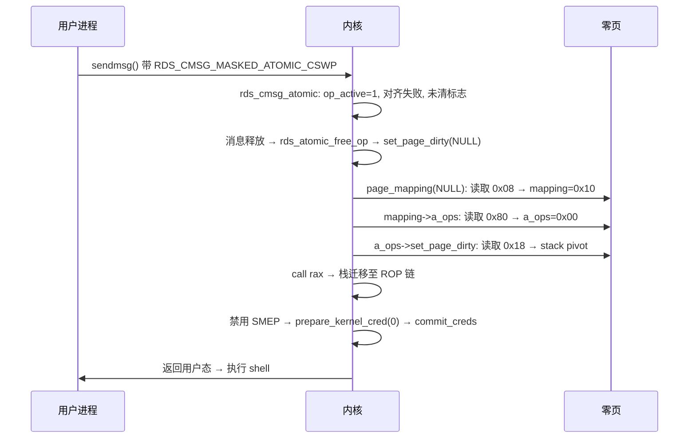

至此，整个利用链执行完毕。回顾整个过程，有几个关键技术难点值得深入探讨，它们直接决定了利用的成功率。

### 5-3. 关键技术与挑战

#### 5-3-1. 堆栈迁移

由于漏洞触发时栈指针（RSP）指向内核栈，而 ROP 链位于用户空间的零页上，因此需要一个堆栈迁移 gadget 将 RSP 切换到用户空间。常用的 gadget 形如 `push rdi; pop rsp; ret`，它将 `rdi` 寄存器的值赋给 RSP。在漏洞触发时，`rdi` 恰好指向零页上的某个地址（通过伪造结构体巧妙安排），从而完成栈的迁移。这个 gadget 的选择需要精确匹配内核二进制中的可用指令序列，通常通过 `objdump` 或 `ROPgadget` 工具搜索获得。

#### 5-3-2. 禁用 SMEP

SMEP（Supervisor Mode Execution Prevention）阻止内核执行用户空间的代码。ROP 链必须先将 CR4 寄存器中的 SMEP 位（bit 20）清零，才能安全地跳转到用户空间的 shell 代码。这通常通过 `mov cr4, rdi; ret` 这样的 gadget 实现，其中 `rdi` 存放了修改后的 CR4 值。修改后的 CR4 值通过将原始 CR4 值与一个掩码（如 `0x6f0`）进行按位与运算得到，该掩码清除了 SMEP 位而不影响其他位。

#### 5-3-3. 获取 Root 凭证

提权的标准方法是调用内核函数 `prepare_kernel_cred(0)` 获取一个具有 root 权限的凭证结构体，再调用 `commit_creds()` 将其应用到当前进程。这两个函数的地址需要提前确定（在 KASLR 关闭的情况下地址固定）。`prepare_kernel_cred(0)` 的参数 `0` 表示创建一个全新的 root 凭证，而非继承自某个现有进程。调用成功后，当前进程的所有权限检查都将以 root 身份进行。

#### 5-3-4. 返回用户态

完成凭证替换后，需要通过 `swapgs_restore_regs_and_return_to_usermode` 之类的函数恢复用户态上下文并跳转到 shell 代码。该函数会执行 `swapgs`、`iretq` 等指令，从内核栈上弹出之前保存的用户态寄存器值（CS、SS、RSP、RFLAGS、RIP）。注意，该函数在返回前还会处理 KPTI 所需的页表切换，因此即使 KPTI 开启也不构成问题。返回后，用户进程将以 root 权限运行，可以执行任意操作。

理解了这些关键技术后，我们需要系统地审视实验环境中的各项保护机制，并制定相应的应对策略。不同的保护机制对利用链的影响各不相同，有的需要绕过，有的则无关紧要。

### 5-4. 内核保护机制应对策略

本节讨论实验环境下各内核保护机制的开启状态及其对利用的影响，以及相应的绕过策略。下表总结了每种保护机制的状态和作用。

| 保护机制          | 实验环境状态 | 影响与应对策略                                                                                                                                                                                                                                       |
| ----------------- | ------------ | ---------------------------------------------------------------------------------------------------------------------------------------------------------------------------------------------------------------------------------------------------- |
| **SMAP**          | **关闭**     | SMAP 关闭意味着内核可以直接访问用户空间的数据。这是本利用链可行的前提——零页上的伪造结构体可以被内核直接读取。若 SMAP 开启，则需要通过堆喷射等方式将伪造对象布置到内核空间，大幅增加利用复杂度。                                                      |
| **SMEP**          | **开启**     | SMEP 阻止内核执行用户空间的代码。ROP 链必须在禁用 SMEP 后才能跳转到用户空间的 shell 代码。利用步骤中已包含修改 CR4 寄存器的 gadget 来清除 SMEP 位。                                                                                                  |
| **KASLR**         | **关闭**     | KASLR 关闭使得内核代码段的基址固定，ROP 链中使用的 gadget 和函数地址可以直接硬编码。若 KASLR 开启，则需要先通过信息泄露漏洞获取内核基址，再动态计算地址，显著提高利用门槛。                                                                          |
| **KPTI**          | **开启**     | KPTI（Kernel Page Table Isolation）将用户空间和内核空间的页表分离。本利用链中，ROP 链执行时仍处于内核态，KPTI 不影响内核内部的控制流。返回用户态时使用的 `swapgs_restore_regs_and_return_to_usermode` 函数已正确处理页表切换，因此 KPTI 不构成障碍。 |
| **mmap_min_addr** | 默认 0x10000 | **CVE-2019-9213** 通过权限检查上下文混淆绕过了此限制，实现了零页映射。                                                                                                                                                                               |

**流程图**（保护机制应对总览）：

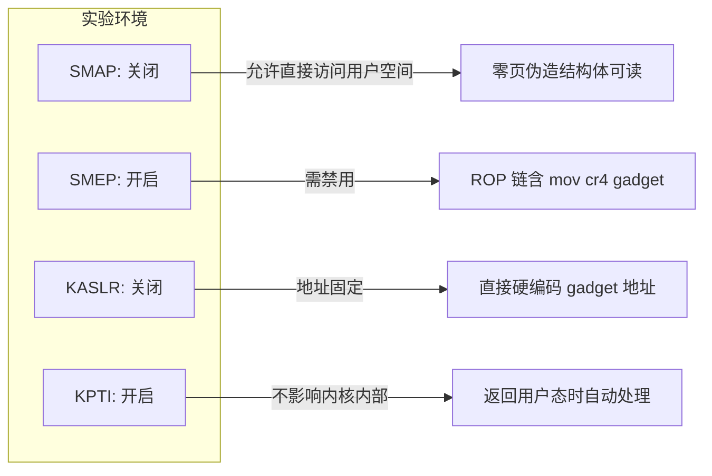

尽管实验环境提供了有利条件，但实际利用仍需满足一系列严格的条件，并且存在固有的局限性。了解这些条件和局限性有助于评估利用的可行性和风险。

### 5-5. 利用条件与局限性

#### 5-5-1. 必要条件

- **内核版本**：**CVE-2018-5333** 影响 ≤ 4.14.13，**CVE-2019-9213** 影响 < 4.20.14。实验环境需同时满足。
- **RDS 协议栈**：需要 `CONFIG_RDS` 和 `CONFIG_RDS_TCP` 编译选项开启（内置或可加载模块）。
- **SMAP 关闭**：内核不能开启 SMAP，否则无法直接读取用户空间伪造结构体。
- **辅助进程**：系统中必须存在一个具有 `CAP_SYS_RAWIO` 能力的 setuid-root 程序（如 `su`），且操作者能够触发其向 `/proc/self/mem` 写入。
- **内存映射权限**：操作者需具备创建 `MAP_GROWSDOWN` 映射和执行 `MAP_FIXED` 映射的权限（普通用户即可）。

#### 5-5-2. 局限性

- **SMAP 依赖性**：若目标系统开启了 SMAP，本利用链失效，需要额外的绕过技术（如内核堆喷）。
- **KASLR 影响**：虽然实验环境关闭了 KASLR，但生产系统通常开启。若无法泄漏内核基址，则无法构造有效的 ROP 链。
- **辅助进程可用性**：某些受限环境（如容器）可能没有可用的 setuid-root 程序，或 `/proc/self/mem` 访问受限。
- **日志痕迹**：零页映射过程中多次调用 `su` 会产生认证失败的日志（如 “su: incorrect password”），可能引起管理员警觉。
- **单次触发**：漏洞触发后若失败（例如伪造结构体布局错误），可能导致内核崩溃，需要重启系统。

### 5-6. 总结

**CVE-2018-5333** 与 **CVE-2019-9213** 的组合利用展示了单一漏洞缓解措施的局限性。前者提供了一个看似无害的零页映射能力，后者则是一个难以独立利用的空指针解引用漏洞。两者结合后，一次原本会导致内核崩溃的错误路径被转化为精确的控制流重定向。这种利用模式强调了纵深防御的重要性：仅靠 SMEP、KPTI 等单项防护不足以阻断复杂的利用链，需要同时启用 SMAP、KASLR、CFI 等多种机制才能有效抵御。

从防御角度看，该案例还提醒开发者：安全补丁的引入必须充分考虑所有可能的调用上下文，否则可能引入新的绕过途径（如 **CVE-2019-9213** 中 `security_mmap_addr` 对 `current_cred()` 的误用）。只有通过全面的代码审计和运行时防护相结合，才能构建真正坚固的内核安全防线。

### 5-7. 测试结果

<div style="text-align: center; margin: 2rem 0;">
  
</div>

## 6. 漏洞修复

### 6-1. 修复概述

第3章和第4章分别剖析了两个漏洞的根因：**CVE-2018-5333** 源于 `rds_cmsg_atomic()` 错误路径未复位 `op_active` 标志，导致残留状态触发空指针解引用；**CVE-2019-9213** 则源于 `expand_downwards()` 中 `security_mmap_addr` 依赖 `current_cred()`，在 `/proc/self/mem` 的跨进程路径下发生上下文混淆，绕过了 `mmap_min_addr` 限制。两个漏洞虽属不同子系统，但都暴露了内核安全设计中容易被忽视的共性缺陷：状态管理的对称性与权限检查的上下文明确性。

Linux 内核社区分别通过两个补丁予以修复，修复节奏与影响版本如下：

- **CVE-2018-5333**：补丁 `7d11f77f84b2`，合入 4.14.14 及后续稳定分支，修复思路为**错误路径对称复位状态**，从根源上避免残留的 `op_active` 标志触发后续空指针解引用。
- **CVE-2019-9213**：补丁 `0a1d52994d44`，合入 4.20.14 及后续稳定分支，修复思路为**移除上下文相关的权限检查，直接比对地址下限**，彻底解决 `/proc/self/mem` 路径下的权限检查上下文混淆问题。

下面分别深入分析每个补丁的具体改动及其背后的设计考量。

### 6-2. CVE-2018-5333 修复

回顾第3章的源码分析，漏洞触发点位于 `rds_cmsg_atomic()` 函数。正常路径中，函数在填充完原子操作参数后将 `rm->atomic.op_active` 置为 1，随后进行 `local_addr` 的 8 字节对齐检查。若对齐失败，函数跳转到 `err` 标签，但错误路径仅释放了 `page`（若已分配）和 `op_notifier`，却**没有将 `op_active` 复位为 0**。这一遗漏导致后续消息释放时，`rds_message_purge()` 误判原子操作有效，调用 `rds_atomic_free_op()`，进而触发 `set_page_dirty(NULL)`。

补丁的改动极其精简，仅在 `err` 标签处增加了一行状态复位语句。以下为补丁的完整 diff：

```diff
--- a/net/rds/rdma.c
+++ b/net/rds/rdma.c
@@ -877,6 +877,7 @@ int rds_cmsg_atomic(struct rds_sock *rs, struct rds_message *rm,
 err:
 	if (page)
 		put_page(page);
+	rm->atomic.op_active = 0;
 	kfree(rm->atomic.op_notifier);

 	return ret;
```

**修复逻辑说明**

新增的 `rm->atomic.op_active = 0` 被放置在 `kfree(rm->atomic.op_notifier)` 之前，这是因为 `op_active` 作为标志位，其复位操作不依赖于其他资源的释放顺序，放在此处最为直观。这一行代码确保了所有进入 `err` 路径的场景——无论是 SG 分配失败、对齐检查失败，还是 `rds_pin_pages` 失败——都能将原子操作的活跃标志清零。此后，`rds_message_purge()` 在检查 `rm->atomic.op_active` 时将得到 0，从而跳过 `rds_atomic_free_op()` 分支，彻底切断了漏洞触发链。

该修复遵循了内核资源管理中一个朴素但至关重要的原则：**正常路径中设置的状态或分配的资源，错误路径必须对称地复位或释放**。类似 `op_active` 这种“先置位、后检查”的模式在内核中并不罕见，一旦遗漏复位，就可能留下残留状态，被后续逻辑误用。补丁作者显然意识到了这一点，用最小改动封堵了漏洞。

### 6-3. CVE-2019-9213 修复

第4章的源码追踪揭示了另一个截然不同的根因：`expand_downwards()` 函数在决定是否允许 VMA 向下扩展时，调用了 `security_mmap_addr(address)`。该函数内部通过 `cap_mmap_addr` 检查当前进程（`current_cred()`）是否具有 `CAP_SYS_RAWIO` 能力。然而，在 `/proc/self/mem` 的 write 路径下，`current` 是发起写入的辅助进程（如 `su`），而非目标 VMA 所属的进程。因此，只要辅助进程具有该能力，就可以绕过 `dac_mmap_min_addr` 的限制，将 VMA 扩展到任意低地址（包括 0）。

补丁的改动同样十分简洁，但意义深远。以下为补丁的完整 diff：

```diff
--- a/mm/mmap.c
+++ b/mm/mmap.c
@@ -2426,12 +2426,11 @@ int expand_downwards(struct vm_area_struct *vma,
 {
 	struct mm_struct *mm = vma->vm_mm;
 	struct vm_area_struct *prev;
-	int error;
+	int error = 0;

 	address &= PAGE_MASK;
-	error = security_mmap_addr(address);
-	if (error)
-		return error;
+	if (address < mmap_min_addr)
+		return -EPERM;

 	/* Enforce stack_guard_gap */
 	prev = vma->vm_prev;
```

**修复逻辑说明**

- **移除 `security_mmap_addr` 调用**：补丁删除了对 `security_mmap_addr()` 的调用，不再通过 LSM 钩子做能力检查。这意味着无论当前进程是谁、具有什么能力，都无法绕过 `mmap_min_addr` 的限制。从根本上消除了 `current_cred()` 上下文混淆的可能性。
- **直接比对 `mmap_min_addr`**：替换为简单的地址下限判断 `if (address < mmap_min_addr) return -EPERM`。`mmap_min_addr` 是系统全局配置（通常为 65536，即 0x10000），对所有进程一视同仁。无论通过何种路径触发 VMA 向下扩展——包括正常的栈自动增长、`/proc/self/mem` 写入、`ptrace` 内存操作等——只要目标地址低于该阈值，一律拒绝。
- **`error` 变量初始化**：将 `error` 的声明改为 `int error = 0`，避免了在早期返回路径中可能出现的未初始化使用风险（虽然原代码中 `error` 在返回前总有赋值，但显式初始化是良好的编程习惯）。

该修复也回应了第2章提到的“防护补丁自身引入新问题”的警示：**CVE-2019-9213** 本身就是 commit `8869477a`（引入 `security_mmap_addr` 检查）这个防护补丁引入的。那次补丁的本意是防止栈扩展到危险的低地址，却因忽略了 `/proc/self/mem` 的特殊上下文而创造了新的绕过路径。本次修复直接移除了上下文相关的检查逻辑，从机制上避免了同类问题复现，可谓“釜底抽薪”。

### 6-4. 修复总结

针对 **CVE-2018-5333**，其根因在于 `rds_cmsg_atomic` 错误路径未复位 `op_active`，导致残留状态在消息释放时触发空指针解引用。补丁采用错误路径对称复位状态的思路，在 `rds_cmsg_atomic` 的 `err` 路径中新增 `rm->atomic.op_active = 0`，于 4.14.14 主线合入。该修复切断了 `set_page_dirty(NULL)` 的调用链，从根本上杜绝了空指针解引用的可能。

针对 **CVE-2019-9213**，其根因在于 `expand_downwards` 中 `security_mmap_addr` 依赖 `current_cred`，在 `/proc/self/mem` 路径下发生上下文混淆，从而绕过 `mmap_min_addr`。补丁采用移除上下文相关权限检查、直接比对地址下限的思路，将 `expand_downwards` 中的 `security_mmap_addr` 调用替换为 `address < mmap_min_addr` 的判断，于 4.20.14 主线合入。该修复消除了上下文混淆，使所有进程一视同仁，无法再绕过 `mmap_min_addr` 的限制。

两个补丁均以最小的改动量精准封堵了漏洞根源，体现了内核安全维护中“对症下药”的设计哲学。

### 6-5. 延伸思考

两个补丁虽然分属不同子系统（RDS 协议栈 vs 内存管理），但都指向了内核安全开发中两个普遍存在的痛点：

1. **资源/状态管理的对称性**：内核中任何在正常路径设置的状态、分配的资源，错误路径必须做对称的复位/释放。尤其像 `op_active` 这类“标志位+延迟释放”的模式，错误路径的遗漏极易引发 Use-After-Error 或空指针类问题。现代静态分析工具（如 Coccinelle、Coverity）已经能够检测部分此类模式，但仍需开发者保持警惕。

2. **权限检查的上下文明确性**：跨进程路径（如 `/proc/<pid>/mem`、`ptrace`、`process_vm_readv` 等）中的权限检查，必须明确“检查主体是 current 还是客体进程”，不能随意复用面向单进程场景的 `current_cred()` 类接口，否则容易引发上下文混淆类漏洞。**CVE-2019-9213** 正是这一原则的反面教材。补丁采用“一刀切”的全局下限比较，虽然牺牲了一定的灵活性（例如某些合法场景下低地址映射的需求），但换来了安全性的确定性。

这两个案例也再次印证了第2章提出的“纵深防御”理念：单一防护（如 `security_mmap_addr` 的 `cap_sys_rawio` 检查）在异常调用路径下可能失效，只有从机制设计上消除上下文歧义，并辅以多重隔离手段（如 SAMEP、SMAP、KASLR、KPTI、CFI），才能构建真正坚固的内核安全防线。

从开发实践角度看，这两个补丁还启示我们：

- 代码审查时应特别关注错误路径中的状态一致性，尤其是那些“先置位、后检查”的模式。
- 对于涉及跨进程操作的权限检查，应优先考虑基于客体的检查（如目标进程的凭据、地址空间的属性），而非基于 `current` 的检查。
- 最小权限原则同样适用于内核安全设计：能通过简单数值比较解决的问题，就不应引入复杂的 LSM 钩子。

## 7. 免责声明

本文档旨在提供 **CVE-2018-5333 & CVE-2019-9213** 漏洞的技术分析与教育性内容，仅供学习、研究和安全防御目的使用。作者与发布平台对以下事项声明如下：

1. **合法使用原则**：本文档中描述的任何技术细节、代码示例或利用方法仅供教育研究之用。读者不得将这些信息用于任何非法、未经授权或恶意的活动，包括但不限于未经授权的系统入侵、数据破坏、服务干扰或其他违反法律法规的行为。

2. **知识共享与责任**：本文档基于公开可获取的信息、官方漏洞公告和学术研究资料编写。作者力求确保技术内容的准确性，但不对信息的完整性、时效性或适用性作任何明示或暗示的保证。读者应自行验证信息的准确性，并在专业环境中谨慎应用。

3. **环境限制**：所有技术分析和实验应在受控的、隔离的测试环境中进行，例如使用特制的虚拟机或专用硬件。禁止在任何生产环境、公共网络或他人系统中尝试漏洞利用或相关技术。

4. **法律合规性**：读者应遵守所在国家或地区的所有适用法律法规，包括但不限于计算机安全法、数据保护法和知识产权法。任何使用本文档内容的行为所产生的法律后果，由行为者自行承担。

5. **技术中立性**：本文档对漏洞的分析保持技术中立立场，旨在促进安全社区的防御能力提升。文中提及的任何工具、技术或方法不应被视为对任何组织、产品或技术的背书或批判。

6. **更新与修正**：技术领域发展迅速，本文档内容可能随时间而过时。作者保留更新、修正或撤回文档内容的权利，不承诺另行通知。

7. **版权声明**：本文档内容受版权法保护，未经明确书面许可，不得用于商业目的。允许在注明出处的前提下进行非商业性的分享与引用。

**重要提示**：安全研究应始终遵循道德准则，以提升整体网络安全为目标。如发现安全漏洞，建议通过负责任的披露流程向相关厂商或机构报告，共同维护数字生态的安全与稳定。

---

_本文档的撰写参考了公开的漏洞公告、内核源码（Linux 4.14.13）及相关技术分析文献。所有实验均在封闭的测试环境中完成，未对任何实际系统造成影响。_

## 参考

- https://github.com/BinRacer/pwn4kernel/tree/master/src/CVE-2018-5333_V2
- https://yunlongs.cn/2021/07/20/CVE-2019-9213/
- https://www.anquanke.com/post/id/173356
- https://m4p1e.com/2019/11/30/CVE-2019-9213-and-CVE-2018-5333/
- https://git.kernel.org/pub/scm/linux/kernel/git/torvalds/linux.git/commit/?id=7d11f77f84b27cef452cee332f4e469503084737
- https://git.kernel.org/pub/scm/linux/kernel/git/torvalds/linux.git/commit/?id=0a1d52994d440e21def1c2174932410b4f2a98a1
- https://nvd.nist.gov/vuln/detail/CVE-2018-5333
- https://nvd.nist.gov/vuln/detail/CVE-2019-9213
- https://ubuntu.com/security/CVE-2018-5333
- https://ubuntu.com/security/CVE-2019-9213
