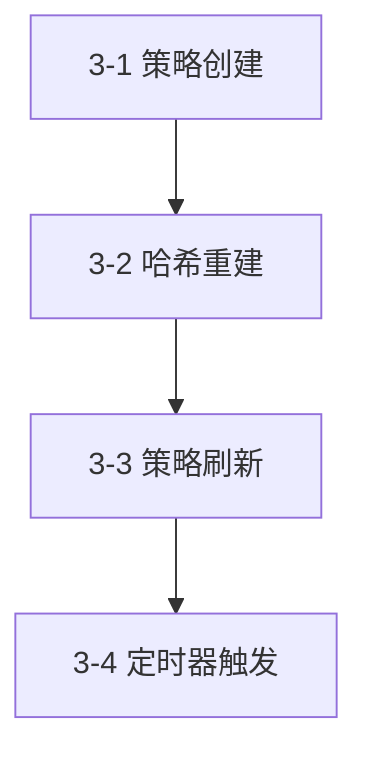
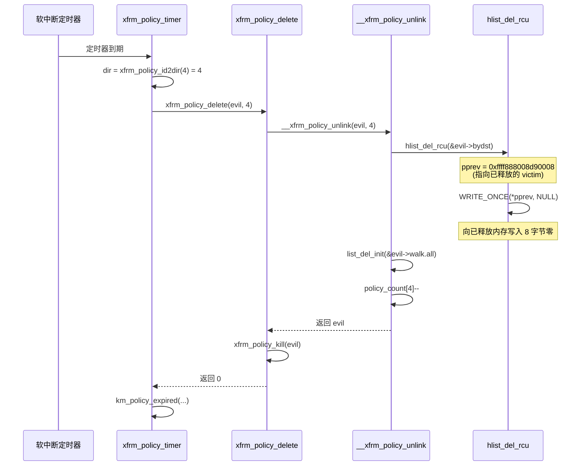
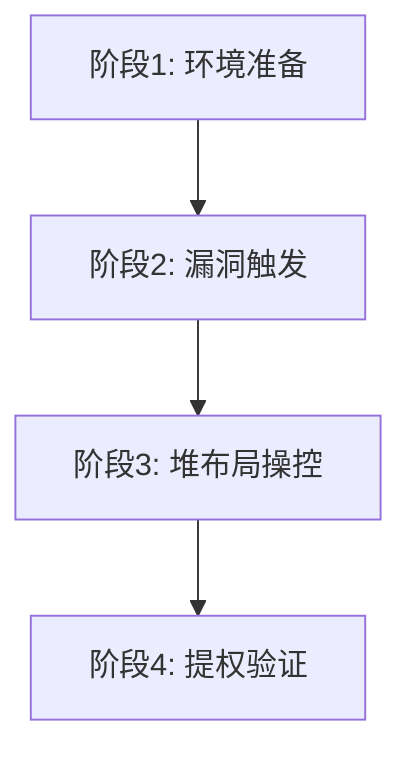
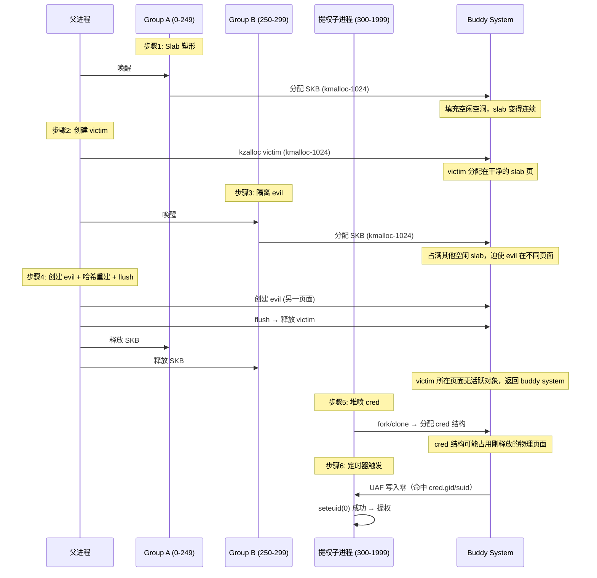

# 【Kernel Exploit】CVE-2019-15666 漏洞分析

## 1. 测试环境

**测试版本**：Linux-4.20.17 [内核镜像地址](https://github.com/BinRacer/pwn4kernel/blob/master/kernels/4.20.17/01/bzImage)

笔者测试的内核版本是 `Linux (none) 4.20.17 #1 SMP Wed Feb 18 16:02:31 CST 2026 x86_64 GNU/Linux`。

**编译选项**：开启`CONFIG_THREAD_INFO_IN_TASK`、`CONFIG_MEMCG`、`CONFIG_MEMCG_KMEM`、`CONFIG_CGROUPS`、`CONFIG_SLAB_FREELIST_RANDOM`、`CONFIG_HARDENED_USERCOPY`、`CONFIG_FUSE_FS`、`CONFIG_USERFAULTFD`、`CONFIG_SYSVIPC`、`CONFIG_KEYS`、`CONFIG_STACKPROTECTOR`、`CONFIG_STACKPROTECTOR_STRONG`、`CONFIG_SLUB`、`CONFIG_SLUB_DEBUG`、`CONFIG_E1000`、`CONFIG_E1000E`、`CONFIG_PACKET`、`CONFIG_PACKET_DIAG`、`CONFIG_USER_NS`、`CONFIG_NET_NS`、`CONFIG_NAMESPACES`、`CONFIG_CHECKPOINT_RESTORE`、`CONFIG_IPC_NS`、`CONFIG_COMPAT_NETLINK_MESSAGES`、`CONFIG_NETFILTER_NETLINK`、`CONFIG_NETFILTER_NETLINK_ACCT`、`CONFIG_NETFILTER_NETLINK_QUEUE`、`CONFIG_NETFILTER_NETLINK_LOG`、`CONFIG_NETFILTER_NETLINK_OSF`、`CONFIG_NF_CT_NETLINK`、`CONFIG_NF_CT_NETLINK_TIMEOUT`、`CONFIG_NF_CT_NETLINK_HELPER`、`CONFIG_NETFILTER_NETLINK_GLUE_CT`、`CONFIG_NETLINK_DIAG`、`CONFIG_SCSI_NETLINK`、`CONFIG_QUOTA_NETLINK_INTERFACE`、`CONFIG_XFRM`、`CONFIG_XFRM_OFFLOAD`、`CONFIG_XFRM_ALGO`、`CONFIG_XFRM_USER`、`CONFIG_XFRM_INTERFACE`、`CONFIG_XFRM_SUB_POLICY`、`CONFIG_XFRM_MIGRATE`、`CONFIG_XFRM_STATISTICS`、`CONFIG_XFRM_IPCOMP`、`CONFIG_INET_XFRM_TUNNEL`、`CONFIG_INET_XFRM_MODE_TRANSPORT`、`CONFIG_INET_XFRM_MODE_TUNNEL`、`CONFIG_INET_XFRM_MODE_BEET`、`CONFIG_INET6_XFRM_TUNNEL`、`CONFIG_INET6_XFRM_MODE_TRANSPORT`、`CONFIG_INET6_XFRM_MODE_TUNNEL`、`CONFIG_INET6_XFRM_MODE_BEET`、`CONFIG_INET6_XFRM_MODE_ROUTEOPTIMIZATION`、`CONFIG_NFT_XFRM`、`CONFIG_SECURITY_NETWORK_XFRM`选项。完整配置参考[.config](https://github.com/BinRacer/pwn4kernel/blob/master/kernels/4.20.17/01/.config)。

**保护机制**：KASLR/SMEP/SMAP/KPTI

## 2. 漏洞背景

### 2-1. 漏洞概述

**CVE-2019-15666** 是 Linux 内核 XFRM（IPsec 策略管理）子系统中的一个释放后使用（Use-After-Free, UAF）漏洞，最终表现为对已释放堆块的 8 字节零写入。该漏洞的根源在于 `verify_newpolicy_info()` 函数与 `xfrm_policy_id2dir()` 函数对策略索引（`index`）的掩码处理不一致：前者使用 `XFRM_POLICY_MAX`（值为 3）进行 `index & 3` 的校验，而后者使用硬编码的 `7` 作为掩码（即 `index & 7`）。这一差异使得非授权用户可构造一个 `index=4, dir=0` 的策略，绕过初始验证；但在后续的哈希重建（`xfrm_hash_rebuild`）中，该策略因 `xfrm_policy_id2dir(index) >= XFRM_POLICY_MAX` 而被跳过重新插入 `bydst` 哈希表，导致其 `pprev` 指针残留指向一个随后被释放的正常策略（victim）。当该异常策略的定时器到期时，`hlist_del_rcu()` 会向残留的 `pprev` 写入零，从而在已释放的 victim 对象上产生受控的 8 字节零写入。

该漏洞最初由内核的 Undefined Behavior Sanitizer（UBSAN）检测到越界行为（访问 `policy_count[4]`），但真正可被利用的 UAF 路径则在后续分析中被揭示。尽管 NVD 给出的基础评分仅为 4.4（中等），但实际可利用性较高——该漏洞曾被发现用于针对欧洲多国超级计算机的加密货币挖矿事件中，作为本地提权的关键环节，证明了其潜在威胁远高于表面评分。从整体上看，这是一个由掩码不一致引发的连锁反应，最终在内核对象生命周期管理中出现缝隙。

### 2-2. 引入历史

漏洞存在于 Linux 内核 3.x 至 5.0.18 之间的所有版本中，跨度长达近十年。该补丁由华为工程师 **YueHaibing** 于 2019 年 2 月 28 日提交（commit `b805d78d300b`），并由 XFRM 子系统维护者 **Steffen Klassert**（secunet）于次日合并至主线，最终随 Linux 5.0.19 正式发布。各主要发行版根据自身内核基线进行了回溯修复，时间线如下：

- **Ubuntu**：14.04/16.04（基于 4.4 内核）于 2019 年 6 月底修复；18.04（4.15 内核）于 2019 年 7 月修复。
- **Red Hat Enterprise Linux 8**：于 2019 年 10 月修复。
- **CentOS 8**：于 2020 年 1 月修复（内核版本 4.18.0-147.3.1.el8_1）。
- **Debian**：9/10 系列在各自安全更新中逐步包含该补丁。

漏洞的引入根源在于 `verify_newpolicy_info()` 中使用了 `XFRM_POLICY_MAX`（值为 3）进行索引折叠，而 `xfrm_policy_id2dir()` 却采用了硬编码的掩码 `7`（并非 `XFRM_POLICY_MASK`，后者同样为 3）。这种不一致性并非一时疏忽，而是源于两个函数分别由不同开发者维护，且缺乏统一的抽象层来保证验证逻辑与运行逻辑的一致性。从软件工程角度看，这是典型的“一次检查，两次使用”（check-then-use inconsistency）缺陷，也是许多 UAF 漏洞的常见温床。正是这种细微的掩码差异，在复杂的异步路径中被不断放大，最终酿成可被利用的安全漏洞。

### 2-3. 触发条件

要触发该漏洞，需要满足以下前置条件并执行一组特定的操作序列。这些条件在内核默认配置下往往已经满足，因此漏洞的触发门槛较低。

#### 2-3-1. 前提条件

1. **用户命名空间支持**：系统必须启用 `CONFIG_USER_NS=y`，允许非特权用户创建自己的命名空间以访问 XFRM Netlink 接口。大多数现代 Linux 发行版默认开启该选项，这使得普通用户也能与 XFRM 子系统交互。
2. **内核版本**：内核版本低于 5.0.19，且未应用补丁 commit `b805d78d300b`。
3. **必要内核配置**：`CONFIG_XFRM`、`CONFIG_XFRM_USER`、`CONFIG_INET` 等基本网络功能必须启用（通常默认开启）。

#### 2-3-2. 操作序列

整个触发流程分为四个阶段，每一步都依赖于前一步的状态破坏，形成一个环环相扣的链条：

1. **策略创建**：首先创建两个 `xfrm_policy` 对象：
    - `policy0`（victim）：`index=0, dir=0`，作为正常策略。
    - `policy1`（evil）：`index=4, dir=0`，利用验证缺陷通过初始检查，并为其设置定时器（通过 `XFRM_MSG_POLEXPIRE` 消息或直接操纵 `xp->timer`）。这一步的关键在于 `index=4` 的低 3 位为 4，与 `dir=0` 组合后恰好能通过 `verify_newpolicy_info` 的 `(index & 3) != dir` 检查。

2. **哈希重建**：发送 `XFRM_SPD_IPV4_HTHRESH` 请求，触发内核调用 `xfrm_hash_rebuild()`。在该函数中，系统遍历 `policy_all` 链表，对每个策略调用 `xfrm_policy_id2dir()` 获取目录号。由于 `policy1` 的 `index=4`，`4 & 7 = 4`，满足 `xfrm_policy_id2dir(policy->index) >= XFRM_POLICY_MAX`（即 ≥3），因此它被跳过重新插入 `bydst` 哈希表。然而，它的 `pprev` 指针（指向前一个同桶元素的 `next` 字段）仍然指向 `policy0` 的 `bydst` 节点——这是一个关键的残留引用。此时，`policy0` 被正常重新插入哈希表，但由于 `policy1` 未被重新插入，`policy0` 成为链表头部，而 `policy1` 的 `pprev` 仍指向 `policy0` 的旧节点。

3. **策略刷新**：发送 `XFRM_FLUSH_POLICY` 请求，内核调用 `xfrm_policy_flush()`。该函数遍历所有合法 `dir`（0～2）下的哈希桶，逐一解除并释放策略。由于 `policy1` 不在任何合法 `dir` 的哈希桶中（因其 `dir` 越界），它不会被遍历到，因此存活下来。而 `policy0` 被正常解除链接并释放，其内存归还给 slab 分配器。此时，`policy1` 的 `pprev` 变成了一个悬空指针（dangling pointer），指向已被释放的 `policy0` 的 `bydst` 节点。

4. **定时器触发**：等待 `policy1` 的定时器超时。定时器处理函数 `xfrm_policy_timer()` 最终调用 `__xfrm_policy_unlink()`，其中执行 `hlist_del_rcu()` 宏。该宏等价于 `WRITE_ONCE(*pprev, policy1->bydst.next)`，即向 `pprev` 所指向的位置（也就是 `policy0` 原 `bydst` 节点的 `next` 字段）写入 `NULL`（8 字节零）。至此，一个受控的 8 字节零写入发生在已释放的 `policy0` 对象上。

整个过程依赖精确的时序控制，尤其是步骤 3 和步骤 4 之间不能有太长的延迟，否则 `policy0` 的内存可能被其他数据结构重用，导致写入目标不可预测。在实际利用中，通常需要多次尝试并借助 `userfaultfd` 或竞态窗口放大技术来提高成功率。值得注意的是，定时器到期的时间可以通过设置策略的生存期（`lft`）参数来精确控制，从而降低时序难度。

### 2-4. 根因分析

漏洞的根因在于 `verify_newpolicy_info()` 与 `xfrm_policy_id2dir()` 对 `index` 的处理逻辑不一致，导致验证层与实际运行层的语义脱节，最终引发内核对象的状态不一致。下面从代码层面深入剖析。

#### 2-4-1. 核心代码对比

```c
// net/xfrm/xfrm_user.c —— 验证函数
static int verify_newpolicy_info(struct xfrm_userpolicy_info *p)
{
    // ...
    if (p->index && ((p->index & XFRM_POLICY_MAX) != p->dir))
        return -EINVAL;
    // ...
}

// include/net/xfrm.h —— 运行时转换函数
static inline int xfrm_policy_id2dir(u32 index)
{
    return index & 7;   // 硬编码掩码为 7，而非 XFRM_POLICY_MASK (3)
}
```

内核头文件中的枚举定义：

```c
enum {
    XFRM_POLICY_IN   = 0,
    XFRM_POLICY_OUT  = 1,
    XFRM_POLICY_FWD  = 2,
    XFRM_POLICY_MASK = 3,   // 用于位运算的掩码
    XFRM_POLICY_MAX  = 3
};
```

- `verify_newpolicy_info()` 使用 `XFRM_POLICY_MAX`（值为 3）进行 `index & 3` 的折叠校验。
- `xfrm_policy_id2dir()` 使用硬编码的 `7` 作为掩码，而不是 `XFRM_POLICY_MASK`（值为 3）。这意味着即使将来修改 `XFRM_POLICY_MASK`，运行时掩码也不会同步更新。

当用户设置 `p->index=4, p->dir=0` 时：

- **验证阶段**：`(4 & 3) = 0`，等于 `p->dir=0`，检查通过。
- **运行阶段**：`xfrm_policy_id2dir(4)` 返回 `4 & 7 = 4`，超出合法范围 [0,2]。

#### 2-4-2. 关键利用路径分解

1. **哈希重建中的选择性跳过**：`xfrm_hash_rebuild()` 遍历 `policy_all` 链表时，对每个策略调用 `xfrm_policy_id2dir()`。若返回值 ≥ `XFRM_POLICY_MAX`（即 ≥3），则该策略不会被重新插入 `bydst` 哈希表，但其 `pprev` 指针（来自旧的 `bydst` 链表）保持不变。对于 `policy1`（evil），它保留了指向 `policy0`（victim）的 `pprev`。这正是漏洞的核心：一个策略的链表指针指向了另一个策略的内部节点，形成了跨对象的状态依赖。

2. **刷新操作的不对称性**：`xfrm_policy_flush()` 只遍历合法 `dir`（0～2）下的哈希桶，因此 `policy1` 不会被触及，得以幸存；而 `policy0` 被正常解除链接并释放。此时 `policy1` 的 `pprev` 成为悬空指针。注意，`xfrm_policy_flush()` 的循环上限为 `XFRM_POLICY_MAX`（即 3），这意味着它永远不会处理 `dir=4` 的策略，所以 `policy1` 如同“隐身”一般躲过了清理。

3. **定时器触发的 UAF 写入**：`xfrm_policy_timer()` 中，当 `policy1` 的定时器到期时，`xfrm_policy_delete()` 内部调用 `__xfrm_policy_unlink()`，进而执行 `hlist_del_rcu()`。该宏向 `pprev` 所指位置写入 `policy1->bydst.next`（通常为 `NULL`），即向已释放的 `policy0` 对象的 `bydst.next` 字段写入 8 字节零。这里的关键是，`__xfrm_policy_unlink()` 并不知道 `pprev` 已经悬空，它只是机械地执行链表删除操作，从而将零写入了一个不属于自己的内存区域。

#### 2-4-3. 为什么不是简单的数组越界？

虽然 `xfrm_policy_timer()` 中确实会通过 `xfrm_policy_id2dir(xp->index)` 得到一个越界的 `dir`（如 4），并访问 `policy_count[dir]`，但这只是一个越界读取，并不会直接导致任意写。真正的危险在于：

- 哈希重建时，因 `dir` 越界而跳过了 `policy1` 的重新插入，破坏了链表指针的一致性。
- 刷新操作只清理了合法 `dir` 下的策略，留下了 `policy1` 及其残留的 `pprev` 指针。
- 定时器的异步特性提供了写入窗口，使得 `hlist_del_rcu()` 向已释放的内存写入零。

因此，该漏洞是一个由**整数掩码不一致**引发的**状态不一致**缺陷，并最终通过**链表操作语义破坏**演变为**受控的 UAF 原语**。简而言之，验证时的掩码（3）与运行时的掩码（7）不同，导致一个本应被拒绝的策略通过了检查，却在后续的生命周期管理中造成了混乱。

### 2-5. 影响范围

#### 2-5-1. 受影响内核版本

Linux 内核 v3.x 至 v5.0.18（含），覆盖了绝大多数长期稳定分支。具体包括但不限于：

- 3.x 系列（3.2, 3.10, 3.16 等）
- 4.x 系列（4.4, 4.9, 4.14, 4.15, 4.18, 4.19, 4.20）
- 5.0.x 系列（5.0.0 – 5.0.18）

#### 2-5-2. 实际受影响发行版

任何允许非特权用户创建命名空间且未及时打补丁的系统均为潜在目标。典型易感环境包括：

- **Ubuntu**：14.04 LTS（Trusty）、16.04 LTS（Xenial）、18.04 LTS（Bionic）的早期内核。
- **CentOS / RHEL**：CentOS 7（3.10.0 系列）、CentOS 8（4.18.0 系列）在修复前。
- **Debian**：Debian 9（Stretch）4.9 内核、Debian 10（Buster）4.19 内核。
- **云容器环境**：使用共享内核的容器平台，若未隔离命名空间，非特权容器内的用户可能利用该漏洞逃逸或提权。

#### 2-5-3. 已知利用事件

2019–2020 年间，该漏洞被用于针对欧洲多国学术与研究机构超级计算机的加密货币挖矿活动中。在这些事件中，恶意代码首先通过 Web 应用漏洞获得低权限 shell，然后利用 **CVE-2019-15666** 完成本地提权，最终植入挖矿程序并横向移动。这表明该漏洞的实际危害远超其 CVSS 评分。

#### 2-5-4. 缓解措施

- **临时方案**：禁用非特权用户命名空间（`sysctl -w kernel.unprivileged_userns_clone=0`），或通过 `seccomp` 过滤 `add_key` 等相关系统调用。但这可能影响容器化应用的正常运行。
- **根本解决**：升级内核至 5.0.19 及以上，或应用对应发行版的安全补丁。

### 2-6. 本质总结

该漏洞的本质是**整数掩码不一致导致的逻辑验证缺陷**，结合内核对象生命周期管理的竞争窗口，形成可被利用的 UAF 原语。具体而言：

- **验证层缺陷**：`verify_newpolicy_info()` 使用 `XFRM_POLICY_MAX (3)` 折叠索引，而运行时函数 `xfrm_policy_id2dir()` 使用硬编码的 `7` 作为掩码（而非 `XFRM_POLICY_MASK`），造成“一次检查，两次使用”的不一致。这种不一致性在静态分析中容易被忽视，却在动态执行时打开了一扇门：一个看似合法的策略在运行时获得了错误的 `dir`，从而绕过了后续的所有合法性判断。
- **状态不一致**：哈希重建过程中，部分策略因 `dir` 越界而被选择性跳过，导致双向链表指针（`pprev`）残留指向正常策略的引用。这本质上是一种**状态残留**问题——内核未能正确清理不再有效的指针，使得一个策略的链表指针指向了另一个策略的内部节点。这种跨对象的指针引用在后续操作中引发了灾难性的后果。
- **UAF 原语**：最终的 8 字节零写入虽看似微小，但通过精心布局堆内存（如将 `xfrm_policy` 对象置于 `cred_jar` 可回收的 slab 中），可将零值注入进程凭证的关键字段（`gid`、`suid`），从而获得 root 权限。该原语的威力不在于写入大小，而在于写入位置的精确可控性——它利用了内核对象复用的自然规律，将一次看似无害的零写入转化为权限提升的杠杆。

从更宏观的角度看，**CVE-2019-15666** 揭示了内核安全审计中的一个重要教训：**验证逻辑与运行逻辑必须严格保持一致**，任何微小的掩码差异都可能在复杂的异步路径中被放大为严重的安全漏洞。此外，它也提醒我们，低 CVSS 评分并不等同于低风险——当漏洞处于关键子系统（如网络栈）且具备完整的利用链时，其实际影响力可能远超预期。

## 3. 漏洞分析

本章沿着漏洞触发的四个关键阶段，逐层剖析每个函数的行为与内存状态变化。整体流程如下图所示：



每个阶段都建立在前一阶段的基础上，最终形成一条完整的UAF触发链。下面我们逐一展开分析。

### 3-1. 策略创建

本阶段通过两次调用 `xfrm_add_policy` 创建两个 `xfrm_policy` 对象：一个正常策略（victim）和一个利用验证缺陷的异常策略（evil）。每次创建都经历相同的函数链：`xfrm_add_policy` → `verify_newpolicy_info` + `xfrm_policy_construct` → `xfrm_policy_alloc` + `copy_from_user_policy`。这两个策略在内存中相邻分配，为后续的指针残留创造了条件。

#### 3-1-1. 正常策略（victim）

首先，用户通过 Netlink 发送 `XFRM_MSG_NEWPOLICY` 消息，携带 `index=0, dir=0` 的参数。内核进入 `xfrm_add_policy`。

```c
// linux/v4.20.17/source/net/xfrm/xfrm_user.c#L1638
static int xfrm_add_policy(struct sk_buff *skb, struct nlmsghdr *nlh,
                           struct nlattr **attrs)
{
    struct net *net = sock_net(skb->sk);
    struct xfrm_userpolicy_info *p = nlmsg_data(nlh);
    // p->index = 0, p->dir = 0
    struct xfrm_policy *xp;
    struct km_event c;
    int err;
    int excl;

    // --- verify_newpolicy_info 检查 ---
    // 条件：p->index && ((p->index & XFRM_POLICY_MAX) != p->dir)
    // 对于 victim: 0 && ((0 & 3) != 0) => false，检查通过
    err = verify_newpolicy_info(p); // err = 0
    if (err)
        return err;
    err = verify_sec_ctx_len(attrs);
    if (err)
        return err;

    // --- xfrm_policy_construct 分配并初始化策略对象 ---
    // 该函数内部调用 xfrm_policy_alloc 和 copy_from_user_policy
    // pwndbg: 分配地址 0xffff888008d90000，来自 kmalloc-1k slab
    // slab: 0xffff888008d90000 [active, cpu 0, 14/16 in-use]
    xp = xfrm_policy_construct(net, p, attrs, &err);
    if (!xp)
        return err;

    // --- 插入策略到 dir=0 的哈希桶 ---
    excl = nlh->nlmsg_type == XFRM_MSG_NEWPOLICY;
    err = xfrm_policy_insert(p->dir, xp, excl); // dir = 0
    // ...
    return 0;
}
```

**`verify_newpolicy_info` 函数细节**（位于同一文件中，约第1427行）：

```c
// linux/v4.20.17/source/net/xfrm/xfrm_user.c#L1427
static int verify_newpolicy_info(struct xfrm_userpolicy_info *p)
{
    // ... 其他检查 ...
    if (p->index && ((p->index & XFRM_POLICY_MAX) != p->dir))
        return -EINVAL;
    return 0;
}
```

对于 victim，`p->index=0`，条件短路，通过。该函数使用 `XFRM_POLICY_MAX`（值为3）作为掩码，与 `p->dir` 比较。

**`xfrm_policy_construct` 函数**：

```c
// linux/v4.20.17/source/net/xfrm/xfrm_user.c#L1602
static struct xfrm_policy *xfrm_policy_construct(struct net *net,
                struct xfrm_userpolicy_info *p, struct nlattr **attrs,
                int *errp)
{
    // 调用 xfrm_policy_alloc 分配内存
    struct xfrm_policy *xp = xfrm_policy_alloc(net, GFP_KERNEL);
    if (!xp) { *errp = -ENOMEM; return NULL; }

    // 调用 copy_from_user_policy 填充字段
    copy_from_user_policy(xp, p);

    // 复制类型、模板、安全上下文等
    err = copy_from_user_policy_type(&xp->type, attrs);
    if (err) goto error;
    if (!(err = copy_from_user_tmpl(xp, attrs)))
        err = copy_from_user_sec_ctx(xp, attrs);
    if (err) goto error;
    xfrm_mark_get(attrs, &xp->mark);
    if (attrs[XFRMA_IF_ID])
        xp->if_id = nla_get_u32(attrs[XFRMA_IF_ID]);

    return xp;
error:
    *errp = err;
    xp->walk.dead = 1;
    xfrm_policy_destroy(xp);
    return NULL;
}
```

**`xfrm_policy_alloc` 函数**：

```c
// linux/v4.20.17/source/net/xfrm/xfrm_policy.c#L263
struct xfrm_policy *xfrm_policy_alloc(struct net *net, gfp_t gfp)
{
    struct xfrm_policy *policy;
    // 分配 sizeof(struct xfrm_policy) = 0x310 字节，来自 kmalloc-1k
    // pwndbg: call kmem_cache_alloc_trace, rdi=slab cache, rsi=GFP, rdx=0x310
    policy = kzalloc(sizeof(struct xfrm_policy), gfp);
    if (policy) {
        write_pnet(&policy->xp_net, net);
        INIT_LIST_HEAD(&policy->walk.all);
        INIT_HLIST_NODE(&policy->bydst);
        INIT_HLIST_NODE(&policy->byidx);
        rwlock_init(&policy->lock);
        refcount_set(&policy->refcnt, 1);
        skb_queue_head_init(&policy->polq.hold_queue);
        timer_setup(&policy->timer, xfrm_policy_timer, 0);  // 设置定时器回调
        timer_setup(&policy->polq.hold_timer,
                    xfrm_policy_queue_process, 0);
    }
    return policy;
}
```

注意：`kzalloc` 会将分配的内存全部初始化为零，因此 `lft` 字段全为零，定时器不会自动触发。

**`copy_from_user_policy` 函数**：

```c
// linux/v4.20.17/source/net/xfrm/xfrm_user.c#L1575
static void copy_from_user_policy(struct xfrm_policy *xp,
                                  struct xfrm_userpolicy_info *p)
{
    xp->priority = p->priority;   // victim: 0
    xp->index = p->index;         // victim: 0
    memcpy(&xp->selector, &p->sel, sizeof(xp->selector));
    memcpy(&xp->lft, &p->lft, sizeof(xp->lft));
    xp->action = p->action;
    xp->flags = p->flags;
    xp->family = p->sel.family;
}
```

对于 victim，`lft` 全为零，因此定时器永远不会到期。该策略将一直存活，直到被显式删除。

#### 3-1-2. 异常策略（evil）

第二次调用 `xfrm_add_policy`，参数 `p->index=4, p->dir=0`。这是漏洞利用的关键：`index=4` 的低 3 位是 `4`，而 `dir=0`。

```c
    // 再次进入 xfrm_add_policy
    // verify_newpolicy_info 检查：if (p->index && ((p->index & XFRM_POLICY_MAX) != p->dir))
    //   4 && ((4 & 3) != 0) => 4 && (0 != 0) => false => 通过
    err = verify_newpolicy_info(p); // err = 0

    // xfrm_policy_construct 分配新对象，地址 0xffff888008da3000
    // pwndbg: slab: 0xffff888008da0000 [active, cpu 0, 1/16 in-use]
    xp = xfrm_policy_construct(net, p, attrs, &err);

    // 插入到 dir=0 的哈希桶，此时 evil 跟在 victim 后面
    // bydst 链: victim -> evil -> NULL
    // evil->bydst.pprev = 0xffff888008d90008 (指向 victim 的 bydst.next)
```

在 `copy_from_user_policy` 中，evil 的 `index=4`，`lft.hard_add_expires_seconds=7`。这意味着定时器将在约 7 秒后触发，为后续的 UAF 提供触发时机。

**关键点**：`verify_newpolicy_info` 使用掩码 `3`，使得 `index=4` 与 `dir=0` 的组合通过验证。但运行时 `xfrm_policy_id2dir(4)` 将返回 `4`（越界），为后续状态不一致埋下伏笔。此时，两个策略在 `dir=0` 的哈希桶中形成链表：victim 在前，evil 在后。evil 的 `bydst.pprev` 指向 victim 的 `bydst.next` 字段（地址 `0xffff888008d90008`）。

### 3-2. 哈希重建

用户发送 `XFRM_SPD_IPV4_HTHRESH` 消息，触发内核执行 `xfrm_hash_rebuild`。该函数通常用于调整哈希表阈值，但在此漏洞中，它成为了状态破坏的关键步骤。

```c
// linux/v4.20.17/source/net/xfrm/xfrm_policy.c#L567
static void xfrm_hash_rebuild(struct work_struct *work)
{
    struct net *net = container_of(work, struct net,
                                   xfrm.policy_hthresh.work);
    unsigned int hmask;
    struct xfrm_policy *pol;
    struct xfrm_policy *policy;
    struct hlist_head *chain;
    struct hlist_head *odst;
    struct hlist_node *newpos;
    int i, dir;
    unsigned seq;
    u8 lbits4, rbits4, lbits6, rbits6;

    mutex_lock(&hash_resize_mutex);
    // ... 读取阈值 ...

    spin_lock_bh(&net->xfrm.xfrm_policy_lock);

    // 重置所有合法 dir (0~2) 的哈希表
    for (dir = 0; dir < XFRM_POLICY_MAX; dir++) {
        INIT_HLIST_HEAD(&net->xfrm.policy_inexact[dir]);
        hmask = net->xfrm.policy_bydst[dir].hmask;
        odst = net->xfrm.policy_bydst[dir].table;
        for (i = hmask; i >= 0; i--)
            INIT_HLIST_HEAD(odst + i);
        // ... 设置阈值 ...
    }

    // 重新插入所有策略（按创建顺序逆序）
    // pwndbg: policy_all 链表: victim -> evil -> head
    // 逆序遍历: 先处理 evil，再处理 victim
    list_for_each_entry_reverse(policy, &net->xfrm.policy_all, walk.all) {
        // 检查死亡标志或 dir 越界
        if (policy->walk.dead ||
            xfrm_policy_id2dir(policy->index) >= XFRM_POLICY_MAX) {
            // evil: xfrm_policy_id2dir(4)=4 >= 3 => 跳过重新插入
            continue;
        }
        // victim 正常插入
        newpos = NULL;
        chain = policy_hash_bysel(net, &policy->selector,
                                  policy->family,
                                  xfrm_policy_id2dir(policy->index));
        hlist_for_each_entry(pol, chain, bydst) {
            if (policy->priority >= pol->priority)
                newpos = &pol->bydst;
            else
                break;
        }
        if (newpos)
            hlist_add_behind_rcu(&policy->bydst, newpos);
        else
            hlist_add_head_rcu(&policy->bydst, chain);
    }

    spin_unlock_bh(&net->xfrm.xfrm_policy_lock);
    mutex_unlock(&hash_resize_mutex);
}
```

**状态破坏**：重建后，`bydst` 链表状态如下（通过 pwndbg 观察）：

```
victim->bydst: { next = NULL, pprev = &bucket_head }
evil->bydst:   { next = NULL, pprev = 0xffff888008d90008 }  // 残留指针
```

`evil->bydst.pprev` 仍然指向 `victim` 对象的 `bydst.next` 字段（地址 `0xffff888008d90008`）。由于 `victim` 已被重新插入到新的哈希桶，其 `bydst.next` 现在是 `NULL`，但 `evil` 的 `pprev` 并未更新。这个残留引用是后续 UAF 的关键。

为什么 `evil` 会被跳过？因为在 `list_for_each_entry_reverse` 中，对每个策略调用 `xfrm_policy_id2dir(policy->index)`。对于 evil，`index=4`，`4 & 7 = 4`，而 `XFRM_POLICY_MAX=3`，所以 `4 >= 3` 成立，执行 `continue`。注意，这里的判断条件是 `>= XFRM_POLICY_MAX`，而不是 `> XFRM_POLICY_MAX`，因此 `dir=3` 也会被跳过（虽然 `dir=3` 本身不合法）。但 `dir=4` 显然越界。

**为什么 `pprev` 没有被清零？** 因为 `evil` 根本没有被重新插入，它的 `bydst` 节点没有被任何操作修改。`pprev` 仍然指向之前链表中的位置，即 victim 的 `bydst.next`。而 victim 虽然被重新插入了，但其 `bydst` 节点的地址并没有改变（`0xffff888008d90008`），所以 `evil->pprev` 仍然是一个有效的指针，但它指向的内存已经属于一个新的链表（victim 被重新插入后，其 `bydst.next` 可能变为 NULL 或其他值）。不过，重要的是，这个指针在 victim 被释放后会变成悬空。

### 3-3. 策略刷新

用户发送 `XFRM_FLUSH_POLICY` 消息，内核调用 `xfrm_policy_flush`。该函数遍历所有合法 `dir`（0～2）下的哈希桶，逐一解除并释放策略。

```c
// linux/v4.20.17/source/net/xfrm/xfrm_policy.c#L938
int xfrm_policy_flush(struct net *net, u8 type, bool task_valid)
{
    int dir, err = 0, cnt = 0;

    spin_lock_bh(&net->xfrm.xfrm_policy_lock);
    err = xfrm_policy_flush_secctx_check(net, type, task_valid);
    if (err) goto out;

    // 遍历所有合法 dir (0~2)
    for (dir = 0; dir < XFRM_POLICY_MAX; dir++) {
        struct xfrm_policy *pol;
        int i;

    again1:
        // 先处理 inexact 链表
        hlist_for_each_entry(pol,
                             &net->xfrm.policy_inexact[dir], bydst) {
            if (pol->type != type) continue;
            __xfrm_policy_unlink(pol, dir);   // 解除链接
            spin_unlock_bh(&net->xfrm.xfrm_policy_lock);
            cnt++;
            xfrm_audit_policy_delete(pol, 1, task_valid);
            xfrm_policy_kill(pol);            // 释放内存
            spin_lock_bh(&net->xfrm.xfrm_policy_lock);
            goto again1;
        }

        // 再处理精确匹配的哈希桶
        for (i = net->xfrm.policy_bydst[dir].hmask; i >= 0; i--) {
    again2:
            hlist_for_each_entry(pol,
                                 net->xfrm.policy_bydst[dir].table + i,
                                 bydst) {
                if (pol->type != type) continue;
                __xfrm_policy_unlink(pol, dir);
                spin_unlock_bh(&net->xfrm.xfrm_policy_lock);
                cnt++;
                xfrm_audit_policy_delete(pol, 1, task_valid);
                xfrm_policy_kill(pol);
                spin_lock_bh(&net->xfrm.xfrm_policy_lock);
                goto again2;
            }
        }
    }
    if (!cnt) err = -ESRCH;
out:
    spin_unlock_bh(&net->xfrm.xfrm_policy_lock);
    return err;
}
```

**`__xfrm_policy_unlink` 在刷新中的调用（第一次）**：当处理 victim 时，`__xfrm_policy_unlink` 被调用（dir=0）：

```c
// linux/v4.20.17/source/net/xfrm/xfrm_policy.c#L1231
static struct xfrm_policy *__xfrm_policy_unlink(struct xfrm_policy *pol,
                                                int dir)
{
    struct net *net = xp_net(pol);

    if (list_empty(&pol->walk.all))
        return NULL;

    // 对于 victim，bydst 和 byidx 都是有效的
    if (!hlist_unhashed(&pol->bydst)) {
        hlist_del_rcu(&pol->bydst);   // 从 bydst 链中移除
        hlist_del(&pol->byidx);       // 从 byidx 链中移除
    }

    list_del_init(&pol->walk.all);    // 从 policy_all 链中移除
    net->xfrm.policy_count[dir]--;    // dir=0 递减
    return pol;
}
```

victim 被成功解除链接并释放，内存返回 slab 分配器。此时，`evil->bydst.pprev` 指向的地址 `0xffff888008d90008` 已经成为已释放内存的一部分，内容可能被其他数据结构覆盖。

**关键点**：evil 策略由于其运行时 `dir=4`，不在任何合法桶中，因此未被遍历，得以幸存。注意，`xfrm_policy_flush` 的循环上限是 `XFRM_POLICY_MAX`（3），所以它永远不会检查 `dir=4` 的桶。而 evil 的 `bydst` 节点实际上还残留在内存中（未被重新插入任何哈希桶），但它的 `pprev` 仍然指向已释放的 victim 对象。此时，`evil->bydst.pprev` 成为**悬空指针**。

### 3-4. 定时器触发

evil 策略的定时器（`hard_add_expires_seconds=7`）到期，进入 `xfrm_policy_timer`。该函数是定时器回调，用于处理策略过期事件。

```c
// linux/v4.20.17/source/net/xfrm/xfrm_policy.c#L190
static void xfrm_policy_timer(struct timer_list *t)
{
    struct xfrm_policy *xp = from_timer(xp, t, timer);
    time64_t now = ktime_get_real_seconds();
    time64_t next = TIME64_MAX;
    int warn = 0;
    int dir;

    read_lock(&xp->lock);
    if (unlikely(xp->walk.dead))
        goto out;

    dir = xfrm_policy_id2dir(xp->index);  // dir = 4 & 7 = 4

    // 检查硬增加过期时间
    if (xp->lft.hard_add_expires_seconds) {
        time64_t tmo = xp->lft.hard_add_expires_seconds +
                       xp->curlft.add_time - now;
        if (tmo <= 0)
            goto expired;   // 到期，跳转
        if (tmo < next)
            next = tmo;
    }
    // ... 其他检查 ...

    if (warn)
        km_policy_expired(xp, dir, 0, 0);
    if (next != TIME64_MAX &&
        !mod_timer(&xp->timer, jiffies + make_jiffies(next)))
        xfrm_pol_hold(xp);

out:
    read_unlock(&xp->lock);
    xfrm_pol_put(xp);
    return;

expired:
    read_unlock(&xp->lock);
    // 调用 xfrm_policy_delete，传入 dir=4
    if (!xfrm_policy_delete(xp, dir))
        km_policy_expired(xp, dir, 1, 0);
    xfrm_pol_put(xp);
}
```

**`xfrm_policy_delete` 调用**：

```c
// linux/v4.20.17/source/net/xfrm/xfrm_policy.c#L1261
int xfrm_policy_delete(struct xfrm_policy *pol, int dir)
{
    struct net *net = xp_net(pol);
    spin_lock_bh(&net->xfrm.xfrm_policy_lock);
    pol = __xfrm_policy_unlink(pol, dir);   // dir = 4
    spin_unlock_bh(&net->xfrm.xfrm_policy_lock);
    if (pol) {
        xfrm_policy_kill(pol);   // 释放 evil 自身
        return 0;
    }
    return -ENOENT;
}
```

**`__xfrm_policy_unlink` 第二次调用（UAF 写入）**：

```c
// 第二次调用 __xfrm_policy_unlink，pol=evil (0xffff888008da3000), dir=4
// linux/v4.20.17/source/net/xfrm/xfrm_policy.c#L1231
static struct xfrm_policy *__xfrm_policy_unlink(struct xfrm_policy *pol,
                                                int dir)
{
    struct net *net = xp_net(pol);

    // evil 的 walk.all 仍在 policy_all 链表中，不为空
    if (list_empty(&pol->walk.all))
        return NULL;

    // --- 执行 hlist_del_rcu(&pol->bydst) ---
    // pol->bydst 当前状态：
    //   next = 0x0
    //   pprev = 0xffff888008d90008  ← 指向已释放的 victim 的 bydst.next
    // pwndbg: x/4gx 0xffff888008d90008
    //         0xffff888008d90008:  0x000001fe00000000  0xffffea00003e7c00
    //         该内存已被释放，内容为随机值
    //
    // hlist_del_rcu 展开：
    //   struct hlist_node *next = n->next;   // next = 0
    //   struct hlist_node **pprev = n->pprev; // pprev = 0xffff888008d90008
    //   WRITE_ONCE(*pprev, next);            // [0xffff888008d90008] = 0  ← UAF 写入！
    //   n->pprev = LIST_POISON2;             // 标记为已删除
    // pwndbg 确认写入后:
    //   0xffff888008d90008:  0x0000000000000000  0xffffea00003e7c00
    //   即 victim 对象的 bydst.next 字段被清零
    if (!hlist_unhashed(&pol->bydst)) {
        hlist_del_rcu(&pol->bydst);
        hlist_del(&pol->byidx);
    }

    list_del_init(&pol->walk.all);   // 从 policy_all 链表移除
    net->xfrm.policy_count[dir]--;   // dir=4，越界递减（但不是关键）

    return pol;
}
```

**关键点**：`hlist_del_rcu` 向悬空指针 `pprev` 写入 `NULL`，即向已释放的 `victim` 对象的 `bydst.next` 字段写入 8 字节零。该字段位于 `struct xfrm_policy` 偏移 8 字节处（紧随 `possible_net_t`）。如果该内存随后被其他数据结构（如 `cred`）重用，零值可能覆盖凭证中的 `gid`/`suid` 字段，从而实现权限提升。

注意：`hlist_del_rcu` 的目的是从哈希链表中移除节点，但它并不关心 `pprev` 指向的内存是否有效。它只是机械地将 `*pprev` 赋值为 `next`（此处为 NULL）。由于 `pprev` 指向的是已释放的 victim 对象，这个写入就构成了 UAF。

### 3-5. 调用序列图

以下序列图展示了从定时器到期到 UAF 写入的完整调用链：



### 3-6. 分析总结

通过以上逐阶段分析，我们可以清晰地梳理出 **CVE-2019-15666** 的完整触发路径。在策略创建阶段，通过 `xfrm_add_policy` 先后创建了两个 `xfrm_policy` 对象：一个正常策略（victim，`index=0, dir=0`）和一个利用验证缺陷的异常策略（evil，`index=4, dir=0`）。evil 之所以能通过 `verify_newpolicy_info` 的检查，是因为该函数使用 `XFRM_POLICY_MAX`（值为3）作为掩码，而 `4 & 3 = 0` 恰好等于 `dir=0`。然而，在后续的哈希重建阶段，`xfrm_hash_rebuild` 在重新插入策略时调用了 `xfrm_policy_id2dir`，该函数使用硬编码的掩码 `7`，将 `index=4` 映射为 `dir=4`，超出了合法范围 `[0,2]`。因此 evil 被跳过重新插入，但其 `bydst.pprev` 指针仍然残留指向 victim 的 `bydst` 节点。接着，在策略刷新阶段，`xfrm_policy_flush` 仅遍历合法 `dir` 下的哈希桶，victim 被正常解除链接并释放，而 evil 因其运行时 `dir=4` 不在任何合法桶中而幸存，但其 `pprev` 已成为指向已释放内存的悬空指针。最后，evil 的定时器到期，`xfrm_policy_timer` 调用 `xfrm_policy_delete`，进而触发 `__xfrm_policy_unlink`，其中的 `hlist_del_rcu` 向悬空的 `pprev` 写入 `NULL`，即在已释放的 victim 对象上完成了 8 字节零写入。这个写入虽然微小，但如果被释放的内存随后被其他关键数据结构（如进程凭证 `cred`）重用，零值就可能覆盖 `gid`/`suid` 等字段，从而实现权限提升。整个漏洞的根源在于 `verify_newpolicy_info` 与 `xfrm_policy_id2dir` 使用了不同的掩码（3 vs 7），导致验证逻辑与运行逻辑不一致，最终在哈希重建和刷新过程中产生了状态残留，演变为受控的 UAF 原语。

## 4. 利用思路

### 4-1. 利用思路概述

**CVE-2019-15666** 提供了一个受控的 8 字节零写入原语，写入位置位于已释放的 `xfrm_policy` 对象的 `bydst.next` 字段（偏移 8 字节处）。该原语本身无法直接控制写入的目标地址，但可以通过精心编排堆布局，使零写入恰好落在进程凭证（`cred`）结构的 `gid` 或 `suid` 字段上，从而将组 ID 或用户 ID 清零，实现权限提升。

整体利用思路分为四个阶段，如下图所示：



由于目标内核开启了 KASLR、SMEP、SMAP、KPTI 等保护机制，利用过程不能依赖内核地址泄露或直接执行用户空间代码，而是完全依靠堆风水实现零写入的精准定位。这一思路的核心在于：**利用 slab 分配器与伙伴系统的协作关系，将一个逻辑上的 UAF 写入转化为物理上的凭证清零**。

### 4-2. 利用步骤

#### 4-2-1. 环境准备

- **创建命名空间**：通过 `unshare(CLONE_NEWUSER | CLONE_NEWNET)` 进入新的用户和网络命名空间，获得 XFRM Netlink 接口的访问权限。用户命名空间允许非特权用户创建自己的 UID/GID 映射，从而能够使用原本受限的 Netlink 协议族。
- **绑定 CPU**：将父进程绑定到单个 CPU（CPU 0），以提高堆布局的可预测性。在多核系统中，slab 分配器可能在不同 CPU 间迁移，导致分配模式不稳定。绑定 CPU 后，所有分配操作集中在同一个内存节点上，降低了随机性。
- **初始化子进程池**：共创建 2000 个子进程，分为三类：
    - **Spray 子进程（0-299）**：用于堆喷射，其中前 250 个（Group A）在漏洞触发前立即分配 SKB，用于 slab 塑形；后 50 个（Group B）在 victim 策略创建后再分配，用于隔离 evil 策略。
    - **提权子进程（300-1999）**：在漏洞触发后休眠等待定时器到期，然后尝试调用 `seteuid(0)` 验证是否获得 root 权限。这些子进程的数量较大，是为了提高 cred 结构命中概率。
- **同步管道**：使用三个管道控制子进程的执行节奏，确保堆喷射与漏洞触发操作的时序精确。管道通信比共享内存更简单可靠，适合父子进程间的单向同步。

#### 4-2-2. 漏洞触发

漏洞触发序列已在第3章详细分析，此处仅简述步骤：

1. **创建 victim 策略**：`index=0, dir=0`，作为正常的 `xfrm_policy` 对象，占用一个 kmalloc-1024 slab。
2. **创建 evil 策略**：`index=4, dir=0`，设置 `hard_add_expires_seconds=7`，使其定时器在 7 秒后触发。
3. **触发哈希重建**：发送 `XFRM_MSG_NEWSPDINFO`，内核调用 `xfrm_hash_rebuild`，evil 策略因 `dir` 越界被跳过重新插入，其 `pprev` 残留指向 victim 的 `bydst` 节点。
4. **刷新策略**：发送 `XFRM_MSG_FLUSHPOLICY`，victim 被释放，evil 幸存，`pprev` 成为悬空指针。

这四个步骤环环相扣，缺一不可。其中，哈希重建是状态破坏的关键，它使得 evil 策略的 `pprev` 指针与 victim 对象建立了跨生命周期的依赖关系。

#### 4-2-3. 堆布局操控

堆布局操控是整个利用的核心，其目标是使 victim 策略所在的物理页面在释放后能被 `cred` 结构重新使用，从而使零写入命中凭证字段。具体步骤如下：

1. **Slab 塑形（Group A 喷射）**：在创建任何策略之前，Group A 子进程（0-249）各分配一个 SKB 缓冲区（大小约 704 字节，落入 kmalloc-1024 slab）。这些 SKB 填满了 slab 中因先前分配释放产生的空闲非连续空洞，使后续的 `kzalloc` 分配能够获得连续的物理页面。这一步骤称为“slab 塑形”，目的是消除碎片，提高后续分配的确定性。如果没有塑形，victim 策略可能被分配到零散的、与其他对象混杂的 slab 页中，导致释放后无法整页回收。

2. **创建 victim 策略**：在 Group A 喷射完成后，父进程创建 victim 策略。由于 slab 已被塑形，victim 的 `xfrm_policy` 对象将分配在一个干净的 kmalloc-1024 slab 页上。该页此时仅有 victim 一个活跃对象，其余 slot 均为空闲。

3. **隔离 evil 策略（Group B 喷射）**：在 victim 策略创建后，Group B 子进程（250-299）分配 SKB。这些 SKB 的作用是占据 victim 所在 slab 页之外的其他空闲 slab 空间，迫使后续创建的 evil 策略分配到与 victim **不同的物理页面**。这样做的原因是：如果 victim 和 evil 在同一物理页面，释放 victim 后该页面可能因 evil 仍在使用而无法返回 buddy system，导致无法被 `cred` 复用。通过 Group B 的填充，evil 策略将被分配到另一个独立的物理页面。此外，Group B 的 SKB 也起到了“占位”作用，防止其他内核线程意外占用 victim 页面的空闲 slot。

4. **释放 victim 和所有 SKB**：在漏洞触发（flush）后，父进程通知所有 spray 子进程释放其 SKB。同时，victim 已被 `xfrm_policy_flush` 释放。此时，victim 所在的物理页面不再有任何活跃的 kmalloc-1024 对象，整个页面被归还给 **buddy system**（即伙伴系统），成为空闲的物理页面。需要注意的是，slab 分配器在释放最后一个对象时，会将整个 slab 页交还给伙伴系统，前提是该页没有其他 slab 缓存正在使用。

5. **堆喷 cred 结构**：在释放完成后，提权子进程（300-1999）开始执行。它们首先休眠一段时间，等待内核可能因其他原因（如进程创建）分配 `cred` 结构。`cred` 结构的大小约为 192 字节，通常由 `cred_jar` 专用 slab 缓存分配。然而，`cred_jar` 本身也是从伙伴系统申请物理页面来构建 slab 的。当 `cred_jar` 需要扩展时，它会向伙伴系统请求新的页面。如果此时 victim 释放的页面恰好被伙伴系统分配给 `cred_jar`，那么 `cred` 结构就可能被放置在原 victim 对象的位置附近。为了提高概率，可以利用大量子进程同时调用 `fork()` 或 `clone()`，迫使内核批量分配 `cred` 结构，从而快速消耗 `cred_jar` 的空闲 slab，触发新页面的分配。

6. **UAF 写入命中 cred**：当 evil 策略的定时器到期时，`hlist_del_rcu` 向悬空的 `pprev` 写入 0。如果 `pprev` 指向的地址恰好落在某个 `cred` 结构的 `gid` 或 `suid` 字段上，则该字段被清零，实现权限提升。由于 `pprev` 指向的是 victim 对象内部偏移 8 字节处（即 `bydst.next` 字段），而 `cred` 结构中 `gid` 字段的偏移量也恰好在 4~8 字节范围内（取决于内核版本），因此存在天然的偏移重合可能性。



#### 4-2-4. 提权验证

- 定时器到期后，`xfrm_policy_timer` 执行 `hlist_del_rcu`，向悬空的 `pprev` 写入 0，完成 UAF 写入。
- 提权子进程醒来后，首先尝试 `setgid(0)`（若成功则说明 `gid` 已被清零），然后尝试 `seteuid(0)` 和 `setresuid(0,0,0)`。若成功，则调用 `get_root_shell()` 启动具有 root 权限的 shell。
- 如果 `setgid(0)` 失败，说明零写入未命中该子进程的 `cred` 结构，子进程直接退出。由于有 1700 个提权子进程，只要其中一个成功即可获得 root shell。

### 4-3. 关键技术与挑战

| 技术要点           | 说明                                                                                                                                                                                                                   |
| ------------------ | ---------------------------------------------------------------------------------------------------------------------------------------------------------------------------------------------------------------------- |
| **Slab 塑形**      | 通过提前分配大量相同大小的对象，消除 slab 中的空闲碎片，使后续分配更可预测。塑形的关键在于选择合适数量的喷射对象，既要填满空洞，又不能过多导致 slab 页溢出。                                                           |
| **物理页面隔离**   | 使用 Group B 喷射迫使 victim 和 evil 位于不同物理页面，确保 victim 释放后页面可完全回收。如果两者在同一页面，evil 的 `bydst` 节点会阻止页面返回伙伴系统。                                                              |
| **Buddy 系统回收** | 释放所有关联对象后，物理页面返回 buddy system，可被任意 slab 缓存重新使用。但需要注意，slab 分配器可能不会立即将空闲页归还，而是保留在 per-CPU 列表中。通过大量并发分配可以加速回收。                                  |
| **Cred 结构复用**  | 通过大量子进程 fork/clone 触发 cred 分配，使其占用刚释放的物理页面，提高命中率。`cred_jar` 的 slab 大小通常为 256 字节，而 victim 对象所在页面为 4096 字节，因此一个页面可以容纳多个 cred 结构，进一步提高了命中概率。 |
| **时序控制**       | 漏洞触发涉及多个步骤，每个步骤之间需要适当的延迟（`sleep`）以确保内核异步操作完成。子进程的同步通过管道实现，减少竞态不确定性。特别是哈希重建是异步工作队列，需要等待其完成才能进行 flush。                            |
| **多进程并发**     | 利用 2000 个子进程提高命中概率：spray 子进程负责堆布局，提权子进程负责尝试提权。即使只有一个子进程成功，也可获得 root shell。这种“撒网式”策略有效克服了单次尝试的随机性。                                              |
| **无地址泄漏**     | 在 KASLR 开启的情况下，不依赖内核地址泄露。零写入的定位完全依靠堆布局的确定性，即利用 slab 分配器的对象复用特性。                                                                                                      |

**主要挑战**：

- **堆布局的不确定性**：slab 分配器的行为受多种因素影响（如其他进程的内存活动、CPU 缓存、中断上下文分配等），可能导致零写入落在非预期的位置。例如，系统后台服务可能同时分配 kmalloc-1024 对象，干扰精心设计的布局。
- **定时器精度**：`hard_add_expires_seconds` 设置为 7 秒，但内核定时器的实际触发时间可能有轻微抖动（通常在毫秒级），需要提权子进程有足够的等待窗口。如果定时器过早或过晚触发，可能导致 cred 尚未分配或已被释放。
- **Cred 分配时机**：释放 victim 页面后，内核不一定立即将该页面用于 `cred` 结构。`cred_jar` 可能仍有空闲 slab，不会立即向伙伴系统申请新页。因此需要通过大量 fork 快速消耗空闲 slab，促使内核分配新页。
- **伙伴系统碎片**：如果 victim 页面所在的 order-0 块被其他 allocation 拆分，可能无法被 `cred_jar` 直接使用。绑定 CPU 和预先塑形有助于减少碎片。

### 4-4. 内核保护机制应对策略

| 保护机制                   | 应对方式                                                                                                      |
| -------------------------- | ------------------------------------------------------------------------------------------------------------- |
| **KASLR**                  | 利用不依赖内核地址；零写入的偏移由 slab 布局决定，无需知道具体地址。                                          |
| **SMEP**                   | 不执行用户空间代码，所有操作在内核堆上进行。                                                                  |
| **SMAP**                   | 不访问用户空间指针，`pprev` 指向的内核堆内存位于内核空间。                                                    |
| **KPTI**                   | 不影响内核堆分配与释放，UAF 写入发生在内核态，KPTI 仅影响用户态页表切换。                                     |
| **SLAB_FREELIST_HARDENED** | 该保护旨在防止 freelist 指针篡改，但本利用不修改 freelist，而是通过合法链表操作写入已释放对象，因此不受影响。 |

总体而言，该利用在内核保护全开的环境下仍有效，因为它不依赖传统的内存信息泄露或代码执行，而是利用逻辑缺陷导致的受控写入。这种“数据-only”的利用方式在当前主流保护下仍然具有威胁性。

### 4-5. 利用条件与局限性

**必要条件**：

1. 内核版本 ≤ 5.0.18，且未应用补丁 `b805d78d300b`。
2. 启用 `CONFIG_USER_NS=y`（默认开启），允许非特权用户创建命名空间。
3. 目标系统允许非特权用户通过 Netlink 与 XFRM 子系统交互（通常默认允许）。
4. 拥有本地低权限账户（例如通过 Web 漏洞获得的 shell）。

**局限性**：

- **成功率非 100%**：堆布局的随机性可能导致零写入未命中 `cred` 结构，需要多次尝试或增加子进程数量。
- **依赖定时器**：evil 策略的定时器必须在 victim 释放后、cred 结构分配前触发，时序窗口较窄。如果系统负载过高导致定时器延迟，可能错过窗口。
- **不适用于容器环境**：若容器已隔离用户命名空间或限制 XFRM 访问，则无法触发。某些容器运行时（如 Docker 默认配置）不允许非特权用户创建命名空间。
- **内核版本限制**：仅影响 3.x ~ 5.0.18 的内核，新版内核已修复。对于长期支持版本（如 CentOS 7 的 3.10 内核），该漏洞仍然存在。
- **需要大量子进程**：2000 个子进程可能触发系统的进程数限制（`ulimit -u`），需要在利用前适当调整。

### 4-6. 总结

**CVE-2019-15666** 的利用思路充分利用了掩码不一致导致的 UAF 原语，结合堆风水技术，在 KASLR/SMEP/SMAP/KPTI 全开的环境下实现了本地权限提升。其核心思想是将一次看似微小的 8 字节零写入转化为对进程凭证的精准清零，体现了内核漏洞利用中“以小博大”的经典手法。

该利用的成功依赖于对 slab 分配器行为的深刻理解和精确的时序控制。虽然存在一定的随机性，但通过大规模并发子进程可以有效提高命中概率。该案例也再次警示：即使是低 CVSS 评分的漏洞，在合适的利用条件下也可能产生严重的安全后果。从防御角度看，修复这类逻辑缺陷（统一掩码）比加固堆分配器更为根本；而从利用角度看，data-only 的利用方式正在成为绕过现代内核防护的主流手段。

### 4-7. 测试结果

<div style="text-align: center; margin: 2rem 0;">
  
</div>

## 5. 漏洞修复

### 5-1. 补丁概览

**CVE-2019-15666** 的修复补丁由华为工程师 **YueHaibing** 于 2019 年 2 月 28 日提交，commit ID 为 `b805d78d300b`。该补丁在次日由 XFRM 子系统维护者 **Steffen Klassert**（secunet）合并至主线，最终随 Linux 内核 5.0.19 正式发布。补丁的修改非常精简，仅改动 `net/xfrm/xfrm_user.c` 文件中的一行代码，却从根本上消除了漏洞的根源——验证逻辑与运行逻辑之间的掩码不一致。

补丁的完整 diff 如下：

```diff
--- a/net/xfrm/xfrm_user.c
+++ b/net/xfrm/xfrm_user.c
@@ -1424,7 +1424,7 @@ static int verify_newpolicy_info(struct xfrm_userpolicy_info *p)
 	ret = verify_policy_dir(p->dir);
 	if (ret)
 		return ret;
-	if (p->index && ((p->index & XFRM_POLICY_MAX) != p->dir))
+	if (p->index && (xfrm_policy_id2dir(p->index) != p->dir))
 		return -EINVAL;

 	return 0;
```

### 5-2. 修复原理

漏洞的根本原因在于 `verify_newpolicy_info()` 函数与 `xfrm_policy_id2dir()` 函数对策略索引 `index` 的掩码处理不一致：

- **漏洞版本**：`verify_newpolicy_info` 使用 `XFRM_POLICY_MAX`（值为 3）作为掩码，即 `index & 3`，而运行时函数 `xfrm_policy_id2dir` 使用硬编码的 `7` 作为掩码，即 `index & 7`。
- **修复版本**：`verify_newpolicy_info` 直接调用 `xfrm_policy_id2dir(p->index)`，与运行时使用完全相同的转换函数，彻底消除了掩码差异。

通过这一修改，当用户尝试设置 `index=4, dir=0` 时，验证阶段会计算 `xfrm_policy_id2dir(4) = 4 & 7 = 4`，与 `p->dir=0` 不相等，从而返回 `-EINVAL`，拒绝创建该异常策略。这样一来，evil 策略根本无法通过初始检查，后续的哈希重建、刷新、定时器触发等路径也就无从谈起。

补丁的巧妙之处在于它没有引入新的函数或复杂的逻辑，而是复用了已有的 `xfrm_policy_id2dir` 函数，保证了验证层与运行层的语义完全一致。这也是内核安全修复中常见的“统一抽象层”手法——与其在多个地方重复实现相同的转换逻辑，不如让所有代码都调用同一个经过验证的函数。

### 5-3. 补丁的影响

- **正向影响**：彻底修复了漏洞，阻止了所有利用该不一致性的非授权操作。补丁仅修改一行代码，对性能几乎没有影响，且不改变任何用户空间接口的语义。
- **兼容性**：由于 `xfrm_policy_id2dir` 的掩码是硬编码的 `7`，而 `XFRM_POLICY_MAX` 仍然是 `3`，补丁实际上收紧了验证规则：原来可以通过 `index=4, dir=0` 的策略现在会被拒绝。但这并不影响正常的 IPsec 配置，因为合法的策略方向只能是 `0`、`1`、`2`，对应的 `index` 低 3 位也必须与 `dir` 一致。正常的用户空间程序不会使用 `index=4` 这样的值。
- **潜在的回归风险**：极低。补丁仅改变了验证条件，没有修改任何数据结构或算法，不会引入新的稳定性问题。

### 5-4. 各发行版修复状态

各主要发行版根据自身内核基线对该补丁进行了回溯移植，时间线如下：

| 发行版                     | 修复版本             | 内核基线 | 修复时间   |
| -------------------------- | -------------------- | -------- | ---------- |
| Ubuntu 14.04/16.04         | 4.4 系列更新         | 4.4      | 2019年6月  |
| Ubuntu 18.04               | 4.15 系列更新        | 4.15     | 2019年7月  |
| Red Hat Enterprise Linux 8 | 4.18.0 系列更新      | 4.18     | 2019年10月 |
| CentOS 8                   | 4.18.0-147.3.1.el8_1 | 4.18     | 2020年1月  |
| Debian 9/10                | 各自安全更新         | 4.9/4.19 | 逐步包含   |

对于仍在使用未修复内核的系统，管理员可通过以下临时措施缓解风险：

- 禁用非特权用户命名空间：`sysctl -w kernel.unprivileged_userns_clone=0`
- 或通过 `seccomp` 限制相关系统调用

但这些措施可能影响容器化应用的正常运行，最彻底的解决方案仍是升级内核至包含补丁的版本。

### 5-5. 修复的深层意义

从软件工程角度看，该补丁揭示了内核开发中的一个重要原则：**验证逻辑与运行逻辑必须严格保持一致**。任何微小的偏差，哪怕只是一个掩码位的差异，都可能在复杂的异步路径中被放大为严重的安全漏洞。

此外，该案例也提醒开发者，在维护长期稳定的内核代码时，应当警惕“一次检查，两次使用”（check-then-use inconsistency）模式。当验证函数和运行时函数由不同开发者维护时，应尽量复用同一套抽象层，避免硬编码常量的扩散。`xfrm_policy_id2dir` 函数的存在本身就是为了封装方向转换逻辑，但之前的验证代码却没有使用它，这正是漏洞的根源。补丁通过简单的函数调用替换，不仅修复了漏洞，也提升了代码的一致性和可维护性。

## 6. 免责声明

本文档旨在提供 **CVE-2019-15666** 漏洞的技术分析与教育性内容，仅供学习、研究和安全防御目的使用。作者与发布平台对以下事项声明如下：

1. **合法使用原则**：本文档中描述的任何技术细节、代码示例或利用方法仅供教育研究之用。读者不得将这些信息用于任何非法、未经授权或恶意的活动，包括但不限于未经授权的系统入侵、数据破坏、服务干扰或其他违反法律法规的行为。

2. **知识共享与责任**：本文档基于公开可获取的信息、官方漏洞公告和学术研究资料编写。作者力求确保技术内容的准确性，但不对信息的完整性、时效性或适用性作任何明示或暗示的保证。读者应自行验证信息的准确性，并在专业环境中谨慎应用。

3. **环境限制**：所有技术分析和实验应在受控的、隔离的测试环境中进行，例如使用特制的虚拟机或专用硬件。禁止在任何生产环境、公共网络或他人系统中尝试漏洞利用或相关技术。

4. **法律合规性**：读者应遵守所在国家或地区的所有适用法律法规，包括但不限于计算机安全法、数据保护法和知识产权法。任何使用本文档内容的行为所产生的法律后果，由行为者自行承担。

5. **技术中立性**：本文档对漏洞的分析保持技术中立立场，旨在促进安全社区的防御能力提升。文中提及的任何工具、技术或方法不应被视为对任何组织、产品或技术的背书或批判。

6. **更新与修正**：技术领域发展迅速，本文档内容可能随时间而过时。作者保留更新、修正或撤回文档内容的权利，不承诺另行通知。

7. **版权声明**：本文档内容受版权法保护，未经明确书面许可，不得用于商业目的。允许在注明出处的前提下进行非商业性的分享与引用。

**重要提示**：安全研究应始终遵循道德准则，以提升整体网络安全为目标。如发现安全漏洞，建议通过负责任的披露流程向相关厂商或机构报告，共同维护数字生态的安全与稳定。

---

_本文档的撰写参考了公开的漏洞公告、内核源码（Linux 4.20.17）及相关技术分析文献。所有实验均在封闭的测试环境中完成，未对任何实际系统造成影响。_

## 参考

- https://github.com/BinRacer/pwn4kernel/tree/master/src/CVE-2019-15666_V2
- https://bsauce.github.io/2021/09/14/CVE-2019-15666
- https://duasynt.com/blog/ubuntu-centos-redhat-privesc
- https://github.com/duasynt/xfrm_poc
- https://github.com/riskeco/Lucky
- https://git.kernel.org/pub/scm/linux/kernel/git/torvalds/linux.git/commit/?id=b805d78d300bcf2c83d6df7da0c818b0fee41427
- https://nvd.nist.gov/vuln/detail/CVE-2019-15666
- https://ubuntu.com/security/CVE-2019-15666
