# 【Kernel Exploit】CVE-2020-8835 漏洞分析

## 1. 测试环境

**测试版本**：Linux-5.5.13 [内核镜像地址](https://github.com/BinRacer/pwn4kernel/blob/master/kernels/5.5.13/01/bzImage)

笔者测试的内核版本是 `Linux (none) 5.5.13 #1 SMP Thu Feb 19 16:24:39 CST 2026 x86_64 GNU/Linux`。

**编译选项**：开启`CONFIG_BPF`、`CONFIG_BPF_SYSCALL`、`CONFIG_BPF_JIT`、`CONFIG_BPF_JIT_ALWAYS_ON`、`CONFIG_CGROUP_BPF`、`CONFIG_IPV6_SEG6_BPF`、`CONFIG_NETFILTER_XT_MATCH_BPF`、`CONFIG_BPFILTER`、`CONFIG_BPFILTER_UMH`、`CONFIG_NET_CLS_BPF`、`CONFIG_NET_ACT_BPF`、`CONFIG_BPF_STREAM_PARSER`、`CONFIG_LWTUNNEL_BPF`、`CONFIG_HAVE_EBPF_JIT`、`CONFIG_BPF_EVENTS`、`CONFIG_BPF_KPROBE_OVERRIDE`、`CONFIG_THREAD_INFO_IN_TASK`、`CONFIG_MEMCG`、`CONFIG_MEMCG_KMEM`、`CONFIG_CGROUPS`、`CONFIG_SLAB_FREELIST_RANDOM`、`CONFIG_SLAB_FREELIST_HARDENED`、`CONFIG_HARDENED_USERCOPY`、`CONFIG_FUSE_FS`、`CONFIG_USERFAULTFD`、`CONFIG_SYSVIPC`、`CONFIG_KEYS`、`CONFIG_STACKPROTECTOR`、`CONFIG_STACKPROTECTOR_STRONG`、`CONFIG_SLUB`、`CONFIG_SLUB_DEBUG`、`CONFIG_E1000`、`CONFIG_E1000E`、`CONFIG_PACKET`、`CONFIG_PACKET_DIAG`、`CONFIG_USER_NS`、`CONFIG_NET_NS`、`CONFIG_NAMESPACES`、`CONFIG_CHECKPOINT_RESTORE`、`CONFIG_IPC_NS`选项。完整配置参考[.config](https://github.com/BinRacer/pwn4kernel/blob/master/kernels/5.5.13/01/.config)。

**保护机制**：KASLR/SMEP/SMAP/KPTI

## 2. 漏洞背景

### 2-1. Verifier 概述

eBPF（extended Berkeley Packet Filter）子系统允许用户在内核中安全地执行沙箱化的字节码程序。为确保这些程序不会破坏内核稳定性或泄露敏感数据，所有 eBPF 程序在加载前必须通过一个静态代码分析器——**Verifier**（验证器）。Verifier 的核心职责是模拟程序的执行路径，追踪每个寄存器的可能取值范围，并据此检查内存访问是否越界、算术运算是否安全、跳转目标是否合法等。只有在 Verifier 确信程序在所有可能的输入下都不会引发内核崩溃或非法访问时，才允许其加载并交由 JIT 编译器翻译为本地机器码执行。

Verifier 维护每个寄存器的状态，包括：

- **`umin_value` / `umax_value`**：无符号整数的最小/最大可能值（64 位）。
- **`smin_value` / `smax_value`**：有符号整数的最小/最大可能值。
- **`var_off`**：一个 `tnum`（tristate number）结构，用 `value` 和 `mask` 表示每一位是已知为 0、已知为 1 还是未知。例如，`tnum_const(value)` 表示一个精确常量；`tnum_range(a, b)` 表示值在 $$[a, b]$$ 之间但具体未知。

Verifier 采用保守策略：如果一个操作可能导致多种结果，它会取所有可能结果的并集（或交集，取决于分支方向），以确保不会遗漏任何合法路径。然而，这种保守性依赖于对指令语义的正确建模。一旦语义建模出现偏差，Verifier 可能做出过于乐观的判断，从而允许本应被拒绝的程序通过验证。正是这种对语义建模的依赖性，引出了下文所述的指令语义分歧问题。

### 2-2. 指令语义分歧

eBPF 指令集包含两类条件跳转指令：

- **JMP**（64 位比较）：比较两个寄存器的完整 64 位值。
- **JMP32**（32 位比较）：仅比较两个寄存器的低 32 位，高 32 位被忽略。

根据 BPF 指令规范，JMP32 在运行时只关心低 32 位。例如，若 $$r0 = \text{0x100000001}$$，$$r1 = \text{0x200000001}$$，则 `if r0 == r1`（JMP32 相等比较）的结果为真，因为两者的低 32 位都是 $$0x1$$，尽管高 32 位不同。

然而，Verifier 在处理 JMP32 分支时，对寄存器范围的推导存在一个微妙的语义分歧：

- **运行时行为**：分支条件仅依赖低 32 位，高 32 位完全自由。
- **Verifier 行为**：Verifier 在模拟 JMP32 分支后，会调用 `__reg_bound_offset32()` 来更新寄存器的 `var_off`。该函数将寄存器的 `umin_value` 和 `umax_value` 截断为 32 位后，与原有的 `var_off` 进行交集运算，但**未正确保留高 32 位的独立性**。

这种分歧导致 Verifier 可能低估寄存器在高 32 位上的自由度，从而误判某些后续操作的合法性。例如，一个寄存器经过 JMP32 分支后，Verifier 可能认为它的 64 位值已被限制为一个精确常量，而实际上只有低 32 位被约束，高 32 位仍然可以任意变化。这一分歧的根源，正是下一节将要分析的缺陷函数 `__reg_bound_offset32()`。

### 2-3. 缺陷函数分析

漏洞的直接根源在于 `kernel/bpf/verifier.c` 中的 `__reg_bound_offset32()` 函数。该函数在 Linux 5.4.7 中被引入，旨在优化 JMP32 分支后的寄存器范围推导，但其实现存在缺陷。函数代码如下：

```c
static void __reg_bound_offset32(struct bpf_reg_state *reg)
{
    u64 mask = 0xffffFFFF;
    struct tnum range = tnum_range(reg->umin_value & mask,
                                   reg->umax_value & mask);
    struct tnum lo32 = tnum_cast(reg->var_off, 4);
    struct tnum hi32 = tnum_lshift(tnum_rshift(reg->var_off, 32), 32);

    reg->var_off = tnum_or(hi32, tnum_intersect(lo32, range));
}
```

**关键缺陷在于：**

1. **范围截断**：`tnum_range()` 的输入是 `reg->umin_value & mask` 和 `reg->umax_value & mask`，即只取原始 64 位无符号范围的低 32 位。这导致 Verifier 完全忽略了高 32 位的可能变化。例如，若一个寄存器的 `umin_value = 0x2000000000`，`umax_value = 0x4000000000`，则低 32 位范围为 $$[0, 0]$$（因为低 32 位均为 0），但高 32 位在 $$0x20$$ 到 $$0x40$$ 之间。截断后，`range` 仅反映低 32 位的 $$[0, 0]$$，而丢失了高 32 位的约束信息。

2. **交集运算的信息丢失**：`tnum_intersect(lo32, range)` 将原始 `var_off` 的低 32 位与截断后的 `range` 取交集。由于 `range` 仅覆盖低 32 位，交集结果可能使 Verifier 认为低 32 位只能取某个狭窄的值（甚至固定值），但高 32 位仍保留原 `var_off` 的高 32 位信息（通过 `hi32` 保留）。最终组合出的 `var_off` 可能显示整个 64 位值被限制在一个看似固定的范围内，但实际上高 32 位可以自由变化（只要低 32 位符合交集结果）。

**数学推导：一个典型的错误路径**

考虑一个构造的场景：寄存器 $$r8$$ 经过 64 位范围检查后被限制在区间 $$[\text{0x2000000000},\;\text{0x4000000000}]$$ 内。此时 Verifier 记录的 `var_off` 为 $$\mathbf{t} = \{ \text{value}=0,\; \text{mask}=\text{0x7FFFFFFFFF} \}$$。这个 tnum 的含义是：低 32 位完全未知（mask 低 32 位全 1），高 32 位中 bit 33~62 未知（因为 mask 高位有 1），但结合 $$\text{umin}=\text{0x2000000000}$$ 和 $$\text{umax}=\text{0x4000000000}$$，实际高 32 位的取值范围被限制在 $$[\text{0x20},\;\text{0x40}]$$ 之间。

现在执行一条 JMP32 比较指令，例如 `if (u32)r8 < 1`（即 `JLT` 比较，$$\text{val}=1$$）。由于运行时低 32 位可能为任意值，该条件可能成立也可能不成立，但 Verifier 会分别处理真/假分支。在假分支（条件不成立）中，Verifier 知道 $$(u32)r8 \ge 1$$，但这并不能提供关于高 32 位的任何信息。然而，`reg_set_min_max` 函数在完成常规的范围更新后，会调用 `__reg_bound_offset32()` 来尝试精化 `var_off`。

代入具体数值：

- $$\text{reg}\rightarrow\text{umin_value} = \text{0x2000000000}$$，
- $$\text{reg}\rightarrow\text{umax_value} = \text{0x4000000000}$$，
- $$\text{mask} = \text{0xFFFFFFFF}$$。

计算 $$\text{range} = \text{tnum_range}(\text{umin} \land \text{mask},\; \text{umax} \land \text{mask})$$：

$$
\text{umin} \land \text{0xFFFFFFFF} = 0,\quad \text{umax} \land \text{0xFFFFFFFF} = 0,
$$

所以 $$\text{range}$$ 表示低 32 位只能取 $$0$$，即 $$\text{range} = \{ \text{value}=0,\; \text{mask}=0 \}$$。

$$\text{lo32} = \text{tnum_cast}(\mathbf{t}, 4)$$：取 $$\mathbf{t}$$ 的低 32 位，得到 $$\{ \text{value}=0,\; \text{mask}=\text{0xFFFFFFFF} \}$$（全未知）。

$$\text{hi32} = \text{tnum_lshift}(\text{tnum_rshift}(\mathbf{t}, 32), 32)$$：

- $$\text{rshift}(\mathbf{t}, 32)$$ 得到 $$\{ \text{value}=0,\; \text{mask}=\text{0x7F} \}$$，
- 再左移 32 位得到 $$\{ \text{value}=0,\; \text{mask}=\text{0x7F00000000} \}$$。这是高 32 位的 tnum，表示高 32 位中 bit 33~62 未知，bit 63 为 0。

$$\text{tnum_intersect}(\text{lo32}, \text{range})$$：$$\text{lo32}$$ 是全未知，$$\text{range}$$ 是常量 0，交集结果为 $$\{ \text{value}=0,\; \text{mask}=0 \}$$，即低 32 位确定为 0。

最终 $$\text{reg}\rightarrow\text{var_off} = \text{tnum_or}(\text{hi32}, \{0,0\}) = \{ \text{value}=0,\; \text{mask}=\text{0x7F00000000} \}$$。

此时 `var_off.mask` 从 $$\text{0x7FFFFFFFFF}$$ 变为 $$\text{0x7F00000000}$$，低 32 位的 mask 被清零，意味着 Verifier 认为低 32 位已完全确定（值为 0）。但事实上，运行时 $$r8$$ 的低 32 位可以是任意值（例如 $$0x110$$），高 32 位也可以取 $$0x20$$ 到 $$0x40$$ 之间的任意值。Verifier 的错误在于：它把从 `umin/umax` 低 32 位截断得到的 $$[0,0]$$ 范围当作全局真理，强行与 `var_off` 的低 32 位取交集，从而错误地消除了低 32 位的所有不确定性。

这一错误的直接后果是，后续的算术运算和指针操作将在错误的寄存器状态下进行验证，正如下一节所述。

### 2-4. 错误传播路径

**ALU64_AND 操作放大错误**

紧接着执行 $$r8 = r8 \;\&\; \text{0xFFFFFFFF}$$。Verifier 在处理 `BPF_AND` 时，会根据 `var_off` 计算新值。设当前 `var_off` 为 $$\{ \text{value}=0,\; \text{mask}=\text{0x7F00000000} \}$$，与常量 $$\text{0xFFFFFFFF}$$（即 $$\{ \text{value}=\text{0xFFFFFFFF},\; \text{mask}=0 \}$$）按位与。按 tnum 的与运算规则，结果的新 `var_off` 计算如下：

记 $$A = \{v_A=0,\; m_A=\text{0x7F00000000}\}$$，$$B = \{v_B=\text{0xFFFFFFFF},\; m_B=0\}$$。与运算的 tnum 定义为：

$$
v_{\text{new}} = v_A \;\&\; v_B,\qquad m_{\text{new}} = (m_A \;\&\; m_B) \;|\; (v_A \oplus v_B) \;\&\; (\overline{m_A} \;\&\; \overline{m_B})
$$

但更直观的理解：由于 $$B$$ 的低 32 位全部已知为 1，高 32 位全部已知为 0，而 $$A$$ 的低 32 位 mask 为 0（已知为 0），高 32 位 mask 非零。因此：

- 低 32 位：$$A$$ 的低 32 位已知为 0，与 1 得 0，所以低 32 位确定为 0。
- 高 32 位：$$B$$ 的高 32 位为 0，无论 $$A$$ 的高 32 位是什么，结果都为 0。

因此新 `var_off` 为 $$\{ \text{value}=0,\; \text{mask}=0 \}$$，即 $$r8$$ 被 Verifier 判定为常量 0。

然而运行时，假设 $$r8$$ 实际值为 $$\text{0x20000000110}$$，则 $$r8 \;\&\; \text{0xFFFFFFFF} = \text{0x110}$$，远大于 0。Verifier 的错误判断使得它相信 $$r8$$ 是一个极小的值（0），从而允许后续的指针减法操作。

**指针减法绕过验证**

接着执行 $$r7 = r6 - r8$$，其中 $$r6$$ 是一个 map 值的有效指针。Verifier 在检查指针减法时，会校验减去的偏移量是否会导致指针越界。如果 $$r8$$ 被认为是 $$0$$，则减法无效，指针仍在合法范围内，检查通过。但运行时 $$r8$$ 实际为 $$0x110$$，指针向前移动 $$0x110$$ 字节，正好指向 map 头部的 `bpf_array` 结构体，实现了越界读取。

至此，整个漏洞的触发链条已经清晰：从 JMP32 分支处的 `__reg_bound_offset32` 错误截断，到 ALU64_AND 的进一步错误推断，再到指针减法验证的绕过，每一步环环相扣。下一节将总结该漏洞的影响范围和本质。

### 2-5. 影响范围

该漏洞影响 Linux 内核版本：

- 主线版本：5.4.7 至 5.5.0（含 5.4 稳定分支的回移植）
- 5.6.x 系列：5.6.0 至 5.6.1 之前的版本

修复版本：

- 5.4.29
- 5.5.14
- 5.6.1

由于系统中开启了 `CONFIG_BPF_JIT_ALWAYS_ON`，所有通过验证的 eBPF 程序都会被 JIT 编译为本地机器码执行。Verifier 的错误判断将直接转化为可被利用的内存访问原语。受影响的内核配置还包括常见的加固选项（如 `CONFIG_SLAB_FREELIST_HARDENED`、`CONFIG_HARDENED_USERCOPY`、`CONFIG_STACKPROTECTOR_STRONG` 等），但这些加固措施无法抵御由 Verifier 逻辑缺陷导致的越界读写，因为 Verifier 本身已经批准了程序的内存访问模式。

此外，KASLR、SMEP、SMAP、KPTI 等硬件辅助保护机制虽然增加了构造难度，但同样无法弥补验证阶段的语义错误——一旦程序获得执行权，这些机制仍可能被绕过。

### 2-6. 本质总结

**CVE-2020-8835** 的本质是 **Verifier 在处理 32 位条件跳转指令时，对寄存器范围信息的截断操作引入了不一致性**。具体来说，`__reg_bound_offset32()` 将 64 位的无符号范围截断为 32 位后用于更新 tnum，导致高 32 位的自由度被错误地合并到低 32 位的约束中，从而使 Verifier 认为寄存器的整体取值比实际更受限。这种“范围坍缩”打破了 Verifier 的单调性假设——即分支后寄存器的可能取值集合应是原始集合的子集。由于截断丢失了高 32 位的独立性，Verifier 可能得出寄存器低 32 位为常量的结论，而运行时该寄存器实际上可携带多个不同的值。

利用这一缺陷，构造者可以精心编排 eBPF 指令序列，先通过 64 位范围检查将寄存器限制在一个较大的区间，再通过 JMP32 比较触发 `__reg_bound_offset32` 错误地将低 32 位标记为已知值，随后执行 ALU64_AND 操作使 Verifier 认为寄存器已完全成为一个小常量。这样，原本会被拒绝的指针减法操作（减去一个大的未知偏移）得以通过验证，运行时却能实际减去一个可控的小偏移，从而将指针移动到预期外的内存区域（如 map 头部结构），实现越界读写。该漏洞揭示了 eBPF 验证器中数值抽象层（tnum 与区间）交互时的微妙陷阱，是形式化方法未能覆盖的典型边界情况。

---

> 📌 下一章将系统介绍 eBPF 的整体架构、`bpf()` 系统调用、Map 操作等基础知识，帮助读者建立完整的上下文。

## 3. eBPF 基础

上一章剖析了 **CVE-2020-8835** 的根源在于 `__reg_bound_offset32()` 函数对高 32 位独立性的破坏，导致 Verifier 错误地将寄存器低 32 位判定为常量。在深入理解这一漏洞如何被实际利用之前，有必要系统梳理 eBPF 子系统的整体架构、核心对象和用户态编程接口。本章将依次介绍 eBPF 程序的生命周期、`bpf()` 系统调用的完整用法、Map 对象的操作方式，以及 Verifier 的工作流程，为后续章节的漏洞源码分析奠定基础。

### 3-1. eBPF 程序生命周期

一个 eBPF 程序从编写到执行，经历以下阶段：


```mermaid
flowchart TD
    A[编写字节码] --> B[bpf&#40;BPF_PROG_LOAD&#41;]
    B --> C{Verifier 检查}
    C -- 通过 --> D[JIT 编译或解释器就绪]
    C -- 拒绝 --> E[返回负值, 日志记录原因]
    D --> F[挂载到事件钩子]
    F --> G[事件触发时执行]
    G --> H[通过 Map 与用户态交互]
    H --> I[close&#40;prog_fd&#41; 卸载]
```

**阶段说明**：

1. **编写字节码**：开发者使用 eBPF 指令集（`struct bpf_insn` 数组）编写程序逻辑，或通过 LLVM/clang 从 C 源码编译为 eBPF 字节码。
2. **加载**：通过 `bpf(BPF_PROG_LOAD, ...)` 将字节码提交给内核。内核首先进行 Verifier 静态分析，通过后分配 `struct bpf_prog` 结构，并可选地进行 JIT 编译。
3. **挂载（attach）**：将程序绑定到指定的内核事件钩子上，如网络套接字（`BPF_PROG_TYPE_SOCKET_FILTER`）、kprobe、tracepoint、XDP 等。
4. **执行**：当事件触发时，内核调用 eBPF 程序的解释器或 JIT 生成的机器码。
5. **卸载**：通过 `close(prog_fd)` 释放程序，或通过 detach 操作解除绑定。

整个过程中，用户态与内核态通过 **Map** 进行数据交换，Map 的生命周期独立于程序，可以跨程序共享。

### 3-2. `bpf()` 系统调用详解

`bpf()` 是 eBPF 子系统的唯一系统调用入口，原型如下：

```c
#include <linux/bpf.h>

int bpf(int cmd, union bpf_attr *attr, unsigned int size);
```

`cmd` 可取以下主要值（按功能分类）：

**程序相关命令**

| 命令              | 功能                               |
| ----------------- | ---------------------------------- |
| `BPF_PROG_LOAD`   | 验证并加载 eBPF 程序，返回 prog_fd |
| `BPF_PROG_ATTACH` | 将程序挂载到 cgroup 或其他钩子     |
| `BPF_PROG_DETACH` | 解除挂载                           |
| `BPF_PROG_QUERY`  | 查询挂载点的程序信息               |

**Map 相关命令**

| 命令                             | 功能                           |
| -------------------------------- | ------------------------------ |
| `BPF_MAP_CREATE`                 | 创建 Map，返回 map_fd          |
| `BPF_MAP_LOOKUP_ELEM`            | 根据键查找值                   |
| `BPF_MAP_UPDATE_ELEM`            | 更新或插入键值对               |
| `BPF_MAP_DELETE_ELEM`            | 删除指定键                     |
| `BPF_MAP_GET_NEXT_KEY`           | 获取下一个键（用于遍历）       |
| `BPF_MAP_LOOKUP_AND_DELETE_ELEM` | 原子查找并删除（部分类型支持） |

**对象管理命令**

| 命令                     | 功能                                              |
| ------------------------ | ------------------------------------------------- |
| `BPF_OBJ_PIN`            | 将 map_fd/prog_fd 持久化到 bpffs（`/sys/fs/bpf`） |
| `BPF_OBJ_GET`            | 从 bpffs 获取已持久化的 fd                        |
| `BPF_OBJ_GET_INFO_BY_FD` | 获取对象详细信息                                  |

**常用封装函数**

在实际开发中，通常将 `bpf()` 系统调用封装为更易用的函数。以下是最常用的几个：

```c
/* 创建 Map */
int bpf_create_map(enum bpf_map_type type, int key_size, int value_size, int max_entries) {
    union bpf_attr attr = {
        .map_type    = type,
        .key_size    = key_size,
        .value_size  = value_size,
        .max_entries = max_entries,
    };
    return bpf(BPF_MAP_CREATE, &attr, sizeof(attr));
}

/* 更新 Map 中的键值对 */
int bpf_update_elem(int fd, const void *key, const void *value, uint64_t flags) {
    union bpf_attr attr = {
        .map_fd = fd,
        .key    = ptr_to_u64(key),
        .value  = ptr_to_u64(value),
        .flags  = flags,
    };
    return bpf(BPF_MAP_UPDATE_ELEM, &attr, sizeof(attr));
}

/* 查找 Map 中的键 */
int bpf_lookup_elem(int fd, const void *key, void *value) {
    union bpf_attr attr = {
        .map_fd = fd,
        .key    = ptr_to_u64(key),
        .value  = ptr_to_u64(value),
    };
    return bpf(BPF_MAP_LOOKUP_ELEM, &attr, sizeof(attr));
}

/* 删除 Map 中的键 */
int bpf_delete_elem(int fd, const void *key) {
    union bpf_attr attr = {
        .map_fd = fd,
        .key    = ptr_to_u64(key),
    };
    return bpf(BPF_MAP_DELETE_ELEM, &attr, sizeof(attr));
}

/* 获取 Map 中下一个键（用于遍历） */
int bpf_get_next_key(int fd, const void *key, void *next_key) {
    union bpf_attr attr = {
        .map_fd   = fd,
        .key      = ptr_to_u64(key),
        .next_key = ptr_to_u64(next_key),
    };
    return bpf(BPF_MAP_GET_NEXT_KEY, &attr, sizeof(attr));
}
```

这些封装函数隐藏了 `union bpf_attr` 的细节，使得用户态代码更清晰。

**典型调用序列**

以下序列图展示了用户态加载一个 eBPF 程序并与 Map 交互的典型过程：

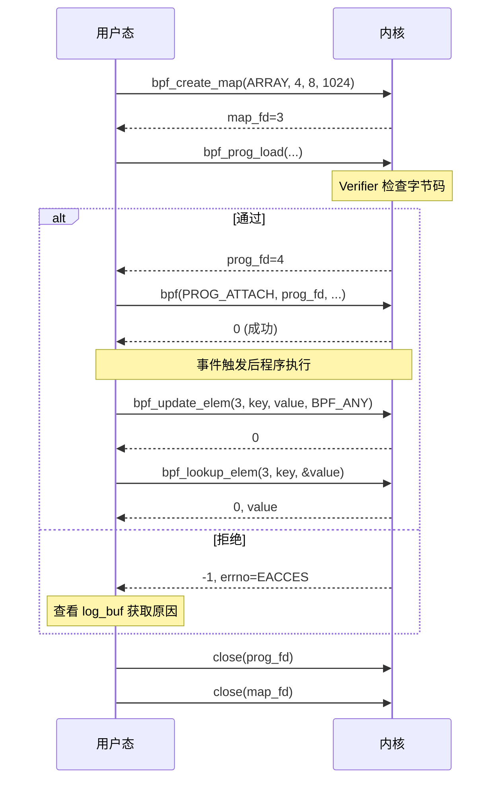
```mermaid
sequenceDiagram
    participant U as 用户态
    participant K as 内核
    U->>K: bpf_create_map(ARRAY, 4, 8, 1024)
    K-->>U: map_fd=3
    U->>K: bpf_prog_load(...)
    Note over K: Verifier 检查字节码
    alt 通过
        K-->>U: prog_fd=4
        U->>K: bpf(PROG_ATTACH, prog_fd, ...)
        K-->>U: 0 (成功)
        Note over U,K: 事件触发后程序执行
        U->>K: bpf_update_elem(3, key, value, BPF_ANY)
        K-->>U: 0
        U->>K: bpf_lookup_elem(3, key, &value)
        K-->>U: 0, value
    else 拒绝
        K-->>U: -1, errno=EACCES
        Note over U: 查看 log_buf 获取原因
    end
    U->>K: close(prog_fd)
    U->>K: close(map_fd)
```

### 3-3. BPF Maps 详解

Map 是 eBPF 最重要的数据抽象，支持多种底层实现：

| Map 类型                         | 特点                       | 用途         |
| -------------------------------- | -------------------------- | ------------ |
| `BPF_MAP_TYPE_HASH`              | 通用哈希表，动态增长       | 任意键值存储 |
| `BPF_MAP_TYPE_ARRAY`             | 定长数组，索引为键，预分配 | 计数器、统计 |
| `BPF_MAP_TYPE_PERCPU_HASH/ARRAY` | 每 CPU 副本，减少锁竞争    | 高性能计数   |
| `BPF_MAP_TYPE_PROG_ARRAY`        | 存储程序 fd，实现尾调用    | 跳转表       |
| `BPF_MAP_TYPE_STACK_TRACE`       | 存储栈跟踪                 | profiling    |
| `BPF_MAP_TYPE_RINGBUF`           | 环形缓冲区，高效数据传输   | 事件通知     |

在漏洞利用场景中，最常用的是 `BPF_MAP_TYPE_ARRAY` 和 `BPF_MAP_TYPE_HASH`，因为它们允许用户态与 eBPF 程序双向读写任意大小的值。

Map 的键和值类型在创建时指定，内核负责维护其生命周期。eBPF 程序内部通过辅助函数（helper）访问 Map：

```c
// eBPF 程序内访问 Map 的 helper 调用（C 伪代码）
void *map_lookup_elem(struct bpf_map *map, void *key);
long map_update_elem(struct bpf_map *map, void *key, void *value, u64 flags);
long map_delete_elem(struct bpf_map *map, void *key);
```

这些 helper 在 Verifier 阶段会被检查，确保指针有效、类型匹配。绕过 Verifier 后，恶意程序可以滥用这些 helper 实现内核任意读写。

**Map 的内部结构（简化）**：

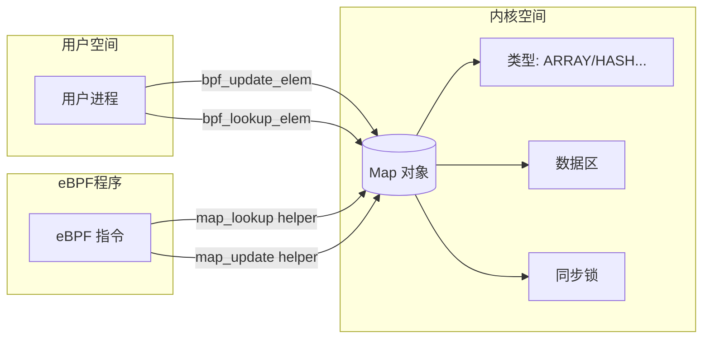
```mermaid
flowchart LR
    subgraph 内核空间
        M[(Map 对象)]
        M --> T[类型: ARRAY/HASH...]
        M --> D[数据区]
        M --> S[同步锁]
    end
    subgraph 用户空间
        U[用户进程]
        U -- bpf_update_elem --> M
        U -- bpf_lookup_elem --> M
    end
    subgraph eBPF程序
        P[eBPF 指令]
        P -- map_lookup helper --> M
        P -- map_update helper --> M
    end
```

### 3-4. Verifier 详细工作流程

Verifier 是 eBPF 安全的核心，其实现位于 `kernel/bpf/verifier.c`。以下为其关键步骤：

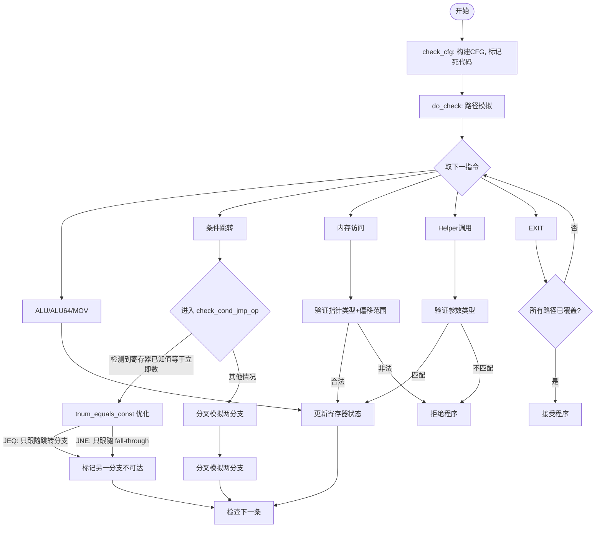
```mermaid
flowchart TD
    Start(["开始"]) --> cfg["check_cfg: 构建CFG, 标记死代码"]
    cfg --> sim["do_check: 路径模拟"]
    sim --> instr{"取下一指令"}
    instr --> alu["ALU/ALU64/MOV"]
    instr --> jmp["条件跳转"]
    instr --> mem["内存访问"]
    instr --> helper_call["Helper调用"]
    instr --> exit_node["EXIT"]

    alu --> update["更新寄存器状态"]
    update --> check_next["检查下一条"]

    jmp --> branch{"进入 check_cond_jmp_op"}
    branch -- "检测到寄存器已知值等于立即数" --> opt["tnum_equals_const 优化"]
    branch -- "其他情况" --> normal["分叉模拟两分支"]
    opt -- "JEQ: 只跟随跳转分支" --> mark
    opt -- "JNE: 只跟随 fall-through" --> mark
    mark["标记另一分支不可达"] --> check_next
    normal --> fork["分叉模拟两分支"]
    fork --> check_next

    mem --> verify["验证指针类型+偏移范围"]
    verify -- "合法" --> update
    verify -- "非法" --> reject["拒绝程序"]

    helper_call --> check_args["验证参数类型"]
    check_args -- "匹配" --> update
    check_args -- "不匹配" --> reject

    exit_node --> all_paths{"所有路径已覆盖?"}
    all_paths -- "是" --> accept["接受程序"]
    all_paths -- "否" --> instr
```

**关键数据结构**：`struct bpf_reg_state` 记录了每个寄存器的抽象状态，其中 `var_off`（`struct tnum`）用于表示已知位和未知位。当寄存器被赋予已知常量时，`var_off.mask` 为 0，`var_off.value` 即为该常量的 64 位表示。

**条件跳转优化细节**：在 `check_cond_jmp_op` 中，对于 `BPF_JEQ` 和 `BPF_JNE` 指令，如果目标寄存器是 `SCALAR_VALUE` 且 `tnum_equals_const(dst_reg->var_off, insn->imm)` 为真，Verifier 会认为该分支的走向已经确定：

- 对于 `JEQ`：条件必然成立，只跟随跳转分支，fall-through 被标记不可达。
- 对于 `JNE`：条件必然不成立，只跟随 fall-through 分支，跳转分支被标记不可达。

`tnum_equals_const` 比较的是 `var_off.value` 与 `insn->imm`（作为 `u64` 传入）。由于 C 语言隐式类型转换，`insn->imm`（`__s32`）会被符号扩展为 64 位。这一优化本意是加速已知常量的比较，但若 Verifier 错误地记录了寄存器值（如漏洞中的符号扩展误记），就会导致错误的路径标记。

**安全保证**：

- 所有寄存器在使用前已被初始化（`NOT_INIT` 检查）。
- 指针算术不越界（例如 map 指针只能在合法偏移内访问）。
- 栈访问不超出 512 字节。
- 辅助函数调用参数类型匹配。
- 程序不会陷入无限循环（< 5.3 直接拒绝循环，5.3+ 限制循环次数）。

### 3-5. 典型用户态工作流示例

以下是一个完整的用户态代码片段，演示创建 Map、加载程序、交互的过程（简化）：

```c
// 1. 创建 Map
int map_fd = bpf_create_map(BPF_MAP_TYPE_ARRAY, sizeof(int), sizeof(long), 1024);

// 2. 准备字节码（此处为示例，实际需要合法程序）
struct bpf_insn prog[] = {
    // ... 指令序列
};

// 3. 加载程序
char license[] = "GPL";
int prog_fd = bpf_prog_load(BPF_PROG_TYPE_SOCKET_FILTER, prog, 4, license);
if (prog_fd < 0) {
    // 查看日志
    printf("Verifier log: %s\n", log_buf);
}

// 4. 通过 Map 交互
int key = 0;
long value = 42;
bpf_update_elem(map_fd, &key, &value, BPF_ANY);

// 5. 读取结果
bpf_lookup_elem(map_fd, &key, &value);

// 6. 清理
close(prog_fd);
close(map_fd);
```

对应的时序图：

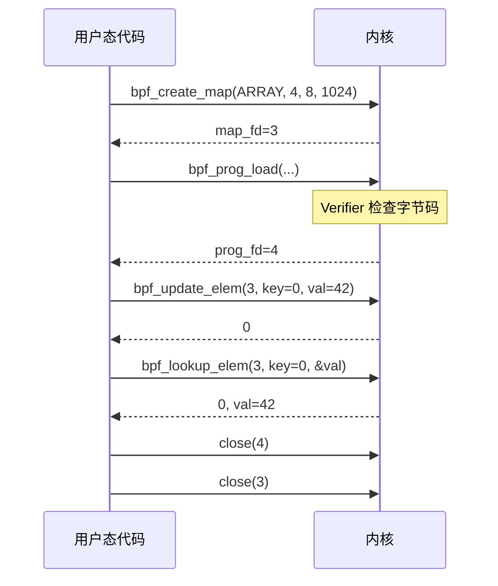
```mermaid
sequenceDiagram
    participant User as 用户态代码
    participant Kernel as 内核
    User->>Kernel: bpf_create_map(ARRAY, 4, 8, 1024)
    Kernel-->>User: map_fd=3
    User->>Kernel: bpf_prog_load(...)
    Note over Kernel: Verifier 检查字节码
    Kernel-->>User: prog_fd=4
    User->>Kernel: bpf_update_elem(3, key=0, val=42)
    Kernel-->>User: 0
    User->>Kernel: bpf_lookup_elem(3, key=0, &val)
    Kernel-->>User: 0, val=42
    User->>Kernel: close(4)
    User->>Kernel: close(3)
```

### 3-6. eBPF 总结

eBPF 是一个革命性的内核可编程框架，它允许用户在不修改内核源码或加载内核模块的前提下，安全地注入自定义逻辑到内核事件路径中。其核心设计理念可以概括为：

- **安全第一**：所有 eBPF 程序必须通过 Verifier 的静态分析才能运行，Verifier 充当了“安全门卫”的角色。
- **数据通道**：Map 是用户态与内核态程序之间唯一合法的数据交换媒介，它隔离了两者的地址空间。
- **有限能力**：eBPF 程序不能随意调用内核函数，只能通过预定义的 helper 函数与外界交互，且不允许循环（早期版本），从而限制了潜在危害。

然而，Verifier 的正确性依赖于其对 eBPF 指令语义的精确模拟。**CVE-2020-8835** 正是利用 Verifier 在处理 JMP32 指令时，`__reg_bound_offset32()` 函数将 64 位范围截断为 32 位后更新 `var_off`，导致高 32 位的独立性被错误消除，从而使 Verifier 误判寄存器为常量。这一案例深刻揭示了：**即使是最严谨的静态分析工具，也可能因为一个微小的数值抽象失误（如位宽截断未保留高位自由度）而导致整个安全模型的崩溃**。

## 4. 调试 eBPF JIT 编译过程

第三章介绍了 eBPF 的基础架构和 Verifier 的工作流程。本章将深入调试 eBPF 程序的 JIT 编译环节，通过 GDB 设置断点和观察点，追踪从字节码加载到 JIT 代码执行的完整链路。理解 JIT 编译的细节，有助于在后续章节中分析 Verifier 漏洞如何在运行时被转化为实际的越界访问能力。

### 4-1. 观察点设置

JIT 编译完成后，内核会将生成的机器码入口地址写入 `struct bpf_prog` 的 `bpf_func` 字段（偏移量 0x30）。通过在该字段上设置硬件访问观察点，可以精确捕获 JIT 代码何时被安装以及何时被调用。

```bash
# 在 bpf_prog_select_runtime 处设置断点，然后添加观察点
(gdb) b bpf_prog_select_runtime
(gdb) c
(gdb) awatch *(0xffffc90000015000 + 0x30)   # 监视 bpf_func 字段的读写
```

### 4-2. 运行时选择

`bpf_prog_select_runtime` 函数负责决定 eBPF 程序使用解释器还是 JIT 编译。由于内核配置了 `CONFIG_BPF_JIT_ALWAYS_ON`，它会强制走 JIT 路径。

```c
// kernel/bpf/core.c
/**
 * bpf_prog_select_runtime - 为 BPF 程序选择执行运行时
 * @fp: 包含内部 BPF 指令的 bpf_prog 结构
 * @err: 指向错误变量的指针
 *
 * 尝试 JIT 编译 eBPF 程序，若 JIT 不可用则使用解释器。
 * BPF 程序将通过 BPF_PROG_RUN() 宏执行。
 */
struct bpf_prog *bpf_prog_select_runtime(struct bpf_prog *fp, int *err)
{
    /* 若已有 bpf_func（例如 BPF-to-BPF 调用），则跳过 JIT */
    if (fp->bpf_func)
        goto finalize;

    // 第一步：临时设置 bpf_func 为 __bpf_prog_ret0_warn（占位）
    // 在 CONFIG_BPF_JIT_ALWAYS_ON 下，该函数直接返回 0 并告警
    bpf_prog_select_func(fp);
    // fp->bpf_func = 0xffffffff811d8fa0 (__bpf_prog_ret0_warn)

    // 第二步：检查是否为设备绑定程序（offload），此处为 false
    if (!bpf_prog_is_dev_bound(fp->aux)) {
        // 分配 JIT 行信息（若无行信息则不分配）
        *err = bpf_prog_alloc_jited_linfo(fp);
        if (*err)
            return fp;

        // 第三步：调用 x86 架构的 JIT 编译器
        fp = bpf_int_jit_compile(fp);
        // 返回后 fp->jited = 1，fp->bpf_func 指向 JIT 生成的机器码
        if (!fp->jited) {
            // JIT 失败（不应发生，因为 ALWAYS_ON）
            bpf_prog_free_jited_linfo(fp);
#ifdef CONFIG_BPF_JIT_ALWAYS_ON
            *err = -ENOTSUPP;
            return fp;
#endif
        } else {
            // 释放未使用的 JIT 行信息
            bpf_prog_free_unused_jited_linfo(fp);
        }
    }

finalize:
    // 第四步：锁定程序为只读（防止篡改）
    bpf_prog_lock_ro(fp);
    // 第五步：检查尾调用兼容性
    *err = bpf_check_tail_call(fp);
    return fp;
}
```

**观察点首次触发**：在 `bpf_int_jit_compile` 返回后，`fp->bpf_func` 被赋值为 JIT 镜像地址（如 `0xffffffffc000228c`），观察点命中。

### 4-3. JIT 编译主流程

`bpf_int_jit_compile` 位于 `arch/x86/net/bpf_jit_comp.c`，负责将 eBPF 字节码翻译为 x86_64 机器码。它通过多轮迭代（pass）逐步缩小生成的代码大小，直到收敛。下图展示了其核心流程：

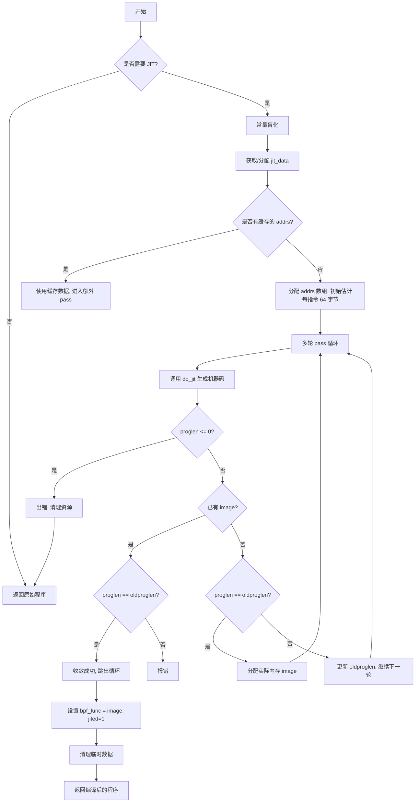
```mermaid
flowchart TD
    A[开始] --> B{是否需要 JIT?}
    B -- 否 --> Z[返回原始程序]
    B -- 是 --> C[常量盲化]
    C --> D[获取/分配 jit_data]
    D --> E{是否有缓存的 addrs?}
    E -- 是 --> F[使用缓存数据, 进入额外 pass]
    E -- 否 --> G[分配 addrs 数组, 初始估计每指令 64 字节]
    G --> H[多轮 pass 循环]
    H --> I[调用 do_jit 生成机器码]
    I --> J{proglen <= 0?}
    J -- 是 --> K[出错, 清理资源]
    K --> Z
    J -- 否 --> L{已有 image?}
    L -- 是 --> M{proglen == oldproglen?}
    M -- 是 --> N[收敛成功, 跳出循环]
    M -- 否 --> O[报错]
    L -- 否 --> P{proglen == oldproglen?}
    P -- 是 --> Q[分配实际内存 image]
    P -- 否 --> R[更新 oldproglen, 继续下一轮]
    R --> H
    Q --> H
    N --> S[设置 bpf_func = image, jited=1]
    S --> T[清理临时数据]
    T --> U[返回编译后的程序]
```

以下为 `bpf_int_jit_compile` 的完整源码：

```c
// arch/x86/net/bpf_jit_comp.c
struct bpf_prog *bpf_int_jit_compile(struct bpf_prog *prog)
{
    struct bpf_binary_header *header = NULL;
    struct bpf_prog *tmp, *orig_prog = prog;
    struct x64_jit_data *jit_data;
    int proglen, oldproglen = 0;
    struct jit_context ctx = {};
    bool tmp_blinded = false;
    bool extra_pass = false;
    u8 *image = NULL;
    int *addrs;
    int pass;
    int i;

    // 若未请求 JIT，直接返回原始程序
    if (!prog->jit_requested)
        return orig_prog;

    // 第一步：常量盲化（若启用），此处未盲化，tmp == prog
    tmp = bpf_jit_blind_constants(prog);
    if (IS_ERR(tmp))
        return orig_prog;
    if (tmp != prog) {
        tmp_blinded = true;
        prog = tmp;
    }

    // 第二步：获取或分配 jit_data（缓存编译过程中的临时数据）
    jit_data = prog->aux->jit_data;
    if (!jit_data) {
        jit_data = kzalloc(sizeof(*jit_data), GFP_KERNEL);
        if (!jit_data) {
            prog = orig_prog;
            goto out;
        }
        prog->aux->jit_data = jit_data;
    }

    addrs = jit_data->addrs;
    if (addrs) {
        // 若有缓存的 addrs，则为额外 pass（用于函数体）
        ctx = jit_data->ctx;
        oldproglen = jit_data->proglen;
        image = jit_data->image;
        header = jit_data->header;
        extra_pass = true;
        goto skip_init_addrs;
    }

    // 第三步：分配 addrs 数组，记录每条指令的 JIT 偏移
    addrs = kmalloc_array(prog->len + 1, sizeof(*addrs), GFP_KERNEL);
    if (!addrs) {
        prog = orig_prog;
        goto out_addrs;
    }

    // 第四步：预估每条指令占用 64 字节，初始化 addrs
    for (proglen = 0, i = 0; i <= prog->len; i++) {
        proglen += 64;
        addrs[i] = proglen;
    }
    ctx.cleanup_addr = proglen; // 清理代码的起始地址

skip_init_addrs:

    // 第五步：多轮编译，直到代码大小不再缩小
    for (pass = 0; pass < 20 || image; pass++) {
        // 调用 do_jit 进行实际翻译
        proglen = do_jit(prog, addrs, image, oldproglen, &ctx);
        if (proglen <= 0) {
            // 编译出错，清理资源
            image = NULL;
            if (header)
                bpf_jit_binary_free(header);
            prog = orig_prog;
            goto out_addrs;
        }

        if (image) {
            // 已有镜像，检查大小是否一致（收敛）
            if (proglen != oldproglen) {
                pr_err("bpf_jit: proglen=%d != oldproglen=%d\n",
                       proglen, oldproglen);
                goto out_image;
            }
            break; // 收敛成功，退出循环
        }

        if (proglen == oldproglen) {
            // 第六步：大小稳定，分配实际内存
            u32 align = __alignof__(struct exception_table_entry);
            u32 extable_size = prog->aux->num_exentries *
                sizeof(struct exception_table_entry);

            header = bpf_jit_binary_alloc(
                roundup(proglen, align) + extable_size,
                &image, align, jit_fill_hole);
            if (!header) {
                prog = orig_prog;
                goto out_addrs;
            }
            // 设置异常表位置（在镜像之后）
            prog->aux->extable = (void *)image + roundup(proglen, align);
        }
        oldproglen = proglen;
        cond_resched();
    }

    // 第七步：填充 JIT 行信息，设置 bpf_func
    if (image) {
        if (!prog->is_func || extra_pass) {
            bpf_tail_call_direct_fixup(prog);
            bpf_jit_binary_lock_ro(header);
        } else {
            // 缓存数据供后续 pass 使用
            jit_data->addrs = addrs;
            jit_data->ctx = ctx;
            jit_data->proglen = proglen;
            jit_data->image = image;
            jit_data->header = header;
        }
        prog->bpf_func = (void *)image;  // ★ 观察点在此赋值
        prog->jited = 1;
        prog->jited_len = proglen;
    } else {
        prog = orig_prog;
    }

    // 第八步：清理临时数据
    if (!image || !prog->is_func || extra_pass) {
        if (image)
            bpf_prog_fill_jited_linfo(prog, addrs + 1);
out_addrs:
        kfree(addrs);
        kfree(jit_data);
        prog->aux->jit_data = NULL;
    }
out:
    if (tmp_blinded)
        bpf_jit_prog_release_other(prog, prog == orig_prog ? tmp : orig_prog);
    return prog;
}
```

**调试输出示例**（各 pass 的参数变化）：

```
第一次调用 do_jit:  rdi=prog, rsi=addrs, rdx=0, rcx=0, r8=&ctx → proglen=0x13f
第二次调用 do_jit:  rdx=0, rcx=0x13f → proglen=0x11d
第三次调用 do_jit:  rdx=0, rcx=0x11d → proglen=0x11d (收敛)
第四次调用 do_jit:  rdx=image=0xffffffffc000228c, rcx=0x11d → proglen=0x11d (写入镜像)
```

### 4-4. 指令翻译

`do_jit` 函数遍历 eBPF 指令，为每条指令生成对应的 x86 机器码。下面展示其核心循环结构。

```c
// arch/x86/net/bpf_jit_comp.c (片段)
static int do_jit(struct bpf_prog *bpf_prog, int *addrs, u8 *image,
                  int oldproglen, struct jit_context *ctx)
{
    struct bpf_insn *insn = bpf_prog->insnsi;  // 字节码数组
    int insn_cnt = bpf_prog->len;
    bool seen_exit = false;
    u8 temp[BPF_MAX_INSN_SIZE + BPF_INSN_SAFETY]; // 临时缓冲区
    int i, cnt = 0, excnt = 0;
    int proglen = 0;
    u8 *prog = temp;

    // 生成函数序言（保存寄存器、分配栈帧）
    emit_prologue(&prog, bpf_prog->aux->stack_depth,
                  bpf_prog_was_classic(bpf_prog));
    addrs[0] = prog - temp; // 记录序言结束位置

    // 逐条翻译 eBPF 指令
    for (i = 1; i <= insn_cnt; i++, insn++) {
        const s32 imm32 = insn->imm;
        u32 dst_reg = insn->dst_reg;
        u32 src_reg = insn->src_reg;
        u8 b2 = 0, b3 = 0;
        s64 jmp_offset;
        u8 jmp_cond;
        int ilen;
        u8 *func;

        switch (insn->code) {
            // ALU 操作：ADD, SUB, AND, OR, XOR
        case BPF_ALU | BPF_ADD | BPF_X:
        case BPF_ALU | BPF_SUB | BPF_X:
        case BPF_ALU | BPF_AND | BPF_X:
        case BPF_ALU | BPF_OR  | BPF_X:
        case BPF_ALU | BPF_XOR | BPF_X:
        case BPF_ALU64 | BPF_ADD | BPF_X:
        case BPF_ALU64 | BPF_SUB | BPF_X:
        case BPF_ALU64 | BPF_AND | BPF_X:
        case BPF_ALU64 | BPF_OR  | BPF_X:
        case BPF_ALU64 | BPF_XOR | BPF_X:
            // 选择对应的 x86 操作码
            switch (BPF_OP(insn->code)) {
            case BPF_ADD: b2 = 0x01; break;  // ADD r/m, r
            case BPF_SUB: b2 = 0x29; break;  // SUB r/m, r
            case BPF_AND: b2 = 0x21; break;  // AND r/m, r
            case BPF_OR:  b2 = 0x09; break;  // OR  r/m, r
            case BPF_XOR: b2 = 0x31; break;  // XOR r/m, r
            }
            // 64 位操作需要 REX.W 前缀 (0x48)
            if (BPF_CLASS(insn->code) == BPF_ALU64)
                EMIT1(add_2mod(0x48, dst_reg, src_reg));
            else if (is_ereg(dst_reg) || is_ereg(src_reg))
                EMIT1(add_2mod(0x40, dst_reg, src_reg));
            EMIT2(b2, add_2reg(0xC0, dst_reg, src_reg));
            break;

        // ... 其他指令类型（MOV, JMP, LD, ST, EXIT 等）省略 ...

        default:
            pr_err("bpf_jit: unknown opcode %02x\n", insn->code);
            return -EINVAL;
        }

        // 计算本条指令生成的机器码长度
        ilen = prog - temp;
        if (ilen > BPF_MAX_INSN_SIZE) {
            pr_err("bpf_jit: fatal insn size error\n");
            return -EFAULT;
        }

        // 若有镜像，则将临时缓冲区的代码复制到镜像中
        if (image) {
            if (unlikely(proglen + ilen > oldproglen)) {
                pr_err("bpf_jit: fatal error\n");
                return -EFAULT;
            }
            memcpy(image + proglen, temp, ilen);
        }
        proglen += ilen;
        addrs[i] = proglen; // 记录本条指令结束位置
        prog = temp;        // 重置临时缓冲区
    }

    // 检查异常表数量是否匹配
    if (image && excnt != bpf_prog->aux->num_exentries) {
        pr_err("extable is not populated\n");
        return -EFAULT;
    }
    return proglen; // 返回总代码长度
}
```

### 4-5. 执行入口

当 eBPF 程序被挂载到 socket 过滤器并通过 `write()` 触发时，内核调用 `BPF_PROG_RUN` 宏间接跳转到 JIT 代码。该宏的定义如下：

```c
#define BPF_PROG_RUN(prog, ctx)	({				\
	u32 ret;						\
	cant_sleep();						\
	if (static_branch_unlikely(&bpf_stats_enabled_key)) {	\
		struct bpf_prog_stats *stats;			\
		u64 start = sched_clock();			\
		ret = (*(prog)->bpf_func)(ctx, (prog)->insnsi);	\
		stats = this_cpu_ptr(prog->aux->stats);		\
		u64_stats_update_begin(&stats->syncp);		\
		stats->cnt++;					\
		stats->nsecs += sched_clock() - start;		\
		u64_stats_update_end(&stats->syncp);		\
	} else {						         \
		ret = (*(prog)->bpf_func)(ctx, (prog)->insnsi);	\
	}							\
	ret; })
```

`__bpf_prog_run_save_cb` 是对该宏的封装，用于处理 socket 控制块的保存与恢复。

```c
// include/linux/filter.h
static inline u32 __bpf_prog_run_save_cb(const struct bpf_prog *prog,
                                         struct sk_buff *skb)
{
    u8 *cb_data = bpf_skb_cb(skb);
    u8 cb_saved[BPF_SKB_CB_LEN];
    u32 res;

    // 若程序需要访问控制块，先保存并清零
    if (unlikely(prog->cb_access)) {
        memcpy(cb_saved, cb_data, sizeof(cb_saved));
        memset(cb_data, 0, sizeof(cb_saved));
    }

    // 核心执行：通过函数指针调用 JIT 代码
    res = BPF_PROG_RUN(prog, skb);

    if (unlikely(prog->cb_access))
        memcpy(cb_data, cb_saved, sizeof(cb_saved));

    return res;
}
```

**观察点第二次命中**：当执行 `BPF_PROG_RUN` 时，`prog->bpf_func` 被读取，观察点触发。此时可以查看 JIT 代码的反汇编。

### 4-6. 代码分析

通过 GDB 可以 dump 出 JIT 生成的机器码并进行反汇编。以下是从 `0xffffffffc000228c` 开始的片段，展示了 eBPF 程序经 JIT 编译后的典型结构。

```asm
=> 0xffffffffc000228c:  nop                          ; 对齐填充
   0xffffffffc0002291:  push   rbp                   ; 函数序言
   0xffffffffc0002292:  mov    rbp, rsp
   0xffffffffc0002295:  sub    rsp, 0x8
   0xffffffffc000229c:  push   rbx
   0xffffffffc000229d:  push   r13
   0xffffffffc000229f:  push   r14
   0xffffffffc00022a1:  push   r15
   0xffffffffc00022a3:  push   0x0                   ; 栈上预留空间
   ; ... 后续指令对应 eBPF 程序的具体逻辑 ...
```

**关键观察**：

- JIT 编译器为每个 eBPF 程序生成了标准的函数序言，保存被调用者保存的寄存器（rbx, r13-r15），并分配栈空间。
- `nop` 指令用于对齐，确保后续指令从合适的地址开始。
- 栈上预留的空间用于存放局部变量或临时数据。

### 4-7. 小结

通过 GDB 调试 eBPF JIT 编译过程，我们可以清晰地观察到从字节码加载到机器码执行的完整链路。首先，`bpf_prog_select_runtime` 在 `CONFIG_BPF_JIT_ALWAYS_ON` 配置下强制调用 `bpf_int_jit_compile`，后者通过多轮 pass 将 eBPF 指令逐步翻译为 x86_64 机器码，并在大小收敛后分配可执行内存。随后，`bpf_func` 指针被更新为 JIT 镜像的入口地址，观察点首次触发。当 socket 写操作触发程序执行时，`BPF_PROG_RUN` 宏通过该函数指针间接跳转到 JIT 代码，观察点再次命中。反汇编结果显示，JIT 代码包含了标准的函数序言、寄存器保存和栈帧分配，其结构与普通内核模块的编译产物无异。本章的调试分析为理解 eBPF JIT 编译的内部机制提供了实践基础，下一章将在此基础上，探讨 Verifier 漏洞如何导致 JIT 代码中出现预期之外的内存访问模式。

## 5. 漏洞分析

第二章从数学角度论证了 `__reg_bound_offset32()` 函数的缺陷，本章将从源码层面深入分析该缺陷在 Verifier 中的具体表现，并结合 JIT 编译后的指令序列，展示缺陷如何影响运行时行为。我们将逐一剖析 Verifier 主循环 `do_check`、条件跳转处理函数 `check_cond_jmp_op`、寄存器范围更新函数 `reg_set_min_max`，以及关键的缺陷函数 `__reg_bound_offset32` 和相关的 tnum 操作函数。最后，通过分析 JIT 生成的 x86 指令，直观呈现 Verifier 误判后的实际执行路径。

### 5-1. 主循环

`do_check` 是 Verifier 的核心模拟引擎，它逐条遍历 eBPF 指令，并根据指令类别调用相应的检查函数。下图展示了其基本流程：

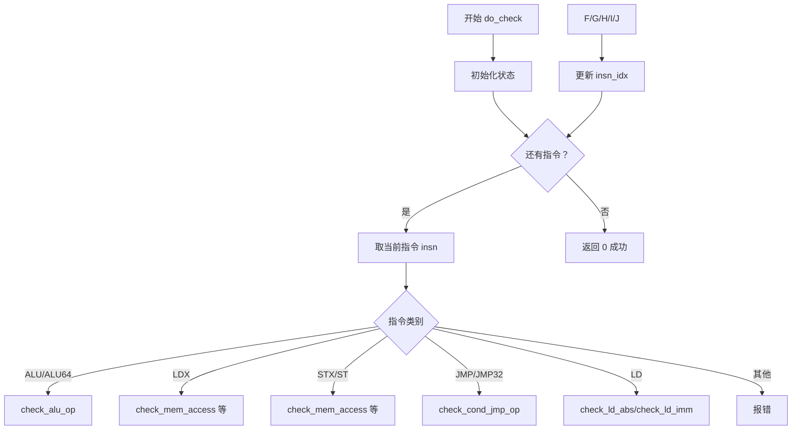
```mermaid
flowchart TD
    A[开始 do_check] --> B[初始化状态]
    B --> C{还有指令？}
    C -- 是 --> D[取当前指令 insn]
    D --> E{指令类别}
    E -- ALU/ALU64 --> F[check_alu_op]
    E -- LDX --> G[check_mem_access 等]
    E -- STX/ST --> H[check_mem_access 等]
    E -- JMP/JMP32 --> I[check_cond_jmp_op]
    E -- LD --> J[check_ld_abs/check_ld_imm]
    E -- 其他 --> K[报错]
    F/G/H/I/J --> L[更新 insn_idx]
    L --> C
    C -- 否 --> M[返回 0 成功]
```

以下为 `do_check` 的简化源码，保留了函数头和关键分支，省略了冗余的 case 代码：

```c
static int do_check(struct bpf_verifier_env *env)
{
    struct bpf_verifier_state *state;
    struct bpf_insn *insns = env->prog->insnsi;
    struct bpf_reg_state *regs;
    int insn_cnt = env->prog->len;
    bool do_print_state = false;
    int prev_insn_idx = -1;

    env->prev_linfo = NULL;

    // 分配并初始化验证器状态
    state = kzalloc(sizeof(struct bpf_verifier_state), GFP_KERNEL);
    if (!state)
        return -ENOMEM;
    state->curframe = 0;
    state->speculative = false;  // 非推测执行
    state->branches = 1;        // 当前活跃分支数
    state->frame[0] = kzalloc(sizeof(struct bpf_func_state), GFP_KERNEL);
    if (!state->frame[0]) {
        kfree(state);
        return -ENOMEM;
    }
    env->cur_state = state;
    // 初始化主函数的状态（帧编号0，子程序编号0）
    init_func_state(env, state->frame[0],
                    BPF_MAIN_FUNC, 0, 0);

    if (btf_check_func_arg_match(env, 0))
        return -EINVAL;

    // 主循环：逐条指令模拟
    for (;;) {
        struct bpf_insn *insn;
        u8 class;
        int err;

        env->prev_insn_idx = prev_insn_idx;
        if (env->insn_idx >= insn_cnt) {
            verbose(env, "invalid insn idx %d insn_cnt %d\n",
                    env->insn_idx, insn_cnt);
            return -EFAULT;
        }

        insn = &insns[env->insn_idx];
        class = BPF_CLASS(insn->code);

        // 复杂度限制：最多处理 BPF_COMPLEXITY_LIMIT_INSNS 条指令
        if (++env->insn_processed > BPF_COMPLEXITY_LIMIT_INSNS) {
            verbose(env, "BPF program is too large.\n");
            return -E2BIG;
        }

        // 状态剪枝：如果当前状态与之前某状态等价，则跳过此路径
        err = is_state_visited(env, env->insn_idx);
        if (err < 0)
            return err;
        if (err == 1) {
            // 找到等价状态，可以安全地剪枝
            goto process_bpf_exit;
        }

        if (signal_pending(current))
            return -EAGAIN;
        if (need_resched())
            cond_resched();

        // 获取当前帧的寄存器状态
        regs = cur_regs(env);
        env->insn_aux_data[env->insn_idx].seen = true;
        prev_insn_idx = env->insn_idx;

        // 根据指令类别分发处理
        if (class == BPF_ALU || class == BPF_ALU64) {
            err = check_alu_op(env, insn);
            if (err)
                return err;

        } else if (class == BPF_LDX) {
            // 加载指令：检查源寄存器、目标寄存器、内存访问
            // ... 省略具体实现 ...

        } else if (class == BPF_STX) {
            // 存储指令（带源寄存器）
            // ... 省略 ...

        } else if (class == BPF_ST) {
            // 存储指令（立即数）
            // ... 省略 ...

        } else if (class == BPF_JMP || class == BPF_JMP32) {
            u8 opcode = BPF_OP(insn->code);
            env->jmps_processed++;

            if (opcode == BPF_CALL) {
                // 函数调用处理
                // ... 省略 ...
            } else if (opcode == BPF_JA) {
                // 无条件跳转
                env->insn_idx += insn->off + 1;
                continue;
            } else if (opcode == BPF_EXIT) {
                // 退出处理
                // ... 省略 ...
                goto process_bpf_exit;
            } else {
                // 条件跳转：调用 check_cond_jmp_op
                err = check_cond_jmp_op(env, insn, &env->insn_idx);
                if (err)
                    return err;
            }

        } else if (class == BPF_LD) {
            // 加载立即数或特殊加载
            // ... 省略 ...
        } else {
            verbose(env, "unknown insn class %d\n", class);
            return -EINVAL;
        }

        env->insn_idx++;
    }

    // 设置最终的栈深度
    env->prog->aux->stack_depth = env->subprog_info[0].stack_depth;
    return 0;
}
```

### 5-2. 条件跳转处理

当遇到 `BPF_JMP` 或 `BPF_JMP32` 指令且操作码为条件跳转（如 JEQ、JNE、JLT 等）时，Verifier 调用此函数。它会分裂出两个分支（真分支和假分支），并分别更新寄存器范围。特别地，对于 `JMP32` 指令，后续会调用 `__reg_bound_offset32`，这正是漏洞所在。

```c
static int check_cond_jmp_op(struct bpf_verifier_env *env,
                             struct bpf_insn *insn, int *insn_idx)
{
    struct bpf_verifier_state *this_branch = env->cur_state;
    struct bpf_verifier_state *other_branch;
    struct bpf_reg_state *regs = this_branch->frame[this_branch->curframe]->regs;
    struct bpf_reg_state *dst_reg, *other_branch_regs, *src_reg = NULL;
    u8 opcode = BPF_OP(insn->code);
    bool is_jmp32;
    int pred = -1;
    int err;

    // 仅处理条件跳转，排除 JA 和非法 opcode
    if (opcode == BPF_JA || opcode > BPF_JSLE) {
        verbose(env, "invalid BPF_JMP/JMP32 opcode %x\n", opcode);
        return -EINVAL;
    }

    // 检查源操作数（如果是 BPF_X 则检查 src_reg）
    if (BPF_SRC(insn->code) == BPF_X) {
        if (insn->imm != 0) {
            verbose(env, "BPF_JMP/JMP32 uses reserved fields\n");
            return -EINVAL;
        }
        err = check_reg_arg(env, insn->src_reg, SRC_OP);
        if (err)
            return err;
        if (is_pointer_value(env, insn->src_reg)) {
            verbose(env, "R%d pointer comparison prohibited\n", insn->src_reg);
            return -EACCES;
        }
        src_reg = &regs[insn->src_reg];
    } else {
        // BPF_K 模式：src_reg 必须为 R0
        if (insn->src_reg != BPF_REG_0) {
            verbose(env, "BPF_JMP/JMP32 uses reserved fields\n");
            return -EINVAL;
        }
    }

    // 检查目标寄存器
    err = check_reg_arg(env, insn->dst_reg, SRC_OP);
    if (err)
        return err;
    dst_reg = &regs[insn->dst_reg];
    is_jmp32 = BPF_CLASS(insn->code) == BPF_JMP32;

    // 尝试预测分支方向（如果寄存器是常量，则可直接确定分支走向）
    if (BPF_SRC(insn->code) == BPF_K)
        pred = is_branch_taken(dst_reg, insn->imm, opcode, is_jmp32);
    else if (src_reg->type == SCALAR_VALUE &&
             tnum_is_const(src_reg->var_off))
        pred = is_branch_taken(dst_reg, src_reg->var_off.value, opcode, is_jmp32);
    if (pred >= 0) {
        // 标记精度要求，以便后续剪枝
        err = mark_chain_precision(env, insn->dst_reg);
        if (BPF_SRC(insn->code) == BPF_X && !err)
            err = mark_chain_precision(env, insn->src_reg);
        if (err)
            return err;
    }
    if (pred == 1) {
        // 只跟随跳转分支
        *insn_idx += insn->off;
        return 0;
    } else if (pred == 0) {
        // 只跟随 fall-through 分支
        return 0;
    }

    // 无法预测，需要分裂两个分支：将另一分支压入栈
    other_branch = push_stack(env, *insn_idx + insn->off + 1, *insn_idx, false);
    if (!other_branch)
        return -EFAULT;
    other_branch_regs = other_branch->frame[other_branch->curframe]->regs;

    // 更新寄存器范围：根据比较结果调整 dst_reg 或 src_reg 的 min/max
    if (BPF_SRC(insn->code) == BPF_X) {
        struct bpf_reg_state *src_reg = &regs[insn->src_reg];
        // 为了处理 JMP32，将两个寄存器截断到32位
        struct bpf_reg_state lo_reg0 = *dst_reg;
        struct bpf_reg_state lo_reg1 = *src_reg;
        struct bpf_reg_state *src_lo, *dst_lo;

        dst_lo = &lo_reg0;
        src_lo = &lo_reg1;
        coerce_reg_to_size(dst_lo, 4); // 截断到32位
        coerce_reg_to_size(src_lo, 4);

        if (dst_reg->type == SCALAR_VALUE &&
            src_reg->type == SCALAR_VALUE) {
            // 如果源寄存器是常量，或者 JMP32 下源寄存器的低32位是常量
            if (tnum_is_const(src_reg->var_off) ||
                (is_jmp32 && tnum_is_const(src_lo->var_off)))
                reg_set_min_max(&other_branch_regs[insn->dst_reg],
                                dst_reg,
                                is_jmp32 ? src_lo->var_off.value
                                         : src_reg->var_off.value,
                                opcode, is_jmp32);
            else if (tnum_is_const(dst_reg->var_off) ||
                     (is_jmp32 && tnum_is_const(dst_lo->var_off)))
                reg_set_min_max_inv(&other_branch_regs[insn->src_reg],
                                    src_reg,
                                    is_jmp32 ? dst_lo->var_off.value
                                             : dst_reg->var_off.value,
                                    opcode, is_jmp32);
            else if (!is_jmp32 &&
                     (opcode == BPF_JEQ || opcode == BPF_JNE))
                // 64位相等比较，可以合并两个寄存器的知识
                reg_combine_min_max(&other_branch_regs[insn->src_reg],
                                    &other_branch_regs[insn->dst_reg],
                                    src_reg, dst_reg, opcode);
        }
    } else if (dst_reg->type == SCALAR_VALUE) {
        // BPF_K 情况：直接用立即数更新
        reg_set_min_max(&other_branch_regs[insn->dst_reg],
                        dst_reg, insn->imm, opcode, is_jmp32);
    }

    // 处理空指针检测优化（MAP_VALUE_OR_NULL 类型）
    if (!is_jmp32 && BPF_SRC(insn->code) == BPF_K &&
        insn->imm == 0 && (opcode == BPF_JEQ || opcode == BPF_JNE) &&
        reg_type_may_be_null(dst_reg->type)) {
        // 根据比较结果标记指针为空或非空
        mark_ptr_or_null_regs(this_branch, insn->dst_reg,
                              opcode == BPF_JNE);
        mark_ptr_or_null_regs(other_branch, insn->dst_reg,
                              opcode == BPF_JEQ);
    } else if (!try_match_pkt_pointers(insn, dst_reg, &regs[insn->src_reg],
                                       this_branch, other_branch) &&
               is_pointer_value(env, insn->dst_reg)) {
        verbose(env, "R%d pointer comparison prohibited\n", insn->dst_reg);
        return -EACCES;
    }
    return 0;
}
```

### 5-3. 寄存器范围更新

该函数根据比较结果更新真分支和假分支中寄存器的 `umin/umax`、`smin/smax` 以及 `var_off`。关键点在于：对于 `JMP32` 指令，它在最后会调用 `__reg_bound_offset32`，而该函数存在缺陷。

```c
/* 根据比较结果调整寄存器的 min/max 值。
 * 当 dst_reg 是我们正在处理的变量寄存器，且 src_reg 是常量或 BPF_K 时调用。
 * 在 JEQ/JNE 情况下也会调整 var_off 值。
 */
static void reg_set_min_max(struct bpf_reg_state *true_reg,
                            struct bpf_reg_state *false_reg, u64 val,
                            u8 opcode, bool is_jmp32)
{
    s64 sval;

    // 如果寄存器是指针，则无法学习范围信息
    if (__is_pointer_value(false, false_reg))
        return;

    // 对于 JMP32，将 val 截断到32位
    val = is_jmp32 ? (u32)val : val;
    sval = is_jmp32 ? (s64)(s32)val : (s64)val;

    switch (opcode) {
    case BPF_JEQ:
    case BPF_JNE:
    {
        struct bpf_reg_state *reg =
            opcode == BPF_JEQ ? true_reg : false_reg;

        // 对于 JEQ，如果条件为真，则寄存器值等于 val；
        // 对于 JNE，如果条件为假，则寄存器值等于 val。
        // 对于 JMP32，只更新低32位，高32位保持不变。
        if (is_jmp32) {
            u64 old_v = reg->var_off.value;
            u64 hi_mask = ~0xffffffffULL;

            // ★ 仅将低32位设为 val，高32位保留原样
            reg->var_off.value = (old_v & hi_mask) | val;
            reg->var_off.mask &= hi_mask; // 低32位 mask 清零（已知）
        } else {
            __mark_reg_known(reg, val); // 64位全部已知
        }
        break;
    }
    case BPF_JSET:
        // 位测试：如果 val 是2的幂，则真分支可设置该位
        // 假分支清除该位
        false_reg->var_off = tnum_and(false_reg->var_off,
                                      tnum_const(~val));
        if (is_power_of_2(val))
            true_reg->var_off = tnum_or(true_reg->var_off,
                                        tnum_const(val));
        break;
    case BPF_JGE:
    case BPF_JGT:
    {
        // 无符号大于等于/大于
        u64 false_umax = opcode == BPF_JGT ? val    : val - 1;
        u64 true_umin  = opcode == BPF_JGT ? val + 1 : val;

        if (is_jmp32) {
            // ★ 对于 JMP32，需要加上高32位的最大值/最小值
            false_umax += gen_hi_max(false_reg->var_off);
            true_umin  += gen_hi_min(true_reg->var_off);
        }
        false_reg->umax_value = min(false_reg->umax_value, false_umax);
        true_reg->umin_value  = max(true_reg->umin_value, true_umin);
        break;
    }
    case BPF_JSGE:
    case BPF_JSGT:
    {
        // 有符号大于等于/大于
        s64 false_smax = opcode == BPF_JSGT ? sval    : sval - 1;
        s64 true_smin  = opcode == BPF_JSGT ? sval + 1 : sval;

        // 如果 JMP32 且 sval 没有符号扩展到64位，则不做推断
        if (is_jmp32 && !cmp_val_with_extended_s64(sval, false_reg))
            break;
        false_reg->smax_value = min(false_reg->smax_value, false_smax);
        true_reg->smin_value  = max(true_reg->smin_value, true_smin);
        break;
    }
    case BPF_JLE:
    case BPF_JLT:
    {
        // 无符号小于等于/小于
        u64 false_umin = opcode == BPF_JLT ? val    : val + 1;
        u64 true_umax  = opcode == BPF_JLT ? val - 1 : val;

        if (is_jmp32) {
            false_umin += gen_hi_min(false_reg->var_off);
            true_umax  += gen_hi_max(true_reg->var_off);
        }
        false_reg->umin_value = max(false_reg->umin_value, false_umin);
        true_reg->umax_value  = min(true_reg->umax_value, true_umax);
        break;
    }
    case BPF_JSLE:
    case BPF_JSLT:
    {
        // 有符号小于等于/小于
        s64 false_smin = opcode == BPF_JSLT ? sval    : sval + 1;
        s64 true_smax  = opcode == BPF_JSLT ? sval - 1 : sval;

        if (is_jmp32 && !cmp_val_with_extended_s64(sval, false_reg))
            break;
        false_reg->smin_value = max(false_reg->smin_value, false_smin);
        true_reg->smax_value  = min(true_reg->smax_value, true_smax);
        break;
    }
    default:
        break;
    }

    // 根据新的边界推导更精确的 var_off
    __reg_deduce_bounds(false_reg);
    __reg_deduce_bounds(true_reg);
    __reg_bound_offset(false_reg);
    __reg_bound_offset(true_reg);

    // ★ 对于 JMP32，额外调用 __reg_bound_offset32 —— 漏洞所在
    if (is_jmp32) {
        __reg_bound_offset32(false_reg);
        __reg_bound_offset32(true_reg);
    }

    // 用 var_off 反向更新边界（可能进一步收紧范围）
    __update_reg_bounds(false_reg);
    __update_reg_bounds(true_reg);
}
```

### 5-4. 缺陷函数

该函数是漏洞的直接根源。它试图利用 `umin/umax` 的低32位来精化 `var_off` 的低32位，但错误地丢弃了高32位的独立性，导致 Verifier 认为低32位比实际更受限。

```c
static void __reg_bound_offset32(struct bpf_reg_state *reg)
{
    u64 mask = 0xffffFFFF;
    // ★ 缺陷1：只取 umin/umax 的低32位来构造 tnum range
    struct tnum range = tnum_range(reg->umin_value & mask,
                                   reg->umax_value & mask);
    struct tnum lo32 = tnum_cast(reg->var_off, 4);   // 原 var_off 的低32位
    struct tnum hi32 = tnum_lshift(tnum_rshift(reg->var_off, 32), 32); // 高32位

    // ★ 缺陷2：将 lo32 与 range 取交集，但 range 仅反映低32位的约束，
    //   而 lo32 原本可能包含来自高32位影响的位信息（如符号扩展），
    //   交集后低32位可能被过度限制。
    reg->var_off = tnum_or(hi32, tnum_intersect(lo32, range));
}
```

**缺陷图解**：

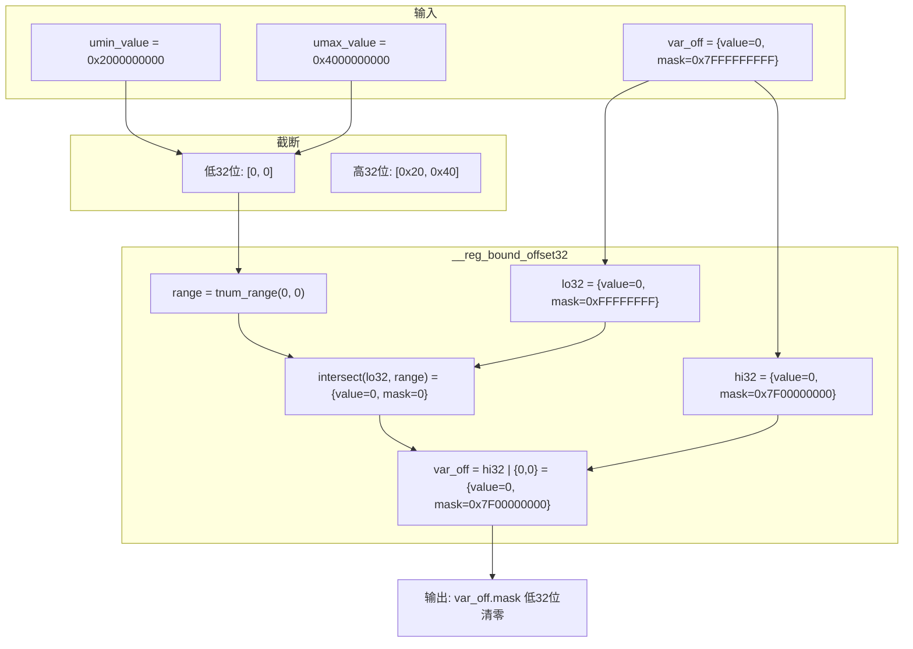
```mermaid
flowchart TD
    subgraph 输入
        umin["umin_value = 0x2000000000"]
        umax["umax_value = 0x4000000000"]
        var_off["var_off = {value=0, mask=0x7FFFFFFFFF}"]
    end
    subgraph 截断
        low32["低32位: [0, 0]"]
        high32["高32位: [0x20, 0x40]"]
    end
    subgraph __reg_bound_offset32
        range["range = tnum_range(0, 0)"]
        lo32["lo32 = {value=0, mask=0xFFFFFFFF}"]
        hi32["hi32 = {value=0, mask=0x7F00000000}"]
        intersect["intersect(lo32, range) = {value=0, mask=0}"]
        result["var_off = hi32 | {0,0} = {value=0, mask=0x7F00000000}"]
    end
    umin --> low32
    umax --> low32
    var_off --> lo32
    var_off --> hi32
    low32 --> range
    range --> intersect
    lo32 --> intersect
    intersect --> result
    hi32 --> result
    result --> output["输出: var_off.mask 低32位清零"]
```

### 5-5. tnum 辅助函数

`__reg_bound_offset32` 依赖于一系列 tnum 操作函数，它们的正确性直接影响结果。以下是相关函数的实现：

```c
/**
 * tnum_range - 返回表示[min, max]范围内所有值的tnum
 * @min: 最小值
 * @max: 最大值
 *
 * 返回的 tnum 满足：所有在[min, max]内的值都包含在该 tnum 中，
 * 但可能包含范围外的值（过近似）。
 */
struct tnum tnum_range(u64 min, u64 max)
{
    u64 chi = min ^ max, delta;
    u8 bits = fls64(chi);

    /* 特殊情况：如果 chi 超过63位，则范围跨越了整个64位空间 */
    if (bits > 63)
        return tnum_unknown;
    /* 例如 chi=4, bits=3, delta=(1<<3)-1=7
     * 如果 chi=0, bits=0, delta=0，则返回常数 min */
    delta = (1ULL << bits) - 1;
    return TNUM(min & ~delta, delta);
}

/**
 * tnum_cast - 截断 tnum 到指定字节数
 * @a: 输入 tnum
 * @size: 字节数（如4表示32位）
 */
struct tnum tnum_cast(struct tnum a, u8 size)
{
    a.value &= (1ULL << (size * 8)) - 1;
    a.mask  &= (1ULL << (size * 8)) - 1;
    return a;
}

struct tnum tnum_lshift(struct tnum a, u8 shift)
{
    return TNUM(a.value << shift, a.mask << shift);
}

struct tnum tnum_rshift(struct tnum a, u8 shift)
{
    return TNUM(a.value >> shift, a.mask >> shift);
}

/**
 * tnum_intersect - 两个 tnum 的交集
 * @a: tnum A
 * @b: tnum B
 *
 * 返回的 tnum 表示同时属于 A 和 B 的值。
 * 算法：value 取两者 value 的或，mask 取两者 mask 的与。
 */
struct tnum tnum_intersect(struct tnum a, struct tnum b)
{
    u64 v, mu;
    v = a.value | b.value;
    mu = a.mask & b.mask;
    return TNUM(v & ~mu, mu);
}

/**
 * tnum_or - 两个 tnum 的并集（上近似）
 * @a: tnum A
 * @b: tnum B
 *
 * 返回的 tnum 表示至少属于 A 或 B 之一的值。
 */
struct tnum tnum_or(struct tnum a, struct tnum b)
{
    u64 v, mu;
    v = a.value | b.value;
    mu = a.mask | b.mask;
    return TNUM(v, mu & ~v);
}

#define TNUM(_v, _m)	(struct tnum){.value = _v, .mask = _m}
const struct tnum tnum_unknown = { .value = 0, .mask = -1 };

struct tnum tnum_const(u64 value)
{
    return TNUM(value, 0);
}
```

### 5-6. 触发流程

结合第二章的数学推导，漏洞触发的完整流程如下：

1. **初始化**：通过 64 位范围检查将寄存器 `r8` 限制在 `[0x2000000000, 0x4000000000]`，`var_off` 为 `{value=0, mask=0x7FFFFFFFFF}`。
2. **JMP32 比较**：执行 `if (u32)r8 < 1`，进入 `check_cond_jmp_op`，分裂分支。
3. **范围更新**：`reg_set_min_max` 更新 `umin/umax` 后，调用 `__reg_bound_offset32`。
4. **缺陷触发**：`__reg_bound_offset32` 将 `umin/umax` 的低32位（均为0）构造 `range = {0,0}`，与 `lo32` 交集后低32位 mask 清零，导致 `var_off` 错误地认为低32位为常量0。
5. **后续操作**：`r8 = r8 & 0xFFFFFFFF` 被 Verifier 视为常量0，从而允许指针减法 `r7 = r6 - r8` 通过验证，而运行时 `r8` 实际非零，导致指针偏移超出预期范围。

该漏洞揭示了数值抽象层（tnum 与区间）交互时的微妙陷阱：`__reg_bound_offset32` 试图利用 `umin/umax` 的低32位信息来精化 `var_off`，却忽略了高32位的独立性，导致信息丢失和错误的常量推断。

### 5-7. JIT 代码实例分析

通过 GDB 调试可以获取 JIT 编译后的 x86 指令序列。以下展示了一段与漏洞触发相关的 JIT 代码，并标注每条指令对应的 eBPF 指令及其作用。该指令序列体现了 Verifier 误判后，JIT 编译器如何生成实际的机器码。

```asm
; 函数序言：保存寄存器，分配栈空间
0xffffffffc000228c:  nop
0xffffffffc0002291:  push   rbp
0xffffffffc0002292:  mov    rbp, rsp
0xffffffffc0002295:  sub    rsp, 0x8
0xffffffffc000229c:  push   rbx
0xffffffffc000229d:  push   r13
0xffffffffc000229f:  push   r14
0xffffffffc00022a1:  push   r15
0xffffffffc00022a3:  push   0x0                    ; 栈上预留空间

; 加载 map 基址（通过 BPF_LD_IMM64 指令）
0xffffffffc00022a5:  movabs r15, 0xffff88800d841000 ; r15 = map 数据区基址

; 计算 map 元素地址（模拟 BPF_MAP_GET 操作）
0xffffffffc00022af:  mov    rdi, r15               ; rdi = map 基址
0xffffffffc00022b2:  mov    rsi, rbp               ; rsi = 栈指针
0xffffffffc00022b5:  add    rsi, -4                ; rsi 指向栈上存储的 key
0xffffffffc00022b9:  mov    dword ptr [rbp-4], 0   ; 将 key 初始化为 0
0xffffffffc00022c0:  add    rdi, 0x110             ; rdi = map 基址 + 0x110（指向元素区域）
0xffffffffc00022c7:  mov    eax, dword ptr [rsi]   ; eax = key (0)
0xffffffffc00022ca:  cmp    rax, 1                 ; 检查 key 是否越界
0xffffffffc00022ce:  jae    0xffffffffc00022dc     ; 若 key>=1 则返回空
0xffffffffc00022d0:  and    eax, 0                 ; 计算偏移（key * 0x100）
0xffffffffc00022d3:  shl    rax, 8
0xffffffffc00022d7:  add    rax, rdi               ; rax = 元素地址
0xffffffffc00022da:  jmp    0xffffffffc00022de
0xffffffffc00022dc:  xor    eax, eax               ; 返回 NULL
0xffffffffc00022de:  test   rax, rax               ; 检查是否为空
0xffffffffc00022e1:  jne    0xffffffffc00022ed     ; 非空则继续
; 若为空则提前返回
0xffffffffc00022e3:  pop    rbx
0xffffffffc00022e4:  pop    r15
0xffffffffc00022e6:  pop    r14
0xffffffffc00022e8:  pop    r13
0xffffffffc00022ea:  pop    rbx
0xffffffffc00022eb:  leave
0xffffffffc00022ec:  ret

; 非空分支：读取 map 元素值
0xffffffffc00022ed:  mov    r14, qword ptr [rax]   ; r14 = 元素值（即 ctrl_map[0] 的内容）
0xffffffffc00022f1:  mov    rbx, rax               ; rbx = 元素地址（保留备用）

; 加载用于范围检查的常量
0xffffffffc00022f4:  movabs rsi, 0x4000000000      ; rsi = 上限
0xffffffffc00022fe:  movabs rdx, 0x2000000000      ; rdx = 下限
0xffffffffc0002308:  mov    ecx, 0xffffffff        ; ecx = 32位掩码
0xffffffffc000230d:  mov    r8d, 1                 ; r8d = 比较常量 1

; 64位范围检查：验证 r14 是否在 [0x2000000000, 0x4000000000] 内
0xffffffffc0002313:  cmp    r14, rsi               ; if r14 > 0x4000000000
0xffffffffc0002316:  ja     0xffffffffc000232c     ; 跳转到失败路径
0xffffffffc0002318:  cmp    r14, rdx               ; if r14 < 0x2000000000
0xffffffffc000231b:  jb     0xffffffffc000232c     ; 跳转到失败路径

; JMP32 范围检查：比较低32位
0xffffffffc000231d:  cmp    r14d, ecx              ; if (u32)r14 > 0xFFFFFFFF
0xffffffffc0002320:  ja     0xffffffffc000232c     ; 跳转到失败路径（实际永假）
0xffffffffc0002322:  cmp    r14d, r8d              ; if (u32)r14 < 1
0xffffffffc0002325:  jb     0xffffffffc000232c     ; 跳转到失败路径

; 通过所有检查后，执行 AND 操作：r14 = r14 & 0xFFFFFFFF
0xffffffffc0002327:  and    r14, rcx               ; r14 = 低32位（Verifier 误判为0，实际非零）
0xffffffffc000232a:  jmp    0xffffffffc0002330

; 失败路径：返回0
0xffffffffc000232c:  xor    eax, eax
0xffffffffc000232e:  jmp    0xffffffffc00022e3

; 正常路径：计算指针偏移
0xffffffffc0002330:  mov    r13, rbx               ; r13 = 元素地址（即 map 值指针）
0xffffffffc0002333:  mov    r10d, 0xffffffff       ; r10 = 0xFFFFFFFF
0xffffffffc0002339:  sub    r10, r14               ; r10 = 0xFFFFFFFF - r14
0xffffffffc000233c:  or     r10, r14               ; r10 = (0xFFFFFFFF - r14) | r14
0xffffffffc000233f:  neg    r10                    ; r10 = -(r10)
0xffffffffc0002342:  sar    r10, 0x3f              ; r10 = 符号扩展（若 r14==0 则 r10=0，否则 r10=-1）
0xffffffffc0002346:  and    r10, r14               ; r10 = (r14==0 ? 0 : r14)
0xffffffffc0002349:  sub    r13, r10               ; r13 = 元素地址 - r10（指针偏移调整）
```

**指令序列解读**：

- 前段（0x22a5-0x22e1）实现了 map 元素的查找操作，对应 eBPF 的 `map_lookup_elem` 辅助函数。
- 中段（0x22ed-0x232a）执行了两次范围检查：一次 64 位比较（`cmp r14, rsi` 和 `cmp r14, rdx`），一次 JMP32 比较（`cmp r14d, ecx` 和 `cmp r14d, r8d`）。这些检查在 Verifier 看来足以确保后续操作的安全性。
- 后段（0x2330-0x2349）执行了指针偏移计算。其中 `and r14, rcx` 对应 eBPF 的 `BPF_ALU64_REG(BPF_AND, r8, r4)`，即 `r8 = r8 & 0xFFFFFFFF`。由于 Verifier 误判 `r14` 的低32位为0，它认为 `and` 后的结果为0，因此后续的 `sub r13, r10` 被视为无偏移的指针减法。然而运行时 `r14` 的实际低32位非零（例如 `0x110`），导致 `r13` 被调整为指向 map 元素之前的位置，从而访问到预期外的内存区域。

该 JIT 代码实例清晰地展示了 Verifier 的语义分歧如何被固化到机器指令中：JIT 忠实地翻译了 eBPF 指令，但由于 Verifier 对寄存器状态的错误推断，最终生成的代码在执行时产生了与验证阶段不一致的行为。这正是 **CVE-2020-8835** 在二进制层面的直接体现。

### 5-8. 分析总结

本章从源码层面完整剖析了 **CVE-2020-8835** 的内在机理，涵盖 Verifier 的指令模拟、分支分裂、范围更新以及 tnum 运算等多个环节。通过逐层追踪 `do_check` → `check_cond_jmp_op` → `reg_set_min_max` → `__reg_bound_offset32` 的调用链，可以清晰地看到漏洞是如何在数值抽象的缝隙中产生的。

核心问题在于 `__reg_bound_offset32` 的设计假设与实际情况不符：该函数假定 `umin/umax` 的低32位能够完全反映 `var_off` 低32位的约束，但在寄存器具有高32位独立性的场景下（例如 `[0x2000000000, 0x4000000000]`），低32位的 `[0,0]` 并不能代表 `var_off` 的真实状态。`tnum_intersect` 将 `lo32` 与 `range` 取交集后，错误地清空了低32位的 mask，导致 Verifier 认为该寄存器低32位为常量0。

这一误判在后续的 `BPF_ALU64(BPF_AND)` 指令中被放大：Verifier 认为 `and` 的结果为0，从而允许基于该值的指针减法通过安全检查。JIT 编译器忠实翻译了这一逻辑，最终在运行时产生了与实际验证语义不符的内存访问模式。

Linux 内核社区在 `5.4.29|5.5.14|5.6.1` 版本中对该漏洞进行了修复，修复方案非常直接：**完全移除 `__reg_bound_offset32` 函数，并删除 `reg_set_min_max` 中对它的所有调用**。这一决策表明，该函数引入的额外精化不仅是不必要的，而且是危险的。移除后，Verifier 不再尝试通过低32位的范围信息去过度精化 `var_off`，从而避免了信息丢失导致的错误常量推断。该修复也提醒我们，在静态分析中引入看似有益的优化时，必须充分验证其在所有边界条件下的正确性，否则可能适得其反。

## 6. 利用思路一

前几章从数学原理、源码分析和 JIT 指令三个层面完整揭示了 `__reg_bound_offset32` 缺陷如何导致 Verifier 误判寄存器值。本章将基于该缺陷，讨论如何构造一个 eBPF 程序，使其在通过 Verifier 检查的同时，在运行时产生越界内存访问，并以此为基础构建内核内存的读写原语。

### 6-1. 总体策略

技术验证的核心目标是：让 Verifier 认为一个指针减法操作是安全的（减去的偏移量为 0），而实际运行时该偏移量非零，从而使指针指向 map 头部或相邻内存区域。具体步骤如下：

1. **构造一个可控制的标量寄存器**，使其在 Verifier 眼中具有特定的数值属性（高 32 位在特定区间，低 32 位非零）。
2. **触发 `__reg_bound_offset32` 缺陷**，使 Verifier 错误地将该寄存器的低 32 位标记为 0。
3. **执行 ALU64_AND 操作**，将 Verifier 对该寄存器的认知彻底固化为常量 0。
4. **执行指针减法**，利用该寄存器作为偏移量，使实际运行时指针发生越界。

一旦获得了越界指针，就可以读取或改写 map 头部结构（如 `bpf_array`）的关键字段，进而构建任意的内核内存读写原语。整个过程如下图所示：

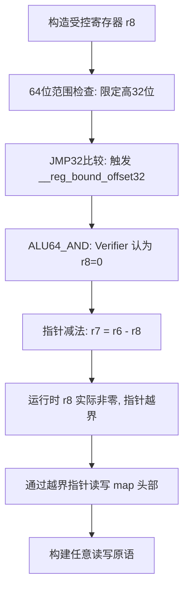
```mermaid
flowchart TD
    A[构造受控寄存器 r8] --> B[64位范围检查: 限定高32位]
    B --> C[JMP32比较: 触发 __reg_bound_offset32]
    C --> D[ALU64_AND: Verifier 认为 r8=0]
    D --> E[指针减法: r7 = r6 - r8]
    E --> F[运行时 r8 实际非零, 指针越界]
    F --> G[通过越界指针读写 map 头部]
    G --> H[构建任意读写原语]
```

### 6-2. 原语构建

#### 6-2-1. 数据通道设计

技术验证过程需要一个用户态与 eBPF 程序之间的数据交换通道。这里采用一个 **控制 Map**（Array 类型），其布局如下：

| 槽位 | 用途                                                          |
| ---- | ------------------------------------------------------------- |
| 0    | 魔术值（用于触发 Verifier 缺陷，例如 `0x2000000000 + 0x110`） |
| 1    | 操作码（0: 泄漏信息, 1: 任意读, 2: 安装伪造操作表）           |
| 2    | 目标地址（用于任意读）                                        |
| 3    | 输出值（泄漏的内核指针或读取结果）                            |
| 4    | 伪造操作表的地址（由 eBPF 程序计算并写入）                    |
| 5..  | 伪造的操作表数据（由用户态写入）                              |

用户态通过 `bpf_update_elem` 写入操作参数，然后触发 eBPF 程序执行；eBPF 程序执行完毕后，用户态通过 `bpf_lookup_elem` 读取结果。这种设计保证了用户态与内核 eBPF 程序之间的双向通信。

#### 6-2-2. 任意读写实现

**任意读原语**：利用 eBPF 程序修改 map 的 `btf` 指针，将其指向目标地址附近。随后用户态调用 `BPF_OBJ_GET_INFO_BY_FD`，内核会读取 `btf->id` 字段（偏移固定），从而实现从目标地址读取 4 字节。通过组合多次读取，可以获得任意长度的数据。该原语在安装伪造操作表之前一直可用。

**任意写原语**：在获得越界指针后，eBPF 程序可以改写 map 的 `ops` 指针，使其指向一个预先准备好的伪造操作表。该伪造表中，`map_push_elem` 被替换为另一个辅助函数（如 `array_map_get_next_key`），该函数会将用户传入的 key 值写入指定的内存地址。此后，用户态只需调用 `bpf_update_elem` 即可实现任意地址的 4 字节写入。需要注意的是，安装伪造操作表后，原始的任意读原语（通过 `btf` 指针）会失效，因此必须在安装前完成所有信息收集工作。

#### 6-2-3. 触发机制

eBPF 程序需要被挂载到一个事件钩子上才能执行。这里采用 **Socket Filter** 类型，通过 `setsockopt` 将程序附加到 Unix socket 的一侧。用户态向 socket 写入数据时，内核会自动调用该 eBPF 程序。这种触发方式简单可靠，且无需额外的内核事件。

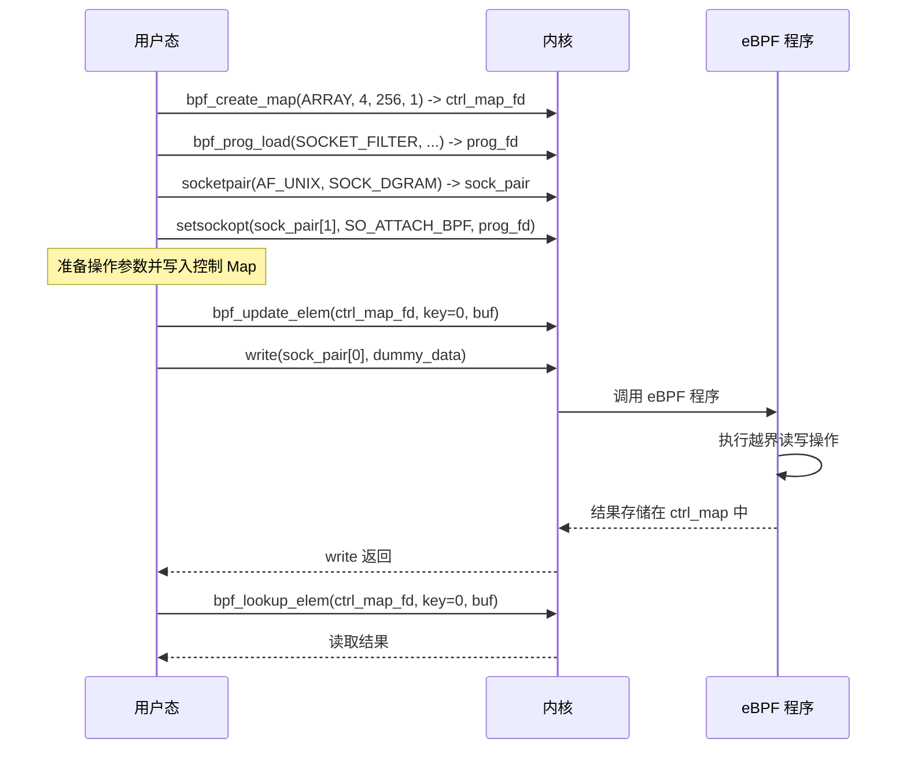
```mermaid
sequenceDiagram
    participant U as 用户态
    participant K as 内核
    participant BPF as eBPF 程序

    U->>K: bpf_create_map(ARRAY, 4, 256, 1) -> ctrl_map_fd
    U->>K: bpf_prog_load(SOCKET_FILTER, ...) -> prog_fd
    U->>K: socketpair(AF_UNIX, SOCK_DGRAM) -> sock_pair
    U->>K: setsockopt(sock_pair[1], SO_ATTACH_BPF, prog_fd)
    Note over U: 准备操作参数并写入控制 Map
    U->>K: bpf_update_elem(ctrl_map_fd, key=0, buf)
    U->>K: write(sock_pair[0], dummy_data)
    K->>BPF: 调用 eBPF 程序
    BPF->>BPF: 执行越界读写操作
    BPF-->>K: 结果存储在 ctrl_map 中
    K-->>U: write 返回
    U->>K: bpf_lookup_elem(ctrl_map_fd, key=0, buf)
    K-->>U: 读取结果
```

### 6-3. 信息收集

获得任意读原语后，首先需要确定内核基址。通过越界指针可以读取 map 头部的 `ops` 字段，该字段指向 `array_map_ops` 结构体，其地址相对于内核基址是固定的。减去已知偏移即可得到内核基址。

接着，需要定位当前进程的 `task_struct`。可以利用 per-CPU 偏移量：读取 `__per_cpu_offset` 变量，然后扫描 per-CPU 数据区中存储的 `current_task` 指针。通过比较进程名称（`comm` 字段）确认目标。多核环境需要使用 sched_setaffinity() 将程序固定到一个CPU核心，避免CPU切换造成利用失效。

最后，从 `task_struct` 中读取 `cred` 指针（偏移固定），获得凭证结构的地址。至此，信息收集阶段完成。

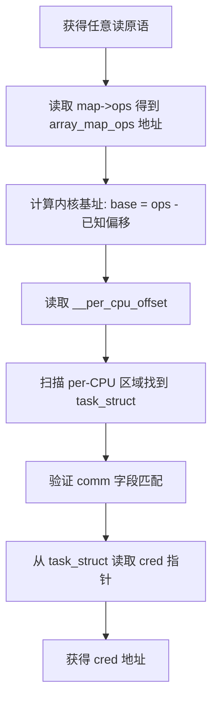
```mermaid
flowchart TD
    A[获得任意读原语] --> B[读取 map->ops 得到 array_map_ops 地址]
    B --> C[计算内核基址: base = ops - 已知偏移]
    C --> D[读取 __per_cpu_offset]
    D --> E[扫描 per-CPU 区域找到 task_struct]
    E --> F[验证 comm 字段匹配]
    F --> G[从 task_struct 读取 cred 指针]
    G --> H[获得 cred 地址]
```

### 6-4. 提权触发

获得 `cred` 地址后，下一步是将其中的 `uid`、`gid`、`euid`、`egid`、`fsuid`、`fsgid`、`securebits`、`cap_inheritable` 等字段清零，使进程获得最高权限。

为此，需要切换到任意写原语。具体做法是：在用户态构造一个伪造的 `bpf_map_ops` 结构，其中 `map_push_elem` 被替换为一个能向任意地址写入的函数（如 `array_map_get_next_key`）。然后通过 eBPF 程序将 map 的 `ops` 指针指向该伪造结构，并将 map 类型改为 `STACK`，使后续的 `bpf_update_elem` 调用走 `push_elem` 路径。此后，每次调用 `bpf_update_elem` 都会触发一次任意地址写入。

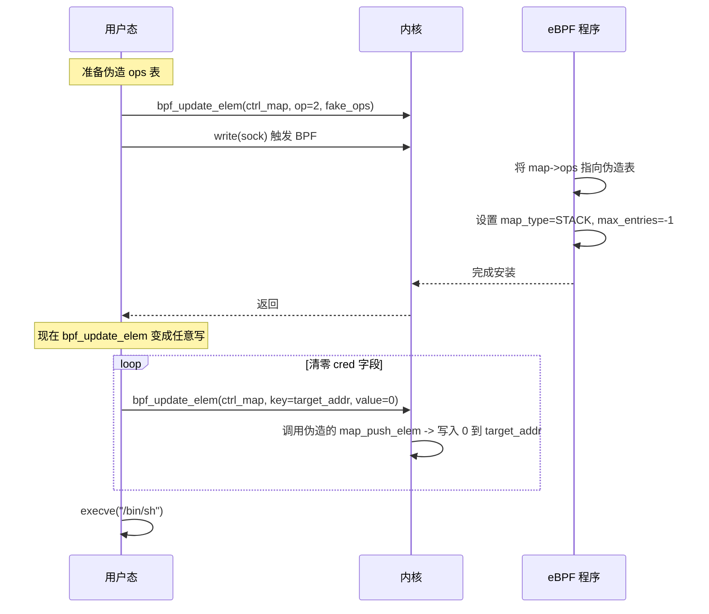
```mermaid
sequenceDiagram
    participant U as 用户态
    participant K as 内核
    participant BPF as eBPF 程序

    Note over U: 准备伪造 ops 表
    U->>K: bpf_update_elem(ctrl_map, op=2, fake_ops)
    U->>K: write(sock) 触发 BPF
    BPF->>BPF: 将 map->ops 指向伪造表
    BPF->>BPF: 设置 map_type=STACK, max_entries=-1
    BPF-->>K: 完成安装
    K-->>U: 返回
    Note over U: 现在 bpf_update_elem 变成任意写
    loop 清零 cred 字段
        U->>K: bpf_update_elem(ctrl_map, key=target_addr, value=0)
        K->>K: 调用伪造的 map_push_elem -> 写入 0 到 target_addr
    end
    U->>U: execve("/bin/sh")
```

### 6-5. 整体流程

整个技术验证过程分为四个阶段，各阶段紧密衔接：

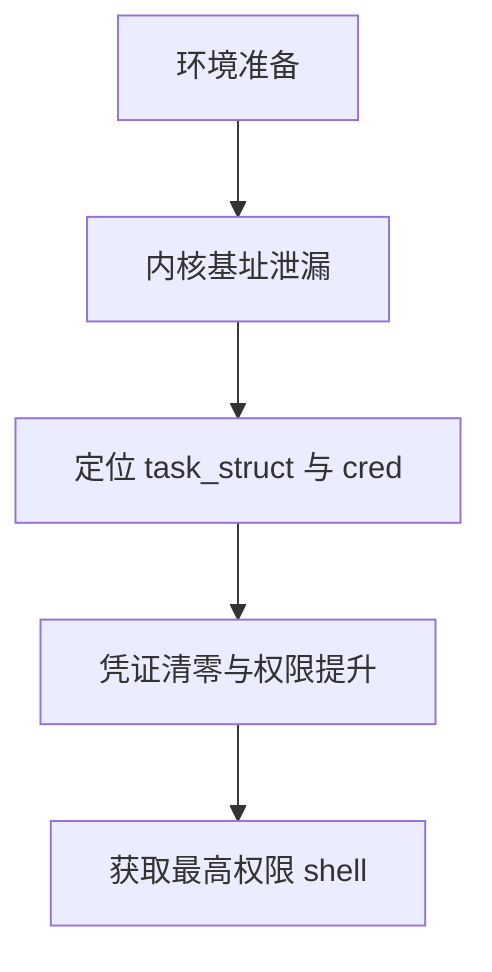
```mermaid
flowchart TD
    A[环境准备] --> B[内核基址泄漏]
    B --> C[定位 task_struct 与 cred]
    C --> D[凭证清零与权限提升]
    D --> E[获取最高权限 shell]
```

- **环境准备**：创建控制 Map，加载含有越界原语的 eBPF 程序，绑定到 socket。
- **内核基址泄漏**：触发 eBPF 程序读取 map 头部 `ops` 指针，计算内核基址。
- **定位任务与凭证**：利用任意读原语扫描 per-CPU 区域找到当前进程的 `task_struct`，进而读取 `cred` 地址。
- **凭证清零**：安装伪造操作表，切换为任意写原语，将 `cred` 结构中的关键字段清零，最终启动 shell。

### 6-6. 内核保护机制应对策略

该技术验证在启用了以下保护机制的环境中依然可行：

| 保护机制  | 应对策略                                                                                       |
| --------- | ---------------------------------------------------------------------------------------------- |
| **KASLR** | 通过泄漏 `array_map_ops` 地址计算内核基址，绕过随机化。                                        |
| **SMEP**  | 不需要执行用户态代码，所有操作均在内核态完成，不受影响。                                       |
| **SMAP**  | 利用 eBPF 辅助函数访问用户态缓冲区时，内核会临时禁用 SMAP，不影响读写。                        |
| **KPTI**  | 在 eBPF 程序执行期间，内核页表与用户页表分离，但 eBPF 运行在内核上下文，访问内核内存不受影响。 |

此外，常见的 slab 加固（如 `CONFIG_SLAB_FREELIST_HARDENED`）也无法阻止越界读写，因为 Verifier 已经批准了内存访问模式，内核无法区分合法与恶意的越界操作。

### 6-7. 利用条件与局限性

#### 6-7-1. 必要条件

- 内核版本在 `5.4.7` 至 `5.5.0` 或 `5.6.0` 之间，且未打补丁（修复版本为 `5.4.29`、`5.5.14`、`5.6.1`）。
- 内核编译时启用了 `CONFIG_BPF_SYSCALL` 和 `CONFIG_BPF_JIT_ALWAYS_ON`（默认开启）。
- 用户具有 `CAP_SYS_ADMIN` 权限或 `unprivileged_bpf_disabled=0`（允许非特权用户加载 eBPF 程序）。
- 目标系统使用 x86_64 架构（JIT 编译器针对该架构）。

#### 6-7-2. 局限性

- 依赖特定的内核内存布局（如 per-CPU 偏移、`task_struct` 字段偏移），不同内核版本可能需要调整。
- 单核环境更容易定位 `task_struct`，多核环境下需要绑定CPU核心。
- 安装伪造操作表后，原始的任意读原语失效（因 `btf` 指针被覆盖），需在安装前完成所有信息收集。
- 部分内核加固（如 `CONFIG_BPF_JIT_ALWAYS_ON` 配合 `CONFIG_DEBUG_LIST`）可能增加操作复杂度，但不影响根本可行性。

### 6-8. 总结

本章描述了如何利用 **CVE-2020-8835** 中 Verifier 对 JMP32 指令的错误处理，构建从越界指针到任意内核内存读写的完整技术路径。通过精心设计的 eBPF 程序，可以在不触发任何内核警告的情况下，绕过 KASLR、SMEP、SMAP、KPTI 等多层保护机制，最终实现对凭证结构的修改。该案例再次表明，静态分析工具（如 Verifier）中任何一个微小的语义建模失误，都可能被组合利用，导致整个安全模型的失效。从漏洞分析到原语构建的每一步，都体现了对内核内部机制的深刻理解和精巧的工程实现。

### 6-9. 测试结果

<div style="text-align: center; margin: 2rem 0;">
  
</div>

## 7. 利用思路二

前几章从数学原理、源码分析和 JIT 指令三个层面完整揭示了 `__reg_bound_offset32` 缺陷如何导致 Verifier 误判寄存器值。第六章介绍了一种基于单一控制 Map 的技术验证方案，其缺点是安装伪造操作表后，原始的任意读原语会失效。本章将介绍一种改进方案，通过引入两个独立的 Map 分别承担读和写的职能，使得读写原语互不干扰，在整个验证过程中均可交替使用。这种设计显著提升了操作的灵活性和可靠性。

### 7-1. 总体策略

技术验证的核心目标与思路一相同：让 Verifier 认为一个指针减法操作是安全的（减去的偏移量为 0），而实际运行时该偏移量非零，从而使指针指向 map 头部或相邻内存区域。在此基础上，利用两个 Map 分工协作：

- **控制 Map（ctrl_map_fd）**：负责内核基址泄漏、任意读（通过 `btf` 指针覆盖）以及安装伪造操作表到写 Map 上。
- **写 Map（write_map_fd）**：专门用于任意写操作。在其上安装伪造操作表后，通过 `bpf_update_elem` 触发写入，而控制 Map 的读原语始终保持可用。

具体步骤如下：

1. **构造一个可控制的标量寄存器**，使其在 Verifier 眼中具有特定的数值属性。
2. **触发 `__reg_bound_offset32` 缺陷**，使 Verifier 错误地将该寄存器的低 32 位标记为 0。
3. **执行 ALU64_AND 操作**，将 Verifier 对该寄存器的认知彻底固化为常量 0。
4. **执行指针减法**，同时计算出两个 Map 的 `bpf_array` 基址。
5. **利用越界指针**，从控制 Map 的 `bpf_array` 头部读取 `ops` 指针（泄漏内核基址）和 `wait_list->next`（推导写 Map 的伪造操作表存放地址）。
6. **通过控制 Map 的 `btf` 覆盖实现任意读**，定位当前进程的 `task_struct` 和 `cred`。
7. **在写 Map 上安装伪造操作表**，将 `map_push_elem` 替换为 `array_map_get_next_key`，使 `bpf_update_elem` 变为任意写。
8. **使用写 Map 将 `cred` 中的关键字段清零**，完成权限提升。

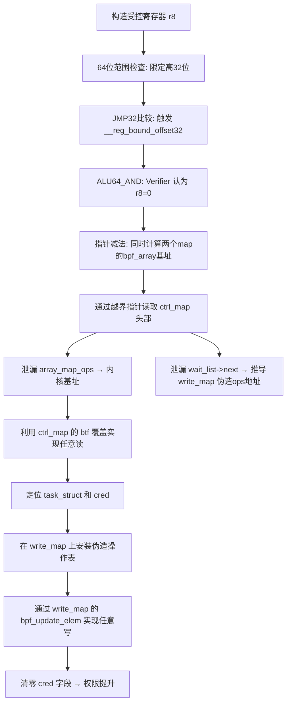
```mermaid
flowchart TD
    A[构造受控寄存器 r8] --> B[64位范围检查: 限定高32位]
    B --> C[JMP32比较: 触发 __reg_bound_offset32]
    C --> D[ALU64_AND: Verifier 认为 r8=0]
    D --> E[指针减法: 同时计算两个map的bpf_array基址]
    E --> F[通过越界指针读取 ctrl_map 头部]
    F --> G[泄漏 array_map_ops → 内核基址]
    F --> H[泄漏 wait_list->next → 推导 write_map 伪造ops地址]
    G --> I[利用 ctrl_map 的 btf 覆盖实现任意读]
    I --> J[定位 task_struct 和 cred]
    J --> K[在 write_map 上安装伪造操作表]
    K --> L[通过 write_map 的 bpf_update_elem 实现任意写]
    L --> M[清零 cred 字段 → 权限提升]
```

### 7-2. 原语构建

#### 7-2-1. 数据通道设计

技术验证过程需要两个 Map 作为用户态与 eBPF 程序之间的数据交换通道。其布局如下：

**控制 Map（ctrl_map_fd）**：Array 类型，值大小为 0x100 字节。

| 槽位 | 用途                                                          |
| ---- | ------------------------------------------------------------- |
| 0    | 魔术值（用于触发 Verifier 缺陷，例如 `0x2000000000 + 0x110`） |
| 1    | 操作码（0: 泄漏信息, 1: 任意读, 2: 安装伪造操作表到写 Map）   |
| 2    | 目标地址（用于任意读）                                        |
| 3    | 输出值（泄漏的 `array_map_ops` 或读取结果）                   |
| 4    | 写 Map 的伪造操作表存放地址（由 eBPF 程序计算并写入）         |
| 5..  | 伪造操作表数据（由用户态写入，用于操作码 2）                  |

**写 Map（write_map_fd）**：Array 类型，值大小为 0x100 字节。其值区域的一部分（例如槽位 0）用于存储待写入的目标地址和值。

用户态通过 `bpf_update_elem` 向控制 Map 写入操作参数，然后触发 eBPF 程序执行；eBPF 程序执行完毕后，用户态通过 `bpf_lookup_elem` 读取结果。写 Map 在安装伪造操作表后，通过 `bpf_update_elem` 触发任意写，其 key 参数被解释为目标地址，value 参数为待写入的值（经过适当调整）。

#### 7-2-2. 任意读写实现

**任意读原语**：与控制 Map 绑定。eBPF 程序将控制 Map 的 `btf` 指针覆盖为目标地址（减去固定偏移 0x58），随后用户态调用 `BPF_OBJ_GET_INFO_BY_FD` 读取 `btf->id` 字段，从而获得目标地址处的 4 字节数据。该原语在安装伪造操作表后仍然可用，因为控制 Map 的 `btf` 指针未被破坏。

**任意写原语**：与写 Map 绑定。在安装伪造操作表之前，用户态将伪造的 `bpf_map_ops` 结构写入控制 Map 的槽位 5 及之后，然后触发操作码 2。eBPF 程序将写 Map 的 `ops` 指针指向该伪造表，并将写 Map 的类型改为 `STACK`、`max_entries` 设为 -1、`spin_lock_off` 清零。此后，用户态对写 Map 调用 `bpf_update_elem` 时，内核会调用伪造表中的 `map_push_elem`（已被替换为 `array_map_get_next_key`）。该函数会将用户传入的 key 值（目标地址）与 value 值（待写入数据减 1）组合，实现向目标地址写入 4 字节。

由于两个 Map 的原始操作互不干扰，读原语和写原语可以在任意时刻交替使用，无需担心相互影响。

#### 7-2-3. 触发机制

与思路一相同，eBPF 程序通过 **Socket Filter** 类型挂载到 Unix socket 上。用户态向 socket 写入数据时触发程序执行。触发流程如下：

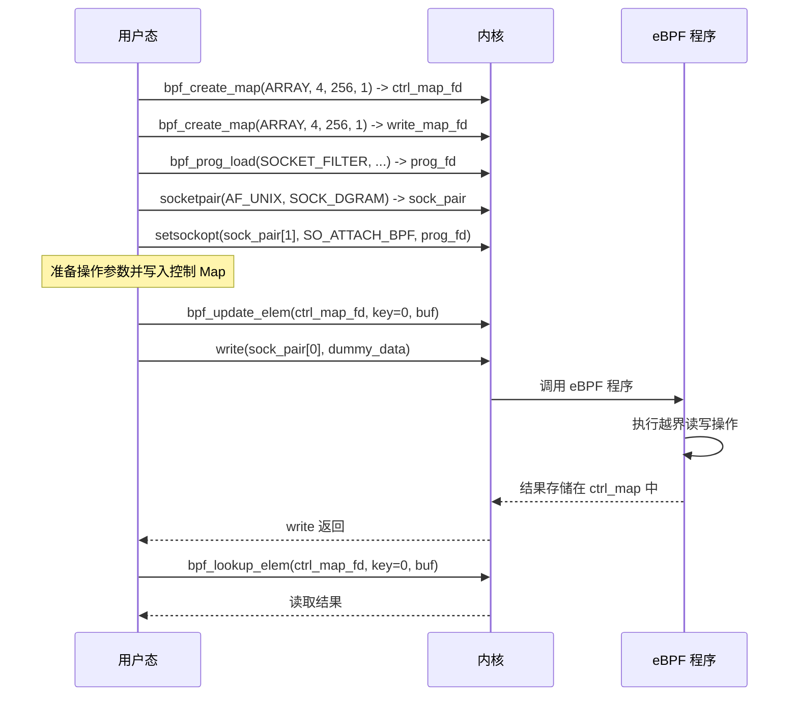
```mermaid
sequenceDiagram
    participant U as 用户态
    participant K as 内核
    participant BPF as eBPF 程序

    U->>K: bpf_create_map(ARRAY, 4, 256, 1) -> ctrl_map_fd
    U->>K: bpf_create_map(ARRAY, 4, 256, 1) -> write_map_fd
    U->>K: bpf_prog_load(SOCKET_FILTER, ...) -> prog_fd
    U->>K: socketpair(AF_UNIX, SOCK_DGRAM) -> sock_pair
    U->>K: setsockopt(sock_pair[1], SO_ATTACH_BPF, prog_fd)
    Note over U: 准备操作参数并写入控制 Map
    U->>K: bpf_update_elem(ctrl_map_fd, key=0, buf)
    U->>K: write(sock_pair[0], dummy_data)
    K->>BPF: 调用 eBPF 程序
    BPF->>BPF: 执行越界读写操作
    BPF-->>K: 结果存储在 ctrl_map 中
    K-->>U: write 返回
    U->>K: bpf_lookup_elem(ctrl_map_fd, key=0, buf)
    K-->>U: 读取结果
```

### 7-3. 信息收集

获得任意读原语后，首先需要确定内核基址。通过越界指针读取控制 Map 头部的 `ops` 字段（`array_map_ops`），减去已知偏移得到内核基址。

接着，需要定位当前进程的 `task_struct`。思路二采用了另一种方法：通过内核符号表查找 `init_pid_ns` 的地址，然后遍历 PID 命名空间的 IDR 基数树，找到当前进程的 `struct pid`，再从中提取 `task_struct`。这种方法不依赖 per-CPU 偏移，在多核环境下更为稳健。具体步骤：

1. **查找 `init_pid_ns`**：在 `__ksymtab` 或 `__ksymtab_gpl` 段中搜索符号名，解码 PREL32 条目得到符号地址。
2. **遍历 IDR 基数树**：从 `init_pid_ns->idr.idr_rt.xa_head` 出发，按索引（`pid - idr_base`）逐层下降，直到叶子节点，得到 `struct pid *`。
3. **提取 `task_struct`**：从 `struct pid` 的 `tasks[0]` 链表头取出第一个节点，通过 `container_of` 转换为 `task_struct` 地址，并用 `comm` 字段验证。

最后，从 `task_struct` 中读取 `cred` 指针（偏移 0xa68），获得凭证结构地址。

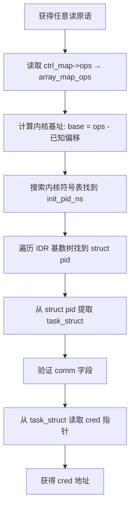
```mermaid
flowchart TD
    A[获得任意读原语] --> B[读取 ctrl_map->ops → array_map_ops]
    B --> C[计算内核基址: base = ops - 已知偏移]
    C --> D[搜索内核符号表找到 init_pid_ns]
    D --> E[遍历 IDR 基数树找到 struct pid]
    E --> F[从 struct pid 提取 task_struct]
    F --> G[验证 comm 字段]
    G --> H[从 task_struct 读取 cred 指针]
    H --> I[获得 cred 地址]
```

### 7-4. 提权触发

获得 `cred` 地址后，需要将其中与权限相关的字段清零。为此，切换到任意写原语：

1. **构造伪造操作表**：在用户态准备一个 `bpf_map_ops` 结构，其中 `map_push_elem` 被替换为 `array_map_get_next_key`，其余字段填充为 `queue_stack_map` 系列的对应函数。
2. **安装伪造操作表**：将伪造表写入控制 Map 的槽位 5 及之后，触发操作码 2。eBPF 程序将写 Map 的 `ops` 指向该伪造表，并调整相关字段。
3. **执行任意写**：对写 Map 调用 `bpf_update_elem`，key 参数为目标地址，value 参数为 `(待写入值 - 1)`。内核调用 `array_map_get_next_key` 时，会将 value 加 1 后写入 key 指定的地址。
4. **清零凭证字段**：循环调用上述任意写，将 `cred` 结构中偏移 0x14 开始的 8 个 4 字节字段（`uid`, `gid`, `euid`, `egid`, `fsuid`, `fsgid`, `securebits`, `cap_inheritable`）依次置零。

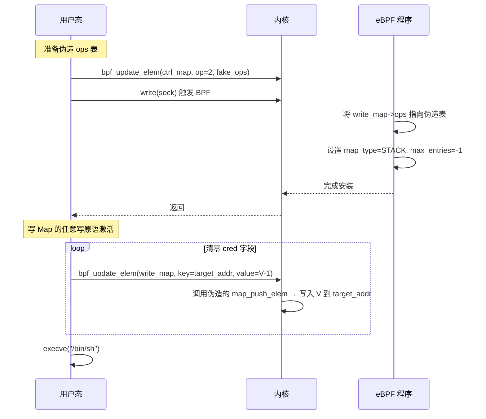
```mermaid
sequenceDiagram
    participant U as 用户态
    participant K as 内核
    participant BPF as eBPF 程序

    Note over U: 准备伪造 ops 表
    U->>K: bpf_update_elem(ctrl_map, op=2, fake_ops)
    U->>K: write(sock) 触发 BPF
    BPF->>BPF: 将 write_map->ops 指向伪造表
    BPF->>BPF: 设置 map_type=STACK, max_entries=-1
    BPF-->>K: 完成安装
    K-->>U: 返回
    Note over U: 写 Map 的任意写原语激活
    loop 清零 cred 字段
        U->>K: bpf_update_elem(write_map, key=target_addr, value=V-1)
        K->>K: 调用伪造的 map_push_elem → 写入 V 到 target_addr
    end
    U->>U: execve("/bin/sh")
```

### 7-5. 整体流程

整个技术验证过程分为七个阶段：

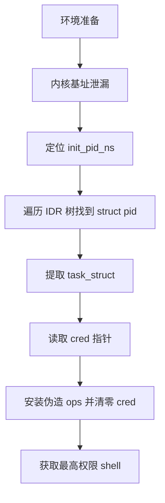
```mermaid
flowchart TD
    A[环境准备] --> B[内核基址泄漏]
    B --> C[定位 init_pid_ns]
    C --> D[遍历 IDR 树找到 struct pid]
    D --> E[提取 task_struct]
    E --> F[读取 cred 指针]
    F --> G[安装伪造 ops 并清零 cred]
    G --> H[获取最高权限 shell]
```

- **环境准备**：创建控制 Map 和写 Map，加载含有越界原语的 eBPF 程序，绑定到 socket。
- **内核基址泄漏**：触发 eBPF 程序读取控制 Map 头部 `ops` 指针，计算内核基址。
- **定位 `init_pid_ns`**：通过内核符号表搜索找到 `init_pid_ns` 地址。
- **遍历 IDR 树**：从 `init_pid_ns` 的 IDR 根出发，找到当前进程的 `struct pid`。
- **提取 `task_struct`**：从 `struct pid` 的 `tasks` 链表获取 `task_struct`。
- **读取 `cred` 指针**：从 `task_struct` 中读取 `cred` 地址。
- **清零凭证**：安装伪造操作表到写 Map，利用任意写原语将 `cred` 中的关键字段清零，最终启动 shell。

### 7-6. 内核保护机制应对策略

该技术验证在启用了以下保护机制的环境中依然可行：

| 保护机制  | 应对策略                                                                                       |
| --------- | ---------------------------------------------------------------------------------------------- |
| **KASLR** | 通过泄漏 `array_map_ops` 地址计算内核基址，绕过随机化。                                        |
| **SMEP**  | 不需要执行用户态代码，所有操作均在内核态完成，不受影响。                                       |
| **SMAP**  | 利用 eBPF 辅助函数访问用户态缓冲区时，内核会临时禁用 SMAP，不影响读写。                        |
| **KPTI**  | 在 eBPF 程序执行期间，内核页表与用户页表分离，但 eBPF 运行在内核上下文，访问内核内存不受影响。 |

此外，常见的 slab 加固（如 `CONFIG_SLAB_FREELIST_HARDENED`）也无法阻止越界读写，因为 Verifier 已经批准了内存访问模式，内核无法区分合法与恶意的越界操作。

### 7-7. 利用条件与局限性

#### 7-7-1. 必要条件

- 内核版本在 `5.4.7` 至 `5.5.0` 或 `5.6.0` 之间，且未打补丁（修复版本为 `5.4.29`、`5.5.14`、`5.6.1`）。
- 内核编译时启用了 `CONFIG_BPF_SYSCALL` 和 `CONFIG_BPF_JIT_ALWAYS_ON`（默认开启）。
- 用户具有 `CAP_SYS_ADMIN` 权限或 `unprivileged_bpf_disabled=0`（允许非特权用户加载 eBPF 程序）。
- 目标系统使用 x86_64 架构（JIT 编译器针对该架构）。
- 内核符号表（`__ksymtab`/`__ksymtab_gpl`）可读，且包含 `init_pid_ns` 符号。

#### 7-7-2. 局限性

- 依赖特定的内核内存布局（如 `struct pid` 和 `task_struct` 的字段偏移），不同内核版本可能需要调整。
- 需要两个 Map，增加了 eBPF 程序的复杂度，但换来读写原语的独立性。
- 安装伪造操作表后，写 Map 的原始 Array 语义被破坏，不能再用于常规的 Map 操作，但控制 Map 不受影响。
- 遍历 IDR 基数树的方法在极端深度的树上可能耗时较长，但通常 PID 空间较小，深度不超过 3 层。

### 7-8. 总结

本章介绍了一种改进的技术验证方案，通过将读写原语分离到两个独立的 Map 上，克服了思路一中安装伪造操作表后读原语失效的局限。该方案同样利用了 **CVE-2020-8835** 中 Verifier 对 JMP32 指令的错误处理，通过越界指针构建任意内核内存读写能力。在信息收集阶段，采用内核符号表查找和 IDR 基数树遍历的方法定位 `task_struct`，不依赖 per-CPU 偏移，提高了多核环境下的适应性。最终，通过安装伪造操作表并利用 `array_map_get_next_key` 的副作用实现任意写，将凭证字段清零完成权限提升。该案例再次证明，静态分析工具的微小语义失误可以被组合利用，突破多层内核保护机制，同时也展示了合理的数据结构设计（双 Map 分离）如何提升技术验证的鲁棒性。

### 7-9. 测试结果

<div style="text-align: center; margin: 2rem 0;">
  
</div>

## 8. 利用思路三

前几章从数学原理、源码分析和 JIT 指令三个层面完整揭示了 `__reg_bound_offset32` 缺陷如何导致 Verifier 误判寄存器值。第六章和第七章分别介绍了基于单 Map 和双 Map 的技术验证方案，其中信息收集分别采用了 per-CPU 偏移扫描和 IDR 基数树遍历的方法。本章将介绍第三种方案，通过内核符号表定位 `init_task`，然后沿任务链表逆向遍历找到当前进程的 `task_struct`。该方法无需依赖 per-CPU 区域的布局，也无需解析复杂的基数树结构，实现更为简洁直接。

### 8-1. 总体策略

技术验证的核心目标与前两章相同：让 Verifier 认为一个指针减法操作是安全的（减去的偏移量为 0），而实际运行时该偏移量非零，从而使指针指向 map 头部或相邻内存区域。在此基础上，沿用双 Map 分工协作的设计：

- **控制 Map（ctrl_map_fd）**：负责内核基址泄漏、任意读（通过 `btf` 指针覆盖）以及安装伪造操作表到写 Map 上。
- **写 Map（write_map_fd）**：专门用于任意写操作。

具体步骤如下：

1. **构造一个可控制的标量寄存器**，使其在 Verifier 眼中具有特定的数值属性。
2. **触发 `__reg_bound_offset32` 缺陷**，使 Verifier 错误地将该寄存器的低 32 位标记为 0。
3. **执行 ALU64_AND 操作**，将 Verifier 对该寄存器的认知彻底固化为常量 0。
4. **执行指针减法**，同时计算出两个 Map 的 `bpf_array` 基址。
5. **利用越界指针**，从控制 Map 的 `bpf_array` 头部读取 `ops` 指针（泄漏内核基址）和 `wait_list->next`（推导写 Map 的伪造操作表存放地址）。
6. **通过控制 Map 的 `btf` 覆盖实现任意读**，定位当前进程的 `task_struct` 和 `cred`。本思路采用的方法是通过内核符号表找到 `init_task`，然后沿任务链表逆向遍历，通过比较 `comm` 字段识别当前进程。
7. **在写 Map 上安装伪造操作表**，将 `map_push_elem` 替换为 `array_map_get_next_key`，使 `bpf_update_elem` 变为任意写。
8. **使用写 Map 将 `cred` 中的关键字段清零**，完成权限提升。

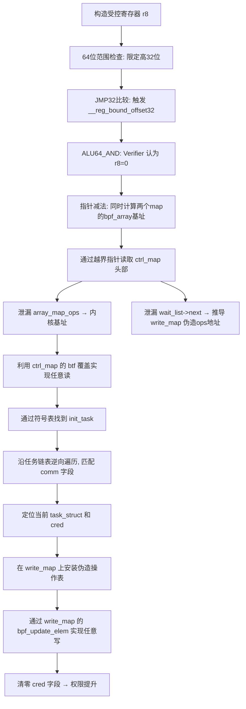
```mermaid
flowchart TD
    A[构造受控寄存器 r8] --> B[64位范围检查: 限定高32位]
    B --> C[JMP32比较: 触发 __reg_bound_offset32]
    C --> D[ALU64_AND: Verifier 认为 r8=0]
    D --> E[指针减法: 同时计算两个map的bpf_array基址]
    E --> F[通过越界指针读取 ctrl_map 头部]
    F --> G[泄漏 array_map_ops → 内核基址]
    F --> H[泄漏 wait_list->next → 推导 write_map 伪造ops地址]
    G --> I[利用 ctrl_map 的 btf 覆盖实现任意读]
    I --> J[通过符号表找到 init_task]
    J --> K[沿任务链表逆向遍历, 匹配 comm 字段]
    K --> L[定位当前 task_struct 和 cred]
    L --> M[在 write_map 上安装伪造操作表]
    M --> N[通过 write_map 的 bpf_update_elem 实现任意写]
    N --> O[清零 cred 字段 → 权限提升]
```

### 8-2. 原语构建

#### 8-2-1. 数据通道设计

技术验证过程需要两个 Map 作为用户态与 eBPF 程序之间的数据交换通道。其布局与第七章完全相同：

**控制 Map（ctrl_map_fd）**：Array 类型，值大小为 0x100 字节。

| 槽位 | 用途                                                          |
| ---- | ------------------------------------------------------------- |
| 0    | 魔术值（用于触发 Verifier 缺陷，例如 `0x2000000000 + 0x110`） |
| 1    | 操作码（0: 泄漏信息, 1: 任意读, 2: 安装伪造操作表到写 Map）   |
| 2    | 目标地址（用于任意读）                                        |
| 3    | 输出值（泄漏的 `array_map_ops` 或读取结果）                   |
| 4    | 写 Map 的伪造操作表存放地址（由 eBPF 程序计算并写入）         |
| 5..  | 伪造操作表数据（由用户态写入，用于操作码 2）                  |

**写 Map（write_map_fd）**：Array 类型，值大小为 0x100 字节。其值区域的一部分（例如槽位 0）用于存储待写入的目标地址和值。

用户态通过 `bpf_update_elem` 向控制 Map 写入操作参数，然后触发 eBPF 程序执行；eBPF 程序执行完毕后，用户态通过 `bpf_lookup_elem` 读取结果。写 Map 在安装伪造操作表后，通过 `bpf_update_elem` 触发任意写，其 key 参数被解释为目标地址，value 参数为待写入的值（经过适当调整）。

#### 8-2-2. 任意读写实现

**任意读原语**：与控制 Map 绑定。eBPF 程序将控制 Map 的 `btf` 指针覆盖为目标地址（减去固定偏移 0x58），随后用户态调用 `BPF_OBJ_GET_INFO_BY_FD` 读取 `btf->id` 字段，从而获得目标地址处的 4 字节数据。该原语在安装伪造操作表后仍然可用，因为控制 Map 的 `btf` 指针未被破坏。

**任意写原语**：与写 Map 绑定。在安装伪造操作表之前，用户态将伪造的 `bpf_map_ops` 结构写入控制 Map 的槽位 5 及之后，然后触发操作码 2。eBPF 程序将写 Map 的 `ops` 指针指向该伪造表，并将写 Map 的类型改为 `STACK`、`max_entries` 设为 -1、`spin_lock_off` 清零。此后，用户态对写 Map 调用 `bpf_update_elem` 时，内核会调用伪造表中的 `map_push_elem`（已被替换为 `array_map_get_next_key`）。该函数会将用户传入的 key 值（目标地址）与 value 值（待写入数据减 1）组合，实现向目标地址写入 4 字节。

由于两个 Map 的原始操作互不干扰，读原语和写原语可以在任意时刻交替使用，无需担心相互影响。

#### 8-2-3. 触发机制

与前面章节相同，eBPF 程序通过 **Socket Filter** 类型挂载到 Unix socket 上。用户态向 socket 写入数据时触发程序执行。触发流程如下：


```mermaid
sequenceDiagram
    participant U as 用户态
    participant K as 内核
    participant BPF as eBPF 程序

    U->>K: bpf_create_map(ARRAY, 4, 256, 1) -> ctrl_map_fd
    U->>K: bpf_create_map(ARRAY, 4, 256, 1) -> write_map_fd
    U->>K: bpf_prog_load(SOCKET_FILTER, ...) -> prog_fd
    U->>K: socketpair(AF_UNIX, SOCK_DGRAM) -> sock_pair
    U->>K: setsockopt(sock_pair[1], SO_ATTACH_BPF, prog_fd)
    Note over U: 准备操作参数并写入控制 Map
    U->>K: bpf_update_elem(ctrl_map_fd, key=0, buf)
    U->>K: write(sock_pair[0], dummy_data)
    K->>BPF: 调用 eBPF 程序
    BPF->>BPF: 执行越界读写操作
    BPF-->>K: 结果存储在 ctrl_map 中
    K-->>U: write 返回
    U->>K: bpf_lookup_elem(ctrl_map_fd, key=0, buf)
    K-->>U: 读取结果
```

### 8-3. 信息收集

获得任意读原语后，首先需要确定内核基址。通过越界指针读取控制 Map 头部的 `ops` 字段（`array_map_ops`），减去已知偏移得到内核基址。

接着，需要定位当前进程的 `task_struct`。本思路采用的方法如下：

1. **通过内核符号表查找 `init_task`**：在 `__ksymtab` 或 `__ksymtab_gpl` 段中搜索符号名 `init_task`，解码 PREL32 条目得到 `init_task` 变量的地址。`init_task` 是内核的第一个进程（PID 0）的 `task_struct`，它是所有进程链表的一个锚点。
2. **沿任务链表逆向遍历**：`init_task` 的 `tasks` 字段是一个双向循环链表的头。从 `init_task` 开始，反复读取 `tasks.prev` 指针，并减去 `tasks` 字段在 `task_struct` 中的偏移，即可得到前一个任务的 `task_struct` 地址。由于链表是循环的，遍历会经过所有进程。
3. **匹配进程名称**：对于每个遍历到的任务，读取其 `comm` 字段（进程名称），与当前进程的名称（例如 `exploit`）进行比较。一旦匹配，即找到当前进程的 `task_struct`。

这种方法不依赖 per-CPU 区域的布局，也不需要解析 IDR 基数树，实现简单且适用于多核环境。遍历整个任务链表在最坏情况下需要扫描数千个任务，但通常现代系统上活跃进程数量有限，遍历开销可以接受。

最后，从 `task_struct` 中读取 `cred` 指针（偏移固定），获得凭证结构地址。

```mermaid
flowchart TD
    A[获得任意读原语] --> B[读取 ctrl_map->ops → array_map_ops]
    B --> C[计算内核基址: base = ops - 已知偏移]
    C --> D[搜索内核符号表找到 init_task]
    D --> E[从 init_task 开始, 沿 tasks.prev 逆向遍历]
    E --> F[读取每个任务的 comm 字段]
    F --> G{匹配当前进程名?}
    G -- 否 --> E
    G -- 是 --> H[得到当前 task_struct 地址]
    H --> I[从 task_struct 读取 cred 指针]
    I --> J[获得 cred 地址]
```

### 8-4. 提权触发

获得 `cred` 地址后，需要将其中与权限相关的字段清零。为此，切换到任意写原语：

1. **构造伪造操作表**：在用户态准备一个 `bpf_map_ops` 结构，其中 `map_push_elem` 被替换为 `array_map_get_next_key`，其余字段填充为 `queue_stack_map` 系列的对应函数。
2. **安装伪造操作表**：将伪造表写入控制 Map 的槽位 5 及之后，触发操作码 2。eBPF 程序将写 Map 的 `ops` 指向该伪造表，并调整相关字段。
3. **执行任意写**：对写 Map 调用 `bpf_update_elem`，key 参数为目标地址，value 参数为 `(待写入值 - 1)`。内核调用 `array_map_get_next_key` 时，会将 value 加 1 后写入 key 指定的地址。
4. **清零凭证字段**：循环调用上述任意写，将 `cred` 结构中偏移 0x14 开始的 8 个 4 字节字段（`uid`, `gid`, `euid`, `egid`, `fsuid`, `fsgid`, `securebits`, `cap_inheritable`）依次置零。

```mermaid
sequenceDiagram
    participant U as 用户态
    participant K as 内核
    participant BPF as eBPF 程序

    Note over U: 准备伪造 ops 表
    U->>K: bpf_update_elem(ctrl_map, op=2, fake_ops)
    U->>K: write(sock) 触发 BPF
    BPF->>BPF: 将 write_map->ops 指向伪造表
    BPF->>BPF: 设置 map_type=STACK, max_entries=-1
    BPF-->>K: 完成安装
    K-->>U: 返回
    Note over U: 写 Map 的任意写原语激活
    loop 清零 cred 字段
        U->>K: bpf_update_elem(write_map, key=target_addr, value=V-1)
        K->>K: 调用伪造的 map_push_elem → 写入 V 到 target_addr
    end
    U->>U: execve("/bin/sh")
```

### 8-5. 整体流程

整个技术验证过程分为六个阶段：

```mermaid
flowchart TD
    A[环境准备] --> B[内核基址泄漏]
    B --> C[定位 init_task]
    C --> D[遍历任务链表找到当前 task_struct]
    D --> E[读取 cred 指针]
    E --> F[安装伪造 ops 并清零 cred]
    F --> G[获取最高权限 shell]
```

- **环境准备**：创建控制 Map 和写 Map，加载含有越界原语的 eBPF 程序，绑定到 socket。
- **内核基址泄漏**：触发 eBPF 程序读取控制 Map 头部 `ops` 指针，计算内核基址。
- **定位 `init_task`**：通过内核符号表搜索找到 `init_task` 地址。
- **遍历任务链表**：从 `init_task` 出发，沿 `tasks.prev` 逆向遍历，匹配进程名称找到当前 `task_struct`。
- **读取 `cred` 指针**：从 `task_struct` 中读取 `cred` 地址。
- **清零凭证**：安装伪造操作表到写 Map，利用任意写原语将 `cred` 中的关键字段清零，最终启动 shell。

### 8-6. 内核保护机制应对策略

该技术验证在启用了以下保护机制的环境中依然可行：

| 保护机制  | 应对策略                                                                                       |
| --------- | ---------------------------------------------------------------------------------------------- |
| **KASLR** | 通过泄漏 `array_map_ops` 地址计算内核基址，绕过随机化。                                        |
| **SMEP**  | 不需要执行用户态代码，所有操作均在内核态完成，不受影响。                                       |
| **SMAP**  | 利用 eBPF 辅助函数访问用户态缓冲区时，内核会临时禁用 SMAP，不影响读写。                        |
| **KPTI**  | 在 eBPF 程序执行期间，内核页表与用户页表分离，但 eBPF 运行在内核上下文，访问内核内存不受影响。 |

此外，常见的 slab 加固（如 `CONFIG_SLAB_FREELIST_HARDENED`）也无法阻止越界读写，因为 Verifier 已经批准了内存访问模式，内核无法区分合法与恶意的越界操作。

### 8-7. 利用条件与局限性

#### 8-7-1. 必要条件

- 内核版本在 `5.4.7` 至 `5.5.0` 或 `5.6.0` 之间，且未打补丁（修复版本为 `5.4.29`、`5.5.14`、`5.6.1`）。
- 内核编译时启用了 `CONFIG_BPF_SYSCALL` 和 `CONFIG_BPF_JIT_ALWAYS_ON`（默认开启）。
- 用户具有 `CAP_SYS_ADMIN` 权限或 `unprivileged_bpf_disabled=0`（允许非特权用户加载 eBPF 程序）。
- 目标系统使用 x86_64 架构（JIT 编译器针对该架构）。
- 内核符号表（`__ksymtab`/`__ksymtab_gpl`）可读，且包含 `init_task` 符号。

#### 8-7-2. 局限性

- 遍历整个任务链表在进程数量较多的系统上可能耗时较长，但通常现代桌面或服务器系统的活跃进程数在数百以内，遍历开销仍在可接受范围内。
- 依赖 `init_task` 符号存在于内核符号表中。在启用了 `CONFIG_KALLSYMS_ALL` 的内核中该符号通常可访问，但某些定制内核可能剥离了符号表。
- 需要两个 Map，增加了 eBPF 程序的复杂度，但换来读写原语的独立性。
- 安装伪造操作表后，写 Map 的原始 Array 语义被破坏，不能再用于常规的 Map 操作，但控制 Map 不受影响。

### 8-8. 总结

本章介绍了一种利用 `init_task` 任务链表定位当前进程的技术验证方案。与前面两种方案相比，该方法在信息收集阶段更加直观：无需解析 per-CPU 偏移或 IDR 基数树，只需要沿双向链表遍历并匹配进程名称即可。该方案同样基于 **CVE-2020-8835** 中 Verifier 对 JMP32 指令的错误处理，通过越界指针构建任意内核内存读写能力，并采用双 Map 设计保持读写原语的独立性。最终通过安装伪造操作表和利用 `array_map_get_next_key` 的副作用实现任意写，将凭证字段清零完成权限提升。三种思路各有优劣，共同展示了同一个底层漏洞在不同信息收集策略下的灵活运用，也再次印证了静态分析工具中细微的语义失误可能带来的深远影响。

### 8-9. 测试结果

<div style="text-align: center; margin: 2rem 0;">
  
</div>

## 9. 漏洞修复

前几章从数学原理、源码分析到多种利用思路，完整剖析了 **CVE-2020-8835** 中 `__reg_bound_offset32()` 函数的缺陷及其造成的 Verifier 误判。本章将聚焦于内核社区对该漏洞的修复方案，分析其设计思想与实施细节。

### 9-1. 修复时间线与提交

Linux 内核社区在接到漏洞报告后迅速响应，于 2020 年 3 月完成了修复。修复提交为 Daniel Borkmann 的 `f2d67fec0b43edce8c416101cdc52e71145b5fef`，标题为 _"bpf: Fix tnum constraints for 32-bit comparisons"_。该提交同时合入了多个稳定分支：

- 主线版本：5.6-rc7 引入，5.6.1 正式发布
- 5.5 稳定分支：5.5.14
- 5.4 稳定分支：5.4.29

### 9-2. 修复思路

漏洞的根本原因是 `__reg_bound_offset32()` 在设计上存在根本性缺陷：它试图利用 `umin/umax` 的低 32 位信息来精化 `var_off` 的低 32 位，却忽略了高 32 位的独立性。这种精化不仅是不必要的，而且是有害的——它破坏了 Verifier 的单调性假设，导致寄存器状态的错误收缩。

修复方案极为直接：**完全移除 `__reg_bound_offset32` 函数，并删除 `reg_set_min_max` 和 `reg_set_min_max_inv` 中对它的所有调用**。这一决策背后有两个关键考量：

1. **安全性优先**：该函数引入的额外精化并不影响 Verifier 的正确性（即使没有它，Verifier 也能正常工作），但它带来的风险却是致命的。移除后，Verifier 不再尝试通过低 32 位的范围信息去过度精化 `var_off`，从而从根本上杜绝了信息丢失导致的错误常量推断。
2. **最小化改动**：仅删除一个有问题的函数及其调用点，不修改其他逻辑，降低了引入新回归的风险。

### 9-3. 补丁内容分析

以下为修复提交的完整 diff，我们逐段分析其含义：

```diff
diff --git a/kernel/bpf/verifier.c b/kernel/bpf/verifier.c
index 047b2e8763996..2a84f73a93a11 100644
--- a/kernel/bpf/verifier.c
+++ b/kernel/bpf/verifier.c
@@ -1036,17 +1036,6 @@ static void __reg_bound_offset(struct bpf_reg_state *reg)
 						 reg->umax_value));
 }

-static void __reg_bound_offset32(struct bpf_reg_state *reg)
-{
-	u64 mask = 0xffffFFFF;
-	struct tnum range = tnum_range(reg->umin_value & mask,
-				       reg->umax_value & mask);
-	struct tnum lo32 = tnum_cast(reg->var_off, 4);
-	struct tnum hi32 = tnum_lshift(tnum_rshift(reg->var_off, 32), 32);
-
-	reg->var_off = tnum_or(hi32, tnum_intersect(lo32, range));
-}
-
 /* Reset the min/max bounds of a register */
 static void __mark_reg_unbounded(struct bpf_reg_state *reg)
 {
```

**第一段**：删除了 `__reg_bound_offset32` 函数的完整定义。该函数正是我们在第五章中详细分析的缺陷函数——它将 `umin/umax` 的低 32 位截断后构造 `range`，再与 `var_off` 的低 32 位取交集，导致低 32 位的 mask 被错误清零。移除后，该函数不再存在于内核源码中。

```diff
@@ -5805,10 +5794,6 @@ static void reg_set_min_max(struct bpf_reg_state *true_reg,
 	/* We might have learned some bits from the bounds. */
 	__reg_bound_offset(false_reg);
 	__reg_bound_offset(true_reg);
-	if (is_jmp32) {
-		__reg_bound_offset32(false_reg);
-		__reg_bound_offset32(true_reg);
-	}
 	/* Intersecting with the old var_off might have improved our bounds
 	 * slightly.  e.g. if umax was 0x7f...f and var_off was (0; 0xf...fc),
 	 * then new var_off is (0; 0x7f...fc) which improves our umax.
```

**第二段**：在 `reg_set_min_max` 函数中，删除了对 `__reg_bound_offset32` 的条件调用。该函数原本在处理 JMP32 指令时会额外调用 `__reg_bound_offset32` 来精化 `var_off`，现在这一步骤被完全移除。注意，原有的 `__reg_bound_offset` 调用（64 位版本的边界精化）仍然保留，因为它不涉及位宽截断的问题。

```diff
@@ -5918,10 +5903,6 @@ static void reg_set_min_max_inv(struct bpf_reg_state *true_reg,
 	/* We might have learned some bits from the bounds. */
 	__reg_bound_offset(false_reg);
 	__reg_bound_offset(true_reg);
-	if (is_jmp32) {
-		__reg_bound_offset32(false_reg);
-		__reg_bound_offset32(true_reg);
-	}
 	/* Intersecting with the old var_off might have improved our bounds
 	 * slightly.  e.g. if umax was 0x7f...f and var_off was (0; 0xf...fc),
 	 * then new var_off is (0; 0x7f...fc) which improves our umax.
```

**第三段**：在 `reg_set_min_max_inv` 函数中做了相同的删除操作。`reg_set_min_max_inv` 是 `reg_set_min_max` 的逆版本，用于处理源寄存器为变量、目标寄存器为常量的情况。两个函数中同时移除调用，确保了所有 JMP32 处理路径都不再受该缺陷影响。

### 9-4. 修复效果

移除 `__reg_bound_offset32` 后，Verifier 在处理 JMP32 指令时，不会再尝试利用低 32 位的范围信息去过度精化 `var_off`。这意味着第五章描述的漏洞触发链中的第一步（`__reg_bound_offset32` 错误地将低 32 位 mask 清零）不再发生。后续的 ALU64_AND 操作和指针减法也就不会在错误的寄存器状态下进行验证。

值得注意的是，移除该函数并不会削弱 Verifier 的验证能力。因为 `__reg_bound_offset32` 所做的精化本质上是一种**优化**而非**必需**——即使没有它，`__reg_bound_offset`（64 位版本）和 `__update_reg_bounds` 仍然能够根据 `umin/umax` 和 `var_off` 维持合理的寄存器范围。该优化的引入本意是在某些场景下收紧 `var_off` 以提高精度，但其实现方式存在缺陷，反而导致了安全漏洞。

### 9-5. 修复的启示

该修复案例为内核安全维护提供了一个重要教训：**在静态分析工具中引入看似有益的优化时，必须充分验证其在所有边界条件下的正确性**。`__reg_bound_offset32` 的初衷是合理的——利用分支条件提供的范围信息来精化 tnum，但它忽略了高 32 位独立性的保持，导致信息丢失。这种“过度精化”违背了 Verifier 的保守原则（即宁可保留过多可能性，也不应错误地排除合法值）。

修复方案的选择也体现了务实的安全工程思维：当某个优化模块被证明存在根本性缺陷时，最稳妥的做法是直接移除它，而不是尝试修补。因为任何修补都可能引入新的边界情况，而移除则可以彻底消除风险。这也解释了为何内核社区选择了如此简洁的修复方式——仅仅删除了 14 行代码，就解决了这个影响广泛的安全漏洞。

### 9-6. 总结

**CVE-2020-8835** 的修复是干净利落的：完全移除有缺陷的 `__reg_bound_offset32` 函数及其所有调用点。这一修复从根源上消除了 Verifier 在处理 JMP32 指令时可能发生的错误常量推断，使得第五节描述的漏洞触发链不再成立。修复后的 Verifier 恢复了正确的单调性——分支后寄存器的可能取值集合始终是原始集合的子集，不会出现因过度精化而导致的不一致性。该案例也提醒我们，在复杂的形式化验证系统中，每一个看似微小的优化都必须经过严格的正确性论证，否则可能成为整个安全防线的薄弱环节。

## 10. 免责声明

本文档旨在提供 **CVE-2020-8835** 漏洞的技术分析与教育性内容，仅供学习、研究和安全防御目的使用。作者与发布平台对以下事项声明如下：

1. **合法使用原则**：本文档中描述的任何技术细节、代码示例或利用方法仅供教育研究之用。读者不得将这些信息用于任何非法、未经授权或恶意的活动，包括但不限于未经授权的系统入侵、数据破坏、服务干扰或其他违反法律法规的行为。

2. **知识共享与责任**：本文档基于公开可获取的信息、官方漏洞公告和学术研究资料编写。作者力求确保技术内容的准确性，但不对信息的完整性、时效性或适用性作任何明示或暗示的保证。读者应自行验证信息的准确性，并在专业环境中谨慎应用。

3. **环境限制**：所有技术分析和实验应在受控的、隔离的测试环境中进行，例如使用特制的虚拟机或专用硬件。禁止在任何生产环境、公共网络或他人系统中尝试漏洞利用或相关技术。

4. **法律合规性**：读者应遵守所在国家或地区的所有适用法律法规，包括但不限于计算机安全法、数据保护法和知识产权法。任何使用本文档内容的行为所产生的法律后果，由行为者自行承担。

5. **技术中立性**：本文档对漏洞的分析保持技术中立立场，旨在促进安全社区的防御能力提升。文中提及的任何工具、技术或方法不应被视为对任何组织、产品或技术的背书或批判。

6. **更新与修正**：技术领域发展迅速，本文档内容可能随时间而过时。作者保留更新、修正或撤回文档内容的权利，不承诺另行通知。

7. **版权声明**：本文档内容受版权法保护，未经明确书面许可，不得用于商业目的。允许在注明出处的前提下进行非商业性的分享与引用。

**重要提示**：安全研究应始终遵循道德准则，以提升整体网络安全为目标。如发现安全漏洞，建议通过负责任的披露流程向相关厂商或机构报告，共同维护数字生态的安全与稳定。

---

_本文档的撰写参考了公开的漏洞公告、内核源码（Linux 5.5.13）及相关技术分析文献。所有实验均在封闭的测试环境中完成，未对任何实际系统造成影响。_

## 参考

- https://github.com/BinRacer/pwn4kernel/tree/master/src/CVE-2020-8835
- https://github.com/BinRacer/pwn4kernel/tree/master/src/CVE-2020-8835_V2
- https://github.com/BinRacer/pwn4kernel/tree/master/src/CVE-2020-8835_V3
- https://www.cnblogs.com/bsauce/p/14123111.html
- https://www.zerodayinitiative.com/blog/2020/4/8/cve-2020-8835-linux-kernel-privilege-escalation-via-improper-ebpf-program-verification
- https://man7.org/linux/man-pages/man2/bpf.2.html
- https://www.openwall.com/lists/oss-security/2020/03/30/3
- https://git.kernel.org/pub/scm/linux/kernel/git/torvalds/linux.git/commit/?id=581738a681b6faae5725c2555439189ca81c0f1f
- https://git.kernel.org/pub/scm/linux/kernel/git/torvalds/linux.git/commit/?id=f2d67fec0b43edce8c416101cdc52e71145b5fef
- https://nvd.nist.gov/vuln/detail/CVE-2020-8835
- https://ubuntu.com/security/CVE-2020-8835
