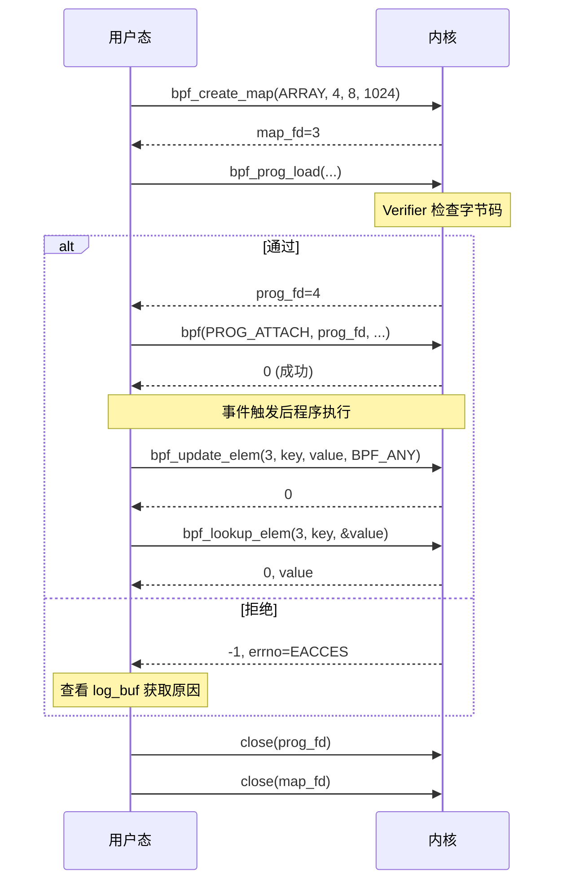
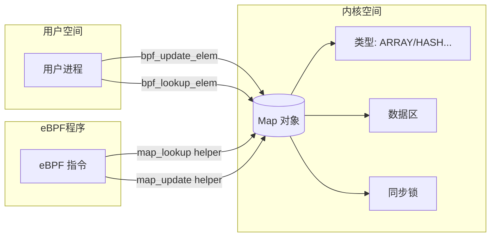
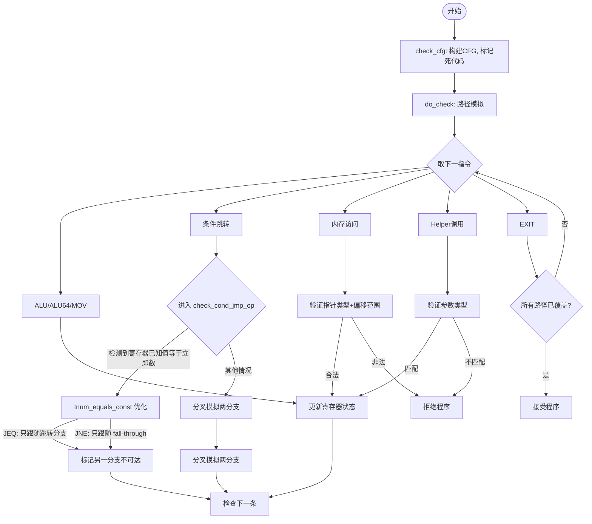
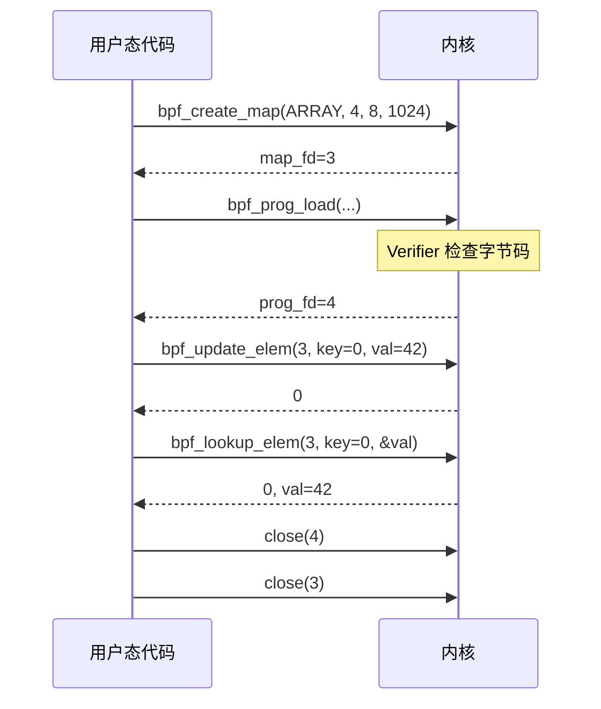
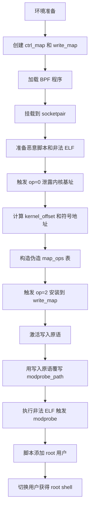
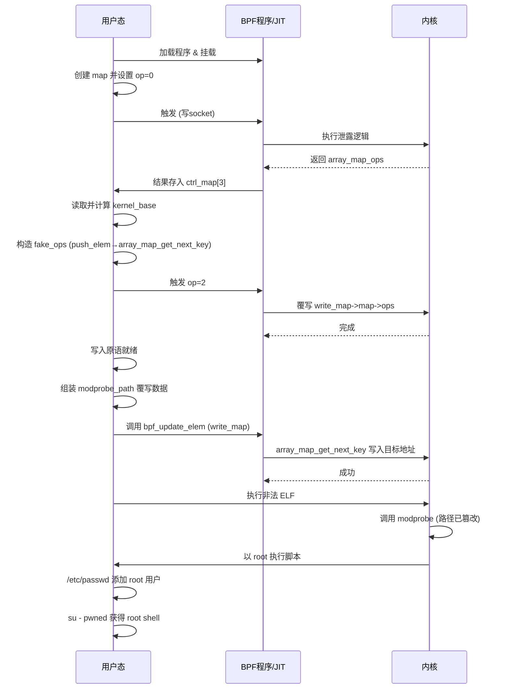
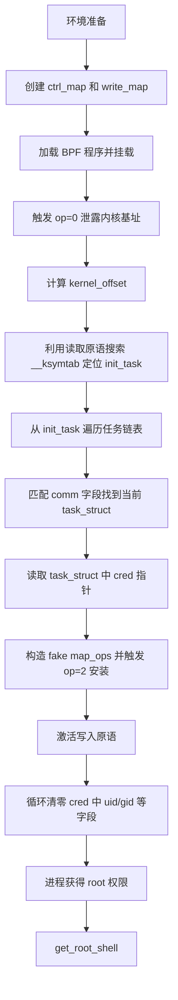
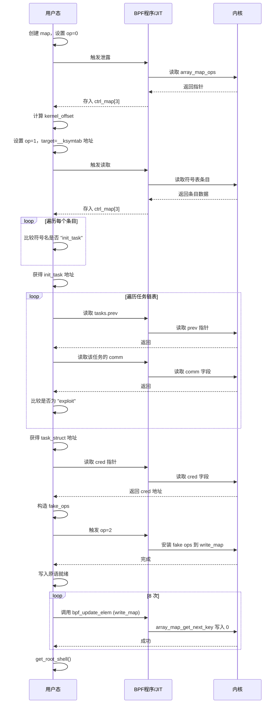

# 【Kernel Exploit】CVE-2020-27194 漏洞分析

## 1. 测试环境

**测试版本**：Linux-5.8.14 [内核镜像地址](https://github.com/BinRacer/pwn4kernel/blob/master/kernels/5.8.14/01/bzImage)

笔者测试的内核版本是 `Linux (none) 5.8.14 #1 SMP Thu Feb 19 14:20:02 CST 2026 x86_64 GNU/Linux`。

**编译选项**：开启`CONFIG_BPF`、`CONFIG_BPF_SYSCALL`、`CONFIG_BPF_JIT`、`CONFIG_BPF_JIT_ALWAYS_ON`、`CONFIG_CGROUP_BPF`、`CONFIG_IPV6_SEG6_BPF`、`CONFIG_BPFILTER`、`CONFIG_BPF_STREAM_PARSER`、`CONFIG_LWTUNNEL_BPF`、`CONFIG_HAVE_EBPF_JIT`、`CONFIG_BPF_EVENTS`、`CONFIG_BPF_KPROBE_OVERRIDE`、`CONFIG_THREAD_INFO_IN_TASK`、`CONFIG_MEMCG`、`CONFIG_MEMCG_KMEM`、`CONFIG_CGROUPS`、`CONFIG_SLAB_FREELIST_RANDOM`、`CONFIG_SLAB_FREELIST_HARDENED`、`CONFIG_HARDENED_USERCOPY`、`CONFIG_FUSE_FS`、`CONFIG_USERFAULTFD`、`CONFIG_SYSVIPC`、`CONFIG_KEYS`、`CONFIG_STACKPROTECTOR`、`CONFIG_STACKPROTECTOR_STRONG`、`CONFIG_SLUB`、`CONFIG_SLUB_DEBUG`、`CONFIG_E1000`、`CONFIG_E1000E`、`CONFIG_PACKET`、`CONFIG_USER_NS`、`CONFIG_NET_NS`、`CONFIG_NAMESPACES`、`CONFIG_CHECKPOINT_RESTORE`、`CONFIG_IPC_NS`选项。完整配置参考[.config](https://github.com/BinRacer/pwn4kernel/blob/master/kernels/5.8.14/01/.config)。

**保护机制**：KASLR/SMEP/SMAP/KPTI

## 2. 漏洞背景

### 2-1. Verifier 概述

eBPF（Extended Berkeley Packet Filter）是Linux内核中的一种安全沙箱机制，允许非特权用户在内核空间执行经过验证的字节码程序。用户态通过`bpf()`系统调用完成eBPF程序的加载、eBPF map的创建与管理等操作。eBPF程序由一组指令构成，可以调用内核中固定的辅助函数（helper functions），并通过eBPF map等共享数据结构与用户态或其他程序交换信息。

然而，允许用户向内核注入任意代码本身就构成重大的安全隐患——这相当于赋予了用户在最高权限级别执行代码的能力。因此，内核必须在程序编译为本地指令（通过JIT编译器）并执行之前，对其进行严格的静态分析。这一职责由**Verifier（验证器）** 承担。

Verifier在加载时对eBPF程序执行穷举式的路径分析，以确保其满足以下安全属性：

1. **终止性（Termination）** ：程序能够在有限步骤内执行完毕，不会形成无限循环；
2. **内存安全性（Memory Safety）** ：所有内存访问操作均在合法边界之内；
3. **类型安全性（Type Safety）** ：指针运算与整数运算均符合类型约束。

在验证过程中，Verifier会为每个寄存器维护一个**取值范围（bounds tracking）** ——即该寄存器在程序执行所有可能路径上能够取到的最小值和最大值。具体地，`struct bpf_reg_state`中存储了8个取值范围变量：

| 变量                | 含义             |
| ------------------- | ---------------- |
| `s64 smin_value`    | 64位有符号最小值 |
| `s64 smax_value`    | 64位有符号最大值 |
| `u64 umin_value`    | 64位无符号最小值 |
| `u64 umax_value`    | 64位无符号最大值 |
| `s32 s32_min_value` | 32位有符号最小值 |
| `s32 s32_max_value` | 32位有符号最大值 |
| `u32 u32_min_value` | 32位无符号最小值 |
| `u32 u32_max_value` | 32位无符号最大值 |

除这些标量界外，Verifier还为每个寄存器维护一个**`tnum`（tristate number）** 结构，用于表示每个比特位的精确已知性。`tnum`包含`value`（已知位上的确定值）和`mask`（未知位的位置掩码），两者结合可描述寄存器实际值集合的可能范围。例如，`var_off = {value = 0, mask = 0xFFFF}`表示低16位完全未知，而高48位为0。

在验证阶段，当指针与常数（或寄存器值）进行算术运算（如`ptr + offset`）时，Verifier会利用目标寄存器的取值范围（包括`tnum`）来验证该运算是否超出合法边界。**因此，如果取值范围的计算逻辑存在缺陷，导致Verifier认为某次访问是安全的（而实际运行时该值可能远超预期范围），就会产生严重的安全问题**——这正是 **CVE-2020-8835** 和 **CVE-2020-27194** 等漏洞所共同触及的漏洞类型。

### 2-2. 指令语义分歧

在eBPF的指令集中，**按位或（Bitwise OR）** 操作是标量运算的重要组成部分。Verifier需要对`BPF_OR`指令进行取值范围跟踪，以确保运算结果的范围不会超出合法边界。然而，32位值与64位值在按位或操作中的语义存在微妙但关键的差异：

- **64位按位或**：对两个64位操作数的所有位进行逐位或运算，结果仍为64位值；
- **32位按位或**：在eBPF的语义中，32位操作被定义为**对低32位进行逐位或运算，高32位清零**（即零扩展至64位）。

这种语义差异要求Verifier在处理32位按位或运算时，必须同时正确更新**64位取值范围**和**32位取值范围**两组状态。其中，32位子寄存器的状态（`u32_min_value`、`u32_max_value`等）需要独立维护，不能与64位状态混用。**如果在更新32位范围时错误地引用了64位范围值，将导致跟踪失真**——这正是本漏洞的根源所在。

### 2-3. 缺陷函数分析

**CVE-2020-27194** 的漏洞根源位于`kernel/bpf/verifier.c`中的 **`scalar32_min_max_or()`** 函数。该函数负责在Verifier遇到32位按位或指令时，更新目标寄存器`dst_reg`的32位取值范围。该漏洞引入于commit `3f50f132d840`（“bpf: Verifier, do explicit ALU32 bounds tracking”），并在后续的commit `5b9fbeb75b6a`中修复。

**漏洞代码（Linux 5.8.14及之前版本）如下**：

```c
/* 更新 dst_reg 的 32 位边界，反映 dst_reg = dst_reg | src_reg 的 32 位结果 */
static void scalar32_min_max_or(struct bpf_reg_state *dst_reg,
                                struct bpf_reg_state *src_reg)
{
    bool src_known = tnum_subreg_is_const(src_reg->var_off);
    bool dst_known = tnum_subreg_is_const(dst_reg->var_off);
    struct tnum var32_off = tnum_subreg(dst_reg->var_off);

    /* 缺陷1：输入错误 —— 应使用 src_reg->s32_min_value 和 src_reg->u32_min_value */
    s32 smin_val = src_reg->smin_value;   // 错误：取的是 64 位有符号最小值
    u32 umin_val = src_reg->umin_value;   // 错误：取的是 64 位无符号最小值

    // 如果两个操作数的低 32 位均为已知常量，则由 tnum_or 已计算出精确值，无需进一步处理
    if (src_known && dst_known)
        return;

    /* 更新无符号 32 位范围 */
    // 对于 OR 操作，结果的最小值不小于任一操作数的最小值，因此取较大者
    dst_reg->u32_min_value = max(dst_reg->u32_min_value, umin_val);
    // 结果的最大值由 var_off 的已知位（value）和未知位（mask）共同决定
    dst_reg->u32_max_value = var32_off.value | var32_off.mask;

    /* 更新有符号 32 位范围 */
    if (dst_reg->s32_min_value < 0 || smin_val < 0) {
        // 任一操作数为负时，OR 结果符号不定，丢失有符号边界
        dst_reg->s32_min_value = S32_MIN;
        dst_reg->s32_max_value = S32_MAX;
    } else {
        /* 缺陷2（关键截断错误）：直接使用 64 位无符号边界赋值给 32 位有符号字段。
         * 应使用 dst_reg->u32_min_value 和 dst_reg->u32_max_value。
         */
        dst_reg->s32_min_value = dst_reg->umin_value;  // 错误，64 位值截断为 32 位
        dst_reg->s32_max_value = dst_reg->umax_value;  // 错误，64 位值截断为 32 位
    }
}
```

**缺陷具体表现在以下两个层面**：

1. **输入错误**：函数使用 `src_reg->smin_value` 和 `src_reg->umin_value`（均为 64 位值）代替了正确的 `src_reg->s32_min_value` 和 `src_reg->u32_min_value`。当源寄存器的高 32 位存在非零值时，64 位最小值可能远大于其低 32 位的实际最小值，导致 `umin_val` 被高估，进而使 `u32_min_value` 计算失真。

2. **输出错误（整数截断风险）** ：在非负分支中，代码错误地将 `dst_reg->umin_value` 和 `dst_reg->umax_value`（64 位）直接赋给 32 位有符号字段 `s32_min_value` 和 `s32_max_value`。由于 C 语言的隐式截断，若 `umax_value` 超过 32 位范围（例如 `0x200000001`），则赋值后 `s32_max_value` 变为 `1`。这使得 Verifier 认为该寄存器的 32 位子寄存器最大值为 `1`（甚至可能认为其为常量 `1`），而实际上该寄存器的低 32 位在运行时可以取到更大的值（因为该寄存器的真实值可能远大于 `1`，例如 `2`）。这种“验证时低估上界”的效应，正是后续安全问题的起点。

需要注意的是，该函数只更新 `u32_min/max_value` 和 `s32_min/max_value`，并不直接修改 64 位范围（`umin/umax`）。但由于 64 位范围在之前可能已被条件跳转等逻辑设定为较大值（如 `[1, 0x200000001]`），错误地将其截断赋值给 32 位有符号字段，导致低 32 位的实际取值范围被严重压缩。

### 2-4. 错误传播路径

本节从数学角度剖析 **CVE-2020-27194** 的本质——Verifier 在跟踪 32 位寄存器范围时的错误如何通过后续运算被放大，最终导致指针偏移与实际跟踪值之间的偏差。为了便于理解，整个传播过程可分解为以下四个递进的阶段。

#### 2-4-1. 状态表示与截断错误

令寄存器 $$R$$ 的实际运行时值为 $$x \in \mathbb{Z}$$（64 位）。Verifier 为 $$R$$ 维护两组范围：

- 64 位无符号范围：$$[L_{64}, U_{64}]$$
- 32 位无符号范围：$$[L_{32}, U_{32}]$$（为简化，此处以无符号为例，有符号情形本质相同）

在每次算术运算后，Verifier 都会更新这些范围，使之包含所有可能路径上的实际值。

漏洞函数 `scalar32_min_max_or()` 的错误在于：当执行 32 位按位或运算时，它在非负分支中错误地将 64 位的范围值（`umin/umax`）直接复制到 32 位有符号字段中，等价于执行了以下截断操作：

$$ U_{32} \leftarrow U_{64} $$

（实际上赋值给 `s32_max_value`，但为了数学抽象，我们视为将 64 位最大值截断为 32 位无符号最大值。）

因此，若 $$U_{64}$$ 超过 32 位所能表示的范围（例如大于 $$2^{32}-1$$），则实际存储的 $$U_{32}$$ 会是 $$U_{64} \bmod 2^{32}$$，通常远小于真实的可能上界。

设真实运行时 $$x$$ 可以取到的 32 位低半部分（即 $$x \bmod 2^{32}$$）的最大值为 $$M_{\text{real}}$$。而 Verifier 记录的 $$U_{32}$$ 则满足：

$$ U_{32} \ll M_{\text{real}} $$

即，Verifier 严重低估了寄存器的 32 位取值范围。

#### 2-4-2. 常量化误判与偏差产生

在上一阶段的基础上，Verifier 通常会将范围进一步简化为常量。若 $$L_{32} = U_{32} = c$$，则 Verifier 认为该寄存器的 32 位值是固定不变的常数 $$c$$。然而，由于实际取值范围远大于此（即 $$M_{\text{real}} > c$$），运行时该寄存器的低32位可以取到不同的值 $$d \neq c$$，且通常 $$d > c$$。定义两者之间的绝对偏差：

$$ \delta = d - c > 0 $$

这个偏差虽然绝对值可能不大（例如 $$\delta = 1$$），但它标志着 Verifier 的跟踪状态与实际执行状态之间出现了**分裂**——验证时的“确定值”在运行时变为“可变值”，且可取范围的上界已被系统性地低估。

#### 2-4-3. 偏差放大

后续的算术运算会显著放大这一初始偏差。典型构造中，程序会对该寄存器依次执行**右移**（右移 $$s$$ 位）和**乘法**（乘以因子 $$k$$）操作。为了分析其放大效应，设验证阶段基于常量 $$c$$ 计算得到的结果为：

$$ c' = (c \gg s) \times k $$

而实际运行时基于真实值 $$d$$ 得到的结果为：

$$ d' = (d \gg s) \times k $$

于是最终偏移量偏差为：

$$ \Delta = d' - c' = k \times \big( (d \gg s) - (c \gg s) \big) $$

由于 $$d > c$$，且右移操作具有“当被除数较小时，商的相对变化更大”的特性，当 $$c$$ 较小（例如 $$c = 1$$）而 $$d$$ 稍大（例如 $$d = 2$$）时，$$(d \gg s)$$ 与 $$(c \gg s)$$ 的差值可能远大于 $$\delta$$ 本身。再乘以较大的因子 $$k$$，$$\Delta$$ 便可达到显著的数值规模。这一过程将微小的初始范围低估（$$\delta = 1$$）放大了数个数量级。

#### 2-4-4. 数值实例

为了更直观地理解上述传播过程，考虑一个典型构造场景。假设通过一系列范围比较指令，Verifier 将某个寄存器的 64 位无符号范围限制为：

$$ [L_{64}, U_{64}] = [1, \text{0x200000001}] $$

同时，该寄存器在运行时的实际值 $$x$$ 被确定为 $$2$$（显然满足该区间）。随后执行一条按位或指令（例如与常数 0 进行 OR），触发 `scalar32_min_max_or()` 的错误处理：

- 源寄存器的 64 位范围被复制到目标寄存器的 32 位有符号范围。此时 $$U_{64} = \text{0x200000001}$$，其低 32 位为 $$\text{0x00000001}$$，因此赋值后：

$$ U_{32} \leftarrow 1 $$

- Verifier 同时认为最小值 $$L_{32}$$ 也为 1（因为 $$L_{64}=1$$），故得出结论：该寄存器的 32 位值被固定为常量 $$c = 1$$。

然而，实际运行时该寄存器的值仍然是 $$x = 2$$（低 32 位为 2，高 32 位为 0）。因此，存在偏差 $$d = 2$$，$$\delta = 1$$。

接下来，程序对该寄存器进行右移 $$s = 1$$ 位，然后乘以因子 $$k = \text{0x110}$$（注：该因子与 `bpf_array` 结构体的布局有关，此处仅作为一个具体的放大常数）。在验证阶段：

$$ c' = (1 \gg 1) \times \text{0x110} = 0 \times \text{0x110} = 0 $$

而实际运行：

$$ d' = (2 \gg 1) \times \text{0x110} = 1 \times \text{0x110} = \text{0x110} $$

于是最终偏移偏差为：

$$ \Delta = \text{0x110} - 0 = \text{0x110} $$

初始只差 1 的两个值，经过右移和乘法后，变成了 0 与 0x110 的差异，偏差被显著放大了 $$\text{0x110}$$ 倍。这个放大过程正是后续指针错位的直接原因。

#### 2-4-5. 指针偏移与越界访问

最终，该偏移量被用于指针算术运算，通常是从 map 值区域指针中减去该偏移量。设 map 值区域的基址为 $$P$$，验证器认为偏移量为 0（因为验证器跟踪的值为 $$c' = 0$$），则验证器认为指针 $$P'$$ 仍为：

$$ P'_{\text{verifier}} = P - 0 = P $$

但实际运行时，指针变为：

$$ P'_{\text{actual}} = P - \text{0x110} $$

于是，实际指针 $$P'_{\text{actual}}$$ 被向后移动了 0x110 字节，而 Verifier 认为它仍在原处。这就造成了**指针错位**。

进一步地，eBPF map 的内存布局中，值区域紧跟在管理结构 `struct bpf_array` 之后。如果偏移量 0x110 恰好等于从值区域起始位置到管理结构起始位置的距离（即 `sizeof(struct bpf_array) - sizeof(value[0])`），则指针将指向 map 的管理头部，而非用户预期的数据区域。此后对该指针的任何读/写操作都会触及内核管理的元数据，从而实现越界访问。这种越界访问可被进一步利用以读取或修改敏感内核对象，最终导致权限提升。

#### 2-4-6. 漏洞本质的数学归纳

综合以上分析，**CVE-2020-27194** 的传播路径可抽象为如下的递推模型：

$$
\boxed{
\begin{aligned}
&\text{阶段1（范围截断）：} & U_{32} &\leftarrow \text{trunc}_{32}(U_{64}), \quad U_{32} \ll M_{\text{real}} \\
&\text{阶段2（常量化误判）：} & \text{Verifier 认为 } x_{32} &= c, \text{ 实际 } x_{32} = d, \; d > c \\
&\text{阶段3（偏差放大）：} & \Delta &= k \cdot \big( (d \gg s) - (c \gg s) \big) \\
&\text{阶段4（指针偏移）：} & P_{\text{actual}} &= P - \Delta, \quad P_{\text{verifier}} = P
\end{aligned}
}
$$

这一形式化描述结合具体数值示例，揭示了漏洞的核心机制：**验证器在 32 位范围更新时的截断错误，通过后续移位和乘法等算术运算被放大，最终使运行时的指针实际偏移量偏离 Verifier 的跟踪值，从而绕过了基于范围的边界检查**。所有步骤均无需依赖特定的指令序列，而是由范围跟踪与算术传播的固有规律决定，因此该漏洞具有结构性特征，其影响范围广泛且修复难度较高。

### 2-5. 影响范围

根据NVD、Ubuntu安全公告以及漏洞报告者提供的详细信息：

- **受影响版本**：Linux内核**5.7版本开始引入，直至5.8.14**均受影响。该漏洞在Linux 5.8.15中通过commit `5b9fbeb75b6a`被修复。引入该漏洞的commit为`3f50f132d840`（“bpf: Verifier, do explicit ALU32 bounds tracking”），因此5.7之前的内核不受影响。

- **漏洞标识**：CVE编号为 **CVE-2020-27194**，在Linux内核源码中的commit ID为`5b9fbeb75b6a`（即CID-5b9fbeb75b6a）。

- **受影响发行版**：
    - **Fedora 33**（使用5.8内核分支）
    - **Ubuntu 20.10（Groovy）**（使用Linux 5.8内核），已在`5.8.0-28.30`版本中修复；
    - **Ubuntu 20.04 LTS（Focal）** 及更早版本所使用的内核分支（5.4及以下）不受影响。

- **CVSS评分**：NVD对该漏洞的CVSS 3.x评分为**5.5（中危）** ，影响维度为可用性（A）；Ubuntu安全团队则指出该漏洞可被本地利用以**泄露敏感的内核内存信息或获取管理员权限**。

### 2-6. 本质总结

**CVE-2020-27194** 的本质可以归纳为：**eBPF Verifier在32位按位或操作的取值范围跟踪中，错误地将64位取值范围状态混入32位子寄存器的跟踪逻辑，导致`u32_max_value`、`s32_min_value`等关键边界值计算失真。当操作数非负时，直接赋值64位范围到32位有符号字段引发整数截断，使得Verifier低估了寄存器的实际取值范围。恶意构造的eBPF程序可利用此缺陷，通过OR、移位、乘法等操作构造任意偏移，最终绕过Verifier的边界检查，在JIT编译后实现bpf_array的越界读写，并进一步构造任意读写原语以实现权限提升。**

从更宏观的视角来看，该漏洞属于一类在eBPF漏洞中反复出现的模式（例如 **CVE-2020-8835** 也源于类似的32位范围跟踪缺陷）。这些漏洞的共同特征在于：**Verifier作为eBPF安全模型的核心支柱，其取值范围跟踪逻辑的任何一个细微缺陷都可能被利用，通过精心构造的程序绕过所有后续的安全检查，最终实现内核级的权限提升或信息泄露**。这也凸显了eBPF验证器作为“可信计算基”中关键组件所面临的巨大安全挑战——任何范围计算上的语义偏差都可能打开通往内核深处的后门。这一系列漏洞也持续推动着内核开发者改进Verifier的测试覆盖与形式化验证方法，以抵御此类语义偏差带来的安全风险。

> 📌 下一章将系统介绍 eBPF 的整体架构、`bpf()` 系统调用、Map 操作等基础知识，帮助读者建立完整的上下文。

## 3. eBPF 基础

第二章深入剖析了 **CVE-2020-27194** 的根源——Verifier 在处理 32 位按位或操作时，由于范围跟踪逻辑的缺陷导致寄存器低 32 位被误判为常量。在进一步探讨这一缺陷如何被恶意构造的程序触发并产生实质性影响之前，有必要系统梳理 eBPF 子系统的整体架构、核心对象和用户态编程接口。本章将依次介绍 eBPF 程序的生命周期、`bpf()` 系统调用的完整用法、Map 对象的操作方式，以及 Verifier 的工作流程，为后续章节的漏洞源码分析和利用链构造奠定基础。

### 3-1. eBPF 程序生命周期

一个 eBPF 程序从编写到执行，经历以下阶段：

```mermaid
flowchart TD
    A[编写字节码] --> B[bpf&#40;BPF_PROG_LOAD&#41;]
    B --> C{Verifier 检查}
    C -- 通过 --> D[JIT 编译或解释器就绪]
    C -- 拒绝 --> E[返回负值, 日志记录原因]
    D --> F[挂载到事件钩子]
    F --> G[事件触发时执行]
    G --> H[通过 Map 与用户态交互]
    H --> I[close&#40;prog_fd&#41; 卸载]
```



**阶段说明**：

1. **编写字节码**：开发者使用 eBPF 指令集（`struct bpf_insn` 数组）编写程序逻辑，或通过 LLVM/clang 从 C 源码编译为 eBPF 字节码。
2. **加载**：通过 `bpf(BPF_PROG_LOAD, ...)` 将字节码提交给内核。内核首先进行 Verifier 静态分析，通过后分配 `struct bpf_prog` 结构，并可选地进行 JIT 编译。
3. **挂载（attach）**：将程序绑定到指定的内核事件钩子上，如网络套接字（`BPF_PROG_TYPE_SOCKET_FILTER`）、kprobe、tracepoint、XDP 等。
4. **执行**：当事件触发时，内核调用 eBPF 程序的解释器或 JIT 生成的机器码。
5. **卸载**：通过 `close(prog_fd)` 释放程序，或通过 detach 操作解除绑定。

整个过程中，用户态与内核态通过 **Map** 进行数据交换，Map 的生命周期独立于程序，可以跨程序共享。

### 3-2. `bpf()` 系统调用详解

`bpf()` 是 eBPF 子系统的唯一系统调用入口，原型如下：

```c
#include <linux/bpf.h>

int bpf(int cmd, union bpf_attr *attr, unsigned int size);
```

`cmd` 可取以下主要值（按功能分类）：

**程序相关命令**

| 命令              | 功能                               |
| ----------------- | ---------------------------------- |
| `BPF_PROG_LOAD`   | 验证并加载 eBPF 程序，返回 prog_fd |
| `BPF_PROG_ATTACH` | 将程序挂载到 cgroup 或其他钩子     |
| `BPF_PROG_DETACH` | 解除挂载                           |
| `BPF_PROG_QUERY`  | 查询挂载点的程序信息               |

**Map 相关命令**

| 命令                             | 功能                           |
| -------------------------------- | ------------------------------ |
| `BPF_MAP_CREATE`                 | 创建 Map，返回 map_fd          |
| `BPF_MAP_LOOKUP_ELEM`            | 根据键查找值                   |
| `BPF_MAP_UPDATE_ELEM`            | 更新或插入键值对               |
| `BPF_MAP_DELETE_ELEM`            | 删除指定键                     |
| `BPF_MAP_GET_NEXT_KEY`           | 获取下一个键（用于遍历）       |
| `BPF_MAP_LOOKUP_AND_DELETE_ELEM` | 原子查找并删除（部分类型支持） |

**对象管理命令**

| 命令                     | 功能                                              |
| ------------------------ | ------------------------------------------------- |
| `BPF_OBJ_PIN`            | 将 map_fd/prog_fd 持久化到 bpffs（`/sys/fs/bpf`） |
| `BPF_OBJ_GET`            | 从 bpffs 获取已持久化的 fd                        |
| `BPF_OBJ_GET_INFO_BY_FD` | 获取对象详细信息                                  |

**常用封装函数**

在实际开发中，通常将 `bpf()` 系统调用封装为更易用的函数。以下是最常用的几个：

```c
/* 创建 Map */
int bpf_create_map(enum bpf_map_type type, int key_size, int value_size, int max_entries) {
    union bpf_attr attr = {
        .map_type    = type,
        .key_size    = key_size,
        .value_size  = value_size,
        .max_entries = max_entries,
    };
    return bpf(BPF_MAP_CREATE, &attr, sizeof(attr));
}

/* 更新 Map 中的键值对 */
int bpf_update_elem(int fd, const void *key, const void *value, uint64_t flags) {
    union bpf_attr attr = {
        .map_fd = fd,
        .key    = ptr_to_u64(key),
        .value  = ptr_to_u64(value),
        .flags  = flags,
    };
    return bpf(BPF_MAP_UPDATE_ELEM, &attr, sizeof(attr));
}

/* 查找 Map 中的键 */
int bpf_lookup_elem(int fd, const void *key, void *value) {
    union bpf_attr attr = {
        .map_fd = fd,
        .key    = ptr_to_u64(key),
        .value  = ptr_to_u64(value),
    };
    return bpf(BPF_MAP_LOOKUP_ELEM, &attr, sizeof(attr));
}

/* 删除 Map 中的键 */
int bpf_delete_elem(int fd, const void *key) {
    union bpf_attr attr = {
        .map_fd = fd,
        .key    = ptr_to_u64(key),
    };
    return bpf(BPF_MAP_DELETE_ELEM, &attr, sizeof(attr));
}

/* 获取 Map 中下一个键（用于遍历） */
int bpf_get_next_key(int fd, const void *key, void *next_key) {
    union bpf_attr attr = {
        .map_fd   = fd,
        .key      = ptr_to_u64(key),
        .next_key = ptr_to_u64(next_key),
    };
    return bpf(BPF_MAP_GET_NEXT_KEY, &attr, sizeof(attr));
}
```

这些封装函数隐藏了 `union bpf_attr` 的细节，使得用户态代码更清晰。

**典型调用序列**

以下序列图展示了用户态加载一个 eBPF 程序并与 Map 交互的典型过程：



### 3-3. BPF Maps 详解

Map 是 eBPF 最重要的数据抽象，支持多种底层实现：

| Map 类型                         | 特点                       | 用途         |
| -------------------------------- | -------------------------- | ------------ |
| `BPF_MAP_TYPE_HASH`              | 通用哈希表，动态增长       | 任意键值存储 |
| `BPF_MAP_TYPE_ARRAY`             | 定长数组，索引为键，预分配 | 计数器、统计 |
| `BPF_MAP_TYPE_PERCPU_HASH/ARRAY` | 每 CPU 副本，减少锁竞争    | 高性能计数   |
| `BPF_MAP_TYPE_PROG_ARRAY`        | 存储程序 fd，实现尾调用    | 跳转表       |
| `BPF_MAP_TYPE_STACK_TRACE`       | 存储栈跟踪                 | profiling    |
| `BPF_MAP_TYPE_RINGBUF`           | 环形缓冲区，高效数据传输   | 事件通知     |

在漏洞利用场景中，最常用的是 `BPF_MAP_TYPE_ARRAY` 和 `BPF_MAP_TYPE_HASH`，因为它们允许用户态与 eBPF 程序双向读写任意大小的值。

Map 的键和值类型在创建时指定，内核负责维护其生命周期。eBPF 程序内部通过辅助函数（helper）访问 Map：

```c
// eBPF 程序内访问 Map 的 helper 调用（C 伪代码）
void *map_lookup_elem(struct bpf_map *map, void *key);
long map_update_elem(struct bpf_map *map, void *key, void *value, u64 flags);
long map_delete_elem(struct bpf_map *map, void *key);
```

这些 helper 在 Verifier 阶段会被检查，确保指针有效、类型匹配。绕过 Verifier 后，恶意程序可以滥用这些 helper 实现内核任意读写。

**Map 的内部结构（简化）**：



### 3-4. Verifier 详细工作流程

Verifier 是 eBPF 安全的核心，其实现位于 `kernel/bpf/verifier.c`。以下为其关键步骤：



**关键数据结构**：`struct bpf_reg_state` 记录了每个寄存器的抽象状态，其中 `var_off`（`struct tnum`）用于表示已知位和未知位。当寄存器被赋予已知常量时，`var_off.mask` 为 0，`var_off.value` 即为该常量的 64 位表示。

**ALU 指令的范围跟踪调用链**：当 Verifier 在路径模拟中遇到 ALU 指令（如 ADD、SUB、OR、AND 等）时，会进入 `check_alu_op()` 函数，进而调用 `adjust_reg_min_max_vals()` 来更新目的寄存器的取值范围。该函数根据指令类型分派到不同的处理逻辑：对于 `BPF_OR`（按位或），会调用 `adjust_scalar_min_max_vals()`，后者再调用 `scalar_min_max_or()`（64 位操作）或 `scalar32_min_max_or()`（32 位操作）来更新寄存器的边界和 `var_off`。完整的调用路径为：

```
do_check()
  → check_alu_op()
    → adjust_reg_min_max_vals()
      → adjust_scalar_min_max_vals()
        → scalar_min_max_or (或 scalar32_min_max_or)
```

**漏洞函数的作用与影响**：`scalar32_min_max_or()` 负责更新 32 位按位或操作后的寄存器范围。该函数的实现存在两处关键缺陷：

- 输入阶段错误地使用了源寄存器的 64 位边界值（`smin_value`/`umin_value`），而非正确的 32 位边界值。
- 输出阶段错误地将 64 位无符号边界（`umin_value`/`umax_value`）直接赋值给 32 位有符号字段，导致高位信息被截断。

这些缺陷使得 Verifier 可能严重低估寄存器的实际取值范围，甚至将其误判为常量。后续的 `__reg_bound_offset()` 会基于错误的 32 位边界更新 `var_off`，进而影响条件跳转优化中的路径剪枝决策。关于该函数的详细源码分析和错误传播过程，将在第四章中系统展开。

**条件跳转优化细节**：在 `check_cond_jmp_op` 中，对于 `BPF_JEQ` 和 `BPF_JNE` 指令，如果目标寄存器是 `SCALAR_VALUE` 且 `tnum_equals_const(dst_reg->var_off, insn->imm)` 为真，Verifier 会认为该分支的走向已经确定：

- 对于 `JEQ`：条件必然成立，只跟随跳转分支，fall-through 被标记不可达。
- 对于 `JNE`：条件必然不成立，只跟随 fall-through 分支，跳转分支被标记不可达。

`tnum_equals_const` 比较的是 `var_off.value` 与 `insn->imm`（作为 `u64` 传入）。由于 C 语言隐式类型转换，`insn->imm`（`__s32`）会被符号扩展为 64 位。这一优化本意是加速已知常量的比较，但若 Verifier 错误地记录了寄存器值，就会导致错误的路径标记。

**安全保证**：

- 所有寄存器在使用前已被初始化（`NOT_INIT` 检查）。
- 指针算术不越界（例如 map 指针只能在合法偏移内访问）。
- 栈访问不超出 512 字节。
- 辅助函数调用参数类型匹配。
- 程序不会陷入无限循环（< 5.3 直接拒绝循环，5.3+ 限制循环次数）。

### 3-5. 典型用户态工作流示例

以下是一个完整的用户态代码片段，演示创建 Map、加载程序、交互的过程（简化）：

```c
// 1. 创建 Map
int map_fd = bpf_create_map(BPF_MAP_TYPE_ARRAY, sizeof(int), sizeof(long), 1024);

// 2. 准备字节码（此处为示例，实际需要合法程序）
struct bpf_insn prog[] = {
    // ... 指令序列
};

// 3. 加载程序
char license[] = "GPL";
int prog_fd = bpf_prog_load(BPF_PROG_TYPE_SOCKET_FILTER, prog, 4, license);
if (prog_fd < 0) {
    // 查看日志
    printf("Verifier log: %s\n", log_buf);
}

// 4. 通过 Map 交互
int key = 0;
long value = 42;
bpf_update_elem(map_fd, &key, &value, BPF_ANY);

// 5. 读取结果
bpf_lookup_elem(map_fd, &key, &value);

// 6. 清理
close(prog_fd);
close(map_fd);
```

对应的时序图：



### 3-6. eBPF 设计理念与安全挑战

eBPF 是一个革命性的内核可编程框架，它允许用户在不修改内核源码或加载内核模块的前提下，安全地注入自定义逻辑到内核事件路径中。其核心设计理念可以概括为：

- **安全第一**：所有 eBPF 程序必须通过 Verifier 的静态分析才能运行，Verifier 充当了“安全门卫”的角色。
- **数据通道**：Map 是用户态与内核态程序之间唯一合法的数据交换媒介，它隔离了两者的地址空间。
- **有限能力**：eBPF 程序不能随意调用内核函数，只能通过预定义的 helper 函数与外界交互，且不允许循环（早期版本），从而限制了潜在风险。

然而，Verifier 的正确性依赖于其对 eBPF 指令语义的精确模拟。第二章所分析的 **CVE-2020-27194** 正是利用了 `scalar32_min_max_or()` 函数在处理 32 位按位或时的范围跟踪缺陷——该函数误用了 64 位边界值，并将 64 位范围截断后赋给 32 位有符号字段，导致 Verifier 低估了寄存器的实际取值范围。这一缺陷会通过后续的常量传播和分支预测机制，使得 Verifier 剪枝掉本应存在的执行路径。这一案例深刻揭示了：**即使是最严谨的静态分析工具，也可能因为一个微小的数值抽象失误（如位宽截断未保留高位自由度）而导致整个安全模型的根基动摇**。关于该缺陷的详细源码分析和传播路径，将在第四章中全面展开。

## 4. 漏洞分析

第二章从语义层面揭示了 **CVE-2020-27194** 的根源——`scalar32_min_max_or()` 在处理 32 位按位或时，错误地将 64 位 `umax_value` 直接赋值给 32 位有符号字段 `s32_max_value`，导致高位信息被截断，使 Verifier 低估了寄存器的实际取值范围。第三章则系统梳理了 eBPF 子系统的整体架构和 Verifier 的工作流程，重点介绍了 ALU 指令的范围跟踪调用链。本章将基于内核源码（`kernel/bpf/verifier.c`）深入剖析这一缺陷的实现细节，完整展示从程序入口到漏洞触发点的调用路径，并通过详尽的代码和运行时调试数据，揭示每个环节的作用及其安全问题。

### 4-1. 调用链分析

当用户通过 `bpf(BPF_PROG_LOAD)` 提交 eBPF 程序后，内核入口函数 `bpf_check()` 会调用 `do_check()` 进行逐指令的模拟验证。`do_check()` 是 Verifier 的主循环，它遍历程序中的每一条指令，根据指令类别（`BPF_ALU`、`BPF_ALU64`、`BPF_JMP` 等）分派到相应的处理函数。对于 ALU 运算，处理流程如下：

```
do_check()
  └─ check_alu_op()
       └─ adjust_reg_min_max_vals()
            └─ adjust_scalar_min_max_vals()
                 └─ scalar32_min_max_or()
```

以下从入口开始逐层分析。

#### 4-1-1. 主验证循环

`do_check()` 负责遍历所有指令并维护当前验证状态。当遇到 `BPF_ALU` 或 `BPF_ALU64` 类指令时，它调用 `check_alu_op()` 进行具体处理。该函数是 Verifier 状态机的核心调度器，其循环体不断读取指令并根据指令类别跳转至对应的检查逻辑。

```c
/* 主验证循环：逐条模拟执行 eBPF 指令，更新寄存器与栈状态 */
static int do_check(struct bpf_verifier_env *env)
{
    // ... 初始化状态和循环变量 ...
    for (;;) {
        struct bpf_insn *insn;
        u8 class;
        // ... 获取当前指令 insn，检查索引是否越界 ...
        class = BPF_CLASS(insn->code);

        // ... 状态检查、指令复杂度限制、日志输出等辅助逻辑 ...

        /* 根据指令类别分派到不同的处理函数 */
        if (class == BPF_ALU || class == BPF_ALU64) {
            err = check_alu_op(env, insn);
            if (err)
                return err;
        } else if (class == BPF_LDX) {
            // ... 处理加载指令 ...
        } else if (class == BPF_STX) {
            // ... 处理存储指令 ...
        } else if (class == BPF_JMP || class == BPF_JMP32) {
            // ... 处理跳转指令 ...
        }
        // ... 其他指令类别 ...

        env->insn_idx++;
    }
    return 0;
}
```

该循环是 Verifier 的入口点，所有指令的验证都从这里开始。ALU 指令的处理路径最终将通向漏洞函数。

#### 4-1-2. ALU 指令检查

`check_alu_op()` 负责验证 ALU 指令的合法性，包括检查操作数寄存器是否已初始化、移位范围是否合法等，并对 `BPF_END`、`BPF_NEG`、`BPF_MOV` 等特殊操作进行单独处理。对于通用 ALU 操作，它在完成寄存器读写权限检查后，调用 `adjust_reg_min_max_vals()` 进行范围更新。

```c
/* 检查 ALU 操作的合法性，并准备寄存器状态更新 */
static int check_alu_op(struct bpf_verifier_env *env, struct bpf_insn *insn)
{
    struct bpf_reg_state *regs = cur_regs(env);
    u8 opcode = BPF_OP(insn->code);
    int err;

    // ... 处理 BPF_END、BPF_NEG、BPF_MOV 等特殊操作 ...

    /* 处理所有其他通用 ALU 操作 */
    err = check_reg_arg(env, insn->dst_reg, SRC_OP);
    if (err)
        return err;

    err = check_reg_arg(env, insn->dst_reg, DST_OP_NO_MARK);
    if (err)
        return err;

    return adjust_reg_min_max_vals(env, insn);
}
```

#### 4-1-3. 范围更新分发

`adjust_reg_min_max_vals()` 是标量与指针算术运算的分发中心。它首先根据指令的源操作数类型获取寄存器状态，然后判断是否涉及指针类型——若涉及指针则调用 `adjust_ptr_min_max_vals()` 处理指针算术，若两者均为标量则进入 `adjust_scalar_min_max_vals()` 进行纯标量运算的范围跟踪。该分发逻辑确保了指针运算与标量运算的安全隔离。

```c
/* 处理 ALU 运算对寄存器范围的影响，区分指针与标量 */
static int adjust_reg_min_max_vals(struct bpf_verifier_env *env,
                                   struct bpf_insn *insn)
{
    struct bpf_reg_state *regs = cur_regs(env), *dst_reg, *src_reg;
    // ... 获取 dst_reg 和 src_reg ...

    if (dst_reg->type != SCALAR_VALUE) {
        return adjust_ptr_min_max_vals(env, insn, dst_reg, src_reg);
    }

    if (src_reg->type != SCALAR_VALUE) {
        return adjust_ptr_min_max_vals(env, insn, src_reg, dst_reg);
    }

    return adjust_scalar_min_max_vals(env, insn, dst_reg, *src_reg);
}
```

#### 4-1-4. 标量运算范围更新

`adjust_scalar_min_max_vals()` 是标量运算范围更新的总入口。它根据指令操作码调用相应的 32 位和 64 位具体范围计算函数。对于 `BPF_OR`，它会分别调用 `scalar32_min_max_or()` 处理 32 位子寄存器的范围，以及 `scalar_min_max_or()` 处理 64 位全寄存器的范围。**漏洞正位于 `scalar32_min_max_or()` 的实现中**。

```c
/* 标量运算的范围更新主函数，根据操作码分发至具体处理逻辑 */
static int adjust_scalar_min_max_vals(struct bpf_verifier_env *env,
                                      struct bpf_insn *insn,
                                      struct bpf_reg_state *dst_reg,
                                      struct bpf_reg_state src_reg)
{
    u8 opcode = BPF_OP(insn->code);
    bool alu32 = (BPF_CLASS(insn->code) != BPF_ALU64);
    // ... 提取源寄存器的边界值 ...

    switch (opcode) {
    case BPF_ADD:
        scalar32_min_max_add(dst_reg, &src_reg);
        scalar_min_max_add(dst_reg, &src_reg);
        dst_reg->var_off = tnum_add(dst_reg->var_off, src_reg.var_off);
        break;
    case BPF_OR:
        dst_reg->var_off = tnum_or(dst_reg->var_off, src_reg.var_off);
        scalar32_min_max_or(dst_reg, &src_reg);   // 漏洞所在
        scalar_min_max_or(dst_reg, &src_reg);
        break;
    // ... 其他操作 ...
    }

    if (alu32)
        zext_32_to_64(dst_reg);

    __update_reg_bounds(dst_reg);
    __reg_deduce_bounds(dst_reg);
    __reg_bound_offset(dst_reg);
    return 0;
}
```

在完成具体运算后，该函数还会调用 `__update_reg_bounds()`、`__reg_deduce_bounds()` 和 `__reg_bound_offset()` 进行边界精化和偏移更新，其中 `__reg_bound_offset()` 正是错误从 32 位传播至 64 位的关键环节。

### 4-2. 缺陷函数剖析

`scalar32_min_max_or()` 是漏洞的直接载体。其职责是在 Verifier 遇到 32 位按位或指令时，更新目标寄存器的 32 位有符号与无符号取值范围。漏洞代码（Linux 5.8.14 及之前版本）如下：

```c
/* 更新 dst_reg 的 32 位边界，反映 dst_reg = dst_reg | src_reg 的 32 位结果 */
static void scalar32_min_max_or(struct bpf_reg_state *dst_reg,
                                struct bpf_reg_state *src_reg)
{
    bool src_known = tnum_subreg_is_const(src_reg->var_off);
    bool dst_known = tnum_subreg_is_const(dst_reg->var_off);
    struct tnum var32_off = tnum_subreg(dst_reg->var_off);

    /* 缺陷1：输入错误 —— 应使用 src_reg->s32_min_value 和 src_reg->u32_min_value */
    s32 smin_val = src_reg->smin_value;   // 错误：取的是 64 位有符号最小值
    u32 umin_val = src_reg->umin_value;   // 错误：取的是 64 位无符号最小值

    // 如果两个操作数的低 32 位均为已知常量，则由 tnum_or 已计算出精确值，无需进一步处理
    if (src_known && dst_known)
        return;

    /* 更新无符号 32 位范围 */
    // 对于 OR 操作，结果的最小值不小于任一操作数的最小值，因此取较大者
    dst_reg->u32_min_value = max(dst_reg->u32_min_value, umin_val);
    // 结果的最大值由 var_off 的已知位（value）和未知位（mask）共同决定
    dst_reg->u32_max_value = var32_off.value | var32_off.mask;

    /* 更新有符号 32 位范围 */
    if (dst_reg->s32_min_value < 0 || smin_val < 0) {
        // 任一操作数为负时，OR 结果符号不定，丢失有符号边界
        dst_reg->s32_min_value = S32_MIN;
        dst_reg->s32_max_value = S32_MAX;
    } else {
        /* 缺陷2（关键截断错误）：直接使用 64 位无符号边界赋值给 32 位有符号字段。
         * 应使用 dst_reg->u32_min_value 和 dst_reg->u32_max_value。
         */
        dst_reg->s32_min_value = dst_reg->umin_value;  // 错误，64 位值截断为 32 位
        dst_reg->s32_max_value = dst_reg->umax_value;  // 错误，64 位值截断为 32 位
    }
}
```

**缺陷详解**：

1. **输入错误**：函数使用 `src_reg->smin_value` 和 `src_reg->umin_value`（64 位）代替了正确的 `src_reg->s32_min_value` 和 `src_reg->u32_min_value`。当源寄存器的高 32 位存在非零值时，64 位最小值可能远大于其低 32 位的实际最小值，导致 `umin_val` 被严重高估，进而使 `u32_min_value` 计算失真。

2. **输出错误（核心）**：在有符号范围更新分支中，代码错误地将 `dst_reg->umin_value` 和 `dst_reg->umax_value`（64 位）直接赋给 32 位有符号字段。由于 C 语言的隐式截断，若 `umax_value = 0x200000001`，则赋值给 32 位 `s32_max_value` 后变为 `1`。这使得 Verifier 错误地认为该寄存器低 32 位的最大值仅为 1，甚至将其视为常量 1，而运行时该寄存器可能取任意大于 1 的值。

该缺陷的根源在于混淆了 32 位与 64 位状态的边界——Verifier 本应为 32 位子寄存器维护独立的取值范围，但该函数却错误地将 64 位信息直接塞入了 32 位字段，破坏了这种隔离。

### 4-3. 错误传播路径

上述范围计算错误通过 `__reg_bound_offset()` 和 `check_cond_jmp_op()` 逐步传播，最终导致 Verifier 的状态与实际执行产生严重偏差。整个传播链条可视为 Verifier 状态机内部信息流动的“污染”过程：一个字段的截断错误如何逐渐蔓延至其他字段，最终影响路径选择。

#### 4-3-1. 偏移量更新

在 `adjust_scalar_min_max_vals()` 的末尾，Verifier 调用 `__reg_bound_offset()` 将 32 位子寄存器的边界信息合并回 64 位 `var_off` 中。

```c
/* 利用 32 位和 64 位的 min/max 边界来精化 var_off */
static void __reg_bound_offset(struct bpf_reg_state *reg)
{
    struct tnum var64_off = tnum_intersect(reg->var_off,
                                           tnum_range(reg->umin_value,
                                                      reg->umax_value));
    struct tnum var32_off = tnum_intersect(tnum_subreg(reg->var_off),
                                           tnum_range(reg->u32_min_value,
                                                      reg->u32_max_value));
    reg->var_off = tnum_or(tnum_clear_subreg(var64_off), var32_off);
}
```

由于 `scalar32_min_max_or()` 错误地将 `s32_max_value` 设置为 `1`，而 `u32_max_value` 也被设为了 `1`，`var32_off` 被限制为低 32 位常量 `1`。该函数随后将 `var32_off` 与清除了低 32 位的 `var64_off` 进行按位或，使得整个 64 位 `var_off` 被更新为常量 `1`。至此，Verifier 认为该寄存器在整个 64 位范围内都是已知常量。这是错误从 32 位子寄存器跨越到 64 位全寄存器的关键一步。

#### 4-3-2. 条件跳转处理

当该寄存器参与条件跳转指令时，`check_cond_jmp_op()` 会利用 `is_branch_taken()` 尝试预测分支走向。由于 `var_off` 被错误地标记为常量，`is_branch_taken()` 会返回确定结果，导致 Verifier 只跟踪一条路径。

```c
/* 处理条件跳转指令，更新分支状态和寄存器范围 */
static int check_cond_jmp_op(struct bpf_verifier_env *env,
                             struct bpf_insn *insn, int *insn_idx)
{
    // ...
    dst_reg = &regs[insn->dst_reg];
    is_jmp32 = BPF_CLASS(insn->code) == BPF_JMP32;

    /* 尝试预测分支走向 */
    if (BPF_SRC(insn->code) == BPF_K) {
        pred = is_branch_taken(dst_reg, insn->imm, opcode, is_jmp32);
    } else if (/* src_reg 为已知常量 */) {
        pred = is_branch_taken(dst_reg, src_val, opcode, is_jmp32);
    }

    /* 若预测为真，仅跟随跳转分支 */
    if (pred == 1) {
        *insn_idx += insn->off;
        return 0;
    }
    /* 若预测为假，仅跟随 fall-through 分支 */
    if (pred == 0) {
        return 0;
    }

    /* 无法预测时，创建另一分支分别模拟 */
    other_branch = push_stack(env, *insn_idx + insn->off + 1, *insn_idx, false);
    // ...
}
```

因为 `is_branch_taken()` 返回确定结果，Verifier 不会执行 `push_stack()` 创建另一分支，也不会执行后续的 `reg_set_min_max()` 范围精化逻辑。另一条路径上的寄存器状态被完全忽略，这种“路径剪枝”直接导致了安全检查的缺失。

#### 4-3-3. 指针空值检查

`check_cond_jmp_op()` 还包含对指针空值检查的特殊优化：

```c
if (!is_jmp32 && BPF_SRC(insn->code) == BPF_K &&
    insn->imm == 0 && (opcode == BPF_JEQ || opcode == BPF_JNE) &&
    reg_type_may_be_null(dst_reg->type)) {
    mark_ptr_or_null_regs(this_branch, insn->dst_reg,
                          opcode == BPF_JNE);
    mark_ptr_or_null_regs(other_branch, insn->dst_reg,
                          opcode == BPF_JEQ);
}
```

当比较对象为 `NULL` 且目标寄存器类型可能为空时，该优化会在两分支分别标记指针状态。但由于分支预测已确定走向，Verifier 可能只处理一条路径，遗漏另一条路径中的指针状态更新。虽然该逻辑本身是正确的，但在漏洞触发后，它反而加剧了状态的不完整性。

### 4-4. 传播全景

综合 4-1 至 4-3 的分析，完整的错误传播路径可概括为五个阶段。下表直观展示了每个阶段的触发位置、输入状态、错误操作与输出状态：

| 阶段                | 触发位置                | 输入状态                         | 错误操作                         | 输出状态                |
| ------------------- | ----------------------- | -------------------------------- | -------------------------------- | ----------------------- |
| **阶段1：范围截断** | `scalar32_min_max_or()` | 64 位 `umax_value = 0x200000001` | 直接赋值给 32 位 `s32_max_value` | `s32_max_value = 1`     |
| **阶段2：常量传播** | `__reg_bound_offset()`  | 错误的 `u32_max_value = 1`       | 利用 32 位边界更新 `var_off`     | `var_off` 变为常量 `1`  |
| **阶段3：分支预测** | `check_cond_jmp_op()`   | `var_off` 为常量 `1`             | `is_branch_taken()` 返回确定值   | Verifier 仅跟踪一条路径 |
| **阶段4：路径剪枝** | `check_cond_jmp_op()`   | 确定的分支预测                   | 跳过 `push_stack()`              | 另一条路径状态丢失      |
| **阶段5：检查绕过** | `check_map_access()` 等 | Verifier 认为寄存器为常量 `1`    | 基于错误常量进行边界验证         | 运行时寄存器可取任意值  |

这一传播路径揭示了漏洞的根本原因并非孤立的计算错误，而是 Verifier 状态机中“范围跟踪 → 常量传播 → 分支预测 → 路径剪枝”这一完整链条上的系统性缺陷。任何一个环节的正确性都依赖于前序环节的精确性，而 `scalar32_min_max_or()` 中的微小截断错误最终引发了整个安全模型的崩塌。

### 4-5. 运行时状态验证

前文从理论层面完整揭示了漏洞的静态传播逻辑，但源码分析需要与实际运行结果相互印证才能形成完整的证据链。为此，我们构造了一个触发该漏洞的 eBPF 程序，并在调试环境中观察 JIT 生成的 x86_64 汇编代码的执行过程。本节将展示关键时刻的寄存器状态、Verifier 的内部数据结构变化以及指针偏移的计算过程，从而将静态缺陷与动态效果联系起来。以下调试信息全部来自 GDB 对实际运行内核的捕获。

#### 4-5-1. Verifier 状态的演变

在 Verifier 处理 32 位按位或指令之前，目标寄存器的状态（通过 `struct bpf_reg_state` 结构体内容体现）如下：

```
pwndbg> p/x *(struct bpf_reg_state*)0xffff88800d8b33c0
$1 = {
  type = 0x1,
  {
    range = 0x0,
    map_ptr = 0x0,
    btf_id = 0x0,
    mem_size = 0x0,
    raw = 0x0
  },
  off = 0x0,
  id = 0x0,
  ref_obj_id = 0x0,
  var_off = {
    value = 0x0,
    mask = 0x37fffffff
  },
  smin_value = 0x1,
  smax_value = 0x200000001,
  umin_value = 0x1,
  umax_value = 0x200000001,
  s32_min_value = 0x1,
  s32_max_value = 0x7fffffff,
  u32_min_value = 0x1,
  u32_max_value = 0x7fffffff,
  parent = 0xffff88800d8b13c0,
  frameno = 0x0,
  subreg_def = 0x0,
  live = 0x4,
  precise = 0x1
}
```

可以看到 64 位范围 `[1, 0x200000001]`，而 32 位有符号上限仍为 `0x7fffffff`——这是 32 位有符号整数的最大值，表明 Verifier 尚未对低 32 位施加精确约束。当执行 `BPF_OR` 操作后，漏洞函数被调用，其内部错误地将 `umax_value = 0x200000001` 赋值给 `s32_max_value`，导致截断为 `1`。函数执行过程中的状态变化如下：

先更新无符号 32 位范围（`u32_max_value` 被设置为 `var32_off.value | var32_off.mask`，本例中为 `0x7fffffff`）：

```
pwndbg> p/x *(struct bpf_reg_state*)0xffff88800d8b33c0
$2 = {
  ...
  s32_min_value = 0x1,
  s32_max_value = 0x7fffffff,
  u32_min_value = 0x1,
  u32_max_value = 0x7fffffff,
  ...
}
```

随后在有符号范围更新分支中（两个操作数均为非负），错误地将 `dst_reg->umin_value` 和 `dst_reg->umax_value`（即 64 位的 `1` 和 `0x200000001`）赋给 32 位有符号字段。`umax_value = 0x200000001` 截断为 32 位后变为 `1`，最终状态变为：

```
pwndbg> p/x *(struct bpf_reg_state*)0xffff88800d8b33c0
$3 = {
  ...
  s32_min_value = 0x1,
  s32_max_value = 0x1,
  u32_min_value = 0x1,
  u32_max_value = 0x7fffffff,
  ...
}
```

此时 Verifier 认为该寄存器的 32 位值固定为常量 `1`。后续的 `__reg_bound_offset()` 会将这一错误传播至 `var_off`，使得 Verifier 认为整个 64 位寄存器也是常量 1，从而为路径剪枝创造了条件。

#### 4-5-2. JIT 生成的核心指令序列

在程序通过 Verifier 后，JIT 生成汇编代码。以下仅列出与漏洞触发和指针偏移计算直接相关的核心指令，省略了栈帧建立、寄存器保存等无关序言/尾声代码。

```
; ========== 加载控制 map 信息 ==========
   0xffffffffc0002d1d:  movabs r15,0xffff88800df3cc00   ; r15 = 控制 map 值区域基址
   0xffffffffc0002d27:  mov    rdi,r15
   0xffffffffc0002d38:  add    rdi,0x110                ; rdi = 基址 + 0x110

; ========== 从控制 map 读取魔数 ==========
   0xffffffffc0002d65:  mov    r14, qword ptr [rax]     ; r14 = *rax = 2（实际值）
   0xffffffffc0002d69:  mov    rbx, rax                 ; rbx = 控制 map 值区域基址

; ========== 范围检查（实际运行均通过） ==========
   0xffffffffc0002d6c:  movabs rsi, 0x200000002
   0xffffffffc0002d78:  cmp    r14, rsi                 ; 检查 r14 < 0x200000002
   0xffffffffc0002d7b:  jb     0x...                    ; 条件成立，跳过退出
   0xffffffffc0002d81:  cmp    r14, rdx                 ; 检查 r14 > 0（rdx=0）
   0xffffffffc0002d84:  ja     0x...                    ; 条件成立，跳过退出

; ========== 触发 OR 操作（与 0 按位或） ==========
   0xffffffffc0002d8a:  or     r14, 0                   ; r14 = 2（Verifier 误以为恒为 1）

; ========== 构造偏移：右移1位 × 0x110 ==========
   0xffffffffc0002d8e:  mov    ecx, r14d                ; ecx = 2
   0xffffffffc0002d91:  shr    rcx, 1                   ; rcx = 1（Verifier 预期为 1>>1=0）
   0xffffffffc0002d99:  mov    eax, 0x110
   0xffffffffc0002d9e:  mul    r11                      ; rax = 0x110（Verifier 预期为 0）
   0xffffffffc0002da6:  mov    r14, rcx                 ; r14 = 0x110（实际偏移，Verifier 预期为 0）

; ========== 加载写入 map 信息 ==========
   0xffffffffc0002da9:  movabs r15,0xffff88800df3c400   ; r15 = 写入 map 值区域基址
   0xffffffffc0002db3:  mov    rdi, r15
   0xffffffffc0002dc4:  add    rdi,0x110
   ; ... (类似地读取 key=0 并获取元素地址到 r8)
   0xffffffffc0002dec:  mov    r8, rax                  ; r8 = 写入 map 值区域元素地址

; ========== 符号扩展并回退指针 ==========
   0xffffffffc0002def:  mov    r13, rbx                 ; r13 = 控制 map 值区域基址
   ; 以下指令将 r14（=0x110）符号扩展为 64 位负数掩码
   0xffffffffc0002df2:  mov    r10d, 0xffffffff
   0xffffffffc0002df8:  sub    r10, r14                 ; r10 = 0xffffffff - 0x110
   0xffffffffc0002dfb:  or     r10, r14
   0xffffffffc0002dfe:  neg    r10
   0xffffffffc0002e01:  sar    r10, 0x3f                ; r10 = 符号扩展的 -0x110
   0xffffffffc0002e05:  and    r10, r14                 ; r10 = 0x110（保持原值）
   0xffffffffc0002e08:  sub    r13, r10                 ; r13 = 基址 - 0x110 → 指向 bpf_array 头部
   ; 对写入 map 指针执行同样操作
   0xffffffffc0002e21:  sub    r8, r10                  ; r8 = 基址 - 0x110 → 指向 bpf_array 头部
```

**关键观察**：从 map 中读取的魔数实际为 2，而 Verifier 因截断认为其为常量 1。移位乘法后，实际偏移量 `0x110` 与 Verifier 预期的 0 产生巨大偏差。随后的指针减法将两个 map 的值区域指针回退到各自的 `bpf_array` 管理结构起始位置，为内存越界访问创造了条件。

#### 4-5-3. 内存布局验证

为了确认指针回退后的目标地址确实指向 `bpf_array` 头部，在调试器中查看控制 map 附近的内存布局：

```
pwndbg> x/6gx 0xffff88800df3cd10
0xffff88800df3cd10:     0x0000000000000002      0x0000000000000000
0xffff88800df3cd20:     0x0000000000000000      0xffffffff82061000
0xffff88800df3cd30:     0xffff88800df3cd38      0x0000000000000000
```

其中 `0xffff88800df3cd10` 是值区域的起始地址，其内容为 2（魔数）。而 `0xffff88800df3cc00` 是 `bpf_array` 头部的起始地址，两者相差 `0x110` 字节，恰好等于 JIT 计算出的偏移量。JIT 生成的 `sub` 指令正是将值区域指针减去该偏移，从而得到头部地址，与内存布局完全吻合。

#### 4-5-4. 验证结论

通过对比 Verifier 状态与 JIT 运行时行为的差异，可以得出以下结论：

- **静态分析阶段**：Verifier 因截断错误将 `r14` 判定为常量 1，导致路径剪枝，移除了本应存在的安全检查。
- **代码生成阶段**：JIT 生成的机器码完全基于 Verifier 的错误状态，未包含被剪枝路径的边界验证。
- **实际执行阶段**：寄存器 `r14` 的实际值为 2，经移位乘法后产生偏移 `0x110`，使得指针回退到 `bpf_array` 头部。

这一验证过程完整再现了漏洞从静态缺陷到动态效果的演变，与第二章的数学模型、本章的源码分析形成了严密的逻辑闭环。

### 4-6. 分析总结

本章通过对 `do_check` 调用链的逐层源码分析，定位到 `scalar32_min_max_or()` 中的两处关键错误——输入阶段错误使用了 64 位边界值，输出阶段错误地将 64 位无符号边界截断赋值给 32 位有符号字段。这一缺陷通过 `__reg_bound_offset()` 将错误传播至 `var_off`，使得 Verifier 将寄存器误判为常量；进而在 `check_cond_jmp_op()` 中触发确定性的分支预测，导致 Verifier 只跟踪一条执行路径而忽略另一条，最终使得实际运行时可能执行未经验证的内存访问路径。

通过 JIT 生成的汇编代码和运行时调试数据的验证，上述理论分析得到了充分证实：Verifier 的错误状态直接影响了代码生成和执行，使得指针偏移计算完全偏离了 Verifier 的预期，从而为内存越界访问创造了条件。

本章的源码分析与第二章的概念剖析、第三章的流程介绍形成了完整的认知闭环，从原理到实现再到运行时效果，全面揭示了该漏洞的运作机制。这一分析清晰地表明，Verifier 作为 eBPF 安全模型的核心，其范围跟踪逻辑的任何微小缺陷都可能引发连锁反应，最终导致整个安全防护体系的失效。这也为后续的漏洞修复和防御加固提供了明确的方向——必须确保 32 位与 64 位状态在 Verifier 内部始终保持严格的隔离与独立跟踪。

## 5. 利用思路一

前四章依次从语义层面、架构层面、源码层面剖析了 **CVE-2020-27194** 的成因与传播机制。Verifier 在 `scalar32_min_max_or()` 中将 64 位范围错误截断为 32 位，导致寄存器低 32 位被误判为常量，进而通过偏移量更新和条件跳转优化剪枝了本应存在的执行路径。这一缺陷使得构造的 eBPF 程序能够在运行时获得超出 Verifier 预期的指针偏移，从而实现对 `bpf_array` 管理结构的越界访问。本章将基于这一漏洞，设计一套完整的利用方案，阐述如何将理论缺陷转化为实际的内核内存操作原语，并最终实现权限提升。整个利用过程遵循模块化设计，各阶段可独立验证，便于调试与适配不同内核版本。

### 5-1. 总体策略

漏洞的根本效果在于：Verifier 认为某个寄存器的 32 位值为常量 1，而运行时实际值为 2。通过右移和乘法，这一微小偏差被放大为 `0x110` 的绝对偏移。该偏移恰好等于 `sizeof(struct bpf_array) - sizeof(value[0])`，即从 map 值区域起始位置回退到 `bpf_array` 管理头部的距离。因此，利用的核心思路是：**借助该偏移让两个独立 map 的值区域指针分别指向各自 `bpf_array` 的头部，从而实现对管理结构的任意读写**。这种能力使得我们能够操纵 map 的元数据，进而以受控方式影响后续的内核操作。

整体策略分为三个层次：

- **原语层**：通过 BPF 程序提供内核内存的任意读取和任意写入原语，分别绑定在两个不同的 map 上，互不干扰。
- **信息层**：利用读取原语泄露内核基址、关键数据结构地址，为后续篡改准备必要的符号信息。
- **提权层**：利用写入原语覆写内核全局变量，触发用户态程序执行，获得更高权限。

各层之间通过用户态与 BPF 程序的协同工作完成数据交换，整个流程清晰可控。

### 5-2. 原语构建

原语是后续操作的基础。我们设计两个独立的 map——控制 map（`ctrl_map`）和写入 map（`write_map`），通过同一 BPF 程序分别操作，实现读取与写入的分离。

#### 5-2-1. 数据通道设计

`ctrl_map` 负责信息泄露、任意读取以及安装伪造操作表；`write_map` 则专门承担任意写入任务。两者均为 `BPF_MAP_TYPE_ARRAY` 类型，值大小为 0x100 字节（足够容纳指针和操作表）。用户态通过 `bpf_update_elem` 和 `bpf_lookup_elem` 与 map 交换数据，BPF 程序则通过 map 指针直接访问内核内存。

BPF 程序在每次触发时都会执行相同的漏洞利用代码，但根据 `ctrl_map[1]` 的操作码（`op`）分支执行不同逻辑：

- `op=0`：泄露内核基址和 `write_map` 伪造操作区的地址。
- `op=1`：利用 BTF 指针覆盖实现任意 4 字节读取。
- `op=2`：将伪造的操作表安装到 `write_map` 的 `map->ops` 上，并修改其类型为 `STACK`，激活写入原语。

`op` 的分支设计确保了原语的可重用性：读取原语在任何阶段均可用，写入原语仅在安装伪造表后生效，两者互不干扰，且安装操作本身不影响读取功能。

#### 5-2-2. 任意读写实现

**读取原语（依赖 `ctrl_map`）**：  
在 `op=1` 分支中，BPF 程序将 `ctrl_map[2]` 中的目标地址写入 `ctrl_map` 的 `btf` 指针字段（偏移 0x40）。随后用户态调用 `BPF_OBJ_GET_INFO_BY_FD` 获取 map 信息，内核会读取 `btf` 指针指向的 `struct btf` 结构中的 `id` 字段（偏移 0x58），并返回给用户态。由于 `btf` 指针已被覆写为目标地址，返回的 `id` 实际是目标地址 + 0x58 处的内容。通过调整目标地址（`target - 0x58`），即可读取任意 4 字节。每次读取后，`btf` 指针恢复为原值（因为 BPF 程序未持久修改，且下一次触发会重新执行该分支的逻辑，重新覆写 `btf`），故该原语可重复使用，不影响 map 的正常生命周期。

**写入原语（依赖 `write_map`，需先执行 `op=2`）**：  
安装伪造操作表后，`write_map->map->ops->map_push_elem` 被替换为内核函数 `array_map_get_next_key`。该函数原本用于遍历数组 map 的键，其内部会将传入的键值加 1 后写入输出参数。当用户态调用 `bpf_update_elem` 时，内核会根据 map 类型（`STACK`）调用 `map_push_elem`，即我们的伪造函数。通过将 `bpf_update_elem` 的 `key` 参数设置为目标地址，`value` 参数设置为待写入值减 1，函数执行后目标地址处即被写入期望的 4 字节值。以此为基础，可以组合实现任意长度的内存写入。该原语依赖于伪造函数的行为，因此需要保证 `array_map_get_next_key` 的符号地址准确，而这一点通过前期的基址泄露即可实现。

#### 5-2-3. 触发机制

BPF 程序通过 `socketpair` 创建的套接字触发，每次触发会执行全部漏洞利用逻辑，但只有目标分支会生效。用户态通过写套接字发送任意数据即可触发 BPF 程序运行，这种触发方式简单且可反复调用，便于在利用过程中多次执行不同操作。由于每次触发都是独立的，我们可以精确控制操作顺序，避免副作用。

### 5-3. 信息收集

在获得原语后，首先需要获取内核基址。利用 `op=0` 分支，BPF 程序会从 `ctrl_map` 的 `bpf_array` 头部读取 `map->ops` 指针（即 `array_map_ops`），并将其写入 `ctrl_map[3]`。同时，通过相邻 map 的 `freeze_mutex.wait_list` 指针关系，计算出 `write_map` 的值区域中可用于存放伪造操作表的地址（`ctrl_map[4]`），供后续安装使用。

用户态读取 `ctrl_map` 后，得到 `array_map_ops` 的实际地址，减去内核符号表中的固定偏移（`ARRAY_MAP_OPS`），即可计算出当前内核的加载偏移量（`kernel_offset`），进而得到所有内核符号的真实地址。这一信息为后续覆写 `modprobe_path` 等全局变量提供了必要的数据。信息收集阶段也是验证原语有效性的重要节点，任何异常都会在此阶段暴露。

### 5-4. 提权触发

提权采用经典的 `modprobe_path` 覆写方法。当内核执行一个无法识别的二进制文件格式时，会调用 `modprobe` 程序（路径由全局变量 `modprobe_path` 指定）来尝试加载相应模块。若将该变量指向一个用户可控的恶意脚本，内核将以 root 权限执行该脚本。

利用写入原语，我们将 `modprobe_path` 覆写为预先准备的可执行脚本路径（`/home/ctf/getshell`），该脚本会在 `/etc/passwd` 中添加一个具有 root 权限的用户（`pwned`）。随后执行一个故意构造的非法 ELF 文件，触发内核调用 `modprobe`，从而运行脚本。最后，通过 `su` 切换到新用户，即可获得 root shell。整个流程不需要额外的内核漏洞，仅依赖 `modprobe_path` 的可写性。

### 5-5. 整体流程

整个利用流程可总结为以下阶段，通过 mermaid 流程图清晰展示：



对应的序列图展示用户态与内核的交互过程：



### 5-6. 内核保护机制应对策略

现代内核启用了多项安全机制，本利用方案对其逐一处理：

- **KASLR**：通过 `op=0` 泄露 `array_map_ops` 计算偏移，彻底绕过随机化。
- **SMEP/SMAP**：利用始终操作内核数据结构（map 管理区、全局变量），不执行用户态代码，也不访问用户态数据，故无需绕行。
- **KPTI**：仅涉及内存读写，不进行页表切换，不影响。
- **SLAB_FREELIST_RANDOM / HARDENED**：本方案不依赖堆喷或 UAF，仅操作已分配对象，不受影响。
- **栈保护 / 只读限制**：`modprobe_path` 可写（非 `__ro_after_init`），满足覆写条件。

综上，该利用方案具备良好的可移植性和稳定性。

### 5-7. 利用条件与局限性

#### 5-7-1. 必要条件

1. **内核版本**：Linux 5.7 ～ 5.8.14（漏洞存在且未打补丁）。
2. **权限要求**：需具备 `CAP_BPF` 或 root 权限（或非特权 eBPF 已启用）。
3. **配置要求**：内核需开启 `CONFIG_BPF` 和 `CONFIG_BPF_SYSCALL`，且 `CONFIG_BPF_JIT_ALWAYS_ON` 可选。
4. **用户空间**：需能创建 socketpair，挂载 BPF 程序。
5. **文件系统**：需可写 `/etc/passwd` 和 `/tmp` 等目录用于放置脚本和非法文件。

#### 5-7-2. 局限性

- **偏移固定**：代码中硬编码了结构体偏移（如 `0x110`、`0xc0` 等），这些值在不同内核版本或编译配置下可能变化，需要针对性调整。
- **依赖 map 分配顺序**：`ctrl_map` 与 `write_map` 连续创建，其 `freeze_mutex.wait_list` 指针关系才可用于定位 `write_map` 头部，若分配顺序改变或存在其他对象干扰，可能失效。
- **写入粒度**：写入原语为 4 字节对齐，且需要先减 1 再写入，对于非对齐地址或值需要额外处理。
- **BPF 程序复杂度**：程序已接近指令数量限制，扩展功能可能受限。

### 5-8. 总结

本章围绕 **CVE-2020-27194** 的漏洞特性，设计了一套从原语构造到权限提升的完整利用方案。整个方案以“越界访问 `bpf_array` 管理结构”为核心，通过两个独立的 map 将读取与写入能力解耦，确保了各阶段操作的独立性与可复用性。

在技术实现层面，本章重点展示了以下几个关键环节：

- **偏移放大与指针回退**：利用 Verifier 对寄存器值的误判，通过右移和乘法将 1 与 2 的微小差异放大为 `0x110` 的绝对偏移，进而将 map 值区域指针回退到 `bpf_array` 头部。这一过程无需堆喷或竞态，完全由算术运算驱动，稳定性高。
- **读取原语的构建**：借助 `btf` 指针覆写与 `BPF_OBJ_GET_INFO_BY_FD` 的信息泄露机制，实现了可重复的任意 4 字节读取。该原语不改变 map 的持久状态，且读取后指针自动恢复，适合多次调用以收集内核信息。
- **写入原语的构建**：通过将 `write_map` 的 `map->ops` 替换为伪造操作表，将 `map_push_elem` 重定向为 `array_map_get_next_key`，从而将 `bpf_update_elem` 转换为任意地址的 4 字节写入。该原语依赖于 `array_map_get_next_key` 的“读取-修改-写入”语义，实现了对目标地址的精确控制。
- **信息收集与提权触发**：通过泄露 `array_map_ops` 获得内核基址，结合 `modprobe_path` 的覆写和非法 ELF 触发，完成权限提升。整个过程利用了内核固有的可写全局变量，无需额外漏洞，通用性强。

从防御视角来看，本利用方案揭示了 eBPF Verifier 范围跟踪缺陷的严重后果——一个微小的数值截断错误，经过状态传播和路径剪枝，最终可导致完整的内核内存读写原语。这提醒内核开发者：Verifier 的每一个边界计算都必须严格区分 32 位与 64 位状态，并在整个状态机中保持一致性。同时，`modprobe_path` 等可写全局变量的存在也为提权提供了便利，其保护属性（如设为 `__ro_after_init`）值得重新审视。

从漏洞利用的工程角度，本方案展示了“原语分层、职责分离”的设计思想：读取与写入解耦，信息收集与提权触发分离，使得各个阶段可以独立调试和验证。这种模块化结构对于复杂的漏洞利用开发具有参考价值，也便于在不同内核版本间迁移适配。

综上所述，本章不仅提供了一份针对 **CVE-2020-27194** 的可行利用方案，更从实践角度验证了第二章至第四章的理论分析，形成了从漏洞成因、传播机制到实际操作的完整闭环。这一案例也为 eBPF 子系统的安全加固、Verifier 的形式化验证以及内核全局变量的权限管理提供了现实依据，对未来的安全研究与防御演进具有参考意义。

### 5-9. 测试结果

<div style="text-align: center; margin: 2rem 0;">
  
</div>

## 6. 利用思路二

第五章节通过覆写 `modprobe_path` 触发用户态脚本完成提权，该方案依赖文件系统可写且需要创建恶意文件。本章基于同样的漏洞原语，介绍另一种更为直接且隐蔽的提权路径——**直接篡改当前进程的凭证（cred）结构**。该方案不依赖任何外部文件，完全在内核空间完成权限变更，具备更高的隐蔽性和可靠性，尤其适用于文件系统受限或审计严格的运行环境。

### 6-1. 总体策略

本方案的核心目标是利用已构建的读写原语，定位当前进程的 `task_struct`，进而获取其 `cred` 结构指针，然后将 `cred` 中的 uid、gid、euid、egid 等权限字段清零，使进程获得 root 权限。整个流程无需创建文件或触发外部程序，完全基于内核内存操作。

与第五章相同，我们使用两个 map（`ctrl_map` 和 `write_map`）分别承载读取和写入原语，但信息收集阶段需要额外定位 `init_task` 符号并遍历任务链表。具体策略分解为：

- **原语层**：与第五章完全一致，利用漏洞构造 OOB 读写原语，读取与写入解耦。
- **信息层**：除泄露内核基址外，还需从内核符号表中定位 `init_task` 的地址，并遍历任务链表找到当前进程的 `task_struct`，从中提取 `cred` 指针。
- **提权层**：利用写入原语将 `cred` 结构中的权限字段置零，直接获得 root 权限。

该方案的优势在于无需文件系统操作，且不触发 `modprobe` 等用户态程序，减少检测风险，在容器化环境或嵌入式系统中尤为实用。

### 6-2. 原语构建

读取与写入原语的构建方式与第五章完全一致：通过同一 BPF 程序，在 `ctrl_map` 上实现任意读取（`op=1`），在 `write_map` 上通过安装伪造操作表实现任意写入（`op=2`）。细节请参考第五章 5-2 节，本章不再赘述。所有原语在安装 fake ops 后仍可交替使用，读取原语不受写入操作影响，确保信息收集与提权阶段可随时进行交叉验证。

### 6-3. 信息收集

信息收集分为两步：内核基址泄露和关键符号定位。与前一方案相比，本方案需要额外获取 `init_task` 符号地址，以作为遍历任务链表的起点。

#### 6-3-1. 内核基址泄露

通过 `op=0` 触发 BPF 程序泄露 `array_map_ops` 指针，此过程与第五章完全相同。用户态读取 `ctrl_map[3]` 后获得实际地址，减去内核符号表中的固定偏移 `ARRAY_MAP_OPS`，即可得到 `kernel_offset`。一旦获得偏移量，所有内核符号的运行时地址均可通过该偏移计算得出，为后续符号搜索和指针计算奠定基础。

#### 6-3-2. 定位 `init_task` 符号

`init_task` 是系统第一个进程（PID=1）的 `task_struct`，其地址在内核符号表中导出。Linux 内核的符号表（`__ksymtab` 和 `__ksymtab_gpl`）采用 PREL32 格式存储，每个条目包含三个字段：

- `value_offset`：符号值相对于条目本身地址的偏移（解码后得到符号的实际内存地址）
- `name_offset`：符号名字符串相对于条目中 `name_offset` 字段地址的偏移
- `namespace_offset`：命名空间字符串偏移（通常为 0）

我们利用读取原语从符号表起始地址开始，按条目大小（12 字节）依次读取每个条目，解码后获得符号名字符串地址，并读取名字符串内容，与目标名称 `"init_task"` 进行比较。匹配成功后，解码 `value_offset` 获得符号的运行时地址。由于 `init_task` 可能位于 GPL-only 符号表（`__ksymtab_gpl`）中，我们优先搜索非 GPL 表，若未找到则自动回退到 GPL 表。该搜索过程完全依赖读取原语，不需要任何额外的内核信息，且效率足够（符号表条目数通常在数千级别，数秒内即可完成）。

#### 6-3-3. 定位当前进程的 `task_struct`

获得 `init_task` 地址后，可利用 Linux 内核的任务链表（`tasks`）遍历所有进程。`task_struct` 中包含一个 `struct list_head tasks` 成员，其 `prev` 指针指向前一个任务，`next` 指针指向后一个任务。由于 `init_task` 位于链表头部，我们可以从 `init_task` 开始，反复读取 `tasks.prev` 指针并减去 `tasks` 字段在 `task_struct` 中的偏移量，从而逐个访问所有任务。该偏移量在编译时确定（通常为 `0x7e8` 或类似值），在目标内核版本中固定。

对每个访问到的任务，我们读取其 `comm` 字段（进程名称，位于 `task_struct` 固定偏移）并与当前进程名称（例如 `"exploit"`）进行比较。一旦匹配，即可确定当前进程的 `task_struct` 地址。该遍历方法无需借助 `current` 宏，避免了 `current` 指针获取的复杂性，且 `init_task` 始终存在且位于符号表中，定位可靠。在典型系统中，遍历完整任务列表只需数十次读取操作，开销极低。

### 6-4. 提权触发

获得当前进程 `task_struct` 地址后，从中读取 `cred` 指针（位于 `task_struct` 固定偏移）。随后，利用写入原语对 `cred` 结构进行操作。

`cred` 结构的前几个字段依次为 `uid`、`gid`、`euid`、`egid`、`fsuid`、`fsgid`、`securebits`、`cap_inheritable` 等，每个字段均为 4 字节。将其全部清零后，当前进程即拥有 root 权限（uid=0, gid=0）。由于写入原语为 4 字节粒度，我们循环调用 8 次，从 `cred+0x4` 开始逐个字段写入 0。之所以从 `cred+0x4` 开始，是因为 `cred` 结构开头通常包含引用计数等内部字段，修改它们可能导致稳定性问题，而权限字段紧随其后。

该操作无需重启或切换用户，执行后进程立即获得 root 权限，随后可直接调用 `get_root_shell()` 获取交互式 shell。写入过程中，读取原语保持可用，可在任意时刻验证凭证状态，确保操作成功。

### 6-5. 整体流程

利用流程如下流程图所示：



对应的交互序列图：



### 6-6. 内核保护机制应对策略

与第五章相同，本方案同样有效应对常见保护机制：

- **KASLR**：通过泄露 `array_map_ops` 计算偏移，完全绕过地址随机化，获得准确的符号地址。
- **SMEP/SMAP**：所有内存操作均针对内核数据结构（map 管理区、符号表、任务链表、凭证结构），不执行用户态代码，也不访问用户态数据，故无需特殊绕行。
- **KPTI**：不涉及页表切换，读写操作均在进程上下文内完成，不受 KPTI 影响。
- **SLAB_FREELIST_RANDOM / HARDENED**：不依赖堆喷或释放后使用，仅操作已分配的正常对象，分配策略不影响利用稳定性。
- **栈保护 / 只读限制**：`cred` 结构在运行时是可写的（其所属的 slab 页可读写），且修改凭证属于合法内核行为（例如 `setuid` 系统调用也会修改），因此不会触发只读保护。

此外，本方案不涉及文件系统写入，因此在 `modprobe_path` 被保护或文件系统只读的环境中仍可使用，适用范围更广。整个利用过程不产生任何磁盘 I/O 或进程创建操作（除了最终的 shell），具有极高的隐蔽性。

### 6-7. 利用条件与局限性

#### 6-7-1. 必要条件

与第五章基本相同，需满足：

- 内核版本 5.7 ～ 5.8.14（漏洞存在且未打补丁）。
- 具备 `CAP_BPF` 或 root 权限（或非特权 eBPF 已启用）。
- 内核开启 `CONFIG_BPF` 和 `CONFIG_BPF_SYSCALL`，且相关 eBPF 特性可用。
- 可创建 socketpair 并挂载 BPF 程序。
- 无需文件系统写权限，这是本方案相对于前章的显著优势。

#### 6-7-2. 局限性

- **结构体偏移硬编码**：`task_struct` 中 `tasks`、`comm`、`cred` 等字段偏移可能随内核版本或配置变化，需要适配目标内核。可通过动态解析调试信息（如 `/proc/kallsyms`）或预先计算偏移表来增强通用性。
- **符号表依赖**：`init_task` 必须在内核符号表中导出（通常均导出），若内核配置了 `CONFIG_KALLSYMS_ALL` 且未去除符号表，则可用。若符号表被裁剪（罕见），则需改用其他方法（如从 `current` 指针获取，但该指针在 BPF 上下文中不易取得）。
- **写入原语粒度**：仍为 4 字节对齐，且依赖 `array_map_get_next_key` 的符号地址，需准确计算。对于非对齐的写操作，需先读取合并再回写，增加复杂度。
- **遍历任务链表**：在系统进程数极大的情况下（数千个），遍历可能需要多次读取操作，但仍可在可控时间内完成（每次读取约几微秒）。

### 6-8. 总结

本章基于与前章相同的漏洞原语，设计了一套完全内核化、不依赖文件系统的权限提升方案。核心思想是将 OOB 读写能力延伸至内核进程管理数据结构——通过符号表定位 `init_task`，沿任务链表追溯当前进程，再对 `cred` 结构执行定向清零，最终使当前进程获得 root 身份。整个过程无需创建文件、调用系统命令或触发任何用户态代理，完全在 eBPF 子系统的原语能力范围内闭环完成。

与前章的 `modprobe_path` 方法相比，本方案在隐蔽性和环境适应性上具有明显优势：它不触碰磁盘，不改变内核全局变量，不产生进程创建记录，因此在审计严格或文件系统受限的场景中更为适用。同时，该方案也展示了内核符号表信息的价值——借助 `__ksymtab` 中的 PREL32 条目，只需一次基址泄露即可精确解析任意导出符号，为精准定位内核对象提供了可靠路径。

从利用工程的角度，本方案进一步验证了“读写原语分离”设计的扩展性：在 `ctrl_map` 维持读取能力的同时，`write_map` 的写入能力一旦激活，即可独立执行任何内存覆写任务，而读取原语可全程用于状态验证，避免盲目操作。这种分工模式使复杂的提权流程可以被拆解为一系列可测试的原子步骤，便于调试和移植。

从漏洞本质来看，本方案再次印证了 Verifier 范围跟踪缺陷的“杀伤半径”——一个 1 与 2 的微小差异，经由状态传播和原语放大，最终能够操纵任意内核内存，包括凭证、符号表等关键区域。这警示我们：eBPF 验证器的任何边界条件失误都不应被视作轻微问题，因为其后果可能被多级放大，最终抵达安全边界之外。

综合两章的实践，可以得出以下共识性认知：

- **原语的通用性**：一旦获得稳定的任意读/写原语，提权路径往往并非唯一，可根据运行环境灵活选择。
- **信息的必要性**：内核符号解析、结构体偏移、链表遍历等基础能力是原语效用最大化的关键补充。
- **隐蔽与可靠性的权衡**：`modprobe_path` 路径简单粗暴，而 `cred` 覆写更为精细，两者的取舍取决于场景要求。

本章为整个漏洞利用系列提供了第二套完整的解决方案，与第五章形成互补，共同展示了 **CVE-2020-27194** 从理论缺陷到实际效果的多条可行路径。这些成果不仅为安全研究人员提供了参考案例，也为内核开发者提供了关于 Verifier 位宽隔离、符号表保护和凭证防护策略的反思素材，具有持续的研究与工程价值。

### 6-9. 测试结果

<div style="text-align: center; margin: 2rem 0;">
  
</div>

## 7. 漏洞修复

前六章依次从语义剖析、架构梳理、源码分析到利用实践，完整揭示了 **CVE-2020-27194** 的成因与影响。Verifier 在 `scalar32_min_max_or()` 中将 64 位范围错误截断并混入 32 位状态，导致寄存器低 32 位被误判为常量，进而通过状态传播和路径剪枝使恶意构造的程序获得超出预期的指针偏移。这一缺陷最终可被转化为内核内存的读写原语，进而实现权限提升。本章将聚焦于上游社区对该漏洞的修复方案，通过补丁对比和逻辑分析，展示如何从根本上消除这一安全隐患。

### 7-1. 漏洞发现与报告

该漏洞由 Simon Scannell 发现并报告给 Linux 内核安全团队。报告指出，与 eBPF Verifier 中其他 32 位子寄存器跟踪函数相比，`scalar32_min_max_or()` 的实现存在一个显著异常——它在处理 32 位按位或运算的范围更新时，错误地使用了 64 位寄存器的边界值。这一异常导致 Verifier 对 32 位子寄存器的范围跟踪出现偏差，进而引发后续的安全问题。

漏洞影响 Linux 内核 5.7 至 5.8.14 版本，在 5.8.15 中通过提交 `5b9fbeb75b6a` 修复。该提交由 Daniel Borkmann 完成，合并入主线内核后，各发行版相继跟进——Ubuntu 20.10（Groovy）在 `5.8.0-28.30` 版本中完成修复，Fedora 33 等使用 5.8 内核分支的发行版也同步更新。

### 7-2. 补丁分析

修复的核心在于纠正 `scalar32_min_max_or()` 中错误使用 64 位状态的逻辑缺陷。补丁对函数内的两处关键代码进行了替换，确保 32 位运算的范围跟踪严格基于 32 位状态，不再与 64 位状态混淆。

**完整的补丁 diff 如下：**

```diff
diff --git a/kernel/bpf/verifier.c b/kernel/bpf/verifier.c
index 47e74f09fa376..fba52d9ec8fc4 100644
--- a/kernel/bpf/verifier.c
+++ b/kernel/bpf/verifier.c
@@ -5667,8 +5667,8 @@ static void scalar32_min_max_or(struct bpf_reg_state *dst_reg,
 	bool src_known = tnum_subreg_is_const(src_reg->var_off);
 	bool dst_known = tnum_subreg_is_const(dst_reg->var_off);
 	struct tnum var32_off = tnum_subreg(dst_reg->var_off);
-	s32 smin_val = src_reg->smin_value;
-	u32 umin_val = src_reg->umin_value;
+	s32 smin_val = src_reg->s32_min_value;
+	u32 umin_val = src_reg->u32_min_value;

 	/* Assuming scalar64_min_max_or will be called so it is safe
 	 * to skip updating register for known case.
@@ -5691,8 +5691,8 @@ static void scalar32_min_max_or(struct bpf_reg_state *dst_reg,
 		/* ORing two positives gives a positive, so safe to
 		 * cast result into s64.
 		 */
-		dst_reg->s32_min_value = dst_reg->umin_value;
-		dst_reg->s32_max_value = dst_reg->umax_value;
+		dst_reg->s32_min_value = dst_reg->u32_min_value;
+		dst_reg->s32_max_value = dst_reg->u32_max_value;
 	}
 }
```

**修复逻辑详解**：

补丁包含两处改动，分别对应第四章剖析的两类错误：

1. **输入修正**（第 5670-5671 行）：将 `src_reg->smin_value` 和 `src_reg->umin_value`（均为 64 位值）替换为 `src_reg->s32_min_value` 和 `src_reg->u32_min_value`（32 位值）。这一改动确保函数在计算 OR 操作的最小值时，使用的是源寄存器 32 位子寄存器的实际边界，而非被高 32 位信息污染的 64 位边界。当源寄存器的高 32 位存在非零值时，此修正可避免 `umin_val` 被错误高估。

2. **输出修正**（第 5694-5695 行）：将有符号范围更新分支中的 `dst_reg->umin_value` 和 `dst_reg->umax_value`（64 位值）替换为 `dst_reg->u32_min_value` 和 `dst_reg->u32_max_value`（32 位值）。这是修复的关键所在——它彻底消除了将 64 位无符号边界截断赋值给 32 位有符号字段的错误。此前，若 `umax_value = 0x200000001`，赋值给 `s32_max_value` 后会被截断为 `1`；修复后，`s32_max_value` 正确地取 `u32_max_value` 的值，不再发生高位截断。

这两处修正相互配合，从输入和输出两个方向切断了 64 位状态向 32 位状态污染的路径，使 `scalar32_min_max_or()` 的行为与其他 32 位子寄存器跟踪函数保持一致。

### 7-3. 修复效果

补丁应用后，Verifier 对 32 位按位或运算的范围跟踪恢复正确。具体而言：

- **32 位与 64 位状态隔离**：`scalar32_min_max_or()` 仅操作 32 位边界字段（`u32_min_value`、`u32_max_value`、`s32_min_value`、`s32_max_value`），不再引用 64 位字段（`umin_value`、`umax_value` 等）。这意味着 32 位子寄存器的范围跟踪完全独立于 64 位全寄存器的范围跟踪，两者不再相互干扰。

- **截断错误消除**：由于赋值源从 64 位 `umax_value` 改为 32 位 `u32_max_value`，之前导致 `s32_max_value` 被错误截断为 `1` 的情况不再发生。Verifier 能够准确记录 32 位子寄存器的实际取值范围，不会将其误判为常量。

- **状态传播链切断**：第四章分析指出，错误从 `scalar32_min_max_or()` 出发，经 `__reg_bound_offset()` 传播至 `var_off`，最终在 `check_cond_jmp_op()` 中触发错误的路径剪枝。补丁从源头切断了这一传播链——由于 `s32_max_value` 不再被错误截断，`__reg_bound_offset()` 不会将 `var_off` 错误地更新为常量，`check_cond_jmp_op()` 中的 `is_branch_taken()` 也就不会产生确定性的错误预测。

修复后，Verifier 能够正确识别寄存器的实际取值范围，之前因路径剪枝而被忽略的分支得以保留，相应的安全检查也随之恢复。恶意构造的 eBPF 程序无法再通过该缺陷绕过 Verifier 的边界检查。

### 7-4. 补丁的后续演进

`5b9fbeb75b6a` 修复了 `scalar32_min_max_or()` 中最直接的位宽混淆问题，但 eBPF Verifier 的范围跟踪仍是一个持续演进的领域。后续的补丁（如 2024 年的 "bpf: Harden and/or/xor value tracking in verifier"）进一步强化了 AND、OR、XOR 等操作在标量范围跟踪中的鲁棒性。这些后续工作表明，Verifier 的数值抽象虽然经过多年打磨，但依然需要持续的审查和加固。

从防御角度看，该漏洞的修复也为内核开发者提供了重要启示：**Verifier 中不同位宽状态之间的边界必须严格隔离，任何在 32 位与 64 位状态之间的隐式转换都可能引入安全隐患**。在代码审查和测试中，应特别关注此类位宽混淆的场景。

### 7-5. 总结

本章分析了针对 **CVE-2020-27194** 的修复补丁。补丁通过在 `scalar32_min_max_or()` 中进行两处关键替换——输入阶段将 64 位边界替换为 32 位边界，输出阶段将有符号赋值的源从 64 位字段改为 32 位字段——彻底切断了 64 位状态向 32 位状态污染的路径，消除了截断错误的根源。修复后，Verifier 对 32 位按位或运算的范围跟踪恢复正确，不再将寄存器低 32 位误判为常量，从根本上杜绝了该类漏洞的触发可能。

结合前六章的分析，**CVE-2020-27194** 从缺陷发现、原理剖析、利用构建到最终修复，形成了一个完整的研究闭环。这一案例深刻揭示了 eBPF Verifier 作为安全关键组件所面临的复杂性——任何看似微小的数值抽象失误，都可能在状态传播和路径分析的放大下，演变为严重的安全漏洞。这也为 Verifier 的未来演进指明了方向：需要更严格的类型隔离、更全面的测试覆盖，以及更系统的形式化验证方法。

## 8. 免责声明

本文档旨在提供 **CVE-2020-27194** 漏洞的技术分析与教育性内容，仅供学习、研究和安全防御目的使用。作者与发布平台对以下事项声明如下：

1. **合法使用原则**：本文档中描述的任何技术细节、代码示例或利用方法仅供教育研究之用。读者不得将这些信息用于任何非法、未经授权或恶意的活动，包括但不限于未经授权的系统入侵、数据破坏、服务干扰或其他违反法律法规的行为。

2. **知识共享与责任**：本文档基于公开可获取的信息、官方漏洞公告和学术研究资料编写。作者力求确保技术内容的准确性，但不对信息的完整性、时效性或适用性作任何明示或暗示的保证。读者应自行验证信息的准确性，并在专业环境中谨慎应用。

3. **环境限制**：所有技术分析和实验应在受控的、隔离的测试环境中进行，例如使用特制的虚拟机或专用硬件。禁止在任何生产环境、公共网络或他人系统中尝试漏洞利用或相关技术。

4. **法律合规性**：读者应遵守所在国家或地区的所有适用法律法规，包括但不限于计算机安全法、数据保护法和知识产权法。任何使用本文档内容的行为所产生的法律后果，由行为者自行承担。

5. **技术中立性**：本文档对漏洞的分析保持技术中立立场，旨在促进安全社区的防御能力提升。文中提及的任何工具、技术或方法不应被视为对任何组织、产品或技术的背书或批判。

6. **更新与修正**：技术领域发展迅速，本文档内容可能随时间而过时。作者保留更新、修正或撤回文档内容的权利，不承诺另行通知。

7. **版权声明**：本文档内容受版权法保护，未经明确书面许可，不得用于商业目的。允许在注明出处的前提下进行非商业性的分享与引用。

**重要提示**：安全研究应始终遵循道德准则，以提升整体网络安全为目标。如发现安全漏洞，建议通过负责任的披露流程向相关厂商或机构报告，共同维护数字生态的安全与稳定。

---

_本文档的撰写参考了公开的漏洞公告、内核源码（Linux 5.8.14）及相关技术分析文献。所有实验均在封闭的测试环境中完成，未对任何实际系统造成影响。_

## 参考

- https://github.com/BinRacer/pwn4kernel/tree/master/src/CVE-2020-27194
- https://github.com/BinRacer/pwn4kernel/tree/master/src/CVE-2020-27194_V2
- https://bsauce.github.io/2020/12/14/CVE-2020-27194/
- https://xz.aliyun.com/news/8075
- https://paper.seebug.org/1391
- https://man7.org/linux/man-pages/man2/bpf.2.html
- https://git.kernel.org/pub/scm/linux/kernel/git/torvalds/linux.git/commit/?id=3f50f132d8400e129fc9eb68b5020167ef80a244
- https://git.kernel.org/pub/scm/linux/kernel/git/torvalds/linux.git/commit/?id=5b9fbeb75b6a98955f628e205ac26689bcb1383e
- https://nvd.nist.gov/vuln/detail/CVE-2020-27194
- https://ubuntu.com/security/CVE-2020-27194
