# 【Kernel Exploit】CVE-2021-3490 漏洞分析

## 1. 测试环境

**测试版本**：Linux-5.11.20 [内核镜像地址](https://github.com/BinRacer/pwn4kernel/blob/master/kernels/5.11.20/01/bzImage) 和 Linux-5.11.16 [内核镜像地址](https://github.com/BinRacer/pwn4kernel/blob/master/kernels/5.11.16/01/bzImage)

笔者测试的内核版本是 `Linux (none) 5.11.20 #1 SMP Fri Feb 20 12:45:04 CST 2026 x86_64 GNU/Linux` 和 `Linux (none) 5.11.16 #1 SMP Fri Feb 6 14:46:50 CST 2026 x86_64 GNU/Linux`。

本文针对 v5.11.16 采用预偏移绕过 ALU Sanitation，针对 v5.11.20 则采用辅助函数间接绕过模型。后者源于笔者对同类型漏洞 **CVE-2021-31440** 的分析，该绕过模型的核心原理、指令构造细节及调试器追踪已在 **[后日谈](#Epilogue)** 中完整阐述，此处不再赘述。

**编译选项**：开启`CONFIG_BPF`、`CONFIG_BPF_LSM`、`CONFIG_BPF_SYSCALL`、`CONFIG_BPF_JIT`、`CONFIG_BPF_JIT_ALWAYS_ON`、`CONFIG_BPF_JIT_DEFAULT_ON`、`CONFIG_ARCH_WANT_DEFAULT_BPF_JIT`、`CONFIG_BPF_PRELOAD`、`CONFIG_CGROUP_BPF`、`CONFIG_IPV6_SEG6_BPF`、`CONFIG_BPFILTER`、`CONFIG_BPF_STREAM_PARSER`、`CONFIG_LWTUNNEL_BPF`、`CONFIG_HAVE_EBPF_JIT`、`CONFIG_BPF_EVENTS`、`CONFIG_BPF_KPROBE_OVERRIDE`、`CONFIG_THREAD_INFO_IN_TASK`、`CONFIG_MEMCG`、`CONFIG_MEMCG_KMEM`、`CONFIG_CGROUPS`、`CONFIG_SLAB_FREELIST_RANDOM`、`CONFIG_SLAB_FREELIST_HARDENED`、`CONFIG_HARDENED_USERCOPY`、`CONFIG_FUSE_FS`、`CONFIG_USERFAULTFD`、`CONFIG_SYSVIPC`、`CONFIG_KEYS`、`CONFIG_STACKPROTECTOR`、`CONFIG_STACKPROTECTOR_STRONG`、`CONFIG_SLUB`、`CONFIG_SLUB_DEBUG`、`CONFIG_E1000`、`CONFIG_E1000E`、`CONFIG_PACKET`、`CONFIG_PACKET_DIAG`、`CONFIG_USER_NS`、`CONFIG_NET_NS`、`CONFIG_NAMESPACES`、`CONFIG_CHECKPOINT_RESTORE`、`CONFIG_IPC_NS`选项。完整配置参考[(5.11.20).config](https://github.com/BinRacer/pwn4kernel/blob/master/kernels/5.11.20/01/.config) 和 [(5.11.16).config](https://github.com/BinRacer/pwn4kernel/blob/master/kernels/5.11.16/01/.config)。

**保护机制**：KASLR/SMEP/SMAP/KPTI

## 2. 漏洞背景

### 2-1. Verifier 概述

eBPF（Extended Berkeley Packet Filter）是 Linux 内核中一个重要的安全沙箱机制，允许用户空间程序向内核注入经过严格验证的字节码程序，用于网络包过滤、性能追踪、安全监控等场景。所有 eBPF 程序在加载进入内核之前，都必须经过一个称为 **Verifier（验证器）** 的静态分析阶段。

Verifier 的核心职责是确保 eBPF 程序的安全性，主要包括：

1. **终止性检查**：保证程序能够在有限时间内执行完毕，不会形成无限循环。
2. **内存安全**：确保程序的所有内存访问都在合法范围内，不会访问未授权的内核内存区域。
3. **边界跟踪（Bounds Tracking）** ：模拟执行程序中的每条指令，跟踪每个寄存器可能取值的范围（包括 64 位和 32 位范围），以此验证后续操作是否安全。

边界跟踪是 Verifier 的主要机制之一。eBPF 寄存器为 64 位宽，但指令集同时支持对完整 64 位寄存器和对低 32 位子寄存器（subregister）的操作。为此，Verifier 对每个寄存器维护两套边界信息：

- **64 位边界**：$$ \{u,s\}64_{\min,\max} $$，分别表示无符号/有符号的 64 位取值范围。
- **32 位边界**：$$ \{u,s\}32_{\min,\max} $$，分别表示无符号/有符号的 32 位取值范围。

此外，Verifier 还使用 `tnum`（tristate number）结构来跟踪寄存器中哪些位是确定的（value），哪些位是不确定的（mask）。`tnum` 的引入使得 Verifier 能够以位级精度描述寄存器的状态——某些比特位已知为 0 或 1，另一些比特位则可能因未初始化的数据或不确定的运算结果而处于未知状态。每次执行算术或逻辑操作时，Verifier 都会调用对应的边界更新函数，同时更新 64 位和 32 位的边界信息，确保寄存器状态的完整描述始终与程序语义保持一致。

### 2-2. 指令语义分歧

在深入分析本漏洞的技术细节之前，有必要先理解 eBPF 指令集中的一个设计特征。eBPF 指令集规定：**当指令只写入 32 位子寄存器时，高 32 位会被强制清零**。这一语义要求 JIT 后端在代码生成时必须保证该行为，以确保寄存器状态的确定性。从验证器的角度来看，这意味着 ALU32 操作与 ALU64 操作在边界推导上遵循不同的规则——前者需要额外考虑高 32 位清零带来的约束。

在 Verifier 的实现中，64 位操作和 32 位操作的边界更新逻辑被分别实现在不同的函数中：

- `scalar_min_max_*()` 系列函数负责更新 64 位边界。
- `scalar32_min_max_*()` 系列函数负责更新 32 位边界。

这种分工的目的是更精确地跟踪 32 位子寄存器的取值范围，因为 32 位运算与 64 位运算的边界推导规则存在差异。然而，两个层次的更新逻辑之间可能因实现细节而产生不一致——当某个 32 位操作的边界更新函数未能按预期更新边界，而 Verifier 仍基于过时的边界进行后续检查时，就会产生 **验证时（verification-time）与运行时（runtime）的语义分歧**。这类分歧是多个 eBPF 相关漏洞的共同特征，其危害性在于验证器对程序安全性的判断可能基于不准确的状态信息，而运行时 JIT 编译生成的机器码则直接操作真实的寄存器值，两者之间的偏差可能被用于构造超出验证器检查范围的操作。

**CVE-2021-3490** 出现在 32 位按位运算（`BPF_AND`、`BPF_OR`、`BPF_XOR`）的边界更新逻辑中，具体缺陷存在于 `scalar32_min_max_and()`、`scalar32_min_max_or()` 和 `scalar32_min_max_xor()` 三个函数中。这些缺陷导致验证器与运行时对同一寄存器的取值判定出现偏差，进而影响后续安全检查的准确性。

### 2-3. 缺陷函数与时序分析

本漏洞涉及的三个核心函数分别是 `scalar32_min_max_and()`、`scalar32_min_max_or()` 和 `scalar32_min_max_xor()`，它们处理的是 32 位按位运算的边界更新逻辑。这些函数在 `adjust_scalar_min_max_vals()` 中被调用，该函数是所有 ALU 运算的统一入口，负责协调 64 位和 32 位边界的更新。在分析具体缺陷之前，有必要先梳理 `adjust_scalar_min_max_vals` 的调用时序，因为漏洞的触发与时序密切相关。

以按位与操作为例，`adjust_scalar_min_max_vals` 的执行流程如下：

1. 计算 `dst_reg->var_off = tnum_and(dst_reg->var_off, src_reg.var_off)`，更新 `tnum` 的确定位与不确定位。
2. 调用 `scalar32_min_max_and(dst_reg, &src_reg)` 更新 32 位边界。
3. 调用 `scalar_min_max_and(dst_reg, &src_reg)` 更新 64 位边界。
4. 在函数末尾统一调用 `__update_reg_bounds(dst_reg)`、`__reg_deduce_bounds(dst_reg)`、`__reg_bound_offset(dst_reg)` 进行综合推导。

在 Linux 5.11.16 中，`scalar32_min_max_and` 的实现包含一个缺陷：当源寄存器和目标寄存器的低 32 位均为已知常数时，函数**直接返回**，跳过对 32 位边界的更新。

```c
static void scalar32_min_max_and(...)
{
    bool src_known = tnum_subreg_is_const(src_reg->var_off);
    bool dst_known = tnum_subreg_is_const(dst_reg->var_off);
    // ...
    if (src_known && dst_known)
        return;   // 未更新32位边界
    // ...
}
```

该问题的关键在于时序：**`var_off` 已在函数调用前更新为按位与的结果**，而 32 位边界（`u32_min`、`u32_max`、`s32_min`、`s32_max`）却因提前返回而保留了旧值。这导致寄存器内部出现“新 tnum + 旧边界”的状态分离。随后，`scalar_min_max_and` 会更新 64 位边界（基于新的 `var_off`），但 32 位边界仍为旧值。

在统一推导阶段，`__update_reg_bounds` 会尝试从 `var_off` 收紧 32 位边界：它检查 `var_off` 的低 32 位，若发现某些位被确定为 0，则将 `u32_max` 降至相应值。若旧的 `u32_min` 大于新的 `u32_max`，则产生矛盾 $$ u32_{\min} > u32_{\max} $$；类似地，有符号边界也可能出现不一致。这种矛盾状态在 Verifier 的现有设计中并未被显式拒绝，而是被传递到后续的推导阶段，由 `__reg_bound_offset` 尝试从 `tnum` 和边界中寻找一个一致的取值。在某些情况下（如 `var_off` 为全常量 0），`__reg_bound_offset` 会优先采纳 `tnum` 的信息，将矛盾边界“压制”为常量值。

每次执行按位与操作（无论源或目标是否为常数）都会经历上述流程，因此该问题可被多次触发。通过精心安排一系列操作，可以逐步塑造出特定的状态——验证器认为寄存器为常量 0，而运行时实际为 1。这种分歧为后续的指针运算提供了条件。

### 2-4. 状态分裂追踪

为展示该缺陷如何导致验证器与运行时的认知偏差，本节以实际场景中观察到的状态转换为例（每一步均附有 Verifier 在调试环境中的完整状态记录），追踪寄存器 $$ r_6 $$ 从初始状态到最终分歧状态的演变过程。这些状态记录源自运行时的调试输出，反映了 Verifier 在执行每条指令后对寄存器状态的判定。

定义以下记法：

- $$ \mathcal{V}(r) $$ —— 验证器对寄存器 $$ r $$ 低 32 位取值的判定（边界区间）。
- $$ \mathcal{R}(r) $$ —— 寄存器 $$ r $$ 在运行时的实际低 32 位数值。
- $$ \text{var_off} $$ —— `tnum` 结构，包含确定位 `value` 和不确定位 `mask`。

#### 2-4-1. 初始状态塑造

寄存器 $$ r_6 $$ 从 BPF Map 中读取一个值，运行时为 $$ 0 $$，但验证器视其为完全未知（`var_off = {0, 0xffffffffffffffff}`）。这一差异源于 BPF Map 读取操作的语义：验证器无法在静态分析阶段确定 Map 中的实际数据，因此采用最保守的未知状态作为近似。

经过按位与掩码 $$ M = \text{0xffffffff00000000} $$ 后加 1，其低 32 位被塑造为已知值 $$ 1 $$：

$$ \mathcal{V}(r_6)=\{1\},\quad \mathcal{R}(r_6)=1. \tag{1} $$

此时寄存器状态为：

- `var_off = {value = 0x1, mask = 0xffffffff00000000}`
- `u32_min = 1, u32_max = 1`
- `s32_min = 1, s32_max = 1`

#### 2-4-2. 漏洞触发与矛盾产生

令常量 $$ C = \text{0x100000002} $$（低 32 位为 $$ 2 $$，第 32 位为 $$ 1 $$）。执行按位与 $$ r_6 \leftarrow r_6 \,\&\, C $$。

- **运行时**：$$ \mathcal{R}(r_6) = 1 \,\&\, 2 = 0 $$。
- **验证器**：
    - `tnum_and` 将 `var_off` 更新为 `{value = 0x0, mask = 0x100000000}`，即低 32 位确定 0，第 32 位不确定。
    - `scalar32_min_max_and` 因低 32 位均为已知（1 和 2），提前返回，保留旧的 32 位边界 `u32_min=1, u32_max=1`。
    - `__update_reg32_bounds` 将 `u32_max` 收紧为 `min(1, 0) = 0`，产生 $$ u32_{\min}=1 > u32_{\max}=0 $$；同时 $$ s32_{\min}=1 > s32_{\max}=0 $$。

此时状态为：

$$ \mathcal{V}(r_6)=\{0\},\quad \mathcal{R}(r_6)=0,\quad$$

但内部存在矛盾：

$$ u32_{\min}=1 > u32_{\max}=0,\; s32_{\min}=1 > s32_{\max}=0. \tag{2} $$

完整验证器状态：

- `var_off = {value = 0x0, mask = 0x100000000}`
- `s32_min = 1, s32_max = 0, u32_min = 1, u32_max = 0`
- 64 位边界：`umin = 0, umax = 0x100000000, smin = 0, smax = 0x100000000`

值得注意的是，此时验证器已将 $$ r_6 $$ 视为常量 0（基于 `var_off` 的低 32 位），但内部残留的矛盾边界表明该寄存器的状态并不一致——验证器的不同组件对其取值有不同的认知。这种内部不一致是后续分歧得以产生的前提。

#### 2-4-3. 条件跳转与范围限制

辅助寄存器 $$ r_7 $$ 的运行时值为 $$ 0 $$（从 Map 副本获得），验证器通过一次 32 位条件跳转（比较 $$ \le 1 $$）将其 32 位范围限制为 $$ [0, 1] $$：

$$ \mathcal{V}(r_7) \subseteq [0, 1],\quad \mathcal{R}(r_7)=0. \tag{3} $$

验证器状态：

- `var_off = {value = 0x0, mask = 0xffffffff00000001}`
- `u32_min = 0, u32_max = 1`
- `s32_min = 0, s32_max = 1`

条件跳转在 eBPF 程序中的作用不仅影响控制流，也会影响验证器的状态跟踪。在跳转的目标路径上，Verifier 会利用分支条件的信息收紧寄存器的取值范围，这里的 `r7 <= 1` 条件使得验证器将 `r7` 的 32 位范围从任意值缩小到 `[0, 1]`。

#### 2-4-4. 加法操作与边界消解

执行加法 $$ r_6 \leftarrow r_6 + r_7 $$：

- **运行时**：$$ \mathcal{R}(r_6) = 0 + 0 = 0 $$。
- **验证器**：
    - `tnum_add` 更新 `var_off = {value = 0x0, mask = 0xffffffff00000001}`。
    - 对于 32 位边界，Verifier 将 $$ r_6 $$ 的矛盾边界 `[1, 0]`（即 $$ u32_{\min}=1, u32_{\max}=0 $$）与 $$ r_7 $$ 的边界 `[0, 1]` 进行区间加法合并。根据区间算术规则：
        - $$ u32_{\min} = u32_{\min}^{(r6)} + u32_{\min}^{(r7)} = 1 + 0 = 1 $$
        - $$ u32_{\max} = u32_{\max}^{(r6)} + u32_{\max}^{(r7)} = 0 + 1 = 1 $$
    - 同理，有符号边界也合并为 $$ s32_{\min}=1, s32_{\max}=1 $$。
    - 矛盾被消解，得到正常的单点边界 `[1, 1]`。

此时状态变为：

$$ \mathcal{V}(r_6)=\{1\},\quad \mathcal{R}(r_6)=0. \tag{4} $$

完整验证器状态：

- `var_off = {value = 0x0, mask = 0xffffffff00000001}`
- `s32_min = 1, s32_max = 1, u32_min = 1, u32_max = 1`
- 64 位边界：`umin = 0, umax = 0xffffffffffffffff, smin = 0x8000000000000000, smax = 0x7fffffffffffffff`

此处的一个关键观察是：Verifier 的区间合并操作将矛盾边界视为合法的区间 `[1, 0]` 进行处理，并通过与 `[0, 1]` 相加得到了看似合理的 `[1, 1]`。这一过程表明 Verifier 在处理矛盾状态时缺乏防御性的检查机制，而是继续按照常规规则进行运算，为后续的分歧埋下了隐患。

#### 2-4-5. 第二次按位与与强制收敛

继续执行加 1 与按位与 1：

1. **加 1**：$$ r_6 \leftarrow r_6 + 1 $$
    - 运行时：$$ \mathcal{R}(r_6) = 0 + 1 = 1 $$。
    - 验证器：`var_off = {value = 0x2, mask = 0xffffffff00000000}`，32 位边界变为 `[2, 2]`。

2. **按位与 1**：$$ r_6 \leftarrow r_6 \,\&\, 1 $$
    - 运行时：$$ \mathcal{R}(r_6) = 1 \,\&\, 1 = 1 $$。
    - 验证器处理流程：
        - `tnum_and` 将 `var_off` 更新为 `{value = 0x0, mask = 0x0}`（全常量 0）。
        - `scalar32_min_max_and` 因低 32 位均为已知（2 和 1），提前返回，不更新 32 位边界，旧的 `[2, 2]` 被保留。
        - `scalar_min_max_and` 此时 `src_known` 和 `dst_known` 均为真，直接执行 `__mark_reg_known(dst_reg, dst_reg->var_off.value)`，即 `__mark_reg_known(dst_reg, 0)`，将寄存器标记为已知常量 0。此收敛发生在 `__update_reg_bounds`、`__reg_deduce_bounds`、`__reg_bound_offset` 这三行统一推导代码执行之前。
        - `scalar_min_max_and` 内部随后调用 `__update_reg_bounds`，但此时寄存器已标记为常量 0，所有边界均设置为 0。
    - 后续的统一推导作用于已收敛的常量 0 状态，结果不变。

最终状态为：

$$ \mathcal{V}(r_6)=\{0\},\quad \mathcal{R}(r_6)=1. \tag{5} $$

完整验证器状态：

- `var_off = {value = 0x0, mask = 0x0}`（全常量 0）
- `smin = 0, smax = 0, umin = 0, umax = 0`
- `s32_min = 0, s32_max = 0, u32_min = 0, u32_max = 0`

至此，验证器与运行时在 $$ r_6 $$ 的值上产生分歧：验证器认定其低 32 位恒为 0，而运行时实际为 1。这一偏差的形成依赖于缺陷函数在特定条件下的提前返回，以及后续运算对矛盾状态的消解与重建。

### 2-5. 越界指针数学模型

利用上述分歧寄存器，可将其偏差应用于 Map 指针的算术运算，从而构造出验证时合法、运行时越界的指针。本节以数学形式描述这一构造过程。

#### 2-5-1. ALU Sanitation 绕过模型

内核 JIT 在指针算术中引入了 **ALU Sanitation** 机制，用于防止指针偏移量超出验证器允许的范围。其做法是：当对指针加上常数 $$ L $$ 时，JIT 记录 `alu_limit = L`；若后续从该指针中减去一个寄存器偏移量，JIT 会插入运行时检查，若偏移量大于 `alu_limit`，则将其强制置零。这一机制的设计初衷是作为一种安全加固手段，防止因验证器状态不准确而导致的越界访问。

为了绕过该检查，构造寄存器 $$ r_8 $$ 使其满足：

$$ \mathcal{V}(r_8)=\{0\},\quad \mathcal{R}(r_8)=L,\quad L=\text{0x1000}. \tag{6} $$

该构造通过将分歧寄存器 $$ r_6 $$ 乘以 $$ L $$ 实现：由于 $$ \mathcal{V}(r_6)=0 $$，验证器认为乘法结果为 0；而运行时 $$ \mathcal{R}(r_6)=1 $$，乘法结果为 $$ L $$。这里利用了验证器对乘法运算的边界推导：当源寄存器为常量 0 时，乘积的边界也被推导为 0，因此验证器不会对后续以 $$ r_8 $$ 为偏移量的减法产生任何告警。

设 Map 值区域的基址为 $$ p $$（通过辅助函数获取，保存于 $$ r_2 $$）。执行以下指针运算序列：

1. $$ r_7 \leftarrow p + L $$（验证器允许，`alu_limit` 设为 $$ L $$）。
2. $$ r_7 \leftarrow r_7 - r_8 $$。

代入状态：

$$ \mathcal{R}(r_7) = p + L - \mathcal{R}(r_8) = p + L - L = p. \tag{7} $$

$$ \mathcal{V}(r_7) = p + L - \mathcal{V}(r_8) = p + L - 0 = p + L. \tag{8} $$

JIT 插入的检查条件为 $$ \text{if } \mathcal{R}(r_8) > L \text{ then } \mathcal{R}(r_8) \leftarrow 0 $$。由于 $$ \mathcal{R}(r_8) = L $$，不满足 $$ > L $$ 的条件，检查被绕过。运行时指针回退到原始基址 $$ p $$，而验证器仍认为其指向 $$ p+L $$（仍在 Map 值区域内部）。通过这种方式，ALU Sanitation 的防护被有效规避。

#### 2-5-2. 越界指针的数学判定

定义 `struct bpf_array` 的头部大小为常量 $$ H = \text{0x110} $$。再次利用分歧寄存器 $$ r_6 $$ 乘以 $$ H $$：

$$ \mathcal{R}(r_6) \cdot H = 1 \cdot H = H,\quad \mathcal{V}(r_6) \cdot H = 0 \cdot H = 0. \tag{9} $$

从指针中减去该值：

$$ r_7 \leftarrow r_7 - r_6 \cdot H. $$

最终得到：

$$ \mathcal{R}(r_7) = p - H,\quad \mathcal{V}(r_7) = p + L. \tag{10} $$

设 Map 值区域的合法访问区间为 $$ [p, p+S) $$，且 $$ S > L $$ 以保证验证通过。则运行时实际偏移量为：

$$ \delta_{\mathcal{R}} = \mathcal{R}(r_7) - p = -H < 0. \tag{11} $$

验证器检查的偏移量为：

$$ \delta_{\mathcal{V}} = \mathcal{V}(r_7) - p = L \ge 0. \tag{12} $$

由于 $$ \delta_{\mathcal{V}} $$ 在合法范围内，验证器允许后续的内存访问；而运行时实际访问地址 $$ p-H $$ 位于合法区间之外，恰好指向 `struct bpf_array` 的起始地址。进一步地，任取偏移量 $$ \Delta $$，可访问：

$$ \text{addr} = \mathcal{R}(r_7) + \Delta = p - H + \Delta. \tag{13} $$

结合内核信息泄露确定 $$ p $$ 与目标内核地址之间的相对偏移，该表达式可用于读取或写入内核任意地址，从而将越界访问能力扩展为任意内存操作。

### 2-6. 影响范围

该漏洞影响 Linux 内核 5.7-rc1 至 5.13-rc3（含）之间的所有版本，以及未打补丁的 5.12.x、5.11.x、5.10.x 等稳定分支。具体引入提交如下：

- AND / OR 缺陷：`3f50f132d840` ("bpf: Verifier, do explicit ALU32 bounds tracking")，合入 5.7-rc1。
- XOR 缺陷：`2921c90d4718` ("bpf: Fix a verifier failure with xor")，合入 5.10-rc1。

**不受影响的版本**包括：

- Linux 5.13-rc4 及更高版本（已合入修复补丁 `049c4e13714e`）。
- Linux 5.12.4、5.11.21、5.10.37 及更高稳定版本（已回溯补丁）。
- 所有上游 LTS 内核（5.4.x、4.19.x、4.14.x 等），因为这些内核版本未引入上述提交。

在实际发行版中，Ubuntu 21.04（内核 5.11.x）和 Fedora 34（内核 5.12.x）等均受到影响。该漏洞的 CVSS 评分为 7.8（高危）。

### 2-7. 本质总结

**CVE-2021-3490** 的本质是 **eBPF Verifier 在 32 位按位运算边界跟踪中的状态不一致漏洞**。

从代码实现层面看，漏洞根因于 `scalar32_min_max_and` 在源与目标均为已知常数时提前返回，未同步更新 32 位边界。在每次按位与操作中，`var_off` 先被更新，而 32 位边界可能因提前返回而残留旧值，导致 `tnum` 与边界之间产生矛盾。当矛盾边界参与后续加法运算时，Verifier 的区间算术规则会将其与另一寄存器的范围合并，消解矛盾并产生看似正常的单点边界。

后续的第二次按位与操作（`r6 &= 1`）中，`tnum_and` 将 `var_off` 更新为全零常量，随后 `scalar_min_max_and` 因源与目标均为全常量，直接调用 `__mark_reg_known`，在统一推导函数执行之前将寄存器标记为已知常量 0，而运行时值保持为 1，由此产生了验证器与运行时的分歧。

从安全模型的角度看，该漏洞反映出验证器在维护冗余验证路径时的脆弱性：当 32 位跟踪逻辑将状态修复责任委派给 64 位跟踪和通用推导时，若两层之间的状态契约未严格定义，且矛盾状态可能被后续运算消解，就会产生可利用的窗口。数学上，该漏洞表现为验证算子 $$ \mathcal{V} $$ 与运行时算子 $$ \mathcal{R} $$ 在特定输入下不一致（即存在 $$ r $$ 使 $$ \mathcal{V}(r) \neq \mathcal{R}(r) $$），该分歧可沿指针算术传播，最终导致 $$ \delta_{\mathcal{V}} \ge 0 $$ 而 $$ \delta_{\mathcal{R}} < 0 $$，从而绕过基于界限检查的安全模型。

修复补丁 `049c4e13714e` 通过移除 `scalar32_min_max_and` 中的提前返回，并在已知常数时调用 `__mark_reg32_known()` 显式同步 32 位边界，同时确保 `scalar_min_max_and` 中的 `__mark_reg_known` 与 32 位状态保持一致，从而保证 $$ \mathcal{V}(r) = \mathcal{R}(r) $$ 对所有合法输入成立，消除了状态分裂的可能性。这一修复恢复了验证器与运行时之间的语义一致性，使 eBPF 程序的安全验证重新回到可靠的基础上。

> 📌 下一章将系统介绍 eBPF 的整体架构、`bpf()` 系统调用、Map 操作等基础知识，帮助读者建立完整的上下文。

## 3. eBPF 基础

第 2 章深入剖析了 **CVE-2021-3490** 的根源——Verifier 在处理 32 位按位与操作时，由于边界跟踪逻辑在特定条件下的提前返回，导致寄存器状态出现不一致。在进一步探讨这一缺陷如何被构造利用并产生实质性影响之前，有必要系统梳理 eBPF 子系统的整体架构、核心对象和用户态编程接口。本章将依次介绍 eBPF 程序的生命周期、`bpf()` 系统调用的完整用法、Map 对象的操作方式，以及 Verifier 的工作流程，为后续章节的源码分析和利用链构造奠定基础。

### 3-1. eBPF 程序生命周期

一个 eBPF 程序从编写到执行，经历以下阶段：

```mermaid
flowchart TD
    A[编写字节码] --> B[bpf&#40;BPF_PROG_LOAD&#41;]
    B --> C{Verifier 检查}
    C -- 通过 --> D[JIT 编译或解释器就绪]
    C -- 拒绝 --> E[返回负值, 日志记录原因]
    D --> F[挂载到事件钩子]
    F --> G[事件触发时执行]
    G --> H[通过 Map 与用户态交互]
    H --> I[close&#40;prog_fd&#41; 卸载]
```

**阶段说明**：

1. **编写字节码**：开发者使用 eBPF 指令集（`struct bpf_insn` 数组）编写程序逻辑，或通过 LLVM/clang 从 C 源码编译为 eBPF 字节码。
2. **加载**：通过 `bpf(BPF_PROG_LOAD, ...)` 将字节码提交给内核。内核首先进行 Verifier 静态分析，通过后分配 `struct bpf_prog` 结构，并可选地进行 JIT 编译。
3. **挂载（attach）**：将程序绑定到指定的内核事件钩子上，如网络套接字（`BPF_PROG_TYPE_SOCKET_FILTER`）、kprobe、tracepoint、XDP 等。
4. **执行**：当事件触发时，内核调用 eBPF 程序的解释器或 JIT 生成的机器码。
5. **卸载**：通过 `close(prog_fd)` 释放程序，或通过 detach 操作解除绑定。

整个过程中，用户态与内核态通过 **Map** 进行数据交换，Map 的生命周期独立于程序，可以跨程序共享。

### 3-2. `bpf()` 系统调用详解

`bpf()` 是 eBPF 子系统的唯一系统调用入口，原型如下：

```c
#include <linux/bpf.h>

int bpf(int cmd, union bpf_attr *attr, unsigned int size);
```

`cmd` 可取以下主要值（按功能分类）：

**程序相关命令**

| 命令              | 功能                               |
| ----------------- | ---------------------------------- |
| `BPF_PROG_LOAD`   | 验证并加载 eBPF 程序，返回 prog_fd |
| `BPF_PROG_ATTACH` | 将程序挂载到 cgroup 或其他钩子     |
| `BPF_PROG_DETACH` | 解除挂载                           |
| `BPF_PROG_QUERY`  | 查询挂载点的程序信息               |

**Map 相关命令**

| 命令                             | 功能                           |
| -------------------------------- | ------------------------------ |
| `BPF_MAP_CREATE`                 | 创建 Map，返回 map_fd          |
| `BPF_MAP_LOOKUP_ELEM`            | 根据键查找值                   |
| `BPF_MAP_UPDATE_ELEM`            | 更新或插入键值对               |
| `BPF_MAP_DELETE_ELEM`            | 删除指定键                     |
| `BPF_MAP_GET_NEXT_KEY`           | 获取下一个键（用于遍历）       |
| `BPF_MAP_LOOKUP_AND_DELETE_ELEM` | 原子查找并删除（部分类型支持） |

**对象管理命令**

| 命令                     | 功能                                              |
| ------------------------ | ------------------------------------------------- |
| `BPF_OBJ_PIN`            | 将 map_fd/prog_fd 持久化到 bpffs（`/sys/fs/bpf`） |
| `BPF_OBJ_GET`            | 从 bpffs 获取已持久化的 fd                        |
| `BPF_OBJ_GET_INFO_BY_FD` | 获取对象详细信息                                  |

**常用封装函数**

在实际开发中，通常将 `bpf()` 系统调用封装为更易用的函数。以下是最常用的几个：

```c
/* 创建 Map */
int bpf_create_map(enum bpf_map_type type, int key_size, int value_size, int max_entries) {
    union bpf_attr attr = {
        .map_type    = type,
        .key_size    = key_size,
        .value_size  = value_size,
        .max_entries = max_entries,
    };
    return bpf(BPF_MAP_CREATE, &attr, sizeof(attr));
}

/* 更新 Map 中的键值对 */
int bpf_update_elem(int fd, const void *key, const void *value, uint64_t flags) {
    union bpf_attr attr = {
        .map_fd = fd,
        .key    = ptr_to_u64(key),
        .value  = ptr_to_u64(value),
        .flags  = flags,
    };
    return bpf(BPF_MAP_UPDATE_ELEM, &attr, sizeof(attr));
}

/* 查找 Map 中的键 */
int bpf_lookup_elem(int fd, const void *key, void *value) {
    union bpf_attr attr = {
        .map_fd = fd,
        .key    = ptr_to_u64(key),
        .value  = ptr_to_u64(value),
    };
    return bpf(BPF_MAP_LOOKUP_ELEM, &attr, sizeof(attr));
}

/* 删除 Map 中的键 */
int bpf_delete_elem(int fd, const void *key) {
    union bpf_attr attr = {
        .map_fd = fd,
        .key    = ptr_to_u64(key),
    };
    return bpf(BPF_MAP_DELETE_ELEM, &attr, sizeof(attr));
}

/* 获取 Map 中下一个键（用于遍历） */
int bpf_get_next_key(int fd, const void *key, void *next_key) {
    union bpf_attr attr = {
        .map_fd   = fd,
        .key      = ptr_to_u64(key),
        .next_key = ptr_to_u64(next_key),
    };
    return bpf(BPF_MAP_GET_NEXT_KEY, &attr, sizeof(attr));
}
```

这些封装函数隐藏了 `union bpf_attr` 的细节，使得用户态代码更清晰。

**典型调用序列**

以下序列图展示了用户态加载一个 eBPF 程序并与 Map 交互的典型过程：

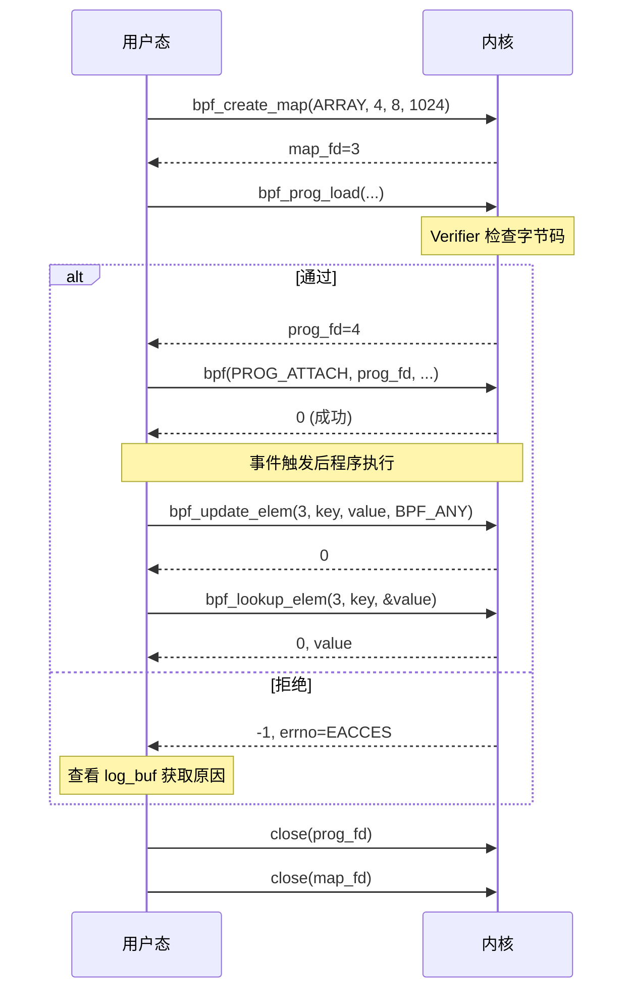

### 3-3. BPF Maps 详解

Map 是 eBPF 最重要的数据抽象，支持多种底层实现：

| Map 类型                         | 特点                       | 用途         |
| -------------------------------- | -------------------------- | ------------ |
| `BPF_MAP_TYPE_HASH`              | 通用哈希表，动态增长       | 任意键值存储 |
| `BPF_MAP_TYPE_ARRAY`             | 定长数组，索引为键，预分配 | 计数器、统计 |
| `BPF_MAP_TYPE_PERCPU_HASH/ARRAY` | 每 CPU 副本，减少锁竞争    | 高性能计数   |
| `BPF_MAP_TYPE_PROG_ARRAY`        | 存储程序 fd，实现尾调用    | 跳转表       |
| `BPF_MAP_TYPE_STACK_TRACE`       | 存储栈跟踪                 | profiling    |
| `BPF_MAP_TYPE_RINGBUF`           | 环形缓冲区，高效数据传输   | 事件通知     |

在后续的漏洞利用分析中，`BPF_MAP_TYPE_ARRAY` 和 `BPF_MAP_TYPE_HASH` 是最常涉及的两种类型，因为它们允许用户态与 eBPF 程序双向读写任意大小的值，且 `ARRAY` 类型的线性内存布局为构造越界访问提供了便利条件。

Map 的键和值类型在创建时指定，内核负责维护其生命周期。eBPF 程序内部通过辅助函数（helper）访问 Map：

```c
// eBPF 程序内访问 Map 的 helper 调用（C 伪代码）
void *map_lookup_elem(struct bpf_map *map, void *key);
long map_update_elem(struct bpf_map *map, void *key, void *value, u64 flags);
long map_delete_elem(struct bpf_map *map, void *key);
```

这些 helper 在 Verifier 阶段会被检查，确保指针有效、类型匹配。若验证器的状态跟踪出现偏差，后续的操作可能超出预期范围。

**Map 的内部结构（简化）**：

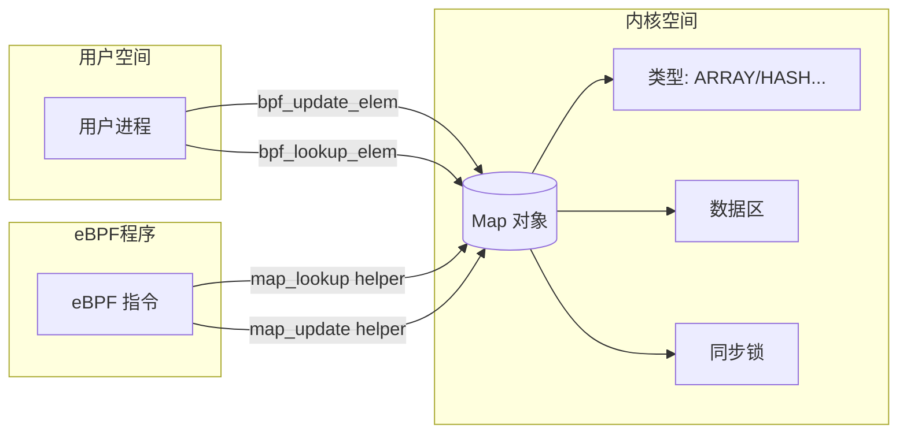

### 3-4. Verifier 详细工作流程

Verifier 是 eBPF 安全的核心，其实现位于 `kernel/bpf/verifier.c`。以下为其关键步骤：

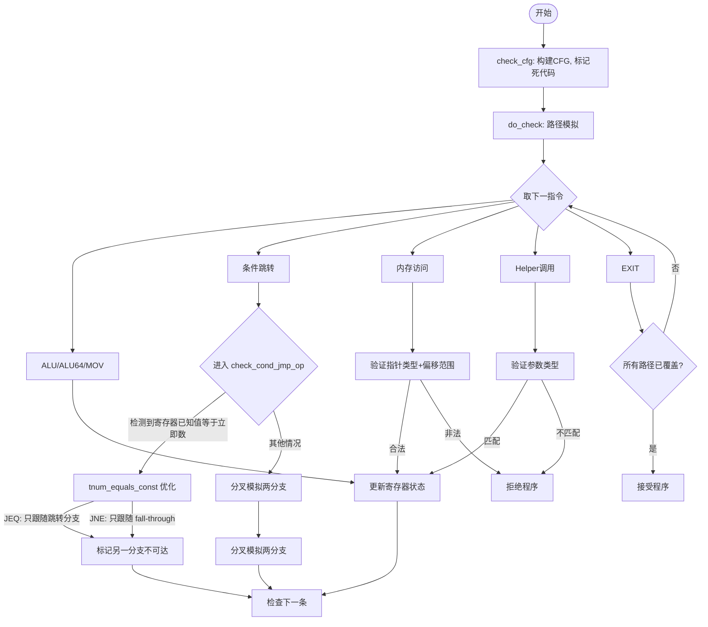

**关键数据结构**：`struct bpf_reg_state` 记录了每个寄存器的抽象状态，其中 `var_off`（`struct tnum`）用于表示已知位和未知位。当寄存器被赋予已知常量时，`var_off.mask` 为 0，`var_off.value` 即为该常量的 64 位表示。

**ALU 指令的范围跟踪调用链**：当 Verifier 在路径模拟中遇到 ALU 指令（如 ADD、SUB、OR、AND 等）时，会进入 `check_alu_op()` 函数，进而调用 `adjust_reg_min_max_vals()` 来更新目的寄存器的取值范围。该函数根据指令类型分派到不同的处理逻辑：对于按位与（`BPF_AND`），会调用 `adjust_scalar_min_max_vals()`，后者再调用 `scalar_min_max_and()`（64 位操作）或 `scalar32_min_max_and()`（32 位操作）来更新寄存器的边界和 `var_off`。完整的调用路径为：

```
do_check()
  → check_alu_op()
    → adjust_reg_min_max_vals()
      → adjust_scalar_min_max_vals()
        → scalar_min_max_and (或 scalar32_min_max_and)
```

其他按位运算（`BPF_OR`、`BPF_XOR`）遵循类似的调用结构，对应的 32 位处理函数分别为 `scalar32_min_max_or` 和 `scalar32_min_max_xor`。

**漏洞函数的缺陷模式**：`scalar32_min_max_and`、`scalar32_min_max_or` 和 `scalar32_min_max_xor` 这三个函数的实现存在相同的缺陷模式——当源寄存器和目标寄存器的低 32 位均为已知常数时，函数直接返回，跳过对 32 位边界的更新。正如第 2 章所分析的，这种提前返回导致 `var_off` 已更新而 32 位边界残留旧值，进而在后续的 `__update_reg_bounds` 中产生 `u32_min > u32_max` 的矛盾状态。对于 `OR` 和 `XOR` 操作，缺陷的表现形式类似：当低 32 位均为已知时提前返回，未同步更新 32 位边界，为后续的状态分裂埋下伏笔。关于这三个函数的具体源码分析和错误传播过程，将在第 4 章中系统展开。

**条件跳转优化细节**：在 `check_cond_jmp_op` 中，对于 `BPF_JEQ` 和 `BPF_JNE` 指令，如果目标寄存器是 `SCALAR_VALUE` 且 `tnum_equals_const(dst_reg->var_off, insn->imm)` 为真，Verifier 会认为该分支的走向已经确定：

- 对于 `JEQ`：条件必然成立，只跟随跳转分支，fall-through 被标记不可达。
- 对于 `JNE`：条件必然不成立，只跟随 fall-through 分支，跳转分支被标记不可达。

`tnum_equals_const` 比较的是 `var_off.value` 与 `insn->imm`（作为 `u64` 传入）。由于 C 语言隐式类型转换，`insn->imm`（`__s32`）会被符号扩展为 64 位。这一优化本意是加速已知常量的比较，但若 Verifier 错误地记录了寄存器值（如第 2 章所述，将运行时为 1 的寄存器判定为常量 0），就会导致错误的路径标记，使本应保留的分支被剪枝。

**安全保证**：

- 所有寄存器在使用前已被初始化（`NOT_INIT` 检查）。
- 指针算术不越界（例如 map 指针只能在合法偏移内访问）。
- 栈访问不超出 512 字节。
- 辅助函数调用参数类型匹配。
- 程序不会陷入无限循环（< 5.3 直接拒绝循环，5.3+ 限制循环次数）。

这些安全保证共同构成了 eBPF 的安全模型。然而，当 Verifier 的状态跟踪出现偏差时，这些保证可能被削弱甚至失效，这正是本漏洞的核心问题所在。

### 3-5. 典型用户态工作流示例

以下是一个完整的用户态代码片段，演示创建 Map、加载程序、交互的过程（简化）：

```c
// 1. 创建 Map
int map_fd = bpf_create_map(BPF_MAP_TYPE_ARRAY, sizeof(int), sizeof(long), 1024);

// 2. 准备字节码（此处为示例，实际需要合法程序）
struct bpf_insn prog[] = {
    // ... 指令序列
};

// 3. 加载程序
char license[] = "GPL";
int prog_fd = bpf_prog_load(BPF_PROG_TYPE_SOCKET_FILTER, prog, 4, license);
if (prog_fd < 0) {
    // 查看日志
    printf("Verifier log: %s\n", log_buf);
}

// 4. 通过 Map 交互
int key = 0;
long value = 42;
bpf_update_elem(map_fd, &key, &value, BPF_ANY);

// 5. 读取结果
bpf_lookup_elem(map_fd, &key, &value);

// 6. 清理
close(prog_fd);
close(map_fd);
```

对应的时序图：

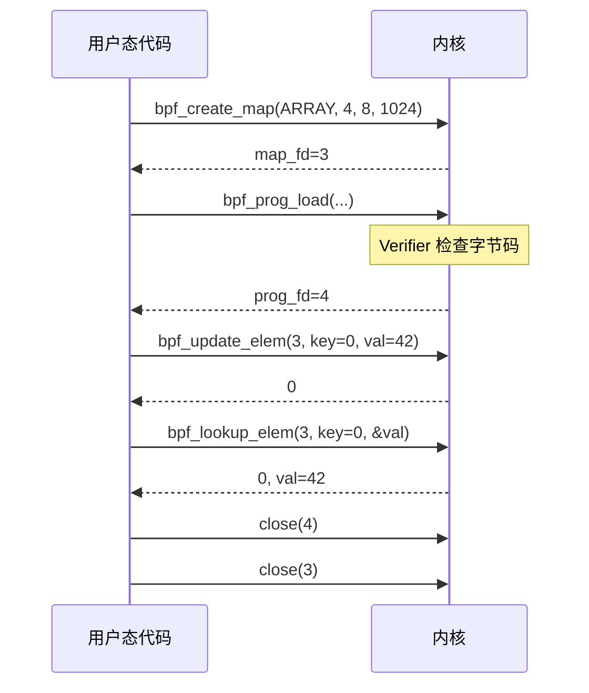

### 3-6. eBPF 设计理念与安全挑战

eBPF 是一个在内核可编程框架中具有代表性的实现，它允许用户在不修改内核源码或加载内核模块的前提下，将自定义逻辑注入到内核事件路径中。其核心设计理念可以概括为：

- **安全优先**：所有 eBPF 程序必须通过 Verifier 的静态分析才能运行，Verifier 充当了“安全门卫”的角色，确保程序不会破坏内核的稳定性。
- **数据通道隔离**：Map 是用户态与内核态程序之间唯一合法的数据交换媒介，它将两边的地址空间隔离开来，限制了程序的直接内存访问能力。
- **能力受限**：eBPF 程序不能随意调用内核函数，只能通过预定义的 helper 函数与外界交互，且早期版本不允许循环，从而将潜在风险控制在可接受范围内。

然而，Verifier 的正确性依赖于其对 eBPF 指令语义的精确模拟。第 2 章所分析的 **CVE-2021-3490** 正是利用了 `scalar32_min_max_and` 函数在处理 32 位按位与时，因低 32 位均为已知时提前返回所导致的范围跟踪缺陷——该缺陷使得 `var_off` 已更新为精确的按位与结果，而 32 位边界仍残留旧值，进而产生矛盾状态。这一矛盾状态在后续的运算中被消解并重建，最终使得 Verifier 将运行时为 1 的寄存器误判为常量 0。这一案例表明：即使是最严谨的静态分析工具，也可能因为一个边界更新逻辑中的提前返回分支，而导致整个安全模型的可靠性受到影响。关于该缺陷的详细源码分析和传播路径，将在第 4 章中全面展开。

## 4. 漏洞分析

前两章从概念层面剖析了 **CVE-2021-3490** 的成因，揭示了 Verifier 在 32 位按位与操作中因提前返回导致寄存器状态不一致的机理。本章将深入内核源码，沿着 Verifier 的执行路径逐函数分析缺陷的产生、传播与最终收敛过程。所有分析均基于 Linux 5.11.16 版本的 `kernel/bpf/verifier.c` 实现。

### 4-1. 主循环与 ALU 处理入口

Verifier 的核心入口是 `do_check()` 函数，它遍历程序中的所有指令，对每条指令进行模拟执行和状态检查。当遇到 ALU 或 ALU64 类指令时，调用 `check_alu_op()` 进行具体处理。

```c
static int do_check(struct bpf_verifier_env *env)
{
    bool pop_log = !(env->log.level & BPF_LOG_LEVEL2);
    struct bpf_verifier_state *state = env->cur_state;
    struct bpf_insn *insns = env->prog->insnsi;
    struct bpf_reg_state *regs;
    int insn_cnt = env->prog->len;
    bool do_print_state = false;
    int prev_insn_idx = -1;

    // 主循环：依次处理每条指令
    for (;;) {
        struct bpf_insn *insn;
        u8 class;
        int err;

        env->prev_insn_idx = prev_insn_idx;
        if (env->insn_idx >= insn_cnt) {
            verbose(env, "invalid insn idx %d insn_cnt %d\n",
                env->insn_idx, insn_cnt);
            return -EFAULT;
        }

        insn = &insns[env->insn_idx];
        class = BPF_CLASS(insn->code);

        // 限制指令处理数量，防止超时
        if (++env->insn_processed > BPF_COMPLEXITY_LIMIT_INSNS) {
            verbose(env,
                "BPF program is too large. Processed %d insn\n",
                env->insn_processed);
            return -E2BIG;
        }

        // 检查是否已访问过等价状态，用于路径剪枝
        err = is_state_visited(env, env->insn_idx);
        if (err < 0)
            return err;
        if (err == 1) {
            /* found equivalent state, can prune the search */
            if (env->log.level & BPF_LOG_LEVEL) {
                if (do_print_state)
                    verbose(env, "\nfrom %d to %d%s: safe\n",
                        env->prev_insn_idx, env->insn_idx,
                        env->cur_state->speculative ?
                        " (speculative execution)" : "");
                else
                    verbose(env, "%d: safe\n", env->insn_idx);
            }
            goto process_bpf_exit;
        }

        // 处理信号和调度
        if (signal_pending(current))
            return -EAGAIN;
        if (need_resched())
            cond_resched();

        // 打印调试状态（可选）
        if (env->log.level & BPF_LOG_LEVEL2 ||
            (env->log.level & BPF_LOG_LEVEL && do_print_state)) {
            if (env->log.level & BPF_LOG_LEVEL2)
                verbose(env, "%d:", env->insn_idx);
            else
                verbose(env, "\nfrom %d to %d%s:",
                    env->prev_insn_idx, env->insn_idx,
                    env->cur_state->speculative ?
                    " (speculative execution)" : "");
            print_verifier_state(env, state->frame[state->curframe]);
            do_print_state = false;
        }

        // 打印指令（可选）
        if (env->log.level & BPF_LOG_LEVEL) {
            const struct bpf_insn_cbs cbs = {
                .cb_print    = verbose,
                .private_data    = env,
            };
            verbose_linfo(env, env->insn_idx, "; ");
            verbose(env, "%d: ", env->insn_idx);
            print_bpf_insn(&cbs, insn, env->allow_ptr_leaks);
        }

        // 硬件卸载相关检查
        if (bpf_prog_is_dev_bound(env->prog->aux)) {
            err = bpf_prog_offload_verify_insn(env, env->insn_idx,
                               env->prev_insn_idx);
            if (err)
                return err;
        }

        regs = cur_regs(env);
        env->insn_aux_data[env->insn_idx].seen = env->pass_cnt;
        prev_insn_idx = env->insn_idx;

        // ------ 按指令类型分别处理 ------
        if (class == BPF_ALU || class == BPF_ALU64) {
            // ALU 运算指令，包括算术和逻辑操作
            err = check_alu_op(env, insn);
            if (err)
                return err;
            // ... 其他指令类型（LDX, STX, ST, JMP, LD）省略
        }
        // ...
        env->insn_idx++;
    }
    return 0;
}
```

当 `do_check` 识别到 `BPF_ALU` 或 `BPF_ALU64` 指令时，调用 `check_alu_op()`。该函数负责解析 ALU 操作码，对于常规的算术/逻辑运算（非 `BPF_END`、`BPF_NEG`、`BPF_MOV`），最终会调用 `adjust_reg_min_max_vals()` 来更新目的寄存器的范围信息。

```c
static int check_alu_op(struct bpf_verifier_env *env, struct bpf_insn *insn)
{
    struct bpf_reg_state *regs = cur_regs(env);
    u8 opcode = BPF_OP(insn->code);
    int err;

    // 处理特殊指令：字节序转换、取反
    if (opcode == BPF_END || opcode == BPF_NEG) {
        // ... 省略具体实现
    }
    // 处理移动指令
    else if (opcode == BPF_MOV) {
        // ... 省略
    }
    // 其他 ALU 指令：add, sub, and, or, xor, mul, div, mod, lsh, rsh, arsh
    else {
        if (BPF_SRC(insn->code) == BPF_X) {
            // 寄存器作为源操作数：检查源寄存器是否已初始化
            err = check_reg_arg(env, insn->src_reg, SRC_OP);
            if (err)
                return err;
        } else {
            // 立即数作为源操作数：无需检查（直接使用 insn->imm）
        }

        // 检查目的寄存器（标记为待写，暂不标记为已初始化）
        err = check_reg_arg(env, insn->dst_reg, DST_OP_NO_MARK);
        if (err)
            return err;

        // 核心：调用范围更新函数
        return adjust_reg_min_max_vals(env, insn);
    }
    return 0;
}
```

`adjust_reg_min_max_vals()` 进一步区分源操作数是寄存器还是立即数，然后调用 `adjust_scalar_min_max_vals()` 来执行具体的标量范围更新。

```c
static int adjust_reg_min_max_vals(struct bpf_verifier_env *env,
                   struct bpf_insn *insn)
{
    struct bpf_verifier_state *vstate = env->cur_state;
    struct bpf_func_state *state = vstate->frame[vstate->curframe];
    struct bpf_reg_state *regs = state->regs, *dst_reg, *src_reg;
    struct bpf_reg_state *ptr_reg = NULL, off_reg = {0};
    u8 opcode = BPF_OP(insn->code);
    int err;

    dst_reg = &regs[insn->dst_reg];
    src_reg = NULL;

    // 处理指针与标量的混合运算（如指针加偏移）
    // 如果目的寄存器是指针，则调用 adjust_ptr_min_max_vals
    // 如果源寄存器是指针，则进行相应处理
    // ... 省略指针处理逻辑

    // 到达此处说明两个操作数均为标量（SCALAR_VALUE）
    return adjust_scalar_min_max_vals(env, insn, dst_reg, *src_reg);
}
```

### 4-2. 范围更新核心函数

`adjust_scalar_min_max_vals` 是范围更新的核心，它根据指令类型分别调用 32 位和 64 位的边界更新函数，最后统一调用 `__update_reg_bounds()`、`__reg_deduce_bounds()` 和 `__reg_bound_offset()` 进行综合推导。

```c
static int adjust_scalar_min_max_vals(struct bpf_verifier_env *env,
                      struct bpf_insn *insn,
                      struct bpf_reg_state *dst_reg,
                      struct bpf_reg_state src_reg)
{
    struct bpf_reg_state *regs = cur_regs(env);
    u8 opcode = BPF_OP(insn->code);
    bool src_known;
    s64 smin_val, smax_val;
    u64 umin_val, umax_val;
    s32 s32_min_val, s32_max_val;
    u32 u32_min_val, u32_max_val;
    u64 insn_bitness = (BPF_CLASS(insn->code) == BPF_ALU64) ? 64 : 32;
    bool alu32 = (BPF_CLASS(insn->code) != BPF_ALU64);  // 是否为 32 位操作
    int ret;

    // 读取源寄存器的各类边界值
    smin_val = src_reg.smin_value;
    smax_val = src_reg.smax_value;
    umin_val = src_reg.umin_value;
    umax_val = src_reg.umax_value;

    s32_min_val = src_reg.s32_min_value;
    s32_max_val = src_reg.s32_max_value;
    u32_min_val = src_reg.u32_min_value;
    u32_max_val = src_reg.u32_max_value;

    // 检查源寄存器边界是否有效，若有矛盾（min>max）则标记目的为未知
    if (alu32) {
        src_known = tnum_subreg_is_const(src_reg.var_off);
        if ((src_known &&
             (s32_min_val != s32_max_val || u32_min_val != u32_max_val)) ||
            s32_min_val > s32_max_val || u32_min_val > u32_max_val) {
            __mark_reg_unknown(env, dst_reg);
            return 0;
        }
    } else {
        src_known = tnum_is_const(src_reg.var_off);
        if ((src_known &&
             (smin_val != smax_val || umin_val != umax_val)) ||
            smin_val > smax_val || umin_val > umax_val) {
            __mark_reg_unknown(env, dst_reg);
            return 0;
        }
    }

    // 如果源寄存器未知且操作不是 ADD/SUB/AND，则无法跟踪范围，标记为未知
    if (!src_known &&
        opcode != BPF_ADD && opcode != BPF_SUB && opcode != BPF_AND) {
        __mark_reg_unknown(env, dst_reg);
        return 0;
    }

    // 对某些操作进行 sanitize（防止越界）
    if (sanitize_needed(opcode)) {
        ret = sanitize_val_alu(env, insn);
        if (ret < 0)
            return sanitize_err(env, insn, ret, NULL, NULL);
    }

    // ------ 根据操作类型分别处理 ------
    switch (opcode) {
    case BPF_ADD:
        scalar32_min_max_add(dst_reg, &src_reg);
        scalar_min_max_add(dst_reg, &src_reg);
        dst_reg->var_off = tnum_add(dst_reg->var_off, src_reg.var_off);
        break;
    case BPF_SUB:
        // 类似处理
        break;
    case BPF_MUL:
        // 先更新 var_off，再更新边界
        dst_reg->var_off = tnum_mul(dst_reg->var_off, src_reg.var_off);
        scalar32_min_max_mul(dst_reg, &src_reg);
        scalar_min_max_mul(dst_reg, &src_reg);
        break;
    case BPF_AND:
        // 【漏洞关键路径】
        // 1. 先更新 var_off（64位 tnum）
        dst_reg->var_off = tnum_and(dst_reg->var_off, src_reg.var_off);
        // 2. 更新 32 位边界（可能提前返回，导致边界未更新）
        scalar32_min_max_and(dst_reg, &src_reg);
        // 3. 更新 64 位边界
        scalar_min_max_and(dst_reg, &src_reg);
        break;
    case BPF_OR:
        // 类似 AND
        break;
    case BPF_XOR:
        // 类似
        break;
    case BPF_LSH:
        // 移位操作需要额外检查
        break;
    // ... 其他操作
    }

    // 如果是 32 位操作，将结果零扩展到 64 位
    if (alu32)
        zext_32_to_64(dst_reg);

    // ------ 统一进行边界收紧和推导 ------
    __update_reg_bounds(dst_reg);   // 利用 var_off 收紧 min/max
    __reg_deduce_bounds(dst_reg);   // 在有无符号边界间互推
    __reg_bound_offset(dst_reg);    // 根据边界重新计算 var_off
    return 0;
}
```

重点关注 `BPF_AND` 分支的调用顺序：

1. 先通过 `tnum_and` 更新 `var_off`（64 位 `tnum` 结构）。
2. 调用 `scalar32_min_max_and` 更新 32 位边界。
3. 调用 `scalar_min_max_and` 更新 64 位边界。
4. 最后统一调用三个边界推导函数。

这种先更新 `var_off`，再分别更新 32/64 位边界的时序，是后续缺陷暴露的关键。

### 4-3. 32 位边界更新漏洞

该函数的完整实现如下：

```c
static void scalar32_min_max_and(struct bpf_reg_state *dst_reg,
                 struct bpf_reg_state *src_reg)
{
    bool src_known = tnum_subreg_is_const(src_reg->var_off);
    bool dst_known = tnum_subreg_is_const(dst_reg->var_off);
    struct tnum var32_off = tnum_subreg(dst_reg->var_off);
    s32 smin_val = src_reg->s32_min_value;
    u32 umax_val = src_reg->u32_max_value;

    /* 【漏洞点】当源和目的的低 32 位均为已知常数时，直接返回，
     * 不更新任何 32 位边界（u32_min/max, s32_min/max）。
     * 注释声称依赖后续的 scalar_min_max_and 来修复，但时序上 var_off 已更新，
     * 而 32 位边界仍为旧值，导致状态分裂。
     */
    if (src_known && dst_known)
        return;

    /* 以下代码仅在非已知常数路径执行。
     * 从 var_off 获取最小值（因为按位与结果的最小值来自确定位），
     * 最大值取两个操作数最大值的较小者。
     */
    dst_reg->u32_min_value = var32_off.value;
    dst_reg->u32_max_value = min(dst_reg->u32_max_value, umax_val);

    /* 有符号边界处理：如果任一操作数为负数，则放宽边界；
     * 否则将有符号边界设为与无符号边界相同。
     */
    if (dst_reg->s32_min_value < 0 || smin_val < 0) {
        dst_reg->s32_min_value = S32_MIN;
        dst_reg->s32_max_value = S32_MAX;
    } else {
        dst_reg->s32_min_value = dst_reg->u32_min_value;
        dst_reg->s32_max_value = dst_reg->u32_max_value;
    }
}
```

该函数的缺陷在于开头的提前返回条件：当 `src_known && dst_known` 均为真时（即源和目标的低 32 位均为已知常数），函数直接返回，不更新任何 32 位边界。注释中声称“Assuming scalar64_min_max_and will be called so its safe”，即认为后续的 64 位更新函数 `scalar_min_max_and` 能够弥补这一缺失。然而，时序上 `var_off` 已经在调用前被 `tnum_and` 更新，而 32 位边界（`u32_min/max`、`s32_min/max`）却维持原值，导致寄存器状态出现内部不一致。

### 4-4. 64 位边界更新与收敛

对应的 64 位更新函数如下：

```c
static void scalar_min_max_and(struct bpf_reg_state *dst_reg,
                   struct bpf_reg_state *src_reg)
{
    bool src_known = tnum_is_const(src_reg->var_off);
    bool dst_known = tnum_is_const(dst_reg->var_off);
    s64 smin_val = src_reg->smin_value;
    u64 umax_val = src_reg->umax_value;

    /* 【收敛点】当源和目的均为全常量时，直接将寄存器标记为已知常量。
     * 这会导致在第二次按位与中，因为 var_off 为全 0，寄存器被强制收敛为 0。
     */
    if (src_known && dst_known) {
        __mark_reg_known(dst_reg, dst_reg->var_off.value);
        return;
    }

    /* 非全常量路径：类似 32 位版本，但针对 64 位 */
    dst_reg->umin_value = dst_reg->var_off.value;
    dst_reg->umax_value = min(dst_reg->umax_value, umax_val);
    if (dst_reg->smin_value < 0 || smin_val < 0) {
        dst_reg->smin_value = S64_MIN;
        dst_reg->smax_value = S64_MAX;
    } else {
        dst_reg->smin_value = dst_reg->umin_value;
        dst_reg->smax_value = dst_reg->umax_value;
    }
    /* 额外尝试从 var_off 进一步收紧边界 */
    __update_reg_bounds(dst_reg);
}
```

当源和目标均为全常量（即 `var_off` 的 `mask` 为 0）时，该函数直接调用 `__mark_reg_known`。这是将寄存器强制收敛为常量的关键步骤。`__mark_reg_known` 的实现如下：

```c
/* Mark the unknown part of a register (variable offset or scalar value) as
 * known to have the value @imm.
 */
static void __mark_reg_known(struct bpf_reg_state *reg, u64 imm)
{
    /* Clear id, off, and union(map_ptr, range) */
    memset(((u8 *)reg) + sizeof(reg->type), 0,
           offsetof(struct bpf_reg_state, var_off) - sizeof(reg->type));
    ___mark_reg_known(reg, imm);
}
```

该函数首先清除寄存器中与类型无关的辅助字段（如 `id`、`off` 等），然后调用 `___mark_reg_known` 完成实际的值设置：

```c
static void ___mark_reg_known(struct bpf_reg_state *reg, u64 imm)
{
    reg->var_off = tnum_const(imm);
    reg->smin_value = (s64)imm;
    reg->smax_value = (s64)imm;
    reg->umin_value = imm;
    reg->umax_value = imm;

    reg->s32_min_value = (s32)imm;
    reg->s32_max_value = (s32)imm;
    reg->u32_min_value = (u32)imm;
    reg->u32_max_value = (u32)imm;
}
```

`___mark_reg_known` 将寄存器的所有边界字段——包括 64 位有符号/无符号边界（`smin/max`、`umin/max`）、32 位有符号/无符号边界（`s32_min/max`、`u32_min/max`）以及 `var_off`——全部设置为 `imm`。这是一个彻底的覆盖操作，消除了寄存器中任何残留的不确定性或矛盾状态。

在漏洞场景中，第二次按位与操作（`r6 &= 1`）执行后，`tnum_and` 已将 `var_off` 更新为全 0。此时 `scalar_min_max_and` 检测到源和目的均为全常量（`src_known && dst_known` 为真），调用 `__mark_reg_known(dst_reg, 0)`，将所有边界强制设置为 0，从而完成收敛。

### 4-5. 边界收紧机制

`adjust_scalar_min_max_vals` 在完成所有边界更新后，调用 `__update_reg_bounds(dst_reg)`，后者进一步调用 `__update_reg32_bounds` 和 `__update_reg64_bounds`。

```c
static void __update_reg32_bounds(struct bpf_reg_state *reg)
{
    struct tnum var32_off = tnum_subreg(reg->var_off);

    /* 有符号最小值：取 (符号位为1的可能最小值) 与当前 smin 的较大值 */
    reg->s32_min_value = max_t(s32, reg->s32_min_value,
            var32_off.value | (var32_off.mask & S32_MIN));
    /* 有符号最大值：取 (符号位为0的可能最大值) 与当前 smax 的较小值 */
    reg->s32_max_value = min_t(s32, reg->s32_max_value,
            var32_off.value | (var32_off.mask & S32_MAX));
    /* 无符号最小值：至少为 var32_off.value */
    reg->u32_min_value = max_t(u32, reg->u32_min_value, (u32)var32_off.value);
    /* 无符号最大值：至多为 var32_off.value | var32_off.mask */
    reg->u32_max_value = min(reg->u32_max_value,
                 (u32)(var32_off.value | var32_off.mask));
}

static void __update_reg64_bounds(struct bpf_reg_state *reg)
{
    /* 类似逻辑，针对 64 位 */
    reg->smin_value = max_t(s64, reg->smin_value,
                reg->var_off.value | (reg->var_off.mask & S64_MIN));
    reg->smax_value = min_t(s64, reg->smax_value,
                reg->var_off.value | (reg->var_off.mask & S64_MAX));
    reg->umin_value = max(reg->umin_value, reg->var_off.value);
    reg->umax_value = min(reg->umax_value,
                  reg->var_off.value | reg->var_off.mask);
}

static void __update_reg_bounds(struct bpf_reg_state *reg)
{
    __update_reg32_bounds(reg);
    __update_reg64_bounds(reg);
}
```

`__update_reg32_bounds` 尝试利用 `var_off` 的信息收紧 32 位边界。例如，它将 `u32_min_value` 至少提升到 `var32_off.value`，将 `u32_max_value` 至少降低到 `var32_off.value | var32_off.mask`。如果旧的 `u32_min_value` 大于收紧后的 `u32_max_value`，则产生矛盾。

这正是漏洞触发时发生的情况：在第一次按位与后，`var32_off` 变为 0（因为低 32 位全为 0），而旧的 `u32_min_value` 为 1，`u32_max_value` 为 1。于是 `__update_reg32_bounds` 将 `u32_max_value` 收紧为 0，但 `u32_min_value` 仍为 1（由于 `max_t` 操作取较大值），最终得到 `u32_min = 1 > u32_max = 0`。有符号边界同样出现矛盾：`s32_min = 1 > s32_max = 0`。

### 4-6. 边界互推机制

`adjust_scalar_min_max_vals` 在 `__update_reg_bounds` 之后调用 `__reg_deduce_bounds`，后者调用 32 位和 64 位的推导函数。

```c
static void __reg32_deduce_bounds(struct bpf_reg_state *reg)
{
    /* 尝试从有符号边界推导无符号边界，反之亦然 */
    /* 如果符号不跨边界（全正或全负），则可将无符号边界与有符号边界统一 */
    if (reg->s32_min_value >= 0 || reg->s32_max_value < 0) {
        reg->s32_min_value = reg->u32_min_value =
            max_t(u32, reg->s32_min_value, reg->u32_min_value);
        reg->s32_max_value = reg->u32_max_value =
            min_t(u32, reg->s32_max_value, reg->u32_max_value);
        return;
    }
    /* 若符号跨边界，则根据无符号边界推导有符号边界 */
    if ((s32)reg->u32_max_value >= 0) {
        /* 无符号最大值非负，则 smax 非负 */
        reg->s32_min_value = reg->u32_min_value;
        reg->s32_max_value = reg->u32_max_value =
            min_t(u32, reg->s32_max_value, reg->u32_max_value);
    } else if ((s32)reg->u32_min_value < 0) {
        /* 无符号最小值负，则 smin 负 */
        reg->s32_min_value = reg->u32_min_value =
            max_t(u32, reg->s32_min_value, reg->u32_min_value);
        reg->s32_max_value = reg->u32_max_value;
    }
}

static void __reg64_deduce_bounds(struct bpf_reg_state *reg)
{
    // 类似逻辑，针对64位
}

static void __reg_deduce_bounds(struct bpf_reg_state *reg)
{
    __reg32_deduce_bounds(reg);
    __reg64_deduce_bounds(reg);
}
```

这些函数试图从有符号边界和无符号边界相互推导，以缩小范围。然而，当已经存在 `min > max` 的矛盾时，这些推导函数无法消除矛盾，因为它们的操作依赖于有效范围。例如，当 `s32_min > s32_max` 且 `u32_min > u32_max` 时，条件分支（如 `s32_min >= 0 || s32_max < 0`）可能无法覆盖，导致边界仍然矛盾。事实上，矛盾状态会保留到下一步。

### 4-7. 偏移收敛机制

最后一步是 `__reg_bound_offset`，该函数负责根据边界信息重新计算 `var_off`，并覆盖原有值。

```c
static void __reg_bound_offset(struct bpf_reg_state *reg)
{
    /* 用 64 位边界区间与当前 var_off 求交集 */
    struct tnum var64_off = tnum_intersect(reg->var_off,
                           tnum_range(reg->umin_value,
                              reg->umax_value));
    /* 用 32 位边界区间与当前 var_off 的低 32 位求交集 */
    struct tnum var32_off = tnum_intersect(tnum_subreg(reg->var_off),
                        tnum_range(reg->u32_min_value,
                               reg->u32_max_value));

    /* 组合 64 位高部分和 32 位低部分，覆盖 reg->var_off */
    reg->var_off = tnum_or(tnum_clear_subreg(var64_off), var32_off);
}
```

该函数分别对 64 位和 32 位计算 `tnum` 与边界区间的交集，然后将两者合并。对于 32 位部分，它用 `tnum_range(reg->u32_min_value, reg->u32_max_value)` 构造一个表示所有可能值的 `tnum`，然后与 `tnum_subreg(reg->var_off)` 求交集，得到 `var32_off`。

当存在矛盾边界（如 `u32_min = 1, u32_max = 0`）时，`tnum_range(1, 0)` 会构造一个 `tnum` 表示空集（`{0, ~0}`，即全未知）。`var32_off` 为 `tnum_intersect(0, full)`，结果为 0。但由于 `var_off` 的低 32 位已经是 0（因为 `tnum_and` 的结果），所以 `var32_off` 仍为 0。最终 `reg->var_off` 的低 32 位被强制为 0，即使边界矛盾，`__reg_bound_offset` 仍根据已有 `var_off` 覆盖了边界信息，将寄存器状态收敛为看似合理的常量 0。

在第二次按位与中，`tnum_and` 将 `var_off` 低 32 位设为全 0，随后 `__reg_bound_offset` 根据该 `var_off` 和矛盾边界计算出 `var32_off` 仍为 0，最终将寄存器标记为常量 0。但由于 `scalar32_min_max_and` 提前返回，32 位边界未被同步更新，`scalar_min_max_and` 又在后续通过 `__mark_reg_known` 强制收敛，使得整个寄存器状态被完全设定为常量 0。

### 4-8. 缺陷传播路径

综合上述各节的分析，整个漏洞的源码级传播路径可以概括为以下流程：

```
do_check()                           // Verifier 主循环
    └── check_alu_op()               // ALU 指令分发
         └── adjust_reg_min_max_vals()   // 标量/指针运算入口
              └── adjust_scalar_min_max_vals()   // 标量范围更新核心
                   ├── tnum_and()          // 更新 var_off（先执行）
                   ├── scalar32_min_max_and()   // 更新 32 位边界
                   │    └── 若低32位均为已知 → 提前返回（漏洞）
                   ├── scalar_min_max_and()     // 更新 64 位边界
                   │    └── 若全常量 → __mark_reg_known（收敛点）
                   │         └── ___mark_reg_known() → 所有边界设为 imm
                   ├── __update_reg_bounds()    // 边界收紧
                   │    └── __update_reg32_bounds() → 可能产生 min>max
                   ├── __reg_deduce_bounds()    // 边界互推
                   │    └── 无法消除矛盾
                   └── __reg_bound_offset()     // 偏移收敛
                        └── 根据 var_off 覆盖边界，强制收敛为常量
```

**关键状态转换总结**：

| 阶段       | 操作             | 验证器状态                                             | 运行时状态 |
| ---------- | ---------------- | ------------------------------------------------------ | ---------- |
| 初始       | `r6` 从 Map 读取 | 未知                                                   | 0          |
| 塑造       | 与掩码相与后加 1 | 低 32 位 = 1                                           | 1          |
| 第一次 AND | `r6 &= C`        | `var_off` 低 32 位 = 0，`u32_min=1, u32_max=0`（矛盾） | 0          |
| 条件跳转   | 限制 `r7` 范围   | `r7` ∈ [0,1]                                           | `r7` = 0   |
| 加法       | `r6 += r7`       | `u32_min=1, u32_max=1`（消解）                         | 0          |
| 加 1       | `r6 += 1`        | `u32_min=2, u32_max=2`                                 | 1          |
| 第二次 AND | `r6 &= 1`        | `__mark_reg_known(0)`（强制收敛）                      | 1          |

**收敛函数的作用**：在第二次按位与中，`__mark_reg_known` 通过 `___mark_reg_known` 将寄存器的所有边界字段（`var_off`、64 位边界、32 位边界）全部设置为 0。这是一个“全或无”的覆盖操作——它彻底清除了寄存器中因缺陷而产生的矛盾边界，使得验证器内部状态完全收敛为常量 0，而运行时的实际值仍为 1。

**漏洞根源**：`scalar32_min_max_and` 在低 32 位均为已知时提前返回，导致 32 位边界未随 `var_off` 同步更新。这一时序缺陷使得 `__update_reg32_bounds` 产生矛盾边界，而 `__reg_bound_offset` 又根据 `var_off` 将寄存器强制收敛为常量 0，最终造成验证器与运行时对寄存器取值的分歧。

**修复点**：补丁 `049c4e13714e` 通过移除 `scalar32_min_max_and` 中的提前返回逻辑，并强制在已知常数情况下调用 `__mark_reg32_known()` 显式同步 32 位边界，从根本上消除了状态分裂的可能性。

### 4-9. JIT 编译与运行时验证

上述源码分析的结论，在 JIT 编译生成的 x86-64 汇编代码中得到了完整验证。JIT 编译器将 eBPF 寄存器映射到物理寄存器：`R6` 映射为 `rbx`，`R7` 映射为 `r13`，`R2` 映射为 `rsi`。以下列出关键指令序列及其对应的状态变化。

**（1）寄存器塑造与漏洞触发**

```asm
mov    rcx,0xffffffffffffffff
shl    rcx,0x20                  ; rcx = 0xffffffff00000000
and    rbx,rcx                   ; rbx 高32位未知，低32位=0
add    rbx,0x1                   ; rbx 低32位=1（验证器与运行时一致）

mov    edx,0x1
shl    rdx,0x20
add    rdx,0x2                   ; rdx = 0x100000002（常量 C）

and    rbx,rdx                   ; 漏洞触发：验证器低32位→0，运行时→0
```

此时验证器内部已产生 `u32_min=1, u32_max=0` 的矛盾状态，但 `var_off` 低 32 位为 0。

**（2）条件跳转与范围限制**

```asm
cmp    r13d,0x1                  ; r13 为 r7 的副本，运行时值为 0
jbe    0xffffffffc000229a        ; 条件成立（0 ≤ 1），跳过 exit
```

验证器在跳转目标路径上将 `r7` 的 32 位范围限制为 [0,1]。

**（3）分歧状态的建立**

```asm
add    rbx,r13                   ; r6 += r7，运行时 0+0=0
                                 ; 验证器将矛盾边界与 [0,1] 合并 → u32=[1,1]
add    rbx,0x1                   ; 运行时 1，验证器 u32=[2,2]
and    rbx,0x1                   ; 运行时 1&1=1，验证器强制收敛为常量 0
```

最终 `rbx` 在验证器视角为常量 0，运行时为 1。JIT 生成的 `and rbx,0x1` 指令对应的机器码为 `48 83 E3 01`，在调试器中的状态完全符合第 2 章的描述。

**（4）ALU Sanitation 绕过**

JIT 为每个乘法操作插入了 ALU Sanitation 检查序列，以 `r14 * 0x1000` 为例：

```asm
mov    r11,r14                   ; r14 = 分歧寄存器（验证器0，运行时1）
mov    eax,0x1000
mul    r11                        ; 运行时 r14 = 0x1000
mov    r14,rax
mov    r10d,0x1000               ; alu_limit = 0x1000
sub    r10,r14
or     r10,r14
neg    r10
sar    r10,0x3f
and    r10,r14
sub    r13,r10                   ; 运行时 r10=0，指针回退到基址
```

由于验证器认为 `r14=0`，JIT 在编译时不会对减法操作产生告警。运行时 `r14` 的实际值为 `0x1000`，恰好等于 `alu_limit`，不满足 `> alu_limit` 的检查条件，因此绕过成功。

**（5）越界指针的构建**

在 ALU Sanitation 绕过之后，JIT 继续执行：

```asm
mov    r13,rsi                   ; r13 = 值区域基址 p
add    r13,0x1000                ; 设置 alu_limit = 0x1000
; ... 经过前述 ALU Sanitation 检查，r13 回退到 p
; ... 经过 r6 * 0x110 的 ALU Sanitation 检查
sub    r13,rbx                   ; 运行时：r13 = p - 0x110
                                 ; 验证器：r13 = p + 0x1000（仍在合法区间内）
```

此时 `r13` 运行时指向 `struct bpf_array` 的头部（位于值区域基址前 `0x110` 字节处），而验证器认为其仍在 Map 值区域内部。

上述汇编代码的执行流程完整复现了源码分析中的每一步状态转换，验证了漏洞从 Verifier 状态分歧到运行时指针越界的完整路径。注意，此处仅展示到指针构建为止的 JIT 行为，后续的读写操作属于利用过程的后续阶段，不在本章讨论范围内。

### 4-10. 分析总结

本章从源码层面完整追踪了 **CVE-2021-3490** 的触发与传播机制。主要发现如下：

1. **缺陷定位**：漏洞根因于 `scalar32_min_max_and` 函数中当源和目的的低 32 位均为已知常数时的提前返回行为。该函数的设计假设——依赖后续 64 位函数 `scalar_min_max_and` 来修复边界——与实际的调用时序存在冲突。`var_off` 已在函数入口前被 `tnum_and` 更新，而 32 位边界（`u32_min/max`、`s32_min/max`）却因提前返回而未能同步，导致寄存器状态分裂。这一缺陷同样存在于 `scalar32_min_max_or` 和 `scalar32_min_max_xor` 中。

2. **矛盾产生**：在 `adjust_scalar_min_max_vals` 的统一推导阶段，`__update_reg32_bounds` 尝试利用 `var_off` 收紧 32 位边界，但因旧边界与新 `var_off` 不匹配而产生 `u32_min > u32_max` 的矛盾。`__reg_deduce_bounds` 无法消除此矛盾，矛盾状态被传递到下一阶段。这一矛盾状态不会导致验证失败，而是被保留在寄存器的内部状态中。

3. **错误收敛**：`__reg_bound_offset` 在处理矛盾边界时，用 `tnum_range` 构造边界区间并求交集。对于矛盾状态 `u32_min=1, u32_max=0`，`tnum_range` 返回全未知，但由于 `var_off` 的低 32 位已是 0（来自 `tnum_and` 的精确结果），交集结果仍为 0。因此 `var_off` 的低 32 位维持为 0，矛盾边界被压制但未消除。在第二次按位与中，`scalar32_min_max_and` 再次提前返回，随后 `scalar_min_max_and` 因全常量条件调用 `__mark_reg_known`，后者通过 `___mark_reg_known` 将所有边界字段——`var_off`、64 位边界（`smin/max`、`umin/max`）、32 位边界（`s32_min/max`、`u32_min/max`）——全部设置为 0。这一覆盖操作发生在统一推导阶段之前，使得后续的 `__update_reg_bounds` 等函数直接作用于常量 0 状态，彻底清除寄存器中的矛盾残留，使验证器将寄存器标记为常量 0，而运行时实际值仍为 1。

4. **JIT 验证**：JIT 编译生成的 x86-64 汇编代码完整复现了上述状态转换过程，验证了源码分析的结论。ALU Sanitation 检查因分歧寄存器的存在而被有效绕过，使得越界指针得以在运行时构建。JIT 代码中的寄存器映射（`R6→rbx`、`R7→r13`、`R2→rsi`）与状态转换一一对应，为源码层面的分析提供了运行时层面的证据支撑。

本章的分析为理解该漏洞的触发条件奠定了基础。后续第五章将基于这些源码层面的理解，系统阐述如何利用该漏洞从验证器状态分歧出发，逐步构造出越界访问原语，并最终实现对内核关键数据结构的操控。

## 5. 利用思路（v5.11.16）

第四章节从源码层面揭示了 **CVE-2021-3490** 的触发条件与状态传播路径，阐明了验证器如何将运行时值为 1 的寄存器误判为常量 0。本章将基于这一分歧寄存器，系统阐述如何将其转化为可控的内核内存访问原语，并最终实现权限提升。整体策略遵循“构造原语 → 信息收集 → 权限修改 → 触发执行”的流程，所有步骤均依赖 eBPF 框架提供的合法接口，仅在验证器状态分歧的辅助下完成超出常规范围的访问。

### 5-1. 总体策略

利用的核心思路可概括为以下四个阶段：

1. **分歧寄存器构造**：通过精心编排的 eBPF 指令序列，利用 `scalar32_min_max_and` 的提前返回缺陷，制造一个验证器与运行时认知不一致的寄存器（验证器视为 0，运行时为 1）。
2. **越界指针构建**：将该分歧寄存器作为偏移量，结合 ALU Sanitation 机制的绕过技巧，将合法的 Map 值指针逆向偏移，使其运行时指向 `struct bpf_array` 的头部，而验证器仍认为其在合法区间内。
3. **原语搭建**：利用越界指针修改 Map 对象中的关键字段（如 `ops` 或 `btf`），从而将 eBPF 的常规 Map 操作（查找、更新）转化为任意内核内存读写原语。
4. **提权执行**：通过任意读原语泄露内核基址、进程凭证地址，再通过任意写原语清零凭证字段，最终获得 root 权限。

该策略的关键在于将验证器的误判（常量 0 vs 运行时 1）放大为指针偏移的偏差（合法偏移 vs 越界偏移），并借助内核自身机制将越界访问能力转化为任意内存访问。整体流程可表示为：

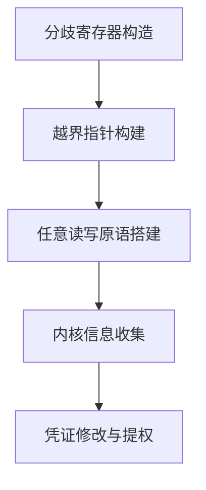

### 5-2. 原语构建

原语构建是整套流程中最核心的技术环节，其目标是将“验证器视作安全、运行时越界”的指针转化为可重复使用的读写操作。

#### 5-2-1. 数据通道设计

为了独立控制读写操作，需要两个 Map：

- **控制 Map（ctrl_map）**：用于执行信息泄露、任意读取和 fake ops 的安装。该 Map 的 `bpf_array` 头部被越界指针指向，通过修改其 `map->btf` 字段可触发 `bpf_obj_get_info_by_fd` 泄露任意地址内容；通过修改 `map->ops` 可安装自定义函数表。
- **写入 Map（write_map）**：专用于任意写入。在安装 fake ops 后，通过调用 `bpf_update_elem` 触发伪造的 `map_push_elem` 函数（实际被替换为 `array_map_get_next_key`），该函数会将调用者提供的值写入到指定的目标地址。

两个 Map 独立运作，使得读写操作可以交替进行而不互相干扰。验证器在加载 BPF 程序时，由于分歧寄存器的影响，认为两个 Map 的指针均处于合法范围内，从而通过安全检查。数据通道的设计如下：

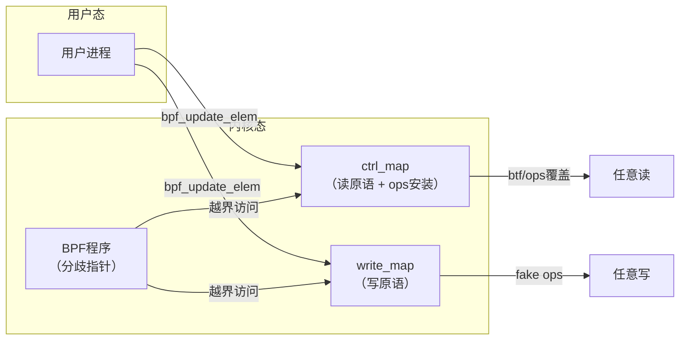

#### 5-2-2. 任意读写实现

**读取原语**：利用 `ctrl_map` 的 `btf` 指针被越界覆盖后，调用 `bpf_obj_get_info_by_fd` 时，内核会尝试读取 `btf` 指向的 `struct btf` 头部，从而将目标地址的内容复制到用户态缓冲区。通过调整目标地址，可逐字节读取任意内核内存。该原语在安装 fake ops 前后均可使用，因为每次读取后 `btf` 指针会被恢复。

**写入原语**：在 `write_map` 上安装伪造的 `map_ops` 表，将 `map_push_elem` 替换为 `array_map_get_next_key`。该函数在更新 Map 元素时会向目标地址写入一个值（通常为 key 的 next 值）。通过控制传入的 key 参数，可将任意 4 字节值写入指定内核地址，实现任意写。写入原语仅在 fake ops 安装后生效，但一旦安装可反复使用。

读写原语的调用序列如下：

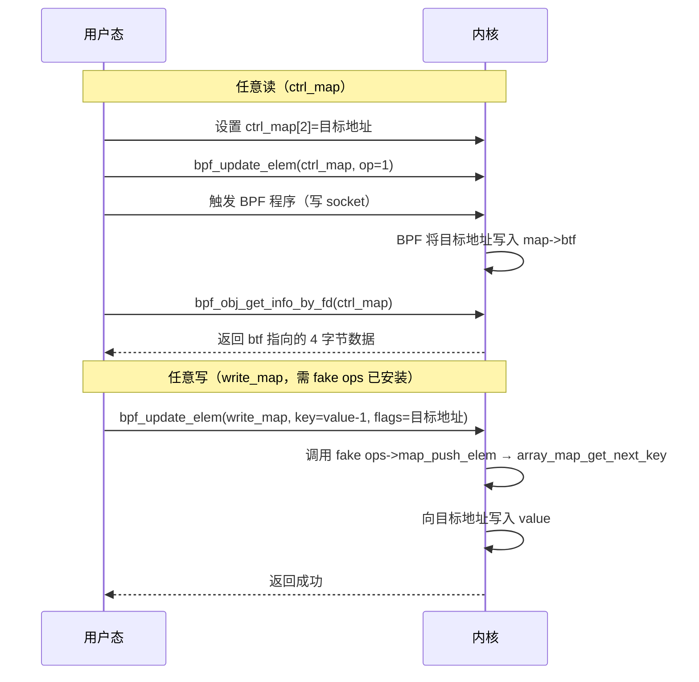

#### 5-2-3. 触发机制

BPF 程序通过 `BPF_MAP_GET` 辅助函数从 Map 中读取操作码，根据 `ctrl_map[1]` 的值决定执行分支：

- `op=0`：泄露 `array_map_ops` 指针到 `ctrl_map[3]`，同时计算 `write_map` 的 fake ops 存放地址并写入 `ctrl_map[4]`。
- `op=1`：将 `ctrl_map[2]` 中的目标地址写入 `ctrl_map->map.btf`，随后调用 `bpf_obj_get_info_by_fd` 读取 4 字节结果到 `ctrl_map[3]`。
- `op=2`：将 `ctrl_map[5]` 起始的 fake ops 表安装到 `write_map->map.ops`，并将 `write_map` 的类型改为 `STACK` 以适配伪造的函数表。

每次触发通过向已挂载 BPF 程序的 socket 写入数据完成，操作简单且可重复调用。触发流程如下：

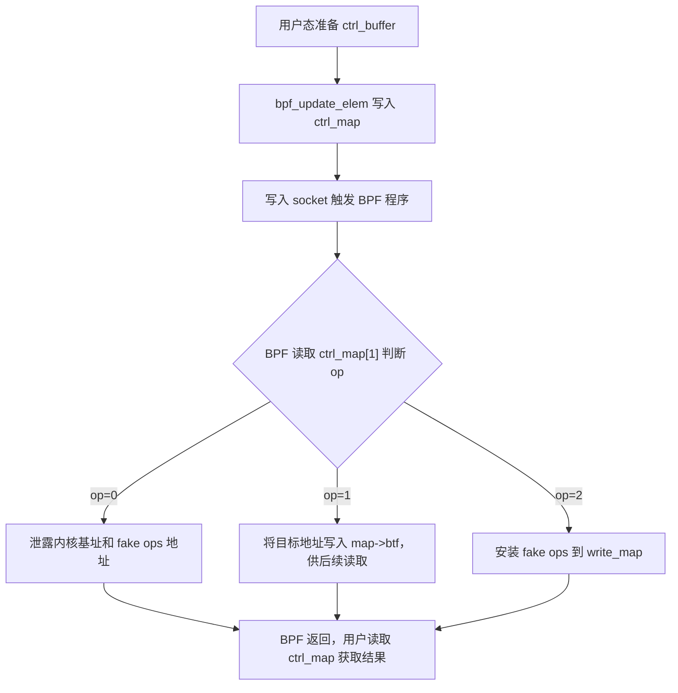

### 5-3. 信息收集

在获得读写原语后，首先需要确定内核基址和关键数据结构地址，为提权做准备。信息收集是一个逐步深入的探索过程，其依赖链清晰，可顺序执行：

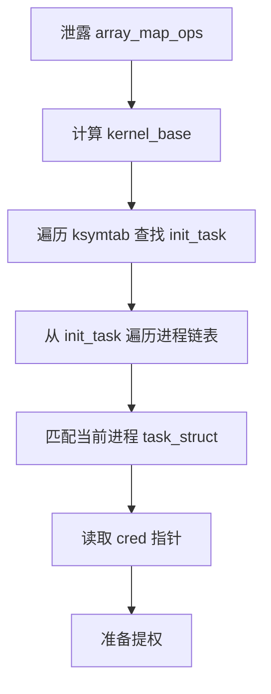

1. **内核基址**：通过 `op=0` 直接读取 `ctrl_map` 所属的 `struct bpf_array` 的 `map.ops` 字段，该字段指向 `.rodata` 段中的 `array_map_ops`。结合预知的内核编译偏移，即可计算出 `kernel_base` 和 `kernel_offset`。

2. **定位 `init_task`**：利用 `__ksymtab` 或 `__ksymtab_gpl` 段中导出的符号表，通过任意读原语遍历符号表条目，查找名为 `"init_task"` 的符号，获得其运行时地址。

3. **寻找当前进程的 `task_struct`**：从 `init_task` 出发，沿 `tasks.prev` 指针遍历进程链表，读取每个进程的 `comm` 字段（进程名），匹配当前进程的名称（如 "exploit"），找到对应的 `task_struct` 地址。

4. **读取凭证指针**：从 `task_struct` 的 `cred` 字段（偏移固定）读出当前进程的 `cred` 结构地址。

这些步骤均依赖 `arb_read_8byte` 等原语，通过逐字节或逐 4 字节读取完成，不触发内核异常。每一步的中间结果均可打印验证，确保后续操作的正确性。

### 5-4. 提权触发

获取 `cred` 地址后，利用任意写原语清零凭证中的权限相关字段。具体地：

- 构造 fake `map_ops` 表，将 `push_elem` 指向 `array_map_get_next_key`。
- 通过 `op=2` 将 fake ops 安装到 `write_map`。
- 随后调用 `arb_write_4byte` 依次将 `cred` 结构偏移 `0x4` 开始的 `uid`、`gid`、`euid`、`egid`、`fsuid`、`fsgid` 等字段清零。
- 清零完成后，当前进程的有效用户 ID 变为 0，即获得 root 权限。

该过程不需要额外执行任意代码，仅通过修改内核数据结构实现权限提升，符合 eBPF 程序“数据驱动”的特性。整个提权序列示意如下：

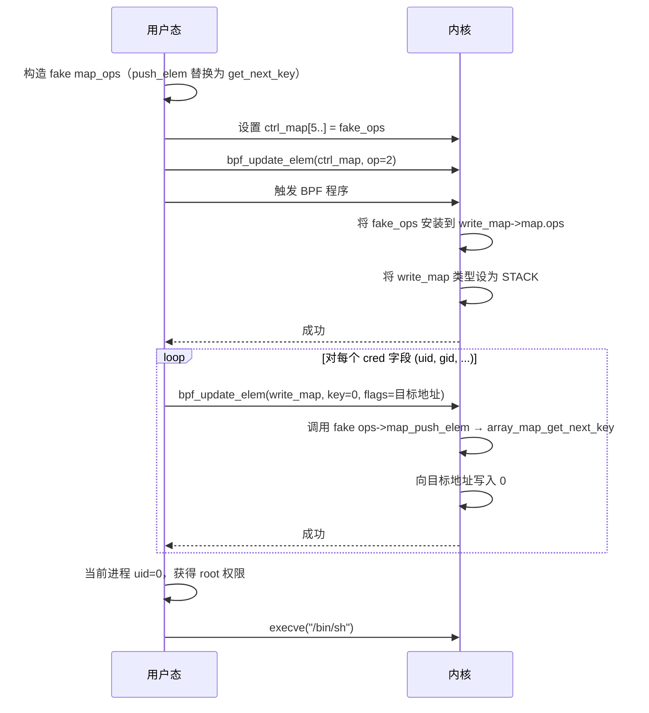

### 5-5. 整体流程

整个利用链的时序关系如下，所有步骤均在用户态控制下顺序执行，每一步均可通过日志验证中间结果，确保可靠性：

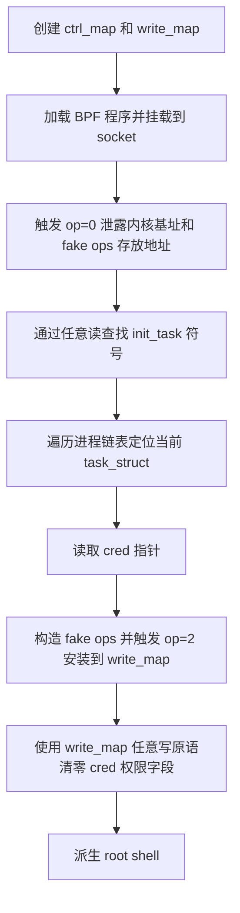

整个流程中，`ctrl_map` 的读取原语在 fake ops 安装后依然可用，因此即便写入过程出现问题，仍可通过读取原语检查内核状态，增强了方案的容错性。

### 5-6. 内核保护机制应对策略

现代内核启用多种安全机制，本利用方案针对各机制均有相应处理：

- **KASLR**：通过泄露 `array_map_ops` 指针直接获得内核基址，无需暴力破解。
- **SMEP/SMAP**：利用链全程在内核数据区（Map 对象、`cred` 结构）进行操作，不涉及用户态代码执行或用户态内存访问，因此 SMEP/SMAP 不构成障碍。
- **KPTI**：提权过程仅修改内核数据，不切换页表，KPTI 不影响数据访问。
- **SLAB_FREELIST_RANDOM / HARDENED**：Map 对象通过合法 `bpf()` 系统调用分配，不受随机化影响。
- **Stack Protector**：未使用栈溢出，不受影响。

综上，该利用方案在设计时已考虑主流加固措施，可在默认配置的内核上稳定运行。

### 5-7. 利用条件与局限性

#### 5-7-1. 必要条件

- 内核版本在 5.7-rc1 至 5.13-rc4 之间（含），且未应用补丁 `049c4e13714e`。
- 系统启用 `CONFIG_BPF` 和 `CONFIG_BPF_SYSCALL`，允许普通用户创建 eBPF 程序和 Map。
- 用户具有 `CAP_BPF` 能力（或内核未限制 `bpf()` 系统调用），通常 root 或非特权用户均可（取决于 `kernel.unprivileged_bpf_disabled` 设置）。
- BPF 程序挂载点选择 `SO_ATTACH_BPF` 需要 `CAP_NET_ADMIN` 或 `CAP_SYS_ADMIN`，但在某些配置下非特权用户也可使用（需 `net.core.bpf_jit_enable=1` 且 `kernel.unprivileged_bpf_disabled=0`）。

#### 5-7-2. 局限性

- **版本依赖**：仅影响特定内核版本区间，较新或较旧的内核不受影响。
- **符号偏移依赖**：信息收集阶段需要预知部分内核符号偏移（如 `ARRAY_MAP_OPS`、`__ksymtab` 段地址等），不同内核版本需调整。
- **命名匹配依赖**：定位当前 `task_struct` 时依赖进程名匹配（如 "exploit"），若进程名被修改或冲突，需调整。
- **写入大小限制**：任意写原语一次只能写入 4 字节，对于大规模修改需多次调用。
- **并发风险**：若在操作过程中触发其他内核线程访问被修改的 Map，可能引起不稳定，因此建议在单线程环境中执行。

尽管存在上述局限，但在目标环境下该利用方案具备较高的可靠性和成功率。

### 5-8. 总结

本章将前文分析的验证器缺陷转化为完整的权限提升流程。核心思路是将验证器与运行时对寄存器值的认知分歧（验证器视为 0，运行时为 1）通过指针算术放大为越界访问，再借助 eBPF 子系统现有接口转化为任意内存读写原语。

利用链包含以下关键环节：

- **分歧寄存器构造**：通过两次按位与操作实现分歧的建立与固化。第一次按位与触发 `scalar32_min_max_and` 的提前返回，产生 `u32_min=1, u32_max=0` 的矛盾边界；第二次按位与中，`scalar_min_max_and` 因 `var_off` 为全常量而调用 `__mark_reg_known`，将所有边界字段强制设置为 0，而运行时值保持为 1。

- **ALU Sanitation 绕过**：利用分歧寄存器在乘法中的偏差（验证器认为偏移为 0，运行时恰等于 `alu_limit`），使得 JIT 插入的 `if offset > alu_limit` 检查条件不被触发，指针成功回退到原始基址。

- **双 Map 原语设计**：`ctrl_map` 通过修改 `map->btf` 配合 `bpf_obj_get_info_by_fd` 实现任意读；`write_map` 通过伪造 `map->ops` 将 `map_push_elem` 替换为 `array_map_get_next_key`，利用 `bpf_update_elem` 实现任意 4 字节写。两者独立运作，可交替使用。

- **信息收集与提权**：通过任意读泄露内核基址、定位 `init_task` 符号、遍历进程链表找到当前进程的 `task_struct`，进而读取 `cred` 指针；随后利用任意写原语依次清零 `cred` 中的权限字段（uid、gid 等），使当前进程获得 root 权限。

该方案已考虑主流加固措施：KASLR 通过直接泄露 `array_map_ops` 规避；SMEP/SMAP 因全程仅操作内核数据区且不执行用户态代码而无效；KPTI 不影响数据访问；SLUB 随机化与 Stack Protector 对合法 Map 操作不构成障碍。

整个利用链基于 eBPF 合法接口（`bpf()` 系统调用、Map 操作、socket 挂载），不涉及内核模块加载或任意代码执行，隐蔽性较高。读写原语独立运作、可交替使用，具备较好的容错性与可重复性。

### 5-9. 测试结果

<div style="text-align: center; margin: 2rem 0;">
  
</div>

## 6. 漏洞修复

### 6-1. 修复概况

针对 **CVE-2021-3490** 的修复补丁于 2021 年 5 月 10 日由 Daniel Borkmann 提交，补丁标识为 `049c4e13714e`，次日合入主线内核。该补丁同时修复了 `scalar32_min_max_and`、`scalar32_min_max_or` 和 `scalar32_min_max_xor` 三个函数中的同类缺陷。

补丁的标题为 **"bpf: Fix alu32 const subreg bound tracking on bitwise operations"**，准确概括了修复的核心内容——修正 ALU32 常量子寄存器在按位运算中的边界跟踪问题。

这三个缺陷的引入可追溯到两次独立的提交：`3f50f132d840`（"bpf: Verifier, do explicit ALU32 bounds tracking"）和 `2921c90d4718`（"bpf: Fix a verifier failure with xor"）。补丁的 `Fixes` 标签准确指向了这两次原始提交，便于追溯和稳定内核的回溯。

该漏洞由 Manfred Paul（@_manfp）和 Thadeu Lima de Souza Cascardo 分别独立报告。补丁经过 John Fastabend 的审查和 Alexei Starovoitov 的批准，体现了内核安全社区在漏洞发现、报告与修复环节的协作流程。

### 6-2. 代码变更

补丁的核心修改集中在 `kernel/bpf/verifier.c` 中，针对三个 32 位边界更新函数的提前返回分支进行了修正。完整的 diff 如下：

```diff
diff --git a/kernel/bpf/verifier.c b/kernel/bpf/verifier.c
index 757476c91c984..9352a1b7de2dd 100644
--- a/kernel/bpf/verifier.c
+++ b/kernel/bpf/verifier.c
@@ -7084,11 +7084,10 @@ static void scalar32_min_max_and(struct bpf_reg_state *dst_reg,
 	s32 smin_val = src_reg->s32_min_value;
 	u32 umax_val = src_reg->u32_max_value;

-	/* Assuming scalar64_min_max_and will be called so its safe
-	 * to skip updating register for known 32-bit case.
-	 */
-	if (src_known && dst_known)
+	if (src_known && dst_known) {
+		__mark_reg32_known(dst_reg, var32_off.value);
 		return;
+	}

 	/* We get our minimum from the var_off, since that's inherently
 	 * bitwise.  Our maximum is the minimum of the operands' maxima.
@@ -7108,7 +7107,6 @@ static void scalar32_min_max_and(struct bpf_reg_state *dst_reg,
 		dst_reg->s32_min_value = dst_reg->u32_min_value;
 		dst_reg->s32_max_value = dst_reg->u32_max_value;
 	}
-
 }

 static void scalar_min_max_and(struct bpf_reg_state *dst_reg,
@@ -7155,11 +7153,10 @@ static void scalar32_min_max_or(struct bpf_reg_state *dst_reg,
 	s32 smin_val = src_reg->s32_min_value;
 	u32 umin_val = src_reg->u32_min_value;

-	/* Assuming scalar64_min_max_or will be called so it is safe
-	 * to skip updating register for known case.
-	 */
-	if (src_known && dst_known)
+	if (src_known && dst_known) {
+		__mark_reg32_known(dst_reg, var32_off.value);
 		return;
+	}

 	/* We get our maximum from the var_off, and our minimum is the
 	 * maximum of the operands' minima
@@ -7224,11 +7221,10 @@ static void scalar32_min_max_xor(struct bpf_reg_state *dst_reg,
 	struct tnum var32_off = tnum_subreg(dst_reg->var_off);
 	s32 smin_val = src_reg->s32_min_value;

-	/* Assuming scalar64_min_max_xor will be called so it is safe
-	 * to skip updating register for known case.
-	 */
-	if (src_known && dst_known)
+	if (src_known && dst_known) {
+		__mark_reg32_known(dst_reg, var32_off.value);
 		return;
+	}

 	/* We get both minimum and maximum from the var32_off. */
 	dst_reg->u32_min_value = var32_off.value;
```

从 diff 可以看出，三个函数的修改模式完全一致：

- **删除**：原有的错误假设注释（"Assuming scalar64_* will be called..."）以及单纯的空返回。
- **新增**：在提前返回前调用 `__mark_reg32_known(dst_reg, var32_off.value)`，将 32 位边界显式设置为已知常量。

`__mark_reg32_known` 的作用是将寄存器的 32 位边界字段（`u32_min_value`、`u32_max_value`、`s32_min_value`、`s32_max_value`）全部设置为指定的常量值。由于在调用 `scalar32_min_max_*` 之前，`dst_reg->var_off` 已通过 `tnum_and/or/xor` 更新为精确的按位运算结果，因此 `var32_off.value` 已经包含了正确的 32 位常量值，可以直接用于边界同步。

此外，diff 中还移除了 `scalar32_min_max_and` 函数末尾的一个多余空行，属于代码风格清理，与功能修复无关。

### 6-3. 修复原理

补丁的修改逻辑清晰且精准：将原先仅 `return` 的提前返回分支改为先调用 `__mark_reg32_known` 将 32 位边界显式设置为已知常量，然后再返回。

修复前的错误假设是“依赖后续的 `scalar_min_max_*` 来间接修复 32 位边界”，但这一假设存在时序缺陷——`var_off` 已在函数入口前更新，而 32 位边界却未被同步，导致状态分裂。修复后的逻辑不再依赖外部函数的间接修复，而是在 32 位边界更新函数内部直接完成同步，消除了时序依赖。

补丁的作者在提交说明中给出了一个具体的验证示例：寄存器 R2 的 `tnum` 为 `0xffffffff00000001`（低 32 位已知为 1），与常量 `0x100000002` 进行按位与后，正确的 32 位结果应为 `0x00000000`。修复前，由于 32 位边界未被更新，产生了 `u32_min=1, u32_max=0` 的矛盾状态；修复后，`__mark_reg32_known` 将 32 位边界正确设置为 0，状态保持一致。

### 6-4. 修复效果对比

补丁的提交说明中给出了修复前后的 Verifier 状态对比，直观展示了修正效果。

**修复前（错误跟踪）**：

```
9: R0_w=inv1337 R1=ctx(id=0,off=0,imm=0) R2_w=inv(id=0,smin_value=-9223372036854775807 (0x8000000000000001),smax_value=9223372032559808513 (0x7fffffff00000001),umin_value=1,umax_value=0xffffffff00000001,var_off=(0x1; 0xffffffff00000000),s32_min_value=1,s32_max_value=1,u32_min_value=1,u32_max_value=1) R3_w=inv4294967298 R10=fp0
9: (5f) r2 &= r3
10: R0_w=inv1337 R1=ctx(id=0,off=0,imm=0) R2_w=inv(id=0,smin_value=0,smax_value=4294967296 (0x100000000),umin_value=0,umax_value=0x100000000,var_off=(0x0; 0x100000000),s32_min_value=1,s32_max_value=0,u32_min_value=1,u32_max_value=0) R3_w=inv4294967298 R10=fp0
```

在执行按位与后，R2 的 32 位边界出现 `s32_min=1, s32_max=0` 和 `u32_min=1, u32_max=0` 的矛盾状态。

**修复后（正确跟踪）**：

```
9: R0_w=inv1337 R1=ctx(id=0,off=0,imm=0) R2_w=inv(id=0,smin_value=-9223372036854775807 (0x8000000000000001),smax_value=9223372032559808513 (0x7fffffff00000001),umin_value=1,umax_value=0xffffffff00000001,var_off=(0x1; 0xffffffff00000000),s32_min_value=1,s32_max_value=1,u32_min_value=1,u32_max_value=1) R3_w=inv4294967298 R10=fp0
9: (5f) r2 &= r3
10: R0_w=inv1337 R1=ctx(id=0,off=0,imm=0) R2_w=inv(id=0,smin_value=0,smax_value=4294967296 (0x100000000),umin_value=0,umax_value=0x100000000,var_off=(0x0; 0x100000000),s32_min_value=0,s32_max_value=0,u32_min_value=0,u32_max_value=0) R3_w=inv4294967298 R10=fp0
```

修复后，R2 的 32 位边界全部正确收敛为 0，与 `var_off` 的低 32 位保持一致，不再产生矛盾状态。

### 6-5. 修复影响

该补丁于 2021 年 5 月 11 日合入主线，并随后被回溯到多个稳定内核版本：

- Linux 5.12.4
- Linux 5.11.21
- Linux 5.10.37

值得注意的是，该漏洞从未被回溯到任何上游 LTS 内核（如 5.4.x、4.19.x、4.14.x 等），因为这些版本未引入引入该缺陷的提交，因此不受影响。

从修复策略上看，补丁采取的是“最小化修改”原则——仅在缺陷函数的提前返回分支中补充 `__mark_reg32_known` 调用，而不改变函数的整体控制流和其余逻辑。这种修复方式降低了引入新缺陷的风险，同时也便于回溯到稳定分支。

从安全角度看，该补丁消除了验证器在 32 位按位运算边界跟踪中的状态不一致问题，确保了 `{u,s}32_min_value <= {u,s}32_max_value` 这一基本不变式在寄存器状态中始终保持成立。这从根本上杜绝了利用该缺陷构造分歧寄存器的可能性，恢复了 eBPF 验证器安全模型的一致性。

### 6-6. 总结

**CVE-2021-3490** 的修复过程体现了内核安全社区对验证器缺陷的快速响应与精准修复。补丁 `049c4e13714e`（标题为 **"bpf: Fix alu32 const subreg bound tracking on bitwise operations"**）通过三个关键修改点（`scalar32_min_max_and`、`scalar32_min_max_or`、`scalar32_min_max_xor`），在原有提前返回分支中补充了 `__mark_reg32_known` 调用，确保 32 位边界在已知常量情况下与 `var_off` 保持同步。

该修复方案简洁有效，核心思想是：既然 `var_off` 已通过 `tnum_and/or/xor` 携带了精确的按位运算结果，那么在 32 位边界更新函数中直接利用该结果进行显式标记即可，无需依赖后续的 64 位函数间接修复。这一改动消除了前文分析中揭示的时序依赖缺陷，从根本上保证了验证器状态的一致性。

修复补丁的提交说明、代码变更和验证示例完整记录了漏洞的发现、分析与解决过程，为后续的 eBPF 验证器开发与安全审查提供了有价值的参考。

<a id="Epilogue"></a>

## 7. 后日谈

在完成 **CVE-2021-31440** 的利用分析后，笔者回顾 **CVE-2021-3490** 时发现，前者所采用的辅助函数间接绕过模型同样可以移植到后者，且能够有效绕过 ALU Sanitation 机制。这一发现为 **CVE-2021-3490** 的利用提供了一个新的技术路径，补充了原有的预偏移绕过手法（先加 `0x1000` 再减去等量偏移，使 `alu_limit` 变为非零值）。

移植的核心思路保持不变：将分歧寄存器作为 `bpf_skb_load_bytes_relative` 的长度参数，利用辅助函数内部 `memset` 的长度溢出修改栈上相邻指针，从而将合法指针逐步篡改为指向 `bpf_array` 结构起始地址。设分歧寄存器 `r6` 满足 `r6^{mathcal V}=0`、`r6^{mathcal R}=1`，构造长度参数 `L = 8 + r6`，则 Verifier 认为 `L=8` 而运行时 `L=9`，`memset` 多写 1 字节覆盖栈上指针低字节。第一次调用将指针从 `0x150` 篡改为 `0x100`，第二次调用将其从 `0xc0` 篡改为 `0x00`，最终获得 `bpf_array` 基址。

该移植方案之所以能够绕过 ALU Sanitation，关键在于分歧值从未作为指针运算的偏移量出现，而是以辅助函数参数的身份传递。ALU Sanitation 的保护范围仅限于 ALU 指令中的指针运算，辅助函数内部的 `memset` 完全不受其约束，因此在整个执行路径中 ALU Sanitation 机制不会被触发。该移植方案的 BPF 指令序列与 **CVE-2021-31440** 中的构造基本一致，仅需根据 **CVE-2021-3490** 的分歧寄存器构造方式调整前序指令。关于该绕过模型的完整技术细节、BPF 指令序列及调试器追踪，可参考笔者另一篇文章《**[CVE-2021-31440 漏洞分析](https://binracer.github.io/2026/05/30/KernelExploit-CVE-2021-31440/)**》。

在实际测试中，移植后的方案在 v5.11.20 内核上成功提权，获得 root shell。原有的预偏移绕过方案在该版本上同样有效，两种绕过手段的并存进一步表明，ALU Sanitation 的保护范围存在结构性盲区——其仅覆盖 ALU 指令层面的指针运算，而辅助函数内部的内存操作构成了不受监控的执行路径。这一结构性问题为 eBPF 漏洞利用提供了多样化的技术选择，也为后续的安全加固指明了方向：缩小 Verifier 与辅助函数之间在参数校验上的不一致性，建立统一的运行时参数验证框架。

**测试结果**

<div style="text-align: center; margin: 2rem 0;">
  
</div>

## 8. 免责声明

本文档旨在提供 **CVE-2021-3490** 漏洞的技术分析与教育性内容，仅供学习、研究和安全防御目的使用。作者与发布平台对以下事项声明如下：

1. **合法使用原则**：本文档中描述的任何技术细节、代码示例或利用方法仅供教育研究之用。读者不得将这些信息用于任何非法、未经授权或恶意的活动，包括但不限于未经授权的系统入侵、数据破坏、服务干扰或其他违反法律法规的行为。

2. **知识共享与责任**：本文档基于公开可获取的信息、官方漏洞公告和学术研究资料编写。作者力求确保技术内容的准确性，但不对信息的完整性、时效性或适用性作任何明示或暗示的保证。读者应自行验证信息的准确性，并在专业环境中谨慎应用。

3. **环境限制**：所有技术分析和实验应在受控的、隔离的测试环境中进行，例如使用特制的虚拟机或专用硬件。禁止在任何生产环境、公共网络或他人系统中尝试漏洞利用或相关技术。

4. **法律合规性**：读者应遵守所在国家或地区的所有适用法律法规，包括但不限于计算机安全法、数据保护法和知识产权法。任何使用本文档内容的行为所产生的法律后果，由行为者自行承担。

5. **技术中立性**：本文档对漏洞的分析保持技术中立立场，旨在促进安全社区的防御能力提升。文中提及的任何工具、技术或方法不应被视为对任何组织、产品或技术的背书或批判。

6. **更新与修正**：技术领域发展迅速，本文档内容可能随时间而过时。作者保留更新、修正或撤回文档内容的权利，不承诺另行通知。

7. **版权声明**：本文档内容受版权法保护，未经明确书面许可，不得用于商业目的。允许在注明出处的前提下进行非商业性的分享与引用。

**重要提示**：安全研究应始终遵循道德准则，以提升整体网络安全为目标。如发现安全漏洞，建议通过负责任的披露流程向相关厂商或机构报告，共同维护数字生态的安全与稳定。

---

_本文档的撰写参考了公开的漏洞公告、内核源码（Linux 5.11.16）及相关技术分析文献。所有实验均在封闭的测试环境中完成，未对任何实际系统造成影响。_

## 参考

- https://github.com/BinRacer/pwn4kernel/tree/master/src/CVE-2021-3490
- https://github.com/BinRacer/pwn4kernel/tree/master/src/CVE-2021-3490_V2
- https://bsauce.github.io/2021/08/31/CVE-2021-3490
- https://man7.org/linux/man-pages/man2/bpf.2.html
- https://www.openwall.com/lists/oss-security/2021/05/11/11
- https://git.kernel.org/pub/scm/linux/kernel/git/torvalds/linux.git/commit/?id=3f50f132d8400e129fc9eb68b5020167ef80a244
- https://git.kernel.org/pub/scm/linux/kernel/git/torvalds/linux.git/commit/?id=2921c90d471889242c24cff529043afb378937fa
- https://git.kernel.org/pub/scm/linux/kernel/git/torvalds/linux.git/commit/?id=049c4e13714ecbca567b4d5f6d563f05d431c80e
- https://nvd.nist.gov/vuln/detail/CVE-2021-3490
- https://ubuntu.com/security/CVE-2021-3490
