# 【Kernel Exploit】CVE-2021-4154 漏洞分析

## 1. 测试环境

**测试版本**：Linux-5.13.3 [内核镜像地址](https://github.com/BinRacer/pwn4kernel/blob/master/kernels/5.13.3/01/bzImage)

笔者测试的内核版本是 `Linux (none) 5.13.3 #1 SMP Sat Feb 21 17:28:47 CST 2026 x86_64 GNU/Linux`。

**编译选项**：开启`CONFIG_THREAD_INFO_IN_TASK`、`CONFIG_INIT_ON_ALLOC_DEFAULT_ON`、`CONFIG_KCMP`、`CONFIG_MEMCG`、`CONFIG_MEMCG_KMEM`、`CONFIG_CGROUPS`、`CONFIG_SLAB_FREELIST_RANDOM`、`CONFIG_SLAB_FREELIST_HARDENED`、`CONFIG_HARDENED_USERCOPY`、`CONFIG_FUSE_FS`、`CONFIG_USERFAULTFD`、`CONFIG_SYSVIPC`、`CONFIG_KEYS`、`CONFIG_STACKPROTECTOR`、`CONFIG_STACKPROTECTOR_STRONG`、`CONFIG_SLUB`、`CONFIG_SLUB_DEBUG`、`CONFIG_E1000`、`CONFIG_E1000E`、`CONFIG_PACKET`、`CONFIG_USER_NS`、`CONFIG_NET_NS`、`CONFIG_NAMESPACES`、`CONFIG_CHECKPOINT_RESTORE`、`CONFIG_IPC_NS`选项。完整配置参考[.config](https://github.com/BinRacer/pwn4kernel/blob/master/kernels/5.13.3/01/.config)。

**保护机制**：KASLR/SMEP/SMAP/KPTI

## 2. 漏洞背景

### 2-1. 漏洞概述

**CVE-2021-4154** 是 Linux 内核 cgroup v1 解析器中存在的一处释放后使用（Use-After-Free）漏洞，由安全研究人员 Zhenpeng Lin 在 Black Hat 2022 的议题 _“Cautious! A New Exploitation Method! No Pipe but as Nasty as Dirty Pipe”_ 中作为演示漏洞之一公开。该漏洞位于 `kernel/cgroup/cgroup-v1.c` 文件的 `cgroup1_parse_param` 函数中，属于内核堆内存破坏类漏洞，可被恶意利用者通过特定的系统调用序列触发内核内存管理错误，进而实现权限提升或系统破坏。

该漏洞的核心成因在于：内核在解析 `fsconfig` 系统调用传入的参数时，未对参数类型进行充分校验，导致可错误释放已打开文件描述符所对应的 `struct file` 对象。由于该对象后续可能被其他内核路径再次引用，释放后使用条件由此产生。在 cgroup v1 的文件系统上下文配置过程中，该参数解析逻辑默认假设输入为字符串类型，但未强制执行这一约束，形成了类型混淆的脆弱点。这一漏洞并非孤立事件，而是内核持续演进过程中新旧子系统交互时产生的典型适配问题，具有较高的研究价值和现实威胁。

### 2-2. 关键组件

理解 **CVE-2021-4154** 的利用原理，需要首先明确三个内核层面的关键组件：cgroup v1 子系统、文件系统上下文 API 以及 `struct file` 对象。这三个组件在漏洞触发链中扮演着各自不可替代的角色，任何一个环节的缺失都会使整个利用链条断裂。

**cgroup v1 子系统** 是 Linux 内核中用于资源限制、优先级控制和审计的早期控制组实现。尽管 cgroup v2 已逐步成为主流，但 v1 版本由于历史兼容性和特定的使用习惯，仍在大量生产环境中被启用，尤其是在容器运行时（如 Docker 的默认配置）和部分系统服务管理场景中。该子系统在挂载时允许通过 `"source"` 参数指定挂载源，`cgroup1_parse_param` 正是负责解析该参数的核心函数。该函数的实现承接自传统挂载路径，其内部逻辑对输入参数的类型预期相对固化，默认认为 `"source"` 对应的值为用户空间传来的字符串。这一固化预期在传统 `mount` 系统调用中是完全成立的，因为 `mount` 的所有参数均以字符串形式传递，不存在类型多样性。然而，当该函数被接入文件系统上下文 API 框架后，其输入参数的来源和形态都发生了根本性变化，原有的固化假设便不再安全。

**文件系统上下文 API** 是内核在 5.1 版本左右引入的新式挂载接口，旨在取代传统的 `mount` 系统调用中通过字符串传递全部参数的方式。该 API 通过 `fsopen`、`fsconfig`、`fsmount` 等一系列系统调用，将文件系统的配置过程拆分为多个步骤，使参数设置更加灵活和类型安全。其中 `fsconfig` 承担了具体的参数配置职责，其支持的类型包括字符串、文件描述符、二进制数据块等多种形式。这种灵活性是文件系统上下文 API 的核心设计目标之一。然而，类型灵活性的引入意味着参数解析函数必须具备相应的类型感知能力，必须根据参数类型执行不同的处理逻辑。这种类型感知能力的缺失，恰恰构成了 **CVE-2021-4154** 的深层技术根源。

**`struct file` 对象** 是内核中代表已打开文件的核心数据结构，它包含了文件的操作函数表（`f_op`）、文件偏移量（`f_pos`）、访问凭证（`f_cred`）以及引用计数（`f_count`）等关键信息。该对象由 SLUB 分配器从专用的 `filp` 缓存中分配，其生命周期通常与用户态的文件描述符相绑定。在 **CVE-2021-4154** 中，该对象被错误释放是其成为利用载体的根本原因。`struct file` 对象在内核中具有广泛的存在，几乎所有的文件 I/O、设备操作、进程间通信等场景都涉及该对象的创建和销毁，其分配频率高、生命周期明确、内存布局相对固定。

以上三个组件相互关联、层层递进：文件系统上下文 API 的灵活性打破了传统挂载路径的类型固化假设，而 cgroup v1 解析函数未能适应这一变化，最终将错误释放的目标指向了广泛存在的 `struct file` 对象。理解这一链条，是把握漏洞本质的前提。

### 2-3. 触发机制

**CVE-2021-4154** 的触发路径涉及 `fsconfig` 系统调用，其原型如下：

```c
int fsconfig(int fd, unsigned int cmd, const char *key, const void *value, int aux);
```

其中 `cmd` 参数支持多种操作类型，主要包括 `FSCONFIG_SET_STRING`（设置字符串参数）与 `FSCONFIG_SET_FD`（设置文件描述符参数）。内核在处理 `fsconfig` 调用时，首先根据 `cmd` 类型将用户态传入的参数转换为内核态的 `struct fs_parameter` 结构体：

```c
struct fs_parameter {
    const char *key;              /* 参数名称，如 "source" */
    enum fs_value_type type:8;    /* 参数类型枚举 */
    union {
        char *string;             /* FSCONFIG_SET_STRING 使用的字符串指针 */
        void *blob;               /* 二进制数据块 */
        struct filename *name;    /* 文件名结构 */
        struct file *file;        /* FSCONFIG_SET_FD 使用的文件对象指针 */
    };
    size_t size;                  /* 数据大小 */
    int dirfd;                    /* 目录文件描述符 */
};
```

`enum fs_value_type` 枚举定义了参数的可能类型，包括 `fs_value_is_string`、`fs_value_is_filename`、`fs_value_is_file`、`fs_value_is_blob` 等。该类型字段在参数构造时根据 `cmd` 正确设置，但在后续处理过程中是否被校验，则完全取决于具体文件系统的参数解析实现。

漏洞的关键逻辑位于 `cgroup1_parse_param` 函数中：

```c
static int cgroup1_parse_param(struct fs_context *fc, struct fs_parameter *param)
{
    struct cgroup_fs_context *ctx = cgroup_fc2context(fc);
    struct fs_parse_result result;
    int opt;

    // 1. 先尝试通过标准解析器处理已注册的选项
    opt = fs_parse(fc, cgroup1_fs_parameters, param, &result);
    if (opt == -ENOPARAM) {  // 2. 若标准解析器未能识别
        // 3. 漏洞分支：手动匹配 "source" 键
        if (strcmp(param->key, "source") == 0) {
            // 此处未校验 param->type，直接将联合体中的值作为字符串取出
            fc->source = param->string;
            param->string = NULL;
            return 0;
        }
        // ... 其他子系统匹配逻辑 ...
    }
    // ... 标准选项的 switch 处理 ...
}
```

`cgroup1_parse_param` 首先调用 `fs_parse` 解析标准参数。当参数未被标准解析器识别时（返回 `-ENOPARAM`），函数会回退到手动匹配 `param->key`。在匹配到 `"source"` 时，代码直接执行 `fc->source = param->string`，并将 `param->string` 置空以转移所有权。此处最关键的问题在于：代码完全没有校验 `param->type` 字段。无论 `param` 中的联合体实际存储的是字符串指针还是文件对象指针，该分支都将无条件地将其当作字符串指针处理。这使得恶意利用者能够借助 `FSCONFIG_SET_FD` 类型绕过内核的类型预期，将文件描述符类型的参数送入本应处理字符串的逻辑路径中。

### 2-4. 根因分析

**CVE-2021-4154** 的根因可归结为**类型混淆（Type Confusion）**，其完整利用链中的错误释放并非发生在 `cgroup1_parse_param` 函数内部，而是发生于后续的文件系统上下文清理流程中。

类型混淆的具体过程如下：

1. 恶意利用者以 `FSCONFIG_SET_FD` 命令调用 `fsconfig`，并传入一个合法的文件描述符作为 `aux` 参数。该文件描述符只需是合法的即可——它不需要具有任何特殊的访问权限或属性。

2. 内核在构造 `fs_parameter` 结构体时，将该文件描述符对应的 `struct file` 指针存入联合体的 `file` 字段，同时将 `type` 字段设置为 `fs_value_is_file`。此时，`struct fs_parameter` 所携带的类型信息与实际存储的内容是一致的。

3. 当参数传递至 `cgroup1_parse_param` 处理 `"source"` 分支时，函数未校验参数类型，直接执行 `fc->source = param->string`。在 C 语言的联合体语义下，`file` 和 `string` 占据同一块内存区域，因此 `fc->source` 实际存储的正是 `struct file` 对象的起始地址。

4. 随后，当该文件系统上下文（`fs_context`）在流程结束时被销毁时，通用清理逻辑会调用 `kfree(fc->source)` 以释放“挂载源字符串”——然而该指针实际指向的是一个 `struct file` 对象。内核的内存管理子系统在释放该对象时并不知晓其真实身份，只是简单地将其所占用的内存块归还给 SLUB 分配器的 `filp` 缓存。这一过程不会触发任何错误告警。

这一错误释放操作导致内核堆上的 `struct file` 对象被提前归还给分配器，但其对应的文件描述符仍在用户空间中被引用，释放后使用条件由此确立。这种类型混淆的典型特征是：错误的发生点（类型混淆处）与错误的显现点（内存释放点）在时间和空间上相互分离，使得问题往往在内存被重新分配后才暴露出来。

### 2-5. 内存复用与 DirtyCred 机制

在 SLUB 分配器中，已释放的内存块会被回收到对应缓存的空闲链表中，等待下一次分配请求的复用。`struct file` 对象属于 `filp` 缓存。当 `struct file` 被错误释放后，该内存块在物理上依然存有原有的数据，但在逻辑上已被标记为“空闲”。这种数据的“残留”特性，使得释放后的内存仍然保存着原有的关键字段值，直到被新对象覆盖为止。

此时，系统处于一种微妙的不一致状态：**用户态进程仍持有指向该文件的有效文件描述符，并可在后续的系统调用（如 `read`、`write`、`ioctl`、`close` 等）中引用它**。然而，内核在通过文件描述符查找 `struct file` 指针时，得到的却是一个已被归还给分配器的悬垂指针。如果恶意利用者能够通过堆喷射等手段，促使内核在该内存位置上重新分配另一个受控对象，释放后使用的利用条件便就此形成。

基于 **CVE-2021-4154** 提供的这一原语，安全研究人员提出了 **DirtyCred** 这一新型内核权限提升利用方法论。DirtyCred 的核心思路是**通过操纵内核堆内存的复用机制，将低权限进程的凭证对象与高权限进程的凭证对象进行交换**。其具体实现流程如下：

1. 首先，利用 **CVE-2021-4154** 释放一个**低权限（可写）文件**所对应的 `struct file` 对象，使该内存块进入 `filp` 缓存空闲链表。

2. 随后，通过堆内存复用技术，恶意利用者触发内核在该空闲内存位置上分配一个新的 `struct file` 对象。该新对象对应于一个**高权限（只读）文件**（例如 root 所有的 `/etc/shadow`），通常通过打开该文件来触发分配。

3. 由于 SLUB 分配器的复用特性（通常采用后进先出策略），这个新分配的 `struct file` 对象几乎必然会占用之前被释放的内存位置。此时，原本的低权限文件的文件描述符在用户空间仍然有效，但其指向的内核内存已被完全替换为高权限只读文件的 `struct file` 对象。

4. 当恶意利用者通过该原始文件描述符发起写入操作时，内核会依据当前内存中的 `struct file` 对象进行权限检查。由于该对象现在拥有高权限文件的凭证，写入操作得以通过，而实际写入的目标则指向高权限只读文件。通过这种方式，恶意利用者即可实现对正常情况下不可写的特权文件的内容覆写，从而完成权限提升。

这种利用方法不依赖任何内核地址泄露，也不直接篡改凭证数据，而是通过**替换整个 `struct file` 对象**来绕过权限检查，实现了**无地址依赖的本地权限提升**。在 **CVE-2021-4154** 的上下文中，`struct file` 对象的相对大小固定、分配来源单一，这些特征进一步降低了利用过程中的不确定性，使得整个利用链具备了较高的稳定性和可移植性。

### 2-6. 影响评估

**CVE-2021-4154** 影响范围广泛，覆盖多个主流 Linux 发行版。根据 NIST 国家漏洞数据库（NVD）的官方评估，该漏洞的 CVSS 3.1 基础评分为 **8.8（高严重等级）**，向量为 `AV:L/AC:L/PR:L/UI:N/S:C/C:H/I:H/A:H`。这一评分反映了该漏洞在**本地利用（AV:L）、利用复杂度低（AC:L）、所需权限低（PR:L）、无需用户交互（UI:N）** 且**影响范围可跨安全域（S:C）** 的条件下，对**机密性、完整性和可用性**均构成严重威胁。

从内核版本角度看，**CVE-2021-4154** 影响自文件系统上下文 API 引入后至 **Linux v5.13.4（不含）** 之间的所有内核版本。**Linux v5.13.4 已完成对该漏洞的修复**，修复补丁的 commit ID 为 `3b0462726e7ef281c35a7a4ae33e93ee2bc9975b`。需要注意的是，部分早期内核版本（如 Debian buster 的 4.19 系列）因未引入受影响的代码路径而不受此漏洞影响。

考虑到 cgroup v1 在各类容器运行时中仍被广泛使用，实际受影响的生产环境规模相当可观。在容器化的云原生部署中，cgroup v1 通常是默认启用的底层资源管理机制——即便宿主机内核已升级，只要 cgroup v1 未被显式禁用，漏洞触发的条件依然存在。存量未及时更新的系统面临较大的安全风险，尤其是在长期运行的关键业务服务器中，内核升级往往涉及复杂的兼容性验证和停机维护。

从安全影响来看，**CVE-2021-4154** 具有以下特点：

- **低权限触发**：普通用户即可触发漏洞，无需任何特权能力，漏洞暴露面极广。
- **本地权限提升**：成功利用可实现从普通用户到 root 的权限升级。
- **容器逃逸**：在容器化环境中可被用于突破隔离边界。
- **拒绝服务**：错误释放内核对象可能导致内核崩溃。

上述特征使得该漏洞在多租户云环境和容器化基础设施中风险尤为突出。

### 2-7. 本质总结

纵观 **CVE-2021-4154** 的完整上下文，其技术本质可归纳为**内核新旧 API 架构演进过程中的一次类型安全失守**。`fsconfig` 新式挂载接口倡导的参数类型多样性，与 cgroup v1 遗留解析逻辑对输入类型的简单假定产生了根本冲突，而关键路径上类型校验机制的缺失，使这一架构层面的不适配最终演化为实际的内存破坏后果。这种演进过程中的类型安全断裂反映出在大型系统软件中维护类型安全约束的普遍性挑战。

该漏洞的引入恰恰是最基础、最容易被忽视的**类型检查**环节的疏漏。恶意利用者仅需构造特定的 `fsconfig` 调用序列，即可在无需任何内核地址信息的前提下触发内存管理错误。这一漏洞的高危害性与低触发门槛之间的矛盾，充分说明了基础性防御措施在系统安全中的不可替代性。

更深层次地审视，**CVE-2021-4154** 提供的“错误释放 `struct file` 对象”原语具有独特的技术价值——它不直接破坏内核数据，而是通过**操纵 SLUB 分配器的空闲链表状态**，在系统内核中制造了一种逻辑层面的“身份混乱”：释放的对象在外围仍持有合法的文件描述符引用，而对应的空闲内存块则随时可能被其他内核对象复用。这种状态使得传统的控制流劫持可以被更为隐蔽的**数据流篡改**所替代。把握该漏洞的本质，重点不在于关注单个对象的释放行为，而在于理解它如何撬动堆内存复用机制，将一次类型混淆错误转化为可控的权限提升入口。

从防御角度来看，**CVE-2021-4154** 为内核安全开发提供了重要启示：在引入新的通用 API 时，必须系统性地审查所有复用该 API 的旧有模块的参数校验逻辑，确保类型安全约束能够无衰减地传递到整个调用链的末端。只有通过编译时类型检查或强制性的运行时类型校验等机制性手段，才能从根本上杜绝类似问题。这一教训对于当前正在推进的诸多内核重构项目同样具有重要的借鉴意义。

## 3. 深入分析 Dirty Cred

### 3-1. 概述

**Dirty Cred** 是由 Zhenpeng Lin、Yuhang Wu 和 Xinyu Xing 三位研究人员提出的一种新型内核权限提升利用方法论，相关成果发表于 CCS 2022。该方法的核心思想是**将非特权的内核凭证与特权的内核凭证进行交换，以实现权限提升**。与传统的内核利用方式不同，**Dirty Cred** 不依赖信息泄露来绕过 KASLR，也不直接覆写内核堆上的任何关键数据字段，而是滥用堆内存复用机制来获取特权。其核心思路简洁而高效，能够将多种 Linux 内核堆漏洞转化为类似 **Dirty Pipe** 的利用效果。

**Dirty Cred** 这一名称源于其利用方式与 **Dirty Pipe** 的对比——两者均能绕过现有的内核保护机制实现权限提升。然而，**Dirty Pipe** 的利用高度依赖于漏洞本身的特殊性（即通过 Linux 管道机制向任意文件注入数据），这种能力在其他内核漏洞中极为罕见。相比之下，**Dirty Cred** 提供了一种**通用的利用方法论**，能够将各类基于堆内存破坏的漏洞转化为权限提升能力，具有更广泛的影响范围和更高的威胁等级。

以 CVE-2021-4154 为例，**Dirty Cred** 首先打开一个可写文件（如 `/tmp/x`），内核在堆上为其分配一个可写的 `file` 对象。通过触发漏洞，该 `file` 对象被非法释放，但其文件描述符依然有效。随后，**Dirty Cred** 打开一个高权限的只读文件（如 `/etc/passwd`），通过堆内存复用技术，新分配的只读 `file` 对象大概率会恰好占据刚刚被释放的内存位置。此时，最初持有的文件描述符在内核层面已经指向了高权限文件的 `file` 对象。当向该描述符写入数据时，内核依据当前 `file` 对象进行权限检查，写入操作得以通过，而实际数据却流向了被替换的高权限只读文件。通过向 `/etc/passwd` 写入特权账户条目，恶意利用者即可获得 root 权限。

从技术视角来看，**Dirty Cred** 不改变内核的控制流，而是利用内核内存管理的固有特性来操纵内存中的对象。因此，许多旨在防止控制流篡改的现有防御机制（如 CFI）对 **Dirty Cred** 无效。**Dirty Cred** 不仅能够实现权限提升，还能实现容器逃逸和 Android 设备提权，其通用性和破坏力使得该利用方法成为内核安全领域的重要威胁。

### 3-2. 凭证交换机制

在 Linux 内核中，权限信息以凭证对象的形式存在，主要包括两类：

- **`cred` 对象**：包含任务（进程/线程）的 UID、GID 及 capabilities，直接决定其操作权限。每个 Linux 任务包含一个指向 `cred` 对象的指针，当任务尝试访问资源时，内核检查该 `cred` 对象中的 UID 以决定是否授予访问权限。`cred` 对象遵循“复制-替换”原则——修改凭证时先复制原对象，修改副本后再将任务指针指向新对象。每个任务仅能修改自身的凭证。
- **`file` 对象**：在文件打开后，包含文件的访问模式（读/写）等权限信息。内核通过 `file` 对象可索引到 `cred` 对象，同时检查读/写权限以确保任务不会以只读模式向文件写入数据。`file` 对象由 SLUB 分配器从专用的 `filp` 缓存中分配，其生命周期通常与用户态的文件描述符相绑定。

**Dirty Cred** 的凭证交换可以作用于上述两类对象。以文件对象交换为例，其核心流程可用以下序列图表示：

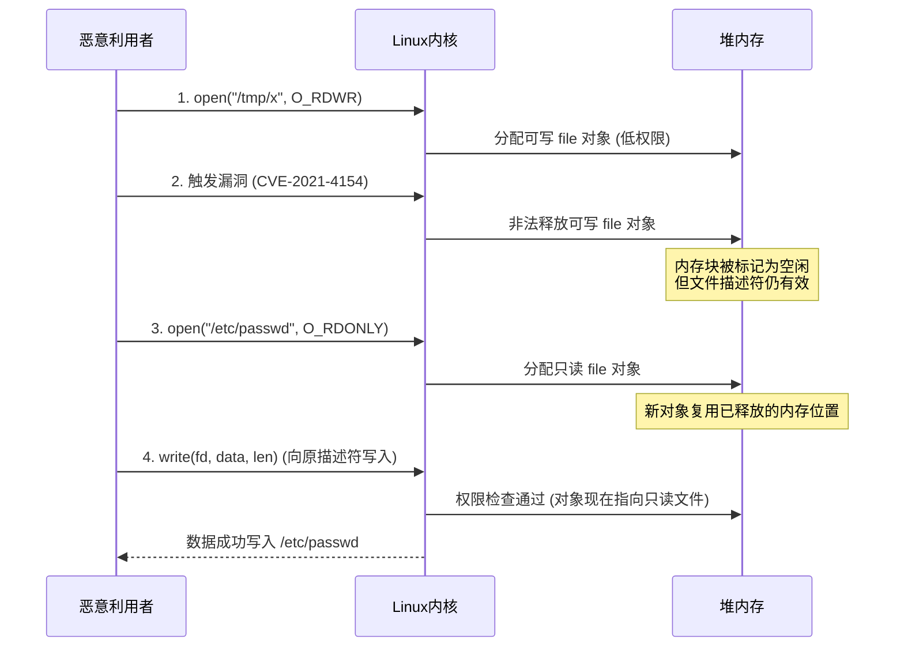

该序列图清晰地展示了四个关键步骤：

1. **打开低权限文件**：恶意利用者创建一个普通可写文件，内核为其分配对应的 `file` 对象。该对象包含写入权限标志，允许后续的写入操作。
2. **非法释放对象**：利用内核漏洞（如 CVE-2021-4154 提供的类型混淆能力）使内核错误地释放该 `file` 对象。此时对象已被归还给 SLUB 分配器的空闲链表，但其用户态文件描述符仍处于打开状态，形成悬垂指针。
3. **分配高权限对象**：恶意利用者立即打开一个只读的系统关键文件（如 `/etc/passwd`）。内核为新打开的文件分配 `file` 对象时，SLUB 分配器会优先复用刚刚释放的内存块，使得高权限的只读 `file` 对象恰好占据低权限 `file` 对象原先的位置。
4. **完成凭证替换**：此时，原始文件描述符实际指向的已是高权限只读文件的 `file` 对象。当恶意利用者通过该描述符发起写入时，内核基于当前 `file` 对象的权限进行检查——由于该对象来自一个只读文件，理论上不应允许写入。然而，权限检查通过的是可写文件描述符所持有的凭证，而实际写入的目标却是只读的系统文件。这种“身份混乱”使得写入操作得以完成，从而实现特权文件的内容覆写。

这一过程不依赖任何内核地址泄露，也不直接篡改凭证数据，而是通过**替换整个 `file` 对象**来绕过权限检查。需要指出的是，**Dirty Cred** 同样支持对 `cred` 对象的交换——通过将低权限任务的 `cred` 对象与高权限任务的 `cred` 对象进行内存层面的置换，可使低权限进程直接获得 root 权限。

### 3-3. 技术挑战与应对

**Dirty Cred** 在实际利用过程中面临一系列技术挑战，研究人员针对这些挑战提出了相应的解决方案。这些挑战可以归纳为三个核心问题：漏洞原语的转化、竞争窗口的延长以及特权对象的主动分配。三者之间存在递进关系：首先需要将漏洞能力转化为可用的凭证释放原语，然后需要在精确的时间窗口内完成对象交换，最后还需要主动获得高权限凭证对象以完成置换。任何一个环节的缺失都会导致整个利用链条失效。

#### 3-3-1. 漏洞原语转化

大多数堆漏洞并不直接提供“非法释放任意对象”的能力。**Dirty Cred** 需要将不同类型的漏洞能力转化为凭证交换所需的基础原语。下表总结了不同类型漏洞的转化策略：

| 漏洞类型         | 转化策略                             | 关键条件                               |
| ---------------- | ------------------------------------ | -------------------------------------- |
| 越界写 (OOB)     | 覆写相邻对象中的凭证指针，伪造引用   | 受害者对象紧邻漏洞对象，且包含凭证指针 |
| 释放后使用 (UAF) | 利用释放后的悬垂指针重新分配特权对象 | 缓存可控，或具备写入能力修改指针       |
| 双重释放 (DF)    | 利用跨缓存内存页回收                 | 清空源缓存，使内存页被目标缓存复用     |

以越界写为例，其转化流程如下图所示：

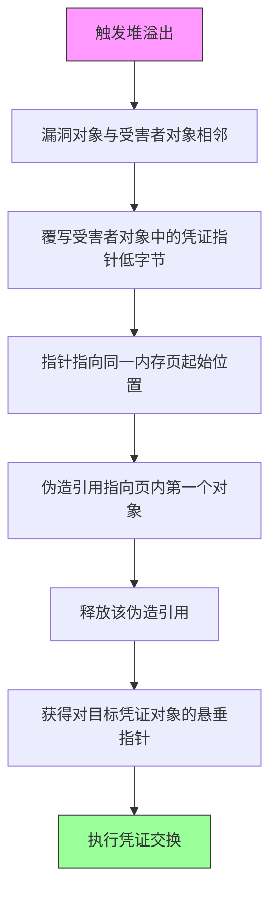

**越界写转化**：通过精心堆布局，使包含指向凭证对象指针的受害者对象紧邻漏洞对象之后。利用溢出覆写该指针的低位字节（清零末两位），使其指向同一内存页的起始位置——由于内存页地址末位始终为零，这一操作可将指针重定向到页内第一个对象的起始地址。释放这个被伪造引用的对象后，内核会将页内第一个对象（可能是另一个凭证对象）释放，从而实现对目标凭证对象的非法释放。

**释放后使用转化**：若 UAF 发生在凭证专用缓存（如 `cred_jar`）上，直接释放非特权凭证后使用新创建的特权凭证占据该内存即可完成置换。若 UAF 发生在通用缓存上，则需要该 UAF 具备非法写入能力——先释放出一个内存空洞，再用含有凭证指针的可利用对象占据它，然后利用 UAF 修改该凭证指针，使其指向目标凭证对象，最后释放该对象。

**双重释放转化**：利用跨缓存内存页回收机制。首先通过大量分配填充缓存，然后使用两个不同指针重复释放同一对象，制造双重释放。接着清空整个缓存使其内存页被伙伴系统回收。当内核在凭证专用缓存中分配新对象时，这些内存页会被重新分配给该缓存，从而使凭证对象恰好落位到可被悬垂指针引用的位置。**Dirty Cred** 随后利用剩余的悬垂指针非法释放该凭证对象，完成凭证交换。

通过上述转化策略，不同类型的堆内存破坏漏洞均可被统一转化为 **Dirty Cred** 所需的基础原语，这为后续的凭证交换奠定了技术基础。

#### 3-3-2. 竞争窗口的延长

在 Linux 内核中，权限检查与实际数据写入往往背靠背快速发生。若无法精确控制文件对象交换的发生时机，利用将极不稳定。**Dirty Cred** 通过以下机制延长竞争窗口：

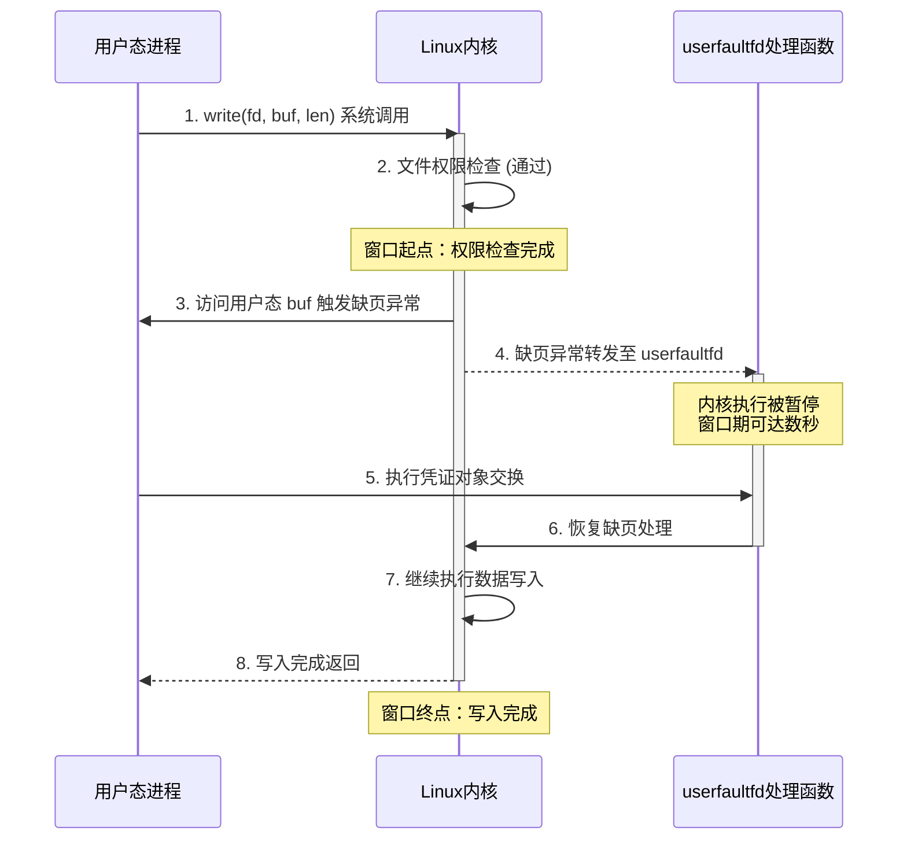

该序列图展示了 **Dirty Cred** 利用 userfaultfd 延长竞争窗口的完整交互流程：

**userfaultfd 利用**：userfaultfd 是 Linux 内核提供的一种用户态缺页异常处理机制，允许用户态进程注册自定义的缺页处理函数。当内核访问注册内存区域中的页面并触发缺页异常时，该处理函数会被调用，内核执行被暂停，直到用户态完成处理并恢复执行。在 v4.13 之前，`writev` 系统调用先完成权限检查，随后在 `import_iovec` 时触发缺页异常，**Dirty Cred** 可在此处暂停内核并获得数秒乃至更长的窗口期完成对象交换。在 v4.13 之后，虽然 `import_iovec` 被移至权限检查之前，但 **Dirty Cred** 仍可利用 `generic_perform_write` 在写入前触发的 page fault 实现延时——该 page fault 位于权限检查之后、实际写入之前，恰好提供了所需的竞争窗口。值得注意的是，移除该 page fault 可能引发死锁问题，使得此方案难以被彻底修复。

**文件系统锁利用**：在 ext4 等文件系统中，写入操作前会对 inode 进行加锁以防止并发写入导致数据混乱。恶意利用者可派生两个进程同时对同一大文件执行写入——进程 A 持有锁并写入大量数据（如 4GB 文件写入机械硬盘可延迟数十秒），进程 B 在完成权限检查后等待锁释放。这一等待过程为 **Dirty Cred** 提供了充足的窗口期完成对象交换，无需依赖 userfaultfd。

**FUSE 利用**：FUSE（用户态文件系统）框架允许用户实现自定义的文件系统并注册操作处理函数。恶意利用者可构造一个 FUSE 文件系统，其处理函数在收到操作请求后可任意延迟响应。当内核访问 FUSE 文件系统中的文件时，会调用用户态的处理函数，内核执行被暂停，从而为凭证交换创造时间窗口。

上述三种机制从不同层面解决了竞争窗口的问题：userfaultfd 利用缺页机制实现精准暂停，文件系统锁利用并发写入的阻塞特性，FUSE 则通过用户态文件系统的自定义处理实现任意时长的延迟。三者互为补充，使得 **Dirty Cred** 在不同内核版本和配置下均可获得稳定的利用窗口。

#### 3-3-3. 特权对象的主动分配

**Dirty Cred** 面临的一个关键挑战是：低权限用户如何在内核空间主动分配高权限凭证对象。被动等待特权用户的活动会严重影响利用的稳定性——恶意利用者无法预知目标内存何时被回收，也无法控制新分配对象的权限等级。为解决这一问题，**Dirty Cred** 采用主动策略触发内核空间中的特权对象分配。

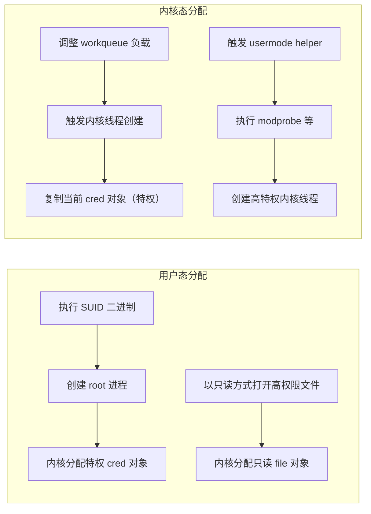

**用户态分配**：当二进制文件设置了 SUID 权限时，无论执行者是谁，该文件都会以所有者的权限执行。低权限用户可通过执行 root 所有的 SUID 二进制文件（如 `su`、`ping`、`sudo`、`mount` 等）来触发 root 进程的创建，从而在内核中分配特权的 `cred` 对象。对于 `file` 对象，恶意利用者只需以只读权限打开多个目标文件（如 `/etc/shadow`、`/etc/sudoers` 等），内核便会在相应内存中分配对应的只读 `file` 对象。由于这些文件为 root 所有且权限为只读，其 `file` 对象带有高权限属性。

**内核态分配**：**Dirty Cred** 还可通过内核空间分配特权对象。当 Linux 内核启动新内核线程时，会复制当前运行进程并分配一个复制的 `cred` 对象。由于大多数内核线程（如 kworker、kswapd 等）运行在特权上下文中，其 `cred` 对象具有 `GLOBAL_ROOT_UID`，复制的 `cred` 对象也处于高权限状态。具体方法包括：通过增加提交到内核工作队列（workqueue）的工作量，触发工作池动态创建新的 worker 线程；或利用 usermode helper 机制（如加载内核模块时调用 `/sbin/modprobe`）触发高特权用户态程序的执行，该过程涉及内核线程的创建，进而分配高特权凭证对象。

用户态与内核态两种分配路径的有机结合，使 **Dirty Cred** 能够在不同场景下灵活地获取所需的高权限凭证对象，从根本上消除了对特权用户活动的被动依赖，显著提升了利用的稳定性和可靠性。

### 3-4. 可利用对象与通用性评估

为了评估 **Dirty Cred** 的通用性，研究人员首先系统性地识别了各内核缓存中可用于 **Dirty Cred** 的可利用对象——即包含指向凭证对象指针的内核数据结构。研究团队开发了一套基于 LLVM 的静态分析工具，结合 Syzkaller 内核模糊测试器，自动化地追踪可被用户态系统调用触发的对象分配与释放路径。

实验结果表明，可利用对象覆盖了几乎所有的通用缓存（除极少使用的 kmalloc-8 外），且每个缓存中通常存在多个可利用对象。这些对象包括 `fs_context`、`request_key_auth`、`shmid_kernel`、`binder_proc` 等多种类型，分别包含指向 `file` 或 `cred` 凭证对象的指针，其偏移量因对象类型而异。其中，5 个通用缓存中的对象将凭证指针放置在对象起始位置，这意味着即使恶意利用者仅获得非常有限的覆写能力（如仅能覆写目标对象起始处两个字节为零），仍可借助这些对象发起 **Dirty Cred** 利用。丰富的可利用对象为 Dirty Cred 适配各类漏洞提供了充足的选择空间，也是其通用性的重要基础。

在真实漏洞可利用性评估方面，研究团队选取了 2019 年后报告的 24 个 Linux 内核 CVE 漏洞作为测试集，涵盖越界写、释放后使用、双重释放等多种堆内存破坏类型。实验结果表明，**Dirty Cred** 在其中的 16 个漏洞上成功展示了可利用性。下表展示了部分代表性测试结果：

| CVE编号        | 漏洞类型    | Dirty Cred 可利用性 |
| -------------- | ----------- | ------------------- |
| CVE-2022-27666 | OOB         | ✓                   |
| CVE-2022-25636 | Double Free | ✓                   |
| CVE-2021-4154  | UAF         | ✓                   |
| CVE-2021-43267 | OOB         | ✓                   |
| CVE-2021-22555 | Double Free | ✓                   |
| CVE-2020-14386 | OOB         | ✓                   |
| CVE-2019-2215  | UAF         | ×                   |

研究发现，在 vmalloc 区域（虚拟内存区域）发生的漏洞相对较难利用，主要原因在于该区域中可用于 **Dirty Cred** 的可利用对象较少。然而，这并不意味着此类漏洞完全无法被 **Dirty Cred** 利用——例如 CVE-2021-34866 虽为 vmalloc 区域的越界写漏洞，但可通过组合利用手法先将其转化为任意读写能力，再构造双重释放原语，最终仍可适配 **Dirty Cred** 的利用流程。

**Dirty Cred** 的通用性还体现在跨版本与跨架构的适配能力上。传统利用方式通常需要针对不同内核版本和 CPU 架构重新构造 ROP 链或调整偏移量，而 **Dirty Cred** 采用纯数据驱动的利用策略，不依赖任何内核地址信息，也不使用架构相关的指令序列，因此同一份利用代码无需修改即可在不同内核版本和架构上运行。研究团队已验证 **Dirty Cred** 在 x86_64 和 ARM64 架构上的有效性。

除了权限提升，**Dirty Cred** 还可实现容器逃逸。通过文件对象交换，恶意利用者可覆写容器中的高权限文件；通过 `cred` 对象交换，则可直接获得 `SYS_ADMIN` 等特权 capability，进而利用 cgroup `release_agent` 等机制在宿主机上执行任意命令。研究团队还展示了 **Dirty Cred** 在 Android 平台上的提权能力——通过交换 `cred` 对象直接获得 root 权限，或通过覆写共享系统库突破沙箱限制，最终禁用 SELinux。相关成果已提交至 Google 漏洞奖励计划并获得了 20,000 美元的赏金。

### 3-5. 防御思路

针对 **Dirty Cred** 这类基于凭证交换的利用方法，研究人员提出了一种新的内核防御机制：**将内核凭证对象根据其自身的权限级别隔离在非重叠的内存区域中**。

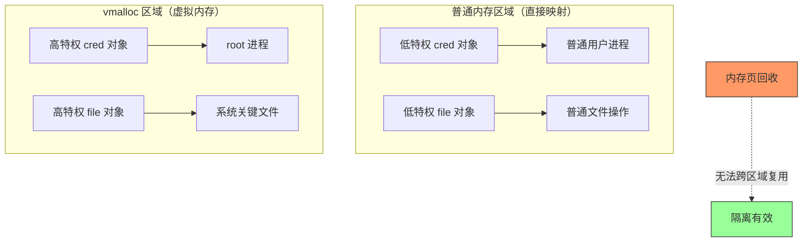

具体而言，该防御方案将高特权对象存储在 `vmalloc` 区域（虚拟内存区域），而低特权对象保留在普通内存区域（直接映射内存区域，即 `kmalloc` 所使用的区域）。由于这两个区域在物理和虚拟地址空间上均不重叠——`vmalloc` 区域位于 `VMALLOC_START` 至 `VMALLOC_END` 定义的地址范围内，与直接映射区域完全隔离——即使缓存被销毁、底层内存页被伙伴系统回收并重新分配，高特权与低特权对象的存储区域也不会发生重叠，从而从根本上阻断了 **Dirty Cred** 利用堆内存复用进行凭证交换的利用路径。

在实现层面，研究团队在 Linux 内核 v5.16.15 上构建了该防御原型。当分配 `cred` 对象时，系统检查其 UID 是否为 `GLOBAL_ROOT_UID`，若是则通过 `vmalloc` 分配内存；当分配 `file` 对象时，检查文件的打开模式，若包含写权限则同样使用 `vmalloc` 分配。对于运行时权限变更（如通过 `setuid` 系统调用将低权限凭证提升为高权限），实现方案会复制对象到 `vmalloc` 区域而非直接修改原对象，以确保隔离性不被破坏。

研究团队通过 LMbench 和 Phoronix Test Suite 对该防御机制进行了性能评估。实验结果表明，该防御机制在大多数情况下仅引入可忽略不计的性能开销，仅在“10k 文件创建”和“10k 文件删除”等测试中表现出约 4%-7% 的适度性能下降。这一开销主要源于 `vmalloc` 相比 `kmalloc` 需要重新映射缓冲区空间的额外操作——`vmalloc` 分配的内存需要将不连续的物理页映射为连续的虚拟地址范围，而 `kmalloc` 直接从物理连续的 DMA 区域分配，无需页表重映射。值得指出的是，文件删除操作（通过 RCU 异步释放）的性能下降（4.25%）低于文件创建操作（7.17%），进一步验证了该防御在实际场景中的可接受性。

从防御理念来看，该机制不同于传统的基于对象类型或敏感度的隔离方案（如 AUTOSLAB 按对象类型隔离、xMP 按敏感度隔离），而是基于凭证对象自身的权限等级进行内存隔离。这种设计直接针对 **Dirty Cred** 的核心利用机理——特权与非特权凭证的交换——因此对 **Dirty Cred** 这类凭证交换利用方法具有更强的针对性防御效果，为 Linux 内核防御体系提供了一种新的可行思路。

### 3-6. 分析总结

纵观 **Dirty Cred** 的完整技术链条，其核心可归纳为**对内核堆内存复用机制的深度操纵**。该利用方法跳出了传统控制流劫持的范式——不依赖 ROP 链、不泄露内核基址、不覆写关键数据字段，而是完全立足于内核内存分配器（SLUB）的固有行为特性，将一次内存破坏原语转化为可控的凭证交换能力。

从技术演进的角度看，**Dirty Cred** 代表了内核利用方法论的一次重要转向。传统利用方式面临 KASLR、SMEP、SMAP、KPTI、CFI 等多层防护的层层拦截，每次突破都需要耗费大量精力构造信息泄露和 ROP 链条。而 **Dirty Cred** 另辟蹊径，通过纯数据驱动的对象交换策略，使上述防护机制几乎全部失效——因为它们都聚焦于控制流完整性，而 **Dirty Cred** 操纵的恰恰是数据流。这一思路与 **Dirty Pipe** 异曲同工，但 **Dirty Cred** 的通用性远超 **Dirty Pipe**，能够适配越界写、释放后使用、双重释放等多种堆漏洞类型，覆盖范围显著更广。

**Dirty Cred** 的核心技术贡献体现在三个方面：第一，提出了系统的漏洞原语转化方案，将各类堆破坏能力统一为凭证非法释放原语；第二，设计了 userfaultfd、文件系统锁、FUSE 等多层次的竞争窗口延长机制，确保利用的稳定性和可靠性；第三，构建了用户态与内核态协同的特权对象主动分配策略，彻底消除对特权用户活动的被动依赖。三者环环相扣，构成了一套完备且可移植的利用框架。

从防御视角来看，**Dirty Cred** 揭示了一个深层次的系统安全挑战——内核内存分配器的复用机制本身是设计使然，却可被恶意利用者操纵为凭证交换的载体。这意味着传统的漏洞修补策略已不足以应对此类威胁：即便消除了某一个漏洞，只要堆内存复用机制与凭证对象管理之间缺乏有效的隔离，同类利用手法仍可能在其他漏洞上复现。因此，基于凭证权限等级的内存隔离方案不仅是应对 **Dirty Cred** 的有效手段，也为更广泛的内核数据隔离设计提供了重要思路。

综上所述，**Dirty Cred** 不仅在技术层面实现了对现有内核防护体系的突破，更在方法论层面为内核安全研究开辟了新的方向——**从控制流保护转向数据流隔离**，或许将成为下一阶段内核安全防御的核心命题。这一发现对于内核开发者、安全研究人员以及防御方案设计者均具有重要的参考价值。

## 4. 利用思路一

### 4-1. 整体架构设计

基于前文对 **CVE-2021-4154** 漏洞根因与 **Dirty Cred** 利用方法论的分析，本章节呈现一种针对该漏洞的完整利用架构设计。该设计采用**多线程并发 + 堆喷射**的策略，通过精确控制内核堆内存的分配与释放时序，将漏洞提供的类型混淆原语转化为对 `/etc/passwd` 等系统关键文件的实际覆写能力。

整体利用架构由四个核心模块构成，各模块协同工作以完成凭证交换：

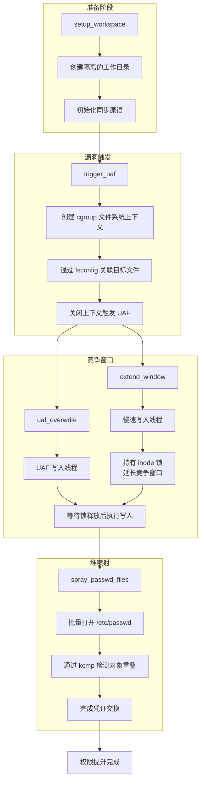

该架构的设计遵循以下原则：

- **模块化**：各功能单元职责单一，便于独立调试与错误定位。
- **确定性**：通过信号量同步机制消除竞态条件中的不确定性。
- **可移植性**：仅依赖标准系统调用，无需特定内核符号或地址信息。
- **低权限要求**：全程以普通用户权限运行，无需任何特权能力。

### 4-2. 阶段一：工作空间准备

利用程序启动后首先构建一个隔离的工作环境。这一步骤的目的在于：

1. **避免污染**：创建独立的 `exp_dir` 目录，将所有利用过程中产生的临时文件限制在该目录内，防止对系统其他路径产生意外影响。
2. **文件准备**：在目录中创建一个普通数据文件 `data` 作为后续符号链接的目标。该文件本身无需包含任何特殊内容，仅作为合法的文件系统节点存在。
3. **权限隔离**：通过 `chmod` 设置目录权限，确保后续文件操作不受外围目录权限策略的干扰。

工作空间准备就绪后，利用程序会通过 `unshare` 系统调用创建新的用户命名空间。这一操作使得进程在命名空间内获得完整的 capabilities（包括 `CAP_SYS_ADMIN`），从而满足 `fsopen`、`fsconfig` 等系统调用对特权的要求，而无需进程在全局范围内拥有实际 root 权限。

### 4-3. 阶段二：UAF 条件的触发

**CVE-2021-4154** 漏洞的核心触发逻辑位于 `cgroup1_parse_param` 函数对 `"source"` 参数的处理路径中。利用程序通过以下步骤触发 UAF 条件：

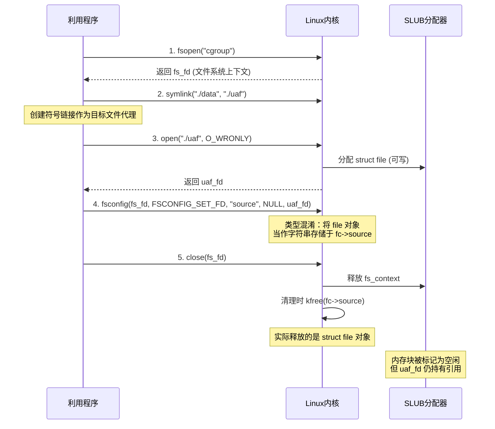

关键操作的技术内涵如下：

**符号链接的使用**：利用程序创建一个指向 `./data` 的符号链接 `./uaf`，然后以只写方式打开该链接。这一设计的目的是避免在 `struct file` 对象中设置 `FMODE_ATOMIC_POS` 标志——普通文件的打开可能会设置该标志，而符号链接文件的打开不会，从而简化后续并发写入操作的语义。

**类型混淆触发**：通过 `fsconfig` 的 `FSCONFIG_SET_FD` 命令，将 `uaf_fd` 对应的文件描述符作为参数传递给 cgroup 文件系统上下文。由于 `cgroup1_parse_param` 未检查参数类型，`struct file` 指针被错误地赋值给 `fc->source` 字段（本应存储字符串指针）。

**释放时机**：当 `close(fs_fd)` 被调用时，内核销毁 `fs_context` 对象，其清理逻辑调用 `kfree(fc->source)`。由于 `fc->source` 实际存储的是 `struct file` 对象地址，该对象被错误释放。然而，用户空间持有的 `uaf_fd` 文件描述符并未关闭，其引用的内核对象已成为悬垂指针。

### 4-4. 阶段三：竞争窗口的延长

UAF 条件触发后，利用程序面临的核心挑战是：在权限检查与实际数据写入之间插入足够的时间窗口，以完成堆喷射和对象交换。该设计采用了三层递进的窗口延长策略：

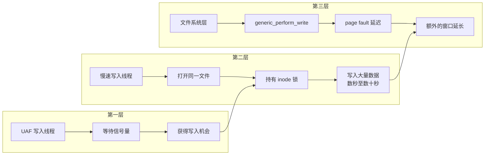

**第一层：慢速写入线程**

利用程序派生一个专用线程，该线程打开与 UAF 目标相同的符号链接文件，并执行一次大规模写入操作（约 1GB 数据）。在 ext4 等文件系统中，写入操作前会通过 `inode_lock` 获取 inode 互斥锁，并且在写入完成前不会释放该锁。慢速写入线程持有锁的时间取决于数据量大小和存储设备性能——在机械硬盘上可延迟数十秒，即使在高速 SSD 上也可达到数秒级别。

**第二层：UAF 写入线程的阻塞等待**

UAF 写入线程在慢速写入线程获取锁之后启动。由于两个线程操作的是同一文件的 inode，UAF 写入线程在调用 `write` 系统调用时，会在文件系统层的 `inode_lock` 处阻塞，等待慢速写入线程释放锁。此时，UAF 写入线程已经完成了所有权限检查，仅等待实际的写入执行。这一等待过程为堆喷射提供了充足的时间窗口。

**第三层：文件系统页错误的附加延迟**

在 `generic_perform_write` 函数中，内核会在实际写入前触发用户态缓冲区的页错误（page fault）。利用程序可通过将写入缓冲区映射在特定内存区域，进一步控制该页错误的触发时机，从而在文件系统锁释放后仍然保留一定的操作窗口。

### 4-5. 阶段四：堆喷射与对象重叠

在竞争窗口期内，利用程序的主线程执行堆喷射操作——批量打开目标文件 `/etc/passwd`，促使内核在 `filp` 缓存中分配大量新的 `struct file` 对象。

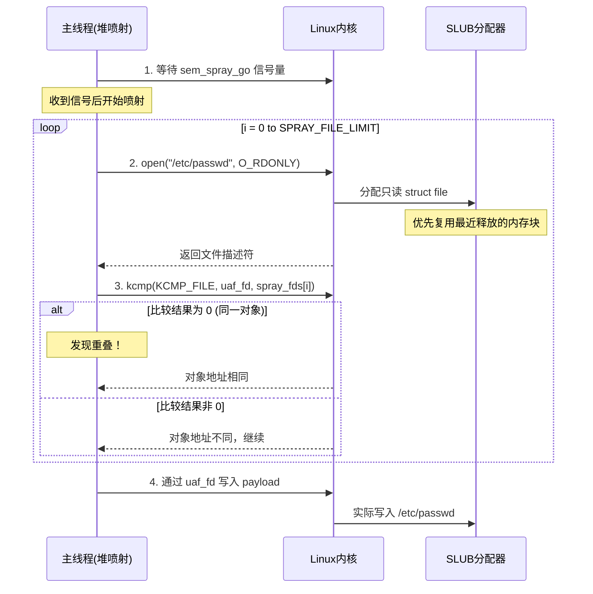

堆喷射的核心机制如下：

**SLUB 分配器的复用特性**：当内存块被释放后，SLUB 分配器将其放入空闲链表。后续的同大小分配请求会优先从空闲链表中获取内存块。由于 `struct file` 对象大小固定（通常为 256 或 512 字节），且分配来源均为 `filp` 缓存，新分配的 `/etc/passwd` `file` 对象大概率会复用被释放的 UAF 对象内存位置。

**重叠检测**：利用程序通过 `kcmp` 系统调用的 `KCMP_FILE` 选项比较文件描述符对应的内核 `struct file` 对象地址。当 `kcmp(uaf_fd, spray_fds[i])` 返回 0 时，表明两个文件描述符指向同一个内核对象——即堆喷射成功，`/etc/passwd` 的 `file` 对象已占据原 UAF 对象的内存位置。

**溢出后的写入**：当重叠检测成功时，利用程序通过原始的 `uaf_fd` 文件描述符执行写入。此时，由于该描述符的内核对象已被替换为只读的 `/etc/passwd` 的 `file` 对象，写入操作的目标文件实际为 `/etc/passwd`。而权限检查在写入操作发起时已完成——当时内核认为写入目标是可写的普通文件——因此写入操作得以通过。

### 4-6. 同步与判定机制

整个利用过程依赖精细的线程间同步机制，确保各操作按照正确的时序执行：

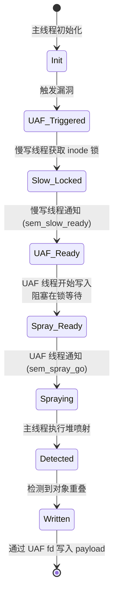

- **`sem_slow_ready`**：由慢速写入线程在成功获取 inode 锁后发出信号。UAF 写入线程等待此信号后才开始写入操作，确保在持有锁的状态下进入阻塞等待。
- **`sem_spray_go`**：由 UAF 写入线程在进入写入阻塞后发出信号。主线程等待此信号后才开始堆喷射，确保喷射发生时内核正处于文件系统层的锁等待状态，从而延长了喷射的有效窗口。

这一同步设计将三个并发线程的执行流精确对齐，使堆喷射能够在最有利的时间窗口内完成，最大化对象重叠的成功率。至此，从漏洞触发到最终写入的完整流程已全部呈现。接下来的内容将分析该设计如何在不触发内核主流防护机制的前提下完成上述操作，并讨论其适用条件与内在局限。

### 4-7. 内核保护机制的应对策略

现代 Linux 内核部署了多层次的安全防护机制，本利用架构在设计中系统性地考虑了对这些机制的规避策略：

| 保护机制                   | 应对策略             | 原理说明                                                                                         |
| -------------------------- | -------------------- | ------------------------------------------------------------------------------------------------ |
| **KASLR**                  | 无需绕过             | 整个利用不依赖任何内核符号或地址，`kcmp` 仅比较对象句柄，不产生地址信息泄露                      |
| **SMEP/SMAP**              | 无需绕过             | 利用过程不执行任何用户空间代码，也不直接访问用户空间内存，所有内核操作均通过标准系统调用接口完成 |
| **KPTI**                   | 无需绕过             | 不涉及跨权限页表切换的内核代码执行，所有操作均在正常的系统调用上下文中完成                       |
| **CFI**                    | 数据流替换           | 不篡改任何函数指针或返回地址，控制流完全遵循内核的正常执行路径，CFI 检查无异常                   |
| **SLAB_FREELIST_RANDOM**   | 大规模堆喷射         | 通过批量分配（1000 次以上）覆盖随机化带来的不确定性，使目标内存块被复用的概率趋近于 1            |
| **SLAB_FREELIST_HARDENED** | 对象替换而非指针覆写 | 该机制主要防护指针篡改，而本利用通过完整的对象替换完成凭证交换，不涉及指针的算术运算             |
| **HARDENED_USERCOPY**      | 标准系统调用路径     | 所有数据拷贝均通过 `write` 系统调用的标准路径完成，不触发 `copy_from_user` 的异常检查            |

上表展示了该利用架构如何在不触发任何防护告警的前提下，完成从漏洞触发到凭证交换的完整流程。其核心思想是**不正面突破任何防护机制**，而是从数据流层面绕过防护的覆盖范围——因为现有防护机制的设计目标均为控制流完整性或信息泄露防御，对数据对象的替换操作缺乏有效的检测手段。这种“数据驱动”的利用理念，正是 **Dirty Cred** 方法论区别于传统利用方式的关键所在。

### 4-8. 利用条件与局限性

尽管本利用架构具有较高的通用性，其成功实施仍依赖于一系列前置条件，同时自身也存在固有的技术局限性：

**前置条件**

- **系统调用可用性**：目标内核必须支持 `fsopen`、`fsconfig`、`kcmp` 等系统调用。这些调用在 Linux 5.1 及以上版本中可用，且通常不会在生产环境中被禁用。
- **命名空间权限**：利用进程需要在用户命名空间中具备 `CAP_SYS_ADMIN` 能力。该能力可通过 `unshare(CLONE_NEWUSER)` 由普通用户获得，因此在大多数默认配置下均可满足。
- **文件系统支持**：目标文件系统需支持 inode 锁机制（ext4、xfs、btrfs 等主流文件系统均满足），且目标文件（`/etc/passwd`）必须存在且为只读权限。
- **资源限制充足**：进程需要足够的文件描述符限额（`RLIMIT_NOFILE`）以完成堆喷射（通常需要 1000 个以上），以及足够的内存用于大文件写入映射。

**技术局限性**

- **存储性能影响**：慢速写入线程依赖于存储设备的 I/O 延迟来延长竞争窗口。在高速 NVMe SSD 上，1GB 数据的写入时间可能仅为数百毫秒，虽然仍可提供一定的窗口期，但要求堆喷射的响应速度更快，增加了利用的不确定性。
- **内存消耗较大**：约 1GB 的映射写入和 1000 个文件描述符的喷射可能触发系统的内存回收或 OOM 机制，在内存受限的环境（如小型容器）中可能导致利用失败。
- **`kcmp` 的可用性**：虽然 `CONFIG_CHECKPOINT_RESTORE` 在大多数发行版中默认启用，但在某些高度定制化的内核中可能被禁用，此时需要依赖其他重叠检测手段（如尝试写入后的效果验证）。
- **并发干扰**：系统中的其他进程可能同时进行文件操作或内存分配，干扰 SLUB 分配器的空闲链表状态，从而降低堆喷射的命中成功率。高负载生产环境中的利用成功率可能低于实验环境。
- **LSM 限制**：在启用 SELinux 或 AppArmor 等强制访问控制机制的系统上，即使成功交换了 `file` 对象，LSM 策略仍可能阻止对 `/etc/passwd` 的写入操作，需要结合其他策略才能完整提权。

**稳定性优化方向**

针对上述局限性，实际利用中可通过以下手段提升稳定性：动态调整喷射规模以适应不同的内存状态；利用 `fallocate` 预分配文件空间以加速写入；在多轮喷射中逐步增加目标文件描述符的数量直至重叠成功；在 LSM 限制的环境中优先采用替代性的提权策略。

### 4-9. 章节总结

本章详细阐述了一种基于 **CVE-2021-4154** 漏洞的完整利用架构。从技术路径上看，该架构将漏洞提供的类型混淆原语依次转化为 UAF 条件、竞争窗口和堆喷射能力，最终完成对 `/etc/passwd` 文件的对象级替换与覆写。整个过程不依赖任何内核地址信息，不篡改任何控制流数据，纯粹通过操纵内核内存管理的行为特性实现凭证交换。

该利用架构的核心价值在于验证了 **Dirty Cred** 方法论的实践可行性——即使漏洞本身仅提供间接的内存破坏能力（类型混淆），通过精心设计的并发策略和堆布局操纵，仍然可以实现对特权文件的写入。这一发现对于理解内核漏洞的潜在危害、评估现有防御体系的盲区具有重要意义。

本章呈现的 `file` 对象交换策略在实际利用场景中具有较高的通用性，但也受到 LSM 等强制访问控制机制的制约。通过 `cred` 对象的交换可直接作用于进程权限层面，能够绕过文件系统层的访问控制限制，实现更为彻底的权限获取。两种策略的结合使用，使得 **Dirty Cred** 方法论能够在更广泛的系统配置下发挥其利用潜力。

### 4-10. 测试结果

<div style="text-align: center; margin: 2rem 0;">
  
</div>

## 5. 利用思路二

### 5-1. 整体架构设计

基于前文 **CVE-2021-4154** 漏洞的利用框架，本章节呈现另一种基于 **FUSE**（用户态文件系统）的变体利用架构。该架构与第四章的核心区别在于**竞争窗口的延长机制**——不再依赖存储设备的大数据量写入，而是利用 FUSE 框架能够暂停内核执行、任意延长阻塞时间的特性，为堆喷射创造更为充裕且可控的窗口期。

整体利用架构同样由四个核心模块构成，其中**竞争窗口延长**模块采用了与第四章完全不同的技术路径：

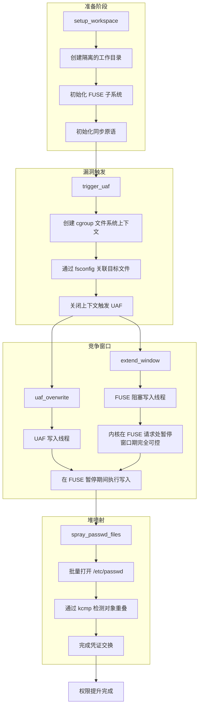

该架构的设计遵循与第四章相同的原则，但在窗口延长机制上具有以下独特优势：

- **零存储依赖**：不依赖磁盘 I/O 延迟，窗口长度由 FUSE 用户态处理逻辑完全控制，可在任意时刻精确释放或延长阻塞。
- **资源友好**：无需映射数 GB 的内存或执行大量的磁盘写入，对系统资源消耗极小，在内存受限环境中同样适用。
- **高可控性**：通过 FUSE 的请求控制接口，利用程序可精确决定阻塞的起始和结束时刻，为堆喷射提供确定性的时间窗口。

### 5-2. 阶段一：工作空间准备

该阶段与第四章 4-2 节所述基本一致：创建隔离的工作目录、准备数据文件、设置目录权限，并通过 `unshare` 创建用户命名空间以获得 `CAP_SYS_ADMIN` 能力。此外，本方案还需额外完成 **FUSE 子系统的初始化**，包括：

- 启动 FUSE 守护进程（daemon），该进程在内核与用户态文件系统之间充当桥梁。
- 创建用于阻塞写入的 FUSE 内存映射区域，该区域在后续的窗口延长操作中充当目标缓冲区。

FUSE 子系统的初始化确保内核在访问特定文件时，会调用用户态注册的处理函数，从而使得利用程序能够精确控制内核执行的暂停与恢复。

### 5-3. 阶段二：UAF 条件的触发

该阶段与第四章 4-3 节完全一致。利用程序通过 `fsopen` 创建 cgroup 文件系统上下文，构造符号链接，通过 `fsconfig` 将文件描述符以 `FSCONFIG_SET_FD` 类型传入，最后关闭上下文触发 `kfree(fc->source)` 错误释放 `struct file` 对象，形成 `uaf_fd` 悬垂指针。具体序列图已在第四章展示，此处不再赘述。

### 5-4. 阶段三：竞争窗口的延长（基于 FUSE）

本方案的核心差异在于竞争窗口的延长方式。利用程序派生一个专用线程，该线程执行对 FUSE 文件系统的写入操作。当内核处理该写入请求时，由于该文件由 FUSE 管理，内核会调用用户态 FUSE 守护进程的相应处理函数。利用程序通过预配置的处理逻辑，**使该请求在用户态无限期阻塞**，从而将内核执行完全暂停在权限检查完成之后、实际数据写入之前的临界位置。

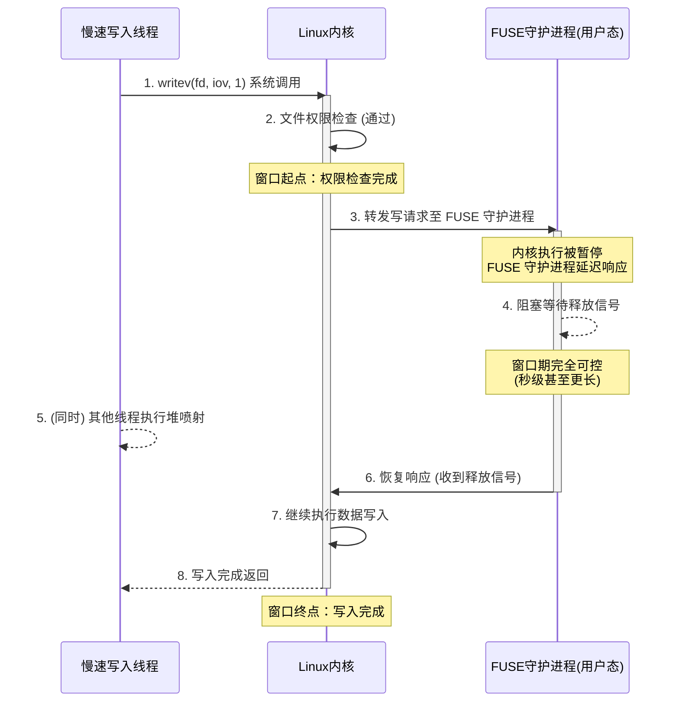

相较于第四章的大文件写入方案，FUSE 方案具有以下技术优势：

- **窗口时长完全可控**：FUSE 守护进程可以根据需要任意延长阻塞时间，不受存储设备速度限制，从数秒至数分钟均可实现，为堆喷射提供了极为充裕的时间窗口。
- **无需大量内存和磁盘资源**：阻塞写入仅涉及少量数据（通常 4KB），不消耗大量内存或触发磁盘 I/O，避免了资源耗尽的风险。
- **时序精确性高**：利用程序可通过信号量精确控制阻塞的起始和释放时刻，使堆喷射线程与 UAF 写入线程的同步更为稳定。

### 5-5. 阶段四：堆喷射与对象重叠

该阶段与第四章 4-5 节完全一致。在 FUSE 阻塞窗口期内，主线程执行批量打开 `/etc/passwd` 的堆喷射操作，通过 `kcmp` 检测文件描述符对应的 `struct file` 对象是否重叠。一旦检测到重叠，表示高权限只读的 `file` 对象已占据被释放的内存位置，随即通过 `uaf_fd` 执行 payload 写入，完成对 `/etc/passwd` 的覆写。其序列图与第四章相同，此处不再重复。

### 5-6. 同步与判定机制

本方案仍采用信号量实现线程间同步，但因引入 FUSE 控制接口，同步流程更为精炼：

- **`sem_slow_ready`**：由慢速写入线程在进入 FUSE 阻塞后发出信号。该信号表明内核已暂停在临界位置，UAF 写入线程可以安全启动。
- **`sem_spray_go`**：由 UAF 写入线程在开始写入（实际将阻塞在 FUSE 同一临界区之后）后发出信号。主线程收到此信号后启动堆喷射。

此外，利用程序还需通过 FUSE 专用控制接口（如 `fuse_wait_read_hit`、`fuse_signal_read_ready` 等）精确管理 FUSE 请求的生命周期，确保阻塞与释放的时序与信号量同步机制协调一致。整体状态机与第四章相似，但因窗口延长机制的差异，`Slow_Locked` 状态变为 `FUSE_Blocked`，且该状态持续时长可控性更高。

### 5-7. 内核保护机制的应对策略

本方案所利用的保护机制应对策略与第四章 4-7 节基本一致。唯一区别在于窗口延长阶段不再依赖文件系统锁的并发特性，因此不受存储设备性能波动的影响，使得利用程序的时序控制更加稳定。FUSE 框架本身不触发任何特殊的防护告警，因为其行为完全符合内核的正常操作路径。

### 5-8. 利用条件与局限性

**前置条件**

- 除第四章所列条件外，本方案还需 **FUSE 文件系统支持**，且目标内核配置了 `CONFIG_FUSE_FS`（绝大多数发行版默认启用）。
- FUSE 设备的访问权限需允许非特权用户操作（通常 `/dev/fuse` 权限为 0666）。
- 利用程序需具备创建用户命名空间的能力（与第四章相同）。

**技术局限性**

- **FUSE 可用性**：在某些极度精简或嵌入式内核中，FUSE 可能被裁剪，此时本方案不可用。
- **依赖 FUSE 守护进程稳定性**：FUSE 请求阻塞期间，如果守护进程异常退出，可能导致内核写请求失败或进程挂起，需要妥善的错误处理。
- **时间窗口仍受系统调度影响**：虽然 FUSE 阻塞时间可控，但在堆喷射过程中，系统其他进程的调度仍可能影响 SLUB 分配器的状态，但影响程度远小于依赖 I/O 延迟的方案。

**稳定性优化方向**

利用 FUSE 阻塞窗口的可控性，可以设计多轮尝试策略：在一次阻塞窗口内进行多轮喷射和检测，若未成功可延长窗口再次尝试，直至成功或超时。此外，可动态调整 FUSE 阻塞时长以适应系统负载。

### 5-9. 章节总结

本章呈现了基于 FUSE 的 **CVE-2021-4154** 利用架构变体。与第四章的大数据写入方案相比，本方案通过 FUSE 框架实现了更为稳定和可控的竞争窗口延长，降低了利用对存储性能和内存资源的依赖，显著提升了利用的可靠性和适用性。两种方案互为补充，前者在 FUSE 不可用时仍可生效，后者则在资源受限或需要精确时序控制的场景中更具优势。通过这两种架构的验证，进一步证明了 **Dirty Cred** 方法论在面对不同系统配置时的灵活性和适应性，也为内核漏洞利用技术的研究提供了更为丰富的实践案例。

### 5-10. 测试结果

<div style="text-align: center; margin: 2rem 0;">
  
</div>

## 6. 漏洞修复

### 6-1. 修复补丁概述

**CVE-2021-4154** 的修复补丁于 2021 年 7 月 14 日由 Christian Brauner 提交，并由 Linus Torvalds 合入 Linux 内核主线。该补丁的 commit ID 为 `3b0462726e7ef281c35a7a4ae33e93ee2bc9975b`，正式出现在 Linux 5.14-rc2 版本中。补丁的完整 diff 如下：

```diff
diff --git a/kernel/cgroup/cgroup-v1.c b/kernel/cgroup/cgroup-v1.c
index ee93b6e895874..527917c0b30be 100644
--- a/kernel/cgroup/cgroup-v1.c
+++ b/kernel/cgroup/cgroup-v1.c
@@ -912,6 +912,8 @@ int cgroup1_parse_param(struct fs_context *fc, struct fs_parameter *param)
 	opt = fs_parse(fc, cgroup1_fs_parameters, param, &result);
 	if (opt == -ENOPARAM) {
 		if (strcmp(param->key, "source") == 0) {
+			if (param->type != fs_value_is_string)
+				return invalf(fc, "Non-string source");
 			if (fc->source)
 				return invalf(fc, "Multiple sources not supported");
 			fc->source = param->string;
```

从 diff 可以看出，修复方案极为简洁——在 `cgroup1_parse_param` 函数中仅增加了两行代码。然而，正是这两行代码从根本上堵住了类型混淆的漏洞窗口，其背后蕴含的是对内核 API 设计契约的深刻理解与严格执行。

### 6-2. 补丁的技术分析

要理解该补丁为何如此有效，需要深入把握 `cgroup1_parse_param` 函数中参数处理的两阶段设计：

```c
opt = fs_parse(fc, cgroup1_fs_parameters, param, &result);
if (opt == -ENOPARAM) {
    if (strcmp(param->key, "source") == 0) {
        // 漏洞所在位置
        fc->source = param->string;
        param->string = NULL;
        return 0;
    }
    // ... 其他子系统匹配 ...
}
```

`fs_parse` 是文件系统上下文框架提供的标准参数解析器，用于匹配已在 `cgroup1_fs_parameters` 表中注册的标准选项。当参数未被该表识别时，返回 `-ENOPARAM`，函数随后进入回退路径——手动匹配特定的键名。`"source"` 正是通过这一回退路径被处理的。

漏洞的根源恰恰在于此：`fs_parse` 虽然能够识别参数类型并正确填充 `param->type`，但当它返回 `-ENOPARAM` 时，调用方（即 `cgroup1_parse_param`）完全忽略了 `param` 中已设置的类型信息，直接假设参数值为字符串并进行了赋值操作。补丁所做的正是在回退路径中补上这一缺失的类型校验：

- **校验时机**：在将 `param->string` 赋值给 `fc->source` 之前执行。
- **校验条件**：`param->type != fs_value_is_string`，即参数类型必须为字符串，否则拒绝处理。
- **错误返回**：通过 `invalf` 返回明确的错误信息 `"Non-string source"`，向用户空间反馈参数格式不合法。

这一校验使得 `struct fs_parameter` 联合体的访问得到了正确保护：当参数类型为 `fs_value_is_file` 时，联合体中被访问的是 `file` 字段（存储 `struct file` 指针）；而补丁确保了 `"source"` 分支仅在 `type` 为字符串时才会被进入，从而避免了将文件对象指针误当作字符串指针赋值给 `fc->source` 的风险。

### 6-3. 漏洞利用链的切断

从漏洞利用的视角来看，该补丁精准切断了 **CVE-2021-4154** 利用链条的起点。第四章和第五章所呈现的两种利用架构，其共同的触发前提均依赖于通过 `FSCONFIG_SET_FD` 将文件描述符作为 `"source"` 参数传入 cgroup 上下文，从而使 `fc->source` 指向一个 `struct file` 对象。

补丁合入后，这一触发路径被彻底封锁：

1. 任何试图通过 `FSCONFIG_SET_FD` 将文件描述符作为 `"source"` 传入的操作，在 `cgroup1_parse_param` 的参数校验阶段即会被拒绝。
2. 函数返回 `-EINVAL`（通过 `invalf` 包装）以及错误信息 `"Non-string source"`，调用者将收到明确的失败返回码。
3. 由于 `fc->source` 从未被赋值为文件对象指针，后续的文件系统上下文销毁流程不会错误释放 `struct file` 对象。
4. 悬垂指针（即前文所述的 `uaf_fd`）无从产生，利用程序无法获得可操作的文件描述符目标。

因此，该补丁修复的是漏洞的**根本成因**——类型混淆的发生点，而非在错误释放的后续路径上做补救。这种“治本”式的修复确保了无论漏洞利用手法如何变化，只要类型校验逻辑存在，漏洞便无法以任何变体形式被重新触发。

### 6-4. 补丁的演进意义

补丁的提交说明中提到：“In follow up patches I'll add a new generic helper that can be used here and by other filesystems instead of this error-prone copy-pasta fix.”（后续我将添加一个新的通用辅助函数，供此处及其他文件系统使用，以替代这种容易出错的复制-粘贴式修复。）

这表明开发团队不仅关注当前漏洞的修补，更着眼于建立**系统性的防御机制**。补丁作者认识到，`cgroup1_parse_param` 中的类型混淆问题并非孤例——任何在回退路径中手动匹配参数键名的文件系统都可能存在类似隐患。通过将类型校验逻辑抽象为通用的辅助函数，可以从框架层面强制所有文件系统的参数解析函数遵循相同的类型安全契约，从而在更大范围内消除此类漏洞的滋生土壤。

从防御角度看，该修复方案还体现了“最小权限原则”在代码层面的落实——**仅当参数满足明确的安全条件时（类型为字符串），才允许执行后续的数据传递操作**；否则立即拒绝并返回错误。这一原则的有效性在本漏洞的修复中得到了充分验证。

### 6-5. 修复版本与回溯状态

该补丁合并入主线后，**CVE-2021-4154** 在以下版本中得以修复：

- **主线内核**：Linux 5.14-rc2 及以后版本。
- **各发行版回溯版本**：
    - Debian bullseye：5.10.70-1
    - Ubuntu 18.04 LTS：5.4.0-88.99
    - Ubuntu 20.04 LTS：5.11.0-38.41
    - CentOS 8：4.18.0-305.4.1.el8
    - Fedora 33/34：相应稳定内核更新

值得说明的是，补丁作者在提交说明中特别强调了快速回溯到稳定内核的重要性（“fixing it in here first makes backporting it to stable a lot easier”）。仅两行代码的改动量使其能够轻松被移植到各长期支持（LTS）内核分支，大大缩短了从漏洞公开到各发行版完成修复的时间窗口，有效降低了系统在漏洞修复空窗期内的风险暴露。

### 6-6. 安全开发启示

**CVE-2021-4154** 的修复案例为内核安全开发提供了深刻而多维的启示：

**API 设计契约的严格遵守**：`fs_parameter` 结构体的设计明确要求通过 `type` 字段区分参数类型，访问联合体成员前必须进行类型校验。`cgroup1_parse_param` 未能遵守这一契约，导致了漏洞的产生。修复方案正是通过补上这一契约的执行来消除漏洞。这一案例警示开发者：在复用通用框架提供的 API 时，必须全面理解并严格遵守其设计契约，任何对契约的“简化”或“假设”都可能引入安全隐患。

**联合体操作的安全规范**：Linux 内核中广泛使用联合体以优化内存占用，但联合体的访问必须严格依赖于类型标记字段。任何对联合体成员的“盲目”访问都可能成为类型混淆漏洞的温床。本漏洞即为这一风险类型的典型代表，应作为内核安全编码培训中的关键案例。

**最小修复原则的工程价值**：两行代码的修复解决了影响数百万系统的安全漏洞，证明了精准定位漏洞根源并实施最小化修复的高效性。这种修复方式不仅降低了引入新缺陷的风险，也显著降低了补丁回溯到稳定内核的复杂度，使各发行版能够快速响应用户的安全需求，缩短了漏洞的暴露窗口期。

**“治本”优于“治标”** ：该修复直接作用于类型混淆的发生点——即漏洞的根源位置，而非在错误释放的后续路径上增加防御措施。这种“治本”式的修复策略确保了漏洞无法以任何变体形式被再次利用，为系统提供了长期有效的安全保障。这一思路对于内核安全开发具有普遍指导意义：在修复漏洞时，应优先寻找并修复问题的根源，而非仅阻断某一条特定的利用路径。

从更宏观的视角看，**CVE-2021-4154** 的修复过程也反映了开源社区在应对安全漏洞时的成熟协作机制——漏洞发现、根本原因分析、精准修复、快速回溯、系统性防御规划，形成了完整的漏洞响应闭环。这一机制的有效运作，是 Linux 内核能够在复杂度和安全性之间保持平衡的关键保障。

## 7. 免责声明

本文档旨在提供 **CVE-2021-4154** 漏洞的技术分析与教育性内容，仅供学习、研究和安全防御目的使用。作者与发布平台对以下事项声明如下：

1. **合法使用原则**：本文档中描述的任何技术细节、代码示例或利用方法仅供教育研究之用。读者不得将这些信息用于任何非法、未经授权或恶意的活动，包括但不限于未经授权的系统入侵、数据破坏、服务干扰或其他违反法律法规的行为。

2. **知识共享与责任**：本文档基于公开可获取的信息、官方漏洞公告和学术研究资料编写。作者力求确保技术内容的准确性，但不对信息的完整性、时效性或适用性作任何明示或暗示的保证。读者应自行验证信息的准确性，并在专业环境中谨慎应用。

3. **环境限制**：所有技术分析和实验应在受控的、隔离的测试环境中进行，例如使用特制的虚拟机或专用硬件。禁止在任何生产环境、公共网络或他人系统中尝试漏洞利用或相关技术。

4. **法律合规性**：读者应遵守所在国家或地区的所有适用法律法规，包括但不限于计算机安全法、数据保护法和知识产权法。任何使用本文档内容的行为所产生的法律后果，由行为者自行承担。

5. **技术中立性**：本文档对漏洞的分析保持技术中立立场，旨在促进安全社区的防御能力提升。文中提及的任何工具、技术或方法不应被视为对任何组织、产品或技术的背书或批判。

6. **更新与修正**：技术领域发展迅速，本文档内容可能随时间而过时。作者保留更新、修正或撤回文档内容的权利，不承诺另行通知。

7. **版权声明**：本文档内容受版权法保护，未经明确书面许可，不得用于商业目的。允许在注明出处的前提下进行非商业性的分享与引用。

**重要提示**：安全研究应始终遵循道德准则，以提升整体网络安全为目标。如发现安全漏洞，建议通过负责任的披露流程向相关厂商或机构报告，共同维护数字生态的安全与稳定。

---

_本文档的撰写参考了公开的漏洞公告、内核源码（Linux 5.13.3）及相关技术分析文献。所有实验均在封闭的测试环境中完成，未对任何实际系统造成影响。_

## 参考

- https://github.com/BinRacer/pwn4kernel/tree/master/src/CVE-2021-4154
- https://github.com/BinRacer/pwn4kernel/tree/master/src/CVE-2021-4154_V2
- https://blingblingxuanxuan.github.io/2023/05/19/230518-cve-2021-4154/
- https://bsauce.github.io/2022/10/17/CVE-2021-4154/
- https://github.com/Markakd/DirtyCred
- https://zplin.me/papers/DirtyCred.pdf
- https://git.kernel.org/pub/scm/linux/kernel/git/torvalds/linux.git/commit/?id=8d2451f4994fa60a57617282bab91b98266a00b1
- https://git.kernel.org/pub/scm/linux/kernel/git/torvalds/linux.git/commit/?id=3b0462726e7ef281c35a7a4ae33e93ee2bc9975b
- https://nvd.nist.gov/vuln/detail/CVE-2021-4154
- https://ubuntu.com/security/CVE-2021-4154
