# 【Kernel Exploit】CVE-2021-22555 漏洞分析

## 1. 测试环境

**测试版本**：Linux-5.11.14 [内核镜像地址](https://github.com/BinRacer/pwn4kernel/blob/master/kernels/5.11.14/01/bzImage)

笔者测试的内核版本是 `Linux (none) 5.11.14 #1 SMP Thu Feb 5 09:23:58 CST 2026 x86_64 GNU/Linux`。

**编译选项**：开启`CONFIG_THREAD_INFO_IN_TASK`、`CONFIG_COMPAT`、`CONFIG_COMPAT_FOR_U64_ALIGNMENT`、`CONFIG_COMPAT_32`、`CONFIG_KCMP`、`CONFIG_MEMCG`、`CONFIG_MEMCG_KMEM`、`CONFIG_CGROUPS`、`CONFIG_SLAB_FREELIST_RANDOM`、`CONFIG_SLAB_FREELIST_HARDENED`、`CONFIG_HARDENED_USERCOPY`、`CONFIG_FUSE_FS`、`CONFIG_USERFAULTFD`、`CONFIG_SYSVIPC`、`CONFIG_KEYS`、`CONFIG_STACKPROTECTOR`、`CONFIG_STACKPROTECTOR_STRONG`、`CONFIG_SLUB`、`CONFIG_SLUB_DEBUG`、`CONFIG_E1000`、`CONFIG_E1000E`、`CONFIG_PACKET`、`CONFIG_USER_NS`、`CONFIG_NET_NS`、`CONFIG_NAMESPACES`、`CONFIG_CHECKPOINT_RESTORE`、`CONFIG_IPC_NS`、`CONFIG_IP_NF_IPTABLES`、`CONFIG_IP_NF_MATCH_AH`、`CONFIG_IP_NF_MATCH_ECN`、`CONFIG_IP_NF_MATCH_RPFILTER`、`CONFIG_IP_NF_MATCH_TTL`、`CONFIG_IP_NF_FILTER`、`CONFIG_IP_NF_TARGET_REJECT`、`CONFIG_IP_NF_TARGET_SYNPROXY`、`CONFIG_IP_NF_NAT`、`CONFIG_IP_NF_TARGET_MASQUERADE`、`CONFIG_IP_NF_TARGET_NETMAP`、`CONFIG_IP_NF_TARGET_REDIRECT`、`CONFIG_IP_NF_MANGLE`、`CONFIG_IP_NF_TARGET_CLUSTERIP`、`CONFIG_IP_NF_TARGET_ECN`、`CONFIG_IP_NF_TARGET_TTL`、`CONFIG_IP_NF_RAW`、`CONFIG_IP_NF_SECURITY`、`CONFIG_IP_NF_ARPTABLES`、`CONFIG_IP_NF_ARPFILTER`、`CONFIG_IP_NF_ARP_MANGLE`、`CONFIG_NETFILTER`、`CONFIG_NETFILTER_ADVANCED`、`CONFIG_NETFILTER_INGRESS`、`CONFIG_NETFILTER_NETLINK`、`CONFIG_NETFILTER_FAMILY_ARP`、`CONFIG_NETFILTER_NETLINK_ACCT`、`CONFIG_NETFILTER_NETLINK_QUEUE`、`CONFIG_NETFILTER_NETLINK_LOG`、`CONFIG_NETFILTER_NETLINK_OSF`、`CONFIG_NETFILTER_CONNCOUNT`、`CONFIG_NETFILTER_NETLINK_GLUE_CT`、`CONFIG_NETFILTER_SYNPROXY`、`CONFIG_NETFILTER_XTABLES`、`CONFIG_NETFILTER_XT_MARK`、`CONFIG_NETFILTER_XT_CONNMARK`、`CONFIG_NETFILTER_XT_SET`、`CONFIG_NETFILTER_XT_TARGET_AUDIT`、`CONFIG_NETFILTER_XT_TARGET_CHECKSUM`、`CONFIG_NETFILTER_XT_TARGET_CLASSIFY`、`CONFIG_NETFILTER_XT_TARGET_CONNMARK`、`CONFIG_NETFILTER_XT_TARGET_CONNSECMARK`、`CONFIG_NETFILTER_XT_TARGET_CT`、`CONFIG_NETFILTER_XT_TARGET_DSCP`、`CONFIG_NETFILTER_XT_TARGET_HL`、`CONFIG_NETFILTER_XT_TARGET_HMARK`、`CONFIG_NETFILTER_XT_TARGET_IDLETIMER`、`CONFIG_NETFILTER_XT_TARGET_LED`、`CONFIG_NETFILTER_XT_TARGET_LOG`、`CONFIG_NETFILTER_XT_TARGET_MARK`、`CONFIG_NETFILTER_XT_NAT`、`CONFIG_NETFILTER_XT_TARGET_NETMAP`、`CONFIG_NETFILTER_XT_TARGET_NFLOG`、`CONFIG_NETFILTER_XT_TARGET_NFQUEUE`、`CONFIG_NETFILTER_XT_TARGET_NOTRACK`、`CONFIG_NETFILTER_XT_TARGET_RATEEST`、`CONFIG_NETFILTER_XT_TARGET_REDIRECT`、`CONFIG_NETFILTER_XT_TARGET_MASQUERADE`、`CONFIG_NETFILTER_XT_TARGET_TEE`、`CONFIG_NETFILTER_XT_TARGET_TPROXY`、`CONFIG_NETFILTER_XT_TARGET_TRACE`、`CONFIG_NETFILTER_XT_TARGET_SECMARK`、`CONFIG_NETFILTER_XT_TARGET_TCPMSS`、`CONFIG_NETFILTER_XT_TARGET_TCPOPTSTRIP`、`CONFIG_NETFILTER_XT_MATCH_ADDRTYPE`、`CONFIG_NETFILTER_XT_MATCH_BPF`、`CONFIG_NETFILTER_XT_MATCH_CGROUP`、`CONFIG_NETFILTER_XT_MATCH_CLUSTER`、`CONFIG_NETFILTER_XT_MATCH_COMMENT`、`CONFIG_NETFILTER_XT_MATCH_CONNBYTES`、`CONFIG_NETFILTER_XT_MATCH_CONNLABEL`、`CONFIG_NETFILTER_XT_MATCH_CONNLIMIT`、`CONFIG_NETFILTER_XT_MATCH_CONNMARK`、`CONFIG_NETFILTER_XT_MATCH_CONNTRACK`、`CONFIG_NETFILTER_XT_MATCH_CPU`、`CONFIG_NETFILTER_XT_MATCH_DCCP`、`CONFIG_NETFILTER_XT_MATCH_DEVGROUP`、`CONFIG_NETFILTER_XT_MATCH_DSCP`、`CONFIG_NETFILTER_XT_MATCH_ECN`、`CONFIG_NETFILTER_XT_MATCH_ESP`、`CONFIG_NETFILTER_XT_MATCH_HASHLIMIT`、`CONFIG_NETFILTER_XT_MATCH_HELPER`、`CONFIG_NETFILTER_XT_MATCH_HL`、`CONFIG_NETFILTER_XT_MATCH_IPCOMP`、`CONFIG_NETFILTER_XT_MATCH_IPRANGE`、`CONFIG_NETFILTER_XT_MATCH_IPVS`、`CONFIG_NETFILTER_XT_MATCH_L2TP`、`CONFIG_NETFILTER_XT_MATCH_LENGTH`、`CONFIG_NETFILTER_XT_MATCH_LIMIT`、`CONFIG_NETFILTER_XT_MATCH_MAC`、`CONFIG_NETFILTER_XT_MATCH_MARK`、`CONFIG_NETFILTER_XT_MATCH_MULTIPORT`、`CONFIG_NETFILTER_XT_MATCH_NFACCT`、`CONFIG_NETFILTER_XT_MATCH_OSF`、`CONFIG_NETFILTER_XT_MATCH_OWNER`、`CONFIG_NETFILTER_XT_MATCH_POLICY`、`CONFIG_NETFILTER_XT_MATCH_PKTTYPE`、
`CONFIG_NETFILTER_XT_MATCH_QUOTA`、`CONFIG_NETFILTER_XT_MATCH_RATEEST`、`CONFIG_NETFILTER_XT_MATCH_REALM`、`CONFIG_NETFILTER_XT_MATCH_RECENT`、`CONFIG_NETFILTER_XT_MATCH_SCTP`、`CONFIG_NETFILTER_XT_MATCH_SOCKET`、`CONFIG_NETFILTER_XT_MATCH_STATE`、`CONFIG_NETFILTER_XT_MATCH_STATISTIC`、`CONFIG_NETFILTER_XT_MATCH_STRING`、`CONFIG_NETFILTER_XT_MATCH_TCPMSS`、`CONFIG_NETFILTER_XT_MATCH_TIME`、`CONFIG_NETFILTER_XT_MATCH_U32`
选项。完整配置参考[.config](https://github.com/BinRacer/pwn4kernel/blob/master/kernels/5.11.14/01/.config)。

**保护机制**：KASLR/SMEP/SMAP/KPTI

## 2. 漏洞背景

### 2-1. 漏洞概述

**CVE-2021-22555** 是 Linux 内核 Netfilter 组件中一个存在长达 15 年之久的堆越界写漏洞。该漏洞由 syzkaller 模糊测试工具发现，影响范围覆盖 Linux v2.6.19-rc1 至 v5.12-rc7 版本。已修复版本包括 5.12、5.10.31、5.4.113、4.19.188、4.14.231、4.9.267、4.4.267 等。该漏洞之所以能够潜伏如此之久，根本原因在于其触发的代码路径深埋于 32 位兼容模式的复杂转换逻辑之中，且越界写入的仅仅是数个字节的零值——这种“温和”的破坏形态极易被常规测试与代码审查所忽略。

该漏洞位于 `net/netfilter/x_tables.c` 的 `xt_compat_target_from_user()` 函数中，成因是对结构体转换后的大小计算存在疏漏，导致 `memset()` 操作发生**堆溢出写 0**——向已分配缓冲区边界之外写入若干字节的零值数据。尽管原始漏洞仅能提供极其有限的越界写入能力（通常仅为 2 至 6 字节的零值），但在特定的堆内存布局与后续利用链配合下，足以绕过 KASLR、SMEP、SMAP、KPTI 等现代内核防护机制，最终实现内核级代码执行。该漏洞 CVSS 3.x 评分为 **7.8（高危）**。

**CVE-2021-22555** 的威胁场景不仅局限于传统主机环境下的本地提权，更值得关注的是其可用于**容器边界突破**——从 Docker 或 Kubernetes 容器中跨越命名空间隔离，影响宿主机安全。事实上，该漏洞正是 Google 在 kCTF 容器挑战赛中用于突破 Kubernetes Pod 隔离的关键技术手段，并因此获得了 10000 美元奖金（Google 等额匹配后捐赠总额达 20000 美元），这从侧面印证了其在实际攻防对抗中的重大威胁等级。

### 2-2. 关键组件

深入理解 **CVE-2021-22555** 的触发机理，首先需要理清 Linux Netfilter 框架的核心数据结构及其用户态与内核态之间的交互范式。

**Netfilter 框架简介。** Netfilter 是集成于 Linux 内核协议栈中的一套报文处理框架，本质上是内核网络子系统的一个可扩展防火墙平台。其核心抽象层次由表、链、规则三层构成：

- **表（Table）** ：用于存储不同功能的配置信息，内核默认提供 `filter`、`mangle`、`nat`、`raw` 等四种表，同时也支持通过内核模块自定义创建新表。
- **链（Chain）** ：表示对网络报文进行拦截处理的具体挂载点。例如 IPv4 网络层定义了 `PREROUTING`、`FORWARD`、`OUTPUT`、`INPUT`、`POSTROUTING` 五个标准拦截点，每个拦截点挂载一条链。
- **规则（Rule）** ：每条链包含若干条由用户配置的规则，每条规则由一个或多个**匹配条件（Match）** 与一个**执行动作（Target）** 组合而成，决定报文匹配后的处置行为。

**核心数据结构解析。** 表在内核中用 `struct xt_table` 结构体表示，其 `private` 字段指向真正存储规则信息的 `struct xt_table_info`。`xt_table_info` 是一个典型的变长结构体，其末尾的 `entries[]` 柔性数组成员承载了实际规则数据的连续内存区域：

```c
struct xt_table_info {
    unsigned int size;          // entries 所占的总字节数
    unsigned int number;        // entries 中规则的数目
    unsigned int initial_entries;
    unsigned int hook_entry[NF_INET_NUMHOOKS];
    unsigned int underflow[NF_INET_NUMHOOKS];
    unsigned int stacksize;
    void ***jumpstack;
    unsigned char entries[] __aligned(8);  // 变长数据区，存放规则实体
};
```

每条完整的规则在内核态由 `ipt_entry`、若干个 `xt_entry_match`（可选）以及一个 `xt_entry_target` 依次排列组成。其中 `xt_entry_target` 结构体尤为关键，它同时暴露给用户态和内核态，通过联合体（union）区分不同视角下的字段含义：

```c
struct xt_entry_target {
    union {
        struct {          // 用户态视图：填充目标名称与修订号
            u_int16_t target_size;
            char name[XT_FUNCTION_MAXNAMELEN-1];
            u_int8_t revision;
        } user;
        struct {          // 内核态视图：填充目标对象的指针
            u_int16_t target_size;
            struct xt_target *target;
        } kernel;
        u_int16_t target_size;
    } u;
    unsigned char data[0];  // 目标相关的具体参数数据区
};
```

正是由于这种用户态与内核态视图的字段差异（`name` 与 `target` 指针占用相同偏移量但语义完全不同），当系统运行在 32 位兼容模式时，内核必须对从用户空间传入的结构体执行字段重排与尺寸转换，这一转换过程便是漏洞的滋生土壤。

**用户态与内核通信机制。** 用户态程序（如 `iptables` 命令行工具）通过 `setsockopt()` 与 `getsockopt()` 系统调用，配合 `SOL_IP` 协议族下的自定义选项（如 `IPT_SO_SET_REPLACE` 或 `IP6T_SO_SET_REPLACE`），向内核提交或查询规则配置。Netfilter 框架通过 `nf_register_sockopt()` 注册各协议对应的 `nf_sockopt_ops` 操作集，内核根据命令字将请求分发至相应的处理函数。当用户空间程序以 32 位兼容模式运行（例如在 64 位内核上执行 32 位 `iptables` 工具）并调用 `setsockopt()` 时，内核需要将传入的 32 位规则结构体动态转换为内核原生的 64 位结构体——正是这一体感上理所当然的“兼容转换”流程，由于边界校验的缺失，最终酿成了内存破坏漏洞。

### 2-3. 触发机制

**CVE-2021-22555** 的触发需要调用者具备 `CAP_NET_ADMIN` 这一网络管理能力。在实际操作场景中，该能力可通过用户命名空间（`CLONE_NEWUSER`）结合网络命名空间（`CLONE_NEWNET`）的组合方式获取，这使得非特权普通用户也能满足触发条件，而无需具备全局 root 身份。

漏洞的完整执行流如下所示：

```
setsockopt(sock, SOL_IP, IPT_SO_SET_REPLACE, ...)
    → nf_setsockopt()                       // Netfilter 套接字选项入口
        → do_ipt_set_ctl()                  // iptables 控制命令分发
            → compat_do_replace()           // 兼容模式下的替换处理
                → translate_compat_table()  // 规则表转换
                    → compat_copy_entry_from_user()  // 单条规则拷贝与转换
                        → xt_compat_match_from_user()  // 处理匹配条件
                        → xt_compat_target_from_user() // 处理执行动作 ← 漏洞点
```

用户态通过 `setsockopt()` 传入 `IPT_SO_SET_REPLACE` 命令，附带一个精心构造的数据包。该数据包的连续内存布局依次为：`ipt_replace` 头部、`ipt_entry`、`xt_entry_match`（及对齐填充）、`xt_entry_target`。内核在处理过程中依次完成以下核心步骤：

1. **分配承载空间**：根据 `ipt_replace->size` 字段（由用户控制），调用 `xt_alloc_table_info(size)` 通过 `kvmalloc()` 分配 `xt_table_info` 对象及其关联的 `entries` 规则存储区。
2. **拷贝用户数据**：将用户空间传入的完整规则数据块拷贝至内核空间。
3. **执行兼容转换**：调用 `translate_compat_table()`，对每条规则逐一进行 32 位到 64 位结构的字段重排与内容适配。
4. **处理目标动作**：在 `compat_copy_entry_from_user()` 函数内部，完成 `ipt_entry` 和 `xt_entry_match` 的拷贝后，最终调用 `xt_compat_target_from_user()` 专门处理 `xt_entry_target` 部分，漏洞即潜伏于此。

`xt_compat_target_from_user()` 的核心逻辑示意如下：

```c
void xt_compat_target_from_user(struct xt_entry_target *t, void **dstptr, ...)
{
    // ...
    t = *dstptr;
    memcpy(t, ct, sizeof(*ct));                     // 拷贝 target 头部信息

    if (target->compat_from_user)
        target->compat_from_user(t->data, ct->data);
    else
        memcpy(t->data, ct->data, tsize - sizeof(*ct));

    pad = XT_ALIGN(target->targetsize) - target->targetsize;  // 计算对齐填充量
    if (pad > 0)
        memset(t->data + target->targetsize, 0, pad);         // ← 越界写零
    // ...
}
```

仔细观察可发现：`target->targetsize` 并非由用户直接指定，而是由内核根据所选 target 类型对应的参数结构体大小内生决定。不同的 target 类型关联着不同的结构体，例如 `TCPMSS` 对应 `struct xt_tcpmss_info`，`NFLOG` 则对应 **`struct xt_nflog_info`**。其中，**`struct xt_nflog_info`** 的大小为 76 字节（由 4 字节的 `len`、2 字节的 `group`、2 字节的 `threshold`、2 字节的 `flags`、2 字节的内部填充 `pad` 以及 64 字节的 `prefix` 共同组成），这使得其对应的 `targetsize` 在所有 target 类型中最为宽裕。然而，76 并非 8 的整数倍（`76 % 8 = 4`），因此计算出的填充量 `pad` 取值为正。此时，函数不加任何边界校验，直接向 `t->data + target->targetsize` 偏移处写入 `pad` 个零字节。借助 **`struct xt_nflog_info`** 的非对齐属性，该场景下的越界写入偏移量最高可达 **0x4C（即 76 字节）**。

### 2-4. 根因分析

**根本症结：对齐计算中的边界信任缺失。** `xt_compat_target_from_user()` 函数的设计初衷是确保 `target` 的 `data` 区域严格遵循 8 字节对齐——如果 `targetsize` 不满 8 字节的整数倍，则用零补齐至下一个 8 字节边界。然而，该函数在调用 `memset()` 之前，**完全缺失**对 `t->data + target->targetsize` 是否仍处于已分配缓冲区范围内的有效性校验。这一“信任”假设在绝大多数情况下成立，但当规则数据恰好占满 `entries` 区域时，对齐填充便毫无防备地溢出到相邻内存。

官方修复补丁的解决方式直截了当——删除了整段填充逻辑，因为经过严谨分析，此处对齐填充实际上并非转换流程所必需，移除它既不影响功能完整性，也从根源上消除了越界风险：

```diff
- int pad, off = xt_compat_target_offset(target);
+ int off = xt_compat_target_offset(target);
  // ...
- pad = XT_ALIGN(target->targetsize) - target->targetsize;
- if (pad > 0)
-     memset(t->data + target->targetsize, 0, pad);
```

值得注意的是，同一源文件中的 `xt_compat_match_from_user()` 函数存在完全相同的漏洞模式，补丁在对 `match` 的处理上采用了同样的删除策略，一并予以修复。

**受影响对象的分配特征。** `xt_table_info` 通过 `kvmalloc(sz, GFP_KERNEL_ACCOUNT)` 完成内存分配。其中 `GFP_KERNEL_ACCOUNT` 标志告知内核该内存需计入 cgroup 的 kmem 统计，且在 5.9 内核版本之前，带有此标志的内存分配会被定向到独立的 kmemcg slab 缓存池中。在实际触发场景下，分配的 `sz` 最小也超过 0x100 字节，这意味着对象将落入 `kmalloc-512` 至 `kmalloc-8192` 之间的某个通用 slab 缓存中。这一内存布局特性虽然将可利用的 victim 对象类型限定在了一定范围内，但也为利用者提供了相对稳定的内存分配可预测性——利用者可以据此设计堆布局，精确控制漏洞溢出的目标相邻对象。

### 2-5. 影响评估

**影响范围的广度。** 该漏洞自 2006 年 9 月随 Linux v2.6.19-rc1 版本引入，至 2021 年 4 月修复，**存活时间长达 15 年**。在此期间，几乎全球所有主流 Linux 发行版在 2021 年 4 月之前发布的内核版本均存在风险，包括但不限于：Ubuntu 20.04 LTS（需更新至 5.4.0-74.83）、Ubuntu 21.04（需更新至 5.11.0-18.19）、Debian、Red Hat Enterprise Linux以及 CentOS 等各类衍生系统。任何运行受影响内核且开放网络命名空间的系统都暴露在潜在威胁之下。

**安全影响的严重性。** 在传统主机部署场景中，具备 `CAP_NET_ADMIN` 能力的本地恶意用户可通过 **CVE-2021-22555** 实现**本地权限提升**，完全获取 root 身份。在云原生容器化部署场景中，该漏洞的威胁被进一步放大——即使容器内进程已经拥有该容器内部的 root 权限，但由于用户命名空间与网络命名空间的隔离屏障，其权限仍被约束在容器边界之内。然而，该漏洞可被用于**突破容器边界**，从内部跨越命名空间隔离，直接影响宿主机内核，从而威胁同节点上其他容器及宿主机本身的安全。Google 举办的 kCTF 容器安全挑战赛已实证该漏洞可有效用于 Kubernetes Pod 的隔离逃逸，这为云服务提供商敲响了警钟。

**临时缓解策略。** 在无法及时应用内核补丁的情况下，系统管理员可通过以下命令临时关闭非特权用户命名空间的创建能力，以此阻断未授权用户获取 `CAP_NET_ADMIN` 的途径，从而消除漏洞触发的前提条件：

```bash
echo 0 > /proc/sys/user/max_user_namespaces
```

需要注意的是，该措施会影响依赖用户命名空间的容器运行时及其他应用程序的正常运行，需在业务连续性与安全加固之间做出权衡。

### 2-6. 本质总结

**CVE-2021-22555** 的本质，是一个**边界条件检查缺失**所引致的内存安全漏洞，其背后折射出内核兼容层代码在处理跨架构数据转换时的脆弱性：

- **从代码微观层面审视**，`xt_compat_target_from_user()` 在执行 `memset()` 零填充操作时，未能验证写入目标地址是否仍处于当前分配对象的边界之内。这一错误的根源在于开发者对 `targetsize` 与缓冲区末端位置之间关系的隐含假设——认为 `data` 区域之后必然存在充足的、属于当前对象的填充空间，而忽略了 `entries` 区域刚好被占满这一临界情形。这本质上是典型的“差一错误”（off-by-one）在堆溢出维度上的广义体现。
- **从设计架构层面剖析**，32 位与 64 位结构体之间的兼容转换体系本身就是一个风险高发区域。不同架构下结构体的对齐方式、字段偏移与指针宽度差异，使得手动计算转换偏移量与拷贝长度极易出错。`xt_compat_target_from_user()` 正是这种“手工逐字段转换”模式下的一个典型脆弱代表——当内核需要维护如此庞大且历史悠久的兼容代码路径时，任何微小的疏忽都可能被积累放大为高危漏洞。
- **从安全利用范式层面观察**，该漏洞完美诠释了“**微小写原语 + 精巧堆布局 = 完整利用链**”这一典型模型。最初漏洞所提供的利用原语极为单薄——仅仅是**数个字节的零值越界写入**，孤立地看似乎破坏力极其有限。然而，通过精细的堆内存布局构造，利用者可将这有限的越界写入转化为更深远的内存破坏后果；继而借助其他内核对象的协同操作，依次**绕过 SMAP 防护机制以泄露堆内存地址**、**绕过 KASLR 防护机制以泄露内核镜像基址**，最终通过劫持内核对象函数指针，实现**内核任意代码执行**。

这一漏洞的长久生命力与巨大破坏力，深刻警示我们：**内存破坏漏洞的危险层级，从不单纯与溢出数据的长度成正比**。区区数个字节的零值写入，在经过由堆内存布局构造的“杠杆”放大后，依然能够穿透 KASLR、SMEP、SMAP、KPTI 等层层叠叠的现代内核防护体系。它揭示了系统安全中最难防御的一类隐患：并非汹涌澎湃的大规模数据污染，而是那些藏在兼容逻辑缝隙中、看似温和却足以撬动整个内核控制权的“微瑕”之手。

## 3. 深入分析 Netfilter 框架

### 3-1. 框架设计概览

Netfilter 是 Linux 内核网络子系统中一个至关重要的报文处理框架，自 Linux 2.4.x 版本引入以来，逐步演化为内核防火墙、网络地址转换（NAT）以及数据包深度修改等核心功能的统一基石。其设计哲学可概括为**模块化与可扩展性**——允许内核模块在网络协议栈的关键路径上动态注册回调函数，从而对经过的数据包实施自定义处理，同时保持核心协议栈的轻量化与高效性。

从宏观架构上观察，Netfilter 框架可划分为三个逻辑层次，各层次之间呈现出清晰的“策略组织 → 策略挂载 → 策略执行”的递进关系：

- **钩子层（Hook Layer）** ：这是 Netfilter 与协议栈交互的物理接口。内核在报文流经路径上预定义了若干拦截点（即钩子），各功能模块通过在这些钩子上注册处理函数来“锚定”自身逻辑。钩子层解决了“何时何处介入处理”的问题。
- **表管理层（Table Management Layer）** ：以“表”为单元对不同类别的策略进行逻辑分组。例如，过滤策略归入 `filter` 表，地址转换策略归入 `nat` 表，报文修改策略归入 `mangle` 表。此外，`raw` 表在连接跟踪（conntrack）机制启动之前执行，用于标记需要绕过连接跟踪的数据包；`security` 表则用于安全上下文标记，通常与 Linux 安全模块（LSM）协同工作。每张表由 `struct xt_table` 结构体描述，其内部通过 `struct xt_table_info` 承载具体的规则数据。表管理层解决了“策略如何分类存储”的问题。
- **规则执行层（Rule Execution Layer）** ：表内部以“链”组织规则，每条链又由若干条规则串联而成。规则是最小的策略单元，每条规则包含一组**匹配条件（Match）** 与一个**执行动作（Target）**，共同决定数据包的匹配逻辑与最终处置方式。规则执行层解决了“具体策略如何描述与评估”的问题。

用户空间的管理工具（如经典的 `iptables` 命令行程序，或新一代 `nftables` 工具链）通过 Netfilter 暴露的套接字接口（`setsockopt`/`getsockopt` 与 `NETLINK_NETFILTER`）与内核进行策略同步。**CVE-2021-22555** 漏洞即暴露于这一交互路径中的兼容转换子层——当 32 位用户态管理工具向 64 位内核提交规则配置时，内核需执行结构体视图的“翻译”，这一转换过程中的边界校验缺失最终形成了可被操控的内存破坏点。

### 3-2. 钩子挂载机制

**钩子点的定义。** Netfilter 在 Linux 内核网络协议栈的报文生命周期中预定义了若干个固定的拦截点。对于 IPv4 协议族，内核设置了五个标准钩子，它们在报文路径上的分布如下表所示：

| 钩子宏名称             | 触发时机                                             | 关键特征                                                             |
| ---------------------- | ---------------------------------------------------- | -------------------------------------------------------------------- |
| `NF_INET_PRE_ROUTING`  | 数据包刚从网络设备驱动接收，尚未执行 IP 路由查找     | 最早介入点，适用于目的地址转换（DNAT）等需在路由前修改目标地址的场景 |
| `NF_INET_LOCAL_IN`     | 路由查找后确认数据包目标地址为本机                   | 适用于输入链过滤，保护本机服务                                       |
| `NF_INET_FORWARD`      | 路由查找后确认数据包需转发至其他网络接口             | 适用于转发链过滤，管控网络流量中转                                   |
| `NF_INET_LOCAL_OUT`    | 本机上层协议产生的数据包，尚未执行路由查找           | 适用于输出链过滤，管控本机发出的流量                                 |
| `NF_INET_POST_ROUTING` | 数据包即将交付至网络设备驱动进行发送，路由决策已完成 | 最晚介入点，适用于源地址转换（SNAT）等需在发送前修改源地址的场景     |

除上述五个传统钩子外，Linux 内核 4.2 版本起还引入了 **Ingress 钩子**，它附着于特定网络设备的早期处理路径，在 `PRE_ROUTING` 之前触发。值得注意的是，Ingress 钩子触发时，IP 分片报文尚未重组，因此仅能可靠解析 IP 层头部，无法直接访问传输层（L4）头部信息。

**优先级调度与注册机制。** 各内核模块通过 `nf_register_hook()` 或 `nf_register_hooks()` 函数向框架注册处理函数。注册信息中必须指定：所属协议族（如 `NFPROTO_IPV4`）、目标钩子点、处理函数指针，以及一个至关重要的**优先级数值（priority）** 。在同一钩子点上，可能同时挂载多个来自不同功能模块的处理函数（例如连接跟踪模块、NAT 模块、过滤模块等），Netfilter 按照优先级数值**由小至大**的顺序依次调用。优先级机制保证了各模块间的处理顺序确定且可预测——这是实现复杂报文处理流水线的关键支撑。

从内核实现数据结构的视角审视，已注册的钩子函数由全局二维数组 `nf_hooks` 组织管理：第一维索引为协议族编号，第二维索引为钩子点编号，每个槽位下挂载一个按优先级排列的处理函数链表。当数据包流经某个钩子点时，内核只需执行两级索引即可快速定位到该钩子下所有待执行的函数序列。

**报文路径与钩子触发序列。** 数据包在协议栈中的具体流向决定了钩子被触发的完整次序。为直观呈现这一关系，下图以 Mermaid 流程图方式描绘了三种典型处理场景下的钩子调用序列：

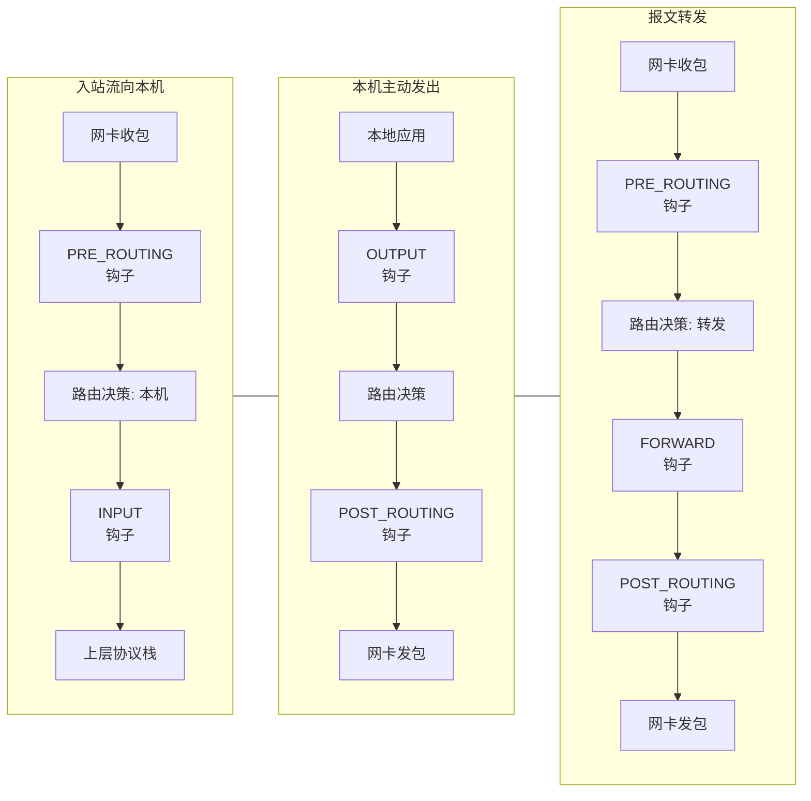

三种场景的钩子触发序列可形式化总结为：

- **入站**：`PRE_ROUTING → LOCAL_IN`
- **出站**：`LOCAL_OUT → POST_ROUTING`
- **转发**：`PRE_ROUTING → FORWARD → POST_ROUTING`

### 3-3. 规则组织模型

**表、链、规则的三层抽象。** Netfilter 通过“表 → 链 → 规则”三层结构对策略进行组织与管理，这种分层设计实现了策略的“功能归类、路径挂载、逐条评估”：

- **表（Table）** ：功能性策略分组容器。内核预置了若干标准表——`filter`（包过滤）、`nat`（网络地址转换）、`mangle`（报文头部修改）、`raw`（绕过连接跟踪）以及 `security`（安全标记）。每张表通过 `struct xt_table` 结构体描述，其 `private` 字段指向实际承载规则数据的 `struct xt_table_info` 实例。
- **链（Chain）** ：表内部的规则执行序列。每张表包含若干条内置链（例如 `filter` 表包含 `INPUT`、`FORWARD`、`OUTPUT` 三条链），同时也允许用户自定义扩展链。内置链与前述钩子存在一一映射关系——`filter` 表的 `INPUT` 链与 `NF_INET_LOCAL_IN` 钩子绑定，`FORWARD` 链与 `NF_INET_FORWARD` 钩子绑定，`OUTPUT` 链与 `NF_INET_LOCAL_OUT` 钩子绑定。
- **规则（Rule）** ：策略的最小原子单元。每条规则由零个或多个**匹配条件（Match）** 与一个**执行动作（Target）** 构成。匹配条件定义数据包需满足的属性约束（如源/目标 IP 地址范围、传输层协议类型、端口号等）；执行动作则定义匹配成功后对数据包的处置方式（如 `ACCEPT` 放行、`DROP` 丢弃、`QUEUE` 排队至用户空间等）。

**核心数据结构的内核实现。** 三层抽象在内核中有对应的数据结构予以承载，理解这些结构之间的关联是把握 Netfilter 运作机理的基础。

`struct xt_table` 作为表的元数据描述符，其定义如下：

```c
struct xt_table {
    struct list_head list;          // 全局表链表节点，串联所有已注册的表
    char name[XT_TABLE_MAXNAMELEN]; // 表名称标识（如 "filter"、"nat"）
    unsigned int valid_hooks;       // 位图掩码，指示该表在哪些钩子上挂载了链
    rwlock_t lock;                  // 读写锁，保障并发场景下规则更新的数据一致性
    void *private;                  // 指向 struct xt_table_info，即规则的实质存储
    struct module *me;              // 所属内核模块的引用计数
    int af;                         // 协议族标识（AF_INET / AF_INET6）
};
```

`struct xt_table_info` 是规则的真正承载者，其内部维护了规则数据的内存布局与索引信息：

```c
struct xt_table_info {
    unsigned int size;              // entries 数据区占用的总字节数
    unsigned int number;            // 当前表中的规则总条数
    unsigned int initial_entries;   // 初始创建时的规则条数
    unsigned int hook_entry[NF_INET_NUMHOOKS];  // 各钩子对应链的起始偏移量
    unsigned int underflow[NF_INET_NUMHOOKS];   // 各链的终止标记偏移量
    char *entries[NR_CPUS];         // 每 CPU 独立的规则存储区首地址
};
```

`entries` 数组为**每个 CPU 维护了一份独立的规则副本**，这一设计的核心动机在于消除多核并发场景下的锁竞争——当多个 CPU 核心同时进行报文过滤时，各核心操作自身副本，无需相互等待，显著提升了高吞吐场景下的处理性能。`hook_entry` 数组记录了各钩子所对应的链在 `entries` 连续内存区域中的起始偏移量（例如 `hook_entry[NF_INET_LOCAL_IN]` 指明 INPUT 链的入口位置）。与之对应的 `underflow` 数组则记录各链的“下限”偏移量——当规则遍历到达此位置时，表示链中所有规则均已检查完毕，此时内核将返回该链的默认策略。`hook_entry` 与 `underflow` 协同定义了每条链在连续规则区域中的有效范围。

每条规则在内核中由 `struct ipt_entry` 结构体描述，其内存布局呈现典型的“头部 + 变长负载”模式：

```c
struct ipt_entry {
    struct ipt_ip ip;               // IP 层匹配条件（源地址、目标地址、协议等）
    unsigned int nfcache;           // 网络过滤器缓存提示标志
    u_int16_t target_offset;        // 执行动作（target）相对于本结构起始地址的偏移
    u_int16_t next_offset;          // 下一条规则相对于本结构起始地址的偏移
    unsigned int comefrom;          // 跳转来源追踪标记
    struct xt_counters counters;    // 命中统计计数器
    unsigned char elems[0];         // 柔性数组成员：存放匹配条件（match）与执行动作（target）
};
```

`target_offset` 字段界定了 `elems` 区域中 `xt_entry_target` 结构的起始位置，而 `next_offset` 则指向下一条规则的起始边界。通过 `next_offset` 的链式指引，内核可在连续内存区域内顺序遍历整张表的所有规则。`elems` 区域内部依次排列着若干个 `xt_entry_match`（匹配条件）以及一个 `xt_entry_target`（执行动作）。

`xt_entry_match` 的结构体设计与 `xt_entry_target` 呈现高度对称性——二者均通过联合体（union）来区分用户态视图与内核态视图的字段差异：

```c
struct xt_entry_match {
    union {
        struct {                    // 用户态视图：字符串标识
            u_int16_t match_size;
            char name[XT_FUNCTION_MAXNAMELEN-1];
            u_int8_t revision;
        } user;
        struct {                    // 内核态视图：函数指针
            u_int16_t match_size;
            struct xt_match *match;
        } kernel;
        u_int16_t match_size;
    } u;
    unsigned char data[0];          // 匹配条件模块的私有参数区域
};
```

用户态视图通过 `name` 字符串（如 `"tcp"`、`"addrtype"`、`"conntrack"`）标识匹配条件或执行动作的类型，内核在接收到用户提交的规则后，据此字符串在已注册模块链表中执行查找操作，并将用户态视图替换为内核态视图——即用查找到的 `struct xt_match` 或 `struct xt_target` 函数指针填充 `kernel.match` 或 `kernel.target` 字段。这一“视图转换”流程正是 **CVE-2021-22555** 漏洞所在的执行上下文。匹配条件与执行动作在规则存储区中按照“先匹配、后动作”的次序紧凑排列，规则的有效负载容量通过 `target_offset` 与 `next_offset` 的差值动态计算。

### 3-4. 数据包裁决路径

当一个网络数据包进入 Netfilter 框架后，内核沿着“**钩子触发 → 表遍历 → 链定位 → 规则逐条评估 → 匹配条件检查 → 执行动作裁决**”的路径执行策略匹配。以下流程图以 `PRE_ROUTING` 钩子为例，完整展示了从数据包到达直至产生裁决结果的评估循环：

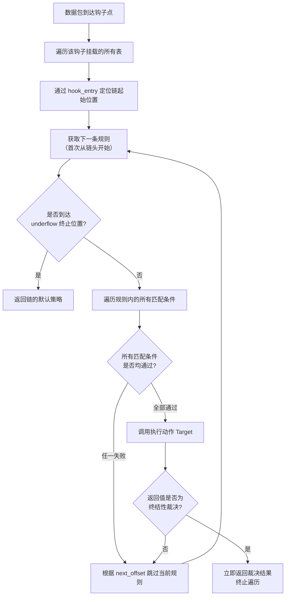

上述流程图所描述的评估过程，其逻辑等价于以下伪代码所表达的嵌套迭代：

```
for each hook in 当前报文触发的钩子序列:
    for each table in 该钩子上挂载的所有表:
        chain_start = table.hook_entry[hook]
        chain_end = table.underflow[hook]
        rule = chain_start
        while rule != chain_end:
            for each match in rule.matches:
                if match.evaluate(packet) == FALSE:
                    goto next_rule
            // 所有匹配条件通过
            verdict = rule.target.act(packet)
            if verdict is NF_ACCEPT or NF_DROP or NF_QUEUE or NF_STOLEN:
                return verdict  // 终结性裁决，立即终止全部遍历
        next_rule:
            rule = rule + rule.next_offset
        // 链遍历完毕，返回默认裁决
```

**裁决的终结性与非终结性**是 Netfilter 规则评估中一个需要着重关注的设计细节。当执行动作（target）返回 `NF_ACCEPT`、`NF_DROP`、`NF_QUEUE` 或 `NF_STOLEN` 时，这些属于**终结性裁决（Final Verdict）**，遍历过程**立即中止**，不再评估后续任何规则。而当返回 `NF_REPEAT` 或 `NF_STOP` 时，遍历行为则有所不同——`NF_REPEAT` 指示重新执行当前链，`NF_STOP` 则指示跳过该钩子后续的所有表。这种“首次匹配即终止”的语义要求管理员在编排规则时必须高度审慎：**具体性更强的规则应置于通用性规则之前**，否则较具体的策略可能永远得不到评估机会。

**默认策略与空链处理。** 当一条链中没有任何规则匹配时，内核不会无限等待，而是返回该链的默认策略。默认策略在链创建时设定，通常为 `NF_ACCEPT` 或 `NF_DROP`。在 `xt_table_info` 结构中，`underflow` 数组与 `hook_entry` 配合，标记了每条链的有效规则区间——当规则指针前进至 `underflow` 位置时，内核即判定链遍历结束，转向默认策略处理。这一机制确保了无论规则集如何变化，数据包的裁决路径总能在有限步骤内收敛。

**每 CPU 独立副本与数据一致性问题**同样值得关注。由于 `xt_table_info->entries` 为每个 CPU 维护独立的规则副本，当用户通过 `iptables` 更新规则时，内核需同步修改所有 CPU 副本。这一过程依赖 `xt_table` 中的读写锁（`rwlock_t`）进行保护，但在高并发场景下仍可能引入短暂的不一致窗口。这种“性能优先”的设计虽然极大提升了报文转发吞吐量，但也为内存布局操控者提供了可预测的并行执行环境——不同 CPU 核心上规则副本的分配次序与相对内存位置呈现一定的统计规律性，这一特性在后续的漏洞利用链条中扮演了基础性角色。

### 3-5. 兼容转换层的实现

**CVE-2021-22555** 的根源深植于 Netfilter 的 **32 位兼容性转换层（32-bit Compatibility Layer）** 中，因此对该层的架构与实现细节进行细致拆解，是完整理解漏洞链条不可或缺的一环。

**兼容层存在的必要性。** 在现代 64 位 Linux 系统上，用户空间程序有可能以 32 位模式运行（例如出于兼容性考虑，系统管理员可能使用 32 位编译的 `iptables` 工具管理 64 位内核）。32 位与 64 位环境下，`struct xt_entry_target` 等核心结构体的**内存布局存在本质性差异**：指针宽度不同（32 位为 4 字节，64 位为 8 字节）且自然对齐边界不同（32 位 4 字节对齐，64 位 8 字节对齐）。若内核直接以 64 位布局解析 32 位用户传入的规则数据，将导致字段读取错位，轻则规则解析失败，重则触发内核内存访问异常。因此，内核必须实现一套**兼容转换层**，在用户态结构体与内核态结构体之间执行精准的“格式翻译”。

在兼容模式下，用户传入的规则头部并非标准的 `ipt_replace`，而是其兼容变体 `compat_ipt_replace`。该结构体中原本存储指针的字段（如 `entries` 指针）被替换为 32 位无符号整数（`u32`），以适应 32 位进程的地址空间布局。内核在接收到数据后，需要将这些 32 位偏移量解译为 64 位内核空间中的有效地址，并按照 64 位布局重新组织规则数据。

**转换流程全景。** 当 32 位用户态程序通过 `setsockopt()` 系统调用提交 `IPT_SO_SET_REPLACE` 命令时，内核将沿以下路径执行兼容转换：

1. **识别兼容请求**：系统调用入口检测到调用者为 32 位进程，将请求路由至 `compat_do_replace()` 函数而非标准的 `do_replace()`。
2. **暂存原始数据**：将用户空间传入的 32 位结构体数据（`compat_ipt_replace` 头部、规则体等）原样拷贝至内核临时缓冲区。
3. **逐条转换规则**：调用 `translate_compat_table()` 函数，对每条规则依次执行转换——遍历 `entries` 区域，针对每条规则调用 `compat_copy_entry_from_user()`，后者再分别调用 `xt_compat_match_from_user()` 处理匹配条件、`xt_compat_target_from_user()` 处理执行动作。
4. **写入正式存储**：转换完成后，将已转换为 64 位布局的规则数据写入 `xt_table_info->entries` 的当前 CPU 副本中。

**漏洞在转换流程中的精确落点。** 上述第 3 步中的 `xt_compat_target_from_user()` 负责 `xt_entry_target` 的转换。该函数在执行完字段拷贝与指针替换后，额外执行了一段对齐填充逻辑——计算 `target->targetsize` 与 8 字节对齐边界之间的差值 `pad`，若 `pad > 0`，则调用 `memset(t->data + target->targetsize, 0, pad)` 将 `data` 区域尾部零填充至 8 字节对齐边界。问题的关键所在是：**该函数在调用 `memset()` 之前，完全缺失对写入目标地址 `t->data + target->targetsize + pad` 是否仍处于当前 `entries` 分配范围内的边界校验**。当整张表的规则数据恰好精确占满 `entries` 分配区域时，这一“理所应当”的填充操作便越过分配边界，向相邻堆块中写入若干个零值字节。

值得强调的是，不同 target 类型对应的 `targetsize` 各不相同，这直接决定了越界写入的距离。例如，`TCPMSS` 类型对应的 `struct xt_tcpmss_info` 大小为 2 字节（`2 % 8 = 2`，`pad = 6`），`TTL` 类型对应结构体大小为 4 字节（`pad = 4`），而前文详细讨论的 `NFLOG` 类型对应 **`struct xt_nflog_info`** 的大小为 76 字节（`76 % 8 = 4`，`pad = 4`），结合规则整体布局的精细调整，可实现最高 **0x4C（76 字节）** 的越界写入偏移量。

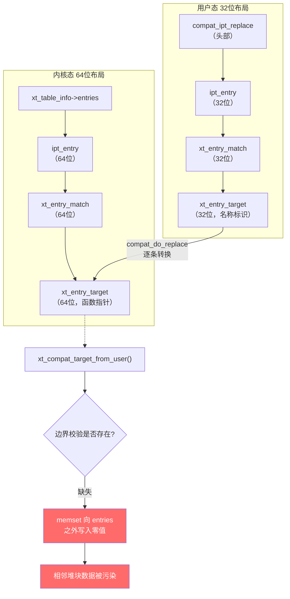

上图采用垂直布局清晰展示了从 32 位用户态布局到 64 位内核态布局的转换过程，以及漏洞在 `xt_compat_target_from_user()` 处因边界校验缺失而导致的越界写入后果。

**官方修复策略的合理性。** 补丁的修复方案简洁而彻底——直接移除 `xt_compat_target_from_user()` 与 `xt_compat_match_from_user()` 中的整段对齐填充代码。这一做法之所以安全有效，是因为经过内核维护者的严谨分析，该对齐填充操作在当前的 Netfilter 执行路径中已非必需——现代内核的内存分配器与访问逻辑对非对齐数据的容忍度已大幅提高，删除该填充既不影响功能完整性，也不引入任何性能退化。这一修复策略为安全工程提供了一个值得借鉴的范式：**当一段遗留代码的功能不再是强制需求，却同时携带安全隐患时，删繁就简往往是最彻底的治理路径**。

### 3-6. 框架设计层面的风险审视

从 Netfilter 框架的宏观设计视角俯瞰 **CVE-2021-22555**，可以清晰地观察到漏洞并非孤立的编码疏忽，而是多个架构层设计决策相互叠加、交织作用下的产物：

**兼容性层的固有复杂性陷阱。** Netfilter 为保持对 32 位用户态工具的后向兼容性，在 64 位内核中维护了一套庞大的“手工转换”代码库——开发者需为每种结构体类型单独编写 `compat_from_user` 与 `compat_to_user` 转换函数。这种实现模式天然存在**高代码熵值**：结构体成员数量的变化、对齐规则的微调，都可能需要开发者同步修改多处转换逻辑，任何一处偏移量计算与拷贝长度的不一致，都可能酿成内存安全漏洞。如果架构设计之初便采用“**统一内核规范布局 + 自动序列化/反序列化**”的通用转换框架，将结构体描述与转换逻辑分离，或许能从根源上消解此类人为疏忽引入的安全风险。

**历史遗留策略与演进的失衡。** 漏洞代码中对齐填充的初衷可以追溯到早期 Linux 内核版本中对 DMA 一致性或硬件对齐约束的严苛要求。然而，随着内核内存管理子系统的持续演进——SLUB 分配器对非对齐访问的容忍度提升、硬件层面不对齐访问开销的降低——该填充操作的实际效用已大幅衰减。但这段代码却作为“历史遗产”被一直保留，直到 15 年后才被模糊测试工具 syzkaller 所发现。这一事实揭示了内核长期演进中一个普遍性困境：**安全维护的精力往往聚焦于新特性的引入，而对历史遗留代码的“必要性再评估”投入不足**，致使大量事实上已冗余的代码路径持续构成潜在风险敞口。

**性能优先设计与安全边界的张力。** `xt_table_info->entries` 采用“每 CPU 独立副本”的设计，目的是消除多核并发场景下的锁争用，最大化报文处理吞吐量。然而，这一设计也意味着同一组规则数据在物理内存中存在多份独立副本，操作者可以通过精心编排的规则更新顺序，在不同 CPU 副本之间构建特定的内存相对排布关系。虽然这种精巧的内存布局编排本身并非漏洞，但它将有限的越界写入能力“杠杆放大”为更具破坏力的内存破坏原语。这一案例深刻表明：**高性能系统设计中那些“无害”的性能优化决策，在安全威胁模型的审视下，有可能演变为复杂漏洞利用链条的构建基石**。性能优化与安全稳健之间的平衡，永远是内核设计中最富挑战性的课题之一。

**模糊测试在漏洞发现中的关键作用。** 值得注意的是，**CVE-2021-22555** 的发现归功于 syzkaller——一款由 Google 开发的内核模糊测试工具。syzkaller 通过系统调用序列的随机组合与变异，能够探索到人工代码审查与静态分析工具难以触及的深层执行路径。该漏洞在长达 15 年的时间内未被发现，恰恰说明即使经过了无数次的代码审计与广泛的生产环境部署，这类深埋在兼容逻辑缝隙中的“微瑕”仍可能隐匿多年。这也为内核安全维护工作指明了方向：**传统的代码审查与静态分析无法替代大规模的动态模糊测试，两者需要相互补充、协同发力，才能在复杂系统的安全演进中形成有效闭环**。

## 4. 漏洞分析

本章从源码层面拆解 **CVE-2021-22555** 的完整触发路径，追踪一次 32 位兼容模式下的 `setsockopt()` 调用如何一步步抵达漏洞函数 `xt_compat_target_from_user()`，并最终导致堆越界写零。所有分析基于 Linux v5.11.14 内核源码，调用链自上而下逐层展开。

### 4-1. 调用路径总览

从用户态发起 `setsockopt()` 系统调用到漏洞最终触发，其间经历了一系列内核函数的层层分发与转换。为了便于后续逐一剖析，此处先给出完整的函数调用序列：

```
setsockopt(sock, SOL_IP, IPT_SO_SET_REPLACE, ...)
  → nf_setsockopt()                       // Netfilter 套接字选项入口
    → do_ipt_set_ctl()                    // iptables 控制命令分发
      → compat_do_replace()               // 兼容模式替换处理
        → translate_compat_table()        // 规则表兼容转换
          → check_compat_entry_size_and_hooks()   // 第一轮遍历：校验与符号绑定
          → xt_alloc_table_info()                 // 分配新的规则存储区
          → compat_copy_entry_from_user()         // 第二轮遍历：执行实际转换
            → xt_compat_match_from_user()         // 处理匹配条件（同款漏洞）
            → xt_compat_target_from_user()        // 处理执行动作 ★ 漏洞触发点
```

该调用链充分体现了 Netfilter 框架兼容性层的执行逻辑：先校验后转换、先解析后写入。漏洞正是隐藏在“写入”阶段的对齐填充环节中。

### 4-2. 套接字选项入口

`nf_setsockopt()` 是 Netfilter 框架处理套接字选项的统一入口。内核根据调用者传入的协议族（`pf`）与选项值（`val`），从全局链表中查找对应的 `nf_sockopt_ops` 操作集，再回调其 `set` 方法。

```c
// net/netfilter/nf_sockopt.c
int nf_setsockopt(struct sock *sk, u_int8_t pf, int val, sockptr_t opt,
                  unsigned int len)
{
    struct nf_sockopt_ops *ops;
    int ret;

    // 根据协议族 (pf=AF_INET) 和选项值 (val=IPT_SO_SET_REPLACE=0x40) 查找操作集
    ops = nf_sockopt_find(sk, pf, val, 0);
    if (IS_ERR(ops))
        return PTR_ERR(ops);

    // 调用具体协议族的 set 函数，IPv4 对应 ipt_sockopts->set = do_ipt_set_ctl
    ret = ops->set(sk, val, opt, len);
    module_put(ops->owner);
    return ret;
}
```

此处的 `opt` 参数是一个 `sockptr_t` 类型的联合体，封装了指向用户空间缓冲区的指针。该缓冲区中承载着本次请求的核心数据——`compat_ipt_replace` 结构体及紧随其后的规则体，`len` 则为数据总长度。`val` 取值为 `0x40`，即宏 `IPT_SO_SET_REPLACE`，表示这是一次替换整张规则表的请求。

### 4-3. 控制命令分发

进入 IPv4 协议族的具体实现后，`do_ipt_set_ctl()` 首先进行权限检查，再根据命令字将请求路由至对应的处理函数。

```c
// net/ipv4/netfilter/ip_tables.c
static int do_ipt_set_ctl(struct sock *sk, int cmd, sockptr_t arg, unsigned int len)
{
    int ret;

    // 检查 CAP_NET_ADMIN 权限，该能力可通过用户命名空间获取
    if (!ns_capable(sock_net(sk)->user_ns, CAP_NET_ADMIN))
        return -EPERM;

    switch (cmd) {
    case IPT_SO_SET_REPLACE:   // 0x40
#ifdef CONFIG_COMPAT
        if (in_compat_syscall())   // 检测到 32 位调用，进入兼容处理路径
            ret = compat_do_replace(sock_net(sk), arg, len);
        else
#endif
            ret = do_replace(sock_net(sk), arg, len);
        break;
    // 其他命令字（如 IPT_SO_SET_ADD_COUNTERS）在此省略
    default:
        ret = -EINVAL;
    }
    return ret;
}
```

`in_compat_syscall()` 返回真，意味着当前发起系统调用的进程是 32 位程序。内核据此判定需要对传入的 32 位布局数据进行转换，于是进入 `compat_do_replace` 分支。至此，执行流步入漏洞所在的兼容性子系统。

### 4-4. 兼容替换处理

`compat_do_replace()` 承担了三个核心职责：从用户空间拷贝头部、分配内核存储区、以及调用转换引擎。

```c
// net/ipv4/netfilter/ip_tables.c
static int compat_do_replace(struct net *net, sockptr_t arg, unsigned int len)
{
    int ret;
    struct compat_ipt_replace tmp;
    struct xt_table_info *newinfo;
    void *loc_cpu_entry;
    struct ipt_entry *iter;

    // 从用户空间拷贝兼容头部（大小为 0x5c 字节）
    if (copy_from_sockptr(&tmp, arg, sizeof(tmp)) != 0)
        return -EFAULT;

    // 基本合法性校验
    if (tmp.num_counters >= INT_MAX / sizeof(struct xt_counters))
        return -ENOMEM;
    if (tmp.num_counters == 0)
        return -EINVAL;

    tmp.name[sizeof(tmp.name)-1] = 0;

    // 分配 xt_table_info 对象，存储规则元数据与数据区
    // 本例中 tmp.size = 0xfb6，加上头部 sizeof(*info)=0x40，总分配 0xff6 字节
    // 该大小落在 kmalloc-4k 的范围内
    newinfo = xt_alloc_table_info(tmp.size);
    if (!newinfo)
        return -ENOMEM;

    // loc_cpu_entry 指向 entries 数据区的起始地址
    loc_cpu_entry = newinfo->entries;

    // 将用户空间中的规则体（从头部之后开始，长度 tmp.size）拷贝到 entries 区域
    if (copy_from_sockptr_offset(loc_cpu_entry, arg, sizeof(tmp), tmp.size) != 0) {
        ret = -EFAULT;
        goto free_newinfo;
    }

    // 调用核心转换函数，将 32 位规则布局转换为 64 位内核布局
    ret = translate_compat_table(net, &newinfo, &loc_cpu_entry, &tmp);
    if (ret != 0)
        goto free_newinfo;

    // 将转换完成的规则正式挂载到表中
    ret = __do_replace(net, tmp.name, tmp.valid_hooks, newinfo,
                       tmp.num_counters, compat_ptr(tmp.counters));
    if (ret)
        goto free_newinfo_untrans;
    return 0;

free_newinfo_untrans:
    xt_entry_foreach(iter, loc_cpu_entry, newinfo->size)
        cleanup_entry(iter, net);
free_newinfo:
    xt_free_table_info(newinfo);
    return ret;
}
```

此处有两个关键点值得关注。其一，`tmp.size`（即 `0xfb6`）完全由用户控制，虽然内核在后续转换中会重新计算实际所需大小并分配新区域，但初始的 `entries` 区域完全承载了用户输入的原始 32 位数据。其二，`newinfo` 分配在 `kmalloc-4k` 的 slab 中，其 `entries` 起始地址紧接在结构体头部之后（偏移 `0x40` 处），结束地址则由 `tmp.size` 决定——这一布局特征在漏洞触发时将发挥决定性作用。

### 4-5. 规则表转换引擎

`translate_compat_table()` 是兼容转换过程的核心引擎，采用“两轮遍历”的设计模式：第一轮进行合法性校验并解析符号，第二轮执行实际的数据转换与写入。

```c
// net/ipv4/netfilter/ip_tables.c
static int translate_compat_table(struct net *net,
                                  struct xt_table_info **pinfo,
                                  void **pentry0,
                                  const struct compat_ipt_replace *compatr)
{
    unsigned int i, j;
    struct xt_table_info *newinfo, *info;
    void *pos, *entry0, *entry1;
    struct compat_ipt_entry *iter0;
    struct ipt_replace repl;
    unsigned int size;
    int ret;

    info = *pinfo;          // 从 compat_do_replace 传入的原始 info 对象
    entry0 = *pentry0;      // 指向原始 entries 数据区的起始地址
    size = compatr->size;   // 原始大小 0xfb6
    info->number = compatr->num_entries;

    j = 0;
    xt_compat_lock(AF_INET);
    ret = xt_compat_init_offsets(AF_INET, compatr->num_entries);
    if (ret)
        goto out_unlock;

    /* 第一轮遍历：扫描每条规则，执行边界检查，
       并根据 match/target 名称查找对应的内核模块，
       填充内核指针（xt_match、xt_target），同时累计转换后的总大小 */
    xt_entry_foreach(iter0, entry0, compatr->size) {
        ret = check_compat_entry_size_and_hooks(iter0, info, &size,
                                                entry0,
                                                entry0 + compatr->size);
        if (ret != 0)
            goto out_unlock;
        ++j;
    }
    if (j != compatr->num_entries)
        goto out_unlock;

    // 根据第一轮计算出的转换后总大小（size 已更新为 0xfbe），分配新的规则存储区
    newinfo = xt_alloc_table_info(size);   // 分配 0xffe 字节，仍在 kmalloc-4k 内
    if (!newinfo)
        goto out_unlock;

    newinfo->number = compatr->num_entries;
    for (i = 0; i < NF_INET_NUMHOOKS; i++) {
        newinfo->hook_entry[i] = compatr->hook_entry[i];
        newinfo->underflow[i] = compatr->underflow[i];
    }

    entry1 = newinfo->entries;   // 新区域起始地址，例如 0xffff8880065d4040
    pos = entry1;
    size = compatr->size;        // 重置为原始大小 0xfb6，用于遍历计数

    /* 第二轮遍历：将每条规则从 32 位格式逐一转换为 64 位格式，
       并依次写入新分配的 entry1 区域 */
    xt_entry_foreach(iter0, entry0, compatr->size)
        compat_copy_entry_from_user(iter0, &pos, &size,
                                    newinfo, entry1);

    xt_compat_flush_offsets(AF_INET);
    xt_compat_unlock(AF_INET);

    // 后续调用 translate_table 进行标准验证（检查链环路、钩子一致性等）
    memcpy(&repl, compatr, sizeof(*compatr));
    for (i = 0; i < NF_INET_NUMHOOKS; i++) {
        repl.hook_entry[i] = newinfo->hook_entry[i];
        repl.underflow[i] = newinfo->underflow[i];
    }
    repl.num_counters = 0;
    repl.counters = NULL;
    repl.size = newinfo->size;
    ret = translate_table(net, newinfo, entry1, &repl);
    if (ret)
        goto free_newinfo;

    *pinfo = newinfo;
    *pentry0 = entry1;
    xt_free_table_info(info);
    return 0;

free_newinfo:
    xt_free_table_info(newinfo);
    return ret;
out_unlock:
    // 错误处理：释放已绑定的模块引用
    xt_compat_flush_offsets(AF_INET);
    xt_compat_unlock(AF_INET);
    xt_entry_foreach(iter0, entry0, compatr->size) {
        if (j-- == 0)
            break;
        compat_release_entry(iter0);
    }
    return ret;
}
```

“两轮遍历”的设计意图十分清晰：第一轮只读不写，保证所有指针解析与大小计算完成后，再统一进行内存分配与数据迁移。然而，这种分治策略也意味着第一轮计算出的 `targetsize` 将在第二轮被用于 `memset`，而第二轮写入时却**不再重新校验**边界条件——漏洞恰恰隐藏在这个假设之中。

### 4-6. 条目校验与内核符号绑定

该函数在第一轮遍历中处理单条规则，主要完成三件事：校验偏移合法性、绑定 match 内核模块、绑定 target 内核模块并获取其 `targetsize`。

```c
// net/ipv4/netfilter/ip_tables.c
static int check_compat_entry_size_and_hooks(struct compat_ipt_entry *e,
                                             struct xt_table_info *newinfo,
                                             unsigned int *size,
                                             const unsigned char *base,
                                             const unsigned char *limit)
{
    struct xt_entry_match *ematch;
    struct xt_entry_target *t;
    struct xt_target *target;
    unsigned int entry_offset;
    unsigned int j;
    int ret, off;

    // 基本的地址对齐与越界检查
    if ((unsigned long)e % __alignof__(struct compat_ipt_entry) != 0 ||
        (unsigned char *)e + sizeof(struct compat_ipt_entry) >= limit ||
        (unsigned char *)e + e->next_offset > limit)
        return -EINVAL;

    if (e->next_offset < sizeof(struct compat_ipt_entry) +
                         sizeof(struct compat_xt_entry_target))
        return -EINVAL;

    if (!ip_checkentry(&e->ip))
        return -EINVAL;

    // 检查 match 与 target 的偏移是否在合法范围内
    ret = xt_compat_check_entry_offsets(e, e->elems,
                                        e->target_offset, e->next_offset);
    if (ret)
        return ret;

    off = sizeof(struct ipt_entry) - sizeof(struct compat_ipt_entry);
    entry_offset = (void *)e - (void *)base;
    j = 0;

    // 遍历并绑定所有 match 模块（此处略去细节）
    xt_ematch_foreach(ematch, e) {
        ret = compat_find_calc_match(ematch, &e->ip, &off);
        if (ret != 0)
            goto release_matches;
        ++j;
    }

    // 获取 target 部分的起始地址
    t = compat_ipt_get_target(e);
    // 根据 target 名称（本例为 "NFQUEUE"）在内核中查找已注册的 xt_target 模块
    target = xt_request_find_target(NFPROTO_IPV4, t->u.user.name,
                                    t->u.user.revision);
    if (IS_ERR(target)) {
        ret = PTR_ERR(target);
        goto release_matches;
    }
    // 将内核 target 指针写入联合体的 kernel 视图
    t->u.kernel.target = target;

    // 累加 target 转换后的偏移量，并更新总大小
    off += xt_compat_target_offset(target);
    *size += off;
    ret = xt_compat_add_offset(AF_INET, entry_offset, off);
    if (ret)
        goto out;

    return 0;
out:
    module_put(t->u.kernel.target->me);
release_matches:
    // 错误时释放已绑定的 match 模块引用
    return ret;
}
```

此函数的执行效果至关重要。当内核根据 `"NFQUEUE"` 找到对应的 `struct xt_target` 实例后，会将其 `targetsize` 字段赋值为该 target 私有数据区的大小。对于 NFQUEUE 的版本 1，`targetsize = sizeof(struct xt_NFQ_info_v1) = 4` 字节。这个 `4` 将被原样保留到第二轮的 `xt_compat_target_from_user()` 中，成为计算 `pad` 值的依据。

### 4-7. 条目拷贝与转换

进入第二轮遍历后，`compat_copy_entry_from_user()` 负责将单条规则的 32 位数据实际转换为 64 位格式，并写入新分配的 `entry1` 区域。

```c
// net/ipv4/netfilter/ip_tables.c
static void compat_copy_entry_from_user(struct compat_ipt_entry *e, void **dstptr,
                                        unsigned int *size,
                                        struct xt_table_info *newinfo,
                                        unsigned char *base)
{
    struct xt_entry_target *t;
    struct ipt_entry *de;
    unsigned int origsize;
    int h;
    struct xt_entry_match *ematch;

    origsize = *size;          // 记录转换前的累计大小，初始为 0xfb6
    de = *dstptr;              // 指向新区域中当前可写入的位置

    // 拷贝 ipt_entry 头部
    memcpy(de, e, sizeof(struct ipt_entry));
    memcpy(&de->counters, &e->counters, sizeof(e->counters));

    // 更新写入指针与累计大小
    *dstptr += sizeof(struct ipt_entry);
    *size += sizeof(struct ipt_entry) - sizeof(struct compat_ipt_entry);

    // 遍历并转换所有 match 条件
    xt_ematch_foreach(ematch, e)
        xt_compat_match_from_user(ematch, dstptr, size);

    // 调整 target_offset 以反映因结构体大小差异产生的偏移变化
    de->target_offset = e->target_offset - (origsize - *size);

    // 获取 target 并调用转换函数 —— 漏洞点在此
    t = compat_ipt_get_target(e);
    xt_compat_target_from_user(t, dstptr, size);

    // 调整 next_offset
    de->next_offset = e->next_offset - (origsize - *size);

    // 更新 hook_entry 与 underflow 偏移（略）
    for (h = 0; h < NF_INET_NUMHOOKS; h++) {
        if ((unsigned char *)de - base < newinfo->hook_entry[h])
            newinfo->hook_entry[h] -= origsize - *size;
        if ((unsigned char *)de - base < newinfo->underflow[h])
            newinfo->underflow[h] -= origsize - *size;
    }
}
```

`origsize - *size` 反映了转换过程中因结构体大小差异而产生的累计变化量（本例中最终为 `-4`，即新区域比旧区域多占用了 4 字节）。该差值用于修正后续的偏移量字段。在 `xt_compat_target_from_user` 调用返回后，转换后的规则数据将恰好填满 `entry1` 区域——这正是漏洞触发的前提条件。

### 4-8. 匹配条件的转换处理

虽然本次触发路径未在 match 部分越界，但该函数与 target 版本存在完全相同的漏洞模式，补丁对二者一并修复。

```c
// net/netfilter/x_tables.c
void xt_compat_match_from_user(struct xt_entry_match *m, void **dstptr,
                               unsigned int *size)
{
    const struct xt_match *match = m->u.kernel.match;
    struct compat_xt_entry_match *cm = (struct compat_xt_entry_match *)m;
    int pad, off = xt_compat_match_offset(match);
    u_int16_t msize = cm->u.user.match_size;

    m = *dstptr;
    memcpy(m, cm, sizeof(*cm));
    if (match->compat_from_user)
        match->compat_from_user(m->data, cm->data);
    else
        memcpy(m->data, cm->data, msize - sizeof(*cm));

    // 漏洞位置：同样未校验边界即进行对齐填充
    pad = XT_ALIGN(match->matchsize) - match->matchsize;
    if (pad > 0)
        memset(m->data + match->matchsize, 0, pad);

    // 更新大小与指针 ...
}
```

### 4-9. 漏洞触发点

`xt_compat_target_from_user()` 负责将 32 位的 `xt_entry_target` 转换为 64 位内核布局。问题出现在对齐填充的 `memset` 处——该操作在完全没有边界校验的情况下，向 `t->data + target->targetsize` 之后写入零值。

```c
// net/netfilter/x_tables.c
void xt_compat_target_from_user(struct xt_entry_target *t, void **dstptr,
                                unsigned int *size)
{
    const struct xt_target *target = t->u.kernel.target;
    struct compat_xt_entry_target *ct = (struct compat_xt_entry_target *)t;
    int pad, off = xt_compat_target_offset(target);
    u_int16_t tsize = ct->u.user.target_size;

    // t 指向原始 32 位数据中的 target 部分
    // dstptr 指向新区域中即将写入的位置
    t = *dstptr;

    // 拷贝 target 头部（联合体中的用户态部分）
    memcpy(t, ct, sizeof(*ct));

    // 拷贝 target 私有数据区
    if (target->compat_from_user)
        target->compat_from_user(t->data, ct->data);
    else
        memcpy(t->data, ct->data, tsize - sizeof(*ct));

    // 计算对齐填充量：target->targetsize 在本例中为 4（NFQUEUE v1）
    pad = XT_ALIGN(target->targetsize) - target->targetsize;
    // XT_ALIGN(4) = 8，因此 pad = 4
    if (pad > 0) {
        // ★ 漏洞触发点 ★
        // t->data 指向当前 target 数据区的起始，位于新区域 entries 内部
        // 但此时 t->data + target->targetsize 已经触及甚至超出了 entries 的边界
        // 此 memset 会向相邻堆块写入 pad 个零字节（本例 pad=4）
        memset(t->data + target->targetsize, 0, pad);
    }

    tsize += off;
    t->u.user.target_size = tsize;
    // ... 后续更新名称与指针
    *size += off;
    *dstptr += tsize;
}
```

在本例的运行时环境中，内存布局呈现出临界状态：

- `newinfo` 对象大小为 `0xffe` 字节，其中的 `entries` 区域起始于 `0xffff8880065d4040`，结束于 `0xffff8880065d4ffe`（因为 `entries` 实际使用大小为 `0xfbe`，加上 `0x40` 头部偏移恰好到达此处）。
- 经过 match 与 target 的逐项转换后，写入指针 `dstptr` 刚好移动到 `entries` 区域的末尾位置，使得当前 target 的 `data` 起始地址为 `0xffff8880065d4ffa`。
- `target->targetsize` 在第一轮校验中被设定为 `4`，因此 `t->data + 4 = 0xffff8880065d4ffe`，这已经是 `entries` 区域的最后一个字节。
- 此时 `pad = 4`，`memset` 从 `0xffff8880065d4ffe` 开始连续写入 4 个零字节，覆盖范围延伸至 `0xffff8880065d5002`。

其中，`0xffff8880065d5000` 属于紧随其后的下一个 `kmalloc-4k` 堆块的起始地址。该堆块的内容因此被污染——前 4 个字节（甚至可能影响该堆块的元数据头部）被覆写为零。虽然仅写入零值，但足以破坏相邻内核对象的控制信息或数据指针，从而构成后续更深远内存操控的起点。

### 4-10. 分析总结

纵观整个调用链，**CVE-2021-22555** 的触发并非由单一函数错误所致，而是代码逻辑、架构设计与内存管理三者共同作用的结果。从 `nf_setsockopt` 入口到 `xt_compat_target_from_user` 漏洞点，一条清晰的因果链贯穿始终：32 位兼容模式下的结构体转换需求催生了“两轮遍历”的处理框架；第一轮校验中根据用户提供的 target 名称绑定内核模块并获取 `targetsize`；第二轮转换中，`xt_compat_target_from_user` 在未做边界校验的情况下执行对齐填充；而用户通过 `tmp.size` 精确控制的规则总大小，恰好使转换后的数据填满 `entries` 区域。三者缺一不可，共同将一次看似无害的零填充操作演变为跨越堆块边界的写零事件。

从更宏观的视角审视，该漏洞暴露了三个层面的系统性问题。**在代码层面**，`xt_compat_target_from_user` 对 `memset` 的目标地址完全缺失边界校验，错误地假设 `t->data + target->targetsize` 之后必然存在属于当前对象的 padding 空间。**在架构层面**，“两轮遍历”的设计虽然将“计算”与“执行”清晰分离，但也造成了信息割裂——第一轮计算出的安全结论在第二轮中没有被重新验证，使得“计算安全”与“写入安全”之间存在断层。**在内存管理层面**，`xt_table_info` 通过 `kvmalloc(GFP_KERNEL_ACCOUNT)` 分配，在 5.9 版本之前被定向到独立的 kmemcg slab 缓存，且分配大小落在 `kmalloc-512` 至 `kmalloc-8192` 的可预测范围内，为构造临界内存布局提供了稳定的前提条件。

该漏洞的越界写入虽仅有数个字节的零值，但其落点恰好位于相邻堆块的关键区域——足以破坏相邻内核对象的元数据头部或控制字段，使内核在后续操作中产生逻辑异常。正是这种“微小写原语 + 精巧堆布局”的模式，使得 **CVE-2021-22555** 在一个极为狭窄的越界窗口下依然能够产生深远的安全影响。官方补丁通过直接移除对齐填充代码修复了该问题，因为该填充在现代内核中已不再承担必要功能——这一删繁就简的策略比打补丁更彻底、更可靠。同时，该漏洞在长达十五年的时间里未被发现，直到 syzkaller 模糊测试工具探索到这条深埋在兼容逻辑缝隙中的代码路径，这也印证了大规模动态测试在复杂系统安全演进中不可替代的价值。

## 5. 利用思路一

本章阐述 **CVE-2021-22555** 的一种完整利用方案。该方案以漏洞提供的“堆越界写零”原语为起点，通过精心编排堆内存布局，将有限的越界写入逐步放大为稳定的内存破坏能力，最终实现权限提升与命名空间逃逸。整个利用过程被划分为六个阶段，各阶段之间紧密衔接，共同构成一条完整的控制流劫持链路。

### 5-1. 整体架构设计

该利用方案的总体设计思路可概括为“**微小溢出 → 重叠对象 → 释放后重用 → 地址泄露 → 控制流劫持**”。漏洞本身仅能向相邻堆块写入数个零值字节，为了充分发挥其效力，必须借助内核堆管理器的分配特性，将溢出点对准特定类型的对象，从而将“写零”转化为“指针篡改”。

方案的核心组件是 **`msg_msg`** 消息队列对象与 **`sk_buff`** 网络数据包缓冲区。`msg_msg` 结构体的头部包含一个双向链表指针 `m_list`，当该指针的最低字节被零覆盖时，其指向可能从合法对象偏移至同一 slab 内的另一个消息头部，这种“低位清零”效应与漏洞的写零能力精确匹配。`sk_buff` 则承担数据写入的角色，由于它可以稳定地回收被释放的 `msg_msg` 内存并在其中写入任意载荷，为后续的伪造对象与越界读取提供了灵活的数据通道。

整个利用流程如下图所示，六个阶段依次推进，每个阶段的输出作为下一阶段的输入。

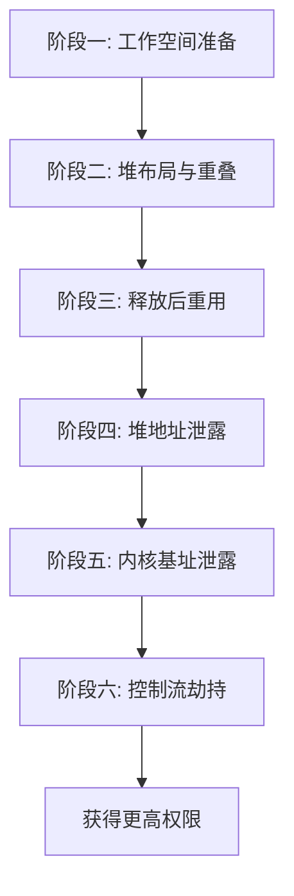

### 5-2. 阶段一：工作空间准备

在触发漏洞之前，必须建立必要的运行环境，确保后续所有堆操作在可控且可预测的上下文中执行。这一阶段的操作流程如下：

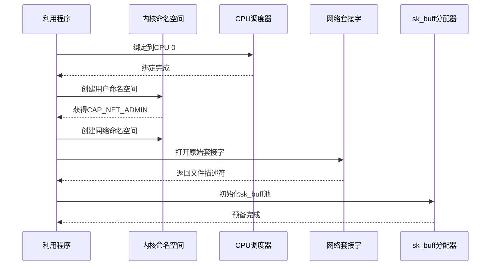

**CPU 绑定**：将进程绑定到单个 CPU 核心，避免多核并发分配导致的堆布局扰动。内核的 SLUB 分配器为每个 CPU 维护独立的空闲对象缓存与部分空闲链表，绑定到固定核心后，分配与释放操作仅影响该核心的本地缓存，使得堆内存的分配次序与对象间的相对位置更具可预测性。

**命名空间隔离**：利用 `CLONE_NEWUSER` 与 `CLONE_NEWNET` 创建用户命名空间与网络命名空间。在用户命名空间内，当前进程被授予 `CAP_NET_ADMIN` 能力（仅限该命名空间内部），从而满足触发 Netfilter 漏洞所需的权限条件。这一隔离机制同时使得整个操作在容器的用户命名空间边界内完成，不会对宿主机上其他进程造成直接干扰。

**网络套接字准备**：打开一个原始套接字（`AF_INET, SOCK_STREAM`），该套接字将作为后续向 Netfilter 提交规则的操作句柄。同时，初始化 `sk_buff` 分配池——预先在多个套接字上分配并缓存若干 `sk_buff` 对象，这些对象将用于在 UAF 内存中写入数据。分配池需要精确控制 `sk_buff` 的大小，使其与目标 `msg_msg`（0x400 字节）落入同一 kmalloc-1k 缓存，并确保分配操作能够快速执行而不会触发额外的内存分配扰动。

### 5-3. 阶段二：堆布局与重叠

本阶段的目标是构造一个临界堆布局，使得漏洞的越界写零恰好落在某个 0x1000 大小 `msg_msg` 对象的链表指针 `m_list.next` 上，从而造成两个独立的消息队列指向同一块共享内存。整个堆布局与重叠构造的流程如下：

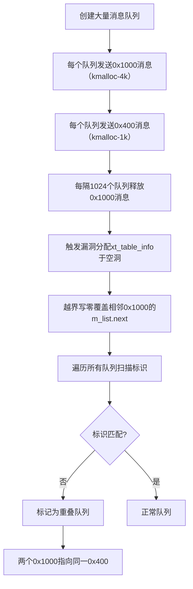

**消息分配与密集填充**：首先创建大量消息队列（数量级为数千），每个队列中依次发送两条消息：第一条大小为 0x1000 字节（落入 kmalloc-4k 缓存），第二条大小为 0x400 字节（落入 kmalloc-1k 缓存）。这种分配策略使得两类 `msg_msg` 对象在 slab 中形成高度密集且有序的交替排布，每个 `msg_msg` 对象的 `m_list.next` 指向紧跟其后的 0x400 消息对象。每个对象都携带一个唯一的标识标记（包含发送队列的编号），便于后续识别与定位。

**制造结构性空洞**：在所有队列分配完成后，每隔一定间隔（如每 1024 个队列），从队列中取出第一条 0x1000 消息，释放其占用的内存。这样便在密集的 `msg_msg` 序列中制造了若干均匀分布的空洞。这些空洞是专门为后续 `xt_table_info` 对象的分配预留的位置——因为 `xt_table_info` 的大小同样落在 kmalloc-4k 范围内，且通过 `kvmalloc(GFP_KERNEL_ACCOUNT)` 分配，与 0x1000 的 `msg_msg` 属于同一组内存缓存，因此新分配的 `xt_table_info` 有很大概率恰好占用这些空洞，使其 `entries` 数据区紧邻着某个 0x1000 的 `msg_msg` 对象。

**触发越界写零**：通过构造特定大小的 `ipt_replace` 规则，调用 `setsockopt(IPT_SO_SET_REPLACE)`，触发漏洞函数 `xt_compat_target_from_user` 中的 `memset`。`xt_table_info` 分配于先前释放的 0x1000 空洞中，其 `entries` 区域的结束地址与相邻 0x1000 `msg_msg` 的起始地址紧密相邻。经过精确计算规则中 `ipt_entry`、`xt_entry_match` 和 `xt_entry_target` 的累计大小，使转换后的规则数据恰好填满 `entries` 区域，从而使得对齐填充写入的零值越过边界，覆盖到相邻 0x1000 `msg_msg` 的 `m_list.next` 指针的最低字节。

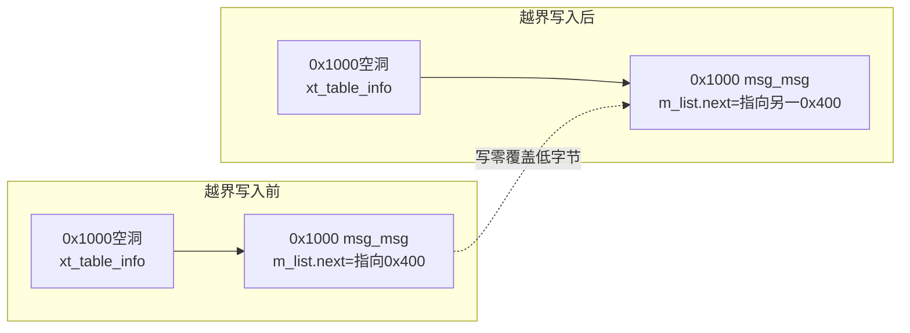

由于 `m_list.next` 指向同一队列中紧随其后的 0x400 消息，将该地址的最低字节清零后，其指向可能从原本的 0x400 偏移至同一 slab 内另一个 0x400 对象的头部位置。这一操作使得两个不同队列中的 0x1000 消息的 `m_list.next` 同时指向同一个 0x400 消息对象，从而导致两个消息队列共享同一块消息内存。

**重叠队列的定位与验证**：为了识别哪些队列发生了重叠，需要遍历所有队列，以非破坏性方式（`msgrcv` 配合 `IPC_NOWAIT` 与 `MSG_PEEK`）尝试读取第二条消息（0x400）。由于消息内容中嵌入了发送队列编号作为标识，若读取到的消息中的标识编号与当前队列编号不一致，则说明该队列的 0x400 消息已被另一个队列的 0x400 消息所覆盖（即发生了对象重叠）。通过这种标识扫描，可以精确地定位出受害队列（保留悬空引用的队列）和真实所有者队列（实际拥有该消息对象的队列），为下一步的 UAF 构造提供明确的操作目标。

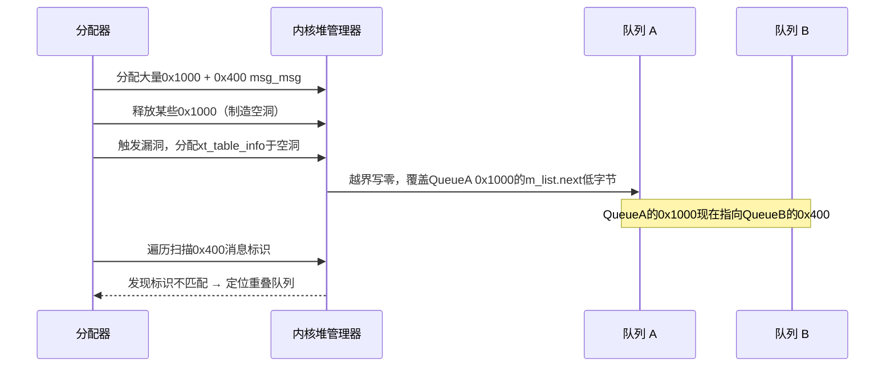

### 5-4. 阶段三：释放后重用构造

当两个队列中的 0x1000 消息都指向同一个 0x400 `msg_msg` 对象时，从真实所有者队列中取出该 0x400 消息（执行 `msgrcv` 系统调用），内核会将该消息从队列中移除并将其数据区释放回 SLUB 分配器。然而，受害队列中 0x1000 消息的 `m_list.next` 仍然保留着指向该已释放内存的指针，从而形成典型的释放后重用（UAF）条件。

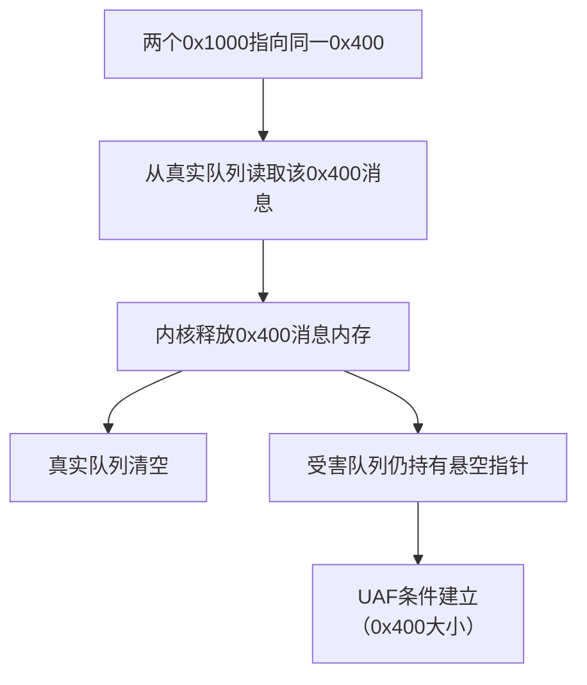

这一阶段的操作极为精简：只需从真实所有者队列中执行一次 `msgrcv` 读取第二条消息（0x400）即可。释放完成后，该内存块被标记为空闲，并被放入当前 CPU 的 SLUB 空闲链表中，等待后续分配请求将其重新投入使用。此时，受害队列成为一个悬空指针的载体——任何针对该队列的后续消息操作（如 `peek`、`msgrcv` 或 `msgctl`）都将访问已被释放的 0x400 内存区域。这种悬空状态本身并不会导致内核立即崩溃，因为释放后的内存尚未被覆写，其原始数据仍暂时保留，但一旦该内存被其他内核对象重用，受害队列读取到的将是完全不同的数据结构。

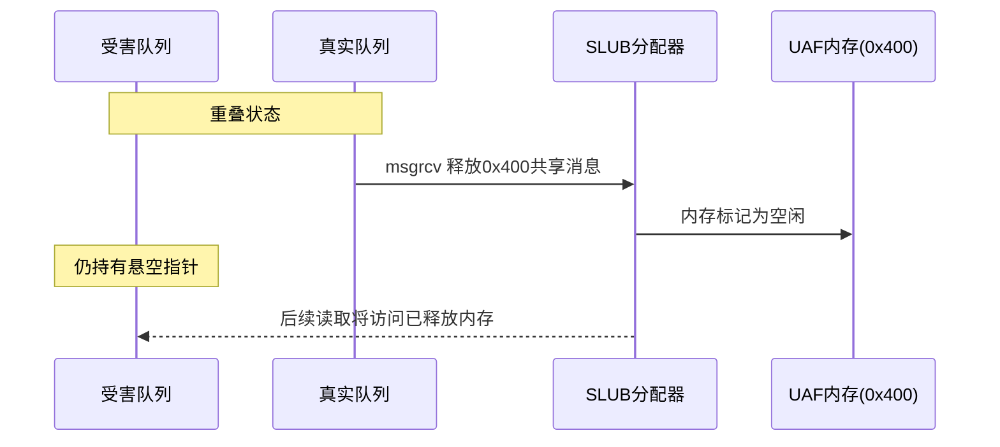

### 5-5. 阶段四：堆地址泄露

有了 UAF 对象后，需要首先确定该对象的精确内核地址，因为后续的所有伪造操作均需要基于准确的地址进行。这一阶段通过两个逐步递进的读取操作来实现：

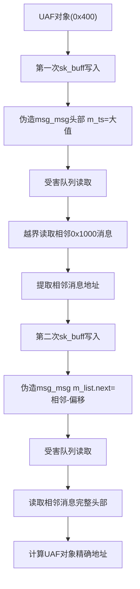

**第一步：越界读取相邻对象**。利用 `sk_buff` 的写入能力，在已释放的 UAF 内存（原 0x400 大小）中构造一个伪造的 `msg_msg` 头部。`sk_buff` 与 0x400 的 `msg_msg` 属于同一组 kmalloc-1k 缓存，因此 `sk_buff` 能够稳定地回收 UAF 内存。这个伪造头部中的 `m_ts`（消息体长度）字段被设定为一个远大于原始 0x400 的值，同时将 `m_list.next` 指向 UAF 对象自身，使得内核在处理该消息时误认为消息数据区延伸到了相邻内存区域。当受害队列随后执行消息读取时，内核会将相邻的 `msg_msg` 对象的内容一并拷贝到用户空间缓冲区。由于相邻消息的头部包含有效的 `m_list` 链表指针，读取返回后即可从越界数据中提取出该相邻消息的内核地址。

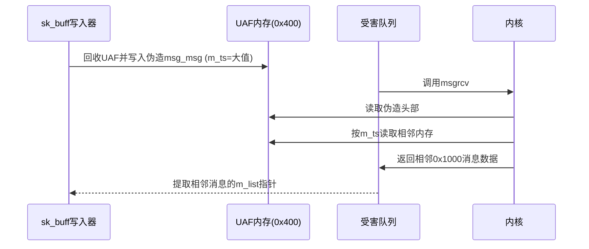

**第二步：精确定位 UAF 对象地址**。获得相邻消息的地址后，再次利用 `sk_buff` 向 UAF 内存写入另一个伪造的 `msg_msg`。这一次，将 `m_list.next` 设置为相邻消息地址减去一个已知的固定偏移量（该偏移量等于相邻消息头部到 UAF 对象头部的距离），并将 `m_ts` 设定为足以覆盖相邻消息完整头部的大小。此时受害队列的读取操作将直接返回相邻消息的完整 `msg_msg` 头部数据。从该头部中的 `m_list.next` 字段减去同一固定偏移量，即可计算出 UAF 对象本身的精确内核虚拟地址。

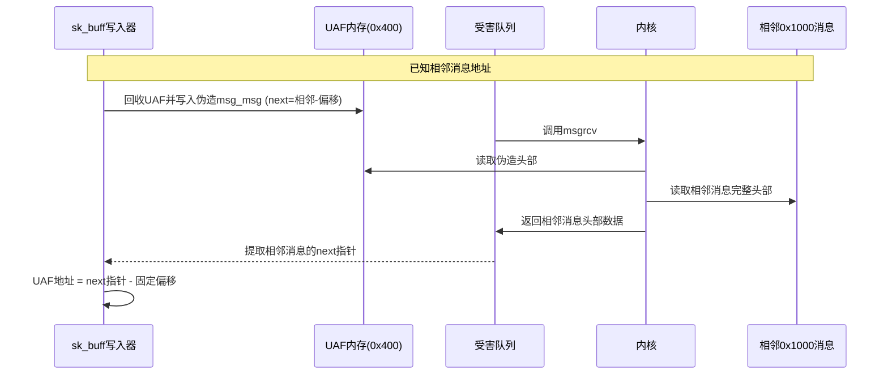

此阶段成功的关键在于 `sk_buff` 必须稳定地回收 UAF 内存。由于 `sk_buff` 与 0x400 的 `msg_msg` 属于同一组 kmalloc-1k 缓存，且 `sk_buff` 的分配与释放完全由用户空间通过套接字操作控制，因此可以保证在 `msg_msg` 释放后的极短时间内，`sk_buff` 能够占据相同的内存位置并写入数据。这种“回收-写入-读取”的循环构成了后续所有内存操控的基础。

### 5-6. 阶段五：内核基址泄露

获得 UAF 对象的地址后，还需绕过 KASLR 获取内核映像的加载基址。本阶段利用 `pipe_buffer` 对象来回收 UAF 内存（0x400 大小），因为该结构体天然包含指向内核代码段的函数指针，且 `pipe_buffer` 同样分配在 kmalloc-1k 缓存中。

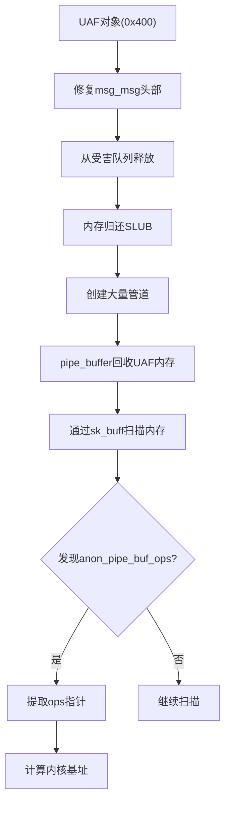

**修复与安全释放**：在回收 UAF 内存之前，首先必须修复该内存中残留的 `msg_msg` 头部，使其成为一个合法的消息结构体。具体做法是构造一个完整且有效的 `msg_msg` 头部（设置合理的 `m_ts`、`m_type` 和 `m_list` 指针），通过 `sk_buff` 写入 UAF 内存，然后从受害队列中正常执行 `msgrcv` 取出该消息。经过修复的消息能够被内核正常释放而不会触发崩溃，内存块因此被干净地归还给 SLUB 分配器。

**管道缓冲区分配**：紧接着创建大量管道（`pipe` 系统调用），并在每个管道中写入少量数据。内核在处理管道写入时会为每个管道分配一个 `pipe_buffer` 结构体（包含指向数据页的指针、偏移量、长度以及 `ops` 函数指针表）。由于 `pipe_buffer` 同样分配在 kmalloc-1k 缓存，且分配时机紧跟在 `msg_msg` 释放之后，这些新分配的 `pipe_buffer` 有极高的概率占用之前 UAF 内存所在的物理页面，实现对象回收。

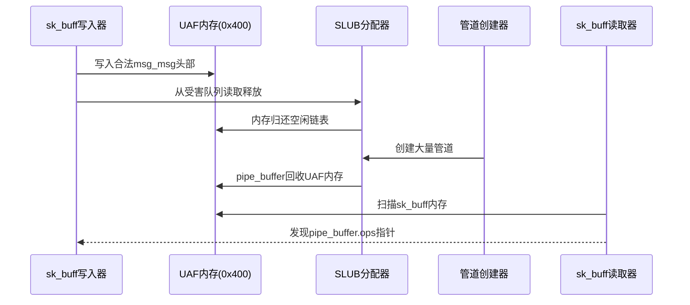

**扫描与地址提取**：利用之前建立的 `sk_buff` 读取通道，逐个检查已分配的套接字缓冲区内容，在其中搜索 `pipe_buffer` 结构体的特征——特别是 `ops` 字段的值。在标准内核中，管道缓冲区的 `ops` 指针指向全局符号 `anon_pipe_buf_ops`，该符号位于内核映像的只读数据段，其地址与内核基址之间保持着固定的编译期偏移。一旦在某块内存中扫描到落在 `anon_pipe_buf_ops` 预期地址范围内的指针值，即可提取该值，减去已知的固定偏移，从而计算出当前内核的实际加载基址。基于该基址，所有内核函数地址和关键数据结构地址均可随之动态计算得出。

### 5-7. 阶段六：控制流重定向

最终阶段的目标是获得内核执行流的控制权。本阶段利用 `pipe_buffer` 的 `ops` 函数指针表作为重定向目标，结合栈迁移技术将执行流导入精心构造的 ROP 链。

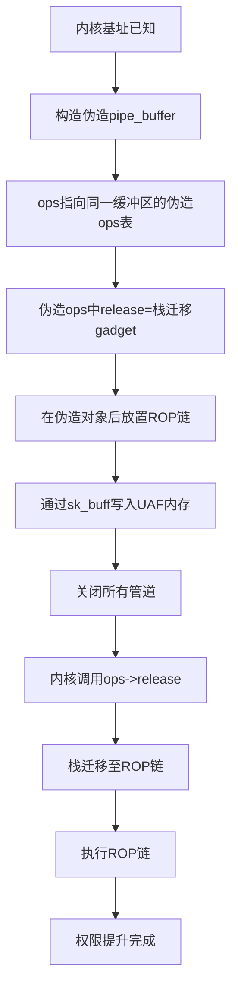

**伪造对象构造**：在用户空间内存中构造一个完整的伪造 `pipe_buffer` 结构体。该伪造对象的 `ops` 字段不再指向内核的 `anon_pipe_buf_ops`，而是回指到同一块用户空间缓冲区内的伪造 `pipe_buf_operations` 结构体。在这个伪造的 `ops` 表中，`release` 回调函数指针被设置为一个能够迁移栈指针的 gadget，而 `confirm` 回调被设置为另一个控制栈指针偏移的 gadget。这种设计确保当内核调用这些回调时，栈指针将被迁移到伪造对象之后的区域，即 ROP 链所在的位置。

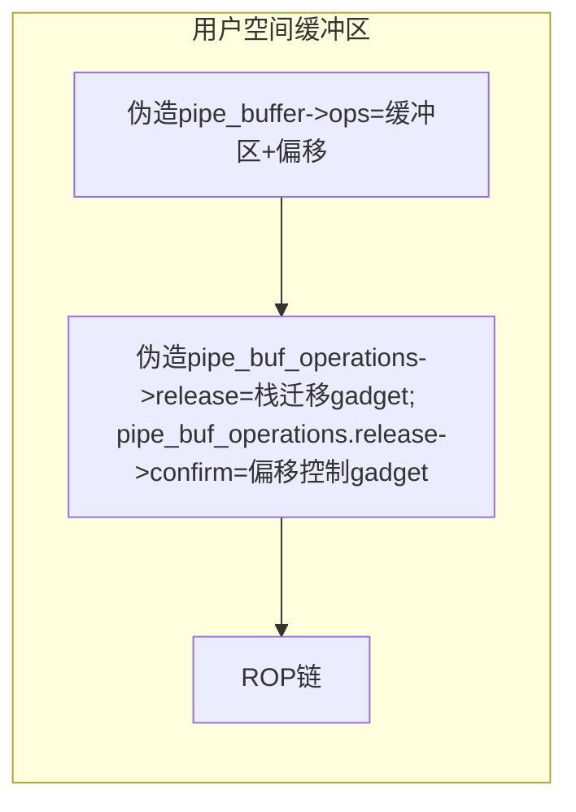

**ROP 链编排**：在伪造 `pipe_buffer` 之后连续放置完整的 ROP 链。ROP 链的设计严格遵循内核执行上下文的要求，依次执行以下关键操作：

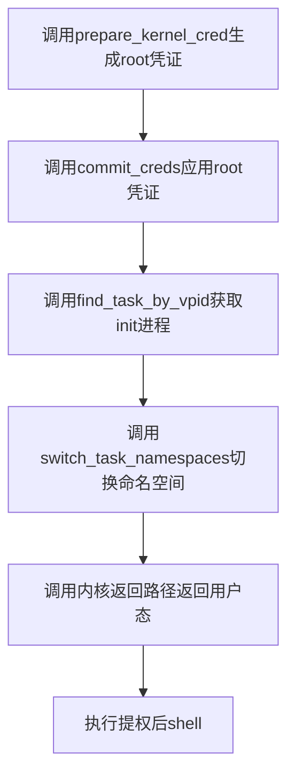

首先调用 `prepare_kernel_cred(0)` 生成 root 凭证结构体，再调用 `commit_creds` 将其应用到当前进程，完成权限提升；随后调用 `find_task_by_vpid(1)` 获取 init 进程的 `task_struct` 指针，接着调用 `switch_task_namespaces`，将当前进程的命名空间替换为 init 进程的命名空间，从而突破容器隔离边界；最后执行内核原生返回路径，配合预设的用户态寄存器上下文，平滑地返回用户空间的提权后处理函数。

**触发与执行**：将构造好的伪造 `pipe_buffer` 通过 `sk_buff` 写入 UAF 内存——此时该内存已被 `pipe_buffer` 回收，但受害队列仍持有悬空引用，因此写入操作实际上覆盖了真实的 `pipe_buffer`。随后关闭所有管道，内核在销毁每个管道时会遍历其 `pipe_buffer` 数组并调用 `ops->release` 回调。对于被篡改的管道，这一调用将触发前述的栈迁移 gadget，进而启动 ROP 链的执行。

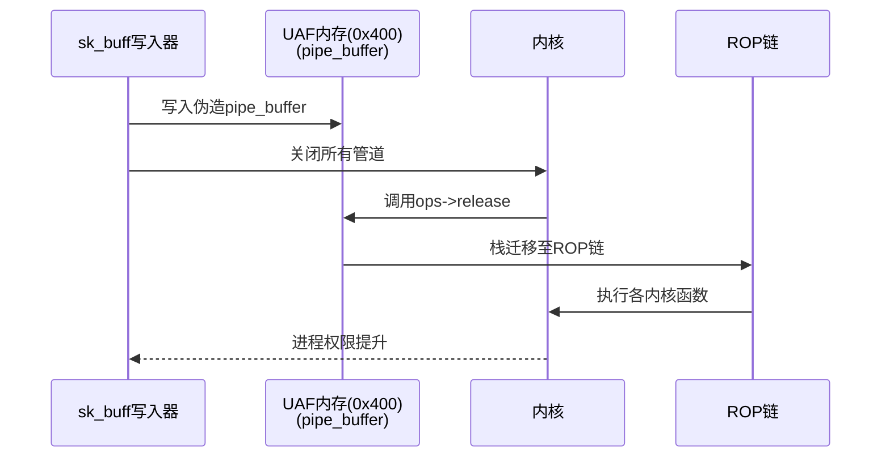

### 5-8. 同步与判定机制

在整个利用过程中，需要多次确认操作是否成功，特别是在重叠队列定位、UAF 状态验证和地址泄露的各个阶段。同步与判定机制主要依赖消息队列的系统调用组合与内容标识比对：

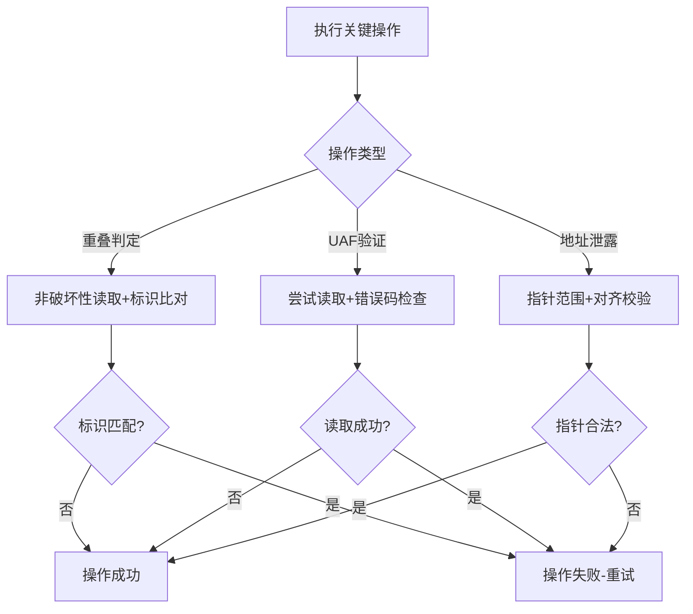

- **重叠判定**：在阶段二的扫描过程中，对每个队列执行非破坏性读取。若返回的消息内容中的标识字段（包含源队列编号）与当前队列编号不符，则判定该队列发生了重叠。同时，通过检查 `msgctl` 返回的队列状态信息来交叉验证重叠是否生效。

- **UAF 验证**：在阶段三释放操作完成后，再次对受害队列执行非破坏性读取。若读取成功且返回的内容并非预期的原始数据（或发生 `EIDRM`/`ENOMSG` 异常），则表明 UAF 条件已建立。若读取完全失败，则说明内存已被彻底销毁或队列状态异常，需要回退重试。

- **地址泄露验证**：在阶段四和阶段五的读取操作后，对返回的数据进行多重校验。首先验证数据中是否包含已知的标识常量，其次检查提取的指针值是否落在合法的内核地址范围内，最后通过指针值的页面对齐性判断是否合理。所有校验通过后方可进入下一阶段，否则重新执行分配与读取循环。

### 5-9. 内核保护机制的应对策略

现代内核部署了多项安全防护机制，该利用方案设计了对应的绕过策略：

- **KASLR**：通过阶段五从 `pipe_buffer` 的 `ops` 指针中提取 `anon_pipe_buf_ops` 的实际运行时地址，减去其在内核映像中的固定编译偏移，即可精确计算出内核基址。后续所有地址均基于该动态基址进行计算。

- **SMEP/SMAP**：整个 ROP 链执行期间，所有内存访问均发生内核地址空间内。只有在 ROP 链的最终阶段——即返回用户态时——才会触及用户空间数据。内核的原生返回路径已经包含了必要的上下文切换序列，会自动恢复用户态页表与 GS 基址。

- **KPTI**：利用方案依赖内核原生的返回路径，该路径在执行 `iret` 之前已经完成了 KPTI 所需的页表切换，因此能够平滑地从内核态返回用户态。

- **堆分配随机化**：该机制会随机化 slab 空闲链表中对象的分配顺序，增加了预测相邻对象相对位置的难度。利用方案通过两个手段应对：一是大规模分配（数千个对象），将随机扰动平均化；二是通过标识扫描动态检测实际的内存布局，自适应地调整后续操作。

### 5-10. 利用条件与局限性

该利用方案在以下条件下有效：

- **内核版本**：目标内核版本在受影响的范围内（v2.6.19-rc1 至 v5.12-rc7），且未应用官方补丁。
- **命名空间支持**：内核编译时启用了 **`CONFIG_USER_NS`**，允许非特权用户创建用户命名空间并获取 `CAP_NET_ADMIN` 能力。
- **系统资源限制**：系统允许创建足够数量的消息队列，且进程的文件描述符限制大于管道数量与套接字数量之和。
- **SLUB 分配器配置**：目标内核使用 SLUB 分配器且 kmalloc-4k 与 kmalloc-1k 缓存的行为符合预期。

局限性包括：

- 需要较为精确的堆布局控制，不同内核版本或编译选项可能导致结构体大小与对齐方式变化，需要适当调整分配参数。
- 对于开启了堆分配随机化的内核，堆布局的随机性增加，可能降低首次成功率。但通过重复尝试和扩大分配规模，仍可达到较高的整体成功率。
- 该方案依赖消息队列功能，在部分高度定制化的嵌入式内核中若消息队列被禁用，则方案不适用。
- 利用过程中会消耗大量系统资源，在资源受限的环境中可能因达到系统上限而失败。在容器环境中尤为适用，因为容器通常允许用户命名空间且资源限制相对宽松。

### 5-11. 章节总结

本章详细阐述了一种针对 **CVE-2021-22555** 的完整利用方案。其核心策略是将“写零”原语通过堆布局转化为 0x1000 与 0x400 `msg_msg` 的对象重叠，进而释放 0x400 对象形成 UAF，再通过 `sk_buff` 与 `pipe_buffer` 的组合操作逐步泄露内核地址，最终重定向控制流完成权限提升。整个方案充分利用了内核对象的分配特性与消息队列、管道、网络套接字等内核接口。该方案不仅适用于本地权限提升，也适用于容器逃逸场景。同时，本章也讨论了该方案的适用条件与局限性，为读者提供了可复现的实践参考。

### 5-12. 测试结果

<div style="text-align: center; margin: 2rem 0;">
  
</div>

## 6. 利用思路二

本章阐述 **CVE-2021-22555** 的另一种利用方案。该方案将漏洞的“堆越界写零”与 Dirty Pipe 技术（CVE-2022-0847）相结合，通过对 **`pipe_buffer`** 数组与物理页面的精确操控，实现无文件权限检查的页面缓存覆写，最终在 `/etc/passwd` 中注入特权账户。与第五章的利用思路不同，本方案不依赖消息队列和 ROP 链，而是直接作用于管道子系统与页缓存，形成一条简洁高效的提权路径。

本方案在实现上提供了两种变体：**完整版**包含内核基址泄露阶段（便于调试与可读性验证），**精简版**则完全跳过地址泄露，仅依赖数据结构的原样复用即可完成最终覆写。本章按照完整版进行描述，同时明确指出泄露步骤在实际操作中可以安全省略。

### 6-1. 整体架构

该利用方案的总体思路可概括为“**堆布局 → 管道数组重叠 → 物理页回收与悬空指针 → 结构操控与文件篡改**”。漏洞的写零能力被用于修改相邻 `pipe_buffer` 数组中第一个元素的 `page` 指针低字节，使两个独立的管道环共享同一个物理页面。随后关闭受害管道，该物理页面被释放回伙伴系统的 order-0 链表中，而邪恶管道仍持有悬空指针。通过后续的 `splice` 操作将目标文件的页面缓存与管道绑定，并操控 `pipe_buffer` 结构体设置 Dirty Pipe 标志，最终将任意数据写入文件。

方案的核心组件是 **`pipe_buffer` 数组**和 **`ipt_replace` 规则对象**。`pipe_buffer` 数组在内核中以连续内存块的形式存在，其大小取决于管道的容量：当容量为 `0x1000 * 32` 时，数组大小为 32 × 40 = 1280 字节，落入 kmalloc-2048 缓存；当容量为 `0x1000 * 4` 时，数组大小为 4 × 40 = 160 字节，落入 kmalloc-192 缓存。`ipt_replace` 对象通过漏洞触发时的 `xt_alloc_table_info` 分配，同样位于 kmalloc-2048 缓存。通过精心设计的内存排布，可以使 `ipt_replace` 的 `entries` 区域恰好紧邻一个 `pipe_buffer` 数组的末尾，从而利用越界写零覆盖该数组中第一个 `pipe_buffer` 的 `page` 指针的低字节。

```mermaid
flowchart TD
    A[阶段一: 环境初始化] --> B[阶段二: 堆喷与重叠]
    B --> C[阶段三: 重叠检测与悬空指针构建]
    C --> D[阶段四: 结构操控与文件篡改]
    D --> E[获得特权账户]
```

各阶段数据依赖关系：

```mermaid
flowchart LR
    subgraph 输入
        ENV[命名空间/套接字/目标文件]
    end
    ENV --> S2

    subgraph S2[阶段二]
        OVERLAP[重叠管道]
    end
    OVERLAP --> S3

    subgraph S3[阶段三]
        PTR[悬空物理页指针]
        KBASE[内核基址（可选）]
    end
    PTR --> S4
    KBASE -.->|可选验证| S4

    subgraph S4[阶段四]
        WRITE[文件覆写]
    end
```

### 6-2. 环境初始化

在触发漏洞前，必须建立运行环境，并初始化必要的资源。此阶段的操作流程如下：

```mermaid
sequenceDiagram
    participant User as 利用程序
    participant NS as 内核命名空间
    participant CPU as CPU调度器
    participant Socket as 网络套接字
    participant PGV as PGV分配器
    participant File as /etc/passwd

    User->>CPU: 绑定到CPU 0
    CPU-->>User: 绑定完成
    User->>NS: 创建用户命名空间
    NS-->>User: 获得CAP_NET_ADMIN
    User->>Socket: 打开原始套接字
    Socket-->>User: 返回文件描述符
    User->>File: 打开目标文件
    File-->>User: 返回文件描述符
    User->>PGV: 初始化页面级喷水器
    PGV-->>User: 准备就绪
```

**CPU 绑定**：将进程绑定到单一 CPU 核心，确保堆分配和释放的确定性，提高相邻分配的概率。

**命名空间隔离**：创建用户命名空间以获取 `CAP_NET_ADMIN`，满足触发 Netfilter 漏洞所需的权限条件。

**原始套接字**：打开 `AF_INET, SOCK_STREAM` 套接字，作为提交 `ipt_replace` 规则的通道。

**目标文件**：打开 `/etc/passwd` 并保持其文件描述符，后续通过 `splice` 将其页面缓存与管道绑定。该操作无需写入权限，仅需读取权限即可。

**页面级喷水器（PGV）**：初始化 PGV 子系统，用于后续耗尽空闲的 order-3 物理页。PGV 通过系统调用分配大量页面，这些页面将从伙伴系统的 order-3 空闲链中取出，从而影响后续 kmalloc-2048 对象的物理放置位置。

**管道初始化**：创建大量管道（500 个），并写入唯一的魔数标记（包含管道索引），以便后续检测重叠。默认管道容量（16 个 buffer 条目，640 字节）使 `pipe_buffer` 数组落入 kmalloc-1024 缓存，但随后会被调整。

### 6-3. 堆喷与越界重叠

本阶段的目标是构造一个特定的堆布局，使得漏洞的越界写零能够覆盖到相邻 `pipe_buffer` 数组中第一个元素的 `page` 指针。具体流程如下：

```mermaid
flowchart TD
    A[耗尽空闲order-3页] --> B[将所有管道扩容至32条目<br/>（kmalloc-2048）]
    B --> C[每隔100个管道缩容至4条目<br/>（kmalloc-192），释放旧数组]
    C --> D[触发漏洞，分配ipt_replace于空洞]
    D --> E[越界写零，覆盖相邻pipe_buffer的page指针低字节]
    E --> F[完成管道物理页重叠]
```

**耗尽 order-3 页**：通过 PGV 分配 128 个 order-3 页面（每个 32KB），从伙伴系统的空闲列表中移除这些大块。由于 kmalloc-2048 的 slab 也依赖于 order-3 页（每个 slab 页可容纳多个 kmalloc-2048 对象），此操作迫使后续 kmalloc-2048 分配从新分裂的高阶内存块中获取，提高了相邻分配的物理连续性。

**喷水管缓冲区数组**：将所有管道的容量调整为 `0x1000 * 32`，此时每个管道的 `pipe_buffer` 数组包含 32 个条目，共 1280 字节，落入 kmalloc-2048 缓存。大量数组的密集分配使得它们与后续的 `ipt_replace` 对象在内存中形成相邻排布。

**制造空洞**：每隔 100 个管道，将其容量缩小至 `0x1000 * 4`（4 个条目，160 字节，落入 kmalloc-192）。缩容操作会释放原有的 kmalloc-2048 数组，在 slab 中留下均匀分布的空洞。这些空洞将成为 `ipt_replace` 对象的落脚点。

**触发越界写零**：构造尺寸为 0x800 字节的 `ipt_replace` 规则，通过 `setsockopt` 提交。该规则分配在之前释放的 kmalloc-2048 空洞中，其 `entries` 区域经过精心计算后恰好与相邻的 `pipe_buffer` 数组末尾紧密相邻。漏洞触发时，`memset` 写入的零值会越过边界，覆盖相邻数组的第一个 `pipe_buffer` 的 `page` 指针的最低字节。由于 `page` 指针指向物理页框，将其低字节清零相当于将该指针向下偏移至同一物理页内的另一个位置，实现两个管道 `pipe_buffer` 指向同一物理页面的重叠。

```mermaid
flowchart LR
    subgraph Before[越界写入前]
        A1[kmalloc-2048 空洞<br/>ipt_replace entries] --> A2[pipe_buffer数组<br/>第一个条目 page=0x...XX]
    end
    subgraph After[越界写入后]
        B1[kmalloc-2048 空洞<br/>ipt_replace entries] --> B2[pipe_buffer数组<br/>第一个条目 page=0x...00]
    end
    A2 -.->|写零覆盖低字节| B2
```

### 6-4. 重叠检测与悬空指针构建

本阶段有三个核心任务：识别重叠管道、回收共享物理页以建立悬空指针，以及（可选地）泄露内核基址以增强后续操控的可读性与确定性。操作流程如下：

```mermaid
flowchart TD
    A[读取每个管道的魔数] --> B{魔数中的索引与当前索引匹配?}
    B -->|否| C[标记为重叠对]
    B -->|是| D[继续扫描]
    C --> E[关闭受害者管道]
    E --> F[释放pipe_buffer数组至kmalloc-2048空闲链表]
    E --> G[释放物理页面至伙伴系统order-0]
    G --> H[邪恶管道保留悬空page指针]
    H --> I[通过悬空指针读取pipe_buffer结构]
    I --> J[提取page_cache_pipe_buf_ops指针（可选）]
    J --> K[计算内核基址（可选）]
    K --> L[悬空指针就绪]
```

**重叠检测**：遍历所有管道，从每个管道的读端读取之前写入的魔数。若读取到的 `pipe_data[1]`（管道索引）与当前管道索引不符，则说明该管道的内容已被另一个管道覆盖，即发生了物理页面重叠。记录受害管道（被覆盖的）和邪恶管道（覆盖者）。

**关闭受害者管道**：关闭受害者管道的两个文件描述符。此操作触发两个关键的内存释放动作：

1. 释放该管道的 **`pipe_buffer` 数组**（大小为 kmalloc-2048），该内存块被归还至 SLUB 分配器的空闲链表。
2. 释放该管道 `pipe_buffer->page` 所指向的**物理页面**（大小为 4KB），该页面通过伙伴系统被归还至 **order-0 空闲链表**。

值得特别说明的是，`pipe_buffer->page` 指向的是一个 `struct page` 结构体，它描述了一页 4KB 的物理内存。当受害者管道关闭时，这一页物理内存被释放回伙伴系统，但邪恶管道的 `pipe_buffer` 中仍然保留着指向同一个 `struct page` 的指针——该指针成为一个悬空引用。此时，这一页物理内存已经可以被伙伴系统重新分配给其他内核子系统使用，但邪恶管道仍然能够通过该悬空指针访问这一页上的原始数据，直至该物理页被重新初始化或覆写。

**内核基址泄露（可选步骤）**：由于邪恶管道仍持有悬空指针，且该物理页上的数据尚未被覆盖（受害者管道的 `pipe_buffer` 结构仍残留在该页上），利用程序可以通过邪恶管道读取该物理页的内容，从而提取出受害者管道的 `pipe_buffer` 结构体。该结构中的 `ops` 指针指向全局符号 `page_cache_pipe_buf_ops`（位于内核只读数据段）。提取该指针后减去固定偏移即可计算出内核基址。此步骤**并非后续 Dirty Pipe 覆写所必需**，因为后续操作完全复用现有的 `ops` 值而不需要知道其具体数值。本描述保留此步骤仅出于完整性考虑，实际利用中可以直接跳过，以进一步简化流程并避免任何可能因 KASLR 偏移计算错误带来的不确定性。

```mermaid
sequenceDiagram
    participant PipeA as 邪恶管道
    participant PipeB as 受害者管道
    participant Slab as SLUB分配器
    participant Buddy as 伙伴系统

    Note over PipeA,PipeB: 重叠状态
    PipeB->>Slab: 关闭释放pipe_buffer数组
    PipeB->>Buddy: 关闭释放物理页面(order-0)
    Note over PipeA: 仍持有悬空page指针
    PipeA->>PipeA: 可通过悬空指针读写已释放页面
    opt 可选泄露
        PipeA->>PipeA: 读取残留的pipe_buffer
        PipeA->>PipeA: 提取ops→计算内核基址
    end
```

### 6-5. 结构操控与文件篡改

最终阶段利用悬空指针和内存回收机制，直接将目标文件的页面缓存与管道绑定，并设置 Dirty Pipe 标志完成篡改。操作流程如下：

```mermaid
flowchart TD
    A[缩容所有管道至4条目] --> B[分配新kmalloc-192数组<br/>回收原pipe_buffer数组内存]
    B --> C[通过邪恶管道读写回收的内存]
    C --> D[使用splice绑定/etc/passwd页缓存]
    D --> E[操控pipe_buffer结构<br/>指向目标缓存页]
    E --> F[保留原有ops指针<br/>（无需知道具体地址）]
    F --> G[设置PIPE_BUF_FLAG_CAN_MERGE标志]
    G --> H[写入恶意条目至管道]
    H --> I[数据合并到/etc/passwd页缓存]
```

**回收 `pipe_buffer` 数组内存**：将所有其他管道（除邪恶管道外）的容量缩小至 `0x1000 * 4`。此缩容操作会分配新的 kmalloc-192 大小的 `pipe_buffer` 数组。由于前一步中受害者管道的 kmalloc-2048 数组内存已被释放，且该内存对应的物理页（order-0）回到了伙伴系统，kmalloc-192 的 slab 分配器会优先从伙伴系统中获取该物理页来构建其 slab，因此这些新分配的 kmalloc-192 对象将**落在这块已被释放的物理页上**。由于邪恶管道仍然通过悬空指针指向该物理页，利用程序可以通过邪恶管道的读写操作，直接观测并修改这些新分配的 `pipe_buffer` 数组的内容。

**绑定目标文件页面缓存**：利用 `splice` 系统调用，将 `/etc/passwd` 文件的一个字节从文件描述符传输到某个目标管道中。此操作将 `/etc/passwd` 的页面缓存页加载到内存中，并将该管道的 `pipe_buffer->page` 指针指向该缓存页。

**操控 `pipe_buffer` 结构**：通过邪恶管道的读写能力，在回收的内存中找到目标管道的 `pipe_buffer` 条目，将其关键字段修改为：

- **保留原有的 `ops` 指针**（该指针指向 `page_cache_pipe_buf_ops`），**无需修改**，因此**完全不需要知道该指针的具体数值**，这避免了依赖 KASLR 偏移。
- 将 `page` 指针设置为指向 `/etc/passwd` 的页面缓存页。
- 将 `offset` 和 `len` 设置为合适值（通常为 0 和待写入长度）。
- 将 `flags` 字段设置为 **`PIPE_BUF_FLAG_CAN_MERGE`**（值为 0x10）。此标志是 Dirty Pipe 技术的核心：它告诉内核，后续对该管道的写操作不必创建新的匿名页，而是可以直接合并到 `page` 指针所指向的现有物理页中。由于该物理页属于文件页缓存，这一合并操作实际上就是在直接修改文件内容，而文件系统层的权限检查在此过程中被完全绕过。

**注入恶意数据**：向目标管道写入预先准备的 `/etc/passwd` 条目（例如 `root::0:0:root:/root:/bin/sh\n`）。由于 `CAN_MERGE` 标志已被设置，且 `page` 指针指向文件缓存页，内核会将新数据直接写入该缓存页。最终，`/etc/passwd` 文件被成功修改，新增了一个无密码的 root 账户。

```mermaid
sequenceDiagram
    participant User as 利用程序
    participant Pipe as 目标管道
    participant Kernel as 内核
    participant Cache as 文件页缓存

    User->>Pipe: 通过悬空指针覆写pipe_buffer结构
    Note over Pipe: 保留原有ops，设置CAN_MERGE
    User->>Pipe: 写入/etc/passwd恶意条目
    Pipe->>Kernel: 触发写入，检测到CAN_MERGE标志
    Kernel->>Cache: 直接合并数据到/etc/passwd缓存页
    Cache-->>User: 文件内容被篡改
```

### 6-6. 状态验证机制

- **重叠判定**：通过读取魔数匹配，若索引不匹配则确认重叠。由于魔数是用户空间可控的数据，读取后的比对准确可靠。
- **悬空指针有效性验证**：通过关闭受害者管道并尝试通过邪恶管道读取数据，若仍能读取到原始魔数或部分数据，则说明悬空指针有效且物理页尚未被覆写。
- **内核基址泄露验证（可选）**：若执行泄露步骤，则检查提取的 `ops` 指针是否落在内核符号的预期地址范围内，以确认泄露成功。若跳过此步骤则无需验证。
- **文件覆写验证**：写入恶意条目后，可尝试使用 `getpwnam` 或直接读取 `/etc/passwd` 验证新行是否存在，随后直接通过 `su` 登录确认。

### 6-7. 防护机制应对

- **KASLR**：本方案**完全不必依赖内核基址**。利用过程始终复用现有的 `pipe_buffer` 结构及其原有的 `ops` 函数指针，无需计算任何内核符号地址。即使选择执行泄露步骤，该步骤也仅用于验证和增强可读性，并非利用的必要前提。这使得操作更加可靠，完全规避了 KASLR 带来的不确定性。
- **SMEP/SMAP / KPTI**：本方案不涉及内核代码执行或 ROP 链，所有操作均为纯数据结构的操控与页缓存写入，不触发内核态到用户态的代码跳转，因此完全不受这些机制影响。
- **堆随机化**：通过大规模喷水（500 个管道）和 PGV 耗尽 order-3 页，结合精确的空洞间隔，将随机性影响降至最低。

### 6-8. 适用条件与局限

**适用条件**：

- 内核版本在受影响范围内（v2.6.19-rc1 至 v5.12-rc7），且未应用官方补丁。
- 支持用户命名空间（`CONFIG_USER_NS`），允许非特权用户获得 `CAP_NET_ADMIN` 能力。
- 目标文件 `/etc/passwd` 存在且可读（通常如此）。
- 系统允许创建大量管道和调整管道容量（`/proc/sys/fs/pipe-max-size` 足够）。

**局限性**：

- 需要较为精确的堆布局调参，不同内核版本可能需要调整 `EVIL_SIZE` 和空洞间隔。
- 物理页面被释放回伙伴系统后，存在被其他内核路径重新分配的风险。通过迅速执行后续的 `splice` 与结构覆写操作，可大幅降低干扰概率。
- 该方案会修改系统文件，可能对系统完整性造成影响，需谨慎使用。

### 6-9. 章节小结

本章详细阐述了第二种利用 **CVE-2021-22555** 的方案。该方案利用漏洞在 kmalloc-2048 缓存中的越界写零，覆盖相邻 `pipe_buffer` 数组的 `page` 指针低字节，实现两个管道共享同一物理页。随后通过关闭受害管道，将物理页面释放回伙伴系统 order-0，而邪恶管道则保留了悬空指针。利用该悬空指针和 SLUB 回收机制，利用者直接操控了 `pipe_buffer` 结构，将其指向 `/etc/passwd` 的页面缓存并设置 Dirty Pipe 标志，实现了无权限文件篡改。本方案在完整版中提供了可选的内核基址泄露步骤以增强可读性，但在实际利用中可以安全省略，从而完全绕过 KASLR。相较于第五章的 ROP 链方案，本方案更为简洁稳定，展示了内核数据面漏洞与文件系统页缓存漏洞组合利用的强大能力，为容器逃逸和本地提权提供了另一种高效的实践路径。

### 6-10. 测试结果

<div style="text-align: center; margin: 2rem 0;">
  
</div>

## 7. 利用思路三

本章阐述 **CVE-2021-22555** 的第三种利用方案。该方案将漏洞的“堆越界写零”与 Dirty Cred 技术（CVE-2021-4154）相结合，通过对 **`pipe_buffer`** 数组与 **`struct file`** 对象的精确操控，实现无文件权限检查的文件覆写，最终在 `/etc/passwd` 中注入特权账户。与第六章的 Dirty Pipe 方案不同，本方案不依赖页缓存合并标志，而是直接篡改内核中已打开文件的访问控制结构体，使得原本只读打开的文件在后续写入时绕过权限检查。

本方案提供了两种变体：**完整版**包含内核基址泄露阶段，便于调试与验证；**精简版**可跳过地址泄露，因为后续覆写操作仅需修改 `struct file` 中的标志位，无需依赖任何内核符号地址。本章按照完整版进行描述，并明确指出泄露步骤在实际操作中可以安全省略。

### 7-1. 整体架构

该利用方案的总体思路可概括为“**堆布局 → 管道数组重叠 → 物理页回收与悬空指针 → 文件对象覆写 → 文件写入权限突破**”。漏洞的写零能力首先用于修改相邻 `pipe_buffer` 数组中第一个元素的 `page` 指针低字节，使两个管道共享同一物理页。随后关闭受害管道，该物理页被释放回伙伴系统的 order-0 空闲链表，邪恶管道则保留悬空指针。接着通过大量打开 `/etc/passwd` 的方式分配 `struct file` 对象，这些对象将复用该物理页，使得邪恶管道可以通过悬空指针读写该页上的 `struct file` 内容。通过修改目标文件对象的 `f_flags` 和 `f_mode` 字段，原本以只读方式打开的文件在内核权限检查时被视为可写，最终使用常规 `write` 系统调用完成文件内容修改。

方案的核心组件依然是 **`pipe_buffer` 数组**和 **`ipt_replace` 规则对象**，其分配特性与第六章完全一致：`pipe_buffer` 数组在容量为 `0x1000 * 32` 时包含 32 个条目（每个 40 字节），共 1280 字节，落入 kmalloc-2048 缓存；`ipt_replace` 对象通过 `xt_alloc_table_info` 分配，同样位于 kmalloc-2048 缓存。通过相同的堆喷与空洞制造手法，使 `ipt_replace` 的 `entries` 区域紧邻目标 `pipe_buffer` 数组，实现越界写零。

选择 `struct file` 作为 Dirty Cred 的操控目标有其内在合理性。`struct file` 是内核中表示已打开文件的核心数据结构，其 `f_flags` 字段决定了文件的访问模式（只读、只写、读写），`f_mode` 字段则控制文件允许的操作类型。每当进程通过文件描述符执行 `read`、`write` 等系统调用时，内核都会检查这些字段以决定是否允许该操作。若能直接修改这些字段，即可在不改变文件系统权限的情况下，将只读文件变为可写。这正是 Dirty Cred 技术的精髓所在。

```mermaid
flowchart TD
    A[阶段一: 环境初始化] --> B[阶段二: 堆喷与重叠]
    B --> C[阶段三: 重叠检测与文件对象回收]
    C --> D[阶段四: 结构覆写与文件篡改]
    D --> E[获得更高权限]
```

各阶段数据依赖关系：

```mermaid
flowchart LR
    subgraph 输入
        ENV[命名空间/套接字/目标文件]
    end
    ENV --> S2

    subgraph S2[阶段二]
        OVERLAP[重叠管道]
    end
    OVERLAP --> S3

    subgraph S3[阶段三]
        PAGE[释放的order-0物理页]
        FILEOBJ[struct file 对象]
        KBASE[内核基址（可选）]
    end
    PAGE --> FILEOBJ
    FILEOBJ --> S4
    KBASE -.->|可选验证| S4

    subgraph S4[阶段四]
        WRITE[文件覆写]
    end
```

### 7-2. 环境初始化

本阶段与第六章的阶段一基本相同，但增加了文件描述符限制的提升，因为后续需要同时打开大量 `/etc/passwd` 文件描述符。操作流程如下：

```mermaid
sequenceDiagram
    participant User as 利用程序
    participant NS as 内核命名空间
    participant CPU as CPU调度器
    participant Socket as 网络套接字
    participant PGV as PGV分配器
    participant RLimit as 资源限制

    User->>RLimit: 提升文件描述符限制
    RLimit-->>User: 限制提升完成
    User->>CPU: 绑定到CPU 0
    CPU-->>User: 绑定完成
    User->>NS: 创建用户命名空间
    NS-->>User: 获得CAP_NET_ADMIN
    User->>Socket: 打开原始套接字
    Socket-->>User: 返回文件描述符
    User->>PGV: 初始化页面级喷水器
    PGV-->>User: 准备就绪
```

**CPU 绑定**：将进程绑定到单一 CPU 核心，确保堆分配和释放的确定性，提高相邻分配的概率。

**文件描述符限制提升**：通过 `setrlimit(RLIMIT_NOFILE)` 将进程的文件描述符上限提升至 4096。本方案后续需要同时打开大量 `/etc/passwd` 文件（通常为 128 个以上），默认的 1024 限制可能不足。提升限制确保了资源充足，同时避免了因描述符耗尽而导致的失败。

**命名空间隔离**：创建用户命名空间以获取 `CAP_NET_ADMIN`，满足触发 Netfilter 漏洞所需的权限条件。

**原始套接字**：打开 `AF_INET, SOCK_STREAM` 套接字，作为提交 `ipt_replace` 规则的通道。

**页面级喷水器（PGV）**：初始化 PGV 子系统，用于后续耗尽空闲的 order-3 物理页。PGV 通过 `sendmmsg` 等系统调用分配大量页面，这些页面将从伙伴系统的 order-3 空闲链中取出，从而影响后续 kmalloc-2048 对象的物理放置位置。

**管道初始化**：创建大量管道（500 个），并写入唯一的魔数标记（包含管道索引），以便后续检测重叠。默认管道容量（16 个 buffer 条目，640 字节）使 `pipe_buffer` 数组落入 kmalloc-1024 缓存，但随后会被调整。

### 7-3. 堆喷与越界重叠

本阶段与第六章的阶段二完全相同，其核心目标是通过堆布局使漏洞的越界写零恰好覆盖相邻 `pipe_buffer` 数组第一个元素的 `page` 指针低字节。操作流程如下：

```mermaid
flowchart TD
    A[耗尽空闲order-3页] --> B[将所有管道扩容至32条目<br/>（kmalloc-2048）]
    B --> C[每隔100个管道缩容至4条目<br/>（kmalloc-192），释放旧数组]
    C --> D[触发漏洞，分配ipt_replace于空洞]
    D --> E[越界写零，覆盖相邻pipe_buffer的page指针低字节]
    E --> F[完成管道物理页重叠]
```

**耗尽 order-3 页**：通过 PGV 分配 128 个 order-3 页面（每个 32KB），从伙伴系统的空闲列表中移除这些大块。由于 kmalloc-2048 的 slab 也依赖于 order-3 页（每个 slab 页可容纳多个 kmalloc-2048 对象），此操作迫使后续 kmalloc-2048 分配从新分裂的高阶内存块中获取，提高了相邻分配的物理连续性。

**喷水管缓冲区数组**：将所有管道的容量调整为 `0x1000 * 32`，此时每个管道的 `pipe_buffer` 数组包含 32 个条目，共 1280 字节，落入 kmalloc-2048 缓存。大量数组的密集分配使得它们与后续的 `ipt_replace` 对象在内存中形成相邻排布。

**制造空洞**：每隔 100 个管道，将其容量缩小至 `0x1000 * 4`（4 个条目，160 字节，落入 kmalloc-192）。缩容操作会释放原有的 kmalloc-2048 数组，在 slab 中留下均匀分布的空洞。这些空洞将成为 `ipt_replace` 对象的落脚点。

**触发越界写零**：构造尺寸为 0x800 字节的 `ipt_replace` 规则，通过 `setsockopt` 提交。该规则分配在之前释放的 kmalloc-2048 空洞中，其 `entries` 区域经过精心计算后恰好与相邻的 `pipe_buffer` 数组末尾紧密相邻。漏洞触发时，`memset` 写入的零值会越过边界，覆盖相邻数组的第一个 `pipe_buffer` 的 `page` 指针的最低字节。由于 `page` 指针指向物理页框，将其低字节清零相当于将该指针向下偏移至同一物理页内的另一个位置，实现两个管道 `pipe_buffer` 指向同一物理页面的重叠。

```mermaid
flowchart LR
    subgraph Before[越界写入前]
        A1[kmalloc-2048 空洞<br/>ipt_replace entries] --> A2[pipe_buffer数组<br/>第一个条目 page=0x...XX]
    end
    subgraph After[越界写入后]
        B1[kmalloc-2048 空洞<br/>ipt_replace entries] --> B2[pipe_buffer数组<br/>第一个条目 page=0x...00]
    end
    A2 -.->|写零覆盖低字节| B2
```

### 7-4. 重叠检测与文件对象回收

本阶段是 Dirty Cred 方案的核心环节，包含三个紧密衔接的任务：识别重叠管道、关闭受害管道以将物理页释放回伙伴系统、通过分配 `struct file` 对象来回收该物理页并借此泄露内核基址（可选）。操作流程如下：

```mermaid
flowchart TD
    A[读取每个管道的魔数] --> B{魔数中的索引与当前索引匹配?}
    B -->|否| C[标记为重叠对]
    B -->|是| D[继续扫描]
    C --> E[关闭受害者管道]
    E --> F[释放pipe_buffer数组至kmalloc-2048空闲链表]
    E --> G[释放物理页面至伙伴系统order-0]
    G --> H[邪恶管道保留悬空page指针]
    H --> I[打开大量/etc/passwd描述符]
    I --> J[struct file对象复用该物理页]
    J --> K[通过悬空指针读取struct file]
    K --> L[提取shmem_file_operations指针（可选）]
    L --> M[计算内核基址（可选）]
```

**重叠检测**：遍历所有管道，从每个管道的读端读取之前写入的魔数。若读取到的 `pipe_data[1]`（管道索引）与当前管道索引不符，则说明该管道的内容已被另一个管道覆盖，即发生了物理页面重叠。记录受害管道（被覆盖的）和邪恶管道（覆盖者）。

**关闭受害者管道**：关闭受害管道的两个文件描述符。此操作触发两个关键动作：

1. 释放该管道的 **`pipe_buffer` 数组**（大小为 kmalloc-2048），该内存块被归还至 SLUB 分配器的空闲链表。
2. **释放该管道 `pipe_buffer->page` 所指向的物理页面（4KB）**，该页面通过伙伴系统被归还至 **order-0 空闲链表**。

此时，邪恶管道的 `pipe_buffer` 中仍然保留着一个指向该已释放物理页面的 `page` 指针——该指针成为一个**悬空引用**。这一页物理内存已经可以被伙伴系统重新分配给其他内核子系统使用，但邪恶管道仍然能够通过该悬空指针访问这一页上的原始数据，直至该物理页被重新初始化或覆写。

**分配 `struct file` 对象以回收页面**：随后，利用程序打开大量 `/etc/passwd` 文件描述符（例如 128 个）。内核为每个打开的文件分配一个 `struct file` 结构体（大小为 256 字节），这些对象来自 `filp` 缓存（即文件对象缓存），该缓存的底层物理页同样是 order-0 页面。由于受害管道释放的物理页已经回到伙伴系统的 order-0 空闲链表中，`filp` 缓存的 slab 分配器会优先从伙伴系统中获取该物理页来构建其 slab。因此，新分配的 `struct file` 对象将**落在这块已被释放的物理页上**。由于邪恶管道仍然通过悬空指针指向该物理页，利用程序可以通过邪恶管道的读写操作，直接观测并修改这些新分配的 `struct file` 的内容。

```mermaid
sequenceDiagram
    participant PipeA as 邪恶管道
    participant PipeB as 受害者管道
    participant Slab as SLUB分配器
    participant Buddy as 伙伴系统
    participant File as struct file

    Note over PipeA,PipeB: 重叠状态，共享物理页
    PipeB->>Slab: 关闭释放pipe_buffer数组
    PipeB->>Buddy: 关闭释放物理页面(order-0)
    Note over PipeA: 仍持有悬空page指针
    Slab->>Buddy: 请求order-0页分配struct file
    Buddy->>Slab: 返回刚释放的页面
    Slab->>File: 在该页上分配struct file
    PipeA->>PipeA: 通过悬空指针读取该页，获得struct file内容
```

**内核基址泄露（可选步骤）**：由于邪恶管道仍持有悬空指针，且该物理页上现在存放着新分配的 `struct file` 对象，利用程序可以通过邪恶管道读取该物理页的内容，从而提取出某个 `struct file` 的 `f_op` 字段。该字段指向全局符号 `shmem_file_operations`（位于内核只读数据段）。提取该指针后减去固定偏移即可计算出内核基址。此步骤**并非后续文件覆写所必需**，因为后续操作仅需修改 `f_flags` 和 `f_mode` 字段，这些字段的偏移量是固定的，无需知道内核基址即可定位。本描述保留此步骤仅出于完整性考虑，实际利用中可以直接跳过，以进一步简化流程。

### 7-5. 结构覆写与文件篡改

最终阶段利用邪恶管道对已释放物理页的悬空指针，直接修改已打开 `/etc/passwd` 文件对象的访问控制字段，从而在后续写入操作中绕过权限检查。操作流程如下：

```mermaid
flowchart TD
    A[通过悬空指针定位目标struct file] --> B[读取其当前内容]
    B --> C[修改f_flags为可写标志]
    C --> D[修改f_mode为可读写模式]
    D --> E[将修改后的结构写回物理页]
    E --> F[通过已打开的描述符执行write]
    F --> G[数据直接写入/etc/passwd]
```

**定位目标 `struct file`**：由于释放的物理页上可能存放了多个 `struct file` 对象（每个 256 字节，4KB 页面可容纳约 16 个），利用程序需要找到与已打开描述符对应的那一个。通常的做法是在打开文件时记录描述符的分配顺序，然后通过扫描该页上的数据结构，寻找 `f_inode` 或 `f_op` 等字段符合预期的对象。在实现中，也可以预先在文件中写入特殊标记（如魔数），然后通过读取管道数据来定位目标对象。

**修改访问控制字段**：将目标 `struct file` 的 `f_flags` 字段修改为 `O_WRONLY` 或 `O_RDWR`（通常将原有标志位清零并设为 `0x1`），并将 `f_mode` 字段修改为允许读写操作的值（例如 `0xd801e`）。`f_flags` 决定了文件描述符的访问模式，`f_mode` 则决定了内核允许对该文件执行的操作类型。通过将这两个字段设置为可写状态，内核在进行权限检查时会认为该文件是以可写方式打开的，尽管原始 `open` 调用使用的是 `O_RDONLY`。

**执行写入**：遍历所有已打开的 `/etc/passwd` 描述符，调用 `write` 系统调用写入预先构造的 `/etc/passwd` 条目（例如 `root::0:0:root:/root:/bin/sh\n`）。由于对应的 `struct file` 已经被篡改，内核的权限检查会返回成功，数据直接写入文件。最终 `/etc/passwd` 被成功修改，新增了一个无密码的 root 账户。

```mermaid
sequenceDiagram
    participant User as 利用程序
    participant PipeA as 邪恶管道
    participant Buddy as 伙伴系统
    participant File as struct file (物理页)
    participant Kernel as 内核

    User->>PipeA: 通过悬空指针读取物理页，找到目标struct file
    User->>PipeA: 修改f_flags和f_mode
    PipeA->>File: 写回修改后的结构
    User->>Kernel: 通过已打开描述符调用write
    Kernel->>File: 检查权限（f_flags/f_mode）
    Note over Kernel: 权限检查通过
    Kernel->>File: 写入数据到/etc/passwd
```

### 7-6. 状态验证机制

在整个利用过程中，需要多次确认操作是否成功，特别是在重叠队列定位、物理页回收验证和文件覆写验证的各个阶段：

- **重叠判定**：在阶段三的扫描过程中，对每个管道执行非破坏性读取。若返回的魔数中的管道索引与当前管道编号不符，则判定发生了重叠，记录受害管道和邪恶管道。

- **物理页回收验证**：在关闭受害者管道后，通过邪恶管道尝试读取数据。若仍能读取到魔数或部分结构体数据，则说明悬空指针有效，物理页已成功被伙伴系统回收。

- **内核基址泄露验证（可选）**：若执行泄露步骤，则检查提取的 `f_op` 指针是否落在内核符号的预期地址范围内，以确认泄露成功。若跳过此步骤则无需验证。

- **文件覆写验证**：写入恶意条目后，可通过 `getpwnam` 或直接读取 `/etc/passwd` 验证新行是否存在，随后直接通过 `su` 登录确认。

### 7-7. 防护机制应对

现代内核部署了多项安全防护机制，本方案对应设计了有效的绕过策略：

- **KASLR**：本方案**完全不必依赖内核基址**。利用过程仅需修改 `struct file` 中的 `f_flags` 和 `f_mode` 字段，这两个字段在结构体中的偏移是固定的，无需计算任何内核符号地址。即使选择执行泄露步骤，该步骤也仅用于验证和增强可读性，并非利用的必要前提。这使得操作更加可靠，完全规避了 KASLR 带来的不确定性。

- **SMEP/SMAP / KPTI**：本方案不涉及内核代码执行或 ROP 链，所有操作均为纯数据结构的悬空指针读写与文件写入，不触发内核态到用户态的代码跳转，因此完全不受这些机制影响。

- **堆分配随机化（`CONFIG_SLAB_FREELIST_RANDOM`）**：该机制会随机化 slab 空闲链表中对象的分配顺序，增加了预测相邻对象相对位置的难度。利用方案通过两个手段应对：一是大规模喷水（500 个管道），将随机扰动平均化；二是通过魔数扫描动态检测实际的内存布局，自适应地识别重叠管道。

- **`filp` 缓存隔离**：`struct file` 分配自独立的 `filp` 缓存，该缓存使用 order-0 物理页。本方案利用这一点，通过关闭受害者管道释放 order-0 页，然后通过大量打开文件使 `filp` 缓存复用该页，实现了从管道子系统到文件子系统的高效“跨缓存”数据交换。

### 7-8. 适用条件与局限

该利用方案在以下条件下有效：

- **内核版本**：目标内核版本在受影响的范围内（v2.6.19-rc1 至 v5.12-rc7），且未应用官方补丁。
- **命名空间支持**：内核编译时启用了 **`CONFIG_USER_NS`**，允许非特权用户创建用户命名空间并获取 `CAP_NET_ADMIN` 能力。
- **系统资源限制**：系统允许创建足够数量的管道，且进程的文件描述符限制（`ulimit -n`）大于管道数量与文件打开数量之和（本方案需要 500 + 128 ≈ 628 个描述符）。
- **SLUB 分配器配置**：目标内核使用 SLUB 分配器，且 kmalloc-2048、kmalloc-192 和 `filp` 缓存的行为符合预期。

局限性包括：

- 需要较为精确的堆布局控制，不同内核版本或编译选项可能导致结构体大小与对齐方式变化，需要适当调整分配参数和空洞间隔。
- 物理页被释放回伙伴系统后，存在被其他内核路径（如其他进程的文件操作或网络分配）重新分配的风险。通过迅速执行后续的文件打开与结构覆写操作，可大幅降低干扰概率，但仍需一定的重试容忍度。
- 该方案会修改系统文件 `/etc/passwd`，可能对系统完整性造成影响，需在隔离环境中谨慎测试。在容器环境中尤为适用，因为容器通常允许用户命名空间且资源限制相对宽松，修改 `/etc/passwd` 后可通过 `su` 直接获得容器内的 root 权限。

### 7-9. 章节小结

本章详细阐述了第三种利用 **CVE-2021-22555** 的方案。该方案通过堆越界写零制造管道重叠，关闭受害管道将物理页释放回伙伴系统 order-0，利用悬空指针和 `filp` 缓存的对象复用，直接篡改内核中已打开文件的 `struct file` 结构体，使只读文件在内核权限检查时被视为可写，从而通过常规 `write` 完成 `/etc/passwd` 篡改。与第六章的 Dirty Pipe 方案相比，本方案不依赖页缓存合并标志，而是直接作用于文件对象本身的访问控制字段，具有不同的适用场景：当目标文件为只读文件系统或页缓存行为存在异常时，Dirty Cred 方案往往更为可靠。三种利用思路（ROP 链、Dirty Pipe、Dirty Cred）从不同角度展示了该漏洞的深远影响，覆盖了从内核代码执行到数据结构操控再到文件系统篡改的多层次利用路径，为安全研究人员提供了丰富的技术参考与实践案例。

### 7-10. 测试结果

<div style="text-align: center; margin: 2rem 0;">
  
</div>

## 8. 漏洞修复

**CVE-2021-22555** 的官方修复补丁于 2021 年 4 月 7 日由 Florian Westphal 提交，commit ID 为 `b29c457a6511435960115c0f548c4360d5f4801d`。该补丁于 2021 年 4 月 13 日被合并至主线内核，并随后向后移植至各稳定分支（包括 5.12、5.10.31、5.4.113、4.19.188、4.14.231、4.9.267、4.4.267 等）。

### 8-1. 根因回顾

在深入分析修复方案之前，有必要简要回顾漏洞的根本成因。`xt_compat_target_from_user()` 与 `xt_compat_match_from_user()` 在处理 32 位兼容模式下的规则转换时，会计算对齐填充量 `pad = XT_ALIGN(target->targetsize) - target->targetsize`，并调用 `memset(t->data + target->targetsize, 0, pad)` 将 `data` 区域尾部零填充至 8 字节对齐边界。然而，这两个函数**完全没有检查**写入目标是否仍处于当前 `entries` 分配区域的边界之内。当规则数据恰好占满整个 `entries` 区域时，这一填充操作便会越过分配边界，向相邻堆块写入零值字节。补丁的修复策略正是针对这一缺失的边界检查，采用了两层互补的修改来彻底消除问题。

### 8-2. 补丁概览

该补丁涉及五个文件的修改，涵盖了 ARP、IPv4 和 IPv6 三个协议族的兼容转换函数，以及核心的 x_tables 兼容处理函数。补丁的修改策略包含两个层面：**移除存在隐患的对齐填充逻辑**，以及**在分配阶段对整个 `entries` 区域进行统一清零**。这两层修改相互配合：前者消除了越界写入的直接源头，后者则确保了数据区域在初始化时处于确定状态，从而弥补了移除填充后可能残留的任何未初始化字节。

### 8-3. 核心修复

补丁的核心修改位于 `net/netfilter/x_tables.c`，即 `xt_compat_match_from_user()` 与 `xt_compat_target_from_user()` 两个函数。这两个函数是漏洞的直接触发点，补丁在此处移除了导致越界写入的对齐填充代码。这一修改从根本上杜绝了在转换过程中向未知区域写入数据的可能性。

**xt_compat_match_from_user 的修改：**

```diff
 void xt_compat_match_from_user(struct xt_entry_match *m, void **dstptr,
                                unsigned int *size)
 {
     const struct xt_match *match = m->u.kernel.match;
     struct compat_xt_entry_match *cm = (struct compat_xt_entry_match *)m;
-    int pad, off = xt_compat_match_offset(match);
+    int off = xt_compat_match_offset(match);
     u_int16_t msize = cm->u.user.match_size;
     char name[sizeof(m->u.user.name)];

     m = *dstptr;
     memcpy(m, cm, sizeof(*cm));
     if (match->compat_from_user)
         match->compat_from_user(m->data, cm->data);
     else
         memcpy(m->data, cm->data, msize - sizeof(*cm));
-    pad = XT_ALIGN(match->matchsize) - match->matchsize;
-    if (pad > 0)
-        memset(m->data + match->matchsize, 0, pad);

     msize += off;
     m->u.user.match_size = msize;
     // ...
 }
```

`xt_compat_match_from_user()` 中移除了以下代码：

- `pad = XT_ALIGN(match->matchsize) - match->matchsize;`
- `if (pad > 0) memset(m->data + match->matchsize, 0, pad);`

该函数用于将 32 位兼容格式的 `xt_entry_match` 转换为 64 位内核布局。被移除的代码原本用于将 `match->data` 区域零填充至 8 字节对齐边界。移除后，转换过程不再执行对齐填充，从而消除了越界写入的隐患。由于 `match->data` 之后的内存在新分配时已被统一清零（见下文），移除这段填充不会留下未初始化的数据。

**xt_compat_target_from_user 的修改：**

```diff
 void xt_compat_target_from_user(struct xt_entry_target *t, void **dstptr,
                                 unsigned int *size)
 {
     const struct xt_target *target = t->u.kernel.target;
     struct compat_xt_entry_target *ct = (struct compat_xt_entry_target *)t;
-    int pad, off = xt_compat_target_offset(target);
+    int off = xt_compat_target_offset(target);
     u_int16_t tsize = ct->u.user.target_size;
     char name[sizeof(t->u.user.name)];

     t = *dstptr;
     memcpy(t, ct, sizeof(*ct));
     if (target->compat_from_user)
         target->compat_from_user(t->data, ct->data);
     else
         memcpy(t->data, ct->data, tsize - sizeof(*ct));
-    pad = XT_ALIGN(target->targetsize) - target->targetsize;
-    if (pad > 0)
-        memset(t->data + target->targetsize, 0, pad);

     tsize += off;
     t->u.user.target_size = tsize;
     // ...
 }
```

`xt_compat_target_from_user()` 中移除了以下代码：

- `pad = XT_ALIGN(target->targetsize) - target->targetsize;`
- `if (pad > 0) memset(t->data + target->targetsize, 0, pad);`

该函数用于将 32 位兼容格式的 `xt_entry_target` 转换为 64 位内核布局。与 match 版本相同，被移除的填充代码正是漏洞的根源。移除后，转换过程不再写入 `target->data` 区域之后的内存，从根本上解决了越界写零的问题。这里的移除同样依赖于分配阶段的统一清零来保证数据完整性。

### 8-4. 辅助修复

补丁在三个协议族的 `translate_compat_table()` 函数中增加了 `memset(newinfo->entries, 0, size)`，确保新分配的 `entries` 数据区在投入使用前已被完全初始化。这一步不仅弥补了移除填充后可能留下的未初始化字节，还使整个 `entries` 区域处于确定状态，增强了数据布局的可预测性。

**IPv4 ip_tables.c 的修改：**

```diff
 translate_compat_table(struct net *net, ...)
 {
     // ...
     newinfo = xt_alloc_table_info(size);
     if (!newinfo)
         goto out_unlock;

+    memset(newinfo->entries, 0, size);
+
     newinfo->number = compatr->num_entries;
     for (i = 0; i < NF_INET_NUMHOOKS; i++) {
         newinfo->hook_entry[i] = compatr->hook_entry[i];
         newinfo->underflow[i] = compatr->underflow[i];
     }
     // ...
 }
```

**IPv6 ip6_tables.c 的修改：**

```diff
 translate_compat_table(struct net *net, ...)
 {
     // ...
     newinfo = xt_alloc_table_info(size);
     if (!newinfo)
         goto out_unlock;

+    memset(newinfo->entries, 0, size);
+
     newinfo->number = compatr->num_entries;
     for (i = 0; i < NF_INET_NUMHOOKS; i++) {
         newinfo->hook_entry[i] = compatr->hook_entry[i];
         newinfo->underflow[i] = compatr->underflow[i];
     }
     // ...
 }
```

**ARP arp_tables.c 的修改：**

```diff
 translate_compat_table(struct net *net, ...)
 {
     // ...
     newinfo = xt_alloc_table_info(size);
     if (!newinfo)
         goto out_unlock;

+    memset(newinfo->entries, 0, size);
+
     newinfo->number = compatr->num_entries;
     for (i = 0; i < NF_ARP_NUMHOOKS; i++) {
         newinfo->hook_entry[i] = compatr->hook_entry[i];
         newinfo->underflow[i] = compatr->underflow[i];
     }
     // ...
 }
```

这三个 `translate_compat_table()` 函数分别服务于 ARP、IPv4 和 IPv6 协议族的兼容规则转换。补丁在各函数分配新的 `xt_table_info` 对象后，立即对 `entries` 数据区进行清零，确保所有未使用字节处于确定状态。这一修改与删除对齐填充代码相辅相成：既然不再对每条规则单独进行填充，就在分配阶段对整个区域进行一次性的完整初始化。这种“分配即初始化”的做法提升了代码的健壮性，也减少了未来可能出现的类似边界错误。

### 8-5. 方案的合理性

该修复方案之所以安全有效，主要基于以下考量：

**对齐填充已非必需。** 这段对齐填充代码的初衷可以追溯到早期内核版本中对内存对齐的严格要求。然而，随着内核内存管理子系统的持续演进——SLUB 分配器对非对齐访问的容忍度大幅提升、现代硬件对非对齐内存访问的开销显著降低——该填充操作的实际效用已大幅衰减。移除它既不影响 Netfilter 的正常功能，也不引入任何性能退化。内核维护者经过严谨分析确认，该填充在现代内核中已不再承担必要功能。

**统一清零更加安全。** 在分配阶段对整个 `entries` 区域进行统一清零，不仅能够保证所有未使用的填充字节处于确定状态，还消除了逐条规则填充时可能出现的边界计算错误。这种“分配即初始化”的做法是内核编程中更为稳健的防御性实践。它减少了代码中分散的、容易出错的填充逻辑，将初始化集中在一处，降低了维护成本。

**影响范围可控。** 修改涉及 ARP、IPv4 和 IPv6 三个协议族的兼容转换函数，覆盖了所有可能触发漏洞的代码路径。补丁在每个 `translate_compat_table()` 中增加一行 `memset`，在 `x_tables.c` 中删除两处填充代码，整体改动精简、风险可控。由于修改不改变规则转换的逻辑流程，仅调整了内存初始化方式，因此对 Netfilter 的正常功能没有负面影响。

### 8-6. 发现与披露

**CVE-2021-22555** 的发现归功于两方面的努力：一方面，Google 的 Andy Nguyen（theflow）在审计 Netfilter 代码时发现了这一隐患；另一方面，syzkaller 模糊测试工具也在同一时期触发了该漏洞。该漏洞在 Linux v2.6.19-rc1 中引入，至修复时已存在超过 15 年。Google 在 kCTF 容器安全挑战赛中利用该漏洞成功突破了 Kubernetes Pod 的隔离边界，这也促使该漏洞得到了及时修复。

### 8-7. 影响与修复版本

该漏洞影响自 Linux v2.6.19-rc1（2006 年 9 月）起至 v5.12-rc7 为止的所有内核版本。已修复的稳定版本包括：

| 内核分支 | 首个修复版本 |
| -------- | ------------ |
| 主线     | 5.12         |
| 5.10     | 5.10.31      |
| 5.4      | 5.4.113      |
| 4.19     | 4.19.188     |
| 4.14     | 4.14.231     |
| 4.9      | 4.9.267      |
| 4.4      | 4.4.267      |

各主要 Linux 发行版已于 2021 年 4 月至 7 月间陆续推送了包含该补丁的安全更新。用户应尽快升级至上述修复版本或安装发行版提供的补丁包。

### 8-8. 临时缓解措施

在无法及时应用内核补丁的情况下，系统管理员可通过以下命令临时关闭非特权用户命名空间的创建能力：

```bash
echo 0 > /proc/sys/user/max_user_namespaces
```

该操作会阻断未授权用户获取 `CAP_NET_ADMIN` 的途径，从而消除漏洞触发的权限前提条件。需要注意的是，该措施会影响依赖用户命名空间的容器运行时及其他应用程序的正常运行，需在业务连续性与安全加固之间做出权衡。此缓解措施适用于需要临时防护但无法立即重启升级的场景。

### 8-9. 经验启示

**CVE-2021-22555** 的修复为内核安全维护提供了重要的方法论启示：

**删繁就简的修复哲学。** 当一段遗留代码的功能已不再必要，却同时携带安全隐患时，直接删除往往比打补丁更彻底、更可靠。移除整个对齐填充逻辑而非试图“修复”它，从根本上消除了该类问题的再次出现。这种思路也适用于其他兼容层代码：与其在脆弱逻辑上层层修补，不如重新评估其必要性，并果断移除冗余部分。

**动态测试的不可替代性。** 该漏洞在长达 15 年的时间内未被发现，说明传统的人工代码审查与静态分析难以覆盖如此深层的兼容逻辑路径。syzkaller 等模糊测试工具通过系统调用序列的随机组合与变异，能够探索到人工难以触及的代码路径，是现代内核安全维护不可或缺的手段。这提醒我们，对于复杂的内核子系统，持续的大规模动态测试应与代码审查并行推进。

**兼容性层的持续风险。** 32 位与 64 位结构体之间的兼容转换是内核中一个长期存在的风险高发区。该漏洞的修复并未改变 Netfilter 兼容层的整体架构，未来仍需持续关注这一领域的代码质量与安全审查。在未来的内核设计中，考虑采用自动化的结构体序列化/反序列化机制，或许能从根源上减少此类手动转换带来的安全隐患。

## 9. 免责声明

本文档旨在提供 **CVE-2021-22555** 漏洞的技术分析与教育性内容，仅供学习、研究和安全防御目的使用。作者与发布平台对以下事项声明如下：

1. **合法使用原则**：本文档中描述的任何技术细节、代码示例或利用方法仅供教育研究之用。读者不得将这些信息用于任何非法、未经授权或恶意的活动，包括但不限于未经授权的系统入侵、数据破坏、服务干扰或其他违反法律法规的行为。

2. **知识共享与责任**：本文档基于公开可获取的信息、官方漏洞公告和学术研究资料编写。作者力求确保技术内容的准确性，但不对信息的完整性、时效性或适用性作任何明示或暗示的保证。读者应自行验证信息的准确性，并在专业环境中谨慎应用。

3. **环境限制**：所有技术分析和实验应在受控的、隔离的测试环境中进行，例如使用特制的虚拟机或专用硬件。禁止在任何生产环境、公共网络或他人系统中尝试漏洞利用或相关技术。

4. **法律合规性**：读者应遵守所在国家或地区的所有适用法律法规，包括但不限于计算机安全法、数据保护法和知识产权法。任何使用本文档内容的行为所产生的法律后果，由行为者自行承担。

5. **技术中立性**：本文档对漏洞的分析保持技术中立立场，旨在促进安全社区的防御能力提升。文中提及的任何工具、技术或方法不应被视为对任何组织、产品或技术的背书或批判。

6. **更新与修正**：技术领域发展迅速，本文档内容可能随时间而过时。作者保留更新、修正或撤回文档内容的权利，不承诺另行通知。

7. **版权声明**：本文档内容受版权法保护，未经明确书面许可，不得用于商业目的。允许在注明出处的前提下进行非商业性的分享与引用。

**重要提示**：安全研究应始终遵循道德准则，以提升整体网络安全为目标。如发现安全漏洞，建议通过负责任的披露流程向相关厂商或机构报告，共同维护数字生态的安全与稳定。

---

_本文档的撰写参考了公开的漏洞公告、内核源码（Linux 5.11.14）及相关技术分析文献。所有实验均在封闭的测试环境中完成，未对任何实际系统造成影响。_

## 参考

- https://github.com/BinRacer/pwn4kernel/tree/master/src/CVE-2021-22555
- https://github.com/BinRacer/pwn4kernel/tree/master/src/CVE-2021-22555_V2
- https://github.com/BinRacer/pwn4kernel/tree/master/src/CVE-2021-22555_V3
- https://github.com/google/security-research/blob/master/pocs/linux/cve-2021-22555
- https://bsauce.github.io/2021/09/23/CVE-2021-22555
- https://github.com/Markakd/DirtyCred
- https://zplin.me/papers/DirtyCred.pdf
- https://git.kernel.org/pub/scm/linux/kernel/git/torvalds/linux.git/commit/?id=9fa492cdc160cd27ce1046cb36f47d3b2b1efa21
- https://git.kernel.org/pub/scm/linux/kernel/git/torvalds/linux.git/commit/?id=b29c457a6511435960115c0f548c4360d5f4801d
- https://nvd.nist.gov/vuln/detail/CVE-2021-22555
- https://ubuntu.com/security/CVE-2021-22555
