# 【Kernel Exploit】CVE-2021-22600 漏洞分析

## 1. 测试环境

**测试版本**：Linux-5.15.10 [内核镜像地址](https://github.com/BinRacer/pwn4kernel/blob/master/kernels/5.15.10/01/bzImage) 和 Linux-5.11.16 [内核镜像地址](https://github.com/BinRacer/pwn4kernel/blob/master/kernels/5.11.16/01/bzImage)

笔者测试的内核版本是 `Linux (none) 5.15.10 #1 SMP Thu Feb 5 16:35:17 CST 2026 x86_64 GNU/Linux` 和 `Linux (none) 5.11.16 #1 SMP Fri Feb 6 14:46:50 CST 2026 x86_64 GNU/Linux`。

**编译选项**：开启`CONFIG_THREAD_INFO_IN_TASK`、`CONFIG_COMPAT`、`CONFIG_COMPAT_FOR_U64_ALIGNMENT`、`CONFIG_COMPAT_32`、`CONFIG_KCMP`、`CONFIG_MEMCG`、`CONFIG_MEMCG_KMEM`、`CONFIG_CGROUPS`、`CONFIG_INIT_ON_ALLOC_DEFAULT_ON`、`CONFIG_SLAB_FREELIST_RANDOM`、`CONFIG_SLAB_FREELIST_HARDENED`、`CONFIG_SHUFFLE_PAGE_ALLOCATOR`、`CONFIG_HARDENED_USERCOPY`、`CONFIG_FUSE_FS`、`CONFIG_USERFAULTFD`、`CONFIG_SYSVIPC`、`CONFIG_KEYS`、`CONFIG_STACKPROTECTOR`、`CONFIG_STACKPROTECTOR_STRONG`、`CONFIG_SLUB`、`CONFIG_SLUB_DEBUG`、`CONFIG_E1000`、`CONFIG_E1000E`、`CONFIG_PACKET`、`CONFIG_PACKET_DIAG`、`CONFIG_USER_NS`、`CONFIG_NET_NS`、`CONFIG_NAMESPACES`、`CONFIG_CHECKPOINT_RESTORE`、`CONFIG_IPC_NS`选项。完整配置参考[(5.15.10).config](https://github.com/BinRacer/pwn4kernel/blob/master/kernels/5.15.10/01/.config) 和 [(5.11.16).config](https://github.com/BinRacer/pwn4kernel/blob/master/kernels/5.11.16/01/.config)。

**保护机制**：KASLR/SMEP/SMAP/KPTI

## 2. 漏洞背景

### 2-1. 漏洞概述

**CVE-2021-22600** 是 Linux 内核网络子系统 **Packet Socket**（`AF_PACKET`）实现中的一处资源生命周期管理缺陷，具体位于 `net/packet/af_packet.c` 文件的 `packet_set_ring()` 函数内。该函数负责 Packet Socket 环形缓冲区（Ring Buffer）的分配、释放及参数重配，是 TPACKET 接口的核心入口。漏洞本质上是一个**双重释放（Double Free）** 问题，触发路径涉及 `TPACKET_V3` 与 `TPACKET_V2` 之间的版本切换以及环形缓冲区的关闭操作。其根本成因在于：`struct packet_ring_buffer` 内的匿名联合体将 `rx_owner_map`（V1/V2 的帧所有权位图指针）与 `prb_bdqc.pkbdq`（V3 的块描述队列核心中的页面向量指针）置于同一偏移量，二者物理共享存储单元。由于 `packet_set_ring()` 在处理释放和版本切换时对联合体中的残留指针未做清理，且对 `rx_owner_map` 的交换操作受版本条件保护，导致在特定操作序列下，已被释放的 `pg_vec` 指针在切换版本后仍残留于联合体中，并最终被当作 `rx_owner_map` 再次释放，造成双重释放。

该漏洞影响多个广泛使用的稳定内核分支，覆盖 4.14 至 5.15 系列，具体版本范围包括：

- 4.14.175 至 4.14.258
- 4.19.114 至 4.19.221
- 5.4.29 至 5.4.167
- 5.5.14 至 5.10.87
- 5.11 至 5.15.11

根据 **CVSS 3.1** 标准，该漏洞综合评定为 **7.8（高危）**，其向量特征为本地低权限触发、无需用户交互，且对机密性、完整性和可用性均造成较高影响。该漏洞已被纳入 **CISA 已知被利用漏洞目录（KEV Catalog）** ，表明其在现实环境中已被用于恶意目的，具有较高的实际风险。

### 2-2. 关键组件

**Packet Socket** 是 Linux 网络栈中面向数据链路层（OSI 第 2 层）提供原始帧收发能力的特殊套接字类型，允许用户态程序绕过传输层协议栈，直接与网络设备驱动交互。创建该类型套接字通过 `socket(AF_PACKET, SOCK_RAW, protocol)` 完成，内核调用路径为 `__sys_socket()` → `sock_create()` → `packet_create()`，最终实例化核心管理结构 `struct packet_sock`。该结构维护套接字的状态、协议钩子（`prot_hook`）、环形缓冲区（`rx_ring` 和 `tx_ring`）以及版本信息（`tp_version`）等关键字段。

为降低高频网络收发场景下的系统调用开销，Packet Socket 实现了 **TPACKET 环形缓冲区**机制。该机制通过 `mmap()` 将内核空间的接收/发送缓冲区映射至用户进程地址空间，实现零拷贝数据交换。该机制在历史演进中形成了三个主要版本：

- **TPACKET_V1**：采用基础帧头 `tpacket_hdr`，提供最简环形缓冲能力；
- **TPACKET_V2**：在 V1 基础上扩展为 `tpacket2_hdr`，增加了硬件时间戳和 VLAN 标记支持；
- **TPACKET_V3**：引入“块（Block）”聚合概念，使用 `tpacket_block_desc` 等复合结构管理缓冲区，支持批量数据包处理，大幅提升高吞吐场景下的性能表现。V3 同时引入了一套独立的块描述队列核心结构 `tpacket_kbdq_core`，用于管理块分配、回收及超时退休（retire）定时器。

上述版本均依赖核心管理结构 `struct packet_ring_buffer`，其定义（基于内核 5.15.10，偏移量以实际布局为准）如下：

```c
struct packet_ring_buffer {
    /* 0x0000 */ struct pgv *pg_vec;          /* 页面向量数组指针 */
    /* 0x0008 */ unsigned int head;
    /* 0x000c */ unsigned int frames_per_block;
    /* 0x0010 */ unsigned int frame_size;
    /* 0x0014 */ unsigned int frame_max;
    /* 0x0018 */ unsigned int pg_vec_order;
    /* 0x001c */ unsigned int pg_vec_pages;
    /* 0x0020 */ unsigned int pg_vec_len;
    /* 0x0028 */ unsigned int *pending_refcnt;
    /* 0x0030 */ union {
        /* 0x0030 */ unsigned long *rx_owner_map;      /* V1/V2 帧所有权位图 */
        /* 0x0030 */ struct tpacket_kbdq_core {
            /* 0x0030 */ struct pgv *pkbdq;            /* V3 页面向量指针 */
            /* ... 后续字段省略 ... */
        } prb_bdqc;                                    /* 总大小 0x98 字节 */
    };                                                 /* 联合体总大小 0x98 字节 */
    /* 总大小 0xc8 字节 */
};
```

该联合体是漏洞的关键所在：`rx_owner_map` 与 `prb_bdqc.pkbdq` 在偏移 `0x0030` 处完全重叠。在 V3 模式下，`init_prb_bdqc()` 通过 `p1->pkbdq = pg_vec` 将 `pg_vec` 写入联合体起始位置，这等价于同时写入了 `rx_owner_map` 字段。这种存储复用设计本身是为节省结构体空间，但引入了隐式的指针别名——同一块内存区域在不同版本下被赋予不同语义。当内核在版本切换或缓冲区释放时未能妥善清理联合体内容，残留的指针就会跨越版本边界被错误解释，从而为类型混淆和双重释放创造条件。

`pg_vec` 是由 `alloc_pg_vec()` 分配的页面向量数组，用于存储环形缓冲区中每个块的物理页面指针和偏移信息；而 `rx_owner_map` 是 V1/V2 模式下通过 `bitmap_alloc()` 分配的位图，用于标记接收缓冲区中每帧的归属状态。两者在 V1/V2 模式下共存（`pg_vec` 指向页面，`rx_owner_map` 独立分配），而在 V3 模式下仅存在 `pg_vec`，且该指针同时作为 `pkbdq` 存储于联合体中。这种分配模式的差异，加之释放路径中条件分支的不对称，构成了漏洞发生的根本结构因素。

### 2-3. 触发机制

漏洞的触发不依赖于竞态条件，仅通过一系列对 `packet_set_ring()` 的调用即可稳定复现。该函数原型为：

```c
static int packet_set_ring(struct sock *sk, union tpacket_req_u *req_u,
                           int closing, int tx_ring);
```

其中 `req_u` 承载 `struct tpacket_req`（或 `tpacket_req3`）参数，包含 `tp_block_nr`、`tp_block_size`、`tp_frame_nr` 等字段。函数内部通过 `swap` 操作交换局部变量与环形缓冲区管理结构中的成员，以实现资源的替换或释放。下文将结合该函数的执行逻辑，分四个步骤剖析状态变化过程。

#### 2-3-1. 建立 V3 环形缓冲区

通过 `setsockopt(sock_fd, SOL_PACKET, PACKET_RX_RING, &req_v3, sizeof(req_v3))` 传递 `req_v3.tp_block_nr > 0`，且当前套接字版本已设为 `TPACKET_V3`。`packet_set_ring()` 执行流程如下：

- 因 `req->tp_block_nr` 非零，进入分配分支。调用 `alloc_pg_vec()` 获得页面向量数组，存入局部变量 `pg_vec`。
- 进入 `switch (po->tp_version)`，匹配 `TPACKET_V3` 且非发送环，执行 `init_prb_bdqc(po, rb, pg_vec, req_u)`。该函数内部：
    ```c
    struct tpacket_kbdq_core *p1 = GET_PBDQC_FROM_RB(rb);
    memset(p1, 0x0, sizeof(*p1));
    p1->pkbdq = pg_vec;
    ```
    此赋值将 `pg_vec` 写入 `rb` 联合体的 `pkbdq` 字段，由于联合体重叠，`rb->rx_owner_map` 同样获得了该指针值。
- 分配完成后，执行 `swap(rb->pg_vec, pg_vec)`，将新分配的指针存入 `rb->pg_vec`，而局部 `pg_vec` 变为 `NULL`。
- 随后检查 `if (po->tp_version <= TPACKET_V2)`，因版本为 `V3` 不成立，跳过 `swap(rb->rx_owner_map, rx_owner_map)`，局部 `rx_owner_map` 保持初始值 `NULL`。
- 到达函数末尾的 `out_free_pg_vec` 标签时，`bitmap_free(rx_owner_map)` 因参数为 `NULL` 无操作，`if (pg_vec)` 因局部 `pg_vec` 为 `NULL` 亦无操作。此时 `rb->pg_vec` 持有有效内存，联合体内的 `rx_owner_map`（即 `pkbdq`）也指向同一地址。

至此，环形缓冲区成功建立，`rb->pg_vec` 与联合体指针均指向有效 `pg_vec`，但 `rx_owner_map` 局部变量始终为 `NULL`。

#### 2-3-2. 释放 V3 缓冲区

再次调用 `setsockopt(sock_fd, SOL_PACKET, PACKET_RX_RING, &req_zero, ...)`，其中 `req_zero.tp_block_nr = 0`，表示关闭环形缓冲区。`packet_set_ring()` 再次被触发：

- `req->tp_block_nr` 为零，跳过分配分支，进入 `else` 分支（仅做简单校验后继续）。
- 接着执行 `swap(rb->pg_vec, pg_vec)`：此时 `rb->pg_vec` 为步骤一中分配的地址，交换后局部 `pg_vec` 获得该地址，`rb->pg_vec` 变为 `NULL`。
- 版本仍为 `TPACKET_V3`，条件 `po->tp_version <= TPACKET_V2` 仍不成立，因此 `swap(rb->rx_owner_map, rx_owner_map)` 再次被跳过，局部 `rx_owner_map` 仍为 `NULL`。
- 在清理标签 `out_free_pg_vec` 处，执行 `bitmap_free(rx_owner_map)`（`NULL` 安全），随后 `if (pg_vec) free_pg_vec(pg_vec, ...)` 将局部 `pg_vec` 所指向的页面数组释放。此时物理内存已归还给伙伴系统，但 `rb->rx_owner_map`（联合体）中的指针**未被清空**，依然指向已释放的地址。同时 `rb->pg_vec` 已置空，而联合体指针成为唯一的悬空引用。

此步骤完成了对 `pg_vec` 的第一次释放，但联合体中的别名指针依然存在，形成了“已释放但仍有引用”的不安全状态。

#### 2-3-3. 切换版本至 V2

执行 `setsockopt(sock_fd, SOL_PACKET, PACKET_VERSION, &version, sizeof(version))`，将 `po->tp_version` 由 `TPACKET_V3` 改为 `TPACKET_V2`。此调用仅修改版本标志，不涉及环形缓冲区操作，因此 `packet_ring_buffer` 中所有成员（包括联合体中残留的悬空指针）均保持不变。此时内核的视角发生转变：由于版本已切换为 V2，后续对联合体的访问将被解释为 `rx_owner_map`，而该字段当前值正是步骤一中写入的 `pg_vec` 地址（现为悬空指针）。这一语义转换使得原本在 V3 下被视为 `pkbdq` 的指针，在 V2 下被误认为有效的位图指针。

#### 2-3-4. 二次释放触发

最后，再次调用 `setsockopt(sock_fd, SOL_PACKET, PACKET_RX_RING, &req_zero, ...)`（`tp_block_nr = 0`）。此时版本为 `TPACKET_V2`，执行路径如下：

- 跳过分配分支。
- 执行 `swap(rb->pg_vec, pg_vec)`：由于 `rb->pg_vec` 在步骤二中已为 `NULL`，交换后局部 `pg_vec` 仍为 `NULL`。
- 因当前版本满足 `po->tp_version <= TPACKET_V2`，执行 `swap(rb->rx_owner_map, rx_owner_map)`。此时 `rb->rx_owner_map` 中仍保存着步骤一写入的悬空指针，交换后该指针被移入局部变量 `rx_owner_map`，而 `rb->rx_owner_map` 被置为 `NULL`。
- 在 `out_free_pg_vec` 标签处，`bitmap_free(rx_owner_map)` 被调用——此时 `rx_owner_map` 指向步骤二中已释放的内存，此次释放操作构成对同一内存区域的**第二次释放**，即双重释放。由于 `pg_vec` 为 `NULL`，不会再次释放页面向量。

整个操作序列不涉及任何错误路径，每一步均为合法的 `setsockopt` 调用，其组合暴露了 `packet_set_ring()` 在不同版本下对联合体指针处理逻辑的不一致性。该序列之所以能稳定触发，根本原因在于 `pg_vec` 的交换是全局无条件的，而 `rx_owner_map` 的交换却受版本条件限制，导致在 V3 释放时后者未被交换，遗留了指针；而在 V2 再次释放时，条件满足使得遗留指针被换出并释放。

### 2-4. 根因分析

漏洞的根本原因可归结为 `packet_set_ring()` 在处理环形缓冲区释放和版本切换时，对 `packet_ring_buffer` 中联合体成员的生命周期管理存在**逻辑不对称**与**残留状态清理缺失**。具体可拆解为以下三个技术层次：

1. **联合体存储复用导致指针语义混淆**  
   如 2-2 节所示，`rx_owner_map` 与 `pkbdq` 在物理上重叠。`init_prb_bdqc()` 通过 `p1->pkbdq = pg_vec` 将 `pg_vec` 写入联合体，该写入同时填充了 `rx_owner_map` 字段。然而，当环形缓冲区被释放（步骤二）时，内核仅通过 `free_pg_vec()` 归还物理页面，并将 `rb->pg_vec` 置空，却**没有同步清空联合体**中对应的指针。由于联合体成员在逻辑上独立但物理共享，这种不清除操作导致释放后的指针依然潜伏在管理结构中，等待版本切换后被重新激活。

2. **版本条件分支的不对称性**  
   在 `packet_set_ring()` 的交换逻辑中：
    - `pg_vec` 的交换是**无条件**执行的：`swap(rb->pg_vec, pg_vec)`，无论版本如何，只要进入释放流程（`tp_block_nr == 0`）就会执行。
    - `rx_owner_map` 的交换则被条件 `if (po->tp_version <= TPACKET_V2)` 所保护——仅在 V1/V2 模式下执行，V3 模式下跳过。  
      这种设计在步骤二中（V3 释放）导致 `pg_vec` 被交换并释放，但 `rx_owner_map` 未被交换，残留指针保留在 `rb->rx_owner_map` 中；在步骤四中（切换至 V2 后再次释放），条件允许交换 `rx_owner_map`，于是残留指针被引入局部变量并触发释放。释放路径中两个资源成员受控于不同的条件分支，产生了“释放时不清除，切换时误释放”的时序漏洞。

3. **状态转换不变量被破坏**  
   内核资源管理的基本不变量是：任何指向已释放内存的指针不得存留于内核数据结构中。然而，在步骤二完成后，`rb->rx_owner_map` 明确指向一块已归还的内存，违背了这一不变量。当步骤三切换版本后，该指针被重新解释为有效的位图指针，从而在步骤四中触发二次释放。整个过程中，内核未在版本切换或缓冲区释放时对联合体进行重置，也未检查指针有效性。更本质地，`packet_set_ring()` 的设计未能将联合体中的别名指针纳入与 `rb->pg_vec` 统一的引用计数或生命周期管理框架，使得指针的生存期与物理内存的分配状态脱节。

从代码演进角度看，该缺陷可能源于早期引入 V3 支持时，仅关注了 V3 特有字段的初始化（`init_prb_bdqc`），却未同步调整现有释放路径对联合体的清理逻辑，导致新旧版本管理范式在共享存储上产生冲突。这种因扩展新功能而未全面重构既有清理路径的遗留问题，在复杂内核模块中并不罕见，但一旦涉及指针别名和条件分支，极易引入严重的内存安全风险。

### 2-5. 影响评估

**受影响系统分布**：前述内核版本广泛部署于 Ubuntu、Debian、CentOS、RHEL 衍生版以及各类嵌入式 Linux 系统中。在漏洞公开后，各大发行版迅速响应：Ubuntu 通过安全公告（USN-5266-1、USN-5294-1、USN-5295-1 等）向各发行版本推送修复补丁；Debian 在 bullseye 和 buster 后端口提供相应更新；Red Hat 确认其 RHEL 7/8/9 的当前支持内核不受此漏洞波及（因为这些版本的内核早于漏洞引入点或已通过其他补丁修复），但 CentOS Stream 等活跃开发分支的部分内核仍处于风险敞口之下。此外，NetApp 等存储设备厂商也同步发布了相关安全通告，可见该漏洞的影响范围已从通用 Linux 发行版扩展至企业级存储产品。

**潜在的恶意利用后果**：本地非特权进程（仅需 `CAP_NET_RAW`，在许多容器环境和系统服务中为默认授予）可通过上述操作序列触发双重释放，进而对内核堆内存管理系统实施破坏。结合堆喷射（Heap Spraying）技术，恶意操作者可在释放后的内存区域预先布局特定大小的对象，以控制后续分配行为，实现内核对象的重叠放置——典型的利用路径涉及 `tty_struct`（终端设备控制结构）与 `user_key_payload`（密钥存储结构）等敏感对象。借助 `user_key_payload` 可读写的特性，恶意操作者能够从内核堆中读取指针信息，泄露内核映像基址及堆地址，从而绕过 KASLR 等地址随机化防御。在此基础上，利用 `setxattr` 系统调用配合 FUSE（用户态文件系统）将用户态可控数据注入内核，覆盖 `tty_struct` 中的函数指针表或操作函数指针，篡改内核执行流，并进一步通过 ROP（Return-Oriented Programming）链执行任意内核代码。最终，恶意操作者可修改当前进程的凭证结构（`cred`），将有效用户标识（uid）提升至 0，获得系统最高控制权。由于双重释放造成的元数据损坏位置可控，通过精细的内存布局，上述利用流程可在实际环境中稳定实施。

- **系统稳定性破坏**：双重释放极易导致内核在后续的内存分配或释放操作中访问已损坏的元数据，触发 `kernel BUG`、`page fault` 或 `NULL pointer dereference` 等致命异常，最终引发内核崩溃（Kernel Panic），使宿主机陷入不可用的拒绝服务状态。即使未能实现精确控制，随意的触发也可能导致系统不稳定，影响生产环境可用性。

**CVSS 评分解读**：NIST 给出的 CVSS 3.1 评分为 7.8（高危），向量为 `AV:L/AC:L/PR:L/UI:N/S:U/C:H/I:H/A:H`，强调本地低权限、无需交互即可完全破坏机密性、完整性和可用性。CVSS 2.0 评分为 7.2，同样为高危。这一评分反映了漏洞的低触发门槛和严重的影响后果。

### 2-6. 本质总结

**CVE-2021-22600** 的本质是 Linux 内核在**多版本资源管理状态机**中，因联合体存储复用与条件分支逻辑不一致所导致的**资源生命周期绑定失效**。其技术缺陷可从以下维度进行抽象归纳：

1. **共享存储单元的指针污染**：`rx_owner_map` 与 `pkbdq` 在物理上重叠，使得 V3 模式下存放的 `pg_vec` 指针在切换至 V2 后仍被保留，但内核却将其解读为位图指针。这种语义混淆打破了类型安全，为错误的释放操作提供了前提。该问题本质上是 C 语言联合体在跨版本状态管理中的典型陷阱——当同一存储区域在不同时间承载不同语义的数据时，必须确保状态切换时的显式清理。

2. **释放条件的非对称性**：`pg_vec` 的交换与释放是无条件的，而 `rx_owner_map` 的交换受版本条件约束。当 V3 缓冲区被释放时，`pg_vec` 被清空，但联合体中的指针未被同步清理；当切换至 V2 后，条件分支允许交换该残留指针并触发释放，形成“释放一次，残留引用，再次释放”的链条。这种不对称性源于历史演进中新增 V3 支持时未对既有释放路径进行重构，导致新旧逻辑对共享资源的管理步调不一致。

3. **状态转换的不变量破坏**：在版本切换过程中，内核未保证“任何指向已释放内存的指针不得存留于管理结构”这一基本不变量。`rb->rx_owner_map` 在 V3 释放后仍指向已释放的 `pg_vec`，而在切换至 V2 后该指针被重新激活为有效的“位图”引用，违背了状态迁移的合法性约束。这是资源管理中最基础也最致命的错误之一——游离指针的复活。

从更宏观的设计视角看，该漏洞揭示了当内核模块需要支持多种操作模式（V1/V2/V3）并共享同一组数据结构时，若缺乏清晰的模式切换语义和统一的资源清理契约，就极易在边界条件处引入安全漏洞。`packet_set_ring()` 承担了分配、切换和释放多重职责，其复杂的条件分支和状态依赖使得正确性难以维护，而联合体复用更是放大了这种复杂性。

该漏洞的披露与修复再次印证了内核资源管理中的一个重要原则：**对于通过联合体共享存储的不同管理范式，必须在范式切换时彻底清理共享域中的残留状态，以确保指针的生命周期与分配/释放动作严格对应**。任何在状态转换中忽略清理的行为都可能将过期的引用引入后续操作，从而打开内存安全风险的大门。此外，对于长期演进的模块，保持代码路径的对称性（如分配条件与释放条件的对应）和资源的原子化管理，是防范此类漏洞的根本措施。

## 3. 漏洞分析

本章基于 Linux 内核 v5.15.10 的源码，逐段剖析 `packet_set_ring()` 在特定操作序列下的执行路径，并标注关键数据结构的状态变迁。分析围绕四个阶段展开：V3 环形缓冲区的分配、V3 环形缓冲区的释放（第一次归还）、版本切换至 V2、以及 V2 模式下的二次释放（双重释放）。每个阶段均详细解释内核堆内存管理状态的变化，以及条件分支如何导致悬空指针的残留与复用。

### 3-1. 关键数据结构回顾

`struct packet_ring_buffer` 是 Packet Socket 接收/发送环形缓冲区的核心管理结构。与漏洞直接相关的成员（偏移量以 5.15.10 实际布局为准）如下：

```c
struct packet_ring_buffer {
    struct pgv *pg_vec;               // 页面向量数组指针 (0x00)
    unsigned int head;                // 当前头部索引
    unsigned int frames_per_block;
    unsigned int frame_size;
    unsigned int frame_max;
    unsigned int pg_vec_order;
    unsigned int pg_vec_pages;
    unsigned int pg_vec_len;
    unsigned int *pending_refcnt;     // (0x28)
    union {
        unsigned long *rx_owner_map;  // v1/v2 帧所有权位图 (0x30)
        struct tpacket_kbdq_core {
            struct pgv *pkbdq;        // v3 页面向量指针 (0x30)
            // ... v3 专有字段（定时器、块描述等）...
        } prb_bdqc;
    };                                // 联合体自 0x30 起，总长 0x98
};
```

`rx_owner_map` 与 `pkbdq` 共享同一存储单元。在 V3 模式下，`init_prb_bdqc()` 向 `pkbdq` 写入 `pg_vec` 指针，同时该指针亦出现在 `rx_owner_map` 的“视野”中。然而内核并未在版本切换或缓冲区释放时清除该联合体，导致残留指针可被跨版本误释。这种设计属于典型的**存储复用优化**，旨在节省结构体空间，但在多版本共存时引入了隐式别名，破坏了类型安全。

此外，`pg_vec` 是通过 `kcalloc()` 分配的动态数组，其每个元素 `struct pgv` 仅包含一个 `buffer` 指针，指向通过 `__get_free_pages()` 获取的物理页。在 V3 模式下，`pg_vec` 同时承担两个角色：作为 `rb->pg_vec` 管理页面，以及作为 `prb_bdqc.pkbdq` 被块描述队列引用。这种双重引用并未通过引用计数保护，而是依赖代码路径的隐式同步，这正是漏洞产生的根源。

### 3-2. 调用路径总览

为便于理解后续各阶段的执行流，首先以序列图和函数调用关系图概括整个触发路径。整个操作序列共涉及四次 `setsockopt()` 调用，依次为：分配 V3 环、释放 V3 环、切换版本至 V2、再次以 V2 释放。每次调用都会进入 `packet_set_ring()`，但其内部逻辑因参数和版本标志的不同而呈现差异化执行路径。

#### 3-2-1. 完整调用序列

整个漏洞触发过程共涉及四次 `setsockopt()` 调用，每次调用均进入 `packet_set_ring()` 函数，但因传入参数与当前套接字版本的不同而执行差异化的逻辑路径。下文按阶段拆分序列图，逐一展示每一次调用所触发的内核执行路径及关键数据结构的状态变化。

**阶段一：分配 V3 环形缓冲区**

首次调用为分配操作，通过 `PACKET_RX_RING` 选项传递 `tp_block_nr = 0x80`，同时套接字版本已预设为 `TPACKET_V3`。内核执行分配分支，创建页面向量数组并初始化 V3 专有的块描述队列核心结构。

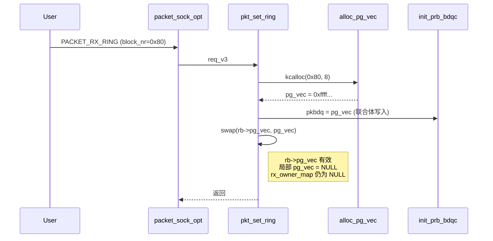

此阶段完成后，`rb->pg_vec` 持有有效地址，联合体中的 `rx_owner_map`（即 `pkbdq`）也指向同一内存块，形成双重引用。由于局部变量均已清空，函数正常退出。

**阶段二：释放 V3 环形缓冲区**

第二次调用仍处于 V3 模式，但传递 `tp_block_nr = 0`，语义为关闭环形缓冲区。内核跳过分配分支，直接进入交换逻辑，将 `rb->pg_vec` 中的有效地址交换至局部变量并执行释放。

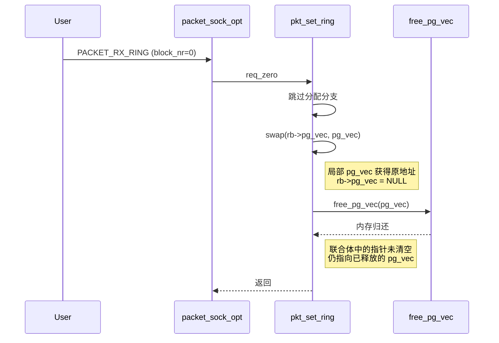

此阶段是关键转折点：物理内存虽已归还，但联合体中的别名指针未被同步清除。`rb->pg_vec` 已置 `NULL`，而 `rb->rx_owner_map` 仍指向已释放的地址，成为一个悬空指针。此时内存分配器已将 `pg_vec` 所在 slab 对象标记为空闲，但内核管理结构中仍保留着对该地址的引用。

**阶段三：切换套接字版本至 V2**

第三次调用与前两次不同，它通过 `PACKET_VERSION` 选项修改套接字版本标志，而非操作环形缓冲区本身。此调用不进入 `packet_set_ring()`，仅将 `po->tp_version` 从 `TPACKET_V3` 改为 `TPACKET_V2`。

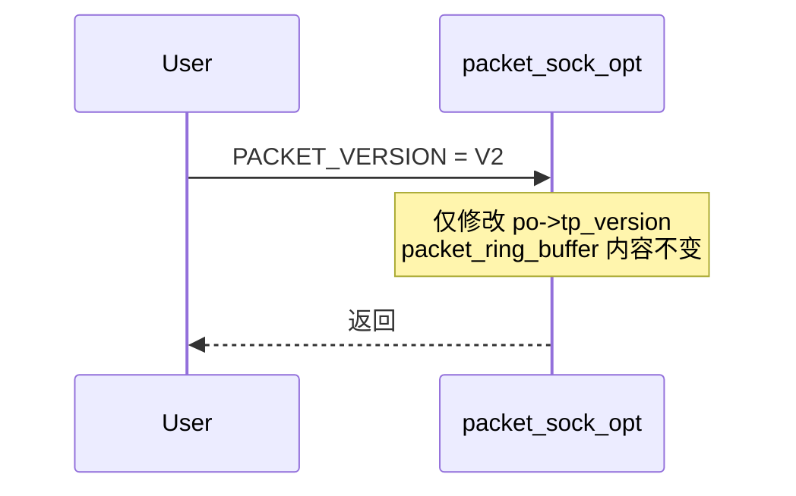

此阶段看似简单，却在漏洞链条中至关重要：它改变了内核对该联合体的解释方式。原本作为 V3 管理指针（`pkbdq`）存储的地址，在版本切换后被重新解读为 V2 的位图指针（`rx_owner_map`）。由于联合体本身不携带类型信息，这种解释切换完全依赖外部版本状态，而版本状态变化时内核并未对联合体内容进行任何验证或清理。

**阶段四：V2 模式下再次执行零长度设置**

第四次调用与阶段二参数相同（`tp_block_nr = 0`），但此时套接字版本已切换为 V2。由于版本条件满足，内核执行了阶段二中被跳过的 `rx_owner_map` 交换操作，从而将残留的悬空指针引入局部变量并触发释放。

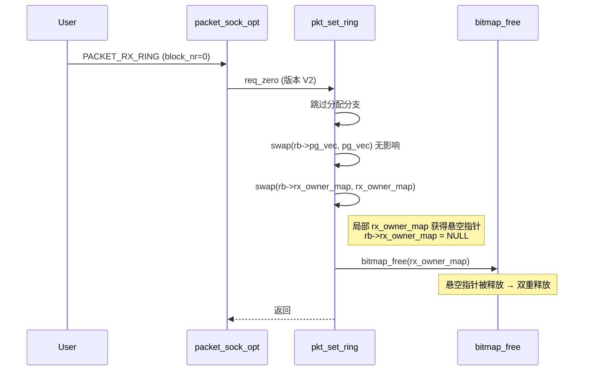

此阶段完成了整个漏洞触发链条的最后一环。`bitmap_free()` 内部调用 `kfree()`，尝试释放 `rx_owner_map` 指向的地址。然而该内存已在阶段二中被释放，此次调用构成对同一内存块的第二次归还。双重释放触发后，slab 分配器的空闲链表或对象复用逻辑被破坏，后续任何涉及该缓存的内存操作都可能引发内核崩溃或被恶意利用。

纵观四个阶段，核心矛盾在于：**分配时通过联合体建立的指针别名，在释放时仅解除了其中一个引用（`rb->pg_vec`），而另一个引用（联合体中的别名）却因版本条件分支的不对称而被遗留，最终在版本切换后被重新激活并触发误释放**。这一链条的每一步均为合法操作，但组合起来便暴露了内核资源生命周期管理的缺陷。

#### 3-2-2. 函数调用关系

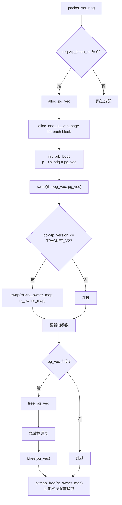

流程图中突出了两个不对称点：第一，`pg_vec` 的交换在任何版本下都会执行，而 `rx_owner_map` 的交换仅在 V1/V2 下发生；第二，释放时 `pg_vec` 是有条件释放，而 `rx_owner_map` 的释放却与 `pg_vec` 的存在性无关。这种不对称直接导致了后续的二次释放。

### 3-3. 分配 V3 环形缓冲区

用户层通过 `setsockopt(sock_fd, SOL_PACKET, PACKET_RX_RING, &req_v3, ...)` 发起请求，其中 `req_v3.tp_block_nr = 0x80`，`tp_block_size = 0x1000`，`tp_frame_size = 0x1000`，套接字版本已预设为 `TPACKET_V3`。该请求的目的在于建立 V3 模式的高性能接收环，内核需要分配页面向量并初始化块描述队列。

#### 3-3-1. `packet_set_ring()`

```c
static int packet_set_ring(struct sock *sk, union tpacket_req_u *req_u,
                           int closing, int tx_ring)
{
    struct pgv *pg_vec = NULL;
    struct packet_sock *po = pkt_sk(sk);
    unsigned long *rx_owner_map = NULL;
    int was_running, order = 0;
    struct packet_ring_buffer *rb;
    struct sk_buff_head *rb_queue;
    __be16 num;
    int err;
    struct tpacket_req *req = &req_u->req;

    rb = tx_ring ? &po->tx_ring : &po->rx_ring;     // 接收环
    rb_queue = tx_ring ? &sk->sk_write_queue : &sk->sk_receive_queue;

    if (!closing) { ... }

    if (req->tp_block_nr) {                         // 0x80 != 0，进入分配分支
        // 参数校验（略）
        // 检查 tp_block_size 是否合法、页对齐、帧大小对齐等
        order = get_order(req->tp_block_size);      // 对于 0x1000，order = 0
        pg_vec = alloc_pg_vec(req, order);          // 分配页面向量数组
        if (unlikely(!pg_vec)) goto out;

        switch (po->tp_version) {                   // TPACKET_V3
        case TPACKET_V3:
            if (!tx_ring) {
                init_prb_bdqc(po, rb, pg_vec, req_u); // 关键初始化
            } else { ... }
            break;
        default:
            // V1/V2 才会分配 rx_owner_map，V3 不执行
            ...
        }
    } else { ... }

    // 将新分配的 pg_vec 存入 rb->pg_vec，同时将旧的（NULL）换出
    swap(rb->pg_vec, pg_vec);           // pg_vec 变为 NULL
    if (po->tp_version <= TPACKET_V2)   // V3 不成立，跳过
        swap(rb->rx_owner_map, rx_owner_map);
    // 更新其他字段（frame_max, head 等）
    ...

out_free_pg_vec:
    bitmap_free(rx_owner_map);          // rx_owner_map 仍为 NULL
    if (pg_vec)                         // pg_vec 为 NULL
        free_pg_vec(pg_vec, order, req->tp_block_nr);
    return err;
}
```

在分配分支中，内核首先执行一系列校验：`tp_block_size` 必须为正且页对齐，`tp_frame_size` 需不小于头部长度且 16 字节对齐，帧数计算必须一致等。这些校验通过后，`get_order()` 根据块大小计算分配阶（此处为 0，即单页）。随后 `alloc_pg_vec()` 返回 `pg_vec` 指针。

值得留意的是，V3 分支内并未分配 `rx_owner_map`，这与 V1/V2 不同。这意味着在 V3 模式下，`rx_owner_map` 始终为 `NULL`，而联合体只作为 `prb_bdqc` 使用。然而，由于联合体共用存储，`init_prb_bdqc()` 对 `pkbdq` 的赋值实际上也填充了 `rx_owner_map` 的位置，只是内核在此刻不会以位图视角访问它。

#### 3-3-2. `alloc_pg_vec()`

```c
static struct pgv *alloc_pg_vec(struct tpacket_req *req, int order)
{
    unsigned int block_nr = req->tp_block_nr;   // 0x80
    struct pgv *pg_vec;
    int i;

    pg_vec = kcalloc(block_nr, sizeof(struct pgv), GFP_KERNEL | __GFP_NOWARN);
    if (unlikely(!pg_vec)) goto out;

    for (i = 0; i < block_nr; i++) {
        pg_vec[i].buffer = alloc_one_pg_vec_page(order);
        if (unlikely(!pg_vec[i].buffer))
            goto out_free_pgvec;
    }
    return pg_vec;

out_free_pgvec:
    free_pg_vec(pg_vec, order, block_nr);
    pg_vec = NULL;
    goto out;
}
```

`kcalloc()` 分配 `block_nr` 个 `struct pgv`（每个 8 字节），总计 0x400 字节，落在 kmalloc-1k 缓存。随后循环为每个块分配一个物理页（order=0）。`alloc_one_pg_vec_page()` 内部调用 `__get_free_pages(GFP_KERNEL | __GFP_COMP | __GFP_ZERO | __GFP_NOWARN | __GFP_NORETRY, order)`，在成功时返回页面的内核虚拟地址。

在本示例中，`pg_vec` 数组起始地址为 `0xffff8880043e2c00`，其 0x80 个元素依次存储各物理页的虚拟地址（如 `0xffff888005276000`、`0xffff888005277000` 等）。这些页面将被映射到用户空间，用于存放接收到的网络帧。

#### 3-3-3. `init_prb_bdqc()`

```c
static void init_prb_bdqc(struct packet_sock *po,
                          struct packet_ring_buffer *rb,
                          struct pgv *pg_vec,
                          union tpacket_req_u *req_u)
{
    struct tpacket_kbdq_core *p1 = GET_PBDQC_FROM_RB(rb); // &rb->prb_bdqc
    struct tpacket_block_desc *pbd;

    memset(p1, 0x0, sizeof(*p1));

    p1->knxt_seq_num = 1;
    p1->pkbdq = pg_vec;                     // ★ 将 pg_vec 写入联合体
    pbd = (struct tpacket_block_desc *)pg_vec[0].buffer;
    p1->pkblk_start = pg_vec[0].buffer;
    p1->kblk_size = req_u->req3.tp_block_size;
    p1->knum_blocks = req_u->req3.tp_block_nr;
    // ... 其他初始化（定时器、块偏移等）...
}
```

`p1->pkbdq = pg_vec` 直接写入了联合体的起始位置（偏移 0x30），因此 `rb->rx_owner_map` 也获得了相同的 `pg_vec` 值。但由于当前版本为 V3，内核在后续交换中不会处理 `rx_owner_map`，所以局部变量 `rx_owner_map` 始终为 `NULL`。

此外，`init_prb_bdqc()` 还设置了块描述符的起始地址、块大小、块数量、退休超时定时器等，这些与漏洞的直接触发无关，但反映了 V3 管理的复杂性。正是这种复杂性导致开发者在后期维护中忽略了版本切换时的清理工作。

#### 3-3-4. 阶段结束状态

- `rb->pg_vec` 指向有效 `pg_vec`（地址 `0xffff8880043e2c00`）。
- 联合体中的 `rx_owner_map`（即 `pkbdq`）同样指向 `0xffff8880043e2c00`。
- 局部变量 `pg_vec` 和 `rx_owner_map` 均为 `NULL`，函数退出时无任何释放操作。
- `rb->pg_vec_len` 被更新为 `req->tp_block_nr`（0x80），`rb->pg_vec_pages` 为 1。

此时，`rb->pg_vec` 和联合体指针形成了对同一内存块的**双重引用**，但内核并未记录这种别名关系，为后续释放时留下隐患。

### 3-4. 释放 V3 环形缓冲区

用户层再次调用 `setsockopt(sock_fd, SOL_PACKET, PACKET_RX_RING, &req_zero, ...)`，其中 `req_zero.tp_block_nr = 0`，其他参数沿用。此时版本仍未变（仍为 V3）。该操作意图是关闭环形缓冲区，内核应释放所有相关资源。

#### 3-4-1. `packet_set_ring()`

```c
static int packet_set_ring(...)
{
    struct pgv *pg_vec = NULL;
    unsigned long *rx_owner_map = NULL;
    // ... 同前 ...
    struct tpacket_req *req = &req_u->req;   // tp_block_nr == 0

    rb = &po->rx_ring;

    if (req->tp_block_nr) {                 // 条件为假，跳过整个分配分支
        // 不执行
    } else {
        if (unlikely(req->tp_frame_nr))     // 0，通过
            goto out;
    }

    // 公共交换逻辑（此处是释放的核心）
    swap(rb->pg_vec, pg_vec);               // ① 将 rb->pg_vec（原有效地址）换出到局部 pg_vec
                                            //    rb->pg_vec 变为 NULL
    if (po->tp_version <= TPACKET_V2)       // V3 不成立，跳过
        swap(rb->rx_owner_map, rx_owner_map);
    // 更新其他字段（frame_max 变为 0xffffffff 等）

out_free_pg_vec:
    bitmap_free(rx_owner_map);              // rx_owner_map 仍为 NULL
    if (pg_vec)                             // ② pg_vec 现在持有原有效地址
        free_pg_vec(pg_vec, order, req->tp_block_nr);
    return err;
}
```

关键点在于 `swap(rb->pg_vec, pg_vec)` 是无条件执行的，它将 `rb->pg_vec` 中的有效地址交换到局部变量 `pg_vec`，同时将 `rb->pg_vec` 置为 `NULL`。由于 V3 版本不满足 `po->tp_version <= TPACKET_V2`，`rx_owner_map` 的交换被跳过，因此局部 `rx_owner_map` 依然为 `NULL`，而 `rb->rx_owner_map`（联合体）中的指针并未改变，仍然指向原来的 `pg_vec` 地址。

随后 `free_pg_vec(pg_vec, ...)` 释放了该内存。但 `rb->rx_owner_map` 中的指针未被清零，成为一个**悬空指针**（dangling pointer）。

#### 3-4-2. `free_pg_vec()`

```c
static void free_pg_vec(struct pgv *pg_vec, unsigned int order, unsigned int len)
{
    int i;
    for (i = 0; i < len; i++) {
        if (likely(pg_vec[i].buffer)) {
            free_pages((unsigned long)pg_vec[i].buffer, order);
            pg_vec[i].buffer = NULL;
        }
    }
    kfree(pg_vec);
}
```

此函数遍历所有块，调用 `free_pages()` 归还物理页，最后 `kfree(pg_vec)` 释放数组本身。在本示例中，`kfree(pg_vec)` 将 `0xffff8880043e2c00` 归还给 kmalloc-1k 缓存，该 slab 对象变为空闲。

#### 3-4-3. 阶段结束状态

- 物理页面和 `pg_vec` 数组均已归还给内存分配器。
- `rb->pg_vec` 已置为 `NULL`。
- **但联合体中的 `rx_owner_map`（即原 `pkbdq`）未被清空**，仍然指向已释放的地址 `0xffff8880043e2c00`，成为悬空指针。
- 此时，如果该内存块被后续分配用于其他用途，则悬空指针将指向其他对象，可能引发更严重的问题；但即使未被分配，后续的二次释放也会破坏 slab 空闲链表。

### 3-5. 版本切换至 V2

用户层通过 `setsockopt(sock_fd, SOL_PACKET, PACKET_VERSION, &version, ...)` 将 `po->tp_version` 从 `TPACKET_V3` 改为 `TPACKET_V2`。此调用仅修改版本标志，不涉及 `packet_set_ring()` 的调用，因此 `packet_ring_buffer` 中所有成员保持不变。

**语义转变**：现在内核将联合体解释为 `rx_owner_map`，而该字段的值正是悬空指针 `0xffff8880043e2c00`。从这一刻起，内核认为 `rb->rx_owner_map` 指向一个有效的位图，但实际上它指向的是已释放的内存。这一误解将在后续操作中被利用。

此步骤看似无害，却是整个漏洞链条中不可或缺的一环——它改变了内核对该存储单元的**解释方式**，将原本作为 V3 管理指针的数据，重新解释为 V2 的位图指针。由于联合体本身不存储类型信息，这种解释切换完全依赖于外部版本状态，而版本状态改变时却没有对联合体内容进行验证或清理。

### 3-6. V2 模式二次释放

用户层再次调用 `setsockopt(sock_fd, SOL_PACKET, PACKET_RX_RING, &req_zero, ...)`，参数与 3-4 相同，但此时版本为 V2。该调用同样意图关闭缓冲区，但此时内核认为该环形缓冲区处于 V2 模式。

```c
static int packet_set_ring(...)
{
    struct pgv *pg_vec = NULL;
    unsigned long *rx_owner_map = NULL;
    // ...
    struct tpacket_req *req = &req_u->req;   // tp_block_nr == 0

    rb = &po->rx_ring;

    if (req->tp_block_nr) {                 // 条件假，跳过
        // ...
    } else {
        if (unlikely(req->tp_frame_nr))     // 0，通过
            goto out;
    }

    swap(rb->pg_vec, pg_vec);               // rb->pg_vec 为 NULL，交换后 pg_vec 仍为 NULL

    if (po->tp_version <= TPACKET_V2)       // ★ V2 满足条件！
        swap(rb->rx_owner_map, rx_owner_map);
    // 现在 rb->rx_owner_map 的悬空指针被换入局部变量 rx_owner_map
    // rb->rx_owner_map 变为 NULL

    // 更新其他字段 ...

out_free_pg_vec:
    bitmap_free(rx_owner_map);              // ★ rx_owner_map 为悬空指针，执行释放！
    if (pg_vec)                             // pg_vec 为 NULL，不执行
        free_pg_vec(pg_vec, order, req->tp_block_nr);
    return err;
}
```

这次执行的关键差异在于版本条件为真，因此执行了 `swap(rb->rx_owner_map, rx_owner_map)`。由于 `rb->rx_owner_map` 中存储的是悬空指针 `0xffff8880043e2c00`，交换后该地址被移入局部变量 `rx_owner_map`，同时 `rb->rx_owner_map` 被置为 `NULL`。

随后在 `out_free_pg_vec` 标签处，`bitmap_free(rx_owner_map)` 被调用。`bitmap_free()` 实际上是对 `kfree()` 的封装，它将尝试释放 `rx_owner_map` 指向的内存。然而该内存早已在 3-4 节中被释放，此时再次调用 `kfree()` 将会导致 slab 分配器的元数据被破坏——这就是**双重释放**。

由于局部 `pg_vec` 为 `NULL`，不会再次释放页面向量，所以此次操作仅触发位图的双重释放。值得注意的是，即使 `rb->rx_owner_map` 在交换后变为 `NULL`，但内存损坏已经发生，后续任何分配或释放操作都可能触发内核崩溃。

### 3-7. 分析总结

综合以上四个阶段，**CVE-2021-22600** 的本质可归结为以下几个技术层面的缺陷：

1. **联合体存储复用缺乏生命周期管理**  
   `struct packet_ring_buffer` 通过匿名联合体将 `rx_owner_map`（V1/V2）与 `pkbdq`（V3）置于同一偏移量。V3 初始化向 `pkbdq` 写入 `pg_vec`，该指针同时也被解释为 `rx_owner_map`。然而在释放 V3 缓冲区时，内核仅清理了 `rb->pg_vec`，却未清除联合体中的别名指针，导致悬空指针残留。这种设计违反了“同一存储单元在不同使用模式下应明确隔离”的安全原则。

2. **版本条件分支的不对称性**  
   `pg_vec` 的交换操作是无条件的，而 `rx_owner_map` 的交换受 `po->tp_version <= TPACKET_V2` 条件保护。在 V3 释放时，`rx_owner_map` 未被交换，残留指针得以保留；在切换至 V2 后再次执行释放时，条件满足，残留指针被交换至局部变量并触发释放。这种非对称性使得原本应该成对出现的资源释放操作出现了错位。

3. **释放路径中资源绑定关系的解耦**  
   在分配时，`pg_vec` 和联合体指针（无论是作为 `pkbdq` 还是 `rx_owner_map`）指向同一内存块，但在释放时，`pg_vec` 的释放是有条件的（检查局部 `pg_vec` 是否非空），而 `rx_owner_map` 的释放是无条件的。这种解耦导致在特定场景下，`pg_vec` 已被释放，而 `rx_owner_map` 仍然持有旧指针并被再次释放。正确的做法应是让两者的释放条件保持一致，或者将联合体指针显式置空。

4. **状态切换时的验证缺失**  
   版本从 V3 切换至 V2 时，内核仅修改了 `po->tp_version`，却未对 `packet_ring_buffer` 中与版本相关的成员进行一致性检查或重置。理想的实现应在版本切换时检查当前环形缓冲区是否存在，并清理所有与旧版本相关的资源，或者禁止在环形缓冲区活跃时切换版本。然而当前代码允许这种操作，使得版本切换成为了悬空指针“复活”的催化剂。

从设计哲学上看，该漏洞源于内核模块在演进过程中新增 V3 支持时，未对既有数据结构和管理流程进行彻底的重新审视。V3 的引入带来了新的管理范式，但未同步调整释放路径和版本切换逻辑，导致新旧范式在共享存储上发生冲突。这类问题在内核长期维护中并不鲜见，其根本解决办法在于建立清晰的状态机模型，确保所有操作路径（分配、释放、切换、错误回滚）对共享资源有一致的生命周期管理约定。

此外，`packet_set_ring()` 函数本身承担了过多职责（分配、释放、参数重设），导致其内部逻辑复杂、条件分支繁多，使得正确性难以验证。在安全编码实践中，应优先考虑将不同操作分离为独立函数，或引入明确的状态检查阶段，以减少因路径交织而引入的漏洞。

综上，该漏洞的修复思路（见后续章节）正是通过对释放路径中 `rx_owner_map` 的释放条件进行约束，将其与 `pg_vec` 的存在性绑定，从而打破了不对称性，从根本上杜绝了双重释放的发生。

## 4. 利用思路一

本章基于前一章对漏洞根源的分析，系统性地阐述如何将双重释放转化为可操作的权限提升路径。整体思路围绕**堆内存布局控制**与**内核对象生命周期管理**展开，通过构造特定的对象重叠场景，泄露内核地址信息，最终劫持控制流完成权限提升。以下各节按八个阶段分解设计目标与技术手段，并讨论对内核主流保护机制的应对策略及整体利用的适用条件。

### 4-1. 整体架构设计

本利用方案的核心目标是：借助双重释放造成的 slab 元数据损坏，实现**内核对象的交叉覆盖**，从而在无需依赖特定内核符号版本的前提下获取 root 权限。整体分为八个阶段：

1. **触发初次释放** – 利用 `packet_set_ring()` 的 V3 释放路径，释放 `pg_vec` 所在 slab 页面。
2. **占用空闲页面** – 分配 `user_key_payload` 对象，使其占据被释放的页面。
3. **触发双重释放** – 切换至 V2 模式，内核释放残留的 `rx_owner_map` 悬空指针，对同一页面进行二次释放，而 `user_key_payload` 仍持有对该页面的引用。
4. **重叠 tty_struct** – 分配 `tty_struct` 对象，使其占据被双重释放的页面，与 `user_key_payload` 形成物理内存重叠。
5. **泄露内核信息** – 通过 `keyctl_read` 读取 `user_key_payload` 内容，获取 `tty_struct` 中的 `tty_ops` 指针及堆地址，计算内核基址。
6. **释放密钥 payload** – 撤销密钥，释放 `user_key_payload`，页面再次变为空闲，但 `tty_struct` 仍存活于该页面。
7. **注入伪造数据** – 通过 `setxattr` 将伪造的 `tty_struct` 及 ROP 链写入空闲页面，覆盖原有 `tty_struct`。
8. **触发控制流劫持** – 对受控 `tty` 设备执行 `ioctl`，触发栈迁移 gadget，执行 ROP 链完成权限提升。

各阶段之间存在严格的依赖关系，前一阶段成功后方可进入下一阶段。整个流程设计为顺序执行，每个阶段的结果均为下一阶段的前提条件，任何阶段的失败都需重头开始。

**整体流程总览**

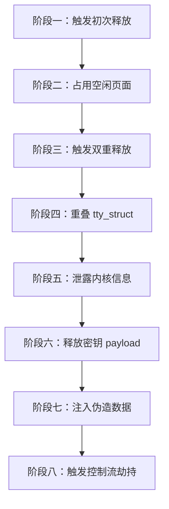

### 4-2. 阶段一：触发初次释放

本阶段的目标是利用漏洞的 V3 释放路径，释放一个 slab 页面并制造悬空指针。具体操作为：

- 创建一个 `AF_PACKET` 套接字，设置为 `TPACKET_V3` 模式。内核通过 `packet_create()` 初始化 `struct packet_sock`，其中 `rx_ring` 和 `tx_ring` 均为空。
- 通过 `PACKET_RX_RING` 分配接收环形缓冲区，指定 `tp_block_nr = 0x80`、`tp_block_size = 0x1000`。内核进入 `packet_set_ring()` 的分配分支，调用 `alloc_pg_vec()` 分配 `pg_vec` 数组。`alloc_pg_vec()` 内部使用 `kcalloc(0x80, sizeof(struct pgv), GFP_KERNEL)`，总大小 0x400 字节，落在 kmalloc-1k 缓存中，返回地址记为 P。随后为每个块分配物理页面（order=0），并将地址填入 `pg_vec[i].buffer`。
- 接着 `init_prb_bdqc()` 被调用，`p1->pkbdq = pg_vec` 将 P 写入 `packet_ring_buffer` 联合体的 `pkbdq` 字段，由于联合体重叠，`rx_owner_map` 也获得了 P 的值。然后 `swap(rb->pg_vec, pg_vec)` 将 P 存入 `rb->pg_vec`，局部 `pg_vec` 变为 NULL。
- 立即将 `tp_block_nr` 设为 0，再次调用 `PACKET_RX_RING` 关闭环形缓冲区。此时 `req->tp_block_nr` 为 0，跳过分配分支，进入交换逻辑。`swap(rb->pg_vec, pg_vec)` 将 `rb->pg_vec` 中的 P 交换至局部 `pg_vec`，`rb->pg_vec` 变为 NULL。由于版本为 V3，条件 `po->tp_version <= TPACKET_V2` 不成立，`swap(rb->rx_owner_map, rx_owner_map)` 被跳过，因此 `rb->rx_owner_map` 仍保留 P 的值。随后 `free_pg_vec(pg_vec, ...)` 释放 P 及其指向的物理页，页面 P 归还给 slab 分配器。

此时页面 P 处于空闲状态，但 `packet_ring_buffer` 中的 `rx_owner_map` 仍持有 P 的地址，成为悬空指针。

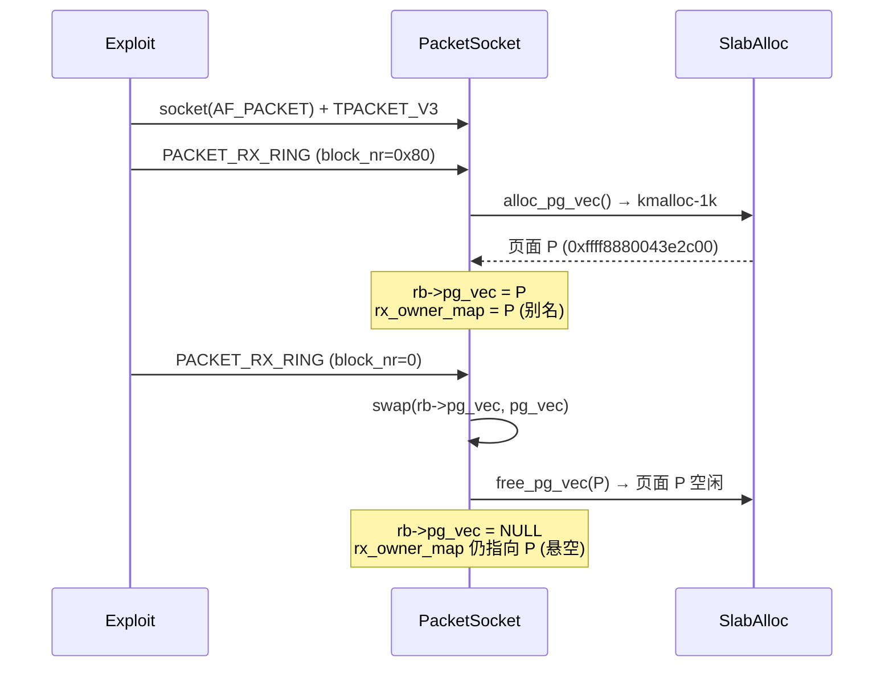

### 4-3. 阶段二：占用空闲页面

本阶段的目标是让 `user_key_payload` 占据阶段一释放的页面 P，为后续信息泄露做准备。

通过 `keyctl` 系统调用分配一个用户密钥，payload 大小精确计算以确保总分配量落在 kmalloc-1k 缓存内（例如 `sizeof(struct user_key_payload) + plen` 不超过 1024 字节）。slab 分配器优先重用最近释放的空闲块，因此 `user_key_payload` 将被放置在页面 P 上。

此时页面 P 的状态为：

- **从密钥子系统视角**：有效的 `user_key_payload`，可被 `keyctl_read` 读取。
- **从 slab 分配器视角**：已分配（被密钥占用）。
- **从 Packet Socket 视角**：`rx_owner_map` 仍指向页面 P，但该指针在逻辑上已失效（悬空）。

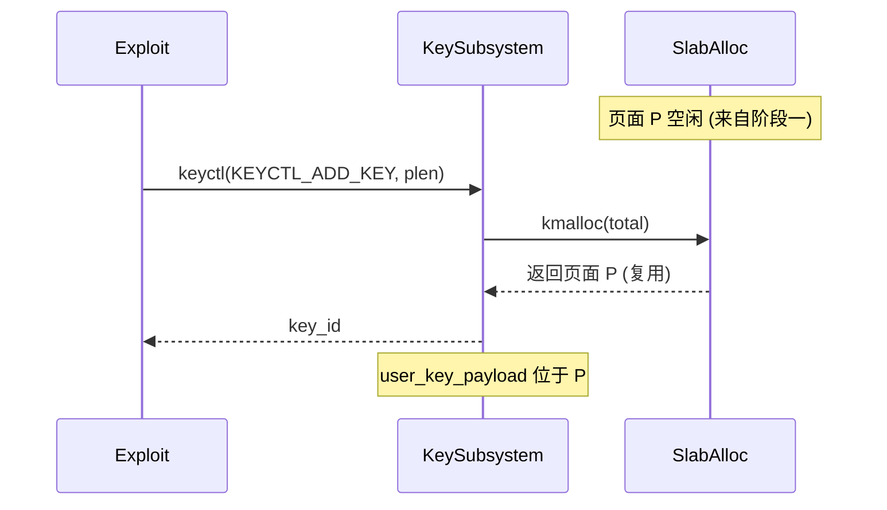

### 4-4. 阶段三：触发双重释放

本阶段是漏洞触发的核心，利用版本切换使内核再次释放已被密钥占用的页面 P。

- 将套接字版本切换至 `TPACKET_V2`。此操作仅修改 `po->tp_version`，不涉及环形缓冲区，因此 `packet_ring_buffer` 中的悬空指针保持不变。
- 再次执行零长度的 `PACKET_RX_RING` 设置（`tp_block_nr = 0`）。此时版本条件 `po->tp_version <= TPACKET_V2` 成立，内核执行 `swap(rb->rx_owner_map, rx_owner_map)`，将 `rb->rx_owner_map` 中的悬空指针（指向页面 P）交换至局部变量 `rx_owner_map`，同时将 `rb->rx_owner_map` 置为 NULL。
- 在 `out_free_pg_vec` 标签处，`bitmap_free(rx_owner_map)` 尝试释放该指针。`bitmap_free()` 内部调用 `kfree()`，而页面 P 当前正被 `user_key_payload` 占用，此操作构成双重释放。

双重释放后，slab 分配器的空闲链表被破坏，页面 P 被标记为空闲，但 `user_key_payload` 仍持有对该页面的引用。此时同一页面同时处于“已分配（密钥持有）”和“已释放（slab 空闲）”的矛盾状态，slab 元数据可能已损坏，但密钥子系统的引用计数并未减少，因此后续仍可通过密钥读取该页面内容。

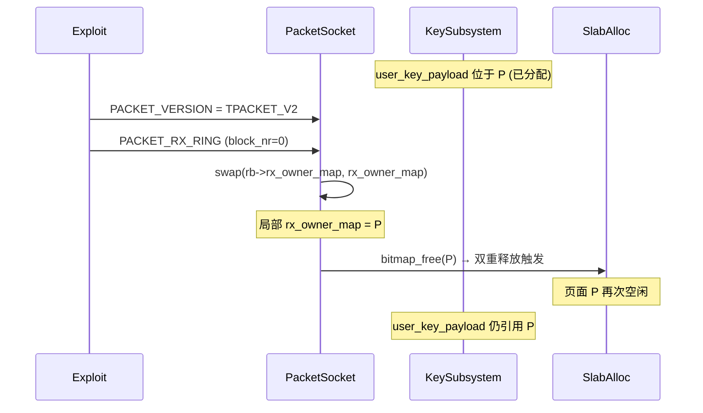

### 4-5. 阶段四：重叠 tty_struct

本阶段利用 slab 分配器的重用策略，使 `tty_struct` 落在被双重释放的页面 P 上，与 `user_key_payload` 形成物理内存重叠。

- 打开 `/dev/ptmx` 伪终端设备，内核在 TTY 子系统中分配 `tty_struct` 对象。`tty_struct` 大小约为 0x2b8 字节，同样位于 kmalloc-1k 缓存。
- slab 分配器优先重用最近释放的空闲块，因此 `tty_struct` 将被放置在页面 P 上。

此时页面 P 同时承载：

- `user_key_payload`（密钥子系统视角，仍有效）
- `tty_struct`（TTY 子系统视角，已分配并初始化）

两者物理地址重叠，但内核的不同子系统各自维护独立的对象生命周期。由于密钥 payload 的起始偏移与 `tty_struct` 的起始偏移相同（均为页面起始），因此读取密钥内容即可获得 `tty_struct` 开头的部分数据。

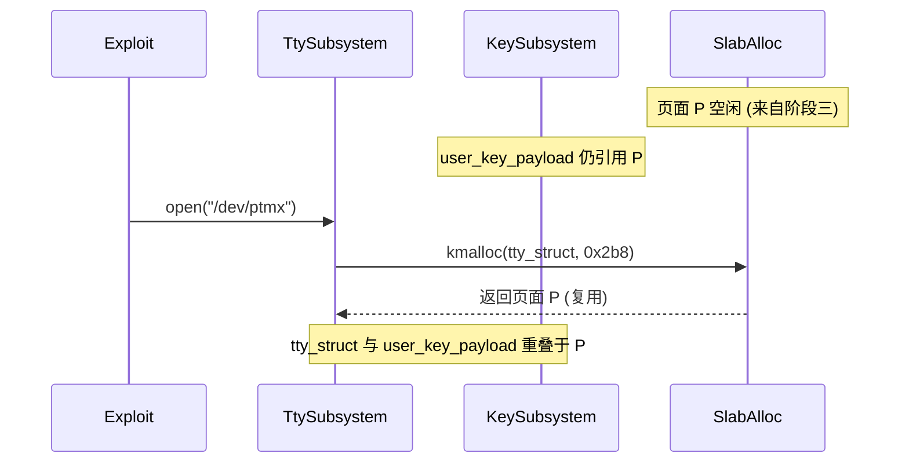

### 4-6. 阶段五：泄露内核信息

本阶段利用密钥的可读特性，从重叠页面中读取 `tty_struct` 的内核指针，进而计算内核基址。

- 通过 `keyctl_read` 读取 `user_key_payload` 的内容，参数为 `key_id`、缓冲区指针和长度。由于页面 P 同时存储着 `tty_struct` 的原始数据，读取结果即为 `tty_struct` 的二进制布局。
- 从读取的数据中提取两个关键信息：
    1. **`tty_operations` 指针**：位于 `tty_struct` 固定偏移处（通常为 `tty_struct->ops`）。该指针指向内核 `.rodata` 段中的操作函数表。通过该指针的低 12 位偏移可匹配内核符号（如 `ptm_unix98_ops` 或 `pty_unix98_ops`），进而精确计算内核映像基址，绕过 KASLR。
    2. **`tty_struct` 自身地址**：`tty_struct` 内部存在自引用指针，可推算其堆地址，用于后续伪造数据的精准覆盖。

此阶段仅读取数据，不涉及写入操作，因此不会触发内核异常。

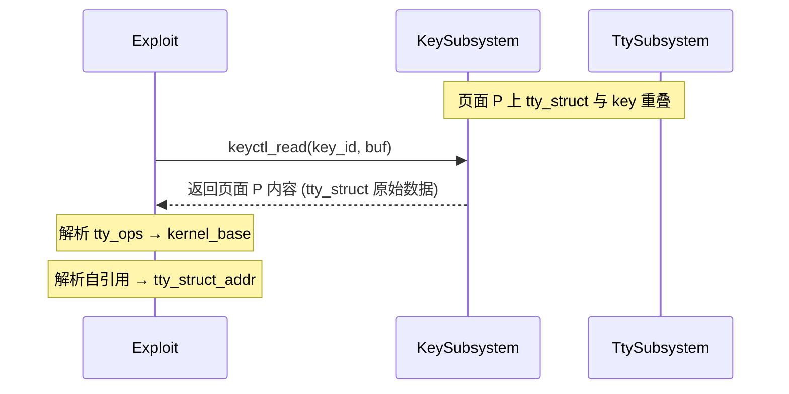

### 4-7. 阶段六：释放密钥 payload

本阶段撤销密钥引用，使页面 P 再次变为 slab 空闲状态，同时保留 `tty_struct` 的存活。

- 调用 `key_revoke(key_id)` 和 `key_unlink(key_id)` 减少引用计数，当计数归零时内核释放 `user_key_payload` 占用的内存，即 `kfree(P)`。
- slab 分配器将页面 P 标记为空闲，但 TTY 子系统仍认为 `tty_struct` 有效且位于该页面。

此时页面 P 的状态为：

- **从 slab 分配器视角**：空闲块。
- **从 TTY 子系统视角**：有效的 `tty_struct`。
- **从密钥子系统视角**：已释放，不再可访问。

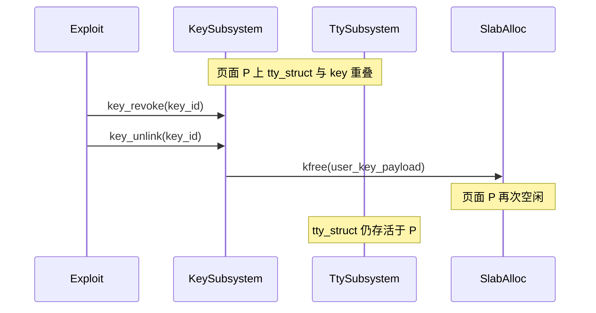

### 4-8. 阶段七：注入伪造数据

本阶段通过 `setxattr` 系统调用，将伪造的 `tty_struct` 及 ROP 链写入空闲页面 P，覆盖原有的 `tty_struct`。

- `setxattr` 在内核中分配临时缓冲区存储用户态传入的数据，该缓冲区大小与伪造数据长度相同，位于 kmalloc-1k 缓存，因此会重用页面 P。当 `setxattr` 完成数据写入并返回前，内核会释放该临时缓冲区（`kfree`）。**若内核配置了 `CONFIG_INIT_ON_FREE_DEFAULT_ON`，释放时缓冲区内容将被清零，导致已写入的伪造数据被销毁，此阶段将无法达成覆盖目的。**因此该配置必须处于关闭状态。
- 在配置关闭的前提下，伪造数据得以保留在页面 P 中，其布局如下：
    - 伪造 `tty_struct` 头部，其中 `ops` 指针指向同一页面内的伪造 `tty_operations` 表。
    - 伪造 `tty_operations` 表，其中的 `ioctl` 函数指针被替换为一个栈迁移 gadget 的地址。
    - ROP 链紧随其后。
- 通过精确计算偏移，确保伪造数据覆盖 `tty_struct` 的关键字段。

完成写入后，`tty_struct->ops` 指向伪造表，`ops->ioctl` 指向栈迁移 gadget。

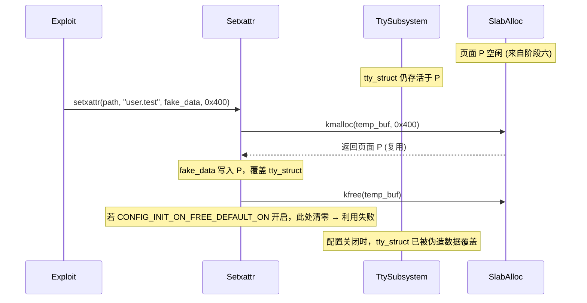

### 4-9. 阶段八：触发控制流劫持

本阶段通过 `ioctl` 系统调用触发被篡改的函数指针，执行 ROP 链完成权限提升。

- 对 `tty_fd` 调用 `ioctl`，传入请求码和第三个参数（指向 ROP 链起始地址）。内核在 TTY 驱动中调用 `tty_struct->ops->ioctl`，该指针现为栈迁移 gadget 的地址。
- 执行栈迁移 gadget 后，栈指针被切换到 ROP 链起始位置，随后执行预设的 ROP 指令序列。该序列依次完成：
    1. 命名空间逃逸，将当前进程切换至初始命名空间。
    2. 凭证替换，将进程有效用户标识提升至 0。
    3. 安全返回用户态，跳转到预置的 shell 执行函数。
- 完成 ROP 后，进程获得 root 权限，并启动交互式 shell。

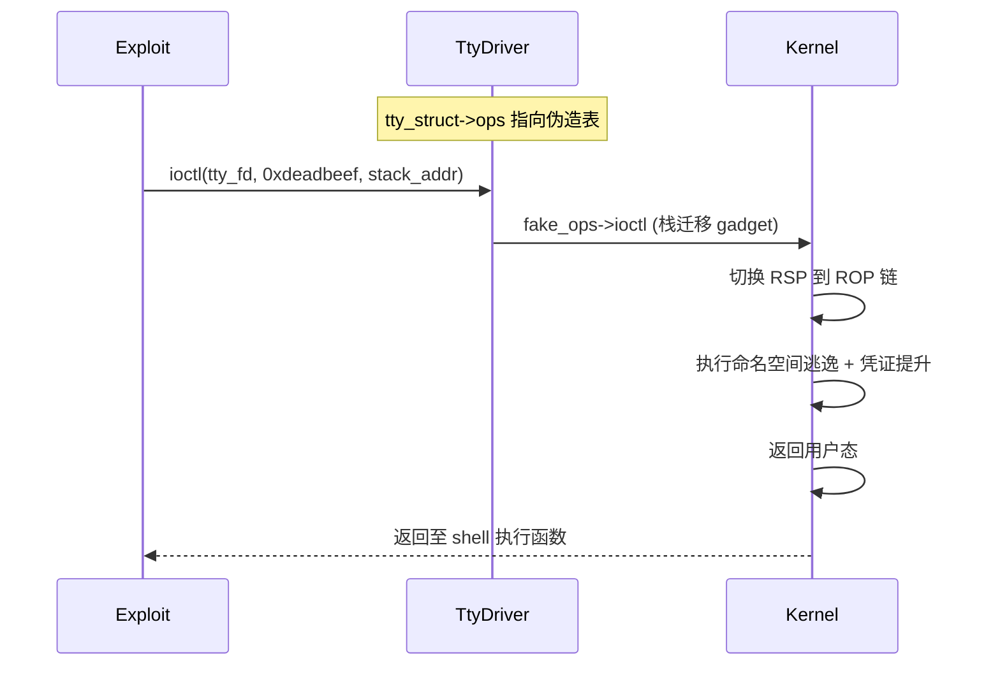

### 4-10. 内核保护机制的应对策略

现代 Linux 内核部署了多种安全机制，本利用方案在设计中考虑了以下防御的绕过方式：

- **KASLR**：通过阶段五泄露 `tty_ops` 指针，可精确计算内核基址，完全消除随机化影响。
- **SMEP/SMAP**：ROP 链位于内核堆中（页面 P 属于内核空间），不会触发 SMEP 异常；数据也在内核空间，符合 SMAP 要求。
- **KPTI**：ROP 链末尾使用内核提供的标准返回用户态函数，负责正确切换页表并返回用户态。
- **堆安全加固（如 SLAB_FREELIST_RANDOM、SLAB_FREELIST_HARDENED）**：通过精确控制分配顺序（密钥 → `tty_struct` → `setxattr`），可大概率实现目标重叠。双重释放造成的 slab 空闲链表破坏进一步提高了可控性。
- **用户命名空间限制**：通过 ROP 链中的命名空间逃逸步骤切换回初始命名空间，获得全局 root 权限。
- **CONFIG_INIT_ON_FREE_DEFAULT_ON**：此配置必须关闭，否则阶段七中 `setxattr` 临时缓冲区在释放时被清零，伪造数据丢失，利用失败。

### 4-11. 利用条件与局限性

#### 4-11-1. 利用条件

- **内核版本**：4.14～5.15 系列受影响内核，开启 `CONFIG_PACKET` 和 `CONFIG_KEYS`（默认开启）。
- **权限要求**：进程需具备 `CAP_NET_RAW` 能力（容器及系统服务中常默认授予），以及 `keyctl`、`setxattr`、`open("/dev/ptmx")` 相关操作权限。
- **资源可用性**：需支持 `CONFIG_KEYS`、`CONFIG_UNIX98_PTYS` 及扩展属性（`CONFIG_EXT4_FS_XATTR` 等），均为发行版默认配置。
- **内存布局可预测性**：依赖 slab 分配器重用策略，需保证分配顺序（密钥 → `tty_struct` → `setxattr`）不被中断。若启用了 `CONFIG_SLAB_FREELIST_RANDOM`，需多次尝试，可通过循环重试提高成功率。
- **内核符号信息**：需预知 `tty_ops` 符号偏移（如 `ptm_unix98_ops` 或 `pty_unix98_ops`）以匹配低 12 位偏移。常见发行版内核这些符号位置固定，可通过本地测试获取。
- **关键安全加固配置**：**`CONFIG_INIT_ON_FREE_DEFAULT_ON` 必须处于关闭状态**。若开启，则阶段七中 `setxattr` 释放临时缓冲区时会将页面 P 清零，导致伪造数据被清除，控制流劫持构造失败。该配置在多数发行版中为关闭，但在安全加固场景中可能启用，务必预先检查。

#### 4-11-2. 局限性

- **强制访问控制（SELinux/AppArmor）**：可能限制 `setxattr` 的目标路径或 `ioctl` 操作，需评估目标策略配置。
- **高负载或内存碎片**：分配器状态偏离预期时，对象重叠可能失败，需多次尝试，增加被检测风险。
- **CONFIG_INIT_ON_FREE_DEFAULT_ON 开启导致的硬性失败**：若该配置启用，本利用方案将完全失效，无法通过调整参数绕过。因为在阶段七中，`setxattr` 分配的临时缓冲区在释放时被清零，致使已写入的伪造数据丢失，`tty_struct` 恢复为全零状态，后续 `ioctl` 无法触发预期控制流。此限制无法规避，利用前必须确认该配置已关闭。
- **符号偏移变化**：编译选项（如 `CONFIG_LD_DEAD_CODE_DATA_ELIMINATION`）可能改变 `.rodata` 段布局，需调整符号匹配策略。可通过泄露多个指针进行交叉验证。
- **一次性利用与状态破坏**：双重释放破坏 slab 元数据，成功提权后内核状态不稳定，无法重复利用，提权进程需保持活跃。若进程退出，系统可能 panic。
- **多核心竞态**：其他 CPU 核心上的分配活动可能干扰布局控制，通过绑定 CPU 核心可部分缓解，但在高并发系统中仍可能失效。
- **架构限制**：本方案针对 x86-64 设计，其他架构需重新适配 ROP 链及寄存器布局。

### 4-12. 章节总结

本章系统阐述了一种基于 **CVE-2021-22600** 双重释放漏洞的权限提升利用思路。整体设计遵循严格的八阶段流程：**释放 → 占用 → 双重释放 → 对象重叠 → 信息泄露 → 释放密钥 → 数据注入 → 控制流劫持**，充分利用了内核对象管理中的生命周期偏差与 slab 分配器的重用特性。

各阶段通过密钥、伪终端和扩展属性等常见系统调用完成交互，无需借助非常规内核模块。该利用思路对 KASLR、SMEP、SMAP、KPTI 等主流防御机制均具备有效绕过策略，仅需 `CAP_NET_RAW` 即可实施。同时，我们也系统梳理了依赖条件与局限性，特别指出 `CONFIG_INIT_ON_FREE_DEFAULT_ON` 必须关闭，否则阶段七中 `setxattr` 临时缓冲区清零将导致伪造数据丢失，利用失败。在实际评估中，应根据具体目标环境审慎判断可行性，并针对性调整技术细节，例如通过调整 payload 大小、增加重试次数或动态识别符号偏移等方式提升成功率。

### 4-13. 测试结果

<div style="text-align: center; margin: 2rem 0;">
  
</div>

## 5. 利用思路二

本章基于前一章的基础，进一步探讨在 `CONFIG_INIT_ON_FREE_DEFAULT_ON` 安全加固配置开启的场景下，如何通过引入 **FUSE（用户态文件系统）** 机制绕过该加固限制，实现同样可靠的权限提升。整体思路与第4章类似，但在**控制流劫持构造**阶段采用不同技术手段，利用 FUSE 的“暂停–恢复”特性打破 `setxattr` 释放时的清零限制，从而完成伪造数据的注入。以下各节按八个阶段分解设计目标与技术手段，并讨论该方案的适用条件与局限性。

### 5-1. 整体架构设计

本利用方案的核心目标与第4章一致：借助双重释放造成的 slab 元数据损坏，实现内核对象的交叉覆盖，最终获取 root 权限。但在 `CONFIG_INIT_ON_FREE_DEFAULT_ON` 开启时，第4章的阶段七（通过 `setxattr` 注入伪造数据）会因为临时缓冲区在释放时被清零而失败。本方案通过以下方式绕过：

- **利用 FUSE 延迟内核复制**：将伪造数据置于一个跨页边界的 FUSE 匿名内存映射中，其中第二页由 FUSE 后端支持。当 `setxattr` 执行 `copy_from_user` 时，在复制到第二页时会因 FUSE 的缺页处理而进入等待状态，此时内核尚未完成整个复制，因此临时缓冲区并未释放，也就不会触发清零。
- **在暂停间隙触发控制流劫持**：在 `setxattr` 挂起期间，第一页的伪造数据（包含 `tty_struct` 头部和关键函数指针）已经成功写入目标页面。此时执行 `ioctl` 即可触发已覆盖的 `tty_struct->ops->ioctl`，完成权限提升，而无需等待 `setxattr` 完成并释放缓冲区。

整体仍然分为八个阶段，但阶段七和阶段八的执行顺序与交互方式与第4章不同：

1. **触发初次释放** – 利用 `packet_set_ring()` 的 V3 释放路径，释放 `pg_vec` 所在 slab 页面。
2. **占用空闲页面** – 分配 `user_key_payload` 对象，使其占据被释放的页面。
3. **触发双重释放** – 切换至 V2 模式，内核释放残留的 `rx_owner_map` 悬空指针，对同一页面进行二次释放，而 `user_key_payload` 仍持有对该页面的引用。
4. **重叠 tty_struct** – 分配 `tty_struct` 对象，使其占据被双重释放的页面，与 `user_key_payload` 形成物理内存重叠。
5. **泄露内核信息** – 通过 `keyctl_read` 读取 `user_key_payload` 内容，获取 `tty_struct` 中的 `tty_ops` 指针及堆地址，计算内核基址。
6. **释放密钥 payload** – 撤销密钥，释放 `user_key_payload`，页面再次变为空闲，但 `tty_struct` 仍存活于该页面。
7. **构造 FUSE 挂起写入** – 将伪造数据布置在 FUSE 匿名内存中，启动 `setxattr` 复制，使其在跨越页面边界时暂停。
8. **触发控制流劫持** – 在 `setxattr` 暂停期间调用 `ioctl`，利用已写入的部分数据完成权限提升。

各阶段之间存在严格的依赖关系。FUSE 的引入虽增加了整体流程的复杂度，但有效规避了 `CONFIG_INIT_ON_FREE_DEFAULT_ON` 带来的硬性限制，使得在加固环境下仍然具备可行的利用路径。

**整体流程总览**

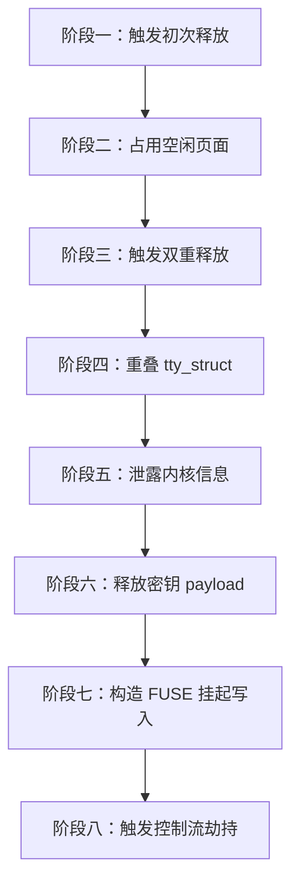

### 5-2. 阶段一：触发初次释放

本阶段的目标是利用漏洞的 V3 释放路径，释放一个 slab 页面并制造悬空指针。具体操作为：

- 创建一个 `AF_PACKET` 套接字，设置为 `TPACKET_V3` 模式。内核通过 `packet_create()` 初始化 `struct packet_sock`，其中 `rx_ring` 和 `tx_ring` 均为空。
- 通过 `PACKET_RX_RING` 分配接收环形缓冲区，指定 `tp_block_nr = 0x80`、`tp_block_size = 0x1000`。内核进入 `packet_set_ring()` 的分配分支，调用 `alloc_pg_vec()` 分配 `pg_vec` 数组。`alloc_pg_vec()` 内部使用 `kcalloc(0x80, sizeof(struct pgv), GFP_KERNEL)`，总大小 0x400 字节，落在 kmalloc-1k 缓存中，返回地址记为 P。随后为每个块分配物理页面（order=0），并将地址填入 `pg_vec[i].buffer`。
- 接着 `init_prb_bdqc()` 被调用，`p1->pkbdq = pg_vec` 将 P 写入 `packet_ring_buffer` 联合体的 `pkbdq` 字段，由于联合体重叠，`rx_owner_map` 也获得了 P 的值。然后 `swap(rb->pg_vec, pg_vec)` 将 P 存入 `rb->pg_vec`，局部 `pg_vec` 变为 NULL。
- 立即将 `tp_block_nr` 设为 0，再次调用 `PACKET_RX_RING` 关闭环形缓冲区。此时 `req->tp_block_nr` 为 0，跳过分配分支，进入交换逻辑。`swap(rb->pg_vec, pg_vec)` 将 `rb->pg_vec` 中的 P 交换至局部 `pg_vec`，`rb->pg_vec` 变为 NULL。由于版本为 V3，条件 `po->tp_version <= TPACKET_V2` 不成立，`swap(rb->rx_owner_map, rx_owner_map)` 被跳过，因此 `rb->rx_owner_map` 仍保留 P 的值。随后 `free_pg_vec(pg_vec, ...)` 释放 P 及其指向的物理页，页面 P 归还给 slab 分配器。

此时页面 P 处于空闲状态，但 `packet_ring_buffer` 中的 `rx_owner_map` 仍持有 P 的地址，成为悬空指针。


### 5-3. 阶段二：占用空闲页面

本阶段的目标是让 `user_key_payload` 占据阶段一释放的页面 P，为后续信息泄露做准备。

通过 `keyctl` 系统调用分配一个用户密钥，payload 大小精确计算以确保总分配量落在 kmalloc-1k 缓存内（例如 `sizeof(struct user_key_payload) + plen` 不超过 1024 字节）。slab 分配器优先重用最近释放的空闲块，因此 `user_key_payload` 将被放置在页面 P 上。

此时页面 P 的状态为：

- **从密钥子系统视角**：有效的 `user_key_payload`，可被 `keyctl_read` 读取。
- **从 slab 分配器视角**：已分配（被密钥占用）。
- **从 Packet Socket 视角**：`rx_owner_map` 仍指向页面 P，但该指针在逻辑上已失效（悬空）。


### 5-4. 阶段三：触发双重释放

本阶段是漏洞触发的核心，利用版本切换使内核再次释放已被密钥占用的页面 P。

- 将套接字版本切换至 `TPACKET_V2`。此操作仅修改 `po->tp_version`，不涉及环形缓冲区，因此 `packet_ring_buffer` 中的悬空指针保持不变。
- 再次执行零长度的 `PACKET_RX_RING` 设置（`tp_block_nr = 0`）。此时版本条件 `po->tp_version <= TPACKET_V2` 成立，内核执行 `swap(rb->rx_owner_map, rx_owner_map)`，将 `rb->rx_owner_map` 中的悬空指针（指向页面 P）交换至局部变量 `rx_owner_map`，同时将 `rb->rx_owner_map` 置为 NULL。
- 在 `out_free_pg_vec` 标签处，`bitmap_free(rx_owner_map)` 尝试释放该指针。`bitmap_free()` 内部调用 `kfree()`，而页面 P 当前正被 `user_key_payload` 占用，此操作构成双重释放。

双重释放后，slab 分配器的空闲链表被破坏，页面 P 被标记为空闲，但 `user_key_payload` 仍持有对该页面的引用。此时同一页面同时处于“已分配（密钥持有）”和“已释放（slab 空闲）”的矛盾状态，slab 元数据可能已损坏，但密钥子系统的引用计数并未减少，因此后续仍可通过密钥读取该页面内容。


### 5-5. 阶段四：重叠 tty_struct

本阶段利用 slab 分配器的重用策略，使 `tty_struct` 落在被双重释放的页面 P 上，与 `user_key_payload` 形成物理内存重叠。

- 打开 `/dev/ptmx` 伪终端设备，内核在 TTY 子系统中分配 `tty_struct` 对象。`tty_struct` 大小约为 0x2b8 字节，同样位于 kmalloc-1k 缓存。
- slab 分配器优先重用最近释放的空闲块，因此 `tty_struct` 将被放置在页面 P 上。

此时页面 P 同时承载：

- `user_key_payload`（密钥子系统视角，仍有效）
- `tty_struct`（TTY 子系统视角，已分配并初始化）

两者物理地址重叠，但内核的不同子系统各自维护独立的对象生命周期。由于密钥 payload 的起始偏移与 `tty_struct` 的起始偏移相同（均为页面起始），因此读取密钥内容即可获得 `tty_struct` 开头的部分数据。


### 5-6. 阶段五：泄露内核信息

本阶段利用密钥的可读特性，从重叠页面中读取 `tty_struct` 的内核指针，进而计算内核基址。

- 通过 `keyctl_read` 读取 `user_key_payload` 的内容，参数为 `key_id`、缓冲区指针和长度。由于页面 P 同时存储着 `tty_struct` 的原始数据，读取结果即为 `tty_struct` 的二进制布局。
- 从读取的数据中提取两个关键信息：
    1. **`tty_operations` 指针**：位于 `tty_struct` 固定偏移处（通常为 `tty_struct->ops`）。该指针指向内核 `.rodata` 段中的操作函数表。通过该指针的低 12 位偏移可匹配内核符号（如 `ptm_unix98_ops` 或 `pty_unix98_ops`），进而精确计算内核映像基址，绕过 KASLR。
    2. **`tty_struct` 自身地址**：`tty_struct` 内部存在自引用指针，可推算其堆地址，用于后续伪造数据的精准覆盖。

此阶段仅读取数据，不涉及写入操作，因此不会触发内核异常。


### 5-7. 阶段六：释放密钥 payload

本阶段撤销密钥引用，使页面 P 再次变为 slab 空闲状态，同时保留 `tty_struct` 的存活。

- 调用 `key_revoke(key_id)` 和 `key_unlink(key_id)` 减少引用计数，当计数归零时内核释放 `user_key_payload` 占用的内存，即 `kfree(P)`。
- slab 分配器将页面 P 标记为空闲，但 TTY 子系统仍认为 `tty_struct` 有效且位于该页面。

此时页面 P 的状态为：

- **从 slab 分配器视角**：空闲块。
- **从 TTY 子系统视角**：有效的 `tty_struct`。
- **从密钥子系统视角**：已释放，不再可访问。

```mermaid
sequenceDiagram
    participant Exploit
    participant KeySubsystem
    participant TtySubsystem
    participant SlabAlloc

    Note over TtySubsystem,KeySubsystem: 页面 P 上 tty_struct 与 key 重叠
    Exploit->>KeySubsystem: key_revoke(key_id)
    Exploit->>KeySubsystem: key_unlink(key_id)
    KeySubsystem->>SlabAlloc: kfree(user_key_payload)
    Note over SlabAlloc: 页面 P 再次空闲
    Note over TtySubsystem: tty_struct 仍存活于 P
```

### 5-8. 阶段七：构造 FUSE 挂起写入

本阶段是区别于第4章的关键环节。由于目标系统可能开启了 `CONFIG_INIT_ON_FREE_DEFAULT_ON`，直接使用 `setxattr` 写入伪造数据会在释放临时缓冲区时被清零，因此需要借助 FUSE 实现“部分写入 + 暂停”的效果。

- **初始化 FUSE 子系统**：利用用户命名空间和 `fusectl` 挂载点，启动一个用户态 FUSE 守护进程，并创建一个匿名内存映射（通过 FUSE 的 `mmap` 支持）。该映射包含两页：第一页为普通内存（可立即访问），第二页由 FUSE 后端提供，访问时会陷入 FUSE 请求处理流程，可被守护进程控制何时回复。这种机制使得内核在复制数据到第二页时会被挂起，直到 FUSE 守护进程主动响应缺页请求。
- **布置伪造数据**：将伪造的 `tty_struct` 头部和后续数据放置在该映射中，使得数据跨越两页边界——第一页包含 `tty_struct` 的关键字段（如 `ops` 指针和指向伪造 `tty_operations` 表的地址），第二页包含后续的 ROP 链及辅助数据。通过精确的偏移计算，确保第一页的数据足以独立完成控制流劫持的触发条件。
- **启动 `setxattr` 复制**：在单独的线程中调用 `setxattr`，源地址指向 FUSE 映射的起始位置。内核通过 `copy_from_user` 开始将用户态数据复制到目标内核缓冲区（即页面 P，也即 `tty_struct` 所在位置）。当复制到第二页时，由于该页尚未被 FUSE 守护进程填充数据，内核触发缺页异常，FUSE 守护进程收到请求但暂不回复，使 `copy_from_user` 进入等待状态。
- **此时系统状态**：第一页的数据已经成功写入目标页面 P，而第二页数据尚未写入，`setxattr` 的临时缓冲区也未释放（因为整个复制操作尚未完成）。由于 `setxattr` 尚未返回，临时缓冲区没有被 `kfree`，因此即使 `CONFIG_INIT_ON_FREE_DEFAULT_ON` 开启，清零操作也尚未触发。而目标页面 P 中已经包含完整的 `tty_struct` 头部和指向伪造 `tty_operations` 表及 ROP 链起始位置的指针，足以在后续的 `ioctl` 调用中触发控制流劫持。

此阶段的关键在于利用 FUSE 的同步阻塞特性，将 `copy_from_user` 的原子操作拆分为两个阶段，从而在复制未完全结束时利用已写入的数据发起控制流劫持，同时避免临时缓冲区释放时数据被清零。

```mermaid
sequenceDiagram
    participant Exploit
    participant FUSE
    participant Setxattr
    participant TtySubsystem
    participant SlabAlloc

    Note over SlabAlloc: 页面 P 空闲 (来自阶段六)
    Note over TtySubsystem: tty_struct 仍存活于 P
    Exploit->>FUSE: 初始化 FUSE 子系统及匿名映射
    Note over FUSE: 伪造数据跨页边界布置
    Exploit->>Setxattr: setxattr(fake_data, 0x400)
    Setxattr->>SlabAlloc: kmalloc(temp_buf) → 页面 P 复用
    Setxattr->>Setxattr: copy_from_user 复制第一页数据
    Note over Setxattr: 第一页数据写入 P（tty_struct 头部已覆盖）
    Setxattr->>Setxattr: copy_from_user 复制第二页
    Setxattr-->>FUSE: 缺页 → 等待 FUSE 响应
    Note over Setxattr: setxattr 挂起，临时缓冲区未释放
```

### 5-9. 阶段八：触发控制流劫持

在 `setxattr` 挂起期间，主线程对 `tty_fd` 调用 `ioctl`，传入请求码和 ROP 链起始地址。此时 `tty_struct` 的 `ops` 指针已被覆盖，指向同一页面内的伪造操作函数表，而伪造表的 `ioctl` 函数指针已替换为栈迁移 gadget。执行 `ioctl` 后，控制流发生以下转移：

- 内核在 TTY 驱动中调用 `tty_struct->ops->ioctl`，该指针现为栈迁移 gadget 的地址。执行该 gadget 后，栈指针被切换到伪造数据页面中的 ROP 链起始位置。
- 随后执行预设的 ROP 指令序列，依次完成命名空间逃逸（将当前进程切换至初始命名空间）、凭证替换（将进程有效用户标识提升至 0），以及安全返回用户态（跳转到预置的 shell 执行函数）。
- 完成 ROP 后，进程获得 root 权限，并启动交互式 shell。

由于 `setxattr` 尚未完成，内核不会在此时释放临时缓冲区，因此不会触发 `CONFIG_INIT_ON_FREE_DEFAULT_ON` 带来的清零操作，伪造数据得以保留。待 `ioctl` 执行完毕并返回用户态后，进程已处于提权状态，`setxattr` 后续可能因进程状态变化而失败或返回错误，但这已不影响提权结果。

```mermaid
sequenceDiagram
    participant Exploit
    participant Setxattr
    participant TtyDriver
    participant Kernel

    Note over Setxattr: setxattr 挂起在 FUSE 缺页处
    Exploit->>TtyDriver: ioctl(tty_fd, 0xdeadbeef, stack_addr)
    TtyDriver->>Kernel: fake_ops->ioctl (栈迁移 gadget)
    Kernel->>Kernel: 切换 RSP 到 ROP 链
    Kernel->>Kernel: 执行命名空间逃逸 + 凭证提升
    Kernel->>Kernel: 返回用户态
    Kernel-->>Exploit: 返回至 shell 执行函数
    Note over Setxattr: setxattr 后续可能返回错误，但提权已完成
```

### 5-10. 内核保护机制的应对策略

本方案继承了第4章的所有绕过策略（KASLR、SMEP、SMAP、KPTI、堆安全加固、用户命名空间），并额外针对 `CONFIG_INIT_ON_FREE_DEFAULT_ON` 提供了有效的绕过途径。

- **KASLR**：通过阶段五泄露 `tty_ops` 指针，精确计算内核基址，完全消除随机化影响。
- **SMEP/SMAP**：ROP 链位于内核堆中（页面 P 属于内核空间），不会触发 SMEP 异常；数据也在内核空间，符合 SMAP 要求。
- **KPTI**：ROP 链末尾使用内核提供的标准返回用户态函数，负责正确切换页表并返回用户态。
- **堆安全加固（如 SLAB_FREELIST_RANDOM、SLAB_FREELIST_HARDENED）**：通过精确控制分配顺序（密钥 → `tty_struct` → `setxattr`），可大概率实现目标重叠。双重释放造成的 slab 空闲链表破坏进一步提高了可控性。
- **用户命名空间限制**：通过 ROP 链中的命名空间逃逸步骤切换回初始命名空间，获得全局 root 权限。
- **CONFIG_INIT_ON_FREE_DEFAULT_ON**：本方案通过 FUSE 的暂停机制，将 `setxattr` 的复制过程拆分为“已写入部分”和“未完成部分”。由于 `setxattr` 尚未返回，临时缓冲区未被释放，因此清零操作不会发生。已写入的目标页面 P 中的数据得以保留，从而成功构造控制流劫持条件。

FUSE 的引入也需注意其自身限制，如需要用户态 FUSE 守护进程的支持，以及目标系统需挂载 FUSE 文件系统（通常可通过用户命名空间实现）。

### 5-11. 利用条件与局限性

#### 5-11-1. 利用条件

- **内核版本**：4.14～5.15 系列受影响内核，开启 `CONFIG_PACKET` 和 `CONFIG_KEYS`（通常为默认配置）。
- **权限要求**：进程需具备 `CAP_NET_RAW` 能力（容器及系统服务中常默认授予），以及创建用户命名空间和挂载 FUSE 所需的能力（在用户命名空间内通常可满足）。
- **资源可用性**：需支持 `CONFIG_FUSE_FS` 和 `CONFIG_USER_NS`（发行版内核通常默认开启）。FUSE 设备（`/dev/fuse`）需在命名空间内可访问。
- **内存布局可预测性**：依赖 slab 分配器重用策略，需保证分配顺序（密钥 → `tty_struct` → `setxattr`）不被中断。若启用了 `CONFIG_SLAB_FREELIST_RANDOM`，需多次尝试，可通过循环重试提高成功率。
- **内核符号信息**：需预知 `tty_ops` 符号偏移（如 `ptm_unix98_ops` 或 `pty_unix98_ops`）以匹配低 12 位偏移。常见发行版内核这些符号位置固定，可通过本地测试获取。
- **FUSE 配置**：需确保 FUSE 设备（`/dev/fuse`）可用，且在用户命名空间内可挂载。若目标系统禁止 FUSE（如某些容器环境限制设备访问），则本方案无法使用。

#### 5-11-2. 局限性

- **FUSE 依赖**：本方案需要内核支持 FUSE，且用户命名空间允许挂载。若目标系统明确禁用 FUSE（如通过 seccomp 或 LSMs 限制），则无法实施。
- **复杂性增加**：FUSE 的引入显著增加了利用的复杂度，包括需要启动守护进程、处理 FUSE 请求同步、管理线程间时序等，可能因竞态条件导致失败。需要精细的时序控制以确保 `setxattr` 在挂起时恰好处于所需状态。
- **兼容性差异**：不同内核版本中 FUSE 的实现细节（如缺页处理流程、`copy_from_user` 的等待机制）可能存在差异，需谨慎适配并充分测试。
- **其他局限**：与第4章相同的局限性依然存在，包括强制访问控制（SELinux/AppArmor）可能限制操作路径、高负载或内存碎片干扰布局、内核调试配置触发 panic、符号偏移变化、一次性利用导致状态破坏、多核心竞态干扰时序、以及 x86-64 架构限制等。具体内容可参考第4章的相关分析。

### 5-12. 章节总结

本章在上一章的基础上，提出了一种针对 `CONFIG_INIT_ON_FREE_DEFAULT_ON` 加固配置的绕过方案，利用 **FUSE** 用户态文件系统的缺页处理机制，将 `setxattr` 的复制过程暂停在中间状态，从而避免临时缓冲区释放时被清零。通过精心布置伪造数据跨页边界，在复制暂停时调用 `ioctl` 触发控制流劫持，完成权限提升。

该方案继承了第4章的大部分技术框架，但阶段七和阶段八的操作顺序与交互方式有所调整。FUSE 的引入虽然增加了实现复杂度，但有效解决了第4章在加固环境下的硬性失败问题，使得在 `CONFIG_INIT_ON_FREE_DEFAULT_ON` 开启的场景下仍然具备可行的利用路径。

在实际评估中，需根据目标系统是否支持 FUSE 以及加固策略的具体配置，合理选择两种方案之一。对于未开启 `CONFIG_INIT_ON_FREE_DEFAULT_ON` 的系统，第4章的方案更为简洁直接；而对于开启了该加固配置且支持 FUSE 的系统，本章方案则提供了有效的替代路径。两种方案在获取内核基址和堆地址前的阶段完全一致，因此可共享前六个阶段的实现，仅在控制流劫持构造阶段根据目标配置进行分支选择。

### 5-13. 测试结果

<div style="text-align: center; margin: 2rem 0;">
  
</div>

## 6. 利用思路三

本章在前两章基础上，引入一种更为直接的**内核内存写原语**——利用 `AF_PACKET` 环形缓冲区中 `pg_vec` 页面向量数组的物理页指针可被用户态 `mmap` 引用的特性，通过篡改 `pg_vec` 中的物理页地址，使其指向内核代码段，从而获得对内核映像的可写映射，进而直接修补内核函数以实现权限提升。该思路相比前两章无需构造复杂的 ROP 链，仅需一次可靠的代码补丁即可完成提权，且对 `CONFIG_INIT_ON_FREE_DEFAULT_ON` 同样具备绕过能力。以下按十四个阶段详细阐述。

### 6-1. 整体架构设计

本方案的核心思路建立在 **[USMA（User-Space-Mapping-Attack）](https://vul.360.net/archives/391)** 技术之上。关于 USMA 的详细原理介绍与技术深度分析，可参考 **[Kernel USMA技术分析](https://binracer.github.io/2026/03/28/pwn4kernel-USMA/)**，其核心思想是利用 `AF_PACKET` 套接字的 `packet_mmap` 特性，通过篡改环形缓冲区的页面向量（`pg_vec`），将内核代码段映射到用户空间，从而在用户态直接修改内核函数代码。

`AF_PACKET` 环形缓冲区在初始化时，内核通过 `alloc_pg_vec()` 分配一个 `struct pgv` 数组，每个元素存储一个物理页面的内核虚拟地址。当用户态通过 `mmap` 映射该环形缓冲区时，内核遍历 `pg_vec`，将其中每个 `buffer` 对应的物理页映射到用户态 VMA。因此，**`pg_vec` 数组中的指针决定了用户态能访问哪些物理页**。如果能够控制 `pg_vec[i].buffer` 指针，将其修改为指向内核代码段中某个函数所在页面的内核虚拟地址，那么后续的 `mmap` 操作将会把该内核代码页映射到用户空间，从而允许用户空间进程直接读写内核代码。

本方案通过以下路径实现 `pg_vec` 的篡改：首先利用双重释放漏洞使一个 slab 页面被释放后，通过分配密钥 payload 和 `tty_struct` 先后占据该页面，泄露内核基址和堆地址；随后释放 `tty_struct`，再分配一个新的 `AF_PACKET` 环形缓冲区的 `pg_vec` 数组，使其占据同一空闲页面，从而与密钥 payload 形成物理重叠。在此重叠基础上，首先通过密钥读取操作获取 `pg_vec` 数组的原始内容（受 `user_key_payload` 头部偏移限制，仅能读取 `pg_vec[3]` 及之后的条目），保存原始物理页指针信息。随后释放密钥 payload，使该页面再次变为空闲，此时 `pg_vec` 数组仍存活于该页面，且内容保持不变。接着利用 FUSE 暂停机制，通过 `setxattr` 对 `pg_vec` 数组执行部分覆盖——将前几个 `pgv` 元素替换为内核代码段中目标函数所在页面的内核虚拟地址，其余条目则从之前保存的原始数据中复制，以确保环形缓冲区其他部分仍可正常运作。当用户态 `mmap` 该环形缓冲区后，这些伪造的“物理页”实际上映射到内核代码段，从而获得对内核代码的读写权限。直接修补目标函数（如 `ns_capable_setid`）使其始终返回 1，即可使后续所有权限检查通过，进程通过 `setresuid` 等系统调用直接提权至 root。完成提权后，为确保系统稳定性，必须将 `pg_vec` 恢复为原始内容。恢复过程中，子进程利用保存的 `pg_vec[3]` 向前推算前三个指针（`pg_vec[2] = pg_vec[3] - 0x1000`、`pg_vec[1] = pg_vec[3] - 0x2000`、`pg_vec[0] = pg_vec[3] - 0x3000`），结合保存的 `pg_vec[3]` 及之后的数据，通过第二次 `setxattr` 将完整的原始 `pg_vec` 写回页面 P，并再次利用 FUSE 暂停机制维持该状态，避免内核后续访问错误。

本方案采用**父子进程**分工协作：子进程负责执行所有漏洞触发、内存布局、信息泄露、`pg_vec` 篡改与内核修补；父进程在收到修补完成的信号后执行 `setresuid`/`setresgid` 提权，并等待子进程完成 `pg_vec` 恢复后启动 root shell。进程间通过管道传递同步信号，确保时序准确。

本方案分为十四个阶段，每个阶段在逻辑上紧密衔接，前一阶段的结果是后一阶段的前提条件。与第5章类似，本方案同样依赖 FUSE 来绕过 `CONFIG_INIT_ON_FREE_DEFAULT_ON` 的清理机制，但在控制流劫持之外引入了对内核代码段的直接修补，使得权限提升更加直接且稳定。

**整体流程总览**

```mermaid
flowchart TD
    A[阶段一：触发初次释放] --> B[阶段二：占用空闲页面]
    B --> C[阶段三：触发双重释放]
    C --> D[阶段四：重叠 tty_struct]
    D --> E[阶段五：泄露内核信息]
    E --> F[阶段六：释放 tty_struct]
    F --> G[阶段七：分配第二块 pg_vec]
    G --> H[阶段八：捕获原始 pg_vec 内容]
    H --> I[阶段九：释放密钥 payload]
    I --> J[阶段十：准备伪造 pg_vec 数据]
    J --> K[阶段十一：部分覆盖 pg_vec]
    K --> L[阶段十二：映射并修补内核]
    L --> M[阶段十三：父进程提权]
    M --> N[阶段十四：恢复原始 pg_vec 并启动 shell]
```

### 6-2. 阶段一：触发初次释放

本阶段与第4章阶段一完全一致，在子进程中执行。创建 `AF_PACKET` 套接字并设置为 `TPACKET_V3`，分配环形缓冲区（`tp_block_nr = 0x80`），然后立即将 `tp_block_nr` 置零释放，制造悬空指针（`rx_owner_map` 仍指向已释放的页面 P）。此阶段完成后，页面 P 处于空闲状态，但 `packet_ring_buffer` 中的悬空引用依然存在。

```mermaid
sequenceDiagram
    participant Child
    participant PacketSocket
    participant SlabAlloc

    Child->>PacketSocket: socket(AF_PACKET) + TPACKET_V3
    Child->>PacketSocket: PACKET_RX_RING (block_nr=0x80)
    PacketSocket->>SlabAlloc: alloc_pg_vec() → kmalloc-1k
    SlabAlloc-->>PacketSocket: 页面 P
    Note over PacketSocket: rb->pg_vec = P<br>rx_owner_map = P (别名)
    Child->>PacketSocket: PACKET_RX_RING (block_nr=0)
    PacketSocket->>PacketSocket: swap(rb->pg_vec, pg_vec)
    PacketSocket->>SlabAlloc: free_pg_vec(P) → 页面 P 空闲
    Note over PacketSocket: rb->pg_vec = NULL<br>rx_owner_map 仍指向 P (悬空)
```

### 6-3. 阶段二：占用空闲页面

与第4章阶段二相同，在子进程中执行。通过 `keyctl` 分配一个用户密钥，payload 大小精确匹配 kmalloc-1k 缓存，使 `user_key_payload` 占据页面 P。此时密钥子系统持有该页面的有效引用，而 Packet Socket 的 `rx_owner_map` 仍然指向 P（逻辑上已失效）。

```mermaid
sequenceDiagram
    participant Child
    participant KeySubsystem
    participant SlabAlloc

    Note over SlabAlloc: 页面 P 空闲 (来自阶段一)
    Child->>KeySubsystem: keyctl(KEYCTL_ADD_KEY, plen)
    KeySubsystem->>SlabAlloc: kmalloc(total)
    SlabAlloc-->>KeySubsystem: 返回页面 P (复用)
    KeySubsystem-->>Child: key_id
    Note over KeySubsystem: user_key_payload 位于 P
```

### 6-4. 阶段三：触发双重释放

与第4章阶段三相同，在子进程中执行。将套接字版本切换至 `TPACKET_V2`，再次执行零长度环形缓冲区设置，内核因 `swap(rb->rx_owner_map, rx_owner_map)` 而将悬空指针换出并调用 `bitmap_free`，导致页面 P 被二次释放，而密钥仍持有引用。此时 slab 分配器将页面 P 标记为空闲，但密钥子系统的引用计数并未递减，因此后续仍可读取该页面内容。

```mermaid
sequenceDiagram
    participant Child
    participant PacketSocket
    participant KeySubsystem
    participant SlabAlloc

    Note over KeySubsystem: user_key_payload 位于 P (已分配)
    Child->>PacketSocket: PACKET_VERSION = TPACKET_V2
    Child->>PacketSocket: PACKET_RX_RING (block_nr=0)
    PacketSocket->>PacketSocket: swap(rb->rx_owner_map, rx_owner_map)
    Note over PacketSocket: 局部 rx_owner_map = P
    PacketSocket->>SlabAlloc: bitmap_free(P) → 双重释放触发
    Note over SlabAlloc: 页面 P 再次空闲
    Note over KeySubsystem: user_key_payload 仍引用 P
```

### 6-5. 阶段四：重叠 tty_struct

与第4章阶段四相同，在子进程中执行。打开 `/dev/ptmx` 分配 `tty_struct`，其落在页面 P 上，与密钥 payload 形成物理重叠。由于 `tty_struct` 的大小约为 0x2b8 字节，完全位于 kmalloc-1k 缓存内，因此 slab 分配器优先选择刚刚释放的页面 P，实现了预期重叠。

```mermaid
sequenceDiagram
    participant Child
    participant TtySubsystem
    participant KeySubsystem
    participant SlabAlloc

    Note over SlabAlloc: 页面 P 空闲 (来自阶段三)
    Note over KeySubsystem: user_key_payload 仍引用 P
    Child->>TtySubsystem: open("/dev/ptmx")
    TtySubsystem->>SlabAlloc: kmalloc(tty_struct, 0x2b8)
    SlabAlloc-->>TtySubsystem: 返回页面 P (复用)
    Note over TtySubsystem,KeySubsystem: tty_struct 与 user_key_payload 重叠于 P
```

### 6-6. 阶段五：泄露内核信息

与第4章阶段五相同，在子进程中执行。通过 `keyctl_read` 读取密钥内容，获取 `tty_struct` 中的 `tty_ops` 指针和自身堆地址，计算内核基址。这些信息为后续定位 `ns_capable_setid` 函数和构造伪造 `pg_vec` 提供必要数据。

```mermaid
sequenceDiagram
    participant Child
    participant KeySubsystem
    participant TtySubsystem

    Note over TtySubsystem,KeySubsystem: 页面 P 上 tty_struct 与 key 重叠
    Child->>KeySubsystem: keyctl_read(key_id, buf)
    KeySubsystem-->>Child: 返回页面 P 内容 (tty_struct 原始数据)
    Note over Child: 解析 tty_ops → kernel_base
    Note over Child: 解析自引用 → tty_struct_addr
```

### 6-7. 阶段六：释放 tty_struct

在获得内核基址和 `tty_struct` 地址后，关闭 `/dev/ptmx` 文件描述符，内核释放 `tty_struct`，页面 P 再次变为 slab 空闲状态。但此时密钥仍引用页面 P，因此页面 P 虽然空闲，但密钥 payload 依然存在，且其中保存的 `tty_struct` 数据已不再需要。这个操作很重要，因为我们需要空出页面 P 来放置 `pg_vec` 数组。

### 6-8. 阶段七：分配第二块 pg_vec

本阶段是本方案的关键步骤，在子进程中执行。创建第二个 `AF_PACKET` 套接字，同样设置为 `TPACKET_V3`，并分配一个环形缓冲区，但块数特意设置为 `0x41`（约 65 个块），使得 `pg_vec` 数组的总大小约为 `0x41 * 8 = 0x208` 字节，仍然落在 kmalloc-1k 缓存中。由于 slab 分配器优先重用最近释放的空闲块，且页面 P 刚被释放，因此该 `pg_vec` 数组将被放置在页面 P 上。此时，密钥 payload 与该 `pg_vec` 数组再次物理重叠。

**技术背景**：`struct pgv` 仅包含一个 8 字节指针（`buffer`），指向实际的物理页。`pg_vec` 数组本身是一个指针数组，存储着每个物理页的线性地址。当用户态 `mmap` 环形缓冲区时，内核根据 `pg_vec` 中的指针映射相应的物理页。因此，覆盖 `pg_vec` 即可控制映射的目标物理页。

```mermaid
sequenceDiagram
    participant Child
    participant PacketSocket2
    participant KeySubsystem
    participant SlabAlloc

    Note over SlabAlloc: 页面 P 空闲 (来自阶段六)
    Note over KeySubsystem: user_key_payload 仍引用 P
    Child->>PacketSocket2: socket(AF_PACKET) + TPACKET_V3
    Child->>PacketSocket2: PACKET_RX_RING (block_nr=0x41)
    PacketSocket2->>SlabAlloc: alloc_pg_vec() → kmalloc-1k
    SlabAlloc-->>PacketSocket2: 返回页面 P (复用)
    Note over PacketSocket2,KeySubsystem: pg_vec 数组与 key payload 重叠于 P
```

### 6-9. 阶段八：捕获原始 pg_vec 内容

由于密钥 payload 与 `pg_vec` 数组重叠，但 `user_key_payload` 结构体头部占用页面起始的 0x18 字节，因此通过 `keyctl_read` 读取密钥内容时，实际获取的数据是从页面偏移 `0x18` 开始的。这意味着我们只能读取到 `pg_vec` 数组的第 4 个元素及之后的条目（即 `pg_vec[3]` 及其后续内容），而前三个元素（`pg_vec[0]`、`pg_vec[1]`、`pg_vec[2]`）无法直接读取。

尽管如此，由于环形缓冲区使用的物理页通常是连续分配的，我们可以根据 `pg_vec[3]` 的地址向前推算前三个指针：`pg_vec[2] = pg_vec[3] - 0x1000`、`pg_vec[1] = pg_vec[3] - 0x2000`、`pg_vec[0] = pg_vec[3] - 0x3000`。这些推算值将在后续恢复时使用。

此步骤保存的数据（从 `pg_vec[3]` 开始）将被用于阶段十四的恢复。

```mermaid
sequenceDiagram
    participant Child
    participant KeySubsystem

    Note over KeySubsystem: user_key_payload 与 pg_vec 重叠，但头部占 0x18
    Child->>KeySubsystem: keyctl_read(key_id, buf)
    KeySubsystem-->>Child: 返回偏移 0x18 后的内容 (pg_vec[3] 开始)
    Note over Child: 保存 pg_vec[3] 及后续条目
    Note over Child: 前三个指针将在恢复时通过 pg_vec[3] 推算
```

### 6-10. 阶段九：释放密钥 payload

调用 `key_revoke` 和 `key_unlink` 释放密钥的 payload，页面 P 再次变为空闲。但此时 `pg_vec` 数组仍存活于页面 P，且其内容保持不变（因为是独立的套接字管理结构）。至此，我们拥有一个可被后续 `setxattr` 覆盖的空闲页面，其中包含 `pg_vec` 数组。由于 `pg_vec` 是套接字内核对象的一部分，其内容不会被密钥释放所影响。

### 6-11. 阶段十：准备伪造 pg_vec 数据

本阶段开始构造用于覆盖 `pg_vec` 的伪造数据。目标是仅修改 `pg_vec` 的前三个元素（对应环形缓冲区的前三个物理页），将它们替换为内核代码段中目标函数所在页面的内核虚拟地址。目标函数选择 `ns_capable_setid`，这是一个在权限检查中被调用的关键函数，如果使其始终返回 1，则所有能力检查都将通过。

- 计算目标内核代码页地址：`target_page = (kernel_base + offset_of_ns_capable_setid) & PAGE_MASK`，即页对齐的起始地址。
- 伪造数据的前三项设置为该地址，其余项（从 `pg_vec[3]` 开始）从阶段八保存的数据中复制。由于保存的数据是从偏移 `0x18` 开始，正好对应 `pg_vec[3]` 及之后的条目，因此复制后无需额外偏移调整。
- 将伪造数据写入 FUSE 匿名内存映射（跨页边界，利用 FUSE 暂停机制）。布局设计确保第一页包含前三个伪造指针，第二页包含后续数据，这样可以保证 `setxattr` 在复制第一页后暂停。

### 6-12. 阶段十一：部分覆盖 pg_vec

通过启动 `setxattr` 系统调用，源地址指向 FUSE 映射中的伪造数据。由于伪造数据跨页边界，且第二页由 FUSE 后端支持，`copy_from_user` 在复制到第二页时将因缺页而暂停。此时，第一页的数据（即伪造 `pg_vec` 的前半部分）已被成功写入页面 P，覆盖了原有的 `pg_vec` 数组。由于 `setxattr` 尚未返回，临时缓冲区未释放，因此即使 `CONFIG_INIT_ON_FREE_DEFAULT_ON` 开启，数据也不会被清零。此时 `pg_vec` 的前三个元素已指向内核代码页，其余元素保留原始值。

**关键点**：写入的第一页包含了 `pg_vec[0]`、`pg_vec[1]`、`pg_vec[2]` 这三个关键指针，它们控制着环形缓冲区的前三个物理页。后续的 `mmap` 将依赖这三个指针来映射对应的物理页。

```mermaid
sequenceDiagram
    participant Child
    participant FUSE
    participant Setxattr
    participant SlabAlloc

    Note over SlabAlloc: 页面 P 空闲 (来自阶段九)
    Note over Child: 伪造数据在 FUSE 映射中跨页边界
    Child->>Setxattr: setxattr(fake_data, 0x400)
    Setxattr->>SlabAlloc: kmalloc(temp_buf) → 页面 P 复用
    Setxattr->>Setxattr: copy_from_user 复制第一页
    Note over Setxattr: pg_vec[0..2] 已被覆盖为内核代码页地址
    Setxattr->>Setxattr: copy_from_user 第二页
    Setxattr-->>FUSE: 缺页 → 等待 FUSE 响应
    Note over Setxattr: setxattr 挂起，临时缓冲区未释放
```

### 6-13. 阶段十二：映射环形缓冲区并修补内核

在 `setxattr` 暂停期间，子进程对第二个套接字执行 `mmap`，将环形缓冲区映射到用户态。由于 `pg_vec` 现在指向内核代码页，`mmap` 操作将内核代码段映射到子进程地址空间，获得可写权限。具体地，环形缓冲区的前几个块（前三个）对应的物理页实际上是内核代码页，因此映射后子进程可读写这些内核代码。

在映射的范围内定位目标函数 `ns_capable_setid` 的偏移（从基址加上符号偏移），将其前几条指令修补为直接返回 1 的简单序列。修补完成后，所有对 `ns_capable_setid` 的调用将直接返回真，使得后续权限检查全部通过。

完成修补后，解除 `mmap` 映射。此时内核代码已被修改，子进程随后通过管道向父进程发送“修补完成”信号。

```mermaid
sequenceDiagram
    participant Child
    participant Kernel

    Note over Kernel: ns_capable_setid 仍为原始代码
    Child->>Kernel: mmap(usma_fd) → 映射代码页
    Note over Kernel: 内核代码页被映射为可写
    Child->>Kernel: 写入补丁 (返回 1)
    Note over Kernel: ns_capable_setid 已修补
    Child->>Kernel: munmap()
    Child-->>Parent: 管道发送信号1
```

### 6-14. 阶段十三：父进程提权

父进程通过管道等待子进程的信号。一旦接收到“修补完成”信号，父进程立即执行 `setresuid(0,0,0)` 和 `setresgid(0,0,0)`。由于 `ns_capable_setid` 已被子进程修补为始终返回 1，权限检查顺利通过，父进程获得 root 权限。

父进程提权完成后，通过管道向子进程发送“提权完成”信号，通知子进程可以开始恢复 `pg_vec` 的原始内容。

```mermaid
sequenceDiagram
    participant Parent
    participant Child
    participant Kernel

    Child->>Parent: 管道信号1 (修补完成)
    Parent->>Kernel: setresuid(0,0,0) → 权限检查通过
    Parent->>Kernel: setresgid(0,0,0)
    Parent->>Parent: 获得 root 权限
    Parent->>Child: 管道信号2 (提权完成)
```

### 6-15. 阶段十四：恢复原始 pg_vec 并启动 shell

子进程收到父进程的“提权完成”信号后，开始恢复 `pg_vec` 的原始内容。这是确保系统稳定性的关键步骤——若 `pg_vec` 持续指向内核代码页，内核可能在后续操作（如定时器回调、缓冲区内核管理）中访问伪造的代码页，导致不可预知的错误或崩溃。

- 首先，通过 FUSE 机制恢复第一个 `setxattr`，使其完成复制并释放临时缓冲区，这会在 kmalloc-1k 缓存中产生一个新的空闲块。
- 紧接着，启动第二个 `setxattr`，利用该空闲块，将原始 `pg_vec` 数据重新写入页面 P。由于阶段八保存的数据是从 `pg_vec[3]` 开始的，我们需要先根据保存的 `pg_vec[3]` 地址向前推算前三个指针：
    - `pg_vec[2] = saved_pg_vec[3] - 0x1000`
    - `pg_vec[1] = saved_pg_vec[3] - 0x2000`
    - `pg_vec[0] = saved_pg_vec[3] - 0x3000`
      然后将推算出的前三个指针与从阶段八保存的其余数据（`pg_vec[3]` 及后续）一起组成完整的 `pg_vec` 数组，写入页面 P。
- 同样利用 FUSE 暂停机制，将第二个 `setxattr` 挂起，保持 `pg_vec` 处于恢复后的稳定状态，防止后续意外覆盖。此时 `pg_vec` 恢复到原始物理页，环形缓冲区指向正常内存，内核访问不再有风险。

恢复完成后，子进程再次通过管道向父进程发送“恢复完成”信号。父进程收到后，启动 root shell。

```mermaid
sequenceDiagram
    participant Parent
    participant Child
    participant FUSE
    participant Setxattr2
    participant SlabAlloc

    Parent->>Child: 管道信号2 (提权完成)
    Note over Child: 开始恢复 pg_vec
    Child->>FUSE: 恢复第一个 setxattr
    Note over SlabAlloc: 临时缓冲区被释放，页面空闲
    Child->>Setxattr2: setxattr(restore_data, 0x400)
    Note over Setxattr2: restore_data 包含推算的前三个指针<br>和保存的 pg_vec[3] 及后续
    Setxattr2->>SlabAlloc: kmalloc(temp_buf) → 复用页面 P
    Setxattr2->>Setxattr2: copy_from_user 写入完整 pg_vec
    Setxattr2-->>FUSE: 缺页 → 挂起
    Note over Setxattr2: pg_vec 已恢复，setxattr 保持暂停
    Child->>Parent: 管道信号3 (恢复完成)
    Parent->>Parent: 启动 root shell
```

### 6-16. 内核保护机制的应对策略

本方案在设计时考虑了以下主流内核防御机制，并采取了相应的绕过措施：

- **KASLR**：通过阶段五泄露 `tty_ops` 指针，可精确计算内核基址，完全消除随机化影响。`tty_ops` 指针位于内核只读数据段，其偏移量固定，因此一个指针足以推导出全部基址。

- **SMEP/SMAP**：本方案不依赖执行用户态代码，而是对内核代码进行写入，所有操作均在内核空间（代码段）完成，不会触发 SMEP/SMAP 异常。SMEP 禁止在用户态执行内核代码，但此处写入操作是在内核上下文（`setxattr` 和 `mmap`）中进行的，且映射后的内存权限为可写，不涉及代码执行跳转。

- **KPTI**：修补过程在内核上下文中进行，不影响页表切换。在调用 `setresuid` 时，由于内核已修补，权限检查通过，KPTI 只涉及用户态与内核态页表的隔离，不影响已加载的内核代码修改。

- **堆安全加固**：`CONFIG_SLAB_FREELIST_RANDOM` 和 `CONFIG_SLAB_FREELIST_HARDENED` 会增加分配顺序的随机性，但本方案通过精确控制分配顺序（密钥 → tty_struct → pg_vec → setxattr），可大概率实现目标重叠。必要时可通过多次尝试来提高成功率，因为 slab 分配器在低碎片情况下倾向于重用最近释放的对象。

- **用户命名空间限制**：本方案在用户命名空间内操作，但最终通过修改 `ns_capable_setid` 来使能力检查通过，无需切换命名空间即可获得全局 root 权限。

- **CONFIG_INIT_ON_FREE_DEFAULT_ON**：利用 FUSE 暂停使 `setxattr` 保持在“未完成”状态，临时缓冲区未释放，避免清零；同时第二次 `setxattr` 恢复过程也利用同样的机制。由于 `setxattr` 尚未返回，其临时缓冲区仍然被内核引用，因此即使该配置开启，清零也不会发生。

- **写保护（WP）**：内核代码页通常具有只读属性，但通过 `mmap` 映射获得的可写映射是内核允许的（因为物理页被当作普通内存），只要物理页被映射为可写即可。本方案通过 `mmap` 获取的映射具有写权限，可直接写入内核代码。这利用了内核在映射物理页时，通常不会为直接映射的物理页设置严格的只读限制，尤其对于来自 `alloc_pages` 的页面，其 `page->flags` 未设置 `PG_arch_1` 等写保护标志，因此映射可写。

- **其他加固**：对于 `CONFIG_STRICT_KERNEL_RWX`，其保护依赖于页表属性，但通过 `mmap` 映射到用户态的页面会重新建立页表项，内核会检查物理页是否可写。在大多数实现中，只要物理页本身不是通过 `vmalloc` 或模块分配的，直接映射页通常允许写入。因此本方案能够成功修改内核代码。

### 6-17. 利用条件与局限性

#### 6-17-1. 利用条件

- **内核版本**：4.14～5.15 系列受影响内核，开启 `CONFIG_PACKET` 和 `CONFIG_KEYS`。
- **权限要求**：需 `CAP_NET_RAW` 以及创建用户命名空间和 FUSE 的能力。
- **资源可用性**：FUSE 支持，`/dev/fuse` 可访问。
- **内存布局可预测性**：需保证 slab 重用顺序，可能需要多次尝试。
- **内核符号信息**：需预知 `tty_ops` 符号偏移以及目标函数 `ns_capable_setid` 的偏移（通常可从内核镜像或 /proc/kallsyms 获取）。

#### 6-17-2. 局限性

- **FUSE 依赖**：同第5章，需要 FUSE 支持。
- **内核稳定风险**：在修补期间若内核触发对伪造页面的访问（如中断、定时器），可能导致崩溃，恢复操作需在较短时间内完成。
- **复杂性**：涉及多阶段、多线程/FUSE 同步，时序要求较高。
- **其他局限**：与第4、5章类似，包括 MAC 限制（SELinux/AppArmor 可能限制 `setxattr` 目标路径）、高负载干扰、调试配置触发 panic、符号变化、多核心竞态、架构限制等。

### 6-18. 章节总结

本章提出了一种基于 **[USMA（User-Space-Mapping-Attack）](https://vul.360.net/archives/391)** 的新型利用思路，通过精确控制 slab 布局，使 `AF_PACKET` 的 `pg_vec` 数组与密钥 payload 重叠，并利用 FUSE 暂停机制实现部分覆盖，将内核代码页映射到用户空间，直接修补关键函数 `ns_capable_setid`，从而获得 root 权限。与前两章相比，本方案无需构建 ROP 链，仅需一次内存修补，步骤虽多但逻辑清晰，且对 `CONFIG_INIT_ON_FREE_DEFAULT_ON` 同样有效。

该思路体现了内核内存管理中的一类典型漏洞利用模式：**通过篡改映射表（页面向量）实现任意物理内存读写**，在缓解措施日益完善的今天仍具有参考价值。关于 USMA 技术的详细原理与深度分析，可进一步参考 **[Kernel USMA技术分析](https://binracer.github.io/2026/03/28/pwn4kernel-USMA/)**。实际评估中，需根据目标系统对 FUSE 的支持情况和内核配置综合选择最佳方案。

### 6-19. 测试结果

<div style="text-align: center; margin: 2rem 0;">
  
</div>

## 7. 利用思路四

本章在前三章基础上，针对内核 5.9 至 5.14 版本的特定内存管理特性，引入一种基于 **skb 与 pipe_buffer 重叠** 的物理内存读写原语。该方案无需依赖 FUSE，也无需构造 ROP 链，而是利用该内核版本区间内 slab 缓存隔离的缺失——即 `GFP_KERNEL` 与 `GFP_KERNEL_ACCOUNT` 缓存合并的特性——通过控制 slab 布局使 `sk_buff` 与 `pipe_buffer` 数组物理重叠，进而借助管道接口构造任意物理内存读写能力，直接修改当前进程的凭证结构完成提权。以下按九个阶段详细阐述。

### 7-1. 整体架构

本方案的核心思路建立在 **skb 与 pipe_buffer 重叠** 的技术之上。在 Linux 5.9 至 5.14 版本区间内，内核的 slab 分配器取消了 `GFP_KERNEL` 与 `GFP_KERNEL_ACCOUNT` 缓存的隔离。具体而言，commit `10befea91b61`（"mm: memcg/slab: use a single set of kmem_caches for all allocations"）取消了此前两类分配之间的隔离机制，使得不同子系统分配的小对象可以位于同一 slab 页面上。这一状态一直持续到内核 5.14 版本，commit `494c1dfe855e`（"mm: memcg/slab: create a new set of kmalloc-cg-<n> caches"）重新引入了隔离——对于开启了 `CONFIG_MEMCG_KMEM` 编译选项的内核（默认开启），系统会为使用 `GFP_KERNEL_ACCOUNT` 进行分配的通用对象创建一组独立的 `kmalloc-cg-*` 缓存，从而使两类分配重新隔离。

在这一特定区间内，来自不同子系统的内核对象可以在同一 slab 页面上共存。`sk_buff` 是网络套接字缓冲区，通常由 `sock_alloc_send_pskb` 等函数分配，属于 `GFP_KERNEL` 类别；而 `pipe_buffer` 是管道读写缓冲区描述符数组，分配时使用 `GFP_KERNEL_ACCOUNT` 标志。由于缓存合并，二者可以互相重叠，这为我们提供了跨子系统的对象覆盖能力。正是这个看似细微的内存管理策略变化，构成了本方案能够实施的根本前提——它打破了不同子系统之间的对象隔离边界，使得网络子系统的缓冲区与管道子系统的描述符数组能够占据同一物理内存区域。

本方案正是利用这一特性，通过精确控制分配顺序，使 `sk_buff` 与 `pipe_buffer` 数组在同一物理页面上重叠，进而通过 `sk_buff` 的读取接口（`MSG_PEEK`）泄露 `pipe_buffer` 的内部指针，最终获得任意物理内存读写的原语。这一原语的获得是后续所有操作的基础，它使得我们能够在用户态直接访问和修改内核的物理内存空间。

本方案采用**父子进程**分工协作：子进程负责触发双重释放，父进程负责分配 `sk_buff`、`pipe_buffer`，执行信息泄露、物理扫描与凭证替换。进程间通过管道传递同步信号，确保时序准确——因为 slab 重用窗口极为短暂，若父子进程之间的信号同步出现偏差，可能导致目标页面被其他分配请求占用，从而使整个重叠方案失败。

本方案分为九个阶段，每个阶段在逻辑上紧密衔接，前一阶段的结果是后一阶段的前提条件。相较于前几章，本方案无需借助 FUSE 或 ROP，依赖的是内核 slab 管理策略的特定版本行为。

**整体流程总览**

```mermaid
flowchart TD
    A[阶段一：初次释放（子进程）] --> B[阶段二：skb占用（父进程）]
    B --> C[阶段三：双重释放（子进程）]
    C --> D[阶段四：pipe_buffer重叠（父进程）]
    D --> E[阶段五：泄露pipe_buffer（父进程）]
    E --> F[阶段六：构造读写原语（父进程）]
    F --> G[阶段七：发现内核基址（父进程）]
    G --> H[阶段八：定位task_struct（父进程）]
    H --> I[阶段九：凭证替换与提权（父进程）]
```

### 7-2. 阶段一：初次释放（子进程）

子进程首先创建 `AF_PACKET` 套接字并设置为 `TPACKET_V3`，分配环形缓冲区（`tp_block_nr = 0x80`）。该操作在内核中分配 `pg_vec` 数组（大小为 0x400 字节，位于 kmalloc-1k 缓存），页面地址记为 P。该数组存储了环形缓冲区中各物理页的指针，是后续双重释放的关键目标对象。随后子进程立即将 `tp_block_nr` 置零，关闭环形缓冲区，触发 `free_pg_vec()` 释放页面 P。由于版本为 V3，`rx_owner_map` 仍然指向 P，成为悬空指针。此时页面 P 在 slab 分配器中标记为空闲，但 `packet_ring_buffer` 中的引用并未清除，为后续双重释放埋下了伏笔。

子进程完成首次释放后，通过管道向父进程发送“首次释放完成”信号，通知父进程可以开始占用该空闲页面。

```mermaid
sequenceDiagram
    participant Child
    participant PacketSocket
    participant SlabAlloc

    Child->>PacketSocket: socket(AF_PACKET) + TPACKET_V3
    Child->>PacketSocket: PACKET_RX_RING (block_nr=0x80)
    PacketSocket->>SlabAlloc: alloc_pg_vec() → kmalloc-1k
    SlabAlloc-->>PacketSocket: 页面 P
    Note over PacketSocket: rb->pg_vec = P, rx_owner_map = P (别名)
    Child->>PacketSocket: PACKET_RX_RING (block_nr=0)
    PacketSocket->>SlabAlloc: free_pg_vec(P) → 页面 P 空闲
    Note over PacketSocket: rb->pg_vec = NULL, rx_owner_map 仍指向 P (悬空)
    Child-->>Parent: 管道信号1
```

### 7-3. 阶段二：skb占用（父进程）

父进程等待子进程的“首次释放完成”信号。收到后，父进程通过 `socketpair(AF_UNIX, SOCK_STREAM, 0, udp_sock)` 创建一对 Unix 域流式套接字，然后向其中一个套接字写入数据。该 `write` 操作会在内核中分配一个 `sk_buff` 对象来存储数据，其大小与写入长度匹配（约为 1024 - 320 字节），该大小与 `pg_vec` 数组（0x400 字节）相近，因此 slab 分配器优先重用刚刚释放的页面 P。此时 `sk_buff` 位于页面 P 上。选择 `sk_buff` 作为占用对象的原因在于其分配大小可精确控制，且后续能够通过 `MSG_PEEK` 标志在不消费数据的情况下读取其内容，这对于泄露重叠对象的内部状态至关重要。

父进程完成分配后，通过管道向子进程发送确认信号，表示页面 P 已被成功占用。

```mermaid
sequenceDiagram
    participant Parent
    participant SlabAlloc
    participant SkBuff

    Parent->>SkBuff: write(sock) → 分配 sk_buff
    SkBuff->>SlabAlloc: kmalloc(size) 复用页面 P
    Note over SkBuff: sk_buff 位于 P
    Parent-->>Child: 管道信号2
```

### 7-4. 阶段三：双重释放（子进程）

子进程收到父进程的确认信号后，将套接字版本切换至 `TPACKET_V2`，并再次执行零长度环形缓冲区设置。此时版本条件满足，内核执行 `swap(rb->rx_owner_map, rx_owner_map)` 将悬空指针 P 换出，并调用 `bitmap_free(P)`。由于页面 P 当前被父进程的 `sk_buff` 占用，此操作构成双重释放——slab 分配器将页面 P 再次标记为空闲，而 `sk_buff` 仍然存活于该页面。这一状态是后续 `pipe_buffer` 重叠的前提：slab 分配器认为该页面是空闲的，可以被重新分配，但 `sk_buff` 仍持有对该页面的引用，这意味着页面 P 同时处于“已分配（sk_buff 视角）”和“已释放（slab 视角）”的矛盾状态。

子进程完成后，通过管道向父进程发送“双重释放完成”信号，通知父进程可以分配 `pipe_buffer` 来占据该页面。

```mermaid
sequenceDiagram
    participant Child
    participant PacketSocket
    participant SkBuff
    participant SlabAlloc

    Note over SkBuff: sk_buff 位于 P (已分配)
    Child->>PacketSocket: PACKET_VERSION = TPACKET_V2
    Child->>PacketSocket: PACKET_RX_RING (block_nr=0)
    PacketSocket->>SlabAlloc: bitmap_free(P) → 双重释放触发
    Note over SlabAlloc: 页面 P 再次空闲
    Note over SkBuff: sk_buff 仍引用 P
    Child-->>Parent: 管道信号3
```

### 7-5. 阶段四：pipe_buffer重叠（父进程）

父进程收到“双重释放完成”信号后，立即创建一个管道（`pipe(pipe_fd)`），并向该管道写入少量数据（例如 8 字节）。管道写操作会在内核中分配一个 `pipe_buffer` 数组（描述符数组，通常大小在 1KB 以内），用于管理管道缓冲区。由于页面 P 刚刚被释放，且 slab 分配器优先重用最近释放的空闲块，`pipe_buffer` 数组被放置在页面 P 上，与原有的 `sk_buff` 物理重叠。此时，`sk_buff` 的数据区和 `pipe_buffer` 数组共享同一块物理内存。值得注意的是，`pipe_buffer` 结构体的大小约为 56 字节，数组占用空间通常小于 1KB，恰好落在 kmalloc-1k 缓存中，与 `sk_buff` 的数据区大小相匹配，确保了重叠的精确性。

父进程完成后，通过管道向子进程发送确认信号，表示重叠已建立。

```mermaid
sequenceDiagram
    participant Parent
    participant Pipe
    participant SlabAlloc

    Note over SlabAlloc: 页面 P 空闲 (来自阶段三)
    Parent->>Pipe: pipe() + write(pipe)
    Pipe->>SlabAlloc: kmalloc(pipe_buffer) → 复用页面 P
    Note over Pipe: pipe_buffer 位于 P，与 sk_buff 重叠
    Parent-->>Child: 管道信号4
```

### 7-6. 阶段五：泄露pipe_buffer（父进程）

由于 `sk_buff` 与 `pipe_buffer` 重叠，父进程通过 `recv(udp_sock[0], buf, len, MSG_PEEK)` 在不消费 `sk_buff` 的情况下读取其数据。`MSG_PEEK` 标志让内核直接复制 `sk_buff` 数据区的当前内容，而不将其从队列中移除——这意味着我们可以“偷看”数据而不改变 `sk_buff` 的状态，为后续的读写原语构造保留了完整的操作对象。此时数据区中存储的正是 `pipe_buffer` 数组的原始内容。父进程从读取的数据中提取出 `pipe_buffer->page`（指向物理页的 `struct page *`）和 `pipe_buffer->ops`（指向 `anon_pipe_buf_ops` 的指针）等关键字段。

`pipe_buffer->page` 是 `struct page` 的内核虚拟地址，它指向管道缓冲区实际使用的物理页面。这个指针对于后续构造任意物理读写原语和定位 vmemmap 至关重要——它揭示了内核物理内存管理的一个关键信息：`struct page` 数组在 vmemmap 区域中的位置，从而为扫描整个物理内存提供了起点。

```mermaid
sequenceDiagram
    participant Parent
    participant SkBuff
    participant Pipe

    Note over SkBuff,Pipe: sk_buff 与 pipe_buffer 重叠于 P
    Parent->>SkBuff: recv(..., MSG_PEEK)
    SkBuff-->>Parent: 返回 pipe_buffer 原始数据
    Note over Parent: 提取 page 指针和 ops 指针
```

### 7-7. 阶段六：构造读写原语（父进程）

获得 `pipe_buffer->page` 指针后，父进程利用该指针构造任意物理内存读写原语。该原语的核心思想是利用 `sk_buff` 与 `pipe_buffer` 的重叠性，通过重新发送伪造的 `sk_buff` 数据来覆盖 `pipe_buffer` 的结构字段，从而控制管道读/写操作的目标物理页——这是一种典型的“对象重用”技术，通过在同一物理内存上交替放置不同语义的数据结构，实现对内核行为的精确操控。

具体构造过程如下：

- **释放当前 skb 槽位**：首先，父进程从 `udp_sock[0]` 执行一次普通 `read`，将当前与 `pipe_buffer` 重叠的 `sk_buff` 从接收队列中移除并释放。此操作使页面 P 在 socket 层面不再被占用，但 `pipe_buffer` 仍然存活于该页面上（因为管道尚未关闭）。此时页面 P 在 socket 子系统中空闲，但在管道子系统中仍被引用。这种不对称的引用状态是后续覆盖能够成功的关键——管道子系统仍然认为该页面是合法的 `pipe_buffer`，而 socket 子系统已经释放了对该页面的控制。

- **准备伪造的 pipe_buffer**：父进程构造一个伪造的 `pipe_buffer` 结构体，包含以下字段：
    - `page`：指向目标物理页的 `struct page *`（例如 vmemmap 中某物理页对应的 `struct page` 地址）。
    - `offset`：目标物理页内的偏移量（用于读/写指定位置）。
    - `len`：待读取或写入的长度（对于读操作，通常设置为一个较大的值；对于写操作，在写之前会先设置 `len=0` 以允许写入）。

- **重新填充 skb 以覆盖 pipe_buffer**：父进程将该伪造的 `pipe_buffer` 结构体作为数据，通过 `write(udp_sock[1])` 发送一个新的 `sk_buff`。由于页面 P 刚刚被释放（在 socket 层面），slab 分配器会再次重用该页面来存放新 `sk_buff` 的数据区，从而用伪造的 `pipe_buffer` 数据覆盖原有的 `pipe_buffer` 内容。此时，管道子系统的 `pipe_buffer` 指针已被替换为我们指定的任意物理页地址。

- **执行任意物理读/写**：
    - **读操作**：设置伪造的 `pipe_buffer` 中的 `page`、`offset` 和 `len`（例如 `len=0x1ff8`），然后调用 `read(pipe_fd[0], buf, len)`。内核管道驱动程序会根据当前 `pipe_buffer` 中的 `page` 指针，从目标物理页的 `offset` 处复制 `len` 字节到用户缓冲区，从而实现任意物理内存读取。这一操作利用了管道读操作的内部实现机制——它直接从 `pipe_buffer->page` 指向的物理页复制数据到用户空间。
    - **写操作**：首先设置 `len=0`（使内核认为管道缓冲区为空，不尝试读取原数据），然后调用 `write(pipe_fd[1], buf, len)`，内核会将该 `pipe_buffer` 指向的物理页从 `offset` 处开始写入 `len` 字节。写操作的实现与读操作对称，使得我们可以向任意物理地址写入任意数据。

父进程封装了 `arb_phys_read(page_addr, offset, buf, len)` 和 `arb_phys_write(page_addr, offset, buf, len)` 两个函数，分别用于从任意物理地址读取和写入任意长度的数据。这两个原语是后续阶段的基础，它们将内核物理内存空间暴露为用户态可访问的“文件”，使我们能够在用户空间直接操作内核的任何物理页。

```mermaid
sequenceDiagram
    participant Parent
    participant SkBuff
    participant Pipe

    Parent->>SkBuff: read(skb) → 释放当前 skb
    Note over Pipe: pipe_buffer 仍存活
    Parent->>SkBuff: write(sock, fake_pipe_buffer)
    SkBuff->>Pipe: 覆盖 pipe_buffer 的 page/offset/len
    Parent->>Pipe: read/write → 访问任意物理内存
```

### 7-8. 阶段七：发现内核基址（父进程）

父进程利用任意物理读原语，结合泄露的 `pipe_buffer->page` 指针，推算出 vmemmap 区域的起始地址。vmemmap 是内核用于管理物理内存页的虚拟地址空间，它将每个物理页映射到一个 `struct page` 结构。由于 `struct page` 大小固定（在 x86-64 上通常为 64 字节），vmemmap 区域中相邻 `struct page` 之间的地址差为 64。这意味着整个物理内存的每一个物理页都在 vmemmap 中有一个对应的 `struct page` 结构，该结构存储了页面的状态、引用计数和地址等信息。

通过泄露的 `page` 指针（它本身是一个 `struct page *` 虚拟地址），可以估算出 vmemmap 基址，然后以一定步长（如 256 MB）向前扫描 vmemmap 区域，查找特定内核启动函数（例如 `secondary_startup_64`）的签名。该函数是内核启动时第一个执行的 C 语言函数，在内核映像中的偏移固定。当扫描到某个 vmemmap 条目对应的物理页内容与签名匹配时，即可确定该物理页属于内核代码段，从而计算出内核映像基址，绕过 KASLR。具体而言，`secondary_startup_64` 的字节模式是已知的，通过对比从每个 vmemmap 条目读取的物理页内容，可以精确定位内核代码段在物理内存中的位置。

父进程利用 `arb_phys_read` 不断读取 vmemmap 页面内容，直至找到匹配签名。这一扫描过程需要覆盖足够大的地址范围以应对 KASLR 的随机化幅度，但得益于 vmemmap 的线性映射特性，扫描效率较高。

### 7-9. 阶段八：定位task_struct（父进程）

在获得内核基址后，父进程开始扫描物理内存，寻找当前进程和 root 进程的 `task_struct`。`task_struct` 是内核中描述每个进程的核心数据结构，包含了进程的凭证（`cred`）、命名空间（`nsproxy`）、进程名（`comm`）等关键字段。通过 `prctl(PR_SET_NAME, "pwn4kernel")` 将当前进程的 `comm` 字段设置为特定字符串，然后利用物理读原语逐页扫描 vmemmap 区域，查找包含该字符串的页面。当找到匹配页面后，通过验证相邻字段（如 `cred`、`real_cred`、`real_parent` 等指针）的有效性来确认是有效的 `task_struct`。同样，通过扫描 `comm` 为 `"swapper"` 的进程（init 进程）找到 root 进程的 `task_struct`。`swapper` 是系统启动时的第一个进程，其凭证具有 root 权限，是所有权限提升操作的模板来源。

从这两个结构中提取出 `cred`、`real_cred` 和 `nsproxy` 的虚拟地址，为后续凭证替换做准备。这些指针分别指向进程的实际凭证结构、有效凭证结构和命名空间代理结构，替换它们即可完整地改变进程的权限视图。

### 7-10. 阶段九：凭证替换与提权（父进程）

父进程利用任意物理写原语，将当前 `task_struct` 中的 `cred`、`real_cred` 和 `nsproxy` 字段替换为阶段八中获取的 root 进程的对应值。具体操作是：首先通过 `arb_phys_read` 读取当前 `task_struct` 所在的物理页内容，在内存中修改相应字段，然后通过 `arb_phys_write` 将修改后的数据写回物理内存。由于 `task_struct` 可能跨越多个物理页，需要确保读取和写入的范围覆盖所有相关字段。完成替换后，当前进程即获得 root 权限，内核中的所有权限检查（如文件访问、能力检查等）都将返回成功。

```mermaid
sequenceDiagram
    participant Parent
    participant Kernel

    Parent->>Kernel: 利用 arb_phys_write 覆盖 current->cred = root_cred
    Parent->>Kernel: 覆盖 current->real_cred = root_cred
    Parent->>Kernel: 覆盖 current->nsproxy = root_nsproxy
    Note over Kernel: 当前进程凭证已替换为 root
```

凭证替换完成后，父进程立即调用 `get_root_shell()` 启动一个交互式 root shell，完成权限提升并进入管理员操作环境。此时，所有后续命令都将以 root 身份执行。

### 7-11. 保护机制应对

本方案在设计时考虑了以下主流内核防御机制，并采取了相应的绕过措施：

- **KASLR**：通过阶段七扫描 vmemmap 定位内核启动函数的签名，可精确计算内核基址，完全消除随机化影响。这一方法不依赖任何内核符号表，仅通过比对已知的指令模式即可完成定位，因此对于不同编译版本的内核具有通用性。

- **SMEP/SMAP**：本方案不依赖执行用户态代码，而是通过物理内存读写原语修改内核数据，不涉及代码执行跳转，因此不会触发 SMEP/SMAP 异常。所有操作均表现为正常的内核系统调用行为，没有跨越用户态/内核态执行边界。

- **KPTI**：凭证替换操作在内核上下文中完成，不影响页表切换。KPTI 主要防护的是用户态读取内核页表内容，而本方案通过物理读写直接操作内存，不涉及页表遍历或内核地址空间暴露。

- **堆安全加固**：`CONFIG_SLAB_FREELIST_RANDOM` 和 `CONFIG_SLAB_FREELIST_HARDENED` 可能增加重叠的随机性，但通过精确控制分配顺序（skb → pipe_buffer）可大概率实现目标重叠。若首次尝试失败，可通过释放并重新分配来增加成功率。

- **用户命名空间限制**：本方案通过在物理内存中直接修改 `nsproxy`，无需切换命名空间即可获得全局 root 权限。这使得方案即使在严格限制用户命名空间的容器环境中也能生效。

- **特定版本依赖**：本方案依赖 5.9～5.14 内核中 slab 缓存隔离的缺失——即 commit `10befea91b61` 取消隔离后、commit `494c1dfe855e` 重新引入隔离之间的区间。若目标内核不在该区间，则无法使用，因为隔离机制会阻止 `sk_buff` 与 `pipe_buffer` 落在同一 slab 页面上。

### 7-12. 条件与局限

#### 7-12-1. 利用条件

- **内核版本**：5.9 至 5.14 之间的内核版本（包含 5.11 等），且未合入 slab 隔离修复补丁。具体而言，目标内核需处于 commit `10befea91b61` 取消 `GFP_KERNEL` 与 `GFP_KERNEL_ACCOUNT` 隔离之后、commit `494c1dfe855e` 重新引入隔离之前。可通过检查内核版本号或查看 `/proc/slabinfo` 中是否存在 `kmalloc-cg-*` 缓存来判断隔离状态。

- **权限要求**：需 `CAP_NET_RAW` 以创建 `AF_PACKET` 套接字，以及创建管道和 Unix 域套接字的能力（通常为普通用户权限）。在大多数 Linux 发行版中，这些能力对普通用户是默认授予的。

- **资源可用性**：需支持 `AF_UNIX` 套接字和管道（默认开启）。若系统使用了 seccomp 等安全策略限制这些系统调用，则方案可能无法执行。

- **内存布局可预测性**：需保证 slab 重用顺序（skb → pipe_buffer），可能需要多次尝试。在实际操作中，可以通过观察 slab 分配器的行为来调整尝试次数。

#### 7-12-2. 局限性

- **内核版本限制**：仅适用于 5.9～5.14 区间，超出该范围的系统无法使用。更早版本内核有隔离机制，更新版本内核已重新引入隔离。

- **内核稳定风险**：物理读写操作若错误地覆盖关键内核数据结构，可能导致系统崩溃。因此需要谨慎计算偏移和长度，确保只修改目标字段。

- **复杂性**：涉及父子进程同步、物理内存扫描、vmemmap 推算等步骤，实现较为复杂。每个阶段都需要精确的时序控制，任何偏差都可能导致整个流程失败。

- **其他局限**：MAC 限制（SELinux/AppArmor）可能干扰进程间通信；高负载下内存碎片可能影响重叠成功率；调试配置（如 `CONFIG_DEBUG_KMEMLEAK`）可能触发异常。

### 7-13. 章节总结

本章提出了一种基于 **skb 与 pipe_buffer 重叠** 的新型利用思路，专门针对 5.9～5.14 内核版本中 slab 缓存隔离缺失的特性——该特性由 commit `10befea91b61` 取消隔离所引入，直至 commit `494c1dfe855e` 在 5.14 中重新引入隔离为止。通过双重释放漏洞控制 slab 布局，使 `sk_buff` 与 `pipe_buffer` 数组重叠，泄露 `struct page` 指针，进而构造任意物理读写原语，利用 vmemmap 定位内核基址、当前进程与 root 进程的 `task_struct`，并通过管道读写直接修改凭证，最终获得 root 权限。

本方案相比前几章无需借助 FUSE 或 ROP 链，完全依赖内核自身的对象管理机制，体现了对内核内存分配策略的深入理解。其核心价值在于揭示了内核子系统间对象隔离的重要性——当一个微小的缓存管理策略变化被恶意利用时，可能导致整个系统安全模型的崩溃。实际评估中，需根据目标内核版本和配置综合选择最优方案。

### 7-14. 测试结果

<div style="text-align: center; margin: 2rem 0;">
  
</div>

## 8. 利用思路五

本章在前两章基础上，融合了 **[USMA（User-Space-Mapping-Attack）](https://vul.360.net/archives/391)** 与 **skb/pipe_buffer 重叠** 两项技术，针对内核 5.9 至 5.14 版本中 slab 缓存隔离缺失的特性，提出一种无需物理扫描和复杂偏移计算的权限提升方案。该方案通过双重释放控制 slab 布局，先使 `sk_buff` 与 `pipe_buffer` 重叠以泄露内核基址，再将同一 slab 槽位上的 `pipe_buffer` 替换为 Packet Socket 的 `pg_vec` 数组，利用 `sk_buff` 的重叠能力篡改 `pg_vec` 指针，将环形缓冲区映射到内核代码页，从而在用户空间直接修补关键函数（如 `ns_capable_setid`），使权限检查全部通过，最终由父进程通过 `setresuid`/`setresgid` 提权。修补完成后，恢复原始 `pg_vec` 以维持系统稳定。以下按九个阶段详细阐述。

### 8-1. 整体架构

本方案将第6章的 USMA 技术与第7章的 skb 重叠技术相结合，形成一种更为紧凑、不依赖物理内存扫描的利用链。在 5.9～5.14 内核中，`GFP_KERNEL` 与 `GFP_KERNEL_ACCOUNT` 缓存合并（由 commit `10befea91b61` 引入，commit `494c1dfe855e` 在 5.14 中重新隔离），使得不同子系统的对象可共享同一 slab 页面。这一特性打破了内核子系统之间的对象隔离边界，使得网络缓冲区（`sk_buff`）与管道描述符数组（`pipe_buffer`）以及数据包环形缓冲区的页面向量（`pg_vec`）可以依次占据同一物理页面，从而实现跨子系统的数据泄露和控制流劫持。

我们利用这一特性，通过以下步骤达成目标：

1. 触发双重释放，使一个 slab 页面被释放但悬空指针残留；
2. 分配 `sk_buff` 占据该页面，再触发双重释放，使页面空闲但 `sk_buff` 仍存活；
3. 分配 `pipe_buffer` 数组与 `sk_buff` 重叠，通过 `MSG_PEEK` 泄露 `pipe_buffer` 中的 `ops` 指针，从而计算内核基址；
4. 关闭管道释放 `pipe_buffer`，再分配第二个 Packet Socket 的 `pg_vec` 数组，使其占据同一页面，与 `sk_buff` 重叠；
5. 通过 `sk_buff` 篡改 `pg_vec[0]` 指针，使其指向 `ns_capable_setid` 所在代码页；
6. 通过 `mmap` 映射该环形缓冲区，获得内核代码的可写映射，直接修补目标函数使其返回 1；
7. 通知父进程执行 `setresuid`/`setresgid` 提权；
8. 恢复 `pg_vec` 原始内容，避免内核崩溃；
9. 清理资源并启动 root shell。

本方案采用父子进程分工：子进程负责所有漏洞触发、重叠、泄露、修补与恢复；父进程在收到信号后提权并启动 shell。进程间通过管道同步。这种分离设计确保了在关键操作（如内核代码修补）期间，父进程能够以最小延迟响应用户态提权请求，同时在子进程恢复 `pg_vec` 后父进程才最终进入 shell，避免了因资源清理不及时导致的系统不稳定。

本方案无需物理内存扫描，也不依赖 vmemmap 推算，所有信息泄露均通过对象重叠实现，相较于第7章更为简洁可靠。同时，与第6章的 USMA 方案相比，本方案无需借助 FUSE 来绕过 `CONFIG_INIT_ON_FREE_DEFAULT_ON`，因为本方案通过 skb 重叠直接构造 USMA，不依赖 `setxattr` 的数据复制过程。

**整体流程总览**

```mermaid
flowchart TD
    A[阶段一：环境准备] --> B[阶段二：双重释放与skb重叠]
    B --> C[阶段三：泄露内核基址]
    C --> D[阶段四：替换为pg_vec]
    D --> E[阶段五：重定向pg_vec]
    E --> F[阶段六：修补内核函数]
    F --> G[阶段七：通知父进程提权]
    G --> H[阶段八：恢复pg_vec]
    H --> I[阶段九：清理与信号]
```

### 8-2. 阶段一：环境准备

子进程首先绑定 CPU 核心（通常为 0），以消除多核并发调度对 slab 分配顺序的干扰。在多核系统中，slab 分配器可能在不同 CPU 核心上维护独立的本地缓存，若子进程和后续的 `sk_buff` 分配发生在不同核心，可能导致目标页面被其他分配请求抢占。通过绑定单一核心，我们确保所有分配请求在同一 CPU 的 slab 缓存中进行，提高了重叠成功率的可预测性。

随后，子进程通过 `unshare` 创建用户命名空间，使自身在容器化的隔离环境中获得必要的权限（如创建套接字和管道的能力）。用户命名空间的创建不会改变当前进程的 uid/gid，但允许进程在命名空间内拥有 `CAP_NET_RAW` 等能力，从而能够创建 `AF_PACKET` 套接字触发漏洞。

接着，子进程创建一对 Unix 域流式套接字（`socketpair`），用于后续 `sk_buff` 的分配与重叠操作。该套接字对将在整个利用过程中作为 `sk_buff` 的传输通道：通过向其中一个套接字写入数据，可以精确控制 `sk_buff` 的分配时机和大小，确保其与目标 slab 页面大小匹配。

### 8-3. 阶段二：双重释放与skb重叠

子进程执行 `first_free()`，创建 `AF_PACKET` 套接字并设置为 `TPACKET_V3`，分配环形缓冲区（`tp_block_nr = 0x80`），然后立即将 `tp_block_nr` 置零释放。此操作使 `pg_vec` 数组所在的 slab 页面（记为 P）空闲，但 `rx_owner_map` 仍指向 P，形成悬空指针。`pg_vec` 数组的大小为 0x400 字节，恰好落在 kmalloc-1k 缓存中，这为后续用相同大小的 `sk_buff` 数据区精确占据该页面奠定了基础。

紧接着，子进程通过 `write` 向 Unix 域套接字写入数据，该操作在内核中分配一个 `sk_buff`，其数据区大小与 `pg_vec` 数组接近（约 1024 - 320 = 704 字节），因此 slab 分配器将 P 重新分配给它，使 `sk_buff` 占据页面 P。选择 `sk_buff` 作为重叠对象的原因在于：其数据区大小可控，且支持 `MSG_PEEK` 标志读取而不消费数据，为后续泄露 `pipe_buffer` 提供了便利。

随后，子进程执行 `double_free()`，将套接字版本切换至 `TPACKET_V2` 并再次执行零长度环形缓冲区设置。此时内核将悬空指针 P 换出并调用 `bitmap_free`，导致页面 P 被二次释放，而 `sk_buff` 依然存活于该页面。此时，页面 P 在 slab 分配器视角为空闲，在 `sk_buff` 视角仍被引用，为后续重叠提供了前提——这一“分配但已释放”的矛盾状态使得我们可以让新的内核对象（`pipe_buffer`）与已有的 `sk_buff` 共享同一物理内存。

```mermaid
sequenceDiagram
    participant Child
    participant PacketSocket
    participant SkBuff
    participant SlabAlloc

    Child->>PacketSocket: socket(AF_PACKET) + TPACKET_V3
    Child->>PacketSocket: PACKET_RX_RING (block_nr=0x80)
    PacketSocket->>SlabAlloc: alloc_pg_vec() → kmalloc-1k
    SlabAlloc-->>PacketSocket: 页面 P
    Note over PacketSocket: rb->pg_vec = P, rx_owner_map = P (别名)
    Child->>PacketSocket: PACKET_RX_RING (block_nr=0)
    PacketSocket->>SlabAlloc: free_pg_vec(P) → 页面 P 空闲
    Note over PacketSocket: rb->pg_vec = NULL, rx_owner_map 仍指向 P

    Child->>SkBuff: write(sock) → 分配 sk_buff
    SkBuff->>SlabAlloc: kmalloc(size) 复用页面 P
    Note over SkBuff: sk_buff 位于 P

    Child->>PacketSocket: PACKET_VERSION = TPACKET_V2
    Child->>PacketSocket: PACKET_RX_RING (block_nr=0)
    PacketSocket->>SlabAlloc: bitmap_free(P) → 双重释放触发
    Note over SlabAlloc: 页面 P 再次空闲
    Note over SkBuff: sk_buff 仍引用 P
```

### 8-4. 阶段三：泄露内核基址

子进程创建一个管道（`pipe`）并向其写入少量数据（例如 8 字节），该操作在内核中分配 `pipe_buffer` 数组。`pipe_buffer` 结构体大小约为 56 字节，其数组总大小通常小于 1KB，落在 kmalloc-1k 缓存中。由于页面 P 刚刚被释放，slab 分配器将其重新分配给 `pipe_buffer`，从而与原有的 `sk_buff` 物理重叠。

此时，子进程通过 `recv(udp_sock[0], ..., MSG_PEEK)` 在不消费 `sk_buff` 的情况下读取其数据。`MSG_PEEK` 标志使得内核将 `sk_buff` 数据区的当前内容复制到用户缓冲区，但保留数据在 `sk_buff` 中。由于 `sk_buff` 的数据区与 `pipe_buffer` 重叠，读取到的内容即为 `pipe_buffer` 结构体的原始二进制数据。

从读取的数据中提取 `ops` 字段，该指针指向内核只读数据段中的 `anon_pipe_buf_ops` 符号，其偏移在内核映像中固定。通过将该指针减去符号偏移，即可计算出内核映像基址，完全绕过 KASLR。`anon_pipe_buf_ops` 是管道子系统的标准操作表，在所有内核版本中均存在且偏移固定，因此这一泄露方法具有良好的通用性。

同时，`page` 指针也被提取，但本方案后续不需使用该指针——这与第7章不同，本方案不依赖 vmemmap 扫描，因此泄露 `page` 指针仅作为辅助验证信息。

```mermaid
sequenceDiagram
    participant Child
    participant Pipe
    participant SkBuff

    Note over SkBuff: sk_buff 位于 P
    Child->>Pipe: pipe() + write(pipe)
    Pipe->>SlabAlloc: kmalloc(pipe_buffer) → 复用页面 P
    Note over Pipe,SkBuff: pipe_buffer 与 sk_buff 重叠于 P

    Child->>SkBuff: recv(..., MSG_PEEK)
    SkBuff-->>Child: 返回 pipe_buffer 原始数据
    Note over Child: 提取 ops → 计算 kernel_base
```

### 8-5. 阶段四：替换为pg_vec

子进程关闭管道的两端，释放 `pipe_buffer` 数组，使页面 P 再次变为 slab 空闲。关闭管道会触发内核释放所有关联的 `pipe_buffer` 结构和管道缓冲区页面，将页面 P 归还给 slab 分配器。

随后，子进程创建第二个 `AF_PACKET` 套接字并分配环形缓冲区（块数设置为 0x41，使 `pg_vec` 数组大小约 0x208 字节，位于 kmalloc-1k 缓存）。slab 分配器将页面 P 重新分配给这个新的 `pg_vec` 数组，使其与原有的 `sk_buff` 再次重叠。选择块数为 0x41 是经过计算的结果：`pg_vec` 数组总大小约为 0x41 × 8 = 0x208 字节，小于 1KB，确保落在 kmalloc-1k 缓存中。

子进程再次通过 `MSG_PEEK` 读取 `sk_buff` 的内容，此时数据区中存放的是 `pg_vec` 数组的原始指针（即指向各物理页的虚拟地址）。将这些内容保存到 `orig_pg_vec` 缓冲区，用于后续恢复。由于 `pg_vec` 数组的部分条目可能包含环形缓冲区中物理页的实际地址，保存原始内容可以确保恢复时 `pg_vec` 指向正确的物理内存。

```mermaid
sequenceDiagram
    participant Child
    participant Pipe
    participant PacketSocket2
    participant SkBuff

    Child->>Pipe: close(pipe_fd) → 释放 pipe_buffer
    Note over SlabAlloc: 页面 P 空闲

    Child->>PacketSocket2: socket(AF_PACKET) + TPACKET_V3
    Child->>PacketSocket2: PACKET_RX_RING (block_nr=0x41)
    PacketSocket2->>SlabAlloc: alloc_pg_vec() → 复用页面 P
    Note over PacketSocket2,SkBuff: pg_vec 与 sk_buff 重叠于 P

    Child->>SkBuff: recv(..., MSG_PEEK)
    SkBuff-->>Child: 返回 pg_vec 原始内容
    Note over Child: 保存 orig_pg_vec
```

### 8-6. 阶段五：重定向pg_vec

子进程首先从套接字中正常 `read` 一次，消费掉当前的 `sk_buff`，使页面 P 在 socket 层面再次空闲，但 `pg_vec` 仍存活。这一步的关键在于：`sk_buff` 被消费后，其数据区被释放，但页面 P 仍然被 `pg_vec` 数组占用（因为 `pg_vec` 是独立分配的套接字管理结构，与 `sk_buff` 的生命周期无关）。此时页面 P 在 socket 子系统中空闲，但在 packet 子系统中仍被引用，为后续写入新数据提供了空间。

接着，构造伪造的 `sk_buff` 数据，将第一个 8 字节（即对应 `pg_vec[0]` 的位置）替换为 `ns_capable_setid` 函数所在页面的内核虚拟地址（该地址 = 内核基址 + 函数偏移，并向下页对齐）。`ns_capable_setid` 是内核中负责检查进程是否具有特定能力的关键函数，若使其始终返回 1，则后续所有权限检查都将通过。将该伪造数据通过 `write` 发送到套接字，使新的 `sk_buff` 占据页面 P，从而将 `pg_vec[0]` 覆盖为内核代码页的地址，而 `pg_vec[1]` 及之后的条目保持不变。此时，环形缓冲区的前一个块将指向内核代码页，而后面的块仍指向正常的物理页。

这一部分覆盖策略是精心设计的：仅修改第一个块即可让 `mmap` 映射到内核代码页，同时保留其余块使环形缓冲区的其他部分保持有效，避免内核在访问其他块时触发错误。

```mermaid
sequenceDiagram
    participant Child
    participant SkBuff
    participant PacketSocket2

    Child->>SkBuff: read(skb) → 消费当前 skb
    Note over PacketSocket2: pg_vec 仍存活于 P

    Child->>SkBuff: write(sock, fake_data)
    Note over SkBuff: pg_vec[0] 被覆盖为 ns_capable_setid 页地址
```

### 8-7. 阶段六：修补内核函数

子进程对第二个套接字（`usma_fd`）执行 `mmap`，将环形缓冲区映射到用户空间。由于 `pg_vec[0]` 指向内核代码页，该映射将内核代码页暴露为可读写内存。内核在映射物理页时，会根据物理页的属性设置映射权限。由于该物理页属于内核代码段，但 `mmap` 映射时并未设置只读限制，因此用户态获得的是可读写映射。

子进程在映射区域中定位 `ns_capable_setid` 的偏移（从内核基址加上函数偏移），将其前几条指令修改为直接返回 1 的简单序列。修补完成后，所有对 `ns_capable_setid` 的调用将立即返回真，后续的权限检查（如 `setresuid`）将全部通过。

修补结束后，解除 `mmap` 映射，但 `pg_vec` 仍指向内核代码页，需尽快恢复以避免内核访问异常。

```mermaid
sequenceDiagram
    participant Child
    participant Kernel

    Child->>Kernel: mmap(usma_fd) → 映射代码页
    Note over Kernel: 内核代码页被映射为可写
    Child->>Kernel: 写入补丁 (返回 1)
    Note over Kernel: ns_capable_setid 已修补
    Child->>Kernel: munmap()
```

### 8-8. 阶段七：通知父进程提权

子进程通过管道向父进程发送“修补完成”信号。父进程收到后，立即执行 `setresuid(0,0,0)` 和 `setresgid(0,0,0)`。由于 `ns_capable_setid` 已被修补，权限检查通过，父进程获得 root 权限。父进程随后向子进程发送“提权完成”确认信号，通知子进程可以开始恢复 `pg_vec`。

```mermaid
sequenceDiagram
    participant Child
    participant Parent
    participant Kernel

    Child->>Parent: 信号1 (修补完成)
    Parent->>Kernel: setresuid(0,0,0) → 检查通过
    Parent->>Kernel: setresgid(0,0,0)
    Parent->>Parent: 获得 root 权限
    Parent->>Child: 信号2 (提权完成)
```

### 8-9. 阶段八：恢复pg_vec

子进程再次从套接字 `read` 消费当前 `sk_buff`，释放页面 P（在 socket 层面）。然后构造新的 `sk_buff` 数据，将之前保存的 `orig_pg_vec` 内容复制进去，并通过 `write` 发送到套接字。新的 `sk_buff` 占据页面 P，将 `pg_vec` 数组恢复为原始物理页指针。此时环形缓冲区恢复正常，不再指向内核代码页，避免了后续内核定时器或中断访问非法页面导致崩溃。

恢复 `pg_vec` 是确保系统稳定性的关键步骤。若不恢复，内核可能在后续操作（如定时器回调、缓冲区内核管理）中访问指向内核代码页的 `pg_vec` 条目，导致不可预知的错误。

```mermaid
sequenceDiagram
    participant Child
    participant SkBuff
    participant PacketSocket2

    Child->>SkBuff: read(skb) → 消费当前 skb
    Note over PacketSocket2: pg_vec 仍指向代码页

    Child->>SkBuff: write(sock, orig_pg_vec)
    Note over PacketSocket2: pg_vec 恢复为原始指针
```

### 8-10. 阶段九：清理与信号

子进程解除 USMA 套接字的 `mmap` 映射（可选关闭 USMA 套接字），并通过管道向父进程发送“恢复完成”信号。父进程收到该信号后，确认 `pg_vec` 已恢复，随即调用 `get_root_shell()` 启动 root shell。子进程进入无限休眠以保持其资源（如套接字）活跃，维持内核状态稳定。

```mermaid
sequenceDiagram
    participant Child
    participant Parent

    Child->>Parent: 信号3 (恢复完成)
    Parent->>Parent: 启动 root shell
```

### 8-11. 保护机制应对

本方案在设计时考虑了以下主流内核防御机制，并采取了相应的绕过措施：

- **KASLR**：通过阶段三泄露 `anon_pipe_buf_ops` 指针，可精确计算内核基址，完全消除随机化影响。该符号在内核映像中的偏移固定，不受 KASLR 影响。
- **SMEP/SMAP**：本方案通过 `mmap` 映射内核代码到用户态进行修补，不执行用户态代码，因此不会触发 SMEP/SMAP。SMEP 禁止用户态执行内核代码，而我们的修补操作是在用户态写入内核代码页，随后由内核自身（在 `setresuid` 调用中）执行该代码，不涉及用户态直接执行。
- **KPTI**：修补操作在内核上下文中完成，不影响页表切换。KPTI 主要防护用户态读取内核页表，而本方案通过物理页映射间接操作内核代码，不依赖页表遍历。
- **堆安全加固**：通过精确控制分配顺序（skb → pipe_buffer → pg_vec）可大概率实现重叠，若失败可释放资源重新尝试。slab 分配器的随机化策略会略微增加难度，但通过多次尝试可提高成功率。
- **用户命名空间限制**：通过修补 `ns_capable_setid`，所有能力检查通过，无需切换命名空间即可提权。这使得方案即使在严格限制用户命名空间的容器环境中也能生效。
- **CONFIG_INIT_ON_FREE_DEFAULT_ON**：本方案不依赖 `setxattr`，因此不受该配置影响。这是本方案相对于第6章的一个重要优势。
- **特定版本依赖**：依赖 5.9～5.14 内核中 slab 缓存隔离的缺失，若目标内核不在该区间则不可用。

### 8-12. 条件与局限

#### 8-12-1. 利用条件

- **内核版本**：5.9 至 5.14 之间的内核版本，且未合入 slab 隔离修复补丁。可通过检查 `/proc/slabinfo` 中是否存在 `kmalloc-cg-*` 缓存来判断隔离状态——若不存在，则说明缓存已合并，方案可行。
- **权限要求**：需 `CAP_NET_RAW` 以创建 `AF_PACKET` 套接字，以及创建管道和 Unix 域套接字的能力（普通用户默认具备）。
- **资源可用性**：需支持 `AF_UNIX` 套接字和管道（默认开启）。
- **内存布局可预测性**：需保证 slab 重用顺序（skb → pipe_buffer → pg_vec），可能需要多次尝试。在低碎片环境下成功率较高。

#### 8-12-2. 局限性

- **内核版本限制**：仅适用于 5.9～5.14 区间，超出该范围的系统无法使用。
- **内核稳定风险**：若修补后恢复 `pg_vec` 不及时，可能导致内核崩溃。因此阶段七和阶段八之间的时间窗口应尽可能缩短。
- **复杂性**：涉及多阶段同步，时序要求较高。父子进程间的管道通信需要可靠的同步机制。
- **其他局限**：MAC 限制（SELinux/AppArmor）可能干扰进程间通信；高负载下内存碎片可能影响重叠成功率；调试配置可能触发异常。

### 8-13. 章节总结

本章提出了一种融合 **USMA** 与 **skb 重叠** 技术的利用思路，专门针对 5.9～5.14 内核中 slab 隔离缺失的特性。通过双重释放和对象重叠，泄露内核基址，篡改 `pg_vec` 指针，将内核代码映射到用户空间直接修补关键函数，从而绕过后继权限检查。整个流程无需物理内存扫描，结构清晰，且具备较好的稳定性。与第6章相比，本方案无需 FUSE 支持；与第7章相比，本方案无需 vmemmap 扫描和复杂的物理地址推算。实际评估中，需根据目标内核版本和配置综合选择最优方案。

### 8-14. 测试结果

<div style="text-align: center; margin: 2rem 0;">
  
</div>

## 9. 漏洞修复

### 9-1. 补丁概述

针对 **CVE-2021-22600** 漏洞，Linux 内核社区于 2021 年 12 月 15 日由 Willem de Bruijn 提交了修复补丁，commit ID 为 `ec6af094ea28f0f2dda1a6a33b14cd57e36a9755`。该补丁于当日被 Jakub Kicinski 合并入主线内核。

补丁的提交信息（commit message）明确指出了漏洞的根本原因与修复思路：

> **net/packet: rx_owner_map depends on pg_vec**
>
> Packet sockets may switch ring versions. Avoid misinterpreting state between versions, whose fields share a union. `rx_owner_map` is only allocated with a packet ring (`pg_vec`) and both are swapped together. If `pg_vec` is NULL, meaning no packet ring was allocated, then neither was `rx_owner_map`. And the field may be old state from a tpacket_v3.

这段描述精准地概括了漏洞的本质：`rx_owner_map` 与 `pg_vec` 在生命周期上具有强绑定关系——前者仅在后者存在时才有意义。然而在原始实现中，二者的释放逻辑却被解耦，导致在 `pg_vec` 为空的情况下，`rx_owner_map` 仍可能被无条件释放，从而触发双重释放。

补丁的 `Fixes` 标签指向了引入该问题的原始 commit `61fad6816fc1`（"net/packet: tpacket_rcv: avoid a producer race condition"），表明该漏洞是在为 `TPACKET_V3` 添加生产者竞态条件修复时引入的。该漏洞由 syzbot 发现并报告。

### 9-2. 补丁代码分析

修复补丁的代码变更极为简洁，仅涉及 `net/packet/af_packet.c` 文件中 `packet_set_ring()` 函数错误处理标签 `out_free_pg_vec` 处的几行代码调整：

```diff
diff --git a/net/packet/af_packet.c b/net/packet/af_packet.c
index 46943a18a10d5..76c2dca7f0a59 100644
--- a/net/packet/af_packet.c
+++ b/net/packet/af_packet.c
@@ -4492,9 +4492,10 @@ static int packet_set_ring(struct sock *sk, union tpacket_req_u *req_u,
 	}

 out_free_pg_vec:
-	bitmap_free(rx_owner_map);
-	if (pg_vec)
+	if (pg_vec) {
+		bitmap_free(rx_owner_map);
 		free_pg_vec(pg_vec, order, req->tp_block_nr);
+	}
 out:
 	return err;
 }
```

**变更解读**：

- **原始代码**：`bitmap_free(rx_owner_map)` 位于 `if (pg_vec)` 条件之外，意味着无论 `pg_vec` 是否有效，`rx_owner_map` 都会被无条件释放。
- **修复后代码**：将 `bitmap_free(rx_owner_map)` 移入 `if (pg_vec)` 条件内部，与 `free_pg_vec()` 绑定在同一个条件分支中。

这一修改确保了 **`rx_owner_map` 的释放与 `pg_vec` 的释放保持同步**——只有当 `pg_vec` 非空（即确实存在一个有效的环形缓冲区）时，才会释放 `rx_owner_map`。当 `pg_vec` 为空时，`rx_owner_map` 也不会被释放，从而避免了双重释放的发生。

### 9-3. 修复原理深度分析

补丁的修复思路可以从以下几个层面理解：

**1. 资源生命周期的一致性**

`rx_owner_map` 是 `TPACKET_V1/V2` 模式下用于跟踪接收缓冲区帧所有权的位图，其分配发生在 `packet_set_ring()` 的分配分支中，且仅在 `pg_vec` 成功分配后才执行。换言之，**`rx_owner_map` 的存在以 `pg_vec` 的存在为前提**。因此，在释放路径上，二者的释放条件也应当保持一致。原始代码将二者解耦，违背了这一基本设计原则。

**2. 联合体状态污染的消除**

`struct packet_ring_buffer` 中的匿名联合体使得 `rx_owner_map` 与 `prb_bdqc.pkbdq` 共享同一存储单元。在 `TPACKET_V3` 模式下，`pkbdq` 存储了 `pg_vec` 的指针；当版本切换至 `TPACKET_V2` 时，该存储单元被解释为 `rx_owner_map`。如果在版本切换过程中 `pg_vec` 已被释放，但 `rx_owner_map` 仍被错误释放，就会触发双重释放。补丁通过将 `rx_owner_map` 的释放与 `pg_vec` 的有效性绑定，确保了联合体中的指针不会被跨版本误释。

**3. 错误路径与正常路径的统一**

在 `packet_set_ring()` 中，`out_free_pg_vec` 标签承担着错误回滚的职责。原始代码在该标签处无条件释放 `rx_owner_map`，但 `rx_owner_map` 可能来自旧版本的残留状态（如 `TPACKET_V3` 的 `pkbdq` 别名），此时释放它是不安全的。补丁将该标签处的释放逻辑与 `pg_vec` 的有效性绑定，使得错误路径与正常路径的资源清理策略保持一致。

### 9-4. 补丁影响评估

该补丁的变更范围极小，仅涉及 `packet_set_ring()` 函数中错误处理路径的几行代码，对内核其他部分无任何影响。其修复效果如下：

- **彻底消除双重释放漏洞**：通过将 `rx_owner_map` 的释放与 `pg_vec` 的有效性绑定，从根源上杜绝了在 `pg_vec` 为空时误释放 `rx_owner_map` 的可能性。
- **保持原有功能不变**：在正常的环形缓冲区分配与释放流程中，`pg_vec` 非空时 `rx_owner_map` 的释放逻辑与修复前完全一致，不影响 Packet Socket 的正常使用。
- **低回归风险**：由于变更仅涉及错误处理路径，且逻辑清晰，引入新问题的风险极低。

该补丁于 2021 年 12 月被合并入主线内核，随后被反向移植到各稳定内核分支，包括 4.14、4.19、5.4、5.10、5.15 等受影响版本。各主流发行版也已通过安全更新推送了该修复。

### 9-5. 安全启示

**CVE-2021-22600** 的修复过程为内核安全开发提供了几点重要启示：

1. **资源分配与释放的对称性**：任何资源的分配与释放应当在相同的条件上下文中进行。当两个资源在分配时存在依赖关系（如 `rx_owner_map` 依赖 `pg_vec`），其释放也应保持相同的依赖约束。

2. **联合体使用的风险**：联合体虽然节省了内存空间，但引入了类型混淆的风险。在使用联合体存储不同版本的数据结构时，必须确保状态切换时对共享存储单元进行正确的清理或验证。

3. **错误路径的完整性**：错误处理路径（如 `goto` 标签）往往是安全漏洞的高发区域。在编写错误处理代码时，应当确保其资源清理逻辑与正常路径保持一致，避免因路径差异导致的状态不一致。

4. **模糊测试的价值**：该漏洞由 syzbot（内核持续模糊测试系统）发现并报告，再次证明了自动化测试在发现内核安全漏洞中的关键作用。

## 10. 免责声明

本文档旨在提供 **CVE-2021-22600** 漏洞的技术分析与教育性内容，仅供学习、研究和安全防御目的使用。作者与发布平台对以下事项声明如下：

1. **合法使用原则**：本文档中描述的任何技术细节、代码示例或利用方法仅供教育研究之用。读者不得将这些信息用于任何非法、未经授权或恶意的活动，包括但不限于未经授权的系统入侵、数据破坏、服务干扰或其他违反法律法规的行为。

2. **知识共享与责任**：本文档基于公开可获取的信息、官方漏洞公告和学术研究资料编写。作者力求确保技术内容的准确性，但不对信息的完整性、时效性或适用性作任何明示或暗示的保证。读者应自行验证信息的准确性，并在专业环境中谨慎应用。

3. **环境限制**：所有技术分析和实验应在受控的、隔离的测试环境中进行，例如使用特制的虚拟机或专用硬件。禁止在任何生产环境、公共网络或他人系统中尝试漏洞利用或相关技术。

4. **法律合规性**：读者应遵守所在国家或地区的所有适用法律法规，包括但不限于计算机安全法、数据保护法和知识产权法。任何使用本文档内容的行为所产生的法律后果，由行为者自行承担。

5. **技术中立性**：本文档对漏洞的分析保持技术中立立场，旨在促进安全社区的防御能力提升。文中提及的任何工具、技术或方法不应被视为对任何组织、产品或技术的背书或批判。

6. **更新与修正**：技术领域发展迅速，本文档内容可能随时间而过时。作者保留更新、修正或撤回文档内容的权利，不承诺另行通知。

7. **版权声明**：本文档内容受版权法保护，未经明确书面许可，不得用于商业目的。允许在注明出处的前提下进行非商业性的分享与引用。

**重要提示**：安全研究应始终遵循道德准则，以提升整体网络安全为目标。如发现安全漏洞，建议通过负责任的披露流程向相关厂商或机构报告，共同维护数字生态的安全与稳定。

---

_本文档的撰写参考了公开的漏洞公告、内核源码（Linux 5.15.10 和 Linux 5.11.16）及相关技术分析文献。所有实验均在封闭的测试环境中完成，未对任何实际系统造成影响。_

## 参考

- https://github.com/BinRacer/pwn4kernel/tree/master/src/CVE-2021-22600
- https://github.com/BinRacer/pwn4kernel/tree/master/src/CVE-2021-22600_V2
- https://github.com/BinRacer/pwn4kernel/tree/master/src/CVE-2021-22600_V3
- https://github.com/BinRacer/pwn4kernel/tree/master/src/CVE-2021-22600_V4
- https://github.com/BinRacer/pwn4kernel/tree/master/src/CVE-2021-22600_V5
- https://arttnba3.cn/2025/04/30/CVE-0X0D-CVE-2021-22600/
- https://vul.360.net/archives/391
- https://git.kernel.org/pub/scm/linux/kernel/git/torvalds/linux.git/commit/?id=61fad6816fc10fb8793a925d5c1256d1c3db0cd2
- https://git.kernel.org/pub/scm/linux/kernel/git/torvalds/linux.git/commit/?id=ec6af094ea28f0f2dda1a6a33b14cd57e36a9755
- https://nvd.nist.gov/vuln/detail/CVE-2021-22600
- https://ubuntu.com/security/CVE-2021-22600
