# 【Kernel Exploit】CVE-2021-41073 漏洞分析

## 1. 测试环境

**测试版本**：Linux-5.14.6 [内核镜像地址](https://github.com/BinRacer/pwn4kernel/blob/master/kernels/5.14.6/01/bzImage)

笔者测试的内核版本是 `Linux (none) 5.14.6 #1 SMP Fri Feb 20 15:27:35 CST 2026 x86_64 GNU/Linux`。

**编译选项**：开启`CONFIG_BPF`、`CONFIG_BPF_LSM`、`CONFIG_BPF_SYSCALL`、`CONFIG_BPF_JIT`、`CONFIG_BPF_JIT_ALWAYS_ON`、`CONFIG_BPF_JIT_DEFAULT_ON`、`CONFIG_ARCH_WANT_DEFAULT_BPF_JIT`、`CONFIG_BPF_PRELOAD`、`CONFIG_CGROUP_BPF`、`CONFIG_IPV6_SEG6_BPF`、`CONFIG_BPFILTER`、`CONFIG_BPF_STREAM_PARSER`、`CONFIG_LWTUNNEL_BPF`、`CONFIG_HAVE_EBPF_JIT`、`CONFIG_BPF_EVENTS`、`CONFIG_BPF_KPROBE_OVERRIDE`、`CONFIG_IO_URING`、`CONFIG_THREAD_INFO_IN_TASK`、`CONFIG_MEMCG`、`CONFIG_MEMCG_KMEM`、`CONFIG_CGROUPS`、`CONFIG_SLAB_FREELIST_RANDOM`、`CONFIG_SLAB_FREELIST_HARDENED`、`CONFIG_INIT_ON_ALLOC_DEFAULT_ON`、`CONFIG_SHUFFLE_PAGE_ALLOCATOR`、`CONFIG_HARDENED_USERCOPY`、`CONFIG_FUSE_FS`、`CONFIG_USERFAULTFD`、`CONFIG_SYSVIPC`、`CONFIG_KEYS`、`CONFIG_STACKPROTECTOR`、`CONFIG_STACKPROTECTOR_STRONG`、`CONFIG_SLUB`、`CONFIG_SLUB_DEBUG`、`CONFIG_E1000`、`CONFIG_E1000E`、`CONFIG_PACKET`、`CONFIG_PACKET_DIAG`、`CONFIG_USER_NS`、`CONFIG_NET_NS`、`CONFIG_NAMESPACES`、`CONFIG_CHECKPOINT_RESTORE`、`CONFIG_IPC_NS`选项。完整配置参考[.config](https://github.com/BinRacer/pwn4kernel/blob/master/kernels/5.14.6/01/.config)。

**保护机制**：KASLR/SMEP/SMAP/KPTI

## 2. 漏洞背景

### 2-1. io_uring 框架与预注册缓冲区

io_uring 是 Linux 内核自 5.1 版本起引入的高性能异步 I/O 子系统，其设计目标在于重塑传统 I/O 接口的交互模式。与 `read`/`write` 等同步系统调用或 `aio` 等半异步接口不同，io_uring 通过用户态与内核态共享一对环形缓冲区——提交队列（SQ）与完成队列（CQ），允许应用程序批量提交 I/O 请求并异步回收完成结果，从而显著减少了系统调用次数与上下文切换开销。在这种设计下，应用程序将操作描述符（SQE）填入 SQ，内核异步处理后将完成状态写入 CQ，整个过程仅需少量系统调用即可驱动大量 I/O 操作。这种设计使 io_uring 在高并发存储与网络场景中展现出卓越的性能优势，因此在数据库、消息队列等基础中间件中得到了日益广泛的应用。

在 io_uring 支持的众多操作码中，`IORING_OP_PROVIDE_BUFFERS` 实现了一项关键能力：允许应用程序提前将一组用户态缓冲区“注册”到内核中，形成一个归属于特定 `buf_group` 的缓冲区池。此后，当应用程序发起读写请求时，只需在提交队列条目（SQE）中设置 `IOSQE_BUFFER_SELECT` 标志并指定 `buf_group` 编号，内核便会在操作执行时自动从对应的池中取出一个空闲缓冲区来承载数据。这一机制使缓冲区分配与 I/O 调度得以解耦，尤其适用于接收端数据大小未知（如网络收包）或需要减少内存分配开销的场景。例如，在网络服务器中，读取数据前无法预知包大小，若每次临时分配缓冲区会造成频繁的内存操作，而预注册方式可预先准备一批固定大小的缓冲区，由内核按需取用，显著提升效率。

然而，这种“用户态与内核态共享内存并异步交互”的设计模式在提升性能的同时，也引入了更为复杂的控制流和状态管理。io_uring 内部存在大量的状态标志、回调函数和条件分支，这使得数据结构的语义一致性维护变得尤为困难——当同一字段在不同上下文中承载不同含义时，任何遗漏的标志检查都可能成为安全缺陷的入口。特别是，`struct io_kiocb` 中的 `rw.addr` 字段便是一个典型的“双重语义”字段，其解释方式依赖于请求标志 `REQ_F_BUFFER_SELECTED` 的状态。这种设计虽然提高了内存利用率，但也要求开发者在其整个生命周期中严格区分两种上下文。

每个预注册缓冲区在内核中以 `struct io_buffer` 结构体描述：

```c
struct io_buffer {
    struct list_head list;                      /* 链接同一 buf_group 中的所有缓冲区 */
    __u64 addr;                                 /* 用户态缓冲区起始地址 */
    __u32 len;                                  /* 缓冲区大小 */
    __u16 bid;                                  /* 缓冲区 ID */
};
```

该结构体大小为 32 字节，分配于 `kmalloc-32` 缓存。同一 `buf_group` 的多个 `io_buffer` 通过 `list` 双向链表串联，分配时遵循后进先出（LIFO）顺序——这使得同一 slab 页内最近分配的 `io_buffer` 与随后分配的相邻对象在物理地址上靠近，为后续的精确偏移控制提供了基础。理解这一分配特性对于把握漏洞的潜在影响至关重要，因为偏移释放的精度直接依赖于对相邻内存布局的掌控能力。

### 2-2. 请求结构与指针语义复用

io_uring 中每个正在处理的请求都由 `struct io_kiocb` 跟踪。该结构体包含一个大型联合体，用于存储不同操作类型的私有数据，其设计目的是在不同的操作类型之间共享内存，减少整体结构体大小。设计注释指出：“每个 iocb 联合体成员都将文件指针作为其结构体定义中的第一个成员，因此可以通过任何子结构或直接通过 `ki_filp` 访问文件指针。”相关定义如下：

```c
struct io_kiocb {
    union {
        struct file        *file;
        struct io_rw        rw;                 /* 读写操作相关数据 */
        /* ... 其他约二十余种操作类型 ... */
    };
    unsigned int         flags;                 /* 请求标志 */
    /* ... 其他通用字段 ... */
};
```

对于读写类请求，联合体中活跃的成员是 `struct io_rw`：

```c
struct io_rw {
    struct kiocb kiocb;
    u64 addr;                                   /* 目标内存地址：用户地址或内核指针 */
    u64 len;                                    /* 期望传输的字节数 */
};
```

在常规读写模式下，`rw.addr` 存放用户态缓冲区起始地址，`rw.len` 为请求长度。然而，当请求使用了 `IOSQE_BUFFER_SELECT` 并成功匹配预注册缓冲区后，io_uring 在准备阶段会将 `rw.addr` 覆写为所选 `io_buffer` 结构体的内核地址，同时设置 `REQ_F_BUFFER_SELECTED` 标志。此时，`rw.addr` 的语义从“用户地址”转变为“内核对象指针”，两种解释方式仅由 `flags` 中的一个标志位区分。这种复用设计虽然节省了内存——避免了为每个请求额外分配字段来区分地址类型——却也埋下了类型混淆的隐患：任何未检查该标志的代码路径都可能将内核指针误作普通用户指针处理，导致指针运算结果完全偏离预期。

在 io_uring 这样调用路径繁多的子系统中，确保所有代码路径都正确区分这两种语义是一项极具挑战性的任务。`rw.addr` 的双重用途意味着开发者必须在每个使用该字段的地方都保持高度警惕，而 `loop_rw_iter` 函数恰恰在这一点上出现了疏漏。该函数是 io_uring 中用于处理未实现 `read_iter`/`write_iter` 接口的文件的回退路径，其设计上假定 `rw.addr` 始终保持用户地址语义，但这一假设在启用预注册缓冲区后被打破。

### 2-3. 地址转换的触发路径

当应用程序通过 `io_uring_sqe_set_flags(sqe, IOSQE_BUFFER_SELECT)` 为请求启用缓冲区自动选择后，内核在处理该请求时，会沿以下调用链进入地址转换流程：

```
io_submit_sqes
  → io_submit_sqe
    → io_queue_sqe
      → __io_queue_sqe
        → io_issue_sqe
          → io_read
            → io_import_iovec
              → io_rw_buffer_select
```

在 `io_read` 函数中，内核首先调用 `io_import_iovec` 来导入 I/O 向量。`io_read` 函数本身包含复杂的重试逻辑和异步处理路径，但其核心的地址转换发生在 `io_import_iovec` 的调用过程中。`io_import_iovec` 检测到 `REQ_F_BUFFER_SELECT` 标志后，进一步调用 `io_rw_buffer_select`。这个子函数负责从指定的 `buf_group` 中选取一个空闲的 `io_buffer`，并将选中的 `io_buffer` 指针存入 `req->rw.addr`，同时设置 `REQ_F_BUFFER_SELECTED` 标志。

`io_rw_buffer_select` 的关键操作步骤可概括为：

- 调用 `io_buffer_select` 遍历 `buf_group` 的链表，按 LIFO 顺序获取一个可用的 `io_buffer` 对象指针；
- 将该指针（内核地址）强制转换为 `u64` 赋值给 `req->rw.addr`，此时 `rw.addr` 的内容从用户地址变为内核地址；
- 设置 `req->flags |= REQ_F_BUFFER_SELECTED`，标记当前请求已与预注册缓冲区绑定，作为后续代码判断 `rw.addr` 语义的依据。

至此，`rw.addr` 已不再是用户地址，而是指向内核 `io_buffer` 对象的指针。这一转换本应要求后续所有使用 `rw.addr` 的代码都先检查 `REQ_F_BUFFER_SELECTED` 标志，以确定当前应将其解释为用户地址还是内核指针。然而，在实际代码路径中，部分回退函数并未遵循这一约定，为后续的类型混淆埋下了伏笔。值得注意的是，`io_rw_buffer_select` 的返回值是 `kbuf->addr`（即用户态缓冲区地址），用于传递给后续的读写操作，但此时 `req->rw.addr` 已经存储了内核指针，两者不再一致。

### 2-4. 类型混淆的发生点

完成地址转换后，`io_read` 调用 `io_iter_do_read` 执行实际的数据读取。该函数根据文件操作接口的类型选择不同的处理方式：若文件实现了 `read_iter`，则直接调用；否则回退到 `loop_rw_iter`，通过传统的 `read` 方法循环分段读取。对于 `/proc/self/maps` 等 procfs 文件，由于未实现 `read_iter`，执行路径必然进入 `loop_rw_iter`。

`loop_rw_iter` 的核心逻辑是一个循环，每次处理一个 I/O 分段。循环开始时，它通过 `iov_iter_is_bvec(iter)` 判断当前迭代器类型：

- 若非 `bvec`（常规模式），则从迭代器中提取用户态 `iovec`，此时 `rw.addr` 保持用户地址语义；
- 若为 `bvec`（预注册缓冲区模式），则直接从 `req->rw.addr` 和 `req->rw.len` 中获取目标地址和长度，并通过 `u64_to_user_ptr` 强制转换为用户指针后调用 `read` 或 `write` 方法。

漏洞的触发点位于循环末尾：无论迭代器类型如何，代码都会无差别地执行 `req->rw.addr += nr`，其中 `nr` 是本次 `read`/`write` 调用实际传输的字节数。在常规模式下，`rw.addr` 为用户地址，递增是合理的，用于跟踪下一次读取的位置；但在预注册缓冲区模式下，`rw.addr` 是指向内核 `io_buffer` 的指针，递增操作会使该指针偏离原始 `io_buffer` 的起始地址，偏移量等于用户指定的 `nbytes`（通常等于 `nr` 的累加值）。

这种不一致的关键在于：循环入口处曾通过 `iov_iter_is_bvec` 区分了两种模式，但在指针更新阶段却未再次检查。`loop_rw_iter` 的设计意图是作为一个通用的回退路径，同时支持普通用户地址和预注册缓冲区两种模式，但它在循环内部的两个关键操作——`iov_iter_is_bvec` 检查和 `req->rw.addr += nr`——之间未能保持对称。这种不对称的处理逻辑正是类型混淆的根源：在 `bvec` 分支中，函数已将 `rw.addr` 视为内核指针并转换为用户指针使用，但在循环的末尾又将其视作用户地址进行算术运算，导致前后语义不一致。

更值得关注的是，`rw.addr` 在 `loop_rw_iter` 中被递增后，其值会持续偏离，直至整个请求完成。由于 `nr` 累加的量完全由用户控制（通过设置 `nbytes`），用户实际上可以决定 `rw.addr` 最终指向何处。

### 2-5. 释放目标的可控偏移

当 `loop_rw_iter` 完成数据传输后，请求进入完成处理阶段。`io_read` 最后调用 `kiocb_done`，该函数根据请求状态决定后续流程：合并之前完成的 I/O、更新文件位置，然后根据完成回调类型选择标准完成处理或其他分支。若请求成功且需要标准完成处理，则调用 `__io_complete_rw`。

`__io_complete_rw` 首先处理写操作的收尾，然后检查结果是否与预期一致——若不一致且允许重试，则设置重发标志返回；否则标记请求失败。随后，若请求设置了 `REQ_F_BUFFER_SELECTED` 标志，则调用 `io_put_rw_kbuf` 来释放缓冲区。这一检查意味着只有那些确实使用了预注册缓冲区的请求才会进入释放流程。

`io_put_rw_kbuf` 直接将 `req->rw.addr` 强制转换为 `struct io_buffer*`，然后调用 `io_put_kbuf`。`io_put_kbuf` 从 `io_buffer` 中提取 `bid` 编码到完成标志中，清除 `REQ_F_BUFFER_SELECTED` 标志，最后执行 `kfree(kbuf)`。由于 `rw.addr` 已在 `loop_rw_iter` 中被累加，实际释放的地址是 `原始 io_buffer 基址 + 累计偏移量`。

累计偏移量等于所有成功传输的 `nr` 之和。由于 `nr` 通常等于用户指定的 `nbytes`（假定读取完整），用户可通过 `io_uring_prep_read` 的 `nbytes` 参数精确控制该偏移量，其最大值为注册缓冲区的大小（例如 `0x1000`）。这意味着释放操作可以指向距离原始 `io_buffer` 任意偏移处的内存区域，覆盖范围远超 `io_buffer` 自身的 32 字节。这种大范围可控偏移的能力使得该原语在内存布局操控方面具有极高的灵活性，能够将释放操作对准任意目标对象——无论是相邻的 kmalloc-32 对象，还是位于更远处的其他内核数据结构。

整个漏洞触发链可归纳为三条关键子路径：

**① 地址转换线**（设置标志，将 `rw.addr` 替换为内核指针）

```
io_read → io_import_iovec → io_rw_buffer_select
```

**② 错误递增线**（在 `loop_rw_iter` 中无差别递增内核指针）

```
io_read → io_iter_do_read → loop_rw_iter
```

**③ 释放线**（完成路径将偏移后的地址传入 `kfree`）

```
io_read → kiocb_done → __io_complete_rw → io_put_rw_kbuf → io_put_kbuf → kfree
```

从原语能力看，**CVE-2021-41073** 提供了一种大范围可控偏移的内存释放能力。虽然这一原语本身并不直接提供内存读写操作，但结合堆喷射（通过大量分配 `io_buffer` 来占据特定内存区域）和对象复用（在释放后立即分配目标对象以占据空位）技术，可进一步转化为释放后使用（UAF）原语。UAF 原语通常被用于实现两个关键目标：一是信息泄露，通过读取已释放但尚未被覆写的内存获取敏感数据（如内核基址、进程凭证指针）；二是控制流操纵，通过覆写释放对象中的函数指针来改变内核的执行路径。

### 2-6. 影响范围

**CVE-2021-41073** 影响 Linux 内核 5.10 至 5.14.6 版本，波及在此期间发布的所有主流发行版（包括 Ubuntu、Debian、Fedora、CentOS 等）的默认内核。这一跨度涵盖了约一年半的内核开发周期，意味着大量生产环境中的系统在补丁发布前面临潜在风险。

该漏洞的发现源于安全研究人员对 io_uring 子系统的代码审计——这一较新的子系统因代码迭代快、交互路径复杂、与用户态共享内存的设计新颖，已成为内核安全研究的热点领域。由于 io_uring 默认编译入内核，且任何非特权用户均可通过 `io_uring_setup` 系统调用使用该功能，漏洞的可达性极高——无需任何特权提升或特殊配置即可触发。CVSS 3.1 评分为 7.8（高危），向量为 `AV:L/AC:L/PR:L/UI:N/S:U/C:H/I:H/A:H`，表明本地低权限用户可在无需交互的条件下完全控制受影响的系统。该漏洞的公开披露促使各大发行版迅速向后移植修复补丁，但仍需警惕未及时更新的系统面临的风险。

### 2-7. 本质总结

**CVE-2021-41073** 的根本原因在于内核在异步 I/O 子系统中对数据结构字段 `rw.addr` 的多重语义管理失当。其关键链条可概括为：

1. **语义切换**：请求启用 `IOSQE_BUFFER_SELECT` 后，`io_rw_buffer_select` 将 `rw.addr` 从用户地址替换为 `io_buffer` 内核指针，并设置 `REQ_F_BUFFER_SELECTED`。这一步骤是功能性的、有意的设计决策，目的是复用字段来支持预注册缓冲区特性。

2. **混淆处理**：回退函数 `loop_rw_iter` 未检查该标志，直接对 `rw.addr` 进行用户地址语义的递增操作，导致内核指针偏离原始对象。这一步骤是错误发生的直接原因——代码在循环入口处区分了模式，但在指针更新处却遗漏了相应的检查，造成了语义分裂。

3. **偏移可控**：递增量为用户可指定的 `nbytes`，偏移范围可达注册缓冲区大小，完全由用户操控。这一特性使得原本简单的指针运算错误被放大为一个可精确编程的原语，用户可以通过控制读取长度来调整释放目标。

4. **错误释放**：完成路径 `kiocb_done` → `__io_complete_rw` → `io_put_rw_kbuf` → `io_put_kbuf` 将偏移后的地址传给 `kfree`，造成任意偏移的内存释放。这是漏洞最终产生安全影响的环节——一个指针错误通过回收路径被转化为对非预期内存的释放操作。

这一案例揭示了高性能异步接口设计中常见的陷阱：为优化内存使用而进行的字段复用，若缺乏严格的上下文检查，极易在复杂的执行路径中引入类型混淆。`rw.addr` 的双重语义本可通过每次访问前检查 `REQ_F_BUFFER_SELECTED` 来消解，但 `loop_rw_iter` 在多处遗漏了此类检查，最终形成了一条从指针算术错误到可控内存释放的完整链条。

该漏洞也为内核开发者敲响了警钟：新引入的子系统必须建立完善的数据语义规范，并在所有访问点强制执行上下文校验，辅以动态分析工具（如 KASAN）以尽早发现偏离预期的操作。在追求极致性能的同时，安全的基线不应因性能考量而被牺牲——两者之间的平衡需要在设计阶段就进行充分的权衡和规划。对于 io_uring 这类面向性能的子系统而言，每新增一个特性，都需要同步评估其对内核内存安全模型的影响，并在代码审查中重点关注数据结构字段的语义一致性。

## 3. 深入分析 io_uring

### 3-1. 设计背景

在 io_uring 诞生之前，Linux 的 I/O 模型长期面临两难困境。同步 I/O 接口（如 `read`/`write`）迫使线程在操作期间阻塞等待，导致 CPU 资源闲置；而传统的异步 I/O（Linux AIO）则存在系统调用开销大、仅支持直接 I/O、数据大小需对齐、数据拷贝开销大等诸多限制。epoll 虽然通过事件驱动提升了并发能力，但其回调机制和上下文切换开销在超大规模连接场景下仍显力不从心。

具体而言，Linux AIO 的局限性体现在以下几个方面：

- **仅支持直接 I/O**：无法利用页缓存，对于频繁访问的小文件性能不佳。
- **系统调用开销大**：每个 I/O 操作需要多次系统调用（提交、等待完成），增加了内核态与用户态切换的成本。
- **不支持网络 I/O**：仅适用于磁盘文件，无法用于 socket 等网络场景。
- **接口复杂**：使用时需管理大量的完成事件和回调，增加了编程复杂度。

epoll 虽然解决了网络 I/O 的并发问题，但它是事件通知模型，应用程序仍需在事件触发后主动发起读写操作，且每个操作都伴随着系统调用。对于存储 I/O，epoll 并不适用，因为磁盘 I/O 的完成事件无法通过 epoll 高效获取。

2019 年，资深内核开发者 Jens Axboe 在 Linux 5.1 中引入了 io_uring。其设计目标是为 Linux 提供一个统一、易用、可扩展、功能丰富且高效的异步 I/O 接口。io_uring 通过三个核心创新解决了传统方案的不足：

- **统一的任务提交与完成队列**：采用生产者-消费者模型的极致优化，实现提交与完成的解耦。用户空间填充请求（生产），内核空间消费并完成（消费），两个方向通过独立的环形缓冲区交互。
- **零拷贝设计**：通过共享内存环形缓冲区，避免用户态与内核态之间的数据拷贝。SQ、CQ 和 SQE 数组均通过 `mmap` 映射到用户空间，应用程序可以直接读写，无需额外的 `copy_from_user`/`copy_to_user`。
- **内核态预处理**：支持批量处理和轮询模式，减少系统调用次数。用户可一次提交多个 SQE，内核批量处理，并可选择阻塞等待多个完成事件，将多次系统调用合并为一次。

基于内核社区的大量 benchmark 数据，io_uring 在高性能存储和网络场景中展现出显著优势，迅速成为 Linux 异步 I/O 的首选方案。本章将深入解析 io_uring 的设计原理、核心数据结构、系统调用接口、工作流程及其高级特性，为后续漏洞分析奠定基础。

### 3-2. 核心架构与数据结构

io_uring 的核心思想是 **用户态与内核态通过共享内存环形缓冲区进行通信**。这种设计使得应用程序可以在不触发系统调用的情况下，向内核提交 I/O 请求并获取完成结果。

#### 3-2-1. 三大共享内存区域

io_uring 主要创建了三块共享内存区域，它们共同构成了通信的基石：

1. **提交队列（Submission Queue, SQ）** ：一段连续内存构成的环形缓冲区，用于存放待处理 I/O 操作的索引。内核使用 `struct io_sq_ring` 表示提交队列，通过 `head` 和 `tail` 指针模拟环形操作。应用程序在填充 SQE 后，将对应的数组索引写入 SQ 的尾部，内核则从头部消费。
2. **完成队列（Completion Queue, CQ）** ：一段连续内存构成的环形缓冲区，用于存放 I/O 操作完成后的结果。内核使用 `struct io_cq_ring` 表示，同样通过 `head` 和 `tail` 指针管理。内核将完成的 CQE 写入 CQ 尾部，应用程序从头部读取。
3. **提交队列项数组（Submission Queue Entry Array, SQE）** ：存放实际的提交队列项，每个 SQE 描述一个具体的 I/O 操作。该数组长度由 `io_uring_setup` 的 `entries` 参数指定，应用程序通过 SQ 中的索引引用数组中的特定 SQE。这种“索引+数组”的分离设计，使得 SQE 的填充和提交可以在内存中分散进行，提高缓存效率。

下图展示了 io_uring 的共享内存架构：

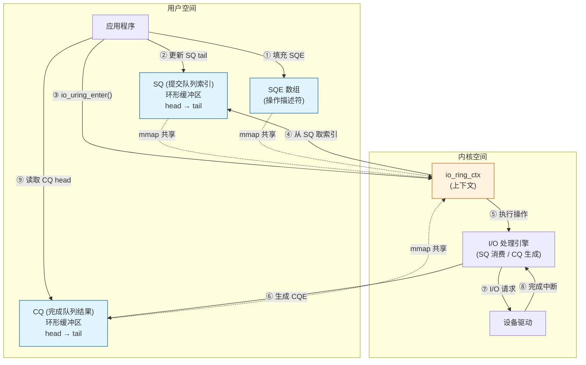

#### 3-2-2. 环形缓冲区的原子操作

SQ 和 CQ 的 `head` 和 `tail` 指针由用户态和内核态共同维护，通过内存屏障和原子操作保证一致性。应用程序在填充 SQE 后，需要更新 SQ 的 `tail` 指针（使用 `smp_store_release`），内核在消费 SQE 后更新 `head` 指针。类似地，内核在生成 CQE 后更新 CQ 的 `tail`，应用程序在读取 CQE 后更新 `head`。这种轻量级的同步机制避免了传统锁的开销，同时利用了现代 CPU 的缓存一致性协议，使得读写操作几乎不产生额外开销。

具体地，内核提供了 `io_uring_smp_store_release` 和 `io_uring_smp_load_acquire` 等宏来确保内存可见性。应用程序在使用 liburing 时，这些操作被封装在 `io_uring_submit` 和 `io_uring_cqe_seen` 等函数中，开发者无需显式处理。

#### 3-2-3. 关键数据结构

**io_uring 实例上下文**：内核使用 `struct io_ring_ctx` 记录每个 io_uring 实例的上下文信息，包括 SQ、CQ 的地址和大小、状态标志、等待队列等。该结构是 io_uring 的核心管理单元，所有提交和完成操作都围绕它进行。它还维护了请求的分配池、资源引用计数以及用于异步重试的工作队列。

**提交队列项（SQE）** ：每个 SQE 描述一个 I/O 操作，其核心字段包括：

- `opcode`：操作码（如 `IORING_OP_READ`、`IORING_OP_WRITE`），相当于系统调用的类型。
- `fd`：目标文件描述符。
- `addr`、`len`、`offset`：操作参数（缓冲区地址、长度、偏移）。
- `user_data`：用户自定义数据，会原样传递到对应的 CQE 中，用于关联请求与上下文。
- `flags`：控制标志（如 `IOSQE_BUFFER_SELECT`、`IOSQE_IO_LINK` 等），用于启用高级特性。

**完成队列项（CQE）** ：内核完成 I/O 操作后，将结果放入 CQ。每个 CQE 包含：

- `user_data`：从对应 SQE 复制过来的用户数据。
- `res`：操作结果（成功时为字节数，失败时为负错误码）。
- `flags`：完成标志（如 `IORING_CQE_F_BUFFER` 表示使用了预注册缓冲区），可用于识别使用的 buffer ID。

这些结构体在共享内存中布局紧凑，以最小化缓存行占用，提高访问速度。

### 3-3. 系统调用接口

io_uring 提供了三个核心系统调用：

```c
int io_uring_setup(u32 entries, struct io_uring_params *params);
int io_uring_enter(unsigned int fd, unsigned int to_submit,
                   unsigned int min_complete, unsigned int flags,
                   sigset_t *sig);
int io_uring_register(unsigned int fd, unsigned int opcode,
                      void *arg, unsigned int nr_args);
```

此外，内核还提供了 `io_uring_enter2` 变体，支持通过 `arg` 和 `sz` 参数传递额外的扩展数据，用于未来特性的扩展。这些系统调用与共享内存区域协同工作：`io_uring_setup` 创建实例并返回文件描述符；`mmap` 将共享内存映射到用户空间；`io_uring_enter` 驱动请求提交与完成收割；`io_uring_register` 则用于注册持久化资源以进一步提升性能。

其调用关系如下：

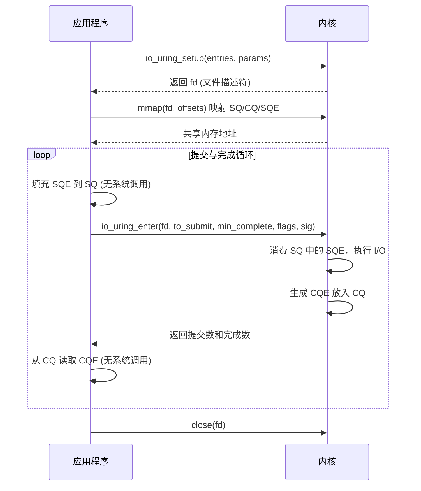

#### 3-3-1. io_uring_setup

`io_uring_setup` 用于创建 io_uring 实例。它接收两个参数：

- `entries`：提交队列的长度（请求队列大小）。该值决定了可同时提交的最大 SQE 数量，以及 SQ 和 CQ 环形缓冲区的大小。
- `params`：用于调用方和内核通信的结构体，包含特性标志和返回的偏移量。应用程序通过该结构体指定所期望的特性（如 `IORING_SETUP_IOPOLL`、`IORING_SETUP_SQPOLL`），内核则在返回时填充各内存区域的偏移量和大小，供后续 `mmap` 使用。

内核在 `io_uring_create` 中执行实际初始化：分配 `io_ring_ctx` 上下文结构体，计算 SQ 和 CQ 的大小（CQ 默认是 SQ 的 2 倍，以避免完成事件丢失），验证并设置各种标志，初始化等待队列和资源引用。最终返回一个文件描述符，供用户空间后续操作使用。

#### 3-3-2. io_uring_enter

`io_uring_enter` 是驱动 I/O 处理的核心系统调用。其参数含义如下：

- `fd`：`io_uring_setup` 返回的文件描述符。
- `to_submit`：本次调用期望提交的 SQE 数量。内核将从 SQ 中取出最多 `to_submit` 个待处理的 SQE 并开始执行。
- `min_complete`：本次调用期望等待完成的 CQE 最小数量。若为 0，则仅提交不等待；若大于 0，则阻塞直到至少 `min_complete` 个 CQE 就绪。
- `flags`：控制标志（如 `IORING_ENTER_GETEVENTS` 表示等待完成事件，`IORING_ENTER_SQ_WAKE` 用于 SQPOLL 模式下的唤醒）。
- `sig`：可选的信号掩码，用于在等待期间临时替换进程的信号掩码。

一次调用可以同时完成两件事：

1. **提交新的 I/O 请求**：通知内核从 SQ 中取出待处理的 SQE 并开始处理。
2. **等待 I/O 完成**：阻塞直到指定数量的 CQE 就绪。

通过将提交和等待合并到一次系统调用中，io_uring 有效减少了上下文切换的次数。

#### 3-3-3. io_uring_register

`io_uring_register` 用于注册持久化资源，以进一步提升性能。其参数含义如下：

- `fd`：io_uring 实例的文件描述符。
- `opcode`：注册操作类型（如 `IORING_REGISTER_FILES`、`IORING_REGISTER_BUFFERS`、`IORING_REGISTER_EVENTFD` 等）。
- `arg`：操作相关的参数指针（如文件描述符数组、缓冲区数组等）。
- `nr_args`：参数的数量。

支持的操作包括：

- **注册文件描述符**：将一组文件描述符注册到 io_uring 上下文，后续 SQE 中可直接使用索引而非 fd，避免每次操作时的 `fget`/`fput` 开销。
- **注册用户缓冲区**：固定一组用户态缓冲区（锁定内存），内核可直接使用其物理地址，减少映射开销。此操作需谨慎使用，因为它会锁定内存直到注销。
- **注册事件fd**：将 eventfd 与 io_uring 关联，允许通过 eventfd 接收完成通知，便于与其他事件循环集成。

资源注册是 io_uring 达到极致性能的关键技术之一。

### 3-4. 完整工作流程

#### 3-4-1. 总体流程

io_uring 的完整工作流程可概括为以下步骤：

1. **初始化**：调用 `io_uring_setup` 在内核中分配 SQ/CQ/SQE 数组内存，返回文件描述符。
2. **内存映射**：调用 `mmap` 将 SQ、CQ 和 SQE 数组映射到用户空间，获取访问所需的偏移量。通常使用 `io_uring_queue_init` 封装这些步骤。
3. **填充 SQE**：应用程序构造 SQE，描述要执行的 I/O 操作（如读文件、写文件、接受 socket 连接等），将其添加到 SQ 的尾部。
4. **提交请求**：调用 `io_uring_enter` 通知内核处理 SQ 中的请求。
5. **内核处理**：内核从 SQ 头部取出 SQE，执行相应的 I/O 操作。若操作无法立即完成（例如数据未就绪），则将其提交到异步工作队列，由内核线程 `io_wqe_worker` 处理。
6. **完成通知**：每个 SQE 处理完成后，内核将一个 CQE 放入 CQ 尾部，并更新 `tail` 指针。
7. **收割完成**：应用程序从 CQ 头部读取 CQE，检查 `res` 字段获取操作结果，然后更新 `head` 指针以释放 CQ 空间。

下图以时序图形式详细展示了整个过程：

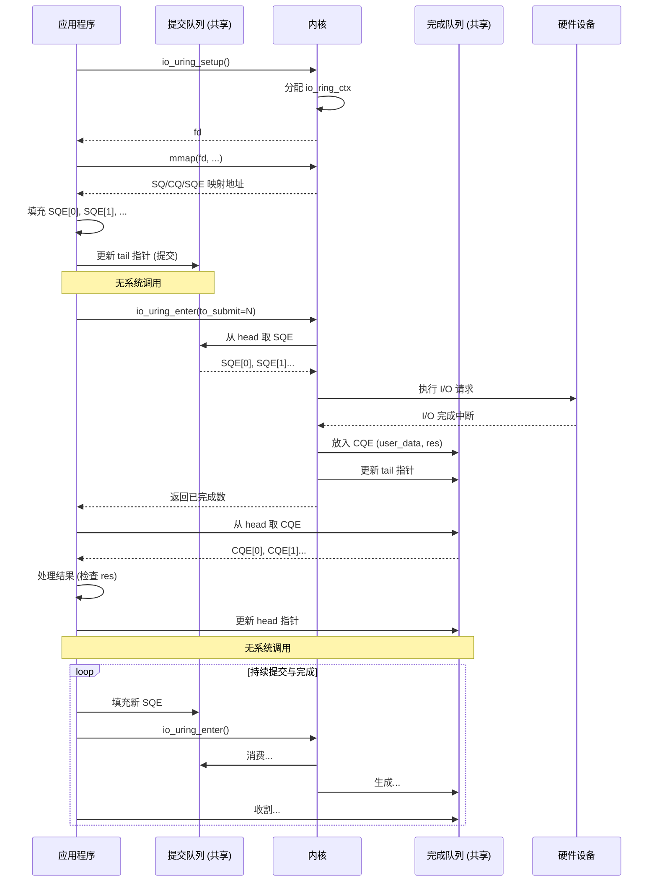

#### 3-4-2. 内核处理路径

当 `io_uring_enter` 被调用时，内核进入以下关键处理路径：

1. **SQ 消费**：内核从 SQ 的 `head` 开始，遍历到 `tail`，取出每个 SQE。
2. **操作派发**：根据 SQE 的 `opcode`，调用相应的处理函数（如 `io_read`、`io_write`、`io_accept` 等）。这些函数与对应的系统调用实现类似，但增加了异步处理的支持。
3. **异步或同步执行**：如果操作可以立即完成（例如文件数据已在页缓存中），则同步完成并直接生成 CQE；否则，将请求提交到异步工作队列（由内核线程 `io_wqe_worker` 处理）。`io_wqe_worker` 线程池按 NUMA 节点组织，每个节点有多个工作线程，以均衡负载。
4. **CQE 生成**：操作完成后，将 `user_data` 和 `res` 写入 CQ 的 `tail` 位置，并更新 `tail` 指针。若设置了 `IORING_SETUP_SQPOLL`，还会通过轮询线程唤醒消费者。

#### 3-4-3. 请求生命周期与状态管理

每个 SQE 在内核中对应一个 `struct io_kiocb` 请求对象，该对象在请求提交时分配，在完成时释放。其状态通过标志位管理，如 `REQ_F_BUFFER_SELECTED` 标记是否使用了预注册缓冲区。请求可能经历多次重试（例如文件锁阻塞、设备繁忙），内核通过 `io_wq_work` 将请求排队到工作队列中，由内核线程异步重试，直到完成或失败。重试次数和退避策略由内核自动管理，无需用户干预。

### 3-5. 高级特性

io_uring 提供了多种高级特性，使其能够适应各种高性能场景。

#### 3-5-1. SQPOLL 模式

在启用 `IORING_SETUP_SQPOLL` 的情况下，内核会创建一个专用内核线程主动轮询 SQ。应用程序填充 SQE 后无需调用 `io_uring_enter`，内核线程会自动发现并处理新的请求。这种模式将 I/O 延迟稳定在微秒级，尤其适用于金融交易等超低延迟场景。线程轮询间隔可通过 `sq_thread_idle` 参数调节，在空闲时自动休眠以节省 CPU。

#### 3-5-2. IOPOLL 模式

在启用 `IORING_SETUP_IOPOLL` 的情况下，内核采用轮询方式主动检查硬件设备是否完成 I/O，而非等待硬件中断唤醒。这要求底层块设备支持轮询接口（如 NVMe 驱动），并会持续占用 CPU 核心。该模式适用于追求极致低延迟和吞吐量的场景，但会增加 CPU 消耗。

#### 3-5-3. 批量提交与收割

io_uring 支持在单次 `io_uring_enter` 调用中提交多个 SQE。应用程序可以在 SQ 中放入多个 SQE 后再调用 `io_uring_enter`，内核会批量处理这些请求。类似地，应用程序也可以一次性从 CQ 中收割多个 CQE。这种批处理机制显著减少了系统调用次数，有效降低开销。

#### 3-5-4. SQE 链接

通过 `IOSQE_IO_LINK` 标志，可以将多个 SQE 链接成链。链中的操作按顺序执行，前一个操作成功完成后才会执行下一个。若前一个操作失败，后续操作会自动被取消并返回 `-ECANCELED`。例如，可以先执行一个读操作，再将读取的数据写入另一个文件描述符。这种机制使得复杂的 I/O 流水线可以在内核态完成，无需用户态干预。

#### 3-5-5. 预注册缓冲区

这正是 **CVE-2021-41073** 所涉及的特性。应用程序通过 `IORING_OP_PROVIDE_BUFFERS` 预先注册一批缓冲区。后续读写请求设置 `IOSQE_BUFFER_SELECT` 标志后，内核自动从缓冲区池中选取可用缓冲区。这一机制减少了内存分配开销，尤其适用于接收端数据大小未知的场景。

该特性的工作流程如下：

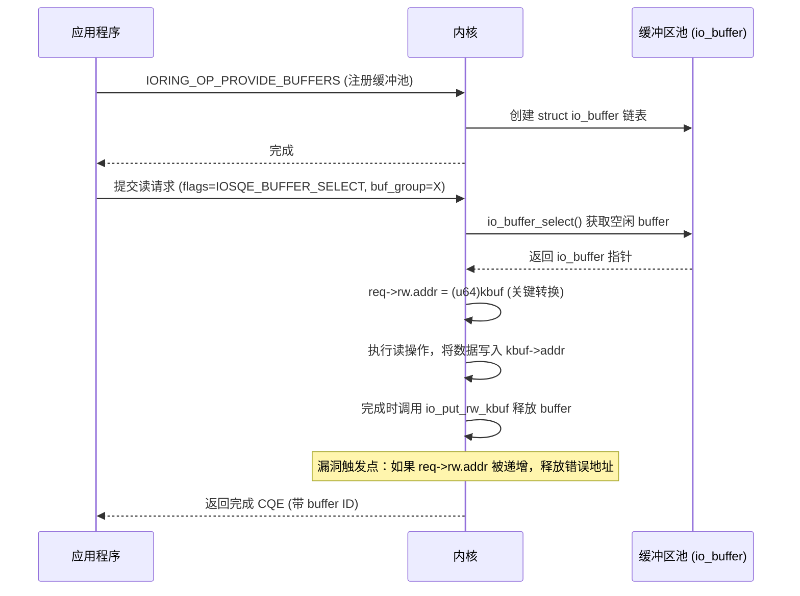

### 3-6. 预注册缓冲区的实现

为理解后续漏洞的根因，有必要深入剖析预注册缓冲区的内核实现细节。

#### 3-6-1. io_buffer 结构与管理

内核使用 `struct io_buffer` 描述每个预注册缓冲区，结构定义如下：

```c
struct io_buffer {
    struct list_head list;   /* 链表节点，链接同组所有缓冲区 */
    __u64 addr;              /* 用户态缓冲区地址 */
    __u32 len;               /* 缓冲区大小 */
    __u16 bid;               /* 缓冲区 ID */
};
```

同一组缓冲区通过 `list` 双向链表组织，分配时采用 LIFO（后进先出）策略，即最近释放的缓冲区优先被再次分配。这种策略有利于提高缓存局部性，但也意味着应用程序对缓冲区使用顺序有一定控制力。

#### 3-6-2. 缓冲区选择流程

当请求设置了 `IOSQE_BUFFER_SELECT` 时，内核在 `io_import_iovec` 中调用 `io_rw_buffer_select`，后者进一步调用 `io_buffer_select`。`io_buffer_select` 遍历指定 `buf_group` 的链表，从尾部取出一个空闲缓冲区（即最近释放的），并将其从链表中摘除。获取到的 `io_buffer` 指针随后被赋值给 `req->rw.addr`，同时设置 `REQ_F_BUFFER_SELECTED` 标志。这一过程涉及原子操作，以确保并发安全。

#### 3-6-3. 缓冲区释放流程

请求完成后，若设置了 `REQ_F_BUFFER_SELECTED`，内核在 `__io_complete_rw` 中调用 `io_put_rw_kbuf`，进而调用 `io_put_kbuf`，将 `req->rw.addr` 强制转换为 `struct io_buffer*` 并执行 `kfree`。缓冲区释放后，它并不会立即返还给用户，而是重新加入 `buf_group` 的链表尾部，以便后续复用。这种缓存机制减少了频繁的内存分配与释放开销，但要求内核正确处理指针语义。

### 3-7. 编程实践

为了更直观地理解 io_uring 的使用方法，下面通过 liburing 官方提供的示例程序进行说明。liburing 是官方提供的高层封装库，简化了 SQE 填充、提交和 CQE 收割的细节。以下示例均可在 [liburing 仓库的 examples 目录](https://github.com/axboe/liburing/tree/master/examples) 中找到完整源码。

#### 3-7-1. 基础示例

[io_uring-test.c](https://github.com/axboe/liburing/blob/master/examples/io_uring-test.c) 是一个基础的示例程序，展示了 io_uring 的**核心初始化、提交和完成流程**。它打开一个文件，提交多个读请求，然后等待并处理完成事件。编译命令为：

```bash
gcc -Wall -O2 -D_GNU_SOURCE -o io_uring-test io_uring-test.c -luring
```

```c
/* SPDX-License-Identifier: MIT */
/*
 * Simple app that demonstrates how to setup an io_uring interface,
 * submit and complete IO against it, and then tear it down.
 *
 * gcc -Wall -O2 -D_GNU_SOURCE -o io_uring-test io_uring-test.c -luring
 */
#include <stdio.h>
#include <fcntl.h>
#include <string.h>
#include <stdlib.h>
#include <sys/types.h>
#include <sys/stat.h>
#include <unistd.h>
#include "liburing.h"

#define QD	4   /* 队列深度，表示同时处理的请求数量 */

int main(int argc, char *argv[])
{
	struct io_uring ring;
	int i, fd, ret, pending, done;
	struct io_uring_sqe *sqe;
	struct io_uring_cqe *cqe;
	struct iovec *iovecs;
	struct stat sb;
	ssize_t fsize;
	off_t offset;
	void *buf;

	if (argc < 2) {
		printf("%s: file\n", argv[0]);
		return 1;
	}

	/* 1. 初始化 io_uring 实例，队列深度为 QD */
	ret = io_uring_queue_init(QD, &ring, 0);
	if (ret < 0) {
		fprintf(stderr, "queue_init: %s\n", strerror(-ret));
		return 1;
	}

	/* 2. 打开目标文件（使用 O_DIRECT 绕过页缓存，便于测量真实 I/O 性能） */
	fd = open(argv[1], O_RDONLY | O_DIRECT);
	if (fd < 0) {
		perror("open");
		return 1;
	}

	/* 3. 获取文件大小，用于确定读取范围 */
	if (fstat(fd, &sb) < 0) {
		perror("fstat");
		return 1;
	}

	/* 4. 分配 I/O 向量数组，每个向量指向一个 4096 字节对齐的缓冲区 */
	fsize = 0;
	iovecs = calloc(QD, sizeof(struct iovec));
	for (i = 0; i < QD; i++) {
		if (posix_memalign(&buf, 4096, 4096))
			return 1;
		iovecs[i].iov_base = buf;
		iovecs[i].iov_len = 4096;
		fsize += 4096;
	}

	/* 5. 填充 SQE：为每个 I/O 向量准备一个读请求 */
	offset = 0;
	i = 0;
	do {
		sqe = io_uring_get_sqe(&ring);          /* 获取空闲 SQE */
		if (!sqe)
			break;
		io_uring_prep_readv(sqe, fd, &iovecs[i], 1, offset);
		offset += iovecs[i].iov_len;             /* 更新偏移量 */
		i++;
		if (offset >= sb.st_size)                /* 已覆盖整个文件 */
			break;
	} while (1);

	/* 6. 提交所有 SQE 到内核 */
	ret = io_uring_submit(&ring);
	if (ret < 0) {
		fprintf(stderr, "io_uring_submit: %s\n", strerror(-ret));
		return 1;
	} else if (ret != i) {
		/* 实际提交数量与期望不符 */
		fprintf(stderr, "io_uring_submit submitted less %d\n", ret);
		return 1;
	}

	/* 7. 收割完成事件：依次等待每个 CQE */
	done = 0;
	pending = ret;
	fsize = 0;
	for (i = 0; i < pending; i++) {
		ret = io_uring_wait_cqe(&ring, &cqe);   /* 阻塞等待一个完成事件 */
		if (ret < 0) {
			fprintf(stderr, "io_uring_wait_cqe: %s\n", strerror(-ret));
			return 1;
		}

		done++;
		ret = 0;
		/* 检查结果：正常应为 4096 字节，除最后一块外 */
		if (cqe->res != 4096 && cqe->res + fsize != sb.st_size) {
			fprintf(stderr, "ret=%d, wanted 4096\n", cqe->res);
			ret = 1;
		}
		fsize += cqe->res;
		io_uring_cqe_seen(&ring, cqe);          /* 标记 CQE 已处理，推进 head */
		if (ret)
			break;
	}

	printf("Submitted=%d, completed=%d, bytes=%lu\n", pending, done,
						(unsigned long) fsize);

	/* 8. 清理资源 */
	close(fd);
	io_uring_queue_exit(&ring);
	for (i = 0; i < QD; i++)
		free(iovecs[i].iov_base);
	free(iovecs);
	return 0;
}
```

**代码要点**：

- 使用 `O_DIRECT` 绕过页缓存，直接与块设备交互，适合性能测试。
- 通过 `io_uring_queue_init` 初始化队列，队列深度为 `QD`。
- 循环填充多个读请求（`io_uring_prep_readv`），然后批量提交（`io_uring_submit`）。
- 通过 `io_uring_wait_cqe` 等待每个完成事件，并使用 `io_uring_cqe_seen` 标记已处理。

#### 3-7-2. 文件复制示例

[io_uring-cp.c](https://github.com/axboe/liburing/blob/master/examples/io_uring-cp.c) 是 `cp` 命令的简化异步实现，展示了**如何用 io_uring 循环处理多个请求**。它通过维护读写请求的队列深度，持续提交读请求并在完成后立即提交对应的写请求，实现流水线化的文件复制。编译命令为：

```bash
gcc -Wall -O2 -D_GNU_SOURCE -o io_uring-cp io_uring-cp.c -luring
```

```c
/* SPDX-License-Identifier: MIT */
/*
 * gcc -Wall -O2 -D_GNU_SOURCE -o io_uring-cp io_uring-cp.c -luring
 */
#include <stdio.h>
#include <fcntl.h>
#include <string.h>
#include <stdlib.h>
#include <unistd.h>
#include <assert.h>
#include <errno.h>
#include <inttypes.h>
#include <sys/types.h>
#include <sys/stat.h>
#include <sys/ioctl.h>
#include "liburing.h"

#define QD	64       /* 队列深度 */
#define BS	(32*1024) /* 块大小 */

static int infd, outfd;

/* 每个 I/O 请求的上下文数据 */
struct io_data {
	int read;               /* 1 表示读，0 表示写 */
	off_t first_offset;     /* 原始偏移量（用于重试） */
	off_t offset;           /* 当前偏移量 */
	size_t first_len;       /* 原始长度 */
	struct iovec iov;       /* I/O 向量 */
};

/* 初始化 io_uring 上下文 */
static int setup_context(unsigned entries, struct io_uring *ring)
{
	int ret;

	ret = io_uring_queue_init(entries, ring, 0);
	if (ret < 0) {
		fprintf(stderr, "queue_init: %s\n", strerror(-ret));
		return -1;
	}
	return 0;
}

/* 获取文件大小（支持普通文件和块设备） */
static int get_file_size(int fd, off_t *size)
{
	struct stat st;

	if (fstat(fd, &st) < 0)
		return -1;
	if (S_ISREG(st.st_mode)) {
		*size = st.st_size;
		return 0;
	} else if (S_ISBLK(st.st_mode)) {
		unsigned long long bytes;
		if (ioctl(fd, BLKGETSIZE64, &bytes) != 0)
			return -1;
		*size = bytes;
		return 0;
	}
	return -1;
}

/* 提交一个已准备好的请求（由 queue_read/queue_write 调用） */
static void queue_prepped(struct io_uring *ring, struct io_data *data)
{
	struct io_uring_sqe *sqe;

	sqe = io_uring_get_sqe(ring);
	assert(sqe);

	if (data->read)
		io_uring_prep_readv(sqe, infd, &data->iov, 1, data->offset);
	else
		io_uring_prep_writev(sqe, outfd, &data->iov, 1, data->offset);

	io_uring_sqe_set_data(sqe, data);   /* 保存上下文，完成时取回 */
}

/* 排队一个读请求 */
static int queue_read(struct io_uring *ring, off_t size, off_t offset)
{
	struct io_uring_sqe *sqe;
	struct io_data *data;

	/* 分配内存：数据紧跟结构体之后 */
	data = malloc(size + sizeof(*data));
	if (!data)
		return 1;

	sqe = io_uring_get_sqe(ring);
	if (!sqe) {
		free(data);
		return 1;
	}

	data->read = 1;
	data->offset = data->first_offset = offset;
	data->iov.iov_base = data + 1;
	data->iov.iov_len = size;
	data->first_len = size;

	io_uring_prep_readv(sqe, infd, &data->iov, 1, offset);
	io_uring_sqe_set_data(sqe, data);
	return 0;
}

/* 排队一个写请求（由完成处理调用） */
static void queue_write(struct io_uring *ring, struct io_data *data)
{
	data->read = 0;
	data->offset = data->first_offset;
	data->iov.iov_base = data + 1;
	data->iov.iov_len = data->first_len;

	queue_prepped(ring, data);
	io_uring_submit(ring);   /* 立即提交，确保写请求得到处理 */
}

/* 主复制循环，维持流水线 */
static int copy_file(struct io_uring *ring, off_t insize)
{
	unsigned long reads, writes;
	struct io_uring_cqe *cqe;
	off_t write_left, offset;
	int ret;

	write_left = insize;
	writes = reads = offset = 0;

	while (insize || write_left) {
		unsigned long had_reads;
		int got_comp;

		/*
		 * 尽可能多地排队读请求，但不超过队列深度 QD
		 */
		had_reads = reads;
		while (insize) {
			off_t this_size = insize;

			if (reads + writes >= QD)
				break;
			if (this_size > BS)
				this_size = BS;
			else if (!this_size)
				break;

			if (queue_read(ring, this_size, offset))
				break;

			insize -= this_size;
			offset += this_size;
			reads++;
		}

		/* 如果有新提交的读请求，调用 submit 通知内核 */
		if (had_reads != reads) {
			ret = io_uring_submit(ring);
			if (ret < 0) {
				fprintf(stderr, "io_uring_submit: %s\n", strerror(-ret));
				break;
			}
		}

		/*
		 * 现在至少有一个完成事件需要处理。先尝试阻塞等待一个，
		 * 然后用 peek 非阻塞地收割剩余完成事件。
		 */
		got_comp = 0;
		while (write_left) {
			struct io_data *data;

			if (!got_comp) {
				ret = io_uring_wait_cqe(ring, &cqe);   /* 阻塞等待 */
				got_comp = 1;
			} else {
				ret = io_uring_peek_cqe(ring, &cqe);   /* 非阻塞查看 */
				if (ret == -EAGAIN) {
					cqe = NULL;
					ret = 0;
				}
			}
			if (ret < 0) {
				fprintf(stderr, "io_uring_peek_cqe: %s\n", strerror(-ret));
				return 1;
			}
			if (!cqe)
				break;   /* 无更多完成事件 */

			data = io_uring_cqe_get_data(cqe);
			if (cqe->res < 0) {
				/* 处理 -EAGAIN：重新排队该请求 */
				if (cqe->res == -EAGAIN) {
					queue_prepped(ring, data);
					io_uring_submit(ring);
					io_uring_cqe_seen(ring, cqe);
					continue;
				}
				fprintf(stderr, "cqe failed: %s\n", strerror(-cqe->res));
				return 1;
			} else if ((size_t)cqe->res != data->iov.iov_len) {
				/* 短 I/O：调整剩余部分并重新排队 */
				data->iov.iov_base += cqe->res;
				data->iov.iov_len -= cqe->res;
				data->offset += cqe->res;
				queue_prepped(ring, data);
				io_uring_submit(ring);
				io_uring_cqe_seen(ring, cqe);
				continue;
			}

			/*
			 * 正常完成：若是读请求，则排队对应的写请求；
			 * 若是写请求，则释放数据。
			 */
			if (data->read) {
				queue_write(ring, data);
				write_left -= data->first_len;
				reads--;
				writes++;
			} else {
				free(data);
				writes--;
			}
			io_uring_cqe_seen(ring, cqe);
		}
	}

	/* 等待所有未完成的写请求完成 */
	while (writes) {
		struct io_data *data;

		ret = io_uring_wait_cqe(ring, &cqe);
		if (ret) {
			fprintf(stderr, "wait_cqe=%d\n", ret);
			return 1;
		}
		if (cqe->res < 0) {
			fprintf(stderr, "write res=%d\n", cqe->res);
			return 1;
		}
		data = io_uring_cqe_get_data(cqe);
		free(data);
		writes--;
		io_uring_cqe_seen(ring, cqe);
	}

	return 0;
}

int main(int argc, char *argv[])
{
	struct io_uring ring;
	off_t insize;
	int ret;

	if (argc < 3) {
		printf("%s: infile outfile\n", argv[0]);
		return 1;
	}

	infd = open(argv[1], O_RDONLY);
	if (infd < 0) {
		perror("open infile");
		return 1;
	}
	outfd = open(argv[2], O_WRONLY | O_CREAT | O_TRUNC, 0644);
	if (outfd < 0) {
		perror("open outfile");
		return 1;
	}

	if (setup_context(QD, &ring))
		return 1;
	if (get_file_size(infd, &insize))
		return 1;

	ret = copy_file(&ring, insize);

	close(infd);
	close(outfd);
	io_uring_queue_exit(&ring);
	return ret;
}
```

**代码要点**：

- 使用 `io_uring_peek_cqe` 非阻塞地查看完成事件，配合 `io_uring_wait_cqe` 在无事件时阻塞。
- 利用 `io_uring_cqe_get_data` 获取请求的上下文数据。
- 读操作完成后立即排队对应的写操作，形成流水线。
- 支持处理短 I/O（`cqe->res` 小于请求长度）和 `-EAGAIN` 重试。

#### 3-7-3. 链接操作示例

[link-cp.c](https://github.com/axboe/liburing/blob/master/examples/link-cp.c) 展示了 io_uring 的 **SQE 链接（Link）特性**。通过 `IOSQE_IO_LINK` 标志，可以将读和写两个操作链接成一个原子序列。如果读失败，写操作将自动被跳过，无需用户态进行错误检查。编译命令为：

```bash
gcc -Wall -O2 -D_GNU_SOURCE -o link-cp link-cp.c -luring
```

```c
/* SPDX-License-Identifier: MIT */
/*
 * Very basic proof-of-concept for doing a copy with linked SQEs. Needs a
 * bit of error handling and short read love.
 */
#include <stdio.h>
#include <fcntl.h>
#include <string.h>
#include <stdlib.h>
#include <unistd.h>
#include <assert.h>
#include <errno.h>
#include <inttypes.h>
#include <sys/types.h>
#include <sys/stat.h>
#include <sys/ioctl.h>
#include "liburing.h"

#define QD	64
#define BS	(32*1024)

struct io_data {
	size_t offset;          /* 偏移量 */
	int index;              /* 该请求在链接对中的位置（0 读，1 写） */
	struct iovec iov;       /* I/O 向量 */
};

static int infd, outfd;
static int inflight;        /* 当前在飞的链接请求数 */

static int setup_context(unsigned entries, struct io_uring *ring)
{
	int ret;

	ret = io_uring_queue_init(entries, ring, 0);
	if (ret < 0) {
		fprintf(stderr, "queue_init: %s\n", strerror(-ret));
		return -1;
	}
	return 0;
}

static int get_file_size(int fd, off_t *size)
{
	struct stat st;

	if (fstat(fd, &st) < 0)
		return -1;
	if (S_ISREG(st.st_mode)) {
		*size = st.st_size;
		return 0;
	} else if (S_ISBLK(st.st_mode)) {
		unsigned long long bytes;
		if (ioctl(fd, BLKGETSIZE64, &bytes) != 0)
			return -1;
		*size = bytes;
		return 0;
	}
	return -1;
}

/* 排队一个读-写链接对：读操作（带 IOSQE_IO_LINK）后跟写操作 */
static void queue_rw_pair(struct io_uring *ring, off_t size, off_t offset)
{
	struct io_uring_sqe *sqe;
	struct io_data *data;

	/* 分配数据结构，数据紧随其后 */
	data = malloc(size + sizeof(*data));
	data->index = 0;
	data->offset = offset;
	data->iov.iov_base = data + 1;
	data->iov.iov_len = size;

	/* 第一个 SQE：读操作，设置 LINK 标志 */
	sqe = io_uring_get_sqe(ring);
	io_uring_prep_readv(sqe, infd, &data->iov, 1, offset);
	sqe->flags |= IOSQE_IO_LINK;   /* 将本 SQE 与下一个链接 */
	io_uring_sqe_set_data(sqe, data);

	/* 第二个 SQE：写操作（链接在读之后） */
	sqe = io_uring_get_sqe(ring);
	io_uring_prep_writev(sqe, outfd, &data->iov, 1, offset);
	io_uring_sqe_set_data(sqe, data);
}

/* 处理单个 CQE（可能对应读或写） */
static int handle_cqe(struct io_uring *ring, struct io_uring_cqe *cqe)
{
	struct io_data *data = io_uring_cqe_get_data(cqe);
	int ret = 0;

	data->index++;   /* 标记已处理了一个 SQE */

	if (cqe->res < 0) {
		if (cqe->res == -ECANCELED) {
			/* 链接失败（通常因为前一个操作失败），重试整个链接对 */
			queue_rw_pair(ring, data->iov.iov_len, data->offset);
			inflight += 2;
		} else {
			printf("cqe error: %s\n", strerror(-cqe->res));
			ret = 1;
		}
	}

	/* 当读和写两个 SQE 都完成时，释放数据 */
	if (data->index == 2)
		free(data);
	io_uring_cqe_seen(ring, cqe);
	return ret;
}

/* 主复制循环，使用链接 SQE */
static int copy_file(struct io_uring *ring, off_t insize)
{
	struct io_uring_cqe *cqe;
	off_t this_size;
	off_t offset;

	offset = 0;
	while (insize) {
		int has_inflight = inflight;
		int depth;

		/* 排队尽可能多的链接对，但不超过 QD */
		while (insize && inflight < QD) {
			this_size = BS;
			if (this_size > insize)
				this_size = insize;
			queue_rw_pair(ring, this_size, offset);
			offset += this_size;
			insize -= this_size;
			inflight += 2;   /* 每个链接对占用 2 个 SQE */
		}

		/* 如有新请求，提交给内核 */
		if (has_inflight != inflight)
			io_uring_submit(ring);

		/* 确定需要等待的完成数：若非最后一批，等待 QD；否则等待至少 1 个 */
		if (insize)
			depth = QD;
		else
			depth = 1;

		/* 等待并处理完成事件，直到在飞的请求数低于阈值 */
		while (inflight >= depth) {
			int ret;

			ret = io_uring_wait_cqe(ring, &cqe);
			if (ret < 0) {
				printf("wait cqe: %s\n", strerror(-ret));
				return 1;
			}
			if (handle_cqe(ring, cqe))
				return 1;
			inflight--;
		}
	}

	return 0;
}

int main(int argc, char *argv[])
{
	struct io_uring ring;
	off_t insize;
	int ret;

	if (argc < 3) {
		printf("%s: infile outfile\n", argv[0]);
		return 1;
	}

	infd = open(argv[1], O_RDONLY);
	if (infd < 0) {
		perror("open infile");
		return 1;
	}
	outfd = open(argv[2], O_WRONLY | O_CREAT | O_TRUNC, 0644);
	if (outfd < 0) {
		perror("open outfile");
		return 1;
	}

	if (setup_context(QD, &ring))
		return 1;
	if (get_file_size(infd, &insize))
		return 1;

	ret = copy_file(&ring, insize);

	close(infd);
	close(outfd);
	io_uring_queue_exit(&ring);
	return ret;
}
```

**代码要点**：

- 第一个 SQE 设置 `sqe->flags |= IOSQE_IO_LINK`，将其与后续的写 SQE 链接。
- 若读操作失败，后续的写操作自动被取消，返回 `-ECANCELED`。
- 在 `handle_cqe()` 中检测 `-ECANCELED` 并重试整个读-写对。
- `inflight` 变量跟踪当前在飞的请求数量，用于控制队列深度。

通过上述官方示例，可以清晰看到 io_uring 编程的基本模式：初始化 → 获取 SQE → 填充操作 → 提交 → 等待完成 → 处理结果。liburing 库隐藏了内存映射和原子操作的细节，使得开发者可以专注于业务逻辑。更多示例和详细 API 文档可参阅 [liburing 官方仓库](https://github.com/axboe/liburing)。

### 3-8. 本质总结

io_uring 通过共享内存环形缓冲区实现了用户态与内核态的高效通信，通过批量提交与收割减少了系统调用次数，通过轮询模式进一步降低了 I/O 延迟。其核心设计理念可概括为：**将 I/O 操作的提交、执行和完成三个环节彻底解耦，使每个环节都可以独立批量处理**。这种解耦带来了极大的灵活性，允许应用程序根据负载特性调整提交和完成的策略，从而在延迟和吞吐量之间取得最佳平衡。

这种设计虽然在性能上带来了革命性提升，但也引入了前所未有的复杂性。io_uring 内部存在大量的状态标志、回调函数和异步处理路径，数据结构的语义一致性维护变得尤为困难。例如，`struct io_kiocb` 中的 `rw.addr` 字段在常规模式下存放用户缓冲区地址，而在预注册缓冲区模式下存放内核 `io_buffer` 对象的指针——这种“双重语义”设计在带来性能优势的同时，也要求内核代码在所有访问点都必须正确检查上下文标志。一旦遗漏检查，就可能出现类型混淆，导致内核将内核地址误作普通整数进行运算，进而引发内存错误。

正是这种复杂性，使得在 `loop_rw_iter` 回退路径中出现了对 `rw.addr` 字段的错误递增操作，最终导致了一个类型混淆漏洞（**CVE-2021-41073**）。这一漏洞的根源并非单一函数的编码失误，而是整个子系统在快速演进中，对指针语义一致性的维护未能跟上功能扩展的步伐。io_uring 的发展历程表明，高性能异步接口的设计必须在追求极致性能的同时，建立更加严谨的数据语义规范和自动化检查机制，以在复杂执行路径中保障内存安全。这也为内核开发者提供了重要启示：在设计新接口时，应尽可能避免在同一字段中复用异类指针，若不可避免，则必须通过静态分析或运行时校验确保所有访问点都正确处理语义切换。

## 4. 漏洞分析

本章从源码层面深入剖析 **CVE-2021-41073** 的触发机理。漏洞涉及的核心数据结构、预注册缓冲区分配、地址转换流程、混淆点以及释放路径均与 io_uring 的预注册缓冲区特性紧密相关。以下分析基于 Linux 内核 5.14.6 版本的 `fs/io_uring.c` 源码。

### 4-1. 核心数据结构与指针语义

漏洞的根源在于 `struct io_kiocb` 中的 `rw.addr` 字段在不同上下文中承载了两种截然不同的语义。理解这一字段的双重身份是把握整个漏洞触发机理的基础。相关数据结构定义如下：

```c
/*
 * NOTE! Each of the iocb union members has the file pointer
 * as the first entry in their struct definition. So you can
 * access the file pointer through any of the sub-structs,
 * or directly as just 'ki_filp' in this struct.
 */
struct io_kiocb {
    union {
        struct file        *file;               /* 常规文件指针 */
        struct io_rw        rw;                 /* 读写操作数据（addr、len） */
        struct io_poll_iocb poll;               /* 轮询操作数据 */
        struct io_poll_update poll_update;      /* 轮询更新操作数据 */
        struct io_accept    accept;             /* accept 操作数据 */
        struct io_sync      sync;               /* 同步操作数据 */
        struct io_cancel    cancel;             /* 取消操作数据 */
        struct io_timeout   timeout;            /* 超时操作数据 */
        struct io_timeout_rem timeout_rem;      /* 超时移除操作数据 */
        struct io_connect   connect;            /* 连接操作数据 */
        struct io_sr_msg    sr_msg;             /* 发送/接收消息数据 */
        struct io_open      open;               /* 打开文件操作数据 */
        struct io_close     close;              /* 关闭文件操作数据 */
        struct io_rsrc_update rsrc_update;      /* 资源更新操作数据 */
        struct io_fadvise   fadvise;            /* fadvise 操作数据 */
        struct io_madvise   madvise;            /* madvise 操作数据 */
        struct io_epoll     epoll;              /* epoll 操作数据 */
        struct io_splice    splice;             /* splice 操作数据 */
        struct io_provide_buf pbuf;             /* 提供缓冲区操作数据 */
        struct io_statx     statx;              /* statx 操作数据 */
        struct io_shutdown  shutdown;           /* shutdown 操作数据 */
        struct io_rename    rename;             /* rename 操作数据 */
        struct io_unlink    unlink;             /* unlink 操作数据 */
        struct io_completion compl;             /* 完成处理通用结构 */
    };

    void                *async_data;            /* 异步辅助数据 */
    u8                   opcode;                /* 操作码 */
    u8                   iopoll_completed;      /* 轮询是否完成 */
    u16                  buf_index;             /* 缓冲区组索引 */
    u32                  result;                /* 操作结果 */
    struct io_ring_ctx  *ctx;                   /* io_uring 上下文 */
    unsigned int         flags;                 /* 请求标志（含 REQ_F_BUFFER_SELECTED） */
    atomic_t             refs;                  /* 引用计数 */
    struct task_struct  *task;                  /* 任务结构 */
    u64                  user_data;             /* 用户数据 */
    struct io_kiocb     *link;                  /* 链接的下一个请求 */
    struct percpu_ref   *fixed_rsrc_refs;       /* 固定资源引用 */
    struct list_head     inflight_entry;
    struct io_task_work  io_task_work;
    struct hlist_node    hash_node;
    struct async_poll   *apoll;
    struct io_wq_work    work;
    const struct cred   *creds;
    struct io_mapped_ubuf *imu;
};

/* 读写操作的数据结构 */
struct io_rw {
    struct kiocb kiocb;                         /* 内核 I/O 控制块 */
    u64 addr;                                   /* 目标地址：用户态或内核指针 */
    u64 len;                                    /* 传输长度 */
};

/* 预注册缓冲区描述符，大小 32 字节，分配于 kmalloc-32 */
struct io_buffer {
    struct list_head list;                      /* 链表节点 */
    __u64 addr;                                 /* 用户态地址 */
    __u32 len;                                  /* 缓冲区大小 */
    __u16 bid;                                  /* 缓冲区 ID */
};
```

**语义说明**：常规读写时，`rw.addr` 为用户地址；若设置 `IOSQE_BUFFER_SELECT` 并命中预注册缓冲池，则 `rw.addr` 被替换为内核 `io_buffer` 指针，同时 `REQ_F_BUFFER_SELECTED` 置位。此后，`rw.addr` 的类型完全依赖该标志，任何遗漏检查的代码路径都可能将内核地址当作普通用户指针进行算术运算，这正是漏洞得以触发的根源。这种“双重语义”设计虽然优化了内存使用，却也对开发者在所有访问点保持语义一致性提出了极高要求。

### 4-2. 预注册缓冲区分配

预注册缓冲区由应用程序通过 `IORING_OP_PROVIDE_BUFFERS` 操作码发起。完整的调用链如下：

```
io_submit_sqes
  → io_submit_sqe
    → io_queue_sqe
      → __io_queue_sqe
        → io_issue_sqe
          → io_provide_buffers
            → io_add_buffers
```

该操作在 `io_issue_sqe` 中被派发到 `io_provide_buffers`，进而调用 `io_add_buffers` 为每个缓冲区分配 `struct io_buffer` 对象并链入特定 `buf_group`。这些 `io_buffer` 对象位于 `kmalloc-32`，是后续漏洞触发中内存布局的核心元素。

#### 4-2-1. io_issue_sqe

`io_issue_sqe` 根据 `req->opcode` 调用对应函数，其中 `IORING_OP_PROVIDE_BUFFERS` 分支调用 `io_provide_buffers`：

```c
static int io_issue_sqe(struct io_kiocb *req, unsigned int issue_flags)
{
    struct io_ring_ctx *ctx = req->ctx;
    const struct cred *creds = NULL;
    int ret;

    if ((req->flags & REQ_F_CREDS) && req->creds != current_cred())
        creds = override_creds(req->creds);          /* 临时切换凭据 */

    switch (req->opcode) {
    /* ... 其他操作码 ... */
    case IORING_OP_PROVIDE_BUFFERS:
        ret = io_provide_buffers(req, issue_flags); /* 处理缓冲区注册 */
        break;
    /* ... 其他操作码 ... */
    default:
        ret = -EINVAL;
        break;
    }

    if (creds)
        revert_creds(creds);
    if (ret)
        return ret;
    /* ... 轮询处理 ... */
    return 0;
}
```

#### 4-2-2. io_provide_buffers

从请求中提取参数，调用 `io_add_buffers` 实际分配并链入：

```c
static int io_provide_buffers(struct io_kiocb *req, unsigned int issue_flags)
{
    struct io_provide_buf *p = &req->pbuf;          /* 提供缓冲区参数 */
    struct io_ring_ctx *ctx = req->ctx;
    struct io_buffer *head, *list;
    int ret = 0;
    bool force_nonblock = issue_flags & IO_URING_F_NONBLOCK;

    io_ring_submit_lock(ctx, !force_nonblock);     /* 获取锁保护链表 */
    lockdep_assert_held(&ctx->uring_lock);

    list = head = xa_load(&ctx->io_buffers, p->bgid); /* 加载已有组 */

    ret = io_add_buffers(p, &head);                /* 分配新 buffer 并加入链表 */
    if (ret >= 0 && !list) {
        ret = xa_insert(&ctx->io_buffers, p->bgid, head, GFP_KERNEL);
        if (ret < 0)
            __io_remove_buffers(ctx, head, p->bgid, -1U);
    }
    if (ret < 0)
        req_set_fail(req);
    __io_req_complete(req, issue_flags, ret, 0);
    io_ring_submit_unlock(ctx, !force_nonblock);
    return 0;
}
```

#### 4-2-3. io_add_buffers

循环分配 `nbufs` 个 `struct io_buffer`，每个 32 字节，并初始化字段后加入链表尾部：

```c
static int io_add_buffers(struct io_provide_buf *pbuf, struct io_buffer **head)
{
    struct io_buffer *buf;
    u64 addr = pbuf->addr;
    int i, bid = pbuf->bid;

    for (i = 0; i < pbuf->nbufs; i++) {
        buf = kmalloc(sizeof(*buf), GFP_KERNEL);   /* 分配 kmalloc-32 */
        if (!buf)
            break;

        buf->addr = addr;                          /* 用户态地址 */
        buf->len = min_t(__u32, pbuf->len, MAX_RW_COUNT);
        buf->bid = bid;                            /* 缓冲区 ID */
        addr += pbuf->len;
        bid++;

        if (!*head) {
            INIT_LIST_HEAD(&buf->list);            /* 首个对象初始化 */
            *head = buf;
        } else {
            list_add_tail(&buf->list, &(*head)->list); /* 追加到尾部 */
        }
    }
    return i ? i : -ENOMEM;                        /* 返回分配数量或错误 */
}
```

**关键点**：`io_buffer` 对象位于 `kmalloc-32`。当后续请求通过 `io_buffer_select` 获取缓冲区时，遵循 LIFO（后进先出）策略，即最近释放的缓冲区优先被再次分配。通过控制注册数量、顺序和大小，可以实现精确的内存布局，使目标内核对象与 `io_buffer` 相邻，为后续偏移释放创造条件。

### 4-3. 地址转换流程

当请求设置 `IOSQE_BUFFER_SELECT` 时，内核在 `io_read` 中需要将 `rw.addr` 从用户地址切换为内核 `io_buffer` 指针。这一转换是整个漏洞链条的起点——在转换之前，`rw.addr` 是普通用户地址；转换之后，它变成了指向内核对象的指针。

完整的地址转换调用链如下：

```
io_submit_sqes
  → io_submit_sqe
    → io_queue_sqe
      → __io_queue_sqe
        → io_issue_sqe
          → io_read
            → io_import_iovec
              → io_rw_buffer_select
```

#### 4-3-1. io_read

`io_read` 调用 `io_import_iovec` 构造 I/O 向量：

```c
static int io_read(struct io_kiocb *req, unsigned int issue_flags)
{
    struct iovec inline_vecs[UIO_FASTIOV], *iovec = inline_vecs;
    struct kiocb *kiocb = &req->rw.kiocb;
    struct iov_iter __iter, *iter = &__iter;
    struct io_async_rw *rw = req->async_data;
    ssize_t io_size, ret, ret2;
    bool force_nonblock = issue_flags & IO_URING_F_NONBLOCK;

    if (rw) {
        iter = &rw->iter;
        iovec = NULL;
    } else {
        /* 关键：调用 io_import_iovec 导入 I/O 向量，其中会处理 BUFFER_SELECT */
        ret = io_import_iovec(READ, req, &iovec, iter, !force_nonblock);
        if (ret < 0)
            return ret;
    }
    io_size = iov_iter_count(iter);
    req->result = io_size;

    /* 确保清除之前设置的非阻塞标志 */
    if (!force_nonblock)
        kiocb->ki_flags &= ~IOCB_NOWAIT;
    else
        kiocb->ki_flags |= IOCB_NOWAIT;

    /* 若文件不支持异步，则转为异步处理 */
    if (force_nonblock && !io_file_supports_async(req, READ)) {
        ret = io_setup_async_rw(req, iovec, inline_vecs, iter, true);
        return ret ?: -EAGAIN;
    }

    ret = rw_verify_area(READ, req->file, io_kiocb_ppos(kiocb), io_size);
    if (unlikely(ret)) {
        kfree(iovec);
        return ret;
    }

    /* 执行实际的读取操作，最终可能进入 loop_rw_iter */
    ret = io_iter_do_read(req, iter);

    if (ret == -EAGAIN || (req->flags & REQ_F_REISSUE)) {
        req->flags &= ~REQ_F_REISSUE;
        /* IOPOLL 重试应发生在 io-wq 线程中 */
        if (!force_nonblock && !(req->ctx->flags & IORING_SETUP_IOPOLL))
            goto done;
        /* 非阻塞或 RWF_NOWAIT 不重试 */
        if (req->flags & REQ_F_NOWAIT)
            goto done;
        /* 某些情况下即使出错也会消耗字节 */
        iov_iter_revert(iter, io_size - iov_iter_count(iter));
        ret = 0;
    } else if (ret == -EIOCBQUEUED) {
        goto out_free;
    } else if (ret <= 0 || ret == io_size || !force_nonblock ||
               (req->flags & REQ_F_NOWAIT) || !(req->flags & REQ_F_ISREG)) {
        /* 全部读取完成、失败、已完成同步或不需要重试 */
        goto done;
    }

    /* 设置异步重试 */
    ret2 = io_setup_async_rw(req, iovec, inline_vecs, iter, true);
    if (ret2)
        return ret2;

    iovec = NULL;
    rw = req->async_data;
    /* 现在使用持久迭代器 */
    iter = &rw->iter;

    do {
        io_size -= ret;
        rw->bytes_done += ret;
        /* 若不允许重试则返回 */
        if (!io_rw_should_retry(req)) {
            kiocb->ki_flags &= ~IOCB_WAITQ;
            return -EAGAIN;
        }
        /*
         * 现在使用 IOCB_WAITQ 标志重试读取。若得到 -EIOCBQUEUED，
         * 则在目标页解锁时获得通知。也可能得到部分读取，此时重试新偏移。
         */
        ret = io_iter_do_read(req, iter);
        if (ret == -EIOCBQUEUED)
            return 0;
        kiocb->ki_flags &= ~IOCB_WAITQ;
    } while (ret > 0 && ret < io_size);

done:
    /* 完成处理，最终会调用 io_put_rw_kbuf 释放缓冲区 */
    kiocb_done(kiocb, ret, issue_flags);
out_free:
    /* 释放临时 iovec */
    if (iovec)
        kfree(iovec);
    return 0;
}
```

#### 4-3-2. io_import_iovec

根据操作码和标志调用 `io_rw_buffer_select`：

```c
static int io_import_iovec(int rw, struct io_kiocb *req, struct iovec **iovec,
                           struct iov_iter *iter, bool needs_lock)
{
    void __user *buf = u64_to_user_ptr(req->rw.addr);
    size_t sqe_len = req->rw.len;
    u8 opcode = req->opcode;
    ssize_t ret;

    /* 固定缓冲区处理 */
    if (opcode == IORING_OP_READ_FIXED || opcode == IORING_OP_WRITE_FIXED) {
        *iovec = NULL;
        return io_import_fixed(req, rw, iter);
    }

    /* buffer index 仅对固定读写或 buffer select 有效 */
    if (req->buf_index && !(req->flags & REQ_F_BUFFER_SELECT))
        return -EINVAL;

    if (opcode == IORING_OP_READ || opcode == IORING_OP_WRITE) {
        if (req->flags & REQ_F_BUFFER_SELECT) {
            /* 关键：调用 io_rw_buffer_select 完成地址转换 */
            buf = io_rw_buffer_select(req, &sqe_len, needs_lock);
            if (IS_ERR(buf))
                return PTR_ERR(buf);
            req->rw.len = sqe_len;
        }

        ret = import_single_range(rw, buf, sqe_len, *iovec, iter);
        *iovec = NULL;
        return ret;
    }

    /* vectored I/O 处理 */
    if (req->flags & REQ_F_BUFFER_SELECT) {
        ret = io_iov_buffer_select(req, *iovec, needs_lock);
        if (!ret)
            iov_iter_init(iter, rw, *iovec, 1, (*iovec)->iov_len);
        *iovec = NULL;
        return ret;
    }

    return __import_iovec(rw, buf, sqe_len, UIO_FASTIOV, iovec, iter,
                          req->ctx->compat);
}
```

#### 4-3-3. io_rw_buffer_select

`io_rw_buffer_select` 从 `buf_group` 中选取空闲 `io_buffer`，然后将 `req->rw.addr` 替换为该 `io_buffer` 的内核指针，并设置标志：

```c
static void __user *io_rw_buffer_select(struct io_kiocb *req, size_t *len,
                                        bool needs_lock)
{
    struct io_buffer *kbuf;
    u16 bgid;

    /* 初始时，req->rw.addr 仍是用户地址，但此处会被忽略 */
    kbuf = (struct io_buffer *) (unsigned long) req->rw.addr;
    bgid = req->buf_index;
    /* 从指定的 buf_group 中选取一个空闲 io_buffer */
    kbuf = io_buffer_select(req, len, bgid, kbuf, needs_lock);
    if (IS_ERR(kbuf))
        return kbuf;
    /* 关键：将 req->rw.addr 覆写为内核 io_buffer 指针 */
    req->rw.addr = (u64) (unsigned long) kbuf;
    req->flags |= REQ_F_BUFFER_SELECTED;        /* 设置标志，标记已绑定预注册缓冲区 */
    return u64_to_user_ptr(kbuf->addr);
}
```

执行后，`req->rw.addr` 变为内核地址且标志置位。后续代码应据此判断语义，但正如后文所示，某些回退路径并未检查该标志。

### 4-4. 类型混淆触发点

完成地址转换后，`io_read` 调用 `io_iter_do_read` 执行实际读取。若文件未实现 `read_iter`，则进入回退路径 `loop_rw_iter`。完整的调用链如下：

```
io_submit_sqes
  → io_submit_sqe
    → io_queue_sqe
      → __io_queue_sqe
        → io_issue_sqe
          → io_read
            → io_iter_do_read
              → loop_rw_iter
```

`io_iter_do_read` 的实现如下：

```c
static inline int io_iter_do_read(struct io_kiocb *req, struct iov_iter *iter)
{
    if (req->file->f_op->read_iter)
        return call_read_iter(req->file, &req->rw.kiocb, iter);
    else if (req->file->f_op->read)
        return loop_rw_iter(READ, req, iter);   /* 对于未实现 read_iter 的文件，进入此处 */
    else
        return -EINVAL;
}
```

`loop_rw_iter` 通过传统 `read` 循环分段传输。该函数原本是为未实现现代迭代接口的文件提供的通用回退方案，其设计假定 `rw.addr` 始终指向用户地址。然而，当请求使用预注册缓冲区时，这一假定被打破。漏洞点位于循环末尾的 `req->rw.addr += nr`：

```c
static ssize_t loop_rw_iter(int rw, struct io_kiocb *req, struct iov_iter *iter)
{
    struct kiocb *kiocb = &req->rw.kiocb;
    struct file *file = req->file;
    ssize_t ret = 0;

    /* 此接口不支持轮询 I/O 和非阻塞模式 */
    if (kiocb->ki_flags & IOCB_HIPRI)
        return -EOPNOTSUPP;
    if (kiocb->ki_flags & IOCB_NOWAIT)
        return -EAGAIN;

    while (iov_iter_count(iter)) {
        struct iovec iovec;
        ssize_t nr;

        /* 判断迭代器类型：非 bvec 则从迭代器提取，bvec 则直接使用 req->rw.addr */
        if (!iov_iter_is_bvec(iter)) {
            iovec = iov_iter_iovec(iter);
        } else {
            /* 危险：此时 req->rw.addr 已是内核地址，却强制转为用户指针 */
            iovec.iov_base = u64_to_user_ptr(req->rw.addr);
            iovec.iov_len = req->rw.len;
        }

        /* 调用文件对象的 read 或 write 方法 */
        if (rw == READ) {
            nr = file->f_op->read(file, iovec.iov_base,
                                  iovec.iov_len, io_kiocb_ppos(kiocb));
        } else {
            nr = file->f_op->write(file, iovec.iov_base,
                                   iovec.iov_len, io_kiocb_ppos(kiocb));
        }

        if (nr < 0) {
            if (!ret)
                ret = nr;
            break;
        }
        ret += nr;
        if (nr != iovec.iov_len)
            break;

        /* 更新请求中的剩余长度和当前地址 —— 类型混淆触发点 */
        req->rw.len -= nr;
        req->rw.addr += nr;                     /* 无差别递增，使内核指针偏离原始 io_buffer */
        iov_iter_advance(iter, nr);
    }

    return ret;
}
```

在 `bvec` 分支中，`rw.addr` 实际指向内核 `io_buffer`，却被强制转换为用户指针。尽管 `read` 通过 `copy_to_user` 安全处理该地址，不会立即导致崩溃，但循环末尾对其无差别的递增，会使内核指针逐步偏移，最终偏离原始 `io_buffer` 起始地址。`nr` 由用户通过 `nbytes` 控制，因此偏移量完全可控。

**关键不对称**：循环入口通过 `iov_iter_is_bvec` 区分了模式，但指针更新处未作区分，直接对 `rw.addr` 进行用户地址语义的算术运算。这种“入口区分、出口不分”的不对称设计，正是类型混淆的直接成因。

### 4-5. 释放路径与偏移控制

`loop_rw_iter` 完成后，`io_read` 调用 `kiocb_done` 进入完成流程。此时，`rw.addr` 已在 `loop_rw_iter` 中被递增了若干字节，偏离了原始 `io_buffer` 的起始位置。完成路径却假设 `rw.addr` 仍指向原始 `io_buffer`，将其强制转换后传递给 `kfree`，从而导致任意偏移的内存释放。完整调用链：

```
io_submit_sqes
  → io_submit_sqe
    → io_queue_sqe
      → __io_queue_sqe
        → io_issue_sqe
          → io_read
            → kiocb_done
              → __io_complete_rw
                → io_put_rw_kbuf
                  → io_put_kbuf
                    → kfree
```

#### 4-5-1. kiocb_done

```c
static void kiocb_done(struct kiocb *kiocb, ssize_t ret,
                       unsigned int issue_flags)
{
    struct io_kiocb *req = container_of(kiocb, struct io_kiocb, rw.kiocb);
    struct io_async_rw *io = req->async_data;
    bool check_reissue = kiocb->ki_complete == io_complete_rw;

    /* 合并之前已完成的 I/O（若存在） */
    if (io && io->bytes_done > 0) {
        if (ret < 0)
            ret = io->bytes_done;
        else
            ret += io->bytes_done;
    }

    /* 更新文件位置（若需要） */
    if (req->flags & REQ_F_CUR_POS)
        req->file->f_pos = kiocb->ki_pos;

    /* 若完成回调为标准完成函数，则调用 __io_complete_rw；否则进行其他处理 */
    if (ret >= 0 && check_reissue)
        __io_complete_rw(req, ret, 0, issue_flags);
    else
        io_rw_done(kiocb, ret);

    /* 处理重发请求（若需要） */
    if (check_reissue && (req->flags & REQ_F_REISSUE)) {
        req->flags &= ~REQ_F_REISSUE;
        if (io_resubmit_prep(req)) {
            req_ref_get(req);
            io_req_task_queue_reissue(req);
        } else {
            int cflags = 0;
            req_set_fail(req);
            if (req->flags & REQ_F_BUFFER_SELECTED)
                cflags = io_put_rw_kbuf(req);
            __io_req_complete(req, issue_flags, ret, cflags);
        }
    }
}
```

成功时进入 `__io_complete_rw`。

#### 4-5-2. __io_complete_rw

```c
static void __io_complete_rw(struct io_kiocb *req, long res, long res2,
                             unsigned int issue_flags)
{
    int cflags = 0;

    /* 若为写操作，则结束写操作 */
    if (req->rw.kiocb.ki_flags & IOCB_WRITE)
        kiocb_end_write(req);

    /* 若结果与预期不符，可能设置重发标志 */
    if (res != req->result) {
        if ((res == -EAGAIN || res == -EOPNOTSUPP) &&
            io_rw_should_reissue(req)) {
            req->flags |= REQ_F_REISSUE;
            return;
        }
        req_set_fail(req);
    }

    /* 关键：若请求使用了预注册缓冲区，则释放该缓冲区 */
    if (req->flags & REQ_F_BUFFER_SELECTED)
        cflags = io_put_rw_kbuf(req);

    /* 最终完成请求 */
    __io_req_complete(req, issue_flags, res, cflags);
}
```

#### 4-5-3. io_put_rw_kbuf 与 io_put_kbuf

```c
static inline unsigned int io_put_rw_kbuf(struct io_kiocb *req)
{
    struct io_buffer *kbuf;

    /* 直接将 rw.addr 视作内核 io_buffer 对象指针 */
    kbuf = (struct io_buffer *) (unsigned long) req->rw.addr;

    return io_put_kbuf(req, kbuf);
}

static unsigned int io_put_kbuf(struct io_kiocb *req, struct io_buffer *kbuf)
{
    unsigned int cflags;

    /* 从 io_buffer 中提取 bid，编码到完成队列的 flags */
    cflags = kbuf->bid << IORING_CQE_BUFFER_SHIFT;
    cflags |= IORING_CQE_F_BUFFER;

    /* 清除请求标志 */
    req->flags &= ~REQ_F_BUFFER_SELECTED;

    /* 将 io_buffer 对象释放回 kmalloc-32 缓存 */
    kfree(kbuf);                                /* 释放地址为原始 io_buffer 基址 + 偏移 */
    return cflags;
}
```

此时 `kbuf` 实际值为 `原始 io_buffer 基址 + 累积偏移`，累积偏移等于 `loop_rw_iter` 中所有 `nr` 之和，即用户指定的 `nbytes`（若读取完整）。用户可控制偏移量在 0 到注册缓冲区大小（如 `0x1000`）之间，因此 `kfree` 释放的是任意偏移处的内存，构成可控偏移释放原语。

### 4-6. 完整调用链总览

为便于理解整个漏洞触发流程，下面以三条核心调用链汇总关键函数及其作用。这三条链分别对应漏洞生命周期中的三个关键阶段：准备阶段（创建 `io_buffer` 对象）、转换阶段（将 `rw.addr` 切换为内核指针）和触发阶段（错误递增并释放偏移后的地址）。

**① 预注册缓冲区分配链（创建 `io_buffer` 对象）**

```
io_submit_sqes                     /* 提交 SQE 的入口 */
  → io_submit_sqe                 /* 初始化并准备单个请求 */
    → io_queue_sqe                /* 将请求入队，准备执行 */
      → __io_queue_sqe            /* 实际执行入口，调用 io_issue_sqe */
        → io_issue_sqe            /* 根据 opcode 派发操作 */
          → io_provide_buffers    /* 处理 PROVIDE_BUFFERS 操作，解析参数 */
            → io_add_buffers      /* 循环分配 kmalloc-32 的 io_buffer 并初始化 */
```

**作用**：应用程序通过该链在内核中创建一批 `io_buffer` 对象，每个对象记录一个用户态缓冲区地址，并链入指定 `buf_group`。这是漏洞触发的“原料准备”阶段，决定了后续内存布局的形态。

**② 地址转换链（将 `rw.addr` 切换为内核指针）**

```
io_submit_sqes
  → io_submit_sqe
    → io_queue_sqe
      → __io_queue_sqe
        → io_issue_sqe
          → io_read                  /* 读操作入口，调用 io_import_iovec 构造向量 */
            → io_import_iovec        /* 若设置了 REQ_F_BUFFER_SELECT，调用 io_rw_buffer_select */
              → io_rw_buffer_select  /* 从 buf_group 中选取 io_buffer，将 rw.addr 替换为其内核地址，置位 REQ_F_BUFFER_SELECTED */
```

**作用**：将 `rw.addr` 从用户地址替换为内核 `io_buffer` 指针，并标记当前请求使用了预注册缓冲区。这一转换是漏洞链条的起点，后续所有错误都建立在此基础之上。

**③ 类型混淆与释放链**

```
io_submit_sqes
  → io_submit_sqe
    → io_queue_sqe
      → __io_queue_sqe
        → io_issue_sqe
          → io_read
            → io_iter_do_read               /* 根据文件类型选择读取路径，若未实现 read_iter 则进入 loop_rw_iter */
              → loop_rw_iter                /* 循环调用 read，在 bvec 模式下将内核指针强制转换为用户指针，并在末尾无差别递增 */
                → kiocb_done                /* 完成处理入口，调用 __io_complete_rw */
                  → __io_complete_rw        /* 若 REQ_F_BUFFER_SELECTED 置位，调用 io_put_rw_kbuf */
                    → io_put_rw_kbuf        /* 将 rw.addr 强制转换为 io_buffer* 并调用 io_put_kbuf */
                      → io_put_kbuf         /* 执行 kfree(偏移后的地址) */
                        → kfree
```

**作用**：由于 `rw.addr` 在 `loop_rw_iter` 中被递增，最终传递给 `kfree` 的地址不是原始 `io_buffer`，而是其偏移后的位置，形成可控偏移释放。

### 4-7. 漏洞根因分析

**CVE-2021-41073** 的根本原因在于内核异步 I/O 子系统中对 `rw.addr` 字段的多重语义管理失当。该漏洞并非由单一函数的编码失误造成，而是整个代码路径中多处检查缺失共同作用的结果。具体可从以下四个层面剖析：

#### 4-7-1. 设计层面的字段复用

`rw.addr` 被设计为两种用途：

- **常规模式**：存储用户态缓冲区地址。
- **预注册模式**：存储内核 `io_buffer` 指针，由 `REQ_F_BUFFER_SELECTED` 区分。

这一复用本身是性能优化的合理手段——避免了为每种模式单独分配字段，减少了结构体大小和内存占用。然而，这种优化要求所有访问点**必须**检查标志以确定当前语义。一旦某处代码在指针更新时未做检查，就可能导致内核指针被当作普通整数进行算术运算，产生不可预期的偏移。`loop_rw_iter` 的漏洞正是这种“优化带来的安全隐患”的典型体现。

#### 4-7-2. 代码层面的不对称处理

`loop_rw_iter` 在循环入口处通过 `iov_iter_is_bvec(iter)` 区分了两种迭代器类型：

- 非 `bvec`：从迭代器中提取用户 `iovec`。
- `bvec`：直接使用 `req->rw.addr` 作为目标地址。

但在循环末尾的指针更新处，无论哪种模式，都执行 `req->rw.addr += nr`，忽略了 `bvec` 模式下该字段已是内核指针的事实。这种**入口区分、出口不分**的不对称设计，使内核指针被当作用户地址递增，是漏洞发生的直接原因。该函数的设计意图是支持两种模式，但实现上仅在入口处区分，未能将区分逻辑贯穿整个函数。

#### 4-7-3. 释放路径的信任假设

完成路径 `kiocb_done → __io_complete_rw → io_put_rw_kbuf → io_put_kbuf` 直接将 `req->rw.addr` 强制转换为 `io_buffer*` 并传递给 `kfree`，未做任何有效性检查。它假设 `rw.addr` 始终指向原始 `io_buffer` 起始地址，但该假设在 `loop_rw_iter` 的错误递增下被打破。更值得关注的是，虽然 `__io_complete_rw` 检查了 `REQ_F_BUFFER_SELECTED` 标志，确认当前请求确实使用了预注册缓冲区，但它并未验证指针是否仍指向有效的 `io_buffer` 起始位置。这一漏洞表明，标志检查并不足以保证指针合法性，释放路径仍需对指针有效性进行校验。

#### 4-7-4. 偏移的可控性

递增偏移量完全由用户通过 `nbytes` 控制，范围可达注册缓冲区大小（通常为 `0x1000`），远超 `io_buffer` 自身的 32 字节。这意味着释放操作可以指向距离原始 `io_buffer` 较大偏移处的任意内核对象，为后续内存操纵提供了极高的灵活性。这一特性使得漏洞的影响范围远超于简单的“释放相邻对象”，而是可以跨越较大的内存区域。

### 4-8. 分析总结

**CVE-2021-41073** 的完整漏洞链条可概括为以下四个关键步骤：

1. **语义切换**：请求设置 `IOSQE_BUFFER_SELECT`，`io_rw_buffer_select` 将 `rw.addr` 从用户地址替换为内核 `io_buffer` 指针，并置位 `REQ_F_BUFFER_SELECTED`。

2. **混淆递增**：回退函数 `loop_rw_iter` 在 `bvec` 模式下，循环末尾未检查标志，直接对 `rw.addr` 执行用户地址语义的递增操作，导致内核指针偏离原始 `io_buffer` 起始地址。

3. **偏移可控**：递增量为用户指定的 `nbytes`，范围可达注册缓冲区大小（如 `0x1000`），完全由用户操控。

4. **错误释放**：完成路径 `kiocb_done → __io_complete_rw → io_put_rw_kbuf → io_put_kbuf` 将偏移后的地址传给 `kfree`，造成任意偏移的内存释放。

这一系列步骤反映了 `rw.addr` 在预注册缓冲区模式下的完整生命周期——从被赋值为内核指针，到在回退路径中被错误递增，再到释放路径中被无条件信任并传递给内存释放函数。每个环节的缺陷单独存在时可能并不致命，但串联起来便形成了一条完整的漏洞链条。

该漏洞揭示了高性能异步接口设计中普遍存在的隐患。**字段复用需辅以全路径的上下文检查**：`rw.addr` 的双重语义本可通过每次访问前检查 `REQ_F_BUFFER_SELECTED` 来消解，但 `loop_rw_iter` 在循环入口区分了模式，却在指针更新处遗漏了检查，导致语义分裂。**回退路径与主路径需保持语义一致**：`loop_rw_iter` 作为回退路径，未能同步主路径对 `rw.addr` 语义的转换，这种不对称设计是漏洞发生的直接原因。**释放路径应对指针有效性进行验证**：完成路径直接将 `rw.addr` 传给 `kfree`，未校验其是否仍指向原始 `io_buffer`，使偏移后的任意地址被释放。**性能优化不应以牺牲安全检查为代价**：`rw.addr` 的字段复用虽节省了内存，却增加了语义管理的复杂度，而安全检查未能随之跟上。

对内核开发而言，该漏洞提供以下启示：功能扩展时对已有数据结构的复用，应伴随严格的语义规范更新；新特性引入时，所有相关回退路径都应同步更新，确保语义一致性；应辅以静态分析或运行时检查（如 KASAN）来及时发现偏离预期的操作；代码审查中应重点关注跨上下文的数据结构字段使用，特别是那些承担多重语义的成员。io_uring 的案例表明，高性能异步接口的设计必须在追求极致性能的同时，建立更加严谨的数据语义规范和自动化检查机制，以在复杂执行路径中保障内存安全。

## 5. 利用思路一

本章介绍了一种针对 **CVE-2021-41073** 的利用方法。该思路借助漏洞提供的“可控偏移内存释放”原语，结合内核堆布局、对象重叠、用户态‑内核态同步等技术，实现在所有常见保护机制（KASLR、SMEP、SMAP、KPTI）全部开启的环境下提升进程权限。

### 5-1. 核心原语与依赖条件

该利用方案以漏洞产生的**可控释放**为基础，构造出以下两个关键能力：

- **堆内对象重叠**：通过堆喷射在 `kmalloc-32` 缓存中大量分配目标对象（如密钥负载 `user_key_payload`），使得漏洞相关的 `io_buffer` 与这些目标对象位于同一物理页内；通过控制释放偏移量，可以精确命中其中的一个目标对象。触发漏洞释放该目标对象后，立即分配另一个对象（如 `pg_vec`）占据该空洞，从而实现两个不同结构体的内存重叠。

- **信息泄漏与内核代码修改**：利用重叠后的对象读取越界数据，获取内核基址和相邻对象的原始内容；随后通过 `setxattr` + FUSE 暂停技术，将 `pg_vec` 中的物理页指针重定向到内核代码页，并借助 `PACKET_RX_RING` 的 `mmap` 映射获得对内核代码的直接写权限（即 USMA 技术），完成对关键函数的修补。

该利用方法依赖以下内核配置：

| 配置选项                                             | 作用                                                               |
| ---------------------------------------------------- | ------------------------------------------------------------------ |
| `CONFIG_IO_URING`                                    | 提供漏洞触发所需的所有系统调用                                     |
| `CONFIG_KEYS`                                        | 喷射 `user_key_payload` 对象，作为释放目标                         |
| `CONFIG_FUSE_FS`                                     | 提供用户态文件系统，用于在 `setxattr` 过程中暂停内核拷贝           |
| `CONFIG_PACKET`                                      | 通过 `PACKET_RX_RING` 分配 `pg_vec` 结构，用于对象重叠和 USMA 映射 |
| `CONFIG_USER_NS` / `CONFIG_NET_NS` / `CONFIG_IPC_NS` | 允许非特权用户创建命名空间，降低操作门槛                           |
| `CONFIG_SYSVIPC`                                     | 用于前期堆喷射，耗尽 `kmalloc-32` 缓存                             |

在实际环境中，KASLR、SMEP、SMAP、KPTI 均处于开启状态，该利用方法仍可正常运行，说明漏洞本身提供了足够强的原语以绕过这些防御机制。

### 5-2. 总体流程

整个操作过程分为八个阶段，下图给出各阶段的主要任务与相互关系。

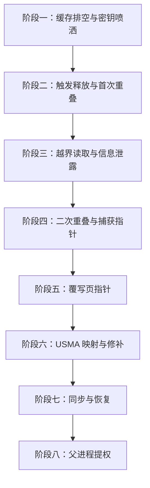

### 5-3. 阶段一：缓存排空与密钥喷洒

本阶段的目标是为后续精确的释放控制创造有利的内存布局条件。SLUB 分配器在分配对象时遵循 per‑CPU 缓存优先策略——新分配的对象会优先从 CPU 本地缓存（per‑CPU slab）中获取空闲槽位。如果缓存中存有大量来自先前操作的空闲槽位，则新分配的对象可能分散在不同 slab 页中，难以保证相邻性。为了克服这一不确定性，需要主动排空缓存，迫使分配器从伙伴系统申请全新的 slab 页。

具体操作分为两步：

- **缓存排空**：使用 `shmget` 和 `shmat` 分配大量共享内存对象，每个操作会在内核中创建一个 `shm_file_data` 结构（同样分配于 `kmalloc-32`）。这一喷射过程填满了 per‑CPU 缓存和已有 slab 页中的空闲槽位，使得后续的 `io_buffer` 和 `user_key_payload` 分配时，内核无法复用旧槽位，只能从新分配的 slab 页中获取内存，从而将这些对象的分配集中在一组连续的物理页中。

- **密钥喷洒**：缓存排空后，批量创建带有唯一标记的 `user_key_payload` 对象。每个密钥对象仅存储少量数据，但占据完整的 32 字节槽位，其内容包含一个固定 4 字节的标记值和一个索引号。这些密钥将作为后续操作的“探测”和“目标”对象：探测对象用于建立越界读取通道，目标对象则用于制造重叠。

完成这两步后，内存布局中的相邻关系趋于可预测，为后续的精确释放奠定了基础。

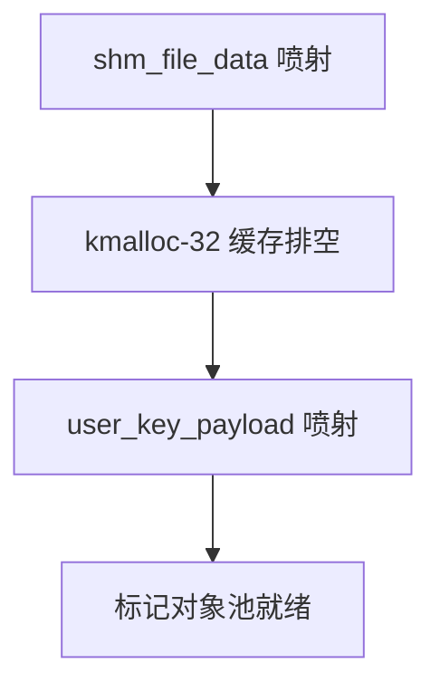

### 5-4. 阶段二：触发释放与首次重叠

本阶段利用漏洞提供的“可控偏移释放”能力，将同一物理页上的一个 `user_key_payload` 对象释放，并立即用 `pg_vec` 结构占据其位置，形成第一次重叠。这一步是从堆布局控制迈向实际漏洞触发的关键衔接。

**漏洞触发**：首先通过 io_uring 注册一个缓冲区，这会在内核中分配一个 `io_buffer` 结构（同样位于 `kmalloc-32`）。由于之前的缓存排空，大量 `user_key_payload` 对象被集中分配在若干 slab 页中，而 `io_buffer` 也会被分配在同一缓存的新页中。因此，`io_buffer` 与先前喷射的 `user_key_payload` 位于同一个物理页上的概率极高。随后，使用设置了 `IOSQE_BUFFER_SELECT` 的读操作读取 `/proc/self/maps`，由于该文件未实现 `read_iter`，内核进入 `loop_rw_iter` 回退路径，导致 `req->rw.addr` 被错误地按字节递增。请求完成时，`kfree` 释放的地址是 `原始 io_buffer 基址 + 累积偏移`，偏移量由用户指定的读取长度 `nbytes` 控制。通过精确调整 `nbytes`，可以在同一物理页内偏移至任意位置，从而命中一个 `user_key_payload`。这就是堆喷 `user_key_payload` 的意义：通过大量喷射覆盖整个 slab 页，使得无论 `io_buffer` 落在该页的哪个位置，总有一个 `user_key_payload` 落在可释放的偏移范围内。

**首次重叠**：释放完成后，目标 `user_key_payload` 槽位变为空闲。利用 SLUB 分配器的 LIFO（后进先出）特性，立即通过 `PACKET_RX_RING` 分配第一个 `pg_vec` 结构。`pg_vec` 仅分配三个有效指针（共 `0x18` 字节），其大小同样为 32 字节，因此会被分配在刚刚释放的槽位上，从而实现了 `pg_vec` 与密钥对象在物理内存上的完全重叠。

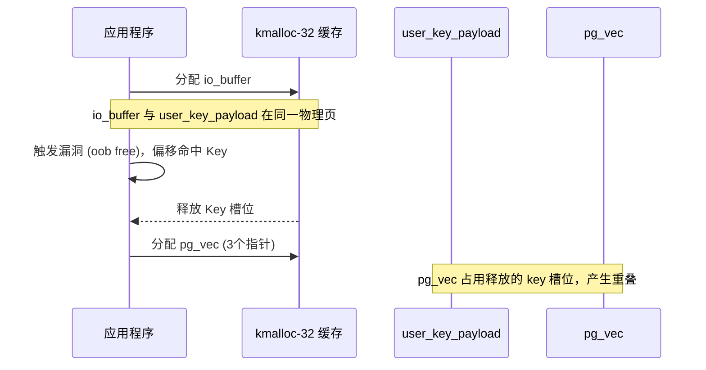

此时，一个密钥对象与 `pg_vec` 发生重叠，越界读取能力的基础已就位。

### 5-5. 阶段三：越界读取与信息泄露

首次重叠后，`pg_vec` 完全覆盖了 `user_key_payload` 的内存区域。关键在于 `user_key_payload` 结构中的 `datalen` 字段（`unsigned short`）恰好位于与 `pg_vec` 的物理页指针相同的偏移位置。由于 `pg_vec` 的指针是页对齐的（低 12 位为 0），它覆盖 `datalen` 后，内核读取该字段时将其解释为一个极大的数值（通常大于 `0x1000`）。这使得该密钥的有效载荷长度被错误地扩大，从而获得了越界读取的能力。

**越界读取**：调用 `key_read` 读取该重叠密钥时，内核会从 `pg_vec` 数据区开始，连续读取 `datalen` 所指示的大量数据。由于同一 slab 页上连续排布着多个 `kmalloc-32` 对象，此次越界读取会跨越相邻的 `user_key_payload` 以及同页上的其他内核结构体（如 `shm_file_data` 等）。这种跨越边界的能力为信息泄露打开了通道。

**信息泄露**：从越界读取到的数据中可以提取两类关键信息：

1. **相邻密钥标记**：先前喷射的密钥对象中的固定标记（4 字节）及其索引值，可用于定位第二个受害者密钥的 ID，为第二次重叠准备目标。
2. **内核符号地址**：同 slab 页上相邻的结构体中可能含有指向内核映像的指针，例如 `key_type_user`、`init_ipc_ns` 等常见符号。将这些泄露的符号地址减去其固定偏移，即可计算出内核映像的基址，成功绕过 KASLR。

至此，该阶段获取了内核基址和第二个目标密钥的定位信息，为后续操作提供了必要的数据。

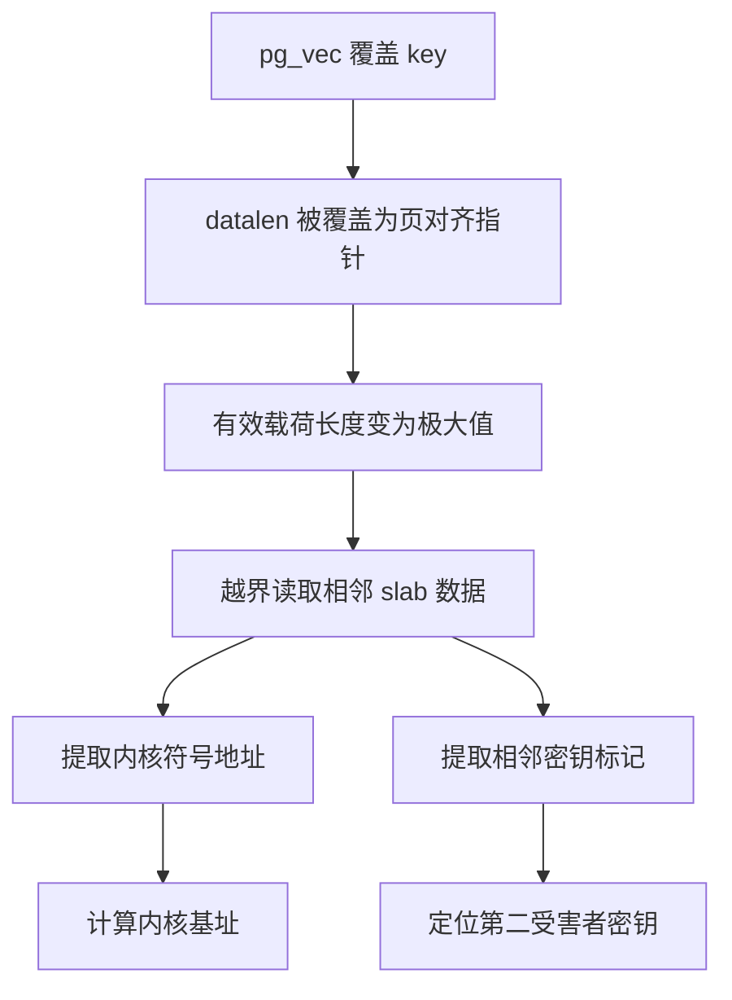

### 5-6. 阶段四：二次重叠与捕获指针

为了在后续修改 `pg_vec` 后能够恢复其原始状态，需要获取目标 `pg_vec` 的原始物理页指针。第一次重叠的 `pg_vec` 本身的数据已被覆盖，无法直接提供原始指针。因此，需要通过释放第二个密钥并分配新的 `pg_vec` 来捕获相邻的原始指针。

**二次重叠**：释放第二阶段定位到的第二受害者密钥，使其槽位再次空闲。紧接着，通过 `PACKET_RX_RING` 分配第二个 `pg_vec`，同样只分配三个有效指针（共 `0x18` 字节）。新分配的 `pg_vec` 占据该空闲槽位。

**捕获原始指针**：再次读取第一个重叠密钥，此时的越界读取范围已跨越到第二个 `pg_vec` 的数据区。第二个 `pg_vec` 刚被分配，其内部的三个物理页指针均为原始有效的页框号（由内核分配，指向数据包环形缓冲区的物理页）。通过越界读取捕获这三个指针值，即可获得用于恢复第一个 `pg_vec` 的原始状态。由于两个 `pg_vec` 结构大小完全相同，这些指针与第一个 `pg_vec` 的原始内容保持一致，可直接用于后续恢复。

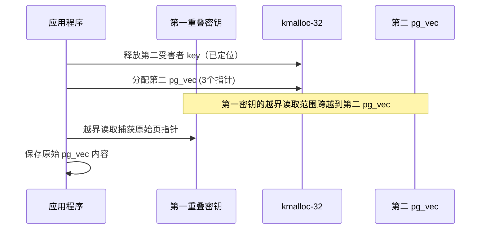

至此，恢复所需的原始物理页指针（三个页框号）已保存就绪。注意，这两个 `pg_vec` 内部存储的指针值是不同的，它们分别指向各自的环形缓冲区物理页，但这些指针在后续恢复时将用于覆盖第一个 `pg_vec`，使两者指向同一组合法的物理页。

### 5-7. 阶段五：覆写页指针

本阶段利用 FUSE 暂停原语，将第一个 `pg_vec` 的第一个页指针重定向到目标内核代码页，同时保持后两个指针为合法数据页，以避免内核在后续访问时立即崩溃。这一步将从信息泄露阶段转向实际的内核数据操纵。

**FUSE 暂停原语原理**：`setxattr` 系统调用在内核中会分配一个临时缓冲区来存储用户数据，然后通过 `copy_from_user` 从用户空间拷贝数据。FUSE 暂停技术利用两个连续的 `0x1000` 页面映射：在第一个页面的末尾（偏移 `0x1000-0x18` 处）布局伪造的 `pg_vec` 数据，第二个页面则映射到 FUSE 的文件描述符。当 `setxattr` 完成 `kmalloc-32` 缓冲区的分配并进入 `copy_from_user` 后，内核会先拷贝 `0x18` 字节的数据，当拷贝剩余 `0x8` 字节时，由于目标地址跨越了页边界，FUSE 守护进程会捕获该页面错误并暂停拷贝操作。此时内核处于 `copy_from_user` 内部，尚未完成写入，临时缓冲区也尚未释放，从而为覆写操作提供了时间窗口。

**载荷准备**：构造一个假的 `pg_vec` 内容，将其第一个页指针替换为 `ns_capable_setid` 函数所在代码页的物理地址（通过已泄露的内核基址计算得到），其余两个页指针设置为阶段四中捕获到的原始物理页指针（来自第二个 `pg_vec`）。这样构造的 `pg_vec` 结构在覆写后，第一个指针指向代码页，后两个指针指向原始合法的数据页，整个结构在后续内核访问时不会因后两个指针非法而立即导致崩溃。该载荷被写入第一个 FUSE 匿名映射的偏移 `0x1000-0x18` 处。

**覆写操作**：启动第一个 `setxattr` 线程，该线程对应第一个 FUSE 匿名映射，它被阻塞在跨页拷贝操作上。释放第一个重叠密钥（即占用第一个 `pg_vec` 的密钥），使其槽位空闲。随后唤醒第一个 `setxattr` 线程，该线程的拷贝目标地址恰好落入这个空闲槽位。在 FUSE 暂停期间，内核处于 `copy_from_user` 内部，将预先准备好的假 `pg_vec` 数据从用户空间拷贝到该槽位，从而覆盖第一个 `pg_vec` 的页指针数组，使其第一个指针指向 `ns_capable_setid` 代码页，后两个指针保持合法。

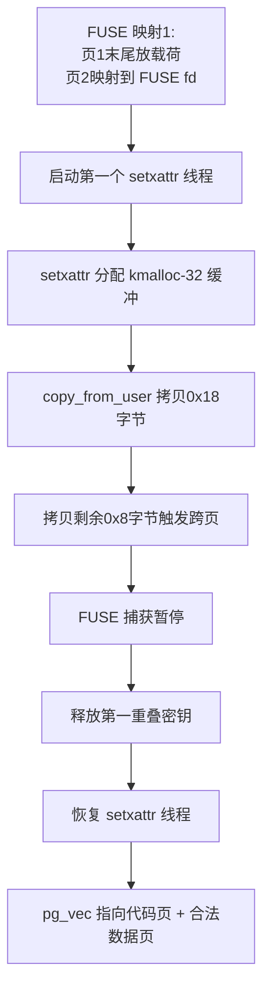

至此，数据包环形缓冲区的物理页指针已被部分重定向，USMA 映射的条件已经具备。但需要特别注意：`pg_vec` 的第一个指针指向代码段后，内核中存在一个定时器会定期访问 `pg_vec` 指向的物理页并进行读写检查。如果该指针长时间指向只读代码段，内核可能会触发缺页异常或崩溃。因此，必须在修补完毕后尽快将指针恢复为原始合法值。

### 5-8. 阶段六：USMA 映射与修补

本阶段利用 USMA 技术，通过数据包环形缓冲区的 `mmap` 特性，直接修改内核代码。这是整个技术链条中获取最终权限的关键操作。

**USMA 映射**：由于第一个 `pg_vec` 的第一个页指针现在指向 `ns_capable_setid` 所在代码页，通过 `mmap` 系统调用映射该数据包环形缓冲区（使用 `MAP_SHARED`），用户空间即可直接读写该物理页。这种将数据包环形缓冲区的物理页映射到用户态的技术，使得内核代码页可以被用户空间直接访问，而无需任何额外的内核漏洞。

**代码修补**：在用户态修改 `ns_capable_setid` 函数的指令，使其总是返回 1。具体地，将函数开头替换为一段简单的返回逻辑（如 `mov rax, 1; ret`），从而绕过后续的权限检查逻辑。修补完成后，必须**立即**解除映射（`munmap`），以消除用户空间对内核代码页的引用。如果不及时解除映射，内核定时器在访问 `pg_vec` 时可能仍会看到指向代码页的指针，并尝试对其进行读写，从而触发崩溃。解除映射后，内核仍持有该指针，但由于此时我们即将进行恢复，必须尽快进入下一阶段。

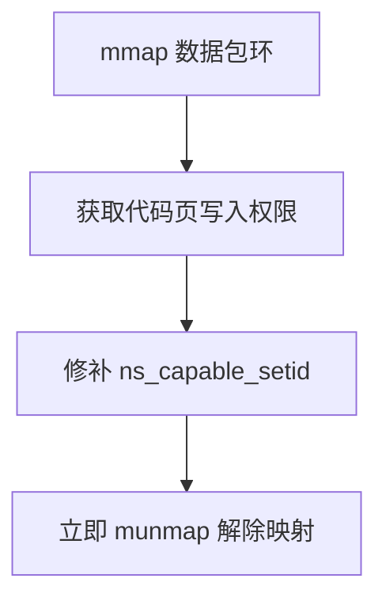

### 5-9. 阶段七：同步与恢复

本阶段通过管道完成父子进程间的信号同步，并利用第二次 `setxattr` 将第一个 `pg_vec` 的三个指针全部恢复为从第二个 `pg_vec` 捕获的原始合法值。这一步对于确保系统稳定性至关重要，因为只有恢复后，内核定时器才会访问合法的数据页，避免因访问代码段而导致崩溃。

**信号同步**：修补完成后，子进程通过管道向父进程发送“就绪”信号。父进程收到后执行 `setresuid(0,0,0)` 和 `setresgid(0,0,0)` 提升权限，然后回发确认信号。

**恢复准备**：将阶段四中从第二个 `pg_vec` 捕获的原始三个物理页指针写入第二个 FUSE 匿名映射的偏移 `0x1000-0x18` 处，作为恢复载荷。由于两个 `pg_vec` 结构大小完全相同，这些指针与第一个 `pg_vec` 的原始内容完全一致，可直接用于完全恢复。

**恢复操作**：子进程收到确认后，首先结束第一次 `setxattr` 的中断（`fuse_signal_read_ready(0)` 和 `fuse_wait_read_done(0)`），允许内核完成跨页拷贝并释放其临时缓冲区，使第一个 `pg_vec` 槽位重新变为空闲。紧接着，通过 `sem_post(&sem_setxattr_ready[1])` 唤醒第二个 `setxattr` 线程，该线程对应第二个 FUSE 匿名映射，其拷贝目标地址恰好落入该空闲槽位，将原始的三个物理页指针全部写回。这样，第一个 `pg_vec` 完全恢复为合法状态，数据包环形缓冲区重新指向正确的物理页，内核定时器后续访问时将不再触发异常。

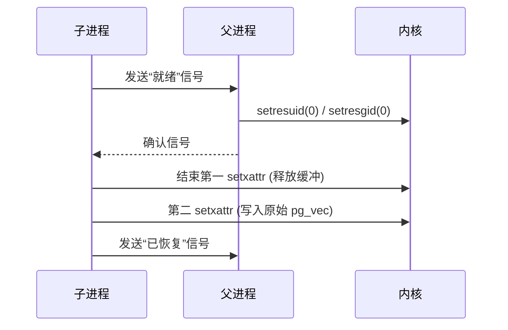

至此，内核状态已完全恢复稳定，父进程可以安全地执行后续提权操作。

### 5-10. 阶段八：父进程提权

父进程收到子进程的“已恢复”信号后，确认内核状态已恢复稳定，随后调用 `execve` 启动一个 root shell。子进程继续运行以保持 FUSE 映射和 io_uring 上下文活跃，防止内核释放相关资源导致不稳定。

至此，非特权进程已成功提升为 root 权限，且内核保持了稳定状态，不会产生明显崩溃或异常日志。

### 5-11. 保护机制应对策略

该利用方法在设计时充分考虑了现代内核防御机制，以下说明各机制的应对方式：

| 保护机制                             | 应对策略                                                                                                                                                                                                                   |
| ------------------------------------ | -------------------------------------------------------------------------------------------------------------------------------------------------------------------------------------------------------------------------- |
| **KASLR**                            | 通过第一次重叠后的越界读取，直接泄露相邻内核结构中的符号地址，计算出内核基址，从而定位所有所需函数和代码页。                                                                                                               |
| **SMAP**                             | 整个操作过程不涉及内核直接访问用户态指针——漏洞触发使用的地址是内核 `io_buffer` 指针，`setxattr` 写入的目标是内核堆地址，FUSE 暂停发生在内核拷贝用户数据的过程中。                                                          |
| **SMEP**                             | 代码修补在用户态完成（通过 USMA 技术映射物理页直接写入），不依赖内核执行用户态代码。修补完成后立即恢复原始页指针，避免内核执行代码页中的用户指令。                                                                         |
| **KPTI**                             | 操作过程不依赖切换页表，所有操作均在普通进程上下文中完成；KPTI 的页表隔离不会影响对内核堆和物理页的读写操作。                                                                                                              |
| **CONFIG_MEMCG / CONFIG_MEMCG_KMEM** | 这两个选项为 `kmalloc-cg-*` 创建独立的 slab 缓存。但 `user_key_payload`、`io_buffer` 和 `pg_vec` 在分配时均使用 `GFP_KERNEL` 标志，分配于普通 `kmalloc-32` 缓存，而非 `kmalloc-cg-*`，因此该隔离机制对本次操作不产生影响。 |
| **SLAB_FREELIST_RANDOM / HARDENED**  | 通过大量喷射排空缓存，强制使用新页，使得 LIFO 分配顺序可预期，从而绕过随机化带来的不确定性。                                                                                                                               |

### 5-12. 条件与局限性

**必要条件**

- 目标内核版本在 5.10 至 5.14.6 之间（漏洞影响范围）。
- 以下内核配置必须启用：`CONFIG_IO_URING`、`CONFIG_KEYS`、`CONFIG_FUSE_FS`、`CONFIG_PACKET`、`CONFIG_SYSVIPC`。
- 进程需要具备创建用户命名空间的能力（非特权用户默认具备，或 `CONFIG_USER_NS` 启用）。
- 系统需允许非特权用户使用 FUSE（通常为默认配置）。

**局限性**

- 操作成功率受堆布局随机性影响，需多次尝试（通常在 3~5 次内成功）。
- 依赖 FUSE 守护进程的稳定性，若 FUSE 通信异常可能导致失败。
- 内核版本差异可能导致符号偏移不同，需根据目标系统调整硬编码值。
- 恢复操作若失败可能引发内核崩溃，因此需要可靠的同步机制。

### 5-13. 总结

该方法的完整技术链条可归纳为以下七个环环相扣的步骤：

1. **堆喷射与 LIFO 控制**：通过排空 `kmalloc-32` 缓存，使后续分配集中在新页，再利用 LIFO 特性精确控制释放槽位的回收顺序。

2. **首次重叠与越界能力**：将漏洞释放的密钥槽位分配给 `pg_vec`（仅三个指针），使 `pg_vec` 覆盖密钥的 `datalen` 字段（被覆盖为页对齐指针值），从而将密钥的有效载荷长度扩展为极大值，建立越界读取能力。

3. **越界读取与信息泄露**：利用越界读取能力直接读取相邻 slab 数据，从中提取内核符号地址（绕过 KASLR）和相邻密钥标记（定位第二受害者）。

4. **二次重叠与指针捕获**：释放第二受害者密钥并分配第二个 `pg_vec`（同样三个指针），通过越界读取捕获其原始物理页指针，保存为恢复状态。

5. **FUSE 暂停与覆写**：利用两个连续页面的 FUSE 映射（首页末尾 `0x1000-0x18` 处放置载荷，次页映射 FUSE fd），通过 `setxattr` 的跨页拷贝触发 FUSE 暂停，在 `copy_from_user` 过程中将伪造的 `pg_vec` 数据写入第一个 `pg_vec`，使其第一个指针指向 `ns_capable_setid` 代码页，后两个指针保持合法。

6. **USMA 映射与修补**：通过 `mmap` 映射数据包环形缓冲区，直接在用户态修改 `ns_capable_setid` 的指令，使其返回 1，绕过权限检查。修补完成后立即解除映射，避免内核定时器访问代码页。

7. **同步与恢复**：通过管道实现父子进程的精确同步，利用第二次 `setxattr` 将原始三个物理页指针全部写回，恢复 `pg_vec` 原始状态，消除定时器隐患，维持内核稳定。

该案例表明，即使所有常见内核保护机制均已开启，一个类型混淆漏洞如果提供了可控偏移释放和对象重叠能力，仍然可以被组合利用实现完整的权限提升。这也为内核开发者提供了重要启示：在引入新的异步 I/O 子系统时，必须严格审查数据结构字段的语义一致性，特别是在涉及指针与普通整数混用的场景中，应当辅以运行时检查（如 KASAN）和静态分析工具来尽早发现偏离预期的操作。

### 5-14. 测试结果

<div style="text-align: center; margin: 2rem 0;">
  
</div>

## 6. 利用思路二

本章介绍一种基于 **tty_file_private** 对象重叠与 **ROP** 链的提权方法，同样以 **CVE-2021-41073** 的“可控偏移释放”原语作为出发点。该思路通过将漏洞释放的 `kmalloc-32` 槽位依次分配给不同的内核对象，最终实现对一个已打开 tty 设备的 **tty_struct** 结构的篡改，并通过精心构造的 ROP 链完成权限提升。整个过程不依赖 FUSE，而是借助 `PACKET_RX_RING` 分配的 `pg_vec` 结构在用户态与内核态之间建立可读写的共享映射，从而在用户空间直接布置伪造的数据和 ROP 链。

### 6-1. 核心原语与依赖条件

该方案同样以漏洞产生的**可控释放**为基础，但后续构造方式与第五章有所不同，主要依赖以下关键能力：

- **对象重叠与类型混淆**：通过堆喷射使 `io_buffer` 与 `user_key_payload` 位于同一物理页，利用漏洞释放一个密钥槽位后，立即分配 `tty_file_private` 结构（同样 32 字节）占据该槽位，实现密钥与 `tty_file_private` 的重叠。此时密钥的 `datalen` 字段被 `tty_file_private->list.next`（堆地址）覆盖，该指针值作为一个较大的整数被解释为密钥的有效载荷长度，从而获得大范围的越界读取能力。随后，通过释放第二个密钥并分配第一个 `pg_vec`，可以泄露 `pg_vec` 内部的物理页指针；再释放第一个密钥并分配第二个 `pg_vec`，使其与 `tty_file_private` 重叠，进而在该 `pg_vec` 中伪造 `tty_struct` 结构，实现对 `tty_struct` 字段的控制。

- **USMA 映射与 ROP 链布局**：`pg_vec` 结构通过 `PACKET_RX_RING` 分配，其内部的页指针始终指向内核分配的合法物理页。利用 `mmap` 可以将这些物理页映射到用户空间，从而允许在用户态直接读写页内容。本方案不修改 `pg_vec` 结构本身（即不篡改其 `buffer` 指针），而是直接修改映射的物理页内容，因此不会触发内核定时器对 `pg_vec` 指针合法性的检查，避免了因指针非法而导致的系统不稳定。

该方案依赖以下内核配置：

| 配置选项                                             | 作用                                                               |
| ---------------------------------------------------- | ------------------------------------------------------------------ |
| `CONFIG_IO_URING`                                    | 提供漏洞触发所需的所有系统调用                                     |
| `CONFIG_KEYS`                                        | 喷射 `user_key_payload` 对象，作为释放目标                         |
| `CONFIG_PACKET`                                      | 通过 `PACKET_RX_RING` 分配 `pg_vec` 结构，用于 USMA 映射和伪造对象 |
| `CONFIG_TTY`                                         | 提供 tty 子系统，用于分配 `tty_file_private` 结构并触发 ioctl      |
| `CONFIG_USER_NS` / `CONFIG_NET_NS` / `CONFIG_IPC_NS` | 允许非特权用户创建命名空间，降低操作门槛                           |
| `CONFIG_SYSVIPC`                                     | 用于前期堆喷射，耗尽 `kmalloc-32` 缓存                             |

在实际环境中，KASLR、SMEP、SMAP、KPTI 均处于开启状态，该方案仍可成功运行，说明漏洞本身提供了足够强的原语以绕过这些防御机制。

### 6-2. 总体流程

整个操作过程分为八个阶段，下图给出各阶段的主要任务与相互关系。

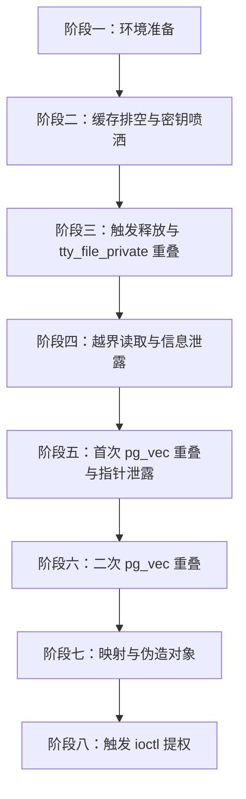

### 6-3. 阶段一：环境准备

本阶段为后续所有操作奠定基础。由于 SLUB 分配器的 per‑CPU 缓存特性会影响对象分配的位置，首先将进程绑定到 CPU 0，并确保 io_uring 的工作队列线程也运行在同一核心上，以便后续释放的槽位能够被及时重用。

同时，提升文件描述符上限，为大量喷射操作预留资源；创建新的命名空间（用户、网络、IPC），使非特权用户能够使用所需的功能；初始化 io_uring 实例和 USMA 数据包套接字。此阶段完成后，所有必要的内核对象和用户态辅助设施均已就绪。

### 6-4. 阶段二：缓存排空与密钥喷洒

本阶段的目标与第五章一致，即为精确的释放控制创造有利的内存布局条件。

- **缓存排空**：通过大量分配共享内存对象（`shm_file_data`），填满 per‑CPU 缓存和已有 slab 页中的空闲槽位，迫使后续的 `io_buffer` 和 `user_key_payload` 分配从新页中进行，使它们集中分布在同一批连续物理页上。

- **密钥喷洒**：在排空后的缓存中，批量创建带有唯一标记（如 “ABCD”）和索引号的 `user_key_payload` 对象，每个密钥占据完整的 32 字节槽位。这些密钥将作为后续的“探测”和“目标”对象，分别用于建立越界读取能力和制造重叠。


### 6-5. 阶段三：触发释放与 tty_file_private 重叠

本阶段利用漏洞释放相邻的 `user_key_payload`，并立即用 `tty_file_private` 结构占用该槽位，形成密钥与 `tty_file_private` 的重叠。

**漏洞触发**：通过 io_uring 注册一个缓冲区，分配 `io_buffer` 结构（位于 `kmalloc-32`）。由于之前的缓存排空，该 `io_buffer` 与附近的一个 `user_key_payload` 位于同一物理页。使用设置了 `IOSQE_BUFFER_SELECT` 的读操作读取 `/proc/self/maps`，触发 `loop_rw_iter` 中的类型混淆，导致 `req->rw.addr` 被错误递增。请求完成时，`kfree` 释放的地址为 `原始 io_buffer 基址 + 累积偏移`，通过精确控制读取长度 `nbytes`，可命中相邻的 `user_key_payload`。

**tty_file_private 重叠**：释放完成后，立即打开 `/dev/ptmx`。该操作在内核中会分配一个 `tty_file_private` 结构（大小 32 字节），它恰好落在刚刚释放的密钥槽位上，从而实现了 `tty_file_private` 与密钥对象的内存重叠。此时，该密钥的 `datalen` 字段被 `tty_file_private->list.next`（一个有效的堆地址）覆盖，该地址作为一个较大的整数被解释为密钥的有效载荷长度，使得后续读取该密钥时可以获取远超原始载荷的数据。

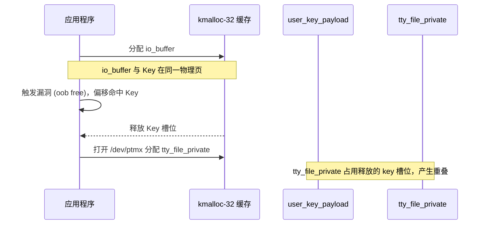

随后，通过遍历所有密钥，检查 `key_read` 返回值是否异常（不等于 8 字节），即可定位到第一个受害者密钥的 ID。

### 6-6. 阶段四：越界读取与信息泄露

重叠后的密钥由于 `datalen` 被 `tty_file_private->list.next`（堆地址）覆盖，该指针值被解释为一个极大的数值，使得密钥的有效载荷长度远大于原始的 8 字节，从而获得了充足的越界读取空间。

**越界读取**：调用 `key_read` 读取该密钥，内核会从重叠的 `tty_file_private` 开始，连续读取 `datalen` 所指示的大量数据。由于同一 slab 页上连续排布着多个 `kmalloc-32` 对象，此次越界读取会跨越相邻的 `user_key_payload` 以及同页上的其他内核结构体（如 `shm_file_data` 等），从中提取出必要的内核指针和标记。

**信息泄露**：从越界读取到的数据中可以提取两类关键信息：

1. **相邻密钥标记**：先前喷射的密钥对象中的固定标记（4 字节）及其索引值，可用于定位第二个受害者密钥的 ID，为第二次重叠准备目标。
2. **内核符号地址**：同 slab 页上相邻的结构体中可能含有指向内核映像的指针，例如 `key_type_user`、`init_ipc_ns` 等常见符号。将这些泄露的符号地址减去其固定偏移，即可计算出内核映像的基址，成功绕过 KASLR。

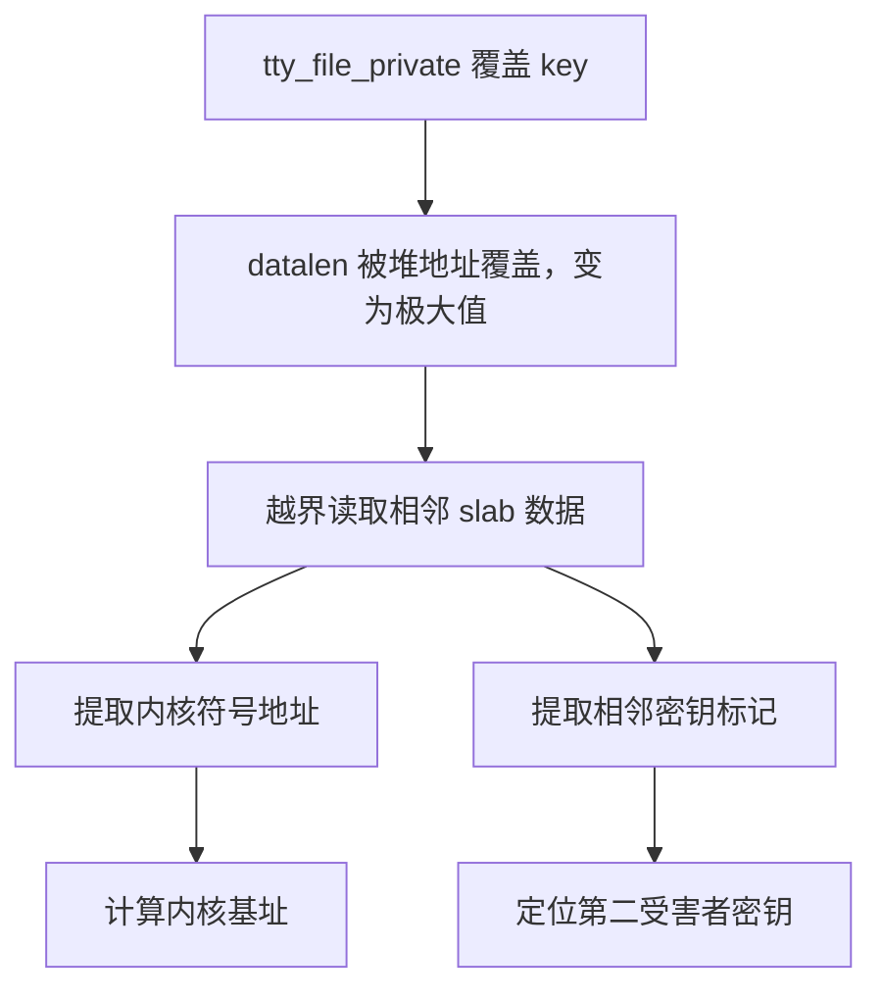

### 6-7. 阶段五：首次 pg_vec 重叠与指针泄露

为了在后续的伪造阶段能够精确放置假的 `tty_driver` 和 `tty_operations` 结构，需要知道目标 `pg_vec` 物理页在内存中的虚拟地址。通过释放第二个受害者密钥并分配第一个 `pg_vec`，可以利用现有的越界读取能力将其内部指针泄露出来。

**释放第二密钥**：将第二阶段定位到的第二受害者密钥撤销并解除链接，使其槽位空闲。

**分配第一个 pg_vec**：立即通过 `PACKET_RX_RING` 分配第一个 `pg_vec`（仅分配 4 个指针，共 0x20 字节），它会被分配在刚刚释放的槽位上。

**泄露 pg_vec 指针**：再次读取第一个重叠密钥（原先与 `tty_file_private` 重叠的密钥），此时越界读取范围已跨越到第一个 `pg_vec` 的数据区，从而可以读取到 `pg_vec` 内部的四个物理页指针（这些是内核虚拟地址，指向数据包环形缓冲区的各个页）。保存这些指针（记为 `leak_pgv[0..3]`），其中 `leak_pgv[0]` 将用作伪造的 `tty_driver` 所在页，`leak_pgv[2]` 将用作伪造的 `tty_operations` 和 ROP 链所在页。

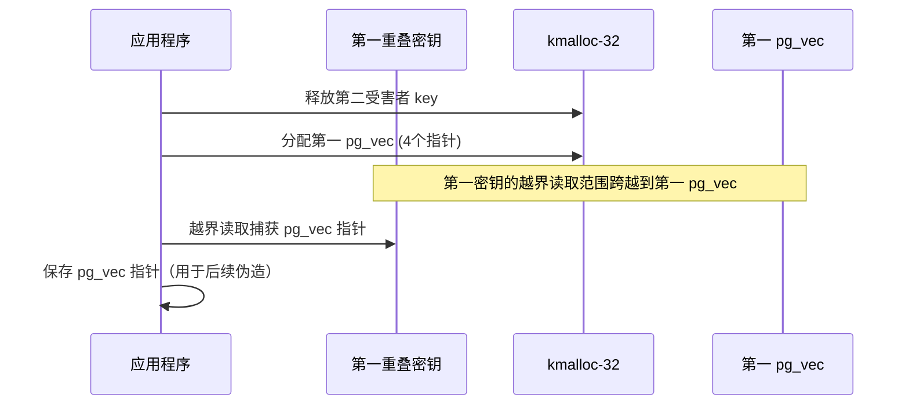

### 6-8. 阶段六：二次 pg_vec 重叠

为了使第二个 `pg_vec` 与 `tty_file_private` 直接重叠，从而能够在其中伪造 `tty_struct`，需要释放第一个受害者密钥（目前与 `tty_file_private` 重叠），并分配第二个 `pg_vec` 占据该槽位。

**释放第一密钥**：撤销第一个受害者密钥，使其槽位空闲（此时该槽位中的 `tty_file_private` 也随之释放）。

**分配第二 pg_vec**：立即通过 `PACKET_RX_RING` 分配第二个 `pg_vec`（同样 4 个指针），它会被分配在刚刚释放的槽位上。此时，第二个 `pg_vec` 与 `tty_file_private` 的内存区域完全重叠。由于 `pg_vec` 的数据内容完全由用户控制（通过 mmap 映射），我们可以利用该 `pg_vec` 的页内容来构造假的 `tty_struct`，从而控制 tty 设备的行为。

### 6-9. 阶段七：映射与伪造对象

本阶段通过 USMA 技术将两个 `pg_vec` 对应的物理页映射到用户空间，并在第二个 `pg_vec` 的页中伪造 `tty_struct`，在第一个 `pg_vec` 的页中放置伪造的 `tty_driver`、`tty_operations` 表和 ROP 链。需要注意的是，本方案**不修改 `pg_vec` 结构中的页指针**，这些指针始终指向内核分配的合法物理页；我们仅修改这些物理页的内容，因此不会触发内核定时器对 `pg_vec` 指针合法性的检查。

**USMA 映射**：分别对第一个和第二个 `pg_vec` 对应的数据包环形缓冲区执行 `mmap`（使用 `MAP_SHARED`），获得指向它们物理页的用户空间指针。由于 `pg_vec` 中的页指针已被泄露，这些映射在用户态可读写。

**伪造 tty_struct**：在第二个 `pg_vec` 的映射中（与 `tty_file_private` 重叠），构造一个假的 `tty_struct` 结构。为了通过内核中的合法性检查（如魔术字校验），至少需要设置以下四个字段：

- `magic`：设置为 `0x5401`，同时将 `kref` 的引用计数设为 1（例如 `0x5401 | (1ULL << 32)`）。
- `dev`：设置为 0。
- `driver`：**必须指向一个有效的地址**，因为内核函数 `tty_pair_get_tty()` 会访问 `tty->driver->type` 和 `tty->driver->subtype` 字段。若 `driver` 为 0，内核在解引用空指针时会触发崩溃。这里使用第一阶段泄露的 `leak_pgv[0]`（即第一个 pg_vec 的起始页地址）作为 `driver` 的值，该地址指向一个合法的物理页。由于该页的内容由用户控制，可以将 `type` 和 `subtype` 设置为 0，从而绕过 `tty_pair_get_tty()` 中的条件检查（`tty->driver->type == TTY_DRIVER_TYPE_PTY && tty->driver->subtype == PTY_TYPE_MASTER`）。
- `ops`：指向第一个 `pg_vec` 中的伪造 `tty_operations` 表。这里使用 `leak_pgv[2]`（即第一个 pg_vec 的第三个页指针）作为 `ops` 的地址，因为我们需要在该页中放置伪造的 `tty_operations` 和 ROP 链。

**构造 driver 对应的伪结构**：在第一个 `pg_vec` 的起始页（`leak_pgv[0]`）中，放置一个假的 `tty_driver` 结构，至少保证其 `type` 和 `subtype` 字段为 0，以绕过 `tty_pair_get_tty()` 的检查。其他字段可以任意填充，只要不导致后续的非法解引用即可。

**构造 tty_operations 和 ROP 链**：在第一个 `pg_vec` 的第三个页（`leak_pgv[2]`）中，放置伪造的 `tty_operations` 结构，将其 `ioctl` 函数指针设置为一个合适的堆栈迁移 gadget（用于将控制流转移到 ROP 链）。随后，在同一页或后续页中紧挨着放置完整的 ROP 链，该链完成以下任务：

- 切换到 init 命名空间（通过 `switch_task_namespaces`）
- 提升权限（`prepare_kernel_cred(0)` + `commit_creds`）
- 返回用户态并执行 `get_root_shell`（利用 `swapgs_restore_regs_and_return_to_usermode`）。

所有 ROP 链中的地址均基于先前泄露的内核基址计算得到，从而在 KASLR 开启的情况下依然有效。

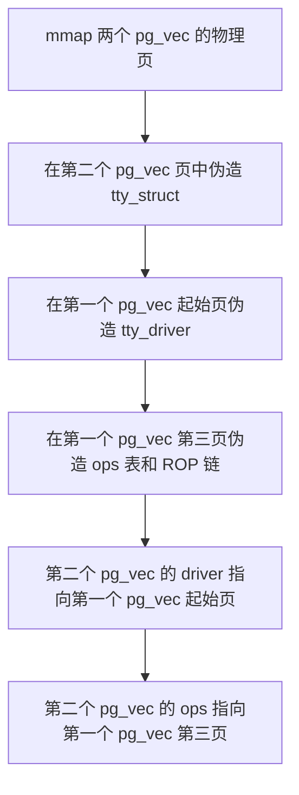

### 6-10. 阶段八：触发 ioctl 提权

本阶段通过执行一个简单的 `ioctl` 系统调用，触发内核执行伪造的 `tty_operations->ioctl` 函数指针。

**触发调用**：对之前打开的 `/dev/ptmx` 文件描述符调用 `ioctl`，传入任意命令号（如 `0xdeadbeef`）和第三个参数（指向 ROP 链起始地址的指针）。在内核执行 ioctl 时，它会通过 `tty_struct` 找到其 `ops` 表，调用其中的 `ioctl` 函数指针。此时 RDX 寄存器恰好保存的是用户传入的第三个参数，即 ROP 链地址。

**堆栈迁移**：`ioctl` 函数指针被设置为一个堆栈迁移 gadget，该 gadget 将栈指针切换为 RDX 的值（即 ROP 链地址），随后跳转到 ROP 链的第一条指令。

**ROP 执行**：ROP 链依次执行命名空间切换、权限提升和用户态返回，最终在父进程中启动一个 root shell。

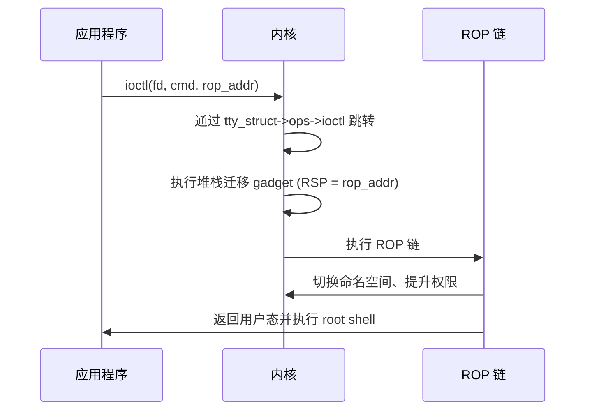

本方案与第五章的关键区别在于：第五章需要篡改 `pg_vec` 的 `buffer` 指针，使其指向内核代码段，这可能导致内核定时器因访问非法指针而触发崩溃；而本章方案仅修改 `pg_vec` 所指向的物理页内容，**不改变 `pg_vec` 结构本身**，因此 `pg_vec` 的页指针始终合法，内核定时器访问这些页时不会检测到异常，从而彻底避免了因修改页指针而引入的稳定性风险。

### 6-11. 保护机制应对策略

该方案在设计时充分考虑了现代内核防御机制，以下说明各机制的应对方式：

| 保护机制                             | 应对策略                                                                                                                                                                                                                        |
| ------------------------------------ | ------------------------------------------------------------------------------------------------------------------------------------------------------------------------------------------------------------------------------- |
| **KASLR**                            | 通过重叠密钥的越界读取，直接泄露相邻内核结构中的符号地址，计算出内核基址，从而定位所有所需函数和代码页。                                                                                                                        |
| **SMAP**                             | 漏洞触发和 `tty_file_private` 重叠使用的地址均为内核堆地址，用户态指针仅用于 `ioctl` 的第三个参数，该参数在 ROP 链中作为 RDX 寄存器值使用，内核不直接解引用。                                                                   |
| **SMEP**                             | ROP 链位于数据包环形缓冲区的物理页中，这些页被映射到用户态，但内核在执行 ROP 时仍然处于内核态，执行的是内核代码段中的 gadget（通过内核基址计算得到），不会执行用户态代码。SMEP 允许内核执行来自内核代码段的内存，因此不受影响。 |
| **KPTI**                             | 操作过程不依赖切换页表，所有操作均在普通进程上下文中完成；KPTI 的页表隔离不会影响对内核堆和物理页的读写操作。                                                                                                                   |
| **CONFIG_MEMCG / CONFIG_MEMCG_KMEM** | `user_key_payload`、`io_buffer`、`tty_file_private` 和 `pg_vec` 在分配时均使用 `GFP_KERNEL` 标志，位于普通 `kmalloc-32` 缓存，因此该隔离机制对本次操作不产生影响。                                                              |
| **SLAB_FREELIST_RANDOM / HARDENED**  | 通过大量喷射排空缓存，强制使用新页，使得 LIFO 分配顺序可预期，从而绕过随机化带来的不确定性。                                                                                                                                    |

### 6-12. 条件与局限性

**必要条件**

- 目标内核版本在 5.10 至 5.14.6 之间（漏洞影响范围）。
- 以下内核配置必须启用：`CONFIG_IO_URING`、`CONFIG_KEYS`、`CONFIG_PACKET`、`CONFIG_TTY`、`CONFIG_SYSVIPC`。
- 进程需要具备创建用户命名空间的能力（非特权用户默认具备，或 `CONFIG_USER_NS` 启用）。
- 需要能够打开 `/dev/ptmx`（通常允许非特权用户操作）。

**局限性**

- 操作成功率受堆布局随机性影响，需多次尝试。
- 依赖 USMA 映射的可用性，若系统限制了 `PACKET_RX_RING` 的 `mmap` 权限，则无法使用。
- 内核版本差异可能导致符号偏移不同，需根据目标系统调整硬编码值。
- 由于未恢复物理页的原始内容，若内核在提权后继续访问这些页（例如数据包收发），可能产生意外行为。但本方案在提权后立即执行 root shell，通常不会触发后续访问。

### 6-13. 总结

该利用方法围绕 **可控释放**这一核心原语，通过精心编排的对象重叠序列，将一次“任意偏移释放”逐步转化为对 **tty 子系统**的控制，并最终借助 ROP 链完成权限提升。整个流程可以归纳为三个递进的层次：

- **堆布局与信息泄露**：首先通过缓存排空与密钥喷洒，使 `io_buffer` 与 `user_key_payload` 位于同一物理页，触发漏洞后释放目标密钥，并立即用 `tty_file_private` 占据该槽位，实现重叠。此时 `datalen` 被堆地址覆盖，密钥获得越界读取能力，从而泄露内核基址和相邻密钥标记，为后续定位目标对象提供必要信息。

- **对象重叠与结构控制**：利用越界读取定位第二个受害者密钥，将其释放后分配第一个 `pg_vec`，读取其内部页指针；随后释放第一个密钥（原与 `tty_file_private` 重叠），分配第二个 `pg_vec`，使其与 `tty_file_private` 重叠。通过 USMA 映射，在第二个 `pg_vec` 的物理页中伪造 `tty_struct`，同时在第一个 `pg_vec` 的页中构造 `tty_driver`（type=0, subtype=0）和伪造的 `tty_operations` 表及 ROP 链，从而完全控制 tty 设备的行为。

- **提权触发与稳定性保障**：最后通过 `ioctl` 系统调用，利用伪造的 `tty_operations->ioctl` 指针执行堆栈迁移 gadget，将控制流转移到 ROP 链。ROP 链依次执行命名空间切换、权限提升和用户态返回，最终获得 root shell。与第五章的关键区别在于，本方案**不修改 `pg_vec` 结构中的页指针**，而是仅修改其指向的物理页内容，因此内核定时器对 `pg_vec` 指针合法性的检查始终通过，彻底规避了因篡改指针而可能引入的系统不稳定因素。

该方法的成功表明，即使在 KASLR、SMEP、SMAP、KPTI 等全套防御机制下，只要漏洞提供了可控释放和对象重叠能力，便可以组合利用不同内核对象的生命周期和内存布局，实现完整的权限提升。`tty_file_private` 与 `tty_struct` 的分离设计也进一步说明，类型混淆漏洞的利用不仅限于单一对象，还可以通过多步重叠将影响范围扩展至相关联的复杂结构。这一案例为内核开发者提供了警示：在引入新特性或优化性能时，必须审慎对待数据结构字段的语义一致性，尤其是那些跨越多种上下文的指针复用场景，同时应辅以静态分析和运行时检查，以尽早发现类似的设计缺陷。

### 6-14. 测试结果

<div style="text-align: center; margin: 2rem 0;">
  
</div>

## 7. 漏洞修复

### 7-1. 补丁概述

**CVE-2021-41073** 于 2021 年 9 月由 io_uring 维护者 Jens Axboe 修复。补丁提交 ID 为 **[16c8d2df7ec0](https://git.kernel.org/pub/scm/linux/kernel/git/torvalds/linux.git/commit/?id=16c8d2df7ec0eed31b7d3b61cb13206a7fb930cc)**，合入主线内核的时间为 2021 年 9 月 12 日。该补丁同时被标记为稳定版回溯对象（`Cc: stable@vger.kernel.org`），意味着它会被移植到受影响的长期支持内核分支，包括 5.10、5.13、5.14 等稳定树。

补丁的提交信息明确指出问题的本质是 `loop_rw_iter()` 在处理迭代器类型时缺乏**对称性**，原文如下：

> When setting up the next segment, we check what type the iter is and handle it accordingly. However, when incrementing and processed amount we do not, and both iter advance and addr/len are adjusted, regardless of type. Split the increment side just like we do on the setup side.

该漏洞由安全研究人员 Valentina Palmiotti 发现并报告，Pavel Begunkov 参与了代码审查。补丁随附的 `Fixes` 标签指向了引入该问题的原始提交 `4017eb91a9e7`（“io_uring: make loop_rw_iter() use original user supplied pointers”），该提交在 io_uring 早期开发中引入了对 `rw.addr` 的复用逻辑，使得同一字段承载了用户地址与内核指针的双重语义。

由于该漏洞影响了从 5.10 到 5.14.6 的所有内核版本，且 io_uring 的广泛使用使得非特权用户均可触发，补丁的合入优先级极高。在提交后不足一个月的时间内，各大发行版均已完成向后移植和更新。

### 7-2. 补丁代码

补丁修改了 `fs/io_uring.c` 中的 `loop_rw_iter()` 函数，变更涉及 **9 行代码，新增 6 行，删除 3 行**。完整的 diff 如下：

```diff
diff --git a/fs/io_uring.c b/fs/io_uring.c
index 16fb7436043c2..66a7414c37568 100644
--- a/fs/io_uring.c
+++ b/fs/io_uring.c
@@ -3263,12 +3263,15 @@ static ssize_t loop_rw_iter(int rw, struct io_kiocb *req, struct iov_iter *iter)
 				ret = nr;
 			break;
 		}
+		if (!iov_iter_is_bvec(iter)) {
+			iov_iter_advance(iter, nr);
+		} else {
+			req->rw.len -= nr;
+			req->rw.addr += nr;
+		}
 		ret += nr;
 		if (nr != iovec.iov_len)
 			break;
-		req->rw.len -= nr;
-		req->rw.addr += nr;
-		iov_iter_advance(iter, nr);
 	}

 	return ret;
```

补丁的核心改动位于函数循环的末尾，将原先**无条件执行**的三个更新操作，重构为**条件分支**形式，使更新逻辑与循环开头设置分段时的类型判断保持一致。具体的代码语义变化将在下一节详细分析。

### 7-3. 补丁分析

**修复前的缺陷**：在每次成功完成一个 I/O 分段后，原代码无论迭代器类型如何，均**无差别**地执行：

```c
req->rw.len -= nr;
req->rw.addr += nr;
iov_iter_advance(iter, nr);
```

当迭代器为 `bvec` 时（即使用了 `IOSQE_BUFFER_SELECT` 预注册缓冲区），`req->rw.addr` 已被 `io_rw_buffer_select()` 覆写为内核 `io_buffer` 对象的指针。这三行代码同时推进了用户态迭代器偏移（`iov_iter_advance`）和内核态请求指针（`req->rw.addr += nr`）。由于内核指针被当作普通整数递增，其值在完成整个请求后会偏离原始 `io_buffer` 的起始地址。

**修复后的逻辑**：将三项操作拆分到两个互斥分支中：

```c
if (!iov_iter_is_bvec(iter)) {
    iov_iter_advance(iter, nr);
} else {
    req->rw.len -= nr;
    req->rw.addr += nr;
}
```

- **非 `bvec` 分支**（普通用户态 I/O）：仅推进迭代器偏移，**不再修改** `req->rw.addr`，因为该模式下 `rw.addr` 始终指向用户地址，不需要在循环内更新（实际用户地址由迭代器管理）。
- **`bvec` 分支**（预注册缓冲区）：仅更新请求中的 `len` 和 `addr`，**不再调用** `iov_iter_advance`，因为 `bvec` 迭代器的偏移已由 `rw.addr` 和 `rw.len` 隐式维护，不需要额外的迭代器推进。

通过这一拆分，两种模式下的指针维护彻底分离，互不干扰。在 `bvec` 分支中，`rw.addr` 的递增是必要的——因为它追踪的是用户态缓冲区在预注册内存区域内的偏移。但由于该分支不再调用 `iov_iter_advance`，迭代器的状态保持不变，从而避免了请求指针与迭代器状态不同步的问题。

### 7-4. 补丁原理

该补丁的深层原理是**确保 `loop_rw_iter()` 在其整个生命周期中对迭代器类型保持语义一致**。函数在循环开头通过 `iov_iter_is_bvec(iter)` 区分模式，并据此从不同来源获取 I/O 地址（普通模式从迭代器提取，`bvec` 模式直接使用 `req->rw.addr`）。但原先的更新阶段没有采用相同的分支，导致了不一致。

修复后，更新阶段与设置阶段采用完全相同的判断条件，形成**对称处理**。这种对称性是安全编码的重要原则：当同一个函数处理两种不同语义的数据流时，所有涉及指针或偏移量的操作都必须在同一条件下进行分支，不能在一个位置区分而在另一个位置忽略。

从类型系统的角度看，`req->rw.addr` 是一个 `u64` 类型的字段，其实际语义（用户地址或内核指针）由 `REQ_F_BUFFER_SELECTED` 标志隐含决定。补丁虽然没有显式检查该标志，但通过检查迭代器类型 `iov_iter_is_bvec(iter)` 间接实现了相同的效果——在 io_uring 的实现中，`bvec` 迭代器仅当请求使用了预注册缓冲区时才会出现。因此，`!iov_iter_is_bvec(iter)` 等价于“当前请求处于常规模式”，而 `iov_iter_is_bvec(iter)` 等价于“当前请求处于预注册缓冲区模式”。

这种间接判断避免了额外引入标志检查的开销，同时保持了代码的简洁性。补丁的设计体现了对 io_uring 内部状态机理解的深度，以最小的改动消除了安全隐患。

### 7-5. 修复效果与稳定性

该补丁于 2021 年 9 月 12 日合入主线内核，并被追溯至多个稳定版本，包括：

- 5.10.68
- 5.14.7
- 5.13.19
- 其他受影响的长期支持内核（如 5.12、5.11 等）

各主流发行版（Ubuntu、Debian、Fedora、CentOS Stream、SUSE 等）均已同步应用该修复。

修复后的 `loop_rw_iter()` 在预注册缓冲区模式下，`req->rw.addr` 仅在 `bvec` 分支内递增，且不再与 `iov_iter_advance` 混用，从而保证请求完成时 `rw.addr` 仍指向原始 `io_buffer` 起始地址。释放路径 `io_put_rw_kbuf()` 接收到的指针始终是正确的 `io_buffer` 对象，不会再因偏移而释放相邻内存。

在 `bvec` 分支中，`req->rw.addr` 的递增同时保证了后续分段读取时的地址连续性，而迭代器状态不再被推进，这意味着循环退出条件 `iov_iter_count(iter)` 不会因为预注册缓冲区模式下的分段读取而递减——实际上，在预注册缓冲区模式下，`iter` 本身并不直接表示剩余数据量，因此 `iov_iter_count` 的值在进入循环后就不再变化。修复后的代码通过 `req->rw.len` 来追踪剩余数据，从而正确地控制循环次数。

经过广泛的持续集成测试和社区反馈，补丁在消除漏洞的同时，未对 io_uring 的正常 I/O 路径（包括普通文件读写、网络收发、SQPOLL 模式、IOPOLL 模式等）引入性能退化或功能回归。其改动范围极小，仅影响回退路径 `loop_rw_iter()`，且该路径主要用于处理 `/proc` 等伪文件系统，在典型存储和网络工作负载中占比很低，因此回归风险较低。

### 7-6. 补丁的启示

该补丁虽然代码量很小，但揭示了一个重要的设计原则：**在异步子系统中，数据结构字段的语义必须与执行模式严格绑定，并在所有相关代码路径中一致地检查上下文标志**。`rw.addr` 的双重用途本身并不危险，危险的是在不同模式间切换时，某些代码路径遗漏了模式检查。

从防御角度看，这类问题可以通过以下方式提早发现：

- **静态分析**：检查对同一字段的读写操作是否在不同上下文中存在语义不一致。例如，可以构建数据流分析来识别 `u64` 字段同时用作指针和整数的场景。
- **运行时检查**：在内核调试版本中（如 KASAN）对释放的指针进行合法性校验，确认其是否属于预期的 slab 缓存。若能在开发阶段捕获异常释放地址，将显著降低漏洞流入生产环境的概率。
- **代码审查**：重点检查回退路径（如 `loop_rw_iter`）是否与主路径保持语义同步。io_uring 的这次修复正是一个典型案例——回退路径在引入新特性时未能同步更新。

此外，补丁的 `Fixes` 标签指向了四年前的原始提交，提醒开发者：新特性对已有数据结构的复用必须经过全面的兼容性评估，尤其是在指针与整数混用的敏感场景中。

io_uring 的这次修复也为其他高速异步子系统的开发提供了参考：在追求性能极致的同时，需要建立更严格的语义规范和自动化检查流程，以防范类似的设计缺陷。在代码演进的每一个步骤中，都应追问：该字段在当前所有可能的上下文中是否仍然具有一致的语义？

## 8. 免责声明

本文档旨在提供 **CVE-2021-41073** 漏洞的技术分析与教育性内容，仅供学习、研究和安全防御目的使用。作者与发布平台对以下事项声明如下：

1. **合法使用原则**：本文档中描述的任何技术细节、代码示例或利用方法仅供教育研究之用。读者不得将这些信息用于任何非法、未经授权或恶意的活动，包括但不限于未经授权的系统入侵、数据破坏、服务干扰或其他违反法律法规的行为。

2. **知识共享与责任**：本文档基于公开可获取的信息、官方漏洞公告和学术研究资料编写。作者力求确保技术内容的准确性，但不对信息的完整性、时效性或适用性作任何明示或暗示的保证。读者应自行验证信息的准确性，并在专业环境中谨慎应用。

3. **环境限制**：所有技术分析和实验应在受控的、隔离的测试环境中进行，例如使用特制的虚拟机或专用硬件。禁止在任何生产环境、公共网络或他人系统中尝试漏洞利用或相关技术。

4. **法律合规性**：读者应遵守所在国家或地区的所有适用法律法规，包括但不限于计算机安全法、数据保护法和知识产权法。任何使用本文档内容的行为所产生的法律后果，由行为者自行承担。

5. **技术中立性**：本文档对漏洞的分析保持技术中立立场，旨在促进安全社区的防御能力提升。文中提及的任何工具、技术或方法不应被视为对任何组织、产品或技术的背书或批判。

6. **更新与修正**：技术领域发展迅速，本文档内容可能随时间而过时。作者保留更新、修正或撤回文档内容的权利，不承诺另行通知。

7. **版权声明**：本文档内容受版权法保护，未经明确书面许可，不得用于商业目的。允许在注明出处的前提下进行非商业性的分享与引用。

**重要提示**：安全研究应始终遵循道德准则，以提升整体网络安全为目标。如发现安全漏洞，建议通过负责任的披露流程向相关厂商或机构报告，共同维护数字生态的安全与稳定。

---

_本文档的撰写参考了公开的漏洞公告、内核源码（Linux 5.14.6）及相关技术分析文献。所有实验均在封闭的测试环境中完成，未对任何实际系统造成影响。_

## 参考

- https://github.com/BinRacer/pwn4kernel/tree/master/src/CVE-2021-41073
- https://github.com/BinRacer/pwn4kernel/tree/master/src/CVE-2021-41073_V2
- https://bsauce.github.io/2022/07/11/CVE-2021-41073/
- https://lore.kernel.org/io-uring/
- https://github.com/axboe/liburing
- https://github.com/axboe/liburing/blob/master/examples/io_uring-test.c
- https://github.com/axboe/liburing/blob/master/examples/io_uring-cp.c
- https://github.com/axboe/liburing/blob/master/examples/link-cp.c
- https://git.kernel.org/pub/scm/linux/kernel/git/torvalds/linux.git/commit/?id=4017eb91a9e79bbb5d14868c207436f4a6a0af50
- https://git.kernel.org/pub/scm/linux/kernel/git/torvalds/linux.git/commit/?id=16c8d2df7ec0eed31b7d3b61cb13206a7fb930cc
- https://nvd.nist.gov/vuln/detail/CVE-2021-41073
- https://ubuntu.com/security/CVE-2021-41073
