# 【Kernel Exploit】CVE-2021-42008 漏洞分析

## 1. 测试环境

**测试版本**：Linux-5.13.12 [内核镜像地址](https://github.com/BinRacer/pwn4kernel/blob/master/kernels/5.13.12/01/bzImage)

笔者测试的内核版本是 `Linux (none) 5.13.12 #1 SMP Sun Feb 22 12:24:45 CST 2026 x86_64 GNU/Linux`。

**编译选项**：开启`CONFIG_6PACK`、`CONFIG_AX25`、`CONFIG_AX25_DAMA_SLAVE`、`CONFIG_MEMCG`、`CONFIG_MEMCG_KMEM`、`CONFIG_CGROUPS`、`CONFIG_THREAD_INFO_IN_TASK`、`CONFIG_SLAB_FREELIST_RANDOM`、`CONFIG_SLAB_FREELIST_HARDENED`、`CONFIG_INIT_ON_ALLOC_DEFAULT_ON`、`CONFIG_SHUFFLE_PAGE_ALLOCATOR`、`CONFIG_HARDENED_USERCOPY`、`CONFIG_FUSE_FS`、`CONFIG_USERFAULTFD`、`CONFIG_SYSVIPC`、`CONFIG_KEYS`、`CONFIG_STACKPROTECTOR`、`CONFIG_STACKPROTECTOR_STRONG`、`CONFIG_SLUB`、`CONFIG_SLUB_DEBUG`、`CONFIG_E1000`、`CONFIG_E1000E`、`CONFIG_PACKET`、`CONFIG_PACKET_DIAG`、`CONFIG_USER_NS`、`CONFIG_NET_NS`、`CONFIG_NAMESPACES`、`CONFIG_CHECKPOINT_RESTORE`、`CONFIG_IPC_NS`选项。完整配置参考[.config](https://github.com/BinRacer/pwn4kernel/blob/master/kernels/5.13.12/01/.config)。

**技术说明**：在 `drivers/net/hamradio/6pack.c` 的 `sixpack_open` 函数中，权限检查逻辑为 `return ns_capable(&init_user_ns, cap);`，其中命名空间参数显式固定为初始用户命名空间（`init_user_ns`）的地址。此实现导致通用的 `unshare` 用户命名空间隔离技术失效——因为该检查无法感知非初始命名空间中的能力，即便进程已通过 `unshare(CLONE_NEWUSER)` 获取新的能力集，仍无法满足 `init_user_ns` 上下文下的能力验证。因此，在此场景下，漏洞利用必须转而采用文件能力机制（如 `setcap cap_net_admin=eip <binary>`）为可执行文件静态赋予 `CAP_NET_ADMIN` 权限，方可绕过该命名空间限制，完成后续利用流程。

**保护机制**：KASLR/SMEP/SMAP/KPTI

## 2. 漏洞背景

### 2-1. 漏洞概述

**CVE-2021-42008** 是 Linux 内核 6pack 线路规程（line discipline）驱动程序中存在的一处 slab 越界写漏洞，位于 `drivers/net/hamradio/6pack.c` 文件的 `decode_data()` 函数。该漏洞允许具备 `CAP_NET_ADMIN` 能力的本地进程通过构造特定的输入数据，触发内核堆内存越界写入，进而可能造成权限提升等安全后果。该漏洞在 CVSS 3.x 评分体系中获评 **7.8 分（高危）**，其核心问题源于内核态对缓冲区下标边界校验的缺失，属于典型的内存安全类漏洞。

本章将从漏洞的波及范围、技术背景、代码细节、触发条件、潜在利用能力以及根本成因等方面展开系统分析，以全面揭示该漏洞的内在机制和可能带来的安全风险。

### 2-2. 影响范围

该漏洞最早可追溯至 **Linux 2.1.94** 版本，直至 **v5.13.12** 版本均受影响。该漏洞自 2005 年由 commit `1da177e4c3f4` 引入，**存续时间长达 16 年**。其影响版本跨度之大，意味着大量已部署的 Linux 系统在未及时更新的情况下仍暴露于风险之中。从引入时间来看，该漏洞几乎伴随了 Linux 内核的整个现代发展历程，这也从侧面反映出内核中遗留代码在安全审查方面面临的挑战。

| 项目         | 详情                                         |
| ------------ | -------------------------------------------- |
| **漏洞引入** | Linux 2.1.94（2005 年，commit 1da177e4c3f4） |
| **修复版本** | Linux v5.13.13（commit 19d1532a1876）        |
| **存续时间** | 约 16 年                                     |

在子系统层面，该漏洞主要影响以下组件：

- **驱动文件**：`drivers/net/hamradio/6pack.c`
- **相关协议**：6pack 线路规程（`N_6PACK`）
- **编译依赖**：`CONFIG_6PACK=y`、`CONFIG_AX25=y`

由于 6pack 驱动通常被编译为内核模块（但也可以内置），其存在与否取决于内核配置。然而，在多数主流发行版的内核中，该驱动均被启用，从而扩大了潜在受影响系统的范围。值得注意的是，该漏洞的触发还需要特定的硬件或虚拟串口设备支持，但通过 ptmx/pts 伪终端对即可满足这一条件，无需真实硬件。

### 2-3. 技术背景

6pack 协议是一种用于 PC 与 TNC（Terminal Node Controller）通过串口进行数据交互的传输协议，作为 KISS 协议的替代方案，运行于 AX.25 数据链路层之上，广泛应用于业余分组无线电网络。该协议通过将 tty 设备的线路规程设置为 `N_6PACK` 来加载，其核心数据结构为 `struct sixpack`，定义如下：

```c
struct sixpack {
    /* 指向关联的 tty 设备结构 */
    struct tty_struct    *tty;
    /* 对应的网络设备接口 */
    struct net_device    *dev;

    /* 动态分配的接收/发送缓冲区指针 */
    unsigned char        *rbuff;        /* 接收缓冲区 */
    int                    rcount;      /* 已接收字符计数器 */
    unsigned char        *xbuff;        /* 发送缓冲区 */
    unsigned char        *xhead;        /* 下一个待发送字节位置 */
    int                    xleft;       /* 发送队列剩余字节数 */

    /* 固定大小的原始数据缓冲区（用于解码前的临时存储） */
    unsigned char        raw_buf[4];
    /* 固定大小的解码后数据缓冲区（漏洞触发点） */
    unsigned char        cooked_buf[400];

    /* 原始缓冲区填充计数（0~3） */
    unsigned int        rx_count;
    /* 解码缓冲区写入偏移（无界，导致越界） */
    unsigned int        rx_count_cooked;

    int                    mtu;         /* 当前 MTU 值 */
    int                    buffsize;    /* 缓冲区最大尺寸 */

    unsigned long        flags;         /* 状态标志 */
    unsigned char        mode;          /* 6pack 工作模式 */

    /* 6pack 协议参数 */
    unsigned char        tx_delay;
    unsigned char        persistence;
    unsigned char        slottime;
    unsigned char        duplex;
    unsigned char        led_state;
    unsigned char        status;
    unsigned char        status1;
    unsigned char        status2;
    unsigned char        tx_enable;
    unsigned char        tnc_state;

    /* 定时器与同步管理 */
    struct timer_list    tx_t;
    struct timer_list    resync_t;
    refcount_t           refcnt;
    struct completion    dead;
    spinlock_t           lock;
};
```

该结构体包含了驱动运行所需的各类状态信息与控制字段。其中两个关键缓冲区 `raw_buf[4]` 与 `cooked_buf[400]` 直接关系到数据解码流程：

- `raw_buf[4]`：用于暂存原始输入的临时缓冲区，大小为 4 字节，用于累积来自串口的原始编码数据。
- `cooked_buf[400]`：用于存储解码后的有效数据，容量为 400 字节，是协议数据处理的最终目的地。
- `rx_count`：当前 `raw_buf` 中已填充的字节数，取值范围 0~3，每次解码完成后会被重置为 0。
- `rx_count_cooked`：当前 `cooked_buf` 中已写入的字节偏移量，即下一次写入的位置索引，该变量在整个解码过程中持续累加，且不受任何上限约束——正是这个字段的无限累加特性构成了漏洞的核心。

驱动通过 `sixpack_decode()` 函数处理来自串口的原始数据流，该函数根据输入字节的类型将数据分流至不同处理逻辑，其中 `decode_data()` 负责将经过 sixpack 编码的数据还原为原始有效字节。在正常使用场景下，数据包的长度受到协议规范和物理层传输限制，`cooked_buf` 的 400 字节容量足以容纳单次会话中的所有解码数据。然而，由于协议设计时并未强制规定单次会话的数据总量上限，且驱动未对 `rx_count_cooked` 实施累计写入量的检查，这使得恶意构造的超长数据流能够突破缓冲区的边界限制。

### 2-4. 漏洞点分析

漏洞的核心触发函数是 `decode_data()`，其实现如下：

```c
static void decode_data(struct sixpack *sp, unsigned char inbyte)
{
    unsigned char *buf;

    /* 若 raw_buf 尚未填满（不足3字节），则继续累积输入字节 */
    if (sp->rx_count != 3) {
        sp->raw_buf[sp->rx_count++] = inbyte;
        return;
    }

    /* raw_buf 已满，将其中3字节与当前输入的 inbyte 组合解码为3个有效字节 */
    buf = sp->raw_buf;
    /* 解码第1字节，写入 cooked_buf，并递增偏移 */
    sp->cooked_buf[sp->rx_count_cooked++] =
        buf[0] | ((buf[1] << 2) & 0xc0);
    /* 解码第2字节，写入 cooked_buf，并递增偏移 */
    sp->cooked_buf[sp->rx_count_cooked++] =
        (buf[1] & 0x0f) | ((buf[2] << 2) & 0xf0);
    /* 解码第3字节，写入 cooked_buf，并递增偏移 */
    sp->cooked_buf[sp->rx_count_cooked++] =
        (buf[2] & 0x03) | (inbyte << 2);
    /* 重置 raw_buf 填充计数，准备接收下一组数据 */
    sp->rx_count = 0;
}
```

该函数的设计基于一个隐含假设：解码过程将在 `cooked_buf` 写满（400 字节）时停止，因此并未对写入偏移 `sp->rx_count_cooked` 做任何边界校验。然而，协议本身并未提供机制来强制限制 `decode_data()` 的调用次数，利用者可以通过持续输入精心构造的编码数据，使 `sp->rx_count_cooked` 无限递增，从而越过 `cooked_buf` 的末端，向相邻堆内存区域写入可控数据。

值得特别关注的是，`cooked_buf` 在 `struct sixpack` 中的位置之后紧跟着 `rx_count` 和 `rx_count_cooked` 两个字段。虽然 `rx_count` 会被重置，但 `rx_count_cooked` 作为越界写入的索引可以被精确控制。通过调整输入数据的长度，利用者可以令 `rx_count_cooked` 精确指向任意偏移量——甚至可以超出整个 `struct sixpack` 结构体的大小，直接指向该对象在堆中的后继内存块。这意味着越界写入的目标地址是完全可控的，利用者能够以 `sixpack` 对象为跳板，对其后的任意堆内存区域进行写入操作。从堆内存布局的角度来看，`struct sixpack` 对象本身是从 kmalloc-4096 中分配的，其后继内存块可能存放着完全不同的内核对象，这为覆写关键数据结构创造了条件。

此外，由于 GCC 编译优化，`decode_data()` 中的写入顺序会先更新 `rx_count_cooked` 为原值加 3，然后再执行第三次字节写入，这导致在一个调用周期内只有第三次写入能实际改变该变量的值（前两次写入使用的是未更新的旧偏移）。这一细节虽然增加了控制的复杂性，但并未削弱偏移的精细可调性，利用者仍可通过多次调用逐步将偏移调整至期望值，实现对相邻内存区域的定点写入。

### 2-5. 触发条件与执行路径

要进入 `decode_data()` 并触发越界写入，输入数据必须满足 `sixpack_decode()` 中的状态机条件。该函数逐字节处理输入缓冲区，其核心逻辑如下：

```c
static void
sixpack_decode(struct sixpack *sp, const unsigned char *pre_rbuff, int count)
{
    unsigned char inbyte;
    int count1;

    for (count1 = 0; count1 < count; count1++) {
        inbyte = pre_rbuff[count1];

        /* 检测到同步标志，置状态为已同步，并删除重同步定时器 */
        if (inbyte == SIXP_FOUND_TNC) {
            tnc_set_sync_state(sp, TNC_IN_SYNC);
            del_timer(&sp->resync_t);
        }

        /* 若最高位为1，作为优先级命令处理 */
        if ((inbyte & SIXP_PRIO_CMD_MASK) != 0)
            decode_prio_command(sp, inbyte);
        /* 否则若为标准命令，则处理标准命令 */
        else if ((inbyte & SIXP_STD_CMD_MASK) != 0)
            decode_std_command(sp, inbyte);
        /* 否则若 status 已具备 RX+DCD 标志，则调用漏洞函数 decode_data() */
        else if ((sp->status & SIXP_RX_DCD_MASK) == SIXP_RX_DCD_MASK)
            decode_data(sp, inbyte);
    }
}
```

涉及的关键宏定义如下：

```c
#define SIXP_FOUND_TNC      0xe9
#define SIXP_PRIO_CMD_MASK  0x80
#define SIXP_PRIO_DATA_MASK 0x38
#define SIXP_RX_DCD_MASK    0x18
#define SIXP_DCD_MASK       0x08
```

为了进入 `decode_data()`，必须满足两个条件：

- 当前输入字节的最高位和标准命令位均为 0（即不触发前两个分支）；
- `sp->status` 的 `SIXP_RX_DCD_MASK` 位必须被置位（即为 0x18）。

`sp->status` 的初始值为 1（在 `sixpack_open()` 中设置），需要通过优先级命令来修改。`decode_prio_command()` 的实现提供了控制 `status` 的途径：

```c
static void decode_prio_command(struct sixpack *sp, unsigned char cmd)
{
    int actual;

    /* 若命令字节携带有效数据（低5位非零），则进入活跃分支 */
    if ((cmd & SIXP_PRIO_DATA_MASK) != 0) {

    /* RX和DCD标志只能在同一条优先级命令中同时设置，前提是DCD已在先前
       的优先级命令中被设置过但RX未设置。若DCD此前未设置，则意味着传输
       出现异常，此时需清除RX和DCD以防止 decode_data 读取损坏的数据。 */

        /* 若当前 status 未设置 DCD 位，但命令请求设置 RX+DCD，则视为协议异常 */
        if (((sp->status & SIXP_DCD_MASK) == 0) &&
            ((cmd & SIXP_RX_DCD_MASK) == SIXP_RX_DCD_MASK)) {
                if (sp->status != 1)
                    printk(KERN_DEBUG "6pack: protocol violation\n");
                else
                    sp->status = 0;
                /* 清除命令中的 RX+DCD 位，避免其影响后续赋值 */
                cmd &= ~SIXP_RX_DCD_MASK;
        }
        /* 最终将 status 更新为命令字节的有效数据位（低5位） */
        sp->status = cmd & SIXP_PRIO_DATA_MASK;
    } else {
        /* 空闲分支：若有待发送数据且处于双工模式，则通过 tty 发送数据 */
        if ((sp->status2 != 0) && (sp->duplex == 1)) {
            sp->led_state = 0x70;
            sp->tty->ops->write(sp->tty, &sp->led_state, 1);
            sp->tx_enable = 1;
            actual = sp->tty->ops->write(sp->tty, sp->xbuff, sp->status2);
            sp->xleft -= actual;
            sp->xhead += actual;
            sp->led_state = 0x60;
            sp->status2 = 0;
        }
    }

    /* 触发 TNC 看门狗 */
    sp->tty->ops->write(sp->tty, &sp->led_state, 1);

    /* 若状态机已同步，则重置重同步定时器 */
    if (sp->tnc_state == TNC_IN_SYNC)
        mod_timer(&sp->resync_t, jiffies + SIXP_INIT_RESYNC_TIMEOUT);

    /* 保存命令的有效数据位到 status1 */
    sp->status1 = cmd & SIXP_PRIO_DATA_MASK;
}
```

该函数包含一个保护逻辑，用于防止非法状态转换：若当前 `status` 未设置 DCD 位（0x08），而命令字节却要求同时设置 RX 和 DCD（即 `cmd & SIXP_RX_DCD_MASK == 0x18`），则会清除命令中的 RX 位并将 `status` 置 0。为了绕过此保护，利用者可以采用两步法：

- **第一次调用**：输入字节 `0x88`。该命令的 `SIXP_PRIO_DATA_MASK` 部分为 `0x08`（非零），但 `SIXP_RX_DCD_MASK` 位为 0，因此不触发保护条件。执行后 `sp->status` 变为 `0x08`，即设置了 DCD 位。
- **第二次调用**：输入字节 `0x98`。此时 `sp->status` 已有 DCD 位，故保护条件的第一个子条件 `(sp->status & SIXP_DCD_MASK) == 0` 为假，保护逻辑被绕过。执行后 `sp->status` 变为 `0x18`，即满足进入 `decode_data()` 的条件。

此后，所有最高位和标准命令位均为 0 的输入字节都将直接流入 `decode_data()`，触发越界写入。

需要强调的是，所有输入数据在传输前必须经过 sixpack 编码（`encode_sixpack()`），编码规则将每 3 个有效字节扩展为 4 个字节。因此，payload 的编码长度与 `rx_count_cooked` 的累加值之间存在确定的数学关系，利用者可以据此精确计算出需要发送的字节数，以实现对偏移的精细调控。在实际利用中，往往需要发送数百字节甚至更多的编码数据，使得 `rx_count_cooked` 跨越 `cooked_buf` 的 400 字节边界并延伸至相邻堆对象的关键偏移位置。

### 2-6. 潜在利用能力

尽管该漏洞本身只提供越界写入能力，但通过结合内核中特定的数据结构，可以构建出完整的权限提升利用链。以下分析以 `msg_msg` 为例说明其利用路径，该方法同样适用于其他具有类似结构的内核对象（如 `user_key_payload` 等）。

**信息泄露阶段**：`msg_msg` 是 System V 消息队列中用于存储消息的核心结构，其定义如下：

```c
struct msg_msg {
    struct list_head m_list;    /* 链表指针，指向消息队列中的前后消息 */
    long m_type;                /* 消息类型 */
    size_t m_ts;                /* 消息体长度，决定 msgrcv 读取的数据量 */
    struct msg_msgseg *next;    /* 指向下一个消息段，用于分段存储 */
    void *security;             /* 安全上下文指针 */
    /* 消息数据紧跟在结构体之后 */
};
```

其中 `m_ts` 字段决定了 `msgrcv()` 系统调用从该消息中读取的数据长度。通过堆布局技术（如堆风水），将 `sixpack` 对象与一个 `msg_msg` 对象在 slab 中相邻放置，利用越界写覆写相邻 `msg_msg` 的 `m_ts` 字段，将其修改为一个较大的值（如 0x2000）。随后调用 `msgrcv()` 时，内核会按照被篡改后的长度从 `msg_msg` 对象起始地址开始读取数据，从而越过 `msg_msg` 本身的边界，越界读取相邻内存区域中的内容。这些内容中通常包含内核敏感指针（例如 `init_ipc_ns` 的地址），据此可计算出内核基址及其他关键符号的运行时地址，从而突破 KASLR 保护。

**任意地址读写与释放原语**：在获取内核地址后，利用者再次触发越界写，这次覆写相邻 `msg_msg` 的 `next` 指针，将其指向任意目标地址（如 `modprobe_path` 或当前进程的 `cred` 结构）。`next` 指针在消息队列处理中用于链接多个消息段——当消息长度超过一个内存页时，内核会通过 `next` 指针链遍历所有 `msg_msgseg` 段以完成完整的消息读写。通过构造特殊的消息数据，利用者可以借助这一遍历机制实现对目标地址的读写操作。具体而言：

- 当 `next` 指向目标地址时，内核在 `msgsnd()` 过程中会将消息数据写入该地址（任意地址写）。
- 当调用 `msgrcv()` 从该队列接收消息时，内核会从 `next` 指向的地址读取数据（任意地址读）。
- 通过释放该消息队列，内核会尝试释放 `next` 指向的 `msg_msgseg` 对象，从而触发任意地址释放（free）原语，可进一步用于构造 UAF（use-after-free）等利用场景。

这些原语足以篡改内核关键数据，例如将 `modprobe_path` 指向用户可控的恶意脚本，或直接修改当前进程的 `cred` 结构中的 uid/gid 字段为 0，最终实现权限提升。

实际利用中需要依赖堆布局技术确保 `sixpack` 与目标对象的相邻布置，并可能需要借助用户态页错误（userfaultfd）或 FUSE 等机制对内核执行流进行精细控制（例如在 `copy_from_user()` 处挂起以制造竞态条件），这些辅助手段用于提高利用的可靠性和稳定性，但漏洞本身已具备完整的利用潜力，无需依赖其他内核漏洞即可完成从信息泄露到权限提升的全流程。

### 2-7. 本质总结

**CVE-2021-42008** 的本质是 **内核态下标边界校验缺失** 所导致的 **slab 堆越界写** 漏洞，其关键能力在于 **可控偏移的任意堆内存写入**，这使得利用者能够以 `sixpack` 对象为跳板，对其后的任意堆内存区域进行覆写，进而与 `msg_msg` 等内核数据结构配合，实现信息泄露和任意地址读写原语，最终完成权限提升。

其核心成因可归纳为：

1. **设计缺陷**：`decode_data()` 函数未对 `rx_count_cooked` 下标进行上限检查，误认为解码过程会在缓冲区写满时自然停止。这一假设在协议交互的正常场景下成立——因为单次会话的数据量受物理层限制——但在恶意构造的异常输入下完全失效。
2. **协议特性**：6pack 协议的解码过程允许通过反复调用 `decode_data()` 持续向缓冲区写入数据，且单次调用写入量（3 字节）与缓冲区容量（400 字节）之间缺乏累积量的控制机制，使得偏移值可以无限递增。
3. **偏移可控性**：`rx_count_cooked` 的值直接由已解码的输入数据长度决定，利用者可精确计算任意目标偏移所需的输入长度，实现定点越界写入。这种“指哪打哪”的精细控制能力使得漏洞的威胁远超一般的缓冲区溢出。
4. **权限边界**：漏洞触发需具备 `CAP_NET_ADMIN` 能力。在默认配置下，非特权用户不具备此能力，但在许多 Linux 发行版中，非特权用户可通过文件能力机制（如 `setcap`）获得该能力（用户命名空间方式在本场景中因 `sixpack_open()` 绑定 `init_user_ns` 而失效）。在具备该能力的前提下，内核未提供任何访问控制或运行时缓解来拦截越界写入行为，使得该能力成为唯一的防护门槛。

该漏洞的长期存在（16 年）和广泛影响（自 Linux 2.1.94 起），充分说明了历史遗留代码在安全审查中的薄弱性，也警示开发者对于任何内核态的数据处理函数，必须严格实施边界检查——即使是在看似“有限”的缓冲区场景下，边界检查的缺失仍可能在特定条件下被恶意利用。持续模糊测试和代码审计是防范此类漏洞的重要手段，而及时的补丁响应则是缓解风险的关键环节。

## 3. 深入分析 sixpack 协议

### 3-1. 协议定位与设计目标

6pack 是一种用于 PC 与 TNC（Terminal Node Controller）通过串行线路进行数据交换的传输协议，由 Ekki Plicht（DF4OR）、Henning Rech（DF9IC）和 Gunter Jost（DK7WJ）共同开发，其 Linux 内核驱动由 Andreas Könsgen 等人实现并维护。该协议被设计为 KISS 协议的替代方案，在业余分组无线电网络（AX.25）中扮演着关键角色。

与 KISS 协议相比，6pack 具有两个显著优势：首先，PC 能够完全控制无线信道——PC 与 TNC 之间交换特殊的控制数据，使 PC 能够实时获知 TNC 的状态，包括是否正在接收数据、是否发生缓冲区溢出或下溢、PTT（Push-To-Talk）是否被置位等。这种设计将信道访问和定时算法的计算工作从 TNC 转移到 PC 端，使得实验和优化 CSMA、DAMA 等信道访问方法更加灵活，开发者无需修改 TNC 固件即可调整信道访问策略。其次，控制数据以高于普通数据的优先级进行处理，数据流可以在任意时刻被中断以发送重要事件，这一特性对于需要实时响应的无线电通信场景尤为关键，例如紧急停止传输或立即切换信道。

此外，6pack 协议为每个通过串行线路传输的数据包提供校验和，便于检测串行线路问题导致的错误。损坏的接收数据包不会传递给 AX.25 层，而 TNC 从 PC 接收到的损坏数据包也不会被发送出去。这种错误检测机制在一定程度上保障了无线通信的可靠性，但由于校验和算法较为简单（累加取反），其保护能力有限。

在 Linux 内核中，6pack 驱动位于 `drivers/net/hamradio/6pack.c`，其核心职责是在原始 TTY 设备和内核 AX.25 协议层之间建立接口。该驱动通过将 tty 设备的线路规程（line discipline）设置为 `N_6PACK` 来加载，从而将串行数据流转换为符合 6pack 协议语义的数据包。驱动初始化时通过 `tty_register_ldisc()` 注册行规则操作集，使得后续对该 TTY 设备的读写操作均经过 6pack 协议栈的处理。理解这些背景，有助于把握后续各节中编解码、状态机及定时器机制的设计初衷与实现细节。

### 3-2. 核心数据结构与关键宏

驱动使用 `struct sixpack` 结构体来维护每个 6pack 通道的完整状态，该结构体包含了驱动运行所需的各类信息——从 TTY 设备指针、网络设备接口到协议参数、定时器管理等。其中与解码过程直接相关的字段如下：

```c
struct sixpack {
    struct tty_struct    *tty;            /* 关联的 TTY 设备 */
    struct net_device    *dev;            /* 网络设备接口 */
    unsigned char         raw_buf[4];     /* 暂存原始编码数据的临时缓冲区 */
    unsigned char         cooked_buf[400];/* 存放解码后的有效数据 */
    unsigned int          rx_count;       /* raw_buf 已填充字节数（0~3） */
    unsigned int          rx_count_cooked;/* cooked_buf 当前写入偏移（无界） */
    unsigned char         status;         /* 状态标志（含 DCD/RX 位） */
    unsigned char         status1;        /* 状态副本（用于发送决策） */
    /* 其他字段省略 */
};
```

`cooked_buf` 是解码后数据的存放位置，其容量固定为 400 字节。`rx_count_cooked` 记录了已写入的有效字节数，每次解码调用增加 3，但在正常协议交互中，数据帧长度受到物理层和链路层限制，通常不会触及 400 字节的上限。因此，驱动开发者可能认为该缓冲区大小足以应对所有合法场景，从而未对 `rx_count_cooked` 实施边界检查——这一假设在恶意构造的长输入流下被彻底打破。

协议定义了一组用于区分命令和数据的掩码，这些掩码构成了协议解析的基础：

- `SIXP_PRIO_CMD_MASK` (0x80)：优先级命令位，最高位为 1，用于标识需要高优先级处理的命令。
- `SIXP_STD_CMD_MASK` (0x40)：标准命令位，次高位为 1，用于标识常规命令（如帧边界、异常状态等）。
- `SIXP_PRIO_DATA_MASK` (0x38)：优先级命令中携带的数据位，用于提取命令字节的有效状态信息。
- `SIXP_RX_DCD_MASK` (0x18)：表示同时置位 RX 和 DCD 标志的组合位，是进入数据解码分支的必要条件。
- `SIXP_DCD_MASK` (0x08)：单独的 DCD（载波检测）位，用于指示信道是否被占用。

这些宏共同决定了每个输入字节的分类和处理路径，构成了状态机判断的基础。理解这些掩码的语义，对于后续分析状态机的分流逻辑至关重要。

### 3-3. 编解码机制

6pack 协议采用 3→4 编码：每 3 个原始数据字节被拆分为 4 个 6 位组，每个 6 位组作为一个字节传输，确保所有传输字节的高两位均为 0，从而避免与命令字节混淆。解码时，接收端将 4 个字节重新组合还原为 3 个原始字节。这种编码方式借鉴了 HDLC 的位填充思想，但实现更为简洁——通过简单的位移和位或操作即可完成转换，无需复杂的比特级状态机。

编码函数 `encode_sixpack()` 将 AX.25 数据帧转换为 6pack 格式，其处理流程包括：在帧头插入优先级命令和帧起始标志、将有效数据拷贝至临时缓冲区、计算并附加校验和、执行 3→4 编码、最后添加帧结束标志。该函数逐字节处理输入数据，根据当前字节在 3 字节组中的位置（第 0、1、2 个）执行不同的位移和合并操作，确保编码结果满足 6pack 协议的格式要求。

```c
static int encode_sixpack(unsigned char *tx_buf, unsigned char *tx_buf_raw,
    int length, unsigned char tx_delay)
{
    int count = 0;
    unsigned char checksum = 0, buf[400];
    int raw_count = 0;

    /* 输出缓冲区起始：优先级命令（TX标志）+ 帧起始标志 */
    tx_buf_raw[raw_count++] = SIXP_PRIO_CMD_MASK | SIXP_TX_MASK;
    tx_buf_raw[raw_count++] = SIXP_SEOF;

    /* 将原始数据（含 tx_delay）拷贝到临时缓冲区 */
    buf[0] = tx_delay;
    for (count = 1; count < length; count++)
        buf[count] = tx_buf[count];

    /* 计算累加校验和（取反） */
    for (count = 0; count < length; count++)
        checksum += buf[count];
    buf[length] = (unsigned char)0xff - checksum;

    /* 将 buf 中每 3 个字节编码为 4 个 6 位组 */
    for (count = 0; count <= length; count++) {
        if ((count % 3) == 0) {
            tx_buf_raw[raw_count++] = (buf[count] & 0x3f);
            tx_buf_raw[raw_count] = ((buf[count] >> 2) & 0x30);
        } else if ((count % 3) == 1) {
            tx_buf_raw[raw_count++] |= (buf[count] & 0x0f);
            tx_buf_raw[raw_count] = ((buf[count] >> 2) & 0x3c);
        } else {
            tx_buf_raw[raw_count++] |= (buf[count] & 0x03);
            tx_buf_raw[raw_count++] = (buf[count] >> 2);
        }
    }
    if ((length % 3) != 2)
        raw_count++;
    tx_buf_raw[raw_count++] = SIXP_SEOF;  /* 帧结束标志 */
    return raw_count;
}
```

对应的解码函数 `decode_data()` 实现逆向转换：它首先累积 4 个输入字节到 `raw_buf`，然后一次性将这 4 个字节解码为 3 个原始字节写入 `cooked_buf`，同时将 `rx_count_cooked` 递增 3。解码的位操作本质上是从 4 个 6 位组中提取位片段，重新拼接成 3 个完整的 8 位字节。这一过程完全由位移和位或运算完成，效率较高，但也意味着解码逻辑与缓冲区大小完全解耦——函数本身不关心 `cooked_buf` 还有多少剩余空间。

```c
static void decode_data(struct sixpack *sp, unsigned char inbyte)
{
    unsigned char *buf;

    /* 若 raw_buf 尚未填满，则累积输入字节 */
    if (sp->rx_count != 3) {
        sp->raw_buf[sp->rx_count++] = inbyte;
        return;
    }

    /* raw_buf 已满，解码并写入 cooked_buf */
    buf = sp->raw_buf;
    sp->cooked_buf[sp->rx_count_cooked++] =
        buf[0] | ((buf[1] << 2) & 0xc0);
    sp->cooked_buf[sp->rx_count_cooked++] =
        (buf[1] & 0x0f) | ((buf[2] << 2) & 0xf0);
    sp->cooked_buf[sp->rx_count_cooked++] =
        (buf[2] & 0x03) | (inbyte << 2);
    sp->rx_count = 0;
}
```

`rx_count_cooked` 在解码过程中持续累加且无边界检查，这是漏洞的技术根源。一旦输入数据量超过 400 字节的有效载荷，后续解码产生的字节将越过 `cooked_buf` 边界，直接写入相邻的堆内存区域。编解码的整体数据流转过程如下所示：

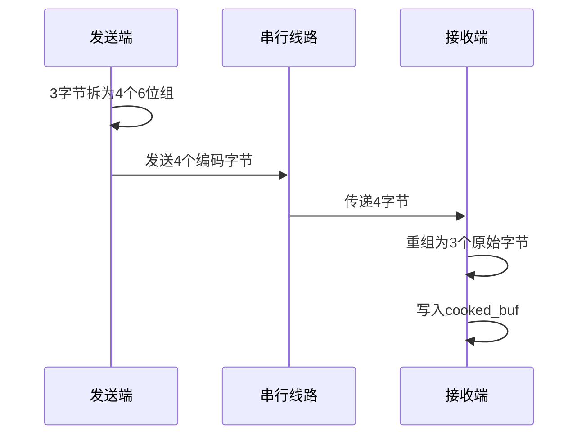
```mermaid
sequenceDiagram
    participant Src as 发送端
    participant Line as 串行线路
    participant Dst as 接收端

    Src->>Src: 3字节拆为4个6位组
    Src->>Line: 发送4个编码字节
    Line->>Dst: 传递4字节
    Dst->>Dst: 重组为3个原始字节
    Dst->>Dst: 写入cooked_buf
```

了解了编解码的底层机制之后，下一步需要分析驱动如何区分命令字节和数据字节，以及状态机如何控制数据流向解码函数。

### 3-4. 协议状态机与命令处理

输入数据由 `sixpack_decode()` 逐字节处理，该函数是协议状态机的核心入口。它遍历输入缓冲区中的每个字节，根据字节的值和当前状态将其分流到不同的处理函数。这种设计体现了 6pack 协议的命令/数据分离原则，也是理解漏洞触发条件的关键。

```c
static void
sixpack_decode(struct sixpack *sp, const unsigned char *pre_rbuff, int count)
{
    unsigned char inbyte;
    int count1;

    for (count1 = 0; count1 < count; count1++) {
        inbyte = pre_rbuff[count1];

        /* 若检测到 TNC 同步标志 0xe9，置状态为已同步并删除重同步定时器 */
        if (inbyte == SIXP_FOUND_TNC) {
            tnc_set_sync_state(sp, TNC_IN_SYNC);
            del_timer(&sp->resync_t);
        }

        /* 优先级命令处理：最高位为 1 */
        if ((inbyte & SIXP_PRIO_CMD_MASK) != 0)
            decode_prio_command(sp, inbyte);
        /* 标准命令处理：次高位为 1 */
        else if ((inbyte & SIXP_STD_CMD_MASK) != 0)
            decode_std_command(sp, inbyte);
        /* 数据解码：高2位均为 0，且 status 已置 RX+DCD 标志 */
        else if ((sp->status & SIXP_RX_DCD_MASK) == SIXP_RX_DCD_MASK)
            decode_data(sp, inbyte);
    }
}
```

对于每个输入字节，函数按优先级依次判断：

1. **同步检测**：若 `inbyte == SIXP_FOUND_TNC`（0xe9），表示检测到 TNC 同步标志，将状态机置为已同步（`TNC_IN_SYNC`）并删除重同步定时器。这是协议握手和同步恢复的关键路径。
2. **优先级命令**：若最高位为 1，调用 `decode_prio_command()` 处理优先级命令。这类命令用于传输 DCD 和 RX 等实时状态信息，可以随时中断普通数据流。
3. **标准命令**：若次高位为 1，调用 `decode_std_command()` 处理标准命令，包括帧起始/结束标志 `SIXP_SEOF` 以及发送下溢、接收上溢等异常状态码。
4. **数据解码**：若高两位均为 0（即普通数据字节），且 `status` 已包含 `SIXP_RX_DCD_MASK`（0x18），则调用 `decode_data()` 进行解码。若不满足 `status` 条件，则该字节被静默丢弃。

`status` 字段的初始值为 1（在 `sixpack_open()` 中设置）。要使其变为 0x18，必须通过优先级命令逐步修改。`decode_prio_command()` 是实现这一控制的核心函数：

```c
static void decode_prio_command(struct sixpack *sp, unsigned char cmd)
{
    int actual;

    /* 若命令字节携带有效数据（低5位非零），则进入活跃分支 */
    if ((cmd & SIXP_PRIO_DATA_MASK) != 0) {
        /* 保护逻辑：若当前 status 未设置 DCD，而命令要求同时设置 RX+DCD，
           则视为协议异常，清除 RX 位并将 status 置 0 */
        if (((sp->status & SIXP_DCD_MASK) == 0) &&
            ((cmd & SIXP_RX_DCD_MASK) == SIXP_RX_DCD_MASK)) {
            if (sp->status != 1)
                printk(KERN_DEBUG "6pack: protocol violation\n");
            else
                sp->status = 0;
            cmd &= ~SIXP_RX_DCD_MASK;
        }
        /* 将 status 更新为命令字节的有效数据位 */
        sp->status = cmd & SIXP_PRIO_DATA_MASK;
    } else {
        /* 空闲分支：若有待发送数据且处于双工模式，则通过 tty 发送 */
        if ((sp->status2 != 0) && (sp->duplex == 1)) {
            sp->led_state = 0x70;
            sp->tty->ops->write(sp->tty, &sp->led_state, 1);
            sp->tx_enable = 1;
            actual = sp->tty->ops->write(sp->tty, sp->xbuff, sp->status2);
            sp->xleft -= actual;
            sp->xhead += actual;
            sp->led_state = 0x60;
            sp->status2 = 0;
        }
    }

    /* 触发 TNC 看门狗（发送 LED 状态） */
    sp->tty->ops->write(sp->tty, &sp->led_state, 1);

    /* 若状态机已同步，则重置重同步定时器 */
    if (sp->tnc_state == TNC_IN_SYNC)
        mod_timer(&sp->resync_t, jiffies + SIXP_INIT_RESYNC_TIMEOUT);

    /* 保存命令的有效数据位到 status1（用于后续发送决策） */
    sp->status1 = cmd & SIXP_PRIO_DATA_MASK;
}
```

该函数包含一个保护逻辑：如果当前 `status` 未设置 DCD 位（即 `status & SIXP_DCD_MASK == 0`），而命令字节却请求同时设置 RX 和 DCD（即 `cmd & SIXP_RX_DCD_MASK == SIXP_RX_DCD_MASK`），则视为协议异常，此时会清除命令中的 RX 位并将 `status` 置 0。这一保护机制的设计意图是防止非法状态转换——只有在 DCD 已先被单独设置的情况下，才允许后续同时设置 RX 和 DCD。

通过两步精心构造的优先级命令，可以完全绕过上述保护：

- **第一次输入** `0x88`：该字节的 `PRIO_DATA_MASK` 部分为 `0x08`，且 `RX_DCD_MASK` 位为 0，因此不触发保护条件。执行后 `status` 变为 `0x08`（仅设置 DCD 位）。
- **第二次输入** `0x98`：此时 `status` 已含有 DCD 位，保护条件的第一个子条件 `(sp->status & SIXP_DCD_MASK) == 0` 为假，整个保护逻辑被绕过。执行后 `status` 变为 `0x18`（同时设置 DCD 和 RX 位）。

此后，任何高两位均为 0 的数据字节都会直接进入 `decode_data()`。这种状态转换的确定性使得漏洞触发条件高度可控。

标准命令处理函数 `decode_std_command()` 识别帧起始/结束标志 `SIXP_SEOF` 以及各类异常状态码：

```c
static void decode_std_command(struct sixpack *sp, unsigned char cmd)
{
    unsigned char checksum = 0, rest = 0;
    short i;

    switch (cmd & SIXP_CMD_MASK) {
    case SIXP_SEOF:   /* 帧起始/结束标志 0x40 */
        /* 若当前尚未接收任何数据，表示帧开始 */
        if ((sp->rx_count == 0) && (sp->rx_count_cooked == 0)) {
            if ((sp->status & SIXP_RX_DCD_MASK) == SIXP_RX_DCD_MASK) {
                sp->led_state = 0x68;   /* LED 亮起表示接收开始 */
                sp->tty->ops->write(sp->tty, &sp->led_state, 1);
            }
        } else {
            /* 帧结束：处理已累积的数据 */
            sp->led_state = 0x60;
            sp->tty->ops->write(sp->tty, &sp->led_state, 1);
            /* 若 rx_count 不为0，说明数据不足4个编码字节，用0补齐 */
            rest = sp->rx_count;
            if (rest != 0)
                for (i = rest; i <= 3; i++)
                    decode_data(sp, 0);
            /* 根据补齐情况调整 cooked 计数（去除多余零字节） */
            if (rest == 2)
                sp->rx_count_cooked -= 2;
            else if (rest == 3)
                sp->rx_count_cooked -= 1;
            /* 计算校验和 */
            for (i = 0; i < sp->rx_count_cooked; i++)
                checksum += sp->cooked_buf[i];
            if (checksum != SIXP_CHKSUM) {
                printk(KERN_DEBUG "6pack: bad checksum %2.2x\n", checksum);
            } else {
                /* 校验通过，提交数据（去除校验和字节） */
                sp->rcount = sp->rx_count_cooked - 2;
                sp_bump(sp, 0);
            }
            sp->rx_count_cooked = 0;
        }
        break;
    case SIXP_TX_URUN:      /* 0x48：发送下溢 */
        printk(KERN_DEBUG "6pack: TX underrun\n");
        break;
    case SIXP_RX_ORUN:      /* 0x50：接收上溢 */
        printk(KERN_DEBUG "6pack: RX overrun\n");
        break;
    case SIXP_RX_BUF_OVL:   /* 0x58：接收缓冲区溢出 */
        printk(KERN_DEBUG "6pack: RX buffer overflow\n");
        break;
    }
}
```

当收到 `SIXP_SEOF` 且当前已累积了数据时，驱动会计算校验和并与期望值比较。校验通过则调用 `sp_bump()` 将数据上交给 AX.25 层，校验失败则丢弃该帧并记录错误。此外，如果 `rx_count` 不为 0（即最后一组编码字节不足 4 个），驱动会用 0 补齐缺失的字节后再计算校验和，并相应调整 `rx_count_cooked` 的值。

以下流程图概括了状态机的字节分类及处理路径：

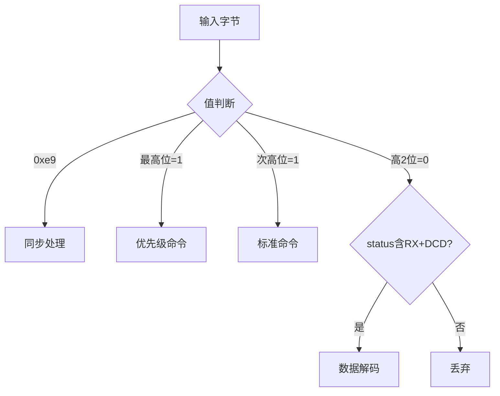
```mermaid
flowchart TD
    A[输入字节] --> B{值判断}
    B -->|0xe9| C[同步处理]
    B -->|最高位=1| D[优先级命令]
    B -->|次高位=1| E[标准命令]
    B -->|高2位=0| F{status含RX+DCD?}
    F -->|是| G[数据解码]
    F -->|否| H[丢弃]
```

`status` 在状态机中的转换路径如下：

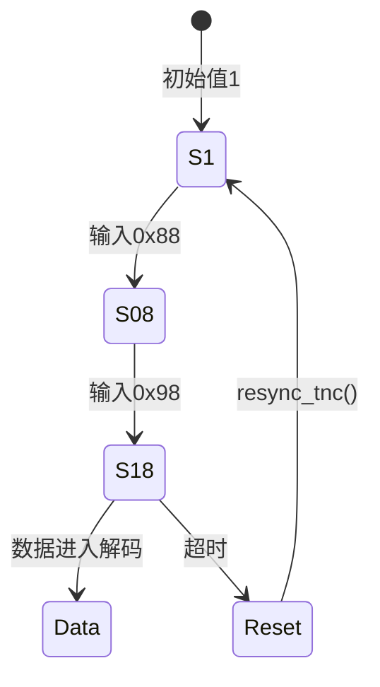
```mermaid
stateDiagram-v2
    [*] --> S1: 初始值1
    S1 --> S08: 输入0x88
    S08 --> S18: 输入0x98
    S18 --> Data: 数据进入解码
    S18 --> Reset: 超时
    Reset --> S1: resync_tnc()
```

### 3-5. 定时器与同步管理

驱动使用两个内核定时器来管理协议的时间相关行为：`tx_t` 用于 CSMA 信道访问的延迟重试，`resync_t` 用于 TNC 同步状态的超时恢复。`resync_t` 的回调函数 `resync_tnc()` 在超时时重置接收状态，这一机制在漏洞利用中具有特殊意义——它提供了重新开始越界写入的能力。

```c
static void resync_tnc(struct timer_list *t)
{
    struct sixpack *sp = from_timer(sp, t, resync_t);
    static char resync_cmd = 0xe8;   /* 发送 0xe8 命令触发 TNC 重同步 */

    /* 清除可能已接收的任何数据 */
    sp->rx_count = 0;
    sp->rx_count_cooked = 0;

    /* 重置状态机 */
    sp->status = 1;
    sp->status1 = 1;
    sp->status2 = 0;

    /* 向 TNC 发送重同步命令 */
    sp->led_state = 0x60;
    sp->tty->ops->write(sp->tty, &sp->led_state, 1);
    sp->tty->ops->write(sp->tty, &resync_cmd, 1);

    /* 重新启动重同步定时器，以应对 TNC 可能仍无响应的情况 */
    mod_timer(&sp->resync_t, jiffies + SIXP_RESYNC_TIMEOUT);
}
```

`resync_tnc()` 将 `rx_count` 和 `rx_count_cooked` 归零，将 `status` 重置为 1，并向 TNC 发送同步命令，然后重新启动定时器（超时时间为 5 秒）。该定时器在以下情况下被设置或重置：在 `tnc_init()` 中初次启动（超时 5 秒）；在 `decode_prio_command()` 中，若 `tnc_state == TNC_IN_SYNC`，则重置为 1.5 秒；在检测到 `SIXP_FOUND_TNC` 同步标志时被删除。

`tx_t` 定时器实现 CSMA 信道访问算法（persistence/slottime），其回调 `sp_xmit_on_air()` 在信道空闲时立即发送数据，否则延迟一个时隙后重试：

```c
static void sp_xmit_on_air(struct timer_list *t)
{
    struct sixpack *sp = from_timer(sp, t, tx_t);
    int actual, when = sp->slottime;
    static unsigned char random;

    random = random * 17 + 41;   /* 伪随机数发生器 */

    /* 若信道空闲（DCD 未置位）且随机数小于持续概率，则发送 */
    if (((sp->status1 & SIXP_DCD_MASK) == 0) && (random < sp->persistence)) {
        sp->led_state = 0x70;
        sp->tty->ops->write(sp->tty, &sp->led_state, 1);
        sp->tx_enable = 1;
        actual = sp->tty->ops->write(sp->tty, sp->xbuff, sp->status2);
        sp->xleft -= actual;
        sp->xhead += actual;
        sp->led_state = 0x60;
        sp->tty->ops->write(sp->tty, &sp->led_state, 1);
        sp->status2 = 0;
    } else {
        /* 否则延迟一个时隙后再尝试 */
        mod_timer(&sp->tx_t, jiffies + ((when + 1) * HZ) / 100);
    }
}
```

该算法通过伪随机数和持续概率参数控制发送时机，避免了多个节点同时发送导致的信道冲突。

同步恢复的时序如下：

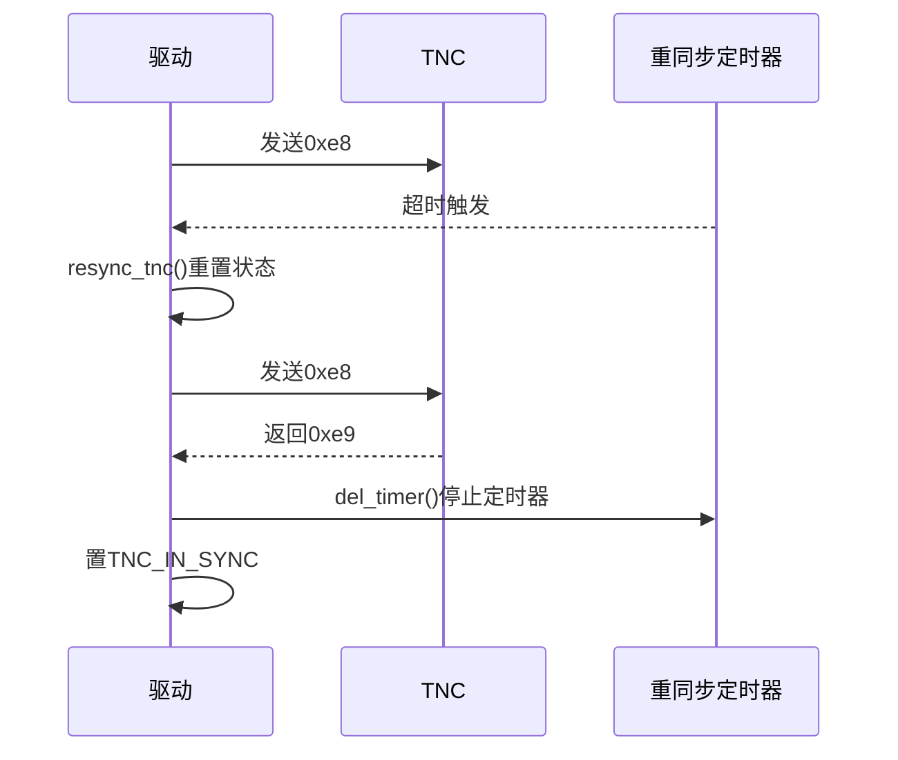
```mermaid
sequenceDiagram
    participant Drv as 驱动
    participant TNC as TNC
    participant Tim as 重同步定时器
    Drv->>TNC: 发送0xe8
    Tim-->>Drv: 超时触发
    Drv->>Drv: resync_tnc()重置状态
    Drv->>TNC: 发送0xe8
    TNC-->>Drv: 返回0xe9
    Drv->>Tim: del_timer()停止定时器
    Drv->>Drv: 置TNC_IN_SYNC
```

定时器机制的设计初衷是增强协议的健壮性，在通信异常时自动恢复。然而，`resync_tnc()` 重置 `rx_count_cooked` 的行为也使得漏洞可以被反复触发，无需重新建立 6pack 连接。

### 3-6. 数据收发与网络接口

6pack 驱动作为网络设备，通过标准的 `struct net_device` 接口与上层协议栈交互。发送路径始于 `sp_xmit()`，该函数判断数据包类型——若为 IP 包则交由 `ax25_ip_xmit()` 处理，否则调用 `sp_encaps()` 进行 6pack 封装。

```c
static netdev_tx_t sp_xmit(struct sk_buff *skb, struct net_device *dev)
{
    struct sixpack *sp = netdev_priv(dev);

    if (skb->protocol == htons(ETH_P_IP))
        return ax25_ip_xmit(skb);   /* IP 包交由 AX.25 处理 */

    spin_lock_bh(&sp->lock);
    netif_stop_queue(dev);           /* 停止上层发送队列 */
    dev->stats.tx_bytes += skb->len;
    sp_encaps(sp, skb->data, skb->len);  /* 封装并发送 */
    spin_unlock_bh(&sp->lock);

    dev_kfree_skb(skb);
    return NETDEV_TX_OK;
}
```

`sp_encaps()` 执行长度和 KISS 命令的有效性检查，然后调用 `encode_sixpack()` 完成编码，最后根据 `duplex` 模式决定立即发送（全双工）或通过 CSMA 定时器延迟发送（半双工）：

```c
static void sp_encaps(struct sixpack *sp, unsigned char *icp, int len)
{
    unsigned char *msg, *p = icp;
    int actual, count;

    /* 检查数据包长度是否超过 MTU */
    if (len > sp->mtu) {
        msg = "oversized transmit packet!";
        goto out_drop;
    }

    /* 检查 KISS 命令有效性（0~5） */
    if (p[0] > 5) {
        msg = "invalid KISS command";
        goto out_drop;
    }

    /* 非数据命令长度不能超过 2 字节 */
    if ((p[0] != 0) && (len > 2)) {
        msg = "KISS control packet too long";
        goto out_drop;
    }

    /* 数据包至少 15 字节 */
    if ((p[0] == 0) && (len < 15)) {
        msg = "bad AX.25 packet to transmit";
        goto out_drop;
    }

    /* 将数据编码为 6pack 格式，tx_delay 作为第一个数据字节 */
    count = encode_sixpack(p, sp->xbuff, len, sp->tx_delay);
    set_bit(TTY_DO_WRITE_WAKEUP, &sp->tty->flags);  /* 请求写唤醒 */

    /* 处理 KISS 命令（设置参数） */
    switch (p[0]) {
    case 1: sp->tx_delay = p[1]; return;
    case 2: sp->persistence = p[1]; return;
    case 3: sp->slottime = p[1]; return;
    case 4: /* 忽略 */ return;
    case 5: sp->duplex = p[1]; return;
    }

    if (p[0] != 0)   /* 非数据命令已处理完毕 */
        return;

    /* 全双工模式：立即发送，不检查 DCD */
    if (sp->duplex == 1) {
        sp->led_state = 0x70;
        sp->tty->ops->write(sp->tty, &sp->led_state, 1);
        sp->tx_enable = 1;
        actual = sp->tty->ops->write(sp->tty, sp->xbuff, count);
        sp->xleft = count - actual;
        sp->xhead = sp->xbuff + actual;
        sp->led_state = 0x60;
        sp->tty->ops->write(sp->tty, &sp->led_state, 1);
    } else {
        /* 半双工模式：启动 CSMA 定时器 */
        sp->xleft = count;
        sp->xhead = sp->xbuff;
        sp->status2 = count;
        sp_xmit_on_air(&sp->tx_t);
    }

    return;

out_drop:
    sp->dev->stats.tx_dropped++;
    netif_start_queue(sp->dev);
    if (net_ratelimit())
        printk(KERN_DEBUG "%s: %s - dropped.\n", sp->dev->name, msg);
}
```

编码后的数据通过 TTY 层发送，`sixpack_write_wakeup()` 回调在 TTY 输出缓冲区有空间时被调用，继续发送剩余数据，并在全部发送完成后唤醒网络队列：

```c
static void sixpack_write_wakeup(struct tty_struct *tty)
{
    struct sixpack *sp = sp_get(tty);
    int actual;

    if (!sp)
        return;
    if (sp->xleft <= 0) {
        /* 发送完成，唤醒网络队列 */
        sp->dev->stats.tx_packets++;
        clear_bit(TTY_DO_WRITE_WAKEUP, &tty->flags);
        sp->tx_enable = 0;
        netif_wake_queue(sp->dev);
        goto out;
    }

    if (sp->tx_enable) {
        actual = tty->ops->write(tty, sp->xhead, sp->xleft);
        sp->xleft -= actual;
        sp->xhead += actual;
    }

out:
    sp_put(sp);
}
```

接收路径由 TTY 层的 `sixpack_receive_buf()` 触发。该函数首先获取 `sixpack` 对象的引用计数以防止并发释放，然后调用 `sixpack_decode()` 进行协议解析：

```c
static void sixpack_receive_buf(struct tty_struct *tty,
    const unsigned char *cp, char *fp, int count)
{
    struct sixpack *sp;
    int count1;

    if (!count)
        return;

    sp = sp_get(tty);   /* 增加引用计数 */
    if (!sp)
        return;

    /* 处理输入数据，忽略 flag 指示的错误 */
    count1 = count;
    while (count) {
        count--;
        if (fp && *fp++) {
            if (!test_and_set_bit(SIXPF_ERROR, &sp->flags))
                sp->dev->stats.rx_errors++;
            continue;
        }
    }
    /* 解码接收到的数据 */
    sixpack_decode(sp, cp, count1);

    sp_put(sp);   /* 释放引用 */
    tty_unthrottle(tty);
}
```

解码完成后，若形成一个完整帧且校验和有效，`sp_bump()` 将数据封装为 `sk_buff` 并通过 `netif_rx()` 提交给上层 AX.25 协议栈：

```c
static void sp_bump(struct sixpack *sp, char cmd)
{
    struct sk_buff *skb;
    int count;
    unsigned char *ptr;

    count = sp->rcount + 1;   /* 数据长度 +1（KISS 命令字节） */

    sp->dev->stats.rx_bytes += count;

    if ((skb = dev_alloc_skb(count + 1)) == NULL)
        goto out_mem;

    ptr = skb_put(skb, count + 1);
    *ptr++ = cmd;   /* 写入 KISS 命令（数据时为0） */
    memcpy(ptr, sp->cooked_buf + 1, count);

    skb->protocol = ax25_type_trans(skb, sp->dev);
    netif_rx(skb);   /* 上交给网络层 */
    sp->dev->stats.rx_packets++;

    return;

out_mem:
    sp->dev->stats.rx_dropped++;
}
```

接收流程的完整时序如下：

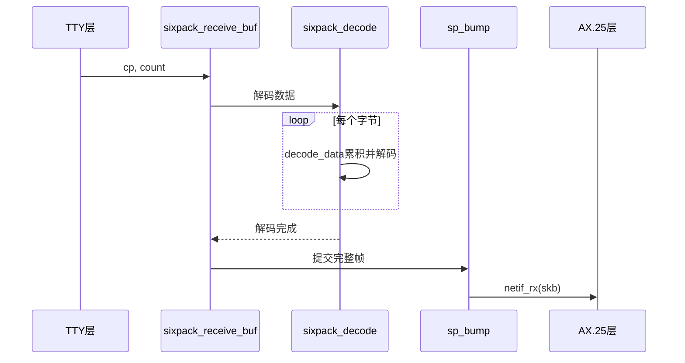
```mermaid
sequenceDiagram
    participant TTY as TTY层
    participant recv as sixpack_receive_buf
    participant dec as sixpack_decode
    participant bump as sp_bump
    participant AX25 as AX.25层
    TTY->>recv: cp, count
    recv->>dec: 解码数据
    loop 每个字节
        dec->>dec: decode_data累积并解码
    end
    dec-->>recv: 解码完成
    recv->>bump: 提交完整帧
    bump->>AX25: netif_rx(skb)
```

网络接口层的设计使得 6pack 驱动可以像普通网络设备一样被上层协议使用，数据包通过标准的 `dev_queue_xmit`/`netif_rx` 路径收发。这种良好的分层设计便于协议栈集成，但也意味着漏洞触发的数据可以来自上层协议栈的任意数据包。

### 3-7. 设计考量与潜在隐患

6pack 协议的设计优先考虑了实时性和灵活性，但某些实现决策在安全视角下值得深入审视：

- **缓冲区容量与协议语义的解耦**：`cooked_buf` 的 400 字节是驱动实现层面的限制，而非协议规范的一部分。协议本身并未规定单次会话的数据总量上限，驱动也未对累计写入量进行控制。这种设计与实现之间的不一致性，使得精心构造的长输入流能够越过缓冲区边界，而协议层面没有任何机制阻止这种行为。

- **状态机的隐式依赖**：`status` 字段控制数据是否可进入解码流程，其值的合法性依赖于特定的命令调用序列（先设置 DCD，再设置 RX+DCD）。这种隐式的状态依赖增加了代码的复杂性，但同时也使得状态转换路径可以被精确预测和操纵——只要按照正确的顺序发送命令字节即可。

- **历史代码的长期存续**：该驱动自 2005 年引入以来，核心逻辑保持了 16 年的相对稳定。在这期间，内核的内存分配策略、编译优化选项和安全防护机制都发生了显著变化，但驱动的边界检查逻辑并未同步演进。这种停滞使得原本在旧内核中可能不明显的风险，在新环境下变得可以利用。

- **校验和的局限性**：累加取反校验能够检测串行传输中的单比特错误和部分突发错误，但对于恶意构造的数据而言，校验和可以轻易被重新计算并伪造。因此，校验和不应被视为抵御数据异常的安全边界，而仅仅是传输错误的检测手段。

从架构层面看，该驱动在实时性、灵活性和安全性之间的权衡，使得边界检查成为至关重要的防护手段。对历史代码的定期安全审计、在关键路径增加运行时检查（如 KASAN 检测），以及在设计阶段就充分考虑异常输入的处理，都是降低此类风险的有效措施。

### 3-8. 分析总结

综合以上分析，6pack 协议的设计具有清晰的层次结构：编解码层负责数据格式转换（3→4 编码/4→3 解码），状态机层控制命令与数据的分类处理（基于字节高位），定时器层管理同步与信道访问（重同步超时和 CSMA 延迟），网络接口层完成与上层协议栈的对接（标准 net_device 接口）。各部分协同工作，实现了 PC 对无线信道的灵活控制，这也是 6pack 相对于 KISS 协议的主要优势所在。

然而，该协议实现中的若干特点共同构成了潜在的安全薄弱环节：

1. **无界偏移的累积效应**：`rx_count_cooked` 在解码过程中持续递增且无上限，当输入数据量超出 `cooked_buf` 容量时，后续写入将直接覆写相邻内存。这一机制是漏洞的根本来源，也是整个利用链的起点。

2. **状态控制的可预测性**：通过两步优先级命令（0x88 → 0x98）即可将 `status` 从初始值 1 设为 0x18，该状态转换路径完全确定且条件明确，使得恶意输入能够轻松满足进入解码分支的前置条件。

3. **同步恢复的可重用性**：`resync_tnc()` 会重置 `rx_count_cooked` 为 0，同时保留已建立的 6pack 连接。这意味着利用者无需重新建立连接即可多次触发越界写入，每次重置后都从 `cooked_buf` 的起始位置重新开始累积。

4. **编码格式的透明性**：由于 3→4 编码规则完全公开且可逆，利用者可以精确计算任意 payload 所需的编码字节数，从而实现对越界偏移的精细控制——这对构造指向相邻堆对象关键偏移的写入尤为关键。

从防御视角看，针对此类问题的缓解措施应聚焦于边界检查的强化：在 `decode_data()` 中增加对 `rx_count_cooked + 3` 与 `sizeof(cooked_buf)` 的比较，一旦检测到将要超出边界则立即停止解码并重置状态，即可从根本上阻断越界写入。此外，对历史驱动的定期安全审计、引入运行时内存检测工具（如 KASAN）以及考虑用更健壮的校验机制（如 CRC）替代简单的累加校验，均是降低风险的有效手段。

该案例也提醒开发者：即使是在看似成熟稳定的历史代码中，边界条件处理的疏漏仍可能带来严重的安全后果。在协议驱动的设计中，实现层面的限制与协议语义之间的不一致性往往是最容易被忽视的风险点。持续的代码审查、模糊测试以及安全感知的开发实践，是防范此类问题的根本之道。

## 4. 利用思路一

### 4-1. 核心原语与依赖条件

**CVE-2021-42008** 的核心能力是通过 `decode_data()` 中缺乏边界检查的 `rx_count_cooked` 下标，实现 **可控偏移的 slab 越界写入**。操作者可以精确控制写入偏移量，从而在 `struct sixpack` 对象所在的 `netdev_t` 对象之后的相邻堆内存区域中的任意位置写入可控字节。这一原语本身提供了强大的内存破坏能力，但单独使用仍面临以下挑战：

- **缺乏直接的信息泄露渠道**：越界写无法直接读取内核内存，需要借助内核数据结构的特性将写入转化为读取。
- **缺乏任意地址控制**：越界写的目标地址受限于堆布局，需要将目标 `netdev_t` 对象精确放置在 `msg_msg` 对象之前。
- **内核防护机制的阻碍**：KASLR、SMEP、SMAP、KPTI 等保护机制需要逐一应对。

为了将越界写入转化为完整的提权能力，需要结合以下依赖条件：

**触发权限**：进程需具备 `CAP_NET_ADMIN` 能力。在默认配置下，非特权用户不具备此能力，但可通过文件能力机制（如 `setcap cap_net_admin=eip <binary>`）静态获取。用户命名空间方式在本场景中因 `sixpack_open()` 绑定 `init_user_ns` 而失效。

**目标数据结构**：选择 `msg_msg`（System V 消息队列消息体）作为相邻堆对象。`msg_msg` 结构包含三个关键字段——`m_ts`（消息体长度）、`next`（指向下一个消息段的指针）和 `security`（安全上下文），分别可用于构造越界读、任意地址读写和任意地址释放原语。`msg_msg` 分配在 `kmalloc-4096`，与 `netdev_t` 对象位于同一 slab 缓存中，便于实现相邻布局。

**辅助技术**：为确保 `netdev_t` 与 `msg_msg` 的相邻分配，需要借助堆布局技术（堆风水）。为精细控制内核执行流（例如在 `copy_from_user()` 处挂起），需要借助 FUSE（Filesystem in Userspace）或 userfaultfd 等机制制造可控的页面错误延迟。

**目标篡改点**：选择 `modprobe_path` 作为最终篡改目标。该全局变量指向内核执行 `modprobe` 命令时使用的二进制路径，覆写后可使内核执行用户指定的脚本，从而完成权限提升。

### 4-2. 基于 msg_msg 的内核原语

在深入利用阶段之前，有必要阐述基于 `msg_msg` 结构构建的三种内核原语。这些原语是后续各阶段实现信息泄露和提权的理论基础，其核心在于对 `msg_msg->next` 指针的控制。

`msg_msg` 是 System V 消息队列中存储消息的核心结构，其定义如下：

```c
struct msg_msg {
    struct list_head m_list;    /* 链表指针，用于消息队列 */
    long m_type;                /* 消息类型 */
    size_t m_ts;                /* 消息体长度 */
    struct msg_msgseg *next;    /* 指向下一个消息段 */
    void *security;             /* 安全上下文 */
    /* 消息数据紧跟其后 */
};
```

当消息体长度超过一个内存页时，内核会分配多个 `msg_msgseg` 结构，通过 `next` 指针链将它们串联起来。每个 `msg_msgseg` 的首字段也是一个 `next` 指针，用于指向后续段，其数据区紧随其后。理解这一分段存储机制是掌握以下原语的基础。

#### 4-2-1. 任意地址读原语

该原语利用 `msgrcv()` 的 `MSG_COPY` 标志实现。`MSG_COPY` 的作用是复制消息而不从队列中移除，因此原始 `msg_msg` 对象保持不变，不会被释放。

操作流程：通过越界写篡改相邻 `msg_msg` 的 `next` 指针为目标地址后，调用 `msgrcv(qid, buf, size, type, MSG_COPY | IPC_NOWAIT)`。内核会沿着 `next` 指针链遍历所有 `msg_msgseg`，从目标地址开始读取数据并复制到用户缓冲区。目标地址处的数据会被当作 `msg_msgseg` 结构处理，其数据区内容被复制出来。为了确保读取在可控范围内终止，目标地址处的第一个 8 字节（即伪造的 `msg_msgseg->next`）应为 NULL，否则内核会继续向后遍历，可能访问非法地址。

该原语不依赖 FUSE，可在获取目标地址后直接使用。

#### 4-2-2. 任意地址写原语

该原语利用 `msgsnd()` 中的 `copy_from_user()` 操作实现，需要 FUSE 技术进行执行流控制。

`msgsnd()` 发送消息时，内核通过 `load_msg()` 从用户空间复制数据到新分配的 `msg_msg` 对象。`load_msg()` 首先复制消息主体（`msg_msg` 结构后面的数据），若消息总大小超过单个页面的容量，则剩余的尾部数据由 `msg_msgseg` 结构承载，并通过 `msg_msg->next` 指针链接。

利用程序构造一个连续的两页用户空间缓冲区：

- **第一页（普通匿名映射）**：范围为 `[0, 0x1000)`，内容始终可读。
- **第二页（FUSE 文件映射）**：范围为 `[0x1000, 0x2000)`，映射到 FUSE 文件描述符。

发送消息时，数据起始地址并非从第一页开头（`0`）开始，而是有一个精心选择的偏移量 `offset`，使得 `msg_msg` 主体（约 0xfb8 字节）恰好跨越两个页面的边界。具体地，`msgsnd(addr + offset, size, ...)` 中的 `addr` 为映射基址，`offset` 使得主体数据从第一页中段开始，经过第一页剩余部分后进入第二页（FUSE 页），从而在复制主体时就会触及 FUSE 页。

`load_msg()` 的执行流程如下：

```c
struct msg_msg *load_msg(const void __user *src, size_t len)
{
	struct msg_msg *msg;
	struct msg_msgseg *seg;
	int err = -EFAULT;
	size_t alen;

	msg = alloc_msg(len); // 分配 msg_msg (kmalloc-4096) 及 msg_msgseg (kmalloc-32)
	if (msg == NULL)
		return ERR_PTR(-ENOMEM);

	alen = min(len, DATALEN_MSG);
	// 第一次 copy_from_user：复制消息主体
	if (copy_from_user(msg + 1, src, alen))
		goto out_err;

	for (seg = msg->next; seg != NULL; seg = seg->next) {
		len -= alen;
		src = (char __user *)src + alen;
		alen = min(len, DATALEN_SEG);
		// 第二次 copy_from_user：复制 msg_msgseg
		if (copy_from_user(seg + 1, src, alen))
			goto out_err;
	}

	err = security_msg_msg_alloc(msg);
	if (err)
		goto out_err;

	return msg;

out_err:
	free_msg(msg);
	return ERR_PTR(err);
}
```

由于主体数据跨越两个映射页，第一次 `copy_from_user()` 在复制到第一页末尾后，会继续从第二页读取，此时第二页为 FUSE 映射且未就绪，触发 FUSE 回调，使 `msgsnd()` 挂起。此时 `msg_msg` 对象已分配，`msg->next` 指向新分配的 `msg_msgseg`，但主体复制尚未完成。

在挂起期间，利用程序通过越界写篡改当前 `msg_msg` 的 `next` 指针，使其指向目标地址 `target_addr - 0x8`。随后恢复 FUSE 回调，第一次 `copy_from_user()` 继续完成主体复制。完成后，`load_msg()` 进入第二次 `copy_from_user()`，该操作从 `msg->next`（已被篡改）指向的地址开始复制尾部数据。由于 `msg_msgseg` 的首字段为 `next` 指针（8 字节），实际写入的数据会从 `target_addr` 处开始（因为 `next` 指向 `target_addr - 0x8`，数据区起始于 `target_addr`），从而实现任意内核地址写入。

该原语需要 FUSE 配合，可实现任意内核地址写入。

#### 4-2-3. 任意地址释放原语

该原语利用 `msgctl()` 的 `IPC_RMID` 操作实现，不依赖 FUSE。

操作流程：通过越界写篡改相邻 `msg_msg` 的 `next` 指针为目标地址后，调用 `msgctl(qid, IPC_RMID, NULL)` 释放该消息队列。内核在释放 `msg_msg` 时会遍历 `next` 指针链并释放所有 `msg_msgseg` 对象。由于 `next` 已被篡改，内核会将目标地址当作 `msg_msgseg` 结构进行释放。这会导致内核调用 `kfree(target_addr)`，从而触发任意地址释放。该原语可用于构造 UAF 等进一步的利用场景。

这三种原语构成了后续利用的基石，其中读和释放原语可直接使用，写原语需要 FUSE 挂起机制配合。

### 4-3. 总体流程

整个利用流程划分为 7 个阶段，各阶段的核心目标和关键技术如下表所示：

| 阶段  | 目标                                      | 关键技术                                  |
| ----- | ----------------------------------------- | ----------------------------------------- |
| 阶段1 | 建立运行环境，准备堆喷和同步机制          | CPU绑定、FUSE初始化、shm_file_data喷射    |
| 阶段2 | 使 `netdev_t` 与 `msg_msg` 相邻           | 消息队列喷洒、6pack线路规程加载           |
| 阶段3 | 泄露内核基址                              | 越界写篡改 `m_ts` → 越界读 → 识别内核指针 |
| 阶段4 | 在新 `msg_msg` 的 `copy_from_user` 中挂起 | 释放受害队列、FUSE 线程执行 `msgsnd`      |
| 阶段5 | 重置 `sixpack` 状态                       | 等待 `resync_tnc` 定时器超时              |
| 阶段6 | 篡改相邻 `msg_msg->next`                  | 第二次越界写指向 `modprobe_path - 0x8`    |
| 阶段7 | 完成任意地址写并提权                      | 恢复 FUSE 线程、触发 modprobe             |

阶段间的依赖关系和数据流向如下：

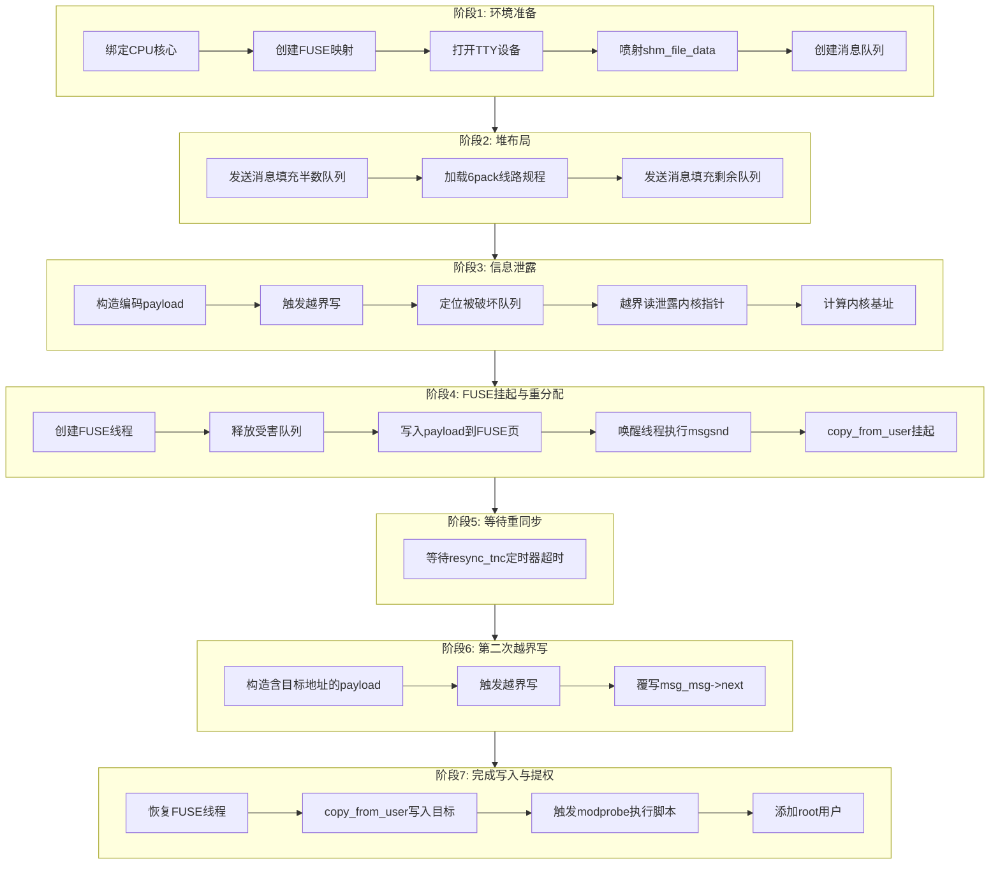
```mermaid
flowchart TD
    subgraph 阶段1[阶段1: 环境准备]
        A1[绑定CPU核心] --> A2[创建FUSE映射]
        A2 --> A3[打开TTY设备]
        A3 --> A4[喷射shm_file_data]
        A4 --> A5[创建消息队列]
    end

    subgraph 阶段2[阶段2: 堆布局]
        B1[发送消息填充半数队列] --> B2[加载6pack线路规程]
        B2 --> B3[发送消息填充剩余队列]
    end

    subgraph 阶段3[阶段3: 信息泄露]
        C1[构造编码payload] --> C2[触发越界写]
        C2 --> C3[定位被破坏队列]
        C3 --> C4[越界读泄露内核指针]
        C4 --> C5[计算内核基址]
    end

    subgraph 阶段4[阶段4: FUSE挂起与重分配]
        D1[创建FUSE线程] --> D2[释放受害队列]
        D2 --> D3[写入payload到FUSE页]
        D3 --> D4[唤醒线程执行msgsnd]
        D4 --> D5[copy_from_user挂起]
    end

    subgraph 阶段5[阶段5: 等待重同步]
        E1[等待resync_tnc定时器超时]
    end

    subgraph 阶段6[阶段6: 第二次越界写]
        F1[构造含目标地址的payload] --> F2[触发越界写]
        F2 --> F3[覆写msg_msg->next]
    end

    subgraph 阶段7[阶段7: 完成写入与提权]
        G1[恢复FUSE线程] --> G2[copy_from_user写入目标]
        G2 --> G3[触发modprobe执行脚本]
        G3 --> G4[添加root用户]
    end

    阶段1 --> 阶段2 --> 阶段3 --> 阶段4 --> 阶段5 --> 阶段6 --> 阶段7
```

### 4-4. 阶段一：环境准备

阶段一的核心目标是建立利用所需的基础运行环境，包括 CPU 亲和性设置、FUSE 子系统初始化、TTY 设备打开以及 slab 缓存预处理。这些准备工作为后续各阶段的操作奠定了坚实基础。

**CPU 绑定**：SLUB 分配器为每个 CPU 维护独立的 per-CPU 空闲对象缓存（`kmem_cache_cpu`）。为确保包含 `sixpack` 的 `netdev_t` 对象与目标 `msg_msg` 在同一 CPU 的 slab 中相邻分配，需要通过 `sched_setaffinity()` 将主进程及所有子线程绑定到 CPU 0。这一操作避免了不同 CPU 之间的 slab 缓存干扰，显著提升堆布局的确定性和可重现性。若不进行绑定，SLUB 分配器可能在不同 CPU 间分配对象，导致 `netdev_t` 和 `msg_msg` 落在不同的 slab 页面中，破坏相邻性要求。

**FUSE 初始化**：FUSE（Filesystem in Userspace）提供了一种在用户态处理文件操作请求的机制。本方案借助 FUSE 创建多个匿名内存映射，用于精细控制内核执行流。关键在于，每个 FUSE 线程准备一个连续的两页内存区域（基址为 `addr`）：

- **第一页（普通匿名映射）**：范围为 `[addr, addr + 0x1000)`，内容始终可读，不触发页面错误。
- **第二页（FUSE 文件映射）**：范围为 `[addr + 0x1000, addr + 0x2000)`，映射到 FUSE 文件描述符，用于制造可控的页面错误挂起点。

`msgsnd()` 发送数据时，起始地址为 `addr + offset`，其中 `offset` 使得 `msg_msg` 主体数据恰好跨越两个映射页。`load_msg()` 执行第一次 `copy_from_user()` 复制主体时，先复制第一页的剩余部分，然后进入第二页（FUSE 映射），触发 FUSE 用户态页错误回调，从而使内核线程挂起。这为操作者提供了在任意时刻暂停 `msgsnd()` 拷贝过程的能力，为后续的越界写入创造时间窗口。

具体而言，本阶段创建 `MAX_FUSE_COUNT`（12）个 FUSE 映射，每个映射对应一个执行 `msgsnd()` 的线程。FUSE 映射的数量决定了同时挂起的 `msgsnd()` 线程数，增加数量可提高命中概率，但也增加了系统资源的消耗。

**TTY 设备打开**：6pack 协议通过将 tty 设备的线路规程设置为 `N_6PACK` 来激活。方案中首先通过 `getpt()` 打开伪终端主端（master），再通过 `ptsname()` 获取从端（slave）名称并打开从端。主端用于向驱动写入编码后的 payload，从端用于设置线路规程。后续通过 `ioctl(slave_fd, TIOCSETD, &ldisc)` 将线路规程切换为 `N_6PACK`，触发 `sixpack_open()` 并分配包含 `struct sixpack` 的 `netdev_t` 对象。伪终端的使用使得无需真实串行硬件即可触发漏洞，大大降低了操作门槛。

**kmalloc-32 缓存喷射**：`msg_msgseg` 结构分配在 `kmalloc-32` 缓存中。为了在后续的越界读中获取内核指针以绕过 KASLR，利用程序通过 `shmget()`/`shmat()` 创建大量共享内存对象，触发 `shm_file_data` 结构的分配。`shm_file_data` 结构中包含指向内核全局变量 `init_ipc_ns` 的指针。

在 SLUB 分配器层面，这一喷射过程本质上是操纵 `kmalloc-32` 缓存的状态机。大量分配会首先耗尽当前 CPU 的 `kmem_cache_cpu->freelist`（指向当前活动 slab 中下一个空闲对象的指针）。当 `freelist` 为空后，分配器会检查当前 CPU 的 `kmem_cache_cpu->partial`（维护该 CPU 专用的部分空闲 slab 列表）。若 CPU 的 `partial` 列表也已耗尽，分配器将从 `kmem_cache_node->partial`（节点级别的部分空闲 slab 全局列表）中获取 slab，或通过 `buddy` 分配器分配全新的物理页作为新的 slab 页。通过喷射足够多的对象，可以使 `kmalloc-32` 缓存中同时存在多个 slab 页，这些页面内的对象分布呈现出可预测的排列规律，使得后续的 `msg_msgseg` 分配能够落在与特定 `shm_file_data` 相邻的位置。喷射的数量（1024 个）经过精心选择，足以跨越 CPU 本地缓存和节点缓存，迫使大量新 slab 页被分配，从而产生足够大的内存池供后续精确布局使用。

**消息队列创建**：创建两类消息队列——`MSG_QUEUE_NUM`（64）个正常队列用于堆喷和泄露，`EVIL_MSG_QUEU_NUM`（12）个队列用于 FUSE 控制的消息发送。每个队列对应一个 `msg_msg` 对象（分配在 kmalloc-4096），用于构建与 `netdev_t` 相邻的内存布局。两类队列的分工确保正常队列用于稳定的堆布局，而 FUSE 队列专注于执行流控制，互不干扰。

本阶段的时序关系如下：

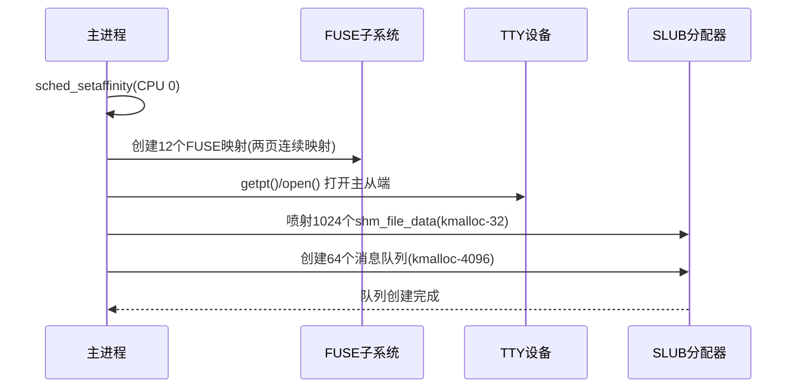
```mermaid
sequenceDiagram
    participant Main as 主进程
    participant FUSE as FUSE子系统
    participant TTY as TTY设备
    participant SLUB as SLUB分配器

    Main->>Main: sched_setaffinity(CPU 0)
    Main->>FUSE: 创建12个FUSE映射(两页连续映射)
    Main->>TTY: getpt()/open() 打开主从端
    Main->>SLUB: 喷射1024个shm_file_data(kmalloc-32)
    Main->>SLUB: 创建64个消息队列(kmalloc-4096)
    SLUB-->>Main: 队列创建完成
```

### 4-5. 阶段二：堆布局

阶段二的目标是将包含 `sixpack` 结构体的 `netdev_t` 对象放置在一个 `msg_msg` 对象之前，使得越界写入能够精确命中相邻的 `msg_msg`。这一阶段需要深度操控 SLUB 分配器的底层状态机，特别是 **`kmem_cache_cpu->freelist`（指向当前活动 slab 中下一个可用对象的指针）**、**`kmem_cache_cpu->page`（即当前的 active slab）** 以及 **`kmem_cache_cpu->partial`（CPU 专有的部分空闲 slab 列表）**。

**`netdev_t` 对象的分配方式**：`sixpack` 结构体并非单独分配，而是作为 `netdev_t` 的一部分被整体分配。`netdev_t` 的定义如下：

```c
struct netdev_t {
    char net_device[0x940];       /* 通用网络设备字段 */
    struct sixpack_t sixpack;     /* 嵌入式 sixpack 结构 */
    char pad3[0x450];             /* 对齐填充（若有） */
};
```

该结构体的实际大小约为 `0x940 + 0x270 + 0x450 = 0x1000` 字节（即 4096 字节），恰好落在一个 **kmalloc-4096** 的 slab 对象中。因此，整个 `netdev_t` 对象占用一个完整的 4KB slab 对象，`sixpack` 结构体位于该对象的偏移 `0x940` 处，而 `sixpack->cooked_buf` 是 `sixpack` 结构体内部的成员，其越界写入的目标是 **整个 `netdev_t` 对象之外的相邻 slab 对象**，而非 `sixpack` 结构体之后的结构体内部字段。`netdev_t` 对象与相邻的 `msg_msg` 对象在物理内存上紧邻排列。

具体策略分为三个连续步骤，利用 SLUB 的 LIFO（后进先出）分配特性实现确定性相邻：

**第一步：消耗本地缓存并开辟新的活动 slab**。首先向一半的消息队列（32 个）发送消息，每个消息大小约为 0xfe8 字节。这一操作会在 kmalloc-4096 中分配 `msg_msg` 对象，并在 kmalloc-32 中分配对应的 `msg_msgseg`。当这 32 个对象分配时，SLUB 分配器首先从 `kmem_cache_cpu->freelist` 中取出空闲指针进行分配。**这一轮分配的目的是耗尽当前 CPU 本地缓存中所有可用的空闲对象**，迫使分配器从 `kmem_cache_cpu->partial` 或 `kmem_cache_node->partial` 获取新的 slab，或者直接向页分配器申请新的物理页作为 **当前的 active slab（即 `kmem_cache_cpu->page`）**。此时，一个新的 slab 页成为 CPU 的活动 slab，拥有完整的空闲对象链表。

**第二步：分配 `netdev_t` 对象**。通过 `ioctl(TIOCSETD)` 设置线路规程，触发 `sixpack_open()` → `alloc_netdev()` → `kvzalloc()`，实际分配一个 `netdev_t` 结构体，大小约为 0x1000 字节，从 kmalloc-4096 中分配。在这一时刻，SLUB 分配器会优先从当前 CPU 的 **`active_slab`（即 `kmem_cache_cpu->page`）** 中分配对象。因此，`netdev_t` 对象被分配在第一步中刚开辟的新 slab 页中。`kmem_cache_cpu->freelist` 指针更新为指向该 slab 页中下一个空闲槽位。

**第三步：补喷消息队列进行微调布局**。在 `netdev_t` 对象分配完成后，立即向剩余的 32 个消息队列发送消息。此时，**SLUB 分配器仍会优先复用当前 CPU 的 `active_slab`（即包含 `netdev_t` 对象的同一 slab 页）中 `freelist` 指向的剩余空闲空间**。因此，新的 `msg_msg` 对象会依次被分配到 `netdev_t` 对象之后的空闲槽位中。由于 SLUB 采用 LIFO（后进先出）分配顺序，**最后被分配的 `msg_msg` 对象将位于 slab 页中与 `netdev_t` 对象相邻的位置**，形成理想的相邻布局。

本阶段完成后，内存布局如下：

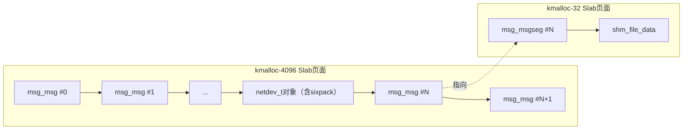
```mermaid
flowchart LR
    subgraph Slab[kmalloc-4096 Slab页面]
        A[msg_msg #0] --> B[msg_msg #1] --> C[...]
        C --> D[netdev_t对象（含sixpack）]
        D --> E[msg_msg #N]
        E --> F[msg_msg #N+1]
    end
    subgraph K32[kmalloc-32 Slab页面]
        G[msg_msgseg #N] --> H[shm_file_data]
    end
    E -.->|指向| G
```

其中 `netdev_t` 对象之后的 `msg_msg #N`（即最后分配的补喷消息）将成为后续越界读和越界写的目标对象。`sixpack->cooked_buf` 的越界写入会直接越过整个 `netdev_t` 对象的边界，进入相邻的 `msg_msg` 对象。其对应的 `msg_msgseg` 位于 kmalloc-32 中，与 `shm_file_data` 相邻。这一精确的物理相邻关系，本质上是通过操控 `kmem_cache_cpu->active_slab` 的 `freelist` 指针来达成的确定性内存布局。

### 4-6. 阶段三：信息泄露

阶段三的目标是利用第一次越界写入篡改相邻 `msg_msg` 的 `m_ts` 字段，再通过 `msgrcv()` 越界读取相邻内存，从中识别内核指针以计算内核基址。这是整个方案中突破 KASLR 保护的关键步骤，也是后续任意地址操作的基础。

**消息大小的设计考量**：消息的总大小被精心设计为略大于一个内存页（4096 字节），使得消息数据在存储时跨越两个分配——主体部分位于 `kmalloc-4096`，而超出页面的尾部数据（包含 `msg_msgseg` 头部）恰好落入 `kmalloc-32` 缓存中。这一设计确保了 `msg_msgseg` 与阶段一中喷射的 `shm_file_data` 在物理上相邻，为后续越界读泄露内核指针创造了条件。

**payload 构造**：`build_sixpack_payload(0)` 生成编码后的 payload，其中关键字节的含义如下：

- `tty_payload[0x194] = 0x90`：将 `rx_count_cooked` 的低字节设置为 0x90，使后续解码偏移指向 0x190。由于 `cooked_buf` 的有效范围为 0~399（0x18F），当 `rx_count_cooked` 达到 0x190 时，恰好越过 `cooked_buf` 的边界，开始写入 `struct sixpack` 中紧邻 `cooked_buf` 之后的 `rx_count`（偏移 0x1c8）和 `rx_count_cooked`（偏移 0x1cc）字段。
- `tty_payload[0x19a] = 0x06`：将 `rx_count_cooked` 的次低字节设置为 0x06，使偏移变为 0x696（即越过整个 `struct sixpack` 结构体区域，进入相邻的 `msg_msg` 对象）。这个偏移量精确指向相邻 `msg_msg` 结构中的 `m_ts` 字段附近，需要根据内核编译结果和结构体布局精确计算。此处的关键点是：通过 GCC 优化的特性（先更新 `rx_count_cooked = old + 3`，再写入第三个解码字节），单次 `decode_data()` 调用只能修改 `rx_count_cooked` 的一个字节。因此需要多次调用逐步将偏移从 0x190 调整到 0x696。
- `tty_payload[0x19b-0x19c] = 0xff`：修复 `msg_msg->m_list.prev` 的高两字节，确保内核链表操作正常。`m_list` 是双向链表节点，覆写其 `prev` 指针的高位可能导致内核在遍历链表时崩溃，因此需要将其恢复为正确的值。
- `tty_payload[0x1a6] = 0x20`：将 `msg_msg->m_ts` 设置为 0x2000。而0x2000 远大于消息的实际大小（约 0xfe8），使 `msgrcv()` 能够读取远超 `msg_msg` 边界的数据。

编码过程将原始 payload 转换为符合 6pack 协议格式的字节流，前缀的 `0x88` 和 `0x98` 用于将 `status` 设置为可解码状态——这是进入 `decode_data()` 的必要条件。随后通过 `write(master_fd, payload, len)` 将编码数据写入驱动，触发解码和越界写入。

**越界读操作**：写入完成后，遍历所有消息队列，对每个队列调用 `msgrcv()` 并指定 `MSG_COPY|IPC_NOWAIT` 标志（不消费消息）。正常 `msg_msg->m_ts` 值为消息大小（约 0xfe8），如果读取返回的长度异常（大于正常值），则说明该队列的 `m_ts` 已被篡改，即为受害者队列。由于 `MSG_COPY|IPC_NOWAIT` 不消费消息，即使多次尝试也不会破坏队列状态，可以进行安全的探测。

找到受害者队列后，使用更大的缓冲区（0x2000 字节）调用 `msgrcv()`，内核会按照被篡改后的 `m_ts` 从 `msg_msg` 起始地址读取数据，越过 `msg_msg` 自身的边界进入相邻内存区域。由于 `msg_msgseg` 位于 kmalloc-32，越界读取会继续从 kmalloc-32 的相邻对象中读取数据——这些对象正是阶段一中喷射的 `shm_file_data`。`shm_file_data` 结构中包含指向 `init_ipc_ns` 等内核全局变量的指针，扫描这些数据即可识别内核指针。`shm_file_data` 的布局使其在内核堆中具有较高的可识别性，其指针特征与普通数据有明显区别。

**基址计算**：通过识别 `shm_file_data` 中的内核指针（如 `init_ipc_ns`），利用其与内核基址的固定偏移量计算出内核基址，进而得到 `modprobe_path` 等关键符号的运行时地址。由于 KASLR 仅随机化内核基址，而符号之间的偏移保持不变，因此一旦获取任意内核符号的运行时地址，即可推导出所有其他符号的位置。

本阶段的关键序列如下：

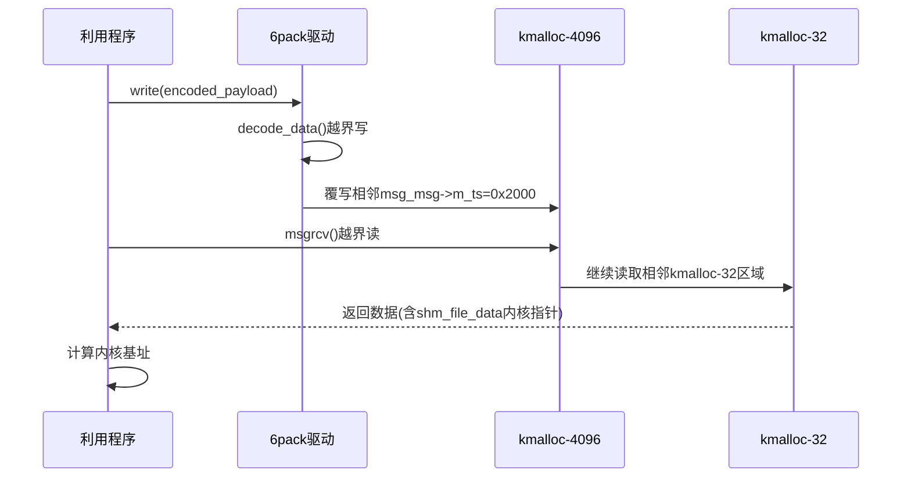
```mermaid
sequenceDiagram
    participant Exp as 利用程序
    participant Drv as 6pack驱动
    participant Slab4k as kmalloc-4096
    participant Slab32 as kmalloc-32

    Exp->>Drv: write(encoded_payload)
    Drv->>Drv: decode_data()越界写
    Drv->>Slab4k: 覆写相邻msg_msg->m_ts=0x2000
    Exp->>Slab4k: msgrcv()越界读
    Slab4k->>Slab32: 继续读取相邻kmalloc-32区域
    Slab32-->>Exp: 返回数据(含shm_file_data内核指针)
    Exp->>Exp: 计算内核基址
```

### 4-7. 阶段四：FUSE 挂起与重分配

阶段四的目标是在 `netdev_t` 对象之后重新分配一个新的 `msg_msg` 对象，并在其 `copy_from_user()` 过程中挂起，为第二次越界写入创造时间窗口。这是实现任意地址写原语的关键前置步骤，也是整个方案中最为精巧的部分。

**msg_msg 的内存布局与分段机制**：System V 消息队列中的 `msg_msg` 结构采用分段存储机制。当消息体大小超过一个内存页时，内核会分配多个 `msg_msgseg` 结构，通过 `msg_msg->next` 指针链将它们连接起来。每个 `msg_msgseg` 结构包含一个指向下一段的 `next` 指针和数据缓冲区。在本方案中，消息总大小设计为略大于一个页面（约 0xfe8 字节），使得消息体正好跨越两个分配——主体部分（包含 `msg_msg` 头部，0x30 字节）位于 `kmalloc-4096`，剩余部分（包含 `msg_msgseg` 头部，0x8 字节）位于 `kmalloc-32`。这种跨越设计使得 `copy_from_user()` 需要进行两次复制操作，为在两次复制之间进行篡改创造了机会。

**FUSE 映射的设计**：利用程序为每个 FUSE 线程准备了一个连续的两页内存区域（基址为 `addr`），其中：

- **第一页（普通匿名映射）**：范围为 `[addr, addr + 0x1000)`，内容始终可读。
- **第二页（FUSE 文件映射）**：范围为 `[addr + 0x1000, addr + 0x2000)`，映射到 FUSE 文件描述符。

消息发送时，数据起始地址为 `addr + offset`，其中 `offset` 使得 `msg_msg` 主体数据跨越两个页面：从第一页中段开始，经过第一页末尾，再进入第二页。`load_msg()` 中的第一次 `copy_from_user()`（复制 `msg_msg` 主体）在读取到第二页时，会因 FUSE 页未就绪而触发回调并挂起，此时 `msgsnd()` 的执行流被暂停。这为操作者提供了在 `msg->next` 指针被使用之前进行篡改的时间窗口。

**释放与重分配**：利用程序首先调用 `msgctl(victim_qid, IPC_RMID, NULL)` 释放阶段三中定位的受害者消息队列。该操作会释放对应的 `msg_msg`（kmalloc-4096）和 `msg_msgseg`（kmalloc-32），在 slab 中留下一个空洞（hole）。这个空洞的位置恰好与 `netdev_t` 对象相邻，因为阶段二的堆布局保证了这一点。

紧接着，利用程序向 FUSE 线程发送信号，唤醒它们执行 `msgsnd()`。`msgsnd()` 分配新的 `msg_msg` 和 `msg_msgseg` 时，SLUB 分配器会优先复用刚刚释放的空洞位置。因此，新分配的 `msg_msg` 将再次落在 `netdev_t` 对象之后，重新建立了相邻布局，为第二次越界写提供了目标。

**FUSE 线程挂起与篡改时机**：在 `msgsnd()` 执行过程中，`load_msg()` 执行第一次 `copy_from_user()`（复制消息主体），该操作因访问 FUSE 第二页而挂起。此时 `msg_msg` 对象已分配，`msg->next` 仍指向刚分配的 `msg_msgseg`，但主体复制尚未完成。利用程序利用这一挂起时间窗口执行等待 `resync_tnc` 定时器超时（阶段五）和触发第二次越界写入（阶段六）。挂起期间篡改 `msg->next` 后，恢复 FUSE 回调，第一次 `copy_from_user()` 继续完成主体复制，随后第二次 `copy_from_user()`（复制 `msg_msgseg`）将数据写入被篡改的 `next` 指向的地址，从而实现任意地址写。

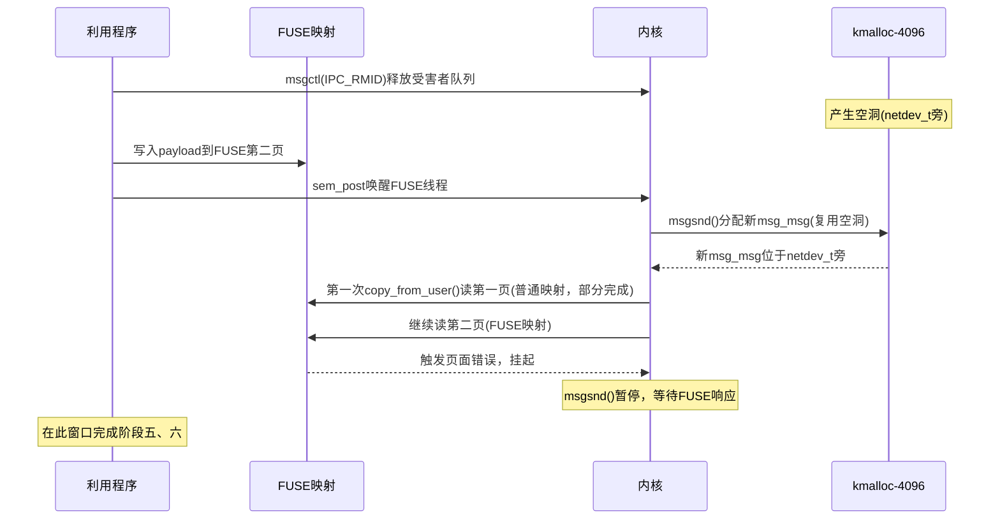
```mermaid
sequenceDiagram
    participant Exp as 利用程序
    participant FUSE as FUSE映射
    participant Kernel as 内核
    participant Slab as kmalloc-4096

    Exp->>Kernel: msgctl(IPC_RMID)释放受害者队列
    Note over Slab: 产生空洞(netdev_t旁)
    Exp->>FUSE: 写入payload到FUSE第二页
    Exp->>Kernel: sem_post唤醒FUSE线程
    Kernel->>Slab: msgsnd()分配新msg_msg(复用空洞)
    Slab-->>Kernel: 新msg_msg位于netdev_t旁
    Kernel->>FUSE: 第一次copy_from_user()读第一页(普通映射，部分完成)
    Kernel->>FUSE: 继续读第二页(FUSE映射)
    FUSE-->>Kernel: 触发页面错误，挂起
    Note over Kernel: msgsnd()暂停，等待FUSE响应
    Note over Exp: 在此窗口完成阶段五、六
```

### 4-8. 阶段五：等待重同步

阶段五的目标是等待 `resync_tnc` 定时器超时，将 `sixpack` 的内部状态重置为初始值，以便触发第二次越界写入。这一阶段看似简单，却是整个方案中不可或缺的同步环节。

**定时器机制**：在 `sixpack_open()` 中，`tnc_init()` 会启动 `resync_t` 定时器，超时时间为 `SIXP_RESYNC_TIMEOUT`（5 秒）。超时后调用 `resync_tnc()`，该函数将 `rx_count` 和 `rx_count_cooked` 重置为 0，`status` 重置为 1，并向 TNC 发送重同步命令。这个定时器是驱动用于恢复通信异常的设计，但在本方案中被用作状态重置的可靠触发点。

**等待超时**：利用程序在阶段四完成后等待约 6 秒，确保定时器已经超时并完成重置。选择 6 秒而非精确的 5 秒是为了应对系统调度延迟，保证定时器回调已经执行完毕。此时 `sixpack` 的接收状态已恢复，`rx_count_cooked = 0`，`status = 1`，与初始状态一致。这为第二次越界写入提供了干净的起始环境。

**状态重置的意义**：第一次越界写入后，`rx_count_cooked` 已被设置为 0x6XX，`status` 可能处于不可预测的状态。如果直接进行第二次越界写入，偏移量将不受控制，无法精确命中目标字段。定时器重置为第二次越界写入提供了干净的起始状态，无需重新建立 6pack 连接（即无需重新打开 TTY 设备和设置线路规程）。同时，阶段四中挂起的 `msgsnd()` 仍处于等待状态，其 `msg_msg` 对象的位置保持不变，等待后续操作。定时器回调函数中的 `mod_timer()` 会重新启动定时器，但这不影响本阶段的执行。

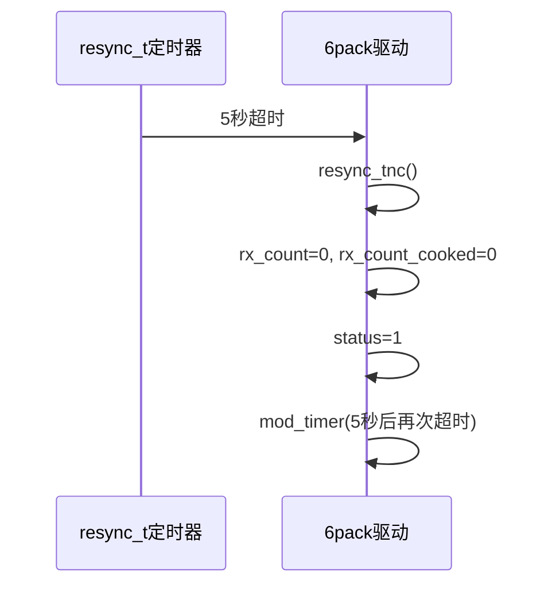
```mermaid
sequenceDiagram
    participant Timer as resync_t定时器
    participant Drv as 6pack驱动

    Timer->>Drv: 5秒超时
    Drv->>Drv: resync_tnc()
    Drv->>Drv: rx_count=0, rx_count_cooked=0
    Drv->>Drv: status=1
    Drv->>Drv: mod_timer(5秒后再次超时)
```

### 4-9. 阶段六：第二次越界写入

阶段六的目标是利用第二次越界写入，篡改阶段四中挂起的 `msg_msg` 的 `next` 指针，使其指向 `modprobe_path - 0x8`。这是实现任意地址写原语的关键步骤，直接决定了后续提权的成败。

**payload 构造**：`build_sixpack_payload(modprobe_path - 0x8)` 生成编码后的 payload。与阶段三的 payload 类似，但增加了对 `msg_msg->next` 字段的覆写：

- `tty_payload[0x1ad]` 开始的 8 个字节为目标地址 `modprobe_path - 0x8` 的字节表示。
- 选择 `modprobe_path - 0x8` 作为 `next` 值有两层考量：其一，`msg_msgseg` 结构的首字段为 8 字节的 `next` 指针，因此若 `msg_msg->next` 指向 `modprobe_path - 0x8`，则后续 `copy_from_user()` 写入的数据会从 `modprobe_path` 处开始，实现精确覆盖——前 8 字节占据 `modprobe_path - 0x8` 的位置作为伪造的 `next`，而从 `modprobe_path` 开始的剩余数据才是真正希望写入的路径字符串；其二，内核在完成对当前 `msg_msgseg` 的复制后，会读取其 `next` 指针以决定是否继续遍历后续段。由于 `modprobe_path - 0x8` 处的内容在正常情况下为零（`modprobe_path` 是全局数组，其前 8 字节通常未被使用），该处的 `next` 指针值为 NULL，从而终止遍历，避免内核继续解引用后续非法地址而导致崩溃。

**触发越界写**：通过 `write(master_fd, payload, len)` 将编码数据写入驱动。由于阶段五已重置状态，`decode_data()` 从头开始解码，`rx_count_cooked` 逐步递增至 0x190 → 0x696，越过 `cooked_buf` 边界后写入相邻的 `msg_msg` 对象。此时相邻的 `msg_msg` 正是阶段四中通过 FUSE 挂起的新对象，其 `copy_from_user()` 尚未完成，`next` 指针仍指向原本的 `msg_msgseg`。`msgsnd()` 的挂起状态意味着 `msg_msg` 对象已经分配但尚未被完全初始化，正是篡改 `next` 指针的最佳时机。

**覆写 `next` 指针**：越界写入精确命中 `msg_msg->next` 字段，将其覆盖为 `modprobe_path - 0x8`。由于 `next` 指针原本指向有效的 `msg_msgseg` 对象，覆写后内核在处理该消息的后续 `copy_from_user()` 时将误认为 `msg_msgseg` 位于目标地址处。`modprobe_path - 0x8` 处预先为零的 `next` 字段确保了遍历在写入 `modprobe_path` 后立即终止，不会触发额外的解引用。这一设计使得任意地址写入能够在不触发内核崩溃的前提下完成。

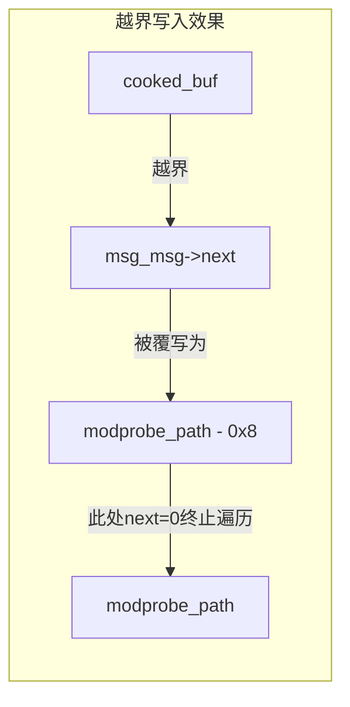
```mermaid
flowchart LR
    subgraph 越界写入效果
        A[cooked_buf] -->|越界| B[msg_msg->next]
        B -->|被覆写为| C[modprobe_path - 0x8]
        C -->|此处next=0终止遍历| D[modprobe_path]
    end
```

### 4-10. 阶段七：完成写入与提权

阶段七的目标是完成任意地址写入并触发 `modprobe_path` 的执行，实现权限提升。这是整个方案的最终阶段，将之前所有技术积累转化为实际效果。

**恢复 FUSE 线程**：主进程向 FUSE 线程发送信号，解除其页面错误挂起状态。此时 `load_msg()` 中的第一次 `copy_from_user()`（复制 `msg_msg` 主体）恢复执行。由于 `msg_msg` 主体数据跨越两个页面，在挂起前已完成了第一页剩余部分的复制，恢复后继续复制第二页（FUSE 映射）中的数据，完成主体复制。随后 `load_msg()` 进入第二次 `copy_from_user()`——将 `msg_msgseg` 对应的数据复制到 `msg_msg->next` 指向的地址。由于 `next` 在阶段六已被篡改为 `modprobe_path - 0x8`，`copy_from_user()` 将 FUSE 映射第二页中的数据写入 `modprobe_path`。该页数据中包含了利用程序预先写入的目标路径（`/home/ctf/getshell`）。写入完成后，内核继续执行 `msgsnd()` 的后续操作，最终将消息成功入队。但此时 `modprobe_path` 已被篡改，而消息本身只是用于触发写操作的载体，其具体内容并不重要。

至此，`modprobe_path` 被成功覆写为 `/home/ctf/getshell`，任意地址写原语执行完毕。`modprobe_path` 的覆写意味着内核在执行 `modprobe` 时将运行用户指定的程序，这是数据驱动提权的关键。

**触发 modprobe**：利用程序执行一个格式错误的二进制文件（`/home/ctf/fake`）。该文件的格式无效（例如头部为 `\xff\xff\xff\xff`），内核在尝试执行时会因无法识别其格式而调用 `modprobe` 来查找合适的解释器。由于 `modprobe_path` 已被篡改，内核实际执行的是 `/home/ctf/getshell`。这一机制原本用于自动加载内核模块，在本方案中被重定向为执行任意脚本。

**脚本执行**：`/home/ctf/getshell` 是一个简单的 shell 脚本，其内容为向 `/etc/passwd` 添加一个具有 root 权限的新用户 `pwned::0:0:root:/root:/bin/sh`。该脚本以 root 权限执行，成功添加后，利用程序即可通过 `su pwned` 切换到新用户，获得完整的 root 权限。添加用户而非直接修改现有用户凭证的好处在于不破坏系统原有配置，且操作简单可靠。

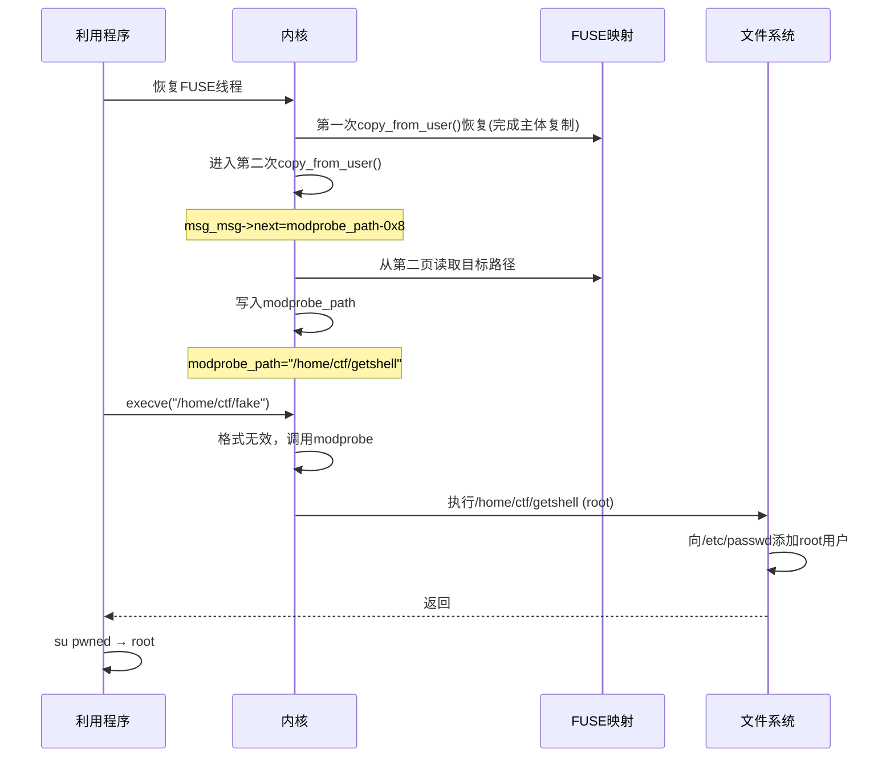
```mermaid
sequenceDiagram
    participant Exp as 利用程序
    participant Kernel as 内核
    participant FUSE as FUSE映射
    participant FS as 文件系统

    Exp->>Kernel: 恢复FUSE线程
    Kernel->>FUSE: 第一次copy_from_user()恢复(完成主体复制)
    Kernel->>Kernel: 进入第二次copy_from_user()
    Note over Kernel: msg_msg->next=modprobe_path-0x8
    Kernel->>FUSE: 从第二页读取目标路径
    Kernel->>Kernel: 写入modprobe_path
    Note over Kernel: modprobe_path="/home/ctf/getshell"

    Exp->>Kernel: execve("/home/ctf/fake")
    Kernel->>Kernel: 格式无效，调用modprobe
    Kernel->>FS: 执行/home/ctf/getshell (root)
    FS->>FS: 向/etc/passwd添加root用户
    FS-->>Exp: 返回
    Exp->>Exp: su pwned → root
```

### 4-11. 保护机制应对策略

现代 Linux 内核启用了多项安全防护机制，本方案通过以下方式逐一应对：

**KASLR（内核地址空间布局随机化）**：阶段三通过越界读泄露 `shm_file_data` 的 `init_ipc_ns` 的运行时地址，计算其与内核基址的固定偏移，从而动态确定所有内核符号的地址。这一方法不依赖硬编码基址，具备跨版本兼容性。KASLR 的随机化范围通常为 40 位地址空间，但通过泄露单个内核指针即可完全绕过。

**SMEP（管理模式执行保护）**：本方案不依赖内核代码执行，而是通过篡改内核数据（`modprobe_path`）实现提权，属于数据驱动方式，无需执行 shellcode。SMEP 仅阻止内核执行用户空间代码，对于纯数据篡改类操作没有防御效果。

**SMAP（管理模式访问保护）**：写入目标为内核空间 `modprobe_path`，`copy_from_user()` 将数据写入内核空间而非用户空间，不涉及直接访问用户空间数据。SMAP 阻止内核访问用户空间数据，而本方案的写入完全在内核空间完成。

**KPTI（内核页表隔离）**：所有操作通过合法系统调用完成，不依赖侧信道或跨权限读取。KPTI 的设计目的是缓解 Meltdown 类侧信道漏洞，对于基于系统调用的数据篡改没有影响。

**SLAB 随机化与加固**：通过大量堆喷（64 个消息队列 + 1024 个 shm 对象）提高命中概率，FUSE 挂起确保时间窗口精确。`CONFIG_SLAB_FREELIST_RANDOM` 使得空闲对象链表随机化，但大量喷射可以抵消其影响；`CONFIG_SLAB_FREELIST_HARDENED` 对指针进行加密，但不影响对象布局的可预测性。

**HARDENED_USERCOPY**：越界读发生在内核内部遍历 `msg_msgseg` 链表的过程中，而非通过 `copy_to_user` 直接访问越界地址，因此绕过该检查。该机制检查的是用户态拷贝的源/目标地址合法性，而内核内部链表遍历不受其限制。

### 4-12. 条件与局限性

#### 4-12-1. 必要条件

- **权限要求**：进程必须具有 `CAP_NET_ADMIN` 能力。可通过 `setcap cap_net_admin=eip <binary>` 预配置。该能力在容器环境中可能被限制，但在标准 Linux 发行版中可通过文件能力机制获取。
- **内核配置**：需启用 `CONFIG_6PACK` 和 `CONFIG_AX25`，多数主流发行版默认启用。若内核未编译这些模块，则漏洞不可触发。
- **TTY 设备**：系统需支持伪终端（ptmx/pts），通常默认可用。部分嵌入式系统可能精简了伪终端支持。
- **消息队列**：需启用 System V 消息队列（`CONFIG_SYSVIPC`），多数发行版默认启用。
- **FUSE 支持**：需内核支持 FUSE（`CONFIG_FUSE_FS`）且用户态可访问 `/dev/fuse`。部分加固系统可能限制非特权用户对 `/dev/fuse` 的访问。

#### 4-12-2. 局限性

- **内核版本限制**：漏洞影响 Linux 2.1.94 至 5.13.12，修复版本为 5.13.13 及以上。已打补丁的系统不受影响。
- **能力要求限制**：非特权用户默认不具备 `CAP_NET_ADMIN`，需预配置 setcap。在未配置的环境中，漏洞不可触发。
- **堆布局成功率**：SLUB 分配器行为受内存碎片等因素影响，堆喷可能无法保证精确相邻，可能需要多次重试。系统负载和并发内核活动也会影响成功率。
- **FUSE 可用性**：部分加固系统可能限制非特权用户访问 `/dev/fuse`，或通过 seccomp 禁用 FUSE 相关系统调用。
- **定时器竞争**：`resync_tnc` 定时器周期为 5 秒，若第二阶段操作未在窗口内完成，状态会被重置。通过精确时间控制和 FUSE 挂起机制可保持在窗口内，但系统调度延迟可能影响可靠性。
- **KASLR 熵**：越界读需从泄漏数据中正确识别指针，可能受噪声数据干扰。多次读取和模式匹配可提高识别准确率。

### 4-13. 总结

本章阐述的方案通过 7 个阶段将 `decode_data()` 的下标边界缺失漏洞转化为完整的权限提升能力。其核心策略可概括为：

1. **以写促读**：利用越界写篡改 `msg_msg->m_ts`，将写入转化为越界读取，从相邻的 `shm_file_data` 中泄露内核指针，突破 KASLR。这一阶段展示了如何将单一的内存写入原语扩展为信息泄露能力。

2. **释放与重分配**：释放受害者队列后，通过 FUSE 线程的 `msgsnd()` 复用空洞，确保新 `msg_msg` 再次与 `netdev_t` 对象相邻。FUSE 第二页映射实现 `copy_from_user` 的可控挂起，为越界写创造时间窗口。这一阶段体现了对 SLUB 分配器行为的深刻理解和精细控制。

3. **原语体系构建**：基于 `msg_msg->next` 的可控性，构建任意地址读（`msgrcv`+`MSG_COPY`）、任意地址写（FUSE+`msgsnd`）和任意地址释放（`msgctl`+`IPC_RMID`）三类原语，具备良好的通用性和可组合性。这些原语不仅服务于本方案路径，也可独立用于其他内核漏洞的利用场景。

4. **数据驱动提权**：篡改 `modprobe_path` 内核全局变量，利用内核自身的 `modprobe` 调用机制执行指定的脚本，完成 root 提权。整个过程不依赖 shellcode 或内核代码执行，有效绕过 SMEP/SMAP/KPTI。这种数据驱动的方式在现代内核防护环境下具有较高的通用性。

从防御视角看，在 `decode_data()` 中增加对 `rx_count_cooked + 3` 与 `sizeof(cooked_buf)` 的边界检查即可阻断漏洞。此外，对历史驱动的定期安全审计、引入 KASAN 等运行时检测工具，以及采用更健壮的校验机制，均是降低风险的有效手段。该案例提醒开发者，即使在看似稳定的历史代码中，边界条件处理的疏漏仍可能带来严重安全后果，持续的代码审查和模糊测试是防范此类问题的根本之道。

### 4-14. 测试结果

<div style="text-align: center; margin: 2rem 0;">
  
</div>

## 5. 利用思路二

### 5-1. 核心原语与依赖条件

**CVE-2021-42008** 的核心能力是通过 `decode_data()` 中缺乏边界检查的 `rx_count_cooked` 下标，实现 **可控偏移的 slab 越界写入**。操作者可以精确控制写入偏移量，从而在 `struct sixpack` 对象所在的 `netdev_t` 对象之后的相邻堆内存区域中的任意位置写入可控字节。

本方案不依赖 FUSE 或 userfaultfd 进行执行流控制，而是利用内核中其他数据结构的固有特性完成信息泄露和权限提升。具体而言，本方案通过以下方式构建完整的提权路径：

- **信息泄露**：利用第一次越界写篡改 `msg_msg->m_ts` 实现越界读，从相邻的 `tty_file_private` 结构中泄露 `tty_struct` 对象的地址。
- **内存布局操控**：利用第二次越界写篡改 `msg_msg->next`，结合 `user_key_payload` 对象的喷射，将伪造的 `tty_struct` 和 ROP 链布局到内核空间。
- **控制流劫持**：最终通过 `ioctl()` 系统调用触发伪造的函数指针，完成权限提升。

该方案需要满足以下依赖条件：

**触发权限**：进程需具备 `CAP_NET_ADMIN` 能力。在默认配置下，非特权用户不具备此能力，但可通过文件能力机制（如 `setcap cap_net_admin=eip <binary>`）静态获取。

**目标数据结构**：

- `msg_msg`：System V 消息队列消息体，位于 `kmalloc-4096`，用于构造越界读和越界释放原语。
- `tty_file_private`：位于 `kmalloc-32`，包含指向 `tty_struct` 的指针，用于泄露内核地址。
- `tty_struct`：位于 `kmalloc-1024`，包含函数表指针 `ops`（偏移 0x18），可被覆写以劫持控制流。
- `user_key_payload`：位于 `kmalloc-1024`，用于存放伪造的 `tty_struct` 和 ROP 链，并利用其生命周期实现精确的内存布局。

**辅助技术**：通过大量打开 `/dev/ptmx` 设备文件来喷射 `tty_file_private` 对象，填充 `kmalloc-32` 缓存；通过 `keyctl` 系统调用喷射 `user_key_payload` 对象，将构造的数据布置到内核空间。

**目标篡改点**：选择 `tty_struct->ops`（偏移 0x18）作为控制流劫持点，通过伪造 `ops->ioctl`（`tty_operations` 中 `ioctl` 的偏移为 0x60）指向栈迁移 gadget，将 ROP 链置于可控内存中，最终执行 `commit_creds(prepare_kernel_cred(0))` 完成提权。

### 5-2. 基于 msg_msg 的内核原语

本方案依赖 `msg_msg` 结构构建两类内核原语，其核心在于对 `msg_msg->next` 指针的控制：

**任意地址读原语**：通过越界写篡改相邻 `msg_msg` 的 `next` 指针为目标地址后，调用 `msgrcv(MSG_COPY)`。`MSG_COPY` 标志复制消息而不从队列中移除，因此原始 `msg_msg` 对象保持不变。内核沿 `next` 指针链遍历 `msg_msgseg`，从目标地址开始读取数据并复制到用户缓冲区。为了确保读取在可控范围内终止，目标地址处的第一个 8 字节（即伪造的 `msg_msgseg->next`）应为 NULL，否则内核会继续向后遍历，可能访问非法地址。

**任意地址释放原语**：通过越界写篡改 `msg_msg->next` 为目标地址后，调用 `msgctl(IPC_RMID)` 释放该消息队列。内核沿 `next` 指针链释放所有 `msg_msgseg`，将目标地址作为 `msg_msgseg` 释放，触发任意地址释放。

本方案不依赖 `msgsnd()` 的写原语进行最终提权，而是采用 **释放 + 重分配** 策略：先释放被篡改的 `msg_msg` 对象，然后通过 `user_key_payload` 喷射占用释放的 `kmalloc-1024` 空洞，将伪造数据写入目标位置。因此，本方案的核心操作是基于越界写的偏移控制能力，结合 `msg_msg` 的读和释放原语，辅以 `user_key_payload` 的重分配，完成整个提权流程。

### 5-3. 总体流程

整个利用流程划分为 9 个阶段，各阶段的核心目标和关键技术如下表所示：

| 阶段  | 目标                                                    | 关键技术                                                                                        |
| ----- | ------------------------------------------------------- | ----------------------------------------------------------------------------------------------- |
| 阶段1 | 建立运行环境，准备消息队列和 TTY 设备                   | CPU绑定、提升文件描述符限制、创建消息队列                                                       |
| 阶段2 | 使 `netdev_t` 与 `msg_msg` 相邻                         | 消息队列喷洒、6pack线路规程加载                                                                 |
| 阶段3 | 泄露 `tty_struct` 地址                                  | 越界写 → 定位受害者 → 释放非受害者队列 → 喷射 `tty_file_private` → 越界读识别 `tty_struct` 地址 |
| 阶段4 | 重新建立 `netdev_t` 与 `msg_msg` 的相邻性               | 释放受害者队列、向 evil 队列重新发送消息                                                        |
| 阶段5 | 重置 `sixpack` 状态                                     | 等待 `resync_tnc` 定时器超时                                                                    |
| 阶段6 | 第二次越界写，篡改 `msg_msg->next`                      | 指向泄露的 `tty_struct - 0x20`                                                                  |
| 阶段7 | 读取被篡改的 `msg_msg`，获取 `tty_ops` 指针             | 定位 evil 受害者 → OOB 读取 → 识别 `tty_ops` 并计算内核基址                                     |
| 阶段8 | 构造 ROP 链和伪造 `tty_struct`，喷射 `user_key_payload` | 释放 evil 队列 → 构造 payload → 用 `keyctl` 喷射                                                |
| 阶段9 | 触发 `ioctl` 系统调用，执行 ROP 链                      | 在所有 `ptmx` 文件描述符上调用 `ioctl`，触发伪造的 `ops->ioctl`                                 |

阶段间的依赖关系和数据流向如下：

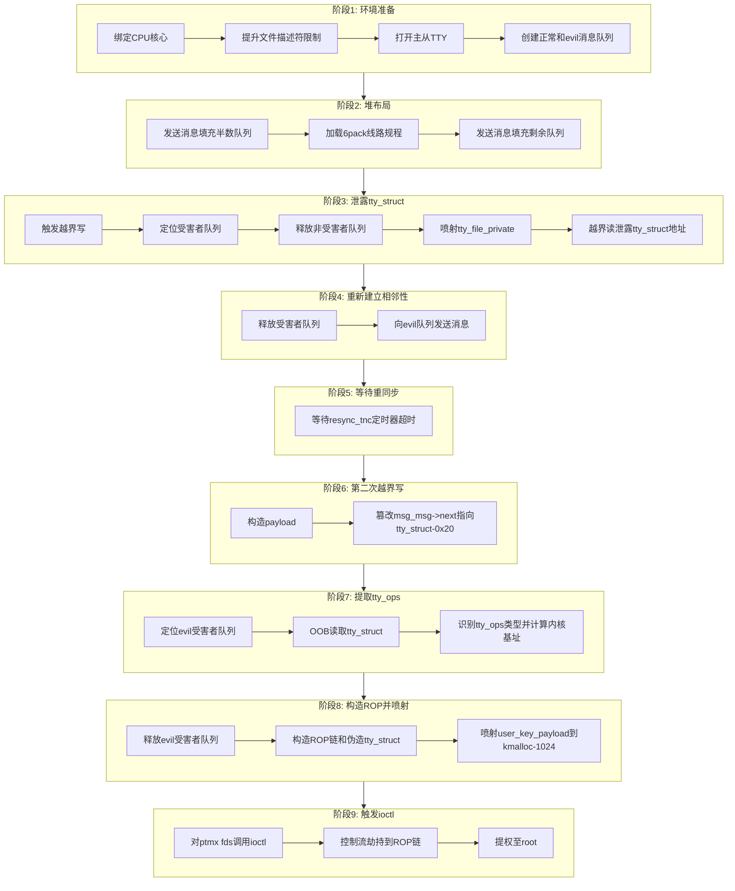
```mermaid
flowchart TD
    subgraph 阶段1[阶段1: 环境准备]
        A1[绑定CPU核心] --> A2[提升文件描述符限制]
        A2 --> A3[打开主从TTY]
        A3 --> A4[创建正常和evil消息队列]
    end

    subgraph 阶段2[阶段2: 堆布局]
        B1[发送消息填充半数队列] --> B2[加载6pack线路规程]
        B2 --> B3[发送消息填充剩余队列]
    end

    subgraph 阶段3[阶段3: 泄露tty_struct]
        C1[触发越界写] --> C2[定位受害者队列]
        C2 --> C3[释放非受害者队列]
        C3 --> C4[喷射tty_file_private]
        C4 --> C5[越界读泄露tty_struct地址]
    end

    subgraph 阶段4[阶段4: 重新建立相邻性]
        D1[释放受害者队列] --> D2[向evil队列发送消息]
    end

    subgraph 阶段5[阶段5: 等待重同步]
        E1[等待resync_tnc定时器超时]
    end

    subgraph 阶段6[阶段6: 第二次越界写]
        F1[构造payload] --> F2[篡改msg_msg->next指向tty_struct-0x20]
    end

    subgraph 阶段7[阶段7: 提取tty_ops]
        G1[定位evil受害者队列] --> G2[OOB读取tty_struct]
        G2 --> G3[识别tty_ops类型并计算内核基址]
    end

    subgraph 阶段8[阶段8: 构造ROP并喷射]
        H1[释放evil受害者队列] --> H2[构造ROP链和伪造tty_struct]
        H2 --> H3[喷射user_key_payload到kmalloc-1024]
    end

    subgraph 阶段9[阶段9: 触发ioctl]
        I1[对ptmx fds调用ioctl] --> I2[控制流劫持到ROP链]
        I2 --> I3[提权至root]
    end

    阶段1 --> 阶段2 --> 阶段3 --> 阶段4 --> 阶段5 --> 阶段6 --> 阶段7 --> 阶段8 --> 阶段9
```

### 5-4. 阶段一：环境准备

阶段一的核心目标是建立利用所需的基础运行环境，包括 CPU 亲和性设置、文件描述符限制提升、TTY 设备打开以及消息队列创建。这些准备工作为后续各阶段的操作奠定了坚实基础，确保后续堆喷和喷射操作不会因系统限制而失败。

**CPU 绑定**：SLUB 分配器为每个 CPU 维护独立的 per-CPU 空闲对象缓存（`kmem_cache_cpu`）。为确保 `sixpack` 对象与目标 `msg_msg` 在同一 CPU 的 slab 中相邻分配，需要通过 `sched_setaffinity()` 将主进程绑定到 CPU 0。若不进行绑定，SLUB 分配器可能在不同 CPU 间分配对象，导致 `netdev_t` 和 `msg_msg` 落在不同的 slab 页面中，破坏相邻性要求。

**提升文件描述符限制**：后续需要打开大量 `/dev/ptmx` 文件描述符（1024 个），默认的文件描述符限制可能不足。通过 `setrlimit(RLIMIT_NOFILE, ...)` 将软硬限制提升至 4096，确保后续喷射操作不会因达到文件描述符上限而失败。

**TTY 设备打开**：通过 `getpt()` 打开伪终端主端，并通过 `ptsname()`/`open()` 打开从端。后续通过 `ioctl(slave_fd, TIOCSETD, N_6PACK)` 设置线路规程，触发 `sixpack_open()` 分配 `netdev_t` 对象。该对象将在阶段二中用于堆布局，是整个越界写入的载体。

**消息队列创建**：创建两类消息队列——`MSG_QUEUE_NUM`（128）个正常队列用于堆喷和泄露，`EVIL_MSG_QUEU_NUM`（128）个队列用于后续重新建立相邻性。两类队列在后续阶段中的用途不同：正常队列先用于初次堆喷和信息泄露，而 evil 队列则用于第二次堆布局，以保证操作的独立性。

本阶段的时序关系如下：

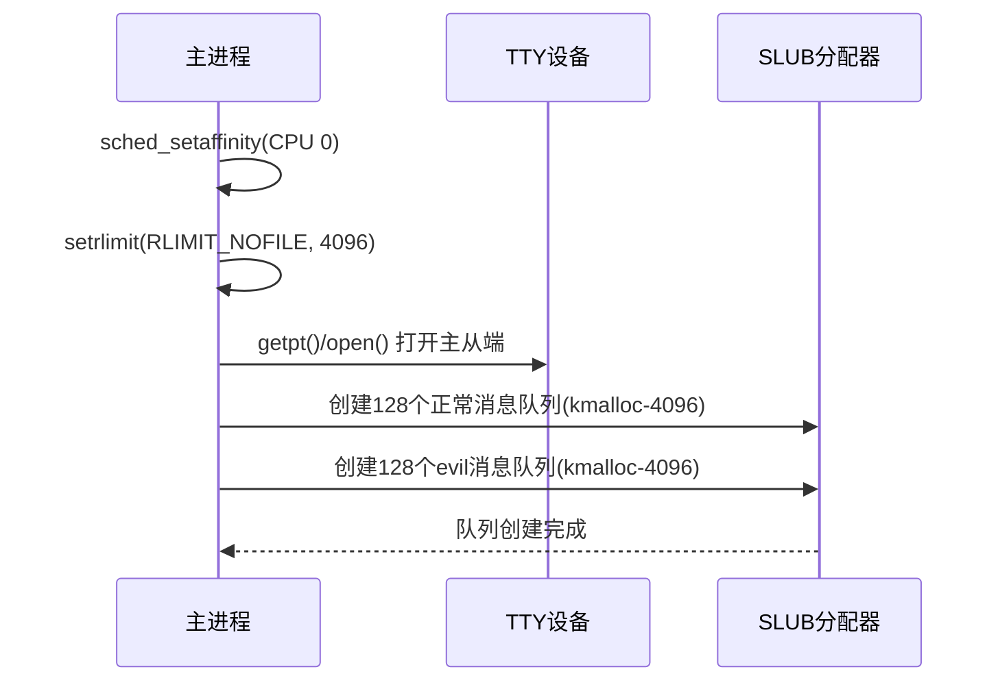
```mermaid
sequenceDiagram
    participant Main as 主进程
    participant TTY as TTY设备
    participant SLUB as SLUB分配器

    Main->>Main: sched_setaffinity(CPU 0)
    Main->>Main: setrlimit(RLIMIT_NOFILE, 4096)
    Main->>TTY: getpt()/open() 打开主从端
    Main->>SLUB: 创建128个正常消息队列(kmalloc-4096)
    Main->>SLUB: 创建128个evil消息队列(kmalloc-4096)
    SLUB-->>Main: 队列创建完成
```

### 5-5. 阶段二：堆布局

阶段二的目标是将 `netdev_t` 对象放置在两个 `msg_msg` 对象之间，使得越界写入能够精确命中相邻的 `msg_msg`。其核心是控制 SLUB 分配器的活动 slab 和空闲链表。堆布局的成功与否直接影响后续所有阶段的可行性，是整个方案中至关重要的一环。

本阶段分为三步，每一步都利用了 SLUB 的 LIFO（后进先出）分配特性：

1. **消耗本地缓存并开辟新的活动 slab**：向一半正常队列（64 个）发送消息，每个消息大小约为 0xfe8 字节。这些分配会耗尽当前 CPU 的 `kmem_cache_cpu->freelist`，迫使分配器从 `kmem_cache_cpu->partial` 或 `kmem_cache_node->partial` 获取新的 slab，或向页分配器申请新的物理页作为活动 slab。此时，新的 slab 页拥有完整的空闲对象链表。

2. **分配 `netdev_t` 对象**：通过 `ioctl(TIOCSETD)` 设置线路规程，触发 `sixpack_open()` → `alloc_netdev()` → `kvzalloc()`，实际分配一个 `netdev_t` 结构体（大小约为 0x1000 字节）。SLUB 分配器会优先从当前活动 slab（即第一步中刚开辟的 slab 页）中分配对象，因此 `netdev_t` 对象落在这个新 slab 页中。

3. **补喷消息队列进行微调布局**：在 `netdev_t` 对象分配完成后，立即向剩余的 64 个正常队列发送消息。由于 SLUB 分配器仍会优先复用当前活动 slab 中 `freelist` 指向的剩余空闲空间，新的 `msg_msg` 对象会依次分配到 `netdev_t` 对象之后的空闲槽位中，最终形成一个理想的内存布局：`netdev_t` 对象之后紧邻一个或多个 `msg_msg` 对象。

本阶段完成后，`netdev_t` 对象之后存在至少一个 `msg_msg` 对象，为后续越界写提供目标。这一布局利用了 SLUB 分配器的缓存复用特性，将随机性降到最低。

### 5-6. 阶段三：泄露 tty_struct 地址

阶段三的目标是利用第一次越界写入篡改相邻 `msg_msg` 的 `m_ts` 字段，再通过 `msgrcv()` 越界读取相邻内存，从中识别 `tty_file_private` 结构，进而获取 `tty_struct` 对象的地址。`tty_file_private` 是内核用于关联 TTY 设备与文件描述符的结构，利用调试信息可以精确了解其内存布局：

```text
pwndbg> ptype /xo struct tty_file_private
/* offset      |    size */  type = struct tty_file_private {
/* 0x0000      |  0x0008 */    struct tty_struct *tty;
/* 0x0008      |  0x0008 */    struct file *file;
/* 0x0010      |  0x0010 */    struct list_head {
/* 0x0010      |  0x0008 */        struct list_head *next;
/* 0x0018      |  0x0008 */        struct list_head *prev;
                                   /* total size (bytes):   16 */
                               } list;
                               /* total size (bytes):   32 */
                             }
```

根据布局可知，`tty` 指针位于偏移 0x00，`file` 指针位于偏移 0x08，`list` 节点位于偏移 0x10（包含 `next` 和 `prev`）。整个结构体大小为 32 字节，恰好落在 `kmalloc-32` 缓存中。

**payload 构造**：生成编码后的 payload，将 `rx_count_cooked` 逐步调整为 0x696，覆盖相邻 `msg_msg->m_ts` 为 0x2000。这一步利用 GCC 优化特性——单次 `decode_data()` 调用只能修改 `rx_count_cooked` 一个字节，因此需要多次调用逐步调整偏移，最终使得写入偏移精确到达目标位置。

**触发越界写与定位受害者**：通过 `write(master_fd, payload, len)` 发送 payload，然后遍历所有正常队列，使用 `msgrcv(MSG_COPY|IPC_NOWAIT)` 检查返回值。正常消息的 `m_ts` 值为 `MSG_SIZE`（约 0xfe8），若读取返回的长度异常（大于正常值），则说明该队列的 `m_ts` 已被篡改，即为受害者队列。`MSG_COPY|IPC_NOWAIT` 确保读取不消耗消息，因此可以安全探测而不会破坏队列状态。

**释放非受害者队列**：为了在 kmalloc-32 中制造空洞，以便后续 `tty_file_private` 喷射能够占据与 `msg_msgseg` 相邻的位置，释放所有非受害者队列。这些队列的 `msg_msgseg`（位于 kmalloc-32）被释放后，新分配的 `tty_file_private` 将优先占用这些空洞，实现物理相邻。

**喷射 tty_file_private**：通过大量打开 `/dev/ptmx` 设备文件（1024 次），内核会为每个打开的文件分配 `tty_file_private` 结构（位于 kmalloc-32）。该结构的第一个字段 `tty` 指向对应的 `tty_struct` 对象（通常分配在 kmalloc-1024 中）。由于空洞已被占据，`tty_file_private` 与 `msg_msgseg` 在物理上相邻，使后续越界读能够访问到这些新分配的对象。

**OOB 读与识别**：使用大缓冲区（0x2000 字节）调用 `msgrcv()`，内核按篡改后的 `m_ts` 读取数据，越过 `msg_msg` 边界进入 kmalloc-32。根据结构体布局，扫描返回数据时应定位以下特征：

- 偏移 0x00 处为一个指向内核空间的指针，即 `tty_struct` 地址。
- 偏移 0x08 处为另一个指向内核空间的指针，即 `file` 结构地址。
- 偏移 0x10 和 0x18 处为链表指针，对于新分配的 `tty_file_private`，`list.next` 和 `list.prev` 通常指向自身或同一对象，两者相等，可作为验证特征以滤除噪声数据。

当找到满足上述模式的数据时，提取偏移 0x00 处的指针作为 `tty_struct` 地址，该地址即为后续阶段需要泄露的目标。

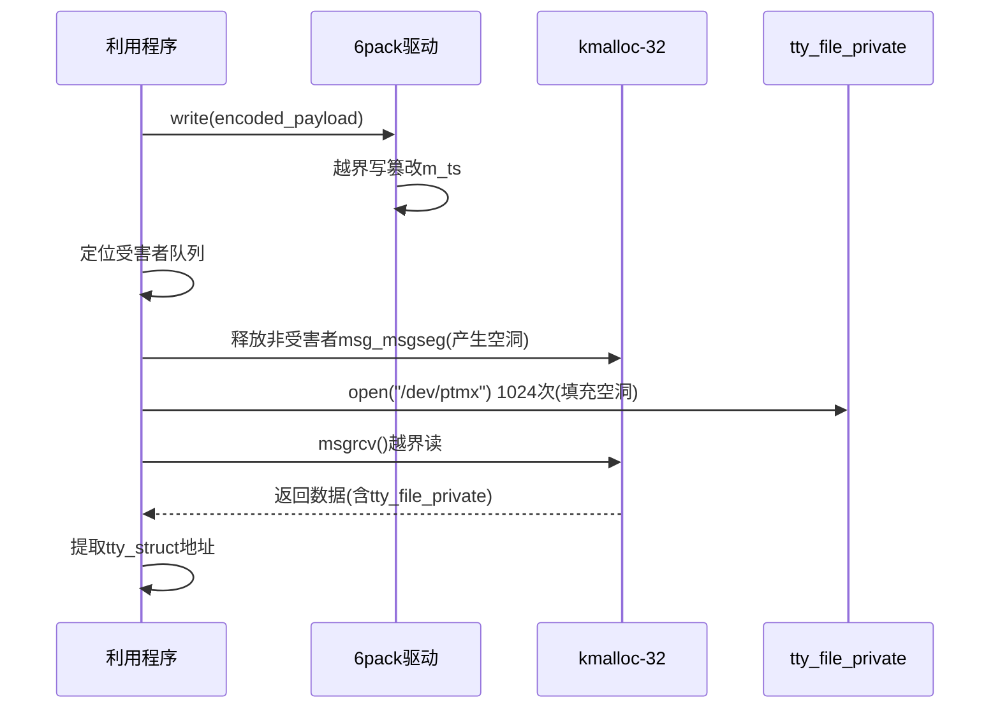
```mermaid
sequenceDiagram
    participant Exp as 利用程序
    participant Drv as 6pack驱动
    participant Slab32 as kmalloc-32
    participant TTY as tty_file_private

    Exp->>Drv: write(encoded_payload)
    Drv->>Drv: 越界写篡改m_ts
    Exp->>Exp: 定位受害者队列
    Exp->>Slab32: 释放非受害者msg_msgseg(产生空洞)
    Exp->>TTY: open("/dev/ptmx") 1024次(填充空洞)
    Exp->>Slab32: msgrcv()越界读
    Slab32-->>Exp: 返回数据(含tty_file_private)
    Exp->>Exp: 提取tty_struct地址
```

### 5-7. 阶段四：重新建立相邻性

阶段四的目标是在 `netdev_t` 对象之后重新分配一个新的 `msg_msg` 对象，为第二次越界写入准备目标。由于阶段三中相邻的 `msg_msg` 已被破坏（`m_ts` 被篡改），需要释放该对象并重新分配。

**释放受害者队列**：调用 `msgctl(victim_qid, IPC_RMID, NULL)` 释放阶段三中定位的受害者消息队列，在 kmalloc-4096 中留下空洞。此时，原本被篡改的 `msg_msg` 对象被释放，但 `sixpack` 的 `rx_count_cooked` 尚未重置，因此不能立即进行第二次越界写。

**向 evil 队列发送消息**：利用程序立即向 `EVIL_MSG_QUEU_NUM`（128）个 evil 队列发送消息。SLUB 分配器会优先复用刚刚释放的空洞，因此新分配的 `msg_msg` 将再次落在 `netdev_t` 对象之后，重新建立相邻布局。由于此时尚未重置 `sixpack` 状态，这些新对象不会立即受到影响。

### 5-8. 阶段五：等待重同步

等待 `resync_tnc` 定时器超时（约 6 秒），将 `sixpack` 的 `rx_count_cooked` 和 `status` 重置为初始值，为第二次越界写入提供干净的起始状态。这一等待确保了后续越界写的偏移从 0 开始，从而精确控制写入位置。定时器超时后，`sixpack` 的 `rx_count_cooked = 0`，`status = 1`，与初始状态一致。这一机制是驱动用于恢复通信异常的设计，在本方案中被用作状态重置的可靠触发点。

### 5-9. 阶段六：第二次越界写入

阶段六的目标是利用第二次越界写入，篡改阶段四中重新分配的 `msg_msg` 的 `next` 指针，使其指向 `victim_tty_addr - 0x20`。其中 `victim_tty_addr` 是阶段三泄露的 `tty_struct` 地址，减去 0x20 是为了使后续的 OOB 读能够完整覆盖 `tty_struct` 的内容。`user_key_payload` 的头部大小为 0x18 字节（占用一部分空间），从 `-0x20` 处开始读取可以确保获取完整 `tty_struct` 结构信息，包括偏移 0x18 处的 `ops` 指针。

**payload 构造**：`build_sixpack_payload(victim_tty_addr - 0x20)` 生成编码后的 payload，其中 `msg_msg->next` 被覆写为目标地址。payload 的构造方式与阶段三相同，但目标地址不同。

**触发越界写**：通过 `write(master_fd, payload, len)` 将编码数据写入驱动。由于阶段五已重置状态，`decode_data()` 从头开始解码，`rx_count_cooked` 逐步递增至 0x190 → 0x696，越过 `cooked_buf` 边界后写入相邻的 `msg_msg`，精确篡改其 `next` 指针。

### 5-10. 阶段七：提取 tty_ops 并计算内核基址

阶段七的目标是定位被篡改的 evil 队列，通过 OOB 读取 `tty_struct` 的内容，提取 `ops` 指针，识别其类型（`ptm_unix98_ops` 或 `pty_unix98_ops`），并据此计算内核基址。

`tty_struct` 是内核中描述 TTY 设备的核心结构，其头部布局如下：

```c
struct tty_struct {
    int magic;                      /* 偏移 0x00，魔数 */
    struct kref kref;               /* 偏移 0x04，引用计数 */
    struct device *dev;             /* 偏移 0x08，关联设备 */
    struct tty_driver *driver;      /* 偏移 0x10，TTY 驱动 */
    const struct tty_operations *ops; /* 偏移 0x18，操作函数表 */
    /* ... 更多字段 ... */
};
```

**定位 evil 受害者队列**：遍历所有 evil 队列，使用 `msgrcv(MSG_COPY|IPC_NOWAIT)` 检查返回值，若长度异常则定位为受害者队列。由于 `msg_msg->next` 已被篡改为指向 `victim_tty_addr - 0x20`，`msgrcv` 会沿着 `next` 指针链读取数据，实际返回的内容会包含 `tty_struct` 的完整数据。

**OOB 读取 tty_struct**：使用大缓冲区（0x2000 字节）调用 `msgrcv()`，内核会从 `msg_msg` 起始地址开始读取，并沿 `next` 指针遍历到 `victim_tty_addr - 0x20`，从而返回完整的 `tty_struct` 内容。

**识别 tty_ops**：在泄露的数据中，定位偏移 0x18（相对于 `tty_struct` 起始）处的指针即为 `tty_ops`。检查该指针的低 12 位是否与已知符号 `ptm_unix98_ops` 或 `pty_unix98_ops` 的低 12 位匹配，从而确定类型并计算内核基址偏移。一旦获得 `kernel_offset`，即可动态定位后续 ROP 链所需的所有 gadget 地址。

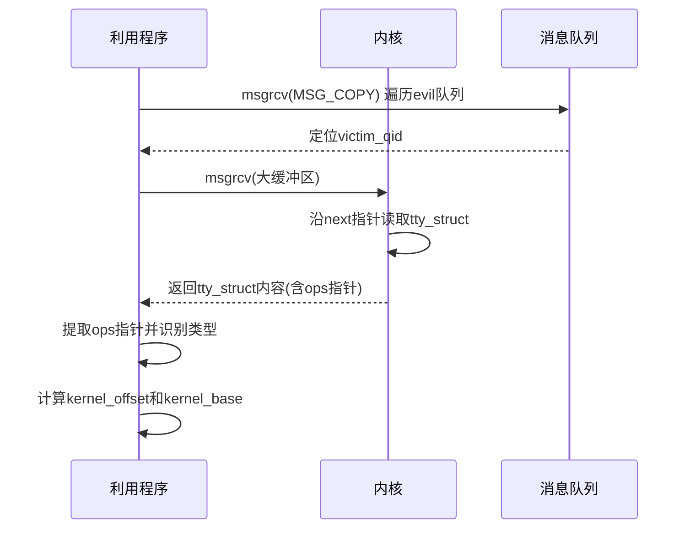
```mermaid
sequenceDiagram
    participant Exp as 利用程序
    participant Kernel as 内核
    participant Msg as 消息队列

    Exp->>Msg: msgrcv(MSG_COPY) 遍历evil队列
    Msg-->>Exp: 定位victim_qid
    Exp->>Kernel: msgrcv(大缓冲区)
    Kernel->>Kernel: 沿next指针读取tty_struct
    Kernel-->>Exp: 返回tty_struct内容(含ops指针)
    Exp->>Exp: 提取ops指针并识别类型
    Exp->>Exp: 计算kernel_offset和kernel_base
```

### 5-11. 阶段八：构造 ROP 链并喷射 user_key_payload

阶段八的目标是构造伪造的 `tty_struct` 和 ROP 链，并通过 `user_key_payload` 喷射将其写入内核空间，为控制流劫持做好准备。

**构造 payload**：利用阶段七中通过 OOB 读取获得的真实 `tty_struct` 内容作为基础，将其复制到 `key_payload` 缓冲区（从偏移 8 处开始）。这种做法保留了原始 `tty_struct` 的所有字段（包括魔数、引用计数、设备指针等），只需对关键字段进行修改即可，无需从零开始构造。

在 `key_payload` 中执行以下修改：

- 在 `key_payload` 偏移 0x20 处（对应 `tty_struct->ops` 字段）写入 `victim_tty_addr`，使伪造的 `tty_struct` 的 `ops` 指针指向自身。这意味着后续对 `ops->ioctl` 的调用将访问 `tty_struct` 自身区域内的数据，从而实现对控制流的精确操控。
- 在 `key_payload` 偏移 0x68 处写入一个栈迁移 gadget 的地址。该位置对应 `tty_operations` 中 `ioctl` 函数指针（`tty_operations->ioctl` 的偏移为 0x60，加上 `ops` 指向的基址 `victim_tty_addr`，即 `victim_tty_addr + 0x60 = key_payload + 0x68`）。当伪造的 `ops->ioctl` 被调用时，控制流将跳转到该 gadget。
- 在 `key_payload` 偏移 0x108 处（即 `victim_tty_addr + 0x100`）开始构建 ROP 链。ROP 链实现标准的权限提升流程：首先调用 `prepare_kernel_cred(0)` 获取新凭证，然后调用 `commit_creds` 应用该凭证，最后通过 `swapgs_restore_regs_and_return_to_usermode` 返回用户态并执行 `get_root_shell`。

**释放 evil 受害者队列**：调用 `msgctl(evil_qids[victim_qid], IPC_RMID, NULL)` 释放被篡改的 `msg_msg` 对象，在 kmalloc-1024 中留下空洞。此时，`tty_struct` 对象原本占用的内存位置被释放，可供后续分配使用。

**喷射 user_key_payload**：通过 `keyctl` 系统调用创建用户密钥，每个密钥的 payload 为 512 字节，内容为上述构造的 `key_payload` 缓冲区。重复喷射 `KEY_SPRAY_COUNT`（19）次，SLUB 分配器会优先复用刚刚释放的空洞，使得至少一个 `user_key_payload` 对象落于原 `tty_struct` 的位置。由于 `user_key_payload` 的数据区可控，且其大小与 `tty_struct` 相近，因此该对象实际上扮演了伪造的 `tty_struct` 角色，其内容包含修改后的 `tty_struct` 和 ROP 链。

### 5-12. 阶段九：触发 ioctl 执行 ROP 链

阶段九的目标是触发伪造的 `tty_struct->ops->ioctl`，执行栈迁移 gadget，将 RSP 迁移到 ROP 链所在的 `user_key_payload` 数据区，从而完成提权。

**触发 ioctl**：遍历所有 1024 个 `ptmx` 文件描述符，对每个描述符调用 `ioctl(fd, 0xdeadbeef, victim_tty_addr + 0x100)`。其中第三个参数作为 `ioctl` 的第三个参数，将被传递给伪造的 `ops->ioctl` 函数。由于 `ops` 指向 `victim_tty_addr`（即 `user_key_payload` 数据区），该次调用会触发预先布局的栈迁移 gadget。

**栈迁移与 ROP 执行**：伪造的 `ops->ioctl` 指向一个栈迁移 gadget。该 gadget 的功能是将当前栈指针重定向到 `victim_tty_addr + 0x100` 位置，即 ROP 链的起始地址。其实现方式为利用 `ioctl` 的第三个参数（该参数恰好包含 `victim_tty_addr + 0x100`）作为新的栈顶地址，并通过 gadget 进行栈指针的切换。成功切换栈指针后，控制流进入 ROP 链。

ROP 链执行 `prepare_kernel_cred(0)` → `commit_creds`，然后通过 `swapgs_restore_regs_and_return_to_usermode` 返回用户态，执行 `get_root_shell`，获得 root 权限。这一过程完全在内核态完成，不依赖任何用户空间代码执行。

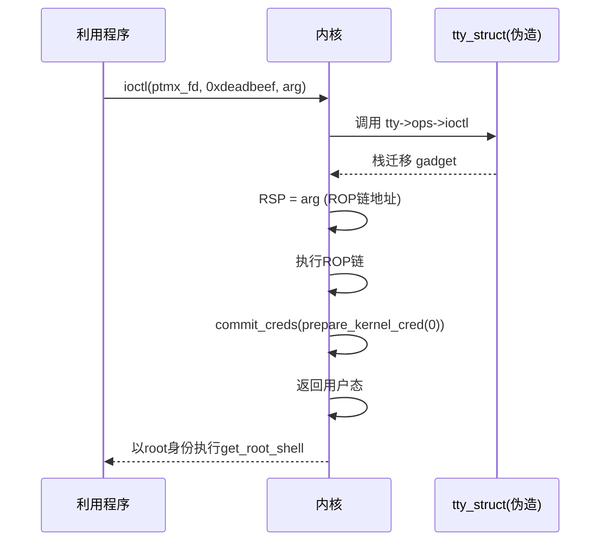
```mermaid
sequenceDiagram
    participant Exp as 利用程序
    participant Kernel as 内核
    participant TTY as tty_struct(伪造)

    Exp->>Kernel: ioctl(ptmx_fd, 0xdeadbeef, arg)
    Kernel->>TTY: 调用 tty->ops->ioctl
    TTY-->>Kernel: 栈迁移 gadget
    Kernel->>Kernel: RSP = arg (ROP链地址)
    Kernel->>Kernel: 执行ROP链
    Kernel->>Kernel: commit_creds(prepare_kernel_cred(0))
    Kernel->>Kernel: 返回用户态
    Kernel-->>Exp: 以root身份执行get_root_shell
```

### 5-13. 保护机制应对策略

本方案需应对 KASLR、SMEP、SMAP、KPTI 等保护机制，具体策略如下：

**KASLR**：阶段七通过泄露 `tty_ops` 指针并识别其类型，计算内核基址，从而动态定位所有 gadget 地址，不依赖硬编码。KASLR 的随机化范围通常为 40 位地址空间，但通过泄露单个内核指针即可完全绕过。

**SMEP**：ROP 链在内核空间执行，且最终通过 `swapgs_restore_regs_and_return_to_usermode` 返回用户态，因此 SMEP 不影响。

**SMAP**：ROP 链数据存放在 `user_key_payload` 对象中（内核空间），因此不涉及直接访问用户空间数据，SMAP 不影响。

**KPTI**：ROP 链最后调用标准的返回用户态函数，与 KPTI 兼容。

**SLAB 随机化与加固**：通过大量喷射（128 个消息队列 + 1024 个 tty_file_private + 19 个 user_key_payload）提高命中概率，可抵消 SLUB 随机化带来的不确定性。

**HARDENED_USERCOPY**：本方案未使用越界用户拷贝，而是利用 `msgrcv` 和 `keyctl` 等合法接口，绕过了该检查。

### 5-14. 条件与局限性

#### 5-14-1. 必要条件

- **权限要求**：进程必须具有 `CAP_NET_ADMIN` 能力。可通过 `setcap cap_net_admin=eip <binary>` 预配置。
- **内核配置**：需启用 `CONFIG_6PACK`、`CONFIG_AX25`、`CONFIG_SYSVIPC` 和 `CONFIG_KEYS`，多数主流发行版默认启用。
- **TTY 设备**：系统需支持伪终端（ptmx/pts），通常默认可用。
- **文件描述符限制**：需要能够将限制提升至 4096。

#### 5-14-2. 局限性

- **内核版本限制**：漏洞影响 Linux 2.1.94 至 5.13.12，修复版本为 5.13.13 及以上。
- **能力要求限制**：非特权用户默认不具备 `CAP_NET_ADMIN`，需预配置。
- **堆布局成功率**：受内存碎片影响，可能需要多次尝试。
- **gadget 依赖**：ROP 链中使用的 gadget 偏移可能随内核版本变化，需要根据目标内核精确调整。
- **定时器竞争**：需在 5 秒窗口内完成阶段六的操作。

### 5-15. 总结

本方案通过 9 个阶段将越界写漏洞转化为完整的提权能力，其核心策略可概括为：

1. **以写促读**：利用越界写篡改 `msg_msg->m_ts`，实现越界读，从相邻的 `tty_file_private` 中泄露 `tty_struct` 地址，为后续操作提供目标地址。

2. **释放与重分配**：释放受害者队列后重新发送消息，确保 `sixpack` 与新 `msg_msg` 相邻；通过 `user_key_payload` 喷射占用释放的 `kmalloc-1024` 空洞，将伪造数据结构部署到内核空间。

3. **控制流劫持**：篡改 `msg_msg->next` 指向泄露的 `tty_struct`，通过 OOB 读取获取 `tty_ops` 并计算内核基址；构造伪造的 `tty_struct` 和 ROP 链，通过 `ioctl` 触发栈迁移，执行权限提升 ROP 链。

4. **数据驱动提权**：整个过程中不依赖 shellcode 或内核代码执行，利用内核自身的函数完成提权，有效绕过 SMEP/SMAP/KPTI。

本方案不依赖 FUSE 或 userfaultfd，降低了对外部依赖的要求，但需要精确控制内存布局和 gadget 地址。该方案展示了漏洞在不同内核子系统上下文中的灵活运用，通过 TTY 子系统和密钥子系统实现了完整的提权路径。

### 5-16. 测试结果

<div style="text-align: center; margin: 2rem 0;">
  
</div>

## 6. 漏洞修复

### 6-1. 补丁概述

针对 **CVE-2021-42008** 漏洞，Linux 内核社区于 2021 年 8 月 13 日提交了修复补丁，该补丁于 2021 年 8 月 16 日被合并进入主线内核。补丁的详细信息如下：

| 项目         | 详情                                       |
| ------------ | ------------------------------------------ |
| **提交哈希** | `19d1532a187669ce86d5a2696eb7275310070793` |
| **作者**     | Pavel Skripkin                             |
| **提交时间** | 2021-08-13 18:14:33 +0300                  |
| **合并者**   | David S. Miller                            |
| **合并时间** | 2021-08-16 11:08:05 +0100                  |
| **修复版本** | Linux 5.13.13 及以上                       |
| **引入版本** | Linux 2.6.12-rc2（commit `1da177e4c3f4`）  |

该补丁由 syzbot 内核模糊测试工具发现的异常行为触发。syzbot 是一个持续运行的内核模糊测试系统，通过生成随机系统调用序列并监控内核状态来发现潜在缺陷。在测试 6pack 驱动时，syzbot 报告了 `decode_data()` 函数中存在 slab 越界写入问题，根本原因在于该函数缺少必要的边界校验逻辑。

syzbot 生成的测试用例构造了特定的输入序列，使得 `sixpack_decode()` 被反复调用，`rx_count_cooked` 持续递增并最终越过 `cooked_buf` 的边界。以下为 syzbot 报告中的关键调用栈片段：

```
BUG: KASAN: slab-out-of-bounds in drivers/net/hamradio/6pack.c:843
Write of size 1 at addr ffff888087c5544e by task kworker/u4:0/7

CPU: 0 PID: 7 Comm: kworker/u4:0 Not tainted 5.6.0-rc3-syzkaller #0
...
Workqueue: events_unbound flush_to_ldisc
Call Trace:
 __dump_stack lib/dump_stack.c:77 [inline]
 dump_stack+0x197/0x210 lib/dump_stack.c:118
 print_address_description.constprop.0.cold+0xd4/0x30b mm/kasan/report.c:374
 __kasan_report.cold+0x1b/0x32 mm/kasan/report.c:506
 kasan_report+0x12/0x20 mm/kasan/common.c:641
 __asan_report_store1_noabort+0x17/0x20 mm/kasan/generic_report.c:137
 decode_data.part.0+0x23b/0x270 drivers/net/hamradio/6pack.c:843
 decode_data drivers/net/hamradio/6pack.c:965 [inline]
 sixpack_decode drivers/net/hamradio/6pack.c:968 [inline]
```

报告中的 `Workqueue: events_unbound flush_to_ldisc` 表明触发路径是通过 TTY 行规程的数据接收流程进入 6pack 驱动的。

补丁通过增加对 `rx_count_cooked` 下标的检查，在写入操作前阻止越界发生，从而修复了该漏洞。同时，补丁中包含了 `Fixes: 1da177e4c3f4 ("Linux-2.6.12-rc2")` 标签，明确指出该漏洞自 2005 年内核首次发布以来便已存在，存续时间长达 16 年。

### 6-2. 补丁内容

修复补丁的完整 diff 如下：

```diff
diff --git a/drivers/net/hamradio/6pack.c b/drivers/net/hamradio/6pack.c
index fcf3af76b6d7b..8fe8887d506a3 100644
--- a/drivers/net/hamradio/6pack.c
+++ b/drivers/net/hamradio/6pack.c
@@ -827,6 +827,12 @@ static void decode_data(struct sixpack *sp, unsigned char inbyte)
 		return;
 	}

+	if (sp->rx_count_cooked + 2 >= sizeof(sp->cooked_buf)) {
+		pr_err("6pack: cooked buffer overrun, data loss\n");
+		sp->rx_count = 0;
+		return;
+	}
+
 	buf = sp->raw_buf;
 	sp->cooked_buf[sp->rx_count_cooked++] =
 		buf[0] | ((buf[1] << 2) & 0xc0);
```

补丁在 `decode_data()` 函数的解码写入阶段之前插入了一段边界检查逻辑。具体而言：

- **检查条件**：`sp->rx_count_cooked + 2 >= sizeof(sp->cooked_buf)`
- **检查目的**：在写入三个解码字节之前，判断当前偏移量加上即将写入的字节数（2 是第三次写入的偏移增量）是否已达到或超过缓冲区容量。

若条件成立（即写入将超出 `cooked_buf` 的 400 字节边界），函数执行以下操作：

1. 通过 `pr_err()` 输出错误日志，记录缓冲区溢出事件；
2. 将 `sp->rx_count` 重置为 0，使状态机恢复到初始状态；
3. 直接返回，跳过后续的解码写入操作。

### 6-3. 修复逻辑分析

补丁的修复逻辑体现了以下几个关键设计考量：

**边界检查的时机**：检查被放置在 `decode_data()` 函数的解码写入阶段之前，即在 `raw_buf` 已满且即将向 `cooked_buf` 写入三个字节时触发。这是最晚的可行检查点——在写入发生之前拦截，既能有效防止越界，又不会影响正常的解码流程。若检查点放置过早（如在数据累积阶段），则可能导致误报；若放置过晚（如在写入过程中），则无法有效阻止越界发生。

**检查条件的精确性**：条件 `sp->rx_count_cooked + 2 >= sizeof(sp->cooked_buf)` 中的 `+2` 对应的是第三次写入的索引增量。在 `decode_data()` 中，三次写入分别使用偏移 `rx_count_cooked`、`rx_count_cooked + 1` 和 `rx_count_cooked + 2`。检查 `+2 >= 400` 等价于检查 `rx_count_cooked >= 398`，确保第三次写入不会越过缓冲区末尾。

**状态恢复机制**：当检测到越界风险时，函数将 `sp->rx_count` 重置为 0。这一操作将驱动状态机重置到数据累积的初始阶段，使得后续输入数据需要重新累积三个字节才能再次触发解码。这种设计避免了在异常状态下继续处理数据，增强了驱动的健壮性。此处重置的是 `rx_count` 而非 `rx_count_cooked`，因为 `rx_count` 控制当前解码周期的阶段（累积还是写入），而 `rx_count_cooked` 保留当前值用于后续记录异常状态。

**错误日志的引入**：通过 `pr_err()` 输出明确的错误信息，使得管理员和开发者能够及时发现异常输入行为，便于后续的问题诊断和追踪。与 `pr_debug` 或 `pr_info` 相比，`pr_err` 级别确保日志在默认内核配置下可见，有助于快速响应。

**修复策略的通用性**：该修复方式体现了“防御性编程”原则——在处理外部输入时，始终假设输入可能是异常的，并在关键操作前执行边界检查。这种策略不仅适用于 6pack 驱动，也适用于所有处理用户可控输入的内核代码。

### 6-4. 修复效果与影响

**安全性提升**：补丁从根本上阻断了 `rx_count_cooked` 下标越界的可能性。无论输入数据如何构造，一旦 `rx_count_cooked` 接近 `cooked_buf` 的边界，驱动都会主动中止解码过程并重置状态，避免了 slab 越界写入的发生。这意味着通过该漏洞进行权限提升的路径被彻底封堵。

**兼容性保障**：补丁仅增加了 6 行代码，对正常的 6pack 协议交互流程无任何影响。在正常使用场景下，数据帧长度受物理层和协议规范限制，`rx_count_cooked` 不会触及 400 字节边界，因此边界检查条件始终为假，解码过程与修复前完全一致。任何合法的 6pack 设备通信均不受影响。

**性能影响**：增加的边界检查仅涉及一次整数比较和一次条件分支，对驱动的解码性能影响可以忽略不计。在典型的内核代码路径中，此类简单的检查通常不会成为性能瓶颈。

**向前兼容性**：补丁引入的错误日志可能会在系统日志中记录原本静默忽略的异常情况。对于运行 6pack 设备的系统，如果存在硬件故障或配置问题导致的数据异常，管理员将能通过日志及时发现，这实际上提升了系统的可观测性。

### 6-5. 补丁的启示与总结

该修复补丁以最小化的代码改动解决了存续长达 16 年的安全漏洞。其核心思路是在解码写入路径上增加一道边界检查闸门，在写入操作发生前拦截越界风险。补丁的设计体现了安全修复的经典原则——**在数据流向的边界处实施检查，尽早发现并阻止异常**。

从防御视角看，该补丁的修复方式也提示了同类漏洞的防范思路：

- **边界检查的全面性**：对于任何涉及缓冲区写入的操作，都应严格检查写入偏移是否超出缓冲区容量，尤其是在输入数据来源不可信的场景下。不应假设协议交互的“正常”行为足以防止异常输入。

- **状态机的健壮性设计**：当检测到异常状态时，应及时将状态机重置到已知安全状态，避免在异常状态下继续处理后续数据。这有助于防止单次异常引发连锁问题。

此外，该漏洞的发现与修复也再次印证了持续模糊测试在发现历史遗留安全问题中的价值。syzbot 在 16 年后依然能够发现这一深埋的漏洞，说明了自动化测试工具对保障内核安全的重要性。对于长期维护的代码库而言，持续的自动化测试和定期的安全审计是防范此类问题的根本之道。

该案例还提醒开发者：即使是在看似成熟稳定的历史代码中，边界条件处理的疏漏仍可能带来严重的安全后果。在协议驱动的设计中，实现层面的限制与协议语义之间的不一致性往往是最容易被忽视的风险点。边界检查不仅是对外部输入的防御，也是对代码假设的验证——它能确保即使在异常情况下，代码行为依然保持在可控范围内。

## 7. 免责声明

本文档旨在提供 **CVE-2021-42008** 漏洞的技术分析与教育性内容，仅供学习、研究和安全防御目的使用。作者与发布平台对以下事项声明如下：

1. **合法使用原则**：本文档中描述的任何技术细节、代码示例或利用方法仅供教育研究之用。读者不得将这些信息用于任何非法、未经授权或恶意的活动，包括但不限于未经授权的系统入侵、数据破坏、服务干扰或其他违反法律法规的行为。

2. **知识共享与责任**：本文档基于公开可获取的信息、官方漏洞公告和学术研究资料编写。作者力求确保技术内容的准确性，但不对信息的完整性、时效性或适用性作任何明示或暗示的保证。读者应自行验证信息的准确性，并在专业环境中谨慎应用。

3. **环境限制**：所有技术分析和实验应在受控的、隔离的测试环境中进行，例如使用特制的虚拟机或专用硬件。禁止在任何生产环境、公共网络或他人系统中尝试漏洞利用或相关技术。

4. **法律合规性**：读者应遵守所在国家或地区的所有适用法律法规，包括但不限于计算机安全法、数据保护法和知识产权法。任何使用本文档内容的行为所产生的法律后果，由行为者自行承担。

5. **技术中立性**：本文档对漏洞的分析保持技术中立立场，旨在促进安全社区的防御能力提升。文中提及的任何工具、技术或方法不应被视为对任何组织、产品或技术的背书或批判。

6. **更新与修正**：技术领域发展迅速，本文档内容可能随时间而过时。作者保留更新、修正或撤回文档内容的权利，不承诺另行通知。

7. **版权声明**：本文档内容受版权法保护，未经明确书面许可，不得用于商业目的。允许在注明出处的前提下进行非商业性的分享与引用。

**重要提示**：安全研究应始终遵循道德准则，以提升整体网络安全为目标。如发现安全漏洞，建议通过负责任的披露流程向相关厂商或机构报告，共同维护数字生态的安全与稳定。

---

_本文档的撰写参考了公开的漏洞公告、内核源码（Linux 5.13.12）及相关技术分析文献。所有实验均在封闭的测试环境中完成，未对任何实际系统造成影响。_

## 参考

- https://github.com/BinRacer/pwn4kernel/tree/master/src/CVE-2021-42008
- https://github.com/BinRacer/pwn4kernel/tree/master/src/CVE-2021-42008_V2
- https://syst3mfailure.io/sixpack-slab-out-of-bounds/
- https://bsauce.github.io/2021/12/09/CVE-2021-42008/
- https://github.com/0xdevil/CVE-2021-42008
- https://git.kernel.org/pub/scm/linux/kernel/git/torvalds/linux.git/commit/?id=19d1532a187669ce86d5a2696eb7275310070793
- https://nvd.nist.gov/vuln/detail/CVE-2021-42008
- https://ubuntu.com/security/CVE-2021-42008
