# 【Kernel Exploit】CVE-2021-43267 漏洞分析

## 1. 测试环境

**测试版本**：Linux-5.14.15 [内核镜像地址](https://github.com/BinRacer/pwn4kernel/blob/master/kernels/5.14.15/01/bzImage)

笔者测试的内核版本是 `Linux (none) 5.14.15 #1 SMP Sun Feb 22 17:26:18 CST 2026 x86_64 GNU/Linux`。

**编译选项**：开启`CONFIG_TIPC`、`CONFIG_TIPC_MEDIA_IB`、`CONFIG_TIPC_MEDIA_UDP`、`CONFIG_TIPC_CRYPTO`、`CONFIG_TIPC_DIAG`、`CONFIG_WANT_COMPAT_NETLINK_MESSAGES`、`CONFIG_COMPAT_NETLINK_MESSAGES`、`CONFIG_NETFILTER_NETLINK`、`CONFIG_NETFILTER_NETLINK_HOOK`、`CONFIG_NETFILTER_NETLINK_ACCT`、`CONFIG_NETFILTER_NETLINK_QUEUE`、`CONFIG_NETFILTER_NETLINK_LOG`、`CONFIG_NETFILTER_NETLINK_OSF`、`CONFIG_NF_CT_NETLINK`、`CONFIG_NF_CT_NETLINK_TIMEOUT`、`CONFIG_NF_CT_NETLINK_HELPER`、`CONFIG_NETFILTER_NETLINK_GLUE_CT`、`CONFIG_NETLINK_DIAG`、`CONFIG_ETHTOOL_NETLINK`、`CONFIG_SCSI_NETLINK`、`CONFIG_THERMAL_NETLINK`、`CONFIG_QUOTA_NETLINK_INTERFACE`、`CONFIG_MEMCG`、`CONFIG_MEMCG_KMEM`、`CONFIG_CGROUPS`、`CONFIG_THREAD_INFO_IN_TASK`、`CONFIG_SLAB_FREELIST_RANDOM`、`CONFIG_SLAB_FREELIST_HARDENED`、`CONFIG_INIT_ON_ALLOC_DEFAULT_ON`、`CONFIG_SHUFFLE_PAGE_ALLOCATOR`、`CONFIG_HARDENED_USERCOPY`、`CONFIG_FUSE_FS`、`CONFIG_USERFAULTFD`、`CONFIG_SYSVIPC`、`CONFIG_KEYS`、`CONFIG_STACKPROTECTOR`、`CONFIG_STACKPROTECTOR_STRONG`、`CONFIG_SLUB`、`CONFIG_SLUB_DEBUG`、`CONFIG_E1000`、`CONFIG_E1000E`、`CONFIG_PACKET`、`CONFIG_PACKET_DIAG`、`CONFIG_USER_NS`、`CONFIG_NET_NS`、`CONFIG_NAMESPACES`、`CONFIG_CHECKPOINT_RESTORE`、`CONFIG_IPC_NS`选项。完整配置参考[.config](https://github.com/BinRacer/pwn4kernel/blob/master/kernels/5.14.15/01/.config)。

**保护机制**：KASLR/SMEP/SMAP/KPTI

## 2. 漏洞背景

### 2-1. 漏洞概述

**CVE-2021-43267** 是 Linux 内核 TIPC（Transparent Inter-Process Communication，透明进程间通信）子系统中一处严重的堆缓冲区溢出漏洞。该漏洞位于 `net/tipc/crypto.c` 文件，源于对 `MSG_CRYPTO` 类型消息的长度验证不足。由于 TIPC 协议支持跨网络节点的进程间通信，该漏洞具有**远程可利用**特性，非授权的网络实体可通过构造特制的 TIPC 消息触发堆溢出，进而实现信息泄露、权限提升乃至远程代码执行。

该漏洞由安全研究员 Max van Amerongen 发现并公开披露，于 2021 年 11 月 2 日发布。在 CVSS 3.1 评分体系中，该漏洞获得 **9.8（严重）** 的评分，向量为 `CVSS:3.1/AV:N/AC:L/PR:N/UI:N/S:U/C:H/I:H/A:H`，意味着无需任何权限即可通过网络远程触发，且能够造成机密性、完整性和可用性的完全丧失。

### 2-2. 影响范围

根据 NVD 官方记录，**CVE-2021-43267** 影响 Linux 内核版本 **v5.10-rc1 至 v5.14.15**，**v5.14.16 及更新版本已修复**。该漏洞影响范围覆盖了自 2020 年底以来的多个内核主线版本和长期支持版本。

TIPC 模块在大多数发行版中**默认并不加载**，需要系统管理员手动配置或由用户空间程序通过 Netlink 接口动态激活。然而，非特权用户可通过 Netlink 消息启用 TIPC 的 UDP 承载媒体，从而绕过管理员预先配置的限制，这使得漏洞的触发门槛大为降低。

各主要发行版的具体受影响状态如下：

| 发行版 | 版本                         | 状态                   |
| ------ | ---------------------------- | ---------------------- |
| Ubuntu | 21.10 (impish)               | 已修复（5.13.0-23.23） |
| Ubuntu | 21.04 (hirsute)              | 已修复（5.11.0-44.48） |
| Ubuntu | 22.04 LTS (jammy) 及更新版本 | 不受影响               |
| Ubuntu | 20.04 LTS (focal) 及更早版本 | 不受影响               |
| Fedora | 34 / 35                      | 受影响                 |

由于非特权用户可动态启用所需组件，即使系统未预先配置 TIPC，恶意实体仍有可能通过网络触发该漏洞，这显著扩大了潜在受影响系统的范围。

### 2-3. 技术背景

#### 2-3-1. TIPC 协议概述

TIPC（Transparent Inter-Process Communication）是一种专为集群环境设计的通信协议，旨在提供集群内节点间高效、可靠的进程间通信能力。该协议最早由爱立信公司开发，2000 年发布首个 Linux 版本，2006 年正式合入 Linux 主线内核。

TIPC 的核心设计目标包括：

- **地址透明性**：应用程序可使用自己定义的地址进行通信，无需关心对端进程的物理位置，无需进行 DNS 查询或 IP 地址管理。
- **可靠传输**：提供面向连接的流式传输和消息传输服务，支持节点间链路的无损故障转移。
- **自动邻居发现**：节点可自动发现并建立与对端节点的通信链路。
- **服务追踪**：支持对节点、进程、套接字、地址和连接的订阅与事件通知。

TIPC 支持多种底层承载媒体，包括以太网（Ethernet）、InfiniBand 和 UDP。通过 UDP 承载，TIPC 可以在标准的 IP 网络上运行，这为远程交互提供了便利，同时也使漏洞的远程触发成为可能。

在 Linux 中，TIPC 的配置和管理通过 Netlink 接口（`AF_TIPC` 地址族）进行。用户空间程序（如 `tipc` 命令行工具）可发送 Netlink 消息来启用或禁用承载媒体、设置节点地址、管理链路等。关键的是，**非特权用户同样具备发送这些 Netlink 消息的权限**，因此无需 root 权限即可动态启用 UDP 承载，这为漏洞的利用提供了便捷的入口。理解 TIPC 的配置模型对于把握该漏洞的触发条件至关重要——因为它使得远程实体无需依赖系统管理员的预先配置即可构建完整的触发路径。

#### 2-3-2. TIPC 消息格式

TIPC 协议的数据包以**头部（header）** 起始，头部至少包含 **6 个 32 位字（word 0 至 word 5）**，采用**大端字节序（big endian）** 排列。头部之后可选地跟随消息负载（payload）。

在内核代码中，TIPC 消息头部由 `struct tipc_msg` 定义，该结构体包含 `__be32 hdr[15]` 数组，用于存储最多 15 个 32 位字。关键头部字段包括：

| 字段 | 位置（字偏移） | 说明                                                                                          |
| ---- | -------------- | --------------------------------------------------------------------------------------------- |
| `w0` | 第 0 字        | 编码 TIPC 版本、头部大小（hsz，以 4 字节为单位）、消息总大小（msz，以字节为单位）、用户标识等 |
| `w1` | 第 1 字        | 编码消息类型（msg_type），如 `MSG_CRYPTO`（值 14）                                            |
| `w2` | 第 2 字        | 链路级序列号                                                                                  |
| `w3` | 第 3 字        | 节点标识符（常为 IPv4 地址）                                                                  |
| `w4` | 第 4 字        | 下一发送包序号                                                                                |
| `w5` | 第 5 字        | 媒体 ID 和会话号                                                                              |

在 TIPC 消息头部中，与漏洞最直接相关的字段是 `w0` 中的 `hsz` 和 `msz`。`hsz` 表示头部长度，`msz` 表示整个消息的总长度（含头部）。负载数据从 `hsz` 偏移处开始，而负载的有效长度由 `msz - hsz` 决定。

TIPC 内核在接收数据包时，会首先调用 `tipc_msg_validate()` 对头部进行基本校验。该函数会检查：

- `hsz` 是否在 24~60 字节之间（合法范围）；
- `msz` 是否不小于 `hsz` 且不超过 `skb->len`（数据包实际长度）。

只有通过上述校验的消息才会被进一步处理。**然而，这些校验仅针对通用头部，并未深入检查 `MSG_CRYPTO` 类型消息负载的内部结构**，这正是漏洞得以触发的前提。换言之，内核信任了外部输入的消息头部所声明的负载尺寸，但并未验证该负载内部包含的次级长度字段是否与声明值一致。

#### 2-3-3. TIPC 加密机制

TIPC 子系统中包含加密功能（`CONFIG_TIPC_CRYPTO`），用于对节点间传输的消息进行加密保护。`MSG_CRYPTO` 消息正是这一加密机制的控制消息，用于在通信双方之间协商或传递加密相关的参数。其负载格式为 `struct tipc_aead_key`，定义于 `include/uapi/linux/tipc.h`：

```c
#define TIPC_AEAD_ALG_NAME 32

struct tipc_aead_key {
    char alg_name[TIPC_AEAD_ALG_NAME];   // 算法名称，固定32字节
    unsigned int keylen;                 // 密钥长度（字节），由发送方指定
    char key[];                          // 可变长度的密钥数据
};
```

当节点收到 `MSG_CRYPTO` 消息时，内核会提取其中的密钥信息并保存到本地 `struct tipc_crypto` 结构体中，供后续加密通信使用。提取过程涉及从消息负载中读取 `alg_name` 和 `keylen`，然后根据 `keylen` 拷贝相应的 `key` 数据。**漏洞正是出现在这一密钥提取流程中**——在分配内存并拷贝密钥数据时，未对 `keylen` 字段进行任何有效范围检查，导致拷贝操作可能超出预期的负载边界。

### 2-4. 漏洞点分析

漏洞函数为 `tipc_crypto_key_rcv()`，位于 `net/tipc/crypto.c`。该函数负责从 `MSG_CRYPTO` 消息中提取密钥并保存到接收端的加密上下文中。其核心逻辑如下：

```c
static bool tipc_crypto_key_rcv(struct tipc_crypto *rx, struct tipc_msg *hdr)
{
    struct tipc_aead_key *skey = NULL;
    u16 size = msg_data_sz(hdr);          // [1] 从头部提取负载尺寸，外部可控
    u8 *data = msg_data(hdr);             // [2] 指向 tipc_aead_key 的起始地址

    spin_lock(&rx->lock);
    /* 检查是否已存在密钥（非漏洞点） */
    if (unlikely(rx->skey || ...))
        goto exit;

    /* 根据用户提供的 size 分配堆内存 */
    skey = kmalloc(size, GFP_ATOMIC);     // [3]
    if (!skey)
        goto exit;

    /* 从消息负载中拷贝数据 */
    skey->keylen = ntohl(*(__be32 *)(data + TIPC_AEAD_ALG_NAME)); // [4] 用户可控
    memcpy(skey->alg_name, data, TIPC_AEAD_ALG_NAME);
    memcpy(skey->key,
           data + TIPC_AEAD_ALG_NAME + sizeof(__be32),
           skey->keylen);                 // [5] 溢出点：拷贝长度由用户控制

    /* 事后的一致性检查（已晚） */
    if (size != tipc_aead_key_size(skey)) {
        kfree(skey);
        skey = NULL;
        goto exit;
    }
    /* 保存 skey ... */
exit:
    spin_unlock(&rx->lock);
    return ...;
}
```

漏洞的根本原因在于：

1. **[1]** `size = msg_data_sz(hdr)` 直接取自 TIPC 头部的 `msz - hsz` 字段，该值完全由消息发送者决定，内核未对其进行任何有效范围校验。`msg_data_sz()` 的取值依赖于 `msz` 和 `hsz`，这两个值在 `tipc_msg_validate()` 中仅被检查了基本范围（如是否小于 `skb->len`），但并未限制其与负载内部结构的关系。该检查仅保证 `msz` 在物理上不超过数据包长度，但不保证 `size` 与负载内部实际包含的数据量一致。

2. **[4]** `skey->keylen` 同样从消息负载中读取，完全由发送者控制。该值在 `data + TIPC_AEAD_ALG_NAME` 处，以大端序存储，内核未进行任何边界检查便将其赋值给 `skey->keylen`。

3. **[5]** `memcpy(skey->key, data + offset, skey->keylen)` 从 `data` 指针向后拷贝 `keylen` 字节。然而，`data` 指向的实际负载数据长度（即 `skb->len - hsz`）可能远小于 `keylen`。这导致拷贝操作**越界读取**了紧跟在 `MSG_CRYPTO` 负载之后的堆内存数据，并**越界写入**到刚刚分配的 `skey` 缓冲区中，造成堆溢出。`skey->keylen` 决定了溢出的字节数，而 `size` 决定了分配的内存大小，二者共同决定了溢出的范围——从 `skey` 缓冲区的末尾向后超出 `size` 的字节数。

虽然代码在拷贝之后有一处 `size != tipc_aead_key_size(skey)` 的检查，但此时溢出已经发生，检查无法挽回。恶意构造者可以通过精心设置 `keylen` 和 `size` 使该检查通过（例如使 `size == sizeof(*skey) + keylen`），从而让恶意密钥数据得以保留，为后续利用创造条件。

`tipc_msg_validate()` 在消息接收早期仅校验了 `hsz` 和 `msz` 是否合理，并未对 `MSG_CRYPTO` 负载内部的 `keylen` 做任何限制。这意味着即便 `msz` 较小（即实际负载较短），`keylen` 仍可被设为远大于实际负载长度的值，从而在尺寸有限的 `skey` 堆块上触发大幅度的越界拷贝。这种“分配较小堆块、执行大块拷贝”的模式使得操作者能够通过调整 `size` 和 `keylen` 来精准控制溢出范围，极大增强了漏洞的可利用性。

### 2-5. 触发条件与执行路径

#### 2-5-1. 前置条件

要触发 **CVE-2021-43267**，恶意实体需要满足以下条件：

1. **目标系统运行受影响版本的 Linux 内核**（5.14.16 之前版本）。
2. **目标系统已加载 TIPC 内核模块**（或内核编译时静态包含 TIPC 支持）。若未加载，可通过触发模块自动加载（如发送特定 Netlink 消息）来满足。
3. **目标系统启用了 TIPC 的 UDP 承载媒体**：该承载可通过 Netlink 消息动态启用，且这一操作并不要求特权身份，因此即使系统初始未开启，恶意实体也可自行激活。
4. **恶意实体能够向目标系统的 TIPC UDP 端口（默认 6118）发送 UDP 数据包**，且网络路径可达。

上述条件中，**UDP 承载媒体的启用可由非特权用户完成**，这显著降低了触发门槛。通过使用 `tipc` 命令行工具（或直接构造 Netlink 消息），一个普通用户即可在本地完成承载启用。因此，该漏洞的威胁不仅存在于运行 TIPC 服务的服务器，还存在于任何可由低权限用户动态激活 TIPC UDP 承载的系统。

#### 2-5-2. 链路建立与消息发送

要成功发送 `MSG_CRYPTO` 消息，必须首先与目标节点建立合法的 TIPC 链路。TIPC 链路建立遵循协议规范的状态机转换，具体包括以下步骤：

1. **发送 `LINK_CONFIG` 包**（消息类型 `DSC_REQ_MSG`）：在网络上广播自身节点信息，使目标节点感知到该节点的存在。包中需包含有效的节点地址（通常为一个 IPv4 地址）和承载媒体类型。
2. **发送 `LINK_PROTOCOL` 包（类型 `RESET_MSG`）**：向目标节点请求链路重置，清空之前可能残留的状态，为后续连接建立做好准备。
3. **发送 `LINK_PROTOCOL` 包（类型 `STATE_MSG`）**：携带链路状态信息（如序列号、窗口大小等），完成链路参数的协商，使链路进入 `LINK_ESTABLISHED` 状态。

完成上述三步后，链路便可用于传输数据消息，此时即可发送 `MSG_CRYPTO` 包触发溢出。实践中，可通过分析正常 TIPC-over-UDP 会话的 PCAP 抓包来获取这些包的具体字段值，或直接参考协议规范构造。

#### 2-5-3. 漏洞触发包的构造

构造触发包的关键在于控制两个参数：

- **`msg_data_sz`（即 `size`）**：由 TIPC 头部的 `msz - hsz` 决定，该值将作为 `kmalloc` 的分配大小。操作者可依据目标内核对象所在的 slab 大小来设定合适的 `size`，以使 `skey` 被分配在特定尺寸的 `kmalloc` 缓存中，便于后续堆布局。
- **`tipc_aead_key->keylen`**：位于 `MSG_CRYPTO` 负载的偏移 32 字节处，表示要拷贝的密钥数据长度。操作者可将其设为远大于实际负载长度的值，以控制溢出的字节数。该值决定了从 `skey` 缓冲区向后溢出的距离，因此需要根据目标结构体中待覆盖字段的偏移来精确设定。

由于 `tipc_msg_validate()` 仅要求 `msz` 不小于 `hsz` 且不超过 `skb->len`，并未限制负载内部结构，因此可以构造出一个实际负载很短、但 `keylen` 极大的消息。当内核处理该消息时，`kmalloc(size)` 分配一个预期尺寸的堆块，然后 `memcpy` 从 `data` 开始拷贝 `keylen` 字节，由于实际负载远小于 `keylen`，拷贝会超出负载边界，读取并写入后续堆内存，从而触发溢出。

### 2-6. 潜在利用能力

基于前文对漏洞触发和溢出控制的分析，该漏洞的利用主要围绕堆布局展开。操作者可通过精确控制 `size` 和 `keylen`，将 `skey` 缓冲区放置在目标内核对象附近，并通过溢出覆盖相邻对象的关键字段。

**堆布局与溢出机制**

`skey` 缓冲区通过 `kmalloc(size, GFP_ATOMIC)` 分配，其中 `size = msg_data_sz(hdr)` 由消息头部控制。操作者可选择将 `skey` 分配在特定的 `kmalloc` 缓存中，与目标内核对象处于同一 slab 内。通过堆喷技术——在短时间内大量分配目标对象并释放部分对象以制造空洞——可以使 `skey` 的分配恰好落在某个已释放对象的位置，从而与特定对象物理相邻。

`memcpy(skey->key, data + offset, skey->keylen)` 的源数据来自消息负载之后的相邻堆内存，因此溢出写入的内容取决于相邻内存中已有的数据。通过精心布置堆布局，操作者可以间接控制写入的内容，或利用写入的值进行后续操作。

**信息泄露**

通过越界读获取相邻堆内存中的内核指针（如函数指针、堆地址），从而绕过 KASLR 等地址随机化防护。典型手法如下：

1. **堆布局**：使 `skey` 缓冲区与一个 `msg_msg`（或 `user_key_payload`）对象**物理相邻**，同时将一个目标结构体（如 `tty_struct`）布局在与 `msg_msg`/`user_key_payload` **相同的物理页面内**。`msg_msg` 和 `user_key_payload` 包含可变长度的数据区（由创建时指定的 `m_ts` 或 `datalen` 决定），其实际分配大小可在较大范围内调整，为堆布局提供了灵活性。

2. **触发溢出**：发送构造的 `MSG_CRYPTO` 消息触发堆溢出。由于 `skey` 与 `msg_msg`/`user_key_payload` 物理相邻，溢出会覆盖后者的 `m_ts`（或 `datalen`）字段，将其值改大。

3. **越界读取**：调用 `msgrcv()`（或 `keyctl_read()`）读取该消息/密钥。内核根据被篡改后的 `m_ts`/`datalen` 拷贝数据，由于该值已远大于实际数据长度，拷贝将越过原数据区边界，继续读取同一物理页面内的后续内存——即相邻的 `tty_struct` 内容，从而泄露其内部的函数指针（如 `ops`）或自引用指针，用于计算内核基址和堆地址。

这里的关键约束在于：`skey` 与 `msg_msg`/`user_key_payload` **必须物理相邻**——因为溢出写入是线性连续推进的，只有相邻才能覆盖其头部长度字段。而 `msg_msg`/`user_key_payload` 与目标结构体**只需位于同一物理页面**，因为越界读从数据区末端开始向后推进，只要不跨页即可读取同页面内任意内容。

**权限提升与代码执行**

通过覆盖相邻内核对象中的关键字段，可改变内核的安全决策。典型目标包括：

- 覆盖 `cred` 结构体中的 `uid`、`gid` 或 `capabilities` 字段，直接提升进程权限。
- 覆盖 `file` 结构体中的 `f_op` 指针，劫持文件操作函数表。
- 覆盖 `tty_struct` 中的 `ops` 指针，伪造 `tty_operations` 表以控制 `ioctl` 等函数。
- 篡改 `modprobe_path` 全局变量（位于内核数据段），当执行未知格式的二进制文件时，内核会调用 `modprobe_path` 指定的程序，从而实现任意程序执行。

结合信息泄露和精确的堆布局，可通过覆盖函数指针（如 `tty_operations->ioctl`）将控制流劫持至用户空间布置的 ROP 链，在内核态执行任意指令。

**拒绝服务**

即使不追求精确的利用，堆溢出本身也可能导致内核数据结构被破坏，引发系统崩溃或死锁。

SentinelOne 的安全公告将该漏洞评定为 **远程代码执行**。NVD 的评分同样反映了这一点，将机密性、完整性和可用性影响均标为 **"HIGH"**。公开的利用实践表明，通过对堆布局的精确操纵，该漏洞可实现越界读取和任意地址写入，进而完成权限提升。

### 2-7. 本质总结

**CVE-2021-43267** 的本质是 **Linux 内核 TIPC 子系统在处理外部输入的 MSG_CRYPTO 控制消息时，信任了用户提供的尺寸参数而未进行充分校验**，导致堆缓冲区溢出。该漏洞揭示了以下几个层面的安全问题：

1. **输入验证的缺失**：内核在处理来自网络的对端数据时，应当对所有外部输入的尺寸、偏移等参数进行严格的边界检查，尤其是涉及内存分配和数据拷贝的场景。`tipc_msg_validate()` 仅检查了通用头部，未能覆盖负载内部的特定字段，体现了“深层防御”原则的不足。

2. **协议的复杂性引入的潜在风险**：TIPC 作为一个功能丰富的集群通信协议，其代码路径长、状态机复杂，增加了出现安全缺陷的概率。2020 年引入的 `MSG_CRYPTO` 功能在没有充分安全审查的情况下上线，加剧了风险。这一案例表明，新增功能必须伴随相应的安全验证设计，尤其是在涉及外部输入的内存操作路径上。

3. **非特权用户的 Netlink 访问**：非特权用户可通过 Netlink 接口动态启用 TIPC 的 UDP 承载，使得漏洞的触发不依赖于系统管理员的预先配置，显著扩大了潜在影响范围。这提醒我们应当审慎评估 Netlink 接口的权限模型，避免将关键配置操作暴露给低权限用户。

4. **远程可利用性**：由于 TIPC-over-UDP 的支持，该漏洞的威胁模型从本地权限提升扩展到了**远程代码执行**，只需网络可达即可触发。对于一个默认不加载的模块，其远程可利用性可能被低估——非特权用户可动态激活该模块，使得默认禁用并不能完全规避风险。

从更宏观的视角来看，**CVE-2021-43267** 是内核网络子系统输入校验缺陷的典型案例，其影响范围覆盖了多个主流 Linux 发行版和内核版本，充分体现了在网络协议实现中强化安全边界校验的紧迫性和重要性。该漏洞的发现与修复提醒内核开发者：在引入新功能时，必须对外部输入进行全路径的严格验证，尤其是在内存操作的关键路径上。对于暴露在网络上的服务，即便默认未启用，也应考虑其被远程激活的风险，并采取必要的防护措施（如限制 Netlink 操作的权限或默认禁用高危功能）。

## 3. 深入分析 TIPC 协议

### 3-1. 设计哲学与目标场景

TIPC（Transparent Inter-Process Communication）是一种专为集群环境设计的通信协议，其核心设计目标是为集群内的进程提供**位置透明的通信能力**。与 TCP/IP 等通用网络协议不同，TIPC 针对集群环境的特点进行了专门优化，在保证可靠性的同时追求更低的延迟和更高的吞吐量。

TIPC 最早由电信设备制造商爱立信（Ericsson）公司开发，其第一个开源版本于 2000 年发布。2006 年，TIPC 被正式合并进入 Linux 主线内核，此后逐步在集群通信领域获得广泛应用。TIPC 的设计基于一系列针对集群环境的特定假设：

- 集群内节点间通过高带宽、低延迟的物理介质（如以太网）互联，且硬件层面已提供数据包校验；
- 集群内的节点数量相对稳定且有限；
- 集群环境通常是一个封闭的信任域，安全威胁相对互联网环境更为可控。

基于这些假设，TIPC 得以在协议设计上做出有针对性的取舍——在保证可靠性的前提下，尽可能减少不必要的协议开销，从而实现优于通用协议的通信性能。例如，TIPC 不提供端到端的流量控制（由链路层承担），也不在应用层进行重传（由链路层保证顺序和可靠交付），这些设计决策使其在集群内部通信中效率更高。

然而，TIPC 对信任域的假设在实际部署中可能被打破——当 TIPC 通过 UDP 承载跨越子网或暴露于外部网络时，原本封闭的信任边界便不复存在。**CVE-2021-43267** 正是这种信任假设失效后，输入验证不足所导致的安全问题。

### 3-2. 网络拓扑与地址模型

#### 3-2-1. 层次化的网络拓扑

TIPC 网络采用层次化的拓扑结构，从顶向下依次划分为网络（Network）、区（Zone）、集群（Cluster）和节点（Node）四个层级：

- **节点（Node）**：网络中的一台独立计算机，是 TIPC 通信的基本单元，由 32 位网络地址唯一标识。
- **集群（Cluster）**：一组直接互联（全连通）的节点集合。同一集群内所有节点的网络地址共享相同的区标识符和集群标识符。
- **区（Zone）**：一个“超级集群”，由多个全连通的集群组成。同一区内所有节点的网络地址共享相同的区标识符。
- **网络（Network）**：由多个区组成的集合，构成完整的 TIPC 通信域。

TIPC 网络地址是一个 32 位整数，分为三个字段：**区标识（8 位）、集群标识（12 位）、节点标识（12 位）**，通常表示为 `<zone.cluster.node>` 的形式。下图展示了 TIPC 网络的层次结构：

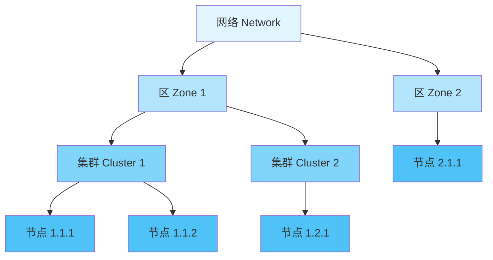

地址分配由系统管理员通过 `tipc node set addr` 命令完成，节点地址必须全局唯一。同一集群内的节点可以直接通信，跨集群的通信则需要经过区或网络层面的路由。

#### 3-2-2. 服务地址与位置透明性

TIPC 最核心的特性是**位置透明性（Location Transparency）**——应用程序无需知道通信对端的物理位置即可进行通信。这一特性通过将**网络地址**（物理位置）与**服务地址**（逻辑服务）解耦来实现。

TIPC 定义了两种类型的地址：

- **端口标识（Port Identity）**：物理地址，唯一标识一个 TIPC 端口，格式为 `<节点地址, 端口引用>`。端口删除后，其标识在很长一段时间内不会被重新分配，以防止迟到的消息误投递。
- **端口名称（Port Name）**：服务地址，标识端口所能提供的服务，格式为 `{类型, 实例}`。多个端口可以绑定到同一个名称以实现负载均衡和冗余；一个端口也可以绑定多个名称以提供多种服务。

端口通过**发布（publication）** 机制将自身的端口名称与端口标识的映射关系注册到分布式名称表中。当应用程序需要与某个服务通信时，只需查询名称表获取对应的端口标识，即可建立通信，整个过程无需关心服务实际位于哪个物理节点。名称表是分布式的，每个节点只维护自己发布的信息，但通过专门的名称表同步协议，所有节点最终会汇聚完整的名称到端口映射。

这种设计使得应用程序可以在不修改代码的情况下迁移服务，或在集群中动态添加新节点，从而极大地增强了集群的可扩展性和可维护性。

### 3-3. 消息格式与类型

#### 3-3-1. TIPC 消息结构

TIPC 消息是 TIPC 端口或子系统之间交换信息的基本单位。每个 TIPC 消息由**消息头部**和**消息负载**两部分组成，头部之后可跟随 0 至 66,000 字节的数据。

TIPC 消息头部采用固定格式，以**大端字节序**编码。头部至少包含 6 个 32 位字（word 0 至 word 5），在 Linux 内核中由 `struct tipc_msg` 结构体表示，该结构体包含 `__be32 hdr[15]` 数组，最多可存储 15 个 32 位字。实际头部长度由 `hsz` 字段指定，可根据需要扩展。

关键头部字段的功能如下：

| 字段                         | 位置   | 说明                                                                            |
| ---------------------------- | ------ | ------------------------------------------------------------------------------- |
| `版本 / 头部大小 / 消息大小` | word 0 | 编码 TIPC 协议版本、头部长度（hsz，以 4 字节为单位）和消息总长度（msz，含头部） |
| `消息类型`                   | word 1 | 标识消息的类型，如 `MSG_CRYPTO`、`LINK_CONFIG`、`LINK_PROTOCOL` 等              |
| `序列号`                     | word 2 | 链路级别的序列号，用于消息排序和重传控制                                        |
| `节点标识`                   | word 3 | 标识发送或目标节点的网络地址                                                    |
| `确认号`                     | word 4 | 下一期望接收的包序号                                                            |

与漏洞最直接相关的字段是 `w0` 中的 `hsz` 和 `msz`：`hsz` 表示头部长度，`msz` 表示整个消息的总长度。负载数据从 `hsz` 偏移处开始，负载的有效长度由 `msz - hsz` 决定。内核在 `tipc_msg_validate()` 中会检查 `hsz` 是否在 24~60 之间，以及 `msz` 是否大于等于 `hsz` 且不超过 `skb->len`，但这些检查仅针对头部本身，并不涉及负载内部结构。

下图展示了 TIPC 消息的通用结构，以及漏洞相关的 `MSG_CRYPTO` 消息中负载的布局：

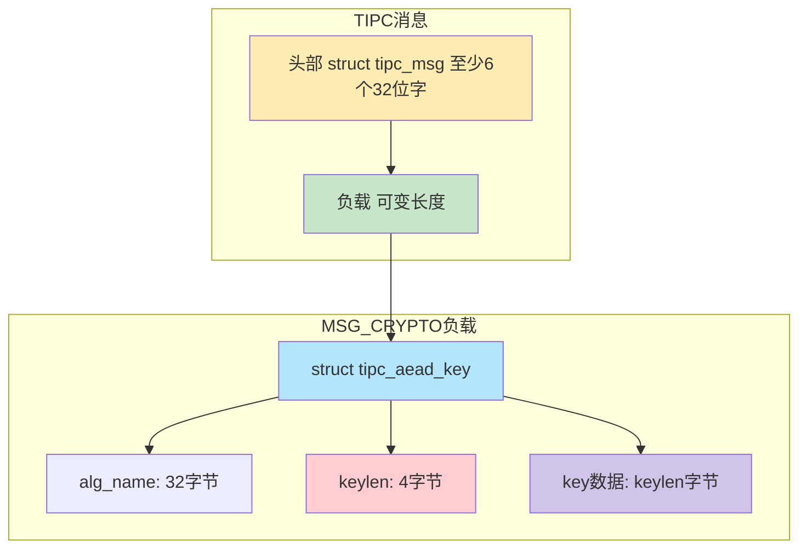

#### 3-3-2. 消息分类

TIPC 消息从功能上可分为两大类：

1. **负载消息（Payload Message）**：承载应用程序数据，是用户通信的实际载体。负载消息进一步可分为面向无连接的消息（数据报、多播）和面向连接的消息（流式或消息式传输）。这些消息的 `msg_user` 字段值通常为 `TIPC_LOW_IMPORTANCE` 至 `TIPC_CRITICAL_IMPORTANCE` 的数值。
2. **内部消息（Internal Message）**：由 TIPC 子系统内部生成和消费，用于链路管理、名称表同步、拓扑跟踪等控制功能。其 `msg_user` 字段取值为 `LINK_CONFIG`、`LINK_PROTOCOL`、`NAME_DISTRIBUTOR`、`MSG_CRYPTO` 等特定标识。漏洞所涉及的 `MSG_CRYPTO` 即属于此类消息，用于节点间加密密钥的协商与传递。

内部消息的解析和处理路径与负载消息有所不同，通常直接由相应的内核模块处理，不经过用户空间套接字。正是这种“内部”身份，使得 `MSG_CRYPTO` 消息在接收路径中绕过了部分用户层检查，直接到达加密子系统的处理函数。

### 3-4. 链路管理与状态机

#### 3-4-1. 链路的概念

TIPC 中，**链路（Link）** 是连接两个节点的通信通道，负责消息传输、顺序保证、重传等任务。一对节点之间可以建立多条链路：同一承载媒体上可建立一条链路，不同承载媒体上可建立多条链路，以 **负载共享（Load Sharing）**或 **主备（Active/Standby）** 方式工作。

链路提供了以下关键功能：

- **消息分片与重组（Fragmentation/Reassembly）**：将超过承载媒体 MTU 的长消息拆分为多个包传输，在接收端重组。
- **消息捆绑（Bundling）**：将多个小消息聚合为一个数据包发送，减少网络开销。
- **拥塞控制（Congestion Control）**：当承载媒体或链路无法立即发送数据包时，启动拥塞控制机制。
- **序列号与重传控制（Sequence and Retransmission Control）**：确保消息按序到达，并在丢包时进行重传。

每条链路都有一个状态机，维护其当前状态以及发送/接收序列号、窗口大小等参数。链路状态的变化由收到特定的链路协议消息或超时事件驱动。

#### 3-4-2. 链路建立过程

TIPC 链路建立遵循严格的状态机转换。下图展示了链路建立的完整流程，包括节点发现、重置和激活三个主要阶段：

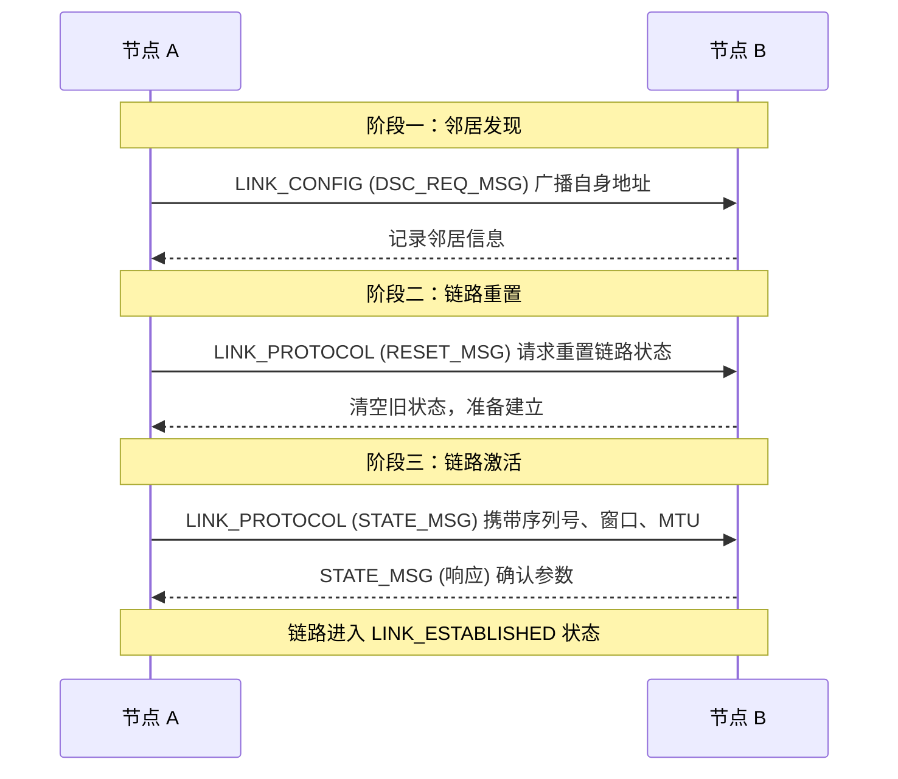

各步骤的详细说明如下：

1. **邻居发现**：节点通过其配置的承载媒体定期广播 **`LINK_CONFIG`** 消息（消息类型 `DSC_REQ_MSG`）。该消息包含发送节点的网络地址和承载媒体信息，使网络中的其它节点能够感知到该节点的存在。当一个节点收到来自未知节点的 `LINK_CONFIG` 消息时，即认为发现了一个新的邻居，并将其记录到本地邻居表中。

2. **链路建立请求**：发现邻居后，节点向对端发送 **`LINK_PROTOCOL`** 消息，类型为 **`RESET_MSG`**。该消息用于请求重置链路状态，清除之前可能残留的通信状态（如旧的序列号、未确认的消息等），为新的链路建立做好准备。接收到 `RESET_MSG` 的节点会清空与该链路相关的所有状态信息，并回复一个确认 RESET 消息。

3. **链路激活**：链路双方交换 **`LINK_PROTOCOL`** 消息，类型为 **`STATE_MSG`**。该消息携带链路状态信息，包括：
    - **当前序列号**：决定消息的起始编号，用于后续消息排序。
    - **接收窗口大小**：控制流量，避免接收端溢出。
    - **链路 MTU**：通过协商确定最大传输单元，以适配底层承载。

当双方完成状态信息的交换并达成一致后，链路进入 **`LINK_ESTABLISHED`** 状态，此时即可开始传输负载消息。

#### 3-4-3. 链路状态机

TIPC 链路在其生命周期中经历多个状态，下图展示了核心状态转换：

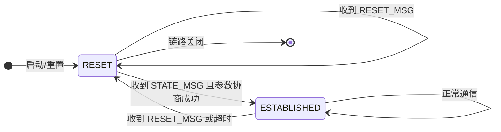

- **RESET 状态**：链路处于复位状态，尚未建立通信。节点在此状态下等待对端的 `STATE_MSG` 来激活链路。在此状态下，节点不会发送用户数据，仅处理链路协议消息。
- **ESTABLISHED 状态**：链路已正常建立，可以进行消息传输。在此状态下，链路持续进行连续性检查（见下文）以监控健康状态。
- 当链路发生故障（如未收到预期确认或探测超时）或收到 `RESET_MSG` 时，链路会回退到 RESET 状态，重新开始建立过程。

#### 3-4-4. 链路维护与故障恢复

链路建立后，TIPC 通过**连续性检查（Continuity Check）** 机制持续监控链路健康状态。链路端点定期（默认每 200ms）交换探测消息（即特殊的 `STATE_MSG`），若在规定容差时间内（默认为 1500ms）未收到对端的任何响应，则判定链路失效。

当链路发生故障时，TIPC 提供**无损故障转移（Loss-free Failover）** 能力：若存在冗余链路（优先级较低的备用链路），TIPC 将流量切换到备用链路，切换过程中保持消息的顺序性和完整性，确保应用程序无感知。这种机制依赖于链路间的状态同步，以及发送队列中的消息可以被重新调度。

### 3-5. 承载层与配置管理

#### 3-5-1. 承载层（Bearer Layer）

TIPC 的**承载层（Bearer Layer）** 负责适配底层物理或逻辑传输介质。承载（Bearer）是物理或逻辑传输媒体的实例，如以太网接口、InfiniBand 端口或 UDP 套接字，TIPC 消息通过承载在节点间传输。

TIPC 支持多种承载媒体类型：

- **以太网（Ethernet）**：直接基于以太网帧传输 TIPC 消息，延迟最低，适用于同一广播域内的节点。
- **InfiniBand**：面向高性能计算集群的承载媒体，提供更高的带宽和更低的延迟。
- **UDP**：将 TIPC 消息封装在 UDP 数据报中传输，便于跨越 IP 网络，是唯一支持跨子网通信的承载类型。

每种承载媒体都有其特定的**媒体地址格式**。例如，以太网媒体使用 MAC 地址，UDP 媒体使用 IP 地址和端口号。TIPC 通过承载层屏蔽底层媒体的差异，向上层提供统一的传输服务。承载层还负责将 TIPC 消息发送到指定目的地，以及将接收到的数据包传递给 TIPC 主接收函数 `tipc_rcv()`。

#### 3-5-2. TIPC 配置管理工具

TIPC 的配置和管理通过用户空间的 `tipc` 命令行工具完成，该工具通过 Netlink 接口（`AF_TIPC` 地址族）与内核 TIPC 子系统进行交互。`tipc` 工具是 `iproute2` 软件包的一部分，提供了完整的 TIPC 协议栈配置能力。

**命令层级结构**：

```bash
tipc [ OPTIONS ] COMMAND [ ARGUMENTS ]
```

其中 `COMMAND` 为以下六个子命令之一：

| 子命令      | 功能                         |
| ----------- | ---------------------------- |
| `bearer`    | 显示或修改 TIPC 承载配置     |
| `link`      | 显示或修改 TIPC 链路参数     |
| `media`     | 显示或修改 TIPC 媒体类型配置 |
| `nametable` | 显示 TIPC 名称表内容         |
| `node`      | 显示或修改 TIPC 节点参数     |
| `socket`    | 显示 TIPC 套接字信息         |

**启用 UDP 承载**：

```bash
tipc bearer enable media udp name NAME localip LOCALIP [ localport LOCALPORT ] [ remoteip REMOTEIP ]
```

关键参数说明：

| 参数        | 说明                                                 |
| ----------- | ---------------------------------------------------- |
| `name`      | UDP 承载的逻辑名称标识符，用于后续引用               |
| `localip`   | 本地 IPv4/IPv6 地址，UDP 套接字绑定的地址            |
| `localport` | 本地 UDP 端口（默认 6118）                           |
| `remoteip`  | 远端 IP 地址（未指定时为多播模式，使用 224.0.0.0/8） |

**设置节点地址**：

```bash
tipc node set addr ADDRESS
```

TIPC 逻辑地址格式为 `<zone.cluster.node>`，例如 `1.1.1`。

**验证链路状态**：

```bash
tipc link list
tipc link statistics show link LINK
```

#### 3-5-3. 配置接口的权限与安全

`tipc` 工具通过 Netlink 接口与内核通信。Netlink 是一种基于 socket 的内核与用户空间通信机制，其权限检查取决于具体的 Netlink 协议族。对于 TIPC，**非特权用户同样具备发送这些 Netlink 消息的权限**，因此无需 root 权限即可动态启用 UDP 承载、设置节点地址等。

这一设计决策虽然为系统管理提供了便利，但也意味着低权限用户可能绕过管理员预设的安全边界，为后续漏洞触发创造条件。在 **CVE-2021-43267** 的上下文中，即使系统管理员未预先配置 TIPC，恶意实体仍可通过简单的 `tipc bearer enable` 命令激活 UDP 承载，从而打开远程交互通道。这是该漏洞能够被远程利用的重要促成因素。

### 3-6. 数据包处理路径

理解 TIPC 数据包从网络接收到触发漏洞函数的完整处理流程，对于把握漏洞的触发条件至关重要。本节以 UDP 承载为例，剖析从 UDP 套接字接收数据包到最终调用 `tipc_crypto_key_rcv()` 的整个函数调用链，并标注各层的关键检查点。

#### 3-6-1. 整体处理流程

当 TIPC 通过 UDP 承载运行时，TIPC 消息被封装在 UDP 数据报中发送至目标节点的 UDP 端口（默认 6118）。整个处理链路可划分为以下阶段：

1. **UDP 层接收**：`udp_rcv()` → `__udp4_lib_rcv()` 等，完成 UDP 头部校验、查找对应的 UDP 套接字。
2. **TIPC 接收入口**：`tipc_rcv()` 作为 TIPC 协议的主入口，进行消息验证和节点查找。
3. **链路层处理**：`tipc_link_rcv()` 处理链路协议消息和数据消息，确保顺序和窗口。
4. **数据分发**：`tipc_data_input()` 根据消息类型将数据分发到不同处理函数。
5. **加密消息处理**：`tipc_crypto_msg_rcv()` 处理 `MSG_CRYPTO` 类型消息，最终调用 `tipc_crypto_key_rcv()` 提取密钥。

下面的序列图展示了从 UDP 接收到漏洞函数调用的完整路径：

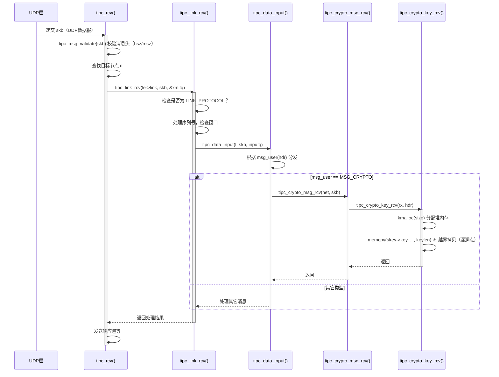

#### 3-6-2. 关键函数实现细节

以下按调用顺序列出各关键函数的实现，并注释其与漏洞相关的检查点。

**UDP 层接收函数**

```c
int udp_rcv(struct sk_buff *skb)
{
    return __udp4_lib_rcv(skb, &udp_table, IPPROTO_UDP);
}
```

```c
int __udp4_lib_rcv(struct sk_buff *skb, struct udp_table *udptable,
                   int proto)
{
    struct sock *sk;
    struct udphdr *uh;
    unsigned short ulen;

    // 校验 UDP 头部是否存在
    if (!pskb_may_pull(skb, sizeof(struct udphdr)))
        goto drop;

    uh = udp_hdr(skb);
    ulen = ntohs(uh->len);
    if (ulen > skb->len)
        goto short_packet;

    // 查找对应的 UDP socket，TIPC 会预先绑定到端口 6118
    sk = __udp4_lib_lookup_skb(skb, uh->source, uh->dest, udptable);
    if (sk)
        return udp_unicast_rcv_skb(sk, skb, uh);

drop:
    kfree_skb(skb);
    return 0;
}
```

```c
static int udp_unicast_rcv_skb(struct sock *sk, struct sk_buff *skb,
                               struct udphdr *uh)
{
    int ret;
    ret = udp_queue_rcv_skb(sk, skb);
    if (ret > 0)
        return -ret;
    return 0;
}
```

```c
static int udp_queue_rcv_skb(struct sock *sk, struct sk_buff *skb)
{
    return udp_queue_rcv_one_skb(sk, skb);
}
```

```c
static int udp_queue_rcv_one_skb(struct sock *sk, struct sk_buff *skb)
{
    struct udp_sock *up = udp_sk(sk);
    // 检查 socket 过滤器等，最终将 skb 放入接收队列
    // 对于 TIPC socket，其接收回调已被设置为 tipc_rcv()
    return __udp_queue_rcv_skb(sk, skb);
}
```

**TIPC 主接收函数 `tipc_rcv`**

```c
/**
 * tipc_rcv - process TIPC packets/messages arriving from off-node
 */
void tipc_rcv(struct net *net, struct sk_buff *skb, struct tipc_bearer *b)
{
    struct sk_buff_head xmitq;
    struct tipc_link_entry *le;
    struct tipc_msg *hdr;
    struct tipc_node *n;
    int bearer_id = b->identity;
    u32 self = tipc_own_addr(net);
    int rc = 0;

    // 如果启用了加密，先尝试解密（对 MSG_CRYPTO 消息通常不加密）
#ifdef CONFIG_TIPC_CRYPTO
    // 省略解密处理
#endif

    // 验证消息头部：tipc_msg_validate 仅检查 hsz 和 msz 的合法性
    if (unlikely(!tipc_msg_validate(&skb)))
        goto discard;

    __skb_queue_head_init(&xmitq);
    hdr = buf_msg(skb);

    // 处理非顺序消息（如 LINK_CONFIG）
    if (unlikely(msg_non_seq(hdr))) {
        if (unlikely(msg_user(hdr) == LINK_CONFIG))
            return tipc_disc_rcv(net, skb, b);
        else
            return tipc_node_bc_rcv(net, skb, bearer_id);
    }

    // 检查目标节点是否是本节点
    if (unlikely(!msg_short(hdr) && (msg_destnode(hdr) != self)))
        goto discard;

    // 查找发送节点
    n = tipc_node_find(net, msg_prevnode(hdr));
    if (unlikely(!n))
        goto discard;
    le = &n->links[bearer_id];

    // 处理链路协议消息
    if (unlikely(msg_user(hdr) == LINK_PROTOCOL)) {
        // 专门处理协议消息，如 STATE_MSG 等
        // ...
    }

    // 常规数据消息：调用 tipc_link_rcv
    tipc_node_read_lock(n);
    if (likely((n->state == SELF_UP_PEER_UP) && (msg_user(hdr) != TUNNEL_PROTOCOL))) {
        spin_lock_bh(&le->lock);
        if (le->link) {
            rc = tipc_link_rcv(le->link, skb, &xmitq);
            skb = NULL;
        }
        spin_unlock_bh(&le->lock);
    }
    tipc_node_read_unlock(n);

    // 后续处理（重传、状态更新等）
    // ...
discard:
    kfree_skb(skb);
}
```

**链路层接收函数 `tipc_link_rcv`**

```c
int tipc_link_rcv(struct tipc_link *l, struct sk_buff *skb,
                  struct sk_buff_head *xmitq)
{
    struct sk_buff_head *defq = &l->deferdq;
    struct tipc_msg *hdr = buf_msg(skb);
    u16 seqno, rcv_nxt, win_lim;
    int rc = 0;

    // 如果是 LINK_PROTOCOL 消息，由专门函数处理
    if (unlikely(msg_user(hdr) == LINK_PROTOCOL))
        return tipc_link_proto_rcv(l, skb, xmitq);

    do {
        hdr = buf_msg(skb);
        seqno = msg_seqno(hdr);
        rcv_nxt = l->rcv_nxt;
        win_lim = rcv_nxt + TIPC_MAX_LINK_WIN;

        // 检查链路是否处于 ESTABLISHED 状态
        if (unlikely(!link_is_up(l))) {
            kfree_skb(skb);
            break;
        }

        // 检查序列号是否在接收窗口内
        if (unlikely(less(seqno, rcv_nxt) || more(seqno, win_lim))) {
            kfree_skb(skb);
            break;
        }

        // 如果序列号不连续，加入延迟队列等待前序包
        if (unlikely(seqno != rcv_nxt)) {
            __tipc_skb_queue_sorted(defq, seqno, skb);
            rc |= tipc_link_build_nack_msg(l, xmitq);
            break;
        }

        // 正常接收：更新序列号，递交给上层
        l->rcv_nxt++;

        // 根据消息类型分发
        if (!tipc_data_input(l, skb, l->inputq))
            rc |= tipc_link_input(l, skb, l->inputq, &l->reasm_buf);

        if (unlikely(++l->rcv_unacked >= TIPC_MIN_LINK_WIN))
            rc |= tipc_link_build_state_msg(l, xmitq);
    } while ((skb = __tipc_skb_dequeue(defq, l->rcv_nxt)));

    return rc;
}
```

**数据分发函数 `tipc_data_input`**

```c
static bool tipc_data_input(struct tipc_link *l, struct sk_buff *skb,
                            struct sk_buff_head *inputq)
{
    struct tipc_msg *hdr = buf_msg(skb);

    switch (msg_user(hdr)) {
    // 普通数据消息：放入输入队列，由上层套接字处理
    case TIPC_LOW_IMPORTANCE:
    case TIPC_MEDIUM_IMPORTANCE:
    case TIPC_HIGH_IMPORTANCE:
    case TIPC_CRITICAL_IMPORTANCE:
        skb_queue_tail(inputq, skb);
        return true;
    case CONN_MANAGER:
        skb_queue_tail(inputq, skb);
        return true;
    case GROUP_PROTOCOL:
        skb_queue_tail(l->bc_rcvlink->inputq, skb);
        return true;
    case NAME_DISTRIBUTOR:
        skb_queue_tail(l->namedq, skb);
        return true;
    // 需要进一步处理的消息类型（返回 false）
    case MSG_BUNDLER:
    case TUNNEL_PROTOCOL:
    case MSG_FRAGMENTER:
    case BCAST_PROTOCOL:
        return false;
#ifdef CONFIG_TIPC_CRYPTO
    // 加密消息：直接调用 tipc_crypto_msg_rcv
    case MSG_CRYPTO:
        tipc_crypto_msg_rcv(l->net, skb);
        return true;
#endif
    default:
        kfree_skb(skb);
        return true;
    }
}
```

**加密消息处理 `tipc_crypto_msg_rcv`**

```c
void tipc_crypto_msg_rcv(struct net *net, struct sk_buff *skb)
{
    struct tipc_crypto *rx;
    struct tipc_msg *hdr;

    if (unlikely(skb_linearize(skb)))
        goto exit;

    hdr = buf_msg(skb);
    // 根据消息中的源节点查找对应的 crypto 接收上下文
    rx = tipc_node_crypto_rx_by_addr(net, msg_prevnode(hdr));
    if (unlikely(!rx))
        goto exit;

    switch (msg_type(hdr)) {
    case KEY_DISTR_MSG:
        // 密钥分发消息，调用漏洞函数
        if (tipc_crypto_key_rcv(rx, hdr))
            goto exit;
        break;
    default:
        break;
    }

    tipc_node_put(rx->node);
exit:
    kfree_skb(skb);
}
```

**漏洞触发点 `tipc_crypto_key_rcv`**

```c
static bool tipc_crypto_key_rcv(struct tipc_crypto *rx, struct tipc_msg *hdr)
{
    struct tipc_crypto *tx = tipc_net(rx->net)->crypto_tx;
    struct tipc_aead_key *skey = NULL;
    u16 key_gen = msg_key_gen(hdr);
    u16 size = msg_data_sz(hdr);          // 从消息头提取负载大小，由对端控制
    u8 *data = msg_data(hdr);             // 指向 tipc_aead_key 起始地址

    spin_lock(&rx->lock);
    // 检查是否已存在密钥（若已存在则拒绝）
    if (unlikely(rx->skey || ...))
        goto exit;

    // 根据用户提供的 size 分配堆内存
    skey = kmalloc(size, GFP_ATOMIC);
    if (unlikely(!skey))
        goto exit;

    // 从消息负载中拷贝数据
    skey->keylen = ntohl(*((__be32 *)(data + TIPC_AEAD_ALG_NAME)));
    memcpy(skey->alg_name, data, TIPC_AEAD_ALG_NAME);
    memcpy(skey->key, data + TIPC_AEAD_ALG_NAME + sizeof(__be32),
           skey->keylen);                 // 溢出点：拷贝长度由对端控制

    // 事后的一致性检查（已晚）
    if (unlikely(size != tipc_aead_key_size(skey))) {
        kfree(skey);
        skey = NULL;
        goto exit;
    }

    // 保存密钥并调度工作队列
    rx->key_gen = key_gen;
    rx->skey = skey;

exit:
    spin_unlock(&rx->lock);

    if (likely(skey && queue_delayed_work(tx->wq, &rx->work, 0)))
        return true;

    return false;
}
```

#### 3-6-3. 路径中的关键检查点

在整个处理流程中，有几个检查点与漏洞的可达性密切相关：

- **`tipc_msg_validate()`**：仅验证 `hsz` 和 `msz` 的基本范围，不涉及 `MSG_CRYPTO` 负载内部结构，因此恶意设置的 `keylen` 不会被拦截。
- **链路状态检查**：只有链路处于 `ESTABLISHED` 状态时，数据消息才会被递送，这要求对端必须先完成链路建立过程（见 3-4-2）。
- **`tipc_data_input` 中的消息类型分发**：`MSG_CRYPTO` 消息被直接路由至 `tipc_crypto_msg_rcv`，进而进入漏洞函数，没有额外的权限检查。

一旦链路建立，外部输入的 `MSG_CRYPTO` 消息即可直达漏洞函数，无需进一步认证。这正是该漏洞远程可利用性的关键所在。

### 3-7. 协议交互完整样例

本节通过一个完整的实际操作示例，展示 TIPC 协议从节点配置到链路建立再到消息传输的完整交互过程，帮助读者直观理解协议运作。

#### 3-7-1. 实验环境

| 项目      | 节点 A       | 节点 B       |
| --------- | ------------ | ------------ |
| 主机名    | node-a       | node-b       |
| IP 地址   | 192.168.1.10 | 192.168.1.20 |
| TIPC 地址 | 1.1.1        | 1.1.2        |
| UDP 端口  | 6118（默认） | 6118（默认） |

#### 3-7-2. 节点配置

**加载 TIPC 内核模块**：

```bash
# 节点 A 和节点 B 均执行
modprobe tipc
```

若 TIPC 已编译进内核，此步骤可省略。

**设置节点网络地址**：

```bash
# 节点 A
tipc node set addr 1.1.1

# 节点 B
tipc node set addr 1.1.2
```

**启用 UDP 承载**：

```bash
# 节点 A
tipc bearer enable media udp name eth0 localip 192.168.1.10

# 节点 B
tipc bearer enable media udp name eth0 localip 192.168.1.20
```

若不指定 `remoteip`，承载工作在多播模式，会自动发现邻居。

#### 3-7-3. 链路建立过程

当两个节点的 UDP 承载均启用后，TIPC 协议栈自动开始链路建立流程：

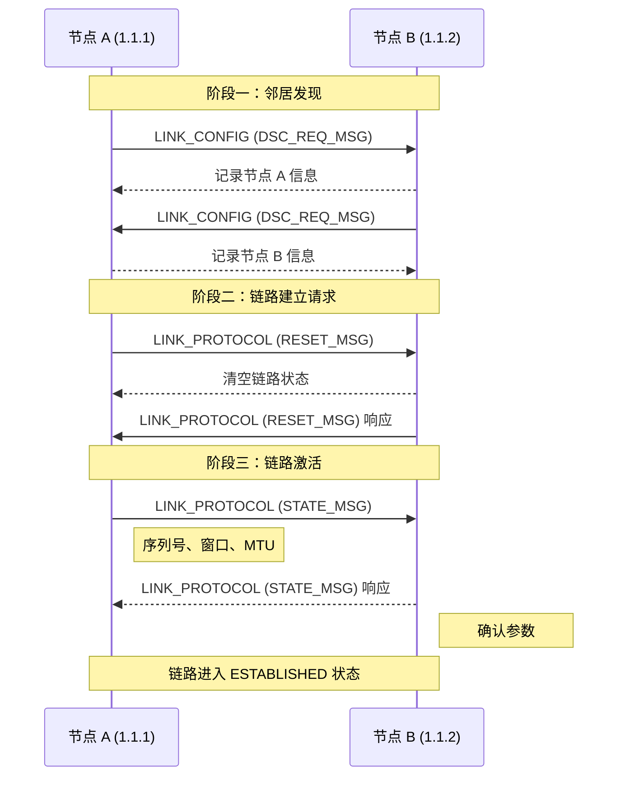

每个阶段的消息都包含特定的字段值，如序列号、窗口大小等，这些值由内核根据当前状态自动生成，无需用户干预。

#### 3-7-4. 验证链路状态

链路建立后，可通过以下命令验证：

```bash
# 节点 A
tipc link list
```

预期输出：

```
broadcast-link: up
1.1.2:eth0: up
```

查看详细统计信息：

```bash
tipc link statistics show link 1.1.2:eth0
```

输出示例（部分）：

```
Link 1.1.2:eth0
  ACTIVE
  MTU: 1500
  Packets: 12 sent / 10 received
  Message counters:
    states: 8 sent / 6 received
    probes: 2 sent / 2 received
```

#### 3-7-5. 发送应用程序数据

链路建立后，应用程序即可通过 TIPC 套接字通信。以下示例展示节点 A 向节点 B 的命名服务发送消息。

**节点 B（服务端）**：

```c
#include <sys/socket.h>
#include <linux/tipc.h>
#include <stdio.h>
#include <string.h>

int main() {
    int sd = socket(AF_TIPC, SOCK_RDM, 0);
    struct sockaddr_tipc addr;
    char buf[256];

    // 绑定到服务名称 {类型=100, 实例=1}
    addr.family = AF_TIPC;
    addr.addrtype = TIPC_ADDR_NAME;
    addr.addr.name.type = 100;
    addr.addr.name.instance = 1;
    addr.addr.name.domain = 0;
    bind(sd, (struct sockaddr *)&addr, sizeof(addr));

    // 接收消息
    recv(sd, buf, sizeof(buf), 0);
    printf("收到: %s\n", buf);
    close(sd);
    return 0;
}
```

**节点 A（客户端）**：

```c
#include <sys/socket.h>
#include <linux/tipc.h>
#include <string.h>

int main() {
    int sd = socket(AF_TIPC, SOCK_RDM, 0);
    struct sockaddr_tipc dest;

    // 目标：节点 B 上的服务 {类型=100, 实例=1}
    dest.family = AF_TIPC;
    dest.addrtype = TIPC_ADDR_NAME;
    dest.addr.name.type = 100;
    dest.addr.name.instance = 1;
    dest.addr.name.domain = 0;

    const char *msg = "Hello from Node A!";
    sendto(sd, msg, strlen(msg) + 1, 0,
           (struct sockaddr *)&dest, sizeof(dest));
    close(sd);
    return 0;
}
```

由于 TIPC 的位置透明特性，客户端只需指定服务名称，无需知道服务运行在节点 A 还是节点 B。名称表会将该名称解析为节点 B 上的端口标识，完成路由。

#### 3-7-6. 与漏洞的关联

上述完整交互流程展示了 TIPC 协议的正常通信模式。在 **CVE-2021-43267** 的上下文中，恶意实体需要完成以下步骤：

1. **启用 UDP 承载**：通过 `tipc bearer enable` 命令或构造 Netlink 消息完成（无需特权）。
2. **等待链路建立**：TIPC 自动完成邻居发现和链路建立（约数秒内）。
3. **发送恶意 `MSG_CRYPTO` 消息**：在链路建立后，向目标节点的 UDP 端口 6118 发送构造的 `MSG_CRYPTO` 消息，其中包含超大的 `keylen` 和较小的 `size`，触发 `tipc_crypto_key_rcv()` 中的堆溢出。

该样例表明，TIPC 协议的自动化特性（自动发现、自动建链）虽然在正常使用中提供了便利，但也意味着一旦 UDP 承载被启用，外部实体即可无需进一步认证即可向目标节点发送各种类型的 TIPC 消息。

### 3-8. 协议总结

TIPC 是一个为集群环境量身定制的通信协议，其设计围绕**位置透明性**、**高可靠性**和**低延迟**三个核心目标展开。协议通过层次化的地址模型、分布式名称表、多承载支持和无损故障转移等机制，为集群内进程间通信提供了高效、透明的解决方案。

然而，TIPC 的功能丰富性也带来了协议实现的复杂性——其代码路径涵盖邻居发现、链路管理、名称表同步、加密通信、拥塞控制等多个子系统。正是在这种复杂性的背景下，2020 年引入的 `MSG_CRYPTO` 加密密钥交换功能未能得到充分的输入验证，最终导致了 **CVE-2021-43267** 漏洞的引入。

本章从协议设计哲学、地址模型、消息格式、链路管理、承载层配置、数据包处理路径到完整交互样例，系统地剖析了 TIPC 协议的核心机制。理解这些机制对于准确把握漏洞的触发条件和评估其潜在影响具有重要的参考价值。本章还特别强调了两个关键安全考量：

- **非特权用户的 Netlink 访问**：任何用户均可通过 `tipc` 命令动态启用 UDP 承载，使得漏洞触发不依赖于系统管理员的预先配置。
- **自动化链路建立**：TIPC 自动完成邻居发现和链路激活，外部实体在承载启用后即可发送各类消息，无需额外认证。

这两点共同构成了该漏洞远程可利用性的协议层基础，也提醒我们在设计类似协议时，应审慎权衡便利性与安全边界。

## 4. 利用思路一

### 4-1. 核心利用原语与依赖条件

#### 4-1-1. 核心原语

**CVE-2021-43267** 提供了一种强大的堆内存破坏原语：通过发送构造的 `MSG_CRYPTO` 消息，操作者可以触发 `tipc_crypto_key_rcv()` 中的堆缓冲区溢出，该溢出具备以下关键属性：

- **溢出位置可控**：`skey` 缓冲区通过 `kmalloc(size, GFP_ATOMIC)` 分配，其中 `size = msg_data_sz(hdr)` 由消息头部中的 `msz - hsz` 决定。操作者可以选择任意 `size` 值，将 `skey` 置于特定的 `kmalloc` 缓存（如 kmalloc‑64、kmalloc‑128、kmalloc‑1k 等）中，从而实现与同尺寸目标内核对象的堆内共存。这种灵活性使得操作者能够根据目标对象的尺寸选择最合适的 slab 缓存进行布局。

- **溢出大小可控**：`memcpy(skey->key, ..., skey->keylen)` 中的 `keylen` 完全由消息负载中的 `tipc_aead_key.keylen` 字段控制，操作者可精确指定溢出的字节数，从而覆盖相邻对象的特定字段。这种精细的控制能力是成功实现对象字段覆写的关键——既不能多写破坏关键元数据，也不能少写导致目标字段未受影响。

- **溢出内容的部分可控性**：由于 `memcpy` 的源数据来自消息负载之后的相邻堆内存（越界读），写入的数据并非直接由操作者指定，而是取决于相邻堆中已有的内容。然而，通过精确的堆布局（使 `skey` 紧邻一个可控对象），操作者可以间接影响溢出写入的内容。这种“间接控制”虽然增加了利用的复杂性，但通过合理的堆风水技术，仍然可以实现预期覆盖。

#### 4-1-2. 依赖条件

要成功利用该原语，需要满足以下条件：

1. **目标内核版本**：受影响版本（5.10‑rc1 至 5.14.15），且未应用修复补丁。
2. **TIPC 模块可用**：内核已加载 TIPC 模块（可通过 `modprobe tipc` 或触发自动加载），或静态编译进内核。
3. **UDP 承载已启用**：操作者能够启用 TIPC 的 UDP 承载。由于非特权用户可通过 Netlink 接口完成此操作，该条件较易满足。实际测试表明，通过 `tipc bearer enable` 命令或直接构造 Netlink 消息均可实现。
4. **网络可达**：操作者能够向目标节点的 UDP 端口 6118 发送数据包，且目标节点防火墙未过滤该端口。
5. **堆布局控制**：操作者需要能够在目标堆缓存（如 kmalloc‑1k）中布置特定的内核对象。本次利用选取 `user_key_payload` 作为信息泄露载体、`tty_struct` 作为权限提升载体，这两种对象均可通过常规系统调用（`add_key` 和 `open("/dev/ptmx")`）大量分配和释放，且均位于 kmalloc‑1k 缓存中，便于与 `skey` 同处一槽。
6. **内核符号信息**：操作者需要知道关键内核符号的偏移（如 `tty_ops`、`prepare_kernel_cred`、`commit_creds` 等），这些可通过泄露内核基址后计算得到。不同内核版本间的符号偏移差异需提前适配。

### 4-2. 总体利用流程

整个利用过程可划分为七个逻辑阶段，每个阶段为后续阶段准备必要的前置条件，形成环环相扣的利用链条。如下流程图展示了各阶段之间的依赖关系：

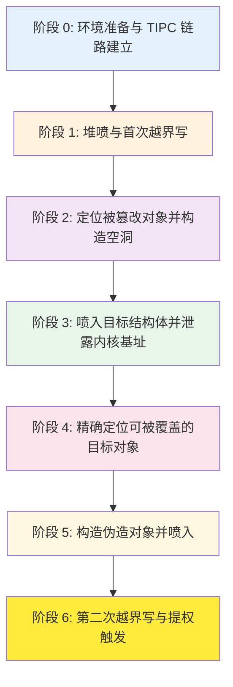

各阶段的核心目标简述：

- **阶段 0**：绑定 CPU、提高文件描述符限制、通过 Netlink 启用 TIPC UDP 承载，并发送 `LINK_CONFIG`、`RESET_MSG`、`STATE_MSG` 与目标节点建立有效链路。这是后续所有操作的网络基础。
- **阶段 1**：通过大量分配 `user_key_payload` 对象填充 slab，然后释放其中一个以在目标缓存中制造空洞。发送第一个构造的 `MSG_CRYPTO` 消息，利用溢出扩大相邻 `user_key_payload` 的 `datalen` 字段。`datalen` 被扩大后，为后续越界读取提供了能力。
- **阶段 2**：遍历所有密钥，找到 `datalen` 被篡改的“受害者”密钥，释放其余密钥——这些被释放的位置将成为空洞，供后续喷射的 `tty_struct` 占用。由于最初喷射的 `user_key_payload` 位于同一 slab 的相邻位置，释放后形成的空洞为后续布局提供了精确的可控位置。
- **阶段 3**：在同一缓存中喷入大量 `tty_struct` 对象，它们将填充阶段 2 释放所形成的空洞。由于 `tty_struct` 与受害者密钥处于同一物理页面的概率很高，利用受害者密钥的超大 `datalen` 进行越界读取，可捕获相邻 `tty_struct` 的内容，其 `tty_ops` 指针可泄露内核基址，绕过 KASLR。
- **阶段 4**：逐个关闭喷入的 `tty_struct`，同时监视受害者密钥的对应区域，直到发现被释放的 `tty_struct` 的魔数发生变化，从而确定被覆盖的精确目标。该释放位置将成为唯一的可控空洞，操作者可确保后续的伪造对象将落在此处。
- **阶段 5**：在用户空间构造一个伪造的 `tty_operations` 结构体，其中包含栈迁移 gadget 和提权 ROP 链，并将其作为 `user_key_payload` 喷入内核。由于阶段 4 确定的唯一空洞，其中一个伪造对象将精确落在这个空洞中，替代原来的 `tty_struct`。
- **阶段 6**：重新喷入一批新的 `tty_struct`，释放其中一个，然后发送第二个 `MSG_CRYPTO` 消息，溢出修改该释放的 `tty_struct` 的 `ops` 指针，使其指向阶段 5 中伪造的对象。最后，对所有剩余 `tty_struct` 调用 `ioctl()`，触发栈迁移并执行 ROP 链，完成权限提升。

### 4-3. 各阶段详解

#### 4-3-1. 阶段 0：环境准备与链路建立

本阶段为后续利用奠定基础，涉及几个关键的系统级准备工作和网络配置。

**资源准备**：操作者首先将进程绑定到单个 CPU 核心，以减少多核环境下并发分配导致的内存布局干扰。随后将文件描述符限制从默认的 1024 提升至 4096，确保能够同时持有大量 `tty_struct` 文件描述符而不触及系统限制。这些准备虽然看似琐碎，但在高密度堆喷射场景中至关重要——若文件描述符耗尽，将无法完成所需的分配数量。

**TIPC 网络配置**：通过 Netlink 接口向内核发送控制消息，启用 TIPC 的 UDP 承载媒体。此操作无需特权身份，因为 Netlink 的 TIPC 组播组访问控制未对非特权用户做严格限制。承载启用后，操作者向目标节点的 UDP 端口 6118 发送三个 TIPC 链路建立包，依次完成邻居发现、链路重置和链路激活。此阶段的关键交互如下：

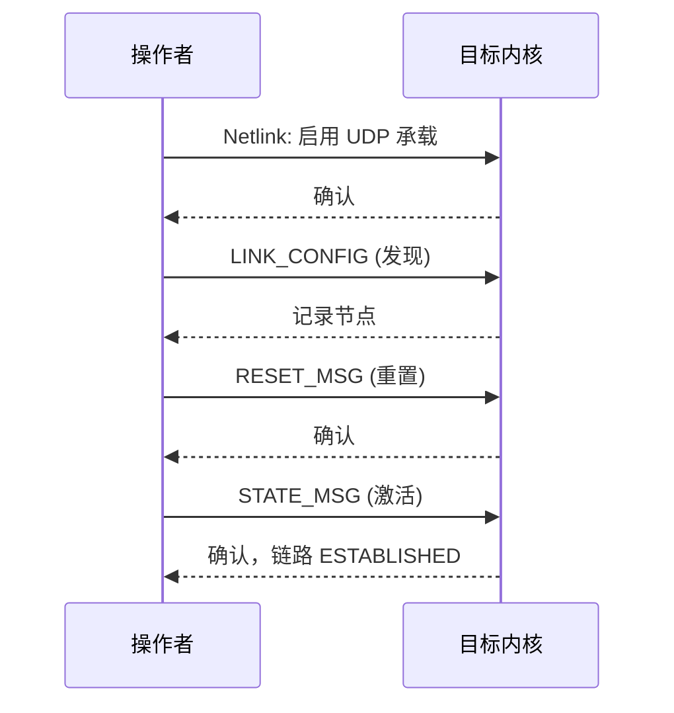

一旦链路进入 `ESTABLISHED` 状态，操作者即可向目标节点发送任意类型的 TIPC 消息，包括后续的漏洞触发包。此阶段完成后，所有后续操作均可通过网络远程完成。

#### 4-3-2. 阶段 1：堆喷与首次越界写

本阶段的目标是在目标堆缓存（kmalloc‑1k）中建立可控的内存布局，并利用漏洞首次破坏相邻对象的长度字段。

**堆喷**：操作者通过 `add_key` 系统调用大量分配 `user_key_payload` 对象，每个对象包含一个用户指定的描述符和负载数据。这些对象的实际大小通过 `keyctl` 的参数控制，本次利用将每个密钥的负载大小设为 512 字节，加上头部后落入 kmalloc‑1k 缓存。由于这些对象在短时间内大量分配，它们将占据 slab 中的连续槽位，位于同一物理页面的概率极高。随后释放其中一个（通常是中间位置的密钥），在 slab 中创建一个空洞。

**首次越界写**：操作者发送第一个构造的 `MSG_CRYPTO` 消息。该消息的外层 TIPC 头部中的 `size = msg_data_sz(hdr)` 被设为一个较小值（例如 956 字节），使 `skey = kmalloc(size, GFP_ATOMIC)` 也分配在 kmalloc‑1k 缓存中。由于 `skey` 的分配发生在刚刚释放的 `user_key_payload` 空洞之后，slab 分配器倾向于将 `skey` 放置在最近的可用空洞中，从而使 `skey` 与相邻的 `user_key_payload` 物理相邻。

消息内部的 `keylen` 字段被设为一个远大于 `size` 的值，导致 `memcpy(skey->key, ..., keylen)` 从 `skey` 缓冲区向后溢出，覆盖相邻 `user_key_payload` 的头部，尤其是将其 `datalen` 字段篡改为一个大值（例如 0x4000）。`datalen` 被扩大后，后续的 `keyctl_read()` 将允许读取远超原始数据长度的堆内存，从而为信息泄露铺平道路。

#### 4-3-3. 阶段 2：定位被篡改对象并构造空洞

操作者遍历所有先前分配的 `user_key_payload` 密钥（除了已释放的中间密钥），对每个密钥调用 `keyctl_read()` 尝试读取 512 字节数据。正常情况下，只有受害者密钥会返回超过 512 字节的数据（因为其 `datalen` 已被篡改为 0x4000），因此操作者能迅速定位“受害者”密钥。

找到受害者后，操作者释放所有其它密钥。这些被释放的密钥原本与受害者密钥位于相同的 slab 中（且大概率位于同一物理页面），释放后形成的空洞将被后续喷入的 `tty_struct` 占用。这一步骤的关键在于：**受害者密钥保持不变**，而其它密钥的释放使 slab 中出现了大量可供新对象使用的空洞，且这些空洞紧邻受害者密钥。当后续分配 `tty_struct` 时，slab 分配器将优先使用这些空洞，从而使 `tty_struct` 恰好落在受害者密钥附近，便于越界读取。

#### 4-3-4. 阶段 3：喷入 `tty_struct` 并泄露内核基址

在清理后的堆上，操作者大量分配 `tty_struct` 对象。`tty_struct` 的分配通过 `open("/dev/ptmx", O_RDWR | O_NOCTTY)` 完成，每次成功打开会返回一个文件描述符，内核会在 kmalloc‑1k 缓存中分配一个 `tty_struct` 实例。由于阶段 2 释放了大量密钥，slab 中已形成多个连续空洞，新分配的 `tty_struct` 将填充这些空洞。

由于 `tty_struct` 与受害者密钥处于同一物理页面的概率很高，操作者利用受害者密钥的超大 `datalen`，通过 `keyctl_read()` 进行越界读。读取的数据量远超过密钥原本的数据长度，因此会跨越密钥的数据区边界，捕获相邻堆内存中的 `tty_struct` 内容。

在泄露的数据中，操作者扫描并识别 `tty_struct` 的魔数字段（预期值为 0x5401），并定位 `tty_struct->ops` 指针。该指针指向内核数据段中的 `ptm_unix98_ops` 或 `pty_unix98_ops`（取决于 `tty_struct` 属于 master 还是 slave pty）。由于这两个符号在内核中的偏移是预先已知的，操作者将该指针减去已知偏移即可得到内核基址，从而绕过 KASLR。此过程中的关键交互如下：

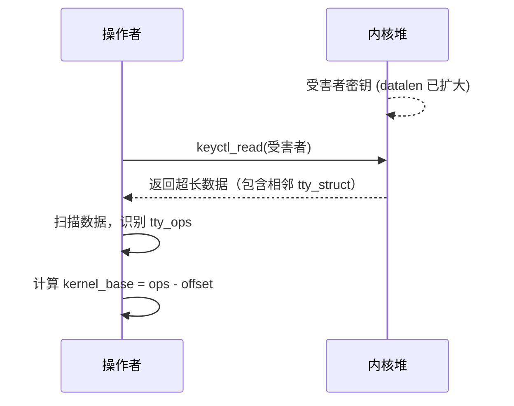

#### 4-3-5. 阶段 4：精确定位可覆盖的目标对象

虽然阶段 3 已泄露了某个 `tty_struct` 的内容，但操作者不知道它是哪一个——即不知道它对应的是哪个文件描述符。为了后续能精确覆盖该 `tty_struct`，操作者需要建立泄露内容与具体文件描述符之间的对应关系。

为此，操作者逐个关闭 `tty_struct` 的文件描述符，并在每次关闭后重新读取受害者密钥的数据，检查对应位置的魔数（0x5401）。具体做法是：从阶段 3 泄露的数据中，操作者已知道受害者密钥后跟随的 `tty_struct` 的内容及其在泄露数据中的偏移。逐个关闭 `tty_struct` fd 时，若刚关闭的 `tty_struct` 恰好是受害者密钥后面的那个，则该 `tty_struct` 被释放，其内存变为空闲，受害者密钥对应位置的数据会发生变化——最明显的是魔数 0x5401 会消失或被覆盖。

当魔数变化时，说明刚刚释放的 `tty_struct` 正好与受害者密钥相邻，其内存已变为空闲。此时，**该空闲对象成为唯一的可控空洞**——因为其它 `tty_struct` 仍处于打开状态，占据着各自的内存。操作者可以确保后续的伪造对象将精确落在此处，实现对该 `tty_struct` 内存的精确替换。如果遍历完所有 `tty_struct` 仍未观察到魔数变化，说明布局出现偏差，需要重试（例如调整喷射数量或重新执行阶段 1）。

#### 4-3-6. 阶段 5：构造伪造对象并喷入

操作者在用户空间构造一个伪造的 `tty_operations` 结构体，该结构体的大小与真实 `tty_operations` 一致，但其函数指针被替换为精心选择的内核 gadget 地址。具体构造如下：

- 在偏移 0x18 处（即 `ioctl` 函数指针位置），放置一个栈迁移 gadget 的地址。当内核调用 `ioctl` 时，`rdx` 寄存器中包含第三个参数（用户可控的 `arg`），该 gadget 将栈指针迁移到用户控制的地址，从而接管控制流。
- 在偏移 0x100 处（即在 `tty_operations` 结构体之后的位置），布置完整的提权 ROP 链。该 ROP 链依次执行 `prepare_kernel_cred(0)` 获取 root 凭证、`commit_creds()` 应用凭证，最后通过 `swapgs_restore_regs_and_return_to_usermode` 安全返回用户态并执行 root shell。

该伪造对象随后作为 `user_key_payload` 被重新喷入内核。由于阶段 4 确定的唯一空洞，其中一个伪造密钥将精确占据该 `tty_struct` 原本的内存位置——但此时该位置的内容不再是一个真实的 `tty_struct`，而是操作者构造的伪造数据，其中包含伪装的 `tty_operations` 指针。

#### 4-3-7. 阶段 6：第二次越界写与提权触发

操作者再次分配一批新的 `tty_struct` 对象，为第二次溢出准备目标。这批新的 `tty_struct` 会填充 slab 中的其它空洞，但不会干扰阶段 4 中确定的那个特殊空洞（因为该空洞已被阶段 5 的伪造密钥占用）。然后释放这批新分配的 `tty_struct` 中的一个，制造一个新的空洞。

操作者发送第二个 `MSG_CRYPTO` 消息，其 `size` 和 `keylen` 经过精细计算，使溢出正好覆盖刚释放的 `tty_struct` 的 `ops` 指针字段。具体来说，操作者利用首次泄露时获得的 `tty_struct` 布局信息，将溢出长度控制在恰好覆盖 `ops` 指针（偏移 0x18）的位置，并将覆盖内容设为阶段 5 中伪造的 `tty_operations` 所在地址。

随后，操作者对所有剩余的 `tty_struct` 调用 `ioctl()` 系统调用。当调用到 `ops` 已被劫持的那个 `tty_struct` 时，内核会从伪造的 `tty_operations` 表中读取 `ioctl` 函数指针，实际跳转至栈迁移 gadget。该 gadget 将栈指针切换到 ROP 链所在区域，依次执行提权 gadgets，最终完成权限提升并返回 root shell。

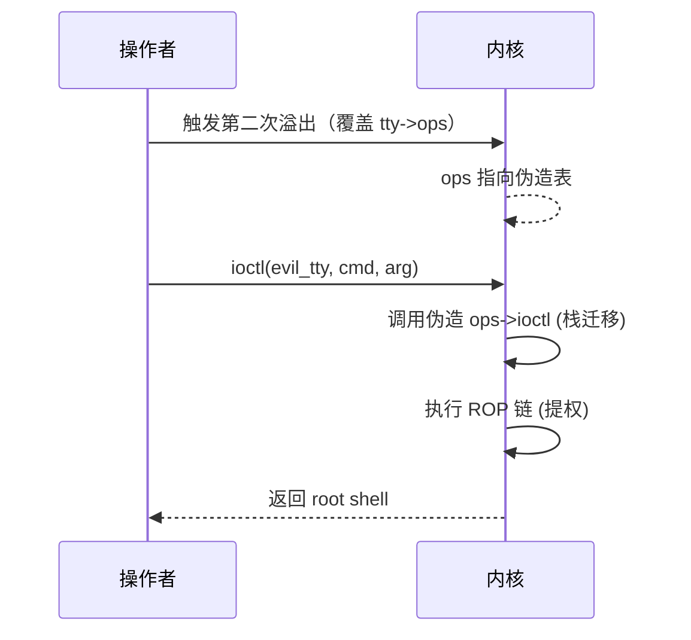

### 4-4. 保护机制应对策略

现代内核通常启用多种安全防护机制，该利用思路针对常见的保护措施有以下应对策略：

- **KASLR（内核地址空间布局随机化）**：通过阶段 3 中的越界读泄露 `tty_ops` 指针，可直接计算内核基址，从而绕过 KASLR。由于该泄露发生在漏洞触发之前，KASLR 无法阻止信息收集。泄露的 `tty_ops` 地址减去其静态偏移即可得到 `kernel_base`，进而计算所有所需 gadget 的实际地址。

- **SMEP/SMAP（用户态执行/访问保护）**：利用中并未尝试直接执行用户态代码，而是使用内核 ROP 链，所有 gadget 均位于内核代码段，因此不触发 SMEP 的非法执行检测。ROP 链末尾通过 `swapgs` 和 `iretq` 安全返回用户态，此过程由内核原生机制支持，不会触发 SMAP 的访问违规。

- **KPTI（内核页表隔离）**：ROP 链末尾使用 `swapgs_restore_regs_and_return_to_usermode` 处理 KPTI 所需的页表切换。该符号在支持 KPTI 的内核中导出，其内部实现包含 `swapgs` 和 `iretq` 指令，同时负责切换用户态页表，确保从内核态返回用户态时 TLB 正确刷新，不会因页表不一致导致崩溃。

- **SLAB_FREELIST_RANDOM / HARDENED**：这些机制会增加堆喷射的难度，但利用中通过大量分配和精确释放，仍能有效控制堆布局。实验表明，在开启这些选项的环境中，该利用思路仍有较高的成功率。关键在于喷射数量要远大于随机化引入的偏移变化范围（本利用使用 36~64 个对象），使随机化仅影响精确槽位而无法阻止整体布局。

- **CONFIG_INIT_ON_ALLOC_DEFAULT_ON**：该选项会在分配时清零内存，但已分配的对象（如 `tty_struct`）在使用前已被初始化，且溢出覆盖的是已使用的对象而非未初始化的内存，因此该保护对本次利用无实质性影响。

- **CONFIG_MEMCG 与 CONFIG_MEMCG_KMEM**：启用 `CONFIG_MEMCG_KMEM` 后，内核会为内存控制组创建独立的 kmalloc 缓存（如 `kmalloc-cg-1k`），将不同 cgroup 的内存分配隔离开。然而，本次利用涉及的三个关键对象——`user_key_payload`、`skey`（`MSG_CRYPTO` 消息缓冲区）、`tty_struct`——的分配路径均使用 `GFP_KERNEL` 或 `GFP_ATOMIC` 标志，且未使用 `__GFP_ACCOUNT`，因此这些对象始终分配在标准的 `kmalloc-1k` 缓存中，而非 `kmalloc-cg-1k`。这意味着 `CONFIG_MEMCG_KMEM` 的隔离机制不会对本利用所依赖的堆布局产生任何影响，无需为此采取额外的应对措施。

- **CONFIG_SLAB_FREELIST_RANDOM 与 CONFIG_SLAB_FREELIST_HARDENED**：这些选项会随机化 slab 空闲链表顺序并加密空闲指针，使得传统的“精确槽位”堆喷射技术效果略有下降。应对策略是增加喷射对象数量和重试次数（例如在循环中多次尝试不同偏移），即使随机化导致部分槽位不可用，高密度喷射仍能以较高概率占据目标位置。

### 4-5. 条件与局限性

#### 4-5-1. 必要条件

- 目标内核版本在 v5.10‑rc1 至 v5.14.15 之间，且 `CONFIG_TIPC` 和 `CONFIG_TIPC_CRYPTO` 已启用。
- 操作者能够访问目标节点的 UDP 端口 6118，且该端口未被防火墙阻塞。
- 操作者具有调用 Netlink 接口的权限（非特权用户也可），能够通过 `tipc` 命令或自定义 Netlink 消息启用 UDP 承载。
- 目标系统允许动态分配 `/dev/ptmx` 设备节点（通常默认启用），以便通过 `open("/dev/ptmx")` 分配 `tty_struct`。
- 目标系统支持 `keyctl` 系统调用，且未禁用密钥环功能（`CONFIG_KEYS` 已启用，通常默认开启）。

#### 4-5-2. 局限性

- **堆布局不确定性**：虽然利用思路经过精心设计，但 slab 分配器的行为受多种因素影响（如其它内核线程的并发分配活动、中断上下文的内存分配等），可能导致喷射失败或溢出偏移偏差，需要一定的重试机制。

- **依赖特定内核符号偏移**：泄露内核基址后，操作者需要知道 `prepare_kernel_cred`、`commit_creds`、`swapgs_restore_regs_and_return_to_usermode` 等符号的偏移。这些偏移在不同内核版本、不同编译选项（如 `CONFIG_RANDOMIZE_BASE`）下可能不同，需要提前为每个目标版本适配。实际操作中，可通过在相同内核版本上预先计算，或通过泄露的 `tty_ops` 指针结合版本指纹来动态确定。

- **触发时机依赖**：第二次溢出需要精准覆盖刚释放的 `tty_struct`，若由于内存碎片导致多个空洞，可能降低成功率。本利用通过阶段 4 的精确定位将“目标空洞”唯一化，但仍需确保阶段 5 的伪造对象恰好填入该空洞。若阶段 5 的喷射数量不足，可能导致伪造对象填入其它空洞而非目标位置。

- **SMP 环境干扰**：在多核系统上，其它 CPU 核心可能同时分配或释放堆内存，干扰布局。本利用通过 `sched_setaffinity` 将进程绑定到单个 CPU 核心，显著降低了并发干扰。但在高负载的生产环境中，其它内核线程仍可能在该 CPU 上执行分配操作。

- **某些发行版额外加固**：部分发行版（如 Ubuntu 的某些版本）可能启用额外的堆保护（如 `CONFIG_SLAB_FREELIST_HARDENED`），虽然不影响本思路的基本可行性，但可能增加喷射所需的对象数量。在启用 `CONFIG_SLAB_FREELIST_HARDENED` 的环境中，空闲指针被加密，但仍可通过增大喷射规模（例如将喷射数量翻倍）来保持较高的成功率。

### 4-6. 总结

本章详细阐述了基于 **CVE-2021-43267** 的堆溢出漏洞，实现从初始堆破坏到最终权限提升的完整利用思路。该思路充分利用了溢出的可控性（位置、大小、部分内容），通过精心设计的堆布局，结合内核对象的生命周期管理，逐步实现信息泄露、对象劫持和代码执行。整个利用过程分为七个逻辑阶段，每阶段都有明确的目标和依赖关系，最终通过 `ioctl` 触发 ROP 链获得 root 权限。

该利用思路展现了现代内核漏洞利用中的典型技术：堆风水、越界读写、对象替换、函数表劫持和 ROP 链构造，同时也展示了如何绕过 KASLR、SMEP、SMAP、KPTI 等主流防护机制。它强调了在漏洞利用中，对内核堆分配器的深刻理解和对对象布局的精准控制同等重要。虽然该思路存在一定的随机性因素和版本依赖性，但通过合理的设计和重试策略，在实际环境中仍具有较高的可靠性。该利用的成功还依赖于对 TIPC 协议栈实现细节的深入理解——从链路建立到消息构造，每个环节都需要精确控制，稍有偏差就可能导致目标节点内核崩溃而非完成预期操作。

### 4-7. 测试结果

<div style="text-align: center; margin: 2rem 0;">
  
</div>

## 5. 利用思路二

### 5-1. 核心利用原语与依赖条件

#### 5-1-1. 核心利用原语

**CVE-2021-43267** 的堆溢出能力同样适用于基于 `pipe_buffer` 对象的利用路径。操作者通过构造 `MSG_CRYPTO` 消息，触发 `tipc_crypto_key_rcv()` 中的溢出，实现对相邻 `pipe_buffer` 结构体的越界改写。该利用思路的核心在于：

- **溢出位置与尺寸可控**：与思路一相同，`skey` 缓冲区的分配尺寸和溢出长度均可由操作者精确控制。通过将 `skey` 分配在 kmalloc‑1k 缓存中，使其与 `pipe_buffer` 结构体数组相邻，溢出可精准定位到相邻的 `pipe_buffer` 并仅修改其关键字段（如 `page` 指针的低字节）。
- **破坏目标**：通过单字节或少量字节的越界写，篡改 `pipe_buffer` 的 `page` 指针，使两个不同的 pipe 指向同一物理页框。这种“共享页”状态为后续信息泄露和文件写入创造了条件。
- **信息泄露载体**：通过关闭受害者 pipe，将其 `pipe_buffer->page` 指向的物理页面（order‑0）释放回伙伴系统，而 `pipe_buffer` 数组（kmalloc‑1k）则归还至 slab 缓存。随后利用 `fcntl` 调整其它 pipe 的容量，触发内核重新分配 `pipe_buffer` 数组。此时新数组尺寸缩小至 kmalloc‑192，slab 分配器在耗尽现有空闲对象后需向伙伴系统申请新的 order‑0 页框。由于刚刚释放的 `pipe_buffer->page` 页面仍处于空闲状态，该页框很可能被用作新的 kmalloc‑192 缓存页，从而将新数组置于该物理页面上。控制器 pipe 因共享页仍持有对该页面的悬垂引用，通过读取控制器 pipe 即可获取新分配的 `pipe_buffer` 结构体内容，从中提取 `anon_pipe_buf_ops` 指针，计算内核基址，绕过 KASLR。同时，利用 `splice` 堆喷填充所有 pipe 的 `pipe_buffer[1]` 槽位，可使该共享页面中包含 `/etc/passwd` 页的物理地址，为后续伪造提供关键信息。
- **权限提升手段**：在获得任意物理页写入能力后，借助 `PIPE_BUF_FLAG_CAN_MERGE` 标志，将共享页配置为可合并写入。通过将修改后的 `ctf` 用户条目（UID 从普通用户提升为 0）写入 `/etc/passwd` 文件头部，使得 `su - ctf` 时系统优先匹配到该条目，从而使用原有密码获得 root 权限。

#### 5-1-2. 依赖条件

- 目标内核版本在 v5.10‑rc1 至 v5.14.15 之间，且未应用修复补丁。
- `CONFIG_TIPC` 和 `CONFIG_TIPC_CRYPTO` 已启用。
- 操作者能够访问目标节点的 UDP 端口 6118，并具备启用 TIPC UDP 承载的能力（非特权用户可通过 Netlink 实现）。
- **配置要求（`CONFIG_MEMCG_KMEM`）**：本利用对内核配置的兼容性取决于具体版本：
    - 对于 **v5.14.0 至 v5.14.15** 版本，目标内核**必须禁用 `CONFIG_MEMCG_KMEM`**（内存控制组内核内存统计控制器）。因为在这些版本中，kmalloc 缓存隔离机制会导致 `pipe_buffer` 与 `skey` 分配在不同缓存，溢出无法触及目标。
    - 对于 **v5.10-rc1 至 v5.13.x**（即 v5.14 之前的版本），内核在 v5.9 至 v5.14 期间已取消了 `kmalloc-1k` 与 `kmalloc-cg-1k` 的隔离，因此即使 `CONFIG_MEMCG_KMEM` 开启，也不影响本利用的正常运作，无需显式关闭。
- 目标系统支持标准的 pipe 和 splice 系统调用（通常默认开启）。

### 5-2. 总体利用流程

整个利用过程分为四个逻辑阶段，各阶段衔接紧密，构成完整的利用链条：

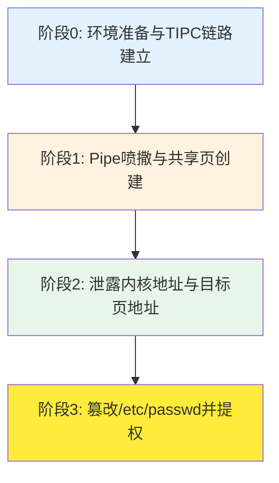

各阶段核心目标：

- **阶段0**：绑定 CPU、打开 `/etc/passwd` 文件、通过 Netlink 启用 TIPC UDP 承载，并发送三个链路建立包完成与目标节点的握手。
- **阶段1**：大量创建 pipe，每个 pipe 的 `pipe_buffer` 数组分配在 kmalloc‑1k 缓存中。释放部分 pipe 制造空洞，触发第一次溢出——单字节修改相邻 `pipe_buffer` 的 `page` 指针低字节，使两个 pipe 指向同一物理页面（order‑0）。随后重新填充空洞，并通过读取 pipe 数据定位重叠的 pair。
- **阶段2**：关闭受害者 pipe，其 `pipe_buffer` 数组（kmalloc‑1k）归还至 slab 缓存，其 `pipe_buffer->page` 指向的物理页面（order‑0）释放回伙伴系统。通过调整其它 pipe 容量（`fcntl`），使内核重新分配 `pipe_buffer` 数组（尺寸减小至 kmalloc‑192），该分配可能重用释放的 order‑0 页面作为新的 slab 页，控制器 pipe 的悬垂引用恰好指向该页。随后利用 `splice` 将 `/etc/passwd` 的一页注入所有 pipe，填充 `pipe_buffer[1]` 槽位。通过控制器 pipe 读取共享页，可获得该页中存储的 `pipe_buffer` 结构体，从而泄露 `anon_pipe_buf_ops`（内核基址）以及 `/etc/passwd` 页的物理地址（为阶段3伪造提供关键信息）。
- **阶段3**：在控制器 pipe 中构造伪造的 `pipe_buffer` 结构体，设置 `PIPE_BUF_FLAG_CAN_MERGE` 标志，并利用泄露的 `/etc/passwd` 页地址将目标页标记为可合并写入。随后向所有剩余 pipe 写入修改后的 `ctf` 用户条目（UID 提升为 0），该条目被写入 `/etc/passwd` 文件头部。当执行 `su - ctf` 时，系统优先匹配到该条目，使用原有密码即可获得 root 权限。

### 5-3. 各阶段详解

#### 5-3-1. 阶段0：环境准备与链路建立

本阶段与思路一的阶段0基本一致，但额外打开 `/etc/passwd` 文件以供后续 `splice` 使用。操作者首先将进程绑定到单个 CPU 核心以减少并发干扰，然后通过 Netlink 启用 TIPC UDP 承载，并发送三个链路建立包（`LINK_CONFIG`、`RESET_MSG`、`STATE_MSG`）完成节点握手。链路进入 `ESTABLISHED` 状态后，即可发送漏洞触发消息。

#### 5-3-2. 阶段1：Pipe 喷撒与共享页创建

本阶段的核心是在 kmalloc‑1k 缓存中建立可控的 `pipe_buffer` 布局，并利用单字节溢出制造共享物理页。

**Pipe 喷撒与布局**：操作者连续创建大量 pipe（如 480 个）。每个 pipe 在创建时，内核会调用 `kcalloc(16, sizeof(struct pipe_buffer), GFP_KERNEL_ACCOUNT)` 分配一个包含 16 个 `pipe_buffer` 结构体（每个结构体大小为 40 字节）的数组，总大小 640 字节，落在 kmalloc‑1k 缓存中。同时，每次向 pipe 写入数据时，内核会分配一个 order‑0 物理页作为数据缓冲区，其指针存储在 `pipe_buffer[0].page` 中。操作者向每个 pipe 写入唯一的标记数据（包含索引），便于后续识别。

**制造空洞**：操作者按固定间隔（如每 3 个）关闭部分 pipe，释放其 `pipe_buffer` 数组（kmalloc‑1k）和 `pipe_buffer->page` 指向的物理页面（order‑0）。数组内存返回至 kmalloc‑1k 缓存，物理页面返回至伙伴系统，从而在 slab 和伙伴系统中分别形成空闲资源。

**触发溢出**：操作者发送第一个 `MSG_CRYPTO` 消息，其外层 `size` 使 `skey` 同样分配在 kmalloc‑1k，且刚好落在某个空洞附近。内层 `keylen` 被设置为仅溢出 1 个字节，从而修改相邻 `pipe_buffer` 的 `page` 指针的低字节。由于低字节的改变，该 `pipe_buffer` 指向的物理页框与另一个相邻 pipe 的 `page` 指针指向相同的物理页。此时，两个 pipe 共享同一数据页。

**定位重叠 pair**：操作者重新创建之前释放的 pipe，填充空洞，使 slab 布局恢复稳定。然后遍历所有 pipe，读取其数据并检查标记，若某个 pipe 读到的标记不属于自己，则说明该 pipe 与另一个 pipe 共享同一物理页。记录这对 pipe 的索引（受害者 pipe 和控制器 pipe）。

下图展示了阶段1中创建重叠 pipe 对的关键步骤：

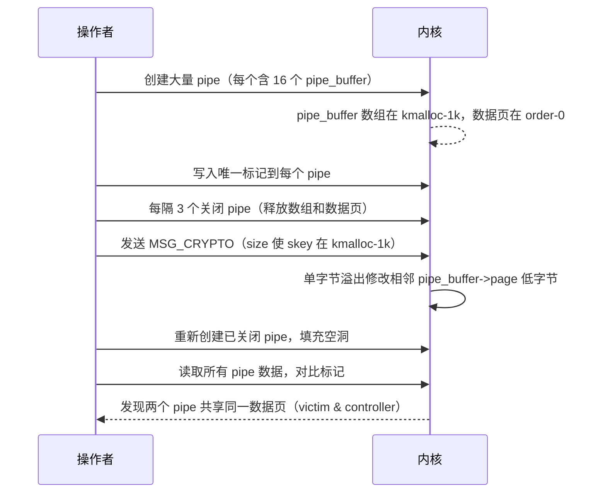

#### 5-3-3. 阶段2：泄露内核地址与目标页地址

本阶段利用共享页框的重用来泄露内核指针，同时获取 `/etc/passwd` 页的物理地址，为后续写入做准备。整个流程分为三个关键子步骤，如下序列图所示：

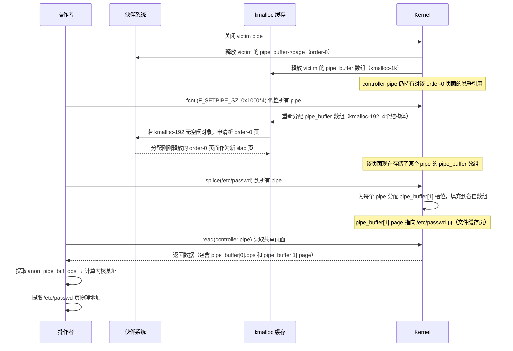

**子步骤 A：释放 victim pipe**

操作者关闭受害者 pipe。此时：

- `pipe_buffer` 数组（kmalloc‑1k）归还至 kmalloc‑1k 缓存。
- `pipe_buffer[0].page` 指向的物理页面（order‑0）释放回伙伴系统。
- 控制器 pipe 因共享页仍保留对该物理页面的引用（悬垂指针）。

**子步骤 B：重分配 order‑0 页面为新的 `pipe_buffer` 数组**

操作者使用 `fcntl(F_SETPIPE_SZ, 0x1000 * 4)` 将所有其它 pipe 的缓冲区容量调整为 4 页。该操作会触发内核为每个 pipe 重新分配 `pipe_buffer` 结构体数组：新数组包含 4 个 `pipe_buffer` 结构体，总大小 160 字节，落在 kmalloc‑192 缓存中。kmalloc‑192 的底层内存来自 order‑0 页框，且 slab 分配器在消耗完 `freelist` 时需要向伙伴系统申请新的 order 页面作为缓存。由于刚刚释放的 victim 的 `pipe_buffer->page` 页面（order‑0）仍处于空闲状态，slab 分配器很可能将该页用作新的 kmalloc‑192 缓存页，从而将新的 `pipe_buffer` 数组放置在该物理页面上。该数组固定包含 4 个槽位，其中 `pipe_buffer[0]` 已被初始化（因为 pipe 在调整容量后仍需维护现有数据状态），其余槽位在后续 `splice` 操作中会被填充。

**子步骤 C：`splice` 堆喷填充 `pipe_buffer[1]` 并泄露信息**

为了获取目标文件页（`/etc/passwd`）的物理地址以及内核指针，操作者执行 `splice` 堆喷：将 `/etc/passwd` 文件的一页（从偏移 1 字节处开始）通过 `splice` 读入每个可控 pipe 的缓冲区。该操作会为每个 pipe 在 `pipe_buffer` 数组中分配一个新的槽位（`pipe_buffer[1]`），并将该槽位的 `page` 指针指向存放 `/etc/passwd` 文件内容的物理页框（来自文件系统缓存）。由于 `splice` 是对所有 pipe 执行的，这些 `pipe_buffer[1]` 结构体会被填充到各自的数组中，其中一部分可能落在刚刚被重用的 order‑0 页面（即原 victim 的 `pipe_buffer->page`）上。

随后，操作者通过控制器 pipe 执行 `read` 操作，读取该共享页面。该页面现在存储了某个 pipe 的 `pipe_buffer` 数组（包含 `pipe_buffer[0]` 和 `pipe_buffer[1]` 等）。从读取的数据中，操作者可以提取到：

- `pipe_buffer[0].ops` 指针（通常指向 `anon_pipe_buf_ops`），将其减去已知静态偏移即可得到内核基址，绕过 KASLR。
- `pipe_buffer[1].page` 指针，它指向 `/etc/passwd` 页的物理地址。这个地址对于阶段3中构造伪造的 `pipe_buffer` 至关重要——操作者需要明确知道目标文件页的位置，才能将 `PIPE_BUF_FLAG_CAN_MERGE` 标志正确注入。

因此，`splice` 堆喷在本阶段具有双重目的：一是将文件页映射到 pipe 中以便后续写入；二是通过填充 `pipe_buffer[1]` 槽位，使得悬垂引用的共享页中包含可泄露的指针信息，从而同时获得内核基址和目标文件页地址。这两个信息缺一不可，共同支撑了阶段3的利用操作。

#### 5-3-4. 阶段3：篡改 `/etc/passwd` 并提权

本阶段利用共享页的可写性，对 `/etc/passwd` 中的用户条目进行修改。关键流程如下：

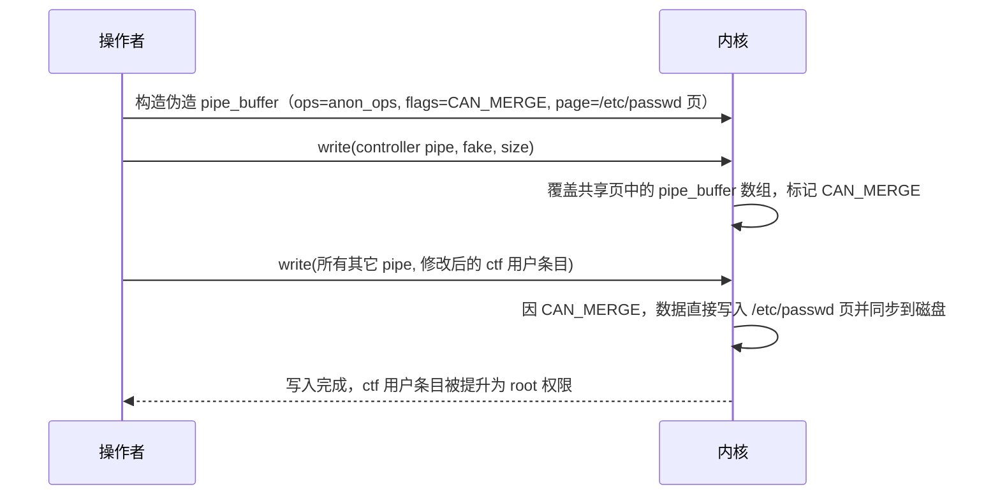

**注入 CAN_MERGE 标志**：操作者在控制器 pipe 中构造一个伪造的 `pipe_buffer` 结构体，将其 `ops` 设为已泄露的 `anon_pipe_buf_ops`，将 `flags` 设为 `PIPE_BUF_FLAG_CAN_MERGE`（0x10），并将 `page` 指针指向通过 `splice` 获得的 `/etc/passwd` 页的物理地址。然后通过 `write` 系统调用将该伪造结构体写入控制器 pipe。由于控制器 pipe 与某个 pipe 共享页框（该页框现在存储了另一个 pipe 的 `pipe_buffer` 数组），写入操作会覆盖该数组中的相应槽位，使得该数组中的某个 `pipe_buffer` 被标记为可合并写入。

**写入修改后的用户条目**：操作者向所有剩余 pipe（除受害者和控制器）中写入修改后的 `/etc/passwd` 条目。该条目将原有 `ctf` 用户的 UID 从普通用户 ID 改为 0（例如 `ctf:x:0:0:Linux User,,,:/home/ctf:/bin/bash\n`），并将其放置在 `/etc/passwd` 文件的前部。由于这些 pipe 的 `pipe_buffer` 已经通过共享页继承了 CAN_MERGE 标志，写入操作会直接修改 `/etc/passwd` 所在物理页的内容，并最终同步到磁盘文件。写入完成后，`/etc/passwd` 中的 `ctf` 用户条目已被提升为 root 权限（UID 0）。

**提权**：操作者使用 `su - ctf` 切换至该用户，系统在认证时扫描 `/etc/passwd` 文件，优先匹配到位于文件前部的修改后条目（UID 0）。输入 `ctf` 的原始密码即可通过认证，获得 root 权限。

### 5-4. 保护机制应对策略

- **KASLR**：阶段2中通过泄露 `anon_pipe_buf_ops` 指针可直接计算内核基址，绕过 KASLR。
- **SMEP/SMAP**：本利用不依赖用户态代码执行，也不涉及内核态 shellcode，因此这些保护不影响。
- **KPTI**：本利用不涉及从内核态返回用户态的复杂操作，因此 KPTI 不构成障碍。
- **CONFIG_SLAB_FREELIST_RANDOM / HARDENED**：增加了定位相邻对象的难度，但通过大量喷撒和固定间隔释放，仍可有效控制布局，成功率较高。
- **CONFIG_INIT_ON_ALLOC_DEFAULT_ON**：由于操作针对已分配对象（`pipe_buffer`）进行溢出，新分配的内存清零不影响已存在的对象内容。
- **CONFIG_MEMCG_KMEM**：本利用受此配置影响仅限于 **v5.14.0 至 v5.14.15** 版本——这些版本中该选项必须禁用，否则 slab 缓存隔离会阻止溢出触及 `pipe_buffer`。而在 **v5.10-rc1 至 v5.13.x** 版本中，内核已取消 `kmalloc-1k` 与 `kmalloc-cg-1k` 的隔离，因此即使该选项开启，本利用仍可正常工作。若目标内核为 v5.14.16 及以上版本，漏洞已修复，本利用不再有效。

### 5-5. 条件与局限性

#### 5-5-1. 必要条件

- 目标内核版本在 v5.10‑rc1 至 v5.14.15 之间，且 `CONFIG_TIPC`、`CONFIG_TIPC_CRYPTO` 已启用。
- **对于 v5.14.0 至 v5.14.15 版本**：`CONFIG_MEMCG_KMEM` 必须为 `n`。对于 **v5.10-rc1 至 v5.13.x** 版本，该选项开启与否不影响本利用。
- 操作者具有访问目标 UDP 端口 6118 的能力，并具备启用 TIPC UDP 承载的权限（非特权用户可通过 Netlink 实现）。
- 目标系统允许使用 pipe 和 splice 系统调用（默认允许）。

#### 5-5-2. 局限性

- **依赖内核配置（特定版本）**：仅在 v5.14.0 至 v5.14.15 中 `CONFIG_MEMCG_KMEM=n` 是硬性要求；在更早版本中无此限制。
- **布局不确定性**：与思路一类似，slab 分配器的随机性可能导致溢出偏移偏差，需要多次尝试。
- **依赖文件系统**：写入 `/etc/passwd` 需要文件系统支持直接修改已缓存页，且 `/etc/passwd` 必须位于可写文件系统（通常为 ext4 等），且操作者需具备对 `/etc/passwd` 的读取权限（通常所有用户可读）。
- **权限提升方式**：本思路通过修改已有用户条目实现提权，要求操作者知道该用户的原始密码（例如 `ctf` 的密码），以便后续通过 `su` 切换。

### 5-6. 总结

本章描述了基于 **CVE-2021-43267** 的另一种利用思路，利用漏洞溢出修改 `pipe_buffer` 的 `page` 指针，实现两个 pipe 共享同一物理页。通过精心的堆布局和页框回收，操作者能够泄露内核基址并利用页合并机制写入 `/etc/passwd`，最终通过将已有用户条目提升为 root 权限来获得提权。该思路与思路一相比，无需依赖 `tty_struct` 和 ROP 链，而是利用 pipe 和文件页面的机制，更加简洁且在某些场景下更为稳定。然而，其对内核配置的依赖因版本而异：v5.14.0 至 v5.14.15 要求禁用 `CONFIG_MEMCG_KMEM`，而 v5.10-rc1 至 v5.13.x 无此限制。两种利用思路可互为补充，根据目标环境的具体配置灵活选择。本思路同样体现了对内核堆管理器、页分配器和文件缓存机制的深入理解，以及如何将单一溢出原语转化为信息泄露和文件写入能力的精巧设计。

### 5-7. 测试结果

<div style="text-align: center; margin: 2rem 0;">
  
</div>

## 6. 漏洞修复

### 6-1. 补丁概述

**CVE-2021-43267** 的修复补丁由漏洞发现者 Max VA（来自 SentinelOne）于 2021 年 10 月 25 日提交，commit ID 为 `fa40d9734a57bcbfa79a280189799f76c88f7bb0`。该补丁于次日由 David S. Miller 合入主线内核，并随后向后移植到各稳定分支，最终随 v5.14.16 版本一同发布。

补丁的提交信息明确指出：“The function tipc_crypto_key_rcv is used to parse MSG_CRYPTO messages to receive keys from other nodes in the cluster in order to decrypt any further messages from them. This patch verifies that any supplied sizes in the message body are valid for the received message.”补丁所修复的漏洞引入于 commit `1ef6f7c9390f`（“tipc: add automatic session key exchange”），该提交于 2020 年 9 月为 TIPC 引入了自动会话密钥交换功能。从功能引入到漏洞发现并修复，历时约一年，期间该漏洞影响了自 v5.10-rc1 起的多个内核版本。

补丁的签署链包括多位内核维护者的审阅与认可：Ying Xue（Acked-by）、Jon Maloy（Acked-by）以及 Greg Kroah-Hartman（Signed-off-by）。这表明补丁经过了充分的代码审查流程，确保了修复方案的正确性与可靠性。其中，Jon Maloy 是 TIPC 子系统的长期维护者，其 Ack 代表了该补丁符合 TIPC 协议规范与实现预期；Greg Kroah-Hartman 的签署则确保了补丁在稳定内核分支中的可回溯性。

### 6-2. 补丁内容

补丁的核心改动集中在 `net/tipc/crypto.c` 文件中的 `tipc_crypto_key_rcv()` 函数。该函数负责解析 `MSG_CRYPTO` 类型的消息，从对端节点接收加密密钥。修复前的代码在处理密钥数据时存在明显的验证缺失——函数从消息头部提取负载尺寸 `size` 后，直接使用该值分配内存并拷贝数据，而对消息内部的 `keylen` 字段未做任何有效性检查。

以下为完整的补丁 diff（包含上下文）：

```diff
diff --git a/net/tipc/crypto.c b/net/tipc/crypto.c
index c9391d38de85c..dc60c32bb70df 100644
--- a/net/tipc/crypto.c
+++ b/net/tipc/crypto.c
@@ -2285,43 +2285,53 @@ static bool tipc_crypto_key_rcv(struct tipc_crypto *rx, struct tipc_msg *hdr)
 	u16 key_gen = msg_key_gen(hdr);
 	u16 size = msg_data_sz(hdr);
 	u8 *data = msg_data(hdr);
+	unsigned int keylen;
+
+	/* Verify whether the size can exist in the packet */
+	if (unlikely(size < sizeof(struct tipc_aead_key) + TIPC_AEAD_KEYLEN_MIN)) {
+		pr_debug("%s: message data size is too small\n", rx->name);
+		goto exit;
+	}
+
+	keylen = ntohl(*((__be32 *)(data + TIPC_AEAD_ALG_NAME)));
+
+	/* Verify the supplied size values */
+	if (unlikely(size != keylen + sizeof(struct tipc_aead_key) ||
+		     keylen > TIPC_AEAD_KEY_SIZE_MAX)) {
+		pr_debug("%s: invalid MSG_CRYPTO key size\n", rx->name);
+		goto exit;
+	}

 	spin_lock(&rx->lock);
 	if (unlikely(rx->skey || (key_gen == rx->key_gen && rx->key.keys))) {
 		pr_err("%s: key existed <%p>, gen %d vs %d\n", rx->name,
 		       rx->skey, key_gen, rx->key_gen);
-		goto exit;
+		goto exit_unlock;
 	}

 	/* Allocate memory for the key */
 	skey = kmalloc(size, GFP_ATOMIC);
 	if (unlikely(!skey)) {
 		pr_err("%s: unable to allocate memory for skey\n", rx->name);
-		goto exit;
+		goto exit_unlock;
 	}

 	/* Copy key from msg data */
-	skey->keylen = ntohl(*((__be32 *)(data + TIPC_AEAD_ALG_NAME)));
+	skey->keylen = keylen;
 	memcpy(skey->alg_name, data, TIPC_AEAD_ALG_NAME);
 	memcpy(skey->key, data + TIPC_AEAD_ALG_NAME + sizeof(__be32),
 	       skey->keylen);

-	/* Sanity check */
-	if (unlikely(size != tipc_aead_key_size(skey))) {
-		kfree(skey);
-		skey = NULL;
-		goto exit;
-	}
-
 	rx->key_gen = key_gen;
 	rx->skey_mode = msg_key_mode(hdr);
 	rx->skey = skey;
 	rx->nokey = 0;
 	mb(); /* for nokey flag */

-exit:
+exit_unlock:
 	spin_unlock(&rx->lock);

+exit:
 	/* Schedule the key attaching on this crypto */
 	if (likely(skey && queue_delayed_work(tx->wq, &rx->work, 0)))
 		return true;
```

该 diff 清晰地展示了补丁的五处关键改动：新增前置尺寸验证、提前提取并校验 `keylen`、移除滞后的“事后检查”、调整错误处理路径的标签，以及将 `skey->keylen` 的赋值改为使用提前提取的 `keylen`。这些改动共同构建了一套完整的输入校验屏障，确保了消息数据在进入内存操作路径之前已经过充分验证。

### 6-3. 修复逻辑分析

从安全工程的角度审视，补丁的修复逻辑体现了“防御纵深”与“前置校验”两个核心原则。

**前置校验 vs. 事后检查**：原始代码的问题在于将尺寸检查放在了数据拷贝操作之后。这种“事后检查”模式在安全敏感的内存操作中是无效的——当检查执行时，越界写入已经发生，堆内存可能已被破坏。补丁将校验逻辑前置到内存分配和拷贝之前，确保在进入危险操作区之前，所有外部输入的尺寸参数都已经过严格验证。这符合“不信任外部输入”的安全设计原则。

具体而言，补丁在原有代码的起始处插入了三个关键检查点：

1. **最小尺寸检查**：`if (unlikely(size < sizeof(struct tipc_aead_key) + TIPC_AEAD_KEYLEN_MIN))` 确保消息负载至少包含一个完整的 `tipc_aead_key` 结构体头部以及最小长度的密钥数据。`TIPC_AEAD_KEYLEN_MIN` 是一个预定义的常量，代表了支持的最小密钥长度（通常为 16 字节）。该检查防止了因负载过短而导致的越界读取，也避免了对不完整消息的后续处理。

2. **一致性检查**：`if (unlikely(size != keylen + sizeof(struct tipc_aead_key) || keylen > TIPC_AEAD_KEY_SIZE_MAX))` 建立了外层声明尺寸与内部 `keylen` 之间的完整性约束。该检查要求外部 TIPC 头部中声明的负载尺寸 `size` 必须严格等于内部 `keylen` 加上固定头部大小。只有当两者完全匹配时，消息才被允许继续处理。这从根本上杜绝了“外层声明小尺寸、内部指定大 `keylen`”的溢出构造方式。

3. **上限检查**：`keylen > TIPC_AEAD_KEY_SIZE_MAX` 防止了因 `keylen` 过大导致的内存分配失败或资源耗尽。`TIPC_AEAD_KEY_SIZE_MAX` 通常定义为 128 或 256 字节（取决于支持的加密算法），该上限确保了内核不会因接受超大的密钥长度而遭受资源耗尽型拒绝服务，体现了最小权限原则在内存分配中的应用。

**移除滞后的“事后检查”**：修复前的代码在 `memcpy` 之后执行了一处“事后检查”：

```c
if (unlikely(size != tipc_aead_key_size(skey))) {
    kfree(skey);
    skey = NULL;
    goto exit;
}
```

补丁将该检查完全移除。这是因为在新的前置校验已经确保 `size` 与 `keylen` 一致的前提下，`tipc_aead_key_size(skey)` 的计算结果必然与 `size` 相等，该检查已不再必要。移除它既简化了代码，也避免了对已损坏内存的后续操作，同时消除了因 `tipc_aead_key_size` 函数本身可能存在的边界问题带来的额外风险。

**错误处理路径的优化**：补丁将原有的单一 `exit` 标签拆分为 `exit_unlock` 和 `exit` 两个标签，确保了在任何执行路径下自旋锁都能被正确释放，避免了因锁未释放而导致的内核死锁风险。新增的前置校验路径（不持有锁）直接跳转至 `exit`，而原有的加锁路径在发生错误时则跳转至 `exit_unlock`（先解锁再退出）。这一调整虽然看似是代码风格的微调，但在并发环境中对于维持锁的正确使用至关重要。

**赋值方式的调整**：`skey->keylen = keylen;` 这一改动虽小，但体现了“先验证、后使用”的安全编程原则——赋值所使用的数据已经过完整性校验，而非直接从不可信的消息负载中读取。这避免了在赋值后再次发生数据解析错误的可能性，使得数据流更加清晰可控。

### 6-4. 修复效果与影响

**安全效果**：补丁从根源上消除了 **CVE-2021-43267** 的漏洞触发条件。在应用补丁后，任何包含不一致尺寸参数的 `MSG_CRYPTO` 消息都会在到达 `kmalloc` 和 `memcpy` 之前被内核拒绝，堆缓冲区越界写入不再可能发生。根据 NVD 的评估，该漏洞的机密性、完整性和可用性影响均为“HIGH”，补丁的合入有效消除了这些风险。SentinelOne 的安全公告亦确认，该补丁彻底修复了远程代码执行的可能路径。

**性能影响**：新增的校验逻辑仅涉及若干整数比较和简单的条件判断，不涉及额外的内存分配或复杂计算，对 TIPC 加密消息处理的性能影响可以忽略不计。在典型的集群通信场景中，`MSG_CRYPTO` 消息的交换频率较低（通常在链路建立或密钥轮换时发生），因此即使有微小开销也几乎不可感知。

**兼容性影响**：补丁仅影响 `MSG_CRYPTO` 类型消息的处理路径，不影响正常的 TIPC 数据通信。对于符合协议规范的合法 `MSG_CRYPTO` 消息（即 `size == keylen + sizeof(struct tipc_aead_key)` 且 `keylen` 在有效范围内），处理逻辑与修复前完全一致，不存在兼容性问题。此外，补丁仅修改了内核代码，不涉及用户空间 API 的变更，因此对现有应用程序没有任何影响。

**部署范围**：该补丁已合入 Linux 主线内核（commit `fa40d9734a57`），并向后移植到所有受影响的稳定分支，包括 5.10.y、5.11.y、5.12.y、5.13.y 和 5.14.y。各主要 Linux 发行版（如 Ubuntu、Fedora、Debian、RHEL 等）均已在其相应的内核更新中包含了该修复。系统管理员只需将内核升级至 v5.14.16 或各发行版提供的相应修复版本（例如 Ubuntu 21.10 的 5.13.0-23.23、Fedora 35 的 5.14.16 等），即可完成漏洞修复。对于无法立即升级的生产环境，发行版也提供了热补丁或安全补丁回移植方案。

### 6-5. 补丁的启示与总结

**CVE-2021-43267** 的修复过程为内核安全开发提供了以下启示：

- **前置校验原则**：任何涉及内存分配和拷贝的代码必须对输入尺寸进行前置验证，事后检查无法防止破坏已发生。
- **新增功能审查**：2020 年引入的密钥交换功能未经过充分的安全审查，提醒开发者对新增网络协议处理代码进行专项安全审计。
- **信任边界动态化**：TIPC 协议从集群内部走向 UDP 承载后，其信任边界已被打破，必须相应加强输入验证。
- **社区协作高效**：漏洞发现到修复的快速响应，以及多位维护者的联合审阅，体现了开源社区安全机制的成熟。

从更宏观的视角来看，该补丁是一个经典的“输入验证前置化”安全修复案例，为内核开发者提供了一个可复用的防御模式：始终在内存操作之前完成所有边界检查，将“不信任外部输入”的原则贯彻到每一行代码中。

## 7. 免责声明

本文档旨在提供 **CVE-2021-43267** 漏洞的技术分析与教育性内容，仅供学习、研究和安全防御目的使用。作者与发布平台对以下事项声明如下：

1. **合法使用原则**：本文档中描述的任何技术细节、代码示例或利用方法仅供教育研究之用。读者不得将这些信息用于任何非法、未经授权或恶意的活动，包括但不限于未经授权的系统入侵、数据破坏、服务干扰或其他违反法律法规的行为。

2. **知识共享与责任**：本文档基于公开可获取的信息、官方漏洞公告和学术研究资料编写。作者力求确保技术内容的准确性，但不对信息的完整性、时效性或适用性作任何明示或暗示的保证。读者应自行验证信息的准确性，并在专业环境中谨慎应用。

3. **环境限制**：所有技术分析和实验应在受控的、隔离的测试环境中进行，例如使用特制的虚拟机或专用硬件。禁止在任何生产环境、公共网络或他人系统中尝试漏洞利用或相关技术。

4. **法律合规性**：读者应遵守所在国家或地区的所有适用法律法规，包括但不限于计算机安全法、数据保护法和知识产权法。任何使用本文档内容的行为所产生的法律后果，由行为者自行承担。

5. **技术中立性**：本文档对漏洞的分析保持技术中立立场，旨在促进安全社区的防御能力提升。文中提及的任何工具、技术或方法不应被视为对任何组织、产品或技术的背书或批判。

6. **更新与修正**：技术领域发展迅速，本文档内容可能随时间而过时。作者保留更新、修正或撤回文档内容的权利，不承诺另行通知。

7. **版权声明**：本文档内容受版权法保护，未经明确书面许可，不得用于商业目的。允许在注明出处的前提下进行非商业性的分享与引用。

**重要提示**：安全研究应始终遵循道德准则，以提升整体网络安全为目标。如发现安全漏洞，建议通过负责任的披露流程向相关厂商或机构报告，共同维护数字生态的安全与稳定。

---

_本文档的撰写参考了公开的漏洞公告、内核源码（Linux 5.14.15）及相关技术分析文献。所有实验均在封闭的测试环境中完成，未对任何实际系统造成影响。_

## 参考

- https://github.com/BinRacer/pwn4kernel/tree/master/src/CVE-2021-43267
- https://github.com/BinRacer/pwn4kernel/tree/master/src/CVE-2021-43267_V2
- https://haxx.in/posts/pwning-tipc/
- https://bsauce.github.io/2021/12/06/CVE-2021-43267/
- https://www.sentinelone.com/labs/tipc-remote-linux-kernel-heap-overflow-allows-arbitrary-code-execution/
- https://haxx.in/files/blasty-vs-tipc.c
- https://tipc.sourceforge.net/protocol.html
- https://www.man7.org/linux/man-pages/man8/tipc.8.html
- https://git.kernel.org/pub/scm/linux/kernel/git/torvalds/linux.git/commit/?id=1ef6f7c9390ff5308c940ff8d0a53533a4673ad9
- https://git.kernel.org/pub/scm/linux/kernel/git/torvalds/linux.git/commit/?id=fa40d9734a57bcbfa79a280189799f76c88f7bb0
- https://nvd.nist.gov/vuln/detail/CVE-2021-43267
- https://ubuntu.com/security/CVE-2021-43267
