# 【Kernel Exploit】CVE-2022-0185 漏洞分析

## 1. 测试环境

**测试版本**：Linux-5.16.1 [内核镜像地址](https://github.com/BinRacer/pwn4kernel/blob/master/kernels/5.16.1/01/bzImage)

笔者测试的内核版本是 `Linux (none) 5.16.1 #1 SMP PREEMPT Fri Feb 6 17:59:41 CST 2026 x86_64 GNU/Linux`。

**编译选项**：开启`CONFIG_MEMCG`、`CONFIG_MEMCG_KMEM`、`CONFIG_CGROUPS`、`CONFIG_THREAD_INFO_IN_TASK`、`CONFIG_SLAB_FREELIST_RANDOM`、`CONFIG_SLAB_FREELIST_HARDENED`、`CONFIG_INIT_ON_ALLOC_DEFAULT_ON`、`CONFIG_SHUFFLE_PAGE_ALLOCATOR`、`CONFIG_HARDENED_USERCOPY`、`CONFIG_FUSE_FS`、`CONFIG_USERFAULTFD`、`CONFIG_SYSVIPC`、`CONFIG_KEYS`、`CONFIG_STACKPROTECTOR`、`CONFIG_STACKPROTECTOR_STRONG`、`CONFIG_SLUB`、`CONFIG_SLUB_DEBUG`、`CONFIG_E1000`、`CONFIG_E1000E`、`CONFIG_PACKET`、`CONFIG_PACKET_DIAG`、`CONFIG_USER_NS`、`CONFIG_NET_NS`、`CONFIG_NAMESPACES`、`CONFIG_CHECKPOINT_RESTORE`、`CONFIG_IPC_NS`选项。完整配置参考[.config](https://github.com/BinRacer/pwn4kernel/blob/master/kernels/5.16.1/01/.config)。

**保护机制**：KASLR/SMEP/SMAP/KPTI

## 2. 漏洞背景

### 2-1. 漏洞概述

**CVE-2022-0185** 是 Linux 内核文件系统上下文（Filesystem Context）子系统中 `legacy_parse_param()` 函数存在的一个堆缓冲区溢出漏洞。该漏洞源于函数在对用户提供的挂载参数进行长度校验时，因无符号整数下溢（underflow）导致边界检查被完全绕过，从而使内核可以向仅分配了单页（4KB）的堆缓冲区之外写入任意长度的数据。该漏洞由 syzkaller 模糊测试工具在持续的内核 fuzzing 过程中发现，并于 2022 年 1 月公开披露，CVSS v3.1 评分为 **8.4（高危）**。漏洞发现者包括 Alec Petridis、Hrvoje Mišetić、Isaac Badipe、Jamie Hill-Daniel、Philip Papurt 和 William Liu 等多位安全研究人员，他们在发现后及时向内核安全团队报告，并与社区协作完成了修复方案的验证与合并。

### 2-2. 影响范围

**CVE-2022-0185** 影响自 Linux v5.1-rc1 起至 v5.16.2 之前的所有内核版本。该漏洞于 2019 年 3 月在 5.1-rc1 版本中被引入内核主线，伴随着新 mount API 的初始实现一同发布，直至 2022 年 1 月 18 日官方发布补丁修复。安全版本包括：Linux kernel 5.4.174、5.10.94、5.16.2 及所有后续更新版本。修复补丁为 commit **[722d94847de2](https://git.kernel.org/pub/scm/linux/kernel/git/torvalds/linux.git/commit/?id=722d94847de2)**，该补丁将原本的减法校验 `len > PAGE_SIZE - 2 - size` 修正为加法校验 `size + len + 2 > PAGE_SIZE`，从而从根本上消除了整数下溢的可能。主流发行版（如 Ubuntu、Debian、Red Hat、SUSE）均已在其稳定内核更新中合并了此补丁，并建议用户尽快升级以消除风险。

### 2-3. 技术背景

Linux 内核传统的 `mount()` 系统调用因历史设计缺陷（如参数解析混乱、权限检查不完善等）长期存在安全风险，为此以 Al Viro 为首的开发者设计了一套全新的文件系统挂载 API（Filesystem Mount API）。新 API 将过去单一的 `mount()` 系统调用拆分为多个独立的系统调用，分别对应挂载流程的不同阶段：`fsopen()` 用于创建一个文件系统上下文（filesystem context），返回一个文件描述符；`fsconfig()` 用于向该上下文传递各种配置参数（如设备源、挂载选项等）；`fsmount()` 用于最终生成一个可挂载的实例；`move_mount()` 则将该实例移动到实际的挂载点。这一设计借鉴了“一切皆文件”的 Unix 哲学，使得文件系统挂载过程更加模块化、可审计，且易于扩展。

然而，为了兼容那些尚未适配新 API 的传统文件系统（例如 ext4、9p、vfat 等），内核保留了“遗留（legacy）”处理路径。当用户通过 `fsopen()` 打开一个未设置 `init_fs_context` 回调的文件系统类型时，内核会自动调用 `legacy_init_fs_context()` 进行初始化，该函数会分配一个 `legacy_fs_context` 结构体，并将 `fs_context` 的操作函数表指向 `legacy_fs_context_ops`。该函数表中的 `parse_param` 回调即指向 `legacy_parse_param()`——这正是漏洞所在的函数。遗留路径的存在原本是为了平滑过渡，但由于其与主路径共享较少的审查资源，反而成为了安全盲区，**CVE-2022-0185** 便是在这一过渡期内被引入的典型漏洞。这也提醒开发者，在引入新机制的同时，对旧有代码路径的维护和审计不可忽视。

### 2-4. 漏洞点分析

漏洞的核心触发点位于 `legacy_parse_param()` 函数中。该函数负责将用户通过 `fsconfig()` 传入的键值对参数拼接到一个逗号分隔的选项字符串中，以模拟传统 `mount()` 系统调用的参数格式。其完整实现如下（Linux 5.16.1 源码）：

```c
static int legacy_parse_param(struct fs_context *fc, struct fs_parameter *param)
{
	struct legacy_fs_context *ctx = fc->fs_private;
	unsigned int size = ctx->data_size;   // 当前已累积的数据长度
	size_t len = 0;
	int ret;

	// 首先尝试解析 "source" 参数（文件系统源设备路径）
	ret = vfs_parse_fs_param_source(fc, param);
	if (ret != -ENOPARAM)
		return ret;

	// 不允许混用整体参数（monolithic）和逐项参数（individual）
	if (ctx->param_type == LEGACY_FS_MONOLITHIC_PARAMS)
		return invalf(fc, "VFS: Legacy: Can't mix monolithic and individual options");

	// 计算本次将要写入的数据长度（包含分隔符、键、值和终止符）
	switch (param->type) {
	case fs_value_is_string:              // 字符串类型参数，例如 "key=value"
		len = 1 + param->size;           // 1 个 '=' 号加上 value 长度
		fallthrough;                     // 继续累加 key 的长度
	case fs_value_is_flag:                // 标志类型参数，仅有 key
		len += strlen(param->key);       // 加上 key 的长度
		break;
	default:
		return invalf(fc, "VFS: Legacy: Parameter type for '%s' not supported",
			      param->key);
	}

	// 边界检查：判断累积长度是否超出 PAGE_SIZE - 2（逗号和终止符预留空间）
	// 此处存在整数下溢漏洞：当 size 达到 4095 时，PAGE_SIZE - 2 - size = -1，
	// 被隐式转换为无符号极大值，导致检查永远为假
	if (len > PAGE_SIZE - 2 - size)
		return invalf(fc, "VFS: Legacy: Cumulative options too large");

	// 检查 key 或 value 中是否含有逗号（分隔符冲突）
	if (strchr(param->key, ',') ||
	    (param->type == fs_value_is_string &&
	     memchr(param->string, ',', param->size)))
		return invalf(fc, "VFS: Legacy: Option '%s' contained comma",
			      param->key);

	// 首次调用时分配 4KB 缓冲区
	if (!ctx->legacy_data) {
		ctx->legacy_data = kmalloc(PAGE_SIZE, GFP_KERNEL);
		if (!ctx->legacy_data)
			return -ENOMEM;
	}

	// 开始拼接：先写入逗号作为分隔符
	ctx->legacy_data[size++] = ',';
	// 写入 key
	len = strlen(param->key);
	memcpy(ctx->legacy_data + size, param->key, len);
	size += len;
	// 如果是字符串类型，再写入 '=' 和 value
	if (param->type == fs_value_is_string) {
		ctx->legacy_data[size++] = '=';
		memcpy(ctx->legacy_data + size, param->string, param->size);
		size += param->size;
	}
	// 以 NULL 终止字符串
	ctx->legacy_data[size] = '\0';
	// 更新已累积的数据长度
	ctx->data_size = size;
	ctx->param_type = LEGACY_FS_INDIVIDUAL_PARAMS;
	return 0;
}
```

漏洞的根源正是上述代码中边界检查 `len > PAGE_SIZE - 2 - size` 的缺陷。这里 `size` 为 `unsigned int` 类型，当 `size` 累加到 `PAGE_SIZE - 1`（即 4095）时，右侧表达式 `PAGE_SIZE - 2 - size` 的结果为 **-1**。由于左侧 `len` 是 `size_t`（无符号类型），右侧的 `-1` 会被隐式转换为无符号整数的最大值（`SIZE_MAX`），使得 `len > SIZE_MAX` 恒为假，校验被完全绕过。此时后续的 `memcpy` 操作将越过 `ctx->legacy_data` 的 4KB 边界，向相邻的堆内存区域写入任意长度的数据，从而造成堆缓冲区溢出。

该漏洞的触发需要精确控制 `size` 的累积过程。每次调用 `fsconfig()` 传入的键值对会以 `,key=value` 的形式追加到缓冲区，单次写入长度由 key 和 value 的长度决定。由于内核在拷贝用户参数时限制 key 和 value 的最大长度为 256 字节（参见 `fsconfig()` 中对 `strndup_user` 的调用），因此可以构造一系列符合该限制的键值对来精准累加。例如，可先进行 7 次调用，每次使用长度为 255 字节的 key（全部填充 'A'）和长度为 255 字节的 value（全部填充 'B'），则每次增加 `1（逗号）+ 255（key）+ 1（等号）+ 255（value）= 512` 字节，7 次共累积 3584 字节。随后再进行一次调用，使用 255 字节的 key 和 254 字节的 value，增加 `1 + 255 + 1 + 254 = 511` 字节，使总长度达到 `3584 + 511 = 4095` 字节。此时 `size` 恰好为 4095，但缓冲区末尾的 NULL 终止符和下一次写入的逗号之间已无空间（因为总共只有 4096 字节，前 4095 字节已被填充，末尾 NULL 占用第 4096 字节）。再次调用 `fsconfig()` 时，边界检查中的 `PAGE_SIZE - 2 - size` 将下溢为 `-1`（被解析为极大无符号数），此后无论传入多长的键值对，长度检查都不会阻止写入，从而溢出至相邻堆对象。这一过程展示了整数下溢的微妙性，也凸显了对无符号类型运算进行严格边界审查的必要性。

### 2-5. 触发条件与执行路径

要触发 **CVE-2022-0185**，需要满足以下条件：

1. **权限要求**：调用者需要具备 `CAP_SYS_ADMIN` 能力。在内核启用 `CONFIG_USER_NS` 时，普通用户可通过 `unshare(CLONE_NEWNS | CLONE_NEWUSER)` 创建新的命名空间，在该命名空间内自动获得 `CAP_SYS_ADMIN` 权限。这使得该漏洞在默认配置下可被非特权用户触发，是漏洞高危评分的重要因素，因为容器环境或共享主机上未授权用户可能借此影响系统稳定性。
2. **文件系统选择**：目标文件系统必须不支持新的文件系统上下文 API，从而触发遗留处理路径。例如 `ext4`、`9p`、`vfat` 等常见文件系统均符合条件，因为它们尚未实现 `init_fs_context` 回调。由于这些文件系统使用广泛，漏洞的潜在影响范围较大。
3. **参数构造**：通过 `fsconfig()` 系统调用，以 `FSCONFIG_SET_STRING` 命令反复传入精心计算的键值对，使 `ctx->data_size` 累加至 4095 字节。具体的构造方法已在 2-4 节中以示例说明。当 `size` 达到该临界值后，下一次调用将触发整数下溢并越过长度检查，随后写入的数据将越界至相邻堆对象。这一过程要求对每次调用的参数长度进行精确设计，体现了漏洞利用的复杂性。

完整的内核调用路径涉及从用户态系统调用到最终漏洞触发的多个层次，每个函数承担特定的职责：

```
fsconfig()（用户态入口）
    → vfs_fsconfig_locked()（参数封装与文件描述符校验）
        → vfs_parse_fs_param()（根据 fs_context 分发到具体解析函数）
            → legacy_parse_param()（遗留路径参数解析，含漏洞校验逻辑）
                → 长度校验绕过（整数下溢导致边界检查失效）
                    → 堆溢出写入（越界写入相邻堆对象）
```

其中，`fsconfig()` 是用户态系统调用入口，负责将用户传入的 cmd、key、value 等参数打包成内核 `fs_parameter` 结构。`vfs_fsconfig_locked()` 在持有互斥锁的情况下调用 `vfs_parse_fs_param()`，后者根据 `fs_context` 的 `ops` 函数表动态选择解析函数。对于未适配新 API 的文件系统，`ops->parse_param` 指向 `legacy_parse_param()`，即漏洞函数。当该函数中的整数下溢发生时，长度检查被绕过，导致后续的 `memcpy` 操作可以向 `ctx->legacy_data` 缓冲区之外写入数据，从而触发堆溢出。整个调用链的设计体现了新 mount API 的分层架构，但遗留路径的校验缺陷使得本应被拦截的超长参数得以写入内核堆内存，进而可能导致内存损坏和后续的异常行为。

### 2-6. 潜在影响与能力分析

**CVE-2022-0185** 允许在 `kmalloc-4k` 大小的 SLUB 对象上实现越界写入，写入长度可由调用者完全控制（理论上无上限，但受系统调用参数长度限制，单次最多 256 字节，需多次调用）。结合内核中其他对象（如 System V 消息队列的 `msg_msg` 结构、`seq_operations`、`pipe_buffer` 以及 FUSE 用户态文件系统等），可构建多种信息泄露和内存操控原语：

- **信息泄露**：通过溢出修改相邻 `msg_msg` 的 `m_ts`（消息长度）字段，使其大于原始值，随后使用 `msgrcv()` 配合 `MSG_COPY` 标志读取该消息，可触发越界读取，从而泄露相邻内核对象中的指针。典型做法是在 `kmalloc-32` 中堆喷 `seq_operations` 或 `shm_file_data` 等包含内核代码段指针的结构体，从而绕过 KASLR。这种信息泄露为后续更复杂的操作提供了基础。
- **受限的任意地址写入**：利用 `msg_msg` 的 `next` 指针覆盖，结合 `msgsnd()` 在数据拷贝过程中的行为。当发送一条长度超过单页的消息时，内核会先分配 `msg_msg` 和 `msg_msgseg` 链表，再通过 `copy_from_user()` 填充数据。若在拷贝过程中利用 FUSE 或 userfaultfd 阻塞线程，则可在阻塞期间通过漏洞改写 `msg_msg.next` 指针，使其指向目标地址（如 `modprobe_path` 减 8 的位置）。待线程恢复后，后续的 `copy_from_user()` 将向该目标地址写入数据，从而实现受限的任意地址写入。这种写入原语虽受限于单次长度和上下文，但足以修改关键全局变量。
- **权限提升与容器逃逸**：通过上述任意地址写入篡改 `modprobe_path` 全局变量（位于内核数据段），指向一个用户可控的脚本路径。之后执行一个格式无效的二进制文件（例如包含 `\xff\xff\xff\xff` 魔数的文件），内核会在 `search_binary_handler()` 中调用 `request_module()`，进而执行 `call_modprobe()`，以 root 权限运行 `modprobe_path` 指定的脚本。该脚本可执行 `chmod u+s /bin/bash` 或直接派生 root shell，从而获取更高权限。在 Kubernetes 等容器环境中，若 seccomp 未过滤 `unshare` 等相关系统调用，该漏洞还可能被用于跨容器边界操作，影响宿主机安全。这些潜在影响凸显了及时打补丁的重要性。

### 2-7. 本质总结

**CVE-2022-0185** 的本质是**内核整数下溢导致的堆缓冲区溢出漏洞**。其根本原因可归结为三点：

1. **有符号与无符号类型混用**：`size` 为 `unsigned int`，而 `PAGE_SIZE - 2 - size` 的计算结果可能为负数，在隐式类型转换中被解释为极大的无符号值，导致边界检查失效。
2. **边界检查逻辑缺陷**：表达式 `len > PAGE_SIZE - 2 - size` 在特定条件下完全失去约束作用，使得本应被拦截的超长写入得以继续。
3. **遗留代码路径的安全盲区**：在文件系统新旧 API 过渡期间，遗留处理路径未能获得与主路径同等的安全审查强度，增加了漏洞引入的风险。此外，该漏洞使用的分配标志为 `GFP_KERNEL`，使得溢出的目标对象广泛，可与多种内核对象交互，进一步放大了漏洞的潜在影响。

该漏洞深刻揭示了内核开发中类型安全与边界检查的重要性，也体现了在兼容性设计中对历史代码进行严格审计的必要性。内核社区已通过补丁修复了该问题，但同时也提醒开发者在新旧 API 共存时需对遗留路径保持高度警惕。对于系统管理员和云服务提供商，及时更新内核并合理配置命名空间权限是缓解此类风险的有效措施。

## 3. 深入分析 Filesystem Mount API

### 3-1. 设计背景

Linux 内核中传统的 `mount()` 系统调用自早期 Unix 时代沿用至今，其设计将设备源、文件系统类型、挂载标志及所有选项参数捆绑在一次调用中完成。随着文件系统种类的爆炸式增长和挂载场景的多样化，这种“大而全”的接口逐渐暴露出深层次的结构性缺陷：

- **参数解析逻辑分散**：每个文件系统独立实现其 `mount` 回调，导致参数验证代码重复、易出错，且缺乏统一的审计接口。
- **权限检查粒度粗放**：权限检查集中在系统调用入口，难以在挂载的不同阶段（如参数解析、超级块创建、挂载点绑定）插入独立的 LSM 钩子，限制了安全策略的灵活性。
- **二进制参数的不透明性**：部分文件系统采用二进制格式传递参数，内核无法对其内容进行语义检查，为内存安全问题留下隐患。
- **命名空间支持碎片化**：用户命名空间和网络命名空间的处理分散在各个文件系统的实现中，缺乏统一的上下文管理。

为彻底解决上述问题，以 Al Viro 为首的内核开发者于 2015 年左右开始设计一套全新的文件系统挂载 API（Filesystem Mount API），并在 2019 年随 Linux 5.1 版本正式合入主线。新 API 将挂载操作拆分为四个独立的系统调用，每个调用负责挂载流程的一个阶段：

- `fsopen()` —— 创建并初始化文件系统上下文，返回一个文件描述符用于后续操作；
- `fsconfig()` —— 向上下文逐项传递配置参数（设备源、挂载选项等）；
- `fsmount()` —— 基于配置好的上下文生成一个可挂载的实例；
- `move_mount()` —— 将挂载实例移动到目标挂载点。

这一设计贯彻了“一切皆文件”的 Unix 哲学，使挂载过程更加模块化、可组合。同时，新 API 在 VFS 层提供了统一的参数校验和 LSM 集成点，使得安全模块可以在参数解析、超级块创建和挂载点绑定等每个阶段实施独立的访问控制策略。内核文档 [mount_api.rst](https://docs.kernel.org/filesystems/mount_api.html) 完整描述了该 API 的设计理念与用法。

### 3-2. 核心数据结构

新 mount API 的核心是**文件系统上下文（filesystem context）**，由 `struct fs_context` 结构体表示。该对象贯穿整个挂载流程，承载配置状态、操作接口和安全上下文。其主要职责包括：

- 保存所有已解析的挂载参数（如设备源、读写标志、文件系统专用选项）；
- 追踪挂载阶段（参数收集、超级块创建、挂载完成）；
- 提供指向文件系统操作函数表的指针，支持多态行为；
- 集成用户命名空间、网络命名空间及调用者凭证，确保权限检查的一致性。

`struct fs_context` 的关键字段及其含义如下：

| 字段            | 类型                                   | 说明                                                        |
| --------------- | -------------------------------------- | ----------------------------------------------------------- |
| `ops`           | `const struct fs_context_operations *` | 操作函数表，由文件系统在初始化时设置                        |
| `fs_type`       | `struct file_system_type *`            | 指向文件系统类型对象，持有模块引用                          |
| `fs_private`    | `void *`                               | 文件系统私有数据，存储解析后的专用选项                      |
| `root`          | `struct dentry *`                      | 挂载根目录项，由 `get_tree` 操作填充                        |
| `user_ns`       | `struct user_namespace *`              | 挂载所使用的用户命名空间                                    |
| `net_ns`        | `struct net *`                         | 挂载所使用的网络命名空间（对网络文件系统有效）              |
| `cred`          | `const struct cred *`                  | 挂载者的凭据，持有引用                                      |
| `source`        | `char *`                               | 设备源或网络路径（如 `/dev/sda1` 或 `nfs://server/export`） |
| `security`      | `void *`                               | LSM 安全数据指针                                            |
| `s_fs_info`     | `void *`                               | 传递给新超级块的 `s_fs_info` 候选值                         |
| `sb_flags`      | `unsigned int`                         | 要设置的超级块标志位（如 `SB_RDONLY`）                      |
| `sb_flags_mask` | `unsigned int`                         | 指示 `sb_flags` 中哪些位有效                                |
| `purpose`       | `enum fs_context_purpose`              | 上下文用途：新挂载、子挂载、重配置                          |
| `phase`         | `enum fs_context_phase`                | 当前阶段：参数收集、超级块创建、挂载完成等                  |

文件系统上下文的生命周期由 `vfs_new_fs_context()` 和 `vfs_dup_fs_context()` 管理，销毁通过 `put_fs_context()` 进行。值得注意的是，该结构**不采用引用计数**——`put_fs_context()` 会无条件释放所有资源，因此调用者必须确保在释放后不再访问上下文。

### 3-3. 操作函数表

每个文件系统上下文关联一个操作函数表 `fs_context_operations`，定义了以下六个回调，用于定制文件系统特定的行为：

```c
struct fs_context_operations {
    void (*free)(struct fs_context *fc);
    int (*dup)(struct fs_context *fc, struct fs_context *src_fc);
    int (*parse_param)(struct fs_context *fc, struct fs_parameter *param);
    int (*parse_monolithic)(struct fs_context *fc, void *data);
    int (*get_tree)(struct fs_context *fc);
    int (*reconfigure)(struct fs_context *fc);
};
```

每个回调的具体职责与调用时机如下：

- **`free`**：在上下文销毁前清理文件系统私有数据。注意 `get_tree` 可能已将部分资源（如超级块）转移至全局结构，因此 `free` 需能处理指针为 `NULL` 的情况。
- **`dup`**：复制私有数据，用于上下文复制场景（如 NFS4 内部挂载）。即使复制失败，`put_fs_context` 仍会被调用，因此必须确保部分复制的状态在 `free` 中可被安全清理。
- **`parse_param`**：解析单个挂载参数。VFS 层会先过滤通用参数（如 `ro`、`noatime`）和安全选项，剩余参数才传递给此回调。这是文件系统开发者最常实现的核心接口。
- **`parse_monolithic`**：处理传统 `mount()` 传入的整页数据。若文件系统期望的标准格式是以逗号分隔的 `key[=val]` 列表，可将此回调设为 `NULL`，由 `generic_parse_monolithic()` 自动拆分为单个参数再调用 `parse_param`。
- **`get_tree`**：获取或创建超级块并设置根目录项。此回调在 `fsmount()` 期间被调用，成功时需设置 `fc->root`。
- **`reconfigure`**：对已有超级块进行重新配置（例如 `mount -o remount`），超级块可通过 `fc->root->d_sb` 获得。

### 3-4. 参数处理机制

新 API 的核心创新之一是**参数描述的标准化**。文件系统通过 `struct fs_parameter_description` 结构体声明其支持的参数列表，包含参数规格表和枚举值映射表：

```c
struct fs_parameter_description {
    const struct fs_parameter_spec *specs;  // 规格表，以空条目结尾
    const struct fs_parameter_enum *enums;  // 枚举映射表，以空条目结尾
};
```

每个参数规格 `fs_parameter_spec` 定义了名称、选项编号和数据类型。内核支持的类型包括：

- `flag`：无值标志，出现即表示启用；
- `bool`：布尔值，接受 `"true"`/`"false"` 或 `"yes"`/`"no"`；
- `u32`/`u64`：无符号整数；
- `s32`/`s64`：有符号整数；
- `string`：字符串；
- `bdev`：块设备路径（自动进行路径查找）；
- `fd`：文件描述符；
- `uid`/`gid`：用户/组 ID。

为简化声明，内核提供了系列便利宏，例如 `fsparam_flag()`、`fsparam_bool()`、`fsparam_u32()`、`fsparam_string()`、`fsparam_bdev()` 等。以下是一个完整的参数描述示例（取自内核文档）：

```c
enum {
    Opt_autocell,
    Opt_dyn,
    Opt_foo,
    Opt_source,
};

static const struct fs_parameter_spec afs_param_specs[] = {
    fsparam_flag("autocell", Opt_autocell),
    fsparam_flag("dyn", Opt_dyn),
    fsparam_string("source", Opt_source),
    fsparam_flag_no("foo", Opt_foo),   // 支持 "foo" 和 "nofoo"
    {}
};

static const struct fs_parameter_description afs_fs_parameters = {
    .specs = afs_param_specs,
    .enums = afs_param_enums,   // 可选，用于枚举值映射
};
```

参数解析的核心函数为 `fs_parse()`，它根据描述表查找参数名称、转换类型并返回选项编号。对于需要路径查找的参数（如块设备），可使用 `fs_lookup_param()` 辅助完成，该函数会处理相对路径和文件描述符引用。

下图展示了参数解析过程中用户态与内核态的交互序列：

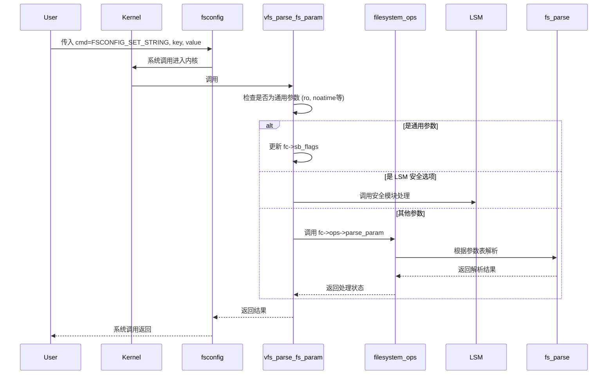

### 3-5. 挂载流程与用户接口

新 API 下的完整挂载流程分为四个步骤，每个步骤对应一个系统调用。下面给出一个完整的 C 语言示例，展示如何将 ext4 文件系统从 `/dev/sdb1` 挂载到 `/mnt`：

```c
#define _GNU_SOURCE
#include <sys/syscall.h>
#include <sys/mount.h>
#include <unistd.h>
#include <fcntl.h>
#include <stdio.h>
#include <stdlib.h>

#ifndef __NR_fsopen
#define __NR_fsopen 430
#endif
#ifndef __NR_fsconfig
#define __NR_fsconfig 431
#endif
#ifndef __NR_fsmount
#define __NR_fsmount 432
#endif
#ifndef __NR_move_mount
#define __NR_move_mount 429
#endif

int main(void)
{
    int fs_fd, mount_fd;

    /* 步骤 1: 创建 ext4 文件系统上下文 */
    fs_fd = syscall(__NR_fsopen, "ext4", FSOPEN_CLOEXEC);
    if (fs_fd < 0) {
        perror("fsopen");
        exit(EXIT_FAILURE);
    }

    /* 步骤 2: 通过 fsconfig 逐项传递挂载参数 */
    /* 设置设备源 */
    if (syscall(__NR_fsconfig, fs_fd, FSCONFIG_SET_STRING,
                "source", "/dev/sdb1", 0) < 0) {
        perror("fsconfig source");
        close(fs_fd);
        exit(EXIT_FAILURE);
    }

    /* 创建文件系统实例 (此命令触发超级块创建) */
    if (syscall(__NR_fsconfig, fs_fd, FSCONFIG_CMD_CREATE,
                NULL, NULL, 0) < 0) {
        perror("fsconfig create");
        close(fs_fd);
        exit(EXIT_FAILURE);
    }

    /* 步骤 3: 创建挂载实例 */
    mount_fd = syscall(__NR_fsmount, fs_fd, FSMOUNT_CLOEXEC, 0);
    close(fs_fd);
    if (mount_fd < 0) {
        perror("fsmount");
        exit(EXIT_FAILURE);
    }

    /* 步骤 4: 将挂载实例移动到目标挂载点 */
    if (syscall(__NR_move_mount, mount_fd, "", AT_FDCWD, "/mnt",
                MOVE_MOUNT_F_EMPTY_PATH) < 0) {
        perror("move_mount");
        close(mount_fd);
        exit(EXIT_FAILURE);
    }

    close(mount_fd);
    printf("挂载成功\n");
    return 0;
}
```

各系统调用的功能与注意事项：

- **`fsopen()`**：接受文件系统名称和标志（如 `FSOPEN_CLOEXEC`），返回文件描述符。调用者必须拥有 `CAP_SYS_ADMIN` 能力，或在用户命名空间内拥有该能力。
- **`fsconfig()`**：支持多种命令，除了 `FSCONFIG_SET_STRING` 和 `FSCONFIG_CMD_CREATE` 外，还包括 `FSCONFIG_SET_FLAG`（设置标志）、`FSCONFIG_SET_BINARY`（二进制数据）等。`FSCONFIG_CMD_CREATE` 触发实际的文件系统超级块创建，可能会共享已有超级块。
- **`fsmount()`**：基于配置好的上下文创建挂载实例，返回新文件描述符。上下文必须已通过 `FSCONFIG_CMD_CREATE` 或 `FSCONFIG_CMD_CREATE_EXCL` 完成实例化。
- **`move_mount()`**：将挂载实例从临时位置移动到目标挂载点。一旦挂载对象被附加，即使关闭描述符，挂载也不会被卸载。

下图以流程图形式展示了从用户请求到挂载完成的整体路径：

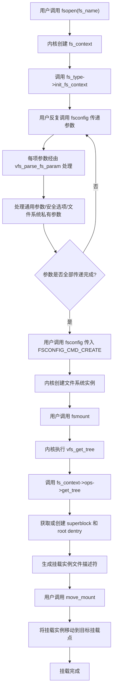

### 3-6. 兼容性设计

为支持尚未适配新 API 的传统文件系统，内核保留了**遗留（legacy）处理路径**。当 `fsopen()` 遇到未设置 `init_fs_context` 回调的文件系统类型时，内核会自动回退调用 `legacy_init_fs_context()`。该函数会分配 `legacy_fs_context` 结构，并将操作函数表中的 `parse_param` 指向 `legacy_parse_param()`，同时将 `get_tree` 指向 `legacy_get_tree()`。

遗留路径的工作机制如下：

1. **参数收集**：`legacy_parse_param()` 将每个键值对以 `,key=value` 的形式追加到内部缓冲区 `legacy_data`（大小为 PAGE_SIZE），并维护 `data_size` 计数器。所有参数累积在一个字符串中。
2. **超级块创建**：当用户调用 `fsconfig(fd, FSCONFIG_CMD_CREATE, ...)` 时，`legacy_get_tree()` 将累积的选项数据打包成传统 `mount()` 所需的整页数据格式，然后调用文件系统的 `mount` 回调（即 `file_system_type->mount`）完成挂载。
3. **资源释放**：`legacy_fs_context_free()` 负责释放缓冲区。

这种设计确保了所有现有文件系统无需修改即可在新 API 下工作。然而，遗留路径的独立性也引入了额外的风险：缓冲区管理由遗留路径自行实现，与 VFS 通用逻辑隔离，因此其安全性完全取决于开发者的手动检查。**CVE-2022-0185** 正是在 `legacy_parse_param()` 的边界检查中，由于无符号整数下溢导致长度校验被绕过，从而允许向缓冲区外写入数据。这一实例凸显了对遗留代码进行持续审计和测试的必要性。

对于系统管理员，若无法立即更新内核，可通过以下措施降低风险：

```bash
sysctl -w kernel.unprivileged_userns_clone=0
```

该设置禁止非特权用户创建新的用户命名空间，从而阻止未授权用户获取 `CAP_SYS_ADMIN` 权限，有效阻断依赖命名空间能力的漏洞触发条件。此外，生产环境中应优先选用已适配新 API 的文件系统，并考虑使用 seccomp 过滤 `fsopen` 等系统调用。

### 3-7. 分析总结

Filesystem Mount API 通过模块化设计和标准化接口，为 Linux 内核的文件系统挂载提供了更加安全、可维护的基础设施。它将挂载过程拆分为四个独立的系统调用，使每个阶段的责任清晰，便于审计和扩展。参数描述的标准化不仅简化了文件系统开发者的工作，也为 VFS 层和 LSM 框架提供了统一的校验和干预点。

然而，遗留路径的存在使得新旧接口并存期间可能出现安全盲区。**CVE-2022-0185** 的发现表明，即使在总体设计已考虑安全性的情况下，独立实现的兼容层仍可能因边界条件处理不当而引入隐患。这一教训提醒开发者和维护者，在新旧系统过渡期间，必须对遗留代码保持同等的审查强度，并积极推动文件系统维护者适配新 API，最终逐步淘汰遗留路径。

对于系统管理员和云服务提供商，及时更新内核、合理配置命名空间权限，以及监控相关系统调用的使用情况，都是维护系统稳健性的重要手段。随着更多文件系统完成适配，新 API 将逐渐成为挂载操作的主流，为 Linux 内核的长期安全性奠定更坚实的基础。

## 4. 利用思路一

### 4-1. 核心原语与依赖条件

#### 4-1-1. 核心操作原语

本思路所依赖的原始漏洞能力为 **堆缓冲区越界写入**，具体表现为：在 `legacy_parse_param()` 中，当 `ctx->data_size` 达到 4095 字节时，后续的 `fsconfig()` 调用将绕过长度检查，允许向 `legacy_data` 缓冲区之后写入任意长度的数据。该写入行为具备以下可控特征：

- **写入长度**：由调用者通过连续多次的 `fsconfig()` 调用累加，理论上可超过单页大小，但受限于单次参数长度上限（256 字节）。
- **写入内容**：由 `fsconfig()` 的 `key` 和 `value` 参数共同决定，格式固定为 `,key=value`，其中 `key` 和 `value` 的内容完全可控（但需避免逗号字符）。
- **写入方向**：从被溢出的缓冲区尾部开始，按地址递增顺序覆盖相邻的堆对象。

为了将上述越界写入转化为可操作的更高层次能力，本思路借助了内核中三种对象——`msg_msg` 主体（位于 `kmalloc-cg-4k`）、`msg_msgseg`（位于 `kmalloc-cg-32`）以及 `seq_operations`（同样位于 `kmalloc-cg-32`），并结合 FUSE 提供的线程阻塞机制，逐步构建出两条关键原语：

1. **越界读取**：通过修改相邻 `msg_msg` 的 `m_ts` 字段，使其放大至超出原始消息范围。由于 `msg_msg` 的数据部分通过 `next` 指针链接到 `msg_msgseg`（位于 `kmalloc-cg-32`），放大后的读取将跨越多个 `msg_msgseg`，从而能够访问到相邻的 `kmalloc-cg-32` 对象。若这些相邻对象是 `seq_operations`（包含内核函数指针），则可实现内核基址泄露，绕过 KASLR。
2. **受限的任意地址写入**：通过修改处于 `msgsnd()` 拷贝过程中 `msg_msg` 的 `next` 指针，使其指向目标地址（通常为 `modprobe_path`），并在恢复拷贝时向该地址写入指定的数据，实现受控的内存修改。

选择 `msg_msg` 作为基础对象的原因在于其头部字段（`m_ts` 和 `next`）位于对象开头，易于被越界写入精确覆盖，且其主体分配在 `kmalloc-cg-4k`，与 `legacy_data`（`kmalloc-4k`）大小一致，便于跨缓存布局。`seq_operations` 则因其包含内核代码段指针而成为理想的信息泄露源。FUSE 则提供了精确的线程控制能力，使写入操作能够与内核内部拷贝流程同步。

#### 4-1-2. 依赖条件

该思路的可行依赖于以下内核配置和系统支持：

- **用户命名空间**：`CONFIG_USER_NS=y`，允许非特权用户通过 `unshare()` 创建新命名空间，从而获得 `CAP_SYS_ADMIN` 权限。
- **FUSE 支持**：`CONFIG_FUSE_FS=y` 或模块可加载，用于在 `copy_from_user()` 过程中阻塞内核线程，创造竞争窗口。
- **System V 消息队列**：`CONFIG_SYSVIPC=y`，用于分配和操作 `msg_msg` 及 `msg_msgseg` 对象。
- **目标文件系统**：需未适配新 mount API（如 ext4、9p），以触发遗留路径。
- **漏洞内核版本**：v5.1-rc1 至 v5.16.1 之间。

此外，实际运行环境还需具备一定的内存可预测性和稳定性，以便通过堆喷达到理想的布局。下文将详细描述如何满足这些依赖并构建完整的操作链。

### 4-2. 总体流程

整个操作流程划分为八个阶段，各阶段之间存在数据依赖。下图概括了从环境准备到最终完成权限提升的完整路径：

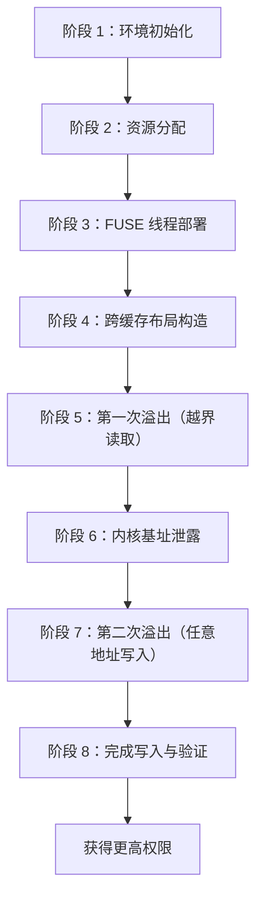

其中，信息泄露阶段（阶段 5-6）为后续的地址计算提供基础，而 FUSE 阻塞确保了写入时机与数据拷贝流程的精确同步（阶段 7）。下面将逐一详解每个阶段的技术细节。

### 4-3. 各阶段详解

#### 4-3-1. 阶段 1：环境初始化

首先通过 `unshare(CLONE_NEWNS | CLONE_NEWUSER)` 创建新的用户和挂载命名空间，获得 `CAP_SYS_ADMIN` 权限。随后初始化 FUSE 子系统：挂载一个用户态文件系统，并在其中创建一个文件，通过 `mmap()` 将该文件映射到用户空间内存区域。此内存区域将作为 `msgsnd()` 的数据源，使内核在执行 `copy_from_user()` 时因缺页而进入 FUSE 读处理程序，从而可以被暂停。

同时，创建一批信号量用于主线程与多个 FUSE 处理线程之间的同步，确保在需要暂停拷贝时能够精确控制。此外，初始化 PGV（Packet Ring）模块，该模块用于后续的 order-3 页面喷射，为跨缓存布局奠定基础。

此阶段还会准备两个辅助文件：一个用于 `modprobe_path` 指向的提权脚本（内容为修改 `/etc/passwd` 或创建 SUID shell），另一个用于触发 `modprobe` 的畸形二进制文件（包含非法魔数）。这些文件在最终触发时使用。

#### 4-3-2. 阶段 2：资源分配

创建两类消息队列：**普通消息队列**（用于越界读取）和 **FUSE 消息队列**（用于任意写入）。普通队列数量为 `MSG_QUEUE_NUM`，FUSE 队列数量为 `EVIL_MSG_QUEUE_NUM`。同时，打开多个 ext4 文件系统上下文，每个上下文将分配一个 `legacy_data` 缓冲区（`kmalloc-4k`），用于后续的溢出操作。

初始化用于 `fsconfig()` 的填充数据：`key_padding`（255 字节 'A'）、`value_padding`（255 字节 'B'）以及 `magic_value`（254 字节 'C'），这些数据用于精确控制 `ctx->data_size` 的累积值。

#### 4-3-3. 阶段 3：FUSE 线程部署

为每个 FUSE 消息队列启动一个独立的线程。线程在等待信号量后，将调用 `msgsnd()` 向对应的 FUSE 队列发送一条消息，消息的数据源指向之前通过 FUSE 映射的内存区域。由于该内存区域尚未被 FUSE 处理程序填充，`copy_from_user()` 会因缺页而进入 FUSE 的读回调，从而被阻塞。此时，内核中的 `msg_msg` 主体（`kmalloc-cg-4k`）和 `msg_msgseg`（`kmalloc-cg-32`）已分配完毕，但数据拷贝尚未完成，为我们提供了篡改 `msg_msg.next` 指针的窗口。

#### 4-3-4. 阶段 4：跨缓存布局构造

本阶段的核心目标是将 `legacy_data` 缓冲区（`kmalloc-4k`）与 `msg_msg` 主体（`kmalloc-cg-4k`）放置到物理相邻的位置，使得越界写入能够覆盖目标对象。由于两者属于不同的 SLUB 缓存，直接分配难以保证相邻，因此采用 **跨缓存布局（cross-cache layout）** 技术，利用伙伴系统的分配行为实现。

具体步骤如下：

1. **消耗 order-3 页面**：通过 PGV 分配大量 order-3 页面（例如 128 页），耗尽伙伴系统中所有可用的 order-3 空闲页，迫使后续 4KB 分配请求向更高 order（如 order-4）进行切割，从而在 order-3 层面制造大量空缺。
2. **制造碎片化空闲区**：释放编号为奇数的 order-3 页面（1, 3, 5, ...），这些页面立即成为空闲状态，等待被后续的 4KB 分配占用。
3. **填充普通 `msg_msg` 主体**：立即调用 `msgsnd()` 分配一批 `msg_msg` 对象（主体位于 `kmalloc-cg-4k`，其 `next` 指向的 `msg_msgseg` 位于 `kmalloc-cg-32`）。由于 SLUB 分配器的 LIFO 特性，主体会优先占用刚刚释放的奇数页，形成偶数页仍被 PGV 占用的格局。
4. **释放剩余 PGV 页面**：释放编号为偶数的 order-3 页面（0, 2, 4, ...），此时偶数页变为空闲。
5. **填充 `legacy_data` 缓冲区**：立即打开多个 ext4 文件系统上下文，并执行一次 `fsconfig()`，触发 `legacy_data` 缓冲区的分配（属于 `kmalloc-4k`）。这些缓冲区会优先占用刚释放的偶数页，从而与奇数页上的 `msg_msg` 主体形成交叉相邻的布局。

通过上述交叉分配，`legacy_data` 与 `msg_msg` 主体在物理地址上极高概率相邻，为后续溢出提供了确定性的目标对象。值得注意的是，`legacy_data` 始终使用 `GFP_KERNEL` 分配，不受 `CONFIG_MEMCG_KMEM` 影响，而 `msg_msg` 主体使用 `GFP_KERNEL_ACCOUNT`，两者在不同缓存中，但通过伙伴系统页面喷射，我们仍然可以在物理页级别实现相邻，这正是跨缓存布局的精髓所在。

下图以时间序列展示了页面状态的变化：

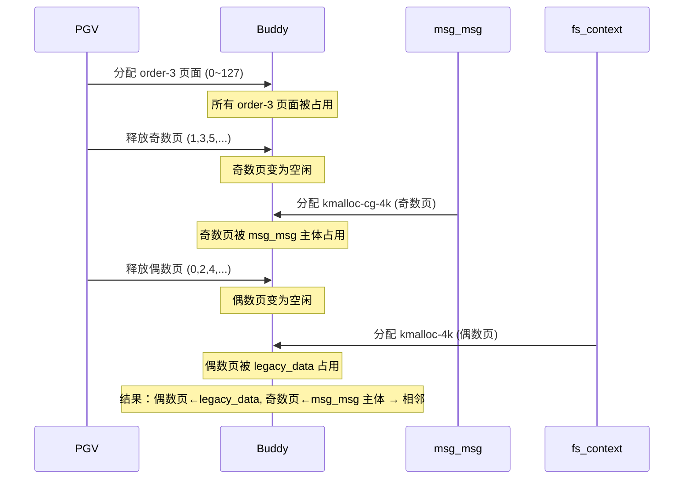

同时，由于 `msg_msg` 主体的 `next` 指针链接着 `msg_msgseg`（位于 `kmalloc-cg-32`），这些 `msg_msgseg` 在内存中也会形成可预测的布局，为后续信息泄露阶段利用 `seq_operations` 做准备。

#### 4-3-5. 阶段 5：第一次溢出（越界读取）

在布局完成后，对每个 `legacy_data` 缓冲区执行一系列 `fsconfig()` 调用，精确累积到 4095 字节。然后使用一次特殊的 `fsconfig()` 调用（`key=""`，`value` 为精心构造的填充数据）触发整数下溢，从而越过边界写入。此次写入的目标是覆盖相邻 `msg_msg` 主体的 `m_ts` 字段，将其改为一个较大的值（例如 0x1fc8），使该消息的可读长度远大于实际数据长度，从而允许后续读取操作跨越多个 `msg_msgseg` 链表节点，访问到相邻的 `kmalloc-cg-32` 对象。

为了增加越界读取命中 `seq_operations` 的概率，此阶段会先释放未受损的普通消息队列中的 `msg_msg`（即那些 `m_ts` 未被篡改的消息）。这一释放操作会在 `kmalloc-cg-32` 缓存中制造空洞。随后，立即通过大量打开 `/proc/self/stat` 的方式喷射 `seq_operations` 结构体（位于 `kmalloc-cg-32`），这些结构体会优先填充刚刚释放的空洞，从而与剩余的 `msg_msgseg` 在物理地址上相邻。

#### 4-3-6. 阶段 6：内核基址泄露

通过 `msgrcv()` 配合 `MSG_COPY` 尝试读取所有普通消息队列中的消息。若某条消息的读取长度大于原始长度，说明其 `m_ts` 已被篡改，该队列即为受害队列。对受害队列进行越界读取，数据读取会沿 `msg_msg` 的 `next` 链表遍历 `msg_msgseg`，由于 `m_ts` 被放大，读取会超出原始 `msg_msgseg` 链表，进入相邻的 `kmalloc-cg-32` 对象。若这些对象中包含 `seq_operations`，则数据中会包含指向内核函数（如 `single_start`）的指针。

扫描读取出的数据，寻找与 `single_start` 函数偏移相匹配的特征值，从而计算出内核加载基址。为了提高成功率，可对多个潜在受害队列重复此过程。

下图详细展示了第一次溢出与信息泄露的交互流程：

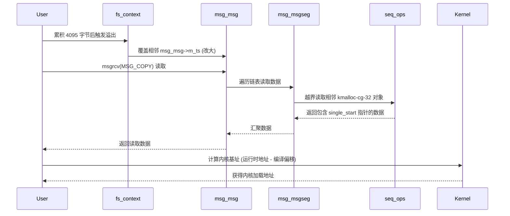

#### 4-3-7. 阶段 7：第二次溢出（任意地址写入）

获取内核基址后，计算出 `modprobe_path` 变量的准确地址。此时，之前通过 `msgsnd()` 发送的 FUSE 消息仍处于 `copy_from_user()` 暂停状态，其 `msg_msg` 主体的 `next` 指针指向下一个 `msg_msgseg` 结构。

再次触发溢出，但本次溢出的目标是与 FUSE 消息相邻的 `legacy_data` 缓冲区。通过精心构造的 `value`，将受害 `msg_msg` 的 `next` 指针覆盖为目标地址（`modprobe_path - 8`），同时保持 `m_ts` 不变，以免影响遍历逻辑。之所以减去 8 字节，是因为 `msg_msgseg` 的第一个字段是 `next` 指针，我们需要将目标地址的前 8 字节作为链表终止符（设为 NULL），确保拷贝停止在目标位置。

随后，通过信号量通知 FUSE 线程继续执行。`copy_from_user()` 恢复后，内核会按照链表的顺序将数据拷贝到 `msg_msgseg` 中。由于 `next` 已被篡改，拷贝流程将向 `modprobe_path` 写入之前准备好的 payload（即一个脚本的绝对路径）。写入完成后，`modprobe_path` 的内容被替换为指向用户可控脚本的路径。

下图详细展示了第二次溢出与 FUSE 协作的写入流程：

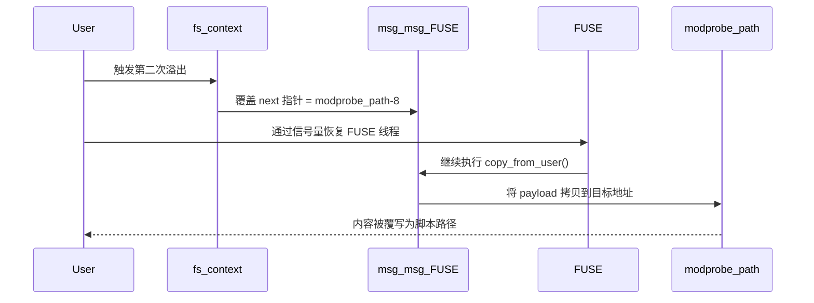

#### 4-3-8. 阶段 8：完成写入与验证

写入完成后，`modprobe_path` 已指向用户可控的脚本文件。通过读取 `/proc/sys/kernel/modprobe` 验证写入是否成功。若确认成功，执行一个格式无效的二进制文件（例如首字节为 `\xff\xff\xff\xff`），内核将尝试调用 `request_module()` 加载对应的解释器，从而执行 `modprobe_path` 指向的脚本。该脚本以 root 权限运行，可以修改系统账户或创建特权 shell，从而实现权限提升。

触发与提权流程如下：

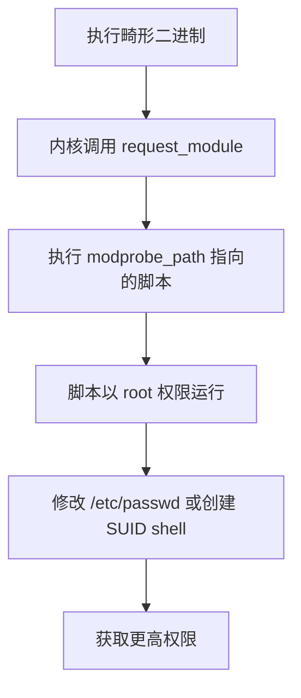

### 4-4. 保护机制应对策略

本利用思路在构建过程中，需要面对 Linux 内核中一系列旨在提高操作门槛的安全机制。得益于漏洞本身的特性和所采用的利用路径，这些机制并未构成实质性障碍。

| 机制                                 | 影响与应对策略                                                                                                                                                                                                                                                                                                                                                                                                         |
| :----------------------------------- | :--------------------------------------------------------------------------------------------------------------------------------------------------------------------------------------------------------------------------------------------------------------------------------------------------------------------------------------------------------------------------------------------------------------------- |
| **KASLR**                            | **影响**：内核地址空间布局随机化将内核代码、数据和堆的基址随机化，使得直接使用硬编码符号地址不可行。<br>**应对**：通过 **阶段 6** 的信息泄露原语，利用越界读取获取内核代码段指针（如 `single_start`），计算运行时基址，为后续写入提供准确地址。                                                                                                                                                                        |
| **SMEP / SMAP**                      | **影响**：SMEP 阻止内核执行用户空间代码，SMAP 阻止内核访问用户空间数据。<br>**应对**：最终提权通过修改 `modprobe_path` 并触发用户态脚本完成，**不涉及内核执行用户代码或访问用户数据**，因此这些保护不会触发。                                                                                                                                                                                                          |
| **KPTI**                             | **影响**：内核页表隔离增加利用复杂度。<br>**应对**：与 SMEP/SMAP 同理，本思路不依赖返回用户空间的 ROP 链，KPTI 不影响本路径。                                                                                                                                                                                                                                                                                          |
| **CONFIG_MEMCG / CONFIG_MEMCG_KMEM** | **影响**：启用后会使部分对象（如 `msg_msg` 主体）使用 `GFP_KERNEL_ACCOUNT`，分配到独立的 `kmalloc-cg-*` 缓存。<br>**应对**：采用**跨缓存布局**技术，通过伙伴系统页面喷射使来自不同缓存的 `legacy_data`（`kmalloc-4k`）与 `msg_msg` 主体（`kmalloc-cg-4k`）在物理页面上相邻，直接应对缓存隔离。需要强调的是，`legacy_data` 始终使用 `GFP_KERNEL` 分配，不受该配置影响，但通过页面级别的布局，我们仍然可以跨越缓存边界。 |
| **CONFIG_SLAB_FREELIST_RANDOM**      | **影响**：随机化空闲链表顺序，降低堆喷射的可预测性。<br>**应对**：通过**大规模堆喷射**（大量分配对象）在统计上提高目标对象相邻的概率，克服随机化带来的不确定性。                                                                                                                                                                                                                                                       |
| **CONFIG_SLAB_FREELIST_HARDENED**    | **影响**：混淆空闲对象指针，防止 `freelist` 劫持。<br>**应对**：本思路不篡改分配器元数据，而是直接篡改相邻数据结构（`msg_msg->m_ts` 和 `next`），因此该保护无效。                                                                                                                                                                                                                                                      |
| **CONFIG_INIT_ON_ALLOC_DEFAULT_ON**  | **影响**：分配时清零，可防止部分信息泄露。<br>**应对**：信息泄露读取的是已被释放并重新分配的区域，这些区域可能保留残留数据，因此该保护阻断效果有限。                                                                                                                                                                                                                                                                   |
| **CONFIG_HARDENED_USERCOPY**         | **影响**：在 `copy_to_user()` 中执行边界检查。<br>**应对**：写入 `modprobe_path` 发生在内核内部拷贝流程（`msgsnd` 的 `copy_from_user`），不触发 `copy_to_user` 检查，因此绕过。                                                                                                                                                                                                                                        |

**总结**：**CVE-2022-0185** 的利用之所以能够有效应对上述多种内核加固机制，关键在于其利用路径的独特性。它**不依赖传统的内核代码执行或 ROP 链**，而是通过信息泄露绕过 KASLR，并利用内核自身功能（`modprobe_path`）完成提权，从而规避了 SMEP、SMAP、KPTI 等核心控制流保护。同时，通过堆喷射和跨缓存布局等技术，也有效应对了堆分配器层面的各种加固措施。

### 4-5. 条件与局限性

#### 4-5-1. 必要条件

- 漏洞内核版本（v5.1-rc1 ~ v5.16.1）。
- 用户命名空间启用（`CONFIG_USER_NS=y`）且允许非特权创建。
- FUSE 可用（内核支持或模块已加载）。
- 目标文件系统未适配新 mount API（如 ext4）。
- System V 消息队列支持（`CONFIG_SYSVIPC=y`）。

#### 4-5-2. 局限性

- **堆布局精度**：跨缓存布局的成功率受 SLUB 随机性影响，需要多次尝试。
- **FUSE 依赖**：在某些受限环境（如容器）中，FUSE 可能被禁用或无法挂载，此时需改用其他阻塞机制（如 userfaultfd，但其在 5.11 后默认非特权禁用）。FUSE 的可用性直接影响本思路的可行性。
- **版本限制**：补丁 [`722d94847de2`](https://git.kernel.org/pub/scm/linux/kernel/git/torvalds/linux.git/commit/?id=722d94847de2) 将 `legacy_parse_param()` 中的边界检查从减法修正为加法，从根本上消除了整数下溢，使得该利用思路**无法在 5.16.2 及以后的内核版本上生效**。需要注意的是，`legacy_data` 缓冲区的分配始终使用 `GFP_KERNEL` 标志，该标志在补丁前后并未改变；决定本思路适用性的根本因素是漏洞本身是否已被修复。
- **特权要求**：虽然用户命名空间可赋予 `CAP_SYS_ADMIN`，但某些安全策略（如 seccomp）可能过滤 `fsopen` 或 `unshare`，从而阻断触发路径。
- **写入限制**：写入 `modprobe_path` 时，内容必须以 `,key=value` 格式附加，因此需要将目标地址的前 8 字节用作链表指针（设为 NULL），以保证遍历正常结束。此外，写入的数据长度有限，需保证 payload 路径长度不超过 `modprobe_path` 的缓冲区大小（通常为 256 字节）。

### 4-6. 总结

本思路充分利用了 `legacy_parse_param()` 中的整数下溢漏洞，结合 System V 消息队列（主体在 `kmalloc-cg-4k`，附加段在 `kmalloc-cg-32`）和 FUSE，构建了从越界读到任意地址写入的完整操作链。通过将 `modprobe_path` 覆盖为用户可控脚本，实现了在不依赖复杂 ROP 或内核代码执行的情况下完成权限提升。该方法相对稳定，且无需绕过 SMEP/SMAP/KPTI，但受限于堆布局和 FUSE 的可用性。

该思路的成功依赖于对内核堆管理器行为的深刻理解，以及对手工构造的精确参数控制。它展示了单一内存损坏漏洞在不同内核子系统组合下可演变的强大能力，同时也提醒开发者，在引入新 API 时需对遗留路径进行同等严格的边界审查。对于系统管理员而言，及时更新内核并合理配置命名空间权限（如禁用非特权用户命名空间）是防范此类风险的有效措施。随着更多文件系统适配新 API，遗留路径将逐步减少，从而缩小潜在的风险面。

### 4-7. 测试结果

<div style="text-align: center; margin: 2rem 0;">
  
</div>

## 5. 利用思路二

### 5-1. 核心原语与依赖条件

#### 5-1-1. 核心操作原语

本思路同样基于 `legacy_parse_param()` 中的整数下溢漏洞，实现向相邻堆对象的越界写入。与前一个思路不同的是，本思路将目标对象从 `msg_msg` 替换为 **`pipe_buffer`**，并利用 `pipe_buffer` 结构体自身的特性构建更直接的篡改原语。

`pipe_buffer` 结构体定义在内核中，用于管理管道缓冲区，其关键字段如下：

```c
struct pipe_buffer {
    struct page *page;          // 指向物理页面的指针
    unsigned int offset, len;   // 当前数据在页面中的偏移和长度
    const struct pipe_buf_operations *ops;  // 函数操作表
    unsigned int flags;
    unsigned long private;
};
```

本思路通过**连续越界写入**实现目标：首先利用第一次溢出修改相邻 `msg_msg` 的 `m_ts` 字段，将其标记为受害者，确定溢出边界；随后在同一组 `fs_context` 上继续追加写入，使越界指针逐步前移，最终抵达新分配的 `pipe_buffer`，修改其 `page` 指针的低位字节，使其与另一个 `pipe_buffer` 指向相同的物理页面，从而创造出**页级重叠**状态。这一重叠本质上是一种 UAF 原语：释放其中一个管道（受害者）时，其共享的物理页面会被释放回伙伴系统，而另一个管道（控制器）仍然持有对该页面的引用，从而可以读写已经被释放并可能被其他对象占用的内存区域。

利用该 UAF 原语，本思路将目标锁定为 `struct file` 对象（文件结构体）。通过释放受害者管道页面后，立即大量打开 `/etc/passwd` 文件，使新分配的 `file` 结构体优先占用该空闲页面。此时，控制器管道便可以直接读写该 `file` 结构体，从而修改其 `f_flags` 和 `f_mode` 字段，将原本只读的文件描述符变为可写，最终向 `/etc/passwd` 追加一个具有 root 权限的用户条目。

#### 5-1-2. 依赖条件

该思路的可行依赖于以下内核配置和系统支持：

- **用户命名空间**：`CONFIG_USER_NS=y`，允许非特权用户创建命名空间获取 `CAP_SYS_ADMIN`。
- **System V 消息队列**：`CONFIG_SYSVIPC=y`，用于堆喷 `msg_msg` 对象，帮助构建跨缓存布局。
- **管道支持**：内核默认支持，用于创建 `pipe_buffer` 对象。
- **目标文件系统**：需未适配新 mount API（如 ext4），以触发遗留路径。
- **漏洞内核版本**：v5.1-rc1 至 v5.16.1 之间。
- **文件系统**：存在 `/etc/passwd` 且为只读（标准配置），且文件系统支持写操作。

本思路不依赖 FUSE，因此适用环境更广，但需要更精准的堆布局和页面控制。

### 5-2. 总体流程

整个操作流程划分为九个阶段，各阶段环环相扣。下图概括了从环境准备到最终篡改 `/etc/passwd` 的完整路径：

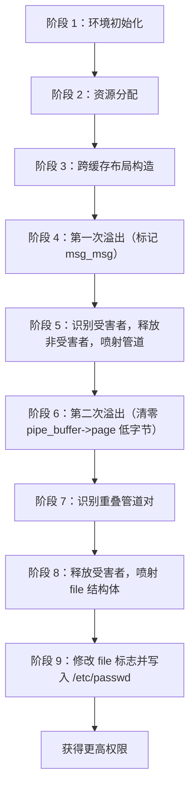

其中，阶段 3 的跨缓存布局为后续溢出提供相邻对象，阶段 4 的第一次溢出确定受害者位置，阶段 5 的释放与喷射为第二次溢出准备目标对象（`pipe_buffer`），阶段 6 的第二次溢出（连续写入）创造页级重叠，阶段 8 实现 UAF 与 file 结构体的重叠，阶段 9 完成最终的文件篡改。

### 5-3. 各阶段详解

#### 5-3-1. 阶段 1：环境初始化

首先通过 `unshare(CLONE_NEWNS | CLONE_NEWUSER)` 创建新的用户和挂载命名空间，获得 `CAP_SYS_ADMIN` 权限。随后绑定 CPU 核心以提高后续堆喷操作的稳定性，并通过 `setrlimit` 提升文件描述符限制，以便创建大量管道和文件句柄。同时初始化 PGV 模块，该模块用于后续的 order-3 页面喷射，为跨缓存布局奠定基础。

#### 5-3-2. 阶段 2：资源分配

创建一批普通消息队列（用于后续的 `msg_msg` 堆喷），并打开多个 ext4 文件系统上下文，每个上下文对应一个 `legacy_data` 缓冲区。准备用于 `fsconfig()` 的填充字符串，以便精确控制 `ctx->data_size` 的累积值。

#### 5-3-3. 阶段 3：跨缓存布局构造

本阶段的核心目标是将 `legacy_data` 缓冲区（`kmalloc-4k`）与 `msg_msg` 主体（`kmalloc-cg-4k`）放置到物理相邻的位置，使得越界写入能够覆盖目标对象。由于两者属于不同的 SLUB 缓存，直接分配难以保证相邻，因此采用 **跨缓存布局（cross-cache layout）** 技术，利用伙伴系统的分配行为实现。

具体步骤如下：

1. **消耗 order-3 页面**：通过 PGV 分配大量 order-3 页面（例如 128 页），耗尽伙伴系统中所有可用的 order-3 空闲页，迫使后续 4KB 分配请求向更高 order（如 order-4）进行切割，从而在 order-3 层面制造大量空缺。
2. **制造碎片化空闲区**：释放编号为奇数的 order-3 页面（1, 3, 5, ...），这些页面立即成为空闲状态，等待被后续的 4KB 分配占用。
3. **填充普通 `msg_msg` 主体**：立即调用 `msgsnd()` 分配一批 `msg_msg` 对象（主体位于 `kmalloc-cg-4k`，其 `next` 指向的 `msg_msgseg` 位于 `kmalloc-cg-32`）。由于 SLUB 分配器的 LIFO 特性，主体会优先占用刚刚释放的奇数页，形成偶数页仍被 PGV 占用的格局。
4. **释放剩余 PGV 页面**：释放编号为偶数的 order-3 页面（0, 2, 4, ...），此时偶数页变为空闲。
5. **填充 `legacy_data` 缓冲区**：立即打开多个 ext4 文件系统上下文，并执行一次 `fsconfig()`，触发 `legacy_data` 缓冲区的分配（属于 `kmalloc-4k`）。这些缓冲区会优先占用刚释放的偶数页，从而与奇数页上的 `msg_msg` 主体形成交叉相邻的布局。

通过上述交叉分配，`legacy_data` 与 `msg_msg` 主体在物理地址上极高概率相邻，为后续溢出提供了确定性的目标对象。值得注意的是，`legacy_data` 始终使用 `GFP_KERNEL` 分配，不受 `CONFIG_MEMCG_KMEM` 影响，而 `msg_msg` 主体使用 `GFP_KERNEL_ACCOUNT`，两者在不同缓存中，但通过伙伴系统页面喷射，我们仍然可以在物理页级别实现相邻，这正是跨缓存布局的精髓所在。

下图以时间序列展示了页面状态的变化：


#### 5-3-4. 阶段 4：第一次溢出（标记 msg_msg）

对每个 `legacy_data` 缓冲区执行一系列 `fsconfig()` 调用，精确累积到 4095 字节。然后使用一次特殊的 `fsconfig()` 调用（`key=""`，`value` 为精心构造的填充数据）触发整数下溢，从而越过边界写入。此次写入的目标是覆盖相邻 `msg_msg` 的 `m_ts` 字段，将其改大（例如改为 `0x1fc8`）。由于 `msg_msg` 主体与 `legacy_data` 在物理页面上相邻，此次溢出能够准确命中某个 `msg_msg`。

此阶段并不进行信息泄露，而是利用 `m_ts` 的异常值作为标记，用于后续识别哪些 `msg_msg` 被成功溢出，从而确定哪些 `legacy_data` 缓冲区与目标对象相邻。

#### 5-3-5. 阶段 5：识别受害者并喷射管道

通过 `msgrcv()` 配合 `MSG_COPY` 遍历所有普通消息队列，检测哪些队列的 `m_ts` 被篡改（读取长度异常），将这些队列标记为“受害者”，并记录其索引。这些受害者队列对应的 `msg_msg` 主体就是与某个 `legacy_data` 相邻的对象。

随后，创建大量管道（例如 360 个），每个管道对应一个 `pipe_buffer` 结构体。为了在后续阶段将 `pipe_buffer` 与 `legacy_data` 对齐，这里会释放未被篡改的 `msg_msg`（即非受害者队列），在 `kmalloc-cg-4k` 缓存中制造大量空洞。然后，通过 `fcntl(F_SETPIPE_SZ)` 调整部分管道的缓冲区大小（申请 4KB 内存），使新分配的 `pipe_buffer` 结构体落入刚释放的空洞。由于 SLUB 分配器的 LIFO 特性，这些 `pipe_buffer` 会优先占用最近释放的空洞，其中一些极有可能占据原本与受害者 `msg_msg` 相邻的位置，从而与某个 `legacy_data` 形成新的相邻关系。

下图展示了阶段 4 和阶段 5 的交互过程，说明了从标记 `msg_msg` 到替换为 `pipe_buffer` 的布局变化：

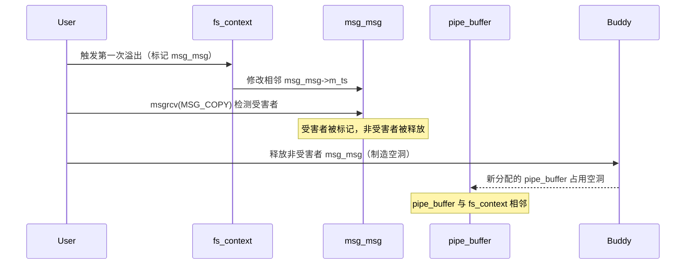

#### 5-3-6. 阶段 6：第二次溢出（清零 `pipe_buffer->page` 低字节）

在阶段 5 完成后，与受害者 `legacy_data` 相邻的内存位置已从 `msg_msg` 变更为 `pipe_buffer`。此时，**同一组 `legacy_data` 缓冲区（即 `fs_fds`）的 `ctx->data_size` 早已超过 4095 字节**，处于已触发整数下溢的状态，后续的 `fsconfig()` 调用仍会继续向缓冲区之后写入数据。

我们继续对同一组 `fs_fds` 执行额外的 `fsconfig()` 调用，这些调用会不断追加写入内容，使越界写入的指针（`legacy_data + size`）逐渐向前推进。经过若干次精心计算的调用后，写入位置恰好越过之前被覆盖的 `msg_msg`，进入到相邻的 `pipe_buffer` 对象所在的内存区域。此时，通过构造最后一次 `fsconfig()` 调用的 `value`，**精确覆盖相邻 `pipe_buffer` 的 `page` 指针的最低字节（将其设置为 `0x00`）**。由于 `page` 指针是 16 字节对齐的，修改其最低字节相当于将指针向下对齐到最近的页面边界，从而使得该 `pipe_buffer` 与另一个 `pipe_buffer` 共享同一个物理页面，创造出**页级重叠**。

整个过程中，我们没有创建新的 `fs_context`，也没有重新累积 `size`，而是在第一次溢出的基础上**持续利用同一个已下溢的缓冲区，逐步推进写入位置**，最终精准命中 `pipe_buffer` 的关键字段。

下图详细展示了第二次溢出的写入过程：

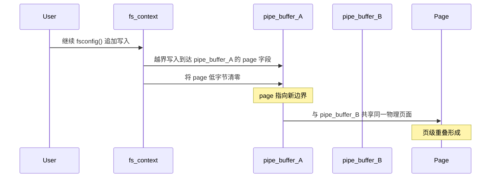

#### 5-3-7. 阶段 7：识别重叠管道对

通过读取每个管道的前几个字节，检查是否包含预期的魔术值和索引标识。若某个管道的读取数据中包含不属于自身的索引号，则说明该管道的 `page` 指针已被篡改，与另一个管道共享同一页面。记录下这些成对出现的管道索引（受害者管道和控制器管道）。通常会有多对重叠，选择第一对即可继续。

#### 5-3-8. 阶段 8：释放受害者并喷射 file 结构

关闭受害者管道对应的文件描述符，这将触发内核释放其 `pipe_buffer` 以及所指向的物理页面。由于该页面同时被控制器管道引用，因此控制器管道仍然可以访问该页面内容。随后，大量打开 `/etc/passwd` 文件（以只读方式）。在 SLUB 分配器的 LIFO 策略下，新分配的 `struct file` 对象会优先占用刚刚释放的物理页面，从而与控制器管道产生重叠。此时，控制器管道可以读取该 `file` 结构体的内容，并从中获取内核函数指针（如 `ext4_file_operations` 地址），进而计算出内核基址（绕过 KASLR）。

#### 5-3-9. 阶段 9：修改 file 标志并写入

通过控制器管道向重叠页面写入数据，精确覆盖 `struct file` 中的 `f_flags` 和 `f_mode` 字段，将只读标志修改为可写标志（例如将 `f_flags` 设为 `O_WRONLY`，`f_mode` 设为可读写）。由于所有喷洒的 `/etc/passwd` 文件描述符都指向同一个 inode，修改其中一个 `file` 结构体的标志会影响所有描述符的权限。随后，向这些描述符写入一条包含 `root::0:0:root:/root:/bin/sh` 的条目，即可在 `/etc/passwd` 中创建一个无密码的 root 用户。

该阶段完成后，便可通过 `su` 直接切换至该用户，获取更高权限。

下图概括了阶段 8 和阶段 9 的核心交互流程：

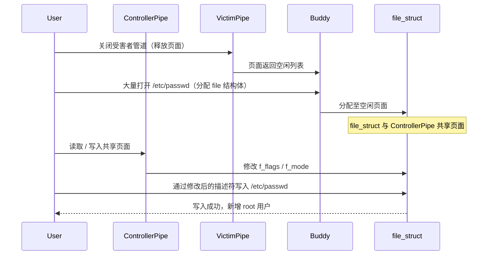

### 5-4. 保护机制应对策略

本思路在构建过程中需要面对内核中的多种安全机制，但得益于其不依赖内核代码执行的特性，这些机制并未构成实质性障碍。

| 机制                       | 影响与应对策略                                                                                                                                                                                                 |
| :------------------------- | :------------------------------------------------------------------------------------------------------------------------------------------------------------------------------------------------------------- |
| **KASLR**                  | 内核地址随机化导致无法预知符号地址。本思路通过阶段 8 从重叠的 `file` 结构体中读取 `f_op` 指针，计算内核基址，从而绕过 KASLR。                                                                                  |
| **SMEP/SMAP**              | 这些机制阻止内核执行用户代码或访问用户数据。本思路全程以内核数据对象（`pipe_buffer`、`file`）为目标，不涉及执行用户代码或访问用户数据，故不受影响。                                                            |
| **KPTI**                   | 本思路不依赖返回用户空间的 ROP 链，因此 KPTI 不会增加额外复杂度。                                                                                                                                              |
| **CONFIG_MEMCG_KMEM**      | 该配置会使部分对象使用独立缓存（如 `kmalloc-cg-*`）。本思路采用跨缓存布局技术，通过伙伴系统页面喷射使来自不同缓存的 `legacy_data`（`kmalloc-4k`）与目标对象（`kmalloc-cg-4k`）在物理页面上相邻，绕过缓存隔离。 |
| **SLAB_FREELIST_RANDOM**   | 随机化空闲链表可能降低堆喷的可预测性。本思路通过大规模堆喷（大量分配和释放）在统计上提高命中概率。                                                                                                             |
| **SLAB_FREELIST_HARDENED** | 该机制保护分配器元数据不被篡改。本思路不篡改元数据，而是直接篡改相邻对象（`pipe_buffer->page` 和 `file` 字段），故无效。                                                                                       |
| **HARDENED_USERCOPY**      | 该机制在 `copy_to_user` 中检查边界。本思路的最终写入（修改 `/etc/passwd`）通过正常的文件写路径完成，不触发异常 `copy_to_user`。                                                                                |

本思路的优势在于不依赖 FUSE，适用范围更广，但对堆布局精度的要求较高，且依赖于文件系统的可写性。

### 5-5. 条件与局限性

#### 5-5-1. 必要条件

- 漏洞内核版本（v5.1-rc1 ~ v5.16.1）。
- 用户命名空间启用（`CONFIG_USER_NS=y`）。
- System V 消息队列支持。
- 目标文件系统未适配新 mount API（如 ext4）。
- `/etc/passwd` 文件存在且文件系统可写（通常根文件系统可写）。

#### 5-5-2. 局限性

- **堆布局精度**：`pipe_buffer` 与 `legacy_data` 的相邻依赖精确的跨缓存布局，成功率受 SLUB 随机性影响，需要多次尝试。
- **管道数量限制**：系统对每个进程的管道数量有限制，需通过 `setrlimit` 提高限制，但仍受系统总内存约束。
- **文件描述符消耗**：大量打开 `/etc/passwd` 会消耗文件描述符，需提前提升限制。
- **版本限制**：漏洞修复后（5.16.2 及以上）无法使用。
- **权限依赖**：虽然命名空间提供 `CAP_SYS_ADMIN`，但某些安全策略（如 SELinux）可能阻止对 `/etc/passwd` 的写入操作，即使文件描述符被修改为可写。

### 5-6. 总结

本思路充分利用了 `pipe_buffer` 结构体的特性，通过连续越界写入实现从 `msg_msg` 到 `pipe_buffer` 的精准命中，并利用 `page` 指针的低字节清零创造出页级重叠。该重叠进一步演化为 UAF 原语，最终实现对 `file` 结构体的篡改和 `/etc/passwd` 的写入。该方法不依赖 FUSE，因此在环境适应性上优于许多其他利用路径，但堆布局的精度要求更高，且提权路径依赖于文件系统的可写性。

该思路展示了同一漏洞在不同目标对象下可演化出的多样化利用路径，同时也凸显了内核对象管理中的潜在风险：当 `pipe_buffer` 和 `file` 等常用结构体与用户可控的堆缓冲区相邻时，边界检查的失误可能导致严重的安全后果。内核开发者应重视对所有遗留代码路径中的边界条件进行严格验证，并积极推动文件系统适配新 API，减少遗留代码的潜在风险面。

### 5-7. 测试结果

<div style="text-align: center; margin: 2rem 0;">
  
</div>

## 6. 利用思路三

> **技术参考**：本利用思路的核心技术——三节点管道链闭环拓扑与任意物理内存读写原语，参考了笔者在 **[《Kernel Heap Cross-Cache Overflow 技术分析其二》](https://binracer.github.io/2026/03/07/pwn4kernel-CrossCacheOverflow其二/)** 中的研究成果。该研究系统性地阐述了如何通过页级堆风水（Page-Level Heap Feng Shui）技术，将跨缓存溢出能力转化为包括任意地址读写在内的完整利用链。

### 6-1. 核心原语与依赖条件

#### 6-1-1. 核心操作原语

本思路在前述管道重叠技术的基础上进一步扩展，目标是构建**任意物理内存读写原语**，从而直接修改当前进程的 `task_struct` 中的凭证指针，实现权限提升。与思路二仅修改文件结构体不同，本思路通过构建一个由多个管道组成的链式结构，将管道缓冲区重定向到任意物理地址，形成可控的物理内存访问通道。

`pipe_buffer` 结构体包含指向物理页面的 `page` 指针，以及 `offset` 和 `len` 字段，用于控制读写位置。通过精心构造多个相互引用的 `pipe_buffer`，可以形成一个**自引用环**，使得对某个管道的读写操作最终映射到用户指定的物理地址。这种机制本质上构建了一个“后门”，允许在内核堆布局稳定的情况下，以极高的自由度访问物理内存。

在此基础上，本思路利用物理内存扫描，定位内核的 `vmemmap_base`（虚拟内存映射基址），进而通过页表映射将物理地址转换为虚拟地址，最终定位当前进程和 root 进程（`init` 进程）的 `task_struct`。通过物理写入覆盖当前进程的 `cred`、`real_cred` 和 `nsproxy` 指针为 root 进程的对应值，即可在当前进程中获得完全权限。

#### 6-1-2. 依赖条件

- **用户命名空间**：`CONFIG_USER_NS=y`，允许非特权用户创建命名空间获取 `CAP_SYS_ADMIN`。
- **System V 消息队列**：`CONFIG_SYSVIPC=y`，用于堆喷 `msg_msg` 对象。
- **管道支持**：内核默认支持，用于创建 `pipe_buffer` 对象。
- **目标文件系统**：需未适配新 mount API（如 ext4），以触发遗留路径。
- **漏洞内核版本**：v5.1-rc1 至 v5.16.1 之间。
- **进程标识**：当前进程名可通过 `prctl(PR_SET_NAME)` 设置，便于在内存扫描中定位。
- **内核符号**：`anon_pipe_buf_ops` 和 `secondary_startup_64` 的偏移量需已知（在受影响版本中均为固定值）。

本思路不依赖 FUSE，但需要更复杂的管道链构建，且对内存布局的稳定性要求较高。

### 6-2. 总体流程

整个操作流程划分为十二个阶段，涉及多次堆布局调整和管道链构建。下图概括了从环境准备到最终提权的完整路径：

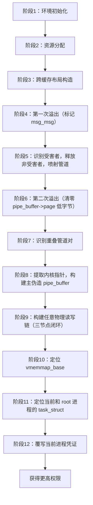

其中，阶段 8 提取内核基址和关键指针，阶段 9 建立任意物理读写能力，阶段 10-12 完成内存扫描和凭证替换。

### 6-3. 各阶段详解

#### 6-3-1. 阶段 1：环境初始化

首先通过 `unshare(CLONE_NEWNS | CLONE_NEWUSER)` 创建新的用户和挂载命名空间，获得 `CAP_SYS_ADMIN` 权限。随后绑定 CPU 核心以提高后续堆喷操作的稳定性，并通过 `setrlimit` 提升文件描述符限制，以便创建大量管道和消息队列。同时初始化 PGV 模块，该模块用于后续的 order-3 页面喷射，为跨缓存布局奠定基础。

#### 6-3-2. 阶段 2：资源分配

创建一批普通消息队列（用于后续的 `msg_msg` 堆喷），并打开多个 ext4 文件系统上下文，每个上下文对应一个 `legacy_data` 缓冲区。准备用于 `fsconfig()` 的填充字符串，以便精确控制 `ctx->data_size` 的累积值。

#### 6-3-3. 阶段 3：跨缓存布局构造

本阶段的核心目标是将 `legacy_data` 缓冲区（`kmalloc-4k`）与 `msg_msg` 主体（`kmalloc-cg-4k`）放置到物理相邻的位置，使得越界写入能够覆盖目标对象。由于两者属于不同的 SLUB 缓存，直接分配难以保证相邻，因此采用 **跨缓存布局（cross-cache layout）** 技术，利用伙伴系统的分配行为实现。

具体步骤如下：

1. **消耗 order-3 页面**：通过 PGV 分配大量 order-3 页面（例如 128 页），耗尽伙伴系统中所有可用的 order-3 空闲页，迫使后续 4KB 分配请求向更高 order（如 order-4）进行切割，从而在 order-3 层面制造大量空缺。
2. **制造碎片化空闲区**：释放编号为奇数的 order-3 页面（1, 3, 5, ...），这些页面立即成为空闲状态，等待被后续的 4KB 分配占用。
3. **填充普通 `msg_msg` 主体**：立即调用 `msgsnd()` 分配一批 `msg_msg` 对象（主体位于 `kmalloc-cg-4k`，其 `next` 指向的 `msg_msgseg` 位于 `kmalloc-cg-32`）。由于 SLUB 分配器的 LIFO 特性，主体会优先占用刚刚释放的奇数页，形成偶数页仍被 PGV 占用的格局。
4. **释放剩余 PGV 页面**：释放编号为偶数的 order-3 页面（0, 2, 4, ...），此时偶数页变为空闲。
5. **填充 `legacy_data` 缓冲区**：立即打开多个 ext4 文件系统上下文，并执行一次 `fsconfig()`，触发 `legacy_data` 缓冲区的分配（属于 `kmalloc-4k`）。这些缓冲区会优先占用刚释放的偶数页，从而与奇数页上的 `msg_msg` 主体形成交叉相邻的布局。

通过上述交叉分配，`legacy_data` 与 `msg_msg` 主体在物理地址上极高概率相邻，为后续溢出提供了确定性的目标对象。值得注意的是，`legacy_data` 始终使用 `GFP_KERNEL` 分配，不受 `CONFIG_MEMCG_KMEM` 影响，而 `msg_msg` 主体使用 `GFP_KERNEL_ACCOUNT`，两者在不同缓存中，但通过伙伴系统页面喷射，我们仍然可以在物理页级别实现相邻。

下图以时间序列展示了页面状态的变化：


#### 6-3-4. 阶段 4：第一次溢出（标记 msg_msg）

对每个 `legacy_data` 缓冲区执行一系列 `fsconfig()` 调用，精确累积到 4095 字节。然后使用一次特殊的 `fsconfig()` 调用（`key=""`，`value` 为精心构造的填充数据）触发整数下溢，从而越过边界写入。此次写入的目标是覆盖相邻 `msg_msg` 的 `m_ts` 字段，将其改大（例如改为 `0x1fc8`）。由于 `msg_msg` 主体与 `legacy_data` 在物理页面上相邻，此次溢出能够准确命中某个 `msg_msg`。

此阶段并不进行信息泄露，而是利用 `m_ts` 的异常值作为标记，用于后续识别哪些 `msg_msg` 被成功溢出，从而确定哪些 `legacy_data` 缓冲区与目标对象相邻。

#### 6-3-5. 阶段 5：识别受害者并喷射管道

通过 `msgrcv()` 配合 `MSG_COPY` 遍历所有普通消息队列，检测哪些队列的 `m_ts` 被篡改（读取长度异常），将这些队列标记为“受害者”，并记录其索引。这些受害者队列对应的 `msg_msg` 主体就是与某个 `legacy_data` 相邻的对象。

随后，创建大量管道（例如 360 个），每个管道对应一个 `pipe_buffer` 结构体。为了在后续阶段将 `pipe_buffer` 与 `legacy_data` 对齐，这里会释放未被篡改的 `msg_msg`（即非受害者队列），在 `kmalloc-cg-4k` 缓存中制造大量空洞。然后，通过 `fcntl(F_SETPIPE_SZ)` 调整部分管道的缓冲区大小（申请 4KB 内存），使新分配的 `pipe_buffer` 结构体落入刚释放的空洞。由于 SLUB 分配器的 LIFO 特性，这些 `pipe_buffer` 会优先占用最近释放的空洞，其中一些极有可能占据原本与受害者 `msg_msg` 相邻的位置，从而与某个 `legacy_data` 形成新的相邻关系。

此阶段会在每个管道中写入包含魔术值和自身索引的数据，便于后续检测重叠。

#### 6-3-6. 阶段 6：第二次溢出（清零 `pipe_buffer->page` 低字节）

在阶段 5 完成后，与受害者 `legacy_data` 相邻的内存位置已从 `msg_msg` 变更为 `pipe_buffer`。此时，**同一组 `legacy_data` 缓冲区（即 `fs_fds`）的 `ctx->data_size` 早已超过 4095 字节**，处于已触发整数下溢的状态，后续的 `fsconfig()` 调用仍会继续向缓冲区之后写入数据。

我们继续对同一组 `fs_fds` 执行额外的 `fsconfig()` 调用，这些调用会不断追加写入内容，使越界写入的指针（`legacy_data + size`）逐渐向前推进。经过若干次精心计算的调用后，写入位置恰好越过之前被覆盖的 `msg_msg`，进入到相邻的 `pipe_buffer` 对象所在的内存区域。此时，通过构造最后一次 `fsconfig()` 调用的 `value`，**精确覆盖相邻 `pipe_buffer` 的 `page` 指针的最低字节（将其设置为 `0x00`）**。由于 `page` 指针是 16 字节对齐的，修改其最低字节相当于将指针向下对齐到最近的页面边界，从而使得该 `pipe_buffer` 与另一个 `pipe_buffer` 共享同一个物理页面，创造出**页级重叠**。

整个过程中，我们没有创建新的 `fs_context`，也没有重新累积 `size`，而是在第一次溢出的基础上**持续利用同一个已下溢的缓冲区，逐步推进写入位置**，最终精准命中 `pipe_buffer` 的关键字段。

下图展示了阶段 5-6 的交互过程，说明了从标记 `msg_msg` 到替换为 `pipe_buffer` 并清零 `page` 低字节的布局变化：

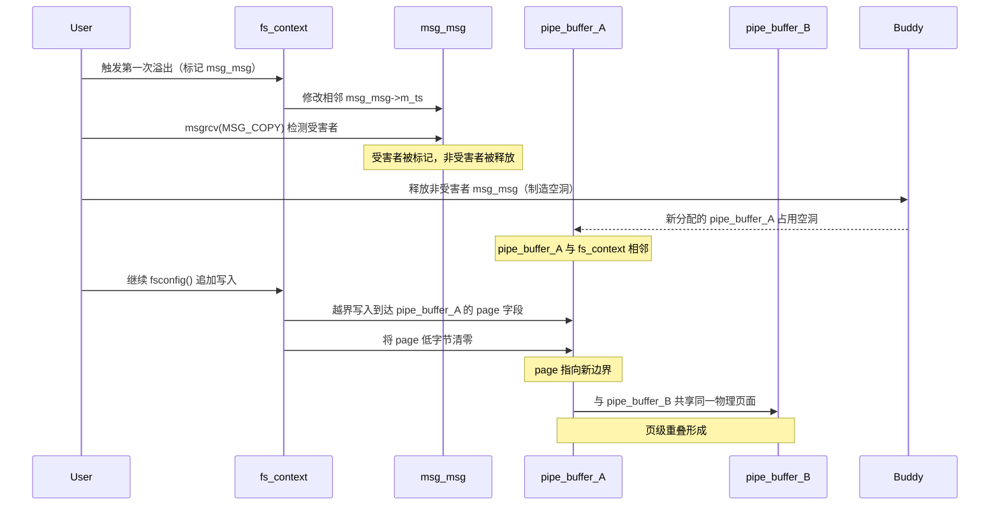

#### 6-3-7. 阶段 7：识别重叠管道对

遍历所有管道，读取每个管道的前几个字节，检测是否包含预期的魔术值和索引标识。若某个管道的读取数据中包含不属于自身的索引号，则说明该管道的 `page` 指针已被篡改，与另一个管道共享同一页面。记录下这些成对出现的管道索引（受害者管道和控制器管道）。通常会有多对重叠，选择第一对即可继续。

#### 6-3-8. 阶段 8：提取内核指针并构建主伪造 `pipe_buffer`

关闭受害者管道，释放其物理页面，然后从控制器管道中读取数据，此时读取到的数据是与其重叠的 `pipe_buffer` 结构体的内容。该结构体中包含指向 `anon_pipe_buf_ops` 的函数表指针，通过该指针可计算出内核基址（因为该符号的偏移量是固定的）。

同时，从该 `pipe_buffer` 中还可获取一个有效的 `page` 指针（指向一个合法的物理页）。基于这些信息，构造一个**主伪造 `pipe_buffer`**，其 `page` 指针指向该合法页，`offset` 和 `len` 可控，并在后续链式操作中反复使用。

#### 6-3-9. 阶段 9：构建任意物理读写链（三节点闭环）

在获取主伪造 `pipe_buffer` 之后，需要构建一个由三个管道节点组成的闭环拓扑，以实现对任意物理地址的精确读写。这一过程的核心在于控制每个节点的 `page` 指针和 `offset` 字段，使它们相互指向，形成可重定向的管道链。

**准备工作**：首先利用第二阶段的重叠管道（即次级控制器管道），在其中写入配置数据，使其 `pipe_buffer` 指向一个可控区域。随后，通过读取所有候选管道的数据，识别出三个自引用管道（即其 `page` 指针指向与主伪造 `pipe_buffer` 相同的物理页），分别记为 **节点2**、**节点3** 和 **节点4**。这三个节点在物理页内的偏移量分别为 `O_2 = 0`、`O_3 = 192`、`O_4 = 384`（假设每个 `pipe_buffer` 结构体占用 192 字节，该值由内核中 `pipe_buffer` 的大小和对齐决定）。

**闭环拓扑配置**：通过一系列 `write()` 操作，将三个节点的 `offset` 字段设置为以下值，形成循环指向关系：

- **节点2** 的 `offset` 设为 `O_3 + 192`（即 `192 * 3 = 576`），使其读写操作从节点3的控制区域开始；
- **节点3** 的 `offset` 设为 `O_4 + 192`（即 `192 * 2 = 384`），使其指向节点4的控制区域；
- **节点4** 的 `offset` 设为 `O_2`（即 `0`），使其指向节点2的控制区域。

配置完成后，三个节点的指向关系形成一个闭环：

```
节点2 → 节点3 → 节点4 → 节点2
```

同时，节点2的 `page` 指针保留为主伪造 `pipe_buffer` 的 `page`，该指针是可变的，通过修改它即可将整个链的重定向目标指向任意物理地址。

**拓扑结构图示**：

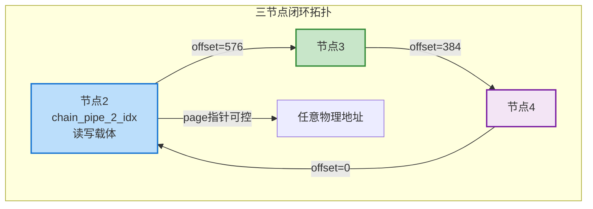

**节点角色分配**：

| 节点  | 管道索引           | 功能角色     | 控制关系                 |
| ----- | ------------------ | ------------ | ------------------------ |
| 节点2 | `chain_pipe_2_idx` | 数据载体节点 | 接收重定向，执行内存访问 |
| 节点3 | `chain_pipe_3_idx` | 配置传递节点 | 配置节点4状态            |
| 节点4 | `chain_pipe_4_idx` | 闭环枢纽节点 | 重定向节点2，复位节点3   |

**数学关系**：

设三个节点的 `pipe_buffer` 结构在物理页内的偏移分别为 `O2`、`O3`、`O4`，配置后的 `offset` 满足：

```
节点2.offset = O3 + 192  →  576
节点3.offset = O4 + 192  →  384
节点4.offset = O2        →  0
```

由此形成循环映射 `f2 → f3 → f4 → f2`，其中 `fx` 表示节点 `x` 的 `pipe_buffer` 结构。

**功能实现**：基于此闭环拓扑，可以构建两个基本操作：

- **物理读取**：先将节点4的 `offset` 复位（临时调整），然后修改节点2的 `page` 和 `offset` 为目标物理地址，通过对节点2执行 `read()` 即可获取目标内存内容。
- **物理写入**：类似地，修改节点2的 `page` 和 `offset` 后，对节点2执行 `write()` 即可向目标物理地址写入数据。

每次操作后，需通过节点3和节点4恢复闭环拓扑的稳定状态（即重新设置 `offset` 为上述闭环值），以确保后续操作的可靠性。

**原语特性**：该物理内存操作原语具有以下技术特征：

| 特性   | 描述                                       | 技术意义                                     |
| ------ | ------------------------------------------ | -------------------------------------------- |
| 透明性 | 用户如同操作普通管道，无需感知物理地址细节 | 简化上层利用逻辑，降低使用复杂度             |
| 原子性 | 每次操作独立配置和恢复状态，无残留影响     | 提高操作可靠性，避免状态污染                 |
| 通用性 | 支持任意物理地址和长度（受管道缓冲区限制） | 可访问内核态、用户态、设备映射等所有物理区域 |
| 隐蔽性 | 不触发缺页异常、权限检查等虚拟层事件       | 在系统日志中表现为普通管道 I/O，难以检测     |
| 确定性 | 基于几何拓扑而非时序竞争，结果可预测       | 提高成功率，降低环境依赖性                   |

**完成状态**：经过上述配置，管道链已具备稳定的任意物理内存读写能力，为后续定位内核符号和修改 `task_struct` 奠定了基础。该闭环拓扑的设计保证了每次内存访问都能精确控制目标地址，且不会破坏管道链自身的结构完整性。

#### 6-3-10. 阶段 10：定位 `vmemmap_base`

`vmemmap_base` 是内核中用于将物理页号映射到虚拟地址的基址。通过从已泄露的合法 `page` 指针开始，以 256MB 为步长向前扫描物理内存，查找 `secondary_startup_64` 函数的特征码（该函数在内核镜像中的偏移固定）。一旦找到匹配，即可确定 `vmemmap_base` 的准确位置。

扫描策略如下：

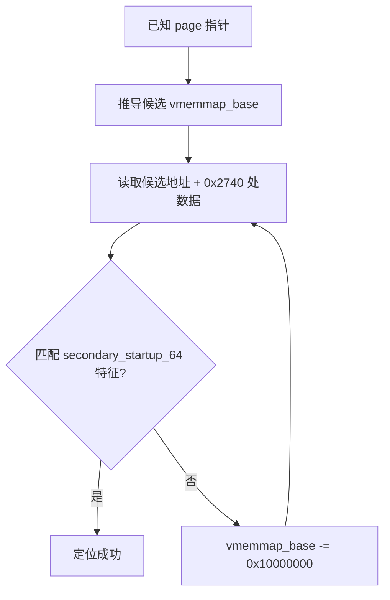

#### 6-3-11. 阶段 11：定位当前进程和 root 进程的 `task_struct`

将当前进程名通过 `prctl(PR_SET_NAME)` 设置为唯一字符串（如 `"pwn4kernel"`），然后利用物理读原语，以 `vmemmap_base` 为基址逐页扫描物理内存（每页对应一个 `struct page`，其地址可由 `vmemmap_base + page_number * 40` 计算）。在每页中搜索该字符串，并验证周围的字段（如 `cred`、`real_cred`、`parent` 指针）是否位于内核堆范围内，从而确认找到的是当前进程的 `task_struct`。

同时，搜索名为 `"swapper"` 的进程（即 `init` 进程），同样通过字段验证确认其 `task_struct`，并记录其 `cred` 和 `nsproxy` 指针。

通过分析 `task_struct` 结构体布局，可确定 `comm` 字段相对于结构体起始的偏移，从而反推出整个 `task_struct` 的虚拟地址。结合物理页号和 `page_offset_base`（从 `task_struct` 中的 `ptraced` 指针推算），即可计算出该 `task_struct` 所在的物理页。

下图展示了物理内存扫描定位 `task_struct` 的流程：

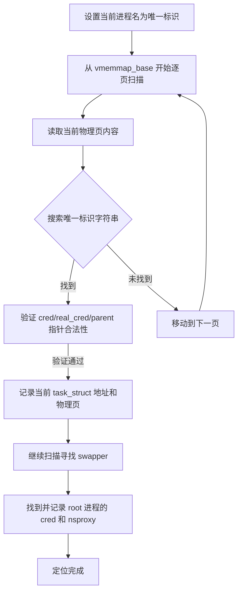

#### 6-3-12. 阶段 12：覆写当前进程凭证

再次定位当前进程的 `task_struct` 所在的物理页，读取该页内容，找到 `comm` 字段，验证无误后，将 `cred`、`real_cred` 和 `nsproxy` 字段替换为从 root 进程获取的对应指针值。然后将修改后的页内容通过物理写原语写回原位置。

此操作完成后，当前进程即获得了 root 权限。后续可通过 `execve("/bin/sh")` 获得 root shell。

下图概括了阶段 10-12 的完整扫描和修改流程：

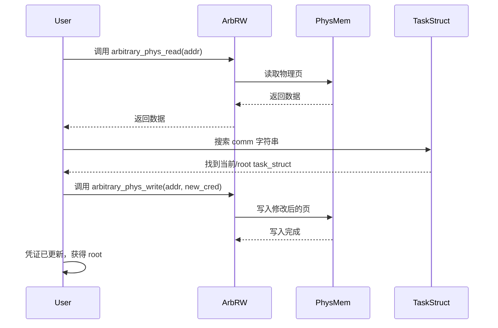

### 6-4. 保护机制应对策略

本思路在构建过程中需要面对内核中的多种安全机制，但得益于其不依赖内核代码执行的特性，这些机制并未构成实质性障碍。

| 机制                       | 影响与应对策略                                                                                                                                      |
| :------------------------- | :-------------------------------------------------------------------------------------------------------------------------------------------------- |
| **KASLR**                  | 通过阶段 8 从重叠的 `pipe_buffer` 中读取 `anon_pipe_buf_ops` 指针，计算内核基址，绕过随机化。                                                       |
| **SMEP/SMAP**              | 本思路全程以内核数据对象（`pipe_buffer`、`task_struct`）为目标，不涉及执行用户代码或访问用户数据，故不受影响。                                      |
| **KPTI**                   | 不依赖返回用户空间的 ROP 链，KPTI 不增加额外复杂度。                                                                                                |
| **CONFIG_MEMCG_KMEM**      | 采用跨缓存布局技术，通过伙伴系统页面喷射使来自不同缓存的 `legacy_data`（`kmalloc-4k`）与目标对象（`kmalloc-cg-4k`）在物理页面上相邻，绕过缓存隔离。 |
| **SLAB_FREELIST_RANDOM**   | 通过大规模堆喷在统计上提高命中概率。                                                                                                                |
| **SLAB_FREELIST_HARDENED** | 本思路不篡改分配器元数据，而是篡改相邻对象（`pipe_buffer->page` 和 `task_struct` 字段），故不受影响。                                               |
| **HARDENED_USERCOPY**      | 不涉及 `copy_to_user` 的异常检查，物理读写通过管道内部机制完成，不触发该检查。                                                                      |

本思路的优势在于最终通过直接修改内核凭证实现提权，不依赖文件系统写权限，适用范围更广。

### 6-5. 条件与局限性

#### 6-5-1. 必要条件

- 漏洞内核版本（v5.1-rc1 ~ v5.16.1）。
- 用户命名空间启用（`CONFIG_USER_NS=y`）。
- System V 消息队列支持。
- 目标文件系统未适配新 mount API（如 ext4）。
- 当前进程名可通过 `prctl(PR_SET_NAME)` 设置。
- 内核符号偏移已知（`anon_pipe_buf_ops` 和 `secondary_startup_64`）。

#### 6-5-2. 局限性

- **堆布局精度**：跨缓存布局的成功率受 SLUB 随机性影响，需要多次尝试。
- **管道链复杂性**：构建任意物理读写链需要找到三个自引用管道，增加了失败概率。
- **物理内存扫描耗时**：搜索 `task_struct` 可能需要遍历大量物理页，在内存较大的系统中可能较慢。
- **版本限制**：漏洞修复后（5.16.2 及以上）无法使用。
- **内核完整性检查**：某些内核配置（如 `CONFIG_DEBUG_RODATA`）可能阻止对关键数据的修改，但本思路修改的是堆中的 `task_struct`，通常不在只读范围内。

### 6-6. 总结

本思路是在管道重叠技术上的深度扩展，通过构建任意物理内存读写原语，实现了对内核关键数据结构的直接操控。它展示了如何将简单的堆溢出转化为强大的物理内存访问能力，进而绕过几乎所有虚拟内存层面的保护机制。该方法不依赖 FUSE，但需要更复杂的管道链构造和内存扫描逻辑。

本思路的成功依赖于对内核内存布局、`task_struct` 结构和物理内存映射机制的深刻理解，也体现了内核对象间相互引用带来的潜在风险。对于内核开发者而言，在设计诸如管道、文件等通用对象时，应充分考虑其结构体字段的可控性，避免被恶意重定向。同时，本思路也强调了在漏洞修复中，除了修补源头缺陷外，还应评估现有安全机制是否足以阻断此类链式操作。

### 6-7. 测试结果

<div style="text-align: center; margin: 2rem 0;">
  
</div>

## 7. 漏洞修复

### 7-1. 补丁概述

针对 **CVE-2022-0185** 漏洞，Linux 内核社区于 2022 年 1 月 18 日提交了修复补丁，commit ID 为 `722d94847de29310e8aa03fcbdb41fc92c521756`。该补丁由漏洞发现者 Jamie Hill-Daniel 和 William Liu 共同提交，经 Salvatore Bonaccorso、Thadeu Lima de Souza Cascardo 测试验证，由 Dan Carpenter 和 Al Viro 审阅确认（Acked-by），最终由 Greg Kroah-Hartman 合入并经由 Linus Torvalds 合并到主线。

补丁的核心目标是修复 `legacy_parse_param()` 函数中因无符号整数运算导致的边界检查失效问题。提交信息明确指出：

> “The `PAGE_SIZE - 2 - size` calculation in `legacy_parse_param()` is an unsigned type so a large value of `size` results in a high positive value instead of a negative value as expected. Fix this by getting rid of the subtraction.”

这段描述精准地概括了漏洞的数学本质——减法运算在无符号类型上下文中的非预期行为。

该补丁于 Linux v5.17-rc1 中合入主线，并随后被回溯到多个稳定内核分支，包括 5.4.174、5.10.94、5.15.16 及 5.16.2 等版本。各大发行版（如 Ubuntu、Debian、Red Hat、SUSE）均已在各自的内核更新中合并了此补丁，强烈建议用户及时升级到上述安全版本。

### 7-2. 补丁内容

修复补丁的代码变更极为精简，仅涉及 `fs/fs_context.c` 文件中 `legacy_parse_param()` 函数内的一行代码修改——该行位于函数内部对单个参数进行长度累加之后、执行 `memcpy` 写入之前，正是整个校验逻辑的核心所在。完整的 diff 如下：

```diff
diff --git a/fs/fs_context.c b/fs/fs_context.c
index b7e43a780a625..24ce12f0db32e 100644
--- a/fs/fs_context.c
+++ b/fs/fs_context.c
@@ -548,7 +548,7 @@ static int legacy_parse_param(struct fs_context *fc, struct fs_parameter *param)
 			      param->key);
 	}

-	if (len > PAGE_SIZE - 2 - size)
+	if (size + len + 2 > PAGE_SIZE)
 		return invalf(fc, "VFS: Legacy: Cumulative options too large");
 	if (strchr(param->key, ',') ||
 	    (param->type == fs_value_is_string &&
```

从 diff 中可以看到，补丁将原有的减法校验表达式：

```c
len > PAGE_SIZE - 2 - size
```

替换为加法校验表达式：

```c
size + len + 2 > PAGE_SIZE
```

这一变更虽然仅涉及一行代码，但彻底改变了边界检查的运算逻辑——从依赖减法结果与 `len` 比较，转变为直接累加所有相关长度后与 `PAGE_SIZE` 比较，从而在算术层面消除了下溢的可能。

### 7-3. 修复逻辑分析

为了理解补丁的修复原理，有必要回顾漏洞产生的根本原因。在原始代码中：

```c
unsigned int size = ctx->data_size;   // 已累积的数据长度，unsigned int 类型
size_t len = 0;                       // 待写入的数据长度，size_t 类型（无符号）

if (len > PAGE_SIZE - 2 - size)      // 漏洞点
    return invalf(...);
```

问题出在右侧表达式 `PAGE_SIZE - 2 - size` 的计算过程上：

1. `PAGE_SIZE` 是宏常量（通常为 4096），类型为 `int`。
2. `2` 是整型常量，类型为 `int`。
3. `size` 是 `unsigned int` 类型。

根据 C 语言的**整型提升（integer promotion）**规则，当 `int` 与 `unsigned int` 进行算术运算时，`int` 会被提升为 `unsigned int`。因此，整个表达式 `PAGE_SIZE - 2 - size` 是在**无符号整数**的域内进行计算的。

当 `size` 达到 4095 时：

- `PAGE_SIZE - 2 - size = 4096 - 2 - 4095 = -1`
- 但在无符号整数运算中，`-1` 被解释为 `UINT_MAX`（即 4294967295）
- 因此 `len > UINT_MAX` 永远为假，边界检查被绕过

补丁将表达式改为 `size + len + 2 > PAGE_SIZE`，其运算逻辑为：

1. 计算 `size + len + 2`，即**已累积长度 + 待写入长度 + 2（逗号和终止符）**
2. 将总和与 `PAGE_SIZE`（4096）进行比较
3. 若总和大于 4096，则拒绝本次写入

这种加法形式的校验彻底消除了无符号整数下溢的可能——无论 `size` 取何值，`size + len + 2` 都是一个明确的正整数，直接与 `PAGE_SIZE` 比较即可得出正确的边界判定。补丁的核心思想是将“剩余空间是否足够”的减法判断，转换为“已用空间加新增空间是否超出总容量”的加法判断，从根本上规避了无符号减法可能产生的下溢问题。这正是提交信息中所说的“get rid of the subtraction”——移除减法，用加法替代。

### 7-4. 修复效果与影响

**修复效果**：

补丁生效后，`legacy_parse_param()` 中的边界检查能够正确拦截所有超长参数的写入尝试。当 `ctx->data_size` 累积到 4095 字节时，下一次 `fsconfig()` 调用中 `size + len + 2` 的计算结果必然大于 `PAGE_SIZE`（因为即使仅写入一个最小长度的 `key` 和 `value`，新增长度也至少为 `1（逗号）+ 1（key）+ 1（等号）+ 1（value）= 4` 字节，加上已累积的 4095，总和必然超过 4096），从而触发 `invalf()` 返回错误，阻止越界写入的发生。此后所有试图通过 `fsconfig()` 传入超长参数的尝试都将被直接拒绝，漏洞被彻底封堵。

**兼容性影响**：

该补丁仅修改了一行代码，不涉及数据结构、函数签名或外部接口的变更，因此对内核其他模块和用户空间应用程序**完全透明**。所有依赖 `fsconfig()` 的正常文件系统挂载操作——无论是新 API 下的逐项传参还是遗留路径的兼容处理——均不受任何影响。补丁仅对参数累积过程的边界条件进行了校正，不会改变合法挂载流程的行为。

**性能影响**：

补丁将一次减法运算替换为一次加法运算，两者的 CPU 开销在同一量级，且边界检查本身并非热路径（hot path），仅在文件系统挂载配置阶段被调用，因此对系统性能的影响可以忽略不计。

**稳定内核回溯**：

该补丁被迅速回溯到多个稳定内核分支，包括 5.4.174、5.10.94、5.15.16 及 5.16.2 等版本。各大发行版（如 Ubuntu、Debian、Red Hat、SUSE）均已在各自的内核更新中合并了此补丁。系统管理员应及时参考各自发行版的安全公告，升级到包含该补丁的稳定内核版本。

### 7-5. 补丁的启示与总结

**1. 类型安全的重要性**

C 语言中无符号整数与有符号整数混用导致的隐式类型转换是许多安全漏洞的根源。**CVE-2022-0185** 再次提醒开发者：在涉及边界检查的算术运算中，必须对操作数的类型和运算结果的符号有清晰的认识。补丁通过将减法改为加法，从根本上避免了无符号下溢的可能性，这是一种比添加类型转换更为彻底的修复策略。正如提交信息所言，解决这类问题的正确方式是“移除减法”而非仅仅增加强制类型转换。

**2. 边界检查的“正向”原则**

安全检查的最佳实践之一是**尽量采用“正向”逻辑**——即直接验证条件是否满足，而非通过排除法判断条件是否不满足。补丁将“剩余空间是否足够”的检查（`len > PAGE_SIZE - 2 - size`）改为“总空间是否超出限制”的检查（`size + len + 2 > PAGE_SIZE`），正是这一原则的体现。正向逻辑更不容易因边界条件（如整数溢出、下溢）而产生意外行为。

**3. 遗留代码的持续审计**

该漏洞存在于文件系统新旧 mount API 过渡期间的遗留处理路径中。这提示开发者：在引入新机制的同时，不应忽视对旧有代码路径的持续审计。遗留代码虽然在功能上被新代码替代或封装，但它们仍然可能在特定条件下被触发，且由于长期缺乏关注，往往成为安全盲区。**CVE-2022-0185** 正是一个典型例证，它提醒内核维护者在设计兼容层时必须同等重视新旧路径的安全性。

**4. 社区协作的价值**

该漏洞从发现（syzkaller 模糊测试）、报告（向 Red Hat 安全团队）、分析到补丁提交、审阅、测试和合并，体现了内核社区高效的安全响应流程。漏洞发现者直接参与补丁编写，多位开发者参与测试和审阅，确保了修复方案的正确性和及时性。从提交信息中的 Signed-off-by、Tested-by、Acked-by 链可以看出，这是一个多方协作的典范，最终促成了快速而可靠的修复。

**5. 临时缓解措施的存在**

对于无法立即升级内核的系统，可通过禁用非特权用户命名空间来临时阻断漏洞的触发路径：

```bash
sysctl -w kernel.unprivileged_userns_clone=0
```

这一措施虽然不能从根本上修复漏洞，但可以有效降低风险暴露面，为系统管理员争取升级时间。在容器环境中，也可以考虑通过 seccomp 过滤 `fsopen`、`fsconfig` 等系统调用，进一步收紧利用面。

综上所述，**CVE-2022-0185** 的修复补丁是一个教科书级别的安全修复案例：问题定位精准、修复方案简洁、影响范围可控、回溯覆盖及时。它提醒所有内核开发者，在看似微不足道的边界检查中，类型系统的微妙之处可能隐藏着严重的安全隐患。在未来的内核开发中，应优先考虑正向逻辑和加法校验，避免依赖有符号与无符号混合运算的减法表达式，从而从源头上杜绝此类整数下溢漏洞。

## 8. 免责声明

本文档旨在提供 **CVE-2022-0185** 漏洞的技术分析与教育性内容，仅供学习、研究和安全防御目的使用。作者与发布平台对以下事项声明如下：

1. **合法使用原则**：本文档中描述的任何技术细节、代码示例或利用方法仅供教育研究之用。读者不得将这些信息用于任何非法、未经授权或恶意的活动，包括但不限于未经授权的系统入侵、数据破坏、服务干扰或其他违反法律法规的行为。

2. **知识共享与责任**：本文档基于公开可获取的信息、官方漏洞公告和学术研究资料编写。作者力求确保技术内容的准确性，但不对信息的完整性、时效性或适用性作任何明示或暗示的保证。读者应自行验证信息的准确性，并在专业环境中谨慎应用。

3. **环境限制**：所有技术分析和实验应在受控的、隔离的测试环境中进行，例如使用特制的虚拟机或专用硬件。禁止在任何生产环境、公共网络或他人系统中尝试漏洞利用或相关技术。

4. **法律合规性**：读者应遵守所在国家或地区的所有适用法律法规，包括但不限于计算机安全法、数据保护法和知识产权法。任何使用本文档内容的行为所产生的法律后果，由行为者自行承担。

5. **技术中立性**：本文档对漏洞的分析保持技术中立立场，旨在促进安全社区的防御能力提升。文中提及的任何工具、技术或方法不应被视为对任何组织、产品或技术的背书或批判。

6. **更新与修正**：技术领域发展迅速，本文档内容可能随时间而过时。作者保留更新、修正或撤回文档内容的权利，不承诺另行通知。

7. **版权声明**：本文档内容受版权法保护，未经明确书面许可，不得用于商业目的。允许在注明出处的前提下进行非商业性的分享与引用。

**重要提示**：安全研究应始终遵循道德准则，以提升整体网络安全为目标。如发现安全漏洞，建议通过负责任的披露流程向相关厂商或机构报告，共同维护数字生态的安全与稳定。

---

_本文档的撰写参考了公开的漏洞公告、内核源码（Linux 5.16.1）及相关技术分析文献。所有实验均在封闭的测试环境中完成，未对任何实际系统造成影响。_

## 参考

- https://github.com/BinRacer/pwn4kernel/tree/master/src/CVE-2022-0185
- https://github.com/BinRacer/pwn4kernel/tree/master/src/CVE-2022-0185_V2
- https://github.com/BinRacer/pwn4kernel/tree/master/src/CVE-2022-0185_V3
- https://binracer.github.io/2026/03/07/pwn4kernel-CrossCacheOverflow其二/
- https://bsauce.github.io/2022/04/08/CVE-2022-0185/
- https://www.willsroot.io/2022/01/cve-2022-0185.html
- https://arttnba3.cn/2023/01/11/CVE-0X09-CVE-2022-0185/
- https://docs.kernel.org/filesystems/mount_api.html
- https://www.man7.org/linux/man-pages//man2/fsopen.2.html
- https://www.openwall.com/lists/oss-security/2022/01/25/14
- https://git.kernel.org/pub/scm/linux/kernel/git/torvalds/linux.git/commit/?id=3e1aeb00e6d132efc151dacc062b38269bc9eccc
- https://git.kernel.org/pub/scm/linux/kernel/git/torvalds/linux.git/commit/?id=722d94847de29310e8aa03fcbdb41fc92c521756
- https://nvd.nist.gov/vuln/detail/CVE-2022-0185
- https://ubuntu.com/security/CVE-2022-0185
