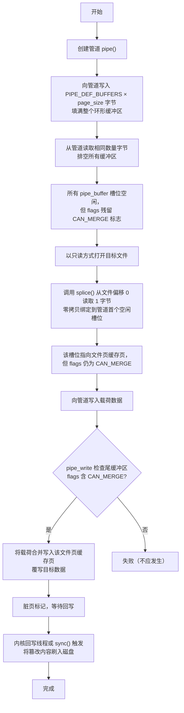
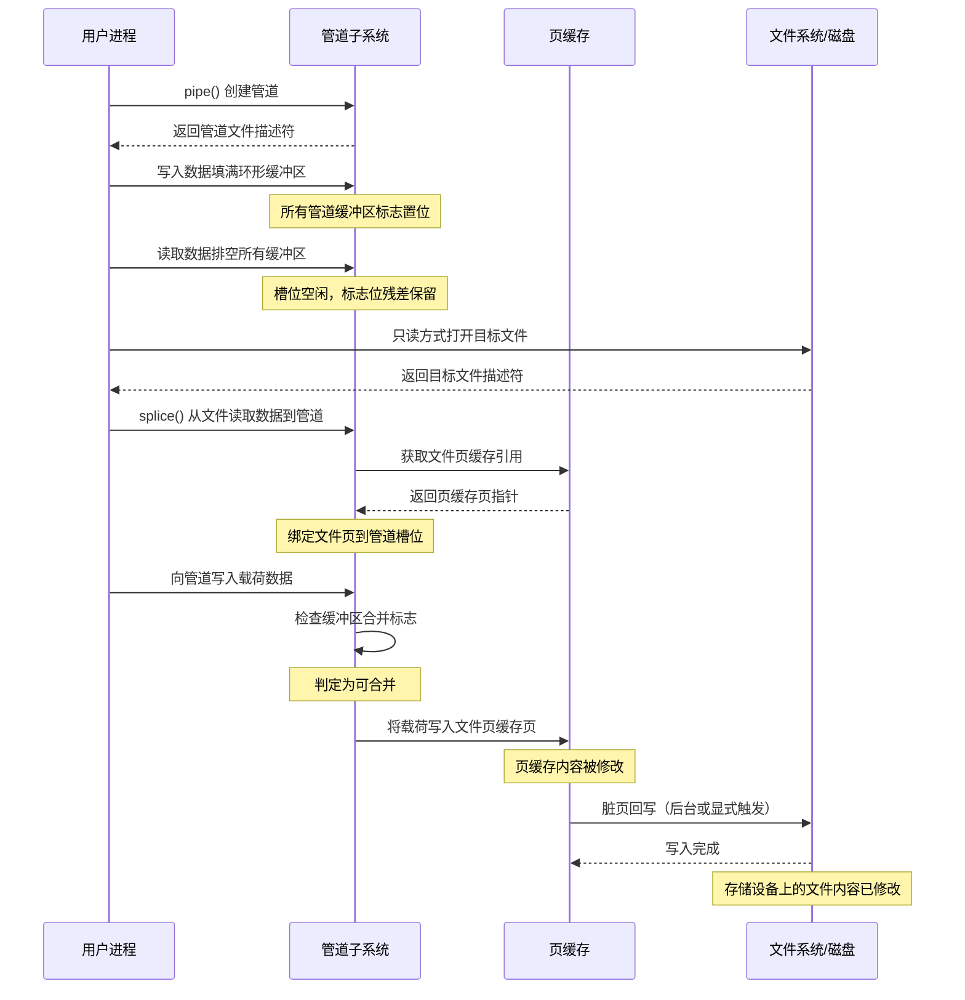
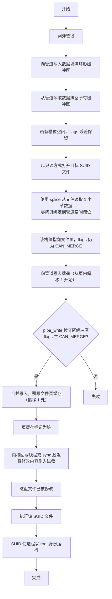
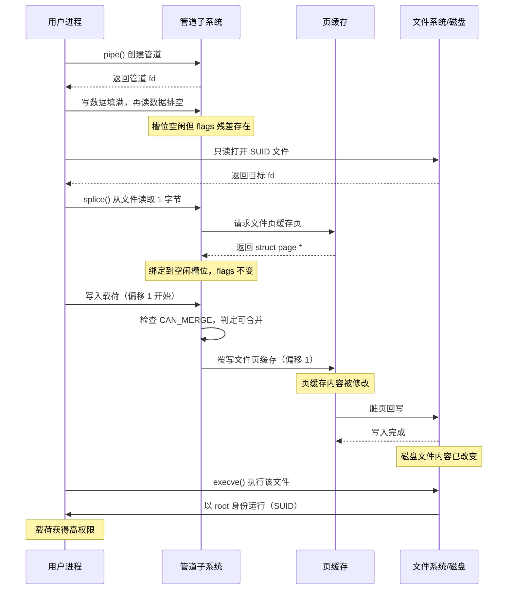

# 【Kernel Exploit】CVE-2022-0847 (Dirty Pipe) 漏洞分析

## 1. 测试环境

**测试版本**：Linux-5.16.10 [内核镜像地址](https://github.com/BinRacer/pwn4kernel/blob/master/kernels/5.16.10/01/bzImage)

笔者测试的内核版本是 `Linux (none) 5.16.10 #1 SMP PREEMPT Mon Feb 9 14:10:18 CST 2026 x86_64 GNU/Linux`。

**编译选项**：开启`CONFIG_MEMCG`、`CONFIG_MEMCG_KMEM`、`CONFIG_CGROUPS`、`CONFIG_THREAD_INFO_IN_TASK`、`CONFIG_SLAB_FREELIST_RANDOM`、`CONFIG_SLAB_FREELIST_HARDENED`、`CONFIG_INIT_ON_ALLOC_DEFAULT_ON`、`CONFIG_SHUFFLE_PAGE_ALLOCATOR`、`CONFIG_HARDENED_USERCOPY`、`CONFIG_FUSE_FS`、`CONFIG_USERFAULTFD`、`CONFIG_SYSVIPC`、`CONFIG_KEYS`、`CONFIG_STACKPROTECTOR`、`CONFIG_STACKPROTECTOR_STRONG`、`CONFIG_SLUB`、`CONFIG_SLUB_DEBUG`、`CONFIG_E1000`、`CONFIG_E1000E`、`CONFIG_PACKET`、`CONFIG_PACKET_DIAG`、`CONFIG_USER_NS`、`CONFIG_NET_NS`、`CONFIG_NAMESPACES`、`CONFIG_CHECKPOINT_RESTORE`、`CONFIG_IPC_NS`选项。完整配置参考[.config](https://github.com/BinRacer/pwn4kernel/blob/master/kernels/5.16.10/01/.config)。

**保护机制**：KASLR/SMEP/SMAP/KPTI

## 2. 漏洞背景

### 2-1. 漏洞概述

**CVE-2022-0847**（代号“Dirty Pipe”）是 Linux 内核管道（pipe）子系统中一处因**结构体成员初始化缺失**而引发的内存安全漏洞。该漏洞的根本成因在于：内核在通过 `copy_page_to_iter_pipe()` 路径动态构造 `pipe_buffer` 结构体时，仅对 `page`、`offset`、`len` 及 `ops` 等字段进行了赋值，却遗漏了对 `flags` 成员的显式初始化操作（即未执行 `buf->flags = 0`）。

由于 `pipe_buffer` 所占据的内存槽位来自 `pipe_inode_info` 中预分配的环形数组（该数组由 `kcalloc()` 一次性分配，初始全零），在管道的整个生命周期内，这些槽位会被循环反复使用。当某个槽位中的数据被读取并释放后，内核会调用与该缓冲区关联的 `pipe_buf_operations` 结构体中的 `release` 回调函数来释放物理页资源——对于匿名管道为 `anon_pipe_buf_release()`，对于文件页缓存则为 `page_cache_pipe_buf_release()`——并调整 `tail` 指针，但**不会对该槽位内 `pipe_buffer` 结构体所在内存执行任何清零操作**。这意味着下一次复用到该槽位时，新结构体的字段将直接覆盖旧数据，若覆盖不完整（如本漏洞中的 `flags` 字段），则残留的陈旧（stale）数据会持续存在。

这一编码疏漏与管道的**数据合并（merge）优化机制**及 **`splice()` 零拷贝页引用机制**产生了深层的语义耦合。当 `flags` 字段残留下上一次使用时置位的 `PIPE_BUF_FLAG_CAN_MERGE` 标志时，新创建的、指向文件页缓存（page cache）的 `pipe_buffer` 将被内核管道写入逻辑误判为可追加数据的普通匿名缓冲区。此时，即便目标文件以 `O_RDONLY` 模式打开、具备 `FS_IMMUTABLE_FL` 不可变属性，或所在文件系统以 `MS_RDONLY` 只读语义挂载，内核的页缓存写入路径均无法识别此越权行为，从而允许将载荷数据直接覆写至受保护的物理页框中。

从漏洞分类学（CWE）角度看，该问题属于 **CWE-456（未初始化变量的使用）** 与 **CWE-665（初始化不当）** 的复合实例。在 CVSS 3.1 评分体系下，其综合评分为 **7.8（高危）**，向量特征为 `AV:L/AC:L/PR:L/UI:N/S:U/C:H/I:H/A:H`，表明其具备本地低权限触发、无需用户交互且可完全破坏系统机密性、完整性与可用性的威胁特性。

### 2-2. 影响范围

**CVE-2022-0847** 的影响范围横跨 Linux 内核 **5.8 至 5.16.10 之间的全部主线及 LTS 稳定分支**。该漏洞的代码引入点可精确定位至提交 `241699cd72a8`（“new iov_iter flavour: pipe-backed”），该提交在 `iov_iter` 迭代器体系中新增了 `pipe-backed` 类型，并首次引入了将外部文件页通过 `pipe_buffer` 直接引用的代码逻辑；然而，该提交未能同步完成新 `pipe_buffer` 实例的完整初始化。

需特别澄清的技术细节在于：提交 `f6dd975583bd`（“pipe: merge anon_pipe_buf*_ops”）**并非漏洞的直接引入者**。该提交的本质是合并了匿名管道的操作函数表（`pipe_buf_operations`），简化了回调函数的分发路径。但这一重构客观上使得前述未初始化的代码分支从“不可达”或“难以到达”转变为“明确可达”，从而为此后漏洞的确定性触发提供了前置的**可达性支撑**。

针对该漏洞的官方修复于 2022 年 3 月合入主线，修复提交为 `9d2231c5d74e13b2a0546fee6737ee4446017903`（“lib/iov_iter: initialize \"flags\" in new pipe_buffer”），其核心改动仅为在 `copy_page_to_iter_pipe()` 中增加一行 `buf->flags = 0` 的赋值语句。各主要稳定分支的首个修复版本对照如下：

| 内核分支         | 首个修复版本       |
| ---------------- | ------------------ |
| 主线（Mainline） | 5.16.11 / 5.17-rc1 |
| 5.15 LTS         | 5.15.25            |
| 5.10 LTS         | 5.10.102           |

在主流发行版生态中，Ubuntu 21.10（Impish）及基于该版本的 AWS 内核均在影响范围内，官方已通过 `linux-image` 包的安全更新完成修复。而内核基线低于 5.8 的发行版（如 Ubuntu 20.04 LTS Focal）因尚未引入 `pipe-backed` 迭代器代码路径，天然免疫于此漏洞。

### 2-3. 技术背景

为精确理解 **CVE-2022-0847** 的触发机理，需深入剖析以下三个相互交织的内核基础机制。

#### 2-3-1. 环形缓冲区与槽位复用

在内核 VFS 层，管道通过一个虚拟 inode 来表征，其 `i_pipe` 指针挂载 `struct pipe_inode_info` 实例。该结构体在 x86_64 架构下的内存布局如下：

```c
struct pipe_inode_info {
    struct mutex mutex;                   /* 管道互斥锁 */
    wait_queue_head_t rd_wait;            /* 读取等待队列 */
    wait_queue_head_t wr_wait;            /* 写入等待队列 */
    unsigned int head;                    /* 写入端索引 */
    unsigned int tail;                    /* 读取端索引 */
    unsigned int max_usage;               /* 最大缓冲区使用数 */
    unsigned int ring_size;               /* 环形缓冲区总槽位数 */
    bool note_loss;                       /* 丢失通知标志 */
    unsigned int nr_accounted;            /* 已记账缓冲区数 */
    unsigned int readers;                 /* 读取端引用计数 */
    unsigned int writers;                 /* 写入端引用计数 */
    unsigned int files;                   /* 文件引用计数 */
    unsigned int r_counter;               /* 读取端计数器 */
    unsigned int w_counter;               /* 写入端计数器 */
    unsigned int poll_usage;              /* poll 使用计数 */
    struct page *tmp_page;                /* 临时页指针 */
    struct fasync_struct *fasync_readers; /* 读取端异步通知结构 */
    struct fasync_struct *fasync_writers; /* 写入端异步通知结构 */
    struct pipe_buffer *bufs;             /* 指向 pipe_buffer 环形数组的指针 */
    struct user_struct *user;             /* 用户信息 */
    struct watch_queue *watch_queue;      /* 通知队列 */
};
```

其中，`bufs` 字段（偏移 `0x98`）指向一个动态分配的 `struct pipe_buffer` 环形数组，默认容量为 `PIPE_DEF_BUFFERS`（16 个槽位）。每个 `pipe_buffer` 结构体的精确布局为：

```c
struct pipe_buffer {
    struct page *page;                     /* 指向物理页框的指针 */
    unsigned int offset;                   /* 数据在页内的偏移 */
    unsigned int len;                      /* 有效数据长度 */
    const struct pipe_buf_operations *ops; /* 回调函数表指针 */
    unsigned int flags;                    /* 状态位掩码 */
    unsigned long private;                 /* 供 ops 使用的私有数据 */
};
```

当用户进程调用 `pipe()` 创建管道时，内核经过如下调用链完成初始化：

```
do_pipe2()
    → __do_pipe_flags()
        → create_pipe_files()
            → get_pipe_inode()
                → new_inode_pseudo() & alloc_pipe_info()
```

在 `alloc_pipe_info()` 中，通过 `kcalloc(pipe_bufs, sizeof(struct pipe_buffer), ...)` 分配环形数组，故初始状态下所有槽位的 `flags` 均为零。然而，在管道生命周期内，各槽位会被循环反复使用，其逻辑由 `head` 和 `tail` 指针维护（分别位于 `pipe_inode_info` 偏移 `0x50` 和 `0x54`）：写入时推进 `head`，读取时推进 `tail`。当某槽位中的数据被 `read()` 消耗后，内核会调用与该缓冲区关联的 `pipe_buf_operations` 结构体中的 `release` 回调函数来释放物理页资源（对于匿名管道为 `anon_pipe_buf_release()`，对于文件页缓存则为 `page_cache_pipe_buf_release()`），并调整 `tail` 指针，但**不会对该槽位内 `pipe_buffer` 结构体所在内存执行任何清零操作**。这意味着下一次复用到该槽位时，新结构体的赋值操作会覆盖部分字段，但若某个字段未被显式赋值，则该字段将完整保留上一次使用时的陈旧值。

#### 2-3-2. 合并标志的控制逻辑

`pipe_buffer.flags`（位于偏移 `0x18`，占 4 字节）中的 `PIPE_BUF_FLAG_CAN_MERGE` 位是管道写入性能优化的关键开关。在 `pipe_write()` 的实现中，内核会检查当前最后一个缓冲区（即 `head - 1` 位置）的 `flags` 是否包含此位。若置位，则允许后续写入的数据直接追加（merge）到该缓冲区的 `offset + len` 之后，而无需分配新的环形槽位。这种合并策略有效减少了缓冲区碎片，提升了管道通信的吞吐效率。正常情况下，该标志仅对 **匿名管道页**（由 `page_cache` 分配器分配的普通用户态内存页）置位。

合并逻辑在内核中的实现位置较低，位于 `pipe_write()` 函数内部的缓冲区定位阶段，与 VFS 层的权限检查（`permission()`）处于不同的代码层次。这意味着合并决策仅依赖 `flags` 位的状态，而不重新评估目标页面的访问权限属性。

#### 2-3-3. splice 的零拷贝页引用

`splice()` 系统调用是 Linux 零拷贝数据传输的核心接口。其从文件到管道的完整调用链如下：

```
splice()
    → __do_splice()
        → do_splice()
            → splice_file_to_pipe()
                → do_splice_to()
                    → generic_file_splice_read()
                        → call_read_iter()
                            → ext4_file_read_iter()
                                → generic_file_read_iter()
                                    → filemap_read()
                                        → copy_page_to_iter()
                                            → __copy_page_to_iter()
                                                → copy_page_to_iter_pipe()
```

在该路径中，内核**不会**复制文件页缓存中的物理页内容，而是直接将该页的 `struct page` 指针赋值给目标 `pipe_buffer` 的 `page` 字段（偏移 `0x00`），并调用 `get_page()` 递增其引用计数。此时，该 `pipe_buffer` 的 `ops` 被指向 `page_cache_pipe_buf_ops`（偏移 `0x10` 处赋值），其 `release` 回调为 `page_cache_pipe_buf_release()`，用于管理该页的缓存一致性及回写（writeback）协调。

### 2-4. 漏洞点分析

#### 2-4-1. 源码中的遗漏赋值

漏洞的精确触发点位于 `lib/iov_iter.c` 中的 `copy_page_to_iter_pipe()` 函数。该函数负责将文件页缓存中的一个物理页通过 `pipe-backed` 迭代器直接引用至管道的环形缓冲区。其完整源码如下（内核 5.16.10 版本）：

```c
static size_t copy_page_to_iter_pipe(struct page *page, size_t offset, size_t bytes,
                                     struct iov_iter *i)
{
    struct pipe_inode_info *pipe = i->pipe;     /* 获取管道元数据对象 */
    struct pipe_buffer *buf;                    /* 指向环形缓冲区槽位的指针 */
    unsigned int p_tail = pipe->tail;           /* 当前读取端索引 */
    unsigned int p_mask = pipe->ring_size - 1;  /* 环形掩码，用于槽位寻址 */
    unsigned int i_head = i->head;              /* 迭代器当前头部索引 */
    size_t off;

    if (unlikely(bytes > i->count))
        bytes = i->count;

    if (unlikely(!bytes))
        return 0;

    if (!sanity(i))
        return 0;

    off = i->iov_offset;
    buf = &pipe->bufs[i_head & p_mask];         /* 定位到当前头部槽位 */

    /* 分支一：尝试与最后一个缓冲区合并 */
    if (off) {
        if (offset == off && buf->page == page) {
            buf->len += bytes;
            i->iov_offset += bytes;
            goto out;
        }
        i_head++;
        buf = &pipe->bufs[i_head & p_mask];
    }

    /* 检查环形缓冲区是否已满（head 与 tail 相邻） */
    if (pipe_full(i_head, p_tail, pipe->max_usage))
        return 0;

    /*
     * ============================================================
     * 核心构造逻辑：将文件页缓存页绑定到管道缓冲区
     * ============================================================
     */
    buf->ops = &page_cache_pipe_buf_ops;        /* 设置操作表为文件页缓存类型 */
    get_page(page);                             /* 递增物理页引用计数 */
    buf->page = page;                           /* 绑定目标文件页缓存页 */
    buf->offset = offset;                       /* 页内起始偏移 */
    buf->len = bytes;                           /* 有效数据长度 */

    /*
     * ============================================================
     * 漏洞点：buf->flags 未被赋值，继承该槽位内存中的陈旧值
     * 正常情况应执行 buf->flags = 0
     * ============================================================
     */

    pipe->head = i_head + 1;
    i->iov_offset = offset + bytes;
    i->head = i_head;

out:
    i->count -= bytes;
    return bytes;
}
```

上述源码清晰地展示了漏洞的根本成因。对比常规的管道写入路径（`pipe_write()`），后者在分配新的匿名页面到缓冲区后，会通过 `buf->flags = 0` 或 `pipe_buf_get()` 等宏对 `flags` 进行显式重置。然而在 `copy_page_to_iter_pipe()` 的这个零拷贝引用路径中，**`flags` 字段的赋值操作被完全遗漏**，导致该字段直接继承自该槽位前一次使用时残留的陈旧值。

从代码并置的角度审视，`copy_page_to_iter_pipe()` 与 `pipe_write()` 中对 `pipe_buffer` 的初始化方式存在明显的非对称性：前者关注了业务字段（`page`、`offset`、`len`、`ops`）而遗漏了标志字段，后者则对所有字段进行了完整赋值。这种非对称性并非设计意图的体现，而是代码演进过程中遗留的疏忽。

#### 2-4-2. 调用栈与上下文

该漏洞代码路径的入口即为 2-3-3 节所列的 `splice` 调用链。在此路径中，目标 `page` 来自于文件系统的 `address_space` 页缓存。由于该文件以只读方式打开，其页缓存页在 `folio` 层的映射标记为只读，但 **页缓存本身并未在物理页框层面设置写保护**——内核依赖 VFS 权限检查与文件属性来拦截非法写入。`PIPE_BUF_FLAG_CAN_MERGE` 的残留值恰好绕过了这一上层校验，在 `pipe_write` 的合并逻辑中打通了向该物理页框写入数据的通道。

### 2-5. 触发条件与执行路径

该漏洞的触发完全不依赖任何竞态窗口，其执行流程是静态确定的，具有极高的可复现性。其前置条件与操作序列如下。

#### 2-5-1. 前置条件与状态塑造

**第一步：填充环形缓冲区并置位合并标志**

在目标管道上通过常规的 `write()` 系统调用向管道写入数据，**必须写满整个环形缓冲区**（即写入的数据总量达到 `pipe->max_usage` 所限定的槽位数与页面大小的乘积，默认 16 页，每页 4096 字节，共计 65536 字节）。这一操作的目的是让环形缓冲区中的每一个 `pipe_buffer` 槽位都得到使用，从而确保所有槽位均被分配了匿名页面，且其 `flags` 字段均被设置为包含 `PIPE_BUF_FLAG_CAN_MERGE` 标志（该标志在 `pipe_write()` 分配新匿名页时被置位）。

**第二步：排空缓冲区以保留残差标志**

通过 `read()` 系统调用将管道中的数据**全部读出**，使环形缓冲区中的所有槽位进入空闲状态。在读取释放过程中，内核会对每个槽位调用 `anon_pipe_buf_release()` 释放匿名物理页资源，但 `pipe_buffer` 结构体本身及其 `flags` 字段**不会被清零**。此时，所有空闲槽位的 `flags` 字段均残留下 `PIPE_BUF_FLAG_CAN_MERGE` 标志。

**第三步：通过 splice 绑定目标文件页**

通过 `splice()` 系统调用，沿 2-3-3 节所述的调用链，将目标只读文件的页缓存页（`struct page` 指针）定向装载到上述步骤中的某个空闲槽位。由于所有槽位均处于空闲状态且均含有残差的 `CAN_MERGE` 标志，`splice()` 会选择当前 `head` 指针指向的第一个空闲槽位进行绑定。`copy_page_to_iter_pipe()` 在建立绑定时将 `buf->ops` 设置为 `page_cache_pipe_buf_ops`（其 `release` 回调为 `page_cache_pipe_buf_release()`），但**不重置 `flags`**（偏移 `0x18`），从而完成“持合并标志的文件缓存页缓冲区”的构造。此时，该槽位指向文件页，却保留了匿名管道页的 `CAN_MERGE` 标志——这是一个在正常操作中不可能出现的状态组合。

上述三个步骤中，**必须写满整个环形缓冲区**才能确保 `splice()` 绑定到的槽位具有残差标志，否则无法保证漏洞的确定性触发。

#### 2-5-2. 激活与持久化

**第四步：触发合并写入**

向该管道执行一次常规的 `write()` 系统调用，其内部调用链如下：

```
write()
    → vfs_write()
        → new_sync_write()
            → call_write_iter()
                → pipe_write()
```

在 `pipe_write()` 流程中，内核在寻找可写入的尾部缓冲区时，检测到当前 `head - 1` 位置的 `buf->flags` 包含 `PIPE_BUF_FLAG_CAN_MERGE`。由于该缓冲区此时指向的 `page` 不再是匿名页，而是目标文件的页缓存页，但合并逻辑 **仅校验标志位，不校验 `ops` 类型**，因此允许载荷数据直接覆写至该物理页框内 `buf->offset + buf->len` 处。合并逻辑并未检查 `ops` 是否为 `page_cache_pipe_buf_ops` 或 `anon_pipe_buf_ops`，仅以 `flags` 为唯一决策依据。

**第五步：脏页回写与持久化**

写入操作将目标页框标记为脏（dirty）。随后，内核的页回写线程（`flush`/`kworker`）或显式的 `fsync()` / `sync()` 调用会触发 `address_space` 的回写例程，将修改后的内容刷新至底层存储介质的相应块中，完成对只读文件的持久化篡改。

该执行路径完全不依赖任何竞态窗口，具有静态确定性，可稳定复现。

### 2-6. 潜在影响与能力分析

**CVE-2022-0847** 在权限模型和完整性保障层面构成严重威胁，具体风险敞口如下：

**权限提升向量**：通过篡改关键可执行文件或配置文件的页缓存，恶意操作者可导向任意权限域内的代码执行。典型滥用场景包括覆写 `passwd` 结构体以植入高权限账户凭证，或向 SUID/SGID 二进制文件的 `.text` 段注入载荷，使其在执行时派生高权限子进程。篡改发生在文件系统权限检查之后、物理页框写入之前，因此所有上层访问控制机制均被绕过。

**强制访问控制（MAC）机制旁路**：该漏洞可无视 `chattr +i` 设置的不变位（`FS_IMMUTABLE_FL`）以及文件系统的 `MS_RDONLY` 只读挂载语义，直接作用于底层页缓存物理页。这打破了包括 SELinux/AppArmor 在内所有上层安全策略对文件内容的完整性担保。MAC 机制通常在内核 VFS 层进行访问决策，而该漏洞的数据流完全绕过了这一决策点，直接作用于页缓存层。

**隐蔽性与持久化**：写入操作首先作用于 DRAM 中的页缓存，而非直接落盘，因此传统基于 inotify 或 `fanotify` 的实时文件监控工具在写入瞬间无法感知。只有当脏页因内存压力或缓存刷新而触发回写时，篡改内容才持久化至存储设备，具备时间窗内的隐蔽性。

**极低的滥用门槛**：该漏洞的触发条件 **不依赖 `CAP_SYS_ADMIN` 等任何 capability 权限**，且无须与内核调度状态进行竞态竞争。任何在本地系统拥有 Shell 访问权限的普通用户（uid != 0）均可通过标准化系统调用组合稳定地复现整个流程。

### 2-7. 本质总结

**漏洞类型**：内核堆对象字段初始化遗漏（CWE-456 / CWE-665），具体表现为 `pipe_buffer.flags` 在 `copy_page_to_iter_pipe()` 路径中未赋值。

**根本成因**：提交 `241699cd72a8` 引入 `pipe-backed` 迭代器时，新增了将文件页缓存直接引用至管道缓冲区的代码逻辑，但遗漏了对新 `pipe_buffer` 实例 `flags` 成员的初始化。

**传导路径**：通过**写满并排空管道**，使所有环形缓冲区槽位均残留 `PIPE_BUF_FLAG_CAN_MERGE` 标志；经 `splice()` 绑定目标文件页后，该残差标志在 `pipe_write()` 的合并决策点（`if (buf->flags & PIPE_BUF_FLAG_CAN_MERGE)`）被误判，导致本应对匿名页生效的合并操作被错误地应用至文件页缓存页框，绕过 VFS 层 `permission()` 校验。

**修复方式**：提交 `9d2231c5d74e` 在该代码分支中增加 `buf->flags = 0`，切断残差继承链。

**工程启示**：引入跨子系统页共享机制时须确保新对象的**全字段初始化**；环形缓冲区复用场景下，任何未显式赋值的成员都可能成为残差污染的安全短板；页缓存层缺乏独立的物理页框权限标记，过度依赖 VFS 层访问控制，在零拷贝路径中暴露了架构级的设计假设缺陷。

## 3. 利用思路一

### 3-1. 核心原语与依赖条件

#### 3-1-1. 核心操作原语

基于 **CVE-2022-0847** 的漏洞机理，可获得以下内存操作原语：

- **页缓存污染原语**：在不具备目标文件写权限的前提下，通过构造特定的管道缓冲区状态，将任意数据写入目标文件在页缓存中的物理页框。该原语的核心在于：使一个指向文件页缓存页的 `pipe_buffer` 错误地保留 `PIPE_BUF_FLAG_CAN_MERGE` 标志，从而在内核的管道写入合并路径中，将后续的写入数据直接追加到该文件页上。该原语的生效位置是页缓存层，而非文件系统层——这意味着它绕过了所有基于文件权限和属性的访问控制检查，直接作用于物理内存中的文件副本。

- **确定性触发**：由于漏洞不依赖竞态条件，该原语的执行路径是静态确定的——只需按照既定的步骤序列操作管道与 `splice()`，即可稳定复现，无需抢占或时序窗口。这一特性使其与实际环境中那些需要反复尝试、依赖运气的前代漏洞（如 Dirty Cow）形成了鲜明对比，显著提升了其在实际场景中的可操作性。

#### 3-1-2. 依赖条件

成功运用该原语需满足以下前置条件：

- **目标文件的可读性**：进程必须拥有对目标文件的读权限，因为 `splice()` 零拷贝读取操作需要打开文件并读取其内容。这是最基本的条件——若进程连读取目标文件的权限都不具备，则无法触发页缓存加载流程。实际上，对于系统上的绝大多数非特权用户而言，`/etc/passwd` 等关键文件恰好满足这一条件，而 `/etc/shadow` 则不满足，这也是为什么该文件常被排除在典型滥用目标之外。

- **目标文件的页缓存驻留**：触发原语时，目标文件的相关数据页必须已存在于页缓存中。在正常操作中，`splice()` 的读取动作会自然触发目标页从磁盘加载至页缓存，因此这一条件在实际执行中会自动满足，无需额外准备。

- **管道环形缓冲区容量已知**：需提前获知管道默认缓冲区大小，以便精确控制填充与排空操作。该容量可通过 `fcntl(fd, F_GETPIPE_SZ)` 在运行时动态查询，因此该条件在实际环境中不构成障碍。

- **系统内核版本处于漏洞影响范围内**：即内核版本 5.8 至 5.16.10 之间，且未向后移植修复补丁。这是该原语得以生效的根本前提。

上述条件在实际环境中普遍可满足——尤其是对于 `/etc/passwd` 这一典型目标——这进一步凸显了该漏洞的潜在影响广度。有了原语与条件的基础认知，接下来需要从整体上理解完整的触发流程及其内在逻辑。

### 3-2. 总体流程

整体流程分为四个阶段，其内部逻辑可总结为以下流程图：



各阶段具体描述如下：

**阶段一：塑造管道状态**——新建一个管道，通过连续写入数据将环形缓冲区填满，使每个 `pipe_buffer` 的 `flags` 均被设置为 `PIPE_BUF_FLAG_CAN_MERGE`；随后立即将全部数据读出，使缓冲区槽位清空，但槽位内 `flags` 字段的残差标志得以保留。这一阶段是整条链路的基础——若没有残差标志的留存，后续的合并操作便无从触发。

**阶段二：建立文件页引用**——使用 `splice()` 将目标文件（以只读方式打开）的数据从页缓存“零拷贝”地传输到管道的某个空闲槽位。内核此时仅将文件页的 `struct page` 指针赋值给该槽位，并递增引用计数，但不重置其 `flags` 字段。这一阶段巧妙地将文件页与携带残差标志的槽位绑定在一起，为后续的越权写入构建了物质基础。

**阶段三：触发合并污染**——向该管道写入需要注入的载荷数据。由于管道写入逻辑判断当前尾部缓冲区（即刚绑定文件页的槽位）的 `flags` 包含 `CAN_MERGE` 标志，会认为这是一个普通匿名管道缓冲区，从而允许将新数据直接追加到该页面的偏移处，实现对页缓存页的覆写。此处尤为关键的是：合并决策完全不检查 `buf->ops` 的类型，也不重新评估页面权限，仅以 `flags` 为唯一依据——这是漏洞逻辑缺陷的最终体现。

**阶段四：持久化污染**——被修改的页缓存页标记为脏页，随后由内核的页回写机制或显式的同步操作（`sync`、`fsync`）将脏数据刷新至磁盘，完成对目标文件内容的永久篡改。此时，后续任何进程读取该文件时，都将获得被篡改后的内容。

为了更清晰地展示进程与内核各组件的交互时序，以下序列图描绘了各阶段中关键步骤的消息传递：



### 3-3. 保护机制应对策略

现代 Linux 内核部署了多项安全缓解机制，该利用思路在触发过程中需考虑以下应对策略：

- **KASLR（内核地址空间布局随机化）**：该利用不依赖内核符号或具体地址，仅操纵管道与页缓存的对象布局，无需解析内核基址，因此 KASLR 对该原语无影响。整个操作均在既定的系统调用路径内完成，不涉及任何符号解析或地址计算。

- **SMEP/SMAP（用户态执行/访问保护）**：漏洞不涉及执行内核代码或访问用户态指针，所有操作均在内核的管道与文件子系统常规路径内完成，不会触发 SMEP/SMAP 的异常。该原语始终处于内核上下文中的合法数据路径上，不尝试任何控制流劫持。

- **KPTI（内核页表隔离）**：该原语不切换内核页表或修改 CR3 寄存器，仅在常规系统调用路径中操作，KPTI 不构成阻碍。系统调用本身已由内核妥善处理页表切换，该原语完全遵循正常的系统调用约定。

- **SLAB 随机化与 hardened usercopy**：虽然 `pipe_buffer` 结构体分配在 SLAB 缓存中，但漏洞利用不依赖堆喷射或精确控制内存布局，而是利用环形缓冲区固有槽位复用，因此 SLAB 随机化不产生额外限制。该原语不尝试预测或操控 SLAB 分配器的行为。

- **SELinux/AppArmor 等 MAC 机制**：由于操作均通过合法系统调用（`open`、`pipe`、`splice`、`write`）执行，且目标文件仅为只读打开，未触发任何违反文件权限的检查，因此强制访问控制策略不会拦截该流程。这些安全策略通常作用于文件权限与进程能力层面，而该原语的所有操作在表面上均符合既定安全策略。

总体而言，该利用思路并不尝试突破内核保护机制，而是完全借助内核合规的 API 序列组合出越权效果，因此现有常见防御手段难以阻断其执行。这使其成为一种“语义漏洞”——即在内核逻辑层面产生的安全缺陷，而非内存损坏类漏洞，其利用路径天然规避了大多数基于异常的检测机制。

### 3-4. 条件与局限性

#### 3-4-1. 必要条件

- 目标文件必须为普通文件，且调用者拥有 **读权限**。该权限是触发页缓存加载的前提，也是绝大多数非特权用户对系统关键文件（如 `/etc/passwd`）所拥有的权限级别。

- 系统内核版本 **介于 5.8 与 5.16.10 之间**，且未应用修复补丁。这是漏洞存在的代码版本区间，超出此范围的内核不受影响。

- 系统的管道缓冲区默认大小（通常为 16 页）已知且可被正常操作修改（可通过 `fcntl` 调整，但非必需）。标准配置下该值为 65536 字节（16 × 4096），在绝大多数发行版中保持一致。

- 操作过程需要 **不中断的进程执行上下文**，即进程在执行关键步骤期间不应被信号中断导致状态不一致。实际环境中，忽略或屏蔽常见信号（如 `SIGPIPE`）即可满足该条件。

#### 3-4-2. 局限性

- **不可跨页边界**：合并写入的最大长度受限于当前 `pipe_buffer` 槽位的剩余空间（即页内偏移至页尾的距离），若载荷长度超出页内剩余空间，则写入会被截断或触发新页分配，破坏预期效果。实际利用中需确保载荷长度不超过目标页内偏移处至页尾的可用空间，这限制了可注入数据的最大体积。

- **目标文件内容不可调整大小**：该原语仅能覆写已有数据，无法扩展或收缩文件，因此仅适用于篡改固定长度内容（如替换用户记录）。若目标是向文件末尾追加内容，该原语无法达成。

- **需事先读取目标文件**：若目标文件尚未加载至页缓存，则首次 `splice` 会触发磁盘 I/O 并正常载入，但若文件已被其他进程以强制锁（`flock` 或 `fcntl` 锁）独占锁定，则可能阻塞或失败。通常情况下，系统关键文件如 `/etc/passwd` 不会被长期锁定。

- **脏页回写时机不确定**：篡改后的页缓存数据不会立即落盘，系统可能因内存压力或缓存策略延迟回写，但最终必将刷新。在回写完成前，若系统崩溃或断电，篡改内容可能丢失。

- **依赖管道缓冲区容量固定**：若系统通过 `fcntl` 动态调整了管道容量，可能影响填充与排空逻辑，但默认值在绝大多数环境中保持一致。实际代码中，可通过 `fcntl(fd, F_SETPIPE_SZ, size)` 将管道容量设定为已知值，以消除环境差异。

- **无法绕过文件系统级别的只读挂载**：虽然漏洞可污染页缓存，但如果底层设备以只读方式挂载，脏页回写会被文件系统拒绝，篡改无法持久化。然而该漏洞依然能临时影响后续读取同一页缓存的进程——在内存层面，篡改内容对后续读操作仍然生效，直至该页被逐出缓存。

这些必要条件与局限性共同界定了该原语适用的边界，也为评估该漏洞在特定环境中的可操作性提供了量化依据。

### 3-5. 总结

**CVE-2022-0847** 提供了一种独特的内核原语，其利用思路充分利用了管道缓冲区槽位复用与合并标志残差的耦合效应。该思路无需特权权限、无需竞态条件，也无需绕过 KASLR 等常规保护机制，仅通过合法系统调用序列即可完成对只读文件的页缓存污染。

从安全工程视角来看，该漏洞揭示了内核开发中“对象生命周期初始化不完整”的典型风险。当新增代码路径复用既有对象时，若未能确保所有成员复位到安全状态，就可能产生语义层面的安全缺口——这一缺口不会触发内存错误，也不会被常规保护机制识别，只能在代码审计中发现。该漏洞的另一层启示在于：页缓存层缺乏独立的物理页框权限属性，过度依赖 VFS 层在写入路径上的前置权限检查。当零拷贝机制（如 `splice`）绕过常规写入路径时，这一依赖关系便被打破，从而暴露出架构级的设计假设缺陷。

在防御层面，系统管理员应优先将内核升级至已修复版本（5.16.11、5.15.25、5.10.102 及以上），或向后移植相应补丁。对于无法立即升级的系统，可通过限制非特权用户的 `splice` 调用能力（如通过 seccomp-bpf 禁用 `splice` 系统调用）来临时缓解风险，但这可能影响合法应用的正常功能。在更长远的安全规划中，应关注对页缓存写入路径的权限检查增强，确保所有写入操作——无论来自常规写路径还是零拷贝路径——均经过统一的访问控制验证。

### 3-6. 测试结果

<div style="text-align: center; margin: 2rem 0;">
  
</div>

## 4. 利用思路二

### 4-1. 核心原语与目标选择

#### 4-1-1. 核心操作原语

该思路所依赖的底层机制与漏洞原语一致：通过操纵管道环形缓冲区的槽位复用流程，使一个指向文件页缓存页的 `pipe_buffer` 错误地保留 `PIPE_BUF_FLAG_CAN_MERGE` 标志。随后，对该管道执行的常规写入操作将触内核的合并逻辑，导致写入数据被直接追加到该文件页缓存页中，而非分配到新的匿名管道页。

该原语具备以下技术特征：

- **写入位置可控**：通过调整 `splice()` 的源文件偏移，可将目标文件任意页（必须在文件大小范围内）载入页缓存并绑定到管道槽位，从而实现对指定偏移处的页缓存进行覆写。
- **写入长度受限于页内剩余空间**：合并写入的最大长度等于目标页内偏移处至页尾的剩余字节数，通常可覆盖数百至数千字节。
- **无权限检查旁路**：整个操作不触发文件系统的写权限检查，也不受文件属性（如不可变标志）或 MAC 策略的拦截。

#### 4-1-2. 目标选择策略

该思路将目标锁定在 **SUID 可执行文件**上。SUID 文件在运行时将以文件属主（通常是 root）的身份执行，若能在不改变其权限和元数据的前提下修改其代码段，则可实现执行流程的定向。

选择 SUID 二进制作为目标具有以下考量：

- **执行时自动提升权限**：一旦二进制文件被修改，任意普通用户执行该文件时，内核会基于其 SUID 位自动赋予 root 权限，从而使得被注入的代码运行在高权限上下文中。
- **无需依赖认证文件内容**：相比于篡改 `/etc/passwd` 后需要等待或触发认证流程，直接执行被篡改的 SUID 二进制可立即获得高权限交互式环境。
- **避免文件权限变化**：页缓存污染仅修改内存中的文件副本，不会触及磁盘 inode 中的文件权限位，因此 `stat` 或 `ls -l` 显示的文件属性（包括 SUID 位）保持不变，降低了被管理员察觉的可能性。

当然，该思路也面临额外的约束：必须确保注入的载荷不会破坏二进制文件的 ELF 结构，否则执行时将直接崩溃。因此，在实践中通常选择将载荷放置在文件代码段的某个可执行区域，并确保不覆盖关键的头信息或元数据。

### 4-2. 依赖条件与局限性

#### 4-2-1. 必要条件

- **目标 SUID 文件对当前用户可读**：`splice()` 需要以只读方式打开文件，因此用户必须具备该文件的读权限。绝大多数 SUID 文件（如 `/usr/bin/crontab`、`/usr/bin/passwd`）通常对所有人可读，满足此条件。
- **系统内核版本处于漏洞影响范围内**：即内核版本 5.8 至 5.16.10 之间，且未向后移植修复补丁。
- **管道缓冲区容量可控或已知**：可通过 `fcntl(fd, F_GETPIPE_SZ)` 动态获取，确保填满与排空操作正确。
- **目标文件页内偏移处有足够的空间容纳载荷**：需选择文件中的合适位置（如代码段中不重要的填充区域或函数序言），且载荷长度不得超过页尾边界。

#### 4-2-2. 局限性

- **载荷体积受限**：合并写入不能跨页，因此载荷必须完整位于目标页内，最大长度不超过页内剩余空间（通常约 4096 字节减去偏移量）。对于复杂的代码注入，这可能不够用。
- **需要精确理解目标二进制结构**：为避免破坏 ELF 头或关键元数据，需将写入偏移设置在文件数据区，而非头部。且需确保覆盖后的指令不会导致程序崩溃。
- **无法直接修改文件元数据**：该原语不改变文件大小、权限、时间戳等属性，因此修改后的二进制仍然保持原始 SUID 位，但若注入的代码执行逻辑不当，可能无法正确获得 shell。
- **缓存回写后修改持久化**：一旦脏页回写，原始二进制磁盘内容将被永久覆盖，系统管理员可通过校验和或包管理器检测到文件完整性被破坏。
- **可能被实时保护系统阻止**：一些完整性监控工具（如 IMA、Tripwire）会在文件被修改后发出警报，但页缓存污染过程本身不会触发这些监控，因为修改不经过 VFS 写路径。

### 4-3. 总体流程

该思路的操作流程可划分为五个连续阶段，其内部逻辑如下流程图所示：



各阶段说明：

1. **管道状态塑造**：创建一个新管道，通过连续写入将环形缓冲区完全填满，使每个 `pipe_buffer` 的 `flags` 均被设置为 `PIPE_BUF_FLAG_CAN_MERGE`。随后立即将数据全部读出，使所有槽位回归空闲状态，但 `flags` 字段的残差标志仍然保留在内存中。

2. **目标文件加载与绑定**：以只读方式打开目标 SUID 文件，调用 `splice()` 从文件偏移 0 处读取 1 字节数据至管道。内核会将该文件首页从磁盘载入页缓存，并将该页的 `struct page` 指针赋值给管道的一个空闲槽位，同时递增引用计数。由于 `copy_page_to_iter_pipe()` 在此过程中不重置槽位的 `flags`，该槽位仍保持之前的 `CAN_MERGE` 标志。

3. **载荷注入**：向管道写入精心构造的二进制载荷。通常将写入偏移设置为 1（即保留文件首字节不变），这样不会破坏 ELF 文件头的魔数标识。管道写入逻辑检测到尾部缓冲区（即绑定文件页的槽位）的 `flags` 包含 `CAN_MERGE`，因而允许将数据合并到该缓冲区的 `len` 之后，实际上直接覆写了文件页缓存中偏移 1 处的内容。

4. **持久化**：被修改的页缓存页标记为脏页，随后由内核的页回写线程或显式的同步操作将脏数据刷新至磁盘，完成对磁盘文件内容的永久修改。

5. **激活**：任意普通用户执行该 SUID 文件时，内核基于其 SUID 位赋予 root 权限，从而使得被注入的代码运行在高权限环境中，达到预期目的。

为了清晰展示进程与内核组件的交互时序，以下序列图作了抽象处理：



### 4-4. 保护机制应对策略

该思路的操作流程涉及的系统调用均为合法接口，不依赖内核地址信息，也不执行特权指令，因此主流内核保护机制对其不构成阻碍：

- **KASLR**：不涉及内核符号或地址，无需绕过。
- **SMEP/SMAP**：不执行内核代码，不访问用户态指针，无影响。
- **KPTI**：常规系统调用路径，页表切换由内核正常处理。
- **SLAB 随机化**：不依赖堆布局或对象地址预测。
- **SELinux/AppArmor**：操作均以只读方式打开文件，不触发写权限拒绝；执行 SUID 文件时，若策略允许该域执行，则可正常运行。大多数标准 SUID 文件（如 `/usr/bin/crontab`）在默认策略下被允许以 system_u:system_r 等域执行。

此外，该思路不会触发基于 VFS 写路径的 inotify 或 fanotify 事件，因为页缓存污染绕过了常规文件写入接口。只有脏页回写至磁盘时，文件内容才实际变化，此时若监控工具比较校验和，可能检测到不一致，但无法获取修改过程的上下文信息。

### 4-5. 总结

该思路将页缓存污染原语应用于 SUID 二进制文件，利用其执行时的权限提升特性，实现执行流程的定向。与直接篡改认证文件相比，本方法具有操作即时、无需等待额外事件的优点；同时也对载荷设计提出更高要求——必须在有限的页内空间内嵌入功能完整的代码，且不得破坏 ELF 结构。

从安全工程角度看，该思路再次凸显了内核对象生命周期管理中的初始化遗漏如何被转化为跨权限数据污染，进而导致代码执行。防御层面，除了内核升级外，还可采取以下措施：

- 对关键 SUID 文件启用完整性保护机制，如 `fsverity` 或 `dm-verity`，确保文件内容被篡改后无法执行。
- 限制非特权用户对 `splice` 和 `pipe` 的访问能力（通过 seccomp-bpf），但需评估对合法应用的兼容性。
- 使用文件审计系统（如 Auditd）监控对 SUID 文件的异常访问或执行事件。

该思路所揭示的风险并不局限于管道子系统——任何涉及对象复用且初始化不完整的跨子系统接口都可能成为类似的语义漏洞温床，在系统级代码审计中应给予持续关注。

### 4-6. 测试结果

<div style="text-align: center; margin: 2rem 0;">
  
</div>

## 5. 漏洞修复

### 5-1. 补丁概述

针对 **CVE-2022-0847** 的修复补丁于 2022 年 2 月 21 日由漏洞发现者 Max Kellermann 提交，经 Al Viro 合入主线。该补丁的提交哈希为 `9d2231c5d74e13b2a0546fee6737ee4446017903`，提交信息为 **“lib/iov_iter: initialize \"flags\" in new pipe_buffer”**。

补丁的提交说明精准指出了漏洞根源：“The functions copy_page_to_iter_pipe() and push_pipe() can both allocate a new pipe_buffer, but the 'flags' member initializer is missing.”这一描述直接对应了前文漏洞分析章节中所揭示的核心问题——在零拷贝路径中创建 `pipe_buffer` 时遗漏了对 `flags` 字段的初始化。

该补丁被标记为 `Fixes: 241699cd72a8`（“new iov_iter flavour: pipe-backed”），明确追溯至漏洞引入的原始提交。同时，补丁添加了 `Cc: stable@vger.kernel.org` 标记，表明其被认定为需要向后移植至所有受影响稳定内核的重要修复。

在版本发布层面，该补丁随 Linux 5.17-rc6 合入主线，并被向后移植至各 LTS 分支：**5.16.11、5.15.25、5.10.102** 及后续版本。各主流发行版随后通过对应的内核安全更新将这些修复版本推送至用户。

### 5-2. 补丁内容

该补丁的代码改动极为精简——仅涉及 `lib/iov_iter.c` 文件中两个函数各增加一行赋值语句，共计两行新增代码。完整的补丁差异如下：

```diff
diff --git a/lib/iov_iter.c b/lib/iov_iter.c
index b0e0acdf96c15..6dd5330f7a995 100644
--- a/lib/iov_iter.c
+++ b/lib/iov_iter.c
@@ -414,6 +414,7 @@ static size_t copy_page_to_iter_pipe(struct page *page, size_t offset, size_t by
 		return 0;

 	buf->ops = &page_cache_pipe_buf_ops;
+	buf->flags = 0;
 	get_page(page);
 	buf->page = page;
 	buf->offset = offset;
@@ -577,6 +578,7 @@ static size_t push_pipe(struct iov_iter *i, size_t size,
 			break;

 		buf->ops = &default_pipe_buf_ops;
+		buf->flags = 0;
 		buf->page = page;
 		buf->offset = 0;
 		buf->len = min_t(ssize_t, left, PAGE_SIZE);
```

两处改动的逻辑完全一致——均在 `pipe_buffer` 结构体完成 `ops` 字段赋值之后、其余业务字段赋值之前，将 `flags` 显式置零。这一改动确保了无论该槽位此前残留何种陈旧标志位，新分配的 `pipe_buffer` 均以干净的标志状态（`flags = 0`）开始其生命周期。

### 5-3. 修复逻辑分析

补丁的修复逻辑可概括为 **在对象复用点切断残差数据的继承链**。

**漏洞的传导链条**如下：

1. `pipe_buffer` 槽位中的数据被读取并释放后，内核仅调用对应的 `release` 回调（`anon_pipe_buf_release` 或 `page_cache_pipe_buf_release`）释放物理页引用并调整 `tail` 指针，但**不**对该槽位内存执行清零操作，残差标志得以保留。

2. 后续通过 `copy_page_to_iter_pipe()` 或 `push_pipe()` 复用该空闲槽位时，代码仅对 `page`、`offset`、`len`、`ops` 等字段赋值，**完全遗漏了对 `flags` 的初始化**。

3. 残差标志中的 `PIPE_BUF_FLAG_CAN_MERGE` 位被新对象继承，导致后续 `pipe_write()` 的合并决策（`if (buf->flags & PIPE_BUF_FLAG_CAN_MERGE)`）产生误判——将文件页缓存页视为可合并的匿名管道页。

**补丁的干预点**位于上述链条的第 2 步。新增的 `buf->flags = 0` 确保：无论该槽位内存中此前残留何种数据，在结构体被重新投入使用之前，`flags` 成员均被赋予确定的初始值。这一操作从源头阻断了残差标志向新对象的传播，使得第 3 步中的合并误判不再发生。

从代码设计原则来看，该修复体现了 **防御性初始化** 的核心思想：对于采用对象复用策略的内核数据结构，在每次重新投入使用前，必须将所有关键成员显式置为安全状态，而非假定内存已被清零或假设调用者会完成初始化。

补丁同时修复了 `copy_page_to_iter_pipe()` 和 `push_pipe()` 两个函数，二者分别对应：

- `splice()` 将文件页缓存引入管道的路径；
- `iov_iter` 框架中通用管道缓冲区分配路径。

两处均存在相同的初始化遗漏，补丁对二者一并修正，确保所有可能触发漏洞的代码分支均被覆盖。

### 5-4. 修复效果与影响

**修复效果**：

补丁生效后，所有通过 `copy_page_to_iter_pipe()` 或 `push_pipe()` 新创建的 `pipe_buffer`，其 `flags` 字段均被初始化为 0。这意味着：

- 不再有任何 `pipe_buffer` 在指向文件页缓存时错误地保留 `CAN_MERGE` 标志；
- 管道写入逻辑中的合并决策不再因残差标志而产生误判；
- 页缓存污染原语被彻底阻断。

该修复方案的有效性已在实际环境中得到验证——所有升级至修复版本的内核均不再受 **CVE-2022-0847** 影响。

**性能与兼容性影响**：

该补丁仅新增两行赋值语句，不涉及算法变更、锁机制调整或数据结构重排，对内核性能的影响可忽略不计。补丁不涉及用户空间 ABI 变化，现有应用程序无需重新编译或调整即可在修复后的内核上正常运行。

**部署建议**：

各受影响内核版本的用户应优先升级至对应的修复版本：

| 内核分支 | 修复版本            |
| -------- | ------------------- |
| 主线     | 5.16.11 / 5.17-rc6+ |
| 5.15 LTS | 5.15.25+            |
| 5.10 LTS | 5.10.102+           |

对于无法立即升级的系统，可考虑通过 seccomp-bpf 禁用 `splice()` 系统调用作为临时缓解措施，但需评估对依赖该调用的合法应用（如高性能 Web 服务器、数据库等）的兼容性影响。

### 5-5. 补丁的启示与总结

**从代码质量视角看**：

该补丁的改动量仅为两行代码，却修复了一个 CVSS 7.8 的高危漏洞。这一“小改动、大影响”的特征深刻揭示了内核开发中 **初始化完整性** 的极端重要性。在引入新特性（如提交 `241699cd72a8` 添加的 `pipe-backed` 迭代器）时，开发者往往将注意力集中在核心业务逻辑（如 `page`、`ops` 等字段的赋值），而容易忽略“次要”成员（如 `flags`）的初始化。然而正是这些看似次要的成员，在特定的控制流组合中可能成为安全短板的突破口。

**从安全设计视角看**：

该漏洞的修复方式——在对象分配点增加显式初始化——是最直接、最彻底的解决方案。它避免了在调用者侧分散初始化责任，也无需在多个使用点逐一检查状态。这验证了 **RAII（资源获取即初始化）** 原则在内核编程中的适用性：对象的创建者应负责将其置于完全确定的状态，而非将这一责任推卸给后续的调用者。

**从防御纵深视角看**：

该补丁也提醒我们，对于采用对象复用策略的内核子系统（如管道环形缓冲区、SLAB 缓存等），应建立更严格的代码审查规范——凡是涉及结构体字段赋值的地方，均应检查是否所有成员均已被正确初始化。若能引入自动化工具（如 Coccinelle 语义补丁或静态分析器）来检测此类初始化遗漏，将有助于在代码合入前发现类似问题。

**从架构演进视角看**：

**CVE-2022-0847** 的修复过程还折射出一个更深层的设计问题：页缓存层缺乏独立的物理页框权限属性，其访问控制完全依赖 VFS 层在写入路径上的前置检查。当零拷贝机制（如 `splice`）绕过常规写入路径时，这一依赖关系便暴露为安全缺口。补丁修复了当前的漏洞，但并未改变这一架构设计。在未来的内核演进中，若能引入页缓存层面的独立权限标记（如为每个页缓存页附加访问控制元数据），或可从根本上杜绝此类跨路径权限旁路问题的再次出现。

## 6. 免责声明

本文档旨在提供 **CVE-2022-0847** 漏洞的技术分析与教育性内容，仅供学习、研究和安全防御目的使用。作者与发布平台对以下事项声明如下：

1. **合法使用原则**：本文档中描述的任何技术细节、代码示例或利用方法仅供教育研究之用。读者不得将这些信息用于任何非法、未经授权或恶意的活动，包括但不限于未经授权的系统入侵、数据破坏、服务干扰或其他违反法律法规的行为。

2. **知识共享与责任**：本文档基于公开可获取的信息、官方漏洞公告和学术研究资料编写。作者力求确保技术内容的准确性，但不对信息的完整性、时效性或适用性作任何明示或暗示的保证。读者应自行验证信息的准确性，并在专业环境中谨慎应用。

3. **环境限制**：所有技术分析和实验应在受控的、隔离的测试环境中进行，例如使用特制的虚拟机或专用硬件。禁止在任何生产环境、公共网络或他人系统中尝试漏洞利用或相关技术。

4. **法律合规性**：读者应遵守所在国家或地区的所有适用法律法规，包括但不限于计算机安全法、数据保护法和知识产权法。任何使用本文档内容的行为所产生的法律后果，由行为者自行承担。

5. **技术中立性**：本文档对漏洞的分析保持技术中立立场，旨在促进安全社区的防御能力提升。文中提及的任何工具、技术或方法不应被视为对任何组织、产品或技术的背书或批判。

6. **更新与修正**：技术领域发展迅速，本文档内容可能随时间而过时。作者保留更新、修正或撤回文档内容的权利，不承诺另行通知。

7. **版权声明**：本文档内容受版权法保护，未经明确书面许可，不得用于商业目的。允许在注明出处的前提下进行非商业性的分享与引用。

**重要提示**：安全研究应始终遵循道德准则，以提升整体网络安全为目标。如发现安全漏洞，建议通过负责任的披露流程向相关厂商或机构报告，共同维护数字生态的安全与稳定。

---

_本文档的撰写参考了公开的漏洞公告、内核源码（Linux 5.16.10）及相关技术分析文献。所有实验均在封闭的测试环境中完成，未对任何实际系统造成影响。_

## 参考

- https://github.com/BinRacer/pwn4kernel/tree/master/src/CVE-2022-0847
- https://github.com/BinRacer/pwn4kernel/tree/master/src/CVE-2022-0847_V2
- https://dirtypipe.cm4all.com/
- https://bsauce.github.io/2022/04/03/CVE-2022-0847/
- https://arttnba3.cn/2022/03/12/CVE-0X06-CVE-2022-0847/
- https://www.openwall.com/lists/oss-security/2022/03/07/1
- https://git.kernel.org/pub/scm/linux/kernel/git/torvalds/linux.git/commit/?id=241699cd72a8489c9446ae3910ddd243e9b9061b
- https://git.kernel.org/pub/scm/linux/kernel/git/torvalds/linux.git/commit/?id=9d2231c5d74e13b2a0546fee6737ee4446017903
- https://nvd.nist.gov/vuln/detail/CVE-2022-0847
- https://ubuntu.com/security/CVE-2022-0847
