# 【Kernel Exploit】CVE-2022-0995 漏洞分析

## 1. 测试环境

**测试版本**：Linux-5.16.14 [内核镜像地址](https://github.com/BinRacer/pwn4kernel/blob/master/kernels/5.16.14/01/bzImage)

笔者测试的内核版本是 `Linux (none) 5.16.14 #1 SMP PREEMPT Fri Feb 27 12:32:34 CST 2026 x86_64 GNU/Linux`。

**编译选项**：开启`CONFIG_WATCH_QUEUE`、`CONFIG_CGROUPS`、`CONFIG_THREAD_INFO_IN_TASK`、`CONFIG_SLAB_FREELIST_RANDOM`、`CONFIG_SLAB_FREELIST_HARDENED`、`CONFIG_INIT_ON_ALLOC_DEFAULT_ON`、`CONFIG_SHUFFLE_PAGE_ALLOCATOR`、`CONFIG_HARDENED_USERCOPY`、`CONFIG_FUSE_FS`、`CONFIG_USERFAULTFD`、`CONFIG_SYSVIPC`、`CONFIG_KEYS`、`CONFIG_STACKPROTECTOR`、`CONFIG_STACKPROTECTOR_STRONG`、`CONFIG_SLUB`、`CONFIG_SLUB_DEBUG`、`CONFIG_E1000`、`CONFIG_E1000E`、`CONFIG_PACKET`、`CONFIG_PACKET_DIAG`、`CONFIG_USER_NS`、`CONFIG_NET_NS`、`CONFIG_NAMESPACES`、`CONFIG_CHECKPOINT_RESTORE`、`CONFIG_IPC_NS`选项。完整配置参考[.config](https://github.com/BinRacer/pwn4kernel/blob/master/kernels/5.16.14/01/.config)。

**保护机制**：KASLR/SMEP/SMAP/KPTI

## 2. 漏洞分析

### 2-1. 漏洞概述

**CVE-2022-0995** 是 Linux 内核 watch_queue（观测队列）事件通知子系统中存在的一个越界内存写入漏洞。该漏洞自内核版本 5.8 中随 watch queue 子系统一同引入，在 5.17-rc8 版本中被修复。漏洞函数为 `watch_queue_set_filter()`。

该漏洞的根源在于：内核在对用户传入的过滤器（filter）进行合法性检查时，**两次检查的逻辑不一致**——第一次检查用于确定分配内存的大小，第二次检查用于将用户过滤器数据拷贝至该内存区域。由于两次检查的阈值不同（分别为 `0x80` 和 `0x400`，针对 64 位系统），导致分配的内存空间过小，而在后续拷贝过程中可以写入超出已分配内存范围的数据，形成堆溢出。该漏洞的 CVSS 3.x 评分为 **7.8（HIGH）**，其向量字符串为 `CVSS:3.1/AV:L/AC:L/PR:L/UI:N/S:U/C:H/I:H/A:H`，表明具有本地低权限、无需用户交互即可对机密性、完整性和可用性造成完全影响。

### 2-2. 影响范围

**影响版本**：Linux 内核版本 **5.8 至 5.17-rc7**。5.17-rc8 及 5.16.15 版本已修复该漏洞。

**受影响子系统**：watch_queue 事件通知子系统（`CONFIG_WATCH_QUEUE`，默认开启）。

**已修复版本**：

- 主线内核：commit [93ce93587d36493f2f86921fa79921b3cba63fbb](https://git.kernel.org/pub/scm/linux/kernel/git/torvalds/linux.git/commit/?id=93ce93587d36493f2f86921fa79921b3cba63fbb)
- Ubuntu 22.04 LTS (Jammy)：linux 5.15.0-1079.85 版本已修复

### 2-3. Watch Queue 技术背景

Watch Queue 是 Linux 内核提供的一种通用事件通知机制，允许用户态进程通过管道接收内核产生的各类事件通知，如密钥环变更、文件系统事件、设备状态变化等。该机制的核心设计思想是将内核事件源与用户态缓冲区解耦，通过标准管道接口实现高效、非阻塞的事件投递。

**基本架构**：Watch Queue 子系统建立在标准管道（pipe）驱动之上。用户态通过 `pipe2()` 系统调用创建一个特殊模式的管道（标志位包含 `O_NOTIFICATION_PIPE`），该管道的读取端用于消费通知消息，写入端则用于控制（如设置过滤器、调整队列大小等）。每个这样的管道在内核中对应一个 `watch_queue` 结构，管理着预分配的通知消息页、过滤器规则以及与事件源的关联。

**核心概念**：系统中存在三个核心抽象——观测队列（watch queue）、观测列表（watch list）和观测项（watch）。观测队列是用户态缓冲区的内核态表示，负责存储待投递的通知消息；观测列表附着于可被观测的内核对象（如密钥环、超级块）上，维护所有订阅该对象事件的观测项；观测项则连接事件源与观测队列，记录了观测者的凭证、事件源标识符等信息。当内核事件发生时，事件源通过其观测列表向所有关联的观测项投递通知，最终写入对应的观测队列缓冲区中。

**事件过滤**：观测队列支持通过 `ioctl` 系统调用（命令 `IOC_WATCH_QUEUE_SET_FILTER`）安装过滤器，以限制接收的事件类型。过滤器规格由用户态传入，包含事件类型、`info` 字段匹配条件以及子类型位掩码。内核在处理该 ioctl 时调用 `watch_queue_set_filter()` 函数，将用户提供的过滤规则转换为内部的 `watch_filter` 对象，该对象包含一个变长的过滤规则数组和一个类型位掩码。

Watch Queue 子系统的完整技术细节（包括数据结构定义、API 函数说明、消息编码方式及用户态使用示例等）将在第三章中展开详细阐述。本节仅概述其在漏洞分析中所涉及的关键概念，为后续漏洞点的理解提供基本语境。

### 2-4. 漏洞点分析

漏洞函数 `watch_queue_set_filter()` 负责将用户传入的过滤器规格转换为内核内部的 `watch_filter` 对象。其核心逻辑分为两个阶段：**阶段一**统计有效过滤器数量并分配内存；**阶段二**逐个拷贝过滤器条目。两个阶段分别对用户提供的 `type` 字段进行了检查，但检查阈值不同，导致不一致。

以下为完整的函数实现：

```c
long watch_queue_set_filter(struct pipe_inode_info *pipe,
			    struct watch_notification_filter __user *_filter)
{
	struct watch_notification_type_filter *tf;
	struct watch_notification_filter filter;
	struct watch_type_filter *q;
	struct watch_filter *wfilter;
	struct watch_queue *wqueue = pipe->watch_queue;
	int ret, nr_filter = 0, i;

	if (!wqueue)
		return -ENODEV;

	if (!_filter) {
		/* 移除旧过滤器 */
		wfilter = NULL;
		goto set;
	}

	/* 从用户空间拷贝过滤器头部信息 */
	if (copy_from_user(&filter, _filter, sizeof(filter)) != 0)
		return -EFAULT;
	if (filter.nr_filters == 0 ||
	    filter.nr_filters > 16 ||
	    filter.__reserved != 0)
		return -EINVAL;

	/* 拷贝整个过滤器条目数组到内核空间 */
	tf = memdup_user(_filter->filters, filter.nr_filters * sizeof(*tf));
	if (IS_ERR(tf))
		return PTR_ERR(tf);

	ret = -EINVAL;
	/*
	 * 阶段一：第一次检查 —— 用于计算需要分配的内部过滤器条目数量
	 * 此处对每个条目的 type 进行合法性检查，但阈值使用了 sizeof(wfilter->type_filter) * 8
	 * 在 64 位系统上，sizeof(wfilter->type_filter) = 16（两个 unsigned long），
	 * 因此阈值 = 16 * 8 = 0x80。
	 * 若 type >= 0x80，则忽略该条目（不计数），否则计入 nr_filter。
	 */
	for (i = 0; i < filter.nr_filters; i++) {
		if ((tf[i].info_filter & ~tf[i].info_mask) ||
		    tf[i].info_mask & WATCH_INFO_LENGTH)
			goto err_filter;
		/* 忽略任何未知类型（即 type >= 0x80 的条目） */
		if (tf[i].type >= sizeof(wfilter->type_filter) * 8)
			continue;
		nr_filter++;
	}

	/* 根据 nr_filter 分配 watch_filter 对象，filters[] 数组大小即为 nr_filter */
	ret = -ENOMEM;
	wfilter = kzalloc(struct_size(wfilter, filters, nr_filter), GFP_KERNEL);
	if (!wfilter)
		goto err_filter;
	wfilter->nr_filters = nr_filter;

	/*
	 * 阶段二：第二次检查 —— 用于拷贝用户数据到已分配的内部过滤器数组
	 * 此处的阈值使用了 sizeof(wfilter->type_filter) * BITS_PER_LONG
	 * 在 64 位系统上，BITS_PER_LONG = 64，因此阈值 = 16 * 64 = 0x400。
	 * 若 type >= 0x400 才跳过该条目，否则将其拷贝至 q 指向的位置。
	 * 注意：q 从 wfilter->filters 起始，每拷贝一个条目 q++。
	 */
	q = wfilter->filters;
	for (i = 0; i < filter.nr_filters; i++) {
		/* 只有 type < 0x400 的条目才会被拷贝 */
		if (tf[i].type >= sizeof(wfilter->type_filter) * BITS_PER_LONG)
			continue;

		/* 溢出点 1：赋值型越界写入（向相邻堆块写入完全可控的 4 个字段） */
		q->type			= tf[i].type;
		q->info_filter		= tf[i].info_filter;
		q->info_mask		= tf[i].info_mask;
		q->subtype_filter[0]	= tf[i].subtype_filter[0];

		/* 溢出点 2：位操作型越界写入（将相邻堆块中特定比特置 1） */
		__set_bit(q->type, wfilter->type_filter); /* 在类型位图中标记该类型 */
		q++;  /* 危险：q 递增次数可能超过 nr_filter */
	}

	kfree(tf);
set:
	pipe_lock(pipe);
	wfilter = rcu_replace_pointer(wqueue->filter, wfilter,
				      lockdep_is_held(&pipe->mutex));
	pipe_unlock(pipe);
	if (wfilter)
		kfree_rcu(wfilter, rcu);
	return 0;

err_filter:
	kfree(tf);
	return ret;
}
```

**漏洞核心**：两次检查的阈值不一致。第一次检查阈值为 **0x80**，第二次为 **0x400**（均为 64 位系统下的数值）。若用户构造的 `type` 处于 `[0x80, 0x3FF]` 区间，则该条目在第一次检查中被忽略（`continue`），不计入 `nr_filter`；但在第二次检查中，由于 `type < 0x400`，该条目被拷贝到 `wfilter->filters` 数组中。结果，`wfilter` 分配的空间仅能容纳 `nr_filter` 个条目，但实际拷贝的条目数可能为 `filter.nr_filters`（当所有 type 都小于 0x400 时），且 `nr_filter` 小于 `filter.nr_filters`，导致 `q` 指针超出 `wfilter->filters` 数组边界。

**两处越界写入点的性质区分**：

在上述代码中，存在两处本质不同的越界写入：

1. **赋值型溢出（溢出点 1）**：连续四条赋值语句向 `q` 指向的 `watch_type_filter` 结构写入数据（`type`、`info_filter`、`info_mask`、`subtype_filter[0]`）。当 `q` 越过数组边界后，这些赋值会向相邻堆块写入完全可控的任意数据。该溢出点虽然写入内容灵活，但实际操作中难以构建稳定的权限提升路径。

2. **位操作型溢出（溢出点 2）**：`__set_bit(q->type, wfilter->type_filter)` 将位图中第 `q->type` 比特置 1。该宏在硬件层面通常编译为 `bts` 指令，其行为为：目标地址 = 基址 + `(q->type >> 3)` 字节偏移，置位索引 = `q->type & 7`。当 `q` 越界后，该操作可精确修改相邻堆块中特定字节的特定比特位（从 0 变为 1）。

本文后续分析将集中于第二个溢出点（单比特置位）。该溢出点具有极高的操控精度，能够以比特级粒度篡改相邻对象的关键指针字段，且通过精心选择 `q->type` 的值，可衍生出信息泄露、UAF 构造直至权限提升的完整链条。

**典型偏移计算示例**：`watch_filter` 对象分配在 `kmalloc-96` 缓存（实际大小为 96 字节 = 0x60 字节 = 0x300 比特）。若 `nr_filter` 为 1，则对象大小为 `struct_size(wfilter, filters, 1)`，`type_filter` 位图位于对象内部偏移 0 处。假设 `q->type = 0x30a`，则：

- 字节偏移 = 0x30a >> 3 = 0x61（即越过当前对象边界 97 字节）
- 比特偏移 = 0x30a & 7 = 2

因此，`__set_bit` 会将目标地址（当前对象基址 + 0x61）处的第 2 比特置 1。由于当前对象仅 0x60 字节，0x61 已落入相邻堆块的第一个字节（偏移 1）内，并将该字节的 bit 2 从 0 改为 1。

当相邻堆块恰为消息队列子系统中的 `msg_msg` 对象时，该对象的第一个字段为 `struct list_head m_list`（其首 8 字节为 `next` 指针），结构体完整定义如下：

```c
struct msg_msg {
    struct list_head m_list;  /* 偏移 0x00，next 指针占用 0x00-0x07，prev 指针占用 0x08-0x0f */
    long m_type;              /* 偏移 0x10 */
    size_t m_ts;              /* 偏移 0x18 */
    struct msg_msgseg *next;  /* 偏移 0x20，指向分段数据链表 */
    void *security;           /* 偏移 0x28 */
};  /* 总大小 48 字节 */
```

越界写入的 0x61 偏移对应于 `m_list.next` 指针的第二个字节（低字节为偏移 0），将 bit 2 置 1 相当于将该字节从 `0x00` 变为 `0x04`。以 64 位小端序表示，若原指针值为 `0xffff88800xxxx000`，则修改后变为 `0xffff88800xxxx400`——即指针值增加了 `0x400`。

**补丁修复**：将两次检查统一为 `if (tf[i].type >= WATCH_TYPE__NR)`，其中 `WATCH_TYPE__NR` 为枚举类型总数（值为 2），从而确保统计和拷贝的条目范围完全一致，从根本上消除阈值不一致的问题。

### 2-5. 触发条件与执行路径

**触发条件**：

1. 系统内核版本在 5.8 至 5.17-rc7 之间；
2. 内核编译启用 `CONFIG_WATCH_QUEUE`（默认开启）；
3. 本地用户具备普通用户权限，能够执行系统调用。

**典型触发步骤**：

1. 调用 `pipe2()` 创建管道，并以特殊模式打开以作为观测队列（标志位中需包含 `O_NOTIFICATION_PIPE`）；
2. 通过 `ioctl(fd, IOC_WATCH_QUEUE_SET_FILTER, &filter)` 设置过滤器，其中 `filter` 为用户构造的结构体；
3. 在 `filter.filters` 数组中，至少包含一个 `type` 字段值位于 `[0x80, 0x3FF]` 的条目（64 位系统），同时确保 `nr_filters` 不超过 16 且 `__reserved` 为 0；
4. 内核执行第一次检查时，忽略该条目（不增加 `nr_filter`），分配的内存大小小于实际需要；
5. 内核执行第二次检查时，将该条目拷贝至已分配内存的末尾之外，`__set_bit` 修改相邻堆块的内容，造成越界写入。

### 2-6. 漏洞能力分析

该漏洞的越界写入能力源自 `__set_bit(q->type, wfilter->type_filter)` 宏。当 `q` 指针因第一次检查与第二次检查阈值不一致而越过 `wfilter->filters` 数组边界时，该宏会将 `wfilter->type_filter` 位图中的第 `q->type` 比特置 1。由于 `wfilter->type_filter` 此时已不再属于当前对象，而是指向相邻堆块的内存区域，因此该操作本质上是**向相邻堆块中的某个字节的特定比特位写入 1（即单比特置位）**。

该置位操作具有极高的空间精度：

- 目标字节偏移由 `q->type >> 3` 决定（单位为字节）；
- 目标比特位由 `q->type & 7` 决定（取值为 0-7，对应字节内的比特位置）。

通过精心选择 `q->type` 的值（例如 `0x30a`），可以精确地将相邻堆块中特定位置的比特从 0 翻转为 1。这种能力虽然只能进行单比特写入，但若目标对象为 `msg_msg` 等包含指针字段的内核结构，即可实现对指针低位的篡改（例如将 `m_list.next` 从 `0x...000` 改为 `0x...400`）。此篡改不仅可导致链表遍历偏离预期，还可进一步与堆布局结合，衍生出信息泄露和释放后使用（UAF）等更强大的原语。

**溢出点的取舍说明**：本漏洞同时存在赋值型溢出和位操作型溢出。赋值型溢出虽能向相邻堆块写入任意数据，但在实际分析中，其进一步实现权限提升的路径非常困难且缺乏可靠性（主要因其难以精确控制目标对象的关键字段而不破坏周围数据）。而位操作型溢出通过单比特置位，能够以极高的确定性篡改指针的低位，结合消息队列子系统中的链表遍历逻辑，可以稳定地构造出信息泄露和 UAF 原语。因此，下文所有能力扩展均基于 `__set_bit` 的单比特置位能力展开。

### 2-7. 利用链条构建

本节详细描述从单比特置位能力出发，逐步构建权限提升原语的完整技术链条。整个流程涉及堆布局塑造、UAF 原语建立、多阶段信息泄露、内核基址绕过以及控制流劫持，各环节环环相扣，前后依赖。

#### 2-7-1. 堆布局与重叠构造

在利用准备阶段，需在 `kmalloc-96` 和 `kmalloc-1k` 缓存中建立规律的堆布局。每个消息队列维护两个 `msg_msg` 对象：

- **first msg_msg**：分配在 `kmalloc-96` 缓存，实际结构大小为 48 字节（slab 对象大小为 96 字节，因 SLUB 分配器对齐和元数据开销）。
- **second msg_msg**：分配在 `kmalloc-1k` 缓存，实际结构大小为 48 字节，但消息数据紧随其后，总分配量由 `m_ts` 决定，此处为 1024 字节以满足 `kmalloc-1k` 缓存要求。

同一队列的两个 `msg_msg` 通过 `m_list` 双向链表相连：first 的 `m_list.next` 指向 second，second 的 `m_list.prev` 指向 first。通过 `msgsnd` 系统调用大量创建队列（通常数千个），使 first 和 second 在对应缓存中形成有序排列，且队列间保持规律的间距。

触发漏洞时，`watch_filter` 对象（分配在 `kmalloc-96`）被放置在某个 first msg_msg（记为 A 的 first）之前。越界置位操作将 A 的 first->`m_list.next` 从原本指向 A 的 second 修改为指向另一个队列 B 的 second。修改后，A 的 first 和 B 的 first 的 `next` 指针均指向 B 的 second，造成两个 first 对象与同一个 second 对象在链表视图中重叠。这一重叠是后续所有利用步骤的基础。

#### 2-7-2. 释放后使用（UAF）原语的建立

通过 `msgrcv` 系统调用（不带 `MSG_COPY` 标志）删除 B 的 second msg_msg，其内存块（`kmalloc-1k`）返回 SLUB 分配器，形成空洞。紧接着，通过堆喷 **`sk_buff->data` 缓冲区** 快速填充该空洞——该缓冲区同样分配在 `kmalloc-1k` 缓存中，且其内容（SKB 数据区）完全由用户控制。新分配的 `sk_buff->data` 恰好占据 B 的 second 原先的位置，其起始地址与 B.second 的起始地址一致。

此时，A 的 first 仍保留指向该地址的 `m_list.next` 指针（现在指向 `sk_buff->data` 的起始地址），但该内存已被重新用作 SKB 数据区，而消息队列子系统仍将其视为一个有效的 `msg_msg` 节点。这种对象类型混淆构成了释放后使用（UAF）原语：内核在遍历消息链表（例如在队列销毁或消息接收路径中调用 `list_del` 或链表遍历宏）时会访问该内存，并将其内容解释为 `msg_msg` 头部结构。

#### 2-7-3. 利用 UAF 实现信息泄露

**阶段一：泄露相邻的 second msg_msg 头部与偏移量**

利用 UAF 原语，在重叠的 `sk_buff->data` 起始位置（即被内核视为 `msg_msg` 头部的位置）构造一个伪造的 `msg_msg` 头部，将其 `m_ts` 设置为一个较大的值（例如 `0x1000`），使得在后续的 `msgrcv` 操作中，内核会读取超出伪造头部之后的数据区域（实际为 SKB 数据区）的内容，从而越界读取相邻堆块中的数据。由于堆布局的有序性，相邻堆块很可能是另一个队列 C 的 second msg_msg。通过这种方式，可以获取 C 的 second 的完整头部信息，其中包含其 `m_list.prev` 等内核堆地址，从而首次泄露堆内存地址。

同时，由于该越界读取操作从 `sk_buff->data` 起始位置（即伪造的 `msg_msg` 头部起始）开始，持续向前读取直至用户指定的长度，因此 C 的 second 头部在读取缓冲区中的偏移量是已知的——它等于从伪造的 `msg_msg` 头部起始到 C.second 头部起始的字节距离。这个偏移量记为 `off`，它反映了当前 `sk_buff->data`（即 A 的 second 位置）与 C.second 在内存中的相对距离。

**阶段二：获取当前 `sk_buff->data` 的精确堆地址**

再次利用 UAF 原语，在 `sk_buff->data` 起始位置构造另一个伪造的 `msg_msg` 头部，以实现对特定内核地址的读取。此处需利用 `msg_msg` 结构中的 `next` 字段（偏移 0x20，指向 `msg_msgseg` 分段链表），该字段在 `load_msg` 函数中用于遍历消息数据的分段存储。

将伪造的 `next` 设置为 `C.second->m_list.prev - 0x8`。分析如下：

- `C.second->m_list.prev` 指向 C 的 first msg_msg 的起始地址；
- 减去 8 后，该地址恰好位于 C.first 起始地址之前 8 字节处。由于堆布局，该位置的 8 字节内容通常为 0；
- 内核在 `load_msg` 中会将该地址解释为第一个 `msg_msgseg` 的起始地址，检查其 `next` 字段（前 8 字节，值为 0）后终止遍历；
- 而 `seg+1`（即该地址 + 8）恰好指向 C.first 的起始地址，也就是 C.first->`m_list.next` 所在位置，该字段保存着 C 的 second 的堆地址。

通过将 `m_ts` 设置为足够大（如 0x1000），内核会将 `seg+1` 处的 8 字节（即 C.first->`m_list.next`）拷贝到用户缓冲区，从而获得 C.second 的堆地址。结合阶段一的偏移量 `off`，将 C.second 地址减去 `off` 即可得到当前 `sk_buff->data` 的精确堆地址（即 A 的 second 所在位置）。

#### 2-7-4. 修复与重占，泄露内核基址

**修复 A 的 second 头部**：利用 UAF 原语，在 `sk_buff->data` 起始位置构造一个合法的 `msg_msg` 头部，使 A 的 first->`m_list.next` 指向一个有效的堆地址，以解除链表混乱状态，保证后续释放操作安全。原始损坏的 `m_list.next` 无法被直接修复，但通过构造一个可被接收路径接受的伪造头部，可使内核在遍历链表时不触发 panic。

**释放 A 的 second**：通过不带 `MSG_COPY` 标志的 `msgrcv` 删除 A 的 second，再次制造 `kmalloc-1k` 空洞。

**堆喷 pipe_buffer 对象**：立即使用管道缓冲区（`pipe_buffer`）对象填充该空洞。`pipe_buffer` 同样在 `kmalloc-1k` 缓存中分配，其结构包含函数指针表 `ops`。由于 `sk_buff->data` 缓冲区可通过其关联的套接字文件描述符读取，利用 UAF 原语可读取该内存的内容，从而提取 `pipe_buffer->ops` 的值。该 `ops` 指针指向内核全局符号 `anon_pipe_buf_ops`，通过该符号的地址减去其在内核映像中的固定偏移，即可计算内核映像基址，有效绕过 KASLR。

#### 2-7-5. 最终权限提升

在获得内核基址和 A.second 的精确堆地址后，再次利用 UAF 原语（通过堆喷 `sk_buff->data` 占据 `pipe_buffer`），在重叠内存中构造一个伪造的 `pipe_buffer` 结构，将其 `ops` 指针指向用户空间准备的伪造函数表。该伪造表中填充了精心构造的 ROP 链地址（基于已泄露的内核基址和具体 gadget 偏移）。

随后触发对应管道的关闭操作（通过 `close` 系统调用），内核在管道释放路径中会调用 `pipe_buffer->ops->release` 回调。由于 `ops` 已被替换为伪造表的地址，`release` 函数指针实际指向 ROP 链的起始地址。执行 ROP 链后，可将当前进程的 `cred` 结构中的 uid 和 gid 修改为 0，从而将普通用户权限提升至 root。

#### 2-7-6. 整体影响与限制

该利用链条从单比特越界写入出发，经 UAF 原语扩展为信息泄露、任意地址读和控制流劫持，最终实现本地权限提升。其潜在影响包括：

- **权限提升**：上述链条可完整实现普通用户到 root 的权限提升。
- **拒绝服务**：操作过程中的任何错误（如偏移计算偏差、堆布局未达预期）可能导致内核数据结构损坏，引发系统崩溃。
- **信息泄露**：链条中的越界读和任意地址读原语可获取内核堆地址和映像基址，为后续操作提供必要信息。

该链条的构建需满足以下限制条件：

- 需要高度精确的堆布局控制，各阶段操作的顺序与数量需反复调试；
- 操作时序要求严格，空洞的填充必须在释放后的极短时间内完成，以避免被其他内核路径占用；
- 受 KASLR、SMEP、SMAP、KPTI 等现代内核防护机制的制约，需逐一绕过；
- 仅影响配置了 `CONFIG_WATCH_QUEUE` 且内核版本在受影响范围内的系统，且需要本地用户权限才能执行相关系统调用。

尽管如此，整体技术路径清晰，具备潜在的高危影响，这也与其 CVSS 评分（7.8 HIGH）相吻合。

### 2-8. 本质总结

**CVE-2022-0995** 的本质是一个由**输入验证不一致**引发的**堆越界写入漏洞**。漏洞核心在于 `watch_queue_set_filter()` 函数中对用户提供的过滤器数据进行了两次目的不同的合法性检查——第一次用于计算内存分配大小，第二次用于控制数据拷贝范围——但这两次检查使用了不同的阈值常量（`sizeof(wfilter->type_filter) * 8` 与 `sizeof(wfilter->type_filter) * BITS_PER_LONG`），导致分配的内存小于实际拷贝的数据量。

从代码层面看，这是一个典型的**检查时与使用时不一致（Time-of-Check to Time-of-Use, TOCTOU）** 变体——不过此处并非传统意义上的竞争条件，而是同一函数内对同一输入数据在不同阶段采用了不一致的校验逻辑，最终导致内存安全 violation。

从安全层面看，该漏洞展示了内核中**边界检查的复杂性**及其引入的潜在风险：当同一份数据需要在不同阶段进行多次校验时，任何校验逻辑的不一致都可能成为安全突破口。补丁通过将两次检查统一为使用 `WATCH_TYPE__NR` 常量，从根本上消除了这种不一致性，确保分配大小与拷贝范围始终一致。该漏洞的发现与修复也再次印证了内核输入验证的每个环节都需保持严格一致，任何细微的差异都可能被用于构造出人意料的内存破坏效果。

## 3. 深入分析 Watch Queue

本章详细阐述 watch_queue 子系统的技术背景，涵盖通知机制、数据结构、API 使用、事件源与过滤规则等，为全面理解该子系统的设计原理与运作流程提供完整的参考。通过对核心结构、函数接口及事件过滤机制的梳理，可深入把握该模块的内部行为特征。

### 3-1. 通用通知机制概述

Linux 内核的通用通知机制（General Notification Mechanism）是内核与用户空间进行事件通信的基础设施，需启用 `CONFIG_WATCH_QUEUE` 配置选项。该机制建立在标准管道（pipe）驱动之上，能够将内核产生的各类事件通知（如密钥管理事件、文件系统事件、设备状态变更等）高效地拼接到用户空间打开的管道中。用户态进程通过打开一个以特殊模式初始化的管道文件描述符，然后通过 `read()` 系统调用读取内核推送的通知消息，实现对内核事件的订阅与接收。

该机制的核心数据结构为管道内部的循环环形缓冲区，由一组 `pipe_buffer` 结构体构成，每个 `pipe_buffer` 对应一个内存页。一个管道默认包含 16 个 `pipe_buffer`，即可缓冲 16 页的通知数据。当环形缓冲区已满（无可用插槽）或无可用的预分配消息缓冲区时，新产生的通知消息将被丢弃，以保证内核通知子系统的健壮性。

通知消息的生成具有非阻塞特性：若环形缓冲区中无可用槽位，`read()` 会在当前缓冲区中最后一条消息被读取后，向输出缓冲区插入一条 `WATCH_META_LOSS_NOTIFICATION` 通知消息。内核在生成通知时不会等待用户态消费，而是继续执行——这意味着通知可以在持有自旋锁的上下文中生成，同时也防止了内核因用户态异常而被无限期阻塞。出于安全性考虑，`splice` 及类似操作在此类管道上被禁用，以防止它们在某些情况下回退对环形缓冲区的修改，从而避免与通知消息产生交错。

管道所有者需告知内核其希望通过该管道观测哪些事件源，只有已连接到管道的事件源才会向其中插入消息。需要注意的是，一个事件源可以绑定到多个管道，并同时向所有绑定的管道插入消息。管道上还可以设置过滤器，以忽略某些不感兴趣的事件源类型或子事件。

### 3-2. 消息结构

通知消息以固定的短头部开始：

```c
/*
 * 通知消息头部结构
 * 所有内核通知消息均以此结构开头
 */
struct watch_notification {
    __u32 type:24;    /* 通知记录来源类型，如 WATCH_TYPE_KEY_NOTIFY */
    __u32 subtype:8;  /* 该来源下的记录子类型 */
    __u32 info;       /* 附加信息字段，包含长度、ID 及类型特定信息 */
};
```

`type` 字段指示通知记录的来源，`subtype` 指示该来源下的记录类型。`type` 可能取值为 `WATCH_TYPE_META`，这是由观测队列自身内部生成的特殊记录类型，包含两种子类型：

- `WATCH_META_REMOVAL_NOTIFICATION`：表示被观测的对象已被移除或销毁；
- `WATCH_META_LOSS_NOTIFICATION`：表示部分消息已丢失。

`info` 字段编码了多重信息：

- **消息长度**：通过 `WATCH_INFO_LENGTH` 掩码提取并右移 `WATCH_INFO_LENGTH__SHIFT` 获得，表示记录的大小（介于 8 至 127 字节之间）；
- **观测 ID**：通过 `WATCH_INFO_ID` 掩码提取并右移 `WATCH_INFO_ID__SHIFT` 获得，取值为 0 至 255，用于区分共享同一队列的多个观测项；
- **类型特定字段**（`WATCH_INFO_TYPE_INFO`）：由通知生产者设置，用于表示类型和子类型特定的含义。

除长度信息外，`info` 中的其余字段均可用于过滤。头部之后可跟随补充信息，其格式由类型和子类型自行定义。

### 3-3. 核心数据结构与 API

#### 3-3-1. 观测列表（Watch List）

“观测列表”是订阅到某个通知源的观测者列表。该列表可附加到特定对象（如密钥或超级块），也可以是全局的（如设备事件）。从用户态视角来看，非全局观测列表通常通过其所属对象的引用来标识（例如使用 `KEYCTL_NOTIFY` 并传入密钥序列号来观测特定密钥）。

内核中的 `watch_list` 结构定义如下：

```c
/*
 * 观测列表 —— 一个对象上所有观测项的集合
 * 每个可被观测的内核对象（如密钥、超级块）都包含一个此结构
 */
struct watch_list {
    struct rcu_head         rcu;          /* RCU 回调用于延迟释放 */
    struct hlist_head       watchers;     /* 所有观测项链表头 */
    void (*release_watch)(struct watch *); /* 释放观测项时的回调函数 */
    spinlock_t              lock;         /* 保护链表操作的自旋锁 */
};
```

管理观测列表的核心函数如下：

```c
/*
 * 初始化观测列表
 * @wlist: 要初始化的观测列表
 * @release_watch: 释放回调函数，在观测列表销毁时调用
 */
void init_watch_list(struct watch_list *wlist,
                     void (*release_watch)(struct watch *wlist));
```

若 `release_watch` 非空，则在观测列表对象被销毁时调用该函数，以释放观测列表持有的对被观测对象的引用。

```c
/*
 * 移除观测列表中的所有观测项并销毁列表
 * @wlist: 要销毁的观测列表
 * 该函数会向每个被移除的观测项发送 WATCH_META_REMOVAL_NOTIFICATION
 */
void remove_watch_list(struct watch_list *wlist);
```

该函数移除订阅到该观测列表的所有观测项并释放它们，随后销毁观测列表对象本身。

#### 3-3-2. 观测队列（Watch Queue）

“观测队列”是应用程序分配的缓冲区，通知记录将被写入其中。其工作细节完全封装在管道设备驱动内部，但设置观测时需要获取对它的引用。

内核中的 `watch_queue` 结构定义如下：

```c
/*
 * 观测队列结构 —— 每个打开的特殊管道对应一个队列
 * 该结构管理通知消息的缓冲和过滤
 */
struct watch_queue {
    struct rcu_head         rcu;          /* RCU 回调用于延迟释放 */
    struct watch_filter __rcu *filter;    /* 当前生效的过滤器（RCU 保护） */
    struct pipe_inode_info  *pipe;        /* 用作缓冲区的管道对象 */
    struct hlist_head       watches;      /* 关联的观测项链表 */
    struct page             **notes;      /* 预分配的通知消息页数组 */
    unsigned long           *notes_bitmap;/* 消息页分配位图 */
    struct kref             usage;        /* 引用计数 */
    spinlock_t              lock;         /* 保护内部状态的自旋锁 */
    unsigned int            nr_notes;     /* 已分配的消息页数量 */
    unsigned int            nr_pages;     /* notes[] 数组的总页数 */
    bool                    defunct;      /* 队列是否已关闭 */
};
```

管理观测队列的核心函数如下：

```c
/*
 * 通过文件描述符获取观测队列指针
 * @fd: 实现观测队列的管道文件描述符
 * 返回: 观测队列的不透明指针，失败返回 NULL
 */
struct watch_queue *get_watch_queue(int fd);
```

由于观测队列通过实现缓冲区的管道的文件描述符向内核指示，用户态必须通过系统调用传递该文件描述符。此函数用于从系统调用中查找并返回观测队列的不透明指针。

```c
/*
 * 释放观测队列引用
 * @wqueue: 要从 get_watch_queue() 获得的观测队列指针
 */
void put_watch_queue(struct watch_queue *wqueue);
```

丢弃从 `get_watch_queue()` 获得的引用。

#### 3-3-3. 观测项（Watch）

“观测项”是观测列表上的一个订阅，指示观测队列（即缓冲区）应向何处写入通知记录。观测队列对象还可携带由用户态设置的过滤规则。

驱动可设置的 `watch` 结构字段如下：

```c
/*
 * 观测项结构 —— 表示对某个对象的观测请求
 * 驱动可设置的字段包括 info_id、private 和 id
 */
struct watch {
    union {
        struct rcu_head     rcu;          /* RCU 回调 */
        u32                 info_id;      /* 将 OR 入 info 字段的 ID */
    };
    struct watch_queue __rcu *queue;       /* 关联的观测队列 */
    struct hlist_node       queue_node;    /* 链接到 queue->watches 链表 */
    struct watch_list __rcu *watch_list;   /* 所属的观测列表 */
    struct hlist_node       list_node;     /* 链接到 watch_list->watchers 链表 */
    const struct cred       *cred;         /* 观测者的凭证 */
    void                    *private;      /* 被观测对象的私有数据 */
    u64                     id;            /* 内部标识符，用于匹配通知 */
    struct kref             usage;         /* 引用计数 */
};
```

各字段含义如下：

- `info_id`：应为从用户态获得的 8 位数，并左移 `WATCH_INFO_ID__SHIFT`。当通知被写入关联的观测队列缓冲区时，该值被 OR 入 `struct watch_notification::info` 的 `WATCH_INFO_ID` 字段；
- `private`：与观测列表关联的驱动数据，由 `watch_list::release_watch()` 方法清理；
- `id`：事件源的标识符，只有携带匹配 ID 的通知才会被接收。

管理观测项的核心函数如下：

```c
/*
 * 初始化观测对象
 * @watch: 要初始化的观测项
 * @wqueue: 关联的观测队列
 */
void init_watch(struct watch *watch, struct watch_queue *wqueue);
```

初始化观测对象，设置其指向观测队列的指针，并使用适当的屏障以避免 lockdep 警告。

```c
/*
 * 将观测项订阅到观测列表
 * @watch: 已初始化的观测项（驱动字段已设置）
 * @wlist: 目标观测列表（通知源）
 * 返回: 0 成功，负错误码失败
 */
int add_watch_to_object(struct watch *watch, struct watch_list *wlist);
```

将观测项订阅到观测列表（通知源）。调用前必须已设置 `watch` 结构中驱动可设置的字段。

```c
/*
 * 从观测列表中移除匹配的观测项
 * @wlist: 目标观测列表
 * @wqueue: 要匹配的观测队列
 * @id: 要匹配的对象标识符
 * @all: 是否移除所有观测项（此时 wqueue 和 id 被忽略）
 * 返回: 0 成功，负错误码失败
 */
int remove_watch_from_object(struct watch_list *wlist,
                             struct watch_queue *wqueue,
                             u64 id, false);
```

从观测列表中移除匹配指定观测队列（`wqueue`）和对象标识符（`id`）的观测项。移除时会向观测队列发送 `WATCH_META_REMOVAL_NOTIFICATION` 通知。

```c
/* 移除观测列表中的所有观测项（销毁前调用） */
int remove_watch_from_object(struct watch_list *wlist, NULL, 0, true);
```

从观测列表中移除所有观测项。该函数预期在销毁前调用，此时观测列表应对新观测项不可访问。每个被移除的观测项都会向其观测队列发送 `WATCH_META_REMOVAL_NOTIFICATION` 通知。

#### 3-3-4. 通知投递 API

向观测列表投递通知，以便订阅的观测项能够接收，使用以下函数：

```c
/*
 * 向观测列表投递通知
 * @wlist: 目标观测列表
 * @n: 预格式化的通知头部指针
 * @cred: 事件源的凭证（用于 LSM 检查）
 * @id: 事件源对象的标识符
 */
void post_watch_notification(struct watch_list *wlist,
                             struct watch_notification *n,
                             const struct cred *cred,
                             u64 id);
```

通知应预先格式化，并传入指向其头部（`n`）的指针。通知可能大于头部，其大小（以缓冲区槽位为单位）记录在 `n->info & WATCH_INFO_LENGTH` 中。`cred` 结构表示事件源的凭证（主体），传递给 LSM（如 SELinux），用于根据每个队列的凭证允许或禁止在该队列中记录通知。`id` 是事件源对象的标识符（如密钥的序列号），只有设置了相同 ID 的观测项才能看到该通知。

### 3-4. 事件源

单个缓冲区可接收来自多个事件源的通知。主要事件源包括：

- `WATCH_TYPE_KEY_NOTIFY`：此类通知指示密钥和密钥环的变更，包括密钥环内容的改变或密钥属性的变化。

**关于密钥环子系统的补充说明**：

Linux 内核的密钥保留服务（Kernel Key Retention Service）允许将加密密钥、认证令牌、跨域用户映射等缓存在内核中，供文件系统和其他内核服务使用。密钥环（keyring）是一种特殊类型的密钥，可以包含指向其他密钥的链接。每个进程都有三个标准的密钥环订阅，内核服务可以搜索其中相关的密钥。该服务可通过启用 `CONFIG_KEYS` 配置选项开启。

在内核上下文中，密钥由 `struct key` 表示，每个密钥具有以下属性：

- **序列号（serial number）**：类型为 `key_serial_t`，是一个在密钥生命周期内唯一的正非零 32 位整数。用户空间程序可以使用密钥的序列号来访问它（需经过权限检查）。
- **类型（type）**：每个密钥都属于一个已定义的“类型”。类型必须由内核服务（如文件系统）在内核中注册，然后才能添加或使用该类型的密钥。密钥类型由 `struct key_type` 表示，定义了对该类型密钥可执行的一系列操作。
- **描述（description）**：应为可打印字符串，密钥类型提供匹配操作以将密钥描述与标准字符串进行匹配。
- **访问控制信息**：包括所有者用户 ID、组 ID 和权限掩码。权限分为：View（查看属性）、Read（读取载荷/查看链接列表）、Write（实例化/更新载荷或修改密钥环链接）、Search（搜索密钥环）、Link（链接到密钥环）、Set Attribute（更改 UID/GID/权限掩码）。
- **过期时间**：可由密钥类型的实例化函数设置，密钥也可以设置为永不过期。
- **载荷（payload）**：代表实际“密钥”的数据量。对于密钥环，这是其链接的密钥列表；对于用户定义密钥，这是任意数据块。载荷不是必需的，也可以直接存储在 `struct key` 本身中。
- **状态（state）**：密钥可处于未实例化、已实例化、否定、过期、撤销、死亡等状态。

当用户空间希望读取密钥内容时（若权限允许），会调用密钥类型的操作将附加载荷转换回数据块。在密钥环变更通知的场景下，观测方可以实时获知密钥环内容的增减、密钥属性的变化等事件。

### 3-5. 事件过滤

观测队列创建后，可应用一组过滤器来限制接收的事件：

```c
/*
 * 设置过滤器 —— 通过 ioctl 系统调用
 * @fd: 观测队列的管道文件描述符
 * @filter: 过滤器描述符指针，NULL 表示移除过滤器
 */
struct watch_notification_filter filter = { ... };
ioctl(fd, IOC_WATCH_QUEUE_SET_FILTER, &filter);
```

过滤器描述符的类型为：

```c
/*
 * 用户态传入的过滤器规格
 * 通过 IOC_WATCH_QUEUE_SET_FILTER ioctl 命令设置
 */
struct watch_notification_filter {
    __u32 nr_filters;        /* filters[] 数组中的过滤器数量（最大 16） */
    __u32 __reserved;        /* 必须为 0 */
    struct watch_notification_type_filter filters[]; /* 变长数组 */
};
```

其中 `nr_filters` 为 `filters[]` 中的过滤器数量，`__reserved` 应为 0。`filters` 数组的元素类型为：

```c
/*
 * 单个过滤规则 —— 针对一种事件类型的详细过滤条件
 */
struct watch_notification_type_filter {
    __u32 type;              /* 要过滤的事件类型，如 WATCH_TYPE_KEY_NOTIFY */
    __u32 info_filter;       /* info 字段的期望匹配值 */
    __u32 info_mask;         /* info 字段中参与匹配的比特掩码 */
    __u32 subtype_filter[8]; /* 子类型位掩码（最多 8×32 = 256 个子类型） */
};
```

各字段含义如下：

- `type`：要过滤的事件类型，取值如 `WATCH_TYPE_KEY_NOTIFY`；
- `info_filter` 与 `info_mask`：对通知记录 `info` 字段的过滤器。仅当 `(watch.info & info_mask) == info_filter` 时，通知才被写入缓冲区。例如，可用于忽略不在挂载树中观测点上的事件；
- `subtype_filter`：指示感兴趣的子类型的位掩码。`subtype_filter[0]` 的 bit 0 对应 subtype 0，bit 1 对应 subtype 1，依此类推。

若 `ioctl()` 的参数为 NULL，则移除过滤器，来自观测源的所有事件都将被接收。

### 3-6. 用户态使用示例

以下是用户态创建观测缓冲区的典型流程：

```c
/*
 * 步骤 1：创建观测队列管道
 * 使用 O_TMPFILE 标志以特殊模式打开管道
 * fds[0] 用于读取通知，fds[1] 用于控制
 */
int fds[2];
pipe2(fds, O_TMPFILE);

/*
 * 步骤 2：设置队列大小
 * 参数 256 表示预分配 256 个消息槽位
 * 实际大小以页为单位，此值将向上取整到页边界
 */
ioctl(fds[1], IOC_WATCH_QUEUE_SET_SIZE, 256);
```

随后可设置为接收密钥环变更通知：

```c
/*
 * 步骤 3：订阅密钥环事件
 * KEYCTL_WATCH_KEY: 观测密钥环变更
 * KEY_SPEC_SESSION_KEYRING: 观测当前会话密钥环
 * fds[1]: 观测队列的管道文件描述符
 * 0x01: 观测 ID（用户自定义，用于区分多个观测项）
 */
keyctl(KEYCTL_WATCH_KEY, KEY_SPEC_SESSION_KEYRING, fds[1], 0x01);
```

通知的消费方式如下：

```c
/*
 * 步骤 4：消费通知消息
 * 从管道读取端（fds[0]）持续读取通知
 * 每条通知以 watch_notification 头部开始
 */
static void consumer(int rfd, struct watch_queue_buffer *buf)
{
    unsigned char buffer[128];  /* 临时缓冲区，足够容纳一条通知 */
    ssize_t buf_len;

    /* 循环读取直到管道关闭或出错 */
    while ((buf_len = read(rfd, buffer, sizeof(buffer))) > 0) {
        void *p = buffer;
        void *end = buffer + buf_len;

        /* 遍历缓冲区中的所有通知消息 */
        while (p < end) {
            union {
                struct watch_notification n;  /* 通知头部 */
                unsigned char buf1[128];      /* 用于对齐 */
            } n;
            size_t largest, len;

            /* 计算当前消息长度 */
            largest = end - p;
            if (largest > 128)
                largest = 128;

            /* 复制消息头部以便解析 */
            memcpy(&n, p, largest);

            /* 从 info 字段提取实际消息长度 */
            len = (n.n.info & WATCH_INFO_LENGTH) >> WATCH_INFO_LENGTH__SHIFT;

            /*
             * 处理通知消息
             * 可根据 n.n.type 和 n.n.subtype 区分不同事件
             * 例如：type == WATCH_TYPE_KEY_NOTIFY 表示密钥事件
             */
            switch (n.n.type) {
            case WATCH_TYPE_META:
                /* 元通知：移除或丢失消息 */
                if (n.n.subtype == WATCH_META_REMOVAL_NOTIFICATION) {
                    /* 处理移除通知：被观测对象已销毁 */
                } else if (n.n.subtype == WATCH_META_LOSS_NOTIFICATION) {
                    /* 处理丢失通知：部分消息已丢失 */
                }
                break;
            case WATCH_TYPE_KEY_NOTIFY:
                /* 处理密钥环变更通知 */
                /* 可根据 subtype 进一步区分具体变更类型 */
                break;
            /* 其他类型... */
            }

            /* 移动到下一条消息 */
            p += len;
        }
    }
}
```

### 3-7. 分析总结

本章系统阐述了 Linux 内核 watch_queue 事件通知子系统的技术背景与核心机制。从整体架构来看，该子系统建立在标准管道驱动之上，通过观测队列（watch queue）、观测列表（watch list）和观测项（watch）三层结构，实现了从内核事件源到用户空间缓冲区的通知投递链路。其设计目标是在保证非阻塞、低延迟的前提下，支持多事件源、多观测者的灵活订阅与过滤。

在数据流层面，通知消息以固定头部（`struct watch_notification`）为起始，携带类型、子类型和包含长度及 ID 的 `info` 字段，后续可附加类型特定的补充数据。用户态通过 `ioctl` 系统调用设置队列大小、安装或移除过滤器，并通过 `read` 从管道中消费通知。

**过滤器机制**是本章分析的核心关注点。用户通过 `IOC_WATCH_QUEUE_SET_FILTER` 命令传入 `struct watch_notification_filter` 结构，其中包含 `nr_filters` 个 `watch_notification_type_filter` 条目。每个条目指定事件类型（`type`）、`info` 字段的匹配掩码及期望值、以及子类型位掩码。内核在处理该 ioctl 时调用 `watch_queue_set_filter()` 函数，该函数将用户传入的过滤器规格转换为内部 `watch_filter` 对象。

该转换过程分为两个阶段：首先遍历用户提供的条目，统计有效过滤器数量并分配内存；随后再次遍历并拷贝有效条目。正是由于这两个阶段对 `type` 字段的合法性检查采用了不同的阈值（`sizeof(wfilter->type_filter) * 8` 与 `sizeof(wfilter->type_filter) * BITS_PER_LONG`），导致部分条目在统计时被忽略但在拷贝时被写入，从而造成分配内存小于实际拷贝长度，形成堆溢出。这一缺陷直接源自过滤器设置接口中边界检查逻辑的不一致。

通过对 watch_queue 子系统的全面梳理，本章明确了其内部运作机制，尤其是过滤器处理流程中的关键步骤与数据结构，为完整理解该模块的设计与实现提供了系统的参考。

## 4. 利用思路一

本章描述如何将 **CVE-2022-0995** 漏洞的越界写入能力转化为可控的内存操控原语，并最终实现本地权限提升。整个流程基于堆布局塑造、对象类型混淆、信息泄露和内核控制流劫持等技术，从单比特越界写入出发，逐步构建完整的操作链条。

### 4-1. 核心原语与依赖条件

#### 4-1-1. 核心操作原语

漏洞提供两个越界写入点，其中 **位操作型溢出（`__set_bit`）** 是本章操作的核心。该原语允许向相邻堆块中**某个字节的特定比特位写入 1**（单比特置位），具有极高的空间精度：

- 目标字节偏移 = `q->type >> 3`
- 目标比特位 = `q->type & 7`

通过精心选择 `q->type` 的值（例如 `0x30a`），可以将越界置位操作定向至相邻 `msg_msg` 对象的 `m_list.next` 指针的低位字节。具体而言，`watch_filter` 对象分配在 `kmalloc-96` 缓存（大小为 96 字节 = 0x60 字节 = 0x300 比特），当 `q->type = 0x30a` 时，字节偏移为 `0x30a >> 3 = 0x61`（越过当前对象边界 97 字节），比特偏移为 `0x30a & 7 = 2`。因此，`__set_bit` 会将目标地址（当前对象基址 + 0x61）处的第 2 比特置 1。由于当前对象仅 0x60 字节，0x61 已落入相邻堆块的第一个字节（偏移 1）内，将该字节的 bit 2 从 0 改为 1。

当相邻堆块恰为消息队列子系统中的 `msg_msg` 对象时，该对象的第一个字段为 `struct list_head m_list`，其首 8 字节即为 `m_list.next` 指针。越界写入的 0x61 偏移对应于该指针的第二个字节（低字节为偏移 0），将 bit 2 置 1 相当于将该字节从 `0x00` 变为 `0x04`。以 64 位小端序表示，若原指针值为 `0xffff88800xxxx000`，则修改后变为 `0xffff88800xxxx400`——即指针值增加了 `0x400`。

在堆布局中，每个消息队列包含两个 `msg_msg` 对象：分配在 `kmalloc-96` 的 first msg_msg 和分配在 `kmalloc-1k` 的 second msg_msg，两者通过 `m_list` 双向链表相连（first 的 `m_list.next` 指向 second，second 的 `m_list.prev` 指向 first）。越界溢出的目标相邻对象是某个队列（记为 A）的 first msg_msg，该操作将其 `m_list.next` 指针从原本指向 A 的 second 篡改为指向另一个队列（记为 B）的 second msg_msg。修改后，A 的 first 和 B 的 first 的 `m_list.next` 指针均指向 B 的 second，造成两个 first 对象与同一个 second 对象在链表视图中重叠。这种重叠使得两个逻辑上独立的 `msg_msg` 共享同一块物理内存，为后续的释放后使用（UAF）原语铺平道路。

#### 4-1-2. 依赖条件

**内核版本区间**：

- 受影响版本：Linux 5.8 至 5.17-rc7。
- 可利用性受到 `CONFIG_MEMCG_KMEM` 配置的影响：
    - 在版本区间 `[5.8, 5.9)` 和 `[5.14, 5.16.14]` 中，若启用了 `CONFIG_MEMCG_KMEM`，`kmalloc` 分配器会区分普通缓存和内存控制组缓存（`kmalloc-cg-*`），导致堆布局控制失效。因此在这些版本上，**必须关闭 `CONFIG_MEMCG_KMEM`** 才能成功操作。
    - 在版本区间 `[5.9, 5.14)` 中，内核已经取消了该隔离机制，因此无需额外处理。

**其他必要条件**：

- 系统必须启用 `CONFIG_WATCH_QUEUE`（默认开启）。
- 本地用户具备普通用户权限（无需 root）。
- 内核未启用 `KASLR` 时操作更简单；但即使启用，通过信息泄露阶段仍可绕过。

### 4-2. 总体流程

整个操作链条分为九个阶段，各阶段环环相扣，前后依赖。以下流程图展示了整体逻辑，从中可以清晰看到每个阶段之间的顺序和数据流转关系：

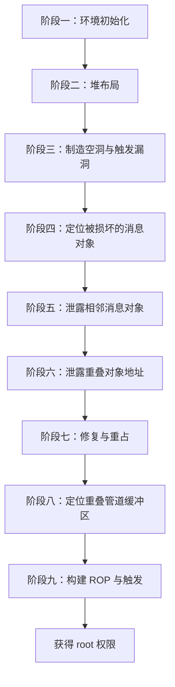

从阶段三到阶段九，核心的交互模式可以归结为"建立 UAF → 信息泄露 → 控制流劫持"三部曲，而阶段一、二为后续操作奠定了基础。

### 4-3. 阶段一：环境初始化

环境初始化的目标是为后续所有操作奠定基础，包括提升系统资源限制、创建漏洞触发载体以及准备精心构造的过滤器数据。具体执行以下步骤，其流程如下：

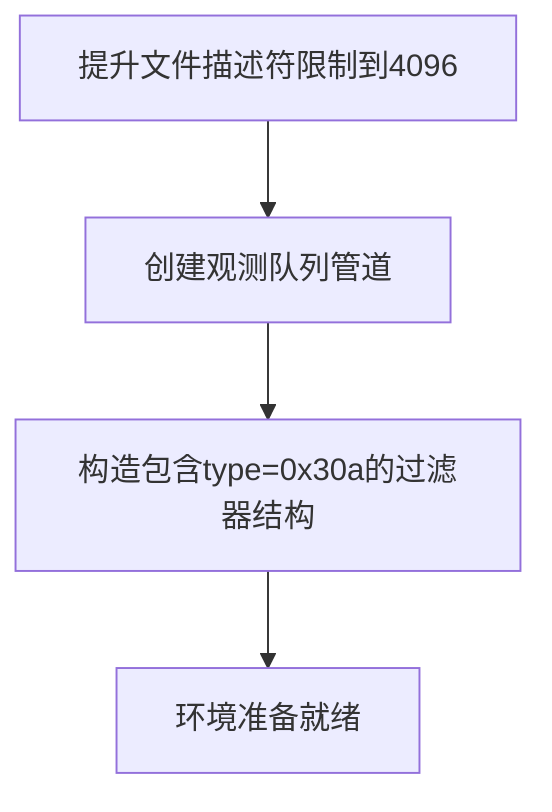

1. **提升资源限制**：通过 `setrlimit` 将 `RLIMIT_NOFILE` 提升至 4096。这一步确保后续阶段能够同时持有大量文件描述符（管道、套接字等），避免因达到系统限制而失败。
2. **创建观测队列**：调用 `pipe2` 并传入 `O_NOTIFICATION_PIPE` 标志创建一个特殊管道。该管道在内核中对应一个 `watch_queue` 对象，将作为后续 `ioctl` 系统调用的目标。观测队列的创建是触发漏洞的前提，因为漏洞函数 `watch_queue_set_filter` 正是作用于该队列的过滤器。
3. **准备过滤器结构**：构造 `watch_notification_filter` 结构体，其中包含一个 `type` 字段值为 `0x30a` 的条目。该值在第一次检查时被忽略（因 `type >= 0x80`），但在第二次拷贝时被处理（因 `type < 0x400`），从而触发越界置位。同时填充若干正常条目（如 `type=1`）以保证 `nr_filters` 合法（至少为 1，且不超过 16）。该结构体将在阶段三通过 `ioctl` 传递给内核。

完成上述准备后，系统已具备触发漏洞所需的基本条件。

### 4-4. 阶段二：堆布局

本阶段在 `kmalloc-96` 和 `kmalloc-1k` 缓存中建立规律的内存排列，为后续漏洞触发提供确定性的相邻关系。具体操作如下：

- 通过 `msgget` 创建 4096 个消息队列。
- 对每个队列依次调用 `msgsnd` 发送两条消息：
    - 第一条消息大小为 `96 - sizeof(struct msg_msg)`，强制分配在 `kmalloc-96` 缓存中，称为 first msg_msg。其内容可填充任意数据，但为了后续定位，可填充魔数。
    - 第二条消息大小为 `1024 - sizeof(struct msg_msg)`，分配在 `kmalloc-1k` 缓存中，称为 second msg_msg。其数据区填充唯一标识（例如魔数 "BinRacer" 加队列索引），以便在后续阶段快速定位被篡改的对象。

在 SLUB 分配器中，`kmalloc-96` 和 `kmalloc-1k` 使用不同的 slab 缓存，因此所有 first msg_msg 集中分配在 `kmalloc-96` 的物理页面中，所有 second msg_msg 集中分配在 `kmalloc-1k` 的物理页面中。同一队列的两个消息通过 `m_list` 双向链表在逻辑上关联（first 的 `m_list.next` 指向 second，second 的 `m_list.prev` 指向 first），但物理上位于不同的缓存区域。通过大量创建队列，使两类对象在各自的缓存中形成有序排列。

释放某些 first msg_msg 时，在 `kmalloc-96` 缓存中留下空洞，后续分配的 `watch_filter` 对象（同样是 `kmalloc-96`）会占据这些空洞，从而与某个 first msg_msg 在物理上相邻。越界置位操作将篡改该 first msg_msg 的 `m_list.next` 指针，使其指向另一个队列的 second msg_msg，进而在链表层面造成两个 first 对象与同一个 second 对象重叠。为了增加成功率，通常会创建较大数量的队列（如 4096），以在随机化堆布局中仍有足够的机会命中理想的内存排布。

### 4-5. 阶段三：制造空洞与触发漏洞

本阶段通过释放特定对象制造内存空洞，并触发漏洞以篡改相邻对象的指针，从而实现对象重叠。该过程的交互细节如下列序列图所示：

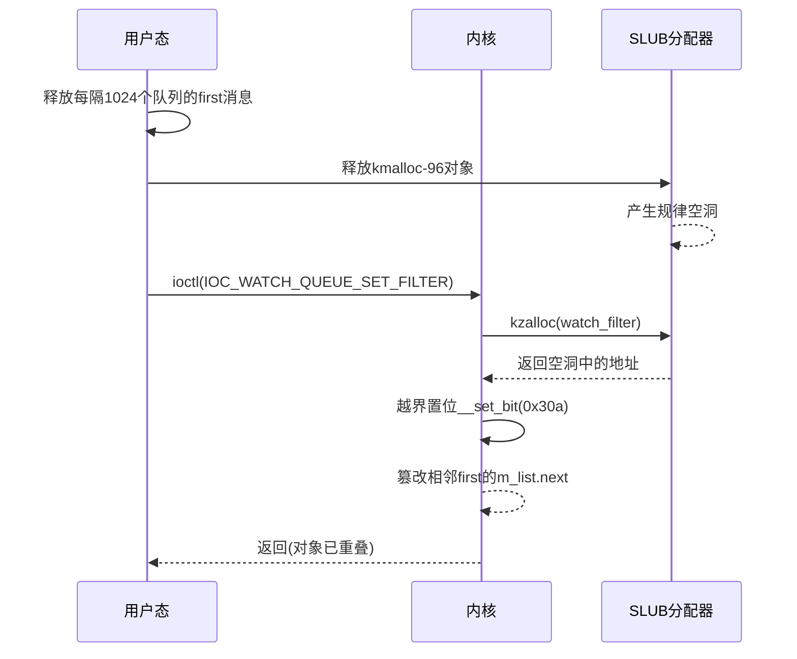

首先，释放编号为 1024 倍数的队列中的 first msg_msg（即每 1024 个释放一个），在 `kmalloc-96` 缓存中产生规律分布的空洞。选择 1024 作为间隔是为了在大量队列中制造足够数量的空洞，同时避免过度释放导致队列间关系过于稀疏。接着，通过 `ioctl` 调用 `IOC_WATCH_QUEUE_SET_FILTER` 触发漏洞处理函数。内核在分配 `watch_filter` 时，由于 `kmalloc-96` 中存在空洞，新的 `watch_filter` 对象会落在其中一个空洞位置，其相邻的 `kmalloc-96` 对象恰好是某个队列 A 的 first msg_msg。此时，越界置位操作将 A.first 的 `m_list.next` 指针从原本指向 A 的 second 改为指向另一队列 B 的 second，导致 A 的 first 和 B 的 first 的 `m_list.next` 指针同时指向 B 的 second，形成重叠。这种重叠使得两个逻辑上独立的 `msg_msg` 共享同一块物理内存，为后续操作提供了基础。

这一阶段的关键是确保 `watch_filter` 能够落在预期的空洞中，从而与目标 first 相邻。由于 `CONFIG_SLAB_FREELIST_RANDOM` 的影响，实际命中可能需要多次尝试，但通过大规模堆喷射可将成功率提升至可接受范围。

### 4-6. 阶段四：定位被损坏的消息对象

经过阶段三的越界写入，`watch_filter` 对象已篡改相邻队列 A 的 `first` 消息的 `m_list.next` 指针，使其指向了队列 B 的 `second` 消息。这意味着队列 A 和队列 B 的 `first` 消息现在同时指向队列 B 的 `second` 消息。为了定位队列 A 和队列 B，需要从数千个队列中找出被篡改的 `first` 消息所属的队列。

具体方法如下，其流程如下图：

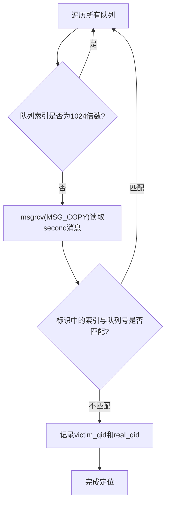

遍历所有队列，对每个非空洞位置的队列调用 `msgrcv` 并指定 `MSG_COPY` 标志读取其 `second` 消息的数据区（`MSG_COPY` 标志可在不删除消息的情况下复制一份副本供读取），检查其中的魔数和索引。**若索引与当前队列号不一致，则说明该队列的 `first` 消息的 `m_list.next` 已被篡改**（现在指向了另一个队列的 `second` 消息，导致当前队列的 `second` 消息实际上是从另一个队列“借来的”）。此时记录该队列为受害者队列（`victim_qid`），同时记录魔数中原始索引所对应的队列为 `real_qid`。

**检测原理**：被篡改的是 `first` 消息的 `m_list.next`，而检测时通过读取 `second` 消息的数据来间接判断——如果 A 的 `first` 指向了 B 的 `second`，那么在遍历到队列 A 时，读取到的 `second` 消息实际上是 B 的 `second` 消息，其中的队列索引是 B 的索引，与 A 的索引不匹配，从而暴露了篡改。

这两个标识将贯穿后续所有阶段，因为所有的后续操作都依赖于 `victim_qid` 中的消息来访问重叠内存。如果遍历完所有队列仍未找到，则需要重新执行阶段二和阶段三，调整堆布局参数后重试。

### 4-7. 阶段五：泄露相邻消息对象

本阶段利用 UAF 原语进行越界读取，获取相邻队列的 `msg_msg` 头部，从而泄露内核堆地址。下面序列图展示了如何通过 SKB 数据区与消息队列的交互来建立 UAF 并完成越界读取：

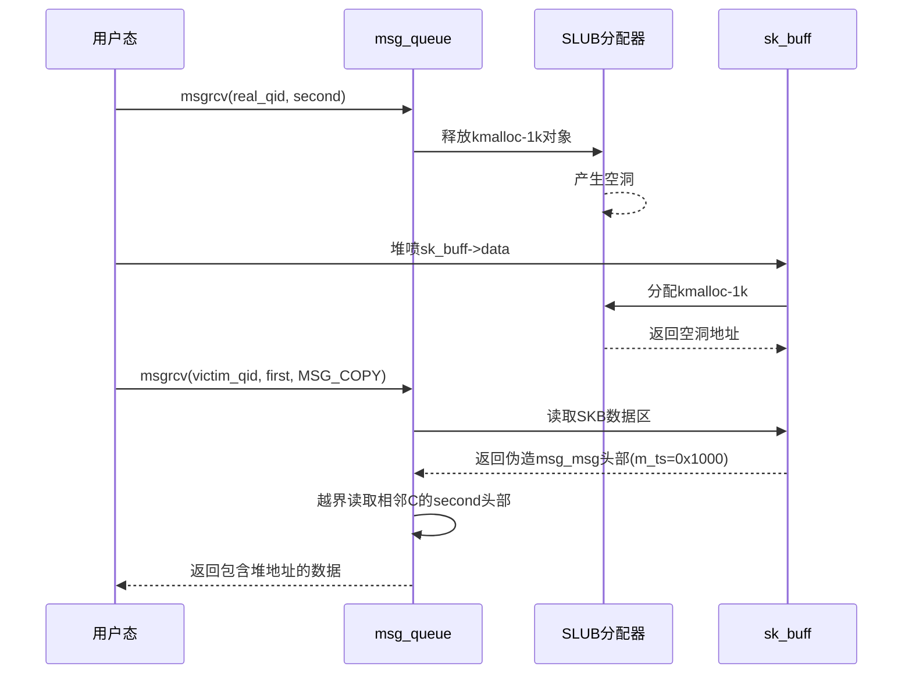

具体流程为：调用 `msgrcv` 删除 `real_qid` 的 second 消息，在 `kmalloc-1k` 中产生一个空洞。紧接着，使用 `sk_buff->data` 缓冲区堆喷填充该空洞——由于 SKB 数据区也分配在 `kmalloc-1k` 且内容可控，我们可以精确构造数据。在 SKB 数据区的起始位置放置一个伪造的 `msg_msg` 头部，将其 `m_ts` 设置为一个远大于实际数据长度的值（如 0x1000）。随后，通过 `victim_qid` 的 second 消息调用 `msgrcv(MSG_COPY)`，内核会根据伪造的 `m_ts` 从 SKB 数据区开始拷贝，直至超出原始消息边界，从而越界读取到相邻队列 C 的 second 消息的完整头部。该头部包含 `m_list.prev` 等堆地址，同时记录该头部在读取缓冲区中的偏移量 `off`，该偏移反映了当前 SKB 数据区与 C.second 的相对距离。这个偏移量将在下一阶段用于计算精确地址。

此步骤中，SKB 数据区的堆喷是关键，它使得我们能够精确控制 UAF 对象的内容，并触发越界读取。需要注意的是，空洞的填充必须非常及时（在释放后立即执行），否则可能被其他内核路径占用，导致堆喷失败。

### 4-8. 阶段六：泄露重叠对象地址

本阶段通过构造特殊的伪造 `msg_msg` 头部，利用消息分段链表实现任意地址读，从而精确计算出当前重叠对象的堆地址。下列序列图展示了如何构造 `msg_msg->next` 指针来指向目标地址，并触发内核的 `load_msg` 路径完成读取：

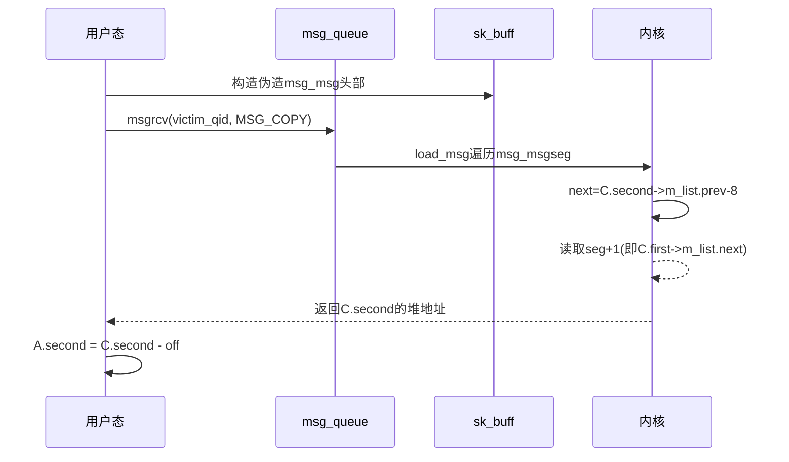

再次使用 SKB 数据区，在重叠内存中构造另一个伪造的 `msg_msg` 头部。这次将 `msg_msg->next` 字段（偏移 0x20，指向 `msg_msgseg` 分段链表）设置为 `C.second->m_list.prev - 0x8`。由于 `C.second->m_list.prev` 指向 C.first 的起始地址，减去 8 后指向 C.first 之前 8 字节处，该位置通常存储 0（作为链表终止符）。当内核在 `load_msg` 中遍历 `msg_msgseg` 链表时，会将此地址视为第一个分段，其 `next` 字段为 0 终止遍历，而 `seg+1` 恰好指向 C.first 的起始地址，即 C.first 的 `m_list.next` 字段，该字段保存着 C.second 的堆地址。通过设置 `m_ts` 足够大，内核会将这 8 字节拷贝到用户缓冲区，从而获得 C.second 的堆地址。最后，用该地址减去阶段五记录的偏移量 `off`，即可得到当前 SKB 数据区（即 A.second 所在位置）的精确堆地址。该地址将在后续阶段用于构造伪造对象。

这一阶段实质上是利用 `msg_msgseg` 链表的遍历机制构建了任意地址读原语，是信息泄露中最关键的一步。由于 `HARDENED_USERCOPY` 不检查内核内部拷贝，此操作不会触发防护。

### 4-9. 阶段七：修复与重占

本阶段修复被损坏的消息头部，释放消息以制造空洞，并用 `pipe_buffer` 对象重新占据，为后续信息泄露做准备。该过程的交互如下列序列图所示：

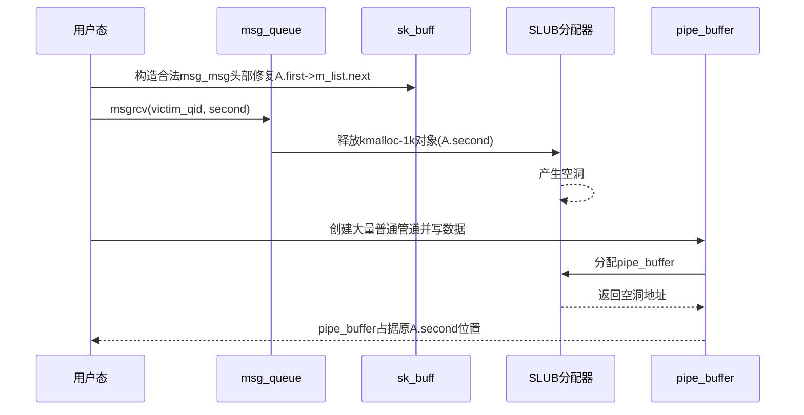

具体操作如下：

1. 利用 UAF 原语（仍在 SKB 数据区操作），在重叠内存中构造一个合法的 `msg_msg` 头部，使得 A.first->`m_list.next` 指向一个有效的堆地址（例如 A.second 本身或一个孤立节点），从而解除链表混乱状态，避免后续释放操作触发 panic。这一步是必要的，因为若不修复，内核在遍历链表时可能访问无效地址。
2. 通过不带 `MSG_COPY` 标志的 `msgrcv` 释放 A.second，再次在 `kmalloc-1k` 中制造空洞。
3. 大量创建普通管道并向其写入不同长度的数据，使得内核分配大量 `pipe_buffer` 结构（同样在 `kmalloc-1k` 中）。通过控制数据长度和管道创建顺序，确保至少有一个 `pipe_buffer` 恰好占据之前 A.second 释放的空洞。

经过此阶段，重叠内存现在被 `pipe_buffer` 占据，这为下一阶段泄露内核基址提供了机会，因为 `pipe_buffer` 结构包含指向内核全局符号 `anon_pipe_buf_ops` 的指针。

### 4-10. 阶段八：定位重叠管道缓冲区

本阶段通过遍历 SKB 数据区内容，识别出与 `pipe_buffer` 重叠的对象，并从中提取内核基址。下列序列图展示了该过程：

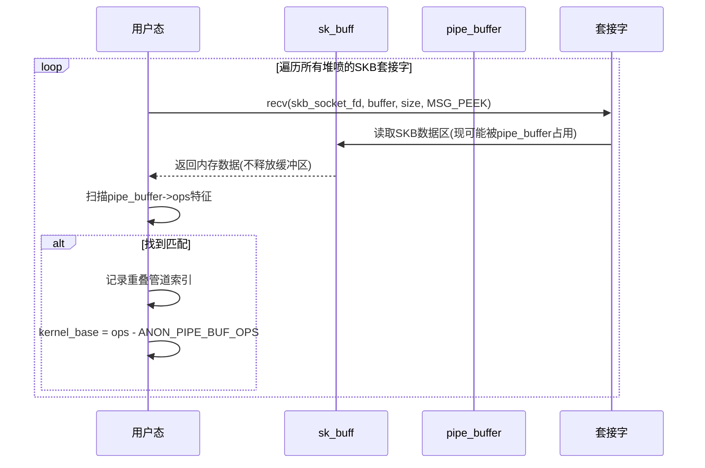

在阶段七中，我们释放了 A.second 并在同一位置堆喷了 `pipe_buffer` 对象。由于此前阶段五和阶段六曾使用 SKB 数据区（`sk_buff->data`）填充该内存区域，并且这些 SKB 数据区仍然可以通过其关联的套接字文件描述符读取，因此我们可以利用这些 SKB 数据区来读取当前重叠内存的内容——该内存现在可能已被 `pipe_buffer` 占据。

具体操作如下：遍历所有先前堆喷的 SKB 数据区（保留其套接字文件描述符），对每个数据区调用 `recv` 系统调用并指定 `MSG_PEEK` 标志读取其内容。`MSG_PEEK` 标志的作用是读取数据但不从接收缓冲区中移除，因此 SKB 数据区在读取后仍然保留，不会影响后续操作。由于该内存区域现在存放的是 `pipe_buffer` 结构，读取到的数据中应包含 `pipe_buffer` 特有的 `ops` 字段。该字段指向内核全局符号 `anon_pipe_buf_ops`，其低 12 位固定为 `0x5c0`。在读取到的数据中搜索该特征值，一旦找到匹配项，即可确认该 SKB 数据区当前与某个 `pipe_buffer` 重叠，并记录对应的管道文件描述符索引（用于后续阶段九的触发操作）。同时，从该 `ops` 值减去 `anon_pipe_buf_ops` 在内核映像中的固定偏移，即可计算出内核基址，从而绕过 KASLR。至此，我们已获取了构建最终 ROP 链所需的核心信息。

### 4-11. 阶段九：构建 ROP 与触发

最终阶段利用 SKB 数据区与 `pipe_buffer` 在内存中的重叠，构造伪造的 `pipe_buffer` 函数表，并通过管道关闭操作触发 ROP 链执行。阶段八中通过 `recv(MSG_PEEK)` 读取 SKB 数据区内容时，数据并未从缓冲区移除，因此这些 SKB 数据区仍然占据内存，与 `pipe_buffer` 重叠。本阶段首先需要消耗这些 SKB 数据区，使内核释放相应的 `sk_buff->data` 缓冲区，从而在 `kmalloc-1k` 缓存中制造空洞；随后重新堆喷新的 `sk_buff->data` 缓冲区以占据该空洞，并在其中构造伪造的 `pipe_buffer` 结构。

下面序列图完整描绘了从释放旧 SKB、堆喷伪造数据到内核执行 ROP 的全过程：

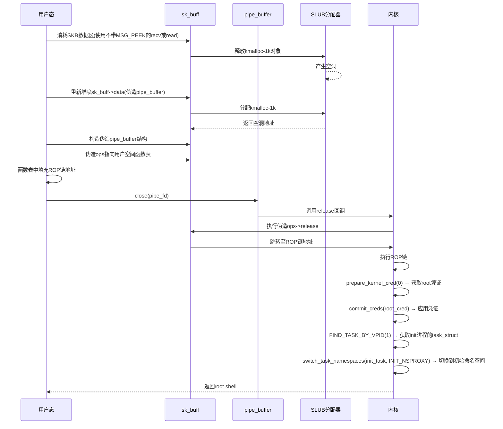

具体流程如下：

1. **消耗旧的 SKB 数据区**：对于阶段八中所有使用 `recv(MSG_PEEK)` 读取过的 SKB 套接字，再次调用 `recv` 系统调用（不带 `MSG_PEEK` 标志）或 `read` 系统调用，从套接字缓冲区中读取并移除数据。此时内核会释放对应的 `sk_buff->data` 缓冲区，由于这些缓冲区与 `pipe_buffer` 重叠，释放后该内存块返回 SLUB 分配器，在 `kmalloc-1k` 缓存中产生空洞。

2. **重新堆喷伪造的 SKB 数据区**：立即堆喷新的 `sk_buff->data` 缓冲区，使其占据刚释放的空洞。在该数据区中构造一个伪造的 `pipe_buffer` 结构，复制原 `pipe_buffer` 的有效字段（如 `page`、`len`、`offset`），同时将 `ops` 指针改为指向用户空间准备的伪造函数表。该函数表中填充了基于已泄露内核基址的 ROP 链地址。

3. **触发 ROP 链**：关闭对应的管道文件描述符（即阶段八中与重叠位置关联的管道）。内核在管道释放路径中会调用 `pipe_buffer->ops->release`，由于 `ops` 已被替换，实际执行的是 ROP 链。ROP 链首先调用 `prepare_kernel_cred(0)` 获取 root 凭证，再调用 `commit_creds` 应用凭证。接着通过调用 `FIND_TASK_BY_VPID(1)` 获取 PID 为 1 的 init 进程的 `task_struct` 指针，然后调用 `switch_task_namespaces` 将该指针及 `INIT_NSPROXY` 的地址作为参数传入，将当前进程的命名空间切换为初始命名空间（完成容器逃逸）。最后通过 `swapgs_restore_regs_and_return_to_usermode` 等安全返回方式返回到用户态的 shell 函数。执行完毕后，当前进程获得 root 权限且脱离原有容器命名空间，得到一个具有最高权限的交互式 shell。

### 4-12. 保护机制应对策略

现代内核部署了多层次的安全防护机制，既包括堆管理子系统加固（如 `SLAB_FREELIST_RANDOM` 等），也包括通用的内核空间保护（如 KASLR、SMEP、SMAP、KPTI）。下表分类总结了这些机制对当前操作流程的影响及其应对方式：

| 类别         | 机制                                | 影响分析                                                | 应对策略                                                                                       |
| ------------ | ----------------------------------- | ------------------------------------------------------- | ---------------------------------------------------------------------------------------------- |
| **堆加固**   | **CONFIG_SLAB_FREELIST_RANDOM**     | 随机化空闲对象链表顺序，降低堆布局的可预测性            | 通过大规模堆喷射（如 4096 个消息队列）在统计上保证相邻对象命中。                               |
|              | **CONFIG_SLAB_FREELIST_HARDENED**   | 对 freelist 指针进行 XOR 加密，防止覆盖指针实现任意分配 | 本操作不涉及 freelist 覆盖，而是篡改 `msg_msg.m_list.next`，故无影响。                         |
|              | **CONFIG_INIT_ON_ALLOC_DEFAULT_ON** | 分配时清零内存，阻碍从已释放对象读取残留数据            | 信息泄露依赖**越界读取存活对象**，而非释放后读取，故不受影响。                                 |
|              | **CONFIG_HARDENED_USERCOPY**        | 检查用户态与内核态拷贝的边界，防止越界                  | 阶段五/六的越界读取发生在**内核内部拷贝路径**，不在 `copy_to/from_user` 检查范围内，故可绕过。 |
| **通用防护** | **KASLR**                           | 随机化内核映像基址，隐藏符号地址                        | 阶段八通过泄露 `anon_pipe_buf_ops` 指针计算内核基址，精准绕过。                                |
|              | **SMEP**                            | 禁止内核执行用户空间代码                                | ROP 链完全在内核堆中构造，不执行用户空间代码，SMEP 不构成障碍。                                |
|              | **SMAP**                            | 禁止内核访问用户空间数据                                | 所有伪造结构均位于内核堆，ROP 链不访问用户空间数据，SMAP 不触发。                              |
|              | **KPTI**                            | 隔离用户/内核页表，防止直接返回用户态                   | ROP 链末尾使用 `swapgs_restore_regs_and_return_to_usermode` 等安全返回路径，兼容 KPTI。        |

**综合评估**：

- **堆加固机制**：四项堆加固均不影响本链条，通过堆喷射、利用内核内部拷贝路径等手段即可规避。
- **通用防护机制**：KASLR 通过信息泄露阶段精准绕过；SMEP/SMAP 因本操作完全在内核空间进行而不受影响；KPTI 通过内核提供的安全返回原语兼容。

在开启上述所有加固选项的内核上（包括 KASLR、SMEP、SMAP、KPTI），本操作链条仍可正常运作。所有防护机制均被逐一应对，确保了利用流程的完整性与可靠性。

### 4-13. 条件与局限性

#### 4-13-1. 必要条件

- 内核版本在受影响范围内（5.8 至 5.17-rc7），且未应用补丁。
- 必须启用 `CONFIG_WATCH_QUEUE`（默认开启）。
- 用户具有本地普通权限（可执行系统调用）。
- 对于特定版本区间（[5.8, 5.9) 和 [5.14, 5.16.14]），需关闭 `CONFIG_MEMCG_KMEM`，否则堆布局控制失效。

#### 4-13-2. 局限性

- 堆布局需要高度精确控制，各阶段操作顺序和数量需反复调优，成功率受系统状态影响。
- 操作时序要求严格：空洞的填充必须在释放后极短时间内完成，否则可能被其他内核路径占用。
- 堆布局的随机化（如 `CONFIG_SLAB_FREELIST_RANDOM`）可能导致目标对象与 `watch_filter` 不相邻，需要多次尝试才能命中理想的堆排列。
- 仅影响配置 `CONFIG_WATCH_QUEUE` 且未修复的系统，无法跨版本通用。
- 操作过程中的内存损坏（如篡改指针导致内核访问无效地址）可能触发内核 panic，但多数堆布局调整失败仅导致操作链条中断，不会造成系统崩溃。实际操作中需根据失败阶段采取不同恢复策略。

### 4-14. 总结

本章详细阐述了 **CVE-2022-0995** 漏洞的操作思路与技术链条，将整个流程划分为九个阶段逐一展开：从环境初始化、堆布局塑造、制造空洞与触发漏洞开始，逐步完成被损坏对象的定位、相邻消息对象的泄露、重叠对象地址的精确计算、头部修复与内存重占，最终通过定位重叠管道缓冲区、构造伪造函数表并触发 ROP 链执行，实现内核控制流的劫持与权限提升。

整个链条的核心在于将单比特越界写入能力转化为可控的内存操控原语。具体而言，通过 `__set_bit` 在 `kmalloc-96` 缓存中精确篡改相邻 `msg_msg` 的 `m_list.next` 指针，使两个队列的 first 对象在链表视图中同时指向同一个 second 对象，造成逻辑上的对象重叠。在此基础上，利用 SKB 数据区与消息队列对象的类型混淆构建 UAF 原语，进而通过多阶段信息泄露获取堆地址与内核基址，最终借助 `pipe_buffer` 的函数表指针完成控制流劫持。

该技术链条展示了单比特置位这种看似受限的原语如何通过精心设计的堆布局与对象生命周期操控，逐步扩展为完整的权限提升方案。其核心手法——对象重叠、类型混淆、多阶段信息泄露与内核控制流劫持——涵盖了现代内核漏洞利用中的若干关键技术范式，具有一定的代表性。

理解本章所描述的技术链条，有助于安全研究人员深入掌握内核堆管理机制（尤其是 SLUB 分配器在不同缓存中的行为差异）、对象生命周期管理的脆弱性以及常见防护机制的绕过思路，为后续漏洞分析与防御技术研究提供可参考的方法论基础。

### 4-15. 测试结果

<div style="text-align: center; margin: 2rem 0;">
  
</div>

## 5. 利用思路二（Dirty Pipe 变体）

本章描述 **CVE-2022-0995** 漏洞的另一种利用路径——基于 Dirty Pipe（CVE-2022-0847）技术的变体实现。Dirty Pipe 是 2022 年初曝光的 Linux 内核漏洞，利用 `splice` 与管道机制的交互缺陷实现文件页缓存篡改。本章将 Dirty Pipe 的核心技术思路移植到 **CVE-2022-0995** 的堆溢出漏洞上：通过置位 `pipe_buffer` 结构体中的 `flags` 字段为 `PIPE_BUF_FLAG_CAN_MERGE` 标志，使通过 `splice` 映射的只读文件页缓存变为可写，从而实现对目标文件内容的修改。两者在最终效果上殊途同归，但漏洞根源截然不同。

与第四章利用消息队列对象重叠构造 UAF 原语的方式相比，本章的 Dirty Pipe 变体无需复杂的信息泄露和多阶段 ROP 链构造，技术路径更加直接，但同样需要精确控制堆布局。从技术演进的角度看，本章方法借鉴了 Dirty Pipe 利用向量的思路，将其与 watch_queue 子系统的堆溢出漏洞相结合，形成了一条独特的利用路径。

### 5-1. 核心原语与依赖条件

#### 5-1-1. 核心操作原语

本章利用的漏洞原语与第四章相同，即 **位操作型溢出（`__set_bit`）**，允许向相邻堆块中**某个字节的特定比特位写入 1**（单比特置位），具有极高的空间精度：

- 目标字节偏移 = `q->type >> 3`
- 目标比特位 = `q->type & 7`

与第四章不同的是，本章将越界置位的目标从 `msg_msg` 的 `m_list.next` 指针调整为 **`pipe_buffer` 结构体的 `flags` 字段**。通过越界置位，将 `flags` 字段中的特定比特位置 1，使其包含 `PIPE_BUF_FLAG_CAN_MERGE` 标志位。`pipe_buffer` 结构体在 64 位系统中总大小为 40 字节，其 `flags` 字段位于结构体内部偏移 0x18 处。

在默认配置下，管道拥有 16 个 `pipe_buffer`，由 `kcalloc(16, 40, GFP_KERNEL_ACCOUNT)` 整体分配为数组，总大小为 640 字节，分配在 `kmalloc-1k` 缓存中。通过 `fcntl` 的 `F_SETPIPE_SZ` 操作调整管道缓冲区大小，内核会重新分配 `pipe->bufs` 数组——释放旧数组并分配新数组，从而改变数组所在的 kmalloc 缓存（具体堆喷机制详见 `5-4` 节）。

**偏移量计算与目标定位**：`watch_filter` 对象分配在 `kmalloc-96` 缓存（96 字节 = 0x60 字节 = 0x300 比特）。为命中相邻 `pipe_buffer` 数组中的第一个 `pipe_buffer` 结构体的 `flags` 字段（偏移 0x18），选取 `q->type = 0x3c4`：

- 字节偏移 = `0x3c4 >> 3 = 0x78`（相对于当前对象基址）
- 比特偏移 = `0x3c4 & 7 = 4`
- `0x78 - 0x60 = 0x18` 字节，恰好落在相邻 `pipe_buffer` 结构体的 `flags` 字段起始位置
- 比特偏移 4 对应 `PIPE_BUF_FLAG_CAN_MERGE`（`1 << 4 = 0x10`）

具体而言，`pipe_buffer` 结构体定义如下（基于内核源码）：

```c
struct pipe_buffer {
    struct page *page;        /* 指向页缓存页面的指针，偏移 0x00 */
    unsigned int offset;      /* 数据在页面内的偏移，偏移 0x08 */
    unsigned int len;         /* 数据的长度，偏移 0x0c */
    const struct pipe_buf_operations *ops;  /* 操作函数表，偏移 0x10 */
    unsigned int flags;       /* 缓冲区标志位，偏移 0x18 */
    unsigned long private;    /* 私有数据，偏移 0x20 */
};  /* 总大小 40 字节 */
```

`flags` 字段中值得关注的是 `PIPE_BUF_FLAG_CAN_MERGE`（值为 `0x10`）。当该标志被置位时，管道缓冲区允许与新写入的数据进行合并，而非分配新的页面。若该 `pipe_buffer` 是通过 `splice` 系统调用从文件映射而来的只读页面，则置位该标志后，后续向管道写入的数据将直接修改文件页缓存中的内容。

本章的目标是通过越界置位，将相邻 `pipe_buffer` 的 `flags` 字段中的对应比特位置 1，使其包含 `PIPE_BUF_FLAG_CAN_MERGE` 标志，从而将只读的文件缓存页面变为可写，实现文件内容的篡改。

#### 5-1-2. 依赖条件

**内核版本区间**：

- 受影响版本：Linux 5.8 至 5.17-rc7。
- 与第四章相同，可利用性受到 `CONFIG_MEMCG_KMEM` 配置的影响：
    - 在版本区间 `[5.8, 5.9)` 和 `[5.14, 5.16.14]` 中，若启用了 `CONFIG_MEMCG_KMEM`，`kmalloc` 分配器会区分普通缓存和内存控制组缓存（`kmalloc-cg-*`），导致堆布局控制失效。因此在这些版本上，**必须关闭 `CONFIG_MEMCG_KMEM`** 才能成功操作。
    - 在版本区间 `[5.9, 5.14)` 中，内核已经取消了该隔离机制，因此无需额外处理。

**其他必要条件**：

- 系统必须启用 `CONFIG_WATCH_QUEUE`（默认开启）。
- 本地用户具备普通用户权限（无需 root）。
- 目标文件（如 `/etc/passwd`）必须可读，且其页缓存当前驻留在内存中（通过 `splice` 操作可将其映射到管道缓冲区）。这与 Dirty Pipe 技术的依赖条件一致。
- 本方法不依赖泄露内核基址，因此不受 KASLR 影响，这是 Dirty Pipe 变体相较于传统内核提权方法的优势所在。

### 5-2. 总体流程

整个操作链条分为三个阶段，各阶段环环相扣，前后依赖。以下流程图展示了整体逻辑：

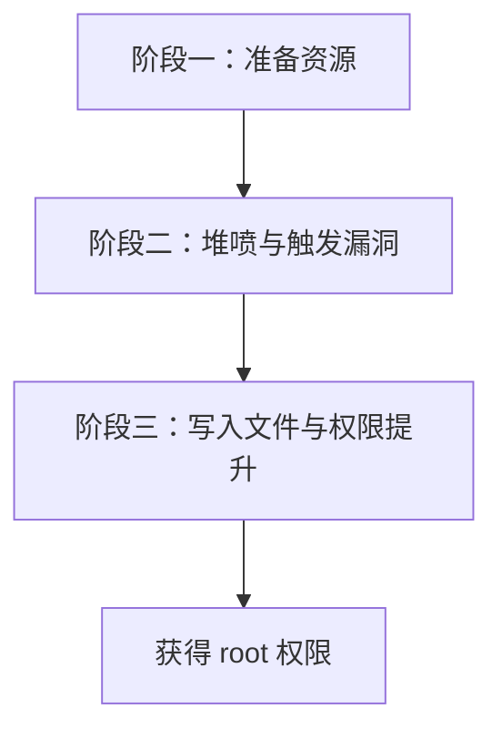

Dirty Pipe 变体的核心思路可以概括为：**通过 CVE-2022-0995 的堆溢出实现 Dirty Pipe 的页缓存污染效果**。普通管道通过 `splice` 持有目标文件的只读页缓存引用（此时 `pipe_buffer.flags = 0`），越界置位将 `pipe_buffer.flags` 置位为 `PIPE_BUF_FLAG_CAN_MERGE` 后，该引用变为可写，后续向管道写入数据即可污染页缓存。

这三个阶段之间存在紧密的因果链：阶段一建立的 `pipe_buffer` 数组是阶段二堆喷的核心载体，同时也是阶段三文件写入的目标对象；阶段二的越界置位是连接前后两个阶段的关键操作，它将只读引用转变为可写引用；阶段三则利用这一转变完成最终的目标。每一个阶段都为下一阶段提供必要的条件，环环相扣，缺一不可。

### 5-3. 阶段一：准备资源

本阶段的目标是为后续操作准备所有必要的资源，包括目标文件的文件描述符、通过 `splice` 持有文件页缓存引用的普通管道，以及用于触发漏洞的观测队列管道。具体执行以下步骤，其流程如下：

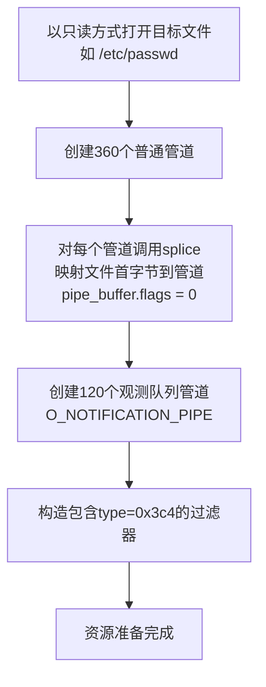

1. **打开目标文件**：以只读方式打开目标文件（例如 `/etc/passwd`），获取文件描述符。该文件的内容将通过 `splice` 系统调用映射到管道缓冲区中，使其页缓存页面与管道关联。

2. **创建并填充普通管道**：创建大量普通管道（通常 360 个），对每个管道调用 `splice` 将目标文件的第一个字节拷贝到管道中。该操作使管道拥有一个指向文件页缓存的 `pipe_buffer` 数组，此时对应的 `pipe_buffer.flags = 0`。这些普通管道有两个作用：一是通过 `splice` 建立文件页缓存与管道的映射关系，为后续页缓存污染做准备；二是作为堆喷的对象，在 `kmalloc-96` 中形成密集的 `pipe_buffer` 数组布局。

3. **创建观测队列管道**：创建一批特殊管道（通常 120 个），使用 `O_NOTIFICATION_PIPE` 标志将其初始化为观测队列。这些管道将作为漏洞触发的载体，其 `watch_queue` 对象会分配 `watch_filter` 结构。

4. **准备特定过滤器**：构造 `watch_notification_filter` 结构体，其中包含一个 `type` 字段值为 `0x3c4` 的条目。该值保证在第一次检查中被忽略（因 `type >= 0x80`），但在第二次拷贝时被处理（因 `type < 0x400`），从而触发越界置位。该结构体将在阶段二通过 `ioctl` 传递给内核。

完成上述准备后，系统已具备触发漏洞所需的所有资源。此时，360 个普通管道各自持有一个指向文件页缓存的只读 `pipe_buffer`（`flags = 0`），120 个观测队列管道等待触发漏洞，过滤器已准备就绪。

### 5-4. 阶段二：堆喷与触发漏洞

本阶段通过 `fcntl` 的 `F_SETPIPE_SZ` 操作调整管道缓冲区大小，在 `kmalloc-96` 中建立规律的内存排列，并触发漏洞以置位相邻 `pipe_buffer` 的 `flags` 字段为 `PIPE_BUF_FLAG_CAN_MERGE`。

内核中，管道通过 `pipe->bufs` 字段指向一个 `pipe_buffer` 数组，该数组通过 `kcalloc(pipe_bufs, sizeof(struct pipe_buffer), GFP_KERNEL_ACCOUNT)` 整体分配。`pipe_buffer` 结构体在 64 位系统中总大小为 40 字节，因此数组的总大小 = `pipe_bufs × 40`。该数组整体落在某个 kmalloc 缓存中。

默认情况下，管道拥有 16 个 `pipe_buffer`，数组总大小为 `16 × 40 = 640` 字节，分配在 `kmalloc-1k` 缓存中。通过调整管道缓冲区大小（`F_SETPIPE_SZ`），内核会重新分配 `pipe->bufs` 数组——释放旧数组并分配新数组，从而改变数组所在的 kmalloc 缓存。这一机制是本章堆喷技术的核心：通过反复调整管道缓冲区大小，可以在不同 kmalloc 缓存之间迁移 `pipe_buffer` 数组，从而在 `kmalloc-96` 中制造密集的 `pipe_buffer` 数组布局和规律的空洞。

具体操作如下：

1. **密集填充 `kmalloc-96`**：对所有普通管道调用 `fcntl(pipe_fds[i][0], F_SETPIPE_SZ, 0x1000 * 2)`，将每个管道的缓冲区大小设置为 2 个页面（8KB）。该操作使管道所需的 `pipe_buffer` 数量从默认的 16 个减少为 2 个，数组总大小变为 `2 × 40 = 80` 字节，因此新分配的 `pipe_buffer` 数组将落在 `kmalloc-96` 缓存中。此时大量普通管道的 `pipe_buffer` 数组集中在 `kmalloc-96`，实现密集填充。

2. **制造规律空洞**：对每隔 3 个普通管道调用 `fcntl(pipe_fds[i][0], F_SETPIPE_SZ, 0x1000 * 16)`，将缓冲区大小调整为 16 个页面（64KB）。该操作使管道恢复为 16 个 `pipe_buffer`（数组总大小 640 字节），其分配会回到 `kmalloc-1k` 缓存，从而释放原有的 `kmalloc-96` 中的 `pipe_buffer` 数组，在 `kmalloc-96` 缓存中产生规律分布的空洞。这些空洞将被后续分配的 `watch_filter` 对象（同样分配在 `kmalloc-96`）占据。

3. **触发越界置位**：遍历所有观测队列管道，对每个管道调用 `ioctl` 触发漏洞。内核在处理 `ioctl` 时会在 `kmalloc-96` 中分配 `watch_filter` 对象，该对象会落在之前制造的空洞中。此时，`watch_filter` 的相邻 `kmalloc-96` 对象恰好是某个普通管道的 `pipe_buffer` 数组。越界置位操作将相邻 `pipe_buffer` 数组中的第一个 `pipe_buffer` 结构体的 `flags` 字段中的对应比特位置 1，使其包含 `PIPE_BUF_FLAG_CAN_MERGE` 标志（`flags` 从 0 变为 0x10），使该 `pipe_buffer` 的只读页面变为可写。

该过程的交互细节如下列序列图所示：

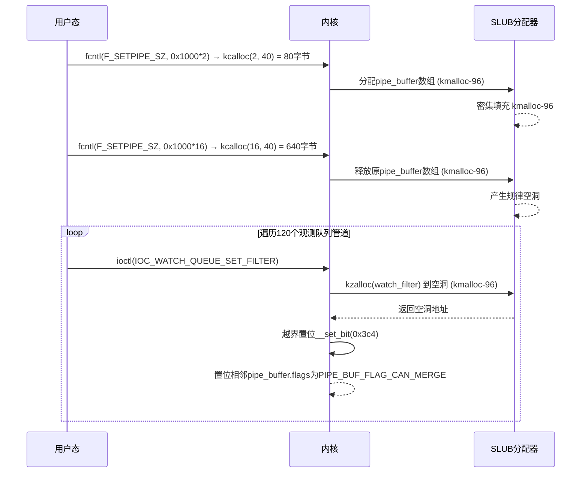

通过上述大规模喷射（360 个普通管道和 120 个观测队列管道），在 `kmalloc-96` 中制造密集排列，可以显著提高 `watch_filter` 与目标 `pipe_buffer` 数组相邻的概率，为 Dirty Pipe 变体的成功执行奠定基础。

### 5-5. 阶段三：写入文件与权限提升

本阶段利用被篡改的 `pipe_buffer` 的页缓存页面，将构造的条目写入目标文件，从而获得 root 权限。该过程的交互如下列序列图所示：

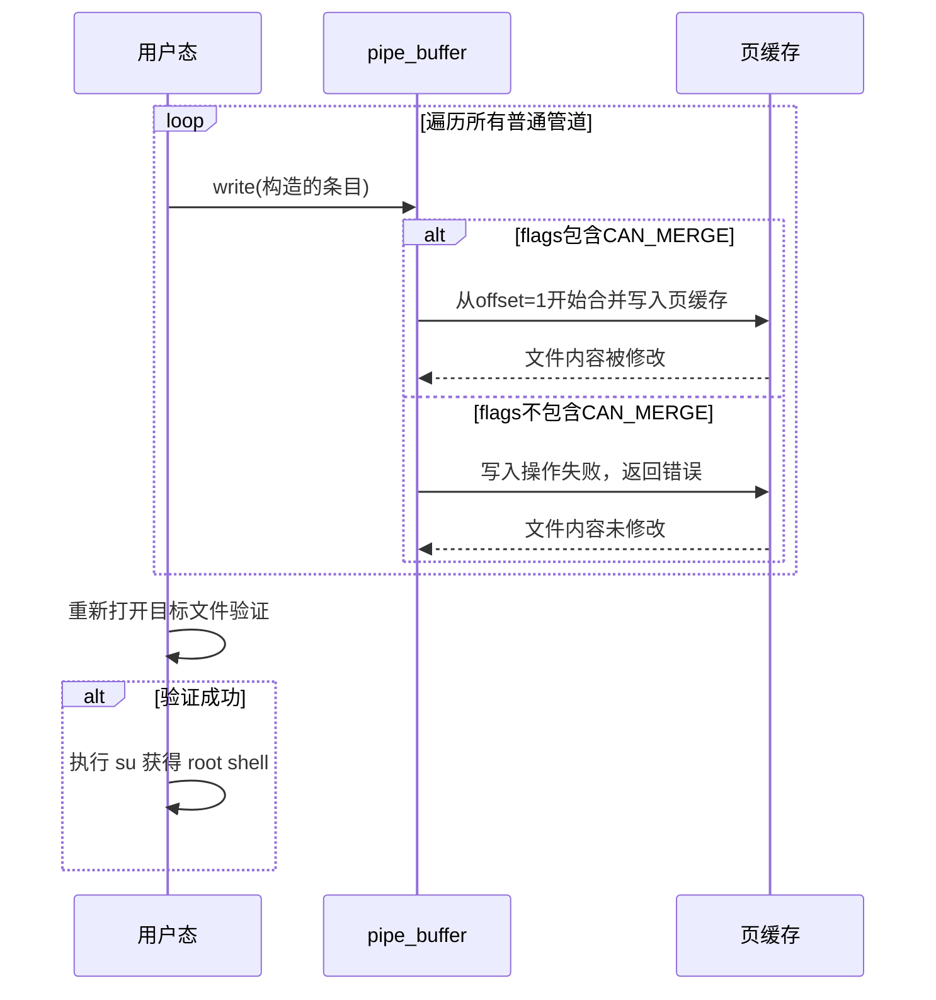

具体流程如下：

1. **写入构造的条目**：向所有普通管道写入精心构造的条目。在阶段一中，每个普通管道通过 `splice` 从目标文件拷贝了 1 字节数据，这使得对应 `pipe_buffer` 的 `offset` 字段被设置为 1（即数据从页面偏移 1 处开始）。因此，后续向该管道写入数据时，内核会从偏移 1 处开始合并新数据。以修改 `/etc/passwd` 为例，构造的条目为 `"oot::0:0:root:/root:/bin/sh\n"`。该字符串的首字母 `'o'` 缺失了 `'r'`，目的是与 `splice` 已拷贝的 1 字节（即原始文件的第一个字符，通常是 `'r'`）合并，形成完整的 `"root"` 账户条目。最终写入页缓存的内容为原始首字节 + 构造条目的拼接结果，从而在 `/etc/passwd` 中插入一个无密码的 root 账户。写入时，内核检查每个 `pipe_buffer` 的 `flags` 字段：若 `flags` 已被置位为 `PIPE_BUF_FLAG_CAN_MERGE`，写入操作会从 `offset` 处开始将数据合并到文件页缓存；若 `flags` 不包含该标志，写入操作直接返回错误，不会对页缓存产生任何影响。

2. **验证修改**：关闭初始文件描述符并重新打开目标文件，读取其内容以验证修改是否成功。若构造的条目已出现在文件中，则说明页缓存已被成功篡改。

3. **权限提升**：验证成功后，通过 `su` 命令切换至新创建的 root 账户（无密码），从而获得具有最高权限的交互式 shell。

### 5-6. 保护机制应对策略

下表总结了内核防护机制对当前操作流程的影响及其应对方式：

| 类别         | 机制                                | 影响分析                              | 应对策略                          |
| ------------ | ----------------------------------- | ------------------------------------- | --------------------------------- |
| **堆加固**   | **CONFIG_SLAB_FREELIST_RANDOM**     | 随机化空闲对象链表顺序，降低相邻概率  | 大规模堆喷射和 120 次越界写入应对 |
|              | **CONFIG_SLAB_FREELIST_HARDENED**   | 对 freelist 指针进行 XOR 加密         | 不涉及 freelist 覆盖，无影响      |
|              | **CONFIG_INIT_ON_ALLOC_DEFAULT_ON** | 分配时清零内存                        | 不依赖读取已释放对象，无影响      |
|              | **CONFIG_HARDENED_USERCOPY**        | 检查用户态与内核态拷贝边界            | 越界置位发生在内核内部，无影响    |
| **通用防护** | **KASLR**                           | 随机化内核映像基址                    | 不依赖泄露内核基址，无影响        |
|              | **SMEP/SMAP**                       | 禁止执行用户空间代码/访问用户空间数据 | 完全在内核空间进行，无影响        |
|              | **KPTI**                            | 隔离用户/内核页表                     | 不涉及页表切换，无影响            |

**综合评估**：上述加固机制均不构成对本 Dirty Pipe 变体的根本性障碍。核心应对手段是通过大规模堆喷射和多次越界写入克服 `SLAB_FREELIST_RANDOM` 带来的不确定性；其余机制因技术路径不同而不影响本章操作。

### 5-7. 条件与局限性

#### 5-7-1. 必要条件

- 内核版本在受影响范围内（5.8 至 5.17-rc7），且未应用补丁。
- 必须启用 `CONFIG_WATCH_QUEUE`（默认开启）。
- 用户具有本地普通权限（可执行系统调用）。
- 对于特定版本区间（[5.8, 5.9) 和 [5.14, 5.16.14]），需关闭 `CONFIG_MEMCG_KMEM`。
- 目标文件必须可读且其页缓存可被映射到管道。

#### 5-7-2. 局限性

- 堆布局需要高度精确控制，各阶段操作顺序和数量需反复调优。
- 操作时序要求严格：空洞的填充必须在释放后极短时间内完成。
- 堆布局随机化可能影响命中，但通过多次写入可有效应对。
- 仅影响配置 `CONFIG_WATCH_QUEUE` 且未修复的系统。
- 修改文件页缓存可能对系统造成持久性影响，操作前应做好备份。

### 5-8. 总结

本章详细阐述了 **CVE-2022-0995** 漏洞的 Dirty Pipe 变体利用方式。整个流程分为三个阶段：准备资源、堆喷与触发漏洞、写入文件与权限提升。与第四章利用消息队列对象重叠构造 UAF 原语的方式不同，本章将 Dirty Pipe 技术的核心机制——将 `pipe_buffer.flags` 置位为 `PIPE_BUF_FLAG_CAN_MERGE` ——通过 **CVE-2022-0995** 的堆溢出漏洞来实现。

**流程示意**：`splice` → `pipe_buffer.flags = 0` → `__set_bit(0x3c4)` → `pipe_buffer.flags = 0x10`（含 `PIPE_BUF_FLAG_CAN_MERGE`）→ `write` 污染页缓存。

**技术对比**：Dirty Pipe 原始漏洞（CVE-2022-0847）源于 `splice` 系统调用与管道内部状态管理的逻辑缺陷，通过单次系统调用即可完成页缓存污染；本章则通过堆溢出漏洞置位同一标志位，达到相同的页缓存污染效果。两者在最终效果上殊途同归，但漏洞根源截然不同。这也是“Dirty Pipe 变体”命名的由来。

**成功率说明**：本利用代码通过 120 次越界写入配合大规模堆喷射，在 `CONFIG_SLAB_FREELIST_RANDOM` 开启情况下成功率极高。原始 Dirty Pipe 利用依赖单次系统调用，成功率接近 100%；本变体虽受堆布局随机化影响，但通过多次触发有效弥补了这一不足。

理解本章所描述的技术链条，有助于安全研究人员深入理解 Dirty Pipe 技术的核心机制及其在不同漏洞场景下的可移植性，同时掌握管道子系统与页缓存交互的技术细节。

### 5-9. 测试结果

<div style="text-align: center; margin: 2rem 0;">
  
</div>

## 6. 漏洞修复

### 6-1. 补丁概述

针对 **CVE-2022-0995** 漏洞，Linux 内核主线于 2022 年 3 月 11 日通过合并提交 [93ce93587d36](https://git.kernel.org/pub/scm/linux/kernel/git/torvalds/linux.git/commit/?id=93ce93587d36493f2f86921fa79921b3cba63fbb) 完成了修复。该提交由 Linus Torvalds 合并，源自 David Howells 的 `davidh` 分支，汇集了多组针对 watch_queue 子系统及其他相关模块的修正。提交信息明确指出：“A set of patches for watch_queue filter issues noted by Jann”（一组由 Jann 报告的 watch_queue 过滤器问题补丁），表明该合并直接响应了安全研究人员报告的漏洞。

该补丁集不仅修复了 **CVE-2022-0995** 的核心问题——过滤器类型检查阈值不一致导致的越界写入，还一并解决了 watch_queue 子系统中其他若干并发、资源管理和边界检查方面的缺陷，提升了整体健壮性。此外，补丁还包含了对 AFS 文件系统和 CacheFiles 模块的修正，这些修正与漏洞利用无关，但对相应子系统的稳定性有所贡献。

本补丁影响的主要文件包括：

- `fs/pipe.c`：管道核心逻辑，涉及 watch_queue 与管道交互的同步和资源释放。
- `kernel/watch_queue.c`：watch_queue 核心实现，包含过滤器处理、大小设置、通知投递及资源清理。
- `include/linux/watch_queue.h`：头文件中的结构体定义调整。
- `fs/afs/write.c` 和 `fs/cachefiles/xattr.c`：文件系统相关修正。

从补丁的组织结构来看，维护者采取了分层修复的策略：首先在核心的 `watch_queue_set_filter` 函数中修正根本性的边界检查缺陷，然后针对同一模块中的并发访问、资源泄漏和代码规范问题逐一清理，最后扩展到相邻子系统（管道、AFS、CacheFiles）中的潜在风险点。这种从核心到外围的修复思路，确保了漏洞根因被彻底消除的同时，也强化了相关代码路径的整体质量。

### 6-2. 补丁内容

合并提交包含了针对多个模块的修改，其完整 diff 如下：

```diff
diff --git a/fs/afs/write.c b/fs/afs/write.c
index 5e9157d0da294..f447c902318da 100644
--- a/fs/afs/write.c
+++ b/fs/afs/write.c
@@ -703,7 +703,7 @@ static int afs_writepages_region(struct address_space *mapping,
 	struct folio *folio;
 	struct page *head_page;
 	ssize_t ret;
-	int n;
+	int n, skips = 0;

 	_enter("%llx,%llx,", start, end);

@@ -754,8 +754,15 @@ static int afs_writepages_region(struct address_space *mapping,
 #ifdef CONFIG_AFS_FSCACHE
 				folio_wait_fscache(folio);
 #endif
+			} else {
+				start += folio_size(folio);
 			}
 			folio_put(folio);
+			if (wbc->sync_mode == WB_SYNC_NONE) {
+				if (skips >= 5 || need_resched())
+					break;
+				skips++;
+			}
 			continue;
 		}

diff --git a/fs/cachefiles/xattr.c b/fs/cachefiles/xattr.c
index 83f41bd0c3a97..35465109d9c4e 100644
--- a/fs/cachefiles/xattr.c
+++ b/fs/cachefiles/xattr.c
@@ -28,6 +28,11 @@ struct cachefiles_xattr {
 static const char cachefiles_xattr_cache[] =
 	XATTR_USER_PREFIX "CacheFiles.cache";

+struct cachefiles_vol_xattr {
+	__be32	reserved;	/* Reserved, should be 0 */
+	__u8	data[];		/* netfs volume coherency data */
+} __packed;
+
 /*
  * set the state xattr on a cache file
  */
@@ -185,6 +190,7 @@ void cachefiles_prepare_to_write(struct fscache_cookie *cookie)
  */
 bool cachefiles_set_volume_xattr(struct cachefiles_volume *volume)
 {
+	struct cachefiles_vol_xattr *buf;
 	unsigned int len = volume->vcookie->coherency_len;
 	const void *p = volume->vcookie->coherency;
 	struct dentry *dentry = volume->dentry;
@@ -192,10 +198,17 @@ bool cachefiles_set_volume_xattr(struct cachefiles_volume *volume)

 	_enter("%x,#%d", volume->vcookie->debug_id, len);

+	len += sizeof(*buf);
+	buf = kmalloc(len, GFP_KERNEL);
+	if (!buf)
+		return false;
+	buf->reserved = cpu_to_be32(0);
+	memcpy(buf->data, p, len);
+
 	ret = cachefiles_inject_write_error();
 	if (ret == 0)
 		ret = vfs_setxattr(&init_user_ns, dentry, cachefiles_xattr_cache,
-				   p, len, 0);
+				   buf, len, 0);
 	if (ret < 0) {
 		trace_cachefiles_vfs_error(NULL, d_inode(dentry), ret,
 					   cachefiles_trace_setxattr_error);
@@ -209,6 +222,7 @@ bool cachefiles_set_volume_xattr(struct cachefiles_volume *volume)
 					       cachefiles_coherency_vol_set_ok);
 	}

+	kfree(buf);
 	_leave(" = %d", ret);
 	return ret == 0;
 }
@@ -218,7 +232,7 @@ bool cachefiles_set_volume_xattr(struct cachefiles_volume *volume)
  */
 int cachefiles_check_volume_xattr(struct cachefiles_volume *volume)
 {
-	struct cachefiles_xattr *buf;
+	struct cachefiles_vol_xattr *buf;
 	struct dentry *dentry = volume->dentry;
 	unsigned int len = volume->vcookie->coherency_len;
 	const void *p = volume->vcookie->coherency;
@@ -228,6 +242,7 @@ int cachefiles_check_volume_xattr(struct cachefiles_volume *volume)

 	_enter("");

+	len += sizeof(*buf);
 	buf = kmalloc(len, GFP_KERNEL);
 	if (!buf)
 		return -ENOMEM;
@@ -245,7 +260,9 @@ int cachefiles_check_volume_xattr(struct cachefiles_volume *volume)
 					"Failed to read xattr with error %zd", xlen);
 		}
 		why = cachefiles_coherency_vol_check_xattr;
-	} else if (memcmp(buf->data, p, len) != 0) {
+	} else if (buf->reserved != cpu_to_be32(0)) {
+		why = cachefiles_coherency_vol_check_resv;
+	} else if (memcmp(buf->data, p, len - sizeof(*buf)) != 0) {
 		why = cachefiles_coherency_vol_check_cmp;
 	} else {
 		why = cachefiles_coherency_vol_check_ok;
diff --git a/fs/pipe.c b/fs/pipe.c
index cc28623a67b61..2667db9506e2f 100644
--- a/fs/pipe.c
+++ b/fs/pipe.c
@@ -253,7 +253,8 @@ pipe_read(struct kiocb *iocb, struct iov_iter *to)
 	 */
 	was_full = pipe_full(pipe->head, pipe->tail, pipe->max_usage);
 	for (;;) {
-		unsigned int head = pipe->head;
+		/* Read ->head with a barrier vs post_one_notification() */
+		unsigned int head = smp_load_acquire(&pipe->head);
 		unsigned int tail = pipe->tail;
 		unsigned int mask = pipe->ring_size - 1;

@@ -831,10 +832,8 @@ void free_pipe_info(struct pipe_inode_info *pipe)
 	int i;

 #ifdef CONFIG_WATCH_QUEUE
-	if (pipe->watch_queue) {
+	if (pipe->watch_queue)
 		watch_queue_clear(pipe->watch_queue);
-		put_watch_queue(pipe->watch_queue);
-	}
 #endif

 	(void) account_pipe_buffers(pipe->user, pipe->nr_accounted, 0);
@@ -844,6 +843,10 @@ void free_pipe_info(struct pipe_inode_info *pipe)
 		if (buf->ops)
 			pipe_buf_release(pipe, buf);
 	}
+#ifdef CONFIG_WATCH_QUEUE
+	if (pipe->watch_queue)
+		put_watch_queue(pipe->watch_queue);
+#endif
 	if (pipe->tmp_page)
 		__free_page(pipe->tmp_page);
 	kfree(pipe->bufs);
diff --git a/include/linux/watch_queue.h b/include/linux/watch_queue.h
index c994d1b2cdbaa..3b9a40ae8bdba 100644
--- a/include/linux/watch_queue.h
+++ b/include/linux/watch_queue.h
@@ -28,7 +28,8 @@ struct watch_type_filter {
 struct watch_filter {
 	union {
 		struct rcu_head	rcu;
-		unsigned long	type_filter[2];	/* Bitmask of accepted types */
+		/* Bitmask of accepted types */
+		DECLARE_BITMAP(type_filter, WATCH_TYPE__NR);
 	};
 	u32			nr_filters;	/* Number of filters */
 	struct watch_type_filter filters[];
diff --git a/include/trace/events/cachefiles.h b/include/trace/events/cachefiles.h
index c6f5aa74db89b..2c530637e10ae 100644
--- a/include/trace/events/cachefiles.h
+++ b/include/trace/events/cachefiles.h
@@ -56,6 +56,7 @@ enum cachefiles_coherency_trace {
 	cachefiles_coherency_set_ok,
 	cachefiles_coherency_vol_check_cmp,
 	cachefiles_coherency_vol_check_ok,
+	cachefiles_coherency_vol_check_resv,
 	cachefiles_coherency_vol_check_xattr,
 	cachefiles_coherency_vol_set_fail,
 	cachefiles_coherency_vol_set_ok,
@@ -139,6 +140,7 @@ enum cachefiles_error_trace {
 	EM(cachefiles_coherency_set_ok,		"SET ok  ")		\
 	EM(cachefiles_coherency_vol_check_cmp,	"VOL BAD cmp ")		\
 	EM(cachefiles_coherency_vol_check_ok,	"VOL OK      ")		\
+	EM(cachefiles_coherency_vol_check_resv,	"VOL BAD resv")	\
 	EM(cachefiles_coherency_vol_check_xattr,"VOL BAD xatt")		\
 	EM(cachefiles_coherency_vol_set_fail,	"VOL SET fail")		\
 	E_(cachefiles_coherency_vol_set_ok,	"VOL SET ok  ")
diff --git a/kernel/watch_queue.c b/kernel/watch_queue.c
index 9c9eb20dd2c50..00703444a2194 100644
--- a/kernel/watch_queue.c
+++ b/kernel/watch_queue.c
@@ -54,6 +54,7 @@ static void watch_queue_pipe_buf_release(struct pipe_inode_info *pipe,
 	bit += page->index;

 	set_bit(bit, wqueue->notes_bitmap);
+	generic_pipe_buf_release(pipe, buf);
 }

 // No try_steal function => no stealing
@@ -112,7 +113,7 @@ static bool post_one_notification(struct watch_queue *wqueue,
 	buf->offset = offset;
 	buf->len = len;
 	buf->flags = PIPE_BUF_FLAG_WHOLE;
-	pipe->head = head + 1;
+	smp_store_release(&pipe->head, head + 1); /* vs pipe_read() */

 	if (!test_and_clear_bit(note, wqueue->notes_bitmap)) {
 		spin_unlock_irq(&pipe->rd_wait.lock);
@@ -219,7 +220,6 @@ long watch_queue_set_size(struct pipe_inode_info *pipe, unsigned int nr_notes)
 	struct page **pages;
 	unsigned long *bitmap;
 	unsigned long user_bufs;
-	unsigned int bmsize;
 	int ret, i, nr_pages;

 	if (!wqueue)
@@ -243,7 +243,8 @@ long watch_queue_set_size(struct pipe_inode_info *pipe, unsigned int nr_notes)
 		goto error;
 	}

-	ret = pipe_resize_ring(pipe, nr_notes);
+	nr_notes = nr_pages * WATCH_QUEUE_NOTES_PER_PAGE;
+	ret = pipe_resize_ring(pipe, roundup_pow_of_two(nr_notes));
 	if (ret < 0)
 		goto error;

@@ -258,17 +259,15 @@ long watch_queue_set_size(struct pipe_inode_info *pipe, unsigned int nr_notes)
 		pages[i]->index = i * WATCH_QUEUE_NOTES_PER_PAGE;
 	}

-	bmsize = (nr_notes + BITS_PER_LONG - 1) / BITS_PER_LONG;
-	bmsize *= sizeof(unsigned long);
-	bitmap = kmalloc(bmsize, GFP_KERNEL);
+	bitmap = bitmap_alloc(nr_notes, GFP_KERNEL);
 	if (!bitmap)
 		goto error_p;

-	memset(bitmap, 0xff, bmsize);
+	bitmap_fill(bitmap, nr_notes);
 	wqueue->notes = pages;
 	wqueue->notes_bitmap = bitmap;
 	wqueue->nr_pages = nr_pages;
-	wqueue->nr_notes = nr_pages * WATCH_QUEUE_NOTES_PER_PAGE;
+	wqueue->nr_notes = nr_notes;
 	return 0;

 error_p:
@@ -320,7 +319,7 @@ long watch_queue_set_filter(struct pipe_inode_info *pipe,
 		    tf[i].info_mask & WATCH_INFO_LENGTH)
 			goto err_filter;
 		/* Ignore any unknown types */
-		if (tf[i].type >= sizeof(wfilter->type_filter) * 8)
+		if (tf[i].type >= WATCH_TYPE__NR)
 			continue;
 		nr_filter++;
 	}
@@ -336,7 +335,7 @@ long watch_queue_set_filter(struct pipe_inode_info *pipe,

 	q = wfilter->filters;
 	for (i = 0; i < filter.nr_filters; i++) {
-		if (tf[i].type >= sizeof(wfilter->type_filter) * BITS_PER_LONG)
+		if (tf[i].type >= WATCH_TYPE__NR)
 			continue;

 		q->type			= tf[i].type;
@@ -371,6 +370,7 @@ static void __put_watch_queue(struct kref *kref)

 	for (i = 0; i < wqueue->nr_pages; i++)
 		__free_page(wqueue->notes[i]);
+	bitmap_free(wqueue->notes_bitmap);

 	wfilter = rcu_access_pointer(wqueue->filter);
 	if (wfilter)
@@ -566,7 +566,7 @@ void watch_queue_clear(struct watch_queue *wqueue)
 	rcu_read_lock();
 	spin_lock_bh(&wqueue->lock);

-	/* Prevent new additions and prevent notifications from happening */
+	/* Prevent new notifications from being stored. */
 	wqueue->defunct = true;

 	while (!hlist_empty(&wqueue->watches)) {
```

### 6-3. 修复逻辑分析

本次补丁的核心修正集中在 `watch_queue_set_filter` 函数中的边界检查，直接解决了 **CVE-2022-0995** 的根因。主要修改点如下：

**1. 过滤器类型检查阈值统一（核心漏洞修复）**

在原始实现中，第一次遍历用于统计有效过滤器数量时使用阈值 `sizeof(wfilter->type_filter) * 8`（64 位系统下为 0x80），而第二次遍历用于拷贝数据时使用 `sizeof(wfilter->type_filter) * BITS_PER_LONG`（0x400）。这一差异正是漏洞产生的根本原因：在 64 位系统上，`type` 处于 [0x80, 0x400) 区间的过滤器条目在统计阶段被忽略，但在拷贝阶段被处理。

补丁将两处检查统一替换为 `if (tf[i].type >= WATCH_TYPE__NR)`，其中 `WATCH_TYPE__NR` 为事件类型的枚举总数（值为 2）。这一改动确保了统计与拷贝使用完全相同的条件，从根本上消除了分配内存与实际拷贝数量不一致的可能。无论 `nr_filters` 的统计还是后续的拷贝循环，都只接受合法的类型值（0 或 1），任何超出范围（≥2）的条目都会被忽略，不再参与内存分配或数据拷贝。

**2. 过滤器位图类型调整**

头文件中的 `watch_filter->type_filter` 类型从固定长度的 `unsigned long type_filter[2]` 更改为 `DECLARE_BITMAP(type_filter, WATCH_TYPE__NR)`，即以位图方式动态表示支持的类型数量。这一调整配合新的检查阈值，使得过滤器位图的大小直接与 `WATCH_TYPE__NR` 常量挂钩，避免了硬编码的数组长度可能带来的扩展性问题。同时，位图的使用更符合内核编码规范，也使代码更易于理解和维护。

**3. 并发同步与内存管理修正**

补丁还修复了 watch_queue 与管道交互中的多个并发和资源管理问题：

- 在 `pipe_read` 中使用 `smp_load_acquire` 读取 `pipe->head`，确保在读取端看到通知投递端的最新写入，防止因 CPU 乱序导致的数据不一致。读取端的 acquire 屏障与写入端的 release 屏障配对，构成了完整的内存屏障对，保证了多核环境下 `pipe->head` 更新的可见性和顺序性。
- 在 `post_one_notification` 中使用 `smp_store_release` 更新 `pipe->head`，与读取端的 acquire 屏障配对，保证通知写入的正确顺序。
- 修正了 `watch_queue_clear` 中的注释，从“Prevent new additions and prevent notifications from happening”更改为“Prevent new notifications from being stored”，使注释更准确地反映函数实际行为——该函数仅阻止新通知存储，而非阻止新观测项的添加（观测项的添加由 `remove_watch_from_object` 等路径控制）。
- 修复了 `free_pipe_info` 中 watch_queue 引用释放的顺序问题：先调用 `watch_queue_clear` 清空观测项，再调用 `put_watch_queue` 释放队列引用，确保在释放队列前所有引用已断开。原始实现中 `put_watch_queue` 被提前调用，可能导致队列在清理观测项过程中被提前释放。
- 在 `watch_queue_pipe_buf_release` 中增加了对 `generic_pipe_buf_release` 的调用，确保管道缓冲区在释放时正确清理其页面引用，消除了潜在的页面泄漏。
- 将 `watch_queue_clear` 中 `wqueue->defunct = true` 的设置提前到持有 `wqueue->lock` 之后，确保在标记队列失效时已经获取了必要的锁保护。

**4. 通知缓冲区管理优化**

`watch_queue_set_size` 函数中：

- 原先手动计算位图大小 `(nr_notes + BITS_PER_LONG - 1) / BITS_PER_LONG * sizeof(unsigned long)` 并调用 `kmalloc` 的方式被替换为内核提供的 `bitmap_alloc` 接口，代码更简洁且避免了整数溢出风险。
- 使用 `bitmap_fill` 替代 `memset(bitmap, 0xff, bmsize)`，更符合内核位图操作的规范。
- `nr_notes` 的计算被调整，从 `nr_pages * WATCH_QUEUE_NOTES_PER_PAGE` 改为统一变量，并确保管道环形缓冲区大小为 2 的幂次（`roundup_pow_of_two`），满足管道内部对环形缓冲区大小的要求。
- 在 `__put_watch_queue` 中新增了 `bitmap_free(wqueue->notes_bitmap)`，修正了之前未释放位图导致的内存泄漏。

### 6-4. 修复效果与影响

该补丁集综合解决了 watch_queue 子系统中多个潜在的安全隐患和稳定性问题，主要效果如下：

- **彻底消除越界写入**：通过统一类型检查阈值，过滤器处理不再出现分配小内存后拷贝大数据的逻辑不一致，从根本上杜绝了堆溢出漏洞的触发条件。
- **提升并发安全性**：引入的内存屏障机制确保了 watch_queue 通知投递与管道读取之间的正确同步，避免了由于乱序执行导致的未定义行为或数据损坏。多核环境下通知投递与管道读取的先后顺序得到正确保障。
- **完善资源管理**：修正了 watch_queue 销毁路径中的引用计数和内存释放顺序，消除了内存泄漏和释放后使用（UAF）的潜在风险。位图内存的释放、页面引用的清理以及 watch_queue 对象的引用计数均得到妥善处理。
- **规范代码风格**：使用标准位图 API 替换手算位图大小，提高了代码的可读性和可维护性。`bitmap_alloc`、`bitmap_fill` 和 `bitmap_free` 的使用使代码与内核其他部分保持一致。

对于内核稳定性的影响，补丁仅限 watch_queue 子系统内部，不会对常规管道操作或其它子系统造成负面影响。由于这些修正紧密关联漏洞利用链中的关键步骤，成功阻止了任何试图通过构造特定过滤器来破坏堆内存的操作尝试。补丁中关于 `pipe->head` 的并发同步修正还间接提升了 watch_queue 在高并发通知投递场景下的可靠性。

### 6-5. 补丁的启示与总结

**CVE-2022-0995** 的修复过程再次凸显了内核输入验证一致性对安全性的重要性。原始漏洞源于同一函数内两处检查使用了不同的阈值常量，这种微小的差异最终导致了严重的内存破坏。这一案例表明，即使单个函数的实现，也必须确保所有边界检查在逻辑上完全等价，避免因混淆常量或宏定义而引入安全缺口。

从补丁设计角度看，维护者采取了“统一常量”和“类型安全”两个层次的加固：一方面将硬编码的 `sizeof` 计算替换为明确的枚举常量 `WATCH_TYPE__NR`，另一方面将固定长度的数组改为动态位图，使数据结构与业务逻辑更紧密地绑定，降低了未来因扩展类型而再次引入不一致的风险。这种设计思路值得在其他内核模块中借鉴——当存在全局常量定义时，应尽量使用该常量而非基于数据结构大小的计算值，以确保逻辑一致性。

此外，补丁中关于并发同步和资源管理的修正也提供了有益参考：当修复一个核心漏洞时，应全面审视同一模块中可能存在的其他脆弱环节，尤其是涉及并发访问和引用计数的部分，因为这些往往容易被忽视，但同样可能导致安全问题。本次补丁集中对 `pipe->head` 内存屏障、`free_pipe_info` 中 watch_queue 释放顺序、`watch_queue_pipe_buf_release` 页面清理等问题的修正，正是这种全面审视思维的体现。

对于内核安全研究人员而言，**CVE-2022-0995** 的补丁是一个值得仔细研读的案例，它展示了如何从根因出发系统性地修复漏洞，以及如何通过代码重构提升整体代码质量。同时，该漏洞的发现也提醒我们，即使是已合入主线的成熟子系统，其边界条件处理仍然可能存在被忽视的安全盲点。最终，该补丁自 5.17-rc8 版本开始正式生效，标志着该漏洞彻底得到解决。

## 7. 免责声明

本文档旨在提供 **CVE-2022-0995** 漏洞的技术分析与教育性内容，仅供学习、研究和安全防御目的使用。作者与发布平台对以下事项声明如下：

1. **合法使用原则**：本文档中描述的任何技术细节、代码示例或利用方法仅供教育研究之用。读者不得将这些信息用于任何非法、未经授权或恶意的活动，包括但不限于未经授权的系统入侵、数据破坏、服务干扰或其他违反法律法规的行为。

2. **知识共享与责任**：本文档基于公开可获取的信息、官方漏洞公告和学术研究资料编写。作者力求确保技术内容的准确性，但不对信息的完整性、时效性或适用性作任何明示或暗示的保证。读者应自行验证信息的准确性，并在专业环境中谨慎应用。

3. **环境限制**：所有技术分析和实验应在受控的、隔离的测试环境中进行，例如使用特制的虚拟机或专用硬件。禁止在任何生产环境、公共网络或他人系统中尝试漏洞利用或相关技术。

4. **法律合规性**：读者应遵守所在国家或地区的所有适用法律法规，包括但不限于计算机安全法、数据保护法和知识产权法。任何使用本文档内容的行为所产生的法律后果，由行为者自行承担。

5. **技术中立性**：本文档对漏洞的分析保持技术中立立场，旨在促进安全社区的防御能力提升。文中提及的任何工具、技术或方法不应被视为对任何组织、产品或技术的背书或批判。

6. **更新与修正**：技术领域发展迅速，本文档内容可能随时间而过时。作者保留更新、修正或撤回文档内容的权利，不承诺另行通知。

7. **版权声明**：本文档内容受版权法保护，未经明确书面许可，不得用于商业目的。允许在注明出处的前提下进行非商业性的分享与引用。

**重要提示**：安全研究应始终遵循道德准则，以提升整体网络安全为目标。如发现安全漏洞，建议通过负责任的披露流程向相关厂商或机构报告，共同维护数字生态的安全与稳定。

---

_本文档的撰写参考了公开的漏洞公告、内核源码（Linux 5.16.14）及相关技术分析文献。所有实验均在封闭的测试环境中完成，未对任何实际系统造成影响。_

## 参考

- https://github.com/BinRacer/pwn4kernel/tree/master/src/CVE-2022-0995
- https://github.com/BinRacer/pwn4kernel/tree/master/src/CVE-2022-0995_V2
- https://arttnba3.cn/2022/04/06/CVE-0X08-CVE-2022-0995/
- https://bsauce.github.io/2022/04/15/CVE-2022-0995/
- https://github.com/Bonfee/CVE-2022-0995
- https://www.kernel.org/doc/html/latest/core-api/watch_queue.html
- https://git.kernel.org/pub/scm/linux/kernel/git/torvalds/linux.git/commit/?id=93ce93587d36493f2f86921fa79921b3cba63fbb
- https://nvd.nist.gov/vuln/detail/CVE-2022-0995
- https://ubuntu.com/security/CVE-2022-0995
