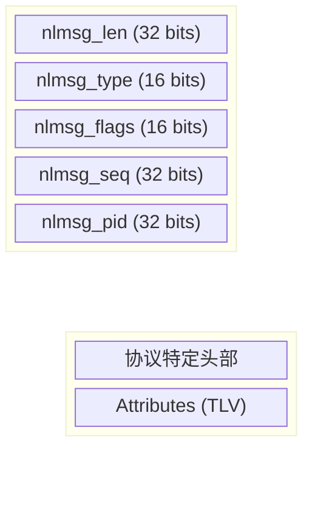
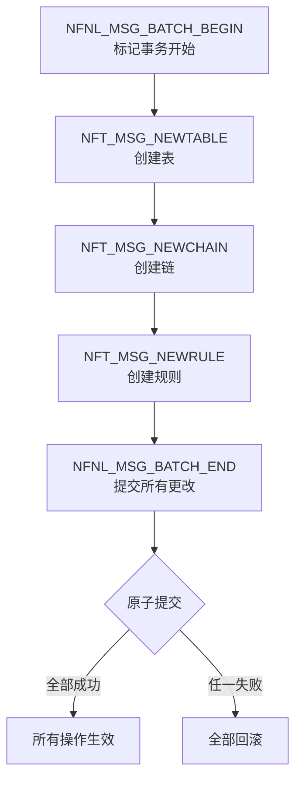
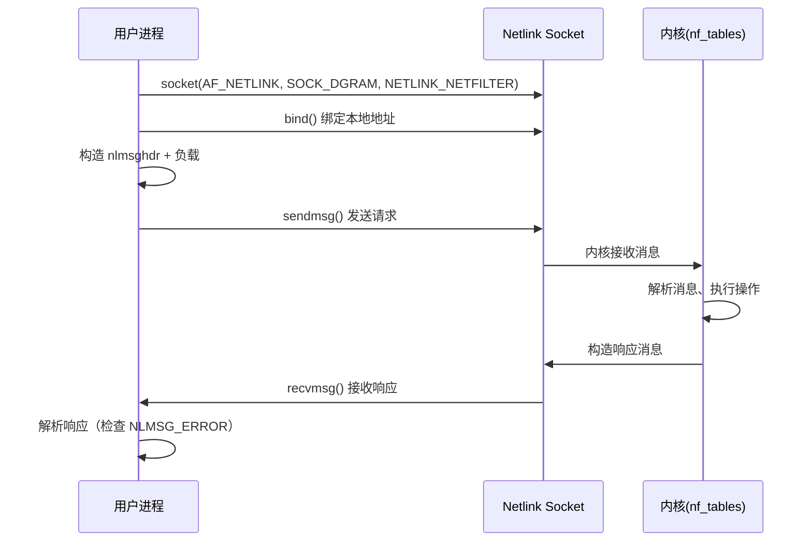
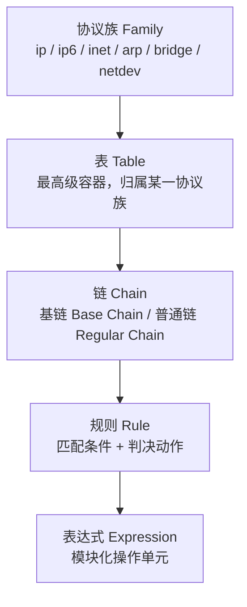
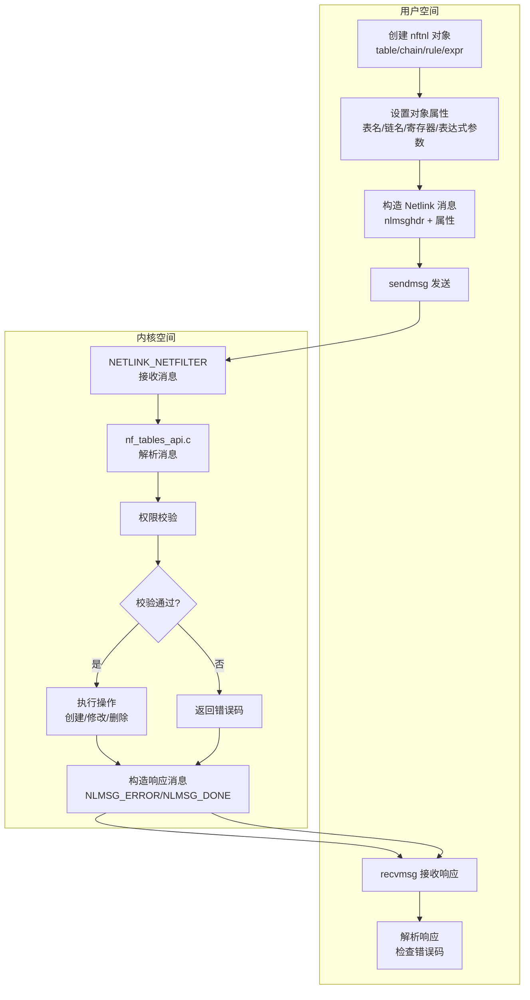
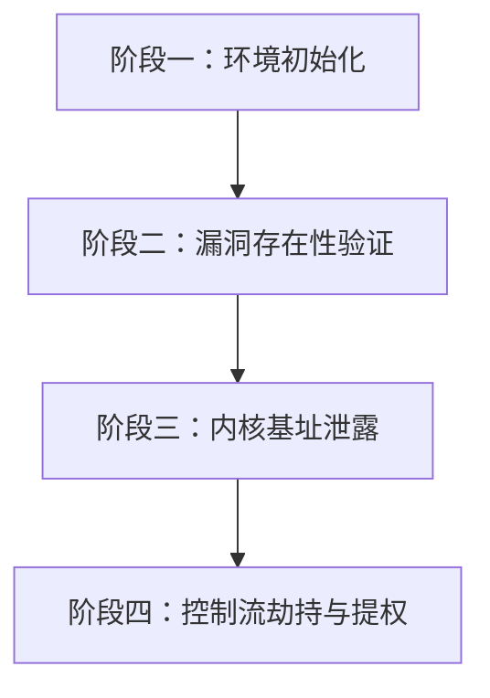
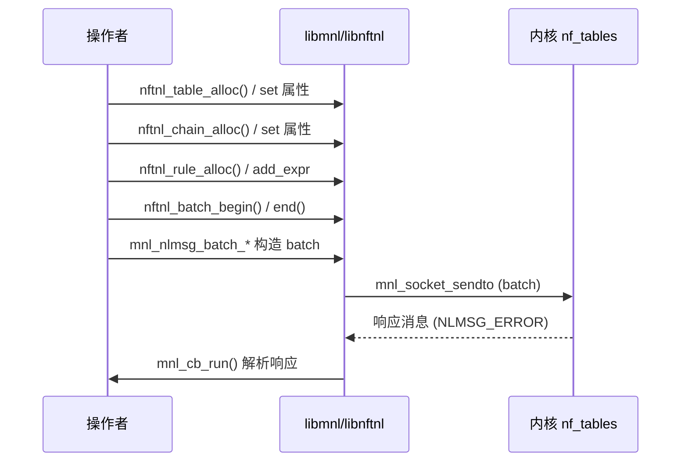
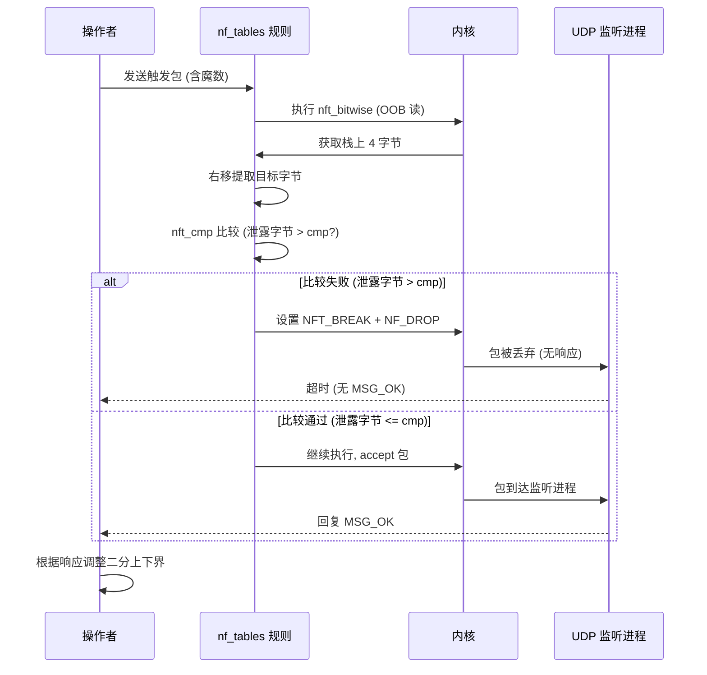
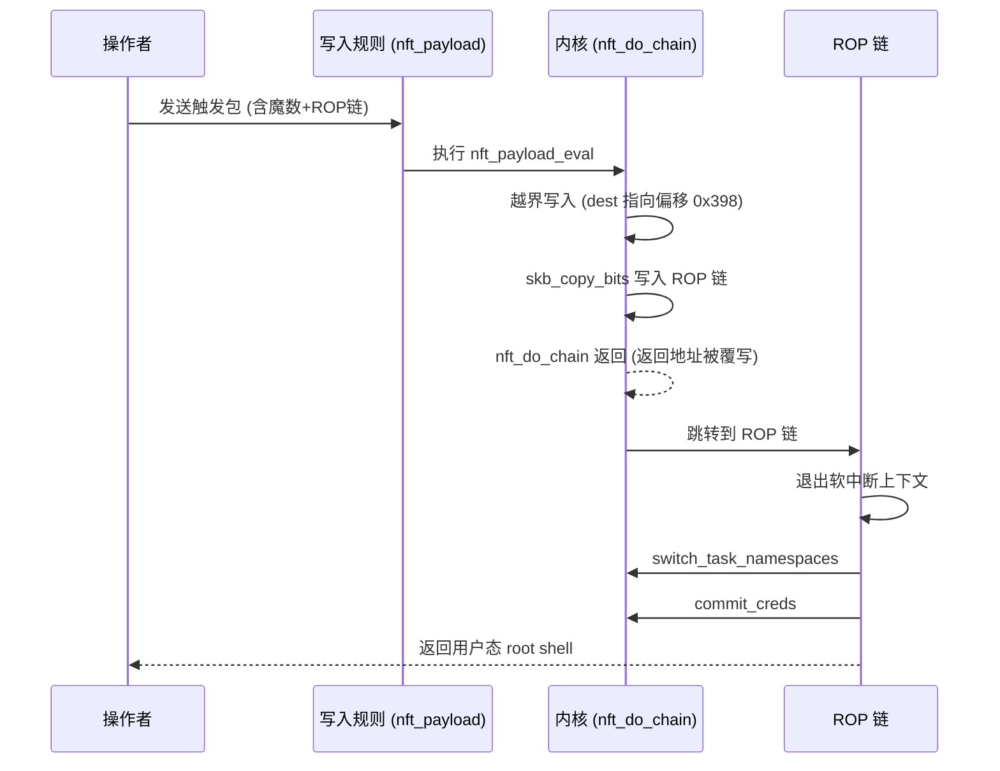

# 【Kernel Exploit】CVE-2022-1015 漏洞分析

## 1. 测试环境

**测试版本**：Linux-5.17.0 [内核镜像地址](https://github.com/BinRacer/pwn4kernel/blob/master/kernels/5.17.0/01/bzImage)

笔者测试的内核版本是 `Linux alpine 5.17.0 #1 SMP PREEMPT Tue Feb 24 02:42:55 CST 2026 x86_64 Linux`。

**编译选项**：开启`CONFIG_NF_TABLES`、`CONFIG_NF_TABLES_INET`、`CONFIG_NF_TABLES_NETDEV`、`CONFIG_NF_TABLES_IPV4`、`CONFIG_NF_TABLES_ARP`、`CONFIG_NF_TABLES_IPV6`、`CONFIG_NETFILTER_ADVANCED`、`CONFIG_NETFILTER_INGRESS`、`CONFIG_NETFILTER_EGRESS`、`CONFIG_NETFILTER_SKIP_EGRESS`、`CONFIG_NETFILTER_NETLINK`、`CONFIG_NETFILTER_FAMILY_BRIDGE`、`CONFIG_NETFILTER_FAMILY_ARP`、`CONFIG_NETFILTER_NETLINK_GLUE_CT`、`CONFIG_NETFILTER_XTABLES_COMPAT`、`CONFIG_MEMCG`、`CONFIG_MEMCG_KMEM`、`CONFIG_CGROUPS`、`CONFIG_THREAD_INFO_IN_TASK`、`CONFIG_SLAB_FREELIST_RANDOM`、`CONFIG_SLAB_FREELIST_HARDENED`、`CONFIG_INIT_ON_ALLOC_DEFAULT_ON`、`CONFIG_SHUFFLE_PAGE_ALLOCATOR`、`CONFIG_HARDENED_USERCOPY`、`CONFIG_FUSE_FS`、`CONFIG_USERFAULTFD`、`CONFIG_SYSVIPC`、`CONFIG_KEYS`、`CONFIG_STACKPROTECTOR`、`CONFIG_STACKPROTECTOR_STRONG`、`CONFIG_SLUB`、`CONFIG_SLUB_DEBUG`、`CONFIG_E1000`、`CONFIG_E1000E`、`CONFIG_PACKET`、`CONFIG_PACKET_DIAG`、`CONFIG_USER_NS`、`CONFIG_NET_NS`、`CONFIG_NAMESPACES`、`CONFIG_CHECKPOINT_RESTORE`、`CONFIG_IPC_NS`选项。完整配置参考[.config](https://github.com/BinRacer/pwn4kernel/blob/master/kernels/5.17.0/01/.config)。

**保护机制**：KASLR/SMEP/SMAP/KPTI

## 2. 漏洞分析

### 2-1. 漏洞概述

**CVE-2022-1015** 是 Linux 内核 netfilter 子系统 nf_tables 组件中的一个越界访问（Out-of-Bounds Access）漏洞。该漏洞源于内核在对用户态传入的寄存器索引进行合法性校验时存在缺陷，使得用户能够通过构造特定的 nf_tables 表达式，触发内核栈上的越界读取和写入操作。

该漏洞由研究者 David Bouman 发现并报告，并于 2022 年 3 月 28 日公开披露。根据 CVSS 3.1 评分，该漏洞被评定为 **6.6 分（中危）**，向量为 `AV:L/AC:L/PR:L/UI:N/S:U/C:L/I:L/A:H`。在 Ubuntu 安全公告中，该漏洞同样被评定为 6.6 分（中危）。

漏洞的核心本质是：nf_tables 表达式求值过程中，对用户可控的寄存器索引缺乏有效的边界检查，导致可以访问到寄存器数组范围之外的内存区域。具体而言，内核在解析用户提供的寄存器编号时，未对数值范围进行充分约束，使得用户能够通过特定的输入值，绕过长度校验并产生一个超范围的索引。该索引随后在表达式求值阶段被用于访问 `struct nft_regs` 中的 `data[20]` 数组，从而触及栈上的相邻内存。

这种越界访问能力提供了一套完整的操作原语：一方面，通过 `nft_bitwise` 表达式的源寄存器索引可以实现**越界读取**，结合二分搜索和比较表达式的反馈，能够逐字节获取内核栈上的敏感数据（如返回地址、内核镜像基址等）；另一方面，通过 `nft_payload` 表达式的目标寄存器索引可以实现**越界写入**，将用户可控的数据写入栈上的返回地址位置，进而控制执行流。两种原语的结合使该漏洞能够独立完成从信息泄露到内核态代码执行的完整利用链条，无需依赖其他漏洞配合。

在漏洞发现者 David Bouman 的博客文章中，他详细阐述了该漏洞的发现过程和利用思路，指出由于 nf_tables 模块的复杂性，以及寄存器校验逻辑中存在的整数溢出和类型截断问题，该漏洞在 v5.12 以上版本中具有较高的可利用性。该漏洞也是 netfilter 子系统中近年来被发现的重要安全缺陷之一，其影响范围涵盖了主流 Linux 发行版的默认内核配置。更具体地说，该漏洞之所以具备极高的利用价值，是因为 `nft_bitwise` 和 `nft_payload` 两种表达式恰好允许用户指定任意长度（`len` 字段范围为 0x00 到 0xff），这为构造越界索引提供了必要的灵活性——用户可以通过精确控制寄存器值和长度参数，使校验函数中的 `reg * 4 + len` 发生整数溢出，从而绕过边界检查，同时将截断后的索引写入表达式结构供后续使用。

### 2-2. 影响范围

**CVE-2022-1015** 影响 Linux 内核 **v5.12 至 v5.17 之前**的版本。这一范围的确定基于对两个关键提交的分析：

- **引入点**：该漏洞自 commit `345023b0db31`（"netfilter: nftables: add nft_parse_register_store() and use it"）开始变得可被利用，该 commit 合入于 v5.12。在此之前，虽然存在类似的不安全转换逻辑（可追溯至更早的 commit `49499c3e6e18`，"netfilter: nf_tables: switch registers to 32 bit addressing"），但当时缺乏能够触发越界访问的表达式组合（如 `nft_bitwise` 和 `nft_payload` 允许用户指定任意长度），因此漏洞不具备实际可利用性。具体来说，在引入 `nft_parse_register_store` 之前，表达式初始化时对寄存器索引的处理方式不同，无法将越界索引传递到表达式求值阶段；而在 v5.12 之后，`nft_parse_register_load` 和 `nft_parse_register_store` 的组合调用链使得越界索引能够顺利到达 `nft_expr` 的私有数据区域。

- **修复点**：该漏洞在 commit `6e1acfa387b9`（"netfilter: nf_tables: validate registers coming from userspace."）中被修复，合入于 v5.17。修复方式为将 `nft_parse_register()` 的返回值改为错误码，通过指针参数返回寄存器索引，并显式检查输入值是否落在合法范围内（包括旧式寄存器和 32 位寄存器区域），拒绝任何超出范围的数值。修复后的代码在 `nft_parse_register` 中增加了 `NFT_REG32_00...NFT_REG32_15` 分支的显式检查，对于不匹配的输入直接返回 `-ERANGE`，从而从源头阻断了越界索引的产生。

在主流 Linux 发行版中，各厂商已陆续将修复补丁向后移植到其稳定内核版本。例如，**Ubuntu 22.04 LTS（Jammy）** 在 kernel 版本 `5.15.0-27.28` 中修复了该漏洞；**Ubuntu 21.10（Impish）** 在 `5.13.0-40.45` 中修复；而 Ubuntu 20.04 LTS（Focal）及更早版本（基于 v5.4 或更旧内核）则不受影响，因为其内核版本低于 v5.12。RHEL 系发行版同样在各自的内核更新中修复了该问题。该漏洞在 v5.12 以上版本 Ubuntu 和 RHEL 的默认配置上均具有可利用性，因为这些发行版默认启用了 nf_tables 及相关子系统的内核模块（`CONFIG_NF_TABLES=y` 及相关的 IPv4/IPv6 支持）。

**利用前置条件**：非特权用户需要具备 **user namespace** 和 **network namespace** 的访问权限。在默认配置下，用户命名空间是启用的（`CONFIG_USER_NS=y`），因此普通用户可以通过 `unshare(CLONE_NEWUSER | CLONE_NEWNET)` 轻松创建新的命名空间，并获得所需的 `CAP_NET_ADMIN` 能力（在该命名空间内有效）。这一特性使得该漏洞的利用门槛较低，仅需本地普通用户权限即可尝试。这也解释了为何许多内核漏洞利用都依赖命名空间机制——它为操作者提供了一个隔离的环境，可以在不拥有全局 root 权限的情况下，获取大部分必要的内核交互能力。不过，值得注意的是，在某些特定场景（如 Google 的 Container-Optimized OS）中，nf_tables 模块可能未被编译或加载，从而避免了该漏洞的暴露。

### 2-3. Netlink 通信基础

Netlink 是 Linux 内核中用于**内核与用户空间进程之间进行双向通信**的 socket 家族协议。nf_tables 通过 `NETLINK_NETFILTER` 协议族与内核交互，用户进程通过标准的 socket API 创建 Netlink socket，构造符合协议格式的消息并发送，内核则在处理完成后返回响应。

**Netlink 消息格式**：每条消息以 `struct nlmsghdr` 结构开头，包含长度、类型、标志、序列号和端口 ID 等字段，负载紧随其后。消息负载采用 **TLV（Type-Length-Value）** 格式的组织，通过 `struct nlattr` 结构描述属性，支持嵌套以构建层次化数据结构。在 nf_tables 的上下文中，属性用于传递表名、链名、表达式参数等配置信息。

**批量事务模式**：nf_tables 支持 **batch 模式**，将多个操作打包到一个 Netlink 消息序列中原子性执行。内核在处理 batch 时会先进行预检查，全部通过则统一执行，任一失败则全部回滚，确保配置更新的原子性。

**用户态辅助库**：为简化 Netlink 消息的构造和解析，netfilter 社区提供了 libmnl（底层消息封装）和 libnftnl（面向对象的 nf_tables API）两个用户态库。

关于 Netlink 协议的更详细介绍（包括完整的协议族列表、消息格式详解、通信时序图、批处理流程图等），请参见**第 3 章**。

### 2-4. nf_tables 寄存器机制

nf_tables 是 netfilter 子系统中的新一代包过滤框架。其执行引擎核心是 `nft_do_chain` 函数，该函数在栈上分配 `struct nft_regs` 结构用于存储表达式求值过程中的临时数据。

寄存器 `struct nft_regs` 的定义如下：

```c
struct nft_regs {
    union {
        u32 data[20];              /* data registers，共 20 个 32 位槽位，索引 0~19 */
        struct nft_verdict verdict; /* verdict register，与 data[0] 共享内存 */
    };
};
```

寄存器的索引枚举定义了旧式 16 字节寄存器（`NFT_REG_1` 到 `NFT_REG_4`）和 32 位寄存器区域（`NFT_REG32_00` 到 `NFT_REG32_15`）：

```c
enum nft_registers {
    NFT_REG_VERDICT,               /* 判决寄存器，索引 0 */
    NFT_REG_1,                     /* 通用寄存器 1，索引 1 */
    NFT_REG_2,                     /* 通用寄存器 2，索引 2 */
    NFT_REG_3,                     /* 通用寄存器 3，索引 3 */
    NFT_REG_4,                     /* 通用寄存器 4，索引 4 */
    __NFT_REG_MAX,

    NFT_REG32_00 = 8,              /* 32 位寄存器区域，从索引 8 开始 */
    NFT_REG32_01,
    /* ... 直到 NFT_REG32_15，索引 23 */
};
```

合法索引范围本应为 0 到 19，但索引 20 及以上为越界区域，正是漏洞所利用的目标。

用户在构造表达式时，通过 Netlink 属性传递的寄存器编号需要经过 `nft_parse_register()` 转换为实际数组索引，该函数存在 **default 分支缺少上界检查**的缺陷（详见 2-5-1 节）。

关于 nf_tables 架构（包括完整的数据模型、执行引擎 `nft_do_chain` 的详细分析、表达式类型列表、双缓冲机制、命名空间隔离等）的详细介绍，请参见**第 3 章**。

### 2-5. 漏洞点与越界访问原语

#### 2-5-1. 寄存器索引解析与校验逻辑缺陷

**CVE-2022-1015** 的根源位于 `net/netfilter/nf_tables_api.c` 中的寄存器索引校验逻辑。为了理解漏洞的成因，需要仔细分析从用户输入到最终数组访问的完整数据流。

用户态通过 Netlink 属性传递寄存器索引值。内核首先调用 `nft_parse_register()` 将属性中的原始数值（一个 32 位无符号整数）转换为内部使用的寄存器编号。其实现如下：

```c
/* 将用户提供的寄存器编号（来自 netlink 属性）转换为内部数组索引 */
static unsigned int nft_parse_register(const struct nlattr *attr)
{
    unsigned int reg;

    reg = ntohl(nla_get_be32(attr));   /* 从 netlink 属性中读取用户指定的寄存器编号 */
    switch (reg) {
    case NFT_REG_VERDICT...NFT_REG_4:  /* 0~4 表示旧式 16 字节寄存器，映射到 4 字节索引 */
        return reg * NFT_REG_SIZE / NFT_REG32_SIZE;  /* 乘以 4（16/4=4） */
    default:                           /* [漏洞点] 无上界检查 */
        return reg + NFT_REG_SIZE / NFT_REG32_SIZE - NFT_REG32_00;
               /* 计算方式：reg + 4 - 8 = reg - 4，无任何范围限制 */
    }
}
```

该函数的设计意图是兼容两种寄存器访问模式：

- 当用户指定 0~4 时，表示使用旧式 16 字节寄存器（`NFT_REG_VERDICT` 到 `NFT_REG_4`），需要将索引乘以 4 以映射到 4 字节寄存器空间。
- 当用户指定其他值时，假定用户直接使用 4 字节寄存器编号，通过 `reg - 4` 的线性映射转换为实际数组索引。

**关键缺陷**在于 `default` 分支：该分支完全信任用户输入，直接将 `reg - 4` 作为结果返回，没有执行任何上界检查。这意味着用户可以传递任意大的值，得到 `0xfffffffb`，也可以传递任意小的值（如 5），得到 `1`。这种无约束的映射为后续的校验绕过创造了条件。

在表达式解析过程中，内核使用 `nft_parse_register_load()` 和 `nft_parse_register_store()` 分别处理寄存器读取和写入操作。这两个函数调用 `nft_parse_register()` 后，会调用对应的校验函数，最后将结果（截断后）写入表达式结构：

```c
/* 解析并校验寄存器读取操作 */
int nft_parse_register_load(const struct nlattr *attr, u8 *sreg, u32 len)
{
    u32 reg;
    int err;

    reg = nft_parse_register(attr);      /* 返回转换后的索引，可能为任意 32 位值 */
    err = nft_validate_register_load(reg, len);  /* 执行校验（但存在绕过可能） */
    if (err < 0)
        return err;

    *sreg = reg;   /* 截断写入：只保留低 8 位，存入 u8 类型 */
    return 0;
}

/* 解析并校验寄存器写入操作 */
int nft_parse_register_store(const struct nft_ctx *ctx,
                 const struct nlattr *attr, u8 *dreg,
                 const struct nft_data *data,
                 enum nft_data_types type, unsigned int len)
{
    int err;
    u32 reg;

    reg = nft_parse_register(attr);      /* 同样返回转换后的索引 */
    err = nft_validate_register_store(ctx, reg, data, type, len);
    if (err < 0)
        return err;

    *dreg = reg;                         /* 同样截断为 u8 */
    return 0;
}
```

校验函数 `nft_validate_register_load()` 的实现如下：

```c
static int nft_validate_register_load(enum nft_registers reg, unsigned int len)
{
    if (reg < NFT_REG_1 * NFT_REG_SIZE / NFT_REG32_SIZE)  /* 禁止从 verdict 寄存器读取 */
        return -EINVAL;                   /* 索引小于 4 时拒绝 */
    if (len == 0)                         /* 长度为零无效 */
        return -EINVAL;
    /* 检查是否会导致超出 data[20] 数组边界（共 0x50 字节） */
    /* sizeof_field(struct nft_regs, data) == 0x50 */
    if (reg * NFT_REG32_SIZE + len > sizeof_field(struct nft_regs, data))
        return -ERANGE;
    return 0;
}
```

该校验函数的检查逻辑为：`reg * 4 + len > 0x50` 时报错。然而，由于 `reg` 和 `len` 均为 32 位无符号整数，`reg * 4 + len` 的计算存在**整数溢出**风险。当 `reg` 足够大时，`reg * 4` 可能超过 `2^32` 并发生回绕，使得整个表达式的结果落在很小的范围内（如 0~0x50），从而绕过边界检查。

要使 `reg * 4` 产生回绕，存在三个溢出点（因为乘以 `4 = 2^2`）：`2^32 - 1`、`2^31 - 1`、`2^30 - 1`，分别对应前缀 `0xffffffff`、`0x7fffffff`、`0x3fffffff`。这三类前缀值具有相同的溢出效果——关键在于最低字节的构造，因为不同前缀乘以 4 后，结果的低 32 位是相同的：

```
0xfffffff0 * 4 = 0xffffffc0
0x7ffffff0 * 4 = 0xffffffc0
0x3ffffff0 * 4 = 0xffffffc0
```

实际利用中通常选择 `0x7fffffff` 附近的值。但需要注意，`nft_parse_register()` 的 `default` 分支会将用户输入减 4，因此实际进入校验函数的 `reg` 值最大为 `0x7ffffffb`（当用户输入 `0x7fffffff` 时，`0x7fffffff - 4 = 0x7ffffffb`），而非 `0x7fffffff`。这一细节对精确计算越界范围至关重要。

截断写入的机制进一步放大了问题：校验通过后，`reg` 被截断为 `u8` 写入表达式结构，只保留最低 8 位。可以通过选择适当的 `reg` 值来控制截断后的结果，从而将任意越界索引注入表达式，最终在数组访问时触及栈上敏感数据。

**漏洞的三个核心层面**：

1. **`nft_parse_register()` 缺少上界检查**：当输入值大于 4 时，直接返回 `reg - 4`，没有上限限制，可产生任意大的中间值。
2. **校验函数存在整数溢出风险**：`reg * 4 + len` 的计算可能发生回绕，绕过 `0x50` 的边界限制。
3. **截断写入**：校验通过后，`reg` 被截断为 `u8` 写入表达式结构，这个截断后的值最终被用作数组索引，访问 `data[20]` 时可能越界。

#### 2-5-2. 越界读取与信息泄露机制（OOB Read）

信息泄露阶段利用 `nft_bitwise` 表达式的源寄存器索引（`sreg`）越界实现 OOB 读取。`nft_bitwise_eval` 在执行时，通过 `&regs->data[priv->sreg]` 直接解引用 `sreg`，若 `sreg` 为越界值（例如 `0xff`，对应偏移 `0x3fc`），则读取寄存器数组之外的内核栈数据。

`nft_bitwise_eval` 及其右移子函数的完整实现如下：

```c
/* 右移操作的求值函数：将 src 中的数据右移 shift 位，结果存入 dst */
static void nft_bitwise_eval_rshift(u32 *dst, const u32 *src,
                    const struct nft_bitwise *priv)
{
    u32 shift = priv->data.data[0];        /* 位移量（比特数） */
    unsigned int i;
    u32 carry = 0;

    /* 从最低位开始，逐字进行右移，并传递进位（上一位溢出的位） */
    for (i = 0; i < DIV_ROUND_UP(priv->len, sizeof(u32)); i++) {
        dst[i] = carry | (src[i] >> shift);
        carry = src[i] << (BITS_PER_TYPE(u32) - shift);
    }
}

/* nft_bitwise 表达式的总入口，根据 op 分发到不同处理函数 */
void nft_bitwise_eval(const struct nft_expr *expr,
              struct nft_regs *regs, const struct nft_pktinfo *pkt)
{
    const struct nft_bitwise *priv = nft_expr_priv(expr);
    const u32 *src = &regs->data[priv->sreg];   /* 当 sreg 越界时，触发 OOB Read */
    u32 *dst = &regs->data[priv->dreg];

    switch (priv->op) {
    case NFT_BITWISE_BOOL:
        nft_bitwise_eval_bool(dst, src, priv);
        break;
    case NFT_BITWISE_LSHIFT:
        nft_bitwise_eval_lshift(dst, src, priv);
        break;
    case NFT_BITWISE_RSHIFT:
        nft_bitwise_eval_rshift(dst, src, priv);
        break;
    }
}
```

`nft_cmp_eval` 用于比较提取出的字节与二分搜索中间值，其实现如下：

```c
/* 比较寄存器值与常量，若比较失败则发出 NFT_BREAK */
void nft_cmp_eval(const struct nft_expr *expr,
          struct nft_regs *regs,
          const struct nft_pktinfo *pkt)
{
    const struct nft_cmp_expr *priv = nft_expr_priv(expr);
    int d;

    /* 比较寄存器中 sreg 指向的数据与表达式内嵌的常量 data */
    d = memcmp(&regs->data[priv->sreg], &priv->data, priv->len);
    switch (priv->op) {
    case NFT_CMP_EQ:      /* 等于 */
        if (d != 0)
            goto mismatch;
        break;
    case NFT_CMP_NEQ:     /* 不等于 */
        if (d == 0)
            goto mismatch;
        break;
    case NFT_CMP_LT:      /* 小于（若相等也视为不匹配） */
        if (d == 0)
            goto mismatch;
        fallthrough;
    case NFT_CMP_LTE:     /* 小于等于 */
        if (d > 0)
            goto mismatch;
        break;
    case NFT_CMP_GT:      /* 大于（若相等也视为不匹配） */
        if (d == 0)
            goto mismatch;
        fallthrough;
    case NFT_CMP_GTE:     /* 大于等于 */
        if (d < 0)
            goto mismatch;
        break;
    }
    return;               /* 比较通过，继续执行后续表达式 */
mismatch:
    regs->verdict.code = NFT_BREAK;   /* 比较失败，终止当前 rule */
}
```

**`nft_bitwise` 的 OOB 读写范围**：

`nft_bitwise` 的最大 `len` 为 `0x40`（64 字节），意味着校验时 `reg * 4 + 0x40` 必须小于等于 `0x50` 才能通过。由于 `nft_parse_register()` 的 `default` 分支会将用户输入减 4，实际进入校验的 `reg` 值最大为 `0x7ffffffb`，对应 `reg * 4 = 0xffffffec`，加上 `0x40` 后结果为 `0x2c`，满足校验条件。

可用的寄存器值范围为 `0x7ffffff0` 到 `0x7ffffffb`（对应截断后的 `sreg` 为 `0xf0` 到 `0xfb`）。对应到 `struct nft_regs` 的字节偏移：

```
下界：0xf0 * 4 = 0x3c0
上界：0xfb * 4 + 0x40 = 0x3ec + 0x40 = 0x42c
```

因此，**`nft_bitwise` 可以 OOB 读写 `struct nft_regs` 偏移 `[0x3c0, 0x42c]` 范围内的数据**。该区间长度约为 0x6c 字节（108 字节），足以覆盖栈上的返回地址等敏感信息。

**信息泄露规则的构造思路**：

首先设置一个基链（例如挂载在 `NF_INET_LOCAL_OUT` hook 上），并在其中添加一条过滤规则，确保只有特定 UDP 包（目标端口为 9999，且载荷前 8 字节为固定魔数）才会跳转到一个辅助链。辅助链中的信息泄露规则会被动态替换以支持二分搜索。

信息泄露规则利用 `nft_bitwise` 从越界偏移处读取 4 字节数据，然后通过右移操作提取目标字节，随后用 `nft_cmp` 将该字节与二分搜索的中间值进行比较，并根据比较结果决定是否丢弃数据包（通过 `nft_immediate` 设置 `NF_DROP`）。具体地：

1. `nft_bitwise` 的 `sreg` 设为越界索引（例如 `0xff`，对应偏移 `0x3fc`），`len` 设为 `0x40`，`op` 为右移，将读到的 4 字节数据右移 `pos * 8` 位（`pos` 为 1~3），提取目标字节并存入合法寄存器（例如寄存器 1）。
2. `nft_cmp` 将寄存器 1 的内容与二分搜索中间值 `cmp` 比较，使用 `NFT_CMP_GT` 操作符。若泄露字节大于 `cmp`，则触发 `NFT_BREAK`，导致包被丢弃；否则包继续执行，最终被接受。
3. 发送触发包，并监听 UDP 回复（监听进程收到包后回复 `MSG_OK`）。若收到回复，说明泄露字节 ≤ `cmp`，则调低上界；若超时，说明泄露字节 > `cmp`，则调高下界。通过反复调整 `cmp` 并重新安装规则，可以逐字节确定泄露值。

通过这种方式，依次泄露 4 个字节，拼接得到完整的内核地址（通常为返回地址的低 4 字节），从而计算出内核基址，绕过 KASLR。

#### 2-5-3. 越界写入与控制流劫持机制（OOB Write）

OOB 写入能力由 `nft_payload` 表达式的目标寄存器索引（`dreg`）越界触发。`nft_payload_eval` 根据 `dreg` 计算目标地址，并通过 `skb_copy_bits` 将 packet 载荷拷贝到该地址。其完整实现如下：

```c
/* 从 packet 中拷贝数据到寄存器，dreg 索引决定了目标寄存器位置 */
void nft_payload_eval(const struct nft_expr *expr,
              struct nft_regs *regs,
              const struct nft_pktinfo *pkt)
{
    const struct nft_payload *priv = nft_expr_priv(expr);
    const struct sk_buff *skb = pkt->skb;
    u32 *dest = &regs->data[priv->dreg];    /* 当 dreg 越界时，指向栈上目标地址 */
    int offset;

    if (priv->len % NFT_REG32_SIZE)
        dest[priv->len / NFT_REG32_SIZE] = 0;

    switch (priv->base) {
    case NFT_PAYLOAD_LL_HEADER:
        if (!skb_mac_header_was_set(skb))
            goto err;
        if (skb_vlan_tag_present(skb)) {
            if (!nft_payload_copy_vlan(dest, skb,
                           priv->offset, priv->len))
                goto err;
            return;
        }
        offset = skb_mac_header(skb) - skb->data;
        break;
    case NFT_PAYLOAD_NETWORK_HEADER:
        offset = skb_network_offset(skb);
        break;
    case NFT_PAYLOAD_TRANSPORT_HEADER:
        if (!(pkt->flags & NFT_PKTINFO_L4PROTO) || pkt->fragoff)
            goto err;
        offset = nft_thoff(pkt);
        break;
    case NFT_PAYLOAD_INNER_HEADER:
        offset = nft_payload_inner_offset(pkt);
        if (offset < 0)
            goto err;
        break;
    default:
        WARN_ON_ONCE(1);
        goto err;
    }
    offset += priv->offset;

    if (skb_copy_bits(skb, offset, dest, priv->len) < 0)
        goto err;
    return;
err:
    regs->verdict.code = NFT_BREAK;
}
```

**`nft_payload` 的 OOB 写入范围**：

`nft_payload` 允许用户指定最大 255 字节的写入长度（`len`），但实际利用中，`len` 会根据 ROP 链大小动态调整。为了确定可行的越界索引范围，需要求解校验不等式：

```
(reg * 4 + len) mod 2^32 <= 0x50
```

其中 `reg` 是经过 `nft_parse_register` 转换后的中间值（用户输入减 4），`len` 是实际写入长度。通过选择适当的用户输入值（如 `0x7fffffXX` 形式），可使 `reg * 4` 发生 32 位回绕，从而绕过边界检查。

可行的 `dreg` 范围与 `len` 密切相关：

- 当 `len = 0xff`（最大值）时，校验条件最严格，`dreg` 的范围为 `[0xc1, 0xd4]`，对应偏移 `[0x304, 0x44f]`。
- 当 `len` 减小时，校验条件放宽，允许更大的 `dreg`。例如：
    - `len = 0xb8` 时，`dreg = 0xe6` 可通过校验（`0xe6 * 4 + 0xb8 = 0x398 + 0xb8 = 0x450`，`0x450 mod 256 = 0x50 <= 0x50`）。
    - `len = 0x64` 时，`dreg = 0xfb` 可通过校验（`0xfb * 4 + 0x64 = 0x3ec + 0x64 = 0x450`，同样满足条件）。

因此，在不同的 `len` 值下，`dreg` 可覆盖从 `0xc1` 到 `0xfb` 的广泛范围。**整体可写入的栈偏移范围可达到 `[0x304, 0x450]`**（下界由 `0xc1 * 4 = 0x304` 决定，上界由 `0xfb * 4 + 0x64 = 0x450` 决定）。在实际利用中，需要根据目标栈偏移和所需 ROP 链长度，计算出合适的 `(dreg, len)` 组合。

在实际利用中，为了精确命中返回地址，选择了 `dreg = 0xe6`（对应偏移 `0x398`），配合 `len = 0xb8` 写入 ROP 链。该组合完全满足校验条件，且落在整体可写范围内，同时指向 `input` 链中 `nft_do_chain` 栈帧之上的返回地址，绕过栈 canary。

**越界写入规则的构造思路**：

创建第二个基链（通常选择 `NF_INET_LOCAL_IN` hook，以利用 input 路径的栈布局），并在其中添加一个写入规则。该规则仅包含一个 `nft_payload` 表达式：

- 从包的内层数据（`NFT_PAYLOAD_INNER_HEADER`）读取数据，偏移为 8（跳过前 8 字节魔数）。
- `dreg` 设为计算出的值（如 `0xe6`），对应实际栈偏移（如 `0x398`），指向返回地址位置。
- `len` 设为计算出的值（如 `0xb8`），以容纳完整的 ROP 链。

当触发包（载荷前 8 字节为魔数，后续为 ROP 链数据）到达时，`skb_copy_bits` 将包载荷偏移 8 字节后的数据写入返回地址位置，从而劫持控制流。由于该链运行在软中断上下文，ROP 链需要首先通过特定 gadget 安全退出软中断（例如跳转到 `__do_softirq` 的 epilogue 恢复 syscall 上下文），然后执行提权操作，最后获得 root shell。

### 2-6. 触发条件与执行路径

要成功触发 **CVE-2022-1015** 并获得预期的越界访问能力，需要满足一系列前置条件，并遵循一条从用户态请求到内核表达式求值的完整执行链路。

**触发条件**：

1. **命名空间权限**：进程必须拥有 user namespace 和 network namespace 的访问权限。在默认配置下，非特权用户可以通过 `unshare(CLONE_NEWUSER | CLONE_NEWNET)` 创建新的命名空间来满足这一条件。用户命名空间的启用（`CONFIG_USER_NS=y`）使得普通用户无需任何全局特权即可获得隔离的网络环境，这是漏洞可利用性的关键前提之一。

2. **Netlink 通信能力**：进程必须能够通过 Netlink 套接字与内核中的 nf_tables 模块通信。这通常意味着需要 `CAP_NET_ADMIN` 能力——但在新的 user namespace 中，该能力相对于该命名空间是有效的，因此非特权用户可以在命名空间内获得操作 nf_tables 所需的最小权限集。

3. **构造特定 Netlink 消息序列**：需要构造一系列符合 nf_tables 协议格式的 Netlink 批量请求，包括创建目标 table、创建 base chain、创建 auxiliary chain（用于信息泄露阶段的规则动态替换）、添加过滤规则、添加信息泄露规则和写入规则。

**执行路径**：

整个漏洞触发过程分为规则安装和包处理两个阶段。

**规则安装阶段**（从用户态到内核数据结构）：

```
用户态构造 Netlink 请求
→ 通过 sendmsg() 发送到 NETLINK_NETFILTER socket
→ 内核 nf_tables API（nf_tables_api.c）解析消息
→ 对于包含寄存器索引的表达式，调用 nft_parse_register_load() 或 nft_parse_register_store()
   → nft_parse_register() 将用户提供的数值转换为数组索引（default 分支无上界检查）
   → nft_validate_register_*() 进行边界校验（存在整数溢出绕过可能）
→ 校验通过后，索引值被截断为 u8 并存入表达式私有数据
→ 表达式被添加到规则中，规则被插入到链的规则集
→ 内核返回确认消息，安装完成
```

**包处理阶段**（当匹配的数据包到达时）：

```
网络包到达 netfilter hook
→ 触发 base chain 的处理，调用 nft_do_chain()
   → 在栈上分配 struct nft_regs regs（未初始化）
   → 遍历 chain 中的规则，对每个规则遍历其表达式
   → 对每个表达式调用 expr_call_ops_eval()，根据表达式类型分发到具体的 eval 函数
      → 对于 nft_payload 表达式：调用 nft_payload_eval()
         → dest = &regs->data[priv->dreg]   // 使用已越界的 dreg 计算目标地址
         → skb_copy_bits(skb, offset, dest, priv->len)  // 执行 OOB 写入
      → 对于 nft_bitwise 表达式：调用 nft_bitwise_eval()
         → src = &regs->data[priv->sreg]   // 使用越界的 sreg 读取 OOB 数据
         → 进行位运算并写入 dreg（合法寄存器）
      → 对于 nft_cmp 表达式：调用 nft_cmp_eval()
         → 比较寄存器值与常量，若失败则发出 NFT_BREAK
   → 根据 verdict 决定丢弃或接受数据包
   → 用户态通过监听 UDP 回复判断比较结果（信息泄露）或通过预先写入的 ROP 链在 nft_do_chain 返回时自动劫持控制流
```

这一路径清晰地展示了从用户输入到内核栈越界访问的完整流程，其中每个环节的缺陷（无上界检查、整数溢出、截断写入）共同构成了漏洞的可利用性。

### 2-7. 漏洞能力分析

**CVE-2022-1015** 提供的核心能力是**内核栈上的越界读取和越界写入**，具体分解如下：

1. **越界读取与信息泄露能力（OOB Read）**：
    - 通过 `nft_bitwise` 表达式的源寄存器索引（`sreg`）越界实现。当 `sreg` 被设置为越界值（例如 `0xff`）时，`nft_bitwise_eval` 中的 `src = &regs->data[0xff]` 会读取偏移 `0x3fc` 处的 4 字节栈数据。
    - 结合右移操作提取目标字节，并通过 `nft_cmp` 与常量比较，利用二分搜索可逐字节确定任意栈地址的内容。
    - 该能力可以获取内核栈上的返回地址、内核镜像基址等敏感信息，从而绕过 KASLR。

2. **越界写入能力（OOB Write）**：
    - 通过 `nft_payload` 表达式的目标寄存器索引（`dreg`）越界实现。当 `dreg` 被设置为越界值（例如 `0xe6`，对应偏移 `0x398`）时，`nft_payload_eval` 中的 `dest = &regs->data[priv->dreg]` 指向返回地址，`skb_copy_bits` 将包载荷数据写入该位置。
    - 写入的内容和长度完全可控（`len` 最大 `0xff`），足以容纳完整的 ROP 链。

3. **写入目标与绕过保护**：
    - 越界写入的目标是 `nft_do_chain` 栈帧之上的返回地址，位于 `+0x398` 偏移处。
    - 该偏移恰好绕过位于 `+0x380` 的栈 canary（`__stack_chk_fail` 保护），使得在不触发栈保护检测的情况下直接控制返回地址成为可能。

4. **独立完成完整利用**：
    - 由于同时具备越界读取（获取内核基址）和越界写入（劫持控制流）能力，**CVE-2022-1015** 可以在不依赖其他漏洞的情况下，独立完成从信息泄露到内核态代码执行的完整利用链条。

### 2-8. 利用链条构建

基于 **CVE-2022-1015** 的越界读写能力，典型的本地权限提升利用链条分为四个阶段，每个阶段都依赖前序阶段的结果。

**第一阶段：nf_tables 基础设施搭建**

创建 nf_tables 表（IPv4 协议族），作为所有链和规则的容器。创建第一个基链（`output` 链，挂载 `NF_INET_LOCAL_OUT`，优先级 10），用于触发后续的 OOB 操作。在该基链中添加过滤规则，确保只有特定 UDP 包（目标端口为 9999，且载荷前 8 字节为固定魔数）才会跳转到辅助链。创建辅助链，用于信息泄露阶段。该链中的规则会被动态替换（使用 `NLM_F_REPLACE` 标志，规则句柄固定），以支持二分搜索中不同比较值的测试。

**第二阶段：漏洞存在性验证**

通过调整寄存器值和长度参数，计算出一个能够触发越界写入的寄存器索引（用于漏洞存在性验证）。具体地，通过尝试不同的位移量，寻找一个满足整数溢出条件的索引值，对应 `desired=0xe6`（该值指向栈上越界位置，同样可用于后续的控制流劫持）。向辅助链中添加一条 `nft_payload` 规则，使用该越界索引尝试写入栈上越界位置。若规则成功安装（未返回错误），则证明内核允许该越界索引通过校验，漏洞确实存在。该验证步骤可避免在已修复的内核上继续执行后续操作，提高利用的稳健性。

**第三阶段：内核基址泄露（利用 OOB Read）**

启动一个 UDP 监听进程，绑定到指定端口，该进程在收到任何 UDP 包后回复确认消息（如 `MSG_OK`），作为比较结果的反馈通道。

通过调整寄存器值和长度参数，计算出一个用于越界读取的索引值，对应 `desired=0xf5`、`min_len=0x40`、`max_len=0x40`。该参数组合经计算后得到截断索引 `0xff`，对应栈偏移 `0x3fc`，该位置位于内核栈上存储内核地址（如返回地址或其他内核指针）的区域。构造信息泄露规则，该规则不包含 `nft_payload`，而是利用 `nft_bitwise` 表达式从偏移 `0x3fc` 处读取 4 字节数据，然后通过右移操作提取目标字节，存入合法寄存器。随后使用 `nft_cmp` 表达式将该字节与二分搜索中间值比较，若泄露字节大于中间值，则比较失败，触发 `NFT_BREAK` 导致包被丢弃；否则规则正常结束，包被接受。

发送触发包，根据是否收到确认消息调整二分上下界。若收到确认消息，说明泄露字节小于等于中间值，则调低上界；若超时未收到，说明泄露字节大于中间值，则调高下界。重复上述过程，依次泄露 4 个字节（跳过第 0 字节以避免进位问题），拼接得到完整的内核地址，从而计算出内核基址，绕过 KASLR。获取内核基址后，即可为后续 ROP 链构造提供准确的符号地址（如 `commit_creds`、`switch_task_namespaces` 等）。

**第四阶段：权限提升（利用 OOB Write）**

创建第二个基链（`input` 链，挂载 `NF_INET_LOCAL_IN`，优先级 10）。选择 `input` 链是为了利用其栈布局，使返回地址位于偏移 `0x398`，恰好避开位于 `0x380` 的栈 canary。

通过调整寄存器值和长度参数，再次计算出一个能够触发越界写入且指向返回地址的索引值，对应 `desired=0xe6`。添加写入规则，该规则仅包含一个 `nft_payload` 表达式：从包的内层数据读取数据，偏移为 8（跳过前 8 字节魔数），`dreg` 设为计算出的越界索引，`len` 设为计算出的实际长度（以容纳完整的 ROP 链）。

构造触发包：载荷前 8 字节为魔数，后续为 ROP 链。ROP 链的地址基于第三阶段泄露的内核基址计算。发送触发包到指定端口，内核执行写入规则，将 ROP 链数据覆写返回地址。当 `nft_do_chain` 返回时，控制流跳转到 ROP 链。ROP 链首先通过特定 gadget 安全退出软中断上下文（跳转到 `__do_softirq` 的 epilogue），恢复 syscall 上下文，然后执行 `switch_task_namespaces` 切换到初始命名空间，再执行 `commit_creds` 将当前进程凭证提升为 root，最后通过 `execve("/bin/sh")` 获得 root shell。

整个利用过程需要根据目标内核版本、编译选项和防护机制（KASLR、SMEP、SMAP、KPTI）进行精细化调参，包括偏移量、gadget 地址和栈布局的适配。

### 2-9. 本质总结

**CVE-2022-1015** 的本质是一个**输入验证缺陷（Input Validation Flaw）**——内核在从用户态接收寄存器索引参数时，未能执行充分的范围检查。具体而言：

- **根本原因**：`nft_parse_register()` 函数的 `default` 分支对用户提供的数值进行了不安全的转换，缺少上界检查，使得用户能够将索引值操纵到合法范围之外。
- **校验函数失效**：`nft_validate_register_load()` 和 `nft_validate_register_store()` 中的整数溢出风险使得异常索引能够绕过检查。
- **漏洞类型**：越界访问（Out-of-Bounds Access），涵盖内核栈上的越界读取和越界写入。
- **暴露接口**：通过 Netlink 接口与 nf_tables 模块交互，这是一个广泛部署于现代 Linux 系统的网络过滤框架。
- **实际影响**：在具备 user namespace 和 network namespace 访问权限的条件下，非特权本地用户可实现内核态代码执行，进而获得 root 权限。且该漏洞独自即可完成信息泄露与权限提升，无需依赖其他漏洞配合。

该漏洞的披露和修复再次凸显了**内核与用户空间接口（尤其是 Netlink 等复杂协议）中输入验证的重要性**——任何看似微小的校验疏漏，都可能在内核上下文中被放大为严重的安全问题。

## 3. 深入分析 Netlink 与 nf_tables

### 3-1. Netlink 协议概述

Netlink 是 Linux 内核中用于**内核与用户空间进程之间进行双向通信**的 socket 家族协议。根据 RFC 3549 的定义，Netlink 在 IP 服务架构中扮演着**控制平面组件（Control Plane Component, CPC）**与**转发引擎组件（Forwarding Engine Component, FEC）**之间的通信协议角色。它是一个基于消息的异步、TLV（Type-Length-Value）协议，提供一对一和一对多的通信能力。

Netlink 是一种**数据报导向**（datagram-oriented）的服务，`SOCK_RAW` 和 `SOCK_DGRAM` 均可作为 socket 类型，但 Netlink 协议本身并不区分数据报和原始 socket。它由两部分组成：面向用户空间进程的标准 socket 接口，以及面向内核模块的内部内核 API。

#### 3-1-1. Netlink 与其它 IPC 机制的对比

在 Linux 系统中，用户空间与内核空间的通信主要有三种方式：`/proc` 文件系统、`ioctl` 系统调用和 Netlink 套接字。前两种方式均为**单向通信**（单工 IPC），只能由用户空间应用程序发起会话，内核模块无法主动向用户空间发送消息。

Netlink 套接字则优雅地解决了这些问题：

- **全双工异步通信**：支持内核主动向用户态进程发送消息，这是以往通信方式不具备的能力。
- **标准 Socket API**：用户空间可使用标准的 BSD socket 接口。
- **消息队列缓冲**：利用内核协议栈的缓冲队列，平滑消息突发。
- **多播支持**：一个进程可以将消息多播到 Netlink 组地址，任意数量的其他进程可以监听该组地址。
- **可动态扩展**：为新功能添加系统调用或 `ioctl` 需要修改内核代码并重新编译，而 Netlink 只需在 `netlink.h` 中添加一个协议类型常量即可。Linux 内核的 Netlink 核心与驻留在可加载内核模块中的 Netlink 应用之间不存在编译时依赖。

系统调用和 `ioctl` 是单工 IPC，会话只能由用户空间应用程序启动。若内核模块有紧急消息需要通知用户空间，应用程序通常需要定期轮询内核，而密集轮询的成本很高。Netlink 通过允许内核也启动会话来优雅地解决了这个问题。

#### 3-1-2. Netlink 协议族

每个支持 Netlink 的内核子系统都定义了一个对应的 **Netlink 协议族**（`netlink_family`），在创建 socket 时指定。以下是 Linux 内核中当前分配的 Netlink 协议族：

| 协议族                   | 用途                                                                                      |
| ------------------------ | ----------------------------------------------------------------------------------------- |
| `NETLINK_ROUTE`          | 接收路由和链路更新，修改路由表、IP 地址、链路参数、邻居配置、排队规则、流量类别和包分类器 |
| `NETLINK_NETFILTER`      | Netfilter 子系统，nf_tables 通过此协议族与内核通信                                        |
| `NETLINK_GENERIC`        | 通用 Netlink 协议族，用于简化 Netlink 的使用                                              |
| `NETLINK_AUDIT`          | 审计事件通知                                                                              |
| `NETLINK_SOCK_DIAG`      | 查询各种协议族的 socket 信息                                                              |
| `NETLINK_XFRM`           | IPsec 相关操作                                                                            |
| `NETLINK_KOBJECT_UEVENT` | 内核向用户空间的 udev 进程发送通知                                                        |
| `NETLINK_CONNECTOR`      | 内核连接器                                                                                |
| `NETLINK_CRYPTO`         | 加密算法信息查询                                                                          |
| `NETLINK_ISCSI`          | Open-iSCSI                                                                                |
| `NETLINK_FIB_LOOKUP`     | 用户空间访问 FIB 查找                                                                     |
| `NETLINK_RDMA`           | Infiniband RDMA                                                                           |
| `NETLINK_SELINUX`        | SELinux 事件通知                                                                          |

nf_tables 使用的正是 `NETLINK_NETFILTER` 协议族。用户进程通过指定该协议族创建 Netlink socket，即可与内核中的 netfilter 子系统进行通信。

#### 3-1-3. Netlink 地址结构

Netlink 使用 `struct sockaddr_nl` 作为地址结构：

```c
struct sockaddr_nl {
    sa_family_t nl_family;  /* 该字段总是 AF_NETLINK */
    unsigned short nl_pad;  /* 目前未用到，填充为 0 */
    __u32 nl_pid;           /* 进程 PID（端口 ID） */
    __u32 nl_groups;        /* 多播组掩码 */
};
```

各字段含义如下：

- **`nl_pid`**：在 Netlink 规范中，PID 全称是 Port-ID（32 位），主要作用是用作唯一的标识一个基于 Netlink 的 socket 通道。通常情况下 `nl_pid` 设置为当前进程的进程号。该属性为 0 时一般表示内核。
- **`nl_groups`**：如果用户空间的进程希望加入某个多播组，则必须执行 `bind()` 系统调用。该字段指明了调用者希望加入的多播组号的掩码。如果该字段为 0 则表示调用者不希望加入任何多播组。对于每个隶属于 Netlink 协议域的协议，最多可支持 32 个多播组（因为 `nl_groups` 的长度为 32 比特），每个多播组用一个比特来表示。

#### 3-1-4. Netlink 的自动模块加载特性

Netlink 具备**自动加载内核模块**的能力：当用户空间进程通过 Netlink socket 请求与某个子系统通信时，若对应的内核模块尚未加载，内核会自动调用 `modprobe` 加载该模块。对于 nf_tables 而言，用户进程无需预先确认 `nf_tables.ko` 是否已加载——首次通过 `NETLINK_NETFILTER` 发送请求时，内核会自动加载必要的 netfilter 组件。这一特性大大降低了与内核模块交互的前置条件。

### 3-2. Netlink 消息格式

Netlink 消息由**一个或多个 Netlink 报头及其关联的负载**组成。与 BSD socket 访问互联网协议不同，Netlink 消息头（`struct nlmsghdr`）必须由发送方显式构造。每条消息以 `struct nlmsghdr` 结构开头，后跟消息负载（payload）。Netlink 提供了若干标准宏来访问或创建 Netlink 数据报，类似于 `cmsg(3)` 中用于辅助数据的宏。

#### 3-2-1. 消息头结构

```c
struct nlmsghdr {
    __u32 nlmsg_len;    /* 包括报头在内的消息长度 */
    __u16 nlmsg_type;   /* 消息正文 */
    __u16 nlmsg_flags;  /* 附加标志 */
    __u32 nlmsg_seq;    /* 序列号 */
    __u32 nlmsg_pid;    /* 发送进程号 PID */
};
```

各字段含义如下：

- **`nlmsg_len`**：整个消息的长度（包括头部）。应使用 `NLMSG_LENGTH(payload_size)` 宏计算。
- **`nlmsg_type`**：接口特定的消息类型。对于 nf_tables，可取 `NFT_MSG_NEWTABLE`、`NFT_MSG_NEWCHAIN`、`NFT_MSG_NEWRULE` 等。
- **`nlmsg_flags`**：消息标志位，详见下表。
- **`nlmsg_seq`**：序列号，用于将响应与请求关联。内核在回复中会回显相同的序列号。
- **`nlmsg_pid`**：发送进程的端口 ID（Port-ID），通常为进程 PID。该字段为 0 时表示内核。

**消息标志位**：

| 标志            | 用途                               |
| --------------- | ---------------------------------- |
| `NLM_F_REQUEST` | 请求消息，必须为每条发出的消息设置 |
| `NLM_F_MULTI`   | 多数据包消息之一                   |
| `NLM_F_ACK`     | 要求确认                           |
| `NLM_F_ECHO`    | 要求回显请求信息                   |
| `NLM_F_ROOT`    | 返回对象表而非单个项（GET 请求）   |
| `NLM_F_ATOMIC`  | 返回原子快照（GET 请求）           |
| `NLM_F_REPLACE` | 替换现有对象（NEW 请求）           |
| `NLM_F_EXCL`    | 对象已存在则不替换（NEW 请求）     |
| `NLM_F_CREATE`  | 若不存在则创建（NEW 请求）         |
| `NLM_F_APPEND`  | 添加到表末尾（NEW 请求）           |

Netlink 消息的结构如下图所示：



#### 3-2-2. 错误消息结构

当操作失败时，内核返回 `NLMSG_ERROR` 类型的消息，其负载为 `struct nlmsgerr`：

```c
struct nlmsgerr {
    int error;              /* 负数表示的出错号 errno，或 0 表示确认 */
    struct nlmsghdr msg;    /* 造成出错的消息报头 */
};
```

若 `error` 为 0，表示操作成功确认；若为负数，其绝对值即为错误码（如 `-EPERM`、`-EINVAL` 等）。

#### 3-2-3. 消息负载与属性

消息负载紧跟在 `nlmsghdr` 之后，通常包含一个协议特定的子头部（子头部是 Netlink 子系统特定的额外头部），后跟一系列 **Netlink 属性**（`struct nlattr`），采用 **Type-Length-Value（TLV）** 格式：

```c
struct nlattr {
    __u16 nla_len;      /* 属性总长度（含头部） */
    __u16 nla_type;     /* 属性类型（接口相关） */
    /* 属性数据紧随其后 */
};
```

属性支持**嵌套**，允许构建层次化的数据结构。例如，在创建 nf_tables 规则时，一个 `nftnl_rule` 对象包含多个属性：表名（`NFTA_RULE_TABLE`）、链名（`NFTA_RULE_CHAIN`）、表达式列表（`NFTA_RULE_EXPRESSIONS`）等，其中表达式列表本身又包含嵌套属性。

在 nf_tables 的上下文中，属性用于传递表名、链名、表达式参数等配置信息。例如，创建一个表需要传递 `NFTA_TABLE_NAME` 属性；添加一个表达式需要传递其类型（`NFTA_EXPR_NAME`）和具体参数（如寄存器索引、长度、偏移量等）。

#### 3-2-4. 消息访问宏

Netlink 提供了若干标准宏来操作消息，确保正确处理对齐和边界：

| 宏                         | 功能                                              |
| -------------------------- | ------------------------------------------------- |
| `NLMSG_ALIGN(size)`        | 将大小向上取整到 Netlink 消息对齐边界             |
| `NLMSG_LENGTH(size)`       | 给定负载大小，返回应存入 `nlmsg_len` 的对齐后大小 |
| `NLMSG_SPACE(size)`        | 返回包含指定大小负载的 Netlink 消息所需的总字节数 |
| `NLMSG_DATA(nlh)`          | 返回指向 `nlmsghdr` 关联负载的指针                |
| `NLMSG_NEXT(nlh, size)`    | 在多部分消息中获取下一个 `nlmsghdr`               |
| `NLMSG_OK(nlh, size)`      | 检查 Netlink 消息是否未截断且格式正确             |
| `NLMSG_PAYLOAD(nlh, size)` | 返回 `nlmsghdr` 关联的负载大小                    |

这些宏确保开发者无需手动处理消息对齐和边界检查，降低了出错概率。

### 3-3. Netlink 通信流程

#### 3-3-1. Socket 创建与绑定

用户进程通过标准 socket API 创建 Netlink socket：

```c
/* 创建一个 Netlink socket，用于与 netfilter 子系统通信 */
int fd = socket(AF_NETLINK, SOCK_DGRAM, NETLINK_NETFILTER);
```

创建后，通常需要调用 `bind()` 将 socket 绑定到一个本地地址（`struct sockaddr_nl`），以便内核知道将响应消息发送到何处。若不需要接收异步通知（如 group 消息），可以将 `nl_groups` 设为 0，仅绑定进程的端口 ID：

```c
struct sockaddr_nl local = {
    .nl_family = AF_NETLINK,
    .nl_pid = getpid(),  /* 使用进程 PID 作为端口 ID */
    .nl_groups = 0
};
bind(fd, (struct sockaddr*)&local, sizeof(local));
```

`nl_pid` 通常设置为进程 PID，用于唯一标识一个基于 Netlink 的 socket 通道。`nl_groups` 用于订阅 Netlink 多播组，以接收异步通知。

#### 3-3-2. 消息发送

发送 Netlink 消息使用 `sendmsg()` 系统调用，消息以 `struct nlmsghdr` 结构开头。消息主体跟在 `nlmsghdr` 结构后面，包含特定接口的结构，后面继续跟着属性。

发送消息时，通常需要构造一个 `msghdr` 结构体，其中包含指向 `nlmsghdr` 的 iovec，然后调用 `sendmsg(fd, &msg, 0)`。实际开发中通常借助 libmnl 等库简化操作：

```c
/* 使用 libmnl 发送消息的典型模式 */
struct nlmsghdr *nlh = mnl_nlmsg_put_header(buf);
nlh->nlmsg_type = NFT_MSG_NEWRULE;
nlh->nlmsg_flags = NLM_F_REQUEST | NLM_F_CREATE;
nlh->nlmsg_seq = ++seq;

/* 构建负载（如 nftnl_rule） */
nftnl_rule_nlmsg_build_payload(nlh, rule);

/* 发送 */
mnl_socket_sendto(nl, nlh, nlh->nlmsg_len);
```

#### 3-3-3. 批量事务（Batch）模式

在实际与 nf_tables 通信时，通常使用 **batch 模式**（批量处理模式）来减少系统调用次数并确保原子性。batch 模式的工作流程如下：



内核在处理 batch 消息时，会先对所有操作进行预检查（如权限校验、资源可用性等），若全部通过则统一执行；若任一操作失败，则整个 batch 被回滚。这种机制确保了配置更新的**原子性**，避免部分成功、部分失败的不一致状态。在交互代码中，通过 `nftnl_batch_begin()` 和 `nftnl_batch_end()` 辅助函数可以轻松构造 batch 消息。

#### 3-3-4. 响应接收与错误处理

接收 Netlink 消息使用 `recvmsg()` 系统调用。为了接收来自内核的响应消息（如确认或错误报告），socket 必须 `bind` 到 `struct sockaddr_nl`（设置 `AF_NETLINK` family），同时指定要接收消息的 group（对于异步通知）：

```c
struct sockaddr_nl rsa = {
    .nl_family = AF_NETLINK,
    .nl_groups = 1 << (NFNLGRP_NFTABLES - 1)
};
bind(nlfd, (struct sockaddr*)&rsa, sizeof(rsa));
```

`NFNLGRP_NFTABLES` group 只在 nf_tables 表配置发生变更时才会收到消息。对于普通请求-响应模式，无需订阅 group——内核会在处理完请求后，直接将响应消息发送回请求进程的端口 ID。用户可以通过在 `sendmsg` 调用中携带 `NLM_F_ACK` 标志，要求内核显式地发送确认消息（包含操作结果或错误码），从而获得操作的同步反馈。

接收响应时，使用 `recvmsg()` 从 socket 读取数据，然后解析 `nlmsghdr` 检查类型（如 `NLMSG_ERROR` 表示错误）和负载。libmnl 提供了 `mnl_socket_recvfrom()` 和 `mnl_cb_run()` 等函数来简化接收和解析：前者从 socket 读取原始数据，后者对每条消息调用用户定义的回调函数进行处理。

在 batch 模式下，内核会为 batch 中的每个操作发送一个响应消息，最后再发送一个整体结果。因此，接收端需要循环处理多条消息，直到收到 `NLMSG_DONE` 或错误。

#### 3-3-5. 通信时序

下图展示了用户进程与内核通过 Netlink 进行请求-响应交互的完整时序：



### 3-4. nf_tables 架构与寄存器机制

nf_tables 是 netfilter 子系统中的新一代包过滤框架，旨在成为 iptables 的继任者。它复用现有的 netfilter 钩子、连接跟踪系统、NAT 子系统、透明代理引擎、日志基础设施和用户态包队列设施。

根据 2013 年 nftables 首次合入内核主线时的提交描述（commit `96518518cc41`），nf_tables **提供了一个伪状态机（pseudo-state machine），包含 4 个 128 位的通用寄存器和 1 个用于存储判决（verdict）的专用寄存器**。这个伪状态机配备了一个**可扩展的指令集**，在 nftables 术语中称为“表达式”（expressions）。

从架构角度看，nf_tables 内核子系统包含两个关键组件：

- **Netlink API**（控制平面 API）：位于 `net/netfilter/nf_tables_api.c`，负责处理用户态通过 Netlink 发送的配置请求。
- **nf_tables 核心**（数据平面引擎）：位于 `net/netfilter/nf_tables_core.c`，负责实际的包处理。

可以将这些低级表达式理解为**类似汇编语言的指令**，它们以不同的方式操作网络包。

#### 3-4-1. 核心数据模型

nf_tables 不再像 iptables 内置 filter/nat/mangle/raw 固定表，而是完全由用户自定义，层级结构为：



- **协议族（Family）**：架构上统一多协议，原生支持 ip、ip6、inet（同时兼容 IPv4/IPv6）、arp、bridge、netdev。
- **表（Table）**：最高级容器，归属某一个协议族，逻辑隔离规则集，可创建任意多自定义表。
- **链（Chain）**：分为 **base chain** 和 **non-base chain**。base chain 直接挂接到 netfilter hook 点（如 `NF_INET_LOCAL_OUT` 或 `NF_INET_LOCAL_IN`），并可设置优先级和默认策略（accept/drop）。base chain 通过 `hooknum` 和 `priority` 字段确定其挂接位置和执行顺序。non-base chain 不能直接与 hook 关联，只能通过 `NFT_JUMP` 或 `NFT_GOTO` 从其他 chain 中跳转进入，类似于函数调用。
- **规则（Rule）**：chain 内包含有序的 rule 列表，执行时按顺序处理每个 rule。每个 rule 可以包含多个 expression。
- **表达式（Expression）**：执行具体操作的最小单元。

#### 3-4-2. 执行引擎：nft_do_chain

nf_tables 的执行引擎核心是 `nft_do_chain` 函数，这是核心中最重要的函数之一。该函数负责**根据规则集评估网络包**。其逻辑较为简单：

- 遍历 chain 中的每个 rule
- 对每个 rule 中的每个低级表达式进行求值
- 根据表达式的返回码决定后续行为（break、continue、drop、accept、jump、goto 等）

```c
unsigned int
nft_do_chain(struct nft_pktinfo *pkt, void *priv)
{
    const struct nft_chain *chain = priv, *basechain = chain;
    const struct nft_rule_dp *rule, *last_rule;
    const struct net *net = nft_net(pkt);
    const struct nft_expr *expr, *last;
    struct nft_regs regs;                     /* 在栈上分配寄存器结构，未初始化 */
    unsigned int stackptr = 0;                /* jumpstack 栈顶指针 */
    struct nft_jumpstack jumpstack[NFT_JUMP_STACK_SIZE]; /* 用于保存跳转返回地址 */
    bool genbit = READ_ONCE(net->nft.gencursor); /* 当前活跃 generation */
    struct nft_rule_blob *blob;
    struct nft_traceinfo info;

    info.trace = false;
    if (static_branch_unlikely(&nft_trace_enabled))
        nft_trace_init(&info, pkt, &regs.verdict, basechain);

do_chain:
    /* 根据 genbit 选择当前 chain 的规则 blob */
    if (genbit)
        blob = rcu_dereference(chain->blob_gen_1);
    else
        blob = rcu_dereference(chain->blob_gen_0);

    rule = (struct nft_rule_dp *)blob->data;
    last_rule = (void *)blob->data + blob->size;

next_rule:
    regs.verdict.code = NFT_CONTINUE;         /* 默认继续执行 */

    /* 遍历当前 chain 中的所有 rule */
    for (; rule < last_rule; rule = nft_rule_next(rule)) {
        /* 遍历 rule 中的每个 expression */
        nft_rule_dp_for_each_expr(expr, last, rule) {
            /* 快速路径：直接调用特定优化函数，否则调用通用求值入口 */
            if (expr->ops == &nft_cmp_fast_ops)
                nft_cmp_fast_eval(expr, &regs);
            else if (expr->ops == &nft_bitwise_fast_ops)
                nft_bitwise_fast_eval(expr, &regs);
            else if (expr->ops != &nft_payload_fast_ops ||
                 !nft_payload_fast_eval(expr, &regs, pkt))
                expr_call_ops_eval(expr, &regs, pkt);   /* 通用求值入口 */

            /* 如果 verdict 不再是 CONTINUE，则停止当前 rule 的执行 */
            if (regs.verdict.code != NFT_CONTINUE)
                break;
        }

        /* 处理当前 rule 执行完毕后的 verdict */
        switch (regs.verdict.code) {
        case NFT_BREAK:
            regs.verdict.code = NFT_CONTINUE;
            continue;          /* 跳出当前 rule，继续下一条 rule */
        case NFT_CONTINUE:
            nft_trace_packet(&info, chain, rule,
                     NFT_TRACETYPE_RULE);
            continue;
        }
        break;                /* 遇到非 CONTINUE/BREAK 时退出整个 chain 的循环 */
    }

    nft_trace_verdict(&info, chain, rule, &regs);

    /* 检查 verdict 的底层 netfilter 判决（NF_ACCEPT 等） */
    switch (regs.verdict.code & NF_VERDICT_MASK) {
    case NF_ACCEPT:
    case NF_DROP:
    case NF_QUEUE:
    case NF_STOLEN:
        return regs.verdict.code;
    }

    /* 处理 nf_tables 特定的 verdict（跳转/返回） */
    switch (regs.verdict.code) {
    case NFT_JUMP:        /* 调用另一个 chain，并保存返回位置 */
        if (WARN_ON_ONCE(stackptr >= NFT_JUMP_STACK_SIZE))
            return NF_DROP;
        jumpstack[stackptr].chain = chain;
        jumpstack[stackptr].rule = nft_rule_next(rule); /* 返回时的下一条 rule */
        jumpstack[stackptr].last_rule = last_rule;
        stackptr++;
        fallthrough;
    case NFT_GOTO:        /* 无条件跳转到另一个 chain，不保存返回位置 */
        chain = regs.verdict.chain;
        goto do_chain;
    case NFT_CONTINUE:    /* 继续执行后续 rule（如果 chain 执行完毕则返回上层） */
    case NFT_RETURN:      /* 显式返回上层 chain */
        break;
    default:
        WARN_ON_ONCE(1);
    }

    /* 如果之前有跳转记录，则返回到上层 chain */
    if (stackptr > 0) {
        stackptr--;
        chain = jumpstack[stackptr].chain;
        rule = jumpstack[stackptr].rule;
        last_rule = jumpstack[stackptr].last_rule;
        goto next_rule;
    }

    /* 若 chain 执行完毕且未返回 verdict，则使用 base chain 的默认策略 */
    nft_trace_packet(&info, basechain, NULL, NFT_TRACETYPE_POLICY);

    if (static_branch_unlikely(&nft_counters_enabled))
        nft_update_chain_stats(basechain, pkt);

    return nft_base_chain(basechain)->policy;
}
```

从上述代码可以看出，`regs` 结构在栈上分配且**未显式初始化**（只有 `verdict.code` 在每条 rule 开始前设为 `NFT_CONTINUE`，但其他寄存器数据保持栈上的原有内容）。其成员 `data[20]` 数组在 expression 求值中被索引访问，如果索引超出数组边界，则会访问栈上的其他数据（如返回地址）。

#### 3-4-3. 寄存器机制与索引映射

寄存器 `struct nft_regs` 的定义如下：

```c
struct nft_regs {
    union {
        u32 data[20];              /* data registers，共 20 个 32 位槽位，索引 0~19 */
        struct nft_verdict verdict; /* verdict register，与 data[0] 共享内存 */
    };
};

struct nft_verdict {
    u32 code;                      /* nf_tables/netfilter verdict code */
    struct nft_chain *chain;       /* NFT_JUMP/NFT_GOTO 跳转的目标 chain */
};
```

寄存器的索引枚举：

```c
enum nft_registers {
    NFT_REG_VERDICT,               /* 判决寄存器，索引 0，与 verdict 共用 */
    NFT_REG_1,                     /* 通用寄存器 1，索引 1 */
    NFT_REG_2,                     /* 通用寄存器 2，索引 2 */
    NFT_REG_3,                     /* 通用寄存器 3，索引 3 */
    NFT_REG_4,                     /* 通用寄存器 4，索引 4 */
    __NFT_REG_MAX,                 /* 旧式寄存器区域结束标记 */

    NFT_REG32_00 = 8,              /* 32 位寄存器区域，实际索引从 8 开始 */
    NFT_REG32_01,
    /* ... 直到 NFT_REG32_15，索引 23 */
};

#define NFT_REG_MAX    (__NFT_REG_MAX - 1)   /* 旧式寄存器最大索引为 4 */
#define NFT_REG_SIZE   16                    /* 旧式寄存器占 16 字节 */
#define NFT_REG32_SIZE 4                     /* 32 位寄存器占 4 字节 */
```

合法索引范围本应为 0 到 19（对应 20 个 32 位寄存器）。但需要注意，`data` 数组的前 8 个元素（索引 0~7）与旧式 16 字节寄存器区域存在重叠映射关系：

- 索引 0 与 `verdict` 结构重叠，直接写入可能破坏 verdict 指针，因此通常禁止直接写入。
- 索引 1~4 对应 `NFT_REG_1` 到 `NFT_REG_4`，每个旧式寄存器跨越 4 个 32 位槽位。
- 索引 8~19 对应 `NFT_REG32_00` 到 `NFT_REG32_15`，用于 4 字节粒度访问。
- 索引 17、18、19 为未使用的保留区域。
- 索引 20 及以上为越界区域。

用户在构造 expression 时，通过 Netlink 属性传递的寄存器编号需要经过 `nft_parse_register()` 转换为实际数组索引：

```c
static unsigned int nft_parse_register(const struct nlattr *attr)
{
    unsigned int reg;
    reg = ntohl(nla_get_be32(attr));   /* 从 netlink 属性中读取用户指定的寄存器编号 */
    switch (reg) {
    case NFT_REG_VERDICT...NFT_REG_4:  /* 0~4 表示旧式寄存器，映射为 4 字节索引 */
        return reg * NFT_REG_SIZE / NFT_REG32_SIZE;  /* 乘以 4（16/4=4） */
    default:                           /* 其他数值，包括 5 及以上 */
        return reg + NFT_REG_SIZE / NFT_REG32_SIZE - NFT_REG32_00;
               /* 计算方式：reg + 4 - 8 = reg - 4 */
    }
}
```

该函数的关键缺陷在于 **default 分支缺少上界检查**：当用户提供的 `reg` 值大于 4 时，直接返回 `reg - 4`，没有限制其最大值。

#### 3-4-4. 表达式类型

根据 nftables 首次合入内核时的提交（commit `96518518cc41`），初始包含的表达式提供了以下基本功能：

| 表达式      | 功能                           |
| ----------- | ------------------------------ |
| `bitwise`   | 执行位运算                     |
| `byteorder` | 转换主机/网络字节序            |
| `cmp`       | 将数据与寄存器内容进行比较     |
| `counter`   | 在规则上启用计数器             |
| `ct`        | 将 conntrack 键存储到寄存器    |
| `exthdr`    | 匹配 IPv6 扩展头部             |
| `immediate` | 将数据加载到寄存器             |
| `limit`     | 基于包速率限制匹配             |
| `log`       | 记录包日志                     |
| `meta`      | 匹配 skbuff 中的元信息         |
| `nat`       | 执行网络地址转换               |
| `payload`   | 从包负载中获取数据并存入寄存器 |
| `reject`    | 显式关闭连接（如 TCP RST）     |

nftables 官方 Wiki 进一步列出了更多低级表达式：

| 表达式          | 功能                               |
| --------------- | ---------------------------------- |
| `nft_immediate` | 将立即值加载到寄存器               |
| `nft_cmp`       | 将给定数据与寄存器中的数据进行比较 |
| `nft_payload`   | 从包头部获取/设置任意数据          |
| `nft_bitwise`   | 对寄存器中的数据执行位运算         |
| `nft_byteorder` | 对寄存器中的数据执行字节序转换     |
| `nft_counter`   | 包/字节计数器                      |

这些表达式是 nf_tables 伪状态机的指令集，用户态的 `nft` 工具可以将人类可读的规则文本（采用受 tcpdump 启发的新语法）转换为 nftables 字节码。

### 3-5. 用户态辅助库

直接操作 Netlink 消息格式较为繁琐且容易出错。为简化开发，Netfilter 社区提供了两个用户态库：

#### 3-5-1. libmnl

libmnl（Minimalistic Netlink Library）是一个**通用低级库**，用于通过 Netlink socket 与内核通信。它提供了 Netlink 消息的底层封装，包括：

- 消息构造与解析
- Batch 管理
- 属性（`nlattr`）的添加与解析
- Socket 的发送与接收封装

libmnl 的设计目标是**最小化**和**轻量级**，不依赖其他库，适合作为更高级库的基础。

#### 3-5-2. libnftnl

libnftnl 是一个**低级库**，能够与内核中的 nf_tables 子系统 Netlink API 进行交互。它负责创建和解析 nf_tables Netlink 消息，在底层使用 libmnl。

libnftnl 为 nf_tables 的各个对象（table、chain、rule、expression、set 等）提供了面向对象的 API。开发者通过 libnftnl 可以：

- 创建 `struct nftnl_table`、`struct nftnl_chain`、`struct nftnl_rule` 等对象
- 使用 `nftnl_*_set_*` 系列函数设置对象属性
- 使用 `nftnl_*_nlmsg_build_payload` 将对象序列化为 Netlink 消息
- 使用 `nftnl_*_nlmsg_parse` 从 Netlink 消息解析对象

libnftnl 极大地简化了 nf_tables 的编程接口，使开发者无需手动处理底层的 Netlink 属性布局。

#### 3-5-3. 交互代码的典型模式

利用 libmnl 和 libnftnl，交互代码通常遵循以下模式：

1. 使用 `mnl_socket_open(NETLINK_NETFILTER)` 打开 socket。
2. 绑定 socket（无需指定 group）。
3. 构建 batch 消息，逐个加入操作（表、链、规则等）。
4. 通过 `mnl_socket_sendto()` 发送 batch。
5. 使用 `mnl_socket_recvfrom()` 循环读取响应，并用 `mnl_cb_run()` 处理每个响应消息（检查错误码）。
6. 根据响应结果决定下一步操作。

这种模式清晰、可靠，且与内核的交互完全符合 Netlink 协议规范。

此外，`libnetlink` 提供了更高层次的 rtnetlink 访问接口。主要函数包括：

| 函数                  | 功能                                      |
| --------------------- | ----------------------------------------- |
| `rtnl_open()`         | 打开 rtnetlink socket 并保存状态到 handle |
| `rtnl_send()`         | 发送 Netlink 数据                         |
| `rtnl_dump_request()` | 请求完整转储指定类型的数据                |
| `rtnl_dump_filter()`  | 接收并过滤 Netlink 数据                   |
| `rtnl_talk()`         | 发送请求并等待回答                        |
| `rtnl_listen()`       | 监听并处理所有接收到的 Netlink 消息       |

这些函数返回 0 表示成功，负值表示错误码。

### 3-6. nf_tables 配置的完整交互流程

下图展示了通过 Netlink 配置 nf_tables 的完整流程，涵盖了从用户态构造请求到内核执行并返回响应的全过程：



在 nf_tables 的上下文中，（解析消息）阶段会调用 `nft_parse_register_load()` 和 `nft_parse_register_store()` 等函数处理用户提供的寄存器索引。具体而言，在解析表达式参数时，内核需要将用户提供的寄存器编号转换为内部数组索引。这一转换过程中，由于 `nft_parse_register()` 的 `default` 分支缺少上界检查，加之后续校验函数中的整数溢出风险，最终导致越界索引被写入表达式结构，并在包处理阶段的表达式求值中被用于访问 `nft_regs.data[20]` 数组。这正是 **CVE-2022-1015** 的根源所在——一个位于 `net/netfilter/nf_tables_api.c` 中的越界写入漏洞。

### 3-7. 分析总结

通过对 Netlink 协议与 nf_tables 框架的深入分析，可以梳理出几个关键的技术要点，这些要点共同构成了理解 **CVE-2022-1015** 漏洞的技术背景。

**Netlink 作为通信基础设施的角色**：Netlink 提供了内核与用户空间之间的全双工异步通信能力，其消息格式采用 TLV 结构，具有良好的可扩展性。nf_tables 通过 `NETLINK_NETFILTER` 协议族利用这一基础设施，使用批量事务模式实现原子性的规则集更新。这一通信机制的设计虽然在功能和灵活性上优于传统的 `ioctl` 接口，但也引入了更复杂的输入验证需求——从用户空间传入的每一层属性（从 `nlmsghdr` 到嵌套的 `nlattr`）都需要内核进行严格的边界和合法性检查。

**nf_tables 的伪状态机设计**：nf_tables 在设计上采用了一个包含多个通用寄存器的伪状态机，配合可扩展的表达式指令集。表达式作为最底层的操作单元，通过 `eval` 函数操作寄存器数组 `data[20]`。这种设计虽然灵活且高效，但将寄存器索引的校验职责分散到了表达式初始化的各个阶段——`nft_parse_register_load()` 和 `nft_parse_register_store()` 负责解析和校验，`nft_validate_register_load()` 负责边界检查。这种职责分离使得校验逻辑较为分散，任何一个环节的疏漏都可能导致安全问题的产生。

**寄存器索引转换的复杂性**：`nft_parse_register()` 函数的设计反映了 nf_tables 从旧式 16 字节寄存器向 32 位寄存器过渡的历史。这种兼容性设计引入了复杂的索引转换逻辑，用户提供的寄存器编号需要经过非线性映射才能得到实际数组索引。转换逻辑的复杂性增加了正确实现范围检查的难度，`default` 分支中缺失的上界检查正是这种复杂性的直接体现。

**整数溢出与类型截断的交互**：漏洞的利用链条巧妙地结合了两种独立的编程缺陷——校验函数中的整数溢出和赋值时的类型截断。整数溢出允许用户绕过边界检查，而类型截断则将任意 32 位值转换为 8 位索引，作为实际访问数组的依据。这种组合使得原本各自看似有限的缺陷（整数溢出仅能绕过检查，截断仅能控制低字节）协同作用，形成了完整的越界访问原语。

**命名空间隔离的双面性**：用户命名空间和网络命名空间的组合使用是漏洞利用的关键前置条件。这一机制本意是提供资源隔离和安全边界，但同时也为本地非特权用户提供了操作复杂内核模块的能力。这反映了现代 Linux 内核安全模型中的一个普遍权衡：提供灵活性的同时，也需要面对因此扩大的利用面。

**表达式子集的特殊地位**：在 nf_tables 提供的数十种表达式中，`nft_bitwise` 和 `nft_payload` 因允许用户指定任意长度参数而成为关键。这种灵活性赋予了用户构造精确越界偏移的能力，而其他表达式因长度参数固定或受限，无法达到同样的效果。这一事实表明，漏洞的可利用性往往取决于特定功能组合的交互，而非单一功能的缺陷。

综上所述，**CVE-2022-1015** 的根源是一系列设计决策和实现细节的叠加：Netlink 的复杂消息结构、nf_tables 伪状态机的寄存器模型、历史兼容性带来的索引转换复杂性、整数溢出与类型截断的组合效应，以及命名空间隔离带来的权限提升通道。理解这些技术背景对于全面把握漏洞的成因和利用思路至关重要，同时也为评估类似漏洞提供了分析框架。

## 4. 利用思路

### 4-1. 核心原语与依赖条件

#### 4-1-1. 核心操作原语

基于前文分析的漏洞成因，**CVE-2022-1015** 提供了两种可组合的内核栈越界访问能力。这两种原语虽源于同一校验缺陷，但由不同表达式触发，操作方向各异，在利用链条中承担着互补的角色。

| 原语类型     | 触发表达式                             | 操作方向 | 能力描述                                                                                                                                                                     |
| ------------ | -------------------------------------- | -------- | ---------------------------------------------------------------------------------------------------------------------------------------------------------------------------- |
| **越界读取** | `nft_bitwise`（源寄存器索引 `sreg`）   | 读取     | 可从 `struct nft_regs` 数据数组之后的内核栈区域读取最多 64 字节的数据。读取的内容被存入寄存器，需要配合比较表达式（`nft_cmp`）和侧信道（UDP 响应）才能将数据提取到用户空间。 |
| **越界写入** | `nft_payload`（目标寄存器索引 `dreg`） | 写入     | 可将用户可控的 packet 载荷数据写入 `struct nft_regs` 数据数组之后的栈区域，最大写入长度为 255 字节。写入位置和内容完全可控，是实现控制流劫持的基础。                         |

两种原语的设计差异决定了它们的适用场景：

- `nft_bitwise` 的读取能力虽受限于侧信道提取的复杂性，但其覆盖范围恰好包含返回地址所在区域，为信息泄露提供了精确的目标。该范围的确定基于漏洞校验逻辑中 `reg * 4 + len` 的整数溢出特性——通过选择特定的 `reg` 值，使得 `reg * 4` 回绕后的区间与最大长度组合后，覆盖包含返回地址在内的栈偏移范围。

- `nft_payload` 的写入能力覆盖范围更广，且写入内容直接来自 packet 载荷，无需额外变换，是劫持控制流的理想工具。通过选择不同的 `reg` 值，可灵活调整写入的目标偏移。

两种原语在利用链条中呈现出明显的互补关系：读取原语负责收集必要的信息（内核基址），写入原语则利用这些信息执行实质性的控制流操作。这种分工使得整个利用流程可以在不依赖其他漏洞的情况下自洽地推进。

#### 4-1-2. 依赖条件

实施该方案需要满足以下前置条件：

1. **命名空间权限**：操作者必须能够创建 user namespace 和 network namespace。在默认配置下，非特权用户可通过 `unshare(CLONE_NEWUSER | CLONE_NEWNET)` 获得隔离环境，并在该命名空间内获得 `CAP_NET_ADMIN` 能力。该机制在主流发行版中默认启用（`CONFIG_USER_NS=y`）。

2. **Netlink 通信能力**：操作者必须能够通过 Netlink 套接字（`NETLINK_NETFILTER`）与内核 nf_tables 模块通信。该能力在 network namespace 中默认可用。Netlink 的自动模块加载特性意味着即使 `nf_tables` 模块尚未加载，首次通信请求也会触发内核自动加载。

3. **目标内核版本**：漏洞存在于 v5.12 至 v5.17-rc 之间，且 `CONFIG_NF_TABLES` 及相关选项已启用。大部分主流发行版的默认内核配置满足此要求。可通过检查 `/proc/config.gz` 或尝试与 nf_tables 交互来确认模块可用性。

4. **网络设备可用**：操作者需要能够发送和接收 UDP 数据包。本地回环设备（loopback）在所有 Linux 系统上默认存在且处于 up 状态，通常不会成为障碍。

### 4-2. 总体流程

整个利用过程分为四个逻辑阶段，各阶段之间具有明确的依赖关系：前一阶段的成功输出是后一阶段推进的必要前提。下图展示了从环境搭建到最终提权的整体流程：



**阶段一：环境初始化** —— 建立 nf_tables 基础结构，创建表、链和过滤规则，为后续操作提供规则执行环境。该阶段涉及多次 Netlink batch 操作，需确保原子性。

**阶段二：漏洞存在性验证** —— 通过尝试安装测试规则，快速确认目标内核是否存在漏洞，避免在已修复系统上执行无效操作。该验证利用规则安装时的错误反馈（`-ERANGE` 或 0），不涉及包处理。

**阶段三：内核基址泄露** —— 利用越界读取原语结合二分搜索，逐字节提取内核栈上的返回地址，计算出内核镜像基址，绕过 KASLR。该阶段是整条链条中最耗时但最关键的一步。

**阶段四：控制流劫持与提权** —— 利用越界写入原语将 ROP 链写入返回地址，劫持控制流，切换命名空间并提升凭证，最终获得 root shell。该阶段依赖阶段三泄露的基址计算所有 gadget 地址。

各阶段设计遵循“最小化内核状态修改”的原则，尽量在隔离的命名空间内完成操作，降低影响系统稳定性的风险。以下各节将逐一展开每个阶段的详细设计。

### 4-3. 阶段一：环境初始化

环境初始化阶段的目标是建立 nf_tables 的基础结构，为后续操作提供规则执行环境。所有操作均通过 Netlink batch 模式提交，确保原子性——若任一操作失败，整个 batch 被回滚，不会留下半配置状态。在此过程中，将广泛使用 libmnl 和 libnftnl 库提供的辅助函数，以简化 Netlink 消息的构造和发送。

**核心操作**：

1. **打开 Netlink socket**：使用 `mnl_socket_open(NETLINK_NETFILTER)` 创建与 netfilter 子系统通信的 socket，并通过 `mnl_socket_bind()` 绑定。此 socket 将用于所有后续的 Netlink 请求。

2. **创建 nf_tables 表**：通过 `nftnl_table_alloc()` 分配表对象，使用 `nftnl_table_set_str()` 设置表名，使用 `nftnl_table_set_u32()` 设置协议族（`NFPROTO_IPV4`）。然后通过 `nftnl_table_nlmsg_build_payload()` 将对象序列化到 Netlink 消息中，消息类型为 `NFT_MSG_NEWTABLE`，标志为 `NLM_F_CREATE | NLM_F_ACK`。该消息作为 batch 的一部分发送。

3. **创建第一个 base chain**：使用 `nftnl_chain_alloc()` 分配链对象，通过 `nftnl_chain_set_str()` 设置链名和所属表名，使用 `nftnl_chain_set_u32()` 设置 hook 号（`NF_INET_LOCAL_OUT`）和优先级。同样通过 `nftnl_chain_nlmsg_build_payload()` 构建 `NFT_MSG_NEWCHAIN` 消息。

4. **创建 auxiliary chain**：与 base chain 类似，但不需要指定 hook 和优先级（普通链）。该链用于信息泄露阶段的规则动态替换。

5. **添加过滤规则**：使用 `nftnl_rule_alloc()` 分配规则对象，设置表名和链名。添加表达式：首先用 `nftnl_expr_alloc("payload")` 创建 payload 表达式，通过 `nftnl_expr_set_u32()` 设置相关参数。然后添加 cmp 表达式比较端口是否为指定端口。接着添加第二个 payload 表达式提取载荷前 8 字节，再添加 cmp 比较魔数。最后添加 immediate 表达式设置 `NFT_GOTO` 跳转到 auxiliary chain。所有表达式通过 `nftnl_rule_add_expr()` 添加到规则中，最后通过 `nftnl_rule_nlmsg_build_payload()` 构建 `NFT_MSG_NEWRULE` 消息。

**批量提交**：使用 `nftnl_batch_begin()` 和 `nftnl_batch_end()` 辅助函数生成 batch 的开始和结束消息。通过 `mnl_nlmsg_batch_start()` 和 `mnl_nlmsg_batch_next()` 管理 batch 缓冲区，将上述所有消息依次加入。最后通过 `mnl_socket_sendto()` 发送整个 batch，并使用 `mnl_socket_recvfrom()` 配合 `mnl_cb_run()` 处理内核的确认响应。

**通信流程**：下图展示了利用 libmnl/libnftnl 库通过 Netlink batch 模式与内核 nf_tables 交互，依次完成表、链、规则创建的过程：



每个操作都采用同步请求-响应模式，且所有操作合并为单个 batch，由内核原子执行。

### 4-4. 阶段二：漏洞存在性验证

漏洞存在性验证是一个可选的预备步骤，其设计意图是在深入操作之前快速确认目标系统是否确实存在漏洞，避免在已修复的内核上执行后续可能产生副作用或浪费时间的操作。

**核心操作**：

1. **计算越界索引**：在用户态通过 `calc_vuln_expr_params` 函数进行数学计算，确定一个能够触发越界写入的寄存器索引。该计算基于漏洞的整数溢出特性，核心思路是构造一个满足 `(reg * 4 + len) mod 2^32 <= 0x50` 且截断后索引指向目标栈偏移的输入组合。

    对于漏洞存在性验证，调用 `calc_vuln_expr_params(desired=0xe6, min_len=0x00, max_len=0xff)`。其中 `desired=0xe6` 是期望的截断后低字节值（对应栈偏移 `0x398`），该值在验证阶段指向栈上越界区域，同时也与后续控制流劫持阶段的目标偏移一致。该函数通过遍历 0~255 的低字节候选值，结合三个可能的溢出前缀（`0xffffffff`、`0x7fffffff`、`0x3fffffff`），寻找满足校验条件的参数组合。由于寄存器索引在转换过程中涉及减法（`reg - 4`），计算需要反复尝试不同的 `reg` 值和 `len` 组合，直至找到满足校验条件且截断后的低字节恰好为目标偏移的输入。

2. **尝试安装测试规则**：向 auxiliary chain 添加一条仅含 `nft_payload` 的测试规则，使用计算出的越界索引写入栈上越界位置。使用 `nftnl_rule_alloc()` 和 `nftnl_expr_alloc("payload")` 构造规则，设置 `dreg` 为该索引，`len` 为最大长度。通过 `nftnl_rule_nlmsg_build_payload()` 构建 `NFT_MSG_NEWRULE` 消息，通过 `mnl_socket_sendto()` 发送（可单独发送，无需 batch）。

3. **解读安装结果**：规则的安装结果通过 Netlink 响应返回。若返回成功（`NLMSG_ERROR` 且错误码为 0），说明内核校验函数未能拦截该越界索引，漏洞确实存在；若返回 `-EINVAL` 或 `-ERANGE`，说明内核已应用补丁或目标版本不受影响。使用 `mnl_socket_recvfrom()` 和 `mnl_cb_run()` 处理响应，检查错误码。

该验证步骤的独特价值在于它利用了“规则安装”这一同步操作来判断漏洞是否存在，无需发送触发包、无需启动监听进程，因此不会产生任何网络流量或包处理相关的副作用，是一个低成本、低风险的快速检测手段。

### 4-5. 阶段三：内核基址泄露

内核基址泄露是整条利用链条中最关键的环节之一。它通过越界读取原语结合二分搜索，逐字节提取内核栈上的返回地址，进而计算出内核镜像基址，为后续 ROP 链构造提供准确的地址参照。

**核心操作**：

1. **启动 UDP 监听**：使用标准 socket API（`socket(AF_INET, SOCK_DGRAM, IPPROTO_UDP)`）在本地端口启动一个 UDP 监听进程。该进程采用 `fork()` 方式运行于后台，收到任何 UDP 包后回复固定确认消息（如 `MSG_OK`）。该回复机制构成了一个二元反馈通道。监听进程的 PID 被记录以便后续清理。超时时间通常设为 200ms，在大多数系统上足以让内核完成包处理，同时避免因网络延迟导致的误判。

2. **计算读取索引**：在用户态确定一个能够触发越界读取的寄存器索引，指向内核栈上存储内核地址的区域。该索引同样需要满足校验绕过条件。调用 `calc_vuln_expr_params(desired=0xf5, min_len=0x40, max_len=0x40)`，计算出的索引截断后为 `0xff`，对应栈偏移 `0x3fc`。该位置位于内核栈上存储内核地址（如返回地址或其他内核指针）的区域。`len` 固定为 `0x40`（64 字节），确保可读取完整的 4 字节数据。

3. **构造信息泄露规则**：在 auxiliary chain 中安装一条包含三个表达式的规则：
    - `nft_bitwise`：使用 `nftnl_expr_alloc("bitwise")`，设置 `NFTA_BITWISE_SREG` 为越界索引，`NFTA_BITWISE_DREG` 为合法寄存器，`NFTA_BITWISE_OP` 为 `NFT_BITWISE_RSHIFT`，`NFTA_BITWISE_LEN` 为 `0x40`，`NFTA_BITWISE_DATA` 为移位量（用于提取目标字节，`pos * 8`，其中 `pos` 为 1~3）。
    - `nft_cmp`：使用 `nftnl_expr_alloc("cmp")`，设置 `NFTA_CMP_SREG` 为目标寄存器，`NFTA_CMP_OP` 为 `NFT_CMP_GT`，`NFTA_CMP_DATA` 为当前二分中间值。
    - `nft_immediate`：使用 `nftnl_expr_alloc("immediate")`，设置 `NFTA_IMMEDIATE_DREG` 为 0，`NFTNL_EXPR_IMM_VERDICT` 为 `NF_DROP`。

4. **二分搜索**：对每个字节执行最多 8 次探测。每次探测将常量设为当前搜索区间的中点，通过 `nftnl_rule_set_u64()` 设置规则句柄，通过 `NLM_F_REPLACE` 标志更新规则，然后通过 `mnl_socket_sendto()` 提交。发送触发包使用 UDP socket 的 `sendto()`，目标地址为本地监听端口。若收到确认消息，说明泄露字节小于等于常量，将上界调低；若超时未收到，说明泄露字节大于常量，将下界调高。最终上下界收敛时即可确定该字节的值。

5. **重建基址**：依次泄露 4 个字节，拼接成完整值。将该值加上固定偏移（从返回地址到内核基址的偏移量），即可得到内核基址。

**信息泄露的反馈回路**：下图展示了触发包在内核规则链中的处理路径，以及比较结果如何通过 UDP 回复反馈给操作者：



该信息泄露方法不依赖任何内核符号表，仅利用规则的副作用进行边信道推断，具有较强的通用性和隐蔽性。

### 4-6. 阶段四：控制流劫持与提权

控制流劫持与提权阶段利用越界写入原语将 ROP 链写入内核栈，实现权限提升。该阶段是整条利用链条的最终目标，其成功依赖于阶段三泄露的内核基址。

**核心操作**：

1. **创建第二个 base chain**：挂载在 `NF_INET_LOCAL_IN` hook，优先级适当。选择 `NF_INET_LOCAL_IN` 而非 `NF_INET_LOCAL_OUT` 是经过栈布局分析后作出的决策——在 input 路径中，`nft_do_chain` 栈帧之上的返回地址位于偏移 `0x398`，恰好避开位于 `0x380` 的栈 canary。若使用 output 路径，返回地址位置可能被 canary 保护覆盖，导致写入操作触发栈保护检测。该 chain 的创建方法与阶段一相同。

2. **计算写入索引**：在用户态确定一个能够触发越界写入且指向返回地址位置的寄存器索引。该计算遵循与阶段二相同的数学逻辑。调用 `calc_vuln_expr_params(desired=0xe6, min_len=0x00, max_len=0xff)`，计算出的参数组合为 `value=0xffffffea`，截断后 `dreg=0xe6`，对应栈偏移 `0x398`（`0xe6 * 4 = 0x398`）。同时计算出 `min_len=0x68`、`max_len=0xb8`，定义了可写入的有效长度区间，确保 ROP 链可以完整写入。

3. **安装写入规则**：在第二个 base chain 中添加一条 `nft_payload` 规则，从 packet 的内层数据偏移 8 字节处读取数据（前 8 字节保留给魔数用于匹配过滤），写入计算出的越界地址（`dreg=0xe6`），长度设为 `max_len=0xb8`（184 字节）以容纳完整的 ROP 链。使用 `nftnl_rule_alloc()` 和 `nftnl_expr_alloc("payload")` 构造规则，设置 `base` 为 `NFT_PAYLOAD_INNER_HEADER`，`offset` 为 8，`dreg` 为越界索引，`len` 为 0xb8。

4. **构造触发包**：包载荷前 8 字节为魔数，后续为 ROP 链。ROP 链中的每个地址均基于阶段三泄露的内核基址加上固定偏移计算得出。ROP 链的长度为 184 字节（46 个 64 位 gadget），与 `max_len=0xb8` 匹配。

5. **发送触发包**：使用 UDP socket 的 `sendto()` 发送到本地监听端口，内核执行写入规则，将 ROP 链覆写返回地址。

6. **ROP 链执行**：ROP 链的设计充分考虑了软中断上下文的特殊性：
    - 首先通过 `cli` gadget 禁用本地中断。
    - 跳转到 `__do_softirq` 的 epilogue，安全地退出软中断上下文并恢复 syscall 上下文。
    - 使用 `switch_task_namespaces(current, &init_nsproxy)` 切换到初始命名空间。
    - 使用 `commit_creds(&init_cred)` 提升凭证。
    - 通过栈迁移 gadget 返回用户空间，执行 `execve("/bin/sh")` 获得 root shell。

**控制流劫持流程**：



该流程的关键在于写入规则安装在前、触发包发送在后，且触发包中的 ROP 链数据在发送时已完全构造完毕。当内核从 `nft_do_chain` 返回时，控制流的转移是自动发生的——CPU 从被覆写的栈位置弹出下一条指令地址，无需额外触发条件。

### 4-7. 保护机制应对策略

现代 Linux 内核启用了多种防护机制，这些机制在设计上相互补充、层层递进。操作过程需要逐一应对，任何一个环节的失败都可能导致整个流程的中断：

| 防护机制         | 应对策略                                                                                                                                                                                |
| ---------------- | --------------------------------------------------------------------------------------------------------------------------------------------------------------------------------------- |
| **KASLR**        | 通过阶段三的越界读取泄露返回地址，计算出内核基址。返回地址的低位字节足以确定内核镜像的对齐位置，结合固定偏移可还原完整基址。泄露过程不依赖内核符号表，完全通过边信道完成。              |
| **SMEP/SMAP**    | ROP 链完全在内核空间执行，不直接执行用户空间代码；所有 gadget 均来自内核 `.text` 段。SMAP 禁止内核访问用户空间数据，但本操作全程操作内核栈，不涉及用户空间指针解引用。                  |
| **KPTI**         | 利用 `__do_softirq` 的 epilogue 和内核天然 syscall 返回路径返回用户态。这些路径已正确管理页表切换，不会触发 KPTI 导致的缺页异常。ROP 链通过内核已有路径自然返回，避免了页表不一致问题。 |
| **栈 canary**    | 选择的写入偏移 `0x398` 位于 canary（`0x380`）之后，直接覆盖返回地址而不触碰 canary，从而绕过检测。这一偏移在 input 链中经过验证稳定存在。                                               |
| **命名空间隔离** | 利用用户命名空间获得 `CAP_NET_ADMIN`，在隔离环境中操作，不影响全局网络状态；提权后通过 `switch_task_namespaces` 切换回初始命名空间。                                                    |

这些应对策略的组合已在多个内核版本和发行版中得到验证。其通用性建立在栈布局和 gadget 偏移的相对稳定性，以及 KASLR 泄露的准确性这两个前提之上。

### 4-8. 条件与局限性

#### 4-8-1. 必要条件

- 目标内核版本在 v5.12 至 v5.17-rc 之间，且 `nf_tables` 模块已加载或可自动加载。
- 操作者能够创建 user namespace 和 network namespace（默认开启）。
- 操作者具有本地 shell 访问权限。
- 系统支持 UDP 通信（loopback 接口可用且处于 up 状态）。
- 目标内核配置了 `CONFIG_NF_TABLES` 及相关支持。

#### 4-8-2. 局限性

- **内核版本限制**：漏洞已在 v5.17 及更新内核中修复。v5.12 以下内核虽存在类似转换逻辑，但缺少触发表达式组合，也无法利用。

- **发行版差异**：部分发行版（如 Google Container-Optimized OS）默认不启用 nf_tables，该路径失效。可通过检查 `/proc/modules` 或尝试创建 nf_tables 对象来确认可用性。在容器化环境中，某些 cgroup 或 seccomp 策略可能限制非特权用户的 Netlink 访问。

- **软中断上下文限制**：ROP 链需要额外 gadget 安全退出软中断，增加了操作复杂度。不同内核版本的 `__do_softirq` 偏移可能变化，需要动态适配。

- **偏移依赖**：不同内核版本和编译选项可能导致栈布局变化，需要动态调整越界索引和 gadget 地址。虽然大部分偏移可通过泄露获取，但某些辅助偏移仍需根据内核符号确定。

- **触发稳定性**：信息泄露阶段的二分搜索涉及多次 Netlink 规则替换和包发送，可能存在时序问题。在负载较高的系统上，可能需要增加超时设置以避免误判。

- **硬件架构依赖**：本方案针对 x86_64 架构设计。ARM64 等架构的栈布局、指令集和 gadget 选择存在差异，需要相应调整。

- **防护机制升级**：若目标内核启用了额外的防护机制（如 CET、Shadow Stack），ROP 链可能无法按预期执行。当前主流发行版尚未广泛启用这些特性，但未来可能成为限制因素。

### 4-9. 总结

该利用思路充分利用了 **CVE-2022-1015** 提供的越界读和越界写原语，通过四个逻辑清晰的阶段逐步完成从信息泄露到权限提升的完整过程。其核心设计原则可以归纳为以下几点：

- **原语分工**：`nft_bitwise` 负责信息收集（越界读），`nft_payload` 负责控制流操作（越界写）。两者在利用链条中各司其职，相互补充而非相互替代。

- **边信道泄露**：信息泄露不依赖内核符号表或直接读取寄存器，而是通过规则的副作用（包丢弃/接受）进行二分推断。这种方法的通用性强，但需要多次探测。

- **上下文感知的 ROP**：ROP 链充分考虑了软中断上下文的限制，通过特定 gadget 安全退出中断环境，确保提权操作的稳定性。

整个利用过程依赖命名空间机制获取最小权限，并在隔离环境中操作，降低了触发风险。虽然存在内核版本和发行版依赖，但主流配置下该思路具有较高的通用性和成功率。该漏洞的修复（commit `6e1acfa387b9`）通过严格校验寄存器输入值，从根源上阻止了越界索引的产生，这再次印证了内核安全的核心原则：所有从用户空间传入的索引参数，都应在使用前进行充分的范围检查，而非依赖后续的间接校验或依赖特定上下文中形成的巧合约束。

### 4-10. 测试结果

<div style="text-align: center; margin: 2rem 0;">
  
</div>

## 5. 漏洞修复

### 5-1. 补丁概述

针对 **CVE-2022-1015** 的修复补丁由 netfilter 子系统维护者 Pablo Neira Ayuso 提交，并被合并到 Linux 主线内核的 commit `6e1acfa387b9`（"netfilter: nf_tables: validate registers coming from userspace."）。该补丁旨在从源头阻断越界索引的产生，通过强化用户态传入寄存器编号的校验逻辑，彻底修复了存在于 v5.12 至 v5.17-rc 之间的安全缺陷。

根据官方提交信息（commit `6e1acfa387b9`），该补丁修复了由 commit `49499c3e6e18`（"netfilter: nf_tables: switch registers to 32 bit addressing"）引入的寄存器校验不充分问题。在漏洞被报告后，维护者在该报告线程中迅速发布了初步补丁，展现了高效的响应机制。随后，受影响版本范围被确定，补丁被合并到主线分支，最终以协调方式公开披露。整个处理过程体现了内核安全团队对高危安全问题的快速响应与规范处理能力。

### 5-2. 补丁内容

补丁核心修改集中在 `net/netfilter/nf_tables_api.c` 文件中的寄存器解析与校验函数。主要变动包括：

1. **修改 `nft_parse_register()` 的函数签名**：从 `static unsigned int nft_parse_register(const struct nlattr *attr)` 改为 `static unsigned int nft_parse_register(const struct nlattr *attr, u32 *preg)`，返回值从寄存器索引变为错误码，寄存器索引通过指针参数 `preg` 返回。

2. **增加显式的合法范围检查**：在 `nft_parse_register()` 中，除了保留对旧式寄存器 `NFT_REG_VERDICT...NFT_REG_4` 的映射外，新增了对 32 位寄存器区域 `NFT_REG32_00...NFT_REG32_15` 的显式检查，对于不匹配的输入直接返回 `-ERANGE`。修复前的代码对于超出范围的输入会直接返回 `reg + 4 - 8 = reg - 4`，没有任何范围限制，这使得用户可以通过任意 32 位值来操控最终的寄存器索引。修复后，所有输入必须先经过合法范围校验，只有属于上述两个合法区间的值才能继续处理。

3. **调整调用方错误处理**：在 `nft_parse_register_load()` 和 `nft_parse_register_store()` 中，调用 `nft_parse_register()` 后检查其返回值，若返回错误则立即向上层传递，不再继续执行后续校验与写入。修复前，这两个函数直接调用 `nft_parse_register()` 并获得可能越界的索引值，随后才进行校验；修复后，`nft_parse_register()` 本身完成合法性检查，调用方只需检查返回值即可。

完整的补丁差异如下：

```diff
diff --git a/net/netfilter/nf_tables_api.c b/net/netfilter/nf_tables_api.c
index d71a33ae39b35..1f5a0eece0d14 100644
--- a/net/netfilter/nf_tables_api.c
+++ b/net/netfilter/nf_tables_api.c
@@ -9275,17 +9275,23 @@ int nft_parse_u32_check(const struct nlattr *attr, int max, u32 *dest)
 }
 EXPORT_SYMBOL_GPL(nft_parse_u32_check);

-static unsigned int nft_parse_register(const struct nlattr *attr)
+static unsigned int nft_parse_register(const struct nlattr *attr, u32 *preg)
 {
 	unsigned int reg;

 	reg = ntohl(nla_get_be32(attr));
 	switch (reg) {
 	case NFT_REG_VERDICT...NFT_REG_4:
-		return reg * NFT_REG_SIZE / NFT_REG32_SIZE;
+		*preg = reg * NFT_REG_SIZE / NFT_REG32_SIZE;
+		break;
+	case NFT_REG32_00...NFT_REG32_15:
+		*preg = reg + NFT_REG_SIZE / NFT_REG32_SIZE - NFT_REG32_00;
+		break;
 	default:
-		return reg + NFT_REG_SIZE / NFT_REG32_SIZE - NFT_REG32_00;
+		return -ERANGE;
 	}
+
+	return 0;
 }

 /**
@@ -9327,7 +9333,10 @@ int nft_parse_register_load(const struct nlattr *attr, u8 *sreg, u32 len)
 	u32 reg;
 	int err;

-	reg = nft_parse_register(attr);
+	err = nft_parse_register(attr, &reg);
+	if (err < 0)
+		return err;
+
 	err = nft_validate_register_load(reg, len);
 	if (err < 0)
 		return err;
@@ -9382,7 +9391,10 @@ int nft_parse_register_store(const struct nft_ctx *ctx,
 	int err;
 	u32 reg;

-	reg = nft_parse_register(attr);
+	err = nft_parse_register(attr, &reg);
+	if (err < 0)
+		return err;
+
 	err = nft_validate_register_store(ctx, reg, data, type, len);
 	if (err < 0)
 		return err;
```

该补丁在保持原有旧式寄存器兼容性的同时，明确枚举了合法的 32 位寄存器编号范围（8 至 23），拒绝任何超出该范围的输入，从而堵住了导致整数溢出和越界索引的入口。

### 5-3. 修复逻辑分析

补丁的修复策略是从输入源头进行严格验证，而非依赖后续的间接检查或上下文约束。其逻辑可分解为以下几个层面：

- **转换过程中的完整性检查**：原 `nft_parse_register()` 函数同时承担了“转换”和“校验”职责，但对非法输入返回一个可能越界的索引值。补丁将其改造为带完整性检查的转换函数，通过返回值区分成功与错误，使得调用方可以明确知晓转换是否成功。具体而言，补丁在 `switch` 语句中枚举了所有合法的输入区间，任何不属于这些区间的值都会触发 `-ERANGE` 错误，而不是被“透明地”映射为一个可能越界的索引。

- **合法集合枚举**：补丁在 `nft_parse_register()` 中显式列出了两种合法的寄存器类型——旧式 16 字节寄存器（0～4）和 32 位寄存器（8～23）。任何不属于这两个区间的输入都会触发 `-ERANGE` 错误，从而阻止了用户通过任意数值构造越界索引的尝试。这一设计遵循了“白名单优先”的安全原则。补丁中添加的 `case NFT_REG32_00...NFT_REG32_15` 分支是该补丁的核心变化——它明确声明了 32 位寄存器编号的合法范围（8 到 23），而修复前的 `default` 分支会不加区分地接受任何大于 4 的输入。

- **错误传播链**：在 `nft_parse_register_load()` 和 `nft_parse_register_store()` 中，补丁在调用 `nft_parse_register()` 后立即检查其返回值。若转换失败，函数直接返回错误，不再执行后续的 `nft_validate_register_*` 校验和寄存器索引写入。这使得错误在表达式初始化的早期阶段就被捕获，避免了越界索引进入表达式私有数据区域。

- **消除整数溢出可能性**：由于 `nft_parse_register()` 不再返回未经检查的索引值，`nft_validate_register_load()` 中原本用于边界检查的 `reg * 4 + len` 计算再也无法接收到超出合法范围的 `reg` 值——因为所有合法 `reg` 都在 0～23 范围内，其乘法结果加上 `len`（最大 0xff）也不会产生回绕。因此，即使校验函数中的整数溢出风险仍然存在，其输入已被合法化，风险自然消除。

综上所述，补丁通过“提前阻断”而非“事后修补”的策略，从根本上消除了漏洞的触发条件，是一种稳健且彻底的修复方式。

### 5-4. 修复效果与影响

**修复效果**：补丁生效后，所有通过 Netlink 传递的寄存器编号在解析阶段即受到严格限制。任何超出 `NFT_REG32_15` 范围或不属于合法区间的输入都将导致规则安装失败，并返回 `-ERANGE` 错误。这意味着之前依赖整数溢出绕过校验的非法请求将无法通过初始化阶段，越界索引再也无法写入表达式结构，从而彻底阻断了越界访问原语的形成。

**兼容性影响**：补丁仅拒绝原本就不合法的寄存器编号（如用户输入 5、6、7 或任意大于 23 的值）。合法的现有配置（使用 `NFT_REG_1`～`NFT_REG_4` 或 `NFT_REG32_00`～`NFT_REG32_15` 的规则）不受影响，继续正常工作。由于 nf_tables 内核 API 从未正式支持超出范围的寄存器编号，因此该补丁不会破坏任何合法的用户态配置或已有工具的行为。

**性能影响**：补丁仅在规则安装阶段增加了少量额外的范围检查，对数据包处理的热路径（即 `nft_do_chain` 表达式求值）无任何性能影响。因此，修复后的内核在正常网络过滤场景下不会出现可感知的性能下降。

### 5-5. 补丁的启示与总结

该漏洞的修复过程为内核开发和安全社区提供了几点有价值的启示：

- **输入验证应前置于类型转换之前**：原始代码在转换用户输入之后才进行范围检查，且依赖的验证存在整数溢出缺陷。正确的做法应是在转换之前验证输入的合法性，或确保转换过程不会产生未定义结果。补丁通过枚举合法范围，从源头杜绝了异常值的产生。

- **API 设计的清晰性**：原 `nft_parse_register()` 函数返回值既表示索引又隐含成功/失败状态，这种设计容易导致调用方忽略错误条件。补丁将其返回值改为明确的错误码，并通过指针参数返回数据，符合内核中常见的错误处理模式，提高了代码的可维护性和安全性。

- **风险响应时效**：从漏洞报告到补丁合并仅用 8 天，且在报告后 1.5 小时内就发布了初步补丁，体现了内核安全团队对高危安全问题的快速响应能力。这一案例也再次验证了负责任披露流程的重要性——及时、准确的报告配合快速的修复，能够最大程度地缩短安全问题的暴露窗口。

- **安全设计原则**：修复方案遵循了“最小权限”和“默认拒绝”的安全设计原则。内核明确枚举可接受的输入范围，拒绝所有未明确允许的值，而非试图过滤已知的恶意值。这种白名单策略在安全敏感的内核接口中尤为关键。

总而言之，**CVE-2022-1015** 的修复不仅堵住了具体的漏洞，更为类似场景（用户传入索引值）提供了正确的校验范例。它提醒开发者：对任何来自用户空间的索引、长度或偏移量，都应在使用前进行严格的范围检查，且应优先采用白名单枚举的方式，而非依赖事后校验或上下文约束。这种设计理念的贯彻，将有助于显著减少内核接口中的输入验证缺陷。

## 6. 免责声明

本文档旨在提供 **CVE-2022-1015** 漏洞的技术分析与教育性内容，仅供学习、研究和安全防御目的使用。作者与发布平台对以下事项声明如下：

1. **合法使用原则**：本文档中描述的任何技术细节、代码示例或利用方法仅供教育研究之用。读者不得将这些信息用于任何非法、未经授权或恶意的活动，包括但不限于未经授权的系统入侵、数据破坏、服务干扰或其他违反法律法规的行为。

2. **知识共享与责任**：本文档基于公开可获取的信息、官方漏洞公告和学术研究资料编写。作者力求确保技术内容的准确性，但不对信息的完整性、时效性或适用性作任何明示或暗示的保证。读者应自行验证信息的准确性，并在专业环境中谨慎应用。

3. **环境限制**：所有技术分析和实验应在受控的、隔离的测试环境中进行，例如使用特制的虚拟机或专用硬件。禁止在任何生产环境、公共网络或他人系统中尝试漏洞利用或相关技术。

4. **法律合规性**：读者应遵守所在国家或地区的所有适用法律法规，包括但不限于计算机安全法、数据保护法和知识产权法。任何使用本文档内容的行为所产生的法律后果，由行为者自行承担。

5. **技术中立性**：本文档对漏洞的分析保持技术中立立场，旨在促进安全社区的防御能力提升。文中提及的任何工具、技术或方法不应被视为对任何组织、产品或技术的背书或批判。

6. **更新与修正**：技术领域发展迅速，本文档内容可能随时间而过时。作者保留更新、修正或撤回文档内容的权利，不承诺另行通知。

7. **版权声明**：本文档内容受版权法保护，未经明确书面许可，不得用于商业目的。允许在注明出处的前提下进行非商业性的分享与引用。

**重要提示**：安全研究应始终遵循道德准则，以提升整体网络安全为目标。如发现安全漏洞，建议通过负责任的披露流程向相关厂商或机构报告，共同维护数字生态的安全与稳定。

---

_本文档的撰写参考了公开的漏洞公告、内核源码（Linux 5.17.0）及相关技术分析文献。所有实验均在封闭的测试环境中完成，未对任何实际系统造成影响。_

## 参考

- https://github.com/BinRacer/pwn4kernel/tree/master/src/CVE-2022-1015
- https://blog.dbouman.nl/2022/04/02/How-The-Tables-Have-Turned-CVE-2022-1015-1016/
- https://github.com/pqlx/CVE-2022-1015
- https://bsauce.github.io/2022/07/16/CVE-2022-1015/
- https://www.man7.org/linux/man-pages/man7/netlink.7.html
- https://www.man7.org/linux/man-pages/man3/netlink.3.html
- https://datatracker.ietf.org/doc/html/rfc3549
- https://www.openwall.com/lists/oss-security/2022/03/28/5
- https://git.kernel.org/pub/scm/linux/kernel/git/torvalds/linux.git/commit/?id=345023b0db315648ccc3c1a36aee88304a8b4d91
- https://git.kernel.org/pub/scm/linux/kernel/git/torvalds/linux.git/commit/?id=49499c3e6e18b7677a63316f3ff54a16533dc28f
- https://git.kernel.org/pub/scm/linux/kernel/git/torvalds/linux.git/commit/?id=6e1acfa387b9ff82cfc7db8cc3b6959221a95851
- https://nvd.nist.gov/vuln/detail/CVE-2022-1015
- https://ubuntu.com/security/CVE-2022-1015
