# 【Kernel Exploit】CVE-2022-2588 (Dirty Cred) 漏洞分析

## 1. 测试环境

**测试版本**：Linux-5.19.1 [内核镜像地址](https://github.com/BinRacer/pwn4kernel/blob/master/kernels/5.19.1/01/bzImage)

笔者测试的内核版本是 `Linux alpine 5.19.1 #1 SMP PREEMPT_DYNAMIC Wed Feb 25 13:06:32 CST 2026 x86_64 Linux`。

**编译选项**：开启`CONFIG_NET_CLS_ROUTE4`、`CONFIG_NET_SCH_QFQ`、`CONFIG_NET_CLS_ACT`、`CONFIG_NET_CLS_BASIC`、`CONFIG_NET_SCH_SFQ`、`CONFIG_NET_EMATCH_META`、`CONFIG_BINFMT_MISC`、`CONFIG_DUMMY`、`CONFIG_THREAD_INFO_IN_TASK`、`CONFIG_INIT_ON_ALLOC_DEFAULT_ON`、`CONFIG_KCMP`、`CONFIG_MEMCG`、`CONFIG_MEMCG_KMEM`、`CONFIG_CGROUPS`、`CONFIG_SLAB_FREELIST_RANDOM`、`CONFIG_SLAB_FREELIST_HARDENED`、`CONFIG_HARDENED_USERCOPY`、`CONFIG_FUSE_FS`、`CONFIG_USERFAULTFD`、`CONFIG_SYSVIPC`、`CONFIG_KEYS`、`CONFIG_STACKPROTECTOR`、`CONFIG_STACKPROTECTOR_STRONG`、`CONFIG_SLUB`、`CONFIG_SLUB_DEBUG`、`CONFIG_E1000`、`CONFIG_E1000E`、`CONFIG_PACKET`、`CONFIG_USER_NS`、`CONFIG_NET_NS`、`CONFIG_NAMESPACES`、`CONFIG_CHECKPOINT_RESTORE`、`CONFIG_IPC_NS`选项。完整配置参考[.config](https://github.com/BinRacer/pwn4kernel/blob/master/kernels/5.19.1/01/.config)。

**保护机制**：KASLR/SMEP/SMAP/KPTI

## 2. 漏洞背景

### 2-1. 漏洞概述

**CVE-2022-2588** 是 Linux 内核流量控制（Traffic Control）子系统中 `cls_route` 包分类器实现的一处 **Double Free** 漏洞。该漏洞于 2022 年 8 月被发现并报告（ZDI-CAN-17440），影响 Linux v3.17 至 v5.19.1 之间的多个稳定版本，在 v5.19.2 中通过提交 `9ad36309e2719a884f946678e0296be10f0bb4c1` 修复。

Linux 流量控制框架允许用户态程序通过 `AF_NETLINK` 套接字发送 `RTM_NEWTFILTER` 等 Netlink 消息，对网络数据包进行分类和调度，这是实现 QoS（服务质量）和流量整形的基础设施。`cls_route` 是该框架中历史最悠久的分类器之一，其匹配逻辑基于路由表条目（route table entries），能够根据数据包的源路由标签（from tag）和入接口（input interface）将报文归类到不同的类队列中。当用户态进程通过上述接口替换一个已存在的路由过滤器时，内核将调用该过滤器类型对应的 `change()` 回调函数；对于 `cls_route`，该回调为 `route4_change()`。

该漏洞的根源在于 `route4_change()` 处理 **句柄（handle）值为 0** 的旧过滤器替换时，哈希表移除操作与内存释放操作之间出现了逻辑断层。同步的容器清理（哈希表摘除）受限于特定的条件守卫，而异步的资源回收（RCU 延迟释放）却无条件执行。当旧过滤器句柄为 0 时，内核跳过了从哈希表中摘除该过滤器的步骤，却仍然将其纳入 RCU 释放队列。这种“释放但未摘除”的状态导致哈希表中残留了指向已释放内存的悬挂指针。后续的查找或替换操作若遍历到该哈希槽位，将访问无效内存，进而引发 **Use-After-Free** 或 **Double Free**。

该漏洞的 CVSS v3 评分为 7.8（高危）。触发前提是进程持有 `CAP_NET_ADMIN` 能力。在现代 Linux 发行版中，用户命名空间（User Namespace）机制默认启用，非特权用户可通过 `unshare(CLONE_NEWUSER)` 在新建的命名空间内获得完整的 `CAP_NET_ADMIN` 权限，这显著降低了漏洞的可触发门槛，扩大了潜在的影响面。

### 2-2. 关键数据结构

`cls_route` 分类器在内核中通过一组精巧的数据结构协同工作，以平衡查找效率与内存开销。透彻理解这些结构的布局，是分析漏洞触发路径与后续内存复用机制的前提。以下按照从顶层到底层的层次关系逐一展开，并着重关注各对象的内存尺寸归属。

#### 2-2-1. 顶层哈希表与缓存

`route4_fastmap` 是快速查找缓存的单条记录，用于加速最近匹配过的过滤器查找：

```c
struct route4_fastmap {
    struct route4_filter *filter;    /* 指向缓存的过滤器对象 */
    u32                  id;         /* 缓存的路由表项 ID */
    int                  iif;        /* 缓存的入接口索引 */
};
```

`route4_head` 是 `cls_route` 在 `tcf_proto` 协议实例中挂载的根结构，承担着定位与缓存的双重职责：

```c
struct route4_head {
    struct route4_fastmap      fastmap[16];          /* 快速查找缓存，记录最近匹配的热点条目 */
    struct route4_bucket __rcu *table[256 + 1];      /* 主哈希桶数组，索引范围 0～256 */
    struct rcu_head            rcu;                  /* RCU 延迟释放用 */
};
```

主哈希表 `table` 按路由标签（from tag）直接索引。由于路由标签通常限制在 0～255 范围内，设计者选择了直接数组而非动态哈希表，以换取 O(1) 的查找效率。索引 256 作为特殊的通配槽位，用于存放匹配任意标签的默认过滤器。

#### 2-2-2. 中间哈希桶

每个主哈希表条目指向一个 `route4_bucket` 结构，该结构进一步将过滤器按匹配维度的不同划分为若干子桶，以实现更精细的匹配分流：

```c
struct route4_bucket {
    /* 16 个 FROM 子桶 + 16 个 IIF（入接口）子桶 + 1 个通配子桶 */
    struct route4_filter __rcu *ht[16 + 16 + 1];
    struct rcu_head            rcu;
};
```

这种分区设计源于 `cls_route` 的匹配语义：

- 前 16 个槽位（`ht[0]` ~ `ht[15]`）对应于精确的 `to_hash`（即句柄的低 16 位），用于匹配特定目标路由标签。
- 中间 16 个槽位（`ht[16]` ~ `ht[31]`）对应于入接口索引（iif）的哈希值，用于匹配特定网络接口进入的流量。
- 最后 1 个槽位（`ht[32]`）作为通配符，匹配所有未能被上述规则精准命中的报文。

这种多维拆分避免了单一链表过长，使得在不同匹配条件下都能维持较高的查找效率，但同时也使得过滤器在哈希表中的定位逻辑变得复杂。

#### 2-2-3. 过滤器对象

`route4_filter` 是实际承载匹配规则与决策行为的核心对象。通过调试信息可以精确获取其内存布局，这对于理解后续的释放与复用至关重要：

```c
struct route4_filter {
    struct route4_filter __rcu *next;      /* 偏移 0x00，链表指针 */
    u32                        id;         /* 偏移 0x08，路由表项 ID */
    int                        iif;        /* 偏移 0x0c，入接口索引，-1 表示任意 */
    struct tcf_result          res;        /* 偏移 0x10，分类决策结果，大小 16 字节 */
    struct tcf_exts            exts;       /* 偏移 0x20，扩展操作集合，大小 32 字节 */
    u32                        handle;     /* 偏移 0x40，过滤器句柄 —— 漏洞触发关键字段 */
    /* 此处存在 4 字节对齐填充 */
    struct route4_bucket       *bkt;       /* 偏移 0x48，反向指向所属哈希桶 */
    struct tcf_proto           *tp;        /* 偏移 0x50，反向指向所属协议实例 */
    struct rcu_work            rwork;      /* 偏移 0x58，RCU 延迟释放工作项，大小 56 字节 */
};                                         /* 结构体总大小 144 字节（0x90） */
```

`route4_filter` 的实际大小为 **144 字节**，在 Linux 内核 SLUB 分配器中归属于 `kmalloc-192` 缓存。这一尺寸属性决定了漏洞触发后直接释放的内存块大小。

字段 `handle` 承载着双重语义：当其值为 0 时，表示一个“通配”过滤器，用于匹配所有未被其他高优先级规则捕获的报文；当值非零时，则作为该过滤器在哈希表中的唯一位置标识（其高 16 位 `from_hash` 定位主桶，低 16 位 `to_hash` 定位子桶）。正是这种“零值具备特殊语义”的设计，导致哈希清理逻辑中的条件判断出现了偏差。

#### 2-2-4. 扩展机制与文件对象

`tcf_exts` 结构体是连接分类器与动作（action）的桥梁，允许过滤器在匹配成功后触发重定向、丢弃等操作。其定义如下：

```c
struct tcf_exts {
#ifdef CONFIG_NET_CLS_ACT
    __u32           type;          /* 向后兼容字段，标识扩展类型 */
    int             nr_actions;    /* 当前关联的动作数量 */
    struct tc_action **actions;    /* 指向 tc_action 指针数组的指针 */
    struct net      *net;          /* 所属的网络命名空间 */
    netns_tracker   ns_tracker;    /* 命名空间资源跟踪器 */
#endif
    int             action;        /* 动作扩展类型标识 */
    int             police;        /* 策略扩展类型标识（用于流量整形） */
};
```

真正的动作逻辑封装在 `tc_action` 对象中，其内存布局如下：

```c
struct tc_action {
    const struct tc_action_ops *ops;        /* 偏移 0x00，操作函数表 */
    __u32                        type;      /* 偏移 0x08，动作类型 */
    /* 4 字节对齐填充 */
    struct tcf_idrinfo          *idrinfo;   /* 偏移 0x10，IDR 信息 */
    u32                          tcfa_index;   /* 偏移 0x18，索引号 */
    refcount_t                   tcfa_refcnt;  /* 偏移 0x1c，引用计数 */
    atomic_t                     tcfa_bindcnt; /* 偏移 0x20，绑定计数 */
    int                          tcfa_action;  /* 偏移 0x24，核心动作值 */
    struct tcf_t                 tcfa_tm;      /* 偏移 0x28，时间戳，32 字节 */
    /* 8 字节对齐填充 */
    struct gnet_stats_basic_sync tcfa_bstats;  /* 偏移 0x50，基础统计，16 字节 */
    struct gnet_stats_basic_sync tcfa_bstats_hw; /* 偏移 0x60，硬件统计，16 字节 */
    struct gnet_stats_queue      tcfa_qstats;  /* 偏移 0x70，队列统计，20 字节 */
    /* 4 字节对齐填充 */
    struct net_rate_estimator   *tcfa_rate_est; /* 偏移 0x88 */
    spinlock_t                   tcfa_lock;    /* 偏移 0x90，自旋锁，4 字节 */
    /* 4 字节对齐填充 */
    struct gnet_stats_basic_sync *cpu_bstats;    /* 偏移 0x98 */
    struct gnet_stats_basic_sync *cpu_bstats_hw; /* 偏移 0xa0 */
    struct gnet_stats_queue      *cpu_qstats;    /* 偏移 0xa8 */
    struct tc_cookie             *act_cookie;    /* 偏移 0xb0 */
    struct tcf_chain             *goto_chain;    /* 偏移 0xb8 */
    u32                          tcfa_flags;     /* 偏移 0xc0 */
    u8                           hw_stats;       /* 偏移 0xc4 */
    u8                           used_hw_stats;  /* 偏移 0xc5 */
    bool                         used_hw_stats_valid; /* 偏移 0xc6 */
    /* 1 字节对齐填充 */
    u32                          in_hw_count;    /* 偏移 0xc8 */
    /* 末尾 4 字节填充 */
};                                             /* 总大小 208 字节（0xd0） */
```

`tc_action` 的实际大小为 **208 字节**，归属于 `kmalloc-256` 缓存。

与此同时，内核中代表打开文件的核心对象 `struct file` 的内存布局如下：

```c
struct file {
    union {                     /* 偏移 0x00，联合体，大小 16 字节 */
        struct llist_node fu_llist;
        struct callback_head fu_rcuhead;
    } f_u;
    struct path f_path;         /* 偏移 0x10，大小 16 字节 */
    struct inode *f_inode;      /* 偏移 0x20，8 字节 */
    const struct file_operations *f_op; /* 偏移 0x28，8 字节 */
    spinlock_t f_lock;          /* 偏移 0x30，4 字节 */
    /* 4 字节对齐填充 */
    atomic_long_t f_count;      /* 偏移 0x38，8 字节 —— 引用计数，关键字段 */
    unsigned int f_flags;       /* 偏移 0x40，4 字节 */
    fmode_t f_mode;             /* 偏移 0x44，4 字节 */
    struct mutex f_pos_lock;    /* 偏移 0x48，大小 32 字节 */
    loff_t f_pos;               /* 偏移 0x68，8 字节 —— 文件偏移，重叠检测关键字段 */
    struct fown_struct f_owner; /* 偏移 0x70，大小 32 字节 */
    const struct cred *f_cred;  /* 偏移 0x90，8 字节 —— 权限凭证指针，关键字段 */
    struct file_ra_state f_ra;  /* 偏移 0x98，大小 32 字节 */
    u64 f_version;              /* 偏移 0xb8，8 字节 */
    void *f_security;           /* 偏移 0xc0，8 字节 */
    void *private_data;         /* 偏移 0xc8，8 字节 */
    struct hlist_head *f_ep;    /* 偏移 0xd0，8 字节 */
    struct address_space *f_mapping; /* 偏移 0xd8，8 字节 */
    errseq_t f_wb_err;          /* 偏移 0xe0，4 字节 */
    errseq_t f_sb_err;          /* 偏移 0xe4，4 字节 */
};                              /* 总大小 232 字节（0xe8） */
```

`struct file` 在 x86_64 下为 **232 字节**，归属于 `filp` 缓存。由于 `tc_action`（208 字节）与 `struct file`（232 字节）同属 `256` 字节对齐范围，二者存在内存复用的可能性。这一尺寸重叠是后续内存复用链条的关键物理基础。特别值得注意的是 `struct file` 中的 `f_count` 引用计数字段，它直接控制文件对象的生命周期；`f_pos` 字段可用于检测不同文件描述符是否指向同一物理 `file` 对象；而 `f_cred` 字段则决定了文件操作所依据的权限上下文。

### 2-3. 漏洞触发与根因分析

漏洞的触发完全嵌入在 `route4_change()` 函数的执行流程中，该函数处理来自用户态的 `RTM_NEWTFILTER` 请求，既可创建也可替换过滤器。该函数完整实现如下：

```c
static int route4_change(struct net *net, struct sk_buff *in_skb,
			 struct tcf_proto *tp, unsigned long base, u32 handle,
			 struct nlattr **tca, void **arg, u32 flags,
			 struct netlink_ext_ack *extack)
{
    struct route4_head *head = rtnl_dereference(tp->root);
    struct route4_filter __rcu **fp;
    struct route4_filter *fold, *f1, *pfp, *f = NULL;
    struct route4_bucket *b;
    struct nlattr *opt = tca[TCA_OPTIONS];
    struct nlattr *tb[TCA_ROUTE4_MAX + 1];
    unsigned int h, th;
    int err;
    bool new = true;

    if (opt == NULL)
        return handle ? -EINVAL : 0;

    err = nla_parse_nested_deprecated(tb, TCA_ROUTE4_MAX, opt,
                      route4_policy, NULL);
    if (err < 0)
        return err;

    /* fold 指向当前准备被替换的旧过滤器实例 */
    fold = *arg;
    if (fold && handle && fold->handle != handle)
            return -EINVAL;

    /* 在 kmalloc-192 缓存中分配新的过滤器对象 */
    f = kzalloc(sizeof(struct route4_filter), GFP_KERNEL);
    if (!f)
        goto errout;

    err = tcf_exts_init(&f->exts, net, TCA_ROUTE4_ACT, TCA_ROUTE4_POLICE);
    if (err < 0)
        goto errout;

    /* 若存在旧过滤器，则完整继承其属性（包括 handle 与 bkt） */
    if (fold) {
        f->id = fold->id;
        f->iif = fold->iif;
        f->res = fold->res;
        f->handle = fold->handle;   /* 旧句柄为 0 时，新句柄也继承为 0 */
        f->tp = fold->tp;
        f->bkt = fold->bkt;
        new = false;
    }

    err = route4_set_parms(net, tp, base, f, handle, head, tb,
                   tca[TCA_RATE], new, flags, extack);
    if (err < 0)
        goto errout;

    /* 将新过滤器插入哈希表 */
    h = from_hash(f->handle >> 16);
    fp = &f->bkt->ht[h];
    for (pfp = rtnl_dereference(*fp);
         (f1 = rtnl_dereference(*fp)) != NULL;
         fp = &f1->next)
        if (f->handle < f1->handle)
            break;

    rcu_assign_pointer(f->next, f1);
    rcu_assign_pointer(*fp, f);

    /* ================== 漏洞核心区域 ================== */
    /* 设计意图：只有当旧句柄非零且新旧句柄不同时，才执行摘除。
       隐含假设：handle == 0 的过滤器是特殊的，可能无需摘除。 */
    if (fold && fold->handle && f->handle != fold->handle) {
        th = to_hash(fold->handle);
        h = from_hash(fold->handle >> 16);
        b = rtnl_dereference(head->table[th]);
        if (b) {
            fp = &b->ht[h];
            for (pfp = rtnl_dereference(*fp); pfp;
                 fp = &pfp->next, pfp = rtnl_dereference(*fp)) {
                if (pfp == fold) {
                    rcu_assign_pointer(*fp, fold->next);
                    break;
                }
            }
        }
    }
    /* 当 fold->handle == 0 时，上述条件短路为假。
       旧过滤器 fold 被保留在哈希链表中，但它的命运已经注定。 */
    /* ================================================= */

    route4_reset_fastmap(head);
    *arg = f;   /* 切换指针，新过滤器接管 */

    /* 无论 handle 是否为 0，旧过滤器均无条件进入异步释放队列 */
    if (fold) {
        tcf_unbind_filter(tp, &fold->res);
        tcf_exts_get_net(&fold->exts);
        tcf_queue_work(&fold->rwork, route4_delete_filter_work);
    }
    return 0;

errout:
    if (f)
        tcf_exts_destroy(&f->exts);
    kfree(f);
    return err;
}
```

上述代码揭示了同步容器维护与异步资源回收之间割裂的完整链条：

1. **操作初始状态**：系统中存在一个 `handle = 0` 的 `route4_filter` 实例，其指针通过 `*arg` 向外暴露。
2. **继承与插入**：替换操作分配新过滤器 `f`，完整复制旧过滤器的 `handle` 和 `bkt` 属性，并将 `f` 插入哈希表中。
3. **关键的清理断层**：在清理旧过滤器时，由于 `fold->handle == 0`，清理条件短路为假，旧过滤器 **未被从哈希链表中摘除**。
4. **不可逆的异步释放**：函数末尾，`fold` 被无条件送入 RCU 延迟释放队列。当宽限期结束后，`route4_delete_filter_work` 将被执行。

在释放工作函数中，实际的回收逻辑如下：

```c
static void route4_delete_filter_work(struct work_struct *work)
{
    struct route4_filter *f = container_of(to_rcu_work(work),
                                           struct route4_filter,
                                           rwork);
    rtnl_lock();                     /* 获取 RTNL 全局锁，保证网络子系统的操作原子性 */
    __route4_delete_filter(f);
    rtnl_unlock();
}

static void __route4_delete_filter(struct route4_filter *f)
{
    tcf_exts_destroy(&f->exts);   /* 释放关联的 tc_action 对象（kmalloc-256） */
    tcf_exts_put_net(&f->exts);
    kfree(f);                     /* 释放 route4_filter 自身（kmalloc-192） */
}
```

而 `tcf_exts_destroy()` 会进一步释放扩展动作数组：

```c
void tcf_exts_destroy(struct tcf_exts *exts)
{
#ifdef CONFIG_NET_CLS_ACT
    if (exts->actions) {
        tcf_action_destroy(exts->actions, TCA_ACT_UNBIND);
        kfree(exts->actions);     /* 释放 tc_action 数组（kmalloc-256） */
    }
    exts->nr_actions = 0;
#endif
}
```

至此，内存已被释放，但哈希表中的指针依旧指向这片已经归还给内存管理子系统的区域。**第一次释放属于正常路径释放**——它是内核在处理替换操作时对旧对象的合法回收流程，但因其未从哈希表中摘除而留下了悬挂指针。

更严重的是，**第二次释放才是触发 Double Free 的核心步骤**。当另一个执行线程通过哈希表遍历获取到该悬挂指针并再次执行替换时，这片内存可能被二次加入释放队列，导致同一块物理内存被 `kfree()` 两次，即 **Double Free**。此时该内存可能已被其他内核子系统重新分配，释放操作将导致正在使用的对象被非法释放。

修复方案（commit `9ad36309e271`）的逻辑非常直接：移除条件中的 `fold->handle` 检查，使任何被替换的旧过滤器都无条件从哈希表中摘除，从而打破“释放但保留引用”的中间状态。

### 2-4. 内存复用技术

**CVE-2022-2588** 与 DirtyCred 技术相结合，形成了一套适用于主流内核防护机制（包括 KASLR、SMEP、SMAP、KPTI）的权限提升方法。DirtyCred 的核心思想是：利用堆内存的释放与重新分配，在不泄露内核地址的情况下，将低权限文件对象的凭证指针置换为高权限凭证，从而实现文件访问权限的提升。与传统控制流劫持不同，该方法完全在内核数据域内完成操作，不依赖任何信息泄露或架构特性。

#### 2-4-1. 缓存尺寸对比

前文数据结构分析揭示了漏洞释放涉及的几个关键对象及其缓存归属：

| 对象类型        | 大小（字节） | SLUB 缓存                                         |
| :-------------- | :----------- | :------------------------------------------------ |
| `route4_filter` | 144          | kmalloc-192                                       |
| `tc_action`     | 208          | kmalloc-256                                       |
| `struct file`   | 232          | filp（物理大小与 kmalloc-256 一致，可跨缓存复用） |

`tc_action` 与 `struct file` 尺寸接近且均落在 256 字节对齐的缓存中，这为 **Cross-Cache 复用** 提供了前提条件。漏洞的第一次释放（正常路径释放）可以释放 `tc_action` 对象（若旧过滤器关联了扩展动作），从而在 `kmalloc-256` 缓存中制造出空闲内存。

#### 2-4-2. 堆喷与页面释放

释放单个 `tc_action` 对象只能产生一个 208 字节的空闲块，其所在的物理页面（order-0，4KB）可能仍被其他 `kmalloc-256` 对象占据。为了获得整页连续的空闲内存，必须通过 **堆喷（heap spray）** 技术预先填充该页面上的所有空闲槽位，使得释放操作能将整个页面返回给伙伴系统。

具体堆喷手段利用了流量控制框架中的另一条代码路径——**扩展匹配（ematch）** 机制。在 `basic` 分类器（`net/sched/cls_basic.c`）的 `basic_set_parms()` 中，会调用 `tcf_em_tree_validate()` 验证并设置扩展匹配规则，而 `tcf_em_tree_validate()` 进一步调用 `tcf_em_validate()`，最终进入 `em_meta_change()`。该函数负责处理 `meta` 类型的匹配，其关键代码如下：

```c
static int meta_var_change(struct meta_value *dst, struct nlattr *nla)
{
    int len = nla_len(nla);   /* 用户可通过 Netlink 属性控制此长度 */
    dst->val = (unsigned long)kmemdup(nla_data(nla), len, GFP_KERNEL);
    if (dst->val == 0UL)
        return -ENOMEM;
    dst->len = len;
    return 0;
}
```

通过精心构造 Netlink 消息中的 `nla` 属性，可以控制 `len` 参数为 `kmalloc-256` 范围内的任意值，从而触发 `kmemdup()` 在 `kmalloc-256` 缓存中分配大量可控内容的内存块。这些内存块可用于填充目标 `tc_action` 所在物理页面的其他 `kmalloc-256` 槽位。

堆喷操作的核心流程为：预先通过 `cls_basic` 创建大量带有 `meta` 匹配规则的过滤器，每个过滤器都会在 `meta_var_change()` 中分配一个 `kmalloc-256` 对象。通过大规模的分配操作，确保目标 `tc_action` 所在页面上的所有空闲槽位都被这些喷出的对象占据。随后触发正常释放流程的第一次释放（正常路径释放），将 `tc_action` 对象释放；再销毁所有带有 `meta` 匹配规则的过滤器，释放对应的 `dst->val` 对象。当该页面上最后一个 `kmalloc-256` 对象被释放时，整个物理页面将返回给伙伴系统，成为一个 order-0 的空闲页。

#### 2-4-3. victim 文件占据

当目标物理页面回归伙伴系统后，立即通过大量打开低权限普通文件（如可读可写的临时文件）的方式，从伙伴系统分配新的物理页面用于存放 `struct file` 对象。由于伙伴系统倾向于分配最近释放的页面，新分配的 `file` 对象极有可能占据刚才释放的物理页。

此时，该物理页上布满了 `struct file` 对象，但我们无法预先知道哪个 `file` 对象正好占据了原先 `tc_action` 释放的位置。因此，需要通过后续的重叠检测来识别出那个特定的文件描述符。

#### 2-4-4. evil 文件与 Double Free

紧接着，利用漏洞触发 **第二次释放——即 Double Free 的核心触发点**。由于第一次释放已在哈希表中留下了悬挂指针，再次执行替换操作时，内核会将该悬挂指针指向的内存块（现已被 `file` 对象占据）再次当作 `route4_filter` 送入释放队列。这导致一个正在被文件系统使用的 `file` 对象被非法释放。

这次释放后，该物理页面再次变为空闲。随后，进程再次堆喷大量低权限文件（称为 `evil` 文件），每个文件打开后通过 `lseek` 设置一个唯一的偏移量，以便后续检测内存重叠。因为新分配的 `file` 对象会复用释放的内存，所以其中一个 `evil` 文件将占据与某个 `victim` 文件相同的物理内存位置。

#### 2-4-5. 重叠检测与筛选

为了准确识别重叠的文件描述符，对所有打开的 `victim` 和 `evil` 文件执行 `lseek` 查询当前偏移：

- `victim` 文件从未设置过偏移，初始偏移为 0。
- `evil` 文件在打开后立即设置了非零偏移。

如果两个文件描述符指向同一个物理 `file` 对象（即发生重叠），那么它们会共享同一个 `f_pos` 字段。因此，当对 `victim` 文件执行 `lseek` 查询时，若发现其偏移不为 0，则说明该 `victim` 文件描述符与某个 `evil` 文件描述符重叠。通过这个偏移值可以反推出重叠的 `evil` 文件索引。

检测到重叠后，关闭所有其他非重叠的文件描述符，只保留重叠的一对 `victim` 和 `evil` 描述符。此时，这两个描述符共享同一个物理 `file` 对象，且该对象的引用计数 `f_count` 为 1（两个描述符共同拥有一个引用计数）。

#### 2-4-6. 凭证置换时序

为了实现凭证置换，需要精确控制引用计数的变化与内存释放的时序，整个过程不依赖任何内核信息泄露：

1. **启动慢速写入线程**：创建一个线程，该线程打开一个与重叠的 `evil` 文件路径相同的新文件（注意：此操作会分配一个全新的 `file` 对象，与原有重叠的 `evil` 文件对象不同，仅共享相同的 `inode`）。该线程对该新文件发起一个超大规模的写入操作（例如数 GB 数据），该操作会获取并长时间持有该文件的 `inode` 锁。由于该线程持有的是新 `file` 对象，它**不增加**重叠 `evil` 文件的引用计数。

2. **启动阻塞的 UAF 写入线程**：创建另一个线程，该线程直接使用重叠的 `evil` 文件描述符，并尝试执行写入操作。该写入操作会递增重叠 `file` 对象的引用计数，使其从 1 变为 2。由于第一步中的慢速线程已经持有了该文件对应 `inode` 的锁，这个新写入操作被阻塞，等待锁的释放。

3. **关闭重叠的 evil 描述符**：此时，重叠的 `evil` 文件描述符被关闭。该操作将 `file` 对象的引用计数从 2 减为 1。但由于 UAF 写入线程仍然持有对该文件的引用（其写入操作被阻塞，内部仍保留着 `struct file` 指针），文件对象并未真正释放。

4. **关闭重叠的 victim 描述符**：紧接着，重叠的 `victim` 文件描述符也被关闭。该操作将引用计数从 1 减为 0。此时，由于没有任何有效引用，该 `file` 对象被释放，其内存返回给 SLUB 分配器。

5. **立刻重新打开高权限文件**：在释放后立即执行一系列打开高权限文件（如 `/etc/passwd`）的操作。由于内存分配器倾向于复用最近释放的内存，新分配的 `file` 对象（对应高权限文件）将占据刚才被释放的 `file` 对象所在的内存位置。此时，该物理内存块被重新解释为高权限文件的 `file` 对象。尽管文件系统层面该文件可能是只读的，但内存中的 `file` 对象已经存在。

6. **慢速写入完成，释放 inode 锁**：慢速写入线程完成其大规模写入操作，释放持有的 `inode` 锁。

7. **UAF 写入线程获取锁并完成写入**：被阻塞的 UAF 写入线程在锁释放后立即获得锁，并继续执行其预备的写入操作。由于该线程持有的文件描述符所指向的内存现在已被高权限文件的 `file` 对象占据，其写入操作实际上修改了高权限文件的内容。

8. **凭证置换完成**：此时，高权限文件的内容已被修改（例如添加了具有 root 权限的用户条目），从而实现了文件访问权限的提升。

#### 2-4-7. 技术特点

DirtyCred 技术的通用性体现在它绕过了传统提权手段中的多个关键障碍：

| 传统依赖项                                      | DirtyCred 的规避方式                                 |
| :---------------------------------------------- | :--------------------------------------------------- |
| 内核基址泄露（绕过 KASLR）                      | 无需任何地址泄露，仅依赖固定偏移与伙伴系统的分配行为 |
| 控制流劫持（ROP / 函数指针覆盖）                | 不篡改执行流，仅操纵静态数据指针（凭证）             |
| 架构特定的旁路（SMEP/SMAP/KPTI）                | 不执行用户态代码，完全在内核数据域内完成置换         |
| 精确的堆布局知识                                | 仅需缓存大小对齐与大规模堆喷的统计学确定性           |
| 引用计数随机化（`CONFIG_SLAB_FREELIST_RANDOM`） | 通过大规模堆喷（数千个文件描述符）提高重叠概率       |

整个利用链通过 **堆喷 + Double Free + Cross-Cache 复用 + 引用计数精确控制**，实现了从低权限到高权限的凭证置换，而无需依赖内核信息泄露或架构特性绕过。其核心在于利用文件操作中引用计数变化的时序窗口，使待写入操作在锁释放后指向一个已被替换的高权限文件对象。其中，**第一次释放是漏洞代码路径中的正常释放流程**，用于制造悬挂指针；**第二次释放才是触发 Double Free 的核心步骤**，通过悬挂指针非法释放已被重新占用的内存块。

### 2-5. 影响与缓解

**受影响的版本范围**：

- **起始版本**：Linux v3.17（引入 RCU 保护的提交 `1109c00547fc`）。
- **终止版本**：Linux v5.19.1（修复合入前的最后一个发布版本）。
- **修复版本**：Linux v5.19.2 及所有后续稳定分支。

**主流发行版状态**（基于已公开的安全公告）：

| 发行版           | 受影响内核版本                                    | 修复状态                |
| :--------------- | :------------------------------------------------ | :---------------------- |
| Ubuntu           | < 5.4.0-124.140（Focal）、< 5.15.0-46.49（Jammy） | USN-5569-1 等公告已修复 |
| Debian           | 4.19.249-2 及更早版本                             | 已通过版本更新修复      |
| Red Hat / CentOS | 取决于内核向后移植的具体版本                      | 对应安全更新已发布      |

**潜在风险场景**：

- **本地权限提升**：在用户命名空间默认启用的系统上，任何本地登录用户都可能突破权限边界获取 root 权限。
- **容器隔离突破**：在容器环境中，若容器具备 `CAP_NET_ADMIN` 能力或用户命名空间权限未被限制，则容器内的进程可能突破隔离边界，获取宿主机的控制权。
- **系统稳定性风险**：Double Free 或 UAF 可能导致内核堆元数据损坏，触发不可恢复的内核 panic，造成拒绝服务。

**触发门槛分析**：

漏洞触发需要 `CAP_NET_ADMIN`。在绝大多数桌面和服务器发行版中，`kernel.unprivileged_userns_clone` 默认为 1，这意味着非特权用户可以轻易获得该能力。在容器场景中，若使用 `--privileged` 或 `--cap-add=NET_ADMIN` 运行，则同样具备触发条件。

**防御与缓解策略**：

- **优先升级内核**：将内核升级至 5.19.2 或更高版本，或安装相应发行版提供的安全补丁。
- **限制用户命名空间**：通过 `sysctl -w kernel.unprivileged_userns_clone=0` 禁用非特权用户命名空间的创建。需注意，此操作可能影响某些依赖命名空间的容器运行时或软件（如 Snap、Flatpak）的正常工作。
- **移除风险模块**：若业务场景不依赖流量控制功能，可执行 `rmmod cls_route` 卸载模块，或在编译内核时将 `CONFIG_NET_CLS_ROUTE4` 设为 `n`。
- **强化堆分配器**：开启 `CONFIG_SLAB_FREELIST_HARDENED` 和 `CONFIG_INIT_ON_ALLOC_DEFAULT_ON` 等加固选项，虽然不能消除漏洞本身，但可以显著增加通过内存复用进行操纵的技术难度。

### 2-6. 总结

**CVE-2022-2588** 根植于 **对象生命周期管理的不一致性**——同步的容器清理与异步的资源回收之间存在守卫条件的误判。该漏洞映射出几个具有普遍性的系统设计挑战：

1. **特殊常量值的语义过载**：将 `handle = 0` 同时赋予“通配匹配”与“是否执行清理”的双重含义，导致同一数值在不同执行路径中触发截然不同的行为。这提示我们应将“身份标识”与“行为控制标志”严格解耦。

2. **同步与异步路径的解耦风险**：哈希表摘除是同步的，内存释放却是通过 RCU 异步进行的。当摘除被跳过时，系统进入了“对象已死但引用尚存”的中间状态。引入异步回收机制时，必须确保对象的所有静态引用在释放开始前均已失效。本漏洞的 **第一次释放是正常路径释放**——内核正常回收了对象，但因未摘除哈希表条目而留下悬挂指针；**第二次释放才是触发 Double Free 的根源**——悬挂指针导致内核误将已重新分配的内存块再次释放。

3. **命名空间权限的放大效应**：用户命名空间使得 `CAP_NET_ADMIN` 这类传统高特权能力变得易于获取。这警示开发者，任何新增的命名空间能力都必须谨慎评估其对现有权限模型的冲击。

4. **内存复用作为通用原语**：DirtyCred 的提出改变了我们对漏洞价值的评判标准。一个简单的 **Double Free**，若能稳定制造“释放后复用”的条件，堆内存复用本身便可成为一种独立的权限操纵原语。这要求防御方不仅着眼于单点修复，还需从堆分配器加固和最小权限原则等系统层面进行纵深防御。

总而言之，**CVE-2022-2588** 与 DirtyCred 的结合是内核安全领域极具代表性的研究案例。它清晰地揭示了底层资源管理缺陷如何在高层次的安全模型中引发连锁反应，再次印证了在现代操作系统中，**对象生命周期的严格管理** 与 **权限边界的最小化** 始终是构建可信系统的两大基石。

## 3. 深入分析 Dirty Cred

### 3-1. 概述

**Dirty Cred** 是由 Zhenpeng Lin、Yuhang Wu 和 Xinyu Xing 三位研究人员提出的一种新型内核权限提升利用方法论，相关成果发表于 CCS 2022。该方法的核心思想是**将非特权的内核凭证与特权的内核凭证进行交换，以实现权限提升**。与传统的内核利用方式不同，**Dirty Cred** 不依赖信息泄露来绕过 KASLR，也不直接覆写内核堆上的任何关键数据字段，而是滥用堆内存复用机制来获取特权。其核心思路简洁而高效，能够将多种 Linux 内核堆漏洞转化为类似 **Dirty Pipe** 的利用效果。

**Dirty Cred** 这一名称源于其利用方式与 **Dirty Pipe** 的对比——两者均能绕过现有的内核保护机制实现权限提升。然而，**Dirty Pipe** 的利用高度依赖于漏洞本身的特殊性（即通过 Linux 管道机制向任意文件注入数据），这种能力在其他内核漏洞中极为罕见。相比之下，**Dirty Cred** 提供了一种**通用的利用方法论**，能够将各类基于堆内存破坏的漏洞转化为权限提升能力，具有更广泛的影响范围和更高的威胁等级。

以 CVE-2022-2588 为例，**Dirty Cred** 的利用过程与本文第 2-4 节所描述的利用链完全对应。首先，利用正常释放流程释放一个 `tc_action` 对象（归属于 `kmalloc-256` 缓存），通过堆喷填充同一物理页面的其他空闲槽位，使该页面整体返回伙伴系统。随后，通过大量打开低权限可写文件（`victim` 文件），令新分配的 `struct file` 对象占据该物理页面，从而在悬挂指针与 `file` 对象之间建立内存重叠。紧接着，触发漏洞实现二次释放，将重叠的 `victim file` 释放，并立即打开大量低权限文件（`evil` 文件）重新占据同一内存位置，利用 `lseek` 偏移检测识别出重叠的一对描述符。最后，通过慢速写入线程持有 `inode` 锁、阻塞写入线程等待、依次关闭重叠描述符使引用计数归零，再重新打开高权限只读文件（如 `/etc/passwd`）完成对象置换，使原本低权限的文件描述符实际指向高权限 `file` 对象，从而将待写入的数据覆写至系统关键文件。整个过程不依赖任何内核地址泄露，完全基于堆内存复用和引用计数控制实现凭证交换。

从技术视角来看，**Dirty Cred** 不改变内核的控制流，而是利用内核内存管理的固有特性来操纵内存中的对象。因此，许多旨在防止控制流篡改的现有防御机制（如 CFI）对 **Dirty Cred** 无效。**Dirty Cred** 不仅能够实现权限提升，还能实现容器逃逸和 Android 设备提权，其通用性和破坏力使得该利用方法成为内核安全领域的重要威胁。

### 3-2. 凭证交换机制

在 Linux 内核中，权限信息以凭证对象的形式存在，主要包括两类：

- **`cred` 对象**：包含任务（进程/线程）的 UID、GID 及 capabilities，直接决定其操作权限。每个 Linux 任务包含一个指向 `cred` 对象的指针，当任务尝试访问资源时，内核检查该 `cred` 对象中的 UID 以决定是否授予访问权限。`cred` 对象遵循“复制-替换”原则——修改凭证时先复制原对象，修改副本后再将任务指针指向新对象。每个任务仅能修改自身的凭证。
- **`file` 对象**：在文件打开后，包含文件的访问模式（读/写）等权限信息。内核通过 `file` 对象可索引到 `cred` 对象，同时检查读/写权限以确保任务不会以只读模式向文件写入数据。`file` 对象由 SLUB 分配器从专用的 `filp` 缓存中分配，其生命周期通常与用户态的文件描述符相绑定。

**Dirty Cred** 的凭证交换可以作用于上述两类对象。以文件对象交换为例，其核心流程可用以下序列图表示：

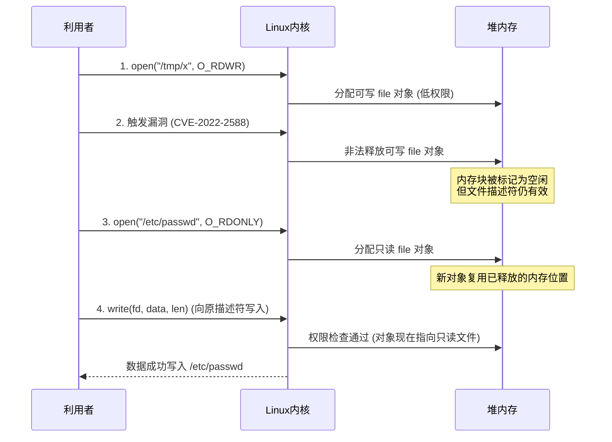
```mermaid
sequenceDiagram
    participant User as 利用者
    participant Kernel as Linux内核
    participant Heap as 堆内存
    User->>Kernel: 1. open("/tmp/x", O_RDWR)
    Kernel->>Heap: 分配可写 file 对象 (低权限)
    User->>Kernel: 2. 触发漏洞 (CVE-2022-2588)
    Kernel->>Heap: 非法释放可写 file 对象
    Note over Heap: 内存块被标记为空闲<br/>但文件描述符仍有效
    User->>Kernel: 3. open("/etc/passwd", O_RDONLY)
    Kernel->>Heap: 分配只读 file 对象
    Note over Heap: 新对象复用已释放的内存位置
    User->>Kernel: 4. write(fd, data, len)  (向原描述符写入)
    Kernel->>Heap: 权限检查通过 (对象现在指向只读文件)
    Kernel-->>User: 数据成功写入 /etc/passwd
```

该序列图清晰地展示了四个关键步骤：

1. **打开低权限文件**：利用者创建一个普通可写文件，内核为其分配对应的 `file` 对象。该对象包含写入权限标志，允许后续的写入操作。
2. **非法释放对象**：利用内核漏洞（如 CVE-2022-2588 提供的类型混淆能力）使内核错误地释放该 `file` 对象。此时对象已被归还给 SLUB 分配器的空闲链表，但其用户态文件描述符仍处于打开状态，形成悬垂指针。
3. **分配高权限对象**：利用者立即打开一个只读的系统关键文件（如 `/etc/passwd`）。内核为新打开的文件分配 `file` 对象时，SLUB 分配器会优先复用刚刚释放的内存块，使得高权限的只读 `file` 对象恰好占据低权限 `file` 对象原先的位置。
4. **完成凭证替换**：此时，原始文件描述符实际指向的已是高权限只读文件的 `file` 对象。当利用者通过该描述符发起写入时，内核基于当前 `file` 对象的权限进行检查——由于该对象来自一个只读文件，理论上不应允许写入。然而，权限检查通过的是可写文件描述符所持有的凭证，而实际写入的目标却是只读的系统文件。这种“身份混乱”使得写入操作得以完成，从而实现特权文件的内容覆写。

这一过程不依赖任何内核地址泄露，也不直接篡改凭证数据，而是通过**替换整个 `file` 对象**来绕过权限检查。需要指出的是，**Dirty Cred** 同样支持对 `cred` 对象的交换——通过将低权限任务的 `cred` 对象与高权限任务的 `cred` 对象进行内存层面的置换，可使低权限进程直接获得 root 权限。

### 3-3. 技术挑战与应对

**Dirty Cred** 在实际利用过程中面临一系列技术挑战，研究人员针对这些挑战提出了相应的解决方案。这些挑战可以归纳为三个核心问题：漏洞原语的转化、竞争窗口的延长以及特权对象的主动分配。三者之间存在递进关系：首先需要将漏洞能力转化为可用的凭证释放原语，然后需要在精确的时间窗口内完成对象交换，最后还需要主动获得高权限凭证对象以完成置换。任何一个环节的缺失都会导致整个利用链条失效。

#### 3-3-1. 漏洞原语转化

大多数堆漏洞并不直接提供“非法释放任意对象”的能力。**Dirty Cred** 需要将不同类型的漏洞能力转化为凭证交换所需的基础原语。下表总结了不同类型漏洞的转化策略：

| 漏洞类型         | 转化策略                             | 关键条件                               |
| ---------------- | ------------------------------------ | -------------------------------------- |
| 越界写 (OOB)     | 覆写相邻对象中的凭证指针，伪造引用   | 受害者对象紧邻漏洞对象，且包含凭证指针 |
| 释放后使用 (UAF) | 利用释放后的悬垂指针重新分配特权对象 | 缓存可控，或具备写入能力修改指针       |
| 双重释放 (DF)    | 利用跨缓存内存页回收                 | 清空源缓存，使内存页被目标缓存复用     |

以越界写为例，其转化流程如下图所示：

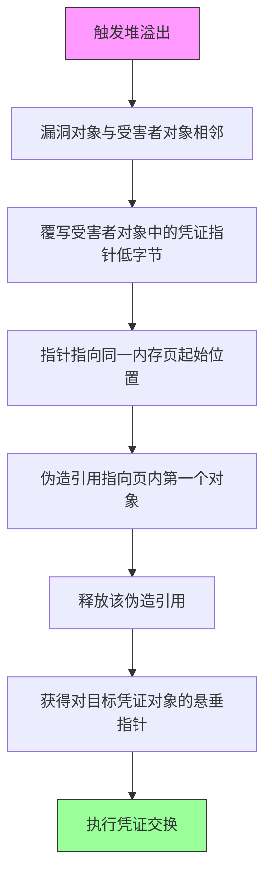
```mermaid
flowchart TD
    A[触发堆溢出] --> B[漏洞对象与受害者对象相邻]
    B --> C[覆写受害者对象中的凭证指针低字节]
    C --> D[指针指向同一内存页起始位置]
    D --> E[伪造引用指向页内第一个对象]
    E --> F[释放该伪造引用]
    F --> G[获得对目标凭证对象的悬垂指针]
    G --> H[执行凭证交换]
    style A fill:#f9f,stroke:#333
    style H fill:#9f9,stroke:#333
```

**越界写转化**：通过精心堆布局，使包含指向凭证对象指针的受害者对象紧邻漏洞对象之后。利用溢出覆写该指针的低位字节（清零末两位），使其指向同一内存页的起始位置——由于内存页地址末位始终为零，这一操作可将指针重定向到页内第一个对象的起始地址。释放这个被伪造引用的对象后，内核会将页内第一个对象（可能是另一个凭证对象）释放，从而实现对目标凭证对象的非法释放。

**释放后使用转化**：若 UAF 发生在凭证专用缓存（如 `cred_jar`）上，直接释放非特权凭证后使用新创建的特权凭证占据该内存即可完成置换。若 UAF 发生在通用缓存上，则需要该 UAF 具备非法写入能力——先释放出一个内存空洞，再用含有凭证指针的可利用对象占据它，然后利用 UAF 修改该凭证指针，使其指向目标凭证对象，最后释放该对象。

**双重释放转化**：利用跨缓存内存页回收机制。首先通过大量分配填充缓存，然后使用两个不同指针重复释放同一对象，制造双重释放。接着清空整个缓存使其内存页被伙伴系统回收。当内核在凭证专用缓存中分配新对象时，这些内存页会被重新分配给该缓存，从而使凭证对象恰好落位到可被悬垂指针引用的位置。**Dirty Cred** 随后利用剩余的悬垂指针非法释放该凭证对象，完成凭证交换。

通过上述转化策略，不同类型的堆内存破坏漏洞均可被统一转化为 **Dirty Cred** 所需的基础原语，这为后续的凭证交换奠定了技术基础。

#### 3-3-2. 竞争窗口的延长

在 Linux 内核中，权限检查与实际数据写入往往背靠背快速发生。若无法精确控制文件对象交换的发生时机，利用将极不稳定。**Dirty Cred** 通过以下机制延长竞争窗口：

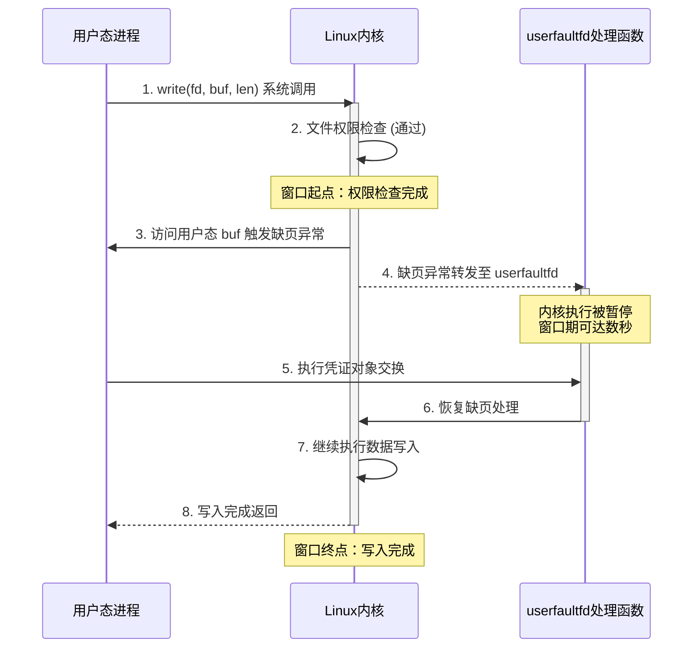
```mermaid
sequenceDiagram
    participant User as 用户态进程
    participant Kernel as Linux内核
    participant UFFD as userfaultfd处理函数

    User->>Kernel: 1. write(fd, buf, len) 系统调用
    activate Kernel
    Kernel->>Kernel: 2. 文件权限检查 (通过)
    Note over Kernel: 窗口起点：权限检查完成
    Kernel->>User: 3. 访问用户态 buf 触发缺页异常
    Kernel-->>UFFD: 4. 缺页异常转发至 userfaultfd
    activate UFFD
    Note over UFFD: 内核执行被暂停<br/>窗口期可达数秒
    User->>UFFD: 5. 执行凭证对象交换
    UFFD->>Kernel: 6. 恢复缺页处理
    deactivate UFFD
    Kernel->>Kernel: 7. 继续执行数据写入
    Kernel-->>User: 8. 写入完成返回
    deactivate Kernel
    Note over Kernel: 窗口终点：写入完成
```

该序列图展示了 **Dirty Cred** 利用 userfaultfd 延长竞争窗口的完整交互流程：

**userfaultfd 利用**：userfaultfd 是 Linux 内核提供的一种用户态缺页异常处理机制，允许用户态进程注册自定义的缺页处理函数。当内核访问注册内存区域中的页面并触发缺页异常时，该处理函数会被调用，内核执行被暂停，直到用户态完成处理并恢复执行。在 v4.13 之前，`writev` 系统调用先完成权限检查，随后在 `import_iovec` 时触发缺页异常，**Dirty Cred** 可在此处暂停内核并获得数秒乃至更长的窗口期完成对象交换。在 v4.13 之后，虽然 `import_iovec` 被移至权限检查之前，但 **Dirty Cred** 仍可利用 `generic_perform_write` 在写入前触发的 page fault 实现延时——该 page fault 位于权限检查之后、实际写入之前，恰好提供了所需的竞争窗口。值得注意的是，移除该 page fault 可能引发死锁问题，使得此方案难以被彻底修复。

**文件系统锁利用**：在 ext4 等文件系统中，写入操作前会对 inode 进行加锁以防止并发写入导致数据混乱。利用者可派生两个进程同时对同一大文件执行写入——进程 A 持有锁并写入大量数据（如 4GB 文件写入机械硬盘可延迟数十秒），进程 B 在完成权限检查后等待锁释放。这一等待过程为 **Dirty Cred** 提供了充足的窗口期完成对象交换，无需依赖 userfaultfd。

**FUSE 利用**：FUSE（用户态文件系统）框架允许用户实现自定义的文件系统并注册操作处理函数。利用者可构造一个 FUSE 文件系统，其处理函数在收到操作请求后可任意延迟响应。当内核访问 FUSE 文件系统中的文件时，会调用用户态的处理函数，内核执行被暂停，从而为凭证交换创造时间窗口。

上述三种机制从不同层面解决了竞争窗口的问题：userfaultfd 利用缺页机制实现精准暂停，文件系统锁利用并发写入的阻塞特性，FUSE 则通过用户态文件系统的自定义处理实现任意时长的延迟。三者互为补充，使得 **Dirty Cred** 在不同内核版本和配置下均可获得稳定的利用窗口。

#### 3-3-3. 特权对象的主动分配

**Dirty Cred** 面临的一个关键挑战是：低权限用户如何在内核空间主动分配高权限凭证对象。被动等待特权用户的活动会严重影响利用的稳定性——利用者无法预知目标内存何时被回收，也无法控制新分配对象的权限等级。为解决这一问题，**Dirty Cred** 采用主动策略触发内核空间中的特权对象分配。

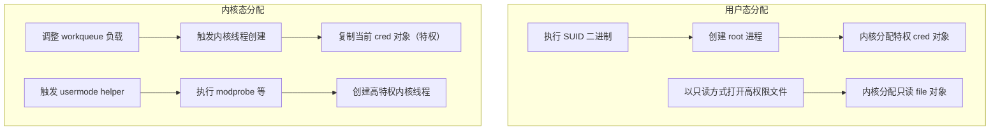
```mermaid
flowchart TD
    subgraph 用户态分配
        A[执行 SUID 二进制] --> B[创建 root 进程]
        B --> C[内核分配特权 cred 对象]
        D[以只读方式打开高权限文件] --> E[内核分配只读 file 对象]
    end
    subgraph 内核态分配
        F[调整 workqueue 负载] --> G[触发内核线程创建]
        G --> H[复制当前 cred 对象（特权）]
        I[触发 usermode helper] --> J[执行 modprobe 等]
        J --> K[创建高特权内核线程]
    end
```

**用户态分配**：当二进制文件设置了 SUID 权限时，无论执行者是谁，该文件都会以所有者的权限执行。低权限用户可通过执行 root 所有的 SUID 二进制文件（如 `su`、`ping`、`sudo`、`mount` 等）来触发 root 进程的创建，从而在内核中分配特权的 `cred` 对象。对于 `file` 对象，利用者只需以只读权限打开多个目标文件（如 `/etc/passwd`、`/etc/sudoers` 等），内核便会在相应内存中分配对应的只读 `file` 对象。由于这些文件为 root 所有且权限为只读，其 `file` 对象带有高权限属性。

**内核态分配**：**Dirty Cred** 还可通过内核空间分配特权对象。当 Linux 内核启动新内核线程时，会复制当前运行进程并分配一个复制的 `cred` 对象。由于大多数内核线程（如 kworker、kswapd 等）运行在特权上下文中，其 `cred` 对象具有 `GLOBAL_ROOT_UID`，复制的 `cred` 对象也处于高权限状态。具体方法包括：通过增加提交到内核工作队列（workqueue）的工作量，触发工作池动态创建新的 worker 线程；或利用 usermode helper 机制（如加载内核模块时调用 `/sbin/modprobe`）触发高特权用户态程序的执行，该过程涉及内核线程的创建，进而分配高特权凭证对象。

用户态与内核态两种分配路径的有机结合，使 **Dirty Cred** 能够在不同场景下灵活地获取所需的高权限凭证对象，从根本上消除了对特权用户活动的被动依赖，显著提升了利用的稳定性和可靠性。

### 3-4. 可利用对象与通用性评估

为了评估 **Dirty Cred** 的通用性，研究人员首先系统性地识别了各内核缓存中可用于 **Dirty Cred** 的可利用对象——即包含指向凭证对象指针的内核数据结构。研究团队开发了一套基于 LLVM 的静态分析工具，结合 Syzkaller 内核模糊测试器，自动化地追踪可被用户态系统调用触发的对象分配与释放路径。

实验结果表明，可利用对象覆盖了几乎所有的通用缓存（除极少使用的 kmalloc-8 外），且每个缓存中通常存在多个可利用对象。这些对象包括 `fs_context`、`request_key_auth`、`shmid_kernel`、`binder_proc` 等多种类型，分别包含指向 `file` 或 `cred` 凭证对象的指针，其偏移量因对象类型而异。其中，5 个通用缓存中的对象将凭证指针放置在对象起始位置，这意味着即使利用者仅获得非常有限的覆写能力（如仅能覆写目标对象起始处两个字节为零），仍可借助这些对象发起 **Dirty Cred** 利用。丰富的可利用对象为 Dirty Cred 适配各类漏洞提供了充足的选择空间，也是其通用性的重要基础。

在真实漏洞可利用性评估方面，研究团队选取了 2019 年后报告的 24 个 Linux 内核 CVE 漏洞作为测试集，涵盖越界写、释放后使用、双重释放等多种堆内存破坏类型。实验结果表明，**Dirty Cred** 在其中的 16 个漏洞上成功展示了可利用性。下表展示了部分代表性测试结果：

| CVE编号        | 漏洞类型    | Dirty Cred 可利用性 |
| -------------- | ----------- | ------------------- |
| CVE-2022-27666 | OOB         | ✓                   |
| CVE-2022-25636 | Double Free | ✓                   |
| CVE-2022-2588  | UAF         | ✓                   |
| CVE-2021-43267 | OOB         | ✓                   |
| CVE-2021-22555 | Double Free | ✓                   |
| CVE-2020-14386 | OOB         | ✓                   |
| CVE-2019-2215  | UAF         | ×                   |

研究发现，在 vmalloc 区域（虚拟内存区域）发生的漏洞相对较难利用，主要原因在于该区域中可用于 **Dirty Cred** 的可利用对象较少。然而，这并不意味着此类漏洞完全无法被 **Dirty Cred** 利用——例如 CVE-2021-34866 虽为 vmalloc 区域的越界写漏洞，但可通过组合利用手法先将其转化为任意读写能力，再构造双重释放原语，最终仍可适配 **Dirty Cred** 的利用流程。

**Dirty Cred** 的通用性还体现在跨版本与跨架构的适配能力上。传统利用方式通常需要针对不同内核版本和 CPU 架构重新构造 ROP 链或调整偏移量，而 **Dirty Cred** 采用纯数据驱动的利用策略，不依赖任何内核地址信息，也不使用架构相关的指令序列，因此同一份利用代码无需修改即可在不同内核版本和架构上运行。研究团队已验证 **Dirty Cred** 在 x86_64 和 ARM64 架构上的有效性。

除了权限提升，**Dirty Cred** 还可实现容器逃逸。通过文件对象交换，利用者可覆写容器中的高权限文件；通过 `cred` 对象交换，则可直接获得 `SYS_ADMIN` 等特权 capability，进而利用 cgroup `release_agent` 等机制在宿主机上执行任意命令。研究团队还展示了 **Dirty Cred** 在 Android 平台上的提权能力——通过交换 `cred` 对象直接获得 root 权限，或通过覆写共享系统库突破沙箱限制，最终禁用 SELinux。相关成果已提交至 Google 漏洞奖励计划并获得了 20,000 美元的赏金。

### 3-5. 防御思路

针对 **Dirty Cred** 这类基于凭证交换的利用方法，研究人员提出了一种新的内核防御机制：**将内核凭证对象根据其自身的权限级别隔离在非重叠的内存区域中**。

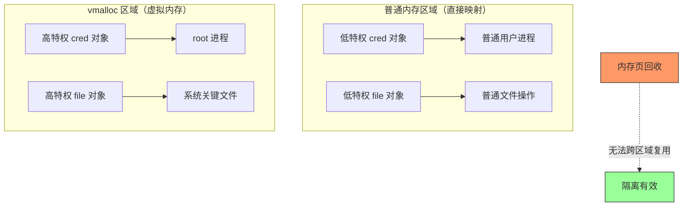
```mermaid
flowchart TD
    subgraph "普通内存区域（直接映射）"
        A[低特权 cred 对象] --> B[普通用户进程]
        C[低特权 file 对象] --> D[普通文件操作]
    end
    subgraph "vmalloc 区域（虚拟内存）"
        E[高特权 cred 对象] --> F[root 进程]
        G[高特权 file 对象] --> H[系统关键文件]
    end
    I[内存页回收] -.->|无法跨区域复用| J[隔离有效]
    style I fill:#f96,stroke:#333
    style J fill:#9f9,stroke:#333
```

具体而言，该防御方案将高特权对象存储在 `vmalloc` 区域（虚拟内存区域），而低特权对象保留在普通内存区域（直接映射内存区域，即 `kmalloc` 所使用的区域）。由于这两个区域在物理和虚拟地址空间上均不重叠——`vmalloc` 区域位于 `VMALLOC_START` 至 `VMALLOC_END` 定义的地址范围内，与直接映射区域完全隔离——即使缓存被销毁、底层内存页被伙伴系统回收并重新分配，高特权与低特权对象的存储区域也不会发生重叠，从而从根本上阻断了 **Dirty Cred** 利用堆内存复用进行凭证交换的利用路径。

在实现层面，研究团队在 Linux 内核 v5.16.15 上构建了该防御原型。当分配 `cred` 对象时，系统检查其 UID 是否为 `GLOBAL_ROOT_UID`，若是则通过 `vmalloc` 分配内存；当分配 `file` 对象时，检查文件的打开模式，若包含写权限则同样使用 `vmalloc` 分配。对于运行时权限变更（如通过 `setuid` 系统调用将低权限凭证提升为高权限），实现方案会复制对象到 `vmalloc` 区域而非直接修改原对象，以确保隔离性不被破坏。

研究团队通过 LMbench 和 Phoronix Test Suite 对该防御机制进行了性能评估。实验结果表明，该防御机制在大多数情况下仅引入可忽略不计的性能开销，仅在“10k 文件创建”和“10k 文件删除”等测试中表现出约 4%-7% 的适度性能下降。这一开销主要源于 `vmalloc` 相比 `kmalloc` 需要重新映射缓冲区空间的额外操作——`vmalloc` 分配的内存需要将不连续的物理页映射为连续的虚拟地址范围，而 `kmalloc` 直接从物理连续的 DMA 区域分配，无需页表重映射。值得指出的是，文件删除操作（通过 RCU 异步释放）的性能下降（4.25%）低于文件创建操作（7.17%），进一步验证了该防御在实际场景中的可接受性。

从防御理念来看，该机制不同于传统的基于对象类型或敏感度的隔离方案（如 AUTOSLAB 按对象类型隔离、xMP 按敏感度隔离），而是基于凭证对象自身的权限等级进行内存隔离。这种设计直接针对 **Dirty Cred** 的核心利用机理——特权与非特权凭证的交换——因此对 **Dirty Cred** 这类凭证交换利用方法具有更强的针对性防御效果，为 Linux 内核防御体系提供了一种新的可行思路。

### 3-6. 分析总结

纵观 **Dirty Cred** 的完整技术链条，其核心可归纳为**对内核堆内存复用机制的深度操纵**。该利用方法跳出了传统控制流劫持的范式——不依赖 ROP 链、不泄露内核基址、不覆写关键数据字段，而是完全立足于内核内存分配器（SLUB）的固有行为特性，将一次内存破坏原语转化为可控的凭证交换能力。

从技术演进的角度看，**Dirty Cred** 代表了内核利用方法论的一次重要转向。传统利用方式面临 KASLR、SMEP、SMAP、KPTI、CFI 等多层防护的层层拦截，每次突破都需要耗费大量精力构造信息泄露和 ROP 链条。而 **Dirty Cred** 另辟蹊径，通过纯数据驱动的对象交换策略，使上述防护机制几乎全部失效——因为它们都聚焦于控制流完整性，而 **Dirty Cred** 操纵的恰恰是数据流。这一思路与 **Dirty Pipe** 异曲同工，但 **Dirty Cred** 的通用性远超 **Dirty Pipe**，能够适配越界写、释放后使用、双重释放等多种堆漏洞类型，覆盖范围显著更广。

**Dirty Cred** 的核心技术贡献体现在三个方面：第一，提出了系统的漏洞原语转化方案，将各类堆破坏能力统一为凭证非法释放原语；第二，设计了 userfaultfd、文件系统锁、FUSE 等多层次的竞争窗口延长机制，确保利用的稳定性和可靠性；第三，构建了用户态与内核态协同的特权对象主动分配策略，彻底消除对特权用户活动的被动依赖。三者环环相扣，构成了一套完备且可移植的利用框架。

从防御视角来看，**Dirty Cred** 揭示了一个深层次的系统安全挑战——内核内存分配器的复用机制本身是设计使然，却可被利用者操纵为凭证交换的载体。这意味着传统的漏洞修补策略已不足以应对此类威胁：即便消除了某一个漏洞，只要堆内存复用机制与凭证对象管理之间缺乏有效的隔离，同类利用手法仍可能在其他漏洞上复现。因此，基于凭证权限等级的内存隔离方案不仅是应对 **Dirty Cred** 的有效手段，也为更广泛的内核数据隔离设计提供了重要思路。

综上所述，**Dirty Cred** 不仅在技术层面实现了对现有内核防护体系的突破，更在方法论层面为内核安全研究开辟了新的方向——**从控制流保护转向数据流隔离**，或许将成为下一阶段内核安全防御的核心命题。这一发现对于内核开发者、安全研究人员以及防御方案设计者均具有重要的参考价值。

## 4. 利用思路一

### 4-1. 整体架构设计

本章系统阐述针对 **CVE-2022-2588** 的完整利用架构。该架构基于 DirtyCred 方法论，通过十个阶段（阶段 0 ~ 阶段 9）的协同操作将漏洞原语转化为稳定的权限提升能力。整体设计遵循“先布局、后触发、再置换”的核心逻辑，利用进程间通信与细粒度同步机制确保各阶段操作的时序确定性。

**多核并发设计的核心考量**：

本架构采用多子进程分别绑定不同 CPU 核心的设计，其根本原因在于 **RCU 延迟释放机制无法保证对象被释放到申请时所在的 CPU 缓存**。在漏洞触发后，`tc_action` 对象可能被释放到与申请时不同的 CPU 上，若仅在一个 CPU 上执行堆喷，则可能无法捕获到该对象。通过为每个 CPU 核心独立派发堆喷子进程，无论对象最终被释放到哪个 CPU 的缓存中，都有对应的子进程在其上执行堆喷，从而以极高概率完成内存复用。多核并发是为了覆盖 RCU 释放的不确定性，而非依赖多核提高成功率。

**单核兼容性**：单核环境不存在跨 CPU 缓存转移问题，对象分配与释放均在唯一的 CPU 上完成，因此本架构在单核系统中同样可以稳定工作，甚至更为直接。多子进程设计的本质是应对 RCU 异步释放带来的 per-CPU 缓存不确定性，而非多核依赖。

整个利用流程的总体架构如下：

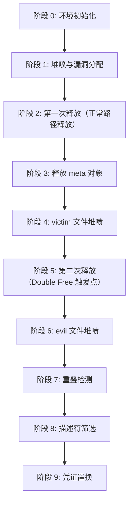
```mermaid
flowchart TD
    S0["阶段 0: 环境初始化"]
    S1["阶段 1: 堆喷与漏洞分配"]
    S2["阶段 2: 第一次释放（正常路径释放）"]
    S3["阶段 3: 释放 meta 对象"]
    S4["阶段 4: victim 文件堆喷"]
    S5["阶段 5: 第二次释放（Double Free 触发点）"]
    S6["阶段 6: evil 文件堆喷"]
    S7["阶段 7: 重叠检测"]
    S8["阶段 8: 描述符筛选"]
    S9["阶段 9: 凭证置换"]

    S0 --> S1 --> S2 --> S3 --> S4 --> S5 --> S6 --> S7 --> S8 --> S9
```

该架构的核心设计原则包括：

- **职责分离**：主进程负责全局协调，子进程分别承担漏洞触发（`vuln`）、堆喷（`meta`）、文件占据（`victim`/`evil`）等专用任务，每个子进程绑定到特定 CPU 核心以覆盖 RCU 释放的不确定性。
- **同步原语**：通过管道传递同步令牌实现跨进程的精确握手，确保各阶段按预期顺序执行。
- **堆喷策略**：利用 `meta` 对象的批量分配与释放制造内存空洞，再利用大规模文件打开操作实现对释放页面的定向复用。
- **容错机制**：多 CPU 核心并发执行堆喷与文件占据操作，通过重叠检测筛选出成功复用的对象，消除单点失效风险。

各阶段之间的协调关系可用以下序列图表示：

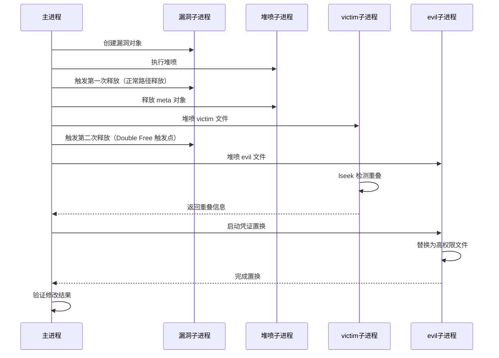
```mermaid
sequenceDiagram
    participant Main as 主进程
    participant Vuln as 漏洞子进程
    participant Meta as 堆喷子进程
    participant Victim as victim子进程
    participant Evil as evil子进程

    Main->>Vuln: 创建漏洞对象
    Main->>Meta: 执行堆喷
    Main->>Vuln: 触发第一次释放（正常路径释放）
    Main->>Meta: 释放 meta 对象
    Main->>Victim: 堆喷 victim 文件
    Main->>Vuln: 触发第二次释放（Double Free 触发点）
    Main->>Evil: 堆喷 evil 文件
    Victim->>Victim: lseek 检测重叠
    Victim-->>Main: 返回重叠信息
    Main->>Evil: 启动凭证置换
    Evil->>Evil: 替换为高权限文件
    Evil-->>Main: 完成置换
    Main->>Main: 验证修改结果
```

### 4-2. 阶段 0：环境初始化

环境初始化阶段为整个利用流程建立运行基础，涵盖资源限制调整、工作目录创建、进程派生与通信管道设置等关键操作。

**资源限制调整**：

利用过程需要同时持有数千个文件描述符，必须将进程的 `RLIMIT_NOFILE` 软硬限制提升至足够高的数值（如 4096）。这一数值的选择基于两方面考量：一是足够覆盖堆喷所需的文件数量（每个子进程约 4000 个），二是兼顾系统全局的文件描述符上限。同时，为避免内存分配失败，适当调整 `RLIMIT_MEMLOCK`（锁定内存限制）和 `RLIMIT_STACK`（栈大小限制），防止因内存不足导致的子进程异常退出。该操作在所有子进程中均需执行，以确保每个进程都能容纳大规模的文件描述符数组。

**工作目录与符号链接**：

在可写目录（`/home/ctf/exp_dir`）中创建两个普通数据文件，并分别建立符号链接 `victim` 和 `evil` 指向它们。这些符号链接在后续阶段被重复打开，用于触发大量 `file` 对象的分配。符号链接本身并不特殊，但通过指向同一底层文件的不同路径，使得多个文件描述符可以独立打开同一文件，便于后续通过 `lseek` 检测内存重叠。

**进程派生架构**：

主进程派生三类专用子进程，每类承担不同的利用职责：

- **漏洞子进程**（`vuln`）：负责创建、替换和释放 `route4_filter` 对象，是漏洞触发的唯一执行者。
- **堆喷子进程**（`meta`）：在 `kmalloc-256` 缓存中大量分配 `meta` 对象，用于填充内存页面。
- **文件子进程**（`victim`/`evil`）：分别打开低权限文件，占据释放后的内存页面，并通过 `lseek` 检测重叠。

每个子进程被绑定到特定的 CPU 核心，绑定操作的核心目的是确保无论 RCU 将释放的对象调度到哪个 CPU 缓存，都有对应的子进程在该 CPU 上执行堆喷以完成复用。绑定通过 `sched_setaffinity` 实现，确保内存分配在指定的 per-CPU 缓存上进行。

**通信管道**：

主进程与每个子进程之间建立一对命令管道和确认管道，用于传递同步令牌。同步令牌为一个固定长度的整型值，子进程在收到令牌后执行相应操作，完成后通过确认管道返回令牌。这种“请求-确认”机制保证了主进程能够精确控制每个阶段的执行时机，避免因子进程执行速度差异导致的竞态条件。管道通信的阻塞特性天然提供了同步点，使得整个流程可靠且易于调试。

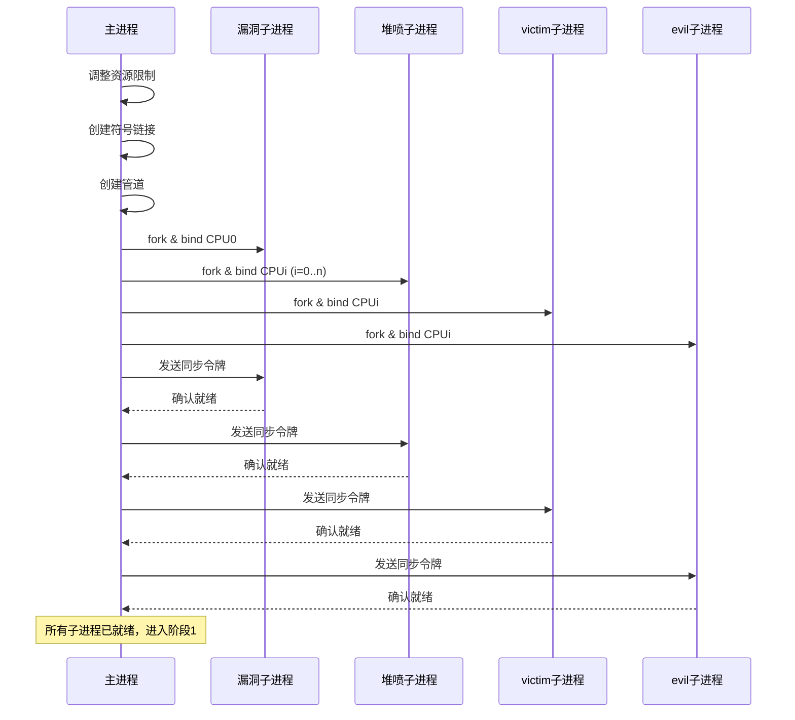
```mermaid
sequenceDiagram
    participant Main as 主进程
    participant Vuln as 漏洞子进程
    participant Meta as 堆喷子进程
    participant Victim as victim子进程
    participant Evil as evil子进程

    Main->>Main: 调整资源限制
    Main->>Main: 创建符号链接
    Main->>Main: 创建管道
    Main->>Vuln: fork & bind CPU0
    Main->>Meta: fork & bind CPUi (i=0..n)
    Main->>Victim: fork & bind CPUi
    Main->>Evil: fork & bind CPUi
    Main->>Vuln: 发送同步令牌
    Vuln-->>Main: 确认就绪
    Main->>Meta: 发送同步令牌
    Meta-->>Main: 确认就绪
    Main->>Victim: 发送同步令牌
    Victim-->>Main: 确认就绪
    Main->>Evil: 发送同步令牌
    Evil-->>Main: 确认就绪
    Note over Main: 所有子进程已就绪，进入阶段1
```

### 4-3. 阶段 1：堆喷与漏洞对象分配

阶段 1 的目标是在 `kmalloc-256` 缓存中制造密集的对象布局，使目标 `tc_action` 对象落位在一个可被整页回收的物理页面上。

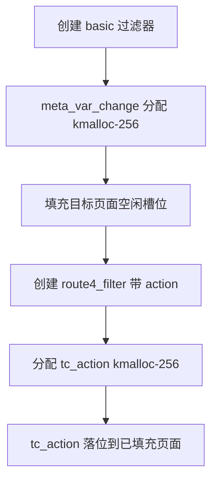
```mermaid
flowchart TD
    A[创建 basic 过滤器] --> B[meta_var_change 分配 kmalloc-256]
    B --> C[填充目标页面空闲槽位]
    C --> D[创建 route4_filter 带 action]
    D --> E[分配 tc_action kmalloc-256]
    E --> F[tc_action 落位到已填充页面]
```

**堆喷操作**：

堆喷的核心是 `basic` 分类器中的 `meta` 扩展匹配。每个 `basic` 过滤器在创建时会调用 `tcf_em_tree_validate()` → `tcf_em_validate()` → `em_meta_change()` → `meta_var_change()`，其中 `meta_var_change()` 通过 `kmemdup()` 在 `kmalloc-256` 缓存中分配一个可被用户控制内容的内存块。

该分配路径的利用价值在于：

1. **长度可控**：`meta_var_change()` 的 `len` 参数直接来自用户态 Netlink 消息中的 `nla_len`，可以精确控制在 `kmalloc-256` 范围内。本架构选择 193 字节作为分配长度，该值在 `kmalloc-256` 缓存内且留有足够空间容纳自定义数据，同时避免触发 `kmalloc-192` 的回退。
2. **内容可控**：`kmemdup()` 复制用户态提供的数据，使得分配的内存块内容完全可控，便于后续识别和调试。
3. **批量分配**：通过创建大量 `basic` 过滤器，可以在短时间内分配数百个 `kmalloc-256` 对象，快速填充目标页面的空闲槽位。

**漏洞对象分配**：

漏洞对象（即 `tc_action`）的分配是通过创建一个带有扩展动作的 `route4_filter` 来实现的。由于 `route4_filter` 本身位于 `kmalloc-192`，而其 `exts.actions` 指向的 `tc_action` 位于 `kmalloc-256`，因此漏洞对象的目标内存位于 `kmalloc-256` 缓存中。

堆喷的具体策略是：在漏洞对象分配之前和之后分别执行两轮堆喷，每轮在每个 CPU 上分配 8 * 32 个 meta 对象。这样确保目标 `tc_action` 所在物理页面的所有空闲槽位都被喷出的 `meta` 对象填充。如此，当后续触发释放时，该页面上的所有 `kmalloc-256` 对象都将被释放，使整页返回伙伴系统。

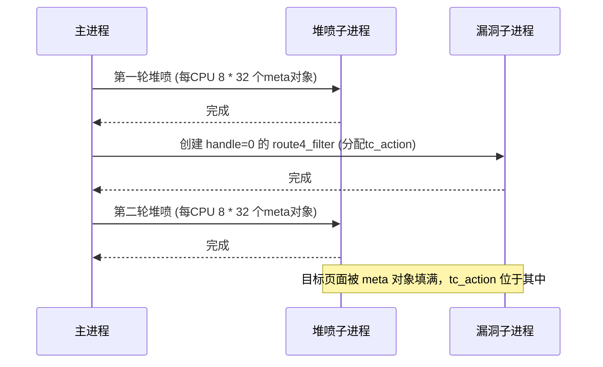
```mermaid
sequenceDiagram
    participant Main as 主进程
    participant Meta as 堆喷子进程
    participant Vuln as 漏洞子进程

    Main->>Meta: 第一轮堆喷 (每CPU 8 * 32 个meta对象)
    Meta-->>Main: 完成
    Main->>Vuln: 创建 handle=0 的 route4_filter (分配tc_action)
    Vuln-->>Main: 完成
    Main->>Meta: 第二轮堆喷 (每CPU 8 * 32 个meta对象)
    Meta-->>Main: 完成
    Note over Meta,Vuln: 目标页面被 meta 对象填满，tc_action 位于其中
```

### 4-4. 阶段 2：第一次释放（正常路径释放）

第一次释放是通过替换 `handle = 0` 的 `route4_filter` 来触发的。此阶段属于漏洞代码路径中的正常释放流程——旧过滤器因替换操作而被内核正常释放。

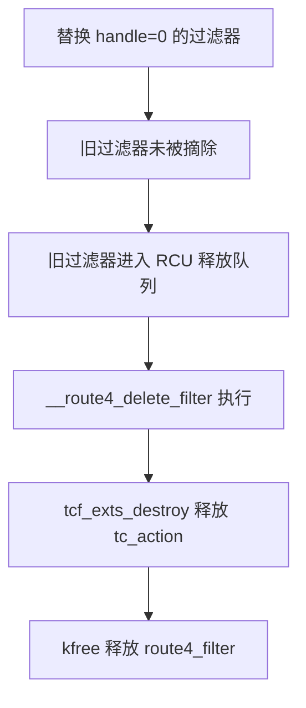
```mermaid
flowchart TD
    A[替换 handle=0 的过滤器] --> B[旧过滤器未被摘除]
    B --> C[旧过滤器进入 RCU 释放队列]
    C --> D[__route4_delete_filter 执行]
    D --> E[tcf_exts_destroy 释放 tc_action]
    E --> F[kfree 释放 route4_filter]
```

根据前文第 2-3 节的分析，`route4_change()` 在处理旧句柄为 0 的替换时，会跳过哈希表摘除操作却仍执行异步释放。释放过程中，`__route4_delete_filter()` 依次调用 `tcf_exts_destroy()` 释放 `tc_action` 对象（即目标对象），然后释放 `route4_filter` 自身。此时，目标 `tc_action` 对象已被释放，其所在的物理页面上的 `kmalloc-256` 对象进入空闲状态。由于 RCU 延迟释放机制，这些对象不会立即被回收，但已经被标记为空闲，等待宽限期结束。

值得注意的是，`tcf_exts_destroy()` 会递减 `tc_action` 的引用计数并最终释放，该释放操作在 RCU 宽限期结束后才会真正将内存返回给 SLUB 分配器，这正是后续跨缓存复用的时序窗口。

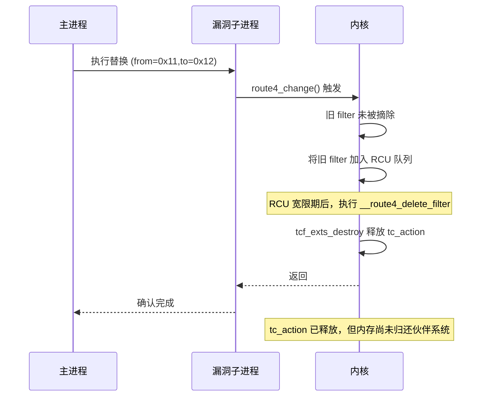
```mermaid
sequenceDiagram
    participant Main as 主进程
    participant Vuln as 漏洞子进程
    participant Kernel as 内核

    Main->>Vuln: 执行替换 (from=0x11,to=0x12)
    Vuln->>Kernel: route4_change() 触发
    Kernel->>Kernel: 旧 filter 未被摘除
    Kernel->>Kernel: 将旧 filter 加入 RCU 队列
    Note over Kernel: RCU 宽限期后，执行 __route4_delete_filter
    Kernel->>Kernel: tcf_exts_destroy 释放 tc_action
    Kernel-->>Vuln: 返回
    Vuln-->>Main: 确认完成
    Note over Kernel: tc_action 已释放，但内存尚未归还伙伴系统
```

### 4-5. 阶段 3：释放 meta 对象

在所有 `tc_action` 对象被释放后，立即销毁所有之前创建的 `basic` 过滤器。

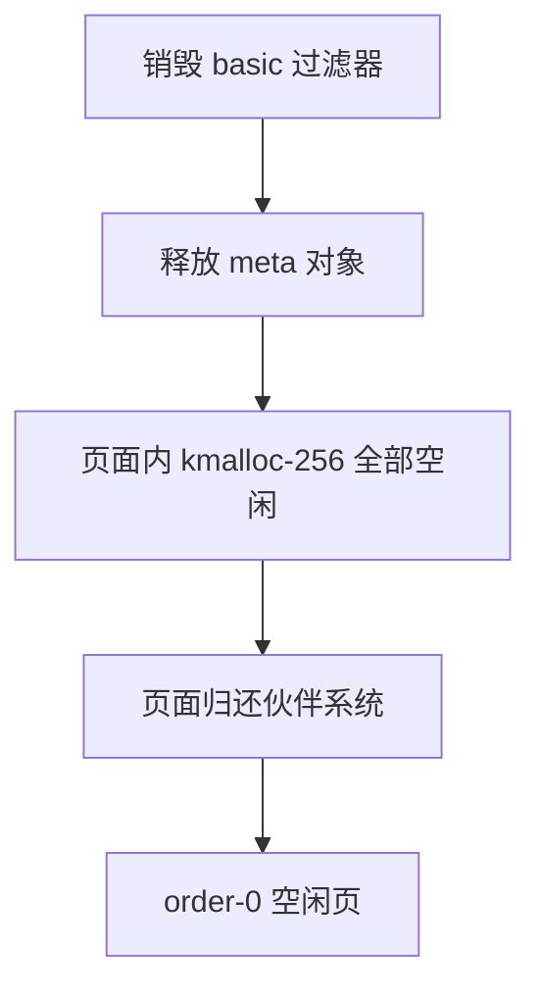
```mermaid
flowchart TD
    A[销毁 basic 过滤器] --> B[释放 meta 对象]
    B --> C[页面内 kmalloc-256 全部空闲]
    C --> D[页面归还伙伴系统]
    D --> E[order-0 空闲页]
```

每个过滤器的销毁会触发其关联的 `meta` 对象（即 `meta_var_change` 中分配的 `kmalloc-256` 内存块）的释放。当该物理页面上最后一个 `kmalloc-256` 对象被释放时，整个页面被伙伴系统回收，成为一个 order-0 的空闲页。为保证页面回收的可靠性，`sleep(2)` 的延迟被插入此阶段，为 RCU 宽限期的结束和伙伴系统的页面回收提供充分的时间。通常 RCU 宽限期约为 1 个 tick 加上调度延迟，2 秒足以确保所有 per-CPU 的 RCU 回调得到处理。

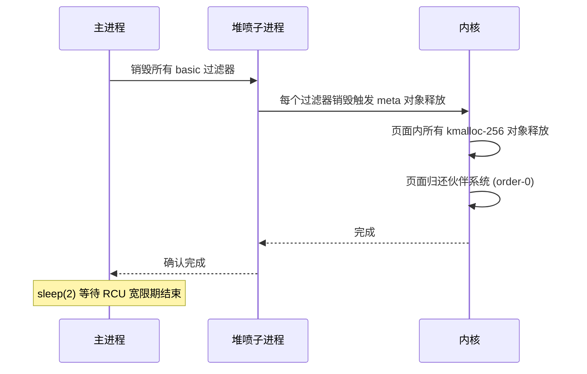
```mermaid
sequenceDiagram
    participant Main as 主进程
    participant Meta as 堆喷子进程
    participant Kernel as 内核

    Main->>Meta: 销毁所有 basic 过滤器
    Meta->>Kernel: 每个过滤器销毁触发 meta 对象释放
    Kernel->>Kernel: 页面内所有 kmalloc-256 对象释放
    Kernel->>Kernel: 页面归还伙伴系统 (order-0)
    Kernel-->>Meta: 完成
    Meta-->>Main: 确认完成
    Note over Main: sleep(2) 等待 RCU 宽限期结束
```

### 4-6. 阶段 4：victim 文件堆喷

文件对象占据阶段利用伙伴系统的页面复用机制，使低权限文件的 `struct file` 对象占据之前释放的物理页面，并在漏洞的第二次释放后实现跨缓存的对象重叠。

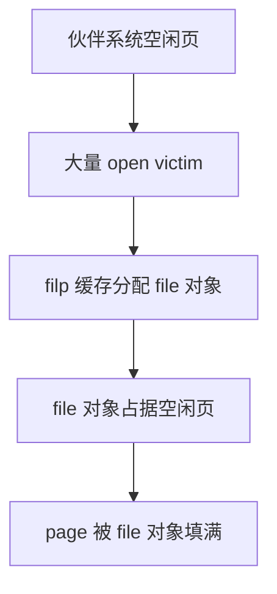
```mermaid
flowchart TD
    A[伙伴系统空闲页] --> B[大量 open victim]
    B --> C[filp 缓存分配 file 对象]
    C --> D[file 对象占据空闲页]
    D --> E[page 被 file 对象填满]
```

在主进程的协调下，所有 `victim` 子进程并发执行文件打开操作。每个 `victim` 子进程打开大量（如 4000 个）低权限文件（`/home/ctf/victim`），这些文件的 `struct file` 对象从专用的 `filp` 缓存中分配。由于 `filp` 缓存的对象大小（232 字节）与 `kmalloc-256` 缓存大小接近且均落在 256 字节对齐的边界内，伙伴系统会将之前释放的 order-0 页面重新分配给 `filp` 缓存，使新分配的 `file` 对象恰好占据原先 `tc_action` 所在的内存区域。

此时，漏洞的悬挂指针仍然指向这片内存区域，但内核的文件子系统已将其视为合法的 `file` 对象。这种“双重身份”是后续利用的关键，因为它允许在同一个物理内存上同时拥有内核网络子系统和文件子系统的两种视图。

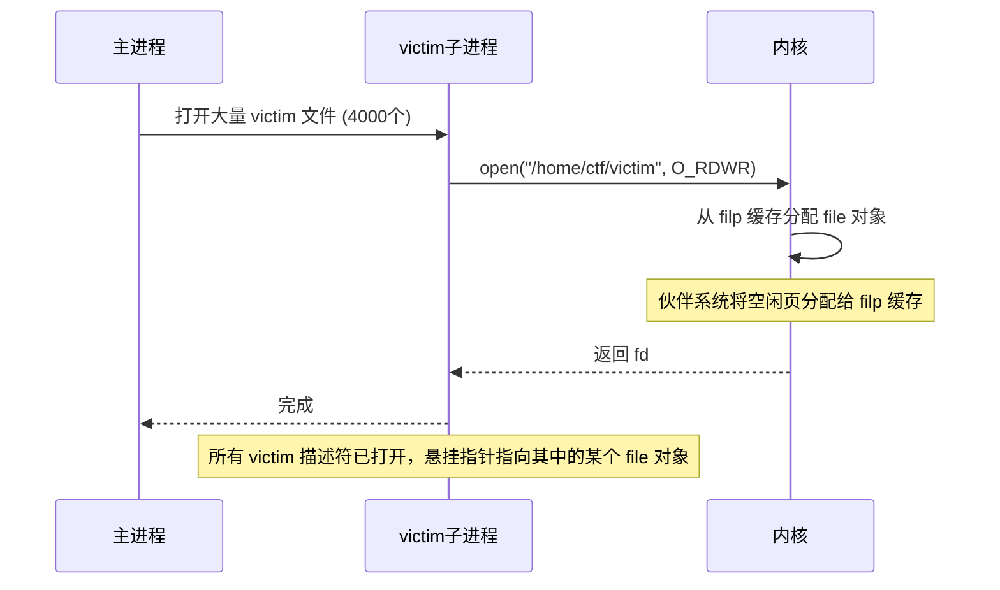
```mermaid
sequenceDiagram
    participant Main as 主进程
    participant Victim as victim子进程
    participant Kernel as 内核

    Main->>Victim: 打开大量 victim 文件 (4000个)
    Victim->>Kernel: open("/home/ctf/victim", O_RDWR)
    Kernel->>Kernel: 从 filp 缓存分配 file 对象
    Note over Kernel: 伙伴系统将空闲页分配给 filp 缓存
    Kernel-->>Victim: 返回 fd
    Victim-->>Main: 完成
    Note over Victim: 所有 victim 描述符已打开，悬挂指针指向其中的某个 file 对象
```

### 4-7. 阶段 5：第二次释放（Double Free 触发点）

此阶段是触发 Double Free 漏洞的核心步骤。由于第一次释放（正常路径释放）已在哈希表中留下了悬挂指针，此时执行**第二次替换** `handle = 0` 的 `route4_filter`。内核通过该悬挂指针找到已被 `file` 对象占用的内存块，并将其再次加入释放队列。

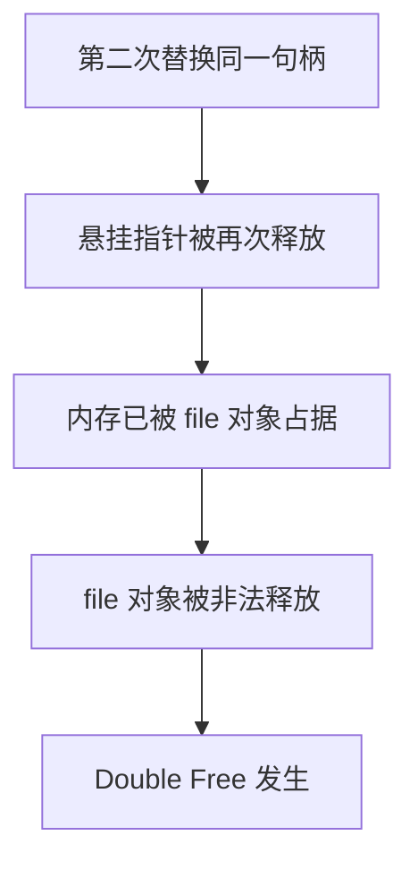
```mermaid
flowchart TD
    A[第二次替换同一句柄] --> B[悬挂指针被再次释放]
    B --> C[内存已被 file 对象占据]
    C --> D[file 对象被非法释放]
    D --> E[Double Free 发生]
```

由于悬挂指针仍保留在哈希表中，`route4_change()` 会认为该指针指向一个有效的 `route4_filter` 并将其加入释放队列。但实际上，该内存已经被 `filp` 缓存重新分配为 `file` 对象。因此，这次释放操作导致一个正在被文件系统使用的 `file` 对象被非法释放，即 Double Free——**同一块物理内存因悬挂指针被错误地释放了两次**。这次释放后，该物理页面再次变为空闲，但其上的一些 `victim` 文件描述符仍然有效，形成悬垂指针——文件描述符引用的 `file` 对象已被释放，但描述符未关闭，构成典型的 UAF 条件。

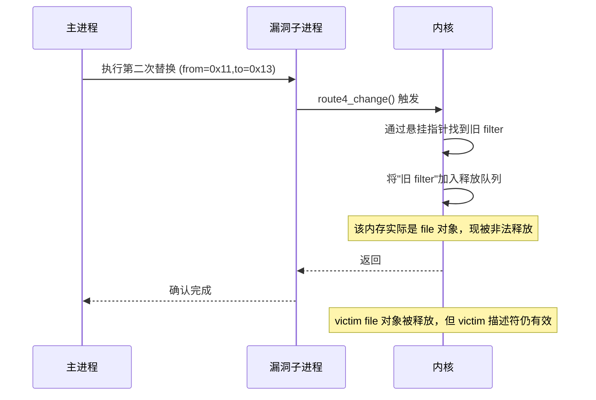
```mermaid
sequenceDiagram
    participant Main as 主进程
    participant Vuln as 漏洞子进程
    participant Kernel as 内核

    Main->>Vuln: 执行第二次替换 (from=0x11,to=0x13)
    Vuln->>Kernel: route4_change() 触发
    Kernel->>Kernel: 通过悬挂指针找到旧 filter
    Kernel->>Kernel: 将"旧 filter"加入释放队列
    Note over Kernel: 该内存实际是 file 对象，现被非法释放
    Kernel-->>Vuln: 返回
    Vuln-->>Main: 确认完成
    Note over Kernel: victim file 对象被释放，但 victim 描述符仍有效
```

### 4-8. 阶段 6：evil 文件堆喷

紧接着，`evil` 子进程打开大量（同样为 4000 个）低权限文件（`/home/ctf/evil`），每个文件通过 `lseek64()` 设置一个唯一的偏移量：`offset = i + 1 + cpu * EVIL_FILE_COUNT`。

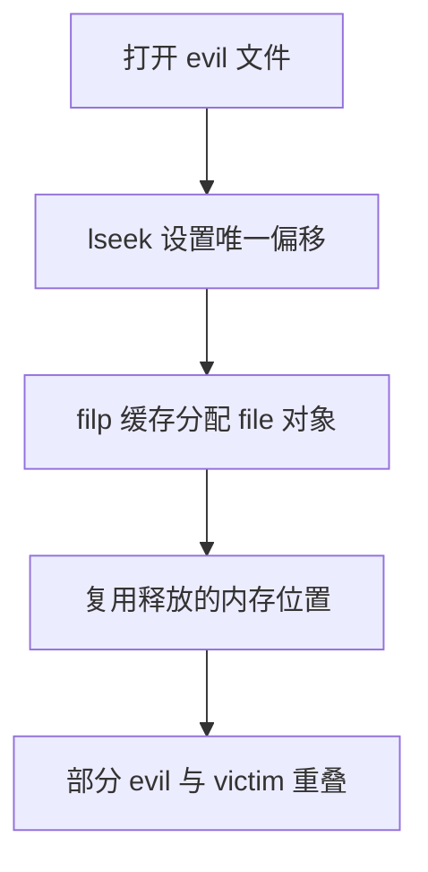
```mermaid
flowchart TD
    A[打开 evil 文件] --> B[lseek 设置唯一偏移]
    B --> C[filp 缓存分配 file 对象]
    C --> D[复用释放的内存位置]
    D --> E[部分 evil 与 victim 重叠]
```

由于内存分配器倾向于复用最近释放的内存，新分配的 `evil file` 对象将占据被释放的 `victim file` 所在的内存位置，使得部分 `evil` 文件与 `victim` 文件在物理内存上发生重叠。唯一偏移量的设计目的是：当 `victim` 文件描述符在后续被 `lseek` 查询时，若发现其偏移量非零，则说明它和一个 `evil` 文件共享了同一个 `file` 对象，因为共享 `file` 对象意味着共享 `f_pos` 字段。

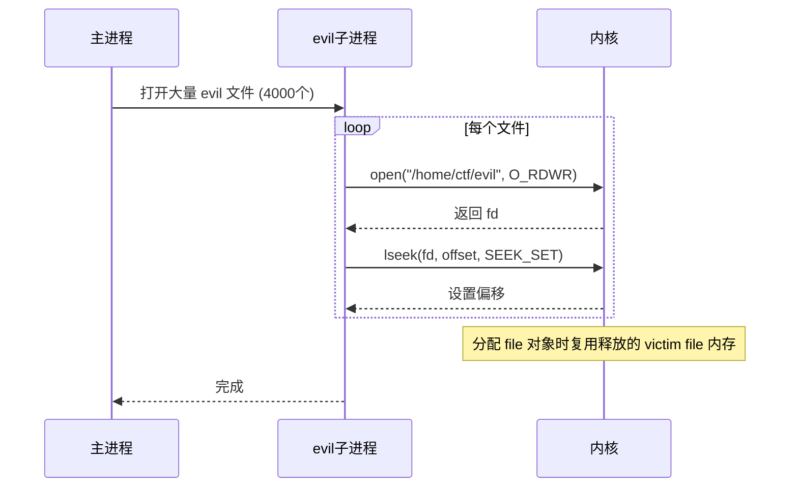
```mermaid
sequenceDiagram
    participant Main as 主进程
    participant Evil as evil子进程
    participant Kernel as 内核

    Main->>Evil: 打开大量 evil 文件 (4000个)
    loop 每个文件
        Evil->>Kernel: open("/home/ctf/evil", O_RDWR)
        Kernel-->>Evil: 返回 fd
        Evil->>Kernel: lseek(fd, offset, SEEK_SET)
        Kernel-->>Evil: 设置偏移
    end
    Note over Kernel: 分配 file 对象时复用释放的 victim file 内存
    Evil-->>Main: 完成
```

### 4-9. 阶段 7：重叠检测

重叠检测阶段的核心任务是识别出哪些 `victim` 文件与哪些 `evil` 文件共享同一个物理 `file` 对象。

**检测原理**：

重叠检测的原理基于 `struct file` 中的 `f_pos` 字段。当多个文件描述符指向同一个物理 `file` 对象时，它们共享同一个 `f_pos` 值。利用这一特性：

- `victim` 文件在打开后从未执行过 `lseek`，其 `f_pos` 初始值为 0。
- `evil` 文件在打开后立即通过 `lseek64()` 设置了一个唯一的非零偏移值。

若某个 `victim` 文件与某个 `evil` 文件在物理内存上重叠，则对 `victim` 文件执行 `lseek(fd, 0, SEEK_CUR)` 时会返回该 `evil` 文件设置的偏移值。通过解析该偏移值（`offset - 1`）可以反推出重叠的 `evil` 文件索引及其所属的 CPU 核心。

**扫描流程**：

```mermaid
sequenceDiagram
    participant Victim as victim子进程
    participant Evil as evil子进程
    participant Kernel as 内核

    Victim->>Kernel: open victim (f_pos=0)
    Evil->>Kernel: open evil + lseek(offset)
    Note over Kernel: 若file对象重叠，共享f_pos
    Victim->>Kernel: lseek(fd, 0, SEEK_CUR)
    Kernel-->>Victim: 返回偏移值
    alt 偏移 > 0
        Victim->>Victim: 判定重叠
        Victim-->>Main: 上报重叠信息
    else 偏移 == 0
        Victim->>Victim: 无重叠
    end
```

每个 `victim` 子进程扫描其持有的所有文件描述符，一旦发现重叠即上报给主进程。由于堆喷是在所有 CPU 核心上并发执行的，通常会有一个或多个 CPU 核心成功命中重叠。该检测方法完全在用户态完成，无需任何内核信息泄露。

### 4-10. 阶段 8：描述符筛选与保留

主进程在收到重叠信息后，通知对应的 `victim` 和 `evil` 子进程关闭所有非重叠的文件描述符，仅保留重叠的一对 `victim_fd` 和 `evil_fd`。

```mermaid
flowchart TD
    A[收到重叠信息] --> B[通知 victim 子进程]
    B --> C[关闭非重叠 victim 描述符]
    C --> D[通知 evil 子进程]
    D --> E[关闭非重叠 evil 描述符]
    E --> F[仅保留重叠的一对]
    F --> G[file->f_count = 1]
```

此时，这两个描述符共享同一个物理 `file` 对象，且该对象的引用计数 `f_count` 为 1。为什么是 1 而不是 2？因为 `f_count` 追踪的是文件对象被引用的次数，而两个描述符指向同一个对象时，它们的引用是合并的——每个描述符的 `close` 操作都会递减同一个 `f_count`，但打开时只会增加一次计数。因此，此时 `f_count = 1`，意味着该对象仅被这两个描述符共同引用一次。

```mermaid
sequenceDiagram
    participant Main as 主进程
    participant Victim as victim子进程
    participant Evil as evil子进程

    Main->>Victim: 发送重叠信息 (victim_idx, evil_idx)
    Victim->>Victim: 关闭所有非重叠 victim fds
    Victim-->>Main: 确认
    Main->>Evil: 发送重叠信息
    Evil->>Evil: 关闭所有非重叠 evil fds
    Evil-->>Main: 确认
    Note over Victim,Evil: 仅保留重叠的 victim_fd 和 evil_fd，f_count=1
```

### 4-11. 阶段 9：凭证置换

凭证置换阶段是整个利用流程的核心，通过多线程协同和引用计数控制，实现从低权限文件对象到高权限文件对象的原子置换。

**时序控制流程**：

```mermaid
sequenceDiagram
    participant Slow as slow_write_thread
    participant UAF as uaf_write_thread
    participant Evil as evil子进程
    participant Victim as victim子进程
    participant Kernel as 内核

    Note over Evil: 此时重叠file->f_count=1
    Evil->>Slow: 打开新文件(新file对象)
    Slow->>Kernel: writev(2GB) 获取inode锁
    Note over Slow: 持有inode锁，阻塞其他写入
    Evil->>UAF: 使用重叠evil_fd执行writev
    UAF->>Kernel: 递增file->f_count (1→2)
    Kernel->>Kernel: writev尝试获取inode锁
    Note over UAF: 被阻塞，等待锁释放
    Evil->>Kernel: close(evil_fd)
    Kernel->>Kernel: file->f_count (2→1)
    Evil->>Victim: 通知关闭victim_fd
    Victim->>Kernel: close(victim_fd)
    Kernel->>Kernel: file->f_count (1→0)
    Note over Kernel: file对象被释放
    Evil->>Kernel: open(/etc/passwd)
    Kernel->>Kernel: 新file对象占据释放内存
    Note over Kernel: 高权限file对象就位
    Slow->>Kernel: writev完成，释放inode锁
    UAF->>Kernel: 获取inode锁
    UAF->>Kernel: writev执行完成
    Note over Kernel: 数据写入目标文件
```

**关键步骤解析**：

1. **慢速写入线程启动**：`slow_write_thread` 打开 `/home/ctf/evil`（与重叠的 `evil` 文件路径相同），由于是新打开，内核会分配一个**全新的 `file` 对象**，与重叠的 `evil` 文件对象不同，仅共享同一个 `inode`。该线程发起超大规模写入（2GB），该写入操作会获取并长时间持有 `inode` 锁，从而阻塞所有其他对该文件的写入尝试。2GB 的数据写入在机械硬盘上可能需要数十秒，在 SSD 上也需要数秒，足以提供足够的窗口期。

2. **UAF 写入线程阻塞**：`uaf_write_thread` 直接使用重叠的 `evil_fd` 执行 `writev`。该操作首先递增重叠 `file` 对象的引用计数（1 → 2），然后尝试获取 `inode` 锁，但由于 `slow` 线程已持有锁，该写入操作被阻塞在内核态，等待锁释放。此时，`uaf_write_thread` 虽然被阻塞，但其对 `file` 对象的引用已通过 `writev` 内部递增，因此该 `file` 对象不会被释放。

3. **依次关闭重叠描述符**：先关闭 `evil_fd`，引用计数从 2 降为 1；再关闭 `victim_fd`，引用计数从 1 降为 0。此时重叠 `file` 对象被释放。值得注意的是，`uaf_write_thread` 虽然被阻塞，但其对 `file` 对象的引用是临时的——它通过文件描述符持有引用，而文件描述符的关闭会同步释放该引用。因此，当 `victim_fd` 关闭后，所有用户态对 `file` 对象的引用均已消失，对象被释放，但其内存仍被 `uaf_write_thread` 的 `writev` 内部指针所引用（该引用在阻塞等待锁时仍有效，但对象已被标记为释放，形成 UAF）。

4. **重新打开高权限文件**：在 `evil` 子进程中立即执行一系列 `open("/etc/passwd", O_RDONLY)` 操作。由于内存分配器倾向于复用最近释放的内存，新分配的高权限 `file` 对象将占据刚才被释放的 `file` 对象所在的内存位置。此时，`uaf_write_thread` 的 `writev` 内部仍保留着指向该内存的指针，但内存内容已替换为高权限 `file` 对象。

5. **写入完成与凭证置换**：`slow_write_thread` 完成 2GB 写入并释放 `inode` 锁。`uaf_write_thread` 获得锁后继续执行其预备的写入操作（写入一行提权数据），此时其持有的文件描述符所指向的内存已被高权限 `file` 对象占据，写入操作实际修改了目标文件的内容。由于 `file` 对象中的 `f_cred` 指向 root 凭证，而该文件的 `inode` 权限允许 root 写入，因此写入操作成功完成。

整个流程的精妙之处在于，`uaf_write_thread` 在权限检查时（在获取锁之前完成）依据的是低权限 `evil` 文件的凭证，但实际写入时，内存对象已被置换为高权限目标文件的 `file` 对象，从而绕过了权限检查。

**凭证置换完成后的能力扩展**：

上述凭证置换流程完成后，利用者获得了一个可写入高权限目标文件的文件描述符。该写入能力并不局限于单一目标，而是可以根据目标系统的具体配置灵活选择提权路径：

- **修改 `/etc/passwd`**：向该文件添加一个具有 root 权限的用户条目（如 `ctf:x:0:0:root:/root:/bin/bash`）。用户认证过程由用户态程序（如 `login`、`su`、`sshd`）通过读取 `/etc/passwd` 和 `/etc/shadow` 完成，而非由内核直接参与。因此，修改 `/etc/passwd` 后，用户态认证程序会依据新条目授予 root 权限。

- **修改 SUID 文件**：若系统中存在 root 所有的 SUID 二进制文件（如 `/bin/su`、`/usr/bin/sudo`），可利用写入能力将该文件内容替换为定制的 ELF 可执行文件。该 ELF 被执行时将派生一个 root shell。此方法不依赖 `/etc/passwd` 格式兼容性，且具有持久性优势——系统重启后篡改依然生效。

- **修改其他系统关键文件**：根据具体场景，还可修改 `/etc/sudoers`（添加无密码 sudo 权限）、`/etc/crontab`（添加计划任务）或 `/root/.ssh/authorized_keys`（添加 SSH 公钥）等。

因此，阶段 9 完成凭证置换后获得的写入能力是一种通用的高权限文件写入原语，可根据目标环境灵活选择最合适的提权路径。

### 4-12. 内核保护机制的应对策略

本利用架构在设计时充分考虑了主流内核保护机制和编译选项的影响，并采取了针对性的应对策略。下表汇总了各项保护机制对本架构的影响程度及应对方式：

| 保护机制                             | 描述                                                                       | 对本架构的影响                                                                                            | 应对策略                                                                                                                   |
| :----------------------------------- | :------------------------------------------------------------------------- | :-------------------------------------------------------------------------------------------------------- | :------------------------------------------------------------------------------------------------------------------------- |
| **KASLR**                            | 内核地址空间布局随机化，随机化内核代码和数据的基址                         | 本架构不依赖任何内核地址信息，无需泄露基址                                                                | 无需特殊处理；所有操作基于用户态可观测的分配器行为，不读取内核符号                                                         |
| **SMEP**                             | 禁止内核执行用户态代码                                                     | 本架构不执行任何用户态代码，仅进行合法系统调用                                                            | 无需绕过；全部操作在内核数据域内完成                                                                                       |
| **SMAP**                             | 禁止内核访问用户态数据                                                     | 本架构不依赖内核主动访问用户态数据作为控制流                                                              | 无需绕过；漏洞触发和数据交换均通过标准系统调用接口                                                                         |
| **KPTI**                             | 内核页表隔离，分离用户态和内核态页表                                       | 本架构不依赖用户态内存映射或跨地址空间操作                                                                | 无影响；所有操作在系统调用上下文中完成                                                                                     |
| **CONFIG_MEMCG / CONFIG_MEMCG_KMEM** | 启用内存控制组及内核内存统计，内核为每个控制组分配独立的 kmalloc-cg-* 缓存 | 该配置将内核对象分配隔离到 per-cgroup 的专用缓存中，但本架构的 Cross-Cache 复用不依赖在同一缓存内精确命中 | 无影响；Cross-Cache 复用技术天然跨越缓存边界，无论对象位于 `kmalloc-*` 还是 `kmalloc-cg-*`，均通过伙伴系统页面回收实现复用 |
| **CONFIG_SLAB_FREELIST_RANDOM**      | SLUB 分配器空闲链表随机化，增加堆喷射精确性难度                            | 使目标页面内空闲槽位的分配顺序不可预测                                                                    | 采用超大规模堆喷（数千个文件对象），以统计学确定性覆盖随机化影响；多 CPU 并发进一步提高命中概率                            |
| **CONFIG_SLAB_FREELIST_HARDENED**    | SLUB 空闲链表指针加密，防止空闲链表被篡改                                  | 本架构不篡改空闲链表指针，仅依赖分配器正常行为                                                            | 无影响；不涉及对空闲链表指针的直接覆写                                                                                     |
| **CONFIG_HARDENED_USERCOPY**         | 强化用户态拷贝检查，防止内核向用户态复制越界数据                           | 本架构不依赖内核向用户态复制敏感数据                                                                      | 无影响；所有数据交换通过标准系统调用参数传递，不触发 copy_to_user 越界                                                     |

从表格可见，本架构对主流防御机制具有较好的穿透力，主要依赖的应对策略可归纳为三类：

1. **无需应对**：针对 KASLR、SMEP、SMAP、KPTI、SLAB_FREELIST_HARDENED、HARDENED_USERCOPY 等，架构本身的设计使其天然免疫。
2. **大规模堆喷**：针对 SLAB_FREELIST_RANDOM，通过超大规模分配（数千个对象）将随机性淹没在统计概率中。
3. **Cross-Cache 复用**：针对 MEMCG/MEMCG_KMEM 带来的 kmalloc-cg-* 缓存隔离，本架构的 Cross-Cache 复用技术不依赖在同一缓存内精确命中，而是通过伙伴系统页面回收实现跨缓存复用，因此这种隔离不对本架构构成阻碍。

### 4-13. 利用条件与局限性

尽管本利用架构具有较高的通用性，其成功实施仍依赖于一系列前置条件，同时也存在固有的技术局限性。

**前置条件**：

| 条件               | 描述                                         | 影响                         |
| :----------------- | :------------------------------------------- | :--------------------------- |
| 漏洞内核版本       | Linux v3.17 ~ v5.19.1                        | 核心依赖，不可绕过           |
| CAP_NET_ADMIN      | 需具备该能力                                 | 用户命名空间默认开启时可获得 |
| 可写文件系统       | 需要创建临时文件并修改目标文件               | 标准 Linux 发行版均满足      |
| SUID 二进制        | 用于触发特权 cred 分配或作为提权跳板（可选） | 大多数系统存在               |
| 堆喷内存           | 每个子进程需要容纳数千个文件描述符           | RLIMIT_NOFILE 需足够高       |
| CONFIG_NET_CLS_ACT | 必须启用流量控制动作支持                     | 主流发行版默认开启           |

**技术局限性**：

1. **文件系统类型依赖**：目标文件的修改最终通过文件系统完成。在只读根文件系统或使用 `dm-verity` 等完整性保护机制时，写入操作可能失败。此外，某些文件系统（如 squashfs）本身为只读，无法修改。

2. **大规模堆喷的资源消耗**：每个文件子进程需要打开数千个文件描述符，对进程资源限制有较高要求。在资源受限的容器环境中，可能无法达到所需的堆喷规模。此外，大量文件打开可能触发系统的 `file-max` 限制，需注意调整。

3. **内核版本差异**：虽然 DirtyCred 本身具有跨版本通用性，但 `cls_route` 的具体实现在不同内核版本中可能存在微调（如结构体大小变化、缓存归属调整），可能需要针对特定版本调整参数（如堆喷数量、meta 对象长度）。

### 4-14. 章节总结

本章基于 DirtyCred 方法论，系统阐述了针对 **CVE-2022-2588** 的完整利用架构，通过十个阶段将 Double Free 原语转化为稳定的权限提升能力。

**技术核心**：本架构的核心在于利用 `kmalloc-256` 与 `filp` 缓存的对象尺寸匹配，通过伙伴系统页面回收实现跨缓存复用，从而将漏洞释放的 `tc_action` 内存重新占据为 `file` 对象。在此基础上，通过 `lseek` 偏移检测实现无信息泄露的重叠判定，通过多阶段管道同步实现跨进程的精确时序控制，通过大规模堆喷对抗随机化机制，最终在 Double Free 提供的精确时间窗口内完成凭证置换。其中，**第一次释放是漏洞代码路径中的正常释放流程**，用于制造悬挂指针；**第二次释放才是触发 Double Free 的核心步骤**，通过悬挂指针非法释放已被重新占用的内存块。

**防御启示**：本架构揭示了内核防护体系中两个值得关注的薄弱环节：

- **凭证与对象的耦合**：`file` 对象直接包含 `f_cred` 凭证指针，且其内存复用未考虑凭证权限等级的隔离，使得跨缓存复用天然具备凭证交换的潜力。若能在对象分配时根据凭证等级隔离内存区域，可从根本上阻断此类利用路径。

- **权限检查的上下文混淆**：权限检查基于当前 `file` 对象的 `f_cred`，而该对象的内存可在权限检查与实际写入之间被替换，形成时间窗口。本架构正是利用了这一窗口——Double Free 将 `file` 对象释放后，在权限检查完成与实际写入之间重新分配高权限 `file` 对象，使得低权限描述符的写入操作指向高权限目标。若能将权限检查与数据写入绑定为原子操作，或引入凭证快照机制，可缓解此类问题。

上述两个问题并非 **CVE-2022-2588** 所独有，而是反映了内核对象管理机制中更深层次的设计惯性。本架构的价值不仅在于对特定漏洞的利用，更在于通过实例验证了 DirtyCred 方法论的通用性，为后续的防御设计提供了参考方向。

### 4-15. 测试结果

<div style="text-align: center; margin: 2rem 0;">
  
</div>

## 5. 利用思路二

### 5-1. 整体架构设计

本章阐述针对 **CVE-2022-2588** 的第二种利用架构。该架构同样基于 DirtyCred 方法论，其与第四章（利用思路一）的核心区别在于**竞争窗口的延长机制**：

- **思路一**：依赖大数据量写入（2GB）持有 `inode` 锁，通过阻塞 UAF 写入线程来创造窗口。2GB 的数据写入即使在高性能存储设备上也需要数百毫秒至数秒，该时长足以完成从对象释放到重新分配的全部操作，因此窗口长度本身是充足的。该方案的主要约束在于对存储设备写入带宽和容量的需求——在无持久化存储或磁盘空间受限的环境中可能无法实施。

- **思路二**：利用 **FUSE（用户态文件系统）** 与 **MMAP** 的组合机制，通过 FUSE 文件的 mmap 映射地址作为 `writev` 的数据源，在读取用户态数据时触发 FUSE 读取回调并挂起请求，使持有 `inode` 锁的 `writev` 被暂停，从而为凭证置换提供任意长且稳定的时间窗口。该方案不依赖存储设备性能，仅需 4KB 的单页内存映射即可实现相同效果，特别适用于无持久化存储或磁盘空间受限的环境。

两种思路在本质上并无优劣之分，而是适用于不同的系统环境和约束条件：思路一适用于具有充足存储空间且对 I/O 扰动不敏感的传统服务器环境；思路二则更适用于容器化环境、无持久化存储的场景，或对系统资源消耗敏感的生产系统。

**多核并发设计的核心考量**：

与第四章相同，本架构采用多子进程分别绑定不同 CPU 核心的设计，其根本原因在于 **RCU 延迟释放机制无法保证对象被释放到申请时所在的 CPU 缓存**。在漏洞触发后，`tc_action` 对象可能被释放到与申请时不同的 CPU 上，若仅在一个 CPU 上执行堆喷，则可能无法捕获到该对象。通过为每个 CPU 核心独立派发堆喷子进程，无论对象最终被释放到哪个 CPU 的缓存中，都有对应的子进程在其上执行堆喷，从而以极高概率完成内存复用。这一设计思路与 **思路一** 一脉相承，是本架构可靠性的重要保障。

**单核兼容性**：单核环境不存在跨 CPU 缓存转移问题，对象分配与释放均在唯一的 CPU 上完成，因此本架构在单核系统中同样可以稳定工作。多子进程设计的本质是应对 RCU 异步释放带来的 per-CPU 缓存不确定性，而非多核依赖。

整个利用流程的总体架构如下：

```mermaid
flowchart TD
    S0["阶段 0: 环境初始化（含 FUSE 设置与 mmap 映射）"]
    S1["阶段 1-8: 同思路一（堆喷、正常释放、文件占据、重叠检测、描述符筛选）"]
    S9["阶段 9: FUSE 延迟读取与凭证置换（核心差异）"]

    S0 --> S1 --> S9
```

各阶段之间的协调关系如下：

```mermaid
sequenceDiagram
    participant Main as 主进程
    participant Vuln as 漏洞子进程
    participant Meta as 堆喷子进程
    participant Victim as victim子进程
    participant Evil as evil子进程
    participant FUSE as FUSE处理程序

    Main->>Main: 初始化 FUSE，创建 mmap 映射
    Main->>Vuln: 创建漏洞对象
    Main->>Meta: 执行堆喷
    Main->>Vuln: 触发第一次释放（正常路径释放）
    Main->>Meta: 释放 meta 对象
    Main->>Victim: 堆喷 victim 文件
    Main->>Vuln: 触发第二次释放（Double Free 触发点）
    Main->>Evil: 堆喷 evil 文件
    Victim->>Victim: lseek 检测重叠
    Victim-->>Main: 返回重叠信息
    Main->>Evil: 启动凭证置换
    Evil->>Evil: 启动 slow_write_thread（持有 inode 锁并触发 FUSE 回调）
    FUSE-->>Evil: 读取请求挂起，窗口打开
    Evil->>Evil: 关闭重叠描述符，替换为高权限文件
    Evil->>FUSE: 恢复 FUSE 读取请求
    FUSE-->>Evil: 回调完成，slow 释放锁，UAF 写入完成
    Evil-->>Main: 完成置换
    Main->>Main: 验证修改结果
```

### 5-2. 共同基础与阶段概述

本架构的前八个阶段（阶段 0 至阶段 8）与第四章完全一致，唯一差异在于阶段 0 中额外增加了 FUSE 子系统的初始化与 mmap 映射创建。以下表格列出了各阶段及其对应章节：

| 阶段   | 名称                             | 对应章节 | 与思路一的差异                       |
| :----- | :------------------------------- | :------- | :----------------------------------- |
| 阶段 0 | 环境初始化                       | 4-2      | 额外增加 FUSE 初始化与 mmap 映射创建 |
| 阶段 1 | 堆喷与漏洞分配                   | 4-3      | 完全相同                             |
| 阶段 2 | 第一次释放（正常路径释放）       | 4-4      | 完全相同                             |
| 阶段 3 | 释放 meta 对象                   | 4-5      | 完全相同                             |
| 阶段 4 | victim 文件堆喷                  | 4-6      | 完全相同                             |
| 阶段 5 | 第二次释放（Double Free 触发点） | 4-7      | 完全相同                             |
| 阶段 6 | evil 文件堆喷                    | 4-8      | 完全相同                             |
| 阶段 7 | 重叠检测                         | 4-9      | 完全相同                             |
| 阶段 8 | 描述符筛选                       | 4-10     | 完全相同                             |

上述阶段的详细技术描述请参考第四章对应小节，本章不再重复展开。

**阶段 0 的额外操作**：相比思路一，阶段 0 增加了 FUSE 子系统的初始化和 mmap 映射创建：

- 调用 `fuse_init()` 初始化 FUSE 框架，建立用户态与内核态 FUSE 的通信通道。
- 调用 `fuse_start()` 启动 FUSE 守护进程，负责处理来自内核的 FUSE 请求。
- 在 FUSE 文件系统中创建一个文件，并通过 `mmap()` 将其映射到进程地址空间中的一个 4KB 页面。该映射地址通过封装函数 `fuse_get_fuse_memory_addr(0)` 获取，后续被用作 `slow_write_thread` 中 `writev` 的 `iov_base`，以触发 FUSE 读取回调。

### 5-3. FUSE 延迟读取机制

本架构与第四章的唯一区别在于阶段 9 的凭证置换方式。思路一通过大数据写入持有 `inode` 锁来阻塞 UAF 写入线程，而思路二通过 **FUSE 与 MMAP 的组合机制** 在用户态拦截内存读取，使内核在执行写入操作时因 FUSE 读取回调而被暂停，从而延长 `inode` 锁的持有时间，创造可任意延长的竞争窗口。

**FUSE 作为延迟机制的优势**：

FUSE 框架提供了一种将内核文件操作请求转发至用户态的标准接口，具有以下特性使其成为理想的延迟窗口创造者：

- **请求可挂起**：FUSE 请求在用户态处理完成前，内核执行被阻塞，且该阻塞不消耗 CPU 资源。
- **延迟可控**：用户态处理程序可精确控制响应时机，从微秒到数分钟均可。
- **标准接口**：FUSE 是内核原生支持的框架，无需额外补丁或内核模块。
- **低资源消耗**：与大数据写入不同，FUSE 延迟机制仅涉及单次内存访问（4KB），几乎不产生 I/O 负载。

**延迟窗口的触发原理**：

本架构与第四章的核心机制相同：`slow_write_thread` 通过写入普通 `evil` 文件来获取并持有该文件的 `inode` 锁，从而阻塞后续 `uaf_write_thread` 对同一 `inode` 的写入请求。不同之处在于，`slow_write_thread` 并不依赖大数据写入来延长锁持有时间，而是通过 **FUSE mmap 映射地址作为数据源**，在 `writev` 读取用户态数据时触发 FUSE 读取回调并挂起，使 `writev` 在执行过程中被暂停，而 `inode` 锁在此期间一直被持有。

具体触发路径如下：

```c
struct iovec iov[1];
iov[0].iov_base = (char *)fuse_get_fuse_memory_addr(0);  /* FUSE 文件 mmap 映射地址 */
iov[0].iov_len = 0x1000;                                 /* 4KB 页面大小 */

ssize_t written = writev(fd, iov, 1);                    /* fd 是普通 evil 文件 */
```

`writev` 系统调用首先获取目标文件（`evil`）的 `inode` 锁，然后尝试从 `iov_base` 指向的用户态地址读取数据并复制到内核缓冲区。由于该地址对应的是 **通过 mmap 映射的 FUSE 文件内存区域**，内核在访问该地址时会触发 **FUSE 文件系统的读取回调**（`fuse_file_read_iter`），将读取请求转发至用户态的 FUSE 处理程序。此时，内核的 `writev` 执行被暂停，但目标 `evil` 文件的 `inode` 锁**仍被该线程持有**，未被释放。

本架构在用户态 FUSE 处理程序中**不立即处理该读取请求**，而是保持请求挂起，形成一个可任意延长的内核暂停窗口。该窗口期间，`evil` 文件的 `inode` 锁一直被 `slow_write_thread` 持有，从而阻塞了所有其他对该文件的写入操作。

```mermaid
flowchart TD
    A["slow_write_thread: writev(fd_evil, iov, 1)"] --> B["获取 evil 文件的 inode 锁"]
    B --> C["尝试读取 iov_base 指向的 FUSE mmap 地址"]
    C --> D["触发 FUSE 读取回调 fuse_file_read_iter"]
    D --> E["请求转发至用户态 FUSE 处理程序"]
    E --> F["处理程序挂起请求"]
    F --> G["内核暂停，inode 锁被持续持有"]
    G --> H["用户态执行对象置换"]
    H --> I["恢复 FUSE 读取请求"]
    I --> J["内核继续执行 writev，完成写入并释放锁"]
```

**三种文件的角色定位**：

理解三种文件的关系是掌握本架构的基础：

| 文件类型        | 路径/位置     | 作用                                                     | 与锁的关系                              |
| :-------------- | :------------ | :------------------------------------------------------- | :-------------------------------------- |
| **FUSE 文件**   | FUSE 挂载点下 | 作为 mmap 映射的数据源，触发 FUSE 读取回调               | 与 inode 锁无关，仅用于延迟数据读取     |
| **evil 文件**   | 普通文件系统  | `slow_write_thread` 和 `uaf_write_thread` 的共同写入目标 | `slow` 持有其 inode 锁以阻塞 `uaf` 写入 |
| **victim 文件** | 普通文件系统  | 低权限文件，与 evil 通过 Cross-Cache 复用共享物理内存    | 无关                                    |

- **FUSE 文件**：仅作为 mmap 映射的后备存储，用于触发延迟回调。其 `file` 对象与 `evil`/`victim` 完全独立。
- **evil 文件**：`slow_write_thread` 通过 `writev` 向该文件写入数据（数据来自 FUSE mmap 地址），`uaf_write_thread` 也向同一文件写入提权条目。两者共享同一 `inode`，因此存在锁竞争。`slow_write_thread` 始终写入的是普通低权限 `evil` 文件，其作用纯粹是持有锁，不承载提权数据。
- **victim 文件**：与 `evil` 文件通过 Cross-Cache 复用共享物理内存，用于重叠检测和对象替换。

**凭证置换时序**：

```mermaid
sequenceDiagram
    participant Evil as evil子进程
    participant Slow as slow_write_thread
    participant UAF as uaf_write_thread
    participant Victim as victim子进程
    participant Kernel as 内核
    participant FUSE as FUSE用户态处理

    Note over Evil: 重叠file->f_count=1

    Evil->>Slow: 启动 slow_write_thread
    Slow->>Kernel: writev(fd_evil, iov_base=FUSE mmap)
    Kernel->>Kernel: 获取 evil 文件的 inode 锁
    Kernel->>Kernel: 访问 FUSE mmap 地址触发读取回调
    Kernel->>FUSE: 转发 FUSE 读取请求
    Note over FUSE: 请求挂起，内核暂停<br/>inode 锁被持续持有

    Evil->>UAF: 启动 uaf_write_thread
    UAF->>Kernel: writev(重叠evil_fd)
    UAF->>Kernel: 递增重叠 file->f_count (1→2)
    Kernel->>Kernel: 尝试获取 evil 文件的 inode 锁
    Note over UAF: 被阻塞，等待锁释放

    Evil->>Kernel: close(evil_fd)
    Kernel->>Kernel: file->f_count (2→1)
    Note over Kernel: evil_fd 关闭，但 UAF 线程仍持有引用
    Evil->>Victim: 通知关闭 victim_fd
    Victim->>Kernel: close(victim_fd)
    Kernel->>Kernel: file->f_count (1→0)
    Note over Kernel: 重叠 file 对象被释放

    Evil->>Kernel: open(/etc/passwd)
    Kernel->>Kernel: 新 file 对象占据释放内存

    Evil->>FUSE: 恢复 FUSE 读取请求（返回数据）
    FUSE-->>Kernel: 完成 FUSE 回调
    Kernel->>Kernel: slow_write_thread 的 writev 继续执行
    Note over Kernel: slow 写入低权限 evil 文件（无害数据），<br/>不是 /etc/passwd
    Kernel->>Kernel: 释放 inode 锁
    UAF->>Kernel: 获得 inode 锁
    UAF->>Kernel: writev 执行写入
    Note over UAF: 写入提权数据<br/>因 file 对象已被替换为 /etc/passwd，<br/>数据实际流入高权限文件
```

**关键步骤解析**：

1. **FUSE 延迟窗口创建**：`slow_write_thread` 调用 `writev` 向普通 `evil` 文件写入，数据源是 FUSE 文件的 mmap 映射地址。`writev` 首先获取 `evil` 文件的 `inode` 锁，然后在读取用户态数据时触发 FUSE 读取回调。用户态 FUSE 处理程序**挂起该请求**，使 `writev` 暂停执行，但 `inode` 锁**持续被持有**，形成竞争窗口。

2. **UAF 写入线程启动与阻塞**：`uaf_write_thread` 尝试向重叠的 `evil_fd` 执行 `writev`。该操作首先递增重叠 `file` 对象的引用计数（`f_count` 从 1 变为 2），然后尝试获取 `evil` 文件的 `inode` 锁。由于 `slow_write_thread` 持有该锁，`uaf_write_thread` 被阻塞，等待锁释放。

3. **依次关闭重叠描述符**：先关闭 `evil_fd`，引用计数从 2 降为 1。由于 `uaf_write_thread` 的 `writev` 内部仍持有对该 `file` 对象的引用（被阻塞等待锁释放），对象并未真正释放。随后关闭 `victim_fd`，引用计数从 1 降为 0，重叠 `file` 对象被释放。此时，FUSE 延迟窗口仍然保持，`inode` 锁仍被 `slow` 线程持有，`uaf_write_thread` 仍被阻塞。

4. **重新打开高权限文件**：在 `evil` 子进程中立即执行一系列 `open("/etc/passwd", O_RDONLY)` 操作。由于内存分配器倾向于复用最近释放的内存，新分配的高权限 `file` 对象将占据刚才被释放的 `file` 对象所在的内存位置。

5. **恢复 FUSE 读取并释放锁**：用户态 FUSE 处理程序恢复挂起的读取请求，向内核返回数据（填充数据，无害内容）。`slow_write_thread` 的 `writev` 继续执行，将读取到的数据写入低权限 `evil` 文件，随后完成写入并释放 `inode` 锁。

6. **UAF 写入完成**：`uaf_write_thread` 获得 `inode` 锁，继续执行其预备的写入操作。此时，其持有的文件描述符所指向的内存已被高权限 `file` 对象（`/etc/passwd`）占据，而 `uaf_write_thread` 的写入缓冲区包含提权条目。因此，写入操作实际修改了 `/etc/passwd` 的内容。

**线程分工总结**：

- **`slow_write_thread`**：写入低权限 `evil` 文件（无害数据），通过 FUSE 延迟机制持有 `inode` 锁，为对象替换创造窗口。它是“锁的持有者”，不承载提权数据。
- **`uaf_write_thread`**：被锁阻塞后等待，在对象替换完成后获得锁并完成写入。它是“提权数据的载体”，其写入缓冲区包含提权条目。

FUSE 延迟机制替代了思路一中的 2GB 大数据写入，以单页 FUSE 回调实现相同的锁持有效果，资源消耗极低。

**与思路一的对比**：

| 对比维度         | 思路一（大数据写入）             | 思路二（FUSE + MMAP）                     |
| :--------------- | :------------------------------- | :---------------------------------------- |
| 锁持有机制       | 大数据写入持有 `inode` 锁        | FUSE 读取回调挂起持有锁的 `writev`        |
| 锁持有线程       | 大数据写入线程                   | `slow_write_thread`（写入普通 evil 文件） |
| 提权数据写入线程 | UAF 写入线程（被锁阻塞后写入）   | UAF 写入线程（被锁阻塞后写入）            |
| 窗口持续时间     | 数百毫秒至数秒（受存储速度影响） | 由用户态控制（任意长度）                  |
| 依赖条件         | 可写的存储设备、足够的磁盘空间   | FUSE 支持（`CONFIG_FUSE_FS`）             |
| 写入数据量       | 2GB                              | 4KB（单页）                               |
| 对系统影响       | 大量 I/O 可能影响系统性能        | 极小资源占用                              |
| 稳定性           | 受存储设备波动影响               | 高度可预测                                |
| 环境适用性       | 适用于有持久化存储的环境         | 适用于容器、无持久化存储等环境            |

**凭证置换完成后的能力扩展**：

与思路一相同，完成凭证置换后获得的写入能力可灵活选择提权路径：

- **修改 `/etc/passwd`**：添加 root 权限用户条目。
- **修改 SUID 文件**：替换为定制的 ELF 可执行文件，派生 root shell。
- **修改其他系统关键文件**：如 `/etc/sudoers`、`/etc/crontab`、`/root/.ssh/authorized_keys` 等。

### 5-4. 内核保护机制的应对策略

本架构在设计时充分考虑了主流内核保护机制和编译选项的影响。由于前八个阶段与思路一完全一致，保护机制的应对策略也基本相同。唯一需要额外关注的是 FUSE 相关的内核配置。

下表汇总了各项保护机制对本架构的影响程度及应对方式：

| 保护机制                             | 描述                                                                       | 对本架构的影响                                                                                            | 应对策略                                                                                                                   |
| :----------------------------------- | :------------------------------------------------------------------------- | :-------------------------------------------------------------------------------------------------------- | :------------------------------------------------------------------------------------------------------------------------- |
| **KASLR**                            | 内核地址空间布局随机化，随机化内核代码和数据的基址                         | 本架构不依赖任何内核地址信息，无需泄露基址                                                                | 无需特殊处理；所有操作基于用户态可观测的分配器行为，不读取内核符号                                                         |
| **SMEP**                             | 禁止内核执行用户态代码                                                     | 本架构不执行任何用户态代码，仅进行合法系统调用                                                            | 无需绕过；全部操作在内核数据域内完成                                                                                       |
| **SMAP**                             | 禁止内核访问用户态数据                                                     | 本架构不依赖内核主动访问用户态数据作为控制流                                                              | 无需绕过；漏洞触发和数据交换均通过标准系统调用接口                                                                         |
| **KPTI**                             | 内核页表隔离，分离用户态和内核态页表                                       | 本架构不依赖用户态内存映射或跨地址空间操作                                                                | 无影响；所有操作在系统调用上下文中完成                                                                                     |
| **CONFIG_MEMCG / CONFIG_MEMCG_KMEM** | 启用内存控制组及内核内存统计，内核为每个控制组分配独立的 kmalloc-cg-* 缓存 | 该配置将内核对象分配隔离到 per-cgroup 的专用缓存中，但本架构的 Cross-Cache 复用不依赖在同一缓存内精确命中 | 无影响；Cross-Cache 复用技术天然跨越缓存边界，无论对象位于 `kmalloc-*` 还是 `kmalloc-cg-*`，均通过伙伴系统页面回收实现复用 |
| **CONFIG_FUSE_FS**                   | 启用 FUSE 文件系统支持                                                     | 若未启用，本架构不可用                                                                                    | 需确认目标内核已启用该选项；主流发行版默认开启                                                                             |
| **CONFIG_SLAB_FREELIST_RANDOM**      | SLUB 分配器空闲链表随机化，增加堆喷射精确性难度                            | 使目标页面内空闲槽位的分配顺序不可预测                                                                    | 采用超大规模堆喷（数千个文件对象），以统计学确定性覆盖随机化影响；多 CPU 并发进一步提高命中概率                            |
| **CONFIG_SLAB_FREELIST_HARDENED**    | SLUB 空闲链表指针加密，防止空闲链表被篡改                                  | 本架构不篡改空闲链表指针，仅依赖分配器正常行为                                                            | 无影响；不涉及对空闲链表指针的直接覆写                                                                                     |
| **CONFIG_HARDENED_USERCOPY**         | 强化用户态拷贝检查，防止内核向用户态复制越界数据                           | 本架构不依赖内核向用户态复制敏感数据                                                                      | 无影响；所有数据交换通过标准系统调用参数传递，不触发 copy_to_user 越界                                                     |

从表格可见，本架构对主流防御机制具有较好的穿透力，主要依赖的应对策略可归纳为三类：

1. **无需应对**：针对 KASLR、SMEP、SMAP、KPTI、SLAB_FREELIST_HARDENED、HARDENED_USERCOPY 等，架构本身的设计使其天然免疫。
2. **大规模堆喷**：针对 SLAB_FREELIST_RANDOM，通过超大规模分配（数千个对象）将随机性淹没在统计概率中。
3. **Cross-Cache 复用**：针对 MEMCG/MEMCG_KMEM 带来的 kmalloc-cg-* 缓存隔离，通过伙伴系统页面回收实现跨缓存复用。

在实际部署前，建议通过检查 `/proc/filesystems` 确认 FUSE 文件系统是否可用，以及通过 `which fusermount` 或 `which fusermount3` 确认用户态 FUSE 工具是否可执行。

### 5-5. 利用条件与局限性

尽管本利用架构具有较高的通用性，其成功实施仍依赖于一系列前置条件，同时也存在固有的技术局限性。

**前置条件**：

| 条件               | 描述                                                                 | 影响                         |
| :----------------- | :------------------------------------------------------------------- | :--------------------------- |
| 漏洞内核版本       | Linux v3.17 ~ v5.19.1                                                | 核心依赖，不可绕过           |
| CAP_NET_ADMIN      | 需具备该能力                                                         | 用户命名空间默认开启时可获得 |
| 可写文件系统       | 需要创建临时文件并修改目标文件                                       | 标准 Linux 发行版均满足      |
| SUID 二进制        | 用于触发特权 cred 分配或作为提权跳板（可选）                         | 大多数系统存在               |
| 堆喷内存           | 每个子进程需要容纳数千个文件描述符                                   | RLIMIT_NOFILE 需足够高       |
| CONFIG_NET_CLS_ACT | 必须启用流量控制动作支持                                             | 主流发行版默认开启           |
| CONFIG_FUSE_FS     | 必须启用 FUSE 文件系统支持                                           | 主流发行版默认开启           |
| FUSE 挂载权限      | 需要 `/dev/fuse` 设备可访问且 `fusermount` 或 `fusermount3` 工具可用 | 通常允许，需提前验证         |

**技术局限性**：

1. **FUSE 框架依赖性**：本架构依赖 FUSE 文件系统支持。在未配置 `CONFIG_FUSE_FS` 的内核上无法使用。需提前验证目标内核的 FUSE 支持情况。可通过检查 `/proc/filesystems` 中是否包含 `fuseblk` 或 `fuse` 来确认。

2. **FUSE 挂载权限限制**：FUSE 挂载通常依赖于 `/dev/fuse` 设备的访问权限。在大多数发行版中，该设备允许非特权用户通过 `fusermount` 或 `fusermount3` 工具进行挂载（该工具通常设置了 SUID 位），且用户命名空间可提供 `CAP_SYS_ADMIN` 以绕过传统权限检查。但在某些容器环境或沙箱中，若 `/dev/fuse` 设备不可用、`fusermount` 或 `fusermount3` 工具缺失或用户命名空间被禁用，FUSE 挂载可能失败。需提前评估环境兼容性。

3. **文件系统类型依赖**：目标文件的修改最终通过文件系统完成。在只读根文件系统或使用 `dm-verity` 等完整性保护机制时，写入操作可能失败。此外，某些文件系统（如 squashfs）本身为只读，无法修改。建议优先选择可写的目标文件系统进行操作。

4. **大规模堆喷的资源消耗**：每个文件子进程需要打开数千个文件描述符，对进程资源限制有较高要求。在资源受限的容器环境中，可能无法达到所需的堆喷规模。此外，大量文件打开可能触发系统的 `file-max` 限制，需注意调整。可通过检查 `/proc/sys/fs/file-max` 确认系统上限。

5. **内核版本差异**：虽然 DirtyCred 本身具有跨版本通用性，但 `cls_route` 的具体实现在不同内核版本中可能存在微调（如结构体大小变化、缓存归属调整），可能需要针对特定版本调整参数（如堆喷数量、meta 对象长度）。建议在实际部署前进行充分的版本兼容性测试。

6. **FUSE 响应时序**：虽然 FUSE 延迟窗口可由用户态任意控制，但若用户态处理程序响应过慢，可能触发内核的 hung task 检测机制，导致内核 panic。实际实现中需注意控制延迟时长，通常数秒即可满足需求，无需过度延长。

### 5-6. 章节总结

本章介绍了基于 FUSE 与 MMAP 组合延迟机制的 DirtyCred 利用架构，与第四章的大数据写入方式相比，FUSE 方案具有以下显著优势：

- **窗口稳定性**：提供可任意延长且高度确定的竞争窗口，不受存储设备性能波动影响。
- **资源效率**：仅需 4KB 的单页内存映射，无需 2GB 的大数据写入，对系统影响极小。
- **环境适应性**：在容器环境、无持久化存储环境、高速 SSD 环境中均能稳定工作。
- **可重复性**：用户态 FUSE 处理程序精确控制延迟时长，成功率更高。

前八个阶段与第四章完全相同，仅在阶段 9 采用不同的延迟原语，这使得读者可以清晰对比两种方案的优劣与适用场景。两种思路并非互斥关系——在实际利用中可根据目标环境的 FUSE 支持情况、存储设备类型和系统负载特征灵活选择。当 FUSE 可用时，思路二通常是更优选择；当 FUSE 不可用或被限制时，思路一可作为可靠的备选方案。

本架构充分展示了 DirtyCred 方法论在竞争窗口创造方面的灵活性——既可以依赖文件系统锁和存储设备特性，也可以利用 FUSE 用户态框架实现任意长延迟。这种多样性进一步印证了 DirtyCred 的通用性和适应能力，使其能够在不同的系统配置和环境下灵活选择最优路径。

从防御视角看，本架构再次验证了第四章总结的两个薄弱环节——凭证与对象的耦合、权限检查的上下文混淆——是内核防护体系中需要系统性加固的关键点。FUSE 方案虽然利用了合法内核接口，但其本质仍然是操纵对象生命周期和内存复用的数据流操作，这对传统控制流完整性保护提出了新的挑战。防御方应关注的对象不是某种具体的延迟机制，而是凭证检查与数据写入之间的时间窗口能否被利用——无论这个窗口是通过 FUSE、用户态缺页还是文件系统锁创造的。

### 5-7. 测试结果

<div style="text-align: center; margin: 2rem 0;">
  
</div>

## 6. 利用思路三

### 6-1. 整体架构设计

本章阐述针对 **CVE-2022-2588** 的第三种利用架构。该架构与思路一、二的核心区别在于**目标对象与利用路径**：

- **思路一与思路二**：通过文件对象（`file`）的凭证交换实现权限提升，依赖进程凭证的置换。
- **思路三**：利用内核管道（pipe）机制和页面缓存（page cache）的特性，通过操纵 `pipe_buffer` 结构体中的标志位，将只读文件页变为可写，从而直接修改只读文件的内容。该方法本质上是 **“类 Dirty Pipe”** 的利用方式。

三种思路共享同一个漏洞触发路径——通过两次替换操作制造 Double Free 条件，但在如何利用该条件达成权限提升上采用了不同的技术路线。思路三选择了一条不依赖文件描述符凭证交换的路径，而是通过操纵内核管道缓冲区与消息队列的内存布局，直接对文件页缓存进行写操作。

**多核并发设计的核心考量**：

与之前思路相同，本架构采用多子进程分别绑定不同 CPU 核心的设计，以应对 RCU 延迟释放导致的 per-CPU 缓存不确定性。在漏洞触发后，`tc_action` 对象可能被释放到与申请时不同的 CPU 上，若仅在一个 CPU 上执行堆喷，则可能无法捕获到该对象。通过为每个 CPU 核心独立派发堆喷子进程，无论对象最终被释放到哪个 CPU 的缓存中，都有对应的子进程在其上执行堆喷，从而以极高概率完成内存复用。

**单核兼容性**：单核环境不存在跨 CPU 缓存转移问题，对象分配与释放均在唯一的 CPU 上完成，因此本架构在单核系统中同样可以稳定工作。多子进程设计的本质是应对 RCU 异步释放带来的 per-CPU 缓存不确定性，而非多核依赖。

整个利用流程的总体架构如下：

```mermaid
flowchart TD
    S0["阶段 0: 环境初始化"]
    S1["阶段 1-3: 堆喷、正常释放与 meta 释放"]
    S4["阶段 4: 喷洒 victim msg_msg"]
    S5["阶段 5: 第二次释放（Double Free）"]
    S6["阶段 6: 喷洒 evil pipe_buffer"]
    S7["阶段 7: 检测重叠"]
    S8["阶段 8: 修改 pipe_buffer flags"]
    S9["阶段 9: 写入恶意数据"]

    S0 --> S1 --> S4 --> S5 --> S6 --> S7 --> S8 --> S9
```

各阶段之间的协调关系如下：

```mermaid
sequenceDiagram
    participant Main as 主进程
    participant Vuln as 漏洞子进程
    participant Meta as 堆喷子进程
    participant Victim as victim子进程(msg_msg)
    participant Evil as evil子进程(pipe)

    Main->>Victim: 创建消息队列
    Main->>Evil: 创建管道并 splice 只读文件页
    Main->>Vuln: 创建漏洞对象
    Main->>Meta: 执行堆喷
    Main->>Vuln: 触发第一次释放（正常路径释放）
    Main->>Meta: 释放 meta 对象
    Main->>Victim: 喷洒 msg_msg
    Main->>Vuln: 触发第二次释放（Double Free）
    Main->>Evil: 喷洒 pipe_buffer
    Victim->>Victim: 扫描重叠对象
    Victim->>Victim: 修改 pipe_buffer flags
    Victim-->>Main: 完成修改
    Main->>Evil: 写入恶意数据
    Evil-->>Main: 写入完成
    Main->>Main: 验证文件修改
```

### 6-2. 共同基础

本架构的阶段 0 至阶段 3 与思路一、二在核心逻辑上一致，但阶段 0 中额外包含了 victim 和 evil 子进程的准备工作。以下表格列出了各阶段及其与前面思路的差异：

| 阶段   | 名称                       | 与思路一/二的差异                                                |
| :----- | :------------------------- | :--------------------------------------------------------------- |
| 阶段 0 | 环境初始化                 | 额外增加 victim 子进程创建消息队列、evil 子进程创建管道并 splice |
| 阶段 1 | 堆喷与漏洞分配             | 完全相同                                                         |
| 阶段 2 | 第一次释放（正常路径释放） | 完全相同                                                         |
| 阶段 3 | 释放 meta 对象             | 完全相同                                                         |

阶段 0 的额外准备工作：

1. **victim 子进程**：创建大量消息队列（`msgget`），此时仅创建队列标识符，尚未发送实际消息。这些队列将在阶段 4 中被用于堆喷 `msg_msg` 对象。消息队列的创建在利用流程的早期完成，有助于在内存中预先建立布局，减少后续阶段的操作延迟。

2. **evil 子进程**：创建大量管道，并通过 `splice()` 将只读文件（`/etc/passwd`）的物理页映射到每个管道中。此时 `pipe_buffer` 数组位于 `kmalloc-cg-1k` 缓存。`splice` 操作将文件页与管道缓冲区绑定，使得后续通过管道写入时能够直接修改文件页缓存。

阶段 1 至阶段 3 的具体技术细节参见第 4 章 4-3 至 4-5 节——包括通过 `basic` 过滤器的 `meta` 扩展匹配进行堆喷、第一次替换触发正常释放、以及销毁 meta 对象使物理页面返回伙伴系统。本章不再重复展开。

### 6-3. 核心机制

本架构与前面思路的核心差异从阶段 4 开始体现：不再使用文件对象（`file`）占据释放页面，而是转向使用 **System V 消息队列（`msg_msg`）** 和 **管道缓冲区（`pipe_buffer`）** 进行内存复用。

**关键对象与缓存**：

| 对象类型                 | 分配位置       | 大小           | 说明                                       |
| :----------------------- | :------------- | :------------- | :----------------------------------------- |
| `msg_msg` 主对象         | kmalloc-cg-4k  | 4KB（order-3） | 消息主数据，向 buddy 系统申请 order-3 页面 |
| `msg_msgseg` 次级对象    | kmalloc-cg-192 | ~192 字节      | 消息次级数据，向 order-0 页面申请          |
| `pipe_buffer` 初始对象   | kmalloc-cg-1k  | ~1KB           | 管道创建时的默认缓冲区大小                 |
| `pipe_buffer` 调整后对象 | kmalloc-cg-192 | ~192 字节      | 通过 `fcntl(F_SETPIPE_SZ)` 重新分配后      |

**利用的核心逻辑**（6 个步骤）：

```mermaid
flowchart TD
    A[步骤1: 第一次释放制造 order-0 空闲页] --> B[步骤2: msg_msgseg 占据空闲页]
    B --> C[步骤3: 第二次释放 Double Free 释放 msg_msgseg]
    C --> D[步骤4: pipe_buffer 占据空洞]
    D --> E[步骤5: 扫描并修改 pipe_buffer flags]
    E --> F[步骤6: 写入管道修改文件页缓存]
```

1. 通过**第一次释放（正常路径释放）**和 meta 释放制造 order-0 空闲页（同思路一、二）。
2. 用 `msg_msg` 的次级对象（kmalloc-cg-192）占据该空闲页。
3. **第二次释放（Double Free 触发点）**释放该 `msg_msgseg` 对象，形成悬垂指针。
4. 用 `pipe_buffer` 数组（调整大小后位于 kmalloc-cg-192）占据该空洞。
5. 通过 `msg_msg` 扫描并修改重叠的 `pipe_buffer` 标志位，使只读页变为可写。
6. 向管道写入恶意数据，修改文件页缓存。

### 6-4. 阶段 4：喷洒 victim msg_msg

在第一次释放完成后，victim 子进程向预先创建的消息队列发送精心构造的消息。每个消息由一个 **4KB 主对象（kmalloc-cg-4k）** 和一个 **~192 字节次级对象（kmalloc-cg-192）** 组成。

- 主对象向 buddy 系统申请 order-3 页面，用于承载消息的主体数据。
- 次级对象向 order-0 页面申请，用于承载超出主对象容量的剩余数据。

**关键**：释放的 order-0 页面被 `msg_msgseg` 次级对象占据，为后续与 `pipe_buffer` 的重叠创造了条件。这种主-次级对象的设计使得消息队列能够在不同尺寸的缓存中灵活分配内存，恰好满足本架构跨缓存复用的需求。

```mermaid
flowchart TD
    A[第一次释放后 order-0 空闲页] --> B[msgsnd 发送消息]
    B --> C[msg_msgseg 次级对象占据空闲页]
    C --> D[order-0 页面被 msg_msgseg 占据]
```

### 6-5. 阶段 5：第二次释放（Double Free）

此阶段是触发 Double Free 漏洞的核心步骤。由于第一次释放（正常路径释放）已在哈希表中留下了悬垂指针，此时执行**第二次替换** `handle = 0` 的 `route4_filter`。内核通过该悬垂指针找到已被 `msg_msgseg` 占用的内存块，并将其再次加入释放队列。

该操作导致一个正在被消息队列使用的 `msg_msgseg` 对象被非法释放，形成新的悬垂指针指向 `kmalloc-cg-192` 缓存中的空闲对象。**此即 Double Free 的实质——同一块物理内存因悬垂指针被错误地释放了两次。**

```mermaid
flowchart TD
    A[第二次替换同一句柄] --> B[通过悬垂指针找到已占用的 msg_msgseg]
    B --> C[msg_msgseg 被再次加入释放队列]
    C --> D[msg_msgseg 被非法释放]
    D --> E[Double Free 发生，形成新的悬垂指针]
```

### 6-6. 阶段 6：喷洒 evil pipe_buffer

evil 子进程在阶段 0 已预先创建管道并通过 `splice()` 将只读文件页映射到管道中，此时 `pipe_buffer` 数组位于 `kmalloc-cg-1k` 缓存。这里的 `pipe_buffer` 数组是一个结构体数组，每个元素描述一个管道缓冲区页的状态，包括指向物理页面的指针、当前偏移量、数据长度和标志位。

**关键操作**：调用 `fcntl(pipe_fds[i][0], F_SETPIPE_SZ, 0x1000 * 4)` 调整管道缓冲区大小，内核会执行以下操作：

1. 释放原有的 `kmalloc-cg-1k` 数组。
2. 根据新大小重新计算所需的缓冲区数量，分配一个位于 **`kmalloc-cg-192`** 的 `pipe_buffer` 数组。
3. 将原有数组中的数据（包括文件页引用、偏移、长度和标志）**复制到新的数组中**。

由于内存分配器倾向于复用最近释放的内存，新的 `pipe_buffer` 数组将占据之前被 Double Free 释放的 `msg_msgseg` 位置，与悬垂指针形成重叠。

`pipe_buffer` 结构中的关键字段包括：

- `page`：指向物理页面的指针（此处指向 `/etc/passwd` 的页缓存页）。
- `offset`：数据在页内的起始偏移。
- `len`：有效数据长度。
- `flags`：控制缓冲区行为的标志位，其中 `PIPE_BUF_FLAG_CAN_MERGE` 决定该页是否允许与后续写入合并。

```mermaid
flowchart TD
    A[pipe 创建时位于 kmalloc-cg-1k] --> B[fcntl F_SETPIPE_SZ]
    B --> C[释放旧数组，分配 kmalloc-cg-192 新数组]
    C --> D[新数组占据 Double Free 释放的 msg_msgseg 位置]
    D --> E[pipe_buffer 与悬垂指针重叠]
```

### 6-7. 阶段 7：检测重叠

使用 `msgrcv(MSG_COPY | IPC_NOWAIT)` 读取消息队列中的消息。`MSG_COPY` 标志允许读取消息而不从队列中移除它，因此不会释放 `msg_msg` 对象；`IPC_NOWAIT` 标志使操作在无消息时立即返回而非阻塞。

通过扫描消息数据中的模式（如内核地址特征 `> page_offset_base`），可以定位到重叠的 `pipe_buffer` 结构。具体而言，`msg_msgseg` 的数据区中会包含 `pipe_buffer` 结构的内容，其中 `page` 字段指向的地址通常落在内核堆地址范围内，可作为识别标志。

```mermaid
sequenceDiagram
    participant Victim as victim子进程
    participant Kernel as 内核

    Victim->>Kernel: msgrcv(MSG_COPY | IPC_NOWAIT)
    Kernel-->>Victim: 返回消息数据（不释放对象）
    Victim->>Victim: 扫描数据，定位 pipe_buffer
    alt 找到重叠对象
        Victim->>Victim: 记录目标消息队列和偏移
    else 未找到
        Victim->>Victim: 继续扫描下一个队列
    end
```

### 6-8. 阶段 8：修改 pipe_buffer flags

定位到目标消息队列后，使用 `msgrcv()`（无 `MSG_COPY` 标志）释放该消息，从而释放其占用的 `msg_msgseg` 次级对象。此时该内存块已不再被消息队列使用，但 `pipe_buffer` 数组仍占据该位置。

紧接着使用 `msgsnd` 发送伪造的消息数据，覆盖原来 `msg_msgseg` 的位置。由于该位置现在被 `pipe_buffer` 数组占用，伪造的消息数据实际上覆盖了 `pipe_buffer` 结构。

将伪造的 `pipe_buffer` 的：

- `offset` 设置为 0（从页起始位置写入）
- `len` 设置为 0（清空原有数据）
- `flags` 设置为 `PIPE_BUF_FLAG_CAN_MERGE`（允许与后续写入合并）

使得该管道页变为可写——即使它引用的是只读文件页，内核在后续写入时也会认为该页允许修改。

```mermaid
sequenceDiagram
    participant Victim as victim子进程
    participant Kernel as 内核

    Victim->>Kernel: msgrcv(目标队列) 释放 msg_msgseg
    Kernel-->>Victim: 释放完成
    Victim->>Kernel: msgsnd(伪造数据)
    Note over Kernel: 伪造数据覆盖 pipe_buffer 结构
    Victim->>Victim: 设置 offset=0, len=0, flags=CAN_MERGE
    Note over Kernel: 只读文件页变为可写
```

### 6-9. 阶段 9：写入恶意数据

向该管道写入恶意条目（如 `/etc/passwd` 的新用户行 `ctf:x:0:0:root:/home:/bin/sh`），由于页缓存已被标记为可写，写入会直接修改文件页缓存，最终通过内核的页回写机制同步到底层文件。

完成写入后，通过 `sync` 或 `fsync` 强制将脏页写回磁盘，然后验证 `/etc/passwd` 的修改结果，并通过 `su - ctf` 获得 root shell。

**写入能力扩展**：

与思路一、二类似，本架构获得的页缓存写入能力并不局限于 `/etc/passwd`，而是可以作用于任意通过 `splice()` 映射到管道的只读文件。具体而言，在阶段 0 中，evil 子进程通过 `splice(victim_fd, &offset, pipe_fds[i][1], NULL, 1, 0)` 将目标文件的一页映射到管道缓冲区，该文件页的引用被保存在 `pipe_buffer` 结构中。因此，通过操纵 `pipe_buffer` 标志位使其变为可写后，后续的管道写入实际上修改的是该目标文件的页缓存。

基于这一能力，可以选择以下提权路径：

- **修改 `/etc/passwd`**：向该文件添加具有 root 权限的用户条目（如 `ctf:x:0:0:root:/home:/bin/sh`）。用户认证过程由用户态程序（如 `login`、`su`、`sshd`）通过读取 `/etc/passwd` 完成，添加的条目可直接生效。

- **修改 SUID 文件**：若系统中存在 root 所有的 SUID 二进制文件（如 `/bin/su`、`/usr/bin/sudo`、`/bin/mount` 等），可将该文件内容替换为定制的 ELF 可执行文件。该 ELF 被执行时将派生一个 root shell。此方法不依赖 `/etc/passwd` 的格式兼容性，且具有持久性优势——系统重启后篡改依然生效。

- **修改其他系统关键文件**：根据具体场景，还可修改 `/etc/sudoers`（添加无密码 sudo 权限）、`/etc/crontab`（添加计划任务）或 `/root/.ssh/authorized_keys`（添加 SSH 公钥）等。

与思路一、二不同，本架构的写入能力直接作用于页缓存，而非通过文件描述符的凭证交换。这意味着它不依赖 `file` 对象的 `f_cred` 置换，因此不受文件描述符引用计数和权限检查时序的复杂影响。但同时，它要求目标文件必须可读（以便通过 `splice` 映射），且在写入后需要等待页缓存回写到磁盘才能持久生效。

**与 Dirty Pipe（CVE-2022-0847）的关系**：

Dirty Pipe 漏洞利用的是内核中 `pipe_buffer` 标志位处理不当，允许普通用户将只读文件页变为可写。本架构并非依赖该漏洞本身（因为目标内核已针对 Dirty Pipe 进行了修复），而是利用 Double Free 漏洞模拟出了类似的效果——通过内存复用，将一个恶意的 `pipe_buffer` 放置在受控位置，并修改其标志位，从而达成同样的写能力。这种方法的巧妙之处在于，它不需要内核存在特定的逻辑缺陷，而是利用内存管理机制的固有行为来构造所需的条件。“类 Dirty Pipe”的命名正是为了强调这一技术上的相似性——两者最终都实现了对只读页缓存的写入，但触发路径和依赖的漏洞类型截然不同。

### 6-10. 内核保护机制的应对策略

本架构对主流内核防护机制的应对策略与思路一类似，主要差异在于依赖的对象类型不同。

| 保护机制                             | 描述                               | 对本架构的影响                                                            | 应对策略                                                            |
| :----------------------------------- | :--------------------------------- | :------------------------------------------------------------------------ | :------------------------------------------------------------------ |
| **KASLR**                            | 内核地址布局随机化                 | 本架构不依赖任何内核地址泄露                                              | 无需特殊处理                                                        |
| **SMEP/SMAP**                        | 用户态执行/访问保护                | 不执行用户态代码，仅系统调用操作                                          | 无影响                                                              |
| **KPTI**                             | 页表隔离                           | 不依赖跨地址空间操作                                                      | 无影响                                                              |
| **CONFIG_MEMCG / CONFIG_MEMCG_KMEM** | 内存控制组隔离，为每组分配独立缓存 | `msg_msg` 与 `pipe_buffer` 本身分配于 `kmalloc-cg-*` 缓存，不受该配置影响 | 无影响；本架构的 Cross-Cache 复用已天然适配 `kmalloc-cg-*` 缓存体系 |
| **CONFIG_SLAB_FREELIST_RANDOM**      | 空闲链表随机化                     | 通过大量喷洒使随机化影响可忽略                                            | 大规模喷洒确保命中                                                  |
| **CONFIG_SLAB_FREELIST_HARDENED**    | 空闲链表加密                       | 不篡改空闲链表，仅利用分配器正常行为                                      | 无影响                                                              |
| **CONFIG_HARDENED_USERCOPY**         | 用户态复制检查                     | 不涉及内核向用户态复制敏感数据                                            | 无影响                                                              |

### 6-11. 利用条件与局限性

**前置条件**：

| 条件           | 描述                          | 影响                         |
| :------------- | :---------------------------- | :--------------------------- |
| 漏洞内核版本   | Linux v3.17 ~ v5.19.1         | 核心依赖                     |
| CAP_NET_ADMIN  | 需具备该能力                  | 用户命名空间默认开启时可获得 |
| 可读的目标文件 | 如 `/etc/passwd` 或 SUID 文件 | 需要可读权限                 |
| 消息队列支持   | `CONFIG_SYSVIPC` 需启用       | 主流发行版默认开启           |
| 管道支持       | `CONFIG_PIPE` 需启用          | 内核标配                     |
| 堆喷资源       | 需要大量消息队列和管道描述符  | RLIMIT_NOFILE 需足够高       |

**技术局限性**：

1. **文件系统写回延迟**：修改页缓存后，需要等待内核将脏页写回磁盘。通常通过 `sync` 或 `fsync` 可强制写回。

2. **目标文件权限**：本方法修改的是页缓存，最终会写入文件。若文件系统为只读挂载或使用了完整性保护（如 `dm-verity`），则写入可能失败。

### 6-12. 章节总结

本章介绍的第三种利用架构结合了 Double Free 漏洞与“类 Dirty Pipe”技术，通过操纵 `msg_msg` 和 `pipe_buffer` 的内存布局，将只读文件页变为可写，最终实现对特权文件的篡改。与思路一、二不同，本方法不依赖文件描述符的凭证交换，而是直接作用于页缓存，在技术路径上与 DirtyCred 方法论存在根本差异——思路一和思路二属于凭证交换类利用，而思路三属于页缓存篡改类利用，两者共享的仅仅是同一个漏洞触发路径（Double Free），而非相同的利用方法论。

本架构的优势在于：

- 不需要文件描述符的凭证交换，因此不受 `file` 对象引用计数复杂时序的影响。
- 利用管道机制，写入操作相对简单，不需要长时间持有锁。
- 可以修改任意只读文件，不限于 `/etc/passwd`，同样可修改 SUID 文件（如 `/bin/su`、`/usr/bin/sudo`）或其他系统关键文件。

从技术路径的视角看，三种思路虽然共享相同的 Double Free 触发路径，但在如何利用该漏洞达成权限提升目标上采用了截然不同的策略——思路一和思路二通过凭证交换实现权限转移，本架构则通过页缓存写实现对文件的直接篡改。这种多样性使得安全防御方需要从更系统的角度审视内核对象生命周期管理、内存复用隔离以及页缓存权限控制等多个层面。

局限性则主要体现在对象缓存匹配的精确性和资源消耗上。总体而言，本架构提供了一种不同于 DirtyCred 方法论的利用路径——从 Double Free 漏洞通向特权文件写入，为内核安全研究提供了新的视角。

从防御视角看，本架构再次强调了内核对象生命周期管理和缓存隔离的重要性。若能加强对 `pipe_buffer` 标志位的合法性检查，可有效阻止此类利用。此外，对页缓存写入权限的细粒度管理也是值得关注的加固方向。

### 6-13. 测试结果

<div style="text-align: center; margin: 2rem 0;">
  
</div>

## 7. 漏洞修复

### 7-1. 修复补丁概述

针对 **CVE-2022-2588** 的修复补丁于 2022 年 8 月 9 日由 Thadeu Lima de Souza Cascardo（Canonical）提交，并于次日由 Jakub Kicinski 合入主线内核。补丁的 commit ID 为 `9ad36309e2719a884f946678e0296be10f0bb4c1`，对应的内核版本为 **v5.19.2**。

根据补丁的 commit 信息，该漏洞是在 **v3.17** 通过提交 `1109c00547fc`（“net: sched: RCU cls_route”）引入的。在 v3.17 之前，`cls_route` 替换过滤器时如果已存在旧过滤器，内核会**复用旧对象**而非分配新对象，因此不会触发释放路径，缺陷代码虽然存在但不可触发。v3.17 引入 RCU 机制后，替换逻辑变更为**无条件分配新对象**，释放旧对象的路径被激活，缺陷代码才转变为可利用的 UAF/Double Free 漏洞。该漏洞在 Linux 内核中存在了约 **8 年**（v3.17 ~ v5.19.1 之前的版本），直到 2022 年才被研究人员发现并修复。

西北大学研究人员 Zhenpeng Lin 与 Trend Micro 的 Zero Day Initiative 合作发现了该漏洞，并将其报告为 ZDI-CAN-17440。oss-security 邮件列表于 2022 年 8 月 9 日发布了安全公告。

修复补丁位于 `net/sched/cls_route.c` 文件的 `route4_change()` 函数中，仅涉及一行代码的变更——移除条件判断中的 `fold->handle` 检查。这一简洁的修改从根本上消除了悬挂指针的产生条件，彻底阻断了 Double Free 漏洞的触发路径。提交信息中标注了需要回溯至稳定分支，表明该补丁应当被应用到所有受影响的长期支持内核版本。

### 7-2. 补丁的技术分析

修复补丁的完整 diff 如下：

```diff
diff --git a/net/sched/cls_route.c b/net/sched/cls_route.c
index a35ab8c27866e..3f935cbbaff66 100644
--- a/net/sched/cls_route.c
+++ b/net/sched/cls_route.c
@@ -526,7 +526,7 @@ static int route4_change(struct net *net, struct sk_buff *in_skb,
 	rcu_assign_pointer(f->next, f1);
 	rcu_assign_pointer(*fp, f);

-	if (fold && fold->handle && f->handle != fold->handle) {
+	if (fold) {
 		th = to_hash(fold->handle);
 		h = from_hash(fold->handle >> 16);
 		b = rtnl_dereference(head->table[th]);
```

补丁的逻辑极为直观：将条件 `fold && fold->handle && f->handle != fold->handle` 简化为 `fold`，移除了 `fold->handle` 的检查以及新旧句柄的比较。

**漏洞根因回顾**：在原始代码中，只有当旧过滤器的 `handle` 值非零且新旧句柄不同时，内核才会将旧过滤器从哈希表中摘除。当 `fold->handle == 0` 时，条件短路为假，旧过滤器被保留在哈希表中，却仍然被送入释放队列。这一逻辑断层正是 Double Free 的根源。

commit 信息中解释了该检查的历史由来：

> “The test was there since before commit 1109c00547fc, when a new filter was not allocated when there was an old one. The old filter was reused and the reinserting would only be necessary if an old filter was replaced. That was still wrong for the same case where the old handle was 0.”

这段描述揭示了漏洞代码的演进路径：

- **v3.17 之前**：替换操作复用旧对象，不释放对象，缺陷代码不会导致安全漏洞。
- **v3.17 及以后**：引入 RCU 后，替换操作改为无条件分配新对象，旧对象被释放，缺陷代码转变为 UAF/Double Free。

**补丁的修正逻辑**：移除 `fold->handle` 检查后，无论旧过滤器的句柄值为何，只要存在旧过滤器（`fold` 非空），内核都会执行哈希表摘除操作。这确保了任何被替换的旧过滤器在进入释放流程前均与哈希表解除关联，从根本上消除了悬挂指针的产生条件。

**修复前后逻辑对比**：

| 场景                     | 修复前                      | 修复后            |
| :----------------------- | :-------------------------- | :---------------- |
| 旧句柄 = 0               | 不摘除，直接释放 → 悬挂指针 | 摘除后释放 → 安全 |
| 旧句柄 ≠ 0，新旧句柄相同 | 不摘除，直接释放 → 悬挂指针 | 摘除后释放 → 安全 |
| 旧句柄 ≠ 0，新旧句柄不同 | 摘除后释放 → 安全           | 摘除后释放 → 安全 |

### 7-3. 漏洞利用链的切断

该补丁在利用链条的最上游——即漏洞触发点——切断了整个利用路径。

修复前，替换操作分配新对象后，旧句柄为 0 时内核不摘除哈希表条目，直接释放旧对象，导致哈希表中残留悬挂指针。第二次替换通过该指针再次释放同一内存块，触发 Double Free。修复后，无论旧句柄值为何，内核均先摘除哈希表条目再释放旧对象，哈希表中不再残留悬挂指针，Double Free 的触发条件被彻底消除。

漏洞可导致 `route4_filter` 对象及其 `exts.action` 对象（若 `CONFIG_NET_CLS_ACT` 启用）发生 double-free。无论是思路一、二的凭证交换，还是思路三的页缓存篡改，所有利用路径均建立在同一悬挂指针的基础之上。补丁通过确保旧过滤器在释放前被摘除，使得哈希表中不再存留任何悬挂指针，后续操作无法再通过哈希表访问已释放的内存，Double Free 的触发条件被彻底消除。

该漏洞的利用需要 `CAP_NET_ADMIN`，而用户命名空间使得非特权用户也能获取此能力。补丁合入后，即使拥有完整的命名空间权限，也无法再通过 `cls_route` 触发 Double Free。

### 7-4. 补丁的演进意义

该补丁揭示了内核开发中一个深刻的教训：代码中的条件判断往往承载着特定历史时期的设计假设，当代码的其他部分发生演变时，这些假设可能不再成立。

在 v3.17 引入 RCU（提交 `1109c00547fc`）前，替换过滤器时复用旧对象，`fold->handle` 检查或许具有合理性。然而，RCU 的引入将替换逻辑改为无条件分配新对象，使得旧对象释放路径首次被激活。该条件判断的原始假设已不再成立，但检查本身却未被同步更新，最终导致了可利用的漏洞。`fold->handle` 检查的移除，本质上是清除了一个因设计演进而变得冗余且有害的历史遗留条件。

该漏洞的演进历程如下：自 v2.6.12-rc2 起，`cls_route` 模块便包含 `handle=0` 时旧过滤器不摘除的逻辑缺陷，但此时替换操作复用旧对象，缺陷不可触发。v3.17 引入 RCU 后，替换操作改为无条件分配新对象，释放旧对象的路径被激活，缺陷代码转变为可利用的 UAF/Double Free。v5.19.2 中补丁 `9ad36309e271` 合入，移除 `fold->handle` 检查，漏洞被彻底修复。

从更广泛的视角看，这个漏洞也反映了开源项目在长期演进中面临的普遍挑战：随着代码库的增长和贡献者的更替，历史代码中的设计假设容易被遗忘。当新的特性或优化引入时，开发者可能只关注当前修改的功能正确性，而忽略了对历史假设的影响。建立系统的代码审查机制和历史代码审计流程，对于长期维护的安全至关重要。

### 7-5. 修复版本与回溯状态

**主线内核**：

| 项目         | 详情                                       |
| :----------- | :----------------------------------------- |
| 修复提交     | `9ad36309e2719a884f946678e0296be10f0bb4c1` |
| 首次包含版本 | **v5.19.2**                                |
| 提交日期     | 2022 年 8 月 9 日                          |
| 合入主线日期 | 2022 年 8 月 10 日                         |

**受影响与修复版本总览**：

根据 oss-security 公告，该漏洞的缺陷代码自 v2.6.12-rc2 起便已存在：

| 版本阶段            | 状态                   | 说明                                                |
| :------------------ | :--------------------- | :-------------------------------------------------- |
| v2.6.12-rc2 ~ v3.16 | 缺陷代码存在，不可触发 | 替换操作复用旧对象，不触发释放路径                  |
| **v3.17 ~ v5.19.1** | **漏洞可触发**         | 引入 RCU 后替换改为分配新对象，释放旧对象时触发漏洞 |
| **v5.19.2 及以后**  | **已修复**             | 补丁 `9ad36309e271` 合入                            |

**稳定分支回溯状态**：

根据各发行版安全公告，该补丁已被回溯至多个长期支持（LTS）内核分支。Debian 的修复版本显示：buster 分支为 4.19.316-1，bullseye 分支为 5.10.223-1；Ubuntu 于 2022 年 8 月 10 日发布安全更新；Red Hat 的修复版本为 kernel 3.10（注：此为 Red Hat 企业版的内核版本号，对应上游主线已包含修复）。

| 发行版/分支              | 修复状态 | 首个修复版本             |
| :----------------------- | :------- | :----------------------- |
| 主线 Linux               | 已修复   | v5.19.2                  |
| Debian buster (lts)      | 已修复   | 4.19.316-1               |
| Debian bullseye          | 已修复   | 5.10.223-1               |
| Debian bookworm          | 已修复   | 6.1.176-1                |
| Ubuntu (Jammy)           | 已修复   | USN-5567-1（2022-08-10） |
| Ubuntu (Focal)           | 已修复   | 5.4.0-124.140            |
| Red Hat Enterprise Linux | 已修复   | kernel 3.10              |

**主流发行版状态**：

| 发行版           | 受影响版本                                        | 修复版本/公告                                  |
| :--------------- | :------------------------------------------------ | :--------------------------------------------- |
| Ubuntu           | < 5.4.0-124.140（Focal）、< 5.15.0-46.49（Jammy） | USN-5567-1 等公告已修复                        |
| Debian           | 4.19.249-2 及更早                                 | 4.19.316-1（buster）、5.10.223-1（bullseye）等 |
| Red Hat / CentOS | 取决于内核向后移植的具体版本                      | RHSA-2022:6551、RHSA-2022:6872 等已发布        |

**临时缓解措施**：

oss-security 公告建议可通过以下方式临时缓解风险：

- 若 `cls_route` 编译为内核模块，在 `modprobe.conf` 或 `modprobe.d` 配置中添加 `install cls_route /bin/true` 阻止加载。
- 通过 `sysctl -w kernel.unprivileged_userns_clone=0` 禁用非特权用户命名空间，阻止非特权用户获取 `CAP_NET_ADMIN`。

### 7-6. 安全开发启示

**CVE-2022-2588** 的修复为内核安全开发提供了多项启示：

**1. 条件判断的隐含假设需要被显式化**

`fold->handle` 检查的存在暗示了一个隐含假设：`handle == 0` 的过滤器是特殊的，可能无需从哈希表中摘除。这一假设从未被显式记录或注释，导致后续维护者未能意识到该假设已不成立。安全开发实践要求：任何非显而易见的条件判断都应附带清晰的注释，说明其设计意图和依赖的前置条件。当代码的逻辑发生变化时，相关注释和假设也应同步更新。

**2. 生命周期管理的一致性审查**

该漏洞的本质是对象生命周期管理的不一致——释放路径与容器清理路径的守卫条件不同步。建议在代码审查中专门设立“生命周期一致性”检查点：

- 在释放对象前，检查所有可能引用该对象的容器（如哈希表、链表）是否已更新。
- 在引入新的异步释放机制（如 RCU、引用计数）时，审查原有的同步清理逻辑是否依然有效。

**3. 特殊常量值的语义隔离**

`handle = 0` 同时承载了“通配匹配”和“是否执行清理”的双重语义，导致同一数值在不同执行路径中触发截然不同的行为。安全开发建议：将“身份标识”与“行为控制标志”严格解耦，避免特殊常量值承载过载语义。

**4. 历史代码的定期审视**

该漏洞的缺陷代码自 v2.6.12-rc2 起便存在，但直到 v3.17 因逻辑变更才变为可触发漏洞，最终在 v5.19.2 才被修复，跨度从缺陷代码引入算起超过 17 年，从漏洞可触发算起约 8 年。这提示我们，即使是长期稳定运行的代码，也可能隐藏着因设计演进而产生的逻辑缺陷。建议对核心内核模块进行定期安全审视，特别关注历史悠久的代码路径。

**5. 命名空间权限的审慎授予**

该漏洞的触发需要 `CAP_NET_ADMIN`，而用户命名空间使得非特权用户也能获得该能力。这警示内核开发者：任何新增的命名空间能力授予都必须谨慎评估其对现有权限模型的冲击。在可能的情况下，应考虑对命名空间内的特权能力进行进一步的细粒度限制。

综上所述，**CVE-2022-2588** 的修复虽然在代码层面仅涉及一行变更，但其背后蕴含的安全开发原则——生命周期一致性、语义隔离、历史代码审视、命名空间权限管控——对于构建安全可靠的内核系统具有深远的指导意义。

## 8. 免责声明

本文档旨在提供 **CVE-2022-2588** 漏洞的技术分析与教育性内容，仅供学习、研究和安全防御目的使用。作者与发布平台对以下事项声明如下：

1. **合法使用原则**：本文档中描述的任何技术细节、代码示例或利用方法仅供教育研究之用。读者不得将这些信息用于任何非法、未经授权或恶意的活动，包括但不限于未经授权的系统入侵、数据破坏、服务干扰或其他违反法律法规的行为。

2. **知识共享与责任**：本文档基于公开可获取的信息、官方漏洞公告和学术研究资料编写。作者力求确保技术内容的准确性，但不对信息的完整性、时效性或适用性作任何明示或暗示的保证。读者应自行验证信息的准确性，并在专业环境中谨慎应用。

3. **环境限制**：所有技术分析和实验应在受控的、隔离的测试环境中进行，例如使用特制的虚拟机或专用硬件。禁止在任何生产环境、公共网络或他人系统中尝试漏洞利用或相关技术。

4. **法律合规性**：读者应遵守所在国家或地区的所有适用法律法规，包括但不限于计算机安全法、数据保护法和知识产权法。任何使用本文档内容的行为所产生的法律后果，由行为者自行承担。

5. **技术中立性**：本文档对漏洞的分析保持技术中立立场，旨在促进安全社区的防御能力提升。文中提及的任何工具、技术或方法不应被视为对任何组织、产品或技术的背书或批判。

6. **更新与修正**：技术领域发展迅速，本文档内容可能随时间而过时。作者保留更新、修正或撤回文档内容的权利，不承诺另行通知。

7. **版权声明**：本文档内容受版权法保护，未经明确书面许可，不得用于商业目的。允许在注明出处的前提下进行非商业性的分享与引用。

**重要提示**：安全研究应始终遵循道德准则，以提升整体网络安全为目标。如发现安全漏洞，建议通过负责任的披露流程向相关厂商或机构报告，共同维护数字生态的安全与稳定。

---

_本文档的撰写参考了公开的漏洞公告、内核源码（Linux 5.19.1）及相关技术分析文献。所有实验均在封闭的测试环境中完成，未对任何实际系统造成影响。_

## 参考

- https://github.com/BinRacer/pwn4kernel/tree/master/src/CVE-2022-2588
- https://github.com/BinRacer/pwn4kernel/tree/master/src/CVE-2022-2588_V2
- https://github.com/BinRacer/pwn4kernel/tree/master/src/CVE-2022-2588_V3
- https://github.com/Markakd/CVE-2022-2588
- https://bsauce.github.io/2022/10/21/CVE-2022-2588/
- https://github.com/Markakd/DirtyCred
- https://zplin.me/papers/DirtyCred.pdf
- https://www.openwall.com/lists/oss-security/2022/08/09/6
- https://git.kernel.org/pub/scm/linux/kernel/git/torvalds/linux.git/commit/?id=1109c00547fc66df45b9ff923544be4c1e1bec13
- https://git.kernel.org/pub/scm/linux/kernel/git/torvalds/linux.git/commit/?id=9ad36309e2719a884f946678e0296be10f0bb4c1
- https://nvd.nist.gov/vuln/detail/CVE-2022-2588
- https://ubuntu.com/security/CVE-2022-2588
