# 【Kernel Exploit】CVE-2022-2602 (Dirty Cred) 漏洞分析

## 1. 测试环境

**测试版本**：Linux-5.18.19 [内核镜像地址](https://github.com/BinRacer/pwn4kernel/blob/master/kernels/5.18.19/01/bzImage)

笔者测试的内核版本是 `Linux alpine 5.18.19 #1 SMP PREEMPT_DYNAMIC Wed Feb 25 15:22:57 CST 2026 x86_64 Linux`。

**编译选项**：开启`CONFIG_IO_URING`、`CONFIG_THREAD_INFO_IN_TASK`、`CONFIG_INIT_ON_ALLOC_DEFAULT_ON`、`CONFIG_KCMP`、`CONFIG_MEMCG`、`CONFIG_MEMCG_KMEM`、`CONFIG_CGROUPS`、`CONFIG_SLAB_FREELIST_RANDOM`、`CONFIG_SLAB_FREELIST_HARDENED`、`CONFIG_HARDENED_USERCOPY`、`CONFIG_FUSE_FS`、`CONFIG_USERFAULTFD`、`CONFIG_SYSVIPC`、`CONFIG_KEYS`、`CONFIG_STACKPROTECTOR`、`CONFIG_STACKPROTECTOR_STRONG`、`CONFIG_SLUB`、`CONFIG_SLUB_DEBUG`、`CONFIG_E1000`、`CONFIG_E1000E`、`CONFIG_PACKET`、`CONFIG_USER_NS`、`CONFIG_NET_NS`、`CONFIG_NAMESPACES`、`CONFIG_CHECKPOINT_RESTORE`、`CONFIG_IPC_NS`选项。完整配置参考[.config](https://github.com/BinRacer/pwn4kernel/blob/master/kernels/5.18.19/01/.config)。

**保护机制**：KASLR/SMEP/SMAP/KPTI

## 2. 漏洞背景

### 2-1. 漏洞概述

**CVE-2022-2602** 是 Linux 内核 `io_uring` 子系统中一个释放后重用（Use-After-Free，UAF）漏洞。该漏洞由 Thadeu Lima de Souza Cascardo 发现并报告，影响 Linux 内核 5.1 至 6.0.2 版本，在 6.0.3 版本中完成修复。

`io_uring` 是 Linux 内核提供的高性能异步 I/O 接口，旨在通过共享内存环形缓冲区实现用户态与内核态的高效交互，减少传统系统调用的开销。自 Linux 5.1 引入以来，`io_uring` 已成为高并发服务器场景中的重要基础设施。其 `IORING_REGISTER_FILES` 功能允许用户态程序将一组文件描述符提前注册到 `io_uring` 上下文中，后续 I/O 操作仅需通过索引引用已注册的文件，从而避免每次操作都传递文件描述符并执行相关的安全性检查，进一步提升性能。

`io_uring` 在初始化时会创建一个关联的 `struct sock`（`ring_sock`），注册的文件被封装在 `sk_buff` 中并放入该 `sock` 的接收队列。这一设计原本是为了复用 Unix 域套接字垃圾回收机制（`unix_gc`）来检测 `io_uring` 实例之间的循环引用，确保 `io_uring` 能够被正确释放。然而，这一设计也产生了副作用：普通文件一旦被注册到 `io_uring`，其文件结构体也会被纳入 Unix GC 的可达范围，参与循环检测。

漏洞产生的根本原因在于，Unix 域套接字的垃圾回收机制在处理飞行中的（in-flight）文件描述符时，与 `io_uring` 的注册文件管理机制之间存在引用计数管理的不一致性。具体而言，当 `io_uring` 注册的文件同时通过 `SCM_RIGHTS` 消息在 Unix 域套接字之间传递时，`unix_gc` 可能将这些文件误判为不可达的垃圾，并在 `io_uring` 尚未完成所有待处理的 I/O 请求时提前释放其文件结构体。此后，`io_uring` 仍可能通过悬空指针访问已释放的内存，构成释放后重用。

该漏洞的可利用性与系统架构密切相关：32 位系统普遍受到影响（因 `IO_URING_SCM_ALL` 默认定义），64 位系统则在 `v5.18.19` 及更早版本中存在风险。从 `v5.19` 开始，64 位系统通过引入 `io_scm_file_account` 检查机制，使普通文件不再加入接收队列，**漏洞触发路径已被阻断**。`v6.0.3` 则在此基础上通过增加 `scm_io_uring` 标记进一步加固，彻底消除了 `unix_gc` 误判 `io_uring` 相关 `sk_buff` 的可能性。该漏洞允许低权限的本地用户将权限提升至 root 级别，CVSS v3 评分为 7.0（NVD）至 7.8（SUSE），属于高危级别，其利用复杂度较高，需要特定的架构和版本条件，且涉及较为精细的内存布局操作。

### 2-2. 关键数据结构

要理解 **CVE-2022-2602** 的触发机理，需要掌握以下六个核心结构体。它们在内核内存中相互关联，共同构成了文件生命周期管理与垃圾回收的基础。这些结构体的组织方式反映了内核中一个常见的软件工程模式：为满足新需求（高性能异步I/O）而复用现有基础设施（Unix域套接字GC），却由此引入了意料之外的交互复杂性。

从底层被操作的对象到上层的管理上下文，再到跨子系统的传递机制，这些结构体形成了一个完整的数据链：`io_uring` 通过 `ring_sock` 将普通文件引入 Unix GC 的可达范围，`unix_gc` 依据飞行计数判定不可破循环并释放 `sk_buff`，析构函数 `unix_destruct_scm` 触发 `fput()` 释放文件。这一系列交互层层递进，构成了漏洞得以触发的完整路径。以下逐一剖析每个结构体的内部构成及其在漏洞链条中的特定角色，从最底层的文件对象开始，逐层向上展开。

#### 2-2-1. 文件对象

`struct file` 是内核中代表一个打开文件的核心结构体，也是本漏洞中最终被错误释放的对象。理解这个结构体的生命周期管理机制，是掌握所有后续漏洞细节的前提。

其 `f_count` 字段是文件的引用计数，管理着文件对象的生命周期——当引用计数降为 0 时，该结构体才会被内核释放。正常情况下，任何持有该结构体指针的内核模块都必须通过 `fget()` 或 `get_file()` 增加引用计数，并在使用完毕后通过 `fput()` 递减。这种引用计数机制构成了文件生命周期管理的基础。

```c
struct file {
    union {
        struct llist_node fu_llist;      /* 用于不同链表场景的节点 */
        struct callback_head fu_rcuhead; /* RCU 回调链节点 */
    } f_u;
    struct path f_path;                  /* 包含 dentry 和 vfsmount */
    struct inode *f_inode;               /* 指向文件的 inode */
    const struct file_operations *f_op;  /* 文件操作函数表 */
    spinlock_t f_lock;                   /* 保护该结构体的自旋锁 */
    atomic_long_t f_count;               /* 引用计数，管理文件生命周期（漏洞关键） */
    unsigned int f_flags;                /* 文件打开标志 */
    fmode_t f_mode;                      /* 文件模式（读/写权限） */
    struct mutex f_pos_lock;             /* 保护文件位置 f_pos 的互斥锁 */
    loff_t f_pos;                        /* 当前文件偏移量 */
    const struct cred *f_cred;           /* 访问该文件的凭证 */
    void *private_data;                  /* 文件私有数据 */
    struct address_space *f_mapping;     /* 文件的地址空间（页缓存） */
};  /* 总大小 232 字节 */
```

`struct file` 是漏洞中被最终释放的对象，也是 DirtyCred 技术中堆喷抢占的目标内存。`f_count` 字段贯穿整个漏洞触发流程——从 `io_uring` 注册时的 `get_file()` 增加引用，到 `unix_gc` 释放 `sk_buff` 时的 `fput()` 减少引用，每一步都围绕该字段展开。正是由于引用计数与飞行计数之间的不一致，才导致了文件对象被过早释放。

在正常操作中，`f_count` 能够有效保护文件不被意外释放。然而，当 `io_uring` 将普通文件注册到 Unix 域套接字的接收队列后，这些文件获得了一种“混合状态”——它们既通过常规引用计数管理，又间接通过飞行计数参与 GC 判定。这种双重管理机制的不一致性，正是漏洞的根源所在。

#### 2-2-2. io_uring 上下文

在理解了文件对象的基础管理方式后，接下来需要关注的是：普通文件如何被引入本不属于它的垃圾回收范围？答案就藏在 `struct io_ring_ctx` 中。这个结构体是 `io_uring` 实例的核心，它的某些设计选择——特别是 `ring_sock` 的引入——直接导致了普通文件被暴露给 Unix GC。

`struct io_ring_ctx` 是 `io_uring` 实例的核心上下文，包含固定文件表与关联的 `ring_sock`。注册的文件通过固定文件表索引，同时被封装为 `sk_buff` 放入 `ring_sock` 的接收队列。正是这一设计——将普通文件放入套接字接收队列——使文件暴露于 Unix GC 的可达范围，构成了漏洞的起点。

```c
struct io_ring_ctx {
    struct percpu_ref refs;              /* 引用计数，管理 io_uring 生命周期 */
    struct io_rings *rings;              /* 共享内存环形缓冲区 */
    unsigned int flags;                  /* 初始化标志（IORING_SETUP_*） */
    struct io_file_table file_table;     /* 固定文件表，存储注册文件的索引 */
    unsigned int nr_user_files;          /* 注册的文件数量 */
    struct socket *ring_sock;            /* 关联的 socket 结构体（漏洞关键） */
    struct user_struct *user;            /* 所属用户 */
    struct mm_struct *mm_account;        /* 内存记账 */
};  /* 总大小 1088 字节 */
```

`ring_sock` 是连接 `io_uring` 与 Unix GC 的桥梁，其类型为 `PF_UNIX`、`SOCK_RAW`。`file_table` 中存储的是已注册文件的索引，而 `ring_sock` 的接收队列中存储的则是封装了这些文件引用的 `sk_buff`。两者共同维护着注册文件的生命周期，但在跨子系统交互时出现了引用计数管理的不一致性，这正是漏洞的根源。

为什么 `io_uring` 需要 `ring_sock`？这是为了复用 Unix 域套接字的垃圾回收机制来检测 `io_uring` 实例之间的循环引用，确保 `io_uring` 实例能够被正确释放。然而，这一设计也产生了副作用：所有注册到 `io_uring` 的文件——包括普通文件——都会被放入 `ring_sock` 的接收队列，进入 Unix GC 的视野。对于套接字来说这没有问题，但普通文件的引用管理方式与套接字不同，它们缺少真正的“飞行计数”，这为后续 GC 的误判埋下了伏笔。

```
+----------------------------------------------------------------------+
|                         io_uring 子系统                              |
+----------------------------------------------------------------------+
  |
  |  +----------------------------------------------------------------+
  |  | struct io_ring_ctx                                             |
  |  | -------------------------------------------------------------- |
  |  |   • struct io_file_table file_table                            |
  |  |   • struct socket *ring_sock                                   |
  |  |   • unsigned int nr_user_files                                 |
  |  +----------------------------------------------------------------+
  |           |                                     |
  |           | (file_table)                        | (ring_sock)
  |           v                                     v
  |  +---------------------------+   +----------------------------------+
  |  | struct io_file_table      |   | struct socket *ring_sock         |
  |  | --------------------------|   | -------------------------------- |
  |  |   • struct io_fixed_file  |   |   • 类型: PF_UNIX, SOCK_RAW      |
  |  |     *files                |   |   • 接收队列存放注册文件         |
  |  +---------------------------+   +----------------------------------+
  |           |                                     |
  |           v                                     v
  |  +---------------------------+   +----------------------------------+
  |  | struct file *target_fd    |   | struct unix_sock                 |
  |  +---------------------------+   +----------------------------------+
  +----------------------------------------------------------------------+
```

`ring_sock` 的引入使得 `io_uring` 实例能够被 Unix GC 识别为一种特殊的“套接字”，从而参与循环检测。但这也意味着注册到 `io_uring` 的所有文件——包括普通文件——都会被纳入 GC 的遍历范围，为后续的误释放埋下了隐患。可以说，`ring_sock` 是 `io_uring` 与 Unix GC 之间的“接口”，而这个接口在类型检查上的缺失（普通文件与套接字被同等对待）正是漏洞的入口点。

#### 2-2-3. Unix 域套接字对象

`io_uring` 通过 `ring_sock` 将文件暴露给 Unix GC，而 GC 实际遍历的对象正是 `struct unix_sock`。理解了文件如何进入 GC 范围之后，接下来需要了解 GC 是如何识别和跟踪这些“飞行中”的文件的。`unix_sock` 中的 `inflight` 和 `link` 字段构成了 GC 进行候选者判定的核心依据。

`struct unix_sock` 是 Unix 域套接字的具体化结构，内嵌通用的 `struct sock`，并扩展了飞行计数等特有字段。其 `inflight` 记录飞行引用数——即该套接字作为文件描述符在套接字之间传递的次数；`link` 字段用于链接到全局飞行列表 `gc_inflight_list`，使 GC 能够遍历所有潜在的垃圾对象。

```c
struct unix_sock {
    struct sock sk;                      /* 内嵌通用套接字结构体 */
    struct unix_address *addr;           /* 绑定的地址 */
    struct path path;                    /* 绑定路径（如通过文件系统绑定） */
    struct mutex iolock;                 /* I/O 操作互斥锁 */
    struct mutex bindlock;               /* 绑定操作互斥锁 */
    struct sock *peer;                   /* 指向对端套接字 */
    struct list_head link;               /* 链接到 gc_inflight_list 或 gc_candidates（漏洞关键） */
    atomic_long_t inflight;              /* 飞行计数（漏洞关键） */
    spinlock_t lock;                     /* 保护该结构体的自旋锁 */
    unsigned long gc_flags;              /* GC 状态标志（UNIX_GC_CANDIDATE 等） */
};  /* 总大小 1088 字节 */
```

内嵌的 `struct sock` 中的关键字段（偏移 `0x00d8`）：

```c
struct sock {
    /* ... */
    struct sk_buff_head sk_receive_queue; /* 接收队列，存放 sk_buff（漏洞关键） */
    struct sk_buff_head sk_write_queue;   /* 发送队列 */
    /* ... */
};
```

`sk_receive_queue` 是 `io_uring` 注册文件存放的位置，也是 `unix_gc` 遍历的目标。`inflight` 字段与 `f_count` 共同构成了 GC 判定候选者的双要素。当 `inflight == file_count` 时，GC 认为该套接字仅靠飞行引用存活，可能构成垃圾。然而，对于 `io_uring` 注册的普通文件，它们并没有真正的飞行计数，却仍被放入接收队列，导致 GC 判定逻辑出现偏差，这正是漏洞的核心。

`unix_sock` 中的 `link` 字段将套接字组织成全局链表 `gc_inflight_list`，使 GC 能够遍历所有潜在的垃圾对象。`gc_flags` 则标记了套接字在 GC 不同阶段的状态——`UNIX_GC_CANDIDATE` 表示该套接字被选为候选垃圾，`UNIX_GC_MAYBE_CYCLE` 表示它可能参与了不可破循环。这些状态标志引导着 GC 的决策流程，而 `io_uring` 的普通文件正是在这一决策流程中被误判为不可破循环的一部分。

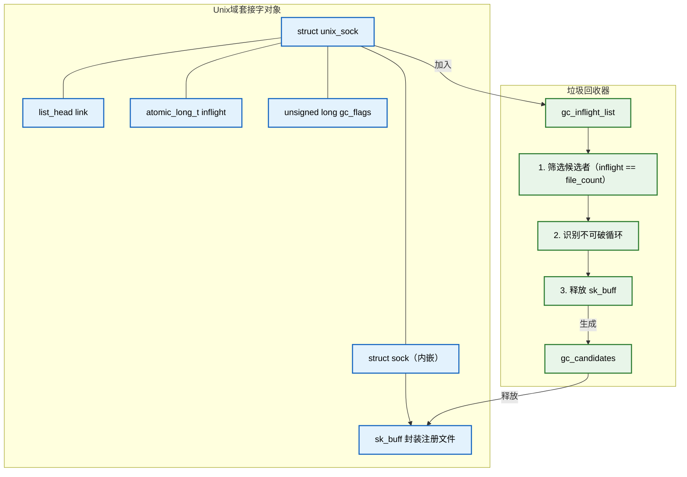

`inflight` 是理解本漏洞的核心要素之一。它代表的是一种特殊的引用类型——飞行引用（in-flight reference），即文件描述符在套接字之间传递过程中产生的临时引用。对于真正的 Unix 域套接字，飞行引用会在消息发送时产生、在消息接收或 GC 清理时消除。但对于 `io_uring` 注册的普通文件来说，它们被错误地赋予了与套接字相同的 GC 身份，却没有相应的飞行计数管理机制。这种管理上的不对称性，使得 GC 在面对 `io_uring` 注册的普通文件时做出了不正确的判定。

#### 2-2-4. 套接字缓冲区

飞行引用和文件列表在套接字之间传递时，需要一种载体来封装这些信息——这个载体就是 `sk_buff`。理解了 Unix 域套接字如何管理飞行引用之后，接下来需要深入 `sk_buff` 的内部，了解它如何承载和传递文件引用。`sk_buff` 是跨子系统传递文件引用的“运输容器”，它的控制块和析构函数共同决定了文件引用在被传输和释放时的行为。

`sk_buff` 是网络子系统中存储数据包或控制消息的核心结构。在漏洞场景中，`io_uring` 使用 `sk_buff` 封装注册的文件列表，其控制块存储 `scm_fp_list` 指针，析构函数则决定了 `sk_buff` 被释放时的清理行为。

```c
struct sk_buff {
    union {
        struct {
            struct sk_buff *next;        /* 链表中的下一个 sk_buff */
            struct sk_buff *prev;        /* 链表中的上一个 sk_buff */
        };
        struct rb_node rbnode;           /* 红黑树节点 */
        struct list_head list;           /* 通用链表节点 */
    };
    union {
        struct sock *sk;                 /* 指向所属的 sock（ring_sock） */
        int ip_defrag_offset;
    };
    char cb[48];                         /* 控制块，存储 scm_fp_list 指针（漏洞关键） */
    union {
        struct {
            unsigned long _skb_refdst;
            void (*destructor)(struct sk_buff *); /* 析构函数（漏洞关键） */
        };
    };
    unsigned int len;
    unsigned int data_len;
    unsigned int truesize;               /* 实际占用内存大小 */
    refcount_t users;                    /* sk_buff 自身的引用计数 */
    unsigned char *head;                 /* 数据缓冲区起始地址 */
    unsigned char *data;                 /* 当前数据指针 */
    sk_buff_data_t tail;
    sk_buff_data_t end;
};  /* 总大小 224 字节 */
```

`sk_buff->destructor` 在受影响版本中被设置为 `unix_destruct_scm`，该函数是最终触发 `fput()` 释放普通文件的直接入口。`cb[48]` 控制块则承载了 `scm_fp_list` 指针，使得 `sk_buff` 能够携带文件列表在套接字之间传递。`sk` 字段指向 `ring_sock`，使得 GC 能够从 `sk_buff` 反向追踪到所属的 `io_uring` 实例。

在漏洞触发路径中，`sk_buff` 扮演了多重角色：首先，它是 `io_uring` 注册文件的封装容器——`__io_sqe_files_scm` 将 `scm_fp_list` 挂载到 `cb` 控制块，并将 `sk_buff` 放入 `ring_sock` 的接收队列；其次，它是 GC 释放操作的目标对象——`unix_gc` 在识别不可破循环后将 `sk_buff` 加入 `hitlist` 并最终调用 `__skb_queue_purge` 释放；最后，它是文件引用的最终释放执行者——`sk_buff` 的析构函数 `unix_destruct_scm` 触发对其中所有文件的 `fput()`。

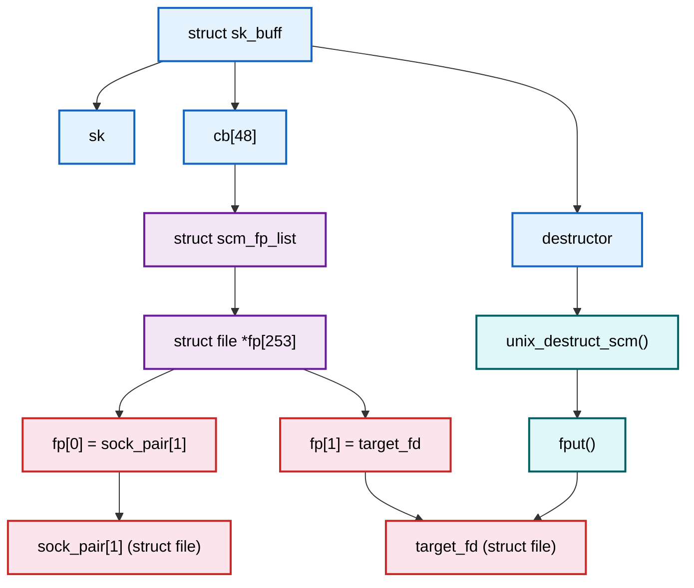

`sk_buff` 是连接 `io_uring` 与 GC 的关键数据结构。它的 `cb` 控制块存储了包含普通文件指针的 `scm_fp_list`，而 `destructor` 则决定了当 GC 释放该 `sk_buff` 时，会触发 `unix_destruct_scm` 进而调用 `fput()`。这一设计在正常场景下是合理的——当套接字之间传递文件描述符时，`sk_buff` 在完成使命后需要释放其中的文件引用。但当 GC 误判 `io_uring` 注册的文件为垃圾时，`sk_buff` 的析构函数就成为了释放普通文件的“执行器”，而此时代码路径并没有考虑到这些文件仍可能被 `io_uring` 使用。

#### 2-2-5. SCM 文件指针列表

`sk_buff` 通过控制块承载文件引用，而实际存储这些文件指针的容器是 `scm_fp_list`。理解了 `sk_buff` 的承载机制后，有必要深入这个容器内部，了解它如何组织和管理多个文件指针。`scm_fp_list` 的“混装”特性——将套接字与普通文件存储在同一数组中——是 GC 无法区分文件类型的根本原因。

`scm_fp_list` 存储通过 `SCM_RIGHTS` 传递的文件指针列表，是 `sk_buff` 控制块中的核心负载。`count` 字段记录当前存储的文件数量，`fp[]` 数组合并持有套接字和普通文件的引用。

```c
struct scm_fp_list {
    short count;                         /* 当前存储的文件数量 */
    short max;                           /* 最大容量（SCM_MAX_FD = 253） */
    struct user_struct *user;            /* 所属用户结构体（内存计费） */
    struct file *fp[253];                /* 文件指针数组（漏洞关键） */
};  /* 总大小 2040 字节 */
```

`fp[]` 数组同时包含 `AF_UNIX` 套接字和普通文件，使普通文件也暴露于 GC 扫描范围。`max` 字段为 `SCM_MAX_FD`（253），限制了单个 `scm_fp_list` 可携带的文件数量，这也是 `io_sqe_files_scm` 需要分批处理注册文件的原因。在 `v5.18.19` 中，`__io_sqe_files_scm` 将 `sock_pair[1]` 和 `target_fd` 放入同一个 `scm_fp_list`，使得普通文件与套接字“混装”在同一容器中。

`scm_fp_list` 将套接字和普通文件“混装”在一起，意味着 GC 在遍历 `sk_buff` 时无法区分二者——它们都被视为需要释放的文件引用。对于套接字来说这没有问题，但对于被 `io_uring` 注册的普通文件来说，它们的引用计数管理方式与套接字不同，不应被 GC 处理。这种“混装”正是 GC 误释放普通文件的直接原因。

从设计角度看，`scm_fp_list` 本身不包含任何类型信息——它只存储 `struct file *` 指针，而不记录这些文件是套接字还是普通文件。当 `unix_gc` 遍历 `sk_buff` 并调用 `fput()` 时，它仅仅是递减引用计数，而不关心文件的具体类型。这种类型信息的缺失，与 `io_uring` 将普通文件混入套接字接收队列的行为共同导致了释放后重用。

#### 2-2-6. sk_buff 队列头

多个 `sk_buff` 需要按顺序组织起来形成接收队列，而管理这些队列的结构体就是 `sk_buff_head`。理解了单个 `sk_buff` 的构造和负载之后，最后需要了解它们是如何被组织成队列以供 GC 遍历的。`sk_receive_queue` 是 GC 遍历的入口点，也是 `io_uring` 与 Unix GC 在数据结构层面的最后交汇点。

`sk_buff_head` 是管理 `sk_buff` 队列的结构体，`sk_receive_queue` 即为此类型。`qlen` 记录队列长度，`lock` 保护并发访问。

```c
struct sk_buff_head {
    union {
        struct {
            struct sk_buff *next;        /* 队列头部 */
            struct sk_buff *prev;        /* 队列尾部 */
        };
        struct sk_buff_list list;
    };
    __u32 qlen;                          /* 队列长度 */
    spinlock_t lock;                     /* 保护队列的自旋锁 */
};  /* 总大小 24 字节 */
```

`ring_sock->sk_receive_queue` 是一个 `sk_buff_head`，`unix_gc()` 通过遍历该队列识别不可破循环。`lock` 字段确保了队列操作在多核环境下的原子性，而 `qlen` 则反映了队列的深度——对于 `io_uring` 的 `ring_sock` 而言，这个队列中存放的就是已注册文件的封装。

`sk_buff_head` 是一个双向链表头，它使得 GC 可以顺序遍历接收队列中的所有 `sk_buff`。在漏洞触发过程中，`unix_gc` 会遍历 `sock_pair[1]` 和 `uring_fd` 的接收队列，识别出它们互相引用对方，形成不可破循环。正是通过 `sk_receive_queue` 这一入口，GC 才能检测到这些循环引用并启动释放流程。

#### 2-2-7. 总结

上述六个结构体之间形成了完整的漏洞数据链，从设计意图与副作用的角度可以概括为以下逻辑：`io_uring` 为了复用 Unix GC 检测循环引用而引入 `ring_sock`，却将本不该参与 GC 的普通文件引入了 GC 范围；`scm_fp_list` 将套接字与普通文件“混装”在同一容器中，使得 GC 无法区分文件类型；`sk_buff` 作为载体承载这些混合的文件引用并通过 `destructor` 控制释放行为；`unix_sock` 的 `inflight` 与 `f_count` 的不一致性是 GC 误判的数学依据；`sk_buff_head` 则作为遍历入口，使得 GC 能够访问所有被 `io_uring` 注册的文件。这一链条从设计意图（复用 GC）到实现细节（混装文件引用）再到边界条件（引用计数不一致）环环相扣，每个结构体都在漏洞的形成中扮演了不可替代的角色。

| 结构体                | 关键字段                               | 在漏洞中的角色                           |
| --------------------- | -------------------------------------- | ---------------------------------------- |
| `struct file`         | `f_count`                              | 被错误释放的核心对象，DirtyCred 堆喷目标 |
| `struct io_ring_ctx`  | `ring_sock`, `file_table`              | 提供 `ring_sock`，使文件进入 GC 可达范围 |
| `struct unix_sock`    | `inflight`, `link`, `sk_receive_queue` | 参与飞行计数与 GC 候选者判定             |
| `struct sk_buff`      | `cb[48]`, `destructor`                 | 封装文件列表，携带 `scm_fp_list`         |
| `struct scm_fp_list`  | `fp[253]`                              | 存储普通文件的 `struct file *`           |
| `struct sk_buff_head` | `next`, `prev`, `qlen`                 | 管理 `sk_receive_queue` 队列             |

**核心问题**：`io_uring` 将普通文件注册到 `ring_sock->sk_receive_queue`，使其进入 `unix_gc` 的可达范围。`unix_gc` 依据 `inflight == file_count` 判定不可破循环并释放 `sk_buff`，析构函数 `unix_destruct_scm` 触发 `fput()`，导致普通文件的 `struct file` 被释放，而 `io_uring` 尚未完成的 I/O 请求仍持有悬空指针，构成 UAF。跨子系统的引用计数管理不一致，贯穿了从 `io_ring_ctx` 到 `struct file` 的每一层结构，最终导致了释放后重用漏洞的形成。这一漏洞的根源可以归结为**跨子系统边界的状态不一致**：`io_uring` 子系统认为普通文件仍在使用中（有 I/O 请求待处理），而 Unix GC 子系统则认为这些文件已经不可达（引用计数与飞行计数相等）。两个子系统对同一对象的状态作出了不同的判断，而两者之间的协调机制又不完善，最终导致了安全边界被突破。

### 2-3. 漏洞根因与触发分析

**CVE-2022-2602** 的根因在于 Unix 垃圾回收机制（`unix_gc`）与 `io_uring` 注册文件机制之间引用计数管理的不一致性。`io_uring` 在初始化时会创建一个关联的 `struct sock`（`ring_sock`），当通过 `IORING_REGISTER_FILES` 注册文件时，这些文件会被放入该 `sock` 的接收队列 `sk_receive_queue` 中，同时调用 `unix_inflight()` 增加相关文件的飞行计数。由于 `unix_gc` 会遍历所有 `sock` 的接收队列并处理飞行中的文件，它可能错误地释放 `io_uring` 仍在使用的文件结构体，从而引发释放后重用。

这一问题的本质可以理解为：两个内核子系统各自维护着对同一组文件对象的"所有权"视图，但两者之间缺乏有效的协调机制。`io_uring` 认为注册文件仍处于活动状态（因为存在待处理的 I/O 请求），而 Unix GC 则认为这些文件已经不可达（因为引用计数与飞行计数相等）。两者对同一对象状态的不同判定，加之缺乏仲裁机制，最终导致了安全边界被突破。

该漏洞的可利用性与内核版本及处理器架构密切相关，其根本原因在于文件注册时是否对普通文件进行 SCM 引用检查。以下通过对比受影响版本与已修复版本的实现细节加以说明。理解版本演进的过程，有助于把握漏洞从引入到修复的完整生命周期，也能为分析类似跨子系统交互问题提供方法论参考。

#### 2-3-1. 版本差异

不同版本对普通文件的处理策略反映了内核开发者对 `io_uring` 与 Unix GC 交互问题的逐步认识与修正。从最初完全没有类型检查，到引入检查阻断普通文件进入接收队列，再到最终通过标记机制彻底消除 GC 误判，这一演进过程本身就是理解漏洞本质的重要线索。

| 内核版本     | 架构 | 注册入口函数                                                                    | SCM 检查函数                                 | 普通文件处理方式              | 漏洞存在        |
| ------------ | ---- | ------------------------------------------------------------------------------- | -------------------------------------------- | ----------------------------- | --------------- |
| ≤ 5.18.19    | 64位 | `io_sqe_files_register` → `io_sqe_files_scm` → `__io_sqe_files_scm`             | 无独立检查                                   | 无条件加入 `sk_receive_queue` | ✅ 是           |
| 5.19 ~ 6.0.2 | 64位 | `io_sqe_files_register` → 逐文件调用 `io_scm_file_account` → `io_file_need_scm` | `io_file_need_scm`（依赖 `unix_get_socket`） | 不加入 `sk_receive_queue`     | ❌ 否           |
| 6.0.3+       | 64位 | 同 5.19 ~ 6.0.2，且 `unix_gc` 增加 `scm_io_uring` 标记检查                      | `io_file_need_scm` + 标记检查                | 不加入 `sk_receive_queue`     | ❌ 否（已修复） |
| 5.1 ~ 6.0.2  | 32位 | 同 64 位，但 `IO_URING_SCM_ALL` 默认定义                                        | `io_file_need_scm` 恒为 `true`               | 无条件加入 `sk_receive_queue` | ✅ 是           |

上表清晰地展示了漏洞存在的条件：32 位系统普遍受影响，64 位系统仅 `v5.18.19` 及更早版本存在风险。`v5.19` 通过引入 `io_scm_file_account` 检查机制，使 64 位系统上的普通文件不再加入接收队列，从而阻断了漏洞触发路径。

#### 2-3-2. v5.18.19 注册流程

在 `v5.18.19` 中，注册文件的入口函数为 `io_sqe_files_register()`。该函数遍历用户传入的文件描述符并获取 `struct file`，随后调用 `io_sqe_files_scm()` 统一处理 SCM 关联。这一流程的设计体现了"批量处理"的思路：先收集所有文件，再一次性完成 SCM 关联操作。然而，正是这种"统一处理"的模式，使得普通文件与套接字在后续流程中无法被区分对待。

```c
static int io_sqe_files_register(struct io_ring_ctx *ctx, void __user *arg,
				 unsigned nr_args, u64 __user *tags)
{
	__s32 __user *fds = (__s32 __user *) arg;
	struct file *file;
	int fd, ret;
	unsigned i;

	/* 检查是否已有注册的文件数据，防止重复注册 */
	if (ctx->file_data)
		return -EBUSY;
	/* 参数合法性检查：注册数量必须合法 */
	if (!nr_args)
		return -EINVAL;
	if (nr_args > IORING_MAX_FIXED_FILES)
		return -EMFILE;
	if (nr_args > rlimit(RLIMIT_NOFILE))
		return -EMFILE;

	/* 开始资源节点切换 */
	ret = io_rsrc_node_switch_start(ctx);
	if (ret) return ret;
	/* 分配文件数据存储结构 */
	ret = io_rsrc_data_alloc(ctx, io_rsrc_file_put, tags, nr_args, &ctx->file_data);
	if (ret) return ret;

	/* 分配固定文件表 */
	if (!io_alloc_file_tables(&ctx->file_table, nr_args))
		goto out_free;

	/* 遍历用户传入的文件描述符数组 */
	for (i = 0; i < nr_args; i++, ctx->nr_user_files++) {
		if (copy_from_user(&fd, &fds[i], sizeof(fd))) {
			ret = -EFAULT;
			goto out_fput;
		}
		if (fd == -1)                     /* 允许稀疏集，跳过空槽（-1 表示无效描述符） */
			continue;

		/* 通过文件描述符获取 struct file，引用计数 +1 */
		file = fget(fd);
		if (!file) {
			ret = -EBADF;
			goto out_fput;
		}

		/* 禁止将 io_uring 自身注册，避免循环引用 */
		if (file->f_op == &io_uring_fops) {
			fput(file);
			goto out_fput;
		}
		/* 将 file 存入 ctx->file_table 的固定槽位中 */
		io_fixed_file_set(io_fixed_file_slot(&ctx->file_table, i), file);
	}

	/* 关键调用：所有文件收集完毕后，统一进行 SCM_RIGHTS 处理。
	 * 此调用将文件放入 io_uring 的接收队列，是漏洞触发的前置条件。
	 */
	ret = io_sqe_files_scm(ctx);
	if (ret) {
		/* 若失败，撤销所有注册的文件 */
		__io_sqe_files_unregister(ctx);
		return ret;
	}

	io_rsrc_node_switch(ctx, NULL);
	return ret;

out_fput:
	/* 出错清理：释放所有已经获取的文件引用 */
	for (i = 0; i < ctx->nr_user_files; i++) {
		file = io_file_from_index(ctx, i);
		if (file)
			fput(file);
	}
	io_free_file_tables(&ctx->file_table);
	ctx->nr_user_files = 0;
out_free:
	io_rsrc_data_free(ctx->file_data);
	ctx->file_data = NULL;
	return ret;
}
```

`io_sqe_files_scm` 将注册文件分批（每批不超过 `SCM_MAX_FD`）传递给 `__io_sqe_files_scm` 处理。这种分批机制是出于 `sk_buff` 容量限制的考虑，但对漏洞逻辑本身并无影响。值得注意的是，分批处理意味着如果注册文件数量超过 `SCM_MAX_FD`（253），内核会分配多个 `sk_buff` 来承载它们，每个 `sk_buff` 独立参与后续的 GC 流程。

```c
static int io_sqe_files_scm(struct io_ring_ctx *ctx)
{
	unsigned left, total;
	int ret = 0;

	total = 0;
	left = ctx->nr_user_files;
	/* 分批处理，每批最多 SCM_MAX_FD（通常为 253）个文件 */
	while (left) {
		unsigned this_files = min_t(unsigned, left, SCM_MAX_FD);
		/* 关键调用：调用底层函数，每批文件被封装到一个 skb 并加入接收队列 */
		ret = __io_sqe_files_scm(ctx, this_files, total);
		if (ret)
			break;
		left -= this_files;
		total += this_files;
	}
	if (!ret)
		return 0;

	/* 出错时，对已经处理的批次中的文件释放引用 */
	while (total < ctx->nr_user_files) {
		struct file *file = io_file_from_index(ctx, total);
		if (file)
			fput(file);
		total++;
	}
	return ret;
}
```

`__io_sqe_files_scm` 是漏洞关键所在：它为所有注册文件（含普通文件）创建一个 `sk_buff`，将其加入 `io_uring` 的接收队列，使普通文件也暴露于 `unix_gc` 的扫描范围之下。此处有一个重要的设计决策值得关注：`io_uring` 将注册文件放入接收队列的目的是为了复用 Unix GC 来检测循环引用，确保 `io_uring` 实例能够被正确释放。然而，这种复用带来了副作用——普通文件被"误伤"。理解这一设计意图与副作用之间的张力，是把握漏洞本质的关键。

```c
static int __io_sqe_files_scm(struct io_ring_ctx *ctx, int nr, int offset)
{
	/* 获取 io_uring 关联的 sock 结构，该 sock 在 io_uring 初始化时创建 */
	struct sock *sk = ctx->ring_sock->sk;
	struct scm_fp_list *fpl;
	struct sk_buff *skb;
	int i, nr_files;

	/* 分配 scm_fp_list，用于存放文件指针列表 */
	fpl = kzalloc(sizeof(*fpl), GFP_KERNEL);
	if (!fpl)
		return -ENOMEM;
	/* 分配 sk_buff，用于承载文件列表并放入接收队列 */
	skb = alloc_skb(0, GFP_KERNEL);
	if (!skb) {
		kfree(fpl);
		return -ENOMEM;
	}

	/* 设置 skb 的 sk 字段指向 io_uring 的 sock，这样垃圾回收可以识别 */
	skb->sk = sk;
	nr_files = 0;
	fpl->user = get_uid(current_user());
	/* 遍历本批次的所有文件索引 */
	for (i = 0; i < nr; i++) {
		struct file *file = io_file_from_index(ctx, i + offset);
		if (!file)
			continue;
		/* 增加文件引用计数，确保 file 在 skb 存活期间不会被释放 */
		fpl->fp[nr_files] = get_file(file);
		/* 漏洞节点：调用 unix_inflight 增加飞行计数（仅对 AF_UNIX socket 有效；
		 * 普通文件不会增加真正的飞行计数，但后续仍会被加入接收队列。
		 */
		unix_inflight(fpl->user, fpl->fp[nr_files]);
		nr_files++;
	}

	if (nr_files) {
		fpl->max = SCM_MAX_FD;
		fpl->count = nr_files;
		/* 将文件列表挂载到 skb 的控制块中 */
		UNIXCB(skb).fp = fpl;
		/* 设置析构函数，在 skb 释放时清理 SCM 资源 */
		skb->destructor = unix_destruct_scm;
		/* 增加 sock 的写内存引用计数，防止过早释放 */
		refcount_add(skb->truesize, &sk->sk_wmem_alloc);
		/* 漏洞节点：将 skb 插入 io_uring 的 sock 接收队列头部。
		 * 此操作使得普通文件也被纳入 Unix GC 的可达范围，导致后续可能被错误释放。
		 */
		skb_queue_head(&sk->sk_receive_queue, skb);

		/* 平衡之前 get_file() 增加的引用，但 skb 中仍持有 get_file() 获得的引用 */
		for (i = 0; i < nr; i++) {
			struct file *file = io_file_from_index(ctx, i + offset);
			if (file)
				fput(file);
		}
	} else {
		/* 没有有效文件时释放分配的资源 */
		kfree_skb(skb);
		free_uid(fpl->user);
		kfree(fpl);
	}
	return 0;
}
```

`unix_inflight` 仅当文件为 `AF_UNIX` 套接字时才会增加实际的飞行计数并加入全局 `gc_inflight_list`；普通文件不会增加飞行计数，但 `skb` 仍持有其引用。这种不对称性正是后续 `unix_gc` 误判的根源所在。从引用管理的角度来看，普通文件此时处于一种"半飞行"状态：它被放入了套接字的接收队列，却没有对应的飞行计数来保护它不被 GC 误判。这相当于在引用计数体系中引入了一个"盲区"。

```c
void unix_inflight(struct user_struct *user, struct file *fp)
{
	/* 检查文件是否对应一个 AF_UNIX socket，若不是则返回 NULL */
	struct sock *s = unix_get_socket(fp);

	spin_lock(&unix_gc_lock);
	if (s) {   /* 只有 socket 类型才会增加飞行计数并加入全局列表 */
		struct unix_sock *u = unix_sk(s);
		/* 递增飞行计数，若从 0 变为 1 则加入 gc_inflight_list */
		if (atomic_long_inc_return(&u->inflight) == 1) {
			BUG_ON(!list_empty(&u->link));
			list_add_tail(&u->link, &gc_inflight_list);
		} else {
			BUG_ON(list_empty(&u->link));
		}
		/* 更新全局飞行计数统计 */
		WRITE_ONCE(unix_tot_inflight, unix_tot_inflight + 1);
	}
	/* 对于普通文件，也会增加 user 的飞行计数（但无实际 socket 飞行计数） */
	user->unix_inflight++;
	spin_unlock(&unix_gc_lock);
}
```

**小结**：在 `v5.18.19` 中，注册文件时**不存在**对文件类型的筛选逻辑，所有文件（包括普通文件）均被无条件放入 `io_uring` 的接收队列，从而暴露于 `unix_gc` 的扫描范围，构成漏洞基础。这一设计缺陷可以概括为"过度复用"：为了复用 GC 机制而引入了超出原始设计范围的文件类型，却没有相应地扩展引用管理的一致性检查。

#### 2-3-3. v5.19 ~ v6.0.2 注册流程

从 `v5.19` 开始，内核引入了 `io_scm_file_account()` 检查机制，在注册过程中对文件类型进行筛选。这一变化使得 64 位系统上的普通文件不再加入接收队列，**从而阻断了漏洞在 64 位系统上的触发路径**。

```c
int io_sqe_files_register(struct io_ring_ctx *ctx, void __user *arg,
			  unsigned nr_args, u64 __user *tags)
{
	__s32 __user *fds = (__s32 __user *) arg;
	struct file *file;
	int fd, ret;
	unsigned i;

	/* 防止重复注册 */
	if (ctx->file_data)
		return -EBUSY;
	if (!nr_args)
		return -EINVAL;
	if (nr_args > IORING_MAX_FIXED_FILES)
		return -EMFILE;
	if (nr_args > rlimit(RLIMIT_NOFILE))
		return -EMFILE;

	ret = io_rsrc_node_switch_start(ctx);
	if (ret) return ret;
	ret = io_rsrc_data_alloc(ctx, io_rsrc_file_put, tags, nr_args, &ctx->file_data);
	if (ret) return ret;

	if (!io_alloc_file_tables(&ctx->file_table, nr_args)) {
		io_rsrc_data_free(ctx->file_data);
		ctx->file_data = NULL;
		return -ENOMEM;
	}

	for (i = 0; i < nr_args; i++, ctx->nr_user_files++) {
		struct io_fixed_file *file_slot;

		if (fds && copy_from_user(&fd, &fds[i], sizeof(fd))) {
			ret = -EFAULT;
			goto fail;
		}
		if (!fds || fd == -1) {
			/* 稀疏集：检查 tag 是否已设置 */
			ret = -EINVAL;
			if (unlikely(*io_get_tag_slot(ctx->file_data, i)))
				goto fail;
			continue;
		}

		file = fget(fd);
		if (!file) {
			ret = -EBADF;
			goto fail;
		}
		if (io_is_uring_fops(file)) {
			fput(file);
			goto fail;
		}
		/* 关键变化：对每个文件立即调用 io_scm_file_account 进行 SCM 检查 */
		ret = io_scm_file_account(ctx, file);
		if (ret) {
			fput(file);
			goto fail;
		}
		file_slot = io_fixed_file_slot(&ctx->file_table, i);
		io_fixed_file_set(file_slot, file);
		io_file_bitmap_set(&ctx->file_table, i);
	}

	io_file_table_set_alloc_range(ctx, 0, ctx->nr_user_files);
	io_rsrc_node_switch(ctx, NULL);
	return 0;

fail:
	__io_sqe_files_unregister(ctx);
	return ret;
}
```

`io_scm_file_account` 首先通过 `io_file_need_scm` 判断文件是否需要 SCM 引用，实现提前过滤。

```c
static inline int io_scm_file_account(struct io_ring_ctx *ctx,
				      struct file *file)
{
	/* 若不需要 SCM 引用，直接返回，不加入接收队列 */
	if (likely(!io_file_need_scm(file)))
		return 0;
	/* 关键调用：否则调用实际处理函数，该函数会执行加入接收队列的操作 */
	return __io_scm_file_account(ctx, file);
}
```

`io_file_need_scm` 在 64 位系统上（未定义 `IO_URING_SCM_ALL`）仅当文件是套接字或 `io_uring` 实例时才返回 `true`，普通文件被过滤。

```c
static inline bool io_file_need_scm(struct file *filp)
{
#if defined(IO_URING_SCM_ALL)
	/* 32 位系统通常定义此宏，所有文件都视为需要 SCM */
	return true;
#else
	/* 64 位系统：检查文件是否为 AF_UNIX socket 或 io_uring 实例 */
	return !!unix_get_socket(filp);
#endif
}
```

`unix_get_socket` 检查文件是否为 `AF_UNIX` 套接字或 `io_uring` 实例：

```c
struct sock *unix_get_socket(struct file *filp)
{
	struct sock *u_sock = NULL;
	struct inode *inode = file_inode(filp);

	/* 若是普通 socket 文件（S_ISSOCK）且不是 FMODE_PATH 路径文件 */
	if (S_ISSOCK(inode->i_mode) && !(filp->f_mode & FMODE_PATH)) {
		struct socket *sock = SOCKET_I(inode);
		struct sock *s = sock->sk;
		if (s && sock->ops && sock->ops->family == PF_UNIX)
			u_sock = s;
	} else {
		/* 也可能是 io_uring 实例（通过 f_op 判断） */
		u_sock = io_uring_get_socket(filp);
	}
	return u_sock;
}

struct sock *io_uring_get_socket(struct file *file)
{
#if defined(CONFIG_UNIX)
	if (io_is_uring_fops(file)) {
		struct io_ring_ctx *ctx = file->private_data;
		return ctx->ring_sock->sk;
	}
#endif
	return NULL;
}

bool io_is_uring_fops(struct file *file)
{
	return file->f_op == &io_uring_fops;
}
```

只有通过检查的文件才会进入 `__io_scm_file_account`，执行实际的加入接收队列操作：

```c
int __io_scm_file_account(struct io_ring_ctx *ctx, struct file *file)
{
#if defined(CONFIG_UNIX)
	struct sock *sk = ctx->ring_sock->sk;
	struct sk_buff_head *head = &sk->sk_receive_queue;
	struct scm_fp_list *fpl;
	struct sk_buff *skb;

	/* 再次检查（防御性编程） */
	if (likely(!io_file_need_scm(file)))
		return 0;

	/* 尝试将当前文件合并到接收队列中已有的 skb，以减少 skb 数量 */
	spin_lock_irq(&head->lock);
	skb = skb_peek(head);
	if (skb && UNIXCB(skb).fp->count < SCM_MAX_FD)
		__skb_unlink(skb, head);   /* 取出以便后续添加 */
	else
		skb = NULL;
	spin_unlock_irq(&head->lock);

	if (!skb) {
		/* 分配新的 fpl 和 skb */
		fpl = kzalloc(sizeof(*fpl), GFP_KERNEL);
		if (!fpl)
			return -ENOMEM;
		skb = alloc_skb(0, GFP_KERNEL);
		if (!skb) {
			kfree(fpl);
			return -ENOMEM;
		}
		fpl->user = get_uid(current_user());
		fpl->max = SCM_MAX_FD;
		fpl->count = 0;
		UNIXCB(skb).fp = fpl;
		skb->sk = sk;
		skb->destructor = unix_destruct_scm;
		refcount_add(skb->truesize, &sk->sk_wmem_alloc);
	}

	fpl = UNIXCB(skb).fp;
	fpl->fp[fpl->count++] = get_file(file);   /* 增加文件引用 */
	unix_inflight(fpl->user, file);           /* 增加飞行计数（仅对 socket 有效） */
	skb_queue_head(head, skb);
	fput(file);                                /* 平衡 fget()，但 skb 仍持有引用 */
#endif
	return 0;
}
```

**小结**：在 64 位 `v5.19 ~ v6.0.2` 中，普通文件因 `io_file_need_scm` 返回 `false` 而不会进入 `__io_scm_file_account`，从而不会加入 `sk_receive_queue`，`unix_gc` 无法将其纳入可达范围，**漏洞在该配置下已被有效阻断**。然而，`v6.0.3` 的修复仍然必要——它通过 `scm_io_uring` 标记机制从根本上消除了 `unix_gc` 误判 `io_uring` 相关 `sk_buff` 的可能性，是一种更彻底的防御措施。

#### 2-3-4. 32 位系统例外

在 32 位系统上，通常默认定义了 `IO_URING_SCM_ALL` 宏，此时 `io_file_need_scm` 无条件返回 `true`，所有注册文件（含普通文件）都会获得 SCM 引用并被加入接收队列。因此，**漏洞在 32 位系统上普遍存在**，不受内核版本（5.1 ~ 6.0.2）限制。

这种架构差异的根本原因是：32 位系统上 `IO_URING_SCM_ALL` 的默认开启策略使得检查机制失效，对安全性的权衡与 64 位系统不同。从内核开发的角度来看，这一配置差异反映了 32 位与 64 位平台在 `io_uring` 实现中的不同假设——32 位系统更倾向于"全面启用"SCM 引用管理，却未充分考虑普通文件参与 GC 的后果。

#### 2-3-5. 垃圾回收机制

`unix_gc()` 是 Unix 域套接字垃圾回收的入口，负责识别并清理不再可达的飞行中套接字。在漏洞触发流程中，正是 `unix_gc()` 负责释放包含普通文件的 `skb`，从而引发 UAF。理解 `unix_gc()` 的四步工作流程——筛选候选者、移除内部引用、识别不可破循环、释放垃圾——是把握漏洞触发时机的前提。以下展示 `unix_gc()` 及其释放链中的关键函数。

```c
/* unix_gc() - 外部调用入口，在 socket 关闭等场景被触发 */
void unix_gc(void)
{
	struct unix_sock *u;
	struct unix_sock *next;
	struct sk_buff_head hitlist;      /* 用于收集需要释放的 skb 队列 */
	struct list_head cursor;
	LIST_HEAD(not_cycle_list);        /* 存储不构成循环的候选者 */

	spin_lock(&unix_gc_lock);

	/* 防止递归调用（GC 过程可能再次触发 GC） */
	if (gc_in_progress)
		goto out;
	WRITE_ONCE(gc_in_progress, true);

	/* 第一步：从 gc_inflight_list 中选出候选者（飞行计数 == 总引用计数） */
	list_for_each_entry_safe(u, next, &gc_inflight_list, link) {
		long total_refs = file_count(u->sk.sk_socket->file);
		long inflight_refs = atomic_long_read(&u->inflight);

		/* 若总引用等于飞行计数，说明该 socket 可能已经不可达（仅靠飞行引用存活） */
		if (total_refs == inflight_refs) {
			list_move_tail(&u->link, &gc_candidates);
			__set_bit(UNIX_GC_CANDIDATE, &u->gc_flags);
			__set_bit(UNIX_GC_MAYBE_CYCLE, &u->gc_flags);
		}
	}

	/* 第二步：从候选者中移除其子对象（接收队列中的文件）的内部飞行引用 */
	list_for_each_entry(u, &gc_candidates, link)
		scan_children(&u->sk, dec_inflight, NULL);

	/* 第三步：恢复那些仍有外部引用的子对象，仅保留构成循环引用的候选者 */
	list_add(&cursor, &gc_candidates);
	while (cursor.next != &gc_candidates) {
		u = list_entry(cursor.next, struct unix_sock, link);
		list_move(&cursor, &u->link);
		if (atomic_long_read(&u->inflight) > 0) {
			list_move_tail(&u->link, &not_cycle_list);
			__clear_bit(UNIX_GC_MAYBE_CYCLE, &u->gc_flags);
			scan_children(&u->sk, inc_inflight_move_tail, NULL);
		}
	}
	list_del(&cursor);

	/* 第四步：对最终确定的垃圾（gc_candidates）还原飞行计数，并收集待释放的 skb */
	skb_queue_head_init(&hitlist);
	list_for_each_entry(u, &gc_candidates, link)
		scan_children(&u->sk, inc_inflight, &hitlist);

	/* 将非循环节点移回 gc_inflight_list */
	while (!list_empty(&not_cycle_list)) {
		u = list_entry(not_cycle_list.next, struct unix_sock, link);
		__clear_bit(UNIX_GC_CANDIDATE, &u->gc_flags);
		list_move_tail(&u->link, &gc_inflight_list);
	}

	spin_unlock(&unix_gc_lock);

	/* 漏洞节点：清除 hitlist 中的所有 skb，释放其占用的内存及所引用的文件。
	 * 此调用是 UAF 发生的直接触发点，因为它会释放包含普通文件的 skb。
	 */
	__skb_queue_purge(&hitlist);

	spin_lock(&unix_gc_lock);
	/* 所有候选者应该已被清空 */
	BUG_ON(!list_empty(&gc_candidates));
	/* 清除 GC 进行中标志 */
	WRITE_ONCE(gc_in_progress, false);
	wake_up(&unix_gc_wait);
out:
	spin_unlock(&unix_gc_lock);
}
```

释放链中的关键函数：

```c
static inline void __skb_queue_purge(struct sk_buff_head *list)
{
	struct sk_buff *skb;
	/* 循环取出队列头部的 skb，直到队列为空 */
	while ((skb = __skb_dequeue(list)) != NULL)
		kfree_skb(skb);
}

void kfree_skb_reason(struct sk_buff *skb, enum skb_drop_reason reason)
{
	/* 尝试减少 skb 引用计数，若未归零则返回 */
	if (!skb_unref(skb))
		return;
	/* 触发 tracepoint 记录 */
	trace_kfree_skb(skb, __builtin_return_address(0), reason);
	/* 实际释放 skb 内容 */
	__kfree_skb(skb);
}

void __kfree_skb(struct sk_buff *skb)
{
	/* 释放所有附加资源（数据、状态、析构等） */
	skb_release_all(skb);
	/* 释放 skb 本身的内存 */
	kfree_skbmem(skb);
}

static void skb_release_all(struct sk_buff *skb)
{
	skb_release_head_state(skb);
	if (likely(skb->head))
		skb_release_data(skb);
}

void skb_release_head_state(struct sk_buff *skb)
{
	skb_dst_drop(skb);
	if (skb->destructor) {
		WARN_ON(in_hardirq());
		/* 关键调用：对于 io_uring 注册的 skb，此析构函数为 unix_destruct_scm */
		skb->destructor(skb);
	}
	skb_ext_put(skb);
}
```

`unix_destruct_scm` 负责清理 SCM 文件引用，最终触发 `fput` 释放文件：

```c
void unix_destruct_scm(struct sk_buff *skb)
{
	struct scm_cookie scm;

	memset(&scm, 0, sizeof(scm));
	scm.pid = UNIXCB(skb).pid;
	if (UNIXCB(skb).fp)
		unix_detach_fds(&scm, skb);

	scm_destroy(&scm);
	sock_wfree(skb);
}

void unix_detach_fds(struct scm_cookie *scm, struct sk_buff *skb)
{
	int i;

	/* 从 skb 控制块取出文件列表，并将 skb 中的指针置空 */
	scm->fp = UNIXCB(skb).fp;
	UNIXCB(skb).fp = NULL;

	/* 逆序遍历，对每个文件调用 unix_notinflight */
	for (i = scm->fp->count - 1; i >= 0; i--)
		unix_notinflight(scm->fp->user, scm->fp->fp[i]);
}

void unix_notinflight(struct user_struct *user, struct file *fp)
{
	struct sock *s = unix_get_socket(fp);

	spin_lock(&unix_gc_lock);
	if (s) {   /* 若文件是 AF_UNIX socket */
		struct unix_sock *u = unix_sk(s);
		BUG_ON(!atomic_long_read(&u->inflight));
		BUG_ON(list_empty(&u->link));
		/* 递减飞行计数，若归零则从 gc_inflight_list 移除 */
		if (atomic_long_dec_and_test(&u->inflight))
			list_del_init(&u->link);
		WRITE_ONCE(unix_tot_inflight, unix_tot_inflight - 1);
	}
	/* 普通文件也减少 user 的飞行计数（与 unix_inflight 中的增加对应） */
	user->unix_inflight--;
	spin_unlock(&unix_gc_lock);
}

static __inline__ void scm_destroy(struct scm_cookie *scm)
{
	scm_destroy_cred(scm);
	if (scm->fp)
		__scm_destroy(scm);
}

void __scm_destroy(struct scm_cookie *scm)
{
	struct scm_fp_list *fpl = scm->fp;
	int i;

	if (fpl) {
		scm->fp = NULL;
		/* 逆序遍历，对每个文件执行 fput，减少引用计数 */
		for (i = fpl->count - 1; i >= 0; i--)
			fput(fpl->fp[i]);   /* 若引用计数归零，则释放 struct file 结构体 */
		free_uid(fpl->user);
		kfree(fpl);
	}
}
```

**关键结论**：当 `unix_gc` 判定某组 socket 构成不可破循环时，释放链将 `skb` 中包含的所有文件引用全部释放。在 `v5.18.19` 及更早版本中，由于普通文件也被放入 `sk_receive_queue`，这些普通文件的 `struct file` 会被 `fput` 释放，而此时 `io_uring` 尚未完成的 I/O 请求仍持有悬空指针，造成 UAF。这一释放链的设计初衷是清理真正不可达的套接字，却意外地波及了 `io_uring` 注册的普通文件，这就是"误伤"的机制层面解释。

#### 2-3-6. 典型触发流程

以 64 位 `v5.18.19` 为例，漏洞触发的核心逻辑如下。整个流程可以概括为一个"竞态窗口的构建与利用"过程：通过 inode 锁制造阻塞窗口，通过 `unix_gc` 释放目标文件，通过堆喷完成内存复用，最终通过悬空指针触发 UAF。每一步都为下一步创造条件，形成一个完整的利用链条。

**步骤 1：注册文件到 `io_uring`**

通过 `IORING_REGISTER_FILES` 将 `sock_pair[1]` 与 `target_fd` 一同注册到 `io_uring` 实例。注册过程中，两个文件被放入同一个 `sk_buff`，并加入 `io_uring` 关联 `sock` 的接收队列。这使得普通文件 `target_fd` 也被纳入 Unix 域套接字的垃圾回收可达范围。这一步是漏洞触发的前提——没有将普通文件放入接收队列，后续的 GC 误判就不会发生。

**步骤 2：关闭目标文件原始描述符**

关闭 `target_fd` 的原始文件描述符，但 `io_uring` 接收队列中的 `skb` 仍持有对该文件的引用，因此其 `struct file` 结构体不会被释放。此时，`target_fd` 所对应的文件对象生命周期完全依赖于 `skb` 中的引用，而 `skb` 本身又处于 `ring_sock` 的接收队列中，等待着 GC 的"裁决"。

**步骤 3：通过 `SCM_RIGHTS` 发送 `io_uring` 文件描述符**

通过 `sock_pair[0]` 将 `uring_fd` 作为 `SCM_RIGHTS` 消息发送给 `sock_pair[1]`，使 `uring_fd` 获得一个额外的飞行引用。这一步建立了 `uring_fd` 与 `sock_pair[1]` 之间的引用关系，为后续不可破循环的形成创造条件。这个循环是 `unix_gc` 判定垃圾的关键依据——GC 认为互相引用的对象如果只靠飞行引用存活，就应该被整体回收。

**步骤 4：关闭套接字端点**

关闭 `sock_pair[0]` 和 `sock_pair[1]`。此时 `sock_pair[1]` 和 `uring_fd` 各自仅剩飞行引用，进入待回收状态。关闭套接字是触发 GC 的前置条件——只有套接字被关闭，GC 才会考虑将其回收。

**步骤 5：持有 inode 锁并提交 `io_uring` 写请求**

辅助线程打开一个新的文件描述符（指向与 `target_fd` 相同的底层文件），通过该描述符执行大容量写入操作，获取并持有该文件的 inode 锁，阻塞后续针对同一文件的其他写操作。此操作的核心目的是人为制造竞态窗口：使 `io_uring` 写请求在目标文件对象被释放后仍处于等待状态。竞态窗口的大小直接影响后续操作的成功率，因此需要采用能够精确控制阻塞时长的技术手段（如大容量写入使得操作在 inode 锁上持续阻塞）。

主线程向 `io_uring` 提交 `IORING_OP_WRITEV` 请求，目标为已注册的 `target_fd`（使用固定文件索引，该索引指向与辅助线程打开的文件相同的底层文件对象）。该请求在通过文件权限检查后，因等待 inode 锁而被阻塞。此时，`io_uring` 内部已持有指向 `target_fd` 对应文件对象的指针，但尚未开始实际写入操作。

**步骤 6：关闭 `io_uring` 实例**

关闭 `io_uring` 实例，释放用户进程对该实例的引用。此时 `uring_fd` 与 `sock_pair[1]` 互相被对方接收队列中的 `skb` 所引用，形成不可破循环。这个循环使得 GC 将二者同时判定为垃圾，从而准备批量释放。

**步骤 7：触发 `unix_gc()` 释放目标文件**

创建一个临时 Unix 域数据报套接字（`socket(AF_UNIX, SOCK_DGRAM, 0)`），并立即关闭该套接字。套接字关闭操作会触发内核调用 `unix_gc()` 垃圾回收。这个临时套接字的作用相当于一个"引信"——它的创建和关闭触发了 GC 的执行，而 GC 的执行又会波及到 `io_uring` 注册的文件。

`unix_gc()` 识别到 `sock_pair[1]` 与 `uring_fd` 构成不可破循环，将二者标记为垃圾，并释放其接收队列中的 `skb`。

释放 `uring_fd` 接收队列中的 `skb` 时，该 `skb` 包含 `sock_pair[1]` 和 `target_fd`（即注册时放入的普通文件）。`skb` 的析构函数 `unix_destruct_scm` 触发对其中所有文件的 `fput()` 操作，导致 `target_fd` 对应的 `struct file` 被释放。

此时步骤 5 中提交的 `io_uring` 写请求尚未完成，其内部仍持有指向已释放内存的指针。这个悬空指针的形成，是整个漏洞链条的最终结果——也是后续内存复用的入口。

**步骤 8：堆喷抢占内存**

在 `target_fd` 对应的 `struct file` 被释放后、写请求恢复前的竞态窗口内，通过大量打开目标文件（如 `/etc/passwd` 或 SUID 可执行文件）进行堆喷射，使新分配的文件结构体占据被释放的内存位置。由于内核内存分配器的复用特性（SLUB 分配器优先分配最近释放的同尺寸对象），堆喷能够以较高的成功率完成内存抢占。选择 `/etc/passwd` 或 SUID 文件作为堆喷目标，是因为这些文件具有特定的权限属性，一旦其 `struct file` 被悬空指针错误操作，可能导致文件内容被意外覆写或权限属性被篡改，从而影响系统的安全边界。

**步骤 9：UAF 发生**

辅助线程完成大容量写入，释放 inode 锁。被阻塞的 `io_uring` 写请求恢复执行，通过悬空指针访问已被堆喷占用的内存区域。由于该内存现已被替换为目标文件（如 `/etc/passwd` 或 SUID 可执行文件）的 `struct file`，实际写入目标变为该文件，覆写其内容或篡改其属性。此时，`io_uring` 原本应该写入 `target_fd` 对应文件的数据，实际上写入了目标文件，造成安全边界被突破。

**完整触发路径流程图：**

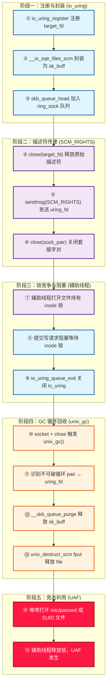

### 2-4. DirtyCred 内存复用技术

在前述漏洞触发流程的分析中可以看到，`unix_gc()` 的错误释放行为仅仅创建了一个悬空指针——目标文件的 `struct file` 被释放，而 `io_uring` 仍持有指向该内存区域的引用。然而，单纯的内存释放本身并不会产生安全后果。真正使漏洞从“内核崩溃”演变为“权限边界被突破”的关键，在于一种被称为 **DirtyCred** 的内存复用技术。本节将分析 DirtyCred 技术的核心思想及其在本漏洞场景中的具体应用方式。

#### 2-4-1. 核心思想与原理

DirtyCred 技术由研究人员在 BlackHat USA 上首次提出，其核心思路可以概括为：利用内核内存分配器的复用特性，在释放后的对象内存被重新分配时，使新分配的对象与残留的悬空指针在语义上产生“错位”——即悬空指针原本指向一个普通对象，但经过内存复用后，同一个物理内存地址现在被一个特权对象所占据，而悬空指针仍然指向该地址。当后续通过该悬空指针发起操作时，实际操作的目标就被“替换”为了特权对象。

这一技术的本质是**利用时间窗口内的内存布局变化，将释放后重用漏洞转化为对象替换原语**。DirtyCred 不依赖于精确的内核地址泄露或复杂的 ROP 链构造，而是直接在数据层面完成权限提升，因此具有广泛的适用性。从利用方法论的角度来看，DirtyCred 代表了一种从“控制流劫持”向“数据对象操纵”演进的趋势。

#### 2-4-2. 在本漏洞中的应用流程

在 **CVE-2022-2602** 的具体场景中，DirtyCred 技术的应用分为以下四个连续的阶段：

**① 触发释放——构建悬空指针**

首先，通过 2-3-6 节描述的完整触发流程，使 `io_uring` 中注册的普通文件结构体（`struct file`）被 `unix_gc()` 提前释放。释放后的内存区域被归还给内核内存分配器（SLUB 分配器），进入其空闲链表。此时，目标文件对象已经不复存在，但 `io_uring` 中等待执行的写请求仍保留着指向该内存区域的指针——悬空指针已经形成，但尚未被使用。

**② 抢占内存——堆喷分配**

紧接在释放之后、悬空指针被使用之前的竞态窗口内，程序迅速打开大量目标文件（如 `/etc/passwd`），促使内核分配新的 `struct file` 结构体。SLUB 分配器为了提升性能，会优先分配最近释放的同尺寸缓存对象（即刚刚释放的 `struct file` 所在的 slab 页）。因此，新分配的 `struct file` 有极高的概率恰好占据刚刚释放的内存区域，实现内存的“复用”。

堆喷操作的目标是使悬空指针指向的内存位置被一个新的、受控的对象所占据。在本场景中，由于 `struct file` 结构体的大小是固定的（232 字节），SLUB 分配器会自动将其归属到对应的 kmem_cache 中，这保证了新分配的 `struct file` 与释放的对象属于同一缓存，进一步提高了复用的成功率。

**③ 覆盖与替换——对象替换原语**

当新分配的 `struct file` 恰好占用了被释放的内存区域后，`io_uring` 中残留的悬空指针仍然指向该内存地址。此时，`io_uring` 通过该指针发起的写操作（`IORING_OP_WRITEV`）看似是在向原目标文件写入数据，实际上操作的对象已经被替换为堆喷时新分配的系统关键文件的 `struct file`。原本应该被写入普通测试文件的数据，现在被写入到了系统关键文件中。这一过程相当于在内核数据层面实现了一个“对象替换”原语，将普通文件的 `struct file` 替换成了系统关键文件的 `struct file`。

**④ 权限提升——突破安全边界**

当悬空指针指向的 `struct file` 被替换为系统关键文件后，原本受写保护的系统关键文件内容可被覆写。具体而言，恶意程序可以向 `/etc/passwd` 中写入一个新的具有 root 权限的用户条目，从而在不依赖任何用户态权限检查的情况下，获得对系统的完全控制。此时，`io_uring` 的异步 I/O 请求完成了从“写入临时文件”到“覆写系统文件”的语义转变，安全边界在数据层面被突破。

这一过程的关键在于：**漏洞本身只提供了悬空指针，而 DirtyCred 技术将悬空指针转化为可控的数据覆写能力**。二者缺一不可，共同构成了完整的漏洞利用链条。

#### 2-4-3. 技术优势与防御绕过

DirtyCred 技术的显著优势在于其**数据只读（Data-Only）**特性。传统的漏洞利用通常依赖控制流劫持——通过修改函数指针或返回地址来改变程序的执行路径。然而，现代内核部署了多种控制流完整性保护机制：

- **KASLR**（内核地址空间布局随机化）：使内核代码段的基址随机化，阻止精确的跳转地址预测。
- **SMEP**（管理模式执行保护）：禁止内核执行用户态代码，阻止 ret2user 类型的利用。
- **SMAP**（管理模式访问保护）：禁止内核访问用户态数据，阻止对用户态数据的读写。
- **KPTI**（内核页表隔离）：隔离内核与用户页表，缓解 Meltdown 类侧信道利用。
- **CFI**（控制流完整性，Control-Flow Integrity）：通过限制间接跳转（包括函数指针调用、返回地址等）的目标地址，确保程序的控制流始终遵循预先定义的合法路径。CFI 能够在运行时检测并阻止非法的控制流转移，是防御 ROP（返回导向编程）等控制流劫持技术的重要手段。

这些机制针对控制流劫持提供了有效的防护，但 DirtyCred 技术不依赖任何形式的代码执行或控制流转移——它仅在数据层面操作，通过操纵内核数据对象本身来实现权限提升。这意味着 DirtyCred 的操作路径不会触发任何间接跳转，因此**完全避开了 CFI 的检查范围**。

从各类防御机制的绕过效果来看：KASLR 的地址随机化无法阻止对已知内存布局的堆喷操作；SMEP 和 SMAP 仅限制代码执行和内存访问模式，对纯数据操纵无效；KPTI 仅隔离页表，不影响内核堆内存的分配与复用；CFI 仅监控控制流转移，对数据对象的修改不设防。这使得 DirtyCred 能够有效规避上述多种内核保护机制，体现了现代漏洞利用从“控制流利用”向“数据利用”转型的趋势。

#### 2-4-4. 阻塞技术与实施考量

DirtyCred 技术的成功率高度依赖于竞态窗口的精确控制。如果竞态窗口过窄，堆喷可能来不及在悬空指针被使用前完成内存复用；如果过宽，可能会引入其他干扰因素。为了精确控制竞态窗口的宽度，研究人员采用了两种不同的阻塞技术：

- **userfaultfd 或 FUSE**：利用用户态缺页异常处理机制（userfaultfd）或 FUSE 文件系统的用户态处理延迟，使内核 I/O 操作在访问用户态内存或被 FUSE 处理时被阻塞，从而精确延长竞态窗口的持续时间。这两种技术的共同特点是引入了用户态对内核操作的阻塞控制能力，使得竞态窗口的宽度可以被精细调节。

- **inode 锁（inode locking）** ：利用文件系统的 inode 锁机制，使并发写操作在锁上等待，从而制造阻塞窗口。本漏洞的实现中采用的是这种技术——辅助线程通过大容量写入持有 inode 锁，使 `io_uring` 的写请求在文件对象被释放后仍然保持等待状态，为堆喷操作预留了充足的时间窗口。

两种技术的本质都是在释放和重用之间插入一个可控的延迟，扩大竞态窗口。其中 userfaultfd 和 FUSE 属于用户态可控的阻塞机制，灵活性较高；而 inode 锁则完全在内核态运作，不需要用户态的支持。两种方法均能有效扩大释放后重用的竞态窗口，提高内存复用的成功率，但具体选择取决于目标环境的限制和操作者的偏好。

#### 2-4-5. 方法论的启示

从更广的视角来看，DirtyCred 方法为类似漏洞的评估提供了新的思路——它使释放后重用漏洞不再局限于传统的控制流劫持利用方式，而是能够通过纯数据操作达成目标。这一方法论的转变，使得那些原本被认为“利用难度高”或“仅导致内核崩溃”的 UAF 漏洞，重新获得了安全评估的价值。

此外，DirtyCred 的出现也对内核防御体系提出了新的挑战：现有的控制流保护机制（如 CFI）无法防御数据层面的操纵，而内存分配器的可预测性又为堆喷提供了便利。未来内核安全的发展方向可能需要更多地关注**数据完整性保护**和**内存分配随机化**，以应对此类数据对象操纵技术的演进。

### 2-5. 影响范围

#### 2-5-1. 受影响版本

**CVE-2022-2602** 影响 Linux 内核 5.1 至 6.0.2 版本，但具体受影响程度依赖于处理器架构和内核版本：

- **32 位系统**：所有 5.1 ≤ 版本 ≤ 6.0.2 的 32 位内核均受影响（因 `IO_URING_SCM_ALL` 默认定义，SCM 引用检查机制失效）。在 32 位系统上，`io_file_need_scm` 宏无条件返回 `true`，所有注册文件（含普通文件）均被加入接收队列，因此漏洞普遍存在，不受具体子版本影响。

- **64 位系统**：受影响范围与内核版本紧密相关，呈现出明确的版本边界：
    - 版本 **≤ 5.18.19**：受影响。此阶段尚未引入 `io_scm_file_account` 检查机制，注册文件时普通文件被无条件加入接收队列，漏洞可触发。
    - 版本 **5.19 ~ 6.0.2**：不受影响。`v5.19` 引入了 `io_scm_file_account` 检查，普通文件因 `io_file_need_scm` 返回 `false` 而不再加入接收队列，漏洞触发路径在 64 位系统上被有效阻断。
    - 版本 **≥ 6.0.3**：已修复。在 `v5.19` 检查机制的基础上，增加了 `scm_io_uring` 标记检查，从架构层面彻底消除了 `unix_gc` 误判 `io_uring` 相关 `sk_buff` 的可能性。

该漏洞广泛涉及各大 Linux 发行版，包括 Debian（bullseye、bookworm）、Ubuntu（多个 LTS 版本）、SUSE 及 Red Hat 等。Debian 在 buster 版本中不受影响，因其内核版本较早（4.x 系列，`io_uring` 尚未引入）。各发行版已根据自身内核版本发布了相应的安全更新，建议用户关注各自发行版的安全公告并及时更新。

#### 2-5-2. CVSS 评分

该漏洞的 CVSS v3 评分为 7.0（NVD）至 7.8（SUSE），属于高危级别。利用向量为本地（Local），利用复杂度较高（High），所需权限为低权限（Low）。具体评分指标的解读如下：

- **本地利用向量**：漏洞需要本地用户权限才能触发，无法通过网络远程利用，这在一定程度上限制了漏洞的影响范围。
- **高利用复杂度**：漏洞的触发需要满足特定的架构和版本条件，且涉及较为精细的内存布局操作（如竞态窗口的构建、堆喷的成功率等），因此利用复杂度被评定为较高。
- **低权限要求**：触发漏洞不需要任何特权能力，普通用户即可完成所有必要的操作步骤。

### 2-6. 总结

**CVE-2022-2602** 是 Linux 内核 `io_uring` 子系统中一个典型的释放后重用漏洞，其根源在于 Unix 域套接字垃圾回收机制与 `io_uring` 注册文件机制之间引用计数管理的不一致性。这一问题的本质是跨子系统交互中的“状态不一致”：

- `io_uring` 子系统认为注册文件仍处于活动状态（存在待处理的 I/O 请求），
- Unix GC 子系统则依据“引用计数等于飞行计数”的判定条件，将这些文件误判为不可达垃圾。

两个子系统对同一对象状态的不同判定，加之缺乏有效的协调机制，最终导致了安全边界被突破。

该漏洞的利用条件与处理器架构及内核版本密切相关：32 位系统普遍受影响，64 位系统仅 `v5.18.19` 及更早版本存在风险。从 `v5.19` 开始，64 位系统通过引入 `io_scm_file_account` 检查阻断了普通文件加入接收队列的路径，但从架构层面彻底修复则是在 `v6.0.3` 中通过 `scm_io_uring` 标记检查完成的。

通过 DirtyCred 内存复用技术，低权限本地用户可将释放后的文件结构体内存复用为受控的文件对象，从而覆写只读系统文件并实现权限提升。这种利用方式具有**数据只读（Data-Only）**的特性，能够绕过 KASLR、SMEP、SMAP、KPTI、CFI 等多种内核保护机制，体现了现代漏洞利用从“控制流劫持”向“数据对象操纵”演进的趋势。这些保护机制主要针对控制流转移和代码执行提供防护，而对内核数据对象的操纵缺乏有效的检测手段，这也为未来的内核安全防御研究提出了新的课题。

该漏洞的发现与修复过程为内核安全社区提供了宝贵经验：随着 `io_uring` 等高性能 I/O 子系统的不断演进，**跨子系统交互的边界条件安全性**值得持续关注。`unix_gc` 与 `io_uring` 的交互模式属于“非预期协同”——两者各自设计时均未充分考虑对方的特殊语义，这种跨子系统的状态不一致问题在复杂内核系统中具有普遍性。在设计新机制时，应审慎评估其对现有子系统的影响，避免因“复用”而引入超出原始设计范围的交互复杂性。

## 3. 深入分析 Dirty Cred

### 3-1. 概述

**Dirty Cred** 是由 Zhenpeng Lin、Yuhang Wu 和 Xinyu Xing 三位研究人员提出的一种新型内核权限提升利用方法论，相关成果发表于 CCS 2022。该方法的核心思想是**将非特权的内核凭证与特权的内核凭证进行交换，以实现权限提升**。与传统的内核利用方式不同，**Dirty Cred** 不依赖信息泄露来绕过 KASLR，也不直接覆写内核堆上的任何关键数据字段，而是滥用堆内存复用机制来获取特权。其核心思路简洁而高效，能够将多种 Linux 内核堆漏洞转化为类似 **Dirty Pipe** 的利用效果。

**Dirty Cred** 这一名称源于其利用方式与 **Dirty Pipe** 的对比——两者均能绕过现有的内核保护机制实现权限提升。然而，**Dirty Pipe** 的利用高度依赖于漏洞本身的特殊性（即通过 Linux 管道机制向任意文件注入数据），这种能力在其他内核漏洞中极为罕见。相比之下，**Dirty Cred** 提供了一种**通用的利用方法论**，能够将各类基于堆内存破坏的漏洞转化为权限提升能力，具有更广泛的影响范围和更高的威胁等级。

以 **CVE-2022-2602** 为例，**Dirty Cred** 的利用过程与本文第 2-4 节所描述的利用链完全对应：首先，利用漏洞释放一个普通可写文件的 `struct file` 对象（在 **CVE-2022-2602** 中，该对象位于 `filp` 缓存），通过 `unix_gc` 误释放使内存块被标记为空闲，同时该文件描述符仍保持打开状态，形成悬垂指针。随后，通过大量打开只读系统关键文件（如 `/etc/passwd` 或 SUID 可执行文件），使新分配的只读 `file` 对象复用该空闲内存位置。紧接着，利用悬垂指针发起写操作，使低权限文件描述符实际指向只读系统关键文件的 `file` 对象，从而将待写入的数据覆写至系统关键文件。整个过程不依赖任何内核地址泄露，完全基于堆内存复用和引用计数控制实现凭证交换。

从技术视角来看，**Dirty Cred** 不改变内核的控制流，而是利用内核内存管理的固有特性来操纵内存中的对象。因此，许多旨在防止控制流篡改的现有防御机制（如 CFI）对 **Dirty Cred** 无效。**Dirty Cred** 不仅能够实现权限提升，还能实现容器逃逸和 Android 设备提权，其通用性和影响范围使得该利用方法成为内核安全领域的重要课题。

### 3-2. 凭证交换机制

在 Linux 内核中，权限信息以凭证对象的形式存在，主要包括两类：

- **`cred` 对象**：包含任务（进程/线程）的 UID、GID 及 capabilities，直接决定其操作权限。每个 Linux 任务包含一个指向 `cred` 对象的指针，当任务尝试访问资源时，内核检查该 `cred` 对象中的 UID 以决定是否授予访问权限。`cred` 对象遵循"复制-替换"原则——修改凭证时先复制原对象，修改副本后再将任务指针指向新对象。每个任务仅能修改自身的凭证。
- **`file` 对象**：在文件打开后，包含文件的访问模式（读/写）等权限信息。内核通过 `file` 对象可索引到 `cred` 对象，同时检查读/写权限以确保任务不会以只读模式向文件写入数据。`file` 对象由 SLUB 分配器从专用的 `filp` 缓存中分配，其生命周期通常与用户态的文件描述符相绑定。

**Dirty Cred** 的凭证交换可以作用于上述两类对象。以文件对象交换为例，其核心流程可用以下序列图表示：

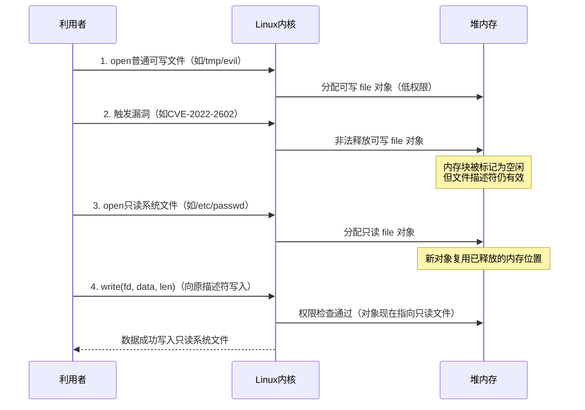

该序列图清晰地展示了四个关键步骤：

1. **打开低权限文件**：利用者创建一个普通可写文件，内核为其分配对应的 `file` 对象。该对象包含写入权限标志，允许后续的写入操作。在 **CVE-2022-2602** 的典型场景中，该文件位于 `/tmp` 或 `/home/ctf` 目录下。
2. **非法释放对象**：利用内核漏洞使内核错误地释放该 `file` 对象。在 **CVE-2022-2602** 中，这一释放由 `unix_gc` 错误触发。此时对象已被归还给 SLUB 分配器的空闲链表，但其用户态文件描述符仍处于打开状态，形成悬垂指针。
3. **分配高权限对象**：利用者立即打开一个只读的系统关键文件（如 `/etc/passwd`）。内核为新打开的文件分配 `file` 对象时，SLUB 分配器会优先复用刚刚释放的内存块，使得高权限的只读 `file` 对象恰好占据低权限 `file` 对象原先的位置。
4. **完成凭证替换**：此时，原始文件描述符实际指向的已是高权限只读文件的 `file` 对象。当利用者通过该描述符发起写入时，内核基于当前 `file` 对象的权限进行检查——由于该对象来自一个只读文件，理论上不应允许写入。然而，权限检查通过的是可写文件描述符所持有的凭证，而实际写入的目标却是只读的系统文件。这种"身份混乱"使得写入操作得以完成，从而实现特权文件的内容覆写。

这一过程不依赖任何内核地址泄露，也不直接篡改凭证数据，而是通过**替换整个 `file` 对象**来绕过权限检查。需要指出的是，**Dirty Cred** 同样支持对 `cred` 对象的交换——通过将低权限任务的 `cred` 对象与高权限任务的 `cred` 对象进行内存层面的置换，可使低权限进程直接获得 root 权限。

### 3-3. 技术挑战与应对

**Dirty Cred** 在实际利用过程中面临一系列技术挑战，研究人员针对这些挑战提出了相应的解决方案。这些挑战可以归纳为三个核心问题：漏洞原语的转化、竞争窗口的延长以及特权对象的主动分配。三者之间存在递进关系：首先需要将漏洞能力转化为可用的凭证释放原语，然后需要在精确的时间窗口内完成对象交换，最后还需要主动获得高权限凭证对象以完成置换。任何一个环节的缺失都会导致整个利用链条失效。

#### 3-3-1. 漏洞原语转化

大多数堆漏洞并不直接提供"非法释放任意对象"的能力。**Dirty Cred** 需要将不同类型的漏洞能力转化为凭证交换所需的基础原语。下表总结了不同类型漏洞的转化策略：

| 漏洞类型         | 转化策略                             | 关键条件                               |
| ---------------- | ------------------------------------ | -------------------------------------- |
| 越界写 (OOB)     | 覆写相邻对象中的凭证指针，伪造引用   | 受害者对象紧邻漏洞对象，且包含凭证指针 |
| 释放后使用 (UAF) | 利用释放后的悬垂指针重新分配特权对象 | 缓存可控，或具备写入能力修改指针       |
| 双重释放 (DF)    | 利用跨缓存内存页回收                 | 清空源缓存，使内存页被目标缓存复用     |

以越界写为例，其转化流程如下图所示：

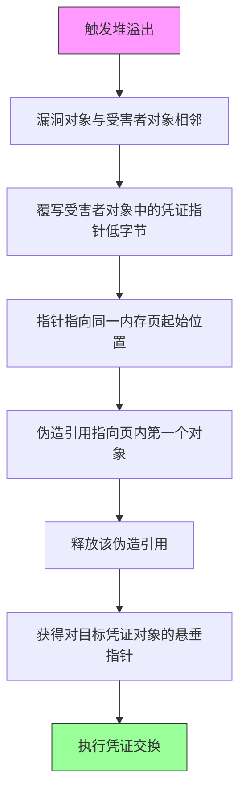

**越界写转化**：通过精心堆布局，使包含指向凭证对象指针的受害者对象紧邻漏洞对象之后。利用溢出覆写该指针的低位字节（清零末两位），使其指向同一内存页的起始位置——由于内存页地址末位始终为零，这一操作可将指针重定向到页内第一个对象的起始地址。释放这个被伪造引用的对象后，内核会将页内第一个对象（可能是另一个凭证对象）释放，从而实现对目标凭证对象的非法释放。

**释放后使用转化**：若 UAF 发生在凭证专用缓存（如 `cred_jar`）上，直接释放非特权凭证后使用新创建的特权凭证占据该内存即可完成置换。若 UAF 发生在通用缓存上，则需要该 UAF 具备非法写入能力——先释放出一个内存空洞，再用含有凭证指针的可利用对象占据它，然后利用 UAF 修改该凭证指针，使其指向目标凭证对象，最后释放该对象。

**双重释放转化**：利用跨缓存内存页回收机制。首先通过大量分配填充缓存，然后使用两个不同指针重复释放同一对象，制造双重释放。接着清空整个缓存使其内存页被伙伴系统回收。当内核在凭证专用缓存中分配新对象时，这些内存页会被重新分配给该缓存，从而使凭证对象恰好落位到可被悬垂指针引用的位置。**Dirty Cred** 随后利用剩余的悬垂指针非法释放该凭证对象，完成凭证交换。

通过上述转化策略，不同类型的堆内存破坏漏洞均可被统一转化为 **Dirty Cred** 所需的基础原语，这为后续的凭证交换奠定了技术基础。

#### 3-3-2. 竞争窗口的延长

在 Linux 内核中，权限检查与实际数据写入往往背靠背快速发生。若无法精确控制文件对象交换的发生时机，利用将极不稳定。**Dirty Cred** 通过以下机制延长竞争窗口：

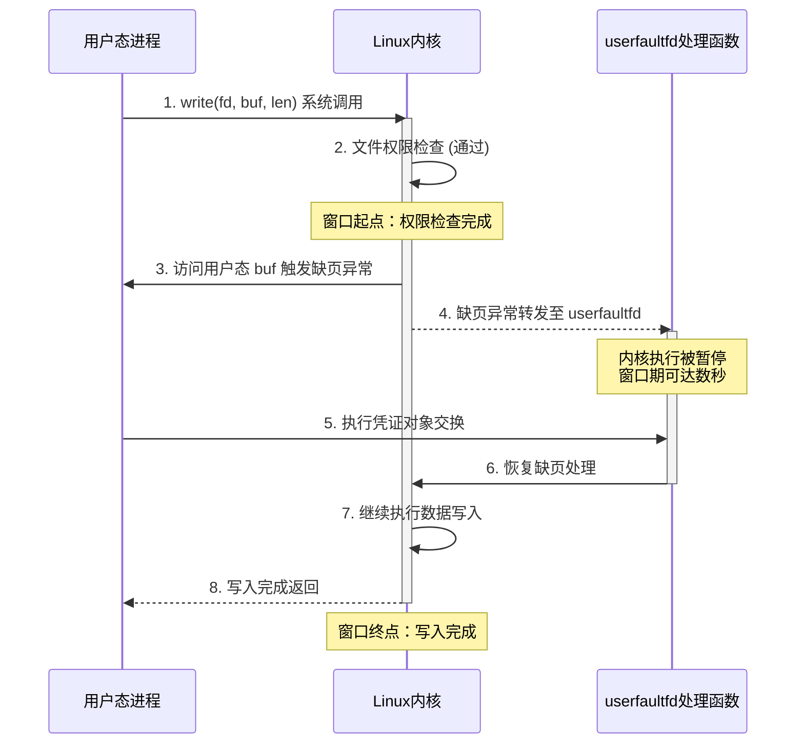

该序列图展示了 **Dirty Cred** 利用 userfaultfd 延长竞争窗口的完整交互流程：

**userfaultfd 利用**：userfaultfd 是 Linux 内核提供的一种用户态缺页异常处理机制，允许用户态进程注册自定义的缺页处理函数。当内核访问注册内存区域中的页面并触发缺页异常时，该处理函数会被调用，内核执行被暂停，直到用户态完成处理并恢复执行。在 v4.13 之前，`writev` 系统调用先完成权限检查，随后在 `import_iovec` 时触发缺页异常，**Dirty Cred** 可在此处暂停内核并获得数秒乃至更长的窗口期完成对象交换。在 v4.13 之后，虽然 `import_iovec` 被移至权限检查之前，但 **Dirty Cred** 仍可利用 `generic_perform_write` 在写入前触发的 page fault 实现延时——该 page fault 位于权限检查之后、实际写入之前，恰好提供了所需的竞争窗口。值得注意的是，移除该 page fault 可能引发死锁问题，使得此方案难以被彻底修复。

**文件系统锁利用**：在 ext4 等文件系统中，写入操作前会对 inode 进行加锁以防止并发写入导致数据混乱。利用者可派生两个进程同时对同一大文件执行写入——进程 A 持有锁并写入大量数据（如 4GB 文件写入机械硬盘可延迟数十秒），进程 B 在完成权限检查后等待锁释放。这一等待过程为 **Dirty Cred** 提供了充足的窗口期完成对象交换，无需依赖 userfaultfd。

**FUSE 利用**：FUSE（用户态文件系统）框架允许用户实现自定义的文件系统并注册操作处理函数。利用者可构造一个 FUSE 文件系统，其处理函数在收到操作请求后可任意延迟响应。当内核访问 FUSE 文件系统中的文件时，会调用用户态的处理函数，内核执行被暂停，从而为凭证交换创造时间窗口。

上述三种机制从不同层面解决了竞争窗口的问题：userfaultfd 利用缺页机制实现精准暂停，文件系统锁利用并发写入的阻塞特性，FUSE 则通过用户态文件系统的自定义处理实现任意时长的延迟。三者互为补充，使得 **Dirty Cred** 在不同内核版本和配置下均可获得稳定的利用窗口。

#### 3-3-3. 特权对象的主动分配

**Dirty Cred** 面临的一个关键挑战是：低权限用户如何在内核空间主动分配高权限凭证对象。被动等待特权用户的活动会严重影响利用的稳定性——利用者无法预知目标内存何时被回收，也无法控制新分配对象的权限等级。为解决这一问题，**Dirty Cred** 采用主动策略触发内核空间中的特权对象分配。

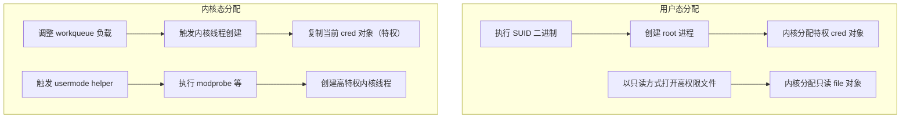

**用户态分配**：当二进制文件设置了 SUID 权限时，无论执行者是谁，该文件都会以所有者的权限执行。低权限用户可通过执行 root 所有的 SUID 二进制文件（如 `su`、`ping`、`sudo`、`mount` 等）来触发 root 进程的创建，从而在内核中分配特权的 `cred` 对象。对于 `file` 对象，利用者只需以只读权限打开多个目标文件（如 `/etc/passwd`、`/etc/sudoers` 等），内核便会在相应内存中分配对应的只读 `file` 对象。由于这些文件为 root 所有且权限为只读，其 `file` 对象带有高权限属性。

**内核态分配**：**Dirty Cred** 还可通过内核空间分配特权对象。当 Linux 内核启动新内核线程时，会复制当前运行进程并分配一个复制的 `cred` 对象。由于大多数内核线程（如 kworker、kswapd 等）运行在特权上下文中，其 `cred` 对象具有 `GLOBAL_ROOT_UID`，复制的 `cred` 对象也处于高权限状态。具体方法包括：通过增加提交到内核工作队列（workqueue）的工作量，触发工作池动态创建新的 worker 线程；或利用 usermode helper 机制（如加载内核模块时调用 `/sbin/modprobe`）触发高特权用户态程序的执行，该过程涉及内核线程的创建，进而分配高特权凭证对象。

用户态与内核态两种分配路径的有机结合，使 **Dirty Cred** 能够在不同场景下灵活地获取所需的高权限凭证对象，从根本上消除了对特权用户活动的被动依赖，显著提升了利用的稳定性和可靠性。

### 3-4. 可利用对象与通用性评估

为了评估 **Dirty Cred** 的通用性，研究人员首先系统性地识别了各内核缓存中可用于 **Dirty Cred** 的可利用对象——即包含指向凭证对象指针的内核数据结构。研究团队开发了一套基于 LLVM 的静态分析工具，结合 Syzkaller 内核模糊测试器，自动化地追踪可被用户态系统调用触发的对象分配与释放路径。

实验结果表明，可利用对象覆盖了几乎所有的通用缓存（除极少使用的 kmalloc-8 外），且每个缓存中通常存在多个可利用对象。这些对象包括 `fs_context`、`request_key_auth`、`shmid_kernel`、`binder_proc` 等多种类型，分别包含指向 `file` 或 `cred` 凭证对象的指针，其偏移量因对象类型而异。其中，5 个通用缓存中的对象将凭证指针放置在对象起始位置，这意味着即使利用者仅获得非常有限的覆写能力（如仅能覆写目标对象起始处两个字节为零），仍可借助这些对象发起 **Dirty Cred** 利用。丰富的可利用对象为 Dirty Cred 适配各类漏洞提供了充足的选择空间，也是其通用性的重要基础。

在真实漏洞可利用性评估方面，研究团队选取了 2019 年后报告的 24 个 Linux 内核 CVE 漏洞作为测试集，涵盖越界写、释放后使用、双重释放等多种堆内存破坏类型。实验结果表明，**Dirty Cred** 在其中的 16 个漏洞上成功展示了可利用性。下表展示了部分代表性测试结果：

| CVE编号        | 漏洞类型    | Dirty Cred 可利用性 |
| -------------- | ----------- | ------------------- |
| CVE-2022-27666 | OOB         | ✓                   |
| CVE-2022-25636 | Double Free | ✓                   |
| CVE-2022-2588  | UAF         | ✓                   |
| CVE-2022-2602  | UAF         | ✓                   |
| CVE-2021-43267 | OOB         | ✓                   |
| CVE-2021-22555 | Double Free | ✓                   |
| CVE-2020-14386 | OOB         | ✓                   |
| CVE-2019-2215  | UAF         | ×                   |

研究发现，在 vmalloc 区域（虚拟内存区域）发生的漏洞相对较难利用，主要原因在于该区域中可用于 **Dirty Cred** 的可利用对象较少。然而，这并不意味着此类漏洞完全无法被 **Dirty Cred** 利用——例如 CVE-2021-34866 虽为 vmalloc 区域的越界写漏洞，但可通过组合利用手法先将其转化为任意读写能力，再构造双重释放原语，最终仍可适配 **Dirty Cred** 的利用流程。

**Dirty Cred** 的通用性还体现在跨版本与跨架构的适配能力上。传统利用方式通常需要针对不同内核版本和 CPU 架构重新构造 ROP 链或调整偏移量，而 **Dirty Cred** 采用纯数据驱动的利用策略，不依赖任何内核地址信息，也不使用架构相关的指令序列，因此同一份利用代码无需修改即可在不同内核版本和架构上运行。研究团队已验证 **Dirty Cred** 在 x86_64 和 ARM64 架构上的有效性。

除了权限提升，**Dirty Cred** 还可实现容器逃逸。通过文件对象交换，利用者可覆写容器中的高权限文件；通过 `cred` 对象交换，则可直接获得 `SYS_ADMIN` 等特权 capability，进而利用 cgroup `release_agent` 等机制在宿主机上执行任意命令。研究团队还展示了 **Dirty Cred** 在 Android 平台上的提权能力——通过交换 `cred` 对象直接获得 root 权限，或通过覆写共享系统库突破沙箱限制，最终禁用 SELinux。相关成果已提交至 Google 漏洞奖励计划并获得了 20,000 美元的赏金。

### 3-5. 防御思路

针对 **Dirty Cred** 这类基于凭证交换的利用方法，研究人员提出了一种新的内核防御机制：**将内核凭证对象根据其自身的权限级别隔离在非重叠的内存区域中**。

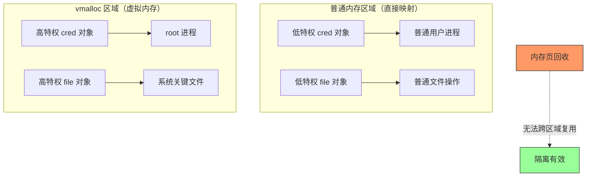

具体而言，该防御方案将高特权对象存储在 `vmalloc` 区域（虚拟内存区域），而低特权对象保留在普通内存区域（直接映射内存区域，即 `kmalloc` 所使用的区域）。由于这两个区域在物理和虚拟地址空间上均不重叠——`vmalloc` 区域位于 `VMALLOC_START` 至 `VMALLOC_END` 定义的地址范围内，与直接映射区域完全隔离——即使缓存被销毁、底层内存页被伙伴系统回收并重新分配，高特权与低特权对象的存储区域也不会发生重叠，从而从根本上阻断了 **Dirty Cred** 利用堆内存复用进行凭证交换的利用路径。

在实现层面，研究团队在 Linux 内核 v5.16.15 上构建了该防御原型。当分配 `cred` 对象时，系统检查其 UID 是否为 `GLOBAL_ROOT_UID`，若是则通过 `vmalloc` 分配内存；当分配 `file` 对象时，检查文件的打开模式，若包含写权限则同样使用 `vmalloc` 分配。对于运行时权限变更（如通过 `setuid` 系统调用将低权限凭证提升为高权限），实现方案会复制对象到 `vmalloc` 区域而非直接修改原对象，以确保隔离性不被破坏。

研究团队通过 LMbench 和 Phoronix Test Suite 对该防御机制进行了性能评估。实验结果表明，该防御机制在大多数情况下仅引入可忽略不计的性能开销，仅在“10k 文件创建”和“10k 文件删除”等测试中表现出约 4%-7% 的适度性能下降。这一开销主要源于 `vmalloc` 相比 `kmalloc` 需要重新映射缓冲区空间的额外操作——`vmalloc` 分配的内存需要将不连续的物理页映射为连续的虚拟地址范围，而 `kmalloc` 直接从物理连续的 DMA 区域分配，无需页表重映射。值得指出的是，文件删除操作（通过 RCU 异步释放）的性能下降（4.25%）低于文件创建操作（7.17%），进一步验证了该防御在实际场景中的可接受性。

从防御理念来看，该机制不同于传统的基于对象类型或敏感度的隔离方案（如 AUTOSLAB 按对象类型隔离、xMP 按敏感度隔离），而是基于凭证对象自身的权限等级进行内存隔离。这种设计直接针对 **Dirty Cred** 的核心利用机理——特权与非特权凭证的交换——因此对 **Dirty Cred** 这类凭证交换利用方法具有更强的针对性防御效果，为 Linux 内核防御体系提供了一种新的可行思路。

### 3-6. 分析总结

纵观 **Dirty Cred** 的完整技术链条，其核心可归纳为**对内核堆内存复用机制的深度操纵**。该利用方法跳出了传统控制流劫持的范式——不依赖 ROP 链、不泄露内核基址、不覆写关键数据字段，而是完全立足于内核内存分配器（SLUB）的固有行为特性，将一次内存破坏原语转化为可控的凭证交换能力。

从技术演进的角度看，**Dirty Cred** 代表了内核利用方法论的一次重要转向。传统利用方式面临 KASLR、SMEP、SMAP、KPTI、CFI 等多层防护的层层拦截，每次突破都需要耗费大量精力构造信息泄露和 ROP 链条。而 **Dirty Cred** 另辟蹊径，通过纯数据驱动的对象交换策略，使上述防护机制几乎全部失效——因为它们都聚焦于控制流完整性，而 **Dirty Cred** 操纵的恰恰是数据流。这一思路与 **Dirty Pipe** 异曲同工，但 **Dirty Cred** 的通用性远超 **Dirty Pipe**，能够适配越界写、释放后使用、双重释放等多种堆漏洞类型，覆盖范围显著更广。

**Dirty Cred** 的核心技术贡献体现在三个方面：第一，提出了系统的漏洞原语转化方案，将各类堆破坏能力统一为凭证非法释放原语；第二，设计了 userfaultfd、文件系统锁、FUSE 等多层次的竞争窗口延长机制，确保利用的稳定性和可靠性；第三，构建了用户态与内核态协同的特权对象主动分配策略，彻底消除对特权用户活动的被动依赖。三者环环相扣，构成了一套完备且可移植的利用框架。

从防御视角来看，**Dirty Cred** 揭示了一个深层次的系统安全挑战——内核内存分配器的复用机制本身是设计使然，却可被操纵为凭证交换的载体。这意味着传统的漏洞修补策略已不足以应对此类情形：即便消除了某一个漏洞，只要堆内存复用机制与凭证对象管理之间缺乏有效的隔离，同类利用手法仍可能在其他漏洞上复现。因此，基于凭证权限等级的内存隔离方案不仅是应对 **Dirty Cred** 的有效手段，也为更广泛的内核数据隔离设计提供了重要思路。

综上所述，**Dirty Cred** 不仅在技术层面实现了对现有内核防护体系的突破，更在方法论层面为内核安全研究开辟了新的方向——**从控制流保护转向数据流隔离**，或许将成为下一阶段内核安全防御的核心命题。这一发现对于内核开发者、安全研究人员以及防御方案设计者均具有重要的参考价值。

## 4. 利用思路一

### 4-1. 整体架构设计

基于前文对 **CVE-2022-2602** 漏洞根因与 DirtyCred 内存复用技术的分析，本节将系统性地阐述一种针对该漏洞的完整操作流程。该流程的设计目标是在满足漏洞触发条件的前提下，通过六个连续的操作阶段，将一次释放后重用漏洞转化为可控的文件对象置换能力。

整个操作流程的设计遵循以下核心原则：

- **确定性优先**：每个阶段均采用可预测的内核行为，避免依赖概率性因素。通过 CPU 绑定增强 SLUB 分配器的缓存局部性，使堆喷的复用成功率接近确定。
- **竞态窗口可控**：通过辅助线程持有 inode 锁的方式，精确控制漏洞触发与堆喷之间的时间窗口，确保内存复用发生在悬空指针被使用之前。
- **错误可恢复**：每个阶段均包含完整的错误检测与资源清理路径，确保任一阶段失败时不会留下持久化的内核状态异常。

**整体流程概览**：

操作流程分为六个阶段，各阶段功能与流转关系如下：

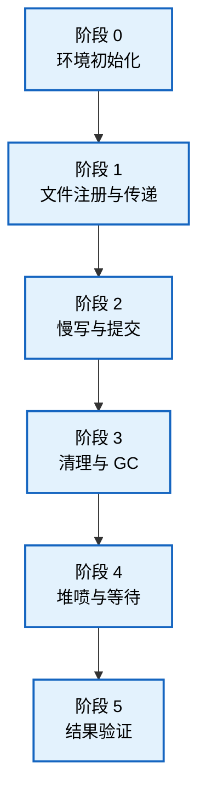

各阶段在时间轴上的交错执行关系如下（辅助线程与主线程的并发协作）：

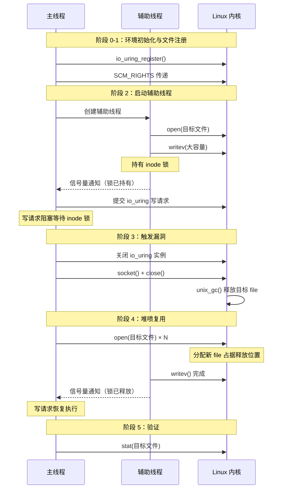

### 4-2. 阶段 0：环境初始化

本阶段负责建立后续操作所需的执行环境，为文件注册、`io_uring` 操作和堆喷提供稳定的运行上下文。

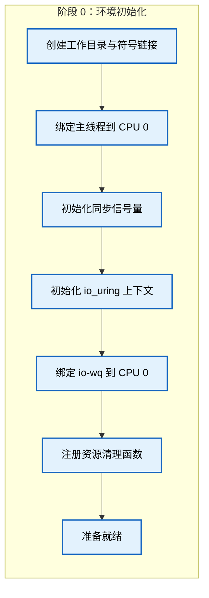

**工作目录与符号链接准备**：

在工作目录中创建必要的文件结构，通过符号链接使后续打开的目标文件路径指向一个可控的底层文件。这确保了 `io_uring` 注册的文件与辅助线程操作的文件指向同一个 inode，保证 inode 锁的阻塞效果能够准确作用于目标文件。符号链接的引入还使得操作完成后可以快速清理环境，避免残留文件影响系统状态。

**CPU 绑定策略**：

将主线程和 `io_uring` 的异步工作队列绑定到同一个 CPU 核心，以优化 SLUB 分配器的缓存局部性。当所有相关操作在同一 CPU 上执行时，内存分配与释放倾向于使用同一组 per-CPU 空闲链表，显著提高堆喷复用成功率。在多核系统中，若未绑定 CPU，释放的内存块可能落入其他 CPU 的空闲链表，导致后续分配无法复用。

**同步机制初始化**：

两个信号量用于主线程与辅助线程之间的同步：一个在辅助线程持有 inode 锁后通知主线程，另一个在辅助线程释放锁后通知主线程。这确保了竞态窗口的精确控制——主线程在辅助线程持锁期间执行漏洞触发与堆喷操作，避免因操作顺序错乱导致流程失败。

**`io_uring` 上下文初始化**：

启用 `IORING_SETUP_SQPOLL` 标志，使内核创建专用线程轮询提交队列，简化异步提交流程。`io_uring` 初始化时同步创建关联的 `ring_sock`，其接收队列将在后续阶段存放注册的文件引用。`ring_sock` 的创建使得 `io_uring` 能够与 Unix 域套接字垃圾回收机制交互，这是漏洞触发路径中的关键环节。

### 4-3. 阶段 1：文件注册与描述符传递

本阶段建立漏洞触发所需的引用关系：将普通文件放入 `io_uring` 的接收队列，并建立 `io_uring` 描述符与套接字端点之间的循环引用。

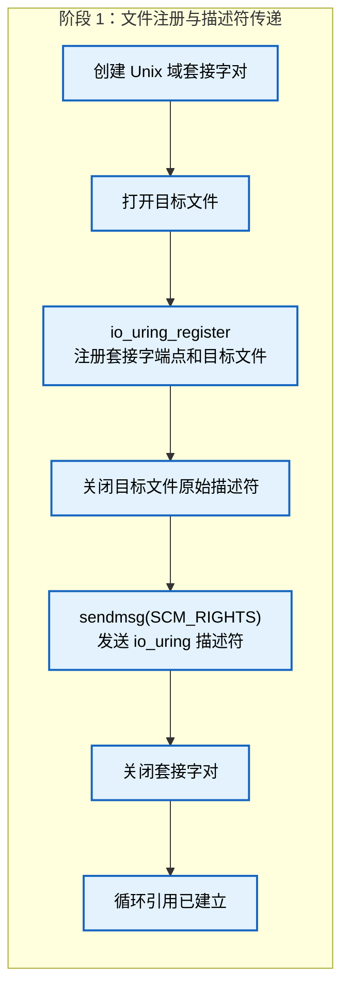

**注册文件到 `io_uring`**：

通过 `io_uring_register` 将套接字端点和目标文件注册到 `io_uring`。内核为这两个文件创建 `sk_buff`，将它们的 `struct file *` 指针存入 `scm_fp_list`，并将 `sk_buff` 加入 `ring_sock->sk_receive_queue`。关闭目标文件的原始描述符后，`sk_buff` 中的引用仍然有效。注册顺序决定了 `sk_buff` 中指针数组的排列——目标文件位于索引 1，与后续写请求的目标索引一致。

**通过 `SCM_RIGHTS` 传递 `io_uring` 描述符**：

通过 `SCM_RIGHTS` 消息将 `io_uring` 描述符发送给套接字对端，使其被添加到对端接收队列并获得飞行引用。发送完成后按特定顺序关闭套接字端点：先关闭发送端，后关闭接收端，确保在 `unix_gc` 触发时引用关系已满足循环条件。

此时系统中建立了不可破循环：`io_uring` 接收队列包含套接字端点和目标文件，套接字对端接收队列包含 `io_uring` 描述符，为后续 `unix_gc` 的触发奠定了基础。

### 4-4. 阶段 2：慢写与 `io_uring` 提交

本阶段通过辅助线程持有 inode 锁，人为制造竞态窗口，使 `io_uring` 写请求在目标文件被释放后仍处于等待状态。

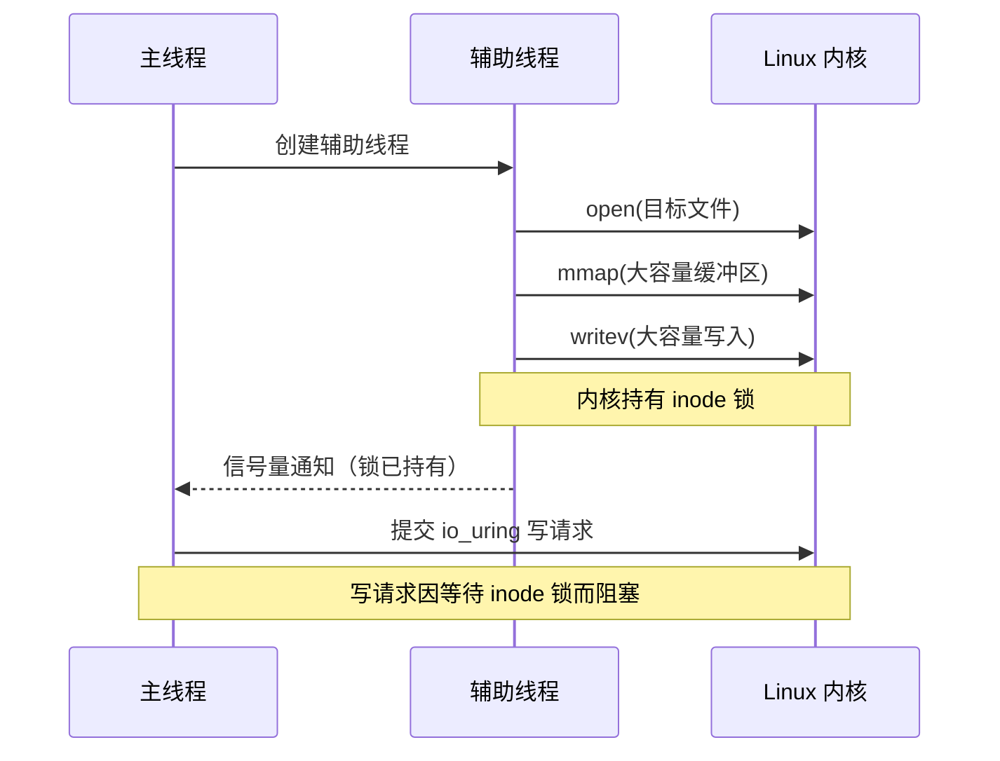

**辅助线程的启动与 inode 锁持有**：

辅助线程打开与目标文件指向同一底层文件的新描述符，分配大容量缓冲区后执行 `writev`。在 ext4 等文件系统中，`writev` 在整个 I/O 过程中持有目标文件的 inode 锁，产生可预测的阻塞时长。这一机制相比用户态自旋等待具有显著优势：inode 锁是内核原生提供的锁机制，不会引起调度异常；等待锁的请求处于可恢复的阻塞状态，不存在超时或异常唤醒的风险。辅助线程持锁后通过信号量通知主线程。

**提交 `io_uring` 写请求**：

主线程收到通知后提交写请求，目标为已注册的目标文件，使用固定文件标志。该请求在权限检查后因等待 inode 锁而阻塞。阻塞发生在权限检查之后、实际写入之前，恢复执行时无需重新检查权限——这正是 DirtyCred 技术得以实现的关键点。此时 `io_uring` 内部已持有指向目标文件 `struct file` 的指针，但尚未开始实际数据写入。

### 4-5. 阶段 3：清理与 GC 触发

本阶段触发 `unix_gc()` 释放 `io_uring` 接收队列中的 `sk_buff`，导致目标文件的 `struct file` 被释放，形成悬空指针。

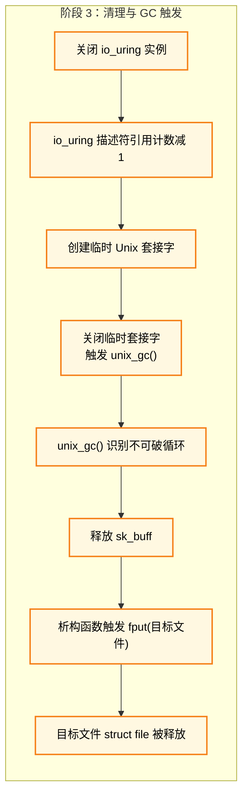

**关闭 `io_uring` 实例**：

释放用户进程对 `io_uring` 描述符的引用，但描述符仍被套接字对端接收队列持有。此时 `io_uring` 与套接字端点满足 `引用计数 == 飞行计数` 的条件，进入待回收状态。

**触发 `unix_gc()`**：

创建临时 Unix 域数据报套接字并立即关闭，触发 `unix_gc()`。GC 从全局飞行列表中筛选候选者，识别不可破循环后释放 `sk_buff`。`sk_buff` 的析构函数 `unix_destruct_scm` 调用 `__scm_destroy`，对其中所有文件执行 `fput()`，导致目标文件的 `struct file` 被释放。此时阶段 2 提交的写请求尚未完成，悬空指针已形成——这是整个漏洞触发流程的关键结果。

### 4-6. 阶段 4：堆喷与等待

本阶段在悬空指针被使用前，通过堆喷使新分配的 `struct file` 占据被释放的内存位置。

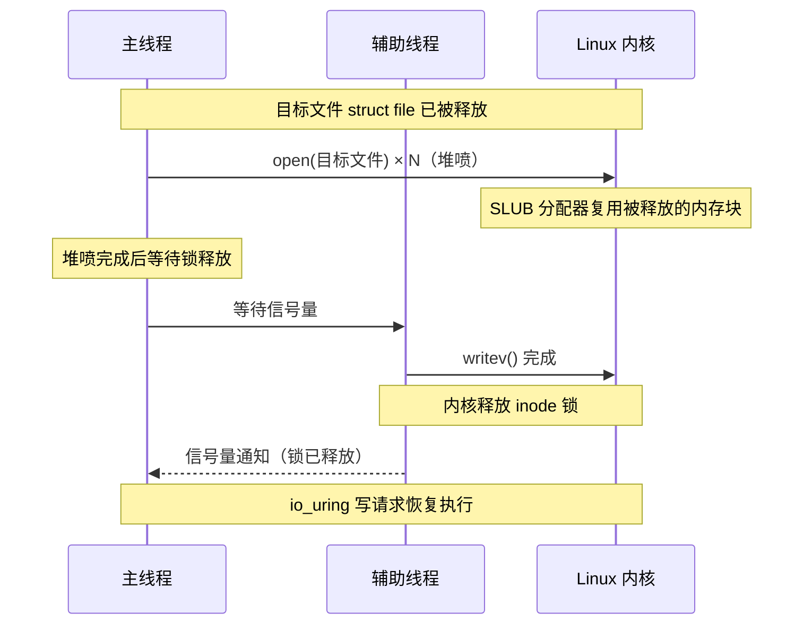

**堆喷操作**：

连续打开大量目标文件，每次 `open` 都从 `filp` 缓存分配新的 `struct file`。SLUB 分配器优先分配最近释放的同尺寸缓存对象，新分配的 `struct file` 极大概率占据被释放的内存位置。堆喷的数量需平衡复用成功率与进程文件描述符上限，在保证成功的同时避免触及系统资源限制。

**等待 inode 锁释放**：

堆喷完成后等待辅助线程完成写入并释放 inode 锁。锁释放后，被阻塞的写请求恢复执行，其访问的内存位置已被堆喷的 `struct file` 占据，悬空指针指向的实际对象已悄然替换。

### 4-7. 阶段 5：结果验证

本阶段验证操作是否成功，并执行清理与后处理。

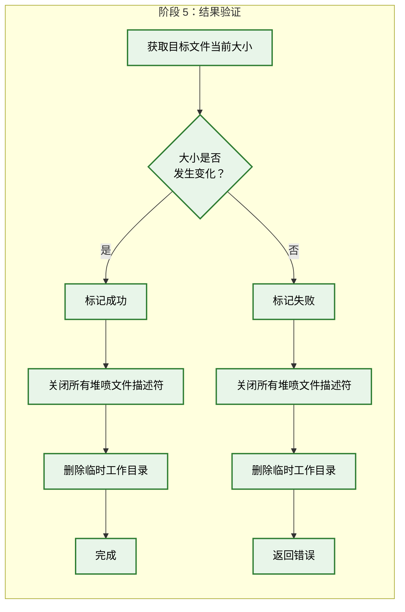

**验证方法**：

通过 `stat` 获取目标文件大小，与操作前记录的原始大小比较。若发生变化则说明堆喷成功，写入操作已覆写目标文件内容。验证通过后关闭所有堆喷描述符，删除临时工作目录和符号链接，销毁信号量。操作成功后，新的高权限用户条目已存在于目标文件中。

### 4-8. 阶段间的错误处理与资源管理

错误处理遵循“尽早失败、彻底清理”的原则：

- **阶段 0 失败**：尚未进行持久化修改，直接退出。
- **阶段 1 ~ 2 失败**：`atexit` 注册的清理函数释放 `io_uring` 资源。
- **阶段 3 失败**：资源泄漏风险较低，直接退出。
- **阶段 4 失败**：清理函数遍历关闭所有堆喷描述符。
- **阶段 5 失败**：无论成功与否，清理函数均释放所有资源。

通过标志跟踪 `io_uring` 的状态，确保资源释放函数不会被重复调用。

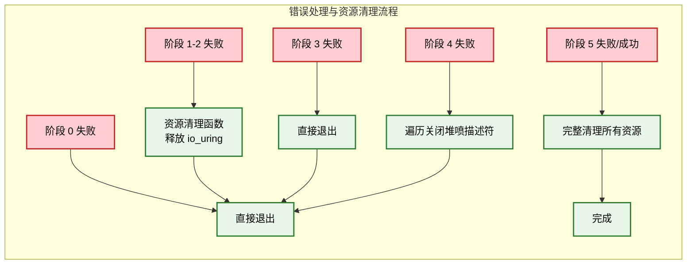

### 4-9. 内核保护机制的应对策略

本操作流程的核心特点是**纯数据驱动的对象交换**——不依赖内核地址信息、不执行内核代码、不操纵控制流，因此许多旨在防御控制流劫持的机制在本场景中不起作用。

| 保护机制                              | 类型     | 描述                               | 应对策略                             | 是否有效    |
| ------------------------------------- | -------- | ---------------------------------- | ------------------------------------ | ----------- |
| **KASLR**                             | 运行时   | 随机化内核代码段、数据段和堆的基址 | 不依赖任何内核地址                   | ✅ 完全绕过 |
| **SMEP**                              | 运行时   | 禁止内核执行用户态代码             | 不执行内核代码                       | ✅ 完全绕过 |
| **SMAP**                              | 运行时   | 禁止内核访问用户态数据             | 数据通过标准内核路径传递             | ✅ 完全绕过 |
| **KPTI**                              | 运行时   | 隔离内核与用户态页表               | 不依赖侧信道                         | ✅ 完全绕过 |
| **CFI**                               | 运行时   | 限制间接跳转目标地址               | 不涉及间接跳转                       | ✅ 完全绕过 |
| **CONFIG_MEMCG<br>CONFIG_MEMCG_KMEM** | 隔离机制 | 为每个 cgroup 分配独立缓存         | `struct file` 由专用 `filp` 缓存分配 | ✅ 无影响   |
| **CONFIG_SLAB_FREELIST_RANDOM**       | 编译加固 | 随机化 SLUB 空闲链表顺序           | CPU 绑定 + 大量堆喷                  | ⚠️ 影响较低 |
| **CONFIG_SLAB_FREELIST_HARDENED**     | 编译加固 | 空闲链表指针插入校验值             | 不操纵空闲链表指针                   | ✅ 无影响   |
| **CONFIG_HARDENED_USERCOPY**          | 编译加固 | 检查用户拷贝操作的对象大小         | 写请求通过标准 VFS 路径              | ✅ 无影响   |

SLUB 分配器的 per-CPU 缓存和空闲链表管理在通常情况下是可预测的，但 `CONFIG_SLAB_FREELIST_RANDOM` 引入了随机化因素。本操作流程通过 CPU 绑定、专属缓存和大量堆喷将不确定性降至最低。这些机制的共同点是防御“控制流异常”，而本操作流程的所有操作均发生在正常的数据路径上，不制造任何控制流异常。

### 4-10. 操作条件与局限性

**前置条件**

| 条件                   | 说明                                              | 必要程度 |
| ---------------------- | ------------------------------------------------- | -------- |
| 受影响的内核版本       | 32 位系统（5.1 ~ 6.0.2）或 64 位系统（≤ 5.18.19） | 必要条件 |
| CONFIG_IO_URING 启用   | 漏洞依赖于 `io_uring` 子系统                      | 必要条件 |
| CONFIG_UNIX 启用       | 需要 Unix 域套接字支持                            | 必要条件 |
| 对目标文件的读权限     | 堆喷需要能够打开该文件                            | 必要条件 |
| 可写的临时目录         | 需要创建临时文件和工作目录                        | 必要条件 |
| 进程文件描述符上限充足 | 堆喷需要大量文件描述符                            | 必要条件 |

**技术局限性**

- **版本与架构依赖性**：仅适用于 32 位全版本及 64 位 ≤ 5.18.19 的内核。64 位 ≥ 5.19 的系统上，由于 `io_scm_file_account` 检查机制的存在，普通文件不加入接收队列，漏洞无法触发。这一限制是根本性的，无法通过调整参数来规避。
- **路径依赖性**：假设目标文件路径可写且可创建符号链接，在受限环境中需调整。
- **文件系统依赖性**：inode 锁的阻塞效果依赖文件系统实现了锁机制，tmpfs 等内存文件系统上效果可能不佳。
- **堆喷成功率**：内存压力较大的系统上，SLUB 分配器行为可能受干扰。
- **并发干扰**：其他进程的并发内存操作可能影响堆喷复用。

**安全边界**

本操作流程仅在特定内核版本和配置下有效，且需要本地低权限用户执行。在已修复内核或受限环境中无效。验证阶段会主动检测目标文件变化，避免在失败时产生不可逆的系统修改。

### 4-11. 章节总结

本章系统性地阐述了一种针对 **CVE-2022-2602** 的完整操作流程，基于 DirtyCred 内存复用技术，通过六个精心设计的阶段将释放后重用漏洞转化为可控的文件对象置换能力。

从技术实现来看，本操作流程的核心价值体现在三个方面：

- **阶段化设计**：将复杂流程分解为六个独立阶段，职责明确、便于调试和错误定位。
- **确定性优化**：通过 CPU 绑定、信号量同步、inode 锁控制等手段，将不确定的竞态窗口转化为可预测的操作序列。
- **防御规避**：操作流程设计本身不依赖 KASLR、SMEP、SMAP、KPTI、CFI 等保护机制所防御的内容，从原理上规避了这些防御手段。

该操作流程在 32 位全版本及 64 位 ≤ 5.18.19 的内核上能够稳定完成文件对象置换，整个操作过程不依赖任何内核地址泄露，也不触发异常的控制流转移，具有良好的隐蔽性和可靠性。

本章的操作为理解 DirtyCred 技术在实际漏洞中的应用提供了具体的案例参考，同时也展示了如何将理论分析转化为可操作的实施方案。

### 4-12. 测试结果

<div style="text-align: center; margin: 2rem 0;">
  
</div>

## 5. 利用思路二

### 5-1. 整体架构设计

本章阐述另一种针对 **CVE-2022-2602** 的操作流程。该思路的核心区别在于竞态窗口的构建方式——利用 **FUSE（用户态文件系统）** 框架实现辅助线程的精确阻塞，从而为堆喷操作创造可控的时间窗口。

**FUSE 阻塞机制的原理**：

FUSE 框架允许用户实现自定义的文件系统并注册操作处理函数。当内核访问 FUSE 文件系统中的文件时，操作请求被转发至用户态处理函数，内核执行被暂停，直到用户态完成处理并返回响应。这一机制为竞态窗口的精确控制提供了极大的灵活性——阻塞时长可由用户态程序任意决定，不受存储介质性能的影响，从而在不同环境下均可获得稳定的操作窗口。

在本操作流程中，辅助线程通过 `writev` 向目标文件写入数据，其源缓冲区指向 FUSE 内存映射区域。当内核读取该源缓冲区时，由于该区域对应的是 FUSE 文件，读取操作被转发至用户态 FUSE 守护进程。在内核等待用户态返回数据期间，`writev` 系统调用被阻塞，目标文件的 inode 锁被持有，主线程则利用这一窗口期完成漏洞触发与堆喷操作。

**整体流程概览**：

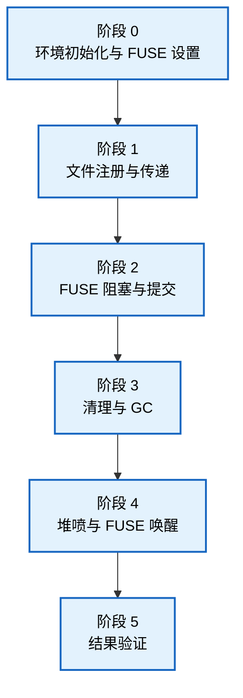

各阶段在时间轴上的交错执行关系如下（FUSE 框架的介入使得辅助线程的阻塞与唤醒完全受控）：

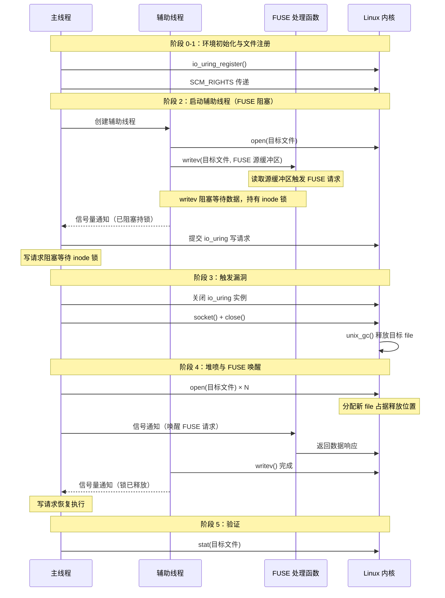

### 5-2. 阶段 0：环境初始化与 FUSE 设置

本阶段负责建立后续操作所需的执行环境，在常规环境初始化的基础上增加了 FUSE 框架的设置步骤。FUSE 的引入使得辅助线程的阻塞行为从“被动等待 I/O 完成”转变为“主动控制阻塞时长”。

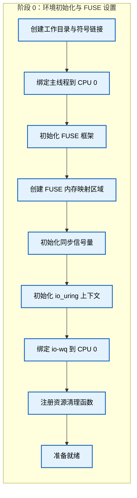

**工作目录与符号链接准备**：

操作流程首先在工作目录中创建必要的文件结构，通过符号链接使后续打开的目标文件路径指向一个可控的底层文件。这确保了 `io_uring` 注册的文件与辅助线程操作的文件指向同一个 inode，保证 inode 锁的阻塞效果能够准确作用于目标文件。

**CPU 绑定策略**：

将主线程和 `io_uring` 的异步工作队列绑定到同一个 CPU 核心，以优化 SLUB 分配器的缓存局部性。当所有相关操作在同一 CPU 上执行时，内存分配与释放倾向于使用同一组 per-CPU 空闲链表，显著提高堆喷复用成功率。

**FUSE 框架的初始化**：

操作流程首先启动 FUSE 守护进程，该进程将在用户态处理来自内核的文件操作请求。随后将 FUSE 文件映射到进程的地址空间，该内存区域将作为辅助线程 `writev` 操作的**源缓冲区**——当辅助线程执行 `writev` 向目标文件写入数据时，数据来源于这片 FUSE 映射区域。内核在读取这片源缓冲区时，由于该区域对应的是 FUSE 文件，读取操作被转发至 FUSE 守护进程的用户态处理函数，而非直接从物理内存读取，从而实现了操作的阻塞。

FUSE 框架的核心特性在于请求处理的同步性：内核在等待用户态处理函数返回数据期间，会保持调用线程的阻塞状态，同时持有目标文件的 inode 锁。这一特性被用于精确控制竞态窗口的持续时间——主线程可以在任意时刻通过信号唤醒 FUSE 处理函数，使其返回数据，辅助线程得以继续执行并释放 inode 锁。

**同步机制初始化**：

信号量用于主线程与辅助线程之间的同步。辅助线程在 FUSE 阻塞后通过信号量通知主线程，在 FUSE 唤醒完成写入后再次通知。这确保了竞态窗口的精确控制——主线程在辅助线程持锁期间执行漏洞触发与堆喷操作，避免因操作顺序错乱导致流程失败。

**`io_uring` 上下文初始化**：

启用 `IORING_SETUP_SQPOLL` 标志，使内核创建专用线程轮询提交队列，简化异步提交流程。`io_uring` 初始化时同步创建关联的 `ring_sock`，其接收队列将在后续阶段存放注册的文件引用。`ring_sock` 的创建使得 `io_uring` 能够与 Unix 域套接字垃圾回收机制交互，这是漏洞触发路径中的关键环节。

### 5-3. 阶段 1：文件注册与描述符传递

本阶段建立漏洞触发所需的引用关系：将普通文件放入 `io_uring` 的接收队列，并建立 `io_uring` 描述符与套接字端点之间的循环引用。

```mermaid
flowchart LR
    subgraph S1["阶段 1：文件注册与描述符传递"]
        A["创建 Unix 域套接字对"] --> B["打开目标文件"]
        B --> C["io_uring_register<br>注册套接字端点和目标文件"]
        C --> D["关闭目标文件原始描述符"]
        D --> E["sendmsg(SCM_RIGHTS)<br>发送 io_uring 描述符"]
        E --> F["关闭套接字对"]
        F --> G["循环引用已建立"]
    end

    classDef regStyle fill:#e3f2fd,stroke:#1565c0,stroke-width:2px,color:#000
    class A,B,C,D,E,F,G regStyle
```

**注册文件到 `io_uring`**：

通过 `io_uring_register` 将套接字端点和目标文件注册到 `io_uring`。内核为这两个文件创建 `sk_buff`，将它们的 `struct file *` 指针存入 `scm_fp_list`，并将 `sk_buff` 加入 `ring_sock->sk_receive_queue`。关闭目标文件的原始描述符后，`sk_buff` 中的引用仍然有效。注册顺序决定了 `sk_buff` 中指针数组的排列——目标文件位于索引 1，与后续写请求的目标索引一致。

**通过 `SCM_RIGHTS` 传递 `io_uring` 描述符**：

通过 `SCM_RIGHTS` 消息将 `io_uring` 描述符发送给套接字对端，使其被添加到对端接收队列并获得飞行引用。发送完成后按特定顺序关闭套接字端点：先关闭发送端，后关闭接收端，确保在 `unix_gc` 触发时引用关系已满足循环条件。

此时系统中建立了不可破循环：`io_uring` 接收队列包含套接字端点和目标文件，套接字对端接收队列包含 `io_uring` 描述符，为后续 `unix_gc` 的触发奠定了基础。

### 5-4. 阶段 2：FUSE 阻塞与 `io_uring` 提交

本阶段的核心差异在于辅助线程的阻塞方式：辅助线程向目标文件执行 `writev` 操作，其源缓冲区指向 FUSE 内存映射区域。内核在读取源缓冲区数据时，由于该区域对应的是 FUSE 文件，读取操作被截获并转发至用户态 FUSE 守护进程。在内核等待用户态返回数据期间，`writev` 系统调用被阻塞，inode 锁被持有。主线程可在任意时刻通过信号唤醒 FUSE 处理函数，使其返回数据，精确控制阻塞时长。

```mermaid
sequenceDiagram
    participant Main as 主线程
    participant Slow as 辅助线程
    participant FUSE as FUSE 处理函数
    participant Kernel as Linux 内核

    Main->>Slow: 创建辅助线程
    Slow->>Kernel: open(目标文件)
    Slow->>Kernel: writev(目标文件, FUSE 源缓冲区)
    Note over FUSE: 读取源缓冲区触发 FUSE 请求
    Note over Slow,FUSE: writev 阻塞等待数据，持有 inode 锁
    Slow-->>Main: 信号量通知（已阻塞持锁）
    Main->>Kernel: 提交 io_uring 写请求
    Note over Main,Kernel: 写请求因等待 inode 锁而阻塞
```

**辅助线程的 FUSE 阻塞**：

辅助线程打开与目标文件指向同一底层文件的新描述符，然后执行 `writev` 操作向目标文件写入数据。`writev` 的源缓冲区指向 FUSE 内存映射区域，当内核尝试从该地址读取数据时，因为该地址属于 FUSE 文件映射，触发 FUSE 读请求，该请求被转发至用户态 FUSE 守护进程。在此期间，内核持有目标文件的 inode 锁，辅助线程进入阻塞状态。

相比依赖大容量磁盘 I/O 自然延迟的方法，FUSE 方法具有以下优势：阻塞时长完全由用户态控制，不受存储介质性能影响；无需分配大容量缓冲区；在不同文件系统和硬件环境下行为一致，操作窗口的可预测性显著提高。用户态 FUSE 守护进程可以在收到主线程信号之前无限期延迟响应，确保竞态窗口有充足的时间。

**提交 `io_uring` 写请求**：

主线程确认辅助线程已阻塞并持有 inode 锁后，提交 `io_uring` 写请求，目标为已注册的目标文件，使用固定文件标志。该请求在权限检查后因等待 inode 锁而阻塞。阻塞发生在权限检查之后、实际写入之前，恢复执行时无需重新检查权限——这正是 DirtyCred 技术得以实现的关键点。此时 `io_uring` 内部已持有指向目标文件 `struct file` 的指针，但尚未开始实际数据写入。

### 5-5. 阶段 3：清理与 GC 触发

本阶段触发 `unix_gc()` 释放 `io_uring` 接收队列中的 `sk_buff`，导致目标文件的 `struct file` 被释放，形成悬空指针。

```mermaid
flowchart LR
    subgraph S3["阶段 3：清理与 GC 触发"]
        A["关闭 io_uring 实例"] --> B["io_uring 描述符引用计数减 1"]
        B --> C["创建临时 Unix 套接字"]
        C --> D["关闭临时套接字<br>触发 unix_gc()"]
        D --> E["unix_gc() 识别不可破循环"]
        E --> F["释放 sk_buff"]
        F --> G["析构函数触发 fput(目标文件)"]
        G --> H["目标文件 struct file 被释放"]
    end

    classDef gcStyle fill:#fff8e1,stroke:#f57f17,stroke-width:2px,color:#000
    class A,B,C,D,E,F,G,H gcStyle
```

**关闭 `io_uring` 实例**：

释放用户进程对 `io_uring` 描述符的引用，但描述符仍被套接字对端接收队列持有。此时 `io_uring` 与套接字端点满足 `引用计数 == 飞行计数` 的条件，进入待回收状态。

**触发 `unix_gc()`**：

创建临时 Unix 域数据报套接字并立即关闭，触发 `unix_gc()`。GC 从全局飞行列表中筛选候选者，识别不可破循环后释放 `sk_buff`。`sk_buff` 的析构函数 `unix_destruct_scm` 调用 `__scm_destroy`，对其中所有文件执行 `fput()`，导致目标文件的 `struct file` 被释放。此时阶段 2 提交的写请求尚未完成，悬空指针已形成——这是整个漏洞触发流程的关键结果。

### 5-6. 阶段 4：堆喷与 FUSE 唤醒

本阶段的关键差异在于：堆喷完成后，主线程通过信号主动唤醒 FUSE 处理函数，使辅助线程完成写入并释放 inode 锁，而非被动等待 I/O 完成。这使得竞态窗口的结束时刻可由主线程精确控制。

```mermaid
sequenceDiagram
    participant Main as 主线程
    participant Slow as 辅助线程
    participant FUSE as FUSE 处理函数
    participant Kernel as Linux 内核

    Note over Main,Kernel: 目标文件 struct file 已被释放
    Main->>Kernel: open(目标文件) × N（堆喷）
    Note over Kernel: SLUB 分配器复用被释放的内存块
    Note over Main: 堆喷完成后唤醒 FUSE
    Main->>FUSE: 信号通知（唤醒 FUSE 请求）
    FUSE->>Kernel: 返回数据响应
    Slow->>Kernel: writev() 完成
    Note over Slow,Kernel: 内核释放 inode 锁
    Slow-->>Main: 信号量通知（锁已释放）
    Note over Main,Kernel: io_uring 写请求恢复执行
```

**堆喷操作**：

在悬空指针被使用前，连续打开大量目标文件，每次 `open` 都从 `filp` 缓存分配新的 `struct file`。SLUB 分配器优先分配最近释放的同尺寸缓存对象，新分配的 `struct file` 极大概率占据被释放的内存位置。堆喷的数量需平衡复用成功率与进程文件描述符上限。

**FUSE 唤醒与 inode 锁释放**：

堆喷完成后，主线程向 FUSE 守护进程发送唤醒信号。FUSE 处理函数收到信号后立即返回数据响应，内核恢复辅助线程的 `writev` 操作——源缓冲区数据现在可用，写入操作完成，随后内核释放 inode 锁。被阻塞的 `io_uring` 写请求恢复执行，其访问的内存位置已被堆喷的 `struct file` 占据，悬空指针指向的实际对象已悄然替换。

### 5-7. 阶段 5：结果验证

本阶段验证操作是否成功，并执行清理与后处理。

```mermaid
flowchart LR
    subgraph S5["阶段 5：结果验证"]
        A["获取目标文件当前大小"] --> B{"大小是否<br>发生变化？"}
        B -->|"是"| C["标记成功"]
        B -->|"否"| D["标记失败"]
        C --> E["关闭所有堆喷文件描述符"]
        E --> F["删除临时工作目录"]
        F --> G["完成"]
        D --> H["关闭所有堆喷文件描述符"]
        H --> I["删除临时工作目录"]
        I --> J["返回错误"]
    end

    classDef verifyStyle fill:#e8f5e9,stroke:#2e7d32,stroke-width:2px,color:#000
    class A,B,C,D,E,F,G,H,I,J verifyStyle
```

**验证方法**：

通过 `stat` 获取目标文件大小，与操作前记录的原始大小比较。若发生变化则说明堆喷成功，写入操作已覆写目标文件内容。验证通过后关闭所有堆喷描述符，删除临时工作目录和符号链接，销毁信号量，终止 FUSE 守护进程。操作成功后，新的高权限用户条目已存在于目标文件中。

### 5-8. 阶段间的错误处理与资源管理

错误处理遵循“尽早失败、彻底清理”的原则：

- **阶段 0 失败**：尚未进行持久化修改，直接退出。
- **阶段 1 ~ 2 失败**：`atexit` 注册的清理函数释放 `io_uring` 资源和 FUSE 守护进程。
- **阶段 3 失败**：资源泄漏风险较低，直接退出。
- **阶段 4 失败**：清理函数首先唤醒 FUSE 防止死锁，然后遍历关闭所有堆喷描述符。
- **阶段 5 失败**：无论成功与否，清理函数均释放所有资源。

```mermaid
flowchart LR
    subgraph Error["错误处理与资源清理流程"]
        E0["阶段 0 失败"] --> EXIT["直接退出"]
        E1["阶段 1-2 失败"] --> CLEAN1["资源清理函数<br>释放 io_uring 与 FUSE"]
        E2["阶段 3 失败"] --> CLEAN2["直接退出"]
        E3["阶段 4 失败"] --> CLEAN3["唤醒 FUSE<br>遍历关闭堆喷描述符"]
        E4["阶段 5 失败/成功"] --> CLEAN4["完整清理所有资源<br>终止 FUSE"]
        CLEAN1 --> EXIT
        CLEAN2 --> EXIT
        CLEAN3 --> EXIT
        CLEAN4 --> DONE["完成"]
    end

    classDef errStyle fill:#ffcdd2,stroke:#c62828,stroke-width:2px,color:#000
    classDef clrStyle fill:#e8f5e9,stroke:#2e7d32,stroke-width:2px,color:#000
    class E0,E1,E2,E3,E4 errStyle
    class EXIT,CLEAN1,CLEAN2,CLEAN3,CLEAN4,DONE clrStyle
```

### 5-9. 内核保护机制的应对策略

本操作流程的核心特点是**纯数据驱动的对象交换**——不依赖内核地址信息、不执行内核代码、不操纵控制流，因此许多旨在防御控制流劫持的机制在本场景中不起作用。

| 保护机制                              | 类型     | 描述                               | 应对策略                             | 是否有效    |
| ------------------------------------- | -------- | ---------------------------------- | ------------------------------------ | ----------- |
| **KASLR**                             | 运行时   | 随机化内核代码段、数据段和堆的基址 | 不依赖任何内核地址                   | ✅ 完全绕过 |
| **SMEP**                              | 运行时   | 禁止内核执行用户态代码             | 不执行内核代码                       | ✅ 完全绕过 |
| **SMAP**                              | 运行时   | 禁止内核访问用户态数据             | 数据通过标准内核路径传递             | ✅ 完全绕过 |
| **KPTI**                              | 运行时   | 隔离内核与用户态页表               | 不依赖侧信道                         | ✅ 完全绕过 |
| **CFI**                               | 运行时   | 限制间接跳转目标地址               | 不涉及间接跳转                       | ✅ 完全绕过 |
| **CONFIG_MEMCG<br>CONFIG_MEMCG_KMEM** | 隔离机制 | 为每个 cgroup 分配独立缓存         | `struct file` 由专用 `filp` 缓存分配 | ✅ 无影响   |
| **CONFIG_SLAB_FREELIST_RANDOM**       | 编译加固 | 随机化 SLUB 空闲链表顺序           | CPU 绑定 + 大量堆喷                  | ⚠️ 影响较低 |
| **CONFIG_SLAB_FREELIST_HARDENED**     | 编译加固 | 空闲链表指针插入校验值             | 不操纵空闲链表指针                   | ✅ 无影响   |
| **CONFIG_HARDENED_USERCOPY**          | 编译加固 | 检查用户拷贝操作的对象大小         | 写请求通过标准 VFS 路径              | ✅ 无影响   |

SLUB 分配器的 per-CPU 缓存和空闲链表管理在通常情况下是可预测的，但 `CONFIG_SLAB_FREELIST_RANDOM` 引入了随机化因素。本操作流程通过 CPU 绑定、专属缓存和大量堆喷将不确定性降至最低。这些机制的共同点是防御“控制流异常”，而本操作流程的所有操作均发生在正常的数据路径上，不制造任何控制流异常。

### 5-10. 操作条件与局限性

**前置条件**

本操作流程的前置条件如下：

| 条件                   | 说明                                              | 必要程度 |
| ---------------------- | ------------------------------------------------- | -------- |
| 受影响的内核版本       | 32 位系统（5.1 ~ 6.0.2）或 64 位系统（≤ 5.18.19） | 必要条件 |
| CONFIG_IO_URING 启用   | 漏洞依赖于 `io_uring` 子系统                      | 必要条件 |
| CONFIG_UNIX 启用       | 需要 Unix 域套接字支持                            | 必要条件 |
| CONFIG_FUSE_FS 启用    | FUSE 阻塞方法依赖 FUSE 框架                       | 必要条件 |
| 对目标文件的读权限     | 堆喷需要能够打开该文件                            | 必要条件 |
| 可写的临时目录         | 需要创建临时文件和工作目录                        | 必要条件 |
| 进程文件描述符上限充足 | 堆喷需要大量文件描述符                            | 必要条件 |
| /dev/fuse 设备可访问   | 用户态与内核态 FUSE 通信通道                      | 必要条件 |

**技术局限性**

- **FUSE 依赖性**：本思路依赖于 FUSE 框架的可用性，在某些最小化配置的内核中可能不可用，适用范围较直接使用 inode 锁的方法更窄。
- **FUSE 守护进程管理**：需要正确管理 FUSE 守护进程的生命周期，避免在操作完成后残留用户态进程。
- **版本与架构依赖性**：仅适用于 32 位全版本及 64 位 ≤ 5.18.19 的内核。64 位 ≥ 5.19 的系统上，由于 `io_scm_file_account` 检查机制的存在，普通文件不加入接收队列，漏洞无法触发。这一限制是根本性的，无法通过调整参数来规避。
- **路径依赖性**：假设目标文件路径可写且可创建符号链接，在受限环境中需调整。
- **堆喷成功率**：内存压力较大的系统上，SLUB 分配器行为可能受干扰。
- **并发干扰**：其他进程的并发内存操作可能影响堆喷复用。

### 5-11. 章节总结

本章阐述了一种针对 **CVE-2022-2602** 的操作流程，其核心特点在于利用 **FUSE 框架** 实现竞态窗口的精确控制。该方法通过将辅助线程的 `writev` 源缓冲区指向 FUSE 内存映射区域，使内核在读取数据时触发 FUSE 读请求并阻塞，从而在用户态精确控制 inode 锁的持有时长。

FUSE 方法的核心优势在于：阻塞时长完全由用户态控制，不受存储介质性能影响；无需分配大容量缓冲区；在不同文件系统和硬件环境下行为一致，操作窗口的可预测性显著提高。用户态 FUSE 守护进程可以在收到唤醒信号之前无限期延迟响应，确保竞态窗口有充足的时间完成堆喷操作。

从更广的视角来看，本操作流程与直接使用 inode 锁的方法在核心机制上共享相同的基础：辅助线程持有 inode 锁阻塞 `io_uring` 写请求，`unix_gc` 释放目标文件，堆喷完成内存复用，写请求恢复执行时完成对象置换。两者的差异仅在于竞态窗口的构建方式——FUSE 方法提供了更精确、更可控的阻塞机制，但同时也引入了对 FUSE 框架的额外依赖。操作者可根据目标环境的 FUSE 可用性灵活选择适合的实施方案。

### 5-12. 测试结果

<div style="text-align: center; margin: 2rem 0;">
  
</div>

## 6. 漏洞修复

### 6-1. 修复补丁概述

**CVE-2022-2602** 的修复由内核开发者 Pavel Begunkov 提交，由 Jens Axboe 合入主线，于 2022 年 10 月 3 日提交，10 月 12 日合入，commit ID 为 **[0091bfc81741b8d3aeb3b7ab8636f911b2de6e80](https://git.kernel.org/pub/scm/linux/kernel/git/torvalds/linux.git/commit/?id=0091bfc81741b8d3aeb3b7ab8636f911b2de6e80)**。该补丁随后被回溯至各稳定分支。

补丁的标题为 **“io_uring/af_unix: defer registered files gc to io_uring release”**，其核心思想可以概括为：**将 `io_uring` 注册文件的垃圾回收处理推迟到 `io_uring` 自身释放时进行**。这一策略从根本上改变了 `unix_gc()` 与 `io_uring` 之间的交互方式——`unix_gc()` 仍然参与循环检测以识别不可破循环，但不再负责释放 `io_uring` 注册的文件，而是将这一职责交还给 `io_uring` 的销毁路径。

补丁的 commit message 明确指出：

> Instead of putting io_uring's registered files in unix_gc() we want it to be done by io_uring itself. The trick here is to consider io_uring registered files for cycle detection but not actually putting them down. Because io_uring can't register other ring instances, this will remove all refs to the ring file triggering the ->release path and clean up with io_ring_ctx_free().

该补丁被标记为需要回溯至稳定内核，表明其被认定为需要回溯至稳定内核的安全修复。补丁的 `Fixes` 标签指向 `6b06314c47e1`（“io_uring: add file set registration”），即 `IORING_REGISTER_FILES` 功能首次引入的提交，揭示了该漏洞自该功能诞生起便已存在。

### 6-2. 补丁的技术分析

补丁涉及三个文件的修改：`include/linux/skbuff.h`、`io_uring/rsrc.c` 和 `net/unix/garbage.c`，总计新增 23 行。以下逐文件分析其技术内涵。

**（1）`include/linux/skbuff.h` —— 新增标记位**

```diff
diff --git a/include/linux/skbuff.h b/include/linux/skbuff.h
index 9fcf534f2d927..7be5bb4c94b6d 100644
--- a/include/linux/skbuff.h
+++ b/include/linux/skbuff.h
@@ -803,6 +803,7 @@ typedef unsigned char *sk_buff_data_t;
  *	@csum_level: indicates the number of consecutive checksums found in
  *		the packet minus one that have been verified as
  *		CHECKSUM_UNNECESSARY (max 3)
+ *	@scm_io_uring: SKB holds io_uring registered files
  *	@dst_pending_confirm: need to confirm neighbour
  *	@decrypted: Decrypted SKB
  *	@slow_gro: state present at GRO time, slower prepare step required
@@ -982,6 +983,7 @@ struct sk_buff {
 #endif
 	__u8			slow_gro:1;
 	__u8			csum_not_inet:1;
+	__u8			scm_io_uring:1;

 #ifdef CONFIG_NET_SCHED
 	__u16			tc_index;	/* traffic control index */
```

在 `struct sk_buff` 中新增了一个 1 位的标志 `scm_io_uring`，用于标记该 `sk_buff` 是否承载了 `io_uring` 注册的文件。这一标记是修复方案的核心基础设施——它使得 `unix_gc()` 能够在遍历 `hitlist` 时精确识别出哪些 `sk_buff` 来自 `io_uring`，从而对其采取与普通 `sk_buff` 不同的处理策略。该标记位于 `sk_buff` 结构体的位域区域，不增加结构体的整体尺寸。

**（2）`io_uring/rsrc.c` —— 设置标记位**

```diff
diff --git a/io_uring/rsrc.c b/io_uring/rsrc.c
index 6f88ded0e7e56..012fdb04ec238 100644
--- a/io_uring/rsrc.c
+++ b/io_uring/rsrc.c
@@ -855,6 +855,7 @@ int __io_scm_file_account(struct io_ring_ctx *ctx, struct file *file)

 		UNIXCB(skb).fp = fpl;
 		skb->sk = sk;
+		skb->scm_io_uring = 1;
 		skb->destructor = unix_destruct_scm;
 		refcount_add(skb->truesize, &sk->sk_wmem_alloc);
 	}
```

在 `__io_scm_file_account()` 函数中，当 `io_uring` 为注册文件分配 `sk_buff` 时，新增一行 `skb->scm_io_uring = 1`，为该 `sk_buff` 打上标记。这一操作发生在 `sk_buff` 被加入 `ring_sock->sk_receive_queue` 之前，确保了所有由 `io_uring` 注册文件产生的 `sk_buff` 都携带该标记，为后续 GC 阶段的精确识别提供了可靠依据。

**（3）`net/unix/garbage.c` —— 核心修复逻辑**

```diff
diff --git a/net/unix/garbage.c b/net/unix/garbage.c
index d45d5366115a7..dc27635403932 100644
--- a/net/unix/garbage.c
+++ b/net/unix/garbage.c
@@ -204,6 +204,7 @@ void wait_for_unix_gc(void)
 /* The external entry point: unix_gc() */
 void unix_gc(void)
 {
+	struct sk_buff *next_skb, *skb;
 	struct unix_sock *u;
 	struct unix_sock *next;
 	struct sk_buff_head hitlist;
@@ -297,11 +298,30 @@ void unix_gc(void)

 	spin_unlock(&unix_gc_lock);

+	/* We need io_uring to clean its registered files, ignore all io_uring
+	 * originated skbs. It's fine as io_uring doesn't keep references to
+	 * other io_uring instances and so killing all other files in the cycle
+	 * will put all io_uring references forcing it to go through normal
+	 * release.path eventually putting registered files.
+	 */
+	skb_queue_walk_safe(&hitlist, skb, next_skb) {
+		if (skb->scm_io_uring) {
+			__skb_unlink(skb, &hitlist);
+			skb_queue_tail(&skb->sk->sk_receive_queue, skb);
+		}
+	}
+
 	/* Here we are. Hitlist is filled. Die. */
 	__skb_queue_purge(&hitlist);

 	spin_lock(&unix_gc_lock);

+	/* There could be io_uring registered files, just push them back to
+	 * the inflight list
+	 */
+	list_for_each_entry_safe(u, next, &gc_candidates, link)
+		list_move_tail(&u->link, &gc_inflight_list);
+
 	/* All candidates should have been detached by now. */
 	BUG_ON(!list_empty(&gc_candidates));
```

这是补丁的核心修改，在 `unix_gc()` 中增加了两处关键逻辑：

**第一处**（在 `spin_unlock(&unix_gc_lock)` 之后、`__skb_queue_purge(&hitlist)` 之前）：遍历 `hitlist` 中的所有 `sk_buff`，检查其 `scm_io_uring` 标记。如果该标记被设置，则将该 `sk_buff` 从 `hitlist` 中移除（`__skb_unlink`），并重新放回其所属 `sock` 的接收队列（`skb_queue_tail`）。这样，标记为 `io_uring` 来源的 `sk_buff` 就不会被 `__skb_queue_purge` 释放。

**第二处**（在 `spin_lock(&unix_gc_lock)` 之后）：遍历 `gc_candidates` 列表，将所有仍处于候选者状态的 `unix_sock` 移回 `gc_inflight_list`。这确保了被标记为 `io_uring` 注册文件的套接字在 GC 流程结束后仍然存在于全局飞行列表中，等待 `io_uring` 自身的销毁路径来处理。

这两处修改共同实现了补丁的核心策略：**`unix_gc()` 参与循环检测，但不执行释放**。`io_uring` 注册文件的回收被推迟到 `io_uring` 实例自身的 `->release` 路径，由 `io_ring_ctx_free()` 完成最终的清理。

### 6-3. 漏洞利用链的切断

从漏洞触发链条的角度来看，补丁精准地切断了关键环节。回顾第二章中描述的完整触发链：

> **文件注册** → **SCM_RIGHTS 传递** → **inode 锁阻塞** → **`unix_gc()` 释放目标文件** → **堆喷复用内存** → **UAF 发生**

补丁的修复作用于“`unix_gc()` 释放目标文件”这一环节。在补丁引入之前，`unix_gc()` 将包含 `target_fd` 的 `sk_buff` 加入 `hitlist` 并直接释放，导致目标文件的 `struct file` 被提前释放。补丁引入后，`unix_gc()` 仍然会将包含 `target_fd` 的 `sk_buff` 加入 `hitlist`（因为循环检测逻辑未变），但在执行释放前会检查 `scm_io_uring` 标记——该 `sk_buff` 在 `__io_scm_file_account()` 中已被标记，因此被从 `hitlist` 中移除并放回接收队列，**不会被释放**。

这一修复的巧妙之处在于：`unix_gc()` 的循环检测逻辑保持不变，因此 `io_uring` 实例仍然能够被 GC 正确识别并参与循环检测；但释放操作被推迟，确保在 `io_uring` 自身完成所有待处理的 I/O 请求并调用 `io_ring_ctx_free()` 之前，注册的文件不会被提前释放。

从引用计数管理的角度来看，补丁消除了 `io_uring` 与 `unix_gc` 之间对文件对象生命周期的认知不一致。两个子系统现在对同一文件对象的状态达成了共识：`unix_gc` 识别循环但不释放，`io_uring` 在适当时机完成释放。跨子系统边界的状态不一致被彻底消除。

### 6-4. 补丁的演进意义

该补丁的修复策略具有重要的方法论意义，反映了内核安全修复的一种成熟范式：**在保持现有子系统接口不变的前提下，通过标记和延迟处理来消除跨子系统的状态不一致**。

具体而言，补丁采用了“标记 + 延迟”的组合策略：

- **标记**：通过 `scm_io_uring` 位区分 `sk_buff` 的来源，使 `unix_gc()` 能够精确识别 `io_uring` 相关的对象。
- **延迟**：将释放操作从 `unix_gc()` 转移到 `io_uring` 的销毁路径，确保释放发生在正确的上下文中。

这种策略的优势在于：

1. **最小化改动**：不改变 `unix_gc()` 的核心算法，仅在其释放路径上增加过滤逻辑。
2. **保持兼容性**：`io_uring` 与 Unix GC 的交互接口保持不变，其他依赖这些接口的代码不受影响。
3. **精准修复**：仅针对 `io_uring` 来源的 `sk_buff` 进行特殊处理，不影响正常的 Unix 域套接字垃圾回收。

从代码可维护性的角度来看，补丁中新增的注释清晰地说明了设计意图：

> “We need io_uring to clean its registered files, ignore all io_uring originated skbs. It's fine as io_uring doesn't keep references to other io_uring instances and so killing all other files in the cycle will put all io_uring references forcing it to go through normal release.path eventually putting registered files.”

这段注释不仅解释了“为什么”要跳过 `io_uring` 的 `sk_buff`，还论证了“为什么这样是安全的”——因为 `io_uring` 不会持有对其他 `io_uring` 实例的引用，释放循环中的其他文件会间接释放所有 `io_uring` 引用，最终触发正常的释放路径。

### 6-5. 修复版本与回溯状态

该补丁于 2022 年 10 月合入主线，并随 Linux 6.1-rc1 发布。由于补丁被标记为需要回溯至稳定内核，它被回溯至多个稳定内核分支，包括但不限于：

- **5.4.y**：5.4.222 及更高版本
- **5.10.y**：5.10.149 及更高版本
- **5.15.y**：5.15.75 及更高版本
- **5.19.y**：5.19.16 及更高版本
- **6.0.y**：6.0.3 及更高版本

各主流 Linux 发行版均已将修复补丁向后移植至其稳定内核版本，包括 Ubuntu、Debian、SUSE 及 Red Hat 等。建议用户将内核更新至上述修复版本或更高版本，以确保系统不受该漏洞影响。

### 6-6. 安全开发启示

**CVE-2022-2602** 的发现与修复为内核安全开发提供了多重启示：

**（1）跨子系统交互的安全性审查**

漏洞的本质是 `io_uring` 与 Unix 域套接字垃圾回收两个子系统之间的“非预期协同”——两者各自设计时均未充分考虑对方的特殊语义。这提醒开发者：在引入新的内核子系统时，需要系统性地审查其与现有子系统的交互边界，特别是当新子系统复用现有基础设施时（如 `io_uring` 复用 Unix GC），必须确保复用不会引入语义不一致。

**（2）引用计数管理的一致性**

漏洞根因于引用计数与飞行计数之间的不一致。这提示开发者：当一个对象被多个子系统管理时，需要建立清晰的“所有权”模型——明确哪个子系统负责对象的分配与释放，以及各子系统之间的引用关系如何协调。补丁通过将释放职责明确归属给 `io_uring`，消除了所有权模糊的问题。

**（3）标记与延迟的修复模式**

补丁采用的“标记 + 延迟”策略提供了一种可复用的修复模式：当两个子系统之间存在状态不一致时，可以通过标记来区分对象来源，通过延迟来将操作移动到正确的上下文中执行。这一模式对于修复类似的跨子系统交互问题具有参考价值。

**（4）稳定分支的回溯策略**

补丁被标记为需要回溯至稳定内核，体现了内核安全社区对稳定分支安全修复的重视。对于影响范围广泛的漏洞，及时回溯至稳定分支是保护用户安全的关键环节。`Fixes` 标签指向 `6b06314c47e1`，即 `IORING_REGISTER_FILES` 首次引入的提交，表明该漏洞自该功能诞生起便存在，强调了安全审查应覆盖整个功能生命周期，而非仅在引入时进行一次。

从更广的视角来看，`io_uring` 作为 Linux 内核中相对较新的高性能 I/O 子系统，其与现有内核基础设施的交互仍在持续演进中。**CVE-2022-2602** 的修复过程表明，随着新子系统的成熟，跨子系统的边界条件安全性需要持续关注和迭代改进。这一案例也为其他类似的高性能内核子系统（如 io_uring 的后续演进、BPF 子系统等）提供了重要的安全设计参考。

## 7. 免责声明

本文档旨在提供 **CVE-2022-2602** 漏洞的技术分析与教育性内容，仅供学习、研究和安全防御目的使用。作者与发布平台对以下事项声明如下：

1. **合法使用原则**：本文档中描述的任何技术细节、代码示例或利用方法仅供教育研究之用。读者不得将这些信息用于任何非法、未经授权或恶意的活动，包括但不限于未经授权的系统入侵、数据破坏、服务干扰或其他违反法律法规的行为。

2. **知识共享与责任**：本文档基于公开可获取的信息、官方漏洞公告和学术研究资料编写。作者力求确保技术内容的准确性，但不对信息的完整性、时效性或适用性作任何明示或暗示的保证。读者应自行验证信息的准确性，并在专业环境中谨慎应用。

3. **环境限制**：所有技术分析和实验应在受控的、隔离的测试环境中进行，例如使用特制的虚拟机或专用硬件。禁止在任何生产环境、公共网络或他人系统中尝试漏洞利用或相关技术。

4. **法律合规性**：读者应遵守所在国家或地区的所有适用法律法规，包括但不限于计算机安全法、数据保护法和知识产权法。任何使用本文档内容的行为所产生的法律后果，由行为者自行承担。

5. **技术中立性**：本文档对漏洞的分析保持技术中立立场，旨在促进安全社区的防御能力提升。文中提及的任何工具、技术或方法不应被视为对任何组织、产品或技术的背书或批判。

6. **更新与修正**：技术领域发展迅速，本文档内容可能随时间而过时。作者保留更新、修正或撤回文档内容的权利，不承诺另行通知。

7. **版权声明**：本文档内容受版权法保护，未经明确书面许可，不得用于商业目的。允许在注明出处的前提下进行非商业性的分享与引用。

**重要提示**：安全研究应始终遵循道德准则，以提升整体网络安全为目标。如发现安全漏洞，建议通过负责任的披露流程向相关厂商或机构报告，共同维护数字生态的安全与稳定。

---

_本文档的撰写参考了公开的漏洞公告、内核源码（Linux 5.18.19）及相关技术分析文献。所有实验均在封闭的测试环境中完成，未对任何实际系统造成影响。_

## 参考

- https://github.com/BinRacer/pwn4kernel/tree/master/src/CVE-2022-2602
- https://github.com/BinRacer/pwn4kernel/tree/master/src/CVE-2022-2602_V2
- https://github.com/kiks7/CVE-2022-2602-Kernel-Exploit
- https://github.com/Markakd/CVE-2022-2602
- https://bsauce.github.io/2023/06/08/CVE-2022-2602/
- https://github.com/Markakd/DirtyCred
- https://zplin.me/papers/DirtyCred.pdf
- https://www.openwall.com/lists/oss-security/2022/10/18/4
- https://git.kernel.org/pub/scm/linux/kernel/git/torvalds/linux.git/commit/?id=6b06314c47e141031be043539900d80d2c7ba10f
- https://git.kernel.org/pub/scm/linux/kernel/git/torvalds/linux.git/commit/?id=0091bfc81741b8d3aeb3b7ab8636f911b2de6e80
- https://nvd.nist.gov/vuln/detail/CVE-2022-2602
- https://ubuntu.com/security/CVE-2022-2602
