# 【Kernel Exploit】CVE-2022-2639 漏洞分析

## 1. 测试环境

**测试版本**：Linux-5.17.4 [内核镜像地址](https://github.com/BinRacer/pwn4kernel/blob/master/kernels/5.17.4/01/bzImage)

笔者测试的内核版本是 `Linux alpine 5.17.4 #1 SMP PREEMPT Thu Feb 26 16:26:53 CST 2026 x86_64 Linux`。

**编译选项**：开启`CONFIG_OPENVSWITCH`、`CONFIG_IO_URING`、`CONFIG_BINFMT_MISC`、`CONFIG_THREAD_INFO_IN_TASK`、`CONFIG_INIT_ON_ALLOC_DEFAULT_ON`、`CONFIG_KCMP`、`CONFIG_MEMCG`、`CONFIG_MEMCG_KMEM`、`CONFIG_CGROUPS`、`CONFIG_SLAB_FREELIST_RANDOM`、`CONFIG_SLAB_FREELIST_HARDENED`、`CONFIG_HARDENED_USERCOPY`、`CONFIG_FUSE_FS`、`CONFIG_USERFAULTFD`、`CONFIG_SYSVIPC`、`CONFIG_KEYS`、`CONFIG_STACKPROTECTOR`、`CONFIG_STACKPROTECTOR_STRONG`、`CONFIG_SLUB`、`CONFIG_SLUB_DEBUG`、`CONFIG_E1000`、`CONFIG_E1000E`、`CONFIG_PACKET`、`CONFIG_USER_NS`、`CONFIG_NET_NS`、`CONFIG_NAMESPACES`、`CONFIG_CHECKPOINT_RESTORE`、`CONFIG_IPC_NS`选项。完整配置参考[.config](https://github.com/BinRacer/pwn4kernel/blob/master/kernels/5.17.4/01/.config)。

**保护机制**：KASLR/SMEP/SMAP/KPTI

## 2. 漏洞背景

### 2-1. 漏洞概述

**CVE-2022-2639** 是 Linux 内核 Open vSwitch（OVS）模块中一处由整数符号处理不当引发的堆越界写漏洞。该漏洞位于 `net/openvswitch/flow_netlink.c` 的 `reserve_sfa_size()` 函数内，该函数负责为 flow actions 动态分配和扩容缓冲区。漏洞根源在于有符号整数与无符号整数在比较过程中发生隐式类型转换：当 `next_offset` 超过 `MAX_ACTIONS_BUFSIZE` 时，`(MAX_ACTIONS_BUFSIZE - next_offset)` 结果为负数，与无符号 `req_size` 比较时被转换为极大值，导致边界检查被完全绕过，最终在 `copy_action()` 执行 `memcpy` 时写入堆块尾部之外，破坏相邻堆内存的完整性。

该漏洞的代码根源可追溯至 2013 年 10 月的内核重构（commit **e64457191a25**，合入 v3.13-rc1），`reserve_sfa_size()` 函数在此次提交中被引入。然而，在初始版本中 `next_offset` 与 `req_size` 均为有符号 `int` 类型，边界检查 `(MAX_ACTIONS_BUFSIZE - next_offset) < req_size` 两侧类型一致，检查逻辑正确有效，不存在可利用的安全缺陷。该版本仅包含一种“脆弱编码模式”——边界检查依赖于减法运算的正负性，对周边类型变化敏感。

漏洞实际变为可利用是在 **2019 年 3 月**（commit **f28cd2af22a0**，合入 v5.1-rc4），该提交为修复缓冲区扩容不足问题，将 `req_size` 从 `int` 改为无符号 `size_t`，破坏了原本类型一致的比较逻辑，使边界检查在有符号与无符号混用时失效。因此，虽然脆弱代码自 v3.13-rc1 起便存在于内核中，但漏洞实际可被利用的时间窗口为 **v5.1-rc4 至 v5.18-rc4**（2019 年 3 月至 2022 年 4 月）。修复补丁于 2022 年 4 月合入主线（commit **cefa91b2332d**），通过将比较条件改为 `(next_offset + req_size) > MAX_ACTIONS_BUFSIZE` 彻底修复。

在默认开启 `CONFIG_OPENVSWITCH` 的内核环境中，低权限本地用户或容器内进程可借助该漏洞实现权限提升或容器逃逸。其利用流程具备良好的跨版本通用性——借助特定的堆布局原语，构造者无需绕过 KASLR 等防护机制即可稳定完成提权。技术核心在于利用内核解析特定 Netlink 属性时的长度放大特性，将有限的输入数据转化为可控的超额偏移，以此为突破口，通过篡改相邻堆对象的元数据逐步建立信息泄露与 Use-After-Free 原语，最终实现权限提升。由于 OVS 模块在多数虚拟化场景中默认加载，且容器环境通常允许用户命名空间下的 Netlink 通信，该漏洞的暴露面广泛波及公有云、私有云及容器平台等多个领域。

### 2-2. 关键数据结构

Open vSwitch 模块采用 Netlink 协议与用户态进程进行交互，通信载荷遵循多层封装格式。Netlink 是一种面向数据报的 socket 通信机制，常用于内核与用户态之间的配置和控制信息交换。Open vSwitch 使用 Generic Netlink 族（`NETLINK_GENERIC`），其消息头部 `struct genlmsghdr` 定义如下：

```c
/* offset      |    size */  type = struct genlmsghdr {
/* 0x0000      |  0x0001 */    __u8 cmd;        /* 命令类型，如 OVS_FLOW_CMD_NEW */
/* 0x0001      |  0x0001 */    __u8 version;    /* 协议版本 */
/* 0x0002      |  0x0002 */    __u16 reserved;  /* 保留字段，当前未使用 */
                               /* total size (bytes):    4 */
}
```

该头部中的 `cmd` 字段决定了本次 Netlink 消息的操作类型，例如 `OVS_FLOW_CMD_NEW` 用于添加新的流表项，而 `OVS_FLOW_CMD_DEL` 用于删除。用户态工具（如 `ovs-ofctl`）通过这些命令与内核模块通信，下发流表配置。

在 Generic Netlink 头部之后，载荷中嵌入了多个层次的属性。Netlink 属性采用 TLV（Type-Length-Value）格式组织，最内层的属性由 `struct nlattr` 描述，该结构体是 Netlink 属性的基本单元，其内存布局如下：

```c
/* offset      |    size */  type = struct nlattr {
/* 0x0000      |  0x0002 */    __u16 nla_len;   /* 属性总长度（含头部 + 数据区） */
/* 0x0002      |  0x0002 */    __u16 nla_type;  /* 属性类型，由上层协议定义 */
                               /* total size (bytes):    4 */
}
```

该结构体固定大小为 **4 字节**，其中 `nla_len` 为 16 位无符号整数，决定了单条属性数据区的最大长度为 0xFFFF 字节。在 OVS 中，多个 `nlattr` 通过首尾相连的方式构成属性数组，内核在解析时通过 `nla_for_each_nested` 宏逐个遍历。这一限制使得单条属性无法携带足以直接触发溢出的数据量，因此必须借助其他机制来放大长度——这正是后续分析的重点。

内核使用 `struct sw_flow_actions` 来组织已解析的 flow actions 数据，其内存布局如下：

```c
type = struct sw_flow_actions {
    struct callback_head rcu;      /* 0x0000 ~ 0x000f，RCU 回调链表头，占用 16 字节 */
    size_t orig_len;               /* 0x0010 ~ 0x0017，原始长度快照，占用 8 字节 */
    u32 actions_len;               /* 0x0018 ~ 0x001b，当前已写入 action 数据的总长度，占用 4 字节 */
    struct nlattr actions[];       /* 从 0x001c 开始，即 offsetof = 0x1c，柔性数组存储 action 序列 */
}
```

该结构体由固定头部和柔性数组两部分构成：

- 前三个字段（`rcu`、`orig_len`、`actions_len`）作为头部，总大小为 0x1c（28）字节。其中 `actions_len` 用于追踪已写入 action 数据的累计长度，是后续计算写入偏移 `next_offset` 的核心变量。
- 整个结构体按 8 字节对齐，实际大小为 0x20（32）字节。
- 柔性数组 `actions` 的偏移量为 `offsetof(struct sw_flow_actions, actions) = 0x1c`，该值在计算新 action 的写入位置时作为基准偏移。

`sw_flow_actions` 结构体本身并不直接分配，而是通过 `nla_alloc_flow_actions()` 为其预留空间。实际分配的内存大小为 `sizeof(*sfa) + size`，其中 `size` 由调用方传入。例如，当传入 `size = 0x8000` 时，请求总大小为 0x8020，经 SLUB 分配器向上对齐后，实际得到 0x10000 字节的堆块。这一分配粒度是理解后续溢出阈值的关键——所有 action 数据累积写入到同一个 0x10000 的连续内存区域中，当写入偏移越过 0x10000 边界时就会破坏相邻堆块的内容。

在解析 flow actions 时，内核会遍历属性并识别其类型。所有可能的 action 类型定义在 `enum ovs_action_attr` 中：

```c
enum ovs_action_attr {
    OVS_ACTION_ATTR_UNSPEC,          /* 未指定，无效类型 */
    OVS_ACTION_ATTR_OUTPUT,          /* u32 port number，输出到指定端口 */
    OVS_ACTION_ATTR_USERSPACE,       /* 嵌套 OVS_USERSPACE_ATTR_*，上送到用户态 */
    OVS_ACTION_ATTR_SET,             /* 嵌套 OVS_KEY_ATTR_*，设置匹配字段（漏洞利用关键） */
    OVS_ACTION_ATTR_PUSH_VLAN,       /* struct ovs_action_push_vlan，推入 VLAN 标签 */
    OVS_ACTION_ATTR_POP_VLAN,        /* 无参数，弹出 VLAN 标签 */
    OVS_ACTION_ATTR_SAMPLE,          /* 嵌套 OVS_SAMPLE_ATTR_*，采样报文 */
    OVS_ACTION_ATTR_RECIRC,          /* u32 recirc_id，报文重入流水线 */
    OVS_ACTION_ATTR_HASH,            /* struct ovs_action_hash，计算哈希值 */
    OVS_ACTION_ATTR_PUSH_MPLS,       /* struct ovs_action_push_mpls，推入 MPLS 标签 */
    OVS_ACTION_ATTR_POP_MPLS,        /* __be16 ethertype，弹出 MPLS 标签 */
    OVS_ACTION_ATTR_SET_MASKED,      /* 嵌套 OVS_KEY_ATTR_*（含掩码），带掩码的设置操作 */
    OVS_ACTION_ATTR_CT,              /* 嵌套 OVS_CT_ATTR_*，连接跟踪操作 */
    OVS_ACTION_ATTR_TRUNC,           /* u32 struct ovs_action_trunc，截断报文 */
    OVS_ACTION_ATTR_PUSH_ETH,        /* struct ovs_action_push_eth，推入以太网头 */
    OVS_ACTION_ATTR_POP_ETH,         /* 无参数，弹出以太网头 */
    OVS_ACTION_ATTR_CT_CLEAR,        /* 无参数，清除连接跟踪状态 */
    OVS_ACTION_ATTR_PUSH_NSH,        /* 嵌套 OVS_NSH_KEY_ATTR_*，推入 NSH 头 */
    OVS_ACTION_ATTR_POP_NSH,         /* 无参数，弹出 NSH 头 */
    OVS_ACTION_ATTR_METER,           /* u32 meter ID，限速计量 */
    OVS_ACTION_ATTR_CLONE,           /* 嵌套 OVS_CLONE_ATTR_*，克隆报文 */
    OVS_ACTION_ATTR_CHECK_PKT_LEN,   /* 嵌套 OVS_CHECK_PKT_LEN_ATTR_*，检查报文长度 */
    OVS_ACTION_ATTR_ADD_MPLS,        /* struct ovs_action_add_mpls，添加 MPLS 标签 */
    OVS_ACTION_ATTR_DEC_TTL,         /* 嵌套 OVS_DEC_TTL_ATTR_*，递减 TTL */
    __OVS_ACTION_ATTR_MAX,
#ifdef __KERNEL__
    OVS_ACTION_ATTR_SET_TO_MASKED,   /* 内核内部使用：由 OVS_ACTION_ATTR_SET 转换而来的掩码 SET */
#endif
}
```

其中 `OVS_ACTION_ATTR_SET` 是漏洞利用中的关键类型，它在 `validate_set()` 函数中被处理时会触发长度放大——将内层 `struct ovs_key_ethernet` 的长度从 0x0C 翻倍至 0x18。`OVS_ACTION_ATTR_USERSPACE` 则是可变长属性的代表，在触发溢出的最终阶段用于承载载荷并控制写入长度。

与 `OVS_ACTION_ATTR_SET` 配合使用的键值结构体定义如下：

```c
/* offset      |    size */  type = struct ovs_key_ethernet {
/* 0x0000      |  0x0006 */    __u8 eth_src[6];  /* 源 MAC 地址 */
/* 0x0006      |  0x0006 */    __u8 eth_dst[6];  /* 目的 MAC 地址 */
                               /* total size (bytes):   12 */
}

/* offset      |    size */  type = struct ovs_key_ipv4 {
/* 0x0000      |  0x0004 */    __be32 ipv4_src;   /* 源 IPv4 地址 */
/* 0x0004      |  0x0004 */    __be32 ipv4_dst;   /* 目的 IPv4 地址 */
/* 0x0008      |  0x0001 */    __u8 ipv4_proto;   /* IP 协议号（如 TCP=6, UDP=17） */
/* 0x0009      |  0x0001 */    __u8 ipv4_tos;     /* Type of Service */
/* 0x000a      |  0x0001 */    __u8 ipv4_ttl;     /* Time To Live */
/* 0x000b      |  0x0001 */    __u8 ipv4_frag;    /* 分片标识 */
                               /* total size (bytes):   12 */
}
```

`struct ovs_key_ethernet` 大小为 0x0C（12 字节），其固定的结构大小使得 `validate_set()` 中的长度放大机制在不同内核版本中保持稳定，这是漏洞利用具备跨版本通用性的重要基础。`struct ovs_key_ipv4` 同样为 0x0C 字节，但漏洞利用中主要采用 `OVS_KEY_ATTR_ETHERNET` 作为长度放大的载体，因其字段定义更为稳定。

流表匹配键 `struct sw_flow_key` 是 OVS 中最核心的数据结构之一，用于唯一标识一条流表项，其内存布局庞大（总大小 464 字节）：

```c
type = struct sw_flow_key {
    u8 tun_opts[255];               /* 0x0000 ~ 0x00fe，隧道选项数据 */
    u8 tun_opts_len;                /* 0x00ff，隧道选项长度 */
    struct ip_tunnel_key tun_key;   /* 0x0100 ~ 0x0137，隧道键值（ID、地址、标志等） */
    struct {
        u32 priority;               /* 0x0138 ~ 0x013b，报文优先级 */
        u32 skb_mark;               /* 0x013c ~ 0x013f，skb 标记 */
        u16 in_port;                /* 0x0140 ~ 0x0141，输入端口号 */
    } phy;                          /* 物理层信息，占用 10 字节 */
    u8 mac_proto;                   /* 0x0142，MAC 协议类型 */
    u8 tun_proto;                   /* 0x0143，隧道协议类型 */
    u32 ovs_flow_hash;              /* 0x0144 ~ 0x0147，流哈希值 */
    u32 recirc_id;                  /* 0x0148 ~ 0x014b，重入 ID */
    struct {
        u8 src[6];                  /* 0x014c ~ 0x0151，源 MAC */
        u8 dst[6];                  /* 0x0152 ~ 0x0157，目的 MAC */
        struct vlan_head vlan;      /* 0x0158 ~ 0x015b，外层 VLAN */
        struct vlan_head cvlan;     /* 0x015c ~ 0x015f，内层 VLAN */
        __be16 type;                /* 0x0160 ~ 0x0161，以太网类型（如 0x0800 = IPv4） */
    } eth;                          /* 以太网层信息，占用 22 字节 */
    u8 ct_state;                    /* 0x0162，连接跟踪状态 */
    u8 ct_orig_proto;               /* 0x0163，连接跟踪原始协议 */
    union {                         /* 0x0164 ~ 0x0167，IP 层信息 */
        struct { u8 proto; u8 tos; u8 ttl; u8 frag; } ip;
    };
    u16 ct_zone;                    /* 0x0168 ~ 0x0169，连接跟踪 zone */
    struct { __be16 src; __be16 dst; __be16 flags; } tp; /* 0x016a ~ 0x016f，传输层端口 */
    union {                         /* 0x0170 ~ 0x01b3，IPv4/IPv6/MPLS/NSH 地址信息 */
        struct { struct { __be32 src; __be32 dst; } addr; union { ... }; } ipv4;
        struct { struct { struct in6_addr src; struct in6_addr dst; } addr; ...; } ipv6;
        struct { u32 num_labels_mask; __be32 lse[3]; } mpls;
        struct ovs_key_nsh nsh;
    };
    struct {                        /* 0x01b4 ~ 0x01cb，连接跟踪扩展信息 */
        struct { __be16 src; __be16 dst; } orig_tp;
        u32 mark;
        struct ovs_key_ct_labels labels;
    } ct;
    /* 总大小 464 字节 */
}
```

该结构体几乎包含了网络报文中所有可匹配的字段，从物理层到传输层，再到隧道和连接跟踪信息。在添加流表时，用户态需要提供匹配键，内核将其与 `sw_flow_key` 进行比对以确定命中哪条流表项。`sw_flow_key` 的大尺寸（464 字节）也使其成为后续堆布局中的常用对象之一。

`struct datapath` 代表一个 OVS 网桥（bridge）实例，是 OVS 中最顶层的管理结构，每个网桥对应一个 `datapath` 对象：

```c
type = struct datapath {
    struct callback_head rcu;        /* 0x0000 ~ 0x000f，RCU 回调链表头 */
    struct list_head list_node;      /* 0x0010 ~ 0x001f，全局 datapath 链表节点 */
    struct flow_table table;         /* 0x0020 ~ 0x004f，流表结构（见下文） */
    struct hlist_head *ports;        /* 0x0050 ~ 0x0057，端口哈希表 */
    struct dp_stats_percpu *stats_percpu; /* 0x0058 ~ 0x005f，Per-CPU 统计信息 */
    possible_net_t net;              /* 0x0060 ~ 0x0067，所属网络命名空间 */
    u32 user_features;               /* 0x0068 ~ 0x006b，用户态特性标志 */
    u32 max_headroom;                /* 0x006c ~ 0x006f，最大头部预留空间 */
    struct dp_meter_table meter_tbl; /* 0x0070 ~ 0x007f，计量表 */
    struct dp_nlsk_pids *upcall_portids; /* 0x0080 ~ 0x0087，upcall 端口 ID 列表 */
}
```

`struct vport`（virtual port）代表 OVS 网桥上的一个端口，可以是物理网卡、虚拟网卡（veth）、VXLAN 隧道端点等：

```c
type = struct vport {
    struct net_device *dev;          /* 0x0000 ~ 0x0007，关联的 net_device 结构 */
    netdevice_tracker dev_tracker;   /* 0x0008，设备跟踪器（零大小占位） */
    struct datapath *dp;             /* 0x0008 ~ 0x000f，所属 datapath 指针 */
    struct vport_portids *upcall_portids; /* 0x0010 ~ 0x0017，upcall 端口 ID */
    u16 port_no;                     /* 0x0018 ~ 0x0019，端口号 */
    /* XXX  6-byte hole      */
    struct hlist_node hash_node;     /* 0x0020 ~ 0x002f，全局哈希表节点 */
    struct hlist_node dp_hash_node;  /* 0x0030 ~ 0x003f，datapath 内哈希节点 */
    const struct vport_ops *ops;     /* 0x0040 ~ 0x0047，端口操作函数表 */
    struct list_head detach_list;    /* 0x0048 ~ 0x0057，分离链表节点 */
    struct callback_head rcu;        /* 0x0058 ~ 0x0067，RCU 回调 */
}
```

`struct flow_table` 管理 datapath 中的所有流表项，采用哈希表加掩码缓存的设计以加速查找：

```c
type = struct flow_table {
    struct table_instance *ti;       /* 0x0000 ~ 0x0007，主表实例（按掩码分组） */
    struct table_instance *ufid_ti;  /* 0x0008 ~ 0x000f，UFID 表实例（按唯一标识查找） */
    struct mask_cache *mask_cache;   /* 0x0010 ~ 0x0017，掩码缓存 */
    struct mask_array *mask_array;   /* 0x0018 ~ 0x001f，掩码数组 */
    unsigned long last_rehash;       /* 0x0020 ~ 0x0027，上次 rehash 时间戳 */
    unsigned int count;              /* 0x0028 ~ 0x002b，流表项数量 */
    unsigned int ufid_count;         /* 0x002c ~ 0x002f，UFID 条目数量 */
}
```

`struct table_instance` 是流表的实际哈希表实例，存储所有流表项：

```c
type = struct table_instance {
    struct hlist_head *buckets;      /* 0x0000 ~ 0x0007，哈希桶数组指针 */
    unsigned int n_buckets;          /* 0x0008 ~ 0x000b，桶数量 */
    /* XXX  4-byte hole      */
    struct callback_head rcu;        /* 0x0010 ~ 0x001f，RCU 回调 */
    int node_ver;                    /* 0x0020 ~ 0x0023，节点版本号 */
    u32 hash_seed;                   /* 0x0024 ~ 0x0027，哈希种子（用于随机化） */
}
```

`struct mask_cache` 和 `struct mask_cache_entry` 构成掩码缓存系统，加速流表查找过程中掩码的匹配：

```c
type = struct mask_cache {
    struct callback_head rcu;        /* 0x0000 ~ 0x000f，RCU 回调 */
    u32 cache_size;                  /* 0x0010 ~ 0x0013，缓存大小 */
    /* XXX  4-byte hole      */
    struct mask_cache_entry *mask_cache; /* 0x0018 ~ 0x001f，缓存条目数组指针 */
}

type = struct mask_cache_entry {
    u32 skb_hash;                    /* 0x0000 ~ 0x0003，skb 哈希值（用于快速匹配） */
    u32 mask_index;                  /* 0x0004 ~ 0x0007，对应掩码在 mask_array 中的索引 */
}
```

上述 OVS 核心数据结构共同构建了完整的虚拟交换机数据平面，从流表项的添加、查找、匹配到 action 的执行，均围绕这些结构体展开。而漏洞正是发生在 action 执行路径中的 `reserve_sfa_size()` 函数，其操作的核心对象即 `struct sw_flow_actions`。理解这些结构体及其相互关系，是深入分析该漏洞触发机理的基础。

### 2-3. 漏洞根因

在 2-2 节中分析的数据结构为理解漏洞触发提供了必要的上下文，接下来将深入剖析漏洞的具体成因。

#### 2-3-1. 触发路径

漏洞的触发路径起始于 `copy_action()`，该函数负责将单个 action 的 Netlink 属性拷贝到内核的 `sw_flow_actions` 缓冲区中。它是 OVS 处理 flow action 时最终统一执行数据拷贝的入口点，其实现如下：

```c
static int copy_action(const struct nlattr *from,
                       struct sw_flow_actions **sfa, bool log)
{
    int totlen = NLA_ALIGN(from->nla_len);          /* 对齐后的数据长度 */
    struct nlattr *to;

    to = reserve_sfa_size(sfa, from->nla_len, log); /* 调用核心分配/扩容函数 */
    if (IS_ERR(to))
        return PTR_ERR(to);

    memcpy(to, from, totlen);                       /* 将数据拷贝到返回的偏移位置 */
    return 0;
}
```

该函数的逻辑看似简单——先通过 `reserve_sfa_size()` 获取可用的写入地址，再执行 `memcpy` 完成拷贝。然而正是这个“获取写入地址”的过程埋下了隐患。`reserve_sfa_size()` 返回的指针指向 `sw_flow_actions` 结构体中 `actions` 柔性数组的某个偏移位置，其具体值由 `next_offset` 决定，而 `next_offset` 又由 `actions_len` 累加而来。如果 `reserve_sfa_size()` 返回的地址超出了实际分配的堆块边界，`memcpy` 就会直接破坏相邻堆内存。

`reserve_sfa_size()` 是漏洞的根源所在。它既要负责在空间不足时重新分配更大的缓冲区，又要返回新 action 的写入地址。其完整代码如下：

```c
static struct nlattr *reserve_sfa_size(struct sw_flow_actions **sfa,
                                       int attr_len, bool log)
{
    struct sw_flow_actions *acts;
    int new_acts_size;
    size_t req_size = NLA_ALIGN(attr_len);       /* 对齐后的请求长度 */
    int next_offset = offsetof(struct sw_flow_actions, actions) +
                      (*sfa)->actions_len;       /* 当前写入偏移 = 0x1c + actions_len */

    /* 若当前缓冲区（ksize 返回实际分配大小）剩余空间足够，则直接跳转 */
    if (req_size <= (ksize(*sfa) - next_offset))
        goto out;

    new_acts_size = max(next_offset + req_size, ksize(*sfa) * 2);

    if (new_acts_size > MAX_ACTIONS_BUFSIZE) {   /* MAX_ACTIONS_BUFSIZE = 0x8000 */
        /* ★★★★★ 漏洞点 ★★★★★
         * 左操作数 (MAX_ACTIONS_BUFSIZE - next_offset) 为有符号 int，
         * 右操作数 req_size 为无符号 size_t。
         * 当 next_offset > MAX_ACTIONS_BUFSIZE 时，左操作数为负数，
         * 被隐式转换为极大的无符号值，导致比较恒为假，错误检查被绕过。
         */
        if ((MAX_ACTIONS_BUFSIZE - next_offset) < req_size) {
            OVS_NLERR(log, "Flow action size exceeds max %u",
                      MAX_ACTIONS_BUFSIZE);
            return ERR_PTR(-EMSGSIZE);
        }
        new_acts_size = MAX_ACTIONS_BUFSIZE;     /* 强制设为 0x8000 */
    }

    /* 分配新缓冲区（实际分配 0x8020 字节，向上对齐后为 0x10000） */
    acts = nla_alloc_flow_actions(new_acts_size);
    if (IS_ERR(acts))
        return (void *)acts;

    /* 拷贝旧数据并释放旧缓冲区 */
    memcpy(acts->actions, (*sfa)->actions, (*sfa)->actions_len);
    acts->actions_len = (*sfa)->actions_len;
    acts->orig_len = (*sfa)->orig_len;
    kfree(*sfa);
    *sfa = acts;

out:
    /* 更新已用长度，并返回新 action 的写入地址 */
    (*sfa)->actions_len += req_size;             /* 累加对齐后的请求长度 */
    return (struct nlattr *)((unsigned char *)(*sfa) + next_offset);
}
```

其中调用的 `nla_alloc_flow_actions()` 是实际的内存分配函数，其实现如下：

```c
#define MAX_ACTIONS_BUFSIZE  (32 * 1024)            /* 0x8000 */

static struct sw_flow_actions *nla_alloc_flow_actions(int size)
{
    struct sw_flow_actions *sfa;

    WARN_ON_ONCE(size > MAX_ACTIONS_BUFSIZE);
    sfa = kmalloc(sizeof(*sfa) + size, GFP_KERNEL); /* sizeof(*sfa) = 0x20 */
    if (!sfa)
        return ERR_PTR(-ENOMEM);

    sfa->actions_len = 0;
    return sfa;
}
```

从上述代码可以提取出漏洞的几个关键要素：

**要素一：`next_offset` 的持续增长性**

`actions_len` 随着每次成功添加 action 而累加，且从不减少。这意味着 `next_offset` 是一个单调递增的值，只要构造者不断添加 action，它就会持续向堆块边界逼近。`actions_len` 的这种累积特性是漏洞能够被利用的时间维度的基础。

**要素二：扩容阈值与分配粒度的不一致性**

`MAX_ACTIONS_BUFSIZE = 0x8000` 是限制 action 数据长度的上限，但实际堆块分配大小却是 0x10000。这意味着内核允许 `actions_len` 的理论最大值（0x8000）远小于实际堆块容量（0x10000）。

关键在于 `next_offset = 0x1c + actions_len`。随着构造者不断添加 action，`actions_len` 持续增长，`next_offset` 也同步推进。当 `actions_len > 0x7FE4` 时（等价于 `next_offset > 0x8000`），`next_offset` 已经越过了 `MAX_ACTIONS_BUFSIZE` 的边界。此时 `(MAX_ACTIONS_BUFSIZE - next_offset)` 的结果变为负数，扩容分支中的符号比较随即失效。

因此，`next_offset > 0x8000` 这一条件并非某个难以达到的随机值，而是由 `actions_len` 的累积量直接决定。只要构造者能够通过长度放大机制使 `actions_len` 超过 0x7FE4，就能使 `next_offset` 越过 0x8000 的阈值，为绕过边界检查创造必要条件。

**要素三：边界检查中的符号混淆**

边界检查条件 `(MAX_ACTIONS_BUFSIZE - next_offset) < req_size` 中，左操作数在 `next_offset > 0x8000` 时为负数，被隐式转换为无符号数后与 `req_size` 比较。这一转换的数学本质将在下一小节详细阐述。

#### 2-3-2. 数学本质

漏洞的核心在于 `reserve_sfa_size()` 中边界检查的失效条件：

$$
(\text{MAX_ACTIONS_BUFSIZE} - \text{next_offset}) < \text{req_size}
$$

其中：

- MAX_ACTIONS_BUFSIZE = 0x8000（常量）
- `next_offset`：有符号 `int` 类型
- `req_size`：无符号 `size_t` 类型

当构造者成功使 next_offset > 0x8000 后，MAX_ACTIONS_BUFSIZE - next_offset 的结果为负数。该负数与无符号的 `req_size` 比较时，被隐式转换为一个极大的无符号值（接近 UINT_MAX），使得 `(极大值) < req_size` 恒为假，从而绕过检查。这一行为是 C 语言常规算术转换规则的直接后果，也是漏洞能够被恶意利用的根本原因。此类符号问题的危险之处在于，代码审查时极易被忽略，而编译器通常不会给出警告，这使得类似问题在系统代码中具有相当的隐蔽性。

绕过检查后，`new_acts_size` 被强制设为 0x8000，但此时 `next_offset` 的实际值可能已接近或超过 0x10000（实际堆块大小），导致后续 `nla_alloc_flow_actions(0x8000)` 分配的堆块远小于 `next_offset`，最终造成越界写入。

换言之，漏洞的触发需要同时满足两个条件：一是使 `next_offset` 超过 0x8000 以绕过符号检查，二是使 `next_offset + req_size` 超过实际堆块大小 0x10000，确保写入操作确实跨越堆块边界。这两个条件共同作用，构成了一条从“逻辑边界绕过”到“物理内存破坏”的完整路径。

#### 2-3-3. 触发条件

触发该漏洞需要满足两个关键条件：

1. next_offset > 0x8000：使整数符号检查失效。
2. next_offset + req_size > 0x10000：确保最终的 `memcpy` 操作确实越过实际分配的堆块边界。

满足上述条件后，`reserve_sfa_size()` 返回的写入地址为 `新堆块基址 + next_offset`，而 `memcpy` 的写入长度为 `req_size`。由于 `next_offset + req_size > 0x10000`，写入操作将延伸至相邻堆块。

这两个条件并非孤立存在，而是通过精心构造的 Netlink 属性序列共同实现的：

- **条件一的实现**：依赖长度放大机制，通过构造大量特定类型的 action（`OVS_ACTION_ATTR_SET`）使 `actions_len` 超过 0x7FE4，进而使 `next_offset` 越过 0x8000 的阈值。

- **条件二的实现**：依赖最终 action 的可变长度特性（`OVS_ACTION_ATTR_USERSPACE`），通过精确控制其 `nla_len` 使 `req_size` 满足 `next_offset + req_size > 0x10000`。

在实际触发场景中，构造者通常先通过大量 `OVS_ACTION_ATTR_SET` 类型的 padding action 将 `next_offset` 积累至接近 0x10000 边界。此时 `next_offset` 早已超过 0x8000，符号检查已经失效。随后再利用 `OVS_ACTION_ATTR_USERSPACE` 这一可变长 action 精确控制最终写入长度，使 `next_offset + req_size` 恰好越过 0x10000 边界。这种两步走的策略将“偏移积累”与“越界写入”解耦，降低了构造难度，也为后续利用链条的构建提供了精确的偏移控制能力。

### 2-4. 触发机制

在 2-3 节中已经明确了漏洞的两个触发条件：使 `next_offset` 越过 0x8000 以绕过符号检查，以及使 `next_offset + req_size` 越过 0x10000 以实现跨堆块写入。然而，`struct nlattr` 的 `nla_len` 字段仅有 16 位，单次报文携带的有效载荷上限为 0xFFFF 字节，加上 Netlink 协议多层头部开销，单层属性无法直接使 `next_offset` 跨越上述阈值。为此，需要借助 Open vSwitch 在处理特定 action 类型时的“长度放大”行为——即利用内核在处理某些属性时，实际写入缓冲区的数据长度会大于用户态提供的输入长度，从而用较少的输入数据驱动 `actions_len` 快速增长。这种放大技术的意义在于，它使得原本受限于报文长度的构造者能够以较小的输入撬动较大的偏移增量，将看似有限的输入数据转化为足以触发漏洞的 `next_offset` 值。

以下将逐步解析长度放大的具体机制、辅助函数的交互逻辑、越过边界的完整计算过程，以及偏移量的可控性分析。

#### 2-4-1. 长度放大

在 `__ovs_nla_copy_actions()` 函数中，`OVS_ACTION_ATTR_SET` 类型的 action 会被导向 `validate_set()` 函数进行预处理。该函数的关键逻辑在于：当 `masked` 为 `false` 且 `key_type` 不为隧道类型时，它会将原始数据长度放大一倍，并转换为掩码（masked）格式存储。其完整实现如下：

```c
static int validate_set(const struct nlattr *a,
                        const struct sw_flow_key *flow_key,
                        struct sw_flow_actions **sfa, bool *skip_copy,
                        u8 mac_proto, __be16 eth_type, bool masked, bool log)
{
    const struct nlattr *ovs_key = nla_data(a);      /* 取出内层嵌套的子属性 */
    int key_type = nla_type(ovs_key);
    size_t key_len = nla_len(ovs_key);               /* 子属性数据长度 */

    /* 检查 key_len 是否符合 key_type 对应的结构大小 */
    if (key_type > OVS_KEY_ATTR_MAX ||
        !check_attr_len(key_len, ovs_key_lens[key_type].len))
        return -EINVAL;

    if (masked && !validate_masked(nla_data(ovs_key), key_len))
        return -EINVAL;

    /* 省略对各 key_type 的具体校验 */

    /* 关键：将非掩码的非 tunnel set 动作转换为掩码 set 动作 */
    if (!masked && key_type != OVS_KEY_ATTR_TUNNEL) {
        int start, len = key_len * 2;                /* 输出长度放大为输入的两倍 */
        struct nlattr *at;

        *skip_copy = true;                           /* 阻止上层再次调用 copy_action() */

        /* 步骤①：添加外层嵌套头部 OVS_ACTION_ATTR_SET_TO_MASKED */
        start = add_nested_action_start(sfa,
                                        OVS_ACTION_ATTR_SET_TO_MASKED,
                                        log);
        if (start < 0)
            return start;

        /* 步骤②：添加内层 action，长度为放大后的 len */
        at = __add_action(sfa, key_type, NULL, len, log);
        if (IS_ERR(at))
            return PTR_ERR(at);

        memcpy(nla_data(at), nla_data(ovs_key), key_len); /* 原始 Key */
        memset(nla_data(at) + key_len, 0xff, key_len);    /* 全 1 Mask */
        add_nested_action_end(*sfa, start);
    }

    return 0;
}
```

以 `OVS_KEY_ATTR_ETHERNET` 为例，其对应的 `key_len = sizeof(struct ovs_key_ethernet) = 0x0C`。单个 `OVS_ACTION_ATTR_SET` action 使 `actions_len` 的累加过程如下：

- **步骤①**：`add_nested_action_start()` 调用 `__add_action()` 添加外层 `OVS_ACTION_ATTR_SET_TO_MASKED` 头部（4 字节），使 `actions_len` 增加 **4 字节**。这一步完成了一个完整 TLV 属性的写入，包含 `nlattr` 头部（`nla_type` 和 `nla_len`）及空数据区（长度为 0）。

- **步骤②**：`__add_action()` 添加内层 `OVS_KEY_ATTR_ETHERNET` 头部（4 字节）及放大后的数据区（0x18 字节），使 `actions_len` 增加 0x1C 字节。这一步同样完成了完整的 TLV 写入：头部 + 数据区。

- **步骤③**：`memcpy()` 将 0x0C 字节的原始 Key 数据写入数据区的前半部分。
- **步骤④**：`memset()` 将 0x0C 字节的全 1 掩码写入数据区的后半部分。

两步累加，单个 padding action 使 `actions_len` 增加：

$$
\Delta = 4 + 0x1C = 0x20 \quad \text{（字节）}
$$

进而使 `next_offset`（初始基值为 offsetof(sw_flow_actions, actions) = 0x1c）同步增加 0x20。

需要强调的是，`*skip_copy = true` 的含义是**跳过上层 `__ovs_nla_copy_actions` 中通用的 `copy_action()` 调用**，但 `validate_set()` 内部仍然通过 `__add_action()`、`memcpy()` 和 `memset()` 完成了数据的完整写入。因此，每个 `OVS_ACTION_ATTR_SET` 都会在 `sw_flow_actions.actions` 缓冲区中实际写入完整的 0x20 字节数据，而不仅仅是推进偏移量。

以下展示单个 `OVS_ACTION_ATTR_SET` action 在 `validate_set()` 处理后在 `sw_flow_actions.actions` 缓冲区中的实际内存布局：

```
偏移量     内容                                        说明
+0x0000    [外层 OVS_ACTION_ATTR_SET_TO_MASKED 头部]   4 字节 (步骤①)
           nla_len = 0x001c
           nla_type = OVS_ACTION_ATTR_SET_TO_MASKED

+0x0004    [内层 OVS_KEY_ATTR_ETHERNET 头部]           4 字节 (步骤②)
           nla_len = 0x001c
           nla_type = OVS_KEY_ATTR_ETHERNET

+0x0008    [原始 Key 数据区]                            0x0c 字节 (步骤③)
           12 字节的以太网地址 (eth_src + eth_dst)

+0x0014    [全 1 Mask 数据区]                           0x0c 字节 (步骤④)
           12 字节全 0xff 的掩码

+0x0020    ← 下一个 action 的起始位置
           (累计增量 = 0x20 字节)
```

从以上布局可以清晰看到，虽然用户态提供的输入仅包含：

- 外层 `OVS_ACTION_ATTR_SET` 头部：4 字节（`struct nlattr` 固定大小）
- 内层 `OVS_KEY_ATTR_ETHERNET` 头部：4 字节（`struct nlattr` 固定大小）
- 原始 Key 数据：0x0C 字节（`struct ovs_key_ethernet` 的大小）

即：

$$
\text{输入长度} = 4 + 4 + 0x0C = 0x14
$$

但内核 `validate_set()` 在处理过程中额外生成了 0x0C 字节的全 1 掩码，使实际写入 `sw_flow_actions.actions` 缓冲区的总长度达到 0x20 字节。这一差异正是“长度放大”的具体体现——**输入 0x14 字节，输出 0x20 字节**，放大比例约为 1.57 倍。虽然单次放大比例有限，但通过重复应用，可以实现显著的累计效应，这正是构造者能够以有限的报文长度跨越 0x8000 和 0x10000 两个阈值的关键所在。

#### 2-4-2. 辅助函数

为了完整理解 `actions_len` 的累加过程，需要同时关注 `add_nested_action_start()`、`__add_action()` 与 `reserve_sfa_size()` 之间的交互关系。这些函数的实现如下：

```c
/* 添加一个嵌套 action 的起始标记，返回当前已用长度作为起始偏移 */
static inline int add_nested_action_start(struct sw_flow_actions **sfa,
                                          int attrtype, bool log)
{
    int used = (*sfa)->actions_len;              /* 记录当前已用长度 */
    int err;

    /* 调用 ovs_nla_add_action 添加一个长度为 0 的属性（仅头部） */
    err = ovs_nla_add_action(sfa, attrtype, NULL, 0, log);
    if (err)
        return err;

    return used;                                 /* 返回起始偏移供后续闭合使用 */
}

/* 通用添加 action 的包装函数 */
int ovs_nla_add_action(struct sw_flow_actions **sfa, int attrtype, void *data,
                       int len, bool log)
{
    struct nlattr *a;

    a = __add_action(sfa, attrtype, data, len, log); /* 实际执行添加 */
    return PTR_ERR_OR_ZERO(a);
}

/* 最底层的 action 添加函数，负责预留空间并填充头部 */
static struct nlattr *__add_action(struct sw_flow_actions **sfa,
                                   int attrtype, void *data, int len, bool log)
{
    struct nlattr *a;

    /* 调用 reserve_sfa_size 分配空间并返回写入地址 */
    /* nla_attr_size(len) = NLA_HDRLEN + len，即 4 字节头部 + 数据长度 */
    a = reserve_sfa_size(sfa, nla_attr_size(len), log);
    if (IS_ERR(a))
        return a;

    /* 填充 nlattr 头部：类型和长度 */
    a->nla_type = attrtype;
    a->nla_len = nla_attr_size(len);             /* 头部 + 数据长度 */

    /* 拷贝数据（如果有）并填充尾部 padding */
    if (data)
        memcpy(nla_data(a), data, len);
    memset((unsigned char *) a + a->nla_len, 0, nla_padlen(len));

    return a;
}

/* nla_attr_size - 计算属性总长度（不含 padding） */
static inline int nla_attr_size(int payload)
{
    return NLA_HDRLEN + payload;                 /* NLA_HDRLEN = 4 */
}
```

从上述代码可见，`add_nested_action_start()` 实际上调用了 `__add_action()` 添加一个长度为 0 的属性，其作用在于插入一个 4 字节的头部，为后续闭合做准备。而 `__add_action()` 则通过 `reserve_sfa_size()` 预留空间，并填充 `nla_type` 和 `nla_len`。关键在于，`reserve_sfa_size()` 被每个 `__add_action()` 调用，每一次调用都会更新 `actions_len`。因此，即使 `validate_set()` 设置了 `skip_copy = true`，阻止了上层对 `copy_action()` 的调用，但内层对 `reserve_sfa_size()` 的调用依然有效，长度累积得以进行。这种设计使得长度累加与实际数据写入同步进行——`validate_set()` 通过 `__add_action()` 向缓冲区写入完整的 TLV 数据（包括头部、原始 Key 和生成的掩码），并通过 `reserve_sfa_size()` 推进 `actions_len`，实现“写入即累加”的效果。

#### 2-4-3. 跨边界计算

以下通过具体的数值推导，展示如何利用 0x20 字节的增量，将写入指针精确推进至越过实际分配的堆块边界（0x10000）。

**第一步：确定推进的目标**

初始状态：

$$
\text{next_offset}_0 = \text{offsetof}(\text{sw_flow_actions}, \text{actions}) = 0x1c
$$

每个填充动作使 `next_offset` 增加：

$$
\Delta = 0x20
$$

设 $$N$$ 为填充动作数量，则经过 $$N$$ 个动作后：

$$
\text{next_offset}(N) = 0x1c + N \cdot 0x20
$$

**第二步：越过第一个阈值（绕过符号检查）**

第一个目标：使 `next_offset > 0x8000`：

$$
0x1c + N \cdot 0x20 > 0x8000
$$

解不等式得：

$$
N > \frac{0x8000 - 0x1c}{0x20} = \frac{0x7fe4}{0x20} = 0x3ff.2
$$

因此，最小的整数 $$N$$ 为 0x400（1024）。此时：

$$
\text{next_offset}(0x400) = 0x1c + 0x400 \cdot 0x20 = 0x801c
$$

该值已超过 0x8000，满足绕过整数符号检查的条件。然而，仅越过 0x8000 并不足以触发实际的堆越界写入——此时写入结束位置 `next_offset + req_size` 仍可能落在 0x10000 之内。真正的目标是将 `next_offset` 推进至接近堆块边界，使得后续 `memcpy` 能够跨越 0x10000。

**第三步：添加最终动作以越过实际堆块边界**

为实现真正的堆越界写入，构造者在填充动作之后添加一个 `OVS_ACTION_ATTR_USERSPACE` 类型的最终动作。选择该类型的原因在于：它在 `action_lens` 表中对应的长度条目为 `(u32)-1`，表明这是一个**可变长属性**，其 `nla_len` 完全由构造者自由设定。这一特性为精确控制最终写入长度提供了必要条件，因为只有可变长属性才能承载任意大小的载荷，从而决定越界偏移量。

该动作的 `nla_len`（记为 $$L$$）被设定为：

$$
L = \text{padding_size} + \text{payload_len}
$$

其中：

- `padding_size`：当前堆块中从 `next_offset` 到 0x10000 边界的剩余空间。
- `payload_len`：希望写入到堆块外部的载荷长度（由构造者自由设定）。

该动作对应的对齐后长度为：

$$
\text{req_size} = \text{NLA_ALIGN}(L)
$$

最终写入结束位置为：

$$
\text{end_pos} = \text{next_offset} + \text{req_size}
$$

要越过堆块边界，需满足：

$$
\text{next_offset} + \text{req_size} > 0x10000
$$

由于 `next_offset` 和 `req_size` 均为 4 字节对齐，`end_pos` 的最小值为 0x10004，即 0x10000 + 4。

**第四步：数值实例**

以填充动作数量 $$N = 0x7df$$（2015）为例：

$$
\text{actions_len} = N \cdot 0x20 = 0x7df \cdot 0x20 = 0xfbe0
$$

$$
\text{next_offset} = 0x1c + 0xfbe0 = 0xfbfc
$$

此时，从 `next_offset` 到堆块边界 0x10000 的剩余空间为：

$$
\text{padding_size} = 0x10000 - 0xfbfc = 0x404
$$

若构造者设置最终动作的 $$L = \text{padding_size} + \text{payload_len}$$，其中 $$\text{payload_len} = 0x20$$（任意期望的载荷长度），则：

$$
L = 0x404 + 0x20 = 0x424
$$

$$
\text{req_size} = \text{NLA_ALIGN}(0x424) = 0x424
$$

最终写入结束位置：

$$
\text{end_pos} = 0xfbfc + 0x424 = 0x10020
$$

该值超出堆块边界 0x10000 共 0x20 字节，实现了跨堆块的数据写入。此时，在 `reserve_sfa_size()` 的扩容分支中，由于 `next_offset = 0xfbfc > 0x8000`，`(MAX_ACTIONS_BUFSIZE - next_offset)` 为负数，被转换为无符号数后导致边界检查被绕过，`new_acts_size` 被强制设为 0x8000。`nla_alloc_flow_actions(0x8000)` 分配了 0x8020 字节（实际 0x10000），远小于 `next_offset` 的实际值，最终导致写入操作跨越堆块边界。

**第五步：关键数值关系总结**

| 参数             | 符号                                                        | 数值（示例） | 说明                                             |
| :--------------- | :---------------------------------------------------------- | :----------- | :----------------------------------------------- |
| 结构体头部偏移   | $$ \text{off}_0 $$                                          | 0x1c         | 柔性数组起始偏移                                 |
| 单个填充动作增量 | $$ \Delta $$                                                | 0x20         | 每个 `OVS_ACTION_ATTR_SET` 的 `actions_len` 增量 |
| 填充动作数量     | $$ N $$                                                     | 0x7df        | 构造者自由选择                                   |
| 推进后的偏移     | $$ \text{next_offset} = \text{off}_0 + N \cdot \Delta $$    | 0xfbfc       | 最终动作的写入起始地址                           |
| 最终动作请求长度 | $$ \text{req_size} $$                                       | 0x424        | 由 `nla_len` 决定，构造者自由设定                |
| 写入结束位置     | $$ \text{end_pos} = \text{next_offset} + \text{req_size} $$ | 0x10020      | 越过 0x10000 边界                                |
| 实际越界偏移     | $$ \text{overflow} = \text{end_pos} - 0x10000 $$            | 0x20         | 完全由构造者控制                                 |

所有参数均满足 4 字节对齐约束，因此越界偏移量 $$ \text{overflow} $$ 始终为 4 的倍数。通过调整 $$ N $$ 和 $$ \text{req_size} $$，构造者可以精确控制写入结束位置，从而灵活适配不同的堆布局需求。

#### 2-4-4. 可控性分析

越界写入的可控性是整个利用链条的基石。通过调整填充动作数量 $$N$$ 和最终 `OVS_ACTION_ATTR_USERSPACE` 的 `nla_len`，构造者可以精确控制越界写入的位置、内容和范围。以下从数学原理、可控维度、利用策略和跨版本稳定性四个层面展开分析。

##### 2-4-4-1. 数学原理

越界偏移量的可控性来源于两个独立变量的自由组合。`next_offset` 由填充动作数量 $$N$$ 决定：

$$
\text{next_offset} = 0x1c + N \cdot 0x20
$$

其中 $$N$$ 为填充动作数量，可由构造者任意选择；而最终 action 的对齐后长度由 `nla_len` 决定：

$$
\text{req_size} = \text{NLA_ALIGN}(L)
$$

其中 $$L$$（即 `nla_len`）完全由构造者设定。由此，最终的越界偏移量为：

$$
\text{overflow} = (\text{next_offset} + \text{req_size}) - 0x10000
$$

通过调整 $$N$$ 和 $$L$$，构造者可以将越界写入的结束位置定位到相邻堆块内部的任意偏移处（受 4 字节对齐约束），从而在相邻堆块的特定位置写入可控数据。

##### 2-4-4-2. 可控维度

**可控性的核心**在于越界写入的**结束位置**，而非写入窗口本身。越界写入操作会从 `next_offset` 开始，连续写入长度为 `req_size` 的数据，直到结束位置，因此整个 `[next_offset, end_pos)` 区间内的所有内容都会被覆盖。构造者无法跳过窗口内的任何字段。

在典型利用场景中，`req_size` 通常设定为略大于 `padding_size` 的值，使得越界写入窗口大小仅为 `payload_len` 的实际长度（即最终 action 的载荷长度）。基于此，可控性体现在以下三个维度：

- **窗口位置可控**：通过调整 $$N$$ 和 $$L$$，可以将写入窗口定位到相邻堆块内部的任意偏移处（受 4 字节对齐约束）。
- **窗口内容可控**：窗口内的数据由构造者通过 `payload` 预先构造，可以填入期望的任意值。
- **窗口大小可控**：`payload_len` 的长度决定了越界写入窗口的实际大小，构造者可根据目标字段的范围自由设定。

##### 2-4-4-3. 利用策略

在受限的越界写入窗口下，构造者的利用策略通常包括：

- **精准修改关键字段**：通过计算窗口位置，使越界写入恰好覆盖目标堆块中的关键元数据字段（如长度字段 `m_ts`、指针字段 `m_list.next`、引用计数或标志位 `flags`）。窗口内其他被覆盖的字段需要构造为合法值（例如保持合法指针或不超过范围的长度），以避免在后续操作中引发崩溃或异常。

- **配合堆布局实现对象对齐**：通过堆喷射等技术，确保相邻堆块是目标类型（如 `msg_msg`、`pipe_buffer` 等），并且目标关键字段恰好落在窗口覆盖范围内。

- **结合其他利用原语**：单次修改通常不足以完成提权，而是通过修改长度字段实现信息泄露（如扩大 `msg_msg->m_ts` 进行越界读），或通过修改指针字段实现 UAF 原语（如篡改 `msg_msg->m_list.next`），逐步推进利用链条。

例如，在典型利用中，构造者可以将越界写入窗口定位到相邻 `msg_msg` 结构的开头，覆盖其 `m_ts` 字段（位于结构体偏移 0x10 处），从而扩大可读取范围实现信息泄露。虽然窗口有限，但精准的定位使其能够实现“四两拨千斤”的效果。

**对齐限制**：由于 `NLA_ALIGN` 将所有长度强制对齐到 4 字节边界，且 `next_offset` 始终保持 4 字节对齐，因此最小可实现的有效越界写入粒度为 **4 字节**，而非单字节。这意味着无法实现单字节的精准越界写入，但 4 字节粒度对于大多数篡改场景（如修改指针、标志位等）已经足够。

##### 2-4-4-4. 跨版本稳定性

该机制在不同内核版本中保持稳定，原因在于：

- `struct ovs_key_ethernet` 的定义在主流内核版本中固定不变，`validate_set()` 中的长度放大行为一致。
- `add_nested_action_start()` 和 `__add_action()` 内部均调用 `reserve_sfa_size()` 来更新 `actions_len`，`validate_set()` 通过 `*skip_copy = true` 阻止上层重复调用 `copy_action()`，但长度累积效果得以保留。
- 消息队列、管道、SKB 等内核对象的元数据字段偏移在不同版本中相对稳定，降低了适配成本。

这一跨版本稳定性意味着利用逻辑可以在较大范围内的内核版本中保持有效，无需为每个版本单独调整偏移量计算。

### 2-5. 影响范围

#### 2-5-1. 受影响的版本

- **实际受影响范围**：Linux 内核 **v5.1-rc4 至 v5.18-rc4（不含 v5.18 正式版）**。漏洞实际可被利用的起点为 v5.1-rc4（2019 年 3 月，即 `f28cd2af22a0` 被合入的版本），v5.17.4 及更早版本均受影响，v5.17.5 已合入修复补丁。
- **代码存在范围（不安全编码范式）**：Linux 内核 **v3.13-rc1 至 v5.18-rc4**。v3.13-rc1 至 v5.1-rc3 之间的版本虽然包含脆弱的编码模式（对类型变化敏感的边界检查），但由于 `req_size` 仍为有符号 `int`，类型一致，检查有效，不具备实际可利用的触发条件。NVD 等安全数据库将起始版本回溯至 v3.13-rc1，目的是消除潜在的编码隐患，而非标记漏洞实际可被利用的起点。
- v5.17.4 及更早版本均受影响，v5.17.5 已合入修复补丁。
- NVD 列出的具体受影响范围包括：3.18.139 ≤ 版本 < 3.19、4.4.179 ≤ 版本 < 4.5、4.9.169 ≤ 版本 < 4.9.312、4.14.112 ≤ 版本 < 4.14.277、4.19.35 ≤ 版本 < 4.19.240 等多个 LTS 分支。该漏洞被归类为 **Integer Coercion Error（CWE-192）** 和 **Incorrect Conversion between Numeric Types（CWE-681）**，CVSS v3.1 评分为 **7.8（High）**。

#### 2-5-2. 潜在影响场景

- **本地权限提升**：无特权用户可通过构造特定的 Netlink 报文触发漏洞，进而在宿主机上获取 root 权限。由于不需要任何内核信息泄露（如 KASLR 绕过），该漏洞在用户空间即可完成整个利用流程，具备较高的实战威胁。
- **容器逃逸**：在容器环境中，即使容器未授予 `CAP_NET_ADMIN` 等能力，利用用户命名空间（user namespace）仍可建立必要的 Netlink 通信并触发漏洞，进而突破容器隔离边界，获取宿主机控制权。这使得在多租户容器平台中，该漏洞的威胁等级显著提升，尤其是那些允许非特权用户创建容器的环境。
- **云环境横向渗透**：在多租户云基础设施中，若虚拟机或容器内可加载 OVS 模块，该漏洞可能被用作内网渗透的初始跳板，进一步扩大影响范围。

#### 2-5-3. 缓解与限制因素

- 部分发行版默认未开启 `CONFIG_OPENVSWITCH`，降低了暴露面。例如，一些轻量级发行版（如 Alpine Linux）可能不包含该模块。
- 可通过将 openvswitch 内核模块列入黑名单来防止加载受影响的代码，从而规避风险。
- 通过设置 `kernel.unprivileged_userns_clone=0` 或使用 `user.max_user_namespaces=0` 禁用非特权用户命名空间，可阻止非特权用户在容器或沙盒环境中获取必要的 Netlink 通信能力，从而有效阻断该漏洞的触发路径。这一措施在容器逃逸场景下的缓解效果尤为显著。
- 开启 `CONFIG_SLAB_FREELIST_RANDOM` 和 `CONFIG_SLAB_FREELIST_HARDENED` 可增加堆布局的随机性，但仍不能完全阻止经验丰富的恶意利用者通过多次尝试构造稳定布局。这些保护措施只是增加了利用难度，而非彻底免疫。

### 2-6. 总结

**CVE-2022-2639** 是一个典型的由整数符号性问题引发的内核堆越界写漏洞，其根源在于 C 语言隐式类型转换在系统编程中引发的安全陷阱。该漏洞的脆弱编码模式可追溯至 2013 年的内核 v3.13-rc1（commit `e64457191a25`），但当时 `req_size` 与 `next_offset` 均为有符号 `int`，类型一致，边界检查有效，不存在可利用的漏洞。漏洞实际变为可利用是在 2019 年的 v5.1-rc4（commit `f28cd2af22a0`），该提交将 `req_size` 改为无符号 `size_t`，破坏了原本类型一致的比较逻辑，使得边界检查在有符号与无符号混用时失效。直至 2022 年 v5.18-rc4 才被彻底修复（commit `cefa91b2332d`），漏洞实际可利用的时间窗口约为三年（2019 年 3 月至 2022 年 4 月）。九年间该问题未被察觉，反映出此类隐式类型转换在代码审查和常规测试中的隐蔽性——编译器通常不会对这类隐式转换发出警告，使得类似缺陷在大型系统代码库中极易被长期忽略。

在技术层面，该漏洞利用巧妙地借助了 Open vSwitch 在处理特定 flow action（`OVS_ACTION_ATTR_SET`）时的长度放大机制：内核在处理 `OVS_KEY_ATTR_ETHERNET` 时会生成额外的全 1 掩码数据，使得实际写入缓冲区的长度超过用户态提供的输入长度。通过大量重复此类 action，构造者能够以有限的 Netlink 报文驱动 `actions_len` 持续累加，使写入偏移越过两个关键阈值——先越过 0x8000 使符号检查失效，再越过 0x10000 实现跨堆块写入。这种“输入少、输出多”的特性是漏洞被利用的核心工程前提。

在影响方面，该漏洞允许本地低权限用户通过构造特定的 Netlink 报文实现权限提升，或在容器环境中利用用户命名空间突破隔离边界。由于整个利用流程无需绕过 KASLR 等内核防护机制，其在不同内核版本间具备良好的通用性，降低了适配成本。目前漏洞 POC 已公开，进一步加剧了实际环境中的风险。

该漏洞的修复方案通过将比较条件调整为 `(next_offset + req_size) > MAX_ACTIONS_BUFSIZE`，从根本上规避了有符号与无符号混用带来的隐患，确保边界检查在所有执行路径上的正确性。这一修复思路为系统编程提供了重要启示：在涉及长度比较、内存分配等安全敏感的整数操作中，应始终坚持使用无符号类型，或显式进行类型转换并检查溢出，避免依赖编译器的隐式行为。同时，该案例也提醒开发者，即使是修复已知问题的补丁，也必须审视其对周边代码的类型一致性和安全性的影响，否则可能在不经意间引入新的漏洞。该漏洞的发现与修复再次印证了代码审计中对整数运算安全性的重视程度不容降低。

## 3. 利用思路一

本章介绍针对 **CVE-2022-2639** 漏洞的一种完整利用构造方案。该方案以 `kmalloc-0x10000` 堆块上的越界写为起点，借助内核通用对象的布局控制与生命周期管理，逐步构建信息泄露、Use-After-Free（UAF）和任意文件写入等原语，最终达成本地权限提升的目的。整个流程被划分为十余个逻辑阶段，每个阶段均具有明确的目标和输入输出，整体设计兼顾了稳定性与跨版本兼容性。

### 3-1. 整体架构设计

#### 3-1-1. 核心思想与内存布局

整个利用流程可概括为 **“先铺路，后搭桥”**：

- **铺路**：通过大量特定类型的 action 填充 `sw_flow_actions` 缓冲区，利用长度放大机制将写入指针推进至越过堆块边界，建立可控的越界写原语。这一阶段的核心是利用漏洞本身建立初始的内存破坏能力。
- **搭桥**：在越界写的基础上，通过精心构造的堆布局与内核对象生命周期管理，逐步将有限的越界写入能力扩展为信息泄露、UAF、任意文件写等更强原语，最终实现提权。

整个方案的设计高度依赖于内核内存的层级组织。`kmalloc-cg-4k` 位于 order-3，`kmalloc-cg-1k` 位于 order-2，而漏洞对象 `sw_flow_actions` 位于 order-4（0x10000 字节）。通过消耗低阶空闲页面迫使高阶页面切割，利用 order-5 切割产生的物理相邻关系，实现不同 order 层级对象之间的精准相邻布局——即让位于 `kmalloc-0x10000` 的漏洞对象与位于 `kmalloc-cg-4k` 的目标 `msg_msg` 在物理页面上相邻，从而让越界写入能够精准覆盖目标对象的关键字段。

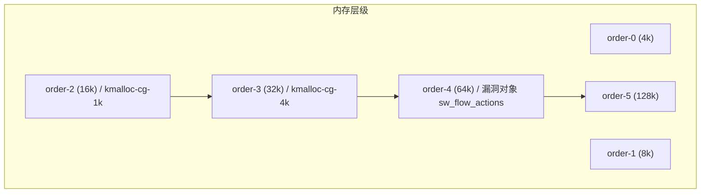
```mermaid
flowchart TD
    subgraph 内存层级
        order0["order-0 (4k)"]
        order1["order-1 (8k)"]
        order2["order-2 (16k) / kmalloc-cg-1k"]
        order3["order-3 (32k) / kmalloc-cg-4k"]
        order4["order-4 (64k) / 漏洞对象 sw_flow_actions"]
        order5["order-5 (128k)"]
    end

    order2 --> order3 --> order4 --> order5
```

#### 3-1-2. 关键术语与数据结构

为便于后文叙述，本节统一约定以下关键术语的含义：

- **SKB**：指代 `sk_buff→data` 数据区对象，即网络数据包缓冲区中用于存储实际数据的内存区域，而非完整的 `sk_buff` 结构体本身。通过控制 SKB 的分配大小，使其落入 `kmalloc-cg-1k` 缓存（order-2），用于与辅助队列消息及 `pipe_buffer` 对齐，实现堆重叠操作。
- **ELF 载荷**：指用于覆写目标 SUID 文件的微型 ELF 可执行文件。该文件体积小巧，入口执行标准提权操作（`setuid(0)`、`setgid(0)`、`execve("/bin/sh")`），符合 ELF 规范，可被内核正常加载执行。其本质是完整的合法 ELF 程序，而非纯机器码片段，具备跨版本稳定性。
- **主队列消息（Primary Message）**：由 `msg_msg` 主体（`kmalloc-cg-4k` / order-3）和 `msg_msgseg` 扩展段（`kmalloc-cg-1k` / order-2）构成，在阶段 2、3、5、6 中使用。
- **辅助队列消息（Secondary Message）**：仅由单个 `msg_msg` 结构构成（`kmalloc-cg-1k` / order-2），不含 `msg_msgseg` 扩展段，在阶段 4、7、8 中用于堆地址泄露与重叠构造。

#### 3-1-3. 进程架构设计

整个利用流程采用**父子进程分离**的设计模式，其核心原因在于**用户命名空间的权限隔离约束**：

- **子进程**：在阶段 0 中创建新的用户命名空间（user namespace），并在该隔离环境中执行所有堆布局、越界写入、消息队列操作、SKB 喷射、`pipe_buffer` 伪造及文件覆写工作。在用户命名空间内部，子进程可获得包括 `CAP_NET_ADMIN` 在内的多种能力，从而能够创建新的网络命名空间并建立 Netlink 通信，而无需宿主机上的真实特权。子进程位于用户命名空间内，即使成功覆写 SUID 文件，也无法直接执行该文件获得宿主机的 root 权限（因为用户命名空间中的权限是隔离的，无法跨命名空间提权）。

- **父进程**：保持在宿主机原始命名空间中运行，不进入子进程创建的用户命名空间。子进程完成文件覆写后，通过同步管道向父进程发送成功信号，父进程直接执行被篡改的 SUID 目标文件——由于父进程位于原始命名空间，具备正常的 SUID 语义，执行后即可获得宿主机的 root shell。

父子进程间的同步通过一个匿名管道实现：子进程写入单字符信号（`'T'` 表示成功，`'F'` 表示失败），父进程阻塞读取该信号。

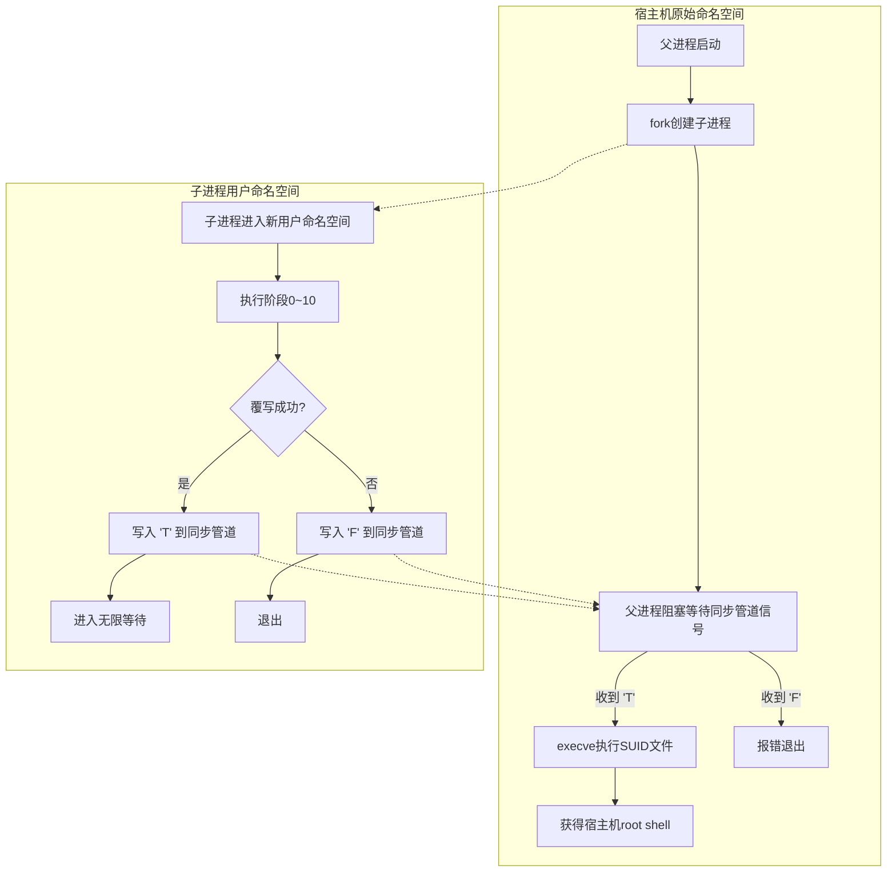
```mermaid
flowchart TD
    subgraph 宿主机原始命名空间
        P1[父进程启动] --> P2[fork创建子进程]
        P2 --> P3[父进程阻塞等待同步管道信号]
        P3 -->|收到 'T'| P4[execve执行SUID文件]
        P4 --> P5[获得宿主机root shell]
        P3 -->|收到 'F'| P6[报错退出]
    end

    subgraph 子进程用户命名空间
        C1[子进程进入新用户命名空间] --> C2[执行阶段0~10]
        C2 --> C3{覆写成功?}
        C3 -->|是| C4[写入 'T' 到同步管道]
        C3 -->|否| C5[写入 'F' 到同步管道]
        C4 --> C6[进入无限等待]
        C5 --> C7[退出]
    end

    P2 -.-> C1
    C4 -.-> P3
    C5 -.-> P3
```

这种架构的关键原因在于：**用户命名空间中的进程无法利用 SUID 文件提升到宿主机的 root 权限**，必须在原始命名空间中执行 SUID 文件才能触发其提权效果。

#### 3-1-4. 利用流程总览

整个利用流程共包含 11 个阶段，从环境初始化开始，依次经过 OVS 模块验证、堆布局与越界写、信息泄露、UAF 原语构建、任意文件写，直至最终提权。各阶段之间存在严格的依赖关系——后续阶段的成功执行均以前序阶段完成特定目标为前提，任一阶段失败都可能导致整个利用流程中断。

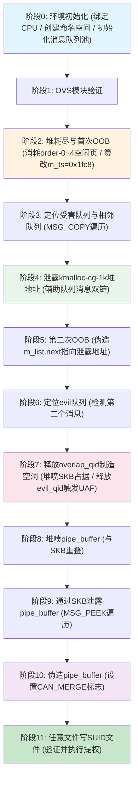
```mermaid
flowchart TD
    A["阶段0: 环境初始化 (绑定CPU / 创建命名空间 / 初始化消息队列池)"] --> B["阶段1: OVS模块验证"]
    B --> C["阶段2: 堆耗尽与首次OOB (消耗order-0~4空闲页 / 篡改m_ts=0x1fc8)"]
    C --> D["阶段3: 定位受害队列与相邻队列 (MSG_COPY遍历)"]
    D --> E["阶段4: 泄露kmalloc-cg-1k堆地址 (辅助队列消息双链)"]
    E --> F["阶段5: 第二次OOB (伪造m_list.next指向泄露地址)"]
    F --> G["阶段6: 定位evil队列 (检测第二个消息)"]
    G --> H["阶段7: 释放overlap_qid制造空洞 (堆喷SKB占据 / 释放evil_qid触发UAF)"]
    H --> I["阶段8: 堆喷pipe_buffer (与SKB重叠)"]
    I --> J["阶段9: 通过SKB泄露pipe_buffer (MSG_PEEK遍历)"]
    J --> K["阶段10: 伪造pipe_buffer (设置CAN_MERGE标志)"]
    K --> L["阶段11: 任意文件写SUID文件 (验证并执行提权)"]

    style A fill:#e1f5fe
    style C fill:#fff3e0
    style E fill:#e8f5e9
    style H fill:#fce4ec
    style K fill:#f3e5f5
    style L fill:#c8e6c9
```

### 3-2. 阶段 0：环境初始化

该阶段为后续所有操作建立必要的基础设施，确保整个利用流程在可控且可预测的环境中执行。

**核心操作**包括：

- **进程准备**：主进程首先完成基础环境配置，然后通过 `fork()` 创建子进程，子进程承担后续所有利用操作，父进程则进入等待状态。
- **同步通道**：在 `fork()` 之前创建匿名管道，用于父子进程间的状态同步。
- **用户命名空间**：子进程创建新的用户命名空间（user namespace），在其中执行所有后续堆操作。在用户命名空间内部，子进程可获取包括 `CAP_NET_ADMIN` 在内的多种能力，从而能够在无需宿主机真实特权的情况下创建新的网络命名空间并建立 Netlink 通信。子进程在隔离环境中执行完整的漏洞利用和文件覆写操作，但不具备跨命名空间提权能力。
- **CPU绑定**：子进程绑定到 CPU 0 以减少调度噪声对堆布局的干扰。
- **网络命名空间**：子进程创建新的 network 命名空间，便于后续网络设备操作。
- **目标文件**：以只读方式打开目标 SUID 二进制文件（如 `/usr/bin/crontab`），建立文件描述符供后续 `splice()` 操作使用。
- **Netlink**：建立 Generic Netlink 套接字并查询 OVS 相关 Family ID，确认内核模块可用且版本兼容。
- **消息队列池**：创建 0x400 个主消息队列（用于存储 `kmalloc-cg-4k + kmalloc-cg-1k` 消息）和 0x400 个辅助消息队列（用于存储 `kmalloc-cg-1k` 消息），为后续堆布局和对象定位奠定基础。
- **SKB 喷射器**：初始化 SKB 喷射器基础设施（创建 UDP 套接字并配置相关结构），但此时尚未触发 SKB 对象的实际分配——真正的堆喷操作将在后续阶段（阶段 7 和阶段 10）中按需执行。

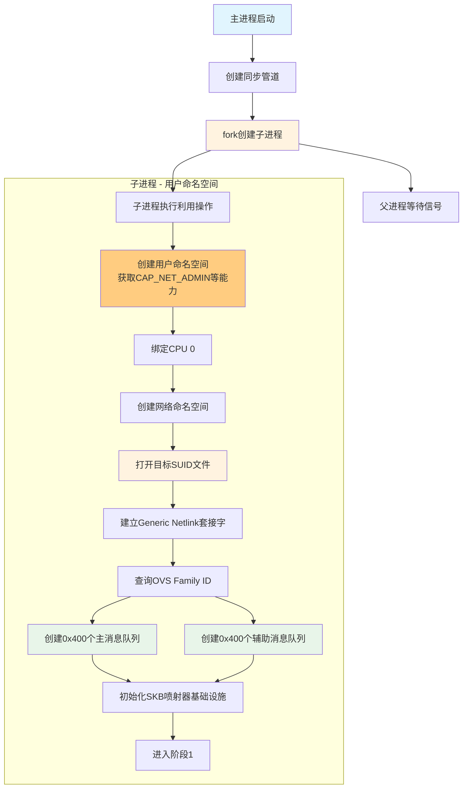
```mermaid
flowchart TD
    A[主进程启动] --> B[创建同步管道]
    B --> C[fork创建子进程]
    C --> D[子进程执行利用操作]
    C --> E[父进程等待信号]

    subgraph 子进程[子进程 - 用户命名空间]
        D --> D1[创建用户命名空间<br>获取CAP_NET_ADMIN等能力]
        D1 --> D2[绑定CPU 0]
        D2 --> D3[创建网络命名空间]
        D3 --> D4[打开目标SUID文件]
        D4 --> D5[建立Generic Netlink套接字]
        D5 --> D6[查询OVS Family ID]
        D6 --> D7[创建0x400个主消息队列]
        D6 --> D8[创建0x400个辅助消息队列]
        D7 --> D9[初始化SKB喷射器基础设施]
        D8 --> D9
        D9 --> D10[进入阶段1]
    end

    style A fill:#e1f5fe
    style C fill:#fff3e0
    style D1 fill:#ffcc80
    style D4 fill:#fff3e0
    style D7 fill:#e8f5e9
    style D8 fill:#e8f5e9
```

### 3-3. 阶段 1：OVS 模块验证

此阶段验证 openvswitch 内核模块确实已加载。具体操作是构造并发送 `OVS_DP_CMD_NEW` 命令，尝试创建名为 `br1337` 的虚拟网桥，然后通过 `if_nametoindex()` 检查该网桥是否存在。

若模块未加载，后续所有依赖于 OVS Netlink 接口的操作将无法执行，因此一旦发现缺失则提前终止并给出明确诊断信息。若模块存在，则记录其 Family ID 供后续使用。

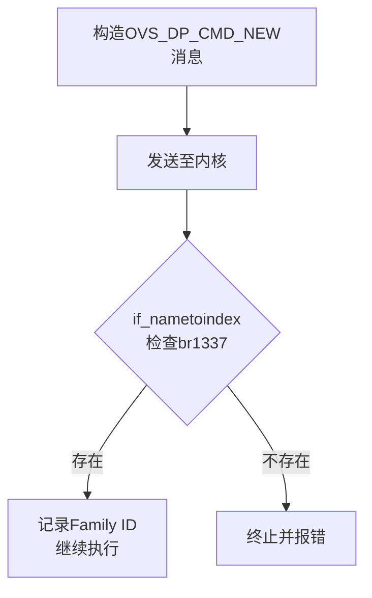
```mermaid
flowchart TD
    A[构造OVS_DP_CMD_NEW消息] --> B[发送至内核]
    B --> C{if_nametoindex<br>检查br1337}
    C -->|存在| D[记录Family ID<br>继续执行]
    C -->|不存在| E[终止并报错]
```

### 3-4. 阶段 2：堆耗尽与首次越界写

堆布局控制是本方案成败的核心环节。其设计基于内核内存层级结构：`kmalloc-cg-4k` 位于 order-3，`kmalloc-cg-1k` 位于 order-2，漏洞对象 `sw_flow_actions` 位于 order-4（64k）。通过消耗低阶空闲页面，迫使高阶页面被切割，从而实现漏洞对象与目标主队列 `msg_msg`（含 `msg_msgseg`）的物理相邻。

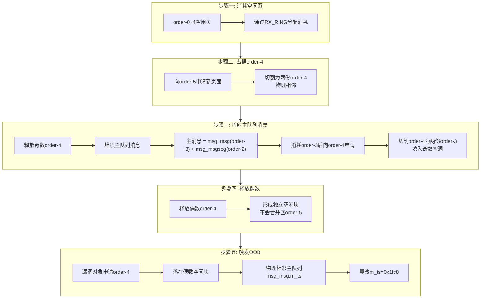
```mermaid
flowchart TD
    subgraph 步骤一["步骤一: 消耗空闲页"]
        A1["order-0~4空闲页"] --> A2["通过RX_RING分配消耗"]
    end

    subgraph 步骤二["步骤二: 占据order-4"]
        B1["向order-5申请新页面"] --> B2["切割为两份order-4<br>物理相邻"]
    end

    subgraph 步骤三["步骤三: 喷射主队列消息"]
        C1["释放奇数order-4"] --> C2["堆喷主队列消息"]
        C2 --> C3["主消息 = msg_msg(order-3) + msg_msgseg(order-2)"]
        C3 --> C4["消耗order-3后向order-4申请"]
        C4 --> C5["切割order-4为两份order-3<br>填入奇数空洞"]
    end

    subgraph 步骤四["步骤四: 释放偶数"]
        D1["释放偶数order-4"] --> D2["形成独立空闲块<br>不会合并回order-5"]
    end

    subgraph 步骤五["步骤五: 触发OOB"]
        E1["漏洞对象申请order-4"] --> E2["落在偶数空闲块"]
        E2 --> E3["物理相邻主队列msg_msg.m_ts"]
        E3 --> E4["篡改m_ts=0x1fc8"]
    end

    步骤一 --> 步骤二 --> 步骤三 --> 步骤四 --> 步骤五
```

**步骤一：消耗 order-0 至 order-4 空闲页面**

通过 PACKET_RX_RING 机制分配大量不同大小的 page chunk（0x1000、0x2000、0x4000、0x8000、0x10000），分别对应 order-0 至 order-4。此操作清空 slab 分配器中所有空闲的低阶页块，避免其他分配请求干扰后续布局。这一“清场”步骤确保后续的所有页面分配都从高阶（order-5）开始切割，从而保证切割出的 order-4 块具有可预测的物理相邻关系。

**步骤二：占据 order-4 页面**

喷射 32 个 0x10000 大小的 RX_RING 缓冲区（order-4），迫使分配器向 order-5（128k）申请新页面，再将 order-5 页面切割为两份**物理相邻**的 order-4 页面。物理相邻性是整个利用布局成功的基石——它确保后续漏洞对象与目标 `msg_msg` 能够落在相邻的物理页面上，从而实现越界写入的精准覆盖。

**步骤三：制造空洞并喷射主消息**

释放奇数下标的 order-4 RX_RING 页面，使其变为空闲。随后向所有主队列发送消息（`kmalloc-cg-4k` 主体 + `kmalloc-cg-1k` 的 `msg_msgseg`）。由于 `kmalloc-cg-4k` 位于 order-3，分配器优先消耗已有 order-3 空闲页，耗尽后向 order-4 申请，将 order-4 页面切割为两份 order-3。控制堆喷数量使这些消息精确落入之前释放的奇数 order-4 页面中。这步操作的关键在于，`msg_msg` 对象（order-3）的头部恰好位于 order-4 页面的开头位置，为后续越界写准确定位 `m_ts` 字段创造条件。

**步骤四：释放偶数下标页面**

释放偶数下标的 RX_RING 页面。由于相邻奇数块已被 `msg_msg` 占据，这些 order-4 块不会合并回 order-5，保持为独立空闲块。这一状态持续到漏洞对象分配为止。

**步骤五：触发第一次越界写**

构造恶意 OVS 流消息，使漏洞对象 `sw_flow_actions` 分配在刚释放的偶数 order-4 块中。该块与相邻的奇数 order-4 块（已被 `msg_msg` 占据）物理相邻（源自同一 order-5 页面的切割），越界写入窗口极高概率落在相邻 `msg_msg` 对象的 `m_ts` 字段上。

将 `m_ts` 篡改为 **0x1fc8**，使 `msg_msgseg` 的可读取范围从 0x400 字节扩展到整个页面 0x1000 字节，为后续信息泄露创造条件。`0x1fc8` 这个特定值的选择基于以下计算：

- 原始可读范围：`主体 msg_msg 剩余部分 (0x1000 - sizeof(struct msg_msg))` + `扩展段 msg_msgseg 前 0x400 字节 (0x400 - sizeof(struct msg_msgseg))`
- 扩展后可读范围：`主体 msg_msg 剩余部分 (0x1000 - sizeof(struct msg_msg))` + `扩展段 msg_msgseg 整个页面 (0x1000 - sizeof(struct msg_msgseg))`

即 `0x1fc8 = (0x1000 - sizeof(struct msg_msg)) + (0x1000 - sizeof(struct msg_msgseg))`。该值正好覆盖完整的 `msg_msg` 主体剩余部分加整个 `msg_msgseg` 扩展段所在的 0x1000 页面，使越界读取操作能够依次读完主体 `msg_msg` 后，继续读取 `msg_msgseg` 至页面末尾，而不会触发访问越界异常。

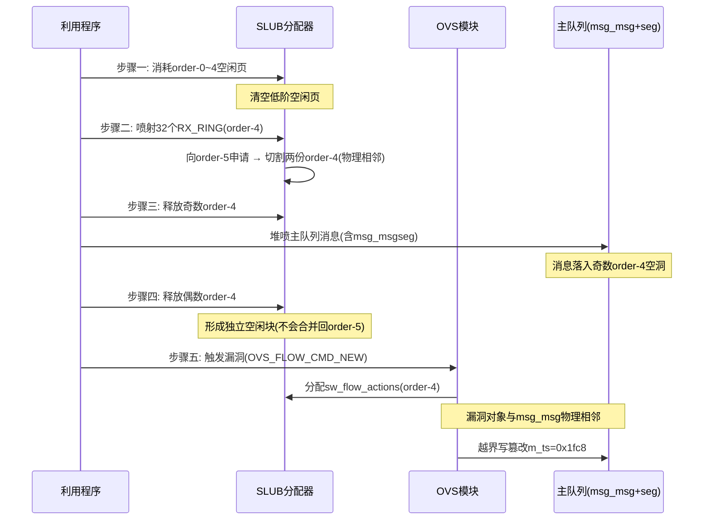
```mermaid
sequenceDiagram
    participant User as 利用程序
    participant Slab as SLUB分配器
    participant OVS as OVS模块
    participant MsgQ as 主队列(msg_msg+seg)

    User->>Slab: 步骤一: 消耗order-0~4空闲页
    Note over Slab: 清空低阶空闲页

    User->>Slab: 步骤二: 喷射32个RX_RING(order-4)
    Slab->>Slab: 向order-5申请 → 切割两份order-4(物理相邻)

    User->>Slab: 步骤三: 释放奇数order-4
    User->>MsgQ: 堆喷主队列消息(含msg_msgseg)
    Note over MsgQ: 消息落入奇数order-4空洞

    User->>Slab: 步骤四: 释放偶数order-4
    Note over Slab: 形成独立空闲块(不会合并回order-5)

    User->>OVS: 步骤五: 触发漏洞(OVS_FLOW_CMD_NEW)
    OVS->>Slab: 分配sw_flow_actions(order-4)
    Note over OVS,MsgQ: 漏洞对象与msg_msg物理相邻
    OVS->>MsgQ: 越界写篡改m_ts=0x1fc8
```

### 3-5. 阶段 3：定位受害队列与相邻队列

本阶段通过消息队列的拷贝读取操作遍历所有主队列，定位被篡改的受害队列及其相邻队列。

**定位受害队列**：使用 `msgrcv(MSG_COPY | IPC_NOWAIT)` 遍历所有主队列（该操作仅拷贝读取，不消耗消息）。若返回长度不等于预期的主消息大小（`PRIMARY_MSG_SIZE`），则判定该队列的 `m_ts` 已被篡改，记录为“受害队列”（`victim_qid`）。`MSG_COPY` 标志在此处发挥了关键作用——它允许无限次重复读取同一消息而不改变队列状态，这对于后续的多次越界读取操作至关重要。

**定位相邻队列**：利用 `victim_qid` 调用 `msgrcv(MSG_COPY | IPC_NOWAIT)` 越界读取 0x1000 字节内容，遍历其中查找预设的魔数标记（如 `"BinRacer"`）。该标记位于相邻主队列消息的 `msg_msgseg` 中，由此确定相邻队列的 ID（`nearby_qid`）及其在读取缓冲区中的偏移量（`nearby_offset`）。

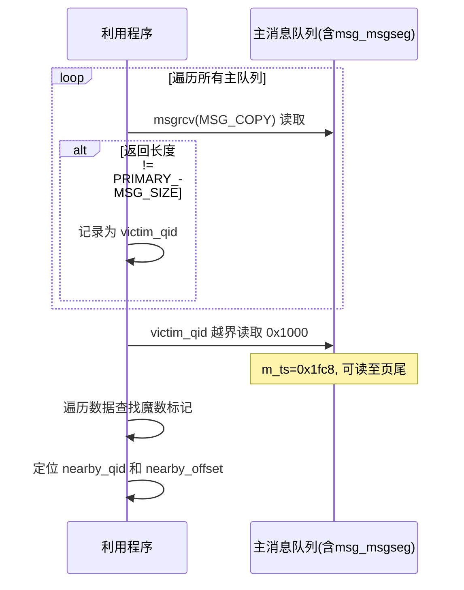
```mermaid
sequenceDiagram
    participant User as 利用程序
    participant MsgQ as 主消息队列(含msg_msgseg)

    loop 遍历所有主队列
        User->>MsgQ: msgrcv(MSG_COPY) 读取
        alt 返回长度 != PRIMARY_MSG_SIZE
            User->>User: 记录为 victim_qid
        end
    end

    User->>MsgQ: victim_qid 越界读取 0x1000
    Note over MsgQ: m_ts=0x1fc8, 可读至页尾

    User->>User: 遍历数据查找魔数标记
    User->>User: 定位 nearby_qid 和 nearby_offset
```

### 3-6. 阶段 4：泄露辅助消息堆地址

本阶段通过释放相邻主队列制造空洞，再向辅助队列喷射纯 `msg_msg`（无 `msg_msgseg`）消息，利用受害队列的越界读取能力泄露堆地址。此阶段是后续 UAF 构建的关键信息准备环节。

**制造空洞**：通过 `msgrcv()` 释放 `nearby_qid` 的主队列消息，在 `kmalloc-cg-4k` 和 `kmalloc-cg-1k` 缓存中同时制造空洞。这一步骤释放了 `nearby_qid` 消息所占用的物理页面，为后续辅助消息的落入创造了空间。

**堆喷辅助消息**：立即向每个辅助消息队列**连续发送两条** `kmalloc-cg-1k` 的消息（**仅含 `msg_msg` 结构，无 `msg_msgseg`**）。每个队列中的两个 `msg_msg` 通过 `m_list.next` 形成链表：第一个消息的 `m_list.next` 指向第二个消息。这种双消息链表结构是后续泄露堆地址的关键——`m_list.next` 指针天然指向第二个消息的堆地址，而该地址正是我们需要的 `kmalloc-cg-1k` 堆块地址。

**越界读泄露地址**：再次利用 `victim_qid` 执行越界读取，此时读取的目标已从 `msg_msgseg` 变为相邻辅助队列中**第一个 `msg_msg` 的头部信息**。提取 `msg_msg→m_list.next`，该指针保存着**第二个辅助消息的堆地址**（`kmalloc-cg-1k`）。同时借助魔数标记定位出与该地址对应的辅助队列 ID（`overlap_qid`）。

**清理消息**：释放所有非受害、非相邻的主队列消息（`primary_msqid` 中除 `victim_qid` 和 `nearby_qid` 外的全部清空），使主队列保持空状态，为后续堆布局提供干净环境。这一清理步骤至关重要——避免后续阶段中残留消息干扰堆布局或导致意外的消息队列操作。

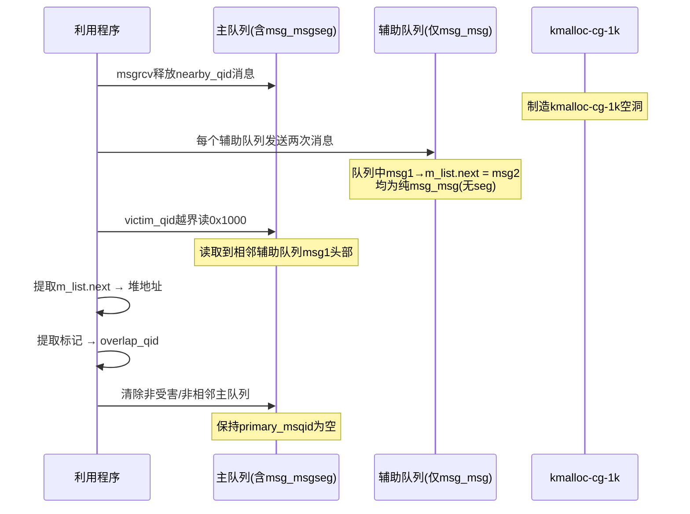
```mermaid
sequenceDiagram
    participant User as 利用程序
    participant Primary as 主队列(含msg_msgseg)
    participant Secondary as 辅助队列(仅msg_msg)
    participant Slab as kmalloc-cg-1k

    User->>Primary: msgrcv释放nearby_qid消息
    Note over Slab: 制造kmalloc-cg-1k空洞

    User->>Secondary: 每个辅助队列发送两次消息
    Note over Secondary: 队列中msg1→m_list.next = msg2<br>均为纯msg_msg(无seg)

    User->>Primary: victim_qid越界读0x1000
    Note over Primary: 读取到相邻辅助队列msg1头部

    User->>User: 提取m_list.next → 堆地址
    User->>User: 提取标记 → overlap_qid

    User->>Primary: 清除非受害/非相邻主队列
    Note over Primary: 保持primary_msqid为空
```

### 3-7. 阶段 5：第二次越界写——伪造 `m_list.next`

重复阶段 2 的完整堆布局过程（消耗 order-0 至 order-4 空闲页、RX_RING 喷射、制造空洞、喷射主队列消息），重新建立漏洞对象与目标主队列 `msg_msg` 的物理相邻关系。之所以需要重新执行完整的堆布局，是因为阶段 4 中的清理操作改变了堆的分布状态，必须重新营造与阶段 2 相同的堆布局条件以确保第二次越界写的成功。

触发第二次越界写，**本次仅覆盖相邻 `msg_msg` 头部的前 8 字节**，即将其 `m_list.next` 篡改为阶段 4 中泄露的第二个辅助消息堆地址。只覆盖前 8 字节是经过精确计算的——`m_list.next` 恰好位于 `msg_msg` 头部的前 8 字节位置，篡改它就足以使内核误认为该消息链存在后续节点，同时避免破坏 `m_ts` 等其他关键字段引发意料之外的异常。

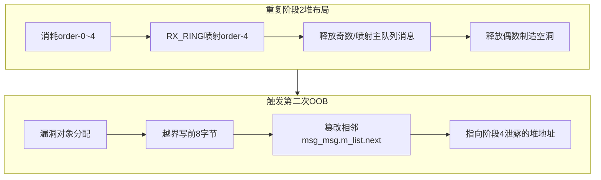
```mermaid
flowchart TD
    subgraph 准备[重复阶段2堆布局]
        A[消耗order-0~4] --> B[RX_RING喷射order-4]
        B --> C[释放奇数/喷射主队列消息]
        C --> D[释放偶数制造空洞]
    end

    subgraph 触发[触发第二次OOB]
        E[漏洞对象分配] --> F[越界写前8字节]
        F --> G[篡改相邻msg_msg.m_list.next]
        G --> H[指向阶段4泄露的堆地址]
    end

    准备 --> 触发
```

### 3-8. 阶段 6：定位 “evil” 队列

使用 `msgrcv(MSG_COPY | IPC_NOWAIT)` 遍历所有非受害主队列，尝试读取每个队列的**第二个消息**。正常情况下，每个主队列仅包含一条消息，读取第二个消息会失败。

若某个队列成功读取到第二条消息，则说明该队列的 `msg_msg.m_list.next` 已被篡改，**内核误认为该队列还存在下一个 `msg_msg`**。该队列即为“evil 队列”（`evil_qid`），它指向的“第二个消息”实际上就是阶段 4 中 `overlap_qid` 辅助队列的第二个 `msg_msg`（纯 `msg_msg` 结构）。此时 `evil_qid` 与 `overlap_qid` 共享同一个 `kmalloc-cg-1k` 堆块，为后续 UAF 原语提供了基础。这一“共享堆块”状态是整个 UAF 构造的前提条件——两个独立的队列对象引用同一物理内存，使得后续的释放操作能够产生非预期的双重释放效果。

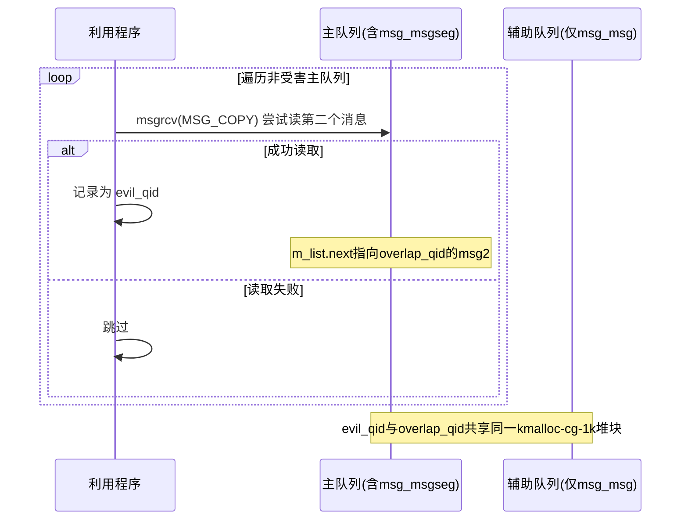
```mermaid
sequenceDiagram
    participant User as 利用程序
    participant Primary as 主队列(含msg_msgseg)
    participant Secondary as 辅助队列(仅msg_msg)

    loop 遍历非受害主队列
        User->>Primary: msgrcv(MSG_COPY) 尝试读第二个消息
        alt 成功读取
            User->>User: 记录为 evil_qid
            Note over Primary: m_list.next指向overlap_qid的msg2
        else 读取失败
            User->>User: 跳过
        end
    end

    Note over Primary,Secondary: evil_qid与overlap_qid共享同一kmalloc-cg-1k堆块
```

### 3-9. 阶段 7：通过队列操作释放 SKB

**释放 `overlap_qid` 制造空洞**：删除整个辅助队列（`msgctl(IPC_RMID)`），释放其所有消息（包括第二个 `msg_msg`），在 `kmalloc-cg-1k` 缓存中制造空洞。这一步释放了共享堆块，为后续 SKB 的占据创造了物理空间。

**堆喷 SKB 占据空洞**：立即堆喷一组 SKB（位于 `kmalloc-cg-1k`），携带伪造的 `msg_msg` 头部，使其占据刚释放的空洞。此时 SKB 数据区与之前 `overlap_qid` 的第二个 `msg_msg` 占据同一物理内存。SKB 数据区中携带的伪造 `msg_msg` 头部是为了欺骗内核的后续操作——当 `evil_qid` 尝试访问其“第二个消息”时，内核会将该 SKB 数据区误认为一个合法的 `msg_msg` 结构。

**释放 `evil_qid` 第二个消息**：执行消息读取操作释放 `evil_qid` 的“第二个消息”。由于该消息实际指向已被 SKB 占据的内存，此操作会将 SKB 所在的内存块再次标记为空闲，而 SKB 仍持有对该内存的引用，从而产生 UAF 条件。此时 SKB 与已释放的内存块之间存在悬垂引用，后续通过 SKB 的读取操作仍能访问该内存，而该内存可能已被其他对象重新占据。

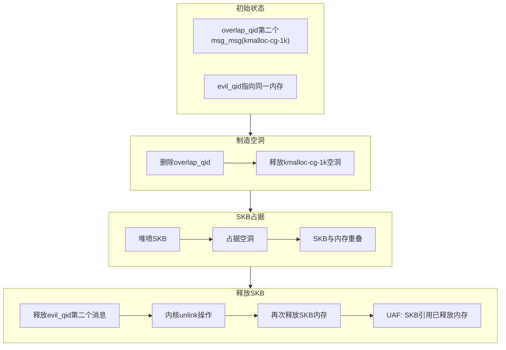
```mermaid
flowchart TD
    subgraph 初始状态
        A["overlap_qid第二个msg_msg(kmalloc-cg-1k)"]
        B[evil_qid指向同一内存]
    end

    subgraph 步骤一[制造空洞]
        C[删除overlap_qid] --> D[释放kmalloc-cg-1k空洞]
    end

    subgraph 步骤二[SKB占据]
        E[堆喷SKB] --> F[占据空洞]
        F --> G[SKB与内存重叠]
    end

    subgraph 步骤三[释放SKB]
        H[释放evil_qid第二个消息] --> I[内核unlink操作]
        I --> J[再次释放SKB内存]
        J --> K[UAF: SKB引用已释放内存]
    end

    初始状态 --> 步骤一 --> 步骤二 --> 步骤三
```

### 3-10. 阶段 8：喷射 `pipe_buffer` 形成重叠

通过 `pipe()` 系统调用创建多个新管道，每个管道在内核中对应一个 `pipe_inode_info` 结构，其中包含一个 `pipe_buffer` 数组（位于 `kmalloc-cg-1k`）。由于阶段 7 释放的 `kmalloc-cg-1k` 空洞正处于空闲状态，这些 `pipe_buffer` 数组极大概率会落入同一块内存区域。

`pipe_buffer` 数组的初始化时机如下：

- **`pipe()` 调用**：内核分配 `pipe_buffer` 数组并将其内容**清零**（此时数组中的各 `pipe_buffer` 结构体均为空值），占用 `kmalloc-cg-1k` 空洞。
- **`splice()` 调用**：将目标 SUID 文件的页缓存映射到管道时，内核才会**真正初始化数组中的第一个 `pipe_buffer` 结构体**，填充其 `page`、`offset`、`len`、`ops`、`flags` 等关键字段。

**重叠的本质**：SKB 的数据区与 **`pipe_buffer` 结构体数组**在物理上重叠。通过 SKB 的读取接口可以窥探 `pipe_buffer` 结构体的内容（从而获取 `page`、`ops`、`flags` 等字段），为后续伪造提供准确的模板信息。

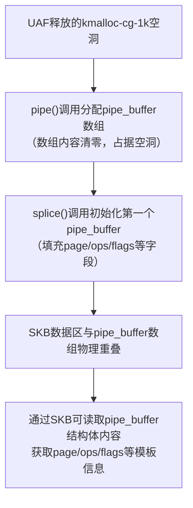
```mermaid
flowchart TD
    A[UAF释放的kmalloc-cg-1k空洞] --> B["pipe()调用分配pipe_buffer数组<br>（数组内容清零，占据空洞）"]
    B --> C["splice()调用初始化第一个pipe_buffer<br>（填充page/ops/flags等字段）"]
    C --> D[SKB数据区与pipe_buffer数组物理重叠]
    D --> E[通过SKB可读取pipe_buffer结构体内容<br>获取page/ops/flags等模板信息]
```

### 3-11. 阶段 9：通过 SKB 泄露 `pipe_buffer`

使用 `recv(MSG_PEEK)` 遍历所有 SKB 的数据区（该操作仅窥视不消耗数据），查找其中包含合法 `pipe_buffer` 特征的内容（如 `page` 指针位于有效内核地址范围内）。`MSG_PEEK` 标志同样支持无限次重复读取而不消耗数据，这对于定位重叠的 `pipe_buffer` 至关重要。

一旦定位到重叠的 `pipe_buffer`，从 SKB 数据中提取出 `page`、`ops`、`flags` 等字段，作为后续伪造的模板。保留 `page` 和 `ops` 的原值是为了确保内核对象在后续操作中保持合法性，避免因错误指针触发内核崩溃。

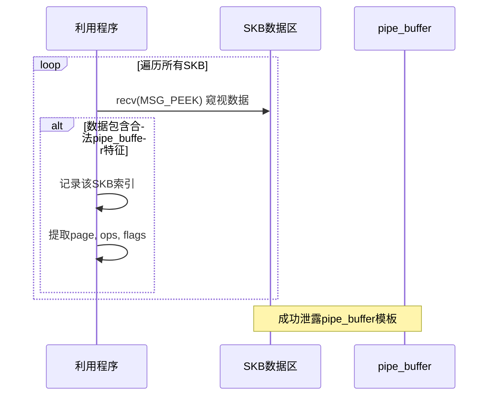
```mermaid
sequenceDiagram
    participant User as 利用程序
    participant SKB as SKB数据区
    participant Pipe as pipe_buffer

    loop 遍历所有SKB
        User->>SKB: recv(MSG_PEEK) 窥视数据
        alt 数据包含合法pipe_buffer特征
            User->>User: 记录该SKB索引
            User->>User: 提取page, ops, flags
        end
    end

    Note over SKB,Pipe: 成功泄露pipe_buffer模板
```

### 3-12. 阶段 10：伪造 `pipe_buffer` 并写入 ELF 载荷

**释放所有 SKB**：释放所有 SKB，再次在 `kmalloc-cg-1k` 缓存中制造空洞。这一步骤清除了之前堆喷的所有 SKB，使后续的伪造操作能够重新占据同一块内存区域。

**构造伪造的 `pipe_buffer`**：保留原 `page` 和 `ops` 指针（确保内核对象合法性），但将 `offset` 和 `len` 置零，并将 `flags` 设置为 `PIPE_BUF_FLAG_CAN_MERGE`（0x10）。该标志允许后续 `write()` 操作与 `splice()` 产生的页缓存页合并。`offset` 和 `len` 置零意味着写入将从文件开头开始，覆盖 SUID 文件的前若干字节，刚好容纳 ELF 载荷。

**重新堆喷 SKB**：将伪造的 `pipe_buffer` 通过 SKB 数据区写入该空洞，使 SKB 与管道缓冲区再次重叠，此时目标管道（即 `splice()` 调用时使用的那一个）的 `pipe_buffer` 已被篡改。由于只有被篡改的管道持有 `CAN_MERGE` 标志，**只有该管道能够成功执行后续的写入操作**；其他未篡改的管道若执行写入会返回错误，但在遍历过程中可以被忽略。

**写入 ELF 载荷**：遍历所有管道执行写入操作，实际生效的只有被篡改的那一个管道。写入的内容是 ELF 载荷（参见 3-1-1 节术语说明）。由于该 `pipe_buffer` 已被标记为可合并，写入操作直接修改了目标 SUID 文件的页缓存——管道写入操作在 `CAN_MERGE` 标志为真时，不会分配新的物理页，而是直接与已有的页缓存页合并，从而绕过常规的文件写权限检查，将 ELF 载荷覆写到 SUID 文件的开头位置。未被篡改的管道写入失败，但不影响已完成的覆写操作。

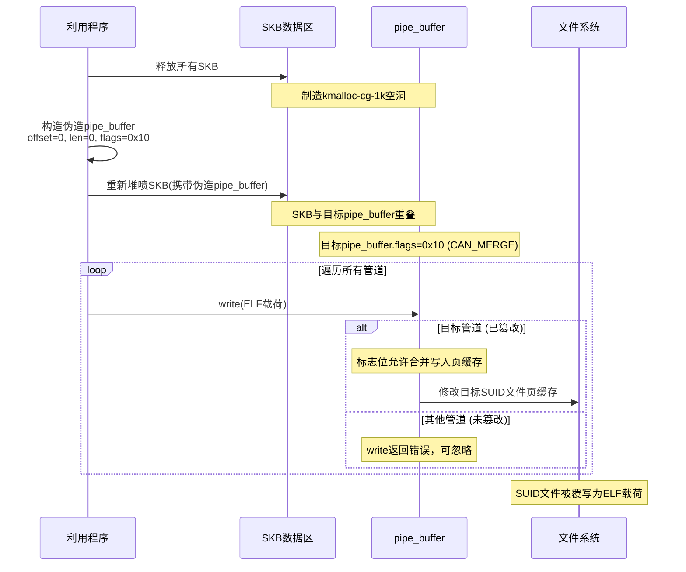
```mermaid
sequenceDiagram
    participant User as 利用程序
    participant SKB as SKB数据区
    participant Pipe as pipe_buffer
    participant FS as 文件系统

    User->>SKB: 释放所有SKB
    Note over SKB,Pipe: 制造kmalloc-cg-1k空洞

    User->>User: 构造伪造pipe_buffer<br>offset=0, len=0, flags=0x10

    User->>SKB: 重新堆喷SKB(携带伪造pipe_buffer)
    Note over SKB,Pipe: SKB与目标pipe_buffer重叠
    Note over Pipe: 目标pipe_buffer.flags=0x10 (CAN_MERGE)

    loop 遍历所有管道
        User->>Pipe: write(ELF载荷)
        alt 目标管道 (已篡改)
            Note over Pipe: 标志位允许合并写入页缓存
            Pipe->>FS: 修改目标SUID文件页缓存
        else 其他管道 (未篡改)
            Note over Pipe: write返回错误，可忽略
        end
    end

    Note over FS: SUID文件被覆写为ELF载荷
```

### 3-13. 阶段 11：验证覆写并执行提权

重新打开目标文件，读取其开头若干字节，与期望的 ELF 载荷进行比较。若完全匹配则说明文件覆写成功，子进程通过同步管道向父进程发送成功信号（`'T'`），随后进入无限循环等待状态，保持其持有的内核对象引用不被释放。子进程进入无限等待是必要的——如果子进程退出，其持有的消息队列句柄、文件描述符等资源将被内核自动释放，可能导致已篡改的页缓存状态发生变化或 UAF 条件失效。

**父进程收到成功信号后**，由于父进程始终位于**宿主机的原始命名空间**（从未进入子进程创建的用户命名空间），执行被篡改的 SUID 文件时仍然具备完整的 SUID 语义，`execve(TARGET_BINARY)` 会以文件所有者的权限（通常是 root）运行被篡改后的 ELF 程序，从而获得宿主机 root shell。

若覆写验证失败，子进程发送失败信号（`'F'`），父进程报错退出。

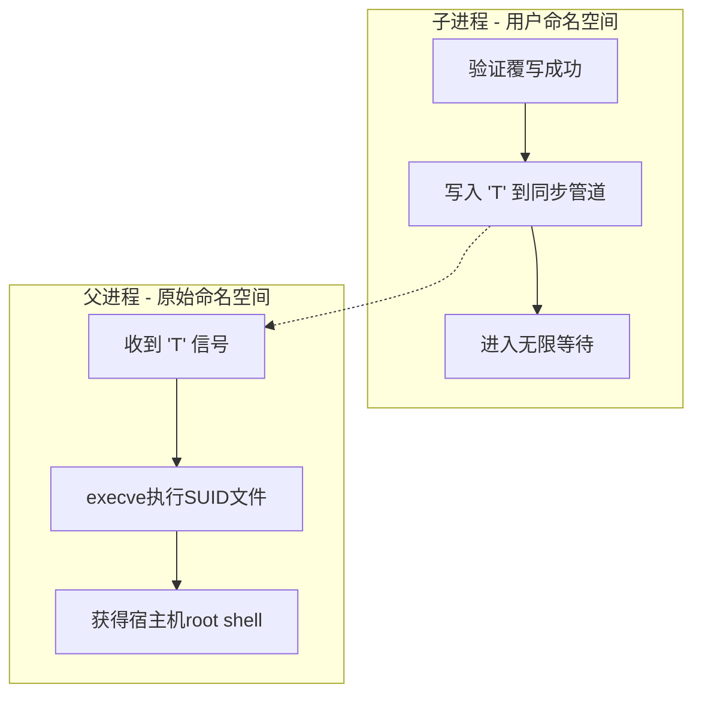
```mermaid
flowchart TD
    subgraph 子进程[子进程 - 用户命名空间]
        A[验证覆写成功] --> B[写入 'T' 到同步管道]
        B --> C[进入无限等待]
    end

    subgraph 父进程[父进程 - 原始命名空间]
        D[收到 'T' 信号] --> E[execve执行SUID文件]
        E --> F[获得宿主机root shell]
    end

    B -.-> D
```

### 3-14. 内核保护机制的应对策略

本利用方案主要操作对象位于内核堆（`GFP_KERNEL_ACCOUNT` 或 `GFP_KERNEL`），整体流程不依赖内核基址泄露，不执行内核态代码，不访问用户态内存，因此对常见的内核保护机制具有天然的抗性。各保护机制的具体影响及应对如下：

| 保护机制                             | 影响程度 | 原因与应对                                                                                    |
| :----------------------------------- | :------- | :-------------------------------------------------------------------------------------------- |
| **KASLR**                            | 无影响   | 无需泄露内核基址，唯一需要的堆地址通过越界读取直接获得，属于运行时信息。                      |
| **SMEP / SMAP**                      | 无影响   | 不执行内核代码，不访问用户内存，不触发异常。                                                  |
| **KPTI**                             | 无影响   | KPTI 防御侧信道，与堆操作无关。                                                               |
| **CONFIG_MEMCG / CONFIG_MEMCG_KMEM** | 极小影响 | 漏洞对象位于 `kmalloc`，目标对象位于 `kmalloc-cg`，通过页级布局实现跨缓存相邻，不受隔离影响。 |
| **CONFIG_SLAB_FREELIST_RANDOM**      | 中等影响 | 通过大规模喷射（32个RX_RING、1024个消息队列）克服，多次尝试即可成功布局。                     |
| **CONFIG_SLAB_FREELIST_HARDENED**    | 无影响   | 篡改对象均处于“使用中”状态，不受空闲链表保护限制。                                            |
| **CONFIG_HARDENED_USERCOPY**         | 无影响   | 所有拷贝长度均合法，不触发检查。                                                              |

综上，本利用方案对绝大多数主流内核保护机制具有免疫力，唯一需要应对的是 `CONFIG_SLAB_FREELIST_RANDOM` 带来的堆布局随机化，通过精心设计的喷射策略即可有效克服。

### 3-15. 前提条件与局限性

**前提条件**

- 内核必须启用 `CONFIG_OPENVSWITCH`（通常作为模块 `openvswitch.ko` 加载）。
- 执行用户需具备标准系统权限（可访问 `/dev/netlink`、创建消息队列、使用管道和套接字）。
- 目标系统存在一个可读写的 SUID 文件（如 `/usr/bin/crontab` 或 `/usr/bin/passwd`），且当前用户有权打开它。
- 系统**必须允许创建非特权用户命名空间**（`user.max_user_namespaces` 非零，且 `kernel.unprivileged_userns_clone` 为 1）。本方案通过用户命名空间在无需宿主机真实特权的情况下获取 `CAP_NET_ADMIN` 等能力以建立 Netlink 通信，若该功能被禁用，后续所有依赖于网络命名空间的操作均无法执行。

**局限性**

- **用户命名空间依赖**：本方案在阶段 0 中依赖子进程创建非特权用户命名空间以获取 `CAP_NET_ADMIN` 能力，这是建立 Netlink 通信的唯一途径。若系统通过 `kernel.unprivileged_userns_clone=0` 或 `user.max_user_namespaces=0` 禁用了非特权用户命名空间，整个利用流程将**彻底失败**，无有效绕过方式。
- **堆布局成功率**：依赖于内核堆的即时状态，`CONFIG_SLAB_FREELIST_RANDOM` 会增加随机性，但通过大规模喷射（32 个 RX_RING、1024 个消息队列）和多次尝试可有效克服。
- **结构体版本差异**：`msg_msg` 和 `pipe_buffer` 在不同内核版本中布局可能有细微差异，但本方案仅依赖其开头的固定偏移字段（如 `m_ts`、`m_list`、`flags`），这些字段在主流版本中基本稳定。
- **页缓存一致性**：覆写后的文件若正在被其他进程使用，可能导致文件系统元数据不一致，但通常不影响后续执行。
- **强制访问控制**：SELinux 或 AppArmor 等策略可能阻止执行被篡改的 SUID 文件，但在默认策略下通常允许标准 SUID 程序运行。

### 3-16. 章节总结

本章详细描述了针对 **CVE-2022-2639** 的一套完整利用构造流程。其核心设计围绕内核内存层级结构展开：`kmalloc-cg-4k`（order-3）、`kmalloc-cg-1k`（order-2）、漏洞对象 `sw_flow_actions`（order-4），通过消耗 order-0 至 order-4 空闲页面、利用 order-5 切割产生的物理相邻关系，实现漏洞对象与目标 `msg_msg` 的精准相邻布局。

在原语构建阶段，利用两次越界写依次实现信息泄露和 UAF 原语：第一次 OOB 篡改 `m_ts` 为 0x1fc8 扩大可读范围，从而越界读取相邻队列的 `msg_msgseg` 中的预设标记，定位到与漏洞对象物理相邻的 `nearby_qid`。随后通过释放 `nearby_qid` 制造空洞、堆喷辅助队列消息，再次利用越界读取从相邻 `msg_msg` 头部中提取 `m_list.next`，获得 `kmalloc-cg-1k` 堆地址。第二次 OOB 篡改 `m_list.next` 使两个队列共享同一堆块，通过“释放重叠队列 → 堆喷 SKB 占据空洞 → 释放 evil 队列第二个消息”三步操作，使 SKB 所占内存被重复释放，产生 UAF。此后，堆喷 `pipe_buffer` 占据同一空洞形成重叠，通过 SKB 读取泄露 `pipe_buffer` 结构体内容，伪造其 `flags` 为 `CAN_MERGE`，将管道写入与文件页缓存合并，获得任意文件写能力，最终将 SUID 文件覆写为 ELF 载荷，完成提权。

整个方案不依赖内核基址泄露，无需 ROP 链，且跨版本通用。其核心思想在于将漏洞的有限越界写入能力，通过多个中间原语的组合与传递，最终转化为用户态权限提升。

### 3-17. 测试结果

<div style="text-align: center; margin: 2rem 0;">
  
</div>

## 4. 利用思路二（容器逃逸）

本章介绍针对 **CVE-2022-2639** 漏洞的另一种利用构造方案。与第三章的利用思路不同，本章方案不依赖任意文件写原语覆写 SUID 文件，而是通过内核信息泄露与 ROP 链执行，在内核态完成权限提升与命名空间切换，最终在用户态突破容器隔离边界。该方案同样以 `kmalloc-0x10000` 堆块上的越界写为起点，但后续的利用路径转向 **内核基址泄露** 与 **控制流劫持**，最终获得宿主机的 root 权限并突破容器隔离边界。

整个流程按照利用代码划分为 10 个阶段，从环境初始化开始，依次经过 OVS 模块验证、堆布局与越界写、信息泄露、UAF 原语构建、内核基址泄露、ROP 链执行，直至最终提权与容器逃逸。各阶段之间存在严格的依赖关系，整体设计兼顾了稳定性与跨版本兼容性。

### 4-1. 整体架构设计

#### 4-1-1. 核心思想与内存布局

整个利用流程可概括为 **“泄露地址，劫持控制流”**：

- **泄露地址**：通过越界写与堆布局，构建信息泄露原语，获取内核堆地址；再利用 UAF 与对象重叠，泄露 `pipe_buffer` 结构体中的 `ops` 指针（指向 `anon_pipe_buf_ops`），进而计算内核基址。
- **劫持控制流**：利用 UAF 释放的 `kmalloc-cg-1k` 堆块，伪造 `pipe_buffer` 结构体，使其 `ops` 指针指向一个伪造的 `pipe_buf_operations` 函数表。当管道被关闭时，内核会调用 `ops→release` 回调，从而触发 ROP 链执行。ROP 链完成 `commit_creds(init_cred)` 获得 root 权限，以及 `switch_task_namespaces(init_nsproxy)` 将当前进程的命名空间切换至宿主机的初始命名空间。返回用户态后，通过打开宿主机 init 进程的命名空间文件并调用 `setns()`，将进程的 mount、PID 和 network 命名空间彻底切换至宿主机环境，最终获得宿主机 root shell，实现完整的容器逃逸。

该方案不依赖任何用户态可执行文件（如 SUID 程序），因此适用于那些 SUID 文件不可用或难以覆写的场景。

**与思路一的对比**：思路二（ROP 链）的跨版本兼容性弱于思路一（任意文件写）。思路一通过文件页缓存篡改实现提权，不依赖任何内核符号或 gadget 偏移，可在较大版本范围内稳定工作；而思路二需要根据目标内核版本动态获取符号地址并构造 ROP 链，且 ROP gadget 的可用性和偏移在不同编译版本间存在差异。然而，思路二的优势在于不依赖任何用户态可执行文件，在容器环境或 SUID 文件被禁用/难以覆写的场景下具有不可替代的价值。

整个方案的设计高度依赖于内核内存的层级组织。`kmalloc-cg-4k` 位于 order-3，`kmalloc-cg-1k` 位于 order-2，而漏洞对象 `sw_flow_actions` 位于 order-4（0x10000 字节）。通过消耗低阶空闲页面迫使高阶页面切割，利用 order-5 切割产生的物理相邻关系，实现不同 order 层级对象之间的精准相邻布局——即让位于 `kmalloc-0x10000` 的漏洞对象与位于 `kmalloc-cg-4k` 的目标 `msg_msg` 在物理页面上相邻，从而让越界写入能够精准覆盖目标对象的关键字段。


```mermaid
flowchart TD
    subgraph 内存层级
        order0["order-0 (4k)"]
        order1["order-1 (8k)"]
        order2["order-2 (16k) / kmalloc-cg-1k"]
        order3["order-3 (32k) / kmalloc-cg-4k"]
        order4["order-4 (64k) / 漏洞对象 sw_flow_actions"]
        order5["order-5 (128k)"]
    end

    order2 --> order3 --> order4 --> order5
```

#### 4-1-2. 关键术语与数据结构

为便于后文叙述，本节统一约定以下关键术语的含义：

- **SKB**：指代 `sk_buff→data` 数据区对象，即网络数据包缓冲区中用于存储实际数据的内存区域，而非完整的 `sk_buff` 结构体本身。通过控制 SKB 的分配大小，使其落入 `kmalloc-cg-1k` 缓存（order-2），用于与辅助队列消息及 `pipe_buffer` 对齐，实现堆重叠操作。
- **主队列消息（Primary Message）**：由 `msg_msg` 主体（`kmalloc-cg-4k` / order-3）和 `msg_msgseg` 扩展段（`kmalloc-cg-1k` / order-2）构成，在阶段 2、3、5、6 中使用。
- **辅助队列消息（Secondary Message）**：仅由单个 `msg_msg` 结构构成（`kmalloc-cg-1k` / order-2），不含 `msg_msgseg` 扩展段，在阶段 4、7 中用于堆地址泄露与重叠构造。
- **`anon_pipe_buf_ops`**：匿名管道操作函数表，位于内核的只读数据段，其地址可作为计算内核基址的锚点。当 `pipe_buffer→ops` 指向该符号时，通过将 `ops` 指针与符号地址相减即可获得内核基址。
- **ROP 链**：一系列精心排布的内核 gadget 地址，用于在内核态执行任意代码。在本方案中，ROP 链依次完成 `commit_creds(init_cred)` 获取 root 权限，以及 `switch_task_namespaces(init_nsproxy)` 切换至宿主机的初始命名空间，为后续用户态的完整容器逃逸奠定基础。

#### 4-1-3. 进程架构设计

由于本方案依赖内核基址泄露与 ROP 链执行，整个利用流程在**单进程**内完成，无需父子进程分离。构造者在同一进程中依次执行堆布局、越界写、信息泄露、UAF 构建、ROP 链触发等操作。当 ROP 链成功执行后，当前进程获得 root 权限且命名空间已切换至宿主机的初始命名空间，随后通过用户态 `setns()` 打开宿主机 init 进程的命名空间文件并完成命名空间切换，执行 `/bin/sh` 获得宿主机 shell，实现完整的容器逃逸。

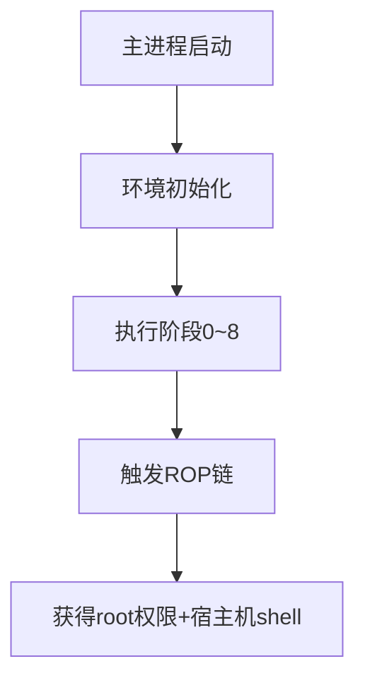
```mermaid
flowchart TD
    A[主进程启动] --> B[环境初始化]
    B --> C[执行阶段0~8]
    C --> D[触发ROP链]
    D --> E[获得root权限+宿主机shell]
```

#### 4-1-4. 利用流程总览

整个利用流程共包含 10 个阶段，从环境初始化开始，依次经过 OVS 模块验证、堆布局与越界写、信息泄露、UAF 原语构建、内核基址泄露、ROP 链执行，直至最终提权与容器逃逸。各阶段之间存在严格的依赖关系——后续阶段的成功执行均以前序阶段完成特定目标为前提，任一阶段失败都可能导致整个利用流程中断。

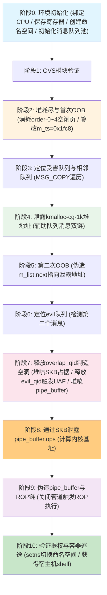
```mermaid
flowchart TD
    A["阶段0: 环境初始化 (绑定CPU / 保存寄存器 / 创建命名空间 / 初始化消息队列池)"] --> B["阶段1: OVS模块验证"]
    B --> C["阶段2: 堆耗尽与首次OOB (消耗order-0~4空闲页 / 篡改m_ts=0x1fc8)"]
    C --> D["阶段3: 定位受害队列与相邻队列 (MSG_COPY遍历)"]
    D --> E["阶段4: 泄露kmalloc-cg-1k堆地址 (辅助队列消息双链)"]
    E --> F["阶段5: 第二次OOB (伪造m_list.next指向泄露地址)"]
    F --> G["阶段6: 定位evil队列 (检测第二个消息)"]
    G --> H["阶段7: 释放overlap_qid制造空洞 (堆喷SKB占据 / 释放evil_qid触发UAF / 堆喷pipe_buffer)"]
    H --> I["阶段8: 通过SKB泄露pipe_buffer.ops (计算内核基址)"]
    I --> J["阶段9: 伪造pipe_buffer与ROP链 (关闭管道触发ROP执行)"]
    J --> K["阶段10: 验证提权与容器逃逸 (setns切换命名空间 / 获得宿主机shell)"]

    style A fill:#e1f5fe
    style C fill:#fff3e0
    style E fill:#e8f5e9
    style H fill:#fce4ec
    style I fill:#ffcc80
    style J fill:#f3e5f5
    style K fill:#c8e6c9
```

### 4-2. 阶段 0：环境初始化

该阶段为后续所有操作建立必要的基础设施，确保整个利用流程在可控且可预测的环境中执行。

**核心操作**包括：

- **CPU 绑定**：绑定到 CPU 0 以减少调度噪声对堆布局的干扰。
- **用户态寄存器保存**：保存当前进程的用户态寄存器状态（`cs`、`ss`、`rflags`、`rsp` 等），用于 ROP 链执行完毕后安全返回用户态。
- **命名空间**：创建新的 mount 和 network 命名空间，便于后续网络设备操作。本方案不需要 SUID 文件，因此无需打开目标文件。
- **Netlink**：建立 Generic Netlink 套接字并查询 OVS 相关 Family ID（`OVS_DATAPATH_FAMILY` 与 `OVS_FLOW_FAMILY`），若两个 Family ID 相同则重试，以确保模块通信正常。
- **消息队列池**：创建 0x400 个主消息队列（用于存储 `kmalloc-cg-4k + kmalloc-cg-1k` 消息）和 0x400 个辅助消息队列（用于存储 `kmalloc-cg-1k` 消息），为后续堆布局和对象定位奠定基础。
- **SKB 喷射器**：初始化 SKB 喷射器基础设施（创建 UDP 套接字并配置相关结构），但此时尚未触发 SKB 对象的实际分配。

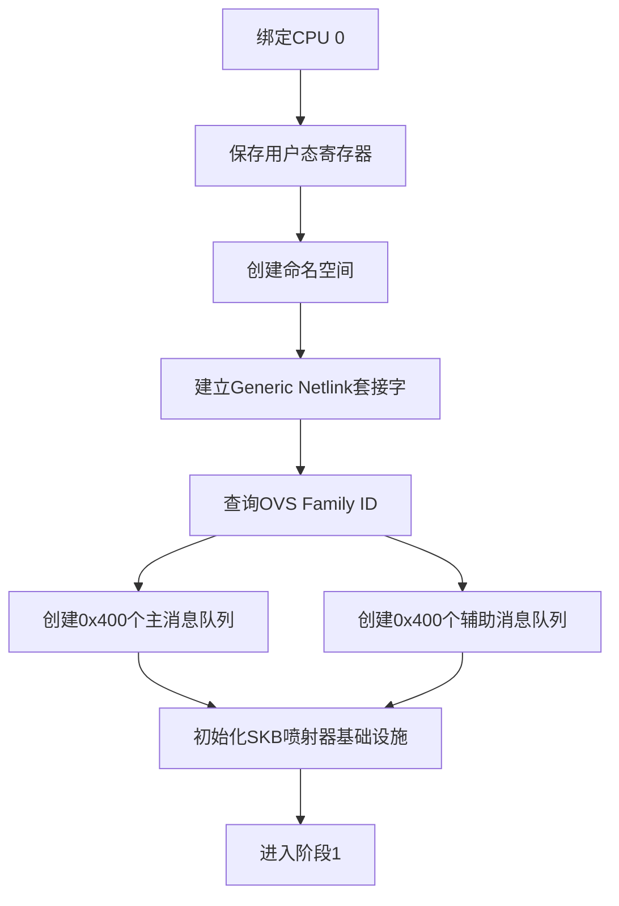
```mermaid
flowchart TD
    A[绑定CPU 0] --> B[保存用户态寄存器]
    B --> C[创建命名空间]
    C --> D[建立Generic Netlink套接字]
    D --> E[查询OVS Family ID]
    E --> F[创建0x400个主消息队列]
    E --> G[创建0x400个辅助消息队列]
    F --> H[初始化SKB喷射器基础设施]
    G --> H
    H --> I[进入阶段1]
```

### 4-3. 阶段 1：OVS 模块验证

此阶段验证 openvswitch 内核模块确实已加载。具体操作是构造并发送 `OVS_DP_CMD_NEW` 命令，尝试创建名为 `br1337` 的虚拟网桥，然后通过 `if_nametoindex()` 检查该网桥是否存在。

若模块未加载，后续所有依赖于 OVS Netlink 接口的操作将无法执行，因此一旦发现缺失则提前终止并给出明确诊断信息。若模块存在，则记录其 Family ID 供后续使用。

```mermaid
flowchart TD
    A[构造OVS_DP_CMD_NEW消息] --> B[发送至内核]
    B --> C{if_nametoindex检查br1337}
    C -->|存在| D[继续执行]
    C -->|不存在| E[终止并报错]
```

### 4-4. 阶段 2：堆耗尽与首次越界写

堆布局控制是后续所有利用操作的基础。本阶段通过 PACKET_RX_RING 机制消耗 order-0 至 order-4 空闲页面，使后续分配从高阶页面（order-5）开始切割，以保证切割出的 order-4 块具有可预测的物理相邻关系。

**具体操作**：喷射 32 个 0x10000 大小的 RX_RING 缓冲区（order-4），迫使分配器向 order-5（128k）申请新页面，再将 order-5 页面切割为两份**物理相邻**的 order-4 页面。随后释放奇数下标的 order-4 页面，向主队列喷射消息（`kmalloc-cg-4k` 主体 + `kmalloc-cg-1k` 的 `msg_msgseg`），使消息精确落入奇数空洞。释放偶数下标页面，漏洞对象 `sw_flow_actions` 分配到偶数空闲块中。

由于漏洞对象与相邻的 `msg_msg` 源自同一 order-5 页面的切割，两者在物理上相邻。触发第一次越界写，将相邻 `msg_msg` 对象的 `m_ts` 篡改为 **0x1fc8**，使 `msg_msgseg` 的可读取范围从 0x400 字节扩展到整个页面 0x1000 字节，为后续信息泄露创造条件。

```mermaid
flowchart TD
    A[消耗order-0~4空闲页] --> B["喷射32个RX_RING(order-4)"]
    B --> C[释放奇数order-4]
    C --> D[堆喷主队列消息填入奇数空洞]
    D --> E[释放偶数order-4]
    E --> F[漏洞对象分配到偶数空洞]
    F --> G[越界写篡改m_ts=0x1fc8]
```

### 4-5. 阶段 3：定位受害队列与相邻队列

使用 `msgrcv(MSG_COPY | IPC_NOWAIT)` 遍历所有主队列（该操作仅拷贝读取，不消耗消息）。若返回长度不等于预期的主消息大小（`PRIMARY_MSG_SIZE`），则判定该队列的 `m_ts` 已被篡改，记录为“受害队列”（`victim_qid`）。

利用 `victim_qid` 调用 `msgrcv(MSG_COPY | IPC_NOWAIT)` 越界读取 0x1000 字节内容，遍历其中查找预设的魔数标记（如 `"BinRacer"`）。该标记位于相邻主队列消息的 `msg_msgseg` 中，由此确定相邻队列的 ID（`nearby_qid`）及其在读取缓冲区中的偏移量（`nearby_offset`）。

```mermaid
flowchart TD
    A[遍历所有主队列] --> B{msgrcv返回长度 != PRIMARY_MSG_SIZE?}
    B -->|是| C[记录victim_qid]
    B -->|否| A
    C --> D[victim_qid越界读取0x1000]
    D --> E[查找魔数标记]
    E --> F[定位nearby_qid和nearby_offset]
```

### 4-6. 阶段 4：泄露辅助消息堆地址

通过 `msgrcv()` 释放 `nearby_qid` 的主队列消息，在 `kmalloc-cg-4k` 和 `kmalloc-cg-1k` 缓存中同时制造空洞。立即向每个辅助消息队列**连续发送两条** `kmalloc-cg-1k` 的消息（**仅含 `msg_msg` 结构，无 `msg_msgseg`**）。每个队列中的两个 `msg_msg` 通过 `m_list.next` 形成链表：第一个消息的 `m_list.next` 指向第二个消息。

再次利用 `victim_qid` 执行越界读取，此时读取的目标已从 `msg_msgseg` 变为相邻辅助队列中**第一个 `msg_msg` 的头部信息**。提取 `msg_msg→m_list.next`，该指针保存着**第二个辅助消息的堆地址**（`kmalloc-cg-1k`）。同时借助魔数标记定位出与该地址对应的辅助队列 ID（`overlap_qid`）。

最后释放所有非受害、非相邻的主队列消息，使主队列保持空状态，为后续堆布局提供干净环境。

```mermaid
flowchart TD
    A[释放nearby_qid] --> B[制造kmalloc-cg-1k空洞]
    B --> C[每个辅助队列发送两次消息]
    C --> D[msg1→m_list.next = msg2]
    D --> E[victim_qid越界读0x1000]
    E --> F[提取m_list.next→堆地址]
    F --> G[定位overlap_qid]
```

### 4-7. 阶段 5：第二次越界写——伪造 `m_list.next`

重复阶段 2 的完整堆布局过程（消耗 order-0 至 order-4 空闲页、RX_RING 喷射、制造空洞、喷射主队列消息），重新建立漏洞对象与目标主队列 `msg_msg` 的物理相邻关系。

触发第二次越界写，**本次仅覆盖相邻 `msg_msg` 头部的前 8 字节**，即将其 `m_list.next` 篡改为阶段 4 中泄露的第二个辅助消息堆地址。`m_list.next` 恰好位于 `msg_msg` 头部的前 8 字节位置，篡改它就足以使内核误认为该消息链存在后续节点，同时避免破坏 `m_ts` 等其他关键字段。

```mermaid
flowchart TD
    A[重复阶段2堆布局] --> B[漏洞对象分配到偶数order-4块]
    B --> C[触发第二次OOB]
    C --> D[越界写前8字节]
    D --> E[篡改相邻msg_msg.m_list.next]
    E --> F[指向阶段4泄露的堆地址]
```

### 4-8. 阶段 6：定位 “evil” 队列

使用 `msgrcv(MSG_COPY | IPC_NOWAIT)` 遍历所有非受害主队列，尝试读取每个队列的**第二个消息**。正常情况下，每个主队列仅包含一条消息，读取第二个消息会失败。

若某个队列成功读取到第二条消息，则说明该队列的 `msg_msg.m_list.next` 已被篡改，**内核误认为该队列还存在下一个 `msg_msg`**。该队列即为“evil 队列”（`evil_qid`），它指向的“第二个消息”实际上就是阶段 4 中 `overlap_qid` 辅助队列的第二个 `msg_msg`。此时 `evil_qid` 与 `overlap_qid` 共享同一个 `kmalloc-cg-1k` 堆块，为后续 UAF 原语提供了基础。

```mermaid
sequenceDiagram
    participant User as 构造者
    participant Primary as 主队列(含msg_msgseg)

    loop 遍历非受害主队列
        User->>Primary: msgrcv(MSG_COPY) 尝试读第二个消息
        alt 成功读取
            User->>User: 记录为 evil_qid
            Note over Primary: m_list.next指向overlap_qid的msg2
        else 读取失败
            User->>User: 跳过
        end
    end
    Note over User: evil_qid与overlap_qid共享同一kmalloc-cg-1k堆块
```

### 4-9. 阶段 7：UAF 原语构建与管道喷射

**释放 `overlap_qid` 制造空洞**：删除整个辅助队列（`msgctl(IPC_RMID)`），释放其所有消息（包括第二个 `msg_msg`），在 `kmalloc-cg-1k` 缓存中制造空洞。

**堆喷 SKB 占据空洞**：立即堆喷一组 SKB（位于 `kmalloc-cg-1k`），携带伪造的 `msg_msg` 头部，使其占据刚释放的空洞。此时 SKB 数据区与之前 `overlap_qid` 的第二个 `msg_msg` 占据同一物理内存。

**释放 `evil_qid` 第二个消息**：执行消息读取操作释放 `evil_qid` 的“第二个消息”。由于该消息实际指向已被 SKB 占据的内存，此操作会将 SKB 所在的内存块再次标记为空闲，而 SKB 仍持有对该内存的引用，从而产生 UAF 条件。

**喷射 `pipe_buffer` 形成重叠**：通过 `pipe()` 系统调用创建多个新管道，每个管道包含一个 `pipe_buffer` 数组（位于 `kmalloc-cg-1k`）。由于 UAF 释放的 `kmalloc-cg-1k` 空洞正处于空闲状态，这些 `pipe_buffer` 数组极大概率会落入同一块内存区域。此时，SKB 的数据区与 `pipe_buffer` 结构体数组在物理上重叠。

`pipe_buffer` 数组的初始化时机如下：

- **`pipe()` 调用**：内核分配 `pipe_buffer` 数组并将其内容清零，仅占用 `kmalloc-cg-1k` 空洞，但不填充有效数据。
- **`write()` 调用**：向管道写入少量数据（如 8 字节 `"BinRacer"`），触发内核初始化数组中的第一个 `pipe_buffer` 结构体，填充其 `page`、`offset`、`len`、`ops`、`flags` 等关键字段。此时 `ops` 指针被设置为 `anon_pipe_buf_ops` 的地址。

```mermaid
sequenceDiagram
    participant User as 构造者
    participant Skb as SKB数据区
    participant Pipe as pipe_buffer数组

    User->>Skb: 释放overlap_qid制造空洞
    User->>Skb: 堆喷SKB占据空洞
    User->>Skb: 释放evil_qid第二个消息→释放SKB(UAF)
    User->>Pipe: pipe()分配pipe_buffer数组(清零)
    User->>Pipe: write()初始化第一个pipe_buffer
    Note over Skb,Pipe: SKB与pipe_buffer物理重叠
    Note over Pipe: ops指针指向anon_pipe_buf_ops
```

### 4-10. 阶段 8：泄露内核基址

使用 `recv(MSG_PEEK)` 遍历所有 SKB 的数据区（该操作仅窥视不消耗数据），查找其中包含合法 `pipe_buffer` 特征的内容。一旦定位到重叠的 `pipe_buffer`，从 SKB 数据中提取出 `ops` 字段。由于该 `ops` 指针指向内核只读数据段中的 `anon_pipe_buf_ops`，构造者将该指针与已知的 `anon_pipe_buf_ops` 符号地址相减，即可获得**内核基址**。

```mermaid
flowchart TD
    A[遍历所有SKB] --> B{数据包含pipe_buffer特征?}
    B -->|是| C[提取ops指针]
    C --> D[内核基址 = ops - anon_pipe_buf_ops]
    D --> E[获得完整内核基址]
    B -->|否| A
```

### 4-11. 阶段 9：伪造 `pipe_buffer` 与 ROP 链执行

**释放所有 SKB**：释放所有 SKB，再次在 `kmalloc-cg-1k` 缓存中制造空洞。

**构造伪造的 `pipe_buffer` 与 ROP 链**：在用户态缓冲区中构造以下内容：

- 一个伪造的 `pipe_buffer` 结构体，其 `ops` 指针指向一个伪造的 `pipe_buf_operations` 函数表。
- 伪造的 `pipe_buf_operations` 函数表，其中 `release` 成员被设置为一个 ROP 链的入口 gadget，用于将控制流转移到 ROP 链。
- ROP 链本身，依次执行以下操作：
    1. 调用 `prepare_kernel_cred(0)` 获取 `init_cred` 结构体指针。
    2. 调用 `commit_creds(init_cred)` 将当前进程权限提升至 root。
    3. 调用 `switch_task_namespaces(current, init_nsproxy)` 将当前进程的命名空间切换至宿主机的初始命名空间。
    4. 调用 `swapgs_restore_regs_and_return_to_usermode` 安全返回用户态，跳转至 `get_root_shell` 函数继续执行。

**重新堆喷 SKB**：将伪造的 `pipe_buffer` 通过 SKB 数据区写入该空洞，使 SKB 与管道缓冲区再次重叠，此时某个管道的 `pipe_buffer` 已被篡改。

**关闭管道触发 ROP**：遍历所有管道，执行 `close()` 系统调用。当被篡改的管道被关闭时，内核会调用 `pipe_buffer→ops→release` 回调。由于 `ops` 已被篡改为伪造的函数表，控制流会跳转到 ROP 链入口，从而在内核态执行 ROP 链。

```mermaid
sequenceDiagram
    participant User as 构造者
    participant Skb as SKB数据区
    participant Pipe as pipe_buffer
    participant Kernel as 内核

    User->>Skb: 释放所有SKB
    Note over Skb,Pipe: 制造kmalloc-cg-1k空洞

    User->>User: 构造伪造pipe_buffer(ops→fake_ops)
    User->>User: 构造fake_ops(release→ROP入口)
    User->>User: 构造ROP链(含switch_task_namespaces)

    User->>Skb: 重新堆喷SKB(携带伪造payload)
    Note over Skb,Pipe: SKB与目标pipe_buffer重叠

    User->>Pipe: close()所有管道
    Pipe->>Kernel: 内核调用ops→release
    Kernel->>Kernel: 跳转到ROP链
    Kernel->>Kernel: commit_creds(init_cred)
    Kernel->>Kernel: switch_task_namespaces(init_nsproxy)
    Kernel->>User: 返回用户态get_root_shell
```

### 4-12. 阶段 10：验证提权与容器逃逸

ROP 链执行完成 `commit_creds(init_cred)` 后，当前进程已获得 root 权限。然而，**仅获得 root 权限并不足以突破容器隔离**——进程仍处于容器的命名空间（mount、PID、network 等）之内。要实现完整的容器逃逸，必须将进程的命名空间切换至宿主机。

ROP 链中的 `switch_task_namespaces(init_nsproxy)` 已在**内核态**将当前进程的命名空间切换至宿主机的初始命名空间，但为确保彻底性，返回用户态后仍需通过 `setns()` 进行验证与补充切换。具体操作是打开宿主机 PID 为 1 的进程所对应的各命名空间文件（包括 mount、PID、network 等），并依次调用 `setns()` 完成切换。通过将这三个核心命名空间切换至宿主机环境，当前进程彻底突破容器隔离边界。

**完整的容器逃逸需要两个阶段共同完成**：内核态 ROP 链中的 `switch_task_namespaces(init_nsproxy)` 提供了命名空间切换的“框架”——将进程的命名空间指针指向了宿主机的初始命名空间；而用户态的 `setns()` 操作则完成具体的切换动作，确保进程实际运行在宿主机环境中。两者缺一不可，共同构成完整的容器逃逸过程。

完成命名空间切换后，执行 `/bin/sh` 获得宿主机 root shell。此时可验证逃逸是否成功：检查当前工作目录是否为宿主机根目录，确认命名空间与宿主机一致，或检查容器环境特有的标记文件是否已不存在。

```mermaid
flowchart TD
    A[ROP链返回用户态] --> B[打开宿主机init进程的命名空间文件]
    B --> C[setns切换mount命名空间]
    C --> D[setns切换PID命名空间]
    D --> E[setns切换network命名空间]
    E --> F[execve /bin/sh]
    F --> G[获得宿主机root shell]
```

### 4-13. 内核保护机制的应对策略

本利用方案在阶段 8 中需要泄露内核基址，因此对 KASLR 有一定依赖——必须通过越界读取获得 `anon_pipe_buf_ops` 的实际地址才能计算内核基址。但由于该地址通过运行时信息泄露直接获得，而非依赖硬编码偏移，因此 KASLR 不会阻断利用。

| 保护机制                             | 影响程度 | 原因与应对                                                                         |
| :----------------------------------- | :------- | :--------------------------------------------------------------------------------- |
| **KASLR**                            | 低影响   | 通过泄露 `anon_pipe_buf_ops` 运行时地址计算内核基址，不受 KASLR 影响。             |
| **SMEP / SMAP**                      | 无影响   | ROP 链在内核态执行，不访问用户态内存，不触发 SMAP；不执行用户态代码，不触发 SMEP。 |
| **KPTI**                             | 无影响   | KPTI 防御侧信道，与 ROP 执行无关。                                                 |
| **CONFIG_MEMCG / CONFIG_MEMCG_KMEM** | 极小影响 | 通过页级布局实现跨缓存相邻，不受 `kmalloc-cg-*` 与 `kmalloc-*` 隔离影响。          |
| **CONFIG_SLAB_FREELIST_RANDOM**      | 中等影响 | 通过大规模喷射克服，多次尝试即可成功布局。                                         |
| **CONFIG_SLAB_FREELIST_HARDENED**    | 无影响   | 篡改对象均处于“使用中”状态，不受空闲链表保护限制。                                 |
| **CONFIG_HARDENED_USERCOPY**         | 无影响   | 所有拷贝长度均合法，不触发检查。                                                   |

### 4-14. 前提条件与局限性

**前提条件**

- 内核必须启用 `CONFIG_OPENVSWITCH`（通常作为模块 `openvswitch.ko` 加载）。
- 系统必须允许创建非特权用户命名空间，本方案通过用户命名空间获取 `CAP_NET_ADMIN` 能力以建立 Netlink 通信。
- 目标内核必须包含 `anon_pipe_buf_ops` 符号（标准内核均包含），且构造者需要知道该符号在内核映像中的偏移。

**局限性**

- **用户命名空间依赖**：若系统通过 `kernel.unprivileged_userns_clone=0` 或 `user.max_user_namespaces=0` 禁用非特权用户命名空间，整个利用流程将彻底失败。
- **符号偏移依赖**：本方案依赖 `anon_pipe_buf_ops` 在内核映像中的固定偏移，需从 `/proc/kallsyms` 或 System.map 获取。该偏移在不同版本间通常稳定，但自定义编译内核需重新计算。
- **堆布局成功率**：依赖于内核堆的即时状态，可能需要多次尝试。
- **强制访问控制**：SELinux 或 AppArmor 可能阻止获取 root shell，但在默认策略下通常允许。

### 4-15. 章节总结

本章详细描述了针对 **CVE-2022-2639** 的另一种利用构造方案——容器逃逸。与第三章基于任意文件写的思路不同，本方案通过泄露内核基址与构造 ROP 链，在内核态完成权限提升与命名空间切换，再结合用户态命名空间切换操作，最终突破容器隔离边界。

整个利用流程可归纳为三个技术层次：

**第一层：堆布局与原语构建**

基于内核内存层级结构（`kmalloc-cg-4k` 位于 order-3，`kmalloc-cg-1k` 位于 order-2，漏洞对象位于 order-4），通过消耗 order-0 至 order-4 空闲页面、利用 order-5 切割产生的物理相邻关系，实现漏洞对象与目标 `msg_msg` 的精准相邻布局。在此基础上，利用两次越界写依次构建信息泄露与 UAF 原语：第一次 OOB 篡改 `m_ts` 扩大可读范围泄露 `kmalloc-cg-1k` 堆地址；第二次 OOB 篡改 `m_list.next` 使两个队列共享同一堆块。

**第二层：内核基址泄露**

通过“释放重叠队列 → 堆喷 SKB 占据空洞 → 释放 evil 队列第二个消息”三步操作释放 SKB 产生 UAF，随后堆喷 `pipe_buffer` 使其与 SKB 重叠。通过 SKB 读取泄露 `pipe_buffer.ops` 指针（指向 `anon_pipe_buf_ops`），与已知符号偏移相减获得内核基址。该信息泄露方式不依赖暴力破解，不受 KASLR 影响。

**第三层：ROP 执行与命名空间逃逸**

在获得内核基址后，伪造 `pipe_buffer` 结构体，使其 `ops` 指向包含 ROP 入口的伪造函数表。关闭管道触发内核调用 `ops→release`，执行 ROP 链完成 `commit_creds(init_cred)` 与 `switch_task_namespaces(init_nsproxy)`。返回用户态后打开宿主机 init 进程的命名空间文件并调用 `setns()`，将进程的 mount、PID 和 network 命名空间切换至宿主机初始命名空间，获得宿主机 root shell。**内核态的 `switch_task_namespaces` 与用户态的 `setns()` 共同构成了完整的容器逃逸路径**。

**跨版本兼容性考量**：与第三章的任意文件写方案相比，本方案的跨版本兼容性较弱。思路一通过篡改文件页缓存实现提权，不依赖任何内核符号或 gadget，可在较大版本范围内稳定工作；而本方案需要根据目标内核版本获取符号地址（`anon_pipe_buf_ops`、`commit_creds`、`switch_task_namespaces` 等）并构造有效的 ROP 链，不同内核版本间的 gadget 布局差异可能引入额外的适配成本。然而，本方案在 SUID 文件被禁用或不可用的容器环境中具有不可替代的价值，为漏洞利用提供了另一种可行的路径。构造者可根据目标环境的实际情况选择最合适的利用思路。

### 4-16. 测试结果

<div style="text-align: center; margin: 2rem 0;">
  
</div>

## 5. 漏洞修复

### 5-1. 修复补丁概述

**CVE-2022-2639** 的修复补丁于 **2022 年 4 月 15 日 10:08:41 +0200** 由 Paolo Valerio 提交，并于 **2022 年 4 月 15 日 11:50:02 +0100** 由 David S. Miller 合并至 Linux 主线内核。对应的 commit 为 **[cefa91b2332d7009bc0be5d951d6cbbf349f90f8](https://git.kernel.org/pub/scm/linux/kernel/git/torvalds/linux.git/commit/?id=cefa91b2332d7009bc0be5d951d6cbbf349f90f8)**。从提交到合并仅间隔约两个小时，反映出该漏洞的严重性以及维护者的快速响应。

作者在提交消息中明确指出漏洞的成因及潜在风险：当构造者提供足够数量的 actions 时，在为新 flow 拷贝和预留内存的过程中，若 `next_offset` 超过 `MAX_ACTIONS_BUFSIZE`，`reserve_sfa_size()` 函数未能按预期返回 `-EMSGSIZE`，而是分配 `MAX_ACTIONS_BUFSIZE` 字节并继续累加 `actions_len`，最终导致越界写入访问。该补丁被标记为需要向后移植至稳定分支，并在提交消息中引用了与此漏洞相关的 commit `f28cd2af22a0`。

该漏洞并非源于初始设计的缺陷，而是一次不完整的修复所引入的意外后果。其演化过程可分为三个阶段：

**第一阶段：代码重构（引入脆弱编码模式）**

**2013 年 10 月**，Pravin B Shelar 提交了 **[e64457191a259537bbbfaebeba9a8043786af96f](https://git.kernel.org/pub/scm/linux/kernel/git/torvalds/linux.git/commit/?id=e64457191a259537bbbfaebeba9a8043786af96f)**，主题为“openvswitch: Restructure datapath.c and flow.c”。这次重构将日渐庞大的 `datapath.c` 和 `flow.c` 按功能拆分为三个独立组件，`reserve_sfa_size()` 函数在此次重构中被引入。在该版本中，`MAX_ACTIONS_BUFSIZE`（宏定义为 `(32 * 1024)`，类型为 `int`）、`next_offset` 与 `req_size` 均为 `int` 类型，边界检查 `(MAX_ACTIONS_BUFSIZE - next_offset) < req_size` 两侧类型完全一致，检查逻辑正确有效，不存在可利用的安全缺陷。

然而，该版本的代码采用了一种**对类型变化敏感的脆弱编码模式**：其边界检查依赖于减法运算的正负性来判断是否超限，而非直接比较 `next_offset + req_size` 与 `MAX_ACTIONS_BUFSIZE`。这种编码方式在类型一致时虽然正确，但一旦周边类型发生变化，就容易产生符号问题。事实证明，后续修改中 `req_size` 被改为无符号 `size_t` 后，这种脆弱性就变成了真正的漏洞。

**第二阶段：修复扩容问题（引入符号混淆）**

**2019 年 3 月 28 日 07:36:00 +0100**，Andrea Righi 提交了 **[f28cd2af22a0c134e4aa1c64a70f70d815d473fb](https://git.kernel.org/pub/scm/linux/kernel/git/torvalds/linux.git/commit/?id=f28cd2af22a0c134e4aa1c64a70f70d815d473fb)**，主题为“openvswitch: fix flow actions reallocation”，目的是修复缓冲区扩容不足的问题。该提交于 **v5.1-rc4** 被合入主线内核。该提交的完整 diff 如下：

```diff
diff --git a/net/openvswitch/flow_netlink.c b/net/openvswitch/flow_netlink.c
index 691da853bef5c..4bdf5e3ac2087 100644
--- a/net/openvswitch/flow_netlink.c
+++ b/net/openvswitch/flow_netlink.c
@@ -2306,14 +2306,14 @@ static struct nlattr *reserve_sfa_size(struct sw_flow_actions **sfa,

 	struct sw_flow_actions *acts;
 	int new_acts_size;
-	int req_size = NLA_ALIGN(attr_len);
+	size_t req_size = NLA_ALIGN(attr_len);
 	int next_offset = offsetof(struct sw_flow_actions, actions) +
 					(*sfa)->actions_len;

 	if (req_size <= (ksize(*sfa) - next_offset))
 		goto out;

-	new_acts_size = ksize(*sfa) * 2;
+	new_acts_size = max(next_offset + req_size, ksize(*sfa) * 2);

 	if (new_acts_size > MAX_ACTIONS_BUFSIZE) {
 		if ((MAX_ACTIONS_BUFSIZE - next_offset) < req_size) {
```

该提交包含两处关键修改：第一处将 `req_size` 从 `int` 改为 `size_t`（无符号），以确保与 `next_offset` 相加时不会溢出；第二处将 `new_acts_size` 的计算从简单的 `ksize(*sfa) * 2` 改为 `max(next_offset + req_size, ksize(*sfa) * 2)`，确保新缓冲区的大小至少能容纳当前偏移加请求长度。然而，第一处看似合理的改动却使原本类型一致的边界比较 `(MAX_ACTIONS_BUFSIZE - next_offset) < req_size` 变成了有符号与无符号的混用。当 `next_offset > MAX_ACTIONS_BUFSIZE` 时，左侧减法结果为负数，在与无符号 `req_size` 比较时被隐式转换为极大值，导致检查恒为假。正是这次提交，在修复一个问题的同时，意外引入了 OOB 访问漏洞。

需要强调的是：虽然脆弱编码模式在 v3.13-rc1 中就已存在，但**只有在 `f28cd2af22a0` 将 `req_size` 改为无符号类型后**，这种脆弱性才暴露出可利用的漏洞。因此，漏洞的引入版本应以该提交被合入的 **v5.1-rc4** 为起点。v5.1-rc4 之前的版本虽然包含相同的脆弱编码模式，但由于类型一致，检查仍然有效，不存在实际可利用的漏洞。

**第三阶段：彻底修复**

**2022 年 4 月 15 日**，Paolo Valerio 的修复补丁 `cefa91b2332d` 通过将比较条件改为 `(next_offset + req_size) > MAX_ACTIONS_BUFSIZE`，从根本上杜绝了符号混淆的可能，彻底修复了该漏洞。

### 5-2. 补丁的技术分析

修复的核心在于调整 `reserve_sfa_size()` 中的边界检查逻辑，将存在符号问题的比较替换为语义等价且类型安全的条件。补丁的 diff 内容如下：

```diff
diff --git a/net/openvswitch/flow_netlink.c b/net/openvswitch/flow_netlink.c
index 7176156d38443..4c09cf8a0ab2d 100644
--- a/net/openvswitch/flow_netlink.c
+++ b/net/openvswitch/flow_netlink.c
@@ -2465,7 +2465,7 @@ static struct nlattr *reserve_sfa_size(struct sw_flow_actions **sfa,
 	new_acts_size = max(next_offset + req_size, ksize(*sfa) * 2);

 	if (new_acts_size > MAX_ACTIONS_BUFSIZE) {
-		if ((MAX_ACTIONS_BUFSIZE - next_offset) < req_size) {
+		if ((next_offset + req_size) > MAX_ACTIONS_BUFSIZE) {
 			OVS_NLERR(log, "Flow action size exceeds max %u",
 				  MAX_ACTIONS_BUFSIZE);
 			return ERR_PTR(-EMSGSIZE);
```

原条件 `(MAX_ACTIONS_BUFSIZE - next_offset) < req_size` 在数学意义上等价于检查“剩余空间是否小于请求大小”，但其依赖于减法运算的结果。当 `next_offset` 大于 `MAX_ACTIONS_BUFSIZE` 时，减法结果为负数。该负数在与无符号的 `req_size` 比较时，根据 C 语言的常规算术转换规则，被隐式转换为一个极大的无符号值，导致比较恒为假。修复后的条件 `(next_offset + req_size) > MAX_ACTIONS_BUFSIZE` 采用加法比较，消除了类型混淆的可能性，无论 `next_offset` 取值如何，只需判断两者的和是否超过上限，语义清晰且安全。

提交消息中还附带了 KASAN 捕获的越界访问调用栈，从 `reserve_sfa_size` 到 `ovs_ct_copy_action` 再到 `ovs_flow_cmd_new`，清晰地展示了构造的 Netlink 消息如何逐步触发越界写。该调用栈也验证了漏洞的可达路径与前述分析一致。

### 5-3. 漏洞利用链的切断

该补丁从根本上切断了漏洞触发路径中的关键环节——即绕过边界检查。在未修复版本中，构造者可通过大量 `OVS_ACTION_ATTR_SET` 动作将 `next_offset` 推至超过 `MAX_ACTIONS_BUFSIZE`，再利用符号比较漏洞跳过错误返回，最终触发越界写。修复后，`(next_offset + req_size) > MAX_ACTIONS_BUFSIZE` 在任何情况下都能准确判断是否超出容量，一旦超限即返回 `-EMSGSIZE`，阻止后续的越界内存访问。

由于该检查位于 `reserve_sfa_size()` 的早期位置，任何依赖这一绕过手段的利用链都将在此处被截断。无论是通过 `OVS_ACTION_ATTR_CT` 还是 `OVS_ACTION_ATTR_SET` 构造的放大载荷，只要 `next_offset + req_size` 超过 0x8000，内核就会拒绝分配并返回错误，从而无法进入 `nla_alloc_flow_actions` 分配新堆块，更不会触发 `copy_action` 中的越界 `memcpy`。因此，所有已知的利用思路均被阻断，漏洞不再具备可触发性。

### 5-4. 补丁的演进意义

该补丁反映了 Linux 内核安全社区对于**整数运算安全性**的持续重视。历史上，因有符号与无符号混用导致的安全漏洞屡见不鲜，而 `reserve_sfa_size` 的修复恰好提供了一种典型的改进模式——将容易出错的减法比较转换为更安全的加法比较，并确保所有操作数类型一致。这种修复方式可推广至其他类似场景，作为代码审计中的参考范式。

从漏洞引入（v5.1-rc4，2019 年 3 月）到最终修复（v5.18-rc4，2022 年 4 月），该漏洞存在约三年时间。引入漏洞的 commit `f28cd2af22a0` 本身是一次良好的 bug 修复尝试，解决了缓冲区扩容不足的实际问题，但由于对类型安全性的疏忽，意外引入了长期潜伏的安全缺陷。这一教训提醒所有内核开发者：代码审查和测试不应仅限于验证原问题是否被解决，还应评估变更对周边代码的潜在影响。

从初始代码中引入脆弱编码模式（2013 年 10 月，v3.13-rc1）到最终彻底修复（2022 年 4 月，v5.18-rc4），跨度长达近九年，其中漏洞实际可被利用的时间窗口约为三年。这一时间线清晰地展示了：一个原本仅为编码模式问题的代码，如何因后续不完整的修复而演变为高危漏洞，以及安全社区如何通过回溯修复来消除潜在的长期隐患。

### 5-5. 修复版本与回溯状态

该补丁已合入以下内核主线版本：

- **主线内核**：v5.18-rc4 之后的所有版本（含 v5.18 正式版）。
- **稳定分支**：已向后移植至多个稳定内核分支。各主流发行版（Ubuntu、Debian、RHEL 等）均已在其相应的更新渠道中发布了修复后的内核包。

**修复版本分类**

根据 NVD 的官方记录，该漏洞已在以下稳定内核版本中得到修复：

- **3.19**、**4.5**、**4.9.312**、**4.14.277**、**4.19.240**
- **5.4.191**、**5.10.113**、**5.15.36**、**5.17.5**

上述修复版本可划分为两类，分别对应两种不同的修复动机：

**第一类：消除脆弱编码模式（3.19 ~ 4.19.240）**

涉及修复版本：3.19、4.5、4.9.312、4.14.277、4.19.240

在这些版本之前，虽然代码中存在脆弱编码模式（依赖减法运算正负性的边界检查），但由于 `req_size` 仍为有符号 `int` 类型，类型完全一致，检查逻辑仍然有效，漏洞并不具备实际可利用的触发条件。换言之，这些版本虽然存在“脆弱的编码模式”，但不存在“可利用的漏洞”。

此类修复版本对应的目标是**消除对类型变化敏感的脆弱编码模式**，而非修复一个实际可触发的漏洞。从安全编码的角度，这种“依赖减法正负性”的边界检查方式本身违背了“边界检查应前置且简单”的最佳实践，即使当前无法触发，也应予以修正，以消除未来的潜在风险。因此，这些修复版本本质上是“预防性修复”。

**第二类：修复实际可利用漏洞（5.4.191 ~ 5.17.5）**

涉及修复版本：5.4.191、5.10.113、5.15.36、5.17.5

在这些版本中，已包含 `f28cd2af22a0` 引入的符号混淆条件——`req_size` 已被改为无符号 `size_t`，类型不一致问题已经存在，构造者可通过大量 action 将 `next_offset` 推至超过 `MAX_ACTIONS_BUFSIZE` 来触发越界写。在这些版本中，漏洞已具备实际可利用的条件。

此类修复版本对应的目标是**修复实际可利用的内存破坏漏洞**，即阻断已存在的利用路径。这些版本的补丁回传优先级更高，因为它们直接影响运行中的生产系统安全。因此，这些修复版本本质上是“应急性修复”。

两类修复共同构成了完整的漏洞治理策略：前者从编码规范层面消除隐患，后者从功能安全层面阻断威胁。对于 3.19 ~ 4.19.240 系列的修复，其目的是“预防”而非“修复”——因为在这些版本中该缺陷尚不具备被触发的条件。这一区分对于理解 NVD 版本配置中为何将起始版本回溯至早期版本具有重要意义。

**实际受影响范围**：从 v5.1-rc4（2019 年 3 月，即 `f28cd2af22a0` 被合入的版本）到上述各修复版本之前的所有版本。v5.1-rc4 之前的版本虽然包含脆弱编码模式，但不具备实际可利用的触发条件，因此不被视为实际受影响版本。

用户在升级内核后可通过检查 `reserve_sfa_size` 函数的反汇编或源码确认是否已应用该补丁。对于无法立即升级的环境，建议通过禁用 `CONFIG_OPENVSWITCH` 或黑名单加载 `openvswitch` 模块的方式临时规避风险。

### 5-6. 安全开发启示

本次漏洞从引入到修复的完整生命周期为内核开发者提供了以下重要启示：

1. **类型安全是修复的底线**：在修改涉及长度比较、算术运算的代码时，必须确保所有操作数的类型一致。将 `int` 改为 `size_t` 看似无害，却可能破坏周边代码的类型一致性，引入难以察觉的安全缺陷。静态分析工具可在此类场景中发挥重要作用，建议在 CI 流程中引入相关检查。本次漏洞的根源正是由于 `req_size` 的类型变更破坏了原本类型一致的比较逻辑。

2. **边界检查应前置且简单**：`next_offset + req_size > MAX` 比 `MAX - next_offset < req_size` 更直接、更安全，因为它不依赖减法结果的正负性，也不受减法运算可能溢出的影响。在安全敏感代码中，优先选择加法比较而非减法比较，有助于减少符号问题的引入。

3. **修复补丁需审视全局影响**：`f28cd2af22a0` 的教训表明，即使是修复已知问题的补丁，也必须审视其对周边代码的全局影响。代码审查不应仅限于验证原问题是否被解决，还应评估变更是否引入了新的类型不一致或逻辑漏洞。本次修复虽然解决了扩容不足的问题，却因对类型一致性的忽视引入了更严重的 OOB 漏洞。

4. **脆弱的编码模式同样需要关注**：原始提交中引入的脆弱编码模式（依赖减法运算正负性）虽然当时并未造成实际危害，但这种编码模式本身违反了“边界检查应简单直接”的最佳实践。安全社区选择将漏洞回溯至 v3.13-rc1，正是为了消除这种潜在的长期隐患，避免未来因周边代码变化而演变为实际漏洞。

5. **模糊测试与代码审查相结合**：该漏洞在引入三年后才被发现，说明依赖手动审查和常规功能测试难以覆盖。建议在内核的持续集成流程中加强对 Netlink 路径的模糊测试，特别是针对大量嵌套属性的边界值测试。Open vSwitch 模块作为用户态与内核态交互频繁的组件，应被纳入重点测试范围。

6. **及时向稳定分支回传**：对于高危漏洞，应尽快标识为需要向后移植至稳定版本，确保长期支持版本用户也能获得保护，减少潜在风险窗口。该补丁的快速回传为其他漏洞处置提供了良好范例。考虑到该漏洞波及几乎所有活跃的稳定分支，维护者需在多个分支上同步进行修复，这对稳定分支的维护流程提出了更高要求。

该漏洞的发现、报告、修复与回传的完整过程，充分体现了开源社区协作的价值——从漏洞的识别到补丁的最终落地，整个流程透明高效，为其他内核漏洞的处置提供了参考范例。

## 6. 免责声明

本文档旨在提供 **CVE-2022-2639** 漏洞的技术分析与教育性内容，仅供学习、研究和安全防御目的使用。作者与发布平台对以下事项声明如下：

1. **合法使用原则**：本文档中描述的任何技术细节、代码示例或利用方法仅供教育研究之用。读者不得将这些信息用于任何非法、未经授权或恶意的活动，包括但不限于未经授权的系统入侵、数据破坏、服务干扰或其他违反法律法规的行为。

2. **知识共享与责任**：本文档基于公开可获取的信息、官方漏洞公告和学术研究资料编写。作者力求确保技术内容的准确性，但不对信息的完整性、时效性或适用性作任何明示或暗示的保证。读者应自行验证信息的准确性，并在专业环境中谨慎应用。

3. **环境限制**：所有技术分析和实验应在受控的、隔离的测试环境中进行，例如使用特制的虚拟机或专用硬件。禁止在任何生产环境、公共网络或他人系统中尝试漏洞利用或相关技术。

4. **法律合规性**：读者应遵守所在国家或地区的所有适用法律法规，包括但不限于计算机安全法、数据保护法和知识产权法。任何使用本文档内容的行为所产生的法律后果，由行为者自行承担。

5. **技术中立性**：本文档对漏洞的分析保持技术中立立场，旨在促进安全社区的防御能力提升。文中提及的任何工具、技术或方法不应被视为对任何组织、产品或技术的背书或批判。

6. **更新与修正**：技术领域发展迅速，本文档内容可能随时间而过时。作者保留更新、修正或撤回文档内容的权利，不承诺另行通知。

7. **版权声明**：本文档内容受版权法保护，未经明确书面许可，不得用于商业目的。允许在注明出处的前提下进行非商业性的分享与引用。

**重要提示**：安全研究应始终遵循道德准则，以提升整体网络安全为目标。如发现安全漏洞，建议通过负责任的披露流程向相关厂商或机构报告，共同维护数字生态的安全与稳定。

---

_本文档的撰写参考了公开的漏洞公告、内核源码（Linux 5.17.4）及相关技术分析文献。所有实验均在封闭的测试环境中完成，未对任何实际系统造成影响。_

## 参考

- https://github.com/BinRacer/pwn4kernel/tree/master/src/CVE-2022-2639
- https://github.com/BinRacer/pwn4kernel/tree/master/src/CVE-2022-2639_V2
- https://veritas501.github.io/2022_10_18-CVE-2022-2639 openvswitch LPE 漏洞分析/
- https://bsauce.github.io/2022/11/24/CVE-2022-2639
- https://git.kernel.org/pub/scm/linux/kernel/git/torvalds/linux.git/commit/?id=e64457191a259537bbbfaebeba9a8043786af96f
- https://git.kernel.org/pub/scm/linux/kernel/git/torvalds/linux.git/commit/?id=f28cd2af22a0c134e4aa1c64a70f70d815d473fb
- https://git.kernel.org/pub/scm/linux/kernel/git/torvalds/linux.git/commit/?id=cefa91b2332d7009bc0be5d951d6cbbf349f90f8
- https://nvd.nist.gov/vuln/detail/CVE-2022-2639
- https://ubuntu.com/security/CVE-2022-2639
