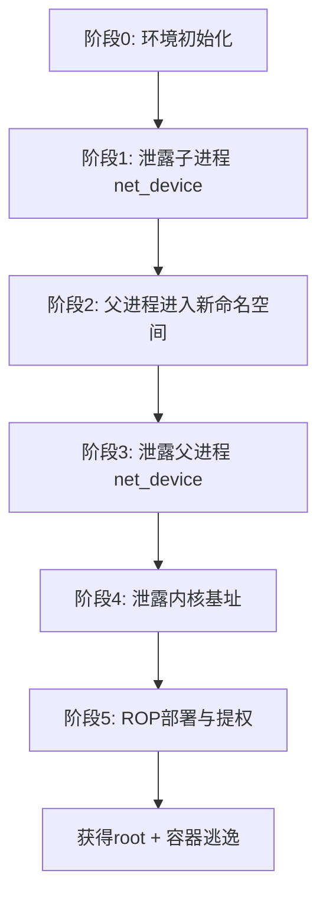
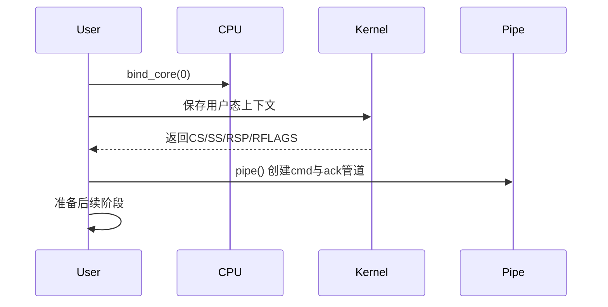
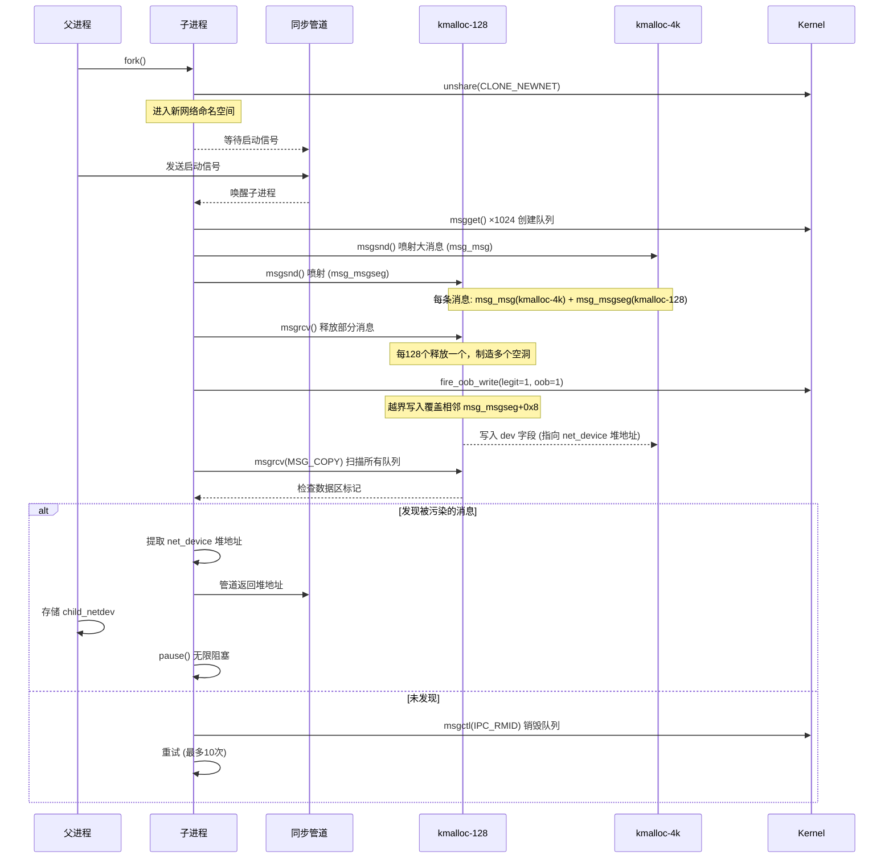
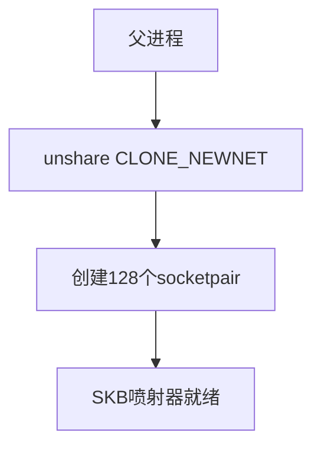
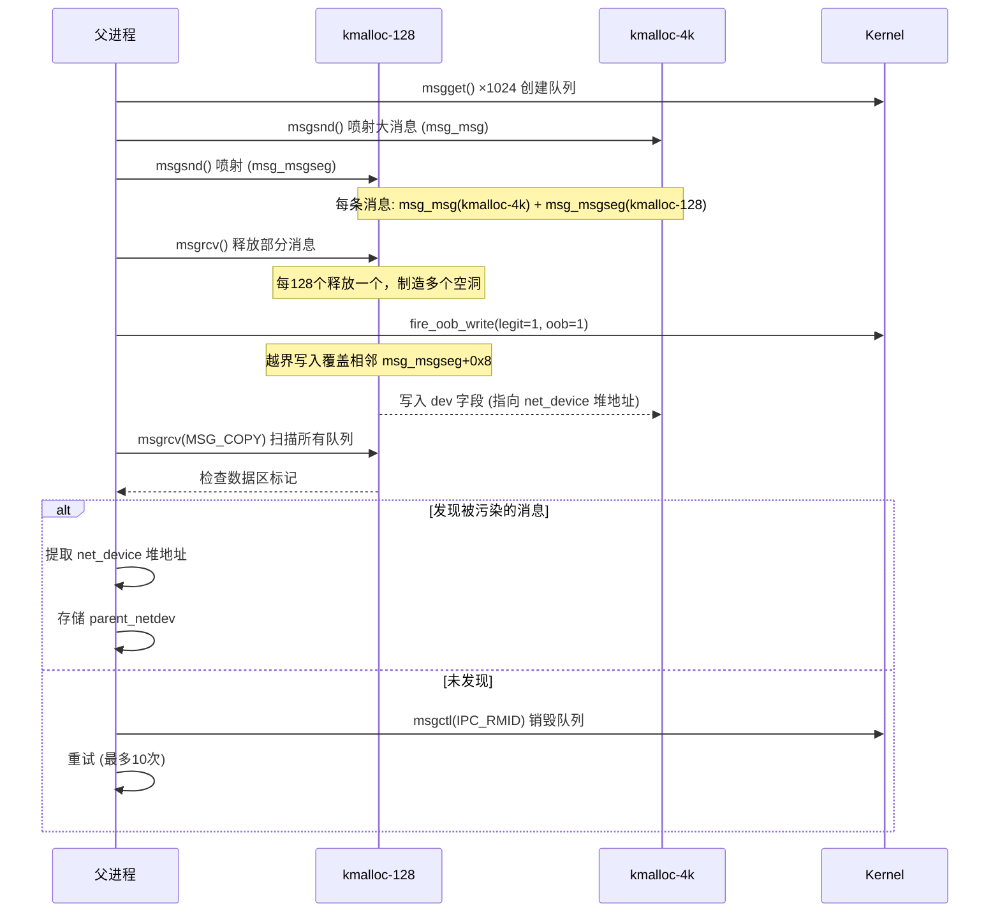
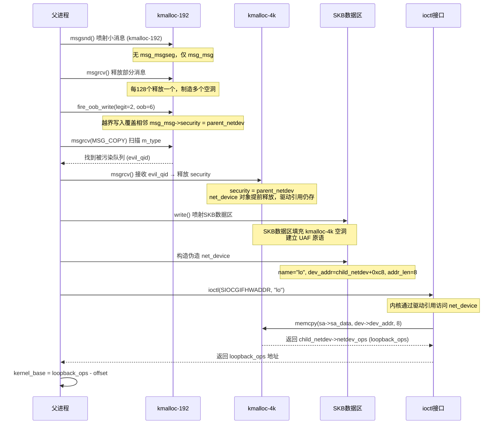
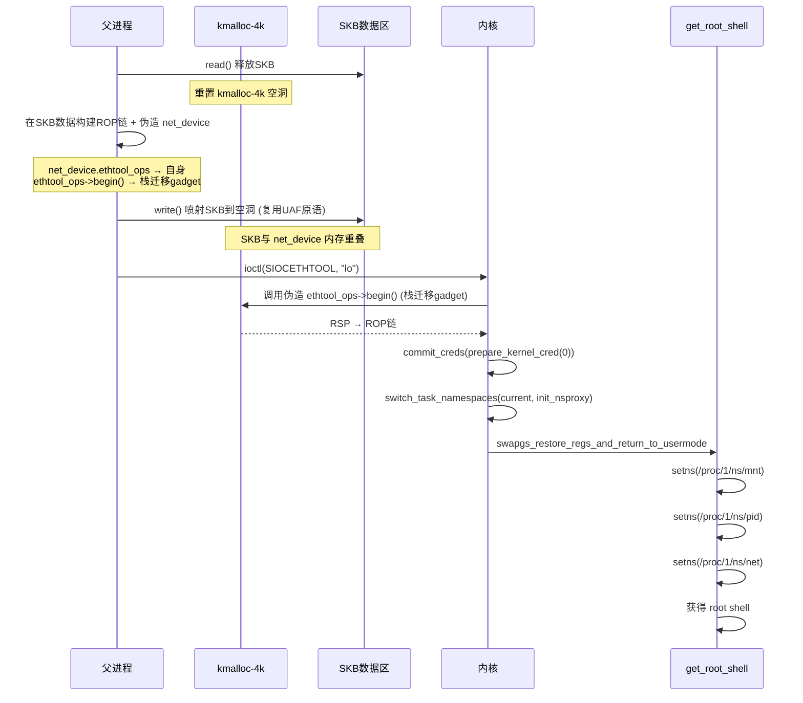

# 【Kernel Exploit】CVE-2022-25636 漏洞分析

## 1. 测试环境

**测试版本**：Linux-5.13.19 [内核镜像地址](https://github.com/BinRacer/pwn4cve/blob/master/kernels/5.13.19/01/bzImage)

笔者测试的内核版本是 `Linux (none) 5.13.19 #1 SMP Tue Feb 24 13:02:30 CST 2026 x86_64 GNU/Linux`。

**编译选项**：开启`CONFIG_NF_TABLES`、`CONFIG_NFT_DUP_NETDEV`、`CONFIG_NF_DUP_NETDEV`、`CONFIG_SECURITY`、`CONFIG_IO_URING`、`CONFIG_BINFMT_MISC`、`CONFIG_THREAD_INFO_IN_TASK`、`CONFIG_INIT_ON_ALLOC_DEFAULT_ON`、`CONFIG_KCMP`、`CONFIG_MEMCG`、`CONFIG_MEMCG_KMEM`、`CONFIG_CGROUPS`、`CONFIG_SLAB_FREELIST_RANDOM`、`CONFIG_SLAB_FREELIST_HARDENED`、`CONFIG_HARDENED_USERCOPY`、`CONFIG_FUSE_FS`、`CONFIG_USERFAULTFD`、`CONFIG_SYSVIPC`、`CONFIG_KEYS`、`CONFIG_STACKPROTECTOR`、`CONFIG_STACKPROTECTOR_STRONG`、`CONFIG_SLUB`、`CONFIG_SLUB_DEBUG`、`CONFIG_E1000`、`CONFIG_E1000E`、`CONFIG_PACKET`、`CONFIG_USER_NS`、`CONFIG_NET_NS`、`CONFIG_NAMESPACES`、`CONFIG_CHECKPOINT_RESTORE`、`CONFIG_IPC_NS`选项。完整配置参考[.config](https://github.com/BinRacer/pwn4cve/blob/master/kernels/5.13.19/01/.config)。

**保护机制**：KASLR/SMEP/SMAP/KPTI

## 2. 漏洞背景

### 2-1. 漏洞概述

**CVE-2022-25636** 是 Linux 内核 netfilter 子系统中一个位于 `nf_dup_netdev.c` 的堆越界写入漏洞。该漏洞存在于 `nft_fwd_dup_netdev_offload` 函数中，由 netfilter 硬件卸载路径中的分配大小与实际写入次数不一致所引发。

该漏洞允许在特定条件下向堆上分配的 `flow->rule->action.entries` 数组范围之外写入数据，写入的内容包含指向 `net_device` 结构体的指针。尽管该代码路径与硬件卸载功能相关，但实际触发时并不要求目标网络设备具备硬件卸载能力——漏洞在规则创建失败之前即被触发，因此即便针对 `lo` 等不具备卸载功能的设备亦可复现。

**CVE-2022-25636** 自 Linux 5.4-rc1 版本引入，影响 5.4-rc1 至 5.17-rc5 之间的内核版本，5.17-rc6 及后续版本已修复该问题。漏洞发现者 Nick Gregory 于 2022 年 2 月 21 日向 oss-security 邮件列表报告了该漏洞，并同步提供了概念验证（PoC）代码。

### 2-2. 核心数据结构

**CVE-2022-25636** 涉及的核心数据结构分布在 netfilter 硬件卸载路径与通用流规则框架中。为便于理解漏洞触发过程中的内存操作，本节按层级逐步展开相关结构体。

#### 2-2-1. 流规则与动作结构

在硬件卸载场景下，内核使用 `struct flow_rule` 描述一条可卸载的转发规则，其内部包含匹配条件（`match`）和一系列动作（`action`）。动作集合由变长数组 `entries` 承载，每个条目对应一个具体的卸载动作（如重定向、镜像等）。该数组在规则创建时动态分配，其长度由 `num_entries` 字段记录。

```c
struct flow_rule {
    struct flow_match match;        /* 匹配字段的描述符、掩码与键值 */
    struct flow_action action;      /* 动作集合，包含变长动作条目数组 */
};

struct flow_action {
    unsigned int num_entries;               /* 数组元素个数（分配时决定） */
    struct flow_action_entry entries[];     /* 变长数组，动态分配于堆上 */
};

struct flow_action_entry {
    enum flow_action_id id;                 /* 动作类型（如 FLOW_ACTION_MIRRED / REDIRECT） */
    enum flow_action_hw_stats hw_stats;     /* 硬件统计策略（预填充为 DONT_CARE） */
    action_destr destructor;                /* 析构函数指针 */
    void *destructor_priv;                  /* 析构私有数据 */
    union {
        u32 chain_index;                    /* 链索引 */
        struct net_device *dev;             /* 【关键】网络设备指针 —— 越界写入的载荷 */
        struct {
            u16 vid;                        /* VLAN ID */
            __be16 proto;                   /* VLAN 协议类型 */
            u8 prio;                        /* VLAN 优先级 */
        } vlan;
        struct {
            enum flow_action_mangle_base htype; /* 修改类型 */
            u32 offset;                         /* 偏移量 */
            u32 mask;                           /* 掩码 */
            u32 val;                            /* 值 */
        } mangle;
        struct ip_tunnel_info *tunnel;      /* 隧道信息 */
        u32 csum_flags;                     /* 校验和标志 */
        u32 mark;                           /* 标记 */
        u16 ptype;                          /* 包类型 */
        u32 priority;                       /* 优先级 */
        struct {
            u32 ctx;                        /* 上下文 */
            u32 index;                      /* 索引 */
            u8 vf;                          /* 虚拟功能 */
        } queue;
        struct {
            struct psample_group *psample_group; /* 样本组 */
            u32 rate;                           /* 采样率 */
            u32 trunc_size;                     /* 截断大小 */
            bool truncate;                      /* 是否截断 */
        } sample;
        struct {
            u32 index;                      /* 策略索引 */
            u32 burst;                      /* 突发大小 */
            u64 rate_bytes_ps;              /* 字节速率 (字节/秒) */
            u64 burst_pkt;                  /* 突发包数 */
            u64 rate_pkt_ps;                /* 包速率 (包/秒) */
            u32 mtu;                        /* MTU */
        } police;
        struct {
            int action;                     /* 动作 */
            u16 zone;                       /* 区域 */
            struct nf_flowtable *flow_table; /* 流表 */
        } ct;
        struct {
            unsigned long cookie;           /* Cookie */
            u32 mark;                       /* 标记 */
            u32 labels[4];                  /* 标签数组 */
            bool orig_dir;                  /* 原始方向 */
        } ct_metadata;
        struct {
            u32 label;                      /* MPLS 标签 */
            __be16 proto;                   /* 上层协议 */
            u8 tc;                          /* TC */
            u8 bos;                         /* 栈底标志 */
            u8 ttl;                         /* TTL */
        } mpls_push;
        struct {
            __be16 proto;                   /* 弹出后的协议 */
        } mpls_pop;
        struct {
            u32 label;                      /* MPLS 标签 */
            u8 tc;                          /* TC */
            u8 bos;                         /* 栈底标志 */
            u8 ttl;                         /* TTL */
        } mpls_mangle;
        struct {
            u32 index;                      /* 门控索引 */
            s32 prio;                       /* 优先级 */
            u64 basetime;                   /* 基准时间 */
            u64 cycletime;                  /* 周期时间 */
            u64 cycletimeext;               /* 周期扩展时间 */
            u32 num_entries;                /* 条目数 */
            struct action_gate_entry *entries; /* 门控条目 */
        } gate;
        struct {
            u16 sid;                        /* PPPoE 会话 ID */
        } pppoe;
    };
    struct flow_action_cookie *cookie;      /* 可选 cookie 指针 */
};
```

#### 2-2-2. 卸载上下文与表达式结构

在 nftables 中，一条规则由多个表达式（`struct nft_expr`）组成，每个表达式通过 `ops->offload` 回调参与硬件卸载。卸载过程中，内核维护一个上下文对象 `struct nft_offload_ctx`，用于记录已处理的动作数量（`num_actions`）、网络命名空间以及寄存器值（如设备索引）。整个流规则对象 `struct nft_flow_rule` 封装了匹配信息和底层的 `flow_rule` 指针。

```c
struct nft_flow_rule {
    __be16 proto;                           /* 三层协议类型 */
    struct nft_flow_match match;            /* 匹配字段（包含 dissector / key / mask） */
    struct flow_rule *rule;                 /* 指向实际的 flow_rule，其 action.entries 即漏洞越界目标 */
};

struct nft_offload_ctx {
    struct {
        enum nft_offload_dep_type type;     /* 依赖类型 */
        __be16 l3num;                       /* 三层协议号 */
        u8 protonum;                        /* 四层协议号 */
    } dep;
    unsigned int num_actions;               /* 【关键】已处理的动作计数器 —— 用作 entries 数组索引 */
    struct net *net;                        /* 当前网络命名空间 */
    struct nft_offload_reg regs[24];        /* 寄存器数组，存储表达式求值结果（如设备索引 oif） */
};

struct nft_expr {
    const struct nft_expr_ops *ops;         /* 操作函数集，包含 .offload 回调与 .offload_flags 标志 */
    unsigned char data[];                   /* 私有数据，具体类型由 ops 决定（如 nft_dup_netdev） */
};

struct nft_dup_netdev {
    u8 sreg_dev;    /* 源寄存器编号，存储输出设备索引 oif */
};

struct nft_fwd_netdev {
    u8 sreg_dev;    /* 同上 */
};
```

#### 2-2-3. 网络设备结构

越界写入的载荷为指向 `struct net_device` 的指针，该结构体承载了网络接口的全部状态信息。通过控制越界写入的位置，可使该指针落入其他内核对象，从而触发类型混淆或信息泄露。

```c
struct net_device {
    /* 0x0000 */ char name[16];                         /* 设备名称，如 "lo" */
    /* 0x0010 */ struct netdev_name_node *name_node;    /* 名称节点 */
    /* 0x0018 */ struct dev_ifalias *ifalias;           /* 设备别名 */
    /* 0x0020 */ unsigned long mem_end;                 /* 内存结束地址 */
    /* 0x0028 */ unsigned long mem_start;               /* 内存起始地址 */
    /* 0x0030 */ unsigned long base_addr;               /* I/O 基址 */
    /* 0x0038 */ unsigned long state;                   /* 设备状态 */
    /* 0x0040 */ struct list_head dev_list;             /* 全局设备链表节点 */
    /* 0x0050 */ struct list_head napi_list;            /* NAPI 链表 */
    /* 0x0060 */ struct list_head unreg_list;           /* 注销链表 */
    /* 0x0070 */ struct list_head close_list;           /* 关闭链表 */
    /* 0x0080 */ struct list_head ptype_all;            /* 所有包类型链表 */
    /* 0x0090 */ struct list_head ptype_specific;       /* 特定包类型链表 */
    /* 0x00a0 */ struct {
        struct list_head upper;                         /* 上层设备链表 */
        struct list_head lower;                         /* 下层设备链表 */
    } adj_list;                                          /* 邻接设备列表 */
    /* 0x00c0 */ unsigned int flags;                    /* 设备标志 (IFF_*) */
    /* 0x00c4 */ unsigned int priv_flags;               /* 私有标志 */
    /* 0x00c8 */ const struct net_device_ops *netdev_ops; /* 设备操作函数表 */
    /* 0x00d0 */ int ifindex;                           /* 【关键】接口索引 */
    /* 0x00d4 */ unsigned short gflags;                 /* 一般标志 */
    /* 0x00d6 */ unsigned short hard_header_len;        /* 硬件头部长度 */
    /* 0x00d8 */ unsigned int mtu;                      /* 最大传输单元 */
    /* 0x00dc */ unsigned short needed_headroom;        /* 需要保留的头部空间 */
    /* 0x00de */ unsigned short needed_tailroom;        /* 需要保留的尾部空间 */
    /* 0x00e0 */ netdev_features_t features;            /* 当前启用的特性 */
    /* 0x00e8 */ netdev_features_t hw_features;         /* 硬件支持的特性 */
    /* 0x00f0 */ netdev_features_t wanted_features;     /* 期望启用的特性 */
    /* 0x00f8 */ netdev_features_t vlan_features;       /* VLAN 特性 */
    /* 0x0100 */ netdev_features_t hw_enc_features;     /* 硬件封装特性 */
    /* 0x0108 */ netdev_features_t mpls_features;       /* MPLS 特性 */
    /* 0x0110 */ netdev_features_t gso_partial_features; /* 部分 GSO 特性 */
    /* 0x0118 */ unsigned int min_mtu;                  /* 最小 MTU */
    /* 0x011c */ unsigned int max_mtu;                  /* 最大 MTU */
    /* 0x0120 */ unsigned short type;                   /* 接口类型 (ARPHRD_*) */
    /* 0x0122 */ unsigned char min_header_len;          /* 最小头部长度 */
    /* 0x0123 */ unsigned char name_assign_type;        /* 名称分配类型 */
    /* 0x0124 */ int group;                             /* 设备组 */
    /* 0x0128 */ struct net_device_stats stats;         /* 统计计数器（184 字节） */
    /* 0x01e0 */ atomic_long_t rx_dropped;              /* 接收丢弃计数 */
    /* 0x01e8 */ atomic_long_t tx_dropped;              /* 发送丢弃计数 */
    /* 0x01f0 */ atomic_long_t rx_nohandler;            /* 无处理程序接收计数 */
    /* 0x01f8 */ atomic_t carrier_up_count;             /* 载波上升计数 */
    /* 0x01fc */ atomic_t carrier_down_count;           /* 载波下降计数 */
    /* 0x0200 */ const struct iw_handler_def *wireless_handlers; /* 无线扩展处理程序 */
    /* 0x0208 */ struct iw_public_data *wireless_data;  /* 无线公共数据 */
    /* 0x0210 */ const struct ethtool_ops *ethtool_ops; /* ethtool 操作函数 */
    /* 0x0218 */ const struct l3mdev_ops *l3mdev_ops;   /* L3 主设备操作 */
    /* 0x0220 */ const struct ndisc_ops *ndisc_ops;     /* NDISC 操作 (IPv6) */
    /* 0x0228 */ const struct xfrmdev_ops *xfrmdev_ops; /* XFRM 设备操作 */
    /* 0x0230 */ const struct tlsdev_ops *tlsdev_ops;   /* TLS 设备操作 */
    /* 0x0238 */ const struct header_ops *header_ops;   /* 头部操作函数 */
    /* 0x0240 */ unsigned char operstate;               /* 操作状态 (IF_OPER_*) */
    /* 0x0241 */ unsigned char link_mode;               /* 链路模式 */
    /* 0x0242 */ unsigned char if_port;                 /* 端口类型 */
    /* 0x0243 */ unsigned char dma;                     /* DMA 通道 */
    /* 0x0244 */ unsigned char perm_addr[32];           /* 永久硬件地址 */
    /* 0x0264 */ unsigned char addr_assign_type;        /* 地址分配类型 */
    /* 0x0265 */ unsigned char addr_len;                /* 硬件地址长度 */
    /* 0x0266 */ unsigned char upper_level;             /* 上层设备层级 */
    /* 0x0267 */ unsigned char lower_level;             /* 下层设备层级 */
    /* 0x0268 */ unsigned short neigh_priv_len;         /* 邻居私有数据长度 */
    /* 0x026a */ unsigned short dev_id;                 /* 设备 ID */
    /* 0x026c */ unsigned short dev_port;               /* 设备端口 */
    /* 0x026e */ unsigned short padded;                 /* 填充字节 */
    /* 0x0270 */ spinlock_t addr_list_lock;             /* 地址列表自旋锁 */
    /* 0x0274 */ int irq;                               /* 中断号 */
    /* 0x0278 */ struct netdev_hw_addr_list uc;         /* 单播地址列表 */
    /* 0x0290 */ struct netdev_hw_addr_list mc;         /* 多播地址列表 */
    /* 0x02a8 */ struct netdev_hw_addr_list dev_addrs;  /* 设备地址列表 */
    /* 0x02c0 */ struct kset *queues_kset;              /* 队列 kset */
    /* 0x02c8 */ unsigned int promiscuity;              /* 混杂模式引用计数 */
    /* 0x02cc */ unsigned int allmulti;                 /* 全多播引用计数 */
    /* 0x02d0 */ bool uc_promisc;                       /* 单播混杂模式 */
    /* 0x02d8 */ struct vlan_info *vlan_info;           /* VLAN 信息 */
    /* 0x02e0 */ struct dsa_port *dsa_ptr;              /* DSA 端口 */
    /* 0x02e8 */ struct tipc_bearer *tipc_ptr;          /* TIPC 承载 */
    /* 0x02f0 */ void *atalk_ptr;                       /* AppleTalk 协议数据 */
    /* 0x02f8 */ struct in_device *ip_ptr;              /* IPv4 设备数据 */
    /* 0x0300 */ struct dn_dev *dn_ptr;                 /* DECnet 设备数据 */
    /* 0x0308 */ struct inet6_dev *ip6_ptr;             /* IPv6 设备数据 */
    /* 0x0310 */ void *ax25_ptr;                        /* AX.25 协议数据 */
    /* 0x0318 */ struct wireless_dev *ieee80211_ptr;    /* 802.11 无线设备数据 */
    /* 0x0320 */ struct wpan_dev *ieee802154_ptr;       /* 802.15.4 设备数据 */
    /* 0x0328 */ struct mpls_dev *mpls_ptr;             /* MPLS 设备数据 */
    /* 0x0330 */ unsigned char *dev_addr;               /* 当前硬件地址指针 */
    /* 0x0338 */ struct netdev_rx_queue *_rx;           /* 接收队列数组 */
    /* 0x0340 */ unsigned int num_rx_queues;            /* 接收队列数量 */
    /* 0x0344 */ unsigned int real_num_rx_queues;       /* 实际接收队列数量 */
    /* 0x0348 */ struct bpf_prog *xdp_prog;             /* XDP 程序 */
    /* 0x0350 */ unsigned long gro_flush_timeout;       /* GRO 刷新超时 (jiffies) */
    /* 0x0358 */ int napi_defer_hard_irqs;              /* NAPI 延迟硬中断数量 */
    /* 0x0360 */ rx_handler_func_t *rx_handler;         /* 接收处理程序 */
    /* 0x0368 */ void *rx_handler_data;                 /* 接收处理程序私有数据 */
    /* 0x0370 */ struct mini_Qdisc *miniq_ingress;      /* 入口迷你 Qdisc */
    /* 0x0378 */ struct netdev_queue *ingress_queue;    /* 入口队列 */
    /* 0x0380 */ struct nf_hook_entries *nf_hooks_ingress; /* Netfilter 入口钩子 */
    /* 0x0388 */ unsigned char broadcast[32];           /* 广播地址 */
    /* 0x03a8 */ struct cpu_rmap *rx_cpu_rmap;          /* 接收 CPU 映射 */
    /* 0x03b0 */ struct hlist_node index_hlist;         /* 索引哈希表节点 */
    /* 0x03c0 */ struct netdev_queue *_tx;              /* 发送队列数组 */
    /* 0x03c8 */ unsigned int num_tx_queues;            /* 发送队列数量 */
    /* 0x03cc */ unsigned int real_num_tx_queues;       /* 实际发送队列数量 */
    /* 0x03d0 */ struct Qdisc *qdisc;                   /* 根 Qdisc */
    /* 0x03d8 */ unsigned int tx_queue_len;             /* 发送队列长度 */
    /* 0x03dc */ spinlock_t tx_global_lock;             /* 全局发送锁 */
    /* 0x03e0 */ struct xdp_dev_bulk_queue *xdp_bulkq;  /* XDP 批量队列 */
    /* 0x03e8 */ struct xps_dev_maps *xps_maps[2];      /* XPS 映射 (CPU/RPS) */
    /* 0x03f8 */ struct mini_Qdisc *miniq_egress;       /* 出口迷你 Qdisc */
    /* 0x0400 */ struct hlist_head qdisc_hash[16];      /* Qdisc 哈希表 */
    /* 0x0480 */ struct timer_list watchdog_timer;      /* 看门狗定时器 */
    /* 0x04a8 */ int watchdog_timeo;                    /* 看门狗超时 (jiffies) */
    /* 0x04ac */ u32 proto_down_reason;                 /* 协议 down 原因 */
    /* 0x04b0 */ struct list_head todo_list;            /* 待办链表 */
    /* 0x04c0 */ int *pcpu_refcnt;                      /* 每 CPU 引用计数 */
    /* 0x04c8 */ struct list_head link_watch_list;      /* 链路监听链表 */
    /* 0x04d8 */ enum netdev_reg_state reg_state : 8;   /* 注册状态 */
    /* 0x04d9 */ bool dismantle;                        /* 是否正在拆除 */
    /* 0x04da */ enum rtnl_link_state rtnl_link_state : 16; /* RTNL 链路状态 */
    /* 0x04dc */ bool needs_free_netdev;                /* 是否需要释放 */
    /* 0x04e0 */ void (*priv_destructor)(struct net_device *); /* 私有数据析构函数 */
    /* 0x04e8 */ struct netpoll_info *npinfo;           /* Netpoll 信息 */
    /* 0x04f0 */ possible_net_t nd_net;                 /* 所属网络命名空间 */
    /* 0x04f8 */ void *ml_priv;                         /* 中间层私有数据 */
    /* 0x0500 */ enum netdev_ml_priv_type ml_priv_type; /* 中间层私有数据类型 */
    /* 0x0508 */ union {
        struct pcpu_lstats *lstats;                     /* 每 CPU 统计 (旧版) */
        struct pcpu_sw_netstats *tstats;                /* 每 CPU 软件统计 */
        struct pcpu_dstats *dstats;                     /* 每 CPU 增量统计 */
    };
    /* 0x0510 */ struct garp_port *garp_port;           /* GARP 端口 */
    /* 0x0518 */ struct mrp_port *mrp_port;             /* MRP 端口 */
    /* 0x0520 */ struct device dev;                     /* 内嵌设备模型 (736 字节) */
    /* 0x0800 */ const struct attribute_group *sysfs_groups[4]; /* sysfs 属性组 */
    /* 0x0820 */ const struct attribute_group *sysfs_rx_queue_group; /* 接收队列 sysfs 组 */
    /* 0x0828 */ const struct rtnl_link_ops *rtnl_link_ops; /* RTNL 链路操作 */
    /* 0x0830 */ unsigned int gso_max_size;             /* GSO 最大分段大小 */
    /* 0x0834 */ u16 gso_max_segs;                      /* GSO 最大段数 */
    /* 0x0838 */ const struct dcbnl_rtnl_ops *dcbnl_ops; /* DCB 操作 */
    /* 0x0840 */ s16 num_tc;                            /* 流量类别数量 */
    /* 0x0842 */ struct netdev_tc_txq tc_to_txq[16];    /* TC 到发送队列映射 */
    /* 0x0882 */ u8 prio_tc_map[16];                    /* 优先级到 TC 映射 */
    /* 0x0894 */ unsigned int fcoe_ddp_xid;             /* FCoE DDP XID */
    /* 0x0898 */ struct netprio_map *priomap;           /* 网络优先级映射 */
    /* 0x08a0 */ struct phy_device *phydev;             /* PHY 设备 */
    /* 0x08a8 */ struct sfp_bus *sfp_bus;               /* SFP 总线 */
    /* 0x08b0 */ struct lock_class_key *qdisc_tx_busylock; /* Qdisc 发送忙锁类 */
    /* 0x08b8 */ struct lock_class_key *qdisc_running_key; /* Qdisc 运行锁类 */
    /* 0x08c0 */ bool proto_down;                       /* 协议 down 标志 */
    /* 0x08c1 */ unsigned int wol_enabled : 1;          /* 是否启用 WoL */
    /* 0x08c1 */ unsigned int threaded : 1;             /* 是否线程化 NAPI */
    /* 0x08c8 */ struct list_head net_notifier_list;    /* 网络通知器链表 */
    /* 0x08d8 */ const struct macsec_ops *macsec_ops;   /* MACsec 操作 */
    /* 0x08e0 */ const struct udp_tunnel_nic_info *udp_tunnel_nic_info; /* UDP 隧道 NIC 信息 */
    /* 0x08e8 */ struct udp_tunnel_nic *udp_tunnel_nic; /* UDP 隧道 NIC */
    /* 0x08f0 */ struct bpf_xdp_entity xdp_state[3];    /* XDP 状态 (3 个实体) */
};
```

### 2-3. 处理流程与异常

漏洞根源于硬件卸载流程中两个关键步骤的计数不一致：动作条目数组的分配大小取决于表达式的 `offload_flags`，而实际写入次数则由 `num_actions` 计数器独立递增。下面分别剖析分配与写入两个阶段，揭示计数失配的成因。

#### 2-3-1. 动作条目分配流程

当用户通过 nftables 添加一条规则时，内核调用 `nft_flow_rule_create` 尝试将其转换为可卸载的流规则。该函数首先遍历规则中的所有表达式，统计哪些表达式声明了需要分配动作槽位（通过 `NFT_OFFLOAD_F_ACTION` 标志）。在当前的实现中，仅 `immediate`（立即数）类型的表达式会设置该标志。

```c
struct nft_flow_rule *nft_flow_rule_create(struct net *net,
					   const struct nft_rule *rule)
{
    struct nft_offload_ctx *ctx;
    struct nft_flow_rule *flow;
    int num_actions = 0, err;
    struct nft_expr *expr;

    /* 第一次遍历：统计设置了 NFT_OFFLOAD_F_ACTION 的表达式个数 */
    expr = nft_expr_first(rule);
    while (nft_expr_more(rule, expr)) {
        if (expr->ops->offload_flags & NFT_OFFLOAD_F_ACTION)
            num_actions++;   /* 仅 immediate 表达式设置此标志 */
        expr = nft_expr_next(expr);
    }

    if (num_actions == 0)
        return ERR_PTR(-EOPNOTSUPP);

    flow = nft_flow_rule_alloc(num_actions);
    if (!flow)
        return ERR_PTR(-ENOMEM);

    /* 第二次遍历：调用每个表达式的 offload 回调 */
    expr = nft_expr_first(rule);
    ctx = kzalloc(sizeof(struct nft_offload_ctx), GFP_KERNEL);
    if (!ctx) {
        err = -ENOMEM;
        goto err_out;
    }
    ctx->net = net;
    ctx->dep.type = NFT_OFFLOAD_DEP_UNSPEC;

    while (nft_expr_more(rule, expr)) {
        if (!expr->ops->offload) {
            err = -EOPNOTSUPP;
            goto err_out;
        }
        err = expr->ops->offload(ctx, flow, expr);
        if (err < 0)
            goto err_out;
        expr = nft_expr_next(expr);
    }
    nft_flow_rule_transfer_vlan(ctx, flow);

    flow->proto = ctx->dep.l3num;
    kfree(ctx);
    return flow;
err_out:
    kfree(ctx);
    nft_flow_rule_destroy(flow);
    return ERR_PTR(err);
}
```

`nft_flow_rule_alloc` 调用 `flow_rule_alloc` 根据 `num_actions` 分配 `flow_rule` 及其 `entries` 数组。若 `num_actions` 为零，则 `entries` 数组长度为 0，仅分配结构体头部。

```c
static struct nft_flow_rule *nft_flow_rule_alloc(int num_actions)
{
    struct nft_flow_rule *flow;

    flow = kzalloc(sizeof(struct nft_flow_rule), GFP_KERNEL);
    if (!flow)
        return NULL;

    flow->rule = flow_rule_alloc(num_actions);
    if (!flow->rule) {
        kfree(flow);
        return NULL;
    }

    flow->rule->match.dissector = &flow->match.dissector;
    flow->rule->match.mask = &flow->match.mask;
    flow->rule->match.key = &flow->match.key;

    return flow;
}

struct flow_rule *flow_rule_alloc(unsigned int num_actions)
{
    struct flow_rule *rule;
    int i;

    rule = kzalloc(struct_size(rule, action.entries, num_actions),
                   GFP_KERNEL);
    if (!rule)
        return NULL;

    rule->action.num_entries = num_actions;
    /* 预填充每个条目的 hw_stats 为 DONT_CARE */
    for (i = 0; i < num_actions; i++)
        rule->action.entries[i].hw_stats = FLOW_ACTION_HW_STATS_DONT_CARE;

    return rule;
}
```

#### 2-3-2. 动作条目写入流程

在第二次遍历中，每个表达式的 `offload` 回调被依次调用。对于 `dup` 和 `fwd` 表达式，其回调最终进入 `nft_fwd_dup_netdev_offload`。该函数从上下文中获取设备索引，查找对应的 `net_device`，然后使用 `ctx->num_actions` 作为索引将动作条目写入 `entries` 数组，并自增计数器。

```c
static int nft_dup_netdev_offload(struct nft_offload_ctx *ctx,
                  struct nft_flow_rule *flow,
                  const struct nft_expr *expr)
{
    const struct nft_dup_netdev *priv = nft_expr_priv(expr);
    int oif = ctx->regs[priv->sreg_dev].data.data[0];

    return nft_fwd_dup_netdev_offload(ctx, flow, FLOW_ACTION_MIRRED, oif);
}

static int nft_fwd_netdev_offload(struct nft_offload_ctx *ctx,
                  struct nft_flow_rule *flow,
                  const struct nft_expr *expr)
{
    const struct nft_fwd_netdev *priv = nft_expr_priv(expr);
    int oif = ctx->regs[priv->sreg_dev].data.data[0];

    return nft_fwd_dup_netdev_offload(ctx, flow, FLOW_ACTION_REDIRECT, oif);
}

int nft_fwd_dup_netdev_offload(struct nft_offload_ctx *ctx,
                   struct nft_flow_rule *flow,
                   enum flow_action_id id, int oif)
{
    struct flow_action_entry *entry;
    struct net_device *dev;

    dev = dev_get_by_index(ctx->net, oif);
    if (!dev)
        return -EOPNOTSUPP;

    /* ★★★★★ 漏洞点 ★★★★★
     * 此处使用 ctx->num_actions 作为索引写入 entries 数组，
     * 但该数组的实际分配大小在创建时已固定，且未计入 dup/fwd 表达式。
     * 若 num_actions 超出数组边界，则发生堆越界写入。
     */
    entry = &flow->rule->action.entries[ctx->num_actions++];
    entry->id = id;
    entry->dev = dev;

    return 0;
}
```

#### 2-3-3. 计数不一致性分析

| 阶段         | 判断条件 / 操作                                   | 对 `dup`/`fwd` 表达式的处理          |
| :----------- | :------------------------------------------------ | :----------------------------------- |
| **分配计数** | `expr->ops->offload_flags & NFT_OFFLOAD_F_ACTION` | **不计入**（此类表达式未设置该标志） |
| **实际写入** | `ctx->num_actions++` 并索引 `entries`             | **无条件递增并写入**                 |

当一条规则仅包含 `dup` 或 `fwd` 表达式而不包含 `immediate` 时，分配阶段统计得出的 `num_actions` 为零，因此 `flow_rule_alloc(0)` 分配的 `entries` 数组长度为 0（即仅分配 `struct flow_rule` 头部，不包含任何 `flow_action_entry` 的存储空间）。然而，在后续的卸载回调过程中，每遇到一个 `dup` 或 `fwd` 表达式，`nft_fwd_dup_netdev_offload` 都会无条件执行以下操作：

1. 以 `ctx->num_actions` 的当前值作为索引，从 `entries` 数组起始位置开始计算偏移；
2. 向该地址写入一个完整的 `struct flow_action_entry`（大小为 80 字节），并填充 `id` 和 `dev` 字段；
3. 将 `ctx->num_actions` 自增 1。

由于数组实际可用的索引范围为 `[0, num_entries-1]`，而此处 `num_entries = 0`，任何索引值（包括 0）均超出有效范围。第一次写入即访问 `entries[0]`，该地址落在 `struct flow_rule` 尾部之后，属于相邻堆内存区域。后续每次写入则依次向后偏移 80 字节，连续覆盖后续堆空间。

若规则中包含多个 `dup`/`fwd` 表达式，则每次写入的条目数量与表达式个数相同，写入位置依次递增。每次写入的 `dev` 字段均指向由 `dev_get_by_index` 返回的合法 `net_device` 对象（该指针指向内核全局数据结构，具有固定布局）。由于写入的内容（尤其是 `dev` 指针）来自内核内部，且写入次数由规则中的表达式数量决定，该越界操作可能覆盖相邻堆对象的元数据（如分配器管理头）或数据字段。覆盖的具体内容取决于相邻堆块的类型，可能导致：

- 相邻堆对象中的指针被替换为指向 `net_device` 的地址，从而引发后续代码在解引用该指针时访问到非预期的对象；
- 相邻堆对象中的长度或状态字段被修改，造成逻辑判断错误；
- 分配器元数据被破坏，导致后续的内存分配或释放操作进入异常状态。

上述后果均源于越界写入对堆内存的破坏，且写入的内容和位置在一定范围内可由规则结构控制（通过调整 `dup`/`fwd` 表达式的顺序和数量），这使得该漏洞具备被进一步利用的条件，例如实现信息泄露或操作权限提升。

理解上述计数不一致的内在机理后，接下来分析如何在实际环境中触发该漏洞，以及触发过程中各环节的具体行为特征。

### 2-4. 触发条件与流程

**CVE-2022-25636** 的触发依赖特定的权限环境、Netlink 消息构造方式以及内核处理路径的时序特征，下面分别阐述。这三方面要素相互关联，共同决定了漏洞的可复现性与影响范围。

#### 2-4-1. 权限要求

触发该漏洞所需的最小权限为 `CAP_NET_ADMIN` 能力，该能力允许用户执行网络配置操作，包括通过 Netlink 套接字创建和修改 nftables 规则。虽然该能力通常由 root 持有，但 Linux 的用户命名空间机制允许非特权用户通过 `unshare(CLONE_NEWNET)` 创建新的网络命名空间，在此命名空间内自动获得 `CAP_NET_ADMIN` 能力且无需全局 root 权限。因此在默认内核配置（启用 `CONFIG_USER_NS`）下，任意非特权用户均可触发此漏洞。这种低权限要求使得漏洞在容器环境、共享托管系统及其他多租户场景中尤为值得关注。

#### 2-4-2. Netlink 消息构造

触发漏洞需要构造一条符合 nftables Netlink 协议规范的规则添加消息（`NFT_MSG_NEWRULE`），通常借助 `libmnl` 和 `libnftnl` 库完成。构造的核心思路是创建一个启用了硬件卸载标志的链，并在该链中添加一条特定结构的规则。该规则由若干表达式组成，表达式的组合方式直接决定了内核分配与写入行为之间的不一致性。

**① 表与链的创建**

通过 `nftnl_table_alloc` 和 `nftnl_chain_alloc` 分别创建表和链对象，设置链的钩子类型为入口钩子（`NF_NETDEV_INGRESS`），并绑定到 `lo` 设备。在链的 Netlink 消息中附加 `NFT_CHAIN_HW_OFFLOAD` 标志，该标志指示内核在添加规则时尝试进入硬件卸载路径。

**② 匹配条件的必要性**

规则首先包含一组用于匹配网络数据包的表达式（`meta`、`cmp`、`payload` 等），例如读取以太网协议类型并比较是否为 IPv4，读取 IP 头中的目标地址并与指定值比较。这些匹配条件虽然不影响漏洞触发本身，但它们是规则语法完整性的必要组成部分——缺少匹配条件的规则无法通过内核的合法性检查，将提前返回错误而无法进入卸载路径。匹配条件的具体内容不影响漏洞触发，只需确保规则在逻辑上有效即可。

**③ 规则构造：计数与非计数的组合**

规则构造的关键在于同时放置两类表达式，利用它们在分配和写入阶段被处理方式的差异诱发计数不一致：

- **计数表达式**：使用 `immediate` 类型表达式，通过 `NFTNL_EXPR_IMM_DREG` 指定目标寄存器，`NFTNL_EXPR_IMM_DATA` 设置写入的常量值（如设备索引 1）。该类表达式因设置了 `NFT_OFFLOAD_F_ACTION` 标志，在分配阶段会被计入 `entries` 数组长度。每个 `immediate` 表达式负责将一个设备索引写入指定寄存器。

- **非计数表达式**：使用 `dup` 或 `fwd` 类型表达式，通过 `NFTNL_EXPR_DUP_SREG_DEV` 指定源寄存器编号，从该寄存器读取设备索引。该类表达式未设置上述标志，在分配阶段不被计入数组长度，但在写入阶段会无条件占用一个动作槽位。

为了解表达式的协同机制，有必要说明 nftables 的寄存器传递模型。nftables 使用一组虚拟寄存器（`nft_offload_reg`）在表达式之间传递数据。`immediate` 表达式将常量值（如设备索引）写入指定寄存器，后续的 `dup` 表达式则从同一寄存器读取该值。这种生产者-消费者模式使得 `dup` 表达式无需直接指定设备索引，而是间接引用寄存器的内容。在触发构造中，`immediate` 负责“生产”设备索引并触发计数，`dup` 负责“消费”该值并触发越界写入。

通过将多个 `immediate` + `dup` 配对作为合法填充（`legit_count` 对），再追加若干独立的 `dup` 表达式作为越界触发源（`oob_count` 个），规则构造实现了对分配长度与实际写入次数的精确控制：

| 类型     | 表达式组成          | 分配计数 | 写入计数 |
| :------- | :------------------ | :------- | :------- |
| 合法配对 | `immediate` + `dup` | 计入 1   | 计入 2   |
| 越界源   | 独立的 `dup`        | 不计入   | 计入 1   |

因此，若规则包含 `legit_count` 个配对和 `oob_count` 个独立 `dup`，则数组分配长度为 `legit_count`，而实际写入次数为 `2 × legit_count + oob_count`，其中超出数组边界的写入次数为 `legit_count + oob_count`。

**④ 消息序列化与发送**

构造完成后，使用 `mnl_nlmsg_batch_*` 系列函数将表创建、链创建、规则添加三条 Netlink 消息打包为批次，每条消息通过对应的 `*_nlmsg_build_hdr` 和 `*_nlmsg_build_payload` 函数填充内容。最后通过 `mnl_socket_open(NETLINK_NETFILTER)` 打开套接字，`mnl_socket_sendto` 将完整批次发送至内核的 nf_tables 子系统。

#### 2-4-3. 触发时序与内核处理路径

提交 Netlink 消息后，内核处理路径的时序特征是漏洞触发的关键。Netlink 消息到达内核后，`nf_tables_newrule` 解析并调用 `nft_flow_rule_create`，其内部两阶段处理如下：

- **第一阶段（分配）**：遍历表达式，仅 `immediate` 因设置 `NFT_OFFLOAD_F_ACTION` 被计入 `num_actions`。此时 `dup` 表达式完全被排除在计数之外。随后调用 `flow_rule_alloc(num_actions)` 分配 `struct flow_rule` 和变长数组 `entries`。若 `num_actions` 为 0，则 `entries` 数组长度为 0。

- **第二阶段（写入）**：分配 `nft_offload_ctx` 后再次遍历表达式，调用每个表达式的 `ops->offload` 回调。对于 `dup` 表达式，回调链最终进入 `nft_fwd_dup_netdev_offload`，该函数执行以下操作：
    1. 从上下文的寄存器中读取设备索引 `oif`；
    2. 通过 `dev_get_by_index(ctx->net, oif)` 查找对应的 `net_device` 对象；
    3. 使用 `ctx->num_actions` 作为索引，将动作条目写入 `entries` 数组；
    4. 自增 `ctx->num_actions`。

- **错误返回路径**：所有表达式的 `offload` 回调执行完毕后，`nft_flow_rule_create` 返回 `flow` 对象。上层调用者随后检查链的卸载配置是否与硬件能力匹配。若设备不支持卸载（如 `lo`），则调用 `nft_flow_rule_destroy` 清理已分配的 `flow_rule` 并返回错误。此时越界写入已在第二阶段发生。

**关键时序特征**：越界写入发生在硬件卸载可行性检查之前。`nft_flow_rule_create` 中的分配和写入阶段完全独立于后续的设备能力验证，即便最终规则因设备不支持卸载而被回滚，越界写入的内存破坏已经在堆上完成。这一时序特征使得漏洞无需任何特殊硬件环境即可稳定触发。

#### 2-4-4. 触发可控性

除触发条件本身外，该漏洞还允许对越界写入的若干属性进行精细调节：

- **写入次数**：由规则中独立的 `dup`/`fwd` 表达式数量（`oob_count`）决定。越界写入总量为 `(legit_count + oob_count) × sizeof(struct flow_action_entry)`，其中超出数组边界的部分为 `oob_count × 80` 字节。

- **写入偏移**：由合法配对数量（`legit_count`）控制。首次越界写入相对于 `struct flow_rule` 起始位置的堆内偏移为 `sizeof(struct flow_rule) + legit_count × 80` 字节。通过调整 `legit_count`，可将越界写入定位到不同的堆内存区域，从而影响相邻堆对象的类型。

- **写入内容**：每次写入的 `id` 字段固定为 `FLOW_ACTION_MIRRED`（`dup`）或 `FLOW_ACTION_REDIRECT`（`fwd`），`dev` 字段指向 `dev_get_by_index` 返回的 `net_device` 内核对象指针，其余字段因 `kzalloc` 初始化为零。写入内容中包含可信内核地址且确定性较强。

- **设备指针选择**：通过 `immediate` 表达式的 `NFTNL_EXPR_IMM_DATA` 设置寄存器值，控制 `dev_get_by_index` 返回的具体设备。当前构造中使用寄存器 1 且值为 1，指向 `lo` 设备；通过改变该值可使 `dev` 指向其他网络设备。

上述可控属性使得越界写入能够在指定的堆偏移处写入包含可信内核地址的数据，为后续的内存异常行为提供了可操纵的前置条件。

### 2-5. 影响范围

**CVE-2022-25636** 的影响覆盖多个 Linux 内核版本分支，涉及范围较广。以下从版本分布和潜在影响两个维度进行说明。

#### 2-5-1. 版本分布

该漏洞自 Linux 5.4-rc1 版本引入，影响 5.4 至 5.16 之间的多个主线版本。具体版本分支及对应的修复版本如下：

| 版本分支        | 起始版本 | 修复版本 |
| :-------------- | :------- | :------- |
| 5.4.x           | 5.4      | 5.4.182  |
| 5.5.x – 5.10.x  | 5.5      | 5.10.103 |
| 5.11.x – 5.15.x | 5.11     | 5.15.26  |
| 5.16.x          | 5.16     | 5.16.12  |

- **引入版本**：Linux 5.4-rc1（提交 [`be2861dc36d7`](https://git.kernel.org/pub/scm/linux/kernel/git/torvalds/linux.git/commit/?id=be2861dc36d77ff3778979b9c3c79ada4affa131)）
- **影响版本**：Linux 5.4 至 5.16.12 之间的部分版本（具体见上表）
- **修复版本**：Linux 5.17-rc6 及后续版本（主线修复）

该漏洞影响所有启用了 `CONFIG_NF_TABLES` 和 `CONFIG_NFT_DUP_NETDEV`（或 `CONFIG_NF_DUP_NETDEV`）内核编译选项的 Linux 系统。由于 `nftables` 是许多主流 Linux 发行版的默认防火墙框架，该漏洞在大量生产环境中存在潜在风险。

#### 2-5-2. 潜在影响

越界写入的内容中包含指向 `net_device` 结构体的指针，这赋予了该漏洞进一步引发其他内存异常行为的能力。具体而言：

- **类型混淆**：通过堆布局使越界写入覆盖相邻堆对象中的指针或函数表，可能致使后续代码在解引用时访问非预期的对象类型，从而引发控制流偏差或数据解析错误。

- **信息泄露**：若相邻堆对象中存在可被用户空间读取的字段，越界写入的 `net_device` 指针可能被传递至用户态，从而使内核堆地址暴露。该地址信息可能被用于定位其他内核数据结构，进而扩大可操作的地址范围。

- **引用计数破坏**：若越界写入覆盖相邻对象的引用计数或状态字段，可能导致对象被过早释放或重复释放，触发非预期的释放操作。此类释放操作可能进一步引发内存使用错误或状态不一致。

### 2-6. 总结

**CVE-2022-25636** 是 Linux 内核 netfilter 子系统中一个由分配大小与写入次数不一致引发的堆越界写入漏洞，其核心缺陷位于硬件卸载路径内的动作槽位计数逻辑。

该漏洞的根因可追溯至 `nft_flow_rule_create` 函数中两阶段处理的不对称性：分配阶段通过检查 `offload_flags` 统计表达式数量（仅 `immediate` 表达式设置该标志），而写入阶段则无条件递增 `ctx->num_actions` 并索引 `entries` 数组。`dup` 和 `fwd` 表达式因未设置该标志而在分配时被完全忽略，却在写入时被正常计数，这种逻辑失配导致数组访问突破其实际分配边界。

从触发条件来看，该漏洞自 Linux 5.4-rc1 版本引入，影响 5.4 至 5.16 之间的多个主线版本。尽管触发路径涉及硬件卸载功能，但实际触发并不依赖特定的硬件环境——即使目标设备（如 `lo`）不支持硬件卸载，越界写入仍会在卸载尝试失败之前发生。非特权用户可通过创建新的网络命名空间获得 `CAP_NET_ADMIN` 能力，从而绕过全局权限限制触发该漏洞，这使其在容器和多租户环境中尤为值得关注。

越界写入的内容中包含指向 `net_device` 的指针，写入次数由规则中 `dup`/`fwd` 表达式的数量控制，写入偏移则可通过调整 `immediate` 表达式的数量进行定位。这些可控属性为将越界写入转化为进一步的内存异常行为（如类型混淆、信息泄露或引用计数破坏）提供了技术基础。具体转化路径取决于目标内核的堆内存布局与相邻对象的结构特征。

针对该漏洞，建议系统管理员评估自身环境中运行的内核版本是否处于受影响范围内，优先将内核升级至已修复版本（Linux 5.17-rc6 及以上，或对应 LTS 分支的修复版本），或在无法立即升级的情况下考虑限制非特权用户创建网络命名空间的能力，以降低漏洞被触发的风险。

## 3. 利用思路

本章基于第二章对漏洞机理的剖析，系统性地阐述如何将该堆越界写入转化为可操作的提权原语。整体利用链分为五个阶段，各阶段通过堆布局、消息队列和 SKB 喷射等技术协同完成从信息泄露到执行任意代码的全过程。以下先给出整体的架构设计，再逐一展开各阶段的详细思路。整个利用流程可概括为“泄露 → 伪造 → 劫持”三部曲：首先借助 OOB 写入泄露内核堆上的 `net_device` 指针，进而通过伪造设备对象获取内核基址，最后将伪造对象的函数表指向 ROP 链完成权限提升。下图描述了各阶段之间的依赖关系和数据流向。



各阶段的核心任务如下：

| 阶段 | 目标                                       | 关键技术                                                                                                                                     |
| :--- | :----------------------------------------- | :------------------------------------------------------------------------------------------------------------------------------------------- |
| 0    | 建立稳定的执行环境                         | 绑定 CPU、保存用户态状态、创建同步管道                                                                                                       |
| 1    | 获取子进程命名空间中的 `net_device` 堆地址 | 在子进程中喷射 `msg_msg` + `msg_msgseg`，利用 OOB 写入覆盖 `msg_msgseg` 数据，读取泄露的堆地址                                               |
| 2    | 父进程进入新的网络命名空间                 | `unshare(CLONE_NEWNET)`，初始化 SKB 喷射器                                                                                                   |
| 3    | 获取父进程命名空间中的 `net_device` 堆地址 | 重复阶段1 的手法，但此时父进程已处于新命名空间                                                                                               |
| 4    | 计算内核基址                               | 利用 OOB 写入覆盖 `msg_msg->security`，释放后制造 kmalloc-4k 空洞，用 SKB 喷射伪造 `net_device`，通过 `ioctl` 读取 `netdev_ops` 指针推算基址 |
| 5    | 部署 ROP 链并提权                          | 构造包含 ROP 链的伪造 `net_device`，劫持 `ethtool_ops` 函数表，通过 `ioctl` 触发 ROP 执行，完成权限提升和命名空间逃逸                        |

### 3-2. 阶段 0：环境初始化

本阶段为后续所有操作奠定基础。在实际触发漏洞之前，必须建立一个可预测且稳定的执行环境，否则多阶段利用可能因调度干扰或状态丢失而失败。核心工作包括：

- **CPU 绑定**：通过系统调用将进程绑定到单个 CPU 核心。这一操作旨在避免多核并发导致堆布局不稳定——不同 CPU 核心可能拥有独立的 slab 缓存，分散喷射会降低空洞命中率；同时确保同步管道的读写操作在同一个核心上执行，简化时序控制。

- **用户态状态保存**：保存当前进程的用户态寄存器（CS、SS、RSP、RFLAGS）。这些值在 ROP 链执行完毕后需要用于安全返回用户态。若不保存这些值，返回用户态后可能因栈指针或代码段选择子错误而导致段错误。保存的状态信息在后续 ROP 链构建时会被嵌入到数据缓冲区中，确保返回路径的正确性。

- **同步管道创建**：建立两个匿名管道，分别用于父进程向子进程发送命令和子进程向父进程发送应答。在阶段1中，父进程需要精确控制子进程的喷射、释放和触发时机，确保 OOB 写入发生在堆空洞就绪之后。管道同步是轻量级且可靠的进程间同步机制，能够满足毫秒级精度的时序要求。

这些措施虽然简单，但在多阶段利用中是保证成功率的关键。通过建立可控的初始状态，后续阶段才能在确定性较高的环境中执行堆操作。



### 3-3. 阶段 1：泄露子进程堆地址

**目的**：在一个独立的网络命名空间中获取 `net_device` 对象的堆地址，作为后续伪造设备对象的基础。选择子进程独立命名空间的原因有二：一是父进程在阶段2才会进入新命名空间，而泄露操作需要在一个已知的、未受后续堆操作污染的环境中进行；二是子进程完成泄露后可以进入无限阻塞状态，其命名空间保持存活但不再执行任何操作，不会干扰父进程后续的堆布局。

**核心思路**：

1. **创建子进程并进入新命名空间**：Fork 一个子进程，子进程通过 `unshare(CLONE_NEWNET)` 进入新的网络命名空间。该命名空间内存在 `lo` 设备，其 `net_device` 结构体分配在 kmalloc-4k 缓存中。在新命名空间中，`lo` 设备的 `net_device` 结构体是第一个被分配的网络设备对象，其堆地址相对可预测且与其他命名空间的设备隔离。

2. **堆喷射：消息队列 + 消息体**：在子进程中通过 `msgget` 创建大量消息队列，并通过 `msgsnd` 向每个队列发送一条带有标记的消息。消息体大小设置为一页多 0x80 字节，确保内核分配一个位于 kmalloc-4k 缓存的 `msg_msg` 主体结构（48 字节头部 + 部分数据），再通过 `msg_msg->next` 指针链接一个位于 kmalloc-128 缓存的 `msg_msgseg` 辅助结构，用于存储剩余的 0x80 字节数据。每条消息在数据起始位置放置了唯一标记和队列编号，用于后续快速识别被污染的消息。

3. **制造 kmalloc-128 空洞**：通过 `msgrcv`（读取并删除）释放每隔 128 个队列中的消息，在 kmalloc-128 缓存中制造一系列大小固定的“空洞”（即被释放的 `msg_msgseg` 结构）。选择每 128 个释放一个且释放多达 8 个空洞的原因在于：kmalloc-128 缓存是内核中极为繁忙的分配器，大量内核路径（如文件系统操作、网络协议控制块、信号量等）都会在此缓存中申请对象。若仅制造一个空洞，该空洞很可能在极短的时间内被其他内核路径占用，导致 OOB 写入无法将数据写入预期的 `msg_msgseg` 位置。通过释放多个空洞，提高了至少一个空洞在触发 OOB 写入时仍然可用的概率。

4. **触发 OOB 写入**：调用触发函数，设置 `legit=1, oob=1`。`legit=1` 表示分配阶段有 1 个 `immediate` 表达式被计入 `num_actions`，因此 `entries` 数组分配了 1 个合法槽位（位于 kmalloc-128 缓存）。`oob=1` 表示规则中有 1 个额外的独立 `dup` 表达式。写入阶段先后处理 2 个 `dup` 表达式：第一个写入合法索引，第二个写入越界索引（因为数组长度为 1）。越界写入会覆盖相邻已释放的 kmalloc-128 空洞，恰好落在某个 `msg_msgseg` 结构的偏移 0x8 处。写入的 `dev` 字段指向 `dev_get_by_index` 返回的 `net_device` 指针（位于 kmalloc-4k 缓存），该值是一个内核堆地址。

5. **扫描并提取泄露的堆地址**：通过 `msgrcv` 并指定 `MSG_COPY | IPC_NOWAIT` 标志从每个队列读取消息内容（该标志确保不删除消息），检查 `msg_msgseg` 数据区域是否包含非预期的内核堆地址。判断条件是该数据区域的标记被覆盖且值大于内核地址范围起始值。若找到，即成功泄露了该命名空间下的 `net_device` 堆地址。若本次扫描未发现被污染的消息，则通过 `msgctl(IPC_RMID)` 销毁所有队列并重试，最多重试 10 次。

**时序控制**：父进程通过管道发送启动信号，子进程完成喷射和空洞制造后通过应答管道通知父进程。父进程收到应答后指示子进程触发 OOB 写入，确保 OOB 写入发生在空洞就绪之后。

**子进程生命周期管理**：子进程完成泄露后将堆地址通过管道传回父进程，随后调用 `pause()` 进入无限阻塞状态。这样做的原因是避免子进程退出时清理大量资源（关闭文件描述符、释放内存等），这些清理操作会显著影响 slab 布局，进而干扰后续阶段父进程的泄露操作。



### 3-4. 阶段 2：父进程进入新命名空间

阶段1 完成后，子进程已进入阻塞状态，其 `net_device` 堆地址已被父进程保存。此时父进程仍处于原始命名空间，需要进入一个新的独立命名空间，以便获取自身的 `net_device` 堆地址用于后续阶段。同时，为了在 kmalloc-4k 层面实现精确的内存操作，需要建立 SKB 喷射器作为后续伪造内核对象的载体。本阶段即为这两个目标做准备。

**操作**：

1. **进入新网络命名空间**：父进程调用 `unshare(CLONE_NEWNET)` 进入新的网络命名空间。此时父进程同样拥有独立的 `lo` 设备，其 `net_device` 结构体将在第一次网络相关操作时被分配在 kmalloc-4k 缓存中。这一步骤确保了父进程的 `net_device` 堆地址与子进程的堆地址在同一个 slab 缓存中具有相似的布局特征。

2. **初始化 SKB 喷射器**：通过 `socketpair(AF_UNIX, SOCK_DGRAM, 0, sock_fds[i])` 创建一批 Unix 域数据报套接字对。每个套接字对包含两个文件描述符：`sock_fds[i][0]` 用于写入数据（触发内核分配 SKB 数据区），`sock_fds[i][1]` 用于读取数据（触发释放 SKB 数据区）。SKB 喷射的核心操作如下：
    - **分配**：`write(sock_fds[i][0], data, size)` 触发内核分配 `sk_buff→data` 数据区，大小由用户指定，落入 kmalloc-size 缓存。
    - **释放**：`read(sock_fds[i][1], buf, size)` 触发内核释放对应的 SKB 数据区。
    - **窥探（不释放）**：`recv(sock_fds[idx][1], data, size, MSG_PEEK)` 读取 SKB 数据区内容而不释放，用于后续验证。

    选择 Unix 域数据报套接字作为喷射载体的优势在于：通过 `write` 和 `read` 可精确控制 SKB 数据区的生命周期和内容，且 `recv` 配合 `MSG_PEEK` 标志可安全读取数据而不影响已分配的 SKB。SKB 数据区（`sk_buff→data`）分配在 kmalloc-4k 缓存中，大小可控，内容完全由用户决定。

该阶段的喷射器尚未使用具体数据，只是建立套接字资源池，以便后续快速喷射。



### 3-5. 阶段 3：泄露父进程堆地址

在阶段2 中父进程已进入新的网络命名空间并建立了 SKB 喷射器，本阶段的目标是在父进程自身的命名空间中泄露其 `lo` 设备的 `net_device` 堆地址。该堆地址将用于阶段4 中伪造 `net_device` 对象以及计算内核基址。与阶段1 的差异在于：当前进程是父进程本身，无需 fork，无需进程间同步，操作更加简洁。

**手法**：重复阶段1 的核心步骤：

- 通过 `msgget` 创建大量消息队列
- 通过 `msgsnd` 喷射大消息（`msg_msg` 在 kmalloc-4k，`msg_msgseg` 在 kmalloc-128）
- 通过 `msgrcv` 释放部分消息制造 kmalloc-128 空洞
- 触发 OOB 写入（`legit=1, oob=1`），将 `net_device` 堆地址写入相邻 `msg_msgseg` 的偏移 0x8 处
- 通过 `msgrcv` 配合 `MSG_COPY | IPC_NOWAIT` 扫描队列，读取被污染的堆地址
- 若失败则通过 `msgctl(IPC_RMID)` 销毁队列并重试

完成阶段3 后，已获得两个关键堆地址：

- 子进程命名空间中 `lo` 设备的 `net_device` 堆地址（阶段1）
- 父进程命名空间中 `lo` 设备的 `net_device` 堆地址（阶段3）

这两个堆地址虽然指向不同命名空间中的 `lo` 设备，但它们具有相同的结构布局。子进程的堆地址将作为后续伪造对象的基址参考（因为子进程保持存活，其 `net_device` 仍然有效），父进程的堆地址则用于定位 `netdev_ops` 等偏移。两个堆地址的配合使用是后续 UAF 原语建立的基础。



### 3-6. 阶段 4：泄露内核基址

阶段3 已获得子进程和父进程的 `net_device` 堆地址，本阶段的目标是利用这些堆地址推算出内核的加载基址。内核基址是所有后续 ROP 链构建的基础，因为 ROP 链中的所有符号地址都必须基于内核基址加上偏移量计算。核心思路是：利用 OOB 写入释放 `msg_msg->security`（指向父进程 `net_device`），在 kmalloc-4k 缓存中制造一个空洞，然后用 SKB 数据区喷射填充该空洞，实现 SKB 数据区与已释放 `net_device` 对象内存的堆重叠——即建立 UAF（Use-After-Free）原语。通过驱动仍持有的 `net_device` 引用访问 SKB 伪造的 `net_device` 内容，最终通过 `ioctl` 读取伪造对象中的 `netdev_ops` 指针，推算出内核基址。

**核心思路**：

1. **切换到 kmalloc-192 喷射**：改用小消息（大小小于一页）进行喷射，通过 `msgsnd` 发送。该消息体不需要 `msg_msgseg` 辅助结构，仅占用 kmalloc-192 缓存。`msg_msg` 结构体的 `security` 指针位于固定偏移 0x28 处。

2. **制造 kmalloc-192 空洞**：通过 `msgrcv` 释放每隔 128 个消息中的一个，在 kmalloc-192 缓存中制造多个空洞。同样地，kmalloc-192 也是内核中频繁使用的缓存，通过制造多个空洞提高命中率。

3. **触发 OOB 写入**：调用触发函数，设置 `legit=2, oob=6`。写入阶段共执行 8 次写入（2 次合法 + 6 次越界）。第 6 次越界写入恰好覆盖相邻 `msg_msg` 结构体的 `security` 指针（偏移 0x28），将其替换为父进程 `net_device` 的堆地址（`leaked_parent_netdev`）。

4. **定位被污染的消息**：通过 `msgrcv` 配合 `MSG_COPY | IPC_NOWAIT` 扫描所有消息队列，检查 `m_type` 字段是否异常（不再是预期的消息类型值），定位被污染的消息，记为 `evil_qid`。

5. **释放 `security` 指针，制造 kmalloc-4k 空洞**：通过 `msgrcv` 从 `evil_qid` 接收消息（读取并删除）。内核在释放该消息时调用 `security_msg_msg_free()`，释放 `security` 指向的 kmalloc-4k 内存块（即父进程 `net_device` 对象），在 kmalloc-4k 缓存中创建一个 `sizeof(struct net_device)` 的空洞。

    **关键机制**：`net_device` 对象在驱动层面持有引用计数，正常情况下只有在驱动卸载时才会真正释放。但由于漏洞机制，该对象被提前释放，其内存变为空闲空洞。然而驱动仍保留对该 `net_device` 堆地址的引用——后续通过正常接口（如 `ioctl`）访问时，内核会通过驱动持有的引用去访问这个已被释放的堆地址。这正是本利用方案的核心：利用驱动对 `net_device` 的持久引用作为访问入口。

6. **SKB 喷射填充空洞，建立 UAF 原语**：通过 `write(sock_fds[i][0], skb_data, size)` 向 SKB 喷射器写入伪造数据，内核为每个数据包分配 SKB 数据区（`sk_buff→data`）落入 kmalloc-4k 空洞，与已释放 `net_device` 对象物理内存重叠。此时 SKB 数据区堆地址与 `leaked_parent_netdev` 相同，且内容完全由用户控制。这一操作建立了 UAF 原语——用户可通过 SKB 数据完全控制已释放 `net_device` 对象的内存内容。

7. **通过驱动引用访问伪造 `net_device` 泄露内核地址**：在 SKB 数据区构造伪造 `net_device`，设置关键字段：
    - `name`：`"lo"`
    - `addr_len`：8
    - `dev_addr`：`leaked_child_netdev + 0xc8`（子进程 `netdev_ops` 偏移地址）

    调用 `ioctl(SIOCGIFHWADDR)` 获取 `lo` 硬件地址。内核通过驱动持有的引用访问 `net_device` 堆地址——此时该堆地址指向 SKB 数据区。`dev_get_mac_address` 执行 `memcpy(sa->sa_data, dev->dev_addr, min(size, dev->addr_len))`，将 `leaked_child_netdev->netdev_ops`（即 `loopback_ops`）复制到用户态缓冲区。

8. **计算内核基址**：`kernel_base = loopback_ops_addr - LOOPBACK_OPS_OFFSET`。

该阶段建立的 UAF 原语不仅用于泄露内核地址，也将在阶段5 中复用，实现控制流劫持。



### 3-7. 阶段 5：ROP 部署与提权

阶段4 建立了 UAF 原语并获得了内核基址，本阶段复用该 UAF 原语，在 SKB 数据区中同时构造伪造的 `net_device` 对象和 ROP 链，通过 `ioctl` 触发劫持控制流，完成权限提升和命名空间逃逸。

**核心步骤**：

1. **释放 SKB 数据区，重置 UAF 空洞**：通过 `read(sock_fds[i][1], buf, size)` 释放阶段4 中喷射的 SKB 数据区，在 kmalloc-4k 缓存中重新制造一个空洞。此时，空洞与释放的 `net_device` 对象堆地址重叠，为下一轮 UAF 利用准备干净的内存区域。

2. **在 SKB 数据区中构建 ROP 链和伪造对象**：在准备喷射的 SKB 数据缓冲区中构建完整的 ROP 链和伪造的 `net_device` 对象。由于 SKB 数据区的内容完全由用户控制，可以在同一块内存中同时放置：
    - 伪造的 `net_device` 对象（位于数据区起始位置）
    - 伪造的 `ethtool_ops` 结构（位于 `net_device` 偏移 0x210 处）
    - ROP 链（位于 `ethtool_ops` 结构之后）

    ROP 链依次执行：
    - `commit_creds(prepare_kernel_cred(0))`：创建 root 凭证并应用于当前进程
    - `switch_task_namespaces(current, init_nsproxy)`：切换命名空间到初始命名空间
    - 通过 `swapgs_restore_regs_and_return_to_usermode` 返回用户态，跳转到用户态函数

3. **利用 UAF 原语喷射 SKB，实现伪造对象落位**：通过 `write(sock_fds[i][0], skb_data, size)` 重新喷射 SKB，将该数据块送入 kmalloc-4k 空洞。由于空洞与已释放的 `net_device` 对象堆地址重叠，SKB 数据区会覆盖原 `net_device` 内存。此时，内核中任何指向该堆地址的 `net_device*` 指针都会指向用户控制的 SKB 数据区。

4. **劫持 `ethtool_ops` 函数表与栈迁移**：在伪造的 `net_device` 对象的偏移 0x210 处设置 `ethtool_ops` 指针，指向同一 SKB 数据区中伪造的 `ethtool_ops` 结构，并将该结构的第一个函数指针（`begin()`）指向栈迁移 gadget。该 gadget 的作用是将 RSP 寄存器切换到预先布置的 ROP 链起始地址，从而将控制流转移到用户控制的 ROP 链上。

5. **触发 ROP 执行**：调用 `ioctl(SIOCETHTOOL)`，内核通过 `net_device` 指针（现在指向 SKB 数据区）访问伪造的 `ethtool_ops->begin()`，触发栈迁移 gadget，随后执行 ROP 链完成提权和命名空间切换。

6. **用户态命名空间逃逸**：ROP 返回用户态后执行用户态函数，该函数在确认 root 权限后调用 `setns` 挂载根命名空间（mnt、pid、net），完成容器逃逸。



### 3-8. 内核保护机制的应对策略

现代内核启用了多种防护机制，旨在阻止或削弱内存破坏类漏洞的利用。本利用方案通过以下方式绕过这些防护：

| 保护机制                             | 应对策略                                                                                                                                                                                                                                                                                                                            |
| :----------------------------------- | :---------------------------------------------------------------------------------------------------------------------------------------------------------------------------------------------------------------------------------------------------------------------------------------------------------------------------------- |
| **KASLR**                            | 通过泄露 `loopback_ops` 指针计算内核基址，完全消除 KASLR 影响。网络设备 ioctl 读取操作返回的实际内核地址被用于反推基址，使得后续 ROP 链中的所有符号地址都是精确计算而非硬编码猜测。                                                                                                                                                 |
| **SMEP/SMAP**                        | ROP 链在内核空间执行，且返回用户态时通过内核标准返回路径恢复用户态页表，因此 SMEP/SMAP 不会阻止 ROP 执行。ROP 链本身不执行用户空间代码，仅调用内核函数。                                                                                                                                                                            |
| **KPTI**                             | 利用内核标准返回路径中已有的页表切换序列，无需额外绕过。该返回路径在开启 KPTI 的系统上会正确切换内核态和用户态页表。                                                                                                                                                                                                                |
| **堆随机化（SLAB_FREELIST_RANDOM）** | 通过批量喷射（1024 个消息）和多次重试（最多 10 次），消除随机性影响，提高命中率。大量的喷射对象使空洞分布趋于均匀，重试机制则允许在随机布局不利时重新尝试。                                                                                                                                                                         |
| **CONFIG_SLAB_FREELIST_HARDENED**    | 通过精确控制 OOB 写入偏移，仅覆盖目标对象的特定字段（`msg_msg->security`），不影响 freelist 指针，因此不触发该机制的校验。                                                                                                                                                                                                          |
| **Hardened Usercopy**                | 本方案未直接向用户空间复制内核数据，而是利用合法的网络设备 ioctl 接口间接读取，该操作本身不受 `CONFIG_HARDENED_USERCOPY` 限制。                                                                                                                                                                                                     |
| **CONFIG_MEMCG / CONFIG_MEMCG_KMEM** | 在启用内存控制组时，内核会为每个控制组分配独立的 slab 缓存（`kmalloc-cg-*`），与普通 `kmalloc-*` 缓存隔离。但在 Linux 5.9 至 5.14 之间，内核取消了该隔离，两者共享同一分配器。因此在 5.9\~5.14 范围内本方案不受影响；在 5.4\~5.9 和 5.14\~5.17 之间，需关闭 `CONFIG_MEMCG`/`CONFIG_MEMCG_KMEM` 或确保目标进程不在受控内存控制组中。 |

### 3-9. 前提条件与局限性

**前提条件**：

1. 目标内核版本需在漏洞影响范围内（5.4-rc1 至 5.17-rc5），且未应用修复补丁。
2. 内核需开启 `CONFIG_NF_TABLES` 和 `CONFIG_NFT_DUP_NETDEV`（或 `CONFIG_NF_DUP_NETDEV`）。
3. 触发者需具备 `CAP_NET_ADMIN` 能力，可通过创建新网络命名空间获得（无需全局 root）。
4. 系统允许创建大量消息队列和套接字，且资源限制足够容纳喷射量（1024 个队列、128 个套接字对）。
5. 在 5.4\~5.9 和 5.14\~5.17 之间，若启用 `CONFIG_MEMCG`/`CONFIG_MEMCG_KMEM`，需确保目标进程不在受控内存控制组中，或关闭相关配置。

**局限性**：

1. 依赖堆布局的确定性，若系统负载较高或内存碎片严重，可能导致喷射失败，需要多次重试。
2. 不同内核版本的结构体偏移可能略有差异，需根据目标内核调整伪造对象的布局参数。
3. 某些加固内核可能禁用用户命名空间或限制消息队列数量，此时该利用方案失效。
4. 需要内核支持 ethtool 且 `lo` 设备存在（所有标准内核均满足）。
5. 该利用链依赖于 `msg_msg` 结构布局，不同内核的 `msg_msg` 布局可能变化，但 5.x 系列基本一致。

### 3-10. 章节总结

本章完整描述了将 **CVE-2022-25636** 的堆越界写入转化为权限提升的利用路径。整个利用链分为五个阶段，各阶段紧密衔接，逐步推进：首先通过环境初始化建立稳定的执行基础，然后利用消息队列喷射和 OOB 写入泄露子进程与父进程的 `net_device` 堆地址，接着借助 UAF 原语读取内核符号 `loopback_ops` 推算内核基址，最终在 SKB 数据区中部署 ROP 链完成权限提升与命名空间逃逸。

该利用链的设计充分利用了漏洞的可控越界写入特性。在技术层面，各阶段之间的数据依赖关系清晰：阶段1 和阶段3 分别提供子进程与父进程的 `net_device` 堆地址，阶段4 将两者结合用于构造 UAF 原语并泄露内核基址，阶段5 则复用同一 UAF 原语实现控制流劫持。每个阶段均设计了失败重试机制，通过批量喷射和多次尝试应对堆布局的不确定性。

在防护机制绕过方面，本方案通过信息泄露完全消除 KASLR 的影响，ROP 链的执行路径避开了 SMEP/SMAP 的限制，内核标准返回路径天然兼容 KPTI。堆随机化通过大量喷射和重试机制来应对，而 `CONFIG_SLAB_FREELIST_HARDENED` 和 `CONFIG_HARDENED_USERCOPY` 因未触及 freelist 且未直接向用户空间复制内核数据而不构成障碍。对于 `CONFIG_MEMCG`/`CONFIG_MEMCG_KMEM`，需根据内核版本（5.9\~5.14 之间无需处理，之外需关闭或确保进程不在受控内存控制组中）进行适配。

从防御视角看，及时更新内核至修复版本（5.17-rc6 及以上）是消除该漏洞的根本措施。对于无法立即升级的系统，在生产环境中禁用非特权用户命名空间（`kernel.unprivileged_userns_clone=0`）可作为有效的临时缓解方案。此外，安全团队可通过监控 `nftables` 规则的异常添加行为来检测潜在的漏洞触发尝试。

### 3-11. 测试结果

<div style="text-align: center; margin: 2rem 0;">
  
</div>

## 4. 漏洞修复

### 4-1. 修复补丁概述

针对 **CVE-2022-25636**，Linux 内核社区于 2022 年 2 月 17 日提交了修复补丁 **[b1a5983f56e3](https://git.kernel.org/pub/scm/linux/kernel/git/torvalds/linux.git/commit/?id=b1a5983f56e371046dcf164f90bfaf704d2b89f6)**。该补丁由 Pablo Neira Ayuso 提交，Nick Gregory 报告并协助测试。补丁的 commit 消息明确指出问题的本质：”immediate verdict expression needs to allocate one slot in the flow offload action array, however, immediate data expression does not need to do so. fwd and dup expression need to allocate one slot, this is missing.“

该补丁并未简单地添加边界检查以阻止越界写入，而是从根本上重新设计了动作槽位的计数机制——将原先基于静态标志的计数方式改为基于动态回调的查询方式，使每个表达式类型能够根据自身运行时状态精确声明是否需要占用动作槽位。这一设计变更使得漏洞的触发条件从根本上被消除。

完整的修复补丁 diff 如下：

```diff
diff --git a/include/net/netfilter/nf_tables.h b/include/net/netfilter/nf_tables.h
index eaf55da9a2050..c4c0861deac12 100644
--- a/include/net/netfilter/nf_tables.h
+++ b/include/net/netfilter/nf_tables.h
@@ -905,9 +905,9 @@ struct nft_expr_ops {
 	int				(*offload)(struct nft_offload_ctx *ctx,
 						   struct nft_flow_rule *flow,
 						   const struct nft_expr *expr);
+	bool				(*offload_action)(const struct nft_expr *expr);
 	void				(*offload_stats)(struct nft_expr *expr,
 							 const struct flow_stats *stats);
-	u32				offload_flags;
 	const struct nft_expr_type	*type;
 	void				*data;
 };
diff --git a/include/net/netfilter/nf_tables_offload.h b/include/net/netfilter/nf_tables_offload.h
index f9d95ff82df83..7971478439580 100644
--- a/include/net/netfilter/nf_tables_offload.h
+++ b/include/net/netfilter/nf_tables_offload.h
@@ -67,8 +67,6 @@ struct nft_flow_rule {
 	struct flow_rule	*rule;
 };

-#define NFT_OFFLOAD_F_ACTION	(1 << 0)
-
 void nft_flow_rule_set_addr_type(struct nft_flow_rule *flow,
 				 enum flow_dissector_key_id addr_type);

diff --git a/net/netfilter/nf_tables_offload.c b/net/netfilter/nf_tables_offload.c
index 9656c16462222..2d36952b13920 100644
--- a/net/netfilter/nf_tables_offload.c
+++ b/net/netfilter/nf_tables_offload.c
@@ -94,7 +94,8 @@ struct nft_flow_rule *nft_flow_rule_create(struct net *net,

 	expr = nft_expr_first(rule);
 	while (nft_expr_more(rule, expr)) {
-		if (expr->ops->offload_flags & NFT_OFFLOAD_F_ACTION)
+		if (expr->ops->offload_action &&
+		    expr->ops->offload_action(expr))
 			num_actions++;

 		expr = nft_expr_next(expr);
diff --git a/net/netfilter/nft_dup_netdev.c b/net/netfilter/nft_dup_netdev.c
index bbf3fcba3df40..5b5c607fbf83f 100644
--- a/net/netfilter/nft_dup_netdev.c
+++ b/net/netfilter/nft_dup_netdev.c
@@ -67,6 +67,11 @@ static int nft_dup_netdev_offload(struct nft_offload_ctx *ctx,
 	return nft_fwd_dup_netdev_offload(ctx, flow, FLOW_ACTION_MIRRED, oif);
 }

+static bool nft_dup_netdev_offload_action(const struct nft_expr *expr)
+{
+	return true;
+}
+
 static struct nft_expr_type nft_dup_netdev_type;
 static const struct nft_expr_ops nft_dup_netdev_ops = {
 	.type		= &nft_dup_netdev_type,
@@ -75,6 +80,7 @@ static const struct nft_expr_ops nft_dup_netdev_ops = {
 	.init		= nft_dup_netdev_init,
 	.dump		= nft_dup_netdev_dump,
 	.offload	= nft_dup_netdev_offload,
+	.offload_action	= nft_dup_netdev_offload_action,
 };

 static struct nft_expr_type nft_dup_netdev_type __read_mostly = {
diff --git a/net/netfilter/nft_fwd_netdev.c b/net/netfilter/nft_fwd_netdev.c
index fa9301ca60331..619e394a91de9 100644
--- a/net/netfilter/nft_fwd_netdev.c
+++ b/net/netfilter/nft_fwd_netdev.c
@@ -79,6 +79,11 @@ static int nft_fwd_netdev_offload(struct nft_offload_ctx *ctx,
 	return nft_fwd_dup_netdev_offload(ctx, flow, FLOW_ACTION_REDIRECT, oif);
 }

+static bool nft_fwd_netdev_offload_action(const struct nft_expr *expr)
+{
+	return true;
+}
+
 struct nft_fwd_neigh {
 	u8			sreg_dev;
 	u8			sreg_addr;
@@ -222,6 +227,7 @@ static const struct nft_expr_ops nft_fwd_netdev_ops = {
 	.dump		= nft_fwd_netdev_dump,
 	.validate	= nft_fwd_validate,
 	.offload	= nft_fwd_netdev_offload,
+	.offload_action	= nft_fwd_netdev_offload_action,
 };

 static const struct nft_expr_ops *
diff --git a/net/netfilter/nft_immediate.c b/net/netfilter/nft_immediate.c
index 90c64d27ae532..d0f67d325bdfd 100644
--- a/net/netfilter/nft_immediate.c
+++ b/net/netfilter/nft_immediate.c
@@ -213,6 +213,16 @@ static int nft_immediate_offload(struct nft_offload_ctx *ctx,
 	return 0;
 }

+static bool nft_immediate_offload_action(const struct nft_expr *expr)
+{
+	const struct nft_immediate_expr *priv = nft_expr_priv(expr);
+
+	if (priv->dreg == NFT_REG_VERDICT)
+		return true;
+
+	return false;
+}
+
 static const struct nft_expr_ops nft_imm_ops = {
 	.type		= &nft_imm_type,
 	.size		= NFT_EXPR_SIZE(sizeof(struct nft_immediate_expr)),
@@ -224,7 +234,7 @@ static const struct nft_expr_ops nft_imm_ops = {
 	.dump		= nft_immediate_dump,
 	.validate	= nft_immediate_validate,
 	.offload	= nft_immediate_offload,
-	.offload_flags	= NFT_OFFLOAD_F_ACTION,
+	.offload_action	= nft_immediate_offload_action,
 };

 struct nft_expr_type nft_imm_type __read_mostly = {
```

该补丁共修改了 6 个文件，新增 26 行，删除 5 行，核心改动集中在三个方面：移除静态标志、新增动态回调接口、各表达式独立实现动作判定逻辑。

### 4-2. 补丁的技术分析

从代码层面看，修复补丁的核心变更体现在以下四个层面：

**① 数据结构层的重构**

在 `include/net/netfilter/nf_tables.h` 中，`struct nft_expr_ops` 结构体发生了关键变化：

```diff
 struct nft_expr_ops {
 	int	(*offload)(...);
+	bool	(*offload_action)(const struct nft_expr *expr);
 	void	(*offload_stats)(...);
-	u32	offload_flags;
 	const struct nft_expr_type *type;
 	void	*data;
 };
```

原先的 `offload_flags` 字段是一个静态的位标志，在编译时即决定了表达式是否需要分配动作槽位。这种设计假设了“是否需要动作槽位”是一个固定不变的属性。然而实际场景中，同一类型的表达式在不同上下文中可能有不同的需求——例如 `immediate` 表达式在写入判决寄存器时需要动作槽位，而在普通数据赋值时则不需要。

新增的 `offload_action` 回调函数指针将决策权从编译时转移到了运行时。每个表达式类型通过实现该回调，根据自身的运行时状态（如寄存器编号、数据类型等）动态返回是否需要分配动作槽位。这是一种典型的“策略与机制分离”的设计模式。

**② 标志定义的移除**

在 `include/net/netfilter/nf_tables_offload.h` 中，原先的宏定义被移除：

```diff
-#define NFT_OFFLOAD_F_ACTION	(1 << 0)
```

这一全局标志的移除意味着不再有统一的“动作槽位”语义。每个表达式现在独立决定其行为，不再受限于一个全局的静态约定。这消除了原先“所有表达式共享同一标志”带来的语义模糊问题。

**③ 分配逻辑的调整**

在 `net/netfilter/nf_tables_offload.c` 的 `nft_flow_rule_create` 函数中，动作槽位的计数逻辑被修改：

```diff
 while (nft_expr_more(rule, expr)) {
-	if (expr->ops->offload_flags & NFT_OFFLOAD_F_ACTION)
+	if (expr->ops->offload_action &&
+	    expr->ops->offload_action(expr))
 		num_actions++;
 	expr = nft_expr_next(expr);
 }
```

这一变化从“检查标志位是否存在”变为“调用回调函数并检查返回值”。原先的 `offload_flags & NFT_OFFLOAD_F_ACTION` 是一种粗粒度的匹配——只要表达式类型设置了该标志，无论其处于何种上下文都会被计数。新逻辑则在运行时调用 `offload_action(expr)` 回调，允许表达式根据自身状态精确决策。

**④ 各表达式的独立实现**

- **`dup` 和 `fwd` 表达式**：新增的 `offload_action` 回调直接返回 `true`。这意味着在补丁之后，`dup` 和 `fwd` 表达式在分配阶段会被正确计入 `num_actions`，与写入阶段的行为保持一致，从根本上消除了计数不一致。

- **`immediate` 表达式**：其 `offload_action` 回调实现更为精细——仅当目标寄存器为 `NFT_REG_VERDICT`（即该立即数用于判决动作，如 `accept`、`drop` 等）时返回 `true`。这反映了 `immediate` 表达式的实际语义：只有影响规则判决的立即数才需要占用动作槽位，普通的数据赋值（如向寄存器写入设备索引）不应占用。这一设计在补丁之前是无法实现的，因为静态标志无法区分这两种场景。

### 4-3. 漏洞利用链的切断

修复补丁之所以有效，是因为它从根源上移除了第三章所述整个利用链所依赖的核心前提条件——分配大小与写入次数之间的不一致性。

回顾漏洞的根本原因：在 `nft_flow_rule_create` 的分配阶段，仅 `immediate` 表达式因设置了 `NFT_OFFLOAD_F_ACTION` 标志而被计入 `num_actions`；但在写入阶段，`dup`/`fwd` 表达式却会无条件执行 `ctx->num_actions++` 并写入 `entries` 数组。这种不对称性导致了越界写入。

补丁通过以下机制切断利用链：

1. **修正计数逻辑**：`dup` 和 `fwd` 表达式现在在分配阶段也会被计入 `num_actions`，因为它们的 `offload_action` 回调返回 `true`。这意味着分配数组时已经预留了足够的槽位容纳所有 `dup`/`fwd` 表达式。

2. **精细化 `immediate` 语义**：`immediate` 表达式仅在写入判决寄存器时才占用动作槽位，普通的数据赋值不再消耗数组空间。这一调整确保 `immediate` 不再“浪费”动作槽位，同时也使数组分配更加紧凑和准确。

3. **消除逻辑不对称**：分配阶段的计数逻辑与写入阶段的执行逻辑现在基于同一套规则——都通过 `offload_action` 回调查询表达式的需求。两者不再存在认知分歧，计数不一致的条件被彻底消除。

4. **提供扩展性**：新机制使得未来新增的表达式类型可以精确控制其动作槽位需求，避免了类似问题的再次出现。

上述变更导致在补丁后的内核中，无论规则如何构造，`entries` 数组的长度始终与实际写入次数相匹配。第三章中描述的利用手法在第一步 OOB 写入即被阻断——因为每个 `dup`/`fwd` 表达式都已提前在数组长度中预留了位置，数组索引始终在合法范围内。后续阶段依赖 OOB 写入作为信息泄露原语的建立基础，因此整个依赖链无法展开。

### 4-4. 补丁的演进意义

从更宏观的角度看，该补丁不仅修复了一个具体的漏洞，更体现了内核安全开发中几个重要的演进趋势：

**① 从静态到动态的决策迁移**

原先基于 `offload_flags` 的设计假设每种表达式在卸载路径中的行为是固定的。但实际开发过程中，表达式的语义复杂性远超预期——同一种表达式在不同上下文中可能需要不同的处理方式。补丁将决策点从编译时（静态标志）迁移到运行时（动态回调），体现了更灵活的架构设计思想。

**② 语义精确性的提升**

原先的 `NFT_OFFLOAD_F_ACTION` 标志承载了过于宽泛的语义——“该表达式需要动作槽位”这一描述对于 `immediate` 表达式来说并不总是准确的。补丁通过引入精细化的判定逻辑（`immediate` 仅对判决寄存器返回 `true`），使每个表达式的行为与其实际语义精确匹配。

**③ 防御深度的增强**

该补丁的修复策略并非“头疼医头”式的边界检查，而是从架构层面对计数逻辑进行了重新设计。这种深层次的修复不仅解决了当前的漏洞，还防止了未来可能出现的类似问题——因为新机制本身就杜绝了“分配-写入不一致”这类错误模式。

### 4-5. 修复版本与回溯状态

该补丁于 2022 年 2 月 17 日提交，并于 2022 年 2 月 20 日合入主线，随 Linux 5.17-rc6 发布。补丁的 commit 消息中标注了：

> `Fixes: be2861dc36d7 ("netfilter: nft_{fwd,dup}_netdev: add offload support")`

明确指出漏洞引入点为 2019 年提交的 `be2861dc36d7`，即 Linux 5.4-rc1。

各大稳定内核分支的回溯情况如下：

| 版本分支 | 修复版本 | 状态     |
| :------- | :------- | :------- |
| 5.4.x    | 5.4.182  | 已回溯   |
| 5.10.x   | 5.10.103 | 已回溯   |
| 5.15.x   | 5.15.26  | 已回溯   |
| 5.16.x   | 5.16.12  | 已回溯   |
| 主线     | 5.17-rc6 | 原生修复 |

各主要 Linux 发行版均已在其稳定内核更新中同步包含了该补丁：Ubuntu 在 20.04 LTS 和 22.04 LTS 的对应内核更新中已完成修复；Debian 在 bullseye 和 bookworm 的安全更新中已同步；RHEL 和 SUSE 也在各自的企业内核分支中完成了回溯。建议运行受影响版本的系统管理员优先升级至上述修复版本或更高版本。

### 4-6. 安全开发启示

**CVE-2022-25636** 的修复过程为内核安全开发提供了几点有价值的启示：

**1. 接口设计需兼顾可扩展性与精确性**

`offload_flags` 静态标志的设计在引入之初或许足够，但随着表达式类型的增加和场景的复杂化，其局限性逐渐暴露。修复方案中引入的动态回调机制展示了如何通过增加接口的灵活性来应对未来可能的变化。在设计内核接口时，应考虑到“每种类型在不同上下文中的行为差异”，避免基于过于简化的假设进行设计。

**2. 计数逻辑的一致性检查**

漏洞的本质是分配计数与写入计数之间的不一致。这提示在涉及“先计数后分配再写入”的多阶段操作中，应确保各阶段基于同一套规则进行决策。如果条件允许，应在开发阶段通过静态分析或运行时校验（如 `WARN_ON`）确保数组索引始终在合法范围内，将潜在问题暴露在开发测试阶段而非生产环境中。

**3. 报告与协作的价值**

该漏洞由 Nick Gregory 发现并报告，开发者 Pablo Neira Ayuso 迅速响应。补丁合入主线的时间（2月20日）早于漏洞公开报告的时间（2月21日 oss-security 邮件列表），这意味着在漏洞细节公开披露时，修复方案已经可用。漏洞发现者、维护者与发行版之间的高效协作流程，保障了从漏洞确认到补丁发布再到公开披露的完整闭环，最大限度地缩短了漏洞的暴露窗口期。

**4. 架构级修复优于补丁式修复**

该补丁没有简单地在数组访问处添加边界检查，而是重新设计了计数机制。架构级修复虽然修改范围更大、审查成本更高，但能够从根本上消除整类问题，而非仅仅堵住当前漏洞的触发路径。这一策略选择值得在后续安全开发中借鉴——当漏洞暴露的是架构设计缺陷时，修复应当触及设计层面而非仅停留在实现层面。

## 5. 免责声明

本文档旨在提供 **CVE-2022-25636** 漏洞的技术分析与教育性内容，仅供学习、研究和安全防御目的使用。作者与发布平台对以下事项声明如下：

1. **合法使用原则**：本文档中描述的任何技术细节、代码示例或利用方法仅供教育研究之用。读者不得将这些信息用于任何非法、未经授权或恶意的活动，包括但不限于未经授权的系统入侵、数据破坏、服务干扰或其他违反法律法规的行为。

2. **知识共享与责任**：本文档基于公开可获取的信息、官方漏洞公告和学术研究资料编写。作者力求确保技术内容的准确性，但不对信息的完整性、时效性或适用性作任何明示或暗示的保证。读者应自行验证信息的准确性，并在专业环境中谨慎应用。

3. **环境限制**：所有技术分析和实验应在受控的、隔离的测试环境中进行，例如使用特制的虚拟机或专用硬件。禁止在任何生产环境、公共网络或他人系统中尝试漏洞利用或相关技术。

4. **法律合规性**：读者应遵守所在国家或地区的所有适用法律法规，包括但不限于计算机安全法、数据保护法和知识产权法。任何使用本文档内容的行为所产生的法律后果，由行为者自行承担。

5. **技术中立性**：本文档对漏洞的分析保持技术中立立场，旨在促进安全社区的防御能力提升。文中提及的任何工具、技术或方法不应被视为对任何组织、产品或技术的背书或批判。

6. **更新与修正**：技术领域发展迅速，本文档内容可能随时间而过时。作者保留更新、修正或撤回文档内容的权利，不承诺另行通知。

7. **版权声明**：本文档内容受版权法保护，未经明确书面许可，不得用于商业目的。允许在注明出处的前提下进行非商业性的分享与引用。

**重要提示**：安全研究应始终遵循道德准则，以提升整体网络安全为目标。如发现安全漏洞，建议通过负责任的披露流程向相关厂商或机构报告，共同维护数字生态的安全与稳定。

---

_本文档的撰写参考了公开的漏洞公告、内核源码（Linux 5.13.19）及相关技术分析文献。所有实验均在封闭的测试环境中完成，未对任何实际系统造成影响。_

## 参考

- https://github.com/BinRacer/pwn4cve/tree/master/src/CVE-2022-25636
- https://nickgregory.me/post/2022/03/12/cve-2022-25636/
- https://bsauce.github.io/2022/12/13/CVE-2022-25636
- https://www.openwall.com/lists/oss-security/2022/02/22/1
- https://www.openwall.com/lists/oss-security/2022/02/21/2
- https://git.kernel.org/pub/scm/linux/kernel/git/torvalds/linux.git/commit/?id=be2861dc36d77ff3778979b9c3c79ada4affa131
- https://git.kernel.org/pub/scm/linux/kernel/git/torvalds/linux.git/commit/?id=b1a5983f56e371046dcf164f90bfaf704d2b89f6
- https://nvd.nist.gov/vuln/detail/CVE-2022-25636
- https://ubuntu.com/security/CVE-2022-25636
