# 【Kernel Exploit】CVE-2022-27666 漏洞分析

## 1. 测试环境

**测试版本**：Linux-5.16.14 [内核镜像地址](https://github.com/BinRacer/pwn4cve/blob/master/kernels/5.16.14/01/bzImage)

笔者测试的内核版本是 `Linux alpine 5.16.14 #1 SMP PREEMPT Fri Feb 27 12:32:34 CST 2026 x86_64 Linux`。

**编译选项**：开启`CONFIG_SECURITY`、`CONFIG_IO_URING`、`CONFIG_BINFMT_MISC`、`CONFIG_THREAD_INFO_IN_TASK`、`CONFIG_INIT_ON_ALLOC_DEFAULT_ON`、`CONFIG_KCMP`、`CONFIG_MEMCG`、`CONFIG_MEMCG_KMEM`、`CONFIG_CGROUPS`、`CONFIG_SLAB_FREELIST_RANDOM`、`CONFIG_SLAB_FREELIST_HARDENED`、`CONFIG_HARDENED_USERCOPY`、`CONFIG_FUSE_FS`、`CONFIG_USERFAULTFD`、`CONFIG_SYSVIPC`、`CONFIG_KEYS`、`CONFIG_STACKPROTECTOR`、`CONFIG_STACKPROTECTOR_STRONG`、`CONFIG_SLUB`、`CONFIG_SLUB_DEBUG`、`CONFIG_E1000`、`CONFIG_E1000E`、`CONFIG_PACKET`、`CONFIG_USER_NS`、`CONFIG_NET_NS`、`CONFIG_NAMESPACES`、`CONFIG_CHECKPOINT_RESTORE`、`CONFIG_IPC_NS`、`CONFIG_XFRM`、`CONFIG_XFRM_OFFLOAD`、`CONFIG_XFRM_ALGO`、`CONFIG_XFRM_USER`、`CONFIG_XFRM_INTERFACE`、`CONFIG_XFRM_STATISTICS`、`CONFIG_XFRM_AH`、`CONFIG_XFRM_ESP`、`CONFIG_XFRM_IPCOMP`、`CONFIG_XFRM_ESPINTCP`、`CONFIG_INET6_XFRM_TUNNEL`、`CONFIG_SECURITY_NETWORK_XFRM`、`CONFIG_X86_ESPFIX64`、`CONFIG_XFRM_ESP`、`CONFIG_XFRM_ESPINTCP`、`CONFIG_INET_ESP`、`CONFIG_INET_ESP_OFFLOAD`、`CONFIG_INET_ESPINTCP`、`CONFIG_INET6_ESP`、`CONFIG_INET6_ESP_OFFLOAD`、`CONFIG_INET6_ESPINTCP`、`CONFIG_IP_VS_PROTO_AH_ESP`、`CONFIG_IP_VS_PROTO_ESP`选项。完整配置参考[.config](https://github.com/BinRacer/pwn4cve/blob/master/kernels/5.16.14/01/.config)。

**保护机制**：KASLR/SMEP/SMAP/KPTI

## 2. 漏洞背景

### 2-1. 漏洞概述

**CVE-2022-27666** 是 Linux 内核 IPsec ESP（Encapsulating Security Payload）变换模块中的堆缓冲区溢出漏洞，影响 `net/ipv4/esp4.c` 与 `net/ipv6/esp6.c`。该漏洞于 2017 年 1 月由内核提交 `cac2661c53f3` 与 `03e2a30f6a27` 引入，2022 年 3 月至 4 月间通过提交 `ebe48d368e97` 与 `5bd8baab087d` 相继修复。

在具体的执行路径中，`esp6_output_head()`（及其 IPv4 对应 `esp4_output_head()`）负责为 ESP 协议尾部数据（包括填充字段、认证标签等）分配存储空间。该函数通过 `skb_page_frag_refill()` 获取 `xfrm_state` 结构体中的 `page_frag` 缓存（即 `x->xfrag`）。为提升网络吞吐性能，该分配器优先尝试申请 **order-3 的高阶复合页**（即 8 个连续物理页，共计 32768 字节）作为缓冲区，分配成功后 `xfrm_state->xfrag.page` 指向该缓冲区的起始地址。这种设计旨在减少频繁的内存分配开销，却未在调用方引入相应的容量上限检查机制。

漏洞产生的根源在于 **分配器设计约束与调用方使用之间的深层失配**。`skb_page_frag_refill()` 的接口注释明确约定传入的 `sz` 参数“必须小于等于 PAGE_SIZE”（即单页大小），但调用方 `esp6_output_head()` 并未遵循这一约束——当待发送的原始载荷长度足够大时，经过 `esp6_output()` 计算的尾部总长度 `tailen`（由填充长度 `esp.tfclen`、`esp.plen` 与认证长度 `alen` 构成）可能远超单页上限。

具体而言，`esp6_output_head()` 中的分配逻辑存在以下问题：当 `tailen` 大于当前 SKB 尾部剩余空间，但小于 `MAX_SKB_FRAGS` 与单页大小的乘积时，代码路径进入 `skb_page_frag_refill()` 分支。该函数虽然成功分配了 8 页的复合内存并设置 `pfrag->size` 为 32768，但从未校验请求的 `allocsize`（即 `tailen` 对齐后的值）是否确实小于等于 `pfrag->size`。更为关键的是，`skb_page_frag_refill()` 的当前实现仅检查 `pfrag->offset + sz <= pfrag->size`，当该条件不满足时，它会**释放当前页面并重新分配新页**，然后将 `pfrag->offset` 重置为 0，同时将 `pfrag->size` 设置为新分配页的大小（可能是 8 页或单页）。在此过程中，**`skb_page_frag_refill()` 接受任何 `sz` 值，不因 `sz > PAGE_SIZE` 而拒绝分配或报错**——这正是漏洞得以触发的根本原因。

具体到溢出发生点：当 `skb_page_frag_refill()` 成功返回后，`esp6_output_head()` 将 `pfrag->offset` 直接增加 `allocsize`（即对齐后的 `tailen`）。若 `tailen` 大于当前 `pfrag->size` 减去 `pfrag->offset` 的剩余空间，`pfrag->offset` 便被推进到缓冲区边界之外。随后在 `esp6_output_tail()` 发起的加密请求中，数据经由 `crypto_aead_encrypt()` 分派，最终进入 `null_skcipher_crypt()`（当使用空加密算法或特定未加速算法时）。该函数借助 `skcipher_walk` 遍历待处理的散列列表，并在源与目标地址不同时通过 `memcpy` 执行数据搬运。由于 `memcpy` 的拷贝长度（`walk.nbytes`）取自上层加密长度 `cryptlen`，而目标虚拟地址恰好指向 `xfrm_state->xfrag.page` 所对应的缓冲区起始位置，若加密长度超出 32768 字节，拷贝操作便会直接越过缓冲区边界，写入相邻的物理内存区域。

### 2-2. 核心数据结构

**CVE-2022-27666** 的触发与后续内存操作涉及多个内核子系统的数据结构协同交互。这些结构体并非孤立存在，而是构成了一个从安全关联状态管理到最终数据搬运的完整数据通道：`xfrm_state` 作为顶层上下文持有缓冲区缓存，`page_frag` 负责底层连续物理内存的偏移管理，而加密框架中的一系列请求结构体则将数据长度与散列列表逐层传递至 `skcipher_walk`，最终由 `memcpy` 执行实际拷贝。为便于理解后续流程分析，本节按层次逐一展开这些结构体的定义与衔接关系。

#### 2-2-1. `xfrm_state` 结构体

该结构体是 IPsec 安全关联（SA）的内核表示，包含加密算法、密钥、序列号、生命周期以及用于临时缓冲区管理的 `xfrag` 成员。在 ESP 输出处理中，该对象贯穿整个加密流程，其 `xfrag` 字段直接承载了漏洞触发所需的缓冲区。由于同一安全关联可能处理多个数据包，`xfrag` 被嵌入此处以复用已分配的页面，避免频繁调用物理页分配器。内存布局与关键字段如下：

```c
/* offset      |    size */  type = struct xfrm_state {
/* 0x0000      |  0x0008 */    possible_net_t xs_net;              // 网络命名空间
/* 0x0008      |  0x0010 */    union { ... } gclist, bydst, ...;  // 哈希链表节点
/* 0x0018      |  0x0010 */    struct hlist_node bysrc;            // 源地址哈希
/* 0x0028      |  0x0010 */    struct hlist_node byspi;            // SPI哈希
/* 0x0038      |  0x0010 */    struct hlist_node byseq;            // 序列号哈希
/* 0x0048      |  0x0004 */    refcount_t refcnt;                  // 引用计数
/* 0x004c      |  0x0004 */    spinlock_t lock;                    // 自旋锁
/* 0x0050      |  0x0018 */    struct xfrm_id id;                  // 标识(目标地址,SPI,协议)
/* 0x0068      |  0x0038 */    struct xfrm_selector sel;           // 选择器
/* 0x00a0      |  0x0008 */    struct xfrm_mark mark;              // 标记
/* 0x00a8      |  0x0004 */    u32 if_id;                         // 接口ID
/* 0x00ac      |  0x0004 */    u32 tfcpad;                        // 填充字节数
/* 0x00b0      |  0x0004 */    u32 genid;                         // 生成ID
/* 0x00b8      |  0x0020 */    struct xfrm_state_walk km;         // 状态遍历器
/* 0x00d8      |  0x0030 */    struct { ... } props;              // 属性(模式,算法等)
/* 0x0108      |  0x0040 */    struct xfrm_lifetime_cfg lft;      // 生命周期配置
/* 0x0148      |  0x0008 */    struct xfrm_algo_auth *aalg;       // 认证算法
/* 0x0150      |  0x0008 */    struct xfrm_algo *ealg;            // 加密算法
/* 0x0158      |  0x0008 */    struct xfrm_algo *calg;            // 压缩算法
/* 0x0160      |  0x0008 */    struct xfrm_algo_aead *aead;       // AEAD算法
/* 0x0168      |  0x0008 */    const char *geniv;                 // IV生成方式
/* 0x0170      |  0x0002 */    __be16 new_mapping_sport;          // 新映射源端口
/* 0x0174      |  0x0004 */    u32 new_mapping;                   // 新映射标识
/* 0x0178      |  0x0004 */    u32 mapping_maxage;                // 映射最大老化时间
/* 0x0180      |  0x0008 */    struct xfrm_encap_tmpl *encap;     // 封装模板
/* 0x0188      |  0x0008 */    struct sock *encap_sk;             // 封装套接字
/* 0x0190      |  0x0008 */    xfrm_address_t *coaddr;            // 对端地址
/* 0x0198      |  0x0008 */    struct xfrm_state *tunnel;         // 隧道状态
/* 0x01a0      |  0x0004 */    atomic_t tunnel_users;             // 隧道使用者计数
/* 0x01a4      |  0x000c */    struct xfrm_replay_state replay;   // 重放保护状态
/* 0x01b0      |  0x0008 */    struct xfrm_replay_state_esn *replay_esn; // ESN重放状态
/* 0x01b8      |  0x000c */    struct xfrm_replay_state preplay;  // 前一个重放状态
/* 0x01c8      |  0x0008 */    struct xfrm_replay_state_esn *preplay_esn;
/* 0x01d0      |  0x0004 */    enum xfrm_replay_mode repl_mode;   // 重放模式
/* 0x01d4      |  0x0004 */    u32 xflags;                        // 扩展标志
/* 0x01d8      |  0x0004 */    u32 replay_maxage;                 // 重放最大老化
/* 0x01dc      |  0x0004 */    u32 replay_maxdiff;                // 重放最大差值
/* 0x01e0      |  0x0028 */    struct timer_list rtimer;          // 老化定时器
/* 0x0208      |  0x000c */    struct xfrm_stats stats;           // 统计信息
/* 0x0218      |  0x0020 */    struct xfrm_lifetime_cur curlft;   // 当前生命周期统计
/* 0x0238      |  0x0040 */    struct hrtimer mtimer;             // 高精度定时器
/* 0x0278      |  0x0020 */    struct xfrm_state_offload xso;     // 硬件卸载信息
/* 0x0298      |  0x0008 */    long saved_tmo;                    // 保存的超时值
/* 0x02a0      |  0x0008 */    time64_t lastused;                 // 最后使用时间
/* 0x02a8      |  0x0010 */    struct page_frag xfrag;            // 页面碎片缓冲区
/* 0x02b8      |  0x0008 */    const struct xfrm_type *type;      // 类型操作函数
/* 0x02c0      |  0x0003 */    struct xfrm_mode inner_mode;       // 内部模式
/* 0x02c3      |  0x0003 */    struct xfrm_mode inner_mode_iaf;   // 内部模式（地址族）
/* 0x02c6      |  0x0003 */    struct xfrm_mode outer_mode;       // 外部模式
/* 0x02d0      |  0x0008 */    const struct xfrm_type_offload *type_offload; // 卸载类型
/* 0x02d8      |  0x0008 */    struct xfrm_sec_ctx *security;     // 安全上下文
/* 0x02e0      |  0x0008 */    void *data;                        // 私有数据
                               /* total size (bytes):  744 */
                             }
```

其中 `xfrag` 字段（偏移 `0x02a8`，类型 `struct page_frag`）即用于 ESP 输出时暂存尾部数据的页面碎片。后续的 `esp6_output_head()` 函数通过 `pfrag = &x->xfrag` 获取该缓存，其 `page` 成员指向分配的 8 页连续物理内存，正是漏洞中溢出的直接来源。同时，`tfcpad` 字段存储了上层配置的填充字节数，它直接参与 `esp6_output()` 中对 `tailen` 的计算，因此间接决定了传递给 `skb_page_frag_refill()` 的请求长度。

#### 2-2-2. `page_frag` 结构体

该结构体用于管理一个连续物理页（或高阶复合页）内的偏移和剩余空间，避免频繁分配小对象。在 ESP 输出路径中，它被嵌入 `xfrm_state` 中，持续跟踪当前缓冲区的使用状态。其核心设计意图是：同一安全关联的多个数据包可以共享同一块物理页面，只需不断推进 `offset` 即可。这种缓存机制虽然提升了性能，却也使得不同数据包之间的内存界限变得模糊。

```c
/* offset      |    size */  type = struct page_frag {
/* 0x0000      |  0x0008 */    struct page *page;   // 指向当前使用的物理页
/* 0x0008      |  0x0004 */    __u32 offset;        // 当前已使用的偏移（字节）
/* 0x000c      |  0x0004 */    __u32 size;          // 该页的总大小（通常为 PAGE_SIZE 或 8*PAGE_SIZE）
                               /* total size (bytes):   16 */
                             }
```

在漏洞场景中，`xfrm_state->xfrag.size` 通常为 `PAGE_SIZE << SKB_FRAG_PAGE_ORDER`（即 8 页，32768 字节）。当需要追加尾部数据时，`esp6_output_head()` 调用 `skb_page_frag_refill()` 检查剩余空间。该分配器的常规流程如下：若当前页面剩余空间不足（`offset + sz > size`），则释放旧页并分配新页，随后将 `offset` 重置为 0，并将 `size` 重新设置为新分配页的大小。然而，该函数接受任何 `sz` 值，既不因 `sz` 超过 `PAGE_SIZE` 而报错，也不校验 `sz` 是否超出新分配页的容量。更关键的是，当 `offset + sz` 导致整数溢出或大幅越界时，后续的数据写入（通过 `memcpy`）将直接覆写 `xfrm_state->xfrag.page` 所指向页面之外的内存区域。该结构体正是整个漏洞链条中最底层的承载者——它的 `page` 指针指向了容量不足的缓冲区，而 `offset` 与 `size` 的组合未能有效阻止边界外的写入。

#### 2-2-3. 加密框架结构体

漏洞最终通过 `null_skcipher_crypt()` 中的 `memcpy()` 触发，该函数属于 `skcipher`（同步对称加密）框架。加密框架结构体之间的衔接关系本质上是一个请求封装与拆解的过程：`esp6_output_tail()` 首先构造 `aead_request`，该请求内部持有 `cryptlen`（待加密数据长度）和散列列表（`src`/`dst`）。当该请求下发给 `authenc`（认证加密组合算法）时，AEAD 层将关联数据剥离，并将剩余的数据长度和散列列表转交给底层的 `skcipher_request`。`skcipher_request` 再经由 `crypto_skcipher_encrypt()` 分派到具体的算法实现（如 `null_skcipher_crypt()`），后者通过 `skcipher_walk` 将散列列表映射为连续的虚拟地址供 `memcpy` 使用。以下按此封装层次逐一展开相关结构体。

##### 2-2-3-1. `aead_request` 结构体

AEAD 请求结构，是上层加密请求的载体。它在 `esp6_output_tail()` 中通过 `esp_alloc_tmp()` 分配，并填充了 `cryptlen`（即上层计算出的待加密数据总长度）。该结构体的 `dst` 散列列表最终会指向 `xfrm_state->xfrag.page` 所管理的页面。

```c
type = struct aead_request {
    struct crypto_async_request base;   // 异步操作基类
    unsigned int assoclen;              // 关联数据长度（如 ESP 头部）
    unsigned int cryptlen;              // 待加密数据长度（此值可能远超 8 页）
    u8 *iv;                             // 初始化向量
    struct scatterlist *src;            // 源散列列表
    struct scatterlist *dst;            // 目标散列列表（指向 xfrag 缓冲区）
    void *__ctx[];                      // 驱动私有上下文
}
```

##### 2-2-3-2. `crypto_aead` 与 `aead_alg` 结构体

`crypto_aead` 是 AEAD 算法实例，代表一个具体的 AEAD 算法实现（如 `authenc(hmac(sha256),cbc(aes))`）。该结构体在安全关联初始化时与 `xfrm_state->aead` 绑定，其 `authsize` 字段直接参与了 `esp6_output()` 中尾部长度 `tailen` 的计算。

```c
type = struct crypto_aead {
    unsigned int authsize;      // 认证标签大小
    unsigned int reqsize;       // 请求上下文大小
    struct crypto_tfm base;     // 基础转换结构
}
```

`aead_alg` 是算法描述符，是算法注册时的静态模板。其中 `encrypt` 函数指针在 `crypto_aead_encrypt()` 中被调用，对于 `authenc` 算法，该指针指向 `crypto_authenc_encrypt()`，后者负责将 AEAD 请求分解为底层的 skcipher 加密与认证标签生成两个步骤。正是这一分解过程将数据长度从 AEAD 层传递至 skcipher 层。

```c
/* offset      |    size */  type = struct aead_alg {
/* 0x0000      |  0x0008 */    int (*setkey)(struct crypto_aead *, const u8 *, unsigned int);  // 设置密钥
/* 0x0008      |  0x0008 */    int (*setauthsize)(struct crypto_aead *, unsigned int);        // 设置认证大小
/* 0x0010      |  0x0008 */    int (*encrypt)(struct aead_request *);                         // 加密函数
/* 0x0018      |  0x0008 */    int (*decrypt)(struct aead_request *);                         // 解密函数
/* 0x0020      |  0x0008 */    int (*init)(struct crypto_aead *);                             // 初始化
/* 0x0028      |  0x0008 */    void (*exit)(struct crypto_aead *);                            // 退出清理
/* 0x0030      |  0x0004 */    unsigned int ivsize;            // IV 大小
/* 0x0034      |  0x0004 */    unsigned int maxauthsize;       // 最大认证大小
/* 0x0038      |  0x0004 */    unsigned int chunksize;         // 块大小
/* 0x0040      |  0x01b8 */    struct crypto_alg base;         // 基础算法描述
                               /* total size (bytes):  504 */
                             }
```

##### 2-2-3-3. `skcipher_request` 结构体

该结构体是 `null_skcipher_crypt()` 直接操作的对象。它由 `crypto_authenc_encrypt()` 从 `aead_request` 派生出，并将 `aead_request->cryptlen` 原样传递至本结构体的 `cryptlen` 字段。其 `src` 与 `dst` 散列列表指向与上层相同的内存区域。

```c
type = struct skcipher_request {
    unsigned int cryptlen;              // 加密长度（继承自 aead_request）
    u8 *iv;                             // IV 指针
    struct scatterlist *src;            // 源散列列表
    struct scatterlist *dst;            // 目标散列列表（继承自 aead_request）
    struct crypto_async_request base;   // 异步基类
    void *__ctx[];                      // 驱动私有上下文
}
```

##### 2-2-3-4. `crypto_skcipher` 与 `skcipher_alg` 结构体

`crypto_skcipher` 是 skcipher 算法实例，是底层加密算法的运行时表示。对于 `null` 算法，其 `encrypt` 操作最终会执行到 `null_skcipher_crypt()`。

```c
type = struct crypto_skcipher {
    unsigned int reqsize;       // 请求大小
    struct crypto_tfm base;     // 基础转换结构
}
```

`skcipher_alg` 是 skcipher 算法描述符，其中的 `encrypt` 指针最终指向 `null_skcipher_crypt()` 等具体实现。该结构体在算法注册时被填充，驱动层通过该指针将请求路由到正确的处理函数。

```c
/* offset      |    size */  type = struct skcipher_alg {
/* 0x0000      |  0x0008 */    int (*setkey)(struct crypto_skcipher *, const u8 *, unsigned int);
/* 0x0008      |  0x0008 */    int (*encrypt)(struct skcipher_request *);
/* 0x0010      |  0x0008 */    int (*decrypt)(struct skcipher_request *);
/* 0x0018      |  0x0008 */    int (*init)(struct crypto_skcipher *);
/* 0x0020      |  0x0008 */    void (*exit)(struct crypto_skcipher *);
/* 0x0028      |  0x0004 */    unsigned int min_keysize;       // 最小密钥长度
/* 0x002c      |  0x0004 */    unsigned int max_keysize;       // 最大密钥长度
/* 0x0030      |  0x0004 */    unsigned int ivsize;            // IV 大小
/* 0x0034      |  0x0004 */    unsigned int chunksize;         // 块大小
/* 0x0038      |  0x0004 */    unsigned int walksize;          // 步进大小
/* 0x0040      |  0x01b8 */    struct crypto_alg base;         // 基础算法描述
                               /* total size (bytes):  504 */
                             }
```

##### 2-2-3-5. `skcipher_walk` 结构体

该结构体是散列列表到连续虚拟地址的**转换枢纽**。在 `null_skcipher_crypt()` 中，`skcipher_walk_virt()` 将 `skcipher_request` 中的 `src` 与 `dst` 散列列表遍历并映射到 `walk.src.virt.addr` 与 `walk.dst.virt.addr`。`walk.nbytes` 记录了当前待处理的数据块长度，其初始值等于 `skcipher_request->cryptlen`。当 `walk.dst.virt.addr` 恰好指向 `xfrm_state->xfrag.page` 所对应的缓冲区起始地址、而 `walk.nbytes` 远超该缓冲区容量时，后续的 `memcpy` 必然越界。

```c
/* offset      |    size */  type = struct skcipher_walk {
/* 0x0000      |  0x0010 */    union { ... } src;       // 源地址（物理/虚拟）——映射自 skcipher_request->src
/* 0x0010      |  0x0010 */    union { ... } dst;       // 目标地址（物理/虚拟）——映射自 skcipher_request->dst（指向 xfrag）
/* 0x0020      |  0x0010 */    struct scatter_walk in;  // 输入散列遍历器
/* 0x0030      |  0x0004 */    unsigned int nbytes;     // 当前块待处理字节数（源自 cryptlen）
/* 0x0038      |  0x0010 */    struct scatter_walk out; // 输出散列遍历器
/* 0x0048      |  0x0004 */    unsigned int total;      // 总剩余字节数
/* 0x0050      |  0x0010 */    struct list_head buffers;// 缓冲区链表
/* 0x0060      |  0x0008 */    u8 *page;                // 当前页面指针
/* 0x0068      |  0x0008 */    u8 *buffer;              // 内部缓冲区
/* 0x0070      |  0x0008 */    u8 *oiv;                 // 原始 IV
/* 0x0078      |  0x0008 */    void *iv;                // 当前 IV
/* 0x0080      |  0x0004 */    unsigned int ivsize;     // IV 大小
/* 0x0084      |  0x0004 */    int flags;               // 标志
/* 0x0088      |  0x0004 */    unsigned int blocksize;  // 块大小
/* 0x008c      |  0x0004 */    unsigned int stride;     // 步长
/* 0x0090      |  0x0004 */    unsigned int alignmask;  // 对齐掩码
                               /* total size (bytes):  152 */
                             }
```

理解上述数据结构及其衔接关系后，可以清晰地勾勒出漏洞触发的完整数据流动路径：`xfrm_state` 中的 `xfrag.page` 提供了容量不足的目标缓冲区；上层计算出的 `cryptlen` 经由 `aead_request` 与 `skcipher_request` 的逐层传递，最终流入 `skcipher_walk` 的 `nbytes` 字段；而 `skcipher_walk` 则将 `skcipher_request` 中的目标散列列表映射为指向 `xfrm_state->xfrag.page` 的虚拟地址。这三个环节——**容量不足的目的地、超长的拷贝长度、以及将二者直接关联起来的地址映射**——共同构成了越界写入的必要条件。

### 2-3. 触发路径分析

**CVE-2022-27666** 的异常触发路径涉及从 `esp6_output()` 到 `null_skcipher_crypt()` 的完整函数调用链。这一路径上的每个函数都承担着特定的职责，而漏洞的根源在于：**上层函数依赖底层分配器提供足够的容量，但底层分配器仅遵循自身的内部逻辑，并未对调用方传入的参数实施有效的边界校验**。这种信任链的断裂，使得数据长度在被逐层传递的过程中逐步脱离可控范围，最终在内存拷贝环节引发越界写入。

为直观展示各函数间的调用关系与数据流向，以下按逻辑阶段拆分为三张序列图。

**阶段一：长度计算与缓冲区分配**

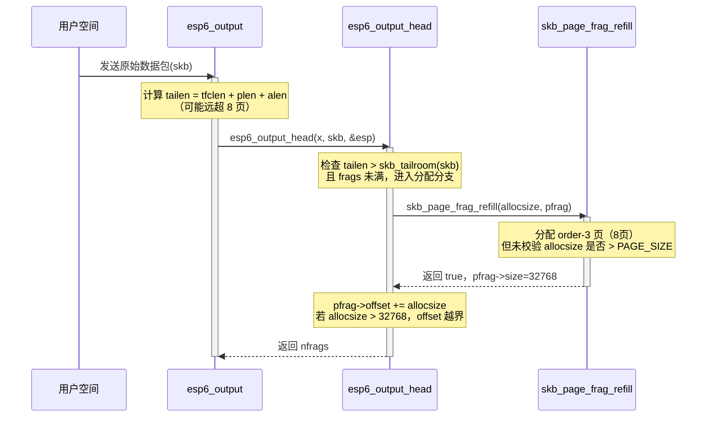
```mermaid
sequenceDiagram
    participant User as 用户空间
    participant esp6_out as esp6_output
    participant esp6_head as esp6_output_head
    participant frag_refill as skb_page_frag_refill

    User->>esp6_out: 发送原始数据包(skb)
    activate esp6_out
    Note over esp6_out: 计算 tailen = tfclen + plen + alen<br/>（可能远超 8 页）
    esp6_out->>esp6_head: esp6_output_head(x, skb, &esp)
    activate esp6_head
    Note over esp6_head: 检查 tailen > skb_tailroom(skb)<br/>且 frags 未满，进入分配分支
    esp6_head->>frag_refill: skb_page_frag_refill(allocsize, pfrag)
    activate frag_refill
    Note over frag_refill: 分配 order-3 页（8页）<br/>但未校验 allocsize 是否 > PAGE_SIZE
    frag_refill-->>esp6_head: 返回 true，pfrag->size=32768
    deactivate frag_refill
    Note over esp6_head: pfrag->offset += allocsize<br/>若 allocsize > 32768，offset 越界
    esp6_head-->>esp6_out: 返回 nfrags
    deactivate esp6_head
    deactivate esp6_out
```

**阶段二：加密请求构造与长度传递**

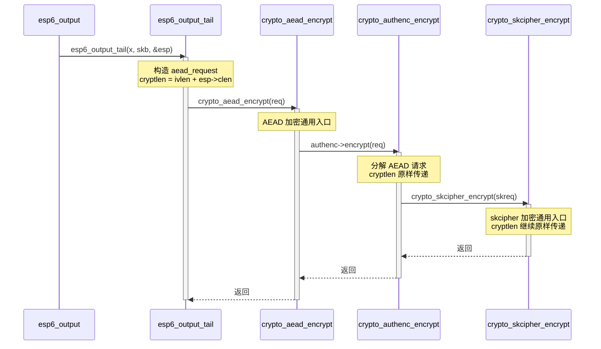
```mermaid
sequenceDiagram
    participant esp6_out as esp6_output
    participant esp6_tail as esp6_output_tail
    participant crypto_aead as crypto_aead_encrypt
    participant authenc as crypto_authenc_encrypt
    participant skcipher_enc as crypto_skcipher_encrypt

    esp6_out->>esp6_tail: esp6_output_tail(x, skb, &esp)
    activate esp6_tail
    Note over esp6_tail: 构造 aead_request<br/>cryptlen = ivlen + esp->clen
    esp6_tail->>crypto_aead: crypto_aead_encrypt(req)
    activate crypto_aead
    Note over crypto_aead: AEAD 加密通用入口
    crypto_aead->>authenc: authenc->encrypt(req)
    activate authenc
    Note over authenc: 分解 AEAD 请求<br/>cryptlen 原样传递
    authenc->>skcipher_enc: crypto_skcipher_encrypt(skreq)
    activate skcipher_enc
    Note over skcipher_enc: skcipher 加密通用入口<br/>cryptlen 继续原样传递
    skcipher_enc-->>authenc: 返回
    deactivate skcipher_enc
    authenc-->>crypto_aead: 返回
    deactivate authenc
    crypto_aead-->>esp6_tail: 返回
    deactivate crypto_aead
    deactivate esp6_tail
```

**阶段三：地址映射与越界写入**

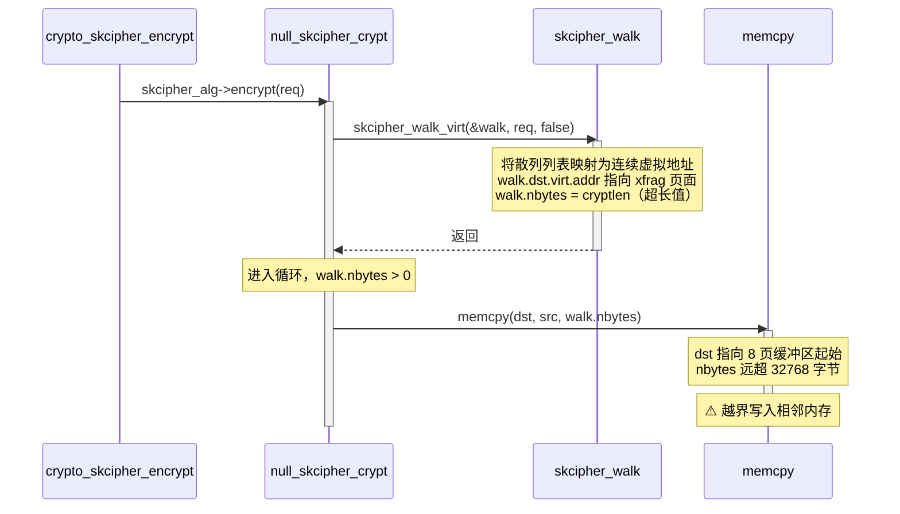
```mermaid
sequenceDiagram
    participant skcipher_enc as crypto_skcipher_encrypt
    participant null_crypt as null_skcipher_crypt
    participant skcipher_walk as skcipher_walk
    participant memcpy as memcpy

    skcipher_enc->>null_crypt: skcipher_alg->encrypt(req)
    activate null_crypt
    null_crypt->>skcipher_walk: skcipher_walk_virt(&walk, req, false)
    activate skcipher_walk
    Note over skcipher_walk: 将散列列表映射为连续虚拟地址<br/>walk.dst.virt.addr 指向 xfrag 页面<br/>walk.nbytes = cryptlen（超长值）
    skcipher_walk-->>null_crypt: 返回
    deactivate skcipher_walk
    Note over null_crypt: 进入循环，walk.nbytes > 0
    null_crypt->>memcpy: memcpy(dst, src, walk.nbytes)
    activate memcpy
    Note over memcpy: dst 指向 8 页缓冲区起始<br/>nbytes 远超 32768 字节
    Note over memcpy: ⚠️ 越界写入相邻内存
    deactivate memcpy
    deactivate null_crypt
```

以下逐层剖析关键函数实现，展示数据如何从包处理入口逐步深入到内存拷贝操作。

#### 2-3-1. 顶层入口函数

`esp6_output()` 作为 IPv6 ESP 输出的顶层入口，承担三项核心职责：计算尾部填充长度、调用 `esp6_output_head()` 分配尾部缓冲区、以及发起加密请求。其计算逻辑直接决定了后续所有分配操作的规模，是整个调用链的起点。

```c
static int esp6_output(struct xfrm_state *x, struct sk_buff *skb)
{
    int alen;                  // 认证标签长度
    int blksize;               // 块大小（对齐后）
    struct ip_esp_hdr *esph;   // ESP 头部指针
    struct crypto_aead *aead;  // AEAD 算法实例
    struct esp_info esp;       // 局部信息结构

    esp.inplace = true;        // 默认原地加密（不额外拷贝）

    // 保存原 MAC 头部协议，替换为 ESP 协议号
    esp.proto = *skb_mac_header(skb);
    *skb_mac_header(skb) = IPPROTO_ESP;

    aead = x->data;            // 获取 AEAD 算法
    alen = crypto_aead_authsize(aead);  // 认证大小

    esp.tfclen = 0;
    if (x->tfcpad) {           // 如果配置了填充字节
        struct xfrm_dst *dst = (struct xfrm_dst *)skb_dst(skb);
        u32 padto;
        padto = min(x->tfcpad, xfrm_state_mtu(x, dst->child_mtu_cached));
        if (skb->len < padto)
            esp.tfclen = padto - skb->len;  // 计算需要填充的长度
    }
    blksize = ALIGN(crypto_aead_blocksize(aead), 4); // 块大小对齐到4字节
    // 计算密文长度：负载 + 2（ESP尾部的填充长度字段） + tfclen，按块大小对齐
    esp.clen = ALIGN(skb->len + 2 + esp.tfclen, blksize);
    esp.plen = esp.clen - skb->len - esp.tfclen; // 实际填充长度
    esp.tailen = esp.tfclen + esp.plen + alen;   // 尾部总长度（填充+认证）

    esp.esph = ip_esp_hdr(skb);   // 指向 ESP 头部位置

    // 调用 esp6_output_head 分配尾部缓冲区，返回片段数
    esp.nfrags = esp6_output_head(x, skb, &esp);
    if (esp.nfrags < 0)
        return esp.nfrags;

    esph = esp.esph;
    esph->spi = x->id.spi;        // 设置 SPI
    // 设置序列号（低32位）
    esph->seq_no = htonl(XFRM_SKB_CB(skb)->seq.output.low);
    esp.seqno = cpu_to_be64(XFRM_SKB_CB(skb)->seq.output.low +
                ((u64)XFRM_SKB_CB(skb)->seq.output.hi << 32));

    skb_push(skb, -skb_network_offset(skb)); // 调整 skb 头部

    // 调用 esp6_output_tail 执行实际加密操作
    return esp6_output_tail(x, skb, &esp);
}
```

`esp.tailen` 的计算融合了三个来源：上层配置的填充需求（`tfcpad`）、密码学块大小的对齐要求、以及认证标签长度。当原始载荷长度足够大时，该值将远超 8 页上限。由于 `esp6_output()` 自身不执行任何容量校验，它直接将这个潜在的超大值传递至下一层。这一环节的本质是**信任链的起点**——该函数默认底层的 `esp6_output_head()` 能够妥善处理任意长度的尾部数据，从而为后续的越界写入埋下了第一重隐患。该函数执行完毕后，控制权连同超长的 `tailen` 一同移交给缓冲区分配函数。

#### 2-3-2. 缓冲区分配函数

`esp6_output_head()` 负责将尾部数据（`tailen`）追加到 SKB 中。它采用三级策略：优先使用已有的 `skb_tailroom`；若不足则尝试通过 `skb_page_frag_refill()` 分配新的页面碎片；若仍失败则回退至 COW 路径。漏洞正位于第二级策略与 `skb_page_frag_refill()` 的衔接处。

```c
int esp6_output_head(struct xfrm_state *x, struct sk_buff *skb, struct esp_info *esp)
{
    u8 *tail;
    int nfrags;
    int esph_offset;
    struct page *page;
    struct sk_buff *trailer;
    int tailen = esp->tailen;

    // 如果配置了封装，则先处理
    if (x->encap) {
        int err = esp6_output_encap(x, skb, esp);
        if (err < 0)
            return err;
    }

    // 如果 SKB 未被克隆，尝试原地追加
    if (!skb_cloned(skb)) {
        // 情况1：尾部空间足够，直接在 skb 尾部写入
        if (tailen <= skb_tailroom(skb)) {
            nfrags = 1;
            trailer = skb;
            tail = skb_tail_pointer(trailer);
            goto skip_cow;
        }
        // 情况2：尾部空间不足，但 frags 数组未满且无 frag_list
        else if ((skb_shinfo(skb)->nr_frags < MAX_SKB_FRAGS)
                 && !skb_has_frag_list(skb)) {
            int allocsize;
            struct sock *sk = skb->sk;
            struct page_frag *pfrag = &x->xfrag;   // 获取 xfrm_state 中的页面碎片

            esp->inplace = false;   // 标记为非原地加密

            allocsize = ALIGN(tailen, L1_CACHE_BYTES); // 按缓存行对齐

            spin_lock_bh(&x->lock);   // 加锁保护 xfrag

            // 【关键点】尝试填充页面碎片，分配足够大小的连续内存
            // 如果 xfrag 中剩余空间不足，此函数会分配新的 order-3 页（8页）
            // 注意：此处传入的 allocsize 可能远超 PAGE_SIZE，但函数不会拒绝
            if (unlikely(!skb_page_frag_refill(allocsize, pfrag, GFP_ATOMIC))) {
                spin_unlock_bh(&x->lock);
                goto cow;   // 分配失败则跳转到 COW 路径
            }

            // 分配成功后，pfrag->page（即 xfrm_state->xfrag.page）指向 8 页连续物理内存
            page = pfrag->page;         // 获取页面指针
            get_page(page);             // 增加引用计数

            // 计算尾部写入地址
            tail = page_address(page) + pfrag->offset;

            // 填充尾部（填充字节、认证数据等）
            esp_output_fill_trailer(tail, esp->tfclen, esp->plen, esp->proto);

            nfrags = skb_shinfo(skb)->nr_frags;  // 当前片段数
            // 将新分配的页面片段添加到 SKB 的 frags 数组
            __skb_fill_page_desc(skb, nfrags, page, pfrag->offset, tailen);
            skb_shinfo(skb)->nr_frags = ++nfrags;

            // 更新偏移量 —— 若 allocsize > pfrag->size，此处发生越界
            pfrag->offset = pfrag->offset + allocsize;

            spin_unlock_bh(&x->lock);

            nfrags++;

            // 更新 SKB 长度统计
            skb->len += tailen;
            skb->data_len += tailen;
            skb->truesize += tailen;
            if (sk && sk_fullsock(sk))
                refcount_add(tailen, &sk->sk_wmem_alloc);

            goto out;
        }
    }

cow:   // 写时复制路径（当无法原地分配时）
    esph_offset = (unsigned char *)esp->esph - skb_transport_header(skb);

    nfrags = skb_cow_data(skb, tailen, &trailer); // 复制数据并扩展尾部
    if (nfrags < 0)
        goto out;
    tail = skb_tail_pointer(trailer);
    esp->esph = (struct ip_esp_hdr *)(skb_transport_header(skb) + esph_offset);

skip_cow:
    esp_output_fill_trailer(tail, esp->tfclen, esp->plen, esp->proto);
    pskb_put(skb, trailer, tailen);   // 更新尾部指针

out:
    return nfrags;
}
```

该函数的关键缺陷在于进入 `skb_page_frag_refill()` 分支的前提条件：仅检查 `tailen > skb_tailroom(skb)` 和 `nr_frags < MAX_SKB_FRAGS`，**完全未检查 `tailen` 是否超过 `PAGE_SIZE` 或 `pfrag->size` 的潜在上限**。这意味着即使 `tailen` 高达数万字节，代码仍会调用 `skb_page_frag_refill()`。分配成功后，`pfrag->offset` 被直接加上 `allocsize`，而 `allocsize` 远大于 `pfrag->size`（8页，32768字节），偏移量被直接推进到缓冲区边界之外。此后的 `__skb_fill_page_desc()` 和 `esp_output_fill_trailer()` 只是记录元数据和填充头部，并不会触发内存错误，真正的越界写入被推迟到后续的加密拷贝环节。该函数执行完毕后，SKB 中已包含一个元数据正确但物理容量不足的缓冲区片段，等待后续的数据填充操作触发越界。

#### 2-3-3. 底层分配函数

`skb_page_frag_refill()` 是页面碎片管理的核心函数，其设计目标是为上层提供轻量级的连续内存分配服务。该函数的注释明确约束 `@sz` 应小于等于 `PAGE_SIZE`，但实现中未对该约束做任何强制校验，使得该约束从“硬性安全边界”退化为了“软性设计建议”。

```c
/**
 * skb_page_frag_refill - 检查 page_frag 是否有足够空间，否则分配新页
 * @sz: 所需最小空间
 * @pfrag: 指向 page_frag 的指针
 * @gfp: 分配标志
 *
 * 注意：此分配器尝试使用高阶页，但不保证成功。因此 @sz 必须小于等于 PAGE_SIZE。
 * 然而，由于 SKB_FRAG_PAGE_ORDER 可能大于 0，实际分配可能为复合页。
 */
bool skb_page_frag_refill(unsigned int sz, struct page_frag *pfrag, gfp_t gfp)
{
    if (pfrag->page) {
        // 如果引用计数为1，可以重用整个页面（重置偏移）
        if (page_ref_count(pfrag->page) == 1) {
            pfrag->offset = 0;
            return true;
        }
        // 如果当前页剩余空间足够，直接返回
        if (pfrag->offset + sz <= pfrag->size)
            return true;
        put_page(pfrag->page);  // 否则释放当前页
    }

    pfrag->offset = 0;
    // 如果允许使用高阶页且未禁用
    if (SKB_FRAG_PAGE_ORDER &&
        !static_branch_unlikely(&net_high_order_alloc_disable_key)) {
        // 尝试分配高阶页（例如 order-3，即 8 页）
        pfrag->page = alloc_pages((gfp & ~__GFP_DIRECT_RECLAIM) |
                                  __GFP_COMP | __GFP_NOWARN | __GFP_NORETRY,
                                  SKB_FRAG_PAGE_ORDER);
        if (likely(pfrag->page)) {
            pfrag->size = PAGE_SIZE << SKB_FRAG_PAGE_ORDER; // 设置总大小
            return true;
        }
    }
    // 降级为单页分配
    pfrag->page = alloc_page(gfp);
    if (likely(pfrag->page)) {
        pfrag->size = PAGE_SIZE;
        return true;
    }
    return false;
}
```

该函数对 `sz` 的处理遵循以下逻辑：若 `pfrag->page` 为空，或当前页剩余空间不足（`pfrag->offset + sz > pfrag->size`），则释放旧页并分配新页，随后将 `offset` 重置为 0。**核心问题在于：该函数接受任何 `sz` 值，既不检查 `sz` 是否超过 `PAGE_SIZE`，也不校验 `sz` 是否超出新分配页的容量。** 当 `sz` 远超 `pfrag->size` 时，`pfrag->offset` 虽被重置为 0，但后续 `esp6_output_head()` 中的 `pfrag->offset += allocsize` 会将偏移推进到越界位置。此外，`__skb_fill_page_desc()` 记录的片段长度 `tailen` 也会超过实际页面容量，导致 SKB 维护了错误的内存长度信息。该函数的“有求必应”式设计，本质上是以牺牲安全性为代价换取灵活性——它假设所有调用方都会自觉遵守 `sz <= PAGE_SIZE` 的约定，但并未提供任何机制来强制这一约定，从而在底层为漏洞敞开了大门。

#### 2-3-4. 加密准备函数

`esp6_output_tail()` 完成 AEAD 加密前的准备工作，包括分配临时缓存、初始化散列列表，并再次操作 `xfrag`。该函数的存在说明 `xfrm_state->xfrag` 在整个加密流程中被多次使用，进一步增加了内存布局的复杂性。

```c
int esp6_output_tail(struct xfrm_state *x, struct sk_buff *skb, struct esp_info *esp)
{
    u8 *iv;
    int alen;
    void *tmp;
    int ivlen;
    int assoclen;
    int extralen;
    struct page *page;
    struct ip_esp_hdr *esph;
    struct aead_request *req;
    struct crypto_aead *aead;
    struct scatterlist *sg, *dsg;
    struct esp_output_extra *extra;
    int err = -ENOMEM;

    assoclen = sizeof(struct ip_esp_hdr); // 关联数据长度 = ESP头部
    extralen = 0;
    if (x->props.flags & XFRM_STATE_ESN) { // 如果启用 ESN
        extralen += sizeof(*extra);
        assoclen += sizeof(__be32);
    }

    aead = x->data;
    alen = crypto_aead_authsize(aead);
    ivlen = crypto_aead_ivsize(aead);

    // 分配临时缓存（包含请求、IV、散列列表等）
    tmp = esp_alloc_tmp(aead, esp->nfrags + 2, extralen);
    if (!tmp)
        goto error;

    extra = esp_tmp_extra(tmp);
    iv = esp_tmp_iv(aead, tmp, extralen);
    req = esp_tmp_req(aead, iv);
    sg = esp_req_sg(aead, req);

    if (esp->inplace)
        dsg = sg;
    else
        dsg = &sg[esp->nfrags];   // 非原地加密时，目标散列列表偏移

    esph = esp_output_set_esn(skb, x, esp->esph, extra);
    esp->esph = esph;

    // 初始化源散列列表，将 SKB 数据映射到 sg
    sg_init_table(sg, esp->nfrags);
    err = skb_to_sgvec(skb, sg,
                       (unsigned char *)esph - skb->data,
                       assoclen + ivlen + esp->clen + alen);
    if (unlikely(err < 0))
        goto error_free;

    // 非原地加密时，用新的页面替换原有的 frags
    if (!esp->inplace) {
        int allocsize;
        struct page_frag *pfrag = &x->xfrag;

        allocsize = ALIGN(skb->data_len, L1_CACHE_BYTES);
        spin_lock_bh(&x->lock);
        // 再次调用 skb_page_frag_refill 分配新页（用于替换）
        // 同样存在超量分配风险
        if (unlikely(!skb_page_frag_refill(allocsize, pfrag, GFP_ATOMIC))) {
            spin_unlock_bh(&x->lock);
            goto error_free;
        }

        skb_shinfo(skb)->nr_frags = 1;
        page = pfrag->page;
        get_page(page);
        // 用新页面替换原来的 frag
        __skb_fill_page_desc(skb, 0, page, pfrag->offset, skb->data_len);
        pfrag->offset = pfrag->offset + allocsize;
        spin_unlock_bh(&x->lock);

        // 重新初始化目标散列列表
        sg_init_table(dsg, skb_shinfo(skb)->nr_frags + 1);
        err = skb_to_sgvec(skb, dsg,
                           (unsigned char *)esph - skb->data,
                           assoclen + ivlen + esp->clen + alen);
        if (unlikely(err < 0))
            goto error_free;
    }

    // 设置回调函数
    if ((x->props.flags & XFRM_STATE_ESN))
        aead_request_set_callback(req, 0, esp_output_done_esn, skb);
    else
        aead_request_set_callback(req, 0, esp_output_done, skb);

    // 设置加密参数：cryptlen 包含 IV 长度 + 密文长度
    aead_request_set_crypt(req, sg, dsg, ivlen + esp->clen, iv);
    aead_request_set_ad(req, assoclen);

    // 初始化 IV（低字节部分使用序列号）
    memset(iv, 0, ivlen);
    memcpy(iv + ivlen - min(ivlen, 8), (u8 *)&esp->seqno + 8 - min(ivlen, 8),
           min(ivlen, 8));

    ESP_SKB_CB(skb)->tmp = tmp;
    // 执行 AEAD 加密（最终会调用到 null_skcipher_crypt 等函数）
    err = crypto_aead_encrypt(req);

    switch (err) {
    case -EINPROGRESS:
        goto error;
    case -ENOSPC:
        err = NET_XMIT_DROP;
        break;
    case 0:
        if ((x->props.flags & XFRM_STATE_ESN))
            esp_output_restore_header(skb);
        esp_output_encap_csum(skb);
    }

    if (sg != dsg)
        esp_ssg_unref(x, tmp);

    if (!err && x->encap && x->encap->encap_type == TCP_ENCAP_ESPINTCP)
        err = esp_output_tail_tcp(x, skb);

error_free:
    kfree(tmp);
error:
    return err;
}
```

该函数中再次调用 `skb_page_frag_refill()` 时，传入的 `allocsize = ALIGN(skb->data_len, L1_CACHE_BYTES)`，同样可能存在超量分配的风险，进一步放大了内存布局的不可控性。更重要的是，此处通过 `skb_to_sgvec()` 构建的散列列表包含了 `esp->clen + alen + ivlen + assoclen` 的总长度，这个长度同样可能超过 8 页。散列列表构建完成后，`aead_request_set_crypt()` 将 `ivlen + esp->clen` 设置为 `cryptlen`，该值最终通过加密请求的层层传递进入 `null_skcipher_crypt()`，成为 `memcpy` 的拷贝长度。至此，超长的数据长度已被正式封装进加密请求结构体，只待下层函数将其付诸执行。

#### 2-3-5. 请求分发函数

`crypto_aead_encrypt()` 是 AEAD 加密的通用入口，它将上层请求路由到具体算法的实现。该函数本身不涉及长度校验，仅作为转发层将请求传递给下层，其职责仅限于统计计数和算法查找。

```c
int crypto_aead_encrypt(struct aead_request *req)
{
    struct crypto_aead *aead = crypto_aead_reqtfm(req);
    struct crypto_alg *alg = aead->base.__crt_alg;
    unsigned int cryptlen = req->cryptlen;
    int ret;

    crypto_stats_get(alg);  // 更新加密统计信息
    if (crypto_aead_get_flags(aead) & CRYPTO_TFM_NEED_KEY)
        ret = -ENOKEY;  // 密钥未设置
    else
        ret = crypto_aead_alg(aead)->encrypt(req);  // 调用具体算法的 encrypt
    crypto_stats_aead_encrypt(cryptlen, alg, ret);
    return ret;
}
```

对于 `authenc`（认证加密组合）算法，`crypto_authenc_encrypt()` 承担了将 AEAD 请求拆解为 skcipher 加密与认证标签生成两个步骤的职责。它是长度从 AEAD 层传递至 skcipher 层的桥梁，在此过程中长度值被原样复制，未经过任何裁剪或校验。

```c
static int crypto_authenc_encrypt(struct aead_request *req)
{
    struct crypto_aead *authenc = crypto_aead_reqtfm(req);
    struct aead_instance *inst = aead_alg_instance(authenc);
    struct crypto_authenc_ctx *ctx = crypto_aead_ctx(authenc);
    struct authenc_instance_ctx *ictx = aead_instance_ctx(inst);
    struct authenc_request_ctx *areq_ctx = aead_request_ctx(req);
    struct crypto_skcipher *enc = ctx->enc;
    unsigned int cryptlen = req->cryptlen;
    struct skcipher_request *skreq = (void *)(areq_ctx->tail +
                                              ictx->reqoff);
    struct scatterlist *src, *dst;
    int err;

    // 从 AEAD 请求中提取数据部分（跳过关联数据）
    src = scatterwalk_ffwd(areq_ctx->src, req->src, req->assoclen);
    dst = src;

    if (req->src != req->dst) {
        err = crypto_authenc_copy_assoc(req);
        if (err)
            return err;

        dst = scatterwalk_ffwd(areq_ctx->dst, req->dst, req->assoclen);
    }

    // 设置 skcipher 请求参数：cryptlen 原样传递
    skcipher_request_set_tfm(skreq, enc);
    skcipher_request_set_callback(skreq, aead_request_flags(req),
                                  crypto_authenc_encrypt_done, req);
    skcipher_request_set_crypt(skreq, src, dst, cryptlen, req->iv);

    // 执行 skcipher 加密
    err = crypto_skcipher_encrypt(skreq);
    if (err)
        return err;

    // 生成认证标签
    return crypto_authenc_genicv(req, aead_request_flags(req));
}
```

`crypto_skcipher_encrypt()` 作为 skcipher 加密的通用入口，最终调用具体算法实现。长度信息在此过程中被完整保留，未做任何截断或校验。

```c
int crypto_skcipher_encrypt(struct skcipher_request *req)
{
    struct crypto_skcipher *tfm = crypto_skcipher_reqtfm(req);
    struct crypto_alg *alg = tfm->base.__crt_alg;
    unsigned int cryptlen = req->cryptlen;
    int ret;

    crypto_stats_get(alg);
    if (crypto_skcipher_get_flags(tfm) & CRYPTO_TFM_NEED_KEY)
        ret = -ENOKEY;
    else
        ret = crypto_skcipher_alg(tfm)->encrypt(req);  // 调用具体 skcipher 实现
    crypto_stats_skcipher_encrypt(cryptlen, ret, alg);
    return ret;
}
```

从 `esp6_output()` 到 `crypto_skcipher_encrypt()`，长度信息沿着调用链逐层传递，**每一层都将长度视为可信输入，未做任何裁剪或校验**。这种设计在正常情况下依赖上层确保长度的合法性——这实际上建立了一条“信任链”。然而在漏洞场景中，这条信任链在 `esp6_output_head()` 与 `skb_page_frag_refill()` 的接口处发生了断裂：上层信任底层分配器会提供足够容量的缓冲区，而底层分配器信任上层会传入合法范围的参数。双方的错误假设叠加在一起，使得超长长度能够畅通无阻地到达最终的数据拷贝环节。

#### 2-3-6. 数据拷贝函数

`null_skcipher_crypt()` 是越界写入的最终执行点。当算法为 `null`（空加密）或某些未启用硬件加速的算法时，加密操作退化为纯粹的数据搬运。它通过 `skcipher_walk` 遍历输入输出散列列表，并在源与目标地址不同时执行 `memcpy`。

```c
static int null_skcipher_crypt(struct skcipher_request *req)
{
    struct skcipher_walk walk;
    int err;

    // 初始化遍历器，将 req 的散列列表映射到虚拟地址
    // 此时 walk.dst.virt.addr 指向 xfrm_state->xfrag.page 所对应的缓冲区起始地址
    err = skcipher_walk_virt(&walk, req, false);

    // 循环处理所有数据块
    while (walk.nbytes) {
        // 如果源和目标地址不同，则拷贝数据
        // 此处拷贝长度 walk.nbytes 可能远超目标缓冲区容量
        if (walk.src.virt.addr != walk.dst.virt.addr)
            memcpy(walk.dst.virt.addr, walk.src.virt.addr,
                   walk.nbytes);   // ⚠️ 越界写入发生点
        err = skcipher_walk_done(&walk, 0);
    }

    return err;
}
```

`skcipher_walk_virt()` 将 `skcipher_request` 中的 `src` 和 `dst` 散列列表映射为连续的虚拟地址，填充到 `walk.src.virt` 和 `walk.dst.virt` 中。`walk.nbytes` 的初始值等于 `skcipher_request->cryptlen`，即上层传递下来的超长加密长度。**`walk.dst.virt.addr` 最终指向 `xfrm_state->xfrag.page` 所对应的缓冲区起始地址**，而 `walk.nbytes` 则远超该缓冲区的实际容量（32768 字节）。当 `memcpy` 执行时，数据从源地址被搬运到容量不足的目标缓冲区，直接越过边界写入相邻物理内存。该函数本身是一个没有任何防御性编程的标准内存拷贝例程，它完全信任上层传递的地址和长度参数，这种设计在正常情况下无可厚非，但当上游的长度校验缺失时，它便成了整个漏洞链条的最终执行者。

回顾整个调用链条，可以清晰地看到漏洞的形成机制并非单一函数的失误，而是一系列设计假设与实现偏差的叠加。`skb_page_frag_refill()` 的设计注释声明了 `sz <= PAGE_SIZE` 的约束，但其实现未强制执行；`esp6_output_head()` 作为调用方，未遵循这一约束便直接传入超长值；而加密框架的各层函数则无条件信任上游传来的长度，将其原样传递至最终的 `memcpy`。**三个环节——容量不足的目的地、超长的拷贝长度、以及将二者直接关联起来的地址映射——共同构成了越界写入的充分必要条件。** 这一漏洞案例也反映出内核开发中的一个深层问题：接口契约的“软约束”无法替代运行时的“硬校验”，尤其是在涉及内存安全的操作路径中，任何依赖调用方自觉的隐含假设都可能成为安全隐患的源头。

### 2-4. 触发条件与流程

**CVE-2022-27666** 的触发需要满足一系列前置条件，涉及网络配置、内核编译选项以及堆内存布局的精确控制。这些条件并非相互独立，而是层层递进的关系：首先需要内核编译支持相关功能并提供可用的执行环境，其次需要通过网络配置将数据包路由至漏洞路径，最后还需要通过堆布局操控使越界写入能够精准地作用于目标对象。只有三个层面的条件同时满足，漏洞才能被稳定触发并产生预期效果。

#### 2-4-1. 内核编译与配置要求

漏洞的触发依赖于 IPsec ESP 变换相关代码的编译启用。受影响的内核需要开启以下相关选项：

- `CONFIG_XFRM`、`CONFIG_XFRM_USER`、`CONFIG_XFRM_ALGO`：XFRM 框架及算法支持，是 IPsec 处理的基础设施；
- `CONFIG_INET6_ESP` 或 `CONFIG_INET_ESP`：IPv6/IPv4 ESP 支持，直接决定了漏洞相关代码是否被编译进内核；
- `CONFIG_USER_NS`、`CONFIG_NET_NS`：用户命名空间与网络命名空间，用于非特权用户创建隔离网络环境。这两个选项在容器化场景中尤其常见，因为容器运行时通常依赖用户命名空间来提供非 root 用户的资源隔离能力，这使得漏洞的潜在暴露面进一步扩大。

这些选项在主流发行版的内核中通常默认开启——例如 Ubuntu、Fedora、Debian 的内核配置均默认包含上述选项——因此漏洞的潜在影响面较广。`CONFIG_USER_NS` 的开启尤为关键：它允许普通用户在无需 root 权限的情况下创建自己的网络命名空间，并在其中配置 IPsec 策略，从而使得漏洞可以从非特权用户态触发，极大地降低了触发门槛。

#### 2-4-2. 网络环境前置配置

触发漏洞需要建立有效的 IPsec 安全关联（SA）和安全策略（SP），这一过程需要在网络命名空间中完成。三个配置环节相互依赖，环环相扣：

1. **回环设备初始化**：利用本地回环接口（`lo`）作为通信端点。回环设备是网络命名空间中默认存在的虚拟接口，数据包在回环上传输时无需经过物理网卡，完全在内核协议栈内部完成。这使得同一命名空间内的进程可以通过本地 IP 地址完成 IPsec 处理，而无需依赖外部网络连通性。回环设备需要在触发前确保已启用（`ip link set lo up`），否则数据包无法到达 IPsec 处理路径。

2. **XFRM 策略配置**：通过 `setsockopt` 或 `PF_KEY` 套接字设置 IPsec 策略，指定哪些流量需要经过 ESP 变换。策略通常以选择器（selector）的形式定义，匹配特定的源地址、目标地址、协议和端口。只有当出站流量匹配了某项策略，内核才会调用相应的 XFRM 状态进行处理，从而进入 `esp6_output()` 路径。策略配置的精确程度直接影响漏洞的可达性——过于宽泛的策略可能使预期外的流量进入漏洞路径，而过于严格的策略则可能使漏洞无法被触发。

3. **SADB 关联建立**：通过 `PF_KEY` 套接字添加安全关联数据库（SADB）条目，包含加密算法（如 `null_skcipher`）和密钥材料。安全关联（SA）是 IPsec 的核心状态对象，它定义了加密算法、认证算法、密钥、SPI（安全参数索引）等关键参数。在漏洞触发中，使用 `null_skcipher`（空加密算法）是一种便捷的配置方式——它使加密操作退化为纯粹的数据拷贝，从而直接落入 `null_skcipher_crypt()` 的执行路径。值得注意的是，该漏洞并不依赖特定的加密算法，实际部署中常用的 `aes-cbc`、`aes-gcm` 等算法同样会经过类似的拷贝路径，只是最终执行 `memcpy` 的算法实现函数可能略有不同。

完成上述配置后，通过原始 IPv6 套接字（即 `AF_INET6` 与 `SOCK_RAW`）发送的数据包将匹配 XFRM 策略，触发 `esp6_output()` 的完整调用路径。该路径最终会到达 `null_skcipher_crypt()`（或等效的数据拷贝函数），为后续的堆布局操控创造条件。

#### 2-4-3. 堆内存布局操控策略

由于越界写入的目标是 8 页连续缓冲区之后的**相邻内存区域**，可靠触发该漏洞并使其影响特定的内核对象，需要对内核堆布局进行精细操控。堆布局的质量直接影响越界数据能否精准地作用于目标对象，而非破坏无关内存导致系统崩溃。以下三种操控策略往往是**联合使用**而非单独采用的：

- **页级堆风水（Page-level Heap Fengshui）**：通过消耗 order-0、order-1、order-2 的空闲页面，防止低阶页面被分配器用于拆分高阶页面或与 order-3 页面发生合并。具体操作方式为：大量分配对应阶数的可释放对象，填充空闲链表，使得后续的 order-3 分配无法从低阶页面拆分获得，从而迫使分配器从高阶页面中分配新的 order-3 块。这种“页面染色”技术保证了 order-3 页面之间不会混杂低阶页面，使得溢出边界更加可预测。

- **跨缓存溢出（Cross-cache Overflow）**：8 页缓冲区（order-3）溢出可能影响相邻 order-3 页面中存放的不同 slab 缓存对象。由于 order-3 页面在 buddy 系统中是连续的，而不同 slab 缓存可能共享相同的 order-3 页面，因此理解不同 slab 缓存之间的内存布局关系是成功实施后续操作的关键。例如，`kmalloc-cg-2k` 缓存中分配的 `msg_msg` 对象可能与 ESP 缓冲区位于同一 order-3 页面中，溢出即可覆写其控制字段。

- **占位与释放（Placement and Drain）**：通过交替分配和释放特定对象（如 `msg_msg`、SKB 数据、`pipe_buffer`），在 order-3 页面中制造精确的空洞。操作者首先分配一批目标对象占满页面，然后释放其中一部分，在页面中创造出特定位置的空洞；随后触发 ESP 缓冲区分配，使该缓冲区恰好落入空洞中，从而确保溢出数据写入的位置恰好是预期的相邻对象。这种“占位-释放-占位”循环的时序控制要求极高，需要准确预测内核分配器的行为。

这些操控手段需要在触发漏洞前完成，后续的操作则依赖首次溢出所破坏的堆布局状态。堆布局的质量直接决定了溢出后能够读取或覆写何种数据——如果布局精准，操作者可以泄露相邻对象的地址信息（如 `msg_msg` 的队列 ID）或篡改其控制字段（如 `msg_msg->security` 或 `pipe_buffer->flags`）；如果布局偏差，溢出可能损毁无关内存，导致系统崩溃。因此，堆布局操控是整个触发流程中最关键也最具挑战性的环节。

#### 2-4-4. 典型触发操作序列

综合以上三个层面的条件，一个完整的漏洞触发流程如下，各步骤之间存在严格的依赖与时序关系：

1. **环境准备**：通过 `unshare(CLONE_NEWUSER | CLONE_NEWNET)` 创建用户命名空间和网络命名空间，获取非特权环境下的网络配置能力。这一步是所有后续操作的先决条件，必须在任何网络配置或堆操作之前完成，因为它决定了操作者是否拥有配置 IPsec 和操控网络命名空间的权限。

2. **网络配置**：配置 IPsec 安全策略与安全关联，使指定端口的通信流量经过 ESP 变换。具体操作为：启用回环设备，通过 `PF_KEY` 套接字添加 SADB 条目（使用 `null_skcipher` 算法），并通过 `setsockopt` 设置 XFRM 策略。网络配置必须在堆布局之前完成，因为后续的堆操作不应影响网络协议栈的状态。

3. **堆布局操控**：通过页级堆风水操作，在 order-3 页面中布置目标对象（如 `msg_msg`）。此步骤需要在此之前完成所有必要的分配与释放循环，确保 ESP 缓冲区分配时恰好落在预期位置。堆布局的质量直接决定了溢出能否命中目标对象。由于堆状态会随时间演进而变化（例如其他系统活动可能干扰布局），此步骤通常需要多次尝试以确认布局有效。

4. **触发溢出**：构造超过 8 页的载荷数据，通过原始 IPv6 套接字发送，触发 `esp6_output_head()` 中的越界写入。载荷数据的构造需要精确：其前部用于填充缓冲区（无实际意义），后部则是准备覆写相邻目标对象的特定值（如新的 `m_ts` 或伪造的 `security` 指针）。载荷长度需要刚好超过 32768 字节，且超过部分的偏移必须与相邻对象的字段位置对齐。

5. **结果验证**：溢出数据覆写相邻的目标对象字段后，通过受控对象（如被篡改 `m_ts` 的 `msg_msg`）读取越界内存，检查是否能够获取预期的地址信息；或通过篡改后的 `security` 指针观察内核是否按预期路径处理（如调用相应的析构函数），从而验证是否能够诱导内核执行特定的内存操作。验证成功后，操作者便获得了进一步操纵内核内存的基础。

这些步骤环环相扣，每一环的输出是下一环的输入，任一环节的偏差都可能导致系统崩溃而非预期的结果。例如，堆布局操控如果未能准确放置目标对象，溢出的数据可能写入无关内存，破坏内核元数据，触发 Oops 或 panic；网络配置如果错误（如策略未生效），数据包可能绕过 IPsec 路径，根本不会进入漏洞函数。因此，成功触发该漏洞需要高度精确的时序控制和内存布局预测，以及充分的错误处理与重试机制。

### 2-5. 影响范围

根据 CVSS 3.x 评分，该漏洞被评定为 **7.8 分（High）**，属于高危型内存损坏漏洞。本地非特权用户可通过触发该漏洞造成系统崩溃，或在特定条件下实现权限提升。

#### 2-5-1. 内核版本分布

根据 NVD 的公告，**CVE-2022-27666** 影响以下 Linux 内核版本系列：

| 内核版本范围        | 修复版本 |
| ------------------- | -------- |
| 4.11 – 4.14.273     | 4.14.274 |
| 4.15 – 4.19.236     | 4.19.237 |
| 4.20 – 5.4.187      | 5.4.188  |
| 5.5 – 5.10.107      | 5.10.108 |
| 5.11 – 5.15.28      | 5.15.29  |
| 5.16 – 5.16.14      | 5.16.15  |
| 5.17-rc1 – 5.17-rc7 | 5.17-rc8 |

该漏洞自 2017 年引入（commit `cac2661c53f3` 与 `03e2a30f6a27`），直至 2022 年 3 月修复，**存在约 5 年的时间窗口**。这意味着大量生产环境中的内核版本均受影响，且许多长期支持（LTS）版本在修复前长期处于暴露状态。

各主要 Linux 发行版的受影响状态如下：

- **Ubuntu**：21.10（Impish）及更早版本受影响；20.04 LTS（Focal）使用的通用内核（`linux` 包）在 `5.4.0-107.121` 及后续版本中已修复；22.04 LTS（Jammy）及更新版本不受影响。
- **Debian、Fedora**：在漏洞公开时，其稳定版本均受影响，但各发行版已通过稳定更新渠道提供了修复版本。

#### 2-5-2. 潜在安全风险

**CVE-2022-27666** 的潜在影响主要体现在以下几个维度：

**（1）权限提升**  
由于漏洞位于内核核心网络子系统，且影响 ESP 变换这一基础安全功能，本地非特权用户可通过精心构造的操作链实现权限提升。结合 `msg_msg` 的析构机制与 `pipe_buffer` 的伪造，操作者可实现**受控的内核任意地址写入**，进而覆写设置了 SUID 权限的可执行文件，在用户态完成提权操作。这意味着即便系统开启了常见的用户态安全限制，恶意行为者仍可能通过该漏洞获得完全的 root 权限。

**（2）信息泄露**  
通过溢出覆写相邻 `msg_msg` 对象的 `m_ts` 字段，操作者可扩大消息读取范围，实现**越界读取**，从而泄露内核堆中的敏感指针，绕过 KASLR（内核地址空间布局随机化）等缓解机制。信息泄露通常作为权限提升的前置步骤，为后续的精确内存覆写提供必要的地址信息。

**（3）系统稳定性风险**  
即便未实现完整的操作链，触发越界写入本身即可能导致内核堆元数据损坏，引发**系统崩溃**，影响生产环境的可用性。对于高可靠性要求的系统而言，即便无法完成权限提升，系统崩溃行为本身依然构成严重威胁。

**（4）缓解机制绕过能力**  
在典型的内核加固环境中（开启 KASLR、SMEP、SMAP、KPTI 等保护机制），**CVE-2022-27666** 的操作链仍被证明能够在上述保护全部开启的情况下完成提权操作。这表明该漏洞的严重性不受常见内核缓解措施的完全抑制，具备较强的绕过能力，进一步提升了该漏洞的实际风险评级。

### 2-6. 总结

**CVE-2022-27666** 是 Linux 内核 IPsec ESP 变换模块中的堆缓冲区溢出漏洞，根源在于 `esp6_output_head()` / `esp4_output_head()` 在分配接收缓冲区时未对后续拷贝的数据长度进行有效校验。该漏洞自 2017 年 1 月引入，影响范围覆盖 4.11 至 5.17-rc7 期间的大量内核版本，波及 Ubuntu、Fedora、Debian 等主流发行版。

从技术视角来看，该漏洞本质上是**分配容量与使用容量之间的隐含假设**在代码演进中被破坏，而相应的校验逻辑未能同步更新所致。`skb_page_frag_refill()` 的设计注释明确约定 `@sz` 应小于等于 `PAGE_SIZE`，但 `esp6_output_head()` 在调用时可能传入远超单页的值。这种设计与实际使用之间的不一致，正是漏洞得以存在的根本原因。回顾整个调用链，`esp6_output()` 将超长长度逐层传递，`esp6_output_head()` 依赖底层分配器提供足够容量，而 `skb_page_frag_refill()` 则无条件接受超量请求，三方假设的叠加使得本应被拦截的超长数据得以畅通无阻地到达 `null_skcipher_crypt()` 中的 `memcpy`，最终触发越界写入。

在后续操作层面，该漏洞展示了**页级堆风水**与**跨缓存溢出**相结合的现代内核漏洞利用手法。通过精确操控 order-3 页面的布局，操作者可将 8 页缓冲区的越界写入转化为对 `msg_msg`、`pipe_buffer` 等关键内核对象的控制，进而实现从信息泄露到任意内存写入的完整操作链。该漏洞案例也为内核安全社区提供了宝贵的防御经验——在高性能网络路径中，性能优化措施（如高阶页分配）必须辅以严格的边界校验，否则任何依赖调用方自觉的隐含假设都可能成为安全隐患的源头。

该漏洞已于 2022 年 3 月至 4 月间通过提交 `ebe48d368e97` 与 `5bd8baab087d` 相继修复。核心修复补丁在拷贝前增加了对数据大小的上限检查，确保超长数据回退至 COW 路径处理；补充加固补丁则进一步限制了高阶页分配的使用场景，有效消除了同类问题的再次发生。对于无法立即升级内核的系统，建议禁用 IPsec ESP 变换或限制非特权用户对网络命名空间的访问权限，以规避潜在的安全风险。

## 3. 利用思路一

### 3-1. 整体架构设计

本利用方案围绕 **CVE-2022-27666** 的堆溢出漏洞展开，通过精细的堆布局操控将一次越界写入逐步扩展为对内核内存的读写控制，最终实现本地权限提升。整体架构遵循"**信息泄露 → 对象伪造 → 内存重用 → 权限获取**"的递进式设计，共划分为 **11 个逻辑阶段**，各阶段之间存在严格的依赖关系。前序阶段的输出是后续阶段的输入，任何环节的偏差都可能导致整个链条中断，因此方案在设计上注重每一步的可验证性与可重试性。

从进程架构来看，本方案采用父子进程分离的设计模式。`fork()` 发生在环境初始化的最早期，父进程负责最终的权限获取，子进程承担所有复杂的内存操控工作。这种分离不仅使父进程的执行环境保持干净，也为子进程的长时间运行提供了稳定的上下文。其核心流程如下：

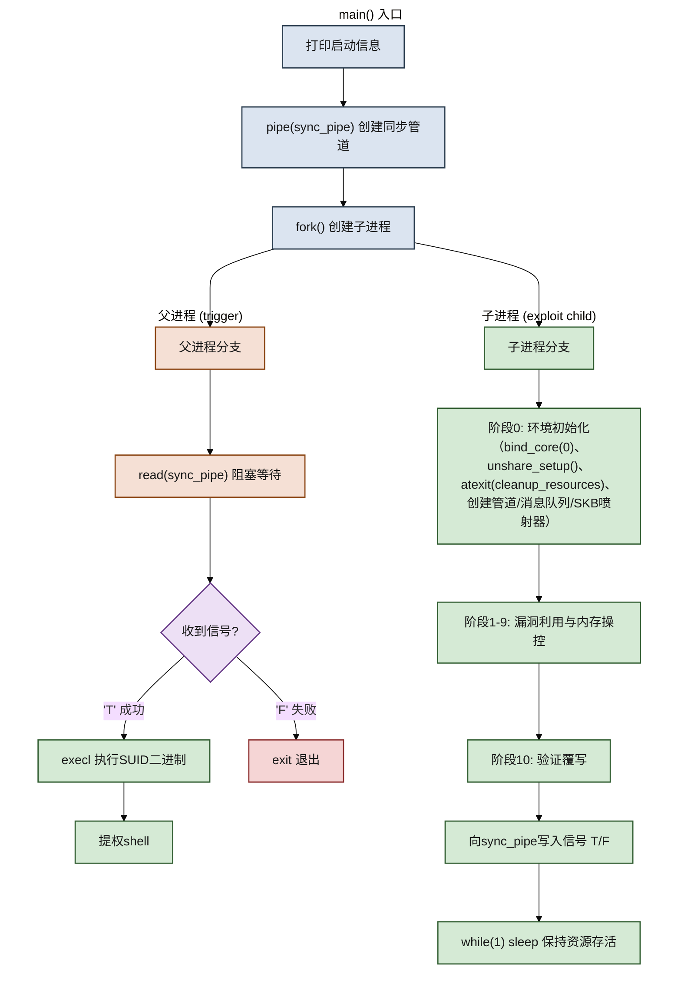
```mermaid
%%{init: {'theme': 'base', 'themeVariables': { 'clusterBkg': 'transparent', 'clusterBorder': 'transparent' }}}%%
flowchart TD
    subgraph main["main() 入口"]
        A["打印启动信息"] --> B["pipe(sync_pipe) 创建同步管道"]
        B --> C["fork() 创建子进程"]
    end

    C --> D["子进程分支"]
    C --> E["父进程分支"]

    subgraph Child["子进程 (exploit child)"]
        D --> I["阶段0: 环境初始化（bind_core(0)、unshare_setup()、atexit(cleanup_resources)、创建管道/消息队列/SKB喷射器）"]
        I --> J["阶段1-9: 漏洞利用与内存操控"]
        J --> K["阶段10: 验证覆写"]
        K --> L["向sync_pipe写入信号 T/F"]
        L --> M["while(1) sleep 保持资源存活"]
    end

    subgraph Parent["父进程 (trigger)"]
        E --> N["read(sync_pipe) 阻塞等待"]
        N --> O{"收到信号?"}
        O -->|"'T' 成功"| P["execl 执行SUID二进制"]
        P --> Q["提权shell"]
        O -->|"'F' 失败"| R["exit 退出"]
    end

    classDef mainStyle fill:#dbe4f0,stroke:#2c3e50,stroke-width:1.5px,color:#1a1a1a
    classDef childStyle fill:#d5ead5,stroke:#2d5a2d,stroke-width:1.5px,color:#1a1a1a
    classDef parentStyle fill:#f5e0d5,stroke:#8b4513,stroke-width:1.5px,color:#1a1a1a
    classDef decisionStyle fill:#ede0f5,stroke:#6a3d8a,stroke-width:1.5px,color:#1a1a1a
    classDef successStyle fill:#d5ead5,stroke:#2d5a2d,stroke-width:1.5px,color:#1a1a1a
    classDef failStyle fill:#f5d5d5,stroke:#8b2d2d,stroke-width:1.5px,color:#1a1a1a

    class A,B,C mainStyle
    class D,I,J,K,L,M childStyle
    class E,N parentStyle
    class O decisionStyle
    class P,Q successStyle
    class R failStyle

    style main fill:transparent,stroke-width:0px
    style Child fill:transparent,stroke-width:0px
    style Parent fill:transparent,stroke-width:0px
```

**进程设计的关键考量**：

- **同步管道**：在 `fork` 之前通过 `pipe(sync_pipe)` 创建，确保父子进程共享同一管道文件描述符。该管道用于从子进程向父进程传递单字符信号（`'T'` 表示成功，`'F'` 表示失败），是父子进程间协同工作的核心同步机制。选择管道而非其他 IPC 方式的原因在于其语义简单、无额外内核对象开销，且生命周期与文件描述符绑定，不易受进程状态变化影响。
- **子进程**：承担所有漏洞触发和内存操控工作。阶段 0 内部首先绑定 CPU 核心以稳定时序，然后通过 `unshare` 创建隔离的命名空间以获得必要的网络配置能力。每个利用阶段若失败，子进程会提前向父进程发送失败信号并退出，避免父进程长时间等待。完成所有利用阶段后，子进程向父进程发送成功信号，随后进入无限休眠，保持所有内核对象处于已分配但未释放的状态。这一状态维持是保障方案稳定性的关键。
- **父进程**：职责单一明确——等待子进程信号，然后执行被覆写的 SUID 二进制。这种职责分离使得父进程的执行环境保持干净，不受子进程复杂内存操作的影响，也避免了父进程在等待期间因参与内存分配而干扰子进程精心构造的堆布局。

### 3-2. 阶段 0：环境初始化

此阶段完成基础运行环境的搭建，是整个方案的地基。该阶段的核心任务是完成 CPU 绑定、命名空间隔离、资源池创建三大类工作，各步骤之间存在严格的时序依赖：命名空间隔离必须在资源池创建之前完成，以确保资源池位于正确的命名空间上下文内；CPU 绑定必须在一切操作之前完成，以稳定后续所有内存分配的时序特性。

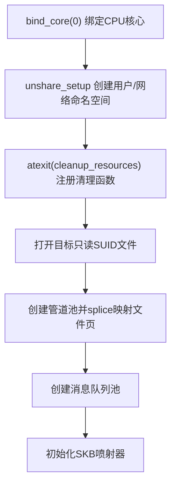
```mermaid
flowchart TD
    A["bind_core(0) 绑定CPU核心"] --> B["unshare_setup 创建用户/网络命名空间"]
    B --> C["atexit(cleanup_resources) 注册清理函数"]
    C --> D["打开目标只读SUID文件"]
    D --> E["创建管道池并splice映射文件页"]
    E --> F["创建消息队列池"]
    F --> G["初始化SKB喷射器"]
```

- **CPU 绑定与命名空间隔离**：子进程首先通过 `bind_core(0)` 绑定到 CPU 核心 0，以稳定时序并减少调度扰动对堆布局的影响。在多核系统中，不同 CPU 的每 CPU 缓存和页面分配器行为可能存在细微差异，绑定核心有助于保证可重现性。随后通过 `unshare_setup(getuid(), getgid())` 创建用户命名空间和网络命名空间，使非特权用户获得配置 IPsec 策略的能力。用户命名空间提供了映射后的 root 权限（仅限该命名空间内），网络命名空间则提供了隔离的网络栈。最后通过 `atexit(cleanup_resources)` 注册清理函数，确保子进程异常退出时能够释放所有内核资源，避免对系统造成持久性影响。
- **目标文件准备**：打开具有 SUID 权限的只读可执行文件（如 `/usr/bin/crontab`），为后续通过管道 `splice` 操作预留文件描述符。`splice` 系统调用可以在两个文件描述符之间直接移动数据而无需经过用户态缓冲区，是向管道中高效填充数据的关键工具。该文件描述符在后续的管道填充和验证操作中持续使用，是连接用户态操作与目标文件页面的纽带。
- **管道池创建与填充**：创建一批管道，对每个管道执行 `splice` 操作，从目标文件向管道写端填充少量数据。这一操作具有双重目的：首先，它使每个管道在内核中分配 `pipe_buffer` 结构体，并建立与目标文件页面的关联（`pipe_buffer->page` 指向文件页）；其次，这些预先填充的管道为后续的管道缓冲区喷射提供了可操作的对象池。所有管道在子进程的整个生命周期中保持打开，以维持堆布局的稳定性。预先填充而非使用时才填充的另一个好处是：文件页的引用计数在早期即被建立，后续在伪造 `pipe_buffer` 时可以直接复用这些已建立的页面关联。
- **消息队列池创建**：创建大量 System V 消息队列，用于后续部署 `msg_msg` 对象。消息队列的数量经过精心调优——足以覆盖目标内存区域，同时避免触发系统资源限制。每个队列在后续阶段将被用于发送带有特定标记的消息，以便在堆中精准定位目标对象。标记中包含队列索引，使得在越界读取时能够反向定位消息所属的队列，这一设计是后续识别受害队列和相邻队列的基础。
- **SKB 喷射器初始化**：初始化网络套接字缓冲区（SKB）喷射器，通过一批原始套接字预分配 SKB，构建了一个可快速填充或回收特定内核缓存对象的喷射器。SKB 喷射器是后续阶段中实现精准内存占位和 UAF 空洞利用的核心工具。相较于其他堆喷射方式，SKB 的优势在于其数据内容完全由用户态控制，且分配和释放的时序可以精确掌握。

### 3-3. 阶段 1：XFRM 策略初始化

本阶段由子进程完成漏洞触发所需的网络环境配置，确保数据包能够进入 ESP 处理路径。这是从用户态触发漏洞的关键网络前置步骤，其配置的准确性直接决定了后续溢出能否被成功触发。

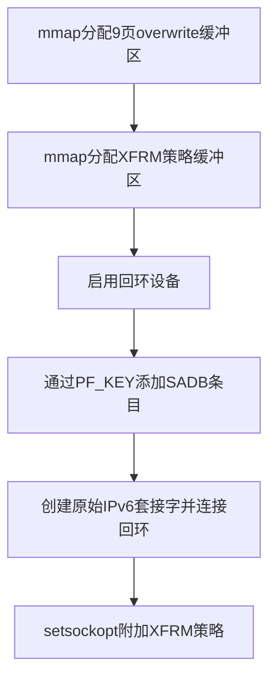
```mermaid
flowchart TD
    A["mmap分配9页overwrite缓冲区"] --> B["mmap分配XFRM策略缓冲区"]
    B --> C["启用回环设备"]
    C --> D["通过PF_KEY添加SADB条目"]
    D --> E["创建原始IPv6套接字并连接回环"]
    E --> F["setsockopt附加XFRM策略"]
```

- **内存映射**：分配 9 页的连续用户态缓冲区，布局为：头部 + 8 页填充数据 + 载荷区域；同时分配策略缓冲区。选择 9 页而非更多是为了在保证溢出覆盖范围的同时，避免触发其他内存分配路径的边界条件。头部用于匹配内核协议栈在处理 SKB 时的偏移量，确保后续的 8 页数据恰好对齐到内核缓冲区的起始位置。这一偏移量的精确匹配是溢出能够命中预期目标的前提——若头部长度不准确，越界写入的位置将发生偏移，可能错过精心布置的相邻对象。
- **网络设备准备**：确保回环接口处于启用状态，为本地 IPsec 通信提供通道。回环接口是网络命名空间中默认存在的虚拟接口，数据包在回环上传输时完全在内核协议栈内部完成，无需依赖物理网卡。这一特性使得整个方案可以在完全隔离的网络环境中运行，不受外部网络状态的影响，也避免了对外部目标产生任何流量。
- **安全关联配置**：通过 PF_KEY 套接字向内核添加安全关联条目，指定 ESP 协议及空加密算法。空加密算法的选择至关重要——它使加密操作退化为纯粹的数据拷贝，直接落入漏洞触发路径，该路径中的内存拷贝操作正是漏洞的最终触发点。若使用实际的加密算法，数据在拷贝过程中会被加密变换，虽然同样可能触发溢出，但拷贝的语义和时序会发生变化，增加了不确定性。
- **安全策略绑定**：创建原始 IPv6 套接字并连接到回环地址，然后通过套接字选项附加 XFRM 策略。策略中的选择器配置匹配所有出站流量。该套接字同时保存用于后续触发溢出时发送数据包。策略配置后，从该套接字发出的每个数据包都将经过 ESP 变换，进入漏洞触发路径。选择原始套接字而非普通套接字的原因在于：原始套接字允许用户态直接构造完整的 IP 数据包，从而精确控制发送数据的总长度，这是触发超限溢出的必要条件。

### 3-4. 阶段 2：堆布局与首次越界写入

此阶段由子进程执行，利用漏洞的首次溢出，实现对相邻 `msg_msg` 对象 `m_ts` 字段的篡改，为后续越界读取奠定基础。堆布局操控是后续所有操作的基础，其质量直接影响整个方案的成败。本阶段的核心目标是通过页级堆风水，构造出"漏洞对象 \| msg_msg"物理相邻的布局，使越界写入能够精准命中目标。

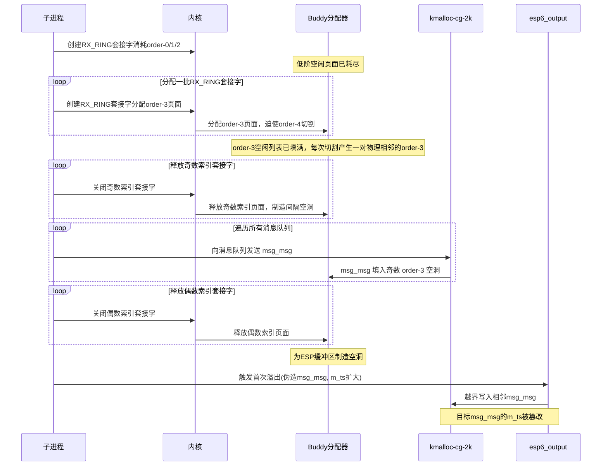
```mermaid
sequenceDiagram
    participant Child as 子进程
    participant Kernel as 内核
    participant Buddy as Buddy分配器
    participant Slab as kmalloc-cg-2k
    participant ESP as esp6_output

    Child->>Kernel: 创建RX_RING套接字消耗order-0/1/2
    Note over Buddy: 低阶空闲页面已耗尽
    loop 分配一批RX_RING套接字
        Child->>Kernel: 创建RX_RING套接字分配order-3页面
        Kernel->>Buddy: 分配order-3页面，迫使order-4切割
    end
    Note over Buddy: order-3空闲列表已填满，每次切割产生一对物理相邻的order-3
    loop 释放奇数索引套接字
        Child->>Kernel: 关闭奇数索引套接字
        Kernel->>Buddy: 释放奇数索引页面，制造间隔空洞
    end
    loop 遍历所有消息队列
        Child->>Slab: 向消息队列发送 msg_msg
        Slab->>Buddy: msg_msg 填入奇数 order-3 空洞
    end
    loop 释放偶数索引套接字
        Child->>Kernel: 关闭偶数索引套接字
        Kernel->>Buddy: 释放偶数索引页面
    end
    Note over Buddy: 为ESP缓冲区制造空洞
    Child->>ESP: 触发首次溢出(伪造msg_msg, m_ts扩大)
    ESP->>Slab: 越界写入相邻msg_msg
    Note over ESP,Slab: 目标msg_msg的m_ts被篡改
```

- **低阶页面消耗**：创建一批 RX_RING 套接字，分别消耗 order-0、order-1、order-2 的空闲页面。低阶页面消耗的核心原理是：buddy 分配器在分配高阶页面时可能会将空闲的低阶页面合并成高阶页面，提前消耗低阶页面可以防止这种合并发生，确保后续 order-3 页面的物理连续性。若低阶页面未被提前消耗，后续的 order-3 分配可能从这些碎片中拼接，导致 order-3 页面的物理相邻关系无法保证。
- **高阶页面排布**：创建一批 RX_RING 套接字，每个占用一个 order-3 页面。当 order-3 空闲列表被耗尽时，分配器会向 order-4 申请页面，而 order-4 页面会被切割成两个物理相邻的 order-3 页面。这种物理相邻关系是后续跨缓存溢出的关键技术基础——只有被切割的两个 order-3 页面物理相邻，一个页面中的溢出才能越界写入另一个页面中的对象。
- **奇数空洞创建**：关闭奇数索引的 RX_RING 套接字，在 order-3 空闲列表中制造空洞。**需要特别说明的是：所有 order-3 页面在分配时确实成对物理相邻（即每个偶数索引页面与紧随其后的奇数索引页面来自同一次 order-4 切割，二者物理相邻），但被释放的奇数索引页面所形成的空洞彼此之间并不物理相邻**。每个空洞都有其偶数索引邻居作为物理相邻伙伴，这正是后续溢出能精准命中 `msg_msg` 对象的物理基础。理解这一点是掌握整个方案堆布局设计的关键。
- **消息队列喷射**：向所有消息队列发送带有唯一标记的消息。**每个 `msg_msg` 对象由消息头（`sizeof(struct msg_msg)`）和消息体（`MSG_SIZE = 0x800 - sizeof(struct msg_msg)`）两部分组成，两者合计为 `0x800` 字节（2048 字节）。内核以 2KB 为单位进行内存分配，因此该对象属于 `kmalloc-cg-2k` 缓存。** 标记中的队列索引使得后续在越界读取时能够反向定位到具体的消息队列。选择 `msg_msg` 作为占位对象的原因在于其结构规整、生命周期可控，且其 `m_ts`、`m_list`、`security` 等字段对后续利用至关重要。
- **偶数页面释放**：关闭偶数索引的 RX_RING 套接字，释放 order-3 页面，为后续 ESP 缓冲区的分配制造空洞。此时，这些页面在 buddy 分配器中被标记为空闲，而之前喷射的 `msg_msg` 对象仍占据着奇数索引空洞对应的页面。偶数和奇数索引页面在物理地址上恰好相邻，这使得后续分配到偶数空洞的 ESP 缓冲区与奇数页面中的 `msg_msg` 对象形成物理相邻关系。
- **触发首次溢出**：构造超过 8 页的数据包，经由 ESP 路径触发越界写入。伪造的 `msg_msg` 中 `m_ts` 字段被扩大，使得后续读取操作可以越过原始消息边界，足以读取同一物理页中相邻 `msg_msg` 对象的 `m_list.next`、`m_list.prev` 等关键字段。由于 ESP 缓冲区申请的是 order-3 页面，极高概率申请到前面释放的偶数 order-3 空洞，而该空洞必然与奇数 order-3 物理相邻（即与其来自同一次 order-4 切割的伙伴），从而成功构造出"漏洞对象 \| msg_msg"物理相邻的布局。这一布局的构造是整个方案中难度最高、对时序要求最严格的环节。

### 3-5. 阶段 3：定位受害队列与相邻队列

首次溢出后，一个 `msg_msg` 对象的 `m_ts` 被扩大到超出原始消息体的范围，利用这一特性可以执行越界读取。准确识别被篡改的对象是所有后续信息泄露的前提。本阶段的核心任务是从大量消息队列中精确定位出受害队列，并找到与其物理相邻的相邻队列。

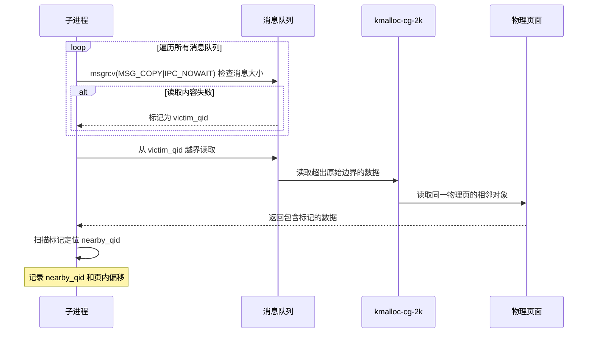
```mermaid
sequenceDiagram
    participant Child as 子进程
    participant Q as 消息队列
    participant Slab as kmalloc-cg-2k
    participant Page as 物理页面

    loop 遍历所有消息队列
        Child->>Q: msgrcv(MSG_COPY|IPC_NOWAIT) 检查消息大小
        alt 读取内容失败
            Q-->>Child: 标记为 victim_qid
        end
    end
    Child->>Q: 从 victim_qid 越界读取
    Q->>Slab: 读取超出原始边界的数据
    Slab->>Page: 读取同一物理页的相邻对象
    Page-->>Child: 返回包含标记的数据
    Child->>Child: 扫描标记定位 nearby_qid
    Note over Child: 记录 nearby_qid 和页内偏移
```

- **扫描所有队列**：使用 `msgrcv(MSG_COPY|IPC_NOWAIT)` 遍历所有消息队列，该接口只复制消息而不消耗消息。由于 `victim_qid` 的 `msg_msg.m_ts` 字段被破坏，读取原始大小的消息内容会失败，据此定位出受害队列 `victim_qid`。选择 `MSG_COPY|IPC_NOWAIT` 而非普通读取的原因在于：普通读取会从队列中移除消息，破坏堆布局；而复制读取保留了原始消息，使得队列状态可在多次扫描之间保持一致。
- **越界读取相邻对象**：利用 `victim_qid` 扩大的 `msg_msg.m_ts`，再次使用 `msgrcv(MSG_COPY|IPC_NOWAIT)` 执行越界读取。在目标内核缓存的物理页布局中，一个 4KB 页面容纳两个 `kmalloc-cg-2k` 的对象（每个对象 2KB），因此越界读取恰好触达同一页面中相邻 `msg_msg` 对象的数据区域。在特定偏移处扫描标记，定位该对象并提取其消息队列 ID，记为 `nearby_qid`，同时记录页内偏移量。该偏移量在后续阶段中用于精确定位相邻队列的链表指针位置。

### 3-6. 阶段 4：泄露重叠对象地址

为了获取后续操作所需的内核地址，需要泄露一个特殊 `msg_msg` 对象的地址。该地址将成为后续伪造操作的锚点。本阶段的核心是通过越界读取获取相邻队列的链表指针，从而获得一个已知内核地址的对象。

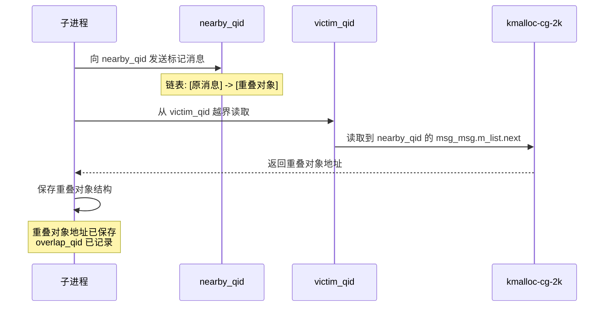
```mermaid
sequenceDiagram
    participant Child as 子进程
    participant nearby as nearby_qid
    participant victim as victim_qid
    participant Slab as kmalloc-cg-2k

    Child->>nearby: 向 nearby_qid 发送标记消息
    Note over nearby: 链表: [原消息] -> [重叠对象]
    Child->>victim: 从 victim_qid 越界读取
    victim->>Slab: 读取到 nearby_qid 的 msg_msg.m_list.next
    Slab-->>Child: 返回重叠对象地址
    Child->>Child: 保存重叠对象结构
    Note over Child: 重叠对象地址已保存<br/>overlap_qid 已记录
```

- **向相邻队列发送标记消息**：向 `nearby_qid` 发送一条特定类型的标记消息。该消息作为第二个 `msg_msg` 对象链接在同一队列的链表中。此时链表包含两个节点：原消息和新消息，形成了双向循环链表。新消息的插入改变了链表的拓扑结构，使得原消息的 `m_list.next` 指向新消息，而新消息的 `m_list.prev` 指向原消息。
- **越界读取链表指针**：再次使用 `victim_qid` 的越界读取能力，读取 `nearby_qid` 原消息的 `msg_msg.m_list.next` 指针。由于链表结构，该指针恰好指向新插入的标记消息对象（重叠对象）的地址。`msg_msg.m_list.next` 位于结构体的起始位置，因此在越界读取中首先被捕获，无需读取整个消息体即可获得目标地址。这一特性使得地址泄露变得高效且可靠。
- **保存对象内容**：将重叠对象的完整 `msg_msg` 结构（包含 `m_list.next`、`m_list.prev`、`m_ts`、`m_type`、`security` 等字段）保存下来，同时记录其队列 ID `overlap_qid`。保存的 `m_list.next` 是重叠对象的堆地址，该地址在后续阶段将作为 `msg_msg.security` 指针的目标地址，是整个伪造操作的核心锚点。随后，清理所有非受害且非重叠的消息，为第二次越界写入提供干净的 slab 环境。清理操作的意义在于：减少 slab 中的噪声对象，使第二次溢出能够更精准地命中目标，同时降低内存布局的随机性。

### 3-7. 阶段 5：二次越界写入伪造对象

利用第二次溢出，将一个精心构造的 `msg_msg` 结构体写入目标区域，使其 `security` 指针指向重叠对象的地址。这是从越界写入转向控制流劫持的关键跳转。本阶段的核心目标是使一个 `msg_msg` 对象的 `security` 指针指向另一个可控对象的地址，为后续的 UAF 构造创造条件。

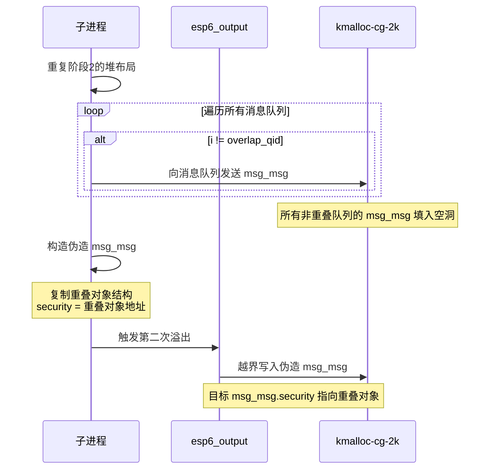
```mermaid
sequenceDiagram
    participant Child as 子进程
    participant ESP as esp6_output
    participant Slab as kmalloc-cg-2k

    Child->>Child: 重复阶段2的堆布局
    loop 遍历所有消息队列
        alt i != overlap_qid
            Child->>Slab: 向消息队列发送 msg_msg
        end
    end
    Note over Slab: 所有非重叠队列的 msg_msg 填入空洞
    Child->>Child: 构造伪造 msg_msg
    Note over Child: 复制重叠对象结构<br/>security = 重叠对象地址
    Child->>ESP: 触发第二次溢出
    ESP->>Slab: 越界写入伪造 msg_msg
    Note over ESP,Slab: 目标 msg_msg.security 指向重叠对象
```

- **重复堆布局**：再次执行低阶页面消耗与 order-3 空洞创建（与阶段 2 完全相同），以确保溢出位置对准另一个待覆写的 `msg_msg` 对象。喷射 `msg_msg` 时排除 `overlap_qid`，避免覆盖已经泄露的重叠对象。这一步体现了堆布局操控的精确性——通过重复相同的布局模式，使第二次溢出的目标位置与第一次不同，但同样可预测。重复布局的可行性建立在页面分配器行为确定性之上，这也是前期消耗低阶页面、稳定堆状态的目的所在。
- **构造伪造结构体**：复制阶段 4 保存的重叠对象结构，然后单独设置 `msg_msg.security` 为重叠对象自身的地址。`msg_msg.m_list.next` 保持指向重叠对象不变，`m_ts`、`m_type` 等其他字段与原始重叠对象完全一致。这种"大部分复制 + 单字段篡改"的策略保证了伪造结构体的合法性——除了 `security` 指针外，其余部分都是内核已接受的有效数据。若伪造结构体中存在无效字段，内核在后续解析该对象时可能触发异常。
- **触发第二次溢出**：将伪造的 `msg_msg` 作为载荷发送，覆盖相邻 `msg_msg` 对象。该对象的 `msg_msg.security` 现在指向重叠对象的地址，而其余字段与原始重叠对象一致。`msg_msg.security` 位于 `msg_msg` 结构体的特定偏移处，覆盖时需要确保前部布局与重叠对象完全匹配，否则内核在解析该对象时可能因无效字段而崩溃。第二次溢出的成功是后续 UAF 构造的前提，其精准度直接决定了整个方案的成败。

### 3-8. 阶段 6：识别被篡改的队列

由于被覆写的 `msg_msg` 对象的 `msg_msg.m_list.next` 已指向重叠对象，该队列现在拥有两条消息链。利用这一特征识别出被篡改的队列 `evil_qid`。本阶段的核心任务是从众多队列中精准定位出那个链表结构被破坏的队列。

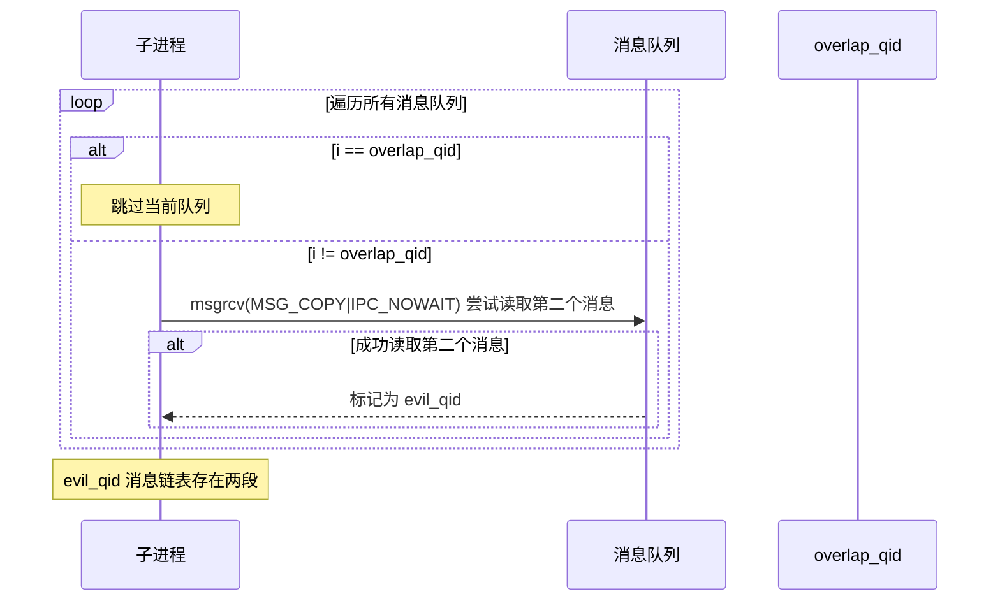
```mermaid
sequenceDiagram
    participant Child as 子进程
    participant Q as 消息队列
    participant overlap as overlap_qid

    loop 遍历所有消息队列
        alt i == overlap_qid
            Note over Child: 跳过当前队列
        else i != overlap_qid
            Child->>Q: msgrcv(MSG_COPY|IPC_NOWAIT) 尝试读取第二个消息
            alt 成功读取第二个消息
                Q-->>Child: 标记为 evil_qid
            end
        end
    end
    Note over Child: evil_qid 消息链表存在两段
```

- **遍历所有队列**：对除 `overlap_qid` 外的每个队列执行 `msgrcv(MSG_COPY|IPC_NOWAIT)` 查询操作。**识别原理在于：除 `evil_qid` 外的所有其他队列都只有一个 `msg_msg` 消息，只有 `evil_qid` 的 `msg_msg.m_list.next` 因越界写入被篡改为指向重叠对象，形成了两个消息段。** 尝试读取第二个消息时，只有 `evil_qid` 可以成功返回，其他队列因不存在第二个消息而直接失败，不影响整体流程。这种方法精准地定位了被篡改队列 `evil_qid`，且不会对未被篡改的队列产生任何副作用。`evil_qid` 和 `nearby_qid` 实际指向同一个重叠对象，形成了双链表引用，为后续的 Double Free 和 UAF 原语奠定了基础。这一双链表引用结构是后续 UAF 构造的核心——通过一个引用释放对象，另一个引用仍保留对已释放内存的访问路径。

### 3-9. 阶段 7：构造释放后使用（UAF）条件

通过精心安排的释放与重分配操作，在目标内核缓存中制造 UAF 漏洞。这是将信息泄露能力升级为任意写入能力的关键转折点。本阶段的核心目标是通过 `msg_msg.security` 析构机制，制造一个内容可控的 UAF 空洞，并用 `pipe_buffer` 对象填充该空洞。

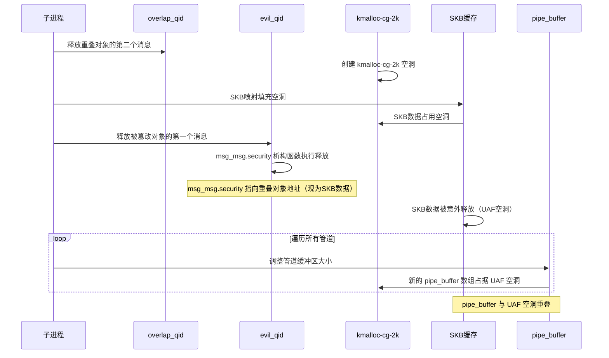
```mermaid
sequenceDiagram
    participant Child as 子进程
    participant overlap as overlap_qid
    participant evil as evil_qid
    participant Slab as kmalloc-cg-2k
    participant SKB as SKB缓存
    participant Pipe as pipe_buffer

    Child->>overlap: 释放重叠对象的第二个消息
    Slab->>Slab: 创建 kmalloc-cg-2k 空洞
    Child->>SKB: SKB喷射填充空洞
    SKB->>Slab: SKB数据占用空洞
    Child->>evil: 释放被篡改对象的第一个消息
    evil->>evil: msg_msg.security 析构函数执行释放
    Note over evil: msg_msg.security 指向重叠对象地址（现为SKB数据）
    SKB->>SKB: SKB数据被意外释放（UAF空洞）
    loop 遍历所有管道
        Child->>Pipe: 调整管道缓冲区大小
        Pipe->>Slab: 新的 pipe_buffer 数组占据 UAF 空洞
    end
    Note over Pipe,SKB: pipe_buffer 与 UAF 空洞重叠
```

- **释放重叠对象的第二个消息**：从 `overlap_qid` 中释放第二个消息，在 slab 中留下一个空闲块。针对性释放便于理解——即使释放 `overlap_qid` 中所有消息也不影响利用效果。这一释放操作创建了第一个空洞，该空洞将被 SKB 数据填充，成为后续 UAF 构造中被意外释放的目标。
- **喷射 SKB 数据**：立即用 SKB 数据填充该空闲块。SKB 数据分配在与 `msg_msg` 相同的 `kmalloc-cg-2k` 缓存中，因此可以精准占用刚释放的空洞。此时，该内存块中存储的是重叠对象内容的副本。SKB 数据的内容完全由用户态控制，因此可以精确复制重叠对象的完整结构，为后续通过双引用释放该内存块做好准备。
- **释放被篡改对象的第一个消息**：释放 `evil_qid` 对应的第一个消息。由于该消息的 `msg_msg.security` 指向重叠对象地址（当前已被 SKB 数据占用），内核在释放 `msg_msg` 时会调用 `security` 析构函数，对 `msg_msg.security` 指向的地址执行释放操作。这导致了一个关键后果：SKB 数据区域被意外释放，形成一个 UAF 空洞。该空洞的内容仍然保留在内存中，但该内存块已被标记为可被重新分配。UAF 空洞的形成为后续 `pipe_buffer` 的重叠创造了条件。
- **喷射管道缓冲区**：调整每个管道的缓冲区大小。**需要特别说明的是：`resize_pipe_buffer` 操作的机制是触发管道内部的 `pipe_buffer` 数组重新申请——内核先释放旧的 `pipe_buffer` 数组，再申请新的更大的数组。新申请的 `pipe_buffer` 数组位于 `kmalloc-cg-2k` 缓存中**，而该缓存正是 UAF 空洞所在的缓存。由于内存分配策略倾向于重用最近释放的内存块，这些新申请的 `pipe_buffer` 数组有极大概率分配到 UAF 空洞所在的 slab 块，实现 `pipe_buffer` 与 SKB 数据的内存重叠。

### 3-10. 阶段 8：定位重叠的管道缓冲区

通过扫描 SKB 数据，检测是否与 `pipe_buffer` 发生重叠，并从中提取内核地址。准确识别重叠位置是从 UAF 空洞中提取有用信息的前提。本阶段的核心任务是从大量 SKB 中找出那个已被 `pipe_buffer` 覆盖的样本。

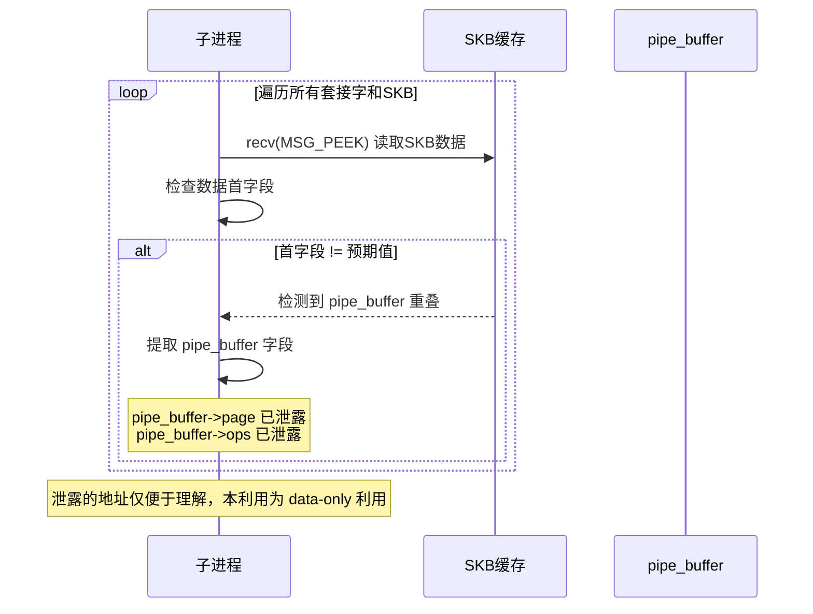
```mermaid
sequenceDiagram
    participant Child as 子进程
    participant SKB as SKB缓存
    participant Pipe as pipe_buffer

    loop 遍历所有套接字和SKB
        Child->>SKB: recv(MSG_PEEK) 读取SKB数据
        Child->>Child: 检查数据首字段
        alt 首字段 != 预期值
            SKB-->>Child: 检测到 pipe_buffer 重叠
            Child->>Child: 提取 pipe_buffer 字段
            Note over Child: pipe_buffer->page 已泄露<br/>pipe_buffer->ops 已泄露
        end
    end
    Note over Child: 泄露的地址仅便于理解，本利用为 data-only 利用
```

- **扫描所有 SKB**：使用 `recv(MSG_PEEK)` 遍历所有套接字和 SKB，该接口只读取数据而不消耗 SKB。比较 SKB 数据的首字段与预期值。正常情况下，SKB 中保存的是从重叠对象复制来的内容，其首字段应为预期值。若该值发生变化，说明该 SKB 已被 `pipe_buffer` 覆盖——因为 `pipe_buffer` 结构体的首字段类型不同，其值不同于预期值。选择 `MSG_PEEK` 而非普通接收的原因在于：普通接收会消耗 SKB，破坏堆布局；而窥探读取保留了 SKB 的完整性，使得可以在不干扰布局的情况下反复扫描。
- **提取信息**：当检测到 SKB 数据已被覆盖时，解析出 `pipe_buffer` 的 `page` 指针和 `ops` 指针。`pipe_buffer->page` 指向物理页面的内核结构，`pipe_buffer->ops` 指向管道缓冲区操作函数表。**需要明确的是：本利用方案属于 data-only 利用，无需绕过 KASLR。泄露的 `pipe_buffer->page` 和 `pipe_buffer->ops` 地址并不影响利用流程，仅便于读者理解利用链条中内存布局的物理对应关系。** 这些地址的泄露本身也验证了内存重叠已经成功实现，为后续的伪造操作提供了信心。

### 3-11. 阶段 9：伪造管道缓冲区并写入载荷

利用 UAF 和 `PIPE_BUF_FLAG_CAN_MERGE` 标志，实现对任意内核内存的写入。这是整个方案中最终的权限获取步骤。本阶段的核心目标是通过伪造 `pipe_buffer` 的标志和字段，使原本只读的文件页变为可写，从而覆写 SUID 二进制文件的内存映射。

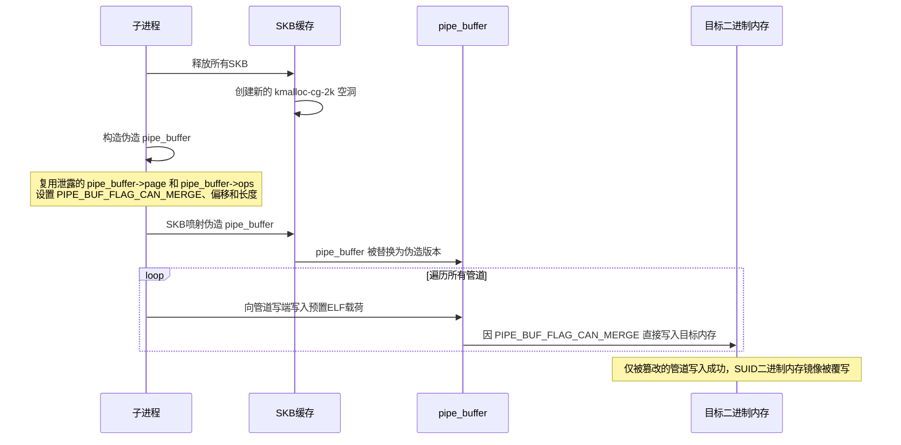
```mermaid
sequenceDiagram
    participant Child as 子进程
    participant SKB as SKB缓存
    participant Pipe as pipe_buffer
    participant Binary as 目标二进制内存

    Child->>SKB: 释放所有SKB
    SKB->>SKB: 创建新的 kmalloc-cg-2k 空洞
    Child->>Child: 构造伪造 pipe_buffer
    Note over Child: 复用泄露的 pipe_buffer->page 和 pipe_buffer->ops<br/>设置 PIPE_BUF_FLAG_CAN_MERGE、偏移和长度
    Child->>SKB: SKB喷射伪造 pipe_buffer
    SKB->>Pipe: pipe_buffer 被替换为伪造版本
    loop 遍历所有管道
        Child->>Pipe: 向管道写端写入预置ELF载荷
        Pipe->>Binary: 因 PIPE_BUF_FLAG_CAN_MERGE 直接写入目标内存
    end
    Note over Binary: 仅被篡改的管道写入成功，SUID二进制内存镜像被覆写
```

- **释放所有 SKB**：释放包含 `pipe_buffer` 的所有 SKB，再次制造空闲块。这个新的空闲块与之前的 UAF 空洞处于同一内存区域，但此时它已被 `pipe_buffer` 占据，释放后可以重新分配。这一释放操作创建了第二个空洞，该空洞将被伪造的 `pipe_buffer` 填充。
- **构造伪造 `pipe_buffer`**：复制泄露的 `pipe_buffer` 结构，保持 `pipe_buffer->page` 和 `pipe_buffer->ops` 指针不变，但将 `flags` 字段设置为 `PIPE_BUF_FLAG_CAN_MERGE`，并调整偏移和长度字段。`PIPE_BUF_FLAG_CAN_MERGE` 的作用是：后续管道写入操作将合并到已有的缓冲区中，而非分配新的页面。这意味着写入操作会直接修改 `pipe_buffer->page` 所指向的物理页面。由于目标文件的页被映射为只读，通过伪造 `pipe_buffer` 使其变为可写，从而绕过只读限制。`pipe_buffer->page` 指向目标文件页这一事实，是前期在阶段 0 中通过 `splice` 建立的页面关联所决定的，整个方案的前后设计在此形成了闭环。
- **喷射伪造结构体**：将伪造的 `pipe_buffer` 通过 SKB 写入刚释放的空闲块。此时，对应管道结构体的 `pipe_buffer` 数组条目已被替换为伪造版本。由于 `pipe_buffer` 数组在管道结构体中以数组形式存在，伪造的条目会覆盖其中某个管道的 `pipe_buffer` 结构体。
- **写入载荷**：遍历所有管道，尝试向管道写端写入预置的 ELF 载荷。由于 `PIPE_BUF_FLAG_CAN_MERGE` 被启用，写入操作直接修改 `pipe_buffer->page` 所指向的内存区域——即目标文件在页面缓存中的内容。**只有被篡改的管道（即其 `pipe_buffer` 被伪造版本替换的那个管道）能够写入成功，其他管道因文件页只读限制返回错误，但不影响整体操作。** 写入的 ELF 载荷将替换目标文件在页面缓存中的起始部分，而页面缓存最终会同步到磁盘，导致磁盘上的 SUID 文件内容被永久篡改。再次执行该二进制文件，预置载荷将代替原始代码以 SUID 权限运行。这一步是整个方案从内存操控到权限获取的最终转化，其成功标志着完整的权限提升链条已经走通。

### 3-12. 阶段 10：验证并触发提权

最后验证篡改是否成功，并执行提权操作，完成权限提升。此阶段充分体现了父子进程的协同设计。本阶段的核心任务是确认覆写结果，并通过父进程执行被篡改的二进制文件，获得提权后的 shell。

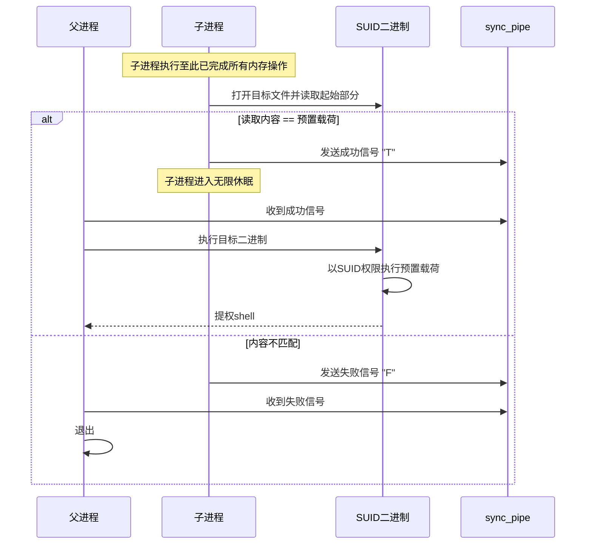
```mermaid
sequenceDiagram
    participant Parent as 父进程
    participant Child as 子进程
    participant Binary as SUID二进制
    participant Pipe as sync_pipe

    Note over Child: 子进程执行至此已完成所有内存操作
    Child->>Binary: 打开目标文件并读取起始部分
    alt 读取内容 == 预置载荷
        Child->>Pipe: 发送成功信号 "T"
        Note over Child: 子进程进入无限休眠
        Parent->>Pipe: 收到成功信号
        Parent->>Binary: 执行目标二进制
        Binary->>Binary: 以SUID权限执行预置载荷
        Binary-->>Parent: 提权shell
    else 内容不匹配
        Child->>Pipe: 发送失败信号 "F"
        Parent->>Pipe: 收到失败信号
        Parent->>Parent: 退出
    end
```

- **子进程验证**：子进程重新打开目标文件并读取起始部分，与预置的 ELF 载荷比较，确认覆写正确。这一步是为了避免在篡改失败的情况下执行未修改的二进制文件导致权限提升失败。子进程通过同步管道向父进程发送结果信号：成功或失败。验证操作本身通过普通的文件读取完成，不涉及任何特殊权限，因此可以在子进程的上下文中安全执行。
- **子进程信号发送后的状态**：发送成功信号后，子进程进入无限循环。这一设计保持了所有内核对象处于已分配但未释放的状态，避免内核资源回收路径被触发。由于利用过程中破坏了若干内核结构体指针（如 `msg_msg.m_list.next`、`pipe_buffer` 数组条目等），子进程的正常退出可能触发内核在资源回收阶段访问这些已被篡改的指针，从而导致系统崩溃。无限休眠的设计使得这些结构体始终处于活跃状态，资源回收路径永不被触发，从而保障了提权过程的稳定性。
- **父进程等待与执行**：父进程阻塞等待同步管道的信号。收到成功信号后执行目标二进制。**由于子进程已经通过管道写入修改了目标文件的页面缓存，并最终同步到磁盘，磁盘上的 SUID 文件内容已被替换为预置的 ELF 载荷。** 该文件仍然保留 SUID 权限位，因此父进程执行它时，内核以 root 权限加载并运行已被篡改的 ELF 载荷，从而产生提权 shell。收到失败信号则直接退出。父进程的执行路径极为简洁，不涉及任何堆操作，因此不受子进程内存布局的影响，其执行环境保持干净可靠。
- **清理函数的作用**：子进程注册了清理函数，正常情况下不会触发（子进程不退出）。若子进程因异常而退出，该函数会关闭所有文件描述符、删除消息队列、释放 mmap 区域等，避免资源泄漏。清理函数的设计体现了方案的健壮性——即使在异常情况下，系统也能恢复到干净状态，不留下持久性影响。

### 3-13. 内核保护机制的应对策略

现代内核通常启用多种安全机制，这些机制分别从地址空间随机化、执行权限隔离、内存分配隔离、堆元数据保护以及内核与用户态数据交换边界等维度，对潜在的内存破坏行为进行防御。本方案在设计之初便充分考量了这些保护机制的影响，并针对性地选择了相应的技术路径，使得方案在典型加固环境中仍能有效运作。下表逐项列出各机制的原理与本方案的应对策略。

| 保护机制                             | 机制原理                                                            | 本方案应对策略                                                                                                                                                                                                                                                                                                     |
| ------------------------------------ | ------------------------------------------------------------------- | ------------------------------------------------------------------------------------------------------------------------------------------------------------------------------------------------------------------------------------------------------------------------------------------------------------------ |
| **KASLR**                            | 随机化内核代码段、数据段和模块的加载基址，增加地址预测难度。        | data-only 利用，不依赖内核地址预测，无需执行内核代码或覆写函数指针。泄露的 `pipe_buffer` 指针仅辅助理解布局，不影响利用流程。                                                                                                                                                                                      |
| **SMEP/SMAP**                        | SMEP 阻止内核态执行用户态代码；SMAP 阻止内核态访问用户态数据。      | 不执行内核代码，通过修改用户态 SUID 二进制文件的页面缓存完成提权，执行完全在用户态进行。                                                                                                                                                                                                                           |
| **KPTI**                             | 分离内核页表与用户页表，防止 Meltdown 类侧信道读取内核内存。        | 全程通过合法系统调用完成，不依赖用户态直接访问内核地址空间，无页表切换或侧信道操作。                                                                                                                                                                                                                               |
| **CONFIG_MEMCG / CONFIG_MEMCG_KMEM** | 为受控进程创建独立的 `kmalloc-cg-*` 缓存，与普通 `kmalloc-*` 隔离。 | 三类核心堆对象（`msg_msg`、`pipe_buffer` 数组、SKB 数据缓冲区）均属 `kmalloc-cg-2k`，共享同一缓存，隔离机制不影响堆布局操控。                                                                                                                                                                                      |
| **CONFIG_SLAB_FREELIST_RANDOM**      | 随机化 slab 空闲链表中的对象顺序，增加分配顺序预测难度。            | 该机制可能对 UAF 空洞的堆喷占位产生轻微影响，使新分配对象落入特定空洞的位置存在一定不确定性。但通过大量堆喷，可以覆盖足够多的空闲块，保证目标空洞被成功占据，因此对整体利用流程无实质影响。此外，核心溢出对象为 order-3 物理页面（来自 buddy 分配器），页面级布局基于 buddy 行为特性，与 slab 空闲链表随机化无关。 |
| **CONFIG_SLAB_FREELIST_HARDENED**    | 对空闲链表指针进行异或混淆，防止覆写指针实现任意分配。              | 基于 buddy 分配器的页面级布局，不依赖 slab 空闲链表指针覆写，该保护不构成影响。                                                                                                                                                                                                                                    |
| **CONFIG_HARDENED_USERCOPY**         | 在用户态-内核态拷贝接口中增加边界检查，防止越界读写。               | 越界写入发生在内核上下文的 `memcpy()` 中，不经过 `copy_from_user()` / `copy_to_user()` 路径，检查机制无法覆盖。                                                                                                                                                                                                    |

整体而言，本方案通过 data-only 利用、物理页面级布局、`kmalloc-cg-2k` 缓存统一性以及内核内部拷贝路径等设计选择，有效规避了上述保护机制。其中，`CONFIG_SLAB_FREELIST_RANDOM` 是唯一可能对利用流程产生轻微影响的因素，但其影响可通过大规模堆喷予以消解。其余机制或与方案的技术路径无关，或被方案的设计选择从根本上绕过。这些应对策略并非孤立存在，而是相互配合，共同构成了方案在加固环境下的稳定性基础。

### 3-14. 前提条件与局限性

**前提条件**：

- 内核已开启 IPsec ESP 支持（`CONFIG_XFRM`、`CONFIG_INET6_ESP` 等），且 `null_skcipher` 空加密算法可用。若该算法被禁用，可利用其他算法路径，但需相应调整配置。
- 目标系统允许非特权用户创建用户命名空间（`CONFIG_USER_NS`）和网络命名空间（`CONFIG_NET_NS`），以便在隔离环境中配置 XFRM 策略。
- 存在一个对普通用户可读且具有 SUID 权限的可执行文件（如 `/usr/bin/crontab`），用于后续的页面缓存覆写。该文件无需对普通用户可写，因为覆写通过伪造 `pipe_buffer` 直接修改页面缓存完成。
- 目标内核版本在漏洞影响范围内（4.11 至 5.17-rc7）。
- 系统资源限制（如 `RLIMIT_MSGQUEUE`、`RLIMIT_NOFILE`）足够创建方案所需数量的消息队列和管道。若默认限制不足，需在阶段 0 通过 `setrlimit` 调整。

**局限性**：

- 堆布局成功率受系统负载影响。其他内核活动（如网络中断、其他进程的内存分配）可能干扰预定布局，导致溢出位置偏移，需要多次尝试。通过大量堆喷和重试可提高成功率。
- 方案依赖 `null_skcipher` 空加密算法路径。若内核编译时禁用了该算法，需调整为其他可触发相同数据拷贝路径的算法，但整体思路不变。
- `CONFIG_INIT_ON_ALLOC_DEFAULT_ON` 选项会在分配时零初始化内存。本方案中 `msg_msg` 对象在分配后立即被用户数据填充，因此该选项不影响信息泄露和布局操控。
- 目标 SUID 文件需要能够被打开并读取，以便通过 `splice` 将其页面映射到管道。实际覆写操作通过伪造 `pipe_buffer` 直接修改页面缓存，无需文件写权限。但覆写会永久修改磁盘上的文件内容，可能影响系统状态，建议在受控环境中使用，并在利用后恢复文件。
- 子进程必须保持无限休眠，以避免内核在资源回收时访问已被篡改的指针而触发 panic。这意味着方案会永久占用一个进程及所有分配的内核资源。父进程执行完 SUID 二进制后，子进程仍在后台运行；在获得 root shell 后，可手动终止子进程。
- 方案属于 data-only 利用，不依赖内核地址预测，因此 KASLR 不影响利用。但若内核启用了其他未知的完整性保护机制（如某些发行版的自定义加固），可能影响堆布局的稳定性，需要针对性调整。

### 3-15. 章节总结

本方案将 **CVE-2022-27666** 堆溢出漏洞转化为稳定的本地权限提升。漏洞源于 `esp6_output_head()` 在分配接收缓冲区时未校验数据长度，导致 `null_skcipher_crypt()` 中的 `memcpy()` 发生越界写入。利用过程围绕 **堆布局操控** 与 **对象生命周期管理** 展开，通过两次精心构造的越界写入逐步扩大控制能力。

在堆布局层面，方案通过消耗低阶页面、迫使 order-4 切割为物理相邻的 order-3 页面、交替释放奇偶索引页面，构造出"漏洞对象 \| `msg_msg`（2KB，`kmalloc-cg-2k`）"物理相邻的布局。第一次越界写入扩大 `msg_msg.m_ts`，实现越界读取以泄露相邻队列信息；第二次越界写入篡改 `msg_msg.security`，使其指向重叠对象地址。随后利用 `security` 析构机制释放 SKB 数据，再喷射 `pipe_buffer` 占据该空洞，伪造 `PIPE_BUF_FLAG_CAN_MERGE` 标志，将只读的 SUID 文件页变为可写，最终将 ELF 载荷写入页面缓存并同步至磁盘，完成对目标文件的永久篡改。

方案属于 **data-only 利用**，不依赖代码执行，无需绕过 KASLR，而是通过修改内核数据结构（`msg_msg.m_ts`、`msg_msg.security`、`pipe_buffer->flags` 等）改变程序行为。父子进程分离的设计保障了稳定性：父进程阻塞等待同步信号，执行路径干净；子进程完成全部内存操作后发送信号并无限休眠，避免资源回收阶段访问已篡改指针而触发内核 panic。

该方案对 KASLR、SMEP/SMAP、KPTI、`CONFIG_MEMCG` 隔离、`CONFIG_SLAB_FREELIST_*` 随机化与混淆、`CONFIG_HARDENED_USERCOPY` 等机制均具备良好适应性。整个流程共 11 个阶段，环环相扣，展示了单点内存破坏漏洞在现代内核防御机制下仍可转化为完整提权路径。防御方需从分配器隔离、跨缓存溢出检测、异常对象状态监控等多层面加强防护，以应对此类精心构造的利用方案。

### 3-16. 测试结果

<div style="text-align: center; margin: 2rem 0;">
  
</div>

## 4. 利用思路二

本利用方案同样针对 **CVE-2022-27666** 堆溢出漏洞，但采取了与利用思路一不同的技术路径。利用思路一通过覆写 SUID 二进制文件实现提权，属于 data-only 利用；本方案则通过构造 UAF 并劫持内核控制流，执行 ROP 链来获取 root 凭证并完成命名空间切换的前半部分准备，随后返回用户态完成容器逃逸。整体架构遵循“**信息泄露 → 对象伪造 → 控制流劫持 → 权限提升**”的递进式设计，共划分为 **10 个逻辑阶段**（阶段 0 至阶段 9）。与思路一不同，本方案不采用父子进程分离，而是在单个进程中完成所有操作，最终通过 ROP 链返回用户态，执行预置的提权后处理函数。

### 4-1. 整体架构设计

本方案的核心在于利用漏洞的越界写入能力，逐步构造一个受控的 UAF 对象，最终劫持 `pipe_buffer` 的操作函数表，使内核在执行管道释放操作时跳转到精心布置的 ROP 链。ROP 链完成 root 凭证获取与命名空间切换后，返回用户态执行后续的容器逃逸操作。

整体流程如下：

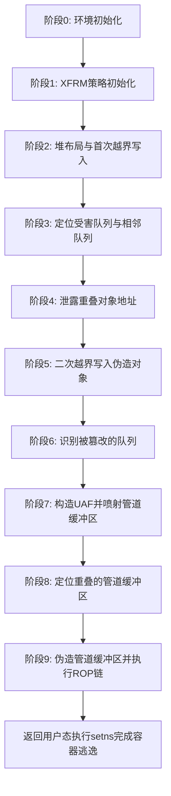
```mermaid
flowchart TD
    A[阶段0: 环境初始化] --> B[阶段1: XFRM策略初始化]
    B --> C[阶段2: 堆布局与首次越界写入]
    C --> D[阶段3: 定位受害队列与相邻队列]
    D --> E[阶段4: 泄露重叠对象地址]
    E --> F[阶段5: 二次越界写入伪造对象]
    F --> G[阶段6: 识别被篡改的队列]
    G --> H[阶段7: 构造UAF并喷射管道缓冲区]
    H --> I[阶段8: 定位重叠的管道缓冲区]
    I --> J[阶段9: 伪造管道缓冲区并执行ROP链]
    J --> K[返回用户态执行setns完成容器逃逸]
```

**进程模型**：本方案在单进程内完成所有操作。程序启动后直接执行各阶段，最终通过 ROP 返回用户态，调用预置的 `get_root_shell()` 函数进行命名空间切换和 shell 启动。无需父子进程同步，但需要确保在 ROP 执行前所有内核对象处于稳定状态。与思路一相比，本方案不依赖文件系统操作，而是直接在内核态完成权限提升的核心步骤，因此对内核符号地址和 ROP gadget 的依赖更强。

### 4-2. 阶段 0：环境初始化

此阶段完成基础运行环境的搭建，包括 CPU 绑定、命名空间隔离、资源池创建等。各步骤之间存在严格的时序依赖：命名空间隔离必须在资源池创建之前完成，以确保资源池位于正确的命名空间上下文内；CPU 绑定必须在一切操作之前完成，以稳定后续所有内存分配的时序特性。

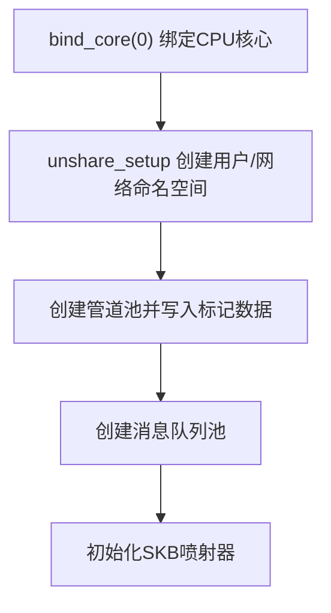
```mermaid
flowchart TD
    A["bind_core(0) 绑定CPU核心"] --> B["unshare_setup 创建用户/网络命名空间"]
    B --> C["创建管道池并写入标记数据"]
    C --> D["创建消息队列池"]
    D --> E["初始化SKB喷射器"]
```

- **CPU 绑定与命名空间隔离**：绑定到 CPU 核心 0 以稳定时序，并通过 `unshare` 创建用户命名空间和网络命名空间，使非特权用户获得配置 IPsec 策略的能力。用户命名空间提供了映射后的 root 权限（仅限该命名空间内），网络命名空间则提供了隔离的网络栈。
- **管道池创建与标记写入**：创建一批管道，并向每个管道写入少量标记数据（如 `"BinRacer"`），使管道在内核中分配 `pipe_buffer` 结构体。这些管道后续将用于 UAF 重叠和 ROP 触发。标记数据的设计使得在后续扫描中能够快速识别目标对象。
- **消息队列池创建**：创建大量 System V 消息队列，用于部署 `msg_msg` 对象。每个消息对象的大小为 2KB（`kmalloc-cg-2k` 缓存），并携带唯一标记以便后续定位。消息队列的数量经过精心调优，足以覆盖目标内存区域，同时避免触发系统资源限制。
- **SKB 喷射器初始化**：初始化网络套接字缓冲区喷射器，通过多个原始套接字预分配 SKB，用于精准的内存占位与 UAF 空洞填充。SKB 的优势在于其数据内容完全由用户态控制，且分配和释放的时序可以精确掌握。

### 4-3. 阶段 1：XFRM 策略初始化

本阶段配置漏洞触发所需的网络环境，确保数据包进入 ESP 处理路径。这是从用户态触发漏洞的关键网络前置步骤，其配置的准确性直接决定了后续溢出能否被成功触发。


```mermaid
flowchart TD
    A["mmap分配9页overwrite缓冲区"] --> B["mmap分配XFRM策略缓冲区"]
    B --> C["启用回环设备"]
    C --> D["通过PF_KEY添加SADB条目"]
    D --> E["创建原始IPv6套接字并连接回环"]
    E --> F["setsockopt附加XFRM策略"]
```

- **内存映射**：分配 9 页连续缓冲区（头部 + 8 页填充 + 载荷区域）和策略缓冲区。头部长度精确匹配内核协议栈偏移，确保溢出位置准确。这一偏移量的精确匹配是溢出能够命中预期目标的前提。
- **安全关联与策略配置**：通过 PF_KEY 套接字添加空加密算法的安全关联，并通过套接字选项附加 XFRM 策略。配置完成后，从原始 IPv6 套接字发出的数据包将经过 ESP 变换，触发 `esp6_output_head()` 中的越界写入。空加密算法的选择使加密操作退化为纯粹的数据拷贝，直接落入漏洞触发路径。

### 4-4. 阶段 2：堆布局与首次越界写入

此阶段通过页级堆风水，构造“漏洞对象 \| `msg_msg`”物理相邻的布局，并触发首次越界写入以扩大 `msg_msg.m_ts`。堆布局操控是后续所有操作的基础，其质量直接影响整个方案的成败。

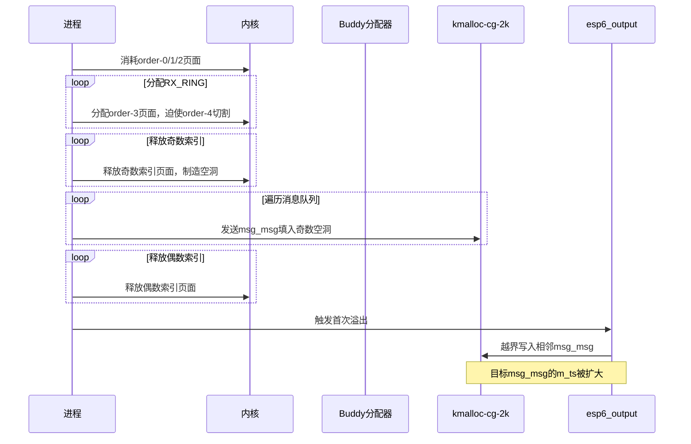
```mermaid
sequenceDiagram
    participant Child as 进程
    participant Kernel as 内核
    participant Buddy as Buddy分配器
    participant Slab as kmalloc-cg-2k
    participant ESP as esp6_output

    Child->>Kernel: 消耗order-0/1/2页面
    loop 分配RX_RING
        Child->>Kernel: 分配order-3页面，迫使order-4切割
    end
    loop 释放奇数索引
        Child->>Kernel: 释放奇数索引页面，制造空洞
    end
    loop 遍历消息队列
        Child->>Slab: 发送msg_msg填入奇数空洞
    end
    loop 释放偶数索引
        Child->>Kernel: 释放偶数索引页面
    end
    Child->>ESP: 触发首次溢出
    ESP->>Slab: 越界写入相邻msg_msg
    Note over ESP,Slab: 目标msg_msg的m_ts被扩大
```

- **低阶页面消耗**：消耗 order-0、order-1、order-2 页面，防止低阶页面合并干扰 order-3 页面的连续性。若低阶页面未被提前消耗，后续的 order-3 分配可能从这些碎片中拼接，导致物理相邻关系无法保证。
- **高阶页面排布**：分配一批 order-3 页面，当空闲列表耗尽时，分配器会向 order-4 申请并切割成两个物理相邻的 order-3 页面。这种物理相邻关系是后续跨缓存溢出的关键技术基础。
- **奇数空洞与消息喷射**：释放奇数索引的 order-3 页面形成空洞，并将 `msg_msg` 对象喷射至这些空洞中。每个 `msg_msg` 对象由消息头和消息体组成，合计 2KB，属于 `kmalloc-cg-2k` 缓存。
- **偶数页面释放与首次溢出**：释放偶数索引页面，触发首次越界写入。ESP 缓冲区申请 order-3 页面时极大概率落入偶数空洞，与奇数页面中的 `msg_msg` 物理相邻。越界写入将伪造的 `msg_msg` 写入相邻对象，扩大其 `m_ts` 字段，为后续越界读取创造条件。

### 4-5. 阶段 3：定位受害队列与相邻队列

利用被扩大的 `m_ts` 执行越界读取，定位受害队列和相邻队列。准确识别被篡改的对象是所有后续信息泄露的前提。

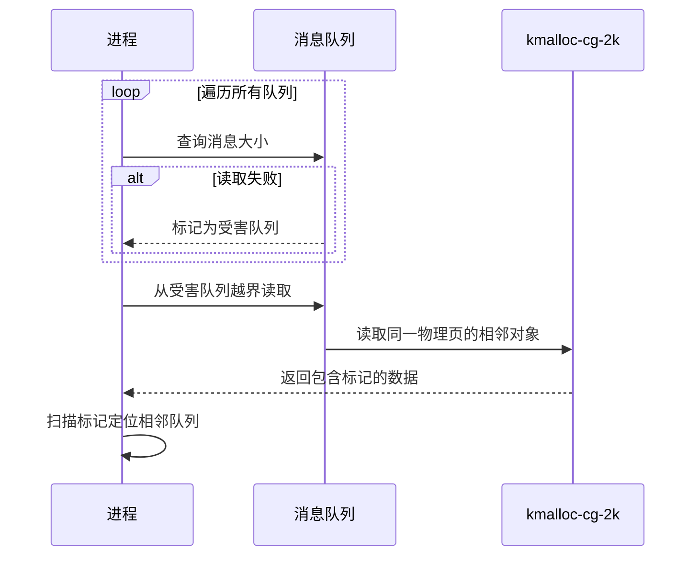
```mermaid
sequenceDiagram
    participant Child as 进程
    participant Q as 消息队列
    participant Slab as kmalloc-cg-2k

    loop 遍历所有队列
        Child->>Q: 查询消息大小
        alt 读取失败
            Q-->>Child: 标记为受害队列
        end
    end
    Child->>Q: 从受害队列越界读取
    Q->>Slab: 读取同一物理页的相邻对象
    Slab-->>Child: 返回包含标记的数据
    Child->>Child: 扫描标记定位相邻队列
```

- **扫描受害队列**：遍历所有消息队列，查询消息大小。由于受害队列的 `m_ts` 被扩大，读取原始大小会失败，据此定位出 `victim_qid`。查询操作使用只复制不消耗的接口，确保队列状态在多次扫描之间保持一致。
- **越界读取相邻对象**：利用扩大的 `m_ts` 执行越界读取，读取同一物理页中相邻 `msg_msg` 对象的数据区域。在特定偏移处扫描标记，定位相邻队列 `nearby_qid` 并记录页内偏移。一个 4KB 页面容纳两个 2KB 对象，因此越界读取恰好触达相邻对象。

### 4-6. 阶段 4：泄露重叠对象地址

通过向相邻队列发送标记消息，构造双向链表，并利用越界读取泄露重叠对象的地址。该地址将成为后续伪造操作的锚点。

```mermaid
sequenceDiagram
    participant Child as 进程
    participant nearby as 相邻队列
    participant victim as 受害队列

    Child->>nearby: 发送标记消息
    Note over nearby: 链表: [原消息] -> [重叠对象]
    Child->>victim: 越界读取
    victim-->>Child: 返回重叠对象地址
    Child->>Child: 保存重叠对象结构与队列ID
```

- **构造双向链表**：向 `nearby_qid` 发送一条特定类型的标记消息，使其成为该队列的第二个消息节点，形成双向循环链表。新消息的插入改变了链表的拓扑结构，使得原消息的 `m_list.next` 指向新消息。
- **越界读取链表指针**：再次利用受害队列的越界读取能力，读取相邻队列原消息的 `m_list.next` 指针，该指针指向新插入的重叠对象。保存重叠对象的完整结构及其队列 ID `overlap_qid`。随后清理非受害、非重叠的消息，为第二次越界写入提供干净环境。

### 4-7. 阶段 5：二次越界写入伪造对象

利用第二次越界写入，篡改目标 `msg_msg` 的 `security` 指针，使其指向重叠对象地址。这是从越界写入转向控制流劫持的关键跳转。

```mermaid
sequenceDiagram
    participant Child as 进程
    participant ESP as esp6_output
    participant Slab as kmalloc-cg-2k

    Child->>Child: 重复阶段2的堆布局
    loop 遍历消息队列
        Child->>Slab: 发送msg_msg（排除重叠队列）
    end
    Child->>Child: 构造伪造msg_msg
    Note over Child: 复制重叠对象结构<br/>security = 重叠对象地址
    Child->>ESP: 触发第二次溢出
    ESP->>Slab: 越界写入伪造msg_msg
    Note over ESP,Slab: 目标msg_msg.security指向重叠对象
```

- **重复堆布局**：再次执行低阶页面消耗与 order-3 空洞创建，确保溢出位置对准新的目标对象。喷射 `msg_msg` 时排除 `overlap_qid`，避免覆盖已泄露的重叠对象。
- **构造伪造结构体**：复制重叠对象结构，仅修改 `security` 字段为重叠对象自身的地址。其余字段与原始重叠对象保持一致，保证伪造结构体的合法性。这种“大部分复制 + 单字段篡改”的策略保证了内核在解析该对象时不会因无效字段而崩溃。
- **触发第二次溢出**：将伪造的 `msg_msg` 作为载荷发送，覆盖相邻 `msg_msg` 对象，使其 `security` 指针指向重叠对象地址。

### 4-8. 阶段 6：识别被篡改的队列

由于被覆写的 `msg_msg` 的 `m_list.next` 指向重叠对象，该队列现在拥有两个消息段。通过查询操作识别出被篡改的队列 `evil_qid`。

```mermaid
sequenceDiagram
    participant Child as 进程
    participant Q as 消息队列

    loop 遍历所有队列（排除重叠队列）
        Child->>Q: 尝试读取第二个消息
        alt 成功读取
            Q-->>Child: 标记为evil_qid
        end
    end
```

- **遍历查询**：对除 `overlap_qid` 外的每个队列执行查询操作，指定消息类型为重叠对象的类型。只有 `evil_qid` 的链表因被篡改而包含第二个消息段，能够成功返回预期大小。其他队列因只有一个消息而失败，不影响整体流程。`evil_qid` 与 `nearby_qid` 实际指向同一个重叠对象，形成双链表引用，为后续 UAF 构造奠定基础。

### 4-9. 阶段 7：构造 UAF 并喷射管道缓冲区

通过释放重叠对象和被篡改对象，制造 UAF 空洞，并用 SKB 数据和 `pipe_buffer` 进行填充。这是将信息泄露能力升级为控制流劫持能力的关键转折点。

```mermaid
sequenceDiagram
    participant Child as 进程
    participant overlap as 重叠队列
    participant evil as 被篡改队列
    participant Slab as kmalloc-cg-2k
    participant SKB as SKB缓存
    participant Pipe as pipe_buffer

    Child->>overlap: 释放重叠对象的第二个消息
    Slab->>Slab: 创建空洞
    Child->>SKB: SKB喷射填充空洞
    Child->>evil: 释放被篡改对象的第一个消息
    evil->>evil: security析构函数释放SKB数据
    SKB->>SKB: 形成UAF空洞
    loop 遍历所有管道
        Child->>Pipe: 调整管道缓冲区大小
        Pipe->>Slab: 新的pipe_buffer数组占据UAF空洞
    end
    Note over Pipe,SKB: pipe_buffer与UAF空洞重叠
```

- **释放重叠对象**：从 `overlap_qid` 中释放第二个消息，创建第一个空洞，并立即用 SKB 数据填充，内容为重叠对象的副本。
- **释放被篡改对象**：释放 `evil_qid` 的第一个消息。由于该消息的 `security` 指针指向重叠对象地址（当前已被 SKB 数据占用），内核在释放时会调用 `security` 析构函数，释放该地址，从而意外释放 SKB 数据区域，形成 UAF 空洞。
- **喷射管道缓冲区**：调整管道缓冲区大小，触发内核重新分配 `pipe_buffer` 数组。新分配的数组位于 `kmalloc-cg-2k` 缓存，极大概率落入 UAF 空洞，实现 `pipe_buffer` 与 SKB 数据的内存重叠。`resize_pipe_buffer` 操作会先释放旧的 `pipe_buffer` 数组，再申请新的更大的数组，这一机制为重叠创造了条件。

### 4-10. 阶段 8：定位重叠的管道缓冲区

通过扫描 SKB 数据，检测与 `pipe_buffer` 的重叠，并泄露内核地址。准确识别重叠位置是从 UAF 空洞中提取有用信息的前提。

```mermaid
sequenceDiagram
    participant Child as 进程
    participant SKB as SKB缓存
    participant Pipe as pipe_buffer

    loop 遍历所有SKB
        Child->>SKB: 读取SKB数据
        alt 首字段与预期不符
            SKB-->>Child: 检测到pipe_buffer重叠
            Child->>Child: 提取pipe_buffer字段
            Note over Child: 泄露pipe_buffer->page与->ops
        end
    end
    Child->>Child: 计算内核基址
```

- **扫描 SKB**：使用窥探读取遍历所有 SKB，比较首字段与预期值。若不符，说明该 SKB 已被 `pipe_buffer` 覆盖。
- **提取信息**：解析出 `pipe_buffer` 的 `page` 和 `ops` 指针。`ops` 指向内核中的 `anon_pipe_buf_ops`，其地址与内核基址的偏移固定，由此可计算出内核基址 `kernel_base`。这一泄露是绕过 KASLR 的关键，为后续 ROP 链的构造提供了地址基础。

### 4-11. 阶段 9：伪造管道缓冲区并执行 ROP 链

释放包含 `pipe_buffer` 的 SKB，伪造 `pipe_buffer` 及其操作函数表，将 `release` 指针指向一个栈迁移 gadget，将内核栈迁移至预置的 ROP 链。内核在返回路径中执行该 ROP 链，完成 root 凭证获取与命名空间切换的前半部分准备，随后返回用户态，由用户态函数通过 `setns` 完成容器逃逸并启动 root shell。

```mermaid
sequenceDiagram
    participant Child as 进程
    participant SKB as SKB缓存
    participant Pipe as pipe_buffer
    participant Kernel as 内核
    participant User as 用户态

    Child->>SKB: 释放所有SKB
    Child->>Child: 构造伪造pipe_buffer与ops表
    Note over Child: ops->release = 栈迁移gadget<br/>ROP链位于同一缓冲区
    Child->>SKB: 喷射伪造结构体
    loop 关闭所有管道
        Child->>Pipe: close()
        Pipe->>Kernel: 调用ops->release
        Kernel->>Kernel: 栈迁移gadget将栈切换至ROP链
        Kernel->>Kernel: 执行ROP链
        Note over Kernel: commit_creds(prepare_kernel_cred(0))<br/>switch_task_namespaces(init_nsproxy)<br/>返回用户态
    end
    Kernel->>User: 返回用户态
    User->>User: get_root_shell()执行setns()切换至宿主命名空间
    User->>User: 启动root shell，完成容器逃逸
```

- **释放 SKB**：释放包含 `pipe_buffer` 的所有 SKB，再次创建空洞。这个空洞将被伪造的 `pipe_buffer` 结构填充。
- **构造伪造结构体**：复制泄露的 `pipe_buffer` 结构，保持 `page` 和 `ops` 指针不变，但将 `ops` 重定向到自控制的伪造操作表。伪造操作表中的 `release` 指针指向一个**栈迁移 gadget**。该 gadget 的作用是将内核栈指针切换到 ROP 链所在的地址。ROP 链与伪造的 `pipe_buffer`、伪造的操作表位于同一块 `kmalloc-cg-2k` 缓冲区中，这样的布局保证了栈迁移后 ROP 链能够被立即执行。
- **喷射伪造结构体**：通过 SKB 喷射将伪造的 `pipe_buffer`、伪造的操作表和 ROP 链写入空洞。由于三者位于同一块缓冲区，栈迁移 gadget 能够准确地将栈指针定位到 ROP 链的起始位置。
- **触发 ROP**：关闭所有管道，内核在释放管道资源时调用 `pipe_buffer->ops->release`，跳转到栈迁移 gadget。该 gadget 将内核栈切换到 ROP 链，随后 ROP 链依次执行：
    1. `commit_creds(prepare_kernel_cred(0))` 获得 root 凭证；
    2. `switch_task_namespaces` 将当前任务切换到初始命名空间（`init_nsproxy`），完成容器逃逸的前半部分准备；
    3. 通过 `swapgs_restore_regs_and_return_to_usermode` trampoline 返回用户态，跳转到用户态函数 `get_root_shell()`。
- **用户态后处理**：ROP 链返回用户态后，控制权移交至 `get_root_shell()`。该函数执行 `setns()` 进入宿主命名空间，完成容器逃逸的后半部分，随后启动 root shell。至此，权限提升与容器逃逸全部完成。

与思路一中通过覆写文件页面缓存实现提权的方式不同，本方案直接在内核态获得 root 凭证并切换命名空间，随后返回用户态完成逃逸。这种方式的优势在于提权效果更为彻底，但代价是需要依赖内核符号地址和 ROP gadget，且对内核版本的适配性要求更高。

### 4-12. 内核保护机制的应对策略

本方案需要绕过 KASLR 以获取内核符号地址和 ROP gadget，并依赖内核控制流劫持。下表列出各保护机制的影响与应对策略。

| 保护机制                             | 机制原理                                                       | 本方案应对策略                                                                                                                                                  |
| ------------------------------------ | -------------------------------------------------------------- | --------------------------------------------------------------------------------------------------------------------------------------------------------------- |
| **KASLR**                            | 随机化内核代码段、数据段和模块的加载基址。                     | 通过越界读取泄露 `pipe_buffer->ops` 指针（指向 `anon_pipe_buf_ops`），计算内核基址，进而定位所有需要的 ROP gadget 和内核函数。                                  |
| **SMEP/SMAP**                        | SMEP 阻止内核态执行用户态代码；SMAP 阻止内核态访问用户态数据。 | ROP 链完全在内核态执行，使用的 gadget 和函数均位于内核代码段，不执行用户态代码。ROP 链中不直接访问用户态内存，返回用户态通过标准 trampoline 完成，不触发 SMAP。 |
| **KPTI**                             | 分离内核页表与用户页表。                                       | 返回用户态时使用 `swapgs_restore_regs_and_return_to_usermode` trampoline，该函数是 KPTI 下标准的返回路径，能够正确切换页表并恢复用户态上下文。                  |
| **CONFIG_MEMCG / CONFIG_MEMCG_KMEM** | 为受控进程创建独立的 `kmalloc-cg-*` 缓存。                     | 本方案涉及的 `msg_msg`、`pipe_buffer` 数组、SKB 数据均属 `kmalloc-cg-2k`，共享同一缓存，隔离机制不影响堆布局操控。                                              |
| **CONFIG_SLAB_FREELIST_RANDOM**      | 随机化 slab 空闲链表中的对象顺序。                             | 可能对 UAF 空洞的占位产生轻微影响，但通过大量堆喷可覆盖足够多的空闲块，保证目标空洞被占据。核心溢出对象为 order-3 物理页面，页面级布局不受影响。                |
| **CONFIG_SLAB_FREELIST_HARDENED**    | 对空闲链表指针进行异或混淆。                                   | 基于 buddy 分配器的页面级布局，不依赖 slab 空闲链表指针覆写，该保护不构成影响。                                                                                 |
| **CONFIG_HARDENED_USERCOPY**         | 在用户态-内核态拷贝接口中增加边界检查。                        | 越界写入发生在内核上下文的 `memcpy()` 中，不经过 `copy_from_user()` / `copy_to_user()` 路径，检查机制无法覆盖。                                                 |

本方案与思路一的主要区别在于需要主动绕过 KASLR 并构造 ROP 链，因此对内核符号地址的依赖更强。但通过越界读取泄露 `ops` 指针，可以可靠地计算出内核基址，从而完成 ROP 链的构造。

### 4-13. 前提条件与局限性

**前提条件**：

- 内核已开启 IPsec ESP 支持，且空加密算法可用。
- 目标系统允许非特权用户创建用户命名空间和网络命名空间。
- 目标内核版本在漏洞影响范围内（4.11 至 5.17-rc7）。
- 系统资源限制足够创建所需数量的消息队列和管道。
- 目标内核的 ROP gadget 布局与泄露的内核基址匹配（即需要针对特定内核版本准备 ROP 链）。

**局限性**：

- 堆布局成功率受系统负载影响，需要多次尝试或大量堆喷以提高稳定性。
- 依赖空加密算法路径，若内核禁用了该算法，需调整触发路径。
- ROP 链的构造依赖于具体内核版本的符号地址和 gadget，通用性不如 data-only 利用。需要针对目标内核进行适配。
- 容器逃逸操作依赖于目标环境的具体配置，若容器未使用用户命名空间或权限限制较严，可能无法成功逃逸。
- 方案在单进程内完成，若 ROP 链执行失败，进程可能崩溃，无法像思路一那样通过子进程持久化来避免资源回收。因此需要确保 ROP 链的稳定性。

### 4-14. 章节总结

本方案展示了另一种将 **CVE-2022-27666** 堆溢出漏洞转化为权限提升的路径。与思路一的 data-only 利用不同，本方案通过构造 UAF、伪造 `pipe_buffer` 操作函数表，最终劫持内核控制流执行 ROP 链，在内核态完成 root 凭证获取与命名空间切换的前半部分准备，返回用户态后通过 `setns()` 完成容器逃逸。

方案的核心在于：通过两次越界写入篡改 `msg_msg` 的 `m_ts` 和 `security` 字段，构造出可控的 UAF 条件；利用 `pipe_buffer` 的重叠泄露内核基址，绕过 KASLR；最终伪造 `pipe_buffer->ops->release` 指针，在管道关闭时通过栈迁移 gadget 跳转到 ROP 链。ROP 链执行 `commit_creds(prepare_kernel_cred(0))` 获得 root 凭证，调用 `switch_task_namespaces` 切换到初始命名空间，并返回用户态。用户态函数 `get_root_shell()` 随后通过 `setns()` 完成容器逃逸并启动 root shell。

与思路一相比，本方案对内核符号地址和 ROP gadget 有较强依赖，通用性较低，但能够实现更彻底的权限提升和容器逃逸。在实际利用中，可根据目标环境选择更适合的方案。该案例也表明，在现代内核防御机制下，堆溢出漏洞仍可通过精巧的对象布局和控制流劫持转化为完整的权限提升路径，防御方需从内存隔离、控制流完整性、KASLR 强化等多层面加强防护。

### 4-15. 测试结果

<div style="text-align: center; margin: 2rem 0;">
  
</div>

## 5. 漏洞修复

### 5-1. 修复补丁概述

**CVE-2022-27666** 的修复由两个相关联的内核提交共同完成，分别针对漏洞的不同层面进行了处理。第一个提交为 `ebe48d368e97`，由 Steffen Klassert 于 2022 年 3 月 7 日提交，标题为“esp: Fix possible buffer overflow in ESP transformation”，是漏洞的核心修复补丁；第二个提交为 `5bd8baab087d`，由 Sabrina Dubroca 于 2022 年 4 月 13 日提交，标题为“esp: limit skb_page_frag_refill use to a single page”，是对第一个补丁的补充加固。

两个补丁均修复了 2017 年引入漏洞的原始提交 `cac2661c53f3` 与 `03e2a30f6a27`，且均被回溯至受影响的稳定版本。第一个补丁的提交信息指出：“可发送的最大消息尺寸超过了 `skb_page_frag_refill` 能够分配的最大尺寸，因此存在写入已分配缓冲区之外的可能性。修复方式是在这种情况下回退至 COW 路径。”第二个补丁则进一步指出：“第一个补丁尝试将 `allocsz` 限制在 32KB，但这并未完全解决问题，因为 `skb_page_frag_refill` 可能返回单个页面。若发生这种情况，尽管有前一个补丁的检查，仍会越界写入。”

### 5-2. 补丁的技术分析

#### 5-2-1. 第一个补丁

第一个补丁的核心思路是在 `esp_output_head()` 中增加对分配尺寸的上限检查。具体而言，它检查 `skb->data_len + tailen` 对齐后的总和是否超过 `ESP_SKB_FRAG_MAXSIZE`（即 `PAGE_SIZE << SKB_FRAG_PAGE_ORDER`，在 `SKB_FRAG_PAGE_ORDER` 为 3 的典型配置下为 8 页，32768 字节）。若超过该上限，则直接跳转至 COW 路径，避免使用容量不足的页面碎片缓冲区。该补丁的完整内容如下：

```diff
diff --git a/include/net/esp.h b/include/net/esp.h
index 9c5637d41d951..90cd02ff77ef6 100644
--- a/include/net/esp.h
+++ b/include/net/esp.h
@@ -4,6 +4,8 @@

 #include <linux/skbuff.h>

+#define ESP_SKB_FRAG_MAXSIZE (PAGE_SIZE << SKB_FRAG_PAGE_ORDER)
+
 struct ip_esp_hdr;

 static inline struct ip_esp_hdr *ip_esp_hdr(const struct sk_buff *skb)
diff --git a/net/ipv4/esp4.c b/net/ipv4/esp4.c
index e1b1d080e908d..70e6c87fbe3df 100644
--- a/net/ipv4/esp4.c
+++ b/net/ipv4/esp4.c
@@ -446,6 +446,7 @@ int esp_output_head(struct xfrm_state *x, struct sk_buff *skb, struct esp_info *
 	struct page *page;
 	struct sk_buff *trailer;
 	int tailen = esp->tailen;
+	unsigned int allocsz;

 	/* this is non-NULL only with TCP/UDP Encapsulation */
 	if (x->encap) {
@@ -455,6 +456,10 @@ int esp_output_head(struct xfrm_state *x, struct sk_buff *skb, struct esp_info *
 			return err;
 	}

+	allocsz = ALIGN(skb->data_len + tailen, L1_CACHE_BYTES);
+	if (allocsz > ESP_SKB_FRAG_MAXSIZE)
+		goto cow;
+
 	if (!skb_cloned(skb)) {
 		if (tailen <= skb_tailroom(skb)) {
 			nfrags = 1;
diff --git a/net/ipv6/esp6.c b/net/ipv6/esp6.c
index 7591160edce14..b0ffbcd5432d1 100644
--- a/net/ipv6/esp6.c
+++ b/net/ipv6/esp6.c
@@ -482,6 +482,7 @@ int esp6_output_head(struct xfrm_state *x, struct sk_buff *skb, struct esp_info
 	struct page *page;
 	struct sk_buff *trailer;
 	int tailen = esp->tailen;
+	unsigned int allocsz;

 	if (x->encap) {
 		int err = esp6_output_encap(x, skb, esp);
@@ -490,6 +491,10 @@ int esp6_output_head(struct xfrm_state *x, struct sk_buff *skb, struct esp_info
 			return err;
 	}

+	allocsz = ALIGN(skb->data_len + tailen, L1_CACHE_BYTES);
+	if (allocsz > ESP_SKB_FRAG_MAXSIZE)
+		goto cow;
+
 	if (!skb_cloned(skb)) {
 		if (tailen <= skb_tailroom(skb)) {
 			nfrags = 1;
```

该补丁在 `include/net/esp.h` 中定义了 `ESP_SKB_FRAG_MAXSIZE` 宏，其值为 `PAGE_SIZE << SKB_FRAG_PAGE_ORDER`，即高阶复合页的总容量。在 `esp4_output_head()` 与 `esp6_output_head()` 中，补丁计算了 `allocsz = ALIGN(skb->data_len + tailen, L1_CACHE_BYTES)`，并将其与 `ESP_SKB_FRAG_MAXSIZE` 比较。若超过该上限，则跳转至 `cow` 标签，回退至写时复制路径。写时复制路径通过 `skb_cow_data()` 重新分配足够大的缓冲区，从而避免越界写入。

然而，该补丁存在一个隐含假设：`skb_page_frag_refill()` 在分配失败时会返回 `false`，调用方会回退至 COW 路径。但 `skb_page_frag_refill()` 在分配高阶页失败时，会降级为单页分配（`alloc_page`），并返回 `true`。此时 `pfrag->size` 被设置为 `PAGE_SIZE`，而调用方并未重新检查该容量是否满足请求。因此，即使 `skb->data_len + tailen` 的总和小于 `ESP_SKB_FRAG_MAXSIZE`，若单个请求（`tailen` 或 `skb->data_len`）超过单页容量，而分配器又降级为单页分配，仍可能发生越界写入。这是因为 `esp_output_head()` 中实际调用 `skb_page_frag_refill()` 时传入的是 `ALIGN(tailen, L1_CACHE_BYTES)`，而 `esp_output_tail()` 中传入的是 `ALIGN(skb->data_len, L1_CACHE_BYTES)`。第一个补丁检查的是两者之和，但并未分别限制每个请求不超过单页。

#### 5-2-2. 第二个补丁

第二个补丁正是为了解决上述问题。其核心思路是：不再依赖 `ESP_SKB_FRAG_MAXSIZE` 这一基于高阶页的固定上限，而是直接检查 `tailen` 和 `skb->data_len` 是否超过单页容量。若任一者超过单页，则强制走 COW 路径，从而彻底避免 `skb_page_frag_refill()` 降级为单页分配时可能引发的越界写入。该补丁的完整内容如下：

```diff
diff --git a/include/net/esp.h b/include/net/esp.h
index 90cd02ff77ef6..9c5637d41d951 100644
--- a/include/net/esp.h
+++ b/include/net/esp.h
@@ -4,8 +4,6 @@

 #include <linux/skbuff.h>

-#define ESP_SKB_FRAG_MAXSIZE (PAGE_SIZE << SKB_FRAG_PAGE_ORDER)
-
 struct ip_esp_hdr;

 static inline struct ip_esp_hdr *ip_esp_hdr(const struct sk_buff *skb)
diff --git a/net/ipv4/esp4.c b/net/ipv4/esp4.c
index 70e6c87fbe3df..d747166bb291c 100644
--- a/net/ipv4/esp4.c
+++ b/net/ipv4/esp4.c
@@ -446,7 +446,6 @@ int esp_output_head(struct xfrm_state *x, struct sk_buff *skb, struct esp_info *
 	struct page *page;
 	struct sk_buff *trailer;
 	int tailen = esp->tailen;
-	unsigned int allocsz;

 	/* this is non-NULL only with TCP/UDP Encapsulation */
 	if (x->encap) {
@@ -456,8 +455,8 @@ int esp_output_head(struct xfrm_state *x, struct sk_buff *skb, struct esp_info *
 			return err;
 	}

-	allocsz = ALIGN(skb->data_len + tailen, L1_CACHE_BYTES);
-	if (allocsz > ESP_SKB_FRAG_MAXSIZE)
+	if (ALIGN(tailen, L1_CACHE_BYTES) > PAGE_SIZE ||
+	    ALIGN(skb->data_len, L1_CACHE_BYTES) > PAGE_SIZE)
 		goto cow;

 	if (!skb_cloned(skb)) {
diff --git a/net/ipv6/esp6.c b/net/ipv6/esp6.c
index 55d604c9b3b3e..f2120e92caf15 100644
--- a/net/ipv6/esp6.c
+++ b/net/ipv6/esp6.c
@@ -482,7 +482,6 @@ int esp6_output_head(struct xfrm_state *x, struct sk_buff *skb, struct esp_info
 	struct page *page;
 	struct sk_buff *trailer;
 	int tailen = esp->tailen;
-	unsigned int allocsz;

 	if (x->encap) {
 		int err = esp6_output_encap(x, skb, esp);
@@ -491,8 +490,8 @@ int esp6_output_head(struct xfrm_state *x, struct sk_buff *skb, struct esp_info
 			return err;
 	}

-	allocsz = ALIGN(skb->data_len + tailen, L1_CACHE_BYTES);
-	if (allocsz > ESP_SKB_FRAG_MAXSIZE)
+	if (ALIGN(tailen, L1_CACHE_BYTES) > PAGE_SIZE ||
+	    ALIGN(skb->data_len, L1_CACHE_BYTES) > PAGE_SIZE)
 		goto cow;

 	if (!skb_cloned(skb)) {
```

该补丁移除了 `ESP_SKB_FRAG_MAXSIZE` 宏定义，并将检查逻辑修改为：若 `ALIGN(tailen, L1_CACHE_BYTES) > PAGE_SIZE` 或 `ALIGN(skb->data_len, L1_CACHE_BYTES) > PAGE_SIZE`，则跳转至 COW 路径。这意味着，只要尾部数据或已有数据长度超过单页，就不再使用 `skb_page_frag_refill()` 分配页面碎片，而是直接走 COW 路径。这一修改从根本上消除了 `skb_page_frag_refill()` 降级为单页分配时可能引发的越界写入风险，因为 COW 路径会通过 `skb_cow_data()` 重新分配足够大的缓冲区。

### 5-3. 漏洞利用链的切断

漏洞的利用链依赖于 `skb_page_frag_refill()` 分配的页面碎片缓冲区容量不足，使得 `null_skcipher_crypt()` 中的 `memcpy()` 越界写入相邻内存。第一个补丁通过检查 `skb->data_len + tailen` 对齐后的总和是否超过 `ESP_SKB_FRAG_MAXSIZE` 来初步切断这一链条，但未能覆盖 `skb_page_frag_refill()` 降级为单页分配的情况。第二个补丁则通过强制在 `tailen` 或 `skb->data_len` 超过单页时走 COW 路径，彻底消除了页面碎片缓冲区容量不足的可能性。

修复后，无论 `skb_page_frag_refill()` 实际分配的是高阶页还是单页，调用方都会在请求尺寸超过单页时提前回退至 COW 路径。COW 路径通过 `skb_cow_data()` 重新分配足够大的缓冲区，确保后续的 `memcpy()` 操作不会越过缓冲区边界。因此，漏洞的越界写入条件被完全消除，利用链在第一步即被切断。

### 5-4. 补丁的演进意义

两个补丁的演进过程反映了内核安全修复的典型模式：第一个补丁是快速响应，针对 `skb->data_len + tailen` 总和超过高阶页容量的情况进行修复；第二个补丁则是深入分析后的补充加固，针对第一个补丁未能覆盖的边界情况（单个请求超过单页且分配器降级为单页）进行完善。这种“初步修复 + 补充加固”的模式在内核安全修复中并不罕见，尤其当漏洞涉及分配器行为、内存布局等复杂因素时。

从技术角度看，第二个补丁的修复方式更为彻底：它不再依赖分配器的具体实现细节（如是否使用高阶页），而是直接基于请求尺寸与单页容量的比较来做出决策。这种“保守回退”策略虽然可能牺牲少量性能（在尺寸超过单页时总是走 COW 路径），但显著提升了安全性，体现了内核开发中“安全优先”的原则。

### 5-5. 修复版本与回溯状态

两个补丁均被回溯至受影响的稳定版本。根据 NVD 与各发行版的公告，修复版本如下：

| 内核版本范围        | 修复版本 |
| ------------------- | -------- |
| 4.11 – 4.14.273     | 4.14.274 |
| 4.15 – 4.19.236     | 4.19.237 |
| 4.20 – 5.4.187      | 5.4.188  |
| 5.5 – 5.10.107      | 5.10.108 |
| 5.11 – 5.15.28      | 5.15.29  |
| 5.16 – 5.16.14      | 5.16.15  |
| 5.17-rc1 – 5.17-rc7 | 5.17-rc8 |

各主要 Linux 发行版已通过稳定更新渠道提供了修复版本。对于无法立即升级内核的系统，建议禁用 IPsec ESP 变换或限制非特权用户对网络命名空间的访问权限，以降低潜在风险。

### 5-6. 安全开发启示

**CVE-2022-27666** 的修复过程为内核安全开发提供了若干重要启示：

- **分配器行为不可假设**：`skb_page_frag_refill()` 在分配高阶页失败时会降级为单页分配，但调用方往往假设分配成功即意味着容量满足请求。这种隐含假设是许多内存安全问题的根源。开发者在依赖分配器时，应显式校验返回的容量是否满足需求，而非仅检查分配是否成功。
- **边界检查应基于实际使用的最小单位**：第一个补丁使用 `ESP_SKB_FRAG_MAXSIZE`（高阶页容量）作为上限，但实际分配可能仅为单页。第二个补丁改为基于单页容量进行检查，更为保守且安全。这表明，在涉及内存安全的边界检查中，应以最坏情况下的最小容量为基准，而非理想情况下的最大容量。
- **修复需要覆盖所有分支**：`skb_page_frag_refill()` 有高阶页分配和单页分配两个分支，第一个补丁仅考虑了高阶页分支，遗漏了单页分支。安全修复应全面覆盖所有可能的分支，确保任何路径下都不会发生越界。
- **迭代修复是正常过程**：复杂漏洞的修复往往需要多个补丁的迭代。第一个补丁提供了初步防护，第二个补丁在此基础上进行了补充和加固。这种迭代过程体现了内核社区对安全问题的严谨态度，也提醒防御方在评估修复效果时应关注完整的补丁序列，而非仅看第一个补丁。

## 6. 免责声明

本文档旨在提供 **CVE-2022-27666** 漏洞的技术分析与教育性内容，仅供学习、研究和安全防御目的使用。作者与发布平台对以下事项声明如下：

1. **合法使用原则**：本文档中描述的任何技术细节、代码示例或利用方法仅供教育研究之用。读者不得将这些信息用于任何非法、未经授权或恶意的活动，包括但不限于未经授权的系统入侵、数据破坏、服务干扰或其他违反法律法规的行为。

2. **知识共享与责任**：本文档基于公开可获取的信息、官方漏洞公告和学术研究资料编写。作者力求确保技术内容的准确性，但不对信息的完整性、时效性或适用性作任何明示或暗示的保证。读者应自行验证信息的准确性，并在专业环境中谨慎应用。

3. **环境限制**：所有技术分析和实验应在受控的、隔离的测试环境中进行，例如使用特制的虚拟机或专用硬件。禁止在任何生产环境、公共网络或他人系统中尝试漏洞利用或相关技术。

4. **法律合规性**：读者应遵守所在国家或地区的所有适用法律法规，包括但不限于计算机安全法、数据保护法和知识产权法。任何使用本文档内容的行为所产生的法律后果，由行为者自行承担。

5. **技术中立性**：本文档对漏洞的分析保持技术中立立场，旨在促进安全社区的防御能力提升。文中提及的任何工具、技术或方法不应被视为对任何组织、产品或技术的背书或批判。

6. **更新与修正**：技术领域发展迅速，本文档内容可能随时间而过时。作者保留更新、修正或撤回文档内容的权利，不承诺另行通知。

7. **版权声明**：本文档内容受版权法保护，未经明确书面许可，不得用于商业目的。允许在注明出处的前提下进行非商业性的分享与引用。

**重要提示**：安全研究应始终遵循道德准则，以提升整体网络安全为目标。如发现安全漏洞，建议通过负责任的披露流程向相关厂商或机构报告，共同维护数字生态的安全与稳定。

---

_本文档的撰写参考了公开的漏洞公告、内核源码（Linux 5.16.14）及相关技术分析文献。所有实验均在封闭的测试环境中完成，未对任何实际系统造成影响。_

## 参考

- https://github.com/BinRacer/pwn4cve/tree/master/src/CVE-2022-27666
- https://github.com/BinRacer/pwn4cve/tree/master/src/CVE-2022-27666_V2
- https://etenal.me/archives/1825
- https://paper.seebug.org/1889
- https://git.kernel.org/pub/scm/linux/kernel/git/torvalds/linux.git/commit/?id=cac2661c53f35cbe651bef9b07026a5a05ab8ce0
- https://git.kernel.org/pub/scm/linux/kernel/git/torvalds/linux.git/commit/?id=03e2a30f6a27e2f3e5283b777f6ddd146b38c738
- https://git.kernel.org/pub/scm/linux/kernel/git/torvalds/linux.git/commit/?id=ebe48d368e97d007bfeb76fcb065d6cfc4c96645
- https://git.kernel.org/pub/scm/linux/kernel/git/torvalds/linux.git/commit/?id=5bd8baab087dff657e05387aee802e70304cc813
- https://nvd.nist.gov/vuln/detail/CVE-2022-27666
- https://ubuntu.com/security/CVE-2022-27666
