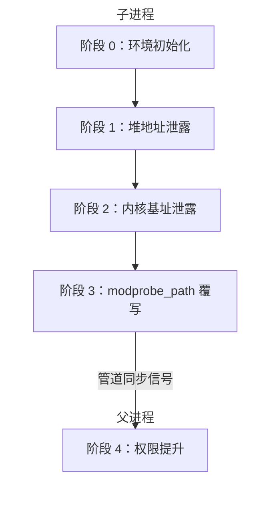
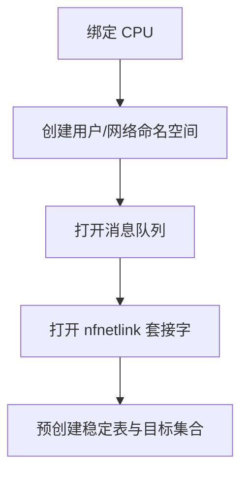
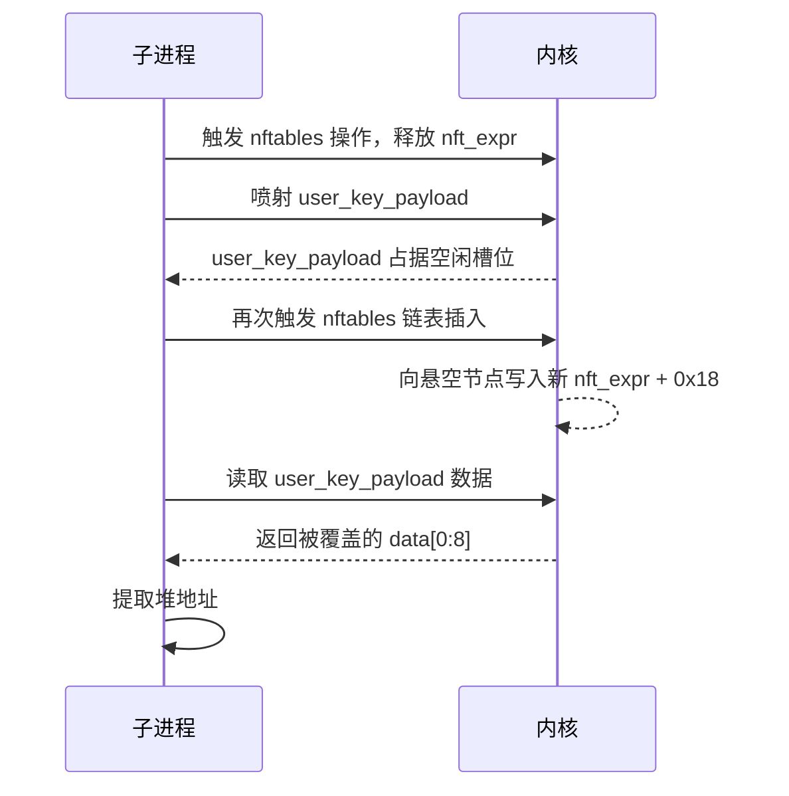
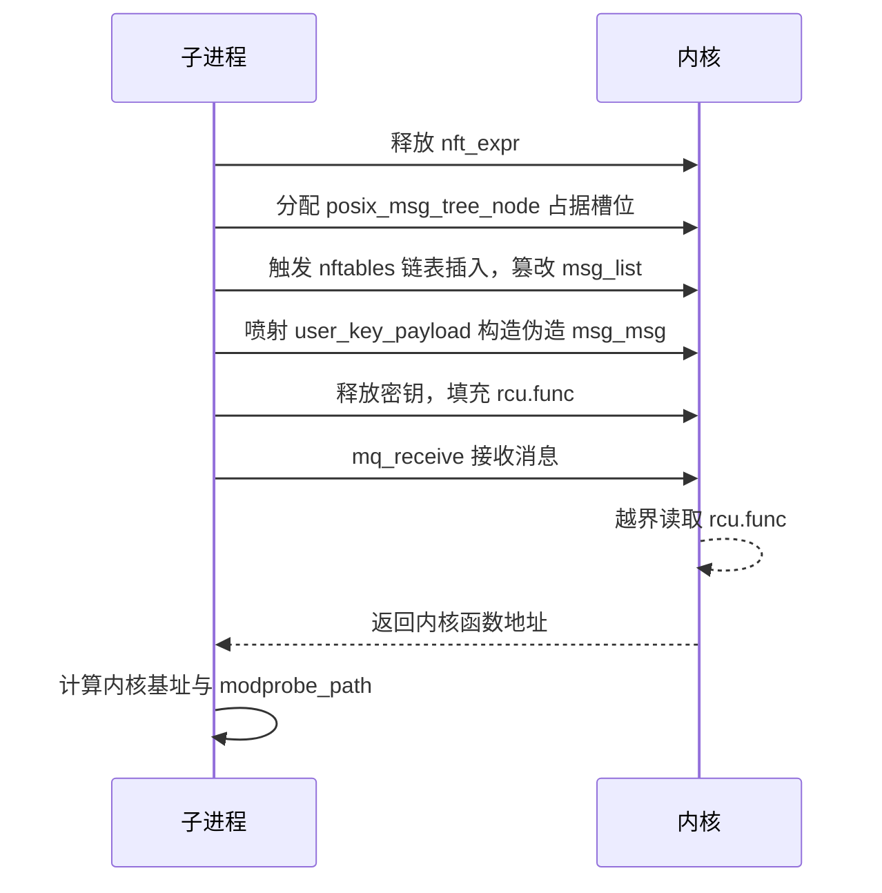
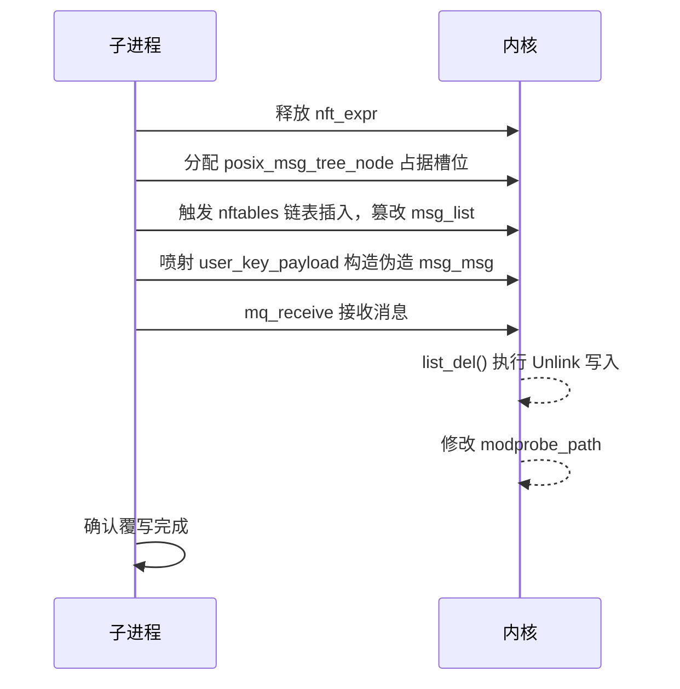
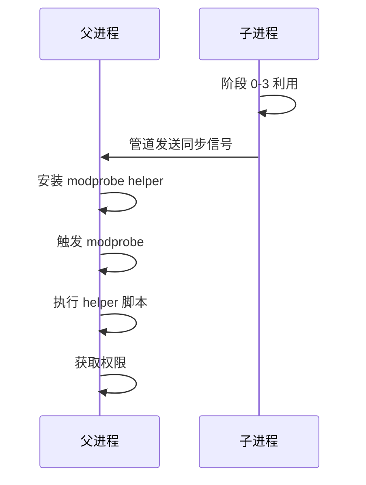

# 【Kernel Exploit】CVE-2022-32250 漏洞分析

## 1. 测试环境

**测试版本**：Linux-5.17.12 [内核镜像地址](https://github.com/BinRacer/pwn4cve/blob/master/kernels/5.17.12/01/bzImage)

笔者测试的内核版本是 `Linux (none) 5.17.12 #1 SMP PREEMPT Fri Feb 27 16:14:59 CST 2026 x86_64 GNU/Linux`。

**编译选项**：开启`CONFIG_SECURITY`、`CONFIG_IO_URING`、`CONFIG_BINFMT_MISC`、`CONFIG_THREAD_INFO_IN_TASK`、`CONFIG_INIT_ON_ALLOC_DEFAULT_ON`、`CONFIG_KCMP`、`CONFIG_MEMCG`、`CONFIG_MEMCG_KMEM`、`CONFIG_CGROUPS`、`CONFIG_SLAB_FREELIST_RANDOM`、`CONFIG_SLAB_FREELIST_HARDENED`、`CONFIG_HARDENED_USERCOPY`、`CONFIG_FUSE_FS`、`CONFIG_USERFAULTFD`、`CONFIG_SYSVIPC`、`CONFIG_KEYS`、`CONFIG_STACKPROTECTOR`、`CONFIG_STACKPROTECTOR_STRONG`、`CONFIG_SLUB`、`CONFIG_SLUB_DEBUG`、`CONFIG_E1000`、`CONFIG_E1000E`、`CONFIG_PACKET`、`CONFIG_USER_NS`、`CONFIG_NET_NS`、`CONFIG_NAMESPACES`、`CONFIG_CHECKPOINT_RESTORE`、`CONFIG_IPC_NS`、`CONFIG_NF_TABLES`、`CONFIG_NF_TABLES_INET`、`CONFIG_NF_TABLES_NETDEV`、`CONFIG_NF_TABLES_IPV4`、`CONFIG_NF_TABLES_ARP`、`CONFIG_NF_TABLES_IPV6`、`CONFIG_NETFILTER`、`CONFIG_NETFILTER_ADVANCED`、`CONFIG_NETFILTER_INGRESS`、`CONFIG_NETFILTER_EGRESS`、`CONFIG_NETFILTER_SKIP_EGRESS`、`CONFIG_NETFILTER_NETLINK`、`CONFIG_NETFILTER_FAMILY_BRIDGE`、`CONFIG_NETFILTER_FAMILY_ARP`、`CONFIG_NETFILTER_NETLINK_GLUE_CT`、`CONFIG_NETFILTER_XTABLES_COMPAT`、`CONFIG_SECURITY_SMACK_NETFILTER`选项。完整配置参考[.config](https://github.com/BinRacer/pwn4cve/blob/master/kernels/5.17.12/01/.config)。

**保护机制**：KASLR/SMEP/SMAP/KPTI

## 2. 漏洞背景

### 2-1. 漏洞概述

**CVE-2022-32250** 是 Linux 内核 netfilter 子系统 nftables 组件中的一个释放后使用（Use-After-Free, UAF）写入缺陷，位于 `net/netfilter/nf_tables_api.c`。该缺陷由 syzkaller 发现，NVD 评定 CVSS 3.1 基础分为 7.8（HIGH），向量为 `AV:L/AC:L/PR:L/UI:N/S:U/C:H/I:H/A:H`。nftables 是 netfilter 框架中负责规则配置与包处理逻辑的组件，使用 tables、chains、rules 与 expressions 组织规则，并支持集合（set）存储键值对。用户态通常通过 netlink 接口向内核提交 nftables 配置请求，集合的创建、表达式初始化与绑定均在这一过程中完成。

该缺陷属于对象生命周期管理中的绑定关系清理不完整问题。集合在创建时可以携带内嵌表达式，表达式会经历解析、内存分配、初始化与绑定等阶段；绑定操作会将表达式内部的 `binding.list` 挂入目标集合的 `bindings` 链表，以便集合在后续生命周期中统一管理引用关系。当内嵌表达式为 `lookup` 或 `dynset` 等非状态性表达式时，内核在完成绑定后才进行状态性校验，校验失败后进入释放路径，但该路径未同步解除绑定，导致目标集合的 `bindings` 链表中残留悬空节点。后续对同一目标集合的再次操作会触发链表插入，从而向已释放对象内部写入新的链表指针，形成 UAF 写原语。

触发该缺陷需要 `CAP_NET_ADMIN` 权限。在启用非特权用户命名空间的环境中，本地用户可在新建的用户与网络命名空间中获取该能力，从而访问 nftables 的相关 netlink 接口；若系统通过 `kernel.unprivileged_userns_clone=0` 等方式禁用非特权用户命名空间，则需具备相应管理权限才能触发。该缺陷自 v4.19.37 引入，至 v5.18.2 修复，多个长期支持分支也受到相应影响。受影响的场景主要集中在允许非特权用户命名空间或具备相应管理权限的本地环境，可能影响本地权限边界。

### 2-2. 漏洞根因

漏洞的根源在于 `nft_set_elem_expr_alloc()` 对表达式状态性的校验时机。当用户创建一个携带 `NFTA_SET_EXPR` 属性的新集合时，该属性描述一个内嵌表达式，例如 `lookup`。`lookup` 表达式需要通过 `NFTA_LOOKUP_SET` 属性指定一个已存在的目标集合。内核首先调用 `nft_expr_init()` 完成表达式解析、内存分配与初始化；在 `nft_lookup_init()` 中，内核通过 `nft_set_lookup_global()` 找到目标集合，并调用 `nf_tables_bind_set()` 将表达式的 `binding.list` 插入目标集合的 `bindings` 链表。这一步绑定发生在 `nft_set_elem_expr_alloc()` 检查 `NFT_EXPR_STATEFUL` 标志之前。

绑定完成后，`nft_set_elem_expr_alloc()` 才检查该表达式是否具备 `NFT_EXPR_STATEFUL` 标志。对于 `lookup` 或 `dynset` 等非状态性表达式，该检查会失败，内核跳转到错误路径并调用 `nft_expr_destroy()` 释放表达式。该释放路径仅执行表达式自身的 `destroy` 回调并调用 `kfree(expr)`，却没有调用解绑逻辑将表达式从目标集合的 `set->bindings` 链表中摘除。因此，`nft_expr` 所在内存虽已归还给 slab 分配器，目标集合的 `set->bindings` 中仍保留指向其内部 `binding.list` 的悬空节点。此时，内存对象已释放，但链表逻辑引用仍然存在，形成典型的悬空引用。

此后，当同一目标集合再次被操作时——例如再次创建引用该目标集合的表达式——内核会遍历 `set->bindings` 并执行链表插入。在插入过程中，内核通过 `list_add_tail_rcu()` 调用 `__list_add_rcu()`，将新节点写入链表。由于链表中存在悬空节点，写入操作会作用于已释放 `nft_expr` 内部偏移 `0x18` 处，将新 `nft_expr + 0x18` 的堆地址写入其中。该对象通常位于 `kmalloc-64`，因此原始形态是一个“向 `kmalloc-64` 偏移 `0x18` 写入一个内核堆地址”的有限 UAF 写原语。写入值与偏移均不完全可控，但可在多次触发之间通过堆布局安排不同对象占据同一 slab 槽位，从而逐步放大为信息泄露或更强的写入能力。

在版本差异方面，v5.17.12 中 `nft_expr` 使用 `GFP_KERNEL` 分配，位于 `kmalloc-64`；v5.18.1 中改为 `GFP_KERNEL_ACCOUNT`，位于 `kmalloc-cg-64`。这一差异会影响后续可用于占据该槽位的对象选择，也决定了后续分析中目标对象的分配标志需要与之匹配。修复提交 `520778042ccca019f3ffa136dd0ca565c486cedd` 将 `NFT_STATEFUL_EXPR` 检查提前至 `expr->ops->init()` 调用之前，使得不合规的表达式在分配与绑定发生之前即被拒绝，从根源上消除了“先绑定后拒绝”的窗口。

### 2-3. 核心数据结构

#### 2-3-1. nftables 顶层结构

nftables 以表（table）为顶层容器，表内管理链（chain）、集合（set）、对象（object）与流表（flowtable）。用户通过 netlink 提交配置请求时，内核会构造 `nft_ctx` 上下文，并在其中记录当前网络命名空间、表、链以及 netlink 属性数组。

**`struct nft_table`**：nftables 表，是顶层容器。它包含链哈希表 `chains_ht`、chains 链表、sets 链表、objects 链表和 flowtables 链表等。每个表绑定一个协议族，并维护句柄生成器与引用计数。在集合创建流程中，`nf_tables_newset()` 会先通过 `nft_table_lookup()` 找到目标表，再在表中创建集合。

```c
struct nft_table {
    struct list_head list;                /* 表链表节点，链接到 net->nft.tables */
    struct rhltable {
        struct rhashtable {
            struct bucket_table *tbl;     /* 哈希桶表 */
            unsigned int key_len;         /* 键长度 */
            unsigned int max_elems;       /* 最大元素数 */
            struct rhashtable_params {
                u16 nelem_hint;           /* 元素数量提示 */
                u16 key_len;              /* 键长度 */
                u16 key_offset;           /* 键偏移 */
                u16 head_offset;          /* 头偏移 */
                unsigned int max_size;    /* 最大大小 */
                u16 min_size;             /* 最小大小 */
                bool automatic_shrinking; /* 是否自动收缩 */
                rht_hashfn_t hashfn;      /* 哈希函数 */
                rht_obj_hashfn_t obj_hashfn; /* 对象哈希函数 */
                rht_obj_cmpfn_t obj_cmpfn;   /* 对象比较函数 */
            } p;
            bool rhlist;                  /* 是否为 rhlist 模式 */
            struct work_struct {
                atomic_long_t data;       /* 工作数据 */
                struct list_head {
                    struct list_head *next;
                    struct list_head *prev;
                } entry;                  /* 工作链表节点 */
                work_func_t func;         /* 工作函数 */
            } run_work;
            struct mutex {
                atomic_long_t owner;      /* 锁持有者 */
                raw_spinlock_t wait_lock; /* 等待锁 */
                struct optimistic_spin_queue {
                    atomic_t tail;        /* 乐观自旋队列尾部 */
                } osq;
                struct list_head {
                    struct list_head *next;
                    struct list_head *prev;
                } wait_list;              /* 等待链表 */
            } mutex;
            spinlock_t lock;              /* 自旋锁 */
            atomic_t nelems;              /* 元素数量 */
        } ht;
    } chains_ht;                          /* 链哈希表，用于快速查找链 */
    struct list_head chains;              /* chains 链表 */
    struct list_head sets;                /* sets 链表 */
    struct list_head objects;             /* objects 链表 */
    struct list_head flowtables;          /* flowtables 链表 */
    u64 hgenerator;                       /* 句柄生成器 */
    u64 handle;                           /* 表句柄 */
    u32 use;                              /* 引用计数 */
    u16 family : 6;                       /* 协议族，如 NFPROTO_IPV4 */
    u16 flags : 8;                        /* 表标志 */
    u16 genmask : 2;                      /* 生成掩码 */
    u32 nlpid;                            /* netlink 端口 ID */
    char *name;                           /* 表名 */
    u16 udlen;                            /* 用户数据长度 */
    u8 *udata;                            /* 用户数据 */
};
```

**`struct nft_chain`**：nftables 链，包含规则链表、表指针、句柄等。在集合绑定过程中，`ctx->chain` 用于记录绑定所属的链。`nf_tables_bind_set()` 会将 `binding->chain` 设置为 `ctx->chain`，并在后续校验中用于判断是否已存在相同链的绑定。

```c
struct nft_chain {
    struct nft_rule_blob *blob_gen_0;     /* 规则 blob 第 0 代 */
    struct nft_rule_blob *blob_gen_1;     /* 规则 blob 第 1 代 */
    struct list_head rules;               /* 规则链表 */
    struct list_head list;                /* 链链表节点 */
    struct rhlist_head {
        struct rhash_head {
            struct rhash_head *next;      /* 哈希头 next */
        } rhead;
        struct rhlist_head *next;         /* rhlist next */
    } rhlhead;                            /* 哈希链表头 */
    struct nft_table *table;              /* 所属表 */
    u64 handle;                           /* 链句柄 */
    u32 use;                              /* 引用计数 */
    u8 flags : 5;                         /* 标志 */
    u8 bound : 1;                         /* 是否绑定 */
    u8 genmask : 2;                       /* 生成掩码 */
    char *name;                           /* 链名 */
    u16 udlen;                            /* 用户数据长度 */
    u8 *udata;                            /* 用户数据 */
    struct nft_rule_blob *blob_next;      /* 下一个规则 blob */
};
```

**`struct nft_ctx`**：nftables 操作上下文，传递 `net`、`table`、`chain` 等信息。在 `nf_tables_newset()` 中，内核通过 `nft_ctx_init()` 初始化该结构，并将其传递给后续的集合创建与表达式初始化函数。

```c
struct nft_ctx {
    struct net *net;                      /* 网络命名空间 */
    struct nft_table *table;              /* 当前表 */
    struct nft_chain *chain;              /* 当前链 */
    const struct nlattr * const *nla;     /* netlink 属性数组 */
    u32 portid;                           /* netlink 端口 ID */
    u32 seq;                              /* 序列号 */
    u16 flags;                            /* 标志 */
    u8 family;                            /* 协议族 */
    u8 level;                             /* 层级 */
    bool report;                          /* 是否报告 */
};
```

#### 2-3-2. 集合与表达式

集合（set）是 nftables 中存储键值对的对象，可携带内嵌表达式。表达式（expression）是规则的基本组成单元，其通用结构为 `nft_expr`，具体私有数据由表达式类型决定。

**`struct nft_set`**：nftables 集合。关键字段 `bindings` 是绑定链表头，`exprs[2]` 存放集合内嵌表达式。目标集合的 `bindings` 是悬空链表所在；`INIT_LIST_HEAD(&set->bindings)` 在集合创建时初始化该链表。当 `lookup` 表达式绑定到该集合时，其 `binding.list` 会被插入此链表；若后续释放路径未解绑，则残留悬空节点。

```c
struct nft_set {
    struct list_head list;                /* 集合链表节点，链接到 table->sets */
    struct list_head bindings;            /* 绑定链表头，记录所有引用此集合的表达式 */
    struct nft_table *table;              /* 所属表 */
    possible_net_t net;                   /* 所属网络命名空间 */
    char *name;                           /* 集合名 */
    u64 handle;                           /* 集合句柄 */
    u32 ktype;                            /* 键类型 */
    u32 dtype;                            /* 数据类型 */
    u32 objtype;                          /* 对象类型 */
    u32 size;                             /* 集合大小 */
    u8 field_len[16];                     /* 字段长度数组 */
    u8 field_count;                       /* 字段数量 */
    u32 use;                              /* 引用计数 */
    atomic_t nelems;                      /* 元素数量 */
    u32 ndeact;                           /* 待停用元素数量 */
    u64 timeout;                          /* 超时时间 */
    u32 gc_int;                           /* 垃圾回收间隔 */
    u16 policy;                           /* 策略 */
    u16 udlen;                            /* 用户数据长度 */
    unsigned char *udata;                 /* 用户数据 */
    const struct nft_set_ops *ops;        /* 集合操作表 */
    u16 flags : 14;                       /* 标志 */
    u16 genmask : 2;                      /* 生成掩码 */
    u8 klen;                              /* 键长度 */
    u8 dlen;                              /* 数据长度 */
    u8 num_exprs;                         /* 内嵌表达式数量 */
    struct nft_expr *exprs[2];            /* 内嵌表达式数组 */
    struct list_head catchall_list;       /* catchall 元素链表 */
    unsigned char data[];                 /* 私有数据 */
};
```

**`struct nft_set_desc`**：集合描述信息。在 `nf_tables_newset()` 中，内核根据 netlink 属性解析出该结构，并用于初始化 `nft_set` 的键长度、数据长度、字段信息等。

```c
struct nft_set_desc {
    unsigned int klen;                    /* 键长度 */
    unsigned int dlen;                    /* 数据长度 */
    unsigned int size;                    /* 集合大小 */
    u8 field_len[16];                     /* 字段长度数组 */
    u8 field_count;                       /* 字段数量 */
    bool expr;                            /* 是否包含表达式 */
};
```

**`struct nft_set_ops`**：集合操作表，含 `init`、`destroy`、`lookup` 等回调。在集合创建时，`ops->init(set, &desc, nla)` 被调用以完成集合私有数据的初始化。在绑定校验中，`set->ops->walk()` 用于遍历集合元素。

```c
struct nft_set_ops {
    bool (*lookup)(const struct net *, const struct nft_set *, const u32 *, const struct nft_set_ext **); /* 查找 */
    bool (*update)(struct nft_set *, const u32 *, void *(*)(struct nft_set *, const struct nft_expr *, struct nft_regs *), const struct nft_expr *, struct nft_regs *, const struct nft_set_ext **); /* 更新 */
    bool (*delete)(const struct nft_set *, const u32 *); /* 删除 */
    int (*insert)(const struct net *, const struct nft_set *, const struct nft_set_elem *, struct nft_set_ext **); /* 插入 */
    void (*activate)(const struct net *, const struct nft_set *, const struct nft_set_elem *); /* 激活 */
    void *(*deactivate)(const struct net *, const struct nft_set *, const struct nft_set_elem *); /* 停用 */
    bool (*flush)(const struct net *, const struct nft_set *, void *); /* 刷新 */
    void (*remove)(const struct net *, const struct nft_set *, const struct nft_set_elem *); /* 移除 */
    void (*walk)(const struct nft_ctx *, struct nft_set *, struct nft_set_iter *); /* 遍历 */
    void *(*get)(const struct net *, const struct nft_set *, const struct nft_set_elem *, unsigned int); /* 获取 */
    u64 (*privsize)(const struct nlattr * const *, const struct nft_set_desc *); /* 私有大小 */
    bool (*estimate)(const struct nft_set_desc *, u32, struct nft_set_estimate *); /* 估算 */
    int (*init)(const struct nft_set *, const struct nft_set_desc *, const struct nlattr * const *); /* 初始化 */
    void (*destroy)(const struct nft_set *); /* 销毁 */
    void (*gc_init)(const struct nft_set *); /* 垃圾回收初始化 */
    unsigned int elemsize;                /* 元素大小 */
};
```

**`struct nft_set_iter`**：集合遍历迭代器。`nf_tables_bind_set()` 在绑定校验阶段会构造该结构，并设置 `iter.fn` 回调，用于检查集合中已有元素是否满足绑定条件。

```c
struct nft_set_iter {
    u8 genmask;                           /* 生成掩码 */
    unsigned int count;                   /* 计数 */
    unsigned int skip;                    /* 跳过 */
    int err;                              /* 错误码 */
    int (*fn)(const struct nft_ctx *, struct nft_set *, const struct nft_set_iter *, struct nft_set_elem *); /* 回调函数 */
};
```

**`struct nft_expr`**：表达式通用结构。`ops` 指向操作表，`data[]` 是柔性数组，具体内容取决于表达式类型。该结构是漏洞对象本体，大小约 56 字节，位于 `kmalloc-64`；释放后仍被目标集合的 `bindings` 引用，成为悬空节点。

```c
struct nft_expr {
    const struct nft_expr_ops *ops;       /* 表达式操作表指针 */
    unsigned char data[];                 /* 表达式私有数据，柔性数组 */
};
```

**`struct nft_expr_ops`**：表达式操作表，含 `size`、`init`、`destroy`、`eval` 等回调。在 `nf_tables_newexpr()` 中，`expr->ops = ops` 被设置，随后调用 `ops->init()`。对于 `lookup` 表达式，`ops->init` 即 `nft_lookup_init()`，会触发绑定；而释放路径中的 `ops->destroy` 不会解绑。

```c
struct nft_expr_ops {
    void (*eval)(const struct nft_expr *, struct nft_regs *, const struct nft_pktinfo *); /* 求值函数 */
    int (*clone)(struct nft_expr *, const struct nft_expr *); /* 克隆函数 */
    unsigned int size;                    /* 表达式大小 */
    int (*init)(const struct nft_ctx *, const struct nft_expr *, const struct nlattr * const *); /* 初始化函数 */
    void (*activate)(const struct nft_ctx *, const struct nft_expr *); /* 激活函数 */
    void (*deactivate)(const struct nft_ctx *, const struct nft_expr *, enum nft_trans_phase); /* 停用函数 */
    void (*destroy)(const struct nft_ctx *, const struct nft_expr *); /* 销毁函数 */
    void (*destroy_clone)(const struct nft_ctx *, const struct nft_expr *); /* 克隆销毁函数 */
    int (*dump)(struct sk_buff *, const struct nft_expr *); /* 转储函数 */
    int (*validate)(const struct nft_ctx *, const struct nft_expr *, const struct nft_data **); /* 校验函数 */
    bool (*reduce)(const struct nft_regs_track *, const struct nft_expr *); /* 化简函数 */
    bool (*gc)(struct net *, const struct nft_expr *); /* 垃圾回收函数 */
    int (*offload)(const struct nft_offload_ctx *, struct nft_flow_rule *, const struct nft_expr *); /* 卸载函数 */
    bool (*offload_action)(const struct nft_expr *); /* 卸载动作判断 */
    void (*offload_stats)(struct nft_expr *, const struct flow_stats *); /* 卸载统计 */
    const struct nft_expr_type *type;     /* 表达式类型 */
    void *data;                           /* 私有数据 */
};
```

**`struct nft_expr_type`**：表达式类型，含 `flags`、`owner` 等。`NFT_EXPR_STATEFUL` 检查对象。`nft_set_elem_expr_alloc()` 通过 `expr->ops->type->flags` 判断表达式是否为状态性；若不是，则进入错误路径。

```c
struct nft_expr_type {
    const struct nft_expr_ops *(*select_ops)(const struct nft_ctx *, const struct nlattr * const *); /* 选择操作表 */
    void (*release_ops)(const struct nft_expr_ops *); /* 释放操作表 */
    const struct nft_expr_ops *ops;       /* 默认操作表 */
    struct list_head list;                /* 类型链表节点 */
    const char *name;                     /* 类型名 */
    struct module *owner;                 /* 所属模块 */
    const struct nla_policy *policy;      /* netlink 属性策略 */
    unsigned int maxattr;                 /* 最大属性数 */
    u8 family;                            /* 协议族 */
    u8 flags;                             /* 标志，含 NFT_EXPR_STATEFUL */
};
```

**`struct nft_expr_info`**：表达式解析信息。`nft_expr_init()` 中用于保存解析结果，包括操作表 `ops`、原始属性 `attr` 以及属性数组 `tb`。

```c
struct nft_expr_info {
    const struct nft_expr_ops *ops;       /* 表达式操作表 */
    const struct nlattr *attr;            /* 属性 */
    struct nlattr *tb[17];                /* 属性数组 */
};
```

#### 2-3-3. 私有数据与绑定

`nft_expr` 的柔性数组 `data[]` 中存放具体表达式的私有数据。对于 `lookup` 与 `dynset` 两类表达式，其私有数据结构末尾均嵌入 `nft_set_binding`，用于将表达式绑定到目标集合。绑定节点的 `list` 字段被插入目标集合的 `bindings` 链表，并在释放路径中成为悬空节点。

**`struct nft_lookup`**：`lookup` 表达式私有数据，末尾含 `binding`。`nft_expr->data` 中实际存放该结构；`binding.list` 偏移约 `0x18`。在 `nft_lookup_init()` 中，内核通过 `nft_set_lookup_global()` 找到目标集合，并调用 `nf_tables_bind_set()` 将 `binding` 挂入目标集合的 `bindings`。

```c
struct nft_lookup {
    struct nft_set *set;                  /* 目标集合 */
    u8 sreg;                              /* 源寄存器 */
    u8 dreg;                              /* 目标寄存器 */
    bool invert;                          /* 是否取反 */
    struct nft_set_binding {
        struct list_head {
            struct list_head *next;       /* 链表 next */
            struct list_head *prev;       /* 链表 prev */
        } list;                           /* 绑定链表节点，偏移 0x10 */
        const struct nft_chain *chain;    /* 所属链 */
        u32 flags;                        /* 绑定标志 */
    } binding;                            /* 绑定信息，偏移 0x10，list 偏移 0x10 */
};
```

**`struct nft_dynset`**：`dynset` 表达式私有数据，同样含 `binding`。该结构是另一类可触发同类问题的非状态性表达式，位于 `kmalloc-96`。其 `binding.list` 偏移为 `0x38`，与 `lookup` 不同，但在漏洞触发路径中同样会经历“先绑定后拒绝”的顺序。

```c
struct nft_dynset {
    struct nft_set *set;                  /* 目标集合 */
    struct nft_set_ext_tmpl {
        u16 len;                          /* 模板长度 */
        u8 offset[9];                     /* 偏移数组 */
    } tmpl;                               /* 集合扩展模板 */
    enum nft_dynset_ops op : 8;           /* 操作类型 */
    u8 sreg_key;                          /* 键源寄存器 */
    u8 sreg_data;                         /* 数据源寄存器 */
    bool invert;                          /* 是否取反 */
    bool expr;                            /* 是否包含表达式 */
    u8 num_exprs;                         /* 表达式数量 */
    u64 timeout;                          /* 超时时间 */
    struct nft_expr *expr_array[2];       /* 表达式数组 */
    struct nft_set_binding {
        struct list_head {
            struct list_head *next;       /* 链表 next */
            struct list_head *prev;       /* 链表 prev */
        } list;                           /* 绑定链表节点，偏移 0x38 */
        const struct nft_chain *chain;    /* 所属链 */
        u32 flags;                        /* 绑定标志 */
    } binding;                            /* 绑定信息，偏移 0x38 */
};
```

**`struct nft_set_binding`**：绑定节点，含 `list`、`chain`、`flags`。`list` 被插入目标集合的 `bindings`，释放后成为悬空节点。`nf_tables_bind_set()` 会设置 `binding->chain = ctx->chain`，并通过 `list_add_tail_rcu()` 将 `binding->list` 插入 `set->bindings`。

```c
struct nft_set_binding {
    struct list_head {
        struct list_head *next;           /* 链表 next */
        struct list_head *prev;           /* 链表 prev */
    } list;                               /* 绑定链表节点 */
    const struct nft_chain *chain;        /* 所属链 */
    u32 flags;                            /* 绑定标志 */
};
```

#### 2-3-4. 利用链目标对象

**`struct user_key_payload`**：用户密钥载荷，由 `user_preparse()` 分配，采用 `GFP_KERNEL`。该结构体属于可控大小结构，分配长度为 `sizeof(*upayload) + datalen`，其中 `datalen` 为用户可控数据长度。因此，它所在的 slab 缓存取决于 `datalen` 的取值。在利用链中，需要通过精心设计 `datalen`，使分配恰好落入 `kmalloc-64`。此时其 `data` 字段偏移为 `0x18`，UAF 写恰好落到 `data[0:8]`，可用于读取被写入的堆地址；`rcu.func` 偏移 `0x8`，在后续越界读取中可泄露内核函数地址。若 `datalen` 取其他值，则分配会落入其他 slab 缓存，不适用于本漏洞的固定偏移写入。`data` 字段为柔性数组，其长度由 `datalen` 决定。

```c
struct user_key_payload {
    struct callback_head {
        struct callback_head *next;       /* RCU next */
        void (*func)(struct callback_head *head); /* RCU 回调函数，偏移 0x8 */
    } rcu;                                /* RCU 头，偏移 0x0 */
    unsigned short datalen;               /* 数据长度，偏移 0x10 */
    char data[];                          /* 变长数据区，用户可控，偏移 0x18 */
};
```

**`struct posix_msg_tree_node`**：mqueue 消息树节点，由 `do_mq_timedsend()` 分配，采用 `GFP_KERNEL`。该结构体大小固定，由 `sizeof(struct posix_msg_tree_node)` 决定，位于 `kmalloc-64`；在 mqueue 创建时，`mq_treesize` 即按 `sizeof(struct posix_msg_tree_node)` 逐节点计入配额。其 `msg_list` 偏移为 `0x18`，与 UAF 写偏移重合；`msg_list` 管理一个 `msg_msg` 链表，可用于构造越界读取与 Unlink 写入。

```c
struct posix_msg_tree_node {
    struct rb_node {
        unsigned long __rb_parent_color;  /* 父节点颜色 */
        struct rb_node *rb_right;         /* 右子节点 */
        struct rb_node *rb_left;          /* 左子节点 */
    } rb_node;                            /* 红黑树节点，偏移 0x0，大小 0x18 */
    struct list_head {
        struct list_head *next;           /* 链表 next，偏移 0x18 */
        struct list_head *prev;           /* 链表 prev，偏移 0x20 */
    } msg_list;                           /* 消息链表，偏移 0x18 */
    int priority;                         /* 优先级，偏移 0x28 */
};
```

**`struct msg_msg`**：消息主体，含 `m_list`、`m_type`、`m_ts`、`next`、`security`。在 mqueue 路径中，`msg_msg` 通过 `m_list` 挂入 `posix_msg_tree_node->msg_list`。伪造 `msg_msg` 可触发 `list_del()`，实现 Unlink 写入；同时需保证 `security` 字段为 NULL，以避免释放时出错。

```c
struct msg_msg {
    struct list_head {
        struct list_head *next;           /* 链表 next，偏移 0x0 */
        struct list_head *prev;           /* 链表 prev，偏移 0x8 */
    } m_list;                             /* 消息链表，偏移 0x0 */
    long m_type;                          /* 消息类型，偏移 0x10 */
    size_t m_ts;                          /* 消息大小，偏移 0x18 */
    struct msg_msgseg *next;              /* 下一段，偏移 0x20 */
    void *security;                       /* 安全字段，偏移 0x28 */
};
```

**`struct msg_msgseg`**：消息分段。当消息长度超过 `msg_msg` 内联容量时，剩余数据通过 `msg_msgseg` 链式存储；`free_msg()` 会遍历该链表释放分段。

```c
struct msg_msgseg {
    struct msg_msgseg *next;              /* 下一段指针 */
};
```

### 2-4. 关键函数与调用路径

漏洞的触发涉及 nftables 集合创建、表达式初始化、绑定、释放以及后续链表操作等多个阶段。整体调用链如下：

```text
nf_tables_newset()
  -> nft_set_elem_expr_alloc()
       -> nft_expr_init()
            -> nf_tables_expr_parse()
            -> kzalloc(expr_info.ops->size, GFP_KERNEL)
            -> nf_tables_newexpr()
                 -> ops->init()
                      -> nft_lookup_init()
                           -> nf_tables_bind_set()
                                -> list_add_tail_rcu()
       -> NFT_EXPR_STATEFUL 检查失败
       -> nft_expr_destroy()
            -> nf_tables_expr_destroy()
                 -> nft_lookup_destroy()
                      -> nf_tables_destroy_set()
```

后续对同一目标集合的再次操作会再次进入 `nf_tables_bind_set()`，并通过 `list_add_tail_rcu()` 调用 `__list_add_rcu()`，在已释放对象内部偏移 `0x18` 处执行写入，形成 UAF 写。在后续堆布局与信息泄露环节，还需要借助 mqueue 相关函数来安排目标对象、读取被写入的数据。下面按函数在调用链中的位置逐一说明。

#### 2-4-1. 入口函数

**`nf_tables_newset()`**：处理 `NFT_MSG_NEWSET`，创建集合。若 netlink 消息携带 `NFTA_SET_EXPR` 属性，则调用 `nft_set_elem_expr_alloc()` 处理内嵌表达式。在漏洞路径中，该函数负责分配 `nft_set`、初始化 `set->bindings`，并在完成集合初始化后进入内嵌表达式分配流程。

```c
static int nf_tables_newset(struct sk_buff *skb, const struct nfnl_info *info,
			    const struct nlattr * const nla[])
{
    /* ... 省略与漏洞路径无关的属性解析、校验代码 ... */

    struct nft_expr *expr = NULL;
    struct nft_set *set;
    struct nft_ctx ctx;
    int err, i;

    /* 查找目标表 */
    table = nft_table_lookup(net, nla[NFTA_SET_TABLE], family, genmask,
			     NETLINK_CB(skb).portid);
    if (IS_ERR(table)) {
        NL_SET_BAD_ATTR(extack, nla[NFTA_SET_TABLE]);
        return PTR_ERR(table);
    }

    nft_ctx_init(&ctx, net, skb, info->nlh, family, table, NULL, nla);

    /* 查找是否已存在同名集合 */
    set = nft_set_lookup(table, nla[NFTA_SET_NAME], genmask);
    if (IS_ERR(set)) {
        if (PTR_ERR(set) != -ENOENT) {
            NL_SET_BAD_ATTR(extack, nla[NFTA_SET_NAME]);
            return PTR_ERR(set);
        }
    } else {
        if (info->nlh->nlmsg_flags & NLM_F_EXCL) {
            NL_SET_BAD_ATTR(extack, nla[NFTA_SET_NAME]);
            return -EEXIST;
        }
        if (info->nlh->nlmsg_flags & NLM_F_REPLACE)
            return -EOPNOTSUPP;

        return 0;
    }

    if (!(info->nlh->nlmsg_flags & NLM_F_CREATE))
        return -ENOENT;

    /* 选择集合操作表 */
    ops = nft_select_set_ops(&ctx, nla, &desc, policy);
    if (IS_ERR(ops))
        return PTR_ERR(ops);

    /* ... 省略 alloc_size 计算、set->name 分配等无关代码 ... */

    set = kvzalloc(alloc_size, GFP_KERNEL);
    if (!set)
        return -ENOMEM;

    /* ... 省略 set->name 分配与部分字段初始化 ... */

    INIT_LIST_HEAD(&set->bindings);       /* 初始化新集合的绑定链表头 */
    INIT_LIST_HEAD(&set->catchall_list);
    set->table = table;
    write_pnet(&set->net, net);
    set->ops = ops;
    /* ... 省略其他字段初始化 ... */

    err = ops->init(set, &desc, nla);     /* 调用集合操作表的 init */
    if (err < 0)
        goto err_set_init;

    if (nla[NFTA_SET_EXPR]) {             /* 若携带 NFTA_SET_EXPR 属性 */
        /* 关键路径：进入 nft_set_elem_expr_alloc()，该函数会初始化表达式并
         * 将其绑定到 lookup 表达式指定的目标集合的 bindings 链表中；
         * 随后检查 NFT_EXPR_STATEFUL，若失败则释放表达式但未从目标集合解绑，
         * 从而在目标集合中留下悬空节点。
         */
        expr = nft_set_elem_expr_alloc(&ctx, set, nla[NFTA_SET_EXPR]);
        if (IS_ERR(expr)) {
            err = PTR_ERR(expr);
            goto err_set_expr_alloc;
        }
        set->exprs[0] = expr;
        set->num_exprs++;
    } else if (nla[NFTA_SET_EXPRESSIONS]) {
        /* ... 省略多表达式处理代码，逻辑与单表达式类似 ... */
    }

    set->handle = nf_tables_alloc_handle(table);

    err = nft_trans_set_add(&ctx, NFT_MSG_NEWSET, set);
    if (err < 0)
        goto err_set_expr_alloc;

    list_add_tail_rcu(&set->list, &table->sets);
    table->use++;
    return 0;

err_set_expr_alloc:
    for (i = 0; i < set->num_exprs; i++)
        nft_expr_destroy(&ctx, set->exprs[i]);

    ops->destroy(set);
err_set_init:
    kfree(set->name);
err_set_name:
    kvfree(set);
    return err;
}
```

#### 2-4-2. 漏洞函数

**`nft_set_elem_expr_alloc()`**：分配并校验集合内嵌表达式。先调用 `nft_expr_init()` 初始化表达式，再检查 `NFT_EXPR_STATEFUL`；若检查失败，释放表达式但未从目标集合的 `bindings` 解绑。该函数是“先绑定后拒绝”顺序的直接体现。

```c
struct nft_expr *nft_set_elem_expr_alloc(const struct nft_ctx *ctx,
					 const struct nft_set *set,
					 const struct nlattr *attr)
{
    struct nft_expr *expr;
    int err;

    /* 关键路径：初始化表达式。对于 lookup 表达式，nft_expr_init() 内部会
     * 调用 nft_lookup_init()，后者通过 nft_set_lookup_global() 找到
     * lookup 表达式指定的目标集合，并调用 nf_tables_bind_set() 将
     * binding.list 挂入目标集合的 bindings 链表。
     * 注意：此处的 set 参数是正在创建的新集合，并非 lookup 的目标集合。
     */
    expr = nft_expr_init(ctx, attr);
    if (IS_ERR(expr))
        return expr;

    err = -EOPNOTSUPP;

    /* 关键路径：检查表达式是否为状态性表达式（NFT_EXPR_STATEFUL）。
     * 此时表达式已经完成初始化并绑定到目标集合的 bindings。
     * 若该检查失败，代码跳转到 err_set_elem_expr 释放表达式，
     * 但不会调用解绑逻辑将 binding.list 从目标集合的 bindings 中摘除，
     * 导致目标集合的 bindings 中残留悬空节点。
     */
    if (!(expr->ops->type->flags & NFT_EXPR_STATEFUL))
        goto err_set_elem_expr;

    if (expr->ops->type->flags & NFT_EXPR_GC) {
        if (set->flags & NFT_SET_TIMEOUT)
            goto err_set_elem_expr;
        if (!set->ops->gc_init)
            goto err_set_elem_expr;
        set->ops->gc_init(set);
    }

    return expr;

err_set_elem_expr:
    /* 关键路径：这里仅销毁并释放 nft_expr，没有执行解绑操作。
     * 因此目标集合的 bindings 中仍保留指向已释放 nft_expr 内部
     * binding.list 的指针。
     */
    nft_expr_destroy(ctx, expr);
    return ERR_PTR(err);
}
```

#### 2-4-3. 表达式初始化

**`nft_expr_init()`**：解析、分配、初始化表达式。内部完成 `kzalloc` 与 `nf_tables_newexpr()`。对于 `lookup` 表达式，分配大小约为 56 字节，落入 `kmalloc-64`。

```c
static struct nft_expr *nft_expr_init(const struct nft_ctx *ctx,
				      const struct nlattr *nla)
{
    struct nft_expr_info expr_info;
    struct nft_expr *expr;
    struct module *owner;
    int err;

    /* 解析 netlink 属性，填充 expr_info（包括 ops、tb 等） */
    err = nf_tables_expr_parse(ctx, nla, &expr_info);
    if (err < 0)
        goto err1;

    err = -ENOMEM;

    /* 分配 nft_expr 对象，大小由 expr_info.ops->size 决定。
     * 对于 lookup，大小约为 56 字节，落入 kmalloc-64。
     */
    expr = kzalloc(expr_info.ops->size, GFP_KERNEL);
    if (expr == NULL)
        goto err2;

    /* 初始化表达式：设置 expr->ops 并调用 ops->init()。
     * 对于 lookup，ops->init 为 nft_lookup_init()。
     */
    err = nf_tables_newexpr(ctx, &expr_info, expr);
    if (err < 0)
        goto err3;

    return expr;
err3:
    kfree(expr);
err2:
    owner = expr_info.ops->type->owner;
    if (expr_info.ops->type->release_ops)
        expr_info.ops->type->release_ops(expr_info.ops);

    module_put(owner);
err1:
    return ERR_PTR(err);
}
```

**`nf_tables_newexpr()`**：调用表达式 `ops->init`。触发 `nft_lookup_init()` 等初始化路径。

```c
static int nf_tables_newexpr(const struct nft_ctx *ctx,
			     const struct nft_expr_info *expr_info,
			     struct nft_expr *expr)
{
    const struct nft_expr_ops *ops = expr_info->ops;
    int err;

    expr->ops = ops;                      /* 绑定操作表 */

    if (ops->init) {                      /* 若存在 init 回调 */
        /* 关键路径：调用表达式初始化函数。对于 lookup，进入 nft_lookup_init()。
         * 该函数会调用 nf_tables_bind_set()，将表达式绑定到目标集合的 bindings。
         */
        err = ops->init(ctx, expr, (const struct nlattr **)expr_info->tb);
        if (err < 0)
            goto err1;
    }

    return 0;
err1:
    expr->ops = NULL;
    return err;
}
```

**`nft_lookup_init()`**：初始化 `lookup` 表达式。调用 `nf_tables_bind_set()` 绑定到目标集合的 `bindings`。

```c
static int nft_lookup_init(const struct nft_ctx *ctx,
			   const struct nft_expr *expr,
			   const struct nlattr * const tb[])
{
    struct nft_lookup *priv = nft_expr_priv(expr); /* 获取 nft_lookup 私有数据 */
    u8 genmask = nft_genmask_next(ctx->net);
    struct nft_set *set;
    u32 flags;
    int err;

    if (tb[NFTA_LOOKUP_SET] == NULL ||
        tb[NFTA_LOOKUP_SREG] == NULL)
        return -EINVAL;

    /* 根据属性查找目标集合 */
    set = nft_set_lookup_global(ctx->net, ctx->table, tb[NFTA_LOOKUP_SET],
				    tb[NFTA_LOOKUP_SET_ID], genmask);
    if (IS_ERR(set))
        return PTR_ERR(set);

    /* 解析源寄存器 */
    err = nft_parse_register_load(tb[NFTA_LOOKUP_SREG], &priv->sreg,
				      set->klen);
    if (err < 0)
        return err;

    if (tb[NFTA_LOOKUP_FLAGS]) {
        flags = ntohl(nla_get_be32(tb[NFTA_LOOKUP_FLAGS]));

        if (flags & ~NFT_LOOKUP_F_INV)
            return -EINVAL;

        if (flags & NFT_LOOKUP_F_INV) {
            if (set->flags & NFT_SET_MAP)
                return -EINVAL;
            priv->invert = true;
        }
    }

    if (tb[NFTA_LOOKUP_DREG] != NULL) {
        if (priv->invert)
            return -EINVAL;
        if (!(set->flags & NFT_SET_MAP))
            return -EINVAL;

        err = nft_parse_register_store(ctx, tb[NFTA_LOOKUP_DREG],
					       &priv->dreg, NULL, set->dtype,
					       set->dlen);
        if (err < 0)
            return err;
    } else if (set->flags & NFT_SET_MAP)
        return -EINVAL;

    priv->binding.flags = set->flags & NFT_SET_MAP;

    /* 关键路径：此处调用 nf_tables_bind_set()，将 priv->binding.list 插入
     * 目标集合的 bindings。这一步发生在 NFT_EXPR_STATEFUL 检查之前。
     * 若后续检查失败并释放表达式，该绑定关系不会被解除，形成悬空节点。
     */
    err = nf_tables_bind_set(ctx, set, &priv->binding);
    if (err < 0)
        return err;

    priv->set = set;
    return 0;
}
```

#### 2-4-4. 绑定操作

**`nf_tables_bind_set()`**：将表达式绑定到目标集合。通过 `list_add_tail_rcu()` 插入目标集合的 `bindings`。

```c
int nf_tables_bind_set(const struct nft_ctx *ctx, struct nft_set *set,
		       struct nft_set_binding *binding)
{
    struct nft_set_binding *i;
    struct nft_set_iter iter;

    if (set->use == UINT_MAX)
        return -EOVERFLOW;

    if (!list_empty(&set->bindings) && nft_set_is_anonymous(set))
        return -EBUSY;

    if (binding->flags & NFT_SET_MAP) {
        /* 若集合已绑定到同一链，则跳过校验 */
        list_for_each_entry(i, &set->bindings, list) {
            if (i->flags & NFT_SET_MAP &&
                i->chain == binding->chain)
                goto bind;
        }

        iter.genmask	= nft_genmask_next(ctx->net);
        iter.skip 	= 0;
        iter.count	= 0;
        iter.err	= 0;
        iter.fn		= nf_tables_bind_check_setelem;

        set->ops->walk(ctx, set, &iter);
        if (!iter.err)
            iter.err = nft_set_catchall_bind_check(ctx, set);

        if (iter.err < 0)
            return iter.err;
    }
bind:
    binding->chain = ctx->chain;

    /* 关键路径：将 binding->list 插入目标集合的 bindings 尾部。
     * 如果目标集合的 bindings 中已有悬空节点，list_add_tail_rcu() 会通过
     * __list_add_rcu() 向悬空节点的 next 字段执行写操作，形成 UAF 写。
     * 实际的 UAF 写发生在 __list_add_rcu() 内部，见下方标注。
     */
    list_add_tail_rcu(&binding->list, &set->bindings);
    nft_set_trans_bind(ctx, set);
    set->use++;

    return 0;
}
```

**`list_add_tail_rcu()` 与 `__list_add_rcu()`**：链表插入的底层实现。`prev` 为悬空节点时，`prev->next` 被写入新节点地址，形成 UAF 写。

```c
static inline void list_add_tail_rcu(struct list_head *new,
					struct list_head *head)
{
    /* 在 head 之前插入 new，即插入到链表尾部 */
    __list_add_rcu(new, head->prev, head);
}

static inline void __list_add_rcu(struct list_head *new,
		struct list_head *prev, struct list_head *next)
{
    if (!__list_add_valid(new, prev, next))
        return;

    new->next = next;
    new->prev = prev;

    /* ★★★★★ 漏洞点 ★★★★★
     * 此处为实际 UAF 写发生的位置。
     * rcu_assign_pointer(list_next_rcu(prev), new) 等价于 prev->next = new。
     * 当 prev 指向已释放 nft_expr 内部的 binding.list 时（即目标集合
     * bindings 链表中的悬空节点），该写入会作用于已释放对象偏移 0x18 处，
     * 将新 nft_expr 的 binding.list 地址写入其中。
     * 注意：写入偏移 0x18 仍在原对象分配范围内，属于 UAF 写而非越界写；
     * 由于对象已释放，该写入可能破坏当前占用该 slab 槽位的其他对象。
     */
    rcu_assign_pointer(list_next_rcu(prev), new);
    next->prev = new;
}
```

#### 2-4-5. 释放路径

**`nft_expr_destroy()`**：销毁表达式。释放 `nft_expr`，但未从目标集合的 `bindings` 解绑。

```c
void nft_expr_destroy(const struct nft_ctx *ctx, struct nft_expr *expr)
{
    /* 调用表达式 destroy 回调。对于 lookup，进入 nft_lookup_destroy()。
     * 该回调只会尝试销毁 lookup 表达式引用的目标集合，
     * 但不会将 binding.list 从目标集合的 bindings 中解绑。
     */
    nf_tables_expr_destroy(ctx, expr);

    /* 释放 nft_expr 内存。此后目标集合的 bindings 中仍可能保留悬空节点。 */
    kfree(expr);
}
```

**`nf_tables_expr_destroy()`**：调用表达式 `destroy` 回调。执行 `nft_lookup_destroy()`。

```c
static void nf_tables_expr_destroy(const struct nft_ctx *ctx,
				   struct nft_expr *expr)
{
    const struct nft_expr_type *type = expr->ops->type;

    if (expr->ops->destroy)               /* 若存在 destroy 回调 */
        expr->ops->destroy(ctx, expr);    /* 对于 lookup，调用 nft_lookup_destroy() */
    module_put(type->owner);
}
```

**`nft_lookup_destroy()`**：销毁 `lookup` 表达式。调用 `nf_tables_destroy_set()`，但未解绑。

```c
static void nft_lookup_destroy(const struct nft_ctx *ctx,
			       const struct nft_expr *expr)
{
    struct nft_lookup *priv = nft_expr_priv(expr); /* 获取 nft_lookup 私有数据 */

    /* 关键路径：仅尝试销毁 lookup 表达式引用的目标集合，
     * 不会将 priv->binding.list 从目标集合的 bindings 中摘除。
     * 因此悬空节点继续留在目标集合的 bindings 中。
     */
    nf_tables_destroy_set(ctx, priv->set);
}
```

**`nf_tables_destroy_set()`**：条件销毁集合。因目标集合的 `bindings` 非空，不销毁集合，悬空节点保留。

```c
void nf_tables_destroy_set(const struct nft_ctx *ctx, struct nft_set *set)
{
    /* 关键路径：只有目标集合的 bindings 为空且集合为匿名集合时才销毁集合。
     * 此时目标集合的 bindings 中仍包含刚被释放的表达式节点，因此条件不满足，
     * 集合不会被销毁，悬空节点也不会被清理。
     */
    if (list_empty(&set->bindings) && nft_set_is_anonymous(set))
        nft_set_destroy(ctx, set);
}
```

**`nft_set_destroy()`**：销毁集合。未在漏洞路径中执行。

```c
static void nft_set_destroy(const struct nft_ctx *ctx, struct nft_set *set)
{
    int i;

    if (WARN_ON(set->use > 0))
        return;

    for (i = 0; i < set->num_exprs; i++)
        nft_expr_destroy(ctx, set->exprs[i]);

    set->ops->destroy(set);
    nft_set_catchall_destroy(ctx, set);
    kfree(set->name);
    kvfree(set);
}
```

#### 2-4-6. mqueue 辅助函数

在后续堆布局与信息泄露环节，mqueue 相关函数用于分配 `posix_msg_tree_node`、构造合法的 `msg_msg`，并建立 `posix_msg_tree_node->msg_list` 与 `msg_msg` 之间的初始链表关系。该初始关系是后续 UAF 写篡改 `msg_list.next` 并构造越界读取或 Unlink 写入的前提。

**`do_mq_timedsend()`**：发送 mqueue 消息。在利用链中，该函数用于分配 `posix_msg_tree_node` 并占据 `nft_expr` 释放后的槽位。当 `info->node_cache` 为空时，它会调用 `kmalloc(sizeof(*new_leaf), GFP_KERNEL)` 分配一个 `posix_msg_tree_node`，该对象位于 `kmalloc-64`，其 `msg_list` 偏移为 `0x18`，与 UAF 写偏移重合。

```c
static int do_mq_timedsend(mqd_t mqdes, const char __user *u_msg_ptr,
		size_t msg_len, unsigned int msg_prio,
		struct timespec64 *ts)
{
	struct fd f;
	struct inode *inode;
	struct ext_wait_queue wait;
	struct ext_wait_queue *receiver;
	struct msg_msg *msg_ptr;
	struct mqueue_inode_info *info;
	ktime_t expires, *timeout = NULL;
	struct posix_msg_tree_node *new_leaf = NULL;
	int ret = 0;
	DEFINE_WAKE_Q(wake_q);

	/* 消息优先级不能超过 MQ_PRIO_MAX */
	if (unlikely(msg_prio >= (unsigned long) MQ_PRIO_MAX))
		return -EINVAL;

	if (ts) {
		expires = timespec64_to_ktime(*ts);
		timeout = &expires;
	}

	audit_mq_sendrecv(mqdes, msg_len, msg_prio, ts);

	f = fdget(mqdes);
	if (unlikely(!f.file)) {
		ret = -EBADF;
		goto out;
	}

	inode = file_inode(f.file);
	if (unlikely(f.file->f_op != &mqueue_file_operations)) {
		ret = -EBADF;
		goto out_fput;
	}
	info = MQUEUE_I(inode);
	audit_file(f.file);

	if (unlikely(!(f.file->f_mode & FMODE_WRITE))) {
		ret = -EBADF;
		goto out_fput;
	}

	/* 消息长度不能超过队列允许的最大消息大小 */
	if (unlikely(msg_len > info->attr.mq_msgsize)) {
		ret = -EMSGSIZE;
		goto out_fput;
	}

	/* 先从用户空间加载消息，构造合法的 msg_msg 及其分段 */
	msg_ptr = load_msg(u_msg_ptr, msg_len);
	if (IS_ERR(msg_ptr)) {
		ret = PTR_ERR(msg_ptr);
		goto out_fput;
	}
	msg_ptr->m_ts = msg_len;
	msg_ptr->m_type = msg_prio;

	/*
	 * 若 node_cache 为空，则预先分配一个 posix_msg_tree_node，
	 * 以避免在持有 info->lock 时执行可能睡眠的分配。
	 * 该分配位于 kmalloc-64，可用来占据已释放的 nft_expr 槽位。
	 */
	if (!info->node_cache)
		new_leaf = kmalloc(sizeof(*new_leaf), GFP_KERNEL);

	spin_lock(&info->lock);

	if (!info->node_cache && new_leaf) {
		/* 将预分配的节点存入 node_cache */
		INIT_LIST_HEAD(&new_leaf->msg_list);
		info->node_cache = new_leaf;
		new_leaf = NULL;
	} else {
		kfree(new_leaf);
	}

	if (info->attr.mq_curmsgs == info->attr.mq_maxmsg) {
		/* 队列已满，根据是否非阻塞决定等待或返回 */
		if (f.file->f_flags & O_NONBLOCK) {
			ret = -EAGAIN;
		} else {
			wait.task = current;
			wait.msg = (void *) msg_ptr;

			WRITE_ONCE(wait.state, STATE_NONE);
			ret = wq_sleep(info, SEND, timeout, &wait);
			goto out_free;
		}
	} else {
		receiver = wq_get_first_waiter(info, RECV);
		if (receiver) {
			pipelined_send(&wake_q, info, msg_ptr, receiver);
		} else {
			/* 将消息插入消息树 */
			ret = msg_insert(msg_ptr, info);
			if (ret)
				goto out_unlock;
			__do_notify(info);
		}
		inode->i_atime = inode->i_mtime = inode->i_ctime =
				current_time(inode);
	}
out_unlock:
	spin_unlock(&info->lock);
	wake_up_q(&wake_q);
out_free:
	if (ret)
		free_msg(msg_ptr);
out_fput:
	fdput(f);
out:
	return ret;
}
```

**`load_msg()`**：从用户空间加载消息。内部调用 `alloc_msg()` 分配 `msg_msg` 及其分段，然后从用户空间拷贝数据，构造一个结构合法的 `msg_msg`。

```c
struct msg_msg *load_msg(const void __user *src, size_t len)
{
	struct msg_msg *msg;
	struct msg_msgseg *seg;
	int err = -EFAULT;
	size_t alen;

	/* 分配 msg_msg 及必要的分段 */
	msg = alloc_msg(len);
	if (msg == NULL)
		return ERR_PTR(-ENOMEM);

	/* 先拷贝内联数据部分 */
	alen = min(len, DATALEN_MSG);
	if (copy_from_user(msg + 1, src, alen))
		goto out_err;

	/* 若还有剩余数据，逐段拷贝 */
	for (seg = msg->next; seg != NULL; seg = seg->next) {
		len -= alen;
		src = (char __user *)src + alen;
		alen = min(len, DATALEN_SEG);
		if (copy_from_user(seg + 1, src, alen))
			goto out_err;
	}

	/* 分配安全字段 */
	err = security_msg_msg_alloc(msg);
	if (err)
		goto out_err;

	return msg;

out_err:
	free_msg(msg);
	return ERR_PTR(err);
}
```

**`alloc_msg()`**：分配 `msg_msg` 及其分段。`msg_msg` 本身使用 `GFP_KERNEL_ACCOUNT`，位于 `kmalloc-cg-*`；分段 `msg_msgseg` 也使用 `GFP_KERNEL_ACCOUNT`。该函数初始化 `msg->next = NULL` 与 `msg->security = NULL`。

```c
static struct msg_msg *alloc_msg(size_t len)
{
	struct msg_msg *msg;
	struct msg_msgseg **pseg;
	size_t alen;

	/* 内联数据最大为 DATALEN_MSG */
	alen = min(len, DATALEN_MSG);
	msg = kmalloc(sizeof(*msg) + alen, GFP_KERNEL_ACCOUNT);
	if (msg == NULL)
		return NULL;

	msg->next = NULL;
	msg->security = NULL;

	len -= alen;
	pseg = &msg->next;
	while (len > 0) {
		struct msg_msgseg *seg;

		cond_resched();

		/* 每个分段最多携带 DATALEN_SEG 字节 */
		alen = min(len, DATALEN_SEG);
		seg = kmalloc(sizeof(*seg) + alen, GFP_KERNEL_ACCOUNT);
		if (seg == NULL)
			goto out_err;
		*pseg = seg;
		seg->next = NULL;
		pseg = &seg->next;
		len -= alen;
	}

	return msg;

out_err:
	free_msg(msg);
	return NULL;
}
```

**`security_msg_msg_alloc()`**：为 `msg_msg` 分配安全字段。若 LSM 未启用消息安全字段，则 `msg->security` 保持为 NULL。

```c
int security_msg_msg_alloc(struct msg_msg *msg)
{
	int rc = lsm_msg_msg_alloc(msg);

	if (unlikely(rc))
		return rc;
	rc = call_int_hook(msg_msg_alloc_security, 0, msg);
	if (unlikely(rc))
		security_msg_msg_free(msg);
	return rc;
}
```

**`lsm_msg_msg_alloc()`**：LSM 层分配消息安全字段。若 `blob_sizes.lbs_msg_msg == 0`，则直接将 `mp->security` 设为 NULL。

```c
static int lsm_msg_msg_alloc(struct msg_msg *mp)
{
	if (blob_sizes.lbs_msg_msg == 0) {
		mp->security = NULL;
		return 0;
	}

	mp->security = kzalloc(blob_sizes.lbs_msg_msg, GFP_KERNEL);
	if (mp->security == NULL)
		return -ENOMEM;
	return 0;
}
```

**`msg_insert()`**：将合法的 `msg_msg` 插入消息树。它根据消息优先级找到或创建 `posix_msg_tree_node`，并通过 `list_add_tail()` 将 `msg->m_list` 挂入 `leaf->msg_list`，建立 `msg_list` 与合法 `msg_msg` 之间的初始链表关系。

```c
static int msg_insert(struct msg_msg *msg, struct mqueue_inode_info *info)
{
	struct rb_node **p, *parent = NULL;
	struct posix_msg_tree_node *leaf;
	bool rightmost = true;

	p = &info->msg_tree.rb_node;
	while (*p) {
		parent = *p;
		leaf = rb_entry(parent, struct posix_msg_tree_node, rb_node);

		if (likely(leaf->priority == msg->m_type))
			goto insert_msg;
		else if (msg->m_type < leaf->priority) {
			p = &(*p)->rb_left;
			rightmost = false;
		} else
			p = &(*p)->rb_right;
	}
	if (info->node_cache) {
		leaf = info->node_cache;
		info->node_cache = NULL;
	} else {
		leaf = kmalloc(sizeof(*leaf), GFP_ATOMIC);
		if (!leaf)
			return -ENOMEM;
		INIT_LIST_HEAD(&leaf->msg_list);
	}
	leaf->priority = msg->m_type;

	if (rightmost)
		info->msg_tree_rightmost = &leaf->rb_node;

	rb_link_node(&leaf->rb_node, parent, p);
	rb_insert_color(&leaf->rb_node, &info->msg_tree);
insert_msg:
	info->attr.mq_curmsgs++;
	info->qsize += msg->m_ts;
	list_add_tail(&msg->m_list, &leaf->msg_list);
	return 0;
}
```

**`do_mq_timedreceive()`**：接收 mqueue 消息。通过 `msg_get()` 从消息树中取出消息，并调用 `store_msg()` 将消息数据拷贝到用户空间。若 `msg_list.next` 已被 UAF 写篡改，`msg_get()` 会取出伪造的 `msg_msg`，`store_msg()` 可能读取到越界数据，`list_del()` 则对伪造的 `m_list` 执行 Unlink 写入。

```c
static int do_mq_timedreceive(mqd_t mqdes, char __user *u_msg_ptr,
		size_t msg_len, unsigned int __user *u_msg_prio,
		struct timespec64 *ts)
{
	ssize_t ret;
	struct msg_msg *msg_ptr;
	struct fd f;
	struct inode *inode;
	struct mqueue_inode_info *info;
	struct ext_wait_queue wait;
	ktime_t expires, *timeout = NULL;
	struct posix_msg_tree_node *new_leaf = NULL;

	if (ts) {
		expires = timespec64_to_ktime(*ts);
		timeout = &expires;
	}

	audit_mq_sendrecv(mqdes, msg_len, 0, ts);

	f = fdget(mqdes);
	if (unlikely(!f.file)) {
		ret = -EBADF;
		goto out;
	}

	inode = file_inode(f.file);
	if (unlikely(f.file->f_op != &mqueue_file_operations)) {
		ret = -EBADF;
		goto out_fput;
	}
	info = MQUEUE_I(inode);
	audit_file(f.file);

	if (unlikely(!(f.file->f_mode & FMODE_READ))) {
		ret = -EBADF;
		goto out_fput;
	}

	/* 用户提供的缓冲区必须足够大 */
	if (unlikely(msg_len < info->attr.mq_msgsize)) {
		ret = -EMSGSIZE;
		goto out_fput;
	}

	/*
	 * 若 node_cache 为空，则预先分配一个 posix_msg_tree_node，
	 * 避免在持有锁时分配。
	 */
	if (!info->node_cache)
		new_leaf = kmalloc(sizeof(*new_leaf), GFP_KERNEL);

	spin_lock(&info->lock);

	if (!info->node_cache && new_leaf) {
		INIT_LIST_HEAD(&new_leaf->msg_list);
		info->node_cache = new_leaf;
	} else {
		kfree(new_leaf);
	}

	if (info->attr.mq_curmsgs == 0) {
		if (f.file->f_flags & O_NONBLOCK) {
			spin_unlock(&info->lock);
			ret = -EAGAIN;
		} else {
			wait.task = current;

			WRITE_ONCE(wait.state, STATE_NONE);
			ret = wq_sleep(info, RECV, timeout, &wait);
			msg_ptr = wait.msg;
		}
	} else {
		DEFINE_WAKE_Q(wake_q);

		/* 从消息树中取出一个消息 */
		msg_ptr = msg_get(info);

		inode->i_atime = inode->i_mtime = inode->i_ctime =
				current_time(inode);

		/* 队列中已有空闲空间，唤醒等待的发送者 */
		pipelined_receive(&wake_q, info);
		spin_unlock(&info->lock);
		wake_up_q(&wake_q);
		ret = 0;
	}
	if (ret == 0) {
		ret = msg_ptr->m_ts;

		/* 将消息数据拷贝到用户空间，并返回消息优先级 */
		if ((u_msg_prio && put_user(msg_ptr->m_type, u_msg_prio)) ||
			store_msg(u_msg_ptr, msg_ptr, msg_ptr->m_ts)) {
			ret = -EFAULT;
		}
		free_msg(msg_ptr);
	}
out_fput:
	fdput(f);
out:
	return ret;
}
```

**`msg_get()`**：从消息树中取出最高优先级的消息。它从 `msg_tree_rightmost` 开始，找到非空叶子节点，取出 `msg_list` 中的第一个链表项，并执行 `list_del()` 将其从链表移除。若 `msg_list.next` 已被篡改，`list_first_entry()` 计算出的 `msg_msg` 地址可能是伪造的，`list_del()` 会对伪造的 `m_list` 执行 Unlink 写入。

```c
static inline struct msg_msg *msg_get(struct mqueue_inode_info *info)
{
	struct rb_node *parent = NULL;
	struct posix_msg_tree_node *leaf;
	struct msg_msg *msg;

try_again:
	/*
	 * 插入时低优先级在左、高优先级在右；接收时希望优先取高优先级，
	 * 因此从最右节点开始查找。
	 */
	parent = info->msg_tree_rightmost;
	if (!parent) {
		if (info->attr.mq_curmsgs) {
			pr_warn_once("Inconsistency in POSIX message queue, "
				     "no tree element, but supposedly messages "
				     "should exist!\n");
			info->attr.mq_curmsgs = 0;
		}
		return NULL;
	}
	leaf = rb_entry(parent, struct posix_msg_tree_node, rb_node);
	if (unlikely(list_empty(&leaf->msg_list))) {
		pr_warn_once("Inconsistency in POSIX message queue, "
			     "empty leaf node but we haven't implemented "
			     "lazy leaf delete!\n");
		msg_tree_erase(leaf, info);
		goto try_again;
	} else {
		/* 取出链表中的第一个消息 */
		msg = list_first_entry(&leaf->msg_list,
				       struct msg_msg, m_list);
		/* 从链表中删除，可能触发 Unlink 写入 */
		list_del(&msg->m_list);
		if (list_empty(&leaf->msg_list)) {
			msg_tree_erase(leaf, info);
		}
	}
	info->attr.mq_curmsgs--;
	info->qsize -= msg->m_ts;
	return msg;
}
```

**`free_msg()`**：释放 `msg_msg` 及其分段。它先调用 `security_msg_msg_free()` 释放安全字段，然后释放 `msg_msg` 本身，并遍历 `msg->next` 释放所有分段。

```c
void free_msg(struct msg_msg *msg)
{
	struct msg_msgseg *seg;

	/* 释放安全字段 */
	security_msg_msg_free(msg);

	seg = msg->next;
	kfree(msg);
	while (seg != NULL) {
		struct msg_msgseg *tmp = seg->next;

		cond_resched();
		kfree(seg);
		seg = tmp;
	}
}
```

**`security_msg_msg_free()`**：释放 `msg_msg` 的安全字段。若 `msg->security` 为 NULL，则 `kfree(NULL)` 安全返回；随后将 `msg->security` 置为 NULL。

```c
void security_msg_msg_free(struct msg_msg *msg)
{
	call_void_hook(msg_msg_free_security, msg);
	kfree(msg->security);
	msg->security = NULL;
}
```

### 2-5. 触发条件与流程

#### 2-5-1. 前置条件

触发该缺陷需要满足若干环境与权限条件，这些条件决定了缺陷可被触达的范围以及后续利用链的可行性。

- **权限条件**：需要具备 `CAP_NET_ADMIN` 权限，或处于允许非特权用户命名空间的环境中。在启用非特权用户命名空间的情况下，本地用户可在新建的用户与网络命名空间中获取该能力；若系统通过 `kernel.unprivileged_userns_clone=0` 等方式禁用非特权用户命名空间，则需要具备相应管理权限才能触达 nftables 的相关 netlink 接口。
- **nftables 对象条件**：能够创建 nftables table 与 set。创建一个新集合时，需要携带 `NFTA_SET_EXPR` 属性，且内嵌表达式为 `lookup` 或 `dynset` 等非状态性表达式。
- **目标集合条件**：该表达式需引用一个已存在的目标集合（通过 `NFTA_LOOKUP_SET` 指定）。该目标集合将承载悬空节点，并在后续操作中触发 UAF 写。
- **重复操作条件**：能够对同一目标集合进行后续操作，以触发对其 `bindings` 链表的遍历或插入。例如再次创建一个引用该目标集合的表达式，或再次对目标集合发起绑定操作。

上述条件共同构成了缺陷触发的完整前提。其中，目标集合的持续存活是关键：首次触发后，新集合会在错误路径中被销毁，但目标集合仍然保留，其 `bindings` 中的悬空节点得以保留。

#### 2-5-2. 首次触发

首次触发时，内核执行以下步骤：

1. 用户通过 netlink 发送 `NFT_MSG_NEWSET`，请求创建携带内嵌表达式的新集合；
2. 内核分配新集合，并初始化新集合的 `bindings` 链表头；
3. `nft_set_elem_expr_alloc()` 调用 `nft_expr_init()`，完成 `nft_expr` 分配与 `lookup` 表达式初始化。此时 `nft_expr` 位于 `kmalloc-64`，其内部 `nft_lookup.binding.list` 位于偏移 `0x18`；
4. `nft_lookup_init()` 通过 `nft_set_lookup_global()` 找到 `lookup` 表达式指定的目标集合；
5. `nft_lookup_init()` 调用 `nf_tables_bind_set()`，将 `nft_lookup->binding.list` 插入目标集合的 `bindings`。此时，目标集合的 `bindings` 中新增一个指向新 `nft_expr` 内部 `binding.list` 的节点；
6. 返回 `nft_set_elem_expr_alloc()` 后，`NFT_EXPR_STATEFUL` 检查失败，进入错误路径；
7. `nft_expr_destroy()` 释放 `nft_expr`，但未将其从目标集合的 `bindings` 中解绑。此时 `nft_expr` 内存已归还给 slab 分配器，但目标集合的 `bindings` 中仍保留指向该内存内部 `binding.list` 的链表节点；
8. `nf_tables_newset()` 的错误处理销毁的是新集合，目标集合仍然存活。由于目标集合的 `bindings` 非空且集合本身并非匿名集合，`nf_tables_destroy_set()` 不会销毁目标集合，悬空节点也不会被清理。

此时，目标集合的 `bindings` 中留下一个指向已释放 `nft_expr` 内部 `binding.list` 的悬空节点。该节点在逻辑上仍然有效，但在物理上指向一块已经释放的内存。

#### 2-5-3. 后续触发与 UAF 写

当同一目标集合再次被操作时，内核会遍历其 `bindings` 并执行链表插入。插入操作最终会进入 `__list_add_rcu()`，其核心写入如下：

```c
static inline void list_add_tail_rcu(struct list_head *new,
					struct list_head *head)
{
    /* 在 head 之前插入 new，即插入到链表尾部 */
    __list_add_rcu(new, head->prev, head);
}

static inline void __list_add_rcu(struct list_head *new,
		struct list_head *prev, struct list_head *next)
{
    if (!__list_add_valid(new, prev, next))
        return;

    new->next = next;
    new->prev = prev;

    /* ★★★★★ 漏洞点 ★★★★★
     * 此处为实际 UAF 写发生的位置。
     * rcu_assign_pointer(list_next_rcu(prev), new) 等价于 prev->next = new。
     * 当 prev 指向已释放 nft_expr 内部的 binding.list 时（即目标集合
     * bindings 链表中的悬空节点），该写入会作用于已释放对象偏移 0x18 处，
     * 将新 nft_expr 的 binding.list 地址写入其中。
     * 注意：写入偏移 0x18 仍在原对象分配范围内，属于 UAF 写而非越界写；
     * 由于对象已释放，该写入可能破坏当前占用该 slab 槽位的其他对象。
     */
    rcu_assign_pointer(list_next_rcu(prev), new);
    next->prev = new;
}
```

其中 `prev` 是悬空节点，其地址位于已释放 `nft_expr` 的 `0x18` 偏移处。这一偏移并非人为选择，而是由 `nft_expr`、`nft_lookup` 与 `nft_set_binding` 三层嵌套布局共同决定的。逐层拆解如下。

**第一层：`nft_expr` 与柔性数组 `data[]`**

```c
struct nft_expr {
    const struct nft_expr_ops *ops;       /* 偏移 0x0，大小 8 */
    unsigned char data[];                 /* 偏移 0x8，柔性数组 */
};
```

`nft_expr` 本身只包含一个 `ops` 指针，位于偏移 `0x0`。柔性数组 `data[]` 从偏移 `0x8` 开始，具体内容由表达式类型决定。对于 `lookup` 表达式，`data[]` 中存放的是 `struct nft_lookup`。

**第二层：`nft_lookup` 的内部布局**

```c
struct nft_lookup {
    struct nft_set *set;                  /* 偏移 0x0，大小 8 */
    u8 sreg;                              /* 偏移 0x8，大小 1 */
    u8 dreg;                              /* 偏移 0x9，大小 1 */
    bool invert;                          /* 偏移 0xa，大小 1 */
    /* 偏移 0xb ~ 0xf 为填充，共 5 字节 */
    struct nft_set_binding binding;       /* 偏移 0x10 */
};
```

`nft_lookup` 从 `nft_expr->data` 的起始位置开始，也就是 `nft_expr + 0x8`。因此：

- `set` 位于 `nft_expr + 0x8 + 0x0 = nft_expr + 0x8`；
- `sreg` 位于 `nft_expr + 0x8 + 0x8 = nft_expr + 0x10`；
- `dreg` 位于 `nft_expr + 0x8 + 0x9 = nft_expr + 0x11`；
- `invert` 位于 `nft_expr + 0x8 + 0xa = nft_expr + 0x12`；
- `binding` 位于 `nft_expr + 0x8 + 0x10 = nft_expr + 0x18`。

**第三层：`nft_set_binding` 与 `list_head`**

```c
struct nft_set_binding {
    struct list_head list;                /* 偏移 0x0，大小 16 */
    const struct nft_chain *chain;        /* 偏移 0x10，大小 8 */
    u32 flags;                            /* 偏移 0x18，大小 4 */
};

struct list_head {
    struct list_head *next;               /* 偏移 0x0，大小 8 */
    struct list_head *prev;               /* 偏移 0x8，大小 8 */
};
```

`binding` 成员本身是一个 `nft_set_binding`，其内部第一个成员是 `list`。因此：

- `binding.list` 位于 `binding + 0x0 = nft_expr + 0x18`；
- `binding.list.next` 位于 `binding.list + 0x0 = nft_expr + 0x18`；
- `binding.list.prev` 位于 `binding.list + 0x8 = nft_expr + 0x20`。

**为什么 `prev->next` 对应 `nft_expr + 0x18`**

在链表插入时，`prev` 是指向悬空节点的指针。该悬空节点是之前被插入到目标集合 `set->bindings` 中的 `binding.list`，也就是 `&priv->binding.list`。由上述布局可知，`&priv->binding.list` 的地址就是 `nft_expr + 0x18`。因此，`prev` 的值等于 `nft_expr + 0x18`，`prev->next` 就是地址 `nft_expr + 0x18` 处的 8 字节字段。

综上，插入新表达式时，`prev->next` 会被写入新 `nft_expr` 的 `binding.list` 地址，即新 `nft_expr + 0x18`。因此，该写入落在已释放 `nft_expr` 内部偏移 `0x18` 处，写入内容为新 `nft_expr + 0x18` 的堆地址。写入偏移仍在原对象分配范围内，属于 UAF 写；由于对象已释放，该槽位可能已被其他 `kmalloc-64` 对象占用，写入会破坏当前占用该槽位的对象。偏移 `0x20` 附近也可能因链表操作被波及。

从链表操作的角度看，写入的具体内容与偏移相对固定：写入值是 `new`，即新 `nft_expr` 内部 `binding.list` 的地址，属于一个 `kmalloc-64` 堆地址；写入偏移是 `prev` 所在位置，即已释放 `nft_expr` 内部 `binding.list` 的偏移，通常为 `0x18`。这一“固定偏移、固定内容类型”的写入，是后续放大原语的基础。

由于悬空节点在首次触发后仍留在目标集合的链表中，同一目标集合可以被多次用于触发该 UAF 写。在两次触发之间，可以通过堆布局安排不同对象占据该 slab 槽位，从而将“有限写”逐步转化为信息泄露或更强的写入能力。

#### 2-5-4. 触发可控性

该缺陷的原始触发可控性有限，主要体现在写入内容、写入偏移、触发次数与版本差异四个方面。

- **写入内容**：写入的是新 `nft_expr + 0x18` 的堆地址，而非完全用户可控的数据。写入值的具体数值取决于新 `nft_expr` 的分配地址，用户无法直接控制。
- **写入偏移**：固定在 `nft_expr` 内部 `binding.list` 的偏移处，通常为 `0x18`。偏移由结构体布局决定，不随用户输入变化。
- **触发次数**：可重复触发，但每次都需要重新安排堆布局。悬空节点在首次触发后仍留在链表中，因此同一目标集合可以被多次使用；但每次触发都会消耗一个悬空节点位置，需要合理规划触发顺序。
- **版本差异**：在 v5.17.12 中，`nft_expr` 使用 `GFP_KERNEL` 分配，位于 `kmalloc-64`；在 v5.18.1 中改为 `GFP_KERNEL_ACCOUNT`，位于 `kmalloc-cg-64`。而 `msg_msg` 使用 `GFP_KERNEL_ACCOUNT` 分配，因此 v5.17.12 不能直接用 `msg_msg` 占据漏洞对象，需要选择同样位于 `kmalloc-64` 且偏移 `0x18` 处有可利用字段的目标对象。

在利用实践中，`user_key_payload`、`posix_msg_tree_node` 等对象被用于放大该原语。`user_key_payload` 采用 `GFP_KERNEL` 分配，且属于可控大小结构；需要通过精心设计 `datalen`，使分配恰好落入 `kmalloc-64`。此时其 `data` 字段偏移正好为 `0x18`，UAF 写会恰好落到 `data[0:8]`，可用于泄露堆地址。`posix_msg_tree_node` 的大小固定，位于 `kmalloc-64`，其 `msg_list` 偏移也为 `0x18`，可用于构造越界读取与 Unlink 写入。

#### 2-5-5. 利用链概述

该缺陷的典型利用链大致分为四个阶段：堆地址泄露、KASLR 绕过、`modprobe_path` 覆写与权限提升。各阶段之间通过多次 UAF 触发与精细的堆布局相互衔接。

1. **堆地址泄露**：分配并释放 `nft_expr1`，喷射 `user_key_payload` 占据该槽位；再次链入新 `nft_expr` 触发 UAF 写，将堆地址写入 `user_key_payload->data[0]`，读取 key 数据即可泄露 `heap_base`。这一步为后续构造 Unlink 写入提供了必要的堆地址信息。
2. **KASLR 绕过**：利用 mqueue 的 `posix_msg_tree_node->msg_list` 与 UAF 写偏移重合的特点，将 `msg_list` 篡改为指向某个 `nft_expr + 0x18`；随后通过 `mq_receive` 触发对伪造 `msg_msg` 的读取，越界读取相邻 `user_key_payload->rcu.func`，从而泄露内核函数地址，绕过 KASLR。这一步将有限 UAF 写转化为信息泄露原语。
3. **`modprobe_path` 覆写**：再次触发 UAF 写，将 `posix_msg_tree_node->msg_list` 指向伪造的 `msg_msg`；释放对应 `nft_expr` 后喷射 `user_key_payload`，构造 `msg_msg->m_list.next = &modprobe_path - 7`、`msg_msg->m_list.prev = 可写堆地址` 等字段；通过 `mq_receive` 触发 `list_del()`，执行 Unlink 写，将 `modprobe_path` 修改为可控路径。这一步将信息泄露原语进一步转化为受控写入原语。
4. **权限提升**：触发 `modprobe` 执行可控 helper，完成本地权限提升。此时，利用链已从最初的有限 UAF 写逐步放大为对关键内核变量的受控写入。

整个利用链通常需要多次 UAF 触发、精细的堆风水以及多个 mqueue、table 和 set 的配合。各阶段之间并非彼此独立：堆地址泄露为后续 Unlink 写入提供了地址基础；KASLR 绕过为后续定位 `modprobe_path` 提供了内核基址；`modprobe_path` 覆写则为最终的权限提升提供了执行路径。该案例说明，即便是写入值和偏移都不完全可控的有限 UAF，在足够细致的堆布局下仍可被逐步放大，最终突破 KASLR/SMEP/SMAP/KPTI 等现代内核保护机制。

### 2-6. 影响范围

**CVE-2022-32250** 由 syzkaller 发现，NVD 评定 CVSS 3.1 基础分为 7.8（HIGH）。该缺陷在主线上自 v4.19.37 引入，至 v5.18.2 修复；各稳定分支也分别进行了回移修复，具体范围如下：

| 稳定分支范围        | 修复版本 |
| ------------------- | -------- |
| 4.1 ≤ v < 4.9.318   | 4.9.318  |
| 4.10 ≤ v < 4.14.283 | 4.14.283 |
| 4.15 ≤ v < 4.19.247 | 4.19.247 |
| 4.20 ≤ v < 5.4.198  | 5.4.198  |
| 5.5 ≤ v < 5.10.120  | 5.10.120 |
| 5.11 ≤ v < 5.15.45  | 5.15.45  |
| 5.16 ≤ v < 5.17.13  | 5.17.13  |
| 5.18 ≤ v < 5.18.2   | 5.18.2   |

除了内核版本范围，影响范围还与内核配置、权限模型和运行环境密切相关。触发该缺陷需要具备 `CAP_NET_ADMIN` 权限，或处于允许非特权用户命名空间的环境中。若系统通过 `kernel.unprivileged_userns_clone=0` 等方式禁用非特权用户命名空间，则普通本地用户无法在新命名空间内获取 `CAP_NET_ADMIN`，触发路径受到限制。若系统未编译 nftables 相关模块，或未加载 `nf_tables` 模块，也无法触达该路径。因此，是否受影响不仅取决于内核版本，还取决于 `CONFIG_USER_NS`、`CONFIG_NF_TABLES` 等配置以及运行时模块加载情况。

在容器与沙箱环境中，如果用户命名空间被启用，容器内的本地用户可能在新命名空间中获取 `CAP_NET_ADMIN`，从而访问 nftables 相关 netlink 接口，该缺陷仍构成本地权限提升风险。反之，若容器运行时默认禁用非特权用户命名空间，或通过 seccomp、AppArmor 等机制限制 nftables 相关系统调用，则风险显著降低。因此，在多租户容器平台或允许用户自定义命名空间的场景中，应特别关注该缺陷的修复状态。

需要说明的是，受影响系统即便启用了 KASLR、SMEP、SMAP、KPTI 等保护机制，仍可能存在完整的触发与放大路径，因此不能仅依赖这些保护机制。缓解措施包括：及时更新内核至包含修复提交的版本；若无法立即更新，可考虑禁用非特权用户命名空间，或限制本地用户对 nftables 相关 netlink 接口的访问。管理员可通过检查内核版本、确认 `CONFIG_USER_NS` 与 `nf_tables` 配置，以及查看发行版安全公告来评估自身环境是否受影响。

### 2-7. 总结

**CVE-2022-32250** 的根源并不在于复杂的内存管理逻辑，而在于一处校验顺序的倒置：`NFT_STATEFUL_EXPR` 检查被放置在表达式完成分配与绑定之后。当内嵌表达式为 `lookup` 或 `dynset` 等非状态性表达式时，校验失败并进入释放路径；该路径只释放 `nft_expr` 对象，却没有将其从目标集合的 `bindings` 链表中解绑。于是，目标集合的 `bindings` 中残留一个指向已释放 `nft_expr` 内部 `binding.list` 的悬空节点。这一“清理不完整”的模式，为后续链表操作埋下了隐患。

从原语能力来看，该缺陷最初仅表现为一次受限的 UAF 写：写入偏移固定在已释放对象内部 `0x18` 处，写入内容为新 `nft_expr + 0x18` 的堆地址；写入值与偏移均不完全可控。然而，通过精心设计的堆布局与多次触发，这一有限原语可以被逐步放大。首先，借助 `user_key_payload` 占据已释放槽位，UAF 写会恰好落到其 `data[0:8]`，读取密钥数据即可泄露堆地址，为后续构造提供地址基础。其次，借助 `posix_msg_tree_node->msg_list` 与 UAF 写偏移重合的特点，将 `msg_list` 篡改为指向某个 `nft_expr + 0x18`，再通过 `mq_receive` 触发对伪造 `msg_msg` 的读取，越界读取相邻 `user_key_payload->rcu.func`，从而泄露内核函数地址，绕过 KASLR。最后，再次触发 UAF 写，将 `posix_msg_tree_node->msg_list` 指向伪造的 `msg_msg`，构造 `msg_msg->m_list.next` 与 `m_list.prev`，通过 `list_del()` 执行 Unlink 写，将 `modprobe_path` 修改为可控路径，进而完成本地权限提升。完整的原语放大路径——用户键载荷泄露、POSIX 消息队列伪造 `msg_msg`、`modprobe_path` 覆写——表明即便是一个“有限”的 UAF，在足够细致的堆操纵下，也足以突破 KASLR/SMEP/SMAP/KPTI 等现代内核保护机制。

## 3. 利用思路

### 3-1. 整体架构设计

整体方案采用父子进程协作架构。子进程负责完整的漏洞利用过程：在新建的用户与网络命名空间中完成环境初始化、堆地址泄露、内核基址泄露以及 `modprobe_path` 覆写。父进程负责最终的提权操作：在初始命名空间中等待子进程的同步信号，收到信号后安装 helper 脚本，触发 `modprobe`，执行 helper 并获取权限。采用父子进程的原因在于，子进程在命名空间内获得 `CAP_NET_ADMIN` 后可以访问 nftables 接口，而 `modprobe` 的执行发生在初始命名空间中，需要由未进入子命名空间的父进程完成触发。父子进程之间通过管道同步，确保 `modprobe_path` 覆写完成后父进程才执行提权操作。整个利用链以悬空 `nft_expr` 节点产生的有限 UAF 写为起点，通过多轮堆布局与对象替换，逐步将其放大为堆地址泄露、内核基址泄露、受控写入，最终由父进程完成权限提升。

整体流程分为五个阶段：环境初始化、堆地址泄露、内核基址泄露、`modprobe_path` 覆写、权限提升。阶段 0 至阶段 3 由子进程在新建命名空间中执行，阶段 4 由父进程在初始命名空间中执行。子进程完成 `modprobe_path` 覆写后，通过管道向父进程发送同步信号，父进程收到信号后安装 helper 脚本并触发 `modprobe`。阶段之间的流转与父子进程的分工如下：



各阶段的主要目标与关键对象如下：

| 阶段 | 执行进程 | 主要目标                                                     | 关键对象                                                       |
| ---- | -------- | ------------------------------------------------------------ | -------------------------------------------------------------- |
| 0    | 子进程   | 建立命名空间、CPU 亲和、消息队列、nfnetlink 套接字、稳定集合 | `user_key_payload`、`posix_msg_tree_node`、`msg_msg`           |
| 1    | 子进程   | 泄露 `kmalloc-64` 堆地址                                     | `user_key_payload`                                             |
| 2    | 子进程   | 泄露内核函数地址，计算内核基址与 `modprobe_path`             | `posix_msg_tree_node`、`msg_msg`、`user_key_payload->rcu.func` |
| 3    | 子进程   | 通过 `list_del()` 将 `modprobe_path` 修改为可控路径          | 伪造 `msg_msg`、`m_list`                                       |
| 4    | 父进程   | 触发 `modprobe`，执行 helper，完成权限提升                   | `modprobe_path`、helper 脚本                                   |

整体设计遵循“先泄露、后写入、再触发”的思路：阶段 0 为后续操作准备稳定的运行环境；阶段 1 获取堆地址，为构造伪造链表节点提供基准；阶段 2 获取内核基址，定位 `modprobe_path` 的运行时地址；阶段 3 将有限 UAF 写转化为对 `modprobe_path` 的受控写入；阶段 4 由父进程完成最终的权限提升。各阶段之间环环相扣，前一阶段的输出往往是后一阶段的输入，因此顺序不可颠倒，且每一步都需要精确的堆布局配合。子进程在整个漏洞利用过程中保持独立，父进程仅在收到同步信号后介入提权操作，二者职责清晰、衔接紧密。

### 3-2. 阶段 0：环境初始化

阶段 0 由子进程执行，为后续利用准备稳定的运行环境。主要工作包括：绑定 CPU、创建新的用户与网络命名空间、打开消息队列、建立 nfnetlink 套接字、预创建稳定表与目标集合。

绑定 CPU 可以减少调度带来的堆布局抖动，提高堆风水稳定性。创建新的用户与网络命名空间后，子进程可在其中获得 `CAP_NET_ADMIN`，从而访问 nftables 的 netlink 接口。消息队列用于后续分配 `posix_msg_tree_node` 与构造 `msg_msg`；nfnetlink 套接字用于发送 nftables 批量请求。预创建稳定表与目标集合是触发缺陷的前提。`lookup` 表达式需要引用一个已存在的目标集合，否则内核会在更早的阶段拒绝该表达式。因此，阶段 0 会创建若干表与对应的目标集合，供后续阶段重复使用。这些表与集合在后续阶段中充当“稳定锚点”，确保每次触发缺陷时目标集合始终存在，从而让悬空节点得以保留。稳定表与目标集合的数量需要根据后续阶段的触发次数确定，避免因集合不足导致操作失败。整个初始化过程按顺序推进：先绑定 CPU，再创建命名空间，随后打开消息队列与 nfnetlink 套接字，最后预创建稳定表与目标集合。



环境初始化完成后，子进程进入阶段 1，开始构造第一个 UAF 写并尝试泄露堆地址。阶段 0 的稳定性直接决定了后续阶段能否顺利执行，因此需要确保每一步都成功完成后再继续。

### 3-3. 阶段 1：堆地址泄露

阶段 1 由子进程执行，目标是泄露一个 `kmalloc-64` 堆地址。该地址将作为后续构造伪造链表节点的基准。具体做法是：先通过一次 nftables 操作释放一个 `nft_expr` 对象，使其所在槽位变为空闲；随后喷射 `user_key_payload` 对象，尝试占据该槽位。`user_key_payload` 属于可控大小结构，需要通过精心设计数据长度，使其分配恰好落入 `kmalloc-64`。此时，`user_key_payload->data` 的偏移与悬空 `nft_expr` 内部 `binding.list.next` 的偏移一致。

接着再次触发 nftables 链表插入，悬空节点会被写入新 `nft_expr + 0x18` 的堆地址。由于 `user_key_payload->data[0]` 正好位于该偏移处，写入值会覆盖 `data[0:8]`。随后读取该密钥数据，即可从 `data[0:8]` 中提取堆地址。这一过程涉及四次关键交互：释放 `nft_expr`、喷射 `user_key_payload` 占据槽位、再次触发链表插入完成 UAF 写、读取密钥数据提取堆地址。四步之间紧密衔接，前一步的输出决定后一步的输入。



阶段 1 的关键点在于：`user_key_payload` 的大小必须精确匹配 `kmalloc-64`，否则无法占据目标槽位；同时，释放与喷射之间的顺序需要严格控制，以避免其他分配干扰。堆地址泄露的准确性直接影响阶段 2 中伪造 `msg_msg` 的构造，因此需要多次尝试或使用稳定的堆布局策略。堆地址泄露完成后，子进程进入阶段 2，利用该地址构造伪造的 `msg_msg`，并进一步泄露内核基址。

### 3-4. 阶段 2：内核基址泄露

阶段 2 由子进程执行，目标是泄露一个内核函数地址，从而计算内核基址与 `modprobe_path` 的运行时地址。该阶段利用 `posix_msg_tree_node` 的 `msg_list` 字段与悬空节点偏移重合的特点。首先释放一个 `nft_expr`，随后通过消息队列发送操作分配 `posix_msg_tree_node`，使其占据该槽位。接着再次触发 nftables 链表插入，悬空节点写入会将 `posix_msg_tree_node->msg_list.next` 覆盖为一个 `nft_expr + 0x18` 的堆地址。

此后，通过喷射 `user_key_payload` 构造伪造的 `msg_msg`。伪造对象的 `m_list` 字段指向已泄露的堆地址附近，`m_ts` 设置为合适的长度，`security` 保持为 NULL。释放这些密钥时，`user_key_payload->rcu.func` 会被填充为 `user_free_payload_rcu`。随后通过 `mq_receive` 接收消息，内核会沿着被篡改的 `msg_list` 取出伪造的 `msg_msg`，并在拷贝数据时越界读取相邻 `user_key_payload->rcu.func`，将其复制回用户态。由此可得到 `user_free_payload_rcu` 的运行时地址，进而计算内核基址与 `modprobe_path`。该阶段的交互链条较长，从释放 `nft_expr` 到最终读取内核地址，中间经历多次分配、触发与释放操作，每一步都需要精确配合。



内核基址泄露后，子进程进入阶段 3，利用同一套堆布局，将伪造 `msg_msg` 的 `m_list` 指向 `modprobe_path` 附近，执行受控写入。

### 3-5. 阶段 3：`modprobe_path` 覆写

阶段 3 由子进程执行，目标是将 `modprobe_path` 修改为可控路径。该阶段复用阶段 2 的堆布局思路，但将伪造 `msg_msg` 的 `m_list` 字段指向 `modprobe_path` 附近。具体做法是：释放一个 `nft_expr`，分配 `posix_msg_tree_node` 占据槽位，再次触发 nftables 链表插入篡改 `msg_list`。随后喷射 `user_key_payload` 构造伪造的 `msg_msg`，其中 `m_list.next` 指向 `modprobe_path` 附近的地址，`m_list.prev` 指向一个可写的堆地址。通过 `mq_receive` 接收消息时，`msg_get()` 会执行 `list_del()`，对伪造的 `m_list` 执行 Unlink 写入，从而将受控数据写入 `modprobe_path` 附近，将其修改为指向可控路径。



阶段 3 的关键在于 `m_list.next` 与 `m_list.prev` 的构造，使 Unlink 写入落在 `modprobe_path` 上，同时保证 `prev` 指向可写地址，避免触发异常。`modprobe_path` 的运行时地址已在阶段 2 中计算得到，因此本阶段可以直接使用。`modprobe_path` 覆写完成后，子进程通过管道向父进程发送同步信号，阶段 4 由父进程完成。

### 3-6. 阶段 4：权限提升

阶段 4 由父进程执行。子进程在阶段 3 完成后通过管道发送同步信号，父进程收到信号后安装 helper 脚本，并触发 `modprobe`。由于 `modprobe_path` 已被修改为可控路径，内核会执行该 helper 脚本，脚本中可包含修改文件权限或添加用户等操作，从而完成权限提升。父进程在整个过程中保持等待状态，直到收到子进程的同步信号才继续执行，这一设计确保了 `modprobe` 的触发发生在 `modprobe_path` 覆写完成之后。



至此，整个利用链完成。从最初有限的 UAF 写，到堆地址泄露、内核基址泄露、受控写入，再到最终的权限提升，各阶段相互衔接，形成一个完整的利用路径。父子进程的分工与同步机制确保了操作的顺序性与上下文正确性，使得利用链能够在存在多种保护机制的环境中稳定执行。

### 3-7. 关键技术点分析

整体方案中，有几个技术点决定了利用的稳定性与成功率。

**堆布局的精确控制**：`nft_expr` 位于 `kmalloc-64`，需要选择同样位于该缓存且偏移匹配的对象进行替换。`user_key_payload` 需要通过数据长度调整，`posix_msg_tree_node` 大小固定，二者在阶段中承担不同角色。堆布局的稳定性直接影响各阶段能否成功占据目标槽位。为提高成功率，通常需要多次喷射与释放，并结合 CPU 绑定减少调度干扰。

**多次 UAF 触发的顺序**：每次触发都会消耗一个悬空节点位置，因此需要规划好触发顺序，确保每个阶段都有可用的悬空节点。阶段 1、2、3 各自需要独立的悬空节点，触发顺序与对象分配顺序需要严格配合。通常会在阶段 0 中预创建多个表与目标集合，以便在不同阶段使用不同的集合触发缺陷。

**伪造 `msg_msg` 的字段构造**：`m_list`、`m_type`、`m_ts`、`security` 等字段需要满足内核在 `msg_get()`、`store_msg()`、`free_msg()` 中的检查，避免提前触发异常。字段构造的准确性直接决定越界读取与 Unlink 写入能否按预期执行。例如，`m_ts` 需要设置为合适的长度以控制拷贝范围，`security` 必须为 NULL 以避免释放时出错。

**父子进程同步**：子进程在命名空间内完成内核侧操作，父进程在初始命名空间中触发 `modprobe`，二者通过管道同步，确保 `modprobe_path` 覆写完成后才执行 helper。同步时机的选择影响最终权限提升能否成功。若父进程过早触发 `modprobe`，此时 `modprobe_path` 尚未被覆写，helper 不会执行；若过晚，则可能因其他因素导致利用链中断。

### 3-8. 内核保护机制的应对策略

现代内核启用了多种防护机制，旨在阻止或削弱内存破坏类缺陷的利用。本方案在设计时考虑了以下机制：

- **KASLR**：通过阶段 2 泄露内核函数地址，计算内核基址与 `modprobe_path` 运行时地址，绕过地址随机化。`user_free_payload_rcu` 的泄露为计算内核基址提供了锚点，使得后续对 `modprobe_path` 的定位成为可能。
- **SMEP / SMAP**：方案不依赖执行用户态代码或直接访问用户态内存，而是通过内核自身的链表操作完成写入，避免触发 SMEP/SMAP。所有关键操作均在内核态完成，用户态仅负责发起系统调用与读取结果。
- **KPTI**：方案在内核态完成所有关键操作，不依赖用户态与内核态之间的地址映射关系。即使 KPTI 启用，内核态内部的链表操作与数据拷贝仍然可以正常执行。
- **SLAB_FREELIST_RANDOM / SLAB_FREELIST_HARDENED**：通过多次喷射与堆布局调整，提高占据目标槽位的概率；选择偏移匹配的对象，降低随机化带来的影响。CPU 绑定与重复尝试进一步提高了堆布局的确定性。
- **HARDENED_USERCOPY**：越界读取长度控制在合理范围内，避免触发 usercopy 检查。阶段 2 中的越界读取仅涉及少量字节，且位于同一 slab 缓存内，不易触发检查。
- **CONFIG_MEMCG / CONFIG_MEMCG_KMEM**：当这两个配置启用时，内核会根据分配标志将部分对象划分到 `kmalloc-cg-*` 缓存，与普通的 `kmalloc-*` 缓存相互隔离。这一隔离机制主要影响使用 `GFP_KERNEL_ACCOUNT` 分配的对象，例如 `msg_msg` 及其分段 `msg_msgseg`。而本方案所依赖的关键对象，包括 `nft_expr`、`user_key_payload`、`posix_msg_tree_node`，均使用 `GFP_KERNEL` 分配，位于 `kmalloc-*` 缓存中，不受 `kmalloc-cg-*` 隔离的影响。因此，即便系统启用了 `CONFIG_MEMCG` 与 `CONFIG_MEMCG_KMEM`，本方案仍可在 `kmalloc-64` 内完成对象替换与 UAF 写放大。需要注意的是，在 v5.18.1 及之后的部分版本中，`nft_expr` 的分配标志被改为 `GFP_KERNEL_ACCOUNT`，此时它将落入 `kmalloc-cg-64`，与 `user_key_payload`、`posix_msg_tree_node` 所在的 `kmalloc-64` 隔离，导致本方案中的对象替换策略失效。因此，在版本选择上，需要确认 `nft_expr` 的分配标志与目标对象一致，才能保证利用链的可行性。

这些策略并非彼此独立，而是贯穿于各阶段的设计之中。例如，堆布局的精确控制既服务于对象替换，也用于应对 slab 随机化；父子进程同步既保证操作顺序，也避免在错误的上下文中触发保护机制。整体方案通过多层配合，逐步绕过或削弱了现代内核保护机制的影响。

### 3-9. 前提条件与局限性

**前提条件**：

- 目标内核版本处于受影响范围；
- 系统允许创建非特权用户命名空间，或具备 `CAP_NET_ADMIN` 权限；
- nftables 相关模块已加载；
- 能够创建消息队列与密钥对象；
- 系统未禁用 `modprobe` 机制。

**局限性**：

- 利用过程依赖精细的堆布局，成功率受系统负载与内核配置影响；
- 不同内核版本的 `nft_expr` 分配标志可能不同，需要选择匹配的目标对象；
- 若系统禁用了非特权用户命名空间，或限制了 nftables 接口访问，触发路径会受到限制；
- 若 `modprobe_path` 被设置为只读或 `modprobe` 机制被禁用，阶段 4 无法完成。

在实际环境中，上述前提条件与局限性需要逐一确认。例如，在容器化环境中，用户命名空间可能默认启用，但 seccomp 或 AppArmor 可能限制 nftables 相关系统调用；在服务器环境中，`modprobe` 机制通常启用，但 `modprobe_path` 可能受到只读保护。因此，利用链的可行性需要结合具体环境进行评估。

### 3-10. 章节总结

本章围绕 **CVE-2022-32250** 的利用流程，从环境准备、堆地址泄露、内核基址泄露、`modprobe_path` 覆写，到最终的权限提升，逐一梳理了各阶段的目标、关键对象与操作步骤。整体方案以悬空 `nft_expr` 节点产生的有限 UAF 写为起点，通过 `user_key_payload`、`posix_msg_tree_node`、`msg_msg` 等对象的堆布局，逐步将原语放大为堆地址泄露、内核基址泄露、受控写入，最终完成权限提升。各阶段之间通过父子进程同步与管道通信衔接，形成完整的利用链。

该方案表明，即便原始写入能力受限，在足够细致的堆布局与对象选择下，仍可逐步突破现代内核保护机制。对于防御方而言，及时更新内核、限制非特权用户命名空间、监控异常 nftables 操作与密钥喷射行为，是降低此类风险的有效手段。同时，该案例也提醒内核开发者，在对象生命周期管理中，任何绑定关系与释放路径的不一致都可能被逐步放大为严重的安全问题。

### 3-11. 测试结果

<div style="text-align: center; margin: 2rem 0;">
  
</div>

## 4. 漏洞修复

### 4-1. 修复补丁概述

**CVE-2022-32250** 的修复由 Pablo Neira Ayuso 提交，提交哈希为 `520778042ccca019f3ffa136dd0ca565c486cedd`，标题为 `netfilter: nf_tables: disallow non-stateful expression in sets earlier`。该提交于 2022 年 5 月 25 日完成，并于次日合入主线。修复的核心思路是调整 `NFT_EXPR_STATEFUL` 检查的时机：将状态性检查从 `nft_set_elem_expr_alloc()` 中移至 `nft_expr_init()` 内部，并放在 `expr->ops->init()` 调用之前。这样，非状态性表达式在分配与初始化之前就会被拒绝，从而不会发生绑定，也不会在目标集合的 `bindings` 链表中留下悬空节点。

该补丁修复了由提交 `0b2d8a7b638b`（`netfilter: nf_tables: add helper functions for expression handling`）引入的缺陷，并包含对错误标签的重命名，使代码路径更加清晰。提交信息中附带了 KASAN 报告，显示在 `nf_tables_bind_set+0x81b` 处发生 `Write of size 8` 的 use-after-free，与漏洞分析中描述的 UAF 写位置一致。报告者 Aaron Adams 提供了复现用例，补丁经过测试后合入。

### 4-2. 补丁的技术分析

补丁对 `net/netfilter/nf_tables_api.c` 做了两处修改，涉及 `nft_expr_init()` 与 `nft_set_elem_expr_alloc()` 两个函数。完整 diff 如下：

```diff

diff --git a/net/netfilter/nf_tables_api.c b/net/netfilter/nf_tables_api.c
index 12fc9cda4a2cf..f296dfe86b622 100644
--- a/net/netfilter/nf_tables_api.c
+++ b/net/netfilter/nf_tables_api.c
@@ -2873,27 +2873,31 @@ static struct nft_expr *nft_expr_init(const struct nft_ctx *ctx,

 	err = nf_tables_expr_parse(ctx, nla, &expr_info);
 	if (err < 0)
-		goto err1;
+		goto err_expr_parse;
+
+	err = -EOPNOTSUPP;
+	if (!(expr_info.ops->type->flags & NFT_EXPR_STATEFUL))
+		goto err_expr_stateful;

 	err = -ENOMEM;
 	expr = kzalloc(expr_info.ops->size, GFP_KERNEL_ACCOUNT);
 	if (expr == NULL)
-		goto err2;
+		goto err_expr_stateful;

 	err = nf_tables_newexpr(ctx, &expr_info, expr);
 	if (err < 0)
-		goto err3;
+		goto err_expr_new;

 	return expr;
-err3:
+err_expr_new:
 	kfree(expr);
-err2:
+err_expr_stateful:
 	owner = expr_info.ops->type->owner;
 	if (expr_info.ops->type->release_ops)
 		expr_info.ops->type->release_ops(expr_info.ops);

 	module_put(owner);
-err1:
+err_expr_parse:
 	return ERR_PTR(err);
 }

@@ -5413,9 +5417,6 @@ struct nft_expr *nft_set_elem_expr_alloc(const struct nft_ctx *ctx,
 		return expr;

 	err = -EOPNOTSUPP;
-	if (!(expr->ops->type->flags & NFT_EXPR_STATEFUL))
-		goto err_set_elem_expr;
-
 	if (expr->ops->type->flags & NFT_EXPR_GC) {
 		if (set->flags & NFT_SET_TIMEOUT)
 			goto err_set_elem_expr;
```

第一处修改位于 `nft_expr_init()`。原先的流程是：解析表达式属性、分配 `nft_expr`、调用 `nf_tables_newexpr()` 完成初始化，最后返回表达式。补丁在解析之后、分配之前插入了状态性检查：

```c
err = -EOPNOTSUPP;
if (!(expr_info.ops->type->flags & NFT_EXPR_STATEFUL))
    goto err_expr_stateful;
```

如果表达式不是状态性的，直接跳转到 `err_expr_stateful` 标签，执行模块释放等清理操作并返回错误。此时尚未分配 `nft_expr`，因此不会有任何对象被创建，更不会发生绑定。原来的错误标签 `err1`、`err2`、`err3` 也被重命名为 `err_expr_parse`、`err_expr_stateful`、`err_expr_new`，使错误路径的语义更加明确。

第二处修改位于 `nft_set_elem_expr_alloc()`。原先的流程是：调用 `nft_expr_init()` 完成表达式初始化，然后检查 `NFT_EXPR_STATEFUL`，若失败则跳转到 `err_set_elem_expr` 释放表达式。补丁删除了这里的检查：

```c
-	if (!(expr->ops->type->flags & NFT_EXPR_STATEFUL))
-		goto err_set_elem_expr;
```

由于检查已经提前到 `nft_expr_init()` 中，这里不再需要重复检查。`nft_set_elem_expr_alloc()` 现在只负责调用 `nft_expr_init()`，并处理后续的 GC 相关逻辑。如果 `nft_expr_init()` 返回错误，调用者会直接得到错误指针，不会进入释放路径。

这两处修改共同实现了“先检查、后分配、再初始化”的顺序。对于非状态性表达式，内核在分配之前就拒绝，因此不会创建 `nft_expr`，也不会调用 `ops->init()`，更不会执行 `nf_tables_bind_set()`。目标集合的 `bindings` 链表中不会新增任何节点，后续链表操作也就不会遇到悬空节点。UAF 写的根源被彻底消除。

### 4-3. 漏洞利用链的切断

在修复之前，非状态性表达式会经历完整的分配与初始化流程，并在 `nft_lookup_init()` 中通过 `nf_tables_bind_set()` 绑定到目标集合的 `bindings` 链表。当 `NFT_EXPR_STATEFUL` 检查失败后，`nft_expr_destroy()` 释放了 `nft_expr`，但没有将其从 `bindings` 中解绑。于是目标集合的 `bindings` 中留下了指向已释放对象的悬空节点。后续对同一目标集合的操作会遍历该链表并执行插入，从而向已释放对象内部写入新的链表指针，形成 UAF 写。

修复之后，非状态性表达式在 `nft_expr_init()` 中就被拒绝，`kzalloc()` 不会执行，`nf_tables_newexpr()` 不会调用，`nf_tables_bind_set()` 也不会被触发。目标集合的 `bindings` 链表保持干净，不存在悬空节点。后续对目标集合的任何操作都不会遇到已释放对象，链表插入只会作用于有效节点。因此，从“绑定”到“释放”再到“后续触发”的整条利用链被切断，UAF 写原语不再存在。

此外，修复还消除了“先绑定后拒绝”这一不合理组合。从 nf_tables 的语义来看，非状态性表达式本就不应该被附加到集合元素上。补丁将检查提前，既修复了安全问题，也使代码逻辑更加符合设计意图。

### 4-4. 补丁的演进意义

该缺陷的引入与修复反映了 nftables 在支持状态性表达式过程中的演进。提交 `3e135cd499bf` 允许状态性表达式附加到集合元素，提交 `cd5125d8f518` 引入了条件销毁以适配事务语义。这些改动为 nftables 带来了更灵活的功能，但也增加了对象生命周期管理的复杂度。在 `nft_expr_init()` 中，`ops->init()` 被首先调用，状态性检查被放在后面，这一顺序上的疏忽导致了绑定与释放的不一致。

补丁将检查提前，恢复了“先校验、后操作”的原则。这一改动不仅修复了具体缺陷，也为后续类似功能的开发提供了参考：在引入新的对象绑定关系时，应当确保所有校验都在分配与绑定之前完成，错误路径应当能够完整回滚已建立的引用。补丁对错误标签的重命名也提高了代码可读性，使错误路径的职责更加清晰。

从更广的视角看，该补丁体现了内核社区对生命周期管理的重视。一个看似简单的顺序调整，消除了 UAF 写的根源，避免了后续可能被逐步放大的利用链。这种针对根因的精确修复是内核安全维护的典型做法，也为其他子系统提供了借鉴。

### 4-5. 修复版本与回溯状态

该缺陷自 v4.19.37 引入，至 v5.18.2 修复。主线上，修复提交 `520778042ccca019f3ffa136dd0ca565c486cedd` 合入 v5.18.2。各稳定分支也分别进行了回移修复，具体范围如下：

| 稳定分支范围        | 修复版本 |
| ------------------- | -------- |
| 4.1 ≤ v < 4.9.318   | 4.9.318  |
| 4.10 ≤ v < 4.14.283 | 4.14.283 |
| 4.15 ≤ v < 4.19.247 | 4.19.247 |
| 4.20 ≤ v < 5.4.198  | 5.4.198  |
| 5.5 ≤ v < 5.10.120  | 5.10.120 |
| 5.11 ≤ v < 5.15.45  | 5.15.45  |
| 5.16 ≤ v < 5.17.13  | 5.17.13  |
| 5.18 ≤ v < 5.18.2   | 5.18.2   |

### 4-6. 安全开发启示

该案例为内核开发与安全维护提供了若干启示。

**校验顺序的重要性**：对象的分配、初始化与校验应当遵循“先校验、后分配、再初始化”的顺序。任何步骤的顺序颠倒都可能在不经意间制造出悬空引用。在本例中，状态性检查被放在 `ops->init()` 之后，导致表达式在绑定之后才被拒绝，释放路径无法完整回滚。

**错误路径的完整性**：错误路径不仅要释放已分配的资源，还要回滚已建立的引用关系。在本例中，`nft_expr_destroy()` 释放了对象，却没有调用解绑逻辑，导致目标集合的 `bindings` 中残留悬空节点。开发者应当确保错误路径与正常路径在引用清理上保持一致。

**绑定关系的生命周期**：当对象之间存在绑定关系时，绑定的建立与解除应当成对出现。任何一方的缺失都可能导致悬空引用，进而被后续操作触发为 UAF。在引入新的绑定关系时，应当同步审视所有错误路径是否能够完整地回滚已建立的引用。

**精确修复的价值**：该补丁并未引入复杂的额外检查，而是通过调整检查顺序从根源上消除了缺陷。这种针对根因的精确修复，既降低了回归风险，也避免了性能开销。在内核安全维护中，定位并修正根因往往比增加缓解措施更为有效。

**及时更新与配置审慎**：对于系统维护者而言，及时更新内核至包含修复提交的版本是降低风险的首要措施。同时，审慎配置非特权用户命名空间、限制 nftables 接口访问，可以进一步缩小潜在风险面。该案例也提醒我们，即便原始写入能力受限，在足够细致的堆布局下仍可能被逐步放大，因此不能低估任何生命周期管理缺陷的潜在影响。

## 5. 免责声明

本文档旨在提供 **CVE-2022-32250** 漏洞的技术分析与教育性内容，仅供学习、研究和安全防御目的使用。作者与发布平台对以下事项声明如下：

1. **合法使用原则**：本文档中描述的任何技术细节、代码示例或利用方法仅供教育研究之用。读者不得将这些信息用于任何非法、未经授权或恶意的活动，包括但不限于未经授权的系统入侵、数据破坏、服务干扰或其他违反法律法规的行为。

2. **知识共享与责任**：本文档基于公开可获取的信息、官方漏洞公告和学术研究资料编写。作者力求确保技术内容的准确性，但不对信息的完整性、时效性或适用性作任何明示或暗示的保证。读者应自行验证信息的准确性，并在专业环境中谨慎应用。

3. **环境限制**：所有技术分析和实验应在受控的、隔离的测试环境中进行，例如使用特制的虚拟机或专用硬件。禁止在任何生产环境、公共网络或他人系统中尝试漏洞利用或相关技术。

4. **法律合规性**：读者应遵守所在国家或地区的所有适用法律法规，包括但不限于计算机安全法、数据保护法和知识产权法。任何使用本文档内容的行为所产生的法律后果，由行为者自行承担。

5. **技术中立性**：本文档对漏洞的分析保持技术中立立场，旨在促进安全社区的防御能力提升。文中提及的任何工具、技术或方法不应被视为对任何组织、产品或技术的背书或批判。

6. **更新与修正**：技术领域发展迅速，本文档内容可能随时间而过时。作者保留更新、修正或撤回文档内容的权利，不承诺另行通知。

7. **版权声明**：本文档内容受版权法保护，未经明确书面许可，不得用于商业目的。允许在注明出处的前提下进行非商业性的分享与引用。

**重要提示**：安全研究应始终遵循道德准则，以提升整体网络安全为目标。如发现安全漏洞，建议通过负责任的披露流程向相关厂商或机构报告，共同维护数字生态的安全与稳定。

---

_本文档的撰写参考了公开的漏洞公告、内核源码（Linux 5.17.12）及相关技术分析文献。所有实验均在封闭的测试环境中完成，未对任何实际系统造成影响。_

## 参考

- https://github.com/BinRacer/pwn4cve/tree/master/src/CVE-2022-32250
- https://bsauce.github.io/2022/11/03/CVE-2022-32250/
- https://conference.hitb.org/hitbsecconf2022sin/materials/D1T1 - Settlers of Netlink - Exploiting a Limited UAF on Ubuntu 22.04 to Achieve LPE - Aaron Adams.pdf
- https://wiki.nftables.org/wiki-nftables/index.php/Main_Page
- https://www.openwall.com/lists/oss-security/2022/06/03/1
- https://www.openwall.com/lists/oss-security/2022/06/04/1
- https://git.kernel.org/pub/scm/linux/kernel/git/torvalds/linux.git/commit/?id=0b2d8a7b638b5034d2d68f6add8af94daaa1d4cd
- https://git.kernel.org/pub/scm/linux/kernel/git/torvalds/linux.git/commit/?id=520778042ccca019f3ffa136dd0ca565c486cedd
- https://nvd.nist.gov/vuln/detail/CVE-2022-32250
- https://ubuntu.com/security/CVE-2022-32250
