# 【Kernel Exploit】CVE-2022-34918 漏洞分析

## 1. 测试环境

**测试版本**：Linux-5.18.10 [内核镜像地址](https://github.com/BinRacer/pwn4cve/blob/master/kernels/5.18.10/01/bzImage) 和 Linux-5.17.15 [内核镜像地址](https://github.com/BinRacer/pwn4cve/blob/master/kernels/5.17.15/01/bzImage)

笔者测试的内核版本是 `Linux alpine 5.18.10 #1 SMP PREEMPT_DYNAMIC Fri Jan 23 13:45:14 CST 2026 x86_64 Linux` 和 `Linux alpine 5.17.15 #1 SMP PREEMPT Sat Feb 28 11:34:56 CST 2026 x86_64 Linux`。

**编译选项**：开启`CONFIG_SECURITY`、`CONFIG_IO_URING`、`CONFIG_BINFMT_MISC`、`CONFIG_THREAD_INFO_IN_TASK`、`CONFIG_INIT_ON_ALLOC_DEFAULT_ON`、`CONFIG_KCMP`、`CONFIG_MEMCG`、`CONFIG_MEMCG_KMEM`、`CONFIG_CGROUPS`、`CONFIG_SLAB_FREELIST_RANDOM`、`CONFIG_SLAB_FREELIST_HARDENED`、`CONFIG_HARDENED_USERCOPY`、`CONFIG_FUSE_FS`、`CONFIG_USERFAULTFD`、`CONFIG_SYSVIPC`、`CONFIG_KEYS`、`CONFIG_STACKPROTECTOR`、`CONFIG_STACKPROTECTOR_STRONG`、`CONFIG_SLUB`、`CONFIG_SLUB_DEBUG`、`CONFIG_E1000`、`CONFIG_E1000E`、`CONFIG_PACKET`、`CONFIG_USER_NS`、`CONFIG_NET_NS`、`CONFIG_NAMESPACES`、`CONFIG_CHECKPOINT_RESTORE`、`CONFIG_IPC_NS`、`CONFIG_NF_TABLES`、`CONFIG_NF_TABLES_INET`、`CONFIG_NF_TABLES_NETDEV`、`CONFIG_NF_TABLES_IPV4`、`CONFIG_NF_TABLES_ARP`、`CONFIG_NF_TABLES_IPV6`、`CONFIG_NETFILTER`、`CONFIG_NETFILTER_ADVANCED`、`CONFIG_NETFILTER_INGRESS`、`CONFIG_NETFILTER_EGRESS`、`CONFIG_NETFILTER_SKIP_EGRESS`、`CONFIG_NETFILTER_NETLINK`、`CONFIG_NETFILTER_FAMILY_BRIDGE`、`CONFIG_NETFILTER_FAMILY_ARP`、`CONFIG_NETFILTER_NETLINK_HOOK`、`CONFIG_NETFILTER_NETLINK_ACCT`、`CONFIG_NETFILTER_NETLINK_QUEUE`、`CONFIG_NETFILTER_NETLINK_LOG`、`CONFIG_NETFILTER_NETLINK_OSF`、`CONFIG_NETFILTER_NETLINK_GLUE_CT`、`CONFIG_NETFILTER_XTABLES`、`CONFIG_NETFILTER_XTABLES_COMPAT`、`CONFIG_NETFILTER_XT_MARK`、`CONFIG_NETFILTER_XT_TARGET_AUDIT`、`CONFIG_NETFILTER_XT_TARGET_CLASSIFY`、`CONFIG_NETFILTER_XT_TARGET_IDLETIMER`、`CONFIG_NETFILTER_XT_TARGET_LED`、`CONFIG_NETFILTER_XT_TARGET_LOG`、`CONFIG_NETFILTER_XT_TARGET_MARK`、`CONFIG_NETFILTER_XT_TARGET_NFLOG`、`CONFIG_NETFILTER_XT_TARGET_NFQUEUE`、`CONFIG_NETFILTER_XT_TARGET_RATEEST`、`CONFIG_NETFILTER_XT_TARGET_SECMARK`、`CONFIG_NETFILTER_XT_TARGET_TCPMSS`、`CONFIG_NETFILTER_XT_MATCH_ADDRTYPE`、`CONFIG_NETFILTER_XT_MATCH_BPF`、`CONFIG_NETFILTER_XT_MATCH_CGROUP`、`CONFIG_NETFILTER_XT_MATCH_COMMENT`、`CONFIG_NETFILTER_XT_MATCH_CPU`、`CONFIG_NETFILTER_XT_MATCH_DCCP`、`CONFIG_NETFILTER_XT_MATCH_DEVGROUP`、`CONFIG_NETFILTER_XT_MATCH_DSCP`、`CONFIG_NETFILTER_XT_MATCH_ECN`、`CONFIG_NETFILTER_XT_MATCH_ESP`、`CONFIG_NETFILTER_XT_MATCH_HL`、`CONFIG_NETFILTER_XT_MATCH_IPCOMP`、`CONFIG_NETFILTER_XT_MATCH_IPRANGE`、`CONFIG_NETFILTER_XT_MATCH_L2TP`、`CONFIG_NETFILTER_XT_MATCH_LENGTH`、`CONFIG_NETFILTER_XT_MATCH_LIMIT`、`CONFIG_NETFILTER_XT_MATCH_MAC`、`CONFIG_NETFILTER_XT_MATCH_MARK`、`CONFIG_NETFILTER_XT_MATCH_MULTIPORT`、`CONFIG_NETFILTER_XT_MATCH_NFACCT`、`CONFIG_NETFILTER_XT_MATCH_OSF`、`CONFIG_NETFILTER_XT_MATCH_OWNER`、`CONFIG_NETFILTER_XT_MATCH_POLICY`、`CONFIG_NETFILTER_XT_MATCH_PKTTYPE`、`CONFIG_NETFILTER_XT_MATCH_QUOTA`、`CONFIG_NETFILTER_XT_MATCH_RATEEST`、`CONFIG_NETFILTER_XT_MATCH_REALM`、`CONFIG_NETFILTER_XT_MATCH_RECENT`、`CONFIG_NETFILTER_XT_MATCH_SCTP`、`CONFIG_NETFILTER_XT_MATCH_STATISTIC`、`CONFIG_NETFILTER_XT_MATCH_STRING`、`CONFIG_NETFILTER_XT_MATCH_TCPMSS`、`CONFIG_NETFILTER_XT_MATCH_TIME`、`CONFIG_NETFILTER_XT_MATCH_U32`、`CONFIG_SECURITY_SMACK_NETFILTER`选项。完整配置参考[(5.18.10).config](https://github.com/BinRacer/pwn4cve/blob/master/kernels/5.18.10/01/.config) 和 [(5.17.15).config](https://github.com/BinRacer/pwn4cve/blob/master/kernels/5.17.15/01/.config)。

**保护机制**：KASLR/SMEP/SMAP/KPTI

## 2. 漏洞背景

### 2-1. 漏洞概述

**CVE-2022-34918** 是 Linux 内核 Netfilter 子系统中 nf_tables 框架的一个类型混淆漏洞，NVD 将其弱点枚举为 **CWE-843**：Access of Resource Using Incompatible Type ('Type Confusion')，来源为 NIST。该缺陷在实际内存后果上表现为堆缓冲区越界写入，但其根因是 `NFT_DATA_VERDICT` 与 `NFT_DATA_VALUE` 在数据校验路径中被不兼容地混用，导致后续按错误类型和长度处理集合元素数据。

nf_tables 是 nftables 的内核态实现，位于 `net/netfilter/nf_tables_api.c` 等文件中，通过 Netlink 消息族 `NFNL_SUBSYS_NFTABLES` 向用户态提供表、链、规则、集合、集合元素等对象的配置能力。该框架广泛用于防火墙、NAT、流量整形与容器网络等场景，是现代 Linux 网络数据平面不可或缺的组成部分。集合元素的数据区长度在引入 `7d7402642eaf`（“netfilter: nf_tables: variable sized set element keys / data”）后变为可变，由 `struct nft_set` 的 `dlen` 字段描述。这一变长设计提升了集合对不同键值类型的适应能力，却也在校验路径中埋下了长度语义不一致的隐患。

该漏洞在 `nft_setelem_parse_data()` 中因逻辑短路跳过了元素数据长度校验，使较短的 `NFT_DATA_VERDICT` 描述符能够进入后续初始化路径；`nft_set_elem_init()` 随后按短描述符计算分配大小，却按集合声明的完整 `set->dlen` 执行 `memcpy()`，形成堆越界写入。

在分析该漏洞的内存布局时，分配标志在内核版本之间存在一个关键分界。**自 Linux v5.18-rc1 起**，`nft_set_elem_init()` 的调用方 `nft_add_set_elem()` 已改用 `GFP_KERNEL_ACCOUNT` 标志进行分配：

```c
/* v5.18-rc1 及之后 */
elem.priv = nft_set_elem_init(set, &tmpl, elem.key.val.data,
                              elem.key_end.val.data, elem.data.val.data,
                              timeout, expiration, GFP_KERNEL_ACCOUNT);
```

而 **v5.18-rc1 之前**的版本（如 v5.17.15）使用的是 `GFP_KERNEL`：

```c
/* v5.18-rc1 之前，例如 v5.17.15 */
elem.priv = nft_set_elem_init(set, &tmpl, elem.key.val.data,
                              elem.key_end.val.data, elem.data.val.data,
                              timeout, expiration, GFP_KERNEL);
```

这一变化源于提交 `33758c891479ea1c736abfee64b5225925875557`（“memcg: enable accounting for nft objects”），该提交为 nf_tables 动态分配的对象引入了 memcg 计数，使相关对象从 `kmalloc-*` 迁移至 `kmalloc-cg-*`（cgroup 感知的 slab 缓存）。该提交已进入 v5.18-rc1，因此从 v5.18-rc1 开始，漏洞对象的分配落入 **`kmalloc-cg-64`、`kmalloc-cg-96`、`kmalloc-cg-128`、`kmalloc-cg-192`** 四个缓存之一。而在 v5.18-rc1 之前，同样的对象落入对应的非 cg 缓存 `kmalloc-64`、`kmalloc-96`、`kmalloc-128`、`kmalloc-192`。这一差异直接影响后续堆布局的预测方式和可利用对象的选取范围。

目标缓存的选择由集合的 `klen` 与 `dlen` 共同决定。`set->dlen` 由用户态通过 `NFTA_SET_DATA_LEN` 指定，受 `NFT_DATA_VALUE_MAXLEN` 限制，最大为 `0x40`。根据集合形状不同，溢出长度有所差异：`kmalloc-cg-64` 与 `kmalloc-cg-96` 使用普通 MAP 集合，不使用 `KEY_END`，最大溢出 `0x30` 字节；`kmalloc-cg-128` 与 `kmalloc-cg-192` 使用区间 MAP 集合（`NFT_SET_INTERVAL`），携带 `KEY_END`，最大溢出 `0x24` 字节。

漏洞由 RandoriSec 的 Hugues ANGUELKOV 与 Arthur Mongodin 发现并报告，2022-07-05 在 Openwall oss-security 邮件列表公开披露，2022-08-06 有后续补充。NVD 给出的 CVSS 3.1 基础评分为 **7.8**，利用向量为 `AV:L/AC:L/PR:L/UI:N/S:U/C:H/I:H/A:H`，属于本地低权限条件下影响机密性、完整性和可用性的高风险缺陷。触发该漏洞需先获得 `CAP_NET_ADMIN`，常见方式是通过 `unshare(CLONE_NEWUSER | CLONE_NEWNET)` 创建非特权用户与网络命名空间，从而在该命名空间内取得所需能力。这一权限获取方式使得漏洞在默认配置的多数发行版上具备现实可利用性。

修复提交为 `7e6bc1f6cabcd30aba0b11219d8e01b952eacbb6`（“netfilter: nf_tables: stricter validation of element data”），该提交将原本依赖 `&&` 短路求值的复合校验条件拆分为对 `type` 和 `len` 的独立检查，确保 `NFT_DATA_VERDICT` 路径同样满足长度一致性要求。修复已向后移植到多个稳定分支，Ubuntu、Debian、Red Hat 等发行版也陆续发布了安全更新。测试环境中，Linux 5.18.10 与 5.17.15 在给定配置下均可复现该问题，但二者的目标 slab 缓存不同：v5.18.10 落入 `kmalloc-cg-*`，v5.17.15 落入 `kmalloc-*`。

基于上述背景，后续章节将以 **Linux v5.18.10** 为基准版本，逐一分析涉及的核心数据结构、关键函数与触发路径，以厘清从类型混淆到堆越界写入的完整链条。

### 2-2. 漏洞根因

根因位于 `net/netfilter/nf_tables_api.c` 的 `nft_setelem_parse_data()`。该函数负责解析 Netlink 属性中的集合元素数据，并依据 `struct nft_data_desc` 的 `type` 与 `len` 做合法性检查。在 v5.18.10 中，该函数的缺陷代码如下：

```c
static int nft_setelem_parse_data(struct nft_ctx *ctx, struct nft_set *set,
				  struct nft_data_desc *desc,
				  struct nft_data *data,
				  struct nlattr *attr)
{
	int err;

	err = nft_data_init(ctx, data, NFT_DATA_VALUE_MAXLEN, desc, attr);
	if (err < 0)
		return err;

	/* 缺陷校验：当 type 为 NFT_DATA_VERDICT 时，&& 短路跳过长度比较 */
	if (desc->type != NFT_DATA_VERDICT && desc->len != set->dlen) {
		nft_data_release(data, desc->type);
		return -EINVAL;
	}

	return 0;
}
```

这里 `&&` 将两个独立检查串联。当 `desc->type == NFT_DATA_VERDICT` 时，`desc->type != NFT_DATA_VERDICT` 为假，`&&` 发生短路，`desc->len != set->dlen` 不再求值。于是，一个 `NFT_DATA_VERDICT` 类型的数据描述符可以携带与 `set->dlen` 不匹配的 `desc->len`。

要理解这一短路为何构成类型混淆，需要追溯 `desc` 的填充过程。`nft_setelem_parse_data()` 调用 `nft_data_init()` 解析 `NFTA_SET_ELEM_DATA` 属性。`nft_data_init()` 根据用户态提供的子属性决定路径：若提供 `NFTA_DATA_VALUE`，走通用数据路径，`desc->type` 保持 `NFT_DATA_VALUE`，`desc->len` 为实际值数据长度；若提供 `NFTA_DATA_VERDICT` 且上下文非空，走 verdict 路径，调用 `nft_verdict_init()`。后者会将 `desc->type` 设为 `NFT_DATA_VERDICT`（即 `0xffffff00`），并将 `desc->len` 设为 `sizeof(struct nft_verdict)`，在 x86_64 上通常为 16 字节。

从 NVD 的 CWE-843 视角看，这正是类型混淆的典型表现：代码期望在 `NFT_DATA_VALUE` 与 `NFT_DATA_VERDICT` 两条路径上分别执行类型相关校验，但短路逻辑使 `NFT_DATA_VERDICT` 路径绕过了长度一致性约束，后续代码却仍按集合声明的 `dlen` 处理数据，造成“使用不兼容类型访问资源”。

与此同时，`set->dlen` 本身完全由用户态控制。在创建集合时，用户态可通过 `NFTA_SET_DATA_LEN` 属性指定映射数据长度，该值受 `NFT_DATA_VALUE_MAXLEN` 限制，最大为 `0x40`。因此，利用者可以构造一个集合，使其 `set->dlen = 0x40`，同时通过 `NFTA_SET_ELEM_DATA` 提供 verdict 类型数据，使 `desc->len` 仅为 16。二者之间的差异便成为后续越界写入的长度来源。

随后，`nft_add_set_elem()` 在处理 `NFTA_SET_ELEM_DATA` 时，会调用 `nft_set_ext_add_length(&tmpl, NFT_SET_EXT_DATA, desc.len)` 将 DATA 扩展加入模板。注意这里使用的是 `desc.len`（16），而非 `set->dlen`（0x40）。因此，`tmpl->len` 基于较短的长度累加，最终得到的扩展模板总长度偏小。

这一偏小的模板长度被传入 `nft_set_elem_init()`，用于计算元素对象的分配尺寸。以下代码位于 `nft_set_elem_init()`：

```c
void *nft_set_elem_init(const struct nft_set *set,
			const struct nft_set_ext_tmpl *tmpl,
			const u32 *key, const u32 *key_end,
			const u32 *data, u64 timeout, u64 expiration, gfp_t gfp)
{
	struct nft_set_ext *ext;
	void *elem;

	elem = kzalloc(set->ops->elemsize + tmpl->len, GFP_KERNEL_ACCOUNT);
	if (elem == NULL)
		return NULL;

	ext = nft_set_elem_ext(set, elem);
	nft_set_ext_init(ext, tmpl);

	/* KEY / KEY_END 处理省略 */

	if (nft_set_ext_exists(ext, NFT_SET_EXT_DATA))
		memcpy(nft_set_ext_data(ext), data, set->dlen);   /* 拷贝长度使用 set->dlen */

	/* EXPIRATION / TIMEOUT 处理省略 */

	return elem;
}
```

其中 `tmpl->len` 依据 `desc->len` 与扩展头计算，因此分配尺寸偏小；`memcpy()` 的长度却取完整的 `set->dlen`。当 `set->dlen > desc->len` 时，拷贝会越过目标 slab 对象边界。

由于分配使用 `GFP_KERNEL_ACCOUNT`，实际落入 `kmalloc-cg-*` 缓存。这是 v5.18-rc1 之后的行为，与 2-1 节所述版本分界一致。根据集合形状不同，具体溢出长度如下：

- **`kmalloc-cg-64` 与 `kmalloc-cg-96`**：普通 MAP 集合，不使用 `KEY_END`。`NFT_MIN_DATA_LEN = 0x10`（verdict 描述符大小）。`set->dlen` 最大为 `0x40`，因此**最大溢出 `0x40 - 0x10 = 0x30` 字节**。
- **`kmalloc-cg-128` 与 `kmalloc-cg-192`**：区间 MAP 集合（`NFT_SET_INTERVAL`），使用 `KEY_END`。`NFT_MIN_DATA_LEN = 0x10 + ALIGN(sizeof(struct nft_set_ext), 4) = 0x10 + 0xc = 0x1c`。`set->dlen` 最大为 `0x40`，因此**最大溢出 `0x40 - 0x1c = 0x24` 字节**。

该溢出长度足以覆盖相邻对象的部分头部字段，为后续堆布局操纵和对象伪造提供条件。开启 `CONFIG_SLAB_FREELIST_RANDOM`、`CONFIG_SLAB_FREELIST_HARDENED`、`CONFIG_INIT_ON_ALLOC_DEFAULT_ON`、`CONFIG_HARDENED_USERCOPY` 等配置会增加布局预测和稳定利用的难度，但不会消除该越界写入原语本身。

综合来看，该漏洞的根因是一条清晰的逻辑链条：`nft_setelem_parse_data()` 中的短路条件使 verdict 类型绕过长度一致性校验；`nft_add_set_elem()` 按短描述符添加 DATA 扩展，导致模板长度偏小；`nft_set_elem_init()` 按短模板分配、按完整 `set->dlen` 拷贝，最终在 `kmalloc-cg-*` 缓存中形成可控长度的越界写入。这一链条中，类型混淆是起点，分配与拷贝的不对称是中间环节，堆越界写入是最终内存后果。

### 2-3. 核心数据结构

理解该漏洞的内存布局，需要从 nf_tables 的对象层次自顶向下逐层展开。nf_tables 的对象模型可划分为五个层次：最上层是 **table 与 context**，用于组织和管理所有配置对象；其次是 **set 及其 ops**，定义数据容器的键值语义；再次是 **set element**，承载实际的键值数据；第四层是 **element extension**，描述 element 内部各元数据区域的布局；最底层是 **data 与 verdict**，区分通用数据与 verdict 两种语义。以下按此顺序逐层展开，并在最后一节说明各结构之间的关联。

#### 2-3-1. 顶层容器

`struct nft_table` 是 nf_tables 最顶层的配置对象，一个 table 内可以包含 chain、set、object 和 flowtable。`sets` 链表将所有 `struct nft_set` 串联起来，是进入 set 层的入口。

```c
struct nft_table {
    struct list_head list;              // 0x00: list 节点
    struct rhltable chains_ht;          // 0x10: chains_ht 哈希表
    struct list_head chains;            // 0x98: chains 链表
    struct list_head sets;              // 0xa8: sets 链表
    struct list_head objects;           // 0xb8: objects 链表
    struct list_head flowtables;        // 0xc8: flowtables 链表
    u64 hgenerator;                     // 0xd8: 句柄生成器
    u64 handle;                         // 0xe0: table 句柄
    u32 use;                            // 0xe8: 引用计数
    u16 family : 6;                     // 0xec: 协议族
    u16 flags : 8;                      // 0xec: 标志
    u16 genmask : 2;                    // 0xec: 代掩码
    u32 nlpid;                          // 0xf0: Netlink 端口 ID
    char *name;                         // 0xf8: table 名称
    u16 udlen;                          // 0x100: 用户数据长度
    u8 *udata;                          // 0x108: 用户数据
};                                      // 总大小 272 字节
```

`struct nft_chain` 表示 table 内的 chain。verdict data 中的 `chain` 指针可指向该结构，因此在 type confusion 路径中，chain 结构与 data 语义之间存在直接关联。

```c
struct nft_chain {
    struct nft_rule_blob *blob_gen_0;   // 0x00: 规则 blob 第 0 代
    struct nft_rule_blob *blob_gen_1;   // 0x08: 规则 blob 第 1 代
    struct list_head rules;             // 0x10: rules 链表
    struct list_head list;              // 0x20: list 节点
    struct rhlist_head rhlhead;         // 0x30: 哈希链表节点
    struct nft_table *table;            // 0x40: 所属 table
    u64 handle;                         // 0x48: 句柄
    u32 use;                            // 0x50: 引用计数
    u8 flags : 5;                       // 0x54: 标志位
    u8 bound : 1;                       // 0x54: 绑定标志
    u8 genmask : 2;                     // 0x54: 代掩码
    char *name;                         // 0x58: chain 名称
    u16 udlen;                          // 0x60: 用户数据长度
    u8 *udata;                          // 0x68: 用户数据
    struct nft_rule_blob *blob_next;    // 0x70: 下一代规则 blob
};                                      // 总大小 120 字节
```

`struct nft_ctx` 是贯穿 Netlink 消息处理路径的 context。它本身不参与漏洞根因，但在 `nft_add_set_elem()` 等函数中用于传递当前 net namespace、table 和 chain 信息。

```c
struct nft_ctx {
    struct net *net;                    // 0x00: net namespace
    struct nft_table *table;            // 0x08: 当前 table
    struct nft_chain *chain;            // 0x10: 当前 chain
    const struct nlattr * const *nla;   // 0x18: Netlink 属性数组
    u32 portid;                         // 0x20: 端口 ID
    u32 seq;                            // 0x24: 序列号
    u16 flags;                          // 0x28: 标志
    u8 family;                          // 0x2a: 协议族
    u8 level;                           // 0x2b: 层级
    bool report;                        // 0x2c: 是否上报
};                                      // 总大小 48 字节
```

#### 2-3-2. 集合层

`struct nft_set` 是 set 的运行时对象，位于 table 与 element 之间。其中 `dlen` 字段声明 set element data 区的期望长度，也是 `nft_set_elem_init()` 中 `memcpy()` 的拷贝长度来源。`dlen` 由用户态通过 `NFTA_SET_DATA_LEN` 指定，受 `NFT_DATA_VALUE_MAXLEN` 限制，最大为 `0x40`。当 `dlen` 被设置为大于 `NFT_MIN_DATA_LEN` 时，便为越界写入创造了长度条件。

```c
struct nft_set {
    struct list_head list;              // 0x00: list 节点
    struct list_head bindings;          // 0x10: bindings 链表
    struct nft_table *table;            // 0x20: 所属 table
    possible_net_t net;                 // 0x28: net namespace
    char *name;                         // 0x30: set 名称
    u64 handle;                         // 0x38: set 句柄
    u32 ktype;                          // 0x40: 键类型
    u32 dtype;                          // 0x44: 数据类型
    u32 objtype;                        // 0x48: 对象类型
    u32 size;                           // 0x4c: 集合大小
    u8 field_len[16];                   // 0x50: 字段长度数组
    u8 field_count;                     // 0x60: 字段计数
    u32 use;                            // 0x64: 引用计数
    atomic_t nelems;                    // 0x68: 当前元素数量
    u32 ndeact;                         // 0x6c: 停用元素数量
    u64 timeout;                        // 0x70: 超时时间
    u32 gc_int;                         // 0x78: GC 间隔
    u16 policy;                         // 0x7c: 策略
    u16 udlen;                          // 0x7e: 用户数据长度
    unsigned char *udata;               // 0x80: 用户数据指针
    const struct nft_set_ops *ops;      // 0x88: set ops 函数表
    u16 flags : 14;                     // 0x90: 标志位
    u16 genmask : 2;                    // 0x90: 代掩码
    u8 klen;                            // 0x92: 键长度
    u8 dlen;                            // 0x93: 数据长度 ← 漏洞关键字段，最大 0x40
    u8 num_exprs;                       // 0x94: 表达式数量
    struct nft_expr *exprs[2];          // 0x98: 表达式数组
    struct list_head catchall_list;     // 0xa8: catchall 链表
    unsigned char data[];               // 0xb8: set 私有数据
};
```

`struct nft_set_ops` 是 set ops 函数表，其中 `elemsize` 字段与 `nft_set_ext_tmpl.len` 共同决定 `nft_set_elem_init()` 中 `kzalloc()` 的分配尺寸。当 `elemsize` 固定而 template 长度偏短时，最终分配的对象小于 `memcpy()` 实际写入的字节数。

```c
struct nft_set_ops {
    bool (*lookup)(const struct net *, const struct nft_set *,
                   const u32 *, const struct nft_set_ext **);
    bool (*update)(struct nft_set *, const u32 *,
                   void *(*)(struct nft_set *, const struct nft_expr *,
                             struct nft_regs *),
                   const struct nft_expr *, struct nft_regs *,
                   const struct nft_set_ext **);
    bool (*delete)(const struct nft_set *, const u32 *);
    int (*insert)(const struct net *, const struct nft_set *,
                  const struct nft_set_elem *, struct nft_set_ext **);
    void (*activate)(const struct net *, const struct nft_set *,
                     const struct nft_set_elem *);
    void *(*deactivate)(const struct net *, const struct nft_set *,
                        const struct nft_set_elem *);
    bool (*flush)(const struct net *, const struct nft_set *, void *);
    void (*remove)(const struct net *, const struct nft_set *,
                   const struct nft_set_elem *);
    void (*walk)(const struct nft_ctx *, struct nft_set *,
                 struct nft_set_iter *);
    void *(*get)(const struct net *, const struct nft_set *,
                 const struct nft_set_elem *, unsigned int);
    u64 (*privsize)(const struct nlattr * const *,
                    const struct nft_set_desc *);
    bool (*estimate)(const struct nft_set_desc *, u32,
                     struct nft_set_estimate *);
    int (*init)(const struct nft_set *, const struct nft_set_desc *,
                const struct nlattr * const *);
    void (*destroy)(const struct nft_set *);
    void (*gc_init)(const struct nft_set *);
    unsigned int elemsize;              // 0x78: element 基础大小
};
```

`struct nft_set_desc` 是 set 创建过程中的临时描述结构，用于在内核中传递用户态请求的 set 属性。利用者通过 `NFTA_SET_DATA_LEN` 属性设置的值会写入该结构的 `dlen` 字段，并最终成为 `set->dlen`，即 `memcpy()` 的拷贝长度。

```c
struct nft_set_desc {
    u32 ktype;                    // 键类型
    unsigned int klen;            // 键长度
    u32 dtype;                    // 数据类型
    unsigned int dlen;            // 数据长度 ← 影响 set->dlen 的最终值
    u32 objtype;                  // 对象类型
    unsigned int size;            // 集合大小
    u32 policy;                   // 策略
    u32 gc_int;                   // GC 间隔
    u64 timeout;                  // 超时
    u8 field_len[NFT_REG32_COUNT]; // 字段长度数组
    u8 field_count;               // 字段计数
    bool expr;                    // 是否支持表达式
};
```

#### 2-3-3. 元素层

`struct nft_set_elem` 是 set element 的临时内核表示，在 `nft_add_set_elem()` 等路径中传递。其 `data` union 可容纳 `NFT_DATA_VALUE` 或 `NFT_DATA_VERDICT`。当 type 为 verdict 时，实际有效 data 仅 16 字节，但 `set->dlen` 可能声明更大长度，形成 type 与长度的不匹配。该结构总大小为 200 字节。

```c
struct nft_set_elem {
    union {
        u32 buf[16];                    // 0x00: 通用缓冲区
        struct nft_data {
            union {
                u32 data[4];            // 0x00: 通用数据
                struct nft_verdict {
                    u32 code;           // 0x00: verdict 判决码
                    struct nft_chain *chain; // 0x08: verdict 目标 chain
                } verdict;                  // 总大小 16 字节
            };
        } val;                              // 总大小 16 字节
    } key;                                  // 总大小 64 字节
    union {
        u32 buf[16];
        struct nft_data {
            union {
                u32 data[4];
                struct nft_verdict {
                    u32 code;
                    struct nft_chain *chain;
                } verdict;
            };
        } val;
    } key_end;                              // 总大小 64 字节
    union {
        u32 buf[16];
        struct nft_data {
            union {
                u32 data[4];
                struct nft_verdict {
                    u32 code;
                    struct nft_chain *chain;
                } verdict;
            };
        } val;
    } data;                                 // 总大小 64 字节 ← data 区
    void *priv;                             // 0xc0: 私有指针
};                                          // 总大小 200 字节
```

`struct nft_trans_elem` 是 element transaction 结构，用于提交或回滚 set element 变更。它内嵌 `struct nft_set_elem`，因此 element 中的 data union、verdict 结构等都会随 transaction 对象一起在内存中布局。该结构在漏洞触发路径中作为中间载体存在。

```c
struct nft_trans_elem {
    struct nft_set *set;                // 0x00: 目标 set
    struct nft_set_elem elem;           // 0x08: set element（大小 200 字节）
    bool bound;                         // 0xd0: 是否绑定
};                                      // 总大小 216 字节
```

#### 2-3-4. 扩展层

`enum nft_set_extensions` 定义 element 内部 extension 区域的 type ID。`nft_set_ext` 通过 `offset[]` 数组索引这些 ID，定位各 extension 区域的起始地址。`NFT_SET_EXT_DATA` 对应的 data 区正是 `nft_set_ext_data(ext)` 返回的地址，也是越界写入发生的位置。

```c
enum nft_set_extensions {
    NFT_SET_EXT_KEY,          // 键扩展
    NFT_SET_EXT_KEY_END,      // 键上界扩展（范围集合）
    NFT_SET_EXT_DATA,         // 数据扩展 ← 越界写入的目标区域
    NFT_SET_EXT_FLAGS,        // 标志扩展
    NFT_SET_EXT_TIMEOUT,      // 超时扩展
    NFT_SET_EXT_EXPIRATION,   // 过期时间扩展
    NFT_SET_EXT_USERDATA,     // 用户数据扩展
    NFT_SET_EXT_EXPRESSIONS,  // 表达式扩展
    NFT_SET_EXT_OBJREF,       // 对象引用扩展
    NFT_SET_EXT_NUM           // 扩展类型总数
};
```

`struct nft_set_ext` 嵌入在 set element 对象内部。`offset[]` 数组按 `enum nft_set_extensions` 的 ID 索引，记录每个 extension 区域相对于 `data[]` 起始的偏移。`nft_set_ext_data(ext)` 通过 `offset[NFT_SET_EXT_DATA]` 返回 data 区地址，越界写入正是从该地址开始。

```c
struct nft_set_ext {
    u8 genmask;                 // 0x00: 代掩码
    u8 offset[9];               // 0x01: 各 extension 区域偏移
    char data[];                // 0x0a: extension data 起始
};
```

`struct nft_set_ext_tmpl` 用于计算 element extension 区域的总长度。`nft_set_elem_init()` 根据 `set->ops->elemsize + tmpl->len` 分配 element 对象。由于 `tmpl->len` 基于较短的 `desc->len` 计算，分配尺寸会小于 `memcpy()` 所需的 `set->dlen`，导致堆越界写。

```c
struct nft_set_ext_tmpl {
    u16 len;                    // 0x00: extension 区域总长度
    u8 offset[9];               // 0x02: 各 extension 区域偏移
};
```

`struct nft_set_ext_type` 描述每种 extension 类型的长度和对齐要求，`nft_set_ext_tmpl` 在计算偏移和总长度时会引用这些信息。`NFT_SET_EXT_DATA` 对应的 `len` 和 `align` 会影响 data 区在 element 内的布局。

```c
struct nft_set_ext_type {
    u8 len;                     // 0x00: 该 extension 类型的长度
    u8 align;                   // 0x01: 对齐要求
};
```

`struct nft_userdata` 对应用户数据扩展。虽然与漏洞根因无直接关系，但它属于 set element extension 布局的一部分，影响 element 对象的总大小和堆风水。

```c
struct nft_userdata {
    u8 len;                     // 0x00: 用户数据长度
    unsigned char data[];       // 0x01: 用户数据内容
};
```

#### 2-3-5. 数据层

`enum nft_data_types` 是 type confusion 的核心。`NFT_DATA_VERDICT` 的值为 `0xffffff00`，当 `desc->type` 被设为该值时，`nft_setelem_parse_data()` 中的 `&&` 短路，长度校验被跳过。`NFT_DATA_RESERVED_MASK` 用于判断某个 type 值是否属于保留区间。

```c
enum nft_data_types {
    NFT_DATA_VALUE,             // 通用数据
    NFT_DATA_VERDICT = 0xffffff00U, // verdict 类型 ← 触发短路的类型
};

#define NFT_DATA_RESERVED_MASK 0xffffff00U
```

`struct nft_data` 是承载 set element data 的 union。`NFT_DATA_VALUE` 与 `NFT_DATA_VERDICT` 共享同一存储，但语义和有效长度不同。union 设计本身不是缺陷，但当校验路径未能区分二者长度时，就会导致后续按错误长度处理 data。注意 `struct nft_verdict` 中 `code` 与 `chain` 之间存在 4 字节空洞。

```c
struct nft_data {
    union {
        u32 data[4];            // 0x00: 通用数据，16 字节
        struct nft_verdict {
            u32 code;           // 0x00: verdict 判决码
            // 0x04: 4 字节空洞
            struct nft_chain *chain; // 0x08: verdict 目标 chain
        } verdict;                  // 总大小 16 字节
    };
};                              // 总大小 16 字节
```

`struct nft_data_desc` 是 data descriptor。`type` 被设为 `NFT_DATA_VERDICT` 时触发短路；`len` 被 `nft_verdict_init()` 设为 `sizeof(struct nft_verdict)`（通常 16）。该 `len` 与 `set->dlen` 之间的差异构成溢出窗口。

```c
struct nft_data_desc {
    enum nft_data_types type;   // 0x00: 数据类型
    unsigned int len;           // 0x04: 数据长度
};                              // 总大小 8 字节
```

`struct nft_verdict` 是 verdict data 的实际结构。x86_64 上大小为 16 字节，包含判决码和 chain 指针。`nft_verdict_init()` 会将 `desc->len` 设置为该大小，而 set 的 `dlen` 可被用户态设为更大值，形成 type 与长度不匹配。

```c
struct nft_verdict {
    u32 code;                   // 0x00: 判决码
    // 0x04: 4 字节空洞
    struct nft_chain *chain;    // 0x08: 目标 chain 指针
};                              // 总大小 16 字节
```

#### 2-3-6. 用户态接口

以下 enum 与 struct 来自 `include/uapi/linux/netfilter/nf_tables.h`，定义用户态通过 Netlink 操作 nf_tables 时使用的属性 ID 与描述信息。它们是上述内核结构的构造入口，决定了 `set->dlen`、`desc->type` 等关键字段的最终取值。

```c
enum nft_set_attributes {
    NFTA_SET_UNSPEC,
    NFTA_SET_TABLE,
    NFTA_SET_NAME,
    NFTA_SET_FLAGS,
    NFTA_SET_KEY_TYPE,
    NFTA_SET_KEY_LEN,
    NFTA_SET_DATA_TYPE,
    NFTA_SET_DATA_LEN,        // 对应 set->dlen
    NFTA_SET_POLICY,
    NFTA_SET_DESC,
    NFTA_SET_ID,
    NFTA_SET_TIMEOUT,
    NFTA_SET_GC_INTERVAL,
    NFTA_SET_USERDATA,
    NFTA_SET_PAD,
    NFTA_SET_OBJ_TYPE,
    NFTA_SET_HANDLE,
    NFTA_SET_EXPR,
    NFTA_SET_EXPRESSIONS,
    __NFTA_SET_MAX
};
#define NFTA_SET_MAX (__NFTA_SET_MAX - 1)

enum nft_set_elem_flags {
    NFT_SET_ELEM_INTERVAL_END = 0x1,
    NFT_SET_ELEM_CATCHALL = 0x2,
};

enum nft_set_elem_attributes {
    NFTA_SET_ELEM_UNSPEC,
    NFTA_SET_ELEM_KEY,
    NFTA_SET_ELEM_DATA,       // 漏洞触发属性
    NFTA_SET_ELEM_FLAGS,
    NFTA_SET_ELEM_TIMEOUT,
    NFTA_SET_ELEM_EXPIRATION,
    NFTA_SET_ELEM_USERDATA,
    NFTA_SET_ELEM_EXPR,
    NFTA_SET_ELEM_PAD,
    NFTA_SET_ELEM_OBJREF,
    NFTA_SET_ELEM_KEY_END,
    NFTA_SET_ELEM_EXPRESSIONS,
    __NFTA_SET_ELEM_MAX
};
#define NFTA_SET_ELEM_MAX (__NFTA_SET_ELEM_MAX - 1)

enum nft_data_attributes {
    NFTA_DATA_UNSPEC,
    NFTA_DATA_VALUE,
    NFTA_DATA_VERDICT,        // 触发 type confusion 的属性
    __NFTA_DATA_MAX
};
#define NFTA_DATA_MAX (__NFTA_DATA_MAX - 1)
#define NFT_DATA_VALUE_MAXLEN 64

enum nft_verdict_attributes {
    NFTA_VERDICT_UNSPEC,
    NFTA_VERDICT_CODE,
    NFTA_VERDICT_CHAIN,
    __NFTA_VERDICT_MAX
};
#define NFTA_VERDICT_MAX (__NFTA_VERDICT_MAX - 1)
```

`NFTA_SET_DATA_LEN` 是用户态在创建 set 时指定 `set->dlen` 的属性 ID。利用者在创建 set 时通过该属性将 `dlen` 设为大于 verdict 结构大小的值（如 64），为后续越界写入准备长度条件。`NFTA_SET_ELEM_DATA` 是漏洞触发路径中最为关键的用户态属性 ID，利用者通过该属性提供嵌套的 `nft_data_attributes`。`NFTA_DATA_VERDICT` 是 type confusion 的直接触发点。

#### 2-3-7. 结构关系

将上述五个层次的结构按漏洞数据流串联，可得到如下关系：

```text
用户态 Netlink 消息
  ├─ NFTA_SET_DATA_LEN 属性
  │    └─ struct nft_set_desc.dlen
  │         └─ nf_tables_newset() → struct nft_set.dlen = 0x40 (示例)
  │
  ├─ NFTA_SET_ELEM_DATA 属性
  │    └─ enum nft_set_elem_attributes (NFTA_SET_ELEM_DATA)
  │         └─ enum nft_data_attributes (NFTA_DATA_VERDICT)
  │              └─ nft_data_init() → struct nft_data_desc
  │                   ├─ desc.type = NFT_DATA_VERDICT
  │                   └─ desc.len  = sizeof(struct nft_verdict) = 0x10
  │
  └─ nf_tables_newsetelem()
       └─ nft_add_set_elem()
            ├─ nft_setelem_parse_data()
            │    └─ 短路条件：desc.type != NFT_DATA_VERDICT && desc.len != set.dlen
            │         └─ type 为 NFT_DATA_VERDICT → 长度比较被跳过
            ├─ nft_set_ext_add_length(&tmpl, NFT_SET_EXT_DATA, desc.len)
            │    └─ tmpl.len 按短 desc.len 累加 → 偏小
            └─ nft_set_elem_init()
                 ├─ kzalloc(set.ops.elemsize + tmpl.len, GFP_KERNEL_ACCOUNT)
                 │    └─ 落入 kmalloc-cg-*，分配尺寸偏小
                 ├─ nft_set_ext_init(ext, tmpl)
                 │    └─ 偏移复制到 ext->offset[]
                 └─ memcpy(nft_set_ext_data(ext), data, set.dlen)
                      └─ set.dlen = 0x40 > desc.len = 0x10
                           └─ 越界写入 struct nft_set_ext 的 NFT_SET_EXT_DATA 区域
```

从层次关系看，用户态接口层决定 `set->dlen` 与 `desc->type` 的取值；set 层与 element 层承载这些取值；extension 层负责计算分配尺寸与 data 区偏移；data 层则提供 type confusion 所需的 union 语义差异。漏洞的完整链条横跨这五个层次，任何一层的长度语义不一致都会传递到最终的内存操作，形成越界写入。

### 2-4. 关键函数

在 2-3 节中，我们已经逐层分析了 table、set、element、extension 与 data 五类核心数据结构，并厘清了 `set->dlen`、`desc->len` 与 `tmpl->len` 三者之间的语义差异。本节将从函数层面出发，按照从用户态入口到内核越界写入的完整调用顺序，逐个分析涉及的关键函数。分析顺序如下：首先是从 Netlink 消息进入 nf_tables 的入口函数 `nf_tables_newsetelem()`，其次是负责解析单个 set element 全部属性的主函数 `nft_add_set_elem()`，再次是漏洞根因所在的 `nft_setelem_parse_data()` 与其调用的 `nft_data_init()`，然后是负责累加 extension 模板长度的 `nft_set_ext_add_length()`，最后是实际执行分配与越界拷贝的 `nft_set_elem_init()` 及其配套的 extension 访问辅助函数。

#### 2-4-1. 入口函数

`nf_tables_newsetelem()` 是用户态通过 Netlink 向 nf_tables set 添加 element 的入口。它本身不直接触发漏洞，但决定了后续 `nft_add_set_elem()` 的执行条件，是进入整个漏洞路径的第一道关卡。

```c
/**
 * nf_tables_newsetelem - 处理 NFT_MSG_NEWSETELEM Netlink 消息
 * @skb:  包含 Netlink 消息的 socket buffer
 * @info: nfnetlink 信息，含 net namespace、Netlink 消息头等
 * @nla:  已由 nfnetlink 解析的顶层 Netlink 属性数组
 *
 * 该函数是用户态通过 Netlink 向 nf_tables set 添加 element 的入口。
 * 处理流程：
 *   1. 检查 NFTA_SET_ELEM_LIST_ELEMENTS 属性是否存在；
 *   2. 根据 table 名查找目标 struct nft_table；
 *   3. 根据 set 名或 set ID 查找目标 struct nft_set；
 *   4. 检查 set 是否已绑定且为常量 set；
 *   5. 初始化 nft_ctx context；
 *   6. 遍历 NFTA_SET_ELEM_LIST_ELEMENTS 中嵌套的每个 element 属性，
 *      逐个调用 nft_add_set_elem()；
 *   7. 若需要校验，则调用 nft_table_validate()。
 *
 * 该函数本身不直接触发漏洞，但它是进入 set element 新增路径的入口，
 * 决定了后续 nft_add_set_elem() 的执行条件。
 *
 * 返回值：0 表示成功，负值表示错误码。
 */
static int nf_tables_newsetelem(struct sk_buff *skb,
				const struct nfnl_info *info,
				const struct nlattr * const nla[])
{
	struct nftables_pernet *nft_net = nft_pernet(info->net);
	struct netlink_ext_ack *extack = info->extack;
	u8 genmask = nft_genmask_next(info->net);   // 获取下一代掩码
	u8 family = info->nfmsg->nfgen_family;      // 协议族
	struct net *net = info->net;                // 当前 net namespace
	const struct nlattr *attr;
	struct nft_table *table;
	struct nft_set *set;
	struct nft_ctx ctx;                         // nf_tables 操作 context
	int rem, err;

	/* 必须携带 NFTA_SET_ELEM_LIST_ELEMENTS 属性，否则无法确定要添加的 element */
	if (nla[NFTA_SET_ELEM_LIST_ELEMENTS] == NULL)
		return -EINVAL;

	/* 根据 table 名查找目标 table */
	table = nft_table_lookup(net, nla[NFTA_SET_ELEM_LIST_TABLE], family,
				 genmask, NETLINK_CB(skb).portid);
	if (IS_ERR(table)) {
		NL_SET_BAD_ATTR(extack, nla[NFTA_SET_ELEM_LIST_TABLE]);
		return PTR_ERR(table);
	}

	/* 根据 set 名或 set ID 查找目标 set */
	set = nft_set_lookup_global(net, table, nla[NFTA_SET_ELEM_LIST_SET],
				    nla[NFTA_SET_ELEM_LIST_SET_ID], genmask);
	if (IS_ERR(set))
		return PTR_ERR(set);

	/* 已绑定且为常量 set 时不允许新增 element */
	if (!list_empty(&set->bindings) && set->flags & NFT_SET_CONSTANT)
		return -EBUSY;

	/* 初始化 nft_ctx context */
	nft_ctx_init(&ctx, net, skb, info->nlh, family, table, NULL, nla);

	/* 遍历 NFTA_SET_ELEM_LIST_ELEMENTS 中嵌套的每个 element 属性 */
	nla_for_each_nested(attr, nla[NFTA_SET_ELEM_LIST_ELEMENTS], rem) {
		err = nft_add_set_elem(&ctx, set, attr, info->nlh->nlmsg_flags);
		if (err < 0)
			return err;
	}

	/* 若需要校验，则触发 table 校验 */
	if (nft_net->validate_state == NFT_VALIDATE_DO)
		return nft_table_validate(net, table);

	return 0;
}
```

该函数的职责可概括为“定位 table、定位 set、遍历 element、逐个分发”。其中 `nla_for_each_nested` 循环将每个嵌套的 element 属性交给 `nft_add_set_elem()`，后者才是真正解析属性并构造 element 对象的地方。从漏洞触发角度看，该函数不引入任何额外约束，用户态只需提供合法的 table、set 与 element 属性，即可进入下一阶段。

#### 2-4-2. 元素解析主函数

`nft_add_set_elem()` 是漏洞触发路径的核心。它负责解析单个 set element 的全部属性，并在解析完成后调用 `nft_set_elem_init()` 分配 element 对象。该函数对属性解析的顺序、extension 模板的构造方式以及 `desc.len` 与 `set->dlen` 的使用方式，共同构成了越界写入的前置条件。

```c
/**
 * nft_add_set_elem - 解析并新增单个 set element
 * @ctx:           nf_tables 操作 context
 * @set:           目标 set
 * @attr:          NFTA_SET_ELEM_* 嵌套属性
 * @nlmsg_flags:   Netlink 消息标志（如 NLM_F_EXCL）
 *
 * 该函数是漏洞触发路径的核心，负责解析单个 set element 的全部属性，
 * 并在解析完成后调用 nft_set_elem_init() 分配 element 对象。
 *
 * 处理顺序：
 *   1. 解析 NFTA_SET_ELEM_* 子属性到 nla[]；
 *   2. 初始化 extension 模板 tmpl；
 *   3. 解析 FLAGS、校验 KEY 是否存在；
 *   4. 根据 set 是否为 MAP 校验 DATA 属性；
 *   5. 解析 TIMEOUT、EXPIRATION；
 *   6. 解析 EXPR / EXPRESSIONS；
 *   7. 解析 KEY / KEY_END 并添加相应 extension；
 *   8. 解析 OBJREF；
 *   9. 解析 DATA ← 漏洞关键步骤；
 *  10. 解析 USERDATA（必须最后添加）；
 *  11. 调用 nft_set_elem_init() 分配 element；
 *  12. 填充 extension 并插入 set；
 *  13. 分配 transaction 对象并加入提交链表。
 *
 * 漏洞关键点：
 *   - 第 9 步调用 nft_setelem_parse_data()，短路条件使 verdict 类型
 *     绕过 desc.len != set->dlen 的长度校验；
 *   - 随后 nft_set_ext_add_length(&tmpl, NFT_SET_EXT_DATA, desc.len)
 *     按 desc.len（0x10）添加 DATA extension，而非 set->dlen（0x40）；
 *   - nft_set_elem_init() 按 tmpl->len 分配，但内部 memcpy() 使用
 *     set->dlen，二者不对称导致堆越界写。
 *
 * 返回值：0 表示成功，负值表示错误码。
 */
static int nft_add_set_elem(struct nft_ctx *ctx, struct nft_set *set,
			    const struct nlattr *attr, u32 nlmsg_flags)
{
	struct nft_expr *expr_array[NFT_SET_EXPR_MAX] = {};  // 表达式数组
	struct nlattr *nla[NFTA_SET_ELEM_MAX + 1];           // element 子属性数组
	u8 genmask = nft_genmask_next(ctx->net);
	u32 flags = 0, size = 0, num_exprs = 0;
	struct nft_set_ext_tmpl tmpl;                        // extension 模板
	struct nft_set_ext *ext, *ext2;                      // extension 头
	struct nft_set_elem elem;                            // element 临时对象
	struct nft_set_binding *binding;
	struct nft_object *obj = NULL;
	struct nft_userdata *udata;
	struct nft_data_desc desc;                           // data descriptor
	enum nft_registers dreg;
	struct nft_trans *trans;
	u64 timeout;
	u64 expiration;
	int err, i;
	u8 ulen;

	/* 解析 NFTA_SET_ELEM_* 子属性到 nla[] 数组 */
	err = nla_parse_nested_deprecated(nla, NFTA_SET_ELEM_MAX, attr,
					  nft_set_elem_policy, NULL);
	if (err < 0)
		return err;

	/* 初始化 extension 模板 */
	nft_set_ext_prepare(&tmpl);

	/* 解析 element 标志位（INTERVAL_END / CATCHALL 等） */
	err = nft_setelem_parse_flags(set, nla[NFTA_SET_ELEM_FLAGS], &flags);
	if (err < 0)
		return err;

	/* 非 catch-all element 必须提供 key */
	if (!nla[NFTA_SET_ELEM_KEY] && !(flags & NFT_SET_ELEM_CATCHALL))
		return -EINVAL;

	/* 若存在标志位，则在模板中添加 FLAGS extension */
	if (flags != 0)
		nft_set_ext_add(&tmpl, NFT_SET_EXT_FLAGS);

	/* map set 必须提供 data；非 map set 不允许提供 data */
	if (set->flags & NFT_SET_MAP) {
		if (nla[NFTA_SET_ELEM_DATA] == NULL &&
		    !(flags & NFT_SET_ELEM_INTERVAL_END))
			return -EINVAL;
	} else {
		if (nla[NFTA_SET_ELEM_DATA] != NULL)
			return -EINVAL;
	}

	/* INTERVAL_END element 不允许携带 data、object 引用、timeout 等属性 */
	if ((flags & NFT_SET_ELEM_INTERVAL_END) &&
	     (nla[NFTA_SET_ELEM_DATA] ||
	      nla[NFTA_SET_ELEM_OBJREF] ||
	      nla[NFTA_SET_ELEM_TIMEOUT] ||
	      nla[NFTA_SET_ELEM_EXPIRATION] ||
	      nla[NFTA_SET_ELEM_USERDATA] ||
	      nla[NFTA_SET_ELEM_EXPR] ||
	      nla[NFTA_SET_ELEM_EXPRESSIONS]))
		return -EINVAL;

	/* 解析 timeout 值 */
	timeout = 0;
	if (nla[NFTA_SET_ELEM_TIMEOUT] != NULL) {
		if (!(set->flags & NFT_SET_TIMEOUT))
			return -EINVAL;
		err = nf_msecs_to_jiffies64(nla[NFTA_SET_ELEM_TIMEOUT],
					    &timeout);
		if (err)
			return err;
	} else if (set->flags & NFT_SET_TIMEOUT) {
		timeout = set->timeout;   // 使用 set 默认 timeout
	}

	/* 解析 expiration 时间 */
	expiration = 0;
	if (nla[NFTA_SET_ELEM_EXPIRATION] != NULL) {
		if (!(set->flags & NFT_SET_TIMEOUT))
			return -EINVAL;
		err = nf_msecs_to_jiffies64(nla[NFTA_SET_ELEM_EXPIRATION],
					    &expiration);
		if (err)
			return err;
	}

	/* 解析单个表达式属性 NFTA_SET_ELEM_EXPR */
	if (nla[NFTA_SET_ELEM_EXPR]) {
		struct nft_expr *expr;

		if (set->num_exprs && set->num_exprs != 1)
			return -EOPNOTSUPP;

		expr = nft_set_elem_expr_alloc(ctx, set,
					       nla[NFTA_SET_ELEM_EXPR]);
		if (IS_ERR(expr))
			return PTR_ERR(expr);

		expr_array[0] = expr;
		num_exprs = 1;

		if (set->num_exprs && set->exprs[0]->ops != expr->ops) {
			err = -EOPNOTSUPP;
			goto err_set_elem_expr;
		}
	} else if (nla[NFTA_SET_ELEM_EXPRESSIONS]) {
		/* 解析表达式列表 NFTA_SET_ELEM_EXPRESSIONS */
		struct nft_expr *expr;
		struct nlattr *tmp;
		int left;

		i = 0;
		nla_for_each_nested(tmp, nla[NFTA_SET_ELEM_EXPRESSIONS], left) {
			if (i == NFT_SET_EXPR_MAX ||
			    (set->num_exprs && set->num_exprs == i)) {
				err = -E2BIG;
				goto err_set_elem_expr;
			}
			if (nla_type(tmp) != NFTA_LIST_ELEM) {
				err = -EINVAL;
				goto err_set_elem_expr;
			}
			expr = nft_set_elem_expr_alloc(ctx, set, tmp);
			if (IS_ERR(expr)) {
				err = PTR_ERR(expr);
				goto err_set_elem_expr;
			}
			expr_array[i] = expr;
			num_exprs++;

			if (set->num_exprs && expr->ops != set->exprs[i]->ops) {
				err = -EOPNOTSUPP;
				goto err_set_elem_expr;
			}
			i++;
		}
		if (set->num_exprs && set->num_exprs != i) {
			err = -EOPNOTSUPP;
			goto err_set_elem_expr;
		}
	} else if (set->num_exprs > 0) {
		/* set 本身定义了表达式，克隆到 element */
		err = nft_set_elem_expr_clone(ctx, set, expr_array);
		if (err < 0)
			goto err_set_elem_expr_clone;

		num_exprs = set->num_exprs;
	}

	/* 解析 element key NFTA_SET_ELEM_KEY，并在模板中添加 KEY extension */
	if (nla[NFTA_SET_ELEM_KEY]) {
		err = nft_setelem_parse_key(ctx, set, &elem.key.val,
					    nla[NFTA_SET_ELEM_KEY]);
		if (err < 0)
			goto err_set_elem_expr;

		nft_set_ext_add_length(&tmpl, NFT_SET_EXT_KEY, set->klen);
	}

	/* 解析 key 上界 NFTA_SET_ELEM_KEY_END（区间 element） */
	if (nla[NFTA_SET_ELEM_KEY_END]) {
		err = nft_setelem_parse_key(ctx, set, &elem.key_end.val,
					    nla[NFTA_SET_ELEM_KEY_END]);
		if (err < 0)
			goto err_parse_key;

		nft_set_ext_add_length(&tmpl, NFT_SET_EXT_KEY_END, set->klen);
	}

	/* timeout > 0 时添加 EXPIRATION extension，必要时添加 TIMEOUT extension */
	if (timeout > 0) {
		nft_set_ext_add(&tmpl, NFT_SET_EXT_EXPIRATION);
		if (timeout != set->timeout)
			nft_set_ext_add(&tmpl, NFT_SET_EXT_TIMEOUT);
	}

	/* 存在表达式时，在模板中添加 EXPRESSIONS extension */
	if (num_exprs) {
		for (i = 0; i < num_exprs; i++)
			size += expr_array[i]->ops->size;

		nft_set_ext_add_length(&tmpl, NFT_SET_EXT_EXPRESSIONS,
				       sizeof(struct nft_set_elem_expr) +
				       size);
	}

	/* 解析 object 引用 NFTA_SET_ELEM_OBJREF */
	if (nla[NFTA_SET_ELEM_OBJREF] != NULL) {
		if (!(set->flags & NFT_SET_OBJECT)) {
			err = -EINVAL;
			goto err_parse_key_end;
		}
		obj = nft_obj_lookup(ctx->net, ctx->table,
				     nla[NFTA_SET_ELEM_OBJREF],
				     set->objtype, genmask);
		if (IS_ERR(obj)) {
			err = PTR_ERR(obj);
			goto err_parse_key_end;
		}
		nft_set_ext_add(&tmpl, NFT_SET_EXT_OBJREF);
	}

	/*
	 * 解析 element data NFTA_SET_ELEM_DATA。
	 * 这是漏洞触发的关键步骤：
	 *   - 若 data 为 NFT_DATA_VERDICT，desc.len 为 verdict 结构大小（0x10）
	 *   - nft_setelem_parse_data() 中的短路条件跳过 desc.len != set->dlen
	 *   - 随后 nft_set_ext_add_length(&tmpl, NFT_SET_EXT_DATA, desc.len)
	 *     按短长度添加 DATA extension
	 */
	if (nla[NFTA_SET_ELEM_DATA] != NULL) {
		err = nft_setelem_parse_data(ctx, set, &desc, &elem.data.val,
					     nla[NFTA_SET_ELEM_DATA]);
		if (err < 0)
			goto err_parse_key_end;

		/* 将 set dtype 转换为寄存器类型 */
		dreg = nft_type_to_reg(set->dtype);

		/* 遍历 set 的所有 binding，校验寄存器存储合法性 */
		list_for_each_entry(binding, &set->bindings, list) {
			struct nft_ctx bind_ctx = {
				.net	= ctx->net,
				.family	= ctx->family,
				.table	= ctx->table,
				.chain	= (struct nft_chain *)binding->chain,
			};

			if (!(binding->flags & NFT_SET_MAP))
				continue;

			err = nft_validate_register_store(&bind_ctx, dreg,
							  &elem.data.val,
							  desc.type, desc.len);
			if (err < 0)
				goto err_parse_data;

			/* verdict 为 GOTO/JUMP 时更新校验状态 */
			if (desc.type == NFT_DATA_VERDICT &&
			    (elem.data.val.verdict.code == NFT_GOTO ||
			     elem.data.val.verdict.code == NFT_JUMP))
				nft_validate_state_update(ctx->net,
							  NFT_VALIDATE_NEED);
		}

		/* 按 desc.len 添加 DATA extension ← 模板长度偏小的关键步骤 */
		nft_set_ext_add_length(&tmpl, NFT_SET_EXT_DATA, desc.len);
	}

	/*
	 * 用户数据必须是最后一个 extension，因为其完整最大长度可能超过
	 * 后续 extension 偏移值的上限（U8_MAX）。
	 */
	ulen = 0;
	if (nla[NFTA_SET_ELEM_USERDATA] != NULL) {
		ulen = nla_len(nla[NFTA_SET_ELEM_USERDATA]);
		if (ulen > 0)
			nft_set_ext_add_length(&tmpl, NFT_SET_EXT_USERDATA,
					       ulen);
	}

	/*
	 * 调用 nft_set_elem_init() 分配并初始化 element 对象。
	 * 分配大小 = set->ops->elemsize + tmpl->len
	 * 由于 tmpl->len 基于短 desc.len 计算，分配尺寸偏小；
	 * 而内部 memcpy() 使用 set->dlen，导致越界写。
	 */
	err = -ENOMEM;
	elem.priv = nft_set_elem_init(set, &tmpl, elem.key.val.data,
				      elem.key_end.val.data, elem.data.val.data,
				      timeout, expiration, GFP_KERNEL_ACCOUNT);
	if (elem.priv == NULL)
		goto err_parse_data;

	/* 获取 element extension 头 */
	ext = nft_set_elem_ext(set, elem.priv);

	/* 填充标志 extension */
	if (flags)
		*nft_set_ext_flags(ext) = flags;

	/* 填充用户数据 extension */
	if (ulen > 0) {
		udata = nft_set_ext_userdata(ext);
		udata->len = ulen - 1;
		nla_memcpy(&udata->data, nla[NFTA_SET_ELEM_USERDATA], ulen);
	}

	/* 填充 object 引用 extension 并增加 object 引用计数 */
	if (obj) {
		*nft_set_ext_obj(ext) = obj;
		obj->use++;
	}

	/* 设置 element 表达式 */
	err = nft_set_elem_expr_setup(ctx, ext, expr_array, num_exprs);
	if (err < 0)
		goto err_elem_expr;

	/* 分配 transaction 对象 */
	trans = nft_trans_elem_alloc(ctx, NFT_MSG_NEWSETELEM, set);
	if (trans == NULL) {
		err = -ENOMEM;
		goto err_elem_expr;
	}

	/* 设置代掩码，标记 element 为忙碌 */
	ext->genmask = nft_genmask_cur(ctx->net) | NFT_SET_ELEM_BUSY_MASK;

	/* 将 element 插入 set */
	err = nft_setelem_insert(ctx->net, set, &elem, &ext2, flags);
	if (err) {
		if (err == -EEXIST) {
			/* 处理已存在 element 的冲突检测 */
			if (nft_set_ext_exists(ext, NFT_SET_EXT_DATA) ^
			    nft_set_ext_exists(ext2, NFT_SET_EXT_DATA) ||
			    nft_set_ext_exists(ext, NFT_SET_EXT_OBJREF) ^
			    nft_set_ext_exists(ext2, NFT_SET_EXT_OBJREF))
				goto err_element_clash;
			if ((nft_set_ext_exists(ext, NFT_SET_EXT_DATA) &&
			     nft_set_ext_exists(ext2, NFT_SET_EXT_DATA) &&
			     memcmp(nft_set_ext_data(ext),
				    nft_set_ext_data(ext2), set->dlen) != 0) ||
			    (nft_set_ext_exists(ext, NFT_SET_EXT_OBJREF) &&
			     nft_set_ext_exists(ext2, NFT_SET_EXT_OBJREF) &&
			     *nft_set_ext_obj(ext) != *nft_set_ext_obj(ext2)))
				goto err_element_clash;
			else if (!(nlmsg_flags & NLM_F_EXCL))
				err = 0;
		} else if (err == -ENOTEMPTY) {
			/* ENOTEMPTY 表示与已有 element 重叠 */
			err = -EEXIST;
		}
		goto err_element_clash;
	}

	/* 更新 element 计数，检查 set 是否已满 */
	if (!(flags & NFT_SET_ELEM_CATCHALL) && set->size &&
	    !atomic_add_unless(&set->nelems, 1, set->size + set->ndeact)) {
		err = -ENFILE;
		goto err_set_full;
	}

	/* 保存 element 到 transaction 并加入提交链表 */
	nft_trans_elem(trans) = elem;
	nft_trans_commit_list_add_tail(ctx->net, trans);
	return 0;

err_set_full:
	nft_setelem_remove(ctx->net, set, &elem);
err_element_clash:
	kfree(trans);
err_elem_expr:
	if (obj)
		obj->use--;

	nf_tables_set_elem_destroy(ctx, set, elem.priv);
err_parse_data:
	if (nla[NFTA_SET_ELEM_DATA] != NULL)
		nft_data_release(&elem.data.val, desc.type);
err_parse_key_end:
	nft_data_release(&elem.key_end.val, NFT_DATA_VALUE);
err_parse_key:
	nft_data_release(&elem.key.val, NFT_DATA_VALUE);
err_set_elem_expr:
	for (i = 0; i < num_exprs && expr_array[i]; i++)
		nft_expr_destroy(ctx, expr_array[i]);
err_set_elem_expr_clone:
	return err;
}
```

该函数是漏洞触发路径的主体，其关键点在于三个相互衔接的步骤：解析 `NFTA_SET_ELEM_DATA` 时调用 `nft_setelem_parse_data()`，该函数内部的短路条件使 verdict 类型绕过长度校验；随后 `nft_set_ext_add_length(&tmpl, NFT_SET_EXT_DATA, desc.len)` 按 `desc.len`（0x10）添加 DATA extension，而非按 `set->dlen`（0x40）；最终 `nft_set_elem_init()` 按 `tmpl->len` 分配，但内部 `memcpy()` 使用 `set->dlen`，形成越界写。这三步之间的因果关系，正是漏洞从类型混淆演化为内存破坏的完整链路。

#### 2-4-3. 数据解析与缺陷校验

`nft_setelem_parse_data()` 是漏洞的直接根因所在。它调用 `nft_data_init()` 解析 data 属性，随后执行长度一致性校验。缺陷在于校验条件使用 `&&` 连接两个检查项，当 `desc->type` 为 `NFT_DATA_VERDICT` 时短路跳过 `desc->len != set->dlen`。`nft_data_init()` 则负责根据用户态提供的子属性决定走通用 data 路径还是 verdict 路径，其分支选择直接决定了 `desc->type` 与 `desc->len` 的最终取值。

```c
/**
 * nft_setelem_parse_data - 解析 set element data 属性并执行长度一致性校验
 * @ctx:  nf_tables 操作 context
 * @set:  目标 set
 * @desc: 输出 data descriptor，包含类型与长度
 * @data: 输出 data，承载值数据或 verdict 数据
 * @attr: NFTA_SET_ELEM_DATA 嵌套属性
 *
 * 该函数是漏洞的直接根因所在，处理流程为：
 *   1. 调用 nft_data_init() 解析 NFTA_SET_ELEM_DATA 属性，
 *      填充 desc->type、desc->len 与 data；
 *   2. 执行长度一致性校验。
 *
 * 缺陷代码：
 *     if (desc->type != NFT_DATA_VERDICT && desc->len != set->dlen)
 *
 * 当 desc->type == NFT_DATA_VERDICT 时，第一个子条件为假，
 * && 短路，第二个子条件 desc->len != set->dlen 不被求值。
 * 于是 verdict 类型的 data 可以携带与 set->dlen 不一致的 desc->len，
 * 为后续 nft_set_elem_init() 中的分配/拷贝不对称埋下条件。
 *
 * 返回值：0 表示成功，负值表示错误码。
 */
static int nft_setelem_parse_data(struct nft_ctx *ctx, struct nft_set *set,
				  struct nft_data_desc *desc,
				  struct nft_data *data,
				  struct nlattr *attr)
{
	int err;

	/* 解析 data 属性，最大长度限制为 NFT_DATA_VALUE_MAXLEN (0x40) */
	err = nft_data_init(ctx, data, NFT_DATA_VALUE_MAXLEN, desc, attr);
	if (err < 0)
		return err;

	/*
	 * 缺陷校验：
	 *   desc->type != NFT_DATA_VERDICT && desc->len != set->dlen
	 *
	 * 当 desc->type == NFT_DATA_VERDICT 时：
	 *   desc->type != NFT_DATA_VERDICT → false
	 *   && 短路 → desc->len != set->dlen 不再求值
	 *
	 * 结果：verdict 类型的 data 可以携带与 set->dlen 不一致的长度，
	 *       为后续 nft_set_elem_init() 中的分配/拷贝不对称埋下条件。
	 */
	if (desc->type != NFT_DATA_VERDICT && desc->len != set->dlen) {
		nft_data_release(data, desc->type);
		return -EINVAL;
	}

	return 0;
}

/**
 * nft_data_init - 解析 nf_tables data Netlink 属性
 * @ctx:  使用该 data 的表达式 context，NULL 表示只接受 NFT_DATA_VALUE
 * @data: 输出 struct nft_data
 * @size: 最大 data 长度，本路径下为 NFT_DATA_VALUE_MAXLEN (0x40)
 * @desc: 输出 data descriptor
 * @nla:  包含 NFTA_DATA_* 子属性的 Netlink 属性
 *
 * 该函数根据用户态提供的子属性决定 data 解析路径：
 *   - 若提供 NFTA_DATA_VALUE，走 nft_value_init()，desc->type 保持
 *     NFT_DATA_VALUE，desc->len 为实际值数据长度；
 *   - 若提供 NFTA_DATA_VERDICT 且 ctx 非空，走 nft_verdict_init()，
 *     desc->type 被设为 NFT_DATA_VERDICT（0xffffff00），
 *     desc->len 被设为 sizeof(struct nft_verdict)（通常 0x10）。
 *
 * 该短长度与 set->dlen 之间的差异正是后续越界写的长度来源。
 *
 * 返回值：0 表示成功，负值表示错误码。
 */
int nft_data_init(const struct nft_ctx *ctx,
		  struct nft_data *data, unsigned int size,
		  struct nft_data_desc *desc, const struct nlattr *nla)
{
	struct nlattr *tb[NFTA_DATA_MAX + 1];
	int err;

	/* 解析 NFTA_DATA_* 子属性 */
	err = nla_parse_nested_deprecated(tb, NFTA_DATA_MAX, nla,
					  nft_data_policy, NULL);
	if (err < 0)
		return err;

	/* 若提供 NFTA_DATA_VALUE，走通用 data 路径 */
	if (tb[NFTA_DATA_VALUE])
		return nft_value_init(ctx, data, size, desc,
				      tb[NFTA_DATA_VALUE]);

	/*
	 * 若提供 NFTA_DATA_VERDICT 且 ctx 非空，走 verdict 路径。
	 * nft_verdict_init() 会设置：
	 *   desc->type = NFT_DATA_VERDICT
	 *   desc->len  = sizeof(struct nft_verdict) = 0x10
	 * 该短长度正是后续越界写的长度差异来源。
	 */
	if (tb[NFTA_DATA_VERDICT] && ctx != NULL)
		return nft_verdict_init(ctx, data, desc, tb[NFTA_DATA_VERDICT]);
	return -EINVAL;
}
```

`nft_setelem_parse_data()` 的职责可概括为“解析 data 并校验长度”，而缺陷恰恰在于这个校验的短路逻辑。`nft_data_init()` 则在更底层决定 `desc->type` 与 `desc->len` 的取值：当用户态通过 `NFTA_DATA_VERDICT` 指定 verdict 路径时，`desc->len` 被固定为 `sizeof(struct nft_verdict)`，无论 `set->dlen` 被设为多大，都不会影响这个长度。二者之间的差异，正是后续 `memcpy()` 越界写入的长度来源。

#### 2-4-4. 扩展模板计算

`nft_set_ext_add_length()` 是 extension 模板长度的累加函数，它按 extension 类型的对齐要求，逐项记录偏移并累加总长度。在漏洞路径中，DATA extension 以 `desc.len`（0x10）而非 `set->dlen`（0x40）为参数调用，导致 `tmpl->len` 偏小，成为分配/拷贝不对称的分配侧原因。

```c
/**
 * nft_set_ext_add_length - 向 extension 模板添加指定类型的 extension
 * @tmpl: extension 模板，记录各 extension 偏移与总长度
 * @id:   extension 类型 ID（enum nft_set_extensions）
 * @len:  extension 数据长度
 *
 * 该函数按 extension 类型的对齐要求执行以下步骤：
 *   1. 将当前模板长度 tmpl->len 按 nft_set_ext_types[id].align 对齐；
 *   2. 检查对齐后的长度是否可用 u8 表示（BUG_ON 保护）；
 *   3. 记录该 extension 在 element 内的偏移 tmpl->offset[id]；
 *   4. 累加 extension 头长度 nft_set_ext_types[id].len 与数据长度 len。
 *
 * 在漏洞路径中，DATA extension 以 desc.len（0x10）为长度参数调用，
 * 而非 set->dlen（0x40），因此 tmpl->len 偏小约 0x30 字节。
 * 该偏小的模板长度最终传入 nft_set_elem_init() 作为分配依据，
 * 成为分配/拷贝不对称的分配侧原因。
 *
 * 无返回值，直接修改 tmpl。
 */
static inline void nft_set_ext_add_length(struct nft_set_ext_tmpl *tmpl, u8 id,
					  unsigned int len)
{
	/* 按该 extension 类型的对齐要求对齐当前长度 */
	tmpl->len	 = ALIGN(tmpl->len, nft_set_ext_types[id].align);
	/* 偏移必须能用 u8 表示 */
	BUG_ON(tmpl->len > U8_MAX);
	/* 记录该 extension 在 element 内的偏移 */
	tmpl->offset[id] = tmpl->len;
	/* 累加 extension 头长度与数据长度 */
	tmpl->len	+= nft_set_ext_types[id].len + len;
}
```

该函数的输出 `tmpl->len` 最终被 `nft_set_elem_init()` 用于计算分配尺寸。在漏洞路径中，由于 DATA extension 的长度参数是 `desc.len` 而非 `set->dlen`，模板长度比实际拷贝长度短了 `set->dlen - desc.len` 字节。这个差额正是越界写入的字节数。

#### 2-4-5. 元素分配与越界拷贝

`nft_set_elem_init()` 是越界写入的实际发生点。它按 `set->ops->elemsize + tmpl->len` 分配 element 对象，随后按各 extension 是否存在执行 `memcpy()`。对于 DATA extension，`memcpy()` 的长度为 `set->dlen`，而非模板中记录的短长度 `desc.len`。当 `set->dlen > NFT_MIN_DATA_LEN` 时，拷贝越过分配边界，形成堆越界写。

```c
/**
 * nft_set_elem_init - 分配并初始化 set element 对象
 * @set:        目标 set
 * @tmpl:       extension 模板
 * @key:        key 数据
 * @key_end:    key 上界数据
 * @data:       element data
 * @timeout:    timeout
 * @expiration: expiration
 * @gfp:        分配标志
 *
 * 该函数是越界写的实际发生点，处理流程为：
 *   1. 按 set->ops->elemsize + tmpl->len 分配 element 对象；
 *      tmpl->len 基于短 desc.len 计算，因此分配尺寸偏小；
 *   2. 获取 extension 头并复制模板偏移到 ext->offset[]；
 *   3. 按 extension 存在性执行各字段拷贝：
 *      - KEY：按 set->klen 拷贝
 *      - KEY_END：按 set->klen 拷贝（仅区间 set 存在）
 *      - DATA：按 set->dlen 拷贝 ← 越界写发生点
 *      - EXPIRATION / TIMEOUT：设置对应值
 *
 * 分配侧使用 tmpl->len（基于短 desc.len），拷贝侧使用 set->dlen
 * （用户态可控的较大值）。当 set->dlen > NFT_MIN_DATA_LEN 时，
 * DATA 拷贝越过分配边界，形成堆越界写。
 *
 * 目标缓存与最大溢出：
 *   - kmalloc-cg-64 / kmalloc-cg-96：普通 MAP，无 KEY_END，
 *     NFT_MIN_DATA_LEN = 0x10，最大溢出 0x40 - 0x10 = 0x30 字节；
 *   - kmalloc-cg-128 / kmalloc-cg-192：区间 MAP，有 KEY_END，
 *     NFT_MIN_DATA_LEN = 0x1c，最大溢出 0x40 - 0x1c = 0x24 字节。
 *
 * 返回值：成功返回 element 指针，失败返回 NULL。
 */
void *nft_set_elem_init(const struct nft_set *set,
			const struct nft_set_ext_tmpl *tmpl,
			const u32 *key, const u32 *key_end,
			const u32 *data, u64 timeout, u64 expiration, gfp_t gfp)
{
	struct nft_set_ext *ext;
	void *elem;

	/*
	 * 分配 element 对象：
	 *   set->ops->elemsize 为 set ops 的私有大小
	 *   tmpl->len 为 extension 模板总长度（基于短 desc.len 计算）
	 * 两者之和偏小，是越界写的分配侧原因。
	 */
	elem = kzalloc(set->ops->elemsize + tmpl->len, GFP_KERNEL_ACCOUNT);
	if (elem == NULL)
		return NULL;

	/* 获取 extension 头起始地址：element 起始 + elemsize */
	ext = nft_set_elem_ext(set, elem);
	/* 将模板偏移复制到 extension 头 */
	nft_set_ext_init(ext, tmpl);

	/* 若存在 KEY extension，按 set->klen 拷贝 key */
	if (nft_set_ext_exists(ext, NFT_SET_EXT_KEY))
		memcpy(nft_set_ext_key(ext), key, set->klen);
	/* 若存在 KEY_END extension，按 set->klen 拷贝 key 上界 */
	if (nft_set_ext_exists(ext, NFT_SET_EXT_KEY_END))
		memcpy(nft_set_ext_key_end(ext), key_end, set->klen);
	/*
	 * 若存在 DATA extension，按 set->dlen 拷贝 data。
	 * 这是越界写的拷贝侧原因：
	 *   分配时按 desc.len（0x10）预留空间
	 *   拷贝时按 set->dlen（最大 0x40）写入数据
	 * 当 set->dlen > NFT_MIN_DATA_LEN 时，写入越过分配边界。
	 */
	if (nft_set_ext_exists(ext, NFT_SET_EXT_DATA))
		memcpy(nft_set_ext_data(ext), data, set->dlen);
	/* 若存在 EXPIRATION extension，设置 expiration 时间 */
	if (nft_set_ext_exists(ext, NFT_SET_EXT_EXPIRATION)) {
		*nft_set_ext_expiration(ext) = get_jiffies_64() + expiration;
		if (expiration == 0)
			*nft_set_ext_expiration(ext) += timeout;
	}
	/* 若存在 TIMEOUT extension，设置 timeout 值 */
	if (nft_set_ext_exists(ext, NFT_SET_EXT_TIMEOUT))
		*nft_set_ext_timeout(ext) = timeout;

	return elem;
}
```

该函数中，分配侧与拷贝侧的参数来源不同：分配侧使用 `tmpl->len`，而 `tmpl->len` 是基于 `desc.len` 累加的；拷贝侧使用 `set->dlen`，这是用户在创建 set 时通过 `NFTA_SET_DATA_LEN` 指定的值。二者的差异在 `set->dlen > NFT_MIN_DATA_LEN` 时转化为越界写入，写入的字节数为 `set->dlen - NFT_MIN_DATA_LEN`。

#### 2-4-6. 扩展访问辅助

以下内联函数用于访问 element extension 头及其各区域。它们本身逻辑简单，但构成了漏洞路径中 extension 偏移解析和存在性判断的基础。`nft_set_ext_data(ext)` 返回的地址是越界写入的起始位置，其可用空间由 `tmpl->len` 中 DATA extension 的长度决定，而 `memcpy()` 写入长度由 `set->dlen` 决定，二者不一致即为漏洞的内存表现。

```c
/**
 * nft_set_elem_ext - 获取 element 对象的 extension 头
 * @set:  目标 set
 * @elem: element 对象指针
 *
 * element 对象布局为 [set->ops->elemsize 私有区][extension 头 + extension 数据]。
 * 该函数返回 element 起始地址加上 set ops 私有大小后的位置，
 * 即 extension 头起始地址。
 *
 * 返回值：指向 struct nft_set_ext 的指针。
 */
static inline struct nft_set_ext *nft_set_elem_ext(const struct nft_set *set,
						   void *elem)
{
	return elem + set->ops->elemsize;
}

/**
 * nft_set_ext_init - 初始化 extension 头
 * @ext:  extension 头
 * @tmpl: extension 模板
 *
 * 将模板中记录的各 extension 偏移复制到 extension 头的 offset[] 数组。
 * 后续 nft_set_ext_exists() 和 nft_set_ext_data() 都依赖这些偏移
 * 定位各 extension 区域的起始地址。
 *
 * 无返回值。
 */
static inline void nft_set_ext_init(struct nft_set_ext *ext,
				    const struct nft_set_ext_tmpl *tmpl)
{
	memcpy(ext->offset, tmpl->offset, sizeof(ext->offset));
}

/**
 * __nft_set_ext_exists - 判断 extension 是否存在（内部版本）
 * @ext: extension 头
 * @id:  extension 类型 ID
 *
 * 通过 offset[id] 是否为 0 判断该 extension 是否存在。
 * 偏移为 0 表示该 extension 未被添加。
 *
 * 返回值：true 表示存在，false 表示不存在。
 */
static inline bool __nft_set_ext_exists(const struct nft_set_ext *ext, u8 id)
{
	return !!ext->offset[id];
}

/**
 * nft_set_ext_exists - 判断 extension 是否存在（带 NULL 检查）
 * @ext: extension 头，可为 NULL
 * @id:  extension 类型 ID
 *
 * 在 __nft_set_ext_exists() 基础上增加 ext 非空检查。
 * nft_set_elem_init() 通过该函数决定是否执行对应的 memcpy()。
 *
 * 返回值：true 表示存在且 ext 非空，false 表示不存在或 ext 为 NULL。
 */
static inline bool nft_set_ext_exists(const struct nft_set_ext *ext, u8 id)
{
	return ext && __nft_set_ext_exists(ext, id);
}

/**
 * nft_set_ext_key - 获取 key extension 区域指针
 * @ext: extension 头
 *
 * 返回 NFT_SET_EXT_KEY extension 的起始地址。
 * 供 nft_set_elem_init() 中 KEY 拷贝使用。
 *
 * 返回值：指向 struct nft_data 的指针。
 */
static inline struct nft_data *nft_set_ext_key(const struct nft_set_ext *ext)
{
	return nft_set_ext(ext, NFT_SET_EXT_KEY);
}

/**
 * nft_set_ext_key_end - 获取 key 上界 extension 区域指针
 * @ext: extension 头
 *
 * 返回 NFT_SET_EXT_KEY_END extension 的起始地址。
 * 供 nft_set_elem_init() 中 KEY_END 拷贝使用。
 *
 * 返回值：指向 struct nft_data 的指针。
 */
static inline struct nft_data *nft_set_ext_key_end(const struct nft_set_ext *ext)
{
	return nft_set_ext(ext, NFT_SET_EXT_KEY_END);
}

/**
 * nft_set_ext_data - 获取 data extension 区域指针
 * @ext: extension 头
 *
 * 返回 NFT_SET_EXT_DATA extension 的起始地址。
 * 该地址是 nft_set_elem_init() 中 memcpy() 的目标，
 * 也是越界写入的起始位置。其可用空间由 tmpl->len 中 DATA extension 的
 * 长度决定，而 memcpy() 写入长度由 set->dlen 决定。
 *
 * 返回值：指向 struct nft_data 的指针。
 */
static inline struct nft_data *nft_set_ext_data(const struct nft_set_ext *ext)
{
	return nft_set_ext(ext, NFT_SET_EXT_DATA);
}
```

这些辅助函数将 extension 头与各 extension 区域关联起来。其中 `nft_set_ext_exists()` 在 `nft_set_elem_init()` 中作为每个 `memcpy()` 的门控条件，确保只有模板中注册的 extension 才会被实际拷贝。`nft_set_ext_data()` 返回的地址是越界写入的起始位置，其偏移由 `tmpl->offset[NFT_SET_EXT_DATA]` 决定，而该偏移在漏洞路径中是基于短 `desc.len` 计算得到的。

#### 2-4-7. 调用链映射

将上述函数按调用顺序与数据流串联，可得到如下完整的调用链映射。该映射展示了从用户态 Netlink 消息到内核堆越界写入的每一步，以及各步骤中关键字段的取值来源。

```text
nf_tables_newsetelem()
  └─ nft_add_set_elem()
       ├─ nft_setelem_parse_data()
       │    └─ nft_data_init()
       │         └─ nft_verdict_init()
       │              ├─ desc->type = NFT_DATA_VERDICT
       │              └─ desc->len  = sizeof(struct nft_verdict) = 0x10
       │    └─ 短路条件：desc->type != NFT_DATA_VERDICT && desc->len != set->dlen
       ├─ nft_set_ext_add_length(&tmpl, NFT_SET_EXT_DATA, desc->len)
       │    └─ tmpl->len 偏小
       └─ nft_set_elem_init()
            ├─ kzalloc(set->ops->elemsize + tmpl->len, GFP_KERNEL_ACCOUNT)
            │    └─ 落入 kmalloc-cg-*，分配偏小
            └─ memcpy(nft_set_ext_data(ext), data, set->dlen)
                 └─ 拷贝过长，越界写入相邻 kmalloc-cg 对象
```

从函数层面看，漏洞链条可归纳为四个关键节点：`nft_data_init()` 将 `desc->type` 设为 `NFT_DATA_VERDICT` 并将 `desc->len` 固定为 0x10；`nft_setelem_parse_data()` 中的短路条件使长度一致性校验被绕过；`nft_set_ext_add_length()` 按短 `desc->len` 累加 `tmpl->len`，导致分配尺寸偏小；`nft_set_elem_init()` 按 `set->dlen` 执行 `memcpy()`，最终越过分配边界。这四个节点分别对应数据结构层的 type confusion、校验逻辑缺陷、模板计算偏差与实际内存操作，构成了从逻辑缺陷到内存破坏的完整因果链。

### 2-5. 触发条件

触发该缺陷需要同时满足权限、set 配置与 element 消息构造三方面条件。三者缺一不可：权限条件决定了能否通过 Netlink 操作 nf_tables；set 配置条件决定了目标 slab cache 与最大溢出长度；element 消息构造条件则决定了 `desc->type` 与 `desc->len` 的最终取值，进而决定短路条件是否生效。

#### 2-5-1. 权限条件

利用者需具备 `CAP_NET_ADMIN`。通常先通过 `unshare(CLONE_NEWUSER | CLONE_NEWNET)` 创建非特权 user namespace 与 net namespace，在该 net namespace 内获得 `CAP_NET_ADMIN`，从而能够通过 Netlink 操作 nf_tables。这一方式使得漏洞在默认配置的多数发行版上具备现实可利用性。若不满足该权限条件，Netlink 消息将在 `nfnetlink` 层被拒绝，无法进入 `nf_tables_newsetelem()`。

#### 2-5-2. 集合条件

创建 nftables table 后，需要创建一个 set 或 map，使其同时满足以下三个条件：

1. **`set->flags` 包含 `NFT_SET_MAP`**：只有 MAP set 才允许 element 携带 DATA 属性。`nft_add_set_elem()` 中对此有明确检查：若 `set->flags & NFT_SET_MAP` 为假，则提供 `NFTA_SET_ELEM_DATA` 会直接返回 `-EINVAL`。
2. **`set->dlen` 大于 `NFT_MIN_DATA_LEN`**：`set->dlen` 通过 `NFTA_SET_DATA_LEN` 属性在创建 set 时指定，受 `NFT_DATA_VALUE_MAXLEN` 限制，最大为 `0x40`。该字段决定了 `nft_set_elem_init()` 中 `memcpy()` 的拷贝长度，是溢出长度的上界来源。
3. **`set->klen` 按目标 cache 选取**：`set->klen` 通过 `NFTA_SET_KEY_LEN` 属性指定，与 `set->ops->elemsize`、`nft_set_ext` 头长度以及 DATA 区预留长度共同决定 element 对象的分配尺寸，从而决定目标 kmalloc-cg cache。

根据目标 cache 的不同，set 的形状与关键参数如下：

| 目标 cache       | set 形状 | `KEY_END` | `set->klen` | `NFT_MIN_DATA_LEN` | 最大溢出 |
| ---------------- | -------- | --------- | ----------- | ------------------ | -------- |
| `kmalloc-cg-64`  | 普通 MAP | 不使用    | 0x1c        | 0x10               | 0x30     |
| `kmalloc-cg-96`  | 普通 MAP | 不使用    | 0x3c        | 0x10               | 0x30     |
| `kmalloc-cg-128` | 区间 MAP | 使用      | 0x20        | 0x1c               | 0x24     |
| `kmalloc-cg-192` | 区间 MAP | 使用      | 0x40        | 0x1c               | 0x24     |

其中 `NFT_MIN_DATA_LEN` 表示 element 对象内为 DATA 区预留的最小字节数：普通 MAP 的 `NFT_MIN_DATA_LEN = 0x10`（verdict 结构大小）；区间 MAP 因 `KEY_END` 之后需要额外的对齐填充，`NFT_MIN_DATA_LEN = 0x10 + ALIGN(sizeof(struct nft_set_ext), 4) = 0x1c`。当 `set->dlen` 超过 `NFT_MIN_DATA_LEN` 时，`memcpy()` 便越过 element 对象边界。

#### 2-5-3. 元素消息构造条件

构造 `NFT_MSG_NEWSETELEM` Netlink 消息时，需要在 `NFTA_SET_ELEM_DATA` 属性中嵌套 `NFTA_DATA_VERDICT`，使 `nft_data_init()` 走 verdict 路径。关键属性组合如下：

1. **`NFTA_SET_ELEM_KEY`**：提供合法的 key 数据，长度与 `set->klen` 一致。对于区间 MAP，还需提供 `NFTA_SET_ELEM_KEY_END`，其长度同样为 `set->klen`。
2. **`NFTA_SET_ELEM_DATA`**：嵌套 `NFTA_DATA_VERDICT`，其中包含 `NFTA_VERDICT_CODE` 等子属性。`nft_verdict_init()` 会据此设置 `desc->type = NFT_DATA_VERDICT`、`desc->len = sizeof(struct nft_verdict) = 0x10`。
3. **`NFTA_SET_ELEM_FLAGS`**：可选。若设置 `NFT_SET_ELEM_INTERVAL_END`，则不允许携带 DATA 属性，因此该路径下不应设置此标志。

由于 `desc->type` 被设为 `NFT_DATA_VERDICT`，`nft_setelem_parse_data()` 中的短路条件生效，`desc->len != set->dlen` 不再被检查。此时 `desc->len = 0x10` 与 `set->dlen`（最大 `0x40`）之间的差异便成为后续越界写入的长度来源。

### 2-6. 触发流程

在权限、set 配置与 element 消息构造三方面条件均满足后，内核中的触发流程如下。

#### 2-6-1. 流程步骤

1. **进入入口函数**：Netlink 消息经 `nfnetlink` 层解析后进入 `nf_tables_newsetelem()`。该函数根据消息中的 table 名与 set 名定位目标 table 与 set，并初始化 `nft_ctx`。
2. **遍历 element 属性**：`nla_for_each_nested` 循环将 `NFTA_SET_ELEM_LIST_ELEMENTS` 中嵌套的每个 element 属性交给 `nft_add_set_elem()`。
3. **解析 element 属性**：`nft_add_set_elem()` 按顺序解析 FLAGS、KEY、KEY_END、TIMEOUT、EXPRESSIONS、OBJREF 等属性，逐项调用 `nft_set_ext_add_length()` 累加 extension 模板长度。
4. **解析 DATA 属性**：进入 `nft_setelem_parse_data()`，调用 `nft_data_init()` 解析 `NFTA_SET_ELEM_DATA`。由于消息中嵌套了 `NFTA_DATA_VERDICT`，`desc->type` 被设为 `NFT_DATA_VERDICT`，`desc->len` 被设为 `0x10`。
5. **短路跳过长度校验**：`nft_setelem_parse_data()` 中的 `&&` 短路条件使 `desc->len != set->dlen` 不被求值，长度一致性校验被绕过。
6. **按短长度添加 DATA extension**：`nft_add_set_elem()` 调用 `nft_set_ext_add_length(&tmpl, NFT_SET_EXT_DATA, desc.len)`，按 `desc->len`（0x10）而非 `set->dlen`（最大 0x40）累加模板长度。`tmpl->len` 因此偏小。
7. **分配 element 对象**：`nft_set_elem_init()` 按 `set->ops->elemsize + tmpl->len` 分配 element 对象。由于分配使用 `GFP_KERNEL_ACCOUNT`，对象落入 `kmalloc-cg-64`、`kmalloc-cg-96`、`kmalloc-cg-128` 或 `kmalloc-cg-192` 之一。
8. **执行越界拷贝**：`nft_set_elem_init()` 中 `memcpy(nft_set_ext_data(ext), data, set->dlen)` 按 `set->dlen`（最大 0x40）拷贝数据，越过分配边界，写入相邻 kmalloc-cg 对象。
9. **完成 element 插入**：若未发生异常，`nft_setelem_insert()` 将 element 插入 set，transaction 对象加入提交链表。至此一次完整的触发流程结束。

#### 2-6-2. 目标缓存与溢出长度

目标 cache 的选择由 `set->klen` 与 `set->dlen` 共同决定。在 v5.18-rc1 及之后的内核中，element 对象因 `GFP_KERNEL_ACCOUNT` 而落入 `kmalloc-cg-*`，具体 cache 与最大溢出长度如下：

- **`kmalloc-cg-64` 与 `kmalloc-cg-96`**：普通 MAP set，不使用 `KEY_END`。`NFT_MIN_DATA_LEN = 0x10`。`set->dlen` 最大为 `0x40`，因此**最大溢出 `0x40 - 0x10 = 0x30` 字节**。
- **`kmalloc-cg-128` 与 `kmalloc-cg-192`**：区间 MAP set（`NFT_SET_INTERVAL`），使用 `KEY_END`。`NFT_MIN_DATA_LEN = 0x10 + ALIGN(sizeof(struct nft_set_ext), 4) = 0x1c`。`set->dlen` 最大为 `0x40`，因此**最大溢出 `0x40 - 0x1c = 0x24` 字节**。

实际溢出长度由 `set->dlen` 的具体取值决定：`set->dlen` 越大，越界写入的字节数越多；`set->dlen` 恰好等于 `NFT_MIN_DATA_LEN` 时不发生溢出。因此，在构造 set 时可通过调整 `NFTA_SET_DATA_LEN` 属性精确控制溢出长度。

#### 2-6-3. 条件与流程小结

将上述条件与流程按因果关系归纳，可得到如下链条：

```text
权限条件：unshare(CLONE_NEWUSER | CLONE_NEWNET) → CAP_NET_ADMIN
  ↓
set 条件：NFT_SET_MAP + set->dlen > NFT_MIN_DATA_LEN + 合适的 set->klen
  ↓
element 条件：NFTA_SET_ELEM_DATA 嵌套 NFTA_DATA_VERDICT
  ↓
nft_setelem_parse_data()：desc->type = NFT_DATA_VERDICT → && 短路
  ↓
nft_set_ext_add_length()：按 desc->len 累加 → tmpl->len 偏小
  ↓
nft_set_elem_init()：按 tmpl->len 分配，按 set->dlen 拷贝
  ↓
越界写入相邻 kmalloc-cg 对象，溢出长度 = set->dlen - NFT_MIN_DATA_LEN
```

该链条表明，触发条件的每一环都直接影响后续阶段的行为：权限条件决定能否进入内核路径；set 条件决定目标 cache 与溢出上界；element 条件决定短路条件是否生效；三者共同决定了越界写入的长度与目标 cache，进而影响后续利用链的形态与稳定性。

### 2-7. 稳定性因素

越界写入的长度、目标 cache、相邻对象类型和释放时机共同决定后续利用的稳定性。通常会配合以下手段，将一次有限越界写扩展为地址泄露、对象重叠和任意 page cache 写入：

- **CPU 绑核**：将执行流绑定到固定 CPU，减少 slab 布局的随机性。
- **堆风水**：通过大量分配与释放同类对象，塑造可预测的 slab 布局。
- **`msg_msg` 喷射**：在目标 cache 中布置已知模式的 `msg_msg` 对象，为越界写提供可控的相邻对象。
- **SKB 喷射**：利用 socket buffer 数据区回收释放槽位，实现对象重叠。
- **`pipe_buffer` 喷射**：通过管道分配 `pipe_buffer` 对象，为 page cache 写入提供载体。

开启 `CONFIG_SLAB_FREELIST_RANDOM`、`CONFIG_SLAB_FREELIST_HARDENED`、`CONFIG_INIT_ON_ALLOC_DEFAULT_ON`、`CONFIG_HARDENED_USERCOPY` 等配置会增加布局预测和稳定利用的难度，但不会消除该越界写入原语本身。这些配置影响的是后续利用链的稳定性，而非漏洞是否可触发。

### 2-8. 影响范围

根据 NVD 的 Known Affected Software Configurations，**CVE-2022-34918** 的受影响版本范围如下：

| 稳定系列        | 受影响版本范围（NVD） | 首个不受影响/修复版本 |
| --------------- | --------------------- | --------------------- |
| 4.1.x - 4.14.x  | `>= 4.1, < 4.14.316`  | `4.14.316`            |
| 4.15.x - 4.19.x | `>= 4.15, < 4.19.284` | `4.19.284`            |
| 4.20.x - 5.4.x  | `>= 4.20, < 5.4.244`  | `5.4.244`             |
| 5.5.x - 5.10.x  | `>= 5.5, < 5.10.130`  | `5.10.130`            |
| 5.11.x - 5.15.x | `>= 5.11, < 5.15.54`  | `5.15.54`             |
| 5.16.x - 5.18.x | `>= 5.16, < 5.18.11`  | `5.18.11`             |

从版本分布看，受影响范围覆盖从 4.1 到 5.18.11 之前的多个稳定系列。修复已合入 5.18.11 及后续版本，并向后移植到上述各稳定分支。

各主流发行版均在 2022 年 7 月至 8 月期间发布了修复更新，包括但不限于 Ubuntu USN-5544-1、Debian DSA-5191、Red Hat RHSA-2022:6582。上述更新覆盖了各发行版所维护的稳定内核分支。对于使用这些发行版的系统，升级至对应安全更新即可获得修复。

测试环境中，Linux 5.18.10 与 5.17.15 在给定配置下均可复现该问题。二者在分配标志上存在差异：v5.18.10 使用 `GFP_KERNEL_ACCOUNT`，目标对象落入 `kmalloc-cg-*`；v5.17.15 使用 `GFP_KERNEL`，目标对象落入 `kmalloc-*`。这一差异直接影响后续堆布局的预测方式和可选取对象的范围，也是 2-1 节所述版本分界的实际体现。

### 2-9. 总结

**CVE-2022-34918** 的本质是 nf_tables set element data 校验中的逻辑短路，导致 `NFT_DATA_VERDICT` 类型绕过 `desc->len` 与 `set->dlen` 的一致性检查。NVD 将其归类为 **CWE-843**（Type Confusion），来源为 NIST。该缺陷在实际内存后果上表现为堆越界写入，其完整链条横跨用户态接口、table/context 层、set 层、element 层、extension 层与 data/verdict 层，是 nf_tables 对象模型中多个层次协同作用的结果。

漏洞根因在于 `nft_setelem_parse_data()` 中 `&&` 的短路求值：当 `desc->type` 为 `NFT_DATA_VERDICT` 时，`desc->len != set->dlen` 不再被检查。这一逻辑缺陷经过多层数据结构传递，最终在 `nft_set_elem_init()` 中转化为堆越界写入。具体而言，三个长度来源之间的不一致构成了漏洞的核心：`set->dlen`（最大 `0x40`）由用户态通过 `NFTA_SET_DATA_LEN` 指定，`desc->len`（`0x10`）由 `nft_verdict_init()` 固定，`tmpl->len` 由 `nft_set_ext_add_length()` 按短 `desc->len` 累加。三者差异经 `nft_set_elem_init()` 的分配/拷贝不对称，最终形成越界写入。从数据结构关系看，`set->dlen` 与 `desc->len` 在语义上本应保持一致，但 `NFT_DATA_VERDICT` 路径使二者失去约束，而 `tmpl->len` 作为下游计算值忠实地反映了这个被破坏的约束，最终将逻辑缺陷传递到内存操作。

触发该缺陷需同时满足权限、set 配置与 element 消息构造三方面条件。权限方面需通过 `unshare(CLONE_NEWUSER | CLONE_NEWNET)` 获得 `CAP_NET_ADMIN`，这一方式使得漏洞在默认配置的多数发行版上具备现实可利用性；set 方面需为 MAP set、`set->dlen` 大于 `NFT_MIN_DATA_LEN` 且 `set->klen` 按目标 cache 选取，其中 `set->dlen` 决定溢出上界，`set->klen` 决定目标 cache；element 方面需在 `NFTA_SET_ELEM_DATA` 中嵌套 `NFTA_DATA_VERDICT`，使短路条件生效。从 Netlink 消息进入内核到越界写入完成，完整流程依次经过 `nf_tables_newsetelem()`、`nft_add_set_elem()`、`nft_setelem_parse_data()`、`nft_set_ext_add_length()` 与 `nft_set_elem_init()`，每一步都为下一步创造条件。目标 cache 与溢出长度的对应关系为：`kmalloc-cg-64` / `kmalloc-cg-96` 使用普通 MAP，无 `KEY_END`，`NFT_MIN_DATA_LEN = 0x10`，最大溢出 `0x30` 字节；`kmalloc-cg-128` / `kmalloc-cg-192` 使用区间 MAP，有 `KEY_END`，`NFT_MIN_DATA_LEN = 0x1c`，最大溢出 `0x24` 字节。实际长度由 `set->dlen` 决定，构造 set 时可通过调整 `NFTA_SET_DATA_LEN` 精确控制。

从影响范围看，受影响版本覆盖 4.1 至 5.18.11 之前的多个稳定系列，修复已合入 5.18.11 及后续版本并向后移植。各主流发行版均在 2022 年 7 月至 8 月期间发布了安全更新。测试环境中，Linux 5.18.10 与 5.17.15 均可复现该问题，但二者目标 slab cache 不同，这一差异源于 v5.18-rc1 引入的 `GFP_KERNEL_ACCOUNT` 标志，是分析堆布局时需要考虑的重要版本分界。

修复方式是将短路条件拆分为对 type 和 len 的独立验证，确保 `NFT_DATA_VERDICT` 路径同样满足长度一致性要求。从更广的视角看，该案例的启示在于：在涉及变长 data、union 类型和 extension 布局的代码中，分配尺寸与拷贝长度必须来自同一经过验证的长度来源，任何依赖短路求值的复合条件都可能隐藏绕过路径。`nft_setelem_parse_data()` 中的 `&&` 本意是同时检查类型和长度，但在 `NFT_DATA_VERDICT` 这一特定类型下，两个检查项之间的逻辑关系被意外削弱。这类问题在内核其他具有类似 union 语义与变长数据布局的子系统中同样可能出现，因此在审计时应特别关注那些将多个独立校验条件串联在同一表达式中的代码路径。

## 3. 利用思路一

### 3-1. 整体架构设计

该利用思路面向 **>= 5.18-rc1 且 < 5.18.11** 的内核版本。这一版本区间的选择基于两个关键事实：其一，**CVE-2022-34918** 在 5.18.11 中已被修复，因此 5.18.11 及之后的版本不再具备该漏洞；其二，自 5.18-rc1 起，`nft_set_elem_init()` 的调用方改用 `GFP_KERNEL_ACCOUNT` 标志进行分配，使 element 对象落入 `kmalloc-cg-*` 缓存，该利用思路的堆布局计算、目标缓存选择与对象喷射策略均基于这一前提展开。对于 5.18-rc1 之前的版本，同样的漏洞虽然存在，但目标对象落入非 cg 缓存，需要另行调整堆布局与喷射对象。

该利用思路采用**父子进程协作架构**。子进程负责完成整个漏洞利用流程，包括环境初始化、堆布局、越界写入、对象伪造、释放后重用以及目标文件 page cache 覆盖；父进程仅负责在原始命名空间中等待子进程完成，并在收到成功信号后执行已被覆盖的目标 SUID 文件，从而在提权上下文中运行 shellcode。

采用父子进程分工的核心原因在于：子进程通过 `unshare(CLONE_NEWUSER | CLONE_NEWNET)` 进入了新的 user/net namespace，在该 namespace 中执行 SUID 文件可能无法获得预期的提权效果；而父进程仍处于原始 namespace，执行被覆盖的 SUID 文件可在原始 namespace 的权限体系中获得提权。因此，利用流程被拆分为“子进程完成覆盖、父进程完成提权”两个阶段。

父子进程的交互关系如下图所示：

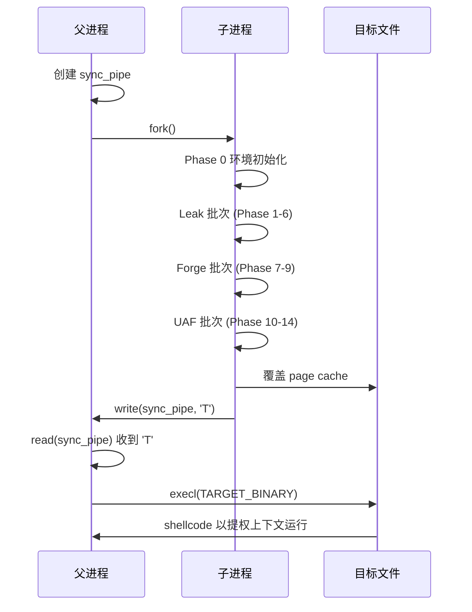
```mermaid
sequenceDiagram
    participant P as 父进程
    participant C as 子进程
    participant F as 目标文件

    P->>P: 创建 sync_pipe
    P->>C: fork()
    C->>C: Phase 0 环境初始化
    C->>C: Leak 批次 (Phase 1-6)
    C->>C: Forge 批次 (Phase 7-9)
    C->>C: UAF 批次 (Phase 10-14)
    C->>F: 覆盖 page cache
    C->>P: write(sync_pipe, 'T')
    P->>P: read(sync_pipe) 收到 'T'
    P->>F: execl(TARGET_BINARY)
    F->>P: shellcode 以提权上下文运行
```

在子进程内部，整体利用流程遵循“先泄露、再伪造、后重用”的三段式结构，将一次有限长度的越界写扩展为对目标文件 page cache 的任意写入。整体架构可划分为三个批次，共包含 15 个阶段：环境准备（Phase 0）建立确定性执行环境与 nf_tables 对象；Leak 批次（Phase 1-6）获得越界读取能力并泄露堆地址；Forge 批次（Phase 7-9）构造伪造 msg_msg 并植入 security 指针；UAF 批次（Phase 10-14）通过释放后重用完成目标文件 page cache 写入。

三个阶段之间存在严格的依赖关系：Leak 批次提供堆地址与相邻对象布局，Forge 批次基于该地址构造伪造消息，UAF 批次依赖伪造消息的 `security` 指针触发释放后重用。若 Leak 或 Forge 批次失败，可通过重新布置堆布局重试；UAF 批次因涉及实际释放与回收，通常只执行一次。

### 3-2. 阶段 0：环境初始化

阶段 0 是整个利用流程的前置准备，由子进程执行。父进程在进入阶段 0 之前创建 `sync_pipe` 并调用 `fork()`，子进程进入阶段 0 环境初始化，父进程则阻塞在 `sync_pipe` 读端等待子进程结果。该阶段的目标是为后续阶段建立确定性的执行环境，包括 CPU 亲和性、命名空间、目标文件描述符、消息队列数组、SKB 喷射原语以及 nf_tables 对象。

子进程在阶段 0 中的主要步骤包括：

1. **CPU 绑核**：将执行流绑定到固定 CPU，减少 slab 布局在不同 CPU 之间的随机性。
2. **创建 user/net namespace**：通过 `unshare(CLONE_NEWUSER | CLONE_NEWNET)` 创建非特权 user namespace 与 net namespace，在该 net namespace 内获得 `CAP_NET_ADMIN`。
3. **打开目标文件**：打开目标 SUID 文件，保留其 fd，供后续 splice 操作使用。
4. **初始化消息队列 ID 数组**：为 Leak 池与 Forge 池分别准备消息队列 ID 数组。
5. **初始化 SKB 喷射原语**：创建多个 socket，为每个 socket 准备 SKB 喷射所需的数据区。
6. **创建 nf_tables table 与 set**：通过 Netlink 创建 nf_tables table，并创建两个 MAP set（`set1` 与 `set2`），分别用于 Leak 批次与 Forge 批次的越界写入。

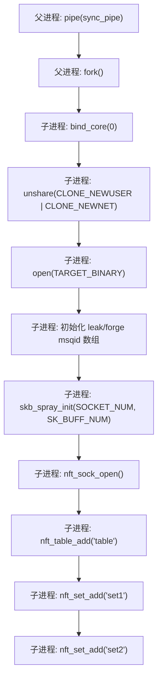
```mermaid
flowchart TD
    A["父进程: pipe(sync_pipe)"] --> B["父进程: fork()"]
    B --> C["子进程: bind_core(0)"]
    C --> D["子进程: unshare(CLONE_NEWUSER | CLONE_NEWNET)"]
    D --> E["子进程: open(TARGET_BINARY)"]
    E --> F["子进程: 初始化 leak/forge msqid 数组"]
    F --> G["子进程: skb_spray_init(SOCKET_NUM, SK_BUFF_NUM)"]
    G --> H["子进程: nft_sock_open()"]
    H --> I["子进程: nft_table_add('table')"]
    I --> J["子进程: nft_set_add('set1')"]
    J --> K["子进程: nft_set_add('set2')"]
```

阶段 0 完成后，子进程已具备固定 CPU、`CAP_NET_ADMIN`、目标文件 fd、SKB 喷射原语、两个可触发越界写的 nf_tables set。父进程仍阻塞在 `sync_pipe` 读端，等待子进程在阶段 14 发送成功信号。

### 3-3. 阶段 1：Leak 池堆布置

阶段 1 的目标是在目标 kmalloc-cg cache 中布置一批已知模式的 `msg_msg` 对象。由于本利用思路面向 >= 5.18-rc1 的内核，element 对象落入 `kmalloc-cg-*`，因此 Leak 池的喷射对象同样需要落在 cg 缓存中。这一阶段的核心思路是通过大量喷射建立可预测的相邻对象布局，为阶段 2 的越界写提供稳定的目标。

主要操作包括：

1. **保留关键队列**：若 `victim_qid`、`nearby_qid`、`overlap_qid` 已有效，则保留对应队列。
2. **销毁非关键队列**：释放上一轮重试遗留的非关键 Leak 队列。
3. **分配 Leak 队列**：通过 `msgget` 批量创建消息队列。
4. **喷射 PRIMARY_MSG**：向每个队列写入 PRIMARY_MSG 类型消息，消息内容前 16 字节写入 `BinRacer` 标记与队列索引。

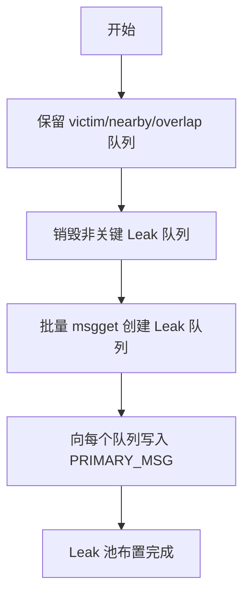
```mermaid
flowchart TD
    Start["开始"] --> Keep["保留 victim/nearby/overlap 队列"]
    Keep --> Destroy["销毁非关键 Leak 队列"]
    Destroy --> Alloc["批量 msgget 创建 Leak 队列"]
    Alloc --> Spray["向每个队列写入 PRIMARY_MSG"]
    Spray --> Done["Leak 池布置完成"]
```

阶段 1 完成后，目标 cache 中布满已知模式的 `msg_msg` 对象，为阶段 2 的越界写提供可预测的相邻对象。

### 3-4. 阶段 2：越界写篡改 m_ts

阶段 2 的目标是利用 `set1` 的越界写入，篡改相邻 `msg_msg` 的 `m_ts` 字段。该阶段是整个 Leak 批次的关键步骤：通过打开一个槽位并触发越界写，将伪造的 `msg_msg` 头部写入相邻对象，从而扩大其 `m_ts`，使其具备越界读取能力。

主要操作包括：

1. **打开槽位**：读取中间位置的 Leak 队列消息，释放该 `msg_msg` 对象。
2. **伪造 msg_msg 头部**：构造伪造头部，`m_type` 设为 `PRIMARY_MSG_TYPE`，`m_ts` 设为 `0xfd0`。
3. **触发越界写**：调用 `trigger_oob_write` 将伪造头部写入 `set1` 相邻的 `msg_msg` 对象。

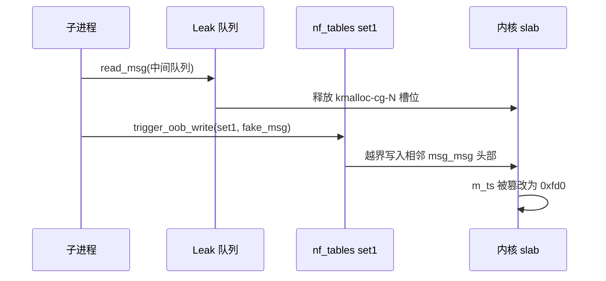
```mermaid
sequenceDiagram
    participant U as 子进程
    participant Q as Leak 队列
    participant N as nf_tables set1
    participant K as 内核 slab

    U->>Q: read_msg(中间队列)
    Q->>K: 释放 kmalloc-cg-N 槽位
    U->>N: trigger_oob_write(set1, fake_msg)
    N->>K: 越界写入相邻 msg_msg 头部
    K->>K: m_ts 被篡改为 0xfd0
```

阶段 2 完成后，相邻 `msg_msg` 的 `m_ts` 已被扩大为 `0xfd0`，该对象具备越界读取能力，可读取约一个物理页的数据。

### 3-5. 阶段 3：定位 victim 队列

阶段 3 的目标是定位 `m_ts` 被越界写篡改的 victim 队列。该阶段的原理基于正常消息队列与 victim 队列在 `m_ts` 字段上的差异：

- **正常队列**：每个消息队列只持有一个 `msg_msg`，其 `m_ts` 字段等于 `PRIMARY_MSG_SIZE`。当内核按照 `PRIMARY_MSG_SIZE` 读取该消息时，长度校验通过，读取成功。
- **victim 队列**：阶段 2 的越界写将相邻 `msg_msg` 的 `m_ts` 字段篡改为 `0xfd0`。当内核尝试按照原始长度 `PRIMARY_MSG_SIZE` 读取该消息时，由于 `m_ts` 与实际消息长度不匹配，内核在长度校验阶段直接返回错误，读取失败。

因此，通过遍历所有 Leak 队列并以 `PRIMARY_MSG_SIZE` 为参数调用 `peek_msg`，即可区分正常队列与 victim 队列：读取成功的为正常队列，读取返回错误的即为 victim 队列。

主要操作包括：

1. **遍历 Leak 队列**：对每个队列调用 `peek_msg(leak_msqid[i], &primary_msg_data, PRIMARY_MSG_SIZE, 0)`。
2. **识别异常**：若返回值为错误（而非 `PRIMARY_MSG_SIZE`），则该队列的 `m_ts` 已被越界写篡改，该队列即为 victim。
3. **记录 victim_qid**：保存 victim 队列索引，供后续阶段 4 与阶段 6 使用。

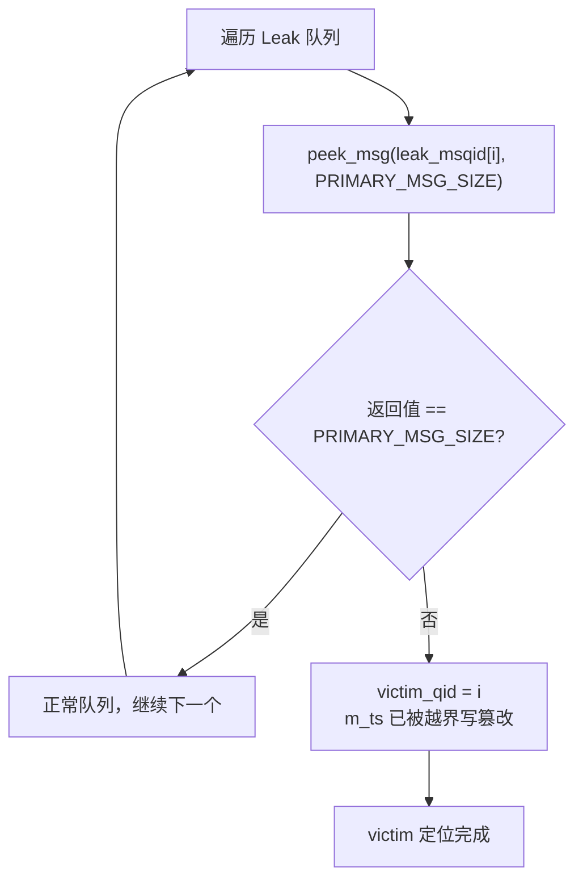
```mermaid
flowchart TD
    Start["遍历 Leak 队列"] --> Peek["peek_msg(leak_msqid[i], PRIMARY_MSG_SIZE)"]
    Peek --> Check{"返回值 == PRIMARY_MSG_SIZE?"}
    Check -->|是| Next["正常队列，继续下一个"]
    Check -->|否| Found["victim_qid = i<br/>m_ts 已被越界写篡改"]
    Next --> Start
    Found --> Done["victim 定位完成"]
```

阶段 3 完成后，子进程已定位 victim 队列。该队列的 `msg_msg.m_ts` 已被扩大为 `0xfd0`，具备越界读取能力，后续阶段 4 与阶段 6 将通过该队列执行越界读取，泄露相邻对象的堆地址。

### 3-6. 阶段 4：越界读定位相邻对象

阶段 4 的目标是通过 victim 队列的越界读取能力，在泄露的物理页中定位最近的相邻 `msg_msg` 对象。该阶段的原理在于：阶段 2 的越界写将 victim 队列的 `msg_msg.m_ts` 篡改为 `0xfd0`，使内核在读取该消息时允许返回最多 `0xfd0` 字节的数据，覆盖约一个物理页。由于阶段 1 已喷射大量 `msg_msg` 对象，该物理页中散布着大量其他 `msg_msg`，因此越界读取窗口内存在可定位的相邻对象。

主要操作包括：

1. **越界读取**：调用 `peek_msg(victim, 0xfd0)`，读取 victim 队列的 `msg_msg` 及其后约一个物理页的内容。
2. **扫描标记**：在泄露的 page 内按 8 字节步长扫描 `BinRacer` 标记，识别相邻 `msg_msg` 的位置。
3. **定位最近的相邻对象**：在多个候选标记中，选取距离 victim 最近的一个 `msg_msg` 作为 `nearby_qid`，记录其在泄露 page 中的偏移 `nearby_offset`。
4. **提取完整 msg_msg 结构**：从 `nearby_qid` 头部提取完整的 `struct msg_msg`，包括 `m_list.next`、`m_list.prev`、`m_type`、`m_ts` 等字段，为后续阶段提供堆地址信息。

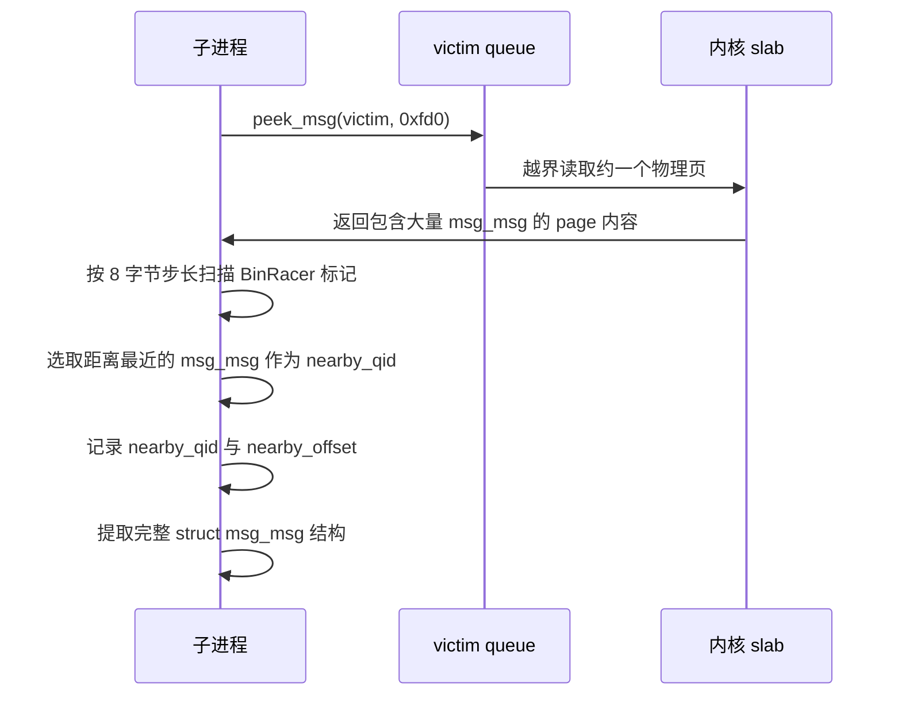
```mermaid
sequenceDiagram
    participant U as 子进程
    participant V as victim queue
    participant K as 内核 slab

    U->>V: peek_msg(victim, 0xfd0)
    V->>K: 越界读取约一个物理页
    K->>U: 返回包含大量 msg_msg 的 page 内容
    U->>U: 按 8 字节步长扫描 BinRacer 标记
    U->>U: 选取距离最近的 msg_msg 作为 nearby_qid
    U->>U: 记录 nearby_qid 与 nearby_offset
    U->>U: 提取完整 struct msg_msg 结构
```

阶段 4 完成后，子进程已获得 `nearby_qid` 的完整 `msg_msg` 结构，包括其 `m_list.next` 与 `m_list.prev` 指针。这些指针将在阶段 6 中用于确定 `overlap_qid` 的堆地址，并最终作为阶段 8 中伪造 `security` 指针的依据。

### 3-7. 阶段 5：放置次级对象

阶段 5 的目标是向相邻队列写入一个 kmalloc-cg-1k 的次级 `msg_msg`，使 `nearby_qid` 队列形成两个由 `m_list` 双向链表相连的消息。这一阶段的关键在于：当 `nearby_qid` 同时持有 PRIMARY_MSG 与 SECONDARY_MSG 时，其第一个 `msg_msg` 的 `m_list.next` 会指向第二个 `msg_msg` 的堆地址。由于 victim 队列的越界读取窗口已覆盖到 `nearby_qid` 的第一个 `msg_msg` 头部，阶段 6 便可通过该窗口读取 `m_list.next`，从而获得 `nearby_qid` 第二个 `msg_msg` 的堆地址。

主要操作包括：

1. **构造次级消息**：在 `secondary_msg_data` 前 16 字节写入 `BinRacer` 标记与 `nearby_qid`。
2. **写入相邻队列**：调用 `write_msg` 将次级消息写入 `nearby_qid`。此时 `nearby_qid` 队列中形成两个 `msg_msg` 对象，其 `m_list` 双向链表关系为：第一个 `msg_msg.m_list.next` 指向第二个 `msg_msg` 的堆地址，第二个 `msg_msg.m_list.prev` 指向第一个 `msg_msg` 的堆地址。
3. **确认写入**：此时 `nearby_qid` 同时持有 PRIMARY_MSG 与 SECONDARY_MSG，二者通过 `m_list` 双向链表相连。

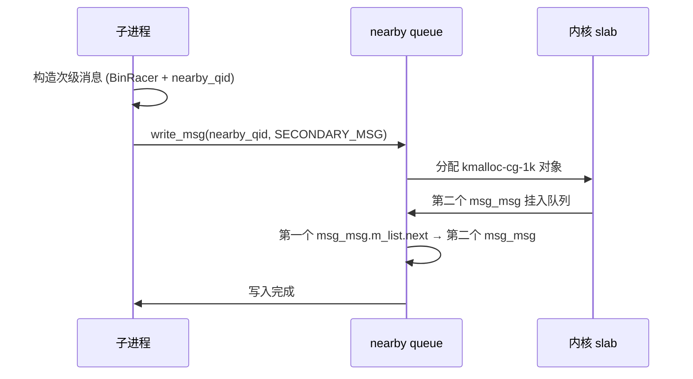
```mermaid
sequenceDiagram
    participant U as 子进程
    participant NQ as nearby queue
    participant K as 内核 slab

    U->>U: 构造次级消息 (BinRacer + nearby_qid)
    U->>NQ: write_msg(nearby_qid, SECONDARY_MSG)
    NQ->>K: 分配 kmalloc-cg-1k 对象
    K->>NQ: 第二个 msg_msg 挂入队列
    NQ->>NQ: 第一个 msg_msg.m_list.next → 第二个 msg_msg
    NQ->>U: 写入完成
```

阶段 5 完成后，`nearby_qid` 队列中的两个 `msg_msg` 通过 `m_list` 双向链表相连，第一个 `msg_msg.m_list.next` 指向第二个 `msg_msg` 的堆地址。该堆地址将作为阶段 6 越界读取的目标，并最终成为 `overlap_qid` 与 `nearby_qid` 同一值的依据。

### 3-8. 阶段 6：泄露重叠地址

阶段 6 的目标是再次通过 victim 队列越界读取，提取 `nearby_qid` 队列中第二个 `msg_msg` 的堆地址，从而确定 `overlap_qid`。该阶段的原理在于：阶段 5 已向 `nearby_qid` 写入次级消息，使该队列形成两个由 `m_list` 双向链表相连的 `msg_msg`。其中第一个 `msg_msg.m_list.next` 指向第二个 `msg_msg` 的堆地址。由于 victim 队列的越界读取窗口已覆盖 `nearby_qid` 的第一个 `msg_msg` 头部，阶段 6 通过再次越界读取即可从该头部中提取 `m_list.next`，从而获得第二个 `msg_msg` 的堆地址。

`overlap_qid` 与 `nearby_qid` 指向同一个消息队列。该同一性来源于阶段 4 的定位结果：`nearby_qid` 是 victim 可读窗口内距离最近的 `msg_msg` 所在队列，阶段 5 在该队列中放置了第二个 `msg_msg`，阶段 6 通过读取第一个 `msg_msg` 的 `m_list.next` 获得第二个 `msg_msg` 的堆地址。由于该地址位于 `nearby_qid` 队列内部，因此 `overlap_qid` 与 `nearby_qid` 为同一值。

主要操作包括：

1. **越界读取**：调用 `peek_msg(victim, 0xfd0)`，读取 victim 队列及其后约一个物理页的内容。
2. **定位 nearby 头部**：根据阶段 4 记录的 `nearby_offset`，从 `oob_msg_data.mtext[nearby_offset]` 处读取 `nearby_qid` 第一个 `msg_msg` 的完整头部。
3. **提取 m_list.next**：从第一个 `msg_msg` 头部中提取 `m_list.next`，该指针即为 `nearby_qid` 第二个 `msg_msg` 的堆地址。
4. **校验有效性**：检查 `m_list.next`、`m_list.prev` 是否落在有效堆地址范围，`m_type` 是否为 `PRIMARY_MSG_TYPE`。
5. **记录 overlap_qid**：将 `overlap_qid` 设为 `nearby_qid`，确认二者为同一队列。

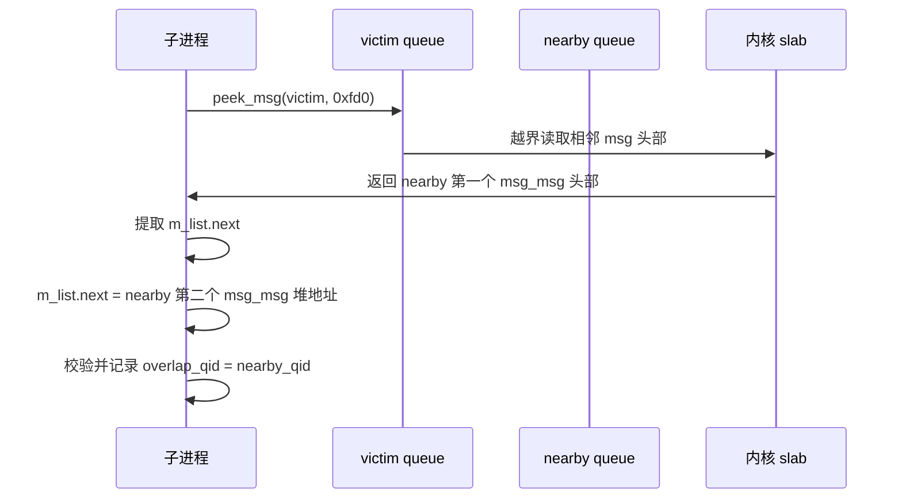
```mermaid
sequenceDiagram
    participant U as 子进程
    participant V as victim queue
    participant NQ as nearby queue
    participant K as 内核 slab

    U->>V: peek_msg(victim, 0xfd0)
    V->>K: 越界读取相邻 msg 头部
    K->>U: 返回 nearby 第一个 msg_msg 头部
    U->>U: 提取 m_list.next
    U->>U: m_list.next = nearby 第二个 msg_msg 堆地址
    U->>U: 校验并记录 overlap_qid = nearby_qid
```

阶段 6 完成后，子进程已获得 `nearby_qid` 第二个 `msg_msg` 的堆地址，并确认 `overlap_qid` 与 `nearby_qid` 为同一队列。该堆地址将在阶段 8 中作为伪造 `msg_msg` 头部拼接的目标，并在阶段 10 中作为释放重叠对象的依据。

### 3-9. 阶段 7：Forge 池堆布置

阶段 7 的目标是为伪造消息构造一个干净的堆布局。该阶段与阶段 1 类似，但服务于 Forge 批次，需要重新建立一批已知模式的 `msg_msg` 对象，以便阶段 8 的越界写拼接能够在可预测的布局中进行。

主要操作包括：

1. **销毁现有 Forge 队列**：遍历 `forge_msqid` 数组，释放所有已分配的 Forge 队列。
2. **重新分配 Forge 队列**：调用 `msgget` 批量创建新的 Forge 队列。
3. **喷射 PRIMARY_MSG**：向每个队列写入 PRIMARY_MSG 类型消息。

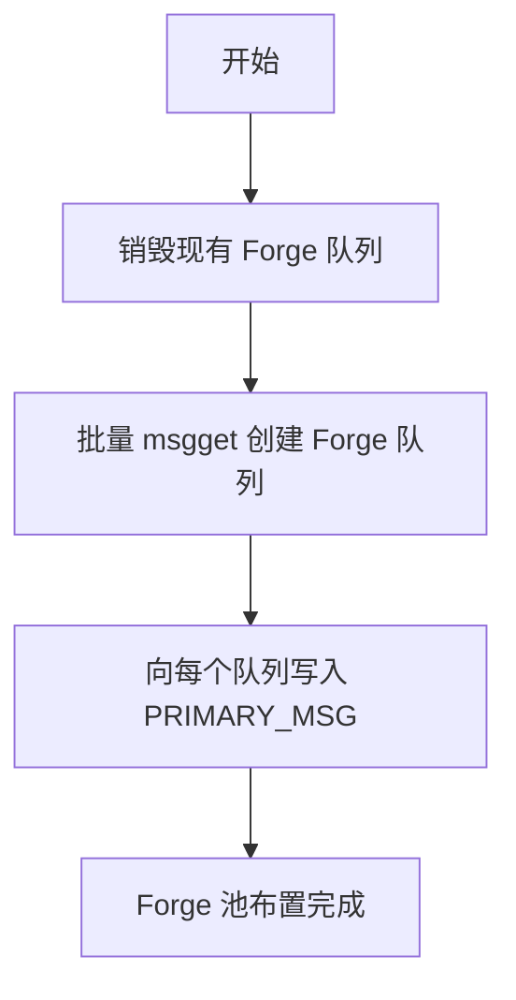
```mermaid
flowchart TD
    Start["开始"] --> Destroy["销毁现有 Forge 队列"]
    Destroy --> Alloc["批量 msgget 创建 Forge 队列"]
    Alloc --> Spray["向每个队列写入 PRIMARY_MSG"]
    Spray --> Done["Forge 池布置完成"]
```

阶段 7 完成后，Forge 池中布满已知模式的 `msg_msg` 对象，为阶段 8 的越界写拼接提供可预测的相邻对象。

### 3-10. 阶段 8：越界写拼接伪造消息

阶段 8 的目标是利用 `set2` 的越界写入，在 Forge 池中拼接出一个伪造 `msg_msg`，使其与 `nearby_qid` 的第一个 `msg_msg` 在除 `security` 之外的所有字段上完全一致。伪造消息的 `security` 指针单独指向 `overlap_qid` 的第二个 `msg_msg` 的堆地址，从而构造出 double free 原语。该原语的释放顺序为：**先释放 `overlap_qid` 的第二个 `msg_msg`，再释放 `evil_qid` 的伪造消息**。

该阶段的原理在于：Forge 池中的 `msg_msg` 与 Leak 池中的 `msg_msg` 具有相同的大小与布局，因此阶段 8 的越界写可以直接复用阶段 6 泄露的 `nearby_qid` 第一个 `msg_msg` 结构作为模板。伪造消息的 `m_list.next`、`m_list.prev`、`m_type`、`m_ts` 等字段与 `nearby_qid` 第一个 `msg_msg` 保持一致，二者在结构上完全相同。唯一差异在于 `security` 字段：`nearby_qid` 第一个 `msg_msg` 的 `security` 由其原始分配决定，而伪造消息的 `security` 被显式设置为 `overlap_qid` 第二个 `msg_msg` 的堆地址。

这里的 `overlap_qid` 与 `nearby_qid` 指向同一个消息队列。该队列持有两个 `msg_msg`：第一个为阶段 1 喷射的 PRIMARY_MSG，第二个为阶段 5 写入的 kmalloc-cg-1k SECONDARY_MSG。阶段 6 通过 victim 越界读取，从第一个 `msg_msg` 的 `m_list.next` 中获得了第二个 `msg_msg` 的堆地址。阶段 8 将该堆地址用作伪造消息的 `security` 指针，使 `overlap_qid` 第二个 `msg_msg` 被两个队列以不同方式引用：`nearby_qid` 第一个 `msg_msg` 的 `m_list.next` 指向它，`evil_qid` 伪造 `msg_msg` 的 `security` 指针也指向它。

在释放顺序上，阶段 10 首先释放 `overlap_qid` 的第二个 `msg_msg`，此时该对象被 `kfree()` 释放，但 `evil_qid` 伪造消息的 `security` 指针仍指向该已释放对象。阶段 11 随后释放 `evil_qid` 的伪造消息，`msg_msg` 析构函数对 `security` 指针再次执行 `kfree()`，从而对同一对象完成第二次释放。这一顺序使 `overlap_qid` 第二个 `msg_msg` 被释放两次，形成 double free 原语。

主要操作包括：

1. **打开槽位**：读取中间位置的 Forge 队列消息，释放该 `msg_msg` 对象，在 Forge 池中打开一个槽位。
2. **构造伪造头部**：从阶段 6 泄露的 `nearby_qid` 第一个 `msg_msg` 结构中复制头部，使 `m_list.next`、`m_list.prev`、`m_type`、`m_ts` 等字段与 `nearby_qid` 第一个 `msg_msg` 完全一致；单独将 `security` 设为 `overlap_qid` 第二个 `msg_msg` 的堆地址。
3. **触发越界写**：调用 `trigger_oob_write("set2", NFT_TABLE_ID + 1, fake_msg, sizeof(fake_msg))`，将伪造头部写入 `set2` 相邻的 Forge 队列 `msg_msg` 对象。

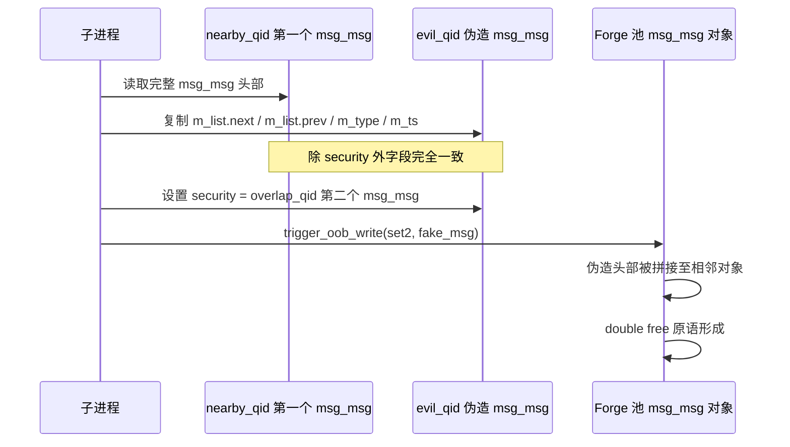
```mermaid
sequenceDiagram
    participant U as 子进程
    participant NQ as nearby_qid 第一个 msg_msg
    participant EQ as evil_qid 伪造 msg_msg
    participant FP as Forge 池 msg_msg 对象

    U->>NQ: 读取完整 msg_msg 头部
    U->>EQ: 复制 m_list.next / m_list.prev / m_type / m_ts
    Note over NQ,EQ: 除 security 外字段完全一致
    U->>EQ: 设置 security = overlap_qid 第二个 msg_msg
    U->>FP: trigger_oob_write(set2, fake_msg)
    FP->>FP: 伪造头部被拼接至相邻对象
    FP->>FP: double free 原语形成
```

阶段 8 完成后，Forge 池中已拼接出一个与 `nearby_qid` 第一个 `msg_msg` 结构完全一致的伪造 `msg_msg`，二者仅 `security` 字段不同。`evil_qid` 伪造 `msg_msg` 的 `security` 与 `nearby_qid` 第一个 `msg_msg` 的 `m_list.next` 同时指向 `overlap_qid` 第二个 `msg_msg`，形成 double free 原语，为阶段 11 中释放伪造消息触发 `kfree()` 提供条件。

### 3-11. 阶段 9：定位伪造消息

阶段 9 的目标是定位伪造消息所在的 Forge 队列（`evil_qid`）。该阶段的原理在于：Forge 池中的每个消息队列在正常情况下只持有一个 `msg_msg`，而阶段 8 的越界写入破坏了其中一个 `msg_msg` 的 `m_list.next`，使其指向 `overlap_qid` 的 `msg_msg` 堆地址。内核在遍历该队列的 `m_list` 链表时，会误判该队列存在第二个消息，从而在读取第二个消息时返回 `overlap_qid` 的 `msg_msg` 内容。

主要操作包括：

1. **遍历 Forge 队列**：对每个队列调用 `peek_msg(forge_msqid[i], secondary_msg_data, sizeof(secondary_msg_data), 1)`，尝试读取其第二个消息。
2. **匹配长度**：若返回长度等于 `SECONDARY_MSG_SIZE`，说明该队列的 `m_list` 链表已被越界写破坏，内核误判存在第二个消息，且该消息即为 `overlap_qid` 的 `msg_msg`。此时该队列即为 `evil_qid`。
3. **处理返回错误**：若返回值为 `-ENOENT` 或其他错误，说明该队列的 `m_list` 链表未被破坏，内核正确识别该队列只有一个消息。此类队列不满足条件，直接跳过，不影响后续遍历。
4. **记录 evil_qid**：将满足条件的队列索引保存为 `evil_qid`。

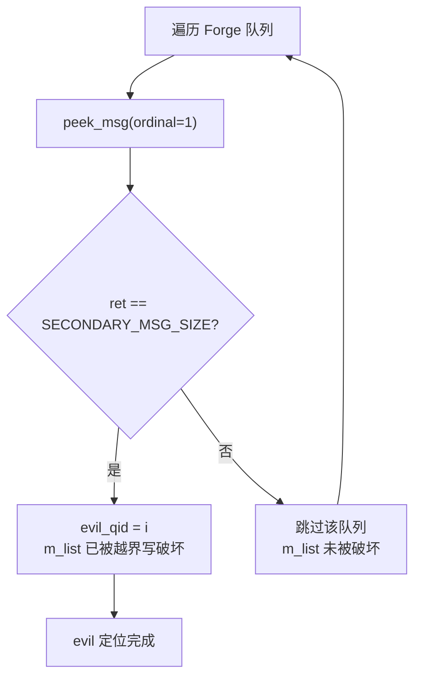
```mermaid
flowchart TD
    Start["遍历 Forge 队列"] --> Peek["peek_msg(ordinal=1)"]
    Peek --> Check{"ret == SECONDARY_MSG_SIZE?"}
    Check -->|是| Found["evil_qid = i<br/>m_list 已被越界写破坏"]
    Check -->|否| Skip["跳过该队列<br/>m_list 未被破坏"]
    Skip --> Start
    Found --> Done["evil 定位完成"]
```

阶段 9 完成后，子进程已定位伪造消息所在队列 `evil_qid`。该队列的 `m_list` 链表被阶段 8 的越界写破坏，其第二个消息实际指向 `overlap_qid` 的 `msg_msg`，为 UAF 批次的释放操作提供目标。

### 3-12. 阶段 10：释放重叠对象并回收 SKB

阶段 10 的目标是释放 `overlap_qid` 的第二个 `msg_msg`，打开 kmalloc-cg-1k 槽位，并用 SKB 数据回收该槽位。该阶段是 double free 原语的第一步释放，也是 UAF 批次的起点。

该阶段的原理在于：阶段 8 已构造出一个伪造 `msg_msg`，其 `security` 指针与 `nearby_qid` 第一个 `msg_msg` 的 `m_list.next` 同时指向 `overlap_qid` 第二个 `msg_msg`。阶段 10 首先释放 `overlap_qid` 第二个 `msg_msg`，使该对象被 `kfree()` 释放，槽位回到空闲状态。随后用 SKB 数据回收该空闲槽位，使 SKB 数据区落在已释放的 `msg_msg` 所在位置。

由于 `evil_qid` 伪造 `msg_msg` 的 `security` 指针仍指向该已释放对象，阶段 10 的释放操作只完成了 double free 的第一步；第二次释放将在阶段 11 由 `evil_qid` 伪造消息的析构函数触发。

主要操作包括：

1. **释放重叠对象**：调用 `read_msg(leak_msqid[overlap_qid], secondary_msg_data, sizeof(secondary_msg_data), SECONDARY_MSG_TYPE)`，释放 `overlap_qid` 第二个 `msg_msg`。此时该对象被 `kfree()` 释放，槽位空闲。
2. **准备 SKB 负载**：将 `leaked_msg` 复制到 `skb_data` 起始处，其余部分填充 `0x41`。
3. **喷射 SKB**：调用 `skb_spray(skb_data, sizeof(skb_data))`，用 SKB 数据区回收已释放的槽位。

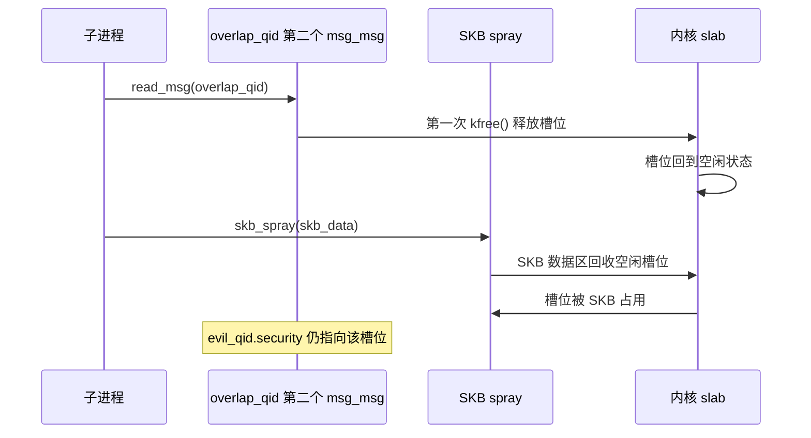
```mermaid
sequenceDiagram
    participant U as 子进程
    participant OQ as overlap_qid 第二个 msg_msg
    participant SKB as SKB spray
    participant K as 内核 slab

    U->>OQ: read_msg(overlap_qid)
    OQ->>K: 第一次 kfree() 释放槽位
    K->>K: 槽位回到空闲状态
    U->>SKB: skb_spray(skb_data)
    SKB->>K: SKB 数据区回收空闲槽位
    K->>SKB: 槽位被 SKB 占用
    Note over OQ: evil_qid.security 仍指向该槽位
```

阶段 10 完成后，`overlap_qid` 第二个 `msg_msg` 已被第一次释放，槽位被 SKB 数据区占用。`evil_qid` 伪造 `msg_msg` 的 `security` 指针仍指向该槽位，为阶段 11 的第二次释放创造条件。

### 3-13. 阶段 11：释放伪造消息并放置 pipe_buffer

阶段 11 的目标是释放 `evil_qid` 的伪造消息，触发 `msg_msg` 析构函数对 `security` 指针的 `kfree()`，从而对已释放槽位完成第二次释放；随后创建管道并 splice 目标文件，使 `pipe_buffer` 回收该槽位。**该阶段完成后，`pipe_buffer` 与 SKB 发生结构重叠**：`pipe_buffer` 占据了 SKB 数据区所在的槽位，二者共享同一块内存。

该阶段的原理在于：阶段 10 已释放 `overlap_qid` 第二个 `msg_msg` 并由 SKB 回收该槽位。阶段 11 释放 `evil_qid` 伪造消息时，`msg_msg` 析构函数会对 `security` 指针执行 `kfree()`，而该指针仍指向已被 SKB 占用的槽位，因此第二次释放实际释放的是 SKB 数据区。随后创建管道并 splice 目标文件，使 `pipe_buffer` 回收该已释放槽位。此时 `pipe_buffer` 落在 SKB 数据区原本占用的位置，二者在内存上发生重叠。

这一结构重叠是阶段 12 与阶段 13 的基础：由于 `pipe_buffer` 与 SKB 共享同一块内存，通过读取 SKB 数据区即可获得 `pipe_buffer` 的 `page` 与 `ops` 指针；反之，通过重新喷射 SKB 数据区，即可覆盖 `pipe_buffer` 的字段，伪造带 `PIPE_BUF_FLAG_CAN_MERGE` 的 `pipe_buffer`。

主要操作包括：

1. **释放伪造消息**：调用 `read_msg(forge_msqid[evil_qid], primary_msg_data, sizeof(primary_msg_data), PRIMARY_MSG_TYPE)`，释放 `evil_qid` 伪造 `msg_msg`。`msg_msg` 析构函数对 `security` 指针执行 `kfree()`，释放被 SKB 占用的槽位。
2. **创建管道并 splice**：循环调用 `pipe(pipe_fds[i])` 与 `splice(victim_fd, &offset, pipe_fds[i][1], NULL, 1, 0)`，使 `pipe_buffer` 回收已释放的槽位。此时 `pipe_buffer` 与 SKB 数据区发生结构重叠。
3. **确认重叠**：`pipe_buffer` 已占据 SKB 数据区所在槽位，`pipe_buffer` 的 `page` 与 `ops` 指针将在阶段 12 中通过读取 SKB 数据区被泄露。

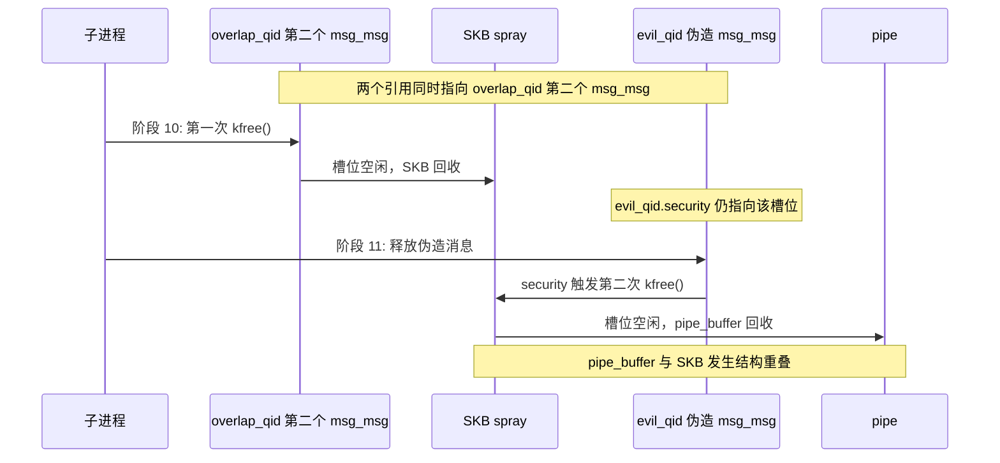
```mermaid
sequenceDiagram
    participant U as 子进程
    participant OQ as overlap_qid 第二个 msg_msg
    participant SKB as SKB spray
    participant EQ as evil_qid 伪造 msg_msg
    participant P as pipe

    Note over OQ,EQ: 两个引用同时指向 overlap_qid 第二个 msg_msg
    U->>OQ: 阶段 10: 第一次 kfree()
    OQ->>SKB: 槽位空闲，SKB 回收
    Note over EQ: evil_qid.security 仍指向该槽位
    U->>EQ: 阶段 11: 释放伪造消息
    EQ->>SKB: security 触发第二次 kfree()
    SKB->>P: 槽位空闲，pipe_buffer 回收
    Note over SKB,P: pipe_buffer 与 SKB 发生结构重叠
```

阶段 11 完成后，`pipe_buffer` 与 SKB 共享同一块内存。该结构重叠使阶段 12 可以通过读取 SKB 数据区泄露 `pipe_buffer` 的 `page` 与 `ops` 指针，并在阶段 13 通过重新喷射 SKB 数据区覆盖 `pipe_buffer` 的字段，伪造带 `PIPE_BUF_FLAG_CAN_MERGE` 的 `pipe_buffer`，最终完成对目标文件 page cache 的写入。

### 3-14. 阶段 12：泄露 pipe_buffer

阶段 12 的目标是利用 `pipe_buffer` 与 SKB 的结构重叠，通过读取 SKB 数据区获取 `pipe_buffer` 的 `page` 与 `ops` 指针。该阶段是阶段 11 结构重叠结果的直接应用：由于 `pipe_buffer` 已占据 SKB 数据区所在的槽位，读取 SKB 数据区即可获得 `pipe_buffer` 的完整内容。

该阶段的原理在于：阶段 11 完成后，`pipe_buffer` 与 SKB 共享同一块内存。SKB 数据区原本填充的是 `leaked_msg` 的头部信息，其起始 8 字节为 `leaked_msg.m_list.next`。当 `pipe_buffer` 覆盖该槽位后，SKB 数据区的内容被替换为 `pipe_buffer` 结构。因此，通过遍历 SKB 喷射区域并读取每个 SKB 的内容，即可识别出被 `pipe_buffer` 覆盖的 SKB：其内容与 `leaked_msg.m_list.next` 不匹配，且符合 `struct pipe_buffer` 的布局特征。

主要操作包括：

1. **扫描 SKB**：遍历所有 socket 与 SKB，调用 `skb_peek` 读取其内容。
2. **识别重叠**：若某个 SKB 的内容与 `leaked_msg.m_list.next` 不匹配，则该 SKB 数据区已被 `pipe_buffer` 覆盖。
3. **提取 pipe_buffer**：从覆盖的 SKB 内容中读取 `struct pipe_buffer`，提取 `page`、`ops`、`offset`、`len` 与 `flags` 字段。

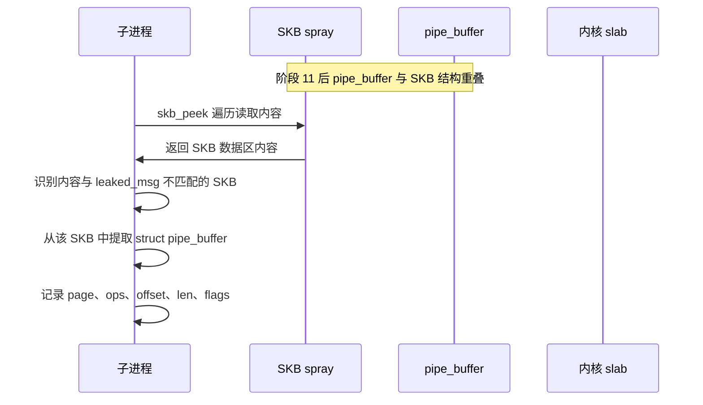
```mermaid
sequenceDiagram
    participant U as 子进程
    participant SKB as SKB spray
    participant P as pipe_buffer
    participant K as 内核 slab

    Note over SKB,P: 阶段 11 后 pipe_buffer 与 SKB 结构重叠
    U->>SKB: skb_peek 遍历读取内容
    SKB->>U: 返回 SKB 数据区内容
    U->>U: 识别内容与 leaked_msg 不匹配的 SKB
    U->>U: 从该 SKB 中提取 struct pipe_buffer
    U->>U: 记录 page、ops、offset、len、flags
```

阶段 12 完成后，子进程已获得 `pipe_buffer` 的 `page` 与 `ops` 指针，以及 `offset`、`len`、`flags` 等字段。这些信息将作为阶段 13 中伪造 `pipe_buffer` 的模板。

### 3-15. 阶段 13：伪造 pipe_buffer 并写入

阶段 13 的目标是利用 `pipe_buffer` 与 SKB 的结构重叠，通过重新喷射 SKB 数据区覆盖 `pipe_buffer` 的字段，伪造一个带 `PIPE_BUF_FLAG_CAN_MERGE` 的 `pipe_buffer`，随后通过管道写入 shellcode，使其写入目标文件的 page cache。

该阶段的原理在于：阶段 12 已泄露 `pipe_buffer` 的 `page` 与 `ops` 指针，阶段 11 的结构重叠使 SKB 数据区与 `pipe_buffer` 共享同一块内存。因此，通过释放 SKB 并重新喷射新的 SKB 数据区，即可覆盖 `pipe_buffer` 的字段。伪造的 `pipe_buffer` 保留阶段 12 泄露的 `page` 与 `ops` 指针，将 `offset` 与 `len` 设为 0，将 `flags` 设为 `PIPE_BUF_FLAG_CAN_MERGE`。该标志使后续管道写入能够合并到 `pipe_buffer.page` 指向的 page cache 中，从而将受控字节写入目标文件。

主要操作包括：

1. **释放 SKB**：调用 `free_skb(skb_data, sizeof(skb_data))`，释放与 `pipe_buffer` 重叠的 SKB 数据区。
2. **构造伪造 pipe_buffer**：清空 `skb_data`，保留阶段 12 泄露的 `page` 与 `ops` 指针，将 `offset` 与 `len` 设为 0，`flags` 设为 `PIPE_BUF_FLAG_CAN_MERGE`。
3. **重新喷射 SKB**：调用 `skb_spray(skb_data, sizeof(skb_data))`，使伪造的 `pipe_buffer` 内容覆盖释放槽位。
4. **写入 shellcode**：循环调用 `write(pipe_fds[i][1], shellcode, sizeof(shellcode))`，通过管道写入将受控字节写入 `pipe_buffer.page` 指向的 page cache，即目标文件的 page cache。

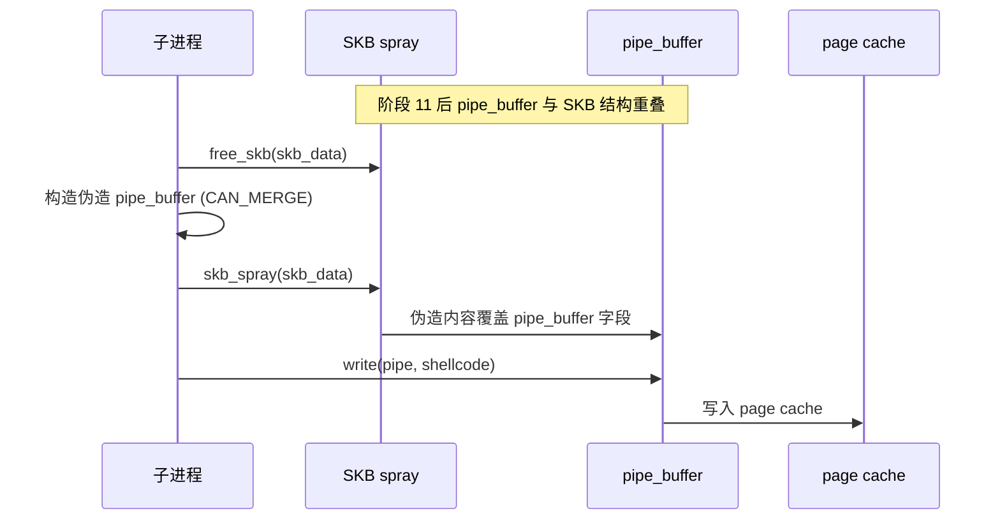
```mermaid
sequenceDiagram
    participant U as 子进程
    participant SKB as SKB spray
    participant P as pipe_buffer
    participant F as page cache

    Note over SKB,P: 阶段 11 后 pipe_buffer 与 SKB 结构重叠
    U->>SKB: free_skb(skb_data)
    U->>U: 构造伪造 pipe_buffer (CAN_MERGE)
    U->>SKB: skb_spray(skb_data)
    SKB->>P: 伪造内容覆盖 pipe_buffer 字段
    U->>P: write(pipe, shellcode)
    P->>F: 写入 page cache
```

阶段 13 完成后，目标文件的 page cache 已被 shellcode 覆盖。该 shellcode 为 tiny ELF 文件，包含在提权上下文中执行所需指令的完整可执行文件。

### 3-16. 阶段 14：验证写入结果

阶段 14 的目标是回读目标文件，确认 shellcode 已落在预期偏移，并通知父进程。该阶段是子进程的最后一个阶段，通过比对目标文件内容与 shellcode 验证写入结果，并通过 `sync_pipe` 向父进程发送信号。

该阶段的原理在于：阶段 13 已通过伪造 `pipe_buffer` 将 shellcode 写入目标文件的 page cache。由于 page cache 是文件在内存中的缓存，回读目标文件即可从 page cache 中读取已写入的内容。若内容与 shellcode 一致，则说明写入成功；否则说明写入失败。

主要操作包括：

1. **打开目标文件**：调用 `open(TARGET_BINARY, O_RDONLY)`。
2. **读取前缀**：调用 `read(verify_fd, verify_buf, sizeof(shellcode))`。
3. **比对内容**：调用 `memcmp(verify_buf, shellcode, sizeof(shellcode))`。
4. **通知父进程**：若验证成功，向 `sync_pipe` 写入 `'T'`；否则写入 `'F'`。
5. **父进程执行**：父进程从 `sync_pipe` 读取到 `'T'` 后，调用 `execl(TARGET_BINARY, TARGET_BINARY, NULL)` 执行已被覆盖的目标文件，内核加载该 tiny ELF 并在提权上下文中运行其中的指令，从而完成权限提升。

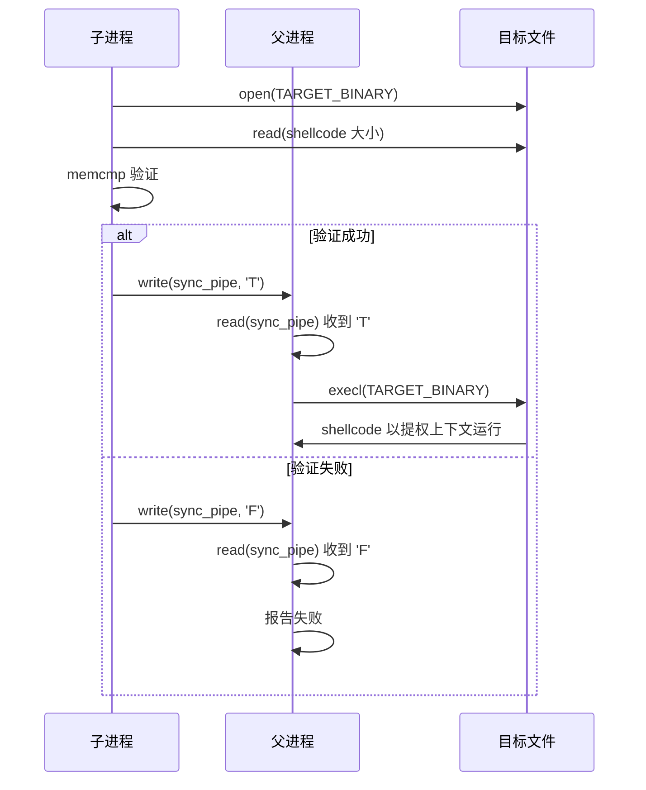
```mermaid
sequenceDiagram
    participant C as 子进程
    participant P as 父进程
    participant F as 目标文件

    C->>F: open(TARGET_BINARY)
    C->>F: read(shellcode 大小)
    C->>C: memcmp 验证
    alt 验证成功
        C->>P: write(sync_pipe, 'T')
        P->>P: read(sync_pipe) 收到 'T'
        P->>F: execl(TARGET_BINARY)
        F->>P: shellcode 以提权上下文运行
    else 验证失败
        C->>P: write(sync_pipe, 'F')
        P->>P: read(sync_pipe) 收到 'F'
        P->>P: 报告失败
    end
```

阶段 14 完成后，父进程执行目标文件，shellcode 在提权上下文中运行，利用流程结束。

### 3-17. 批次间依赖与重试机制

三个阶段之间存在明确的依赖关系。批次间的依赖与重试机制如下图所示：

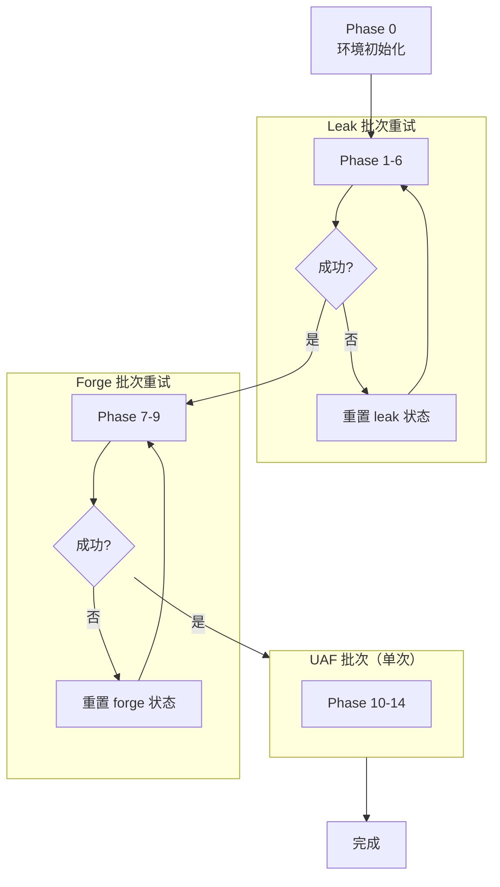
```mermaid
flowchart TD
    Start["Phase 0<br/>环境初始化"] --> LeakAttempt

    subgraph LeakLoop["Leak 批次重试"]
        LeakAttempt["Phase 1-6"]
        LeakCheck{"成功?"}
        LeakAttempt --> LeakCheck
        LeakCheck -->|否| Reset1["重置 leak 状态"]
        Reset1 --> LeakAttempt
    end

    LeakCheck -->|是| ForgeAttempt

    subgraph ForgeLoop["Forge 批次重试"]
        ForgeAttempt["Phase 7-9"]
        ForgeCheck{"成功?"}
        ForgeAttempt --> ForgeCheck
        ForgeCheck -->|否| Reset2["重置 forge 状态"]
        Reset2 --> ForgeAttempt
    end

    ForgeCheck -->|是| UAFBatch

    subgraph UAFBatch["UAF 批次（单次）"]
        U1["Phase 10-14"]
    end

    UAFBatch --> Done["完成"]
```

Leak 批次与 Forge 批次均设置最大重试次数 `EXPLOIT_RETRY_MAX`。UAF 批次不设重试。

### 3-18. 内核保护机制的应对策略

该利用思路面对的核保护机制主要包括 KASLR、SMEP、SMAP、KPTI，以及 `CONFIG_SLAB_FREELIST_RANDOM`、`CONFIG_SLAB_FREELIST_HARDENED`、`CONFIG_INIT_ON_ALLOC_DEFAULT_ON`、`CONFIG_HARDENED_USERCOPY`、`CONFIG_MEMCG`、`CONFIG_MEMCG_KMEM` 等配置。各机制的应对策略如下：

| 保护机制                             | 应对策略                                                                                                                                        |
| ------------------------------------ | ----------------------------------------------------------------------------------------------------------------------------------------------- |
| KASLR                                | 通过 `msg_msg` 越界读取泄露堆地址；未直接泄露内核代码地址                                                                                       |
| SMEP / SMAP                          | 不直接在用户态执行内核代码，而是通过 `pipe_buffer` 的 page cache 写入完成目标文件覆盖                                                           |
| KPTI                                 | 不依赖内核态返回用户态的路径                                                                                                                    |
| `CONFIG_SLAB_FREELIST_RANDOM`        | 通过 CPU 绑核与大批量 `msg_msg` 喷射降低布局随机性；Leak 批次与 Forge 批次均支持重试                                                            |
| `CONFIG_SLAB_FREELIST_HARDENED`      | 不直接伪造 freelist 指针；通过越界写篡改对象字段而非 freelist                                                                                   |
| `CONFIG_INIT_ON_ALLOC_DEFAULT_ON`    | 越界写发生在对象已分配之后，不受分配时清零影响                                                                                                  |
| `CONFIG_HARDENED_USERCOPY`           | 越界读取通过 `MSG_COPY` 完成，不直接触发 usercopy 检查                                                                                          |
| `CONFIG_MEMCG` / `CONFIG_MEMCG_KMEM` | 内核单独创建 `kmalloc-cg-*` 缓存，与 `kmalloc-*` 隔离；本方案使用的 `msg_msg`、`pipe_buffer`、SKB 以及漏洞对象均属于 `kmalloc-cg-*`，因此无影响 |

`CONFIG_MEMCG` 与 `CONFIG_MEMCG_KMEM` 开启后，内核会为带 memcg 计数的分配单独创建 `kmalloc-cg-*` 缓存，与普通 `kmalloc-*` 缓存隔离。这一隔离机制对依赖跨缓存混淆的利用方式构成障碍，但本利用方案在设计时已将目标缓存选定为 `kmalloc-cg-*`：漏洞对象因 `GFP_KERNEL_ACCOUNT` 落入 `kmalloc-cg-*`；`msg_msg`、SKB 数据区、`pipe_buffer` 等辅助对象同样属于 `kmalloc-cg-*` 缓存。因此，`CONFIG_MEMCG` / `CONFIG_MEMCG_KMEM` 开启后，各对象的相对布局关系与隔离前保持一致，本方案无需额外调整。

该利用思路的核心策略是避免直接与内核代码地址或 freelist 交互，而是通过 `msg_msg` 与 `pipe_buffer` 的对象生命周期控制完成目标文件覆盖。这一策略对上述保护机制具有较好的适应性。

### 3-19. 前提条件与局限性

**前提条件**：

- 目标系统内核版本处于 **>= 5.18-rc1 且 < 5.18.11** 区间。5.18-rc1 之前的内核虽同样受该漏洞影响，但 element 对象落入非 cg 缓存，需要调整堆布局与喷射对象；5.18.11 及之后的内核已合入修复，漏洞不再具备；
- 目标系统允许非特权用户创建 user namespace 与 net namespace，从而获得 `CAP_NET_ADMIN`；
- 目标系统存在可用于覆盖的 SUID 文件，且当前用户对其具备读权限；
- 目标系统的 `msg_msg`、SKB、`pipe_buffer` 等对象在目标 kmalloc-cg cache 中具备可预测的布局；
- 目标系统的 `CONFIG_SLAB_FREELIST_RANDOM` 等配置未使布局随机性超出重试机制的容忍范围。

**局限性**：

- 越界写入长度受 `set->dlen` 与 `NFT_MIN_DATA_LEN` 限制，最大溢出为 `0x30` 或 `0x24` 字节，因此需要精确控制越界写入的目标字段；
- 越界写入的目标 cache 由 `set->klen` 决定，不同 cache 需要不同的 set 配置与相邻对象选择；
- Leak 批次与 Forge 批次依赖堆布局的可预测性，在 `CONFIG_SLAB_FREELIST_RANDOM` 开启时需要通过重试提高成功率；
- UAF 批次为单次执行，若失败则整体流程失败；
- 该思路未直接绕过 KASLR，而是通过 page cache 写入完成目标文件覆盖，因此对内核代码地址的泄露无需求。

### 3-20. 章节总结

本章围绕 **CVE-2022-34918** 提供的堆越界写入原语，给出了一个面向 **>= 5.18-rc1 且 < 5.18.11** 内核版本、由 Leak、Forge、UAF 三个批次共 15 个阶段组成的利用思路，并采用父子进程协作架构。子进程负责完成整个漏洞利用流程，父进程仅负责在原始命名空间中等待子进程完成，并在收到成功信号后执行已被覆盖的目标 SUID 文件。

Leak 批次通过 `msg_msg` 对象布置与越界写篡改 `m_ts` 字段，获得越界读取能力并泄露堆地址；Forge 批次基于泄露的堆地址构造伪造 `msg_msg`，植入受控的 `security` 指针；UAF 批次通过先释放 `overlap_qid` 第二个 `msg_msg` 再释放 `evil_qid` 伪造消息，形成 double free 原语，使 `pipe_buffer` 与 SKB 发生结构重叠，最终通过伪造带 `PIPE_BUF_FLAG_CAN_MERGE` 的 `pipe_buffer` 将 tiny ELF 写入目标文件的 page cache。

该思路的设计原则是避免直接与内核代码地址或 freelist 交互，而是通过对象生命周期控制与 page cache 写入完成目标文件覆盖。这一原则使其对 KASLR、SMEP、SMAP、KPTI 以及 `CONFIG_SLAB_FREELIST_RANDOM` 等保护机制具有较好的适应性。同时，该思路对堆布局的可预测性有较高要求，在 `CONFIG_SLAB_FREELIST_RANDOM` 开启时需要配合重试机制提高成功率。

### 3-21. 测试结果

<div style="text-align: center; margin: 2rem 0;">
  
</div>

## 4. 利用思路二（simple_xattr unlink）

### 4-1. 整体架构设计

该利用思路面向 **>= 4.1 且 < 5.18-rc1** 的内核版本。这一版本区间的选择基于两个关键事实：其一，**CVE-2022-34918** 的修复提交合入 5.18.11 之前，该版本区间内的内核均受该漏洞影响；其二，5.18-rc1 之前 `nft_set_elem_init()` 的调用方使用 `GFP_KERNEL` 标志进行分配，使 element 对象落入 **非 cg 的 `kmalloc-*` 缓存**。该思路的漏洞对象落入 `kmalloc-64`，其余辅助对象同样落入 `kmalloc-64` 缓存。

该思路涉及三类辅助对象，均落入 `kmalloc-64` 缓存：

- **`struct user_key_payload`**：keyring 子系统中承载用户密钥数据的对象，由 `add_key` 分配。该对象用于内核地址泄露阶段：通过越界写篡改其 `datalen` 字段，使 `key_read` 返回超出实际长度的数据，从而获得越界读取能力。
- **`struct percpu_ref_data`**：percpu 引用计数的元数据对象，由 `io_uring_setup` 分配。该对象包含 `release` 函数指针与 `ref` 指针：`release` 指向 `io_ring_ctx_ref_free` 或 `io_rsrc_node_ref_zero`，可用于计算 KASLR 基址；`ref` 指向 percpu 引用计数结构，其地址属于 physmap 范围，可用于获取 physmap 基址。
- **`struct simple_xattr`**：tmpfs 等文件系统中承载扩展属性的对象，由 `setxattr` 分配。该对象包含 `list` 字段（`struct list_head`）与 `name` 字段（`char *`）。该对象用于 `modprobe_path` 覆写阶段：通过越界写污染其 `list` 字段，使 `removexattr` 触发的 `list_del` 在 `modprobe_path` 处执行 unlink 写入。

该利用思路采用**父子进程协作架构**。子进程负责完成整个漏洞利用流程，包括环境初始化、内核地址泄露、`modprobe_path` 覆写；父进程仅负责在原始命名空间中等待子进程完成，并在收到成功信号后触发 `call_modprobe` 路径，从而在提权上下文中运行 helper 脚本。

采用父子进程分工的核心原因与利用思路一相同：子进程通过 `unshare(CLONE_NEWUSER | CLONE_NEWNET)` 进入了新的 user/net namespace，在该 namespace 中触发 `call_modprobe` 可能无法获得预期的提权效果；而父进程仍处于原始 namespace，触发 `call_modprobe` 可在原始 namespace 的权限体系中执行 helper 脚本。

父子进程的交互关系如下图所示：

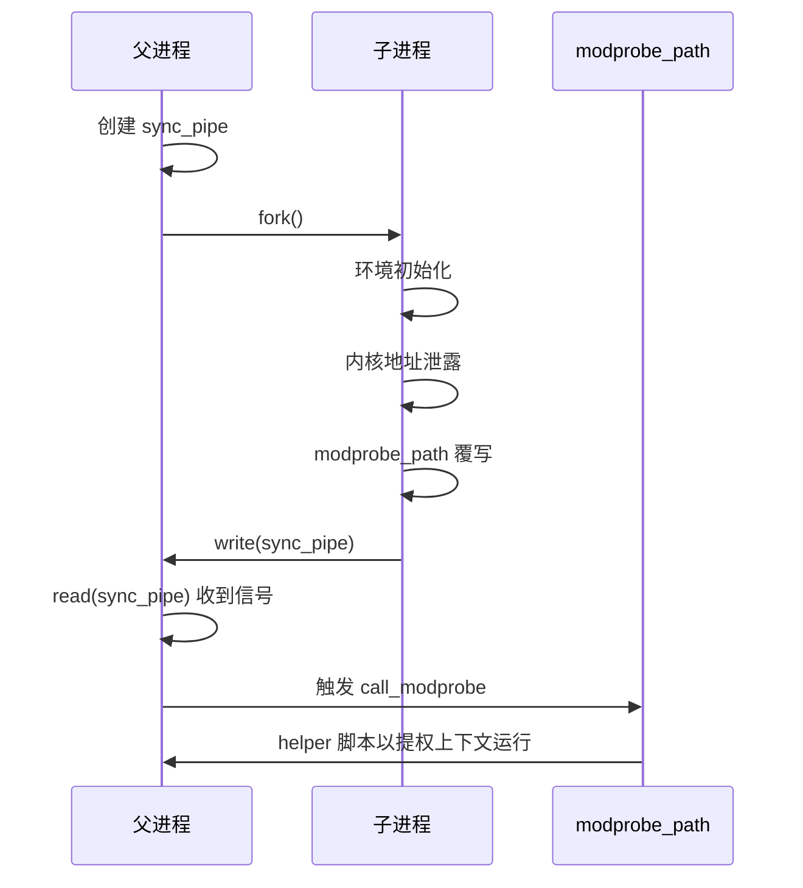
```mermaid
sequenceDiagram
    participant P as 父进程
    participant C as 子进程
    participant M as modprobe_path

    P->>P: 创建 sync_pipe
    P->>C: fork()
    C->>C: 环境初始化
    C->>C: 内核地址泄露
    C->>C: modprobe_path 覆写
    C->>P: write(sync_pipe)
    P->>P: read(sync_pipe) 收到信号
    P->>M: 触发 call_modprobe
    M->>P: helper 脚本以提权上下文运行
```

整体架构可划分为三个功能模块：环境初始化、内核地址泄露、`modprobe_path` 覆写，以及由父进程执行的权限提升。内核地址泄露提供 KASLR 基址与 physmap 基址，`modprobe_path` 覆写基于这两个地址构造伪造 `simple_xattr` 的 list head，权限提升依赖覆写后的 `modprobe_path` 触发 helper 脚本。若内核地址泄露失败，可通过重新布置堆布局重试；`modprobe_path` 覆写同样支持重试；权限提升因涉及实际触发，通常只执行一次。

### 4-2. 环境初始化

环境初始化是整个利用流程的前置准备，由子进程执行。父进程在进入该阶段之前创建 `sync_pipe` 并调用 `fork()`，子进程进入环境初始化，父进程则阻塞在 `sync_pipe` 读端等待子进程结果。该阶段的目标是为后续阶段建立确定性的执行环境，包括 CPU 亲和性、命名空间、nf_tables 对象以及 io_uring 参数预分配。

子进程在环境初始化中的主要步骤包括：

1. **CPU 绑核**：将执行流绑定到固定 CPU，减少 slab 布局在不同 CPU 之间的随机性。
2. **创建 user/net namespace**：通过 `unshare(CLONE_NEWUSER | CLONE_NEWNET)` 创建非特权 user namespace 与 net namespace，在该 net namespace 内获得 `CAP_NET_ADMIN`。
3. **预分配 io_uring 参数**：为后续 `io_uring_spray` 准备 `io_uring_params` 缓冲区，避免在喷洒过程中因内存分配失败而中断。
4. **创建 nf_tables table 与 set**：通过 Netlink 创建 nf_tables table，并创建两个 MAP set（`set1` 与 `set2`），分别用于内核地址泄露与 `modprobe_path` 覆写的越界写入。`set1` 的 `set->dlen` 设为 `NFT_MIN_DATA_LEN + sizeof(struct user_key_payload_t)`，`set2` 的 `set->dlen` 设为 `NFT_MIN_DATA_LEN + sizeof(struct simple_xattr_t)`。两个 set 均以 `kmalloc-64` 为目标缓存。

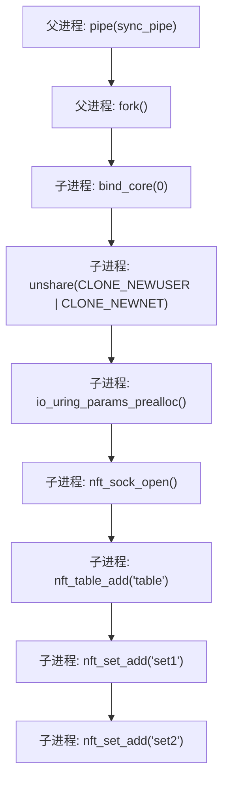
```mermaid
flowchart TD
    A["父进程: pipe(sync_pipe)"] --> B["父进程: fork()"]
    B --> C["子进程: bind_core(0)"]
    C --> D["子进程: unshare(CLONE_NEWUSER | CLONE_NEWNET)"]
    D --> E["子进程: io_uring_params_prealloc()"]
    E --> F["子进程: nft_sock_open()"]
    F --> G["子进程: nft_table_add('table')"]
    G --> H["子进程: nft_set_add('set1')"]
    H --> I["子进程: nft_set_add('set2')"]
```

环境初始化完成后，子进程已具备固定 CPU、`CAP_NET_ADMIN`、两个可触发越界写的 nf_tables set 以及 io_uring 喷洒所需的参数缓冲区。父进程仍阻塞在 `sync_pipe` 读端，等待子进程在 `modprobe_path` 覆写完成后发送信号。

### 4-3. 内核地址泄露

内核地址泄露的目标是获取 KASLR 基址与 physmap 基址，为后续 `modprobe_path` 覆写提供地址基础。该模块由四个步骤组成：Keyring 喷射、越界写篡改 `datalen`、定位 victim key、泄露内核地址。

#### 4-3-1. Keyring 喷射

Keyring 喷射的目标是在目标 `kmalloc-64` 缓存中布置一批已知模式的 `user_key_payload` 对象。该步骤的核心思路是通过大量 `add_key` 调用建立可预测的相邻对象布局，为后续越界写提供稳定的目标。

主要操作包括：

1. **构造 payload**：每个 key 的 payload 前 16 字节写入 `BinRacer` 标记与喷射索引，便于后续识别与定位。
2. **批量分配 key**：循环调用 `add_key`，向进程 keyring 中添加 `KEY_SPRAY_COUNT` 个 key，每个 key 携带 32 字节 payload。
3. **记录 key ID**：将每个 key 的 ID 保存到全局数组，供后续扫描与释放使用。

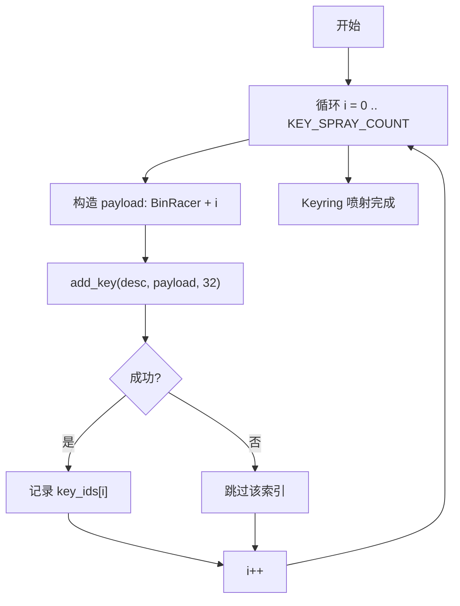
```mermaid
flowchart TD
    Start["开始"] --> Loop["循环 i = 0 .. KEY_SPRAY_COUNT"]
    Loop --> Build["构造 payload: BinRacer + i"]
    Build --> Add["add_key(desc, payload, 32)"]
    Add --> Check{"成功?"}
    Check -->|是| Record["记录 key_ids[i]"]
    Check -->|否| Skip["跳过该索引"]
    Record --> Next["i++"]
    Skip --> Next
    Next --> Loop
    Loop --> Done["Keyring 喷射完成"]
```

Keyring 喷射完成后，目标缓存中布满已知模式的 `user_key_payload` 对象，为后续越界写提供可预测的相邻对象。

#### 4-3-2. 越界写篡改 datalen

越界写篡改 `datalen` 的目标是利用 `set1` 的越界写入，篡改相邻 `user_key_payload` 的 `datalen` 字段。该步骤是内核地址泄露的关键：通过释放中间位置的 key 打开一个槽位，触发越界写将伪造的 `user_key_payload` 头部写入相邻对象，从而将其 `datalen` 扩大为 `USHRT_MAX`，使该 key 具备越界读取能力。

该步骤的原理在于：`user_key_payload` 的 `datalen` 字段决定了 `key_read` 返回的数据长度。正常 key 的 `datalen` 为 32，而伪造头部将该字段设为 `USHRT_MAX`（0xffff），使 `key_read` 允许返回最多 0xffff 字节的数据，覆盖约 16 个连续物理页。

主要操作包括：

1. **打开槽位**：调用 `key_invalidate` 释放中间位置的 key，在目标缓存中打开一个槽位。
2. **构造伪造头部**：将 `user_key_payload.datalen` 设为 `USHRT_MAX`，其余字段清零。
3. **触发越界写**：调用 `trigger_oob_write("set1", NFT_TABLE_ID, ...)`，将伪造头部写入 `set1` 相邻的 `user_key_payload` 对象。

```mermaid
sequenceDiagram
    participant U as 子进程
    participant K as Keyring
    participant N as nf_tables set1
    participant S as 内核 slab

    U->>K: key_invalidate(中间 key)
    K->>S: 释放 kmalloc-64 槽位
    U->>U: 构造伪造 user_key_payload (datalen=USHRT_MAX)
    U->>N: trigger_oob_write(set1, fake_payload)
    N->>S: 越界写入相邻 user_key_payload 头部
    S->>S: datalen 被篡改为 USHRT_MAX
```

越界写完成后，相邻 `user_key_payload` 的 `datalen` 已被扩大，该 key 具备越界读取能力。

#### 4-3-3. 定位 victim key

定位 victim key 的目标是找到 `datalen` 被越界写篡改的 key。该步骤的原理基于正常 key 与 victim key 在 `key_read` 返回值上的差异：正常 key 的 `key_read` 返回其 `datalen` 字段的值，即 32；victim key 的 `datalen` 已被越界写篡改为 `USHRT_MAX`，`key_read` 返回 0xffff。因此，通过遍历所有喷射 key 并以 32 字节缓冲区调用 `key_read`，即可区分正常 key 与 victim key。

主要操作包括：

1. **遍历 Keyring**：对每个 key 调用 `key_read(key_ids[i], key_payload, 32)`。
2. **识别异常**：若返回值不等于 32，则该 key 的 `datalen` 已被越界写篡改，该 key 即为 victim。
3. **记录 victim_key_id**：保存 victim key 的索引，供后续步骤使用。

```mermaid
flowchart TD
    Start["遍历 Keyring"] --> Read["key_read(key_ids[i], 32)"]
    Read --> Check{"返回值 == 32?"}
    Check -->|是| Next["正常 key，继续下一个"]
    Check -->|否| Found["victim_key_id = i<br/>datalen 已被篡改"]
    Next --> Start
    Found --> Done["victim 定位完成"]
```

victim 定位完成后，子进程已找到 `datalen` 被扩大的 key。该 key 具备越界读取能力，后续步骤将通过该 key 泄露内核地址。

#### 4-3-4. 泄露内核地址

泄露内核地址的目标是通过 victim key 的越界读取能力，获取 KASLR 基址与 physmap 基址。victim key 的 `datalen` 已被篡改为 `USHRT_MAX`，`key_read` 返回的数据覆盖约 16 个连续物理页。通过扫描泄露的 page 内容，可以定位相邻的 `user_key_payload` 对象，并通过释放相邻 key 并填充 `percpu_ref_data` 对象，泄露内核函数指针与 physmap 地址。

`percpu_ref_data` 在此步骤中承担关键的泄露载体角色。该对象由 `io_uring_setup` 分配，落入 `kmalloc-64` 缓存，其关键字段包括 `release` 函数指针与 `ref` 指针。由于 `percpu_ref_data` 与 `user_key_payload` 处于同一 `kmalloc-64` 缓存，释放相邻 key 后分配的 `percpu_ref_data` 会落在该槽位，从而被 victim key 的越界读取窗口覆盖。

主要操作包括：

1. **越界读取**：调用 `key_read(victim_key_id, key_payload, USHRT_MAX)`，读取 victim key 及其后约 16 个连续物理页的内容。
2. **定位相邻 key**：在泄露的 page 内扫描 `BinRacer` 标记，定位相邻的 `user_key_payload` 对象，记录其索引 `nearby_key_id`。
3. **释放相邻 key**：调用 `key_invalidate` 释放相邻 key，打开一个槽位。
4. **填充 percpu_ref_data**：调用 `io_uring_spray` 在释放槽位中分配 `percpu_ref_data` 对象。
5. **再次越界读取**：再次调用 `key_read`，扫描泄露的 page 内容，寻找 `io_ring_ctx_ref_free` 或 `io_rsrc_node_ref_zero` 函数指针。
6. **计算基址**：从泄露的函数指针中减去已知的符号偏移，得到 KASLR 基址；从 `percpu_ref_data` 的 `ref` 指针中提取 physmap 基址。

```mermaid
sequenceDiagram
    participant U as 子进程
    participant V as victim key
    participant NK as nearby key
    participant IO as io_uring spray
    participant S as 内核 slab

    U->>V: key_read(victim, USHRT_MAX)
    V->>S: 越界读取约 16 个连续物理页
    S->>U: 返回包含大量 user_key_payload 的 page 内容
    U->>U: 扫描 BinRacer 标记，定位 nearby_key_id
    U->>NK: key_invalidate(nearby_key_id)
    NK->>S: 释放 kmalloc-64 槽位
    U->>IO: io_uring_spray()
    IO->>S: 分配 percpu_ref_data 对象
    U->>V: key_read(victim, USHRT_MAX)
    V->>S: 越界读取 percpu_ref_data
    S->>U: 返回包含函数指针与 physmap 地址的内容
    U->>U: 计算 KASLR 基址与 physmap 基址
```

内核地址泄露完成后，子进程已获得 KASLR 基址与 physmap 基址，以及 `modprobe_path` 的运行时地址。这些信息将作为后续 `modprobe_path` 覆写的地址基础。

### 4-4. modprobe_path 覆写

`modprobe_path` 覆写的目标是通过 `simple_xattr` 的越界写污染其 `list` 字段，使 `removexattr` 触发的 `list_del` 在 `modprobe_path` 处执行 unlink 写入。该模块包含三个实际步骤：`simple_xattr` 堆喷、越界写污染 list head 与 name 指针、unlink 写入覆写 `modprobe_path`。在展开这些步骤之前，先介绍 unlink 写入原理。

#### 4-4-1. Unlink 写入原理

内核中 `__list_del()` 的实现如下：

```c
static inline void __list_del(struct list_head *prev, struct list_head *next)
{
    next->prev = prev;              // [1]
    WRITE_ONCE(prev->next, next);   // [2]
}
```

该函数包含两次写入操作：

- **[1]**：`next->prev = prev`，即将 `prev` 的值写入 `next + offsetof(struct list_head, prev)`，偏移为 8 字节，因此该写入落在 `next + 8` 处。
- **[2]**：`prev->next = next`，即将 `next` 的值写入 `prev + offsetof(struct list_head, next)`，偏移为 0 字节，因此该写入落在 `prev + 0` 处。

当 `removexattr` 匹配到 victim `simple_xattr` 后，内核会调用 `list_del(&xattr->list)`，进而展开为 `__list_del(xattr->list.prev, xattr->list.next)`。如果能够控制这两个字段，便可以将这两次写入转化为两个受控的任意写原语。

以覆写 `modprobe_path` 为例，采用如下构造：

- **`xattr->list.next`**：设置为 `physmap_base | 0x2f706d74`，即 physmap 范围内的一个地址，其低 4 字节在内存中构成字符串 `"tmp/"`（`0x74 0x6d 0x70 0x2f`）。该地址作为 `__list_del` 的 `next` 参数。
- **`xattr->list.prev`**：设置为 `modprobe_path + 1`。该地址作为 `__list_del` 的 `prev` 参数。

代入 `__list_del`：

- **[1]** `next->prev = prev`：将 `modprobe_path + 1` 写入 `(physmap_base | 0x2f706d74) + 8`。
- **[2]** `prev->next = next`：将 `physmap_base | 0x2f706d74` 写入 `modprobe_path + 1`。

**[2]** 处的写入是覆写 `modprobe_path` 的关键。写入的内容为 `physmap_base | 0x2f706d74`，在内存中的字节序为 `74 6d 70 2f`（低 4 字节，即 `"tmp/"`）加上 physmap 基址的高 4 字节。以 `modprobe_path = "/sbin/modprobe"` 与 physmap 高 4 字节 `0xffff8880` 为例：

```text
覆写前:  /    s    b    i    n    /    m    o    d    p    r    o    b    e   \0
覆写后:  /    t    m    p    /   \x80 \x88 \xff \xff  p    r    o    b    e   \0
```

偏移 1 至 4 的 `"sbin"` 被 `"tmp/"` 覆盖，偏移 5 至 8 的 `"/mod"` 被 physmap 基址的高 4 字节覆盖，偏移 9 至 13 的 `"probe"` 保持不变。覆写后 `modprobe_path` 变为 `/tmp/<physmap 高 4 字节>probe`。physmap 基址的高 4 字节由内核在启动时根据物理内存布局与 KASLR 随机化决定，父进程在权限提升阶段通过读取 `/proc/sys/kernel/modprobe` 动态获取该路径，无需在编译期预知具体取值。

**[2]** 处写入对 `prev` 施加了一个约束：`prev->next = next` 要求 `prev` 必须是一个有效的、可写的指针。在本构造中，`prev = modprobe_path + 1` 指向 `modprobe_path` 字符缓冲区，是一个有效的可写地址，满足该约束。

**[1]** 处写入的目标地址为 `(physmap_base | 0x2f706d74) + 8`。参与 OR 运算的是 physmap 基址的低 4 字节，由于 KASLR 会对 `page_offset_base` 进行随机化，physmap 基址的低 4 字节并非恒为 0。因此，**[1]** 处写入的目标地址是否落在有效物理内存范围内，取决于 physmap 基址低 4 字节与 `0x2f706d74` 的 OR 结果。该技术受 KASLR 影响很大：physmap 基址低 4 字节的随机化可能使 **[1]** 处写入落在未映射区域，从而触发异常。物理内存越大，有效映射范围越广，**[1]** 处写入落在有效范围内的概率越高。例如，在 4 GB 物理内存的系统上，该技术的成功率显著高于小内存系统。

需要强调的是，`next` 的低 4 字节应固定为 `0x2f706d74`（即 `"tmp/"`），以 `/tmp` 作为 helper 脚本的落地目录。在标准 Linux 系统中，通常只有 `/tmp`（以及 `/var/tmp`、`/dev/shm` 等少数目录）允许普通用户写入。若更换为其他字符串，覆写后的 `modprobe_path` 将指向普通用户无法写入的目录，父进程无法在该目录下创建 helper 脚本，利用链将在此处断裂。

#### 4-4-2. simple_xattr 堆喷

`simple_xattr` 堆喷的目标是在目标 `kmalloc-64` 缓存中布置一批已知模式的 **`simple_xattr` 结构体对象**。`simple_xattr` 是 tmpfs 等文件系统中用于承载扩展属性的对象，其结构体本身由 `setxattr` 分配，落入 `kmalloc-64` 缓存，与漏洞 element 对象处于同一缓存。

被堆喷的目标是 `simple_xattr` 结构体本身（`kmalloc-64`），而非 `simple_xattr->name` 字符串（`kmalloc-256`）。`name` 字符串作为 victim 定位的辅助机制单独存在：每个 `simple_xattr` 结构体的 `name` 字段指向一个按特定格式构造的字符串，该字符串被单独分配在 `kmalloc-256` 缓存中。字符串的格式为：

```text
"security.attr<填充到 215 位的索引>-security.Iwanttoberoot"
```

其中 `"security.attr"` 占 13 字节，填充部分占 215 字节，`"-"` 占 1 字节，`"security.Iwanttoberoot"` 占 23 字节，总计 252 字节，加上终止符恰好落在 `kmalloc-256` 缓存。由于 `kmalloc-256` 的分配地址低两位为 `00`，`name` 指针的低字节为 `0x00`。`"security.Iwanttoberoot"` 子串在字符串中的起始偏移为 `13 + 215 + 1 = 229 = 0xE5`，这一偏移是后续通过越界写篡改 `name` 指针、使之前移指向该子串的关键依据。

主要操作包括：

1. **挂载 tmpfs 并创建目标文件**：确保存在一个支持扩展属性的文件系统，并在其中创建一个目标文件。
2. **构造 xattr 名称**：为每个 `simple_xattr` 构造一个唯一的名称字符串，格式为 `"security.attr<填充到 215 位的索引>-security.Iwanttoberoot"`，使分配落在 `kmalloc-256`，确保地址低两位为 `00`，且 `"security.Iwanttoberoot"` 子串的偏移恰为 `0xE5`。
3. **批量设置 xattr**：循环调用 `setxattr`，向目标文件添加 `XATTR_SPRAY_COUNT` 个扩展属性，每个属性分配一个 `simple_xattr` 结构体（`kmalloc-64`）与一个 `name` 字符串（`kmalloc-256`）。
4. **记录名称**：将每个 xattr 的名称保存到全局数组，供后续清理与删除使用。

```mermaid
flowchart TD
    Start["开始"] --> Prepare["tmpfs_target_prepare()"]
    Prepare --> Names["xattr_names_build()<br/>构造 kmalloc-256 名称"]
    Names --> Loop["循环 i = 0 .. XATTR_SPRAY_COUNT"]
    Loop --> Set["setxattr(path, name, value, XATTR_CREATE)"]
    Set --> Alloc1["内核分配 simple_xattr 结构体<br/>(kmalloc-64)"]
    Alloc1 --> Alloc2["内核分配 name 字符串<br/>(kmalloc-256, 低字节=0x00)"]
    Alloc2 --> Check{"成功?"}
    Check -->|是| Count["ok++"]
    Check -->|否| Skip["跳过该索引"]
    Count --> Next["i++"]
    Skip --> Next
    Next --> Loop
    Loop --> Done["simple_xattr 堆喷完成"]
```

`simple_xattr` 堆喷完成后，目标缓存中布满 `simple_xattr` 结构体对象（`kmalloc-64`），每个结构体通过其 `name` 字段指向一个唯一的 `kmalloc-256` 字符串。`name` 指针的低字节为 `0x00`，而 `"security.Iwanttoberoot"` 子串位于偏移 `0xE5` 处。

#### 4-4-3. 越界写污染 list head 与 name 指针

越界写污染的目标是利用 `set2` 的越界写入，篡改相邻 `simple_xattr` 结构体的 `list` 字段与 `name` 指针。该步骤通过释放中间位置的 `simple_xattr` 打开一个槽位，触发越界写将伪造的 `simple_xattr` 头部写入相邻对象，从而污染其 `list.next` 与 `list.prev`，同时篡改其 `name` 指针低字节。

结合前述 unlink 写入原理，伪造的 `list` 字段构造如下：

- **`simple_xattr.next`**：设置为 `(heap_addr & 0xffffffff00000000ULL) + 0x2f706d74`，其低 4 字节在内存中构成 `"tmp/"`，高 4 字节落在 physmap 范围内。
- **`simple_xattr.prev`**：设置为 `modprobe_path + 1`，**[2]** 处的写入将落在该地址，同时该地址是一个有效的可写指针。
- **`simple_xattr.name_offset`**：设置为 `0xE5`，用于篡改 `name` 指针的低字节。

越界写篡改 `name` 指针的低字节时，将 `0x00` 改为 `0xE5`。由于 `kmalloc-256` 的分配地址低两位为 `00`，修改低字节不会跨越 slab 边界，指针仅在同一 slab 页内前移 `0xE5` 字节，恰好指向字符串中的 `"security.Iwanttoberoot"` 子串。该子串将作为 `removexattr` 的匹配目标，用于精确识别被污染的 victim `simple_xattr`。

主要操作包括：

1. **打开槽位**：调用 `xattr_del_one` 释放中间位置的 `simple_xattr`，在目标缓存中打开一个槽位。
2. **构造伪造头部**：将 `simple_xattr.next` 设为 `(heap_addr & 0xffffffff00000000ULL) + 0x2f706d74`，`simple_xattr.prev` 设为 `modprobe_path + 1`，`simple_xattr.name_offset` 设为 `0xE5`。
3. **触发越界写**：调用 `trigger_oob_write("set2", NFT_TABLE_ID + 1, ...)`，将伪造头部写入 `set2` 相邻的 `simple_xattr` 结构体。

```mermaid
sequenceDiagram
    participant U as 子进程
    participant X as simple_xattr (kmalloc-64)
    participant NM as name 字符串 (kmalloc-256)
    participant N as nf_tables set2
    participant S as 内核 slab

    U->>X: xattr_del_one(中间索引)
    X->>S: 释放 kmalloc-64 槽位
    U->>U: 构造伪造 simple_xattr 头部
    Note over U: next = (heap_addr & 0xffffffff00000000) + 0x2f706d74<br/>prev = modprobe_path + 1<br/>name_offset = 0xE5
    U->>N: trigger_oob_write(set2, fake_xattr)
    N->>S: 越界写入相邻 simple_xattr 头部
    S->>X: list 字段被污染
    S->>NM: name 指针低字节 0x00 → 0xE5<br/>前移 0xE5 字节指向 "security.Iwanttoberoot"
```

越界写完成后，相邻 `simple_xattr` 结构体的 `list` 字段已被污染，`name` 指针的低字节已从 `0x00` 改为 `0xE5`。

#### 4-4-4. unlink 写入覆写 modprobe_path

unlink 写入的目标是调用 `removexattr` 触发 `list_del`，在 `modprobe_path` 处执行 unlink 写入，从而覆写 `modprobe_path` 的内容。

victim 定位的机制在于：调用 `removexattr(path, "security.Iwanttoberoot")`，内核遍历文件的扩展属性列表，查找 `name` 与 `"security.Iwanttoberoot"` 匹配的 `simple_xattr`。由于只有被越界写污染的 `simple_xattr` 的 `name` 指针被前移到该子串，因此匹配到的即为 victim `simple_xattr`，内核随后对其执行 `list_del`，触发 unlink 写入。

主要操作包括：

1. **触发 unlink 写入**：调用 `removexattr(TMPFS_TARGET_FILE, "security.Iwanttoberoot")`。若越界写命中，则内核通过 `name` 指针匹配到 victim `simple_xattr`，对其执行 `list_del`，在 `modprobe_path + 1` 处执行 unlink 写入。
2. **验证覆写**：`removexattr` 成功返回即表示 unlink 写入已触发；若返回错误，则说明越界写未命中，需要重试。
3. **清理 simple_xattr**：若本次尝试失败，调用 `xattr_cleanup` 清理已喷射的 `simple_xattr` 结构体与 `name` 字符串，为下一次尝试准备干净的堆布局。

```mermaid
sequenceDiagram
    participant U as 子进程
    participant X as 受污染的 simple_xattr
    participant NM as 前移后的 name 指针
    participant MP as modprobe_path
    participant PM as physmap

    Note over X: next = (heap_addr & 0xffffffff00000000) + 0x2f706d74<br/>prev = modprobe_path + 1
    Note over NM: name 指针低字节已前移到 "security.Iwanttoberoot"
    U->>X: removexattr(path, "security.Iwanttoberoot")
    X->>NM: 内核通过 name 指针匹配到 victim
    NM->>MP: __list_del [2]: modprobe_path + 1 = next
    MP->>MP: modprobe_path 被覆写为 /tmp/physmap高4字节probe
    NM->>PM: __list_del [1]: physmap[next + 8] = prev
    PM->>PM: physmap 写入（无害）
    U->>U: removexattr 成功返回
```

unlink 写入完成后，`modprobe_path` 已被覆写为形如 `/tmp/<physmap 高 4 字节>probe` 的路径，为后续权限提升提供了条件。

### 4-5. 权限提升

权限提升的目标是安装 helper 脚本并触发 `call_modprobe`，使 helper 脚本以提权上下文运行。该阶段由父进程执行，父进程在收到子进程的成功信号后，读取当前 `modprobe_path` 的值，创建对应的 helper 脚本文件，然后触发一次 `call_modprobe` 路径。

父进程通过读取 `/proc/sys/kernel/modprobe` 动态获取 `modprobe_path` 覆写后的完整内容，因此无需在编译期预知 physmap 高 4 字节的具体取值。

主要操作包括：

1. **读取 modprobe_path**：调用 `open("/proc/sys/kernel/modprobe", O_RDONLY)` 读取当前 `modprobe_path` 的值，去除尾部的换行符。
2. **创建 helper 脚本**：以读取到的路径为文件名，创建一个包含提权操作的 shell 脚本。
3. **触发 call_modprobe**：执行一个包含非法二进制格式的文件（如 `/home/ctf/fake`），触发内核的 `call_modprobe` 路径，使内核以 root 权限执行 `modprobe_path` 指向的 helper 脚本。
4. **执行提权后的命令**：helper 脚本完成后，执行 `/home/ctf/get_root`，该文件已被 helper 脚本修改为 SUID root。

```mermaid
sequenceDiagram
    participant P as 父进程
    participant MP as modprobe_path
    participant PR as /proc/sys/kernel/modprobe
    participant K as 内核
    participant H as helper 脚本

    P->>PR: open + read 动态获取 modprobe_path
    PR->>P: 返回覆写后的完整路径
    P->>H: 以该路径为名创建 helper 脚本
    P->>K: 执行 /home/ctf/fake (非法格式)
    K->>H: call_modprobe 以 root 权限执行 helper
    H->>H: chown root:root get_root
    H->>H: chmod 4555 get_root
    P->>P: 执行 /home/ctf/get_root
```

权限提升完成后，`get_root` 文件已被修改为 SUID root，父进程执行该文件即可在提权上下文中运行，利用流程结束。

### 4-6. 模块间依赖与重试机制

三个模块之间存在明确的依赖关系。模块间的依赖与重试机制如下图所示：

```mermaid
flowchart TB
    Start["环境初始化"] --> LeakAttempt

    subgraph LeakLoop["内核地址泄露重试"]
        LeakAttempt["Keyring 喷射 + 越界写 + 地址泄露"]
        LeakCheck{"成功?"}
        LeakAttempt --> LeakCheck
        LeakCheck -->|否| Reset1["释放 keyring"]
        Reset1 --> LeakAttempt
    end

    LeakCheck -->|是| UnlinkAttempt

    subgraph UnlinkLoop["modprobe_path 覆写重试"]
        UnlinkAttempt["simple_xattr 堆喷 + 越界写 + unlink"]
        UnlinkCheck{"成功?"}
        UnlinkAttempt --> UnlinkCheck
        UnlinkCheck -->|否| Reset2["清理 simple_xattr"]
        Reset2 --> UnlinkAttempt
    end

    UnlinkCheck -->|是| Escalation["权限提升"]
    Escalation --> Done["完成"]
```

内核地址泄露与 `modprobe_path` 覆写均设置最大重试次数 `EXPLOIT_RETRY_MAX`。权限提升不设重试。

### 4-7. 内核保护机制的应对策略

该利用思路面对的核保护机制主要包括 KASLR、SMEP、SMAP、KPTI，以及 `CONFIG_SLAB_FREELIST_RANDOM`、`CONFIG_SLAB_FREELIST_HARDENED`、`CONFIG_INIT_ON_ALLOC_DEFAULT_ON`、`CONFIG_HARDENED_USERCOPY`、`CONFIG_MEMCG`、`CONFIG_MEMCG_KMEM` 等配置。各机制的应对策略如下：

| 保护机制                             | 应对策略                                                                                                                                                                    |
| ------------------------------------ | --------------------------------------------------------------------------------------------------------------------------------------------------------------------------- |
| KASLR                                | 通过 `user_key_payload` 越界读取 `percpu_ref_data` 中的 `release` 函数指针，计算 KASLR 基址                                                                                 |
| SMEP / SMAP                          | 不直接在用户态执行内核代码，而是通过覆写 `modprobe_path` 触发内核以 root 权限执行 helper 脚本                                                                               |
| KPTI                                 | 不依赖内核态返回用户态的路径                                                                                                                                                |
| `CONFIG_SLAB_FREELIST_RANDOM`        | 通过 CPU 绑核与大批量 `user_key_payload` / `simple_xattr` 堆喷降低布局随机性；两个模块均支持重试                                                                            |
| `CONFIG_SLAB_FREELIST_HARDENED`      | 不直接伪造 freelist 指针；通过越界写篡改对象字段而非 freelist                                                                                                               |
| `CONFIG_INIT_ON_ALLOC_DEFAULT_ON`    | 越界写发生在对象已分配之后，不受分配时清零影响                                                                                                                              |
| `CONFIG_HARDENED_USERCOPY`           | 越界读取通过 `key_read` 完成，不直接触发 usercopy 检查                                                                                                                      |
| `CONFIG_MEMCG` / `CONFIG_MEMCG_KMEM` | 本方案面向的内核版本区间使用 `GFP_KERNEL` 分配 element 对象，各辅助对象的分配路径同样未引入 memcg 计数，因此各对象均落入常规 `kmalloc-*` 缓存，不受 `kmalloc-cg-*` 隔离影响 |

`CONFIG_MEMCG` 与 `CONFIG_MEMCG_KMEM` 开启后，内核会为带 memcg 计数的分配单独创建 `kmalloc-cg-*` 缓存，与普通 `kmalloc-*` 缓存隔离。本利用思路面向的 **>= 4.1 且 < 5.18-rc1** 版本区间内，`nft_set_elem_init()` 的调用方仍使用 `GFP_KERNEL` 分配 element 对象，漏洞对象落入常规 `kmalloc-64` 缓存；`user_key_payload`、`simple_xattr`、`percpu_ref_data` 等辅助对象在该版本区间的分配路径同样未引入 memcg 计数，均落入常规 `kmalloc-64` 缓存。因此，`CONFIG_MEMCG` / `CONFIG_MEMCG_KMEM` 开启后，各对象的相对布局关系与未开启时保持一致，本方案无需额外调整。

该利用思路的核心策略是避免直接与内核代码地址或 freelist 交互，而是通过 `user_key_payload`、`percpu_ref_data` 与 `simple_xattr` 的对象生命周期控制完成 `modprobe_path` 覆写。这一策略对上述保护机制具有较好的适应性。

### 4-8. 前提条件与局限性

**前提条件**：

- 目标系统内核版本处于 **>= 4.1 且 < 5.18-rc1** 区间。该区间内的内核使用 `GFP_KERNEL` 分配 element 对象，目标缓存为 `kmalloc-64`；
- 目标系统允许非特权用户创建 user namespace 与 net namespace，从而获得 `CAP_NET_ADMIN`；
- 目标系统启用 keyring 子系统，允许非特权用户通过 `add_key` 添加用户密钥；
- 目标系统启用 io_uring 子系统，允许非特权用户通过 `io_uring_setup` 分配 `percpu_ref_data`；
- 目标系统存在支持扩展属性的文件系统（如 tmpfs），且当前用户对其具备写权限；
- 目标系统的 `user_key_payload`、`percpu_ref_data`、`simple_xattr` 等对象在 `kmalloc-64` 缓存中具备可预测的布局，`simple_xattr->name` 在 `kmalloc-256` 缓存中具备低两位对齐特性；
- 目标系统的 `CONFIG_SLAB_FREELIST_RANDOM` 等配置未使布局随机性超出重试机制的容忍范围。

**局限性**：

- 越界写入长度受 `set->dlen` 与 `NFT_MIN_DATA_LEN` 限制，最大溢出为 `0x30` 或 `0x24` 字节，因此需要精确控制越界写入的目标字段；
- 越界写入的目标 cache 由 `set->klen` 决定，不同 cache 需要不同的 set 配置与相邻对象选择；
- 内核地址泄露与 `modprobe_path` 覆写依赖堆布局的可预测性，在 `CONFIG_SLAB_FREELIST_RANDOM` 开启时需要通过重试提高成功率；
- 权限提升为单次执行，若失败则整体流程失败；
- 该思路依赖 `modprobe_path` 的可写性，在 `CONFIG_STATIC_USERMODEHELPER` 等配置开启时可能不可行；
- 该思路依赖 io_uring 子系统分配 `percpu_ref_data`，在 `CONFIG_IO_URING` 未启用时不可行；
- 该思路依赖 `simple_xattr->name` 在 `kmalloc-256` 缓存中的低两位对齐特性，在 `CONFIG_SLAB_FREELIST_RANDOM` 等配置下该特性可能受到影响；
- unlink 写入原语受 KASLR 影响较大：physmap 基址低 4 字节的随机化可能使 unlink 写入过程中的某个辅助写入目标落在未映射区域，从而触发异常。物理内存越大，有效映射范围越广，成功率越高。例如，在 4 GB 物理内存的系统上，该技术的成功率显著高于小内存系统。

### 4-9. 章节总结

本章围绕 **CVE-2022-34918** 提供的堆越界写入原语，给出了一个面向 **>= 4.1 且 < 5.18-rc1** 内核版本的利用思路。与利用思路一相比，该思路在目标缓存、辅助对象选择与写入原语上均有所不同，但整体仍遵循“先泄露、再覆写、后提权”的三段式结构，并采用父子进程协作架构。

该思路的设计基于两个版本相关的事实：其一，4.1 至 5.18-rc1 之间的内核使用 `GFP_KERNEL` 分配 element 对象，漏洞对象落入 `kmalloc-64` 缓存；其二，该版本区间内 `user_key_payload`、`simple_xattr`、`percpu_ref_data` 等辅助对象同样落入 `kmalloc-64` 缓存，与漏洞对象处于同一缓存，便于通过越界写实现对象字段篡改。

该思路涉及三类辅助对象，各自承担不同角色：`user_key_payload` 作为越界读载体，通过篡改 `datalen` 字段获得越界读取能力；`percpu_ref_data` 作为泄露载体，通过其 `release` 函数指针与 `ref` 指针提供 KASLR 基址与 physmap 基址；`simple_xattr` 作为 unlink 写入载体，通过污染其 `list` 字段使 `removexattr` 触发的 `list_del` 在 `modprobe_path` 处执行 unlink 写入。

`modprobe_path` 覆写的核心在于利用 `__list_del` 的两次写入原语。第二次写入 `prev->next = next` 允许将 `next` 的值写入 `prev + 0`；通过将 `prev` 设置为 `modprobe_path + 1`，`next` 设置为 `physmap_base | 0x2f706d74`，可使 `modprobe_path + 1` 起始的 8 字节被覆写为 `"tmp/"` 加上 physmap 基址的高 4 字节，最终将 `modprobe_path` 变为 `/tmp/<physmap 高 4 字节>probe`。第一次写入 `next->prev = prev` 的目标落在 physmap 范围内，其可写性受 KASLR 对 physmap 基址的随机化影响，物理内存越大，该写入落在有效范围内的概率越高。

victim `simple_xattr` 的定位机制依赖于 `simple_xattr->name` 在 `kmalloc-256` 缓存中的低两位对齐特性。`name` 字符串的格式为 `"security.attr<填充到 215 位的索引>-security.Iwanttoberoot"`，其中 `"security.Iwanttoberoot"` 子串的偏移为 `0xE5`。通过越界写将 `name` 指针的低字节从 `0x00` 改为 `0xE5`，使 `name` 指针在同一 slab 页内前移 `0xE5` 字节，恰好指向 `"security.Iwanttoberoot"` 子串；随后调用 `removexattr(path, "security.Iwanttoberoot")`，内核通过 `name` 指针匹配到 victim `simple_xattr`，对其执行 `list_del`，触发 unlink 写入。

整个利用流程由内核地址泄露与 `modprobe_path` 覆写两个可重试模块组成，二者之间通过 KASLR 基址与 physmap 基址传递依赖；权限提升阶段由父进程执行，通过读取 `/proc/sys/kernel/modprobe` 动态获取覆写后的路径，无需在编译期预知 physmap 高 4 字节的具体取值。

该思路的设计原则是避免直接与内核代码地址或 freelist 交互，而是通过 `user_key_payload`、`percpu_ref_data` 与 `simple_xattr` 的对象生命周期控制完成 `modprobe_path` 覆写。与利用思路一相比，该思路的链条更短，对 `CONFIG_MEMCG` / `CONFIG_MEMCG_KMEM` 的隔离机制天然免疫（因各对象均未引入 memcg 计数），但 unlink 写入原语受 KASLR 与物理内存大小的影响较大，在物理内存较小的系统上成功率相对较低。

### 4-10. 测试结果

<div style="text-align: center; margin: 2rem 0;">
  
</div>

## 5. 漏洞修复

### 5-1. 修复补丁概述

**CVE-2022-34918** 的修复由 Pablo Neira Ayuso 于 2022 年 7 月 2 日提交，提交哈希为 `7e6bc1f6cabcd30aba0b11219d8e01b952eacbb6`，提交标题为“netfilter: nf_tables: stricter validation of element data”。该提交合入 **5.19-rc6**，随后被标记为需要向后移植到多个稳定分支。

提交信息明确指出修复目标：“Make sure element data type and length do not mismatch the one specified by the set declaration.”（确保元素数据类型和长度与集合声明不匹配时被拒绝）。该提交标记了漏洞引入的原始 commit：`Fixes: 7d7402642eaf ("netfilter: nf_tables: variable sized set element keys / data")`，并致谢了漏洞报告者 Hugues ANGUELKOV。

从改动规模看，该提交仅修改了 `net/netfilter/nf_tables_api.c` 中的 9 行代码（新增 8 行，删除 1 行），是一次高度聚焦的修复。然而，其技术含义并不局限于这 9 行代码——它改变了 `nft_setelem_parse_data()` 的校验逻辑范式，从根本上切断了 **CVE-2022-34918** 所依赖的类型混淆路径。

### 5-2. 补丁的技术分析

修复的核心位于 `nft_setelem_parse_data()` 函数中。在修复前的代码中，校验逻辑为：

```c
if (desc->type != NFT_DATA_VERDICT && desc->len != set->dlen) {
    nft_data_release(data, desc->type);
    return -EINVAL;
}
```

该逻辑的问题已在第 2 章中详细分析：当 `desc->type` 为 `NFT_DATA_VERDICT` 时，`&&` 短路使 `desc->len != set->dlen` 不被求值，长度一致性校验被绕过。

修复补丁将上述单行复合校验替换为两个独立的步骤：

```diff
diff --git a/net/netfilter/nf_tables_api.c b/net/netfilter/nf_tables_api.c
index 51144fc66889b..d6b59beab3a98 100644
--- a/net/netfilter/nf_tables_api.c
+++ b/net/netfilter/nf_tables_api.c
@@ -5213,13 +5213,20 @@ static int nft_setelem_parse_data(struct nft_ctx *ctx, struct nft_set *set,
 				  struct nft_data *data,
 				  struct nlattr *attr)
 {
+	u32 dtype;
 	int err;

 	err = nft_data_init(ctx, data, NFT_DATA_VALUE_MAXLEN, desc, attr);
 	if (err < 0)
 		return err;

-	if (desc->type != NFT_DATA_VERDICT && desc->len != set->dlen) {
+	if (set->dtype == NFT_DATA_VERDICT)
+		dtype = NFT_DATA_VERDICT;
+	else
+		dtype = NFT_DATA_VALUE;
+
+	if (dtype != desc->type ||
+	    set->dlen != desc->len) {
 		nft_data_release(data, desc->type);
 		return -EINVAL;
 	}
```

该 diff 包含两个关键改动。

**第一处改动：引入 `dtype` 变量，由集合声明决定期望类型。** 修复后的代码首先检查 `set->dtype` 字段——该字段在集合创建时由用户态通过 `NFTA_SET_DATA_TYPE` 指定，记录了集合声明自身期望的数据类型。若 `set->dtype == NFT_DATA_VERDICT`，则 `dtype` 被设为 `NFT_DATA_VERDICT`；否则 `dtype` 被设为 `NFT_DATA_VALUE`。

这一步的核心意义在于：**期望类型不再由用户态在发送元素数据时临时决定，而是由集合声明在创建时固定**。在修复前的代码中，`desc->type` 的值来自用户态提供的 `NFTA_SET_ELEM_DATA` 属性——用户态可以在每次添加元素时自由选择提供 `NFT_DATA_VALUE` 还是 `NFTA_DATA_VERDICT`，类型校验实际上是以用户态输入为基准。修复后，基准转移到了 `set->dtype`，用户态提供的数据必须与集合声明一致。

**第二处改动：将校验从短路逻辑改为独立校验。** 修复后的校验条件为：

```c
if (dtype != desc->type ||
    set->dlen != desc->len) {
```

该条件使用 `||` 连接两个独立检查：

- **`dtype != desc->type`**：检查元素数据的实际类型是否与集合声明的期望类型一致。若集合声明为 `NFT_DATA_VALUE`，而用户态提供了 `NFT_DATA_VERDICT` 类型的数据，则该校验失败，直接返回 `-EINVAL`。
- **`set->dlen != desc->len`**：检查元素数据的长度是否与集合声明的数据长度一致。该校验在两种类型路径下均被强制执行，不再有短路绕过的可能。

`||` 的语义决定了两个检查中任一失败即整体失败，不存在短路跳过某一检查的情况。这与修复前 `&&` 的短路行为形成根本对比。

从修复前后的逻辑差异看，漏洞的本质在于校验基准的错位：修复前，`desc->type` 本身来自用户态输入，而校验逻辑却以用户态输入的类型作为判断依据来决定是否跳过长度检查——这形成了一个自我指涉的校验结构。修复后，校验基准被统一到 `set->dtype`，用户态输入必须与内核侧已固定的声明一致，校验不再存在被输入控制的绕过路径。

### 5-3. 漏洞利用链的切断

修复补丁对 **CVE-2022-34918** 利用链的切断，可以从第 2 章所述漏洞链条的每个关键节点逐一分析。

**切断点一：短路条件的消除。** 漏洞链条的起点是 `nft_setelem_parse_data()` 中 `&&` 的短路求值。修复后，`||` 连接的独立校验不再存在短路行为：`set->dlen != desc->len` 在任何类型路径下都被求值。即使 `desc->type` 被设为 `NFT_DATA_VERDICT`，长度一致性检查仍然执行。这意味着用户态无法再通过选择 verdict 类型来绕过长度校验。

**切断点二：类型一致性约束的建立。** 修复引入的 `dtype != desc->type` 检查，使得类型校验不再以用户态输入为基准。若集合声明为 `NFT_DATA_VALUE`（`set->dtype == NFT_DATA_VALUE`），则 `dtype` 被设为 `NFT_DATA_VALUE`。用户态若提供 `NFT_DATA_VERDICT` 类型的数据，`dtype != desc->type` 成立，校验立即失败。因此，用户态无法在 `NFT_DATA_VALUE` 集合中提供 verdict 类型数据来触发类型混淆。

**切断点三：`tmpl->len` 偏小不再可能。** 漏洞链条的中间环节是 `nft_set_ext_add_length(&tmpl, NFT_SET_EXT_DATA, desc.len)` 以短 `desc.len` 累加模板长度。修复后，`set->dlen != desc->len` 被强制校验，`desc.len` 必须等于 `set->dlen`。因此，`nft_set_ext_add_length()` 接收到的长度参数必然等于 `set->dlen`，模板长度 `tmpl->len` 不再偏小。

**切断点四：分配/拷贝不对称的消除。** 漏洞链条的终点是 `nft_set_elem_init()` 中按 `tmpl->len` 分配、按 `set->dlen` 拷贝的不对称。由于切断点三使 `tmpl->len` 基于完整 `set->dlen` 计算，分配尺寸不再偏小；`memcpy()` 的拷贝长度与分配尺寸保持一致，越界写入不再发生。

四个切断点形成了一条完整的阻断链：从短路条件消除到类型一致性约束建立，从模板长度偏小消除到分配/拷贝对称恢复。修复后的代码在漏洞链条的每一个环节上都施加了有效的约束，使得原先的利用路径无法再被触发。

从利用思路的角度看，第 3 章所述利用思路一依赖 `set->dtype == NFT_DATA_VALUE` 的集合中提供 `NFT_DATA_VERDICT` 类型数据，该路径在修复后被 `dtype != desc->type` 检查直接拒绝。第 4 章所述利用思路二同样依赖类型混淆来篡改 `user_key_payload->datalen` 与 `simple_xattr->list`，其起点同样被切断。

### 5-4. 补丁的演进意义

`7e6bc1f6cabc` 的修复方式具有超越单个 CVE 的演进意义。2022 年 8 月 8 日，Pablo Neira Ayuso 提交了后续补丁 `341b69416087`（“netfilter: nf_tables: upfront validation of data via nft_data_init()”），该提交的说明中明确引用了 `7e6bc1f6cabc`，指出“Relying on opencoded validation of the expected data might lead to subtle bugs as described in 7e6bc1f6cabc”（依赖硬编码的期望数据校验可能导致微妙缺陷，如 `7e6bc1f6cabc` 所述）。

该后续补丁将类型和长度的校验前移到 `nft_data_init()` 调用之前，其设计思路是：“Instead of parsing the data and then validate that type and length are correct, pass a description of the expected data so it can be validated upfront before parsing it to bail out earlier.”（不再先解析数据再校验类型和长度，而是传入期望数据的描述，使其在解析前即可被校验，从而更早地退出。）

这一演进表明，`7e6bc1f6cabc` 的价值不仅在于修复了一个具体漏洞，更在于它确立了一个重要的设计原则：**校验基准应当来自内核侧已固定的声明，而非用户态输入**。当校验逻辑以用户态输入为基准时，输入本身可以影响校验是否执行——这构成了一个自我指涉的校验结构，在复合条件中使用短路逻辑时尤为危险。

后续的 `upfront validation` 进一步强化了这一原则：不再依赖 `nft_setelem_parse_data()` 内部的硬编码校验，而是在数据解析的入口处即传入期望的类型和长度，由 `nft_data_init()` 统一执行校验。这种“校验前置、基准统一”的模式，降低了在多个调用路径中遗漏校验或引入不一致的风险。

### 5-5. 修复版本与回溯状态

根据 Red Hat Bugzilla 的记录，`7e6bc1f6cabc` 的修复版本为 **Linux kernel 5.19-rc6**。

该修复被向后移植到多个稳定分支。根据 NVD 的 Known Affected Software Configurations，**CVE-2022-34918** 的受影响版本范围如下：

| 稳定系列        | 受影响版本范围（NVD） | 首个修复版本 |
| --------------- | --------------------- | ------------ |
| 4.1.x - 4.14.x  | `>= 4.1, < 4.14.316`  | 4.14.316     |
| 4.15.x - 4.19.x | `>= 4.15, < 4.19.284` | 4.19.284     |
| 4.20.x - 5.4.x  | `>= 4.20, < 5.4.244`  | 5.4.244      |
| 5.5.x - 5.10.x  | `>= 5.5, < 5.10.130`  | 5.10.130     |
| 5.11.x - 5.15.x | `>= 5.11, < 5.15.54`  | 5.15.54      |
| 5.16.x - 5.18.x | `>= 5.16, < 5.18.11`  | 5.18.11      |

从版本分布看，受影响范围覆盖从 4.1 到 5.18.11 之前的多个稳定系列。由于漏洞引入提交 `7d7402642eaf` 早于 4.1，因此所有包含该提交且未合入修复的稳定分支均受影响。修复已合入 5.19-rc6 及上表所列各稳定分支的首个修复版本。

各主流发行版均发布了修复更新。Debian 通过 DSA-5191-1 发布了安全更新，修复版本为 5.10.127-2（bullseye 稳定版）。Ubuntu 发布了 USN-5544-1，修复版本包括 22.04 LTS 的 5.15.0-1019.19。Red Hat 发布了 RHSA-2022:6582，将漏洞定级为“Important”。

对于无法立即升级的系统，Ubuntu 与 Red Hat 均提供了通过禁用非特权用户命名空间作为缓解措施。Ubuntu 的缓解措施为 `sudo sysctl kernel.unprivileged_userns_clone=0`，该措施通过阻止普通用户创建新的 user namespace 来限制获得 `CAP_NET_ADMIN` 的途径，从而降低了漏洞的可触及性，但可能影响浏览器沙箱、容器运行时等功能。

### 5-6. 安全开发启示

`7e6bc1f6cabc` 的修复过程为内核安全开发提供了若干具有普遍意义的启示。

**第一，复合条件中的短路语义是安全敏感的逻辑结构。** 修复前的 `desc->type != NFT_DATA_VERDICT && desc->len != set->dlen` 在语法上表达“类型不是 verdict 且长度不匹配”的联合条件，但在语义上，它隐含地表达了“verdict 类型时跳过长度校验”的行为——后者并非开发者的意图，而是短路求值的副产品。当复合条件用于安全校验时，开发者应当明确区分“逻辑与”的意图与“短路跳过”的副作用。使用独立的 `if` 语句或 `||` 连接失败条件，可以消除这种歧义。

**第二，校验基准应来自可信的内核侧状态，而非用户态输入。** 修复前，`desc->type` 本身来自用户态输入，而校验逻辑却以它作为判断是否执行长度检查的依据。修复后，基准转移到了 `set->dtype`——该字段在集合创建时由内核记录，在元素添加阶段不再被用户态输入修改。当校验的“期望值”和“实际值”都来自用户态时，校验实际上沦为对用户态输入的自洽性检查，无法提供有效的约束。校验的基准必须锚定在内核侧已固定的状态上。

**第三，分配尺寸与拷贝长度必须来自同一经过验证的来源。** `nft_set_elem_init()` 中分配尺寸来自 `tmpl->len`（由 `desc->len` 驱动），拷贝长度来自 `set->dlen`。二者在修复前可以不一致，因为 `desc->len` 不受 `set->dlen` 的约束。修复后，`set->dlen != desc->len` 被强制校验，`tmpl->len` 和 `set->dlen` 的驱动来源被统一。这一原则适用于任何涉及变长数据的分配与拷贝操作：尺寸参数和长度参数不应来自两个独立且未经交叉验证的来源。

**第四，修复的时序与稳定分支的响应速度是安全生命周期管理的关键。** `7e6bc1f6cabc` 于 2022 年 7 月 2 日提交，合入 5.19-rc6，随后被向后移植到 5.18.11、5.15.54、5.10.130 等稳定分支。从提交到稳定分支回溯的周期较短，反映了 nf_tables 作为网络过滤核心组件在安全维护中的优先级。这一响应模式也为其他子系统的漏洞修复提供了参考。

## 6. 免责声明

本文档旨在提供 **CVE-2022-34918** 漏洞的技术分析与教育性内容，仅供学习、研究和安全防御目的使用。作者与发布平台对以下事项声明如下：

1. **合法使用原则**：本文档中描述的任何技术细节、代码示例或利用方法仅供教育研究之用。读者不得将这些信息用于任何非法、未经授权或恶意的活动，包括但不限于未经授权的系统入侵、数据破坏、服务干扰或其他违反法律法规的行为。

2. **知识共享与责任**：本文档基于公开可获取的信息、官方漏洞公告和学术研究资料编写。作者力求确保技术内容的准确性，但不对信息的完整性、时效性或适用性作任何明示或暗示的保证。读者应自行验证信息的准确性，并在专业环境中谨慎应用。

3. **环境限制**：所有技术分析和实验应在受控的、隔离的测试环境中进行，例如使用特制的虚拟机或专用硬件。禁止在任何生产环境、公共网络或他人系统中尝试漏洞利用或相关技术。

4. **法律合规性**：读者应遵守所在国家或地区的所有适用法律法规，包括但不限于计算机安全法、数据保护法和知识产权法。任何使用本文档内容的行为所产生的法律后果，由行为者自行承担。

5. **技术中立性**：本文档对漏洞的分析保持技术中立立场，旨在促进安全社区的防御能力提升。文中提及的任何工具、技术或方法不应被视为对任何组织、产品或技术的背书或批判。

6. **更新与修正**：技术领域发展迅速，本文档内容可能随时间而过时。作者保留更新、修正或撤回文档内容的权利，不承诺另行通知。

7. **版权声明**：本文档内容受版权法保护，未经明确书面许可，不得用于商业目的。允许在注明出处的前提下进行非商业性的分享与引用。

**重要提示**：安全研究应始终遵循道德准则，以提升整体网络安全为目标。如发现安全漏洞，建议通过负责任的披露流程向相关厂商或机构报告，共同维护数字生态的安全与稳定。

---

_本文档的撰写参考了公开的漏洞公告、内核源码（Linux 5.18.10 和 Linux 5.17.15）及相关技术分析文献。所有实验均在封闭的测试环境中完成，未对任何实际系统造成影响。_

## 参考

- https://github.com/BinRacer/pwn4cve/tree/master/src/CVE-2022-34918
- https://github.com/BinRacer/pwn4cve/tree/master/src/CVE-2022-34918_V2
- https://bsauce.github.io/2022/07/26/CVE-2022-34918
- https://wiki.nftables.org/wiki-nftables/index.php/Main_Page
- https://www.openwall.com/lists/oss-security/2022/07/05/1
- https://www.openwall.com/lists/oss-security/2022/08/06/5
- https://git.kernel.org/pub/scm/linux/kernel/git/torvalds/linux.git/commit/?id=33758c891479ea1c736abfee64b5225925875557
- https://git.kernel.org/pub/scm/linux/kernel/git/torvalds/linux.git/commit/?id=7d7402642eaf385aef0772eff5a35e34fc4995d7
- https://git.kernel.org/pub/scm/linux/kernel/git/torvalds/linux.git/commit/?id=341b6941608762d8235f3fd1e45e4d7114ed8c2c
- https://git.kernel.org/pub/scm/linux/kernel/git/torvalds/linux.git/commit/?id=7e6bc1f6cabcd30aba0b11219d8e01b952eacbb6
- https://nvd.nist.gov/vuln/detail/CVE-2022-34918
- https://ubuntu.com/security/CVE-2022-34918
