# 【Kernel Exploit】CVE-2023-2008 漏洞分析

## 1. 测试环境

**测试版本**：Linux-5.18.7 [内核镜像地址](https://github.com/BinRacer/pwn4cve/blob/master/kernels/5.18.7/01/bzImage)

笔者测试的内核版本是 `Linux alpine 5.18.7 #1 SMP PREEMPT_DYNAMIC Fri Jan 23 16:30:11 CST 2026 x86_64 Linux`。

**编译选项**：开启`CONFIG_UDMABUF`、`CONFIG_SECURITY`、`CONFIG_IO_URING`、`CONFIG_BINFMT_MISC`、`CONFIG_THREAD_INFO_IN_TASK`、`CONFIG_INIT_ON_ALLOC_DEFAULT_ON`、`CONFIG_KCMP`、`CONFIG_MEMCG`、`CONFIG_MEMCG_KMEM`、`CONFIG_CGROUPS`、`CONFIG_SLAB_FREELIST_RANDOM`、`CONFIG_SLAB_FREELIST_HARDENED`、`CONFIG_SHUFFLE_PAGE_ALLOCATOR`、`CONFIG_HARDENED_USERCOPY`、`CONFIG_FUSE_FS`、`CONFIG_USERFAULTFD`、`CONFIG_SYSVIPC`、`CONFIG_KEYS`、`CONFIG_STACKPROTECTOR`、`CONFIG_STACKPROTECTOR_STRONG`、`CONFIG_SLUB`、`CONFIG_SLUB_DEBUG`、`CONFIG_E1000`、`CONFIG_E1000E`、`CONFIG_PACKET`、`CONFIG_PACKET_DIAG`、`CONFIG_USER_NS`、`CONFIG_NET_NS`、`CONFIG_NAMESPACES`、`CONFIG_CHECKPOINT_RESTORE`、`CONFIG_IPC_NS`选项。完整配置参考[.config](https://github.com/BinRacer/pwn4cve/blob/master/kernels/5.18.7/01/.config)。

**保护机制**：KASLR/SMEP/SMAP/KPTI

## 2. 漏洞背景

### 2-1. 漏洞概述

**CVE-2023-2008** 是 Linux 内核 udmabuf 设备驱动中的一处数组索引验证缺陷，归类为 CWE-129（数组索引验证不当）。该缺陷位于 udmabuf 驱动的缺页处理函数 `udmabuf_vm_fault()` 中。当用户态进程访问 udmabuf 映射的虚拟内存区域并触发缺页异常时，内核处理函数会以 `vmf->pgoff` 作为索引直接访问 `ubuf->pages[]` 数组，但未对该索引值进行边界校验。由于 `vmf->pgoff` 完全由用户态 VMA 布局决定，本地用户可以通过调整映射偏移量，使索引越过 `pages[]` 数组的合法范围，从而在内核堆上造成越界读取，并可能将越界读取到的页指针所指向的页映射到用户态。

udmabuf 驱动的设计目标是将用户提供的 memfd 内存区域导出为 dma_buf，以便与其他设备或子系统共享。其缺页处理函数负责在用户访问 udmabuf 映射时，将 `pages[]` 数组中对应的 `struct page *` 填充到 VMA 中。在正常流程中，`vmf->pgoff` 应当始终小于 `ubuf->pagecount`，因此数组索引不会越界。用户态通过 `mmap()` 对 dma_buf 文件描述符建立映射时，`dma_buf_mmap_internal()` 会检查初始映射的页偏移与页数之和是否超过 dma_buf 的大小，从而保证初始映射落在合法范围内。随后，`mmap_udmabuf()` 将 `udmabuf_vm_ops` 安装到 VMA 的 `vm_ops` 中，并将 `ubuf` 保存到 `vm_private_data`。当用户访问该 VMA 中的页时，缺页处理函数被调用，`vmf->pgoff` 由 VMA 的 `vm_pgoff` 与缺页地址在 VMA 内的偏移共同决定，正常情况下不会超出 `pagecount`。

然而，该边界校验在后续的内核代码变更中缺失，导致缺页处理函数直接以用户可控的 `vmf->pgoff` 索引 `pages[]`。本地用户可以先通过 `mmap()` 建立初始映射，再通过 `mremap()` 扩大 VMA，使新增页对应的 `vmf->pgoff` 达到 `pagecount` 甚至更大，而 `mremap()` 不会重新触发 `dma_buf_mmap_internal()` 中的范围检查。当用户访问新增页时，缺页处理函数便以越界索引读取 `pages[]` 数组之后的内存，并将读取到的 8 字节解释为 `struct page *`，随后通过 `get_page()` 递增其引用计数并映射到用户态 VMA。若该 8 字节恰好指向某个可控页的 `struct page`，本地用户便可能获得对该页的读写能力，进而影响页缓存或其他内核对象。

根据 Red Hat 的评估，该缺陷的 CVSS 3.1 基准评分为 8.2，触发途径为本地，触发复杂度低，机密性、完整性和可用性影响均为高。该缺陷影响多个长期支持内核分支，修复方案是重新加入对缺页偏移的边界校验，确保其不超过 `pagecount`。这一校验为何会缺失，需要从相关代码变更的具体内容说起。

### 2-2. 漏洞根因

**CVE-2023-2008** 的根因并非 udmabuf 驱动的初始设计缺陷，而是后续代码清理过程中引入的回归。具体而言，2018 年 9 月 11 日，Gerd Hoffmann 提交了 `7b26e4e2119d0c5ede1282b22ce2af22835ff4b5`（“udmabuf: drop WARN_ON() check.”）。该提交的意图是移除一个被认为冗余的 `WARN_ON()` 检查，但在删除警告语句的同时，其后的边界校验逻辑也被一并删除。

在漏洞引入之前，`udmabuf_vm_fault()` 中的相关代码为：

```c
if (WARN_ON(vmf->pgoff >= ubuf->pagecount))
    return VM_FAULT_SIGBUS;

vmf->page = ubuf->pages[vmf->pgoff];
get_page(vmf->page);
return 0;
```

`WARN_ON(cond)` 在条件 `cond` 为真时打印内核警告并返回非零值，因此 `if (WARN_ON(vmf->pgoff >= ubuf->pagecount))` 实际上承担了两个职责：一是在 `vmf->pgoff` 越界时记录警告；二是在越界时执行 `return VM_FAULT_SIGBUS`，阻止后续的数组访问。从代码风格来看，`WARN_ON` 的语义侧重于调试诊断，但紧随其后的 `return` 语句赋予了它运行时安全防护的功能。这种“警告与防护合并在同一条语句”的写法，使得两者在代码审查中容易被混为一谈：审查者若仅关注 `WARN_ON` 的调试属性，就可能认为整条语句是可以安全删除的冗余代码。

提交 `7b26e4e` 正是沿着这一思路删除了整个 `if` 语句，修改后的代码变为：

```c
vmf->page = ubuf->pages[vmf->pgoff];
get_page(vmf->page);
return 0;
```

此后，`udmabuf_vm_fault()` 不再验证 `vmf->pgoff` 是否小于 `ubuf->pagecount`。由于 `vmf->pgoff` 由用户态 VMA 布局决定，本地进程可以通过调整映射偏移量，使该索引超出 `pages[]` 数组的合法范围。缺页处理函数会直接以越界索引读取 `pages[]` 之后的内存，并将读取到的 8 字节解释为 `struct page *`。这就是 **CVE-2023-2008** 的直接根因。

该问题在 2022 年 6 月 20 日由提交 `05b252cccb2e5c3f56119d25de684b4f810ba40a`（“udmabuf: add back sanity check”）修复。提交信息明确写道：“Check vm_fault->pgoff before using it. When we removed the warning, we also removed the check.” 修复后的代码为：

```c
pgoff_t pgoff = vmf->pgoff;

if (pgoff >= ubuf->pagecount)
    return VM_FAULT_SIGBUS;
vmf->page = ubuf->pages[pgoff];
get_page(vmf->page);
return 0;
```

修复方案不再依赖 `WARN_ON`，而是将边界检查独立出来：先比较 `pgoff` 与 `pagecount`，越界时直接返回 `VM_FAULT_SIGBUS`，从而在访问数组之前切断越界路径。同时，局部变量 `pgoff` 的引入使检查与使用基于同一个值，语义更为清晰，也避免了在后续代码中重复读取 `vmf->pgoff`。值得注意的是，修复提交将警告与防护彻底解耦：边界检查以显式的 `if` 语句呈现，不再依赖 `WARN_ON` 的返回值。这种写法在代码审查中更容易被识别为安全关键逻辑，也降低了后续清理时误删的风险。

从根因角度看，该缺陷是典型的“清理性变更引入回归”：`WARN_ON` 的设计意图是调试警告，而非安全校验；移除它是合理的，但移除时未保留其后的 `return` 检查，导致安全边界一并丢失。这一案例说明，在删除看似冗余的警告语句时，必须确认其是否同时承担了控制流或安全校验职责。在明确根因之后，进一步梳理缺页路径所涉及的核心数据结构，有助于理解越界索引如何与堆布局发生关联。

### 2-3. 核心数据结构

udmabuf 缺页路径涉及从用户态创建参数到内核页缓存的多层结构。以下按“创建 → 导出 → 映射 → 缺页 → 页处理”的顺序梳理关键结构体与字段偏移，各层之间按数据流向衔接。

#### 2-3-1. 创建阶段结构

用户态通过 ioctl 向 `/dev/udmabuf` 提交创建请求，内核据此分配 udmabuf 私有数据并填充页指针数组。创建阶段的结构体决定了 `pages[]` 数组的尺寸与后续堆布局的基础。

##### 2-3-1-1. 用户态创建参数

`UDMABUF_CREATE` 与 `UDMABUF_CREATE_LIST` 分别用于单区间与多区间创建。两者的参数结构如下：

```c
struct udmabuf_create {
    __u32 memfd;                       /* 0x00：memfd 的文件描述符 */
    __u32 flags;                       /* 0x04：创建标志，如 UDMABUF_FLAGS_CLOEXEC */
    __u64 offset;                      /* 0x08：memfd 内的起始偏移（字节） */
    __u64 size;                        /* 0x10：区间大小（字节） */
};                                     /* sizeof == 24 */

struct udmabuf_create_list {
    __u32 flags;                       /* 创建标志，如 UDMABUF_FLAGS_CLOEXEC */
    __u32 count;                       /* 创建项的数量 */
    struct udmabuf_create_item list[]; /* 柔性数组，每项描述一个 memfd 区间 */
};

struct udmabuf_create_item {
    __u32 memfd;                       /* 0x00：memfd 的文件描述符 */
    __u32 __pad;                       /* 0x04：显式填充，保证 8 字节对齐 */
    __u64 offset;                      /* 0x08：memfd 内的起始偏移（字节） */
    __u64 size;                        /* 0x10：区间大小（字节） */
};                                     /* sizeof == 24 */
```

`udmabuf_create()` 遍历所有创建项，累加 `size >> PAGE_SHIFT` 得到总页数 `pagecount`，并以 `kmalloc_array(pagecount, sizeof(struct page *), GFP_KERNEL)` 分配 `pages[]`。对于 2048 页的 memfd，`pages[]` 占 16 KiB，对应 order-2 分配。

##### 2-3-1-2. udmabuf 私有数据

`struct udmabuf` 是驱动的私有数据，保存页指针数组及其元信息：

```c
struct udmabuf {
    unsigned long       pagecount;   /* 0x00：pages[] 数组中的页指针数量 */
    struct page       **pages;       /* 0x08：由 kmalloc_array 分配的页指针数组 */
    struct sg_table    *sg;          /* 0x10：scatter-gather 表，供 dma-buf 导出使用 */
    struct miscdevice  *device;      /* 0x18：关联的 miscdevice，指向 /dev/udmabuf */
};                                   /* sizeof == 0x20 */
```

`pages[]` 数组的大小由 `pagecount` 决定，对于 2048 页的 memfd，数组大小为 `2048 × sizeof(struct page *) = 16 KiB`。该结构体在创建时分配，并在后续映射与缺页阶段通过 `vm_private_data` 被引用。

创建完成后，内核返回一个关联 dma_buf 的文件描述符。用户态对该描述符的操作首先经过文件对象与设备注册层。

#### 2-3-2. 文件与设备层

dma_buf 以文件描述符的形式暴露给用户态，内核通过文件操作集与杂项设备完成接口注册。这一层是用户态 mmap 调用进入内核的入口。

##### 2-3-2-1. 文件对象

```c
struct file {
    union { ... } f_u;                 /* 0x00：联合体，RCU 或 llist */
    struct path f_path;                /* 0x10：文件路径 */
    struct inode *f_inode;             /* 0x20：inode */
    const struct file_operations *f_op;/* 0x28：文件操作集 */
    spinlock_t f_lock;                 /* 0x30：锁 */
    atomic_long_t f_count;             /* 0x38：引用计数 */
    unsigned int f_flags;              /* 0x40：打开标志 */
    fmode_t f_mode;                    /* 0x44：访问模式 */
    struct mutex f_pos_lock;           /* 0x48：位置锁 */
    loff_t f_pos;                      /* 0x68：当前偏移 */
    struct fown_struct f_owner;        /* 0x70：所有者信息 */
    const struct cred *f_cred;         /* 0x90：凭证 */
    struct file_ra_state f_ra;         /* 0x98：预读状态 */
    u64 f_version;                     /* 0xb8：版本 */
    void *f_security;                  /* 0xc0：安全数据 */
    void *private_data;                /* 0xc8：私有数据 */
    struct hlist_head *f_ep;           /* 0xd0：epoll 头 */
    struct address_space *f_mapping;   /* 0xd8：地址空间 */
    errseq_t f_wb_err;                 /* 0xe0：写回错误 */
    errseq_t f_sb_err;                 /* 0xe4：超级块错误 */
};                                     /* sizeof == 232 */
```

对于 dma_buf 文件，`file->private_data` 指向 `struct dma_buf`，`file->f_op` 指向 dma_buf 的文件操作集。

##### 2-3-2-2. 文件操作集

```c
struct file_operations {
    struct module *owner;              /* 0x00：所属模块 */
    loff_t (*llseek)(...);             /* 0x08：llseek */
    ssize_t (*read)(...);              /* 0x10：read */
    ssize_t (*write)(...);             /* 0x18：write */
    ssize_t (*read_iter)(...);         /* 0x20：read_iter */
    ssize_t (*write_iter)(...);        /* 0x28：write_iter */
    int (*iopoll)(...);                /* 0x30：iopoll */
    int (*iterate)(...);               /* 0x38：iterate */
    int (*iterate_shared)(...);        /* 0x40：iterate_shared */
    __poll_t (*poll)(...);             /* 0x48：poll */
    long (*unlocked_ioctl)(...);       /* 0x50：unlocked_ioctl */
    long (*compat_ioctl)(...);         /* 0x58：compat_ioctl */
    int (*mmap)(struct file *, struct vm_area_struct *); /* 0x60：mmap */
    unsigned long mmap_supported_flags;/* 0x68：支持的 mmap 标志 */
    int (*open)(...);                  /* 0x70：open */
    int (*flush)(...);                 /* 0x78：flush */
    int (*release)(...);               /* 0x80：release */
    int (*fsync)(...);                 /* 0x88：fsync */
    int (*fasync)(...);                /* 0x90：fasync */
    int (*lock)(...);                  /* 0x98：lock */
    ssize_t (*sendpage)(...);          /* 0xa0：sendpage */
    unsigned long (*get_unmapped_area)(...); /* 0xa8：get_unmapped_area */
    int (*check_flags)(...);           /* 0xb0：check_flags */
    int (*flock)(...);                 /* 0xb8：flock */
    ssize_t (*splice_write)(...);      /* 0xc0：splice_write */
    ssize_t (*splice_read)(...);       /* 0xc8：splice_read */
    int (*setlease)(...);              /* 0xd0：setlease */
    long (*fallocate)(...);            /* 0xd8：fallocate */
    void (*show_fdinfo)(...);          /* 0xe0：show_fdinfo */
    ssize_t (*copy_file_range)(...);   /* 0xe8：copy_file_range */
    loff_t (*remap_file_range)(...);   /* 0xf0：remap_file_range */
    int (*fadvise)(...);               /* 0xf8：fadvise */
};                                     /* sizeof == 256 */
```

`file->f_op->mmap` 位于偏移 `0x60`，对于 dma_buf 文件指向 `dma_buf_mmap_internal()`。

##### 2-3-2-3. 杂项设备

```c
struct miscdevice {
    int minor;                         /* 0x00：次设备号 */
    const char *name;                  /* 0x08：设备名 */
    const struct file_operations *fops;/* 0x10：文件操作集 */
    struct list_head list;             /* 0x18：misc 设备链表 */
    struct device *parent;             /* 0x28：父设备 */
    struct device *this_device;        /* 0x30：本设备 */
    const struct attribute_group **groups; /* 0x38：属性组 */
    const char *nodename;              /* 0x40：节点名 */
    umode_t mode;                      /* 0x48：权限模式 */
};                                     /* sizeof == 80 */
```

`/dev/udmabuf` 是一个杂项设备，其 `fops` 字段指向 udmabuf 的文件操作集。当用户态对 dma_buf 文件描述符调用 `mmap()` 时，控制流进入 dma_buf 抽象层。

#### 2-3-3. dma-buf 抽象层

dma_buf 是内核中用于跨设备共享缓冲区的抽象。udmabuf 将 memfd 导出为 dma_buf，并通过操作集将 mmap 请求转发给 udmabuf 驱动。

##### 2-3-3-1. dma_buf 结构

```c
struct dma_buf {
    size_t size;                       /* 0x00：缓冲区大小（字节） */
    struct file *file;                 /* 0x08：关联的 file */
    struct list_head attachments;      /* 0x10：附件链表 */
    const struct dma_buf_ops *ops;     /* 0x20：dma_buf 操作集 */
    struct mutex lock;                 /* 0x28：锁 */
    unsigned int vmapping_counter;     /* 0x48：vmap 计数 */
    struct iosys_map vmap_ptr;         /* 0x50：vmap 地址 */
    const char *exp_name;              /* 0x60：导出名 */
    const char *name;                  /* 0x68：名称 */
    spinlock_t name_lock;              /* 0x70：名称锁 */
    struct module *owner;              /* 0x78：所属模块 */
    struct list_head list_node;        /* 0x80：全局链表节点 */
    void *priv;                        /* 0x90：私有数据，udmabuf 中指向 ubuf */
    struct dma_resv *resv;             /* 0x98：预留对象 */
    wait_queue_head_t poll;            /* 0xa0：轮询等待队列 */
    struct dma_buf_poll_cb_t cb_in;    /* 0xb8：入方向轮询回调 */
    struct dma_buf_poll_cb_t cb_out;   /* 0xe0：出方向轮询回调 */
};                                     /* sizeof == 264 */
```

`priv` 字段指向 udmabuf 的私有数据 `ubuf`。

##### 2-3-3-2. 导出信息

```c
struct dma_buf_export_info {
    const char *exp_name;              /* 0x00：导出名 */
    struct module *owner;              /* 0x08：所属模块 */
    const struct dma_buf_ops *ops;     /* 0x10：操作集 */
    size_t size;                       /* 0x18：大小 */
    int flags;                         /* 0x20：标志 */
    struct dma_resv *resv;             /* 0x28：预留对象 */
    void *priv;                        /* 0x30：私有数据 */
};                                     /* sizeof == 56 */
```

`udmabuf_create()` 通过 `dma_buf_export(&exp_info)` 导出 dma_buf，其中 `exp_info.ops = &udmabuf_ops`，`exp_info.priv = ubuf`。

##### 2-3-3-3. 操作集

```c
struct dma_buf_ops {
    bool cache_sgt_mapping;            /* 0x00：是否缓存 sg 映射 */
    int (*attach)(...);                /* 0x08：attach 回调 */
    void (*detach)(...);               /* 0x10：detach 回调 */
    int (*pin)(...);                   /* 0x18：pin 回调 */
    void (*unpin)(...);                /* 0x20：unpin 回调 */
    struct sg_table *(*map_dma_buf)(...); /* 0x28：映射回调 */
    void (*unmap_dma_buf)(...);        /* 0x30：取消映射回调 */
    void (*release)(...);              /* 0x38：释放回调 */
    int (*begin_cpu_access)(...);      /* 0x40：开始 CPU 访问 */
    int (*end_cpu_access)(...);        /* 0x48：结束 CPU 访问 */
    int (*mmap)(struct dma_buf *, struct vm_area_struct *); /* 0x50：mmap 回调 */
    int (*vmap)(...);                  /* 0x58：vmap 回调 */
    void (*vunmap)(...);               /* 0x60：vunmap 回调 */
};                                     /* sizeof == 104 */
```

`udmabuf_ops` 的 `mmap` 回调位于偏移 `0x50`，即 `mmap_udmabuf()`。用户态对 dma_buf 文件描述符调用 `mmap()` 时，`dma_buf_mmap_internal()` 会转发到该回调，进而安装 VMA 操作集。

映射安装后，用户态对 VMA 中页的访问会触发缺页异常，进入虚拟内存层与缺页上下文。

#### 2-3-4. 虚拟内存层

VMA 描述用户态的一段虚拟地址范围，`vm_operations_struct` 则定义了该范围的操作集，其中 `fault` 回调是缺页处理的入口。

##### 2-3-4-1. VMA 描述符

```c
struct vm_area_struct {
    unsigned long vm_start;            /* 0x00：VMA 起始虚拟地址 */
    unsigned long vm_end;              /* 0x08：VMA 结束虚拟地址 */
    struct vm_area_struct *vm_next;    /* 0x10：VMA 链表中下一个 */
    struct vm_area_struct *vm_prev;    /* 0x18：VMA 链表中上一个 */
    struct rb_node vm_rb;              /* 0x20：红黑树节点，用于按地址索引 */
    unsigned long rb_subtree_gap;      /* 0x38：红黑树子树间隙 */
    struct mm_struct *vm_mm;           /* 0x40：所属 mm_struct */
    pgprot_t vm_page_prot;             /* 0x48：页保护位 */
    unsigned long vm_flags;            /* 0x50：VMA 标志，如 VM_SHARED、VM_WRITE */
    union {                            /* 0x58：共享映射或匿名名称 */
        struct { ... } shared;
        struct anon_vma_name *anon_name;
    };
    struct list_head anon_vma_chain;   /* 0x78：anon_vma 链 */
    struct anon_vma *anon_vma;         /* 0x88：匿名 VMA 的反向映射 */
    const struct vm_operations_struct *vm_ops; /* 0x90：VMA 操作集，fault 回调在此 */
    unsigned long vm_pgoff;            /* 0x98：映射在文件中的起始页偏移 */
    struct file *vm_file;              /* 0xa0：映射的文件 */
    void *vm_private_data;             /* 0xa8：私有数据，udmabuf 映射时指向 ubuf */
    atomic_long_t swap_readahead_info; /* 0xb0：交换预读信息 */
    struct mempolicy *vm_policy;       /* 0xb8：NUMA 内存策略 */
    struct vm_userfaultfd_ctx vm_userfaultfd_ctx; /* 0xc0：userfaultfd 上下文 */
};                                     /* sizeof == 200 */
```

`vm_private_data` 在 `mmap_udmabuf()` 中被设置为 `ubuf`。`vm_pgoff` 记录映射的起始页偏移，缺页时 `vmf->pgoff` 由该值与缺页地址在 VMA 内的偏移共同决定。

##### 2-3-4-2. VMA 操作集

```c
struct vm_operations_struct {
    void (*open)(struct vm_area_struct *);   /* 0x00：打开回调 */
    void (*close)(struct vm_area_struct *);  /* 0x08：关闭回调 */
    int (*may_split)(...);                   /* 0x10：拆分检查 */
    int (*mremap)(struct vm_area_struct *);  /* 0x18：mremap 回调 */
    int (*mprotect)(...);                    /* 0x20：mprotect 回调 */
    vm_fault_t (*fault)(struct vm_fault *);  /* 0x28：缺页回调 */
    vm_fault_t (*huge_fault)(...);           /* 0x30：巨大页缺页 */
    vm_fault_t (*map_pages)(...);            /* 0x38：映射多页 */
    unsigned long (*pagesize)(...);          /* 0x40：页大小 */
    vm_fault_t (*page_mkwrite)(...);         /* 0x48：页可写回调 */
    vm_fault_t (*pfn_mkwrite)(...);          /* 0x50：PFN 可写回调 */
    int (*access)(...);                      /* 0x58：访问回调 */
    const char *(*name)(...);                /* 0x60：名称回调 */
    int (*set_policy)(...);                  /* 0x68：设置策略 */
    struct mempolicy *(*get_policy)(...);    /* 0x70：获取策略 */
    struct page *(*find_special_page)(...);  /* 0x78：查找特殊页 */
};                                           /* sizeof == 128 */
```

`udmabuf_vm_ops` 的 `fault` 回调位于偏移 `0x28`，即 `udmabuf_vm_fault()`。缺页发生时，内核构造 `vm_fault` 并调用该回调。

#### 2-3-5. 缺页上下文

`struct vm_fault` 是缺页处理的上下文，携带触发缺页的 VMA、页偏移与结果页指针。

```c
struct vm_fault {
    const struct {
        struct vm_area_struct *vma;    /* 0x00：触发缺页的 VMA */
        gfp_t gfp_mask;                /* 0x08：分配掩码 */
        unsigned long pgoff;           /* 0x10：缺页页在 VMA 中的页偏移 */
        unsigned long address;         /* 0x18：触发缺页的虚拟地址 */
        unsigned long real_address;    /* 0x20：实际地址 */
    };
    enum fault_flag flags;             /* 0x28：缺页标志 */
    pmd_t *pmd;                        /* 0x30：PMD 指针 */
    pud_t *pud;                        /* 0x38：PUD 指针 */
    union { pte_t orig_pte; pmd_t orig_pmd; }; /* 0x40：原始 PTE/PMD */
    struct page *cow_page;             /* 0x48：COW 页 */
    struct page *page;                 /* 0x50：缺页处理结果页 */
    pte_t *pte;                        /* 0x58：PTE 指针 */
    spinlock_t *ptl;                   /* 0x60：PTE 锁 */
    pgtable_t prealloc_pte;            /* 0x68：预分配 PTE */
};                                     /* sizeof == 112 */
```

`vmf->pgoff` 位于偏移 `0x10`，`vmf->page` 位于偏移 `0x50`。`udmabuf_vm_fault()` 直接将 `ubuf->pages[vmf->pgoff]` 赋给 `vmf->page`。缺页处理的结果是一个 `struct page` 指针，该页需要被映射到用户态，因此接下来涉及页描述符与页缓存。

#### 2-3-6. 页与地址空间

缺页处理的核心是从 `pages[]` 数组取出 `struct page *` 并映射到用户态。页描述符、地址空间与 inode 的布局如下。

##### 2-3-6-1. 页描述符

```c
struct page {
    unsigned long flags;               /* 0x00：页标志 */
    union {                            /* 0x08：多种复用联合体 */
        struct {                       /* 页缓存/匿名页常用视图 */
            union {
                struct list_head lru;  /* 0x08：LRU 链表 */
                struct { void *__filler; unsigned int mlock_count; };
            };
            struct address_space *mapping; /* 0x18：所属地址空间 */
            unsigned long index;       /* 0x20：在地址空间中的索引 */
            unsigned long private;     /* 0x28：私有数据 */
        };
        struct { ... } pp;             /* page_pool 视图 */
        struct { ... } compound;       /* 复合页视图 */
        struct { ... } deferred;       /* 延迟列表视图 */
        struct { ... } pt;             /* 页表视图 */
        struct { ... } zone_device;    /* ZONE_DEVICE 视图 */
        struct callback_head callback_head; /* 0x08：RCU 回调 */
    };
    union {
        atomic_t _mapcount;            /* 0x30：映射计数 */
        unsigned int page_type;        /* 0x30：页类型 */
    };
    atomic_t _refcount;                /* 0x34：引用计数 */
    unsigned long memcg_data;          /* 0x38：内存 cgroup 数据 */
};                                     /* sizeof == 64 */
```

`get_page(vmf->page)` 会递增 `_refcount`（偏移 `0x34`）。若 VMA 可写，该页被映射到用户态后可直接修改。

##### 2-3-6-2. 地址空间

```c
struct address_space {
    struct inode *host;                /* 0x00：宿主 inode */
    struct xarray i_pages;             /* 0x08：页缓存 xarray */
    struct rw_semaphore invalidate_lock; /* 0x18：失效锁 */
    gfp_t gfp_mask;                    /* 0x40：分配掩码 */
    atomic_t i_mmap_writable;          /* 0x44：可写映射计数 */
    struct rb_root_cached i_mmap;      /* 0x48：反向映射红黑树 */
    struct rw_semaphore i_mmap_rwsem;  /* 0x58：反向映射读写信号量 */
    unsigned long nrpages;             /* 0x80：页数量 */
    unsigned long writeback_index;     /* 0x88：写回索引 */
    const struct address_space_operations *a_ops; /* 0x90：地址空间操作 */
    unsigned long flags;               /* 0x98：标志 */
    errseq_t wb_err;                   /* 0xa0：写回错误 */
    spinlock_t private_lock;           /* 0xa4：私有锁 */
    struct list_head private_list;     /* 0xa8：私有链表 */
    void *private_data;                /* 0xb8：私有数据 */
};                                     /* sizeof == 192 */
```

`i_pages` 位于偏移 `0x08`，是页缓存的核心 xarray。

##### 2-3-6-3. inode

```c
struct inode {
    umode_t i_mode;                    /* 0x00：文件模式 */
    unsigned short i_opflags;          /* 0x02：操作标志 */
    kuid_t i_uid;                      /* 0x04：用户 ID */
    kgid_t i_gid;                      /* 0x08：组 ID */
    unsigned int i_flags;              /* 0x0c：inode 标志 */
    struct posix_acl *i_acl;           /* 0x10：访问控制列表 */
    struct posix_acl *i_default_acl;   /* 0x18：默认访问控制列表 */
    const struct inode_operations *i_op; /* 0x20：inode 操作 */
    struct super_block *i_sb;          /* 0x28：超级块 */
    struct address_space *i_mapping;   /* 0x30：地址空间 */
    void *i_security;                  /* 0x38：安全数据 */
    unsigned long i_ino;               /* 0x40：inode 号 */
    union { const unsigned int i_nlink; unsigned int __i_nlink; }; /* 0x48：链接数 */
    dev_t i_rdev;                      /* 0x4c：设备号 */
    loff_t i_size;                     /* 0x50：文件大小 */
    struct timespec64 i_atime;         /* 0x58：访问时间 */
    struct timespec64 i_mtime;         /* 0x68：修改时间 */
    struct timespec64 i_ctime;         /* 0x78：状态改变时间 */
    spinlock_t i_lock;                 /* 0x88：锁 */
    unsigned short i_bytes;            /* 0x8c：字节数 */
    u8 i_blkbits;                      /* 0x8e：块位数 */
    u8 i_write_hint;                   /* 0x8f：写提示 */
    blkcnt_t i_blocks;                 /* 0x90：块数 */
    unsigned long i_state;             /* 0x98：状态 */
    struct rw_semaphore i_rwsem;       /* 0xa0：读写信号量 */
    unsigned long dirtied_when;        /* 0xc8：脏页时间 */
    unsigned long dirtied_time_when;   /* 0xd0：脏页时间 */
    struct hlist_node i_hash;          /* 0xd8：哈希节点 */
    struct list_head i_io_list;        /* 0xe8：IO 链表 */
    struct bdi_writeback *i_wb;        /* 0xf8：回写控制 */
    int i_wb_frn_winner;               /* 0x100：回写公平竞争 */
    u16 i_wb_frn_avg_time;             /* 0x104：平均时间 */
    u16 i_wb_frn_history;              /* 0x106：历史 */
    struct list_head i_lru;            /* 0x108：LRU 链表 */
    struct list_head i_sb_list;        /* 0x118：超级块链表 */
    struct list_head i_wb_list;        /* 0x128：回写链表 */
    union { struct hlist_head i_dentry; struct callback_head i_rcu; }; /* 0x138：目录项或 RCU */
    atomic64_t i_version;              /* 0x148：版本 */
    atomic64_t i_sequence;             /* 0x150：序列 */
    atomic_t i_count;                  /* 0x158：引用计数 */
    atomic_t i_dio_count;              /* 0x15c：直接 IO 计数 */
    atomic_t i_writecount;             /* 0x160：写计数 */
    atomic_t i_readcount;              /* 0x164：读计数 */
    union { const struct file_operations *i_fop; void (*free_inode)(struct inode *); }; /* 0x168：文件操作或释放回调 */
    struct file_lock_context *i_flctx; /* 0x170：文件锁上下文 */
    struct address_space i_data;       /* 0x178：内嵌地址空间 */
    struct list_head i_devices;        /* 0x238：设备链表 */
    union { struct pipe_inode_info *i_pipe; struct cdev *i_cdev; char *i_link; unsigned int i_dir_seq; }; /* 0x248：管道、字符设备等 */
    __u32 i_generation;                /* 0x250：生成号 */
    __u32 i_fsnotify_mask;             /* 0x254：fsnotify 掩码 */
    struct fsnotify_mark_connector *i_fsnotify_marks; /* 0x258：fsnotify 标记 */
    struct fscrypt_info *i_crypt_info; /* 0x260：加密信息 */
    struct fsverity_info *i_verity_info; /* 0x268：完整性信息 */
    void *i_private;                   /* 0x270：私有数据 */
};                                     /* sizeof == 632 */
```

`inode->i_mapping` 位于偏移 `0x30`，指向 `address_space`。`splice()` 将文件内容注入管道时，会通过 `file->f_mapping`（`file` 偏移 `0xd8`）找到该地址空间，并将页缓存页的 `struct page *` 填入 `pipe_buffer->page`。

#### 2-3-7. 管道缓冲

堆布局中常利用 `pipe_buffer` 作为 `pages[]` 数组之后的相邻对象。

```c
struct pipe_buffer {
    struct page *page;                 /* 0x00：管道缓冲区引用的页 */
    unsigned int offset;               /* 0x08：页内偏移 */
    unsigned int len;                  /* 0x0c：数据长度 */
    const struct pipe_buf_operations *ops; /* 0x10：缓冲区操作集 */
    unsigned int flags;                /* 0x18：标志 */
    unsigned long private;             /* 0x20：私有数据 */
};                                     /* sizeof == 40 */
```

`pipe_buffer` 的首字段正是 `struct page *page`。通过 `splice()` 将目标文件内容注入管道后，该字段指向目标文件的页缓存页。当 `pages[]` 数组之后紧邻一个 `pipe_buffer` 时，越界索引 `pages[pagecount]` 读取的 8 字节恰好是 `pipe_buffer->page`，从而将该页缓存页映射到用户态。

#### 2-3-8. 巨大页状态

若 memfd 为 hugetlbfs 后备，`udmabuf_create()` 会涉及 `hstate`；普通 shmem 后备的 udmabuf 不涉及该结构体。

```c
struct hstate {
    struct mutex resize_lock;          /* 0x00：调整锁 */
    int next_nid_to_alloc;             /* 0x20：下一个分配节点 */
    int next_nid_to_free;              /* 0x24：下一个释放节点 */
    unsigned int order;                /* 0x28：巨大页阶数 */
    unsigned int demote_order;         /* 0x2c：降级阶数 */
    unsigned long mask;                /* 0x30：掩码 */
    unsigned long max_huge_pages;      /* 0x38：最大巨大页数 */
    unsigned long nr_huge_pages;       /* 0x40：巨大页数量 */
    unsigned long free_huge_pages;     /* 0x48：空闲巨大页数 */
    unsigned long resv_huge_pages;     /* 0x50：预留巨大页数 */
    unsigned long surplus_huge_pages;  /* 0x58：剩余巨大页数 */
    unsigned long nr_overcommit_huge_pages; /* 0x60：超量提交巨大页数 */
    struct list_head hugepage_activelist; /* 0x68：活动巨大页链表 */
    struct list_head hugepage_freelists[1024]; /* 0x78：空闲巨大页链表 */
    unsigned int max_huge_pages_node[1024];    /* 0x4078：每节点最大巨大页数 */
    unsigned int nr_huge_pages_node[1024];     /* 0x5078：每节点巨大页数 */
    unsigned int free_huge_pages_node[1024];   /* 0x6078：每节点空闲巨大页数 */
    unsigned int surplus_huge_pages_node[1024];/* 0x7078：每节点剩余巨大页数 */
    unsigned int nr_free_vmemmap_pages;        /* 0x8078：空闲 vmemmap 页数 */
    struct cftype cgroup_files_dfl[8];         /* 0x8080：默认 cgroup 文件 */
    struct cftype cgroup_files_legacy[10];     /* 0x8740：传统 cgroup 文件 */
    char name[32];                             /* 0x8fb0：名称 */
};                                             /* sizeof == 36816 */
```

至此，从创建参数到页缓存的各层结构体已按数据流向梳理完毕。2-4 节将在此基础上按调用顺序分析关键函数，说明各结构体字段在缺页路径中的具体使用方式。

### 2-4. 关键函数

本节按“创建 → 映射 → 缺页”三个阶段展开。创建阶段完成 udmabuf 对象与 `pages[]` 数组的建立；映射阶段完成 dma_buf 文件到用户 VMA 的安装；缺页阶段在用户访问映射页时进入 udmabuf 的 fault 回调。各阶段内部按调用顺序排列，子节采用四级编号。

#### 2-4-1. 创建阶段

用户态对 `/dev/udmabuf` 的 ioctl 调用进入创建阶段。该阶段完成 udmabuf 对象的分配、`pages[]` 数组的填充，以及 dma_buf 的导出，最终向用户态返回一个关联 dma_buf 的文件描述符。

##### 2-4-1-1. ioctl 分发

创建请求首先进入 `udmabuf_ioctl()`。该函数根据命令字区分单区间创建与多区间创建，并分发到对应的处理函数。

```c
static long udmabuf_ioctl(struct file *filp, unsigned int ioctl,
			  unsigned long arg)
{
	long ret;

	switch (ioctl) {
	case UDMABUF_CREATE:
		ret = udmabuf_ioctl_create(filp, arg); /* 创建单个 memfd 对应的 udmabuf */
		break;
	case UDMABUF_CREATE_LIST:
		ret = udmabuf_ioctl_create_list(filp, arg); /* 创建多个 memfd 项组成的 udmabuf */
		break;
	default:
		ret = -ENOTTY;
		break;
	}
	return ret;
}
```

分发完成后，两条路径均进入核心创建函数。

##### 2-4-1-2. 核心创建

`udmabuf_create()` 承担实际的创建工作。它遍历创建项，校验偏移与大小是否页对齐，累加得到总页数，分配 `pages[]` 数组，并逐个读取 memfd 后备页填入数组。随后通过 `dma_buf_export()` 导出 dma_buf，并由 `dma_buf_fd()` 返回文件描述符。对于 2048 页的 memfd，`pages[]` 占 16 KiB，对应 order-2 分配。

```c
static long udmabuf_create(struct miscdevice *device,
			   struct udmabuf_create_list *head,
			   struct udmabuf_create_item *list)
{
	DEFINE_DMA_BUF_EXPORT_INFO(exp_info);
	struct file *memfd = NULL;
	struct address_space *mapping = NULL;
	struct udmabuf *ubuf;
	struct dma_buf *buf;
	pgoff_t pgoff, pgcnt, pgidx, pgbuf = 0, pglimit;
	struct page *page, *hpage = NULL;
	pgoff_t subpgoff, maxsubpgs;
	struct hstate *hpstate;
	int seals, ret = -EINVAL;
	u32 i, flags;

	ubuf = kzalloc(sizeof(*ubuf), GFP_KERNEL); /* 分配 udmabuf 结构体并清零 */
	if (!ubuf)
		return -ENOMEM;

	pglimit = (size_limit_mb * 1024 * 1024) >> PAGE_SHIFT; /* 计算全局页数上限 */
	for (i = 0; i < head->count; i++) {
		if (!IS_ALIGNED(list[i].offset, PAGE_SIZE))
			goto err;                      /* 每项偏移必须页对齐 */
		if (!IS_ALIGNED(list[i].size, PAGE_SIZE))
			goto err;                      /* 每项大小必须页对齐 */
		ubuf->pagecount += list[i].size >> PAGE_SHIFT; /* 累加总页数 */
		if (ubuf->pagecount > pglimit)
			goto err;                      /* 超过全局页数上限则失败 */
	}

	if (!ubuf->pagecount)
		goto err;                          /* 页数为 0 则失败 */

	ubuf->pages = kmalloc_array(ubuf->pagecount, sizeof(*ubuf->pages),
				    GFP_KERNEL); /* 分配页指针数组，2048 页对应 16 KiB，即 order-2 */
	if (!ubuf->pages) {
		ret = -ENOMEM;
		goto err;
	}

	pgbuf = 0;
	for (i = 0; i < head->count; i++) {
		ret = -EBADFD;
		memfd = fget(list[i].memfd);       /* 获取 memfd 对应的 struct file */
		if (!memfd)
			goto err;
		mapping = file_inode(memfd)->i_mapping;
		if (!shmem_mapping(mapping) && !is_file_hugepages(memfd))
			goto err;                      /* 仅支持 shmem 或 hugetlbfs 后备 */
		seals = memfd_fcntl(memfd, F_GET_SEALS, 0);
		if (seals == -EINVAL)
			goto err;
		ret = -EINVAL;
		if ((seals & SEALS_WANTED) != SEALS_WANTED ||
		    (seals & SEALS_DENIED) != 0)
			goto err;                      /* 检查 memfd seals 是否满足要求 */
		pgoff = list[i].offset >> PAGE_SHIFT; /* 计算 memfd 内的起始页偏移 */
		pgcnt = list[i].size   >> PAGE_SHIFT; /* 计算该项的页数 */
		if (is_file_hugepages(memfd)) {
			hpstate = hstate_file(memfd);
			pgoff = list[i].offset >> huge_page_shift(hpstate);
			subpgoff = (list[i].offset &
				    ~huge_page_mask(hpstate)) >> PAGE_SHIFT;
			maxsubpgs = huge_page_size(hpstate) >> PAGE_SHIFT;
		}
		for (pgidx = 0; pgidx < pgcnt; pgidx++) {
			if (is_file_hugepages(memfd)) {
				if (!hpage) {
					hpage = find_get_page_flags(mapping, pgoff,
								    FGP_ACCESSED);
					if (!hpage) {
						ret = -EINVAL;
						goto err;
					}
				}
				page = hpage + subpgoff;
				get_page(page);
				subpgoff++;
				if (subpgoff == maxsubpgs) {
					put_page(hpage);
					hpage = NULL;
					subpgoff = 0;
					pgoff++;
				}
			} else {
				page = shmem_read_mapping_page(mapping,
							       pgoff + pgidx);
				if (IS_ERR(page)) {
					ret = PTR_ERR(page);
					goto err;
				}
			}
			ubuf->pages[pgbuf++] = page;   /* 将后备页指针填入 pages[] 数组 */
		}
		fput(memfd);
		memfd = NULL;
		if (hpage) {
			put_page(hpage);
			hpage = NULL;
		}
	}

	exp_info.ops  = &udmabuf_ops;
	exp_info.size = ubuf->pagecount << PAGE_SHIFT; /* dma_buf 大小等于总页数乘页大小 */
	exp_info.priv = ubuf;
	exp_info.flags = O_RDWR;

	ubuf->device = device;
	buf = dma_buf_export(&exp_info);           /* 导出 dma_buf */
	if (IS_ERR(buf)) {
		ret = PTR_ERR(buf);
		goto err;
	}

	flags = 0;
	if (head->flags & UDMABUF_FLAGS_CLOEXEC)
		flags |= O_CLOEXEC;
	return dma_buf_fd(buf, flags);             /* 返回关联的 fd */

err:
	while (pgbuf > 0)
		put_page(ubuf->pages[--pgbuf]);    /* 回滚已获取的页引用 */
	if (memfd)
		fput(memfd);
	kfree(ubuf->pages);
	kfree(ubuf);
	return ret;
}
```

##### 2-4-1-3. 列表参数

多区间创建路径由 `udmabuf_ioctl_create_list()` 处理。它从用户态拷贝头部与创建项数组，再调用 `udmabuf_create()`。单区间路径在参数转换后也复用同一核心函数，因此两条路径的后续行为完全一致。

```c
static long udmabuf_ioctl_create_list(struct file *filp, unsigned long arg)
{
	struct udmabuf_create_list head;
	struct udmabuf_create_item *list;
	int ret = -EINVAL;
	u32 lsize;

	if (copy_from_user(&head, (void __user *)arg, sizeof(head)))
		return -EFAULT;                    /* 从用户态拷贝创建列表头部 */
	if (head.count > list_limit)
		return -EINVAL;                    /* 项数超过限制则拒绝 */
	lsize = sizeof(struct udmabuf_create_item) * head.count;
	list = memdup_user((void __user *)(arg + sizeof(head)), lsize);
	if (IS_ERR(list))
		return PTR_ERR(list);              /* 从用户态拷贝创建项列表 */

	ret = udmabuf_create(filp->private_data, &head, list);
	kfree(list);                               /* 释放临时列表 */
	return ret;
}
```

创建完成后，内核返回一个关联 dma_buf 的文件描述符。用户态对该描述符调用 `mmap()`，进入映射阶段。

#### 2-4-2. 映射阶段

映射阶段将 dma_buf 文件描述符与用户态虚拟地址空间关联起来。该阶段从 mmap 系统调用入口开始，经过通用映射路径与 VMA 创建，最终由 dma_buf 转发到 udmabuf 的映射安装函数。

##### 2-4-2-1. 系统调用入口

`SYSCALL_DEFINE6(mmap)` 检查偏移是否页对齐，并将字节偏移转换为页偏移 `pgoff`。随后 `ksys_mmap_pgoff()` 获取文件对象，区分普通文件与 hugetlbfs 文件，最终调用 `vm_mmap_pgoff()`。

```c
SYSCALL_DEFINE6(mmap, unsigned long, addr, unsigned long, len,
		unsigned long, prot, unsigned long, flags,
		unsigned long, fd, unsigned long, off)
{
	if (off & ~PAGE_MASK)          /* 检查文件偏移是否页对齐；未对齐则返回 -EINVAL */
		return -EINVAL;

	return ksys_mmap_pgoff(addr, len, prot, flags, fd, off >> PAGE_SHIFT);
	/* 将字节偏移右移 PAGE_SHIFT，转换为以页为单位的 pgoff，继续处理 */
}

unsigned long ksys_mmap_pgoff(unsigned long addr, unsigned long len,
			      unsigned long prot, unsigned long flags,
			      unsigned long fd, unsigned long pgoff)
{
	struct file *file = NULL;
	unsigned long retval;

	if (!(flags & MAP_ANONYMOUS)) {
		audit_mmap_fd(fd, flags);              /* 审计 mmap 的文件描述符操作 */
		file = fget(fd);                       /* 根据 fd 获取 struct file */
		if (!file)
			return -EBADF;
		if (is_file_hugepages(file)) {         /* 若为 hugetlbfs 文件，按巨大页大小对齐长度 */
			len = ALIGN(len, huge_page_size(hstate_file(file)));
		} else if (unlikely(flags & MAP_HUGETLB)) {
			retval = -EINVAL;
			goto out_fput;
		}
	} else if (flags & MAP_HUGETLB) {          /* 匿名映射但要求巨大页 */
		struct hstate *hs;

		hs = hstate_sizelog((flags >> MAP_HUGE_SHIFT) & MAP_HUGE_MASK);
		if (!hs)
			return -EINVAL;

		len = ALIGN(len, huge_page_size(hs));
		/*
		 * VM_NORESERVE is used because the reservations will be
		 * taken when vm_ops->mmap() is called
		 */
		file = hugetlb_file_setup(HUGETLB_ANON_FILE, len,
				VM_NORESERVE,
				HUGETLB_ANONHUGE_INODE,
				(flags >> MAP_HUGE_SHIFT) & MAP_HUGE_MASK);
		if (IS_ERR(file))
			return PTR_ERR(file);
	}

	retval = vm_mmap_pgoff(file, addr, len, prot, flags, pgoff);
	/* 进入通用 mmap 处理路径；此时 pgoff 已由用户态偏移转换而来 */
out_fput:
	if (file)
		fput(file);                            /* 释放 file 引用 */
	return retval;
}
```

##### 2-4-2-2. 通用映射路径

`vm_mmap_pgoff()` 完成 LSM 安全检查与 mmap 写锁获取，随后调用 `do_mmap()`。`account_locked_vm()` 作为内存锁定记账的辅助函数，也在该路径的语义范围内。

```c
/**
 * account_locked_vm - account locked pages to an mm's locked_vm
 * @mm:          mm to account against, may be NULL
 * @pages:       number of pages to account
 * @inc:         %true if @pages should be considered positive, %false if not
 *
 * Assumes a non-NULL @mm is valid (i.e. at least one reference on it).
 *
 * Return:
 * * 0       on success, or if mm is NULL
 * * -ENOMEM if RLIMIT_MEMLOCK would be exceeded.
 */
int account_locked_vm(struct mm_struct *mm, unsigned long pages, bool inc)
{
	int ret;

	if (pages == 0 || !mm)
		return 0;

	mmap_write_lock(mm);                       /* 获取 mmap 写锁，保护 mm 相关字段 */
	ret = __account_locked_vm(mm, pages, inc, current,
				  capable(CAP_IPC_LOCK)); /* 按权限进行锁定内存记账 */
	mmap_write_unlock(mm);                     /* 释放 mmap 写锁 */

	return ret;
}
EXPORT_SYMBOL_GPL(account_locked_vm);

unsigned long vm_mmap_pgoff(struct file *file, unsigned long addr,
	unsigned long len, unsigned long prot,
	unsigned long flag, unsigned long pgoff)
{
	unsigned long ret;
	struct mm_struct *mm = current->mm;
	unsigned long populate;
	LIST_HEAD(uf);

	ret = security_mmap_file(file, prot, flag); /* LSM 安全检查 */
	if (!ret) {
		if (mmap_write_lock_killable(mm))       /* 获取 mmap 写锁，可被信号中断 */
			return -EINTR;
		ret = do_mmap(file, addr, len, prot, flag, pgoff, &populate,
			      &uf);                     /* 执行实际映射创建 */
		mmap_write_unlock(mm);                  /* 释放 mmap 写锁 */
		userfaultfd_unmap_complete(mm, &uf);    /* 处理 userfaultfd 的 unmap 完成事件 */
		if (populate)
			mm_populate(ret, populate);         /* 若需要，提前填充页表 */
	}
	return ret;
}

unsigned long vm_mmap(struct file *file, unsigned long addr,
		unsigned long len, unsigned long prot,
		unsigned long flag, unsigned long offset)
{
	if (unlikely(offset + PAGE_ALIGN(len) < offset))
		return -EINVAL;                        /* 检查偏移加长度是否溢出 */
	if (unlikely(offset_in_page(offset)))
		return -EINVAL;                        /* 检查偏移是否页对齐 */

	return vm_mmap_pgoff(file, addr, len, prot, flag, offset >> PAGE_SHIFT);
	/* 将字节偏移转换为页偏移，进入通用 mmap 路径 */
}
```

##### 2-4-2-3. 映射核心

`do_mmap()` 负责将保护位与标志位转换为 `vm_flags`，检查文件映射类型与权限，并完成偏移溢出检查。随后调用 `mmap_region()` 进入 VMA 创建阶段。

```c
/*
 * The caller must write-lock current->mm->mmap_lock.
 */
unsigned long do_mmap(struct file *file, unsigned long addr,
			unsigned long len, unsigned long prot,
			unsigned long flags, unsigned long pgoff,
			unsigned long *populate, struct list_head *uf)
{
	struct mm_struct *mm = current->mm;
	vm_flags_t vm_flags;
	int pkey = 0;

	*populate = 0;

	if (!len)
		return -EINVAL;                        /* 长度为 0 直接拒绝 */

	/*
	 * Does the application expect PROT_READ to imply PROT_EXEC?
	 *
	 * (the exception is when the underlying filesystem is noexec
	 *  mounted, in which case we dont add PROT_EXEC.)
	 */
	if ((prot & PROT_READ) && (current->personality & READ_IMPLIES_EXEC))
		if (!(file && path_noexec(&file->f_path)))
			prot |= PROT_EXEC;             /* 根据进程 personality 调整执行权限 */

	/* force arch specific MAP_FIXED handling in get_unmapped_area */
	if (flags & MAP_FIXED_NOREPLACE)
		flags |= MAP_FIXED;

	if (!(flags & MAP_FIXED))
		addr = round_hint_to_min(addr);        /* 对非固定映射的地址提示进行对齐 */

	/* Careful about overflows.. */
	len = PAGE_ALIGN(len);                     /* 将长度按页对齐 */
	if (!len)
		return -ENOMEM;

	/* offset overflow? */
	if ((pgoff + (len >> PAGE_SHIFT)) < pgoff)
		return -EOVERFLOW;                     /* 检查 pgoff + 页数是否溢出 */

	/* Too many mappings? */
	if (mm->map_count > sysctl_max_map_count)
		return -ENOMEM;                        /* 映射数量超过上限 */

	/* Obtain the address to map to. we verify (or select) it and ensure
	 * that it represents a valid section of the address space.
	 */
	addr = get_unmapped_area(file, addr, len, pgoff, flags);
	/* 选择或验证目标虚拟地址；文件映射会调用文件相关的 get_unmapped_area */
	if (IS_ERR_VALUE(addr))
		return addr;

	if (flags & MAP_FIXED_NOREPLACE) {
		if (find_vma_intersection(mm, addr, addr + len))
			return -EEXIST;                /* MAP_FIXED_NOREPLACE 下地址冲突则拒绝 */
	}

	if (prot == PROT_EXEC) {
		pkey = execute_only_pkey(mm);          /* 获取执行专用 pkey */
		if (pkey < 0)
			pkey = 0;
	}

	/* Do simple checking here so the lower-level routines won't have
	 * to. we assume access permissions have been handled by the open
	 * of the memory object, so we don't do any here.
	 */
	vm_flags = calc_vm_prot_bits(prot, pkey) | calc_vm_flag_bits(flags) |
			mm->def_flags | VM_MAYREAD | VM_MAYWRITE | VM_MAYEXEC;
	/* 将保护位和标志位转换为 vm_flags */

	if (flags & MAP_LOCKED)
		if (!can_do_mlock())
			return -EPERM;                 /* MAP_LOCKED 需要相应权限 */

	if (mlock_future_check(mm, vm_flags, len))
		return -EAGAIN;                        /* 检查未来锁定内存是否超出限制 */

	if (file) {
		struct inode *inode = file_inode(file);
		unsigned long flags_mask;

		if (!file_mmap_ok(file, inode, pgoff, len))
			return -EOVERFLOW;             /* 检查文件映射的偏移和长度是否合法 */

		flags_mask = LEGACY_MAP_MASK | file->f_op->mmap_supported_flags;

		switch (flags & MAP_TYPE) {
		case MAP_SHARED:
			/*
			 * Force use of MAP_SHARED_VALIDATE with non-legacy
			 * flags. E.g. MAP_SYNC is dangerous to use with
			 * MAP_SHARED as you don't know which consistency model
			 * you will get. We silently ignore unsupported flags
			 * with MAP_SHARED to preserve backward compatibility.
			 */
			flags &= LEGACY_MAP_MASK;
			fallthrough;
		case MAP_SHARED_VALIDATE:
			if (flags & ~flags_mask)
				return -EOPNOTSUPP;    /* 检查标志是否被文件系统支持 */
			if (prot & PROT_WRITE) {
				if (!(file->f_mode & FMODE_WRITE))
					return -EACCES;    /* 可写映射要求文件可写 */
				if (IS_SWAPFILE(file->f_mapping->host))
					return -ETXTBSY;   /* 不允许映射交换文件 */
			}

			/*
			 * Make sure we don't allow writing to an append-only
			 * file..
			 */
			if (IS_APPEND(inode) && (file->f_mode & FMODE_WRITE))
				return -EACCES;            /* 追加写文件不允许可写映射 */

			vm_flags |= VM_SHARED | VM_MAYSHARE;
			if (!(file->f_mode & FMODE_WRITE))
				vm_flags &= ~(VM_MAYWRITE | VM_SHARED);
			fallthrough;
		case MAP_PRIVATE:
			if (!(file->f_mode & FMODE_READ))
				return -EACCES;            /* 私有映射要求文件可读 */
			if (path_noexec(&file->f_path)) {
				if (vm_flags & VM_EXEC)
					return -EPERM;         /* noexec 文件系统不允许执行映射 */
				vm_flags &= ~VM_MAYEXEC;
			}

			if (!file->f_op->mmap)
				return -ENODEV;            /* 文件必须支持 mmap 操作 */
			if (vm_flags & (VM_GROWSDOWN|VM_GROWSUP))
				return -EINVAL;            /* 文件映射不允许增长方向标志 */
			break;

		default:
			return -EINVAL;
		}
	} else {
		switch (flags & MAP_TYPE) {
		case MAP_SHARED:
			if (vm_flags & (VM_GROWSDOWN|VM_GROWSUP))
				return -EINVAL;
			/*
			 * Ignore pgoff.
			 */
			pgoff = 0;                         /* 匿名共享映射忽略 pgoff */
			vm_flags |= VM_SHARED | VM_MAYSHARE;
			break;
		case MAP_PRIVATE:
			/*
			 * Set pgoff according to addr for anon_vma.
			 */
			pgoff = addr >> PAGE_SHIFT;        /* 匿名私有映射按地址设置 pgoff */
			break;
		default:
			return -EINVAL;
		}
	}

	/*
	 * Set 'VM_NORESERVE' if we should not account for the
	 * memory use of this mapping.
	 */
	if (flags & MAP_NORESERVE) {
		/* We honor MAP_NORESERVE if allowed to overcommit */
		if (sysctl_overcommit_memory != OVERCOMMIT_NEVER)
			vm_flags |= VM_NORESERVE;

		/* hugetlb applies strict overcommit unless MAP_NORESERVE */
		if (file && is_file_hugepages(file))
			vm_flags |= VM_NORESERVE;
	}

	addr = mmap_region(file, addr, len, vm_flags, pgoff, uf);
	/* 进入 VMA 创建与文件 mmap 回调调用阶段 */
	if (!IS_ERR_VALUE(addr) &&
	    ((vm_flags & VM_LOCKED) ||
	     (flags & (MAP_POPULATE | MAP_NONBLOCK)) == MAP_POPULATE))
		*populate = len;                       /* 标记需要提前填充 */
	return addr;
}
```

##### 2-4-2-4. VMA 创建

`mmap_region()` 完成 VMA 的分配、合并与插入，并通过 `call_mmap()` 调用文件操作中的 `mmap` 回调。若文件提供了 `mmap` 实现，该回调负责安装 VMA 的 `vm_ops` 与私有数据。

```c
unsigned long mmap_region(struct file *file, unsigned long addr,
		unsigned long len, vm_flags_t vm_flags, unsigned long pgoff,
		struct list_head *uf)
{
	struct mm_struct *mm = current->mm;
	struct vm_area_struct *vma, *prev, *merge;
	int error;
	struct rb_node **rb_link, *rb_parent;
	unsigned long charged = 0;

	/* Check against address space limit. */
	if (!may_expand_vm(mm, vm_flags, len >> PAGE_SHIFT)) {
		unsigned long nr_pages;

		/*
		 * MAP_FIXED may remove pages of mappings that intersects with
		 * requested mapping. Account for the pages it would unmap.
		 */
		nr_pages = count_vma_pages_range(mm, addr, addr + len);

		if (!may_expand_vm(mm, vm_flags,
					(len >> PAGE_SHIFT) - nr_pages))
			return -ENOMEM;                /* 地址空间扩展受限则拒绝 */
	}

	/* Clear old maps, set up prev, rb_link, rb_parent, and uf */
	if (munmap_vma_range(mm, addr, len, &prev, &rb_link, &rb_parent, uf))
		return -ENOMEM;                        /* 清除目标范围内的旧映射 */
	/*
	 * Private writable mapping: check memory availability
	 */
	if (accountable_mapping(file, vm_flags)) {
		charged = len >> PAGE_SHIFT;
		if (security_vm_enough_memory_mm(mm, charged))
			return -ENOMEM;                /* 私有可写映射需要内存记账 */
		vm_flags |= VM_ACCOUNT;
	}

	/*
	 * Can we just expand an old mapping?
	 */
	vma = vma_merge(mm, prev, addr, addr + len, vm_flags,
			NULL, file, pgoff, NULL, NULL_VM_UFFD_CTX, NULL);
	if (vma)
		goto out;                              /* 若可与旧 VMA 合并，则直接复用 */

	/*
	 * Determine the object being mapped and call the appropriate
	 * specific mapper. the address has already been validated, but
	 * not unmapped, but the maps are removed from the list.
	 */
	vma = vm_area_alloc(mm);                   /* 分配新的 vm_area_struct */
	if (!vma) {
		error = -ENOMEM;
		goto unacct_error;
	}

	vma->vm_start = addr;
	vma->vm_end = addr + len;
	vma->vm_flags = vm_flags;
	vma->vm_page_prot = vm_get_page_prot(vm_flags);
	vma->vm_pgoff = pgoff;                     /* 记录映射的起始页偏移 */

	if (file) {
		if (vm_flags & VM_SHARED) {
			error = mapping_map_writable(file->f_mapping);
			if (error)
				goto free_vma;             /* 共享可写映射需要标记 mapping 可写 */
		}

		vma->vm_file = get_file(file);
		error = call_mmap(file, vma);          /* 调用文件操作中的 mmap 回调 */
		if (error)
			goto unmap_and_free_vma;

		/* Can addr have changed??
		 *
		 * Answer: Yes, several device drivers can do it in their
		 *         f_op->mmap method. -DaveM
		 * Bug: If addr is changed, prev, rb_link, rb_parent should
		 *      be updated for vma_link()
		 */
		WARN_ON_ONCE(addr != vma->vm_start);

		addr = vma->vm_start;

		/* If vm_flags changed after call_mmap(), we should try merge vma again
		 * as we may succeed this time.
		 */
		if (unlikely(vm_flags != vma->vm_flags && prev)) {
			merge = vma_merge(mm, prev, vma->vm_start, vma->vm_end, vma->vm_flags,
				NULL, vma->vm_file, vma->vm_pgoff, NULL, NULL_VM_UFFD_CTX, NULL);
			if (merge) {
				/* ->mmap() can change vma->vm_file and fput the original file. So
				 * fput the vma->vm_file here or we would add an extra fput for file
				 * and cause general protection fault ultimately.
				 */
				fput(vma->vm_file);
				vm_area_free(vma);
				vma = merge;
				/* Update vm_flags to pick up the change. */
				vm_flags = vma->vm_flags;
				goto unmap_writable;
			}
		}

		vm_flags = vma->vm_flags;
	} else if (vm_flags & VM_SHARED) {
		error = shmem_zero_setup(vma);
		if (error)
			goto free_vma;                 /* 匿名共享映射使用 shmem 零页设置 */
	} else {
		vma_set_anonymous(vma);                /* 匿名私有映射设置 anonymous 标志 */
	}

	/* Allow architectures to sanity-check the vm_flags */
	if (!arch_validate_flags(vma->vm_flags)) {
		error = -EINVAL;
		if (file)
			goto unmap_and_free_vma;
		else
			goto free_vma;
	}

	vma_link(mm, vma, prev, rb_link, rb_parent); /* 将 VMA 插入 mm 的红黑树与链表 */
	/* Once vma denies write, undo our temporary denial count */
unmap_writable:
	if (file && vm_flags & VM_SHARED)
		mapping_unmap_writable(file->f_mapping);
	file = vma->vm_file;
out:
	perf_event_mmap(vma);                      /* 通知 perf 事件 */

	vm_stat_account(mm, vm_flags, len >> PAGE_SHIFT); /* 更新虚拟内存统计 */
	if (vm_flags & VM_LOCKED) {
		if ((vm_flags & VM_SPECIAL) || vma_is_dax(vma) ||
					is_vm_hugetlb_page(vma) ||
					vma == get_gate_vma(current->mm))
			vma->vm_flags &= VM_LOCKED_CLEAR_MASK;
		else
			mm->locked_vm += (len >> PAGE_SHIFT);
	}

	if (file)
		uprobe_mmap(vma);                      /* 通知 uprobe 映射事件 */

	/*
	 * New (or expanded) vma always get soft dirty status.
	 * Otherwise user-space soft-dirty page tracker won't
	 * be able to distinguish situation when vma area unmapped,
	 * then new mapped in-place (which must be aimed as
	 * a completely new data area).
	 */
	vma->vm_flags |= VM_SOFTDIRTY;

	vma_set_page_prot(vma);                    /* 根据 vm_flags 设置页保护 */

	return addr;

unmap_and_free_vma:
	fput(vma->vm_file);
	vma->vm_file = NULL;

	/* Undo any partial mapping done by a device driver. */
	unmap_region(mm, vma, prev, vma->vm_start, vma->vm_end);
	charged = 0;
	if (vm_flags & VM_SHARED)
		mapping_unmap_writable(file->f_mapping);
free_vma:
	vm_area_free(vma);
unacct_error:
	if (charged)
		vm_unacct_memory(charged);
	return error;
}

static inline int call_mmap(struct file *file, struct vm_area_struct *vma)
{
	return file->f_op->mmap(file, vma);        /* 调用具体文件系统的 mmap 回调 */
}
```

##### 2-4-2-5. dma-buf 转发

对于 dma_buf 文件，`call_mmap()` 实际进入 `dma_buf_mmap_internal()`。该函数检查初始映射范围是否超出 dma_buf 大小，并转发到 dma_buf 操作集中的 `mmap` 回调。初始映射的 `pgoff + vma_pages(vma)` 不得超过 `dmabuf->size >> PAGE_SHIFT`，但该检查仅在初始 mmap 时执行，后续通过 `mremap()` 扩大 VMA 不会重新触发。

```c
static int dma_buf_mmap_internal(struct file *file, struct vm_area_struct *vma)
{
	struct dma_buf *dmabuf;

	if (!is_dma_buf_file(file))
		return -EINVAL;                        /* 确认文件属于 dma_buf */

	dmabuf = file->private_data;

	/* check if buffer supports mmap */
	if (!dmabuf->ops->mmap)
		return -EINVAL;                        /* dma_buf 必须支持 mmap */

	/* check for overflowing the buffer's size */
	if (vma->vm_pgoff + vma_pages(vma) >
	    dmabuf->size >> PAGE_SHIFT)
		return -EINVAL;                        /* 初始映射的 pgoff + 页数不能超过 dma_buf 大小 */
	/*
	 * 注意：该检查仅在初始 mmap() 时执行。后续通过 mremap() 扩大 VMA 时，
	 * 不会重新进入 dma_buf_mmap_internal()，因此该边界检查可能被绕过。
	 */

	return dmabuf->ops->mmap(dmabuf, vma);     /* 转发到 dma_buf 操作集的 mmap 回调 */
}
```

##### 2-4-2-6. 映射安装

`mmap_udmabuf()` 是 dma_buf 操作集中的 `mmap` 回调。它要求 VMA 为共享映射，随后安装 `udmabuf_vm_ops` 并将 `ubuf` 保存到 `vm_private_data`。至此，VMA 的 `fault` 回调被设置为 `udmabuf_vm_fault()`，缺页路径的入口准备就绪。

```c
static int mmap_udmabuf(struct dma_buf *buf, struct vm_area_struct *vma)
{
	struct udmabuf *ubuf = buf->priv;

	if ((vma->vm_flags & (VM_SHARED | VM_MAYSHARE)) == 0)
		return -EINVAL;                        /* udmabuf 仅支持共享映射 */

	vma->vm_ops = &udmabuf_vm_ops;             /* 安装 udmabuf 的缺页处理操作集 */
	vma->vm_private_data = ubuf;               /* 将 udmabuf 对象保存到 VMA 私有数据 */
	return 0;
}
```

映射安装完成后，用户态对 VMA 中页的访问会触发缺页异常，进入缺页阶段。

#### 2-4-3. 缺页阶段

缺页阶段从用户访问 VMA 中的页开始。内核缺页路径经过入口函数与共享缺页处理，最终调用 VMA 的 `fault` 回调，即 `udmabuf_vm_fault()`。

##### 2-4-3-1. 缺页入口

`handle_mm_fault()` 是缺页处理的入口。它完成缺页统计、架构访问权限检查，并区分普通页与巨大页路径。对于 udmabuf 映射的普通页，控制流进入 `__handle_mm_fault()`，并最终到达共享缺页处理。

```c
/*
 * By the time we get here, we already hold the mm semaphore
 *
 * The mmap_lock may have been released depending on flags and our
 * return value.  See filemap_fault() and __folio_lock_or_retry().
 */
vm_fault_t handle_mm_fault(struct vm_area_struct *vma, unsigned long address,
			   unsigned int flags, struct pt_regs *regs)
{
	vm_fault_t ret;

	__set_current_state(TASK_RUNNING);

	count_vm_event(PGFAULT);                   /* 统计缺页事件 */
	count_memcg_event_mm(vma->vm_mm, PGFAULT); /* 按 memcg 统计缺页事件 */

	/* do counter updates before entering really critical section. */
	check_sync_rss_stat(current);              /* 同步 RSS 统计 */

	if (!arch_vma_access_permitted(vma, flags & FAULT_FLAG_WRITE,
					    flags & FAULT_FLAG_INSTRUCTION,
					    flags & FAULT_FLAG_REMOTE))
		return VM_FAULT_SIGSEGV;           /* 架构相关的访问权限检查 */

	/*
	 * Enable the memcg OOM handling for faults triggered in user
	 * space.  Kernel faults are handled more gracefully.
	 */
	if (flags & FAULT_FLAG_USER)
		mem_cgroup_enter_user_fault();     /* 用户态缺页进入 memcg OOM 处理状态 */

	if (unlikely(is_vm_hugetlb_page(vma)))
		ret = hugetlb_fault(vma->vm_mm, vma, address, flags); /* 巨大页缺页路径 */
	else
		ret = __handle_mm_fault(vma, address, flags); /* 普通页缺页路径 */

	if (flags & FAULT_FLAG_USER) {
		mem_cgroup_exit_user_fault();
		/*
		 * The task may have entered a memcg OOM situation but
		 * if the allocation error was handled gracefully (no
		 * VM_FAULT_OOM), there is no need to kill anything.
		 * Just clean up the OOM state peacefully.
		 */
		if (task_in_memcg_oom(current) && !(ret & VM_FAULT_OOM))
			mem_cgroup_oom_synchronize(false);
	}

	mm_account_fault(regs, address, flags, ret); /* 缺页记账 */

	return ret;
}
```

##### 2-4-3-2. 共享缺页

对于共享文件映射，缺页路径进入 `do_shared_fault()`。该函数调用 `__do_fault()` 获取页，并在需要时通知后备存储页即将可写，最后通过 `finish_fault()` 完成 PTE 安装。

```c
static vm_fault_t do_shared_fault(struct vm_fault *vmf)
{
	struct vm_area_struct *vma = vmf->vma;
	vm_fault_t ret, tmp;

	ret = __do_fault(vmf);                     /* 调用底层 fault 回调获取页 */
	if (unlikely(ret & (VM_FAULT_ERROR | VM_FAULT_NOPAGE | VM_FAULT_RETRY)))
		return ret;

	/*
	 * Check if the backing address space wants to know that the page is
	 * about to become writable
	 */
	if (vma->vm_ops->page_mkwrite) {
		unlock_page(vmf->page);
		tmp = do_page_mkwrite(vmf);         /* 若支持 page_mkwrite，通知后备存储 */
		if (unlikely(!tmp ||
				(tmp & (VM_FAULT_ERROR | VM_FAULT_NOPAGE)))) {
			put_page(vmf->page);
			return tmp;
		}
	}

	ret |= finish_fault(vmf);                  /* 完成 PTE 安装，将页映射到用户态 */
	if (unlikely(ret & (VM_FAULT_ERROR | VM_FAULT_NOPAGE |
					VM_FAULT_RETRY))) {
		unlock_page(vmf->page);
		put_page(vmf->page);
		return ret;
	}

	ret |= fault_dirty_shared_page(vmf);       /* 处理共享页的脏页标记 */
	return ret;
}
```

##### 2-4-3-3. 底层 fault

`__do_fault()` 在必要时预分配 PTE，随后调用 VMA 的 `fault` 回调。对于 udmabuf 映射，该回调即 `udmabuf_vm_fault()`。回调返回后，`__do_fault()` 会检查返回页是否被硬件毒化，并在未锁页时补锁。

```c
/*
 * The mmap_lock must have been held on entry, and may have been
 * released depending on flags and vma->vm_ops->fault() return value.
 * See filemap_fault() and __lock_page_retry().
 */
static vm_fault_t __do_fault(struct vm_fault *vmf)
{
	struct vm_area_struct *vma = vmf->vma;
	vm_fault_t ret;

	/*
	 * Preallocate pte before we take page_lock because this might lead to
	 * deadlocks for memcg reclaim which waits for pages under writeback:
	 *				lock_page(A)
	 *				SetPageWriteback(A)
	 *				unlock_page(A)
	 * lock_page(B)
	 *				lock_page(B)
	 * pte_alloc_one
	 *   shrink_page_list
	 *     wait_on_page_writeback(A)
	 *				SetPageWriteback(B)
	 *				unlock_page(B)
	 *				# flush A, B to clear the writeback
	 */
	if (pmd_none(*vmf->pmd) && !vmf->prealloc_pte) {
		vmf->prealloc_pte = pte_alloc_one(vma->vm_mm); /* 预分配 PTE 页 */
		if (!vmf->prealloc_pte)
			return VM_FAULT_OOM;
	}

	ret = vma->vm_ops->fault(vmf);             /* 调用 VMA 的 fault 回调，即 udmabuf_vm_fault() */
	if (unlikely(ret & (VM_FAULT_ERROR | VM_FAULT_NOPAGE | VM_FAULT_RETRY |
			    VM_FAULT_DONE_COW)))
		return ret;

	if (unlikely(PageHWPoison(vmf->page))) {   /* 检查页是否被硬件毒化 */
		struct page *page = vmf->page;
		vm_fault_t poisonret = VM_FAULT_HWPOISON;
		if (ret & VM_FAULT_LOCKED) {
			if (page_mapped(page))
				unmap_mapping_pages(page_mapping(page),
						    page->index, 1, false);
			/* Retry if a clean page was removed from the cache. */
			if (invalidate_inode_page(page))
				poisonret = VM_FAULT_NOPAGE;
			unlock_page(page);
		}
		put_page(page);
		vmf->page = NULL;
		return poisonret;
	}

	if (unlikely(!(ret & VM_FAULT_LOCKED)))
		lock_page(vmf->page);              /* 若 fault 回调未锁页，则在此锁页 */
	else
		VM_BUG_ON_PAGE(!PageLocked(vmf->page), vmf->page);

	return ret;
}
```

##### 2-4-3-4. 缺陷函数

`udmabuf_vm_fault()` 是 udmabuf 映射的 `fault` 回调，也是缺陷所在。该函数直接以 `vmf->pgoff` 索引 `ubuf->pages[]`，未校验 `vmf->pgoff` 是否小于 `ubuf->pagecount`。当 `vmf->pgoff` 达到 `pagecount` 时，读取的是数组之后的内存；该 8 字节被解释为 `struct page *`，随后由 `get_page()` 递增引用计数并交给上层完成 PTE 安装。

```c
static vm_fault_t udmabuf_vm_fault(struct vm_fault *vmf)
{
	struct vm_area_struct *vma = vmf->vma;
	struct udmabuf *ubuf = vma->vm_private_data;

	vmf->page = ubuf->pages[vmf->pgoff];       /* 缺陷点：未检查 vmf->pgoff 是否小于 pagecount */
	get_page(vmf->page);                       /* 递增越界所得页的引用计数 */
	return 0;                                  /* 返回 0，表示缺页处理成功 */
}
```

用户态首先通过 `mmap()` 建立 udmabuf 映射，初始映射受 `dma_buf_mmap_internal()` 中的范围检查约束；随后通过 `mremap()` 扩大 VMA，使新增页的 `vmf->pgoff` 达到 `pagecount`，而 `mremap()` 不会重新触发 `dma_buf_mmap_internal()` 的范围检查；最终在缺页时，`udmabuf_vm_fault()` 以越界的 `vmf->pgoff` 访问 `pages[]`，读取数组后方 8 字节并将其作为 `struct page *` 映射到用户态。

### 2-5. 触发条件

要触发 **CVE-2023-2008**，需要同时满足运行环境与堆布局两方面的条件。运行环境决定缺陷是否可达，堆布局决定越界索引能否稳定命中可控对象。以下分别说明。

**运行环境条件**：

- 内核需启用 `CONFIG_UDMABUF`。udmabuf 驱动以杂项设备形式提供 `/dev/udmabuf` 接口，若该配置未开启，则驱动不存在，缺页路径无法进入 `udmabuf_vm_fault()`。
- 用户需具有访问 `/dev/udmabuf` 设备的权限。通常该设备属于 `kvm` 组，本地用户需处于该组或具备相应权限，才能打开设备并执行 `UDMABUF_CREATE` 或 `UDMABUF_CREATE_LIST` ioctl。
- 内核版本需处于受影响的范围内。受影响分支包括 4.20 至 5.4.202 之前、5.5 至 5.10.127 之前、5.11 至 5.15.51 之前、5.16 至 5.18.8 之前，以及 5.19 开发周期中的 5.19、5.19-rc1、5.19-rc2、5.19-rc3。修复版本已在 2-7 节列出。

在满足上述环境条件后，本地用户可通过 `mmap()` 对 udmabuf 导出的 dma_buf 文件描述符建立映射，并通过 `mremap()` 扩大 VMA，使新增页对应的 `vmf->pgoff` 达到 `pagecount`。此时访问新增页会触发缺页，进入 `udmabuf_vm_fault()` 并以越界索引读取 `pages[]` 之后的内存。然而，越界读取到的 8 字节是否指向可控对象，取决于堆布局。

**堆布局条件**：

- `pages[]` 数组为 2048 页 memfd 对应的 16 KiB order-2 分配。选择 2048 页是为了让 `pages[]` 的大小恰好为 16 KiB，落入 buddy 分配器的 order-2 空闲块。order-2 块在物理内存中成对出现，便于通过堆风水构造可预测的相邻关系。
- `pages[]` 数组之后必须紧邻一个 `pipe_buffer` 对象。`pipe_buffer` 的首字段为 `struct page *page`，与 `pages[]` 数组元素类型一致。越界索引 `pages[pagecount]` 读取的 8 字节恰好落在该字段上，从而将 `pipe_buffer->page` 解释为缺页结果页。
- 该 `pipe_buffer` 的 `page` 字段需通过 `splice()` 指向目标文件的页缓存页。`splice()` 将文件内容注入管道时，内核会将文件页缓存页的 `struct page *` 填入 `pipe_buffer->page`。这样，越界缺页处理映射到用户态的便是该页缓存页，而非其他无关页。
- 目标 VMA 需具备可写权限。`mmap_udmabuf()` 要求 VMA 为共享映射，但可写权限由 `mmap()` 的 `prot` 参数决定。若 VMA 可写，越界映射后的页缓存页在用户态即可被修改；若不可写，则只能读取，无法进一步影响文件内容。

除 `pipe_buffer` 外，其他首字段为 `struct page *` 且大小合适的对象理论上也可作为相邻对象，但 `pipe_buffer` 的优势在于：其首字段类型与 `pages[]` 元素完全一致，且可通过 `splice()` 精确控制 `page` 字段的指向。因此，2-6 节以 `pipe_buffer` 为例描述触发流程，其他对象的适配方式可依此类推。

在同时满足运行环境与堆布局条件后，触发流程可概括为：建立 udmabuf 映射，通过 `mremap()` 扩大 VMA 使 `vmf->pgoff` 越界，访问越界页触发缺页，`udmabuf_vm_fault()` 以越界索引读取 `pipe_buffer->page` 并映射到用户态，最终用户态获得对该页缓存页的读写能力。2-6 节将按阶段展开这一流程。

### 2-6. 触发流程

触发流程可分为六个阶段，如下表所示。各阶段按时间顺序推进，前一阶段的输出为后一阶段提供必要的前置状态。

| 阶段   | 操作           | 目的                                                                                  |
| ------ | -------------- | ------------------------------------------------------------------------------------- |
| 阶段一 | 环境准备       | CPU 绑定 + 用户/挂载命名空间设置                                                      |
| 阶段二 | 资源准备       | 创建 memfd、打开 `/dev/udmabuf`、准备具有 SUID 属性的可执行文件                       |
| 阶段三 | 堆布局编排     | 通过 RX_RING 缓冲区与 `pipe_buffer` 进行堆风水，为 `pages[]` 数组定位可预测的相邻对象 |
| 阶段四 | 越界窗口构建   | `mmap()` + `mremap()` 扩大 VMA，构造越界缺页窗口                                      |
| 阶段五 | 页缓存内容修改 | `splice()` + 越界写入，修改目标文件的页缓存                                           |
| 阶段六 | 效果验证       | 回读目标文件验证修改结果                                                              |

#### 2-6-1. 环境准备

本地用户首先将当前线程绑定到某个 CPU 上，以减少调度迁移对堆布局的干扰。堆风水依赖物理内存分配的确定性，若线程在 CPU 之间迁移，不同 CPU 的 per-CPU 页帧缓存与伙伴系统空闲链表可能存在差异，导致分配结果偏离预期。随后，本地用户创建用户命名空间与挂载命名空间。用户命名空间使当前进程在命名空间内获得 `CAP_IPC_LOCK`、`CAP_NET_RAW` 等能力，前者便于后续对内存锁定与文件描述符的操作，后者是创建 `AF_PACKET` socket 所必需的权限。挂载命名空间则用于为网络命名空间的创建提供必要的挂载环境，使进程能够在隔离的网络命名空间中操作 `AF_PACKET` socket。通过 `AF_PACKET` socket 配合 `PACKET_RX_RING` 选项，进程可以喷射大量 order-2 大小的 RX_RING 缓冲区，为后续堆布局中的 `pages[]` 数组定位物理相邻对象。这一能力正是阶段三堆布局编排得以实施的前提。

#### 2-6-2. 资源准备

本地用户创建一个 memfd，并将其大小设置为 2048 页（即 8 MiB）。该 memfd 将作为 udmabuf 的后备存储，其页数决定了 `pages[]` 数组的大小。随后打开 `/dev/udmabuf`，获得用于执行 `UDMABUF_CREATE` 或 `UDMABUF_CREATE_LIST` 的文件描述符。此外，准备一个具有 SUID 属性的可执行文件作为页缓存操作对象。该文件的页缓存页将在后续阶段被 `splice()` 注入管道，并通过越界缺页映射到用户态。选择 SUID 文件是因为其页缓存内容若被修改，可在后续执行时体现效果，便于验证页缓存修改是否成功。

#### 2-6-3. 堆布局编排

这是整个流程中最关键的一步，目标是让 `udmabuf_create()` 分配的 `pages[]` 数组恰好落在某个 `pipe_buffer` 对象所在 slab 页之前。`pages[]` 为 16 KiB，对应 buddy 分配器的 order-2 块。堆布局编排分为若干子步骤：

1. **消耗低阶空闲链表。** 先分配大量 order-0 与 order-1 的小块内存，将对应的空闲链表耗尽。若不执行此步骤，后续释放的小块可能合并回 order-2 块，污染 order-2 空闲链表，使后续分配无法从高阶块拆分中获得物理相邻的 order-2 块。

2. **喷射 order-2 的 RX_RING 块。** RX_RING 是网络设备收包环，其缓冲区以 order-2 大小分配。此时 order-0 与 order-1 空闲链表已被耗尽，每次 order-2 分配都必须从 order-3 块拆分。一个 order-3 块拆分为两个 order-2 块，这两个块在物理上相邻。按顺序分配 RX_RING 块时，相邻索引的块恰好是物理相邻的伙伴。

3. **释放奇数索引的 RX_RING 块。** 释放后，每个奇数块留下一个空洞，其紧邻的偶数块仍然存活。存活的偶数块“钉住”了空洞的位置，使空洞的物理地址可预测。

4. **喷射管道缓冲区对象。** 大量创建管道，使管道缓冲区的底层 slab 页占用上一步释放的奇数 order-2 空洞。该 slab 页为 order-2 分配，页内包含多个 `pipe_buffer` 对象，其首字段为 `struct page *page`，可在后续越界索引时被命中。

5. **释放偶数索引的 RX_RING 块。** 偶数块被释放后，留下新的 order-2 空洞。由于奇数空洞中已有管道缓冲区所在的 slab 页，这些新空洞的物理位置恰好位于该 slab 页之前。

6. **分配 udmabuf。** 调用 `udmabuf_create()` 创建 udmabuf，其 `pages[]` 数组为 order-2 分配，会落入上一步释放的偶数空洞中。最终，`pages[]` 数组的物理地址紧邻一个管道缓冲区所在的 slab 页，且该 slab 页位于 `pages[]` 之后。

经过上述步骤，`pages[]` 数组末尾之后的 8 字节恰好落在该 slab 页中某个 `pipe_buffer` 的 `page` 字段上。此时若通过 `splice()` 将目标文件的页缓存页注入该 `pipe_buffer`，其 `page` 字段便指向目标文件的页缓存页。

#### 2-6-4. 越界窗口构建

本地用户对 udmabuf 导出的 dma_buf 文件描述符调用 `mmap()`，建立初始映射。初始映射受 `dma_buf_mmap_internal()` 中的范围检查约束，`pgoff + vma_pages(vma)` 不得超过 dma_buf 的大小。随后调用 `mremap()` 扩大 VMA，新增页对应的 `vmf->pgoff` 达到 `pagecount`。`mremap()` 不会重新进入 `dma_buf_mmap_internal()`，因此初始范围检查不会再次执行。此时，访问新增页会触发缺页，`udmabuf_vm_fault()` 以越界的 `vmf->pgoff` 索引 `pages[]`，读取到 `pipe_buffer->page`。

#### 2-6-5. 页缓存内容修改

在访问越界页之前，通过 `splice()` 将目标文件的页缓存页注入管道。`splice()` 将文件页缓存页的 `struct page *` 填入 `pipe_buffer->page`。由于阶段三已使 `pages[]` 紧邻该 `pipe_buffer` 所在的 slab 页，越界缺页处理会将 `pipe_buffer->page` 解释为缺页结果页，并将其映射到用户态 VMA。若该 VMA 具备可写权限，本地用户即可通过该映射修改目标文件的页缓存内容。修改的是页缓存页，最终会反映在目标文件中，不影响方案的执行。

#### 2-6-6. 效果验证

本地用户回读目标文件，确认页缓存内容是否已被修改。若修改成功，回读结果将与原始内容不同。对于具有 SUID 属性的可执行文件，若修改的是其代码段或入口点，后续执行该文件时将以文件所有者的权限运行修改后的代码。通过回读验证，可确认越界缺页映射与页缓存修改链路已完整打通。

综上，触发流程的核心在于堆布局编排：通过耗尽低阶空闲链表、拆分高阶块、释放空洞并回填管道缓冲区所在的 slab 页，使 `pages[]` 数组与该 slab 页形成物理相邻关系。在此基础上，`mmap()` 与 `mremap()` 构造越界缺页窗口，`splice()` 将目标文件页缓存页填入 `pipe_buffer->page`，最终通过越界缺页将该页映射到用户态并完成内容修改。

### 2-7. 影响范围

**CVE-2023-2008** 的修复提交 `05b252c` 于 2022 年 6 月 20 日合并，并向后移植到多个稳定分支。所有在 2018 年 9 月引入缺陷的提交 `7b26e4e` 之后、修复版本发布之前的内核，只要启用了 `CONFIG_UDMABUF`，均可能受该缺陷影响。

下表列出了各受影响分支的版本区间与对应的修复版本：

| 受影响分支    | 受影响版本                    | 修复版本        |
| ------------- | ----------------------------- | --------------- |
| 4.20 – 5.4    | 4.20 至 5.4.202（不含）       | 5.4.202         |
| 5.5 – 5.10    | 5.5 至 5.10.127（不含）       | 5.10.127        |
| 5.11 – 5.15   | 5.11 至 5.15.51（不含）       | 5.15.51         |
| 5.16 – 5.18   | 5.16 至 5.18.8（不含）        | 5.18.8          |
| 5.19 开发周期 | 5.19-rc4 之前的 5.19 开发版本 | 5.19-rc4 及之后 |

各分支的修复版本均通过重新加入 `vmf->pgoff` 与 `ubuf->pagecount` 的边界校验，阻止越界索引访问 `pages[]` 数组。

在发行版层面：

- **Ubuntu 22.04 LTS**（内核 5.15.0）通过 `5.15.0-1016.19` 修复。
- **Ubuntu 20.04 LTS**（内核 5.4.0）通过 `5.4.0-1083.89` 修复。
- **Red Hat Enterprise Linux 9** 通过 RHSA-2022:8267（kernel）、RHSA-2022:7933（kernel-rt）、RHSA-2023:3465（kernel，EUS）、RHSA-2023:3470（kernel-rt，EUS）、RHSA-2023:3490（kpatch-patch，EUS）完成修复。
- **RHEL 6、7、8** 因未启用 `CONFIG_UDMABUF`，udmabuf 驱动不存在，故不受该缺陷影响。

关于 CVSS 评分，Red Hat 给出的基准评分为 8.2，向量为 `CVSS:3.1/AV:L/AC:L/PR:H/UI:N/S:C/C:H/I:H/A:H`；NVD 与 cve.org 给出的评分为 7.8，向量为 `CVSS:3.1/AV:L/AC:L/PR:L/UI:N/S:U/C:H/I:H/A:H`。两者的主要差异在于 Red Hat 将所需权限评为高（PR:H），而 NVD 评为低（PR:L）；同时 Red Hat 认为影响范围发生改变（S:C），NVD 认为不变（S:U）。

对于无法立即升级的系统，可采取以下缓解措施：

1. **禁用 udmabuf 驱动**：通过内核命令行参数或模块黑名单阻止 `udmabuf` 加载，使 `/dev/udmabuf` 不存在。
2. **限制设备访问权限**：确保 `/dev/udmabuf` 仅对可信用户或组可访问。
3. **限制非特权用户命名空间**：若系统不需要该功能，可通过 `sysctl kernel.unprivileged_userns_clone=0` 等配置禁用。

受影响系统应优先升级到各分支的修复版本。RHEL 6、7、8 及任何未启用 `CONFIG_UDMABUF` 的定制内核不受影响，无需处理。

### 2-8. 总结

**CVE-2023-2008** 的本质是一个因代码清理引入的回归缺陷。2018 年的提交 `7b26e4e` 在移除 `WARN_ON()` 检查时，连带删除了其后的边界校验逻辑，使得 `udmabuf_vm_fault()` 直接以用户可控的 `vmf->pgoff` 索引 `pages[]` 数组。该缺陷不需要复杂的内存破坏原语，但需要配合堆布局才能使越界索引稳定命中可控对象。从触发条件看，它依赖 udmabuf 驱动的正常接口：创建 memfd 后备的 udmabuf、通过 `mmap()` 建立映射、再通过 `mremap()` 扩大 VMA，使缺页偏移达到 `pagecount`。整个过程未涉及对内核代码的修改，也未依赖其他未公开缺陷，因此具有较高的可复现性。

从根因角度，该案例揭示了调试检查与安全校验混用所带来的风险。`WARN_ON()` 的设计意图是记录异常，而非阻止异常；一旦其返回值被用于控制流，警告语句便同时承担了安全防护职责。当后续清理认为该警告冗余并将其删除时，安全防护也随之消失。修复提交 `05b252c` 将边界检查独立为显式的 `if` 语句，使检查与使用基于同一个局部变量，既提高了可读性，也降低了后续维护中误删的风险。这一修复方式本身也说明：安全关键逻辑应当以明确、独立的形式呈现，而不应依附于调试宏或警告语句。

从防御与维护角度看，该缺陷提供了若干值得关注的启示。其一，在移除看似冗余的检查时，必须确认该检查是否同时承担控制流或安全校验职责；其二，对用户可控的索引值进行边界校验，应被视为不可省略的安全基线，而非可选的防御措施；其三，稳定分支的修复应及时回溯，避免旧版本长期暴露在已知缺陷之下。对于系统管理者，若无法立即升级，可通过禁用 udmabuf 驱动、限制 `/dev/udmabuf` 访问权限、限制非特权用户命名空间等方式降低可达性。对于内核开发者，该案例也提醒在代码审查中关注“警告与防护合并”的写法，避免类似回归再次出现。

综合来看，**CVE-2023-2008** 是一个典型的“清理性变更引入回归”案例。其触发路径清晰、影响范围明确、修复方案简洁，既反映了内核代码维护中安全边界容易被忽视的现实，也展示了通过显式边界检查消除此类缺陷的有效性。该缺陷的完整分析，从概述、根因、数据结构、关键函数、触发条件、触发流程到影响范围，构成了一条从代码变更到实际影响的完整链路，为理解同类数组索引验证缺陷提供了参考。

## 3. 利用思路一

### 3-1. 整体架构设计

本方案采用父子进程协作的架构。子进程在新创建的用户命名空间与网络命名空间中执行全部内核交互与内存布局操作，包括环境初始化、资源准备、堆布局编排、越界窗口构建、页缓存内容修改与效果验证。父进程则留在原始命名空间中，等待子进程的同步信号，并在确认页缓存修改成功后执行目标文件，完成权限提升。

采用父子进程分离的原因在于命名空间对权限提升的限制。用户命名空间内的进程无法获得原始命名空间中的 root 权限，即使子进程成功修改了 SUID 文件的页缓存，在命名空间内执行该文件仍受命名空间边界约束，无法获得原始命名空间的 root 权限。因此，必须由留在原始命名空间中的父进程来执行被修改的 SUID 文件。父子进程之间通过一条同步管道通信，子进程在完成所有阶段后向管道写入成功或失败标志，父进程读取该标志，仅在成功时执行后续步骤。这一设计将“修改页缓存”与“执行被修改文件”分离，既保证了子进程能在命名空间内完成必要的内核交互，又使父进程能在原始命名空间中完成最终的权限提升。

整个协作过程的交互时序可以表示为：

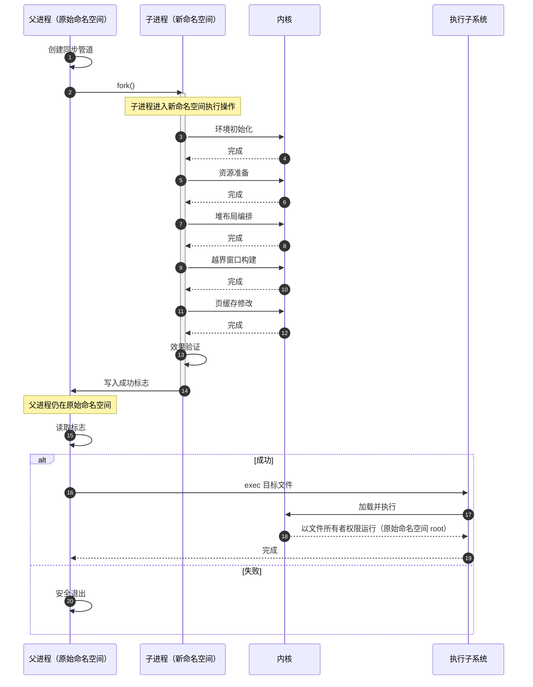
```mermaid
sequenceDiagram
    autonumber
    participant P as 父进程（原始命名空间）
    participant C as 子进程（新命名空间）
    participant K as 内核
    participant E as 执行子系统

    P->>P: 创建同步管道
    P->>C: fork()
    activate C
    Note over C: 子进程进入新命名空间执行操作
    C->>K: 环境初始化
    K-->>C: 完成
    C->>K: 资源准备
    K-->>C: 完成
    C->>K: 堆布局编排
    K-->>C: 完成
    C->>K: 越界窗口构建
    K-->>C: 完成
    C->>K: 页缓存修改
    K-->>C: 完成
    C->>C: 效果验证
    C->>P: 写入成功标志
    deactivate C
    Note over P: 父进程仍在原始命名空间
    P->>P: 读取标志
    alt 成功
        P->>E: exec 目标文件
        E->>K: 加载并执行
        K-->>E: 以文件所有者权限运行（原始命名空间 root）
        E-->>P: 完成
    else 失败
        P->>P: 安全退出
    end
```

### 3-2. 阶段 0：环境初始化

子进程启动后，首先执行环境初始化。这一阶段的目标是为后续操作提供稳定、可预测的执行环境，主要包含两项工作：CPU 绑定与命名空间设置。CPU 绑定将子进程固定到某个 CPU 上，减少调度迁移对物理内存分配的影响。堆风水依赖物理内存分配的确定性，若线程在 CPU 之间迁移，不同 CPU 的 per-CPU 页帧缓存与伙伴系统空闲链表可能存在差异，导致分配结果偏离预期。命名空间设置则一次性创建用户命名空间、挂载命名空间与网络命名空间：用户命名空间使子进程在命名空间内获得必要的能力，便于后续对内存锁定与文件描述符的操作；挂载命名空间用于隔离文件系统视图；网络命名空间用于隔离网络设备接口，使子进程能够在隔离环境中创建特定类型的套接字，为后续堆布局中的缓冲区喷射提供支持。三者的创建可以在同一次 `unshare()` 调用中完成，无需分多次执行。

这一阶段的交互过程较为直接，子进程依次完成 CPU 绑定与命名空间的创建，随后进入资源准备阶段。其调用顺序与参与者如下：

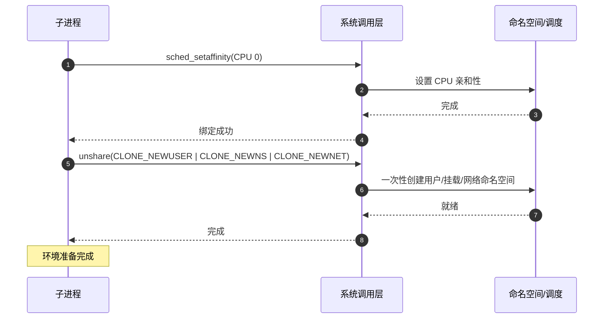
```mermaid
sequenceDiagram
    autonumber
    participant C as 子进程
    participant S as 系统调用层
    participant N as 命名空间/调度

    C->>S: sched_setaffinity(CPU 0)
    S->>N: 设置 CPU 亲和性
    N-->>S: 完成
    S-->>C: 绑定成功
    C->>S: unshare(CLONE_NEWUSER | CLONE_NEWNS | CLONE_NEWNET)
    S->>N: 一次性创建用户/挂载/网络命名空间
    N-->>S: 就绪
    S-->>C: 完成
    Note over C: 环境准备完成
```

### 3-3. 阶段 1：资源准备

环境就绪后，子进程进入资源准备阶段，需要完成三类资源的创建或打开。首先是创建一个指定页数的 memfd，作为 udmabuf 的后备存储。memfd 的页数决定了内核中 `pages[]` 数组的大小，进而决定其对应的 buddy 分配阶数。选择合适的页数，使 `pages[]` 恰好对应目标阶数的 buddy 分配，为后续堆布局奠定基础。随后打开 `/dev/udmabuf`，获得用于执行创建命令的文件描述符。最后打开一个具有 SUID 属性的可执行文件，作为后续页缓存内容修改的对象。该文件的页缓存页将在后续阶段被注入管道，并通过越界缺页映射到用户态。

资源准备阶段的交互流程如下所示：

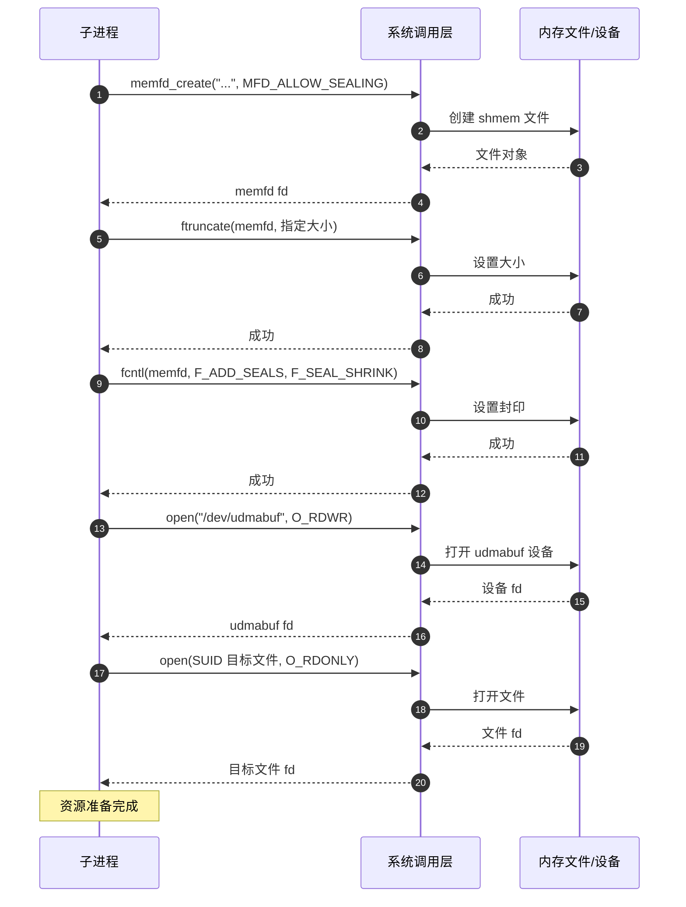
```mermaid
sequenceDiagram
    autonumber
    participant C as 子进程
    participant S as 系统调用层
    participant M as 内存文件/设备

    C->>S: memfd_create("...", MFD_ALLOW_SEALING)
    S->>M: 创建 shmem 文件
    M-->>S: 文件对象
    S-->>C: memfd fd
    C->>S: ftruncate(memfd, 指定大小)
    S->>M: 设置大小
    M-->>S: 成功
    S-->>C: 成功
    C->>S: fcntl(memfd, F_ADD_SEALS, F_SEAL_SHRINK)
    S->>M: 设置封印
    M-->>S: 成功
    S-->>C: 成功
    C->>S: open("/dev/udmabuf", O_RDWR)
    S->>M: 打开 udmabuf 设备
    M-->>S: 设备 fd
    S-->>C: udmabuf fd
    C->>S: open(SUID 目标文件, O_RDONLY)
    S->>M: 打开文件
    M-->>S: 文件 fd
    S-->>C: 目标文件 fd
    Note over C: 资源准备完成
```

### 3-4. 阶段 2：堆布局编排

资源准备完成后，子进程进入整个方案中最关键的阶段——堆布局编排。目标是让 udmabuf 的 `pages[]` 数组在物理内存中恰好落在某个目标对象所在 slab 页之前。为达成这一目标，需要依次执行若干步骤：先消耗低阶空闲链表，避免后续释放的小块合并回高阶块而污染目标阶数的空闲链表；随后喷射目标阶数的块，使每次分配都从更高阶块拆分，从而得到物理相邻的块；接着释放奇数索引的块，留下空洞；再将目标对象分配至这些空洞；然后释放偶数索引的块，留下新的空洞；最后创建 udmabuf，使其 `pages[]` 数组落入这些新空洞中，最终与目标对象所在的 slab 页形成物理相邻关系。

整个堆布局编排过程中，子进程与内核之间的交互可以概括为以下序列：

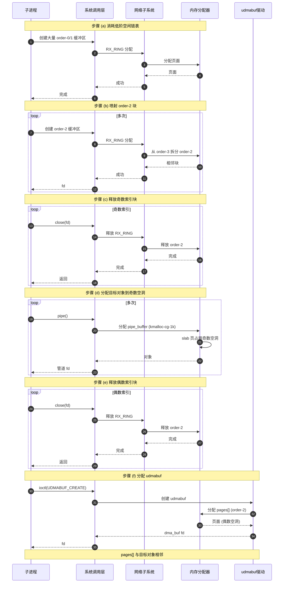
```mermaid
sequenceDiagram
    autonumber
    participant C as 子进程
    participant S as 系统调用层
    participant N as 网络子系统
    participant B as 内存分配器
    participant U as udmabuf驱动

    Note over C,B: 步骤 (a) 消耗低阶空闲链表
    C->>S: 创建大量 order-0/1 缓冲区
    S->>N: RX_RING 分配
    N->>B: 分配页面
    B-->>N: 页面
    N-->>S: 成功
    S-->>C: 完成

    Note over C,B: 步骤 (b) 喷射 order-2 块
    loop 多次
        C->>S: 创建 order-2 缓冲区
        S->>N: RX_RING 分配
        N->>B: 从 order-3 拆分 order-2
        B-->>N: 相邻块
        N-->>S: 成功
        S-->>C: fd
    end

    Note over C,B: 步骤 (c) 释放奇数索引块
    loop 奇数索引
        C->>S: close(fd)
        S->>N: 释放 RX_RING
        N->>B: 释放 order-2
        B-->>N: 完成
        N-->>S: 完成
        S-->>C: 返回
    end

    Note over C,B: 步骤 (d) 分配目标对象到奇数空洞
    loop 多次
        C->>S: pipe()
        S->>B: 分配 pipe_buffer (kmalloc-cg-1k)
        B->>B: slab 页占用奇数空洞
        B-->>S: 对象
        S-->>C: 管道 fd
    end

    Note over C,B: 步骤 (e) 释放偶数索引块
    loop 偶数索引
        C->>S: close(fd)
        S->>N: 释放 RX_RING
        N->>B: 释放 order-2
        B-->>N: 完成
        N-->>S: 完成
        S-->>C: 返回
    end

    Note over C,U: 步骤 (f) 分配 udmabuf
    C->>S: ioctl(UDMABUF_CREATE)
    S->>U: 创建 udmabuf
    U->>B: 分配 pages[] (order-2)
    B-->>U: 页面 (偶数空洞)
    U-->>S: dma_buf fd
    S-->>C: fd
    Note over C,U: pages[] 与目标对象相邻
```

### 3-5. 阶段 3：越界窗口构建

堆布局完成后，`pages[]` 数组已与目标对象所在的 slab 页形成物理相邻关系。接下来，子进程利用 udmabuf 的 mmap 与 mremap 机制构造越界缺页窗口。首先对 udmabuf 导出的 dma_buf 文件描述符调用 `mmap()`，建立初始映射。初始映射受 dma_buf 内部的范围检查约束，页偏移与页数之和不得超过 dma_buf 的大小。随后调用 `mremap()` 将 VMA 扩大一个页，新增页对应的 `vmf->pgoff` 达到 `pagecount`，即数组末尾之后的首个索引。`mremap()` 不会重新进入 dma_buf 的范围检查，因此初始检查不会再次执行。当子进程访问新增页时，会触发缺页异常，内核调用 `udmabuf_vm_fault()`。该函数以越界的 `vmf->pgoff` 索引 `pages[]`，读取数组之后的 8 字节，并将其解释为 `struct page *`。

越界窗口构建阶段的交互时序如下：

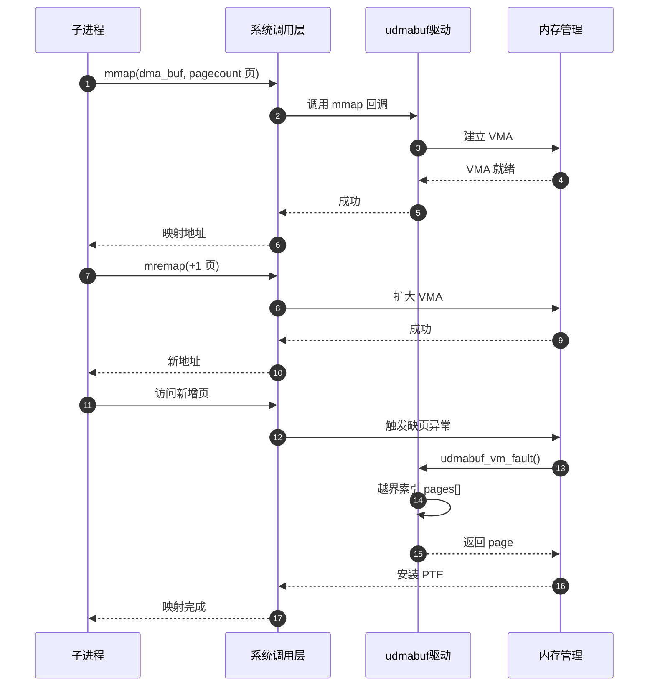
```mermaid
sequenceDiagram
    autonumber
    participant C as 子进程
    participant S as 系统调用层
    participant U as udmabuf驱动
    participant M as 内存管理

    C->>S: mmap(dma_buf, pagecount 页)
    S->>U: 调用 mmap 回调
    U->>M: 建立 VMA
    M-->>U: VMA 就绪
    U-->>S: 成功
    S-->>C: 映射地址

    C->>S: mremap(+1 页)
    S->>M: 扩大 VMA
    M-->>S: 成功
    S-->>C: 新地址

    C->>S: 访问新增页
    S->>M: 触发缺页异常
    M->>U: udmabuf_vm_fault()
    U->>U: 越界索引 pages[]
    U-->>M: 返回 page
    M-->>S: 安装 PTE
    S-->>C: 映射完成
```

### 3-6. 阶段 4：页缓存内容修改

越界窗口构建完成后，子进程进入页缓存内容修改阶段。子进程通过 `splice()` 将目标文件的页缓存页注入管道，`splice()` 会把该页的 `struct page *` 写入管道缓冲区的首字段。由于阶段 2 已使 `pages[]` 与管道缓冲区所在的 slab 页物理相邻，越界索引读取到的正好是该 `struct page *`。随后，阶段 3 触发的缺页处理会将 `pipe_buffer->page` 视为缺页结果页，并将其映射到用户态 VMA。子进程通过该映射写入预定内容。

此处修改的是目标文件的页缓存页，而非直接写入磁盘文件。页缓存页被修改后会被标记为脏页，内核可能稍后将其同步到磁盘。无论回写是否发生，修改结果最终都会反映在目标文件中，不影响方案的执行。

页缓存内容修改阶段的交互时序如下：

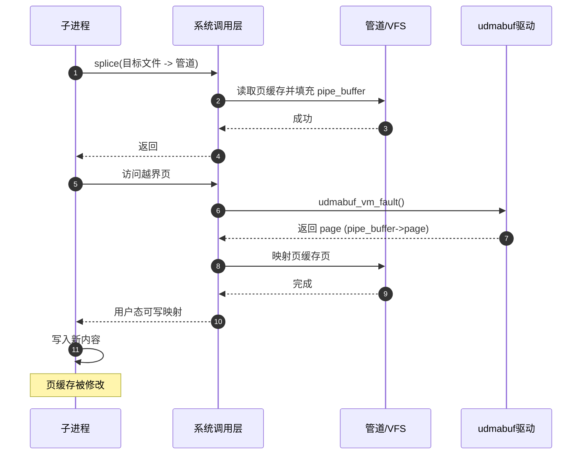
```mermaid
sequenceDiagram
    autonumber
    participant C as 子进程
    participant S as 系统调用层
    participant P as 管道/VFS
    participant U as udmabuf驱动

    C->>S: splice(目标文件 -> 管道)
    S->>P: 读取页缓存并填充 pipe_buffer
    P-->>S: 成功
    S-->>C: 返回

    C->>S: 访问越界页
    S->>U: udmabuf_vm_fault()
    U-->>S: 返回 page (pipe_buffer->page)
    S->>P: 映射页缓存页
    P-->>S: 完成
    S-->>C: 用户态可写映射

    C->>C: 写入新内容
    Note over C: 页缓存被修改
```

### 3-7. 阶段 5：效果验证与权限提升

页缓存内容修改完成后，子进程执行效果验证：回读目标文件，确认页缓存内容是否已被修改。若修改成功，回读结果将与原始内容不同。验证通过后，子进程将成功标志写入同步管道。父进程读取标志后，执行目标文件。由于目标文件具有 SUID 属性，且其页缓存已被修改，执行时将以文件所有者的权限运行修改后的内容。若验证失败，子进程写入失败标志，父进程读取后安全退出。

效果验证与权限提升阶段的交互时序如下：

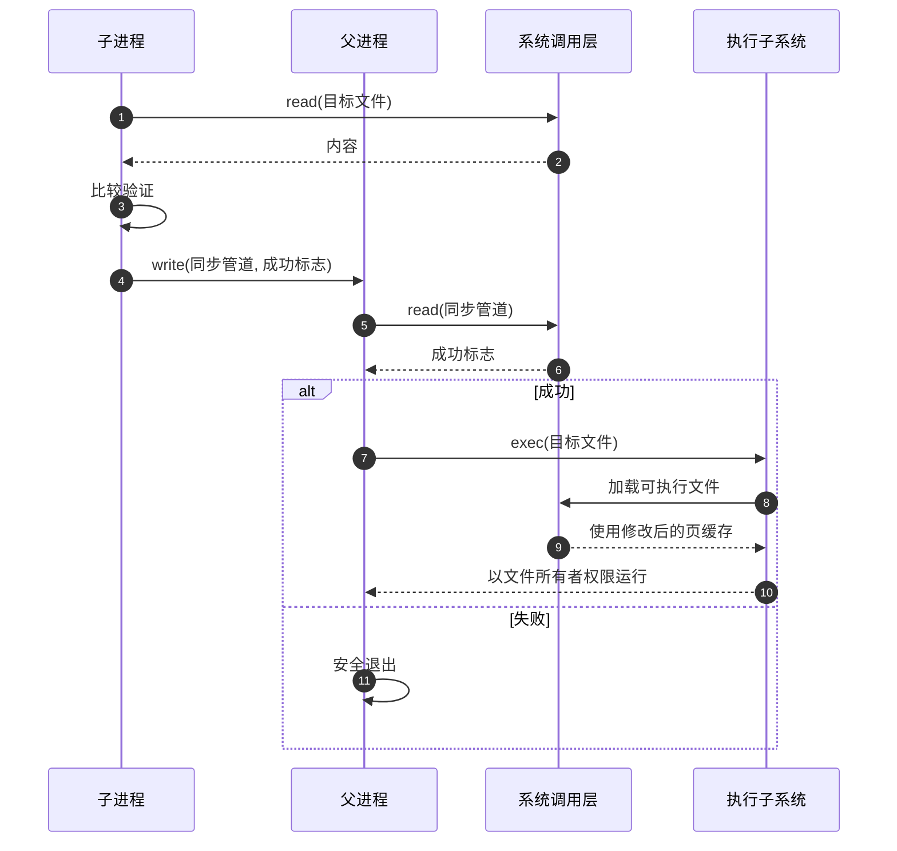
```mermaid
sequenceDiagram
    autonumber
    participant C as 子进程
    participant P as 父进程
    participant S as 系统调用层
    participant E as 执行子系统

    C->>S: read(目标文件)
    S-->>C: 内容
    C->>C: 比较验证
    C->>P: write(同步管道, 成功标志)
    P->>S: read(同步管道)
    S-->>P: 成功标志

    alt 成功
        P->>E: exec(目标文件)
        E->>S: 加载可执行文件
        S-->>E: 使用修改后的页缓存
        E-->>P: 以文件所有者权限运行
    else 失败
        P->>P: 安全退出
    end
```

### 3-8. 内核保护机制的应对策略

现代内核通常启用多种安全机制，这些机制分别从地址空间随机化、执行权限隔离、内存分配隔离、堆元数据保护以及内核与用户态数据交换边界等维度，对潜在的内存破坏行为进行防御。本方案在设计之初便充分考量了这些保护机制的影响，并针对性地选择了相应的技术路径。下表逐项列出各机制的原理与本方案的应对策略。

| 保护机制                             | 机制原理                                                               | 本方案应对策略                                                                                                                                                                                                                                                                                                                                                                                                        |
| ------------------------------------ | ---------------------------------------------------------------------- | --------------------------------------------------------------------------------------------------------------------------------------------------------------------------------------------------------------------------------------------------------------------------------------------------------------------------------------------------------------------------------------------------------------------- |
| **KASLR**                            | 随机化内核代码段、数据段和模块的加载基址。                             | data-only 路径，不依赖内核地址预测，无需执行内核代码或覆写函数指针。                                                                                                                                                                                                                                                                                                                                                  |
| **SMEP/SMAP**                        | SMEP 阻止内核态执行用户态代码；SMAP 阻止内核态访问用户态数据。         | 不执行内核代码，通过修改用户态 SUID 文件的页缓存完成权限提升，执行完全在用户态进行。                                                                                                                                                                                                                                                                                                                                  |
| **KPTI**                             | 分离内核页表与用户页表，使用户态页表不包含内核映射。                   | 全程通过合法系统调用完成，不依赖用户态直接访问内核地址空间。                                                                                                                                                                                                                                                                                                                                                          |
| **CONFIG_MEMCG / CONFIG_MEMCG_KMEM** | 为受控进程创建独立的 `kmalloc-cg-*` 缓存，与普通 `kmalloc-*` 隔离。    | 该机制不影响页级堆风水操作。`ubuf->pages` 由 `kmalloc_array(GFP_KERNEL)` 分配，属于普通 `kmalloc-*` 缓存；`pipe_buffer` 数组由 `kcalloc(GFP_KERNEL_ACCOUNT)` 分配，属于 `kmalloc-cg-1k` 缓存。两者虽属不同 slab 缓存，但其底层 slab 页均来自 buddy 分配器。页级堆风水操作针对的是 buddy 分配器的 order-2 物理页面，通过控制页面的分配与释放顺序构造相邻关系，与 slab 缓存隔离无关。因此，该机制不影响本方案的堆布局。 |
| **CONFIG_SLAB_FREELIST_RANDOM**      | 随机化 SLUB 空闲链表中的对象顺序，增加同一 slab 内分配顺序的预测难度。 | 该机制作用于 SLUB 分配器内部，不影响 buddy 分配器的物理页面级布局。方案核心依赖的是 order-2 物理页面的相邻关系，该关系由 buddy 分配器的拆分行为决定，与 SLUB 空闲链表随机化无关。`pipe_buffer` 数组在 `kmalloc-cg-1k` 缓存内的具体槽位选择可能受随机化影响，但通过大量堆喷可覆盖足够多的 slab 页，保证目标 slab 页被成功占据。                                                                                        |
| **CONFIG_SLAB_FREELIST_HARDENED**    | 对空闲链表指针进行异或混淆，防止通过覆写指针实现任意分配。             | 基于 buddy 分配器的页面级布局，不依赖 SLUB 空闲链表指针覆写，该保护不构成影响。                                                                                                                                                                                                                                                                                                                                       |
| **CONFIG_HARDENED_USERCOPY**         | 在 `copy_to_user()` / `copy_from_user()` 路径中增加边界检查。          | 越界写入发生在内核上下文的 `memcpy()` 中，不经过 `copy_to_user()` / `copy_from_user()` 路径，检查机制无法覆盖。                                                                                                                                                                                                                                                                                                       |

整体而言，本方案通过 data-only 路径、物理页面级布局与内核内部拷贝路径等设计选择，有效规避了上述保护机制。其中，`CONFIG_SLAB_FREELIST_RANDOM` 可能对 `pipe_buffer` 数组在 slab 内的具体槽位选择产生轻微影响，但其影响可通过大规模堆喷予以消解；buddy 分配器层面的 order-2 页面相邻关系不受该机制影响。其余机制或与技术路径无关，或被设计选择从根本上规避。

### 3-9. 前提条件与局限性

**前提条件**：

1. 内核需启用 `CONFIG_UDMABUF`，且 `/dev/udmabuf` 对本地用户可访问。
2. 内核版本处于受影响的范围内。
3. 目标系统存在具有 SUID 属性的可执行文件，且该文件的页缓存可被注入管道。
4. 本地用户具备创建用户命名空间与网络命名空间的权限，并能在网络命名空间内创建 `AF_PACKET` 套接字（需要 `CAP_NET_RAW`，该能力可在未特权用户命名空间内获得）。

**局限性**：

1. 堆布局编排依赖 buddy 分配器与 SLUB 缓存的确定性行为，若系统中存在大量并发内存分配，可能影响布局稳定性。
2. 方案的有效性受目标内核配置与运行时环境影响，不同发行版或不同内核版本可能需要调整参数（如 RX_RING 喷射数量、管道数量、memfd 页数等）。
3. 若目标系统禁用了未特权用户命名空间，则无法在命名空间内获得 `CAP_NET_RAW`，阶段 0 与阶段 2 的前置条件不满足。

### 3-10. 章节总结

本章从整体架构设计出发，明确了父子进程的协作模式及其根本原因：子进程在用户命名空间与网络命名空间中完成全部内核交互与内存布局操作，父进程留在原始命名空间中执行被修改的 SUID 文件，以完成权限提升。随后，本章将方案拆分为环境初始化、资源准备、堆布局编排、越界窗口构建、页缓存内容修改与效果验证六个阶段，并逐项分析了各阶段的关键操作与阶段间的衔接关系。每个阶段均以序列图呈现其交互时序，文字与图自然衔接，便于理解。最后，本章梳理了现代内核保护机制对本方案的影响，并给出了相应的应对策略，同时列出了方案的前提条件与局限性。

整体来看，本方案通过 data-only 路径与物理页面级布局，在典型加固环境中仍能有效运作。堆布局编排是方案的核心，其稳定性决定了整体流程的可复现性；保护机制的应对策略则从设计层面规避了常见防御手段。父子进程架构将“修改页缓存”与“执行被修改文件”分离，既保证了子进程能在命名空间内完成必要的内核交互，又使父进程能在原始命名空间中完成最终的权限提升。

### 3-11. 测试结果

<div style="text-align: center; margin: 2rem 0;">
  
</div>

## 4. 利用思路二

### 4-1. 整体架构设计

思路二与思路一在目标上一致，均旨在通过 **CVE-2023-2008** 的越界索引缺陷完成权限提升，但技术路径不同。思路一通过越界缺页将目标文件的页缓存页映射到用户态，直接修改页缓存内容；思路二则不修改页缓存，而是将越界索引作为读取窗口，泄露相邻 slab 页中的 `pipe_buffer` 结构，进而构造物理读写原语，最终修改父进程 `task_struct` 中的 `cred`、`real_cred` 与 `nsproxy`，完成权限提升。

方案仍采用父子进程协作架构。子进程在新创建的用户命名空间与网络命名空间中执行全部内核交互与内存布局操作，包括环境初始化、资源准备、堆布局编排、越界窗口构建、目标管道定位、物理读写原语构造、内核基址定位、`task_struct` 定位与 `cred` 修改。父进程留在原始命名空间中，等待子进程的同步信号，并在确认修改成功后执行 root shell。采用父子进程分离的原因与思路一相同：用户命名空间内的进程无法获得原始命名空间中的 root 权限，必须在原始命名空间中完成最终的权限提升。父子进程之间通过同步管道通信，子进程完成所有阶段后向管道写入成功或失败标志，父进程读取标志后执行相应操作。

整个协作过程的交互时序可以表示为：

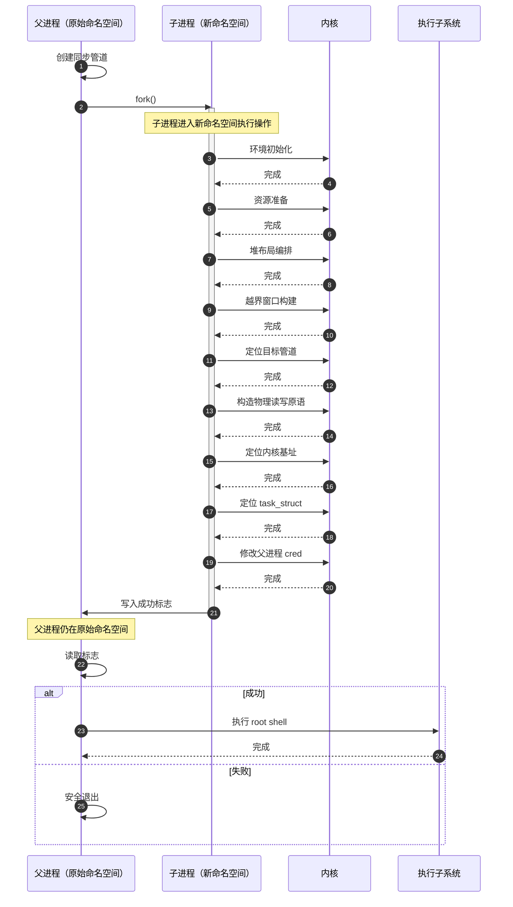
```mermaid
sequenceDiagram
    autonumber
    participant P as 父进程（原始命名空间）
    participant C as 子进程（新命名空间）
    participant K as 内核
    participant E as 执行子系统

    P->>P: 创建同步管道
    P->>C: fork()
    activate C
    Note over C: 子进程进入新命名空间执行操作
    C->>K: 环境初始化
    K-->>C: 完成
    C->>K: 资源准备
    K-->>C: 完成
    C->>K: 堆布局编排
    K-->>C: 完成
    C->>K: 越界窗口构建
    K-->>C: 完成
    C->>K: 定位目标管道
    K-->>C: 完成
    C->>K: 构造物理读写原语
    K-->>C: 完成
    C->>K: 定位内核基址
    K-->>C: 完成
    C->>K: 定位 task_struct
    K-->>C: 完成
    C->>K: 修改父进程 cred
    K-->>C: 完成
    C->>P: 写入成功标志
    deactivate C
    Note over P: 父进程仍在原始命名空间
    P->>P: 读取标志
    alt 成功
        P->>E: 执行 root shell
        E-->>P: 完成
    else 失败
        P->>P: 安全退出
    end
```

### 4-2. 阶段 0：环境初始化

子进程启动后，首先执行环境初始化。这一阶段的目标是为后续操作提供稳定、可预测的执行环境，主要包含两项工作：CPU 绑定与命名空间设置。CPU 绑定将子进程固定到某个 CPU 上，减少调度迁移对物理内存分配的影响。命名空间设置则一次性创建用户命名空间、挂载命名空间与网络命名空间：用户命名空间使子进程在命名空间内获得必要的能力，便于后续对内存锁定与文件描述符的操作；挂载命名空间用于隔离文件系统视图；网络命名空间用于隔离网络设备接口，使子进程能够在隔离环境中创建特定类型的套接字，为后续堆布局中的缓冲区喷射提供支持。三者的创建可以在同一次 `unshare()` 调用中完成，无需分多次执行。

这一阶段的交互过程较为直接，子进程依次完成 CPU 绑定与命名空间的创建，随后进入资源准备阶段。其调用顺序与参与者如下：


```mermaid
sequenceDiagram
    autonumber
    participant C as 子进程
    participant S as 系统调用层
    participant N as 命名空间/调度

    C->>S: sched_setaffinity(CPU 0)
    S->>N: 设置 CPU 亲和性
    N-->>S: 完成
    S-->>C: 绑定成功
    C->>S: unshare(CLONE_NEWUSER | CLONE_NEWNS | CLONE_NEWNET)
    S->>N: 一次性创建用户/挂载/网络命名空间
    N-->>S: 就绪
    S-->>C: 完成
    Note over C: 环境准备完成
```

### 4-3. 阶段 1：资源准备

环境就绪后，子进程进入资源准备阶段，需要完成若干资源的创建或初始化。首先提高文件描述符上限，以便后续创建大量管道与套接字。随后初始化 SKB 喷射器，用于在后续阶段回收释放的 slab 块，保持越界窗口的稳定性。接着创建一个指定页数的 `memfd`，作为 `udmabuf` 的后备存储。`memfd` 的页数决定了内核中 `pages[]` 数组的大小，进而决定其对应的 buddy 分配阶数。选择合适的页数，使 `pages[]` 恰好对应目标阶数的 buddy 分配，为后续堆布局奠定基础。最后打开 `/dev/udmabuf`，获得用于执行创建命令的文件描述符。

资源准备阶段的交互流程如下所示：

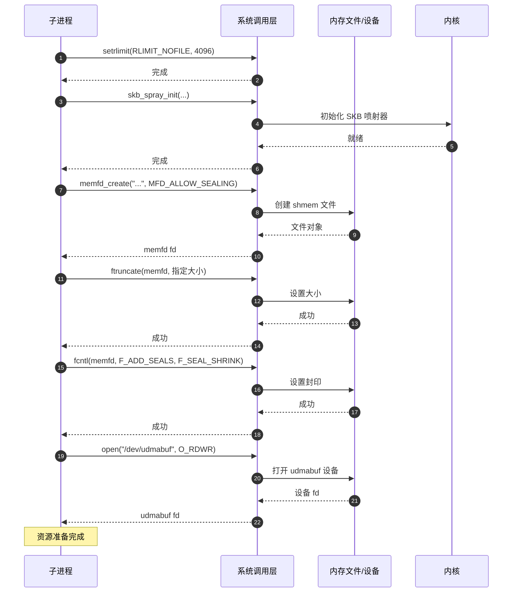
```mermaid
sequenceDiagram
    autonumber
    participant C as 子进程
    participant S as 系统调用层
    participant M as 内存文件/设备
    participant K as 内核

    C->>S: setrlimit(RLIMIT_NOFILE, 4096)
    S-->>C: 完成
    C->>S: skb_spray_init(...)
    S->>K: 初始化 SKB 喷射器
    K-->>S: 就绪
    S-->>C: 完成
    C->>S: memfd_create("...", MFD_ALLOW_SEALING)
    S->>M: 创建 shmem 文件
    M-->>S: 文件对象
    S-->>C: memfd fd
    C->>S: ftruncate(memfd, 指定大小)
    S->>M: 设置大小
    M-->>S: 成功
    S-->>C: 成功
    C->>S: fcntl(memfd, F_ADD_SEALS, F_SEAL_SHRINK)
    S->>M: 设置封印
    M-->>S: 成功
    S-->>C: 成功
    C->>S: open("/dev/udmabuf", O_RDWR)
    S->>M: 打开 udmabuf 设备
    M-->>S: 设备 fd
    S-->>C: udmabuf fd
    Note over C: 资源准备完成
```

### 4-4. 阶段 2：堆布局编排

资源准备完成后，子进程进入堆布局编排阶段。目标是让 `udmabuf` 的 `pages[]` 数组在物理内存中恰好落在某个 `pipe_buffer` 数组所在 slab 页之前。堆布局编排遵循以下原则：先消耗低阶空闲链表，避免后续释放的小块合并回高阶块而污染目标阶数的空闲链表；随后喷射目标阶数的块，使每次分配都从更高阶块拆分，从而得到物理相邻的块；接着释放奇数索引的块，留下空洞；再将 `pipe_buffer` 数组分配至这些空洞；然后释放偶数索引的块，留下新的空洞；最后创建 `udmabuf`，使其 `pages[]` 数组落入这些新空洞中，最终与 `pipe_buffer` 数组所在的 slab 页形成物理相邻关系。

整个堆布局编排过程中，子进程与内核之间的交互可以概括为以下序列：

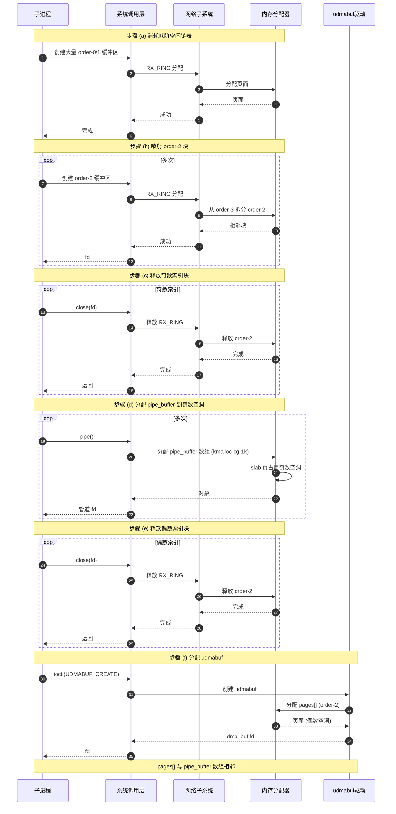
```mermaid
sequenceDiagram
    autonumber
    participant C as 子进程
    participant S as 系统调用层
    participant N as 网络子系统
    participant B as 内存分配器
    participant U as udmabuf驱动

    Note over C,B: 步骤 (a) 消耗低阶空闲链表
    C->>S: 创建大量 order-0/1 缓冲区
    S->>N: RX_RING 分配
    N->>B: 分配页面
    B-->>N: 页面
    N-->>S: 成功
    S-->>C: 完成

    Note over C,B: 步骤 (b) 喷射 order-2 块
    loop 多次
        C->>S: 创建 order-2 缓冲区
        S->>N: RX_RING 分配
        N->>B: 从 order-3 拆分 order-2
        B-->>N: 相邻块
        N-->>S: 成功
        S-->>C: fd
    end

    Note over C,B: 步骤 (c) 释放奇数索引块
    loop 奇数索引
        C->>S: close(fd)
        S->>N: 释放 RX_RING
        N->>B: 释放 order-2
        B-->>N: 完成
        N-->>S: 完成
        S-->>C: 返回
    end

    Note over C,B: 步骤 (d) 分配 pipe_buffer 到奇数空洞
    loop 多次
        C->>S: pipe()
        S->>B: 分配 pipe_buffer 数组 (kmalloc-cg-1k)
        B->>B: slab 页占用奇数空洞
        B-->>S: 对象
        S-->>C: 管道 fd
    end

    Note over C,B: 步骤 (e) 释放偶数索引块
    loop 偶数索引
        C->>S: close(fd)
        S->>N: 释放 RX_RING
        N->>B: 释放 order-2
        B-->>N: 完成
        N-->>S: 完成
        S-->>C: 返回
    end

    Note over C,U: 步骤 (f) 分配 udmabuf
    C->>S: ioctl(UDMABUF_CREATE)
    S->>U: 创建 udmabuf
    U->>B: 分配 pages[] (order-2)
    B-->>U: 页面 (偶数空洞)
    U-->>S: dma_buf fd
    S-->>C: fd
    Note over C,U: pages[] 与 pipe_buffer 数组相邻
```

### 4-5. 阶段 3：越界窗口构建

堆布局完成后，`pages[]` 数组已与 `pipe_buffer` 数组所在的 slab 页形成物理相邻关系。接下来，子进程利用 `udmabuf` 的 `mmap` 与 `mremap` 机制构造越界缺页窗口。首先对 `udmabuf` 导出的 `dma_buf` 文件描述符调用 `mmap()`，建立初始映射。随后调用 `mremap()` 将 VMA 扩大若干页，使新增页对应的缺页偏移越过 `pagecount`。

`pages[]` 数组中的每个元素为 `struct page *`，占 8 字节。`pipe_buffer` 结构体大小为 0x28（40 字节），其内部字段布局为：`page` 位于偏移 0x0，`offset` 位于偏移 0x8，`len` 位于偏移 0xc，`ops` 位于偏移 0x10，`flags` 位于偏移 0x18，`private` 位于偏移 0x20。相邻 slab 页中依次存放多个 `pipe_buffer`，第一个 `pipe_buffer` 的 `page` 字段位于该 slab 页偏移 0x0，第二个 `pipe_buffer` 的 `page` 字段位于偏移 0x28。

当子进程以某个越界偏移访问页时，缺页处理函数会以该偏移索引 `pages[]`，读取数组之后的 8 字节，并将其解释为 `struct page *`，随后调用 `get_page()` 递增其引用计数。因此，只有恰好落在某个 `pipe_buffer->page` 字段上的偏移才是可用的；若偏移落在 `pipe_buffer` 的其他字段上，读取到的 8 字节并非有效的页指针，`get_page()` 访问该指针的引用计数时会触发内核错误。可用与不可用的偏移如下：

| 越界偏移                  | 字节位置（相对 `pages[]` 末尾） | 对应字段                                       | 是否可用                                                            |
| ------------------------- | ------------------------------- | ---------------------------------------------- | ------------------------------------------------------------------- |
| `pages[UDMA_PAGE_NR + 0]` | 0x0                             | 第一个 `pipe_buffer` 的 `page` 字段            | 可用，用于第二次触发，泄露 `pipe_buffer` 数组并定位 `evil_pipe_idx` |
| `pages[UDMA_PAGE_NR + 1]` | 0x8                             | 第一个 `pipe_buffer` 的 `offset` 与 `len` 字段 | 不可用，非页指针                                                    |
| `pages[UDMA_PAGE_NR + 2]` | 0x10                            | 第一个 `pipe_buffer` 的 `ops` 字段             | 不可用，非页指针                                                    |
| `pages[UDMA_PAGE_NR + 3]` | 0x18                            | 第一个 `pipe_buffer` 的 `flags` 字段           | 不可用，非页指针                                                    |
| `pages[UDMA_PAGE_NR + 4]` | 0x20                            | 第一个 `pipe_buffer` 的 `private` 字段         | 不可用，非页指针                                                    |
| `pages[UDMA_PAGE_NR + 5]` | 0x28                            | 第二个 `pipe_buffer` 的 `page` 字段            | 可用，用于第一次触发，定位 `victim_pipe_idx`                        |

因此，方案中仅使用 `UDMA_PAGE_NR + 0` 与 `UDMA_PAGE_NR + 5` 两个偏移。

第一次触发使用 `UDMA_PAGE_NR + 5`，越界读取相邻 slab 页中第二个 `pipe_buffer` 的 `page` 字段。该字段指向目标管道的第二个数据页，缺页处理将该数据页映射到用户态后，子进程即可读取其中的标记字符串与管道索引，确定 `victim_pipe_idx`。

第二次触发使用 `UDMA_PAGE_NR + 0`，越界读取相邻 slab 页中第一个 `pipe_buffer` 的 `page` 字段。该字段仍指向 `victim_pipe_idx` 的第一个数据页。此时该数据页已被 `kmalloc-cg-192` 的 slab 页占用，页内数据不再是原来的管道数据，而是多个管道的 `pipe_buffer` 数组。缺页处理将该数据页映射到用户态后，子进程读取整页内容，逐槽位解析 `pipe_buffer` 数组，确定 `evil_pipe_idx`。

越界窗口构建阶段的交互时序如下：

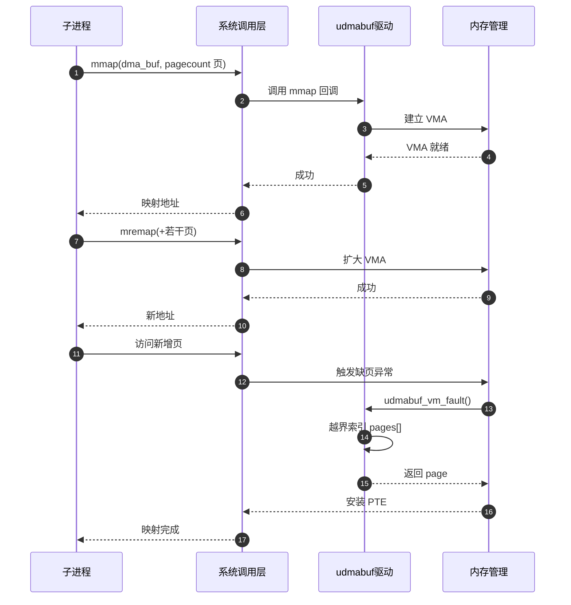
```mermaid
sequenceDiagram
    autonumber
    participant C as 子进程
    participant S as 系统调用层
    participant U as udmabuf驱动
    participant M as 内存管理

    C->>S: mmap(dma_buf, pagecount 页)
    S->>U: 调用 mmap 回调
    U->>M: 建立 VMA
    M-->>U: VMA 就绪
    U-->>S: 成功
    S-->>C: 映射地址

    C->>S: mremap(+若干页)
    S->>M: 扩大 VMA
    M-->>S: 成功
    S-->>C: 新地址

    C->>S: 访问新增页
    S->>M: 触发缺页异常
    M->>U: udmabuf_vm_fault()
    U->>U: 越界索引 pages[]
    U-->>M: 返回 page
    M-->>S: 安装 PTE
    S-->>C: 映射完成
```

### 4-6. 阶段 4：定位目标管道

越界窗口就绪后，子进程进入目标管道定位阶段。首先，子进程向所有管道写入特定长度的数据，使每个管道拥有两个 `pipe_buffer`，并在第二个数据页的起始处写入标记字符串与管道索引。

子进程通过越界窗口以偏移 `UDMA_PAGE_NR + 5` 读取 `pages[]` 之后的 8 字节。该偏移对应相邻 slab 页中第二个 `pipe_buffer` 的 `page` 字段。缺页处理将该字段指向的页映射到用户态后，子进程读取其中的标记字符串与管道索引，确定 `victim_pipe_idx`。

确定目标管道后，子进程关闭该管道。关闭 `victim_pipe_idx` 时，内核释放该管道持有的两个 `pipe_buffer` 所引用的页：

- 第一个 `pipe_buffer->page` 指向该管道的第一个数据页。关闭管道时，该页的引用计数递减为零，页被释放并返回 **order-0 buddy system**。
- 第二个 `pipe_buffer->page` 指向该管道的第二个数据页。由于此前越界缺页处理已经通过 `udmabuf_vm_fault()` 对该页执行了 `get_page()`，其引用计数被额外递增，关闭管道时该页的引用计数不会归零，因此该页**保持 pinned 状态，不会被释放**。

随后，子进程调整其余管道的大小，使 `pipe_buffer` 数组从 `kmalloc-cg-1k` 迁移到 `kmalloc-cg-192`。在此过程中，内核释放旧的 `pipe_buffer` 数组，并在 `kmalloc-cg-192` 缓存中分配新的数组。新数组的 slab 页会从刚释放的 order-0 页面中分配。一个 order-0 页面（4 KiB）可容纳多个 `kmalloc-cg-192` 对象，因此该页面会被多个管道的新 `pipe_buffer` 数组共同占用，而不仅是一个数组。调整大小时，内核会将旧 `pipe_buffer` 数组的内容复制到新数组中，因此每个新数组中的 `pipe_buffer` 字段与其旧数组一致。

这一变化意味着：原来第一个 `pipe_buffer->page` 指向的物理页是一个数据页，页内数据是管道写入的标记字符串等；现在该物理页已被 `kmalloc-cg-192` 的 slab 页占用，页内数据变成了多个管道的 `pipe_buffer` 数组。这些数组在页内按对象槽位依次排列，每个数组占用一个 `kmalloc-cg-192` 对象槽位。

第二次触发缺页异常时，子进程通过越界窗口以偏移 `UDMA_PAGE_NR + 0` 读取 `pages[]` 之后的 8 字节。该偏移对应相邻 slab 页中第一个 `pipe_buffer` 的 `page` 字段，即 `victim_pipe_idx` 的第一个 `pipe_buffer->page`。该指针仍然指向原来的第一个数据页，但该页的内容已经变为多个 `pipe_buffer` 数组。缺页处理将该指针指向的物理页映射到用户态后，用户态可以读取到整页 0x1000 字节的内容，其中包含该页内所有 `pipe_buffer` 数组的完整数据。

子进程从该页的起始处依次解析各个 `kmalloc-cg-192` 对象槽位。每个槽位对应一个管道的 `pipe_buffer` 数组，其中第一个 `pipe_buffer` 的 `page` 位于槽位偏移 0x0，`offset` 位于 0x8，`len` 位于 0xc，`ops` 位于 0x10，`flags` 位于 0x18，`private` 位于 0x20；第二个 `pipe_buffer` 位于槽位偏移 0x28。子进程遍历该页内的所有槽位，结合各个管道的数据内容，确定哪个管道的 `pipe_buffer` 数组被越界窗口引用，即 `evil_pipe_idx`。

最后，子进程通过 SKB 喷射回收释放的 slab 块，使越界窗口在后续阶段保持稳定。

定位目标管道阶段的交互时序如下：

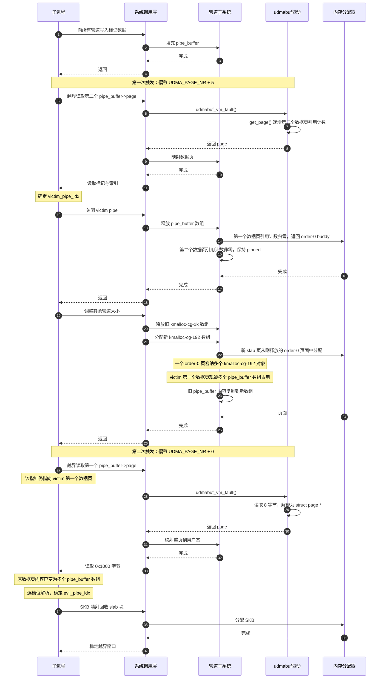
```mermaid
sequenceDiagram
    autonumber
    participant C as 子进程
    participant S as 系统调用层
    participant P as 管道子系统
    participant U as udmabuf驱动
    participant B as 内存分配器

    C->>S: 向所有管道写入标记数据
    S->>P: 填充 pipe_buffer
    P-->>S: 完成
    S-->>C: 返回

    Note over C,U: 第一次触发：偏移 UDMA_PAGE_NR + 5
    C->>S: 越界读取第二个 pipe_buffer->page
    S->>U: udmabuf_vm_fault()
    U->>U: get_page() 递增第二个数据页引用计数
    U-->>S: 返回 page
    S->>P: 映射数据页
    P-->>S: 完成
    S-->>C: 读取标记与索引
    Note over C: 确定 victim_pipe_idx

    C->>S: 关闭 victim pipe
    S->>P: 释放 pipe_buffer 数组
    P->>B: 第一个数据页引用计数归零，返回 order-0 buddy
    P->>P: 第二个数据页引用计数非零，保持 pinned
    B-->>P: 完成
    P-->>S: 完成
    S-->>C: 返回

    C->>S: 调整其余管道大小
    S->>P: 释放旧 kmalloc-cg-1k 数组
    S->>P: 分配新 kmalloc-cg-192 数组
    P->>B: 新 slab 页从刚释放的 order-0 页面中分配
    Note over P: 一个 order-0 页容纳多个 kmalloc-cg-192 对象
    Note over P: victim 第一个数据页现被多个 pipe_buffer 数组占用
    P->>P: 旧 pipe_buffer 内容复制到新数组
    B-->>P: 页面
    P-->>S: 完成
    S-->>C: 返回

    Note over C,U: 第二次触发：偏移 UDMA_PAGE_NR + 0
    C->>S: 越界读取第一个 pipe_buffer->page
    Note over C: 该指针仍指向 victim 第一个数据页
    S->>U: udmabuf_vm_fault()
    U->>U: 读取 8 字节，解释为 struct page *
    U-->>S: 返回 page
    S->>P: 映射整页到用户态
    P-->>S: 完成
    S-->>C: 读取 0x1000 字节
    Note over C: 原数据页内容已变为多个 pipe_buffer 数组
    Note over C: 逐槽位解析，确定 evil_pipe_idx

    C->>S: SKB 喷射回收 slab 块
    S->>B: 分配 SKB
    B-->>S: 完成
    S-->>C: 稳定越界窗口
```

### 4-7. 阶段 5：构造物理读写原语

在通过越界窗口泄露 `pipe_buffer` 结构后，子进程进入物理读写原语构造阶段。此时，`victim_pipe_idx` 的第一个数据页已被 `kmalloc-cg-192` 的 slab 页占用，页内包含多个管道的 `pipe_buffer` 数组，其中某个数组属于 `evil_pipe_idx`。子进程通过越界窗口将泄露的 `pipe_buffer[1]` 的 `offset` 字段改写为 0x8，并写回相邻 slab 页，从而修改 `evil_pipe_idx` 管道的第二个 `pipe_buffer` 的偏移。随后，子进程依次读取所有管道的数据，若某个管道读取到的数据开头不再包含标记字符串，则该管道即为 `evil_pipe_idx`。

确定 `evil_pipe_idx` 后，子进程以泄露的 `pipe_buffer` 为模板，构造用于物理读写的伪造 `pipe_buffer`。读操作时，伪造缓冲区的 `page` 指向目标物理页的 `struct page`，`offset` 设置为页内偏移，`len` 设置为读取长度；写操作时，伪造缓冲区的 `page` 指向目标物理页，`offset` 设置为页内偏移，`len` 置零，以便写入的数据直接进入目标页。每次读写前，子进程通过越界窗口将伪造的 `pipe_buffer` 写入相邻 slab 页，覆盖 `evil_pipe_idx` 管道的第二个 `pipe_buffer`，随后对该管道执行 `read()` 或 `write()`，从而完成对目标物理页的读写。由此，子进程获得了物理内存的读写能力。

构造物理读写原语阶段的交互时序如下：

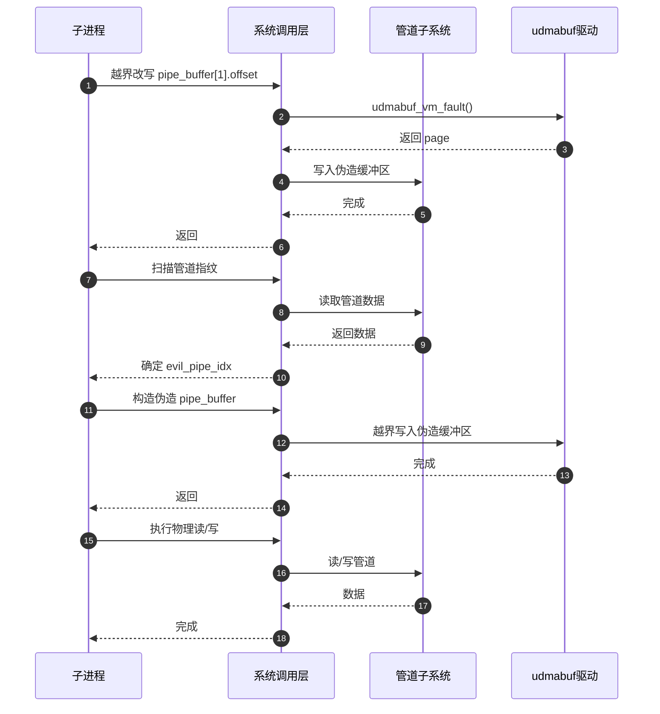
```mermaid
sequenceDiagram
    autonumber
    participant C as 子进程
    participant S as 系统调用层
    participant P as 管道子系统
    participant U as udmabuf驱动

    C->>S: 越界改写 pipe_buffer[1].offset
    S->>U: udmabuf_vm_fault()
    U-->>S: 返回 page
    S->>P: 写入伪造缓冲区
    P-->>S: 完成
    S-->>C: 返回

    C->>S: 扫描管道指纹
    S->>P: 读取管道数据
    P-->>S: 返回数据
    S-->>C: 确定 evil_pipe_idx

    C->>S: 构造伪造 pipe_buffer
    S->>U: 越界写入伪造缓冲区
    U-->>S: 完成
    S-->>C: 返回

    C->>S: 执行物理读/写
    S->>P: 读/写管道
    P-->>S: 数据
    S-->>C: 完成
```

### 4-8. 阶段 6：定位内核基址

获得物理读写能力后，子进程进入内核基址定位阶段。子进程从泄露的页指针出发，推导出一个候选的 `vmemmap` 基址，然后以固定步长向后扫描物理内存，寻找内核启动签名的特征值。该特征值位于内核代码段中，其低位具有唯一性。通过匹配该特征值，子进程可以确定 `vmemmap` 基址与内核基址，并计算 KASLR 偏移。这一阶段为后续定位 `task_struct` 提供了地址基础。

定位内核基址阶段的交互时序如下：

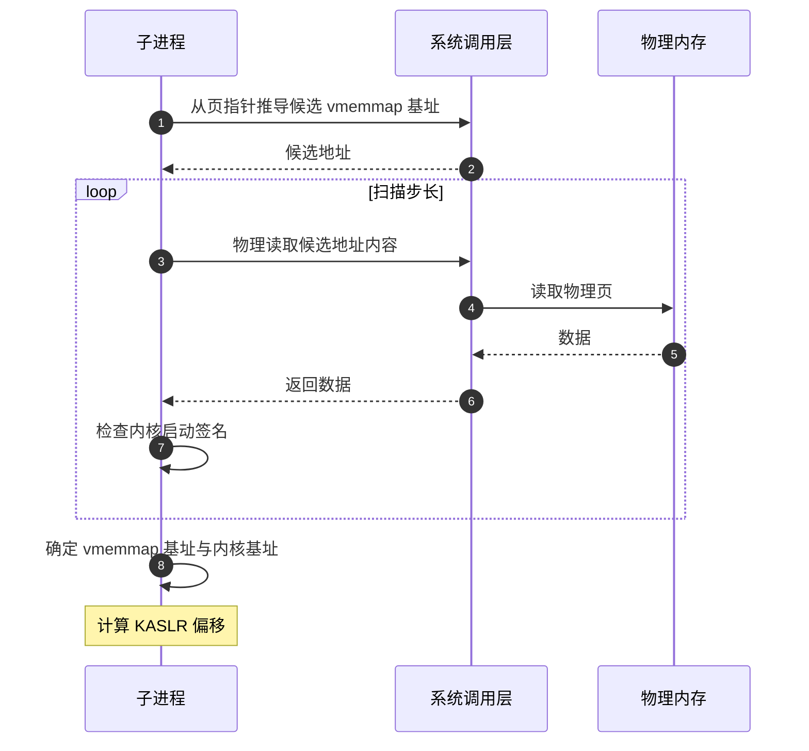
```mermaid
sequenceDiagram
    autonumber
    participant C as 子进程
    participant S as 系统调用层
    participant M as 物理内存

    C->>S: 从页指针推导候选 vmemmap 基址
    S-->>C: 候选地址

    loop 扫描步长
        C->>S: 物理读取候选地址内容
        S->>M: 读取物理页
        M-->>S: 数据
        S-->>C: 返回数据
        C->>C: 检查内核启动签名
    end

    C->>C: 确定 vmemmap 基址与内核基址
    Note over C: 计算 KASLR 偏移
```

### 4-9. 阶段 7：定位 task_struct

在内核基址确定后，子进程进入 `task_struct` 定位阶段。子进程通过物理读写原语扫描 `vmemmap` 数组所引用的物理页，寻找特定进程的 `comm` 字符串。父进程在 `fork` 之前已将自身名称设置为一个唯一字符串，root 进程则保留其默认名称。子进程在扫描过程中，不仅匹配 `comm` 字符串，还交叉验证其周围的关键字段，如 `cred` 指针、`parent` 指针等，以确保所定位的确实是目标 `task_struct`。通过这一方式，子进程可以获取父进程与 root 进程的 `task_struct` 虚拟地址，以及 root 进程的 `cred` 指针与 `nsproxy` 指针。

定位 `task_struct` 阶段的交互时序如下：

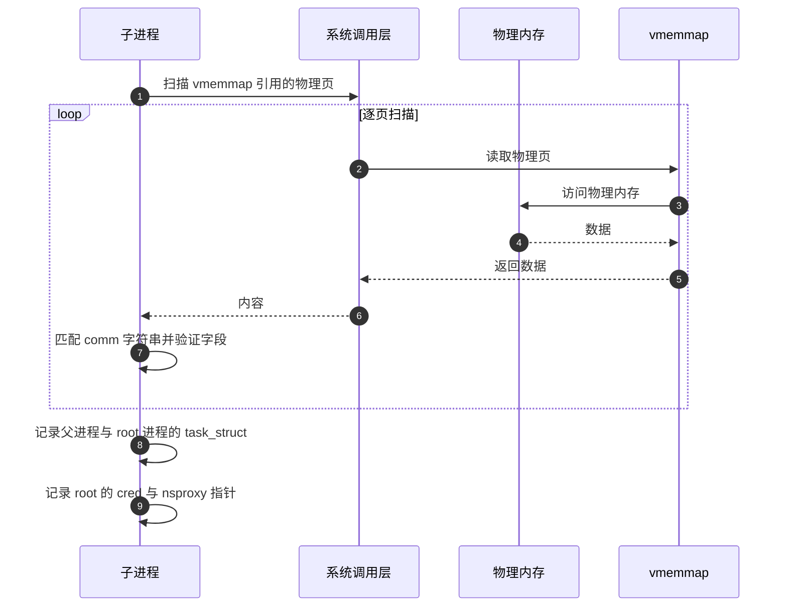
```mermaid
sequenceDiagram
    autonumber
    participant C as 子进程
    participant S as 系统调用层
    participant M as 物理内存
    participant V as vmemmap

    C->>S: 扫描 vmemmap 引用的物理页
    loop 逐页扫描
        S->>V: 读取物理页
        V->>M: 访问物理内存
        M-->>V: 数据
        V-->>S: 返回数据
        S-->>C: 内容
        C->>C: 匹配 comm 字符串并验证字段
    end

    C->>C: 记录父进程与 root 进程的 task_struct
    C->>C: 记录 root 的 cred 与 nsproxy 指针
```

### 4-10. 阶段 8：修改父进程 cred

在定位到父进程与 root 进程的 `task_struct` 后，子进程进入 `cred` 修改阶段。子进程通过物理读写原语，将父进程 `task_struct` 中的 `cred` 指针与 `nsproxy` 指针替换为 root 进程的对应值。具体而言，子进程修改三个字段：`cred`、`real_cred` 与 `nsproxy`。修改完成后，父进程在原始命名空间中即拥有完整的 root 权限。子进程随后通过同步管道通知父进程。

修改父进程 `cred` 阶段的交互时序如下：

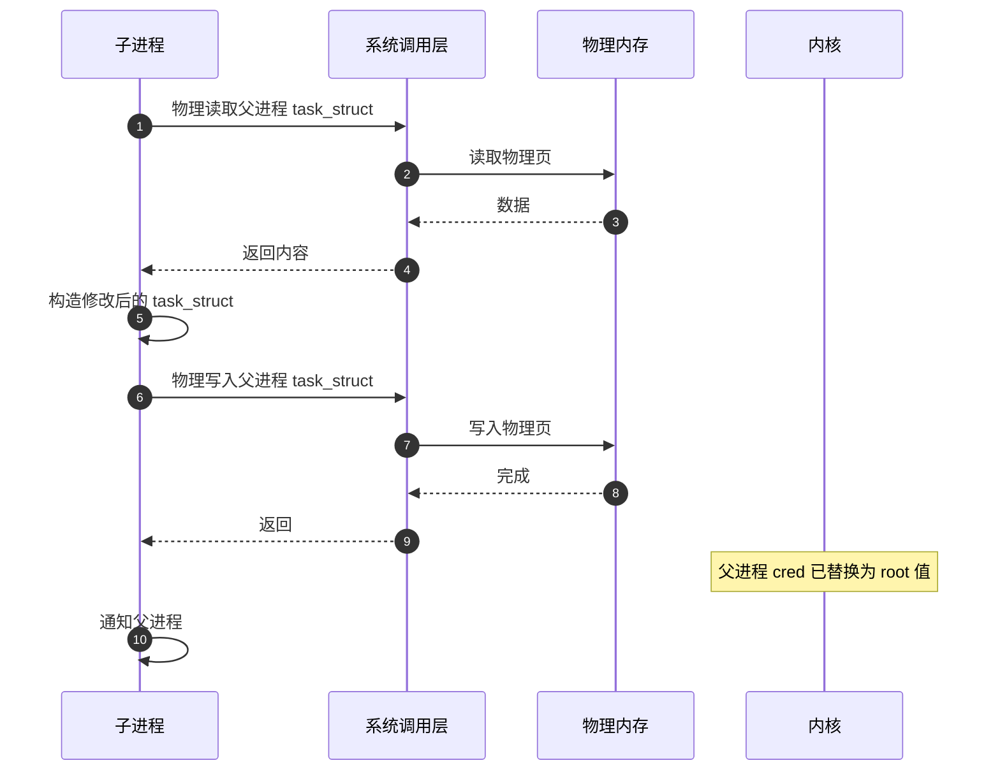
```mermaid
sequenceDiagram
    autonumber
    participant C as 子进程
    participant S as 系统调用层
    participant M as 物理内存
    participant K as 内核

    C->>S: 物理读取父进程 task_struct
    S->>M: 读取物理页
    M-->>S: 数据
    S-->>C: 返回内容

    C->>C: 构造修改后的 task_struct
    C->>S: 物理写入父进程 task_struct
    S->>M: 写入物理页
    M-->>S: 完成
    S-->>C: 返回

    Note over K: 父进程 cred 已替换为 root 值
    C->>C: 通知父进程
```

### 4-11. 阶段 9：执行 root shell

父进程在原始命名空间中等待子进程的同步信号。当收到成功标志后，父进程执行 root shell。由于父进程的 `cred` 与 `nsproxy` 已被替换为 root 进程的值，执行 shell 时将以 root 权限运行。若收到失败标志，父进程则安全退出。

执行 root shell 阶段的交互时序如下：

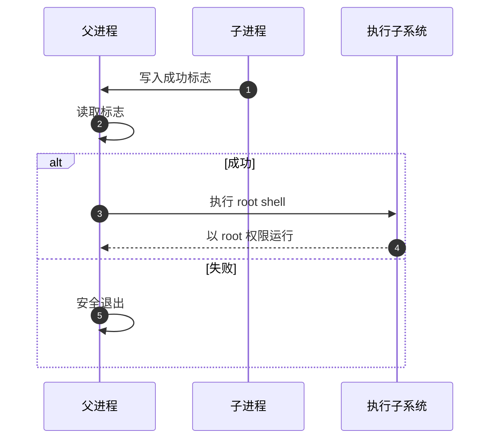
```mermaid
sequenceDiagram
    autonumber
    participant P as 父进程
    participant C as 子进程
    participant E as 执行子系统

    C->>P: 写入成功标志
    P->>P: 读取标志
    alt 成功
        P->>E: 执行 root shell
        E-->>P: 以 root 权限运行
    else 失败
        P->>P: 安全退出
    end
```

### 4-12. 内核保护机制的应对策略

思路二与思路一类似，均采用 data-only 路径，不执行内核代码，不依赖内核地址预测。所不同的是，思路二通过越界读取泄露 `pipe_buffer` 结构，构造物理读写原语，最终修改父进程 `cred`。下表逐项列出各保护机制的原理与本方案的应对策略。

| 保护机制                             | 机制原理                                                       | 本方案应对策略                                                                                                                                                                         |
| ------------------------------------ | -------------------------------------------------------------- | -------------------------------------------------------------------------------------------------------------------------------------------------------------------------------------- |
| **KASLR**                            | 随机化内核代码段、数据段和模块的加载基址。                     | 通过物理读写原语扫描内核启动签名，确定 `vmemmap` 基址与内核基址，从而计算 KASLR 偏移。不依赖预先泄露的地址。                                                                           |
| **SMEP/SMAP**                        | SMEP 阻止内核态执行用户态代码；SMAP 阻止内核态访问用户态数据。 | 不执行内核代码，所有操作通过物理读写原语完成。                                                                                                                                         |
| **KPTI**                             | 分离内核页表与用户页表。                                       | 全程通过合法系统调用与物理读写原语完成，不依赖用户态直接访问内核地址空间。                                                                                                             |
| **CONFIG_MEMCG / CONFIG_MEMCG_KMEM** | 为受控进程创建独立的 `kmalloc-cg-*` 缓存。                     | 方案中的 `pipe_buffer` 数组属于 `kmalloc-cg-*` 缓存，其 slab 页来自 buddy 分配器。页级堆风水操作针对 buddy 分配器的 order-2 物理页面，与 slab 缓存隔离无关。                           |
| **CONFIG_SLAB_FREELIST_RANDOM**      | 随机化 SLUB 空闲链表中的对象顺序。                             | 核心依赖 buddy 分配器的 order-2 物理页面相邻关系，该关系不受 SLUB 空闲链表随机化影响。`pipe_buffer` 数组在缓存内的具体槽位选择可能受随机化影响，但通过大量堆喷可覆盖足够多的 slab 页。 |
| **CONFIG_SLAB_FREELIST_HARDENED**    | 对空闲链表指针进行异或混淆。                                   | 基于 buddy 分配器的页面级布局，不依赖 SLUB 空闲链表指针覆写。                                                                                                                          |
| **CONFIG_HARDENED_USERCOPY**         | 在 `copy_to_user()` / `copy_from_user()` 路径中增加边界检查。  | 越界读取与写入发生在内核内部的缺页处理与管道读写路径中，不经过 `copy_to_user()` / `copy_from_user()` 路径，检查机制无法覆盖。                                                          |

整体而言，思路二通过越界读取、物理读写原语与 `cred` 修改等设计选择，有效规避了上述保护机制。其中，`CONFIG_SLAB_FREELIST_RANDOM` 可能对 `pipe_buffer` 数组在 slab 内的具体槽位选择产生轻微影响，但其影响可通过大规模堆喷予以消解；buddy 分配器层面的 order-2 页面相邻关系不受该机制影响。其余机制或与技术路径无关，或被设计选择从根本上规避。

### 4-13. 前提条件与局限性

**前提条件**：

1. 内核需启用 `CONFIG_UDMABUF`，且 `/dev/udmabuf` 对本地用户可访问。
2. 内核版本处于受影响的范围内。
3. 本地用户具备创建用户命名空间与网络命名空间的权限，并能在网络命名空间内创建 `AF_PACKET` 套接字。
4. 目标系统存在可用的管道与 SKB 喷射环境，以支持堆布局与 slab 块回收。

**局限性**：

1. 堆布局编排依赖 buddy 分配器与 SLUB 缓存的确定性行为，若系统中存在大量并发内存分配，可能影响布局稳定性。
2. 方案的有效性受目标内核配置与运行时环境影响，不同发行版或不同内核版本可能需要调整参数。
3. 物理内存扫描需要一定的时间与内存访问量，在内存较大的系统上可能耗时较长。
4. `cred` 修改依赖对 `task_struct` 字段偏移的准确掌握，不同内核版本可能存在差异。

### 4-14. 章节总结

本章介绍了 **CVE-2023-2008** 的第二种利用思路。与思路一直接修改页缓存不同，思路二将越界索引作为读取窗口，泄露相邻 slab 页中的 `pipe_buffer` 结构，进而构造物理读写原语，最终修改父进程 `task_struct` 中的 `cred`、`real_cred` 与 `nsproxy`，完成权限提升。方案仍采用父子进程协作架构：子进程在新命名空间中完成全部内核交互与内存布局操作，父进程留在原始命名空间中执行 root shell。本章将方案拆分为环境初始化、资源准备、堆布局编排、越界窗口构建、目标管道定位、物理读写原语构造、内核基址定位、`task_struct` 定位、`cred` 修改与 root shell 执行等阶段，并逐项分析了各阶段的关键操作与阶段间的衔接关系。每个阶段均以序列图呈现其交互时序，文字与图自然衔接。最后，本章梳理了现代内核保护机制对本方案的影响，并给出了相应的应对策略，同时列出了方案的前提条件与局限性。

整体来看，思路二通过越界读取与物理读写原语，在不修改页缓存的前提下实现了权限提升。堆布局编排仍是方案的核心，其稳定性决定了整体流程的可复现性；保护机制的应对策略则从设计层面规避了常见防御手段。与思路一相比，思路二不依赖 SUID 文件的页缓存修改，适用场景更广，但物理内存扫描与 `cred` 修改的复杂度更高。两种思路各有侧重，可根据目标环境的特点选择使用。

### 4-15. 测试结果

<div style="text-align: center; margin: 2rem 0;">
  
</div>

## 5. 漏洞修复

### 5-1. 修复补丁概述

**CVE-2023-2008** 的引入可追溯至 2018 年 9 月 11 日 Gerd Hoffmann 提交的 `7b26e4e2119d0c5ede1282b22ce2af22835ff4b5`，提交标题为“udmabuf: drop WARN_ON() check.”。该提交的报告者与审核者均为 Laurent Pinchart。提交的变更内容为从 `udmabuf_vm_fault()` 中删除三行代码：原本的 `if (WARN_ON(vmf->pgoff >= ubuf->pagecount)) return VM_FAULT_SIGBUS;` 及其后空行。删除后，函数直接以 `vmf->pgoff` 索引 `pages[]`，不再进行边界校验。该提交即为 **CVE-2023-2008** 的引入点。

修复则由提交 `05b252cccb2e5c3f56119d25de684b4f810ba40a` 完成，提交标题为“udmabuf: add back sanity check”。该提交由 Gerd Hoffmann 于 2022 年 6 月 20 日提交，经 Linus Torvalds 合并入主线。提交信息明确指出：“Check vm_fault->pgoff before using it. When we removed the warning, we also removed the check.”该补丁修复的问题正是 **CVE-2023-2008**，被修复的提交为 `7b26e4e2119d`，报告者为 ZDI，由 Linus Torvalds 建议修复方案。

### 5-2. 补丁的技术分析

引入提交 `7b26e4e` 的变更如下：

```diff
diff --git a/drivers/dma-buf/udmabuf.c b/drivers/dma-buf/udmabuf.c
index 5dd73bc511baf..63cc77edd1f32 100644
--- a/drivers/dma-buf/udmabuf.c
+++ b/drivers/dma-buf/udmabuf.c
@@ -25,9 +25,6 @@ static int udmabuf_vm_fault(struct vm_fault *vmf)
 	struct vm_area_struct *vma = vmf->vma;
 	struct udmabuf *ubuf = vma->vm_private_data;

-	if (WARN_ON(vmf->pgoff >= ubuf->pagecount))
-		return VM_FAULT_SIGBUS;
-
 	vmf->page = ubuf->pages[vmf->pgoff];
 	get_page(vmf->page);
 	return 0;
```

该变更删除了整个 `if` 语句，包括 `WARN_ON` 与 `return VM_FAULT_SIGBUS`。在删除之前，该语句在越界时记录警告并提前返回；删除之后，越界偏移会直接用于数组索引，数组之后的内存被读取并解释为页指针。

修复提交 `05b252c` 的变更如下：

```diff
diff --git a/drivers/dma-buf/udmabuf.c b/drivers/dma-buf/udmabuf.c
index e7330684d3b82..9631f2fd2faf7 100644
--- a/drivers/dma-buf/udmabuf.c
+++ b/drivers/dma-buf/udmabuf.c
@@ -32,8 +32,11 @@ static vm_fault_t udmabuf_vm_fault(struct vm_fault *vmf)
 {
 	struct vm_area_struct *vma = vmf->vma;
 	struct udmabuf *ubuf = vma->vm_private_data;
+	pgoff_t pgoff = vmf->pgoff;

-	vmf->page = ubuf->pages[vmf->pgoff];
+	if (pgoff >= ubuf->pagecount)
+		return VM_FAULT_SIGBUS;
+	vmf->page = ubuf->pages[pgoff];
 	get_page(vmf->page);
 	return 0;
 }
```

该修改包含三个关键变化。首先，补丁引入了一个局部变量 `pgoff`，将 `vmf->pgoff` 的值保存下来，使后续的检查与使用基于同一个值。其次，补丁在访问 `ubuf->pages[]` 之前增加了边界检查：若 `pgoff >= ubuf->pagecount`，则返回 `VM_FAULT_SIGBUS`，终止缺页处理流程。最后，补丁将数组访问改为使用局部变量 `pgoff`，与检查保持一致。修复后的实现以普通 `if` 语句完成边界校验，不再使用 `WARN_ON`。

### 5-3. 漏洞利用链的切断

在修复之前，`udmabuf_vm_fault()` 以 `vmf->pgoff` 索引 `pages[]` 时缺少边界检查，使得本地用户可以通过 `mmap()` 与 `mremap()` 构造越界偏移，读取数组之后的内存并将其解释为页指针。修复补丁加入的边界检查在越界偏移到达数组访问之前即返回 `VM_FAULT_SIGBUS`，从而切断了这一路径。

具体而言，当用户态访问越界页触发缺页时，`udmabuf_vm_fault()` 首先比较 `pgoff` 与 `ubuf->pagecount`。若 `pgoff` 不小于 `pagecount`，函数立即返回 `VM_FAULT_SIGBUS`，不会执行后续的 `vmf->page = ubuf->pages[pgoff]` 与 `get_page()`。这意味着越界偏移不再被用于索引数组，数组之后的内存不会被读取，也不会被解释为页指针并映射到用户态。

### 5-4. 补丁的演进意义

该补丁的演进意义体现在多个层面。从代码质量角度看，修复将边界检查以独立的 `if` 语句实现，使检查逻辑的意图更加明确。在 `7b26e4e` 提交之前，边界检查与 `WARN_ON` 合并在同一条 `if` 语句中，检查逻辑与调试语句耦合在一起；该提交删除整条语句时，检查逻辑也随之丢失。修复补丁将边界检查以普通 `if` 语句重新加入，使其作为独立的安全校验存在，不再与调试语句绑定。

从维护角度看，修复补丁的提交信息明确标注了其修复的提交（`Fixes: 7b26e4e2119d`），并引用了报告者与建议者信息。这种完整的溯源信息为后续维护者提供了清晰的上下文，便于理解补丁的必要性。

从安全开发角度看，该补丁提醒开发者，对用户可控的索引值进行边界校验应被视为不可省略的安全基线。在 `udmabuf_vm_fault()` 中，`vmf->pgoff` 由用户态 VMA 布局决定，属于用户可控值；在将其用于数组索引之前，必须验证其是否在合法范围内。

### 5-5. 修复版本与回溯状态

修复补丁已合并入主线，并向后移植到多个稳定分支。以下是各分支的修复版本与回溯状态：

| 受影响分支    | 受影响版本              | 修复版本        |
| ------------- | ----------------------- | --------------- |
| 4.20 – 5.4    | 4.20 至 5.4.202（不含） | 5.4.202         |
| 5.5 – 5.10    | 5.5 至 5.10.127（不含） | 5.10.127        |
| 5.11 – 5.15   | 5.11 至 5.15.51（不含） | 5.15.51         |
| 5.16 – 5.18   | 5.16 至 5.18.8（不含）  | 5.18.8          |
| 5.19 开发周期 | 5.19-rc4 之前           | 5.19-rc4 及之后 |

### 5-6. 安全开发启示

**CVE-2023-2008** 的修复案例提供了若干安全开发启示。首先，边界检查应与调试语句保持独立。`WARN_ON` 等调试宏适合记录异常，但不应将其与安全校验合并在同一条语句中；一旦整条语句被删除，安全校验也会随之丢失。安全关键逻辑应以显式、独立的形式呈现，使其在代码审查中易于识别，也降低后续维护中误删的风险。

其次，边界检查应被视为数组索引操作的必备环节，而非可选的防御措施。在 `udmabuf_vm_fault()` 中，`vmf->pgoff` 是用户可控的索引值，在将其用于访问 `pages[]` 之前，必须验证其是否小于 `pagecount`。这一原则适用于所有涉及用户可控索引的数组访问场景。

再次，稳定分支的修复应及时回溯。修复补丁在合并入主线后，被迅速移植到 5.4、5.10、5.15 等长期支持分支，覆盖了当时所有受影响的稳定版本。这种快速回溯机制确保了旧版本用户能够及时获得修复，避免长期暴露在已知缺陷之下。

最后，提交信息的完整溯源具有重要价值。修复补丁在提交信息中标注了引入缺陷的提交、报告者与建议者，为后续维护者提供了清晰的上下文。

## 6. 免责声明

本文档旨在提供 **CVE-2023-2008** 漏洞的技术分析与教育性内容，仅供学习、研究和安全防御目的使用。作者与发布平台对以下事项声明如下：

1. **合法使用原则**：本文档中描述的任何技术细节、代码示例或利用方法仅供教育研究之用。读者不得将这些信息用于任何非法、未经授权或恶意的活动，包括但不限于未经授权的系统入侵、数据破坏、服务干扰或其他违反法律法规的行为。

2. **知识共享与责任**：本文档基于公开可获取的信息、官方漏洞公告和学术研究资料编写。作者力求确保技术内容的准确性，但不对信息的完整性、时效性或适用性作任何明示或暗示的保证。读者应自行验证信息的准确性，并在专业环境中谨慎应用。

3. **环境限制**：所有技术分析和实验应在受控的、隔离的测试环境中进行，例如使用特制的虚拟机或专用硬件。禁止在任何生产环境、公共网络或他人系统中尝试漏洞利用或相关技术。

4. **法律合规性**：读者应遵守所在国家或地区的所有适用法律法规，包括但不限于计算机安全法、数据保护法和知识产权法。任何使用本文档内容的行为所产生的法律后果，由行为者自行承担。

5. **技术中立性**：本文档对漏洞的分析保持技术中立立场，旨在促进安全社区的防御能力提升。文中提及的任何工具、技术或方法不应被视为对任何组织、产品或技术的背书或批判。

6. **更新与修正**：技术领域发展迅速，本文档内容可能随时间而过时。作者保留更新、修正或撤回文档内容的权利，不承诺另行通知。

7. **版权声明**：本文档内容受版权法保护，未经明确书面许可，不得用于商业目的。允许在注明出处的前提下进行非商业性的分享与引用。

**重要提示**：安全研究应始终遵循道德准则，以提升整体网络安全为目标。如发现安全漏洞，建议通过负责任的披露流程向相关厂商或机构报告，共同维护数字生态的安全与稳定。

---

_本文档的撰写参考了公开的漏洞公告、内核源码（Linux 5.18.7）及相关技术分析文献。所有实验均在封闭的测试环境中完成，未对任何实际系统造成影响。_

## 参考

- https://github.com/BinRacer/pwn4cve/tree/master/src/CVE-2023-2008
- https://github.com/BinRacer/pwn4cve/tree/master/src/CVE-2023-2008_V2
- https://arttnba3.cn/2024/12/31/CVE-0X0B-CVE-2023-2008/
- https://access.redhat.com/errata/RHSA-2022:7933
- https://access.redhat.com/errata/RHSA-2022:8267
- https://access.redhat.com/errata/RHSA-2023:3465
- https://access.redhat.com/errata/RHSA-2023:3470
- https://access.redhat.com/errata/RHSA-2023:3490
- https://access.redhat.com/security/cve/cve-2023-2008
- https://bugzilla.redhat.com/show_bug.cgi?id=2186862
- https://git.kernel.org/pub/scm/linux/kernel/git/torvalds/linux.git/commit/?id=7b26e4e2119d0c5ede1282b22ce2af22835ff4b5
- https://git.kernel.org/pub/scm/linux/kernel/git/torvalds/linux.git/commit/?id=05b252cccb2e5c3f56119d25de684b4f810ba40a
- https://nvd.nist.gov/vuln/detail/CVE-2023-2008
- https://ubuntu.com/security/CVE-2023-2008
